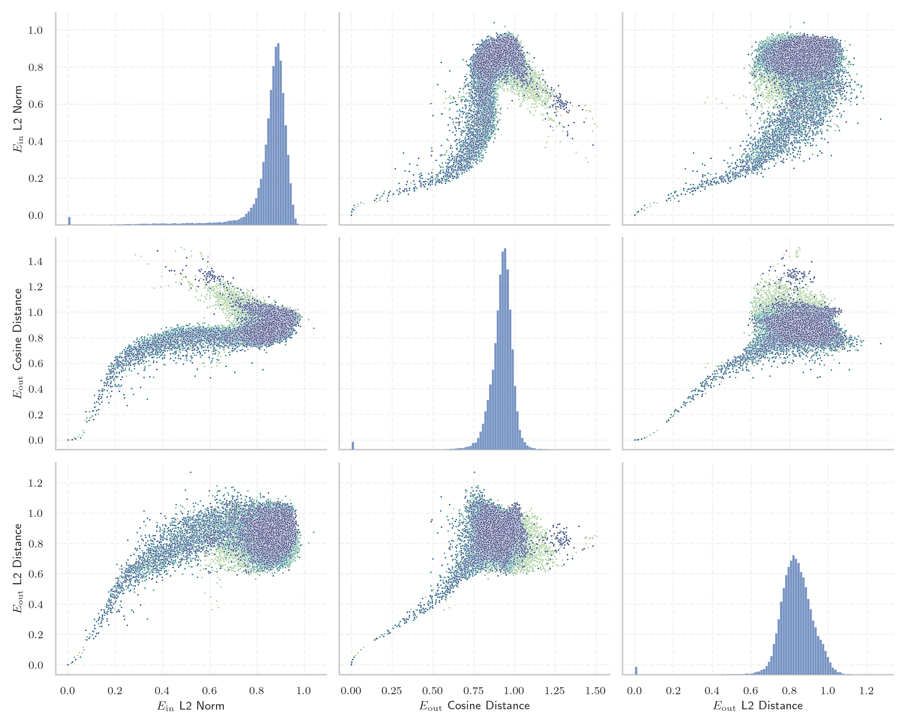
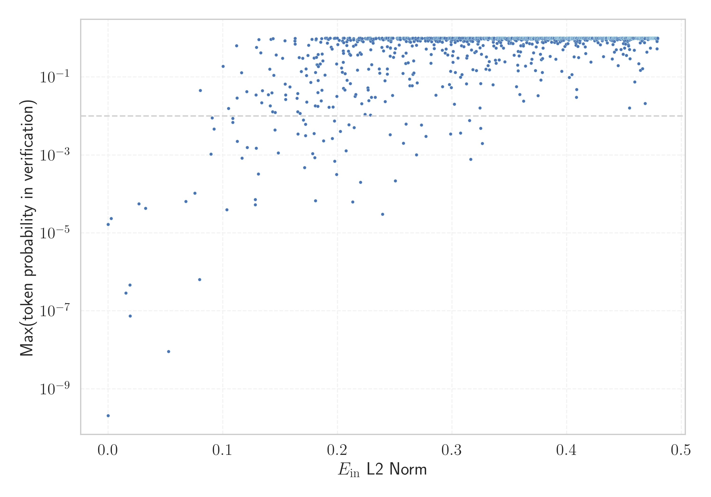

# Report for `01-ai/Yi-1.5-9B`

## Model info

* Model Info: 
  * Tied embeddings: False
  * LM head uses bias: False
  * Embeddings shape: [64000, 4096]
* Tokenizer Info: 
  * Vocab Size: 64000
  * Tokenizer Class: LlamaTokenizer
  * Tokenizer Type: BPE
  * Bytes handling: Byte Fallback
  * Token for verification prompt building: Acknowledgements
  * Token id for verification prompt building: 35477
* Indicator summary: 
  * Indicator for under-trained tokens: E_{in} L2 Norm
  * Overall distribution: 0.849 +/- 0.114
* Detected Token Counts: 
  * Number of tested under-trained tokens: 1274, 1261 non-special, 61 below p = 0.01 threshold, 19 below soft indicator threshold
  * Number of single byte tokens: 354, of which 112 below indicator threshold
  * Number of special tokens: 4, of which 3 below indicator threshold
  * Number of non-single-byte unreachable tokens: 4, of which 3 below indicator threshold

## Under-trained token indicators plot


## Verification plot


## Under-trained token verification results
19 entries below threshold of 0.109

|   token_id | token                       |   indicator | max_prob                                                         | in_other_tokens                                                                                                                                                                                                                                                                                                                                                                                               |
|------------|-----------------------------|-------------|------------------------------------------------------------------|---------------------------------------------------------------------------------------------------------------------------------------------------------------------------------------------------------------------------------------------------------------------------------------------------------------------------------------------------------------------------------------------------------------|
|      58458 | ````` \\+::\\+ `````        | 1.85121e-06 | <span style='border: 1px solid rgb(169, 68, 66);'>1.7e-05</span> |                                                                                                                                                                                                                                                                                                                                                                                                               |
|      38185 | ````` \\+\\_\\+\\+ `````    | 1.86316e-06 | <span style='border: 1px solid rgb(169, 68, 66);'>1.7e-05</span> |                                                                                                                                                                                                                                                                                                                                                                                                               |
|      26510 | ````` \\+\\_\\+ `````       | 0.00266642  | <span style='border: 1px solid rgb(169, 68, 66);'>2.4e-05</span> | <span style='border: 1px solid rgb(169, 68, 66);'>````` \\+\\_\\+\\+ `````</span>                                                                                                                                                                                                                                                                                                                             |
|      32010 | ````` mabaochang `````      | 0.0155636   | <span style='border: 1px solid rgb(169, 68, 66);'>2.9e-07</span> |                                                                                                                                                                                                                                                                                                                                                                                                               |
|      31174 | ````` \\+:: `````           | 0.0189494   | <span style='border: 1px solid rgb(169, 68, 66);'>4.6e-07</span> | <span style='border: 1px solid rgb(169, 68, 66);'>````` \\+::\\+ `````</span>                                                                                                                                                                                                                                                                                                                                 |
|      52345 | ````` nzoem `````           | 0.0192562   | <span style='border: 1px solid rgb(169, 68, 66);'>7.4e-08</span> |                                                                                                                                                                                                                                                                                                                                                                                                               |
|      19111 | ````` \\+\\_\\ `````        | 0.0269179   | <span style='border: 1px solid rgb(169, 68, 66);'>5.6e-05</span> | <span style='border: 1px solid rgb(169, 68, 66);'>````` \\+\\_\\+ `````</span>, <span style='border: 1px solid rgb(169, 68, 66);'>````` \\+\\_\\+\\+ `````</span>                                                                                                                                                                                                                                             |
|      58973 | ````` Разпространение ````` | 0.0326874   | <span style='border: 1px solid rgb(169, 68, 66);'>4.3e-05</span> |                                                                                                                                                                                                                                                                                                                                                                                                               |
|      41270 | ````` mcited `````          | 0.0526084   | <span style='border: 1px solid rgb(169, 68, 66);'>9e-09</span>   | <span style='border: 1px solid rgb(251, 189, 8);'>````` mcitedefault `````</span>                                                                                                                                                                                                                                                                                                                             |
|      14378 | ````` ":"\ufeff `````       | 0.0676918   | <span style='border: 1px solid rgb(169, 68, 66);'>6.5e-05</span> |                                                                                                                                                                                                                                                                                                                                                                                                               |
|      53246 | ````` mrrooter `````        | 0.0756593   | <span style='border: 1px solid rgb(169, 68, 66);'>0.00011</span> |                                                                                                                                                                                                                                                                                                                                                                                                               |
|      52955 | ````` Родени `````          | 0.0796883   | <span style='border: 1px solid rgb(169, 68, 66);'>6.3e-07</span> |                                                                                                                                                                                                                                                                                                                                                                                                               |
|      19290 | ````` мври `````            | 0.0803591   | <span style='border: 1px solid rgb(251, 189, 8);'>0.046</span>   | <span style='border: 1px solid rgb(255, 145, 0);'>````` птември `````</span>, <span style='border: 1px solid rgb(169, 68, 66);'>````` ктомври `````</span>, <span style='border: 1px solid rgb(40, 167, 69);'>````` ▁септември `````</span>, <span style='border: 1px solid rgb(40, 167, 69);'>````` ▁октомври `````</span>, <span style='border: 1px solid rgb(169, 68, 66);'>````` кември `````</span>, ... |
|      58052 | ````` евру `````            | 0.0896728   | <span style='border: 1px solid rgb(255, 145, 0);'>0.0011</span>  | <span style='border: 1px solid rgb(255, 145, 0);'>````` евруари `````</span>                                                                                                                                                                                                                                                                                                                                  |
|      18479 | ````` +\\_\\ `````          | 0.0907117   | <span style='border: 1px solid rgb(255, 145, 0);'>0.0089</span>  | <span style='border: 1px solid rgb(169, 68, 66);'>````` \\+\\_\\ `````</span>, <span style='border: 1px solid rgb(169, 68, 66);'>````` \\+\\_\\+ `````</span>, <span style='border: 1px solid rgb(169, 68, 66);'>````` \\+\\_\\+\\+ `````</span>                                                                                                                                                              |
|      20714 | ````` Източници `````       | 0.0924864   | <span style='border: 1px solid rgb(255, 145, 0);'>0.0046</span>  |                                                                                                                                                                                                                                                                                                                                                                                                               |
|       1062 | ````` vepfs `````           | 0.100167    | <span style='border: 1px solid rgb(40, 167, 69);'>0.19</span>    |                                                                                                                                                                                                                                                                                                                                                                                                               |
|      27852 | ````` ▁препратки `````      | 0.103493    | <span style='border: 1px solid rgb(169, 68, 66);'>4e-05</span>   |                                                                                                                                                                                                                                                                                                                                                                                                               |
|      53979 | ````` ▁$\\\|\\ `````        | 0.105       | <span style='border: 1px solid rgb(251, 189, 8);'>0.016</span>   |                                                                                                                                                                                                                                                                                                                                                                                                               |
<details><summary>1242 additional entries above threshold</summary>

|   token_id | token                        |   indicator | max_prob                                                         | in_other_tokens                                                                                                                                                                                                                                                                                                                                        |
|------------|------------------------------|-------------|------------------------------------------------------------------|--------------------------------------------------------------------------------------------------------------------------------------------------------------------------------------------------------------------------------------------------------------------------------------------------------------------------------------------------------|
|      44047 | ````` mrroot `````           |    0.108686 | <span style='border: 1px solid rgb(255, 145, 0);'>0.0069</span>  | <span style='border: 1px solid rgb(169, 68, 66);'>````` mrrooter `````</span>                                                                                                                                                                                                                                                                          |
|      55040 | ````` _{(\\ `````            |    0.10873  | <span style='border: 1px solid rgb(255, 145, 0);'>0.0087</span>  |                                                                                                                                                                                                                                                                                                                                                        |
|      47523 | ````` Бележки `````          |    0.112086 | <span style='border: 1px solid rgb(40, 167, 69);'>0.64</span>    |                                                                                                                                                                                                                                                                                                                                                        |
|      47419 | ````` []{\\ `````            |    0.112484 | <span style='border: 1px solid rgb(251, 189, 8);'>0.029</span>   |                                                                                                                                                                                                                                                                                                                                                        |
|      45501 | ````` }$\\\\\ `````          |    0.112664 | <span style='border: 1px solid rgb(255, 145, 0);'>0.0022</span>  |                                                                                                                                                                                                                                                                                                                                                        |
|      44270 | ````` ^*(\\ `````            |    0.116298 | <span style='border: 1px solid rgb(40, 167, 69);'>0.13</span>    |                                                                                                                                                                                                                                                                                                                                                        |
|      47647 | ````` nConsequently `````    |    0.116848 | <span style='border: 1px solid rgb(169, 68, 66);'>0.00083</span> |                                                                                                                                                                                                                                                                                                                                                        |
|      43942 | ````` ▁селото `````          |    0.120892 | <span style='border: 1px solid rgb(251, 189, 8);'>0.042</span>   |                                                                                                                                                                                                                                                                                                                                                        |
|      58699 | ````` nUltimately `````      |    0.12137  | <span style='border: 1px solid rgb(255, 145, 0);'>0.0016</span>  |                                                                                                                                                                                                                                                                                                                                                        |
|      59159 | ````` )&=&\\ `````           |    0.128311 | <span style='border: 1px solid rgb(169, 68, 66);'>5.3e-05</span> |                                                                                                                                                                                                                                                                                                                                                        |
|      11333 | ````` ▁[…]\ `````            |    0.128339 | <span style='border: 1px solid rgb(169, 68, 66);'>7.2e-05</span> |                                                                                                                                                                                                                                                                                                                                                        |
|      27952 | ````` Външни `````           |    0.128899 | <span style='border: 1px solid rgb(251, 189, 8);'>0.035</span>   |                                                                                                                                                                                                                                                                                                                                                        |
|      45676 | ````` nWASHINGTON `````      |    0.12919  | <span style='border: 1px solid rgb(255, 145, 0);'>0.0015</span>  |                                                                                                                                                                                                                                                                                                                                                        |
|      27655 | ````` Вън `````              |    0.129357 | <span style='border: 1px solid rgb(40, 167, 69);'>0.58</span>    | <span style='border: 1px solid rgb(251, 189, 8);'>````` Външни `````</span>                                                                                                                                                                                                                                                                            |
|      57778 | ````` }=(\\ `````            |    0.131137 | <span style='border: 1px solid rgb(169, 68, 66);'>0.00033</span> |                                                                                                                                                                                                                                                                                                                                                        |
|      50472 | ````` ’”\ `````              |    0.131529 | <span style='border: 1px solid rgb(40, 167, 69);'>0.92</span>    |                                                                                                                                                                                                                                                                                                                                                        |
|      54580 | ````` }--\\ `````            |    0.133088 | <span style='border: 1px solid rgb(40, 167, 69);'>0.42</span>    |                                                                                                                                                                                                                                                                                                                                                        |
|      37421 | ````` …”\ `````              |    0.133935 | <span style='border: 1px solid rgb(251, 189, 8);'>0.022</span>   |                                                                                                                                                                                                                                                                                                                                                        |
|      38169 | ````` }^{(\\ `````           |    0.13464  | <span style='border: 1px solid rgb(251, 189, 8);'>0.045</span>   |                                                                                                                                                                                                                                                                                                                                                        |
|      55282 | ````` nResearchers `````     |    0.139737 | <span style='border: 1px solid rgb(251, 189, 8);'>0.035</span>   |                                                                                                                                                                                                                                                                                                                                                        |
|      58677 | ````` $\\%$ `````            |    0.141033 | <span style='border: 1px solid rgb(40, 167, 69);'>0.16</span>    |                                                                                                                                                                                                                                                                                                                                                        |
|      22613 | ````` ▁$\\{\\ `````          |    0.141458 | <span style='border: 1px solid rgb(251, 189, 8);'>0.018</span>   |                                                                                                                                                                                                                                                                                                                                                        |
|      53069 | ````` nquantum `````         |    0.141925 | <span style='border: 1px solid rgb(40, 167, 69);'>0.93</span>    |                                                                                                                                                                                                                                                                                                                                                        |
|      37027 | ````` nClearly `````         |    0.142786 | <span style='border: 1px solid rgb(251, 189, 8);'>0.039</span>   |                                                                                                                                                                                                                                                                                                                                                        |
|      59474 | ````` }}^\\ `````            |    0.143516 | <span style='border: 1px solid rgb(251, 189, 8);'>0.013</span>   |                                                                                                                                                                                                                                                                                                                                                        |
|      26341 | ````` nrespect `````         |    0.143822 | <span style='border: 1px solid rgb(40, 167, 69);'>0.97</span>    | <span style='border: 1px solid rgb(40, 167, 69);'>````` nrespectively `````</span>                                                                                                                                                                                                                                                                     |
|      50269 | ````` nRather `````          |    0.144382 | <span style='border: 1px solid rgb(40, 167, 69);'>0.11</span>    |                                                                                                                                                                                                                                                                                                                                                        |
|      57958 | ````` }&=&\\ `````           |    0.145466 | <span style='border: 1px solid rgb(255, 145, 0);'>0.0044</span>  |                                                                                                                                                                                                                                                                                                                                                        |
|      37655 | ````` nNevertheless `````    |    0.145812 | <span style='border: 1px solid rgb(251, 189, 8);'>0.012</span>   |                                                                                                                                                                                                                                                                                                                                                        |
|      46922 | ````` ;\\;\\;\\;\\ `````     |    0.146552 | <span style='border: 1px solid rgb(40, 167, 69);'>0.37</span>    |                                                                                                                                                                                                                                                                                                                                                        |
|      45337 | ````` nInterestingly `````   |    0.14831  | <span style='border: 1px solid rgb(255, 145, 0);'>0.0011</span>  |                                                                                                                                                                                                                                                                                                                                                        |
|      42242 | ````` nPersonally `````      |    0.152094 | <span style='border: 1px solid rgb(40, 167, 69);'>0.3</span>     |                                                                                                                                                                                                                                                                                                                                                        |
|      57541 | ````` nconsidered `````      |    0.154167 | <span style='border: 1px solid rgb(40, 167, 69);'>0.86</span>    |                                                                                                                                                                                                                                                                                                                                                        |
|      47304 | ````` nSecondly `````        |    0.154328 | <span style='border: 1px solid rgb(251, 189, 8);'>0.066</span>   |                                                                                                                                                                                                                                                                                                                                                        |
|       1095 | ````` redpajama `````        |    0.154732 | <span style='border: 1px solid rgb(251, 189, 8);'>0.035</span>   |                                                                                                                                                                                                                                                                                                                                                        |
|      31761 | ````` ▁\\]\ `````            |    0.154815 | <span style='border: 1px solid rgb(251, 189, 8);'>0.027</span>   |                                                                                                                                                                                                                                                                                                                                                        |
|      41844 | ````` nRegarding `````       |    0.158534 | <span style='border: 1px solid rgb(251, 189, 8);'>0.056</span>   |                                                                                                                                                                                                                                                                                                                                                        |
|      57483 | ````` napproach `````        |    0.162967 | <span style='border: 1px solid rgb(40, 167, 69);'>0.84</span>    |                                                                                                                                                                                                                                                                                                                                                        |
|      54548 | ````` &$\\ `````             |    0.16299  | <span style='border: 1px solid rgb(40, 167, 69);'>0.98</span>    |                                                                                                                                                                                                                                                                                                                                                        |
|      39373 | ````` napproxim `````        |    0.163161 | <span style='border: 1px solid rgb(40, 167, 69);'>0.71</span>    |                                                                                                                                                                                                                                                                                                                                                        |
|      49889 | ````` nFortunately `````     |    0.164719 | <span style='border: 1px solid rgb(251, 189, 8);'>0.029</span>   |                                                                                                                                                                                                                                                                                                                                                        |
|      45624 | ````` nRegardless `````      |    0.165298 | <span style='border: 1px solid rgb(251, 189, 8);'>0.038</span>   |                                                                                                                                                                                                                                                                                                                                                        |
|      53691 | ````` }}_\\ `````            |    0.165451 | <span style='border: 1px solid rgb(251, 189, 8);'>0.013</span>   |                                                                                                                                                                                                                                                                                                                                                        |
|      35932 | ````` )}_{\\ `````           |    0.165614 | <span style='border: 1px solid rgb(255, 145, 0);'>0.0035</span>  |                                                                                                                                                                                                                                                                                                                                                        |
|      48827 | ````` tvolatile `````        |    0.166617 | <span style='border: 1px solid rgb(40, 167, 69);'>0.32</span>    |                                                                                                                                                                                                                                                                                                                                                        |
|      33785 | ````` nObviously `````       |    0.167498 | <span style='border: 1px solid rgb(251, 189, 8);'>0.012</span>   |                                                                                                                                                                                                                                                                                                                                                        |
|      54413 | ````` nEventually `````      |    0.168381 | <span style='border: 1px solid rgb(40, 167, 69);'>0.14</span>    |                                                                                                                                                                                                                                                                                                                                                        |
|      24417 | ````` ~{\\ `````             |    0.169708 | <span style='border: 1px solid rgb(40, 167, 69);'>0.3</span>     |                                                                                                                                                                                                                                                                                                                                                        |
|      46113 | ````` }=\\{ `````            |    0.170297 | <span style='border: 1px solid rgb(255, 145, 0);'>0.0079</span>  |                                                                                                                                                                                                                                                                                                                                                        |
|      36357 | ````` nThroughout `````      |    0.171289 | <span style='border: 1px solid rgb(169, 68, 66);'>0.00048</span> |                                                                                                                                                                                                                                                                                                                                                        |
|      42668 | ````` nLastly `````          |    0.172196 | <span style='border: 1px solid rgb(255, 145, 0);'>0.0061</span>  |                                                                                                                                                                                                                                                                                                                                                        |
|      46451 | ````` \\\|_{\\ `````         |    0.172251 | <span style='border: 1px solid rgb(255, 145, 0);'>0.0031</span>  |                                                                                                                                                                                                                                                                                                                                                        |
|      52625 | ````` nmagnetic `````        |    0.172672 | <span style='border: 1px solid rgb(40, 167, 69);'>0.16</span>    |                                                                                                                                                                                                                                                                                                                                                        |
|      31065 | ````` \\%) `````             |    0.17311  | <span style='border: 1px solid rgb(40, 167, 69);'>0.11</span>    |                                                                                                                                                                                                                                                                                                                                                        |
|      52211 | ````` nFirstly `````         |    0.173311 | <span style='border: 1px solid rgb(251, 189, 8);'>0.023</span>   |                                                                                                                                                                                                                                                                                                                                                        |
|      32202 | ````` nrespectively `````    |    0.174313 | <span style='border: 1px solid rgb(40, 167, 69);'>0.36</span>    |                                                                                                                                                                                                                                                                                                                                                        |
|       5340 | ````` RedPajama `````        |    0.174858 | <span style='border: 1px solid rgb(40, 167, 69);'>0.66</span>    |                                                                                                                                                                                                                                                                                                                                                        |
|      55595 | ````` nhowever `````         |    0.17666  | <span style='border: 1px solid rgb(251, 189, 8);'>0.073</span>   |                                                                                                                                                                                                                                                                                                                                                        |
|      53580 | ````` nassociated `````      |    0.177754 | <span style='border: 1px solid rgb(40, 167, 69);'>0.93</span>    |                                                                                                                                                                                                                                                                                                                                                        |
|      59512 | ````` )^{-\\ `````           |    0.178479 | <span style='border: 1px solid rgb(255, 145, 0);'>0.0011</span>  |                                                                                                                                                                                                                                                                                                                                                        |
|      54404 | ````` })^{\\ `````           |    0.179533 | <span style='border: 1px solid rgb(255, 145, 0);'>0.0035</span>  |                                                                                                                                                                                                                                                                                                                                                        |
|      58028 | ````` ▁дъщер `````           |    0.179599 | <span style='border: 1px solid rgb(40, 167, 69);'>0.31</span>    |                                                                                                                                                                                                                                                                                                                                                        |
|      16963 | ````` }({\\ `````            |    0.180187 | <span style='border: 1px solid rgb(169, 68, 66);'>0.00085</span> |                                                                                                                                                                                                                                                                                                                                                        |
|      59020 | ````` ":"/*\ `````           |    0.180587 | <span style='border: 1px solid rgb(251, 189, 8);'>0.018</span>   |                                                                                                                                                                                                                                                                                                                                                        |
|      58456 | ````` })\\\\\ `````          |    0.180858 | <span style='border: 1px solid rgb(169, 68, 66);'>6.7e-05</span> |                                                                                                                                                                                                                                                                                                                                                        |
|      58364 | ````` }+{\\ `````            |    0.180954 | <span style='border: 1px solid rgb(40, 167, 69);'>0.13</span>    |                                                                                                                                                                                                                                                                                                                                                        |
|      34141 | ````` nFIG `````             |    0.181306 | <span style='border: 1px solid rgb(40, 167, 69);'>0.9</span>     |                                                                                                                                                                                                                                                                                                                                                        |
|      53931 | ````` nSimplify `````        |    0.181524 | <span style='border: 1px solid rgb(40, 167, 69);'>0.96</span>    |                                                                                                                                                                                                                                                                                                                                                        |
|      50759 | ````` nGenerally `````       |    0.181602 | <span style='border: 1px solid rgb(40, 167, 69);'>0.32</span>    |                                                                                                                                                                                                                                                                                                                                                        |
|      28357 | ````` nBesides `````         |    0.182067 | <span style='border: 1px solid rgb(40, 167, 69);'>0.21</span>    |                                                                                                                                                                                                                                                                                                                                                        |
|      38615 | ````` ▁$\\\| `````           |    0.182623 | <span style='border: 1px solid rgb(40, 167, 69);'>0.2</span>     | <span style='border: 1px solid rgb(251, 189, 8);'>````` ▁$\\\|\\ `````</span>                                                                                                                                                                                                                                                                          |
|      56126 | ````` ":"「 `````            |    0.182846 | <span style='border: 1px solid rgb(251, 189, 8);'>0.04</span>    |                                                                                                                                                                                                                                                                                                                                                        |
|      52323 | ````` }-{\\ `````            |    0.182948 | <span style='border: 1px solid rgb(251, 189, 8);'>0.018</span>   |                                                                                                                                                                                                                                                                                                                                                        |
|      18027 | ````` nMoreover `````        |    0.183183 | <span style='border: 1px solid rgb(251, 189, 8);'>0.081</span>   |                                                                                                                                                                                                                                                                                                                                                        |
|      46457 | ````` nApparently `````      |    0.18319  | <span style='border: 1px solid rgb(40, 167, 69);'>0.38</span>    |                                                                                                                                                                                                                                                                                                                                                        |
|      37488 | ````` ▁$-\\ `````            |    0.183259 | <span style='border: 1px solid rgb(40, 167, 69);'>0.18</span>    |                                                                                                                                                                                                                                                                                                                                                        |
|      51711 | ````` ":"（ `````            |    0.185021 | <span style='border: 1px solid rgb(40, 167, 69);'>0.22</span>    |                                                                                                                                                                                                                                                                                                                                                        |
|      34587 | ````` ▁$[\\ `````            |    0.185429 | <span style='border: 1px solid rgb(40, 167, 69);'>0.78</span>    |                                                                                                                                                                                                                                                                                                                                                        |
|      34224 | ````` \|_{\\ `````           |    0.18587  | <span style='border: 1px solid rgb(251, 189, 8);'>0.024</span>   | <span style='border: 1px solid rgb(255, 145, 0);'>````` \\\|_{\\ `````</span>                                                                                                                                                                                                                                                                          |
|      50597 | ````` nparticular `````      |    0.18627  | <span style='border: 1px solid rgb(40, 167, 69);'>0.97</span>    |                                                                                                                                                                                                                                                                                                                                                        |
|      58452 | ````` ▁&=&\\ `````           |    0.186458 | <span style='border: 1px solid rgb(251, 189, 8);'>0.046</span>   |                                                                                                                                                                                                                                                                                                                                                        |
|      53537 | ````` ▁албу `````            |    0.186677 | <span style='border: 1px solid rgb(40, 167, 69);'>0.39</span>    |                                                                                                                                                                                                                                                                                                                                                        |
|      39987 | ````` nBasically `````       |    0.187183 | <span style='border: 1px solid rgb(40, 167, 69);'>0.26</span>    |                                                                                                                                                                                                                                                                                                                                                        |
|      45474 | ````` ]^{\\ `````            |    0.187848 | <span style='border: 1px solid rgb(255, 145, 0);'>0.0023</span>  |                                                                                                                                                                                                                                                                                                                                                        |
|      54430 | ````` \\%} `````             |    0.189191 | <span style='border: 1px solid rgb(40, 167, 69);'>0.11</span>    |                                                                                                                                                                                                                                                                                                                                                        |
|      51317 | ````` nAside `````           |    0.189607 | <span style='border: 1px solid rgb(40, 167, 69);'>1</span>       |                                                                                                                                                                                                                                                                                                                                                        |
|      55203 | ````` ninteraction `````     |    0.190717 | <span style='border: 1px solid rgb(40, 167, 69);'>1</span>       |                                                                                                                                                                                                                                                                                                                                                        |
|      56651 | ````` nABOUT `````           |    0.191269 | <span style='border: 1px solid rgb(40, 167, 69);'>0.75</span>    |                                                                                                                                                                                                                                                                                                                                                        |
|       7956 | ````` ~(\\ `````             |    0.191596 | <span style='border: 1px solid rgb(40, 167, 69);'>0.94</span>    |                                                                                                                                                                                                                                                                                                                                                        |
|      45484 | ````` ncorrespond `````      |    0.1922   | <span style='border: 1px solid rgb(40, 167, 69);'>0.93</span>    |                                                                                                                                                                                                                                                                                                                                                        |
|      48085 | ````` )=-\\ `````            |    0.192732 | <span style='border: 1px solid rgb(251, 189, 8);'>0.017</span>   |                                                                                                                                                                                                                                                                                                                                                        |
|      52500 | ````` ▁крал `````            |    0.193684 | <span style='border: 1px solid rgb(40, 167, 69);'>0.99</span>    |                                                                                                                                                                                                                                                                                                                                                        |
|      46115 | ````` ▁{$\\ `````            |    0.194419 | <span style='border: 1px solid rgb(40, 167, 69);'>0.58</span>    |                                                                                                                                                                                                                                                                                                                                                        |
|      42298 | ````` nSpecifically `````    |    0.195383 | <span style='border: 1px solid rgb(40, 167, 69);'>0.53</span>    |                                                                                                                                                                                                                                                                                                                                                        |
|      37452 | ````` }=-\\ `````            |    0.195574 | <span style='border: 1px solid rgb(255, 145, 0);'>0.0027</span>  |                                                                                                                                                                                                                                                                                                                                                        |
|      31425 | ````` )_{\\ `````            |    0.19622  | <span style='border: 1px solid rgb(251, 189, 8);'>0.017</span>   |                                                                                                                                                                                                                                                                                                                                                        |
|      38853 | ````` nobtained `````        |    0.1972   | <span style='border: 1px solid rgb(40, 167, 69);'>0.98</span>    |                                                                                                                                                                                                                                                                                                                                                        |
|      52422 | ````` nDepending `````       |    0.197315 | <span style='border: 1px solid rgb(255, 145, 0);'>0.0075</span>  |                                                                                                                                                                                                                                                                                                                                                        |
|      50497 | ````` }{(\\ `````            |    0.197664 | <span style='border: 1px solid rgb(169, 68, 66);'>0.0007</span>  |                                                                                                                                                                                                                                                                                                                                                        |
|      57326 | ````` nJosh `````            |    0.19798  | <span style='border: 1px solid rgb(40, 167, 69);'>1</span>       |                                                                                                                                                                                                                                                                                                                                                        |
|      45065 | ````` ръц `````              |    0.19933  | <span style='border: 1px solid rgb(169, 68, 66);'>0.00032</span> |                                                                                                                                                                                                                                                                                                                                                        |
|      57605 | ````` ntherefore `````       |    0.19937  | <span style='border: 1px solid rgb(40, 167, 69);'>0.22</span>    |                                                                                                                                                                                                                                                                                                                                                        |
|      31370 | ````` nUnlike `````          |    0.199434 | <span style='border: 1px solid rgb(251, 189, 8);'>0.032</span>   |                                                                                                                                                                                                                                                                                                                                                        |
|      32247 | ````` comtag `````           |    0.199935 | <span style='border: 1px solid rgb(40, 167, 69);'>0.99</span>    |                                                                                                                                                                                                                                                                                                                                                        |
|      44562 | ````` nWhatever `````        |    0.200264 | <span style='border: 1px solid rgb(40, 167, 69);'>0.68</span>    |                                                                                                                                                                                                                                                                                                                                                        |
|      21953 | ````` $\\\\\ `````           |    0.201615 | <span style='border: 1px solid rgb(40, 167, 69);'>0.88</span>    | <span style='border: 1px solid rgb(255, 145, 0);'>````` }$\\\\\ `````</span>                                                                                                                                                                                                                                                                           |
|      53564 | ````` }={\\ `````            |    0.202566 | <span style='border: 1px solid rgb(255, 145, 0);'>0.004</span>   |                                                                                                                                                                                                                                                                                                                                                        |
|      20132 | ````` nFurthermore `````     |    0.203558 | <span style='border: 1px solid rgb(40, 167, 69);'>0.17</span>    |                                                                                                                                                                                                                                                                                                                                                        |
|      40586 | ````` nConsidering `````     |    0.204225 | <span style='border: 1px solid rgb(40, 167, 69);'>0.13</span>    |                                                                                                                                                                                                                                                                                                                                                        |
|      25545 | ````` nIndeed `````          |    0.204368 | <span style='border: 1px solid rgb(40, 167, 69);'>0.84</span>    |                                                                                                                                                                                                                                                                                                                                                        |
|      15887 | ````` nSuppose `````         |    0.205119 | <span style='border: 1px solid rgb(40, 167, 69);'>0.24</span>    |                                                                                                                                                                                                                                                                                                                                                        |
|      22056 | ````` ^{(\\ `````            |    0.205147 | <span style='border: 1px solid rgb(40, 167, 69);'>0.47</span>    | <span style='border: 1px solid rgb(251, 189, 8);'>````` }^{(\\ `````</span>                                                                                                                                                                                                                                                                            |
|      55471 | ````` nBTW `````             |    0.205155 | <span style='border: 1px solid rgb(40, 167, 69);'>1</span>       |                                                                                                                                                                                                                                                                                                                                                        |
|      24349 | ````` ……”\ `````             |    0.205165 | <span style='border: 1px solid rgb(251, 189, 8);'>0.051</span>   |                                                                                                                                                                                                                                                                                                                                                        |
|      29938 | ````` ▁🙂\ `````             |    0.205187 | <span style='border: 1px solid rgb(40, 167, 69);'>0.41</span>    |                                                                                                                                                                                                                                                                                                                                                        |
|      19196 | ````` nMeanwhile `````       |    0.205385 | <span style='border: 1px solid rgb(40, 167, 69);'>0.76</span>    |                                                                                                                                                                                                                                                                                                                                                        |
|      59473 | ````` nGreg `````            |    0.205938 | <span style='border: 1px solid rgb(40, 167, 69);'>1</span>       |                                                                                                                                                                                                                                                                                                                                                        |
|      49044 | ````` }^{-\\ `````           |    0.206482 | <span style='border: 1px solid rgb(251, 189, 8);'>0.047</span>   |                                                                                                                                                                                                                                                                                                                                                        |
|      52081 | ````` _{\\{ `````            |    0.206627 | <span style='border: 1px solid rgb(40, 167, 69);'>0.12</span>    |                                                                                                                                                                                                                                                                                                                                                        |
|      28072 | ````` )}(\\ `````            |    0.20748  | <span style='border: 1px solid rgb(255, 145, 0);'>0.0013</span>  |                                                                                                                                                                                                                                                                                                                                                        |
|      38233 | ````` ）；\ `````            |    0.208055 | <span style='border: 1px solid rgb(40, 167, 69);'>0.65</span>    |                                                                                                                                                                                                                                                                                                                                                        |
|      34729 | ````` ncorresponding `````   |    0.208194 | <span style='border: 1px solid rgb(40, 167, 69);'>0.81</span>    |                                                                                                                                                                                                                                                                                                                                                        |
|      26261 | ````` nSimilarly `````       |    0.208367 | <span style='border: 1px solid rgb(251, 189, 8);'>0.083</span>   |                                                                                                                                                                                                                                                                                                                                                        |
|      47787 | ````` nKevin `````           |    0.2091   | <span style='border: 1px solid rgb(40, 167, 69);'>0.91</span>    |                                                                                                                                                                                                                                                                                                                                                        |
|      32078 | ````` $~\\ `````             |    0.209157 | <span style='border: 1px solid rgb(40, 167, 69);'>0.99</span>    |                                                                                                                                                                                                                                                                                                                                                        |
|      59391 | ````` =&\\ `````             |    0.209215 | <span style='border: 1px solid rgb(40, 167, 69);'>0.91</span>    |                                                                                                                                                                                                                                                                                                                                                        |
|      48357 | ````` nJesus `````           |    0.209548 | <span style='border: 1px solid rgb(40, 167, 69);'>0.46</span>    |                                                                                                                                                                                                                                                                                                                                                        |
|      30058 | ````` \\}_{ `````            |    0.209974 | <span style='border: 1px solid rgb(255, 145, 0);'>0.006</span>   |                                                                                                                                                                                                                                                                                                                                                        |
|      48251 | ````` nmuch `````            |    0.21032  | <span style='border: 1px solid rgb(40, 167, 69);'>0.99</span>    |                                                                                                                                                                                                                                                                                                                                                        |
|      59440 | ````` nperform `````         |    0.210538 | <span style='border: 1px solid rgb(40, 167, 69);'>0.99</span>    |                                                                                                                                                                                                                                                                                                                                                        |
|      50124 | ````` \\/} `````             |    0.210681 | <span style='border: 1px solid rgb(40, 167, 69);'>0.39</span>    |                                                                                                                                                                                                                                                                                                                                                        |
|      57030 | ````` nCompared `````        |    0.210705 | <span style='border: 1px solid rgb(40, 167, 69);'>0.99</span>    |                                                                                                                                                                                                                                                                                                                                                        |
|      52258 | ````` nWhenever `````        |    0.211279 | <span style='border: 1px solid rgb(251, 189, 8);'>0.068</span>   |                                                                                                                                                                                                                                                                                                                                                        |
|      39792 | ````` }{$\\ `````            |    0.211432 | <span style='border: 1px solid rgb(40, 167, 69);'>0.88</span>    |                                                                                                                                                                                                                                                                                                                                                        |
|      29930 | ````` $^{\\ `````            |    0.211532 | <span style='border: 1px solid rgb(40, 167, 69);'>0.36</span>    |                                                                                                                                                                                                                                                                                                                                                        |
|      56199 | ````` nHopefully `````       |    0.213264 | <span style='border: 1px solid rgb(169, 68, 66);'>6.2e-05</span> |                                                                                                                                                                                                                                                                                                                                                        |
|      43150 | ````` nincluding `````       |    0.214033 | <span style='border: 1px solid rgb(40, 167, 69);'>0.62</span>    |                                                                                                                                                                                                                                                                                                                                                        |
|      53694 | ````` nshows `````           |    0.214065 | <span style='border: 1px solid rgb(40, 167, 69);'>0.97</span>    |                                                                                                                                                                                                                                                                                                                                                        |
|      31277 | ````` nEarlier `````         |    0.214245 | <span style='border: 1px solid rgb(40, 167, 69);'>0.91</span>    |                                                                                                                                                                                                                                                                                                                                                        |
|      46806 | ````` }{*}{\\ `````          |    0.214509 | <span style='border: 1px solid rgb(255, 145, 0);'>0.005</span>   |                                                                                                                                                                                                                                                                                                                                                        |
|      55725 | ````` nUsually `````         |    0.215486 | <span style='border: 1px solid rgb(251, 189, 8);'>0.032</span>   |                                                                                                                                                                                                                                                                                                                                                        |
|      15246 | ````` ~$\\ `````             |    0.216009 | <span style='border: 1px solid rgb(40, 167, 69);'>0.67</span>    |                                                                                                                                                                                                                                                                                                                                                        |
|      20408 | ````` \\\|_{ `````           |    0.216051 | <span style='border: 1px solid rgb(251, 189, 8);'>0.036</span>   | <span style='border: 1px solid rgb(255, 145, 0);'>````` \\\|_{\\ `````</span>                                                                                                                                                                                                                                                                          |
|      58597 | ````` ▁смърт `````           |    0.217251 | <span style='border: 1px solid rgb(40, 167, 69);'>0.87</span>    |                                                                                                                                                                                                                                                                                                                                                        |
|      58620 | ````` Irefn `````            |    0.217417 | <span style='border: 1px solid rgb(40, 167, 69);'>0.81</span>    |                                                                                                                                                                                                                                                                                                                                                        |
|      45402 | ````` ▁цър `````             |    0.217419 | <span style='border: 1px solid rgb(40, 167, 69);'>0.15</span>    |                                                                                                                                                                                                                                                                                                                                                        |
|      36883 | ````` nMuch `````            |    0.217614 | <span style='border: 1px solid rgb(40, 167, 69);'>0.92</span>    |                                                                                                                                                                                                                                                                                                                                                        |
|      46693 | ````` нския `````            |    0.217686 | <span style='border: 1px solid rgb(40, 167, 69);'>0.37</span>    |                                                                                                                                                                                                                                                                                                                                                        |
|      17049 | ````` nOriginally `````      |    0.218298 | <span style='border: 1px solid rgb(40, 167, 69);'>0.89</span>    |                                                                                                                                                                                                                                                                                                                                                        |
|      49800 | ````` ▁януари `````          |    0.218771 | <span style='border: 1px solid rgb(40, 167, 69);'>0.91</span>    |                                                                                                                                                                                                                                                                                                                                                        |
|      47468 | ````` nTheorem `````         |    0.218891 | <span style='border: 1px solid rgb(40, 167, 69);'>0.99</span>    |                                                                                                                                                                                                                                                                                                                                                        |
|      24855 | ````` )~\\ `````             |    0.219651 | <span style='border: 1px solid rgb(40, 167, 69);'>0.42</span>    |                                                                                                                                                                                                                                                                                                                                                        |
|      58600 | ````` nFederal `````         |    0.220246 | <span style='border: 1px solid rgb(40, 167, 69);'>1</span>       |                                                                                                                                                                                                                                                                                                                                                        |
|      20000 | ````` точници `````          |    0.220249 | <span style='border: 1px solid rgb(169, 68, 66);'>0.0002</span>  | <span style='border: 1px solid rgb(255, 145, 0);'>````` Източници `````</span>                                                                                                                                                                                                                                                                         |
|      29959 | ````` nAnyone `````          |    0.220803 | <span style='border: 1px solid rgb(40, 167, 69);'>0.39</span>    |                                                                                                                                                                                                                                                                                                                                                        |
|      16003 | ````` nDespite `````         |    0.221092 | <span style='border: 1px solid rgb(251, 189, 8);'>0.021</span>   |                                                                                                                                                                                                                                                                                                                                                        |
|      47809 | ````` nSeriously `````       |    0.221313 | <span style='border: 1px solid rgb(40, 167, 69);'>0.85</span>    |                                                                                                                                                                                                                                                                                                                                                        |
|      56542 | ````` nagainst `````         |    0.221695 | <span style='border: 1px solid rgb(40, 167, 69);'>0.96</span>    |                                                                                                                                                                                                                                                                                                                                                        |
|      58601 | ````` nMatthew `````         |    0.222481 | <span style='border: 1px solid rgb(40, 167, 69);'>0.8</span>     |                                                                                                                                                                                                                                                                                                                                                        |
|      48798 | ````` })}{\\ `````           |    0.223981 | <span style='border: 1px solid rgb(251, 189, 8);'>0.011</span>   |                                                                                                                                                                                                                                                                                                                                                        |
|      29999 | ````` noperator `````        |    0.224192 | <span style='border: 1px solid rgb(40, 167, 69);'>0.98</span>    |                                                                                                                                                                                                                                                                                                                                                        |
|      26116 | ````` nSpeaking `````        |    0.224923 | <span style='border: 1px solid rgb(40, 167, 69);'>0.95</span>    |                                                                                                                                                                                                                                                                                                                                                        |
|      37563 | ````` nRated `````           |    0.22572  | <span style='border: 1px solid rgb(40, 167, 69);'>0.96</span>    |                                                                                                                                                                                                                                                                                                                                                        |
|      55541 | ````` ▁ноември `````         |    0.226074 | <span style='border: 1px solid rgb(40, 167, 69);'>0.96</span>    |                                                                                                                                                                                                                                                                                                                                                        |
|      40798 | ````` nObama `````           |    0.226479 | <span style='border: 1px solid rgb(40, 167, 69);'>1</span>       |                                                                                                                                                                                                                                                                                                                                                        |
|      44451 | ````` късно `````            |    0.226587 | <span style='border: 1px solid rgb(251, 189, 8);'>0.053</span>   |                                                                                                                                                                                                                                                                                                                                                        |
|      53558 | ````` `);\ `````             |    0.226664 | <span style='border: 1px solid rgb(251, 189, 8);'>0.047</span>   |                                                                                                                                                                                                                                                                                                                                                        |
|      39074 | ````` <>();\ `````           |    0.22722  | <span style='border: 1px solid rgb(40, 167, 69);'>0.16</span>    |                                                                                                                                                                                                                                                                                                                                                        |
|      53725 | ````` naccording `````       |    0.227404 | <span style='border: 1px solid rgb(251, 189, 8);'>0.025</span>   |                                                                                                                                                                                                                                                                                                                                                        |
|      47529 | ````` ncondition `````       |    0.227847 | <span style='border: 1px solid rgb(40, 167, 69);'>1</span>       | <span style='border: 1px solid rgb(40, 167, 69);'>````` nconditions `````</span>, ````` ▁unconditional `````                                                                                                                                                                                                                                           |
|      54325 | ````` nProfessional `````    |    0.227893 | <span style='border: 1px solid rgb(40, 167, 69);'>1</span>       |                                                                                                                                                                                                                                                                                                                                                        |
|      52603 | ````` ▁декември `````        |    0.22852  | <span style='border: 1px solid rgb(40, 167, 69);'>0.91</span>    |                                                                                                                                                                                                                                                                                                                                                        |
|      49862 | ````` nBeyond `````          |    0.228847 | <span style='border: 1px solid rgb(40, 167, 69);'>1</span>       |                                                                                                                                                                                                                                                                                                                                                        |
|      54642 | ````` nWHAT `````            |    0.228907 | <span style='border: 1px solid rgb(251, 189, 8);'>0.011</span>   |                                                                                                                                                                                                                                                                                                                                                        |
|      55560 | ````` }<\\ `````             |    0.22898  | <span style='border: 1px solid rgb(40, 167, 69);'>0.83</span>    |                                                                                                                                                                                                                                                                                                                                                        |
|      42806 | ````` nImagine `````         |    0.229011 | <span style='border: 1px solid rgb(40, 167, 69);'>0.96</span>    |                                                                                                                                                                                                                                                                                                                                                        |
|      15298 | ````` ▁$\|\\ `````           |    0.229111 | <span style='border: 1px solid rgb(40, 167, 69);'>0.51</span>    |                                                                                                                                                                                                                                                                                                                                                        |
|      52041 | ````` nJason `````           |    0.229546 | <span style='border: 1px solid rgb(40, 167, 69);'>0.94</span>    |                                                                                                                                                                                                                                                                                                                                                        |
|      54107 | ````` ческата `````          |    0.229726 | <span style='border: 1px solid rgb(251, 189, 8);'>0.03</span>    |                                                                                                                                                                                                                                                                                                                                                        |
|      46456 | ````` ▁Македония `````       |    0.229922 | <span style='border: 1px solid rgb(40, 167, 69);'>0.21</span>    |                                                                                                                                                                                                                                                                                                                                                        |
|      35723 | ````` nAssume `````          |    0.230199 | <span style='border: 1px solid rgb(40, 167, 69);'>0.95</span>    |                                                                                                                                                                                                                                                                                                                                                        |
|      19773 | ````` nAnyway `````          |    0.230874 | <span style='border: 1px solid rgb(40, 167, 69);'>0.85</span>    |                                                                                                                                                                                                                                                                                                                                                        |
|      40469 | ````` +{\\ `````             |    0.231067 | <span style='border: 1px solid rgb(40, 167, 69);'>0.75</span>    | <span style='border: 1px solid rgb(40, 167, 69);'>````` }+{\\ `````</span>                                                                                                                                                                                                                                                                             |
|      54906 | ````` nGovernment `````      |    0.231993 | <span style='border: 1px solid rgb(40, 167, 69);'>0.96</span>    |                                                                                                                                                                                                                                                                                                                                                        |
|      41314 | ````` ясто `````             |    0.233028 | <span style='border: 1px solid rgb(251, 189, 8);'>0.03</span>    | <span style='border: 1px solid rgb(40, 167, 69);'>````` ▁място `````</span>                                                                                                                                                                                                                                                                            |
|      42431 | ````` nOffic `````           |    0.233512 | <span style='border: 1px solid rgb(40, 167, 69);'>1</span>       |                                                                                                                                                                                                                                                                                                                                                        |
|      42967 | ````` nconsider `````        |    0.23364  | <span style='border: 1px solid rgb(40, 167, 69);'>0.97</span>    | <span style='border: 1px solid rgb(40, 167, 69);'>````` nconsidered `````</span>                                                                                                                                                                                                                                                                       |
|      59044 | ````` nSpons `````           |    0.236373 | <span style='border: 1px solid rgb(40, 167, 69);'>0.99</span>    |                                                                                                                                                                                                                                                                                                                                                        |
|      39340 | ````` }_{{\\ `````           |    0.236488 | <span style='border: 1px solid rgb(40, 167, 69);'>0.16</span>    |                                                                                                                                                                                                                                                                                                                                                        |
|      54160 | ````` ември `````            |    0.2368   | <span style='border: 1px solid rgb(40, 167, 69);'>0.13</span>    | <span style='border: 1px solid rgb(40, 167, 69);'>````` ▁ноември `````</span>                                                                                                                                                                                                                                                                          |
|      37742 | ````` -{\\ `````             |    0.237257 | <span style='border: 1px solid rgb(40, 167, 69);'>0.96</span>    | <span style='border: 1px solid rgb(251, 189, 8);'>````` }-{\\ `````</span>                                                                                                                                                                                                                                                                             |
|      34443 | ````` nargument `````        |    0.238452 | <span style='border: 1px solid rgb(40, 167, 69);'>0.96</span>    |                                                                                                                                                                                                                                                                                                                                                        |
|      41130 | ````` nbeing `````           |    0.238673 | <span style='border: 1px solid rgb(40, 167, 69);'>0.97</span>    |                                                                                                                                                                                                                                                                                                                                                        |
|      17853 | ````` &=&\\ `````            |    0.238848 | <span style='border: 1px solid rgb(40, 167, 69);'>0.58</span>    | <span style='border: 1px solid rgb(255, 145, 0);'>````` }&=&\\ `````</span>, <span style='border: 1px solid rgb(251, 189, 8);'>````` ▁&=&\\ `````</span>, <span style='border: 1px solid rgb(169, 68, 66);'>````` )&=&\\ `````</span>                                                                                                                  |
|      45475 | ````` nConse `````           |    0.239048 | <span style='border: 1px solid rgb(40, 167, 69);'>1</span>       | <span style='border: 1px solid rgb(169, 68, 66);'>````` nConsequently `````</span>                                                                                                                                                                                                                                                                     |
|      49512 | ````` ктомври `````          |    0.239372 | <span style='border: 1px solid rgb(169, 68, 66);'>3e-05</span>   | <span style='border: 1px solid rgb(40, 167, 69);'>````` ▁октомври `````</span>                                                                                                                                                                                                                                                                         |
|      42577 | ````` nUnless `````          |    0.240086 | <span style='border: 1px solid rgb(40, 167, 69);'>0.9</span>     |                                                                                                                                                                                                                                                                                                                                                        |
|      19100 | ````` ▁({\\ `````            |    0.240215 | <span style='border: 1px solid rgb(40, 167, 69);'>0.47</span>    |                                                                                                                                                                                                                                                                                                                                                        |
|      40966 | ````` ърт `````              |    0.24142  | <span style='border: 1px solid rgb(251, 189, 8);'>0.08</span>    | <span style='border: 1px solid rgb(40, 167, 69);'>````` ▁смърт `````</span>                                                                                                                                                                                                                                                                            |
|      20664 | ````` nThough `````          |    0.241592 | <span style='border: 1px solid rgb(251, 189, 8);'>0.024</span>   |                                                                                                                                                                                                                                                                                                                                                        |
|      56278 | ````` nSarah `````           |    0.241805 | <span style='border: 1px solid rgb(40, 167, 69);'>0.95</span>    |                                                                                                                                                                                                                                                                                                                                                        |
|      58870 | ````` nBeautiful `````       |    0.241839 | <span style='border: 1px solid rgb(40, 167, 69);'>0.99</span>    |                                                                                                                                                                                                                                                                                                                                                        |
|      53603 | ````` ninline `````          |    0.242273 | <span style='border: 1px solid rgb(40, 167, 69);'>1</span>       |                                                                                                                                                                                                                                                                                                                                                        |
|      57742 | ````` nSounds `````          |    0.242929 | <span style='border: 1px solid rgb(40, 167, 69);'>0.99</span>    |                                                                                                                                                                                                                                                                                                                                                        |
|      53868 | ````` nModern `````          |    0.243187 | <span style='border: 1px solid rgb(40, 167, 69);'>1</span>       |                                                                                                                                                                                                                                                                                                                                                        |
|      19119 | ````` nHence `````           |    0.24349  | <span style='border: 1px solid rgb(40, 167, 69);'>0.12</span>    |                                                                                                                                                                                                                                                                                                                                                        |
|      44797 | ````` nMrs `````             |    0.2435   | <span style='border: 1px solid rgb(40, 167, 69);'>0.6</span>     |                                                                                                                                                                                                                                                                                                                                                        |
|      28537 | ````` \")]\ `````            |    0.243571 | <span style='border: 1px solid rgb(40, 167, 69);'>0.16</span>    |                                                                                                                                                                                                                                                                                                                                                        |
|      22918 | ````` nRecently `````        |    0.244544 | <span style='border: 1px solid rgb(40, 167, 69);'>0.88</span>    |                                                                                                                                                                                                                                                                                                                                                        |
|      54185 | ````` ▁$%\ `````             |    0.244655 | <span style='border: 1px solid rgb(40, 167, 69);'>0.91</span>    |                                                                                                                                                                                                                                                                                                                                                        |
|      58359 | ````` nKim `````             |    0.24484  | <span style='border: 1px solid rgb(40, 167, 69);'>1</span>       |                                                                                                                                                                                                                                                                                                                                                        |
|      59016 | ````` /{\\ `````             |    0.24502  | <span style='border: 1px solid rgb(40, 167, 69);'>1</span>       |                                                                                                                                                                                                                                                                                                                                                        |
|      41157 | ````` )\\}$ `````            |    0.246036 | <span style='border: 1px solid rgb(255, 145, 0);'>0.0033</span>  |                                                                                                                                                                                                                                                                                                                                                        |
|      57473 | ````` ▁\";\ `````            |    0.246037 | <span style='border: 1px solid rgb(40, 167, 69);'>0.34</span>    |                                                                                                                                                                                                                                                                                                                                                        |
|      32472 | ````` ▁^{\\ `````            |    0.246103 | <span style='border: 1px solid rgb(40, 167, 69);'>0.54</span>    |                                                                                                                                                                                                                                                                                                                                                        |
|      57669 | ````` nBrad `````            |    0.24613  | <span style='border: 1px solid rgb(40, 167, 69);'>0.94</span>    |                                                                                                                                                                                                                                                                                                                                                        |
|      24673 | ````` nAmong `````           |    0.246288 | <span style='border: 1px solid rgb(40, 167, 69);'>0.56</span>    |                                                                                                                                                                                                                                                                                                                                                        |
|      50234 | ````` ▁септември `````       |    0.246523 | <span style='border: 1px solid rgb(40, 167, 69);'>0.81</span>    |                                                                                                                                                                                                                                                                                                                                                        |
|      50268 | ````` nshown `````           |    0.246685 | <span style='border: 1px solid rgb(40, 167, 69);'>0.99</span>    |                                                                                                                                                                                                                                                                                                                                                        |
|      31801 | ````` -$\\ `````             |    0.246819 | <span style='border: 1px solid rgb(40, 167, 69);'>0.91</span>    |                                                                                                                                                                                                                                                                                                                                                        |
|      41221 | ````` nrepresent `````       |    0.246822 | <span style='border: 1px solid rgb(40, 167, 69);'>0.99</span>    |                                                                                                                                                                                                                                                                                                                                                        |
|      50055 | ````` nobserved `````        |    0.246857 | <span style='border: 1px solid rgb(40, 167, 69);'>1</span>       |                                                                                                                                                                                                                                                                                                                                                        |
|       3322 | ````` starcoder `````        |    0.247033 | <span style='border: 1px solid rgb(40, 167, 69);'>1</span>       |                                                                                                                                                                                                                                                                                                                                                        |
|      45598 | ````` nLocated `````         |    0.247236 | <span style='border: 1px solid rgb(40, 167, 69);'>0.97</span>    |                                                                                                                                                                                                                                                                                                                                                        |
|      51683 | ````` nconditions `````      |    0.24763  | <span style='border: 1px solid rgb(40, 167, 69);'>1</span>       |                                                                                                                                                                                                                                                                                                                                                        |
|      48724 | ````` nSimply `````          |    0.248128 | <span style='border: 1px solid rgb(251, 189, 8);'>0.034</span>   |                                                                                                                                                                                                                                                                                                                                                        |
|      41470 | ````` nINS `````             |    0.248489 | <span style='border: 1px solid rgb(40, 167, 69);'>0.99</span>    | <span style='border: 1px solid rgb(40, 167, 69);'>````` nINSERT `````</span>                                                                                                                                                                                                                                                                           |
|      23073 | ````` nSometimes `````       |    0.248791 | <span style='border: 1px solid rgb(40, 167, 69);'>0.32</span>    |                                                                                                                                                                                                                                                                                                                                                        |
|      46662 | ````` ▁\");\ `````           |    0.249905 | <span style='border: 1px solid rgb(40, 167, 69);'>0.42</span>    |                                                                                                                                                                                                                                                                                                                                                        |
|      51019 | ````` ▁април `````           |    0.250459 | <span style='border: 1px solid rgb(40, 167, 69);'>0.54</span>    |                                                                                                                                                                                                                                                                                                                                                        |
|      51440 | ````` кември `````           |    0.250524 | <span style='border: 1px solid rgb(169, 68, 66);'>0.00022</span> | <span style='border: 1px solid rgb(40, 167, 69);'>````` ▁декември `````</span>                                                                                                                                                                                                                                                                         |
|      47001 | ````` ninteg `````           |    0.251986 | <span style='border: 1px solid rgb(40, 167, 69);'>1</span>       | <span style='border: 1px solid rgb(40, 167, 69);'>````` nintegral `````</span>                                                                                                                                                                                                                                                                         |
|      50969 | ````` nconstant `````        |    0.252334 | <span style='border: 1px solid rgb(40, 167, 69);'>1</span>       |                                                                                                                                                                                                                                                                                                                                                        |
|      53624 | ````` nTony `````            |    0.252647 | <span style='border: 1px solid rgb(40, 167, 69);'>0.95</span>    |                                                                                                                                                                                                                                                                                                                                                        |
|      47299 | ````` Беле `````             |    0.253111 | <span style='border: 1px solid rgb(40, 167, 69);'>1</span>       | <span style='border: 1px solid rgb(40, 167, 69);'>````` Бележки `````</span>                                                                                                                                                                                                                                                                           |
|      43370 | ````` ▁община `````          |    0.253553 | <span style='border: 1px solid rgb(40, 167, 69);'>1</span>       |                                                                                                                                                                                                                                                                                                                                                        |
|      50865 | ````` ▁октомври `````        |    0.253694 | <span style='border: 1px solid rgb(40, 167, 69);'>0.94</span>    |                                                                                                                                                                                                                                                                                                                                                        |
|      17264 | ````` ;\\;\\ `````           |    0.253829 | <span style='border: 1px solid rgb(40, 167, 69);'>0.66</span>    | <span style='border: 1px solid rgb(40, 167, 69);'>````` ;\\;\\;\\;\\ `````</span>                                                                                                                                                                                                                                                                      |
|      44496 | ````` nassoc `````           |    0.253911 | <span style='border: 1px solid rgb(40, 167, 69);'>1</span>       | <span style='border: 1px solid rgb(40, 167, 69);'>````` nassociated `````</span>                                                                                                                                                                                                                                                                       |
|      53093 | ````` nPhotos `````          |    0.254173 | <span style='border: 1px solid rgb(40, 167, 69);'>1</span>       |                                                                                                                                                                                                                                                                                                                                                        |
|      36908 | ````` nUntil `````           |    0.254179 | <span style='border: 1px solid rgb(40, 167, 69);'>0.95</span>    |                                                                                                                                                                                                                                                                                                                                                        |
|      46599 | ````` naround `````          |    0.254664 | <span style='border: 1px solid rgb(40, 167, 69);'>1</span>       | ````` ▁turnaround `````                                                                                                                                                                                                                                                                                                                                |
|      47530 | ````` tprotected `````       |    0.254692 | <span style='border: 1px solid rgb(40, 167, 69);'>0.99</span>    |                                                                                                                                                                                                                                                                                                                                                        |
|      29537 | ````` nActually `````        |    0.254931 | <span style='border: 1px solid rgb(40, 167, 69);'>0.92</span>    |                                                                                                                                                                                                                                                                                                                                                        |
|      50520 | ````` nCRE `````             |    0.256859 | <span style='border: 1px solid rgb(40, 167, 69);'>1</span>       | <span style='border: 1px solid rgb(40, 167, 69);'>````` nCREATE `````</span>                                                                                                                                                                                                                                                                           |
|      45601 | ````` ndescribe `````        |    0.257096 | <span style='border: 1px solid rgb(40, 167, 69);'>0.12</span>    | <span style='border: 1px solid rgb(40, 167, 69);'>````` ndescribed `````</span>                                                                                                                                                                                                                                                                        |
|      24187 | ````` nYet `````             |    0.257099 | <span style='border: 1px solid rgb(40, 167, 69);'>1</span>       |                                                                                                                                                                                                                                                                                                                                                        |
|      54641 | ````` nEric `````            |    0.257215 | <span style='border: 1px solid rgb(40, 167, 69);'>0.99</span>    |                                                                                                                                                                                                                                                                                                                                                        |
|      42620 | ````` nUPDATE `````          |    0.257246 | <span style='border: 1px solid rgb(40, 167, 69);'>0.34</span>    |                                                                                                                                                                                                                                                                                                                                                        |
|      41755 | ````` nwithin `````          |    0.257306 | <span style='border: 1px solid rgb(40, 167, 69);'>0.97</span>    |                                                                                                                                                                                                                                                                                                                                                        |
|      56486 | ````` ntransition `````      |    0.257598 | <span style='border: 1px solid rgb(40, 167, 69);'>0.99</span>    |                                                                                                                                                                                                                                                                                                                                                        |
|      28940 | ````` nAdditionally `````    |    0.257614 | <span style='border: 1px solid rgb(255, 145, 0);'>0.002</span>   |                                                                                                                                                                                                                                                                                                                                                        |
|      50111 | ````` nFeatured `````        |    0.2579   | <span style='border: 1px solid rgb(40, 167, 69);'>1</span>       |                                                                                                                                                                                                                                                                                                                                                        |
|      53981 | ````` nProfessor `````       |    0.258338 | <span style='border: 1px solid rgb(40, 167, 69);'>0.94</span>    |                                                                                                                                                                                                                                                                                                                                                        |
|      26711 | ````` _{-\\ `````            |    0.25942  | <span style='border: 1px solid rgb(40, 167, 69);'>0.22</span>    |                                                                                                                                                                                                                                                                                                                                                        |
|      27997 | ````` nbeen `````            |    0.259694 | <span style='border: 1px solid rgb(40, 167, 69);'>1</span>       |                                                                                                                                                                                                                                                                                                                                                        |
|      18607 | ````` nThose `````           |    0.259718 | <span style='border: 1px solid rgb(40, 167, 69);'>0.22</span>    |                                                                                                                                                                                                                                                                                                                                                        |
|      45514 | ````` ▁САЩ `````             |    0.259813 | <span style='border: 1px solid rgb(40, 167, 69);'>0.41</span>    |                                                                                                                                                                                                                                                                                                                                                        |
|      22527 | ````` nEDIT `````            |    0.25982  | <span style='border: 1px solid rgb(255, 145, 0);'>0.0063</span>  |                                                                                                                                                                                                                                                                                                                                                        |
|      48547 | ````` nmoment `````          |    0.259852 | <span style='border: 1px solid rgb(40, 167, 69);'>0.97</span>    |                                                                                                                                                                                                                                                                                                                                                        |
|      54373 | ````` nPrivacy `````         |    0.25992  | <span style='border: 1px solid rgb(40, 167, 69);'>0.96</span>    |                                                                                                                                                                                                                                                                                                                                                        |
|      58094 | ````` nCharles `````         |    0.259981 | <span style='border: 1px solid rgb(40, 167, 69);'>0.82</span>    |                                                                                                                                                                                                                                                                                                                                                        |
|      32602 | ````` \\\"{ `````            |    0.260368 | <span style='border: 1px solid rgb(40, 167, 69);'>1</span>       |                                                                                                                                                                                                                                                                                                                                                        |
|      52882 | ````` ncontin `````          |    0.260778 | <span style='border: 1px solid rgb(40, 167, 69);'>1</span>       |                                                                                                                                                                                                                                                                                                                                                        |
|      59115 | ````` ▁ръко `````            |    0.261748 | <span style='border: 1px solid rgb(40, 167, 69);'>0.23</span>    |                                                                                                                                                                                                                                                                                                                                                        |
|      59347 | ````` nstandard `````        |    0.26182  | <span style='border: 1px solid rgb(40, 167, 69);'>1</span>       |                                                                                                                                                                                                                                                                                                                                                        |
|      50836 | ````` nIsrael `````          |    0.261932 | <span style='border: 1px solid rgb(40, 167, 69);'>0.97</span>    |                                                                                                                                                                                                                                                                                                                                                        |
|      39525 | ````` nJon `````             |    0.262357 | <span style='border: 1px solid rgb(40, 167, 69);'>0.96</span>    |                                                                                                                                                                                                                                                                                                                                                        |
|      42494 | ````` нската `````           |    0.262845 | <span style='border: 1px solid rgb(251, 189, 8);'>0.089</span>   |                                                                                                                                                                                                                                                                                                                                                        |
|      22166 | ````` $_{\\ `````            |    0.262924 | <span style='border: 1px solid rgb(40, 167, 69);'>0.81</span>    |                                                                                                                                                                                                                                                                                                                                                        |
|      45030 | ````` nAssuming `````        |    0.263046 | <span style='border: 1px solid rgb(251, 189, 8);'>0.06</span>    |                                                                                                                                                                                                                                                                                                                                                        |
|      58065 | ````` nStephen `````         |    0.263057 | <span style='border: 1px solid rgb(40, 167, 69);'>0.95</span>    |                                                                                                                                                                                                                                                                                                                                                        |
|      30474 | ````` nEveryone `````        |    0.263793 | <span style='border: 1px solid rgb(40, 167, 69);'>0.78</span>    |                                                                                                                                                                                                                                                                                                                                                        |
|      52331 | ````` nRepublic `````        |    0.264469 | <span style='border: 1px solid rgb(40, 167, 69);'>0.97</span>    |                                                                                                                                                                                                                                                                                                                                                        |
|      38041 | ````` nSteve `````           |    0.264963 | <span style='border: 1px solid rgb(40, 167, 69);'>0.98</span>    |                                                                                                                                                                                                                                                                                                                                                        |
|      53089 | ````` ]\\\\\ `````           |    0.265125 | <span style='border: 1px solid rgb(251, 189, 8);'>0.06</span>    |                                                                                                                                                                                                                                                                                                                                                        |
|      57597 | ````` \"][\" `````           |    0.265222 | <span style='border: 1px solid rgb(40, 167, 69);'>0.63</span>    |                                                                                                                                                                                                                                                                                                                                                        |
|      58248 | ````` nQuestions `````       |    0.265386 | <span style='border: 1px solid rgb(40, 167, 69);'>0.97</span>    |                                                                                                                                                                                                                                                                                                                                                        |
|      50025 | ````` }\")\ `````            |    0.265821 | <span style='border: 1px solid rgb(40, 167, 69);'>0.12</span>    |                                                                                                                                                                                                                                                                                                                                                        |
|      56997 | ````` ▁империя `````         |    0.265867 | <span style='border: 1px solid rgb(40, 167, 69);'>0.99</span>    |                                                                                                                                                                                                                                                                                                                                                        |
|      35636 | ````` nvery `````            |    0.265932 | <span style='border: 1px solid rgb(40, 167, 69);'>0.99</span>    |                                                                                                                                                                                                                                                                                                                                                        |
|      54409 | ````` ▁заедно `````          |    0.266368 | <span style='border: 1px solid rgb(40, 167, 69);'>0.26</span>    |                                                                                                                                                                                                                                                                                                                                                        |
|      30110 | ````` ']);\ `````            |    0.26664  | <span style='border: 1px solid rgb(40, 167, 69);'>0.13</span>    |                                                                                                                                                                                                                                                                                                                                                        |
|      24045 | ````` nSuch `````            |    0.266887 | <span style='border: 1px solid rgb(40, 167, 69);'>0.82</span>    |                                                                                                                                                                                                                                                                                                                                                        |
|      37486 | ````` \|{\\ `````            |    0.267863 | <span style='border: 1px solid rgb(40, 167, 69);'>0.94</span>    |                                                                                                                                                                                                                                                                                                                                                        |
|      35279 | ````` nUnited `````          |    0.26811  | <span style='border: 1px solid rgb(40, 167, 69);'>0.99</span>    |                                                                                                                                                                                                                                                                                                                                                        |
|      58087 | ````` nRon `````             |    0.268123 | <span style='border: 1px solid rgb(40, 167, 69);'>1</span>       |                                                                                                                                                                                                                                                                                                                                                        |
|      38943 | ````` nConclusion `````      |    0.268661 | <span style='border: 1px solid rgb(40, 167, 69);'>0.92</span>    |                                                                                                                                                                                                                                                                                                                                                        |
|      24159 | ````` ържа `````             |    0.268904 | <span style='border: 1px solid rgb(255, 145, 0);'>0.001</span>   | <span style='border: 1px solid rgb(40, 167, 69);'>````` ▁държа `````</span>, ````` държа `````                                                                                                                                                                                                                                                         |
|      52479 | ````` nSomeone `````         |    0.26899  | <span style='border: 1px solid rgb(40, 167, 69);'>0.65</span>    |                                                                                                                                                                                                                                                                                                                                                        |
|      48888 | ````` нуари `````            |    0.269627 | <span style='border: 1px solid rgb(251, 189, 8);'>0.071</span>   | <span style='border: 1px solid rgb(40, 167, 69);'>````` ▁януари `````</span>                                                                                                                                                                                                                                                                           |
|      49638 | ````` ▁юли `````             |    0.270199 | <span style='border: 1px solid rgb(40, 167, 69);'>0.85</span>    |                                                                                                                                                                                                                                                                                                                                                        |
|      46485 | ````` {-\\ `````             |    0.270578 | <span style='border: 1px solid rgb(40, 167, 69);'>0.99</span>    | <span style='border: 1px solid rgb(251, 189, 8);'>````` }^{-\\ `````</span>, <span style='border: 1px solid rgb(255, 145, 0);'>````` )^{-\\ `````</span>                                                                                                                                                                                               |
|      29382 | ````` \"`\ `````             |    0.272222 | <span style='border: 1px solid rgb(40, 167, 69);'>0.88</span>    |                                                                                                                                                                                                                                                                                                                                                        |
|      40268 | ````` nRichard `````         |    0.272304 | <span style='border: 1px solid rgb(40, 167, 69);'>0.94</span>    |                                                                                                                                                                                                                                                                                                                                                        |
|      40735 | ````` nthose `````           |    0.272346 | <span style='border: 1px solid rgb(40, 167, 69);'>0.85</span>    |                                                                                                                                                                                                                                                                                                                                                        |
|      13479 | ````` nFurther `````         |    0.27261  | <span style='border: 1px solid rgb(40, 167, 69);'>0.96</span>    | <span style='border: 1px solid rgb(40, 167, 69);'>````` nFurthermore `````</span>                                                                                                                                                                                                                                                                      |
|      35713 | ````` $^\\ `````             |    0.27293  | <span style='border: 1px solid rgb(40, 167, 69);'>0.97</span>    |                                                                                                                                                                                                                                                                                                                                                        |
|      42789 | ````` nMeet `````            |    0.273139 | <span style='border: 1px solid rgb(40, 167, 69);'>0.99</span>    |                                                                                                                                                                                                                                                                                                                                                        |
|      50641 | ````` \"])\ `````            |    0.273351 | <span style='border: 1px solid rgb(255, 145, 0);'>0.0059</span>  |                                                                                                                                                                                                                                                                                                                                                        |
|      38870 | ````` nEver `````            |    0.273688 | <span style='border: 1px solid rgb(40, 167, 69);'>1</span>       | <span style='border: 1px solid rgb(40, 167, 69);'>````` nEverything `````</span>                                                                                                                                                                                                                                                                       |
|      52363 | ````` nRyan `````            |    0.27396  | <span style='border: 1px solid rgb(40, 167, 69);'>0.98</span>    |                                                                                                                                                                                                                                                                                                                                                        |
|      44077 | ````` nmany `````            |    0.276432 | <span style='border: 1px solid rgb(40, 167, 69);'>0.98</span>    |                                                                                                                                                                                                                                                                                                                                                        |
|      34137 | ````` nYesterday `````       |    0.276704 | <span style='border: 1px solid rgb(40, 167, 69);'>0.92</span>    |                                                                                                                                                                                                                                                                                                                                                        |
|      56752 | ````` ▁страната `````        |    0.276832 | <span style='border: 1px solid rgb(40, 167, 69);'>0.85</span>    |                                                                                                                                                                                                                                                                                                                                                        |
|      46618 | ````` птември `````          |    0.277237 | <span style='border: 1px solid rgb(255, 145, 0);'>0.003</span>   | <span style='border: 1px solid rgb(40, 167, 69);'>````` ▁септември `````</span>                                                                                                                                                                                                                                                                        |
|      53516 | ````` nImportant `````       |    0.27732  | <span style='border: 1px solid rgb(40, 167, 69);'>0.52</span>    |                                                                                                                                                                                                                                                                                                                                                        |
|      27560 | ````` \\'{ `````             |    0.278166 | <span style='border: 1px solid rgb(40, 167, 69);'>0.99</span>    |                                                                                                                                                                                                                                                                                                                                                        |
|      48600 | ````` nsimilar `````         |    0.278406 | <span style='border: 1px solid rgb(40, 167, 69);'>0.99</span>    |                                                                                                                                                                                                                                                                                                                                                        |
|      58641 | ````` >(\" `````             |    0.278798 | <span style='border: 1px solid rgb(40, 167, 69);'>0.96</span>    |                                                                                                                                                                                                                                                                                                                                                        |
|      40509 | ````` ][\" `````             |    0.279057 | <span style='border: 1px solid rgb(40, 167, 69);'>0.84</span>    | <span style='border: 1px solid rgb(40, 167, 69);'>````` \"][\" `````</span>                                                                                                                                                                                                                                                                            |
|      54444 | ````` nanalysis `````        |    0.279673 | <span style='border: 1px solid rgb(40, 167, 69);'>1</span>       |                                                                                                                                                                                                                                                                                                                                                        |
|      15157 | ````` nsudo `````            |    0.280477 | <span style='border: 1px solid rgb(40, 167, 69);'>1</span>       |                                                                                                                                                                                                                                                                                                                                                        |
|      40879 | ````` }}}{\\ `````           |    0.280789 | <span style='border: 1px solid rgb(40, 167, 69);'>0.91</span>    |                                                                                                                                                                                                                                                                                                                                                        |
|      33405 | ````` \|}{\\ `````           |    0.281476 | <span style='border: 1px solid rgb(40, 167, 69);'>0.23</span>    |                                                                                                                                                                                                                                                                                                                                                        |
|      45237 | ````` _\\_\\ `````           |    0.281478 | <span style='border: 1px solid rgb(40, 167, 69);'>0.97</span>    |                                                                                                                                                                                                                                                                                                                                                        |
|      52395 | ````` nAlternatively `````   |    0.281705 | <span style='border: 1px solid rgb(40, 167, 69);'>0.38</span>    |                                                                                                                                                                                                                                                                                                                                                        |
|      30929 | ````` \\\|_ `````            |    0.281841 | <span style='border: 1px solid rgb(40, 167, 69);'>1</span>       | <span style='border: 1px solid rgb(255, 145, 0);'>````` \\\|_{\\ `````</span>                                                                                                                                                                                                                                                                          |
|      21250 | ````` nWhether `````         |    0.282259 | <span style='border: 1px solid rgb(40, 167, 69);'>0.81</span>    |                                                                                                                                                                                                                                                                                                                                                        |
|      29248 | ````` ;\\; `````             |    0.283222 | <span style='border: 1px solid rgb(40, 167, 69);'>0.98</span>    | <span style='border: 1px solid rgb(40, 167, 69);'>````` ;\\;\\;\\;\\ `````</span>                                                                                                                                                                                                                                                                      |
|      46973 | ````` nReviews `````         |    0.284151 | <span style='border: 1px solid rgb(40, 167, 69);'>1</span>       |                                                                                                                                                                                                                                                                                                                                                        |
|      55108 | ````` }}{{\\ `````           |    0.284194 | <span style='border: 1px solid rgb(40, 167, 69);'>0.67</span>    |                                                                                                                                                                                                                                                                                                                                                        |
|      11894 | ````` nThus `````            |    0.284533 | <span style='border: 1px solid rgb(40, 167, 69);'>0.54</span>    |                                                                                                                                                                                                                                                                                                                                                        |
|      58934 | ````` baichuan `````         |    0.28479  | <span style='border: 1px solid rgb(40, 167, 69);'>0.95</span>    |                                                                                                                                                                                                                                                                                                                                                        |
|      56871 | ````` nprobability `````     |    0.284976 | <span style='border: 1px solid rgb(40, 167, 69);'>0.91</span>    |                                                                                                                                                                                                                                                                                                                                                        |
|      49142 | ````` tthrow `````           |    0.285121 | <span style='border: 1px solid rgb(40, 167, 69);'>1</span>       |                                                                                                                                                                                                                                                                                                                                                        |
|      58363 | ````` nFred `````            |    0.285335 | <span style='border: 1px solid rgb(40, 167, 69);'>1</span>       |                                                                                                                                                                                                                                                                                                                                                        |
|      37562 | ````` $_\\ `````             |    0.285608 | <span style='border: 1px solid rgb(40, 167, 69);'>0.88</span>    |                                                                                                                                                                                                                                                                                                                                                        |
|      41463 | ````` }}-\\ `````            |    0.285843 | <span style='border: 1px solid rgb(251, 189, 8);'>0.035</span>   |                                                                                                                                                                                                                                                                                                                                                        |
|      53108 | ````` )\\; `````             |    0.286    | <span style='border: 1px solid rgb(40, 167, 69);'>0.83</span>    |                                                                                                                                                                                                                                                                                                                                                        |
|      33602 | ````` ntemperature `````     |    0.286265 | <span style='border: 1px solid rgb(40, 167, 69);'>1</span>       |                                                                                                                                                                                                                                                                                                                                                        |
|      48162 | ````` nBorn `````            |    0.286305 | <span style='border: 1px solid rgb(40, 167, 69);'>0.99</span>    |                                                                                                                                                                                                                                                                                                                                                        |
|      23782 | ````` =-\\ `````             |    0.286373 | <span style='border: 1px solid rgb(40, 167, 69);'>0.99</span>    | <span style='border: 1px solid rgb(255, 145, 0);'>````` }=-\\ `````</span>, <span style='border: 1px solid rgb(251, 189, 8);'>````` )=-\\ `````</span>                                                                                                                                                                                                 |
|      52825 | ````` nneed `````            |    0.286638 | <span style='border: 1px solid rgb(40, 167, 69);'>0.99</span>    |                                                                                                                                                                                                                                                                                                                                                        |
|      43507 | ````` npotential `````       |    0.28763  | <span style='border: 1px solid rgb(40, 167, 69);'>1</span>       |                                                                                                                                                                                                                                                                                                                                                        |
|      57368 | ````` nRecommended `````     |    0.287822 | <span style='border: 1px solid rgb(40, 167, 69);'>0.81</span>    |                                                                                                                                                                                                                                                                                                                                                        |
|      41285 | ````` ntypedef `````         |    0.287881 | <span style='border: 1px solid rgb(40, 167, 69);'>0.97</span>    |                                                                                                                                                                                                                                                                                                                                                        |
|      37788 | ````` nAlong `````           |    0.287919 | <span style='border: 1px solid rgb(40, 167, 69);'>0.95</span>    |                                                                                                                                                                                                                                                                                                                                                        |
|      59312 | ````` nintegral `````        |    0.288082 | <span style='border: 1px solid rgb(40, 167, 69);'>1</span>       |                                                                                                                                                                                                                                                                                                                                                        |
|      58421 | ````` nFeel `````            |    0.288435 | <span style='border: 1px solid rgb(40, 167, 69);'>1</span>       |                                                                                                                                                                                                                                                                                                                                                        |
|      39169 | ````` nparameter `````       |    0.288696 | <span style='border: 1px solid rgb(40, 167, 69);'>0.99</span>    | <span style='border: 1px solid rgb(40, 167, 69);'>````` nparameters `````</span>                                                                                                                                                                                                                                                                       |
|      42921 | ````` nReally `````          |    0.289413 | <span style='border: 1px solid rgb(40, 167, 69);'>0.83</span>    |                                                                                                                                                                                                                                                                                                                                                        |
|      19747 | ````` MNBVC `````            |    0.289448 | <span style='border: 1px solid rgb(40, 167, 69);'>0.99</span>    |                                                                                                                                                                                                                                                                                                                                                        |
|      49984 | ````` <<\" `````             |    0.289568 | <span style='border: 1px solid rgb(40, 167, 69);'>0.99</span>    |                                                                                                                                                                                                                                                                                                                                                        |
|      58189 | ````` nmeans `````           |    0.29022  | <span style='border: 1px solid rgb(40, 167, 69);'>1</span>       |                                                                                                                                                                                                                                                                                                                                                        |
|      28576 | ````` nsince `````           |    0.291535 | <span style='border: 1px solid rgb(40, 167, 69);'>0.79</span>    |                                                                                                                                                                                                                                                                                                                                                        |
|      43673 | ````` nGeorge `````          |    0.291542 | <span style='border: 1px solid rgb(40, 167, 69);'>0.49</span>    |                                                                                                                                                                                                                                                                                                                                                        |
|      42572 | ````` ▁ези `````             |    0.291662 | <span style='border: 1px solid rgb(251, 189, 8);'>0.057</span>   | ````` ▁език `````                                                                                                                                                                                                                                                                                                                                      |
|      57229 | ````` nFri `````             |    0.291835 | <span style='border: 1px solid rgb(40, 167, 69);'>1</span>       |                                                                                                                                                                                                                                                                                                                                                        |
|      35271 | ````` nLater `````           |    0.292304 | <span style='border: 1px solid rgb(40, 167, 69);'>0.96</span>    |                                                                                                                                                                                                                                                                                                                                                        |
|      57422 | ````` nTue `````             |    0.292675 | <span style='border: 1px solid rgb(40, 167, 69);'>0.97</span>    |                                                                                                                                                                                                                                                                                                                                                        |
|      36082 | ````` nboth `````            |    0.292746 | <span style='border: 1px solid rgb(40, 167, 69);'>0.98</span>    |                                                                                                                                                                                                                                                                                                                                                        |
|      47207 | ````` Биография `````        |    0.292779 | <span style='border: 1px solid rgb(40, 167, 69);'>1</span>       |                                                                                                                                                                                                                                                                                                                                                        |
|      43876 | ````` nEducation `````       |    0.29279  | <span style='border: 1px solid rgb(40, 167, 69);'>1</span>       |                                                                                                                                                                                                                                                                                                                                                        |
|      53570 | ````` nSenior `````          |    0.293059 | <span style='border: 1px solid rgb(40, 167, 69);'>0.99</span>    |                                                                                                                                                                                                                                                                                                                                                        |
|      47052 | ````` ▁музика `````          |    0.293418 | <span style='border: 1px solid rgb(40, 167, 69);'>1</span>       |                                                                                                                                                                                                                                                                                                                                                        |
|      50965 | ````` nAsked `````           |    0.293808 | <span style='border: 1px solid rgb(40, 167, 69);'>1</span>       |                                                                                                                                                                                                                                                                                                                                                        |
|      30454 | ````` ()));\ `````           |    0.29389  | <span style='border: 1px solid rgb(40, 167, 69);'>0.41</span>    |                                                                                                                                                                                                                                                                                                                                                        |
|      12942 | ````` \\%$ `````             |    0.294722 | <span style='border: 1px solid rgb(40, 167, 69);'>0.52</span>    | <span style='border: 1px solid rgb(40, 167, 69);'>````` $\\%$ `````</span>                                                                                                                                                                                                                                                                             |
|      27928 | ````` nDisclaimer `````      |    0.294894 | <span style='border: 1px solid rgb(40, 167, 69);'>0.88</span>    |                                                                                                                                                                                                                                                                                                                                                        |
|      48005 | ````` ^{{\\ `````            |    0.295453 | <span style='border: 1px solid rgb(40, 167, 69);'>0.99</span>    |                                                                                                                                                                                                                                                                                                                                                        |
|      53596 | ````` йския `````            |    0.296322 | <span style='border: 1px solid rgb(40, 167, 69);'>0.37</span>    |                                                                                                                                                                                                                                                                                                                                                        |
|      46346 | ````` ▁българ `````          |    0.29679  | <span style='border: 1px solid rgb(40, 167, 69);'>0.95</span>    |                                                                                                                                                                                                                                                                                                                                                        |
|      47110 | ````` nduring `````          |    0.296964 | <span style='border: 1px solid rgb(40, 167, 69);'>1</span>       |                                                                                                                                                                                                                                                                                                                                                        |
|      37008 | ````` ▁ѝ `````               |    0.297116 | <span style='border: 1px solid rgb(40, 167, 69);'>0.99</span>    |                                                                                                                                                                                                                                                                                                                                                        |
|      50591 | ````` })-(\\ `````           |    0.297616 | <span style='border: 1px solid rgb(251, 189, 8);'>0.064</span>   |                                                                                                                                                                                                                                                                                                                                                        |
|      38873 | ````` ncharacter `````       |    0.297955 | <span style='border: 1px solid rgb(40, 167, 69);'>1</span>       |                                                                                                                                                                                                                                                                                                                                                        |
|      26735 | ````` nPolice `````          |    0.298035 | <span style='border: 1px solid rgb(40, 167, 69);'>1</span>       |                                                                                                                                                                                                                                                                                                                                                        |
|      52279 | ````` nExperience `````      |    0.298066 | <span style='border: 1px solid rgb(40, 167, 69);'>0.99</span>    |                                                                                                                                                                                                                                                                                                                                                        |
|      59042 | ````` nIron `````            |    0.298086 | <span style='border: 1px solid rgb(40, 167, 69);'>1</span>       |                                                                                                                                                                                                                                                                                                                                                        |
|      47358 | ````` nHad `````             |    0.298155 | <span style='border: 1px solid rgb(40, 167, 69);'>0.99</span>    |                                                                                                                                                                                                                                                                                                                                                        |
|      58989 | ````` nvia `````             |    0.298274 | <span style='border: 1px solid rgb(40, 167, 69);'>1</span>       |                                                                                                                                                                                                                                                                                                                                                        |
|      24465 | ````` nSeveral `````         |    0.298619 | <span style='border: 1px solid rgb(40, 167, 69);'>0.14</span>    |                                                                                                                                                                                                                                                                                                                                                        |
|      58463 | ````` nApplying `````        |    0.298746 | <span style='border: 1px solid rgb(255, 145, 0);'>0.0034</span>  |                                                                                                                                                                                                                                                                                                                                                        |
|      30013 | ````` nTaking `````          |    0.299079 | <span style='border: 1px solid rgb(40, 167, 69);'>0.68</span>    |                                                                                                                                                                                                                                                                                                                                                        |
|      28086 | ````` nPresident `````       |    0.299124 | <span style='border: 1px solid rgb(40, 167, 69);'>0.8</span>     |                                                                                                                                                                                                                                                                                                                                                        |
|      14565 | ````` }}(\\ `````            |    0.299354 | <span style='border: 1px solid rgb(251, 189, 8);'>0.054</span>   |                                                                                                                                                                                                                                                                                                                                                        |
|      54937 | ````` nequations `````       |    0.299381 | <span style='border: 1px solid rgb(40, 167, 69);'>0.99</span>    |                                                                                                                                                                                                                                                                                                                                                        |
|      16588 | ````` nusername `````        |    0.299484 | <span style='border: 1px solid rgb(40, 167, 69);'>0.96</span>    |                                                                                                                                                                                                                                                                                                                                                        |
|      33072 | ````` nChris `````           |    0.299694 | <span style='border: 1px solid rgb(40, 167, 69);'>0.87</span>    | <span style='border: 1px solid rgb(40, 167, 69);'>````` nChristian `````</span>                                                                                                                                                                                                                                                                        |
|      47440 | ````` nabove `````           |    0.300239 | <span style='border: 1px solid rgb(40, 167, 69);'>0.99</span>    |                                                                                                                                                                                                                                                                                                                                                        |
|      23880 | ````` }}^{\\ `````           |    0.300394 | <span style='border: 1px solid rgb(40, 167, 69);'>0.35</span>    |                                                                                                                                                                                                                                                                                                                                                        |
|       9525 | ````` ▁$(\\ `````            |    0.3006   | <span style='border: 1px solid rgb(40, 167, 69);'>0.92</span>    |                                                                                                                                                                                                                                                                                                                                                        |
|      37412 | ````` nagain `````           |    0.300642 | <span style='border: 1px solid rgb(40, 167, 69);'>1</span>       | <span style='border: 1px solid rgb(40, 167, 69);'>````` nagainst `````</span>                                                                                                                                                                                                                                                                          |
|      22816 | ````` }\\}$ `````            |    0.30076  | <span style='border: 1px solid rgb(40, 167, 69);'>0.24</span>    |                                                                                                                                                                                                                                                                                                                                                        |
|      46292 | ````` вършва `````           |    0.301035 | <span style='border: 1px solid rgb(40, 167, 69);'>0.46</span>    |                                                                                                                                                                                                                                                                                                                                                        |
|       9949 | ````` nAlthough `````        |    0.301981 | <span style='border: 1px solid rgb(251, 189, 8);'>0.02</span>    |                                                                                                                                                                                                                                                                                                                                                        |
|      43924 | ````` nINSERT `````          |    0.302079 | <span style='border: 1px solid rgb(40, 167, 69);'>0.94</span>    |                                                                                                                                                                                                                                                                                                                                                        |
|      36269 | ````` ▁\\\|\\ `````          |    0.302191 | <span style='border: 1px solid rgb(40, 167, 69);'>0.95</span>    |                                                                                                                                                                                                                                                                                                                                                        |
|      38253 | ````` nPeter `````           |    0.302411 | <span style='border: 1px solid rgb(40, 167, 69);'>0.9</span>     |                                                                                                                                                                                                                                                                                                                                                        |
|      28362 | ````` ▁}{\\ `````            |    0.302433 | <span style='border: 1px solid rgb(40, 167, 69);'>0.99</span>    |                                                                                                                                                                                                                                                                                                                                                        |
|      54990 | ````` nMartin `````          |    0.302728 | <span style='border: 1px solid rgb(40, 167, 69);'>0.77</span>    |                                                                                                                                                                                                                                                                                                                                                        |
|      40683 | ````` ):=\\ `````            |    0.302845 | <span style='border: 1px solid rgb(40, 167, 69);'>0.13</span>    |                                                                                                                                                                                                                                                                                                                                                        |
|      45515 | ````` nBrian `````           |    0.3033   | <span style='border: 1px solid rgb(40, 167, 69);'>0.99</span>    |                                                                                                                                                                                                                                                                                                                                                        |
|      43978 | ````` npossible `````        |    0.303323 | <span style='border: 1px solid rgb(40, 167, 69);'>0.99</span>    |                                                                                                                                                                                                                                                                                                                                                        |
|      46473 | ````` nprivate `````         |    0.303496 | <span style='border: 1px solid rgb(40, 167, 69);'>0.99</span>    |                                                                                                                                                                                                                                                                                                                                                        |
|      51654 | ````` nsystems `````         |    0.30359  | <span style='border: 1px solid rgb(40, 167, 69);'>1</span>       |                                                                                                                                                                                                                                                                                                                                                        |
|      53831 | ````` nAdam `````            |    0.303672 | <span style='border: 1px solid rgb(40, 167, 69);'>0.97</span>    |                                                                                                                                                                                                                                                                                                                                                        |
|      41389 | ````` nWomen `````           |    0.303742 | <span style='border: 1px solid rgb(40, 167, 69);'>1</span>       |                                                                                                                                                                                                                                                                                                                                                        |
|      43661 | ````` nDaniel `````          |    0.303751 | <span style='border: 1px solid rgb(40, 167, 69);'>0.96</span>    |                                                                                                                                                                                                                                                                                                                                                        |
|      58264 | ````` $\\% `````             |    0.304128 | <span style='border: 1px solid rgb(40, 167, 69);'>1</span>       | <span style='border: 1px solid rgb(40, 167, 69);'>````` $\\%$ `````</span>                                                                                                                                                                                                                                                                             |
|      34889 | ````` npresent `````         |    0.304563 | <span style='border: 1px solid rgb(40, 167, 69);'>1</span>       |                                                                                                                                                                                                                                                                                                                                                        |
|      58894 | ````` yuchi `````            |    0.304769 | <span style='border: 1px solid rgb(40, 167, 69);'>1</span>       |                                                                                                                                                                                                                                                                                                                                                        |
|      25732 | ````` nobserv `````          |    0.304775 | <span style='border: 1px solid rgb(40, 167, 69);'>1</span>       | <span style='border: 1px solid rgb(40, 167, 69);'>````` nobserved `````</span>                                                                                                                                                                                                                                                                         |
|      40563 | ````` nScott `````           |    0.304839 | <span style='border: 1px solid rgb(40, 167, 69);'>0.86</span>    |                                                                                                                                                                                                                                                                                                                                                        |
|      13096 | ````` nTherefore `````       |    0.305109 | <span style='border: 1px solid rgb(40, 167, 69);'>0.31</span>    |                                                                                                                                                                                                                                                                                                                                                        |
|      39644 | ````` nmost `````            |    0.305397 | <span style='border: 1px solid rgb(40, 167, 69);'>1</span>       |                                                                                                                                                                                                                                                                                                                                                        |
|      52522 | ````` nHistor `````          |    0.305587 | <span style='border: 1px solid rgb(40, 167, 69);'>1</span>       |                                                                                                                                                                                                                                                                                                                                                        |
|      50970 | ````` nsolution `````        |    0.306033 | <span style='border: 1px solid rgb(40, 167, 69);'>1</span>       |                                                                                                                                                                                                                                                                                                                                                        |
|      16171 | ````` nWednesday `````       |    0.30633  | <span style='border: 1px solid rgb(40, 167, 69);'>0.96</span>    |                                                                                                                                                                                                                                                                                                                                                        |
|      31127 | ````` nMike `````            |    0.306451 | <span style='border: 1px solid rgb(40, 167, 69);'>0.99</span>    |                                                                                                                                                                                                                                                                                                                                                        |
|      45028 | ````` nUpon `````            |    0.307354 | <span style='border: 1px solid rgb(40, 167, 69);'>0.89</span>    |                                                                                                                                                                                                                                                                                                                                                        |
|      58274 | ````` евруари `````          |    0.307355 | <span style='border: 1px solid rgb(255, 145, 0);'>0.0037</span>  |                                                                                                                                                                                                                                                                                                                                                        |
|      26236 | ````` ския `````             |    0.307431 | <span style='border: 1px solid rgb(251, 189, 8);'>0.099</span>   | <span style='border: 1px solid rgb(40, 167, 69);'>````` нския `````</span>, <span style='border: 1px solid rgb(40, 167, 69);'>````` йския `````</span>                                                                                                                                                                                                 |
|      46538 | ````` ▁”\ `````              |    0.308035 | <span style='border: 1px solid rgb(40, 167, 69);'>1</span>       |                                                                                                                                                                                                                                                                                                                                                        |
|      29156 | ````` }\\; `````             |    0.30824  | <span style='border: 1px solid rgb(40, 167, 69);'>0.64</span>    |                                                                                                                                                                                                                                                                                                                                                        |
|      59485 | ````` nOtherwise `````       |    0.308605 | <span style='border: 1px solid rgb(40, 167, 69);'>0.12</span>    |                                                                                                                                                                                                                                                                                                                                                        |
|      32734 | ````` nFormer `````          |    0.309281 | <span style='border: 1px solid rgb(40, 167, 69);'>1</span>       |                                                                                                                                                                                                                                                                                                                                                        |
|      33459 | ````` ▁село `````            |    0.309341 | <span style='border: 1px solid rgb(40, 167, 69);'>0.99</span>    | <span style='border: 1px solid rgb(251, 189, 8);'>````` ▁селото `````</span>                                                                                                                                                                                                                                                                           |
|      39090 | ````` nwithout `````         |    0.310102 | <span style='border: 1px solid rgb(40, 167, 69);'>0.82</span>    |                                                                                                                                                                                                                                                                                                                                                        |
|      42854 | ````` ▁срещу `````           |    0.310258 | <span style='border: 1px solid rgb(40, 167, 69);'>0.6</span>     |                                                                                                                                                                                                                                                                                                                                                        |
|      50022 | ````` стър `````             |    0.310996 | <span style='border: 1px solid rgb(40, 167, 69);'>0.84</span>    |                                                                                                                                                                                                                                                                                                                                                        |
|      54593 | ````` nInteresting `````     |    0.311634 | <span style='border: 1px solid rgb(40, 167, 69);'>1</span>       |                                                                                                                                                                                                                                                                                                                                                        |
|      29504 | ````` nWow `````             |    0.311659 | <span style='border: 1px solid rgb(40, 167, 69);'>0.95</span>    |                                                                                                                                                                                                                                                                                                                                                        |
|      58056 | ````` nGrant `````           |    0.311817 | <span style='border: 1px solid rgb(40, 167, 69);'>0.99</span>    |                                                                                                                                                                                                                                                                                                                                                        |
|      47472 | ````` ▁началото `````        |    0.311946 | <span style='border: 1px solid rgb(40, 167, 69);'>0.99</span>    |                                                                                                                                                                                                                                                                                                                                                        |
|      33851 | ````` nWithin `````          |    0.312606 | <span style='border: 1px solid rgb(40, 167, 69);'>0.97</span>    |                                                                                                                                                                                                                                                                                                                                                        |
|      51445 | ````` nLittle `````          |    0.312626 | <span style='border: 1px solid rgb(40, 167, 69);'>0.99</span>    |                                                                                                                                                                                                                                                                                                                                                        |
|      54003 | ````` )}+\\ `````            |    0.312638 | <span style='border: 1px solid rgb(251, 189, 8);'>0.067</span>   |                                                                                                                                                                                                                                                                                                                                                        |
|      24467 | ````` nVery `````            |    0.312838 | <span style='border: 1px solid rgb(40, 167, 69);'>0.31</span>    |                                                                                                                                                                                                                                                                                                                                                        |
|      33752 | ````` ncould `````           |    0.313274 | <span style='border: 1px solid rgb(40, 167, 69);'>0.81</span>    |                                                                                                                                                                                                                                                                                                                                                        |
|      22093 | ````` nInstead `````         |    0.313275 | <span style='border: 1px solid rgb(40, 167, 69);'>0.35</span>    |                                                                                                                                                                                                                                                                                                                                                        |
|      20769 | ````` nbetween `````         |    0.31365  | <span style='border: 1px solid rgb(40, 167, 69);'>1</span>       |                                                                                                                                                                                                                                                                                                                                                        |
|      31861 | ````` nextern `````          |    0.313847 | <span style='border: 1px solid rgb(40, 167, 69);'>1</span>       |                                                                                                                                                                                                                                                                                                                                                        |
|      37856 | ````` ▁;)\ `````             |    0.314316 | <span style='border: 1px solid rgb(40, 167, 69);'>0.69</span>    |                                                                                                                                                                                                                                                                                                                                                        |
|      22760 | ````` ▁»\ `````              |    0.314392 | <span style='border: 1px solid rgb(40, 167, 69);'>1</span>       |                                                                                                                                                                                                                                                                                                                                                        |
|      43285 | ````` nAlmost `````          |    0.314628 | <span style='border: 1px solid rgb(40, 167, 69);'>0.93</span>    |                                                                                                                                                                                                                                                                                                                                                        |
|      58695 | ````` ▁училище `````         |    0.314929 | <span style='border: 1px solid rgb(40, 167, 69);'>0.99</span>    |                                                                                                                                                                                                                                                                                                                                                        |
|      36288 | ````` nHope `````            |    0.315184 | <span style='border: 1px solid rgb(40, 167, 69);'>0.92</span>    | <span style='border: 1px solid rgb(169, 68, 66);'>````` nHopefully `````</span>                                                                                                                                                                                                                                                                        |
|      21430 | ````` nYeah `````            |    0.315257 | <span style='border: 1px solid rgb(40, 167, 69);'>0.93</span>    |                                                                                                                                                                                                                                                                                                                                                        |
|      54400 | ````` nWed `````             |    0.315295 | <span style='border: 1px solid rgb(40, 167, 69);'>1</span>       |                                                                                                                                                                                                                                                                                                                                                        |
|      21548 | ````` }}_{\\ `````           |    0.315338 | <span style='border: 1px solid rgb(255, 145, 0);'>0.0077</span>  |                                                                                                                                                                                                                                                                                                                                                        |
|      46914 | ````` ▁}}\" `````            |    0.315415 | <span style='border: 1px solid rgb(40, 167, 69);'>0.97</span>    |                                                                                                                                                                                                                                                                                                                                                        |
|      41453 | ````` nMatt `````            |    0.315961 | <span style='border: 1px solid rgb(40, 167, 69);'>1</span>       | <span style='border: 1px solid rgb(40, 167, 69);'>````` nMatthew `````</span>                                                                                                                                                                                                                                                                          |
|      54163 | ````` nBrown `````           |    0.315972 | <span style='border: 1px solid rgb(40, 167, 69);'>0.86</span>    |                                                                                                                                                                                                                                                                                                                                                        |
|      17416 | ````` nfortunately `````     |    0.316206 | <span style='border: 1px solid rgb(169, 68, 66);'>0.00078</span> | <span style='border: 1px solid rgb(40, 167, 69);'>````` nUnfortunately `````</span>, ````` Unfortunately `````                                                                                                                                                                                                                                         |
|      44603 | ````` nJoe `````             |    0.316776 | <span style='border: 1px solid rgb(40, 167, 69);'>0.84</span>    |                                                                                                                                                                                                                                                                                                                                                        |
|      58334 | ````` ▁();\ `````            |    0.316852 | <span style='border: 1px solid rgb(40, 167, 69);'>0.84</span>    |                                                                                                                                                                                                                                                                                                                                                        |
|      35249 | ````` nJim `````             |    0.316952 | <span style='border: 1px solid rgb(40, 167, 69);'>0.49</span>    |                                                                                                                                                                                                                                                                                                                                                        |
|      39087 | ````` nStay `````            |    0.317406 | <span style='border: 1px solid rgb(40, 167, 69);'>1</span>       |                                                                                                                                                                                                                                                                                                                                                        |
|      26192 | ````` }{{\\ `````            |    0.317929 | <span style='border: 1px solid rgb(40, 167, 69);'>0.82</span>    | <span style='border: 1px solid rgb(40, 167, 69);'>````` }}{{\\ `````</span>                                                                                                                                                                                                                                                                            |
|      59394 | ````` ерцо `````             |    0.318124 | <span style='border: 1px solid rgb(40, 167, 69);'>0.16</span>    |                                                                                                                                                                                                                                                                                                                                                        |
|      44407 | ````` nQuality `````         |    0.31814  | <span style='border: 1px solid rgb(40, 167, 69);'>1</span>       |                                                                                                                                                                                                                                                                                                                                                        |
|      39626 | ````` nExcellent `````       |    0.318397 | <span style='border: 1px solid rgb(40, 167, 69);'>1</span>       |                                                                                                                                                                                                                                                                                                                                                        |
|      16583 | ````` nThursday `````        |    0.31856  | <span style='border: 1px solid rgb(40, 167, 69);'>0.98</span>    |                                                                                                                                                                                                                                                                                                                                                        |
|      46285 | ````` @{\\ `````             |    0.318578 | <span style='border: 1px solid rgb(40, 167, 69);'>0.98</span>    |                                                                                                                                                                                                                                                                                                                                                        |
|      20233 | ````` nUnfortunately `````   |    0.31973  | <span style='border: 1px solid rgb(40, 167, 69);'>0.42</span>    |                                                                                                                                                                                                                                                                                                                                                        |
|      41378 | ````` nFrank `````           |    0.320252 | <span style='border: 1px solid rgb(40, 167, 69);'>0.99</span>    |                                                                                                                                                                                                                                                                                                                                                        |
|      53140 | ````` nident `````           |    0.32031  | <span style='border: 1px solid rgb(40, 167, 69);'>1</span>       | ````` ▁unidentified `````                                                                                                                                                                                                                                                                                                                              |
|      58615 | ````` nRom `````             |    0.320333 | <span style='border: 1px solid rgb(40, 167, 69);'>0.99</span>    |                                                                                                                                                                                                                                                                                                                                                        |
|      42159 | ````` nWashington `````      |    0.320465 | <span style='border: 1px solid rgb(40, 167, 69);'>0.94</span>    |                                                                                                                                                                                                                                                                                                                                                        |
|      46513 | ````` nproblem `````         |    0.320707 | <span style='border: 1px solid rgb(40, 167, 69);'>1</span>       |                                                                                                                                                                                                                                                                                                                                                        |
|      31256 | ````` nmeasure `````         |    0.321003 | <span style='border: 1px solid rgb(40, 167, 69);'>1</span>       |                                                                                                                                                                                                                                                                                                                                                        |
|      47114 | ````` nWilliam `````         |    0.321025 | <span style='border: 1px solid rgb(40, 167, 69);'>0.46</span>    |                                                                                                                                                                                                                                                                                                                                                        |
|      42147 | ````` дът `````              |    0.321141 | <span style='border: 1px solid rgb(40, 167, 69);'>0.15</span>    |                                                                                                                                                                                                                                                                                                                                                        |
|      18650 | ````` nSaturday `````        |    0.321183 | <span style='border: 1px solid rgb(40, 167, 69);'>1</span>       |                                                                                                                                                                                                                                                                                                                                                        |
|      54630 | ````` 柬埔 `````             |    0.321599 | <span style='border: 1px solid rgb(40, 167, 69);'>1</span>       | ````` 柬埔寨 `````                                                                                                                                                                                                                                                                                                                                     |
|      16919 | ````` >();\ `````            |    0.321638 | <span style='border: 1px solid rgb(40, 167, 69);'>0.94</span>    | <span style='border: 1px solid rgb(40, 167, 69);'>````` <>();\ `````</span>                                                                                                                                                                                                                                                                            |
|      41505 | ````` 通用领域 `````         |    0.321741 | <span style='border: 1px solid rgb(40, 167, 69);'>1</span>       |                                                                                                                                                                                                                                                                                                                                                        |
|      23840 | ````` nwould `````           |    0.321815 | <span style='border: 1px solid rgb(40, 167, 69);'>0.92</span>    |                                                                                                                                                                                                                                                                                                                                                        |
|      26112 | ````` nBeing `````           |    0.322236 | <span style='border: 1px solid rgb(40, 167, 69);'>0.84</span>    |                                                                                                                                                                                                                                                                                                                                                        |
|      43144 | ````` ▁дъ `````              |    0.322577 | <span style='border: 1px solid rgb(40, 167, 69);'>0.7</span>     | <span style='border: 1px solid rgb(40, 167, 69);'>````` ▁дъщер `````</span>                                                                                                                                                                                                                                                                            |
|      57727 | ````` \"=> `````             |    0.322643 | <span style='border: 1px solid rgb(40, 167, 69);'>1</span>       |                                                                                                                                                                                                                                                                                                                                                        |
|      35935 | ````` npeople `````          |    0.32268  | <span style='border: 1px solid rgb(40, 167, 69);'>0.9</span>     |                                                                                                                                                                                                                                                                                                                                                        |
|      50720 | ````` поред `````            |    0.322863 | <span style='border: 1px solid rgb(40, 167, 69);'>0.8</span>     |                                                                                                                                                                                                                                                                                                                                                        |
|      39612 | ````` nJeff `````            |    0.323193 | <span style='border: 1px solid rgb(40, 167, 69);'>0.83</span>    |                                                                                                                                                                                                                                                                                                                                                        |
|      39806 | ````` nMary `````            |    0.323356 | <span style='border: 1px solid rgb(40, 167, 69);'>1</span>       |                                                                                                                                                                                                                                                                                                                                                        |
|      43629 | ````` nNov `````             |    0.323502 | <span style='border: 1px solid rgb(40, 167, 69);'>1</span>       |                                                                                                                                                                                                                                                                                                                                                        |
|      20776 | ````` nQuote `````           |    0.323785 | <span style='border: 1px solid rgb(40, 167, 69);'>0.93</span>    |                                                                                                                                                                                                                                                                                                                                                        |
|      25096 | ````` nbecause `````         |    0.324266 | <span style='border: 1px solid rgb(40, 167, 69);'>0.56</span>    |                                                                                                                                                                                                                                                                                                                                                        |
|      51196 | ````` ▁август `````          |    0.324324 | <span style='border: 1px solid rgb(40, 167, 69);'>0.99</span>    |                                                                                                                                                                                                                                                                                                                                                        |
|      36896 | ````` }}\\\\\ `````          |    0.324424 | <span style='border: 1px solid rgb(251, 189, 8);'>0.016</span>   |                                                                                                                                                                                                                                                                                                                                                        |
|      37927 | ````` nQuick `````           |    0.324537 | <span style='border: 1px solid rgb(40, 167, 69);'>0.99</span>    |                                                                                                                                                                                                                                                                                                                                                        |
|      26593 | ````` nrequire `````         |    0.324592 | <span style='border: 1px solid rgb(40, 167, 69);'>1</span>       |                                                                                                                                                                                                                                                                                                                                                        |
|      24541 | ````` ългария `````          |    0.324915 | <span style='border: 1px solid rgb(255, 145, 0);'>0.0049</span>  | <span style='border: 1px solid rgb(40, 167, 69);'>````` ▁България `````</span>                                                                                                                                                                                                                                                                         |
|      13037 | ````` _{{\\ `````            |    0.324953 | <span style='border: 1px solid rgb(251, 189, 8);'>0.068</span>   | <span style='border: 1px solid rgb(40, 167, 69);'>````` }_{{\\ `````</span>                                                                                                                                                                                                                                                                            |
|      52527 | ````` navailable `````       |    0.325225 | <span style='border: 1px solid rgb(40, 167, 69);'>1</span>       |                                                                                                                                                                                                                                                                                                                                                        |
|      27867 | ````` impse `````            |    0.325257 | <span style='border: 1px solid rgb(40, 167, 69);'>1</span>       | ````` ▁glimpse `````                                                                                                                                                                                                                                                                                                                                   |
|      41001 | ````` вява `````             |    0.32548  | <span style='border: 1px solid rgb(40, 167, 69);'>0.39</span>    |                                                                                                                                                                                                                                                                                                                                                        |
|      24516 | ````` nDue `````             |    0.325657 | <span style='border: 1px solid rgb(40, 167, 69);'>0.95</span>    |                                                                                                                                                                                                                                                                                                                                                        |
|      14385 | ````` ългар `````            |    0.326401 | <span style='border: 1px solid rgb(255, 145, 0);'>0.002</span>   | ````` ългарски `````, ````` ▁български `````, <span style='border: 1px solid rgb(255, 145, 0);'>````` ългария `````</span>, <span style='border: 1px solid rgb(40, 167, 69);'>````` ▁България `````</span>, ````` Български `````, ...                                                                                                                 |
|      30226 | ````` nPhot `````            |    0.327    | <span style='border: 1px solid rgb(40, 167, 69);'>0.98</span>    | <span style='border: 1px solid rgb(40, 167, 69);'>````` nPhotos `````</span>                                                                                                                                                                                                                                                                           |
|      17538 | ````` npackage `````         |    0.327026 | <span style='border: 1px solid rgb(40, 167, 69);'>1</span>       |                                                                                                                                                                                                                                                                                                                                                        |
|      35344 | ````` nfollowing `````       |    0.327029 | <span style='border: 1px solid rgb(40, 167, 69);'>0.64</span>    |                                                                                                                                                                                                                                                                                                                                                        |
|      46238 | ````` nstrong `````          |    0.327455 | <span style='border: 1px solid rgb(40, 167, 69);'>0.99</span>    |                                                                                                                                                                                                                                                                                                                                                        |
|      57332 | ````` ntogether `````        |    0.327938 | <span style='border: 1px solid rgb(40, 167, 69);'>0.99</span>    |                                                                                                                                                                                                                                                                                                                                                        |
|      32663 | ````` nNational `````        |    0.328141 | <span style='border: 1px solid rgb(40, 167, 69);'>0.95</span>    |                                                                                                                                                                                                                                                                                                                                                        |
|      18773 | ````` dbcbb `````            |    0.329005 | <span style='border: 1px solid rgb(40, 167, 69);'>1</span>       |                                                                                                                                                                                                                                                                                                                                                        |
|      44852 | ````` ninvest `````          |    0.329195 | <span style='border: 1px solid rgb(40, 167, 69);'>1</span>       |                                                                                                                                                                                                                                                                                                                                                        |
|      34980 | ````` nRobert `````          |    0.329199 | <span style='border: 1px solid rgb(40, 167, 69);'>0.97</span>    |                                                                                                                                                                                                                                                                                                                                                        |
|      31781 | ````` ninformation `````     |    0.329283 | <span style='border: 1px solid rgb(40, 167, 69);'>1</span>       |                                                                                                                                                                                                                                                                                                                                                        |
|      41649 | ````` ▁започва `````         |    0.329535 | <span style='border: 1px solid rgb(40, 167, 69);'>0.16</span>    |                                                                                                                                                                                                                                                                                                                                                        |
|      46256 | ````` nLogged `````          |    0.329651 | <span style='border: 1px solid rgb(40, 167, 69);'>1</span>       |                                                                                                                                                                                                                                                                                                                                                        |
|      38447 | ````` ▁където `````          |    0.329859 | <span style='border: 1px solid rgb(40, 167, 69);'>0.33</span>    |                                                                                                                                                                                                                                                                                                                                                        |
|      48719 | ````` прил `````             |    0.329963 | <span style='border: 1px solid rgb(40, 167, 69);'>1</span>       | <span style='border: 1px solid rgb(40, 167, 69);'>````` ▁април `````</span>                                                                                                                                                                                                                                                                            |
|      47564 | ````` tAssert `````          |    0.330346 | <span style='border: 1px solid rgb(40, 167, 69);'>1</span>       |                                                                                                                                                                                                                                                                                                                                                        |
|      55948 | ````` nExcept `````          |    0.33087  | <span style='border: 1px solid rgb(40, 167, 69);'>1</span>       |                                                                                                                                                                                                                                                                                                                                                        |
|      36332 | ````` дето `````             |    0.331236 | <span style='border: 1px solid rgb(40, 167, 69);'>0.99</span>    | <span style='border: 1px solid rgb(40, 167, 69);'>````` ▁където `````</span>                                                                                                                                                                                                                                                                           |
|      14791 | ````` )^{\\ `````            |    0.331355 | <span style='border: 1px solid rgb(40, 167, 69);'>0.2</span>     | <span style='border: 1px solid rgb(255, 145, 0);'>````` })^{\\ `````</span>                                                                                                                                                                                                                                                                            |
|      42119 | ````` nPosts `````           |    0.331372 | <span style='border: 1px solid rgb(40, 167, 69);'>0.91</span>    |                                                                                                                                                                                                                                                                                                                                                        |
|      40103 | ````` nRecall `````          |    0.331418 | <span style='border: 1px solid rgb(40, 167, 69);'>1</span>       |                                                                                                                                                                                                                                                                                                                                                        |
|      48963 | ````` nprodu `````           |    0.332113 | <span style='border: 1px solid rgb(40, 167, 69);'>1</span>       | <span style='border: 1px solid rgb(40, 167, 69);'>````` nproduct `````</span>                                                                                                                                                                                                                                                                          |
|      45840 | ````` ▁\\\\[ `````           |    0.332217 | <span style='border: 1px solid rgb(40, 167, 69);'>0.98</span>    |                                                                                                                                                                                                                                                                                                                                                        |
|      52483 | ````` nproperties `````      |    0.332319 | <span style='border: 1px solid rgb(40, 167, 69);'>1</span>       |                                                                                                                                                                                                                                                                                                                                                        |
|      23833 | ````` \"))\ `````            |    0.332369 | <span style='border: 1px solid rgb(40, 167, 69);'>0.25</span>    |                                                                                                                                                                                                                                                                                                                                                        |
|      37854 | ````` върш `````             |    0.332517 | <span style='border: 1px solid rgb(40, 167, 69);'>0.15</span>    | <span style='border: 1px solid rgb(40, 167, 69);'>````` вършва `````</span>                                                                                                                                                                                                                                                                            |
|      39026 | ````` nMart `````            |    0.334073 | <span style='border: 1px solid rgb(40, 167, 69);'>0.98</span>    | <span style='border: 1px solid rgb(40, 167, 69);'>````` nMartin `````</span>                                                                                                                                                                                                                                                                           |
|      42528 | ````` nNice `````            |    0.33474  | <span style='border: 1px solid rgb(40, 167, 69);'>0.97</span>    |                                                                                                                                                                                                                                                                                                                                                        |
|      13984 | ````` {$\\ `````             |    0.334833 | <span style='border: 1px solid rgb(40, 167, 69);'>0.98</span>    | <span style='border: 1px solid rgb(40, 167, 69);'>````` }{$\\ `````</span>, <span style='border: 1px solid rgb(40, 167, 69);'>````` ▁{$\\ `````</span>                                                                                                                                                                                                 |
|      37348 | ````` nCome `````            |    0.335374 | <span style='border: 1px solid rgb(40, 167, 69);'>1</span>       |                                                                                                                                                                                                                                                                                                                                                        |
|      53438 | ````` ▁Дими `````            |    0.335749 | <span style='border: 1px solid rgb(40, 167, 69);'>1</span>       |                                                                                                                                                                                                                                                                                                                                                        |
|      41277 | ````` mcitedefault `````     |    0.33577  | <span style='border: 1px solid rgb(251, 189, 8);'>0.063</span>   |                                                                                                                                                                                                                                                                                                                                                        |
|      36423 | ````` nEnjoy `````           |    0.33584  | <span style='border: 1px solid rgb(40, 167, 69);'>1</span>       |                                                                                                                                                                                                                                                                                                                                                        |
|      39805 | ````` \\;\\ `````            |    0.33587  | <span style='border: 1px solid rgb(40, 167, 69);'>0.95</span>    | <span style='border: 1px solid rgb(40, 167, 69);'>````` ;\\;\\;\\;\\ `````</span>                                                                                                                                                                                                                                                                      |
|      52592 | ````` %\">\ `````            |    0.3359   | <span style='border: 1px solid rgb(40, 167, 69);'>0.88</span>    |                                                                                                                                                                                                                                                                                                                                                        |
|      41051 | ````` ▁'';\ `````            |    0.335928 | <span style='border: 1px solid rgb(40, 167, 69);'>0.79</span>    |                                                                                                                                                                                                                                                                                                                                                        |
|      53187 | ````` nMarc `````            |    0.336031 | <span style='border: 1px solid rgb(40, 167, 69);'>0.92</span>    |                                                                                                                                                                                                                                                                                                                                                        |
|      27681 | ````` '));\ `````            |    0.336293 | <span style='border: 1px solid rgb(40, 167, 69);'>0.63</span>    |                                                                                                                                                                                                                                                                                                                                                        |
|      59401 | ````` nanaly `````           |    0.336364 | <span style='border: 1px solid rgb(40, 167, 69);'>0.99</span>    |                                                                                                                                                                                                                                                                                                                                                        |
|      25586 | ````` )^\\ `````             |    0.3366   | <span style='border: 1px solid rgb(40, 167, 69);'>0.93</span>    |                                                                                                                                                                                                                                                                                                                                                        |
|      25854 | ````` :=\\ `````             |    0.336693 | <span style='border: 1px solid rgb(40, 167, 69);'>1</span>       | <span style='border: 1px solid rgb(40, 167, 69);'>````` ):=\\ `````</span>                                                                                                                                                                                                                                                                             |
|      50200 | ````` nDave `````            |    0.337731 | <span style='border: 1px solid rgb(40, 167, 69);'>0.27</span>    |                                                                                                                                                                                                                                                                                                                                                        |
|      22535 | ````` nPerhaps `````         |    0.338395 | <span style='border: 1px solid rgb(40, 167, 69);'>0.23</span>    |                                                                                                                                                                                                                                                                                                                                                        |
|      21871 | ````` nNever `````           |    0.338475 | <span style='border: 1px solid rgb(40, 167, 69);'>0.55</span>    | <span style='border: 1px solid rgb(251, 189, 8);'>````` nNevertheless `````</span>                                                                                                                                                                                                                                                                     |
|      30028 | ````` nenergy `````          |    0.338739 | <span style='border: 1px solid rgb(40, 167, 69);'>1</span>       |                                                                                                                                                                                                                                                                                                                                                        |
|      29228 | ````` nRecent `````          |    0.338849 | <span style='border: 1px solid rgb(40, 167, 69);'>0.97</span>    |                                                                                                                                                                                                                                                                                                                                                        |
|      29793 | ````` nBelow `````           |    0.338879 | <span style='border: 1px solid rgb(40, 167, 69);'>0.96</span>    |                                                                                                                                                                                                                                                                                                                                                        |
|      26741 | ````` nJune `````            |    0.338983 | <span style='border: 1px solid rgb(40, 167, 69);'>0.99</span>    |                                                                                                                                                                                                                                                                                                                                                        |
|      43492 | ````` nPersonal `````        |    0.339072 | <span style='border: 1px solid rgb(40, 167, 69);'>0.99</span>    |                                                                                                                                                                                                                                                                                                                                                        |
|       4136 | ````` ▁${\\ `````            |    0.339136 | <span style='border: 1px solid rgb(40, 167, 69);'>0.95</span>    |                                                                                                                                                                                                                                                                                                                                                        |
|      28212 | ````` nOkay `````            |    0.339288 | <span style='border: 1px solid rgb(40, 167, 69);'>0.73</span>    |                                                                                                                                                                                                                                                                                                                                                        |
|      27582 | ````` ($\\ `````             |    0.339542 | <span style='border: 1px solid rgb(40, 167, 69);'>1</span>       |                                                                                                                                                                                                                                                                                                                                                        |
|      48504 | ````` nmust `````            |    0.339638 | <span style='border: 1px solid rgb(40, 167, 69);'>1</span>       |                                                                                                                                                                                                                                                                                                                                                        |
|      47990 | ````` nKing `````            |    0.34055  | <span style='border: 1px solid rgb(40, 167, 69);'>1</span>       |                                                                                                                                                                                                                                                                                                                                                        |
|      51503 | ````` nCommun `````          |    0.34091  | <span style='border: 1px solid rgb(40, 167, 69);'>0.98</span>    |                                                                                                                                                                                                                                                                                                                                                        |
|      10303 | ````` ълга `````             |    0.341014 | <span style='border: 1px solid rgb(40, 167, 69);'>0.28</span>    | <span style='border: 1px solid rgb(255, 145, 0);'>````` ългар `````</span>, ````` ългарски `````, ````` ▁български `````, <span style='border: 1px solid rgb(255, 145, 0);'>````` ългария `````</span>, <span style='border: 1px solid rgb(40, 167, 69);'>````` ▁България `````</span>, ...                                                            |
|      16179 | ````` nTuesday `````         |    0.341077 | <span style='border: 1px solid rgb(40, 167, 69);'>0.81</span>    |                                                                                                                                                                                                                                                                                                                                                        |
|      54317 | ````` nregion `````          |    0.341262 | <span style='border: 1px solid rgb(40, 167, 69);'>1</span>       |                                                                                                                                                                                                                                                                                                                                                        |
|      44000 | ````` ▁:-)\ `````            |    0.341396 | <span style='border: 1px solid rgb(40, 167, 69);'>0.99</span>    |                                                                                                                                                                                                                                                                                                                                                        |
|      53998 | ````` *{\\ `````             |    0.341401 | <span style='border: 1px solid rgb(40, 167, 69);'>1</span>       |                                                                                                                                                                                                                                                                                                                                                        |
|      53687 | ````` рича `````             |    0.341434 | <span style='border: 1px solid rgb(40, 167, 69);'>0.95</span>    |                                                                                                                                                                                                                                                                                                                                                        |
|      43133 | ````` nApart `````           |    0.341653 | <span style='border: 1px solid rgb(40, 167, 69);'>1</span>       |                                                                                                                                                                                                                                                                                                                                                        |
|      28214 | ````` nNotice `````          |    0.34213  | <span style='border: 1px solid rgb(40, 167, 69);'>0.98</span>    |                                                                                                                                                                                                                                                                                                                                                        |
|      28031 | ````` \\\|^ `````            |    0.342244 | <span style='border: 1px solid rgb(40, 167, 69);'>1</span>       |                                                                                                                                                                                                                                                                                                                                                        |
|      14703 | ````` ){\\ `````             |    0.342381 | <span style='border: 1px solid rgb(40, 167, 69);'>0.76</span>    |                                                                                                                                                                                                                                                                                                                                                        |
|      58417 | ````` )\\} `````             |    0.343008 | <span style='border: 1px solid rgb(40, 167, 69);'>0.64</span>    |                                                                                                                                                                                                                                                                                                                                                        |
|      40486 | ````` nknow `````            |    0.343043 | <span style='border: 1px solid rgb(40, 167, 69);'>1</span>       | ````` ▁Unknown `````                                                                                                                                                                                                                                                                                                                                   |
|      35267 | ````` nPhil `````            |    0.343181 | <span style='border: 1px solid rgb(40, 167, 69);'>1</span>       |                                                                                                                                                                                                                                                                                                                                                        |
|      47381 | ````` nNick `````            |    0.343544 | <span style='border: 1px solid rgb(40, 167, 69);'>0.99</span>    |                                                                                                                                                                                                                                                                                                                                                        |
|      44419 | ````` ▁{}\" `````            |    0.343643 | <span style='border: 1px solid rgb(40, 167, 69);'>0.9</span>     |                                                                                                                                                                                                                                                                                                                                                        |
|      49153 | ````` ～\ `````              |    0.343898 | <span style='border: 1px solid rgb(40, 167, 69);'>0.99</span>    |                                                                                                                                                                                                                                                                                                                                                        |
|      46804 | ````` twhile `````           |    0.344067 | <span style='border: 1px solid rgb(40, 167, 69);'>1</span>       |                                                                                                                                                                                                                                                                                                                                                        |
|      42192 | ````` nTrump `````           |    0.344105 | <span style='border: 1px solid rgb(40, 167, 69);'>0.98</span>    |                                                                                                                                                                                                                                                                                                                                                        |
|      15701 | ````` nMonday `````          |    0.344754 | <span style='border: 1px solid rgb(40, 167, 69);'>1</span>       |                                                                                                                                                                                                                                                                                                                                                        |
|      36449 | ````` ските `````            |    0.344901 | <span style='border: 1px solid rgb(40, 167, 69);'>0.55</span>    |                                                                                                                                                                                                                                                                                                                                                        |
|      43286 | ````` ndeterm `````          |    0.344968 | <span style='border: 1px solid rgb(40, 167, 69);'>1</span>       |                                                                                                                                                                                                                                                                                                                                                        |
|      45482 | ````` ▁светов `````          |    0.345297 | <span style='border: 1px solid rgb(40, 167, 69);'>1</span>       |                                                                                                                                                                                                                                                                                                                                                        |
|      34606 | ````` nResearch `````        |    0.345556 | <span style='border: 1px solid rgb(40, 167, 69);'>1</span>       | <span style='border: 1px solid rgb(251, 189, 8);'>````` nResearchers `````</span>                                                                                                                                                                                                                                                                      |
|      18397 | ````` nSunday `````          |    0.34578  | <span style='border: 1px solid rgb(40, 167, 69);'>0.99</span>    |                                                                                                                                                                                                                                                                                                                                                        |
|      26502 | ````` ▁\\}$ `````            |    0.34595  | <span style='border: 1px solid rgb(40, 167, 69);'>0.25</span>    |                                                                                                                                                                                                                                                                                                                                                        |
|      45322 | ````` nHop `````             |    0.346041 | <span style='border: 1px solid rgb(40, 167, 69);'>0.99</span>    | <span style='border: 1px solid rgb(169, 68, 66);'>````` nHopefully `````</span>                                                                                                                                                                                                                                                                        |
|      53058 | ````` 乌鲁木 `````           |    0.346118 | <span style='border: 1px solid rgb(40, 167, 69);'>1</span>       | ````` 乌鲁木齐 `````                                                                                                                                                                                                                                                                                                                                   |
|      24505 | ````` nprov `````            |    0.346613 | <span style='border: 1px solid rgb(40, 167, 69);'>1</span>       |                                                                                                                                                                                                                                                                                                                                                        |
|      49835 | ````` nBre `````             |    0.346637 | <span style='border: 1px solid rgb(40, 167, 69);'>0.99</span>    | ````` nBreak `````                                                                                                                                                                                                                                                                                                                                     |
|      44924 | ````` nAndrew `````          |    0.34687  | <span style='border: 1px solid rgb(40, 167, 69);'>0.94</span>    |                                                                                                                                                                                                                                                                                                                                                        |
|      20709 | ````` nThrough `````         |    0.347688 | <span style='border: 1px solid rgb(40, 167, 69);'>0.97</span>    | <span style='border: 1px solid rgb(169, 68, 66);'>````` nThroughout `````</span>                                                                                                                                                                                                                                                                       |
|      11425 | ````` ":"“ `````             |    0.34776  | <span style='border: 1px solid rgb(40, 167, 69);'>0.91</span>    |                                                                                                                                                                                                                                                                                                                                                        |
|      51319 | ````` nsingle `````          |    0.348305 | <span style='border: 1px solid rgb(40, 167, 69);'>0.98</span>    |                                                                                                                                                                                                                                                                                                                                                        |
|      55503 | ````` *\\*\\ `````           |    0.349366 | <span style='border: 1px solid rgb(40, 167, 69);'>0.88</span>    |                                                                                                                                                                                                                                                                                                                                                        |
|      33538 | ````` MzUx `````             |    0.349509 | <span style='border: 1px solid rgb(40, 167, 69);'>0.81</span>    |                                                                                                                                                                                                                                                                                                                                                        |
|      59069 | ````` nMus `````             |    0.349562 | <span style='border: 1px solid rgb(40, 167, 69);'>0.73</span>    |                                                                                                                                                                                                                                                                                                                                                        |
|      44014 | ````` ngreat `````           |    0.349591 | <span style='border: 1px solid rgb(40, 167, 69);'>1</span>       |                                                                                                                                                                                                                                                                                                                                                        |
|      17688 | ````` nHey `````             |    0.349784 | <span style='border: 1px solid rgb(40, 167, 69);'>0.97</span>    |                                                                                                                                                                                                                                                                                                                                                        |
|      41922 | ````` ▁Пър `````             |    0.350361 | <span style='border: 1px solid rgb(40, 167, 69);'>0.99</span>    |                                                                                                                                                                                                                                                                                                                                                        |
|      54046 | ````` nSha `````             |    0.350719 | <span style='border: 1px solid rgb(40, 167, 69);'>0.98</span>    |                                                                                                                                                                                                                                                                                                                                                        |
|      54866 | ````` nComing `````          |    0.351051 | <span style='border: 1px solid rgb(40, 167, 69);'>0.97</span>    |                                                                                                                                                                                                                                                                                                                                                        |
|       8268 | ````` }_\\ `````             |    0.351314 | <span style='border: 1px solid rgb(40, 167, 69);'>0.73</span>    | <span style='border: 1px solid rgb(251, 189, 8);'>````` }}_\\ `````</span>                                                                                                                                                                                                                                                                             |
|      25572 | ````` nJuly `````            |    0.351506 | <span style='border: 1px solid rgb(40, 167, 69);'>0.95</span>    |                                                                                                                                                                                                                                                                                                                                                        |
|      32584 | ````` MzUy `````             |    0.35157  | <span style='border: 1px solid rgb(40, 167, 69);'>0.75</span>    |                                                                                                                                                                                                                                                                                                                                                        |
|      55348 | ````` nMad `````             |    0.351617 | <span style='border: 1px solid rgb(40, 167, 69);'>1</span>       |                                                                                                                                                                                                                                                                                                                                                        |
|      22815 | ````` &=\\ `````             |    0.351648 | <span style='border: 1px solid rgb(40, 167, 69);'>0.99</span>    |                                                                                                                                                                                                                                                                                                                                                        |
|      18797 | ````` nJan `````             |    0.35214  | <span style='border: 1px solid rgb(40, 167, 69);'>0.99</span>    | <span style='border: 1px solid rgb(40, 167, 69);'>````` nJanuary `````</span>                                                                                                                                                                                                                                                                          |
|      50137 | ````` nsection `````         |    0.352265 | <span style='border: 1px solid rgb(40, 167, 69);'>1</span>       |                                                                                                                                                                                                                                                                                                                                                        |
|      24717 | ````` '];\ `````             |    0.353009 | <span style='border: 1px solid rgb(40, 167, 69);'>0.73</span>    |                                                                                                                                                                                                                                                                                                                                                        |
|      34089 | ````` nStudents `````        |    0.353826 | <span style='border: 1px solid rgb(40, 167, 69);'>0.98</span>    |                                                                                                                                                                                                                                                                                                                                                        |
|      42055 | ````` nMel `````             |    0.354187 | <span style='border: 1px solid rgb(40, 167, 69);'>0.99</span>    |                                                                                                                                                                                                                                                                                                                                                        |
|      50582 | ````` вият `````             |    0.354201 | <span style='border: 1px solid rgb(40, 167, 69);'>0.36</span>    |                                                                                                                                                                                                                                                                                                                                                        |
|      42196 | ````` nInternational `````   |    0.354288 | <span style='border: 1px solid rgb(40, 167, 69);'>0.96</span>    |                                                                                                                                                                                                                                                                                                                                                        |
|      33207 | ````` ．\ `````              |    0.354395 | <span style='border: 1px solid rgb(40, 167, 69);'>0.96</span>    |                                                                                                                                                                                                                                                                                                                                                        |
|      56688 | ````` nAbove `````           |    0.354693 | <span style='border: 1px solid rgb(40, 167, 69);'>0.99</span>    |                                                                                                                                                                                                                                                                                                                                                        |
|      20659 | ````` nStill `````           |    0.354933 | <span style='border: 1px solid rgb(40, 167, 69);'>0.9</span>     |                                                                                                                                                                                                                                                                                                                                                        |
|      42737 | ````` nequation `````        |    0.355282 | <span style='border: 1px solid rgb(40, 167, 69);'>1</span>       | <span style='border: 1px solid rgb(40, 167, 69);'>````` nequations `````</span>                                                                                                                                                                                                                                                                        |
|      58341 | ````` nChristian `````       |    0.35547  | <span style='border: 1px solid rgb(40, 167, 69);'>0.97</span>    |                                                                                                                                                                                                                                                                                                                                                        |
|      30282 | ````` nGod `````             |    0.355564 | <span style='border: 1px solid rgb(40, 167, 69);'>1</span>       |                                                                                                                                                                                                                                                                                                                                                        |
|      44456 | ````` nPerformance `````     |    0.355727 | <span style='border: 1px solid rgb(40, 167, 69);'>1</span>       |                                                                                                                                                                                                                                                                                                                                                        |
|      15369 | ````` )\\\\\ `````           |    0.355969 | <span style='border: 1px solid rgb(40, 167, 69);'>0.85</span>    | <span style='border: 1px solid rgb(169, 68, 66);'>````` })\\\\\ `````</span>                                                                                                                                                                                                                                                                           |
|      12709 | ````` nBecause `````         |    0.356102 | <span style='border: 1px solid rgb(251, 189, 8);'>0.057</span>   |                                                                                                                                                                                                                                                                                                                                                        |
|      40568 | ````` ngeneral `````         |    0.356471 | <span style='border: 1px solid rgb(40, 167, 69);'>1</span>       |                                                                                                                                                                                                                                                                                                                                                        |
|      54923 | ````` nstill `````           |    0.356651 | <span style='border: 1px solid rgb(40, 167, 69);'>1</span>       |                                                                                                                                                                                                                                                                                                                                                        |
|      10591 | ````` ▁$\\{ `````            |    0.356856 | <span style='border: 1px solid rgb(40, 167, 69);'>0.99</span>    | <span style='border: 1px solid rgb(251, 189, 8);'>````` ▁$\\{\\ `````</span>                                                                                                                                                                                                                                                                           |
|      23794 | ````` nRemember `````        |    0.357201 | <span style='border: 1px solid rgb(40, 167, 69);'>0.2</span>     |                                                                                                                                                                                                                                                                                                                                                        |
|      34916 | ````` ndistribution `````    |    0.357417 | <span style='border: 1px solid rgb(40, 167, 69);'>1</span>       |                                                                                                                                                                                                                                                                                                                                                        |
|      54244 | ````` nCombining `````       |    0.357463 | <span style='border: 1px solid rgb(40, 167, 69);'>0.95</span>    |                                                                                                                                                                                                                                                                                                                                                        |
|      57110 | ````` nCREATE `````          |    0.357555 | <span style='border: 1px solid rgb(40, 167, 69);'>0.46</span>    |                                                                                                                                                                                                                                                                                                                                                        |
|       8062 | ````` nAccording `````       |    0.357597 | <span style='border: 1px solid rgb(40, 167, 69);'>0.14</span>    |                                                                                                                                                                                                                                                                                                                                                        |
|      18278 | ````` nFollowing `````       |    0.357996 | <span style='border: 1px solid rgb(40, 167, 69);'>0.94</span>    |                                                                                                                                                                                                                                                                                                                                                        |
|      29166 | ````` $(\\ `````             |    0.358082 | <span style='border: 1px solid rgb(40, 167, 69);'>0.95</span>    |                                                                                                                                                                                                                                                                                                                                                        |
|      50586 | ````` лната `````            |    0.358483 | <span style='border: 1px solid rgb(40, 167, 69);'>0.35</span>    |                                                                                                                                                                                                                                                                                                                                                        |
|      50564 | ````` nphase `````           |    0.358884 | <span style='border: 1px solid rgb(40, 167, 69);'>1</span>       |                                                                                                                                                                                                                                                                                                                                                        |
|      53066 | ````` nchange `````          |    0.358949 | <span style='border: 1px solid rgb(40, 167, 69);'>1</span>       |                                                                                                                                                                                                                                                                                                                                                        |
|      34396 | ````` }}+\\ `````            |    0.358994 | <span style='border: 1px solid rgb(251, 189, 8);'>0.036</span>   |                                                                                                                                                                                                                                                                                                                                                        |
|      26849 | ````` nJanuary `````         |    0.359549 | <span style='border: 1px solid rgb(40, 167, 69);'>0.97</span>    |                                                                                                                                                                                                                                                                                                                                                        |
|      52083 | ````` ▁името `````           |    0.359643 | <span style='border: 1px solid rgb(40, 167, 69);'>0.45</span>    |                                                                                                                                                                                                                                                                                                                                                        |
|      13147 | ````` )}{\\ `````            |    0.359801 | <span style='border: 1px solid rgb(40, 167, 69);'>0.63</span>    | <span style='border: 1px solid rgb(251, 189, 8);'>````` })}{\\ `````</span>                                                                                                                                                                                                                                                                            |
|      54814 | ````` nbackground `````      |    0.35986  | <span style='border: 1px solid rgb(40, 167, 69);'>1</span>       |                                                                                                                                                                                                                                                                                                                                                        |
|      52188 | ````` nCalifornia `````      |    0.36016  | <span style='border: 1px solid rgb(40, 167, 69);'>0.99</span>    |                                                                                                                                                                                                                                                                                                                                                        |
|      52503 | ````` nFinding `````         |    0.360196 | <span style='border: 1px solid rgb(40, 167, 69);'>0.92</span>    |                                                                                                                                                                                                                                                                                                                                                        |
|      35018 | ````` tuint `````            |    0.360446 | <span style='border: 1px solid rgb(40, 167, 69);'>1</span>       |                                                                                                                                                                                                                                                                                                                                                        |
|      38766 | ````` nWritten `````         |    0.360554 | <span style='border: 1px solid rgb(40, 167, 69);'>0.89</span>    |                                                                                                                                                                                                                                                                                                                                                        |
|      30783 | ````` nimpl `````            |    0.360594 | <span style='border: 1px solid rgb(40, 167, 69);'>1</span>       |                                                                                                                                                                                                                                                                                                                                                        |
|      58930 | ````` nLiving `````          |    0.361025 | <span style='border: 1px solid rgb(40, 167, 69);'>0.99</span>    |                                                                                                                                                                                                                                                                                                                                                        |
|      58161 | ````` nScience `````         |    0.361172 | <span style='border: 1px solid rgb(40, 167, 69);'>1</span>       |                                                                                                                                                                                                                                                                                                                                                        |
|      29387 | ````` nJames `````           |    0.361664 | <span style='border: 1px solid rgb(40, 167, 69);'>0.99</span>    |                                                                                                                                                                                                                                                                                                                                                        |
|      55201 | ````` ndescribed `````       |    0.362171 | <span style='border: 1px solid rgb(40, 167, 69);'>0.68</span>    |                                                                                                                                                                                                                                                                                                                                                        |
|      50136 | ````` ▁жители `````          |    0.362191 | <span style='border: 1px solid rgb(40, 167, 69);'>0.63</span>    |                                                                                                                                                                                                                                                                                                                                                        |
|      22668 | ````` nunder `````           |    0.362317 | <span style='border: 1px solid rgb(40, 167, 69);'>1</span>       |                                                                                                                                                                                                                                                                                                                                                        |
|      26195 | ````` ▁forumYou `````        |    0.36238  | <span style='border: 1px solid rgb(251, 189, 8);'>0.024</span>   |                                                                                                                                                                                                                                                                                                                                                        |
|      40299 | ````` nMicrosoft `````       |    0.362435 | <span style='border: 1px solid rgb(40, 167, 69);'>0.94</span>    |                                                                                                                                                                                                                                                                                                                                                        |
|      28924 | ````` ——\ `````              |    0.36248  | <span style='border: 1px solid rgb(40, 167, 69);'>1</span>       |                                                                                                                                                                                                                                                                                                                                                        |
|      55299 | ````` =\"@ `````             |    0.362598 | <span style='border: 1px solid rgb(40, 167, 69);'>1</span>       |                                                                                                                                                                                                                                                                                                                                                        |
|      24782 | ````` nInterest `````        |    0.362646 | <span style='border: 1px solid rgb(40, 167, 69);'>0.98</span>    | <span style='border: 1px solid rgb(255, 145, 0);'>````` nInterestingly `````</span>, <span style='border: 1px solid rgb(40, 167, 69);'>````` nInteresting `````</span>                                                                                                                                                                                 |
|      22047 | ````` nalso `````            |    0.362945 | <span style='border: 1px solid rgb(40, 167, 69);'>0.98</span>    |                                                                                                                                                                                                                                                                                                                                                        |
|      41115 | ````` nPros `````            |    0.36336  | <span style='border: 1px solid rgb(40, 167, 69);'>1</span>       |                                                                                                                                                                                                                                                                                                                                                        |
|      24674 | ````` nAdvertisement `````   |    0.363541 | <span style='border: 1px solid rgb(40, 167, 69);'>1</span>       |                                                                                                                                                                                                                                                                                                                                                        |
|      12698 | ````` nFigure `````          |    0.363907 | <span style='border: 1px solid rgb(40, 167, 69);'>1</span>       |                                                                                                                                                                                                                                                                                                                                                        |
|      18206 | ````` \"));\ `````           |    0.363987 | <span style='border: 1px solid rgb(40, 167, 69);'>0.19</span>    |                                                                                                                                                                                                                                                                                                                                                        |
|      29270 | ````` nshould `````          |    0.364507 | <span style='border: 1px solid rgb(40, 167, 69);'>0.93</span>    |                                                                                                                                                                                                                                                                                                                                                        |
|      41328 | ````` nstud `````            |    0.364518 | <span style='border: 1px solid rgb(40, 167, 69);'>1</span>       |                                                                                                                                                                                                                                                                                                                                                        |
|      15211 | ````` tprivate `````         |    0.364961 | <span style='border: 1px solid rgb(40, 167, 69);'>1</span>       |                                                                                                                                                                                                                                                                                                                                                        |
|      27433 | ````` nDecember `````        |    0.365115 | <span style='border: 1px solid rgb(40, 167, 69);'>0.76</span>    |                                                                                                                                                                                                                                                                                                                                                        |
|      55804 | ````` nJun `````             |    0.365225 | <span style='border: 1px solid rgb(40, 167, 69);'>1</span>       |                                                                                                                                                                                                                                                                                                                                                        |
|      35396 | ````` nbool `````            |    0.365598 | <span style='border: 1px solid rgb(40, 167, 69);'>1</span>       |                                                                                                                                                                                                                                                                                                                                                        |
|      33894 | ````` nSimilar `````         |    0.365631 | <span style='border: 1px solid rgb(40, 167, 69);'>0.9</span>     |                                                                                                                                                                                                                                                                                                                                                        |
|      54936 | ````` ▁различни `````        |    0.365683 | <span style='border: 1px solid rgb(40, 167, 69);'>0.94</span>    |                                                                                                                                                                                                                                                                                                                                                        |
|      40939 | ````` nparameters `````      |    0.36579  | <span style='border: 1px solid rgb(40, 167, 69);'>1</span>       |                                                                                                                                                                                                                                                                                                                                                        |
|      57431 | ````` ninterface `````       |    0.36587  | <span style='border: 1px solid rgb(40, 167, 69);'>1</span>       |                                                                                                                                                                                                                                                                                                                                                        |
|        102 | ````` 。 `````               |    0.365873 | <span style='border: 1px solid rgb(40, 167, 69);'>1</span>       |                                                                                                                                                                                                                                                                                                                                                        |
|      42958 | ````` ▁ръ `````              |    0.36636  | <span style='border: 1px solid rgb(40, 167, 69);'>0.97</span>    | <span style='border: 1px solid rgb(40, 167, 69);'>````` ▁ръко `````</span>                                                                                                                                                                                                                                                                             |
|      31104 | ````` nWant `````            |    0.366955 | <span style='border: 1px solid rgb(40, 167, 69);'>1</span>       |                                                                                                                                                                                                                                                                                                                                                        |
|      23963 | ````` MzIz `````             |    0.36696  | <span style='border: 1px solid rgb(40, 167, 69);'>0.97</span>    |                                                                                                                                                                                                                                                                                                                                                        |
|      42518 | ````` nDevelop `````         |    0.367025 | <span style='border: 1px solid rgb(40, 167, 69);'>0.99</span>    |                                                                                                                                                                                                                                                                                                                                                        |
|      52569 | ````` nperson `````          |    0.367162 | <span style='border: 1px solid rgb(40, 167, 69);'>1</span>       |                                                                                                                                                                                                                                                                                                                                                        |
|      24693 | ````` MzIx `````             |    0.367597 | <span style='border: 1px solid rgb(40, 167, 69);'>0.72</span>    |                                                                                                                                                                                                                                                                                                                                                        |
|      51766 | ````` ▁март `````            |    0.368371 | <span style='border: 1px solid rgb(40, 167, 69);'>1</span>       |                                                                                                                                                                                                                                                                                                                                                        |
|      58849 | ````` ▁_\\ `````             |    0.3688   | <span style='border: 1px solid rgb(40, 167, 69);'>1</span>       |                                                                                                                                                                                                                                                                                                                                                        |
|      34352 | ````` nHappy `````           |    0.368815 | <span style='border: 1px solid rgb(40, 167, 69);'>1</span>       |                                                                                                                                                                                                                                                                                                                                                        |
|      28131 | ````` nNovember `````        |    0.368853 | <span style='border: 1px solid rgb(40, 167, 69);'>0.94</span>    |                                                                                                                                                                                                                                                                                                                                                        |
|      38338 | ````` nNothing `````         |    0.368948 | <span style='border: 1px solid rgb(40, 167, 69);'>0.96</span>    |                                                                                                                                                                                                                                                                                                                                                        |
|      31243 | ````` nAlex `````            |    0.369004 | <span style='border: 1px solid rgb(40, 167, 69);'>0.23</span>    |                                                                                                                                                                                                                                                                                                                                                        |
|      41305 | ````` nIntroduction `````    |    0.369049 | <span style='border: 1px solid rgb(40, 167, 69);'>1</span>       |                                                                                                                                                                                                                                                                                                                                                        |
|      59108 | ````` nJac `````             |    0.369526 | <span style='border: 1px solid rgb(40, 167, 69);'>1</span>       |                                                                                                                                                                                                                                                                                                                                                        |
|      11251 | ````` ^{-\\ `````            |    0.369537 | <span style='border: 1px solid rgb(40, 167, 69);'>0.29</span>    | <span style='border: 1px solid rgb(251, 189, 8);'>````` }^{-\\ `````</span>, <span style='border: 1px solid rgb(255, 145, 0);'>````` )^{-\\ `````</span>                                                                                                                                                                                               |
|      50140 | ````` nCommunity `````       |    0.369805 | <span style='border: 1px solid rgb(40, 167, 69);'>0.99</span>    |                                                                                                                                                                                                                                                                                                                                                        |
|      27754 | ````` nOctober `````         |    0.369887 | <span style='border: 1px solid rgb(40, 167, 69);'>0.7</span>     |                                                                                                                                                                                                                                                                                                                                                        |
|      45385 | ````` nEasy `````            |    0.369962 | <span style='border: 1px solid rgb(40, 167, 69);'>1</span>       |                                                                                                                                                                                                                                                                                                                                                        |
|      41139 | ````` nPrior `````           |    0.370353 | <span style='border: 1px solid rgb(40, 167, 69);'>1</span>       |                                                                                                                                                                                                                                                                                                                                                        |
|      42023 | ````` кръ `````              |    0.37047  | <span style='border: 1px solid rgb(40, 167, 69);'>1</span>       | <span style='border: 1px solid rgb(40, 167, 69);'>````` ▁кръ `````</span>                                                                                                                                                                                                                                                                              |
|      54439 | ````` =\"\">\ `````          |    0.370505 | <span style='border: 1px solid rgb(40, 167, 69);'>0.94</span>    |                                                                                                                                                                                                                                                                                                                                                        |
|      24457 | ````` {(\\ `````             |    0.37066  | <span style='border: 1px solid rgb(40, 167, 69);'>0.97</span>    | <span style='border: 1px solid rgb(251, 189, 8);'>````` }^{(\\ `````</span>, <span style='border: 1px solid rgb(169, 68, 66);'>````` }{(\\ `````</span>, <span style='border: 1px solid rgb(255, 145, 0);'>````` _{(\\ `````</span>                                                                                                                    |
|      55964 | ````` nAND `````             |    0.370813 | <span style='border: 1px solid rgb(40, 167, 69);'>0.99</span>    |                                                                                                                                                                                                                                                                                                                                                        |
|      51882 | ````` nYoung `````           |    0.370848 | <span style='border: 1px solid rgb(40, 167, 69);'>1</span>       |                                                                                                                                                                                                                                                                                                                                                        |
|      31384 | ````` tstatic `````          |    0.370875 | <span style='border: 1px solid rgb(40, 167, 69);'>1</span>       |                                                                                                                                                                                                                                                                                                                                                        |
|      33616 | ````` MzUz `````             |    0.370965 | <span style='border: 1px solid rgb(40, 167, 69);'>0.42</span>    |                                                                                                                                                                                                                                                                                                                                                        |
|      37859 | ````` nThings `````          |    0.37112  | <span style='border: 1px solid rgb(40, 167, 69);'>1</span>       |                                                                                                                                                                                                                                                                                                                                                        |
|      38698 | ````` ncalcul `````          |    0.371259 | <span style='border: 1px solid rgb(40, 167, 69);'>1</span>       |                                                                                                                                                                                                                                                                                                                                                        |
|      50006 | ````` nanother `````         |    0.371323 | <span style='border: 1px solid rgb(40, 167, 69);'>0.97</span>    |                                                                                                                                                                                                                                                                                                                                                        |
|      13472 | ````` nnamespace `````       |    0.37243  | <span style='border: 1px solid rgb(40, 167, 69);'>0.99</span>    |                                                                                                                                                                                                                                                                                                                                                        |
|      31550 | ````` ▁\"\";\ `````          |    0.37278  | <span style='border: 1px solid rgb(40, 167, 69);'>0.15</span>    |                                                                                                                                                                                                                                                                                                                                                        |
|      44776 | ````` nChapter `````         |    0.372862 | <span style='border: 1px solid rgb(40, 167, 69);'>0.98</span>    |                                                                                                                                                                                                                                                                                                                                                        |
|      46094 | ````` nDan `````             |    0.372996 | <span style='border: 1px solid rgb(40, 167, 69);'>0.98</span>    |                                                                                                                                                                                                                                                                                                                                                        |
|      39831 | ````` ndensity `````         |    0.373225 | <span style='border: 1px solid rgb(40, 167, 69);'>1</span>       |                                                                                                                                                                                                                                                                                                                                                        |
|      55901 | ````` ▁получава `````        |    0.373317 | <span style='border: 1px solid rgb(40, 167, 69);'>0.9</span>     |                                                                                                                                                                                                                                                                                                                                                        |
|      50529 | ````` nproduct `````         |    0.373336 | <span style='border: 1px solid rgb(40, 167, 69);'>0.98</span>    |                                                                                                                                                                                                                                                                                                                                                        |
|      26923 | ````` nTheir `````           |    0.373379 | <span style='border: 1px solid rgb(40, 167, 69);'>0.6</span>     |                                                                                                                                                                                                                                                                                                                                                        |
|      11981 | ````` nDuring `````          |    0.373523 | <span style='border: 1px solid rgb(40, 167, 69);'>0.85</span>    |                                                                                                                                                                                                                                                                                                                                                        |
|      45940 | ````` ▁намира `````          |    0.374036 | <span style='border: 1px solid rgb(40, 167, 69);'>0.81</span>    |                                                                                                                                                                                                                                                                                                                                                        |
|      56270 | ````` $(\" `````             |    0.374191 | <span style='border: 1px solid rgb(40, 167, 69);'>1</span>       |                                                                                                                                                                                                                                                                                                                                                        |
|      25797 | ````` ninto `````            |    0.374268 | <span style='border: 1px solid rgb(40, 167, 69);'>1</span>       |                                                                                                                                                                                                                                                                                                                                                        |
|      18909 | ````` nConsider `````        |    0.374307 | <span style='border: 1px solid rgb(40, 167, 69);'>0.77</span>    | <span style='border: 1px solid rgb(40, 167, 69);'>````` nConsidering `````</span>                                                                                                                                                                                                                                                                      |
|      31615 | ````` nSolve `````           |    0.374399 | <span style='border: 1px solid rgb(40, 167, 69);'>1</span>       |                                                                                                                                                                                                                                                                                                                                                        |
|      40449 | ````` {\|\\ `````            |    0.374612 | <span style='border: 1px solid rgb(40, 167, 69);'>0.99</span>    |                                                                                                                                                                                                                                                                                                                                                        |
|      43251 | ````` ▁разпо `````           |    0.375017 | <span style='border: 1px solid rgb(40, 167, 69);'>0.93</span>    |                                                                                                                                                                                                                                                                                                                                                        |
|      57275 | ````` телите `````           |    0.375087 | <span style='border: 1px solid rgb(251, 189, 8);'>0.033</span>   |                                                                                                                                                                                                                                                                                                                                                        |
|      24032 | ````` MzIw `````             |    0.375484 | <span style='border: 1px solid rgb(40, 167, 69);'>0.97</span>    |                                                                                                                                                                                                                                                                                                                                                        |
|      54233 | ````` nNor `````             |    0.375655 | <span style='border: 1px solid rgb(40, 167, 69);'>1</span>       |                                                                                                                                                                                                                                                                                                                                                        |
|      48039 | ````` ▁кръ `````             |    0.375773 | <span style='border: 1px solid rgb(40, 167, 69);'>0.99</span>    |                                                                                                                                                                                                                                                                                                                                                        |
|      55600 | ````` 加哥 `````             |    0.375773 | <span style='border: 1px solid rgb(40, 167, 69);'>1</span>       | ````` 芝加哥 `````                                                                                                                                                                                                                                                                                                                                     |
|      57672 | ````` tdefault `````         |    0.375794 | <span style='border: 1px solid rgb(40, 167, 69);'>1</span>       |                                                                                                                                                                                                                                                                                                                                                        |
|      43299 | ````` ▁Той `````             |    0.375947 | <span style='border: 1px solid rgb(40, 167, 69);'>0.95</span>    |                                                                                                                                                                                                                                                                                                                                                        |
|      45568 | ````` nfunctions `````       |    0.37601  | <span style='border: 1px solid rgb(40, 167, 69);'>1</span>       |                                                                                                                                                                                                                                                                                                                                                        |
|      38605 | ````` ▁държа `````           |    0.376106 | <span style='border: 1px solid rgb(40, 167, 69);'>0.99</span>    |                                                                                                                                                                                                                                                                                                                                                        |
|      29931 | ````` nLearn `````           |    0.376768 | <span style='border: 1px solid rgb(40, 167, 69);'>0.98</span>    | <span style='border: 1px solid rgb(40, 167, 69);'>````` nLearning `````</span>                                                                                                                                                                                                                                                                         |
|      56313 | ````` norgan `````           |    0.377017 | <span style='border: 1px solid rgb(40, 167, 69);'>1</span>       |                                                                                                                                                                                                                                                                                                                                                        |
|      35926 | ````` nUniversity `````      |    0.377124 | <span style='border: 1px solid rgb(40, 167, 69);'>0.39</span>    |                                                                                                                                                                                                                                                                                                                                                        |
|      21147 | ````` =\\{ `````             |    0.37731  | <span style='border: 1px solid rgb(40, 167, 69);'>1</span>       | <span style='border: 1px solid rgb(255, 145, 0);'>````` }=\\{ `````</span>                                                                                                                                                                                                                                                                             |
|      30758 | ````` $};\ `````             |    0.377432 | <span style='border: 1px solid rgb(251, 189, 8);'>0.084</span>   |                                                                                                                                                                                                                                                                                                                                                        |
|      33852 | ````` tassert `````          |    0.377798 | <span style='border: 1px solid rgb(40, 167, 69);'>1</span>       |                                                                                                                                                                                                                                                                                                                                                        |
|      50830 | ````` })+\\ `````            |    0.3779   | <span style='border: 1px solid rgb(40, 167, 69);'>0.28</span>    |                                                                                                                                                                                                                                                                                                                                                        |
|      35454 | ````` nAsk `````             |    0.377915 | <span style='border: 1px solid rgb(40, 167, 69);'>1</span>       | <span style='border: 1px solid rgb(40, 167, 69);'>````` nAsked `````</span>                                                                                                                                                                                                                                                                            |
|      47104 | ````` nMal `````             |    0.378614 | <span style='border: 1px solid rgb(40, 167, 69);'>0.99</span>    |                                                                                                                                                                                                                                                                                                                                                        |
|      31864 | ````` ▁изпол `````           |    0.378714 | <span style='border: 1px solid rgb(40, 167, 69);'>0.13</span>    | <span style='border: 1px solid rgb(40, 167, 69);'>````` ▁използва `````</span>                                                                                                                                                                                                                                                                         |
|      46710 | ````` ▁няколко `````         |    0.378762 | <span style='border: 1px solid rgb(40, 167, 69);'>0.78</span>    |                                                                                                                                                                                                                                                                                                                                                        |
|      59568 | ````` ▁ `````                |    0.378766 | <span style='border: 1px solid rgb(40, 167, 69);'>1</span>       |                                                                                                                                                                                                                                                                                                                                                        |
|      32408 | ````` nSocial `````          |    0.378876 | <span style='border: 1px solid rgb(40, 167, 69);'>0.96</span>    |                                                                                                                                                                                                                                                                                                                                                        |
|      21482 | ````` nLooking `````         |    0.378953 | <span style='border: 1px solid rgb(40, 167, 69);'>0.3</span>     |                                                                                                                                                                                                                                                                                                                                                        |
|      43328 | ````` nBel `````             |    0.379354 | <span style='border: 1px solid rgb(40, 167, 69);'>1</span>       |                                                                                                                                                                                                                                                                                                                                                        |
|      27717 | ````` nSeptember `````       |    0.379403 | <span style='border: 1px solid rgb(40, 167, 69);'>0.56</span>    |                                                                                                                                                                                                                                                                                                                                                        |
|      53065 | ````` ниците `````           |    0.379632 | <span style='border: 1px solid rgb(40, 167, 69);'>0.76</span>    |                                                                                                                                                                                                                                                                                                                                                        |
|      34019 | ````` nJack `````            |    0.379802 | <span style='border: 1px solid rgb(40, 167, 69);'>0.99</span>    |                                                                                                                                                                                                                                                                                                                                                        |
|      26393 | ````` nSen `````             |    0.379829 | <span style='border: 1px solid rgb(40, 167, 69);'>0.99</span>    | ````` nSend `````, <span style='border: 1px solid rgb(40, 167, 69);'>````` nSenior `````</span>                                                                                                                                                                                                                                                        |
|      53314 | ````` ▁града `````           |    0.380275 | <span style='border: 1px solid rgb(40, 167, 69);'>0.99</span>    |                                                                                                                                                                                                                                                                                                                                                        |
|      39852 | ````` nCou `````             |    0.380532 | <span style='border: 1px solid rgb(40, 167, 69);'>1</span>       |                                                                                                                                                                                                                                                                                                                                                        |
|      40827 | ````` nVisit `````           |    0.380671 | <span style='border: 1px solid rgb(40, 167, 69);'>0.99</span>    |                                                                                                                                                                                                                                                                                                                                                        |
|      54077 | ````` nStaff `````           |    0.380684 | <span style='border: 1px solid rgb(40, 167, 69);'>1</span>       |                                                                                                                                                                                                                                                                                                                                                        |
|      30484 | ````` nwho `````             |    0.380975 | <span style='border: 1px solid rgb(40, 167, 69);'>1</span>       |                                                                                                                                                                                                                                                                                                                                                        |
|      47063 | ````` ()))\ `````            |    0.381032 | <span style='border: 1px solid rgb(40, 167, 69);'>0.93</span>    |                                                                                                                                                                                                                                                                                                                                                        |
|      55016 | ````` nSpring `````          |    0.381259 | <span style='border: 1px solid rgb(40, 167, 69);'>1</span>       |                                                                                                                                                                                                                                                                                                                                                        |
|      53048 | ````` nCongratulations ````` |    0.381563 | <span style='border: 1px solid rgb(40, 167, 69);'>0.81</span>    |                                                                                                                                                                                                                                                                                                                                                        |
|      18947 | ````` nplt `````             |    0.382072 | <span style='border: 1px solid rgb(40, 167, 69);'>1</span>       |                                                                                                                                                                                                                                                                                                                                                        |
|       6927 | ````` \\]\ `````             |    0.382262 | <span style='border: 1px solid rgb(40, 167, 69);'>1</span>       | <span style='border: 1px solid rgb(251, 189, 8);'>````` ▁\\]\ `````</span>                                                                                                                                                                                                                                                                             |
|      29534 | ````` tvoid `````            |    0.382299 | <span style='border: 1px solid rgb(40, 167, 69);'>1</span>       |                                                                                                                                                                                                                                                                                                                                                        |
|      39187 | ````` nEverything `````      |    0.382693 | <span style='border: 1px solid rgb(40, 167, 69);'>0.91</span>    |                                                                                                                                                                                                                                                                                                                                                        |
|      56346 | ````` nUsers `````           |    0.382802 | <span style='border: 1px solid rgb(40, 167, 69);'>1</span>       |                                                                                                                                                                                                                                                                                                                                                        |
|      31565 | ````` nJul `````             |    0.382847 | <span style='border: 1px solid rgb(40, 167, 69);'>1</span>       |                                                                                                                                                                                                                                                                                                                                                        |
|      58646 | ````` nGrand `````           |    0.383497 | <span style='border: 1px solid rgb(40, 167, 69);'>0.99</span>    |                                                                                                                                                                                                                                                                                                                                                        |
|      19857 | ````` nMaybe `````           |    0.383624 | <span style='border: 1px solid rgb(40, 167, 69);'>0.88</span>    |                                                                                                                                                                                                                                                                                                                                                        |
|      51179 | ````` nDefine `````          |    0.383703 | <span style='border: 1px solid rgb(40, 167, 69);'>0.99</span>    |                                                                                                                                                                                                                                                                                                                                                        |
|      44140 | ````` tLet `````             |    0.383808 | <span style='border: 1px solid rgb(40, 167, 69);'>1</span>       |                                                                                                                                                                                                                                                                                                                                                        |
|      32015 | ````` _;\ `````              |    0.384376 | <span style='border: 1px solid rgb(40, 167, 69);'>1</span>       |                                                                                                                                                                                                                                                                                                                                                        |
|      50505 | ````` nParticip `````        |    0.384689 | <span style='border: 1px solid rgb(40, 167, 69);'>0.97</span>    |                                                                                                                                                                                                                                                                                                                                                        |
|      16034 | ````` nFig `````             |    0.384798 | <span style='border: 1px solid rgb(40, 167, 69);'>0.99</span>    |                                                                                                                                                                                                                                                                                                                                                        |
|      37219 | ````` nAltern `````          |    0.385107 | <span style='border: 1px solid rgb(40, 167, 69);'>0.99</span>    | <span style='border: 1px solid rgb(40, 167, 69);'>````` nAlternatively `````</span>                                                                                                                                                                                                                                                                    |
|      34223 | ````` nhere `````            |    0.385492 | <span style='border: 1px solid rgb(40, 167, 69);'>1</span>       |                                                                                                                                                                                                                                                                                                                                                        |
|      18738 | ````` nHaving `````          |    0.385637 | <span style='border: 1px solid rgb(40, 167, 69);'>0.34</span>    |                                                                                                                                                                                                                                                                                                                                                        |
|      46257 | ````` ▁продъл `````          |    0.385942 | <span style='border: 1px solid rgb(40, 167, 69);'>0.95</span>    |                                                                                                                                                                                                                                                                                                                                                        |
|      57467 | ````` nHol `````             |    0.386248 | <span style='border: 1px solid rgb(40, 167, 69);'>1</span>       |                                                                                                                                                                                                                                                                                                                                                        |
|      40485 | ````` nTell `````            |    0.386297 | <span style='border: 1px solid rgb(40, 167, 69);'>0.99</span>    |                                                                                                                                                                                                                                                                                                                                                        |
|      55347 | ````` nINT `````             |    0.386464 | <span style='border: 1px solid rgb(40, 167, 69);'>0.98</span>    |                                                                                                                                                                                                                                                                                                                                                        |
|      25674 | ````` ското `````            |    0.386555 | <span style='border: 1px solid rgb(40, 167, 69);'>0.98</span>    |                                                                                                                                                                                                                                                                                                                                                        |
|      21979 | ````` nDavid `````           |    0.386698 | <span style='border: 1px solid rgb(40, 167, 69);'>0.78</span>    |                                                                                                                                                                                                                                                                                                                                                        |
|      41268 | ````` ^@^@ `````             |    0.386806 | <span style='border: 1px solid rgb(40, 167, 69);'>1</span>       |                                                                                                                                                                                                                                                                                                                                                        |
|      52521 | ````` nEither `````          |    0.387196 | <span style='border: 1px solid rgb(40, 167, 69);'>0.99</span>    |                                                                                                                                                                                                                                                                                                                                                        |
|      44649 | ````` стъ `````              |    0.387205 | <span style='border: 1px solid rgb(40, 167, 69);'>0.98</span>    | <span style='border: 1px solid rgb(40, 167, 69);'>````` стър `````</span>, <span style='border: 1px solid rgb(40, 167, 69);'>````` стъп `````</span>                                                                                                                                                                                                   |
|      15625 | ````` ${\\ `````             |    0.387244 | <span style='border: 1px solid rgb(40, 167, 69);'>1</span>       |                                                                                                                                                                                                                                                                                                                                                        |
|      37264 | ````` ncomput `````          |    0.388166 | <span style='border: 1px solid rgb(40, 167, 69);'>1</span>       |                                                                                                                                                                                                                                                                                                                                                        |
|      50336 | ````` nMor `````             |    0.388217 | <span style='border: 1px solid rgb(40, 167, 69);'>0.98</span>    |                                                                                                                                                                                                                                                                                                                                                        |
|      58504 | ````` nDepartment `````      |    0.388378 | <span style='border: 1px solid rgb(40, 167, 69);'>0.99</span>    |                                                                                                                                                                                                                                                                                                                                                        |
|      43947 | ````` ▁семейство `````       |    0.388574 | <span style='border: 1px solid rgb(40, 167, 69);'>1</span>       |                                                                                                                                                                                                                                                                                                                                                        |
|      31786 | ````` nhad `````             |    0.388654 | <span style='border: 1px solid rgb(40, 167, 69);'>1</span>       |                                                                                                                                                                                                                                                                                                                                                        |
|      29283 | ````` ▁\\{\\ `````           |    0.38868  | <span style='border: 1px solid rgb(40, 167, 69);'>1</span>       |                                                                                                                                                                                                                                                                                                                                                        |
|      45638 | ````` ndescription `````     |    0.388725 | <span style='border: 1px solid rgb(40, 167, 69);'>1</span>       |                                                                                                                                                                                                                                                                                                                                                        |
|      52022 | ````` nInternet `````        |    0.388921 | <span style='border: 1px solid rgb(40, 167, 69);'>0.97</span>    |                                                                                                                                                                                                                                                                                                                                                        |
|      42223 | ````` ▁място `````           |    0.389402 | <span style='border: 1px solid rgb(40, 167, 69);'>0.77</span>    |                                                                                                                                                                                                                                                                                                                                                        |
|      35954 | ````` ▁{{\\ `````            |    0.389499 | <span style='border: 1px solid rgb(40, 167, 69);'>0.91</span>    |                                                                                                                                                                                                                                                                                                                                                        |
|      34361 | ````` \\}\ `````             |    0.389631 | <span style='border: 1px solid rgb(40, 167, 69);'>0.87</span>    |                                                                                                                                                                                                                                                                                                                                                        |
|      21488 | ````` ntheir `````           |    0.39048  | <span style='border: 1px solid rgb(40, 167, 69);'>0.29</span>    |                                                                                                                                                                                                                                                                                                                                                        |
|      53539 | ````` ▁тери `````            |    0.390516 | <span style='border: 1px solid rgb(40, 167, 69);'>1</span>       |                                                                                                                                                                                                                                                                                                                                                        |
|      34150 | ````` nSouth `````           |    0.390582 | <span style='border: 1px solid rgb(40, 167, 69);'>1</span>       |                                                                                                                                                                                                                                                                                                                                                        |
|      42727 | ````` nposted `````          |    0.390753 | <span style='border: 1px solid rgb(40, 167, 69);'>1</span>       |                                                                                                                                                                                                                                                                                                                                                        |
|      24562 | ````` MzIy `````             |    0.390806 | <span style='border: 1px solid rgb(40, 167, 69);'>0.83</span>    |                                                                                                                                                                                                                                                                                                                                                        |
|      48962 | ````` ▁река `````            |    0.391153 | <span style='border: 1px solid rgb(40, 167, 69);'>0.98</span>    |                                                                                                                                                                                                                                                                                                                                                        |
|      31707 | ````` njust `````            |    0.391595 | <span style='border: 1px solid rgb(40, 167, 69);'>1</span>       | ````` ▁injustice `````, ````` ▁unjust `````                                                                                                                                                                                                                                                                                                            |
|      49336 | ````` nalong `````           |    0.391701 | <span style='border: 1px solid rgb(40, 167, 69);'>1</span>       |                                                                                                                                                                                                                                                                                                                                                        |
|      46561 | ````` nbased `````           |    0.391943 | <span style='border: 1px solid rgb(40, 167, 69);'>0.99</span>    |                                                                                                                                                                                                                                                                                                                                                        |
|      10172 | ````` nFinally `````         |    0.392076 | <span style='border: 1px solid rgb(40, 167, 69);'>0.72</span>    |                                                                                                                                                                                                                                                                                                                                                        |
|      50078 | ````` nmodels `````          |    0.392197 | <span style='border: 1px solid rgb(40, 167, 69);'>0.99</span>    |                                                                                                                                                                                                                                                                                                                                                        |
|      26634 | ````` nthrough `````         |    0.392666 | <span style='border: 1px solid rgb(40, 167, 69);'>0.99</span>    |                                                                                                                                                                                                                                                                                                                                                        |
|      41023 | ````` ъм `````               |    0.392741 | <span style='border: 1px solid rgb(40, 167, 69);'>0.96</span>    |                                                                                                                                                                                                                                                                                                                                                        |
|      26597 | ````` nChrist `````          |    0.39304  | <span style='border: 1px solid rgb(40, 167, 69);'>0.94</span>    | <span style='border: 1px solid rgb(40, 167, 69);'>````` nChristian `````</span>                                                                                                                                                                                                                                                                        |
|      33583 | ````` ▁става `````           |    0.393063 | <span style='border: 1px solid rgb(40, 167, 69);'>0.99</span>    |                                                                                                                                                                                                                                                                                                                                                        |
|      51501 | ````` nWood `````            |    0.393108 | <span style='border: 1px solid rgb(40, 167, 69);'>0.97</span>    |                                                                                                                                                                                                                                                                                                                                                        |
|      53974 | ````` nmade `````            |    0.393305 | <span style='border: 1px solid rgb(40, 167, 69);'>0.99</span>    |                                                                                                                                                                                                                                                                                                                                                        |
|      30201 | ````` nCurrently `````       |    0.393393 | <span style='border: 1px solid rgb(40, 167, 69);'>0.93</span>    |                                                                                                                                                                                                                                                                                                                                                        |
|      47570 | ````` nEss `````             |    0.393401 | <span style='border: 1px solid rgb(40, 167, 69);'>0.99</span>    |                                                                                                                                                                                                                                                                                                                                                        |
|      39785 | ````` nOrgan `````           |    0.393436 | <span style='border: 1px solid rgb(40, 167, 69);'>0.98</span>    |                                                                                                                                                                                                                                                                                                                                                        |
|        101 | ````` ， `````               |    0.393457 | <span style='border: 1px solid rgb(40, 167, 69);'>1</span>       |                                                                                                                                                                                                                                                                                                                                                        |
|      42292 | ````` nBrand `````           |    0.393633 | <span style='border: 1px solid rgb(40, 167, 69);'>1</span>       |                                                                                                                                                                                                                                                                                                                                                        |
|      49270 | ````` ▁голя `````            |    0.393713 | <span style='border: 1px solid rgb(40, 167, 69);'>0.99</span>    |                                                                                                                                                                                                                                                                                                                                                        |
|      25337 | ````` ▁_{\\ `````            |    0.39391  | <span style='border: 1px solid rgb(40, 167, 69);'>0.96</span>    |                                                                                                                                                                                                                                                                                                                                                        |
|      37397 | ````` nLess `````            |    0.393925 | <span style='border: 1px solid rgb(40, 167, 69);'>0.99</span>    |                                                                                                                                                                                                                                                                                                                                                        |
|      57714 | ````` nphot `````            |    0.393977 | <span style='border: 1px solid rgb(40, 167, 69);'>1</span>       |                                                                                                                                                                                                                                                                                                                                                        |
|      47165 | ````` (\"< `````             |    0.394269 | <span style='border: 1px solid rgb(40, 167, 69);'>0.8</span>     |                                                                                                                                                                                                                                                                                                                                                        |
|      56585 | ````` ▁—\ `````              |    0.394392 | <span style='border: 1px solid rgb(40, 167, 69);'>1</span>       |                                                                                                                                                                                                                                                                                                                                                        |
|      57294 | ````` (\\{ `````             |    0.394453 | <span style='border: 1px solid rgb(40, 167, 69);'>1</span>       |                                                                                                                                                                                                                                                                                                                                                        |
|      35385 | ````` nEarly `````           |    0.394907 | <span style='border: 1px solid rgb(40, 167, 69);'>0.95</span>    |                                                                                                                                                                                                                                                                                                                                                        |
|       7965 | ````` }^\\ `````             |    0.395063 | <span style='border: 1px solid rgb(40, 167, 69);'>0.89</span>    | <span style='border: 1px solid rgb(251, 189, 8);'>````` }}^\\ `````</span>                                                                                                                                                                                                                                                                             |
|      52249 | ````` nMade `````            |    0.395165 | <span style='border: 1px solid rgb(40, 167, 69);'>0.99</span>    |                                                                                                                                                                                                                                                                                                                                                        |
|      18124 | ````` nDoes `````            |    0.39525  | <span style='border: 1px solid rgb(40, 167, 69);'>0.95</span>    |                                                                                                                                                                                                                                                                                                                                                        |
|      15204 | ````` nHis `````             |    0.395595 | <span style='border: 1px solid rgb(40, 167, 69);'>0.95</span>    | ````` nHistory `````, <span style='border: 1px solid rgb(40, 167, 69);'>````` nHistor `````</span>                                                                                                                                                                                                                                                     |
|       5957 | ````` nHowever `````         |    0.395668 | <span style='border: 1px solid rgb(40, 167, 69);'>0.14</span>    |                                                                                                                                                                                                                                                                                                                                                        |
|      52277 | ````` nWebsite `````         |    0.395675 | <span style='border: 1px solid rgb(40, 167, 69);'>0.98</span>    |                                                                                                                                                                                                                                                                                                                                                        |
|      31989 | ````` ={\\ `````             |    0.395698 | <span style='border: 1px solid rgb(40, 167, 69);'>0.86</span>    | <span style='border: 1px solid rgb(255, 145, 0);'>````` }={\\ `````</span>                                                                                                                                                                                                                                                                             |
|      42013 | ````` ьор `````              |    0.395922 | <span style='border: 1px solid rgb(40, 167, 69);'>0.93</span>    |                                                                                                                                                                                                                                                                                                                                                        |
|      30283 | ````` nCong `````            |    0.396137 | <span style='border: 1px solid rgb(40, 167, 69);'>1</span>       | <span style='border: 1px solid rgb(40, 167, 69);'>````` nCongratulations `````</span>                                                                                                                                                                                                                                                                  |
|      47929 | ````` nhim `````             |    0.396506 | <span style='border: 1px solid rgb(40, 167, 69);'>1</span>       |                                                                                                                                                                                                                                                                                                                                                        |
|      19851 | ````` nOverall `````         |    0.396678 | <span style='border: 1px solid rgb(40, 167, 69);'>1</span>       |                                                                                                                                                                                                                                                                                                                                                        |
|      54895 | ````` nlayout `````          |    0.396703 | <span style='border: 1px solid rgb(40, 167, 69);'>1</span>       |                                                                                                                                                                                                                                                                                                                                                        |
|      44371 | ````` $\\{ `````             |    0.396719 | <span style='border: 1px solid rgb(40, 167, 69);'>1</span>       |                                                                                                                                                                                                                                                                                                                                                        |
|      16212 | ````` nstatic `````          |    0.396762 | <span style='border: 1px solid rgb(40, 167, 69);'>0.99</span>    |                                                                                                                                                                                                                                                                                                                                                        |
|      32678 | ````` nGetting `````         |    0.396869 | <span style='border: 1px solid rgb(40, 167, 69);'>0.97</span>    |                                                                                                                                                                                                                                                                                                                                                        |
|      17525 | ````` nPeople `````          |    0.397019 | <span style='border: 1px solid rgb(40, 167, 69);'>1</span>       |                                                                                                                                                                                                                                                                                                                                                        |
|      54648 | ````` nLondon `````          |    0.397352 | <span style='border: 1px solid rgb(40, 167, 69);'>0.88</span>    |                                                                                                                                                                                                                                                                                                                                                        |
|      56284 | ````` ▁работи `````          |    0.3978   | <span style='border: 1px solid rgb(40, 167, 69);'>1</span>       |                                                                                                                                                                                                                                                                                                                                                        |
|      21170 | ````` (-\\ `````             |    0.398108 | <span style='border: 1px solid rgb(40, 167, 69);'>0.99</span>    |                                                                                                                                                                                                                                                                                                                                                        |
|      51566 | ````` телни `````            |    0.398318 | <span style='border: 1px solid rgb(40, 167, 69);'>0.61</span>    |                                                                                                                                                                                                                                                                                                                                                        |
|      13583 | ````` nhave `````            |    0.398358 | <span style='border: 1px solid rgb(40, 167, 69);'>0.96</span>    |                                                                                                                                                                                                                                                                                                                                                        |
|      42376 | ````` ninclude `````         |    0.399003 | <span style='border: 1px solid rgb(40, 167, 69);'>0.98</span>    |                                                                                                                                                                                                                                                                                                                                                        |
|      56144 | ````` ък `````               |    0.399085 | <span style='border: 1px solid rgb(40, 167, 69);'>0.96</span>    | <span style='border: 1px solid rgb(40, 167, 69);'>````` ▁ръко `````</span>                                                                                                                                                                                                                                                                             |
|      29268 | ````` nFour `````            |    0.399446 | <span style='border: 1px solid rgb(40, 167, 69);'>0.99</span>    |                                                                                                                                                                                                                                                                                                                                                        |
|      45937 | ````` нява `````             |    0.39951  | <span style='border: 1px solid rgb(40, 167, 69);'>0.69</span>    |                                                                                                                                                                                                                                                                                                                                                        |
|       7890 | ````` ▁($\\ `````            |    0.399702 | <span style='border: 1px solid rgb(40, 167, 69);'>0.98</span>    |                                                                                                                                                                                                                                                                                                                                                        |
|      35207 | ````` ▁София `````           |    0.399833 | <span style='border: 1px solid rgb(40, 167, 69);'>1</span>       |                                                                                                                                                                                                                                                                                                                                                        |
|      59328 | ````` nRock `````            |    0.400177 | <span style='border: 1px solid rgb(40, 167, 69);'>1</span>       |                                                                                                                                                                                                                                                                                                                                                        |
|      34696 | ````` ▁\"\"\ `````           |    0.400431 | <span style='border: 1px solid rgb(40, 167, 69);'>0.96</span>    |                                                                                                                                                                                                                                                                                                                                                        |
|      38001 | ````` nGive `````            |    0.400766 | <span style='border: 1px solid rgb(40, 167, 69);'>1</span>       |                                                                                                                                                                                                                                                                                                                                                        |
|      47360 | ````` nGuest `````           |    0.400803 | <span style='border: 1px solid rgb(40, 167, 69);'>0.96</span>    |                                                                                                                                                                                                                                                                                                                                                        |
|      25223 | ````` nMarch `````           |    0.400992 | <span style='border: 1px solid rgb(40, 167, 69);'>0.72</span>    |                                                                                                                                                                                                                                                                                                                                                        |
|      58279 | ````` nLearning `````        |    0.401207 | <span style='border: 1px solid rgb(40, 167, 69);'>0.99</span>    |                                                                                                                                                                                                                                                                                                                                                        |
|      45090 | ````` nsuper `````           |    0.401255 | <span style='border: 1px solid rgb(40, 167, 69);'>0.99</span>    |                                                                                                                                                                                                                                                                                                                                                        |
|      44962 | ````` \"-- `````             |    0.401741 | <span style='border: 1px solid rgb(40, 167, 69);'>1</span>       |                                                                                                                                                                                                                                                                                                                                                        |
|      44156 | ````` nHam `````             |    0.401778 | <span style='border: 1px solid rgb(40, 167, 69);'>1</span>       |                                                                                                                                                                                                                                                                                                                                                        |
|      16221 | ````` nFriday `````          |    0.401868 | <span style='border: 1px solid rgb(40, 167, 69);'>0.89</span>    |                                                                                                                                                                                                                                                                                                                                                        |
|      32866 | ````` nSure `````            |    0.401969 | <span style='border: 1px solid rgb(40, 167, 69);'>0.96</span>    |                                                                                                                                                                                                                                                                                                                                                        |
|      23153 | ````` wenshu `````           |    0.401999 | <span style='border: 1px solid rgb(40, 167, 69);'>1</span>       |                                                                                                                                                                                                                                                                                                                                                        |
|      57472 | ````` преки `````            |    0.402217 | <span style='border: 1px solid rgb(251, 189, 8);'>0.097</span>   |                                                                                                                                                                                                                                                                                                                                                        |
|      57012 | ````` $\|\\ `````            |    0.402373 | <span style='border: 1px solid rgb(40, 167, 69);'>0.95</span>    |                                                                                                                                                                                                                                                                                                                                                        |
|      55422 | ````` nbegin `````           |    0.402516 | <span style='border: 1px solid rgb(40, 167, 69);'>0.98</span>    |                                                                                                                                                                                                                                                                                                                                                        |
|      40323 | ````` nWorking `````         |    0.402952 | <span style='border: 1px solid rgb(40, 167, 69);'>0.99</span>    |                                                                                                                                                                                                                                                                                                                                                        |
|      46342 | ````` ▁откри `````           |    0.403256 | <span style='border: 1px solid rgb(40, 167, 69);'>0.97</span>    |                                                                                                                                                                                                                                                                                                                                                        |
|      53833 | ````` ▁импе `````            |    0.40398  | <span style='border: 1px solid rgb(40, 167, 69);'>1</span>       | <span style='border: 1px solid rgb(40, 167, 69);'>````` ▁империя `````</span>                                                                                                                                                                                                                                                                          |
|      45256 | ````` nThomas `````          |    0.403994 | <span style='border: 1px solid rgb(40, 167, 69);'>0.96</span>    |                                                                                                                                                                                                                                                                                                                                                        |
|      49190 | ````` nHuman `````           |    0.404018 | <span style='border: 1px solid rgb(40, 167, 69);'>0.98</span>    |                                                                                                                                                                                                                                                                                                                                                        |
|      57265 | ````` nIll `````             |    0.404078 | <span style='border: 1px solid rgb(40, 167, 69);'>1</span>       |                                                                                                                                                                                                                                                                                                                                                        |
|       9315 | ````` nWhy `````             |    0.404239 | <span style='border: 1px solid rgb(40, 167, 69);'>1</span>       |                                                                                                                                                                                                                                                                                                                                                        |
|      33743 | ````` nmass `````            |    0.404285 | <span style='border: 1px solid rgb(40, 167, 69);'>1</span>       |                                                                                                                                                                                                                                                                                                                                                        |
|      22396 | ````` ICENSE `````           |    0.404375 | <span style='border: 1px solid rgb(40, 167, 69);'>1</span>       | ````` LICENSE `````, ````` ▁LICENSE `````                                                                                                                                                                                                                                                                                                              |
|      52016 | ````` \"];\ `````            |    0.404548 | <span style='border: 1px solid rgb(40, 167, 69);'>0.12</span>    |                                                                                                                                                                                                                                                                                                                                                        |
|      23492 | ````` nabout `````           |    0.40461  | <span style='border: 1px solid rgb(40, 167, 69);'>1</span>       |                                                                                                                                                                                                                                                                                                                                                        |
|      20436 | ````` nKeep `````            |    0.404692 | <span style='border: 1px solid rgb(40, 167, 69);'>1</span>       |                                                                                                                                                                                                                                                                                                                                                        |
|      37249 | ````` nInvest `````          |    0.404963 | <span style='border: 1px solid rgb(40, 167, 69);'>0.97</span>    |                                                                                                                                                                                                                                                                                                                                                        |
|      26328 | ````` nMichael `````         |    0.405239 | <span style='border: 1px solid rgb(40, 167, 69);'>0.97</span>    |                                                                                                                                                                                                                                                                                                                                                        |
|      57081 | ````` nprogram `````         |    0.405543 | <span style='border: 1px solid rgb(40, 167, 69);'>1</span>       |                                                                                                                                                                                                                                                                                                                                                        |
|      48003 | ````` орги `````             |    0.405852 | <span style='border: 1px solid rgb(40, 167, 69);'>0.99</span>    | <span style='border: 1px solid rgb(40, 167, 69);'>````` ▁Георги `````</span>                                                                                                                                                                                                                                                                           |
|      43554 | ````` \\}} `````             |    0.406257 | <span style='border: 1px solid rgb(40, 167, 69);'>1</span>       |                                                                                                                                                                                                                                                                                                                                                        |
|      24736 | ````` )));\ `````            |    0.406331 | <span style='border: 1px solid rgb(40, 167, 69);'>0.33</span>    | <span style='border: 1px solid rgb(40, 167, 69);'>````` ()));\ `````</span>                                                                                                                                                                                                                                                                            |
|      45194 | ````` nsecond `````          |    0.406567 | <span style='border: 1px solid rgb(40, 167, 69);'>0.98</span>    |                                                                                                                                                                                                                                                                                                                                                        |
|      36919 | ````` ▁група `````           |    0.406587 | <span style='border: 1px solid rgb(40, 167, 69);'>1</span>       |                                                                                                                                                                                                                                                                                                                                                        |
|      55612 | ````` nTips `````            |    0.406661 | <span style='border: 1px solid rgb(40, 167, 69);'>1</span>       |                                                                                                                                                                                                                                                                                                                                                        |
|      32008 | ````` __":" `````            |    0.406706 | <span style='border: 1px solid rgb(40, 167, 69);'>0.96</span>    |                                                                                                                                                                                                                                                                                                                                                        |
|      56530 | ````` nBon `````             |    0.406899 | <span style='border: 1px solid rgb(40, 167, 69);'>0.99</span>    |                                                                                                                                                                                                                                                                                                                                                        |
|      35533 | ````` ▁бъ `````              |    0.407117 | <span style='border: 1px solid rgb(40, 167, 69);'>0.84</span>    | ````` ▁бъде `````, <span style='border: 1px solid rgb(40, 167, 69);'>````` ▁българ `````</span>                                                                                                                                                                                                                                                        |
|      19371 | ````` nTHE `````             |    0.407431 | <span style='border: 1px solid rgb(40, 167, 69);'>0.98</span>    |                                                                                                                                                                                                                                                                                                                                                        |
|      51623 | ````` nIndia `````           |    0.407639 | <span style='border: 1px solid rgb(40, 167, 69);'>0.82</span>    |                                                                                                                                                                                                                                                                                                                                                        |
|      12547 | ````` ollary `````           |    0.407772 | <span style='border: 1px solid rgb(40, 167, 69);'>0.97</span>    | ````` corollary `````, ````` ▁Corollary `````, ````` ▁corollary `````, ````` Corollary `````                                                                                                                                                                                                                                                           |
|      29580 | ````` nhis `````             |    0.407886 | <span style='border: 1px solid rgb(40, 167, 69);'>1</span>       |                                                                                                                                                                                                                                                                                                                                                        |
|      30292 | ````` чава `````             |    0.408115 | <span style='border: 1px solid rgb(40, 167, 69);'>0.75</span>    | <span style='border: 1px solid rgb(40, 167, 69);'>````` ▁получава `````</span>                                                                                                                                                                                                                                                                         |
|      24639 | ````` nDear `````            |    0.408163 | <span style='border: 1px solid rgb(40, 167, 69);'>0.66</span>    |                                                                                                                                                                                                                                                                                                                                                        |
|      50541 | ````` nUN `````              |    0.408178 | <span style='border: 1px solid rgb(40, 167, 69);'>1</span>       |                                                                                                                                                                                                                                                                                                                                                        |
|      56464 | ````` nflu `````             |    0.408343 | <span style='border: 1px solid rgb(40, 167, 69);'>1</span>       |                                                                                                                                                                                                                                                                                                                                                        |
|      37591 | ````` )}=\\ `````            |    0.408437 | <span style='border: 1px solid rgb(251, 189, 8);'>0.03</span>    |                                                                                                                                                                                                                                                                                                                                                        |
|      45431 | ````` nQuant `````           |    0.408457 | <span style='border: 1px solid rgb(40, 167, 69);'>1</span>       |                                                                                                                                                                                                                                                                                                                                                        |
|      29905 | ````` nReferences `````      |    0.40855  | <span style='border: 1px solid rgb(40, 167, 69);'>1</span>       |                                                                                                                                                                                                                                                                                                                                                        |
|      52320 | ````` ръща `````             |    0.408683 | <span style='border: 1px solid rgb(251, 189, 8);'>0.048</span>   |                                                                                                                                                                                                                                                                                                                                                        |
|      22252 | ````` ▁→\ `````              |    0.408791 | <span style='border: 1px solid rgb(40, 167, 69);'>1</span>       |                                                                                                                                                                                                                                                                                                                                                        |
|      24609 | ````` nApril `````           |    0.409394 | <span style='border: 1px solid rgb(40, 167, 69);'>0.84</span>    |                                                                                                                                                                                                                                                                                                                                                        |
|      28589 | ````` 强险 `````             |    0.409715 | <span style='border: 1px solid rgb(40, 167, 69);'>0.98</span>    | ````` 交强险 `````                                                                                                                                                                                                                                                                                                                                     |
|      27546 | ````` nAugust `````          |    0.409737 | <span style='border: 1px solid rgb(40, 167, 69);'>0.61</span>    |                                                                                                                                                                                                                                                                                                                                                        |
|      24549 | ````` nbefore `````          |    0.409836 | <span style='border: 1px solid rgb(40, 167, 69);'>0.99</span>    |                                                                                                                                                                                                                                                                                                                                                        |
|      17852 | ````` nRelated `````         |    0.40989  | <span style='border: 1px solid rgb(40, 167, 69);'>0.92</span>    |                                                                                                                                                                                                                                                                                                                                                        |
|       7986 | ````` nAlso `````            |    0.410256 | <span style='border: 1px solid rgb(40, 167, 69);'>0.32</span>    |                                                                                                                                                                                                                                                                                                                                                        |
|      31962 | ````` maba `````             |    0.410325 | <span style='border: 1px solid rgb(40, 167, 69);'>1</span>       | <span style='border: 1px solid rgb(169, 68, 66);'>````` mabaochang `````</span>                                                                                                                                                                                                                                                                        |
|      40266 | ````` nStory `````           |    0.41042  | <span style='border: 1px solid rgb(40, 167, 69);'>1</span>       |                                                                                                                                                                                                                                                                                                                                                        |
|      27561 | ````` nWas `````             |    0.411011 | <span style='border: 1px solid rgb(40, 167, 69);'>1</span>       | <span style='border: 1px solid rgb(40, 167, 69);'>````` nWashington `````</span>                                                                                                                                                                                                                                                                       |
|      38067 | ````` nNotes `````           |    0.411027 | <span style='border: 1px solid rgb(40, 167, 69);'>1</span>       |                                                                                                                                                                                                                                                                                                                                                        |
|      41100 | ````` nMaking `````          |    0.411194 | <span style='border: 1px solid rgb(40, 167, 69);'>0.98</span>    |                                                                                                                                                                                                                                                                                                                                                        |
|      50814 | ````` ▁изпъл `````           |    0.411296 | <span style='border: 1px solid rgb(40, 167, 69);'>0.77</span>    |                                                                                                                                                                                                                                                                                                                                                        |
|      48799 | ````` nAmazon `````          |    0.411371 | <span style='border: 1px solid rgb(40, 167, 69);'>0.99</span>    |                                                                                                                                                                                                                                                                                                                                                        |
|      30300 | ````` nNEW `````             |    0.411616 | <span style='border: 1px solid rgb(40, 167, 69);'>0.86</span>    |                                                                                                                                                                                                                                                                                                                                                        |
|      56931 | ````` ▁Георги `````          |    0.412096 | <span style='border: 1px solid rgb(40, 167, 69);'>1</span>       |                                                                                                                                                                                                                                                                                                                                                        |
|      25164 | ````` nwhat `````            |    0.412259 | <span style='border: 1px solid rgb(40, 167, 69);'>0.98</span>    |                                                                                                                                                                                                                                                                                                                                                        |
|      43314 | ````` nFive `````            |    0.412309 | <span style='border: 1px solid rgb(40, 167, 69);'>1</span>       |                                                                                                                                                                                                                                                                                                                                                        |
|      38393 | ````` nBill `````            |    0.412373 | <span style='border: 1px solid rgb(40, 167, 69);'>0.98</span>    |                                                                                                                                                                                                                                                                                                                                                        |
|      35596 | ````` nThird `````           |    0.412515 | <span style='border: 1px solid rgb(40, 167, 69);'>1</span>       |                                                                                                                                                                                                                                                                                                                                                        |
|      40579 | ````` nFood `````            |    0.412711 | <span style='border: 1px solid rgb(40, 167, 69);'>1</span>       |                                                                                                                                                                                                                                                                                                                                                        |
|      59324 | ````` гава `````             |    0.413073 | <span style='border: 1px solid rgb(40, 167, 69);'>0.99</span>    |                                                                                                                                                                                                                                                                                                                                                        |
|      46819 | ````` nElect `````           |    0.413558 | <span style='border: 1px solid rgb(40, 167, 69);'>1</span>       |                                                                                                                                                                                                                                                                                                                                                        |
|      20248 | ````` }/\\ `````             |    0.413644 | <span style='border: 1px solid rgb(40, 167, 69);'>0.99</span>    |                                                                                                                                                                                                                                                                                                                                                        |
|      57402 | ````` nJoined `````          |    0.413788 | <span style='border: 1px solid rgb(40, 167, 69);'>0.99</span>    |                                                                                                                                                                                                                                                                                                                                                        |
|      52008 | ````` nTL `````              |    0.414062 | <span style='border: 1px solid rgb(40, 167, 69);'>1</span>       |                                                                                                                                                                                                                                                                                                                                                        |
|      28857 | ````` nPublished `````       |    0.414425 | <span style='border: 1px solid rgb(40, 167, 69);'>0.98</span>    |                                                                                                                                                                                                                                                                                                                                                        |
|      16040 | ````` ▁%}\ `````             |    0.414486 | <span style='border: 1px solid rgb(40, 167, 69);'>0.72</span>    |                                                                                                                                                                                                                                                                                                                                                        |
|      50073 | ````` ▁>>\ `````             |    0.414514 | <span style='border: 1px solid rgb(40, 167, 69);'>1</span>       |                                                                                                                                                                                                                                                                                                                                                        |
|      42289 | ````` ncons `````            |    0.415071 | <span style='border: 1px solid rgb(40, 167, 69);'>1</span>       | <span style='border: 1px solid rgb(40, 167, 69);'>````` nconsider `````</span>, <span style='border: 1px solid rgb(40, 167, 69);'>````` nconstant `````</span>, <span style='border: 1px solid rgb(40, 167, 69);'>````` nconsidered `````</span>                                                                                                       |
|      47947 | ````` едно `````             |    0.415151 | <span style='border: 1px solid rgb(40, 167, 69);'>1</span>       | <span style='border: 1px solid rgb(40, 167, 69);'>````` ▁едно `````</span>, <span style='border: 1px solid rgb(40, 167, 69);'>````` ▁заедно `````</span>                                                                                                                                                                                               |
|      58119 | ````` казва `````            |    0.415509 | <span style='border: 1px solid rgb(40, 167, 69);'>0.96</span>    |                                                                                                                                                                                                                                                                                                                                                        |
|      36678 | ````` nCould `````           |    0.416071 | <span style='border: 1px solid rgb(40, 167, 69);'>0.59</span>    |                                                                                                                                                                                                                                                                                                                                                        |
|      47024 | ````` ▁когато `````          |    0.416073 | <span style='border: 1px solid rgb(40, 167, 69);'>0.97</span>    |                                                                                                                                                                                                                                                                                                                                                        |
|      38645 | ````` nNone `````            |    0.41618  | <span style='border: 1px solid rgb(40, 167, 69);'>1</span>       |                                                                                                                                                                                                                                                                                                                                                        |
|      30914 | ````` \"}\ `````             |    0.41623  | <span style='border: 1px solid rgb(40, 167, 69);'>0.89</span>    |                                                                                                                                                                                                                                                                                                                                                        |
|      46426 | ````` nAlways `````          |    0.416348 | <span style='border: 1px solid rgb(40, 167, 69);'>1</span>       |                                                                                                                                                                                                                                                                                                                                                        |
|      40837 | ````` ▁тях `````             |    0.416456 | <span style='border: 1px solid rgb(40, 167, 69);'>0.4</span>     |                                                                                                                                                                                                                                                                                                                                                        |
|       7256 | ````` nusing `````           |    0.416638 | <span style='border: 1px solid rgb(40, 167, 69);'>0.97</span>    |                                                                                                                                                                                                                                                                                                                                                        |
|      55923 | ````` nListen `````          |    0.41727  | <span style='border: 1px solid rgb(40, 167, 69);'>0.99</span>    |                                                                                                                                                                                                                                                                                                                                                        |
|      45961 | ````` nOverview `````        |    0.417411 | <span style='border: 1px solid rgb(40, 167, 69);'>1</span>       |                                                                                                                                                                                                                                                                                                                                                        |
|      33351 | ````` )/\\ `````             |    0.417779 | <span style='border: 1px solid rgb(40, 167, 69);'>0.88</span>    |                                                                                                                                                                                                                                                                                                                                                        |
|      54399 | ````` nGra `````             |    0.418277 | <span style='border: 1px solid rgb(40, 167, 69);'>1</span>       | <span style='border: 1px solid rgb(40, 167, 69);'>````` nGrant `````</span>, <span style='border: 1px solid rgb(40, 167, 69);'>````` nGrand `````</span>                                                                                                                                                                                               |
|      52112 | ````` nContin `````          |    0.41838  | <span style='border: 1px solid rgb(40, 167, 69);'>0.99</span>    |                                                                                                                                                                                                                                                                                                                                                        |
|      31721 | ````` nQuestion `````        |    0.418391 | <span style='border: 1px solid rgb(40, 167, 69);'>1</span>       | <span style='border: 1px solid rgb(40, 167, 69);'>````` nQuestions `````</span>                                                                                                                                                                                                                                                                        |
|      40470 | ````` nwww `````             |    0.419239 | <span style='border: 1px solid rgb(40, 167, 69);'>1</span>       |                                                                                                                                                                                                                                                                                                                                                        |
|      29514 | ````` nnop `````             |    0.419295 | <span style='border: 1px solid rgb(40, 167, 69);'>1</span>       |                                                                                                                                                                                                                                                                                                                                                        |
|      55388 | ````` nHotel `````           |    0.419474 | <span style='border: 1px solid rgb(40, 167, 69);'>0.99</span>    |                                                                                                                                                                                                                                                                                                                                                        |
|      43932 | ````` ^-\\ `````             |    0.419556 | <span style='border: 1px solid rgb(40, 167, 69);'>0.97</span>    |                                                                                                                                                                                                                                                                                                                                                        |
|      43725 | ````` nCOM `````             |    0.419763 | <span style='border: 1px solid rgb(40, 167, 69);'>1</span>       |                                                                                                                                                                                                                                                                                                                                                        |
|      16107 | ````` nGreat `````           |    0.41982  | <span style='border: 1px solid rgb(40, 167, 69);'>0.99</span>    |                                                                                                                                                                                                                                                                                                                                                        |
|      28606 | ````` ▁\\# `````             |    0.420368 | <span style='border: 1px solid rgb(40, 167, 69);'>0.99</span>    |                                                                                                                                                                                                                                                                                                                                                        |
|      50433 | ````` nSix `````             |    0.421055 | <span style='border: 1px solid rgb(40, 167, 69);'>0.99</span>    |                                                                                                                                                                                                                                                                                                                                                        |
|      38895 | ````` nthree `````           |    0.421082 | <span style='border: 1px solid rgb(40, 167, 69);'>1</span>       |                                                                                                                                                                                                                                                                                                                                                        |
|      34169 | ````` нията `````            |    0.421134 | <span style='border: 1px solid rgb(40, 167, 69);'>0.24</span>    |                                                                                                                                                                                                                                                                                                                                                        |
|      34054 | ````` ците `````             |    0.421255 | <span style='border: 1px solid rgb(40, 167, 69);'>0.95</span>    | <span style='border: 1px solid rgb(40, 167, 69);'>````` ниците `````</span>                                                                                                                                                                                                                                                                            |
|      53826 | ````` nPet `````             |    0.421577 | <span style='border: 1px solid rgb(40, 167, 69);'>1</span>       |                                                                                                                                                                                                                                                                                                                                                        |
|      33544 | ````` nNorth `````           |    0.421633 | <span style='border: 1px solid rgb(40, 167, 69);'>0.98</span>    |                                                                                                                                                                                                                                                                                                                                                        |
|      42653 | ````` nMembers `````         |    0.421742 | <span style='border: 1px solid rgb(40, 167, 69);'>1</span>       |                                                                                                                                                                                                                                                                                                                                                        |
|      31286 | ````` (\"\\ `````            |    0.422067 | <span style='border: 1px solid rgb(40, 167, 69);'>1</span>       |                                                                                                                                                                                                                                                                                                                                                        |
|      35913 | ````` nCON `````             |    0.422171 | <span style='border: 1px solid rgb(40, 167, 69);'>1</span>       |                                                                                                                                                                                                                                                                                                                                                        |
|      43940 | ````` nLatest `````          |    0.422393 | <span style='border: 1px solid rgb(40, 167, 69);'>1</span>       |                                                                                                                                                                                                                                                                                                                                                        |
|      53924 | ````` nLarge `````           |    0.423988 | <span style='border: 1px solid rgb(40, 167, 69);'>0.99</span>    |                                                                                                                                                                                                                                                                                                                                                        |
|      28018 | ````` nExper `````           |    0.424038 | <span style='border: 1px solid rgb(40, 167, 69);'>0.97</span>    | <span style='border: 1px solid rgb(40, 167, 69);'>````` nExperience `````</span>                                                                                                                                                                                                                                                                       |
|      28039 | ````` nFebruary `````        |    0.424429 | <span style='border: 1px solid rgb(40, 167, 69);'>0.86</span>    |                                                                                                                                                                                                                                                                                                                                                        |
|      49582 | ````` nFriend `````          |    0.424663 | <span style='border: 1px solid rgb(40, 167, 69);'>1</span>       |                                                                                                                                                                                                                                                                                                                                                        |
|      13155 | ````` ▁година `````          |    0.424879 | <span style='border: 1px solid rgb(40, 167, 69);'>0.99</span>    |                                                                                                                                                                                                                                                                                                                                                        |
|      55773 | ````` ▁пъ `````              |    0.424972 | <span style='border: 1px solid rgb(40, 167, 69);'>0.98</span>    |                                                                                                                                                                                                                                                                                                                                                        |
|      39956 | ````` nLead `````            |    0.425098 | <span style='border: 1px solid rgb(40, 167, 69);'>0.98</span>    |                                                                                                                                                                                                                                                                                                                                                        |
|      55859 | ````` \\> `````              |    0.425188 | <span style='border: 1px solid rgb(40, 167, 69);'>1</span>       |                                                                                                                                                                                                                                                                                                                                                        |
|        567 | ````` ▁the `````             |    0.425248 | <span style='border: 1px solid rgb(40, 167, 69);'>1</span>       | ````` ▁they `````, ````` ▁their `````, ````` ▁there `````, ````` ▁them `````, ````` ▁then `````, ...                                                                                                                                                                                                                                                   |
|      40970 | ````` nWest `````            |    0.42531  | <span style='border: 1px solid rgb(40, 167, 69);'>0.99</span>    |                                                                                                                                                                                                                                                                                                                                                        |
|       6064 | ````` \\}$ `````             |    0.425446 | <span style='border: 1px solid rgb(40, 167, 69);'>0.92</span>    | <span style='border: 1px solid rgb(40, 167, 69);'>````` }\\}$ `````</span>, <span style='border: 1px solid rgb(40, 167, 69);'>````` ▁\\}$ `````</span>, <span style='border: 1px solid rgb(255, 145, 0);'>````` )\\}$ `````</span>                                                                                                                     |
|      59118 | ````` nthanks `````          |    0.425534 | <span style='border: 1px solid rgb(40, 167, 69);'>0.99</span>    |                                                                                                                                                                                                                                                                                                                                                        |
|      57866 | ````` ]=\\ `````             |    0.425765 | <span style='border: 1px solid rgb(40, 167, 69);'>1</span>       |                                                                                                                                                                                                                                                                                                                                                        |
|      46468 | ````` nedit `````            |    0.42586  | <span style='border: 1px solid rgb(40, 167, 69);'>1</span>       |                                                                                                                                                                                                                                                                                                                                                        |
|      57481 | ````` ▁следва `````          |    0.426308 | <span style='border: 1px solid rgb(40, 167, 69);'>0.88</span>    |                                                                                                                                                                                                                                                                                                                                                        |
|      26795 | ````` ▁[];\ `````            |    0.426339 | <span style='border: 1px solid rgb(40, 167, 69);'>0.91</span>    |                                                                                                                                                                                                                                                                                                                                                        |
|      11248 | ````` nMany `````            |    0.426403 | <span style='border: 1px solid rgb(40, 167, 69);'>0.98</span>    |                                                                                                                                                                                                                                                                                                                                                        |
|      25344 | ````` nyour `````            |    0.427203 | <span style='border: 1px solid rgb(40, 167, 69);'>0.77</span>    |                                                                                                                                                                                                                                                                                                                                                        |
|      38420 | ````` nsame `````            |    0.427219 | <span style='border: 1px solid rgb(40, 167, 69);'>1</span>       |                                                                                                                                                                                                                                                                                                                                                        |
|      51021 | ````` tfunction `````        |    0.427339 | <span style='border: 1px solid rgb(40, 167, 69);'>1</span>       |                                                                                                                                                                                                                                                                                                                                                        |
|      38964 | ````` nChina `````           |    0.427522 | <span style='border: 1px solid rgb(40, 167, 69);'>0.96</span>    |                                                                                                                                                                                                                                                                                                                                                        |
|      58950 | ````` (\|\\ `````            |    0.427522 | <span style='border: 1px solid rgb(40, 167, 69);'>1</span>       |                                                                                                                                                                                                                                                                                                                                                        |
|      44483 | ````` nCompany `````         |    0.428392 | <span style='border: 1px solid rgb(40, 167, 69);'>1</span>       |                                                                                                                                                                                                                                                                                                                                                        |
|      41426 | ````` nUpdated `````         |    0.428914 | <span style='border: 1px solid rgb(40, 167, 69);'>1</span>       |                                                                                                                                                                                                                                                                                                                                                        |
|      50359 | ````` >\"\ `````             |    0.428946 | <span style='border: 1px solid rgb(40, 167, 69);'>0.99</span>    |                                                                                                                                                                                                                                                                                                                                                        |
|      35011 | ````` nThink `````           |    0.429374 | <span style='border: 1px solid rgb(40, 167, 69);'>0.68</span>    |                                                                                                                                                                                                                                                                                                                                                        |
|      50457 | ````` nyears `````           |    0.429449 | <span style='border: 1px solid rgb(40, 167, 69);'>1</span>       |                                                                                                                                                                                                                                                                                                                                                        |
|      32336 | ````` nsee `````             |    0.429845 | <span style='border: 1px solid rgb(40, 167, 69);'>1</span>       | ````` ▁unseen `````                                                                                                                                                                                                                                                                                                                                    |
|      52977 | ````` ▁върху `````           |    0.430177 | <span style='border: 1px solid rgb(40, 167, 69);'>0.98</span>    |                                                                                                                                                                                                                                                                                                                                                        |
|      37365 | ````` +\\+ `````             |    0.43069  | <span style='border: 1px solid rgb(40, 167, 69);'>1</span>       | <span style='border: 1px solid rgb(169, 68, 66);'>````` \\+\\_\\+\\+ `````</span>                                                                                                                                                                                                                                                                      |
|      26447 | ````` ▁град `````            |    0.431012 | <span style='border: 1px solid rgb(40, 167, 69);'>1</span>       | <span style='border: 1px solid rgb(40, 167, 69);'>````` ▁града `````</span>                                                                                                                                                                                                                                                                            |
|      38831 | ````` nCustomer `````        |    0.431023 | <span style='border: 1px solid rgb(40, 167, 69);'>0.98</span>    |                                                                                                                                                                                                                                                                                                                                                        |
|      24524 | ````` ▁});\ `````            |    0.431107 | <span style='border: 1px solid rgb(40, 167, 69);'>0.85</span>    |                                                                                                                                                                                                                                                                                                                                                        |
|      11392 | ````` nEven `````            |    0.431389 | <span style='border: 1px solid rgb(40, 167, 69);'>0.92</span>    | ````` nEvent `````, <span style='border: 1px solid rgb(40, 167, 69);'>````` nEventually `````</span>                                                                                                                                                                                                                                                   |
|      48060 | ````` )\"\ `````             |    0.431495 | <span style='border: 1px solid rgb(40, 167, 69);'>0.95</span>    |                                                                                                                                                                                                                                                                                                                                                        |
|      41159 | ````` nTravel `````          |    0.431803 | <span style='border: 1px solid rgb(40, 167, 69);'>1</span>       |                                                                                                                                                                                                                                                                                                                                                        |
|      24390 | ````` })=\\ `````            |    0.432097 | <span style='border: 1px solid rgb(40, 167, 69);'>0.33</span>    |                                                                                                                                                                                                                                                                                                                                                        |
|      33774 | ````` nApple `````           |    0.432162 | <span style='border: 1px solid rgb(40, 167, 69);'>0.99</span>    |                                                                                                                                                                                                                                                                                                                                                        |
|      24798 | ````` nSorry `````           |    0.432272 | <span style='border: 1px solid rgb(40, 167, 69);'>0.98</span>    |                                                                                                                                                                                                                                                                                                                                                        |
|      56828 | ````` nBlog `````            |    0.432492 | <span style='border: 1px solid rgb(40, 167, 69);'>1</span>       |                                                                                                                                                                                                                                                                                                                                                        |
|      43746 | ````` nexample `````         |    0.433202 | <span style='border: 1px solid rgb(40, 167, 69);'>1</span>       |                                                                                                                                                                                                                                                                                                                                                        |
|      63175 | ````` ѝ `````                |    0.43331  | <span style='border: 1px solid rgb(40, 167, 69);'>1</span>       |                                                                                                                                                                                                                                                                                                                                                        |
|      55358 | ````` nMoving `````          |    0.433539 | <span style='border: 1px solid rgb(40, 167, 69);'>0.99</span>    |                                                                                                                                                                                                                                                                                                                                                        |
|      48086 | ````` npres `````            |    0.433666 | <span style='border: 1px solid rgb(40, 167, 69);'>1</span>       |                                                                                                                                                                                                                                                                                                                                                        |
|      55875 | ````` \\\":\\\" `````        |    0.433751 | <span style='border: 1px solid rgb(40, 167, 69);'>0.99</span>    |                                                                                                                                                                                                                                                                                                                                                        |
|      12543 | ````` nToday `````           |    0.433851 | <span style='border: 1px solid rgb(40, 167, 69);'>0.99</span>    |                                                                                                                                                                                                                                                                                                                                                        |
|      56687 | ````` nDeep `````            |    0.434049 | <span style='border: 1px solid rgb(40, 167, 69);'>1</span>       |                                                                                                                                                                                                                                                                                                                                                        |
|      53511 | ````` nlight `````           |    0.434092 | <span style='border: 1px solid rgb(40, 167, 69);'>1</span>       | ````` ▁enlightened `````                                                                                                                                                                                                                                                                                                                               |
|      14696 | ````` nHave `````            |    0.434192 | <span style='border: 1px solid rgb(40, 167, 69);'>1</span>       |                                                                                                                                                                                                                                                                                                                                                        |
|      43515 | ````` nHard `````            |    0.434193 | <span style='border: 1px solid rgb(40, 167, 69);'>1</span>       |                                                                                                                                                                                                                                                                                                                                                        |
|      41379 | ````` nRating `````          |    0.434343 | <span style='border: 1px solid rgb(40, 167, 69);'>1</span>       |                                                                                                                                                                                                                                                                                                                                                        |
|      30385 | ````` nselect `````          |    0.434379 | <span style='border: 1px solid rgb(40, 167, 69);'>0.99</span>    |                                                                                                                                                                                                                                                                                                                                                        |
|      19055 | ````` nwhen `````            |    0.434399 | <span style='border: 1px solid rgb(40, 167, 69);'>0.95</span>    |                                                                                                                                                                                                                                                                                                                                                        |
|      47677 | ````` norig `````            |    0.434418 | <span style='border: 1px solid rgb(40, 167, 69);'>1</span>       |                                                                                                                                                                                                                                                                                                                                                        |
|      53922 | ````` ▁свър `````            |    0.434447 | <span style='border: 1px solid rgb(40, 167, 69);'>0.89</span>    |                                                                                                                                                                                                                                                                                                                                                        |
|      22127 | ````` nwhile `````           |    0.43488  | <span style='border: 1px solid rgb(40, 167, 69);'>0.99</span>    | ````` ▁meanwhile `````                                                                                                                                                                                                                                                                                                                                 |
|      52605 | ````` nCategories `````      |    0.435029 | <span style='border: 1px solid rgb(40, 167, 69);'>0.99</span>    |                                                                                                                                                                                                                                                                                                                                                        |
|      40797 | ````` nNOTE `````            |    0.435374 | <span style='border: 1px solid rgb(40, 167, 69);'>0.75</span>    |                                                                                                                                                                                                                                                                                                                                                        |
|      33614 | ````` ntemplate `````        |    0.436265 | <span style='border: 1px solid rgb(40, 167, 69);'>1</span>       | ````` ▁contemplate `````                                                                                                                                                                                                                                                                                                                               |
|      58751 | ````` }}\" `````             |    0.436463 | <span style='border: 1px solid rgb(40, 167, 69);'>0.99</span>    |                                                                                                                                                                                                                                                                                                                                                        |
|      44254 | ````` nCredit `````          |    0.43647  | <span style='border: 1px solid rgb(40, 167, 69);'>1</span>       |                                                                                                                                                                                                                                                                                                                                                        |
|      24065 | ````` ▁\\(\\ `````           |    0.436603 | <span style='border: 1px solid rgb(40, 167, 69);'>1</span>       |                                                                                                                                                                                                                                                                                                                                                        |
|      41422 | ````` nfind `````            |    0.436624 | <span style='border: 1px solid rgb(40, 167, 69);'>1</span>       |                                                                                                                                                                                                                                                                                                                                                        |
|      45891 | ````` ▁револю `````          |    0.436645 | <span style='border: 1px solid rgb(40, 167, 69);'>1</span>       |                                                                                                                                                                                                                                                                                                                                                        |
|      15833 | ````` nGiven `````           |    0.436705 | <span style='border: 1px solid rgb(40, 167, 69);'>0.99</span>    |                                                                                                                                                                                                                                                                                                                                                        |
|      35472 | ````` nKnow `````            |    0.436776 | <span style='border: 1px solid rgb(40, 167, 69);'>0.99</span>    |                                                                                                                                                                                                                                                                                                                                                        |
|      54236 | ````` nMass `````            |    0.436942 | <span style='border: 1px solid rgb(40, 167, 69);'>0.99</span>    |                                                                                                                                                                                                                                                                                                                                                        |
|      33591 | ````` ▁\"^ `````             |    0.437054 | <span style='border: 1px solid rgb(40, 167, 69);'>1</span>       |                                                                                                                                                                                                                                                                                                                                                        |
|      27256 | ````` ▁години `````          |    0.437432 | <span style='border: 1px solid rgb(40, 167, 69);'>1</span>       |                                                                                                                                                                                                                                                                                                                                                        |
|      54440 | ````` tSystem `````          |    0.437572 | <span style='border: 1px solid rgb(40, 167, 69);'>1</span>       |                                                                                                                                                                                                                                                                                                                                                        |
|      44745 | ````` nDigital `````         |    0.437683 | <span style='border: 1px solid rgb(40, 167, 69);'>1</span>       |                                                                                                                                                                                                                                                                                                                                                        |
|      24288 | ````` nonly `````            |    0.43781  | <span style='border: 1px solid rgb(40, 167, 69);'>1</span>       |                                                                                                                                                                                                                                                                                                                                                        |
|      33797 | ````` nused `````            |    0.437815 | <span style='border: 1px solid rgb(40, 167, 69);'>1</span>       | ````` ▁unused `````                                                                                                                                                                                                                                                                                                                                    |
|      30624 | ````` nBusiness `````        |    0.43813  | <span style='border: 1px solid rgb(40, 167, 69);'>0.97</span>    |                                                                                                                                                                                                                                                                                                                                                        |
|      41214 | ````` }\"\ `````             |    0.438351 | <span style='border: 1px solid rgb(40, 167, 69);'>0.98</span>    |                                                                                                                                                                                                                                                                                                                                                        |
|      18840 | ````` \\}\\ `````            |    0.438379 | <span style='border: 1px solid rgb(40, 167, 69);'>1</span>       |                                                                                                                                                                                                                                                                                                                                                        |
|      43493 | ````` nSomething `````       |    0.438561 | <span style='border: 1px solid rgb(40, 167, 69);'>0.89</span>    |                                                                                                                                                                                                                                                                                                                                                        |
|      14721 | ````` nWho `````             |    0.438572 | <span style='border: 1px solid rgb(40, 167, 69);'>0.98</span>    |                                                                                                                                                                                                                                                                                                                                                        |
|      10290 | ````` nMost `````            |    0.438611 | <span style='border: 1px solid rgb(40, 167, 69);'>0.99</span>    |                                                                                                                                                                                                                                                                                                                                                        |
|      54098 | ````` nApr `````             |    0.438815 | <span style='border: 1px solid rgb(40, 167, 69);'>1</span>       |                                                                                                                                                                                                                                                                                                                                                        |
|      21245 | ````` nAmeric `````          |    0.438887 | <span style='border: 1px solid rgb(40, 167, 69);'>1</span>       | ````` nAmerican `````                                                                                                                                                                                                                                                                                                                                  |
|      15685 | ````` )-\\ `````             |    0.439296 | <span style='border: 1px solid rgb(40, 167, 69);'>0.91</span>    |                                                                                                                                                                                                                                                                                                                                                        |
|      19595 | ````` }[\\ `````             |    0.439699 | <span style='border: 1px solid rgb(40, 167, 69);'>0.89</span>    |                                                                                                                                                                                                                                                                                                                                                        |
|      25762 | ````` }}=\\ `````            |    0.439751 | <span style='border: 1px solid rgb(40, 167, 69);'>0.29</span>    |                                                                                                                                                                                                                                                                                                                                                        |
|      10420 | ````` npublic `````          |    0.439928 | <span style='border: 1px solid rgb(40, 167, 69);'>0.86</span>    |                                                                                                                                                                                                                                                                                                                                                        |
|      15036 | ````` ▁къ `````              |    0.440066 | <span style='border: 1px solid rgb(40, 167, 69);'>1</span>       | ````` ▁към `````, <span style='border: 1px solid rgb(40, 167, 69);'>````` ▁където `````</span>                                                                                                                                                                                                                                                         |
|      26400 | ````` ^+\\ `````             |    0.440142 | <span style='border: 1px solid rgb(40, 167, 69);'>1</span>       |                                                                                                                                                                                                                                                                                                                                                        |
|      51092 | ````` \ufeff\ `````          |    0.440214 | <span style='border: 1px solid rgb(40, 167, 69);'>0.91</span>    |                                                                                                                                                                                                                                                                                                                                                        |
|      50127 | ````` nProb `````            |    0.440227 | <span style='border: 1px solid rgb(40, 167, 69);'>0.99</span>    |                                                                                                                                                                                                                                                                                                                                                        |
|      23304 | ````` nPerson `````          |    0.440254 | <span style='border: 1px solid rgb(40, 167, 69);'>1</span>       | <span style='border: 1px solid rgb(40, 167, 69);'>````` nPersonally `````</span>, <span style='border: 1px solid rgb(40, 167, 69);'>````` nPersonal `````</span>                                                                                                                                                                                       |
|      26461 | ````` nTom `````             |    0.44028  | <span style='border: 1px solid rgb(40, 167, 69);'>0.99</span>    |                                                                                                                                                                                                                                                                                                                                                        |
|      45883 | ````` '):\ `````             |    0.440368 | <span style='border: 1px solid rgb(40, 167, 69);'>0.69</span>    |                                                                                                                                                                                                                                                                                                                                                        |
|       8492 | ````` nJust `````            |    0.440375 | <span style='border: 1px solid rgb(40, 167, 69);'>0.98</span>    |                                                                                                                                                                                                                                                                                                                                                        |
|      31977 | ````` nJo `````              |    0.440646 | <span style='border: 1px solid rgb(40, 167, 69);'>0.99</span>    | <span style='border: 1px solid rgb(40, 167, 69);'>````` nJon `````</span>, <span style='border: 1px solid rgb(40, 167, 69);'>````` nJoe `````</span>, ````` nJob `````, <span style='border: 1px solid rgb(40, 167, 69);'>````` nJosh `````</span>, <span style='border: 1px solid rgb(40, 167, 69);'>````` nJoined `````</span>                       |
|      53387 | ````` nyear `````            |    0.441017 | <span style='border: 1px solid rgb(40, 167, 69);'>1</span>       |                                                                                                                                                                                                                                                                                                                                                        |
|      39735 | ````` ▁Македо `````          |    0.44135  | <span style='border: 1px solid rgb(40, 167, 69);'>1</span>       | <span style='border: 1px solid rgb(40, 167, 69);'>````` ▁Македония `````</span>                                                                                                                                                                                                                                                                        |
|      29856 | ````` ▁също `````            |    0.441424 | <span style='border: 1px solid rgb(40, 167, 69);'>0.92</span>    |                                                                                                                                                                                                                                                                                                                                                        |
|       9964 | ````` nvoid `````            |    0.441488 | <span style='border: 1px solid rgb(40, 167, 69);'>1</span>       |                                                                                                                                                                                                                                                                                                                                                        |
|       6918 | ````` nThey `````            |    0.441556 | <span style='border: 1px solid rgb(40, 167, 69);'>0.82</span>    |                                                                                                                                                                                                                                                                                                                                                        |
|      40341 | ````` \">{{ `````            |    0.441627 | <span style='border: 1px solid rgb(40, 167, 69);'>0.44</span>    |                                                                                                                                                                                                                                                                                                                                                        |
|      31442 | ````` tmov `````             |    0.441698 | <span style='border: 1px solid rgb(40, 167, 69);'>1</span>       |                                                                                                                                                                                                                                                                                                                                                        |
|      50476 | ````` nFeb `````             |    0.442246 | <span style='border: 1px solid rgb(40, 167, 69);'>0.99</span>    |                                                                                                                                                                                                                                                                                                                                                        |
|      23024 | ````` ++;\ `````             |    0.442309 | <span style='border: 1px solid rgb(40, 167, 69);'>0.98</span>    |                                                                                                                                                                                                                                                                                                                                                        |
|      39123 | ````` nmov `````             |    0.442375 | <span style='border: 1px solid rgb(40, 167, 69);'>1</span>       |                                                                                                                                                                                                                                                                                                                                                        |
|      55421 | ````` nlook `````            |    0.443062 | <span style='border: 1px solid rgb(40, 167, 69);'>1</span>       |                                                                                                                                                                                                                                                                                                                                                        |
|      49719 | ````` ntake `````            |    0.443135 | <span style='border: 1px solid rgb(40, 167, 69);'>1</span>       |                                                                                                                                                                                                                                                                                                                                                        |
|      10151 | ````` ":"\\ `````            |    0.443222 | <span style='border: 1px solid rgb(40, 167, 69);'>0.5</span>     |                                                                                                                                                                                                                                                                                                                                                        |
|      52298 | ````` ▁\") `````             |    0.443404 | <span style='border: 1px solid rgb(40, 167, 69);'>0.95</span>    |                                                                                                                                                                                                                                                                                                                                                        |
|      14021 | ````` tthis `````            |    0.443484 | <span style='border: 1px solid rgb(40, 167, 69);'>1</span>       |                                                                                                                                                                                                                                                                                                                                                        |
|      52340 | ````` `)\ `````              |    0.443555 | <span style='border: 1px solid rgb(40, 167, 69);'>0.95</span>    |                                                                                                                                                                                                                                                                                                                                                        |
|      41155 | ````` ▁дъл `````             |    0.443892 | <span style='border: 1px solid rgb(40, 167, 69);'>1</span>       |                                                                                                                                                                                                                                                                                                                                                        |
|      45936 | ````` густ `````             |    0.444167 | <span style='border: 1px solid rgb(40, 167, 69);'>0.97</span>    | <span style='border: 1px solid rgb(40, 167, 69);'>````` ▁август `````</span>                                                                                                                                                                                                                                                                           |
|      43300 | ````` ▁още `````             |    0.444171 | <span style='border: 1px solid rgb(40, 167, 69);'>0.9</span>     |                                                                                                                                                                                                                                                                                                                                                        |
|      58594 | ````` ▁чове `````            |    0.444585 | <span style='border: 1px solid rgb(40, 167, 69);'>0.97</span>    |                                                                                                                                                                                                                                                                                                                                                        |
|      51390 | ````` ▁тази `````            |    0.444784 | <span style='border: 1px solid rgb(40, 167, 69);'>0.2</span>     |                                                                                                                                                                                                                                                                                                                                                        |
|      27460 | ````` (\"/ `````             |    0.445718 | <span style='border: 1px solid rgb(40, 167, 69);'>0.99</span>    |                                                                                                                                                                                                                                                                                                                                                        |
|      35899 | ````` ▁вър `````             |    0.445919 | <span style='border: 1px solid rgb(40, 167, 69);'>0.94</span>    | <span style='border: 1px solid rgb(40, 167, 69);'>````` ▁върху `````</span>                                                                                                                                                                                                                                                                            |
|      39622 | ````` ▁вси `````             |    0.446648 | <span style='border: 1px solid rgb(40, 167, 69);'>0.97</span>    | ````` ▁всички `````                                                                                                                                                                                                                                                                                                                                    |
|      57269 | ````` nfour `````            |    0.446727 | <span style='border: 1px solid rgb(40, 167, 69);'>1</span>       |                                                                                                                                                                                                                                                                                                                                                        |
|      15601 | ````` nUnder `````           |    0.447021 | <span style='border: 1px solid rgb(40, 167, 69);'>0.93</span>    |                                                                                                                                                                                                                                                                                                                                                        |
|      36823 | ````` ▁създа `````           |    0.447357 | <span style='border: 1px solid rgb(40, 167, 69);'>0.51</span>    |                                                                                                                                                                                                                                                                                                                                                        |
|      31110 | ````` nresults `````         |    0.447387 | <span style='border: 1px solid rgb(40, 167, 69);'>1</span>       |                                                                                                                                                                                                                                                                                                                                                        |
|      44827 | ````` 给付金钱 `````         |    0.447536 | <span style='border: 1px solid rgb(40, 167, 69);'>0.99</span>    | ````` 给付金钱义务 `````                                                                                                                                                                                                                                                                                                                               |
|      34439 | ````` дъл `````              |    0.448001 | <span style='border: 1px solid rgb(40, 167, 69);'>1</span>       | <span style='border: 1px solid rgb(40, 167, 69);'>````` ▁дъл `````</span>, <span style='border: 1px solid rgb(40, 167, 69);'>````` ▁продъл `````</span>                                                                                                                                                                                                |
|      25543 | ````` nhow `````             |    0.448297 | <span style='border: 1px solid rgb(40, 167, 69);'>0.99</span>    | <span style='border: 1px solid rgb(251, 189, 8);'>````` nhowever `````</span>                                                                                                                                                                                                                                                                          |
|      52638 | ````` nToo `````             |    0.448491 | <span style='border: 1px solid rgb(40, 167, 69);'>0.98</span>    |                                                                                                                                                                                                                                                                                                                                                        |
|      59386 | ````` nPH `````              |    0.448676 | <span style='border: 1px solid rgb(40, 167, 69);'>1</span>       |                                                                                                                                                                                                                                                                                                                                                        |
|      51385 | ````` ▁Йо `````              |    0.448692 | <span style='border: 1px solid rgb(40, 167, 69);'>1</span>       |                                                                                                                                                                                                                                                                                                                                                        |
|      20260 | ````` ={\" `````             |    0.448711 | <span style='border: 1px solid rgb(40, 167, 69);'>1</span>       |                                                                                                                                                                                                                                                                                                                                                        |
|      50626 | ````` `;\ `````              |    0.448825 | <span style='border: 1px solid rgb(40, 167, 69);'>1</span>       |                                                                                                                                                                                                                                                                                                                                                        |
|      30247 | ````` ▁няко `````            |    0.449228 | <span style='border: 1px solid rgb(40, 167, 69);'>0.39</span>    | <span style='border: 1px solid rgb(40, 167, 69);'>````` ▁няколко `````</span>                                                                                                                                                                                                                                                                          |
|      31428 | ````` nCopyright `````       |    0.449404 | <span style='border: 1px solid rgb(40, 167, 69);'>0.72</span>    |                                                                                                                                                                                                                                                                                                                                                        |
|       6336 | ````` nSince `````           |    0.449452 | <span style='border: 1px solid rgb(40, 167, 69);'>0.93</span>    |                                                                                                                                                                                                                                                                                                                                                        |
|      30945 | ````` ngiven `````           |    0.449531 | <span style='border: 1px solid rgb(40, 167, 69);'>0.99</span>    |                                                                                                                                                                                                                                                                                                                                                        |
|      37967 | ````` ▁както `````           |    0.449654 | <span style='border: 1px solid rgb(40, 167, 69);'>0.93</span>    |                                                                                                                                                                                                                                                                                                                                                        |
|      55234 | ````` nSU `````              |    0.449995 | <span style='border: 1px solid rgb(40, 167, 69);'>0.98</span>    |                                                                                                                                                                                                                                                                                                                                                        |
|      30404 | ````` nAdditional `````      |    0.450111 | <span style='border: 1px solid rgb(40, 167, 69);'>0.98</span>    |                                                                                                                                                                                                                                                                                                                                                        |
|      34779 | ````` nAbstract `````        |    0.450315 | <span style='border: 1px solid rgb(40, 167, 69);'>0.99</span>    |                                                                                                                                                                                                                                                                                                                                                        |
|      14553 | ````` 」\ `````              |    0.450371 | <span style='border: 1px solid rgb(40, 167, 69);'>0.84</span>    |                                                                                                                                                                                                                                                                                                                                                        |
|      24555 | ````` ++)\ `````             |    0.450392 | <span style='border: 1px solid rgb(40, 167, 69);'>0.55</span>    |                                                                                                                                                                                                                                                                                                                                                        |
|      50302 | ````` {%\ `````              |    0.450822 | <span style='border: 1px solid rgb(40, 167, 69);'>1</span>       |                                                                                                                                                                                                                                                                                                                                                        |
|      34991 | ````` nSer `````             |    0.450845 | <span style='border: 1px solid rgb(40, 167, 69);'>1</span>       | ````` nService `````, <span style='border: 1px solid rgb(40, 167, 69);'>````` nSeriously `````</span>                                                                                                                                                                                                                                                  |
|      45253 | ````` nBob `````             |    0.450849 | <span style='border: 1px solid rgb(40, 167, 69);'>0.97</span>    |                                                                                                                                                                                                                                                                                                                                                        |
|      50937 | ````` nMen `````             |    0.450949 | <span style='border: 1px solid rgb(40, 167, 69);'>1</span>       |                                                                                                                                                                                                                                                                                                                                                        |
|      48358 | ````` nblack `````           |    0.451002 | <span style='border: 1px solid rgb(40, 167, 69);'>1</span>       |                                                                                                                                                                                                                                                                                                                                                        |
|      12593 | ````` ската `````            |    0.45101  | <span style='border: 1px solid rgb(40, 167, 69);'>0.97</span>    | <span style='border: 1px solid rgb(251, 189, 8);'>````` нската `````</span>, <span style='border: 1px solid rgb(251, 189, 8);'>````` ческата `````</span>                                                                                                                                                                                              |
|      48973 | ````` nUl `````              |    0.451111 | <span style='border: 1px solid rgb(40, 167, 69);'>1</span>       | <span style='border: 1px solid rgb(255, 145, 0);'>````` nUltimately `````</span>                                                                                                                                                                                                                                                                       |
|      33801 | ````` ▁война `````           |    0.451135 | <span style='border: 1px solid rgb(40, 167, 69);'>0.99</span>    |                                                                                                                                                                                                                                                                                                                                                        |
|      34275 | ````` ▁–\ `````              |    0.451137 | <span style='border: 1px solid rgb(40, 167, 69);'>0.99</span>    |                                                                                                                                                                                                                                                                                                                                                        |
|      31085 | ````` щата `````             |    0.451306 | <span style='border: 1px solid rgb(40, 167, 69);'>0.7</span>     |                                                                                                                                                                                                                                                                                                                                                        |
|      42654 | ````` nDifferent `````       |    0.451474 | <span style='border: 1px solid rgb(40, 167, 69);'>0.88</span>    |                                                                                                                                                                                                                                                                                                                                                        |
|      44628 | ````` tswitch `````          |    0.451551 | <span style='border: 1px solid rgb(40, 167, 69);'>1</span>       |                                                                                                                                                                                                                                                                                                                                                        |
|      32758 | ````` ността `````           |    0.452196 | <span style='border: 1px solid rgb(40, 167, 69);'>0.36</span>    |                                                                                                                                                                                                                                                                                                                                                        |
|      59145 | ````` nMid `````             |    0.452344 | <span style='border: 1px solid rgb(40, 167, 69);'>1</span>       |                                                                                                                                                                                                                                                                                                                                                        |
|      37840 | ````` nCollect `````         |    0.452399 | <span style='border: 1px solid rgb(40, 167, 69);'>1</span>       |                                                                                                                                                                                                                                                                                                                                                        |
|      38027 | ````` nAnn `````             |    0.452684 | <span style='border: 1px solid rgb(40, 167, 69);'>1</span>       |                                                                                                                                                                                                                                                                                                                                                        |
|      50171 | ````` \">[ `````             |    0.45312  | <span style='border: 1px solid rgb(40, 167, 69);'>0.82</span>    |                                                                                                                                                                                                                                                                                                                                                        |
|      26851 | ````` nPaul `````            |    0.453337 | <span style='border: 1px solid rgb(40, 167, 69);'>0.96</span>    |                                                                                                                                                                                                                                                                                                                                                        |
|      10669 | ````` nThank `````           |    0.45345  | <span style='border: 1px solid rgb(40, 167, 69);'>0.88</span>    |                                                                                                                                                                                                                                                                                                                                                        |
|      20281 | ````` ▁practition `````      |    0.45367  | <span style='border: 1px solid rgb(40, 167, 69);'>1</span>       | ````` ▁practitioners `````, ````` ▁practitioner `````                                                                                                                                                                                                                                                                                                  |
|      47654 | ````` цата `````             |    0.453713 | <span style='border: 1px solid rgb(40, 167, 69);'>0.67</span>    |                                                                                                                                                                                                                                                                                                                                                        |
|      19695 | ````` MzAx `````             |    0.453949 | <span style='border: 1px solid rgb(40, 167, 69);'>0.63</span>    |                                                                                                                                                                                                                                                                                                                                                        |
|      38577 | ````` nright `````           |    0.453979 | <span style='border: 1px solid rgb(40, 167, 69);'>1</span>       | ````` ▁downright `````                                                                                                                                                                                                                                                                                                                                 |
|      21127 | ````` jupy `````             |    0.454192 | <span style='border: 1px solid rgb(40, 167, 69);'>1</span>       | ````` jupytext `````, ````` jupyter `````, ````` ▁jupyter `````                                                                                                                                                                                                                                                                                        |
|       8076 | ````` ({\\ `````             |    0.454203 | <span style='border: 1px solid rgb(40, 167, 69);'>0.99</span>    | <span style='border: 1px solid rgb(169, 68, 66);'>````` }({\\ `````</span>, <span style='border: 1px solid rgb(40, 167, 69);'>````` ▁({\\ `````</span>                                                                                                                                                                                                 |
|        597 | ````` ▁and `````             |    0.454404 | <span style='border: 1px solid rgb(40, 167, 69);'>1</span>       | ````` ▁android `````                                                                                                                                                                                                                                                                                                                                   |
|      35423 | ````` nProv `````            |    0.454469 | <span style='border: 1px solid rgb(40, 167, 69);'>0.97</span>    |                                                                                                                                                                                                                                                                                                                                                        |
|      52935 | ````` nDam `````             |    0.454544 | <span style='border: 1px solid rgb(40, 167, 69);'>1</span>       |                                                                                                                                                                                                                                                                                                                                                        |
|      52644 | ````` nAdding `````          |    0.454671 | <span style='border: 1px solid rgb(40, 167, 69);'>0.98</span>    |                                                                                                                                                                                                                                                                                                                                                        |
|      25307 | ````` nWould `````           |    0.454786 | <span style='border: 1px solid rgb(40, 167, 69);'>0.89</span>    |                                                                                                                                                                                                                                                                                                                                                        |
|      42725 | ````` 期间履行 `````         |    0.454878 | <span style='border: 1px solid rgb(251, 189, 8);'>0.016</span>   | ````` 指定的期间履行 `````                                                                                                                                                                                                                                                                                                                             |
|      25837 | ````` ният `````             |    0.454884 | <span style='border: 1px solid rgb(40, 167, 69);'>0.51</span>    | <span style='border: 1px solid rgb(40, 167, 69);'>````` нията `````</span>                                                                                                                                                                                                                                                                             |
|      50389 | ````` ъз `````               |    0.454974 | <span style='border: 1px solid rgb(40, 167, 69);'>0.95</span>    |                                                                                                                                                                                                                                                                                                                                                        |
|      52549 | ````` twhere `````           |    0.455007 | <span style='border: 1px solid rgb(40, 167, 69);'>1</span>       |                                                                                                                                                                                                                                                                                                                                                        |
|      21623 | ````` ството `````           |    0.455107 | <span style='border: 1px solid rgb(40, 167, 69);'>0.29</span>    |                                                                                                                                                                                                                                                                                                                                                        |
|      26736 | ````` neffect `````          |    0.455199 | <span style='border: 1px solid rgb(40, 167, 69);'>1</span>       | ````` ▁ineffective `````, ````` neffective `````                                                                                                                                                                                                                                                                                                       |
|      57758 | ````` _\" `````              |    0.455286 | <span style='border: 1px solid rgb(40, 167, 69);'>0.99</span>    |                                                                                                                                                                                                                                                                                                                                                        |
|      46703 | ````` nAppl `````            |    0.455447 | <span style='border: 1px solid rgb(40, 167, 69);'>0.99</span>    | <span style='border: 1px solid rgb(255, 145, 0);'>````` nApplying `````</span>, ````` nApplication `````                                                                                                                                                                                                                                               |
|      20201 | ````` MzAw `````             |    0.455628 | <span style='border: 1px solid rgb(40, 167, 69);'>0.94</span>    |                                                                                                                                                                                                                                                                                                                                                        |
|      24758 | ````` nIts `````             |    0.455771 | <span style='border: 1px solid rgb(40, 167, 69);'>1</span>       |                                                                                                                                                                                                                                                                                                                                                        |
|      43573 | ````` ▁\\: `````             |    0.455772 | <span style='border: 1px solid rgb(40, 167, 69);'>1</span>       |                                                                                                                                                                                                                                                                                                                                                        |
|      33670 | ````` nresult `````          |    0.455955 | <span style='border: 1px solid rgb(40, 167, 69);'>1</span>       |                                                                                                                                                                                                                                                                                                                                                        |
|       7033 | ````` nwhich `````           |    0.456047 | <span style='border: 1px solid rgb(40, 167, 69);'>0.99</span>    |                                                                                                                                                                                                                                                                                                                                                        |
|      13143 | ````` 本实用 `````           |    0.456235 | <span style='border: 1px solid rgb(40, 167, 69);'>0.99</span>    | ````` 本实用新型 `````, ````` ▁本实用新型 `````, ````` 本实用新型的 `````, ````` ▁本实用新型的 `````                                                                                                                                                                                                                                                   |
|      36582 | ````` $(\"# `````            |    0.456514 | <span style='border: 1px solid rgb(40, 167, 69);'>0.94</span>    |                                                                                                                                                                                                                                                                                                                                                        |
|      24871 | ````` ▁България `````        |    0.45662  | <span style='border: 1px solid rgb(40, 167, 69);'>0.99</span>    |                                                                                                                                                                                                                                                                                                                                                        |
|      57421 | ````` Iref `````             |    0.456643 | <span style='border: 1px solid rgb(40, 167, 69);'>1</span>       | <span style='border: 1px solid rgb(40, 167, 69);'>````` Irefn `````</span>                                                                                                                                                                                                                                                                             |
|      48012 | ````` \x94\ `````            |    0.456694 | <span style='border: 1px solid rgb(40, 167, 69);'>1</span>       |                                                                                                                                                                                                                                                                                                                                                        |
|        592 | ````` ▁to `````              |    0.457163 | <span style='border: 1px solid rgb(40, 167, 69);'>1</span>       | ````` ▁too `````, ````` ▁top `````, ````` ▁today `````, ````` ▁tot `````, ````` ▁together `````, ...                                                                                                                                                                                                                                                   |
|      26977 | ````` ▁predecess `````       |    0.457291 | <span style='border: 1px solid rgb(40, 167, 69);'>0.99</span>    | ````` ▁predecessor `````, ````` ▁predecessors `````                                                                                                                                                                                                                                                                                                    |
|      40322 | ````` 支付迟延 `````         |    0.45764  | <span style='border: 1px solid rgb(40, 167, 69);'>0.98</span>    | ````` 加倍支付迟延 `````                                                                                                                                                                                                                                                                                                                               |
|      26431 | ````` nfirst `````           |    0.457702 | <span style='border: 1px solid rgb(40, 167, 69);'>1</span>       |                                                                                                                                                                                                                                                                                                                                                        |
|       1958 | ````` ":"__ `````            |    0.458303 | <span style='border: 1px solid rgb(40, 167, 69);'>0.96</span>    |                                                                                                                                                                                                                                                                                                                                                        |
|      29705 | ````` nWithout `````         |    0.458538 | <span style='border: 1px solid rgb(40, 167, 69);'>1</span>       |                                                                                                                                                                                                                                                                                                                                                        |
|      18383 | ````` ]{\\ `````             |    0.458973 | <span style='border: 1px solid rgb(40, 167, 69);'>0.49</span>    | <span style='border: 1px solid rgb(251, 189, 8);'>````` []{\\ `````</span>                                                                                                                                                                                                                                                                             |
|       5920 | ````` ());\ `````            |    0.459409 | <span style='border: 1px solid rgb(251, 189, 8);'>0.075</span>   |                                                                                                                                                                                                                                                                                                                                                        |
|      40132 | ````` nSchool `````          |    0.459765 | <span style='border: 1px solid rgb(40, 167, 69);'>1</span>       |                                                                                                                                                                                                                                                                                                                                                        |
|      49635 | ````` nSat `````             |    0.459771 | <span style='border: 1px solid rgb(40, 167, 69);'>1</span>       |                                                                                                                                                                                                                                                                                                                                                        |
|      28596 | ````` ▁=>\ `````             |    0.460189 | <span style='border: 1px solid rgb(40, 167, 69);'>1</span>       |                                                                                                                                                                                                                                                                                                                                                        |
|      53282 | ````` tbool `````            |    0.461066 | <span style='border: 1px solid rgb(40, 167, 69);'>1</span>       |                                                                                                                                                                                                                                                                                                                                                        |
|      35962 | ````` [{\\ `````             |    0.461272 | <span style='border: 1px solid rgb(40, 167, 69);'>1</span>       |                                                                                                                                                                                                                                                                                                                                                        |
|      48779 | ````` nCook `````            |    0.46142  | <span style='border: 1px solid rgb(40, 167, 69);'>0.99</span>    |                                                                                                                                                                                                                                                                                                                                                        |
|      53064 | ````` ▁тези `````            |    0.461599 | <span style='border: 1px solid rgb(40, 167, 69);'>0.99</span>    |                                                                                                                                                                                                                                                                                                                                                        |
|      51290 | ````` nPal `````             |    0.46206  | <span style='border: 1px solid rgb(40, 167, 69);'>1</span>       |                                                                                                                                                                                                                                                                                                                                                        |
|       8834 | ````` nYes `````             |    0.462097 | <span style='border: 1px solid rgb(40, 167, 69);'>0.97</span>    | <span style='border: 1px solid rgb(40, 167, 69);'>````` nYesterday `````</span>                                                                                                                                                                                                                                                                        |
|      48491 | ````` nRound `````           |    0.462534 | <span style='border: 1px solid rgb(40, 167, 69);'>1</span>       |                                                                                                                                                                                                                                                                                                                                                        |
|       8238 | ````` }}{\\ `````            |    0.462626 | <span style='border: 1px solid rgb(40, 167, 69);'>0.99</span>    | <span style='border: 1px solid rgb(40, 167, 69);'>````` }}}{\\ `````</span>                                                                                                                                                                                                                                                                            |
|      19785 | ````` ▁pitc `````            |    0.462667 | <span style='border: 1px solid rgb(40, 167, 69);'>1</span>       | ````` ▁pitcher `````, ````` ▁pitching `````, ````` ▁pitched `````, ````` ▁pitches `````, ````` ▁pitchers `````                                                                                                                                                                                                                                         |
|      55072 | ````` \">( `````             |    0.462852 | <span style='border: 1px solid rgb(40, 167, 69);'>0.22</span>    |                                                                                                                                                                                                                                                                                                                                                        |
|      25895 | ````` nvari `````            |    0.463097 | <span style='border: 1px solid rgb(40, 167, 69);'>1</span>       | ````` invariant `````, ````` ▁invariance `````, ````` ▁invariants `````, ````` ▁invariably `````                                                                                                                                                                                                                                                       |
|      49737 | ````` ▁едно `````            |    0.463114 | <span style='border: 1px solid rgb(40, 167, 69);'>0.99</span>    |                                                                                                                                                                                                                                                                                                                                                        |
|      42462 | ````` nBuilding `````        |    0.463718 | <span style='border: 1px solid rgb(40, 167, 69);'>1</span>       |                                                                                                                                                                                                                                                                                                                                                        |
|      53918 | ````` nBed `````             |    0.463791 | <span style='border: 1px solid rgb(40, 167, 69);'>1</span>       |                                                                                                                                                                                                                                                                                                                                                        |
|      27265 | ````` nGeneral `````         |    0.463998 | <span style='border: 1px solid rgb(40, 167, 69);'>0.94</span>    | <span style='border: 1px solid rgb(40, 167, 69);'>````` nGenerally `````</span>                                                                                                                                                                                                                                                                        |
|      38412 | ````` nAnonymous `````       |    0.464025 | <span style='border: 1px solid rgb(40, 167, 69);'>0.99</span>    |                                                                                                                                                                                                                                                                                                                                                        |
|      56381 | ````` tresult `````          |    0.464121 | <span style='border: 1px solid rgb(40, 167, 69);'>0.98</span>    |                                                                                                                                                                                                                                                                                                                                                        |
|      21791 | ````` ▁През `````            |    0.464152 | <span style='border: 1px solid rgb(40, 167, 69);'>0.75</span>    |                                                                                                                                                                                                                                                                                                                                                        |
|      19793 | ````` ването `````           |    0.464329 | <span style='border: 1px solid rgb(40, 167, 69);'>0.15</span>    |                                                                                                                                                                                                                                                                                                                                                        |
|      41187 | ````` nGold `````            |    0.464374 | <span style='border: 1px solid rgb(40, 167, 69);'>1</span>       |                                                                                                                                                                                                                                                                                                                                                        |
|      45493 | ````` nAug `````             |    0.464542 | <span style='border: 1px solid rgb(40, 167, 69);'>0.96</span>    |                                                                                                                                                                                                                                                                                                                                                        |
|      10993 | ````` ▁\\; `````             |    0.464602 | <span style='border: 1px solid rgb(40, 167, 69);'>0.98</span>    |                                                                                                                                                                                                                                                                                                                                                        |
|      52382 | ````` насти `````            |    0.46473  | <span style='border: 1px solid rgb(40, 167, 69);'>1</span>       |                                                                                                                                                                                                                                                                                                                                                        |
|      45748 | ````` nTen `````             |    0.464821 | <span style='border: 1px solid rgb(40, 167, 69);'>0.99</span>    |                                                                                                                                                                                                                                                                                                                                                        |
|      32384 | ````` nprocess `````         |    0.464991 | <span style='border: 1px solid rgb(40, 167, 69);'>0.99</span>    |                                                                                                                                                                                                                                                                                                                                                        |
|      14589 | ````` nWhere `````           |    0.465014 | <span style='border: 1px solid rgb(40, 167, 69);'>0.99</span>    |                                                                                                                                                                                                                                                                                                                                                        |
|       7361 | ````` tpublic `````          |    0.465181 | <span style='border: 1px solid rgb(40, 167, 69);'>1</span>       |                                                                                                                                                                                                                                                                                                                                                        |
|      29890 | ````` nnumber `````          |    0.46524  | <span style='border: 1px solid rgb(40, 167, 69);'>1</span>       |                                                                                                                                                                                                                                                                                                                                                        |
|      30607 | ````` nafter `````           |    0.465431 | <span style='border: 1px solid rgb(40, 167, 69);'>1</span>       |                                                                                                                                                                                                                                                                                                                                                        |
|       9091 | ````` nAnother `````         |    0.465693 | <span style='border: 1px solid rgb(40, 167, 69);'>0.86</span>    |                                                                                                                                                                                                                                                                                                                                                        |
|      39393 | ````` nmain `````            |    0.465968 | <span style='border: 1px solid rgb(40, 167, 69);'>0.99</span>    |                                                                                                                                                                                                                                                                                                                                                        |
|      30196 | ````` nSpecial `````         |    0.466073 | <span style='border: 1px solid rgb(40, 167, 69);'>0.98</span>    |                                                                                                                                                                                                                                                                                                                                                        |
|      40433 | ````` }\\\| `````            |    0.466113 | <span style='border: 1px solid rgb(40, 167, 69);'>0.16</span>    |                                                                                                                                                                                                                                                                                                                                                        |
|      45714 | ````` ▁север `````           |    0.466178 | <span style='border: 1px solid rgb(40, 167, 69);'>1</span>       |                                                                                                                                                                                                                                                                                                                                                        |
|       9166 | ````` \"\"\"\ `````          |    0.466431 | <span style='border: 1px solid rgb(40, 167, 69);'>0.97</span>    |                                                                                                                                                                                                                                                                                                                                                        |
|      15784 | ````` nBoth `````            |    0.466594 | <span style='border: 1px solid rgb(40, 167, 69);'>0.92</span>    |                                                                                                                                                                                                                                                                                                                                                        |
|      33477 | ````` nGreen `````           |    0.466621 | <span style='border: 1px solid rgb(40, 167, 69);'>1</span>       |                                                                                                                                                                                                                                                                                                                                                        |
|      57403 | ````` nmatrix `````          |    0.467211 | <span style='border: 1px solid rgb(40, 167, 69);'>0.98</span>    |                                                                                                                                                                                                                                                                                                                                                        |
|      16047 | ````` usetts `````           |    0.467378 | <span style='border: 1px solid rgb(40, 167, 69);'>0.98</span>    | ````` achusetts `````, ````` ▁Massachusetts `````                                                                                                                                                                                                                                                                                                      |
|      41213 | ````` nLaw `````             |    0.467427 | <span style='border: 1px solid rgb(40, 167, 69);'>0.99</span>    |                                                                                                                                                                                                                                                                                                                                                        |
|      55044 | ````` nInteg `````           |    0.467573 | <span style='border: 1px solid rgb(40, 167, 69);'>1</span>       |                                                                                                                                                                                                                                                                                                                                                        |
|      38145 | ````` утбо `````             |    0.467738 | <span style='border: 1px solid rgb(40, 167, 69);'>0.77</span>    | ````` ▁футбо `````                                                                                                                                                                                                                                                                                                                                     |
|      32052 | ````` \\\\[ `````            |    0.46804  | <span style='border: 1px solid rgb(40, 167, 69);'>0.99</span>    | <span style='border: 1px solid rgb(40, 167, 69);'>````` ▁\\\\[ `````</span>                                                                                                                                                                                                                                                                            |
|      54369 | ````` nimage `````           |    0.468073 | <span style='border: 1px solid rgb(40, 167, 69);'>1</span>       |                                                                                                                                                                                                                                                                                                                                                        |
|      25587 | ````` nBen `````             |    0.468172 | <span style='border: 1px solid rgb(40, 167, 69);'>1</span>       |                                                                                                                                                                                                                                                                                                                                                        |
|      12345 | ````` nMr `````              |    0.468261 | <span style='border: 1px solid rgb(40, 167, 69);'>1</span>       | <span style='border: 1px solid rgb(40, 167, 69);'>````` nMrs `````</span>                                                                                                                                                                                                                                                                              |
|      33327 | ````` ▁път `````             |    0.468319 | <span style='border: 1px solid rgb(40, 167, 69);'>0.97</span>    |                                                                                                                                                                                                                                                                                                                                                        |
|      55178 | ````` пространение `````     |    0.468334 | <span style='border: 1px solid rgb(251, 189, 8);'>0.021</span>   | <span style='border: 1px solid rgb(169, 68, 66);'>````` Разпространение `````</span>                                                                                                                                                                                                                                                                   |
|      43050 | ````` nReading `````         |    0.469726 | <span style='border: 1px solid rgb(40, 167, 69);'>1</span>       |                                                                                                                                                                                                                                                                                                                                                        |
|       4114 | ````` }_{\\ `````            |    0.469784 | <span style='border: 1px solid rgb(40, 167, 69);'>0.44</span>    | <span style='border: 1px solid rgb(255, 145, 0);'>````` }}_{\\ `````</span>, <span style='border: 1px solid rgb(255, 145, 0);'>````` )}_{\\ `````</span>                                                                                                                                                                                               |
|      52300 | ````` nAppro `````           |    0.470468 | <span style='border: 1px solid rgb(40, 167, 69);'>1</span>       |                                                                                                                                                                                                                                                                                                                                                        |
|      31701 | ````` nHot `````             |    0.47063  | <span style='border: 1px solid rgb(40, 167, 69);'>1</span>       | <span style='border: 1px solid rgb(40, 167, 69);'>````` nHotel `````</span>                                                                                                                                                                                                                                                                            |
|      38503 | ````` nAh `````              |    0.470966 | <span style='border: 1px solid rgb(40, 167, 69);'>1</span>       |                                                                                                                                                                                                                                                                                                                                                        |
|      53561 | ````` стъп `````             |    0.470992 | <span style='border: 1px solid rgb(40, 167, 69);'>0.92</span>    |                                                                                                                                                                                                                                                                                                                                                        |
|      27214 | ````` nPut `````             |    0.471225 | <span style='border: 1px solid rgb(40, 167, 69);'>1</span>       |                                                                                                                                                                                                                                                                                                                                                        |
|      49887 | ````` nLand `````            |    0.471396 | <span style='border: 1px solid rgb(40, 167, 69);'>1</span>       |                                                                                                                                                                                                                                                                                                                                                        |
|      48127 | ````` nimportant `````       |    0.4718   | <span style='border: 1px solid rgb(40, 167, 69);'>0.95</span>    |                                                                                                                                                                                                                                                                                                                                                        |
|      47516 | ````` nSal `````             |    0.472099 | <span style='border: 1px solid rgb(40, 167, 69);'>1</span>       |                                                                                                                                                                                                                                                                                                                                                        |
|      36312 | ````` nLife `````            |    0.472161 | <span style='border: 1px solid rgb(40, 167, 69);'>1</span>       |                                                                                                                                                                                                                                                                                                                                                        |
|      40265 | ````` nExpl `````            |    0.472351 | <span style='border: 1px solid rgb(40, 167, 69);'>1</span>       |                                                                                                                                                                                                                                                                                                                                                        |
|      39223 | ````` вежда `````            |    0.472931 | <span style='border: 1px solid rgb(40, 167, 69);'>0.55</span>    |                                                                                                                                                                                                                                                                                                                                                        |
|      49193 | ````` nsource `````          |    0.473034 | <span style='border: 1px solid rgb(40, 167, 69);'>1</span>       |                                                                                                                                                                                                                                                                                                                                                        |
|      32935 | ````` nBig `````             |    0.473276 | <span style='border: 1px solid rgb(40, 167, 69);'>0.99</span>    |                                                                                                                                                                                                                                                                                                                                                        |
|      46424 | ````` nProm `````            |    0.473405 | <span style='border: 1px solid rgb(40, 167, 69);'>0.99</span>    |                                                                                                                                                                                                                                                                                                                                                        |
|      23303 | ````` nThree `````           |    0.473518 | <span style='border: 1px solid rgb(40, 167, 69);'>0.99</span>    |                                                                                                                                                                                                                                                                                                                                                        |
|      46915 | ````` nPhone `````           |    0.473773 | <span style='border: 1px solid rgb(40, 167, 69);'>0.99</span>    |                                                                                                                                                                                                                                                                                                                                                        |
|      34017 | ````` nHar `````             |    0.474011 | <span style='border: 1px solid rgb(40, 167, 69);'>1</span>       | <span style='border: 1px solid rgb(40, 167, 69);'>````` nHard `````</span>                                                                                                                                                                                                                                                                             |
|        593 | ````` ▁of `````              |    0.474263 | <span style='border: 1px solid rgb(40, 167, 69);'>1</span>       | ````` ▁off `````, ````` ▁often `````, ````` ▁offic `````, ````` ▁offer `````, ````` ▁official `````, ...                                                                                                                                                                                                                                               |
|      45902 | ````` nGoing `````           |    0.474377 | <span style='border: 1px solid rgb(40, 167, 69);'>0.99</span>    |                                                                                                                                                                                                                                                                                                                                                        |
|      24447 | ````` tbreak `````           |    0.474561 | <span style='border: 1px solid rgb(40, 167, 69);'>1</span>       | ````` ▁outbreak `````                                                                                                                                                                                                                                                                                                                                  |
|      38691 | ````` nInformation `````     |    0.474818 | <span style='border: 1px solid rgb(40, 167, 69);'>0.98</span>    |                                                                                                                                                                                                                                                                                                                                                        |
|       1094 | ````` pajama `````           |    0.474838 | <span style='border: 1px solid rgb(40, 167, 69);'>1</span>       | <span style='border: 1px solid rgb(251, 189, 8);'>````` redpajama `````</span>                                                                                                                                                                                                                                                                         |
|      39490 | ````` tstruct `````          |    0.475284 | <span style='border: 1px solid rgb(40, 167, 69);'>0.99</span>    |                                                                                                                                                                                                                                                                                                                                                        |
|      56763 | ````` Njg `````              |    0.4753   | <span style='border: 1px solid rgb(40, 167, 69);'>0.98</span>    |                                                                                                                                                                                                                                                                                                                                                        |
|      21473 | ````` ebruary `````          |    0.475398 | <span style='border: 1px solid rgb(40, 167, 69);'>1</span>       | <span style='border: 1px solid rgb(40, 167, 69);'>````` nFebruary `````</span>, ````` February `````                                                                                                                                                                                                                                                   |
|      23870 | ````` чва `````              |    0.475608 | <span style='border: 1px solid rgb(40, 167, 69);'>0.98</span>    | <span style='border: 1px solid rgb(40, 167, 69);'>````` ▁започва `````</span>                                                                                                                                                                                                                                                                          |
|      56682 | ````` nTip `````             |    0.47584  | <span style='border: 1px solid rgb(40, 167, 69);'>1</span>       |                                                                                                                                                                                                                                                                                                                                                        |
|      20566 | ````` ninte `````            |    0.476021 | <span style='border: 1px solid rgb(40, 167, 69);'>1</span>       | ````` ninterest `````, <span style='border: 1px solid rgb(40, 167, 69);'>````` ninteg `````</span>, <span style='border: 1px solid rgb(40, 167, 69);'>````` ninteraction `````</span>, <span style='border: 1px solid rgb(40, 167, 69);'>````` ninterface `````</span>, <span style='border: 1px solid rgb(40, 167, 69);'>````` nintegral `````</span> |
|      63306 | ````` 礎 `````               |    0.476345 | <span style='border: 1px solid rgb(40, 167, 69);'>1</span>       |                                                                                                                                                                                                                                                                                                                                                        |
|      13156 | ````` ▁:)\ `````             |    0.476391 | <span style='border: 1px solid rgb(40, 167, 69);'>0.99</span>    |                                                                                                                                                                                                                                                                                                                                                        |
|      29791 | ````` nrem `````             |    0.476536 | <span style='border: 1px solid rgb(40, 167, 69);'>1</span>       |                                                                                                                                                                                                                                                                                                                                                        |
|      55830 | ````` [-\\ `````             |    0.476731 | <span style='border: 1px solid rgb(40, 167, 69);'>1</span>       |                                                                                                                                                                                                                                                                                                                                                        |
|      13759 | ````` ▁…\ `````              |    0.476973 | <span style='border: 1px solid rgb(40, 167, 69);'>1</span>       |                                                                                                                                                                                                                                                                                                                                                        |
|      34721 | ````` nOnline `````          |    0.477176 | <span style='border: 1px solid rgb(40, 167, 69);'>1</span>       |                                                                                                                                                                                                                                                                                                                                                        |
|      26094 | ````` nlet `````             |    0.477573 | <span style='border: 1px solid rgb(40, 167, 69);'>1</span>       | ````` ▁inlet `````                                                                                                                                                                                                                                                                                                                                     |
|      59147 | ````` ncoe `````             |    0.477727 | <span style='border: 1px solid rgb(40, 167, 69);'>0.99</span>    |                                                                                                                                                                                                                                                                                                                                                        |
|      53715 | ````` nTur `````             |    0.477808 | <span style='border: 1px solid rgb(40, 167, 69);'>0.99</span>    |                                                                                                                                                                                                                                                                                                                                                        |
|      58750 | ````` nCut `````             |    0.478443 | <span style='border: 1px solid rgb(40, 167, 69);'>1</span>       |                                                                                                                                                                                                                                                                                                                                                        |
|      41651 | ````` ▁използва `````        |    0.478562 | <span style='border: 1px solid rgb(40, 167, 69);'>0.9</span>     |                                                                                                                                                                                                                                                                                                                                                        |
|      21050 | ````` \"]\ `````             |    0.478809 | <span style='border: 1px solid rgb(40, 167, 69);'>0.53</span>    |                                                                                                                                                                                                                                                                                                                                                        |
|       8319 | ````` nThanks `````          |    0.478842 | <span style='border: 1px solid rgb(40, 167, 69);'>0.82</span>    |                                                                                                                                                                                                                                                                                                                                                        |
|      18927 | ````` nWhich `````           |    0.478952 | <span style='border: 1px solid rgb(40, 167, 69);'>0.99</span>    |                                                                                                                                                                                                                                                                                                                                                        |
|      35571 | ````` $;\ `````              |    0.478973 | <span style='border: 1px solid rgb(40, 167, 69);'>0.99</span>    |                                                                                                                                                                                                                                                                                                                                                        |
|      35384 | ````` nmult `````            |    0.479079 | <span style='border: 1px solid rgb(40, 167, 69);'>1</span>       |                                                                                                                                                                                                                                                                                                                                                        |
|      48486 | ````` nArm `````             |    0.479093 | <span style='border: 1px solid rgb(40, 167, 69);'>1</span>       |                                                                                                                                                                                                                                                                                                                                                        |
|      34189 | ````` nSch `````             |    0.479099 | <span style='border: 1px solid rgb(40, 167, 69);'>1</span>       | <span style='border: 1px solid rgb(40, 167, 69);'>````` nSchool `````</span>                                                                                                                                                                                                                                                                           |
|      19487 | ````` nPhoto `````           |    0.47944  | <span style='border: 1px solid rgb(40, 167, 69);'>0.95</span>    | <span style='border: 1px solid rgb(40, 167, 69);'>````` nPhotos `````</span>                                                                                                                                                                                                                                                                           |
|      59629 | ````` ’ `````                |    0.479451 | <span style='border: 1px solid rgb(40, 167, 69);'>1</span>       |                                                                                                                                                                                                                                                                                                                                                        |
</details>

## Byte tokens
112 entries below threshold of 0.172

|   token_id | token              |   indicator |   ord | hex   | byte_type   | reencoded            |
|------------|--------------------|-------------|-------|-------|-------------|----------------------|
|        339 | ````` <0x22> ````` | 1.80356e-06 |    34 | 0x22  | ascii       | 59592: ````` " ````` |
|        498 | ````` <0xC1> ````` | 1.81459e-06 |   193 | 0xC1  | unused_utf8 |                      |
|        414 | ````` <0x6D> ````` | 1.82149e-06 |   109 | 0x6D  | ascii       | 59583: ````` m ````` |
|        314 | ````` <0x09> ````` | 1.82228e-06 |     9 | 0x09  | ascii       | 126: ````` \t `````  |
|        420 | ````` <0x73> ````` | 1.82273e-06 |   115 | 0x73  | ascii       | 59575: ````` s ````` |
|        383 | ````` <0x4E> ````` | 1.82352e-06 |    78 | 0x4E  | ascii       | 59618: ````` N ````` |
|        557 | ````` <0xFC> ````` | 1.82471e-06 |   252 | 0xFC  | unused_utf8 |                      |
|        372 | ````` <0x43> ````` | 1.82558e-06 |    67 | 0x43  | ascii       | 59608: ````` C ````` |
|        410 | ````` <0x69> ````` | 1.82633e-06 |   105 | 0x69  | ascii       | 59574: ````` i ````` |
|        551 | ````` <0xF6> ````` | 1.82917e-06 |   246 | 0xF6  | unused_utf8 |                      |
|        348 | ````` <0x2B> ````` | 1.82957e-06 |    43 | 0x2B  | ascii       | 59660: ````` + ````` |
|        378 | ````` <0x49> ````` | 1.82957e-06 |    73 | 0x49  | ascii       | 59597: ````` I ````` |
|        388 | ````` <0x53> ````` | 1.83038e-06 |    83 | 0x53  | ascii       | 59602: ````` S ````` |
|        418 | ````` <0x71> ````` | 1.83238e-06 |   113 | 0x71  | ascii       | 59619: ````` q ````` |
|        550 | ````` <0xF5> ````` | 1.8336e-06  |   245 | 0xF5  | unused_utf8 |                      |
|        430 | ````` <0x7D> ````` | 1.8336e-06  |   125 | 0x7D  | ascii       | 59596: ````` } ````` |
|        359 | ````` <0x36> ````` | 1.8364e-06  |    54 | 0x36  | ascii       | 83: ````` 6 `````    |
|        364 | ````` <0x3B> ````` | 1.83641e-06 |    59 | 0x3B  | ascii       | 59631: ````` ; ````` |
|        379 | ````` <0x4A> ````` | 1.83845e-06 |    74 | 0x4A  | ascii       | 59649: ````` J ````` |
|        353 | ````` <0x30> ````` | 1.83963e-06 |    48 | 0x30  | ascii       | 77: ````` 0 `````    |
<details><summary>92 additional entries below threshold</summary>

|   token_id | token              |   indicator |   ord | hex   | byte_type   | reencoded             |
|------------|--------------------|-------------|-------|-------|-------------|-----------------------|
|        387 | ````` <0x52> ````` | 1.83963e-06 |    82 | 0x52  | ascii       | 59615: ````` R `````  |
|        407 | ````` <0x66> ````` | 1.84084e-06 |   102 | 0x66  | ascii       | 59585: ````` f `````  |
|        404 | ````` <0x63> ````` | 1.84123e-06 |    99 | 0x63  | ascii       | 59581: ````` c `````  |
|        367 | ````` <0x3E> ````` | 1.84162e-06 |    62 | 0x3E  | ascii       | 59644: ````` > `````  |
|        360 | ````` <0x37> ````` | 1.84243e-06 |    55 | 0x37  | ascii       | 84: ````` 7 `````     |
|        399 | ````` <0x5E> ````` | 1.84442e-06 |    94 | 0x5E  | ascii       | 59641: ````` ^ `````  |
|        393 | ````` <0x58> ````` | 1.84525e-06 |    88 | 0x58  | ascii       | 59733: ````` X `````  |
|        497 | ````` <0xC0> ````` | 1.84562e-06 |   192 | 0xC0  | unused_utf8 |                       |
|        402 | ````` <0x61> ````` | 1.84603e-06 |    97 | 0x61  | ascii       | 59572: ````` a `````  |
|        352 | ````` <0x2F> ````` | 1.84642e-06 |    47 | 0x2F  | ascii       | 59598: ````` / `````  |
|        417 | ````` <0x70> ````` | 1.84642e-06 |   112 | 0x70  | ascii       | 59584: ````` p `````  |
|        385 | ````` <0x50> ````` | 1.84643e-06 |    80 | 0x50  | ascii       | 59612: ````` P `````  |
|        401 | ````` <0x60> ````` | 1.84643e-06 |    96 | 0x60  | ascii       | 59848: ````` ` `````  |
|        358 | ````` <0x35> ````` | 1.84726e-06 |    53 | 0x35  | ascii       | 82: ````` 5 `````     |
|        409 | ````` <0x68> ````` | 1.84765e-06 |   104 | 0x68  | ascii       | 59578: ````` h `````  |
|        361 | ````` <0x38> ````` | 1.84806e-06 |    56 | 0x38  | ascii       | 85: ````` 8 `````     |
|        403 | ````` <0x62> ````` | 1.84843e-06 |    98 | 0x62  | ascii       | 59588: ````` b `````  |
|        406 | ````` <0x65> ````` | 1.84847e-06 |   101 | 0x65  | ascii       | 59569: ````` e `````  |
|        431 | ````` <0x7E> ````` | 1.84883e-06 |   126 | 0x7E  | ascii       | 59734: ````` ~ `````  |
|        337 | ````` <0x20> ````` | 1.84924e-06 |    32 | 0x20  | ascii       | 59568: ````` ▁ `````  |
|        408 | ````` <0x67> ````` | 1.84961e-06 |   103 | 0x67  | ascii       | 59586: ````` g `````  |
|        398 | ````` <0x5D> ````` | 1.85042e-06 |    93 | 0x5D  | ascii       | 59651: ````` ] `````  |
|        357 | ````` <0x34> ````` | 1.85081e-06 |    52 | 0x34  | ascii       | 81: ````` 4 `````     |
|        376 | ````` <0x47> ````` | 1.85127e-06 |    71 | 0x47  | ascii       | 59628: ````` G `````  |
|        421 | ````` <0x74> ````` | 1.85161e-06 |   116 | 0x74  | ascii       | 59570: ````` t `````  |
|        340 | ````` <0x23> ````` | 1.8532e-06  |    35 | 0x23  | ascii       | 59697: ````` # `````  |
|        366 | ````` <0x3D> ````` | 1.85323e-06 |    61 | 0x3D  | ascii       | 59611: ````` = `````  |
|        386 | ````` <0x51> ````` | 1.8536e-06  |    81 | 0x51  | ascii       | 59745: ````` Q `````  |
|        346 | ````` <0x29> ````` | 1.85401e-06 |    41 | 0x29  | ascii       | 59604: ````` ) `````  |
|        423 | ````` <0x76> ````` | 1.85401e-06 |   118 | 0x76  | ascii       | 59590: ````` v `````  |
|        426 | ````` <0x79> ````` | 1.85401e-06 |   121 | 0x79  | ascii       | 59587: ````` y `````  |
|        553 | ````` <0xF8> ````` | 1.85404e-06 |   248 | 0xF8  | unused_utf8 |                       |
|        391 | ````` <0x56> ````` | 1.85479e-06 |    86 | 0x56  | ascii       | 59645: ````` V `````  |
|        428 | ````` <0x7B> ````` | 1.8556e-06  |   123 | 0x7B  | ascii       | 59595: ````` { `````  |
|        560 | ````` <0xFF> ````` | 1.85603e-06 |   255 | 0xFF  | unused_utf8 |                       |
|        355 | ````` <0x32> ````` | 1.85719e-06 |    50 | 0x32  | ascii       | 79: ````` 2 `````     |
|        552 | ````` <0xF7> ````` | 1.85719e-06 |   247 | 0xF7  | unused_utf8 |                       |
|        554 | ````` <0xF9> ````` | 1.85757e-06 |   249 | 0xF9  | unused_utf8 |                       |
|        422 | ````` <0x75> ````` | 1.85959e-06 |   117 | 0x75  | ascii       | 59582: ````` u `````  |
|        558 | ````` <0xFD> ````` | 1.86035e-06 |   253 | 0xFD  | unused_utf8 |                       |
|        424 | ````` <0x77> ````` | 1.8604e-06  |   119 | 0x77  | ascii       | 59589: ````` w `````  |
|        416 | ````` <0x6F> ````` | 1.86075e-06 |   111 | 0x6F  | ascii       | 59573: ````` o `````  |
|        397 | ````` <0x5C> ````` | 1.86157e-06 |    92 | 0x5C  | ascii       | 59580: ````` \ `````  |
|        396 | ````` <0x5B> ````` | 1.86395e-06 |    91 | 0x5B  | ascii       | 59653: ````` [ `````  |
|        425 | ````` <0x78> ````` | 1.86432e-06 |   120 | 0x78  | ascii       | 59607: ````` x `````  |
|        371 | ````` <0x42> ````` | 1.86433e-06 |    66 | 0x42  | ascii       | 59616: ````` B `````  |
|        354 | ````` <0x31> ````` | 1.86437e-06 |    49 | 0x31  | ascii       | 78: ````` 1 `````     |
|        415 | ````` <0x6E> ````` | 1.86471e-06 |   110 | 0x6E  | ascii       | 59571: ````` n `````  |
|        413 | ````` <0x6C> ````` | 1.86473e-06 |   108 | 0x6C  | ascii       | 59577: ````` l `````  |
|        389 | ````` <0x54> ````` | 1.86474e-06 |    84 | 0x54  | ascii       | 59600: ````` T `````  |
|        411 | ````` <0x6A> ````` | 1.86474e-06 |   106 | 0x6A  | ascii       | 59617: ````` j `````  |
|        365 | ````` <0x3C> ````` | 1.86552e-06 |    60 | 0x3C  | ascii       | 59666: ````` < `````  |
|        344 | ````` <0x27> ````` | 1.86553e-06 |    39 | 0x27  | ascii       | 59610: ````` ' `````  |
|        419 | ````` <0x72> ````` | 1.86596e-06 |   114 | 0x72  | ascii       | 59576: ````` r `````  |
|        381 | ````` <0x4C> ````` | 1.86635e-06 |    76 | 0x4C  | ascii       | 59620: ````` L `````  |
|        429 | ````` <0x7C> ````` | 1.86828e-06 |   124 | 0x7C  | ascii       | 59705: ````` \| ````` |
|        370 | ````` <0x41> ````` | 1.86831e-06 |    65 | 0x41  | ascii       | 59603: ````` A `````  |
|        373 | ````` <0x44> ````` | 1.86869e-06 |    68 | 0x44  | ascii       | 59614: ````` D `````  |
|        380 | ````` <0x4B> ````` | 1.86869e-06 |    75 | 0x4B  | ascii       | 59655: ````` K `````  |
|        343 | ````` <0x26> ````` | 1.86871e-06 |    38 | 0x26  | ascii       | 59640: ````` & `````  |
|        350 | ````` <0x2D> ````` | 1.86909e-06 |    45 | 0x2D  | ascii       | 59594: ````` - `````  |
|        318 | ````` <0x0D> ````` | 1.86948e-06 |    13 | 0x0D  | ascii       | 143: ````` \r `````   |
|        349 | ````` <0x2C> ````` | 1.86985e-06 |    44 | 0x2C  | ascii       | 97: ````` , `````     |
|        315 | ````` <0x0A> ````` | 1.87024e-06 |    10 | 0x0A  | ascii       | 144: ````` \n `````   |
|        351 | ````` <0x2E> ````` | 1.87144e-06 |    46 | 0x2E  | ascii       | 98: ````` . `````     |
|        338 | ````` <0x21> ````` | 1.87223e-06 |    33 | 0x21  | ascii       | 99: ````` ! `````     |
|        375 | ````` <0x46> ````` | 1.87223e-06 |    70 | 0x46  | ascii       | 59621: ````` F `````  |
|        342 | ````` <0x25> ````` | 1.87305e-06 |    37 | 0x25  | ascii       | 59677: ````` % `````  |
|        556 | ````` <0xFB> ````` | 1.87341e-06 |   251 | 0xFB  | unused_utf8 |                       |
|        382 | ````` <0x4D> ````` | 1.87381e-06 |    77 | 0x4D  | ascii       | 59609: ````` M `````  |
|        363 | ````` <0x3A> ````` | 1.87383e-06 |    58 | 0x3A  | ascii       | 59601: ````` : `````  |
|        559 | ````` <0xFE> ````` | 1.8754e-06  |   254 | 0xFE  | unused_utf8 |                       |
|        362 | ````` <0x39> ````` | 1.87541e-06 |    57 | 0x39  | ascii       | 86: ````` 9 `````     |
|        400 | ````` <0x5F> ````` | 1.87576e-06 |    95 | 0x5F  | ascii       | 59593: ````` _ `````  |
|        374 | ````` <0x45> ````` | 1.87698e-06 |    69 | 0x45  | ascii       | 59613: ````` E `````  |
|        356 | ````` <0x33> ````` | 1.87735e-06 |    51 | 0x33  | ascii       | 80: ````` 3 `````     |
|        377 | ````` <0x48> ````` | 1.8809e-06  |    72 | 0x48  | ascii       | 59624: ````` H `````  |
|        384 | ````` <0x4F> ````` | 1.88207e-06 |    79 | 0x4F  | ascii       | 59622: ````` O `````  |
|        390 | ````` <0x55> ````` | 1.88286e-06 |    85 | 0x55  | ascii       | 59639: ````` U `````  |
|        347 | ````` <0x2A> ````` | 1.88363e-06 |    42 | 0x2A  | ascii       | 59636: ````` * `````  |
|        369 | ````` <0x40> ````` | 1.88365e-06 |    64 | 0x40  | ascii       | 59879: ````` @ `````  |
|        368 | ````` <0x3F> ````` | 1.88483e-06 |    63 | 0x3F  | ascii       | 100: ````` ? `````    |
|        313 | ````` <0x08> ````` | 1.88561e-06 |     8 | 0x08  | ascii       | 142: ````` \x08 ````` |
|        345 | ````` <0x28> ````` | 1.88674e-06 |    40 | 0x28  | ascii       | 59605: ````` ( `````  |
|        405 | ````` <0x64> ````` | 1.88915e-06 |   100 | 0x64  | ascii       | 59579: ````` d `````  |
|        427 | ````` <0x7A> ````` | 1.88951e-06 |   122 | 0x7A  | ascii       | 59627: ````` z `````  |
|        412 | ````` <0x6B> ````` | 1.89497e-06 |   107 | 0x6B  | ascii       | 59591: ````` k `````  |
|        394 | ````` <0x59> ````` | 1.89729e-06 |    89 | 0x59  | ascii       | 59656: ````` Y `````  |
|        555 | ````` <0xFA> ````` | 1.9004e-06  |   250 | 0xFA  | unused_utf8 |                       |
|        341 | ````` <0x24> ````` | 1.90776e-06 |    36 | 0x24  | ascii       | 59606: ````` $ `````  |
|        392 | ````` <0x57> ````` | 1.91471e-06 |    87 | 0x57  | ascii       | 59623: ````` W `````  |
|        395 | ````` <0x5A> ````` | 1.91549e-06 |    90 | 0x5A  | ascii       | 59840: ````` Z `````  |
</details>
<details><summary>242 additional entries above threshold</summary>

|   token_id | token              |   indicator |   ord | hex   | byte_type   |
|------------|--------------------|-------------|-------|-------|-------------|
|         98 | ````` . `````      |    0.285501 |    46 | 0x2E  | ascii       |
|        144 | ````` \n `````     |    0.310462 |    10 | 0x0A  | ascii       |
|         97 | ````` , `````      |    0.340012 |    44 | 0x2C  | ascii       |
|      59601 | ````` : `````      |    0.413821 |    58 | 0x3A  | ascii       |
|      59610 | ````` ' `````      |    0.429462 |    39 | 0x27  | ascii       |
|      59631 | ````` ; `````      |    0.437969 |    59 | 0x3B  | ascii       |
|      59592 | ````` " `````      |    0.450576 |    34 | 0x22  | ascii       |
|         77 | ````` 0 `````      |    0.454487 |    48 | 0x30  | ascii       |
|      59604 | ````` ) `````      |    0.476723 |    41 | 0x29  | ascii       |
|         78 | ````` 1 `````      |    0.47828  |    49 | 0x31  | ascii       |
|        100 | ````` ? `````      |    0.480769 |    63 | 0x3F  | ascii       |
|      59593 | ````` _ `````      |    0.484972 |    95 | 0x5F  | ascii       |
|         99 | ````` ! `````      |    0.488565 |    33 | 0x21  | ascii       |
|         79 | ````` 2 `````      |    0.492272 |    50 | 0x32  | ascii       |
|      59575 | ````` s `````      |    0.498306 |   115 | 0x73  | ascii       |
|      59605 | ````` ( `````      |    0.500397 |    40 | 0x28  | ascii       |
|      59594 | ````` - `````      |    0.502254 |    45 | 0x2D  | ascii       |
|      59644 | ````` > `````      |    0.520069 |    62 | 0x3E  | ascii       |
|         80 | ````` 3 `````      |    0.521301 |    51 | 0x33  | ascii       |
|         86 | ````` 9 `````      |    0.522598 |    57 | 0x39  | ascii       |
|      59651 | ````` ] `````      |    0.551023 |    93 | 0x5D  | ascii       |
|      59572 | ````` a `````      |    0.553983 |    97 | 0x61  | ascii       |
|      59611 | ````` = `````      |    0.554519 |    61 | 0x3D  | ascii       |
|      59570 | ````` t `````      |    0.558888 |   116 | 0x74  | ascii       |
|         81 | ````` 4 `````      |    0.560266 |    52 | 0x34  | ascii       |
|      59603 | ````` A `````      |    0.564644 |    65 | 0x41  | ascii       |
|         82 | ````` 5 `````      |    0.565668 |    53 | 0x35  | ascii       |
|         83 | ````` 6 `````      |    0.56567  |    54 | 0x36  | ascii       |
|      59598 | ````` / `````      |    0.57021  |    47 | 0x2F  | ascii       |
|      59597 | ````` I `````      |    0.571487 |    73 | 0x49  | ascii       |
|      59574 | ````` i `````      |    0.573117 |   105 | 0x69  | ascii       |
|      59583 | ````` m `````      |    0.573607 |   109 | 0x6D  | ascii       |
|      59579 | ````` d `````      |    0.578309 |   100 | 0x64  | ascii       |
|      59581 | ````` c `````      |    0.579436 |    99 | 0x63  | ascii       |
|      59608 | ````` C `````      |    0.580777 |    67 | 0x43  | ascii       |
|      59596 | ````` } `````      |    0.583978 |   125 | 0x7D  | ascii       |
|      59569 | ````` e `````      |    0.585243 |   101 | 0x65  | ascii       |
|      59636 | ````` * `````      |    0.586246 |    42 | 0x2A  | ascii       |
|      59697 | ````` # `````      |    0.586294 |    35 | 0x23  | ascii       |
|      59653 | ````` [ `````      |    0.589358 |    91 | 0x5B  | ascii       |
|      59656 | ````` Y `````      |    0.590724 |    89 | 0x59  | ascii       |
|      59584 | ````` p `````      |    0.591051 |   112 | 0x70  | ascii       |
|      59614 | ````` D `````      |    0.591308 |    68 | 0x44  | ascii       |
|      59580 | ````` \ `````      |    0.591487 |    92 | 0x5C  | ascii       |
|      59571 | ````` n `````      |    0.591784 |   110 | 0x6E  | ascii       |
|         85 | ````` 8 `````      |    0.59242  |    56 | 0x38  | ascii       |
|      59602 | ````` S `````      |    0.59248  |    83 | 0x53  | ascii       |
|      59573 | ````` o `````      |    0.592796 |   111 | 0x6F  | ascii       |
|         84 | ````` 7 `````      |    0.593861 |    55 | 0x37  | ascii       |
|      59587 | ````` y `````      |    0.596205 |   121 | 0x79  | ascii       |
|      59607 | ````` x `````      |    0.596592 |   120 | 0x78  | ascii       |
|        126 | ````` \t `````     |    0.596815 |     9 | 0x09  | ascii       |
|      59609 | ````` M `````      |    0.597927 |    77 | 0x4D  | ascii       |
|      59613 | ````` E `````      |    0.598836 |    69 | 0x45  | ascii       |
|      59585 | ````` f `````      |    0.600507 |   102 | 0x66  | ascii       |
|      59622 | ````` O `````      |    0.601273 |    79 | 0x4F  | ascii       |
|      59595 | ````` { `````      |    0.601375 |   123 | 0x7B  | ascii       |
|      59612 | ````` P `````      |    0.601951 |    80 | 0x50  | ascii       |
|      59620 | ````` L `````      |    0.60205  |    76 | 0x4C  | ascii       |
|      59621 | ````` F `````      |    0.602359 |    70 | 0x46  | ascii       |
|      59600 | ````` T `````      |    0.602424 |    84 | 0x54  | ascii       |
|      59628 | ````` G `````      |    0.602704 |    71 | 0x47  | ascii       |
|      59576 | ````` r `````      |    0.604603 |   114 | 0x72  | ascii       |
|      59588 | ````` b `````      |    0.604867 |    98 | 0x62  | ascii       |
|      59618 | ````` N `````      |    0.607593 |    78 | 0x4E  | ascii       |
|      59586 | ````` g `````      |    0.607902 |   103 | 0x67  | ascii       |
|      59624 | ````` H `````      |    0.609967 |    72 | 0x48  | ascii       |
|      59616 | ````` B `````      |    0.610004 |    66 | 0x42  | ascii       |
|      59615 | ````` R `````      |    0.611351 |    82 | 0x52  | ascii       |
|      59660 | ````` + `````      |    0.612513 |    43 | 0x2B  | ascii       |
|        546 | ````` <0xF1> ````` |    0.615386 |   241 | 0xF1  | utf8        |
|      59577 | ````` l `````      |    0.6161   |   108 | 0x6C  | ascii       |
|      59655 | ````` K `````      |    0.618192 |    75 | 0x4B  | ascii       |
|      59582 | ````` u `````      |    0.618395 |   117 | 0x75  | ascii       |
|      59606 | ````` $ `````      |    0.619205 |    36 | 0x24  | ascii       |
|      59578 | ````` h `````      |    0.619303 |   104 | 0x68  | ascii       |
|      59591 | ````` k `````      |    0.620257 |   107 | 0x6B  | ascii       |
|      59645 | ````` V `````      |    0.621231 |    86 | 0x56  | ascii       |
|        547 | ````` <0xF2> ````` |    0.622166 |   242 | 0xF2  | utf8        |
|      59590 | ````` v `````      |    0.623782 |   118 | 0x76  | ascii       |
|      59639 | ````` U `````      |    0.633084 |    85 | 0x55  | ascii       |
|      59589 | ````` w `````      |    0.634281 |   119 | 0x77  | ascii       |
|        534 | ````` <0xE5> ````` |    0.638572 |   229 | 0xE5  | utf8        |
|        531 | ````` <0xE2> ````` |    0.638736 |   226 | 0xE2  | utf8        |
|      59623 | ````` W `````      |    0.639566 |    87 | 0x57  | ascii       |
|      59666 | ````` < `````      |    0.640328 |    60 | 0x3C  | ascii       |
|      59627 | ````` z `````      |    0.642384 |   122 | 0x7A  | ascii       |
|      59733 | ````` X `````      |    0.643841 |    88 | 0x58  | ascii       |
|      59840 | ````` Z `````      |    0.644198 |    90 | 0x5A  | ascii       |
|      59649 | ````` J `````      |    0.65004  |    74 | 0x4A  | ascii       |
|      59617 | ````` j `````      |    0.656517 |   106 | 0x6A  | ascii       |
|      59640 | ````` & `````      |    0.657187 |    38 | 0x26  | ascii       |
|      59705 | ````` \| `````     |    0.658012 |   124 | 0x7C  | ascii       |
|      59879 | ````` @ `````      |    0.671813 |    64 | 0x40  | ascii       |
|        433 | ````` <0x80> ````` |    0.671958 |   128 | 0x80  | utf8        |
|      59848 | ````` ` `````      |    0.675209 |    96 | 0x60  | ascii       |
|      59677 | ````` % `````      |    0.675971 |    37 | 0x25  | ascii       |
|      59619 | ````` q `````      |    0.677811 |   113 | 0x71  | ascii       |
|        474 | ````` <0xA9> ````` |    0.682981 |   169 | 0xA9  | utf8        |
|        537 | ````` <0xE8> ````` |    0.694475 |   232 | 0xE8  | utf8        |
|        436 | ````` <0x83> ````` |    0.69666  |   131 | 0x83  | utf8        |
|      59745 | ````` Q `````      |    0.698321 |    81 | 0x51  | ascii       |
|        532 | ````` <0xE3> ````` |    0.70147  |   227 | 0xE3  | utf8        |
|        441 | ````` <0x88> ````` |    0.70215  |   136 | 0x88  | utf8        |
|        434 | ````` <0x81> ````` |    0.710187 |   129 | 0x81  | utf8        |
|        529 | ````` <0xE0> ````` |    0.710866 |   224 | 0xE0  | utf8        |
|        471 | ````` <0xA6> ````` |    0.712027 |   166 | 0xA6  | utf8        |
|        544 | ````` <0xEF> ````` |    0.71616  |   239 | 0xEF  | utf8        |
|        527 | ````` <0xDE> ````` |    0.717933 |   222 | 0xDE  | utf8        |
|      59734 | ````` ~ `````      |    0.718932 |   126 | 0x7E  | ascii       |
|        536 | ````` <0xE7> ````` |    0.720047 |   231 | 0xE7  | utf8        |
|        535 | ````` <0xE6> ````` |    0.722346 |   230 | 0xE6  | utf8        |
|        461 | ````` <0x9C> ````` |    0.722895 |   156 | 0x9C  | utf8        |
|        514 | ````` <0xD1> ````` |    0.724109 |   209 | 0xD1  | utf8        |
|        143 | ````` \r `````     |    0.725164 |    13 | 0x0D  | ascii       |
|        526 | ````` <0xDD> ````` |    0.729143 |   221 | 0xDD  | utf8        |
|        538 | ````` <0xE9> ````` |    0.729346 |   233 | 0xE9  | utf8        |
|        445 | ````` <0x8C> ````` |    0.729804 |   140 | 0x8C  | utf8        |
|        489 | ````` <0xB8> ````` |    0.731563 |   184 | 0xB8  | utf8        |
|      59641 | ````` ^ `````      |    0.731674 |    94 | 0x5E  | ascii       |
|        549 | ````` <0xF4> ````` |    0.731989 |   244 | 0xF4  | utf8        |
|        459 | ````` <0x9A> ````` |    0.733693 |   154 | 0x9A  | utf8        |
|        458 | ````` <0x99> ````` |    0.735427 |   153 | 0x99  | utf8        |
|        438 | ````` <0x85> ````` |    0.735509 |   133 | 0x85  | utf8        |
|        435 | ````` <0x82> ````` |    0.735695 |   130 | 0x82  | utf8        |
|        454 | ````` <0x95> ````` |    0.739241 |   149 | 0x95  | utf8        |
|        439 | ````` <0x86> ````` |    0.739508 |   134 | 0x86  | utf8        |
|        477 | ````` <0xAC> ````` |    0.740363 |   172 | 0xAC  | utf8        |
|        440 | ````` <0x87> ````` |    0.7435   |   135 | 0x87  | utf8        |
|        449 | ````` <0x90> ````` |    0.744531 |   144 | 0x90  | utf8        |
|        468 | ````` <0xA3> ````` |    0.744964 |   163 | 0xA3  | utf8        |
|        513 | ````` <0xD0> ````` |    0.74744  |   208 | 0xD0  | utf8        |
|        500 | ````` <0xC3> ````` |    0.751215 |   195 | 0xC3  | utf8        |
|        457 | ````` <0x98> ````` |    0.751346 |   152 | 0x98  | utf8        |
|        495 | ````` <0xBE> ````` |    0.751644 |   190 | 0xBE  | utf8        |
|        469 | ````` <0xA4> ````` |    0.753734 |   164 | 0xA4  | utf8        |
|        499 | ````` <0xC2> ````` |    0.753978 |   194 | 0xC2  | utf8        |
|        451 | ````` <0x92> ````` |    0.754442 |   146 | 0x92  | utf8        |
|        455 | ````` <0x96> ````` |    0.754946 |   150 | 0x96  | utf8        |
|        494 | ````` <0xBD> ````` |    0.755835 |   189 | 0xBD  | utf8        |
|        479 | ````` <0xAE> ````` |    0.759263 |   174 | 0xAE  | utf8        |
|        447 | ````` <0x8E> ````` |    0.759917 |   142 | 0x8E  | utf8        |
|        450 | ````` <0x91> ````` |    0.76162  |   145 | 0x91  | utf8        |
|        481 | ````` <0xB0> ````` |    0.76166  |   176 | 0xB0  | utf8        |
|        328 | ````` <0x17> ````` |    0.762554 |    23 | 0x17  | ascii       |
|        456 | ````` <0x97> ````` |    0.762626 |   151 | 0x97  | utf8        |
|        444 | ````` <0x8B> ````` |    0.765207 |   139 | 0x8B  | utf8        |
|        496 | ````` <0xBF> ````` |    0.765219 |   191 | 0xBF  | utf8        |
|        464 | ````` <0x9F> ````` |    0.765879 |   159 | 0x9F  | utf8        |
|        452 | ````` <0x93> ````` |    0.766313 |   147 | 0x93  | utf8        |
|        463 | ````` <0x9E> ````` |    0.766774 |   158 | 0x9E  | utf8        |
|        487 | ````` <0xB6> ````` |    0.767992 |   182 | 0xB6  | utf8        |
|        466 | ````` <0xA1> ````` |    0.769345 |   161 | 0xA1  | utf8        |
|        528 | ````` <0xDF> ````` |    0.769681 |   223 | 0xDF  | utf8        |
|        491 | ````` <0xBA> ````` |    0.769896 |   186 | 0xBA  | utf8        |
|        483 | ````` <0xB2> ````` |    0.771343 |   178 | 0xB2  | utf8        |
|        473 | ````` <0xA8> ````` |    0.77191  |   168 | 0xA8  | utf8        |
|        475 | ````` <0xAA> ````` |    0.772152 |   170 | 0xAA  | utf8        |
|        446 | ````` <0x8D> ````` |    0.772914 |   141 | 0x8D  | utf8        |
|        530 | ````` <0xE1> ````` |    0.773724 |   225 | 0xE1  | utf8        |
|        472 | ````` <0xA7> ````` |    0.77416  |   167 | 0xA7  | utf8        |
|        493 | ````` <0xBC> ````` |    0.774804 |   188 | 0xBC  | utf8        |
|        460 | ````` <0x9B> ````` |    0.775341 |   155 | 0x9B  | utf8        |
|        484 | ````` <0xB3> ````` |    0.775674 |   179 | 0xB3  | utf8        |
|        462 | ````` <0x9D> ````` |    0.777423 |   157 | 0x9D  | utf8        |
|        437 | ````` <0x84> ````` |    0.778566 |   132 | 0x84  | utf8        |
|        470 | ````` <0xA5> ````` |    0.779126 |   165 | 0xA5  | utf8        |
|        448 | ````` <0x8F> ````` |    0.77928  |   143 | 0x8F  | utf8        |
|        525 | ````` <0xDC> ````` |    0.780698 |   220 | 0xDC  | utf8        |
|        476 | ````` <0xAB> ````` |    0.782944 |   171 | 0xAB  | utf8        |
|        501 | ````` <0xC4> ````` |    0.785001 |   196 | 0xC4  | utf8        |
|        442 | ````` <0x89> ````` |    0.786045 |   137 | 0x89  | utf8        |
|        545 | ````` <0xF0> ````` |    0.78707  |   240 | 0xF0  | utf8        |
|        492 | ````` <0xBB> ````` |    0.78735  |   187 | 0xBB  | utf8        |
|        486 | ````` <0xB5> ````` |    0.78979  |   181 | 0xB5  | utf8        |
|        305 | ````` <0x00> ````` |    0.78991  |       | 0x00  | ascii       |
|        490 | ````` <0xB9> ````` |    0.790555 |   185 | 0xB9  | utf8        |
|        465 | ````` <0xA0> ````` |    0.792425 |   160 | 0xA0  | utf8        |
|        480 | ````` <0xAF> ````` |    0.793188 |   175 | 0xAF  | utf8        |
|        511 | ````` <0xCE> ````` |    0.797347 |   206 | 0xCE  | utf8        |
|        548 | ````` <0xF3> ````` |    0.797572 |   243 | 0xF3  | utf8        |
|        482 | ````` <0xB1> ````` |    0.797677 |   177 | 0xB1  | utf8        |
|        453 | ````` <0x94> ````` |    0.797841 |   148 | 0x94  | utf8        |
|        335 | ````` <0x1E> ````` |    0.797868 |    30 | 0x1E  | ascii       |
|        541 | ````` <0xEC> ````` |    0.800252 |   236 | 0xEC  | utf8        |
|        309 | ````` <0x04> ````` |    0.800525 |     4 | 0x04  | ascii       |
|        319 | ````` <0x0E> ````` |    0.802072 |    14 | 0x0E  | ascii       |
|        467 | ````` <0xA2> ````` |    0.802516 |   162 | 0xA2  | utf8        |
|        329 | ````` <0x18> ````` |    0.802903 |    24 | 0x18  | ascii       |
|        488 | ````` <0xB7> ````` |    0.803226 |   183 | 0xB7  | utf8        |
|        327 | ````` <0x16> ````` |    0.804692 |    22 | 0x16  | ascii       |
|        478 | ````` <0xAD> ````` |    0.805203 |   173 | 0xAD  | utf8        |
|        485 | ````` <0xB4> ````` |    0.805782 |   180 | 0xB4  | utf8        |
|        334 | ````` <0x1D> ````` |    0.807198 |    29 | 0x1D  | ascii       |
|        333 | ````` <0x1C> ````` |    0.808335 |    28 | 0x1C  | ascii       |
|        324 | ````` <0x13> ````` |    0.81104  |    19 | 0x13  | ascii       |
|        336 | ````` <0x1F> ````` |    0.811071 |    31 | 0x1F  | ascii       |
|        443 | ````` <0x8A> ````` |    0.812073 |   138 | 0x8A  | utf8        |
|        323 | ````` <0x12> ````` |    0.81321  |    18 | 0x12  | ascii       |
|        326 | ````` <0x15> ````` |    0.813679 |    21 | 0x15  | ascii       |
|        331 | ````` <0x1A> ````` |    0.827234 |    26 | 0x1A  | ascii       |
|        510 | ````` <0xCD> ````` |    0.827352 |   205 | 0xCD  | utf8        |
|        509 | ````` <0xCC> ````` |    0.828163 |   204 | 0xCC  | utf8        |
|        533 | ````` <0xE4> ````` |    0.830116 |   228 | 0xE4  | utf8        |
|        322 | ````` <0x11> ````` |    0.830365 |    17 | 0x11  | ascii       |
|        540 | ````` <0xEB> ````` |    0.831137 |   235 | 0xEB  | utf8        |
|        502 | ````` <0xC5> ````` |    0.832872 |   197 | 0xC5  | utf8        |
|        321 | ````` <0x10> ````` |    0.840866 |    16 | 0x10  | ascii       |
|        516 | ````` <0xD3> ````` |    0.841376 |   211 | 0xD3  | utf8        |
|        543 | ````` <0xEE> ````` |    0.841813 |   238 | 0xEE  | utf8        |
|        320 | ````` <0x0F> ````` |    0.842166 |    15 | 0x0F  | ascii       |
|        518 | ````` <0xD5> ````` |    0.842792 |   213 | 0xD5  | utf8        |
|        517 | ````` <0xD4> ````` |    0.842894 |   212 | 0xD4  | utf8        |
|        306 | ````` <0x01> ````` |    0.84788  |     1 | 0x01  | ascii       |
|        316 | ````` <0x0B> ````` |    0.849471 |    11 | 0x0B  | ascii       |
|        512 | ````` <0xCF> ````` |    0.849907 |   207 | 0xCF  | utf8        |
|        505 | ````` <0xC8> ````` |    0.851541 |   200 | 0xC8  | utf8        |
|        508 | ````` <0xCB> ````` |    0.853131 |   203 | 0xCB  | utf8        |
|        432 | ````` <0x7F> ````` |    0.858916 |   127 | 0x7F  | ascii       |
|        521 | ````` <0xD8> ````` |    0.861395 |   216 | 0xD8  | utf8        |
|        520 | ````` <0xD7> ````` |    0.8644   |   215 | 0xD7  | utf8        |
|        308 | ````` <0x03> ````` |    0.865619 |     3 | 0x03  | ascii       |
|        519 | ````` <0xD6> ````` |    0.866405 |   214 | 0xD6  | utf8        |
|        330 | ````` <0x19> ````` |    0.867826 |    25 | 0x19  | ascii       |
|        515 | ````` <0xD2> ````` |    0.869693 |   210 | 0xD2  | utf8        |
|        332 | ````` <0x1B> ````` |    0.87408  |    27 | 0x1B  | ascii       |
|        325 | ````` <0x14> ````` |    0.874604 |    20 | 0x14  | ascii       |
|        311 | ````` <0x06> ````` |    0.874651 |     6 | 0x06  | ascii       |
|        539 | ````` <0xEA> ````` |    0.874776 |   234 | 0xEA  | utf8        |
|        507 | ````` <0xCA> ````` |    0.876915 |   202 | 0xCA  | utf8        |
|        307 | ````` <0x02> ````` |    0.878251 |     2 | 0x02  | ascii       |
|        317 | ````` <0x0C> ````` |    0.878489 |    12 | 0x0C  | ascii       |
|        504 | ````` <0xC7> ````` |    0.88268  |   199 | 0xC7  | utf8        |
|        524 | ````` <0xDB> ````` |    0.883581 |   219 | 0xDB  | utf8        |
|        506 | ````` <0xC9> ````` |    0.887067 |   201 | 0xC9  | utf8        |
|        142 | ````` \x08 `````   |    0.887261 |     8 | 0x08  | ascii       |
|        503 | ````` <0xC6> ````` |    0.887874 |   198 | 0xC6  | utf8        |
|        523 | ````` <0xDA> ````` |    0.88973  |   218 | 0xDA  | utf8        |
|        310 | ````` <0x05> ````` |    0.891844 |     5 | 0x05  | ascii       |
|        312 | ````` <0x07> ````` |    0.892842 |     7 | 0x07  | ascii       |
|        542 | ````` <0xED> ````` |    0.893616 |   237 | 0xED  | utf8        |
|        522 | ````` <0xD9> ````` |    0.904918 |   217 | 0xD9  | utf8        |
</details>

## Special tokens
175 entries below threshold of 0.172

|   token_id | token                       |   indicator | reencoded                                              | max_prob                                                         |
|------------|-----------------------------|-------------|--------------------------------------------------------|------------------------------------------------------------------|
|        231 | ````` <\|unused086\|> ````` | 1.80028e-06 | 59568: ````` ▁ `````, 231: ````` <\|unused086\|> ````` | <span style='border: 1px solid rgb(169, 68, 66);'>1.7e-05</span> |
|        264 | ````` <\|unused119\|> ````` | 1.80151e-06 | 59568: ````` ▁ `````, 264: ````` <\|unused119\|> ````` | <span style='border: 1px solid rgb(169, 68, 66);'>1.7e-05</span> |
|        156 | ````` <\|unused011\|> ````` | 1.81053e-06 | 59568: ````` ▁ `````, 156: ````` <\|unused011\|> ````` | <span style='border: 1px solid rgb(169, 68, 66);'>1.7e-05</span> |
|        303 | ````` <\|unused158\|> ````` | 1.81662e-06 | 59568: ````` ▁ `````, 303: ````` <\|unused158\|> ````` | <span style='border: 1px solid rgb(169, 68, 66);'>1.7e-05</span> |
|        175 | ````` <\|unused030\|> ````` | 1.81663e-06 | 59568: ````` ▁ `````, 175: ````` <\|unused030\|> ````` | <span style='border: 1px solid rgb(169, 68, 66);'>1.7e-05</span> |
|          3 | ````` <\|Human\|> `````     | 1.81742e-06 |                                                        |                                                                  |
|        201 | ````` <\|unused056\|> ````` | 1.8215e-06  | 59568: ````` ▁ `````, 201: ````` <\|unused056\|> ````` | <span style='border: 1px solid rgb(169, 68, 66);'>1.7e-05</span> |
|        157 | ````` <\|unused012\|> ````` | 1.82188e-06 | 59568: ````` ▁ `````, 157: ````` <\|unused012\|> ````` | <span style='border: 1px solid rgb(169, 68, 66);'>1.7e-05</span> |
|        149 | ````` <\|unused004\|> ````` | 1.82228e-06 | 59568: ````` ▁ `````, 149: ````` <\|unused004\|> ````` | <span style='border: 1px solid rgb(169, 68, 66);'>1.7e-05</span> |
|        192 | ````` <\|unused047\|> ````` | 1.82438e-06 | 59568: ````` ▁ `````, 192: ````` <\|unused047\|> ````` | <span style='border: 1px solid rgb(169, 68, 66);'>1.7e-05</span> |
|        224 | ````` <\|unused079\|> ````` | 1.82471e-06 | 59568: ````` ▁ `````, 224: ````` <\|unused079\|> ````` | <span style='border: 1px solid rgb(169, 68, 66);'>1.7e-05</span> |
|        219 | ````` <\|unused074\|> ````` | 1.82472e-06 | 59568: ````` ▁ `````, 219: ````` <\|unused074\|> ````` | <span style='border: 1px solid rgb(169, 68, 66);'>1.7e-05</span> |
|        204 | ````` <\|unused059\|> ````` | 1.82673e-06 | 59568: ````` ▁ `````, 204: ````` <\|unused059\|> ````` | <span style='border: 1px solid rgb(169, 68, 66);'>1.7e-05</span> |
|        218 | ````` <\|unused073\|> ````` | 1.82713e-06 | 59568: ````` ▁ `````, 218: ````` <\|unused073\|> ````` | <span style='border: 1px solid rgb(169, 68, 66);'>1.6e-05</span> |
|        152 | ````` <\|unused007\|> ````` | 1.82876e-06 | 59568: ````` ▁ `````, 152: ````` <\|unused007\|> ````` | <span style='border: 1px solid rgb(169, 68, 66);'>1.7e-05</span> |
|        290 | ````` <\|unused145\|> ````` | 1.83117e-06 | 59568: ````` ▁ `````, 290: ````` <\|unused145\|> ````` | <span style='border: 1px solid rgb(169, 68, 66);'>1.7e-05</span> |
|        164 | ````` <\|unused019\|> ````` | 1.83399e-06 | 59568: ````` ▁ `````, 164: ````` <\|unused019\|> ````` | <span style='border: 1px solid rgb(169, 68, 66);'>1.7e-05</span> |
|        292 | ````` <\|unused147\|> ````` | 1.83521e-06 | 59568: ````` ▁ `````, 292: ````` <\|unused147\|> ````` | <span style='border: 1px solid rgb(169, 68, 66);'>1.7e-05</span> |
|        208 | ````` <\|unused063\|> ````` | 1.83561e-06 | 59568: ````` ▁ `````, 208: ````` <\|unused063\|> ````` | <span style='border: 1px solid rgb(169, 68, 66);'>1.7e-05</span> |
|        185 | ````` <\|unused040\|> ````` | 1.83603e-06 | 59568: ````` ▁ `````, 185: ````` <\|unused040\|> ````` | <span style='border: 1px solid rgb(169, 68, 66);'>1.7e-05</span> |
<details><summary>155 additional entries below threshold</summary>

|   token_id | token                         |   indicator | reencoded                                              | max_prob                                                         |
|------------|-------------------------------|-------------|--------------------------------------------------------|------------------------------------------------------------------|
|        262 | ````` <\|unused117\|> `````   | 1.83682e-06 | 59568: ````` ▁ `````, 262: ````` <\|unused117\|> ````` | <span style='border: 1px solid rgb(169, 68, 66);'>1.7e-05</span> |
|        242 | ````` <\|unused097\|> `````   | 1.83683e-06 | 59568: ````` ▁ `````, 242: ````` <\|unused097\|> ````` | <span style='border: 1px solid rgb(169, 68, 66);'>1.7e-05</span> |
|        301 | ````` <\|unused156\|> `````   | 1.83722e-06 | 59568: ````` ▁ `````, 301: ````` <\|unused156\|> ````` | <span style='border: 1px solid rgb(169, 68, 66);'>1.7e-05</span> |
|        225 | ````` <\|unused080\|> `````   | 1.83765e-06 | 59568: ````` ▁ `````, 225: ````` <\|unused080\|> ````` | <span style='border: 1px solid rgb(169, 68, 66);'>1.7e-05</span> |
|        221 | ````` <\|unused076\|> `````   | 1.83801e-06 | 59568: ````` ▁ `````, 221: ````` <\|unused076\|> ````` | <span style='border: 1px solid rgb(169, 68, 66);'>1.7e-05</span> |
|        191 | ````` <\|unused046\|> `````   | 1.83802e-06 | 59568: ````` ▁ `````, 191: ````` <\|unused046\|> ````` | <span style='border: 1px solid rgb(169, 68, 66);'>1.7e-05</span> |
|        205 | ````` <\|unused060\|> `````   | 1.83922e-06 | 59568: ````` ▁ `````, 205: ````` <\|unused060\|> ````` | <span style='border: 1px solid rgb(169, 68, 66);'>1.7e-05</span> |
|        197 | ````` <\|unused052\|> `````   | 1.83961e-06 | 59568: ````` ▁ `````, 197: ````` <\|unused052\|> ````` | <span style='border: 1px solid rgb(169, 68, 66);'>1.7e-05</span> |
|        190 | ````` <\|unused045\|> `````   | 1.84003e-06 | 59568: ````` ▁ `````, 190: ````` <\|unused045\|> ````` | <span style='border: 1px solid rgb(169, 68, 66);'>1.7e-05</span> |
|        182 | ````` <\|unused037\|> `````   | 1.84004e-06 | 59568: ````` ▁ `````, 182: ````` <\|unused037\|> ````` | <span style='border: 1px solid rgb(169, 68, 66);'>1.7e-05</span> |
|        211 | ````` <\|unused066\|> `````   | 1.84041e-06 | 59568: ````` ▁ `````, 211: ````` <\|unused066\|> ````` | <span style='border: 1px solid rgb(169, 68, 66);'>1.7e-05</span> |
|        210 | ````` <\|unused065\|> `````   | 1.84162e-06 | 59568: ````` ▁ `````, 210: ````` <\|unused065\|> ````` | <span style='border: 1px solid rgb(169, 68, 66);'>1.7e-05</span> |
|        230 | ````` <\|unused085\|> `````   | 1.84166e-06 | 59568: ````` ▁ `````, 230: ````` <\|unused085\|> ````` | <span style='border: 1px solid rgb(169, 68, 66);'>1.7e-05</span> |
|        216 | ````` <\|unused071\|> `````   | 1.84203e-06 | 59568: ````` ▁ `````, 216: ````` <\|unused071\|> ````` | <span style='border: 1px solid rgb(169, 68, 66);'>1.7e-05</span> |
|        155 | ````` <\|unused010\|> `````   | 1.84206e-06 | 59568: ````` ▁ `````, 155: ````` <\|unused010\|> ````` | <span style='border: 1px solid rgb(169, 68, 66);'>1.7e-05</span> |
|        176 | ````` <\|unused031\|> `````   | 1.84243e-06 | 59568: ````` ▁ `````, 176: ````` <\|unused031\|> ````` | <span style='border: 1px solid rgb(169, 68, 66);'>1.7e-05</span> |
|        245 | ````` <\|unused100\|> `````   | 1.84322e-06 | 59568: ````` ▁ `````, 245: ````` <\|unused100\|> ````` | <span style='border: 1px solid rgb(169, 68, 66);'>1.7e-05</span> |
|        195 | ````` <\|unused050\|> `````   | 1.84482e-06 | 59568: ````` ▁ `````, 195: ````` <\|unused050\|> ````` | <span style='border: 1px solid rgb(169, 68, 66);'>1.7e-05</span> |
|        268 | ````` <\|unused123\|> `````   | 1.84603e-06 | 59568: ````` ▁ `````, 268: ````` <\|unused123\|> ````` | <span style='border: 1px solid rgb(169, 68, 66);'>1.7e-05</span> |
|        178 | ````` <\|unused033\|> `````   | 1.84765e-06 | 59568: ````` ▁ `````, 178: ````` <\|unused033\|> ````` | <span style='border: 1px solid rgb(169, 68, 66);'>1.7e-05</span> |
|        171 | ````` <\|unused026\|> `````   | 1.84842e-06 | 59568: ````` ▁ `````, 171: ````` <\|unused026\|> ````` | <span style='border: 1px solid rgb(169, 68, 66);'>1.7e-05</span> |
|        146 | ````` <\|unused001\|> `````   | 1.84843e-06 | 59568: ````` ▁ `````, 146: ````` <\|unused001\|> ````` | <span style='border: 1px solid rgb(169, 68, 66);'>1.7e-05</span> |
|        279 | ````` <\|unused134\|> `````   | 1.84843e-06 | 59568: ````` ▁ `````, 279: ````` <\|unused134\|> ````` | <span style='border: 1px solid rgb(169, 68, 66);'>1.7e-05</span> |
|        159 | ````` <\|unused014\|> `````   | 1.84883e-06 | 59568: ````` ▁ `````, 159: ````` <\|unused014\|> ````` | <span style='border: 1px solid rgb(169, 68, 66);'>1.7e-05</span> |
|        276 | ````` <\|unused131\|> `````   | 1.84921e-06 | 59568: ````` ▁ `````, 276: ````` <\|unused131\|> ````` | <span style='border: 1px solid rgb(169, 68, 66);'>1.7e-05</span> |
|        167 | ````` <\|unused022\|> `````   | 1.84963e-06 | 59568: ````` ▁ `````, 167: ````` <\|unused022\|> ````` | <span style='border: 1px solid rgb(169, 68, 66);'>1.7e-05</span> |
|        263 | ````` <\|unused118\|> `````   | 1.84963e-06 | 59568: ````` ▁ `````, 263: ````` <\|unused118\|> ````` | <span style='border: 1px solid rgb(169, 68, 66);'>1.7e-05</span> |
|        293 | ````` <\|unused148\|> `````   | 1.85003e-06 | 59568: ````` ▁ `````, 293: ````` <\|unused148\|> ````` | <span style='border: 1px solid rgb(169, 68, 66);'>1.7e-05</span> |
|         10 | ````` <\|reserved004\|> ````` | 1.85044e-06 |                                                        |                                                                  |
|        271 | ````` <\|unused126\|> `````   | 1.85082e-06 | 59568: ````` ▁ `````, 271: ````` <\|unused126\|> ````` | <span style='border: 1px solid rgb(169, 68, 66);'>1.7e-05</span> |
|        299 | ````` <\|unused154\|> `````   | 1.85122e-06 | 59568: ````` ▁ `````, 299: ````` <\|unused154\|> ````` | <span style='border: 1px solid rgb(169, 68, 66);'>1.7e-05</span> |
|        179 | ````` <\|unused034\|> `````   | 1.85124e-06 | 59568: ````` ▁ `````, 179: ````` <\|unused034\|> ````` | <span style='border: 1px solid rgb(169, 68, 66);'>1.7e-05</span> |
|        209 | ````` <\|unused064\|> `````   | 1.85124e-06 | 59568: ````` ▁ `````, 209: ````` <\|unused064\|> ````` | <span style='border: 1px solid rgb(169, 68, 66);'>1.7e-05</span> |
|          5 | ````` <\|System\|> `````      | 1.85161e-06 |                                                        |                                                                  |
|        250 | ````` <\|unused105\|> `````   | 1.85242e-06 | 59568: ````` ▁ `````, 250: ````` <\|unused105\|> ````` | <span style='border: 1px solid rgb(169, 68, 66);'>1.7e-05</span> |
|        220 | ````` <\|unused075\|> `````   | 1.85283e-06 | 59568: ````` ▁ `````, 220: ````` <\|unused075\|> ````` | <span style='border: 1px solid rgb(169, 68, 66);'>1.7e-05</span> |
|        188 | ````` <\|unused043\|> `````   | 1.85321e-06 | 59568: ````` ▁ `````, 188: ````` <\|unused043\|> ````` | <span style='border: 1px solid rgb(169, 68, 66);'>1.7e-05</span> |
|        295 | ````` <\|unused150\|> `````   | 1.8536e-06  | 59568: ````` ▁ `````, 295: ````` <\|unused150\|> ````` | <span style='border: 1px solid rgb(169, 68, 66);'>1.7e-05</span> |
|        234 | ````` <\|unused089\|> `````   | 1.85401e-06 | 59568: ````` ▁ `````, 234: ````` <\|unused089\|> ````` | <span style='border: 1px solid rgb(169, 68, 66);'>1.7e-05</span> |
|        252 | ````` <\|unused107\|> `````   | 1.85481e-06 | 59568: ````` ▁ `````, 252: ````` <\|unused107\|> ````` | <span style='border: 1px solid rgb(169, 68, 66);'>1.7e-05</span> |
|        266 | ````` <\|unused121\|> `````   | 1.85519e-06 | 59568: ````` ▁ `````, 266: ````` <\|unused121\|> ````` | <span style='border: 1px solid rgb(169, 68, 66);'>1.7e-05</span> |
|        163 | ````` <\|unused018\|> `````   | 1.8552e-06  | 59568: ````` ▁ `````, 163: ````` <\|unused018\|> ````` | <span style='border: 1px solid rgb(169, 68, 66);'>1.7e-05</span> |
|        147 | ````` <\|unused002\|> `````   | 1.85559e-06 | 59568: ````` ▁ `````, 147: ````` <\|unused002\|> ````` | <span style='border: 1px solid rgb(169, 68, 66);'>1.7e-05</span> |
|        247 | ````` <\|unused102\|> `````   | 1.85559e-06 | 59568: ````` ▁ `````, 247: ````` <\|unused102\|> ````` | <span style='border: 1px solid rgb(169, 68, 66);'>1.7e-05</span> |
|        248 | ````` <\|unused103\|> `````   | 1.8556e-06  | 59568: ````` ▁ `````, 248: ````` <\|unused103\|> ````` | <span style='border: 1px solid rgb(169, 68, 66);'>1.7e-05</span> |
|        278 | ````` <\|unused133\|> `````   | 1.85562e-06 | 59568: ````` ▁ `````, 278: ````` <\|unused133\|> ````` | <span style='border: 1px solid rgb(169, 68, 66);'>1.7e-05</span> |
|        260 | ````` <\|unused115\|> `````   | 1.85599e-06 | 59568: ````` ▁ `````, 260: ````` <\|unused115\|> ````` | <span style='border: 1px solid rgb(169, 68, 66);'>1.7e-05</span> |
|        261 | ````` <\|unused116\|> `````   | 1.85599e-06 | 59568: ````` ▁ `````, 261: ````` <\|unused116\|> ````` | <span style='border: 1px solid rgb(169, 68, 66);'>1.7e-05</span> |
|        145 | ````` <\|unused000\|> `````   | 1.85604e-06 | 59568: ````` ▁ `````, 145: ````` <\|unused000\|> ````` | <span style='border: 1px solid rgb(169, 68, 66);'>1.7e-05</span> |
|        193 | ````` <\|unused048\|> `````   | 1.85641e-06 | 59568: ````` ▁ `````, 193: ````` <\|unused048\|> ````` | <span style='border: 1px solid rgb(169, 68, 66);'>1.7e-05</span> |
|        287 | ````` <\|unused142\|> `````   | 1.85678e-06 | 59568: ````` ▁ `````, 287: ````` <\|unused142\|> ````` | <span style='border: 1px solid rgb(169, 68, 66);'>1.7e-05</span> |
|         11 | ````` <\|reserved005\|> ````` | 1.85682e-06 |                                                        |                                                                  |
|        283 | ````` <\|unused138\|> `````   | 1.85722e-06 | 59568: ````` ▁ `````, 283: ````` <\|unused138\|> ````` | <span style='border: 1px solid rgb(169, 68, 66);'>1.7e-05</span> |
|        256 | ````` <\|unused111\|> `````   | 1.85799e-06 | 59568: ````` ▁ `````, 256: ````` <\|unused111\|> ````` | <span style='border: 1px solid rgb(169, 68, 66);'>1.7e-05</span> |
|        239 | ````` <\|unused094\|> `````   | 1.858e-06   | 59568: ````` ▁ `````, 239: ````` <\|unused094\|> ````` | <span style='border: 1px solid rgb(169, 68, 66);'>1.7e-05</span> |
|        177 | ````` <\|unused032\|> `````   | 1.85837e-06 | 59568: ````` ▁ `````, 177: ````` <\|unused032\|> ````` | <span style='border: 1px solid rgb(169, 68, 66);'>1.7e-05</span> |
|        194 | ````` <\|unused049\|> `````   | 1.85838e-06 | 59568: ````` ▁ `````, 194: ````` <\|unused049\|> ````` | <span style='border: 1px solid rgb(169, 68, 66);'>1.7e-05</span> |
|        233 | ````` <\|unused088\|> `````   | 1.85838e-06 | 59568: ````` ▁ `````, 233: ````` <\|unused088\|> ````` | <span style='border: 1px solid rgb(169, 68, 66);'>1.7e-05</span> |
|        274 | ````` <\|unused129\|> `````   | 1.8584e-06  | 59568: ````` ▁ `````, 274: ````` <\|unused129\|> ````` | <span style='border: 1px solid rgb(169, 68, 66);'>1.7e-05</span> |
|        200 | ````` <\|unused055\|> `````   | 1.85877e-06 | 59568: ````` ▁ `````, 200: ````` <\|unused055\|> ````` | <span style='border: 1px solid rgb(169, 68, 66);'>1.7e-05</span> |
|        238 | ````` <\|unused093\|> `````   | 1.85878e-06 | 59568: ````` ▁ `````, 238: ````` <\|unused093\|> ````` | <span style='border: 1px solid rgb(169, 68, 66);'>1.7e-05</span> |
|        286 | ````` <\|unused141\|> `````   | 1.8588e-06  | 59568: ````` ▁ `````, 286: ````` <\|unused141\|> ````` | <span style='border: 1px solid rgb(169, 68, 66);'>1.7e-05</span> |
|        236 | ````` <\|unused091\|> `````   | 1.85916e-06 | 59568: ````` ▁ `````, 236: ````` <\|unused091\|> ````` | <span style='border: 1px solid rgb(169, 68, 66);'>1.7e-05</span> |
|        269 | ````` <\|unused124\|> `````   | 1.85922e-06 | 59568: ````` ▁ `````, 269: ````` <\|unused124\|> ````` | <span style='border: 1px solid rgb(169, 68, 66);'>1.7e-05</span> |
|        181 | ````` <\|unused036\|> `````   | 1.85956e-06 | 59568: ````` ▁ `````, 181: ````` <\|unused036\|> ````` | <span style='border: 1px solid rgb(169, 68, 66);'>1.7e-05</span> |
|        296 | ````` <\|unused151\|> `````   | 1.85996e-06 | 59568: ````` ▁ `````, 296: ````` <\|unused151\|> ````` | <span style='border: 1px solid rgb(169, 68, 66);'>1.7e-05</span> |
|          9 | ````` <\|reserved003\|> ````` | 1.86035e-06 |                                                        |                                                                  |
|        244 | ````` <\|unused099\|> `````   | 1.86037e-06 | 59568: ````` ▁ `````, 244: ````` <\|unused099\|> ````` | <span style='border: 1px solid rgb(169, 68, 66);'>1.7e-05</span> |
|        285 | ````` <\|unused140\|> `````   | 1.86037e-06 | 59568: ````` ▁ `````, 285: ````` <\|unused140\|> ````` | <span style='border: 1px solid rgb(169, 68, 66);'>1.7e-05</span> |
|        169 | ````` <\|unused024\|> `````   | 1.86076e-06 | 59568: ````` ▁ `````, 169: ````` <\|unused024\|> ````` | <span style='border: 1px solid rgb(169, 68, 66);'>1.7e-05</span> |
|        289 | ````` <\|unused144\|> `````   | 1.86116e-06 | 59568: ````` ▁ `````, 289: ````` <\|unused144\|> ````` | <span style='border: 1px solid rgb(169, 68, 66);'>1.7e-05</span> |
|        241 | ````` <\|unused096\|> `````   | 1.86156e-06 | 59568: ````` ▁ `````, 241: ````` <\|unused096\|> ````` | <span style='border: 1px solid rgb(169, 68, 66);'>1.7e-05</span> |
|        282 | ````` <\|unused137\|> `````   | 1.86157e-06 | 59568: ````` ▁ `````, 282: ````` <\|unused137\|> ````` | <span style='border: 1px solid rgb(169, 68, 66);'>1.7e-05</span> |
|        212 | ````` <\|unused067\|> `````   | 1.86197e-06 | 59568: ````` ▁ `````, 212: ````` <\|unused067\|> ````` | <span style='border: 1px solid rgb(169, 68, 66);'>1.7e-05</span> |
|        300 | ````` <\|unused155\|> `````   | 1.86235e-06 | 59568: ````` ▁ `````, 300: ````` <\|unused155\|> ````` | <span style='border: 1px solid rgb(169, 68, 66);'>1.7e-05</span> |
|         12 | ````` <\|reserved006\|> ````` | 1.86278e-06 |                                                        |                                                                  |
|        189 | ````` <\|unused044\|> `````   | 1.86392e-06 | 59568: ````` ▁ `````, 189: ````` <\|unused044\|> ````` | <span style='border: 1px solid rgb(169, 68, 66);'>1.7e-05</span> |
|        302 | ````` <\|unused157\|> `````   | 1.86395e-06 | 59568: ````` ▁ `````, 302: ````` <\|unused157\|> ````` | <span style='border: 1px solid rgb(169, 68, 66);'>1.7e-05</span> |
|        222 | ````` <\|unused077\|> `````   | 1.86396e-06 | 59568: ````` ▁ `````, 222: ````` <\|unused077\|> ````` | <span style='border: 1px solid rgb(169, 68, 66);'>1.7e-05</span> |
|        186 | ````` <\|unused041\|> `````   | 1.86432e-06 | 59568: ````` ▁ `````, 186: ````` <\|unused041\|> ````` | <span style='border: 1px solid rgb(169, 68, 66);'>1.7e-05</span> |
|        207 | ````` <\|unused062\|> `````   | 1.86512e-06 | 59568: ````` ▁ `````, 207: ````` <\|unused062\|> ````` | <span style='border: 1px solid rgb(169, 68, 66);'>1.7e-05</span> |
|        253 | ````` <\|unused108\|> `````   | 1.8655e-06  | 59568: ````` ▁ `````, 253: ````` <\|unused108\|> ````` | <span style='border: 1px solid rgb(169, 68, 66);'>1.7e-05</span> |
|        280 | ````` <\|unused135\|> `````   | 1.86593e-06 | 59568: ````` ▁ `````, 280: ````` <\|unused135\|> ````` | <span style='border: 1px solid rgb(169, 68, 66);'>1.7e-05</span> |
|        298 | ````` <\|unused153\|> `````   | 1.86594e-06 | 59568: ````` ▁ `````, 298: ````` <\|unused153\|> ````` | <span style='border: 1px solid rgb(169, 68, 66);'>1.7e-05</span> |
|        162 | ````` <\|unused017\|> `````   | 1.86632e-06 | 59568: ````` ▁ `````, 162: ````` <\|unused017\|> ````` | <span style='border: 1px solid rgb(169, 68, 66);'>1.7e-05</span> |
|        165 | ````` <\|unused020\|> `````   | 1.86634e-06 | 59568: ````` ▁ `````, 165: ````` <\|unused020\|> ````` | <span style='border: 1px solid rgb(169, 68, 66);'>1.7e-05</span> |
|        215 | ````` <\|unused070\|> `````   | 1.86672e-06 | 59568: ````` ▁ `````, 215: ````` <\|unused070\|> ````` | <span style='border: 1px solid rgb(169, 68, 66);'>1.7e-05</span> |
|        158 | ````` <\|unused013\|> `````   | 1.86711e-06 | 59568: ````` ▁ `````, 158: ````` <\|unused013\|> ````` | <span style='border: 1px solid rgb(169, 68, 66);'>1.7e-05</span> |
|        294 | ````` <\|unused149\|> `````   | 1.86754e-06 | 59568: ````` ▁ `````, 294: ````` <\|unused149\|> ````` | <span style='border: 1px solid rgb(169, 68, 66);'>1.7e-05</span> |
|        161 | ````` <\|unused016\|> `````   | 1.86789e-06 | 59568: ````` ▁ `````, 161: ````` <\|unused016\|> ````` | <span style='border: 1px solid rgb(169, 68, 66);'>1.7e-05</span> |
|        265 | ````` <\|unused120\|> `````   | 1.86828e-06 | 59568: ````` ▁ `````, 265: ````` <\|unused120\|> ````` | <span style='border: 1px solid rgb(169, 68, 66);'>1.7e-05</span> |
|        214 | ````` <\|unused069\|> `````   | 1.86909e-06 | 59568: ````` ▁ `````, 214: ````` <\|unused069\|> ````` | <span style='border: 1px solid rgb(169, 68, 66);'>1.7e-05</span> |
|        228 | ````` <\|unused083\|> `````   | 1.86909e-06 | 59568: ````` ▁ `````, 228: ````` <\|unused083\|> ````` | <span style='border: 1px solid rgb(169, 68, 66);'>1.7e-05</span> |
|        240 | ````` <\|unused095\|> `````   | 1.86909e-06 | 59568: ````` ▁ `````, 240: ````` <\|unused095\|> ````` | <span style='border: 1px solid rgb(169, 68, 66);'>1.7e-05</span> |
|        281 | ````` <\|unused136\|> `````   | 1.86947e-06 | 59568: ````` ▁ `````, 281: ````` <\|unused136\|> ````` | <span style='border: 1px solid rgb(169, 68, 66);'>1.7e-05</span> |
|        243 | ````` <\|unused098\|> `````   | 1.86986e-06 | 59568: ````` ▁ `````, 243: ````` <\|unused098\|> ````` | <span style='border: 1px solid rgb(169, 68, 66);'>1.7e-05</span> |
|        235 | ````` <\|unused090\|> `````   | 1.8703e-06  | 59568: ````` ▁ `````, 235: ````` <\|unused090\|> ````` | <span style='border: 1px solid rgb(169, 68, 66);'>1.6e-05</span> |
|        180 | ````` <\|unused035\|> `````   | 1.87103e-06 | 59568: ````` ▁ `````, 180: ````` <\|unused035\|> ````` | <span style='border: 1px solid rgb(169, 68, 66);'>1.7e-05</span> |
|        291 | ````` <\|unused146\|> `````   | 1.87103e-06 | 59568: ````` ▁ `````, 291: ````` <\|unused146\|> ````` | <span style='border: 1px solid rgb(169, 68, 66);'>1.7e-05</span> |
|        229 | ````` <\|unused084\|> `````   | 1.87143e-06 | 59568: ````` ▁ `````, 229: ````` <\|unused084\|> ````` | <span style='border: 1px solid rgb(169, 68, 66);'>1.7e-05</span> |
|        172 | ````` <\|unused027\|> `````   | 1.87144e-06 | 59568: ````` ▁ `````, 172: ````` <\|unused027\|> ````` | <span style='border: 1px solid rgb(169, 68, 66);'>1.7e-05</span> |
|        237 | ````` <\|unused092\|> `````   | 1.87182e-06 | 59568: ````` ▁ `````, 237: ````` <\|unused092\|> ````` | <span style='border: 1px solid rgb(169, 68, 66);'>1.7e-05</span> |
|        183 | ````` <\|unused038\|> `````   | 1.87222e-06 | 59568: ````` ▁ `````, 183: ````` <\|unused038\|> ````` | <span style='border: 1px solid rgb(169, 68, 66);'>1.7e-05</span> |
|        199 | ````` <\|unused054\|> `````   | 1.87303e-06 | 59568: ````` ▁ `````, 199: ````` <\|unused054\|> ````` | <span style='border: 1px solid rgb(169, 68, 66);'>1.7e-05</span> |
|        257 | ````` <\|unused112\|> `````   | 1.87303e-06 | 59568: ````` ▁ `````, 257: ````` <\|unused112\|> ````` | <span style='border: 1px solid rgb(169, 68, 66);'>1.7e-05</span> |
|        153 | ````` <\|unused008\|> `````   | 1.87381e-06 | 59568: ````` ▁ `````, 153: ````` <\|unused008\|> ````` | <span style='border: 1px solid rgb(169, 68, 66);'>1.7e-05</span> |
|        184 | ````` <\|unused039\|> `````   | 1.87381e-06 | 59568: ````` ▁ `````, 184: ````` <\|unused039\|> ````` | <span style='border: 1px solid rgb(169, 68, 66);'>1.7e-05</span> |
|        251 | ````` <\|unused106\|> `````   | 1.87419e-06 | 59568: ````` ▁ `````, 251: ````` <\|unused106\|> ````` | <span style='border: 1px solid rgb(169, 68, 66);'>1.7e-05</span> |
|        259 | ````` <\|unused114\|> `````   | 1.87419e-06 | 59568: ````` ▁ `````, 259: ````` <\|unused114\|> ````` | <span style='border: 1px solid rgb(169, 68, 66);'>1.7e-05</span> |
|        255 | ````` <\|unused110\|> `````   | 1.87462e-06 | 59568: ````` ▁ `````, 255: ````` <\|unused110\|> ````` | <span style='border: 1px solid rgb(169, 68, 66);'>1.7e-05</span> |
|        284 | ````` <\|unused139\|> `````   | 1.87497e-06 | 59568: ````` ▁ `````, 284: ````` <\|unused139\|> ````` | <span style='border: 1px solid rgb(169, 68, 66);'>1.7e-05</span> |
|        275 | ````` <\|unused130\|> `````   | 1.87579e-06 | 59568: ````` ▁ `````, 275: ````` <\|unused130\|> ````` | <span style='border: 1px solid rgb(169, 68, 66);'>1.7e-05</span> |
|        227 | ````` <\|unused082\|> `````   | 1.87617e-06 | 59568: ````` ▁ `````, 227: ````` <\|unused082\|> ````` | <span style='border: 1px solid rgb(169, 68, 66);'>1.7e-05</span> |
|         13 | ````` <\|reserved007\|> ````` | 1.87698e-06 |                                                        |                                                                  |
|        206 | ````` <\|unused061\|> `````   | 1.87853e-06 | 59568: ````` ▁ `````, 206: ````` <\|unused061\|> ````` | <span style='border: 1px solid rgb(169, 68, 66);'>1.7e-05</span> |
|        166 | ````` <\|unused021\|> `````   | 1.87934e-06 | 59568: ````` ▁ `````, 166: ````` <\|unused021\|> ````` | <span style='border: 1px solid rgb(169, 68, 66);'>1.7e-05</span> |
|        213 | ````` <\|unused068\|> `````   | 1.87935e-06 | 59568: ````` ▁ `````, 213: ````` <\|unused068\|> ````` | <span style='border: 1px solid rgb(169, 68, 66);'>1.7e-05</span> |
|        297 | ````` <\|unused152\|> `````   | 1.87972e-06 | 59568: ````` ▁ `````, 297: ````` <\|unused152\|> ````` | <span style='border: 1px solid rgb(169, 68, 66);'>1.7e-05</span> |
|        154 | ````` <\|unused009\|> `````   | 1.88088e-06 | 59568: ````` ▁ `````, 154: ````` <\|unused009\|> ````` | <span style='border: 1px solid rgb(169, 68, 66);'>1.7e-05</span> |
|        304 | ````` <\|unused159\|> `````   | 1.88088e-06 | 59568: ````` ▁ `````, 304: ````` <\|unused159\|> ````` | <span style='border: 1px solid rgb(169, 68, 66);'>1.7e-05</span> |
|          1 | ````` <\|startoftext\|> ````` | 1.8809e-06  |                                                        | <span style='border: 1px solid rgb(169, 68, 66);'>1.7e-05</span> |
|        273 | ````` <\|unused128\|> `````   | 1.88126e-06 | 59568: ````` ▁ `````, 273: ````` <\|unused128\|> ````` | <span style='border: 1px solid rgb(169, 68, 66);'>1.7e-05</span> |
|        168 | ````` <\|unused023\|> `````   | 1.88129e-06 | 59568: ````` ▁ `````, 168: ````` <\|unused023\|> ````` | <span style='border: 1px solid rgb(169, 68, 66);'>1.7e-05</span> |
|        277 | ````` <\|unused132\|> `````   | 1.88323e-06 | 59568: ````` ▁ `````, 277: ````` <\|unused132\|> ````` | <span style='border: 1px solid rgb(169, 68, 66);'>1.7e-05</span> |
|        267 | ````` <\|unused122\|> `````   | 1.88363e-06 | 59568: ````` ▁ `````, 267: ````` <\|unused122\|> ````` | <span style='border: 1px solid rgb(169, 68, 66);'>1.7e-05</span> |
|        198 | ````` <\|unused053\|> `````   | 1.88441e-06 | 59568: ````` ▁ `````, 198: ````` <\|unused053\|> ````` | <span style='border: 1px solid rgb(169, 68, 66);'>1.7e-05</span> |
|        249 | ````` <\|unused104\|> `````   | 1.88441e-06 | 59568: ````` ▁ `````, 249: ````` <\|unused104\|> ````` | <span style='border: 1px solid rgb(169, 68, 66);'>1.7e-05</span> |
|        226 | ````` <\|unused081\|> `````   | 1.88447e-06 | 59568: ````` ▁ `````, 226: ````` <\|unused081\|> ````` | <span style='border: 1px solid rgb(169, 68, 66);'>1.7e-05</span> |
|        150 | ````` <\|unused005\|> `````   | 1.8848e-06  | 59568: ````` ▁ `````, 150: ````` <\|unused005\|> ````` | <span style='border: 1px solid rgb(169, 68, 66);'>1.7e-05</span> |
|          0 | ````` <unk> `````             | 1.88599e-06 |                                                        | <span style='border: 1px solid rgb(169, 68, 66);'>2.1e-10</span> |
|        170 | ````` <\|unused025\|> `````   | 1.88599e-06 | 59568: ````` ▁ `````, 170: ````` <\|unused025\|> ````` | <span style='border: 1px solid rgb(169, 68, 66);'>1.6e-05</span> |
|        160 | ````` <\|unused015\|> `````   | 1.88755e-06 | 59568: ````` ▁ `````, 160: ````` <\|unused015\|> ````` | <span style='border: 1px solid rgb(169, 68, 66);'>1.7e-05</span> |
|        187 | ````` <\|unused042\|> `````   | 1.88755e-06 | 59568: ````` ▁ `````, 187: ````` <\|unused042\|> ````` | <span style='border: 1px solid rgb(169, 68, 66);'>1.7e-05</span> |
|        173 | ````` <\|unused028\|> `````   | 1.88832e-06 | 59568: ````` ▁ `````, 173: ````` <\|unused028\|> ````` | <span style='border: 1px solid rgb(169, 68, 66);'>1.7e-05</span> |
|        203 | ````` <\|unused058\|> `````   | 1.88874e-06 | 59568: ````` ▁ `````, 203: ````` <\|unused058\|> ````` | <span style='border: 1px solid rgb(169, 68, 66);'>1.7e-05</span> |
|        174 | ````` <\|unused029\|> `````   | 1.89029e-06 | 59568: ````` ▁ `````, 174: ````` <\|unused029\|> ````` | <span style='border: 1px solid rgb(169, 68, 66);'>1.7e-05</span> |
|        217 | ````` <\|unused072\|> `````   | 1.89107e-06 | 59568: ````` ▁ `````, 217: ````` <\|unused072\|> ````` | <span style='border: 1px solid rgb(169, 68, 66);'>1.7e-05</span> |
|        254 | ````` <\|unused109\|> `````   | 1.89224e-06 | 59568: ````` ▁ `````, 254: ````` <\|unused109\|> ````` | <span style='border: 1px solid rgb(169, 68, 66);'>1.7e-05</span> |
|        272 | ````` <\|unused127\|> `````   | 1.89261e-06 | 59568: ````` ▁ `````, 272: ````` <\|unused127\|> ````` | <span style='border: 1px solid rgb(169, 68, 66);'>1.7e-05</span> |
|        270 | ````` <\|unused125\|> `````   | 1.8942e-06  | 59568: ````` ▁ `````, 270: ````` <\|unused125\|> ````` | <span style='border: 1px solid rgb(169, 68, 66);'>1.7e-05</span> |
|        151 | ````` <\|unused006\|> `````   | 1.89883e-06 | 59568: ````` ▁ `````, 151: ````` <\|unused006\|> ````` | <span style='border: 1px solid rgb(169, 68, 66);'>1.7e-05</span> |
|        223 | ````` <\|unused078\|> `````   | 1.89927e-06 | 59568: ````` ▁ `````, 223: ````` <\|unused078\|> ````` | <span style='border: 1px solid rgb(169, 68, 66);'>1.7e-05</span> |
|        202 | ````` <\|unused057\|> `````   | 1.90002e-06 | 59568: ````` ▁ `````, 202: ````` <\|unused057\|> ````` | <span style='border: 1px solid rgb(169, 68, 66);'>1.7e-05</span> |
|        246 | ````` <\|unused101\|> `````   | 1.9012e-06  | 59568: ````` ▁ `````, 246: ````` <\|unused101\|> ````` | <span style='border: 1px solid rgb(169, 68, 66);'>1.7e-05</span> |
|        148 | ````` <\|unused003\|> `````   | 1.9043e-06  | 59568: ````` ▁ `````, 148: ````` <\|unused003\|> ````` | <span style='border: 1px solid rgb(169, 68, 66);'>1.7e-05</span> |
|        258 | ````` <\|unused113\|> `````   | 1.90855e-06 | 59568: ````` ▁ `````, 258: ````` <\|unused113\|> ````` | <span style='border: 1px solid rgb(169, 68, 66);'>1.7e-05</span> |
|        196 | ````` <\|unused051\|> `````   | 1.90891e-06 | 59568: ````` ▁ `````, 196: ````` <\|unused051\|> ````` | <span style='border: 1px solid rgb(169, 68, 66);'>1.7e-05</span> |
|        288 | ````` <\|unused143\|> `````   | 1.91741e-06 | 59568: ````` ▁ `````, 288: ````` <\|unused143\|> ````` | <span style='border: 1px solid rgb(169, 68, 66);'>1.7e-05</span> |
|        232 | ````` <\|unused087\|> `````   | 1.9178e-06  | 59568: ````` ▁ `````, 232: ````` <\|unused087\|> ````` | <span style='border: 1px solid rgb(169, 68, 66);'>1.7e-05</span> |
|          4 | ````` <\|Assistant\|> `````   | 1.91936e-06 |                                                        |                                                                  |
|         17 | ````` <fim_pad> `````         | 0.0413015   | 59568: ````` ▁ `````, 17: ````` <fim_pad> `````        | <span style='border: 1px solid rgb(169, 68, 66);'>0.00033</span> |
|         15 | ````` <fim_middle> `````      | 0.0474334   | 59568: ````` ▁ `````, 15: ````` <fim_middle> `````     | <span style='border: 1px solid rgb(255, 145, 0);'>0.0017</span>  |
|         16 | ````` <fim_suffix> `````      | 0.0603147   | 59568: ````` ▁ `````, 16: ````` <fim_suffix> `````     | <span style='border: 1px solid rgb(255, 145, 0);'>0.0026</span>  |
|         14 | ````` <fim_prefix> `````      | 0.0642282   | 59568: ````` ▁ `````, 14: ````` <fim_prefix> `````     | <span style='border: 1px solid rgb(169, 68, 66);'>0.001</span>   |
|          8 | ````` <\|im_sep\|> `````      | 0.0728387   | 59568: ````` ▁ `````, 8: ````` <\|im_sep\|> `````      | <span style='border: 1px solid rgb(251, 189, 8);'>0.024</span>   |
</details>
<details><summary>63 additional entries above threshold</summary>

|   token_id | token                        |   indicator | reencoded                                              | max_prob                                                      |
|------------|------------------------------|-------------|--------------------------------------------------------|---------------------------------------------------------------|
|         45 | ````` <h5/> `````            |    0.17951  | 59568: ````` ▁ `````, 45: ````` <h5/> `````            | <span style='border: 1px solid rgb(40, 167, 69);'>0.98</span> |
|          6 | ````` <\|im_start\|> `````   |    0.198095 | 59568: ````` ▁ `````, 6: ````` <\|im_start\|> `````    | <span style='border: 1px solid rgb(40, 167, 69);'>0.88</span> |
|          7 | ````` <\|im_end\|> `````     |    0.198238 | 59568: ````` ▁ `````, 7: ````` <\|im_end\|> `````      | <span style='border: 1px solid rgb(40, 167, 69);'>0.66</span> |
|         42 | ````` <h4/> `````            |    0.210659 | 59568: ````` ▁ `````, 42: ````` <h4/> `````            | <span style='border: 1px solid rgb(40, 167, 69);'>0.98</span> |
|         51 | ````` <strong/> `````        |    0.23736  | 59568: ````` ▁ `````, 51: ````` <strong/> `````        | <span style='border: 1px solid rgb(40, 167, 69);'>1</span>    |
|         36 | ````` <h2/> `````            |    0.262184 | 59568: ````` ▁ `````, 36: ````` <h2/> `````            | <span style='border: 1px solid rgb(40, 167, 69);'>1</span>    |
|         33 | ````` <h1/> `````            |    0.304645 | 59568: ````` ▁ `````, 33: ````` <h1/> `````            | <span style='border: 1px solid rgb(40, 167, 69);'>0.98</span> |
|         39 | ````` <h3/> `````            |    0.324664 | 59568: ````` ▁ `````, 39: ````` <h3/> `````            | <span style='border: 1px solid rgb(40, 167, 69);'>0.97</span> |
|         66 | ````` <tbody/> `````         |    0.330186 | 59568: ````` ▁ `````, 66: ````` <tbody/> `````         | <span style='border: 1px solid rgb(40, 167, 69);'>0.99</span> |
|         57 | ````` <table/> `````         |    0.360818 | 59568: ````` ▁ `````, 57: ````` <table/> `````         | <span style='border: 1px solid rgb(40, 167, 69);'>1</span>    |
|          2 | ````` <\|endoftext\|> `````  |    0.396654 |                                                        | <span style='border: 1px solid rgb(40, 167, 69);'>0.5</span>  |
|         60 | ````` <li/> `````            |    0.467863 | 59568: ````` ▁ `````, 60: ````` <li/> `````            |                                                               |
|         63 | ````` <tr/> `````            |    0.470694 | 59568: ````` ▁ `````, 63: ````` <tr/> `````            |                                                               |
|         72 | ````` <b/> `````             |    0.475144 | 59568: ````` ▁ `````, 72: ````` <b/> `````             |                                                               |
|         75 | ````` <td/> `````            |    0.481237 | 59568: ````` ▁ `````, 75: ````` <td/> `````            |                                                               |
|        118 | ````` <!DOCTYPE> `````       |    0.492148 | 59568: ````` ▁ `````, 118: ````` <!DOCTYPE> `````      |                                                               |
|         69 | `````  `````           |    0.518304 | 59568: ````` ▁ `````, 69: `````  `````           |                                                               |
|         23 | ````` <jupyter_start> `````  |    0.567094 | 59568: ````` ▁ `````, 23: ````` <jupyter_start> `````  |                                                               |
|         27 | ````` <empty_output> `````   |    0.578355 | 59568: ````` ▁ `````, 27: ````` <empty_output> `````   |                                                               |
|         30 | ````` <commit_after> `````   |    0.604722 | 59568: ````` ▁ `````, 30: ````` <commit_after> `````   |                                                               |
|         20 | ````` <issue_start> `````    |    0.607993 | 59568: ````` ▁ `````, 20: ````` <issue_start> `````    |                                                               |
|         26 | ````` <jupyter_output> ````` |    0.610377 | 59568: ````` ▁ `````, 26: ````` <jupyter_output> ````` |                                                               |
|         28 | ````` <commit_before> `````  |    0.63006  | 59568: ````` ▁ `````, 28: ````` <commit_before> `````  |                                                               |
|         25 | ````` <jupyter_code> `````   |    0.63077  | 59568: ````` ▁ `````, 25: ````` <jupyter_code> `````   |                                                               |
|         21 | ````` <issue_comment> `````  |    0.635462 | 59568: ````` ▁ `````, 21: ````` <issue_comment> `````  |                                                               |
|         29 | ````` <commit_msg> `````     |    0.636073 | 59568: ````` ▁ `````, 29: ````` <commit_msg> `````     |                                                               |
|         19 | ````` <gh_stars> `````       |    0.636865 | 59568: ````` ▁ `````, 19: ````` <gh_stars> `````       |                                                               |
|         24 | ````` <jupyter_text> `````   |    0.644247 | 59568: ````` ▁ `````, 24: ````` <jupyter_text> `````   |                                                               |
|         22 | ````` <issue_closed> `````   |    0.646833 | 59568: ````` ▁ `````, 22: ````` <issue_closed> `````   |                                                               |
|         31 | ````` <reponame> `````       |    0.662129 | 59568: ````` ▁ `````, 31: ````` <reponame> `````       |                                                               |
|         70 | ````` </img> `````           |    0.700568 | 59568: ````` ▁ `````, 70: ````` </img> `````           |                                                               |
|         68 | `````  `````            |    0.757212 | 59568: ````` ▁ `````, 68: `````  `````            |                                                               |
|         54 | ````` <p/> `````             |    0.794175 | 59568: ````` ▁ `````, 54: ````` <p/> `````             |                                                               |
|         44 | ````` <h5> `````             |    0.801575 | 59568: ````` ▁ `````, 44: ````` <h5> `````             |                                                               |
|         46 | ````` </h5> `````            |    0.807101 | 59568: ````` ▁ `````, 46: ````` </h5> `````            |                                                               |
|         53 | ````` <p> `````              |    0.819441 | 59568: ````` ▁ `````, 53: ````` <p> `````              |                                                               |
|         55 | ````` </p> `````             |    0.824382 | 59568: ````` ▁ `````, 55: ````` </p> `````             |                                                               |
|         67 | ````` </tbody> `````         |    0.82898  | 59568: ````` ▁ `````, 67: ````` </tbody> `````         |                                                               |
|         40 | ````` </h3> `````            |    0.83394  | 59568: ````` ▁ `````, 40: ````` </h3> `````            |                                                               |
|         43 | ````` </h4> `````            |    0.838571 | 59568: ````` ▁ `````, 43: ````` </h4> `````            |                                                               |
|         41 | ````` <h4> `````             |    0.838888 | 59568: ````` ▁ `````, 41: ````` <h4> `````             |                                                               |
|         65 | ````` <tbody> `````          |    0.841417 | 59568: ````` ▁ `````, 65: ````` <tbody> `````          |                                                               |
|         37 | ````` </h2> `````            |    0.862065 | 59568: ````` ▁ `````, 37: ````` </h2> `````            |                                                               |
|         35 | ````` <h2> `````             |    0.865646 | 59568: ````` ▁ `````, 35: ````` <h2> `````             |                                                               |
|         49 | ````` </br> `````            |    0.866924 | 59568: ````` ▁ `````, 49: ````` </br> `````            |                                                               |
|         38 | ````` <h3> `````             |    0.86943  | 59568: ````` ▁ `````, 38: ````` <h3> `````             |                                                               |
|         61 | ````` </li> `````            |    0.87009  | 59568: ````` ▁ `````, 61: ````` </li> `````            |                                                               |
|         47 | ````` <br> `````             |    0.87579  | 59568: ````` ▁ `````, 47: ````` <br> `````             |                                                               |
|         50 | ````` <strong> `````         |    0.879418 | 59568: ````` ▁ `````, 50: ````` <strong> `````         |                                                               |
|         73 | ````` </b> `````             |    0.880975 | 59568: ````` ▁ `````, 73: ````` </b> `````             |                                                               |
|         76 | ````` </td> `````            |    0.881048 | 59568: ````` ▁ `````, 76: ````` </td> `````            |                                                               |
|         56 | ````` <table> `````          |    0.881534 | 59568: ````` ▁ `````, 56: ````` <table> `````          |                                                               |
|         34 | ````` </h1> `````            |    0.882194 | 59568: ````` ▁ `````, 34: ````` </h1> `````            |                                                               |
|         32 | ````` <h1> `````             |    0.885251 | 59568: ````` ▁ `````, 32: ````` <h1> `````             |                                                               |
|         59 | ````` <li> `````             |    0.887276 | 59568: ````` ▁ `````, 59: ````` <li> `````             |                                                               |
|         18 | ````` <filename> `````       |    0.88732  | 59568: ````` ▁ `````, 18: ````` <filename> `````       |                                                               |
|         52 | ````` </strong> `````        |    0.891008 | 59568: ````` ▁ `````, 52: ````` </strong> `````        |                                                               |
|         74 | ````` <td> `````             |    0.891234 | 59568: ````` ▁ `````, 74: ````` <td> `````             |                                                               |
|         71 | ````` <b> `````              |    0.894493 | 59568: ````` ▁ `````, 71: ````` <b> `````              |                                                               |
|         58 | ````` </table> `````         |    0.89484  | 59568: ````` ▁ `````, 58: ````` </table> `````         |                                                               |
|         62 | ````` <tr> `````             |    0.895997 | 59568: ````` ▁ `````, 62: ````` <tr> `````             |                                                               |
|         48 | ````` <br/> `````            |    0.896712 | 59568: ````` ▁ `````, 48: ````` <br/> `````            |                                                               |
|         64 | ````` </tr> `````            |    0.899131 | 59568: ````` ▁ `````, 64: ````` </tr> `````            |                                                               |
</details>

## Unreachable tokens
3 entries below threshold of 0.172

|   token_id | token                                |   indicator | reencoded                                                                             |
|------------|--------------------------------------|-------------|---------------------------------------------------------------------------------------|
|      23924 | ````` 毛泽东 `````                   | 1.8312e-06  | 60614: ````` 毛 `````, 61198: ````` 泽 `````, 59953: ````` 东 `````                   |
|      42021 | ````` 并按对方当事人的人数 `````     | 1.83924e-06 | 30297: ````` 并按 `````, 35972: ````` 对方当事人 `````, 26853: ````` 的人数 `````     |
|      41880 | ````` 判决书送达之日起十五日内 ````` | 1.87182e-06 | 22549: ````` 判决书 `````, 36139: ````` 送达之日起 `````, 35659: ````` 十五日内 ````` |
<details><summary>1 additional entries above threshold</summary>

|   token_id | token            |   indicator | reencoded                                   |
|------------|------------------|-------------|---------------------------------------------|
|        115 | ````` <!-- ````` |    0.827274 | 59568: ````` ▁ `````, 115: ````` <!-- ````` |
</details>
