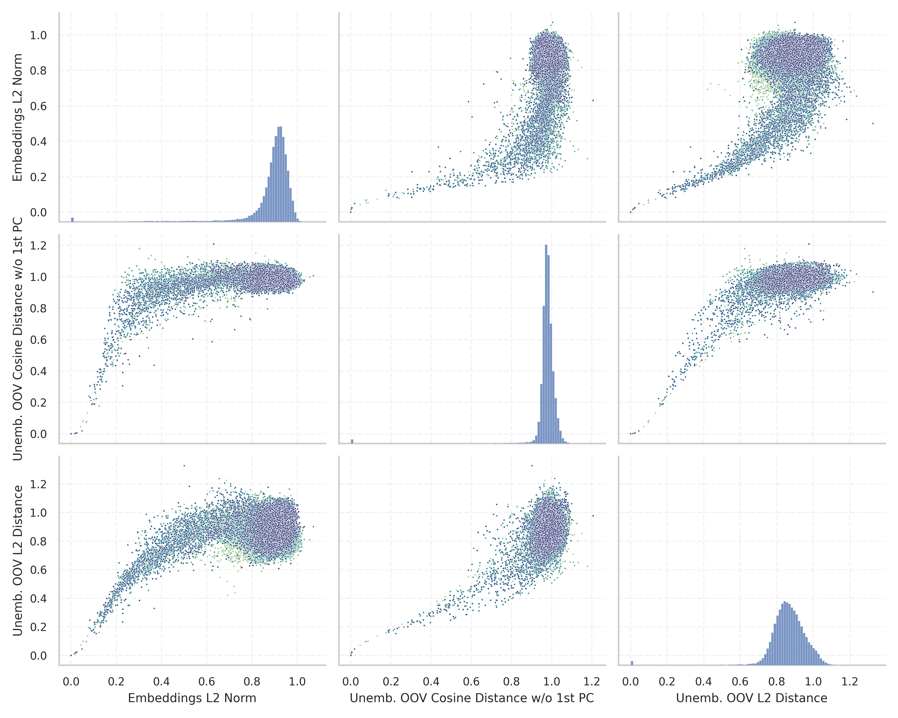
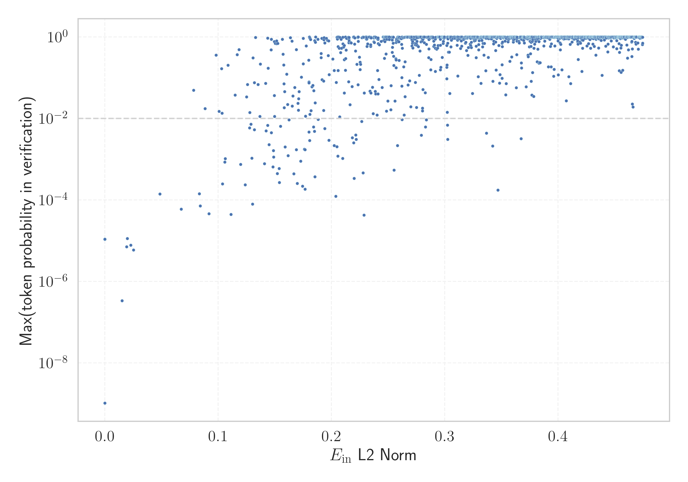

# Report for `01-ai/Yi-9B`

## Model info

* Tied embeddings: no
* Unembeddings use bias: no
* Metric for under-trained tokens: Embeddings L2 Norm
  * Overall distribution 0.883 +/- 0.121
  * Token used for verification prompt building: `Acknowledgements`
  * Verification threshold: 0.440
  * Threshold for showing candidate under-trained tokens: 0.084
  * Median verified threshold (for bytes, unreachable and special tokens): 0.168
* Embeddings shape: (64000, 4096)
* Vocabulary size: 64000
  * Number of single byte tokens: 354, of which 112 below metric threshold
  * Number of special tokens: 238, of which 175 below metric threshold
  * Number of unreachable non-single-byte tokens: 3, of which 3 below metric threshold
  * Number of tested under-trained tokens: 1097, 80 below p = 0.01 threshold, 12 below soft metric threshold

## Metrics plot


## Verification plot


## Under-trained token verification results
12 entries below threshold of 0.084

|   token_id | token                       |      metric | max_prob                                                         | in_other_tokens                                                                                                                                                                                                                                                                                                                                                                                               |
|------------|-----------------------------|-------------|------------------------------------------------------------------|---------------------------------------------------------------------------------------------------------------------------------------------------------------------------------------------------------------------------------------------------------------------------------------------------------------------------------------------------------------------------------------------------------------|
|      58458 | ````` \\+::\\+ `````        | 2.12047e-06 | <span style='border: 1px solid rgb(169, 68, 66);'>1.1e-05</span> |                                                                                                                                                                                                                                                                                                                                                                                                               |
|      38185 | ````` \\+\\_\\+\\+ `````    | 2.13416e-06 | <span style='border: 1px solid rgb(169, 68, 66);'>1.1e-05</span> |                                                                                                                                                                                                                                                                                                                                                                                                               |
|      26510 | ````` \\+\\_\\+ `````       | 2.15176e-06 | <span style='border: 1px solid rgb(169, 68, 66);'>1.1e-05</span> | <span style='border: 1px solid rgb(169, 68, 66);'>````` \\+\\_\\+\\+ `````</span>                                                                                                                                                                                                                                                                                                                             |
|      32010 | ````` mabaochang `````      | 0.0150465   | <span style='border: 1px solid rgb(169, 68, 66);'>3.4e-07</span> |                                                                                                                                                                                                                                                                                                                                                                                                               |
|      31174 | ````` \\+:: `````           | 0.01923     | <span style='border: 1px solid rgb(169, 68, 66);'>7.1e-06</span> | <span style='border: 1px solid rgb(169, 68, 66);'>````` \\+::\\+ `````</span>                                                                                                                                                                                                                                                                                                                                 |
|      52345 | ````` nzoem `````           | 0.0197519   | <span style='border: 1px solid rgb(169, 68, 66);'>1.1e-05</span> |                                                                                                                                                                                                                                                                                                                                                                                                               |
|      19111 | ````` \\+\\_\\ `````        | 0.0228803   | <span style='border: 1px solid rgb(169, 68, 66);'>7.7e-06</span> | <span style='border: 1px solid rgb(169, 68, 66);'>````` \\+\\_\\+ `````</span>, <span style='border: 1px solid rgb(169, 68, 66);'>````` \\+\\_\\+\\+ `````</span>                                                                                                                                                                                                                                             |
|      58973 | ````` Разпространение ````` | 0.0252404   | <span style='border: 1px solid rgb(169, 68, 66);'>5.9e-06</span> |                                                                                                                                                                                                                                                                                                                                                                                                               |
|      41270 | ````` mcited `````          | 0.0484112   | <span style='border: 1px solid rgb(169, 68, 66);'>0.00014</span> | <span style='border: 1px solid rgb(40, 167, 69);'>````` mcitedefault `````</span>                                                                                                                                                                                                                                                                                                                             |
|      14378 | ````` ":"\ufeff `````       | 0.0673838   | <span style='border: 1px solid rgb(169, 68, 66);'>6e-05</span>   |                                                                                                                                                                                                                                                                                                                                                                                                               |
|      19290 | ````` мври `````            | 0.0782237   | <span style='border: 1px solid rgb(251, 189, 8);'>0.049</span>   | <span style='border: 1px solid rgb(255, 145, 0);'>````` птември `````</span>, <span style='border: 1px solid rgb(169, 68, 66);'>````` ктомври `````</span>, <span style='border: 1px solid rgb(40, 167, 69);'>````` ▁септември `````</span>, <span style='border: 1px solid rgb(40, 167, 69);'>````` ▁октомври `````</span>, <span style='border: 1px solid rgb(169, 68, 66);'>````` кември `````</span>, ... |
|      53246 | ````` mrrooter `````        | 0.0833254   | <span style='border: 1px solid rgb(169, 68, 66);'>0.00014</span> |                                                                                                                                                                                                                                                                                                                                                                                                               |
<details><summary>1085 additional entries above threshold</summary>

|   token_id | token                        |    metric | max_prob                                                         | in_other_tokens                                                                                                                                                                                                                                  |
|------------|------------------------------|-----------|------------------------------------------------------------------|--------------------------------------------------------------------------------------------------------------------------------------------------------------------------------------------------------------------------------------------------|
|      52955 | ````` Родени `````           | 0.0841834 | <span style='border: 1px solid rgb(169, 68, 66);'>7.1e-05</span> |                                                                                                                                                                                                                                                  |
|      18479 | ````` +\\_\\ `````           | 0.0883692 | <span style='border: 1px solid rgb(251, 189, 8);'>0.018</span>   | <span style='border: 1px solid rgb(169, 68, 66);'>````` \\+\\_\\ `````</span>, <span style='border: 1px solid rgb(169, 68, 66);'>````` \\+\\_\\+ `````</span>, <span style='border: 1px solid rgb(169, 68, 66);'>````` \\+\\_\\+\\+ `````</span> |
|      58052 | ````` евру `````             | 0.0918016 | <span style='border: 1px solid rgb(169, 68, 66);'>4.6e-05</span> | <span style='border: 1px solid rgb(255, 145, 0);'>````` евруари `````</span>                                                                                                                                                                     |
|      44047 | ````` mrroot `````           | 0.098026  | <span style='border: 1px solid rgb(40, 167, 69);'>0.36</span>    | <span style='border: 1px solid rgb(169, 68, 66);'>````` mrrooter `````</span>                                                                                                                                                                    |
|      20714 | ````` Източници `````        | 0.100705  | <span style='border: 1px solid rgb(251, 189, 8);'>0.015</span>   |                                                                                                                                                                                                                                                  |
|      53979 | ````` ▁$\\\|\\ `````         | 0.10288   | <span style='border: 1px solid rgb(40, 167, 69);'>0.17</span>    |                                                                                                                                                                                                                                                  |
|      55040 | ````` _{(\\ `````            | 0.103435  | <span style='border: 1px solid rgb(251, 189, 8);'>0.013</span>   |                                                                                                                                                                                                                                                  |
|      45501 | ````` }$\\\\\ `````          | 0.103759  | <span style='border: 1px solid rgb(169, 68, 66);'>0.00025</span> |                                                                                                                                                                                                                                                  |
|      27852 | ````` ▁препратки `````       | 0.105868  | <span style='border: 1px solid rgb(169, 68, 66);'>0.00085</span> |                                                                                                                                                                                                                                                  |
|      47419 | ````` []{\\ `````            | 0.106254  | <span style='border: 1px solid rgb(255, 145, 0);'>0.001</span>   |                                                                                                                                                                                                                                                  |
|       1062 | ````` vepfs `````            | 0.10854   | <span style='border: 1px solid rgb(40, 167, 69);'>0.2</span>     |                                                                                                                                                                                                                                                  |
|      47647 | ````` nConsequently `````    | 0.111215  | <span style='border: 1px solid rgb(169, 68, 66);'>4.4e-05</span> |                                                                                                                                                                                                                                                  |
|      44270 | ````` ^*(\\ `````            | 0.114977  | <span style='border: 1px solid rgb(251, 189, 8);'>0.038</span>   |                                                                                                                                                                                                                                                  |
|      47523 | ````` Бележки `````          | 0.116821  | <span style='border: 1px solid rgb(40, 167, 69);'>0.37</span>    |                                                                                                                                                                                                                                                  |
|      54580 | ````` }--\\ `````            | 0.11824   | <span style='border: 1px solid rgb(40, 167, 69);'>0.49</span>    |                                                                                                                                                                                                                                                  |
|      57778 | ````` }=(\\ `````            | 0.119836  | <span style='border: 1px solid rgb(169, 68, 66);'>0.00075</span> |                                                                                                                                                                                                                                                  |
|      11333 | ````` ▁[…]\ `````            | 0.123853  | <span style='border: 1px solid rgb(169, 68, 66);'>0.00024</span> |                                                                                                                                                                                                                                                  |
|      46922 | ````` ;\\;\\;\\;\\ `````     | 0.125067  | <span style='border: 1px solid rgb(251, 189, 8);'>0.034</span>   |                                                                                                                                                                                                                                                  |
|      43942 | ````` ▁селото `````          | 0.125853  | <span style='border: 1px solid rgb(251, 189, 8);'>0.068</span>   |                                                                                                                                                                                                                                                  |
|      27952 | ````` Външни `````           | 0.12765   | <span style='border: 1px solid rgb(255, 145, 0);'>0.0059</span>  |                                                                                                                                                                                                                                                  |
|      22613 | ````` ▁$\\{\\ `````          | 0.127785  | <span style='border: 1px solid rgb(251, 189, 8);'>0.014</span>   |                                                                                                                                                                                                                                                  |
|      59474 | ````` }}^\\ `````            | 0.128831  | <span style='border: 1px solid rgb(255, 145, 0);'>0.0072</span>  |                                                                                                                                                                                                                                                  |
|      59159 | ````` )&=&\\ `````           | 0.129638  | <span style='border: 1px solid rgb(255, 145, 0);'>0.0011</span>  |                                                                                                                                                                                                                                                  |
|      58699 | ````` nUltimately `````      | 0.130198  | <span style='border: 1px solid rgb(169, 68, 66);'>7.9e-05</span> |                                                                                                                                                                                                                                                  |
|      27655 | ````` Вън `````              | 0.130646  | <span style='border: 1px solid rgb(40, 167, 69);'>0.31</span>    | <span style='border: 1px solid rgb(255, 145, 0);'>````` Външни `````</span>                                                                                                                                                                      |
|      50472 | ````` ’”\ `````              | 0.131916  | <span style='border: 1px solid rgb(251, 189, 8);'>0.075</span>   |                                                                                                                                                                                                                                                  |
|      57958 | ````` }&=&\\ `````           | 0.131967  | <span style='border: 1px solid rgb(255, 145, 0);'>0.0053</span>  |                                                                                                                                                                                                                                                  |
|      53069 | ````` nquantum `````         | 0.132898  | <span style='border: 1px solid rgb(40, 167, 69);'>0.97</span>    |                                                                                                                                                                                                                                                  |
|      38169 | ````` }^{(\\ `````           | 0.135213  | <span style='border: 1px solid rgb(251, 189, 8);'>0.068</span>   |                                                                                                                                                                                                                                                  |
|      37421 | ````` …”\ `````              | 0.136747  | <span style='border: 1px solid rgb(251, 189, 8);'>0.011</span>   |                                                                                                                                                                                                                                                  |
|      48827 | ````` tvolatile `````        | 0.137151  | <span style='border: 1px solid rgb(40, 167, 69);'>0.22</span>    |                                                                                                                                                                                                                                                  |
|      31761 | ````` ▁\\]\ `````            | 0.140806  | <span style='border: 1px solid rgb(169, 68, 66);'>0.00077</span> |                                                                                                                                                                                                                                                  |
|      55282 | ````` nResearchers `````     | 0.141879  | <span style='border: 1px solid rgb(251, 189, 8);'>0.073</span>   |                                                                                                                                                                                                                                                  |
|      45676 | ````` nWASHINGTON `````      | 0.142279  | <span style='border: 1px solid rgb(255, 145, 0);'>0.0049</span>  |                                                                                                                                                                                                                                                  |
|      50269 | ````` nRather `````          | 0.143648  | <span style='border: 1px solid rgb(255, 145, 0);'>0.0067</span>  |                                                                                                                                                                                                                                                  |
|      26341 | ````` nrespect `````         | 0.143697  | <span style='border: 1px solid rgb(40, 167, 69);'>0.93</span>    | <span style='border: 1px solid rgb(251, 189, 8);'>````` nrespectively `````</span>                                                                                                                                                               |
|      58677 | ````` $\\%$ `````            | 0.144106  | <span style='border: 1px solid rgb(40, 167, 69);'>0.17</span>    |                                                                                                                                                                                                                                                  |
|      37027 | ````` nClearly `````         | 0.144924  | <span style='border: 1px solid rgb(255, 145, 0);'>0.0023</span>  |                                                                                                                                                                                                                                                  |
|      54548 | ````` &$\\ `````             | 0.146692  | <span style='border: 1px solid rgb(40, 167, 69);'>0.48</span>    |                                                                                                                                                                                                                                                  |
|      57541 | ````` nconsidered `````      | 0.146886  | <span style='border: 1px solid rgb(40, 167, 69);'>0.87</span>    |                                                                                                                                                                                                                                                  |
|      37655 | ````` nNevertheless `````    | 0.146927  | <span style='border: 1px solid rgb(255, 145, 0);'>0.0045</span>  |                                                                                                                                                                                                                                                  |
|      45337 | ````` nInterestingly `````   | 0.148264  | <span style='border: 1px solid rgb(169, 68, 66);'>0.00064</span> |                                                                                                                                                                                                                                                  |
|      35932 | ````` )}_{\\ `````           | 0.148761  | <span style='border: 1px solid rgb(255, 145, 0);'>0.0016</span>  |                                                                                                                                                                                                                                                  |
|      42242 | ````` nPersonally `````      | 0.148883  | <span style='border: 1px solid rgb(255, 145, 0);'>0.0011</span>  |                                                                                                                                                                                                                                                  |
|      46113 | ````` }=\\{ `````            | 0.149417  | <span style='border: 1px solid rgb(40, 167, 69);'>0.77</span>    |                                                                                                                                                                                                                                                  |
|      32202 | ````` nrespectively `````    | 0.149461  | <span style='border: 1px solid rgb(251, 189, 8);'>0.036</span>   |                                                                                                                                                                                                                                                  |
|      47304 | ````` nSecondly `````        | 0.149779  | <span style='border: 1px solid rgb(251, 189, 8);'>0.011</span>   |                                                                                                                                                                                                                                                  |
|      39373 | ````` napproxim `````        | 0.150405  | <span style='border: 1px solid rgb(40, 167, 69);'>0.69</span>    |                                                                                                                                                                                                                                                  |
|      57483 | ````` napproach `````        | 0.15155   | <span style='border: 1px solid rgb(40, 167, 69);'>0.8</span>     |                                                                                                                                                                                                                                                  |
|       1095 | ````` redpajama `````        | 0.151617  | <span style='border: 1px solid rgb(40, 167, 69);'>0.69</span>    |                                                                                                                                                                                                                                                  |
|      54404 | ````` })^{\\ `````           | 0.1522    | <span style='border: 1px solid rgb(169, 68, 66);'>0.00045</span> |                                                                                                                                                                                                                                                  |
|      53931 | ````` nSimplify `````        | 0.152618  | <span style='border: 1px solid rgb(40, 167, 69);'>0.69</span>    |                                                                                                                                                                                                                                                  |
|      54413 | ````` nEventually `````      | 0.153803  | <span style='border: 1px solid rgb(169, 68, 66);'>0.00059</span> |                                                                                                                                                                                                                                                  |
|      58456 | ````` })\\\\\ `````          | 0.15394   | <span style='border: 1px solid rgb(169, 68, 66);'>0.00027</span> |                                                                                                                                                                                                                                                  |
|      46451 | ````` \\\|_{\\ `````         | 0.155041  | <span style='border: 1px solid rgb(255, 145, 0);'>0.0064</span>  |                                                                                                                                                                                                                                                  |
|      52625 | ````` nmagnetic `````        | 0.156555  | <span style='border: 1px solid rgb(40, 167, 69);'>0.88</span>    |                                                                                                                                                                                                                                                  |
|      38615 | ````` ▁$\\\| `````           | 0.157244  | <span style='border: 1px solid rgb(40, 167, 69);'>0.38</span>    | <span style='border: 1px solid rgb(40, 167, 69);'>````` ▁$\\\|\\ `````</span>                                                                                                                                                                    |
|      58452 | ````` ▁&=&\\ `````           | 0.157882  | <span style='border: 1px solid rgb(40, 167, 69);'>0.21</span>    |                                                                                                                                                                                                                                                  |
|      52323 | ````` }-{\\ `````            | 0.157999  | <span style='border: 1px solid rgb(251, 189, 8);'>0.071</span>   |                                                                                                                                                                                                                                                  |
|      48085 | ````` )=-\\ `````            | 0.158203  | <span style='border: 1px solid rgb(251, 189, 8);'>0.018</span>   |                                                                                                                                                                                                                                                  |
|      58364 | ````` }+{\\ `````            | 0.15859   | <span style='border: 1px solid rgb(251, 189, 8);'>0.046</span>   |                                                                                                                                                                                                                                                  |
|      49889 | ````` nFortunately `````     | 0.159027  | <span style='border: 1px solid rgb(255, 145, 0);'>0.002</span>   |                                                                                                                                                                                                                                                  |
|      24417 | ````` ~{\\ `````             | 0.160436  | <span style='border: 1px solid rgb(40, 167, 69);'>0.12</span>    |                                                                                                                                                                                                                                                  |
|      45624 | ````` nRegardless `````      | 0.161305  | <span style='border: 1px solid rgb(251, 189, 8);'>0.022</span>   |                                                                                                                                                                                                                                                  |
|      53691 | ````` }}_\\ `````            | 0.161756  | <span style='border: 1px solid rgb(255, 145, 0);'>0.0012</span>  |                                                                                                                                                                                                                                                  |
|      16963 | ````` }({\\ `````            | 0.162402  | <span style='border: 1px solid rgb(255, 145, 0);'>0.0092</span>  |                                                                                                                                                                                                                                                  |
|      53580 | ````` nassociated `````      | 0.163596  | <span style='border: 1px solid rgb(40, 167, 69);'>0.96</span>    |                                                                                                                                                                                                                                                  |
|      50597 | ````` nparticular `````      | 0.165149  | <span style='border: 1px solid rgb(40, 167, 69);'>0.79</span>    |                                                                                                                                                                                                                                                  |
|      52211 | ````` nFirstly `````         | 0.16531   | <span style='border: 1px solid rgb(251, 189, 8);'>0.02</span>    |                                                                                                                                                                                                                                                  |
|      34224 | ````` \|_{\\ `````           | 0.166003  | <span style='border: 1px solid rgb(251, 189, 8);'>0.036</span>   | <span style='border: 1px solid rgb(255, 145, 0);'>````` \\\|_{\\ `````</span>                                                                                                                                                                    |
|      33785 | ````` nObviously `````       | 0.166631  | <span style='border: 1px solid rgb(169, 68, 66);'>0.00044</span> |                                                                                                                                                                                                                                                  |
|      37488 | ````` ▁$-\\ `````            | 0.167454  | <span style='border: 1px solid rgb(251, 189, 8);'>0.057</span>   |                                                                                                                                                                                                                                                  |
|      34587 | ````` ▁$[\\ `````            | 0.16901   | <span style='border: 1px solid rgb(40, 167, 69);'>0.49</span>    |                                                                                                                                                                                                                                                  |
|      59512 | ````` )^{-\\ `````           | 0.169045  | <span style='border: 1px solid rgb(255, 145, 0);'>0.0017</span>  |                                                                                                                                                                                                                                                  |
|      42668 | ````` nLastly `````          | 0.169704  | <span style='border: 1px solid rgb(169, 68, 66);'>0.00025</span> |                                                                                                                                                                                                                                                  |
|      41844 | ````` nRegarding `````       | 0.170373  | <span style='border: 1px solid rgb(251, 189, 8);'>0.023</span>   |                                                                                                                                                                                                                                                  |
|      18027 | ````` nMoreover `````        | 0.170848  | <span style='border: 1px solid rgb(251, 189, 8);'>0.016</span>   |                                                                                                                                                                                                                                                  |
|      46457 | ````` nApparently `````      | 0.171027  | <span style='border: 1px solid rgb(251, 189, 8);'>0.03</span>    |                                                                                                                                                                                                                                                  |
|      50759 | ````` nGenerally `````       | 0.171432  | <span style='border: 1px solid rgb(251, 189, 8);'>0.046</span>   |                                                                                                                                                                                                                                                  |
|      49044 | ````` }^{-\\ `````           | 0.172778  | <span style='border: 1px solid rgb(169, 68, 66);'>0.00089</span> |                                                                                                                                                                                                                                                  |
|      37452 | ````` }=-\\ `````            | 0.173362  | <span style='border: 1px solid rgb(40, 167, 69);'>0.1</span>     |                                                                                                                                                                                                                                                  |
|      36357 | ````` nThroughout `````      | 0.17433   | <span style='border: 1px solid rgb(169, 68, 66);'>0.00022</span> |                                                                                                                                                                                                                                                  |
|      32078 | ````` $~\\ `````             | 0.175035  | <span style='border: 1px solid rgb(40, 167, 69);'>0.92</span>    |                                                                                                                                                                                                                                                  |
|      46115 | ````` ▁{$\\ `````            | 0.175101  | <span style='border: 1px solid rgb(40, 167, 69);'>0.22</span>    |                                                                                                                                                                                                                                                  |
|      54430 | ````` \\%} `````             | 0.175979  | <span style='border: 1px solid rgb(255, 145, 0);'>0.0018</span>  |                                                                                                                                                                                                                                                  |
|      45474 | ````` ]^{\\ `````            | 0.176564  | <span style='border: 1px solid rgb(169, 68, 66);'>0.00018</span> |                                                                                                                                                                                                                                                  |
|      53564 | ````` }={\\ `````            | 0.176632  | <span style='border: 1px solid rgb(255, 145, 0);'>0.0017</span>  |                                                                                                                                                                                                                                                  |
|      55595 | ````` nhowever `````         | 0.177021  | <span style='border: 1px solid rgb(251, 189, 8);'>0.011</span>   |                                                                                                                                                                                                                                                  |
|      38853 | ````` nobtained `````        | 0.177651  | <span style='border: 1px solid rgb(40, 167, 69);'>0.6</span>     |                                                                                                                                                                                                                                                  |
|      52081 | ````` _{\\{ `````            | 0.1799    | <span style='border: 1px solid rgb(40, 167, 69);'>0.27</span>    |                                                                                                                                                                                                                                                  |
|      15887 | ````` nSuppose `````         | 0.179978  | <span style='border: 1px solid rgb(251, 189, 8);'>0.078</span>   |                                                                                                                                                                                                                                                  |
|      31065 | ````` \\%) `````             | 0.180035  | <span style='border: 1px solid rgb(255, 145, 0);'>0.0047</span>  |                                                                                                                                                                                                                                                  |
|      57605 | ````` ntherefore `````       | 0.180146  | <span style='border: 1px solid rgb(251, 189, 8);'>0.075</span>   |                                                                                                                                                                                                                                                  |
|      55203 | ````` ninteraction `````     | 0.180539  | <span style='border: 1px solid rgb(40, 167, 69);'>0.99</span>    |                                                                                                                                                                                                                                                  |
|      50497 | ````` }{(\\ `````            | 0.18077   | <span style='border: 1px solid rgb(255, 145, 0);'>0.0029</span>  |                                                                                                                                                                                                                                                  |
|       7956 | ````` ~(\\ `````             | 0.180977  | <span style='border: 1px solid rgb(40, 167, 69);'>0.93</span>    |                                                                                                                                                                                                                                                  |
|      31425 | ````` )_{\\ `````            | 0.180989  | <span style='border: 1px solid rgb(251, 189, 8);'>0.013</span>   |                                                                                                                                                                                                                                                  |
|      45484 | ````` ncorrespond `````      | 0.181535  | <span style='border: 1px solid rgb(40, 167, 69);'>0.86</span>    |                                                                                                                                                                                                                                                  |
|      39074 | ````` <>();\ `````           | 0.181856  | <span style='border: 1px solid rgb(251, 189, 8);'>0.015</span>   |                                                                                                                                                                                                                                                  |
|      58028 | ````` ▁дъщер `````           | 0.182811  | <span style='border: 1px solid rgb(251, 189, 8);'>0.06</span>    |                                                                                                                                                                                                                                                  |
|      20408 | ````` \\\|_{ `````           | 0.183618  | <span style='border: 1px solid rgb(251, 189, 8);'>0.065</span>   | <span style='border: 1px solid rgb(255, 145, 0);'>````` \\\|_{\\ `````</span>                                                                                                                                                                    |
|      30058 | ````` \\}_{ `````            | 0.184136  | <span style='border: 1px solid rgb(255, 145, 0);'>0.0062</span>  |                                                                                                                                                                                                                                                  |
|      52422 | ````` nDepending `````       | 0.184361  | <span style='border: 1px solid rgb(251, 189, 8);'>0.048</span>   |                                                                                                                                                                                                                                                  |
|      39987 | ````` nBasically `````       | 0.184964  | <span style='border: 1px solid rgb(255, 145, 0);'>0.0048</span>  |                                                                                                                                                                                                                                                  |
|       5340 | ````` RedPajama `````        | 0.185179  | <span style='border: 1px solid rgb(40, 167, 69);'>0.81</span>    |                                                                                                                                                                                                                                                  |
|      28072 | ````` )}(\\ `````            | 0.185433  | <span style='border: 1px solid rgb(169, 68, 66);'>0.00037</span> |                                                                                                                                                                                                                                                  |
|      28357 | ````` nBesides `````         | 0.185539  | <span style='border: 1px solid rgb(251, 189, 8);'>0.024</span>   |                                                                                                                                                                                                                                                  |
|      34141 | ````` nFIG `````             | 0.185709  | <span style='border: 1px solid rgb(40, 167, 69);'>0.74</span>    |                                                                                                                                                                                                                                                  |
|      47468 | ````` nTheorem `````         | 0.185958  | <span style='border: 1px solid rgb(40, 167, 69);'>0.99</span>    |                                                                                                                                                                                                                                                  |
|      59391 | ````` =&\\ `````             | 0.188063  | <span style='border: 1px solid rgb(40, 167, 69);'>0.88</span>    |                                                                                                                                                                                                                                                  |
|      40586 | ````` nConsidering `````     | 0.1881    | <span style='border: 1px solid rgb(255, 145, 0);'>0.0095</span>  |                                                                                                                                                                                                                                                  |
|      44562 | ````` nWhatever `````        | 0.190772  | <span style='border: 1px solid rgb(40, 167, 69);'>0.31</span>    |                                                                                                                                                                                                                                                  |
|      34729 | ````` ncorresponding `````   | 0.190779  | <span style='border: 1px solid rgb(40, 167, 69);'>0.39</span>    |                                                                                                                                                                                                                                                  |
|      57030 | ````` nCompared `````        | 0.19145   | <span style='border: 1px solid rgb(40, 167, 69);'>0.92</span>    |                                                                                                                                                                                                                                                  |
|      22056 | ````` ^{(\\ `````            | 0.1917    | <span style='border: 1px solid rgb(251, 189, 8);'>0.09</span>    | <span style='border: 1px solid rgb(251, 189, 8);'>````` }^{(\\ `````</span>                                                                                                                                                                      |
|      42298 | ````` nSpecifically `````    | 0.193027  | <span style='border: 1px solid rgb(251, 189, 8);'>0.016</span>   |                                                                                                                                                                                                                                                  |
|      39792 | ````` }{$\\ `````            | 0.193035  | <span style='border: 1px solid rgb(251, 189, 8);'>0.082</span>   |                                                                                                                                                                                                                                                  |
|      56651 | ````` nABOUT `````           | 0.193216  | <span style='border: 1px solid rgb(40, 167, 69);'>0.86</span>    |                                                                                                                                                                                                                                                  |
|      21953 | ````` $\\\\\ `````           | 0.193353  | <span style='border: 1px solid rgb(40, 167, 69);'>0.96</span>    | <span style='border: 1px solid rgb(169, 68, 66);'>````` }$\\\\\ `````</span>                                                                                                                                                                     |
|      51317 | ````` nAside `````           | 0.193948  | <span style='border: 1px solid rgb(40, 167, 69);'>0.71</span>    |                                                                                                                                                                                                                                                  |
|      20132 | ````` nFurthermore `````     | 0.194074  | <span style='border: 1px solid rgb(255, 145, 0);'>0.0056</span>  |                                                                                                                                                                                                                                                  |
|      29938 | ````` ▁🙂\ `````             | 0.195477  | <span style='border: 1px solid rgb(40, 167, 69);'>0.92</span>    |                                                                                                                                                                                                                                                  |
|      55560 | ````` }<\\ `````             | 0.196517  | <span style='border: 1px solid rgb(40, 167, 69);'>0.82</span>    |                                                                                                                                                                                                                                                  |
|      51711 | ````` ":"（ `````            | 0.197144  | <span style='border: 1px solid rgb(40, 167, 69);'>0.35</span>    |                                                                                                                                                                                                                                                  |
|      57326 | ````` nJosh `````            | 0.197462  | <span style='border: 1px solid rgb(40, 167, 69);'>0.8</span>     |                                                                                                                                                                                                                                                  |
|      56126 | ````` ":"「 `````            | 0.197763  | <span style='border: 1px solid rgb(255, 145, 0);'>0.0029</span>  |                                                                                                                                                                                                                                                  |
|      47809 | ````` nSeriously `````       | 0.197848  | <span style='border: 1px solid rgb(40, 167, 69);'>0.12</span>    |                                                                                                                                                                                                                                                  |
|      53537 | ````` ▁албу `````            | 0.201191  | <span style='border: 1px solid rgb(40, 167, 69);'>0.29</span>    |                                                                                                                                                                                                                                                  |
|      26261 | ````` nSimilarly `````       | 0.202416  | <span style='border: 1px solid rgb(255, 145, 0);'>0.0021</span>  |                                                                                                                                                                                                                                                  |
|      31370 | ````` nUnlike `````          | 0.20243   | <span style='border: 1px solid rgb(40, 167, 69);'>0.15</span>    |                                                                                                                                                                                                                                                  |
|      59020 | ````` ":"/*\ `````           | 0.203803  | <span style='border: 1px solid rgb(169, 68, 66);'>0.00012</span> |                                                                                                                                                                                                                                                  |
|      39340 | ````` }_{{\\ `````           | 0.204256  | <span style='border: 1px solid rgb(251, 189, 8);'>0.076</span>   |                                                                                                                                                                                                                                                  |
|      48251 | ````` nmuch `````            | 0.204706  | <span style='border: 1px solid rgb(40, 167, 69);'>0.99</span>    |                                                                                                                                                                                                                                                  |
|      45065 | ````` ръц `````              | 0.204754  | <span style='border: 1px solid rgb(255, 145, 0);'>0.002</span>   |                                                                                                                                                                                                                                                  |
|      35723 | ````` nAssume `````          | 0.205112  | <span style='border: 1px solid rgb(40, 167, 69);'>0.89</span>    |                                                                                                                                                                                                                                                  |
|      29999 | ````` noperator `````        | 0.205345  | <span style='border: 1px solid rgb(40, 167, 69);'>1</span>       |                                                                                                                                                                                                                                                  |
|      46806 | ````` }{*}{\\ `````          | 0.205551  | <span style='border: 1px solid rgb(255, 145, 0);'>0.0012</span>  |                                                                                                                                                                                                                                                  |
|      25545 | ````` nIndeed `````          | 0.205744  | <span style='border: 1px solid rgb(40, 167, 69);'>0.57</span>    |                                                                                                                                                                                                                                                  |
|      55725 | ````` nUsually `````         | 0.205759  | <span style='border: 1px solid rgb(40, 167, 69);'>0.15</span>    |                                                                                                                                                                                                                                                  |
|      52500 | ````` ▁крал `````            | 0.206473  | <span style='border: 1px solid rgb(40, 167, 69);'>0.99</span>    |                                                                                                                                                                                                                                                  |
|      40469 | ````` +{\\ `````             | 0.20681   | <span style='border: 1px solid rgb(40, 167, 69);'>0.53</span>    | <span style='border: 1px solid rgb(251, 189, 8);'>````` }+{\\ `````</span>                                                                                                                                                                       |
|      53558 | ````` `);\ `````             | 0.207134  | <span style='border: 1px solid rgb(251, 189, 8);'>0.011</span>   |                                                                                                                                                                                                                                                  |
|      54185 | ````` ▁$%\ `````             | 0.207484  | <span style='border: 1px solid rgb(40, 167, 69);'>0.97</span>    |                                                                                                                                                                                                                                                  |
|      19196 | ````` nMeanwhile `````       | 0.208088  | <span style='border: 1px solid rgb(40, 167, 69);'>0.41</span>    |                                                                                                                                                                                                                                                  |
|      24855 | ````` )~\\ `````             | 0.208395  | <span style='border: 1px solid rgb(40, 167, 69);'>0.87</span>    |                                                                                                                                                                                                                                                  |
|      29930 | ````` $^{\\ `````            | 0.208757  | <span style='border: 1px solid rgb(40, 167, 69);'>0.53</span>    |                                                                                                                                                                                                                                                  |
|      56199 | ````` nHopefully `````       | 0.209773  | <span style='border: 1px solid rgb(255, 145, 0);'>0.001</span>   |                                                                                                                                                                                                                                                  |
|      50124 | ````` \\/} `````             | 0.210085  | <span style='border: 1px solid rgb(40, 167, 69);'>0.68</span>    |                                                                                                                                                                                                                                                  |
|      59440 | ````` nperform `````         | 0.210099  | <span style='border: 1px solid rgb(40, 167, 69);'>0.98</span>    |                                                                                                                                                                                                                                                  |
|      17049 | ````` nOriginally `````      | 0.210586  | <span style='border: 1px solid rgb(40, 167, 69);'>0.56</span>    |                                                                                                                                                                                                                                                  |
|      31277 | ````` nEarlier `````         | 0.211202  | <span style='border: 1px solid rgb(40, 167, 69);'>0.62</span>    |                                                                                                                                                                                                                                                  |
|      19119 | ````` nHence `````           | 0.21134   | <span style='border: 1px solid rgb(251, 189, 8);'>0.042</span>   |                                                                                                                                                                                                                                                  |
|      43150 | ````` nincluding `````       | 0.211351  | <span style='border: 1px solid rgb(40, 167, 69);'>0.28</span>    |                                                                                                                                                                                                                                                  |
|      38233 | ````` ）；\ `````            | 0.212206  | <span style='border: 1px solid rgb(40, 167, 69);'>0.15</span>    |                                                                                                                                                                                                                                                  |
|      32247 | ````` comtag `````           | 0.212243  | <span style='border: 1px solid rgb(40, 167, 69);'>1</span>       |                                                                                                                                                                                                                                                  |
|      15298 | ````` ▁$\|\\ `````           | 0.212468  | <span style='border: 1px solid rgb(40, 167, 69);'>0.29</span>    |                                                                                                                                                                                                                                                  |
|      15246 | ````` ~$\\ `````             | 0.212865  | <span style='border: 1px solid rgb(40, 167, 69);'>0.48</span>    |                                                                                                                                                                                                                                                  |
|      59473 | ````` nGreg `````            | 0.213339  | <span style='border: 1px solid rgb(40, 167, 69);'>0.93</span>    |                                                                                                                                                                                                                                                  |
|      34443 | ````` nargument `````        | 0.214896  | <span style='border: 1px solid rgb(40, 167, 69);'>0.99</span>    |                                                                                                                                                                                                                                                  |
|      56542 | ````` nagainst `````         | 0.215025  | <span style='border: 1px solid rgb(251, 189, 8);'>0.08</span>    |                                                                                                                                                                                                                                                  |
|      55471 | ````` nBTW `````             | 0.215208  | <span style='border: 1px solid rgb(40, 167, 69);'>0.72</span>    |                                                                                                                                                                                                                                                  |
|      42806 | ````` nImagine `````         | 0.215323  | <span style='border: 1px solid rgb(40, 167, 69);'>0.88</span>    |                                                                                                                                                                                                                                                  |
|      53694 | ````` nshows `````           | 0.215515  | <span style='border: 1px solid rgb(40, 167, 69);'>0.97</span>    |                                                                                                                                                                                                                                                  |
|      48357 | ````` nJesus `````           | 0.215526  | <span style='border: 1px solid rgb(40, 167, 69);'>0.8</span>     |                                                                                                                                                                                                                                                  |
|      53725 | ````` naccording `````       | 0.216287  | <span style='border: 1px solid rgb(251, 189, 8);'>0.022</span>   |                                                                                                                                                                                                                                                  |
|      47787 | ````` nKevin `````           | 0.216915  | <span style='border: 1px solid rgb(40, 167, 69);'>0.73</span>    |                                                                                                                                                                                                                                                  |
|      37742 | ````` -{\\ `````             | 0.217278  | <span style='border: 1px solid rgb(40, 167, 69);'>0.71</span>    | <span style='border: 1px solid rgb(251, 189, 8);'>````` }-{\\ `````</span>                                                                                                                                                                       |
|      32472 | ````` ▁^{\\ `````            | 0.218109  | <span style='border: 1px solid rgb(251, 189, 8);'>0.06</span>    |                                                                                                                                                                                                                                                  |
|      20000 | ````` точници `````          | 0.218344  | <span style='border: 1px solid rgb(255, 145, 0);'>0.0033</span>  | <span style='border: 1px solid rgb(251, 189, 8);'>````` Източници `````</span>                                                                                                                                                                   |
|      59016 | ````` /{\\ `````             | 0.219311  | <span style='border: 1px solid rgb(40, 167, 69);'>0.98</span>    |                                                                                                                                                                                                                                                  |
|      47529 | ````` ncondition `````       | 0.219362  | <span style='border: 1px solid rgb(40, 167, 69);'>1</span>       | <span style='border: 1px solid rgb(40, 167, 69);'>````` nconditions `````</span>, ````` ▁unconditional `````                                                                                                                                     |
|      24349 | ````` ……”\ `````             | 0.219637  | <span style='border: 1px solid rgb(255, 145, 0);'>0.0025</span>  |                                                                                                                                                                                                                                                  |
|      53603 | ````` ninline `````          | 0.219754  | <span style='border: 1px solid rgb(40, 167, 69);'>1</span>       |                                                                                                                                                                                                                                                  |
|      41157 | ````` )\\}$ `````            | 0.219934  | <span style='border: 1px solid rgb(169, 68, 66);'>0.00034</span> |                                                                                                                                                                                                                                                  |
|      17853 | ````` &=&\\ `````            | 0.220382  | <span style='border: 1px solid rgb(40, 167, 69);'>0.66</span>    | <span style='border: 1px solid rgb(255, 145, 0);'>````` }&=&\\ `````</span>, <span style='border: 1px solid rgb(40, 167, 69);'>````` ▁&=&\\ `````</span>, <span style='border: 1px solid rgb(255, 145, 0);'>````` )&=&\\ `````</span>            |
|      36883 | ````` nMuch `````            | 0.220658  | <span style='border: 1px solid rgb(40, 167, 69);'>0.95</span>    |                                                                                                                                                                                                                                                  |
|      53089 | ````` ]\\\\\ `````           | 0.221224  | <span style='border: 1px solid rgb(40, 167, 69);'>0.45</span>    |                                                                                                                                                                                                                                                  |
|      48798 | ````` })}{\\ `````           | 0.221374  | <span style='border: 1px solid rgb(255, 145, 0);'>0.0039</span>  |                                                                                                                                                                                                                                                  |
|      52258 | ````` nWhenever `````        | 0.221745  | <span style='border: 1px solid rgb(255, 145, 0);'>0.003</span>   |                                                                                                                                                                                                                                                  |
|      17264 | ````` ;\\;\\ `````           | 0.222376  | <span style='border: 1px solid rgb(40, 167, 69);'>0.21</span>    | <span style='border: 1px solid rgb(251, 189, 8);'>````` ;\\;\\;\\;\\ `````</span>                                                                                                                                                                |
|      42967 | ````` nconsider `````        | 0.223093  | <span style='border: 1px solid rgb(40, 167, 69);'>0.97</span>    | <span style='border: 1px solid rgb(40, 167, 69);'>````` nconsidered `````</span>                                                                                                                                                                 |
|      49862 | ````` nBeyond `````          | 0.223167  | <span style='border: 1px solid rgb(40, 167, 69);'>0.99</span>    |                                                                                                                                                                                                                                                  |
|      16003 | ````` nDespite `````         | 0.223469  | <span style='border: 1px solid rgb(251, 189, 8);'>0.067</span>   |                                                                                                                                                                                                                                                  |
|       3322 | ````` starcoder `````        | 0.223536  | <span style='border: 1px solid rgb(40, 167, 69);'>1</span>       |                                                                                                                                                                                                                                                  |
|      26116 | ````` nSpeaking `````        | 0.223624  | <span style='border: 1px solid rgb(40, 167, 69);'>0.78</span>    |                                                                                                                                                                                                                                                  |
|      19100 | ````` ▁({\\ `````            | 0.224575  | <span style='border: 1px solid rgb(40, 167, 69);'>0.32</span>    |                                                                                                                                                                                                                                                  |
|      46693 | ````` нския `````            | 0.225156  | <span style='border: 1px solid rgb(40, 167, 69);'>0.16</span>    |                                                                                                                                                                                                                                                  |
|      49800 | ````` ▁януари `````          | 0.225244  | <span style='border: 1px solid rgb(40, 167, 69);'>0.24</span>    |                                                                                                                                                                                                                                                  |
|      29959 | ````` nAnyone `````          | 0.225713  | <span style='border: 1px solid rgb(40, 167, 69);'>0.21</span>    |                                                                                                                                                                                                                                                  |
|      54642 | ````` nWHAT `````            | 0.226612  | <span style='border: 1px solid rgb(255, 145, 0);'>0.0084</span>  |                                                                                                                                                                                                                                                  |
|      41130 | ````` nbeing `````           | 0.226809  | <span style='border: 1px solid rgb(40, 167, 69);'>0.96</span>    |                                                                                                                                                                                                                                                  |
|      51440 | ````` кември `````           | 0.227832  | <span style='border: 1px solid rgb(169, 68, 66);'>0.00046</span> | <span style='border: 1px solid rgb(40, 167, 69);'>````` ▁декември `````</span>                                                                                                                                                                   |
|      58600 | ````` nFederal `````         | 0.227934  | <span style='border: 1px solid rgb(40, 167, 69);'>0.99</span>    |                                                                                                                                                                                                                                                  |
|      45475 | ````` nConse `````           | 0.228259  | <span style='border: 1px solid rgb(40, 167, 69);'>0.99</span>    | <span style='border: 1px solid rgb(169, 68, 66);'>````` nConsequently `````</span>                                                                                                                                                               |
|      49512 | ````` ктомври `````          | 0.228618  | <span style='border: 1px solid rgb(169, 68, 66);'>4.3e-05</span> | <span style='border: 1px solid rgb(40, 167, 69);'>````` ▁октомври `````</span>                                                                                                                                                                   |
|      54160 | ````` ември `````            | 0.228805  | <span style='border: 1px solid rgb(251, 189, 8);'>0.042</span>   | <span style='border: 1px solid rgb(40, 167, 69);'>````` ▁ноември `````</span>                                                                                                                                                                    |
|      57742 | ````` nSounds `````          | 0.230132  | <span style='border: 1px solid rgb(40, 167, 69);'>1</span>       |                                                                                                                                                                                                                                                  |
|      50268 | ````` nshown `````           | 0.230599  | <span style='border: 1px solid rgb(40, 167, 69);'>0.89</span>    |                                                                                                                                                                                                                                                  |
|      47530 | ````` tprotected `````       | 0.230984  | <span style='border: 1px solid rgb(40, 167, 69);'>0.99</span>    |                                                                                                                                                                                                                                                  |
|      37563 | ````` nRated `````           | 0.231077  | <span style='border: 1px solid rgb(40, 167, 69);'>0.89</span>    |                                                                                                                                                                                                                                                  |
|      59044 | ````` nSpons `````           | 0.231132  | <span style='border: 1px solid rgb(40, 167, 69);'>0.96</span>    |                                                                                                                                                                                                                                                  |
|      58597 | ````` ▁смърт `````           | 0.23127   | <span style='border: 1px solid rgb(40, 167, 69);'>0.59</span>    |                                                                                                                                                                                                                                                  |
|      19773 | ````` nAnyway `````          | 0.231966  | <span style='border: 1px solid rgb(40, 167, 69);'>0.67</span>    |                                                                                                                                                                                                                                                  |
|      55541 | ````` ▁ноември `````         | 0.233066  | <span style='border: 1px solid rgb(40, 167, 69);'>0.99</span>    |                                                                                                                                                                                                                                                  |
|      42431 | ````` nOffic `````           | 0.233316  | <span style='border: 1px solid rgb(40, 167, 69);'>0.99</span>    |                                                                                                                                                                                                                                                  |
|      58601 | ````` nMatthew `````         | 0.233961  | <span style='border: 1px solid rgb(251, 189, 8);'>0.046</span>   |                                                                                                                                                                                                                                                  |
|      41314 | ````` ясто `````             | 0.234553  | <span style='border: 1px solid rgb(40, 167, 69);'>0.59</span>    | <span style='border: 1px solid rgb(40, 167, 69);'>````` ▁място `````</span>                                                                                                                                                                      |
|      52603 | ````` ▁декември `````        | 0.234562  | <span style='border: 1px solid rgb(40, 167, 69);'>0.64</span>    |                                                                                                                                                                                                                                                  |
|      26711 | ````` _{-\\ `````            | 0.234693  | <span style='border: 1px solid rgb(251, 189, 8);'>0.042</span>   |                                                                                                                                                                                                                                                  |
|      54325 | ````` nProfessional `````    | 0.234826  | <span style='border: 1px solid rgb(40, 167, 69);'>0.99</span>    |                                                                                                                                                                                                                                                  |
|      52041 | ````` nJason `````           | 0.234844  | <span style='border: 1px solid rgb(40, 167, 69);'>0.94</span>    |                                                                                                                                                                                                                                                  |
|      44451 | ````` късно `````            | 0.236105  | <span style='border: 1px solid rgb(251, 189, 8);'>0.058</span>   |                                                                                                                                                                                                                                                  |
|      45402 | ````` ▁цър `````             | 0.236727  | <span style='border: 1px solid rgb(251, 189, 8);'>0.013</span>   |                                                                                                                                                                                                                                                  |
|      37486 | ````` \|{\\ `````            | 0.237321  | <span style='border: 1px solid rgb(40, 167, 69);'>0.76</span>    |                                                                                                                                                                                                                                                  |
|      50969 | ````` nconstant `````        | 0.23738   | <span style='border: 1px solid rgb(40, 167, 69);'>0.95</span>    |                                                                                                                                                                                                                                                  |
|      47001 | ````` ninteg `````           | 0.237614  | <span style='border: 1px solid rgb(40, 167, 69);'>1</span>       | <span style='border: 1px solid rgb(40, 167, 69);'>````` nintegral `````</span>                                                                                                                                                                   |
|      42577 | ````` nUnless `````          | 0.237714  | <span style='border: 1px solid rgb(40, 167, 69);'>0.73</span>    |                                                                                                                                                                                                                                                  |
|      46456 | ````` ▁Македония `````       | 0.238461  | <span style='border: 1px solid rgb(40, 167, 69);'>0.99</span>    |                                                                                                                                                                                                                                                  |
|      23073 | ````` nSometimes `````       | 0.238633  | <span style='border: 1px solid rgb(251, 189, 8);'>0.046</span>   |                                                                                                                                                                                                                                                  |
|      40798 | ````` nObama `````           | 0.238644  | <span style='border: 1px solid rgb(40, 167, 69);'>0.99</span>    |                                                                                                                                                                                                                                                  |
|      46662 | ````` ▁\");\ `````           | 0.23892   | <span style='border: 1px solid rgb(251, 189, 8);'>0.04</span>    |                                                                                                                                                                                                                                                  |
|      50055 | ````` nobserved `````        | 0.239238  | <span style='border: 1px solid rgb(40, 167, 69);'>0.95</span>    |                                                                                                                                                                                                                                                  |
|      41221 | ````` nrepresent `````       | 0.239451  | <span style='border: 1px solid rgb(40, 167, 69);'>0.97</span>    |                                                                                                                                                                                                                                                  |
|      57473 | ````` ▁\";\ `````            | 0.240189  | <span style='border: 1px solid rgb(251, 189, 8);'>0.012</span>   |                                                                                                                                                                                                                                                  |
|      31801 | ````` -$\\ `````             | 0.240532  | <span style='border: 1px solid rgb(40, 167, 69);'>0.15</span>    |                                                                                                                                                                                                                                                  |
|      46485 | ````` {-\\ `````             | 0.24067   | <span style='border: 1px solid rgb(40, 167, 69);'>0.89</span>    | <span style='border: 1px solid rgb(169, 68, 66);'>````` }^{-\\ `````</span>, <span style='border: 1px solid rgb(255, 145, 0);'>````` )^{-\\ `````</span>                                                                                         |
|      36908 | ````` nUntil `````           | 0.240906  | <span style='border: 1px solid rgb(40, 167, 69);'>0.87</span>    |                                                                                                                                                                                                                                                  |
|      29537 | ````` nActually `````        | 0.240957  | <span style='border: 1px solid rgb(40, 167, 69);'>0.94</span>    |                                                                                                                                                                                                                                                  |
|      54107 | ````` ческата `````          | 0.240959  | <span style='border: 1px solid rgb(251, 189, 8);'>0.04</span>    |                                                                                                                                                                                                                                                  |
|      58620 | ````` Irefn `````            | 0.241149  | <span style='border: 1px solid rgb(40, 167, 69);'>0.68</span>    |                                                                                                                                                                                                                                                  |
|      48724 | ````` nSimply `````          | 0.241832  | <span style='border: 1px solid rgb(251, 189, 8);'>0.091</span>   |                                                                                                                                                                                                                                                  |
|      22918 | ````` nRecently `````        | 0.242225  | <span style='border: 1px solid rgb(40, 167, 69);'>0.64</span>    |                                                                                                                                                                                                                                                  |
|      54906 | ````` nGovernment `````      | 0.243905  | <span style='border: 1px solid rgb(40, 167, 69);'>0.78</span>    |                                                                                                                                                                                                                                                  |
|      28940 | ````` nAdditionally `````    | 0.244655  | <span style='border: 1px solid rgb(251, 189, 8);'>0.058</span>   |                                                                                                                                                                                                                                                  |
|      44496 | ````` nassoc `````           | 0.245394  | <span style='border: 1px solid rgb(40, 167, 69);'>1</span>       | <span style='border: 1px solid rgb(40, 167, 69);'>````` nassociated `````</span>                                                                                                                                                                 |
|      32602 | ````` \\\"{ `````            | 0.24569   | <span style='border: 1px solid rgb(40, 167, 69);'>1</span>       |                                                                                                                                                                                                                                                  |
|      38943 | ````` nConclusion `````      | 0.246126  | <span style='border: 1px solid rgb(40, 167, 69);'>0.82</span>    |                                                                                                                                                                                                                                                  |
|      58248 | ````` nQuestions `````       | 0.246217  | <span style='border: 1px solid rgb(40, 167, 69);'>0.98</span>    |                                                                                                                                                                                                                                                  |
|      24673 | ````` nAmong `````           | 0.246603  | <span style='border: 1px solid rgb(40, 167, 69);'>0.3</span>     |                                                                                                                                                                                                                                                  |
|      41470 | ````` nINS `````             | 0.246823  | <span style='border: 1px solid rgb(40, 167, 69);'>1</span>       | <span style='border: 1px solid rgb(40, 167, 69);'>````` nINSERT `````</span>                                                                                                                                                                     |
|      50234 | ````` ▁септември `````       | 0.247     | <span style='border: 1px solid rgb(40, 167, 69);'>0.77</span>    |                                                                                                                                                                                                                                                  |
|      54373 | ````` nPrivacy `````         | 0.247017  | <span style='border: 1px solid rgb(40, 167, 69);'>1</span>       |                                                                                                                                                                                                                                                  |
|      58870 | ````` nBeautiful `````       | 0.247068  | <span style='border: 1px solid rgb(40, 167, 69);'>0.9</span>     |                                                                                                                                                                                                                                                  |
|      51683 | ````` nconditions `````      | 0.24708   | <span style='border: 1px solid rgb(40, 167, 69);'>1</span>       |                                                                                                                                                                                                                                                  |
|      56486 | ````` ntransition `````      | 0.247582  | <span style='border: 1px solid rgb(40, 167, 69);'>1</span>       |                                                                                                                                                                                                                                                  |
|      52882 | ````` ncontin `````          | 0.247851  | <span style='border: 1px solid rgb(40, 167, 69);'>1</span>       |                                                                                                                                                                                                                                                  |
|      56278 | ````` nSarah `````           | 0.248038  | <span style='border: 1px solid rgb(40, 167, 69);'>0.38</span>    |                                                                                                                                                                                                                                                  |
|      28537 | ````` \")]\ `````            | 0.248402  | <span style='border: 1px solid rgb(251, 189, 8);'>0.015</span>   |                                                                                                                                                                                                                                                  |
|      41755 | ````` nwithin `````          | 0.24869   | <span style='border: 1px solid rgb(40, 167, 69);'>0.99</span>    |                                                                                                                                                                                                                                                  |
|      29248 | ````` ;\\; `````             | 0.24889   | <span style='border: 1px solid rgb(40, 167, 69);'>0.88</span>    | <span style='border: 1px solid rgb(251, 189, 8);'>````` ;\\;\\;\\;\\ `````</span>                                                                                                                                                                |
|      59347 | ````` nstandard `````        | 0.249632  | <span style='border: 1px solid rgb(40, 167, 69);'>0.99</span>    |                                                                                                                                                                                                                                                  |
|      20664 | ````` nThough `````          | 0.249741  | <span style='border: 1px solid rgb(251, 189, 8);'>0.027</span>   |                                                                                                                                                                                                                                                  |
|      24187 | ````` nYet `````             | 0.250608  | <span style='border: 1px solid rgb(40, 167, 69);'>1</span>       |                                                                                                                                                                                                                                                  |
|      47299 | ````` Беле `````             | 0.250918  | <span style='border: 1px solid rgb(40, 167, 69);'>1</span>       | <span style='border: 1px solid rgb(40, 167, 69);'>````` Бележки `````</span>                                                                                                                                                                     |
|      40966 | ````` ърт `````              | 0.250956  | <span style='border: 1px solid rgb(40, 167, 69);'>0.87</span>    | <span style='border: 1px solid rgb(40, 167, 69);'>````` ▁смърт `````</span>                                                                                                                                                                      |
|      48888 | ````` нуари `````            | 0.25243   | <span style='border: 1px solid rgb(251, 189, 8);'>0.016</span>   | <span style='border: 1px solid rgb(40, 167, 69);'>````` ▁януари `````</span>                                                                                                                                                                     |
|      22527 | ````` nEDIT `````            | 0.252485  | <span style='border: 1px solid rgb(251, 189, 8);'>0.064</span>   |                                                                                                                                                                                                                                                  |
|      44797 | ````` nMrs `````             | 0.252982  | <span style='border: 1px solid rgb(40, 167, 69);'>0.98</span>    |                                                                                                                                                                                                                                                  |
|      22166 | ````` $_{\\ `````            | 0.25353   | <span style='border: 1px solid rgb(40, 167, 69);'>0.42</span>    |                                                                                                                                                                                                                                                  |
|      53624 | ````` nTony `````            | 0.253631  | <span style='border: 1px solid rgb(40, 167, 69);'>0.84</span>    |                                                                                                                                                                                                                                                  |
|      13479 | ````` nFurther `````         | 0.253746  | <span style='border: 1px solid rgb(40, 167, 69);'>0.56</span>    | <span style='border: 1px solid rgb(255, 145, 0);'>````` nFurthermore `````</span>                                                                                                                                                                |
|      58641 | ````` >(\" `````             | 0.254019  | <span style='border: 1px solid rgb(40, 167, 69);'>0.98</span>    |                                                                                                                                                                                                                                                  |
|      50865 | ````` ▁октомври `````        | 0.254376  | <span style='border: 1px solid rgb(40, 167, 69);'>0.71</span>    |                                                                                                                                                                                                                                                  |
|      23782 | ````` =-\\ `````             | 0.254407  | <span style='border: 1px solid rgb(40, 167, 69);'>1</span>       | <span style='border: 1px solid rgb(40, 167, 69);'>````` }=-\\ `````</span>, <span style='border: 1px solid rgb(251, 189, 8);'>````` )=-\\ `````</span>                                                                                           |
|      53868 | ````` nModern `````          | 0.254566  | <span style='border: 1px solid rgb(40, 167, 69);'>0.98</span>    |                                                                                                                                                                                                                                                  |
|      24045 | ````` nSuch `````            | 0.254853  | <span style='border: 1px solid rgb(40, 167, 69);'>0.33</span>    |                                                                                                                                                                                                                                                  |
|      11894 | ````` nThus `````            | 0.255051  | <span style='border: 1px solid rgb(40, 167, 69);'>0.2</span>     |                                                                                                                                                                                                                                                  |
|      45030 | ````` nAssuming `````        | 0.255179  | <span style='border: 1px solid rgb(169, 68, 66);'>0.00054</span> |                                                                                                                                                                                                                                                  |
|      22816 | ````` }\\}$ `````            | 0.256067  | <span style='border: 1px solid rgb(251, 189, 8);'>0.027</span>   |                                                                                                                                                                                                                                                  |
|      30474 | ````` nEveryone `````        | 0.256714  | <span style='border: 1px solid rgb(40, 167, 69);'>0.29</span>    |                                                                                                                                                                                                                                                  |
|      58359 | ````` nKim `````             | 0.256943  | <span style='border: 1px solid rgb(40, 167, 69);'>0.18</span>    |                                                                                                                                                                                                                                                  |
|      51019 | ````` ▁април `````           | 0.256976  | <span style='border: 1px solid rgb(40, 167, 69);'>0.27</span>    |                                                                                                                                                                                                                                                  |
|      18607 | ````` nThose `````           | 0.257037  | <span style='border: 1px solid rgb(40, 167, 69);'>0.73</span>    |                                                                                                                                                                                                                                                  |
|      42620 | ````` nUPDATE `````          | 0.257246  | <span style='border: 1px solid rgb(40, 167, 69);'>0.83</span>    |                                                                                                                                                                                                                                                  |
|      45601 | ````` ndescribe `````        | 0.257435  | <span style='border: 1px solid rgb(40, 167, 69);'>0.9</span>     | <span style='border: 1px solid rgb(40, 167, 69);'>````` ndescribed `````</span>                                                                                                                                                                  |
|      57669 | ````` nBrad `````            | 0.257759  | <span style='border: 1px solid rgb(40, 167, 69);'>0.77</span>    |                                                                                                                                                                                                                                                  |
|      35636 | ````` nvery `````            | 0.258163  | <span style='border: 1px solid rgb(40, 167, 69);'>0.95</span>    |                                                                                                                                                                                                                                                  |
|      46618 | ````` птември `````          | 0.258241  | <span style='border: 1px solid rgb(255, 145, 0);'>0.0022</span>  | <span style='border: 1px solid rgb(40, 167, 69);'>````` ▁септември `````</span>                                                                                                                                                                  |
|      59312 | ````` nintegral `````        | 0.25847   | <span style='border: 1px solid rgb(40, 167, 69);'>1</span>       |                                                                                                                                                                                                                                                  |
|      55108 | ````` }}{{\\ `````           | 0.258654  | <span style='border: 1px solid rgb(40, 167, 69);'>0.8</span>     |                                                                                                                                                                                                                                                  |
|      46599 | ````` naround `````          | 0.25897   | <span style='border: 1px solid rgb(40, 167, 69);'>0.99</span>    | ````` ▁turnaround `````                                                                                                                                                                                                                          |
|      54937 | ````` nequations `````       | 0.259206  | <span style='border: 1px solid rgb(40, 167, 69);'>0.99</span>    |                                                                                                                                                                                                                                                  |
|      27997 | ````` nbeen `````            | 0.259472  | <span style='border: 1px solid rgb(40, 167, 69);'>0.96</span>    |                                                                                                                                                                                                                                                  |
|      58094 | ````` nCharles `````         | 0.259478  | <span style='border: 1px solid rgb(40, 167, 69);'>0.76</span>    |                                                                                                                                                                                                                                                  |
|      57597 | ````` \"][\" `````           | 0.259702  | <span style='border: 1px solid rgb(40, 167, 69);'>0.27</span>    |                                                                                                                                                                                                                                                  |
|      30929 | ````` \\\|_ `````            | 0.260066  | <span style='border: 1px solid rgb(40, 167, 69);'>0.98</span>    | <span style='border: 1px solid rgb(255, 145, 0);'>````` \\\|_{\\ `````</span>                                                                                                                                                                    |
|      53981 | ````` nProfessor `````       | 0.260759  | <span style='border: 1px solid rgb(40, 167, 69);'>0.91</span>    |                                                                                                                                                                                                                                                  |
|      53516 | ````` nImportant `````       | 0.261059  | <span style='border: 1px solid rgb(40, 167, 69);'>0.92</span>    |                                                                                                                                                                                                                                                  |
|      45237 | ````` _\\_\\ `````           | 0.261572  | <span style='border: 1px solid rgb(40, 167, 69);'>0.91</span>    |                                                                                                                                                                                                                                                  |
|      45598 | ````` nLocated `````         | 0.261905  | <span style='border: 1px solid rgb(40, 167, 69);'>0.65</span>    |                                                                                                                                                                                                                                                  |
|      52395 | ````` nAlternatively `````   | 0.261989  | <span style='border: 1px solid rgb(251, 189, 8);'>0.1</span>     |                                                                                                                                                                                                                                                  |
|      48005 | ````` ^{{\\ `````            | 0.262008  | <span style='border: 1px solid rgb(251, 189, 8);'>0.062</span>   |                                                                                                                                                                                                                                                  |
|      44077 | ````` nmany `````            | 0.262167  | <span style='border: 1px solid rgb(40, 167, 69);'>1</span>       |                                                                                                                                                                                                                                                  |
|      36896 | ````` }}\\\\\ `````          | 0.262196  | <span style='border: 1px solid rgb(255, 145, 0);'>0.0093</span>  |                                                                                                                                                                                                                                                  |
|      40879 | ````` }}}{\\ `````           | 0.262498  | <span style='border: 1px solid rgb(40, 167, 69);'>0.53</span>    |                                                                                                                                                                                                                                                  |
|      50836 | ````` nIsrael `````          | 0.263114  | <span style='border: 1px solid rgb(40, 167, 69);'>0.97</span>    |                                                                                                                                                                                                                                                  |
|      35713 | ````` $^\\ `````             | 0.263514  | <span style='border: 1px solid rgb(40, 167, 69);'>0.96</span>    |                                                                                                                                                                                                                                                  |
|      52479 | ````` nSomeone `````         | 0.263687  | <span style='border: 1px solid rgb(40, 167, 69);'>0.18</span>    |                                                                                                                                                                                                                                                  |
|      50591 | ````` })-(\\ `````           | 0.264018  | <span style='border: 1px solid rgb(251, 189, 8);'>0.012</span>   |                                                                                                                                                                                                                                                  |
|      54641 | ````` nEric `````            | 0.264308  | <span style='border: 1px solid rgb(40, 167, 69);'>0.98</span>    |                                                                                                                                                                                                                                                  |
|      38870 | ````` nEver `````            | 0.264615  | <span style='border: 1px solid rgb(40, 167, 69);'>0.98</span>    | <span style='border: 1px solid rgb(40, 167, 69);'>````` nEverything `````</span>                                                                                                                                                                 |
|      33405 | ````` \|}{\\ `````           | 0.264917  | <span style='border: 1px solid rgb(251, 189, 8);'>0.034</span>   |                                                                                                                                                                                                                                                  |
|      42494 | ````` нската `````           | 0.264958  | <span style='border: 1px solid rgb(40, 167, 69);'>0.25</span>    |                                                                                                                                                                                                                                                  |
|      50520 | ````` nCRE `````             | 0.265608  | <span style='border: 1px solid rgb(40, 167, 69);'>1</span>       | <span style='border: 1px solid rgb(40, 167, 69);'>````` nCREATE `````</span>                                                                                                                                                                     |
|      53093 | ````` nPhotos `````          | 0.266277  | <span style='border: 1px solid rgb(40, 167, 69);'>1</span>       |                                                                                                                                                                                                                                                  |
|      19747 | ````` MNBVC `````            | 0.266422  | <span style='border: 1px solid rgb(40, 167, 69);'>1</span>       |                                                                                                                                                                                                                                                  |
|      34137 | ````` nYesterday `````       | 0.266866  | <span style='border: 1px solid rgb(40, 167, 69);'>0.98</span>    |                                                                                                                                                                                                                                                  |
|      50025 | ````` }\")\ `````            | 0.267485  | <span style='border: 1px solid rgb(251, 189, 8);'>0.066</span>   |                                                                                                                                                                                                                                                  |
|      48547 | ````` nmoment `````          | 0.267618  | <span style='border: 1px solid rgb(40, 167, 69);'>1</span>       |                                                                                                                                                                                                                                                  |
|      39525 | ````` nJon `````             | 0.268659  | <span style='border: 1px solid rgb(40, 167, 69);'>1</span>       |                                                                                                                                                                                                                                                  |
|      21250 | ````` nWhether `````         | 0.268858  | <span style='border: 1px solid rgb(251, 189, 8);'>0.083</span>   |                                                                                                                                                                                                                                                  |
|      27560 | ````` \\'{ `````             | 0.269395  | <span style='border: 1px solid rgb(40, 167, 69);'>1</span>       |                                                                                                                                                                                                                                                  |
|      49638 | ````` ▁юли `````             | 0.269529  | <span style='border: 1px solid rgb(40, 167, 69);'>1</span>       |                                                                                                                                                                                                                                                  |
|      56871 | ````` nprobability `````     | 0.269721  | <span style='border: 1px solid rgb(40, 167, 69);'>0.96</span>    |                                                                                                                                                                                                                                                  |
|      41463 | ````` }}-\\ `````            | 0.269915  | <span style='border: 1px solid rgb(251, 189, 8);'>0.019</span>   |                                                                                                                                                                                                                                                  |
|      43370 | ````` ▁община `````          | 0.270353  | <span style='border: 1px solid rgb(40, 167, 69);'>1</span>       |                                                                                                                                                                                                                                                  |
|      50970 | ````` nsolution `````        | 0.270764  | <span style='border: 1px solid rgb(40, 167, 69);'>1</span>       |                                                                                                                                                                                                                                                  |
|      52331 | ````` nRepublic `````        | 0.270913  | <span style='border: 1px solid rgb(40, 167, 69);'>0.84</span>    |                                                                                                                                                                                                                                                  |
|      36269 | ````` ▁\\\|\\ `````          | 0.270935  | <span style='border: 1px solid rgb(40, 167, 69);'>0.6</span>     |                                                                                                                                                                                                                                                  |
|      37562 | ````` $_\\ `````             | 0.271288  | <span style='border: 1px solid rgb(40, 167, 69);'>0.7</span>     |                                                                                                                                                                                                                                                  |
|       9525 | ````` ▁$(\\ `````            | 0.271536  | <span style='border: 1px solid rgb(40, 167, 69);'>0.77</span>    |                                                                                                                                                                                                                                                  |
|      56752 | ````` ▁страната `````        | 0.271756  | <span style='border: 1px solid rgb(40, 167, 69);'>0.53</span>    |                                                                                                                                                                                                                                                  |
|      48600 | ````` nsimilar `````         | 0.272468  | <span style='border: 1px solid rgb(40, 167, 69);'>1</span>       |                                                                                                                                                                                                                                                  |
|      54444 | ````` nanalysis `````        | 0.272681  | <span style='border: 1px solid rgb(40, 167, 69);'>0.98</span>    |                                                                                                                                                                                                                                                  |
|      35279 | ````` nUnited `````          | 0.27277   | <span style='border: 1px solid rgb(40, 167, 69);'>0.89</span>    |                                                                                                                                                                                                                                                  |
|      58065 | ````` nStephen `````         | 0.27372   | <span style='border: 1px solid rgb(40, 167, 69);'>0.7</span>     |                                                                                                                                                                                                                                                  |
|      58189 | ````` nmeans `````           | 0.273831  | <span style='border: 1px solid rgb(40, 167, 69);'>0.88</span>    |                                                                                                                                                                                                                                                  |
|      28362 | ````` ▁}{\\ `````            | 0.273957  | <span style='border: 1px solid rgb(40, 167, 69);'>0.98</span>    |                                                                                                                                                                                                                                                  |
|      13096 | ````` nTherefore `````       | 0.273975  | <span style='border: 1px solid rgb(40, 167, 69);'>0.64</span>    |                                                                                                                                                                                                                                                  |
|      42789 | ````` nMeet `````            | 0.273996  | <span style='border: 1px solid rgb(40, 167, 69);'>0.99</span>    |                                                                                                                                                                                                                                                  |
|      23880 | ````` }}^{\\ `````           | 0.274092  | <span style='border: 1px solid rgb(251, 189, 8);'>0.076</span>   |                                                                                                                                                                                                                                                  |
|      24465 | ````` nSeveral `````         | 0.274891  | <span style='border: 1px solid rgb(40, 167, 69);'>0.69</span>    |                                                                                                                                                                                                                                                  |
|      50641 | ````` \"])\ `````            | 0.274963  | <span style='border: 1px solid rgb(251, 189, 8);'>0.019</span>   |                                                                                                                                                                                                                                                  |
|      40735 | ````` nthose `````           | 0.275133  | <span style='border: 1px solid rgb(40, 167, 69);'>1</span>       |                                                                                                                                                                                                                                                  |
|      43507 | ````` npotential `````       | 0.275162  | <span style='border: 1px solid rgb(40, 167, 69);'>1</span>       |                                                                                                                                                                                                                                                  |
|      50111 | ````` nFeatured `````        | 0.275486  | <span style='border: 1px solid rgb(40, 167, 69);'>0.78</span>    |                                                                                                                                                                                                                                                  |
|      38041 | ````` nSteve `````           | 0.275613  | <span style='border: 1px solid rgb(40, 167, 69);'>0.95</span>    |                                                                                                                                                                                                                                                  |
|      45514 | ````` ▁САЩ `````             | 0.275649  | <span style='border: 1px solid rgb(40, 167, 69);'>0.62</span>    |                                                                                                                                                                                                                                                  |
|      53108 | ````` )\\; `````             | 0.276693  | <span style='border: 1px solid rgb(40, 167, 69);'>0.58</span>    |                                                                                                                                                                                                                                                  |
|      39169 | ````` nparameter `````       | 0.276957  | <span style='border: 1px solid rgb(40, 167, 69);'>1</span>       | <span style='border: 1px solid rgb(40, 167, 69);'>````` nparameters `````</span>                                                                                                                                                                 |
|      41285 | ````` ntypedef `````         | 0.276972  | <span style='border: 1px solid rgb(40, 167, 69);'>0.98</span>    |                                                                                                                                                                                                                                                  |
|      58463 | ````` nApplying `````        | 0.277348  | <span style='border: 1px solid rgb(40, 167, 69);'>0.11</span>    |                                                                                                                                                                                                                                                  |
|      58087 | ````` nRon `````             | 0.277943  | <span style='border: 1px solid rgb(40, 167, 69);'>1</span>       |                                                                                                                                                                                                                                                  |
|      54409 | ````` ▁заедно `````          | 0.278078  | <span style='border: 1px solid rgb(40, 167, 69);'>0.45</span>    |                                                                                                                                                                                                                                                  |
|      49142 | ````` tthrow `````           | 0.278303  | <span style='border: 1px solid rgb(40, 167, 69);'>1</span>       |                                                                                                                                                                                                                                                  |
|      36082 | ````` nboth `````            | 0.278811  | <span style='border: 1px solid rgb(40, 167, 69);'>0.99</span>    |                                                                                                                                                                                                                                                  |
|      29382 | ````` \"`\ `````             | 0.278899  | <span style='border: 1px solid rgb(40, 167, 69);'>0.76</span>    |                                                                                                                                                                                                                                                  |
|      24159 | ````` ържа `````             | 0.27934   | <span style='border: 1px solid rgb(255, 145, 0);'>0.0039</span>  | <span style='border: 1px solid rgb(40, 167, 69);'>````` ▁държа `````</span>, ````` държа `````                                                                                                                                                   |
|      30013 | ````` nTaking `````          | 0.279795  | <span style='border: 1px solid rgb(40, 167, 69);'>0.91</span>    |                                                                                                                                                                                                                                                  |
|      57368 | ````` nRecommended `````     | 0.280065  | <span style='border: 1px solid rgb(40, 167, 69);'>0.79</span>    |                                                                                                                                                                                                                                                  |
|      29156 | ````` }\\; `````             | 0.280207  | <span style='border: 1px solid rgb(251, 189, 8);'>0.018</span>   |                                                                                                                                                                                                                                                  |
|      14565 | ````` }}(\\ `````            | 0.280228  | <span style='border: 1px solid rgb(251, 189, 8);'>0.015</span>   |                                                                                                                                                                                                                                                  |
|      59115 | ````` ▁ръко `````            | 0.280731  | <span style='border: 1px solid rgb(251, 189, 8);'>0.051</span>   |                                                                                                                                                                                                                                                  |
|      42921 | ````` nReally `````          | 0.280742  | <span style='border: 1px solid rgb(40, 167, 69);'>0.87</span>    |                                                                                                                                                                                                                                                  |
|      52825 | ````` nneed `````            | 0.280743  | <span style='border: 1px solid rgb(40, 167, 69);'>1</span>       |                                                                                                                                                                                                                                                  |
|      35271 | ````` nLater `````           | 0.280881  | <span style='border: 1px solid rgb(40, 167, 69);'>0.99</span>    |                                                                                                                                                                                                                                                  |
|      40509 | ````` ][\" `````             | 0.280922  | <span style='border: 1px solid rgb(40, 167, 69);'>0.98</span>    | <span style='border: 1px solid rgb(40, 167, 69);'>````` \"][\" `````</span>                                                                                                                                                                      |
|      58421 | ````` nFeel `````            | 0.281036  | <span style='border: 1px solid rgb(40, 167, 69);'>0.97</span>    |                                                                                                                                                                                                                                                  |
|      49984 | ````` <<\" `````             | 0.281306  | <span style='border: 1px solid rgb(40, 167, 69);'>1</span>       |                                                                                                                                                                                                                                                  |
|      40268 | ````` nRichard `````         | 0.281927  | <span style='border: 1px solid rgb(40, 167, 69);'>0.72</span>    |                                                                                                                                                                                                                                                  |
|      46473 | ````` nprivate `````         | 0.282106  | <span style='border: 1px solid rgb(40, 167, 69);'>1</span>       |                                                                                                                                                                                                                                                  |
|      30110 | ````` ']);\ `````            | 0.282712  | <span style='border: 1px solid rgb(251, 189, 8);'>0.042</span>   |                                                                                                                                                                                                                                                  |
|      21548 | ````` }}_{\\ `````           | 0.282895  | <span style='border: 1px solid rgb(255, 145, 0);'>0.0061</span>  |                                                                                                                                                                                                                                                  |
|      46292 | ````` вършва `````           | 0.283748  | <span style='border: 1px solid rgb(255, 145, 0);'>0.0092</span>  |                                                                                                                                                                                                                                                  |
|      46538 | ````` ▁”\ `````              | 0.283756  | <span style='border: 1px solid rgb(40, 167, 69);'>0.66</span>    |                                                                                                                                                                                                                                                  |
|      15157 | ````` nsudo `````            | 0.28382   | <span style='border: 1px solid rgb(40, 167, 69);'>0.98</span>    |                                                                                                                                                                                                                                                  |
|      28576 | ````` nsince `````           | 0.284743  | <span style='border: 1px solid rgb(40, 167, 69);'>0.98</span>    |                                                                                                                                                                                                                                                  |
|      50965 | ````` nAsked `````           | 0.285083  | <span style='border: 1px solid rgb(40, 167, 69);'>0.99</span>    |                                                                                                                                                                                                                                                  |
|      30454 | ````` ()));\ `````           | 0.285696  | <span style='border: 1px solid rgb(40, 167, 69);'>0.31</span>    |                                                                                                                                                                                                                                                  |
|      29504 | ````` nWow `````             | 0.285839  | <span style='border: 1px solid rgb(40, 167, 69);'>1</span>       |                                                                                                                                                                                                                                                  |
|      40683 | ````` ):=\\ `````            | 0.285889  | <span style='border: 1px solid rgb(40, 167, 69);'>0.51</span>    |                                                                                                                                                                                                                                                  |
|      12942 | ````` \\%$ `````             | 0.286016  | <span style='border: 1px solid rgb(40, 167, 69);'>0.86</span>    | <span style='border: 1px solid rgb(40, 167, 69);'>````` $\\%$ `````</span>                                                                                                                                                                       |
|      45840 | ````` ▁\\\\[ `````           | 0.286917  | <span style='border: 1px solid rgb(40, 167, 69);'>0.93</span>    |                                                                                                                                                                                                                                                  |
|      34889 | ````` npresent `````         | 0.287408  | <span style='border: 1px solid rgb(40, 167, 69);'>1</span>       |                                                                                                                                                                                                                                                  |
|      43673 | ````` nGeorge `````          | 0.287479  | <span style='border: 1px solid rgb(40, 167, 69);'>0.16</span>    |                                                                                                                                                                                                                                                  |
|      52279 | ````` nExperience `````      | 0.28778   | <span style='border: 1px solid rgb(40, 167, 69);'>0.28</span>    |                                                                                                                                                                                                                                                  |
|      33602 | ````` ntemperature `````     | 0.288004  | <span style='border: 1px solid rgb(40, 167, 69);'>1</span>       |                                                                                                                                                                                                                                                  |
|      58934 | ````` baichuan `````         | 0.288141  | <span style='border: 1px solid rgb(40, 167, 69);'>1</span>       |                                                                                                                                                                                                                                                  |
|      47440 | ````` nabove `````           | 0.288379  | <span style='border: 1px solid rgb(40, 167, 69);'>1</span>       |                                                                                                                                                                                                                                                  |
|      38873 | ````` ncharacter `````       | 0.288892  | <span style='border: 1px solid rgb(40, 167, 69);'>0.98</span>    |                                                                                                                                                                                                                                                  |
|      58363 | ````` nFred `````            | 0.289179  | <span style='border: 1px solid rgb(40, 167, 69);'>0.95</span>    |                                                                                                                                                                                                                                                  |
|      56997 | ````` ▁империя `````         | 0.289338  | <span style='border: 1px solid rgb(40, 167, 69);'>1</span>       |                                                                                                                                                                                                                                                  |
|      48162 | ````` nBorn `````            | 0.290087  | <span style='border: 1px solid rgb(40, 167, 69);'>0.97</span>    |                                                                                                                                                                                                                                                  |
|      24467 | ````` nVery `````            | 0.290108  | <span style='border: 1px solid rgb(40, 167, 69);'>0.59</span>    |                                                                                                                                                                                                                                                  |
|      11425 | ````` ":"“ `````             | 0.290261  | <span style='border: 1px solid rgb(40, 167, 69);'>0.79</span>    |                                                                                                                                                                                                                                                  |
|      37788 | ````` nAlong `````           | 0.290765  | <span style='border: 1px solid rgb(40, 167, 69);'>0.63</span>    |                                                                                                                                                                                                                                                  |
|      59485 | ````` nOtherwise `````       | 0.291658  | <span style='border: 1px solid rgb(40, 167, 69);'>0.14</span>    |                                                                                                                                                                                                                                                  |
|      46285 | ````` @{\\ `````             | 0.291665  | <span style='border: 1px solid rgb(40, 167, 69);'>0.88</span>    |                                                                                                                                                                                                                                                  |
|      27928 | ````` nDisclaimer `````      | 0.291669  | <span style='border: 1px solid rgb(40, 167, 69);'>0.53</span>    |                                                                                                                                                                                                                                                  |
|      39090 | ````` nwithout `````         | 0.291967  | <span style='border: 1px solid rgb(40, 167, 69);'>0.99</span>    |                                                                                                                                                                                                                                                  |
|      58334 | ````` ▁();\ `````            | 0.292757  | <span style='border: 1px solid rgb(40, 167, 69);'>0.5</span>     |                                                                                                                                                                                                                                                  |
|      54003 | ````` )}+\\ `````            | 0.293572  | <span style='border: 1px solid rgb(40, 167, 69);'>0.54</span>    |                                                                                                                                                                                                                                                  |
|      43978 | ````` npossible `````        | 0.293583  | <span style='border: 1px solid rgb(40, 167, 69);'>1</span>       |                                                                                                                                                                                                                                                  |
|      31861 | ````` nextern `````          | 0.293938  | <span style='border: 1px solid rgb(40, 167, 69);'>0.99</span>    |                                                                                                                                                                                                                                                  |
|      26192 | ````` }{{\\ `````            | 0.293952  | <span style='border: 1px solid rgb(40, 167, 69);'>0.62</span>    | <span style='border: 1px solid rgb(40, 167, 69);'>````` }}{{\\ `````</span>                                                                                                                                                                      |
|      52363 | ````` nRyan `````            | 0.294271  | <span style='border: 1px solid rgb(40, 167, 69);'>0.99</span>    |                                                                                                                                                                                                                                                  |
|      37008 | ````` ▁ѝ `````               | 0.294446  | <span style='border: 1px solid rgb(40, 167, 69);'>1</span>       |                                                                                                                                                                                                                                                  |
|      39644 | ````` nmost `````            | 0.294773  | <span style='border: 1px solid rgb(40, 167, 69);'>1</span>       |                                                                                                                                                                                                                                                  |
|      37412 | ````` nagain `````           | 0.294998  | <span style='border: 1px solid rgb(40, 167, 69);'>1</span>       | <span style='border: 1px solid rgb(251, 189, 8);'>````` nagainst `````</span>                                                                                                                                                                    |
|      58894 | ````` yuchi `````            | 0.295202  | <span style='border: 1px solid rgb(40, 167, 69);'>1</span>       |                                                                                                                                                                                                                                                  |
|      31256 | ````` nmeasure `````         | 0.29547   | <span style='border: 1px solid rgb(40, 167, 69);'>1</span>       |                                                                                                                                                                                                                                                  |
|      15369 | ````` )\\\\\ `````           | 0.296013  | <span style='border: 1px solid rgb(40, 167, 69);'>0.16</span>    | <span style='border: 1px solid rgb(169, 68, 66);'>````` })\\\\\ `````</span>                                                                                                                                                                     |
|      26502 | ````` ▁\\}$ `````            | 0.296034  | <span style='border: 1px solid rgb(40, 167, 69);'>0.62</span>    |                                                                                                                                                                                                                                                  |
|      33851 | ````` nWithin `````          | 0.296161  | <span style='border: 1px solid rgb(40, 167, 69);'>0.87</span>    |                                                                                                                                                                                                                                                  |
|      41649 | ````` ▁започва `````         | 0.296437  | <span style='border: 1px solid rgb(40, 167, 69);'>0.18</span>    |                                                                                                                                                                                                                                                  |
|      46238 | ````` nstrong `````          | 0.29722   | <span style='border: 1px solid rgb(40, 167, 69);'>1</span>       |                                                                                                                                                                                                                                                  |
|      57229 | ````` nFri `````             | 0.297327  | <span style='border: 1px solid rgb(40, 167, 69);'>0.99</span>    |                                                                                                                                                                                                                                                  |
|      58989 | ````` nvia `````             | 0.297463  | <span style='border: 1px solid rgb(40, 167, 69);'>1</span>       |                                                                                                                                                                                                                                                  |
|      21430 | ````` nYeah `````            | 0.297676  | <span style='border: 1px solid rgb(40, 167, 69);'>0.31</span>    |                                                                                                                                                                                                                                                  |
|      43876 | ````` nEducation `````       | 0.297893  | <span style='border: 1px solid rgb(40, 167, 69);'>0.99</span>    |                                                                                                                                                                                                                                                  |
|      43924 | ````` nINSERT `````          | 0.298057  | <span style='border: 1px solid rgb(40, 167, 69);'>0.95</span>    |                                                                                                                                                                                                                                                  |
|      57422 | ````` nTue `````             | 0.298269  | <span style='border: 1px solid rgb(40, 167, 69);'>0.97</span>    |                                                                                                                                                                                                                                                  |
|      16588 | ````` nusername `````        | 0.298283  | <span style='border: 1px solid rgb(40, 167, 69);'>0.99</span>    |                                                                                                                                                                                                                                                  |
|      20769 | ````` nbetween `````         | 0.298425  | <span style='border: 1px solid rgb(40, 167, 69);'>0.99</span>    |                                                                                                                                                                                                                                                  |
|      47472 | ````` ▁началото `````        | 0.298564  | <span style='border: 1px solid rgb(40, 167, 69);'>0.69</span>    |                                                                                                                                                                                                                                                  |
|      46513 | ````` nproblem `````         | 0.298681  | <span style='border: 1px solid rgb(40, 167, 69);'>1</span>       |                                                                                                                                                                                                                                                  |
|       4136 | ````` ▁${\\ `````            | 0.298752  | <span style='border: 1px solid rgb(40, 167, 69);'>0.77</span>    |                                                                                                                                                                                                                                                  |
|      39087 | ````` nStay `````            | 0.298945  | <span style='border: 1px solid rgb(40, 167, 69);'>1</span>       |                                                                                                                                                                                                                                                  |
|      47207 | ````` Биография `````        | 0.299042  | <span style='border: 1px solid rgb(40, 167, 69);'>1</span>       |                                                                                                                                                                                                                                                  |
|      25732 | ````` nobserv `````          | 0.299055  | <span style='border: 1px solid rgb(40, 167, 69);'>1</span>       | <span style='border: 1px solid rgb(40, 167, 69);'>````` nobserved `````</span>                                                                                                                                                                   |
|      52522 | ````` nHistor `````          | 0.299287  | <span style='border: 1px solid rgb(40, 167, 69);'>0.93</span>    |                                                                                                                                                                                                                                                  |
|      46973 | ````` nReviews `````         | 0.299337  | <span style='border: 1px solid rgb(40, 167, 69);'>1</span>       |                                                                                                                                                                                                                                                  |
|      54593 | ````` nInteresting `````     | 0.299719  | <span style='border: 1px solid rgb(40, 167, 69);'>1</span>       |                                                                                                                                                                                                                                                  |
|      53570 | ````` nSenior `````          | 0.301497  | <span style='border: 1px solid rgb(40, 167, 69);'>0.99</span>    |                                                                                                                                                                                                                                                  |
|      13037 | ````` _{{\\ `````            | 0.301642  | <span style='border: 1px solid rgb(40, 167, 69);'>0.61</span>    | <span style='border: 1px solid rgb(251, 189, 8);'>````` }_{{\\ `````</span>                                                                                                                                                                      |
|      43285 | ````` nAlmost `````          | 0.301791  | <span style='border: 1px solid rgb(40, 167, 69);'>0.18</span>    |                                                                                                                                                                                                                                                  |
|      14791 | ````` )^{\\ `````            | 0.30182   | <span style='border: 1px solid rgb(251, 189, 8);'>0.093</span>   | <span style='border: 1px solid rgb(169, 68, 66);'>````` })^{\\ `````</span>                                                                                                                                                                      |
|      20233 | ````` nUnfortunately `````   | 0.301944  | <span style='border: 1px solid rgb(40, 167, 69);'>0.21</span>    |                                                                                                                                                                                                                                                  |
|       9949 | ````` nAlthough `````        | 0.302176  | <span style='border: 1px solid rgb(251, 189, 8);'>0.014</span>   |                                                                                                                                                                                                                                                  |
|      47110 | ````` nduring `````          | 0.302232  | <span style='border: 1px solid rgb(40, 167, 69);'>0.99</span>    |                                                                                                                                                                                                                                                  |
|      42147 | ````` дът `````              | 0.302302  | <span style='border: 1px solid rgb(255, 145, 0);'>0.0069</span>  |                                                                                                                                                                                                                                                  |
|      59042 | ````` nIron `````            | 0.30246   | <span style='border: 1px solid rgb(40, 167, 69);'>0.97</span>    |                                                                                                                                                                                                                                                  |
|      37856 | ````` ▁;)\ `````             | 0.30247   | <span style='border: 1px solid rgb(40, 167, 69);'>0.99</span>    |                                                                                                                                                                                                                                                  |
|      20776 | ````` nQuote `````           | 0.302473  | <span style='border: 1px solid rgb(40, 167, 69);'>0.95</span>    |                                                                                                                                                                                                                                                  |
|      39805 | ````` \\;\\ `````            | 0.302499  | <span style='border: 1px solid rgb(40, 167, 69);'>0.7</span>     | <span style='border: 1px solid rgb(251, 189, 8);'>````` ;\\;\\;\\;\\ `````</span>                                                                                                                                                                |
|      58274 | ````` евруари `````          | 0.302621  | <span style='border: 1px solid rgb(255, 145, 0);'>0.0031</span>  |                                                                                                                                                                                                                                                  |
|      22815 | ````` &=\\ `````             | 0.302763  | <span style='border: 1px solid rgb(40, 167, 69);'>0.89</span>    |                                                                                                                                                                                                                                                  |
|      25586 | ````` )^\\ `````             | 0.303077  | <span style='border: 1px solid rgb(40, 167, 69);'>0.42</span>    |                                                                                                                                                                                                                                                  |
|      42572 | ````` ▁ези `````             | 0.303893  | <span style='border: 1px solid rgb(40, 167, 69);'>0.42</span>    | ````` ▁език `````                                                                                                                                                                                                                                |
|      47358 | ````` nHad `````             | 0.304239  | <span style='border: 1px solid rgb(40, 167, 69);'>1</span>       |                                                                                                                                                                                                                                                  |
|      58056 | ````` nGrant `````           | 0.304282  | <span style='border: 1px solid rgb(40, 167, 69);'>0.99</span>    |                                                                                                                                                                                                                                                  |
|      35935 | ````` npeople `````          | 0.304328  | <span style='border: 1px solid rgb(40, 167, 69);'>0.99</span>    |                                                                                                                                                                                                                                                  |
|      22093 | ````` nInstead `````         | 0.304355  | <span style='border: 1px solid rgb(251, 189, 8);'>0.041</span>   |                                                                                                                                                                                                                                                  |
|      38253 | ````` nPeter `````           | 0.304637  | <span style='border: 1px solid rgb(40, 167, 69);'>0.98</span>    |                                                                                                                                                                                                                                                  |
|      51654 | ````` nsystems `````         | 0.304702  | <span style='border: 1px solid rgb(40, 167, 69);'>1</span>       |                                                                                                                                                                                                                                                  |
|      54990 | ````` nMartin `````          | 0.304715  | <span style='border: 1px solid rgb(40, 167, 69);'>0.98</span>    |                                                                                                                                                                                                                                                  |
|      10591 | ````` ▁$\\{ `````            | 0.305167  | <span style='border: 1px solid rgb(40, 167, 69);'>0.94</span>    | <span style='border: 1px solid rgb(251, 189, 8);'>````` ▁$\\{\\ `````</span>                                                                                                                                                                     |
|      16919 | ````` >();\ `````            | 0.305325  | <span style='border: 1px solid rgb(40, 167, 69);'>0.57</span>    | <span style='border: 1px solid rgb(251, 189, 8);'>````` <>();\ `````</span>                                                                                                                                                                      |
|      47052 | ````` ▁музика `````          | 0.305653  | <span style='border: 1px solid rgb(40, 167, 69);'>1</span>       |                                                                                                                                                                                                                                                  |
|      37927 | ````` nQuick `````           | 0.305788  | <span style='border: 1px solid rgb(40, 167, 69);'>0.83</span>    |                                                                                                                                                                                                                                                  |
|      44407 | ````` nQuality `````         | 0.307056  | <span style='border: 1px solid rgb(40, 167, 69);'>0.98</span>    |                                                                                                                                                                                                                                                  |
|      36288 | ````` nHope `````            | 0.307175  | <span style='border: 1px solid rgb(40, 167, 69);'>0.93</span>    | <span style='border: 1px solid rgb(255, 145, 0);'>````` nHopefully `````</span>                                                                                                                                                                  |
|      42528 | ````` nNice `````            | 0.30796   | <span style='border: 1px solid rgb(40, 167, 69);'>0.99</span>    |                                                                                                                                                                                                                                                  |
|      58264 | ````` $\\% `````             | 0.308738  | <span style='border: 1px solid rgb(40, 167, 69);'>1</span>       | <span style='border: 1px solid rgb(40, 167, 69);'>````` $\\%$ `````</span>                                                                                                                                                                       |
|      46346 | ````` ▁българ `````          | 0.308787  | <span style='border: 1px solid rgb(40, 167, 69);'>0.92</span>    |                                                                                                                                                                                                                                                  |
|      58417 | ````` )\\} `````             | 0.308836  | <span style='border: 1px solid rgb(40, 167, 69);'>0.93</span>    |                                                                                                                                                                                                                                                  |
|      55503 | ````` *\\*\\ `````           | 0.309816  | <span style='border: 1px solid rgb(40, 167, 69);'>0.99</span>    |                                                                                                                                                                                                                                                  |
|      53998 | ````` *{\\ `````             | 0.310594  | <span style='border: 1px solid rgb(40, 167, 69);'>1</span>       |                                                                                                                                                                                                                                                  |
|      25096 | ````` nbecause `````         | 0.31085   | <span style='border: 1px solid rgb(40, 167, 69);'>0.63</span>    |                                                                                                                                                                                                                                                  |
|      14703 | ````` ){\\ `````             | 0.311     | <span style='border: 1px solid rgb(40, 167, 69);'>0.86</span>    |                                                                                                                                                                                                                                                  |
|      35249 | ````` nJim `````             | 0.311262  | <span style='border: 1px solid rgb(40, 167, 69);'>0.83</span>    |                                                                                                                                                                                                                                                  |
|      39626 | ````` nExcellent `````       | 0.311424  | <span style='border: 1px solid rgb(40, 167, 69);'>1</span>       |                                                                                                                                                                                                                                                  |
|      33752 | ````` ncould `````           | 0.311432  | <span style='border: 1px solid rgb(40, 167, 69);'>0.99</span>    |                                                                                                                                                                                                                                                  |
|      53596 | ````` йския `````            | 0.311467  | <span style='border: 1px solid rgb(40, 167, 69);'>0.11</span>    |                                                                                                                                                                                                                                                  |
|      28214 | ````` nNotice `````          | 0.312034  | <span style='border: 1px solid rgb(40, 167, 69);'>0.88</span>    |                                                                                                                                                                                                                                                  |
|      53831 | ````` nAdam `````            | 0.312408  | <span style='border: 1px solid rgb(40, 167, 69);'>0.99</span>    |                                                                                                                                                                                                                                                  |
|      43661 | ````` nDaniel `````          | 0.313101  | <span style='border: 1px solid rgb(40, 167, 69);'>0.91</span>    |                                                                                                                                                                                                                                                  |
|      13984 | ````` {$\\ `````             | 0.313826  | <span style='border: 1px solid rgb(40, 167, 69);'>0.52</span>    | <span style='border: 1px solid rgb(251, 189, 8);'>````` }{$\\ `````</span>, <span style='border: 1px solid rgb(40, 167, 69);'>````` ▁{$\\ `````</span>                                                                                           |
|      28031 | ````` \\\|^ `````            | 0.313836  | <span style='border: 1px solid rgb(40, 167, 69);'>0.96</span>    |                                                                                                                                                                                                                                                  |
|      26735 | ````` nPolice `````          | 0.313906  | <span style='border: 1px solid rgb(40, 167, 69);'>1</span>       |                                                                                                                                                                                                                                                  |
|      51445 | ````` nLittle `````          | 0.314495  | <span style='border: 1px solid rgb(40, 167, 69);'>0.8</span>     |                                                                                                                                                                                                                                                  |
|      53140 | ````` nident `````           | 0.314564  | <span style='border: 1px solid rgb(40, 167, 69);'>1</span>       | ````` ▁unidentified `````                                                                                                                                                                                                                        |
|      28212 | ````` nOkay `````            | 0.314852  | <span style='border: 1px solid rgb(40, 167, 69);'>0.59</span>    |                                                                                                                                                                                                                                                  |
|      18773 | ````` dbcbb `````            | 0.315181  | <span style='border: 1px solid rgb(40, 167, 69);'>1</span>       |                                                                                                                                                                                                                                                  |
|      42854 | ````` ▁срещу `````           | 0.31624   | <span style='border: 1px solid rgb(40, 167, 69);'>0.95</span>    |                                                                                                                                                                                                                                                  |
|      29793 | ````` nBelow `````           | 0.316595  | <span style='border: 1px solid rgb(40, 167, 69);'>0.97</span>    |                                                                                                                                                                                                                                                  |
|      45515 | ````` nBrian `````           | 0.316604  | <span style='border: 1px solid rgb(40, 167, 69);'>0.86</span>    |                                                                                                                                                                                                                                                  |
|      46804 | ````` twhile `````           | 0.316993  | <span style='border: 1px solid rgb(40, 167, 69);'>0.93</span>    |                                                                                                                                                                                                                                                  |
|      50720 | ````` поред `````            | 0.317505  | <span style='border: 1px solid rgb(40, 167, 69);'>0.99</span>    |                                                                                                                                                                                                                                                  |
|      58695 | ````` ▁училище `````         | 0.317923  | <span style='border: 1px solid rgb(40, 167, 69);'>1</span>       |                                                                                                                                                                                                                                                  |
|      31127 | ````` nMike `````            | 0.318089  | <span style='border: 1px solid rgb(40, 167, 69);'>0.7</span>     |                                                                                                                                                                                                                                                  |
|      50022 | ````` стър `````             | 0.318097  | <span style='border: 1px solid rgb(40, 167, 69);'>0.93</span>    |                                                                                                                                                                                                                                                  |
|      25854 | ````` :=\\ `````             | 0.318201  | <span style='border: 1px solid rgb(40, 167, 69);'>1</span>       | <span style='border: 1px solid rgb(40, 167, 69);'>````` ):=\\ `````</span>                                                                                                                                                                       |
|      16171 | ````` nWednesday `````       | 0.318538  | <span style='border: 1px solid rgb(40, 167, 69);'>0.74</span>    |                                                                                                                                                                                                                                                  |
|      47564 | ````` tAssert `````          | 0.318597  | <span style='border: 1px solid rgb(40, 167, 69);'>0.99</span>    |                                                                                                                                                                                                                                                  |
|      33072 | ````` nChris `````           | 0.319225  | <span style='border: 1px solid rgb(40, 167, 69);'>0.94</span>    | <span style='border: 1px solid rgb(40, 167, 69);'>````` nChristian `````</span>                                                                                                                                                                  |
|      23840 | ````` nwould `````           | 0.31923   | <span style='border: 1px solid rgb(40, 167, 69);'>0.47</span>    |                                                                                                                                                                                                                                                  |
|      52527 | ````` navailable `````       | 0.319401  | <span style='border: 1px solid rgb(40, 167, 69);'>1</span>       |                                                                                                                                                                                                                                                  |
|      24516 | ````` nDue `````             | 0.319653  | <span style='border: 1px solid rgb(40, 167, 69);'>0.94</span>    |                                                                                                                                                                                                                                                  |
|      52483 | ````` nproperties `````      | 0.319823  | <span style='border: 1px solid rgb(40, 167, 69);'>0.98</span>    |                                                                                                                                                                                                                                                  |
|      46256 | ````` nLogged `````          | 0.319997  | <span style='border: 1px solid rgb(40, 167, 69);'>0.95</span>    |                                                                                                                                                                                                                                                  |
|      55948 | ````` nExcept `````          | 0.32016   | <span style='border: 1px solid rgb(40, 167, 69);'>0.99</span>    |                                                                                                                                                                                                                                                  |
|       8268 | ````` }_\\ `````             | 0.320284  | <span style='border: 1px solid rgb(40, 167, 69);'>0.35</span>    | <span style='border: 1px solid rgb(255, 145, 0);'>````` }}_\\ `````</span>                                                                                                                                                                       |
|      42737 | ````` nequation `````        | 0.320483  | <span style='border: 1px solid rgb(40, 167, 69);'>1</span>       | <span style='border: 1px solid rgb(40, 167, 69);'>````` nequations `````</span>                                                                                                                                                                  |
|      27582 | ````` ($\\ `````             | 0.320544  | <span style='border: 1px solid rgb(40, 167, 69);'>0.98</span>    |                                                                                                                                                                                                                                                  |
|      45028 | ````` nUpon `````            | 0.320734  | <span style='border: 1px solid rgb(40, 167, 69);'>0.55</span>    |                                                                                                                                                                                                                                                  |
|      54163 | ````` nBrown `````           | 0.321299  | <span style='border: 1px solid rgb(40, 167, 69);'>1</span>       |                                                                                                                                                                                                                                                  |
|      43286 | ````` ndeterm `````          | 0.321723  | <span style='border: 1px solid rgb(40, 167, 69);'>1</span>       |                                                                                                                                                                                                                                                  |
|      41389 | ````` nWomen `````           | 0.322039  | <span style='border: 1px solid rgb(40, 167, 69);'>1</span>       |                                                                                                                                                                                                                                                  |
|      26112 | ````` nBeing `````           | 0.322312  | <span style='border: 1px solid rgb(40, 167, 69);'>0.67</span>    |                                                                                                                                                                                                                                                  |
|      44603 | ````` nJoe `````             | 0.322493  | <span style='border: 1px solid rgb(40, 167, 69);'>1</span>       |                                                                                                                                                                                                                                                  |
|      28086 | ````` nPresident `````       | 0.322741  | <span style='border: 1px solid rgb(40, 167, 69);'>0.92</span>    |                                                                                                                                                                                                                                                  |
|      38447 | ````` ▁където `````          | 0.322843  | <span style='border: 1px solid rgb(40, 167, 69);'>0.62</span>    |                                                                                                                                                                                                                                                  |
|      38698 | ````` ncalcul `````          | 0.323293  | <span style='border: 1px solid rgb(40, 167, 69);'>1</span>       |                                                                                                                                                                                                                                                  |
|      43144 | ````` ▁дъ `````              | 0.323433  | <span style='border: 1px solid rgb(40, 167, 69);'>0.74</span>    | <span style='border: 1px solid rgb(251, 189, 8);'>````` ▁дъщер `````</span>                                                                                                                                                                      |
|      47114 | ````` nWilliam `````         | 0.323473  | <span style='border: 1px solid rgb(40, 167, 69);'>0.55</span>    |                                                                                                                                                                                                                                                  |
|      56688 | ````` nAbove `````           | 0.323589  | <span style='border: 1px solid rgb(40, 167, 69);'>0.98</span>    |                                                                                                                                                                                                                                                  |
|      58615 | ````` nRom `````             | 0.323744  | <span style='border: 1px solid rgb(40, 167, 69);'>0.96</span>    |                                                                                                                                                                                                                                                  |
|      34089 | ````` nStudents `````        | 0.324118  | <span style='border: 1px solid rgb(40, 167, 69);'>0.99</span>    |                                                                                                                                                                                                                                                  |
|      17416 | ````` nfortunately `````     | 0.324415  | <span style='border: 1px solid rgb(251, 189, 8);'>0.041</span>   | <span style='border: 1px solid rgb(40, 167, 69);'>````` nUnfortunately `````</span>, ````` Unfortunately `````                                                                                                                                   |
|      22760 | ````` ▁»\ `````              | 0.324606  | <span style='border: 1px solid rgb(40, 167, 69);'>1</span>       |                                                                                                                                                                                                                                                  |
|      46914 | ````` ▁}}\" `````            | 0.324988  | <span style='border: 1px solid rgb(40, 167, 69);'>0.98</span>    |                                                                                                                                                                                                                                                  |
|      33459 | ````` ▁село `````            | 0.325061  | <span style='border: 1px solid rgb(40, 167, 69);'>1</span>       | <span style='border: 1px solid rgb(251, 189, 8);'>````` ▁селото `````</span>                                                                                                                                                                     |
|      54400 | ````` nWed `````             | 0.325491  | <span style='border: 1px solid rgb(40, 167, 69);'>0.95</span>    |                                                                                                                                                                                                                                                  |
|      35344 | ````` nfollowing `````       | 0.325796  | <span style='border: 1px solid rgb(40, 167, 69);'>0.87</span>    |                                                                                                                                                                                                                                                  |
|      48504 | ````` nmust `````            | 0.325849  | <span style='border: 1px solid rgb(40, 167, 69);'>1</span>       |                                                                                                                                                                                                                                                  |
|      26236 | ````` ския `````             | 0.325951  | <span style='border: 1px solid rgb(40, 167, 69);'>0.8</span>     | <span style='border: 1px solid rgb(40, 167, 69);'>````` нския `````</span>, <span style='border: 1px solid rgb(40, 167, 69);'>````` йския `````</span>                                                                                           |
|      44000 | ````` ▁:-)\ `````            | 0.326272  | <span style='border: 1px solid rgb(40, 167, 69);'>0.95</span>    |                                                                                                                                                                                                                                                  |
|      57727 | ````` \"=> `````             | 0.326552  | <span style='border: 1px solid rgb(40, 167, 69);'>1</span>       |                                                                                                                                                                                                                                                  |
|      43492 | ````` nPersonal `````        | 0.326627  | <span style='border: 1px solid rgb(40, 167, 69);'>0.96</span>    |                                                                                                                                                                                                                                                  |
|      40486 | ````` nknow `````            | 0.326714  | <span style='border: 1px solid rgb(40, 167, 69);'>1</span>       | ````` ▁Unknown `````                                                                                                                                                                                                                             |
|      40563 | ````` nScott `````           | 0.326761  | <span style='border: 1px solid rgb(40, 167, 69);'>0.82</span>    |                                                                                                                                                                                                                                                  |
|      21871 | ````` nNever `````           | 0.327308  | <span style='border: 1px solid rgb(40, 167, 69);'>0.89</span>    | <span style='border: 1px solid rgb(255, 145, 0);'>````` nNevertheless `````</span>                                                                                                                                                               |
|      54244 | ````` nCombining `````       | 0.327637  | <span style='border: 1px solid rgb(40, 167, 69);'>0.59</span>    |                                                                                                                                                                                                                                                  |
|      43629 | ````` nNov `````             | 0.327673  | <span style='border: 1px solid rgb(40, 167, 69);'>1</span>       |                                                                                                                                                                                                                                                  |
|      23833 | ````` \"))\ `````            | 0.32771   | <span style='border: 1px solid rgb(40, 167, 69);'>0.31</span>    |                                                                                                                                                                                                                                                  |
|      29228 | ````` nRecent `````          | 0.327852  | <span style='border: 1px solid rgb(40, 167, 69);'>0.93</span>    |                                                                                                                                                                                                                                                  |
|      37348 | ````` nCome `````            | 0.328017  | <span style='border: 1px solid rgb(40, 167, 69);'>0.97</span>    |                                                                                                                                                                                                                                                  |
|      36423 | ````` nEnjoy `````           | 0.328214  | <span style='border: 1px solid rgb(40, 167, 69);'>0.95</span>    |                                                                                                                                                                                                                                                  |
|      54630 | ````` 柬埔 `````             | 0.328233  | <span style='border: 1px solid rgb(40, 167, 69);'>1</span>       | ````` 柬埔寨 `````                                                                                                                                                                                                                               |
|      24505 | ````` nprov `````            | 0.328702  | <span style='border: 1px solid rgb(40, 167, 69);'>1</span>       |                                                                                                                                                                                                                                                  |
|      17538 | ````` npackage `````         | 0.328838  | <span style='border: 1px solid rgb(40, 167, 69);'>1</span>       |                                                                                                                                                                                                                                                  |
|      22535 | ````` nPerhaps `````         | 0.329481  | <span style='border: 1px solid rgb(40, 167, 69);'>0.11</span>    |                                                                                                                                                                                                                                                  |
|      32734 | ````` nFormer `````          | 0.329565  | <span style='border: 1px solid rgb(40, 167, 69);'>0.98</span>    |                                                                                                                                                                                                                                                  |
|      27681 | ````` '));\ `````            | 0.329901  | <span style='border: 1px solid rgb(40, 167, 69);'>0.48</span>    |                                                                                                                                                                                                                                                  |
|      55901 | ````` ▁получава `````        | 0.329934  | <span style='border: 1px solid rgb(40, 167, 69);'>0.65</span>    |                                                                                                                                                                                                                                                  |
|      41051 | ````` ▁'';\ `````            | 0.330201  | <span style='border: 1px solid rgb(40, 167, 69);'>0.81</span>    |                                                                                                                                                                                                                                                  |
|      20709 | ````` nThrough `````         | 0.33054   | <span style='border: 1px solid rgb(40, 167, 69);'>0.95</span>    | <span style='border: 1px solid rgb(169, 68, 66);'>````` nThroughout `````</span>                                                                                                                                                                 |
|      41378 | ````` nFrank `````           | 0.330705  | <span style='border: 1px solid rgb(40, 167, 69);'>0.96</span>    |                                                                                                                                                                                                                                                  |
|      20659 | ````` nStill `````           | 0.330735  | <span style='border: 1px solid rgb(40, 167, 69);'>0.96</span>    |                                                                                                                                                                                                                                                  |
|      17688 | ````` nHey `````             | 0.331214  | <span style='border: 1px solid rgb(40, 167, 69);'>0.97</span>    |                                                                                                                                                                                                                                                  |
|      26593 | ````` nrequire `````         | 0.331586  | <span style='border: 1px solid rgb(40, 167, 69);'>1</span>       |                                                                                                                                                                                                                                                  |
|      44852 | ````` ninvest `````          | 0.331802  | <span style='border: 1px solid rgb(40, 167, 69);'>1</span>       |                                                                                                                                                                                                                                                  |
|      37854 | ````` върш `````             | 0.331901  | <span style='border: 1px solid rgb(251, 189, 8);'>0.073</span>   | <span style='border: 1px solid rgb(255, 145, 0);'>````` вършва `````</span>                                                                                                                                                                      |
|      59394 | ````` ерцо `````             | 0.331916  | <span style='border: 1px solid rgb(40, 167, 69);'>0.98</span>    |                                                                                                                                                                                                                                                  |
|      54866 | ````` nComing `````          | 0.331921  | <span style='border: 1px solid rgb(40, 167, 69);'>0.96</span>    |                                                                                                                                                                                                                                                  |
|      32663 | ````` nNational `````        | 0.332188  | <span style='border: 1px solid rgb(40, 167, 69);'>0.99</span>    |                                                                                                                                                                                                                                                  |
|      36332 | ````` дето `````             | 0.332386  | <span style='border: 1px solid rgb(40, 167, 69);'>1</span>       | <span style='border: 1px solid rgb(40, 167, 69);'>````` ▁където `````</span>                                                                                                                                                                     |
|      41505 | ````` 通用领域 `````         | 0.332422  | <span style='border: 1px solid rgb(40, 167, 69);'>0.98</span>    |                                                                                                                                                                                                                                                  |
|      41453 | ````` nMatt `````            | 0.332552  | <span style='border: 1px solid rgb(40, 167, 69);'>0.94</span>    | <span style='border: 1px solid rgb(251, 189, 8);'>````` nMatthew `````</span>                                                                                                                                                                    |
|      52503 | ````` nFinding `````         | 0.332615  | <span style='border: 1px solid rgb(40, 167, 69);'>0.82</span>    |                                                                                                                                                                                                                                                  |
|      57332 | ````` ntogether `````        | 0.333189  | <span style='border: 1px solid rgb(40, 167, 69);'>0.98</span>    |                                                                                                                                                                                                                                                  |
|      16583 | ````` nThursday `````        | 0.333288  | <span style='border: 1px solid rgb(40, 167, 69);'>0.57</span>    |                                                                                                                                                                                                                                                  |
|      40103 | ````` nRecall `````          | 0.333425  | <span style='border: 1px solid rgb(40, 167, 69);'>1</span>       |                                                                                                                                                                                                                                                  |
|      21147 | ````` =\\{ `````             | 0.333668  | <span style='border: 1px solid rgb(40, 167, 69);'>1</span>       | <span style='border: 1px solid rgb(40, 167, 69);'>````` }=\\{ `````</span>                                                                                                                                                                       |
|      13147 | ````` )}{\\ `````            | 0.333786  | <span style='border: 1px solid rgb(40, 167, 69);'>0.69</span>    | <span style='border: 1px solid rgb(255, 145, 0);'>````` })}{\\ `````</span>                                                                                                                                                                      |
|      59401 | ````` nanaly `````           | 0.334013  | <span style='border: 1px solid rgb(40, 167, 69);'>1</span>       |                                                                                                                                                                                                                                                  |
|      34980 | ````` nRobert `````          | 0.334452  | <span style='border: 1px solid rgb(40, 167, 69);'>0.98</span>    |                                                                                                                                                                                                                                                  |
|      48719 | ````` прил `````             | 0.334499  | <span style='border: 1px solid rgb(40, 167, 69);'>1</span>       | <span style='border: 1px solid rgb(40, 167, 69);'>````` ▁април `````</span>                                                                                                                                                                      |
|      41001 | ````` вява `````             | 0.334537  | <span style='border: 1px solid rgb(40, 167, 69);'>0.36</span>    |                                                                                                                                                                                                                                                  |
|      29166 | ````` $(\\ `````             | 0.334588  | <span style='border: 1px solid rgb(40, 167, 69);'>1</span>       |                                                                                                                                                                                                                                                  |
|      53048 | ````` nCongratulations ````` | 0.334852  | <span style='border: 1px solid rgb(40, 167, 69);'>0.7</span>     |                                                                                                                                                                                                                                                  |
|      39806 | ````` nMary `````            | 0.335438  | <span style='border: 1px solid rgb(40, 167, 69);'>1</span>       |                                                                                                                                                                                                                                                  |
|      27867 | ````` impse `````            | 0.335665  | <span style='border: 1px solid rgb(40, 167, 69);'>1</span>       | ````` ▁glimpse `````                                                                                                                                                                                                                             |
|      47990 | ````` nKing `````            | 0.33607   | <span style='border: 1px solid rgb(40, 167, 69);'>1</span>       |                                                                                                                                                                                                                                                  |
|      52083 | ````` ▁името `````           | 0.33613   | <span style='border: 1px solid rgb(40, 167, 69);'>0.15</span>    |                                                                                                                                                                                                                                                  |
|      18650 | ````` nSaturday `````        | 0.336234  | <span style='border: 1px solid rgb(40, 167, 69);'>0.99</span>    |                                                                                                                                                                                                                                                  |
|      31781 | ````` ninformation `````     | 0.336275  | <span style='border: 1px solid rgb(40, 167, 69);'>0.92</span>    |                                                                                                                                                                                                                                                  |
|      30028 | ````` nenergy `````          | 0.336755  | <span style='border: 1px solid rgb(40, 167, 69);'>1</span>       |                                                                                                                                                                                                                                                  |
|      51196 | ````` ▁август `````          | 0.336797  | <span style='border: 1px solid rgb(40, 167, 69);'>1</span>       |                                                                                                                                                                                                                                                  |
|      14385 | ````` ългар `````            | 0.336799  | <span style='border: 1px solid rgb(255, 145, 0);'>0.0043</span>  | ````` ългарски `````, ````` ▁български `````, <span style='border: 1px solid rgb(169, 68, 66);'>````` ългария `````</span>, ````` ▁България `````, ````` Български `````, ...                                                                    |
|      30783 | ````` nimpl `````            | 0.336964  | <span style='border: 1px solid rgb(40, 167, 69);'>1</span>       |                                                                                                                                                                                                                                                  |
|      23794 | ````` nRemember `````        | 0.337029  | <span style='border: 1px solid rgb(40, 167, 69);'>0.94</span>    |                                                                                                                                                                                                                                                  |
|      50137 | ````` nsection `````         | 0.337598  | <span style='border: 1px solid rgb(40, 167, 69);'>0.99</span>    |                                                                                                                                                                                                                                                  |
|      38766 | ````` nWritten `````         | 0.338021  | <span style='border: 1px solid rgb(40, 167, 69);'>0.96</span>    |                                                                                                                                                                                                                                                  |
|      50582 | ````` вият `````             | 0.338406  | <span style='border: 1px solid rgb(40, 167, 69);'>0.32</span>    |                                                                                                                                                                                                                                                  |
|      54317 | ````` nregion `````          | 0.338587  | <span style='border: 1px solid rgb(40, 167, 69);'>1</span>       |                                                                                                                                                                                                                                                  |
|      39612 | ````` nJeff `````            | 0.338623  | <span style='border: 1px solid rgb(40, 167, 69);'>0.91</span>    |                                                                                                                                                                                                                                                  |
|      44014 | ````` ngreat `````           | 0.339172  | <span style='border: 1px solid rgb(40, 167, 69);'>1</span>       |                                                                                                                                                                                                                                                  |
|      34352 | ````` nHappy `````           | 0.339374  | <span style='border: 1px solid rgb(40, 167, 69);'>0.99</span>    |                                                                                                                                                                                                                                                  |
|      42023 | ````` кръ `````              | 0.339763  | <span style='border: 1px solid rgb(40, 167, 69);'>1</span>       | <span style='border: 1px solid rgb(40, 167, 69);'>````` ▁кръ `````</span>                                                                                                                                                                        |
|      24674 | ````` nAdvertisement `````   | 0.340107  | <span style='border: 1px solid rgb(40, 167, 69);'>0.98</span>    |                                                                                                                                                                                                                                                  |
|      51319 | ````` nsingle `````          | 0.340149  | <span style='border: 1px solid rgb(40, 167, 69);'>1</span>       |                                                                                                                                                                                                                                                  |
|      40449 | ````` {\|\\ `````            | 0.340197  | <span style='border: 1px solid rgb(40, 167, 69);'>0.91</span>    |                                                                                                                                                                                                                                                  |
|      49835 | ````` nBre `````             | 0.34021   | <span style='border: 1px solid rgb(40, 167, 69);'>0.98</span>    | ````` nBreak `````                                                                                                                                                                                                                               |
|      53066 | ````` nchange `````          | 0.340467  | <span style='border: 1px solid rgb(40, 167, 69);'>1</span>       |                                                                                                                                                                                                                                                  |
|      44456 | ````` nPerformance `````     | 0.3406    | <span style='border: 1px solid rgb(40, 167, 69);'>1</span>       |                                                                                                                                                                                                                                                  |
|      41922 | ````` ▁Пър `````             | 0.340754  | <span style='border: 1px solid rgb(40, 167, 69);'>0.99</span>    |                                                                                                                                                                                                                                                  |
|      58849 | ````` ▁_\\ `````             | 0.341165  | <span style='border: 1px solid rgb(40, 167, 69);'>1</span>       |                                                                                                                                                                                                                                                  |
|      51503 | ````` nCommun `````          | 0.341256  | <span style='border: 1px solid rgb(40, 167, 69);'>0.89</span>    |                                                                                                                                                                                                                                                  |
|      15211 | ````` tprivate `````         | 0.341392  | <span style='border: 1px solid rgb(40, 167, 69);'>1</span>       |                                                                                                                                                                                                                                                  |
|      48963 | ````` nprodu `````           | 0.341583  | <span style='border: 1px solid rgb(40, 167, 69);'>1</span>       | <span style='border: 1px solid rgb(40, 167, 69);'>````` nproduct `````</span>                                                                                                                                                                    |
|      30226 | ````` nPhot `````            | 0.341837  | <span style='border: 1px solid rgb(40, 167, 69);'>0.98</span>    | <span style='border: 1px solid rgb(40, 167, 69);'>````` nPhotos `````</span>                                                                                                                                                                     |
|      26195 | ````` ▁forumYou `````        | 0.342274  | <span style='border: 1px solid rgb(255, 145, 0);'>0.0021</span>  |                                                                                                                                                                                                                                                  |
|      12709 | ````` nBecause `````         | 0.342369  | <span style='border: 1px solid rgb(251, 189, 8);'>0.081</span>   |                                                                                                                                                                                                                                                  |
|      34361 | ````` \\}\ `````             | 0.342537  | <span style='border: 1px solid rgb(40, 167, 69);'>1</span>       |                                                                                                                                                                                                                                                  |
|      38338 | ````` nNothing `````         | 0.343074  | <span style='border: 1px solid rgb(40, 167, 69);'>0.67</span>    |                                                                                                                                                                                                                                                  |
|      42159 | ````` nWashington `````      | 0.343247  | <span style='border: 1px solid rgb(40, 167, 69);'>0.79</span>    |                                                                                                                                                                                                                                                  |
|      34606 | ````` nResearch `````        | 0.343308  | <span style='border: 1px solid rgb(40, 167, 69);'>0.99</span>    | <span style='border: 1px solid rgb(251, 189, 8);'>````` nResearchers `````</span>                                                                                                                                                                |
|      24782 | ````` nInterest `````        | 0.34334   | <span style='border: 1px solid rgb(40, 167, 69);'>0.99</span>    | <span style='border: 1px solid rgb(169, 68, 66);'>````` nInterestingly `````</span>, <span style='border: 1px solid rgb(40, 167, 69);'>````` nInteresting `````</span>                                                                           |
|      12698 | ````` nFigure `````          | 0.344219  | <span style='border: 1px solid rgb(40, 167, 69);'>1</span>       |                                                                                                                                                                                                                                                  |
|      31104 | ````` nWant `````            | 0.344223  | <span style='border: 1px solid rgb(40, 167, 69);'>1</span>       |                                                                                                                                                                                                                                                  |
|      49153 | ````` ～\ `````              | 0.344679  | <span style='border: 1px solid rgb(40, 167, 69);'>1</span>       |                                                                                                                                                                                                                                                  |
|      11251 | ````` ^{-\\ `````            | 0.344825  | <span style='border: 1px solid rgb(40, 167, 69);'>0.46</span>    | <span style='border: 1px solid rgb(169, 68, 66);'>````` }^{-\\ `````</span>, <span style='border: 1px solid rgb(255, 145, 0);'>````` )^{-\\ `````</span>                                                                                         |
|      18278 | ````` nFollowing `````       | 0.344932  | <span style='border: 1px solid rgb(40, 167, 69);'>0.75</span>    |                                                                                                                                                                                                                                                  |
|      10303 | ````` ълга `````             | 0.345206  | <span style='border: 1px solid rgb(40, 167, 69);'>0.15</span>    | <span style='border: 1px solid rgb(255, 145, 0);'>````` ългар `````</span>, ````` ългарски `````, ````` ▁български `````, <span style='border: 1px solid rgb(169, 68, 66);'>````` ългария `````</span>, ````` ▁България `````, ...               |
|      41139 | ````` nPrior `````           | 0.345385  | <span style='border: 1px solid rgb(40, 167, 69);'>0.99</span>    |                                                                                                                                                                                                                                                  |
|      47381 | ````` nNick `````            | 0.345871  | <span style='border: 1px solid rgb(40, 167, 69);'>0.97</span>    |                                                                                                                                                                                                                                                  |
|      42518 | ````` nDevelop `````         | 0.345909  | <span style='border: 1px solid rgb(40, 167, 69);'>0.93</span>    |                                                                                                                                                                                                                                                  |
|      53438 | ````` ▁Дими `````            | 0.346012  | <span style='border: 1px solid rgb(40, 167, 69);'>1</span>       |                                                                                                                                                                                                                                                  |
|      55804 | ````` nJun `````             | 0.34639   | <span style='border: 1px solid rgb(40, 167, 69);'>0.99</span>    |                                                                                                                                                                                                                                                  |
|      45322 | ````` nHop `````             | 0.346512  | <span style='border: 1px solid rgb(40, 167, 69);'>1</span>       | <span style='border: 1px solid rgb(255, 145, 0);'>````` nHopefully `````</span>                                                                                                                                                                  |
|      54046 | ````` nSha `````             | 0.346588  | <span style='border: 1px solid rgb(40, 167, 69);'>1</span>       |                                                                                                                                                                                                                                                  |
|      35396 | ````` nbool `````            | 0.346597  | <span style='border: 1px solid rgb(40, 167, 69);'>0.99</span>    |                                                                                                                                                                                                                                                  |
|      24457 | ````` {(\\ `````             | 0.346603  | <span style='border: 1px solid rgb(40, 167, 69);'>0.98</span>    | <span style='border: 1px solid rgb(251, 189, 8);'>````` }^{(\\ `````</span>, <span style='border: 1px solid rgb(255, 145, 0);'>````` }{(\\ `````</span>, <span style='border: 1px solid rgb(251, 189, 8);'>````` _{(\\ `````</span>              |
|      24541 | ````` ългария `````          | 0.346843  | <span style='border: 1px solid rgb(169, 68, 66);'>0.00017</span> | ````` ▁България `````                                                                                                                                                                                                                            |
|      33852 | ````` tassert `````          | 0.347048  | <span style='border: 1px solid rgb(40, 167, 69);'>1</span>       |                                                                                                                                                                                                                                                  |
|      44419 | ````` ▁{}\" `````            | 0.347048  | <span style='border: 1px solid rgb(40, 167, 69);'>0.98</span>    |                                                                                                                                                                                                                                                  |
|      24717 | ````` '];\ `````             | 0.347701  | <span style='border: 1px solid rgb(40, 167, 69);'>0.61</span>    |                                                                                                                                                                                                                                                  |
|      42119 | ````` nPosts `````           | 0.347982  | <span style='border: 1px solid rgb(40, 167, 69);'>0.99</span>    |                                                                                                                                                                                                                                                  |
|      53187 | ````` nMarc `````            | 0.348218  | <span style='border: 1px solid rgb(40, 167, 69);'>0.99</span>    |                                                                                                                                                                                                                                                  |
|      52592 | ````` %\">\ `````            | 0.348361  | <span style='border: 1px solid rgb(251, 189, 8);'>0.073</span>   |                                                                                                                                                                                                                                                  |
|      39831 | ````` ndensity `````         | 0.348444  | <span style='border: 1px solid rgb(40, 167, 69);'>1</span>       |                                                                                                                                                                                                                                                  |
|      37591 | ````` )}=\\ `````            | 0.348639  | <span style='border: 1px solid rgb(40, 167, 69);'>0.12</span>    |                                                                                                                                                                                                                                                  |
|      29270 | ````` nshould `````          | 0.348843  | <span style='border: 1px solid rgb(40, 167, 69);'>0.96</span>    |                                                                                                                                                                                                                                                  |
|      35018 | ````` tuint `````            | 0.349303  | <span style='border: 1px solid rgb(40, 167, 69);'>1</span>       |                                                                                                                                                                                                                                                  |
|      33894 | ````` nSimilar `````         | 0.349355  | <span style='border: 1px solid rgb(40, 167, 69);'>0.93</span>    |                                                                                                                                                                                                                                                  |
|      45568 | ````` nfunctions `````       | 0.349815  | <span style='border: 1px solid rgb(40, 167, 69);'>1</span>       |                                                                                                                                                                                                                                                  |
|      51179 | ````` nDefine `````          | 0.350013  | <span style='border: 1px solid rgb(40, 167, 69);'>0.99</span>    |                                                                                                                                                                                                                                                  |
|      34396 | ````` }}+\\ `````            | 0.350468  | <span style='border: 1px solid rgb(251, 189, 8);'>0.097</span>   |                                                                                                                                                                                                                                                  |
|      45940 | ````` ▁намира `````          | 0.350574  | <span style='border: 1px solid rgb(40, 167, 69);'>0.7</span>     |                                                                                                                                                                                                                                                  |
|      50586 | ````` лната `````            | 0.350587  | <span style='border: 1px solid rgb(40, 167, 69);'>0.21</span>    |                                                                                                                                                                                                                                                  |
|      44924 | ````` nAndrew `````          | 0.350782  | <span style='border: 1px solid rgb(40, 167, 69);'>0.58</span>    |                                                                                                                                                                                                                                                  |
|      16179 | ````` nTuesday `````         | 0.350861  | <span style='border: 1px solid rgb(40, 167, 69);'>0.75</span>    |                                                                                                                                                                                                                                                  |
|      39026 | ````` nMart `````            | 0.350967  | <span style='border: 1px solid rgb(40, 167, 69);'>0.98</span>    | <span style='border: 1px solid rgb(40, 167, 69);'>````` nMartin `````</span>                                                                                                                                                                     |
|      18797 | ````` nJan `````             | 0.351     | <span style='border: 1px solid rgb(40, 167, 69);'>1</span>       | <span style='border: 1px solid rgb(40, 167, 69);'>````` nJanuary `````</span>                                                                                                                                                                    |
|      55964 | ````` nAND `````             | 0.351233  | <span style='border: 1px solid rgb(40, 167, 69);'>1</span>       |                                                                                                                                                                                                                                                  |
|      22252 | ````` ▁→\ `````              | 0.351695  | <span style='border: 1px solid rgb(40, 167, 69);'>1</span>       |                                                                                                                                                                                                                                                  |
|      18397 | ````` nSunday `````          | 0.351748  | <span style='border: 1px solid rgb(40, 167, 69);'>0.98</span>    |                                                                                                                                                                                                                                                  |
|      53687 | ````` рича `````             | 0.351761  | <span style='border: 1px solid rgb(40, 167, 69);'>0.95</span>    |                                                                                                                                                                                                                                                  |
|      50529 | ````` nproduct `````         | 0.351795  | <span style='border: 1px solid rgb(40, 167, 69);'>0.97</span>    |                                                                                                                                                                                                                                                  |
|      22668 | ````` nunder `````           | 0.352169  | <span style='border: 1px solid rgb(40, 167, 69);'>1</span>       |                                                                                                                                                                                                                                                  |
|      44776 | ````` nChapter `````         | 0.352496  | <span style='border: 1px solid rgb(40, 167, 69);'>0.98</span>    |                                                                                                                                                                                                                                                  |
|      15701 | ````` nMonday `````          | 0.352575  | <span style='border: 1px solid rgb(40, 167, 69);'>0.98</span>    |                                                                                                                                                                                                                                                  |
|      50564 | ````` nphase `````           | 0.35287   | <span style='border: 1px solid rgb(40, 167, 69);'>1</span>       |                                                                                                                                                                                                                                                  |
|      45385 | ````` nEasy `````            | 0.353203  | <span style='border: 1px solid rgb(40, 167, 69);'>1</span>       |                                                                                                                                                                                                                                                  |
|      18909 | ````` nConsider `````        | 0.353218  | <span style='border: 1px solid rgb(40, 167, 69);'>0.79</span>    | <span style='border: 1px solid rgb(255, 145, 0);'>````` nConsidering `````</span>                                                                                                                                                                |
|      40568 | ````` ngeneral `````         | 0.353452  | <span style='border: 1px solid rgb(40, 167, 69);'>0.98</span>    |                                                                                                                                                                                                                                                  |
|       8062 | ````` nAccording `````       | 0.353724  | <span style='border: 1px solid rgb(251, 189, 8);'>0.038</span>   |                                                                                                                                                                                                                                                  |
|      31550 | ````` ▁\"\";\ `````          | 0.354062  | <span style='border: 1px solid rgb(251, 189, 8);'>0.072</span>   |                                                                                                                                                                                                                                                  |
|      40299 | ````` nMicrosoft `````       | 0.354208  | <span style='border: 1px solid rgb(40, 167, 69);'>0.97</span>    |                                                                                                                                                                                                                                                  |
|      36449 | ````` ските `````            | 0.354397  | <span style='border: 1px solid rgb(40, 167, 69);'>0.93</span>    |                                                                                                                                                                                                                                                  |
|      53058 | ````` 乌鲁木 `````           | 0.355402  | <span style='border: 1px solid rgb(40, 167, 69);'>1</span>       | ````` 乌鲁木齐 `````                                                                                                                                                                                                                             |
|      35267 | ````` nPhil `````            | 0.355414  | <span style='border: 1px solid rgb(40, 167, 69);'>0.99</span>    |                                                                                                                                                                                                                                                  |
|      54936 | ````` ▁различни `````        | 0.355808  | <span style='border: 1px solid rgb(40, 167, 69);'>0.76</span>    |                                                                                                                                                                                                                                                  |
|      55299 | ````` =\"@ `````             | 0.356101  | <span style='border: 1px solid rgb(40, 167, 69);'>0.99</span>    |                                                                                                                                                                                                                                                  |
|      58646 | ````` nGrand `````           | 0.35628   | <span style='border: 1px solid rgb(40, 167, 69);'>0.87</span>    |                                                                                                                                                                                                                                                  |
|      26741 | ````` nJune `````            | 0.356546  | <span style='border: 1px solid rgb(40, 167, 69);'>0.93</span>    |                                                                                                                                                                                                                                                  |
|      45482 | ````` ▁светов `````          | 0.357203  | <span style='border: 1px solid rgb(40, 167, 69);'>1</span>       |                                                                                                                                                                                                                                                  |
|      30282 | ````` nGod `````             | 0.357332  | <span style='border: 1px solid rgb(40, 167, 69);'>0.93</span>    |                                                                                                                                                                                                                                                  |
|      29283 | ````` ▁\\{\\ `````           | 0.357351  | <span style='border: 1px solid rgb(40, 167, 69);'>1</span>       |                                                                                                                                                                                                                                                  |
|      59069 | ````` nMus `````             | 0.357456  | <span style='border: 1px solid rgb(40, 167, 69);'>0.25</span>    |                                                                                                                                                                                                                                                  |
|      37264 | ````` ncomput `````          | 0.35802   | <span style='border: 1px solid rgb(40, 167, 69);'>1</span>       |                                                                                                                                                                                                                                                  |
|      31615 | ````` nSolve `````           | 0.358122  | <span style='border: 1px solid rgb(40, 167, 69);'>1</span>       |                                                                                                                                                                                                                                                  |
|      58161 | ````` nScience `````         | 0.358137  | <span style='border: 1px solid rgb(40, 167, 69);'>1</span>       |                                                                                                                                                                                                                                                  |
|      57672 | ````` tdefault `````         | 0.358499  | <span style='border: 1px solid rgb(40, 167, 69);'>1</span>       |                                                                                                                                                                                                                                                  |
|      34916 | ````` ndistribution `````    | 0.358781  | <span style='border: 1px solid rgb(40, 167, 69);'>0.99</span>    |                                                                                                                                                                                                                                                  |
|      50200 | ````` nDave `````            | 0.359038  | <span style='border: 1px solid rgb(40, 167, 69);'>0.32</span>    |                                                                                                                                                                                                                                                  |
|      50140 | ````` nCommunity `````       | 0.359063  | <span style='border: 1px solid rgb(40, 167, 69);'>0.98</span>    |                                                                                                                                                                                                                                                  |
|      41268 | ````` ^@^@ `````             | 0.359151  | <span style='border: 1px solid rgb(40, 167, 69);'>1</span>       |                                                                                                                                                                                                                                                  |
|      51882 | ````` nYoung `````           | 0.359432  | <span style='border: 1px solid rgb(40, 167, 69);'>0.96</span>    |                                                                                                                                                                                                                                                  |
|      57431 | ````` ninterface `````       | 0.359444  | <span style='border: 1px solid rgb(40, 167, 69);'>1</span>       |                                                                                                                                                                                                                                                  |
|      41305 | ````` nIntroduction `````    | 0.359454  | <span style='border: 1px solid rgb(40, 167, 69);'>0.99</span>    |                                                                                                                                                                                                                                                  |
|      52521 | ````` nEither `````          | 0.359498  | <span style='border: 1px solid rgb(40, 167, 69);'>0.98</span>    |                                                                                                                                                                                                                                                  |
|      39187 | ````` nEverything `````      | 0.359697  | <span style='border: 1px solid rgb(40, 167, 69);'>0.93</span>    |                                                                                                                                                                                                                                                  |
|      22047 | ````` nalso `````            | 0.359842  | <span style='border: 1px solid rgb(40, 167, 69);'>0.97</span>    |                                                                                                                                                                                                                                                  |
|      50006 | ````` nanother `````         | 0.360356  | <span style='border: 1px solid rgb(40, 167, 69);'>0.99</span>    |                                                                                                                                                                                                                                                  |
|      57110 | ````` nCREATE `````          | 0.36036   | <span style='border: 1px solid rgb(40, 167, 69);'>0.75</span>    |                                                                                                                                                                                                                                                  |
|      42055 | ````` nMel `````             | 0.36048   | <span style='border: 1px solid rgb(40, 167, 69);'>1</span>       |                                                                                                                                                                                                                                                  |
|      50505 | ````` nParticip `````        | 0.360576  | <span style='border: 1px solid rgb(40, 167, 69);'>0.99</span>    |                                                                                                                                                                                                                                                  |
|      31989 | ````` ={\\ `````             | 0.360602  | <span style='border: 1px solid rgb(40, 167, 69);'>0.85</span>    | <span style='border: 1px solid rgb(255, 145, 0);'>````` }={\\ `````</span>                                                                                                                                                                       |
|      55201 | ````` ndescribed `````       | 0.360739  | <span style='border: 1px solid rgb(40, 167, 69);'>0.84</span>    |                                                                                                                                                                                                                                                  |
|      19857 | ````` nMaybe `````           | 0.360878  | <span style='border: 1px solid rgb(40, 167, 69);'>0.98</span>    |                                                                                                                                                                                                                                                  |
|      40939 | ````` nparameters `````      | 0.361206  | <span style='border: 1px solid rgb(40, 167, 69);'>1</span>       |                                                                                                                                                                                                                                                  |
|      42196 | ````` nInternational `````   | 0.361542  | <span style='border: 1px solid rgb(40, 167, 69);'>0.9</span>     |                                                                                                                                                                                                                                                  |
|      59108 | ````` nJac `````             | 0.361613  | <span style='border: 1px solid rgb(40, 167, 69);'>1</span>       |                                                                                                                                                                                                                                                  |
|      15625 | ````` ${\\ `````             | 0.362387  | <span style='border: 1px solid rgb(40, 167, 69);'>0.99</span>    |                                                                                                                                                                                                                                                  |
|      21170 | ````` (-\\ `````             | 0.3624    | <span style='border: 1px solid rgb(40, 167, 69);'>0.97</span>    |                                                                                                                                                                                                                                                  |
|      57294 | ````` (\\{ `````             | 0.362914  | <span style='border: 1px solid rgb(40, 167, 69);'>0.98</span>    |                                                                                                                                                                                                                                                  |
|      18738 | ````` nHaving `````          | 0.363014  | <span style='border: 1px solid rgb(251, 189, 8);'>0.056</span>   |                                                                                                                                                                                                                                                  |
|      31565 | ````` nJul `````             | 0.363029  | <span style='border: 1px solid rgb(40, 167, 69);'>0.98</span>    |                                                                                                                                                                                                                                                  |
|      31384 | ````` tstatic `````          | 0.36328   | <span style='border: 1px solid rgb(40, 167, 69);'>1</span>       |                                                                                                                                                                                                                                                  |
|       7965 | ````` }^\\ `````             | 0.363382  | <span style='border: 1px solid rgb(40, 167, 69);'>0.91</span>    | <span style='border: 1px solid rgb(255, 145, 0);'>````` }}^\\ `````</span>                                                                                                                                                                       |
|      41328 | ````` nstud `````            | 0.363451  | <span style='border: 1px solid rgb(40, 167, 69);'>1</span>       |                                                                                                                                                                                                                                                  |
|      25572 | ````` nJuly `````            | 0.363494  | <span style='border: 1px solid rgb(40, 167, 69);'>0.37</span>    |                                                                                                                                                                                                                                                  |
|      35954 | ````` ▁{{\\ `````            | 0.363617  | <span style='border: 1px solid rgb(40, 167, 69);'>0.79</span>    |                                                                                                                                                                                                                                                  |
|      42192 | ````` nTrump `````           | 0.363785  | <span style='border: 1px solid rgb(40, 167, 69);'>0.99</span>    |                                                                                                                                                                                                                                                  |
|      37219 | ````` nAltern `````          | 0.365197  | <span style='border: 1px solid rgb(40, 167, 69);'>0.78</span>    | <span style='border: 1px solid rgb(251, 189, 8);'>````` nAlternatively `````</span>                                                                                                                                                              |
|      25337 | ````` ▁_{\\ `````            | 0.365636  | <span style='border: 1px solid rgb(40, 167, 69);'>0.71</span>    |                                                                                                                                                                                                                                                  |
|      13472 | ````` nnamespace `````       | 0.365873  | <span style='border: 1px solid rgb(40, 167, 69);'>0.96</span>    |                                                                                                                                                                                                                                                  |
|      25797 | ````` ninto `````            | 0.366023  | <span style='border: 1px solid rgb(40, 167, 69);'>1</span>       |                                                                                                                                                                                                                                                  |
|      44140 | ````` tLet `````             | 0.366209  | <span style='border: 1px solid rgb(40, 167, 69);'>1</span>       |                                                                                                                                                                                                                                                  |
|      43133 | ````` nApart `````           | 0.366559  | <span style='border: 1px solid rgb(40, 167, 69);'>0.98</span>    |                                                                                                                                                                                                                                                  |
|      41115 | ````` nPros `````            | 0.366717  | <span style='border: 1px solid rgb(40, 167, 69);'>1</span>       |                                                                                                                                                                                                                                                  |
|      50830 | ````` })+\\ `````            | 0.36738   | <span style='border: 1px solid rgb(255, 145, 0);'>0.0032</span>  |                                                                                                                                                                                                                                                  |
|      29534 | ````` tvoid `````            | 0.367484  | <span style='border: 1px solid rgb(40, 167, 69);'>0.99</span>    |                                                                                                                                                                                                                                                  |
|      41277 | ````` mcitedefault `````     | 0.367504  | <span style='border: 1px solid rgb(40, 167, 69);'>0.23</span>    |                                                                                                                                                                                                                                                  |
|      33538 | ````` MzUx `````             | 0.367673  | <span style='border: 1px solid rgb(40, 167, 69);'>0.17</span>    |                                                                                                                                                                                                                                                  |
|      26923 | ````` nTheir `````           | 0.367797  | <span style='border: 1px solid rgb(40, 167, 69);'>0.88</span>    |                                                                                                                                                                                                                                                  |
|      32584 | ````` MzUy `````             | 0.368618  | <span style='border: 1px solid rgb(40, 167, 69);'>0.95</span>    |                                                                                                                                                                                                                                                  |
|      44371 | ````` $\\{ `````             | 0.368677  | <span style='border: 1px solid rgb(40, 167, 69);'>1</span>       |                                                                                                                                                                                                                                                  |
|      29387 | ````` nJames `````           | 0.368794  | <span style='border: 1px solid rgb(40, 167, 69);'>0.98</span>    |                                                                                                                                                                                                                                                  |
|      32015 | ````` _;\ `````              | 0.368811  | <span style='border: 1px solid rgb(40, 167, 69);'>1</span>       |                                                                                                                                                                                                                                                  |
|      51766 | ````` ▁март `````            | 0.369046  | <span style='border: 1px solid rgb(40, 167, 69);'>1</span>       |                                                                                                                                                                                                                                                  |
|      45194 | ````` nsecond `````          | 0.369136  | <span style='border: 1px solid rgb(40, 167, 69);'>1</span>       |                                                                                                                                                                                                                                                  |
|      35454 | ````` nAsk `````             | 0.369401  | <span style='border: 1px solid rgb(40, 167, 69);'>0.98</span>    | <span style='border: 1px solid rgb(40, 167, 69);'>````` nAsked `````</span>                                                                                                                                                                      |
|      10172 | ````` nFinally `````         | 0.369498  | <span style='border: 1px solid rgb(40, 167, 69);'>0.98</span>    |                                                                                                                                                                                                                                                  |
|      38001 | ````` nGive `````            | 0.369512  | <span style='border: 1px solid rgb(40, 167, 69);'>0.82</span>    |                                                                                                                                                                                                                                                  |
|      57866 | ````` ]=\\ `````             | 0.369661  | <span style='border: 1px solid rgb(40, 167, 69);'>0.96</span>    |                                                                                                                                                                                                                                                  |
|      54814 | ````` nbackground `````      | 0.369681  | <span style='border: 1px solid rgb(40, 167, 69);'>1</span>       |                                                                                                                                                                                                                                                  |
|      54923 | ````` nstill `````           | 0.369864  | <span style='border: 1px solid rgb(40, 167, 69);'>1</span>       |                                                                                                                                                                                                                                                  |
|      34223 | ````` nhere `````            | 0.370093  | <span style='border: 1px solid rgb(40, 167, 69);'>1</span>       |                                                                                                                                                                                                                                                  |
|      26849 | ````` nJanuary `````         | 0.370101  | <span style='border: 1px solid rgb(40, 167, 69);'>0.71</span>    |                                                                                                                                                                                                                                                  |
|      55016 | ````` nSpring `````          | 0.37049   | <span style='border: 1px solid rgb(40, 167, 69);'>0.97</span>    |                                                                                                                                                                                                                                                  |
|      40485 | ````` nTell `````            | 0.371725  | <span style='border: 1px solid rgb(40, 167, 69);'>0.98</span>    |                                                                                                                                                                                                                                                  |
|       5957 | ````` nHowever `````         | 0.371743  | <span style='border: 1px solid rgb(251, 189, 8);'>0.059</span>   |                                                                                                                                                                                                                                                  |
|      11981 | ````` nDuring `````          | 0.372233  | <span style='border: 1px solid rgb(40, 167, 69);'>0.91</span>    |                                                                                                                                                                                                                                                  |
|      40827 | ````` nVisit `````           | 0.37266   | <span style='border: 1px solid rgb(40, 167, 69);'>1</span>       |                                                                                                                                                                                                                                                  |
|      56585 | ````` ▁—\ `````              | 0.372807  | <span style='border: 1px solid rgb(40, 167, 69);'>1</span>       |                                                                                                                                                                                                                                                  |
|      31721 | ````` nQuestion `````        | 0.372936  | <span style='border: 1px solid rgb(40, 167, 69);'>0.9</span>     | <span style='border: 1px solid rgb(40, 167, 69);'>````` nQuestions `````</span>                                                                                                                                                                  |
|      46094 | ````` nDan `````             | 0.37308   | <span style='border: 1px solid rgb(40, 167, 69);'>0.99</span>    |                                                                                                                                                                                                                                                  |
|      18947 | ````` nplt `````             | 0.373162  | <span style='border: 1px solid rgb(40, 167, 69);'>1</span>       |                                                                                                                                                                                                                                                  |
|      33207 | ````` ．\ `````              | 0.373207  | <span style='border: 1px solid rgb(40, 167, 69);'>0.9</span>     |                                                                                                                                                                                                                                                  |
|      57012 | ````` $\|\\ `````            | 0.37327   | <span style='border: 1px solid rgb(40, 167, 69);'>0.96</span>    |                                                                                                                                                                                                                                                  |
|      27433 | ````` nDecember `````        | 0.373335  | <span style='border: 1px solid rgb(40, 167, 69);'>0.36</span>    |                                                                                                                                                                                                                                                  |
|      21482 | ````` nLooking `````         | 0.373596  | <span style='border: 1px solid rgb(40, 167, 69);'>0.33</span>    |                                                                                                                                                                                                                                                  |
|      32408 | ````` nSocial `````          | 0.373728  | <span style='border: 1px solid rgb(40, 167, 69);'>0.96</span>    |                                                                                                                                                                                                                                                  |
|      43554 | ````` \\}} `````             | 0.373778  | <span style='border: 1px solid rgb(40, 167, 69);'>1</span>       |                                                                                                                                                                                                                                                  |
|      58504 | ````` nDepartment `````      | 0.373855  | <span style='border: 1px solid rgb(40, 167, 69);'>0.97</span>    |                                                                                                                                                                                                                                                  |
|      20248 | ````` }/\\ `````             | 0.374129  | <span style='border: 1px solid rgb(40, 167, 69);'>1</span>       |                                                                                                                                                                                                                                                  |
|      55347 | ````` nINT `````             | 0.374351  | <span style='border: 1px solid rgb(40, 167, 69);'>0.96</span>    |                                                                                                                                                                                                                                                  |
|      18124 | ````` nDoes `````            | 0.374556  | <span style='border: 1px solid rgb(40, 167, 69);'>0.57</span>    |                                                                                                                                                                                                                                                  |
|      28924 | ````` ——\ `````              | 0.374602  | <span style='border: 1px solid rgb(40, 167, 69);'>1</span>       |                                                                                                                                                                                                                                                  |
|      56346 | ````` nUsers `````           | 0.375106  | <span style='border: 1px solid rgb(40, 167, 69);'>0.99</span>    |                                                                                                                                                                                                                                                  |
|      31243 | ````` nAlex `````            | 0.375189  | <span style='border: 1px solid rgb(40, 167, 69);'>0.78</span>    |                                                                                                                                                                                                                                                  |
|      29268 | ````` nFour `````            | 0.375212  | <span style='border: 1px solid rgb(40, 167, 69);'>0.94</span>    |                                                                                                                                                                                                                                                  |
|      31707 | ````` njust `````            | 0.375316  | <span style='border: 1px solid rgb(40, 167, 69);'>0.93</span>    | ````` ▁injustice `````, ````` ▁unjust `````                                                                                                                                                                                                      |
|      52569 | ````` nperson `````          | 0.375646  | <span style='border: 1px solid rgb(40, 167, 69);'>1</span>       |                                                                                                                                                                                                                                                  |
|      58341 | ````` nChristian `````       | 0.375708  | <span style='border: 1px solid rgb(40, 167, 69);'>0.38</span>    |                                                                                                                                                                                                                                                  |
|      55348 | ````` nMad `````             | 0.375752  | <span style='border: 1px solid rgb(40, 167, 69);'>1</span>       |                                                                                                                                                                                                                                                  |
|      45638 | ````` ndescription `````     | 0.375805  | <span style='border: 1px solid rgb(40, 167, 69);'>0.99</span>    |                                                                                                                                                                                                                                                  |
|      43932 | ````` ^-\\ `````             | 0.375808  | <span style='border: 1px solid rgb(40, 167, 69);'>0.96</span>    |                                                                                                                                                                                                                                                  |
|      39785 | ````` nOrgan `````           | 0.375971  | <span style='border: 1px solid rgb(40, 167, 69);'>0.99</span>    |                                                                                                                                                                                                                                                  |
|      53065 | ````` ниците `````           | 0.37601   | <span style='border: 1px solid rgb(40, 167, 69);'>0.58</span>    |                                                                                                                                                                                                                                                  |
|      40266 | ````` nStory `````           | 0.376018  | <span style='border: 1px solid rgb(40, 167, 69);'>1</span>       |                                                                                                                                                                                                                                                  |
|      57275 | ````` телите `````           | 0.376167  | <span style='border: 1px solid rgb(251, 189, 8);'>0.082</span>   |                                                                                                                                                                                                                                                  |
|      43251 | ````` ▁разпо `````           | 0.376228  | <span style='border: 1px solid rgb(40, 167, 69);'>0.74</span>    |                                                                                                                                                                                                                                                  |
|      47104 | ````` nMal `````             | 0.376232  | <span style='border: 1px solid rgb(40, 167, 69);'>1</span>       |                                                                                                                                                                                                                                                  |
|      16034 | ````` nFig `````             | 0.376416  | <span style='border: 1px solid rgb(40, 167, 69);'>0.96</span>    |                                                                                                                                                                                                                                                  |
|      57402 | ````` nJoined `````          | 0.376627  | <span style='border: 1px solid rgb(40, 167, 69);'>1</span>       |                                                                                                                                                                                                                                                  |
|      16212 | ````` nstatic `````          | 0.376795  | <span style='border: 1px solid rgb(40, 167, 69);'>1</span>       |                                                                                                                                                                                                                                                  |
|      18206 | ````` \"));\ `````           | 0.376903  | <span style='border: 1px solid rgb(251, 189, 8);'>0.037</span>   |                                                                                                                                                                                                                                                  |
|      30283 | ````` nCong `````            | 0.377134  | <span style='border: 1px solid rgb(40, 167, 69);'>0.99</span>    | <span style='border: 1px solid rgb(40, 167, 69);'>````` nCongratulations `````</span>                                                                                                                                                            |
|      35385 | ````` nEarly `````           | 0.377268  | <span style='border: 1px solid rgb(40, 167, 69);'>0.78</span>    |                                                                                                                                                                                                                                                  |
|      52016 | ````` \"];\ `````            | 0.377508  | <span style='border: 1px solid rgb(40, 167, 69);'>0.13</span>    |                                                                                                                                                                                                                                                  |
|      47063 | ````` ()))\ `````            | 0.377555  | <span style='border: 1px solid rgb(40, 167, 69);'>0.87</span>    |                                                                                                                                                                                                                                                  |
|       6927 | ````` \\]\ `````             | 0.377751  | <span style='border: 1px solid rgb(40, 167, 69);'>0.98</span>    | <span style='border: 1px solid rgb(169, 68, 66);'>````` ▁\\]\ `````</span>                                                                                                                                                                       |
|      31864 | ````` ▁изпол `````           | 0.378353  | <span style='border: 1px solid rgb(251, 189, 8);'>0.034</span>   | ````` ▁използва `````                                                                                                                                                                                                                            |
|      50136 | ````` ▁жители `````          | 0.378657  | <span style='border: 1px solid rgb(40, 167, 69);'>0.53</span>    |                                                                                                                                                                                                                                                  |
|      39852 | ````` nCou `````             | 0.378787  | <span style='border: 1px solid rgb(40, 167, 69);'>1</span>       |                                                                                                                                                                                                                                                  |
|      37397 | ````` nLess `````            | 0.378916  | <span style='border: 1px solid rgb(40, 167, 69);'>0.99</span>    |                                                                                                                                                                                                                                                  |
|      30201 | ````` nCurrently `````       | 0.379162  | <span style='border: 1px solid rgb(40, 167, 69);'>0.67</span>    |                                                                                                                                                                                                                                                  |
|      34019 | ````` nJack `````            | 0.379797  | <span style='border: 1px solid rgb(40, 167, 69);'>0.99</span>    |                                                                                                                                                                                                                                                  |
|      19851 | ````` nOverall `````         | 0.379827  | <span style='border: 1px solid rgb(40, 167, 69);'>0.99</span>    |                                                                                                                                                                                                                                                  |
|      53314 | ````` ▁града `````           | 0.379943  | <span style='border: 1px solid rgb(40, 167, 69);'>0.88</span>    |                                                                                                                                                                                                                                                  |
|      24693 | ````` MzIx `````             | 0.380207  | <span style='border: 1px solid rgb(40, 167, 69);'>0.78</span>    |                                                                                                                                                                                                                                                  |
|      35926 | ````` nUniversity `````      | 0.380544  | <span style='border: 1px solid rgb(40, 167, 69);'>0.88</span>    |                                                                                                                                                                                                                                                  |
|      55600 | ````` 加哥 `````             | 0.380588  | <span style='border: 1px solid rgb(40, 167, 69);'>1</span>       | ````` 芝加哥 `````                                                                                                                                                                                                                               |
|      43947 | ````` ▁семейство `````       | 0.381063  | <span style='border: 1px solid rgb(40, 167, 69);'>0.99</span>    |                                                                                                                                                                                                                                                  |
|      52188 | ````` nCalifornia `````      | 0.381147  | <span style='border: 1px solid rgb(40, 167, 69);'>0.95</span>    |                                                                                                                                                                                                                                                  |
|      42958 | ````` ▁ръ `````              | 0.381218  | <span style='border: 1px solid rgb(40, 167, 69);'>0.98</span>    | <span style='border: 1px solid rgb(251, 189, 8);'>````` ▁ръко `````</span>                                                                                                                                                                       |
|      27754 | ````` nOctober `````         | 0.381452  | <span style='border: 1px solid rgb(40, 167, 69);'>0.25</span>    |                                                                                                                                                                                                                                                  |
|      41100 | ````` nMaking `````          | 0.381689  | <span style='border: 1px solid rgb(40, 167, 69);'>0.86</span>    |                                                                                                                                                                                                                                                  |
|      32866 | ````` nSure `````            | 0.381784  | <span style='border: 1px solid rgb(40, 167, 69);'>0.99</span>    |                                                                                                                                                                                                                                                  |
|      48039 | ````` ▁кръ `````             | 0.381944  | <span style='border: 1px solid rgb(40, 167, 69);'>0.91</span>    |                                                                                                                                                                                                                                                  |
|      46710 | ````` ▁няколко `````         | 0.382101  | <span style='border: 1px solid rgb(40, 167, 69);'>0.5</span>     |                                                                                                                                                                                                                                                  |
|      56284 | ````` ▁работи `````          | 0.382293  | <span style='border: 1px solid rgb(40, 167, 69);'>1</span>       |                                                                                                                                                                                                                                                  |
|      37859 | ````` nThings `````          | 0.382723  | <span style='border: 1px solid rgb(40, 167, 69);'>1</span>       |                                                                                                                                                                                                                                                  |
|      29931 | ````` nLearn `````           | 0.382849  | <span style='border: 1px solid rgb(40, 167, 69);'>0.99</span>    | <span style='border: 1px solid rgb(40, 167, 69);'>````` nLearning `````</span>                                                                                                                                                                   |
|      40323 | ````` nWorking `````         | 0.382955  | <span style='border: 1px solid rgb(40, 167, 69);'>0.98</span>    |                                                                                                                                                                                                                                                  |
|      24549 | ````` nbefore `````          | 0.38304   | <span style='border: 1px solid rgb(40, 167, 69);'>1</span>       |                                                                                                                                                                                                                                                  |
|      58930 | ````` nLiving `````          | 0.383046  | <span style='border: 1px solid rgb(40, 167, 69);'>0.94</span>    |                                                                                                                                                                                                                                                  |
|      28131 | ````` nNovember `````        | 0.383067  | <span style='border: 1px solid rgb(40, 167, 69);'>0.77</span>    |                                                                                                                                                                                                                                                  |
|      52320 | ````` ръща `````             | 0.383068  | <span style='border: 1px solid rgb(40, 167, 69);'>0.23</span>    |                                                                                                                                                                                                                                                  |
|      51566 | ````` телни `````            | 0.383591  | <span style='border: 1px solid rgb(40, 167, 69);'>0.24</span>    |                                                                                                                                                                                                                                                  |
|      23963 | ````` MzIz `````             | 0.383954  | <span style='border: 1px solid rgb(40, 167, 69);'>0.99</span>    |                                                                                                                                                                                                                                                  |
|      30758 | ````` $};\ `````             | 0.384094  | <span style='border: 1px solid rgb(40, 167, 69);'>0.23</span>    |                                                                                                                                                                                                                                                  |
|      35596 | ````` nThird `````           | 0.384285  | <span style='border: 1px solid rgb(40, 167, 69);'>1</span>       |                                                                                                                                                                                                                                                  |
|      32678 | ````` nGetting `````         | 0.384505  | <span style='border: 1px solid rgb(40, 167, 69);'>0.92</span>    |                                                                                                                                                                                                                                                  |
|      26393 | ````` nSen `````             | 0.38456   | <span style='border: 1px solid rgb(40, 167, 69);'>0.99</span>    | ````` nSend `````, <span style='border: 1px solid rgb(40, 167, 69);'>````` nSenior `````</span>                                                                                                                                                  |
|      42292 | ````` nBrand `````           | 0.384742  | <span style='border: 1px solid rgb(40, 167, 69);'>1</span>       |                                                                                                                                                                                                                                                  |
|      54895 | ````` nlayout `````          | 0.384767  | <span style='border: 1px solid rgb(40, 167, 69);'>1</span>       |                                                                                                                                                                                                                                                  |
|      57714 | ````` nphot `````            | 0.38501   | <span style='border: 1px solid rgb(40, 167, 69);'>1</span>       |                                                                                                                                                                                                                                                  |
|      55422 | ````` nbegin `````           | 0.385299  | <span style='border: 1px solid rgb(40, 167, 69);'>1</span>       |                                                                                                                                                                                                                                                  |
|      29905 | ````` nReferences `````      | 0.385428  | <span style='border: 1px solid rgb(40, 167, 69);'>1</span>       |                                                                                                                                                                                                                                                  |
|       7890 | ````` ▁($\\ `````            | 0.385698  | <span style='border: 1px solid rgb(40, 167, 69);'>0.97</span>    |                                                                                                                                                                                                                                                  |
|      50078 | ````` nmodels `````          | 0.386988  | <span style='border: 1px solid rgb(40, 167, 69);'>1</span>       |                                                                                                                                                                                                                                                  |
|      42376 | ````` ninclude `````         | 0.387274  | <span style='border: 1px solid rgb(40, 167, 69);'>0.98</span>    |                                                                                                                                                                                                                                                  |
|       6064 | ````` \\}$ `````             | 0.387432  | <span style='border: 1px solid rgb(40, 167, 69);'>0.6</span>     | <span style='border: 1px solid rgb(251, 189, 8);'>````` }\\}$ `````</span>, <span style='border: 1px solid rgb(40, 167, 69);'>````` ▁\\}$ `````</span>, <span style='border: 1px solid rgb(169, 68, 66);'>````` )\\}$ `````</span>               |
|      38605 | ````` ▁държа `````           | 0.387456  | <span style='border: 1px solid rgb(40, 167, 69);'>0.96</span>    |                                                                                                                                                                                                                                                  |
|      58950 | ````` (\|\\ `````            | 0.387558  | <span style='border: 1px solid rgb(40, 167, 69);'>0.96</span>    |                                                                                                                                                                                                                                                  |
|      11392 | ````` nEven `````            | 0.388041  | <span style='border: 1px solid rgb(40, 167, 69);'>0.99</span>    | ````` nEvent `````, <span style='border: 1px solid rgb(169, 68, 66);'>````` nEventually `````</span>                                                                                                                                             |
|      30484 | ````` nwho `````             | 0.388046  | <span style='border: 1px solid rgb(40, 167, 69);'>0.99</span>    |                                                                                                                                                                                                                                                  |
|      52277 | ````` nWebsite `````         | 0.388151  | <span style='border: 1px solid rgb(40, 167, 69);'>0.98</span>    |                                                                                                                                                                                                                                                  |
|      33583 | ````` ▁става `````           | 0.388197  | <span style='border: 1px solid rgb(40, 167, 69);'>0.79</span>    |                                                                                                                                                                                                                                                  |
|      52022 | ````` nInternet `````        | 0.388274  | <span style='border: 1px solid rgb(40, 167, 69);'>0.99</span>    |                                                                                                                                                                                                                                                  |
|      56313 | ````` norgan `````           | 0.388615  | <span style='border: 1px solid rgb(40, 167, 69);'>0.98</span>    |                                                                                                                                                                                                                                                  |
|      38420 | ````` nsame `````            | 0.388996  | <span style='border: 1px solid rgb(40, 167, 69);'>1</span>       |                                                                                                                                                                                                                                                  |
|      50073 | ````` ▁>>\ `````             | 0.38908   | <span style='border: 1px solid rgb(40, 167, 69);'>1</span>       |                                                                                                                                                                                                                                                  |
|      47570 | ````` nEss `````             | 0.389089  | <span style='border: 1px solid rgb(40, 167, 69);'>1</span>       |                                                                                                                                                                                                                                                  |
|      43328 | ````` nBel `````             | 0.389477  | <span style='border: 1px solid rgb(40, 167, 69);'>0.97</span>    |                                                                                                                                                                                                                                                  |
|      49190 | ````` nHuman `````           | 0.390099  | <span style='border: 1px solid rgb(40, 167, 69);'>0.96</span>    |                                                                                                                                                                                                                                                  |
|      44962 | ````` \"-- `````             | 0.3902    | <span style='border: 1px solid rgb(40, 167, 69);'>1</span>       |                                                                                                                                                                                                                                                  |
|      36919 | ````` ▁група `````           | 0.390271  | <span style='border: 1px solid rgb(40, 167, 69);'>1</span>       |                                                                                                                                                                                                                                                  |
|      46426 | ````` nAlways `````          | 0.390591  | <span style='border: 1px solid rgb(40, 167, 69);'>0.96</span>    |                                                                                                                                                                                                                                                  |
|      50336 | ````` nMor `````             | 0.390765  | <span style='border: 1px solid rgb(40, 167, 69);'>0.98</span>    |                                                                                                                                                                                                                                                  |
|      57081 | ````` nprogram `````         | 0.391022  | <span style='border: 1px solid rgb(40, 167, 69);'>1</span>       |                                                                                                                                                                                                                                                  |
|      46257 | ````` ▁продъл `````          | 0.391079  | <span style='border: 1px solid rgb(40, 167, 69);'>0.97</span>    |                                                                                                                                                                                                                                                  |
|      54439 | ````` =\"\">\ `````          | 0.391454  | <span style='border: 1px solid rgb(40, 167, 69);'>0.18</span>    |                                                                                                                                                                                                                                                  |
|      47165 | ````` (\"< `````             | 0.391756  | <span style='border: 1px solid rgb(40, 167, 69);'>0.99</span>    |                                                                                                                                                                                                                                                  |
|      45431 | ````` nQuant `````           | 0.391857  | <span style='border: 1px solid rgb(40, 167, 69);'>0.99</span>    |                                                                                                                                                                                                                                                  |
|      24032 | ````` MzIw `````             | 0.391993  | <span style='border: 1px solid rgb(40, 167, 69);'>0.92</span>    |                                                                                                                                                                                                                                                  |
|      59328 | ````` nRock `````            | 0.392384  | <span style='border: 1px solid rgb(40, 167, 69);'>1</span>       |                                                                                                                                                                                                                                                  |
|      16107 | ````` nGreat `````           | 0.392538  | <span style='border: 1px solid rgb(40, 167, 69);'>0.98</span>    |                                                                                                                                                                                                                                                  |
|      56270 | ````` $(\" `````             | 0.392553  | <span style='border: 1px solid rgb(40, 167, 69);'>0.97</span>    |                                                                                                                                                                                                                                                  |
|      26634 | ````` nthrough `````         | 0.392557  | <span style='border: 1px solid rgb(40, 167, 69);'>0.88</span>    |                                                                                                                                                                                                                                                  |
|      24798 | ````` nSorry `````           | 0.393066  | <span style='border: 1px solid rgb(40, 167, 69);'>0.95</span>    |                                                                                                                                                                                                                                                  |
|      42223 | ````` ▁място `````           | 0.393164  | <span style='border: 1px solid rgb(40, 167, 69);'>0.59</span>    |                                                                                                                                                                                                                                                  |
|      22396 | ````` ICENSE `````           | 0.393521  | <span style='border: 1px solid rgb(40, 167, 69);'>1</span>       | ````` LICENSE `````, ````` ▁LICENSE `````                                                                                                                                                                                                        |
|      17525 | ````` nPeople `````          | 0.393614  | <span style='border: 1px solid rgb(40, 167, 69);'>1</span>       |                                                                                                                                                                                                                                                  |
|      49270 | ````` ▁голя `````            | 0.393909  | <span style='border: 1px solid rgb(40, 167, 69);'>0.19</span>    |                                                                                                                                                                                                                                                  |
|      33351 | ````` )/\\ `````             | 0.394105  | <span style='border: 1px solid rgb(40, 167, 69);'>0.67</span>    |                                                                                                                                                                                                                                                  |
|      43299 | ````` ▁Той `````             | 0.39414   | <span style='border: 1px solid rgb(40, 167, 69);'>1</span>       |                                                                                                                                                                                                                                                  |
|      54077 | ````` nStaff `````           | 0.394504  | <span style='border: 1px solid rgb(40, 167, 69);'>1</span>       |                                                                                                                                                                                                                                                  |
|      15833 | ````` nGiven `````           | 0.395154  | <span style='border: 1px solid rgb(40, 167, 69);'>0.98</span>    |                                                                                                                                                                                                                                                  |
|      38895 | ````` nthree `````           | 0.395521  | <span style='border: 1px solid rgb(40, 167, 69);'>1</span>       |                                                                                                                                                                                                                                                  |
|      25762 | ````` }}=\\ `````            | 0.396016  | <span style='border: 1px solid rgb(40, 167, 69);'>0.11</span>    |                                                                                                                                                                                                                                                  |
|      47360 | ````` nGuest `````           | 0.396287  | <span style='border: 1px solid rgb(40, 167, 69);'>0.98</span>    |                                                                                                                                                                                                                                                  |
|      33616 | ````` MzUz `````             | 0.396437  | <span style='border: 1px solid rgb(40, 167, 69);'>0.16</span>    |                                                                                                                                                                                                                                                  |
|      55358 | ````` nMoving `````          | 0.396756  | <span style='border: 1px solid rgb(40, 167, 69);'>0.98</span>    |                                                                                                                                                                                                                                                  |
|      43314 | ````` nFive `````            | 0.396761  | <span style='border: 1px solid rgb(40, 167, 69);'>0.97</span>    |                                                                                                                                                                                                                                                  |
|      52112 | ````` nContin `````          | 0.397066  | <span style='border: 1px solid rgb(40, 167, 69);'>0.99</span>    |                                                                                                                                                                                                                                                  |
|      45937 | ````` нява `````             | 0.397109  | <span style='border: 1px solid rgb(40, 167, 69);'>0.6</span>     |                                                                                                                                                                                                                                                  |
|      13583 | ````` nhave `````            | 0.397317  | <span style='border: 1px solid rgb(40, 167, 69);'>0.99</span>    |                                                                                                                                                                                                                                                  |
|      28606 | ````` ▁\\# `````             | 0.397513  | <span style='border: 1px solid rgb(40, 167, 69);'>0.99</span>    |                                                                                                                                                                                                                                                  |
|      54233 | ````` nNor `````             | 0.39761   | <span style='border: 1px solid rgb(40, 167, 69);'>1</span>       |                                                                                                                                                                                                                                                  |
|      37365 | ````` +\\+ `````             | 0.397741  | <span style='border: 1px solid rgb(40, 167, 69);'>1</span>       | <span style='border: 1px solid rgb(169, 68, 66);'>````` \\+\\_\\+\\+ `````</span>                                                                                                                                                                |
|      20436 | ````` nKeep `````            | 0.397788  | <span style='border: 1px solid rgb(40, 167, 69);'>0.99</span>    |                                                                                                                                                                                                                                                  |
|       7256 | ````` nusing `````           | 0.397807  | <span style='border: 1px solid rgb(40, 167, 69);'>0.98</span>    |                                                                                                                                                                                                                                                  |
|      48012 | ````` \x94\ `````            | 0.397959  | <span style='border: 1px solid rgb(40, 167, 69);'>1</span>       |                                                                                                                                                                                                                                                  |
|      41426 | ````` nUpdated `````         | 0.397977  | <span style='border: 1px solid rgb(40, 167, 69);'>0.99</span>    |                                                                                                                                                                                                                                                  |
|      25164 | ````` nwhat `````            | 0.398468  | <span style='border: 1px solid rgb(40, 167, 69);'>0.99</span>    |                                                                                                                                                                                                                                                  |
|      17852 | ````` nRelated `````         | 0.398808  | <span style='border: 1px solid rgb(40, 167, 69);'>0.98</span>    |                                                                                                                                                                                                                                                  |
|      21979 | ````` nDavid `````           | 0.398858  | <span style='border: 1px solid rgb(40, 167, 69);'>0.99</span>    |                                                                                                                                                                                                                                                  |
|      27561 | ````` nWas `````             | 0.398909  | <span style='border: 1px solid rgb(40, 167, 69);'>1</span>       | <span style='border: 1px solid rgb(40, 167, 69);'>````` nWashington `````</span>                                                                                                                                                                 |
|      57467 | ````` nHol `````             | 0.399185  | <span style='border: 1px solid rgb(40, 167, 69);'>0.99</span>    |                                                                                                                                                                                                                                                  |
|      46561 | ````` nbased `````           | 0.399443  | <span style='border: 1px solid rgb(40, 167, 69);'>1</span>       |                                                                                                                                                                                                                                                  |
|      58279 | ````` nLearning `````        | 0.399508  | <span style='border: 1px solid rgb(40, 167, 69);'>0.97</span>    |                                                                                                                                                                                                                                                  |
|      38067 | ````` nNotes `````           | 0.39956   | <span style='border: 1px solid rgb(40, 167, 69);'>1</span>       |                                                                                                                                                                                                                                                  |
|      37249 | ````` nInvest `````          | 0.399639  | <span style='border: 1px solid rgb(40, 167, 69);'>0.99</span>    |                                                                                                                                                                                                                                                  |
|      38645 | ````` nNone `````            | 0.399705  | <span style='border: 1px solid rgb(40, 167, 69);'>0.99</span>    |                                                                                                                                                                                                                                                  |
|      44156 | ````` nHam `````             | 0.399737  | <span style='border: 1px solid rgb(40, 167, 69);'>1</span>       |                                                                                                                                                                                                                                                  |
|      34696 | ````` ▁\"\"\ `````           | 0.399852  | <span style='border: 1px solid rgb(40, 167, 69);'>0.93</span>    |                                                                                                                                                                                                                                                  |
|       7986 | ````` nAlso `````            | 0.39994   | <span style='border: 1px solid rgb(40, 167, 69);'>0.8</span>     |                                                                                                                                                                                                                                                  |
|      36678 | ````` nCould `````           | 0.400118  | <span style='border: 1px solid rgb(40, 167, 69);'>0.12</span>    |                                                                                                                                                                                                                                                  |
|       9315 | ````` nWhy `````             | 0.40032   | <span style='border: 1px solid rgb(40, 167, 69);'>0.99</span>    |                                                                                                                                                                                                                                                  |
|      35207 | ````` ▁София `````           | 0.400573  | <span style='border: 1px solid rgb(40, 167, 69);'>1</span>       |                                                                                                                                                                                                                                                  |
|      30292 | ````` чава `````             | 0.400706  | <span style='border: 1px solid rgb(40, 167, 69);'>0.99</span>    | <span style='border: 1px solid rgb(40, 167, 69);'>````` ▁получава `````</span>                                                                                                                                                                   |
|      19371 | ````` nTHE `````             | 0.401192  | <span style='border: 1px solid rgb(40, 167, 69);'>0.98</span>    |                                                                                                                                                                                                                                                  |
|       7213 | ````` }\\\\\ `````           | 0.401426  | <span style='border: 1px solid rgb(40, 167, 69);'>0.92</span>    | <span style='border: 1px solid rgb(255, 145, 0);'>````` }}\\\\\ `````</span>                                                                                                                                                                     |
|      44649 | ````` стъ `````              | 0.401445  | <span style='border: 1px solid rgb(40, 167, 69);'>0.93</span>    | <span style='border: 1px solid rgb(40, 167, 69);'>````` стър `````</span>, ````` стъп `````                                                                                                                                                      |
|      21488 | ````` ntheir `````           | 0.401733  | <span style='border: 1px solid rgb(40, 167, 69);'>0.71</span>    |                                                                                                                                                                                                                                                  |
|      42727 | ````` nposted `````          | 0.401782  | <span style='border: 1px solid rgb(40, 167, 69);'>0.99</span>    |                                                                                                                                                                                                                                                  |
|      31786 | ````` nhad `````             | 0.401897  | <span style='border: 1px solid rgb(40, 167, 69);'>1</span>       |                                                                                                                                                                                                                                                  |
|      27717 | ````` nSeptember `````       | 0.401922  | <span style='border: 1px solid rgb(40, 167, 69);'>0.48</span>    |                                                                                                                                                                                                                                                  |
|      48962 | ````` ▁река `````            | 0.402028  | <span style='border: 1px solid rgb(40, 167, 69);'>1</span>       |                                                                                                                                                                                                                                                  |
|      23492 | ````` nabout `````           | 0.402088  | <span style='border: 1px solid rgb(40, 167, 69);'>1</span>       |                                                                                                                                                                                                                                                  |
|      45090 | ````` nsuper `````           | 0.40213   | <span style='border: 1px solid rgb(40, 167, 69);'>1</span>       |                                                                                                                                                                                                                                                  |
|      53924 | ````` nLarge `````           | 0.4022    | <span style='border: 1px solid rgb(40, 167, 69);'>1</span>       |                                                                                                                                                                                                                                                  |
|      25674 | ````` ското `````            | 0.402426  | <span style='border: 1px solid rgb(40, 167, 69);'>0.66</span>    |                                                                                                                                                                                                                                                  |
|      41023 | ````` ъм `````               | 0.402499  | <span style='border: 1px solid rgb(40, 167, 69);'>1</span>       |                                                                                                                                                                                                                                                  |
|      51501 | ````` nWood `````            | 0.402555  | <span style='border: 1px solid rgb(40, 167, 69);'>0.98</span>    |                                                                                                                                                                                                                                                  |
|      55859 | ````` \\> `````              | 0.402572  | <span style='border: 1px solid rgb(40, 167, 69);'>1</span>       |                                                                                                                                                                                                                                                  |
|      56144 | ````` ък `````               | 0.402581  | <span style='border: 1px solid rgb(40, 167, 69);'>0.99</span>    | <span style='border: 1px solid rgb(251, 189, 8);'>````` ▁ръко `````</span>                                                                                                                                                                       |
|      42653 | ````` nMembers `````         | 0.402908  | <span style='border: 1px solid rgb(40, 167, 69);'>1</span>       |                                                                                                                                                                                                                                                  |
|      15204 | ````` nHis `````             | 0.403078  | <span style='border: 1px solid rgb(40, 167, 69);'>0.95</span>    | ````` nHistory `````, <span style='border: 1px solid rgb(40, 167, 69);'>````` nHistor `````</span>                                                                                                                                               |
|      33743 | ````` nmass `````            | 0.403275  | <span style='border: 1px solid rgb(40, 167, 69);'>1</span>       |                                                                                                                                                                                                                                                  |
|      24390 | ````` })=\\ `````            | 0.403336  | <span style='border: 1px solid rgb(40, 167, 69);'>0.16</span>    |                                                                                                                                                                                                                                                  |
|        102 | ````` 。 `````               | 0.403372  | <span style='border: 1px solid rgb(40, 167, 69);'>1</span>       |                                                                                                                                                                                                                                                  |
|      34150 | ````` nSouth `````           | 0.403509  | <span style='border: 1px solid rgb(40, 167, 69);'>0.95</span>    |                                                                                                                                                                                                                                                  |
|      57481 | ````` ▁следва `````          | 0.404053  | <span style='border: 1px solid rgb(40, 167, 69);'>0.98</span>    |                                                                                                                                                                                                                                                  |
|      42289 | ````` ncons `````            | 0.404526  | <span style='border: 1px solid rgb(40, 167, 69);'>1</span>       | <span style='border: 1px solid rgb(40, 167, 69);'>````` nconsider `````</span>, <span style='border: 1px solid rgb(40, 167, 69);'>````` nconstant `````</span>, <span style='border: 1px solid rgb(40, 167, 69);'>````` nconsidered `````</span> |
|      19595 | ````` }[\\ `````             | 0.40485   | <span style='border: 1px solid rgb(40, 167, 69);'>0.92</span>    |                                                                                                                                                                                                                                                  |
|      52249 | ````` nMade `````            | 0.404858  | <span style='border: 1px solid rgb(40, 167, 69);'>1</span>       |                                                                                                                                                                                                                                                  |
|      42013 | ````` ьор `````              | 0.404988  | <span style='border: 1px solid rgb(40, 167, 69);'>0.89</span>    |                                                                                                                                                                                                                                                  |
|      29514 | ````` nnop `````             | 0.40534   | <span style='border: 1px solid rgb(40, 167, 69);'>1</span>       |                                                                                                                                                                                                                                                  |
|      45961 | ````` nOverview `````        | 0.405564  | <span style='border: 1px solid rgb(40, 167, 69);'>1</span>       |                                                                                                                                                                                                                                                  |
|      48003 | ````` орги `````             | 0.405648  | <span style='border: 1px solid rgb(40, 167, 69);'>0.9</span>     | <span style='border: 1px solid rgb(40, 167, 69);'>````` ▁Георги `````</span>                                                                                                                                                                     |
|      26400 | ````` ^+\\ `````             | 0.40586   | <span style='border: 1px solid rgb(40, 167, 69);'>0.93</span>    |                                                                                                                                                                                                                                                  |
|      35472 | ````` nKnow `````            | 0.406014  | <span style='border: 1px solid rgb(40, 167, 69);'>0.92</span>    |                                                                                                                                                                                                                                                  |
|      23153 | ````` wenshu `````           | 0.406171  | <span style='border: 1px solid rgb(40, 167, 69);'>1</span>       |                                                                                                                                                                                                                                                  |
|      55612 | ````` nTips `````            | 0.406902  | <span style='border: 1px solid rgb(40, 167, 69);'>1</span>       |                                                                                                                                                                                                                                                  |
|      24736 | ````` )));\ `````            | 0.407199  | <span style='border: 1px solid rgb(251, 189, 8);'>0.027</span>   | <span style='border: 1px solid rgb(40, 167, 69);'>````` ()));\ `````</span>                                                                                                                                                                      |
|      47929 | ````` nhim `````             | 0.40729   | <span style='border: 1px solid rgb(40, 167, 69);'>1</span>       |                                                                                                                                                                                                                                                  |
|      16040 | ````` ▁%}\ `````             | 0.407785  | <span style='border: 1px solid rgb(40, 167, 69);'>0.96</span>    |                                                                                                                                                                                                                                                  |
|      35533 | ````` ▁бъ `````              | 0.407811  | <span style='border: 1px solid rgb(40, 167, 69);'>0.91</span>    | ````` ▁бъде `````, <span style='border: 1px solid rgb(40, 167, 69);'>````` ▁българ `````</span>                                                                                                                                                  |
|      46342 | ````` ▁откри `````           | 0.407842  | <span style='border: 1px solid rgb(40, 167, 69);'>1</span>       |                                                                                                                                                                                                                                                  |
|      30300 | ````` nNEW `````             | 0.408142  | <span style='border: 1px solid rgb(40, 167, 69);'>0.94</span>    |                                                                                                                                                                                                                                                  |
|      51092 | ````` \ufeff\ `````          | 0.408225  | <span style='border: 1px solid rgb(40, 167, 69);'>0.99</span>    |                                                                                                                                                                                                                                                  |
|      54648 | ````` nLondon `````          | 0.408439  | <span style='border: 1px solid rgb(40, 167, 69);'>0.96</span>    |                                                                                                                                                                                                                                                  |
|      28018 | ````` nExper `````           | 0.408527  | <span style='border: 1px solid rgb(40, 167, 69);'>1</span>       | <span style='border: 1px solid rgb(40, 167, 69);'>````` nExperience `````</span>                                                                                                                                                                 |
|      53539 | ````` ▁тери `````            | 0.408588  | <span style='border: 1px solid rgb(40, 167, 69);'>1</span>       |                                                                                                                                                                                                                                                  |
|      38831 | ````` nCustomer `````        | 0.408624  | <span style='border: 1px solid rgb(40, 167, 69);'>0.99</span>    |                                                                                                                                                                                                                                                  |
|      31286 | ````` (\"\\ `````            | 0.408715  | <span style='border: 1px solid rgb(40, 167, 69);'>0.96</span>    |                                                                                                                                                                                                                                                  |
|      15685 | ````` )-\\ `````             | 0.409366  | <span style='border: 1px solid rgb(40, 167, 69);'>0.94</span>    |                                                                                                                                                                                                                                                  |
|      18840 | ````` \\}\\ `````            | 0.409446  | <span style='border: 1px solid rgb(40, 167, 69);'>0.9</span>     |                                                                                                                                                                                                                                                  |
|      40837 | ````` ▁тях `````             | 0.409493  | <span style='border: 1px solid rgb(40, 167, 69);'>0.11</span>    |                                                                                                                                                                                                                                                  |
|      24065 | ````` ▁\\(\\ `````           | 0.409497  | <span style='border: 1px solid rgb(40, 167, 69);'>0.96</span>    |                                                                                                                                                                                                                                                  |
|      39956 | ````` nLead `````            | 0.409598  | <span style='border: 1px solid rgb(40, 167, 69);'>0.99</span>    |                                                                                                                                                                                                                                                  |
|      43725 | ````` nCOM `````             | 0.410058  | <span style='border: 1px solid rgb(40, 167, 69);'>0.97</span>    |                                                                                                                                                                                                                                                  |
|      54399 | ````` nGra `````             | 0.410061  | <span style='border: 1px solid rgb(40, 167, 69);'>1</span>       | <span style='border: 1px solid rgb(40, 167, 69);'>````` nGrant `````</span>, <span style='border: 1px solid rgb(40, 167, 69);'>````` nGrand `````</span>                                                                                         |
|      53974 | ````` nmade `````            | 0.410577  | <span style='border: 1px solid rgb(40, 167, 69);'>1</span>       |                                                                                                                                                                                                                                                  |
|      24562 | ````` MzIy `````             | 0.410636  | <span style='border: 1px solid rgb(40, 167, 69);'>0.66</span>    |                                                                                                                                                                                                                                                  |
|      24639 | ````` nDear `````            | 0.411071  | <span style='border: 1px solid rgb(251, 189, 8);'>0.071</span>   |                                                                                                                                                                                                                                                  |
|      55923 | ````` nListen `````          | 0.411173  | <span style='border: 1px solid rgb(40, 167, 69);'>0.99</span>    |                                                                                                                                                                                                                                                  |
|      50476 | ````` nFeb `````             | 0.411831  | <span style='border: 1px solid rgb(40, 167, 69);'>1</span>       |                                                                                                                                                                                                                                                  |
|      40797 | ````` nNOTE `````            | 0.412281  | <span style='border: 1px solid rgb(40, 167, 69);'>0.75</span>    |                                                                                                                                                                                                                                                  |
|      51021 | ````` tfunction `````        | 0.412408  | <span style='border: 1px solid rgb(40, 167, 69);'>0.99</span>    |                                                                                                                                                                                                                                                  |
|      50433 | ````` nSix `````             | 0.412464  | <span style='border: 1px solid rgb(40, 167, 69);'>0.99</span>    |                                                                                                                                                                                                                                                  |
|      56530 | ````` nBon `````             | 0.412534  | <span style='border: 1px solid rgb(40, 167, 69);'>0.99</span>    |                                                                                                                                                                                                                                                  |
|      46819 | ````` nElect `````           | 0.412633  | <span style='border: 1px solid rgb(40, 167, 69);'>1</span>       |                                                                                                                                                                                                                                                  |
|      50814 | ````` ▁изпъл `````           | 0.412753  | <span style='border: 1px solid rgb(40, 167, 69);'>0.94</span>    |                                                                                                                                                                                                                                                  |
|      29580 | ````` nhis `````             | 0.412833  | <span style='border: 1px solid rgb(40, 167, 69);'>1</span>       |                                                                                                                                                                                                                                                  |
|      11248 | ````` nMany `````            | 0.413362  | <span style='border: 1px solid rgb(40, 167, 69);'>0.94</span>    |                                                                                                                                                                                                                                                  |
|      25223 | ````` nMarch `````           | 0.414176  | <span style='border: 1px solid rgb(40, 167, 69);'>0.88</span>    |                                                                                                                                                                                                                                                  |
|      49336 | ````` nalong `````           | 0.414266  | <span style='border: 1px solid rgb(40, 167, 69);'>1</span>       |                                                                                                                                                                                                                                                  |
|      33797 | ````` nused `````            | 0.414319  | <span style='border: 1px solid rgb(40, 167, 69);'>1</span>       | ````` ▁unused `````                                                                                                                                                                                                                              |
|      47024 | ````` ▁когато `````          | 0.414559  | <span style='border: 1px solid rgb(40, 167, 69);'>0.89</span>    |                                                                                                                                                                                                                                                  |
|      41379 | ````` nRating `````          | 0.414573  | <span style='border: 1px solid rgb(40, 167, 69);'>1</span>       |                                                                                                                                                                                                                                                  |
|      43515 | ````` nHard `````            | 0.414659  | <span style='border: 1px solid rgb(40, 167, 69);'>1</span>       |                                                                                                                                                                                                                                                  |
|      43493 | ````` nSomething `````       | 0.414673  | <span style='border: 1px solid rgb(40, 167, 69);'>0.98</span>    |                                                                                                                                                                                                                                                  |
|      12547 | ````` ollary `````           | 0.414773  | <span style='border: 1px solid rgb(40, 167, 69);'>1</span>       | ````` corollary `````, ````` ▁Corollary `````, ````` ▁corollary `````, ````` Corollary `````                                                                                                                                                     |
|      59145 | ````` nMid `````             | 0.414826  | <span style='border: 1px solid rgb(40, 167, 69);'>0.99</span>    |                                                                                                                                                                                                                                                  |
|      40579 | ````` nFood `````            | 0.415115  | <span style='border: 1px solid rgb(40, 167, 69);'>0.99</span>    |                                                                                                                                                                                                                                                  |
|      50541 | ````` nUN `````              | 0.41512   | <span style='border: 1px solid rgb(40, 167, 69);'>1</span>       |                                                                                                                                                                                                                                                  |
|      23024 | ````` ++;\ `````             | 0.415442  | <span style='border: 1px solid rgb(40, 167, 69);'>0.99</span>    |                                                                                                                                                                                                                                                  |
|      43746 | ````` nexample `````         | 0.415462  | <span style='border: 1px solid rgb(40, 167, 69);'>1</span>       |                                                                                                                                                                                                                                                  |
|      16221 | ````` nFriday `````          | 0.415507  | <span style='border: 1px solid rgb(40, 167, 69);'>0.95</span>    |                                                                                                                                                                                                                                                  |
|      50127 | ````` nProb `````            | 0.416105  | <span style='border: 1px solid rgb(40, 167, 69);'>0.98</span>    |                                                                                                                                                                                                                                                  |
|      10420 | ````` npublic `````          | 0.41631   | <span style='border: 1px solid rgb(40, 167, 69);'>0.98</span>    |                                                                                                                                                                                                                                                  |
|      26597 | ````` nChrist `````          | 0.416401  | <span style='border: 1px solid rgb(40, 167, 69);'>0.9</span>     | <span style='border: 1px solid rgb(40, 167, 69);'>````` nChristian `````</span>                                                                                                                                                                  |
|      44483 | ````` nCompany `````         | 0.416535  | <span style='border: 1px solid rgb(40, 167, 69);'>0.99</span>    |                                                                                                                                                                                                                                                  |
|      56931 | ````` ▁Георги `````          | 0.417042  | <span style='border: 1px solid rgb(40, 167, 69);'>0.98</span>    |                                                                                                                                                                                                                                                  |
|      25344 | ````` nyour `````            | 0.41707   | <span style='border: 1px solid rgb(40, 167, 69);'>0.77</span>    |                                                                                                                                                                                                                                                  |
|      31442 | ````` tmov `````             | 0.417143  | <span style='border: 1px solid rgb(40, 167, 69);'>1</span>       |                                                                                                                                                                                                                                                  |
|      22127 | ````` nwhile `````           | 0.417393  | <span style='border: 1px solid rgb(40, 167, 69);'>0.99</span>    | ````` ▁meanwhile `````                                                                                                                                                                                                                           |
|      14696 | ````` nHave `````            | 0.417413  | <span style='border: 1px solid rgb(40, 167, 69);'>0.8</span>     |                                                                                                                                                                                                                                                  |
|      28039 | ````` nFebruary `````        | 0.417484  | <span style='border: 1px solid rgb(40, 167, 69);'>0.66</span>    |                                                                                                                                                                                                                                                  |
|      34275 | ````` ▁–\ `````              | 0.417512  | <span style='border: 1px solid rgb(40, 167, 69);'>0.94</span>    |                                                                                                                                                                                                                                                  |
|      18383 | ````` ]{\\ `````             | 0.417745  | <span style='border: 1px solid rgb(40, 167, 69);'>0.28</span>    | <span style='border: 1px solid rgb(255, 145, 0);'>````` []{\\ `````</span>                                                                                                                                                                       |
|      49582 | ````` nFriend `````          | 0.417748  | <span style='border: 1px solid rgb(40, 167, 69);'>0.95</span>    |                                                                                                                                                                                                                                                  |
|      50302 | ````` {%\ `````              | 0.418157  | <span style='border: 1px solid rgb(40, 167, 69);'>1</span>       |                                                                                                                                                                                                                                                  |
|      35913 | ````` nCON `````             | 0.418511  | <span style='border: 1px solid rgb(40, 167, 69);'>0.97</span>    |                                                                                                                                                                                                                                                  |
|      59324 | ````` гава `````             | 0.419149  | <span style='border: 1px solid rgb(40, 167, 69);'>0.75</span>    |                                                                                                                                                                                                                                                  |
|      30385 | ````` nselect `````          | 0.419178  | <span style='border: 1px solid rgb(40, 167, 69);'>1</span>       |                                                                                                                                                                                                                                                  |
|      56464 | ````` nflu `````             | 0.41968   | <span style='border: 1px solid rgb(40, 167, 69);'>1</span>       |                                                                                                                                                                                                                                                  |
|      58119 | ````` казва `````            | 0.419829  | <span style='border: 1px solid rgb(40, 167, 69);'>0.7</span>     |                                                                                                                                                                                                                                                  |
|      43573 | ````` ▁\\: `````             | 0.420019  | <span style='border: 1px solid rgb(40, 167, 69);'>1</span>       |                                                                                                                                                                                                                                                  |
|      38393 | ````` nBill `````            | 0.420096  | <span style='border: 1px solid rgb(40, 167, 69);'>0.97</span>    |                                                                                                                                                                                                                                                  |
|      45883 | ````` '):\ `````             | 0.420174  | <span style='border: 1px solid rgb(40, 167, 69);'>0.97</span>    |                                                                                                                                                                                                                                                  |
|      54098 | ````` nApr `````             | 0.420226  | <span style='border: 1px solid rgb(40, 167, 69);'>0.99</span>    |                                                                                                                                                                                                                                                  |
|      28857 | ````` nPublished `````       | 0.420236  | <span style='border: 1px solid rgb(40, 167, 69);'>1</span>       |                                                                                                                                                                                                                                                  |
|      24524 | ````` ▁});\ `````            | 0.420275  | <span style='border: 1px solid rgb(40, 167, 69);'>0.92</span>    |                                                                                                                                                                                                                                                  |
|      30914 | ````` \"}\ `````             | 0.420331  | <span style='border: 1px solid rgb(40, 167, 69);'>0.94</span>    |                                                                                                                                                                                                                                                  |
|      32008 | ````` __":" `````            | 0.420695  | <span style='border: 1px solid rgb(40, 167, 69);'>0.99</span>    |                                                                                                                                                                                                                                                  |
|      57472 | ````` преки `````            | 0.420876  | <span style='border: 1px solid rgb(40, 167, 69);'>0.14</span>    |                                                                                                                                                                                                                                                  |
|      59568 | ````` ▁ `````                | 0.420915  | <span style='border: 1px solid rgb(40, 167, 69);'>0.99</span>    |                                                                                                                                                                                                                                                  |
|      57265 | ````` nIll `````             | 0.421022  | <span style='border: 1px solid rgb(40, 167, 69);'>0.98</span>    |                                                                                                                                                                                                                                                  |
|      27546 | ````` nAugust `````          | 0.421126  | <span style='border: 1px solid rgb(40, 167, 69);'>0.84</span>    |                                                                                                                                                                                                                                                  |
|      34054 | ````` ците `````             | 0.421623  | <span style='border: 1px solid rgb(40, 167, 69);'>0.52</span>    | <span style='border: 1px solid rgb(40, 167, 69);'>````` ниците `````</span>                                                                                                                                                                      |
|      55773 | ````` ▁пъ `````              | 0.421689  | <span style='border: 1px solid rgb(40, 167, 69);'>0.99</span>    |                                                                                                                                                                                                                                                  |
|      50457 | ````` nyears `````           | 0.421844  | <span style='border: 1px solid rgb(40, 167, 69);'>1</span>       |                                                                                                                                                                                                                                                  |
|      41422 | ````` nfind `````            | 0.42186   | <span style='border: 1px solid rgb(40, 167, 69);'>1</span>       |                                                                                                                                                                                                                                                  |
|      45256 | ````` nThomas `````          | 0.422062  | <span style='border: 1px solid rgb(40, 167, 69);'>0.83</span>    |                                                                                                                                                                                                                                                  |
|      12543 | ````` nToday `````           | 0.422458  | <span style='border: 1px solid rgb(40, 167, 69);'>0.99</span>    |                                                                                                                                                                                                                                                  |
|      33774 | ````` nApple `````           | 0.422926  | <span style='border: 1px solid rgb(40, 167, 69);'>0.99</span>    |                                                                                                                                                                                                                                                  |
|      52008 | ````` nTL `````              | 0.423445  | <span style='border: 1px solid rgb(40, 167, 69);'>1</span>       |                                                                                                                                                                                                                                                  |
|      52549 | ````` twhere `````           | 0.423569  | <span style='border: 1px solid rgb(40, 167, 69);'>1</span>       |                                                                                                                                                                                                                                                  |
|      46468 | ````` nedit `````            | 0.423697  | <span style='border: 1px solid rgb(40, 167, 69);'>1</span>       |                                                                                                                                                                                                                                                  |
|      50359 | ````` >\"\ `````             | 0.423726  | <span style='border: 1px solid rgb(40, 167, 69);'>0.92</span>    |                                                                                                                                                                                                                                                  |
|      56687 | ````` nDeep `````            | 0.42415   | <span style='border: 1px solid rgb(40, 167, 69);'>1</span>       |                                                                                                                                                                                                                                                  |
|       8076 | ````` ({\\ `````             | 0.42489   | <span style='border: 1px solid rgb(40, 167, 69);'>0.99</span>    | <span style='border: 1px solid rgb(255, 145, 0);'>````` }({\\ `````</span>, <span style='border: 1px solid rgb(40, 167, 69);'>````` ▁({\\ `````</span>                                                                                           |
|      47677 | ````` norig `````            | 0.425064  | <span style='border: 1px solid rgb(40, 167, 69);'>1</span>       |                                                                                                                                                                                                                                                  |
|      51623 | ````` nIndia `````           | 0.425094  | <span style='border: 1px solid rgb(40, 167, 69);'>0.94</span>    |                                                                                                                                                                                                                                                  |
|      40341 | ````` \">{{ `````            | 0.425157  | <span style='border: 1px solid rgb(40, 167, 69);'>0.98</span>    |                                                                                                                                                                                                                                                  |
|      26795 | ````` ▁[];\ `````            | 0.425409  | <span style='border: 1px solid rgb(40, 167, 69);'>0.6</span>     |                                                                                                                                                                                                                                                  |
|      47947 | ````` едно `````             | 0.425479  | <span style='border: 1px solid rgb(40, 167, 69);'>0.99</span>    | ````` ▁едно `````, <span style='border: 1px solid rgb(40, 167, 69);'>````` ▁заедно `````</span>                                                                                                                                                  |
|      53387 | ````` nyear `````            | 0.425547  | <span style='border: 1px solid rgb(40, 167, 69);'>1</span>       |                                                                                                                                                                                                                                                  |
|      33614 | ````` ntemplate `````        | 0.426     | <span style='border: 1px solid rgb(40, 167, 69);'>1</span>       | ````` ▁contemplate `````                                                                                                                                                                                                                         |
|      10290 | ````` nMost `````            | 0.426011  | <span style='border: 1px solid rgb(40, 167, 69);'>0.99</span>    |                                                                                                                                                                                                                                                  |
|      33670 | ````` nresult `````          | 0.426124  | <span style='border: 1px solid rgb(40, 167, 69);'>1</span>       |                                                                                                                                                                                                                                                  |
|      15601 | ````` nUnder `````           | 0.426364  | <span style='border: 1px solid rgb(40, 167, 69);'>0.95</span>    |                                                                                                                                                                                                                                                  |
|      52644 | ````` nAdding `````          | 0.426543  | <span style='border: 1px solid rgb(40, 167, 69);'>0.99</span>    |                                                                                                                                                                                                                                                  |
|      28596 | ````` ▁=>\ `````             | 0.426553  | <span style='border: 1px solid rgb(40, 167, 69);'>1</span>       |                                                                                                                                                                                                                                                  |
|      14021 | ````` tthis `````            | 0.426587  | <span style='border: 1px solid rgb(40, 167, 69);'>1</span>       |                                                                                                                                                                                                                                                  |
|      26328 | ````` nMichael `````         | 0.426624  | <span style='border: 1px solid rgb(40, 167, 69);'>0.95</span>    |                                                                                                                                                                                                                                                  |
|      24609 | ````` nApril `````           | 0.426849  | <span style='border: 1px solid rgb(40, 167, 69);'>0.68</span>    |                                                                                                                                                                                                                                                  |
|      43940 | ````` nLatest `````          | 0.427038  | <span style='border: 1px solid rgb(40, 167, 69);'>0.99</span>    |                                                                                                                                                                                                                                                  |
|      54440 | ````` tSystem `````          | 0.427126  | <span style='border: 1px solid rgb(40, 167, 69);'>0.99</span>    |                                                                                                                                                                                                                                                  |
|      45936 | ````` густ `````             | 0.42734   | <span style='border: 1px solid rgb(40, 167, 69);'>0.91</span>    | <span style='border: 1px solid rgb(40, 167, 69);'>````` ▁август `````</span>                                                                                                                                                                     |
|      28589 | ````` 强险 `````             | 0.427818  | <span style='border: 1px solid rgb(40, 167, 69);'>1</span>       | ````` 交强险 `````                                                                                                                                                                                                                               |
|       9964 | ````` nvoid `````            | 0.42798   | <span style='border: 1px solid rgb(40, 167, 69);'>1</span>       |                                                                                                                                                                                                                                                  |
|      40433 | ````` }\\\| `````            | 0.42807   | <span style='border: 1px solid rgb(40, 167, 69);'>0.87</span>    |                                                                                                                                                                                                                                                  |
|      31962 | ````` maba `````             | 0.428189  | <span style='border: 1px solid rgb(40, 167, 69);'>1</span>       | <span style='border: 1px solid rgb(169, 68, 66);'>````` mabaochang `````</span>                                                                                                                                                                  |
|      52605 | ````` nCategories `````      | 0.428486  | <span style='border: 1px solid rgb(40, 167, 69);'>0.99</span>    |                                                                                                                                                                                                                                                  |
|      24555 | ````` ++)\ `````             | 0.428601  | <span style='border: 1px solid rgb(40, 167, 69);'>0.53</span>    |                                                                                                                                                                                                                                                  |
|      48060 | ````` )\"\ `````             | 0.428638  | <span style='border: 1px solid rgb(40, 167, 69);'>0.99</span>    |                                                                                                                                                                                                                                                  |
|      32336 | ````` nsee `````             | 0.428886  | <span style='border: 1px solid rgb(40, 167, 69);'>1</span>       | ````` ▁unseen `````                                                                                                                                                                                                                              |
|      53833 | ````` ▁импе `````            | 0.429305  | <span style='border: 1px solid rgb(40, 167, 69);'>0.99</span>    | <span style='border: 1px solid rgb(40, 167, 69);'>````` ▁империя `````</span>                                                                                                                                                                    |
|      13155 | ````` ▁година `````          | 0.42947   | <span style='border: 1px solid rgb(40, 167, 69);'>0.99</span>    |                                                                                                                                                                                                                                                  |
|      25307 | ````` nWould `````           | 0.4295    | <span style='border: 1px solid rgb(40, 167, 69);'>0.98</span>    |                                                                                                                                                                                                                                                  |
|      53826 | ````` nPet `````             | 0.429798  | <span style='border: 1px solid rgb(40, 167, 69);'>0.97</span>    |                                                                                                                                                                                                                                                  |
|      54236 | ````` nMass `````            | 0.43012   | <span style='border: 1px solid rgb(40, 167, 69);'>0.93</span>    |                                                                                                                                                                                                                                                  |
|      52340 | ````` `)\ `````              | 0.43034   | <span style='border: 1px solid rgb(40, 167, 69);'>1</span>       |                                                                                                                                                                                                                                                  |
|      34779 | ````` nAbstract `````        | 0.430585  | <span style='border: 1px solid rgb(40, 167, 69);'>1</span>       |                                                                                                                                                                                                                                                  |
|      42654 | ````` nDifferent `````       | 0.430773  | <span style='border: 1px solid rgb(40, 167, 69);'>0.67</span>    |                                                                                                                                                                                                                                                  |
|      27256 | ````` ▁години `````          | 0.430804  | <span style='border: 1px solid rgb(40, 167, 69);'>0.98</span>    |                                                                                                                                                                                                                                                  |
|      41214 | ````` }\"\ `````             | 0.430863  | <span style='border: 1px solid rgb(40, 167, 69);'>0.99</span>    |                                                                                                                                                                                                                                                  |
|      10151 | ````` ":"\\ `````            | 0.430985  | <span style='border: 1px solid rgb(40, 167, 69);'>0.91</span>    |                                                                                                                                                                                                                                                  |
|      57403 | ````` nmatrix `````          | 0.431028  | <span style='border: 1px solid rgb(40, 167, 69);'>1</span>       |                                                                                                                                                                                                                                                  |
|      33591 | ````` ▁\"^ `````             | 0.431324  | <span style='border: 1px solid rgb(40, 167, 69);'>1</span>       |                                                                                                                                                                                                                                                  |
|      55421 | ````` nlook `````            | 0.431326  | <span style='border: 1px solid rgb(40, 167, 69);'>1</span>       |                                                                                                                                                                                                                                                  |
|      46703 | ````` nAppl `````            | 0.431438  | <span style='border: 1px solid rgb(40, 167, 69);'>1</span>       | <span style='border: 1px solid rgb(40, 167, 69);'>````` nApplying `````</span>, ````` nApplication `````                                                                                                                                         |
|      48799 | ````` nAmazon `````          | 0.43179   | <span style='border: 1px solid rgb(40, 167, 69);'>0.98</span>    |                                                                                                                                                                                                                                                  |
|       8492 | ````` nJust `````            | 0.431844  | <span style='border: 1px solid rgb(40, 167, 69);'>0.58</span>    |                                                                                                                                                                                                                                                  |
|        101 | ````` ， `````               | 0.431884  | <span style='border: 1px solid rgb(40, 167, 69);'>1</span>       |                                                                                                                                                                                                                                                  |
|      29705 | ````` nWithout `````         | 0.432026  | <span style='border: 1px solid rgb(40, 167, 69);'>0.99</span>    |                                                                                                                                                                                                                                                  |
|      23304 | ````` nPerson `````          | 0.432028  | <span style='border: 1px solid rgb(40, 167, 69);'>1</span>       | <span style='border: 1px solid rgb(255, 145, 0);'>````` nPersonally `````</span>, <span style='border: 1px solid rgb(40, 167, 69);'>````` nPersonal `````</span>                                                                                 |
|      39123 | ````` nmov `````             | 0.432083  | <span style='border: 1px solid rgb(40, 167, 69);'>1</span>       |                                                                                                                                                                                                                                                  |
|      53282 | ````` tbool `````            | 0.432301  | <span style='border: 1px solid rgb(40, 167, 69);'>1</span>       |                                                                                                                                                                                                                                                  |
|      41155 | ````` ▁дъл `````             | 0.432324  | <span style='border: 1px solid rgb(40, 167, 69);'>1</span>       |                                                                                                                                                                                                                                                  |
|      38577 | ````` nright `````           | 0.432376  | <span style='border: 1px solid rgb(40, 167, 69);'>1</span>       | ````` ▁downright `````                                                                                                                                                                                                                           |
|      35423 | ````` nProv `````            | 0.432456  | <span style='border: 1px solid rgb(40, 167, 69);'>0.96</span>    |                                                                                                                                                                                                                                                  |
|      24288 | ````` nonly `````            | 0.433008  | <span style='border: 1px solid rgb(40, 167, 69);'>1</span>       |                                                                                                                                                                                                                                                  |
|      34991 | ````` nSer `````             | 0.433375  | <span style='border: 1px solid rgb(40, 167, 69);'>0.95</span>    | ````` nService `````, <span style='border: 1px solid rgb(40, 167, 69);'>````` nSeriously `````</span>                                                                                                                                            |
|      34169 | ````` нията `````            | 0.43339   | <span style='border: 1px solid rgb(40, 167, 69);'>0.36</span>    |                                                                                                                                                                                                                                                  |
|      37840 | ````` nCollect `````         | 0.433457  | <span style='border: 1px solid rgb(40, 167, 69);'>0.99</span>    |                                                                                                                                                                                                                                                  |
|      52298 | ````` ▁\") `````             | 0.433472  | <span style='border: 1px solid rgb(40, 167, 69);'>0.88</span>    |                                                                                                                                                                                                                                                  |
|       7033 | ````` nwhich `````           | 0.433593  | <span style='border: 1px solid rgb(40, 167, 69);'>0.97</span>    |                                                                                                                                                                                                                                                  |
|      14721 | ````` nWho `````             | 0.434214  | <span style='border: 1px solid rgb(40, 167, 69);'>0.92</span>    |                                                                                                                                                                                                                                                  |
|      48491 | ````` nRound `````           | 0.434455  | <span style='border: 1px solid rgb(40, 167, 69);'>1</span>       |                                                                                                                                                                                                                                                  |
|      19055 | ````` nwhen `````            | 0.434672  | <span style='border: 1px solid rgb(40, 167, 69);'>0.93</span>    |                                                                                                                                                                                                                                                  |
|      31110 | ````` nresults `````         | 0.434733  | <span style='border: 1px solid rgb(40, 167, 69);'>1</span>       |                                                                                                                                                                                                                                                  |
|      36823 | ````` ▁създа `````           | 0.434788  | <span style='border: 1px solid rgb(40, 167, 69);'>0.98</span>    |                                                                                                                                                                                                                                                  |
|      44628 | ````` tswitch `````          | 0.434827  | <span style='border: 1px solid rgb(40, 167, 69);'>1</span>       |                                                                                                                                                                                                                                                  |
|      33544 | ````` nNorth `````           | 0.435138  | <span style='border: 1px solid rgb(40, 167, 69);'>0.97</span>    |                                                                                                                                                                                                                                                  |
|      35899 | ````` ▁вър `````             | 0.435251  | <span style='border: 1px solid rgb(40, 167, 69);'>0.94</span>    | ````` ▁върху `````                                                                                                                                                                                                                               |
|      26447 | ````` ▁град `````            | 0.43542   | <span style='border: 1px solid rgb(40, 167, 69);'>0.95</span>    | <span style='border: 1px solid rgb(40, 167, 69);'>````` ▁града `````</span>                                                                                                                                                                      |
|      47654 | ````` цата `````             | 0.435655  | <span style='border: 1px solid rgb(40, 167, 69);'>0.53</span>    |                                                                                                                                                                                                                                                  |
|      53511 | ````` nlight `````           | 0.435769  | <span style='border: 1px solid rgb(40, 167, 69);'>1</span>       | ````` ▁enlightened `````                                                                                                                                                                                                                         |
|      35011 | ````` nThink `````           | 0.436156  | <span style='border: 1px solid rgb(40, 167, 69);'>0.9</span>     |                                                                                                                                                                                                                                                  |
|      63175 | ````` ѝ `````                | 0.436487  | <span style='border: 1px solid rgb(40, 167, 69);'>1</span>       |                                                                                                                                                                                                                                                  |
|      48086 | ````` npres `````            | 0.436754  | <span style='border: 1px solid rgb(40, 167, 69);'>1</span>       |                                                                                                                                                                                                                                                  |
|      55875 | ````` \\\":\\\" `````        | 0.436875  | <span style='border: 1px solid rgb(40, 167, 69);'>0.93</span>    |                                                                                                                                                                                                                                                  |
|      52638 | ````` nToo `````             | 0.437283  | <span style='border: 1px solid rgb(40, 167, 69);'>1</span>       |                                                                                                                                                                                                                                                  |
|      10669 | ````` nThank `````           | 0.437365  | <span style='border: 1px solid rgb(40, 167, 69);'>0.96</span>    |                                                                                                                                                                                                                                                  |
|      30404 | ````` nAdditional `````      | 0.437388  | <span style='border: 1px solid rgb(40, 167, 69);'>0.98</span>    |                                                                                                                                                                                                                                                  |
|      52935 | ````` nDam `````             | 0.437726  | <span style='border: 1px solid rgb(40, 167, 69);'>1</span>       |                                                                                                                                                                                                                                                  |
|      15784 | ````` nBoth `````            | 0.437999  | <span style='border: 1px solid rgb(40, 167, 69);'>0.82</span>    |                                                                                                                                                                                                                                                  |
|      26431 | ````` nfirst `````           | 0.438601  | <span style='border: 1px solid rgb(40, 167, 69);'>1</span>       |                                                                                                                                                                                                                                                  |
|      31085 | ````` щата `````             | 0.43871   | <span style='border: 1px solid rgb(40, 167, 69);'>0.11</span>    |                                                                                                                                                                                                                                                  |
|       8238 | ````` }}{\\ `````            | 0.438952  | <span style='border: 1px solid rgb(40, 167, 69);'>0.99</span>    | <span style='border: 1px solid rgb(40, 167, 69);'>````` }}}{\\ `````</span>                                                                                                                                                                      |
|      44254 | ````` nCredit `````          | 0.438965  | <span style='border: 1px solid rgb(40, 167, 69);'>1</span>       |                                                                                                                                                                                                                                                  |
|      40470 | ````` nwww `````             | 0.439925  | <span style='border: 1px solid rgb(40, 167, 69);'>1</span>       |                                                                                                                                                                                                                                                  |
|      55830 | ````` [-\\ `````             | 0.440018  | <span style='border: 1px solid rgb(40, 167, 69);'>0.96</span>    |                                                                                                                                                                                                                                                  |
</details>

## Byte tokens
112 entries below threshold of 0.168

|   token_id | token              |      metric |   ord | hex   | byte_type   | reencoded            |
|------------|--------------------|-------------|-------|-------|-------------|----------------------|
|        339 | ````` <0x22> ````` | 2.06589e-06 |    34 | 0x22  | ascii       | 59592: ````` " ````` |
|        498 | ````` <0xC1> ````` | 2.07852e-06 |   193 | 0xC1  | unused_utf8 |                      |
|        414 | ````` <0x6D> ````` | 2.08643e-06 |   109 | 0x6D  | ascii       | 59583: ````` m ````` |
|        314 | ````` <0x09> ````` | 2.08734e-06 |     9 | 0x09  | ascii       | 126: ````` \t `````  |
|        420 | ````` <0x73> ````` | 2.08785e-06 |   115 | 0x73  | ascii       | 59575: ````` s ````` |
|        383 | ````` <0x4E> ````` | 2.08876e-06 |    78 | 0x4E  | ascii       | 59618: ````` N ````` |
|        557 | ````` <0xFC> ````` | 2.09012e-06 |   252 | 0xFC  | unused_utf8 |                      |
|        372 | ````` <0x43> ````` | 2.09111e-06 |    67 | 0x43  | ascii       | 59608: ````` C ````` |
|        410 | ````` <0x69> ````` | 2.09197e-06 |   105 | 0x69  | ascii       | 59574: ````` i ````` |
|        551 | ````` <0xF6> ````` | 2.09523e-06 |   246 | 0xF6  | unused_utf8 |                      |
|        348 | ````` <0x2B> ````` | 2.09569e-06 |    43 | 0x2B  | ascii       | 59660: ````` + ````` |
|        378 | ````` <0x49> ````` | 2.09569e-06 |    73 | 0x49  | ascii       | 59597: ````` I ````` |
|        388 | ````` <0x53> ````` | 2.09661e-06 |    83 | 0x53  | ascii       | 59602: ````` S ````` |
|        418 | ````` <0x71> ````` | 2.0989e-06  |   113 | 0x71  | ascii       | 59619: ````` q ````` |
|        430 | ````` <0x7D> ````` | 2.1003e-06  |   125 | 0x7D  | ascii       | 59596: ````` } ````` |
|        550 | ````` <0xF5> ````` | 2.1003e-06  |   245 | 0xF5  | unused_utf8 |                      |
|        359 | ````` <0x36> ````` | 2.10351e-06 |    54 | 0x36  | ascii       | 83: ````` 6 `````    |
|        364 | ````` <0x3B> ````` | 2.10353e-06 |    59 | 0x3B  | ascii       | 59631: ````` ; ````` |
|        379 | ````` <0x4A> ````` | 2.10586e-06 |    74 | 0x4A  | ascii       | 59649: ````` J ````` |
|        353 | ````` <0x30> ````` | 2.10721e-06 |    48 | 0x30  | ascii       | 77: ````` 0 `````    |
<details><summary>92 additional entries below threshold</summary>

|   token_id | token              |      metric |   ord | hex   | byte_type   | reencoded             |
|------------|--------------------|-------------|-------|-------|-------------|-----------------------|
|        387 | ````` <0x52> ````` | 2.10721e-06 |    82 | 0x52  | ascii       | 59615: ````` R `````  |
|        407 | ````` <0x66> ````` | 2.1086e-06  |   102 | 0x66  | ascii       | 59585: ````` f `````  |
|        404 | ````` <0x63> ````` | 2.10904e-06 |    99 | 0x63  | ascii       | 59581: ````` c `````  |
|        367 | ````` <0x3E> ````` | 2.10949e-06 |    62 | 0x3E  | ascii       | 59644: ````` > `````  |
|        360 | ````` <0x37> ````` | 2.11042e-06 |    55 | 0x37  | ascii       | 84: ````` 7 `````     |
|        399 | ````` <0x5E> ````` | 2.1127e-06  |    94 | 0x5E  | ascii       | 59641: ````` ^ `````  |
|        393 | ````` <0x58> ````` | 2.11364e-06 |    88 | 0x58  | ascii       | 59733: ````` X `````  |
|        497 | ````` <0xC0> ````` | 2.11407e-06 |   192 | 0xC0  | unused_utf8 |                       |
|        402 | ````` <0x61> ````` | 2.11454e-06 |    97 | 0x61  | ascii       | 59572: ````` a `````  |
|        352 | ````` <0x2F> ````` | 2.11499e-06 |    47 | 0x2F  | ascii       | 59598: ````` / `````  |
|        417 | ````` <0x70> ````` | 2.11499e-06 |   112 | 0x70  | ascii       | 59584: ````` p `````  |
|        385 | ````` <0x50> ````` | 2.115e-06   |    80 | 0x50  | ascii       | 59612: ````` P `````  |
|        401 | ````` <0x60> ````` | 2.115e-06   |    96 | 0x60  | ascii       | 59848: ````` ` `````  |
|        358 | ````` <0x35> ````` | 2.11595e-06 |    53 | 0x35  | ascii       | 82: ````` 5 `````     |
|        409 | ````` <0x68> ````` | 2.11639e-06 |   104 | 0x68  | ascii       | 59578: ````` h `````  |
|        361 | ````` <0x38> ````` | 2.11686e-06 |    56 | 0x38  | ascii       | 85: ````` 8 `````     |
|        403 | ````` <0x62> ````` | 2.11729e-06 |    98 | 0x62  | ascii       | 59588: ````` b `````  |
|        406 | ````` <0x65> ````` | 2.11733e-06 |   101 | 0x65  | ascii       | 59569: ````` e `````  |
|        431 | ````` <0x7E> ````` | 2.11775e-06 |   126 | 0x7E  | ascii       | 59734: ````` ~ `````  |
|        337 | ````` <0x20> ````` | 2.11822e-06 |    32 | 0x20  | ascii       | 59568: ````` ▁ `````  |
|        408 | ````` <0x67> ````` | 2.11865e-06 |   103 | 0x67  | ascii       | 59586: ````` g `````  |
|        398 | ````` <0x5D> ````` | 2.11958e-06 |    93 | 0x5D  | ascii       | 59651: ````` ] `````  |
|        357 | ````` <0x34> ````` | 2.12002e-06 |    52 | 0x34  | ascii       | 81: ````` 4 `````     |
|        376 | ````` <0x47> ````` | 2.12053e-06 |    71 | 0x47  | ascii       | 59628: ````` G `````  |
|        421 | ````` <0x74> ````` | 2.12093e-06 |   116 | 0x74  | ascii       | 59570: ````` t `````  |
|        340 | ````` <0x23> ````` | 2.12276e-06 |    35 | 0x23  | ascii       | 59697: ````` # `````  |
|        366 | ````` <0x3D> ````` | 2.12279e-06 |    61 | 0x3D  | ascii       | 59611: ````` = `````  |
|        386 | ````` <0x51> ````` | 2.12321e-06 |    81 | 0x51  | ascii       | 59745: ````` Q `````  |
|        346 | ````` <0x29> ````` | 2.12368e-06 |    41 | 0x29  | ascii       | 59604: ````` ) `````  |
|        423 | ````` <0x76> ````` | 2.12368e-06 |   118 | 0x76  | ascii       | 59590: ````` v `````  |
|        426 | ````` <0x79> ````` | 2.12368e-06 |   121 | 0x79  | ascii       | 59587: ````` y `````  |
|        553 | ````` <0xF8> ````` | 2.12371e-06 |   248 | 0xF8  | unused_utf8 |                       |
|        391 | ````` <0x56> ````` | 2.12458e-06 |    86 | 0x56  | ascii       | 59645: ````` V `````  |
|        428 | ````` <0x7B> ````` | 2.12551e-06 |   123 | 0x7B  | ascii       | 59595: ````` { `````  |
|        560 | ````` <0xFF> ````` | 2.12599e-06 |   255 | 0xFF  | unused_utf8 |                       |
|        355 | ````` <0x32> ````` | 2.12733e-06 |    50 | 0x32  | ascii       | 79: ````` 2 `````     |
|        552 | ````` <0xF7> ````` | 2.12733e-06 |   247 | 0xF7  | unused_utf8 |                       |
|        554 | ````` <0xF9> ````` | 2.12777e-06 |   249 | 0xF9  | unused_utf8 |                       |
|        422 | ````` <0x75> ````` | 2.13007e-06 |   117 | 0x75  | ascii       | 59582: ````` u `````  |
|        558 | ````` <0xFD> ````` | 2.13095e-06 |   253 | 0xFD  | unused_utf8 |                       |
|        424 | ````` <0x77> ````` | 2.13099e-06 |   119 | 0x77  | ascii       | 59589: ````` w `````  |
|        416 | ````` <0x6F> ````` | 2.1314e-06  |   111 | 0x6F  | ascii       | 59573: ````` o `````  |
|        397 | ````` <0x5C> ````` | 2.13234e-06 |    92 | 0x5C  | ascii       | 59580: ````` \ `````  |
|        396 | ````` <0x5B> ````` | 2.13506e-06 |    91 | 0x5B  | ascii       | 59653: ````` [ `````  |
|        425 | ````` <0x78> ````` | 2.13549e-06 |   120 | 0x78  | ascii       | 59607: ````` x `````  |
|        371 | ````` <0x42> ````` | 2.1355e-06  |    66 | 0x42  | ascii       | 59616: ````` B `````  |
|        354 | ````` <0x31> ````` | 2.13555e-06 |    49 | 0x31  | ascii       | 78: ````` 1 `````     |
|        415 | ````` <0x6E> ````` | 2.13594e-06 |   110 | 0x6E  | ascii       | 59571: ````` n `````  |
|        413 | ````` <0x6C> ````` | 2.13596e-06 |   108 | 0x6C  | ascii       | 59577: ````` l `````  |
|        389 | ````` <0x54> ````` | 2.13597e-06 |    84 | 0x54  | ascii       | 59600: ````` T `````  |
|        411 | ````` <0x6A> ````` | 2.13597e-06 |   106 | 0x6A  | ascii       | 59617: ````` j `````  |
|        365 | ````` <0x3C> ````` | 2.13686e-06 |    60 | 0x3C  | ascii       | 59666: ````` < `````  |
|        344 | ````` <0x27> ````` | 2.13688e-06 |    39 | 0x27  | ascii       | 59610: ````` ' `````  |
|        419 | ````` <0x72> ````` | 2.13736e-06 |   114 | 0x72  | ascii       | 59576: ````` r `````  |
|        381 | ````` <0x4C> ````` | 2.13781e-06 |    76 | 0x4C  | ascii       | 59620: ````` L `````  |
|        429 | ````` <0x7C> ````` | 2.14003e-06 |   124 | 0x7C  | ascii       | 59705: ````` \| ````` |
|        370 | ````` <0x41> ````` | 2.14006e-06 |    65 | 0x41  | ascii       | 59603: ````` A `````  |
|        373 | ````` <0x44> ````` | 2.1405e-06  |    68 | 0x44  | ascii       | 59614: ````` D `````  |
|        380 | ````` <0x4B> ````` | 2.1405e-06  |    75 | 0x4B  | ascii       | 59655: ````` K `````  |
|        343 | ````` <0x26> ````` | 2.14051e-06 |    38 | 0x26  | ascii       | 59640: ````` & `````  |
|        350 | ````` <0x2D> ````` | 2.14095e-06 |    45 | 0x2D  | ascii       | 59594: ````` - `````  |
|        318 | ````` <0x0D> ````` | 2.1414e-06  |    13 | 0x0D  | ascii       | 143: ````` \r `````   |
|        349 | ````` <0x2C> ````` | 2.14183e-06 |    44 | 0x2C  | ascii       | 97: ````` , `````     |
|        315 | ````` <0x0A> ````` | 2.14228e-06 |    10 | 0x0A  | ascii       | 144: ````` \n `````   |
|        351 | ````` <0x2E> ````` | 2.14365e-06 |    46 | 0x2E  | ascii       | 98: ````` . `````     |
|        338 | ````` <0x21> ````` | 2.14455e-06 |    33 | 0x21  | ascii       | 99: ````` ! `````     |
|        375 | ````` <0x46> ````` | 2.14455e-06 |    70 | 0x46  | ascii       | 59621: ````` F `````  |
|        342 | ````` <0x25> ````` | 2.14548e-06 |    37 | 0x25  | ascii       | 59677: ````` % `````  |
|        556 | ````` <0xFB> ````` | 2.14591e-06 |   251 | 0xFB  | unused_utf8 |                       |
|        382 | ````` <0x4D> ````` | 2.14636e-06 |    77 | 0x4D  | ascii       | 59609: ````` M `````  |
|        363 | ````` <0x3A> ````` | 2.14639e-06 |    58 | 0x3A  | ascii       | 59601: ````` : `````  |
|        559 | ````` <0xFE> ````` | 2.14818e-06 |   254 | 0xFE  | unused_utf8 |                       |
|        362 | ````` <0x39> ````` | 2.14819e-06 |    57 | 0x39  | ascii       | 86: ````` 9 `````     |
|        400 | ````` <0x5F> ````` | 2.1486e-06  |    95 | 0x5F  | ascii       | 59593: ````` _ `````  |
|        374 | ````` <0x45> ````` | 2.14999e-06 |    69 | 0x45  | ascii       | 59613: ````` E `````  |
|        356 | ````` <0x33> ````` | 2.15041e-06 |    51 | 0x33  | ascii       | 80: ````` 3 `````     |
|        377 | ````` <0x48> ````` | 2.15448e-06 |    72 | 0x48  | ascii       | 59624: ````` H `````  |
|        384 | ````` <0x4F> ````` | 2.15582e-06 |    79 | 0x4F  | ascii       | 59622: ````` O `````  |
|        390 | ````` <0x55> ````` | 2.15672e-06 |    85 | 0x55  | ascii       | 59639: ````` U `````  |
|        347 | ````` <0x2A> ````` | 2.15761e-06 |    42 | 0x2A  | ascii       | 59636: ````` * `````  |
|        369 | ````` <0x40> ````` | 2.15763e-06 |    64 | 0x40  | ascii       | 59879: ````` @ `````  |
|        368 | ````` <0x3F> ````` | 2.15898e-06 |    63 | 0x3F  | ascii       | 100: ````` ? `````    |
|        313 | ````` <0x08> ````` | 2.15988e-06 |     8 | 0x08  | ascii       | 142: ````` \x08 ````` |
|        345 | ````` <0x28> ````` | 2.16118e-06 |    40 | 0x28  | ascii       | 59605: ````` ( `````  |
|        405 | ````` <0x64> ````` | 2.16392e-06 |   100 | 0x64  | ascii       | 59579: ````` d `````  |
|        427 | ````` <0x7A> ````` | 2.16434e-06 |   122 | 0x7A  | ascii       | 59627: ````` z `````  |
|        412 | ````` <0x6B> ````` | 2.17059e-06 |   107 | 0x6B  | ascii       | 59591: ````` k `````  |
|        394 | ````` <0x59> ````` | 2.17325e-06 |    89 | 0x59  | ascii       | 59656: ````` Y `````  |
|        555 | ````` <0xFA> ````` | 2.17682e-06 |   250 | 0xFA  | unused_utf8 |                       |
|        341 | ````` <0x24> ````` | 2.18525e-06 |    36 | 0x24  | ascii       | 59606: ````` $ `````  |
|        392 | ````` <0x57> ````` | 2.19321e-06 |    87 | 0x57  | ascii       | 59623: ````` W `````  |
|        395 | ````` <0x5A> ````` | 2.19411e-06 |    90 | 0x5A  | ascii       | 59840: ````` Z `````  |
</details>
<details><summary>242 additional entries above threshold</summary>

|   token_id | token              |   metric |   ord | hex   | byte_type   |
|------------|--------------------|----------|-------|-------|-------------|
|         98 | ````` . `````      | 0.310995 |    46 | 0x2E  | ascii       |
|        144 | ````` \n `````     | 0.334304 |    10 | 0x0A  | ascii       |
|         97 | ````` , `````      | 0.3691   |    44 | 0x2C  | ascii       |
|      59601 | ````` : `````      | 0.454675 |    58 | 0x3A  | ascii       |
|      59610 | ````` ' `````      | 0.467823 |    39 | 0x27  | ascii       |
|      59631 | ````` ; `````      | 0.481388 |    59 | 0x3B  | ascii       |
|      59592 | ````` " `````      | 0.487747 |    34 | 0x22  | ascii       |
|         77 | ````` 0 `````      | 0.490377 |    48 | 0x30  | ascii       |
|         99 | ````` ! `````      | 0.510753 |    33 | 0x21  | ascii       |
|        100 | ````` ? `````      | 0.52049  |    63 | 0x3F  | ascii       |
|      59604 | ````` ) `````      | 0.520693 |    41 | 0x29  | ascii       |
|         78 | ````` 1 `````      | 0.526262 |    49 | 0x31  | ascii       |
|         79 | ````` 2 `````      | 0.527424 |    50 | 0x32  | ascii       |
|      59575 | ````` s `````      | 0.528776 |   115 | 0x73  | ascii       |
|      59593 | ````` _ `````      | 0.532446 |    95 | 0x5F  | ascii       |
|      59594 | ````` - `````      | 0.535997 |    45 | 0x2D  | ascii       |
|      59605 | ````` ( `````      | 0.543614 |    40 | 0x28  | ascii       |
|         80 | ````` 3 `````      | 0.561457 |    51 | 0x33  | ascii       |
|      59644 | ````` > `````      | 0.566352 |    62 | 0x3E  | ascii       |
|        546 | ````` <0xF1> ````` | 0.571061 |   241 | 0xF1  | utf8        |
|        547 | ````` <0xF2> ````` | 0.577392 |   242 | 0xF2  | utf8        |
|         86 | ````` 9 `````      | 0.586097 |    57 | 0x39  | ascii       |
|      59651 | ````` ] `````      | 0.593131 |    93 | 0x5D  | ascii       |
|      59572 | ````` a `````      | 0.595001 |    97 | 0x61  | ascii       |
|      59611 | ````` = `````      | 0.598604 |    61 | 0x3D  | ascii       |
|      59570 | ````` t `````      | 0.599509 |   116 | 0x74  | ascii       |
|      59603 | ````` A `````      | 0.601331 |    65 | 0x41  | ascii       |
|         81 | ````` 4 `````      | 0.604641 |    52 | 0x34  | ascii       |
|         82 | ````` 5 `````      | 0.613663 |    53 | 0x35  | ascii       |
|      59579 | ````` d `````      | 0.614421 |   100 | 0x64  | ascii       |
|      59583 | ````` m `````      | 0.614578 |   109 | 0x6D  | ascii       |
|      59598 | ````` / `````      | 0.61518  |    47 | 0x2F  | ascii       |
|         83 | ````` 6 `````      | 0.616839 |    54 | 0x36  | ascii       |
|      59574 | ````` i `````      | 0.616871 |   105 | 0x69  | ascii       |
|      59597 | ````` I `````      | 0.619068 |    73 | 0x49  | ascii       |
|      59581 | ````` c `````      | 0.620494 |    99 | 0x63  | ascii       |
|      59569 | ````` e `````      | 0.621878 |   101 | 0x65  | ascii       |
|      59608 | ````` C `````      | 0.623438 |    67 | 0x43  | ascii       |
|      59697 | ````` # `````      | 0.625832 |    35 | 0x23  | ascii       |
|      59656 | ````` Y `````      | 0.629653 |    89 | 0x59  | ascii       |
|      59573 | ````` o `````      | 0.630141 |   111 | 0x6F  | ascii       |
|      59571 | ````` n `````      | 0.630452 |   110 | 0x6E  | ascii       |
|      59636 | ````` * `````      | 0.631372 |    42 | 0x2A  | ascii       |
|      59580 | ````` \ `````      | 0.631897 |    92 | 0x5C  | ascii       |
|      59614 | ````` D `````      | 0.63204  |    68 | 0x44  | ascii       |
|      59584 | ````` p `````      | 0.634138 |   112 | 0x70  | ascii       |
|      59602 | ````` S `````      | 0.637553 |    83 | 0x53  | ascii       |
|      59622 | ````` O `````      | 0.637822 |    79 | 0x4F  | ascii       |
|      59587 | ````` y `````      | 0.638823 |   121 | 0x79  | ascii       |
|      59653 | ````` [ `````      | 0.640394 |    91 | 0x5B  | ascii       |
|         84 | ````` 7 `````      | 0.641152 |    55 | 0x37  | ascii       |
|      59620 | ````` L `````      | 0.641281 |    76 | 0x4C  | ascii       |
|      59585 | ````` f `````      | 0.641539 |   102 | 0x66  | ascii       |
|      59613 | ````` E `````      | 0.641944 |    69 | 0x45  | ascii       |
|      59609 | ````` M `````      | 0.641955 |    77 | 0x4D  | ascii       |
|      59586 | ````` g `````      | 0.643845 |   103 | 0x67  | ascii       |
|      59607 | ````` x `````      | 0.64502  |   120 | 0x78  | ascii       |
|        126 | ````` \t `````     | 0.645559 |     9 | 0x09  | ascii       |
|      59596 | ````` } `````      | 0.646116 |   125 | 0x7D  | ascii       |
|      59600 | ````` T `````      | 0.646397 |    84 | 0x54  | ascii       |
|      59612 | ````` P `````      | 0.646817 |    80 | 0x50  | ascii       |
|      59576 | ````` r `````      | 0.647407 |   114 | 0x72  | ascii       |
|         85 | ````` 8 `````      | 0.647849 |    56 | 0x38  | ascii       |
|      59628 | ````` G `````      | 0.650072 |    71 | 0x47  | ascii       |
|      59660 | ````` + `````      | 0.650605 |    43 | 0x2B  | ascii       |
|      59588 | ````` b `````      | 0.650788 |    98 | 0x62  | ascii       |
|      59618 | ````` N `````      | 0.651491 |    78 | 0x4E  | ascii       |
|      59621 | ````` F `````      | 0.652243 |    70 | 0x46  | ascii       |
|      59577 | ````` l `````      | 0.654065 |   108 | 0x6C  | ascii       |
|      59615 | ````` R `````      | 0.655446 |    82 | 0x52  | ascii       |
|      59616 | ````` B `````      | 0.655501 |    66 | 0x42  | ascii       |
|      59595 | ````` { `````      | 0.659871 |   123 | 0x7B  | ascii       |
|      59624 | ````` H `````      | 0.660396 |    72 | 0x48  | ascii       |
|      59645 | ````` V `````      | 0.660971 |    86 | 0x56  | ascii       |
|      59582 | ````` u `````      | 0.662542 |   117 | 0x75  | ascii       |
|      59591 | ````` k `````      | 0.662844 |   107 | 0x6B  | ascii       |
|      59655 | ````` K `````      | 0.663044 |    75 | 0x4B  | ascii       |
|      59578 | ````` h `````      | 0.665077 |   104 | 0x68  | ascii       |
|      59590 | ````` v `````      | 0.666364 |   118 | 0x76  | ascii       |
|        534 | ````` <0xE5> ````` | 0.670589 |   229 | 0xE5  | utf8        |
|      59639 | ````` U `````      | 0.67409  |    85 | 0x55  | ascii       |
|      59589 | ````` w `````      | 0.683091 |   119 | 0x77  | ascii       |
|      59606 | ````` $ `````      | 0.68461  |    36 | 0x24  | ascii       |
|      59623 | ````` W `````      | 0.686028 |    87 | 0x57  | ascii       |
|      59840 | ````` Z `````      | 0.686744 |    90 | 0x5A  | ascii       |
|      59627 | ````` z `````      | 0.688614 |   122 | 0x7A  | ascii       |
|      59733 | ````` X `````      | 0.690406 |    88 | 0x58  | ascii       |
|        527 | ````` <0xDE> ````` | 0.69243  |   222 | 0xDE  | utf8        |
|        531 | ````` <0xE2> ````` | 0.693516 |   226 | 0xE2  | utf8        |
|      59666 | ````` < `````      | 0.695451 |    60 | 0x3C  | ascii       |
|      59649 | ````` J `````      | 0.695891 |    74 | 0x4A  | ascii       |
|      59617 | ````` j `````      | 0.703329 |   106 | 0x6A  | ascii       |
|      59705 | ````` \| `````     | 0.703927 |   124 | 0x7C  | ascii       |
|      59879 | ````` @ `````      | 0.707288 |    64 | 0x40  | ascii       |
|        526 | ````` <0xDD> ````` | 0.709534 |   221 | 0xDD  | utf8        |
|      59640 | ````` & `````      | 0.710243 |    38 | 0x26  | ascii       |
|      59848 | ````` ` `````      | 0.714628 |    96 | 0x60  | ascii       |
|      59677 | ````` % `````      | 0.721202 |    37 | 0x25  | ascii       |
|        433 | ````` <0x80> ````` | 0.725891 |   128 | 0x80  | utf8        |
|      59619 | ````` q `````      | 0.73114  |   113 | 0x71  | ascii       |
|        474 | ````` <0xA9> ````` | 0.732688 |   169 | 0xA9  | utf8        |
|        549 | ````` <0xF4> ````` | 0.733207 |   244 | 0xF4  | utf8        |
|        532 | ````` <0xE3> ````` | 0.735934 |   227 | 0xE3  | utf8        |
|        436 | ````` <0x83> ````` | 0.737435 |   131 | 0x83  | utf8        |
|      59745 | ````` Q `````      | 0.742661 |    81 | 0x51  | ascii       |
|        529 | ````` <0xE0> ````` | 0.744935 |   224 | 0xE0  | utf8        |
|        537 | ````` <0xE8> ````` | 0.745326 |   232 | 0xE8  | utf8        |
|        328 | ````` <0x17> ````` | 0.749714 |    23 | 0x17  | ascii       |
|        544 | ````` <0xEF> ````` | 0.753266 |   239 | 0xEF  | utf8        |
|        434 | ````` <0x81> ````` | 0.753793 |   129 | 0x81  | utf8        |
|        441 | ````` <0x88> ````` | 0.754141 |   136 | 0x88  | utf8        |
|        143 | ````` \r `````     | 0.754578 |    13 | 0x0D  | ascii       |
|        528 | ````` <0xDF> ````` | 0.757404 |   223 | 0xDF  | utf8        |
|        536 | ````` <0xE7> ````` | 0.758897 |   231 | 0xE7  | utf8        |
|        514 | ````` <0xD1> ````` | 0.760364 |   209 | 0xD1  | utf8        |
|        461 | ````` <0x9C> ````` | 0.765463 |   156 | 0x9C  | utf8        |
|        471 | ````` <0xA6> ````` | 0.768992 |   166 | 0xA6  | utf8        |
|        535 | ````` <0xE6> ````` | 0.770975 |   230 | 0xE6  | utf8        |
|      59734 | ````` ~ `````      | 0.770996 |   126 | 0x7E  | ascii       |
|        445 | ````` <0x8C> ````` | 0.774031 |   140 | 0x8C  | utf8        |
|        525 | ````` <0xDC> ````` | 0.774385 |   220 | 0xDC  | utf8        |
|        489 | ````` <0xB8> ````` | 0.774895 |   184 | 0xB8  | utf8        |
|        435 | ````` <0x82> ````` | 0.775765 |   130 | 0x82  | utf8        |
|        459 | ````` <0x9A> ````` | 0.77722  |   154 | 0x9A  | utf8        |
|        538 | ````` <0xE9> ````` | 0.779507 |   233 | 0xE9  | utf8        |
|        458 | ````` <0x99> ````` | 0.782753 |   153 | 0x99  | utf8        |
|        454 | ````` <0x95> ````` | 0.782897 |   149 | 0x95  | utf8        |
|        513 | ````` <0xD0> ````` | 0.785235 |   208 | 0xD0  | utf8        |
|        477 | ````` <0xAC> ````` | 0.786045 |   172 | 0xAC  | utf8        |
|        438 | ````` <0x85> ````` | 0.78645  |   133 | 0x85  | utf8        |
|        439 | ````` <0x86> ````` | 0.790033 |   134 | 0x86  | utf8        |
|        449 | ````` <0x90> ````` | 0.790739 |   144 | 0x90  | utf8        |
|      59641 | ````` ^ `````      | 0.791393 |    94 | 0x5E  | ascii       |
|        319 | ````` <0x0E> ````` | 0.792221 |    14 | 0x0E  | ascii       |
|        440 | ````` <0x87> ````` | 0.793088 |   135 | 0x87  | utf8        |
|        469 | ````` <0xA4> ````` | 0.793858 |   164 | 0xA4  | utf8        |
|        495 | ````` <0xBE> ````` | 0.79615  |   190 | 0xBE  | utf8        |
|        468 | ````` <0xA3> ````` | 0.796315 |   163 | 0xA3  | utf8        |
|        455 | ````` <0x96> ````` | 0.79881  |   150 | 0x96  | utf8        |
|        335 | ````` <0x1E> ````` | 0.799777 |    30 | 0x1E  | ascii       |
|        329 | ````` <0x18> ````` | 0.7998   |    24 | 0x18  | ascii       |
|        323 | ````` <0x12> ````` | 0.801961 |    18 | 0x12  | ascii       |
|        451 | ````` <0x92> ````` | 0.80221  |   146 | 0x92  | utf8        |
|        494 | ````` <0xBD> ````` | 0.802292 |   189 | 0xBD  | utf8        |
|        500 | ````` <0xC3> ````` | 0.80268  |   195 | 0xC3  | utf8        |
|        457 | ````` <0x98> ````` | 0.80297  |   152 | 0x98  | utf8        |
|        333 | ````` <0x1C> ````` | 0.803833 |    28 | 0x1C  | ascii       |
|        327 | ````` <0x16> ````` | 0.80394  |    22 | 0x16  | ascii       |
|        444 | ````` <0x8B> ````` | 0.805187 |   139 | 0x8B  | utf8        |
|        464 | ````` <0x9F> ````` | 0.805376 |   159 | 0x9F  | utf8        |
|        447 | ````` <0x8E> ````` | 0.806242 |   142 | 0x8E  | utf8        |
|        463 | ````` <0x9E> ````` | 0.806386 |   158 | 0x9E  | utf8        |
|        481 | ````` <0xB0> ````` | 0.806694 |   176 | 0xB0  | utf8        |
|        499 | ````` <0xC2> ````` | 0.807429 |   194 | 0xC2  | utf8        |
|        456 | ````` <0x97> ````` | 0.809097 |   151 | 0x97  | utf8        |
|        479 | ````` <0xAE> ````` | 0.810239 |   174 | 0xAE  | utf8        |
|        309 | ````` <0x04> ````` | 0.810588 |     4 | 0x04  | ascii       |
|        324 | ````` <0x13> ````` | 0.810985 |    19 | 0x13  | ascii       |
|        496 | ````` <0xBF> ````` | 0.811174 |   191 | 0xBF  | utf8        |
|        548 | ````` <0xF3> ````` | 0.811568 |   243 | 0xF3  | utf8        |
|        452 | ````` <0x93> ````` | 0.81279  |   147 | 0x93  | utf8        |
|        450 | ````` <0x91> ````` | 0.81291  |   145 | 0x91  | utf8        |
|        326 | ````` <0x15> ````` | 0.813329 |    21 | 0x15  | ascii       |
|        466 | ````` <0xA1> ````` | 0.813945 |   161 | 0xA1  | utf8        |
|        491 | ````` <0xBA> ````` | 0.817005 |   186 | 0xBA  | utf8        |
|        446 | ````` <0x8D> ````` | 0.817476 |   141 | 0x8D  | utf8        |
|        484 | ````` <0xB3> ````` | 0.818619 |   179 | 0xB3  | utf8        |
|        487 | ````` <0xB6> ````` | 0.818636 |   182 | 0xB6  | utf8        |
|        460 | ````` <0x9B> ````` | 0.818667 |   155 | 0x9B  | utf8        |
|        334 | ````` <0x1D> ````` | 0.81882  |    29 | 0x1D  | ascii       |
|        493 | ````` <0xBC> ````` | 0.819513 |   188 | 0xBC  | utf8        |
|        475 | ````` <0xAA> ````` | 0.819604 |   170 | 0xAA  | utf8        |
|        472 | ````` <0xA7> ````` | 0.819816 |   167 | 0xA7  | utf8        |
|        336 | ````` <0x1F> ````` | 0.819821 |    31 | 0x1F  | ascii       |
|        473 | ````` <0xA8> ````` | 0.819829 |   168 | 0xA8  | utf8        |
|        462 | ````` <0x9D> ````` | 0.821277 |   157 | 0x9D  | utf8        |
|        530 | ````` <0xE1> ````` | 0.822505 |   225 | 0xE1  | utf8        |
|        448 | ````` <0x8F> ````` | 0.823592 |   143 | 0x8F  | utf8        |
|        501 | ````` <0xC4> ````` | 0.82382  |   196 | 0xC4  | utf8        |
|        483 | ````` <0xB2> ````` | 0.824086 |   178 | 0xB2  | utf8        |
|        305 | ````` <0x00> ````` | 0.824226 |       | 0x00  | ascii       |
|        470 | ````` <0xA5> ````` | 0.826041 |   165 | 0xA5  | utf8        |
|        476 | ````` <0xAB> ````` | 0.832794 |   171 | 0xAB  | utf8        |
|        437 | ````` <0x84> ````` | 0.83307  |   132 | 0x84  | utf8        |
|        322 | ````` <0x11> ````` | 0.83408  |    17 | 0x11  | ascii       |
|        492 | ````` <0xBB> ````` | 0.836069 |   187 | 0xBB  | utf8        |
|        490 | ````` <0xB9> ````` | 0.836343 |   185 | 0xB9  | utf8        |
|        482 | ````` <0xB1> ````` | 0.836849 |   177 | 0xB1  | utf8        |
|        331 | ````` <0x1A> ````` | 0.837903 |    26 | 0x1A  | ascii       |
|        545 | ````` <0xF0> ````` | 0.838456 |   240 | 0xF0  | utf8        |
|        486 | ````` <0xB5> ````` | 0.839525 |   181 | 0xB5  | utf8        |
|        321 | ````` <0x10> ````` | 0.839854 |    16 | 0x10  | ascii       |
|        465 | ````` <0xA0> ````` | 0.84131  |   160 | 0xA0  | utf8        |
|        442 | ````` <0x89> ````` | 0.844234 |   137 | 0x89  | utf8        |
|        488 | ````` <0xB7> ````` | 0.844564 |   183 | 0xB7  | utf8        |
|        453 | ````` <0x94> ````` | 0.845005 |   148 | 0x94  | utf8        |
|        480 | ````` <0xAF> ````` | 0.845483 |   175 | 0xAF  | utf8        |
|        517 | ````` <0xD4> ````` | 0.84759  |   212 | 0xD4  | utf8        |
|        485 | ````` <0xB4> ````` | 0.848552 |   180 | 0xB4  | utf8        |
|        320 | ````` <0x0F> ````` | 0.849728 |    15 | 0x0F  | ascii       |
|        541 | ````` <0xEC> ````` | 0.849866 |   236 | 0xEC  | utf8        |
|        306 | ````` <0x01> ````` | 0.850136 |     1 | 0x01  | ascii       |
|        510 | ````` <0xCD> ````` | 0.852107 |   205 | 0xCD  | utf8        |
|        467 | ````` <0xA2> ````` | 0.852427 |   162 | 0xA2  | utf8        |
|        511 | ````` <0xCE> ````` | 0.855196 |   206 | 0xCE  | utf8        |
|        478 | ````` <0xAD> ````` | 0.856493 |   173 | 0xAD  | utf8        |
|        443 | ````` <0x8A> ````` | 0.856572 |   138 | 0x8A  | utf8        |
|        516 | ````` <0xD3> ````` | 0.856794 |   211 | 0xD3  | utf8        |
|        325 | ````` <0x14> ````` | 0.859763 |    20 | 0x14  | ascii       |
|        330 | ````` <0x19> ````` | 0.869614 |    25 | 0x19  | ascii       |
|        533 | ````` <0xE4> ````` | 0.871568 |   228 | 0xE4  | utf8        |
|        518 | ````` <0xD5> ````` | 0.874385 |   213 | 0xD5  | utf8        |
|        509 | ````` <0xCC> ````` | 0.876191 |   204 | 0xCC  | utf8        |
|        316 | ````` <0x0B> ````` | 0.878524 |    11 | 0x0B  | ascii       |
|        502 | ````` <0xC5> ````` | 0.880253 |   197 | 0xC5  | utf8        |
|        307 | ````` <0x02> ````` | 0.880965 |     2 | 0x02  | ascii       |
|        432 | ````` <0x7F> ````` | 0.88208  |   127 | 0x7F  | ascii       |
|        308 | ````` <0x03> ````` | 0.882248 |     3 | 0x03  | ascii       |
|        540 | ````` <0xEB> ````` | 0.889554 |   235 | 0xEB  | utf8        |
|        515 | ````` <0xD2> ````` | 0.89232  |   210 | 0xD2  | utf8        |
|        505 | ````` <0xC8> ````` | 0.893033 |   200 | 0xC8  | utf8        |
|        543 | ````` <0xEE> ````` | 0.894053 |   238 | 0xEE  | utf8        |
|        508 | ````` <0xCB> ````` | 0.90145  |   203 | 0xCB  | utf8        |
|        332 | ````` <0x1B> ````` | 0.902111 |    27 | 0x1B  | ascii       |
|        519 | ````` <0xD6> ````` | 0.905941 |   214 | 0xD6  | utf8        |
|        521 | ````` <0xD8> ````` | 0.906334 |   216 | 0xD8  | utf8        |
|        512 | ````` <0xCF> ````` | 0.907422 |   207 | 0xCF  | utf8        |
|        507 | ````` <0xCA> ````` | 0.914556 |   202 | 0xCA  | utf8        |
|        524 | ````` <0xDB> ````` | 0.915024 |   219 | 0xDB  | utf8        |
|        311 | ````` <0x06> ````` | 0.915417 |     6 | 0x06  | ascii       |
|        520 | ````` <0xD7> ````` | 0.917492 |   215 | 0xD7  | utf8        |
|        539 | ````` <0xEA> ````` | 0.918498 |   234 | 0xEA  | utf8        |
|        317 | ````` <0x0C> ````` | 0.920217 |    12 | 0x0C  | ascii       |
|        523 | ````` <0xDA> ````` | 0.924083 |   218 | 0xDA  | utf8        |
|        504 | ````` <0xC7> ````` | 0.925869 |   199 | 0xC7  | utf8        |
|        310 | ````` <0x05> ````` | 0.926766 |     5 | 0x05  | ascii       |
|        312 | ````` <0x07> ````` | 0.928819 |     7 | 0x07  | ascii       |
|        506 | ````` <0xC9> ````` | 0.930204 |   201 | 0xC9  | utf8        |
|        503 | ````` <0xC6> ````` | 0.932374 |   198 | 0xC6  | utf8        |
|        542 | ````` <0xED> ````` | 0.939703 |   237 | 0xED  | utf8        |
|        522 | ````` <0xD9> ````` | 0.947057 |   217 | 0xD9  | utf8        |
|        142 | ````` \x08 `````   | 0.947346 |     8 | 0x08  | ascii       |
</details>

## Special tokens
175 entries below threshold of 0.168

|   token_id | token                       |      metric | max_prob                                                         |
|------------|-----------------------------|-------------|------------------------------------------------------------------|
|        231 | ````` <\|unused086\|> ````` | 2.06214e-06 | <span style='border: 1px solid rgb(169, 68, 66);'>1.1e-05</span> |
|        264 | ````` <\|unused119\|> ````` | 2.06355e-06 | <span style='border: 1px solid rgb(169, 68, 66);'>1.1e-05</span> |
|        156 | ````` <\|unused011\|> ````` | 2.07387e-06 | <span style='border: 1px solid rgb(169, 68, 66);'>1.1e-05</span> |
|        303 | ````` <\|unused158\|> ````` | 2.08085e-06 | <span style='border: 1px solid rgb(169, 68, 66);'>1.1e-05</span> |
|        175 | ````` <\|unused030\|> ````` | 2.08087e-06 | <span style='border: 1px solid rgb(169, 68, 66);'>1.1e-05</span> |
|          3 | ````` <\|Human\|> `````     | 2.08177e-06 |                                                                  |
|        201 | ````` <\|unused056\|> ````` | 2.08644e-06 | <span style='border: 1px solid rgb(169, 68, 66);'>1.1e-05</span> |
|        157 | ````` <\|unused012\|> ````` | 2.08688e-06 | <span style='border: 1px solid rgb(169, 68, 66);'>1.1e-05</span> |
|        149 | ````` <\|unused004\|> ````` | 2.08734e-06 | <span style='border: 1px solid rgb(169, 68, 66);'>1.1e-05</span> |
|        192 | ````` <\|unused047\|> ````` | 2.08973e-06 | <span style='border: 1px solid rgb(169, 68, 66);'>1.1e-05</span> |
|        224 | ````` <\|unused079\|> ````` | 2.09012e-06 | <span style='border: 1px solid rgb(169, 68, 66);'>1.1e-05</span> |
|        219 | ````` <\|unused074\|> ````` | 2.09014e-06 | <span style='border: 1px solid rgb(169, 68, 66);'>1.1e-05</span> |
|        204 | ````` <\|unused059\|> ````` | 2.09244e-06 | <span style='border: 1px solid rgb(169, 68, 66);'>1.1e-05</span> |
|        218 | ````` <\|unused073\|> ````` | 2.0929e-06  | <span style='border: 1px solid rgb(169, 68, 66);'>1.1e-05</span> |
|        152 | ````` <\|unused007\|> ````` | 2.09476e-06 | <span style='border: 1px solid rgb(169, 68, 66);'>1.1e-05</span> |
|        290 | ````` <\|unused145\|> ````` | 2.09752e-06 | <span style='border: 1px solid rgb(169, 68, 66);'>1.1e-05</span> |
|        164 | ````` <\|unused019\|> ````` | 2.10075e-06 | <span style='border: 1px solid rgb(169, 68, 66);'>1.1e-05</span> |
|        292 | ````` <\|unused147\|> ````` | 2.10215e-06 | <span style='border: 1px solid rgb(169, 68, 66);'>1.1e-05</span> |
|        208 | ````` <\|unused063\|> ````` | 2.10261e-06 | <span style='border: 1px solid rgb(169, 68, 66);'>1.1e-05</span> |
|        185 | ````` <\|unused040\|> ````` | 2.10308e-06 | <span style='border: 1px solid rgb(169, 68, 66);'>1.1e-05</span> |
<details><summary>155 additional entries below threshold</summary>

|   token_id | token                         |      metric | max_prob                                                         |
|------------|-------------------------------|-------------|------------------------------------------------------------------|
|        262 | ````` <\|unused117\|> `````   | 2.10399e-06 | <span style='border: 1px solid rgb(169, 68, 66);'>1.1e-05</span> |
|        242 | ````` <\|unused097\|> `````   | 2.104e-06   | <span style='border: 1px solid rgb(169, 68, 66);'>1.1e-05</span> |
|        301 | ````` <\|unused156\|> `````   | 2.10445e-06 | <span style='border: 1px solid rgb(169, 68, 66);'>1.1e-05</span> |
|        225 | ````` <\|unused080\|> `````   | 2.10494e-06 | <span style='border: 1px solid rgb(169, 68, 66);'>1.1e-05</span> |
|        221 | ````` <\|unused076\|> `````   | 2.10535e-06 | <span style='border: 1px solid rgb(169, 68, 66);'>1.1e-05</span> |
|        191 | ````` <\|unused046\|> `````   | 2.10537e-06 | <span style='border: 1px solid rgb(169, 68, 66);'>1.1e-05</span> |
|        205 | ````` <\|unused060\|> `````   | 2.10675e-06 | <span style='border: 1px solid rgb(169, 68, 66);'>1.1e-05</span> |
|        197 | ````` <\|unused052\|> `````   | 2.10719e-06 | <span style='border: 1px solid rgb(169, 68, 66);'>1.1e-05</span> |
|        190 | ````` <\|unused045\|> `````   | 2.10767e-06 | <span style='border: 1px solid rgb(169, 68, 66);'>1.1e-05</span> |
|        182 | ````` <\|unused037\|> `````   | 2.10768e-06 | <span style='border: 1px solid rgb(169, 68, 66);'>1.1e-05</span> |
|        211 | ````` <\|unused066\|> `````   | 2.10811e-06 | <span style='border: 1px solid rgb(169, 68, 66);'>1.1e-05</span> |
|        210 | ````` <\|unused065\|> `````   | 2.10949e-06 | <span style='border: 1px solid rgb(169, 68, 66);'>1.1e-05</span> |
|        230 | ````` <\|unused085\|> `````   | 2.10953e-06 | <span style='border: 1px solid rgb(169, 68, 66);'>1.1e-05</span> |
|        216 | ````` <\|unused071\|> `````   | 2.10996e-06 | <span style='border: 1px solid rgb(169, 68, 66);'>1.1e-05</span> |
|        155 | ````` <\|unused010\|> `````   | 2.10999e-06 | <span style='border: 1px solid rgb(169, 68, 66);'>1.1e-05</span> |
|        176 | ````` <\|unused031\|> `````   | 2.11042e-06 | <span style='border: 1px solid rgb(169, 68, 66);'>1.1e-05</span> |
|        245 | ````` <\|unused100\|> `````   | 2.11132e-06 | <span style='border: 1px solid rgb(169, 68, 66);'>1.1e-05</span> |
|        195 | ````` <\|unused050\|> `````   | 2.11316e-06 | <span style='border: 1px solid rgb(169, 68, 66);'>1.1e-05</span> |
|        268 | ````` <\|unused123\|> `````   | 2.11454e-06 | <span style='border: 1px solid rgb(169, 68, 66);'>1.1e-05</span> |
|        178 | ````` <\|unused033\|> `````   | 2.11639e-06 | <span style='border: 1px solid rgb(169, 68, 66);'>1.1e-05</span> |
|        171 | ````` <\|unused026\|> `````   | 2.11728e-06 | <span style='border: 1px solid rgb(169, 68, 66);'>1.1e-05</span> |
|        146 | ````` <\|unused001\|> `````   | 2.11729e-06 | <span style='border: 1px solid rgb(169, 68, 66);'>1.1e-05</span> |
|        279 | ````` <\|unused134\|> `````   | 2.11729e-06 | <span style='border: 1px solid rgb(169, 68, 66);'>1.1e-05</span> |
|        159 | ````` <\|unused014\|> `````   | 2.11775e-06 | <span style='border: 1px solid rgb(169, 68, 66);'>1.1e-05</span> |
|        276 | ````` <\|unused131\|> `````   | 2.11819e-06 | <span style='border: 1px solid rgb(169, 68, 66);'>1.1e-05</span> |
|        167 | ````` <\|unused022\|> `````   | 2.11866e-06 | <span style='border: 1px solid rgb(169, 68, 66);'>1.1e-05</span> |
|        263 | ````` <\|unused118\|> `````   | 2.11866e-06 | <span style='border: 1px solid rgb(169, 68, 66);'>1.1e-05</span> |
|        293 | ````` <\|unused148\|> `````   | 2.11912e-06 | <span style='border: 1px solid rgb(169, 68, 66);'>1.1e-05</span> |
|         10 | ````` <\|reserved004\|> ````` | 2.11959e-06 |                                                                  |
|        271 | ````` <\|unused126\|> `````   | 2.12003e-06 | <span style='border: 1px solid rgb(169, 68, 66);'>1.1e-05</span> |
|        299 | ````` <\|unused154\|> `````   | 2.12049e-06 | <span style='border: 1px solid rgb(169, 68, 66);'>1.1e-05</span> |
|        179 | ````` <\|unused034\|> `````   | 2.1205e-06  | <span style='border: 1px solid rgb(169, 68, 66);'>1.1e-05</span> |
|        209 | ````` <\|unused064\|> `````   | 2.1205e-06  | <span style='border: 1px solid rgb(169, 68, 66);'>1.1e-05</span> |
|          5 | ````` <\|System\|> `````      | 2.12093e-06 |                                                                  |
|        250 | ````` <\|unused105\|> `````   | 2.12186e-06 | <span style='border: 1px solid rgb(169, 68, 66);'>1.1e-05</span> |
|        220 | ````` <\|unused075\|> `````   | 2.12233e-06 | <span style='border: 1px solid rgb(169, 68, 66);'>1.1e-05</span> |
|        188 | ````` <\|unused043\|> `````   | 2.12277e-06 | <span style='border: 1px solid rgb(169, 68, 66);'>1.1e-05</span> |
|        295 | ````` <\|unused150\|> `````   | 2.12321e-06 | <span style='border: 1px solid rgb(169, 68, 66);'>1.1e-05</span> |
|        234 | ````` <\|unused089\|> `````   | 2.12368e-06 | <span style='border: 1px solid rgb(169, 68, 66);'>1.1e-05</span> |
|        252 | ````` <\|unused107\|> `````   | 2.12459e-06 | <span style='border: 1px solid rgb(169, 68, 66);'>1.1e-05</span> |
|        266 | ````` <\|unused121\|> `````   | 2.12504e-06 | <span style='border: 1px solid rgb(169, 68, 66);'>1.1e-05</span> |
|        163 | ````` <\|unused018\|> `````   | 2.12505e-06 | <span style='border: 1px solid rgb(169, 68, 66);'>1.1e-05</span> |
|        147 | ````` <\|unused002\|> `````   | 2.12549e-06 | <span style='border: 1px solid rgb(169, 68, 66);'>1.1e-05</span> |
|        247 | ````` <\|unused102\|> `````   | 2.12549e-06 | <span style='border: 1px solid rgb(169, 68, 66);'>1.1e-05</span> |
|        248 | ````` <\|unused103\|> `````   | 2.12551e-06 | <span style='border: 1px solid rgb(169, 68, 66);'>1.1e-05</span> |
|        278 | ````` <\|unused133\|> `````   | 2.12552e-06 | <span style='border: 1px solid rgb(169, 68, 66);'>1.1e-05</span> |
|        260 | ````` <\|unused115\|> `````   | 2.12595e-06 | <span style='border: 1px solid rgb(169, 68, 66);'>1.1e-05</span> |
|        261 | ````` <\|unused116\|> `````   | 2.12595e-06 | <span style='border: 1px solid rgb(169, 68, 66);'>1.1e-05</span> |
|        145 | ````` <\|unused000\|> `````   | 2.126e-06   | <span style='border: 1px solid rgb(169, 68, 66);'>1.1e-05</span> |
|        193 | ````` <\|unused048\|> `````   | 2.12643e-06 | <span style='border: 1px solid rgb(169, 68, 66);'>1.1e-05</span> |
|        287 | ````` <\|unused142\|> `````   | 2.12686e-06 | <span style='border: 1px solid rgb(169, 68, 66);'>1.1e-05</span> |
|         11 | ````` <\|reserved005\|> ````` | 2.1269e-06  |                                                                  |
|        283 | ````` <\|unused138\|> `````   | 2.12736e-06 | <span style='border: 1px solid rgb(169, 68, 66);'>1.1e-05</span> |
|        256 | ````` <\|unused111\|> `````   | 2.12824e-06 | <span style='border: 1px solid rgb(169, 68, 66);'>1.1e-05</span> |
|        239 | ````` <\|unused094\|> `````   | 2.12825e-06 | <span style='border: 1px solid rgb(169, 68, 66);'>1.1e-05</span> |
|        177 | ````` <\|unused032\|> `````   | 2.12868e-06 | <span style='border: 1px solid rgb(169, 68, 66);'>1.1e-05</span> |
|        194 | ````` <\|unused049\|> `````   | 2.12869e-06 | <span style='border: 1px solid rgb(169, 68, 66);'>1.1e-05</span> |
|        233 | ````` <\|unused088\|> `````   | 2.12869e-06 | <span style='border: 1px solid rgb(169, 68, 66);'>1.1e-05</span> |
|        274 | ````` <\|unused129\|> `````   | 2.12871e-06 | <span style='border: 1px solid rgb(169, 68, 66);'>1.1e-05</span> |
|        200 | ````` <\|unused055\|> `````   | 2.12913e-06 | <span style='border: 1px solid rgb(169, 68, 66);'>1.1e-05</span> |
|        238 | ````` <\|unused093\|> `````   | 2.12915e-06 | <span style='border: 1px solid rgb(169, 68, 66);'>1.1e-05</span> |
|        286 | ````` <\|unused141\|> `````   | 2.12916e-06 | <span style='border: 1px solid rgb(169, 68, 66);'>1.1e-05</span> |
|        236 | ````` <\|unused091\|> `````   | 2.12959e-06 | <span style='border: 1px solid rgb(169, 68, 66);'>1.1e-05</span> |
|        269 | ````` <\|unused124\|> `````   | 2.12964e-06 | <span style='border: 1px solid rgb(169, 68, 66);'>1.1e-05</span> |
|        181 | ````` <\|unused036\|> `````   | 2.13004e-06 | <span style='border: 1px solid rgb(169, 68, 66);'>1.1e-05</span> |
|        296 | ````` <\|unused151\|> `````   | 2.1305e-06  | <span style='border: 1px solid rgb(169, 68, 66);'>1.1e-05</span> |
|          9 | ````` <\|reserved003\|> ````` | 2.13095e-06 |                                                                  |
|        244 | ````` <\|unused099\|> `````   | 2.13096e-06 | <span style='border: 1px solid rgb(169, 68, 66);'>1.1e-05</span> |
|        285 | ````` <\|unused140\|> `````   | 2.13096e-06 | <span style='border: 1px solid rgb(169, 68, 66);'>1.1e-05</span> |
|        169 | ````` <\|unused024\|> `````   | 2.13142e-06 | <span style='border: 1px solid rgb(169, 68, 66);'>1.1e-05</span> |
|        289 | ````` <\|unused144\|> `````   | 2.13187e-06 | <span style='border: 1px solid rgb(169, 68, 66);'>1.1e-05</span> |
|        241 | ````` <\|unused096\|> `````   | 2.13233e-06 | <span style='border: 1px solid rgb(169, 68, 66);'>1.1e-05</span> |
|        282 | ````` <\|unused137\|> `````   | 2.13234e-06 | <span style='border: 1px solid rgb(169, 68, 66);'>1.1e-05</span> |
|        212 | ````` <\|unused067\|> `````   | 2.1328e-06  | <span style='border: 1px solid rgb(169, 68, 66);'>1.1e-05</span> |
|        300 | ````` <\|unused155\|> `````   | 2.13324e-06 | <span style='border: 1px solid rgb(169, 68, 66);'>1.1e-05</span> |
|         12 | ````` <\|reserved006\|> ````` | 2.13372e-06 |                                                                  |
|        189 | ````` <\|unused044\|> `````   | 2.13504e-06 | <span style='border: 1px solid rgb(169, 68, 66);'>1.1e-05</span> |
|        302 | ````` <\|unused157\|> `````   | 2.13506e-06 | <span style='border: 1px solid rgb(169, 68, 66);'>1.1e-05</span> |
|        222 | ````` <\|unused077\|> `````   | 2.13508e-06 | <span style='border: 1px solid rgb(169, 68, 66);'>1.1e-05</span> |
|        186 | ````` <\|unused041\|> `````   | 2.13549e-06 | <span style='border: 1px solid rgb(169, 68, 66);'>1.1e-05</span> |
|        207 | ````` <\|unused062\|> `````   | 2.13641e-06 | <span style='border: 1px solid rgb(169, 68, 66);'>1.1e-05</span> |
|        253 | ````` <\|unused108\|> `````   | 2.13685e-06 | <span style='border: 1px solid rgb(169, 68, 66);'>1.1e-05</span> |
|        280 | ````` <\|unused135\|> `````   | 2.13733e-06 | <span style='border: 1px solid rgb(169, 68, 66);'>1.1e-05</span> |
|        298 | ````` <\|unused153\|> `````   | 2.13735e-06 | <span style='border: 1px solid rgb(169, 68, 66);'>1.1e-05</span> |
|        162 | ````` <\|unused017\|> `````   | 2.13778e-06 | <span style='border: 1px solid rgb(169, 68, 66);'>1.1e-05</span> |
|        165 | ````` <\|unused020\|> `````   | 2.1378e-06  | <span style='border: 1px solid rgb(169, 68, 66);'>1.1e-05</span> |
|        215 | ````` <\|unused070\|> `````   | 2.13824e-06 | <span style='border: 1px solid rgb(169, 68, 66);'>1.1e-05</span> |
|        158 | ````` <\|unused013\|> `````   | 2.13869e-06 | <span style='border: 1px solid rgb(169, 68, 66);'>1.1e-05</span> |
|        294 | ````` <\|unused149\|> `````   | 2.13917e-06 | <span style='border: 1px solid rgb(169, 68, 66);'>1.1e-05</span> |
|        161 | ````` <\|unused016\|> `````   | 2.13958e-06 | <span style='border: 1px solid rgb(169, 68, 66);'>1.1e-05</span> |
|        265 | ````` <\|unused120\|> `````   | 2.14003e-06 | <span style='border: 1px solid rgb(169, 68, 66);'>1.1e-05</span> |
|        214 | ````` <\|unused069\|> `````   | 2.14095e-06 | <span style='border: 1px solid rgb(169, 68, 66);'>1.1e-05</span> |
|        228 | ````` <\|unused083\|> `````   | 2.14095e-06 | <span style='border: 1px solid rgb(169, 68, 66);'>1.1e-05</span> |
|        240 | ````` <\|unused095\|> `````   | 2.14095e-06 | <span style='border: 1px solid rgb(169, 68, 66);'>1.1e-05</span> |
|        281 | ````` <\|unused136\|> `````   | 2.14139e-06 | <span style='border: 1px solid rgb(169, 68, 66);'>1.1e-05</span> |
|        243 | ````` <\|unused098\|> `````   | 2.14184e-06 | <span style='border: 1px solid rgb(169, 68, 66);'>1.1e-05</span> |
|        235 | ````` <\|unused090\|> `````   | 2.14234e-06 | <span style='border: 1px solid rgb(169, 68, 66);'>1.1e-05</span> |
|        180 | ````` <\|unused035\|> `````   | 2.14318e-06 | <span style='border: 1px solid rgb(169, 68, 66);'>1.1e-05</span> |
|        291 | ````` <\|unused146\|> `````   | 2.14318e-06 | <span style='border: 1px solid rgb(169, 68, 66);'>1.1e-05</span> |
|        229 | ````` <\|unused084\|> `````   | 2.14363e-06 | <span style='border: 1px solid rgb(169, 68, 66);'>1.1e-05</span> |
|        172 | ````` <\|unused027\|> `````   | 2.14365e-06 | <span style='border: 1px solid rgb(169, 68, 66);'>1.1e-05</span> |
|        237 | ````` <\|unused092\|> `````   | 2.14409e-06 | <span style='border: 1px solid rgb(169, 68, 66);'>1.1e-05</span> |
|        183 | ````` <\|unused038\|> `````   | 2.14454e-06 | <span style='border: 1px solid rgb(169, 68, 66);'>1.1e-05</span> |
|        199 | ````` <\|unused054\|> `````   | 2.14547e-06 | <span style='border: 1px solid rgb(169, 68, 66);'>1.1e-05</span> |
|        257 | ````` <\|unused112\|> `````   | 2.14547e-06 | <span style='border: 1px solid rgb(169, 68, 66);'>1.1e-05</span> |
|        153 | ````` <\|unused008\|> `````   | 2.14636e-06 | <span style='border: 1px solid rgb(169, 68, 66);'>1.1e-05</span> |
|        184 | ````` <\|unused039\|> `````   | 2.14636e-06 | <span style='border: 1px solid rgb(169, 68, 66);'>1.1e-05</span> |
|        251 | ````` <\|unused106\|> `````   | 2.14679e-06 | <span style='border: 1px solid rgb(169, 68, 66);'>1.1e-05</span> |
|        259 | ````` <\|unused114\|> `````   | 2.14679e-06 | <span style='border: 1px solid rgb(169, 68, 66);'>1.1e-05</span> |
|        255 | ````` <\|unused110\|> `````   | 2.14729e-06 | <span style='border: 1px solid rgb(169, 68, 66);'>1.1e-05</span> |
|        284 | ````` <\|unused139\|> `````   | 2.1477e-06  | <span style='border: 1px solid rgb(169, 68, 66);'>1.1e-05</span> |
|        275 | ````` <\|unused130\|> `````   | 2.14863e-06 | <span style='border: 1px solid rgb(169, 68, 66);'>1.1e-05</span> |
|        227 | ````` <\|unused082\|> `````   | 2.14906e-06 | <span style='border: 1px solid rgb(169, 68, 66);'>1.1e-05</span> |
|         13 | ````` <\|reserved007\|> ````` | 2.14999e-06 |                                                                  |
|        206 | ````` <\|unused061\|> `````   | 2.15176e-06 | <span style='border: 1px solid rgb(169, 68, 66);'>1.1e-05</span> |
|        166 | ````` <\|unused021\|> `````   | 2.15269e-06 | <span style='border: 1px solid rgb(169, 68, 66);'>1.1e-05</span> |
|        213 | ````` <\|unused068\|> `````   | 2.15271e-06 | <span style='border: 1px solid rgb(169, 68, 66);'>1.1e-05</span> |
|        297 | ````` <\|unused152\|> `````   | 2.15313e-06 | <span style='border: 1px solid rgb(169, 68, 66);'>1.1e-05</span> |
|        154 | ````` <\|unused009\|> `````   | 2.15446e-06 | <span style='border: 1px solid rgb(169, 68, 66);'>1.1e-05</span> |
|        304 | ````` <\|unused159\|> `````   | 2.15446e-06 | <span style='border: 1px solid rgb(169, 68, 66);'>1.1e-05</span> |
|          1 | ````` <\|startoftext\|> ````` | 2.15448e-06 | <span style='border: 1px solid rgb(169, 68, 66);'>1.1e-05</span> |
|        273 | ````` <\|unused128\|> `````   | 2.1549e-06  | <span style='border: 1px solid rgb(169, 68, 66);'>1.1e-05</span> |
|        168 | ````` <\|unused023\|> `````   | 2.15493e-06 | <span style='border: 1px solid rgb(169, 68, 66);'>1.1e-05</span> |
|        277 | ````` <\|unused132\|> `````   | 2.15716e-06 | <span style='border: 1px solid rgb(169, 68, 66);'>1.1e-05</span> |
|        267 | ````` <\|unused122\|> `````   | 2.15761e-06 | <span style='border: 1px solid rgb(169, 68, 66);'>1.1e-05</span> |
|        198 | ````` <\|unused053\|> `````   | 2.1585e-06  | <span style='border: 1px solid rgb(169, 68, 66);'>1.1e-05</span> |
|        249 | ````` <\|unused104\|> `````   | 2.1585e-06  | <span style='border: 1px solid rgb(169, 68, 66);'>1.1e-05</span> |
|        226 | ````` <\|unused081\|> `````   | 2.15856e-06 | <span style='border: 1px solid rgb(169, 68, 66);'>1.1e-05</span> |
|        150 | ````` <\|unused005\|> `````   | 2.15895e-06 | <span style='border: 1px solid rgb(169, 68, 66);'>1.1e-05</span> |
|          0 | ````` <unk> `````             | 2.16031e-06 | <span style='border: 1px solid rgb(169, 68, 66);'>1e-09</span>   |
|        170 | ````` <\|unused025\|> `````   | 2.16031e-06 | <span style='border: 1px solid rgb(169, 68, 66);'>1.1e-05</span> |
|        160 | ````` <\|unused015\|> `````   | 2.1621e-06  | <span style='border: 1px solid rgb(169, 68, 66);'>1.1e-05</span> |
|        187 | ````` <\|unused042\|> `````   | 2.1621e-06  | <span style='border: 1px solid rgb(169, 68, 66);'>1.1e-05</span> |
|        173 | ````` <\|unused028\|> `````   | 2.16298e-06 | <span style='border: 1px solid rgb(169, 68, 66);'>1.1e-05</span> |
|        203 | ````` <\|unused058\|> `````   | 2.16346e-06 | <span style='border: 1px solid rgb(169, 68, 66);'>1.1e-05</span> |
|        174 | ````` <\|unused029\|> `````   | 2.16523e-06 | <span style='border: 1px solid rgb(169, 68, 66);'>1.1e-05</span> |
|        217 | ````` <\|unused072\|> `````   | 2.16613e-06 | <span style='border: 1px solid rgb(169, 68, 66);'>1.1e-05</span> |
|        254 | ````` <\|unused109\|> `````   | 2.16747e-06 | <span style='border: 1px solid rgb(169, 68, 66);'>1.1e-05</span> |
|        272 | ````` <\|unused127\|> `````   | 2.1679e-06  | <span style='border: 1px solid rgb(169, 68, 66);'>1.1e-05</span> |
|        270 | ````` <\|unused125\|> `````   | 2.16972e-06 | <span style='border: 1px solid rgb(169, 68, 66);'>1.1e-05</span> |
|        151 | ````` <\|unused006\|> `````   | 2.17502e-06 | <span style='border: 1px solid rgb(169, 68, 66);'>1.1e-05</span> |
|        223 | ````` <\|unused078\|> `````   | 2.17552e-06 | <span style='border: 1px solid rgb(169, 68, 66);'>1.1e-05</span> |
|        202 | ````` <\|unused057\|> `````   | 2.17639e-06 | <span style='border: 1px solid rgb(169, 68, 66);'>1.1e-05</span> |
|        246 | ````` <\|unused101\|> `````   | 2.17773e-06 | <span style='border: 1px solid rgb(169, 68, 66);'>1.1e-05</span> |
|        148 | ````` <\|unused003\|> `````   | 2.18129e-06 | <span style='border: 1px solid rgb(169, 68, 66);'>1.1e-05</span> |
|        258 | ````` <\|unused113\|> `````   | 2.18615e-06 | <span style='border: 1px solid rgb(169, 68, 66);'>1.1e-05</span> |
|        196 | ````` <\|unused051\|> `````   | 2.18657e-06 | <span style='border: 1px solid rgb(169, 68, 66);'>1.1e-05</span> |
|        288 | ````` <\|unused143\|> `````   | 2.1963e-06  | <span style='border: 1px solid rgb(169, 68, 66);'>1.1e-05</span> |
|        232 | ````` <\|unused087\|> `````   | 2.19675e-06 | <span style='border: 1px solid rgb(169, 68, 66);'>1.1e-05</span> |
|          4 | ````` <\|Assistant\|> `````   | 2.19853e-06 |                                                                  |
|         17 | ````` <fim_pad> `````         | 0.0422809   | <span style='border: 1px solid rgb(169, 68, 66);'>0.00029</span> |
|          8 | ````` <\|im_sep\|> `````      | 0.051727    | <span style='border: 1px solid rgb(255, 145, 0);'>0.0031</span>  |
|         15 | ````` <fim_middle> `````      | 0.0537974   | <span style='border: 1px solid rgb(251, 189, 8);'>0.015</span>   |
|         16 | ````` <fim_suffix> `````      | 0.0688603   | <span style='border: 1px solid rgb(251, 189, 8);'>0.045</span>   |
|         14 | ````` <fim_prefix> `````      | 0.0725533   | <span style='border: 1px solid rgb(255, 145, 0);'>0.0099</span>  |
</details>
<details><summary>63 additional entries above threshold</summary>

|   token_id | token                        |   metric | max_prob                                                      |
|------------|------------------------------|----------|---------------------------------------------------------------|
|         45 | ````` <h5/> `````            | 0.181411 | <span style='border: 1px solid rgb(40, 167, 69);'>0.99</span> |
|          7 | ````` <\|im_end\|> `````     | 0.185331 | <span style='border: 1px solid rgb(40, 167, 69);'>0.98</span> |
|          6 | ````` <\|im_start\|> `````   | 0.188965 | <span style='border: 1px solid rgb(40, 167, 69);'>0.95</span> |
|         42 | ````` <h4/> `````            | 0.197393 | <span style='border: 1px solid rgb(40, 167, 69);'>0.98</span> |
|         51 | ````` <strong/> `````        | 0.227094 | <span style='border: 1px solid rgb(40, 167, 69);'>1</span>    |
|         36 | ````` <h2/> `````            | 0.244843 | <span style='border: 1px solid rgb(40, 167, 69);'>0.98</span> |
|         33 | ````` <h1/> `````            | 0.295666 | <span style='border: 1px solid rgb(40, 167, 69);'>0.99</span> |
|         66 | ````` <tbody/> `````         | 0.307798 | <span style='border: 1px solid rgb(40, 167, 69);'>0.99</span> |
|         39 | ````` <h3/> `````            | 0.319283 | <span style='border: 1px solid rgb(40, 167, 69);'>0.98</span> |
|         57 | ````` <table/> `````         | 0.321673 | <span style='border: 1px solid rgb(40, 167, 69);'>1</span>    |
|         60 | ````` <li/> `````            | 0.438306 | <span style='border: 1px solid rgb(40, 167, 69);'>0.92</span> |
|         63 | ````` <tr/> `````            | 0.443495 |                                                               |
|          2 | ````` <\|endoftext\|> `````  | 0.450428 |                                                               |
|         75 | ````` <td/> `````            | 0.454623 |                                                               |
|         72 | ````` <b/> `````             | 0.458533 |                                                               |
|         69 | `````  `````           | 0.498325 |                                                               |
|        118 | ````` <!DOCTYPE> `````       | 0.500203 |                                                               |
|         23 | ````` <jupyter_start> `````  | 0.646752 |                                                               |
|         27 | ````` <empty_output> `````   | 0.658748 |                                                               |
|         70 | ````` </img> `````           | 0.68689  |                                                               |
|         30 | ````` <commit_after> `````   | 0.690977 |                                                               |
|         20 | ````` <issue_start> `````    | 0.692612 |                                                               |
|         26 | ````` <jupyter_output> ````` | 0.695867 |                                                               |
|         28 | ````` <commit_before> `````  | 0.719605 |                                                               |
|         25 | ````` <jupyter_code> `````   | 0.72009  |                                                               |
|         29 | ````` <commit_msg> `````     | 0.724762 |                                                               |
|         21 | ````` <issue_comment> `````  | 0.725438 |                                                               |
|         19 | ````` <gh_stars> `````       | 0.725465 |                                                               |
|         24 | ````` <jupyter_text> `````   | 0.73482  |                                                               |
|         22 | ````` <issue_closed> `````   | 0.738146 |                                                               |
|         31 | ````` <reponame> `````       | 0.741276 |                                                               |
|         68 | `````  `````            | 0.753617 |                                                               |
|         54 | ````` <p/> `````             | 0.793543 |                                                               |
|         44 | ````` <h5> `````             | 0.833578 |                                                               |
|         46 | ````` </h5> `````            | 0.850287 |                                                               |
|         67 | ````` </tbody> `````         | 0.86196  |                                                               |
|         40 | ````` </h3> `````            | 0.867319 |                                                               |
|         53 | ````` <p> `````              | 0.868269 |                                                               |
|         55 | ````` </p> `````             | 0.87188  |                                                               |
|         65 | ````` <tbody> `````          | 0.876181 |                                                               |
|         41 | ````` <h4> `````             | 0.879224 |                                                               |
|         43 | ````` </h4> `````            | 0.884272 |                                                               |
|         49 | ````` </br> `````            | 0.900038 |                                                               |
|         37 | ````` </h2> `````            | 0.907272 |                                                               |
|         38 | ````` <h3> `````             | 0.911196 |                                                               |
|         47 | ````` <br> `````             | 0.912066 |                                                               |
|         35 | ````` <h2> `````             | 0.912945 |                                                               |
|         50 | ````` <strong> `````         | 0.91517  |                                                               |
|         61 | ````` </li> `````            | 0.917043 |                                                               |
|         56 | ````` <table> `````          | 0.919001 |                                                               |
|         34 | ````` </h1> `````            | 0.919437 |                                                               |
|         32 | ````` <h1> `````             | 0.920249 |                                                               |
|         18 | ````` <filename> `````       | 0.926584 |                                                               |
|         74 | ````` <td> `````             | 0.927441 |                                                               |
|         58 | ````` </table> `````         | 0.927691 |                                                               |
|         73 | ````` </b> `````             | 0.927884 |                                                               |
|         76 | ````` </td> `````            | 0.929205 |                                                               |
|         48 | ````` <br/> `````            | 0.932371 |                                                               |
|         52 | ````` </strong> `````        | 0.932788 |                                                               |
|         62 | ````` <tr> `````             | 0.934037 |                                                               |
|         71 | ````` <b> `````              | 0.935849 |                                                               |
|         59 | ````` <li> `````             | 0.938451 |                                                               |
|         64 | ````` </tr> `````            | 0.943595 |                                                               |
</details>

## Unreachable tokens
3 entries below threshold of 0.168

|   token_id | token                                |      metric | reencoded                                                                             |
|------------|--------------------------------------|-------------|---------------------------------------------------------------------------------------|
|      23924 | ````` 毛泽东 `````                   | 2.09755e-06 | 60614: ````` 毛 `````, 61198: ````` 泽 `````, 59953: ````` 东 `````                   |
|      42021 | ````` 并按对方当事人的人数 `````     | 2.10676e-06 | 30297: ````` 并按 `````, 35972: ````` 对方当事人 `````, 26853: ````` 的人数 `````     |
|      41880 | ````` 判决书送达之日起十五日内 ````` | 2.14409e-06 | 22549: ````` 判决书 `````, 36139: ````` 送达之日起 `````, 35659: ````` 十五日内 ````` |

