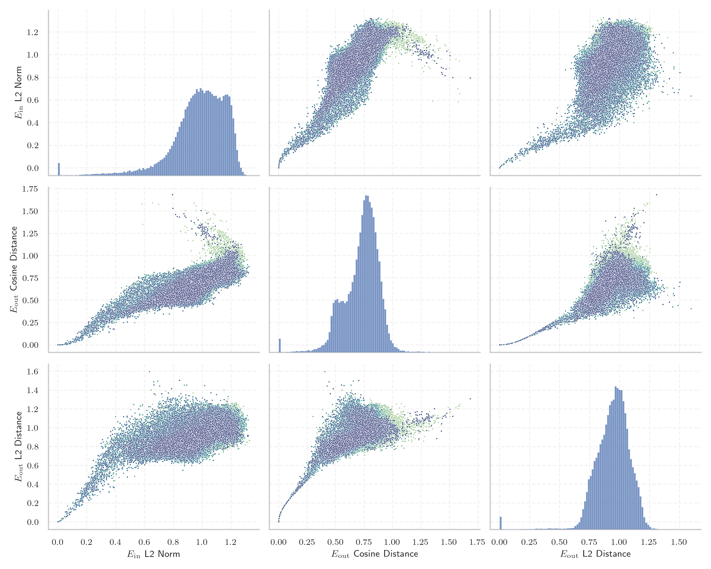

# Report for `01-ai/Yi-Coder-9B-Chat`

## Model info

* Model Info: 
  * Tied embeddings: False
  * LM head uses bias: False
  * Embeddings shape: [64000, 4096]
* Tokenizer Info: 
  * Vocab Size: 64000
  * Tokenizer Class: LlamaTokenizer
  * Token for verification prompt building: Acknowledgements
  * Token id for verification prompt building: 35477
* Indicator summary: 
  * Indicator for under-trained tokens: E_{in} L2 Norm
  * Overall distribution: 0.979 +/- 0.190
* Detected Token Counts: 
  * Number of tested under-trained tokens: 1279, 1094 non-special, 299 below p = 0.01 threshold, 138 below soft indicator threshold
  * Number of single byte tokens: 354, of which 112 below indicator threshold
  * Number of special tokens: 3, of which 3 below indicator threshold
  * Number of non-single-byte unreachable tokens: 3, of which 3 below indicator threshold

## Under-trained token indicators plot


## Verification plot


## Under-trained token verification results
138 entries below threshold of 0.199

|   token_id | token                       |   indicator | max_prob                                                         | in_other_tokens                                                                                                                                                                                                                                                                                                                                                                                               |
|------------|-----------------------------|-------------|------------------------------------------------------------------|---------------------------------------------------------------------------------------------------------------------------------------------------------------------------------------------------------------------------------------------------------------------------------------------------------------------------------------------------------------------------------------------------------------|
|      38185 | ````` \\+\\_\\+\\+ `````    |  0          | <span style='border: 1px solid rgb(169, 68, 66);'>1.7e-05</span> |                                                                                                                                                                                                                                                                                                                                                                                                               |
|      58458 | ````` \\+::\\+ `````        |  0          | <span style='border: 1px solid rgb(169, 68, 66);'>1.7e-05</span> |                                                                                                                                                                                                                                                                                                                                                                                                               |
|      36970 | ````` ▁本实用新型的 `````   |  0.00417208 | <span style='border: 1px solid rgb(169, 68, 66);'>4.3e-05</span> |                                                                                                                                                                                                                                                                                                                                                                                                               |
|      32010 | ````` mabaochang `````      |  0.011246   | <span style='border: 1px solid rgb(169, 68, 66);'>5.5e-05</span> |                                                                                                                                                                                                                                                                                                                                                                                                               |
|      52345 | ````` nzoem `````           |  0.0115682  | <span style='border: 1px solid rgb(169, 68, 66);'>2.1e-05</span> |                                                                                                                                                                                                                                                                                                                                                                                                               |
|      41270 | ````` mcited `````          |  0.019116   | <span style='border: 1px solid rgb(169, 68, 66);'>9.1e-06</span> | <span style='border: 1px solid rgb(169, 68, 66);'>````` mcitedefault `````</span>                                                                                                                                                                                                                                                                                                                             |
|      26327 | ````` ▁本实用新型 `````     |  0.0213606  | <span style='border: 1px solid rgb(169, 68, 66);'>4.8e-05</span> | <span style='border: 1px solid rgb(169, 68, 66);'>````` ▁本实用新型的 `````</span>                                                                                                                                                                                                                                                                                                                            |
|      26510 | ````` \\+\\_\\+ `````       |  0.0242358  | <span style='border: 1px solid rgb(169, 68, 66);'>1.1e-05</span> | <span style='border: 1px solid rgb(169, 68, 66);'>````` \\+\\_\\+\\+ `````</span>                                                                                                                                                                                                                                                                                                                             |
|      53246 | ````` mrrooter `````        |  0.0285072  | <span style='border: 1px solid rgb(169, 68, 66);'>3.5e-05</span> |                                                                                                                                                                                                                                                                                                                                                                                                               |
|      58973 | ````` Разпространение ````` |  0.0348741  | <span style='border: 1px solid rgb(169, 68, 66);'>9.6e-07</span> |                                                                                                                                                                                                                                                                                                                                                                                                               |
|      52955 | ````` Родени `````          |  0.036157   | <span style='border: 1px solid rgb(169, 68, 66);'>1.3e-05</span> |                                                                                                                                                                                                                                                                                                                                                                                                               |
|      37937 | ````` ▁具体实施方式 `````   |  0.0474792  | <span style='border: 1px solid rgb(169, 68, 66);'>5.3e-06</span> |                                                                                                                                                                                                                                                                                                                                                                                                               |
|      33850 | ````` ▁发明内容 `````       |  0.0516732  | <span style='border: 1px solid rgb(169, 68, 66);'>5.5e-06</span> |                                                                                                                                                                                                                                                                                                                                                                                                               |
|      58761 | ````` 实用新型内容 `````    |  0.051922   | <span style='border: 1px solid rgb(169, 68, 66);'>1.3e-05</span> |                                                                                                                                                                                                                                                                                                                                                                                                               |
|      58620 | ````` Irefn `````           |  0.0585479  | <span style='border: 1px solid rgb(169, 68, 66);'>3.6e-07</span> |                                                                                                                                                                                                                                                                                                                                                                                                               |
|      59159 | ````` )&=&\\ `````          |  0.0597123  | <span style='border: 1px solid rgb(169, 68, 66);'>9.2e-06</span> |                                                                                                                                                                                                                                                                                                                                                                                                               |
|      46696 | ````` ▁版的赞赏功能 `````   |  0.0609822  | <span style='border: 1px solid rgb(169, 68, 66);'>1.1e-05</span> |                                                                                                                                                                                                                                                                                                                                                                                                               |
|      34182 | ````` ▁背景技术 `````       |  0.0624692  | <span style='border: 1px solid rgb(169, 68, 66);'>2.9e-06</span> |                                                                                                                                                                                                                                                                                                                                                                                                               |
|      41277 | ````` mcitedefault `````    |  0.0627597  | <span style='border: 1px solid rgb(169, 68, 66);'>5.9e-06</span> |                                                                                                                                                                                                                                                                                                                                                                                                               |
|      19290 | ````` мври `````            |  0.0660515  | <span style='border: 1px solid rgb(169, 68, 66);'>7.6e-05</span> | <span style='border: 1px solid rgb(169, 68, 66);'>````` птември `````</span>, <span style='border: 1px solid rgb(255, 145, 0);'>````` ктомври `````</span>, <span style='border: 1px solid rgb(169, 68, 66);'>````` ▁септември `````</span>, <span style='border: 1px solid rgb(40, 167, 69);'>````` ▁октомври `````</span>, <span style='border: 1px solid rgb(169, 68, 66);'>````` кември `````</span>, ... |
<details><summary>118 additional entries below threshold</summary>

|   token_id | token                        |   indicator | max_prob                                                         | in_other_tokens                                                                                                                                                                                                                                         |
|------------|------------------------------|-------------|------------------------------------------------------------------|---------------------------------------------------------------------------------------------------------------------------------------------------------------------------------------------------------------------------------------------------------|
|      57958 | ````` }&=&\\ `````           |   0.0666948 | <span style='border: 1px solid rgb(169, 68, 66);'>1.2e-05</span> |                                                                                                                                                                                                                                                         |
|      31174 | ````` \\+:: `````            |   0.0745167 | <span style='border: 1px solid rgb(169, 68, 66);'>4.3e-07</span> | <span style='border: 1px solid rgb(169, 68, 66);'>````` \\+::\\+ `````</span>                                                                                                                                                                           |
|      14378 | ````` ":"\ufeff `````        |   0.0755539 | <span style='border: 1px solid rgb(169, 68, 66);'>1.9e-05</span> |                                                                                                                                                                                                                                                         |
|      59020 | ````` ":"/*\ `````           |   0.0796978 | <span style='border: 1px solid rgb(169, 68, 66);'>4.3e-05</span> |                                                                                                                                                                                                                                                         |
|      53979 | ````` ▁$\\\|\\ `````         |   0.0798567 | <span style='border: 1px solid rgb(169, 68, 66);'>4.2e-05</span> |                                                                                                                                                                                                                                                         |
|      11333 | ````` ▁[…]\ `````            |   0.0844005 | <span style='border: 1px solid rgb(169, 68, 66);'>5.3e-05</span> |                                                                                                                                                                                                                                                         |
|      58677 | ````` $\\%$ `````            |   0.0867048 | <span style='border: 1px solid rgb(169, 68, 66);'>1e-06</span>   |                                                                                                                                                                                                                                                         |
|      58456 | ````` })\\\\\ `````          |   0.0880697 | <span style='border: 1px solid rgb(169, 68, 66);'>0.00019</span> |                                                                                                                                                                                                                                                         |
|       1062 | ````` vepfs `````            |   0.0899712 | <span style='border: 1px solid rgb(169, 68, 66);'>2.9e-06</span> |                                                                                                                                                                                                                                                         |
|      27009 | ````` 本实用新型的 `````     |   0.0910899 | <span style='border: 1px solid rgb(169, 68, 66);'>1.3e-05</span> | <span style='border: 1px solid rgb(169, 68, 66);'>````` ▁本实用新型的 `````</span>                                                                                                                                                                      |
|      43942 | ````` ▁селото `````          |   0.0920512 | <span style='border: 1px solid rgb(169, 68, 66);'>0.00013</span> |                                                                                                                                                                                                                                                         |
|      58452 | ````` ▁&=&\\ `````           |   0.102258  | <span style='border: 1px solid rgb(169, 68, 66);'>0.00028</span> |                                                                                                                                                                                                                                                         |
|      19111 | ````` \\+\\_\\ `````         |   0.103576  | <span style='border: 1px solid rgb(169, 68, 66);'>9.8e-05</span> | <span style='border: 1px solid rgb(169, 68, 66);'>````` \\+\\_\\+ `````</span>, <span style='border: 1px solid rgb(169, 68, 66);'>````` \\+\\_\\+\\+ `````</span>                                                                                       |
|      26195 | ````` ▁forumYou `````        |   0.105431  | <span style='border: 1px solid rgb(169, 68, 66);'>9.4e-06</span> |                                                                                                                                                                                                                                                         |
|      38169 | ````` }^{(\\ `````           |   0.108132  | <span style='border: 1px solid rgb(169, 68, 66);'>0.00044</span> |                                                                                                                                                                                                                                                         |
|      55040 | ````` _{(\\ `````            |   0.111883  | <span style='border: 1px solid rgb(169, 68, 66);'>0.00011</span> |                                                                                                                                                                                                                                                         |
|      46677 | ````` 新规定影响 `````       |   0.113108  | <span style='border: 1px solid rgb(169, 68, 66);'>4.5e-06</span> |                                                                                                                                                                                                                                                         |
|      22613 | ````` ▁$\\{\\ `````          |   0.113263  | <span style='border: 1px solid rgb(255, 145, 0);'>0.0012</span>  |                                                                                                                                                                                                                                                         |
|      59474 | ````` }}^\\ `````            |   0.118733  | <span style='border: 1px solid rgb(169, 68, 66);'>3.5e-05</span> |                                                                                                                                                                                                                                                         |
|      17853 | ````` &=&\\ `````            |   0.119812  | <span style='border: 1px solid rgb(169, 68, 66);'>0.00012</span> | <span style='border: 1px solid rgb(169, 68, 66);'>````` }&=&\\ `````</span>, <span style='border: 1px solid rgb(169, 68, 66);'>````` ▁&=&\\ `````</span>, <span style='border: 1px solid rgb(169, 68, 66);'>````` )&=&\\ `````</span>                   |
|      44270 | ````` ^*(\\ `````            |   0.12105   | <span style='border: 1px solid rgb(169, 68, 66);'>0.00016</span> |                                                                                                                                                                                                                                                         |
|      45676 | ````` nWASHINGTON `````      |   0.123725  | <span style='border: 1px solid rgb(169, 68, 66);'>1.3e-05</span> |                                                                                                                                                                                                                                                         |
|      58052 | ````` евру `````             |   0.124234  | <span style='border: 1px solid rgb(169, 68, 66);'>2.9e-05</span> | <span style='border: 1px solid rgb(169, 68, 66);'>````` евруари `````</span>                                                                                                                                                                            |
|      42725 | ````` 期间履行 `````         |   0.124455  | <span style='border: 1px solid rgb(169, 68, 66);'>3e-05</span>   | <span style='border: 1px solid rgb(169, 68, 66);'>````` 指定的期间履行 `````</span>                                                                                                                                                                     |
|      20714 | ````` Източници `````        |   0.125189  | <span style='border: 1px solid rgb(169, 68, 66);'>0.00076</span> |                                                                                                                                                                                                                                                         |
|      44047 | ````` mrroot `````           |   0.125654  | <span style='border: 1px solid rgb(169, 68, 66);'>2.7e-06</span> | <span style='border: 1px solid rgb(169, 68, 66);'>````` mrrooter `````</span>                                                                                                                                                                           |
|      45501 | ````` }$\\\\\ `````          |   0.126243  | <span style='border: 1px solid rgb(169, 68, 66);'>7.7e-05</span> |                                                                                                                                                                                                                                                         |
|      46451 | ````` \\\|_{\\ `````         |   0.127624  | <span style='border: 1px solid rgb(169, 68, 66);'>1.8e-05</span> |                                                                                                                                                                                                                                                         |
|      50881 | ````` 所述的一种 `````       |   0.128589  | <span style='border: 1px solid rgb(169, 68, 66);'>8.1e-05</span> |                                                                                                                                                                                                                                                         |
|      42242 | ````` nPersonally `````      |   0.130655  | <span style='border: 1px solid rgb(169, 68, 66);'>1.3e-05</span> |                                                                                                                                                                                                                                                         |
|      46676 | ````` 受苹果公司 `````       |   0.131589  | <span style='border: 1px solid rgb(169, 68, 66);'>3.3e-07</span> |                                                                                                                                                                                                                                                         |
|      38615 | ````` ▁$\\\| `````           |   0.133187  | <span style='border: 1px solid rgb(169, 68, 66);'>5.6e-06</span> | <span style='border: 1px solid rgb(169, 68, 66);'>````` ▁$\\\|\\ `````</span>                                                                                                                                                                           |
|      47647 | ````` nConsequently `````    |   0.136101  | <span style='border: 1px solid rgb(169, 68, 66);'>8.9e-06</span> |                                                                                                                                                                                                                                                         |
|      52625 | ````` nmagnetic `````        |   0.136355  | <span style='border: 1px solid rgb(169, 68, 66);'>4.8e-05</span> |                                                                                                                                                                                                                                                         |
|      54630 | ````` 柬埔 `````             |   0.138539  | <span style='border: 1px solid rgb(169, 68, 66);'>4.5e-06</span> | ````` 柬埔寨 `````                                                                                                                                                                                                                                      |
|      53964 | ````` 進黨 `````             |   0.141083  | <span style='border: 1px solid rgb(169, 68, 66);'>3.3e-06</span> | <span style='border: 1px solid rgb(40, 167, 69);'>````` 民進黨 `````</span>                                                                                                                                                                             |
|      54185 | ````` ▁$%\ `````             |   0.146014  | <span style='border: 1px solid rgb(251, 189, 8);'>0.046</span>   |                                                                                                                                                                                                                                                         |
|      54580 | ````` }--\\ `````            |   0.14634   | <span style='border: 1px solid rgb(251, 189, 8);'>0.017</span>   |                                                                                                                                                                                                                                                         |
|      37655 | ````` nNevertheless `````    |   0.146362  | <span style='border: 1px solid rgb(169, 68, 66);'>0.00021</span> |                                                                                                                                                                                                                                                         |
|      38351 | ````` 向本院递交上诉状 ````` |   0.146773  | <span style='border: 1px solid rgb(169, 68, 66);'>4.8e-06</span> |                                                                                                                                                                                                                                                         |
|      36200 | ````` 递交上诉状 `````       |   0.146888  | <span style='border: 1px solid rgb(169, 68, 66);'>2e-06</span>   | <span style='border: 1px solid rgb(169, 68, 66);'>````` 向本院递交上诉状 `````</span>                                                                                                                                                                   |
|      55282 | ````` nResearchers `````     |   0.149496  | <span style='border: 1px solid rgb(255, 145, 0);'>0.0018</span>  |                                                                                                                                                                                                                                                         |
|      47576 | ````` 未按本判决 `````       |   0.149618  | <span style='border: 1px solid rgb(169, 68, 66);'>3.2e-06</span> |                                                                                                                                                                                                                                                         |
|      49644 | ````` ▁本发明的 `````        |   0.149862  | <span style='border: 1px solid rgb(169, 68, 66);'>5.7e-05</span> |                                                                                                                                                                                                                                                         |
|      46922 | ````` ;\\;\\;\\;\\ `````     |   0.152046  | <span style='border: 1px solid rgb(255, 145, 0);'>0.0016</span>  |                                                                                                                                                                                                                                                         |
|      17774 | ````` 本实用新型 `````       |   0.155754  | <span style='border: 1px solid rgb(169, 68, 66);'>7.2e-07</span> | <span style='border: 1px solid rgb(169, 68, 66);'>````` ▁本实用新型 `````</span>, <span style='border: 1px solid rgb(169, 68, 66);'>````` 本实用新型的 `````</span>, <span style='border: 1px solid rgb(169, 68, 66);'>````` ▁本实用新型的 `````</span> |
|      45337 | ````` nInterestingly `````   |   0.156468  | <span style='border: 1px solid rgb(169, 68, 66);'>5.6e-05</span> |                                                                                                                                                                                                                                                         |
|      53691 | ````` }}_\\ `````            |   0.156509  | <span style='border: 1px solid rgb(169, 68, 66);'>0.00012</span> |                                                                                                                                                                                                                                                         |
|      18479 | ````` +\\_\\ `````           |   0.158166  | <span style='border: 1px solid rgb(169, 68, 66);'>0.0004</span>  | <span style='border: 1px solid rgb(169, 68, 66);'>````` \\+\\_\\ `````</span>, <span style='border: 1px solid rgb(169, 68, 66);'>````` \\+\\_\\+ `````</span>, <span style='border: 1px solid rgb(169, 68, 66);'>````` \\+\\_\\+\\+ `````</span>        |
|      53058 | ````` 乌鲁木 `````           |   0.158375  | <span style='border: 1px solid rgb(169, 68, 66);'>9.8e-07</span> | ````` 乌鲁木齐 `````                                                                                                                                                                                                                                    |
|      47419 | ````` []{\\ `````            |   0.158443  | <span style='border: 1px solid rgb(255, 145, 0);'>0.008</span>   |                                                                                                                                                                                                                                                         |
|      45402 | ````` ▁цър `````             |   0.160469  | <span style='border: 1px solid rgb(169, 68, 66);'>7.4e-06</span> |                                                                                                                                                                                                                                                         |
|      58597 | ````` ▁смърт `````           |   0.161384  | <span style='border: 1px solid rgb(169, 68, 66);'>1.3e-05</span> |                                                                                                                                                                                                                                                         |
|      15246 | ````` ~$\\ `````             |   0.162002  | <span style='border: 1px solid rgb(251, 189, 8);'>0.06</span>    |                                                                                                                                                                                                                                                         |
|      46397 | ````` 给付金钱义务 `````     |   0.162822  | <span style='border: 1px solid rgb(169, 68, 66);'>1.4e-05</span> |                                                                                                                                                                                                                                                         |
|      53069 | ````` nquantum `````         |   0.163502  | <span style='border: 1px solid rgb(169, 68, 66);'>0.00015</span> |                                                                                                                                                                                                                                                         |
|      48085 | ````` )=-\\ `````            |   0.163605  | <span style='border: 1px solid rgb(255, 145, 0);'>0.0029</span>  |                                                                                                                                                                                                                                                         |
|      51019 | ````` ▁април `````           |   0.164391  | <span style='border: 1px solid rgb(169, 68, 66);'>6.2e-07</span> |                                                                                                                                                                                                                                                         |
|      26341 | ````` nrespect `````         |   0.164657  | <span style='border: 1px solid rgb(169, 68, 66);'>0.00038</span> | <span style='border: 1px solid rgb(169, 68, 66);'>````` nrespectively `````</span>                                                                                                                                                                      |
|      36226 | ````` onlinecite `````       |   0.164717  | <span style='border: 1px solid rgb(169, 68, 66);'>7.3e-06</span> |                                                                                                                                                                                                                                                         |
|      33785 | ````` nObviously `````       |   0.164824  | <span style='border: 1px solid rgb(169, 68, 66);'>2.4e-06</span> |                                                                                                                                                                                                                                                         |
|      40322 | ````` 支付迟延 `````         |   0.165078  | <span style='border: 1px solid rgb(169, 68, 66);'>2.2e-05</span> | <span style='border: 1px solid rgb(169, 68, 66);'>````` 加倍支付迟延 `````</span>                                                                                                                                                                       |
|      31425 | ````` )_{\\ `````            |   0.165455  | <span style='border: 1px solid rgb(255, 145, 0);'>0.0016</span>  |                                                                                                                                                                                                                                                         |
|      45387 | ````` 代理审判员 `````       |   0.165564  | <span style='border: 1px solid rgb(169, 68, 66);'>3.1e-06</span> |                                                                                                                                                                                                                                                         |
|      31065 | ````` \\%) `````             |   0.165728  | <span style='border: 1px solid rgb(169, 68, 66);'>5.2e-06</span> |                                                                                                                                                                                                                                                         |
|      57448 | ````` ▁所述的 `````          |   0.166368  | <span style='border: 1px solid rgb(169, 68, 66);'>0.00015</span> |                                                                                                                                                                                                                                                         |
|      57260 | ````` 于所述 `````           |   0.167726  | <span style='border: 1px solid rgb(255, 145, 0);'>0.0013</span>  |                                                                                                                                                                                                                                                         |
|      40857 | ````` 提出副本 `````         |   0.169163  | <span style='border: 1px solid rgb(169, 68, 66);'>3.5e-06</span> |                                                                                                                                                                                                                                                         |
|      32202 | ````` nrespectively `````    |   0.171221  | <span style='border: 1px solid rgb(169, 68, 66);'>0.00022</span> |                                                                                                                                                                                                                                                         |
|      58699 | ````` nUltimately `````      |   0.171294  | <span style='border: 1px solid rgb(169, 68, 66);'>6.4e-05</span> |                                                                                                                                                                                                                                                         |
|      46642 | ````` 二维码转账 `````       |   0.171339  | <span style='border: 1px solid rgb(169, 68, 66);'>1.5e-06</span> |                                                                                                                                                                                                                                                         |
|      37421 | ````` …”\ `````              |   0.172569  | <span style='border: 1px solid rgb(255, 145, 0);'>0.0033</span>  |                                                                                                                                                                                                                                                         |
|      42423 | ````` 加倍支付迟延 `````     |   0.173418  | <span style='border: 1px solid rgb(169, 68, 66);'>2.4e-06</span> |                                                                                                                                                                                                                                                         |
|      58364 | ````` }+{\\ `````            |   0.17346   | <span style='border: 1px solid rgb(40, 167, 69);'>0.14</span>    |                                                                                                                                                                                                                                                         |
|      34141 | ````` nFIG `````             |   0.176192  | <span style='border: 1px solid rgb(251, 189, 8);'>0.041</span>   |                                                                                                                                                                                                                                                         |
|      56126 | ````` ":"「 `````            |   0.177136  | <span style='border: 1px solid rgb(255, 145, 0);'>0.003</span>   |                                                                                                                                                                                                                                                         |
|      36357 | ````` nThroughout `````      |   0.17717   | <span style='border: 1px solid rgb(169, 68, 66);'>0.00013</span> |                                                                                                                                                                                                                                                         |
|      33968 | ````` ▁技术领域 `````        |   0.177207  | <span style='border: 1px solid rgb(169, 68, 66);'>3.6e-05</span> |                                                                                                                                                                                                                                                         |
|      39373 | ````` napproxim `````        |   0.179511  | <span style='border: 1px solid rgb(169, 68, 66);'>0.0003</span>  |                                                                                                                                                                                                                                                         |
|      34224 | ````` \|_{\\ `````           |   0.180153  | <span style='border: 1px solid rgb(255, 145, 0);'>0.0014</span>  | <span style='border: 1px solid rgb(169, 68, 66);'>````` \\\|_{\\ `````</span>                                                                                                                                                                           |
|      27852 | ````` ▁препратки `````       |   0.180258  | <span style='border: 1px solid rgb(169, 68, 66);'>5.2e-05</span> |                                                                                                                                                                                                                                                         |
|      57483 | ````` napproach `````        |   0.180716  | <span style='border: 1px solid rgb(251, 189, 8);'>0.098</span>   |                                                                                                                                                                                                                                                         |
|      50597 | ````` nparticular `````      |   0.180788  | <span style='border: 1px solid rgb(169, 68, 66);'>7.1e-05</span> |                                                                                                                                                                                                                                                         |
|      40798 | ````` nObama `````           |   0.181454  | <span style='border: 1px solid rgb(255, 145, 0);'>0.0057</span>  |                                                                                                                                                                                                                                                         |
|      52323 | ````` }-{\\ `````            |   0.181602  | <span style='border: 1px solid rgb(169, 68, 66);'>9e-05</span>   |                                                                                                                                                                                                                                                         |
|      46693 | ````` нския `````            |   0.182765  | <span style='border: 1px solid rgb(169, 68, 66);'>0.0005</span>  |                                                                                                                                                                                                                                                         |
|      41844 | ````` nRegarding `````       |   0.183236  | <span style='border: 1px solid rgb(169, 68, 66);'>0.00045</span> |                                                                                                                                                                                                                                                         |
|      58601 | ````` nMatthew `````         |   0.183603  | <span style='border: 1px solid rgb(255, 145, 0);'>0.0042</span>  |                                                                                                                                                                                                                                                         |
|      37027 | ````` nClearly `````         |   0.183821  | <span style='border: 1px solid rgb(169, 68, 66);'>0.00057</span> |                                                                                                                                                                                                                                                         |
|      39340 | ````` }_{{\\ `````           |   0.184088  | <span style='border: 1px solid rgb(255, 145, 0);'>0.0015</span>  |                                                                                                                                                                                                                                                         |
|      47468 | ````` nTheorem `````         |   0.184501  | <span style='border: 1px solid rgb(40, 167, 69);'>0.38</span>    |                                                                                                                                                                                                                                                         |
|      50269 | ````` nRather `````          |   0.184631  | <span style='border: 1px solid rgb(255, 145, 0);'>0.0021</span>  |                                                                                                                                                                                                                                                         |
|      32078 | ````` $~\\ `````             |   0.1854    | <span style='border: 1px solid rgb(251, 189, 8);'>0.045</span>   |                                                                                                                                                                                                                                                         |
|      27532 | ````` 审理终结 `````         |   0.186411  | <span style='border: 1px solid rgb(169, 68, 66);'>5.5e-05</span> | <span style='border: 1px solid rgb(169, 68, 66);'>````` 现已审理终结 `````</span>, <span style='border: 1px solid rgb(169, 68, 66);'>````` 本案现已审理终结 `````</span>                                                                                |
|      55541 | ````` ▁ноември `````         |   0.186717  | <span style='border: 1px solid rgb(169, 68, 66);'>1.1e-05</span> |                                                                                                                                                                                                                                                         |
|      37452 | ````` }=-\\ `````            |   0.186925  | <span style='border: 1px solid rgb(169, 68, 66);'>0.00024</span> |                                                                                                                                                                                                                                                         |
|      30046 | ````` 所述第二 `````         |   0.188296  | <span style='border: 1px solid rgb(255, 145, 0);'>0.0054</span>  |                                                                                                                                                                                                                                                         |
|      44814 | ````` 被告李 `````           |   0.188353  | <span style='border: 1px solid rgb(255, 145, 0);'>0.0045</span>  |                                                                                                                                                                                                                                                         |
|      46113 | ````` }=\\{ `````            |   0.188643  | <span style='border: 1px solid rgb(251, 189, 8);'>0.066</span>   |                                                                                                                                                                                                                                                         |
|      40683 | ````` ):=\\ `````            |   0.189937  | <span style='border: 1px solid rgb(169, 68, 66);'>0.00044</span> |                                                                                                                                                                                                                                                         |
|      57541 | ````` nconsidered `````      |   0.191558  | <span style='border: 1px solid rgb(255, 145, 0);'>0.0024</span>  |                                                                                                                                                                                                                                                         |
|      55560 | ````` }<\\ `````             |   0.192199  | <span style='border: 1px solid rgb(255, 145, 0);'>0.0028</span>  |                                                                                                                                                                                                                                                         |
|      49044 | ````` }^{-\\ `````           |   0.192797  | <span style='border: 1px solid rgb(169, 68, 66);'>0.0004</span>  |                                                                                                                                                                                                                                                         |
|      57669 | ````` nBrad `````            |   0.193101  | <span style='border: 1px solid rgb(40, 167, 69);'>0.25</span>    |                                                                                                                                                                                                                                                         |
|      45474 | ````` ]^{\\ `````            |   0.19409   | <span style='border: 1px solid rgb(169, 68, 66);'>0.00016</span> |                                                                                                                                                                                                                                                         |
|      52603 | ````` ▁декември `````        |   0.194544  | <span style='border: 1px solid rgb(169, 68, 66);'>1.2e-05</span> |                                                                                                                                                                                                                                                         |
|      57781 | ````` 本院予以确认 `````     |   0.194735  | <span style='border: 1px solid rgb(169, 68, 66);'>6e-07</span>   |                                                                                                                                                                                                                                                         |
|      58028 | ````` ▁дъщер `````           |   0.195036  | <span style='border: 1px solid rgb(169, 68, 66);'>1.2e-05</span> |                                                                                                                                                                                                                                                         |
|      20000 | ````` точници `````          |   0.195038  | <span style='border: 1px solid rgb(169, 68, 66);'>0.00011</span> | <span style='border: 1px solid rgb(169, 68, 66);'>````` Източници `````</span>                                                                                                                                                                          |
|      47304 | ````` nSecondly `````        |   0.195395  | <span style='border: 1px solid rgb(255, 145, 0);'>0.0069</span>  |                                                                                                                                                                                                                                                         |
|      59473 | ````` nGreg `````            |   0.195575  | <span style='border: 1px solid rgb(40, 167, 69);'>0.71</span>    |                                                                                                                                                                                                                                                         |
|      50472 | ````` ’”\ `````              |   0.19612   | <span style='border: 1px solid rgb(251, 189, 8);'>0.081</span>   |                                                                                                                                                                                                                                                         |
|      33125 | ````` 本判决生效 `````       |   0.19653   | <span style='border: 1px solid rgb(169, 68, 66);'>8.1e-06</span> | <span style='border: 1px solid rgb(169, 68, 66);'>````` 于本判决生效 `````</span>                                                                                                                                                                       |
|      34587 | ````` ▁$[\\ `````            |   0.196823  | <span style='border: 1px solid rgb(40, 167, 69);'>0.36</span>    |                                                                                                                                                                                                                                                         |
|      27952 | ````` Външни `````           |   0.197308  | <span style='border: 1px solid rgb(255, 145, 0);'>0.0011</span>  |                                                                                                                                                                                                                                                         |
|      54430 | ````` \\%} `````             |   0.197346  | <span style='border: 1px solid rgb(169, 68, 66);'>0.00052</span> |                                                                                                                                                                                                                                                         |
|      44827 | ````` 给付金钱 `````         |   0.198091  | <span style='border: 1px solid rgb(169, 68, 66);'>0.0009</span>  | <span style='border: 1px solid rgb(169, 68, 66);'>````` 给付金钱义务 `````</span>                                                                                                                                                                       |
|      35932 | ````` )}_{\\ `````           |   0.198456  | <span style='border: 1px solid rgb(255, 145, 0);'>0.0012</span>  |                                                                                                                                                                                                                                                         |
</details>
<details><summary>956 additional entries above threshold</summary>

|   token_id | token                        |   indicator | max_prob                                                         | in_other_tokens                                                                                                                                                                                                                                                                                                                          |
|------------|------------------------------|-------------|------------------------------------------------------------------|------------------------------------------------------------------------------------------------------------------------------------------------------------------------------------------------------------------------------------------------------------------------------------------------------------------------------------------|
|      26261 | ````` nSimilarly `````       |    0.19904  | <span style='border: 1px solid rgb(255, 145, 0);'>0.0014</span>  |                                                                                                                                                                                                                                                                                                                                          |
|      37488 | ````` ▁$-\\ `````            |    0.199076 | <span style='border: 1px solid rgb(40, 167, 69);'>0.14</span>    |                                                                                                                                                                                                                                                                                                                                          |
|      54548 | ````` &$\\ `````             |    0.200336 | <span style='border: 1px solid rgb(251, 189, 8);'>0.057</span>   |                                                                                                                                                                                                                                                                                                                                          |
|      54107 | ````` ческата `````          |    0.200679 | <span style='border: 1px solid rgb(169, 68, 66);'>0.00078</span> |                                                                                                                                                                                                                                                                                                                                          |
|      24417 | ````` ~{\\ `````             |    0.201044 | <span style='border: 1px solid rgb(255, 145, 0);'>0.002</span>   |                                                                                                                                                                                                                                                                                                                                          |
|      31801 | ````` -$\\ `````             |    0.201703 | <span style='border: 1px solid rgb(40, 167, 69);'>0.19</span>    |                                                                                                                                                                                                                                                                                                                                          |
|      15298 | ````` ▁$\|\\ `````           |    0.20182  | <span style='border: 1px solid rgb(40, 167, 69);'>0.31</span>    |                                                                                                                                                                                                                                                                                                                                          |
|      59512 | ````` )^{-\\ `````           |    0.201855 | <span style='border: 1px solid rgb(169, 68, 66);'>8.7e-05</span> |                                                                                                                                                                                                                                                                                                                                          |
|      45624 | ````` nRegardless `````      |    0.201903 | <span style='border: 1px solid rgb(169, 68, 66);'>0.00043</span> |                                                                                                                                                                                                                                                                                                                                          |
|      56035 | ````` 被告王 `````           |    0.202022 | <span style='border: 1px solid rgb(169, 68, 66);'>0.00034</span> |                                                                                                                                                                                                                                                                                                                                          |
|      53564 | ````` }={\\ `````            |    0.202734 | <span style='border: 1px solid rgb(251, 189, 8);'>0.011</span>   |                                                                                                                                                                                                                                                                                                                                          |
|      56708 | ````` 和所述 `````           |    0.203275 | <span style='border: 1px solid rgb(169, 68, 66);'>0.00026</span> |                                                                                                                                                                                                                                                                                                                                          |
|      50759 | ````` nGenerally `````       |    0.203849 | <span style='border: 1px solid rgb(169, 68, 66);'>0.0002</span>  |                                                                                                                                                                                                                                                                                                                                          |
|      16963 | ````` }({\\ `````            |    0.203936 | <span style='border: 1px solid rgb(251, 189, 8);'>0.039</span>   |                                                                                                                                                                                                                                                                                                                                          |
|      27990 | ````` 现已审理终结 `````     |    0.203972 | <span style='border: 1px solid rgb(169, 68, 66);'>1.3e-06</span> | <span style='border: 1px solid rgb(169, 68, 66);'>````` 本案现已审理终结 `````</span>                                                                                                                                                                                                                                                    |
|      20408 | ````` \\\|_{ `````           |    0.206021 | <span style='border: 1px solid rgb(169, 68, 66);'>0.00018</span> | <span style='border: 1px solid rgb(169, 68, 66);'>````` \\\|_{\\ `````</span>                                                                                                                                                                                                                                                            |
|      45065 | ````` ръц `````              |    0.207038 | <span style='border: 1px solid rgb(169, 68, 66);'>0.00035</span> |                                                                                                                                                                                                                                                                                                                                          |
|      22056 | ````` ^{(\\ `````            |    0.207078 | <span style='border: 1px solid rgb(40, 167, 69);'>0.42</span>    | <span style='border: 1px solid rgb(169, 68, 66);'>````` }^{(\\ `````</span>                                                                                                                                                                                                                                                              |
|      52331 | ````` nRepublic `````        |    0.207434 | <span style='border: 1px solid rgb(40, 167, 69);'>0.78</span>    |                                                                                                                                                                                                                                                                                                                                          |
|      17416 | ````` nfortunately `````     |    0.208385 | <span style='border: 1px solid rgb(169, 68, 66);'>0.00023</span> | <span style='border: 1px solid rgb(255, 145, 0);'>````` nUnfortunately `````</span>, ````` Unfortunately `````                                                                                                                                                                                                                           |
|      54404 | ````` })^{\\ `````           |    0.208707 | <span style='border: 1px solid rgb(169, 68, 66);'>8.8e-06</span> |                                                                                                                                                                                                                                                                                                                                          |
|      55203 | ````` ninteraction `````     |    0.209661 | <span style='border: 1px solid rgb(40, 167, 69);'>0.27</span>    |                                                                                                                                                                                                                                                                                                                                          |
|      40563 | ````` nScott `````           |    0.209874 | <span style='border: 1px solid rgb(251, 189, 8);'>0.097</span>   |                                                                                                                                                                                                                                                                                                                                          |
|      45514 | ````` ▁САЩ `````             |    0.210744 | <span style='border: 1px solid rgb(251, 189, 8);'>0.01</span>    |                                                                                                                                                                                                                                                                                                                                          |
|      56651 | ````` nABOUT `````           |    0.211374 | <span style='border: 1px solid rgb(255, 145, 0);'>0.0019</span>  |                                                                                                                                                                                                                                                                                                                                          |
|      30058 | ````` \\}_{ `````            |    0.212387 | <span style='border: 1px solid rgb(255, 145, 0);'>0.0071</span>  |                                                                                                                                                                                                                                                                                                                                          |
|      21155 | ````` 如权利要求 `````       |    0.212773 | <span style='border: 1px solid rgb(169, 68, 66);'>0.00047</span> |                                                                                                                                                                                                                                                                                                                                          |
|      55600 | ````` 加哥 `````             |    0.212988 | <span style='border: 1px solid rgb(169, 68, 66);'>2.3e-05</span> | ````` 芝加哥 `````                                                                                                                                                                                                                                                                                                                       |
|      29930 | ````` $^{\\ `````            |    0.213331 | <span style='border: 1px solid rgb(40, 167, 69);'>0.49</span>    |                                                                                                                                                                                                                                                                                                                                          |
|      21953 | ````` $\\\\\ `````           |    0.213372 | <span style='border: 1px solid rgb(40, 167, 69);'>0.22</span>    | <span style='border: 1px solid rgb(169, 68, 66);'>````` }$\\\\\ `````</span>                                                                                                                                                                                                                                                             |
|      18027 | ````` nMoreover `````        |    0.213765 | <span style='border: 1px solid rgb(169, 68, 66);'>1.8e-05</span> |                                                                                                                                                                                                                                                                                                                                          |
|      45484 | ````` ncorrespond `````      |    0.213916 | <span style='border: 1px solid rgb(40, 167, 69);'>0.5</span>     |                                                                                                                                                                                                                                                                                                                                          |
|      57778 | ````` }=(\\ `````            |    0.214247 | <span style='border: 1px solid rgb(255, 145, 0);'>0.0027</span>  |                                                                                                                                                                                                                                                                                                                                          |
|      36614 | ````` 上诉于 `````           |    0.21452  | <span style='border: 1px solid rgb(169, 68, 66);'>7.8e-07</span> |                                                                                                                                                                                                                                                                                                                                          |
|      59391 | ````` =&\\ `````             |    0.214835 | <span style='border: 1px solid rgb(40, 167, 69);'>0.41</span>    |                                                                                                                                                                                                                                                                                                                                          |
|      51440 | ````` кември `````           |    0.215239 | <span style='border: 1px solid rgb(169, 68, 66);'>0.00072</span> | <span style='border: 1px solid rgb(169, 68, 66);'>````` ▁декември `````</span>                                                                                                                                                                                                                                                           |
|      52381 | ````` 被告张 `````           |    0.215508 | <span style='border: 1px solid rgb(169, 68, 66);'>0.00029</span> |                                                                                                                                                                                                                                                                                                                                          |
|      46695 | ````` 支持公众号 `````       |    0.215612 | <span style='border: 1px solid rgb(169, 68, 66);'>5.3e-05</span> |                                                                                                                                                                                                                                                                                                                                          |
|      52081 | ````` _{\\{ `````            |    0.215681 | <span style='border: 1px solid rgb(251, 189, 8);'>0.091</span>   |                                                                                                                                                                                                                                                                                                                                          |
|      49889 | ````` nFortunately `````     |    0.216588 | <span style='border: 1px solid rgb(169, 68, 66);'>0.00093</span> |                                                                                                                                                                                                                                                                                                                                          |
|      38853 | ````` nobtained `````        |    0.217205 | <span style='border: 1px solid rgb(251, 189, 8);'>0.058</span>   |                                                                                                                                                                                                                                                                                                                                          |
|      53624 | ````` nTony `````            |    0.217341 | <span style='border: 1px solid rgb(40, 167, 69);'>0.98</span>    |                                                                                                                                                                                                                                                                                                                                          |
|      35502 | ````` 本院于 `````           |    0.218923 | <span style='border: 1px solid rgb(169, 68, 66);'>1.4e-05</span> |                                                                                                                                                                                                                                                                                                                                          |
|      53622 | ````` 文明实践 `````         |    0.220558 | <span style='border: 1px solid rgb(169, 68, 66);'>0.00016</span> |                                                                                                                                                                                                                                                                                                                                          |
|      38133 | ````` 履行期间的 `````       |    0.220969 | <span style='border: 1px solid rgb(169, 68, 66);'>4.5e-05</span> |                                                                                                                                                                                                                                                                                                                                          |
|      39987 | ````` nBasically `````       |    0.221122 | <span style='border: 1px solid rgb(169, 68, 66);'>8.6e-06</span> |                                                                                                                                                                                                                                                                                                                                          |
|      46115 | ````` ▁{$\\ `````            |    0.221282 | <span style='border: 1px solid rgb(251, 189, 8);'>0.031</span>   |                                                                                                                                                                                                                                                                                                                                          |
|      24855 | ````` )~\\ `````             |    0.221875 | <span style='border: 1px solid rgb(251, 189, 8);'>0.07</span>    |                                                                                                                                                                                                                                                                                                                                          |
|      53596 | ````` йския `````            |    0.224704 | <span style='border: 1px solid rgb(169, 68, 66);'>4e-05</span>   |                                                                                                                                                                                                                                                                                                                                          |
|      25545 | ````` nIndeed `````          |    0.226567 | <span style='border: 1px solid rgb(251, 189, 8);'>0.018</span>   |                                                                                                                                                                                                                                                                                                                                          |
|      53580 | ````` nassociated `````      |    0.22676  | <span style='border: 1px solid rgb(40, 167, 69);'>0.2</span>     |                                                                                                                                                                                                                                                                                                                                          |
|      27867 | ````` impse `````            |    0.227293 | <span style='border: 1px solid rgb(251, 189, 8);'>0.045</span>   | ````` ▁glimpse `````                                                                                                                                                                                                                                                                                                                     |
|      31761 | ````` ▁\\]\ `````            |    0.227343 | <span style='border: 1px solid rgb(255, 145, 0);'>0.0042</span>  |                                                                                                                                                                                                                                                                                                                                          |
|      54003 | ````` )}+\\ `````            |    0.22814  | <span style='border: 1px solid rgb(251, 189, 8);'>0.022</span>   |                                                                                                                                                                                                                                                                                                                                          |
|      58852 | ````` 减半收取 `````         |    0.228877 | <span style='border: 1px solid rgb(169, 68, 66);'>0.00019</span> |                                                                                                                                                                                                                                                                                                                                          |
|      44240 | ````` 指定的期间履行 `````   |    0.228878 | <span style='border: 1px solid rgb(169, 68, 66);'>2.9e-06</span> |                                                                                                                                                                                                                                                                                                                                          |
|      52500 | ````` ▁крал `````            |    0.228961 | <span style='border: 1px solid rgb(255, 145, 0);'>0.0064</span>  |                                                                                                                                                                                                                                                                                                                                          |
|      53725 | ````` naccording `````       |    0.229269 | <span style='border: 1px solid rgb(40, 167, 69);'>0.56</span>    |                                                                                                                                                                                                                                                                                                                                          |
|      45235 | ````` 其中所述 `````         |    0.229812 | <span style='border: 1px solid rgb(255, 145, 0);'>0.0017</span>  |                                                                                                                                                                                                                                                                                                                                          |
|       5340 | ````` RedPajama `````        |    0.23034  | <span style='border: 1px solid rgb(251, 189, 8);'>0.012</span>   |                                                                                                                                                                                                                                                                                                                                          |
|      20132 | ````` nFurthermore `````     |    0.230535 | <span style='border: 1px solid rgb(169, 68, 66);'>4.2e-05</span> |                                                                                                                                                                                                                                                                                                                                          |
|      36896 | ````` }}\\\\\ `````          |    0.230692 | <span style='border: 1px solid rgb(255, 145, 0);'>0.0036</span>  |                                                                                                                                                                                                                                                                                                                                          |
|      42298 | ````` nSpecifically `````    |    0.23087  | <span style='border: 1px solid rgb(255, 145, 0);'>0.0081</span>  |                                                                                                                                                                                                                                                                                                                                          |
|      25215 | ````` 所述第一 `````         |    0.230931 | <span style='border: 1px solid rgb(255, 145, 0);'>0.0029</span>  |                                                                                                                                                                                                                                                                                                                                          |
|      45515 | ````` nBrian `````           |    0.231105 | <span style='border: 1px solid rgb(40, 167, 69);'>0.33</span>    |                                                                                                                                                                                                                                                                                                                                          |
|      47523 | ````` Бележки `````          |    0.231444 | <span style='border: 1px solid rgb(40, 167, 69);'>0.22</span>    |                                                                                                                                                                                                                                                                                                                                          |
|      37742 | ````` -{\\ `````             |    0.231505 | <span style='border: 1px solid rgb(40, 167, 69);'>0.76</span>    | <span style='border: 1px solid rgb(169, 68, 66);'>````` }-{\\ `````</span>                                                                                                                                                                                                                                                               |
|      55595 | ````` nhowever `````         |    0.232311 | <span style='border: 1px solid rgb(169, 68, 66);'>2.3e-05</span> |                                                                                                                                                                                                                                                                                                                                          |
|      42668 | ````` nLastly `````          |    0.232524 | <span style='border: 1px solid rgb(255, 145, 0);'>0.0014</span>  |                                                                                                                                                                                                                                                                                                                                          |
|      55471 | ````` nBTW `````             |    0.2326   | <span style='border: 1px solid rgb(251, 189, 8);'>0.049</span>   |                                                                                                                                                                                                                                                                                                                                          |
|      57605 | ````` ntherefore `````       |    0.232877 | <span style='border: 1px solid rgb(251, 189, 8);'>0.051</span>   |                                                                                                                                                                                                                                                                                                                                          |
|      15887 | ````` nSuppose `````         |    0.233713 | <span style='border: 1px solid rgb(255, 145, 0);'>0.0066</span>  |                                                                                                                                                                                                                                                                                                                                          |
|      57326 | ````` nJosh `````            |    0.233828 | <span style='border: 1px solid rgb(40, 167, 69);'>0.45</span>    |                                                                                                                                                                                                                                                                                                                                          |
|      30758 | ````` $};\ `````             |    0.234156 | <span style='border: 1px solid rgb(251, 189, 8);'>0.011</span>   |                                                                                                                                                                                                                                                                                                                                          |
|      32366 | ````` 背景技术 `````         |    0.234171 | <span style='border: 1px solid rgb(169, 68, 66);'>3e-05</span>   | <span style='border: 1px solid rgb(169, 68, 66);'>````` ▁背景技术 `````</span>                                                                                                                                                                                                                                                           |
|      27655 | ````` Вън `````              |    0.234187 | <span style='border: 1px solid rgb(251, 189, 8);'>0.022</span>   | <span style='border: 1px solid rgb(255, 145, 0);'>````` Външни `````</span>                                                                                                                                                                                                                                                              |
|       1095 | ````` redpajama `````        |    0.235515 | <span style='border: 1px solid rgb(169, 68, 66);'>0.00066</span> |                                                                                                                                                                                                                                                                                                                                          |
|      58065 | ````` nStephen `````         |    0.236185 | <span style='border: 1px solid rgb(255, 145, 0);'>0.0055</span>  |                                                                                                                                                                                                                                                                                                                                          |
|      56306 | ````` 本院不予 `````         |    0.236985 | <span style='border: 1px solid rgb(169, 68, 66);'>3e-05</span>   |                                                                                                                                                                                                                                                                                                                                          |
|      54906 | ````` nGovernment `````      |    0.237529 | <span style='border: 1px solid rgb(251, 189, 8);'>0.016</span>   |                                                                                                                                                                                                                                                                                                                                          |
|      58094 | ````` nCharles `````         |    0.237862 | <span style='border: 1px solid rgb(40, 167, 69);'>0.93</span>    |                                                                                                                                                                                                                                                                                                                                          |
|      46456 | ````` ▁Македония `````       |    0.238168 | <span style='border: 1px solid rgb(251, 189, 8);'>0.067</span>   |                                                                                                                                                                                                                                                                                                                                          |
|      48251 | ````` nmuch `````            |    0.23835  | <span style='border: 1px solid rgb(40, 167, 69);'>0.98</span>    |                                                                                                                                                                                                                                                                                                                                          |
|      42172 | ````` 第二百五十三条 `````   |    0.239074 | <span style='border: 1px solid rgb(169, 68, 66);'>8.4e-06</span> |                                                                                                                                                                                                                                                                                                                                          |
|      28357 | ````` nBesides `````         |    0.239483 | <span style='border: 1px solid rgb(169, 68, 66);'>0.00032</span> |                                                                                                                                                                                                                                                                                                                                          |
|      57662 | ````` 主题党 `````           |    0.239723 | <span style='border: 1px solid rgb(169, 68, 66);'>0.00071</span> |                                                                                                                                                                                                                                                                                                                                          |
|      33210 | ````` 如不服本判决 `````     |    0.239918 | <span style='border: 1px solid rgb(169, 68, 66);'>2e-05</span>   |                                                                                                                                                                                                                                                                                                                                          |
|      50497 | ````` }{(\\ `````            |    0.240009 | <span style='border: 1px solid rgb(255, 145, 0);'>0.0093</span>  |                                                                                                                                                                                                                                                                                                                                          |
|      40469 | ````` +{\\ `````             |    0.240289 | <span style='border: 1px solid rgb(40, 167, 69);'>0.47</span>    | <span style='border: 1px solid rgb(40, 167, 69);'>````` }+{\\ `````</span>                                                                                                                                                                                                                                                               |
|      19100 | ````` ▁({\\ `````            |    0.240347 | <span style='border: 1px solid rgb(40, 167, 69);'>0.72</span>    |                                                                                                                                                                                                                                                                                                                                          |
|      40966 | ````` ърт `````              |    0.240576 | <span style='border: 1px solid rgb(251, 189, 8);'>0.027</span>   | <span style='border: 1px solid rgb(169, 68, 66);'>````` ▁смърт `````</span>                                                                                                                                                                                                                                                              |
|      39792 | ````` }{$\\ `````            |    0.240613 | <span style='border: 1px solid rgb(255, 145, 0);'>0.0047</span>  |                                                                                                                                                                                                                                                                                                                                          |
|      49988 | ````` 伙食补助费 `````       |    0.240729 | <span style='border: 1px solid rgb(169, 68, 66);'>4.5e-05</span> | <span style='border: 1px solid rgb(255, 145, 0);'>````` 住院伙食补助费 `````</span>                                                                                                                                                                                                                                                      |
|      52211 | ````` nFirstly `````         |    0.241106 | <span style='border: 1px solid rgb(255, 145, 0);'>0.0012</span>  |                                                                                                                                                                                                                                                                                                                                          |
|      59115 | ````` ▁ръко `````            |    0.241806 | <span style='border: 1px solid rgb(251, 189, 8);'>0.039</span>   |                                                                                                                                                                                                                                                                                                                                          |
|      38233 | ````` ）；\ `````            |    0.241894 | <span style='border: 1px solid rgb(251, 189, 8);'>0.062</span>   |                                                                                                                                                                                                                                                                                                                                          |
|      58235 | ````` 党建引领 `````         |    0.241939 | <span style='border: 1px solid rgb(169, 68, 66);'>7.8e-05</span> |                                                                                                                                                                                                                                                                                                                                          |
|      41221 | ````` nrepresent `````       |    0.242494 | <span style='border: 1px solid rgb(40, 167, 69);'>0.98</span>    |                                                                                                                                                                                                                                                                                                                                          |
|      58413 | ````` 两被告 `````           |    0.242797 | <span style='border: 1px solid rgb(169, 68, 66);'>0.00045</span> |                                                                                                                                                                                                                                                                                                                                          |
|      52363 | ````` nRyan `````            |    0.242802 | <span style='border: 1px solid rgb(40, 167, 69);'>0.32</span>    |                                                                                                                                                                                                                                                                                                                                          |
|      15524 | ````` ▁本发明 `````          |    0.243505 | <span style='border: 1px solid rgb(169, 68, 66);'>8.4e-05</span> | <span style='border: 1px solid rgb(169, 68, 66);'>````` ▁本发明的 `````</span>                                                                                                                                                                                                                                                           |
|      46806 | ````` }{*}{\\ `````          |    0.243539 | <span style='border: 1px solid rgb(251, 189, 8);'>0.058</span>   |                                                                                                                                                                                                                                                                                                                                          |
|      29938 | ````` ▁🙂\ `````             |    0.243596 | <span style='border: 1px solid rgb(40, 167, 69);'>0.14</span>    |                                                                                                                                                                                                                                                                                                                                          |
|      49800 | ````` ▁януари `````          |    0.243871 | <span style='border: 1px solid rgb(255, 145, 0);'>0.0027</span>  |                                                                                                                                                                                                                                                                                                                                          |
|      54129 | ````` 证明原告 `````         |    0.244343 | <span style='border: 1px solid rgb(169, 68, 66);'>7.8e-05</span> |                                                                                                                                                                                                                                                                                                                                          |
|      46457 | ````` nApparently `````      |    0.244675 | <span style='border: 1px solid rgb(255, 145, 0);'>0.0035</span>  |                                                                                                                                                                                                                                                                                                                                          |
|      34729 | ````` ncorresponding `````   |    0.244784 | <span style='border: 1px solid rgb(251, 189, 8);'>0.028</span>   |                                                                                                                                                                                                                                                                                                                                          |
|      40268 | ````` nRichard `````         |    0.244793 | <span style='border: 1px solid rgb(40, 167, 69);'>0.79</span>    |                                                                                                                                                                                                                                                                                                                                          |
|      44557 | ````` 向本院提起 `````       |    0.244805 | <span style='border: 1px solid rgb(169, 68, 66);'>4.3e-06</span> |                                                                                                                                                                                                                                                                                                                                          |
|      56715 | ````` 志愿服务活动 `````     |    0.244887 | <span style='border: 1px solid rgb(251, 189, 8);'>0.011</span>   |                                                                                                                                                                                                                                                                                                                                          |
|      51317 | ````` nAside `````           |    0.244931 | <span style='border: 1px solid rgb(40, 167, 69);'>0.99</span>    |                                                                                                                                                                                                                                                                                                                                          |
|      41041 | ````` 党史学习教育 `````     |    0.245046 | <span style='border: 1px solid rgb(169, 68, 66);'>9.3e-05</span> |                                                                                                                                                                                                                                                                                                                                          |
|      58341 | ````` nChristian `````       |    0.245958 | <span style='border: 1px solid rgb(40, 167, 69);'>0.41</span>    |                                                                                                                                                                                                                                                                                                                                          |
|      58332 | ````` 裁定如下 `````         |    0.246604 | <span style='border: 1px solid rgb(169, 68, 66);'>8e-05</span>   |                                                                                                                                                                                                                                                                                                                                          |
|      38041 | ````` nSteve `````           |    0.247793 | <span style='border: 1px solid rgb(40, 167, 69);'>0.36</span>    |                                                                                                                                                                                                                                                                                                                                          |
|      48798 | ````` })}{\\ `````           |    0.248186 | <span style='border: 1px solid rgb(169, 68, 66);'>0.00093</span> |                                                                                                                                                                                                                                                                                                                                          |
|      45798 | ````` 经本院 `````           |    0.248706 | <span style='border: 1px solid rgb(169, 68, 66);'>0.00022</span> |                                                                                                                                                                                                                                                                                                                                          |
|      52041 | ````` nJason `````           |    0.248789 | <span style='border: 1px solid rgb(251, 189, 8);'>0.015</span>   |                                                                                                                                                                                                                                                                                                                                          |
|      40735 | ````` nthose `````           |    0.249982 | <span style='border: 1px solid rgb(40, 167, 69);'>0.42</span>    |                                                                                                                                                                                                                                                                                                                                          |
|      48357 | ````` nJesus `````           |    0.250049 | <span style='border: 1px solid rgb(40, 167, 69);'>0.11</span>    |                                                                                                                                                                                                                                                                                                                                          |
|      39109 | ````` 本院依法 `````         |    0.250878 | <span style='border: 1px solid rgb(169, 68, 66);'>9.6e-05</span> |                                                                                                                                                                                                                                                                                                                                          |
|      50200 | ````` nDave `````            |    0.25119  | <span style='border: 1px solid rgb(40, 167, 69);'>0.32</span>    |                                                                                                                                                                                                                                                                                                                                          |
|      58600 | ````` nFederal `````         |    0.252    | <span style='border: 1px solid rgb(251, 189, 8);'>0.084</span>   |                                                                                                                                                                                                                                                                                                                                          |
|      58087 | ````` nRon `````             |    0.252832 | <span style='border: 1px solid rgb(40, 167, 69);'>0.95</span>    |                                                                                                                                                                                                                                                                                                                                          |
|      32472 | ````` ▁^{\\ `````            |    0.252863 | <span style='border: 1px solid rgb(40, 167, 69);'>0.41</span>    |                                                                                                                                                                                                                                                                                                                                          |
|      50234 | ````` ▁септември `````       |    0.253153 | <span style='border: 1px solid rgb(169, 68, 66);'>0.00039</span> |                                                                                                                                                                                                                                                                                                                                          |
|      42494 | ````` нската `````           |    0.253308 | <span style='border: 1px solid rgb(255, 145, 0);'>0.0016</span>  |                                                                                                                                                                                                                                                                                                                                          |
|      37718 | ````` 人民陪审员 `````       |    0.253356 | <span style='border: 1px solid rgb(169, 68, 66);'>0.00054</span> |                                                                                                                                                                                                                                                                                                                                          |
|      41453 | ````` nMatt `````            |    0.253514 | <span style='border: 1px solid rgb(251, 189, 8);'>0.014</span>   | <span style='border: 1px solid rgb(255, 145, 0);'>````` nMatthew `````</span>                                                                                                                                                                                                                                                            |
|      48239 | ````` 迪士 `````             |    0.25366  | <span style='border: 1px solid rgb(251, 189, 8);'>0.038</span>   | ````` 迪士尼 `````                                                                                                                                                                                                                                                                                                                       |
|      33216 | ````` 进行了审理 `````       |    0.253792 | <span style='border: 1px solid rgb(169, 68, 66);'>3.8e-05</span> |                                                                                                                                                                                                                                                                                                                                          |
|      33072 | ````` nChris `````           |    0.254268 | <span style='border: 1px solid rgb(251, 189, 8);'>0.02</span>    | <span style='border: 1px solid rgb(40, 167, 69);'>````` nChristian `````</span>                                                                                                                                                                                                                                                          |
|      34396 | ````` }}+\\ `````            |    0.254591 | <span style='border: 1px solid rgb(255, 145, 0);'>0.0046</span>  |                                                                                                                                                                                                                                                                                                                                          |
|      44797 | ````` nMrs `````             |    0.254708 | <span style='border: 1px solid rgb(40, 167, 69);'>0.29</span>    |                                                                                                                                                                                                                                                                                                                                          |
|      41130 | ````` nbeing `````           |    0.255    | <span style='border: 1px solid rgb(251, 189, 8);'>0.039</span>   |                                                                                                                                                                                                                                                                                                                                          |
|      54641 | ````` nEric `````            |    0.255631 | <span style='border: 1px solid rgb(40, 167, 69);'>0.7</span>     |                                                                                                                                                                                                                                                                                                                                          |
|      53089 | ````` ]\\\\\ `````           |    0.256145 | <span style='border: 1px solid rgb(251, 189, 8);'>0.055</span>   |                                                                                                                                                                                                                                                                                                                                          |
|      63979 | ````` 痪 `````               |    0.256371 | <span style='border: 1px solid rgb(169, 68, 66);'>4.2e-06</span> |                                                                                                                                                                                                                                                                                                                                          |
|      30850 | ````` 到庭参加诉讼 `````     |    0.256453 | <span style='border: 1px solid rgb(169, 68, 66);'>5.5e-05</span> |                                                                                                                                                                                                                                                                                                                                          |
|      56278 | ````` nSarah `````           |    0.256517 | <span style='border: 1px solid rgb(40, 167, 69);'>0.14</span>    |                                                                                                                                                                                                                                                                                                                                          |
|      17049 | ````` nOriginally `````      |    0.256669 | <span style='border: 1px solid rgb(255, 145, 0);'>0.0064</span>  |                                                                                                                                                                                                                                                                                                                                          |
|      36139 | ````` 送达之日起 `````       |    0.257521 | <span style='border: 1px solid rgb(169, 68, 66);'>0.00013</span> | ````` 判决书送达之日起十五日内 `````                                                                                                                                                                                                                                                                                                     |
|      28086 | ````` nPresident `````       |    0.258254 | <span style='border: 1px solid rgb(40, 167, 69);'>0.84</span>    |                                                                                                                                                                                                                                                                                                                                          |
|      58363 | ````` nFred `````            |    0.258342 | <span style='border: 1px solid rgb(40, 167, 69);'>0.62</span>    |                                                                                                                                                                                                                                                                                                                                          |
|      43150 | ````` nincluding `````       |    0.258433 | <span style='border: 1px solid rgb(40, 167, 69);'>0.25</span>    |                                                                                                                                                                                                                                                                                                                                          |
|      22903 | ````` 受理费 `````           |    0.259085 | <span style='border: 1px solid rgb(251, 189, 8);'>0.021</span>   | <span style='border: 1px solid rgb(251, 189, 8);'>````` 案件受理费 `````</span>                                                                                                                                                                                                                                                          |
|      31277 | ````` nEarlier `````         |    0.260458 | <span style='border: 1px solid rgb(40, 167, 69);'>0.84</span>    |                                                                                                                                                                                                                                                                                                                                          |
|      54749 | ````` 被告刘 `````           |    0.260539 | <span style='border: 1px solid rgb(255, 145, 0);'>0.0018</span>  |                                                                                                                                                                                                                                                                                                                                          |
|      22166 | ````` $_{\\ `````            |    0.261179 | <span style='border: 1px solid rgb(40, 167, 69);'>0.57</span>    |                                                                                                                                                                                                                                                                                                                                          |
|      39525 | ````` nJon `````             |    0.262602 | <span style='border: 1px solid rgb(40, 167, 69);'>0.7</span>     |                                                                                                                                                                                                                                                                                                                                          |
|      54325 | ````` nProfessional `````    |    0.262602 | <span style='border: 1px solid rgb(40, 167, 69);'>0.45</span>    |                                                                                                                                                                                                                                                                                                                                          |
|      51711 | ````` ":"（ `````            |    0.262706 | <span style='border: 1px solid rgb(40, 167, 69);'>0.36</span>    |                                                                                                                                                                                                                                                                                                                                          |
|      42806 | ````` nImagine `````         |    0.262783 | <span style='border: 1px solid rgb(40, 167, 69);'>0.13</span>    |                                                                                                                                                                                                                                                                                                                                          |
|      47847 | ````` 二被告 `````           |    0.262934 | <span style='border: 1px solid rgb(255, 145, 0);'>0.0016</span>  |                                                                                                                                                                                                                                                                                                                                          |
|      45256 | ````` nThomas `````          |    0.263048 | <span style='border: 1px solid rgb(40, 167, 69);'>0.94</span>    |                                                                                                                                                                                                                                                                                                                                          |
|      50055 | ````` nobserved `````        |    0.263223 | <span style='border: 1px solid rgb(40, 167, 69);'>0.22</span>    |                                                                                                                                                                                                                                                                                                                                          |
|      31370 | ````` nUnlike `````          |    0.263724 | <span style='border: 1px solid rgb(255, 145, 0);'>0.0063</span>  |                                                                                                                                                                                                                                                                                                                                          |
|      54857 | ````` 将所述 `````           |    0.264991 | <span style='border: 1px solid rgb(169, 68, 66);'>8.6e-05</span> |                                                                                                                                                                                                                                                                                                                                          |
|      56997 | ````` ▁империя `````         |    0.26503  | <span style='border: 1px solid rgb(255, 145, 0);'>0.0046</span>  |                                                                                                                                                                                                                                                                                                                                          |
|      44924 | ````` nAndrew `````          |    0.265215 | <span style='border: 1px solid rgb(40, 167, 69);'>0.96</span>    |                                                                                                                                                                                                                                                                                                                                          |
|      47809 | ````` nSeriously `````       |    0.265868 | <span style='border: 1px solid rgb(251, 189, 8);'>0.012</span>   |                                                                                                                                                                                                                                                                                                                                          |
|      49862 | ````` nBeyond `````          |    0.266078 | <span style='border: 1px solid rgb(251, 189, 8);'>0.094</span>   |                                                                                                                                                                                                                                                                                                                                          |
|      55968 | ````` 专项斗争 `````         |    0.266161 | <span style='border: 1px solid rgb(251, 189, 8);'>0.011</span>   |                                                                                                                                                                                                                                                                                                                                          |
|       4136 | ````` ▁${\\ `````            |    0.266298 | <span style='border: 1px solid rgb(40, 167, 69);'>0.58</span>    |                                                                                                                                                                                                                                                                                                                                          |
|      54413 | ````` nEventually `````      |    0.266318 | <span style='border: 1px solid rgb(251, 189, 8);'>0.017</span>   |                                                                                                                                                                                                                                                                                                                                          |
|      49638 | ````` ▁юли `````             |    0.266641 | <span style='border: 1px solid rgb(251, 189, 8);'>0.015</span>   |                                                                                                                                                                                                                                                                                                                                          |
|      53694 | ````` nshows `````           |    0.266801 | <span style='border: 1px solid rgb(40, 167, 69);'>0.61</span>    |                                                                                                                                                                                                                                                                                                                                          |
|      59476 | ````` 二〇一七年 `````       |    0.266873 | <span style='border: 1px solid rgb(255, 145, 0);'>0.0017</span>  |                                                                                                                                                                                                                                                                                                                                          |
|      54937 | ````` nequations `````       |    0.267005 | <span style='border: 1px solid rgb(40, 167, 69);'>0.72</span>    |                                                                                                                                                                                                                                                                                                                                          |
|      36003 | ````` 阿富 `````             |    0.267293 | <span style='border: 1px solid rgb(40, 167, 69);'>0.4</span>     | ````` 阿富汗 `````                                                                                                                                                                                                                                                                                                                       |
|      20281 | ````` ▁practition `````      |    0.268362 | <span style='border: 1px solid rgb(40, 167, 69);'>0.56</span>    | ````` ▁practitioners `````, ````` ▁practitioner `````                                                                                                                                                                                                                                                                                    |
|      53868 | ````` nModern `````          |    0.268562 | <span style='border: 1px solid rgb(40, 167, 69);'>0.64</span>    |                                                                                                                                                                                                                                                                                                                                          |
|      50865 | ````` ▁октомври `````        |    0.268857 | <span style='border: 1px solid rgb(40, 167, 69);'>0.56</span>    |                                                                                                                                                                                                                                                                                                                                          |
|      33260 | ````` 本案现已审理终结 ````` |    0.269284 | <span style='border: 1px solid rgb(169, 68, 66);'>3.5e-05</span> |                                                                                                                                                                                                                                                                                                                                          |
|      47439 | ````` 原审被告 `````         |    0.269526 | <span style='border: 1px solid rgb(251, 189, 8);'>0.058</span>   |                                                                                                                                                                                                                                                                                                                                          |
|      57426 | ````` 为群众办实事 `````     |    0.270206 | <span style='border: 1px solid rgb(255, 145, 0);'>0.0012</span>  |                                                                                                                                                                                                                                                                                                                                          |
|      22816 | ````` }\\}$ `````            |    0.270457 | <span style='border: 1px solid rgb(255, 145, 0);'>0.0042</span>  |                                                                                                                                                                                                                                                                                                                                          |
|      54990 | ````` nMartin `````          |    0.270681 | <span style='border: 1px solid rgb(40, 167, 69);'>0.4</span>     |                                                                                                                                                                                                                                                                                                                                          |
|      32247 | ````` comtag `````           |    0.271613 | <span style='border: 1px solid rgb(251, 189, 8);'>0.021</span>   |                                                                                                                                                                                                                                                                                                                                          |
|      20664 | ````` nThough `````          |    0.271669 | <span style='border: 1px solid rgb(251, 189, 8);'>0.038</span>   |                                                                                                                                                                                                                                                                                                                                          |
|      46346 | ````` ▁българ `````          |    0.272455 | <span style='border: 1px solid rgb(40, 167, 69);'>0.5</span>     |                                                                                                                                                                                                                                                                                                                                          |
|      53537 | ````` ▁албу `````            |    0.272607 | <span style='border: 1px solid rgb(255, 145, 0);'>0.0018</span>  |                                                                                                                                                                                                                                                                                                                                          |
|      41463 | ````` }}-\\ `````            |    0.272734 | <span style='border: 1px solid rgb(255, 145, 0);'>0.0098</span>  |                                                                                                                                                                                                                                                                                                                                          |
|      42967 | ````` nconsider `````        |    0.27336  | <span style='border: 1px solid rgb(40, 167, 69);'>0.16</span>    | <span style='border: 1px solid rgb(255, 145, 0);'>````` nconsidered `````</span>                                                                                                                                                                                                                                                         |
|      14042 | ````` 根据权利要求 `````     |    0.273789 | <span style='border: 1px solid rgb(169, 68, 66);'>0.00089</span> |                                                                                                                                                                                                                                                                                                                                          |
|      58870 | ````` nBeautiful `````       |    0.274036 | <span style='border: 1px solid rgb(40, 167, 69);'>0.59</span>    |                                                                                                                                                                                                                                                                                                                                          |
|      49097 | ````` 整治工作 `````         |    0.275161 | <span style='border: 1px solid rgb(169, 68, 66);'>0.00041</span> |                                                                                                                                                                                                                                                                                                                                          |
|      41505 | ````` 通用领域 `````         |    0.27574  | <span style='border: 1px solid rgb(169, 68, 66);'>0.00046</span> |                                                                                                                                                                                                                                                                                                                                          |
|      48827 | ````` tvolatile `````        |    0.275822 | <span style='border: 1px solid rgb(251, 189, 8);'>0.011</span>   |                                                                                                                                                                                                                                                                                                                                          |
|      53931 | ````` nSimplify `````        |    0.275841 | <span style='border: 1px solid rgb(40, 167, 69);'>0.83</span>    |                                                                                                                                                                                                                                                                                                                                          |
|      23880 | ````` }}^{\\ `````           |    0.276045 | <span style='border: 1px solid rgb(255, 145, 0);'>0.0023</span>  |                                                                                                                                                                                                                                                                                                                                          |
|      25287 | ````` 本院予以 `````         |    0.276116 | <span style='border: 1px solid rgb(169, 68, 66);'>3.5e-05</span> | <span style='border: 1px solid rgb(169, 68, 66);'>````` 本院予以确认 `````</span>                                                                                                                                                                                                                                                        |
|      40586 | ````` nConsidering `````     |    0.276143 | <span style='border: 1px solid rgb(255, 145, 0);'>0.0036</span>  |                                                                                                                                                                                                                                                                                                                                          |
|      19196 | ````` nMeanwhile `````       |    0.276547 | <span style='border: 1px solid rgb(251, 189, 8);'>0.099</span>   |                                                                                                                                                                                                                                                                                                                                          |
|      21548 | ````` }}_{\\ `````           |    0.276636 | <span style='border: 1px solid rgb(255, 145, 0);'>0.0094</span>  |                                                                                                                                                                                                                                                                                                                                          |
|      54575 | ````` 不及待 `````           |    0.277108 | <span style='border: 1px solid rgb(169, 68, 66);'>6.1e-05</span> | ````` 迫不及待 `````                                                                                                                                                                                                                                                                                                                     |
|      47787 | ````` nKevin `````           |    0.277359 | <span style='border: 1px solid rgb(40, 167, 69);'>0.76</span>    |                                                                                                                                                                                                                                                                                                                                          |
|      47114 | ````` nWilliam `````         |    0.277689 | <span style='border: 1px solid rgb(40, 167, 69);'>0.7</span>     |                                                                                                                                                                                                                                                                                                                                          |
|      41157 | ````` )\\}$ `````            |    0.278284 | <span style='border: 1px solid rgb(169, 68, 66);'>0.0009</span>  |                                                                                                                                                                                                                                                                                                                                          |
|      27997 | ````` nbeen `````            |    0.278395 | <span style='border: 1px solid rgb(40, 167, 69);'>0.85</span>    |                                                                                                                                                                                                                                                                                                                                          |
|      35279 | ````` nUnited `````          |    0.278434 | <span style='border: 1px solid rgb(251, 189, 8);'>0.051</span>   |                                                                                                                                                                                                                                                                                                                                          |
|      54642 | ````` nWHAT `````            |    0.278714 | <span style='border: 1px solid rgb(251, 189, 8);'>0.015</span>   |                                                                                                                                                                                                                                                                                                                                          |
|      46538 | ````` ▁”\ `````              |    0.278963 | <span style='border: 1px solid rgb(40, 167, 69);'>0.55</span>    |                                                                                                                                                                                                                                                                                                                                          |
|      54891 | ````` 号民事判决 `````       |    0.279153 | <span style='border: 1px solid rgb(255, 145, 0);'>0.003</span>   |                                                                                                                                                                                                                                                                                                                                          |
|      46092 | ````` 日立案 `````           |    0.279434 | <span style='border: 1px solid rgb(169, 68, 66);'>9.5e-05</span> |                                                                                                                                                                                                                                                                                                                                          |
|      16003 | ````` nDespite `````         |    0.280449 | <span style='border: 1px solid rgb(255, 145, 0);'>0.0019</span>  |                                                                                                                                                                                                                                                                                                                                          |
|      55905 | ````` 立卡 `````             |    0.280667 | <span style='border: 1px solid rgb(169, 68, 66);'>0.00063</span> | ````` 建档立卡 `````                                                                                                                                                                                                                                                                                                                     |
|      42431 | ````` nOffic `````           |    0.280689 | <span style='border: 1px solid rgb(40, 167, 69);'>0.99</span>    |                                                                                                                                                                                                                                                                                                                                          |
|      53831 | ````` nAdam `````            |    0.281    | <span style='border: 1px solid rgb(40, 167, 69);'>0.88</span>    |                                                                                                                                                                                                                                                                                                                                          |
|      37563 | ````` nRated `````           |    0.281288 | <span style='border: 1px solid rgb(40, 167, 69);'>0.98</span>    |                                                                                                                                                                                                                                                                                                                                          |
|      34980 | ````` nRobert `````          |    0.281881 | <span style='border: 1px solid rgb(40, 167, 69);'>0.28</span>    |                                                                                                                                                                                                                                                                                                                                          |
|      56199 | ````` nHopefully `````       |    0.282435 | <span style='border: 1px solid rgb(169, 68, 66);'>0.00027</span> |                                                                                                                                                                                                                                                                                                                                          |
|      48547 | ````` nmoment `````          |    0.282596 | <span style='border: 1px solid rgb(40, 167, 69);'>0.97</span>    |                                                                                                                                                                                                                                                                                                                                          |
|      63907 | ````` 螃 `````               |    0.282912 | <span style='border: 1px solid rgb(251, 189, 8);'>0.049</span>   |                                                                                                                                                                                                                                                                                                                                          |
|      12942 | ````` \\%$ `````             |    0.283605 | <span style='border: 1px solid rgb(40, 167, 69);'>0.51</span>    | <span style='border: 1px solid rgb(169, 68, 66);'>````` $\\%$ `````</span>                                                                                                                                                                                                                                                               |
|       3322 | ````` starcoder `````        |    0.283608 | <span style='border: 1px solid rgb(40, 167, 69);'>0.61</span>    |                                                                                                                                                                                                                                                                                                                                          |
|      55725 | ````` nUsually `````         |    0.284484 | <span style='border: 1px solid rgb(251, 189, 8);'>0.028</span>   |                                                                                                                                                                                                                                                                                                                                          |
|      36883 | ````` nMuch `````            |    0.284597 | <span style='border: 1px solid rgb(251, 189, 8);'>0.053</span>   |                                                                                                                                                                                                                                                                                                                                          |
|      24390 | ````` })=\\ `````            |    0.284803 | <span style='border: 1px solid rgb(169, 68, 66);'>0.00042</span> |                                                                                                                                                                                                                                                                                                                                          |
|      39612 | ````` nJeff `````            |    0.285151 | <span style='border: 1px solid rgb(40, 167, 69);'>0.71</span>    |                                                                                                                                                                                                                                                                                                                                          |
|      47052 | ````` ▁музика `````          |    0.285467 | <span style='border: 1px solid rgb(40, 167, 69);'>0.43</span>    |                                                                                                                                                                                                                                                                                                                                          |
|      24673 | ````` nAmong `````           |    0.285739 | <span style='border: 1px solid rgb(255, 145, 0);'>0.0035</span>  |                                                                                                                                                                                                                                                                                                                                          |
|      59440 | ````` nperform `````         |    0.286344 | <span style='border: 1px solid rgb(40, 167, 69);'>0.51</span>    |                                                                                                                                                                                                                                                                                                                                          |
|      43507 | ````` npotential `````       |    0.286869 | <span style='border: 1px solid rgb(251, 189, 8);'>0.016</span>   |                                                                                                                                                                                                                                                                                                                                          |
|      44852 | ````` ninvest `````          |    0.287173 | <span style='border: 1px solid rgb(40, 167, 69);'>0.94</span>    |                                                                                                                                                                                                                                                                                                                                          |
|      31127 | ````` nMike `````            |    0.28759  | <span style='border: 1px solid rgb(40, 167, 69);'>0.95</span>    |                                                                                                                                                                                                                                                                                                                                          |
|      53603 | ````` ninline `````          |    0.288148 | <span style='border: 1px solid rgb(40, 167, 69);'>0.95</span>    |                                                                                                                                                                                                                                                                                                                                          |
|      22046 | ````` 与所述 `````           |    0.288197 | <span style='border: 1px solid rgb(169, 68, 66);'>0.00018</span> |                                                                                                                                                                                                                                                                                                                                          |
|      38253 | ````` nPeter `````           |    0.288483 | <span style='border: 1px solid rgb(40, 167, 69);'>0.92</span>    |                                                                                                                                                                                                                                                                                                                                          |
|      43370 | ````` ▁община `````          |    0.289    | <span style='border: 1px solid rgb(251, 189, 8);'>0.021</span>   |                                                                                                                                                                                                                                                                                                                                          |
|      26597 | ````` nChrist `````          |    0.289607 | <span style='border: 1px solid rgb(40, 167, 69);'>0.71</span>    | <span style='border: 1px solid rgb(40, 167, 69);'>````` nChristian `````</span>                                                                                                                                                                                                                                                          |
|      44496 | ````` nassoc `````           |    0.290169 | <span style='border: 1px solid rgb(40, 167, 69);'>1</span>       | <span style='border: 1px solid rgb(40, 167, 69);'>````` nassociated `````</span>                                                                                                                                                                                                                                                         |
|       9525 | ````` ▁$(\\ `````            |    0.291095 | <span style='border: 1px solid rgb(40, 167, 69);'>0.95</span>    |                                                                                                                                                                                                                                                                                                                                          |
|      49336 | ````` nalong `````           |    0.291944 | <span style='border: 1px solid rgb(40, 167, 69);'>0.58</span>    |                                                                                                                                                                                                                                                                                                                                          |
|      58359 | ````` nKim `````             |    0.292066 | <span style='border: 1px solid rgb(40, 167, 69);'>0.99</span>    |                                                                                                                                                                                                                                                                                                                                          |
|      56012 | ````` 依法组成合议庭 `````   |    0.292119 | <span style='border: 1px solid rgb(169, 68, 66);'>3e-05</span>   |                                                                                                                                                                                                                                                                                                                                          |
|      48207 | ````` 推进会 `````           |    0.292214 | <span style='border: 1px solid rgb(40, 167, 69);'>0.15</span>    |                                                                                                                                                                                                                                                                                                                                          |
|      17264 | ````` ;\\;\\ `````           |    0.293456 | <span style='border: 1px solid rgb(40, 167, 69);'>0.34</span>    | <span style='border: 1px solid rgb(255, 145, 0);'>````` ;\\;\\;\\;\\ `````</span>                                                                                                                                                                                                                                                        |
|      35723 | ````` nAssume `````          |    0.293528 | <span style='border: 1px solid rgb(40, 167, 69);'>0.99</span>    |                                                                                                                                                                                                                                                                                                                                          |
|      47110 | ````` nduring `````          |    0.293863 | <span style='border: 1px solid rgb(251, 189, 8);'>0.029</span>   |                                                                                                                                                                                                                                                                                                                                          |
|      14385 | ````` ългар `````            |    0.293986 | <span style='border: 1px solid rgb(255, 145, 0);'>0.0012</span>  | ````` ългарски `````, <span style='border: 1px solid rgb(40, 167, 69);'>````` ▁български `````</span>, <span style='border: 1px solid rgb(255, 145, 0);'>````` ългария `````</span>, ````` ▁България `````, ````` Български `````, ...                                                                                                   |
|      49158 | ````` 调研组 `````           |    0.2941   | <span style='border: 1px solid rgb(255, 145, 0);'>0.0015</span>  |                                                                                                                                                                                                                                                                                                                                          |
|      48005 | ````` ^{{\\ `````            |    0.295181 | <span style='border: 1px solid rgb(40, 167, 69);'>0.86</span>    |                                                                                                                                                                                                                                                                                                                                          |
|      37486 | ````` \|{\\ `````            |    0.295368 | <span style='border: 1px solid rgb(40, 167, 69);'>0.67</span>    |                                                                                                                                                                                                                                                                                                                                          |
|      32734 | ````` nFormer `````          |    0.295655 | <span style='border: 1px solid rgb(40, 167, 69);'>0.97</span>    |                                                                                                                                                                                                                                                                                                                                          |
|      33602 | ````` ntemperature `````     |    0.295817 | <span style='border: 1px solid rgb(40, 167, 69);'>0.98</span>    |                                                                                                                                                                                                                                                                                                                                          |
|      26502 | ````` ▁\\}$ `````            |    0.296494 | <span style='border: 1px solid rgb(251, 189, 8);'>0.026</span>   |                                                                                                                                                                                                                                                                                                                                          |
|      46485 | ````` {-\\ `````             |    0.296574 | <span style='border: 1px solid rgb(40, 167, 69);'>0.94</span>    | <span style='border: 1px solid rgb(169, 68, 66);'>````` }^{-\\ `````</span>, <span style='border: 1px solid rgb(169, 68, 66);'>````` )^{-\\ `````</span>                                                                                                                                                                                 |
|      26711 | ````` _{-\\ `````            |    0.296577 | <span style='border: 1px solid rgb(251, 189, 8);'>0.017</span>   |                                                                                                                                                                                                                                                                                                                                          |
|      56004 | ````` 教育整顿 `````         |    0.296678 | <span style='border: 1px solid rgb(255, 145, 0);'>0.0022</span>  |                                                                                                                                                                                                                                                                                                                                          |
|      41755 | ````` nwithin `````          |    0.29679  | <span style='border: 1px solid rgb(40, 167, 69);'>0.99</span>    |                                                                                                                                                                                                                                                                                                                                          |
|      52422 | ````` nDepending `````       |    0.297298 | <span style='border: 1px solid rgb(251, 189, 8);'>0.031</span>   |                                                                                                                                                                                                                                                                                                                                          |
|      51683 | ````` nconditions `````      |    0.297882 | <span style='border: 1px solid rgb(40, 167, 69);'>1</span>       |                                                                                                                                                                                                                                                                                                                                          |
|      56871 | ````` nprobability `````     |    0.298228 | <span style='border: 1px solid rgb(40, 167, 69);'>0.75</span>    |                                                                                                                                                                                                                                                                                                                                          |
|      46889 | ````` 组合物 `````           |    0.298646 | <span style='border: 1px solid rgb(40, 167, 69);'>0.19</span>    |                                                                                                                                                                                                                                                                                                                                          |
|      45598 | ````` nLocated `````         |    0.299148 | <span style='border: 1px solid rgb(40, 167, 69);'>0.59</span>    |                                                                                                                                                                                                                                                                                                                                          |
|      54409 | ````` ▁заедно `````          |    0.299246 | <span style='border: 1px solid rgb(40, 167, 69);'>0.99</span>    |                                                                                                                                                                                                                                                                                                                                          |
|      13143 | ````` 本实用 `````           |    0.299577 | <span style='border: 1px solid rgb(255, 145, 0);'>0.0027</span>  | <span style='border: 1px solid rgb(169, 68, 66);'>````` 本实用新型 `````</span>, <span style='border: 1px solid rgb(169, 68, 66);'>````` ▁本实用新型 `````</span>, <span style='border: 1px solid rgb(169, 68, 66);'>````` 本实用新型的 `````</span>, <span style='border: 1px solid rgb(169, 68, 66);'>````` ▁本实用新型的 `````</span> |
|      41378 | ````` nFrank `````           |    0.299871 | <span style='border: 1px solid rgb(40, 167, 69);'>0.66</span>    |                                                                                                                                                                                                                                                                                                                                          |
|      55108 | ````` }}{{\\ `````           |    0.300245 | <span style='border: 1px solid rgb(40, 167, 69);'>0.41</span>    |                                                                                                                                                                                                                                                                                                                                          |
|      24045 | ````` nSuch `````            |    0.300512 | <span style='border: 1px solid rgb(40, 167, 69);'>0.22</span>    |                                                                                                                                                                                                                                                                                                                                          |
|      38972 | ````` 组成合议庭 `````       |    0.300554 | <span style='border: 1px solid rgb(169, 68, 66);'>0.00057</span> | <span style='border: 1px solid rgb(169, 68, 66);'>````` 依法组成合议庭 `````</span>                                                                                                                                                                                                                                                      |
|      28131 | ````` nNovember `````        |    0.300866 | <span style='border: 1px solid rgb(40, 167, 69);'>0.99</span>    |                                                                                                                                                                                                                                                                                                                                          |
|      22332 | ````` 在所述 `````           |    0.301381 | <span style='border: 1px solid rgb(251, 189, 8);'>0.052</span>   |                                                                                                                                                                                                                                                                                                                                          |
|      40879 | ````` }}}{\\ `````           |    0.301394 | <span style='border: 1px solid rgb(255, 145, 0);'>0.0011</span>  |                                                                                                                                                                                                                                                                                                                                          |
|      24349 | ````` ……”\ `````             |    0.301445 | <span style='border: 1px solid rgb(251, 189, 8);'>0.048</span>   |                                                                                                                                                                                                                                                                                                                                          |
|      46599 | ````` naround `````          |    0.301604 | <span style='border: 1px solid rgb(40, 167, 69);'>0.98</span>    | ````` ▁turnaround `````                                                                                                                                                                                                                                                                                                                  |
|      23073 | ````` nSometimes `````       |    0.301679 | <span style='border: 1px solid rgb(40, 167, 69);'>0.13</span>    |                                                                                                                                                                                                                                                                                                                                          |
|      56542 | ````` nagainst `````         |    0.301799 | <span style='border: 1px solid rgb(255, 145, 0);'>0.0042</span>  |                                                                                                                                                                                                                                                                                                                                          |
|      50829 | ````` mcite `````            |    0.302214 | <span style='border: 1px solid rgb(40, 167, 69);'>0.47</span>    |                                                                                                                                                                                                                                                                                                                                          |
|      42192 | ````` nTrump `````           |    0.302847 | <span style='border: 1px solid rgb(40, 167, 69);'>0.99</span>    |                                                                                                                                                                                                                                                                                                                                          |
|      54163 | ````` nBrown `````           |    0.302973 | <span style='border: 1px solid rgb(40, 167, 69);'>0.97</span>    |                                                                                                                                                                                                                                                                                                                                          |
|      58189 | ````` nmeans `````           |    0.303062 | <span style='border: 1px solid rgb(40, 167, 69);'>0.99</span>    |                                                                                                                                                                                                                                                                                                                                          |
|      37591 | ````` )}=\\ `````            |    0.303436 | <span style='border: 1px solid rgb(255, 145, 0);'>0.0068</span>  |                                                                                                                                                                                                                                                                                                                                          |
|      46392 | ````` 之日止 `````           |    0.303803 | <span style='border: 1px solid rgb(169, 68, 66);'>4.6e-05</span> |                                                                                                                                                                                                                                                                                                                                          |
|      52732 | ````` 适用简易程序 `````     |    0.304071 | <span style='border: 1px solid rgb(169, 68, 66);'>0.0003</span>  |                                                                                                                                                                                                                                                                                                                                          |
|      29959 | ````` nAnyone `````          |    0.304432 | <span style='border: 1px solid rgb(40, 167, 69);'>0.18</span>    |                                                                                                                                                                                                                                                                                                                                          |
|      39806 | ````` nMary `````            |    0.305594 | <span style='border: 1px solid rgb(40, 167, 69);'>0.97</span>    |                                                                                                                                                                                                                                                                                                                                          |
|      14723 | ````` 本判决 `````           |    0.305616 | <span style='border: 1px solid rgb(251, 189, 8);'>0.014</span>   | <span style='border: 1px solid rgb(169, 68, 66);'>````` 本判决生效 `````</span>, <span style='border: 1px solid rgb(169, 68, 66);'>````` 如不服本判决 `````</span>, <span style='border: 1px solid rgb(169, 68, 66);'>````` 于本判决生效 `````</span>, <span style='border: 1px solid rgb(169, 68, 66);'>````` 未按本判决 `````</span>   |
|      53386 | ````` 制备方法 `````         |    0.305741 | <span style='border: 1px solid rgb(251, 189, 8);'>0.017</span>   |                                                                                                                                                                                                                                                                                                                                          |
|      44562 | ````` nWhatever `````        |    0.305743 | <span style='border: 1px solid rgb(40, 167, 69);'>0.21</span>    |                                                                                                                                                                                                                                                                                                                                          |
|      41470 | ````` nINS `````             |    0.306223 | <span style='border: 1px solid rgb(40, 167, 69);'>0.17</span>    | <span style='border: 1px solid rgb(40, 167, 69);'>````` nINSERT `````</span>                                                                                                                                                                                                                                                             |
|      27754 | ````` nOctober `````         |    0.30748  | <span style='border: 1px solid rgb(40, 167, 69);'>0.69</span>    |                                                                                                                                                                                                                                                                                                                                          |
|      42577 | ````` nUnless `````          |    0.307532 | <span style='border: 1px solid rgb(255, 145, 0);'>0.0041</span>  |                                                                                                                                                                                                                                                                                                                                          |
|      26192 | ````` }{{\\ `````            |    0.307578 | <span style='border: 1px solid rgb(251, 189, 8);'>0.063</span>   | <span style='border: 1px solid rgb(40, 167, 69);'>````` }}{{\\ `````</span>                                                                                                                                                                                                                                                              |
|      35267 | ````` nPhil `````            |    0.308023 | <span style='border: 1px solid rgb(40, 167, 69);'>0.74</span>    |                                                                                                                                                                                                                                                                                                                                          |
|      59312 | ````` nintegral `````        |    0.30815  | <span style='border: 1px solid rgb(40, 167, 69);'>0.84</span>    |                                                                                                                                                                                                                                                                                                                                          |
|      43673 | ````` nGeorge `````          |    0.30818  | <span style='border: 1px solid rgb(40, 167, 69);'>0.95</span>    |                                                                                                                                                                                                                                                                                                                                          |
|      33405 | ````` \|}{\\ `````           |    0.308381 | <span style='border: 1px solid rgb(40, 167, 69);'>0.21</span>    |                                                                                                                                                                                                                                                                                                                                          |
|      28362 | ````` ▁}{\\ `````            |    0.30842  | <span style='border: 1px solid rgb(40, 167, 69);'>0.22</span>    |                                                                                                                                                                                                                                                                                                                                          |
|      27433 | ````` nDecember `````        |    0.308492 | <span style='border: 1px solid rgb(40, 167, 69);'>0.8</span>     |                                                                                                                                                                                                                                                                                                                                          |
|      43661 | ````` nDaniel `````          |    0.308783 | <span style='border: 1px solid rgb(40, 167, 69);'>0.68</span>    |                                                                                                                                                                                                                                                                                                                                          |
|      45030 | ````` nAssuming `````        |    0.308847 | <span style='border: 1px solid rgb(255, 145, 0);'>0.0027</span>  |                                                                                                                                                                                                                                                                                                                                          |
|      19773 | ````` nAnyway `````          |    0.309007 | <span style='border: 1px solid rgb(40, 167, 69);'>0.33</span>    |                                                                                                                                                                                                                                                                                                                                          |
|      41003 | ````` 于本判决生效 `````     |    0.309295 | <span style='border: 1px solid rgb(169, 68, 66);'>2e-05</span>   |                                                                                                                                                                                                                                                                                                                                          |
|      57332 | ````` ntogether `````        |    0.309842 | <span style='border: 1px solid rgb(40, 167, 69);'>0.24</span>    |                                                                                                                                                                                                                                                                                                                                          |
|      52882 | ````` ncontin `````          |    0.310057 | <span style='border: 1px solid rgb(40, 167, 69);'>0.76</span>    |                                                                                                                                                                                                                                                                                                                                          |
|      28537 | ````` \")]\ `````            |    0.31008  | <span style='border: 1px solid rgb(169, 68, 66);'>0.00066</span> |                                                                                                                                                                                                                                                                                                                                          |
|      52258 | ````` nWhenever `````        |    0.31048  | <span style='border: 1px solid rgb(255, 145, 0);'>0.006</span>   |                                                                                                                                                                                                                                                                                                                                          |
|      47929 | ````` nhim `````             |    0.310585 | <span style='border: 1px solid rgb(40, 167, 69);'>0.99</span>    |                                                                                                                                                                                                                                                                                                                                          |
|      42854 | ````` ▁срещу `````           |    0.311324 | <span style='border: 1px solid rgb(40, 167, 69);'>0.41</span>    |                                                                                                                                                                                                                                                                                                                                          |
|      46051 | ````` 民初字第 `````         |    0.311387 | <span style='border: 1px solid rgb(255, 145, 0);'>0.0076</span>  |                                                                                                                                                                                                                                                                                                                                          |
|      40381 | ````` 债务利息 `````         |    0.311643 | <span style='border: 1px solid rgb(255, 145, 0);'>0.0024</span>  |                                                                                                                                                                                                                                                                                                                                          |
|      25732 | ````` nobserv `````          |    0.311844 | <span style='border: 1px solid rgb(40, 167, 69);'>0.11</span>    | <span style='border: 1px solid rgb(40, 167, 69);'>````` nobserved `````</span>                                                                                                                                                                                                                                                           |
|      28661 | ````` ▁所述 `````            |    0.311959 | <span style='border: 1px solid rgb(255, 145, 0);'>0.0093</span>  | <span style='border: 1px solid rgb(169, 68, 66);'>````` ▁所述的 `````</span>                                                                                                                                                                                                                                                             |
|      39026 | ````` nMart `````            |    0.312051 | <span style='border: 1px solid rgb(40, 167, 69);'>1</span>       | <span style='border: 1px solid rgb(40, 167, 69);'>````` nMartin `````</span>                                                                                                                                                                                                                                                             |
|      34543 | ````` 本发明的 `````         |    0.312351 | <span style='border: 1px solid rgb(251, 189, 8);'>0.046</span>   | <span style='border: 1px solid rgb(169, 68, 66);'>````` ▁本发明的 `````</span>                                                                                                                                                                                                                                                           |
|      50969 | ````` nconstant `````        |    0.312953 | <span style='border: 1px solid rgb(40, 167, 69);'>1</span>       |                                                                                                                                                                                                                                                                                                                                          |
|      44059 | ````` 所述的方法 `````       |    0.313568 | <span style='border: 1px solid rgb(255, 145, 0);'>0.0085</span>  |                                                                                                                                                                                                                                                                                                                                          |
|      19119 | ````` nHence `````           |    0.313816 | <span style='border: 1px solid rgb(251, 189, 8);'>0.012</span>   |                                                                                                                                                                                                                                                                                                                                          |
|      28072 | ````` )}(\\ `````            |    0.313843 | <span style='border: 1px solid rgb(251, 189, 8);'>0.038</span>   |                                                                                                                                                                                                                                                                                                                                          |
|      10591 | ````` ▁$\\{ `````            |    0.314009 | <span style='border: 1px solid rgb(40, 167, 69);'>0.66</span>    | <span style='border: 1px solid rgb(255, 145, 0);'>````` ▁$\\{\\ `````</span>                                                                                                                                                                                                                                                             |
|      54609 | ````` 民進黨 `````           |    0.314108 | <span style='border: 1px solid rgb(40, 167, 69);'>0.67</span>    |                                                                                                                                                                                                                                                                                                                                          |
|      29387 | ````` nJames `````           |    0.314121 | <span style='border: 1px solid rgb(40, 167, 69);'>0.74</span>    |                                                                                                                                                                                                                                                                                                                                          |
|      33616 | ````` MzUz `````             |    0.314486 | <span style='border: 1px solid rgb(169, 68, 66);'>0.00044</span> |                                                                                                                                                                                                                                                                                                                                          |
|      39735 | ````` ▁Македо `````          |    0.314755 | <span style='border: 1px solid rgb(40, 167, 69);'>0.98</span>    | <span style='border: 1px solid rgb(251, 189, 8);'>````` ▁Македония `````</span>                                                                                                                                                                                                                                                          |
|      59347 | ````` nstandard `````        |    0.314766 | <span style='border: 1px solid rgb(40, 167, 69);'>0.96</span>    |                                                                                                                                                                                                                                                                                                                                          |
|      56486 | ````` ntransition `````      |    0.315032 | <span style='border: 1px solid rgb(40, 167, 69);'>1</span>       |                                                                                                                                                                                                                                                                                                                                          |
|      47529 | ````` ncondition `````       |    0.315063 | <span style='border: 1px solid rgb(40, 167, 69);'>1</span>       | <span style='border: 1px solid rgb(40, 167, 69);'>````` nconditions `````</span>, ````` ▁unconditional `````                                                                                                                                                                                                                             |
|      46238 | ````` nstrong `````          |    0.315098 | <span style='border: 1px solid rgb(40, 167, 69);'>0.96</span>    |                                                                                                                                                                                                                                                                                                                                          |
|      26741 | ````` nJune `````            |    0.315264 | <span style='border: 1px solid rgb(251, 189, 8);'>0.078</span>   |                                                                                                                                                                                                                                                                                                                                          |
|      34443 | ````` nargument `````        |    0.315508 | <span style='border: 1px solid rgb(40, 167, 69);'>0.96</span>    |                                                                                                                                                                                                                                                                                                                                          |
|      63306 | ````` 礎 `````               |    0.315542 | <span style='border: 1px solid rgb(40, 167, 69);'>0.16</span>    |                                                                                                                                                                                                                                                                                                                                          |
|      47001 | ````` ninteg `````           |    0.31566  | <span style='border: 1px solid rgb(40, 167, 69);'>0.81</span>    | <span style='border: 1px solid rgb(40, 167, 69);'>````` nintegral `````</span>                                                                                                                                                                                                                                                           |
|      46998 | ````` 给原告 `````           |    0.3161   | <span style='border: 1px solid rgb(251, 189, 8);'>0.018</span>   |                                                                                                                                                                                                                                                                                                                                          |
|      35713 | ````` $^\\ `````             |    0.316409 | <span style='border: 1px solid rgb(40, 167, 69);'>0.79</span>    |                                                                                                                                                                                                                                                                                                                                          |
|      38923 | ````` 安排部署 `````         |    0.316904 | <span style='border: 1px solid rgb(255, 145, 0);'>0.0096</span>  |                                                                                                                                                                                                                                                                                                                                          |
|      52188 | ````` nCalifornia `````      |    0.317812 | <span style='border: 1px solid rgb(40, 167, 69);'>1</span>       |                                                                                                                                                                                                                                                                                                                                          |
|      38943 | ````` nConclusion `````      |    0.318363 | <span style='border: 1px solid rgb(40, 167, 69);'>0.87</span>    |                                                                                                                                                                                                                                                                                                                                          |
|      26735 | ````` nPolice `````          |    0.318456 | <span style='border: 1px solid rgb(40, 167, 69);'>1</span>       |                                                                                                                                                                                                                                                                                                                                          |
|      38333 | ````` 主题教育 `````         |    0.318712 | <span style='border: 1px solid rgb(40, 167, 69);'>0.16</span>    |                                                                                                                                                                                                                                                                                                                                          |
|      57229 | ````` nFri `````             |    0.319629 | <span style='border: 1px solid rgb(40, 167, 69);'>0.98</span>    |                                                                                                                                                                                                                                                                                                                                          |
|      63327 | ````` 饪 `````               |    0.319649 | <span style='border: 1px solid rgb(40, 167, 69);'>0.11</span>    |                                                                                                                                                                                                                                                                                                                                          |
|      50836 | ````` nIsrael `````          |    0.320082 | <span style='border: 1px solid rgb(40, 167, 69);'>0.58</span>    |                                                                                                                                                                                                                                                                                                                                          |
|      16175 | ````` 向本院 `````           |    0.320136 | <span style='border: 1px solid rgb(169, 68, 66);'>0.00049</span> | <span style='border: 1px solid rgb(169, 68, 66);'>````` 向本院递交上诉状 `````</span>, <span style='border: 1px solid rgb(169, 68, 66);'>````` 向本院提起 `````</span>                                                                                                                                                                   |
|      27928 | ````` nDisclaimer `````      |    0.320238 | <span style='border: 1px solid rgb(255, 145, 0);'>0.004</span>   |                                                                                                                                                                                                                                                                                                                                          |
|      28589 | ````` 强险 `````             |    0.321073 | <span style='border: 1px solid rgb(255, 145, 0);'>0.0013</span>  | ````` 交强险 `````                                                                                                                                                                                                                                                                                                                       |
|      43340 | ````` 初字第 `````           |    0.321437 | <span style='border: 1px solid rgb(251, 189, 8);'>0.02</span>    | <span style='border: 1px solid rgb(255, 145, 0);'>````` 民初字第 `````</span>                                                                                                                                                                                                                                                            |
|      29999 | ````` noperator `````        |    0.322066 | <span style='border: 1px solid rgb(40, 167, 69);'>0.68</span>    |                                                                                                                                                                                                                                                                                                                                          |
|      42159 | ````` nWashington `````      |    0.322689 | <span style='border: 1px solid rgb(40, 167, 69);'>0.83</span>    |                                                                                                                                                                                                                                                                                                                                          |
|      50963 | ````` 全体党员 `````         |    0.322805 | <span style='border: 1px solid rgb(251, 189, 8);'>0.013</span>   |                                                                                                                                                                                                                                                                                                                                          |
|      29537 | ````` nActually `````        |    0.323014 | <span style='border: 1px solid rgb(251, 189, 8);'>0.018</span>   |                                                                                                                                                                                                                                                                                                                                          |
|      63638 | ````` 帼 `````               |    0.323236 | <span style='border: 1px solid rgb(40, 167, 69);'>0.28</span>    |                                                                                                                                                                                                                                                                                                                                          |
|      30028 | ````` nenergy `````          |    0.323248 | <span style='border: 1px solid rgb(40, 167, 69);'>0.56</span>    |                                                                                                                                                                                                                                                                                                                                          |
|      46030 | ````` 赞赏功能 `````         |    0.323317 | <span style='border: 1px solid rgb(255, 145, 0);'>0.0034</span>  | <span style='border: 1px solid rgb(169, 68, 66);'>````` ▁版的赞赏功能 `````</span>                                                                                                                                                                                                                                                       |
|      57030 | ````` nCompared `````        |    0.324354 | <span style='border: 1px solid rgb(40, 167, 69);'>0.99</span>    |                                                                                                                                                                                                                                                                                                                                          |
|      26849 | ````` nJanuary `````         |    0.324436 | <span style='border: 1px solid rgb(40, 167, 69);'>0.73</span>    |                                                                                                                                                                                                                                                                                                                                          |
|      53981 | ````` nProfessor `````       |    0.324487 | <span style='border: 1px solid rgb(40, 167, 69);'>1</span>       |                                                                                                                                                                                                                                                                                                                                          |
|      51654 | ````` nsystems `````         |    0.325254 | <span style='border: 1px solid rgb(40, 167, 69);'>0.69</span>    |                                                                                                                                                                                                                                                                                                                                          |
|      23565 | ````` ▁earthqu `````         |    0.325507 | <span style='border: 1px solid rgb(40, 167, 69);'>0.58</span>    | ````` ▁earthquake `````, ````` ▁earthquakes `````                                                                                                                                                                                                                                                                                        |
|      39164 | ````` 两委 `````             |    0.326575 | <span style='border: 1px solid rgb(40, 167, 69);'>0.18</span>    |                                                                                                                                                                                                                                                                                                                                          |
|      23813 | ````` ▁helicop `````         |    0.327408 | <span style='border: 1px solid rgb(40, 167, 69);'>0.96</span>    | ````` ▁helicopter `````, ````` ▁helicopters `````                                                                                                                                                                                                                                                                                        |
|      54173 | ````` 引资 `````             |    0.327845 | <span style='border: 1px solid rgb(251, 189, 8);'>0.073</span>   | ````` 招商引资 `````                                                                                                                                                                                                                                                                                                                     |
|      51313 | ````` 贸市场 `````           |    0.327919 | <span style='border: 1px solid rgb(251, 189, 8);'>0.051</span>   | ````` 农贸市场 `````                                                                                                                                                                                                                                                                                                                     |
|      28940 | ````` nAdditionally `````    |    0.32805  | <span style='border: 1px solid rgb(255, 145, 0);'>0.0021</span>  |                                                                                                                                                                                                                                                                                                                                          |
|      46829 | ````` 通孔 `````             |    0.328149 | <span style='border: 1px solid rgb(40, 167, 69);'>0.91</span>    |                                                                                                                                                                                                                                                                                                                                          |
|      24562 | ````` MzIy `````             |    0.328174 | <span style='border: 1px solid rgb(251, 189, 8);'>0.013</span>   |                                                                                                                                                                                                                                                                                                                                          |
|      12547 | ````` ollary `````           |    0.328177 | <span style='border: 1px solid rgb(40, 167, 69);'>0.8</span>     | ````` corollary `````, ````` ▁Corollary `````, ````` ▁corollary `````, ````` Corollary `````                                                                                                                                                                                                                                             |
|      53570 | ````` nSenior `````          |    0.328795 | <span style='border: 1px solid rgb(40, 167, 69);'>0.99</span>    |                                                                                                                                                                                                                                                                                                                                          |
|      34361 | ````` \\}\ `````             |    0.329242 | <span style='border: 1px solid rgb(40, 167, 69);'>0.98</span>    |                                                                                                                                                                                                                                                                                                                                          |
|      27560 | ````` \\'{ `````             |    0.329371 | <span style='border: 1px solid rgb(40, 167, 69);'>0.99</span>    |                                                                                                                                                                                                                                                                                                                                          |
|      34916 | ````` ndistribution `````    |    0.329807 | <span style='border: 1px solid rgb(40, 167, 69);'>1</span>       |                                                                                                                                                                                                                                                                                                                                          |
|      13400 | ````` ▁entreprene `````      |    0.330058 | <span style='border: 1px solid rgb(40, 167, 69);'>0.43</span>    | ````` ▁entrepreneur `````, ````` ▁entrepreneurs `````, ````` ▁entrepreneurial `````                                                                                                                                                                                                                                                      |
|      58614 | ````` 市政协 `````           |    0.330216 | <span style='border: 1px solid rgb(40, 167, 69);'>0.53</span>    |                                                                                                                                                                                                                                                                                                                                          |
|      21488 | ````` ntheir `````           |    0.330304 | <span style='border: 1px solid rgb(40, 167, 69);'>0.19</span>    |                                                                                                                                                                                                                                                                                                                                          |
|      54444 | ````` nanalysis `````        |    0.330341 | <span style='border: 1px solid rgb(40, 167, 69);'>0.95</span>    |                                                                                                                                                                                                                                                                                                                                          |
|      42196 | ````` nInternational `````   |    0.330642 | <span style='border: 1px solid rgb(40, 167, 69);'>0.97</span>    |                                                                                                                                                                                                                                                                                                                                          |
|      22918 | ````` nRecently `````        |    0.330756 | <span style='border: 1px solid rgb(40, 167, 69);'>0.92</span>    |                                                                                                                                                                                                                                                                                                                                          |
|      47440 | ````` nabove `````           |    0.33106  | <span style='border: 1px solid rgb(40, 167, 69);'>1</span>       |                                                                                                                                                                                                                                                                                                                                          |
|      10382 | ````` 其特征在于 `````       |    0.3311   | <span style='border: 1px solid rgb(169, 68, 66);'>0.00058</span> |                                                                                                                                                                                                                                                                                                                                          |
|      15928 | ````` ▁embod `````           |    0.331995 | <span style='border: 1px solid rgb(40, 167, 69);'>0.65</span>    | ````` ▁embodiment `````, ````` ▁embodiments `````, ````` ▁embodied `````                                                                                                                                                                                                                                                                 |
|      50268 | ````` nshown `````           |    0.332381 | <span style='border: 1px solid rgb(251, 189, 8);'>0.029</span>   |                                                                                                                                                                                                                                                                                                                                          |
|      54128 | ````` 警示教育 `````         |    0.332536 | <span style='border: 1px solid rgb(40, 167, 69);'>0.15</span>    |                                                                                                                                                                                                                                                                                                                                          |
|      53108 | ````` )\\; `````             |    0.332552 | <span style='border: 1px solid rgb(40, 167, 69);'>0.18</span>    |                                                                                                                                                                                                                                                                                                                                          |
|      50830 | ````` })+\\ `````            |    0.332799 | <span style='border: 1px solid rgb(255, 145, 0);'>0.0011</span>  |                                                                                                                                                                                                                                                                                                                                          |
|      59108 | ````` nJac `````             |    0.334502 | <span style='border: 1px solid rgb(40, 167, 69);'>0.98</span>    |                                                                                                                                                                                                                                                                                                                                          |
|      26116 | ````` nSpeaking `````        |    0.335145 | <span style='border: 1px solid rgb(40, 167, 69);'>1</span>       |                                                                                                                                                                                                                                                                                                                                          |
|      59106 | ````` 限额内 `````           |    0.335421 | <span style='border: 1px solid rgb(40, 167, 69);'>0.7</span>     |                                                                                                                                                                                                                                                                                                                                          |
|      13037 | ````` _{{\\ `````            |    0.335567 | <span style='border: 1px solid rgb(251, 189, 8);'>0.058</span>   | <span style='border: 1px solid rgb(255, 145, 0);'>````` }_{{\\ `````</span>                                                                                                                                                                                                                                                              |
|      24187 | ````` nYet `````             |    0.335894 | <span style='border: 1px solid rgb(40, 167, 69);'>0.98</span>    |                                                                                                                                                                                                                                                                                                                                          |
|      54400 | ````` nWed `````             |    0.336248 | <span style='border: 1px solid rgb(40, 167, 69);'>1</span>       |                                                                                                                                                                                                                                                                                                                                          |
|      31781 | ````` ninformation `````     |    0.336384 | <span style='border: 1px solid rgb(251, 189, 8);'>0.024</span>   |                                                                                                                                                                                                                                                                                                                                          |
|      59042 | ````` nIron `````            |    0.336473 | <span style='border: 1px solid rgb(40, 167, 69);'>1</span>       |                                                                                                                                                                                                                                                                                                                                          |
|      57422 | ````` nTue `````             |    0.336676 | <span style='border: 1px solid rgb(40, 167, 69);'>0.93</span>    |                                                                                                                                                                                                                                                                                                                                          |
|      58264 | ````` $\\% `````             |    0.337652 | <span style='border: 1px solid rgb(40, 167, 69);'>0.95</span>    | <span style='border: 1px solid rgb(169, 68, 66);'>````` $\\%$ `````</span>                                                                                                                                                                                                                                                               |
|      44711 | ````` 党风廉政 `````         |    0.337666 | <span style='border: 1px solid rgb(251, 189, 8);'>0.048</span>   |                                                                                                                                                                                                                                                                                                                                          |
|      57847 | ````` widetext `````         |    0.337808 | <span style='border: 1px solid rgb(40, 167, 69);'>0.88</span>    |                                                                                                                                                                                                                                                                                                                                          |
|      58618 | ````` 学习贯彻 `````         |    0.338074 | <span style='border: 1px solid rgb(255, 145, 0);'>0.0019</span>  |                                                                                                                                                                                                                                                                                                                                          |
|      28576 | ````` nsince `````           |    0.338302 | <span style='border: 1px solid rgb(40, 167, 69);'>0.99</span>    |                                                                                                                                                                                                                                                                                                                                          |
|      18607 | ````` nThose `````           |    0.338328 | <span style='border: 1px solid rgb(251, 189, 8);'>0.078</span>   |                                                                                                                                                                                                                                                                                                                                          |
|      52483 | ````` nproperties `````      |    0.338515 | <span style='border: 1px solid rgb(40, 167, 69);'>1</span>       |                                                                                                                                                                                                                                                                                                                                          |
|      26236 | ````` ския `````             |    0.338761 | <span style='border: 1px solid rgb(251, 189, 8);'>0.012</span>   | <span style='border: 1px solid rgb(169, 68, 66);'>````` нския `````</span>, <span style='border: 1px solid rgb(169, 68, 66);'>````` йския `````</span>                                                                                                                                                                                   |
|      41314 | ````` ясто `````             |    0.338994 | <span style='border: 1px solid rgb(169, 68, 66);'>0.00086</span> | ````` ▁място `````                                                                                                                                                                                                                                                                                                                       |
|      31519 | ````` 如不服 `````           |    0.339554 | <span style='border: 1px solid rgb(255, 145, 0);'>0.0066</span>  | <span style='border: 1px solid rgb(169, 68, 66);'>````` 如不服本判决 `````</span>                                                                                                                                                                                                                                                        |
|      27143 | ````` 参加诉讼 `````         |    0.34008  | <span style='border: 1px solid rgb(255, 145, 0);'>0.0086</span>  | <span style='border: 1px solid rgb(169, 68, 66);'>````` 到庭参加诉讼 `````</span>                                                                                                                                                                                                                                                        |
|      41389 | ````` nWomen `````           |    0.340204 | <span style='border: 1px solid rgb(40, 167, 69);'>1</span>       |                                                                                                                                                                                                                                                                                                                                          |
|      48600 | ````` nsimilar `````         |    0.340218 | <span style='border: 1px solid rgb(40, 167, 69);'>1</span>       |                                                                                                                                                                                                                                                                                                                                          |
|      55348 | ````` nMad `````             |    0.340264 | <span style='border: 1px solid rgb(40, 167, 69);'>0.99</span>    |                                                                                                                                                                                                                                                                                                                                          |
|      32584 | ````` MzUy `````             |    0.340641 | <span style='border: 1px solid rgb(255, 145, 0);'>0.0043</span>  |                                                                                                                                                                                                                                                                                                                                          |
|      45028 | ````` nUpon `````            |    0.340825 | <span style='border: 1px solid rgb(40, 167, 69);'>0.36</span>    |                                                                                                                                                                                                                                                                                                                                          |
|      46973 | ````` nReviews `````         |    0.340829 | <span style='border: 1px solid rgb(40, 167, 69);'>1</span>       |                                                                                                                                                                                                                                                                                                                                          |
|      16047 | ````` usetts `````           |    0.341209 | <span style='border: 1px solid rgb(40, 167, 69);'>0.44</span>    | ````` achusetts `````, ````` ▁Massachusetts `````                                                                                                                                                                                                                                                                                        |
|      33538 | ````` MzUx `````             |    0.341345 | <span style='border: 1px solid rgb(169, 68, 66);'>0.00024</span> |                                                                                                                                                                                                                                                                                                                                          |
|      58447 | ````` 政治站位 `````         |    0.341851 | <span style='border: 1px solid rgb(251, 189, 8);'>0.01</span>    |                                                                                                                                                                                                                                                                                                                                          |
|      57866 | ````` ]=\\ `````             |    0.342307 | <span style='border: 1px solid rgb(40, 167, 69);'>0.3</span>     |                                                                                                                                                                                                                                                                                                                                          |
|      20308 | ````` 西班 `````             |    0.343039 | <span style='border: 1px solid rgb(40, 167, 69);'>0.92</span>    | ````` 西班牙 `````                                                                                                                                                                                                                                                                                                                       |
|      56464 | ````` nflu `````             |    0.343206 | <span style='border: 1px solid rgb(40, 167, 69);'>1</span>       |                                                                                                                                                                                                                                                                                                                                          |
|      21473 | ````` ebruary `````          |    0.343733 | <span style='border: 1px solid rgb(40, 167, 69);'>0.92</span>    | ````` nFebruary `````, ````` February `````                                                                                                                                                                                                                                                                                              |
|      21979 | ````` nDavid `````           |    0.343919 | <span style='border: 1px solid rgb(40, 167, 69);'>0.96</span>    |                                                                                                                                                                                                                                                                                                                                          |
|      26764 | ````` 土耳 `````             |    0.344052 | <span style='border: 1px solid rgb(40, 167, 69);'>0.58</span>    | ````` 土耳其 `````                                                                                                                                                                                                                                                                                                                       |
|      46285 | ````` @{\\ `````             |    0.34406  | <span style='border: 1px solid rgb(40, 167, 69);'>0.9</span>     |                                                                                                                                                                                                                                                                                                                                          |
|      22527 | ````` nEDIT `````            |    0.344178 | <span style='border: 1px solid rgb(251, 189, 8);'>0.028</span>   |                                                                                                                                                                                                                                                                                                                                          |
|      46513 | ````` nproblem `````         |    0.345521 | <span style='border: 1px solid rgb(40, 167, 69);'>0.98</span>    |                                                                                                                                                                                                                                                                                                                                          |
|      27717 | ````` nSeptember `````       |    0.345899 | <span style='border: 1px solid rgb(40, 167, 69);'>0.91</span>    |                                                                                                                                                                                                                                                                                                                                          |
|      38870 | ````` nEver `````            |    0.345943 | <span style='border: 1px solid rgb(40, 167, 69);'>0.97</span>    | ````` nEverything `````                                                                                                                                                                                                                                                                                                                  |
|      30169 | ````` 上诉状 `````           |    0.346033 | <span style='border: 1px solid rgb(251, 189, 8);'>0.032</span>   | <span style='border: 1px solid rgb(169, 68, 66);'>````` 递交上诉状 `````</span>, <span style='border: 1px solid rgb(169, 68, 66);'>````` 向本院递交上诉状 `````</span>                                                                                                                                                                   |
|      53438 | ````` ▁Дими `````            |    0.346222 | <span style='border: 1px solid rgb(40, 167, 69);'>0.94</span>    |                                                                                                                                                                                                                                                                                                                                          |
|      51445 | ````` nLittle `````          |    0.346392 | <span style='border: 1px solid rgb(40, 167, 69);'>0.98</span>    |                                                                                                                                                                                                                                                                                                                                          |
|      11894 | ````` nThus `````            |    0.346492 | <span style='border: 1px solid rgb(40, 167, 69);'>0.12</span>    |                                                                                                                                                                                                                                                                                                                                          |
|      59044 | ````` nSpons `````           |    0.346752 | <span style='border: 1px solid rgb(40, 167, 69);'>0.96</span>    |                                                                                                                                                                                                                                                                                                                                          |
|      22047 | ````` nalso `````            |    0.347179 | <span style='border: 1px solid rgb(40, 167, 69);'>0.92</span>    |                                                                                                                                                                                                                                                                                                                                          |
|      48162 | ````` nBorn `````            |    0.347646 | <span style='border: 1px solid rgb(40, 167, 69);'>0.99</span>    |                                                                                                                                                                                                                                                                                                                                          |
|      34889 | ````` npresent `````         |    0.347889 | <span style='border: 1px solid rgb(40, 167, 69);'>1</span>       |                                                                                                                                                                                                                                                                                                                                          |
|      55251 | ````` 住院伙食补助费 `````   |    0.348356 | <span style='border: 1px solid rgb(255, 145, 0);'>0.0034</span>  |                                                                                                                                                                                                                                                                                                                                          |
|      45475 | ````` nConse `````           |    0.348609 | <span style='border: 1px solid rgb(40, 167, 69);'>0.98</span>    | <span style='border: 1px solid rgb(169, 68, 66);'>````` nConsequently `````</span>                                                                                                                                                                                                                                                       |
|      59401 | ````` nanaly `````           |    0.348679 | <span style='border: 1px solid rgb(40, 167, 69);'>1</span>       |                                                                                                                                                                                                                                                                                                                                          |
|      43133 | ````` nApart `````           |    0.348751 | <span style='border: 1px solid rgb(40, 167, 69);'>1</span>       |                                                                                                                                                                                                                                                                                                                                          |
|      36449 | ````` ските `````            |    0.349279 | <span style='border: 1px solid rgb(251, 189, 8);'>0.079</span>   |                                                                                                                                                                                                                                                                                                                                          |
|      59118 | ````` nthanks `````          |    0.349708 | <span style='border: 1px solid rgb(40, 167, 69);'>0.7</span>     |                                                                                                                                                                                                                                                                                                                                          |
|      39169 | ````` nparameter `````       |    0.349818 | <span style='border: 1px solid rgb(40, 167, 69);'>0.91</span>    | <span style='border: 1px solid rgb(40, 167, 69);'>````` nparameters `````</span>                                                                                                                                                                                                                                                         |
|      24541 | ````` ългария `````          |    0.350219 | <span style='border: 1px solid rgb(255, 145, 0);'>0.0063</span>  | ````` ▁България `````                                                                                                                                                                                                                                                                                                                    |
|      35636 | ````` nvery `````            |    0.350884 | <span style='border: 1px solid rgb(40, 167, 69);'>0.72</span>    |                                                                                                                                                                                                                                                                                                                                          |
|      14565 | ````` }}(\\ `````            |    0.350981 | <span style='border: 1px solid rgb(255, 145, 0);'>0.0048</span>  |                                                                                                                                                                                                                                                                                                                                          |
|      24173 | ````` nwere `````            |    0.351    | <span style='border: 1px solid rgb(40, 167, 69);'>0.81</span>    |                                                                                                                                                                                                                                                                                                                                          |
|      56752 | ````` ▁страната `````        |    0.351245 | <span style='border: 1px solid rgb(40, 167, 69);'>0.84</span>    |                                                                                                                                                                                                                                                                                                                                          |
|      25572 | ````` nJuly `````            |    0.351498 | <span style='border: 1px solid rgb(40, 167, 69);'>0.31</span>    |                                                                                                                                                                                                                                                                                                                                          |
|      44603 | ````` nJoe `````             |    0.351572 | <span style='border: 1px solid rgb(40, 167, 69);'>0.66</span>    |                                                                                                                                                                                                                                                                                                                                          |
|       8062 | ````` nAccording `````       |    0.351718 | <span style='border: 1px solid rgb(40, 167, 69);'>0.2</span>     |                                                                                                                                                                                                                                                                                                                                          |
|      32658 | ````` 号民事 `````           |    0.35203  | <span style='border: 1px solid rgb(255, 145, 0);'>0.0066</span>  | <span style='border: 1px solid rgb(255, 145, 0);'>````` 号民事判决 `````</span>                                                                                                                                                                                                                                                          |
|      37788 | ````` nAlong `````           |    0.352039 | <span style='border: 1px solid rgb(40, 167, 69);'>0.98</span>    |                                                                                                                                                                                                                                                                                                                                          |
|      15369 | ````` )\\\\\ `````           |    0.352367 | <span style='border: 1px solid rgb(40, 167, 69);'>0.22</span>    | <span style='border: 1px solid rgb(169, 68, 66);'>````` })\\\\\ `````</span>                                                                                                                                                                                                                                                             |
|      25762 | ````` }}=\\ `````            |    0.352463 | <span style='border: 1px solid rgb(251, 189, 8);'>0.03</span>    |                                                                                                                                                                                                                                                                                                                                          |
|      47358 | ````` nHad `````             |    0.352493 | <span style='border: 1px solid rgb(40, 167, 69);'>0.96</span>    |                                                                                                                                                                                                                                                                                                                                          |
|      46618 | ````` птември `````          |    0.35255  | <span style='border: 1px solid rgb(169, 68, 66);'>0.00012</span> | <span style='border: 1px solid rgb(169, 68, 66);'>````` ▁септември `````</span>                                                                                                                                                                                                                                                          |
|      40568 | ````` ngeneral `````         |    0.353454 | <span style='border: 1px solid rgb(40, 167, 69);'>0.96</span>    |                                                                                                                                                                                                                                                                                                                                          |
|      42572 | ````` ▁ези `````             |    0.353793 | <span style='border: 1px solid rgb(251, 189, 8);'>0.097</span>   | <span style='border: 1px solid rgb(40, 167, 69);'>````` ▁език `````</span>                                                                                                                                                                                                                                                               |
|      26400 | ````` ^+\\ `````             |    0.354085 | <span style='border: 1px solid rgb(40, 167, 69);'>0.66</span>    |                                                                                                                                                                                                                                                                                                                                          |
|      35659 | ````` 十五日内 `````         |    0.3541   | <span style='border: 1px solid rgb(255, 145, 0);'>0.0098</span>  | ````` 判决书送达之日起十五日内 `````                                                                                                                                                                                                                                                                                                     |
|      40073 | ````` 党工委 `````           |    0.354285 | <span style='border: 1px solid rgb(251, 189, 8);'>0.038</span>   |                                                                                                                                                                                                                                                                                                                                          |
|      58894 | ````` yuchi `````            |    0.354824 | <span style='border: 1px solid rgb(40, 167, 69);'>0.89</span>    |                                                                                                                                                                                                                                                                                                                                          |
|      39633 | ````` 第二百五 `````         |    0.354961 | <span style='border: 1px solid rgb(40, 167, 69);'>0.16</span>    | <span style='border: 1px solid rgb(169, 68, 66);'>````` 第二百五十三条 `````</span>                                                                                                                                                                                                                                                      |
|      40451 | ````` 原审法院 `````         |    0.355254 | <span style='border: 1px solid rgb(40, 167, 69);'>0.53</span>    |                                                                                                                                                                                                                                                                                                                                          |
|      48721 | ````` 驳回原告 `````         |    0.355257 | <span style='border: 1px solid rgb(255, 145, 0);'>0.0091</span>  |                                                                                                                                                                                                                                                                                                                                          |
|      49512 | ````` ктомври `````          |    0.355476 | <span style='border: 1px solid rgb(255, 145, 0);'>0.0029</span>  | <span style='border: 1px solid rgb(40, 167, 69);'>````` ▁октомври `````</span>                                                                                                                                                                                                                                                           |
|      48724 | ````` nSimply `````          |    0.355574 | <span style='border: 1px solid rgb(251, 189, 8);'>0.01</span>    |                                                                                                                                                                                                                                                                                                                                          |
|      53558 | ````` `);\ `````             |    0.355601 | <span style='border: 1px solid rgb(40, 167, 69);'>0.3</span>     |                                                                                                                                                                                                                                                                                                                                          |
|      39644 | ````` nmost `````            |    0.355711 | <span style='border: 1px solid rgb(40, 167, 69);'>0.99</span>    |                                                                                                                                                                                                                                                                                                                                          |
|      40486 | ````` nknow `````            |    0.355894 | <span style='border: 1px solid rgb(40, 167, 69);'>0.96</span>    | ````` ▁Unknown `````                                                                                                                                                                                                                                                                                                                     |
|      53974 | ````` nmade `````            |    0.35648  | <span style='border: 1px solid rgb(40, 167, 69);'>0.98</span>    |                                                                                                                                                                                                                                                                                                                                          |
|      24674 | ````` nAdvertisement `````   |    0.356612 | <span style='border: 1px solid rgb(40, 167, 69);'>0.16</span>    |                                                                                                                                                                                                                                                                                                                                          |
|      26851 | ````` nPaul `````            |    0.356867 | <span style='border: 1px solid rgb(40, 167, 69);'>0.82</span>    |                                                                                                                                                                                                                                                                                                                                          |
|      23782 | ````` =-\\ `````             |    0.357236 | <span style='border: 1px solid rgb(40, 167, 69);'>0.94</span>    | <span style='border: 1px solid rgb(169, 68, 66);'>````` }=-\\ `````</span>, <span style='border: 1px solid rgb(255, 145, 0);'>````` )=-\\ `````</span>                                                                                                                                                                                   |
|      53743 | ````` 县委常委 `````         |    0.357459 | <span style='border: 1px solid rgb(40, 167, 69);'>0.22</span>    |                                                                                                                                                                                                                                                                                                                                          |
|      57473 | ````` ▁\";\ `````            |    0.357953 | <span style='border: 1px solid rgb(251, 189, 8);'>0.01</span>    |                                                                                                                                                                                                                                                                                                                                          |
|      63416 | ````` 骼 `````               |    0.35798  | <span style='border: 1px solid rgb(251, 189, 8);'>0.043</span>   |                                                                                                                                                                                                                                                                                                                                          |
|      56777 | ````` 优化营商环境 `````     |    0.358    | <span style='border: 1px solid rgb(251, 189, 8);'>0.036</span>   |                                                                                                                                                                                                                                                                                                                                          |
|      36082 | ````` nboth `````            |    0.358417 | <span style='border: 1px solid rgb(40, 167, 69);'>0.94</span>    |                                                                                                                                                                                                                                                                                                                                          |
|      48504 | ````` nmust `````            |    0.358491 | <span style='border: 1px solid rgb(40, 167, 69);'>0.89</span>    |                                                                                                                                                                                                                                                                                                                                          |
|      54745 | ````` ＸＸ `````             |    0.358546 | <span style='border: 1px solid rgb(40, 167, 69);'>0.96</span>    |                                                                                                                                                                                                                                                                                                                                          |
|      37008 | ````` ▁ѝ `````               |    0.359044 | <span style='border: 1px solid rgb(40, 167, 69);'>0.28</span>    |                                                                                                                                                                                                                                                                                                                                          |
|      56124 | ````` 案外人 `````           |    0.359091 | <span style='border: 1px solid rgb(251, 189, 8);'>0.03</span>    |                                                                                                                                                                                                                                                                                                                                          |
|      35249 | ````` nJim `````             |    0.359323 | <span style='border: 1px solid rgb(40, 167, 69);'>0.69</span>    |                                                                                                                                                                                                                                                                                                                                          |
|      45840 | ````` ▁\\\\[ `````           |    0.359398 | <span style='border: 1px solid rgb(40, 167, 69);'>1</span>       |                                                                                                                                                                                                                                                                                                                                          |
|      33752 | ````` ncould `````           |    0.360094 | <span style='border: 1px solid rgb(251, 189, 8);'>0.054</span>   |                                                                                                                                                                                                                                                                                                                                          |
|      30929 | ````` \\\|_ `````            |    0.360327 | <span style='border: 1px solid rgb(40, 167, 69);'>0.99</span>    | <span style='border: 1px solid rgb(169, 68, 66);'>````` \\\|_{\\ `````</span>                                                                                                                                                                                                                                                            |
|      63150 | ````` 蝴 `````               |    0.360355 | <span style='border: 1px solid rgb(40, 167, 69);'>0.86</span>    |                                                                                                                                                                                                                                                                                                                                          |
|      42476 | ````` 某乙 `````             |    0.361075 | <span style='border: 1px solid rgb(40, 167, 69);'>0.74</span>    |                                                                                                                                                                                                                                                                                                                                          |
|      54923 | ````` nstill `````           |    0.361417 | <span style='border: 1px solid rgb(40, 167, 69);'>0.98</span>    |                                                                                                                                                                                                                                                                                                                                          |
|      14564 | ````` ▁Palestin `````        |    0.361537 | <span style='border: 1px solid rgb(40, 167, 69);'>0.22</span>    | ````` ▁Palestinian `````, ````` ▁Palestinians `````, ````` ▁Palestine `````                                                                                                                                                                                                                                                              |
|      44451 | ````` късно `````            |    0.361842 | <span style='border: 1px solid rgb(251, 189, 8);'>0.058</span>   |                                                                                                                                                                                                                                                                                                                                          |
|      29248 | ````` ;\\; `````             |    0.362341 | <span style='border: 1px solid rgb(40, 167, 69);'>0.84</span>    | <span style='border: 1px solid rgb(255, 145, 0);'>````` ;\\;\\;\\;\\ `````</span>                                                                                                                                                                                                                                                        |
|      54231 | ````` 对证据 `````           |    0.362738 | <span style='border: 1px solid rgb(40, 167, 69);'>0.83</span>    |                                                                                                                                                                                                                                                                                                                                          |
|       9949 | ````` nAlthough `````        |    0.363126 | <span style='border: 1px solid rgb(251, 189, 8);'>0.035</span>   |                                                                                                                                                                                                                                                                                                                                          |
|      28505 | ````` nAmerican `````        |    0.363178 | <span style='border: 1px solid rgb(40, 167, 69);'>0.99</span>    |                                                                                                                                                                                                                                                                                                                                          |
|      54648 | ````` nLondon `````          |    0.363318 | <span style='border: 1px solid rgb(40, 167, 69);'>0.9</span>     |                                                                                                                                                                                                                                                                                                                                          |
|      50111 | ````` nFeatured `````        |    0.363389 | <span style='border: 1px solid rgb(40, 167, 69);'>0.99</span>    |                                                                                                                                                                                                                                                                                                                                          |
|      45482 | ````` ▁светов `````          |    0.363557 | <span style='border: 1px solid rgb(40, 167, 69);'>0.81</span>    |                                                                                                                                                                                                                                                                                                                                          |
|      31243 | ````` nAlex `````            |    0.363794 | <span style='border: 1px solid rgb(40, 167, 69);'>0.92</span>    |                                                                                                                                                                                                                                                                                                                                          |
|      58421 | ````` nFeel `````            |    0.364127 | <span style='border: 1px solid rgb(40, 167, 69);'>0.52</span>    |                                                                                                                                                                                                                                                                                                                                          |
|      41765 | ````` })$\ `````             |    0.364184 | <span style='border: 1px solid rgb(255, 145, 0);'>0.0025</span>  |                                                                                                                                                                                                                                                                                                                                          |
|      36066 | ````` ▁[…]" `````            |    0.364222 | <span style='border: 1px solid rgb(40, 167, 69);'>0.21</span>    |                                                                                                                                                                                                                                                                                                                                          |
|      13984 | ````` {$\\ `````             |    0.364412 | <span style='border: 1px solid rgb(40, 167, 69);'>0.79</span>    | <span style='border: 1px solid rgb(255, 145, 0);'>````` }{$\\ `````</span>, <span style='border: 1px solid rgb(251, 189, 8);'>````` ▁{$\\ `````</span>                                                                                                                                                                                   |
|      21245 | ````` nAmeric `````          |    0.364468 | <span style='border: 1px solid rgb(40, 167, 69);'>0.98</span>    | <span style='border: 1px solid rgb(40, 167, 69);'>````` nAmerican `````</span>                                                                                                                                                                                                                                                           |
|      50022 | ````` стър `````             |    0.364721 | <span style='border: 1px solid rgb(40, 167, 69);'>0.83</span>    |                                                                                                                                                                                                                                                                                                                                          |
|      41299 | ````` 要求被告 `````         |    0.365019 | <span style='border: 1px solid rgb(40, 167, 69);'>0.15</span>    |                                                                                                                                                                                                                                                                                                                                          |
|      50641 | ````` \"])\ `````            |    0.365249 | <span style='border: 1px solid rgb(40, 167, 69);'>0.22</span>    |                                                                                                                                                                                                                                                                                                                                          |
|      58930 | ````` nLiving `````          |    0.365611 | <span style='border: 1px solid rgb(40, 167, 69);'>1</span>       |                                                                                                                                                                                                                                                                                                                                          |
|      52755 | ````` 其特征是 `````         |    0.365776 | <span style='border: 1px solid rgb(40, 167, 69);'>0.39</span>    |                                                                                                                                                                                                                                                                                                                                          |
|      59016 | ````` /{\\ `````             |    0.366193 | <span style='border: 1px solid rgb(40, 167, 69);'>0.82</span>    |                                                                                                                                                                                                                                                                                                                                          |
|      58695 | ````` ▁училище `````         |    0.366201 | <span style='border: 1px solid rgb(40, 167, 69);'>0.18</span>    |                                                                                                                                                                                                                                                                                                                                          |
|      62629 | ````` 稣 `````               |    0.366743 | <span style='border: 1px solid rgb(40, 167, 69);'>0.62</span>    |                                                                                                                                                                                                                                                                                                                                          |
|      27582 | ````` ($\\ `````             |    0.367343 | <span style='border: 1px solid rgb(40, 167, 69);'>0.72</span>    |                                                                                                                                                                                                                                                                                                                                          |
|      38202 | ````` 由原告 `````           |    0.36842  | <span style='border: 1px solid rgb(255, 145, 0);'>0.0032</span>  |                                                                                                                                                                                                                                                                                                                                          |
|      23840 | ````` nwould `````           |    0.368903 | <span style='border: 1px solid rgb(251, 189, 8);'>0.02</span>    |                                                                                                                                                                                                                                                                                                                                          |
|      13479 | ````` nFurther `````         |    0.369369 | <span style='border: 1px solid rgb(251, 189, 8);'>0.076</span>   | <span style='border: 1px solid rgb(169, 68, 66);'>````` nFurthermore `````</span>                                                                                                                                                                                                                                                        |
|      48485 | ````` 与原告 `````           |    0.369384 | <span style='border: 1px solid rgb(40, 167, 69);'>0.85</span>    |                                                                                                                                                                                                                                                                                                                                          |
|      29607 | ````` 复产 `````             |    0.369478 | <span style='border: 1px solid rgb(40, 167, 69);'>0.63</span>    | ````` 复工复产 `````                                                                                                                                                                                                                                                                                                                     |
|      51092 | ````` \ufeff\ `````          |    0.369785 | <span style='border: 1px solid rgb(40, 167, 69);'>0.42</span>    |                                                                                                                                                                                                                                                                                                                                          |
|      34137 | ````` nYesterday `````       |    0.370555 | <span style='border: 1px solid rgb(40, 167, 69);'>0.99</span>    |                                                                                                                                                                                                                                                                                                                                          |
|      36288 | ````` nHope `````            |    0.370717 | <span style='border: 1px solid rgb(40, 167, 69);'>0.85</span>    | <span style='border: 1px solid rgb(169, 68, 66);'>````` nHopefully `````</span>                                                                                                                                                                                                                                                          |
|      44343 | ````` 美丽乡村 `````         |    0.370796 | <span style='border: 1px solid rgb(40, 167, 69);'>0.91</span>    |                                                                                                                                                                                                                                                                                                                                          |
|      50025 | ````` }\")\ `````            |    0.370878 | <span style='border: 1px solid rgb(255, 145, 0);'>0.0053</span>  |                                                                                                                                                                                                                                                                                                                                          |
|      52825 | ````` nneed `````            |    0.371195 | <span style='border: 1px solid rgb(40, 167, 69);'>0.97</span>    |                                                                                                                                                                                                                                                                                                                                          |
|      48735 | ````` 朱元 `````             |    0.371382 | <span style='border: 1px solid rgb(40, 167, 69);'>0.47</span>    | ````` 朱元璋 `````                                                                                                                                                                                                                                                                                                                       |
|      45114 | ````` 赔偿原告 `````         |    0.371463 | <span style='border: 1px solid rgb(255, 145, 0);'>0.0076</span>  |                                                                                                                                                                                                                                                                                                                                          |
|      42737 | ````` nequation `````        |    0.371759 | <span style='border: 1px solid rgb(40, 167, 69);'>0.99</span>    | <span style='border: 1px solid rgb(40, 167, 69);'>````` nequations `````</span>                                                                                                                                                                                                                                                          |
|      63637 | ````` 徘 `````               |    0.37207  | <span style='border: 1px solid rgb(251, 189, 8);'>0.041</span>   |                                                                                                                                                                                                                                                                                                                                          |
|      30474 | ````` nEveryone `````        |    0.372212 | <span style='border: 1px solid rgb(40, 167, 69);'>0.11</span>    |                                                                                                                                                                                                                                                                                                                                          |
|      44077 | ````` nmany `````            |    0.372565 | <span style='border: 1px solid rgb(40, 167, 69);'>0.13</span>    |                                                                                                                                                                                                                                                                                                                                          |
|      41285 | ````` ntypedef `````         |    0.372713 | <span style='border: 1px solid rgb(40, 167, 69);'>1</span>       |                                                                                                                                                                                                                                                                                                                                          |
|       7956 | ````` ~(\\ `````             |    0.372738 | <span style='border: 1px solid rgb(40, 167, 69);'>0.96</span>    |                                                                                                                                                                                                                                                                                                                                          |
|      14791 | ````` )^{\\ `````            |    0.372848 | <span style='border: 1px solid rgb(251, 189, 8);'>0.016</span>   | <span style='border: 1px solid rgb(169, 68, 66);'>````` })^{\\ `````</span>                                                                                                                                                                                                                                                              |
|      50520 | ````` nCRE `````             |    0.373025 | <span style='border: 1px solid rgb(40, 167, 69);'>0.99</span>    | <span style='border: 1px solid rgb(40, 167, 69);'>````` nCREATE `````</span>                                                                                                                                                                                                                                                             |
|      46662 | ````` ▁\");\ `````           |    0.373134 | <span style='border: 1px solid rgb(40, 167, 69);'>0.19</span>    |                                                                                                                                                                                                                                                                                                                                          |
|      24159 | ````` ържа `````             |    0.37319  | <span style='border: 1px solid rgb(255, 145, 0);'>0.0014</span>  | <span style='border: 1px solid rgb(40, 167, 69);'>````` ▁държа `````</span>, ````` държа `````                                                                                                                                                                                                                                           |
|      56313 | ````` norgan `````           |    0.373353 | <span style='border: 1px solid rgb(40, 167, 69);'>0.99</span>    |                                                                                                                                                                                                                                                                                                                                          |
|      52998 | ````` 乡村旅游 `````         |    0.373613 | <span style='border: 1px solid rgb(40, 167, 69);'>0.93</span>    |                                                                                                                                                                                                                                                                                                                                          |
|      50939 | ````` 扎实推进 `````         |    0.373704 | <span style='border: 1px solid rgb(255, 145, 0);'>0.0017</span>  |                                                                                                                                                                                                                                                                                                                                          |
|      25854 | ````` :=\\ `````             |    0.373771 | <span style='border: 1px solid rgb(40, 167, 69);'>0.99</span>    | <span style='border: 1px solid rgb(169, 68, 66);'>````` ):=\\ `````</span>                                                                                                                                                                                                                                                               |
|      35271 | ````` nLater `````           |    0.373817 | <span style='border: 1px solid rgb(40, 167, 69);'>0.99</span>    |                                                                                                                                                                                                                                                                                                                                          |
|      53093 | ````` nPhotos `````          |    0.374263 | <span style='border: 1px solid rgb(40, 167, 69);'>1</span>       |                                                                                                                                                                                                                                                                                                                                          |
|      52203 | ````` 申请执行人 `````       |    0.374308 | <span style='border: 1px solid rgb(40, 167, 69);'>0.98</span>    |                                                                                                                                                                                                                                                                                                                                          |
|      36908 | ````` nUntil `````           |    0.374459 | <span style='border: 1px solid rgb(40, 167, 69);'>0.97</span>    |                                                                                                                                                                                                                                                                                                                                          |
|      21250 | ````` nWhether `````         |    0.374965 | <span style='border: 1px solid rgb(40, 167, 69);'>0.44</span>    |                                                                                                                                                                                                                                                                                                                                          |
|      48888 | ````` нуари `````            |    0.375048 | <span style='border: 1px solid rgb(40, 167, 69);'>0.11</span>    | <span style='border: 1px solid rgb(255, 145, 0);'>````` ▁януари `````</span>                                                                                                                                                                                                                                                             |
|      40083 | ````` 党风 `````             |    0.37539  | <span style='border: 1px solid rgb(251, 189, 8);'>0.065</span>   | <span style='border: 1px solid rgb(251, 189, 8);'>````` 党风廉政 `````</span>                                                                                                                                                                                                                                                            |
|      42399 | ````` 阿根 `````             |    0.375772 | <span style='border: 1px solid rgb(40, 167, 69);'>0.83</span>    | ````` 阿根廷 `````                                                                                                                                                                                                                                                                                                                       |
|      54593 | ````` nInteresting `````     |    0.376321 | <span style='border: 1px solid rgb(40, 167, 69);'>0.43</span>    |                                                                                                                                                                                                                                                                                                                                          |
|      43285 | ````` nAlmost `````          |    0.377688 | <span style='border: 1px solid rgb(40, 167, 69);'>0.96</span>    |                                                                                                                                                                                                                                                                                                                                          |
|      63175 | ````` ѝ `````                |    0.37787  | <span style='border: 1px solid rgb(40, 167, 69);'>1</span>       |                                                                                                                                                                                                                                                                                                                                          |
|      55201 | ````` ndescribed `````       |    0.378531 | <span style='border: 1px solid rgb(40, 167, 69);'>0.57</span>    |                                                                                                                                                                                                                                                                                                                                          |
|      51623 | ````` nIndia `````           |    0.378672 | <span style='border: 1px solid rgb(40, 167, 69);'>1</span>       |                                                                                                                                                                                                                                                                                                                                          |
|      43876 | ````` nEducation `````       |    0.379038 | <span style='border: 1px solid rgb(40, 167, 69);'>1</span>       |                                                                                                                                                                                                                                                                                                                                          |
|      37412 | ````` nagain `````           |    0.379214 | <span style='border: 1px solid rgb(40, 167, 69);'>1</span>       | <span style='border: 1px solid rgb(255, 145, 0);'>````` nagainst `````</span>                                                                                                                                                                                                                                                            |
|      58024 | ````` 通过此次 `````         |    0.379247 | <span style='border: 1px solid rgb(40, 167, 69);'>0.85</span>    |                                                                                                                                                                                                                                                                                                                                          |
|      42492 | ````` 人居环境 `````         |    0.379353 | <span style='border: 1px solid rgb(40, 167, 69);'>0.84</span>    |                                                                                                                                                                                                                                                                                                                                          |
|      33459 | ````` ▁село `````            |    0.379578 | <span style='border: 1px solid rgb(40, 167, 69);'>1</span>       | <span style='border: 1px solid rgb(169, 68, 66);'>````` ▁селото `````</span>                                                                                                                                                                                                                                                             |
|      58598 | ````` 公诉机关指控 `````     |    0.379703 | <span style='border: 1px solid rgb(255, 145, 0);'>0.001</span>   |                                                                                                                                                                                                                                                                                                                                          |
|      26739 | ````` ▁supermark `````       |    0.379789 | <span style='border: 1px solid rgb(40, 167, 69);'>0.96</span>    | ````` ▁supermarket `````, ````` ▁supermarkets `````                                                                                                                                                                                                                                                                                      |
|      63798 | ````` 郸 `````               |    0.379997 | <span style='border: 1px solid rgb(40, 167, 69);'>0.74</span>    |                                                                                                                                                                                                                                                                                                                                          |
|      30260 | ````` 菲律 `````             |    0.380242 | <span style='border: 1px solid rgb(40, 167, 69);'>0.85</span>    | ````` 菲律宾 `````                                                                                                                                                                                                                                                                                                                       |
|      42789 | ````` nMeet `````            |    0.380288 | <span style='border: 1px solid rgb(40, 167, 69);'>1</span>       |                                                                                                                                                                                                                                                                                                                                          |
|      42345 | ````` 鉴定费 `````           |    0.381542 | <span style='border: 1px solid rgb(40, 167, 69);'>0.22</span>    |                                                                                                                                                                                                                                                                                                                                          |
|      24573 | ````` 案件受理费 `````       |    0.381864 | <span style='border: 1px solid rgb(251, 189, 8);'>0.072</span>   |                                                                                                                                                                                                                                                                                                                                          |
|      59394 | ````` ерцо `````             |    0.38198  | <span style='border: 1px solid rgb(251, 189, 8);'>0.079</span>   |                                                                                                                                                                                                                                                                                                                                          |
|      31068 | ````` 实施方式 `````         |    0.382063 | <span style='border: 1px solid rgb(40, 167, 69);'>0.67</span>    | <span style='border: 1px solid rgb(169, 68, 66);'>````` ▁具体实施方式 `````</span>                                                                                                                                                                                                                                                       |
|      59290 | ````` 对被告 `````           |    0.382351 | <span style='border: 1px solid rgb(40, 167, 69);'>0.61</span>    |                                                                                                                                                                                                                                                                                                                                          |
|      54373 | ````` nPrivacy `````         |    0.382672 | <span style='border: 1px solid rgb(40, 167, 69);'>0.99</span>    |                                                                                                                                                                                                                                                                                                                                          |
|      23003 | ````` ▁Leban `````           |    0.382792 | <span style='border: 1px solid rgb(40, 167, 69);'>0.37</span>    | ````` ▁Lebanon `````, ````` ▁Lebanese `````                                                                                                                                                                                                                                                                                              |
|      45601 | ````` ndescribe `````        |    0.382808 | <span style='border: 1px solid rgb(251, 189, 8);'>0.055</span>   | <span style='border: 1px solid rgb(40, 167, 69);'>````` ndescribed `````</span>                                                                                                                                                                                                                                                          |
|      24693 | ````` MzIx `````             |    0.38304  | <span style='border: 1px solid rgb(255, 145, 0);'>0.0085</span>  |                                                                                                                                                                                                                                                                                                                                          |
|      54160 | ````` ември `````            |    0.383075 | <span style='border: 1px solid rgb(255, 145, 0);'>0.0011</span>  | <span style='border: 1px solid rgb(169, 68, 66);'>````` ▁ноември `````</span>                                                                                                                                                                                                                                                            |
|      39090 | ````` nwithout `````         |    0.383817 | <span style='border: 1px solid rgb(40, 167, 69);'>0.3</span>     |                                                                                                                                                                                                                                                                                                                                          |
|      47990 | ````` nKing `````            |    0.383882 | <span style='border: 1px solid rgb(40, 167, 69);'>1</span>       |                                                                                                                                                                                                                                                                                                                                          |
|      22252 | ````` ▁→\ `````              |    0.383993 | <span style='border: 1px solid rgb(40, 167, 69);'>0.89</span>    |                                                                                                                                                                                                                                                                                                                                          |
|      40835 | ````` 党总支 `````           |    0.384127 | <span style='border: 1px solid rgb(40, 167, 69);'>0.65</span>    |                                                                                                                                                                                                                                                                                                                                          |
|      18797 | ````` nJan `````             |    0.384152 | <span style='border: 1px solid rgb(40, 167, 69);'>0.95</span>    | <span style='border: 1px solid rgb(40, 167, 69);'>````` nJanuary `````</span>                                                                                                                                                                                                                                                            |
|      15625 | ````` ${\\ `````             |    0.384426 | <span style='border: 1px solid rgb(40, 167, 69);'>0.73</span>    |                                                                                                                                                                                                                                                                                                                                          |
|      51731 | ````` 及利息 `````           |    0.384717 | <span style='border: 1px solid rgb(40, 167, 69);'>0.2</span>     |                                                                                                                                                                                                                                                                                                                                          |
|      43629 | ````` nNov `````             |    0.385003 | <span style='border: 1px solid rgb(40, 167, 69);'>0.98</span>    |                                                                                                                                                                                                                                                                                                                                          |
|      16583 | ````` nThursday `````        |    0.385038 | <span style='border: 1px solid rgb(40, 167, 69);'>0.95</span>    |                                                                                                                                                                                                                                                                                                                                          |
|      18650 | ````` nSaturday `````        |    0.385287 | <span style='border: 1px solid rgb(40, 167, 69);'>1</span>       |                                                                                                                                                                                                                                                                                                                                          |
|      25223 | ````` nMarch `````           |    0.385507 | <span style='border: 1px solid rgb(40, 167, 69);'>0.92</span>    |                                                                                                                                                                                                                                                                                                                                          |
|      25337 | ````` ▁_{\\ `````            |    0.385577 | <span style='border: 1px solid rgb(40, 167, 69);'>0.86</span>    |                                                                                                                                                                                                                                                                                                                                          |
|      10303 | ````` ълга `````             |    0.385733 | <span style='border: 1px solid rgb(251, 189, 8);'>0.042</span>   | <span style='border: 1px solid rgb(255, 145, 0);'>````` ългар `````</span>, ````` ългарски `````, <span style='border: 1px solid rgb(40, 167, 69);'>````` ▁български `````</span>, <span style='border: 1px solid rgb(255, 145, 0);'>````` ългария `````</span>, ````` ▁България `````, ...                                              |
|      26008 | ````` 纠纷一案 `````         |    0.386019 | <span style='border: 1px solid rgb(251, 189, 8);'>0.015</span>   |                                                                                                                                                                                                                                                                                                                                          |
|      44667 | ````` 补助费 `````           |    0.386212 | <span style='border: 1px solid rgb(40, 167, 69);'>0.32</span>    | <span style='border: 1px solid rgb(169, 68, 66);'>````` 伙食补助费 `````</span>, <span style='border: 1px solid rgb(255, 145, 0);'>````` 住院伙食补助费 `````</span>                                                                                                                                                                     |
|      48963 | ````` nprodu `````           |    0.38669  | <span style='border: 1px solid rgb(40, 167, 69);'>0.96</span>    | ````` nproduct `````                                                                                                                                                                                                                                                                                                                     |
|      43978 | ````` npossible `````        |    0.386818 | <span style='border: 1px solid rgb(40, 167, 69);'>0.86</span>    |                                                                                                                                                                                                                                                                                                                                          |
|      41708 | ````` 向被告 `````           |    0.387541 | <span style='border: 1px solid rgb(251, 189, 8);'>0.015</span>   |                                                                                                                                                                                                                                                                                                                                          |
|      57265 | ````` nIll `````             |    0.387565 | <span style='border: 1px solid rgb(40, 167, 69);'>1</span>       |                                                                                                                                                                                                                                                                                                                                          |
|      41001 | ````` вява `````             |    0.387586 | <span style='border: 1px solid rgb(169, 68, 66);'>0.00088</span> |                                                                                                                                                                                                                                                                                                                                          |
|      24814 | ````` 向原告 `````           |    0.387675 | <span style='border: 1px solid rgb(255, 145, 0);'>0.0055</span>  |                                                                                                                                                                                                                                                                                                                                          |
|      58794 | ````` ▁cumbers `````         |    0.387805 | <span style='border: 1px solid rgb(40, 167, 69);'>0.28</span>    | ````` ▁cumbersome `````                                                                                                                                                                                                                                                                                                                  |
|      54233 | ````` nNor `````             |    0.388309 | <span style='border: 1px solid rgb(40, 167, 69);'>1</span>       |                                                                                                                                                                                                                                                                                                                                          |
|      11425 | ````` ":"“ `````             |    0.388483 | <span style='border: 1px solid rgb(40, 167, 69);'>0.24</span>    |                                                                                                                                                                                                                                                                                                                                          |
|      41608 | ````` 牢记使命 `````         |    0.388491 | <span style='border: 1px solid rgb(255, 145, 0);'>0.0084</span>  |                                                                                                                                                                                                                                                                                                                                          |
|      58161 | ````` nScience `````         |    0.388515 | <span style='border: 1px solid rgb(40, 167, 69);'>1</span>       |                                                                                                                                                                                                                                                                                                                                          |
|      58274 | ````` евруари `````          |    0.388831 | <span style='border: 1px solid rgb(169, 68, 66);'>0.0001</span>  |                                                                                                                                                                                                                                                                                                                                          |
|      48454 | ````` 保驾 `````             |    0.388874 | <span style='border: 1px solid rgb(40, 167, 69);'>0.49</span>    | ````` 保驾护航 `````                                                                                                                                                                                                                                                                                                                     |
|      45951 | ````` 启动仪式 `````         |    0.389199 | <span style='border: 1px solid rgb(251, 189, 8);'>0.068</span>   |                                                                                                                                                                                                                                                                                                                                          |
|      19785 | ````` ▁pitc `````            |    0.390155 | <span style='border: 1px solid rgb(40, 167, 69);'>1</span>       | ````` ▁pitcher `````, ````` ▁pitching `````, ````` ▁pitched `````, ````` ▁pitches `````, ````` ▁pitchers `````                                                                                                                                                                                                                           |
|      30454 | ````` ()));\ `````           |    0.390328 | <span style='border: 1px solid rgb(255, 145, 0);'>0.0025</span>  |                                                                                                                                                                                                                                                                                                                                          |
|      42620 | ````` nUPDATE `````          |    0.390516 | <span style='border: 1px solid rgb(40, 167, 69);'>0.92</span>    |                                                                                                                                                                                                                                                                                                                                          |
|      23963 | ````` MzIz `````             |    0.390627 | <span style='border: 1px solid rgb(251, 189, 8);'>0.011</span>   |                                                                                                                                                                                                                                                                                                                                          |
|      43144 | ````` ▁дъ `````              |    0.391051 | <span style='border: 1px solid rgb(40, 167, 69);'>0.65</span>    | <span style='border: 1px solid rgb(169, 68, 66);'>````` ▁дъщер `````</span>                                                                                                                                                                                                                                                              |
|      37203 | ````` 涉及一种 `````         |    0.3911   | <span style='border: 1px solid rgb(251, 189, 8);'>0.078</span>   |                                                                                                                                                                                                                                                                                                                                          |
|      48799 | ````` nAmazon `````          |    0.391544 | <span style='border: 1px solid rgb(40, 167, 69);'>0.96</span>    |                                                                                                                                                                                                                                                                                                                                          |
|      50970 | ````` nsolution `````        |    0.391647 | <span style='border: 1px solid rgb(40, 167, 69);'>0.97</span>    |                                                                                                                                                                                                                                                                                                                                          |
|      49444 | ````` 诉讼费用 `````         |    0.391696 | <span style='border: 1px solid rgb(40, 167, 69);'>0.41</span>    |                                                                                                                                                                                                                                                                                                                                          |
|      32557 | ````` 支公司 `````           |    0.391707 | <span style='border: 1px solid rgb(40, 167, 69);'>0.46</span>    |                                                                                                                                                                                                                                                                                                                                          |
|      22815 | ````` &=\\ `````             |    0.391716 | <span style='border: 1px solid rgb(40, 167, 69);'>0.97</span>    |                                                                                                                                                                                                                                                                                                                                          |
|      13096 | ````` nTherefore `````       |    0.391986 | <span style='border: 1px solid rgb(255, 145, 0);'>0.0052</span>  |                                                                                                                                                                                                                                                                                                                                          |
|      16171 | ````` nWednesday `````       |    0.39228  | <span style='border: 1px solid rgb(40, 167, 69);'>0.99</span>    |                                                                                                                                                                                                                                                                                                                                          |
|      42921 | ````` nReally `````          |    0.39264  | <span style='border: 1px solid rgb(40, 167, 69);'>0.61</span>    |                                                                                                                                                                                                                                                                                                                                          |
|      51882 | ````` nYoung `````           |    0.393013 | <span style='border: 1px solid rgb(40, 167, 69);'>1</span>       |                                                                                                                                                                                                                                                                                                                                          |
|      24609 | ````` nApril `````           |    0.39307  | <span style='border: 1px solid rgb(40, 167, 69);'>0.99</span>    |                                                                                                                                                                                                                                                                                                                                          |
|      39626 | ````` nExcellent `````       |    0.393418 | <span style='border: 1px solid rgb(40, 167, 69);'>0.59</span>    |                                                                                                                                                                                                                                                                                                                                          |
|      42055 | ````` nMel `````             |    0.393458 | <span style='border: 1px solid rgb(40, 167, 69);'>1</span>       |                                                                                                                                                                                                                                                                                                                                          |
|      49142 | ````` tthrow `````           |    0.39373  | <span style='border: 1px solid rgb(40, 167, 69);'>1</span>       |                                                                                                                                                                                                                                                                                                                                          |
|      41594 | ````` 党的二十大 `````       |    0.393737 | <span style='border: 1px solid rgb(255, 145, 0);'>0.0078</span>  |                                                                                                                                                                                                                                                                                                                                          |
|      51717 | ````` 党的十九大 `````       |    0.394133 | <span style='border: 1px solid rgb(251, 189, 8);'>0.044</span>   |                                                                                                                                                                                                                                                                                                                                          |
|      43286 | ````` ndeterm `````          |    0.394243 | <span style='border: 1px solid rgb(40, 167, 69);'>0.98</span>    |                                                                                                                                                                                                                                                                                                                                          |
|      19747 | ````` MNBVC `````            |    0.394461 | <span style='border: 1px solid rgb(40, 167, 69);'>0.96</span>    |                                                                                                                                                                                                                                                                                                                                          |
|      22760 | ````` ▁»\ `````              |    0.394566 | <span style='border: 1px solid rgb(40, 167, 69);'>0.93</span>    |                                                                                                                                                                                                                                                                                                                                          |
|      27546 | ````` nAugust `````          |    0.394737 | <span style='border: 1px solid rgb(40, 167, 69);'>0.99</span>    |                                                                                                                                                                                                                                                                                                                                          |
|      41554 | ````` 诉称 `````             |    0.394871 | <span style='border: 1px solid rgb(251, 189, 8);'>0.044</span>   |                                                                                                                                                                                                                                                                                                                                          |
|      55668 | ````` 苯基 `````             |    0.395229 | <span style='border: 1px solid rgb(40, 167, 69);'>0.9</span>     |                                                                                                                                                                                                                                                                                                                                          |
|      35344 | ````` nfollowing `````       |    0.39532  | <span style='border: 1px solid rgb(40, 167, 69);'>0.97</span>    |                                                                                                                                                                                                                                                                                                                                          |
|      43299 | ````` ▁Той `````             |    0.395677 | <span style='border: 1px solid rgb(40, 167, 69);'>0.99</span>    |                                                                                                                                                                                                                                                                                                                                          |
|      39831 | ````` ndensity `````         |    0.39583  | <span style='border: 1px solid rgb(40, 167, 69);'>1</span>       |                                                                                                                                                                                                                                                                                                                                          |
|      57047 | ````` 该村 `````             |    0.39589  | <span style='border: 1px solid rgb(40, 167, 69);'>0.98</span>    |                                                                                                                                                                                                                                                                                                                                          |
|      58989 | ````` nvia `````             |    0.396069 | <span style='border: 1px solid rgb(40, 167, 69);'>1</span>       |                                                                                                                                                                                                                                                                                                                                          |
|      31989 | ````` ={\\ `````             |    0.396198 | <span style='border: 1px solid rgb(40, 167, 69);'>0.62</span>    | <span style='border: 1px solid rgb(251, 189, 8);'>````` }={\\ `````</span>                                                                                                                                                                                                                                                               |
|      32602 | ````` \\\"{ `````            |    0.396283 | <span style='border: 1px solid rgb(40, 167, 69);'>1</span>       |                                                                                                                                                                                                                                                                                                                                          |
|      30484 | ````` nwho `````             |    0.396345 | <span style='border: 1px solid rgb(40, 167, 69);'>0.94</span>    |                                                                                                                                                                                                                                                                                                                                          |
|      50720 | ````` поред `````            |    0.396411 | <span style='border: 1px solid rgb(255, 145, 0);'>0.0077</span>  |                                                                                                                                                                                                                                                                                                                                          |
|      30226 | ````` nPhot `````            |    0.396427 | <span style='border: 1px solid rgb(40, 167, 69);'>1</span>       | <span style='border: 1px solid rgb(40, 167, 69);'>````` nPhotos `````</span>                                                                                                                                                                                                                                                             |
|      57472 | ````` преки `````            |    0.396494 | <span style='border: 1px solid rgb(251, 189, 8);'>0.095</span>   |                                                                                                                                                                                                                                                                                                                                          |
|      53488 | ````` 党委委员 `````         |    0.396535 | <span style='border: 1px solid rgb(251, 189, 8);'>0.059</span>   |                                                                                                                                                                                                                                                                                                                                          |
|      52756 | ````` 牢固树立 `````         |    0.396746 | <span style='border: 1px solid rgb(251, 189, 8);'>0.051</span>   |                                                                                                                                                                                                                                                                                                                                          |
|      52665 | ````` ▁Niches `````          |    0.396827 | <span style='border: 1px solid rgb(40, 167, 69);'>1</span>       |                                                                                                                                                                                                                                                                                                                                          |
|      35409 | ````` 党建工作 `````         |    0.396968 | <span style='border: 1px solid rgb(40, 167, 69);'>0.28</span>    |                                                                                                                                                                                                                                                                                                                                          |
|      44014 | ````` ngreat `````           |    0.39719  | <span style='border: 1px solid rgb(40, 167, 69);'>1</span>       |                                                                                                                                                                                                                                                                                                                                          |
|      43868 | ````` 借款本金 `````         |    0.397221 | <span style='border: 1px solid rgb(40, 167, 69);'>0.65</span>    |                                                                                                                                                                                                                                                                                                                                          |
|      40103 | ````` nRecall `````          |    0.397258 | <span style='border: 1px solid rgb(40, 167, 69);'>0.96</span>    |                                                                                                                                                                                                                                                                                                                                          |
|      52589 | ````` 各乡镇 `````           |    0.397337 | <span style='border: 1px solid rgb(40, 167, 69);'>0.51</span>    |                                                                                                                                                                                                                                                                                                                                          |
|      56499 | ````` 网格员 `````           |    0.397465 | <span style='border: 1px solid rgb(40, 167, 69);'>0.99</span>    |                                                                                                                                                                                                                                                                                                                                          |
|      52522 | ````` nHistor `````          |    0.397497 | <span style='border: 1px solid rgb(40, 167, 69);'>0.97</span>    |                                                                                                                                                                                                                                                                                                                                          |
|      59069 | ````` nMus `````             |    0.397649 | <span style='border: 1px solid rgb(40, 167, 69);'>0.99</span>    |                                                                                                                                                                                                                                                                                                                                          |
|      34019 | ````` nJack `````            |    0.397735 | <span style='border: 1px solid rgb(40, 167, 69);'>0.99</span>    |                                                                                                                                                                                                                                                                                                                                          |
|      34542 | ````` 干部职工 `````         |    0.398011 | <span style='border: 1px solid rgb(251, 189, 8);'>0.048</span>   |                                                                                                                                                                                                                                                                                                                                          |
|      18953 | ````` 澳大利 `````           |    0.398101 | <span style='border: 1px solid rgb(40, 167, 69);'>0.64</span>    | ````` 澳大利亚 `````                                                                                                                                                                                                                                                                                                                     |
|      37562 | ````` $_\\ `````             |    0.398192 | <span style='border: 1px solid rgb(40, 167, 69);'>0.69</span>    |                                                                                                                                                                                                                                                                                                                                          |
|      63247 | ````` 娠 `````               |    0.398242 | <span style='border: 1px solid rgb(40, 167, 69);'>0.74</span>    |                                                                                                                                                                                                                                                                                                                                          |
|      63296 | ````` 蜘 `````               |    0.398463 | <span style='border: 1px solid rgb(40, 167, 69);'>0.94</span>    |                                                                                                                                                                                                                                                                                                                                          |
|      57467 | ````` nHol `````             |    0.398607 | <span style='border: 1px solid rgb(40, 167, 69);'>1</span>       |                                                                                                                                                                                                                                                                                                                                          |
|      14703 | ````` ){\\ `````             |    0.398751 | <span style='border: 1px solid rgb(40, 167, 69);'>0.34</span>    |                                                                                                                                                                                                                                                                                                                                          |
|      25096 | ````` nbecause `````         |    0.398795 | <span style='border: 1px solid rgb(251, 189, 8);'>0.075</span>   |                                                                                                                                                                                                                                                                                                                                          |
|      58840 | ````` 案涉 `````             |    0.398948 | <span style='border: 1px solid rgb(251, 189, 8);'>0.014</span>   |                                                                                                                                                                                                                                                                                                                                          |
|      55267 | ````` 老党员 `````           |    0.399093 | <span style='border: 1px solid rgb(40, 167, 69);'>0.88</span>    |                                                                                                                                                                                                                                                                                                                                          |
|      35682 | ````` 办实事 `````           |    0.399518 | <span style='border: 1px solid rgb(40, 167, 69);'>0.9</span>     | <span style='border: 1px solid rgb(255, 145, 0);'>````` 为群众办实事 `````</span>                                                                                                                                                                                                                                                        |
|      18773 | ````` dbcbb `````            |    0.399601 | <span style='border: 1px solid rgb(40, 167, 69);'>0.92</span>    |                                                                                                                                                                                                                                                                                                                                          |
|      22161 | ````` 由被告 `````           |    0.400681 | <span style='border: 1px solid rgb(40, 167, 69);'>0.46</span>    |                                                                                                                                                                                                                                                                                                                                          |
|      24514 | ````` ▁български `````       |    0.401001 | <span style='border: 1px solid rgb(40, 167, 69);'>0.98</span>    |                                                                                                                                                                                                                                                                                                                                          |
|      22093 | ````` nInstead `````         |    0.401187 | <span style='border: 1px solid rgb(40, 167, 69);'>0.23</span>    |                                                                                                                                                                                                                                                                                                                                          |
|      46739 | ````` \|}\\ `````            |    0.401941 | <span style='border: 1px solid rgb(40, 167, 69);'>0.72</span>    |                                                                                                                                                                                                                                                                                                                                          |
|      38873 | ````` ncharacter `````       |    0.402485 | <span style='border: 1px solid rgb(40, 167, 69);'>1</span>       |                                                                                                                                                                                                                                                                                                                                          |
|      44056 | ````` 西红 `````             |    0.402517 | <span style='border: 1px solid rgb(40, 167, 69);'>0.5</span>     | ````` 西红柿 `````                                                                                                                                                                                                                                                                                                                       |
|      39074 | ````` <>();\ `````           |    0.402909 | <span style='border: 1px solid rgb(255, 145, 0);'>0.0034</span>  |                                                                                                                                                                                                                                                                                                                                          |
|      41268 | ````` ^@^@ `````             |    0.403075 | <span style='border: 1px solid rgb(40, 167, 69);'>0.99</span>    |                                                                                                                                                                                                                                                                                                                                          |
|      11251 | ````` ^{-\\ `````            |    0.403171 | <span style='border: 1px solid rgb(40, 167, 69);'>0.13</span>    | <span style='border: 1px solid rgb(169, 68, 66);'>````` }^{-\\ `````</span>, <span style='border: 1px solid rgb(169, 68, 66);'>````` )^{-\\ `````</span>                                                                                                                                                                                 |
|      31861 | ````` nextern `````          |    0.403179 | <span style='border: 1px solid rgb(40, 167, 69);'>0.66</span>    |                                                                                                                                                                                                                                                                                                                                          |
|      27764 | ````` 判决如下 `````         |    0.403598 | <span style='border: 1px solid rgb(40, 167, 69);'>0.33</span>    |                                                                                                                                                                                                                                                                                                                                          |
|      25674 | ````` ското `````            |    0.403643 | <span style='border: 1px solid rgb(40, 167, 69);'>0.98</span>    |                                                                                                                                                                                                                                                                                                                                          |
|      31256 | ````` nmeasure `````         |    0.403833 | <span style='border: 1px solid rgb(40, 167, 69);'>1</span>       |                                                                                                                                                                                                                                                                                                                                          |
|      35891 | ````` 億元 `````             |    0.403896 | <span style='border: 1px solid rgb(251, 189, 8);'>0.032</span>   |                                                                                                                                                                                                                                                                                                                                          |
|      51319 | ````` nsingle `````          |    0.404202 | <span style='border: 1px solid rgb(40, 167, 69);'>1</span>       |                                                                                                                                                                                                                                                                                                                                          |
|      35954 | ````` ▁{{\\ `````            |    0.404234 | <span style='border: 1px solid rgb(40, 167, 69);'>0.81</span>    |                                                                                                                                                                                                                                                                                                                                          |
|      18710 | ````` 被上诉人 `````         |    0.404929 | <span style='border: 1px solid rgb(40, 167, 69);'>0.99</span>    |                                                                                                                                                                                                                                                                                                                                          |
|      34275 | ````` ▁–\ `````              |    0.405405 | <span style='border: 1px solid rgb(40, 167, 69);'>0.76</span>    |                                                                                                                                                                                                                                                                                                                                          |
|      22535 | ````` nPerhaps `````         |    0.405426 | <span style='border: 1px solid rgb(251, 189, 8);'>0.017</span>   |                                                                                                                                                                                                                                                                                                                                          |
|      55066 | ````` 从严治 `````           |    0.406046 | <span style='border: 1px solid rgb(255, 145, 0);'>0.0036</span>  |                                                                                                                                                                                                                                                                                                                                          |
|      29504 | ````` nWow `````             |    0.406596 | <span style='border: 1px solid rgb(251, 189, 8);'>0.033</span>   |                                                                                                                                                                                                                                                                                                                                          |
|      26328 | ````` nMichael `````         |    0.406678 | <span style='border: 1px solid rgb(40, 167, 69);'>0.96</span>    |                                                                                                                                                                                                                                                                                                                                          |
|      58615 | ````` nRom `````             |    0.40691  | <span style='border: 1px solid rgb(40, 167, 69);'>0.8</span>     |                                                                                                                                                                                                                                                                                                                                          |
|      24815 | ````` ^*\\ `````             |    0.406922 | <span style='border: 1px solid rgb(40, 167, 69);'>0.88</span>    |                                                                                                                                                                                                                                                                                                                                          |
|      20776 | ````` nQuote `````           |    0.407013 | <span style='border: 1px solid rgb(40, 167, 69);'>1</span>       |                                                                                                                                                                                                                                                                                                                                          |
|      45322 | ````` nHop `````             |    0.407421 | <span style='border: 1px solid rgb(40, 167, 69);'>1</span>       | <span style='border: 1px solid rgb(169, 68, 66);'>````` nHopefully `````</span>                                                                                                                                                                                                                                                          |
|      53833 | ````` ▁импе `````            |    0.407742 | <span style='border: 1px solid rgb(40, 167, 69);'>0.91</span>    | <span style='border: 1px solid rgb(255, 145, 0);'>````` ▁империя `````</span>                                                                                                                                                                                                                                                            |
|      21430 | ````` nYeah `````            |    0.407774 | <span style='border: 1px solid rgb(40, 167, 69);'>0.61</span>    |                                                                                                                                                                                                                                                                                                                                          |
|      49984 | ````` <<\" `````             |    0.407984 | <span style='border: 1px solid rgb(40, 167, 69);'>1</span>       |                                                                                                                                                                                                                                                                                                                                          |
|      56563 | ````` 教育基地 `````         |    0.408161 | <span style='border: 1px solid rgb(40, 167, 69);'>0.66</span>    |                                                                                                                                                                                                                                                                                                                                          |
|      32663 | ````` nNational `````        |    0.408304 | <span style='border: 1px solid rgb(40, 167, 69);'>0.88</span>    |                                                                                                                                                                                                                                                                                                                                          |
|      53736 | ````` 端部 `````             |    0.408358 | <span style='border: 1px solid rgb(40, 167, 69);'>0.89</span>    |                                                                                                                                                                                                                                                                                                                                          |
|      34644 | ````` 甲状 `````             |    0.408427 | <span style='border: 1px solid rgb(40, 167, 69);'>0.79</span>    | ````` 甲状腺 `````                                                                                                                                                                                                                                                                                                                       |
|      42958 | ````` ▁ръ `````              |    0.408591 | <span style='border: 1px solid rgb(40, 167, 69);'>0.29</span>    | <span style='border: 1px solid rgb(251, 189, 8);'>````` ▁ръко `````</span>                                                                                                                                                                                                                                                               |
|      51926 | ````` 揭牌 `````             |    0.408947 | <span style='border: 1px solid rgb(251, 189, 8);'>0.076</span>   |                                                                                                                                                                                                                                                                                                                                          |
|      36862 | ````` 驻村 `````             |    0.409344 | <span style='border: 1px solid rgb(40, 167, 69);'>0.96</span>    |                                                                                                                                                                                                                                                                                                                                          |
|      23473 | ````` ▁sovere `````          |    0.409579 | <span style='border: 1px solid rgb(40, 167, 69);'>0.95</span>    | ````` ▁sovereign `````, ````` ▁sovereignty `````                                                                                                                                                                                                                                                                                         |
|      44227 | ````` 减灾 `````             |    0.409707 | <span style='border: 1px solid rgb(40, 167, 69);'>0.77</span>    |                                                                                                                                                                                                                                                                                                                                          |
|      14596 | ````` nPosted `````          |    0.410229 | <span style='border: 1px solid rgb(40, 167, 69);'>0.73</span>    |                                                                                                                                                                                                                                                                                                                                          |
|      52395 | ````` nAlternatively `````   |    0.410255 | <span style='border: 1px solid rgb(251, 189, 8);'>0.05</span>    |                                                                                                                                                                                                                                                                                                                                          |
|      52630 | ````` 义诊 `````             |    0.410427 | <span style='border: 1px solid rgb(40, 167, 69);'>1</span>       |                                                                                                                                                                                                                                                                                                                                          |
|      29235 | ````` 公开开庭 `````         |    0.410608 | <span style='border: 1px solid rgb(40, 167, 69);'>0.17</span>    |                                                                                                                                                                                                                                                                                                                                          |
|      51212 | ````` 矛盾纠纷 `````         |    0.410903 | <span style='border: 1px solid rgb(40, 167, 69);'>0.85</span>    |                                                                                                                                                                                                                                                                                                                                          |
|      41328 | ````` nstud `````            |    0.410907 | <span style='border: 1px solid rgb(40, 167, 69);'>1</span>       |                                                                                                                                                                                                                                                                                                                                          |
|      20562 | ````` 审判员 `````           |    0.410955 | <span style='border: 1px solid rgb(40, 167, 69);'>0.98</span>    | <span style='border: 1px solid rgb(169, 68, 66);'>````` 代理审判员 `````</span>                                                                                                                                                                                                                                                          |
|      34034 | ````` nsaid `````            |    0.411031 | <span style='border: 1px solid rgb(40, 167, 69);'>1</span>       |                                                                                                                                                                                                                                                                                                                                          |
|      30110 | ````` ']);\ `````            |    0.411172 | <span style='border: 1px solid rgb(255, 145, 0);'>0.0032</span>  |                                                                                                                                                                                                                                                                                                                                          |
|      37046 | ````` 筑牢 `````             |    0.411513 | <span style='border: 1px solid rgb(40, 167, 69);'>0.27</span>    |                                                                                                                                                                                                                                                                                                                                          |
|      52820 | ````` 绿色发展 `````         |    0.412155 | <span style='border: 1px solid rgb(40, 167, 69);'>0.2</span>     |                                                                                                                                                                                                                                                                                                                                          |
|      16221 | ````` nFriday `````          |    0.412587 | <span style='border: 1px solid rgb(40, 167, 69);'>0.76</span>    |                                                                                                                                                                                                                                                                                                                                          |
|      35935 | ````` npeople `````          |    0.412667 | <span style='border: 1px solid rgb(40, 167, 69);'>0.99</span>    |                                                                                                                                                                                                                                                                                                                                          |
|      56585 | ````` ▁—\ `````              |    0.412916 | <span style='border: 1px solid rgb(40, 167, 69);'>1</span>       |                                                                                                                                                                                                                                                                                                                                          |
|      24467 | ````` nVery `````            |    0.413069 | <span style='border: 1px solid rgb(40, 167, 69);'>0.96</span>    |                                                                                                                                                                                                                                                                                                                                          |
|      31983 | ````` ▁lineback `````        |    0.413116 | <span style='border: 1px solid rgb(40, 167, 69);'>0.56</span>    | ````` ▁linebacker `````                                                                                                                                                                                                                                                                                                                  |
|      49380 | ````` 简易程序 `````         |    0.413168 | <span style='border: 1px solid rgb(40, 167, 69);'>0.17</span>    | <span style='border: 1px solid rgb(169, 68, 66);'>````` 适用简易程序 `````</span>                                                                                                                                                                                                                                                        |
|      44786 | ````` 会议精神 `````         |    0.413173 | <span style='border: 1px solid rgb(40, 167, 69);'>0.23</span>    |                                                                                                                                                                                                                                                                                                                                          |
|      50137 | ````` nsection `````         |    0.413328 | <span style='border: 1px solid rgb(40, 167, 69);'>1</span>       |                                                                                                                                                                                                                                                                                                                                          |
|       7213 | ````` }\\\\\ `````           |    0.413553 | <span style='border: 1px solid rgb(40, 167, 69);'>0.14</span>    | <span style='border: 1px solid rgb(255, 145, 0);'>````` }}\\\\\ `````</span>                                                                                                                                                                                                                                                             |
|      32008 | ````` __":" `````            |    0.41375  | <span style='border: 1px solid rgb(255, 145, 0);'>0.0077</span>  |                                                                                                                                                                                                                                                                                                                                          |
|      13147 | ````` )}{\\ `````            |    0.413767 | <span style='border: 1px solid rgb(251, 189, 8);'>0.088</span>   | <span style='border: 1px solid rgb(169, 68, 66);'>````` })}{\\ `````</span>                                                                                                                                                                                                                                                              |
|      47299 | ````` Беле `````             |    0.414106 | <span style='border: 1px solid rgb(40, 167, 69);'>1</span>       | <span style='border: 1px solid rgb(40, 167, 69);'>````` Бележки `````</span>                                                                                                                                                                                                                                                             |
|      26736 | ````` neffect `````          |    0.414259 | <span style='border: 1px solid rgb(40, 167, 69);'>1</span>       | ````` ▁ineffective `````, ````` neffective `````                                                                                                                                                                                                                                                                                         |
|      41305 | ````` nIntroduction `````    |    0.414514 | <span style='border: 1px solid rgb(40, 167, 69);'>1</span>       |                                                                                                                                                                                                                                                                                                                                          |
|      42428 | ````` ▁优选 `````            |    0.415006 | <span style='border: 1px solid rgb(40, 167, 69);'>1</span>       |                                                                                                                                                                                                                                                                                                                                          |
|      34610 | ````` 合议 `````             |    0.415091 | <span style='border: 1px solid rgb(40, 167, 69);'>0.97</span>    | <span style='border: 1px solid rgb(40, 167, 69);'>````` 合议庭 `````</span>, <span style='border: 1px solid rgb(169, 68, 66);'>````` 组成合议庭 `````</span>, <span style='border: 1px solid rgb(169, 68, 66);'>````` 依法组成合议庭 `````</span>                                                                                        |
|      53516 | ````` nImportant `````       |    0.415169 | <span style='border: 1px solid rgb(40, 167, 69);'>0.96</span>    |                                                                                                                                                                                                                                                                                                                                          |
|      35571 | ````` $;\ `````              |    0.415612 | <span style='border: 1px solid rgb(40, 167, 69);'>0.98</span>    |                                                                                                                                                                                                                                                                                                                                          |
|      55833 | ````` 落实情况 `````         |    0.415727 | <span style='border: 1px solid rgb(40, 167, 69);'>0.87</span>    |                                                                                                                                                                                                                                                                                                                                          |
|      25797 | ````` ninto `````            |    0.416145 | <span style='border: 1px solid rgb(40, 167, 69);'>0.99</span>    |                                                                                                                                                                                                                                                                                                                                          |
|      57742 | ````` nSounds `````          |    0.416169 | <span style='border: 1px solid rgb(40, 167, 69);'>1</span>       |                                                                                                                                                                                                                                                                                                                                          |
|      45181 | ````` }})\\ `````            |    0.416262 | <span style='border: 1px solid rgb(251, 189, 8);'>0.012</span>   |                                                                                                                                                                                                                                                                                                                                          |
|      53140 | ````` nident `````           |    0.416299 | <span style='border: 1px solid rgb(40, 167, 69);'>1</span>       | ````` ▁unidentified `````                                                                                                                                                                                                                                                                                                                |
|      55948 | ````` nExcept `````          |    0.416319 | <span style='border: 1px solid rgb(40, 167, 69);'>1</span>       |                                                                                                                                                                                                                                                                                                                                          |
|      43302 | ````` ophren `````           |    0.416485 | <span style='border: 1px solid rgb(251, 189, 8);'>0.085</span>   | ````` izophren `````, ````` ▁schizophren `````, ````` ▁schizophrenia `````                                                                                                                                                                                                                                                               |
|      53823 | ````` 抚慰金 `````           |    0.416509 | <span style='border: 1px solid rgb(251, 189, 8);'>0.01</span>    |                                                                                                                                                                                                                                                                                                                                          |
|      41137 | ````` })}\\ `````            |    0.41691  | <span style='border: 1px solid rgb(40, 167, 69);'>0.17</span>    |                                                                                                                                                                                                                                                                                                                                          |
|      52580 | ````` 制宜 `````             |    0.417356 | <span style='border: 1px solid rgb(251, 189, 8);'>0.063</span>   | ````` 因地制宜 `````                                                                                                                                                                                                                                                                                                                     |
|      26634 | ````` nthrough `````         |    0.417505 | <span style='border: 1px solid rgb(40, 167, 69);'>1</span>       |                                                                                                                                                                                                                                                                                                                                          |
|      51196 | ````` ▁август `````          |    0.417561 | <span style='border: 1px solid rgb(40, 167, 69);'>0.96</span>    |                                                                                                                                                                                                                                                                                                                                          |
|      20045 | ````` nthey `````            |    0.417661 | <span style='border: 1px solid rgb(40, 167, 69);'>0.91</span>    |                                                                                                                                                                                                                                                                                                                                          |
|      20732 | ````` 本院认为 `````         |    0.418036 | <span style='border: 1px solid rgb(40, 167, 69);'>0.5</span>     |                                                                                                                                                                                                                                                                                                                                          |
|      46348 | ````` 抓实 `````             |    0.418065 | <span style='border: 1px solid rgb(251, 189, 8);'>0.05</span>    |                                                                                                                                                                                                                                                                                                                                          |
|      24053 | ````` 混凝 `````             |    0.418748 | <span style='border: 1px solid rgb(40, 167, 69);'>0.84</span>    | ````` 混凝土 `````                                                                                                                                                                                                                                                                                                                       |
|       6296 | ````` ▁citiz `````           |    0.418806 | <span style='border: 1px solid rgb(40, 167, 69);'>1</span>       | ````` ▁citizens `````, ````` ▁citizen `````, ````` ▁citizenship `````                                                                                                                                                                                                                                                                    |
|      48039 | ````` ▁кръ `````             |    0.418858 | <span style='border: 1px solid rgb(40, 167, 69);'>0.98</span>    |                                                                                                                                                                                                                                                                                                                                          |
|      55647 | ````` 第二百零 `````         |    0.419385 | <span style='border: 1px solid rgb(40, 167, 69);'>0.9</span>     |                                                                                                                                                                                                                                                                                                                                          |
|       5686 | ````` ▁daught `````          |    0.420025 | <span style='border: 1px solid rgb(40, 167, 69);'>1</span>       | ````` ▁daughter `````, ````` ▁daughters `````                                                                                                                                                                                                                                                                                            |
|      46631 | ````` 利物 `````             |    0.42007  | <span style='border: 1px solid rgb(40, 167, 69);'>0.83</span>    | ````` 利物浦 `````                                                                                                                                                                                                                                                                                                                       |
|      32884 | ````` ××××× `````            |    0.420289 | <span style='border: 1px solid rgb(40, 167, 69);'>0.99</span>    |                                                                                                                                                                                                                                                                                                                                          |
|      32187 | ````` 此次活动 `````         |    0.420306 | <span style='border: 1px solid rgb(40, 167, 69);'>0.9</span>     |                                                                                                                                                                                                                                                                                                                                          |
|      35207 | ````` ▁София `````           |    0.420546 | <span style='border: 1px solid rgb(40, 167, 69);'>0.99</span>    |                                                                                                                                                                                                                                                                                                                                          |
|      58417 | ````` )\\} `````             |    0.42064  | <span style='border: 1px solid rgb(40, 167, 69);'>0.57</span>    |                                                                                                                                                                                                                                                                                                                                          |
|      51503 | ````` nCommun `````          |    0.420869 | <span style='border: 1px solid rgb(40, 167, 69);'>1</span>       |                                                                                                                                                                                                                                                                                                                                          |
|      59041 | ````` 开工建设 `````         |    0.42092  | <span style='border: 1px solid rgb(40, 167, 69);'>0.32</span>    |                                                                                                                                                                                                                                                                                                                                          |
|      27119 | ````` }&\\ `````             |    0.421357 | <span style='border: 1px solid rgb(40, 167, 69);'>0.55</span>    |                                                                                                                                                                                                                                                                                                                                          |
|      50336 | ````` nMor `````             |    0.421828 | <span style='border: 1px solid rgb(40, 167, 69);'>1</span>       |                                                                                                                                                                                                                                                                                                                                          |
|      41339 | ````` 洛杉 `````             |    0.422256 | <span style='border: 1px solid rgb(40, 167, 69);'>0.84</span>    | ````` 洛杉矶 `````                                                                                                                                                                                                                                                                                                                       |
|      35393 | ````` 对原告 `````           |    0.422399 | <span style='border: 1px solid rgb(40, 167, 69);'>0.4</span>     |                                                                                                                                                                                                                                                                                                                                          |
|      52479 | ````` nSomeone `````         |    0.422482 | <span style='border: 1px solid rgb(40, 167, 69);'>0.76</span>    |                                                                                                                                                                                                                                                                                                                                          |
|      51501 | ````` nWood `````            |    0.423006 | <span style='border: 1px solid rgb(40, 167, 69);'>0.99</span>    |                                                                                                                                                                                                                                                                                                                                          |
|      37271 | ````` 受理后 `````           |    0.423108 | <span style='border: 1px solid rgb(40, 167, 69);'>0.29</span>    |                                                                                                                                                                                                                                                                                                                                          |
|      49153 | ````` ～\ `````              |    0.423477 | <span style='border: 1px solid rgb(40, 167, 69);'>0.78</span>    |                                                                                                                                                                                                                                                                                                                                          |
|      40141 | ````` 上述事实 `````         |    0.423703 | <span style='border: 1px solid rgb(40, 167, 69);'>0.3</span>     |                                                                                                                                                                                                                                                                                                                                          |
|      37854 | ````` върш `````             |    0.423724 | <span style='border: 1px solid rgb(251, 189, 8);'>0.011</span>   | <span style='border: 1px solid rgb(169, 68, 66);'>````` вършва `````</span>                                                                                                                                                                                                                                                              |
|      40970 | ````` nWest `````            |    0.423831 | <span style='border: 1px solid rgb(40, 167, 69);'>1</span>       |                                                                                                                                                                                                                                                                                                                                          |
|      57368 | ````` nRecommended `````     |    0.423928 | <span style='border: 1px solid rgb(251, 189, 8);'>0.047</span>   |                                                                                                                                                                                                                                                                                                                                          |
|      56892 | ````` 驳回上诉 `````         |    0.424064 | <span style='border: 1px solid rgb(255, 145, 0);'>0.0022</span>  |                                                                                                                                                                                                                                                                                                                                          |
|      35406 | ````` 合议庭 `````           |    0.424441 | <span style='border: 1px solid rgb(40, 167, 69);'>0.84</span>    | <span style='border: 1px solid rgb(169, 68, 66);'>````` 组成合议庭 `````</span>, <span style='border: 1px solid rgb(169, 68, 66);'>````` 依法组成合议庭 `````</span>                                                                                                                                                                     |
|      16179 | ````` nTuesday `````         |    0.424589 | <span style='border: 1px solid rgb(40, 167, 69);'>0.67</span>    |                                                                                                                                                                                                                                                                                                                                          |
|      47530 | ````` tprotected `````       |    0.424634 | <span style='border: 1px solid rgb(40, 167, 69);'>0.95</span>    |                                                                                                                                                                                                                                                                                                                                          |
|      24465 | ````` nSeveral `````         |    0.425298 | <span style='border: 1px solid rgb(40, 167, 69);'>0.86</span>    |                                                                                                                                                                                                                                                                                                                                          |
|      55388 | ````` nHotel `````           |    0.425741 | <span style='border: 1px solid rgb(40, 167, 69);'>1</span>       |                                                                                                                                                                                                                                                                                                                                          |
|      21427 | ````` ▁homosex `````         |    0.425829 | <span style='border: 1px solid rgb(40, 167, 69);'>0.99</span>    | ````` ▁homosexual `````, ````` ▁homosexuality `````                                                                                                                                                                                                                                                                                      |
|      54814 | ````` nbackground `````      |    0.426012 | <span style='border: 1px solid rgb(40, 167, 69);'>1</span>       |                                                                                                                                                                                                                                                                                                                                          |
|      48719 | ````` прил `````             |    0.426019 | <span style='border: 1px solid rgb(40, 167, 69);'>0.98</span>    | <span style='border: 1px solid rgb(169, 68, 66);'>````` ▁април `````</span>                                                                                                                                                                                                                                                              |
|      31726 | ````` ▁发明 `````            |    0.426179 | <span style='border: 1px solid rgb(40, 167, 69);'>0.96</span>    | <span style='border: 1px solid rgb(169, 68, 66);'>````` ▁发明内容 `````</span>                                                                                                                                                                                                                                                           |
|      24032 | ````` MzIw `````             |    0.426181 | <span style='border: 1px solid rgb(255, 145, 0);'>0.0016</span>  |                                                                                                                                                                                                                                                                                                                                          |
|      46561 | ````` nbased `````           |    0.4264   | <span style='border: 1px solid rgb(40, 167, 69);'>0.95</span>    |                                                                                                                                                                                                                                                                                                                                          |
|      19751 | ````` 与被告 `````           |    0.426707 | <span style='border: 1px solid rgb(40, 167, 69);'>0.58</span>    |                                                                                                                                                                                                                                                                                                                                          |
|      29382 | ````` \"`\ `````             |    0.426732 | <span style='border: 1px solid rgb(40, 167, 69);'>0.16</span>    |                                                                                                                                                                                                                                                                                                                                          |
|      23799 | ````` ▁Citiz `````           |    0.426886 | <span style='border: 1px solid rgb(40, 167, 69);'>1</span>       | ````` ▁Citizens `````, ````` ▁Citizen `````                                                                                                                                                                                                                                                                                              |
|      20233 | ````` nUnfortunately `````   |    0.427024 | <span style='border: 1px solid rgb(255, 145, 0);'>0.0032</span>  |                                                                                                                                                                                                                                                                                                                                          |
|      54676 | ````` 淋漓尽 `````           |    0.427222 | <span style='border: 1px solid rgb(255, 145, 0);'>0.0063</span>  | ````` 淋漓尽致 `````                                                                                                                                                                                                                                                                                                                     |
|      15204 | ````` nHis `````             |    0.427259 | <span style='border: 1px solid rgb(40, 167, 69);'>0.99</span>    | ````` nHistory `````, <span style='border: 1px solid rgb(40, 167, 69);'>````` nHistor `````</span>                                                                                                                                                                                                                                       |
|      50006 | ````` nanother `````         |    0.427332 | <span style='border: 1px solid rgb(40, 167, 69);'>0.19</span>    |                                                                                                                                                                                                                                                                                                                                          |
|       5339 | ````` Pajama `````           |    0.427446 | <span style='border: 1px solid rgb(40, 167, 69);'>1</span>       | <span style='border: 1px solid rgb(251, 189, 8);'>````` RedPajama `````</span>                                                                                                                                                                                                                                                           |
|      30013 | ````` nTaking `````          |    0.427631 | <span style='border: 1px solid rgb(40, 167, 69);'>1</span>       |                                                                                                                                                                                                                                                                                                                                          |
|      47381 | ````` nNick `````            |    0.427752 | <span style='border: 1px solid rgb(40, 167, 69);'>0.99</span>    |                                                                                                                                                                                                                                                                                                                                          |
|      34606 | ````` nResearch `````        |    0.427792 | <span style='border: 1px solid rgb(40, 167, 69);'>0.99</span>    | <span style='border: 1px solid rgb(255, 145, 0);'>````` nResearchers `````</span>                                                                                                                                                                                                                                                        |
|      49835 | ````` nBre `````             |    0.428452 | <span style='border: 1px solid rgb(40, 167, 69);'>1</span>       | ````` nBreak `````                                                                                                                                                                                                                                                                                                                       |
|      28612 | ````` 公诉机关 `````         |    0.428557 | <span style='border: 1px solid rgb(40, 167, 69);'>0.91</span>    | <span style='border: 1px solid rgb(255, 145, 0);'>````` 公诉机关指控 `````</span>                                                                                                                                                                                                                                                        |
|      58463 | ````` nApplying `````        |    0.428572 | <span style='border: 1px solid rgb(251, 189, 8);'>0.051</span>   |                                                                                                                                                                                                                                                                                                                                          |
|      36161 | ````` 以赴 `````             |    0.428906 | <span style='border: 1px solid rgb(251, 189, 8);'>0.046</span>   | ````` 全力以赴 `````                                                                                                                                                                                                                                                                                                                     |
|      58334 | ````` ▁();\ `````            |    0.428907 | <span style='border: 1px solid rgb(40, 167, 69);'>0.67</span>    |                                                                                                                                                                                                                                                                                                                                          |
|      43406 | ````` 污染防治 `````         |    0.428938 | <span style='border: 1px solid rgb(40, 167, 69);'>0.37</span>    |                                                                                                                                                                                                                                                                                                                                          |
|      37859 | ````` nThings `````          |    0.429406 | <span style='border: 1px solid rgb(40, 167, 69);'>0.99</span>    |                                                                                                                                                                                                                                                                                                                                          |
|      36269 | ````` ▁\\\|\\ `````          |    0.429431 | <span style='border: 1px solid rgb(40, 167, 69);'>1</span>       |                                                                                                                                                                                                                                                                                                                                          |
|      50965 | ````` nAsked `````           |    0.429487 | <span style='border: 1px solid rgb(40, 167, 69);'>0.8</span>     |                                                                                                                                                                                                                                                                                                                                          |
|       1094 | ````` pajama `````           |    0.4296   | <span style='border: 1px solid rgb(40, 167, 69);'>0.99</span>    | <span style='border: 1px solid rgb(169, 68, 66);'>````` redpajama `````</span>                                                                                                                                                                                                                                                           |
|      16919 | ````` >();\ `````            |    0.429722 | <span style='border: 1px solid rgb(251, 189, 8);'>0.05</span>    | <span style='border: 1px solid rgb(255, 145, 0);'>````` <>();\ `````</span>                                                                                                                                                                                                                                                              |
|      55829 | ````` 要强化 `````           |    0.430002 | <span style='border: 1px solid rgb(40, 167, 69);'>0.68</span>    |                                                                                                                                                                                                                                                                                                                                          |
|      45237 | ````` _\\_\\ `````           |    0.430021 | <span style='border: 1px solid rgb(40, 167, 69);'>0.98</span>    |                                                                                                                                                                                                                                                                                                                                          |
|      40299 | ````` nMicrosoft `````       |    0.430025 | <span style='border: 1px solid rgb(40, 167, 69);'>1</span>       |                                                                                                                                                                                                                                                                                                                                          |
|      12493 | ````` ariju `````            |    0.43091  | <span style='border: 1px solid rgb(40, 167, 69);'>0.96</span>    | ````` arijuana `````, ````` ▁marijuana `````                                                                                                                                                                                                                                                                                             |
|      34150 | ````` nSouth `````           |    0.431131 | <span style='border: 1px solid rgb(40, 167, 69);'>1</span>       |                                                                                                                                                                                                                                                                                                                                          |
|      50136 | ````` ▁жители `````          |    0.431234 | <span style='border: 1px solid rgb(40, 167, 69);'>0.38</span>    |                                                                                                                                                                                                                                                                                                                                          |
|      35396 | ````` nbool `````            |    0.431384 | <span style='border: 1px solid rgb(40, 167, 69);'>1</span>       |                                                                                                                                                                                                                                                                                                                                          |
|      43989 | ````` 深入推进 `````         |    0.43178  | <span style='border: 1px solid rgb(251, 189, 8);'>0.044</span>   |                                                                                                                                                                                                                                                                                                                                          |
|      52527 | ````` navailable `````       |    0.432437 | <span style='border: 1px solid rgb(40, 167, 69);'>0.95</span>    |                                                                                                                                                                                                                                                                                                                                          |
|      58641 | ````` >(\" `````             |    0.432481 | <span style='border: 1px solid rgb(40, 167, 69);'>0.97</span>    |                                                                                                                                                                                                                                                                                                                                          |
|      46292 | ````` вършва `````           |    0.432581 | <span style='border: 1px solid rgb(169, 68, 66);'>0.00032</span> |                                                                                                                                                                                                                                                                                                                                          |
|      35385 | ````` nEarly `````           |    0.432879 | <span style='border: 1px solid rgb(40, 167, 69);'>0.93</span>    |                                                                                                                                                                                                                                                                                                                                          |
|      50227 | ````` 的技术方案 `````       |    0.433309 | <span style='border: 1px solid rgb(251, 189, 8);'>0.088</span>   |                                                                                                                                                                                                                                                                                                                                          |
|      38605 | ````` ▁държа `````           |    0.433402 | <span style='border: 1px solid rgb(40, 167, 69);'>0.82</span>    |                                                                                                                                                                                                                                                                                                                                          |
|      35511 | ````` 专项整治 `````         |    0.433668 | <span style='border: 1px solid rgb(40, 167, 69);'>0.34</span>    |                                                                                                                                                                                                                                                                                                                                          |
|      29056 | ````` 我县 `````             |    0.43374  | <span style='border: 1px solid rgb(40, 167, 69);'>0.49</span>    |                                                                                                                                                                                                                                                                                                                                          |
|      47207 | ````` Биография `````        |    0.433807 | <span style='border: 1px solid rgb(40, 167, 69);'>1</span>       |                                                                                                                                                                                                                                                                                                                                          |
|      35721 | ````` 为群众 `````           |    0.434057 | <span style='border: 1px solid rgb(40, 167, 69);'>0.94</span>    | <span style='border: 1px solid rgb(255, 145, 0);'>````` 为群众办实事 `````</span>                                                                                                                                                                                                                                                        |
|       7602 | ````` ometimes `````         |    0.43486  | <span style='border: 1px solid rgb(40, 167, 69);'>0.96</span>    | ````` ▁Sometimes `````, <span style='border: 1px solid rgb(40, 167, 69);'>````` nSometimes `````</span>, ````` sometimes `````, ````` Sometimes `````                                                                                                                                                                                    |
|      54889 | ````` 县人民政府 `````       |    0.434869 | <span style='border: 1px solid rgb(40, 167, 69);'>0.54</span>    |                                                                                                                                                                                                                                                                                                                                          |
|      32911 | ````` nevery `````           |    0.435076 | <span style='border: 1px solid rgb(40, 167, 69);'>0.98</span>    |                                                                                                                                                                                                                                                                                                                                          |
|      35018 | ````` tuint `````            |    0.435112 | <span style='border: 1px solid rgb(40, 167, 69);'>1</span>       |                                                                                                                                                                                                                                                                                                                                          |
|      44745 | ````` nDigital `````         |    0.435135 | <span style='border: 1px solid rgb(40, 167, 69);'>0.96</span>    |                                                                                                                                                                                                                                                                                                                                          |
|      57714 | ````` nphot `````            |    0.435284 | <span style='border: 1px solid rgb(40, 167, 69);'>1</span>       |                                                                                                                                                                                                                                                                                                                                          |
|      53539 | ````` ▁тери `````            |    0.435985 | <span style='border: 1px solid rgb(40, 167, 69);'>0.85</span>    |                                                                                                                                                                                                                                                                                                                                          |
|      42176 | ````` 烷基 `````             |    0.436071 | <span style='border: 1px solid rgb(40, 167, 69);'>0.54</span>    |                                                                                                                                                                                                                                                                                                                                          |
|      59485 | ````` nOtherwise `````       |    0.436601 | <span style='border: 1px solid rgb(40, 167, 69);'>0.74</span>    |                                                                                                                                                                                                                                                                                                                                          |
|      44784 | ````` 等证据 `````           |    0.436627 | <span style='border: 1px solid rgb(251, 189, 8);'>0.093</span>   |                                                                                                                                                                                                                                                                                                                                          |
|      37264 | ````` ncomput `````          |    0.437096 | <span style='border: 1px solid rgb(40, 167, 69);'>0.98</span>    |                                                                                                                                                                                                                                                                                                                                          |
|      44407 | ````` nQuality `````         |    0.43736  | <span style='border: 1px solid rgb(40, 167, 69);'>1</span>       |                                                                                                                                                                                                                                                                                                                                          |
|      33207 | ````` ．\ `````              |    0.437548 | <span style='border: 1px solid rgb(40, 167, 69);'>0.49</span>    |                                                                                                                                                                                                                                                                                                                                          |
|      46028 | ````` ndue `````             |    0.437682 | <span style='border: 1px solid rgb(40, 167, 69);'>1</span>       |                                                                                                                                                                                                                                                                                                                                          |
|      47564 | ````` tAssert `````          |    0.437781 | <span style='border: 1px solid rgb(40, 167, 69);'>0.99</span>    |                                                                                                                                                                                                                                                                                                                                          |
|      39342 | ````` 道路交通事故 `````     |    0.438067 | <span style='border: 1px solid rgb(40, 167, 69);'>0.61</span>    |                                                                                                                                                                                                                                                                                                                                          |
|      24505 | ````` nprov `````            |    0.438125 | <span style='border: 1px solid rgb(40, 167, 69);'>0.99</span>    |                                                                                                                                                                                                                                                                                                                                          |
|      26393 | ````` nSen `````             |    0.438197 | <span style='border: 1px solid rgb(40, 167, 69);'>0.99</span>    | ````` nSend `````, <span style='border: 1px solid rgb(40, 167, 69);'>````` nSenior `````</span>                                                                                                                                                                                                                                          |
|      48221 | ````` 兩岸 `````             |    0.438295 | <span style='border: 1px solid rgb(40, 167, 69);'>0.17</span>    |                                                                                                                                                                                                                                                                                                                                          |
|      51382 | ````` 诉请 `````             |    0.438659 | <span style='border: 1px solid rgb(40, 167, 69);'>0.97</span>    |                                                                                                                                                                                                                                                                                                                                          |
|      37137 | ````` 认定事实 `````         |    0.438797 | <span style='border: 1px solid rgb(251, 189, 8);'>0.027</span>   |                                                                                                                                                                                                                                                                                                                                          |
|      59388 | ````` 新征程 `````           |    0.439257 | <span style='border: 1px solid rgb(40, 167, 69);'>0.27</span>    |                                                                                                                                                                                                                                                                                                                                          |
|      37308 | ````` 志愿者们 `````         |    0.43945  | <span style='border: 1px solid rgb(40, 167, 69);'>0.74</span>    |                                                                                                                                                                                                                                                                                                                                          |
|      38161 | ````` 季后 `````             |    0.43947  | <span style='border: 1px solid rgb(40, 167, 69);'>0.62</span>    | ````` 季后赛 `````                                                                                                                                                                                                                                                                                                                       |
|       6581 | ````` ▁holid `````           |    0.439717 | <span style='border: 1px solid rgb(40, 167, 69);'>1</span>       | ````` ▁holiday `````, ````` ▁holidays `````                                                                                                                                                                                                                                                                                              |
|      17350 | ````` ▁tradem `````          |    0.439899 | <span style='border: 1px solid rgb(40, 167, 69);'>0.99</span>    | ````` ▁trademark `````, ````` ▁trademarks `````                                                                                                                                                                                                                                                                                          |
|      15157 | ````` nsudo `````            |    0.44002  | <span style='border: 1px solid rgb(40, 167, 69);'>0.88</span>    |                                                                                                                                                                                                                                                                                                                                          |
|      20659 | ````` nStill `````           |    0.440467 | <span style='border: 1px solid rgb(40, 167, 69);'>0.85</span>    |                                                                                                                                                                                                                                                                                                                                          |
|      21321 | ````` ughter `````           |    0.440608 | <span style='border: 1px solid rgb(40, 167, 69);'>0.33</span>    | ````` ▁daughters `````, ````` aughter `````, ````` ▁laughter `````, ````` daughter `````, ````` ▁slaughter `````                                                                                                                                                                                                                         |
|      17688 | ````` nHey `````             |    0.440906 | <span style='border: 1px solid rgb(251, 189, 8);'>0.091</span>   |                                                                                                                                                                                                                                                                                                                                          |
|      43251 | ````` ▁разпо `````           |    0.441228 | <span style='border: 1px solid rgb(40, 167, 69);'>0.99</span>    |                                                                                                                                                                                                                                                                                                                                          |
|      54317 | ````` nregion `````          |    0.441375 | <span style='border: 1px solid rgb(40, 167, 69);'>1</span>       |                                                                                                                                                                                                                                                                                                                                          |
|      48651 | ````` 村集体 `````           |    0.441436 | <span style='border: 1px solid rgb(40, 167, 69);'>0.52</span>    |                                                                                                                                                                                                                                                                                                                                          |
|      48949 | ````` 侧壁 `````             |    0.441447 | <span style='border: 1px solid rgb(40, 167, 69);'>0.94</span>    |                                                                                                                                                                                                                                                                                                                                          |
|       6215 | ````` ▁occas `````           |    0.441458 | <span style='border: 1px solid rgb(40, 167, 69);'>0.97</span>    | ````` ▁occasion `````, ````` ▁occasionally `````, ````` ▁occasions `````, ````` ▁occasional `````                                                                                                                                                                                                                                        |
|      26593 | ````` nrequire `````         |    0.44147  | <span style='border: 1px solid rgb(40, 167, 69);'>1</span>       |                                                                                                                                                                                                                                                                                                                                          |
|      31977 | ````` nJo `````              |    0.44156  | <span style='border: 1px solid rgb(40, 167, 69);'>0.97</span>    | <span style='border: 1px solid rgb(40, 167, 69);'>````` nJon `````</span>, <span style='border: 1px solid rgb(40, 167, 69);'>````` nJoe `````</span>, ````` nJob `````, <span style='border: 1px solid rgb(40, 167, 69);'>````` nJosh `````</span>, ````` nJoined `````                                                                  |
|      59040 | ````` 予以支持 `````         |    0.442055 | <span style='border: 1px solid rgb(255, 145, 0);'>0.0098</span>  |                                                                                                                                                                                                                                                                                                                                          |
|      26112 | ````` nBeing `````           |    0.442093 | <span style='border: 1px solid rgb(40, 167, 69);'>0.97</span>    |                                                                                                                                                                                                                                                                                                                                          |
|      21871 | ````` nNever `````           |    0.442254 | <span style='border: 1px solid rgb(40, 167, 69);'>0.46</span>    | <span style='border: 1px solid rgb(169, 68, 66);'>````` nNevertheless `````</span>                                                                                                                                                                                                                                                       |
|      53257 | ````` )&=& `````             |    0.442406 | <span style='border: 1px solid rgb(251, 189, 8);'>0.024</span>   | <span style='border: 1px solid rgb(169, 68, 66);'>````` )&=&\\ `````</span>                                                                                                                                                                                                                                                              |
|      43328 | ````` nBel `````             |    0.442429 | <span style='border: 1px solid rgb(40, 167, 69);'>1</span>       |                                                                                                                                                                                                                                                                                                                                          |
|      36713 | ````` 经审理查明 `````       |    0.44305  | <span style='border: 1px solid rgb(169, 68, 66);'>0.00024</span> |                                                                                                                                                                                                                                                                                                                                          |
|      35926 | ````` nUniversity `````      |    0.443125 | <span style='border: 1px solid rgb(40, 167, 69);'>0.95</span>    |                                                                                                                                                                                                                                                                                                                                          |
|      29156 | ````` }\\; `````             |    0.443158 | <span style='border: 1px solid rgb(40, 167, 69);'>0.21</span>    |                                                                                                                                                                                                                                                                                                                                          |
|      63552 | ````` 橄 `````               |    0.443363 | <span style='border: 1px solid rgb(40, 167, 69);'>0.94</span>    |                                                                                                                                                                                                                                                                                                                                          |
|      53538 | ````` ▁език `````            |    0.443395 | <span style='border: 1px solid rgb(40, 167, 69);'>0.39</span>    |                                                                                                                                                                                                                                                                                                                                          |
|      47570 | ````` nEss `````             |    0.443494 | <span style='border: 1px solid rgb(40, 167, 69);'>0.94</span>    |                                                                                                                                                                                                                                                                                                                                          |
|      13759 | ````` ▁…\ `````              |    0.44376  | <span style='border: 1px solid rgb(40, 167, 69);'>0.99</span>    |                                                                                                                                                                                                                                                                                                                                          |
|      17540 | ````` ▁taxpay `````          |    0.443841 | <span style='border: 1px solid rgb(40, 167, 69);'>0.92</span>    | ````` ▁taxpayers `````, ````` ▁taxpayer `````                                                                                                                                                                                                                                                                                            |
|       7890 | ````` ▁($\\ `````            |    0.444189 | <span style='border: 1px solid rgb(40, 167, 69);'>0.44</span>    |                                                                                                                                                                                                                                                                                                                                          |
|      29122 | ````` 诉讼代理人 `````       |    0.444212 | <span style='border: 1px solid rgb(40, 167, 69);'>0.73</span>    |                                                                                                                                                                                                                                                                                                                                          |
|      44619 | ````` 会议由 `````           |    0.444438 | <span style='border: 1px solid rgb(251, 189, 8);'>0.082</span>   |                                                                                                                                                                                                                                                                                                                                          |
|      54311 | ````` 宣传资料 `````         |    0.444529 | <span style='border: 1px solid rgb(40, 167, 69);'>0.98</span>    |                                                                                                                                                                                                                                                                                                                                          |
|      55958 | ````` 河长 `````             |    0.444594 | <span style='border: 1px solid rgb(40, 167, 69);'>0.98</span>    |                                                                                                                                                                                                                                                                                                                                          |
|      30216 | ````` '}\\ `````             |    0.444697 | <span style='border: 1px solid rgb(40, 167, 69);'>0.86</span>    |                                                                                                                                                                                                                                                                                                                                          |
|      22668 | ````` nunder `````           |    0.444745 | <span style='border: 1px solid rgb(40, 167, 69);'>0.99</span>    |                                                                                                                                                                                                                                                                                                                                          |
|      16477 | ````` 委托代理人 `````       |    0.445211 | <span style='border: 1px solid rgb(40, 167, 69);'>0.8</span>     |                                                                                                                                                                                                                                                                                                                                          |
|      43554 | ````` \\}} `````             |    0.4454   | <span style='border: 1px solid rgb(40, 167, 69);'>0.22</span>    |                                                                                                                                                                                                                                                                                                                                          |
|      28031 | ````` \\\|^ `````            |    0.445418 | <span style='border: 1px solid rgb(40, 167, 69);'>0.6</span>     |                                                                                                                                                                                                                                                                                                                                          |
|      53066 | ````` nchange `````          |    0.445473 | <span style='border: 1px solid rgb(40, 167, 69);'>1</span>       |                                                                                                                                                                                                                                                                                                                                          |
|      18397 | ````` nSunday `````          |    0.445571 | <span style='border: 1px solid rgb(40, 167, 69);'>0.96</span>    |                                                                                                                                                                                                                                                                                                                                          |
|      38964 | ````` nChina `````           |    0.445679 | <span style='border: 1px solid rgb(40, 167, 69);'>1</span>       |                                                                                                                                                                                                                                                                                                                                          |
|      42119 | ````` nPosts `````           |    0.445874 | <span style='border: 1px solid rgb(40, 167, 69);'>1</span>       |                                                                                                                                                                                                                                                                                                                                          |
|      43924 | ````` nINSERT `````          |    0.446373 | <span style='border: 1px solid rgb(40, 167, 69);'>0.71</span>    |                                                                                                                                                                                                                                                                                                                                          |
|      48439 | ````` 浩特 `````             |    0.44677  | <span style='border: 1px solid rgb(40, 167, 69);'>0.27</span>    | ````` 呼和浩特 `````                                                                                                                                                                                                                                                                                                                     |
|      58934 | ````` baichuan `````         |    0.447236 | <span style='border: 1px solid rgb(40, 167, 69);'>0.79</span>    |                                                                                                                                                                                                                                                                                                                                          |
|      57419 | ````` 行驶至 `````           |    0.447354 | <span style='border: 1px solid rgb(40, 167, 69);'>0.76</span>    |                                                                                                                                                                                                                                                                                                                                          |
|      40939 | ````` nparameters `````      |    0.447894 | <span style='border: 1px solid rgb(40, 167, 69);'>0.97</span>    |                                                                                                                                                                                                                                                                                                                                          |
|      34676 | ````` 县人民法院 `````       |    0.447997 | <span style='border: 1px solid rgb(40, 167, 69);'>0.86</span>    |                                                                                                                                                                                                                                                                                                                                          |
|      58248 | ````` nQuestions `````       |    0.448049 | <span style='border: 1px solid rgb(40, 167, 69);'>1</span>       |                                                                                                                                                                                                                                                                                                                                          |
|      36332 | ````` дето `````             |    0.449621 | <span style='border: 1px solid rgb(40, 167, 69);'>1</span>       | ````` ▁където `````                                                                                                                                                                                                                                                                                                                      |
|      49117 | ````` 可再生 `````           |    0.449976 | <span style='border: 1px solid rgb(40, 167, 69);'>0.97</span>    | ````` 可再生能源 `````                                                                                                                                                                                                                                                                                                                   |
|      23876 | ````` nthan `````            |    0.449984 | <span style='border: 1px solid rgb(40, 167, 69);'>0.98</span>    | <span style='border: 1px solid rgb(40, 167, 69);'>````` nthanks `````</span>                                                                                                                                                                                                                                                             |
|      55442 | ````` 市長 `````             |    0.450396 | <span style='border: 1px solid rgb(40, 167, 69);'>1</span>       |                                                                                                                                                                                                                                                                                                                                          |
|      23492 | ````` nabout `````           |    0.450722 | <span style='border: 1px solid rgb(40, 167, 69);'>0.91</span>    |                                                                                                                                                                                                                                                                                                                                          |
|      45891 | ````` ▁револю `````          |    0.451065 | <span style='border: 1px solid rgb(40, 167, 69);'>1</span>       |                                                                                                                                                                                                                                                                                                                                          |
|      51766 | ````` ▁март `````            |    0.451293 | <span style='border: 1px solid rgb(40, 167, 69);'>1</span>       |                                                                                                                                                                                                                                                                                                                                          |
|      54293 | ````` 工作领导小组 `````     |    0.451307 | <span style='border: 1px solid rgb(40, 167, 69);'>0.14</span>    |                                                                                                                                                                                                                                                                                                                                          |
|      43932 | ````` ^-\\ `````             |    0.451523 | <span style='border: 1px solid rgb(40, 167, 69);'>0.83</span>    |                                                                                                                                                                                                                                                                                                                                          |
|      57734 | ````` 成功举办 `````         |    0.451544 | <span style='border: 1px solid rgb(40, 167, 69);'>0.87</span>    |                                                                                                                                                                                                                                                                                                                                          |
|      39915 | ````` }$}\ `````             |    0.451732 | <span style='border: 1px solid rgb(40, 167, 69);'>0.21</span>    |                                                                                                                                                                                                                                                                                                                                          |
|      45090 | ````` nsuper `````           |    0.452409 | <span style='border: 1px solid rgb(40, 167, 69);'>0.97</span>    |                                                                                                                                                                                                                                                                                                                                          |
|      41115 | ````` nPros `````            |    0.452577 | <span style='border: 1px solid rgb(40, 167, 69);'>0.99</span>    |                                                                                                                                                                                                                                                                                                                                          |
|      25253 | ````` 近平 `````             |    0.452733 | <span style='border: 1px solid rgb(40, 167, 69);'>0.5</span>     | ````` 习近平 `````                                                                                                                                                                                                                                                                                                                       |
|      20769 | ````` nbetween `````         |    0.45314  | <span style='border: 1px solid rgb(40, 167, 69);'>0.96</span>    |                                                                                                                                                                                                                                                                                                                                          |
|      54702 | ````` NDk `````              |    0.45319  | <span style='border: 1px solid rgb(40, 167, 69);'>0.8</span>     |                                                                                                                                                                                                                                                                                                                                          |
|      45253 | ````` nBob `````             |    0.453293 | <span style='border: 1px solid rgb(40, 167, 69);'>1</span>       |                                                                                                                                                                                                                                                                                                                                          |
|      39964 | ````` };\\ `````             |    0.453555 | <span style='border: 1px solid rgb(40, 167, 69);'>0.26</span>    |                                                                                                                                                                                                                                                                                                                                          |
|      38201 | ````` }$& `````              |    0.45363  | <span style='border: 1px solid rgb(40, 167, 69);'>0.95</span>    |                                                                                                                                                                                                                                                                                                                                          |
|      53124 | ````` 反诉 `````             |    0.453665 | <span style='border: 1px solid rgb(40, 167, 69);'>0.9</span>     |                                                                                                                                                                                                                                                                                                                                          |
|      42491 | ````` }}$\ `````             |    0.453728 | <span style='border: 1px solid rgb(40, 167, 69);'>0.4</span>     |                                                                                                                                                                                                                                                                                                                                          |
|      29270 | ````` nshould `````          |    0.453745 | <span style='border: 1px solid rgb(40, 167, 69);'>0.9</span>     |                                                                                                                                                                                                                                                                                                                                          |
|      63969 | ````` 蘋 `````               |    0.453937 | <span style='border: 1px solid rgb(40, 167, 69);'>0.96</span>    |                                                                                                                                                                                                                                                                                                                                          |
|      63269 | ````` 阱 `````               |    0.454023 | <span style='border: 1px solid rgb(40, 167, 69);'>1</span>       |                                                                                                                                                                                                                                                                                                                                          |
|      29283 | ````` ▁\\{\\ `````           |    0.45415  | <span style='border: 1px solid rgb(40, 167, 69);'>0.99</span>    |                                                                                                                                                                                                                                                                                                                                          |
|      44810 | ````` 我区 `````             |    0.454339 | <span style='border: 1px solid rgb(40, 167, 69);'>0.9</span>     |                                                                                                                                                                                                                                                                                                                                          |
|      63615 | ````` 憬 `````               |    0.454434 | <span style='border: 1px solid rgb(40, 167, 69);'>0.76</span>    |                                                                                                                                                                                                                                                                                                                                          |
|      36849 | ````` 壳体 `````             |    0.454529 | <span style='border: 1px solid rgb(40, 167, 69);'>1</span>       |                                                                                                                                                                                                                                                                                                                                          |
|      37609 | ````` 极管 `````             |    0.454643 | <span style='border: 1px solid rgb(251, 189, 8);'>0.027</span>   | ````` 二极管 `````                                                                                                                                                                                                                                                                                                                       |
|      57993 | ````` 驾驶机动车 `````       |    0.45474  | <span style='border: 1px solid rgb(251, 189, 8);'>0.053</span>   |                                                                                                                                                                                                                                                                                                                                          |
|      56763 | ````` Njg `````              |    0.454765 | <span style='border: 1px solid rgb(40, 167, 69);'>0.24</span>    |                                                                                                                                                                                                                                                                                                                                          |
|      57698 | ````` 呼和 `````             |    0.454782 | <span style='border: 1px solid rgb(40, 167, 69);'>0.98</span>    | ````` 呼和浩特 `````                                                                                                                                                                                                                                                                                                                     |
|      26923 | ````` nTheir `````           |    0.454882 | <span style='border: 1px solid rgb(40, 167, 69);'>0.68</span>    |                                                                                                                                                                                                                                                                                                                                          |
|      42147 | ````` дът `````              |    0.454903 | <span style='border: 1px solid rgb(255, 145, 0);'>0.0018</span>  |                                                                                                                                                                                                                                                                                                                                          |
|       9147 | ````` 本发明 `````           |    0.454903 | <span style='border: 1px solid rgb(40, 167, 69);'>0.9</span>     | <span style='border: 1px solid rgb(169, 68, 66);'>````` ▁本发明 `````</span>, <span style='border: 1px solid rgb(251, 189, 8);'>````` 本发明的 `````</span>, <span style='border: 1px solid rgb(169, 68, 66);'>````` ▁本发明的 `````</span>                                                                                              |
|      52008 | ````` nTL `````              |    0.454937 | <span style='border: 1px solid rgb(40, 167, 69);'>1</span>       |                                                                                                                                                                                                                                                                                                                                          |
|      44156 | ````` nHam `````             |    0.455274 | <span style='border: 1px solid rgb(40, 167, 69);'>0.99</span>    |                                                                                                                                                                                                                                                                                                                                          |
|      47104 | ````` nMal `````             |    0.455283 | <span style='border: 1px solid rgb(40, 167, 69);'>1</span>       |                                                                                                                                                                                                                                                                                                                                          |
|      57119 | ````` 残联 `````             |    0.455362 | <span style='border: 1px solid rgb(40, 167, 69);'>0.97</span>    |                                                                                                                                                                                                                                                                                                                                          |
|      34223 | ````` nhere `````            |    0.455428 | <span style='border: 1px solid rgb(40, 167, 69);'>0.99</span>    |                                                                                                                                                                                                                                                                                                                                          |
|      58357 | ````` )]\\ `````             |    0.455479 | <span style='border: 1px solid rgb(40, 167, 69);'>0.4</span>     |                                                                                                                                                                                                                                                                                                                                          |
|      57597 | ````` \"][\" `````           |    0.455558 | <span style='border: 1px solid rgb(40, 167, 69);'>0.55</span>    |                                                                                                                                                                                                                                                                                                                                          |
|      55734 | ````` 庄村 `````             |    0.455984 | <span style='border: 1px solid rgb(40, 167, 69);'>0.83</span>    |                                                                                                                                                                                                                                                                                                                                          |
|      53687 | ````` рича `````             |    0.455986 | <span style='border: 1px solid rgb(40, 167, 69);'>0.15</span>    |                                                                                                                                                                                                                                                                                                                                          |
|      59450 | ````` ▁cornerback `````      |    0.45604  | <span style='border: 1px solid rgb(40, 167, 69);'>1</span>       |                                                                                                                                                                                                                                                                                                                                          |
|      31010 | ````` 住所地 `````           |    0.45616  | <span style='border: 1px solid rgb(40, 167, 69);'>0.53</span>    |                                                                                                                                                                                                                                                                                                                                          |
|      13583 | ````` nhave `````            |    0.456257 | <span style='border: 1px solid rgb(40, 167, 69);'>0.94</span>    |                                                                                                                                                                                                                                                                                                                                          |
|      58729 | ````` 提供的证据 `````       |    0.456511 | <span style='border: 1px solid rgb(251, 189, 8);'>0.021</span>   |                                                                                                                                                                                                                                                                                                                                          |
|      31786 | ````` nhad `````             |    0.456519 | <span style='border: 1px solid rgb(40, 167, 69);'>1</span>       |                                                                                                                                                                                                                                                                                                                                          |
|      49719 | ````` ntake `````            |    0.456562 | <span style='border: 1px solid rgb(40, 167, 69);'>1</span>       |                                                                                                                                                                                                                                                                                                                                          |
|      54098 | ````` nApr `````             |    0.456634 | <span style='border: 1px solid rgb(40, 167, 69);'>0.59</span>    |                                                                                                                                                                                                                                                                                                                                          |
|      57110 | ````` nCREATE `````          |    0.456845 | <span style='border: 1px solid rgb(40, 167, 69);'>0.72</span>    |                                                                                                                                                                                                                                                                                                                                          |
|      57275 | ````` телите `````           |    0.457135 | <span style='border: 1px solid rgb(251, 189, 8);'>0.05</span>    |                                                                                                                                                                                                                                                                                                                                          |
|      35425 | ````` 党支部书记 `````       |    0.457327 | <span style='border: 1px solid rgb(40, 167, 69);'>0.66</span>    |                                                                                                                                                                                                                                                                                                                                          |
|      36423 | ````` nEnjoy `````           |    0.457742 | <span style='border: 1px solid rgb(40, 167, 69);'>0.25</span>    |                                                                                                                                                                                                                                                                                                                                          |
|      61201 | ````` 圾 `````               |    0.45801  | <span style='border: 1px solid rgb(40, 167, 69);'>0.97</span>    |                                                                                                                                                                                                                                                                                                                                          |
|      47164 | ````` $^+$ `````             |    0.458357 | <span style='border: 1px solid rgb(40, 167, 69);'>0.81</span>    |                                                                                                                                                                                                                                                                                                                                          |
|      61654 | ````` 萄 `````               |    0.458397 | <span style='border: 1px solid rgb(40, 167, 69);'>0.94</span>    |                                                                                                                                                                                                                                                                                                                                          |
|       7965 | ````` }^\\ `````             |    0.458533 | <span style='border: 1px solid rgb(40, 167, 69);'>0.72</span>    | <span style='border: 1px solid rgb(169, 68, 66);'>````` }}^\\ `````</span>                                                                                                                                                                                                                                                               |
|      44456 | ````` nPerformance `````     |    0.458875 | <span style='border: 1px solid rgb(40, 167, 69);'>1</span>       |                                                                                                                                                                                                                                                                                                                                          |
|      55137 | ````` 实验小学 `````         |    0.458937 | <span style='border: 1px solid rgb(40, 167, 69);'>0.99</span>    |                                                                                                                                                                                                                                                                                                                                          |
|      25586 | ````` )^\\ `````             |    0.458983 | <span style='border: 1px solid rgb(40, 167, 69);'>0.86</span>    |                                                                                                                                                                                                                                                                                                                                          |
|      42181 | ````` 党组成员 `````         |    0.459032 | <span style='border: 1px solid rgb(251, 189, 8);'>0.077</span>   |                                                                                                                                                                                                                                                                                                                                          |
|      47063 | ````` ()))\ `````            |    0.459094 | <span style='border: 1px solid rgb(40, 167, 69);'>0.22</span>    |                                                                                                                                                                                                                                                                                                                                          |
|      18206 | ````` \"));\ `````           |    0.459211 | <span style='border: 1px solid rgb(251, 189, 8);'>0.012</span>   |                                                                                                                                                                                                                                                                                                                                          |
|      19057 | ````` 加坡 `````             |    0.459325 | <span style='border: 1px solid rgb(40, 167, 69);'>0.23</span>    | ````` 新加坡 `````                                                                                                                                                                                                                                                                                                                       |
|      21357 | ````` ▁~\\ `````             |    0.459424 | <span style='border: 1px solid rgb(40, 167, 69);'>0.94</span>    |                                                                                                                                                                                                                                                                                                                                          |
|      57757 | ````` 紧固 `````             |    0.459631 | <span style='border: 1px solid rgb(40, 167, 69);'>0.96</span>    |                                                                                                                                                                                                                                                                                                                                          |
|      48029 | ````` 党课 `````             |    0.459651 | <span style='border: 1px solid rgb(40, 167, 69);'>0.91</span>    |                                                                                                                                                                                                                                                                                                                                          |
|      25164 | ````` nwhat `````            |    0.459781 | <span style='border: 1px solid rgb(40, 167, 69);'>0.72</span>    |                                                                                                                                                                                                                                                                                                                                          |
|      34117 | ````` ▁$$\\ `````            |    0.459813 | <span style='border: 1px solid rgb(40, 167, 69);'>0.92</span>    |                                                                                                                                                                                                                                                                                                                                          |
|      25205 | ````` citealt `````          |    0.459914 | <span style='border: 1px solid rgb(40, 167, 69);'>0.99</span>    |                                                                                                                                                                                                                                                                                                                                          |
|      47239 | ````` 融合发展 `````         |    0.459974 | <span style='border: 1px solid rgb(40, 167, 69);'>0.58</span>    |                                                                                                                                                                                                                                                                                                                                          |
|      42528 | ````` nNice `````            |    0.46009  | <span style='border: 1px solid rgb(40, 167, 69);'>0.99</span>    |                                                                                                                                                                                                                                                                                                                                          |
</details>

## Byte tokens
112 entries below threshold of 0.219

|   token_id | token              |   indicator |   ord | hex   | byte_type   | reencoded             |
|------------|--------------------|-------------|-------|-------|-------------|-----------------------|
|        313 | ````` <0x08> ````` |           0 |     8 | 0x08  | ascii       | 142: ````` \x08 ````` |
|        314 | ````` <0x09> ````` |           0 |     9 | 0x09  | ascii       | 126: ````` \t `````   |
|        315 | ````` <0x0A> ````` |           0 |    10 | 0x0A  | ascii       | 144: ````` \n `````   |
|        318 | ````` <0x0D> ````` |           0 |    13 | 0x0D  | ascii       | 143: ````` \r `````   |
|        337 | ````` <0x20> ````` |           0 |    32 | 0x20  | ascii       | 59568: ````` ▁ `````  |
|        338 | ````` <0x21> ````` |           0 |    33 | 0x21  | ascii       | 99: ````` ! `````     |
|        339 | ````` <0x22> ````` |           0 |    34 | 0x22  | ascii       | 59592: ````` " `````  |
|        340 | ````` <0x23> ````` |           0 |    35 | 0x23  | ascii       | 59697: ````` # `````  |
|        341 | ````` <0x24> ````` |           0 |    36 | 0x24  | ascii       | 59606: ````` $ `````  |
|        342 | ````` <0x25> ````` |           0 |    37 | 0x25  | ascii       | 59677: ````` % `````  |
|        343 | ````` <0x26> ````` |           0 |    38 | 0x26  | ascii       | 59640: ````` & `````  |
|        344 | ````` <0x27> ````` |           0 |    39 | 0x27  | ascii       | 59610: ````` ' `````  |
|        345 | ````` <0x28> ````` |           0 |    40 | 0x28  | ascii       | 59605: ````` ( `````  |
|        346 | ````` <0x29> ````` |           0 |    41 | 0x29  | ascii       | 59604: ````` ) `````  |
|        347 | ````` <0x2A> ````` |           0 |    42 | 0x2A  | ascii       | 59636: ````` * `````  |
|        348 | ````` <0x2B> ````` |           0 |    43 | 0x2B  | ascii       | 59660: ````` + `````  |
|        349 | ````` <0x2C> ````` |           0 |    44 | 0x2C  | ascii       | 97: ````` , `````     |
|        350 | ````` <0x2D> ````` |           0 |    45 | 0x2D  | ascii       | 59594: ````` - `````  |
|        351 | ````` <0x2E> ````` |           0 |    46 | 0x2E  | ascii       | 98: ````` . `````     |
|        352 | ````` <0x2F> ````` |           0 |    47 | 0x2F  | ascii       | 59598: ````` / `````  |
<details><summary>92 additional entries below threshold</summary>

|   token_id | token              |   indicator |   ord | hex   | byte_type   | reencoded             |
|------------|--------------------|-------------|-------|-------|-------------|-----------------------|
|        353 | ````` <0x30> ````` |           0 |    48 | 0x30  | ascii       | 77: ````` 0 `````     |
|        354 | ````` <0x31> ````` |           0 |    49 | 0x31  | ascii       | 78: ````` 1 `````     |
|        355 | ````` <0x32> ````` |           0 |    50 | 0x32  | ascii       | 79: ````` 2 `````     |
|        356 | ````` <0x33> ````` |           0 |    51 | 0x33  | ascii       | 80: ````` 3 `````     |
|        357 | ````` <0x34> ````` |           0 |    52 | 0x34  | ascii       | 81: ````` 4 `````     |
|        358 | ````` <0x35> ````` |           0 |    53 | 0x35  | ascii       | 82: ````` 5 `````     |
|        359 | ````` <0x36> ````` |           0 |    54 | 0x36  | ascii       | 83: ````` 6 `````     |
|        360 | ````` <0x37> ````` |           0 |    55 | 0x37  | ascii       | 84: ````` 7 `````     |
|        361 | ````` <0x38> ````` |           0 |    56 | 0x38  | ascii       | 85: ````` 8 `````     |
|        362 | ````` <0x39> ````` |           0 |    57 | 0x39  | ascii       | 86: ````` 9 `````     |
|        363 | ````` <0x3A> ````` |           0 |    58 | 0x3A  | ascii       | 59601: ````` : `````  |
|        364 | ````` <0x3B> ````` |           0 |    59 | 0x3B  | ascii       | 59631: ````` ; `````  |
|        365 | ````` <0x3C> ````` |           0 |    60 | 0x3C  | ascii       | 59666: ````` < `````  |
|        366 | ````` <0x3D> ````` |           0 |    61 | 0x3D  | ascii       | 59611: ````` = `````  |
|        367 | ````` <0x3E> ````` |           0 |    62 | 0x3E  | ascii       | 59644: ````` > `````  |
|        368 | ````` <0x3F> ````` |           0 |    63 | 0x3F  | ascii       | 100: ````` ? `````    |
|        369 | ````` <0x40> ````` |           0 |    64 | 0x40  | ascii       | 59879: ````` @ `````  |
|        370 | ````` <0x41> ````` |           0 |    65 | 0x41  | ascii       | 59603: ````` A `````  |
|        371 | ````` <0x42> ````` |           0 |    66 | 0x42  | ascii       | 59616: ````` B `````  |
|        372 | ````` <0x43> ````` |           0 |    67 | 0x43  | ascii       | 59608: ````` C `````  |
|        373 | ````` <0x44> ````` |           0 |    68 | 0x44  | ascii       | 59614: ````` D `````  |
|        374 | ````` <0x45> ````` |           0 |    69 | 0x45  | ascii       | 59613: ````` E `````  |
|        375 | ````` <0x46> ````` |           0 |    70 | 0x46  | ascii       | 59621: ````` F `````  |
|        376 | ````` <0x47> ````` |           0 |    71 | 0x47  | ascii       | 59628: ````` G `````  |
|        377 | ````` <0x48> ````` |           0 |    72 | 0x48  | ascii       | 59624: ````` H `````  |
|        378 | ````` <0x49> ````` |           0 |    73 | 0x49  | ascii       | 59597: ````` I `````  |
|        379 | ````` <0x4A> ````` |           0 |    74 | 0x4A  | ascii       | 59649: ````` J `````  |
|        380 | ````` <0x4B> ````` |           0 |    75 | 0x4B  | ascii       | 59655: ````` K `````  |
|        381 | ````` <0x4C> ````` |           0 |    76 | 0x4C  | ascii       | 59620: ````` L `````  |
|        382 | ````` <0x4D> ````` |           0 |    77 | 0x4D  | ascii       | 59609: ````` M `````  |
|        383 | ````` <0x4E> ````` |           0 |    78 | 0x4E  | ascii       | 59618: ````` N `````  |
|        384 | ````` <0x4F> ````` |           0 |    79 | 0x4F  | ascii       | 59622: ````` O `````  |
|        385 | ````` <0x50> ````` |           0 |    80 | 0x50  | ascii       | 59612: ````` P `````  |
|        386 | ````` <0x51> ````` |           0 |    81 | 0x51  | ascii       | 59745: ````` Q `````  |
|        387 | ````` <0x52> ````` |           0 |    82 | 0x52  | ascii       | 59615: ````` R `````  |
|        388 | ````` <0x53> ````` |           0 |    83 | 0x53  | ascii       | 59602: ````` S `````  |
|        389 | ````` <0x54> ````` |           0 |    84 | 0x54  | ascii       | 59600: ````` T `````  |
|        390 | ````` <0x55> ````` |           0 |    85 | 0x55  | ascii       | 59639: ````` U `````  |
|        391 | ````` <0x56> ````` |           0 |    86 | 0x56  | ascii       | 59645: ````` V `````  |
|        392 | ````` <0x57> ````` |           0 |    87 | 0x57  | ascii       | 59623: ````` W `````  |
|        393 | ````` <0x58> ````` |           0 |    88 | 0x58  | ascii       | 59733: ````` X `````  |
|        394 | ````` <0x59> ````` |           0 |    89 | 0x59  | ascii       | 59656: ````` Y `````  |
|        395 | ````` <0x5A> ````` |           0 |    90 | 0x5A  | ascii       | 59840: ````` Z `````  |
|        396 | ````` <0x5B> ````` |           0 |    91 | 0x5B  | ascii       | 59653: ````` [ `````  |
|        397 | ````` <0x5C> ````` |           0 |    92 | 0x5C  | ascii       | 59580: ````` \ `````  |
|        398 | ````` <0x5D> ````` |           0 |    93 | 0x5D  | ascii       | 59651: ````` ] `````  |
|        399 | ````` <0x5E> ````` |           0 |    94 | 0x5E  | ascii       | 59641: ````` ^ `````  |
|        400 | ````` <0x5F> ````` |           0 |    95 | 0x5F  | ascii       | 59593: ````` _ `````  |
|        401 | ````` <0x60> ````` |           0 |    96 | 0x60  | ascii       | 59848: ````` ` `````  |
|        402 | ````` <0x61> ````` |           0 |    97 | 0x61  | ascii       | 59572: ````` a `````  |
|        403 | ````` <0x62> ````` |           0 |    98 | 0x62  | ascii       | 59588: ````` b `````  |
|        404 | ````` <0x63> ````` |           0 |    99 | 0x63  | ascii       | 59581: ````` c `````  |
|        405 | ````` <0x64> ````` |           0 |   100 | 0x64  | ascii       | 59579: ````` d `````  |
|        406 | ````` <0x65> ````` |           0 |   101 | 0x65  | ascii       | 59569: ````` e `````  |
|        407 | ````` <0x66> ````` |           0 |   102 | 0x66  | ascii       | 59585: ````` f `````  |
|        408 | ````` <0x67> ````` |           0 |   103 | 0x67  | ascii       | 59586: ````` g `````  |
|        409 | ````` <0x68> ````` |           0 |   104 | 0x68  | ascii       | 59578: ````` h `````  |
|        410 | ````` <0x69> ````` |           0 |   105 | 0x69  | ascii       | 59574: ````` i `````  |
|        411 | ````` <0x6A> ````` |           0 |   106 | 0x6A  | ascii       | 59617: ````` j `````  |
|        412 | ````` <0x6B> ````` |           0 |   107 | 0x6B  | ascii       | 59591: ````` k `````  |
|        413 | ````` <0x6C> ````` |           0 |   108 | 0x6C  | ascii       | 59577: ````` l `````  |
|        414 | ````` <0x6D> ````` |           0 |   109 | 0x6D  | ascii       | 59583: ````` m `````  |
|        415 | ````` <0x6E> ````` |           0 |   110 | 0x6E  | ascii       | 59571: ````` n `````  |
|        416 | ````` <0x6F> ````` |           0 |   111 | 0x6F  | ascii       | 59573: ````` o `````  |
|        417 | ````` <0x70> ````` |           0 |   112 | 0x70  | ascii       | 59584: ````` p `````  |
|        418 | ````` <0x71> ````` |           0 |   113 | 0x71  | ascii       | 59619: ````` q `````  |
|        419 | ````` <0x72> ````` |           0 |   114 | 0x72  | ascii       | 59576: ````` r `````  |
|        420 | ````` <0x73> ````` |           0 |   115 | 0x73  | ascii       | 59575: ````` s `````  |
|        421 | ````` <0x74> ````` |           0 |   116 | 0x74  | ascii       | 59570: ````` t `````  |
|        422 | ````` <0x75> ````` |           0 |   117 | 0x75  | ascii       | 59582: ````` u `````  |
|        423 | ````` <0x76> ````` |           0 |   118 | 0x76  | ascii       | 59590: ````` v `````  |
|        424 | ````` <0x77> ````` |           0 |   119 | 0x77  | ascii       | 59589: ````` w `````  |
|        425 | ````` <0x78> ````` |           0 |   120 | 0x78  | ascii       | 59607: ````` x `````  |
|        426 | ````` <0x79> ````` |           0 |   121 | 0x79  | ascii       | 59587: ````` y `````  |
|        427 | ````` <0x7A> ````` |           0 |   122 | 0x7A  | ascii       | 59627: ````` z `````  |
|        428 | ````` <0x7B> ````` |           0 |   123 | 0x7B  | ascii       | 59595: ````` { `````  |
|        429 | ````` <0x7C> ````` |           0 |   124 | 0x7C  | ascii       | 59705: ````` \| ````` |
|        430 | ````` <0x7D> ````` |           0 |   125 | 0x7D  | ascii       | 59596: ````` } `````  |
|        431 | ````` <0x7E> ````` |           0 |   126 | 0x7E  | ascii       | 59734: ````` ~ `````  |
|        497 | ````` <0xC0> ````` |           0 |   192 | 0xC0  | unused_utf8 |                       |
|        498 | ````` <0xC1> ````` |           0 |   193 | 0xC1  | unused_utf8 |                       |
|        550 | ````` <0xF5> ````` |           0 |   245 | 0xF5  | unused_utf8 |                       |
|        551 | ````` <0xF6> ````` |           0 |   246 | 0xF6  | unused_utf8 |                       |
|        552 | ````` <0xF7> ````` |           0 |   247 | 0xF7  | unused_utf8 |                       |
|        553 | ````` <0xF8> ````` |           0 |   248 | 0xF8  | unused_utf8 |                       |
|        554 | ````` <0xF9> ````` |           0 |   249 | 0xF9  | unused_utf8 |                       |
|        555 | ````` <0xFA> ````` |           0 |   250 | 0xFA  | unused_utf8 |                       |
|        556 | ````` <0xFB> ````` |           0 |   251 | 0xFB  | unused_utf8 |                       |
|        557 | ````` <0xFC> ````` |           0 |   252 | 0xFC  | unused_utf8 |                       |
|        558 | ````` <0xFD> ````` |           0 |   253 | 0xFD  | unused_utf8 |                       |
|        559 | ````` <0xFE> ````` |           0 |   254 | 0xFE  | unused_utf8 |                       |
|        560 | ````` <0xFF> ````` |           0 |   255 | 0xFF  | unused_utf8 |                       |
</details>
<details><summary>242 additional entries above threshold</summary>

|   token_id | token              |   indicator |   ord | hex   | byte_type   |
|------------|--------------------|-------------|-------|-------|-------------|
|        144 | ````` \n `````     |    0.582023 |    10 | 0x0A  | ascii       |
|        328 | ````` <0x17> ````` |    0.649608 |    23 | 0x17  | ascii       |
|         98 | ````` . `````      |    0.65584  |    46 | 0x2E  | ascii       |
|        326 | ````` <0x15> ````` |    0.662168 |    21 | 0x15  | ascii       |
|        330 | ````` <0x19> ````` |    0.675294 |    25 | 0x19  | ascii       |
|        335 | ````` <0x1E> ````` |    0.682627 |    30 | 0x1E  | ascii       |
|        327 | ````` <0x16> ````` |    0.687597 |    22 | 0x16  | ascii       |
|         97 | ````` , `````      |    0.698562 |    44 | 0x2C  | ascii       |
|        336 | ````` <0x1F> ````` |    0.707725 |    31 | 0x1F  | ascii       |
|        334 | ````` <0x1D> ````` |    0.717728 |    29 | 0x1D  | ascii       |
|        324 | ````` <0x13> ````` |    0.731809 |    19 | 0x13  | ascii       |
|        333 | ````` <0x1C> ````` |    0.733103 |    28 | 0x1C  | ascii       |
|        325 | ````` <0x14> ````` |    0.739465 |    20 | 0x14  | ascii       |
|        320 | ````` <0x0F> ````` |    0.750098 |    15 | 0x0F  | ascii       |
|        319 | ````` <0x0E> ````` |    0.753123 |    14 | 0x0E  | ascii       |
|        329 | ````` <0x18> ````` |    0.758826 |    24 | 0x18  | ascii       |
|        549 | ````` <0xF4> ````` |    0.779286 |   244 | 0xF4  | utf8        |
|        322 | ````` <0x11> ````` |    0.783562 |    17 | 0x11  | ascii       |
|      59605 | ````` ( `````      |    0.796738 |    40 | 0x28  | ascii       |
|        310 | ````` <0x05> ````` |    0.805354 |     5 | 0x05  | ascii       |
|        311 | ````` <0x06> ````` |    0.814019 |     6 | 0x06  | ascii       |
|      59592 | ````` " `````      |    0.815018 |    34 | 0x22  | ascii       |
|      59593 | ````` _ `````      |    0.826965 |    95 | 0x5F  | ascii       |
|        309 | ````` <0x04> ````` |    0.83215  |     4 | 0x04  | ascii       |
|        323 | ````` <0x12> ````` |    0.837151 |    18 | 0x12  | ascii       |
|      59631 | ````` ; `````      |    0.842369 |    59 | 0x3B  | ascii       |
|        321 | ````` <0x10> ````` |    0.846157 |    16 | 0x10  | ascii       |
|      59601 | ````` : `````      |    0.87293  |    58 | 0x3A  | ascii       |
|      59610 | ````` ' `````      |    0.878765 |    39 | 0x27  | ascii       |
|         77 | ````` 0 `````      |    0.882112 |    48 | 0x30  | ascii       |
|      59604 | ````` ) `````      |    0.886369 |    41 | 0x29  | ascii       |
|        312 | ````` <0x07> ````` |    0.895203 |     7 | 0x07  | ascii       |
|        316 | ````` <0x0B> ````` |    0.907461 |    11 | 0x0B  | ascii       |
|        432 | ````` <0x7F> ````` |    0.915426 |   127 | 0x7F  | ascii       |
|        502 | ````` <0xC5> ````` |    0.918028 |   197 | 0xC5  | utf8        |
|        305 | ````` <0x00> ````` |    0.919627 |       | 0x00  | ascii       |
|      59596 | ````` } `````      |    0.923185 |   125 | 0x7D  | ascii       |
|        331 | ````` <0x1A> ````` |    0.925548 |    26 | 0x1A  | ascii       |
|        511 | ````` <0xCE> ````` |    0.9268   |   206 | 0xCE  | utf8        |
|      59611 | ````` = `````      |    0.927663 |    61 | 0x3D  | ascii       |
|        501 | ````` <0xC4> ````` |    0.937663 |   196 | 0xC4  | utf8        |
|        308 | ````` <0x03> ````` |    0.94246  |     3 | 0x03  | ascii       |
|         78 | ````` 1 `````      |    0.942684 |    49 | 0x31  | ascii       |
|      59575 | ````` s `````      |    0.944365 |   115 | 0x73  | ascii       |
|      59595 | ````` { `````      |    0.954155 |   123 | 0x7B  | ascii       |
|        317 | ````` <0x0C> ````` |    0.954572 |    12 | 0x0C  | ascii       |
|         79 | ````` 2 `````      |    0.956793 |    50 | 0x32  | ascii       |
|        306 | ````` <0x01> ````` |    0.957382 |     1 | 0x01  | ascii       |
|        513 | ````` <0xD0> ````` |    0.958552 |   208 | 0xD0  | utf8        |
|      59651 | ````` ] `````      |    0.959061 |    93 | 0x5D  | ascii       |
|        307 | ````` <0x02> ````` |    0.967975 |     2 | 0x02  | ascii       |
|      59583 | ````` m `````      |    0.969079 |   109 | 0x6D  | ascii       |
|      59653 | ````` [ `````      |    0.971108 |    91 | 0x5B  | ascii       |
|      59600 | ````` T `````      |    0.974282 |    84 | 0x54  | ascii       |
|      59697 | ````` # `````      |    0.979037 |    35 | 0x23  | ascii       |
|      59602 | ````` S `````      |    0.981287 |    83 | 0x53  | ascii       |
|        529 | ````` <0xE0> ````` |    0.984547 |   224 | 0xE0  | utf8        |
|        500 | ````` <0xC3> ````` |    0.985437 |   195 | 0xC3  | utf8        |
|      59570 | ````` t `````      |    0.985969 |   116 | 0x74  | ascii       |
|      59579 | ````` d `````      |    0.986076 |   100 | 0x64  | ascii       |
|      59581 | ````` c `````      |    0.987208 |    99 | 0x63  | ascii       |
|      59616 | ````` B `````      |    0.989021 |    66 | 0x42  | ascii       |
|      59594 | ````` - `````      |    0.990999 |    45 | 0x2D  | ascii       |
|      59608 | ````` C `````      |    0.9917   |    67 | 0x43  | ascii       |
|      59606 | ````` $ `````      |    0.992261 |    36 | 0x24  | ascii       |
|      59666 | ````` < `````      |    0.993916 |    60 | 0x3C  | ascii       |
|      59612 | ````` P `````      |    0.997438 |    80 | 0x50  | ascii       |
|      59574 | ````` i `````      |    0.998977 |   105 | 0x69  | ascii       |
|      59572 | ````` a `````      |    0.999562 |    97 | 0x61  | ascii       |
|      59607 | ````` x `````      |    0.99965  |   120 | 0x78  | ascii       |
|      59644 | ````` > `````      |    1.0004   |    62 | 0x3E  | ascii       |
|      59584 | ````` p `````      |    1.00164  |   112 | 0x70  | ascii       |
|      59569 | ````` e `````      |    1.00264  |   101 | 0x65  | ascii       |
|      59615 | ````` R `````      |    1.00266  |    82 | 0x52  | ascii       |
|      59585 | ````` f `````      |    1.00299  |   102 | 0x66  | ascii       |
|      59614 | ````` D `````      |    1.00351  |    68 | 0x44  | ascii       |
|      59621 | ````` F `````      |    1.009    |    70 | 0x46  | ascii       |
|      59622 | ````` O `````      |    1.01041  |    79 | 0x4F  | ascii       |
|      59577 | ````` l `````      |    1.01231  |   108 | 0x6C  | ascii       |
|      59609 | ````` M `````      |    1.01238  |    77 | 0x4D  | ascii       |
|        514 | ````` <0xD1> ````` |    1.01266  |   209 | 0xD1  | utf8        |
|         99 | ````` ! `````      |    1.01405  |    33 | 0x21  | ascii       |
|      59597 | ````` I `````      |    1.01499  |    73 | 0x49  | ascii       |
|      59603 | ````` A `````      |    1.01556  |    65 | 0x41  | ascii       |
|      59590 | ````` v `````      |    1.01798  |   118 | 0x76  | ascii       |
|        142 | ````` \x08 `````   |    1.01805  |     8 | 0x08  | ascii       |
|      59618 | ````` N `````      |    1.01872  |    78 | 0x4E  | ascii       |
|         80 | ````` 3 `````      |    1.02069  |    51 | 0x33  | ascii       |
|      59576 | ````` r `````      |    1.0219   |   114 | 0x72  | ascii       |
|      59624 | ````` H `````      |    1.02567  |    72 | 0x48  | ascii       |
|      59588 | ````` b `````      |    1.02623  |    98 | 0x62  | ascii       |
|      59613 | ````` E `````      |    1.02646  |    69 | 0x45  | ascii       |
|      59573 | ````` o `````      |    1.02723  |   111 | 0x6F  | ascii       |
|      59587 | ````` y `````      |    1.02741  |   121 | 0x79  | ascii       |
|        332 | ````` <0x1B> ````` |    1.02764  |    27 | 0x1B  | ascii       |
|      59578 | ````` h `````      |    1.02945  |   104 | 0x68  | ascii       |
|      59628 | ````` G `````      |    1.03041  |    71 | 0x47  | ascii       |
|      59598 | ````` / `````      |    1.03085  |    47 | 0x2F  | ascii       |
|        532 | ````` <0xE3> ````` |    1.0311   |   227 | 0xE3  | utf8        |
|      59586 | ````` g `````      |    1.0315   |   103 | 0x67  | ascii       |
|      59571 | ````` n `````      |    1.03556  |   110 | 0x6E  | ascii       |
|      59620 | ````` L `````      |    1.03604  |    76 | 0x4C  | ascii       |
|        126 | ````` \t `````     |    1.03845  |     9 | 0x09  | ascii       |
|        531 | ````` <0xE2> ````` |    1.03942  |   226 | 0xE2  | utf8        |
|      59636 | ````` * `````      |    1.04001  |    42 | 0x2A  | ascii       |
|      59582 | ````` u `````      |    1.04133  |   117 | 0x75  | ascii       |
|      59591 | ````` k `````      |    1.04281  |   107 | 0x6B  | ascii       |
|        546 | ````` <0xF1> ````` |    1.04304  |   241 | 0xF1  | utf8        |
|      59656 | ````` Y `````      |    1.04447  |    89 | 0x59  | ascii       |
|      59589 | ````` w `````      |    1.04656  |   119 | 0x77  | ascii       |
|      59645 | ````` V `````      |    1.0495   |    86 | 0x56  | ascii       |
|        535 | ````` <0xE6> ````` |    1.05304  |   230 | 0xE6  | utf8        |
|         83 | ````` 6 `````      |    1.05754  |    54 | 0x36  | ascii       |
|      59655 | ````` K `````      |    1.05855  |    75 | 0x4B  | ascii       |
|      59580 | ````` \ `````      |    1.06148  |    92 | 0x5C  | ascii       |
|        499 | ````` <0xC2> ````` |    1.06394  |   194 | 0xC2  | utf8        |
|      59639 | ````` U `````      |    1.0692   |    85 | 0x55  | ascii       |
|        523 | ````` <0xDA> ````` |    1.07016  |   218 | 0xDA  | utf8        |
|      59640 | ````` & `````      |    1.07156  |    38 | 0x26  | ascii       |
|        517 | ````` <0xD4> ````` |    1.07504  |   212 | 0xD4  | utf8        |
|      59733 | ````` X `````      |    1.07655  |    88 | 0x58  | ascii       |
|        548 | ````` <0xF3> ````` |    1.07706  |   243 | 0xF3  | utf8        |
|        100 | ````` ? `````      |    1.07714  |    63 | 0x3F  | ascii       |
|         81 | ````` 4 `````      |    1.07727  |    52 | 0x34  | ascii       |
|        505 | ````` <0xC8> ````` |    1.07969  |   200 | 0xC8  | utf8        |
|      59848 | ````` ` `````      |    1.08076  |    96 | 0x60  | ascii       |
|      59627 | ````` z `````      |    1.08191  |   122 | 0x7A  | ascii       |
|      59617 | ````` j `````      |    1.08259  |   106 | 0x6A  | ascii       |
|        524 | ````` <0xDB> ````` |    1.08286  |   219 | 0xDB  | utf8        |
|        537 | ````` <0xE8> ````` |    1.08566  |   232 | 0xE8  | utf8        |
|        506 | ````` <0xC9> ````` |    1.08714  |   201 | 0xC9  | utf8        |
|         82 | ````` 5 `````      |    1.08817  |    53 | 0x35  | ascii       |
|      59619 | ````` q `````      |    1.08832  |   113 | 0x71  | ascii       |
|        544 | ````` <0xEF> ````` |    1.08908  |   239 | 0xEF  | utf8        |
|      59623 | ````` W `````      |    1.08923  |    87 | 0x57  | ascii       |
|      59660 | ````` + `````      |    1.09013  |    43 | 0x2B  | ascii       |
|        512 | ````` <0xCF> ````` |    1.09202  |   207 | 0xCF  | utf8        |
|        516 | ````` <0xD3> ````` |    1.09247  |   211 | 0xD3  | utf8        |
|        530 | ````` <0xE1> ````` |    1.09952  |   225 | 0xE1  | utf8        |
|        522 | ````` <0xD9> ````` |    1.10114  |   217 | 0xD9  | utf8        |
|      59649 | ````` J `````      |    1.10243  |    74 | 0x4A  | ascii       |
|      59840 | ````` Z `````      |    1.1045   |    90 | 0x5A  | ascii       |
|        143 | ````` \r `````     |    1.10552  |    13 | 0x0D  | ascii       |
|        547 | ````` <0xF2> ````` |    1.10603  |   242 | 0xF2  | utf8        |
|      59705 | ````` \| `````     |    1.10677  |   124 | 0x7C  | ascii       |
|        536 | ````` <0xE7> ````` |    1.11248  |   231 | 0xE7  | utf8        |
|        543 | ````` <0xEE> ````` |    1.11252  |   238 | 0xEE  | utf8        |
|        518 | ````` <0xD5> ````` |    1.11959  |   213 | 0xD5  | utf8        |
|        520 | ````` <0xD7> ````` |    1.12111  |   215 | 0xD7  | utf8        |
|      59879 | ````` @ `````      |    1.12216  |    64 | 0x40  | ascii       |
|         85 | ````` 8 `````      |    1.12303  |    56 | 0x38  | ascii       |
|      59677 | ````` % `````      |    1.12821  |    37 | 0x25  | ascii       |
|        538 | ````` <0xE9> ````` |    1.12824  |   233 | 0xE9  | utf8        |
|        541 | ````` <0xEC> ````` |    1.12851  |   236 | 0xEC  | utf8        |
|        540 | ````` <0xEB> ````` |    1.13303  |   235 | 0xEB  | utf8        |
|        545 | ````` <0xF0> ````` |    1.13625  |   240 | 0xF0  | utf8        |
|         86 | ````` 9 `````      |    1.13765  |    57 | 0x39  | ascii       |
|        515 | ````` <0xD2> ````` |    1.14237  |   210 | 0xD2  | utf8        |
|        534 | ````` <0xE5> ````` |    1.14336  |   229 | 0xE5  | utf8        |
|      59745 | ````` Q `````      |    1.1435   |    81 | 0x51  | ascii       |
|        509 | ````` <0xCC> ````` |    1.14485  |   204 | 0xCC  | utf8        |
|        521 | ````` <0xD8> ````` |    1.15055  |   216 | 0xD8  | utf8        |
|        542 | ````` <0xED> ````` |    1.15088  |   237 | 0xED  | utf8        |
|        433 | ````` <0x80> ````` |    1.1543   |   128 | 0x80  | utf8        |
|        461 | ````` <0x9C> ````` |    1.15863  |   156 | 0x9C  | utf8        |
|        469 | ````` <0xA4> ````` |    1.15984  |   164 | 0xA4  | utf8        |
|        527 | ````` <0xDE> ````` |    1.16314  |   222 | 0xDE  | utf8        |
|        508 | ````` <0xCB> ````` |    1.16316  |   203 | 0xCB  | utf8        |
|        464 | ````` <0x9F> ````` |    1.16472  |   159 | 0x9F  | utf8        |
|        504 | ````` <0xC7> ````` |    1.16514  |   199 | 0xC7  | utf8        |
|         84 | ````` 7 `````      |    1.1661   |    55 | 0x37  | ascii       |
|        503 | ````` <0xC6> ````` |    1.172    |   198 | 0xC6  | utf8        |
|        533 | ````` <0xE4> ````` |    1.17283  |   228 | 0xE4  | utf8        |
|        507 | ````` <0xCA> ````` |    1.17307  |   202 | 0xCA  | utf8        |
|        442 | ````` <0x89> ````` |    1.17794  |   137 | 0x89  | utf8        |
|        539 | ````` <0xEA> ````` |    1.18209  |   234 | 0xEA  | utf8        |
|        453 | ````` <0x94> ````` |    1.18329  |   148 | 0x94  | utf8        |
|        475 | ````` <0xAA> ````` |    1.1842   |   170 | 0xAA  | utf8        |
|        457 | ````` <0x98> ````` |    1.18505  |   152 | 0x98  | utf8        |
|        485 | ````` <0xB4> ````` |    1.18536  |   180 | 0xB4  | utf8        |
|        454 | ````` <0x95> ````` |    1.18574  |   149 | 0x95  | utf8        |
|        525 | ````` <0xDC> ````` |    1.18704  |   220 | 0xDC  | utf8        |
|        445 | ````` <0x8C> ````` |    1.18717  |   140 | 0x8C  | utf8        |
|        441 | ````` <0x88> ````` |    1.18994  |   136 | 0x88  | utf8        |
|        437 | ````` <0x84> ````` |    1.193    |   132 | 0x84  | utf8        |
|        444 | ````` <0x8B> ````` |    1.19451  |   139 | 0x8B  | utf8        |
|        434 | ````` <0x81> ````` |    1.19483  |   129 | 0x81  | utf8        |
|        526 | ````` <0xDD> ````` |    1.19516  |   221 | 0xDD  | utf8        |
|      59734 | ````` ~ `````      |    1.19533  |   126 | 0x7E  | ascii       |
|        450 | ````` <0x91> ````` |    1.19545  |   145 | 0x91  | utf8        |
|        489 | ````` <0xB8> ````` |    1.19824  |   184 | 0xB8  | utf8        |
|        449 | ````` <0x90> ````` |    1.19922  |   144 | 0x90  | utf8        |
|        481 | ````` <0xB0> ````` |    1.19963  |   176 | 0xB0  | utf8        |
|        458 | ````` <0x99> ````` |    1.20002  |   153 | 0x99  | utf8        |
|        438 | ````` <0x85> ````` |    1.20223  |   133 | 0x85  | utf8        |
|        519 | ````` <0xD6> ````` |    1.2027   |   214 | 0xD6  | utf8        |
|        477 | ````` <0xAC> ````` |    1.20336  |   172 | 0xAC  | utf8        |
|        465 | ````` <0xA0> ````` |    1.20385  |   160 | 0xA0  | utf8        |
|        435 | ````` <0x82> ````` |    1.20486  |   130 | 0x82  | utf8        |
|        463 | ````` <0x9E> ````` |    1.20739  |   158 | 0x9E  | utf8        |
|        467 | ````` <0xA2> ````` |    1.20761  |   162 | 0xA2  | utf8        |
|        493 | ````` <0xBC> ````` |    1.20866  |   188 | 0xBC  | utf8        |
|        455 | ````` <0x96> ````` |    1.20903  |   150 | 0x96  | utf8        |
|        528 | ````` <0xDF> ````` |    1.21005  |   223 | 0xDF  | utf8        |
|        473 | ````` <0xA8> ````` |    1.21218  |   168 | 0xA8  | utf8        |
|        451 | ````` <0x92> ````` |    1.21303  |   146 | 0x92  | utf8        |
|        470 | ````` <0xA5> ````` |    1.2142   |   165 | 0xA5  | utf8        |
|        462 | ````` <0x9D> ````` |    1.21461  |   157 | 0x9D  | utf8        |
|        510 | ````` <0xCD> ````` |    1.2162   |   205 | 0xCD  | utf8        |
|        459 | ````` <0x9A> ````` |    1.21668  |   154 | 0x9A  | utf8        |
|        471 | ````` <0xA6> ````` |    1.21833  |   166 | 0xA6  | utf8        |
|        443 | ````` <0x8A> ````` |    1.21949  |   138 | 0x8A  | utf8        |
|        446 | ````` <0x8D> ````` |    1.21979  |   141 | 0x8D  | utf8        |
|        460 | ````` <0x9B> ````` |    1.22054  |   155 | 0x9B  | utf8        |
|        495 | ````` <0xBE> ````` |    1.22395  |   190 | 0xBE  | utf8        |
|        476 | ````` <0xAB> ````` |    1.22463  |   171 | 0xAB  | utf8        |
|        474 | ````` <0xA9> ````` |    1.22526  |   169 | 0xA9  | utf8        |
|        452 | ````` <0x93> ````` |    1.22639  |   147 | 0x93  | utf8        |
|        439 | ````` <0x86> ````` |    1.23293  |   134 | 0x86  | utf8        |
|        490 | ````` <0xB9> ````` |    1.23327  |   185 | 0xB9  | utf8        |
|        494 | ````` <0xBD> ````` |    1.23353  |   189 | 0xBD  | utf8        |
|        466 | ````` <0xA1> ````` |    1.23435  |   161 | 0xA1  | utf8        |
|        447 | ````` <0x8E> ````` |    1.2349   |   142 | 0x8E  | utf8        |
|      59641 | ````` ^ `````      |    1.23546  |    94 | 0x5E  | ascii       |
|        440 | ````` <0x87> ````` |    1.23547  |   135 | 0x87  | utf8        |
|        436 | ````` <0x83> ````` |    1.23597  |   131 | 0x83  | utf8        |
|        483 | ````` <0xB2> ````` |    1.23784  |   178 | 0xB2  | utf8        |
|        479 | ````` <0xAE> ````` |    1.24034  |   174 | 0xAE  | utf8        |
|        480 | ````` <0xAF> ````` |    1.24083  |   175 | 0xAF  | utf8        |
|        484 | ````` <0xB3> ````` |    1.24174  |   179 | 0xB3  | utf8        |
|        478 | ````` <0xAD> ````` |    1.24402  |   173 | 0xAD  | utf8        |
|        492 | ````` <0xBB> ````` |    1.24914  |   187 | 0xBB  | utf8        |
|        487 | ````` <0xB6> ````` |    1.25105  |   182 | 0xB6  | utf8        |
|        491 | ````` <0xBA> ````` |    1.25194  |   186 | 0xBA  | utf8        |
|        482 | ````` <0xB1> ````` |    1.25534  |   177 | 0xB1  | utf8        |
|        456 | ````` <0x97> ````` |    1.25606  |   151 | 0x97  | utf8        |
|        468 | ````` <0xA3> ````` |    1.2579   |   163 | 0xA3  | utf8        |
|        472 | ````` <0xA7> ````` |    1.26572  |   167 | 0xA7  | utf8        |
|        448 | ````` <0x8F> ````` |    1.26836  |   143 | 0x8F  | utf8        |
|        486 | ````` <0xB5> ````` |    1.2707   |   181 | 0xB5  | utf8        |
|        488 | ````` <0xB7> ````` |    1.28426  |   183 | 0xB7  | utf8        |
|        496 | ````` <0xBF> ````` |    1.28593  |   191 | 0xBF  | utf8        |
</details>

## Special tokens
187 entries below threshold of 0.219

|   token_id | token                         |   indicator | max_prob                                                         |
|------------|-------------------------------|-------------|------------------------------------------------------------------|
|          1 | ````` <\|startoftext\|> ````` |           0 | <span style='border: 1px solid rgb(169, 68, 66);'>1.7e-05</span> |
|          3 | ````` <\|Human\|> `````       |           0 |                                                                  |
|          4 | ````` <\|Assistant\|> `````   |           0 |                                                                  |
|          5 | ````` <\|System\|> `````      |           0 |                                                                  |
|         10 | ````` <\|reserved004\|> ````` |           0 |                                                                  |
|         11 | ````` <\|reserved005\|> ````` |           0 |                                                                  |
|         12 | ````` <\|reserved006\|> ````` |           0 |                                                                  |
|         13 | ````` <\|reserved007\|> ````` |           0 |                                                                  |
|        145 | ````` <\|unused000\|> `````   |           0 | <span style='border: 1px solid rgb(169, 68, 66);'>1.7e-05</span> |
|        146 | ````` <\|unused001\|> `````   |           0 | <span style='border: 1px solid rgb(169, 68, 66);'>1.7e-05</span> |
|        147 | ````` <\|unused002\|> `````   |           0 | <span style='border: 1px solid rgb(169, 68, 66);'>1.7e-05</span> |
|        148 | ````` <\|unused003\|> `````   |           0 | <span style='border: 1px solid rgb(169, 68, 66);'>1.7e-05</span> |
|        149 | ````` <\|unused004\|> `````   |           0 | <span style='border: 1px solid rgb(169, 68, 66);'>1.7e-05</span> |
|        150 | ````` <\|unused005\|> `````   |           0 | <span style='border: 1px solid rgb(169, 68, 66);'>1.7e-05</span> |
|        151 | ````` <\|unused006\|> `````   |           0 | <span style='border: 1px solid rgb(169, 68, 66);'>1.7e-05</span> |
|        152 | ````` <\|unused007\|> `````   |           0 | <span style='border: 1px solid rgb(169, 68, 66);'>1.7e-05</span> |
|        153 | ````` <\|unused008\|> `````   |           0 | <span style='border: 1px solid rgb(169, 68, 66);'>1.7e-05</span> |
|        154 | ````` <\|unused009\|> `````   |           0 | <span style='border: 1px solid rgb(169, 68, 66);'>1.7e-05</span> |
|        155 | ````` <\|unused010\|> `````   |           0 | <span style='border: 1px solid rgb(169, 68, 66);'>1.7e-05</span> |
|        156 | ````` <\|unused011\|> `````   |           0 | <span style='border: 1px solid rgb(169, 68, 66);'>1.7e-05</span> |
<details><summary>167 additional entries below threshold</summary>

|   token_id | token                         |   indicator | max_prob                                                         |
|------------|-------------------------------|-------------|------------------------------------------------------------------|
|        157 | ````` <\|unused012\|> `````   | 0           | <span style='border: 1px solid rgb(169, 68, 66);'>1.7e-05</span> |
|        158 | ````` <\|unused013\|> `````   | 0           | <span style='border: 1px solid rgb(169, 68, 66);'>1.7e-05</span> |
|        159 | ````` <\|unused014\|> `````   | 0           | <span style='border: 1px solid rgb(169, 68, 66);'>1.7e-05</span> |
|        160 | ````` <\|unused015\|> `````   | 0           | <span style='border: 1px solid rgb(169, 68, 66);'>1.7e-05</span> |
|        161 | ````` <\|unused016\|> `````   | 0           | <span style='border: 1px solid rgb(169, 68, 66);'>1.7e-05</span> |
|        162 | ````` <\|unused017\|> `````   | 0           | <span style='border: 1px solid rgb(169, 68, 66);'>1.7e-05</span> |
|        163 | ````` <\|unused018\|> `````   | 0           | <span style='border: 1px solid rgb(169, 68, 66);'>1.7e-05</span> |
|        164 | ````` <\|unused019\|> `````   | 0           | <span style='border: 1px solid rgb(169, 68, 66);'>1.7e-05</span> |
|        165 | ````` <\|unused020\|> `````   | 0           | <span style='border: 1px solid rgb(169, 68, 66);'>1.7e-05</span> |
|        166 | ````` <\|unused021\|> `````   | 0           | <span style='border: 1px solid rgb(169, 68, 66);'>1.7e-05</span> |
|        167 | ````` <\|unused022\|> `````   | 0           | <span style='border: 1px solid rgb(169, 68, 66);'>1.7e-05</span> |
|        168 | ````` <\|unused023\|> `````   | 0           | <span style='border: 1px solid rgb(169, 68, 66);'>1.7e-05</span> |
|        169 | ````` <\|unused024\|> `````   | 0           | <span style='border: 1px solid rgb(169, 68, 66);'>1.7e-05</span> |
|        170 | ````` <\|unused025\|> `````   | 0           | <span style='border: 1px solid rgb(169, 68, 66);'>1.7e-05</span> |
|        171 | ````` <\|unused026\|> `````   | 0           | <span style='border: 1px solid rgb(169, 68, 66);'>1.7e-05</span> |
|        172 | ````` <\|unused027\|> `````   | 0           | <span style='border: 1px solid rgb(169, 68, 66);'>1.7e-05</span> |
|        173 | ````` <\|unused028\|> `````   | 0           | <span style='border: 1px solid rgb(169, 68, 66);'>1.7e-05</span> |
|        174 | ````` <\|unused029\|> `````   | 0           | <span style='border: 1px solid rgb(169, 68, 66);'>1.7e-05</span> |
|        175 | ````` <\|unused030\|> `````   | 0           | <span style='border: 1px solid rgb(169, 68, 66);'>1.7e-05</span> |
|        176 | ````` <\|unused031\|> `````   | 0           | <span style='border: 1px solid rgb(169, 68, 66);'>1.7e-05</span> |
|        177 | ````` <\|unused032\|> `````   | 0           | <span style='border: 1px solid rgb(169, 68, 66);'>1.7e-05</span> |
|        178 | ````` <\|unused033\|> `````   | 0           | <span style='border: 1px solid rgb(169, 68, 66);'>1.7e-05</span> |
|        179 | ````` <\|unused034\|> `````   | 0           | <span style='border: 1px solid rgb(169, 68, 66);'>1.7e-05</span> |
|        180 | ````` <\|unused035\|> `````   | 0           | <span style='border: 1px solid rgb(169, 68, 66);'>1.7e-05</span> |
|        181 | ````` <\|unused036\|> `````   | 0           | <span style='border: 1px solid rgb(169, 68, 66);'>1.7e-05</span> |
|        182 | ````` <\|unused037\|> `````   | 0           | <span style='border: 1px solid rgb(169, 68, 66);'>1.7e-05</span> |
|        183 | ````` <\|unused038\|> `````   | 0           | <span style='border: 1px solid rgb(169, 68, 66);'>1.7e-05</span> |
|        184 | ````` <\|unused039\|> `````   | 0           | <span style='border: 1px solid rgb(169, 68, 66);'>1.7e-05</span> |
|        185 | ````` <\|unused040\|> `````   | 0           | <span style='border: 1px solid rgb(169, 68, 66);'>1.7e-05</span> |
|        186 | ````` <\|unused041\|> `````   | 0           | <span style='border: 1px solid rgb(169, 68, 66);'>1.7e-05</span> |
|        187 | ````` <\|unused042\|> `````   | 0           | <span style='border: 1px solid rgb(169, 68, 66);'>1.7e-05</span> |
|        188 | ````` <\|unused043\|> `````   | 0           | <span style='border: 1px solid rgb(169, 68, 66);'>1.7e-05</span> |
|        189 | ````` <\|unused044\|> `````   | 0           | <span style='border: 1px solid rgb(169, 68, 66);'>1.7e-05</span> |
|        190 | ````` <\|unused045\|> `````   | 0           | <span style='border: 1px solid rgb(169, 68, 66);'>1.7e-05</span> |
|        191 | ````` <\|unused046\|> `````   | 0           | <span style='border: 1px solid rgb(169, 68, 66);'>1.7e-05</span> |
|        192 | ````` <\|unused047\|> `````   | 0           | <span style='border: 1px solid rgb(169, 68, 66);'>1.7e-05</span> |
|        193 | ````` <\|unused048\|> `````   | 0           | <span style='border: 1px solid rgb(169, 68, 66);'>1.7e-05</span> |
|        194 | ````` <\|unused049\|> `````   | 0           | <span style='border: 1px solid rgb(169, 68, 66);'>1.7e-05</span> |
|        195 | ````` <\|unused050\|> `````   | 0           | <span style='border: 1px solid rgb(169, 68, 66);'>1.7e-05</span> |
|        196 | ````` <\|unused051\|> `````   | 0           | <span style='border: 1px solid rgb(169, 68, 66);'>1.7e-05</span> |
|        197 | ````` <\|unused052\|> `````   | 0           | <span style='border: 1px solid rgb(169, 68, 66);'>1.7e-05</span> |
|        198 | ````` <\|unused053\|> `````   | 0           | <span style='border: 1px solid rgb(169, 68, 66);'>1.7e-05</span> |
|        199 | ````` <\|unused054\|> `````   | 0           | <span style='border: 1px solid rgb(169, 68, 66);'>1.7e-05</span> |
|        200 | ````` <\|unused055\|> `````   | 0           | <span style='border: 1px solid rgb(169, 68, 66);'>1.7e-05</span> |
|        201 | ````` <\|unused056\|> `````   | 0           | <span style='border: 1px solid rgb(169, 68, 66);'>1.7e-05</span> |
|        202 | ````` <\|unused057\|> `````   | 0           | <span style='border: 1px solid rgb(169, 68, 66);'>1.7e-05</span> |
|        203 | ````` <\|unused058\|> `````   | 0           | <span style='border: 1px solid rgb(169, 68, 66);'>1.7e-05</span> |
|        204 | ````` <\|unused059\|> `````   | 0           | <span style='border: 1px solid rgb(169, 68, 66);'>1.7e-05</span> |
|        205 | ````` <\|unused060\|> `````   | 0           | <span style='border: 1px solid rgb(169, 68, 66);'>1.7e-05</span> |
|        206 | ````` <\|unused061\|> `````   | 0           | <span style='border: 1px solid rgb(169, 68, 66);'>1.7e-05</span> |
|        207 | ````` <\|unused062\|> `````   | 0           | <span style='border: 1px solid rgb(169, 68, 66);'>1.7e-05</span> |
|        208 | ````` <\|unused063\|> `````   | 0           | <span style='border: 1px solid rgb(169, 68, 66);'>1.7e-05</span> |
|        209 | ````` <\|unused064\|> `````   | 0           | <span style='border: 1px solid rgb(169, 68, 66);'>1.7e-05</span> |
|        210 | ````` <\|unused065\|> `````   | 0           | <span style='border: 1px solid rgb(169, 68, 66);'>1.7e-05</span> |
|        211 | ````` <\|unused066\|> `````   | 0           | <span style='border: 1px solid rgb(169, 68, 66);'>1.7e-05</span> |
|        212 | ````` <\|unused067\|> `````   | 0           | <span style='border: 1px solid rgb(169, 68, 66);'>1.7e-05</span> |
|        213 | ````` <\|unused068\|> `````   | 0           | <span style='border: 1px solid rgb(169, 68, 66);'>1.7e-05</span> |
|        214 | ````` <\|unused069\|> `````   | 0           | <span style='border: 1px solid rgb(169, 68, 66);'>1.7e-05</span> |
|        215 | ````` <\|unused070\|> `````   | 0           | <span style='border: 1px solid rgb(169, 68, 66);'>1.7e-05</span> |
|        216 | ````` <\|unused071\|> `````   | 0           | <span style='border: 1px solid rgb(169, 68, 66);'>1.7e-05</span> |
|        217 | ````` <\|unused072\|> `````   | 0           | <span style='border: 1px solid rgb(169, 68, 66);'>1.7e-05</span> |
|        218 | ````` <\|unused073\|> `````   | 0           | <span style='border: 1px solid rgb(169, 68, 66);'>1.7e-05</span> |
|        219 | ````` <\|unused074\|> `````   | 0           | <span style='border: 1px solid rgb(169, 68, 66);'>1.7e-05</span> |
|        220 | ````` <\|unused075\|> `````   | 0           | <span style='border: 1px solid rgb(169, 68, 66);'>1.7e-05</span> |
|        221 | ````` <\|unused076\|> `````   | 0           | <span style='border: 1px solid rgb(169, 68, 66);'>1.7e-05</span> |
|        222 | ````` <\|unused077\|> `````   | 0           | <span style='border: 1px solid rgb(169, 68, 66);'>1.7e-05</span> |
|        223 | ````` <\|unused078\|> `````   | 0           | <span style='border: 1px solid rgb(169, 68, 66);'>1.7e-05</span> |
|        224 | ````` <\|unused079\|> `````   | 0           | <span style='border: 1px solid rgb(169, 68, 66);'>1.7e-05</span> |
|        225 | ````` <\|unused080\|> `````   | 0           | <span style='border: 1px solid rgb(169, 68, 66);'>1.7e-05</span> |
|        226 | ````` <\|unused081\|> `````   | 0           | <span style='border: 1px solid rgb(169, 68, 66);'>1.7e-05</span> |
|        227 | ````` <\|unused082\|> `````   | 0           | <span style='border: 1px solid rgb(169, 68, 66);'>1.7e-05</span> |
|        228 | ````` <\|unused083\|> `````   | 0           | <span style='border: 1px solid rgb(169, 68, 66);'>1.7e-05</span> |
|        229 | ````` <\|unused084\|> `````   | 0           | <span style='border: 1px solid rgb(169, 68, 66);'>1.7e-05</span> |
|        230 | ````` <\|unused085\|> `````   | 0           | <span style='border: 1px solid rgb(169, 68, 66);'>1.7e-05</span> |
|        231 | ````` <\|unused086\|> `````   | 0           | <span style='border: 1px solid rgb(169, 68, 66);'>1.7e-05</span> |
|        232 | ````` <\|unused087\|> `````   | 0           | <span style='border: 1px solid rgb(169, 68, 66);'>1.7e-05</span> |
|        233 | ````` <\|unused088\|> `````   | 0           | <span style='border: 1px solid rgb(169, 68, 66);'>1.7e-05</span> |
|        234 | ````` <\|unused089\|> `````   | 0           | <span style='border: 1px solid rgb(169, 68, 66);'>1.7e-05</span> |
|        235 | ````` <\|unused090\|> `````   | 0           | <span style='border: 1px solid rgb(169, 68, 66);'>1.7e-05</span> |
|        236 | ````` <\|unused091\|> `````   | 0           | <span style='border: 1px solid rgb(169, 68, 66);'>1.7e-05</span> |
|        237 | ````` <\|unused092\|> `````   | 0           | <span style='border: 1px solid rgb(169, 68, 66);'>1.7e-05</span> |
|        238 | ````` <\|unused093\|> `````   | 0           | <span style='border: 1px solid rgb(169, 68, 66);'>1.7e-05</span> |
|        239 | ````` <\|unused094\|> `````   | 0           | <span style='border: 1px solid rgb(169, 68, 66);'>1.7e-05</span> |
|        240 | ````` <\|unused095\|> `````   | 0           | <span style='border: 1px solid rgb(169, 68, 66);'>1.7e-05</span> |
|        241 | ````` <\|unused096\|> `````   | 0           | <span style='border: 1px solid rgb(169, 68, 66);'>1.7e-05</span> |
|        242 | ````` <\|unused097\|> `````   | 0           | <span style='border: 1px solid rgb(169, 68, 66);'>1.7e-05</span> |
|        243 | ````` <\|unused098\|> `````   | 0           | <span style='border: 1px solid rgb(169, 68, 66);'>1.7e-05</span> |
|        244 | ````` <\|unused099\|> `````   | 0           | <span style='border: 1px solid rgb(169, 68, 66);'>1.7e-05</span> |
|        245 | ````` <\|unused100\|> `````   | 0           | <span style='border: 1px solid rgb(169, 68, 66);'>1.7e-05</span> |
|        246 | ````` <\|unused101\|> `````   | 0           | <span style='border: 1px solid rgb(169, 68, 66);'>1.7e-05</span> |
|        247 | ````` <\|unused102\|> `````   | 0           | <span style='border: 1px solid rgb(169, 68, 66);'>1.7e-05</span> |
|        248 | ````` <\|unused103\|> `````   | 0           | <span style='border: 1px solid rgb(169, 68, 66);'>1.7e-05</span> |
|        249 | ````` <\|unused104\|> `````   | 0           | <span style='border: 1px solid rgb(169, 68, 66);'>1.7e-05</span> |
|        250 | ````` <\|unused105\|> `````   | 0           | <span style='border: 1px solid rgb(169, 68, 66);'>1.7e-05</span> |
|        251 | ````` <\|unused106\|> `````   | 0           | <span style='border: 1px solid rgb(169, 68, 66);'>1.7e-05</span> |
|        252 | ````` <\|unused107\|> `````   | 0           | <span style='border: 1px solid rgb(169, 68, 66);'>1.7e-05</span> |
|        253 | ````` <\|unused108\|> `````   | 0           | <span style='border: 1px solid rgb(169, 68, 66);'>1.7e-05</span> |
|        254 | ````` <\|unused109\|> `````   | 0           | <span style='border: 1px solid rgb(169, 68, 66);'>1.7e-05</span> |
|        255 | ````` <\|unused110\|> `````   | 0           | <span style='border: 1px solid rgb(169, 68, 66);'>1.7e-05</span> |
|        256 | ````` <\|unused111\|> `````   | 0           | <span style='border: 1px solid rgb(169, 68, 66);'>1.7e-05</span> |
|        257 | ````` <\|unused112\|> `````   | 0           | <span style='border: 1px solid rgb(169, 68, 66);'>1.7e-05</span> |
|        258 | ````` <\|unused113\|> `````   | 0           | <span style='border: 1px solid rgb(169, 68, 66);'>1.7e-05</span> |
|        259 | ````` <\|unused114\|> `````   | 0           | <span style='border: 1px solid rgb(169, 68, 66);'>1.7e-05</span> |
|        260 | ````` <\|unused115\|> `````   | 0           | <span style='border: 1px solid rgb(169, 68, 66);'>1.7e-05</span> |
|        261 | ````` <\|unused116\|> `````   | 0           | <span style='border: 1px solid rgb(169, 68, 66);'>1.7e-05</span> |
|        262 | ````` <\|unused117\|> `````   | 0           | <span style='border: 1px solid rgb(169, 68, 66);'>1.7e-05</span> |
|        263 | ````` <\|unused118\|> `````   | 0           | <span style='border: 1px solid rgb(169, 68, 66);'>1.7e-05</span> |
|        264 | ````` <\|unused119\|> `````   | 0           | <span style='border: 1px solid rgb(169, 68, 66);'>1.7e-05</span> |
|        265 | ````` <\|unused120\|> `````   | 0           | <span style='border: 1px solid rgb(169, 68, 66);'>1.7e-05</span> |
|        266 | ````` <\|unused121\|> `````   | 0           | <span style='border: 1px solid rgb(169, 68, 66);'>1.7e-05</span> |
|        267 | ````` <\|unused122\|> `````   | 0           | <span style='border: 1px solid rgb(169, 68, 66);'>1.7e-05</span> |
|        268 | ````` <\|unused123\|> `````   | 0           | <span style='border: 1px solid rgb(169, 68, 66);'>1.7e-05</span> |
|        269 | ````` <\|unused124\|> `````   | 0           | <span style='border: 1px solid rgb(169, 68, 66);'>1.7e-05</span> |
|        270 | ````` <\|unused125\|> `````   | 0           | <span style='border: 1px solid rgb(169, 68, 66);'>1.7e-05</span> |
|        271 | ````` <\|unused126\|> `````   | 0           | <span style='border: 1px solid rgb(169, 68, 66);'>1.7e-05</span> |
|        272 | ````` <\|unused127\|> `````   | 0           | <span style='border: 1px solid rgb(169, 68, 66);'>1.7e-05</span> |
|        273 | ````` <\|unused128\|> `````   | 0           | <span style='border: 1px solid rgb(169, 68, 66);'>1.7e-05</span> |
|        274 | ````` <\|unused129\|> `````   | 0           | <span style='border: 1px solid rgb(169, 68, 66);'>1.7e-05</span> |
|        275 | ````` <\|unused130\|> `````   | 0           | <span style='border: 1px solid rgb(169, 68, 66);'>1.7e-05</span> |
|        276 | ````` <\|unused131\|> `````   | 0           | <span style='border: 1px solid rgb(169, 68, 66);'>1.7e-05</span> |
|        277 | ````` <\|unused132\|> `````   | 0           | <span style='border: 1px solid rgb(169, 68, 66);'>1.7e-05</span> |
|        278 | ````` <\|unused133\|> `````   | 0           | <span style='border: 1px solid rgb(169, 68, 66);'>1.7e-05</span> |
|        279 | ````` <\|unused134\|> `````   | 0           | <span style='border: 1px solid rgb(169, 68, 66);'>1.7e-05</span> |
|        280 | ````` <\|unused135\|> `````   | 0           | <span style='border: 1px solid rgb(169, 68, 66);'>1.7e-05</span> |
|        281 | ````` <\|unused136\|> `````   | 0           | <span style='border: 1px solid rgb(169, 68, 66);'>1.7e-05</span> |
|        282 | ````` <\|unused137\|> `````   | 0           | <span style='border: 1px solid rgb(169, 68, 66);'>1.7e-05</span> |
|        283 | ````` <\|unused138\|> `````   | 0           | <span style='border: 1px solid rgb(169, 68, 66);'>1.7e-05</span> |
|        284 | ````` <\|unused139\|> `````   | 0           | <span style='border: 1px solid rgb(169, 68, 66);'>1.7e-05</span> |
|        285 | ````` <\|unused140\|> `````   | 0           | <span style='border: 1px solid rgb(169, 68, 66);'>1.7e-05</span> |
|        286 | ````` <\|unused141\|> `````   | 0           | <span style='border: 1px solid rgb(169, 68, 66);'>1.7e-05</span> |
|        287 | ````` <\|unused142\|> `````   | 0           | <span style='border: 1px solid rgb(169, 68, 66);'>1.7e-05</span> |
|        288 | ````` <\|unused143\|> `````   | 0           | <span style='border: 1px solid rgb(169, 68, 66);'>1.7e-05</span> |
|        289 | ````` <\|unused144\|> `````   | 0           | <span style='border: 1px solid rgb(169, 68, 66);'>1.7e-05</span> |
|        290 | ````` <\|unused145\|> `````   | 0           | <span style='border: 1px solid rgb(169, 68, 66);'>1.7e-05</span> |
|        291 | ````` <\|unused146\|> `````   | 0           | <span style='border: 1px solid rgb(169, 68, 66);'>1.7e-05</span> |
|        292 | ````` <\|unused147\|> `````   | 0           | <span style='border: 1px solid rgb(169, 68, 66);'>1.7e-05</span> |
|        293 | ````` <\|unused148\|> `````   | 0           | <span style='border: 1px solid rgb(169, 68, 66);'>1.7e-05</span> |
|        294 | ````` <\|unused149\|> `````   | 0           | <span style='border: 1px solid rgb(169, 68, 66);'>1.7e-05</span> |
|        295 | ````` <\|unused150\|> `````   | 0           | <span style='border: 1px solid rgb(169, 68, 66);'>1.7e-05</span> |
|        296 | ````` <\|unused151\|> `````   | 0           | <span style='border: 1px solid rgb(169, 68, 66);'>1.7e-05</span> |
|        297 | ````` <\|unused152\|> `````   | 0           | <span style='border: 1px solid rgb(169, 68, 66);'>1.7e-05</span> |
|        298 | ````` <\|unused153\|> `````   | 0           | <span style='border: 1px solid rgb(169, 68, 66);'>1.7e-05</span> |
|        299 | ````` <\|unused154\|> `````   | 0           | <span style='border: 1px solid rgb(169, 68, 66);'>1.7e-05</span> |
|        300 | ````` <\|unused155\|> `````   | 0           | <span style='border: 1px solid rgb(169, 68, 66);'>1.7e-05</span> |
|        301 | ````` <\|unused156\|> `````   | 0           | <span style='border: 1px solid rgb(169, 68, 66);'>1.7e-05</span> |
|        302 | ````` <\|unused157\|> `````   | 0           | <span style='border: 1px solid rgb(169, 68, 66);'>1.7e-05</span> |
|        303 | ````` <\|unused158\|> `````   | 0           | <span style='border: 1px solid rgb(169, 68, 66);'>1.7e-05</span> |
|        304 | ````` <\|unused159\|> `````   | 0           | <span style='border: 1px solid rgb(169, 68, 66);'>1.7e-05</span> |
|          9 | ````` <\|reserved003\|> ````` | 0.000689583 |                                                                  |
|         22 | ````` <issue_closed> `````    | 0.0200559   | <span style='border: 1px solid rgb(169, 68, 66);'>4.9e-06</span> |
|         17 | ````` <fim_pad> `````         | 0.0205215   | <span style='border: 1px solid rgb(169, 68, 66);'>3e-07</span>   |
|         23 | ````` <jupyter_start> `````   | 0.0215666   | <span style='border: 1px solid rgb(169, 68, 66);'>2e-05</span>   |
|         27 | ````` <empty_output> `````    | 0.0221228   | <span style='border: 1px solid rgb(169, 68, 66);'>1.2e-05</span> |
|         20 | ````` <issue_start> `````     | 0.0229761   | <span style='border: 1px solid rgb(169, 68, 66);'>4.9e-06</span> |
|         26 | ````` <jupyter_output> `````  | 0.0253713   | <span style='border: 1px solid rgb(169, 68, 66);'>1e-05</span>   |
|         19 | ````` <gh_stars> `````        | 0.0256724   | <span style='border: 1px solid rgb(169, 68, 66);'>7.8e-06</span> |
|         24 | ````` <jupyter_text> `````    | 0.0274276   | <span style='border: 1px solid rgb(169, 68, 66);'>9.6e-05</span> |
|         25 | ````` <jupyter_code> `````    | 0.0287276   | <span style='border: 1px solid rgb(169, 68, 66);'>7.6e-05</span> |
|         21 | ````` <issue_comment> `````   | 0.034736    | <span style='border: 1px solid rgb(169, 68, 66);'>1e-05</span>   |
|         30 | ````` <commit_after> `````    | 0.0376837   | <span style='border: 1px solid rgb(169, 68, 66);'>3.1e-05</span> |
|         28 | ````` <commit_before> `````   | 0.0547471   | <span style='border: 1px solid rgb(169, 68, 66);'>6.9e-06</span> |
|         16 | ````` <fim_suffix> `````      | 0.0585435   | <span style='border: 1px solid rgb(169, 68, 66);'>4.6e-06</span> |
|         15 | ````` <fim_middle> `````      | 0.0675811   | <span style='border: 1px solid rgb(169, 68, 66);'>3e-05</span>   |
|         14 | ````` <fim_prefix> `````      | 0.0760392   | <span style='border: 1px solid rgb(169, 68, 66);'>8.3e-07</span> |
|         29 | ````` <commit_msg> `````      | 0.122652    | <span style='border: 1px solid rgb(169, 68, 66);'>2.5e-05</span> |
|          0 | ````` <unk> `````             | 0.186747    | <span style='border: 1px solid rgb(169, 68, 66);'>7.1e-09</span> |
|          8 | ````` <\|im_sep\|> `````      | 0.208109    | <span style='border: 1px solid rgb(251, 189, 8);'>0.011</span>   |
</details>
<details><summary>51 additional entries above threshold</summary>

|   token_id | token                       |   indicator | max_prob                                                       | reencoded                                            |
|------------|-----------------------------|-------------|----------------------------------------------------------------|------------------------------------------------------|
|         45 | ````` <h5/> `````           |    0.289589 | <span style='border: 1px solid rgb(251, 189, 8);'>0.062</span> |                                                      |
|          7 | ````` <\|im_end\|> `````    |    0.316806 | <span style='border: 1px solid rgb(40, 167, 69);'>1</span>     |                                                      |
|          6 | ````` <\|im_start\|> `````  |    0.323565 |                                                                | 59568: ````` ▁ `````, 6: ````` <\|im_start\|> `````  |
|         51 | ````` <strong/> `````       |    0.40752  | <span style='border: 1px solid rgb(40, 167, 69);'>0.97</span>  |                                                      |
|         42 | ````` <h4/> `````           |    0.409262 | <span style='border: 1px solid rgb(40, 167, 69);'>0.18</span>  |                                                      |
|         31 | ````` <reponame> `````      |    0.420481 | <span style='border: 1px solid rgb(40, 167, 69);'>0.64</span>  |                                                      |
|         36 | ````` <h2/> `````           |    0.457705 | <span style='border: 1px solid rgb(40, 167, 69);'>0.94</span>  |                                                      |
|         39 | ````` <h3/> `````           |    0.463878 |                                                                |                                                      |
|         66 | ````` <tbody/> `````        |    0.490371 |                                                                |                                                      |
|         33 | ````` <h1/> `````           |    0.51505  |                                                                |                                                      |
|          2 | ````` <\|endoftext\|> ````` |    0.588928 |                                                                | 59568: ````` ▁ `````, 2: ````` <\|endoftext\|> ````` |
|         57 | ````` <table/> `````        |    0.601282 |                                                                |                                                      |
|         72 | ````` <b/> `````            |    0.702603 |                                                                |                                                      |
|         75 | ````` <td/> `````           |    0.707549 |                                                                |                                                      |
|         63 | ````` <tr/> `````           |    0.711454 |                                                                |                                                      |
|        118 | ````` <!DOCTYPE> `````      |    0.712629 |                                                                |                                                      |
|         69 | `````  `````          |    0.746892 |                                                                |                                                      |
|         60 | ````` <li/> `````           |    0.757949 |                                                                |                                                      |
|         70 | ````` </img> `````          |    0.935925 |                                                                |                                                      |
|         68 | `````  `````           |    0.957461 |                                                                |                                                      |
|         46 | ````` </h5> `````           |    1.00901  |                                                                |                                                      |
|         18 | ````` <filename> `````      |    1.03729  |                                                                |                                                      |
|         43 | ````` </h4> `````           |    1.05907  |                                                                |                                                      |
|         44 | ````` <h5> `````            |    1.07987  |                                                                |                                                      |
|         65 | ````` <tbody> `````         |    1.08683  |                                                                |                                                      |
|         67 | ````` </tbody> `````        |    1.08975  |                                                                |                                                      |
|         34 | ````` </h1> `````           |    1.11477  |                                                                |                                                      |
|         40 | ````` </h3> `````           |    1.11585  |                                                                |                                                      |
|         41 | ````` <h4> `````            |    1.12826  |                                                                |                                                      |
|         37 | ````` </h2> `````           |    1.1307   |                                                                |                                                      |
|         49 | ````` </br> `````           |    1.1345   |                                                                |                                                      |
|         54 | ````` <p/> `````            |    1.13924  |                                                                |                                                      |
|         52 | ````` </strong> `````       |    1.15021  |                                                                |                                                      |
|         50 | ````` <strong> `````        |    1.16804  |                                                                |                                                      |
|         56 | ````` <table> `````         |    1.16973  |                                                                |                                                      |
|         38 | ````` <h3> `````            |    1.17181  |                                                                |                                                      |
|         61 | ````` </li> `````           |    1.17933  |                                                                |                                                      |
|         62 | ````` <tr> `````            |    1.18314  |                                                                |                                                      |
|         73 | ````` </b> `````            |    1.18346  |                                                                |                                                      |
|         35 | ````` <h2> `````            |    1.18992  |                                                                |                                                      |
|         48 | ````` <br/> `````           |    1.19457  |                                                                |                                                      |
|         53 | ````` <p> `````             |    1.20243  |                                                                |                                                      |
|         74 | ````` <td> `````            |    1.20371  |                                                                |                                                      |
|         55 | ````` </p> `````            |    1.20431  |                                                                |                                                      |
|         32 | ````` <h1> `````            |    1.20634  |                                                                |                                                      |
|         64 | ````` </tr> `````           |    1.2067   |                                                                |                                                      |
|         76 | ````` </td> `````           |    1.21875  |                                                                |                                                      |
|         71 | ````` <b> `````             |    1.22394  |                                                                |                                                      |
|         47 | ````` <br> `````            |    1.22497  |                                                                |                                                      |
|         59 | ````` <li> `````            |    1.22861  |                                                                |                                                      |
|         58 | ````` </table> `````        |    1.23305  |                                                                |                                                      |
</details>

## Unreachable tokens
3 entries below threshold of 0.219

|   token_id | token                                |   indicator | reencoded                                                                             |
|------------|--------------------------------------|-------------|---------------------------------------------------------------------------------------|
|      23924 | ````` 毛泽东 `````                   |           0 | 60614: ````` 毛 `````, 61198: ````` 泽 `````, 59953: ````` 东 `````                   |
|      41880 | ````` 判决书送达之日起十五日内 ````` |           0 | 22549: ````` 判决书 `````, 36139: ````` 送达之日起 `````, 35659: ````` 十五日内 ````` |
|      42021 | ````` 并按对方当事人的人数 `````     |           0 | 30297: ````` 并按 `````, 35972: ````` 对方当事人 `````, 26853: ````` 的人数 `````     |

