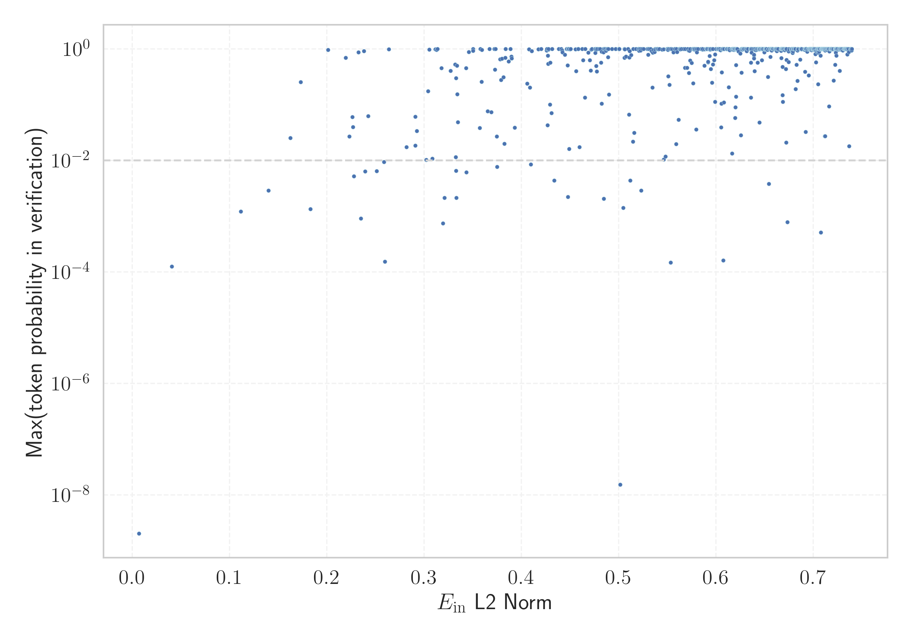

# Report for `152334H/miqu-1-70b-sf`

## Model info

* Tied embeddings: no
* LM head uses bias: no
* Indicator for under-trained tokens: E_{in} L2 Norm
  * Overall distribution 1.193 +/- 0.173
  * Token used for verification prompt building: `springframework`
  * Verification threshold: 0.740
  * Threshold for showing candidate under-trained tokens: 0.233
  * Median verified threshold (for bytes, unreachable and special tokens): 0.344
* Embeddings shape: (32000, 8192)
* Vocabulary size: 32000
  * Number of single byte tokens: 351, of which 116 below indicator threshold
  * Number of special tokens: 3, of which 2 below indicator threshold
  * Number of tested under-trained tokens: 610, 610 non-special, 27 below p = 0.01 threshold, 11 below soft indicator threshold

## Under-trained token indicators plot


## Verification plot


## Under-trained token verification results
11 entries below threshold of 0.233

|   token_id | token                       |   indicator | max_prob                                                         | in_other_tokens                                                                                                                                                                            |
|------------|-----------------------------|-------------|------------------------------------------------------------------|--------------------------------------------------------------------------------------------------------------------------------------------------------------------------------------------|
|      28574 | ````` ▁Mediabestanden ````` |   0.0404368 | <span style='border: 1px solid rgb(169, 68, 66);'>0.00013</span> |                                                                                                                                                                                            |
|      20609 | ````` ▁Portály `````        |   0.111556  | <span style='border: 1px solid rgb(255, 145, 0);'>0.0012</span>  |                                                                                                                                                                                            |
|      12731 | ````` ederbörd `````        |   0.139958  | <span style='border: 1px solid rgb(255, 145, 0);'>0.0029</span>  | <span style='border: 1px solid rgb(40, 167, 69);'>````` ▁nederbörd `````</span>, <span style='border: 1px solid rgb(255, 145, 0);'>````` nederbörd `````</span>, ````` ▁årsnederbörd ````` |
|      26498 | ````` >\<^ `````            |   0.162409  | <span style='border: 1px solid rgb(251, 189, 8);'>0.025</span>   |                                                                                                                                                                                            |
|       3798 | ````` oreferrer `````       |   0.173164  | <span style='border: 1px solid rgb(40, 167, 69);'>0.25</span>    | <span style='border: 1px solid rgb(40, 167, 69);'>````` ▁noreferrer `````</span>, <span style='border: 1px solid rgb(40, 167, 69);'>````` noreferrer `````</span>                          |
|      28642 | ````` ▁regnig `````         |   0.183191  | <span style='border: 1px solid rgb(255, 145, 0);'>0.0013</span>  | <span style='border: 1px solid rgb(169, 68, 66);'>````` ▁regnigaste `````</span>                                                                                                           |
|      12882 | ````` ITableView `````      |   0.20117   | <span style='border: 1px solid rgb(40, 167, 69);'>0.96</span>    | ````` ▁UITableView `````, ````` UITableView `````                                                                                                                                          |
|      23313 | ````` Obrázky `````         |   0.219415  | <span style='border: 1px solid rgb(40, 167, 69);'>0.69</span>    |                                                                                                                                                                                            |
|      20486 | ````` tatywna `````         |   0.22312   | <span style='border: 1px solid rgb(251, 189, 8);'>0.027</span>   | <span style='border: 1px solid rgb(255, 145, 0);'>````` ▁autorytatywna `````</span>                                                                                                        |
|      28623 | ````` ▁Genomsnitt `````     |   0.226055  | <span style='border: 1px solid rgb(251, 189, 8);'>0.06</span>    | <span style='border: 1px solid rgb(40, 167, 69);'>````` ▁Genomsnittlig `````</span>                                                                                                        |
|      11766 | ````` хівовано `````        |   0.227875  | <span style='border: 1px solid rgb(255, 145, 0);'>0.0052</span>  | <span style='border: 1px solid rgb(40, 167, 69);'>````` Архівовано `````</span>                                                                                                            |
<details><summary>599 additional entries above threshold</summary>

|   token_id | token                      |   indicator | max_prob                                                         | in_other_tokens                                                                                                                                                                                                                                                                                                                                                                               |
|------------|----------------------------|-------------|------------------------------------------------------------------|-----------------------------------------------------------------------------------------------------------------------------------------------------------------------------------------------------------------------------------------------------------------------------------------------------------------------------------------------------------------------------------------------|
|      10553 | ````` \<^ `````            |    0.232542 | <span style='border: 1px solid rgb(40, 167, 69);'>0.87</span>    | <span style='border: 1px solid rgb(251, 189, 8);'>````` >\<^ `````</span>                                                                                                                                                                                                                                                                                                                     |
|      28416 | ````` ▁Мексичка `````      |    0.234816 | <span style='border: 1px solid rgb(169, 68, 66);'>0.00091</span> |                                                                                                                                                                                                                                                                                                                                                                                               |
|       9831 | ````` ▁челов `````         |    0.238084 | <span style='border: 1px solid rgb(40, 167, 69);'>0.91</span>    | ````` ▁человек `````, ````` ▁челове `````, ````` ▁человека `````                                                                                                                                                                                                                                                                                                                              |
|      16737 | ````` %;\r `````           |    0.239468 | <span style='border: 1px solid rgb(255, 145, 0);'>0.0063</span>  |                                                                                                                                                                                                                                                                                                                                                                                               |
|      27914 | ````` ▁archiválva `````    |    0.258845 | <span style='border: 1px solid rgb(255, 145, 0);'>0.0093</span>  |                                                                                                                                                                                                                                                                                                                                                                                               |
|      19539 | ````` ▁demsel `````        |    0.259579 | <span style='border: 1px solid rgb(169, 68, 66);'>0.00015</span> | ````` ▁demselben `````                                                                                                                                                                                                                                                                                                                                                                        |
|      31477 | ````` ⸮ `````              |    0.263838 | <span style='border: 1px solid rgb(40, 167, 69);'>0.98</span>    |                                                                                                                                                                                                                                                                                                                                                                                               |
|      27900 | ````` ▁eredetiből `````    |    0.281727 | <span style='border: 1px solid rgb(251, 189, 8);'>0.017</span>   |                                                                                                                                                                                                                                                                                                                                                                                               |
|      24294 | ````` Webachiv `````       |    0.290769 | <span style='border: 1px solid rgb(251, 189, 8);'>0.018</span>   |                                                                                                                                                                                                                                                                                                                                                                                               |
|      16110 | ````` ▁Спољашње `````      |    0.290848 | <span style='border: 1px solid rgb(251, 189, 8);'>0.061</span>   |                                                                                                                                                                                                                                                                                                                                                                                               |
|      16056 | ````` љашње `````          |    0.302277 | <span style='border: 1px solid rgb(251, 189, 8);'>0.01</span>    | <span style='border: 1px solid rgb(251, 189, 8);'>````` ▁Спољашње `````</span>                                                                                                                                                                                                                                                                                                                |
|      30994 | ````` 𝕜 `````              |    0.305397 | <span style='border: 1px solid rgb(40, 167, 69);'>0.97</span>    |                                                                                                                                                                                                                                                                                                                                                                                               |
|      23117 | ````` brázky `````         |    0.308287 | <span style='border: 1px solid rgb(251, 189, 8);'>0.011</span>   | <span style='border: 1px solid rgb(40, 167, 69);'>````` Obrázky `````</span>                                                                                                                                                                                                                                                                                                                  |
|      31899 | ````` ⥤ `````              |    0.311443 | <span style='border: 1px solid rgb(40, 167, 69);'>0.98</span>    |                                                                                                                                                                                                                                                                                                                                                                                               |
|      31926 | ````` 𝓝 `````              |    0.312644 | <span style='border: 1px solid rgb(40, 167, 69);'>0.96</span>    |                                                                                                                                                                                                                                                                                                                                                                                               |
|      18596 | ````` ципа `````           |    0.313849 | <span style='border: 1px solid rgb(40, 167, 69);'>1</span>       | <span style='border: 1px solid rgb(251, 189, 8);'>````` ніципа `````</span>, <span style='border: 1px solid rgb(251, 189, 8);'>````` ніципалі `````</span>, ````` ▁муніципалі `````, <span style='border: 1px solid rgb(40, 167, 69);'>````` ниципа `````</span>, ````` ▁муниципа `````                                                                                                       |
|      28090 | ````` ▁Савезне `````       |    0.317766 | <span style='border: 1px solid rgb(40, 167, 69);'>0.45</span>    |                                                                                                                                                                                                                                                                                                                                                                                               |
|      24426 | ````` ▁});\r `````         |    0.319243 | <span style='border: 1px solid rgb(169, 68, 66);'>0.00075</span> |                                                                                                                                                                                                                                                                                                                                                                                               |
|      20528 | ````` ▁autorytatywna ````` |    0.320821 | <span style='border: 1px solid rgb(255, 145, 0);'>0.0021</span>  |                                                                                                                                                                                                                                                                                                                                                                                               |
|      24291 | ````` IABot `````          |    0.327147 | <span style='border: 1px solid rgb(40, 167, 69);'>0.4</span>     |                                                                                                                                                                                                                                                                                                                                                                                               |
|      26821 | ````` ▁Enllaços `````      |    0.331744 | <span style='border: 1px solid rgb(40, 167, 69);'>0.53</span>    |                                                                                                                                                                                                                                                                                                                                                                                               |
|      17822 | ````` ');\r `````          |    0.332466 | <span style='border: 1px solid rgb(251, 189, 8);'>0.012</span>   |                                                                                                                                                                                                                                                                                                                                                                                               |
|      26847 | ````` .:\u200a `````       |    0.332687 | <span style='border: 1px solid rgb(255, 145, 0);'>0.0065</span>  |                                                                                                                                                                                                                                                                                                                                                                                               |
|      17981 | ````` ▁Externí `````       |    0.33272  | <span style='border: 1px solid rgb(40, 167, 69);'>0.3</span>     |                                                                                                                                                                                                                                                                                                                                                                                               |
|      23592 | ````` ',\r `````           |    0.333063 | <span style='border: 1px solid rgb(255, 145, 0);'>0.0021</span>  |                                                                                                                                                                                                                                                                                                                                                                                               |
|      31664 | ````` ߬ `````               |    0.333919 | <span style='border: 1px solid rgb(40, 167, 69);'>0.15</span>    |                                                                                                                                                                                                                                                                                                                                                                                               |
|      10688 | ````` ▁gepublic `````      |    0.334581 | <span style='border: 1px solid rgb(251, 189, 8);'>0.048</span>   | ````` ▁gepubliceerd `````                                                                                                                                                                                                                                                                                                                                                                     |
|      28263 | ````` ▁Odkazy `````        |    0.343105 | <span style='border: 1px solid rgb(40, 167, 69);'>0.45</span>    |                                                                                                                                                                                                                                                                                                                                                                                               |
|      25982 | ````` ";\r `````           |    0.343518 | <span style='border: 1px solid rgb(255, 145, 0);'>0.0061</span>  |                                                                                                                                                                                                                                                                                                                                                                                               |
|      21042 | ````` lês `````            |    0.346053 | <span style='border: 1px solid rgb(40, 167, 69);'>0.88</span>    | <span style='border: 1px solid rgb(40, 167, 69);'>````` ▁inglês `````</span>                                                                                                                                                                                                                                                                                                                  |
|      11193 | ````` ▁Normdaten `````     |    0.350286 | <span style='border: 1px solid rgb(40, 167, 69);'>0.99</span>    |                                                                                                                                                                                                                                                                                                                                                                                               |
|      31772 | ````` ₗ `````              |    0.350432 | <span style='border: 1px solid rgb(40, 167, 69);'>0.93</span>    |                                                                                                                                                                                                                                                                                                                                                                                               |
|      23217 | ````` ▁zvuky `````         |    0.35725  | <span style='border: 1px solid rgb(251, 189, 8);'>0.038</span>   |                                                                                                                                                                                                                                                                                                                                                                                               |
|      21721 | ````` archivi `````        |    0.357681 | <span style='border: 1px solid rgb(40, 167, 69);'>1</span>       | <span style='border: 1px solid rgb(40, 167, 69);'>````` archiviato `````</span>                                                                                                                                                                                                                                                                                                               |
|      15231 | ````` ",\r `````           |    0.359132 | <span style='border: 1px solid rgb(40, 167, 69);'>0.26</span>    |                                                                                                                                                                                                                                                                                                                                                                                               |
|      20721 | ````` ▁bezeichneter `````  |    0.359288 | <span style='border: 1px solid rgb(40, 167, 69);'>0.96</span>    |                                                                                                                                                                                                                                                                                                                                                                                               |
|      18584 | ````` ");\r `````          |    0.365169 | <span style='border: 1px solid rgb(251, 189, 8);'>0.076</span>   |                                                                                                                                                                                                                                                                                                                                                                                               |
|      31483 | ````` ┈ `````              |    0.367252 | <span style='border: 1px solid rgb(40, 167, 69);'>1</span>       |                                                                                                                                                                                                                                                                                                                                                                                               |
|      10175 | ````` ">\r `````           |    0.369047 | <span style='border: 1px solid rgb(251, 189, 8);'>0.074</span>   |                                                                                                                                                                                                                                                                                                                                                                                               |
|      24075 | ````` Wikispecies `````    |    0.37224  | <span style='border: 1px solid rgb(40, 167, 69);'>1</span>       |                                                                                                                                                                                                                                                                                                                                                                                               |
|      14414 | ````` ▁Archivlink `````    |    0.372857 | <span style='border: 1px solid rgb(40, 167, 69);'>0.42</span>    |                                                                                                                                                                                                                                                                                                                                                                                               |
|      30301 | ````` ₉ `````              |    0.373338 | <span style='border: 1px solid rgb(40, 167, 69);'>1</span>       |                                                                                                                                                                                                                                                                                                                                                                                               |
|      29722 | ````` ▁*/\r `````          |    0.374713 | <span style='border: 1px solid rgb(251, 189, 8);'>0.027</span>   |                                                                                                                                                                                                                                                                                                                                                                                               |
|      27660 | ````` ckså `````           |    0.374857 | <span style='border: 1px solid rgb(255, 145, 0);'>0.0077</span>  | ````` ▁också `````                                                                                                                                                                                                                                                                                                                                                                            |
|      31625 | ````` ൾ `````              |    0.378206 | <span style='border: 1px solid rgb(40, 167, 69);'>0.65</span>    |                                                                                                                                                                                                                                                                                                                                                                                               |
|      23654 | ````` ▁dátummal `````      |    0.379175 | <span style='border: 1px solid rgb(40, 167, 69);'>0.28</span>    |                                                                                                                                                                                                                                                                                                                                                                                               |
|      28202 | ````` ▁Olympedia `````     |    0.379915 | <span style='border: 1px solid rgb(40, 167, 69);'>0.67</span>    |                                                                                                                                                                                                                                                                                                                                                                                               |
|      16916 | ````` ▁invån `````         |    0.381482 | <span style='border: 1px solid rgb(40, 167, 69);'>0.31</span>    | <span style='border: 1px solid rgb(40, 167, 69);'>````` ▁invånare `````</span>                                                                                                                                                                                                                                                                                                                |
|      14078 | ````` ();\r `````          |    0.382343 | <span style='border: 1px solid rgb(251, 189, 8);'>0.02</span>    |                                                                                                                                                                                                                                                                                                                                                                                               |
|      24029 | ````` ▁Jegyzetek `````     |    0.383294 | <span style='border: 1px solid rgb(40, 167, 69);'>0.7</span>     |                                                                                                                                                                                                                                                                                                                                                                                               |
|      30772 | ````` ╌ `````              |    0.383763 | <span style='border: 1px solid rgb(40, 167, 69);'>1</span>       |                                                                                                                                                                                                                                                                                                                                                                                               |
|      26335 | ````` llaços `````         |    0.386911 | <span style='border: 1px solid rgb(40, 167, 69);'>0.59</span>    | <span style='border: 1px solid rgb(40, 167, 69);'>````` ▁Enllaços `````</span>                                                                                                                                                                                                                                                                                                                |
|      18315 | ````` ▁Ligações `````      |    0.388751 | <span style='border: 1px solid rgb(40, 167, 69);'>1</span>       |                                                                                                                                                                                                                                                                                                                                                                                               |
|      23715 | ````` ▁Källor `````        |    0.389661 | <span style='border: 1px solid rgb(40, 167, 69);'>0.72</span>    |                                                                                                                                                                                                                                                                                                                                                                                               |
|      24631 | ````` ▁Források `````      |    0.390116 | <span style='border: 1px solid rgb(40, 167, 69);'>0.68</span>    |                                                                                                                                                                                                                                                                                                                                                                                               |
|      20645 | ````` ▁Przypisy `````      |    0.393242 | <span style='border: 1px solid rgb(251, 189, 8);'>0.039</span>   |                                                                                                                                                                                                                                                                                                                                                                                               |
|      25069 | ````` $}}% `````           |    0.406065 | <span style='border: 1px solid rgb(40, 167, 69);'>0.24</span>    |                                                                                                                                                                                                                                                                                                                                                                                               |
|       9462 | ````` Hozzáférés `````     |    0.407679 | <span style='border: 1px solid rgb(40, 167, 69);'>0.98</span>    |                                                                                                                                                                                                                                                                                                                                                                                               |
|      23767 | ````` egyzetek `````       |    0.408736 | <span style='border: 1px solid rgb(40, 167, 69);'>0.2</span>     | <span style='border: 1px solid rgb(40, 167, 69);'>````` ▁Jegyzetek `````</span>                                                                                                                                                                                                                                                                                                               |
|       4970 | ````` ▁}\r `````           |    0.409689 | <span style='border: 1px solid rgb(255, 145, 0);'>0.0085</span>  |                                                                                                                                                                                                                                                                                                                                                                                               |
|      31646 | ````` ൻ `````              |    0.410644 | <span style='border: 1px solid rgb(40, 167, 69);'>0.92</span>    |                                                                                                                                                                                                                                                                                                                                                                                               |
|      31806 | ````` ӏ `````              |    0.41753  | <span style='border: 1px solid rgb(40, 167, 69);'>0.98</span>    |                                                                                                                                                                                                                                                                                                                                                                                               |
|      13243 | ````` ▁länkar `````        |    0.420281 | <span style='border: 1px solid rgb(40, 167, 69);'>1</span>       |                                                                                                                                                                                                                                                                                                                                                                                               |
|      31638 | ````` ൽ `````              |    0.425832 | <span style='border: 1px solid rgb(40, 167, 69);'>0.94</span>    |                                                                                                                                                                                                                                                                                                                                                                                               |
|      27706 | ````` ]{' `````            |    0.426177 | <span style='border: 1px solid rgb(40, 167, 69);'>1</span>       |                                                                                                                                                                                                                                                                                                                                                                                               |
|       6075 | ````` );\r `````           |    0.426962 | <span style='border: 1px solid rgb(251, 189, 8);'>0.043</span>   | <span style='border: 1px solid rgb(251, 189, 8);'>````` ();\r `````</span>, <span style='border: 1px solid rgb(251, 189, 8);'>````` ');\r `````</span>, <span style='border: 1px solid rgb(251, 189, 8);'>````` ");\r `````</span>, <span style='border: 1px solid rgb(169, 68, 66);'>````` ▁});\r `````</span>                                                                               |
|      28294 | ````` usztus `````         |    0.427155 | <span style='border: 1px solid rgb(40, 167, 69);'>0.75</span>    | <span style='border: 1px solid rgb(40, 167, 69);'>````` ▁augusztus `````</span>                                                                                                                                                                                                                                                                                                               |
|       6663 | ````` ▁Einzelnach `````    |    0.427536 | <span style='border: 1px solid rgb(40, 167, 69);'>0.54</span>    | ````` ▁Einzelnachweise `````                                                                                                                                                                                                                                                                                                                                                                  |
|      31892 | ````` ҡ `````              |    0.427657 | <span style='border: 1px solid rgb(40, 167, 69);'>0.97</span>    |                                                                                                                                                                                                                                                                                                                                                                                               |
|      31489 | ````` Ḩ `````              |    0.42783  | <span style='border: 1px solid rgb(40, 167, 69);'>0.99</span>    |                                                                                                                                                                                                                                                                                                                                                                                               |
|       9147 | ````` ozzáférés `````      |    0.429477 | <span style='border: 1px solid rgb(40, 167, 69);'>0.1</span>     | <span style='border: 1px solid rgb(40, 167, 69);'>````` Hozzáférés `````</span>                                                                                                                                                                                                                                                                                                               |
|      17047 | ````` omsnitt `````        |    0.429552 | <span style='border: 1px solid rgb(40, 167, 69);'>0.57</span>    | ````` ▁genomsnitt `````, <span style='border: 1px solid rgb(251, 189, 8);'>````` ▁Genomsnitt `````</span>, <span style='border: 1px solid rgb(40, 167, 69);'>````` ▁Genomsnittlig `````</span>                                                                                                                                                                                                |
|      26471 | ````` ()\r `````           |    0.431042 | <span style='border: 1px solid rgb(251, 189, 8);'>0.071</span>   |                                                                                                                                                                                                                                                                                                                                                                                               |
|      30284 | ````` ₇ `````              |    0.431619 | <span style='border: 1px solid rgb(40, 167, 69);'>1</span>       |                                                                                                                                                                                                                                                                                                                                                                                               |
|      28633 | ````` nederbörd `````      |    0.433795 | <span style='border: 1px solid rgb(255, 145, 0);'>0.0044</span>  | ````` ▁årsnederbörd `````                                                                                                                                                                                                                                                                                                                                                                     |
|      31921 | ````` ഷ `````              |    0.438344 | <span style='border: 1px solid rgb(40, 167, 69);'>1</span>       |                                                                                                                                                                                                                                                                                                                                                                                               |
|      31589 | ````` ▇ `````              |    0.440904 | <span style='border: 1px solid rgb(40, 167, 69);'>1</span>       |                                                                                                                                                                                                                                                                                                                                                                                               |
|      17871 | ````` ▁odkazy `````        |    0.441956 | <span style='border: 1px solid rgb(40, 167, 69);'>0.94</span>    |                                                                                                                                                                                                                                                                                                                                                                                               |
|      23441 | ````` któber `````         |    0.442225 | <span style='border: 1px solid rgb(40, 167, 69);'>0.87</span>    | <span style='border: 1px solid rgb(40, 167, 69);'>````` ▁október `````</span>                                                                                                                                                                                                                                                                                                                 |
|      19614 | ````` ▁Википедии `````     |    0.444614 | <span style='border: 1px solid rgb(40, 167, 69);'>0.79</span>    |                                                                                                                                                                                                                                                                                                                                                                                               |
|      31808 | ````` എ `````              |    0.446652 | <span style='border: 1px solid rgb(40, 167, 69);'>1</span>       |                                                                                                                                                                                                                                                                                                                                                                                               |
|      21858 | ````` archiviato `````     |    0.44757  | <span style='border: 1px solid rgb(40, 167, 69);'>0.5</span>     |                                                                                                                                                                                                                                                                                                                                                                                               |
|      31884 | ````` ѫ `````              |    0.447712 | <span style='border: 1px solid rgb(40, 167, 69);'>1</span>       |                                                                                                                                                                                                                                                                                                                                                                                               |
|       8117 | ````` }\r `````            |    0.447856 | <span style='border: 1px solid rgb(255, 145, 0);'>0.0022</span>  |                                                                                                                                                                                                                                                                                                                                                                                               |
|      31913 | ````` ശ `````              |    0.447958 | <span style='border: 1px solid rgb(40, 167, 69);'>1</span>       |                                                                                                                                                                                                                                                                                                                                                                                               |
|      20448 | ````` ▁Kontrola `````      |    0.448621 | <span style='border: 1px solid rgb(40, 167, 69);'>1</span>       |                                                                                                                                                                                                                                                                                                                                                                                               |
|      14626 | ````` {\r `````            |    0.448985 | <span style='border: 1px solid rgb(251, 189, 8);'>0.016</span>   |                                                                                                                                                                                                                                                                                                                                                                                               |
|      14562 | ````` ▁Посилання `````     |    0.449899 | <span style='border: 1px solid rgb(40, 167, 69);'>0.99</span>    |                                                                                                                                                                                                                                                                                                                                                                                               |
|      31794 | ````` ˠ `````              |    0.450534 | <span style='border: 1px solid rgb(40, 167, 69);'>1</span>       |                                                                                                                                                                                                                                                                                                                                                                                               |
|      31800 | ````` ܝ `````              |    0.455722 | <span style='border: 1px solid rgb(40, 167, 69);'>0.98</span>    |                                                                                                                                                                                                                                                                                                                                                                                               |
|      18222 | ````` нцикло `````         |    0.456306 | <span style='border: 1px solid rgb(40, 167, 69);'>0.4</span>     | <span style='border: 1px solid rgb(40, 167, 69);'>````` нциклопеди `````</span>, <span style='border: 1px solid rgb(40, 167, 69);'>````` ▁энциклопеди `````</span>                                                                                                                                                                                                                            |
|      31956 | ````` ഞ `````              |    0.458428 | <span style='border: 1px solid rgb(40, 167, 69);'>1</span>       |                                                                                                                                                                                                                                                                                                                                                                                               |
|      31336 | ````` ʐ `````              |    0.458477 | <span style='border: 1px solid rgb(40, 167, 69);'>1</span>       |                                                                                                                                                                                                                                                                                                                                                                                               |
|       3336 | ````` ▁{\r `````           |    0.459604 | <span style='border: 1px solid rgb(251, 189, 8);'>0.017</span>   |                                                                                                                                                                                                                                                                                                                                                                                               |
|      31670 | ````` ʑ `````              |    0.462556 | <span style='border: 1px solid rgb(40, 167, 69);'>1</span>       |                                                                                                                                                                                                                                                                                                                                                                                               |
|      20696 | ````` adratkil `````       |    0.463554 | <span style='border: 1px solid rgb(40, 167, 69);'>0.63</span>    | ````` adratkilometer `````                                                                                                                                                                                                                                                                                                                                                                    |
|       7368 | ````` ября `````           |    0.465298 | <span style='border: 1px solid rgb(40, 167, 69);'>0.13</span>    | ````` ▁сентября `````, ````` ▁октября `````, ````` ▁ноября `````                                                                                                                                                                                                                                                                                                                              |
|      23105 | ````` ▁videa `````         |    0.465528 | <span style='border: 1px solid rgb(40, 167, 69);'>0.99</span>    |                                                                                                                                                                                                                                                                                                                                                                                               |
|      19895 | ````` ▁фамилией `````      |    0.46859  | <span style='border: 1px solid rgb(40, 167, 69);'>0.86</span>    |                                                                                                                                                                                                                                                                                                                                                                                               |
|      20072 | ````` ywna `````           |    0.470437 | <span style='border: 1px solid rgb(40, 167, 69);'>0.63</span>    | <span style='border: 1px solid rgb(251, 189, 8);'>````` tatywna `````</span>, <span style='border: 1px solid rgb(255, 145, 0);'>````` ▁autorytatywna `````</span>                                                                                                                                                                                                                             |
|      17916 | ````` abestanden `````     |    0.471301 | <span style='border: 1px solid rgb(40, 167, 69);'>0.41</span>    | <span style='border: 1px solid rgb(169, 68, 66);'>````` ▁Mediabestanden `````</span>                                                                                                                                                                                                                                                                                                          |
|      23247 | ````` ▁dátum `````         |    0.47195  | <span style='border: 1px solid rgb(40, 167, 69);'>0.97</span>    | <span style='border: 1px solid rgb(40, 167, 69);'>````` ▁dátummal `````</span>                                                                                                                                                                                                                                                                                                                |
|      31515 | ````` ⴰ `````              |    0.472622 | <span style='border: 1px solid rgb(40, 167, 69);'>0.99</span>    |                                                                                                                                                                                                                                                                                                                                                                                               |
|      26194 | ````` ▁Савез `````         |    0.475774 | <span style='border: 1px solid rgb(40, 167, 69);'>0.99</span>    | <span style='border: 1px solid rgb(40, 167, 69);'>````` ▁Савезне `````</span>                                                                                                                                                                                                                                                                                                                 |
|      15412 | ````` ▁zewnętrzne `````    |    0.475925 | <span style='border: 1px solid rgb(40, 167, 69);'>0.84</span>    |                                                                                                                                                                                                                                                                                                                                                                                               |
|      31585 | ````` ർ `````              |    0.476718 | <span style='border: 1px solid rgb(40, 167, 69);'>0.49</span>    |                                                                                                                                                                                                                                                                                                                                                                                               |
|      28361 | ````` ▁Zobacz `````        |    0.477092 | <span style='border: 1px solid rgb(40, 167, 69);'>1</span>       |                                                                                                                                                                                                                                                                                                                                                                                               |
|      26782 | ````` ▁пописа `````        |    0.477217 | <span style='border: 1px solid rgb(40, 167, 69);'>0.97</span>    |                                                                                                                                                                                                                                                                                                                                                                                               |
|      25229 | ````` лтати `````          |    0.477411 | <span style='border: 1px solid rgb(40, 167, 69);'>0.39</span>    | <span style='border: 1px solid rgb(40, 167, 69);'>````` ▁Резултати `````</span>                                                                                                                                                                                                                                                                                                               |
|      27600 | ````` prilis `````         |    0.477764 | <span style='border: 1px solid rgb(40, 167, 69);'>0.99</span>    | <span style='border: 1px solid rgb(40, 167, 69);'>````` ▁április `````</span>                                                                                                                                                                                                                                                                                                                 |
|      31444 | ````` ḩ `````              |    0.47977  | <span style='border: 1px solid rgb(40, 167, 69);'>0.99</span>    |                                                                                                                                                                                                                                                                                                                                                                                               |
|      17835 | ````` ▁Станов `````        |    0.480896 | <span style='border: 1px solid rgb(40, 167, 69);'>1</span>       | <span style='border: 1px solid rgb(40, 167, 69);'>````` ▁Становништво `````</span>                                                                                                                                                                                                                                                                                                            |
|      23875 | ````` ▁Насеље `````        |    0.481766 | <span style='border: 1px solid rgb(40, 167, 69);'>0.57</span>    |                                                                                                                                                                                                                                                                                                                                                                                               |
|      19451 | ````` "\r `````            |    0.482363 | <span style='border: 1px solid rgb(40, 167, 69);'>0.1</span>     |                                                                                                                                                                                                                                                                                                                                                                                               |
|      27061 | ````` ▁Резултати `````     |    0.482497 | <span style='border: 1px solid rgb(40, 167, 69);'>0.89</span>    |                                                                                                                                                                                                                                                                                                                                                                                               |
|      23910 | ````` ритор `````          |    0.484363 | <span style='border: 1px solid rgb(40, 167, 69);'>0.87</span>    | ````` ▁територ `````                                                                                                                                                                                                                                                                                                                                                                          |
|      14545 | ````` ewnę `````           |    0.484695 | <span style='border: 1px solid rgb(255, 145, 0);'>0.002</span>   | <span style='border: 1px solid rgb(40, 167, 69);'>````` ewnętrz `````</span>, <span style='border: 1px solid rgb(40, 167, 69);'>````` ▁zewnętrz `````</span>, <span style='border: 1px solid rgb(40, 167, 69);'>````` ▁zewnętrzne `````</span>                                                                                                                                                |
|      31889 | ````` ദ `````              |    0.485196 | <span style='border: 1px solid rgb(40, 167, 69);'>1</span>       |                                                                                                                                                                                                                                                                                                                                                                                               |
|      21765 | ````` ▁(\< `````           |    0.485404 | <span style='border: 1px solid rgb(40, 167, 69);'>1</span>       |                                                                                                                                                                                                                                                                                                                                                                                               |
|       9236 | ````` ▁pobla `````         |    0.48623  | <span style='border: 1px solid rgb(40, 167, 69);'>1</span>       | ````` ▁población `````, ````` ▁població `````                                                                                                                                                                                                                                                                                                                                                 |
|      19523 | ````` ▁людях `````         |    0.486825 | <span style='border: 1px solid rgb(40, 167, 69);'>0.92</span>    |                                                                                                                                                                                                                                                                                                                                                                                               |
|      30957 | ````` ങ `````              |    0.487803 | <span style='border: 1px solid rgb(40, 167, 69);'>0.99</span>    |                                                                                                                                                                                                                                                                                                                                                                                               |
|      30278 | ````` ₈ `````              |    0.488409 | <span style='border: 1px solid rgb(40, 167, 69);'>1</span>       |                                                                                                                                                                                                                                                                                                                                                                                               |
|      15394 | ````` usetts `````         |    0.489199 | <span style='border: 1px solid rgb(40, 167, 69);'>0.71</span>    | ````` achusetts `````, ````` ▁Massachusetts `````                                                                                                                                                                                                                                                                                                                                             |
|      31663 | ````` Ս `````              |    0.489297 | <span style='border: 1px solid rgb(40, 167, 69);'>1</span>       |                                                                                                                                                                                                                                                                                                                                                                                               |
|      23280 | ````` ździer `````         |    0.490114 | <span style='border: 1px solid rgb(40, 167, 69);'>0.15</span>    | <span style='border: 1px solid rgb(40, 167, 69);'>````` ▁paździer `````</span>, ````` ▁października `````                                                                                                                                                                                                                                                                                     |
|      29669 | ````` engelsk `````        |    0.49309  | <span style='border: 1px solid rgb(40, 167, 69);'>1</span>       |                                                                                                                                                                                                                                                                                                                                                                                               |
|      31591 | ````` ⍵ `````              |    0.496991 | <span style='border: 1px solid rgb(40, 167, 69);'>1</span>       |                                                                                                                                                                                                                                                                                                                                                                                               |
|      21173 | ````` ▁entferne `````      |    0.500239 | <span style='border: 1px solid rgb(40, 167, 69);'>1</span>       |                                                                                                                                                                                                                                                                                                                                                                                               |
|      31342 | ````` അ `````              |    0.500441 | <span style='border: 1px solid rgb(40, 167, 69);'>1</span>       |                                                                                                                                                                                                                                                                                                                                                                                               |
|      31575 | ````` Մ `````              |    0.50045  | <span style='border: 1px solid rgb(40, 167, 69);'>1</span>       |                                                                                                                                                                                                                                                                                                                                                                                               |
|      14755 | ````` ewnętrz `````        |    0.500772 | <span style='border: 1px solid rgb(40, 167, 69);'>0.99</span>    | <span style='border: 1px solid rgb(40, 167, 69);'>````` ▁zewnętrz `````</span>, <span style='border: 1px solid rgb(40, 167, 69);'>````` ▁zewnętrzne `````</span>                                                                                                                                                                                                                              |
|      28354 | ````` ▁Расподела `````     |    0.504712 | <span style='border: 1px solid rgb(255, 145, 0);'>0.0014</span>  |                                                                                                                                                                                                                                                                                                                                                                                               |
|      17331 | ````` ▁Linki `````         |    0.505796 | <span style='border: 1px solid rgb(40, 167, 69);'>1</span>       |                                                                                                                                                                                                                                                                                                                                                                                               |
|      22258 | ````` dostęp `````         |    0.505928 | <span style='border: 1px solid rgb(40, 167, 69);'>0.69</span>    |                                                                                                                                                                                                                                                                                                                                                                                               |
|      20716 | ````` ▁Begriffsklär `````  |    0.506353 | <span style='border: 1px solid rgb(40, 167, 69);'>0.99</span>    |                                                                                                                                                                                                                                                                                                                                                                                               |
|      20568 | ````` ▁сайті `````         |    0.507361 | <span style='border: 1px solid rgb(40, 167, 69);'>0.72</span>    |                                                                                                                                                                                                                                                                                                                                                                                               |
|      12472 | ````` ateien `````         |    0.509687 | <span style='border: 1px solid rgb(40, 167, 69);'>1</span>       | <span style='border: 1px solid rgb(40, 167, 69);'>````` ▁Audiodateien `````</span>                                                                                                                                                                                                                                                                                                            |
|      27918 | ````` ▁Хронологија `````   |    0.510587 | <span style='border: 1px solid rgb(251, 189, 8);'>0.066</span>   |                                                                                                                                                                                                                                                                                                                                                                                               |
|      30964 | ````` േ `````               |    0.511055 | <span style='border: 1px solid rgb(40, 167, 69);'>0.7</span>     |                                                                                                                                                                                                                                                                                                                                                                                               |
|      15022 | ````` ▁zewnętrz `````      |    0.51132  | <span style='border: 1px solid rgb(40, 167, 69);'>0.91</span>    | <span style='border: 1px solid rgb(40, 167, 69);'>````` ▁zewnętrzne `````</span>                                                                                                                                                                                                                                                                                                              |
|      21836 | ````` ▁надморској `````    |    0.511993 | <span style='border: 1px solid rgb(255, 145, 0);'>0.0044</span>  |                                                                                                                                                                                                                                                                                                                                                                                               |
|      14949 | ````` кипеди `````         |    0.512883 | <span style='border: 1px solid rgb(40, 167, 69);'>0.77</span>    | <span style='border: 1px solid rgb(40, 167, 69);'>````` ▁Википеди `````</span>, <span style='border: 1px solid rgb(40, 167, 69);'>````` ▁Википедии `````</span>                                                                                                                                                                                                                               |
|      26711 | ````` gså `````            |    0.514743 | <span style='border: 1px solid rgb(251, 189, 8);'>0.022</span>   | ````` ▁også `````                                                                                                                                                                                                                                                                                                                                                                             |
|      29487 | ````` ▁Официаль `````      |    0.515122 | <span style='border: 1px solid rgb(40, 167, 69);'>0.99</span>    |                                                                                                                                                                                                                                                                                                                                                                                               |
|      20739 | ````` ▁надмор `````        |    0.515937 | <span style='border: 1px solid rgb(251, 189, 8);'>0.031</span>   | <span style='border: 1px solid rgb(255, 145, 0);'>````` ▁надморској `````</span>                                                                                                                                                                                                                                                                                                              |
|       9674 | ````` ▁Ссылки `````        |    0.517896 | <span style='border: 1px solid rgb(40, 167, 69);'>1</span>       |                                                                                                                                                                                                                                                                                                                                                                                               |
|      26338 | ````` ▁Års `````           |    0.52036  | <span style='border: 1px solid rgb(40, 167, 69);'>1</span>       | <span style='border: 1px solid rgb(169, 68, 66);'>````` ▁Årsmed `````</span>                                                                                                                                                                                                                                                                                                                  |
|      16196 | ````` textt `````          |    0.520395 | <span style='border: 1px solid rgb(40, 167, 69);'>1</span>       | ````` texttt `````                                                                                                                                                                                                                                                                                                                                                                            |
|      31528 | ````` ℚ `````              |    0.520441 | <span style='border: 1px solid rgb(40, 167, 69);'>1</span>       |                                                                                                                                                                                                                                                                                                                                                                                               |
|      23015 | ````` ▁tématu `````        |    0.520943 | <span style='border: 1px solid rgb(40, 167, 69);'>0.93</span>    |                                                                                                                                                                                                                                                                                                                                                                                               |
|      31421 | ````` ܐ `````              |    0.521301 | <span style='border: 1px solid rgb(40, 167, 69);'>1</span>       |                                                                                                                                                                                                                                                                                                                                                                                               |
|      19330 | ````` ▁Википеди `````      |    0.522653 | <span style='border: 1px solid rgb(40, 167, 69);'>0.93</span>    | <span style='border: 1px solid rgb(40, 167, 69);'>````` ▁Википедии `````</span>                                                                                                                                                                                                                                                                                                               |
|      21673 | ````` ▁висини `````        |    0.523073 | <span style='border: 1px solid rgb(255, 145, 0);'>0.0029</span>  |                                                                                                                                                                                                                                                                                                                                                                                               |
|      13263 | ````` ▁Externa `````       |    0.524189 | <span style='border: 1px solid rgb(40, 167, 69);'>1</span>       |                                                                                                                                                                                                                                                                                                                                                                                               |
|      31919 | ````` პ `````              |    0.525581 | <span style='border: 1px solid rgb(40, 167, 69);'>0.99</span>    |                                                                                                                                                                                                                                                                                                                                                                                               |
|      29708 | ````` ▁AllMovie `````      |    0.529372 | <span style='border: 1px solid rgb(40, 167, 69);'>1</span>       |                                                                                                                                                                                                                                                                                                                                                                                               |
|      12479 | ````` ▁Audiod `````        |    0.530194 | <span style='border: 1px solid rgb(40, 167, 69);'>1</span>       | <span style='border: 1px solid rgb(40, 167, 69);'>````` ▁Audiodateien `````</span>                                                                                                                                                                                                                                                                                                            |
|       2104 | ````` ;\r `````            |    0.530433 | <span style='border: 1px solid rgb(40, 167, 69);'>0.79</span>    | <span style='border: 1px solid rgb(251, 189, 8);'>````` );\r `````</span>, <span style='border: 1px solid rgb(251, 189, 8);'>````` ();\r `````</span>, <span style='border: 1px solid rgb(255, 145, 0);'>````` %;\r `````</span>, <span style='border: 1px solid rgb(251, 189, 8);'>````` ');\r `````</span>, <span style='border: 1px solid rgb(251, 189, 8);'>````` ");\r `````</span>, ... |
|      30231 | ````` ₅ `````              |    0.531312 | <span style='border: 1px solid rgb(40, 167, 69);'>1</span>       |                                                                                                                                                                                                                                                                                                                                                                                               |
|      20770 | ````` ▁"\< `````           |    0.532716 | <span style='border: 1px solid rgb(40, 167, 69);'>1</span>       |                                                                                                                                                                                                                                                                                                                                                                                               |
|      20070 | ````` ▁autory `````        |    0.5337   | <span style='border: 1px solid rgb(40, 167, 69);'>0.91</span>    | <span style='border: 1px solid rgb(255, 145, 0);'>````` ▁autorytatywna `````</span>                                                                                                                                                                                                                                                                                                           |
|      20959 | ````` ällor `````          |    0.534609 | <span style='border: 1px solid rgb(40, 167, 69);'>0.2</span>     | <span style='border: 1px solid rgb(40, 167, 69);'>````` ▁Källor `````</span>                                                                                                                                                                                                                                                                                                                  |
|      17299 | ````` ▁nederbörd `````     |    0.535154 | <span style='border: 1px solid rgb(40, 167, 69);'>0.86</span>    |                                                                                                                                                                                                                                                                                                                                                                                               |
|      31353 | ````` \u2028 `````         |    0.53551  | <span style='border: 1px solid rgb(40, 167, 69);'>0.95</span>    |                                                                                                                                                                                                                                                                                                                                                                                               |
|      26964 | ````` ▁Хронологи `````     |    0.53685  | <span style='border: 1px solid rgb(40, 167, 69);'>0.88</span>    | <span style='border: 1px solid rgb(251, 189, 8);'>````` ▁Хронологија `````</span>                                                                                                                                                                                                                                                                                                             |
|      23069 | ````` ▁Архив `````         |    0.537471 | <span style='border: 1px solid rgb(40, 167, 69);'>1</span>       | <span style='border: 1px solid rgb(251, 189, 8);'>````` ▁Архивная `````</span>                                                                                                                                                                                                                                                                                                                |
|      16364 | ````` фициаль `````        |    0.537526 | <span style='border: 1px solid rgb(40, 167, 69);'>0.97</span>    | <span style='border: 1px solid rgb(40, 167, 69);'>````` ▁официаль `````</span>, <span style='border: 1px solid rgb(40, 167, 69);'>````` ▁Официаль `````</span>                                                                                                                                                                                                                                |
|      26641 | ````` ▁Мексика `````       |    0.539136 | <span style='border: 1px solid rgb(40, 167, 69);'>1</span>       |                                                                                                                                                                                                                                                                                                                                                                                               |
|      31816 | ````` զ `````              |    0.540983 | <span style='border: 1px solid rgb(40, 167, 69);'>0.99</span>    |                                                                                                                                                                                                                                                                                                                                                                                               |
|      16013 | ````` temperaturen `````   |    0.541841 | <span style='border: 1px solid rgb(40, 167, 69);'>1</span>       | <span style='border: 1px solid rgb(251, 189, 8);'>````` eltemperaturen `````</span>                                                                                                                                                                                                                                                                                                           |
|      26137 | ````` ▁információk `````   |    0.544608 | <span style='border: 1px solid rgb(40, 167, 69);'>0.97</span>    |                                                                                                                                                                                                                                                                                                                                                                                               |
|      24971 | ````` ▁Джерела `````       |    0.546263 | <span style='border: 1px solid rgb(40, 167, 69);'>0.99</span>    |                                                                                                                                                                                                                                                                                                                                                                                               |
|      24353 | ````` ▁článku `````        |    0.54636  | <span style='border: 1px solid rgb(251, 189, 8);'>0.01</span>    |                                                                                                                                                                                                                                                                                                                                                                                               |
|       7654 | ````` ▁beskre `````        |    0.548062 | <span style='border: 1px solid rgb(251, 189, 8);'>0.012</span>   | ````` ▁beskrevs `````                                                                                                                                                                                                                                                                                                                                                                         |
|      27203 | ````` abgerufen `````      |    0.549702 | <span style='border: 1px solid rgb(40, 167, 69);'>1</span>       |                                                                                                                                                                                                                                                                                                                                                                                               |
|      31106 | ````` ച `````              |    0.549997 | <span style='border: 1px solid rgb(40, 167, 69);'>1</span>       |                                                                                                                                                                                                                                                                                                                                                                                               |
|      31626 | ````` ╣ `````              |    0.550654 | <span style='border: 1px solid rgb(40, 167, 69);'>1</span>       |                                                                                                                                                                                                                                                                                                                                                                                               |
|      31720 | ````` շ `````              |    0.550692 | <span style='border: 1px solid rgb(40, 167, 69);'>0.96</span>    |                                                                                                                                                                                                                                                                                                                                                                                               |
|      22755 | ````` źdz `````            |    0.551003 | <span style='border: 1px solid rgb(40, 167, 69);'>0.32</span>    | <span style='border: 1px solid rgb(40, 167, 69);'>````` ździer `````</span>, <span style='border: 1px solid rgb(40, 167, 69);'>````` ▁paździer `````</span>, ````` ▁października `````                                                                                                                                                                                                        |
|      31764 | ````` ɫ `````              |    0.551587 | <span style='border: 1px solid rgb(40, 167, 69);'>1</span>       |                                                                                                                                                                                                                                                                                                                                                                                               |
|       3238 | ````` >\r `````            |    0.552285 | <span style='border: 1px solid rgb(40, 167, 69);'>0.23</span>    | <span style='border: 1px solid rgb(251, 189, 8);'>````` ">\r `````</span>                                                                                                                                                                                                                                                                                                                     |
|      31672 | ````` Ḫ `````              |    0.553209 | <span style='border: 1px solid rgb(40, 167, 69);'>1</span>       |                                                                                                                                                                                                                                                                                                                                                                                               |
|      26734 | ````` ▁Årsmed `````        |    0.553388 | <span style='border: 1px solid rgb(169, 68, 66);'>0.00015</span> |                                                                                                                                                                                                                                                                                                                                                                                               |
|      21169 | ````` ▁prüfe `````         |    0.553984 | <span style='border: 1px solid rgb(40, 167, 69);'>1</span>       |                                                                                                                                                                                                                                                                                                                                                                                               |
|      31146 | ````` ണ `````              |    0.555382 | <span style='border: 1px solid rgb(40, 167, 69);'>0.98</span>    |                                                                                                                                                                                                                                                                                                                                                                                               |
|      15871 | ````` ▁везе `````          |    0.556138 | <span style='border: 1px solid rgb(40, 167, 69);'>0.87</span>    |                                                                                                                                                                                                                                                                                                                                                                                               |
|      31216 | ````` ╩ `````              |    0.557571 | <span style='border: 1px solid rgb(40, 167, 69);'>1</span>       |                                                                                                                                                                                                                                                                                                                                                                                               |
|      31212 | ````` ұ `````              |    0.55777  | <span style='border: 1px solid rgb(40, 167, 69);'>1</span>       |                                                                                                                                                                                                                                                                                                                                                                                               |
|      20422 | ````` ніципалі `````       |    0.559039 | <span style='border: 1px solid rgb(251, 189, 8);'>0.02</span>    | ````` ▁муніципалі `````                                                                                                                                                                                                                                                                                                                                                                       |
|      30935 | ````` ╬ `````              |    0.559366 | <span style='border: 1px solid rgb(40, 167, 69);'>1</span>       |                                                                                                                                                                                                                                                                                                                                                                                               |
|       7702 | ````` ▁daugh `````         |    0.559533 | <span style='border: 1px solid rgb(40, 167, 69);'>1</span>       | ````` ▁daughter `````, ````` ▁daughters `````                                                                                                                                                                                                                                                                                                                                                 |
|      17467 | ````` ▁inwon `````         |    0.560046 | <span style='border: 1px solid rgb(40, 167, 69);'>0.88</span>    | <span style='border: 1px solid rgb(40, 167, 69);'>````` ▁inwoners `````</span>                                                                                                                                                                                                                                                                                                                |
|      18676 | ````` ніципа `````         |    0.561584 | <span style='border: 1px solid rgb(251, 189, 8);'>0.054</span>   | <span style='border: 1px solid rgb(251, 189, 8);'>````` ніципалі `````</span>, ````` ▁муніципалі `````                                                                                                                                                                                                                                                                                        |
|      11162 | ````` ▁Referências `````   |    0.563029 | <span style='border: 1px solid rgb(40, 167, 69);'>0.99</span>    |                                                                                                                                                                                                                                                                                                                                                                                               |
|      30238 | ````` ₆ `````              |    0.563338 | <span style='border: 1px solid rgb(40, 167, 69);'>1</span>       |                                                                                                                                                                                                                                                                                                                                                                                               |
|      31284 | ````` ള `````              |    0.563489 | <span style='border: 1px solid rgb(40, 167, 69);'>0.99</span>    |                                                                                                                                                                                                                                                                                                                                                                                               |
|      30969 | ````` സ `````              |    0.566881 | <span style='border: 1px solid rgb(40, 167, 69);'>1</span>       |                                                                                                                                                                                                                                                                                                                                                                                               |
|      27645 | ````` ▁Попис `````         |    0.568025 | <span style='border: 1px solid rgb(40, 167, 69);'>0.46</span>    |                                                                                                                                                                                                                                                                                                                                                                                               |
|      31693 | ````` ზ `````              |    0.568601 | <span style='border: 1px solid rgb(40, 167, 69);'>1</span>       |                                                                                                                                                                                                                                                                                                                                                                                               |
|      17398 | ````` ништво `````         |    0.570399 | <span style='border: 1px solid rgb(40, 167, 69);'>0.46</span>    | <span style='border: 1px solid rgb(40, 167, 69);'>````` ▁Становништво `````</span>                                                                                                                                                                                                                                                                                                            |
|      30925 | ````` Қ `````              |    0.571065 | <span style='border: 1px solid rgb(40, 167, 69);'>1</span>       |                                                                                                                                                                                                                                                                                                                                                                                               |
|      26675 | ````` ▁kallaste `````      |    0.571749 | <span style='border: 1px solid rgb(40, 167, 69);'>0.94</span>    |                                                                                                                                                                                                                                                                                                                                                                                               |
|      24401 | ````` ▁подацима `````      |    0.572118 | <span style='border: 1px solid rgb(40, 167, 69);'>0.37</span>    |                                                                                                                                                                                                                                                                                                                                                                                               |
|       9840 | ````` судар `````          |    0.572799 | <span style='border: 1px solid rgb(40, 167, 69);'>0.93</span>    | ````` ▁государ `````, ````` ▁Государ `````                                                                                                                                                                                                                                                                                                                                                    |
|      25145 | ````` ▁kwiet `````         |    0.573578 | <span style='border: 1px solid rgb(40, 167, 69);'>0.62</span>    | ````` ▁kwietnia `````                                                                                                                                                                                                                                                                                                                                                                         |
|      12867 | ````` лання `````          |    0.574864 | <span style='border: 1px solid rgb(40, 167, 69);'>0.56</span>    | <span style='border: 1px solid rgb(40, 167, 69);'>````` силання `````</span>, <span style='border: 1px solid rgb(40, 167, 69);'>````` ▁Посилання `````</span>                                                                                                                                                                                                                                 |
|      25104 | ````` Zygote `````         |    0.575867 | <span style='border: 1px solid rgb(40, 167, 69);'>1</span>       | <span style='border: 1px solid rgb(40, 167, 69);'>````` ZygoteInit `````</span>                                                                                                                                                                                                                                                                                                               |
|      17391 | ````` ▁савез `````         |    0.576571 | <span style='border: 1px solid rgb(40, 167, 69);'>0.24</span>    | <span style='border: 1px solid rgb(255, 145, 0);'>````` ▁савезној `````</span>                                                                                                                                                                                                                                                                                                                |
|      31769 | ````` Ἐ `````              |    0.576947 | <span style='border: 1px solid rgb(40, 167, 69);'>1</span>       |                                                                                                                                                                                                                                                                                                                                                                                               |
|      13606 | ````` oreign `````         |    0.577267 | <span style='border: 1px solid rgb(40, 167, 69);'>1</span>       | ````` ▁Foreign `````, ````` Foreign `````                                                                                                                                                                                                                                                                                                                                                     |
|      28791 | ````` ▁віці `````          |    0.577758 | <span style='border: 1px solid rgb(40, 167, 69);'>0.97</span>    |                                                                                                                                                                                                                                                                                                                                                                                               |
|      31247 | ````` ძ `````              |    0.578047 | <span style='border: 1px solid rgb(40, 167, 69);'>1</span>       |                                                                                                                                                                                                                                                                                                                                                                                               |
|      31771 | ````` ⊤ `````              |    0.578285 | <span style='border: 1px solid rgb(40, 167, 69);'>1</span>       |                                                                                                                                                                                                                                                                                                                                                                                               |
|      31779 | ````` ➖ `````             |    0.579524 | <span style='border: 1px solid rgb(40, 167, 69);'>1</span>       |                                                                                                                                                                                                                                                                                                                                                                                               |
|      26011 | ````` ▁Архивная `````      |    0.579657 | <span style='border: 1px solid rgb(251, 189, 8);'>0.036</span>   |                                                                                                                                                                                                                                                                                                                                                                                               |
|      31743 | ````` ʎ `````              |    0.580222 | <span style='border: 1px solid rgb(40, 167, 69);'>1</span>       |                                                                                                                                                                                                                                                                                                                                                                                               |
|      30812 | ````` ം `````               |    0.580325 | <span style='border: 1px solid rgb(40, 167, 69);'>0.86</span>    |                                                                                                                                                                                                                                                                                                                                                                                               |
|      30707 | ````` പ `````              |    0.581689 | <span style='border: 1px solid rgb(40, 167, 69);'>0.99</span>    |                                                                                                                                                                                                                                                                                                                                                                                               |
|      31470 | ````` ʋ `````              |    0.584581 | <span style='border: 1px solid rgb(40, 167, 69);'>1</span>       |                                                                                                                                                                                                                                                                                                                                                                                               |
|      31434 | ````` բ `````              |    0.585859 | <span style='border: 1px solid rgb(40, 167, 69);'>1</span>       |                                                                                                                                                                                                                                                                                                                                                                                               |
|      30375 | ````` ﹕ `````             |    0.586304 | <span style='border: 1px solid rgb(40, 167, 69);'>0.97</span>    |                                                                                                                                                                                                                                                                                                                                                                                               |
|      31978 | ````` ფ `````              |    0.586389 | <span style='border: 1px solid rgb(40, 167, 69);'>1</span>       |                                                                                                                                                                                                                                                                                                                                                                                               |
|      19962 | ````` нциклопеди `````     |    0.588263 | <span style='border: 1px solid rgb(40, 167, 69);'>0.5</span>     | <span style='border: 1px solid rgb(40, 167, 69);'>````` ▁энциклопеди `````</span>                                                                                                                                                                                                                                                                                                             |
|       6002 | ````` entication `````     |    0.58854  | <span style='border: 1px solid rgb(40, 167, 69);'>0.99</span>    | ````` ▁authentication `````, ````` Authentication `````, ````` authentication `````, ````` ▁Authentication `````                                                                                                                                                                                                                                                                              |
|      30800 | ````` വ `````              |    0.589882 | <span style='border: 1px solid rgb(40, 167, 69);'>0.99</span>    |                                                                                                                                                                                                                                                                                                                                                                                               |
|      31766 | ````` ∷ `````              |    0.590228 | <span style='border: 1px solid rgb(40, 167, 69);'>1</span>       |                                                                                                                                                                                                                                                                                                                                                                                               |
|      14723 | ````` ingsområ `````       |    0.591782 | <span style='border: 1px solid rgb(40, 167, 69);'>0.58</span>    | <span style='border: 1px solid rgb(251, 189, 8);'>````` rinningsområ `````</span>                                                                                                                                                                                                                                                                                                             |
|      18557 | ````` ▁člán `````          |    0.591932 | <span style='border: 1px solid rgb(40, 167, 69);'>0.59</span>    | <span style='border: 1px solid rgb(251, 189, 8);'>````` ▁článku `````</span>                                                                                                                                                                                                                                                                                                                  |
|       6009 | ````` perties `````        |    0.592427 | <span style='border: 1px solid rgb(40, 167, 69);'>0.99</span>    | ````` properties `````, ````` Properties `````, ````` ▁Properties `````                                                                                                                                                                                                                                                                                                                       |
|      25564 | ````` ▁броја `````         |    0.593353 | <span style='border: 1px solid rgb(40, 167, 69);'>0.98</span>    |                                                                                                                                                                                                                                                                                                                                                                                               |
|      23726 | ````` ▁насеља `````        |    0.593403 | <span style='border: 1px solid rgb(40, 167, 69);'>0.75</span>    |                                                                                                                                                                                                                                                                                                                                                                                               |
|      31311 | ````` Ű `````              |    0.593866 | <span style='border: 1px solid rgb(40, 167, 69);'>1</span>       |                                                                                                                                                                                                                                                                                                                                                                                               |
|      14840 | ````` пня `````            |    0.594034 | <span style='border: 1px solid rgb(40, 167, 69);'>0.97</span>    | ````` ▁липня `````, ````` ▁серпня `````                                                                                                                                                                                                                                                                                                                                                       |
|      27422 | ````` шп `````             |    0.594464 | <span style='border: 1px solid rgb(40, 167, 69);'>1</span>       |                                                                                                                                                                                                                                                                                                                                                                                               |
|      22636 | ````` rások `````          |    0.594797 | <span style='border: 1px solid rgb(40, 167, 69);'>0.44</span>    | <span style='border: 1px solid rgb(40, 167, 69);'>````` ▁Források `````</span>                                                                                                                                                                                                                                                                                                                |
|      26662 | ````` ▁varmaste `````      |    0.595924 | <span style='border: 1px solid rgb(40, 167, 69);'>0.25</span>    |                                                                                                                                                                                                                                                                                                                                                                                               |
|      24330 | ````` ниципа `````         |    0.596015 | <span style='border: 1px solid rgb(40, 167, 69);'>1</span>       | ````` ▁муниципа `````                                                                                                                                                                                                                                                                                                                                                                         |
|      25840 | ````` ▁државе `````        |    0.596757 | <span style='border: 1px solid rgb(40, 167, 69);'>0.53</span>    |                                                                                                                                                                                                                                                                                                                                                                                               |
|      20638 | ````` ungsseite `````      |    0.598221 | <span style='border: 1px solid rgb(40, 167, 69);'>0.63</span>    |                                                                                                                                                                                                                                                                                                                                                                                               |
|      31857 | ````` ਿ `````               |    0.59916  | <span style='border: 1px solid rgb(40, 167, 69);'>0.11</span>    |                                                                                                                                                                                                                                                                                                                                                                                               |
|      25454 | ````` ▁seizo `````         |    0.59916  | <span style='border: 1px solid rgb(40, 167, 69);'>0.79</span>    | ````` ▁seizoen `````                                                                                                                                                                                                                                                                                                                                                                          |
|      31891 | ````` ̍ `````               |    0.600109 | <span style='border: 1px solid rgb(40, 167, 69);'>1</span>       |                                                                                                                                                                                                                                                                                                                                                                                               |
|      31586 | ````` ∉ `````              |    0.601613 | <span style='border: 1px solid rgb(40, 167, 69);'>1</span>       |                                                                                                                                                                                                                                                                                                                                                                                               |
|      30841 | ````` ╠ `````              |    0.602061 | <span style='border: 1px solid rgb(40, 167, 69);'>1</span>       |                                                                                                                                                                                                                                                                                                                                                                                               |
|      23939 | ````` ▁Див `````           |    0.602636 | <span style='border: 1px solid rgb(40, 167, 69);'>1</span>       |                                                                                                                                                                                                                                                                                                                                                                                               |
|      31601 | ````` ུ `````               |    0.603818 | <span style='border: 1px solid rgb(40, 167, 69);'>0.98</span>    |                                                                                                                                                                                                                                                                                                                                                                                               |
|      31011 | ````` Ա `````              |    0.603869 | <span style='border: 1px solid rgb(40, 167, 69);'>1</span>       |                                                                                                                                                                                                                                                                                                                                                                                               |
|      17798 | ````` ▁consultato `````    |    0.603922 | <span style='border: 1px solid rgb(40, 167, 69);'>1</span>       |                                                                                                                                                                                                                                                                                                                                                                                               |
|       8129 | ````` ▁Abgerufen `````     |    0.604798 | <span style='border: 1px solid rgb(40, 167, 69);'>0.95</span>    |                                                                                                                                                                                                                                                                                                                                                                                               |
|      31248 | ````` ਾ `````               |    0.605289 | <span style='border: 1px solid rgb(251, 189, 8);'>0.039</span>   |                                                                                                                                                                                                                                                                                                                                                                                               |
|      23795 | ````` ▁paździer `````      |    0.605726 | <span style='border: 1px solid rgb(40, 167, 69);'>0.1</span>     | ````` ▁października `````                                                                                                                                                                                                                                                                                                                                                                     |
|      31485 | ````` ි `````               |    0.605938 | <span style='border: 1px solid rgb(40, 167, 69);'>0.38</span>    |                                                                                                                                                                                                                                                                                                                                                                                               |
|      31897 | ````` ḳ `````              |    0.606005 | <span style='border: 1px solid rgb(40, 167, 69);'>0.99</span>    |                                                                                                                                                                                                                                                                                                                                                                                               |
|      31983 | ````` ɯ `````              |    0.606661 | <span style='border: 1px solid rgb(40, 167, 69);'>1</span>       |                                                                                                                                                                                                                                                                                                                                                                                               |
|       7764 | ````` ▁Collegamenti `````  |    0.606681 | <span style='border: 1px solid rgb(40, 167, 69);'>1</span>       |                                                                                                                                                                                                                                                                                                                                                                                               |
|      26378 | ````` iből `````           |    0.607373 | <span style='border: 1px solid rgb(169, 68, 66);'>0.00016</span> | <span style='border: 1px solid rgb(251, 189, 8);'>````` ▁eredetiből `````</span>                                                                                                                                                                                                                                                                                                              |
|      31933 | ````` 瀬 `````             |    0.607378 | <span style='border: 1px solid rgb(40, 167, 69);'>1</span>       |                                                                                                                                                                                                                                                                                                                                                                                               |
|      24364 | ````` ▁Licencia `````      |    0.607482 | <span style='border: 1px solid rgb(40, 167, 69);'>1</span>       |                                                                                                                                                                                                                                                                                                                                                                                               |
|      18418 | ````` ▁людя `````          |    0.608007 | <span style='border: 1px solid rgb(40, 167, 69);'>0.11</span>    | <span style='border: 1px solid rgb(40, 167, 69);'>````` ▁людях `````</span>                                                                                                                                                                                                                                                                                                                   |
|      31917 | ````` ම `````              |    0.60833  | <span style='border: 1px solid rgb(40, 167, 69);'>1</span>       |                                                                                                                                                                                                                                                                                                                                                                                               |
|      31604 | ````` ਰ `````              |    0.608433 | <span style='border: 1px solid rgb(40, 167, 69);'>1</span>       |                                                                                                                                                                                                                                                                                                                                                                                               |
|      31705 | ````` ལ `````              |    0.610611 | <span style='border: 1px solid rgb(40, 167, 69);'>1</span>       |                                                                                                                                                                                                                                                                                                                                                                                               |
|      31790 | ````` պ `````              |    0.610666 | <span style='border: 1px solid rgb(40, 167, 69);'>1</span>       |                                                                                                                                                                                                                                                                                                                                                                                               |
|       8806 | ````` ▁Archivado `````     |    0.611036 | <span style='border: 1px solid rgb(40, 167, 69);'>0.99</span>    |                                                                                                                                                                                                                                                                                                                                                                                               |
|      20172 | ````` ▁Przyp `````         |    0.611633 | <span style='border: 1px solid rgb(40, 167, 69);'>1</span>       | <span style='border: 1px solid rgb(251, 189, 8);'>````` ▁Przypisy `````</span>                                                                                                                                                                                                                                                                                                                |
|      23171 | ````` ▁теа `````           |    0.612898 | <span style='border: 1px solid rgb(40, 167, 69);'>1</span>       | ````` ▁театра `````                                                                                                                                                                                                                                                                                                                                                                           |
|      30976 | ````` റ `````              |    0.613186 | <span style='border: 1px solid rgb(40, 167, 69);'>0.99</span>    |                                                                                                                                                                                                                                                                                                                                                                                               |
|      23406 | ````` ▁општини `````       |    0.613215 | <span style='border: 1px solid rgb(40, 167, 69);'>0.21</span>    |                                                                                                                                                                                                                                                                                                                                                                                               |
|      31511 | ````` ☉ `````              |    0.613902 | <span style='border: 1px solid rgb(40, 167, 69);'>1</span>       |                                                                                                                                                                                                                                                                                                                                                                                               |
|      21532 | ````` чня `````            |    0.614019 | <span style='border: 1px solid rgb(40, 167, 69);'>0.95</span>    | ````` ▁січня `````                                                                                                                                                                                                                                                                                                                                                                            |
|      23807 | ````` ▁пун `````           |    0.615696 | <span style='border: 1px solid rgb(40, 167, 69);'>0.99</span>    | ````` ▁пункт `````                                                                                                                                                                                                                                                                                                                                                                            |
|      31691 | ````` ਸ `````              |    0.616666 | <span style='border: 1px solid rgb(40, 167, 69);'>1</span>       |                                                                                                                                                                                                                                                                                                                                                                                               |
|      23996 | ````` ▁живело `````        |    0.616724 | <span style='border: 1px solid rgb(251, 189, 8);'>0.013</span>   |                                                                                                                                                                                                                                                                                                                                                                                               |
|      12497 | ````` ▁Audiodateien `````  |    0.616985 | <span style='border: 1px solid rgb(40, 167, 69);'>0.99</span>    |                                                                                                                                                                                                                                                                                                                                                                                               |
|      31777 | ````` ѐ `````              |    0.617282 | <span style='border: 1px solid rgb(40, 167, 69);'>0.97</span>    |                                                                                                                                                                                                                                                                                                                                                                                               |
|      31307 | ````` Հ `````              |    0.617691 | <span style='border: 1px solid rgb(40, 167, 69);'>1</span>       |                                                                                                                                                                                                                                                                                                                                                                                               |
|      30859 | ````` മ `````              |    0.617693 | <span style='border: 1px solid rgb(40, 167, 69);'>1</span>       |                                                                                                                                                                                                                                                                                                                                                                                               |
|      31387 | ````` դ `````              |    0.617698 | <span style='border: 1px solid rgb(40, 167, 69);'>1</span>       |                                                                                                                                                                                                                                                                                                                                                                                               |
|      30782 | ````` ʂ `````              |    0.617962 | <span style='border: 1px solid rgb(40, 167, 69);'>1</span>       |                                                                                                                                                                                                                                                                                                                                                                                               |
|      31898 | ````` 彦 `````             |    0.618256 | <span style='border: 1px solid rgb(40, 167, 69);'>1</span>       |                                                                                                                                                                                                                                                                                                                                                                                               |
|      30865 | ````` ല `````              |    0.618375 | <span style='border: 1px solid rgb(40, 167, 69);'>0.96</span>    |                                                                                                                                                                                                                                                                                                                                                                                               |
|      23548 | ````` сторія `````         |    0.618893 | <span style='border: 1px solid rgb(40, 167, 69);'>1</span>       | ````` ▁Історія `````                                                                                                                                                                                                                                                                                                                                                                          |
|      30840 | ````` െ `````               |    0.619348 | <span style='border: 1px solid rgb(40, 167, 69);'>0.97</span>    |                                                                                                                                                                                                                                                                                                                                                                                               |
|      10775 | ````` ▁formatt `````       |    0.619391 | <span style='border: 1px solid rgb(40, 167, 69);'>1</span>       | ````` ▁formatting `````, ````` ▁formatted `````                                                                                                                                                                                                                                                                                                                                               |
|      31783 | ````` Ţ `````              |    0.619459 | <span style='border: 1px solid rgb(40, 167, 69);'>1</span>       |                                                                                                                                                                                                                                                                                                                                                                                               |
|      27248 | ````` données `````        |    0.61952  | <span style='border: 1px solid rgb(40, 167, 69);'>1</span>       |                                                                                                                                                                                                                                                                                                                                                                                               |
|      22011 | ````` ▁насељу `````        |    0.619654 | <span style='border: 1px solid rgb(251, 189, 8);'>0.057</span>   |                                                                                                                                                                                                                                                                                                                                                                                               |
|      26199 | ````` ▁mieszkań `````      |    0.620158 | <span style='border: 1px solid rgb(251, 189, 8);'>0.089</span>   | <span style='border: 1px solid rgb(40, 167, 69);'>````` ▁mieszkańców `````</span>                                                                                                                                                                                                                                                                                                             |
|      30770 | ````` ℤ `````              |    0.62037  | <span style='border: 1px solid rgb(40, 167, 69);'>1</span>       |                                                                                                                                                                                                                                                                                                                                                                                               |
|      31644 | ````` ེ `````               |    0.620536 | <span style='border: 1px solid rgb(40, 167, 69);'>0.52</span>    |                                                                                                                                                                                                                                                                                                                                                                                               |
|      31623 | ````` ್ `````               |    0.620686 | <span style='border: 1px solid rgb(40, 167, 69);'>0.14</span>    |                                                                                                                                                                                                                                                                                                                                                                                               |
|      26478 | ````` ▁externs `````       |    0.620897 | <span style='border: 1px solid rgb(40, 167, 69);'>1</span>       |                                                                                                                                                                                                                                                                                                                                                                                               |
|      18083 | ````` ▁externas `````      |    0.621703 | <span style='border: 1px solid rgb(40, 167, 69);'>0.99</span>    |                                                                                                                                                                                                                                                                                                                                                                                               |
|      29255 | ````` ▁Tová `````          |    0.621708 | <span style='border: 1px solid rgb(40, 167, 69);'>0.99</span>    |                                                                                                                                                                                                                                                                                                                                                                                               |
|      24814 | ````` ▁információ `````    |    0.623012 | <span style='border: 1px solid rgb(40, 167, 69);'>0.9</span>     | <span style='border: 1px solid rgb(40, 167, 69);'>````` ▁információk `````</span>                                                                                                                                                                                                                                                                                                             |
|      11167 | ````` ,\r `````            |    0.624995 | <span style='border: 1px solid rgb(40, 167, 69);'>0.83</span>    | <span style='border: 1px solid rgb(40, 167, 69);'>````` ",\r `````</span>, <span style='border: 1px solid rgb(255, 145, 0);'>````` ',\r `````</span>                                                                                                                                                                                                                                          |
|      31662 | ````` ા `````               |    0.625646 | <span style='border: 1px solid rgb(251, 189, 8);'>0.028</span>   |                                                                                                                                                                                                                                                                                                                                                                                               |
|       2639 | ````` Portail `````        |    0.625891 | <span style='border: 1px solid rgb(40, 167, 69);'>1</span>       |                                                                                                                                                                                                                                                                                                                                                                                               |
|      31726 | ````` Ἰ `````              |    0.626049 | <span style='border: 1px solid rgb(40, 167, 69);'>0.99</span>    |                                                                                                                                                                                                                                                                                                                                                                                               |
|      30468 | ````` ാ `````               |    0.626245 | <span style='border: 1px solid rgb(40, 167, 69);'>0.37</span>    |                                                                                                                                                                                                                                                                                                                                                                                               |
|      10164 | ````` loyee `````          |    0.626681 | <span style='border: 1px solid rgb(40, 167, 69);'>1</span>       | ````` ▁employee `````, ````` Employee `````, ````` ▁employees `````, ````` ▁Employee `````, ````` employee `````                                                                                                                                                                                                                                                                              |
|      30849 | ````` ɲ `````              |    0.627209 | <span style='border: 1px solid rgb(40, 167, 69);'>1</span>       |                                                                                                                                                                                                                                                                                                                                                                                               |
|      30674 | ````` യ `````              |    0.627313 | <span style='border: 1px solid rgb(40, 167, 69);'>0.97</span>    |                                                                                                                                                                                                                                                                                                                                                                                               |
|       9611 | ````` ViewById `````       |    0.627868 | <span style='border: 1px solid rgb(40, 167, 69);'>1</span>       | ````` findViewById `````, ````` ▁findViewById `````                                                                                                                                                                                                                                                                                                                                           |
|       5911 | ````` bolds `````          |    0.628438 | <span style='border: 1px solid rgb(40, 167, 69);'>1</span>       | ````` boldsymbol `````                                                                                                                                                                                                                                                                                                                                                                        |
|      31636 | ````` ර `````              |    0.629972 | <span style='border: 1px solid rgb(40, 167, 69);'>1</span>       |                                                                                                                                                                                                                                                                                                                                                                                               |
|      20902 | ````` ▁См `````            |    0.630996 | <span style='border: 1px solid rgb(40, 167, 69);'>1</span>       |                                                                                                                                                                                                                                                                                                                                                                                               |
|      30623 | ````` ര `````              |    0.631206 | <span style='border: 1px solid rgb(40, 167, 69);'>0.98</span>    |                                                                                                                                                                                                                                                                                                                                                                                               |
|      31712 | ````` ා `````               |    0.631485 | <span style='border: 1px solid rgb(40, 167, 69);'>0.91</span>    |                                                                                                                                                                                                                                                                                                                                                                                               |
|       2054 | ````` indows `````         |    0.632615 | <span style='border: 1px solid rgb(40, 167, 69);'>1</span>       | ````` ▁Windows `````, ````` ▁windows `````, ````` Windows `````, ````` windows `````                                                                                                                                                                                                                                                                                                          |
|      27566 | ````` sime `````           |    0.632738 | <span style='border: 1px solid rgb(40, 167, 69);'>1</span>       | ````` simeq `````                                                                                                                                                                                                                                                                                                                                                                             |
|      31518 | ````` ǧ `````              |    0.635447 | <span style='border: 1px solid rgb(40, 167, 69);'>1</span>       |                                                                                                                                                                                                                                                                                                                                                                                               |
|      25756 | ````` )». `````            |    0.635481 | <span style='border: 1px solid rgb(40, 167, 69);'>1</span>       |                                                                                                                                                                                                                                                                                                                                                                                               |
|      31918 | ````` ව `````              |    0.635576 | <span style='border: 1px solid rgb(40, 167, 69);'>1</span>       |                                                                                                                                                                                                                                                                                                                                                                                               |
|      18328 | ````` ▁trakten `````       |    0.635809 | <span style='border: 1px solid rgb(40, 167, 69);'>0.13</span>    |                                                                                                                                                                                                                                                                                                                                                                                               |
|      30442 | ````` ു `````               |    0.636056 | <span style='border: 1px solid rgb(40, 167, 69);'>0.57</span>    |                                                                                                                                                                                                                                                                                                                                                                                               |
|      23601 | ````` ▁Хро `````           |    0.636523 | <span style='border: 1px solid rgb(40, 167, 69);'>1</span>       | <span style='border: 1px solid rgb(40, 167, 69);'>````` ▁Хронологи `````</span>, <span style='border: 1px solid rgb(251, 189, 8);'>````` ▁Хронологија `````</span>                                                                                                                                                                                                                            |
|      16733 | ````` ](#) `````           |    0.636732 | <span style='border: 1px solid rgb(40, 167, 69);'>0.85</span>    |                                                                                                                                                                                                                                                                                                                                                                                               |
|       2808 | ````` ▁Consultado `````    |    0.638271 | <span style='border: 1px solid rgb(40, 167, 69);'>1</span>       |                                                                                                                                                                                                                                                                                                                                                                                               |
|      25308 | ````` стову `````          |    0.63893  | <span style='border: 1px solid rgb(40, 167, 69);'>0.77</span>    | ````` ▁використову `````                                                                                                                                                                                                                                                                                                                                                                      |
|      24366 | ````` ▁sierp `````         |    0.638944 | <span style='border: 1px solid rgb(40, 167, 69);'>0.68</span>    | ````` ▁sierpnia `````                                                                                                                                                                                                                                                                                                                                                                         |
|      24229 | ````` ▁Оте `````           |    0.638948 | <span style='border: 1px solid rgb(40, 167, 69);'>0.78</span>    | ````` ▁Отече `````                                                                                                                                                                                                                                                                                                                                                                            |
|      31499 | ````` ⁿ `````              |    0.639434 | <span style='border: 1px solid rgb(40, 167, 69);'>1</span>       |                                                                                                                                                                                                                                                                                                                                                                                               |
|      13043 | ````` силання `````        |    0.639562 | <span style='border: 1px solid rgb(40, 167, 69);'>0.4</span>     | <span style='border: 1px solid rgb(40, 167, 69);'>````` ▁Посилання `````</span>                                                                                                                                                                                                                                                                                                               |
|      30797 | ````` ട `````              |    0.640364 | <span style='border: 1px solid rgb(40, 167, 69);'>1</span>       |                                                                                                                                                                                                                                                                                                                                                                                               |
|      18092 | ````` министратив `````    |    0.640754 | <span style='border: 1px solid rgb(40, 167, 69);'>0.95</span>    | ````` ▁административ `````                                                                                                                                                                                                                                                                                                                                                                    |
|      17866 | ````` ▁Véase `````         |    0.641439 | <span style='border: 1px solid rgb(40, 167, 69);'>0.96</span>    |                                                                                                                                                                                                                                                                                                                                                                                               |
|      31405 | ````` Ζ `````              |    0.642016 | <span style='border: 1px solid rgb(40, 167, 69);'>1</span>       |                                                                                                                                                                                                                                                                                                                                                                                               |
|      31127 | ````` Ə `````              |    0.642586 | <span style='border: 1px solid rgb(40, 167, 69);'>1</span>       |                                                                                                                                                                                                                                                                                                                                                                                               |
|      24951 | ````` ▁bazie `````         |    0.642979 | <span style='border: 1px solid rgb(40, 167, 69);'>0.57</span>    |                                                                                                                                                                                                                                                                                                                                                                                               |
|      22841 | ````` дён `````            |    0.64367  | <span style='border: 1px solid rgb(40, 167, 69);'>1</span>       | ````` ждён `````                                                                                                                                                                                                                                                                                                                                                                              |
|      20798 | ````` ▁жов `````           |    0.64407  | <span style='border: 1px solid rgb(40, 167, 69);'>1</span>       | <span style='border: 1px solid rgb(40, 167, 69);'>````` ▁жовт `````</span>, ````` ▁жовтня `````                                                                                                                                                                                                                                                                                               |
|       9108 | ````` ▁Насе `````          |    0.644071 | <span style='border: 1px solid rgb(40, 167, 69);'>0.99</span>    | <span style='border: 1px solid rgb(40, 167, 69);'>````` ▁Населення `````</span>, ````` ▁Население `````, <span style='border: 1px solid rgb(40, 167, 69);'>````` ▁Насеље `````</span>                                                                                                                                                                                                         |
|      31401 | ````` ང `````              |    0.644647 | <span style='border: 1px solid rgb(40, 167, 69);'>0.99</span>    |                                                                                                                                                                                                                                                                                                                                                                                               |
|      31896 | ````` ྱ `````               |    0.644815 | <span style='border: 1px solid rgb(251, 189, 8);'>0.048</span>   |                                                                                                                                                                                                                                                                                                                                                                                               |
|       2781 | ````` ugust `````          |    0.64504  | <span style='border: 1px solid rgb(40, 167, 69);'>1</span>       | ````` ▁August `````, ````` ▁august `````, ````` August `````, ````` ▁augusti `````                                                                                                                                                                                                                                                                                                            |
|      25377 | ````` ▁уні `````           |    0.645241 | <span style='border: 1px solid rgb(40, 167, 69);'>0.99</span>    | <span style='border: 1px solid rgb(40, 167, 69);'>````` ▁університе `````</span>                                                                                                                                                                                                                                                                                                              |
|      31828 | ````` ც `````              |    0.646459 | <span style='border: 1px solid rgb(40, 167, 69);'>1</span>       |                                                                                                                                                                                                                                                                                                                                                                                               |
|      31865 | ````` ක `````              |    0.646527 | <span style='border: 1px solid rgb(40, 167, 69);'>1</span>       |                                                                                                                                                                                                                                                                                                                                                                                               |
|      31029 | ````` კ `````              |    0.646967 | <span style='border: 1px solid rgb(40, 167, 69);'>1</span>       |                                                                                                                                                                                                                                                                                                                                                                                               |
|      26796 | ````` ędzy `````           |    0.647092 | <span style='border: 1px solid rgb(40, 167, 69);'>0.62</span>    | ````` ▁między `````                                                                                                                                                                                                                                                                                                                                                                           |
|      31922 | ````` သ `````              |    0.647412 | <span style='border: 1px solid rgb(40, 167, 69);'>1</span>       |                                                                                                                                                                                                                                                                                                                                                                                               |
|      31609 | ````` න `````              |    0.648291 | <span style='border: 1px solid rgb(40, 167, 69);'>1</span>       |                                                                                                                                                                                                                                                                                                                                                                                               |
|      22768 | ````` ▁жовт `````          |    0.649561 | <span style='border: 1px solid rgb(40, 167, 69);'>0.87</span>    | ````` ▁жовтня `````                                                                                                                                                                                                                                                                                                                                                                           |
|      31323 | ````` թ `````              |    0.649955 | <span style='border: 1px solid rgb(40, 167, 69);'>1</span>       |                                                                                                                                                                                                                                                                                                                                                                                               |
|      31452 | ````` ི `````               |    0.650254 | <span style='border: 1px solid rgb(40, 167, 69);'>0.97</span>    |                                                                                                                                                                                                                                                                                                                                                                                               |
|      31226 | ````` ە `````              |    0.650309 | <span style='border: 1px solid rgb(40, 167, 69);'>1</span>       |                                                                                                                                                                                                                                                                                                                                                                                               |
|      31998 | ````` 弘 `````             |    0.650558 | <span style='border: 1px solid rgb(40, 167, 69);'>1</span>       |                                                                                                                                                                                                                                                                                                                                                                                               |
|      28409 | ````` Sito `````           |    0.651352 | <span style='border: 1px solid rgb(40, 167, 69);'>1</span>       |                                                                                                                                                                                                                                                                                                                                                                                               |
|      24184 | ````` achiv `````          |    0.651737 | <span style='border: 1px solid rgb(40, 167, 69);'>1</span>       | <span style='border: 1px solid rgb(251, 189, 8);'>````` Webachiv `````</span>                                                                                                                                                                                                                                                                                                                 |
|      31937 | ````` Ġ `````              |    0.65178  | <span style='border: 1px solid rgb(40, 167, 69);'>1</span>       |                                                                                                                                                                                                                                                                                                                                                                                               |
|      28718 | ````` ▁энциклопеди `````   |    0.653009 | <span style='border: 1px solid rgb(40, 167, 69);'>0.96</span>    |                                                                                                                                                                                                                                                                                                                                                                                               |
|       7784 | ````` ▁underarter `````    |    0.653444 | <span style='border: 1px solid rgb(40, 167, 69);'>0.32</span>    |                                                                                                                                                                                                                                                                                                                                                                                               |
|       9896 | ````` екси `````           |    0.654145 | <span style='border: 1px solid rgb(40, 167, 69);'>1</span>       | <span style='border: 1px solid rgb(40, 167, 69);'>````` ▁Мекси `````</span>, <span style='border: 1px solid rgb(40, 167, 69);'>````` ▁Мексику `````</span>, <span style='border: 1px solid rgb(40, 167, 69);'>````` ▁Мексика `````</span>, <span style='border: 1px solid rgb(169, 68, 66);'>````` ▁Мексичка `````</span>                                                                     |
|      31861 | ````` ರ `````              |    0.654263 | <span style='border: 1px solid rgb(40, 167, 69);'>1</span>       |                                                                                                                                                                                                                                                                                                                                                                                               |
|      18051 | ````` ▁савезној `````      |    0.654311 | <span style='border: 1px solid rgb(255, 145, 0);'>0.0038</span>  |                                                                                                                                                                                                                                                                                                                                                                                               |
|      31128 | ````` ╦ `````              |    0.655625 | <span style='border: 1px solid rgb(40, 167, 69);'>1</span>       |                                                                                                                                                                                                                                                                                                                                                                                               |
|      31614 | ````` ན `````              |    0.655818 | <span style='border: 1px solid rgb(40, 167, 69);'>0.72</span>    |                                                                                                                                                                                                                                                                                                                                                                                               |
|      31792 | ````` 劉 `````             |    0.655863 | <span style='border: 1px solid rgb(40, 167, 69);'>1</span>       |                                                                                                                                                                                                                                                                                                                                                                                               |
|       6076 | ````` краї `````           |    0.656523 | <span style='border: 1px solid rgb(40, 167, 69);'>1</span>       | ````` ▁Украї `````, ````` ▁України `````, <span style='border: 1px solid rgb(40, 167, 69);'>````` країн `````</span>, ````` ▁україн `````, ````` ▁краї `````                                                                                                                                                                                                                                  |
|      17384 | ````` ▁Види `````          |    0.656565 | <span style='border: 1px solid rgb(40, 167, 69);'>1</span>       |                                                                                                                                                                                                                                                                                                                                                                                               |
|      16210 | ````` ▁jú `````            |    0.65707  | <span style='border: 1px solid rgb(40, 167, 69);'>1</span>       | <span style='border: 1px solid rgb(40, 167, 69);'>````` ▁július `````</span>, <span style='border: 1px solid rgb(40, 167, 69);'>````` ▁június `````</span>                                                                                                                                                                                                                                    |
|      30387 | ````` ി `````               |    0.657292 | <span style='border: 1px solid rgb(40, 167, 69);'>0.93</span>    |                                                                                                                                                                                                                                                                                                                                                                                               |
|      10137 | ````` itmap `````          |    0.657706 | <span style='border: 1px solid rgb(40, 167, 69);'>1</span>       | ````` Bitmap `````, ````` ▁Bitmap `````, ````` ▁bitmap `````                                                                                                                                                                                                                                                                                                                                  |
|      24723 | ````` ▁копия `````         |    0.658064 | <span style='border: 1px solid rgb(40, 167, 69);'>1</span>       |                                                                                                                                                                                                                                                                                                                                                                                               |
|      30438 | ````` ന `````              |    0.658103 | <span style='border: 1px solid rgb(40, 167, 69);'>1</span>       |                                                                                                                                                                                                                                                                                                                                                                                               |
|      31934 | ````` ន `````              |    0.658587 | <span style='border: 1px solid rgb(40, 167, 69);'>1</span>       |                                                                                                                                                                                                                                                                                                                                                                                               |
|      30194 | ````` ₄ `````              |    0.65939  | <span style='border: 1px solid rgb(40, 167, 69);'>0.99</span>    |                                                                                                                                                                                                                                                                                                                                                                                               |
|      29409 | ````` ▁anglès `````        |    0.660494 | <span style='border: 1px solid rgb(40, 167, 69);'>0.99</span>    |                                                                                                                                                                                                                                                                                                                                                                                               |
|      30794 | ````` ɕ `````              |    0.660875 | <span style='border: 1px solid rgb(40, 167, 69);'>1</span>       |                                                                                                                                                                                                                                                                                                                                                                                               |
|      26557 | ````` embros `````         |    0.661323 | <span style='border: 1px solid rgb(40, 167, 69);'>0.99</span>    | ````` ▁miembros `````                                                                                                                                                                                                                                                                                                                                                                         |
|      31775 | ````` ပ `````              |    0.661983 | <span style='border: 1px solid rgb(40, 167, 69);'>1</span>       |                                                                                                                                                                                                                                                                                                                                                                                               |
|      11628 | ````` ▁исполь `````        |    0.662166 | <span style='border: 1px solid rgb(40, 167, 69);'>1</span>       | ````` ▁использова `````, ````` ▁использу `````                                                                                                                                                                                                                                                                                                                                                |
|      16910 | ````` ▁општи `````         |    0.662537 | <span style='border: 1px solid rgb(40, 167, 69);'>0.91</span>    | <span style='border: 1px solid rgb(40, 167, 69);'>````` ▁општини `````</span>                                                                                                                                                                                                                                                                                                                 |
|      31752 | ````` ṯ `````              |    0.663097 | <span style='border: 1px solid rgb(40, 167, 69);'>1</span>       |                                                                                                                                                                                                                                                                                                                                                                                               |
|      26146 | ````` фіцій `````          |    0.663135 | <span style='border: 1px solid rgb(40, 167, 69);'>0.98</span>    |                                                                                                                                                                                                                                                                                                                                                                                               |
|      26415 | ````` ríguez `````         |    0.664109 | <span style='border: 1px solid rgb(40, 167, 69);'>1</span>       | ````` ▁Rodríguez `````                                                                                                                                                                                                                                                                                                                                                                        |
|      31332 | ````` ῥ `````              |    0.664245 | <span style='border: 1px solid rgb(40, 167, 69);'>1</span>       |                                                                                                                                                                                                                                                                                                                                                                                               |
|      31920 | ````` ċ `````              |    0.666623 | <span style='border: 1px solid rgb(40, 167, 69);'>1</span>       |                                                                                                                                                                                                                                                                                                                                                                                               |
|      25587 | ````` ZygoteInit `````     |    0.666883 | <span style='border: 1px solid rgb(40, 167, 69);'>0.93</span>    |                                                                                                                                                                                                                                                                                                                                                                                               |
|      18894 | ````` sklär `````          |    0.66709  | <span style='border: 1px solid rgb(40, 167, 69);'>0.69</span>    | <span style='border: 1px solid rgb(40, 167, 69);'>````` ▁Begriffsklär `````</span>                                                                                                                                                                                                                                                                                                            |
|      30720 | ````` ⁹ `````              |    0.66714  | <span style='border: 1px solid rgb(40, 167, 69);'>1</span>       |                                                                                                                                                                                                                                                                                                                                                                                               |
|      31849 | ````` ក `````              |    0.667359 | <span style='border: 1px solid rgb(40, 167, 69);'>1</span>       |                                                                                                                                                                                                                                                                                                                                                                                               |
|      31317 | ````` ̪ `````               |    0.667519 | <span style='border: 1px solid rgb(40, 167, 69);'>1</span>       |                                                                                                                                                                                                                                                                                                                                                                                               |
|      30550 | ````` ത `````              |    0.667578 | <span style='border: 1px solid rgb(40, 167, 69);'>1</span>       |                                                                                                                                                                                                                                                                                                                                                                                               |
|      10400 | ````` ▁Mitg `````          |    0.667804 | <span style='border: 1px solid rgb(40, 167, 69);'>1</span>       | ````` ▁Mitglied `````, ````` ▁Mitglieder `````                                                                                                                                                                                                                                                                                                                                                |
|      31246 | ````` შ `````              |    0.668246 | <span style='border: 1px solid rgb(40, 167, 69);'>1</span>       |                                                                                                                                                                                                                                                                                                                                                                                               |
|      18797 | ````` едера `````          |    0.668311 | <span style='border: 1px solid rgb(40, 167, 69);'>1</span>       | ````` ▁Федера `````, ````` ▁Федерации `````                                                                                                                                                                                                                                                                                                                                                   |
|      21437 | ````` bráz `````           |    0.66837  | <span style='border: 1px solid rgb(40, 167, 69);'>0.15</span>    | <span style='border: 1px solid rgb(251, 189, 8);'>````` brázky `````</span>, <span style='border: 1px solid rgb(40, 167, 69);'>````` Obrázky `````</span>                                                                                                                                                                                                                                     |
|      11804 | ````` Архівовано `````     |    0.668474 | <span style='border: 1px solid rgb(40, 167, 69);'>0.47</span>    |                                                                                                                                                                                                                                                                                                                                                                                               |
|      31807 | ````` ్ `````               |    0.668688 | <span style='border: 1px solid rgb(40, 167, 69);'>0.11</span>    |                                                                                                                                                                                                                                                                                                                                                                                               |
|      31673 | ````` ℂ `````              |    0.668947 | <span style='border: 1px solid rgb(40, 167, 69);'>1</span>       |                                                                                                                                                                                                                                                                                                                                                                                               |
|      31677 | ````` ̩ `````               |    0.669274 | <span style='border: 1px solid rgb(40, 167, 69);'>1</span>       |                                                                                                                                                                                                                                                                                                                                                                                               |
|      31870 | ````` Ħ `````              |    0.66945  | <span style='border: 1px solid rgb(40, 167, 69);'>1</span>       |                                                                                                                                                                                                                                                                                                                                                                                               |
|       4075 | ````` ▁noreferrer `````    |    0.670227 | <span style='border: 1px solid rgb(40, 167, 69);'>1</span>       |                                                                                                                                                                                                                                                                                                                                                                                               |
|      22949 | ````` ▁wojew `````         |    0.670807 | <span style='border: 1px solid rgb(40, 167, 69);'>0.95</span>    | ````` ▁województ `````                                                                                                                                                                                                                                                                                                                                                                        |
|      31643 | ````` མ `````              |    0.671301 | <span style='border: 1px solid rgb(40, 167, 69);'>1</span>       |                                                                                                                                                                                                                                                                                                                                                                                               |
|      28650 | ````` ▁Genomsnittlig ````` |    0.671766 | <span style='border: 1px solid rgb(40, 167, 69);'>0.44</span>    |                                                                                                                                                                                                                                                                                                                                                                                               |
|      31946 | ````` ḏ `````              |    0.671989 | <span style='border: 1px solid rgb(40, 167, 69);'>1</span>       |                                                                                                                                                                                                                                                                                                                                                                                               |
|      31099 | ````` ң `````              |    0.672045 | <span style='border: 1px solid rgb(40, 167, 69);'>1</span>       |                                                                                                                                                                                                                                                                                                                                                                                               |
|      13297 | ````` ісля `````           |    0.672199 | <span style='border: 1px solid rgb(40, 167, 69);'>0.97</span>    | ````` ▁після `````, ````` ▁Після `````                                                                                                                                                                                                                                                                                                                                                        |
|      15407 | ````` ▁statunit `````      |    0.672327 | <span style='border: 1px solid rgb(251, 189, 8);'>0.021</span>   | ````` ▁statunitense `````                                                                                                                                                                                                                                                                                                                                                                     |
|      17828 | ````` ▁држави `````        |    0.672389 | <span style='border: 1px solid rgb(40, 167, 69);'>0.64</span>    |                                                                                                                                                                                                                                                                                                                                                                                               |
|      30695 | ````` ⁸ `````              |    0.672597 | <span style='border: 1px solid rgb(40, 167, 69);'>1</span>       |                                                                                                                                                                                                                                                                                                                                                                                               |
|      28653 | ````` ▁regnigaste `````    |    0.673395 | <span style='border: 1px solid rgb(169, 68, 66);'>0.00078</span> |                                                                                                                                                                                                                                                                                                                                                                                               |
|      22590 | ````` álva `````           |    0.674596 | <span style='border: 1px solid rgb(40, 167, 69);'>0.58</span>    | <span style='border: 1px solid rgb(255, 145, 0);'>````` ▁archiválva `````</span>                                                                                                                                                                                                                                                                                                              |
|      20870 | ````` kreich `````         |    0.674804 | <span style='border: 1px solid rgb(40, 167, 69);'>0.9</span>     | ````` ▁Frankreich `````                                                                                                                                                                                                                                                                                                                                                                       |
|      31232 | ````` ར `````              |    0.675016 | <span style='border: 1px solid rgb(40, 167, 69);'>1</span>       |                                                                                                                                                                                                                                                                                                                                                                                               |
|      31801 | ````` ြ `````               |    0.675464 | <span style='border: 1px solid rgb(40, 167, 69);'>0.96</span>    |                                                                                                                                                                                                                                                                                                                                                                                               |
|      20824 | ````` >\< `````            |    0.677113 | <span style='border: 1px solid rgb(40, 167, 69);'>0.97</span>    | <span style='border: 1px solid rgb(251, 189, 8);'>````` >\<^ `````</span>                                                                                                                                                                                                                                                                                                                     |
|      31104 | ````` ོ `````               |    0.677514 | <span style='border: 1px solid rgb(40, 167, 69);'>0.97</span>    |                                                                                                                                                                                                                                                                                                                                                                                               |
|      31027 | ````` ტ `````              |    0.677523 | <span style='border: 1px solid rgb(40, 167, 69);'>1</span>       |                                                                                                                                                                                                                                                                                                                                                                                               |
|       8795 | ````` ▁externos `````      |    0.677819 | <span style='border: 1px solid rgb(40, 167, 69);'>1</span>       |                                                                                                                                                                                                                                                                                                                                                                                               |
|      31560 | ````` တ `````              |    0.678874 | <span style='border: 1px solid rgb(40, 167, 69);'>1</span>       |                                                                                                                                                                                                                                                                                                                                                                                               |
|      29054 | ````` ▁Bibliografía `````  |    0.678914 | <span style='border: 1px solid rgb(40, 167, 69);'>0.85</span>    |                                                                                                                                                                                                                                                                                                                                                                                               |
|      17076 | ````` ▁invånare `````      |    0.679188 | <span style='border: 1px solid rgb(40, 167, 69);'>0.9</span>     |                                                                                                                                                                                                                                                                                                                                                                                               |
|      25958 | ````` пени `````           |    0.679401 | <span style='border: 1px solid rgb(40, 167, 69);'>1</span>       | ````` ▁степени `````                                                                                                                                                                                                                                                                                                                                                                          |
|      30668 | ````` ʲ `````              |    0.679574 | <span style='border: 1px solid rgb(40, 167, 69);'>1</span>       |                                                                                                                                                                                                                                                                                                                                                                                               |
|      20045 | ````` ▁Externe `````       |    0.679941 | <span style='border: 1px solid rgb(40, 167, 69);'>1</span>       |                                                                                                                                                                                                                                                                                                                                                                                               |
|      31344 | ````` ད `````              |    0.681049 | <span style='border: 1px solid rgb(40, 167, 69);'>0.99</span>    |                                                                                                                                                                                                                                                                                                                                                                                               |
|      31923 | ````` ᵉ `````              |    0.681328 | <span style='border: 1px solid rgb(40, 167, 69);'>1</span>       |                                                                                                                                                                                                                                                                                                                                                                                               |
|      30961 | ````` გ `````              |    0.681547 | <span style='border: 1px solid rgb(40, 167, 69);'>1</span>       |                                                                                                                                                                                                                                                                                                                                                                                               |
|      13591 | ````` ongodb `````         |    0.681983 | <span style='border: 1px solid rgb(40, 167, 69);'>0.19</span>    | ````` mongodb `````, ````` ▁mongodb `````                                                                                                                                                                                                                                                                                                                                                     |
|      18147 | ````` ▁фамили `````        |    0.6829   | <span style='border: 1px solid rgb(40, 167, 69);'>0.52</span>    | <span style='border: 1px solid rgb(40, 167, 69);'>````` ▁фамилией `````</span>                                                                                                                                                                                                                                                                                                                |
|      21087 | ````` ▁Республи `````      |    0.683636 | <span style='border: 1px solid rgb(40, 167, 69);'>0.93</span>    | ````` ▁Республики `````                                                                                                                                                                                                                                                                                                                                                                       |
|      31738 | ````` ✿ `````              |    0.683677 | <span style='border: 1px solid rgb(40, 167, 69);'>1</span>       |                                                                                                                                                                                                                                                                                                                                                                                               |
|      15571 | ````` ▁февра `````         |    0.683899 | <span style='border: 1px solid rgb(40, 167, 69);'>0.27</span>    | ````` ▁февраля `````                                                                                                                                                                                                                                                                                                                                                                          |
|      31256 | ````` գ `````              |    0.684533 | <span style='border: 1px solid rgb(40, 167, 69);'>1</span>       |                                                                                                                                                                                                                                                                                                                                                                                               |
|      14572 | ````` шње `````            |    0.684732 | <span style='border: 1px solid rgb(40, 167, 69);'>0.98</span>    | <span style='border: 1px solid rgb(251, 189, 8);'>````` љашње `````</span>, <span style='border: 1px solid rgb(251, 189, 8);'>````` ▁Спољашње `````</span>                                                                                                                                                                                                                                    |
|      18044 | ````` ▁Становништво `````  |    0.686661 | <span style='border: 1px solid rgb(40, 167, 69);'>0.64</span>    |                                                                                                                                                                                                                                                                                                                                                                                               |
|      31094 | ````` ↳ `````              |    0.68679  | <span style='border: 1px solid rgb(40, 167, 69);'>1</span>       |                                                                                                                                                                                                                                                                                                                                                                                               |
|      23543 | ````` ▁onderwerp `````     |    0.687015 | <span style='border: 1px solid rgb(40, 167, 69);'>1</span>       |                                                                                                                                                                                                                                                                                                                                                                                               |
|      24387 | ````` zález `````          |    0.687345 | <span style='border: 1px solid rgb(40, 167, 69);'>1</span>       | ````` ▁González `````                                                                                                                                                                                                                                                                                                                                                                         |
|      12752 | ````` kazy `````           |    0.687701 | <span style='border: 1px solid rgb(40, 167, 69);'>1</span>       | <span style='border: 1px solid rgb(40, 167, 69);'>````` ▁odkazy `````</span>, <span style='border: 1px solid rgb(40, 167, 69);'>````` ▁Odkazy `````</span>                                                                                                                                                                                                                                    |
|      14558 | ````` ▁фран `````          |    0.687772 | <span style='border: 1px solid rgb(40, 167, 69);'>0.98</span>    | ````` ▁францу `````, ````` ▁француз `````                                                                                                                                                                                                                                                                                                                                                     |
|      18221 | ````` cowo `````           |    0.688232 | <span style='border: 1px solid rgb(40, 167, 69);'>0.98</span>    | ````` ▁miejscowo `````                                                                                                                                                                                                                                                                                                                                                                        |
|      20527 | ````` AccessorImpl `````   |    0.688249 | <span style='border: 1px solid rgb(40, 167, 69);'>1</span>       |                                                                                                                                                                                                                                                                                                                                                                                               |
|      17578 | ````` estanden `````       |    0.690359 | <span style='border: 1px solid rgb(40, 167, 69);'>0.98</span>    | <span style='border: 1px solid rgb(40, 167, 69);'>````` abestanden `````</span>, <span style='border: 1px solid rgb(169, 68, 66);'>````` ▁Mediabestanden `````</span>                                                                                                                                                                                                                         |
|      14374 | ````` ▁апре `````          |    0.6912   | <span style='border: 1px solid rgb(40, 167, 69);'>0.96</span>    | ````` ▁апреля `````                                                                                                                                                                                                                                                                                                                                                                           |
|      30996 | ````` ḫ `````              |    0.691495 | <span style='border: 1px solid rgb(40, 167, 69);'>1</span>       |                                                                                                                                                                                                                                                                                                                                                                                               |
|      20180 | ````` ▁Мексику `````       |    0.69158  | <span style='border: 1px solid rgb(40, 167, 69);'>0.39</span>    |                                                                                                                                                                                                                                                                                                                                                                                               |
|      31292 | ````` င `````              |    0.691819 | <span style='border: 1px solid rgb(40, 167, 69);'>0.99</span>    |                                                                                                                                                                                                                                                                                                                                                                                               |
|      23148 | ````` noreferrer `````     |    0.691975 | <span style='border: 1px solid rgb(40, 167, 69);'>1</span>       |                                                                                                                                                                                                                                                                                                                                                                                               |
|      21297 | ````` ▁inglês `````        |    0.692168 | <span style='border: 1px solid rgb(40, 167, 69);'>1</span>       |                                                                                                                                                                                                                                                                                                                                                                                               |
|      16153 | ````` gresql `````         |    0.69218  | <span style='border: 1px solid rgb(251, 189, 8);'>0.033</span>   | ````` ▁postgresql `````, ````` postgresql `````                                                                                                                                                                                                                                                                                                                                               |
|      31459 | ````` န `````              |    0.692345 | <span style='border: 1px solid rgb(40, 167, 69);'>1</span>       |                                                                                                                                                                                                                                                                                                                                                                                               |
|       8867 | ````` ▁Enlaces `````       |    0.692694 | <span style='border: 1px solid rgb(40, 167, 69);'>1</span>       |                                                                                                                                                                                                                                                                                                                                                                                               |
|      31813 | ````` 坂 `````             |    0.692764 | <span style='border: 1px solid rgb(40, 167, 69);'>1</span>       |                                                                                                                                                                                                                                                                                                                                                                                               |
|      31488 | ````` հ `````              |    0.692798 | <span style='border: 1px solid rgb(40, 167, 69);'>1</span>       |                                                                                                                                                                                                                                                                                                                                                                                               |
|      31301 | ````` ් `````               |    0.693851 | <span style='border: 1px solid rgb(40, 167, 69);'>0.89</span>    |                                                                                                                                                                                                                                                                                                                                                                                               |
|      31077 | ````` ғ `````              |    0.694224 | <span style='border: 1px solid rgb(40, 167, 69);'>0.98</span>    |                                                                                                                                                                                                                                                                                                                                                                                               |
|      31723 | ````` ရ `````              |    0.694351 | <span style='border: 1px solid rgb(40, 167, 69);'>0.97</span>    |                                                                                                                                                                                                                                                                                                                                                                                               |
|      28973 | ````` ▁національ `````     |    0.695364 | <span style='border: 1px solid rgb(40, 167, 69);'>0.99</span>    |                                                                                                                                                                                                                                                                                                                                                                                               |
|      18030 | ````` ▁nyelven `````       |    0.695392 | <span style='border: 1px solid rgb(40, 167, 69);'>0.34</span>    |                                                                                                                                                                                                                                                                                                                                                                                               |
|      10941 | ````` ША `````             |    0.695714 | <span style='border: 1px solid rgb(40, 167, 69);'>1</span>       | ````` ▁США `````                                                                                                                                                                                                                                                                                                                                                                              |
|      31554 | ````` ց `````              |    0.696391 | <span style='border: 1px solid rgb(40, 167, 69);'>0.99</span>    |                                                                                                                                                                                                                                                                                                                                                                                               |
|      31509 | ````` 鉄 `````             |    0.69645  | <span style='border: 1px solid rgb(40, 167, 69);'>1</span>       |                                                                                                                                                                                                                                                                                                                                                                                               |
|      31708 | ````` ស `````              |    0.696753 | <span style='border: 1px solid rgb(40, 167, 69);'>1</span>       |                                                                                                                                                                                                                                                                                                                                                                                               |
|      31879 | ````` ▓ `````              |    0.696935 | <span style='border: 1px solid rgb(40, 167, 69);'>1</span>       |                                                                                                                                                                                                                                                                                                                                                                                               |
|      20358 | ````` ▁reactjs `````       |    0.69747  | <span style='border: 1px solid rgb(40, 167, 69);'>1</span>       |                                                                                                                                                                                                                                                                                                                                                                                               |
|      30760 | ````` ⁻ `````              |    0.697632 | <span style='border: 1px solid rgb(40, 167, 69);'>1</span>       |                                                                                                                                                                                                                                                                                                                                                                                               |
|      14262 | ````` ▁фев `````           |    0.698044 | <span style='border: 1px solid rgb(40, 167, 69);'>0.99</span>    | <span style='border: 1px solid rgb(40, 167, 69);'>````` ▁февра `````</span>, ````` ▁февраля `````                                                                                                                                                                                                                                                                                             |
|      31802 | ````` ḷ `````              |    0.698099 | <span style='border: 1px solid rgb(40, 167, 69);'>1</span>       |                                                                                                                                                                                                                                                                                                                                                                                               |
|      16752 | ````` ▁сайте `````         |    0.698155 | <span style='border: 1px solid rgb(40, 167, 69);'>0.94</span>    |                                                                                                                                                                                                                                                                                                                                                                                               |
|      30345 | ````` ⚭ `````              |    0.698382 | <span style='border: 1px solid rgb(40, 167, 69);'>0.99</span>    |                                                                                                                                                                                                                                                                                                                                                                                               |
|      31371 | ````` က `````              |    0.699088 | <span style='border: 1px solid rgb(40, 167, 69);'>1</span>       |                                                                                                                                                                                                                                                                                                                                                                                               |
|      13959 | ````` ▁окт `````           |    0.699571 | <span style='border: 1px solid rgb(40, 167, 69);'>0.97</span>    | ````` ▁октября `````                                                                                                                                                                                                                                                                                                                                                                          |
|      31890 | ````` ɵ `````              |    0.699818 | <span style='border: 1px solid rgb(40, 167, 69);'>1</span>       |                                                                                                                                                                                                                                                                                                                                                                                               |
|      30879 | ````` Ћ `````              |    0.700118 | <span style='border: 1px solid rgb(40, 167, 69);'>1</span>       |                                                                                                                                                                                                                                                                                                                                                                                               |
|      30522 | ````` ⁶ `````              |    0.70038  | <span style='border: 1px solid rgb(40, 167, 69);'>1</span>       |                                                                                                                                                                                                                                                                                                                                                                                               |
|      13245 | ````` нва `````            |    0.700693 | <span style='border: 1px solid rgb(40, 167, 69);'>0.97</span>    | <span style='border: 1px solid rgb(40, 167, 69);'>````` ▁янва `````</span>, ````` ▁января `````                                                                                                                                                                                                                                                                                               |
|      30385 | ````` ക `````              |    0.700796 | <span style='border: 1px solid rgb(40, 167, 69);'>1</span>       |                                                                                                                                                                                                                                                                                                                                                                                               |
|      31162 | ````` Ť `````              |    0.701145 | <span style='border: 1px solid rgb(40, 167, 69);'>1</span>       |                                                                                                                                                                                                                                                                                                                                                                                               |
|      23784 | ````` ▁сайт `````          |    0.701214 | <span style='border: 1px solid rgb(40, 167, 69);'>1</span>       |                                                                                                                                                                                                                                                                                                                                                                                               |
|      22018 | ````` ▁wrześ `````         |    0.702166 | <span style='border: 1px solid rgb(40, 167, 69);'>0.81</span>    | ````` ▁września `````                                                                                                                                                                                                                                                                                                                                                                         |
|      28187 | ````` ▁április `````       |    0.702176 | <span style='border: 1px solid rgb(40, 167, 69);'>0.98</span>    |                                                                                                                                                                                                                                                                                                                                                                                               |
|      29033 | ````` доступ `````         |    0.702395 | <span style='border: 1px solid rgb(40, 167, 69);'>1</span>       |                                                                                                                                                                                                                                                                                                                                                                                               |
|      29016 | ````` ▁університе `````    |    0.702475 | <span style='border: 1px solid rgb(40, 167, 69);'>0.93</span>    |                                                                                                                                                                                                                                                                                                                                                                                               |
|      11635 | ````` ▁држа `````          |    0.702963 | <span style='border: 1px solid rgb(40, 167, 69);'>0.58</span>    | <span style='border: 1px solid rgb(40, 167, 69);'>````` ▁држави `````</span>, <span style='border: 1px solid rgb(40, 167, 69);'>````` ▁државе `````</span>                                                                                                                                                                                                                                    |
|      13594 | ````` ▁янва `````          |    0.703211 | <span style='border: 1px solid rgb(40, 167, 69);'>0.91</span>    | ````` ▁января `````                                                                                                                                                                                                                                                                                                                                                                           |
|      31443 | ````` ղ `````              |    0.703642 | <span style='border: 1px solid rgb(40, 167, 69);'>1</span>       |                                                                                                                                                                                                                                                                                                                                                                                               |
|      19196 | ````` ▁Према `````         |    0.703758 | <span style='border: 1px solid rgb(40, 167, 69);'>0.88</span>    |                                                                                                                                                                                                                                                                                                                                                                                               |
|      20091 | ````` сини `````           |    0.70414  | <span style='border: 1px solid rgb(40, 167, 69);'>1</span>       | <span style='border: 1px solid rgb(255, 145, 0);'>````` ▁висини `````</span>                                                                                                                                                                                                                                                                                                                  |
|       8443 | ````` )\r `````            |    0.704479 | <span style='border: 1px solid rgb(40, 167, 69);'>0.93</span>    | <span style='border: 1px solid rgb(251, 189, 8);'>````` ()\r `````</span>                                                                                                                                                                                                                                                                                                                     |
|      31995 | ````` 黃 `````             |    0.704596 | <span style='border: 1px solid rgb(40, 167, 69);'>1</span>       |                                                                                                                                                                                                                                                                                                                                                                                               |
|      31130 | ````` ხ `````              |    0.704757 | <span style='border: 1px solid rgb(40, 167, 69);'>1</span>       |                                                                                                                                                                                                                                                                                                                                                                                               |
|      11229 | ````` ▁становника `````    |    0.70503  | <span style='border: 1px solid rgb(40, 167, 69);'>0.23</span>    |                                                                                                                                                                                                                                                                                                                                                                                               |
|      31039 | ````` း `````               |    0.70514  | <span style='border: 1px solid rgb(40, 167, 69);'>0.86</span>    |                                                                                                                                                                                                                                                                                                                                                                                               |
|      31498 | ````` ိ `````               |    0.705455 | <span style='border: 1px solid rgb(40, 167, 69);'>0.91</span>    |                                                                                                                                                                                                                                                                                                                                                                                               |
|      31208 | ````` ག `````              |    0.705481 | <span style='border: 1px solid rgb(40, 167, 69);'>1</span>       |                                                                                                                                                                                                                                                                                                                                                                                               |
|      31178 | ````` ⊢ `````              |    0.705539 | <span style='border: 1px solid rgb(40, 167, 69);'>1</span>       |                                                                                                                                                                                                                                                                                                                                                                                               |
|      10168 | ````` ▁Мекси `````         |    0.705876 | <span style='border: 1px solid rgb(40, 167, 69);'>0.89</span>    | <span style='border: 1px solid rgb(40, 167, 69);'>````` ▁Мексику `````</span>, <span style='border: 1px solid rgb(40, 167, 69);'>````` ▁Мексика `````</span>, <span style='border: 1px solid rgb(169, 68, 66);'>````` ▁Мексичка `````</span>                                                                                                                                                  |
|      31326 | ````` བ `````              |    0.706314 | <span style='border: 1px solid rgb(40, 167, 69);'>1</span>       |                                                                                                                                                                                                                                                                                                                                                                                               |
|      25872 | ````` ▁жі `````            |    0.706337 | <span style='border: 1px solid rgb(40, 167, 69);'>0.99</span>    |                                                                                                                                                                                                                                                                                                                                                                                               |
|      31850 | ````` 溪 `````             |    0.706396 | <span style='border: 1px solid rgb(40, 167, 69);'>1</span>       |                                                                                                                                                                                                                                                                                                                                                                                               |
|      27318 | ````` ▁официаль `````      |    0.706797 | <span style='border: 1px solid rgb(40, 167, 69);'>0.98</span>    |                                                                                                                                                                                                                                                                                                                                                                                               |
|      28589 | ````` ▁mieszkańców `````   |    0.706975 | <span style='border: 1px solid rgb(40, 167, 69);'>1</span>       |                                                                                                                                                                                                                                                                                                                                                                                               |
|      24576 | ````` ▁estaven `````       |    0.707531 | <span style='border: 1px solid rgb(40, 167, 69);'>0.75</span>    |                                                                                                                                                                                                                                                                                                                                                                                               |
|      28647 | ````` ▁torraste `````      |    0.707821 | <span style='border: 1px solid rgb(169, 68, 66);'>0.00051</span> |                                                                                                                                                                                                                                                                                                                                                                                               |
|      31271 | ````` ქ `````              |    0.708056 | <span style='border: 1px solid rgb(40, 167, 69);'>1</span>       |                                                                                                                                                                                                                                                                                                                                                                                               |
|      13729 | ````` ▁homonymes `````     |    0.708099 | <span style='border: 1px solid rgb(40, 167, 69);'>1</span>       |                                                                                                                                                                                                                                                                                                                                                                                               |
|      31097 | ````` ̲ `````               |    0.708153 | <span style='border: 1px solid rgb(40, 167, 69);'>1</span>       |                                                                                                                                                                                                                                                                                                                                                                                               |
|      23098 | ````` ()`]( `````          |    0.708511 | <span style='border: 1px solid rgb(40, 167, 69);'>1</span>       |                                                                                                                                                                                                                                                                                                                                                                                               |
|      12649 | ````` ederb `````          |    0.708933 | <span style='border: 1px solid rgb(40, 167, 69);'>1</span>       | <span style='border: 1px solid rgb(255, 145, 0);'>````` ederbörd `````</span>, <span style='border: 1px solid rgb(40, 167, 69);'>````` ▁nederbörd `````</span>, <span style='border: 1px solid rgb(255, 145, 0);'>````` nederbörd `````</span>, ````` ▁årsnederbörd `````                                                                                                                     |
|      21900 | ````` átum `````           |    0.709157 | <span style='border: 1px solid rgb(40, 167, 69);'>0.99</span>    | <span style='border: 1px solid rgb(40, 167, 69);'>````` ▁dátum `````</span>, <span style='border: 1px solid rgb(40, 167, 69);'>````` ▁dátummal `````</span>                                                                                                                                                                                                                                   |
|      28613 | ````` ▁gminy `````         |    0.709419 | <span style='border: 1px solid rgb(40, 167, 69);'>1</span>       |                                                                                                                                                                                                                                                                                                                                                                                               |
|      25823 | ````` ▁spole `````         |    0.709696 | <span style='border: 1px solid rgb(40, 167, 69);'>1</span>       | ````` ▁společ `````                                                                                                                                                                                                                                                                                                                                                                           |
|      30796 | ````` უ `````              |    0.710245 | <span style='border: 1px solid rgb(40, 167, 69);'>1</span>       |                                                                                                                                                                                                                                                                                                                                                                                               |
|      24935 | ````` ▁RewriteCond `````   |    0.710682 | <span style='border: 1px solid rgb(40, 167, 69);'>1</span>       |                                                                                                                                                                                                                                                                                                                                                                                               |
|      31714 | ````` 樹 `````             |    0.710817 | <span style='border: 1px solid rgb(40, 167, 69);'>1</span>       |                                                                                                                                                                                                                                                                                                                                                                                               |
|      31845 | ````` 鳥 `````             |    0.710993 | <span style='border: 1px solid rgb(40, 167, 69);'>1</span>       |                                                                                                                                                                                                                                                                                                                                                                                               |
|      27646 | ````` ▁július `````        |    0.711475 | <span style='border: 1px solid rgb(40, 167, 69);'>0.96</span>    |                                                                                                                                                                                                                                                                                                                                                                                               |
|      17337 | ````` ▁Рес `````           |    0.711492 | <span style='border: 1px solid rgb(40, 167, 69);'>1</span>       | <span style='border: 1px solid rgb(40, 167, 69);'>````` ▁Республи `````</span>, ````` ▁Республики `````                                                                                                                                                                                                                                                                                       |
|      28535 | ````` ▁február `````       |    0.711659 | <span style='border: 1px solid rgb(40, 167, 69);'>0.98</span>    |                                                                                                                                                                                                                                                                                                                                                                                               |
|      16068 | ````` eltemperaturen ````` |    0.711842 | <span style='border: 1px solid rgb(251, 189, 8);'>0.027</span>   |                                                                                                                                                                                                                                                                                                                                                                                               |
|      23873 | ````` ▁Censo `````         |    0.712037 | <span style='border: 1px solid rgb(40, 167, 69);'>1</span>       |                                                                                                                                                                                                                                                                                                                                                                                               |
|      28498 | ````` ▁лютого `````        |    0.71216  | <span style='border: 1px solid rgb(40, 167, 69);'>0.93</span>    |                                                                                                                                                                                                                                                                                                                                                                                               |
|      27610 | ````` ▁gminie `````        |    0.712258 | <span style='border: 1px solid rgb(251, 189, 8);'>0.027</span>   |                                                                                                                                                                                                                                                                                                                                                                                               |
|      24047 | ````` ▁póź `````           |    0.712302 | <span style='border: 1px solid rgb(40, 167, 69);'>0.98</span>    | ````` ▁później `````                                                                                                                                                                                                                                                                                                                                                                          |
|       7693 | ````` ▁thous `````         |    0.712465 | <span style='border: 1px solid rgb(40, 167, 69);'>1</span>       | ````` ▁thousand `````, ````` ▁thousands `````                                                                                                                                                                                                                                                                                                                                                 |
|      25109 | ````` ▁Дата `````          |    0.713318 | <span style='border: 1px solid rgb(40, 167, 69);'>1</span>       |                                                                                                                                                                                                                                                                                                                                                                                               |
|      30929 | ````` ┴ `````              |    0.713808 | <span style='border: 1px solid rgb(40, 167, 69);'>1</span>       |                                                                                                                                                                                                                                                                                                                                                                                               |
|      31233 | ````` မ `````              |    0.71421  | <span style='border: 1px solid rgb(40, 167, 69);'>1</span>       |                                                                                                                                                                                                                                                                                                                                                                                               |
|       9439 | ````` ▁Мос `````           |    0.714329 | <span style='border: 1px solid rgb(40, 167, 69);'>0.96</span>    | ````` ▁Моск `````, ````` ▁Москов `````, ````` ▁Москва `````                                                                                                                                                                                                                                                                                                                                   |
|      29084 | ````` ▁регі `````          |    0.715031 | <span style='border: 1px solid rgb(40, 167, 69);'>1</span>       |                                                                                                                                                                                                                                                                                                                                                                                               |
|      19209 | ````` ▁inwoners `````      |    0.715177 | <span style='border: 1px solid rgb(40, 167, 69);'>1</span>       |                                                                                                                                                                                                                                                                                                                                                                                               |
|       5529 | ````` consulté `````       |    0.715227 | <span style='border: 1px solid rgb(40, 167, 69);'>1</span>       | ````` ▁consulté `````                                                                                                                                                                                                                                                                                                                                                                         |
|      22994 | ````` ▁persones `````      |    0.715592 | <span style='border: 1px solid rgb(40, 167, 69);'>0.99</span>    |                                                                                                                                                                                                                                                                                                                                                                                               |
|      31372 | ````` ╚ `````              |    0.715725 | <span style='border: 1px solid rgb(40, 167, 69);'>1</span>       |                                                                                                                                                                                                                                                                                                                                                                                               |
|      29796 | ````` ським `````          |    0.71633  | <span style='border: 1px solid rgb(251, 189, 8);'>0.093</span>   |                                                                                                                                                                                                                                                                                                                                                                                               |
|      25248 | ````` xtart `````          |    0.716461 | <span style='border: 1px solid rgb(40, 167, 69);'>0.9</span>     |                                                                                                                                                                                                                                                                                                                                                                                               |
|      31497 | ````` ք `````              |    0.716675 | <span style='border: 1px solid rgb(40, 167, 69);'>1</span>       |                                                                                                                                                                                                                                                                                                                                                                                               |
|      28142 | ````` ightarrow `````      |    0.717752 | <span style='border: 1px solid rgb(40, 167, 69);'>1</span>       | ````` trightarrow `````                                                                                                                                                                                                                                                                                                                                                                       |
|      14122 | ````` ▁Архи `````          |    0.717846 | <span style='border: 1px solid rgb(40, 167, 69);'>0.99</span>    | <span style='border: 1px solid rgb(40, 167, 69);'>````` ▁Архив `````</span>, <span style='border: 1px solid rgb(251, 189, 8);'>````` ▁Архивная `````</span>                                                                                                                                                                                                                                   |
|      28900 | ````` ▁Роди `````          |    0.717878 | <span style='border: 1px solid rgb(40, 167, 69);'>1</span>       |                                                                                                                                                                                                                                                                                                                                                                                               |
|      31805 | ````` ŝ `````              |    0.717901 | <span style='border: 1px solid rgb(40, 167, 69);'>1</span>       |                                                                                                                                                                                                                                                                                                                                                                                               |
|      31990 | ````` ὀ `````              |    0.718009 | <span style='border: 1px solid rgb(40, 167, 69);'>1</span>       |                                                                                                                                                                                                                                                                                                                                                                                               |
|      10287 | ````` eerd `````           |    0.71826  | <span style='border: 1px solid rgb(40, 167, 69);'>1</span>       | ````` ▁gepubliceerd `````                                                                                                                                                                                                                                                                                                                                                                     |
|      31630 | ````` ẓ `````              |    0.718549 | <span style='border: 1px solid rgb(40, 167, 69);'>1</span>       |                                                                                                                                                                                                                                                                                                                                                                                               |
|      21756 | ````` ▁Распо `````         |    0.719032 | <span style='border: 1px solid rgb(40, 167, 69);'>1</span>       | <span style='border: 1px solid rgb(255, 145, 0);'>````` ▁Расподела `````</span>                                                                                                                                                                                                                                                                                                               |
|      31289 | ````` ┤ `````              |    0.719096 | <span style='border: 1px solid rgb(40, 167, 69);'>1</span>       |                                                                                                                                                                                                                                                                                                                                                                                               |
|      27853 | ````` ▁Gemeinsame `````    |    0.719151 | <span style='border: 1px solid rgb(40, 167, 69);'>1</span>       |                                                                                                                                                                                                                                                                                                                                                                                               |
|      24592 | ````` ▁powie `````         |    0.719663 | <span style='border: 1px solid rgb(40, 167, 69);'>0.98</span>    | ````` ▁powiecie `````                                                                                                                                                                                                                                                                                                                                                                         |
|      19189 | ````` ▁Украи `````         |    0.72037  | <span style='border: 1px solid rgb(40, 167, 69);'>0.98</span>    | ````` ▁Украины `````                                                                                                                                                                                                                                                                                                                                                                          |
|       8858 | ````` ▁Bibliografia `````  |    0.720756 | <span style='border: 1px solid rgb(40, 167, 69);'>1</span>       |                                                                                                                                                                                                                                                                                                                                                                                               |
|      27260 | ````` ровано `````         |    0.721117 | <span style='border: 1px solid rgb(40, 167, 69);'>0.27</span>    |                                                                                                                                                                                                                                                                                                                                                                                               |
|      29665 | ````` ▁Сове `````          |    0.722294 | <span style='border: 1px solid rgb(40, 167, 69);'>1</span>       |                                                                                                                                                                                                                                                                                                                                                                                               |
|      29169 | ````` ²). `````            |    0.722433 | <span style='border: 1px solid rgb(40, 167, 69);'>0.52</span>    |                                                                                                                                                                                                                                                                                                                                                                                               |
|      22443 | ````` ▁Резу `````          |    0.722459 | <span style='border: 1px solid rgb(40, 167, 69);'>0.98</span>    | <span style='border: 1px solid rgb(40, 167, 69);'>````` ▁Резултати `````</span>                                                                                                                                                                                                                                                                                                               |
|      25597 | ````` incie `````          |    0.722595 | <span style='border: 1px solid rgb(40, 167, 69);'>1</span>       | ````` ▁provincie `````                                                                                                                                                                                                                                                                                                                                                                        |
|      14951 | ````` ▁бри `````           |    0.72294  | <span style='border: 1px solid rgb(40, 167, 69);'>1</span>       | ````` ▁британ `````, ````` ▁брига `````                                                                                                                                                                                                                                                                                                                                                       |
|      10622 | ````` версите `````        |    0.723161 | <span style='border: 1px solid rgb(40, 167, 69);'>1</span>       | ````` ▁университе `````, ````` ▁университета `````, <span style='border: 1px solid rgb(40, 167, 69);'>````` ▁університе `````</span>                                                                                                                                                                                                                                                          |
|      14799 | ````` країн `````          |    0.723215 | <span style='border: 1px solid rgb(40, 167, 69);'>0.86</span>    | ````` ▁україн `````                                                                                                                                                                                                                                                                                                                                                                           |
|      15887 | ````` ▁још `````           |    0.723752 | <span style='border: 1px solid rgb(40, 167, 69);'>0.76</span>    |                                                                                                                                                                                                                                                                                                                                                                                               |
|      16154 | ````` ▁weap `````          |    0.723866 | <span style='border: 1px solid rgb(40, 167, 69);'>1</span>       | ````` ▁weapons `````, ````` ▁weapon `````                                                                                                                                                                                                                                                                                                                                                     |
|      18590 | ````` скус `````           |    0.723869 | <span style='border: 1px solid rgb(40, 167, 69);'>0.99</span>    | ````` ▁искус `````                                                                                                                                                                                                                                                                                                                                                                            |
|      28525 | ````` doFilter `````       |    0.724096 | <span style='border: 1px solid rgb(40, 167, 69);'>1</span>       |                                                                                                                                                                                                                                                                                                                                                                                               |
|      30596 | ````` ɨ `````              |    0.724182 | <span style='border: 1px solid rgb(40, 167, 69);'>1</span>       |                                                                                                                                                                                                                                                                                                                                                                                               |
|      27957 | ````` ▁hina `````          |    0.72459  | <span style='border: 1px solid rgb(40, 167, 69);'>1</span>       | ````` ▁hinaus `````                                                                                                                                                                                                                                                                                                                                                                           |
|      29407 | ````` ▁Националь `````     |    0.724602 | <span style='border: 1px solid rgb(40, 167, 69);'>1</span>       |                                                                                                                                                                                                                                                                                                                                                                                               |
|      29809 | ````` AtIndexPath `````    |    0.725919 | <span style='border: 1px solid rgb(40, 167, 69);'>0.98</span>    |                                                                                                                                                                                                                                                                                                                                                                                               |
|      16839 | ````` ціональ `````        |    0.726335 | <span style='border: 1px solid rgb(40, 167, 69);'>1</span>       | <span style='border: 1px solid rgb(40, 167, 69);'>````` ▁національ `````</span>                                                                                                                                                                                                                                                                                                               |
|      29426 | ````` кономі `````         |    0.72698  | <span style='border: 1px solid rgb(40, 167, 69);'>1</span>       |                                                                                                                                                                                                                                                                                                                                                                                               |
|      26334 | ````` ▁квітня `````        |    0.727103 | <span style='border: 1px solid rgb(40, 167, 69);'>0.4</span>     |                                                                                                                                                                                                                                                                                                                                                                                               |
|      31958 | ````` ヨ `````             |    0.727458 | <span style='border: 1px solid rgb(40, 167, 69);'>1</span>       |                                                                                                                                                                                                                                                                                                                                                                                               |
|      23602 | ````` ▁pił `````           |    0.728059 | <span style='border: 1px solid rgb(40, 167, 69);'>0.98</span>    | ````` ▁piłkar `````                                                                                                                                                                                                                                                                                                                                                                           |
|      31740 | ````` 沢 `````             |    0.728245 | <span style='border: 1px solid rgb(40, 167, 69);'>1</span>       |                                                                                                                                                                                                                                                                                                                                                                                               |
|      31165 | ````` ɣ `````              |    0.728591 | <span style='border: 1px solid rgb(40, 167, 69);'>1</span>       |                                                                                                                                                                                                                                                                                                                                                                                               |
|       6966 | ````` ▁Referencias `````   |    0.729172 | <span style='border: 1px solid rgb(40, 167, 69);'>0.99</span>    |                                                                                                                                                                                                                                                                                                                                                                                               |
|      31875 | ````` 孝 `````             |    0.730109 | <span style='border: 1px solid rgb(40, 167, 69);'>1</span>       |                                                                                                                                                                                                                                                                                                                                                                                               |
|      23882 | ````` ▁október `````       |    0.730289 | <span style='border: 1px solid rgb(40, 167, 69);'>0.94</span>    |                                                                                                                                                                                                                                                                                                                                                                                               |
|      31508 | ````` Ṭ `````              |    0.731205 | <span style='border: 1px solid rgb(40, 167, 69);'>1</span>       |                                                                                                                                                                                                                                                                                                                                                                                               |
|      14028 | ````` ▁сент `````          |    0.731484 | <span style='border: 1px solid rgb(40, 167, 69);'>1</span>       | ````` ▁сентября `````                                                                                                                                                                                                                                                                                                                                                                         |
|      12195 | ````` ALSE `````           |    0.731848 | <span style='border: 1px solid rgb(40, 167, 69);'>1</span>       | ````` ▁FALSE `````, ````` FALSE `````                                                                                                                                                                                                                                                                                                                                                         |
|      31513 | ````` ɹ `````              |    0.732476 | <span style='border: 1px solid rgb(40, 167, 69);'>1</span>       |                                                                                                                                                                                                                                                                                                                                                                                               |
|      24637 | ````` ▁Transfermarkt ````` |    0.732479 | <span style='border: 1px solid rgb(40, 167, 69);'>1</span>       |                                                                                                                                                                                                                                                                                                                                                                                               |
|      27865 | ````` ]`. `````            |    0.732928 | <span style='border: 1px solid rgb(40, 167, 69);'>1</span>       |                                                                                                                                                                                                                                                                                                                                                                                               |
|      31832 | ````` ϊ `````              |    0.733126 | <span style='border: 1px solid rgb(40, 167, 69);'>1</span>       |                                                                                                                                                                                                                                                                                                                                                                                               |
|      19835 | ````` ▁Voci `````          |    0.733376 | <span style='border: 1px solid rgb(40, 167, 69);'>1</span>       |                                                                                                                                                                                                                                                                                                                                                                                               |
|      31235 | ````` լ `````              |    0.734197 | <span style='border: 1px solid rgb(40, 167, 69);'>1</span>       |                                                                                                                                                                                                                                                                                                                                                                                               |
|       5789 | ````` embly `````          |    0.734365 | <span style='border: 1px solid rgb(40, 167, 69);'>1</span>       | ````` ▁assembly `````, ````` ▁Assembly `````, ````` Assembly `````, ````` assembly `````                                                                                                                                                                                                                                                                                                      |
|      17890 | ````` ▁статьи `````        |    0.734403 | <span style='border: 1px solid rgb(40, 167, 69);'>1</span>       |                                                                                                                                                                                                                                                                                                                                                                                               |
|      20985 | ````` staden `````         |    0.734407 | <span style='border: 1px solid rgb(40, 167, 69);'>1</span>       | ````` ▁huvudstaden `````                                                                                                                                                                                                                                                                                                                                                                      |
|      19441 | ````` ▁alberga `````       |    0.734709 | <span style='border: 1px solid rgb(40, 167, 69);'>0.98</span>    |                                                                                                                                                                                                                                                                                                                                                                                               |
|      22041 | ````` ▁stolet `````        |    0.735021 | <span style='border: 1px solid rgb(40, 167, 69);'>0.79</span>    | ````` ▁století `````                                                                                                                                                                                                                                                                                                                                                                          |
|      31567 | ````` រ `````              |    0.735434 | <span style='border: 1px solid rgb(40, 167, 69);'>1</span>       |                                                                                                                                                                                                                                                                                                                                                                                               |
|      19837 | ````` ▁Населення `````     |    0.735854 | <span style='border: 1px solid rgb(40, 167, 69);'>0.97</span>    |                                                                                                                                                                                                                                                                                                                                                                                               |
|      28729 | ````` ▁június `````        |    0.735977 | <span style='border: 1px solid rgb(40, 167, 69);'>0.97</span>    |                                                                                                                                                                                                                                                                                                                                                                                               |
|      31034 | ````` ས `````              |    0.736198 | <span style='border: 1px solid rgb(40, 167, 69);'>1</span>       |                                                                                                                                                                                                                                                                                                                                                                                               |
|      26502 | ````` ▁вересня `````       |    0.736476 | <span style='border: 1px solid rgb(40, 167, 69);'>0.88</span>    |                                                                                                                                                                                                                                                                                                                                                                                               |
|      18140 | ````` rinningsområ `````   |    0.736995 | <span style='border: 1px solid rgb(251, 189, 8);'>0.018</span>   |                                                                                                                                                                                                                                                                                                                                                                                               |
|      20900 | ````` ostęp `````          |    0.738179 | <span style='border: 1px solid rgb(40, 167, 69);'>1</span>       | <span style='border: 1px solid rgb(40, 167, 69);'>````` dostęp `````</span>                                                                                                                                                                                                                                                                                                                   |
|      31114 | ````` ♯ `````              |    0.738304 | <span style='border: 1px solid rgb(40, 167, 69);'>1</span>       |                                                                                                                                                                                                                                                                                                                                                                                               |
|      24605 | ````` ▁március `````       |    0.738758 | <span style='border: 1px solid rgb(40, 167, 69);'>0.99</span>    |                                                                                                                                                                                                                                                                                                                                                                                               |
|      28825 | ````` ▁інших `````         |    0.738787 | <span style='border: 1px solid rgb(40, 167, 69);'>0.98</span>    |                                                                                                                                                                                                                                                                                                                                                                                               |
|      11704 | ````` утбо `````           |    0.739293 | <span style='border: 1px solid rgb(40, 167, 69);'>1</span>       | ````` ▁футбо `````                                                                                                                                                                                                                                                                                                                                                                            |
|      29079 | ````` ▁augusztus `````     |    0.739332 | <span style='border: 1px solid rgb(40, 167, 69);'>0.93</span>    |                                                                                                                                                                                                                                                                                                                                                                                               |
|      22551 | ````` ▁квіт `````          |    0.739661 | <span style='border: 1px solid rgb(40, 167, 69);'>1</span>       | <span style='border: 1px solid rgb(40, 167, 69);'>````` ▁квітня `````</span>                                                                                                                                                                                                                                                                                                                  |
</details>

## Byte tokens
116 entries below threshold of 0.344

|   token_id | token              |   indicator |   ord | hex   | byte_type   | reencoded             |
|------------|--------------------|-------------|-------|-------|-------------|-----------------------|
|         60 | ````` <0x39> ````` |  0.00684062 |    57 | 0x39  | ascii       | 29929: ````` 9 `````  |
|         71 | ````` <0x44> ````` |  0.00686582 |    68 | 0x44  | ascii       | 29928: ````` D `````  |
|         37 | ````` <0x22> ````` |  0.00687199 |    34 | 0x22  | ascii       | 29908: ````` " `````  |
|         16 | ````` <0x0D> ````` |  0.00688405 |    13 | 0x0D  | ascii       | 30004: ````` \r ````` |
|        121 | ````` <0x76> ````` |  0.00688989 |   118 | 0x76  | ascii       | 29894: ````` v `````  |
|         53 | ````` <0x32> ````` |  0.00689101 |    50 | 0x32  | ascii       | 29906: ````` 2 `````  |
|        101 | ````` <0x62> ````` |  0.00689315 |    98 | 0x62  | ascii       | 29890: ````` b `````  |
|        116 | ````` <0x71> ````` |  0.00689645 |   113 | 0x71  | ascii       | 29939: ````` q `````  |
|        258 | ````` <0xFF> ````` |  0.00689971 |   255 | 0xFF  | unused_utf8 |                       |
|        102 | ````` <0x63> ````` |  0.0069024  |    99 | 0x63  | ascii       | 29883: ````` c `````  |
|        253 | ````` <0xFA> ````` |  0.00690378 |   250 | 0xFA  | unused_utf8 |                       |
|         61 | ````` <0x3A> ````` |  0.00690601 |    58 | 0x3A  | ascii       | 29901: ````` : `````  |
|         79 | ````` <0x4C> ````` |  0.00690696 |    76 | 0x4C  | ascii       | 29931: ````` L `````  |
|        248 | ````` <0xF5> ````` |  0.00690835 |   245 | 0xF5  | unused_utf8 |                       |
|        127 | ````` <0x7C> ````` |  0.00690929 |   124 | 0x7C  | ascii       | 29989: ````` \| ````` |
|        111 | ````` <0x6C> ````` |  0.00690964 |   108 | 0x6C  | ascii       | 29880: ````` l `````  |
|        114 | ````` <0x6F> ````` |  0.00691026 |   111 | 0x6F  | ascii       | 29877: ````` o `````  |
|         73 | ````` <0x46> ````` |  0.00691725 |    70 | 0x46  | ascii       | 29943: ````` F `````  |
|        120 | ````` <0x75> ````` |  0.00691869 |   117 | 0x75  | ascii       | 29884: ````` u `````  |
|         43 | ````` <0x28> ````` |  0.00692003 |    40 | 0x28  | ascii       | 29898: ````` ( `````  |
<details><summary>96 additional entries below threshold</summary>

|   token_id | token              |   indicator |   ord | hex   | byte_type   | reencoded            |
|------------|--------------------|-------------|-------|-------|-------------|----------------------|
|        250 | ````` <0xF7> ````` |  0.00692152 |   247 | 0xF7  | unused_utf8 |                      |
|         94 | ````` <0x5B> ````` |  0.00692426 |    91 | 0x5B  | ascii       | 29961: ````` [ ````` |
|         93 | ````` <0x5A> ````` |  0.00692465 |    90 | 0x5A  | ascii       | 29999: ````` Z ````` |
|         68 | ````` <0x41> ````` |  0.00692505 |    65 | 0x41  | ascii       | 29909: ````` A ````` |
|         95 | ````` <0x5C> ````` |  0.006926   |    92 | 0x5C  | ascii       | 29905: ````` \ ````` |
|        255 | ````` <0xFC> ````` |  0.00692806 |   252 | 0xFC  | unused_utf8 |                      |
|        254 | ````` <0xFB> ````` |  0.00692959 |   251 | 0xFB  | unused_utf8 |                      |
|         49 | ````` <0x2E> ````` |  0.00693074 |    46 | 0x2E  | ascii       | 29889: ````` . ````` |
|         59 | ````` <0x38> ````` |  0.006938   |    56 | 0x38  | ascii       | 29947: ````` 8 ````` |
|        110 | ````` <0x6B> ````` |  0.00694119 |   107 | 0x6B  | ascii       | 29895: ````` k ````` |
|         89 | ````` <0x56> ````` |  0.00694301 |    86 | 0x56  | ascii       | 29963: ````` V ````` |
|         84 | ````` <0x51> ````` |  0.00694448 |    81 | 0x51  | ascii       | 29984: ````` Q ````` |
|         38 | ````` <0x23> ````` |  0.00694492 |    35 | 0x23  | ascii       | 29937: ````` # ````` |
|         41 | ````` <0x26> ````` |  0.00694733 |    38 | 0x26  | ascii       | 29987: ````` & ````` |
|         92 | ````` <0x59> ````` |  0.00694812 |    89 | 0x59  | ascii       | 29979: ````` Y ````` |
|         48 | ````` <0x2D> ````` |  0.00694828 |    45 | 0x2D  | ascii       | 29899: ````` - ````` |
|        128 | ````` <0x7D> ````` |  0.00695    |   125 | 0x7D  | ascii       | 29913: ````` } ````` |
|        196 | ````` <0xC1> ````` |  0.00695037 |   193 | 0xC1  | unused_utf8 |                      |
|         76 | ````` <0x49> ````` |  0.00695041 |    73 | 0x49  | ascii       | 29902: ````` I ````` |
|        126 | ````` <0x7B> ````` |  0.00695042 |   123 | 0x7B  | ascii       | 29912: ````` { ````` |
|        117 | ````` <0x72> ````` |  0.00695236 |   114 | 0x72  | ascii       | 29878: ````` r ````` |
|         58 | ````` <0x37> ````` |  0.00695272 |    55 | 0x37  | ascii       | 29955: ````` 7 ````` |
|         45 | ````` <0x2A> ````` |  0.00695589 |    42 | 0x2A  | ascii       | 29930: ````` * ````` |
|         42 | ````` <0x27> ````` |  0.00695667 |    39 | 0x27  | ascii       | 29915: ````` ' ````` |
|         52 | ````` <0x31> ````` |  0.00695677 |    49 | 0x31  | ascii       | 29896: ````` 1 ````` |
|        104 | ````` <0x65> ````` |  0.00695792 |   101 | 0x65  | ascii       | 29872: ````` e ````` |
|         54 | ````` <0x33> ````` |  0.00695927 |    51 | 0x33  | ascii       | 29941: ````` 3 ````` |
|        256 | ````` <0xFD> ````` |  0.00696013 |   253 | 0xFD  | unused_utf8 |                      |
|         67 | ````` <0x40> ````` |  0.0069637  |    64 | 0x40  | ascii       | 29992: ````` @ ````` |
|        118 | ````` <0x73> ````` |  0.00696497 |   115 | 0x73  | ascii       | 29879: ````` s ````` |
|         55 | ````` <0x34> ````` |  0.00696679 |    52 | 0x34  | ascii       | 29946: ````` 4 ````` |
|        109 | ````` <0x6A> ````` |  0.00696719 |   106 | 0x6A  | ascii       | 29926: ````` j ````` |
|        112 | ````` <0x6D> ````` |  0.00696722 |   109 | 0x6D  | ascii       | 29885: ````` m ````` |
|        100 | ````` <0x61> ````` |  0.00696777 |    97 | 0x61  | ascii       | 29874: ````` a ````` |
|        122 | ````` <0x77> ````` |  0.00697065 |   119 | 0x77  | ascii       | 29893: ````` w ````` |
|         62 | ````` <0x3B> ````` |  0.00697266 |    59 | 0x3B  | ascii       | 29936: ````` ; ````` |
|        119 | ````` <0x74> ````` |  0.00697425 |   116 | 0x74  | ascii       | 29873: ````` t ````` |
|         72 | ````` <0x45> ````` |  0.0069749  |    69 | 0x45  | ascii       | 29923: ````` E ````` |
|         88 | ````` <0x55> ````` |  0.00697585 |    85 | 0x55  | ascii       | 29965: ````` U ````` |
|         83 | ````` <0x50> ````` |  0.00697636 |    80 | 0x50  | ascii       | 29925: ````` P ````` |
|         50 | ````` <0x2F> ````` |  0.00697651 |    47 | 0x2F  | ascii       | 29914: ````` / ````` |
|        125 | ````` <0x7A> ````` |  0.00697777 |   122 | 0x7A  | ascii       | 29920: ````` z ````` |
|        105 | ````` <0x66> ````` |  0.00697879 |   102 | 0x66  | ascii       | 29888: ````` f ````` |
|         46 | ````` <0x2B> ````` |  0.00698091 |    43 | 0x2B  | ascii       | 29974: ````` + ````` |
|        257 | ````` <0xFE> ````` |  0.00698321 |   254 | 0xFE  | unused_utf8 |                      |
|         75 | ````` <0x48> ````` |  0.00698448 |    72 | 0x48  | ascii       | 29950: ````` H ````` |
|        129 | ````` <0x7E> ````` |  0.00698473 |   126 | 0x7E  | ascii       | 30022: ````` ~ ````` |
|         74 | ````` <0x47> ````` |  0.0069867  |    71 | 0x47  | ascii       | 29954: ````` G ````` |
|         56 | ````` <0x35> ````` |  0.00698713 |    53 | 0x35  | ascii       | 29945: ````` 5 ````` |
|         81 | ````` <0x4E> ````` |  0.0069882  |    78 | 0x4E  | ascii       | 29940: ````` N ````` |
|         64 | ````` <0x3D> ````` |  0.00698877 |    61 | 0x3D  | ascii       | 29922: ````` = ````` |
|         82 | ````` <0x4F> ````` |  0.00699037 |    79 | 0x4F  | ascii       | 29949: ````` O ````` |
|        195 | ````` <0xC0> ````` |  0.00699116 |   192 | 0xC0  | unused_utf8 |                      |
|         78 | ````` <0x4B> ````` |  0.00699222 |    75 | 0x4B  | ascii       | 29968: ````` K ````` |
|         98 | ````` <0x5F> ````` |  0.00699285 |    95 | 0x5F  | ascii       | 29918: ````` _ ````` |
|        107 | ````` <0x68> ````` |  0.00699626 |   104 | 0x68  | ascii       | 29882: ````` h ````` |
|        108 | ````` <0x69> ````` |  0.00699891 |   105 | 0x69  | ascii       | 29875: ````` i ````` |
|         91 | ````` <0x58> ````` |  0.00700167 |    88 | 0x58  | ascii       | 29990: ````` X ````` |
|         99 | ````` <0x60> ````` |  0.00700221 |    96 | 0x60  | ascii       | 29952: ````` ` ````` |
|         90 | ````` <0x57> ````` |  0.00700451 |    87 | 0x57  | ascii       | 29956: ````` W ````` |
|        106 | ````` <0x67> ````` |  0.00700518 |   103 | 0x67  | ascii       | 29887: ````` g ````` |
|         44 | ````` <0x29> ````` |  0.00700659 |    41 | 0x29  | ascii       | 29897: ````` ) ````` |
|         70 | ````` <0x43> ````` |  0.00700763 |    67 | 0x43  | ascii       | 29907: ````` C ````` |
|        198 | ````` <0xC3> ````` |  0.00700895 |   195 | 0xC3  | utf8        |                      |
|         97 | ````` <0x5E> ````` |  0.00701026 |    94 | 0x5E  | ascii       | 29985: ````` ^ ````` |
|        113 | ````` <0x6E> ````` |  0.0070116  |   110 | 0x6E  | ascii       | 29876: ````` n ````` |
|         87 | ````` <0x54> ````` |  0.00701408 |    84 | 0x54  | ascii       | 29911: ````` T ````` |
|        249 | ````` <0xF6> ````` |  0.007015   |   246 | 0xF6  | unused_utf8 |                      |
|         35 | ````` <0x20> ````` |  0.00701871 |    32 | 0x20  | ascii       | 29871: ````` ▁ ````` |
|         57 | ````` <0x36> ````` |  0.00701989 |    54 | 0x36  | ascii       | 29953: ````` 6 ````` |
|         51 | ````` <0x30> ````` |  0.00702384 |    48 | 0x30  | ascii       | 29900: ````` 0 ````` |
|        123 | ````` <0x78> ````` |  0.00702775 |   120 | 0x78  | ascii       | 29916: ````` x ````` |
|         65 | ````` <0x3E> ````` |  0.00703214 |    62 | 0x3E  | ascii       | 29958: ````` > ````` |
|         69 | ````` <0x42> ````` |  0.00703501 |    66 | 0x42  | ascii       | 29933: ````` B ````` |
|         96 | ````` <0x5D> ````` |  0.00704317 |    93 | 0x5D  | ascii       | 29962: ````` ] ````` |
|         63 | ````` <0x3C> ````` |  0.00704345 |    60 | 0x3C  | ascii       | 29966: ````` < ````` |
|         77 | ````` <0x4A> ````` |  0.00704421 |    74 | 0x4A  | ascii       | 29967: ````` J ````` |
|         85 | ````` <0x52> ````` |  0.00704882 |    82 | 0x52  | ascii       | 29934: ````` R ````` |
|         39 | ````` <0x24> ````` |  0.0070751  |    36 | 0x24  | ascii       | 29938: ````` $ ````` |
|        252 | ````` <0xF9> ````` |  0.00707858 |   249 | 0xF9  | unused_utf8 |                      |
|         36 | ````` <0x21> ````` |  0.00708333 |    33 | 0x21  | ascii       | 29991: ````` ! ````` |
|         66 | ````` <0x3F> ````` |  0.00708377 |    63 | 0x3F  | ascii       | 29973: ````` ? ````` |
|         40 | ````` <0x25> ````` |  0.00708512 |    37 | 0x25  | ascii       | 29995: ````` % ````` |
|        115 | ````` <0x70> ````` |  0.00708533 |   112 | 0x70  | ascii       | 29886: ````` p ````` |
|        124 | ````` <0x79> ````` |  0.00708568 |   121 | 0x79  | ascii       | 29891: ````` y ````` |
|         47 | ````` <0x2C> ````` |  0.00709267 |    44 | 0x2C  | ascii       | 29892: ````` , ````` |
|        103 | ````` <0x64> ````` |  0.00710018 |   100 | 0x64  | ascii       | 29881: ````` d ````` |
|         86 | ````` <0x53> ````` |  0.00711252 |    83 | 0x53  | ascii       | 29903: ````` S ````` |
|        251 | ````` <0xF8> ````` |  0.0071169  |   248 | 0xF8  | unused_utf8 |                      |
|         80 | ````` <0x4D> ````` |  0.00712559 |    77 | 0x4D  | ascii       | 29924: ````` M ````` |
|         31 | ````` <0x1C> ````` |  0.242568   |    28 | 0x1C  | ascii       |                      |
|         33 | ````` <0x1E> ````` |  0.251195   |    30 | 0x1E  | ascii       |                      |
|         32 | ````` <0x1D> ````` |  0.292453   |    29 | 0x1D  | ascii       |                      |
|         14 | ````` <0x0B> ````` |  0.304099   |    11 | 0x0B  | ascii       |                      |
|        244 | ````` <0xF1> ````` |  0.309325   |   241 | 0xF1  | utf8        |                      |
|         15 | ````` <0x0C> ````` |  0.333642   |    12 | 0x0C  | ascii       |                      |
</details>
<details><summary>235 additional entries above threshold</summary>

|   token_id | token              |   indicator |   ord | hex   | byte_type   |
|------------|--------------------|-------------|-------|-------|-------------|
|        245 | ````` <0xF2> ````` |    0.355158 |   242 | 0xF2  | utf8        |
|         13 | ````` <0x0A> ````` |    0.475528 |    10 | 0x0A  | ascii       |
|         26 | ````` <0x17> ````` |    0.484508 |    23 | 0x17  | ascii       |
|         25 | ````` <0x16> ````` |    0.522327 |    22 | 0x16  | ascii       |
|        224 | ````` <0xDD> ````` |    0.534813 |   221 | 0xDD  | utf8        |
|         34 | ````` <0x1F> ````` |    0.539872 |    31 | 0x1F  | ascii       |
|         24 | ````` <0x15> ````` |    0.540052 |    21 | 0x15  | ascii       |
|         20 | ````` <0x11> ````` |    0.562377 |    17 | 0x11  | ascii       |
|         21 | ````` <0x12> ````` |    0.562479 |    18 | 0x12  | ascii       |
|         17 | ````` <0x0E> ````` |    0.564717 |    14 | 0x0E  | ascii       |
|         22 | ````` <0x13> ````` |    0.573511 |    19 | 0x13  | ascii       |
|         28 | ````` <0x19> ````` |    0.590701 |    25 | 0x19  | ascii       |
|         18 | ````` <0x0F> ````` |    0.591049 |    15 | 0x0F  | ascii       |
|         23 | ````` <0x14> ````` |    0.596832 |    20 | 0x14  | ascii       |
|         27 | ````` <0x18> ````` |    0.621944 |    24 | 0x18  | ascii       |
|         29 | ````` <0x1A> ````` |    0.628824 |    26 | 0x1A  | ascii       |
|          8 | ````` <0x05> ````` |    0.636299 |     5 | 0x05  | ascii       |
|          9 | ````` <0x06> ````` |    0.64663  |     6 | 0x06  | ascii       |
|          7 | ````` <0x04> ````` |    0.648491 |     4 | 0x04  | ascii       |
|      29889 | ````` . `````      |    0.656499 |    46 | 0x2E  | ascii       |
|         19 | ````` <0x10> ````` |    0.663278 |    16 | 0x10  | ascii       |
|        226 | ````` <0xDF> ````` |    0.687118 |   223 | 0xDF  | utf8        |
|         10 | ````` <0x07> ````` |    0.692156 |     7 | 0x07  | ascii       |
|         30 | ````` <0x1B> ````` |    0.710464 |    27 | 0x1B  | ascii       |
|        225 | ````` <0xDE> ````` |    0.711184 |   222 | 0xDE  | utf8        |
|        247 | ````` <0xF4> ````` |    0.752152 |   244 | 0xF4  | utf8        |
|          6 | ````` <0x03> ````` |    0.761754 |     3 | 0x03  | ascii       |
|          5 | ````` <0x02> ````` |    0.779755 |     2 | 0x02  | ascii       |
|        223 | ````` <0xDC> ````` |    0.781341 |   220 | 0xDC  | utf8        |
|      29892 | ````` , `````      |    0.783877 |    44 | 0x2C  | ascii       |
|          4 | ````` <0x01> ````` |    0.812939 |     1 | 0x01  | ascii       |
|          3 | ````` <0x00> ````` |    0.847396 |       | 0x00  | ascii       |
|      29896 | ````` 1 `````      |    0.854916 |    49 | 0x31  | ascii       |
|      29872 | ````` e `````      |    0.856905 |   101 | 0x65  | ascii       |
|         11 | ````` <0x08> ````` |    0.857329 |     8 | 0x08  | ascii       |
|      29879 | ````` s `````      |    0.866162 |   115 | 0x73  | ascii       |
|      29915 | ````` ' `````      |    0.886943 |    39 | 0x27  | ascii       |
|      29873 | ````` t `````      |    0.889915 |   116 | 0x74  | ascii       |
|        211 | ````` <0xD0> ````` |    0.908098 |   208 | 0xD0  | utf8        |
|      29900 | ````` 0 `````      |    0.914477 |    48 | 0x30  | ascii       |
|      29906 | ````` 2 `````      |    0.921427 |    50 | 0x32  | ascii       |
|      29902 | ````` I `````      |    0.932924 |    73 | 0x49  | ascii       |
|        246 | ````` <0xF3> ````` |    0.933071 |   243 | 0xF3  | utf8        |
|      29891 | ````` y `````      |    0.93977  |   121 | 0x79  | ascii       |
|      29875 | ````` i `````      |    0.951886 |   105 | 0x69  | ascii       |
|      29897 | ````` ) `````      |    0.952607 |    41 | 0x29  | ascii       |
|        215 | ````` <0xD4> ````` |    0.965951 |   212 | 0xD4  | utf8        |
|      29899 | ````` - `````      |    0.96601  |    45 | 0x2D  | ascii       |
|      29885 | ````` m `````      |    0.966395 |   109 | 0x6D  | ascii       |
|        214 | ````` <0xD3> ````` |    0.971368 |   211 | 0xD3  | utf8        |
|      29874 | ````` a `````      |    0.97482  |    97 | 0x61  | ascii       |
|      29876 | ````` n `````      |    0.975989 |   110 | 0x6E  | ascii       |
|      29913 | ````` } `````      |    0.980411 |   125 | 0x7D  | ascii       |
|      29901 | ````` : `````      |    0.981394 |    58 | 0x3A  | ascii       |
|      29973 | ````` ? `````      |    0.982508 |    63 | 0x3F  | ascii       |
|      29909 | ````` A `````      |    0.983469 |    65 | 0x41  | ascii       |
|      29878 | ````` r `````      |    0.983936 |   114 | 0x72  | ascii       |
|      29905 | ````` \ `````      |    0.983947 |    92 | 0x5C  | ascii       |
|      29936 | ````` ; `````      |    0.989398 |    59 | 0x3B  | ascii       |
|        238 | ````` <0xEB> ````` |    0.990448 |   235 | 0xEB  | utf8        |
|        203 | ````` <0xC8> ````` |    0.995969 |   200 | 0xC8  | utf8        |
|      29955 | ````` 7 `````      |    1.00353  |    55 | 0x37  | ascii       |
|      29908 | ````` " `````      |    1.00562  |    34 | 0x22  | ascii       |
|      29946 | ````` 4 `````      |    1.00566  |    52 | 0x34  | ascii       |
|      29881 | ````` d `````      |    1.00612  |   100 | 0x64  | ascii       |
|      29991 | ````` ! `````      |    1.01096  |    33 | 0x21  | ascii       |
|      29941 | ````` 3 `````      |    1.01205  |    51 | 0x33  | ascii       |
|      29949 | ````` O `````      |    1.01219  |    79 | 0x4F  | ascii       |
|      29903 | ````` S `````      |    1.01297  |    83 | 0x53  | ascii       |
|      29883 | ````` c `````      |    1.01371  |    99 | 0x63  | ascii       |
|        218 | ````` <0xD7> ````` |    1.0142   |   215 | 0xD7  | utf8        |
|      29961 | ````` [ `````      |    1.01648  |    91 | 0x5B  | ascii       |
|      29962 | ````` ] `````      |    1.01701  |    93 | 0x5D  | ascii       |
|      29918 | ````` _ `````      |    1.019    |    95 | 0x5F  | ascii       |
|        219 | ````` <0xD8> ````` |    1.02223  |   216 | 0xD8  | utf8        |
|      29930 | ````` * `````      |    1.02447  |    42 | 0x2A  | ascii       |
|        210 | ````` <0xCF> ````` |    1.02648  |   207 | 0xCF  | utf8        |
|      29911 | ````` T `````      |    1.02959  |    84 | 0x54  | ascii       |
|        216 | ````` <0xD5> ````` |    1.03253  |   213 | 0xD5  | utf8        |
|      29950 | ````` H `````      |    1.03304  |    72 | 0x48  | ascii       |
|      29898 | ````` ( `````      |    1.03374  |    40 | 0x28  | ascii       |
|      29888 | ````` f `````      |    1.0346   |   102 | 0x66  | ascii       |
|      29958 | ````` > `````      |    1.03759  |    62 | 0x3E  | ascii       |
|        213 | ````` <0xD2> ````` |    1.04025  |   210 | 0xD2  | utf8        |
|      29887 | ````` g `````      |    1.04173  |   103 | 0x67  | ascii       |
|      29912 | ````` { `````      |    1.04315  |   123 | 0x7B  | ascii       |
|      29890 | ````` b `````      |    1.04603  |    98 | 0x62  | ascii       |
|      29877 | ````` o `````      |    1.04611  |   111 | 0x6F  | ascii       |
|      29923 | ````` E `````      |    1.04615  |    69 | 0x45  | ascii       |
|      29882 | ````` h `````      |    1.04766  |   104 | 0x68  | ascii       |
|      29884 | ````` u `````      |    1.0493   |   117 | 0x75  | ascii       |
|      29886 | ````` p `````      |    1.05037  |   112 | 0x70  | ascii       |
|      29979 | ````` Y `````      |    1.05521  |    89 | 0x59  | ascii       |
|      29954 | ````` G `````      |    1.05746  |    71 | 0x47  | ascii       |
|        212 | ````` <0xD1> ````` |    1.0576   |   209 | 0xD1  | utf8        |
|        221 | ````` <0xDA> ````` |    1.06052  |   218 | 0xDA  | utf8        |
|         12 | ````` <0x09> ````` |    1.06264  |     9 | 0x09  | ascii       |
|      29907 | ````` C `````      |    1.06385  |    67 | 0x43  | ascii       |
|      29937 | ````` # `````      |    1.064    |    35 | 0x23  | ascii       |
|      29943 | ````` F `````      |    1.0662   |    70 | 0x46  | ascii       |
|      29924 | ````` M `````      |    1.06716  |    77 | 0x4D  | ascii       |
|      29931 | ````` L `````      |    1.06917  |    76 | 0x4C  | ascii       |
|      29928 | ````` D `````      |    1.06981  |    68 | 0x44  | ascii       |
|      29894 | ````` v `````      |    1.0734   |   118 | 0x76  | ascii       |
|      29938 | ````` $ `````      |    1.07451  |    36 | 0x24  | ascii       |
|      29953 | ````` 6 `````      |    1.07509  |    54 | 0x36  | ascii       |
|        130 | ````` <0x7F> ````` |    1.08132  |   127 | 0x7F  | ascii       |
|      29934 | ````` R `````      |    1.08165  |    82 | 0x52  | ascii       |
|      29895 | ````` k `````      |    1.08245  |   107 | 0x6B  | ascii       |
|      29925 | ````` P `````      |    1.08523  |    80 | 0x50  | ascii       |
|      29933 | ````` B `````      |    1.08688  |    66 | 0x42  | ascii       |
|      29947 | ````` 8 `````      |    1.08706  |    56 | 0x38  | ascii       |
|      29968 | ````` K `````      |    1.09038  |    75 | 0x4B  | ascii       |
|        202 | ````` <0xC7> ````` |    1.09178  |   199 | 0xC7  | utf8        |
|      29916 | ````` x `````      |    1.09304  |   120 | 0x78  | ascii       |
|      29940 | ````` N `````      |    1.09317  |    78 | 0x4E  | ascii       |
|      29880 | ````` l `````      |    1.09446  |   108 | 0x6C  | ascii       |
|      29966 | ````` < `````      |    1.09615  |    60 | 0x3C  | ascii       |
|      29893 | ````` w `````      |    1.10338  |   119 | 0x77  | ascii       |
|        209 | ````` <0xCE> ````` |    1.10718  |   206 | 0xCE  | utf8        |
|      29963 | ````` V `````      |    1.10723  |    86 | 0x56  | ascii       |
|      29987 | ````` & `````      |    1.11027  |    38 | 0x26  | ascii       |
|      29929 | ````` 9 `````      |    1.11047  |    57 | 0x39  | ascii       |
|      29945 | ````` 5 `````      |    1.11284  |    53 | 0x35  | ascii       |
|      29956 | ````` W `````      |    1.11518  |    87 | 0x57  | ascii       |
|      29965 | ````` U `````      |    1.11677  |    85 | 0x55  | ascii       |
|      29914 | ````` / `````      |    1.11943  |    47 | 0x2F  | ascii       |
|        204 | ````` <0xC9> ````` |    1.12012  |   201 | 0xC9  | utf8        |
|      29920 | ````` z `````      |    1.1207   |   122 | 0x7A  | ascii       |
|        201 | ````` <0xC6> ````` |    1.12354  |   198 | 0xC6  | utf8        |
|        208 | ````` <0xCD> ````` |    1.13071  |   205 | 0xCD  | utf8        |
|      29967 | ````` J `````      |    1.13463  |    74 | 0x4A  | ascii       |
|        205 | ````` <0xCA> ````` |    1.13727  |   202 | 0xCA  | utf8        |
|      29999 | ````` Z `````      |    1.14051  |    90 | 0x5A  | ascii       |
|        220 | ````` <0xD9> ````` |    1.14165  |   217 | 0xD9  | utf8        |
|      29952 | ````` ` `````      |    1.14245  |    96 | 0x60  | ascii       |
|      30022 | ````` ~ `````      |    1.14401  |   126 | 0x7E  | ascii       |
|      29989 | ````` \| `````     |    1.14974  |   124 | 0x7C  | ascii       |
|      29985 | ````` ^ `````      |    1.15122  |    94 | 0x5E  | ascii       |
|      29974 | ````` + `````      |    1.15264  |    43 | 0x2B  | ascii       |
|      29984 | ````` Q `````      |    1.1549   |    81 | 0x51  | ascii       |
|      29926 | ````` j `````      |    1.16122  |   106 | 0x6A  | ascii       |
|      29939 | ````` q `````      |    1.16316  |   113 | 0x71  | ascii       |
|      29990 | ````` X `````      |    1.16872  |    88 | 0x58  | ascii       |
|        206 | ````` <0xCB> ````` |    1.17107  |   203 | 0xCB  | utf8        |
|        222 | ````` <0xDB> ````` |    1.17703  |   219 | 0xDB  | utf8        |
|        229 | ````` <0xE2> ````` |    1.18278  |   226 | 0xE2  | utf8        |
|      29922 | ````` = `````      |    1.18397  |    61 | 0x3D  | ascii       |
|        232 | ````` <0xE5> ````` |    1.19054  |   229 | 0xE5  | utf8        |
|        200 | ````` <0xC5> ````` |    1.19296  |   197 | 0xC5  | utf8        |
|      29995 | ````` % `````      |    1.20084  |    37 | 0x25  | ascii       |
|        217 | ````` <0xD6> ````` |    1.21122  |   214 | 0xD6  | utf8        |
|        207 | ````` <0xCC> ````` |    1.21356  |   204 | 0xCC  | utf8        |
|        199 | ````` <0xC4> ````` |    1.21706  |   196 | 0xC4  | utf8        |
|        133 | ````` <0x82> ````` |    1.21918  |   130 | 0x82  | utf8        |
|      30004 | ````` \r `````     |    1.22184  |    13 | 0x0D  | ascii       |
|        154 | ````` <0x97> ````` |    1.22194  |   151 | 0x97  | utf8        |
|        227 | ````` <0xE0> ````` |    1.22198  |   224 | 0xE0  | utf8        |
|        162 | ````` <0x9F> ````` |    1.22279  |   159 | 0x9F  | utf8        |
|        243 | ````` <0xF0> ````` |    1.22703  |   240 | 0xF0  | utf8        |
|        144 | ````` <0x8D> ````` |    1.23195  |   141 | 0x8D  | utf8        |
|        197 | ````` <0xC2> ````` |    1.23332  |   194 | 0xC2  | utf8        |
|        242 | ````` <0xEF> ````` |    1.24545  |   239 | 0xEF  | utf8        |
|        131 | ````` <0x80> ````` |    1.24789  |   128 | 0x80  | utf8        |
|        193 | ````` <0xBE> ````` |    1.24879  |   190 | 0xBE  | utf8        |
|        160 | ````` <0x9D> ````` |    1.25094  |   157 | 0x9D  | utf8        |
|        239 | ````` <0xEC> ````` |    1.25454  |   236 | 0xEC  | utf8        |
|        152 | ````` <0x95> ````` |    1.2615   |   149 | 0x95  | utf8        |
|        235 | ````` <0xE8> ````` |    1.26289  |   232 | 0xE8  | utf8        |
|        228 | ````` <0xE1> ````` |    1.26291  |   225 | 0xE1  | utf8        |
|        164 | ````` <0xA1> ````` |    1.26721  |   161 | 0xA1  | utf8        |
|        163 | ````` <0xA0> ````` |    1.2678   |   160 | 0xA0  | utf8        |
|        233 | ````` <0xE6> ````` |    1.26891  |   230 | 0xE6  | utf8        |
|      29992 | ````` @ `````      |    1.27147  |    64 | 0x40  | ascii       |
|        234 | ````` <0xE7> ````` |    1.27212  |   231 | 0xE7  | utf8        |
|        153 | ````` <0x96> ````` |    1.27648  |   150 | 0x96  | utf8        |
|        143 | ````` <0x8C> ````` |    1.27651  |   140 | 0x8C  | utf8        |
|        157 | ````` <0x9A> ````` |    1.28115  |   154 | 0x9A  | utf8        |
|        173 | ````` <0xAA> ````` |    1.28177  |   170 | 0xAA  | utf8        |
|        161 | ````` <0x9E> ````` |    1.28456  |   158 | 0x9E  | utf8        |
|        155 | ````` <0x98> ````` |    1.28478  |   152 | 0x98  | utf8        |
|        167 | ````` <0xA4> ````` |    1.28713  |   164 | 0xA4  | utf8        |
|        135 | ````` <0x84> ````` |    1.29176  |   132 | 0x84  | utf8        |
|        180 | ````` <0xB1> ````` |    1.29297  |   177 | 0xB1  | utf8        |
|        147 | ````` <0x90> ````` |    1.29477  |   144 | 0x90  | utf8        |
|        187 | ````` <0xB8> ````` |    1.29494  |   184 | 0xB8  | utf8        |
|        236 | ````` <0xE9> ````` |    1.29525  |   233 | 0xE9  | utf8        |
|        151 | ````` <0x94> ````` |    1.30091  |   148 | 0x94  | utf8        |
|        241 | ````` <0xEE> ````` |    1.30217  |   238 | 0xEE  | utf8        |
|        172 | ````` <0xA9> ````` |    1.30352  |   169 | 0xA9  | utf8        |
|        132 | ````` <0x81> ````` |    1.30578  |   129 | 0x81  | utf8        |
|        138 | ````` <0x87> ````` |    1.30625  |   135 | 0x87  | utf8        |
|        191 | ````` <0xBC> ````` |    1.30628  |   188 | 0xBC  | utf8        |
|        240 | ````` <0xED> ````` |    1.30753  |   237 | 0xED  | utf8        |
|        168 | ````` <0xA5> ````` |    1.30872  |   165 | 0xA5  | utf8        |
|        140 | ````` <0x89> ````` |    1.3124   |   137 | 0x89  | utf8        |
|        156 | ````` <0x99> ````` |    1.31258  |   153 | 0x99  | utf8        |
|        194 | ````` <0xBF> ````` |    1.3144   |   191 | 0xBF  | utf8        |
|        179 | ````` <0xB0> ````` |    1.31448  |   176 | 0xB0  | utf8        |
|        159 | ````` <0x9C> ````` |    1.3148   |   156 | 0x9C  | utf8        |
|        137 | ````` <0x86> ````` |    1.31829  |   134 | 0x86  | utf8        |
|        181 | ````` <0xB2> ````` |    1.31966  |   178 | 0xB2  | utf8        |
|        134 | ````` <0x83> ````` |    1.32503  |   131 | 0x83  | utf8        |
|        176 | ````` <0xAD> ````` |    1.32511  |   173 | 0xAD  | utf8        |
|        174 | ````` <0xAB> ````` |    1.32658  |   171 | 0xAB  | utf8        |
|        136 | ````` <0x85> ````` |    1.32838  |   133 | 0x85  | utf8        |
|        231 | ````` <0xE4> ````` |    1.33194  |   228 | 0xE4  | utf8        |
|        186 | ````` <0xB7> ````` |    1.33217  |   183 | 0xB7  | utf8        |
|        175 | ````` <0xAC> ````` |    1.33288  |   172 | 0xAC  | utf8        |
|        178 | ````` <0xAF> ````` |    1.33514  |   175 | 0xAF  | utf8        |
|        145 | ````` <0x8E> ````` |    1.33765  |   142 | 0x8E  | utf8        |
|        149 | ````` <0x92> ````` |    1.3379   |   146 | 0x92  | utf8        |
|        177 | ````` <0xAE> ````` |    1.34007  |   174 | 0xAE  | utf8        |
|        184 | ````` <0xB5> ````` |    1.34431  |   181 | 0xB5  | utf8        |
|        230 | ````` <0xE3> ````` |    1.34567  |   227 | 0xE3  | utf8        |
|        171 | ````` <0xA8> ````` |    1.34613  |   168 | 0xA8  | utf8        |
|        146 | ````` <0x8F> ````` |    1.3472   |   143 | 0x8F  | utf8        |
|        185 | ````` <0xB6> ````` |    1.34999  |   182 | 0xB6  | utf8        |
|        192 | ````` <0xBD> ````` |    1.35184  |   189 | 0xBD  | utf8        |
|        141 | ````` <0x8A> ````` |    1.35291  |   138 | 0x8A  | utf8        |
|        139 | ````` <0x88> ````` |    1.35298  |   136 | 0x88  | utf8        |
|        169 | ````` <0xA6> ````` |    1.35307  |   166 | 0xA6  | utf8        |
|        189 | ````` <0xBA> ````` |    1.35732  |   186 | 0xBA  | utf8        |
|        183 | ````` <0xB4> ````` |    1.35835  |   180 | 0xB4  | utf8        |
|        165 | ````` <0xA2> ````` |    1.36158  |   162 | 0xA2  | utf8        |
|        158 | ````` <0x9B> ````` |    1.36552  |   155 | 0x9B  | utf8        |
|        170 | ````` <0xA7> ````` |    1.36612  |   167 | 0xA7  | utf8        |
|        150 | ````` <0x93> ````` |    1.3706   |   147 | 0x93  | utf8        |
|        188 | ````` <0xB9> ````` |    1.37793  |   185 | 0xB9  | utf8        |
|        190 | ````` <0xBB> ````` |    1.37987  |   187 | 0xBB  | utf8        |
|        148 | ````` <0x91> ````` |    1.38295  |   145 | 0x91  | utf8        |
|        237 | ````` <0xEA> ````` |    1.38529  |   234 | 0xEA  | utf8        |
|        142 | ````` <0x8B> ````` |    1.38569  |   139 | 0x8B  | utf8        |
|        182 | ````` <0xB3> ````` |    1.39359  |   179 | 0xB3  | utf8        |
|        166 | ````` <0xA3> ````` |    1.39385  |   163 | 0xA3  | utf8        |
</details>

## Special tokens
2 entries below threshold of 0.344

|   token_id | token             |   indicator | max_prob                                                       |
|------------|-------------------|-------------|----------------------------------------------------------------|
|          0 | ````` <unk> ````` |  0.00689702 | <span style='border: 1px solid rgb(169, 68, 66);'>2e-09</span> |
|          2 | ````` </s> `````  |  0.226929   | <span style='border: 1px solid rgb(251, 189, 8);'>0.04</span>  |
<details><summary>1 additional entries above threshold</summary>

|   token_id | token           |   indicator | max_prob                                                         |
|------------|-----------------|-------------|------------------------------------------------------------------|
|          1 | ````` <s> ````` |    0.501575 | <span style='border: 1px solid rgb(169, 68, 66);'>1.5e-08</span> |
</details>
