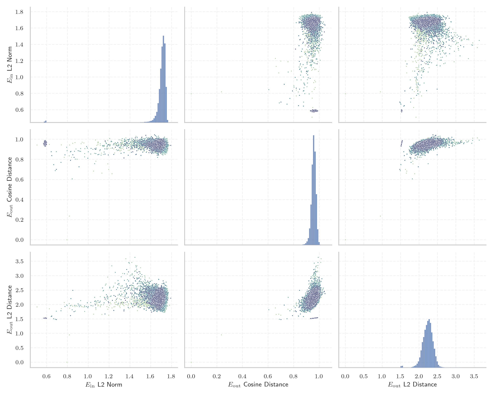
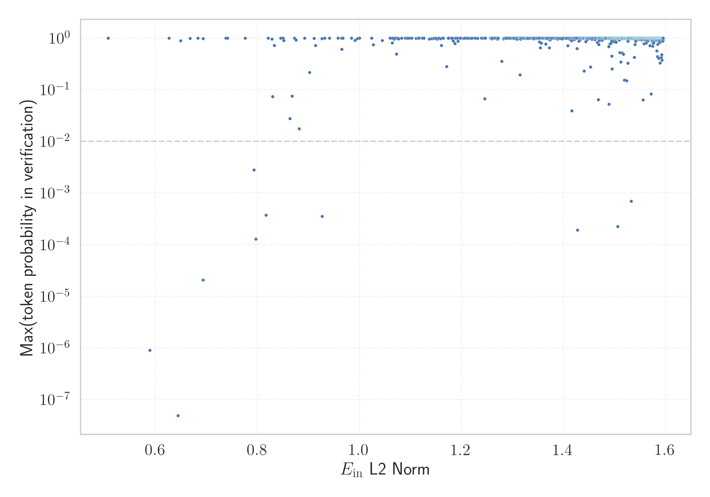

# Report for `EleutherAI/gpt-neox-20b`

## Model info

* Model Info: 
  * Tied embeddings: False
  * LM head uses bias: False
  * Embeddings shape: [50432, 6144]
* Tokenizer Info: 
  * Vocab Size: 50277
  * Tokenizer Class: GPTNeoXTokenizer
  * Tokenizer Type: BPE
  * Bytes handling: Byte Input
  * Token for verification prompt building: ArgumentException
  * Token id for verification prompt building: 43411
* Indicator summary: 
  * Indicator for under-trained tokens: E_{in} L2 Norm
  * Overall distribution: 1.697 +/- 0.109
* Detected Token Counts: 
  * Number of tested under-trained tokens: 993, 889 non-special, 9 below p = 0.01 threshold, 11 below soft indicator threshold
  * Number of single byte tokens: 243, of which 4 below indicator threshold
  * Number of special tokens: 221, of which 215 below indicator threshold
  * Number of non-single-byte unreachable tokens: 221, of which 215 below indicator threshold
  * Number of non-single-byte UTF-fragment tokens:  369, of which 0 below soft indicator threshold

## Under-trained token indicators plot


## Verification plot


## Under-trained token verification results
11 entries below threshold of 0.817

|   token_id | token                        |   indicator | max_prob                                                         | in_other_tokens                                                                                                                                                                                                                                                                                                                                     |
|------------|------------------------------|-------------|------------------------------------------------------------------|-----------------------------------------------------------------------------------------------------------------------------------------------------------------------------------------------------------------------------------------------------------------------------------------------------------------------------------------------------|
|        253 | ````` ▁the `````             |    0.626814 | <span style='border: 1px solid rgb(40, 167, 69);'>1</span>       | <span style='border: 1px solid rgb(40, 167, 69);'>````` ▁theorem `````</span>, <span style='border: 1px solid rgb(40, 167, 69);'>````` ▁thereafter `````</span>, ````` ▁thereon `````, <span style='border: 1px solid rgb(40, 167, 69);'>````` ▁they `````</span>, <span style='border: 1px solid rgb(40, 167, 69);'>````` ▁there `````</span>, ... |
|      28696 | ````` FFIRMED `````          |    0.644473 | <span style='border: 1px solid rgb(169, 68, 66);'>4.9e-08</span> | ````` AFFIRMED `````, ````` ▁AFFIRMED `````                                                                                                                                                                                                                                                                                                         |
|      37402 | ````` imonit `````           |    0.649838 | <span style='border: 1px solid rgb(40, 167, 69);'>0.89</span>    | ````` medscimonit `````                                                                                                                                                                                                                                                                                                                             |
|      26868 | ````` ÃÂÃÂÃÂÃÂ `````         |    0.668227 | <span style='border: 1px solid rgb(40, 167, 69);'>0.99</span>    | <span style='border: 1px solid rgb(40, 167, 69);'>````` ÃÂÃÂÃÂÃÂÃÂÃÂÃÂÃÂ `````</span>                                                                                                                                                                                                                                                               |
|      17030 | ````` ÃÂÃÂ `````             |    0.683542 | <span style='border: 1px solid rgb(40, 167, 69);'>1</span>       | <span style='border: 1px solid rgb(40, 167, 69);'>````` ÃÂÃÂÃÂÃÂ `````</span>, <span style='border: 1px solid rgb(40, 167, 69);'>````` ÃÂÃÂÃÂÃÂÃÂÃÂÃÂÃÂ `````</span>                                                                                                                                                                                |
|      15479 | ````` ▁taxp `````            |    0.693546 | <span style='border: 1px solid rgb(169, 68, 66);'>2.1e-05</span> | <span style='border: 1px solid rgb(40, 167, 69);'>````` ▁taxpayer `````</span>, ````` ▁taxpayers `````                                                                                                                                                                                                                                              |
|      41606 | ````` ÃÂÃÂÃÂÃÂÃÂÃÂÃÂÃÂ ````` |    0.693717 | <span style='border: 1px solid rgb(40, 167, 69);'>0.97</span>    |                                                                                                                                                                                                                                                                                                                                                     |
|      26362 | ````` ▁{¶ `````              |    0.738053 | <span style='border: 1px solid rgb(40, 167, 69);'>0.99</span>    |                                                                                                                                                                                                                                                                                                                                                     |
|      30356 | ````` marined `````          |    0.776384 | <span style='border: 1px solid rgb(40, 167, 69);'>1</span>       | ````` marinedrugs `````                                                                                                                                                                                                                                                                                                                             |
|      15236 | ````` ▁biomark `````         |    0.793407 | <span style='border: 1px solid rgb(255, 145, 0);'>0.0028</span>  | <span style='border: 1px solid rgb(40, 167, 69);'>````` ▁biomarkers `````</span>, ````` ▁biomarker `````                                                                                                                                                                                                                                            |
|      14798 | ````` ▁affidav `````         |    0.797245 | <span style='border: 1px solid rgb(169, 68, 66);'>0.00013</span> | ````` ▁affidavits `````, <span style='border: 1px solid rgb(40, 167, 69);'>````` ▁affidavit `````</span>                                                                                                                                                                                                                                            |
<details><summary>878 additional entries above threshold</summary>

|   token_id | token                                                                                                        |   indicator | max_prob                                                         | in_other_tokens                                                                                                                                                                                                                                                                                                                                                                                                                                                                                                                                                                                                                                                                                                                   |
|------------|--------------------------------------------------------------------------------------------------------------|-------------|------------------------------------------------------------------|-----------------------------------------------------------------------------------------------------------------------------------------------------------------------------------------------------------------------------------------------------------------------------------------------------------------------------------------------------------------------------------------------------------------------------------------------------------------------------------------------------------------------------------------------------------------------------------------------------------------------------------------------------------------------------------------------------------------------------------|
|       6761 | ````` ortunately `````                                                                                       |    0.817149 | <span style='border: 1px solid rgb(169, 68, 66);'>0.00037</span> | ````` ▁Fortunately `````, ````` Fortunately `````, <span style='border: 1px solid rgb(40, 167, 69);'>````` ▁unfortunately `````</span>, <span style='border: 1px solid rgb(40, 167, 69);'>````` ▁Unfortunately `````</span>, <span style='border: 1px solid rgb(40, 167, 69);'>````` fortunately `````</span>, ...                                                                                                                                                                                                                                                                                                                                                                                                                |
|      23063 | ````` ▁careg `````                                                                                           |    0.828695 | <span style='border: 1px solid rgb(40, 167, 69);'>0.95</span>    | ````` ▁caregivers `````, ````` ▁caregiver `````                                                                                                                                                                                                                                                                                                                                                                                                                                                                                                                                                                                                                                                                                   |
|      39743 | ````` 14514500 `````                                                                                         |    0.829916 | <span style='border: 1px solid rgb(251, 189, 8);'>0.073</span>   | <span style='border: 1px solid rgb(251, 189, 8);'>````` 1451450014514500 `````</span>                                                                                                                                                                                                                                                                                                                                                                                                                                                                                                                                                                                                                                             |
|      27655 | ````` ▁$[]$ `````                                                                                            |    0.833345 | <span style='border: 1px solid rgb(40, 167, 69);'>0.72</span>    |                                                                                                                                                                                                                                                                                                                                                                                                                                                                                                                                                                                                                                                                                                                                   |
|      16990 | ````` ÃÂ `````                                                                                               |    0.845682 | <span style='border: 1px solid rgb(40, 167, 69);'>1</span>       | <span style='border: 1px solid rgb(40, 167, 69);'>````` ÃÂÃÂÃÂÃÂ `````</span>, <span style='border: 1px solid rgb(40, 167, 69);'>````` ÃÂÃÂ `````</span>, <span style='border: 1px solid rgb(40, 167, 69);'>````` ÃÂÃÂÃÂÃÂÃÂÃÂÃÂÃÂ `````</span>                                                                                                                                                                                                                                                                                                                                                                                                                                                                                   |
|        273 | ````` ▁of `````                                                                                              |    0.850533 | <span style='border: 1px solid rgb(40, 167, 69);'>1</span>       | <span style='border: 1px solid rgb(40, 167, 69);'>````` ▁official `````</span>, <span style='border: 1px solid rgb(40, 167, 69);'>````` ▁officer `````</span>, <span style='border: 1px solid rgb(40, 167, 69);'>````` ▁offspring `````</span>, ````` ▁offenders `````, ````` ▁offerings `````, ...                                                                                                                                                                                                                                                                                                                                                                                                                               |
|      37087 | ````` medsc `````                                                                                            |    0.851864 | <span style='border: 1px solid rgb(40, 167, 69);'>0.9</span>     | ````` medscimonit `````                                                                                                                                                                                                                                                                                                                                                                                                                                                                                                                                                                                                                                                                                                           |
|      39922 | ````` 1451450014514500 `````                                                                                 |    0.863769 | <span style='border: 1px solid rgb(251, 189, 8);'>0.028</span>   |                                                                                                                                                                                                                                                                                                                                                                                                                                                                                                                                                                                                                                                                                                                                   |
|      18112 | ````` ▁practition `````                                                                                      |    0.868157 | <span style='border: 1px solid rgb(251, 189, 8);'>0.075</span>   | ````` ▁practitioners `````, ````` ▁practitioner `````                                                                                                                                                                                                                                                                                                                                                                                                                                                                                                                                                                                                                                                                             |
|        285 | ````` ▁and `````                                                                                             |    0.87277  | <span style='border: 1px solid rgb(40, 167, 69);'>1</span>       | ````` ▁androgen `````, <span style='border: 1px solid rgb(40, 167, 69);'>````` ▁android `````</span>, ````` ▁andra `````, ````` ▁andere `````                                                                                                                                                                                                                                                                                                                                                                                                                                                                                                                                                                                     |
|      12370 | ````` ICENSE `````                                                                                           |    0.875879 | <span style='border: 1px solid rgb(40, 167, 69);'>0.91</span>    | <span style='border: 1px solid rgb(40, 167, 69);'>````` LICENSE `````</span>, <span style='border: 1px solid rgb(40, 167, 69);'>````` ▁LICENSE `````</span>                                                                                                                                                                                                                                                                                                                                                                                                                                                                                                                                                                       |
|       7440 | ````` ▁researc `````                                                                                         |    0.882158 | <span style='border: 1px solid rgb(251, 189, 8);'>0.017</span>   | <span style='border: 1px solid rgb(40, 167, 69);'>````` ▁researcher `````</span>, ````` ▁researched `````, ````` ▁researching `````, <span style='border: 1px solid rgb(40, 167, 69);'>````` ▁researchers `````</span>                                                                                                                                                                                                                                                                                                                                                                                                                                                                                                            |
|       8827 | ````` rsfs `````                                                                                             |    0.892537 | <span style='border: 1px solid rgb(40, 167, 69);'>1</span>       | <span style='border: 1px solid rgb(40, 167, 69);'>````` mathrsfs `````</span>                                                                                                                                                                                                                                                                                                                                                                                                                                                                                                                                                                                                                                                     |
|      22066 | ````` ▁resemb `````                                                                                          |    0.902538 | <span style='border: 1px solid rgb(40, 167, 69);'>0.22</span>    | ````` ▁resembling `````, ````` ▁resemblance `````, ````` ▁resembled `````, ````` ▁resemble `````, ````` ▁resembles `````                                                                                                                                                                                                                                                                                                                                                                                                                                                                                                                                                                                                          |
|      34985 | ````` \xa0\n▁ `````                                                                                          |    0.911328 | <span style='border: 1px solid rgb(40, 167, 69);'>0.99</span>    |                                                                                                                                                                                                                                                                                                                                                                                                                                                                                                                                                                                                                                                                                                                                   |
|      21852 | ````` ▁earthqu `````                                                                                         |    0.914109 | <span style='border: 1px solid rgb(40, 167, 69);'>0.72</span>    | ````` ▁earthquakes `````, ````` ▁earthquake `````                                                                                                                                                                                                                                                                                                                                                                                                                                                                                                                                                                                                                                                                                 |
|      20033 | ````` ▁tradem `````                                                                                          |    0.926418 | <span style='border: 1px solid rgb(40, 167, 69);'>0.98</span>    | ````` ▁trademarks `````, ````` ▁trademark `````                                                                                                                                                                                                                                                                                                                                                                                                                                                                                                                                                                                                                                                                                   |
|      12253 | ````` ▁questionna `````                                                                                      |    0.926813 | <span style='border: 1px solid rgb(169, 68, 66);'>0.00035</span> | ````` ▁questionnaires `````, <span style='border: 1px solid rgb(40, 167, 69);'>````` ▁questionnaire `````</span>                                                                                                                                                                                                                                                                                                                                                                                                                                                                                                                                                                                                                  |
|        281 | ````` ▁to `````                                                                                              |    0.931859 | <span style='border: 1px solid rgb(40, 167, 69);'>1</span>       | ````` ▁toddler `````, <span style='border: 1px solid rgb(40, 167, 69);'>````` ▁topics `````</span>, <span style='border: 1px solid rgb(40, 167, 69);'>````` ▁totally `````</span>, <span style='border: 1px solid rgb(40, 167, 69);'>````` ▁torque `````</span>, ````` ▁tonnes `````, ...                                                                                                                                                                                                                                                                                                                                                                                                                                         |
|        275 | ````` ▁in `````                                                                                              |    0.941477 | <span style='border: 1px solid rgb(40, 167, 69);'>1</span>       | <span style='border: 1px solid rgb(40, 167, 69);'>````` ▁involved `````</span>, <span style='border: 1px solid rgb(40, 167, 69);'>````` ▁infrastructure `````</span>, <span style='border: 1px solid rgb(40, 167, 69);'>````` ▁inadequate `````</span>, <span style='border: 1px solid rgb(40, 167, 69);'>````` ▁incurred `````</span>, ````` ▁inhabited `````, ...                                                                                                                                                                                                                                                                                                                                                               |
|        247 | ````` ▁a `````                                                                                               |    0.957906 | <span style='border: 1px solid rgb(40, 167, 69);'>1</span>       | ````` ▁adventures `````, ````` ▁authoritarian `````, ````` ▁ammonia `````, ````` ▁altar `````, ````` ▁amen `````, ...                                                                                                                                                                                                                                                                                                                                                                                                                                                                                                                                                                                                             |
|      13236 | ````` ▁teasp `````                                                                                           |    0.964734 | <span style='border: 1px solid rgb(40, 167, 69);'>1</span>       | ````` ▁teaspoons `````, <span style='border: 1px solid rgb(40, 167, 69);'>````` ▁teaspoon `````</span>                                                                                                                                                                                                                                                                                                                                                                                                                                                                                                                                                                                                                            |
|       8865 | ````` idemargin `````                                                                                        |    0.9653   | <span style='border: 1px solid rgb(40, 167, 69);'>0.61</span>    | <span style='border: 1px solid rgb(40, 167, 69);'>````` oddsidemargin `````</span>                                                                                                                                                                                                                                                                                                                                                                                                                                                                                                                                                                                                                                                |
|      10248 | ````` ▁specim `````                                                                                          |    0.967696 | <span style='border: 1px solid rgb(40, 167, 69);'>1</span>       | <span style='border: 1px solid rgb(40, 167, 69);'>````` ▁specimens `````</span>, <span style='border: 1px solid rgb(40, 167, 69);'>````` ▁specimen `````</span>                                                                                                                                                                                                                                                                                                                                                                                                                                                                                                                                                                   |
|      26384 | ````` ▁remn `````                                                                                            |    0.984452 | <span style='border: 1px solid rgb(40, 167, 69);'>1</span>       | ````` ▁remnants `````, ````` ▁remnant `````                                                                                                                                                                                                                                                                                                                                                                                                                                                                                                                                                                                                                                                                                       |
|      27092 | ````` ▁glimp `````                                                                                           |    0.991179 | <span style='border: 1px solid rgb(40, 167, 69);'>0.9</span>     | ````` ▁glimpse `````, ````` ▁glimps `````                                                                                                                                                                                                                                                                                                                                                                                                                                                                                                                                                                                                                                                                                         |
|      26939 | ````` ▁\xa0\xa0▁\xa0\xa0▁\xa0\xa0▁\xa0\xa0 `````                                                             |    0.99616  | <span style='border: 1px solid rgb(40, 167, 69);'>0.98</span>    |                                                                                                                                                                                                                                                                                                                                                                                                                                                                                                                                                                                                                                                                                                                                   |
|      20637 | ````` ▁supernat `````                                                                                        |    1.00031  | <span style='border: 1px solid rgb(40, 167, 69);'>1</span>       | ````` ▁supernatant `````, ````` ▁supernatants `````, ````` ▁supernatural `````                                                                                                                                                                                                                                                                                                                                                                                                                                                                                                                                                                                                                                                    |
|      16658 | ````` tocol `````                                                                                            |    1.0238   | <span style='border: 1px solid rgb(40, 167, 69);'>1</span>       | ````` Protocol `````, ````` protocol `````, ````` ▁Protocol `````                                                                                                                                                                                                                                                                                                                                                                                                                                                                                                                                                                                                                                                                 |
|      29910 | ````` ▁counc `````                                                                                           |    1.02698  | <span style='border: 1px solid rgb(40, 167, 69);'>0.74</span>    | ````` ▁councill `````, ````` ▁councils `````                                                                                                                                                                                                                                                                                                                                                                                                                                                                                                                                                                                                                                                                                      |
|      16793 | ````` ▁entreprene `````                                                                                      |    1.04466  | <span style='border: 1px solid rgb(40, 167, 69);'>0.9</span>     | <span style='border: 1px solid rgb(40, 167, 69);'>````` ▁entrepreneur `````</span>, ````` ▁entrepreneurs `````                                                                                                                                                                                                                                                                                                                                                                                                                                                                                                                                                                                                                    |
|       6767 | ````` widet `````                                                                                            |    1.06002  | <span style='border: 1px solid rgb(40, 167, 69);'>1</span>       | <span style='border: 1px solid rgb(40, 167, 69);'>````` widetilde `````</span>                                                                                                                                                                                                                                                                                                                                                                                                                                                                                                                                                                                                                                                    |
|      32034 | ````` enment `````                                                                                           |    1.0642   | <span style='border: 1px solid rgb(40, 167, 69);'>0.81</span>    | ````` ▁enlightenment `````, ````` lightenment `````                                                                                                                                                                                                                                                                                                                                                                                                                                                                                                                                                                                                                                                                               |
|      10365 | ````` ▁embod `````                                                                                           |    1.06482  | <span style='border: 1px solid rgb(40, 167, 69);'>1</span>       | ````` ▁embodied `````, ````` ▁embodiments `````, <span style='border: 1px solid rgb(40, 167, 69);'>````` ▁embodiment `````</span>                                                                                                                                                                                                                                                                                                                                                                                                                                                                                                                                                                                                 |
|      48628 | ````` ▁doxor `````                                                                                           |    1.06804  | <span style='border: 1px solid rgb(40, 167, 69);'>0.96</span>    | ````` ▁doxorubicin `````                                                                                                                                                                                                                                                                                                                                                                                                                                                                                                                                                                                                                                                                                                          |
|        346 | ````` ▁" `````                                                                                               |    1.06971  | <span style='border: 1px solid rgb(40, 167, 69);'>1</span>       | <span style='border: 1px solid rgb(40, 167, 69);'>````` ▁"$ `````</span>, ````` ▁": `````, ````` ▁""; `````, ````` ▁"{ `````, <span style='border: 1px solid rgb(40, 167, 69);'>````` ▁""" `````</span>, ...                                                                                                                                                                                                                                                                                                                                                                                                                                                                                                                      |
|      22394 | ````` ▁cryptocur `````                                                                                       |    1.07249  | <span style='border: 1px solid rgb(40, 167, 69);'>0.49</span>    | ````` ▁cryptocurrency `````, ````` ▁cryptocurrencies `````                                                                                                                                                                                                                                                                                                                                                                                                                                                                                                                                                                                                                                                                        |
|      17505 | ````` gorithm `````                                                                                          |    1.07594  | <span style='border: 1px solid rgb(40, 167, 69);'>1</span>       | ````` gorithms `````, ````` algorithm `````, ````` Algorithm `````, ````` ▁Algorithm `````                                                                                                                                                                                                                                                                                                                                                                                                                                                                                                                                                                                                                                        |
|       7702 | ````` ▁encoun `````                                                                                          |    1.0766   | <span style='border: 1px solid rgb(40, 167, 69);'>0.96</span>    | ````` ▁encounters `````, <span style='border: 1px solid rgb(40, 167, 69);'>````` ▁encounter `````</span>, <span style='border: 1px solid rgb(40, 167, 69);'>````` ▁encountered `````</span>                                                                                                                                                                                                                                                                                                                                                                                                                                                                                                                                       |
|        326 | ````` ▁that `````                                                                                            |    1.09296  | <span style='border: 1px solid rgb(40, 167, 69);'>1</span>       | ````` ▁thats `````                                                                                                                                                                                                                                                                                                                                                                                                                                                                                                                                                                                                                                                                                                                |
|      27618 | ````` []$ `````                                                                                              |    1.09298  | <span style='border: 1px solid rgb(40, 167, 69);'>1</span>       | <span style='border: 1px solid rgb(40, 167, 69);'>````` ▁$[]$ `````</span>                                                                                                                                                                                                                                                                                                                                                                                                                                                                                                                                                                                                                                                        |
|        313 | ````` ▁( `````                                                                                               |    1.09423  | <span style='border: 1px solid rgb(40, 167, 69);'>1</span>       | ````` ▁({ `````, ````` ▁(\# `````, ````` ▁(± `````, ````` ▁(); `````, ````` ▁(> `````, ...                                                                                                                                                                                                                                                                                                                                                                                                                                                                                                                                                                                                                                        |
|        323 | ````` ▁for `````                                                                                             |    1.09766  | <span style='border: 1px solid rgb(40, 167, 69);'>1</span>       | ````` ▁foreground `````, ````` ▁forecasts `````, ````` ▁formulate `````, ````` ▁formaldehyde `````, ````` ▁forgiven `````, ...                                                                                                                                                                                                                                                                                                                                                                                                                                                                                                                                                                                                    |
|      19250 | ````` PDATE `````                                                                                            |    1.10242  | <span style='border: 1px solid rgb(40, 167, 69);'>1</span>       | ````` ▁UPDATE `````, <span style='border: 1px solid rgb(40, 167, 69);'>````` UPDATE `````</span>                                                                                                                                                                                                                                                                                                                                                                                                                                                                                                                                                                                                                                  |
|      14529 | ````` scious `````                                                                                           |    1.1109   | <span style='border: 1px solid rgb(40, 167, 69);'>0.98</span>    | ````` sciously `````, <span style='border: 1px solid rgb(40, 167, 69);'>````` conscious `````</span>, <span style='border: 1px solid rgb(40, 167, 69);'>````` ▁unconscious `````</span>, ````` ▁consciously `````                                                                                                                                                                                                                                                                                                                                                                                                                                                                                                                 |
|      22514 | ````` ▁Leban `````                                                                                           |    1.11489  | <span style='border: 1px solid rgb(40, 167, 69);'>1</span>       | ````` ▁Lebanon `````, ````` ▁Lebanese `````                                                                                                                                                                                                                                                                                                                                                                                                                                                                                                                                                                                                                                                                                       |
|       5273 | ````` sembly `````                                                                                           |    1.115    | <span style='border: 1px solid rgb(40, 167, 69);'>1</span>       | <span style='border: 1px solid rgb(40, 167, 69);'>````` ▁Assembly `````</span>, <span style='border: 1px solid rgb(40, 167, 69);'>````` ▁assembly `````</span>, ````` Assembly `````, ````` assembly `````                                                                                                                                                                                                                                                                                                                                                                                                                                                                                                                        |
|        342 | ````` ▁with `````                                                                                            |    1.11513  | <span style='border: 1px solid rgb(40, 167, 69);'>1</span>       | <span style='border: 1px solid rgb(40, 167, 69);'>````` ▁without `````</span>, ````` ▁withstand `````, <span style='border: 1px solid rgb(40, 167, 69);'>````` ▁withdraw `````</span>, ````` ▁withdrawing `````, ````` ▁withheld `````, ...                                                                                                                                                                                                                                                                                                                                                                                                                                                                                       |
|        310 | ````` ▁is `````                                                                                              |    1.11649  | <span style='border: 1px solid rgb(40, 167, 69);'>1</span>       | <span style='border: 1px solid rgb(40, 167, 69);'>````` ▁iss `````</span>, <span style='border: 1px solid rgb(40, 167, 69);'>````` ▁ist `````</span>, ````` ▁issuing `````, <span style='border: 1px solid rgb(40, 167, 69);'>````` ▁iso `````</span>, ````` ▁isotropic `````, ...                                                                                                                                                                                                                                                                                                                                                                                                                                                |
|      13704 | ````` ▁\xa0\xa0▁\xa0\xa0 `````                                                                               |    1.12316  | <span style='border: 1px solid rgb(40, 167, 69);'>1</span>       | <span style='border: 1px solid rgb(40, 167, 69);'>````` ▁\xa0\xa0▁\xa0\xa0▁\xa0\xa0▁\xa0\xa0 `````</span>                                                                                                                                                                                                                                                                                                                                                                                                                                                                                                                                                                                                                         |
|      21895 | ````` ▁predecess `````                                                                                       |    1.13695  | <span style='border: 1px solid rgb(40, 167, 69);'>0.95</span>    | ````` ▁predecessor `````, ````` ▁predecessors `````                                                                                                                                                                                                                                                                                                                                                                                                                                                                                                                                                                                                                                                                               |
|      10900 | ````` ▁occas `````                                                                                           |    1.14217  | <span style='border: 1px solid rgb(40, 167, 69);'>0.97</span>    | <span style='border: 1px solid rgb(40, 167, 69);'>````` ▁occasionally `````</span>, <span style='border: 1px solid rgb(40, 167, 69);'>````` ▁occasional `````</span>, <span style='border: 1px solid rgb(40, 167, 69);'>````` ▁occasions `````</span>                                                                                                                                                                                                                                                                                                                                                                                                                                                                             |
|       6599 | ````` icrosoft `````                                                                                         |    1.1457   | <span style='border: 1px solid rgb(40, 167, 69);'>0.98</span>    | <span style='border: 1px solid rgb(40, 167, 69);'>````` microsoft `````</span>, <span style='border: 1px solid rgb(40, 167, 69);'>````` ▁Microsoft `````</span>, <span style='border: 1px solid rgb(40, 167, 69);'>````` Microsoft `````</span>                                                                                                                                                                                                                                                                                                                                                                                                                                                                                   |
|      18249 | ````` ▁reluct `````                                                                                          |    1.14625  | <span style='border: 1px solid rgb(40, 167, 69);'>0.99</span>    | ````` ▁reluctant `````, ````` ▁reluctance `````, ````` ▁reluctantly `````                                                                                                                                                                                                                                                                                                                                                                                                                                                                                                                                                                                                                                                         |
|      19650 | ````` izontal `````                                                                                          |    1.15233  | <span style='border: 1px solid rgb(40, 167, 69);'>0.95</span>    | ````` ▁Horizontal `````, ````` ▁horizontally `````, ````` Horizontal `````, ````` horizontal `````                                                                                                                                                                                                                                                                                                                                                                                                                                                                                                                                                                                                                                |
|      10055 | ````` iscussion `````                                                                                        |    1.15443  | <span style='border: 1px solid rgb(40, 167, 69);'>0.99</span>    | <span style='border: 1px solid rgb(40, 167, 69);'>````` Discussion `````</span>, <span style='border: 1px solid rgb(40, 167, 69);'>````` ▁Discussion `````</span>, <span style='border: 1px solid rgb(40, 167, 69);'>````` ▁discussions `````</span>, ````` discussion `````                                                                                                                                                                                                                                                                                                                                                                                                                                                      |
|       6211 | ````` ▁citiz `````                                                                                           |    1.15487  | <span style='border: 1px solid rgb(40, 167, 69);'>1</span>       | <span style='border: 1px solid rgb(40, 167, 69);'>````` ▁citizens `````</span>, ````` ▁citizenship `````, <span style='border: 1px solid rgb(40, 167, 69);'>````` ▁citizen `````</span>                                                                                                                                                                                                                                                                                                                                                                                                                                                                                                                                           |
|      22596 | ````` ▁opio `````                                                                                            |    1.15918  | <span style='border: 1px solid rgb(40, 167, 69);'>0.98</span>    | ````` ▁opioids `````, ````` ▁opioid `````                                                                                                                                                                                                                                                                                                                                                                                                                                                                                                                                                                                                                                                                                         |
|      35088 | ````` ...\...\ `````                                                                                         |    1.16067  | <span style='border: 1px solid rgb(40, 167, 69);'>0.72</span>    |                                                                                                                                                                                                                                                                                                                                                                                                                                                                                                                                                                                                                                                                                                                                   |
|      50276 | ````` ¿▁▁? `````                                                                                             |    1.16249  | <span style='border: 1px solid rgb(40, 167, 69);'>0.99</span>    |                                                                                                                                                                                                                                                                                                                                                                                                                                                                                                                                                                                                                                                                                                                                   |
|       9120 | ````` everal `````                                                                                           |    1.16431  | <span style='border: 1px solid rgb(40, 167, 69);'>0.99</span>    | <span style='border: 1px solid rgb(40, 167, 69);'>````` ▁Several `````</span>, ````` several `````, <span style='border: 1px solid rgb(40, 167, 69);'>````` Several `````</span>                                                                                                                                                                                                                                                                                                                                                                                                                                                                                                                                                  |
|       9057 | ````` ometimes `````                                                                                         |    1.17078  | <span style='border: 1px solid rgb(40, 167, 69);'>0.28</span>    | <span style='border: 1px solid rgb(40, 167, 69);'>````` Sometimes `````</span>, ````` sometimes `````, <span style='border: 1px solid rgb(40, 167, 69);'>````` ▁Sometimes `````</span>                                                                                                                                                                                                                                                                                                                                                                                                                                                                                                                                            |
|       6145 | ````` acebook `````                                                                                          |    1.17338  | <span style='border: 1px solid rgb(40, 167, 69);'>0.99</span>    | ````` facebook `````, <span style='border: 1px solid rgb(40, 167, 69);'>````` ▁Facebook `````</span>, ````` Facebook `````, ````` ▁facebook `````                                                                                                                                                                                                                                                                                                                                                                                                                                                                                                                                                                                 |
|      21551 | ````` arlier `````                                                                                           |    1.1746   | <span style='border: 1px solid rgb(40, 167, 69);'>1</span>       | ````` ▁Earlier `````, ````` Earlier `````                                                                                                                                                                                                                                                                                                                                                                                                                                                                                                                                                                                                                                                                                         |
|        449 | ````` ." `````                                                                                               |    1.17946  | <span style='border: 1px solid rgb(40, 167, 69);'>1</span>       | ````` ▁"." `````, ````` ."[ `````, ````` "." `````, <span style='border: 1px solid rgb(40, 167, 69);'>````` ..." `````</span>, <span style='border: 1px solid rgb(40, 167, 69);'>````` .", `````</span>, ...                                                                                                                                                                                                                                                                                                                                                                                                                                                                                                                      |
|      29304 | ````` uvant `````                                                                                            |    1.18133  | <span style='border: 1px solid rgb(40, 167, 69);'>0.98</span>    | ````` ▁adjuvant `````, ````` juvant `````                                                                                                                                                                                                                                                                                                                                                                                                                                                                                                                                                                                                                                                                                         |
|      39586 | ````` }{~ `````                                                                                              |    1.18197  | <span style='border: 1px solid rgb(40, 167, 69);'>1</span>       | <span style='border: 1px solid rgb(40, 167, 69);'>````` ~}{~ `````</span>                                                                                                                                                                                                                                                                                                                                                                                                                                                                                                                                                                                                                                                         |
|      13530 | ````` parison `````                                                                                          |    1.18382  | <span style='border: 1px solid rgb(40, 167, 69);'>0.87</span>    | <span style='border: 1px solid rgb(40, 167, 69);'>````` ▁comparisons `````</span>, <span style='border: 1px solid rgb(40, 167, 69);'>````` ▁Comparison `````</span>, ````` comparison `````, <span style='border: 1px solid rgb(40, 167, 69);'>````` Comparison `````</span>                                                                                                                                                                                                                                                                                                                                                                                                                                                      |
|       3421 | ````` ccording `````                                                                                         |    1.18711  | <span style='border: 1px solid rgb(40, 167, 69);'>0.78</span>    | <span style='border: 1px solid rgb(40, 167, 69);'>````` ▁According `````</span>, ````` according `````, <span style='border: 1px solid rgb(40, 167, 69);'>````` ▁Accordingly `````</span>, <span style='border: 1px solid rgb(40, 167, 69);'>````` According `````</span>, <span style='border: 1px solid rgb(40, 167, 69);'>````` Accordingly `````</span>, ...                                                                                                                                                                                                                                                                                                                                                                  |
|      23996 | ````` utative `````                                                                                          |    1.18825  | <span style='border: 1px solid rgb(40, 167, 69);'>1</span>       | ````` ▁commutative `````, ````` commutative `````                                                                                                                                                                                                                                                                                                                                                                                                                                                                                                                                                                                                                                                                                 |
|      38438 | ````` ORAND `````                                                                                            |    1.19223  | <span style='border: 1px solid rgb(40, 167, 69);'>1</span>       | ````` ORANDUM `````                                                                                                                                                                                                                                                                                                                                                                                                                                                                                                                                                                                                                                                                                                               |
|       6094 | ````` ▁behavi `````                                                                                          |    1.19289  | <span style='border: 1px solid rgb(40, 167, 69);'>0.87</span>    | <span style='border: 1px solid rgb(40, 167, 69);'>````` ▁behaviors `````</span>, ````` ▁behaviours `````, ````` ▁behavioural `````, <span style='border: 1px solid rgb(40, 167, 69);'>````` ▁behaviour `````</span>, ````` ▁behaving `````, ...                                                                                                                                                                                                                                                                                                                                                                                                                                                                                   |
|      50254 | ````` ¿▁▁▁▁▁▁▁▁▁▁▁▁▁▁▁▁▁▁▁▁▁▁▁▁? `````                                                                       |    1.19755  | <span style='border: 1px solid rgb(40, 167, 69);'>0.99</span>    |                                                                                                                                                                                                                                                                                                                                                                                                                                                                                                                                                                                                                                                                                                                                   |
|        327 | ````` ▁on `````                                                                                              |    1.20385  | <span style='border: 1px solid rgb(40, 167, 69);'>0.99</span>    | <span style='border: 1px solid rgb(40, 167, 69);'>````` ▁onion `````</span>, ````` ▁onions `````, ````` ▁ons `````, ````` ▁onClick `````, <span style='border: 1px solid rgb(40, 167, 69);'>````` ▁online `````</span>, ...                                                                                                                                                                                                                                                                                                                                                                                                                                                                                                       |
|       9641 | ````` inical `````                                                                                           |    1.20602  | <span style='border: 1px solid rgb(40, 167, 69);'>1</span>       | ````` Clinical `````, ````` ▁preclinical `````, <span style='border: 1px solid rgb(40, 167, 69);'>````` ▁clinically `````</span>, <span style='border: 1px solid rgb(40, 167, 69);'>````` clinical `````</span>, <span style='border: 1px solid rgb(40, 167, 69);'>````` ▁Clinical `````</span>                                                                                                                                                                                                                                                                                                                                                                                                                                   |
|      31236 | ````` ▁triglycer `````                                                                                       |    1.20685  | <span style='border: 1px solid rgb(40, 167, 69);'>1</span>       | ````` ▁triglycerides `````, ````` ▁triglyceride `````                                                                                                                                                                                                                                                                                                                                                                                                                                                                                                                                                                                                                                                                             |
|       9926 | ````` perties `````                                                                                          |    1.21079  | <span style='border: 1px solid rgb(40, 167, 69);'>1</span>       | <span style='border: 1px solid rgb(40, 167, 69);'>````` Properties `````</span>, ````` ▁Properties `````, <span style='border: 1px solid rgb(40, 167, 69);'>````` properties `````</span>                                                                                                                                                                                                                                                                                                                                                                                                                                                                                                                                         |
|        535 | ````` \n\n `````                                                                                             |    1.21672  | <span style='border: 1px solid rgb(40, 167, 69);'>0.99</span>    | <span style='border: 1px solid rgb(40, 167, 69);'>````` \n\n\t\t `````</span>, ````` \n\n▁▁▁▁▁▁▁▁▁▁▁▁▁▁▁▁▁▁▁▁▁▁▁ `````, ````` \n\n\n\n\n\n\n `````, ````` \n\n\n▁▁▁▁▁▁ `````, ````` \n\n\n▁▁▁▁▁ `````, ...                                                                                                                                                                                                                                                                                                                                                                                                                                                                                                                        |
|      20214 | ````` –––– `````                                                                                             |    1.21894  | <span style='border: 1px solid rgb(40, 167, 69);'>0.98</span>    | <span style='border: 1px solid rgb(40, 167, 69);'>````` –––––––– `````</span>                                                                                                                                                                                                                                                                                                                                                                                                                                                                                                                                                                                                                                                     |
|      23413 | ````` chemic `````                                                                                           |    1.22036  | <span style='border: 1px solid rgb(40, 167, 69);'>1</span>       | ````` ▁electrochemical `````, ````` ▁immunohistochemical `````, ````` ▁chemically `````, <span style='border: 1px solid rgb(40, 167, 69);'>````` ▁ischemic `````</span>                                                                                                                                                                                                                                                                                                                                                                                                                                                                                                                                                           |
|       8321 | ````` ▁disappe `````                                                                                         |    1.22627  | <span style='border: 1px solid rgb(40, 167, 69);'>1</span>       | ````` ▁disappearance `````, ````` ▁disappearing `````, <span style='border: 1px solid rgb(40, 167, 69);'>````` ▁disappeared `````</span>, <span style='border: 1px solid rgb(40, 167, 69);'>````` ▁disappear `````</span>, ````` ▁disappears `````                                                                                                                                                                                                                                                                                                                                                                                                                                                                                |
|      40251 | ````` chrane `````                                                                                           |    1.23166  | <span style='border: 1px solid rgb(40, 167, 69);'>0.99</span>    | ````` ▁Cochrane `````                                                                                                                                                                                                                                                                                                                                                                                                                                                                                                                                                                                                                                                                                                             |
|       5855 | ````` ▁weap `````                                                                                            |    1.23899  | <span style='border: 1px solid rgb(40, 167, 69);'>1</span>       | <span style='border: 1px solid rgb(40, 167, 69);'>````` ▁weapon `````</span>, <span style='border: 1px solid rgb(40, 167, 69);'>````` ▁weapons `````</span>                                                                                                                                                                                                                                                                                                                                                                                                                                                                                                                                                                       |
|      14886 | ````` ▁discharg `````                                                                                        |    1.24307  | <span style='border: 1px solid rgb(40, 167, 69);'>1</span>       | <span style='border: 1px solid rgb(40, 167, 69);'>````` ▁discharged `````</span>, ````` ▁discharges `````, ````` ▁discharging `````                                                                                                                                                                                                                                                                                                                                                                                                                                                                                                                                                                                               |
|      41557 | ````` PtrFromString `````                                                                                    |    1.24524  | <span style='border: 1px solid rgb(251, 189, 8);'>0.067</span>   | <span style='border: 1px solid rgb(169, 68, 66);'>````` ▁BytePtrFromString `````</span>                                                                                                                                                                                                                                                                                                                                                                                                                                                                                                                                                                                                                                           |
|      37898 | ````` uilt `````                                                                                             |    1.24677  | <span style='border: 1px solid rgb(40, 167, 69);'>1</span>       | ````` Built `````, ````` ▁quilt `````, ````` ▁rebuilt `````, ````` ▁Built `````                                                                                                                                                                                                                                                                                                                                                                                                                                                                                                                                                                                                                                                   |
|        369 | ````` ▁was `````                                                                                             |    1.25637  | <span style='border: 1px solid rgb(40, 167, 69);'>1</span>       | ````` ▁wastewater `````, <span style='border: 1px solid rgb(40, 167, 69);'>````` ▁waste `````</span>, ````` ▁wasting `````, <span style='border: 1px solid rgb(40, 167, 69);'>````` ▁wasn `````</span>, <span style='border: 1px solid rgb(40, 167, 69);'>````` ▁wash `````</span>, ...                                                                                                                                                                                                                                                                                                                                                                                                                                           |
|        428 | ````` ▁- `````                                                                                               |    1.25734  | <span style='border: 1px solid rgb(40, 167, 69);'>1</span>       | <span style='border: 1px solid rgb(40, 167, 69);'>````` ▁-\ `````</span>, <span style='border: 1px solid rgb(40, 167, 69);'>````` ▁------ `````</span>, ````` ▁--------------------- `````, ````` ▁---------------------------- `````, ````` ▁-. `````, ...                                                                                                                                                                                                                                                                                                                                                                                                                                                                       |
|       6063 | ````` ▁cryst `````                                                                                           |    1.25827  | <span style='border: 1px solid rgb(40, 167, 69);'>1</span>       | <span style='border: 1px solid rgb(40, 167, 69);'>````` ▁crystals `````</span>, <span style='border: 1px solid rgb(40, 167, 69);'>````` ▁crystall `````</span>, <span style='border: 1px solid rgb(40, 167, 69);'>````` ▁crystal `````</span>, ````` ▁crystalline `````, ````` ▁crystallization `````                                                                                                                                                                                                                                                                                                                                                                                                                             |
|      17365 | ````` ▁errone `````                                                                                          |    1.25958  | <span style='border: 1px solid rgb(40, 167, 69);'>0.97</span>    | ````` ▁erroneously `````, <span style='border: 1px solid rgb(40, 167, 69);'>````` ▁erroneous `````</span>                                                                                                                                                                                                                                                                                                                                                                                                                                                                                                                                                                                                                         |
|      44580 | ````` ERTYPE `````                                                                                           |    1.26035  | <span style='border: 1px solid rgb(40, 167, 69);'>0.99</span>    | <span style='border: 1px solid rgb(40, 167, 69);'>````` ETHERTYPE `````</span>                                                                                                                                                                                                                                                                                                                                                                                                                                                                                                                                                                                                                                                    |
|        407 | ````` ▁by `````                                                                                              |    1.26037  | <span style='border: 1px solid rgb(40, 167, 69);'>1</span>       | <span style='border: 1px solid rgb(40, 167, 69);'>````` ▁bypass `````</span>, <span style='border: 1px solid rgb(40, 167, 69);'>````` ▁byte `````</span>, <span style='border: 1px solid rgb(40, 167, 69);'>````` ▁bytes `````</span>, ````` ▁bye `````                                                                                                                                                                                                                                                                                                                                                                                                                                                                           |
|        309 | ````` ▁I `````                                                                                               |    1.26814  | <span style='border: 1px solid rgb(40, 167, 69);'>1</span>       | ````` ▁IIS `````, <span style='border: 1px solid rgb(40, 167, 69);'>````` ▁Int `````</span>, ````` ▁ICO `````, ````` ▁Integration `````, ````` ▁Islamist `````, ...                                                                                                                                                                                                                                                                                                                                                                                                                                                                                                                                                               |
|      11278 | ````` estinal `````                                                                                          |    1.27009  | <span style='border: 1px solid rgb(40, 167, 69);'>0.97</span>    | <span style='border: 1px solid rgb(40, 167, 69);'>````` ▁gastrointestinal `````</span>, <span style='border: 1px solid rgb(40, 167, 69);'>````` ▁intestinal `````</span>, <span style='border: 1px solid rgb(40, 167, 69);'>````` intestinal `````</span>                                                                                                                                                                                                                                                                                                                                                                                                                                                                         |
|      40494 | ````` bersome `````                                                                                          |    1.2705   | <span style='border: 1px solid rgb(40, 167, 69);'>0.95</span>    | ````` ▁cumbersome `````                                                                                                                                                                                                                                                                                                                                                                                                                                                                                                                                                                                                                                                                                                           |
|      29148 | ````` 14514 `````                                                                                            |    1.2712   | <span style='border: 1px solid rgb(40, 167, 69);'>1</span>       | <span style='border: 1px solid rgb(251, 189, 8);'>````` 14514500 `````</span>, <span style='border: 1px solid rgb(251, 189, 8);'>````` 1451450014514500 `````</span>                                                                                                                                                                                                                                                                                                                                                                                                                                                                                                                                                              |
|        432 | ````` ▁from `````                                                                                            |    1.27193  | <span style='border: 1px solid rgb(40, 167, 69);'>0.99</span>    |                                                                                                                                                                                                                                                                                                                                                                                                                                                                                                                                                                                                                                                                                                                                   |
|       6608 | ````` opyright `````                                                                                         |    1.27898  | <span style='border: 1px solid rgb(40, 167, 69);'>0.35</span>    | <span style='border: 1px solid rgb(40, 167, 69);'>````` Copyright `````</span>, ````` copyright `````, <span style='border: 1px solid rgb(40, 167, 69);'>````` ▁copyright `````</span>, ````` ▁copyrighted `````, <span style='border: 1px solid rgb(40, 167, 69);'>````` ▁Copyright `````</span>                                                                                                                                                                                                                                                                                                                                                                                                                                 |
|      26061 | ````` \r\n\r\n▁ `````                                                                                        |    1.2821   | <span style='border: 1px solid rgb(40, 167, 69);'>0.97</span>    | ````` \r\n\r\n▁▁▁▁▁▁▁▁▁▁▁ `````                                                                                                                                                                                                                                                                                                                                                                                                                                                                                                                                                                                                                                                                                                   |
|       1712 | ````` ▁{# `````                                                                                              |    1.28315  | <span style='border: 1px solid rgb(40, 167, 69);'>1</span>       |                                                                                                                                                                                                                                                                                                                                                                                                                                                                                                                                                                                                                                                                                                                                   |
|        347 | ````` ▁as `````                                                                                              |    1.2842   | <span style='border: 1px solid rgb(40, 167, 69);'>1</span>       | <span style='border: 1px solid rgb(40, 167, 69);'>````` ▁asc `````</span>, <span style='border: 1px solid rgb(40, 167, 69);'>````` ▁assessment `````</span>, <span style='border: 1px solid rgb(40, 167, 69);'>````` ▁assumptions `````</span>, ````` ▁assayed `````, <span style='border: 1px solid rgb(40, 167, 69);'>````` ▁ascending `````</span>, ...                                                                                                                                                                                                                                                                                                                                                                        |
|      30316 | ````` ▁oligonucle `````                                                                                      |    1.28427  | <span style='border: 1px solid rgb(40, 167, 69);'>1</span>       | ````` ▁oligonucleotides `````, ````` ▁oligonucleotide `````                                                                                                                                                                                                                                                                                                                                                                                                                                                                                                                                                                                                                                                                       |
|      21170 | ````` ▁orche `````                                                                                           |    1.28601  | <span style='border: 1px solid rgb(40, 167, 69);'>0.99</span>    | ````` ▁orchestra `````, ````` ▁orchestr `````                                                                                                                                                                                                                                                                                                                                                                                                                                                                                                                                                                                                                                                                                     |
|      12635 | ````` ariju `````                                                                                            |    1.28604  | <span style='border: 1px solid rgb(40, 167, 69);'>1</span>       | <span style='border: 1px solid rgb(40, 167, 69);'>````` ▁marijuana `````</span>, <span style='border: 1px solid rgb(40, 167, 69);'>````` arijuana `````</span>                                                                                                                                                                                                                                                                                                                                                                                                                                                                                                                                                                    |
|      37570 | ````` ▁0000000000000000000000000000000000 `````                                                              |    1.28779  | <span style='border: 1px solid rgb(40, 167, 69);'>0.99</span>    |                                                                                                                                                                                                                                                                                                                                                                                                                                                                                                                                                                                                                                                                                                                                   |
|        434 | ````` 's `````                                                                                               |    1.29067  | <span style='border: 1px solid rgb(40, 167, 69);'>0.99</span>    |                                                                                                                                                                                                                                                                                                                                                                                                                                                                                                                                                                                                                                                                                                                                   |
|      32194 | ````` ▁assertEquals `````                                                                                    |    1.29424  | <span style='border: 1px solid rgb(40, 167, 69);'>1</span>       |                                                                                                                                                                                                                                                                                                                                                                                                                                                                                                                                                                                                                                                                                                                                   |
|       8809 | ````` amss `````                                                                                             |    1.29637  | <span style='border: 1px solid rgb(40, 167, 69);'>1</span>       | <span style='border: 1px solid rgb(40, 167, 69);'>````` amssymb `````</span>                                                                                                                                                                                                                                                                                                                                                                                                                                                                                                                                                                                                                                                      |
|      34575 | ````` ▁00000000000000000000000000000000 `````                                                                |    1.29889  | <span style='border: 1px solid rgb(40, 167, 69);'>1</span>       | <span style='border: 1px solid rgb(40, 167, 69);'>````` ▁0000000000000000000000000000000000 `````</span>                                                                                                                                                                                                                                                                                                                                                                                                                                                                                                                                                                                                                          |
|       3278 | ````` icense `````                                                                                           |    1.30627  | <span style='border: 1px solid rgb(40, 167, 69);'>0.96</span>    | <span style='border: 1px solid rgb(40, 167, 69);'>````` ▁Licensed `````</span>, <span style='border: 1px solid rgb(40, 167, 69);'>````` license `````</span>, <span style='border: 1px solid rgb(40, 167, 69);'>````` ▁licensed `````</span>, <span style='border: 1px solid rgb(40, 167, 69);'>````` ▁license `````</span>, <span style='border: 1px solid rgb(40, 167, 69);'>````` License `````</span>, ...                                                                                                                                                                                                                                                                                                                    |
|        426 | ````` ▁= `````                                                                                               |    1.30701  | <span style='border: 1px solid rgb(40, 167, 69);'>1</span>       | <span style='border: 1px solid rgb(40, 167, 69);'>````` ▁== `````</span>, <span style='border: 1px solid rgb(40, 167, 69);'>````` ▁=> `````</span>, <span style='border: 1px solid rgb(40, 167, 69);'>````` ▁=\ `````</span>, ````` ▁================================================================ `````, <span style='border: 1px solid rgb(40, 167, 69);'>````` ▁=== `````</span>, ...                                                                                                                                                                                                                                                                                                                                       |
|        368 | ````` ▁you `````                                                                                             |    1.30914  | <span style='border: 1px solid rgb(40, 167, 69);'>1</span>       | ````` ▁youthful `````, <span style='border: 1px solid rgb(40, 167, 69);'>````` ▁young `````</span>, <span style='border: 1px solid rgb(40, 167, 69);'>````` ▁younger `````</span>, ````` ▁youtube `````, <span style='border: 1px solid rgb(40, 167, 69);'>````` ▁youth `````</span>, ...                                                                                                                                                                                                                                                                                                                                                                                                                                         |
|      15669 | ````` ailure `````                                                                                           |    1.30983  | <span style='border: 1px solid rgb(40, 167, 69);'>0.96</span>    | ````` ▁Failure `````, <span style='border: 1px solid rgb(40, 167, 69);'>````` ▁failures `````</span>, ````` Failure `````, ````` failure `````                                                                                                                                                                                                                                                                                                                                                                                                                                                                                                                                                                                    |
|      14198 | ````` ▁Palestin `````                                                                                        |    1.31267  | <span style='border: 1px solid rgb(40, 167, 69);'>1</span>       | ````` ▁Palestine `````, ````` ▁Palestinians `````, <span style='border: 1px solid rgb(40, 167, 69);'>````` ▁Palestinian `````</span>                                                                                                                                                                                                                                                                                                                                                                                                                                                                                                                                                                                              |
|      35613 | ````` ▁/*! `````                                                                                             |    1.31314  | <span style='border: 1px solid rgb(40, 167, 69);'>0.99</span>    | <span style='border: 1px solid rgb(40, 167, 69);'>````` ▁/*!< `````</span>                                                                                                                                                                                                                                                                                                                                                                                                                                                                                                                                                                                                                                                        |
|       4844 | ````` atever `````                                                                                           |    1.31372  | <span style='border: 1px solid rgb(40, 167, 69);'>0.99</span>    | <span style='border: 1px solid rgb(40, 167, 69);'>````` ▁Whatever `````</span>, ````` Whatever `````, <span style='border: 1px solid rgb(40, 167, 69);'>````` ▁whatever `````</span>, ````` whatever `````                                                                                                                                                                                                                                                                                                                                                                                                                                                                                                                        |
|      30031 | ````` ViewById `````                                                                                         |    1.3148   | <span style='border: 1px solid rgb(40, 167, 69);'>1</span>       | ````` ▁findViewById `````, ````` findViewById `````                                                                                                                                                                                                                                                                                                                                                                                                                                                                                                                                                                                                                                                                               |
|      50274 | ````` ¿▁▁▁▁? `````                                                                                           |    1.3157   | <span style='border: 1px solid rgb(40, 167, 69);'>1</span>       |                                                                                                                                                                                                                                                                                                                                                                                                                                                                                                                                                                                                                                                                                                                                   |
|      15536 | ````` ▁photograp `````                                                                                       |    1.31602  | <span style='border: 1px solid rgb(40, 167, 69);'>0.96</span>    | <span style='border: 1px solid rgb(40, 167, 69);'>````` ▁photographs `````</span>, ````` ▁photographic `````, ````` ▁photographers `````, ````` ▁photographed `````, <span style='border: 1px solid rgb(40, 167, 69);'>````` ▁photography `````</span>, ...                                                                                                                                                                                                                                                                                                                                                                                                                                                                       |
|       4043 | ````` ournal `````                                                                                           |    1.31797  | <span style='border: 1px solid rgb(40, 167, 69);'>0.99</span>    | ````` journals `````, <span style='border: 1px solid rgb(40, 167, 69);'>````` Journal `````</span>, <span style='border: 1px solid rgb(40, 167, 69);'>````` ▁journals `````</span>, ````` ▁journalism `````, <span style='border: 1px solid rgb(40, 167, 69);'>````` ▁journal `````</span>, ...                                                                                                                                                                                                                                                                                                                                                                                                                                   |
|        390 | ````` ▁or `````                                                                                              |    1.32119  | <span style='border: 1px solid rgb(40, 167, 69);'>1</span>       | <span style='border: 1px solid rgb(40, 167, 69);'>````` ▁ord `````</span>, <span style='border: 1px solid rgb(40, 167, 69);'>````` ▁organisms `````</span>, ````` ▁originate `````, <span style='border: 1px solid rgb(40, 167, 69);'>````` ▁organ `````</span>, ````` ▁orally `````, ...                                                                                                                                                                                                                                                                                                                                                                                                                                         |
|       5509 | ````` indows `````                                                                                           |    1.32138  | <span style='border: 1px solid rgb(40, 167, 69);'>1</span>       | <span style='border: 1px solid rgb(40, 167, 69);'>````` ▁windows `````</span>, ````` windows `````, <span style='border: 1px solid rgb(40, 167, 69);'>````` Windows `````</span>, <span style='border: 1px solid rgb(40, 167, 69);'>````` ▁Windows `````</span>                                                                                                                                                                                                                                                                                                                                                                                                                                                                   |
|      28632 | ````` iversal `````                                                                                          |    1.32327  | <span style='border: 1px solid rgb(40, 167, 69);'>0.99</span>    | ````` ▁universally `````, ````` universal `````, ````` Universal `````                                                                                                                                                                                                                                                                                                                                                                                                                                                                                                                                                                                                                                                            |
|       8823 | ````` bsy `````                                                                                              |    1.32529  | <span style='border: 1px solid rgb(40, 167, 69);'>0.99</span>    | <span style='border: 1px solid rgb(40, 167, 69);'>````` amsbsy `````</span>, ````` ▁subsystem `````                                                                                                                                                                                                                                                                                                                                                                                                                                                                                                                                                                                                                               |
|        417 | ````` ▁not `````                                                                                             |    1.32552  | <span style='border: 1px solid rgb(40, 167, 69);'>1</span>       | <span style='border: 1px solid rgb(40, 167, 69);'>````` ▁notification `````</span>, ````` ▁noticeable `````, <span style='border: 1px solid rgb(40, 167, 69);'>````` ▁notation `````</span>, <span style='border: 1px solid rgb(40, 167, 69);'>````` ▁noted `````</span>, <span style='border: 1px solid rgb(40, 167, 69);'>````` ▁noting `````</span>, ...                                                                                                                                                                                                                                                                                                                                                                       |
|      15238 | ````` ****, `````                                                                                            |    1.32638  | <span style='border: 1px solid rgb(40, 167, 69);'>0.98</span>    | ````` ▁****, `````, <span style='border: 1px solid rgb(40, 167, 69);'>````` ▁[****, `````</span>                                                                                                                                                                                                                                                                                                                                                                                                                                                                                                                                                                                                                                  |
|        387 | ````` ▁at `````                                                                                              |    1.32644  | <span style='border: 1px solid rgb(40, 167, 69);'>1</span>       | ````` ▁attaching `````, ````` ▁atop `````, ````` ▁attachments `````, ````` ▁até `````, <span style='border: 1px solid rgb(40, 167, 69);'>````` ▁attach `````</span>, ...                                                                                                                                                                                                                                                                                                                                                                                                                                                                                                                                                          |
|        320 | ````` ▁be `````                                                                                              |    1.32815  | <span style='border: 1px solid rgb(40, 167, 69);'>1</span>       | ````` ▁begged `````, <span style='border: 1px solid rgb(40, 167, 69);'>````` ▁bel `````</span>, <span style='border: 1px solid rgb(40, 167, 69);'>````` ▁because `````</span>, ````` ▁bedside `````, <span style='border: 1px solid rgb(40, 167, 69);'>````` ▁bearing `````</span>, ...                                                                                                                                                                                                                                                                                                                                                                                                                                           |
|        457 | ````` ’ `````                                                                                                |    1.32976  | <span style='border: 1px solid rgb(40, 167, 69);'>1</span>       | ````` .’” `````, <span style='border: 1px solid rgb(40, 167, 69);'>````` ’, `````</span>, <span style='border: 1px solid rgb(40, 167, 69);'>````` ,’ `````</span>, ````` ?’ `````, <span style='border: 1px solid rgb(40, 167, 69);'>````` ’. `````</span>, ...                                                                                                                                                                                                                                                                                                                                                                                                                                                                   |
|       5782 | ````` ▁proport `````                                                                                         |    1.33015  | <span style='border: 1px solid rgb(40, 167, 69);'>0.98</span>    | <span style='border: 1px solid rgb(40, 167, 69);'>````` ▁proportional `````</span>, <span style='border: 1px solid rgb(40, 167, 69);'>````` ▁proportions `````</span>, <span style='border: 1px solid rgb(40, 167, 69);'>````` ▁proportion `````</span>                                                                                                                                                                                                                                                                                                                                                                                                                                                                           |
|       2671 | ````` vironment `````                                                                                        |    1.33465  | <span style='border: 1px solid rgb(40, 167, 69);'>1</span>       | <span style='border: 1px solid rgb(40, 167, 69);'>````` ▁environments `````</span>, ````` Environment `````, <span style='border: 1px solid rgb(40, 167, 69);'>````` ▁environment `````</span>, <span style='border: 1px solid rgb(40, 167, 69);'>````` vironments `````</span>, <span style='border: 1px solid rgb(40, 167, 69);'>````` ▁Environment `````</span>, ...                                                                                                                                                                                                                                                                                                                                                           |
|      21742 | ````` ▁carboh `````                                                                                          |    1.33504  | <span style='border: 1px solid rgb(40, 167, 69);'>1</span>       | ````` ▁carbohydrates `````, ````` ▁carbohydrate `````                                                                                                                                                                                                                                                                                                                                                                                                                                                                                                                                                                                                                                                                             |
|        352 | ````` ▁it `````                                                                                              |    1.34008  | <span style='border: 1px solid rgb(40, 167, 69);'>1</span>       | <span style='border: 1px solid rgb(40, 167, 69);'>````` ▁iteration `````</span>, ````` ▁ital `````, ````` ▁iterator `````, ````` ▁itiner `````, <span style='border: 1px solid rgb(40, 167, 69);'>````` ▁its `````</span>, ...                                                                                                                                                                                                                                                                                                                                                                                                                                                                                                    |
|       1958 | ````` ividual `````                                                                                          |    1.34126  | <span style='border: 1px solid rgb(40, 167, 69);'>0.99</span>    | <span style='border: 1px solid rgb(40, 167, 69);'>````` ▁individuals `````</span>, ````` ▁Individuals `````, ````` Individual `````, <span style='border: 1px solid rgb(40, 167, 69);'>````` ▁individual `````</span>, <span style='border: 1px solid rgb(40, 167, 69);'>````` ▁Individual `````</span>, ...                                                                                                                                                                                                                                                                                                                                                                                                                      |
|      47748 | ````` olymers `````                                                                                          |    1.34129  | <span style='border: 1px solid rgb(40, 167, 69);'>0.97</span>    | ````` ▁copolymers `````                                                                                                                                                                                                                                                                                                                                                                                                                                                                                                                                                                                                                                                                                                           |
|        403 | ````` ▁are `````                                                                                             |    1.34297  | <span style='border: 1px solid rgb(40, 167, 69);'>1</span>       | <span style='border: 1px solid rgb(40, 167, 69);'>````` ▁areas `````</span>, <span style='border: 1px solid rgb(40, 167, 69);'>````` ▁area `````</span>, <span style='border: 1px solid rgb(40, 167, 69);'>````` ▁aren `````</span>, <span style='border: 1px solid rgb(40, 167, 69);'>````` ▁arena `````</span>                                                                                                                                                                                                                                                                                                                                                                                                                  |
|      23282 | ````` essages `````                                                                                          |    1.34573  | <span style='border: 1px solid rgb(40, 167, 69);'>0.99</span>    | ````` messages `````, ````` Messages `````                                                                                                                                                                                                                                                                                                                                                                                                                                                                                                                                                                                                                                                                                        |
|      20796 | ````` ▁oun `````                                                                                             |    1.34684  | <span style='border: 1px solid rgb(40, 167, 69);'>1</span>       | ````` ▁ounces `````, ````` ▁ounce `````                                                                                                                                                                                                                                                                                                                                                                                                                                                                                                                                                                                                                                                                                           |
|      22576 | ````` ▁resil `````                                                                                           |    1.34841  | <span style='border: 1px solid rgb(40, 167, 69);'>1</span>       | ````` ▁resilience `````, ````` ▁resilient `````                                                                                                                                                                                                                                                                                                                                                                                                                                                                                                                                                                                                                                                                                   |
|      47863 | ````` hatic `````                                                                                            |    1.3494   | <span style='border: 1px solid rgb(40, 167, 69);'>0.99</span>    | ````` iphatic `````                                                                                                                                                                                                                                                                                                                                                                                                                                                                                                                                                                                                                                                                                                               |
|      15224 | ````` typen `````                                                                                            |    1.35218  | <span style='border: 1px solid rgb(40, 167, 69);'>1</span>       | <span style='border: 1px solid rgb(40, 167, 69);'>````` typename `````</span>                                                                                                                                                                                                                                                                                                                                                                                                                                                                                                                                                                                                                                                     |
|      30491 | ````` OMNI `````                                                                                             |    1.35253  | <span style='border: 1px solid rgb(40, 167, 69);'>1</span>       |                                                                                                                                                                                                                                                                                                                                                                                                                                                                                                                                                                                                                                                                                                                                   |
|      33935 | ````` gester `````                                                                                           |    1.35259  | <span style='border: 1px solid rgb(40, 167, 69);'>0.84</span>    | ````` ▁progesterone `````, ````` gesterone `````                                                                                                                                                                                                                                                                                                                                                                                                                                                                                                                                                                                                                                                                                  |
|      25028 | ````` ernate `````                                                                                           |    1.35463  | <span style='border: 1px solid rgb(40, 167, 69);'>0.64</span>    | ````` hibernate `````, ````` ibernate `````                                                                                                                                                                                                                                                                                                                                                                                                                                                                                                                                                                                                                                                                                       |
|      20758 | ````` CLUDING `````                                                                                          |    1.35635  | <span style='border: 1px solid rgb(40, 167, 69);'>0.8</span>     | <span style='border: 1px solid rgb(40, 167, 69);'>````` INCLUDING `````</span>, <span style='border: 1px solid rgb(40, 167, 69);'>````` ▁INCLUDING `````</span>                                                                                                                                                                                                                                                                                                                                                                                                                                                                                                                                                                   |
|      50275 | ````` ¿▁▁▁? `````                                                                                            |    1.35698  | <span style='border: 1px solid rgb(40, 167, 69);'>1</span>       |                                                                                                                                                                                                                                                                                                                                                                                                                                                                                                                                                                                                                                                                                                                                   |
|        534 | ````` ▁which `````                                                                                           |    1.35863  | <span style='border: 1px solid rgb(40, 167, 69);'>1</span>       | ````` ▁whichever `````                                                                                                                                                                                                                                                                                                                                                                                                                                                                                                                                                                                                                                                                                                            |
|       2365 | ````` gether `````                                                                                           |    1.35898  | <span style='border: 1px solid rgb(40, 167, 69);'>1</span>       | <span style='border: 1px solid rgb(40, 167, 69);'>````` ogether `````</span>, ````` together `````, <span style='border: 1px solid rgb(40, 167, 69);'>````` ▁Together `````</span>, <span style='border: 1px solid rgb(40, 167, 69);'>````` ▁together `````</span>, <span style='border: 1px solid rgb(40, 167, 69);'>````` ▁altogether `````</span>                                                                                                                                                                                                                                                                                                                                                                              |
|       2928 | ````` ▁answ `````                                                                                            |    1.36115  | <span style='border: 1px solid rgb(40, 167, 69);'>1</span>       | <span style='border: 1px solid rgb(40, 167, 69);'>````` ▁answers `````</span>, <span style='border: 1px solid rgb(40, 167, 69);'>````` ▁answer `````</span>, <span style='border: 1px solid rgb(40, 167, 69);'>````` ▁answering `````</span>, <span style='border: 1px solid rgb(40, 167, 69);'>````` ▁answered `````</span>                                                                                                                                                                                                                                                                                                                                                                                                      |
|      20080 | ````` izoph `````                                                                                            |    1.36311  | <span style='border: 1px solid rgb(40, 167, 69);'>0.99</span>    | <span style='border: 1px solid rgb(40, 167, 69);'>````` izophren `````</span>, <span style='border: 1px solid rgb(40, 167, 69);'>````` ▁schizophren `````</span>, ````` ▁schizophrenia `````                                                                                                                                                                                                                                                                                                                                                                                                                                                                                                                                      |
|        436 | ````` ▁this `````                                                                                            |    1.36376  | <span style='border: 1px solid rgb(40, 167, 69);'>1</span>       |                                                                                                                                                                                                                                                                                                                                                                                                                                                                                                                                                                                                                                                                                                                                   |
|      14740 | ````` mpty `````                                                                                             |    1.36458  | <span style='border: 1px solid rgb(40, 167, 69);'>1</span>       | <span style='border: 1px solid rgb(40, 167, 69);'>````` emptyset `````</span>, ````` ▁Empty `````, ````` isEmpty `````, <span style='border: 1px solid rgb(40, 167, 69);'>````` Empty `````</span>, ````` omitempty `````                                                                                                                                                                                                                                                                                                                                                                                                                                                                                                         |
|      33525 | ````` \n\n\n▁ `````                                                                                          |    1.36507  | <span style='border: 1px solid rgb(40, 167, 69);'>0.76</span>    | ````` \n\n\n▁▁▁▁▁▁ `````, ````` \n\n\n▁▁▁▁▁ `````, ````` \n\n\n▁▁▁▁▁▁▁ `````                                                                                                                                                                                                                                                                                                                                                                                                                                                                                                                                                                                                                                                      |
|      16709 | ````` bsite `````                                                                                            |    1.3655   | <span style='border: 1px solid rgb(40, 167, 69);'>1</span>       | ````` Website `````, ````` ▁Website `````, ````` website `````                                                                                                                                                                                                                                                                                                                                                                                                                                                                                                                                                                                                                                                                    |
|       5655 | ````` bolds `````                                                                                            |    1.36616  | <span style='border: 1px solid rgb(40, 167, 69);'>1</span>       | <span style='border: 1px solid rgb(40, 167, 69);'>````` boldsymbol `````</span>                                                                                                                                                                                                                                                                                                                                                                                                                                                                                                                                                                                                                                                   |
|      45330 | ````` ETHERTYPE `````                                                                                        |    1.36808  | <span style='border: 1px solid rgb(40, 167, 69);'>0.98</span>    |                                                                                                                                                                                                                                                                                                                                                                                                                                                                                                                                                                                                                                                                                                                                   |
|      33984 | ````` ▁CURI `````                                                                                            |    1.36924  | <span style='border: 1px solid rgb(40, 167, 69);'>1</span>       | ````` ▁CURIAM `````                                                                                                                                                                                                                                                                                                                                                                                                                                                                                                                                                                                                                                                                                                               |
|      46201 | ````` )}/\ `````                                                                                             |    1.37187  | <span style='border: 1px solid rgb(40, 167, 69);'>0.65</span>    |                                                                                                                                                                                                                                                                                                                                                                                                                                                                                                                                                                                                                                                                                                                                   |
|      45094 | ````` ▁ocks `````                                                                                            |    1.37264  | <span style='border: 1px solid rgb(40, 167, 69);'>0.92</span>    | ````` ▁också `````                                                                                                                                                                                                                                                                                                                                                                                                                                                                                                                                                                                                                                                                                                                |
|      36658 | ````` debted `````                                                                                           |    1.37286  | <span style='border: 1px solid rgb(40, 167, 69);'>0.94</span>    | ````` ▁indebted `````                                                                                                                                                                                                                                                                                                                                                                                                                                                                                                                                                                                                                                                                                                             |
|      28328 | ````` idopsis `````                                                                                          |    1.37396  | <span style='border: 1px solid rgb(40, 167, 69);'>0.93</span>    | ````` Arabidopsis `````, ````` ▁Arabidopsis `````                                                                                                                                                                                                                                                                                                                                                                                                                                                                                                                                                                                                                                                                                 |
|      14083 | ````` icture `````                                                                                           |    1.37441  | <span style='border: 1px solid rgb(40, 167, 69);'>0.97</span>    | ````` tikzpicture `````, <span style='border: 1px solid rgb(40, 167, 69);'>````` ictures `````</span>, ````` ▁pictured `````, ````` ▁Pictures `````, <span style='border: 1px solid rgb(40, 167, 69);'>````` picture `````</span>, ...                                                                                                                                                                                                                                                                                                                                                                                                                                                                                            |
|       4649 | ````` ▁algorith `````                                                                                        |    1.37468  | <span style='border: 1px solid rgb(40, 167, 69);'>0.99</span>    | <span style='border: 1px solid rgb(40, 167, 69);'>````` ▁algorithms `````</span>, <span style='border: 1px solid rgb(40, 167, 69);'>````` ▁algorithm `````</span>                                                                                                                                                                                                                                                                                                                                                                                                                                                                                                                                                                 |
|      12489 | ````` ▁therap `````                                                                                          |    1.37698  | <span style='border: 1px solid rgb(40, 167, 69);'>1</span>       | ````` ▁therapists `````, ````` ▁therapist `````, <span style='border: 1px solid rgb(40, 167, 69);'>````` ▁therapies `````</span>, ````` ▁therapeutics `````                                                                                                                                                                                                                                                                                                                                                                                                                                                                                                                                                                       |
|      15449 | ````` letal `````                                                                                            |    1.38143  | <span style='border: 1px solid rgb(40, 167, 69);'>1</span>       | ````` keletal `````, ````` culoskeletal `````, <span style='border: 1px solid rgb(40, 167, 69);'>````` ▁skeletal `````</span>                                                                                                                                                                                                                                                                                                                                                                                                                                                                                                                                                                                                     |
|        452 | ````` ▁have `````                                                                                            |    1.38153  | <span style='border: 1px solid rgb(40, 167, 69);'>1</span>       | <span style='border: 1px solid rgb(40, 167, 69);'>````` ▁haven `````</span>                                                                                                                                                                                                                                                                                                                                                                                                                                                                                                                                                                                                                                                       |
|      35206 | ````` imbab `````                                                                                            |    1.38363  | <span style='border: 1px solid rgb(40, 167, 69);'>0.99</span>    | ````` ▁Zimbabwe `````, <span style='border: 1px solid rgb(40, 167, 69);'>````` imbabwe `````</span>                                                                                                                                                                                                                                                                                                                                                                                                                                                                                                                                                                                                                               |
|      36320 | ````` \x1b[ `````                                                                                            |    1.38392  | <span style='border: 1px solid rgb(40, 167, 69);'>1</span>       |                                                                                                                                                                                                                                                                                                                                                                                                                                                                                                                                                                                                                                                                                                                                   |
|        370 | ````` ▁$ `````                                                                                               |    1.38537  | <span style='border: 1px solid rgb(40, 167, 69);'>1</span>       | <span style='border: 1px solid rgb(40, 167, 69);'>````` ▁$(\ `````</span>, ````` ▁$% `````, <span style='border: 1px solid rgb(40, 167, 69);'>````` ▁$. `````</span>, <span style='border: 1px solid rgb(40, 167, 69);'>````` ▁$_ `````</span>, ````` ▁$$\| `````, ...                                                                                                                                                                                                                                                                                                                                                                                                                                                            |
|      37816 | ````` ▁Gmb `````                                                                                             |    1.38617  | <span style='border: 1px solid rgb(40, 167, 69);'>1</span>       | ````` ▁GmbH `````                                                                                                                                                                                                                                                                                                                                                                                                                                                                                                                                                                                                                                                                                                                 |
|      32821 | ````` –––––––– `````                                                                                         |    1.38731  | <span style='border: 1px solid rgb(40, 167, 69);'>1</span>       |                                                                                                                                                                                                                                                                                                                                                                                                                                                                                                                                                                                                                                                                                                                                   |
|      46578 | ````` ▁Syrac `````                                                                                           |    1.3883   | <span style='border: 1px solid rgb(40, 167, 69);'>0.96</span>    | ````` ▁Syracuse `````                                                                                                                                                                                                                                                                                                                                                                                                                                                                                                                                                                                                                                                                                                             |
|      16230 | ````` ▁advertis `````                                                                                        |    1.38962  | <span style='border: 1px solid rgb(40, 167, 69);'>1</span>       | ````` ▁advertisements `````, ````` ▁advertisers `````, ````` ▁advertisement `````, ````` ▁advertised `````, ````` ▁advertise `````                                                                                                                                                                                                                                                                                                                                                                                                                                                                                                                                                                                                |
|        380 | ````` ▁The `````                                                                                             |    1.39054  | <span style='border: 1px solid rgb(40, 167, 69);'>0.99</span>    | ````` ▁Theresa `````, <span style='border: 1px solid rgb(40, 167, 69);'>````` ▁There `````</span>, ````` ▁Therapy `````, <span style='border: 1px solid rgb(40, 167, 69);'>````` ▁Theorem `````</span>, <span style='border: 1px solid rgb(40, 167, 69);'>````` ▁Their `````</span>, ...                                                                                                                                                                                                                                                                                                                                                                                                                                          |
|      33047 | ````` ▁//! `````                                                                                             |    1.39132  | <span style='border: 1px solid rgb(40, 167, 69);'>0.99</span>    |                                                                                                                                                                                                                                                                                                                                                                                                                                                                                                                                                                                                                                                                                                                                   |
|      15480 | ````` ▁infil `````                                                                                           |    1.39398  | <span style='border: 1px solid rgb(40, 167, 69);'>0.99</span>    | ````` ▁infiltration `````, <span style='border: 1px solid rgb(40, 167, 69);'>````` ▁infiltr `````</span>                                                                                                                                                                                                                                                                                                                                                                                                                                                                                                                                                                                                                          |
|      45712 | ````` itars `````                                                                                            |    1.39726  | <span style='border: 1px solid rgb(40, 167, 69);'>0.96</span>    | ````` ▁guitars `````                                                                                                                                                                                                                                                                                                                                                                                                                                                                                                                                                                                                                                                                                                              |
|      10275 | ````` ▁ingred `````                                                                                          |    1.40046  | <span style='border: 1px solid rgb(40, 167, 69);'>0.99</span>    | <span style='border: 1px solid rgb(40, 167, 69);'>````` ▁ingredients `````</span>, ````` ▁ingredient `````                                                                                                                                                                                                                                                                                                                                                                                                                                                                                                                                                                                                                        |
|        372 | ````` ▁de `````                                                                                              |    1.40338  | <span style='border: 1px solid rgb(40, 167, 69);'>1</span>       | <span style='border: 1px solid rgb(40, 167, 69);'>````` ▁denominator `````</span>, <span style='border: 1px solid rgb(40, 167, 69);'>````` ▁defendant `````</span>, <span style='border: 1px solid rgb(40, 167, 69);'>````` ▁delivery `````</span>, ````` ▁dentist `````, ````` ▁decou `````, ...                                                                                                                                                                                                                                                                                                                                                                                                                                 |
|        533 | ````` ▁but `````                                                                                             |    1.4039   | <span style='border: 1px solid rgb(40, 167, 69);'>1</span>       | <span style='border: 1px solid rgb(40, 167, 69);'>````` ▁butter `````</span>, <span style='border: 1px solid rgb(40, 167, 69);'>````` ▁butt `````</span>, ````` ▁butterfly `````, <span style='border: 1px solid rgb(40, 167, 69);'>````` ▁buttons `````</span>, ````` ▁butcher `````, ...                                                                                                                                                                                                                                                                                                                                                                                                                                        |
|        481 | ````` ). `````                                                                                               |    1.40427  | <span style='border: 1px solid rgb(40, 167, 69);'>1</span>       | ````` ?). `````, <span style='border: 1px solid rgb(40, 167, 69);'>````` ”). `````</span>, <span style='border: 1px solid rgb(40, 167, 69);'>````` )). `````</span>, ````` >). `````, ````` ()). `````, ...                                                                                                                                                                                                                                                                                                                                                                                                                                                                                                                       |
|      28031 | ````` aeda `````                                                                                             |    1.40518  | <span style='border: 1px solid rgb(40, 167, 69);'>0.99</span>    | ````` ▁Qaeda `````, ````` Qaeda `````                                                                                                                                                                                                                                                                                                                                                                                                                                                                                                                                                                                                                                                                                             |
|      18643 | ````` ALSE `````                                                                                             |    1.40779  | <span style='border: 1px solid rgb(40, 167, 69);'>1</span>       | ````` FALSE `````, ````` ▁FALSE `````                                                                                                                                                                                                                                                                                                                                                                                                                                                                                                                                                                                                                                                                                             |
|      49793 | ````` -€ `````                                                                                               |    1.40829  | <span style='border: 1px solid rgb(40, 167, 69);'>0.71</span>    |                                                                                                                                                                                                                                                                                                                                                                                                                                                                                                                                                                                                                                                                                                                                   |
|      35326 | ````` VERTIS `````                                                                                           |    1.41041  | <span style='border: 1px solid rgb(40, 167, 69);'>0.98</span>    | <span style='border: 1px solid rgb(251, 189, 8);'>````` VERTISEMENT `````</span>, ````` ADVERTISEMENT `````                                                                                                                                                                                                                                                                                                                                                                                                                                                                                                                                                                                                                       |
|      13275 | ````` ▁adoles `````                                                                                          |    1.41114  | <span style='border: 1px solid rgb(40, 167, 69);'>0.99</span>    | <span style='border: 1px solid rgb(40, 167, 69);'>````` ▁adolescents `````</span>, ````` ▁adolescent `````, ````` ▁adolescence `````                                                                                                                                                                                                                                                                                                                                                                                                                                                                                                                                                                                              |
|       1489 | ````` urther `````                                                                                           |    1.4123   | <span style='border: 1px solid rgb(40, 167, 69);'>0.95</span>    | <span style='border: 1px solid rgb(40, 167, 69);'>````` Furthermore `````</span>, <span style='border: 1px solid rgb(40, 167, 69);'>````` Further `````</span>, <span style='border: 1px solid rgb(40, 167, 69);'>````` ▁Furthermore `````</span>, ````` further `````, ````` ▁furthermore `````, ...                                                                                                                                                                                                                                                                                                                                                                                                                             |
|      31522 | ````` ▁\u2062 `````                                                                                          |    1.41376  | <span style='border: 1px solid rgb(40, 167, 69);'>0.99</span>    |                                                                                                                                                                                                                                                                                                                                                                                                                                                                                                                                                                                                                                                                                                                                   |
|       7023 | ````` aturday `````                                                                                          |    1.41538  | <span style='border: 1px solid rgb(40, 167, 69);'>0.89</span>    | ````` Saturday `````, <span style='border: 1px solid rgb(40, 167, 69);'>````` ▁Saturday `````</span>                                                                                                                                                                                                                                                                                                                                                                                                                                                                                                                                                                                                                              |
|      21908 | ````` ══ `````                                                                                               |    1.41551  | <span style='border: 1px solid rgb(40, 167, 69);'>0.99</span>    | <span style='border: 1px solid rgb(40, 167, 69);'>````` ════ `````</span>                                                                                                                                                                                                                                                                                                                                                                                                                                                                                                                                                                                                                                                         |
|        271 | ````` ▁an `````                                                                                              |    1.41586  | <span style='border: 1px solid rgb(40, 167, 69);'>1</span>       | <span style='border: 1px solid rgb(40, 167, 69);'>````` ▁anybody `````</span>, ````` ▁anesthetic `````, <span style='border: 1px solid rgb(40, 167, 69);'>````` ▁answers `````</span>, <span style='border: 1px solid rgb(40, 167, 69);'>````` ▁anim `````</span>, <span style='border: 1px solid rgb(40, 167, 69);'>````` ▁antim `````</span>, ...                                                                                                                                                                                                                                                                                                                                                                               |
|      22120 | ````` emetery `````                                                                                          |    1.41594  | <span style='border: 1px solid rgb(251, 189, 8);'>0.039</span>   | ````` ▁cemetery `````, ````` ▁Cemetery `````                                                                                                                                                                                                                                                                                                                                                                                                                                                                                                                                                                                                                                                                                      |
|       4091 | ````` yond `````                                                                                             |    1.41698  | <span style='border: 1px solid rgb(40, 167, 69);'>1</span>       | ````` beyond `````, ````` Beyond `````, <span style='border: 1px solid rgb(40, 167, 69);'>````` ▁Beyond `````</span>, <span style='border: 1px solid rgb(40, 167, 69);'>````` ▁beyond `````</span>                                                                                                                                                                                                                                                                                                                                                                                                                                                                                                                                |
|      16882 | ````` havior `````                                                                                           |    1.41707  | <span style='border: 1px solid rgb(40, 167, 69);'>1</span>       | ````` Behavior `````, ````` behavior `````, ````` ▁Behavior `````                                                                                                                                                                                                                                                                                                                                                                                                                                                                                                                                                                                                                                                                 |
|       4429 | ````` ▁thous `````                                                                                           |    1.41793  | <span style='border: 1px solid rgb(40, 167, 69);'>1</span>       | <span style='border: 1px solid rgb(40, 167, 69);'>````` ▁thousand `````</span>, <span style='border: 1px solid rgb(40, 167, 69);'>````` ▁thousands `````</span>                                                                                                                                                                                                                                                                                                                                                                                                                                                                                                                                                                   |
|      28855 | ````` aukee `````                                                                                            |    1.41804  | <span style='border: 1px solid rgb(40, 167, 69);'>1</span>       | ````` ▁Milwaukee `````, ````` waukee `````                                                                                                                                                                                                                                                                                                                                                                                                                                                                                                                                                                                                                                                                                        |
|      15183 | ````` emale `````                                                                                            |    1.41952  | <span style='border: 1px solid rgb(40, 167, 69);'>0.96</span>    | ````` Female `````, ````` ▁Female `````, ````` female `````                                                                                                                                                                                                                                                                                                                                                                                                                                                                                                                                                                                                                                                                       |
|      44988 | ````` NFTA `````                                                                                             |    1.42106  | <span style='border: 1px solid rgb(40, 167, 69);'>0.93</span>    |                                                                                                                                                                                                                                                                                                                                                                                                                                                                                                                                                                                                                                                                                                                                   |
|        393 | ````` ▁\ `````                                                                                               |    1.42117  | <span style='border: 1px solid rgb(40, 167, 69);'>1</span>       | ````` ▁\}$ `````, <span style='border: 1px solid rgb(40, 167, 69);'>````` ▁\* `````</span>, <span style='border: 1px solid rgb(40, 167, 69);'>````` ▁\{ `````</span>, ````` ▁\\[ `````, ````` ▁\*\*\* `````, ...                                                                                                                                                                                                                                                                                                                                                                                                                                                                                                                  |
|        476 | ````` ▁can `````                                                                                             |    1.42124  | <span style='border: 1px solid rgb(40, 167, 69);'>0.99</span>    | ````` ▁canned `````, ````` ▁candles `````, <span style='border: 1px solid rgb(40, 167, 69);'>````` ▁canvas `````</span>, <span style='border: 1px solid rgb(40, 167, 69);'>````` ▁candidate `````</span>, ````` ▁candle `````, ...                                                                                                                                                                                                                                                                                                                                                                                                                                                                                                |
|      42769 | ````` ypse `````                                                                                             |    1.42197  | <span style='border: 1px solid rgb(40, 167, 69);'>0.98</span>    | ````` ocalypse `````                                                                                                                                                                                                                                                                                                                                                                                                                                                                                                                                                                                                                                                                                                              |
|      13310 | ````` ▁traject `````                                                                                         |    1.42198  | <span style='border: 1px solid rgb(40, 167, 69);'>1</span>       | <span style='border: 1px solid rgb(40, 167, 69);'>````` ▁trajectories `````</span>, <span style='border: 1px solid rgb(40, 167, 69);'>````` ▁trajectory `````</span>                                                                                                                                                                                                                                                                                                                                                                                                                                                                                                                                                              |
|      37543 | ````` xym `````                                                                                              |    1.42206  | <span style='border: 1px solid rgb(40, 167, 69);'>1</span>       | ````` xymatrix `````                                                                                                                                                                                                                                                                                                                                                                                                                                                                                                                                                                                                                                                                                                              |
|       4359 | ````` ▁clust `````                                                                                           |    1.42416  | <span style='border: 1px solid rgb(40, 167, 69);'>1</span>       | <span style='border: 1px solid rgb(40, 167, 69);'>````` ▁cluster `````</span>, ````` ▁clustered `````, <span style='border: 1px solid rgb(40, 167, 69);'>````` ▁clusters `````</span>, <span style='border: 1px solid rgb(40, 167, 69);'>````` ▁clustering `````</span>                                                                                                                                                                                                                                                                                                                                                                                                                                                           |
|      35379 | ````` )}^{( `````                                                                                            |    1.42627  | <span style='border: 1px solid rgb(40, 167, 69);'>0.62</span>    |                                                                                                                                                                                                                                                                                                                                                                                                                                                                                                                                                                                                                                                                                                                                   |
|      49169 | ````` GLIGENCE `````                                                                                         |    1.4274   | <span style='border: 1px solid rgb(169, 68, 66);'>0.00019</span> | <span style='border: 1px solid rgb(40, 167, 69);'>````` ▁NEGLIGENCE `````</span>                                                                                                                                                                                                                                                                                                                                                                                                                                                                                                                                                                                                                                                  |
|      37714 | ````` ▁antican `````                                                                                         |    1.43015  | <span style='border: 1px solid rgb(40, 167, 69);'>0.87</span>    | ````` ▁anticancer `````                                                                                                                                                                                                                                                                                                                                                                                                                                                                                                                                                                                                                                                                                                           |
|        773 | ````` ▁“ `````                                                                                               |    1.43149  | <span style='border: 1px solid rgb(40, 167, 69);'>0.99</span>    | <span style='border: 1px solid rgb(40, 167, 69);'>````` ▁“[ `````</span>                                                                                                                                                                                                                                                                                                                                                                                                                                                                                                                                                                                                                                                          |
|      35862 | ````` eday `````                                                                                             |    1.43322  | <span style='border: 1px solid rgb(40, 167, 69);'>0.95</span>    | ````` ▁someday `````                                                                                                                                                                                                                                                                                                                                                                                                                                                                                                                                                                                                                                                                                                              |
|        562 | ````` ▁out `````                                                                                             |    1.43382  | <span style='border: 1px solid rgb(40, 167, 69);'>1</span>       | <span style='border: 1px solid rgb(40, 167, 69);'>````` ▁outcomes `````</span>, <span style='border: 1px solid rgb(40, 167, 69);'>````` ▁outbreak `````</span>, ````` ▁outdoors `````, <span style='border: 1px solid rgb(40, 167, 69);'>````` ▁outstanding `````</span>, <span style='border: 1px solid rgb(40, 167, 69);'>````` ▁outside `````</span>, ...                                                                                                                                                                                                                                                                                                                                                                      |
|      11567 | ````` ▁WARRANT `````                                                                                         |    1.43526  | <span style='border: 1px solid rgb(40, 167, 69);'>0.99</span>    | <span style='border: 1px solid rgb(40, 167, 69);'>````` ▁WARRANTIES `````</span>, <span style='border: 1px solid rgb(40, 167, 69);'>````` ▁WARRANTY `````</span>                                                                                                                                                                                                                                                                                                                                                                                                                                                                                                                                                                  |
|        512 | ````` ▁all `````                                                                                             |    1.43566  | <span style='border: 1px solid rgb(40, 167, 69);'>1</span>       | ````` ▁allowance `````, ````` ▁allergies `````, ````` ▁ally `````, <span style='border: 1px solid rgb(40, 167, 69);'>````` ▁alleg `````</span>, ````` ▁allergy `````, ...                                                                                                                                                                                                                                                                                                                                                                                                                                                                                                                                                         |
|        497 | ````` ▁were `````                                                                                            |    1.43624  | <span style='border: 1px solid rgb(40, 167, 69);'>1</span>       | <span style='border: 1px solid rgb(40, 167, 69);'>````` ▁weren `````</span>                                                                                                                                                                                                                                                                                                                                                                                                                                                                                                                                                                                                                                                       |
|      34842 | ````` ```` `````                                                                                             |    1.43652  | <span style='border: 1px solid rgb(40, 167, 69);'>1</span>       |                                                                                                                                                                                                                                                                                                                                                                                                                                                                                                                                                                                                                                                                                                                                   |
|        359 | ````` ▁we `````                                                                                              |    1.43653  | <span style='border: 1px solid rgb(40, 167, 69);'>1</span>       | <span style='border: 1px solid rgb(40, 167, 69);'>````` ▁wearing `````</span>, ````` ▁weeds `````, <span style='border: 1px solid rgb(40, 167, 69);'>````` ▁weaken `````</span>, <span style='border: 1px solid rgb(40, 167, 69);'>````` ▁wedding `````</span>, <span style='border: 1px solid rgb(40, 167, 69);'>````` ▁week `````</span>, ...                                                                                                                                                                                                                                                                                                                                                                                   |
|      50270 | ````` ¿▁▁▁▁▁▁▁▁? `````                                                                                       |    1.43695  | <span style='border: 1px solid rgb(40, 167, 69);'>1</span>       |                                                                                                                                                                                                                                                                                                                                                                                                                                                                                                                                                                                                                                                                                                                                   |
|       9460 | ````` OOST `````                                                                                             |    1.43829  | <span style='border: 1px solid rgb(40, 167, 69);'>1</span>       | <span style='border: 1px solid rgb(40, 167, 69);'>````` ▁BOOST `````</span>, ````` BOOST `````                                                                                                                                                                                                                                                                                                                                                                                                                                                                                                                                                                                                                                    |
|      40142 | ````` OMN `````                                                                                              |    1.4385   | <span style='border: 1px solid rgb(40, 167, 69);'>1</span>       |                                                                                                                                                                                                                                                                                                                                                                                                                                                                                                                                                                                                                                                                                                                                   |
|      42584 | ````` moil `````                                                                                             |    1.43949  | <span style='border: 1px solid rgb(40, 167, 69);'>1</span>       | ````` ▁turmoil `````                                                                                                                                                                                                                                                                                                                                                                                                                                                                                                                                                                                                                                                                                                              |
|       2481 | ````` aintiff `````                                                                                          |    1.44013  | <span style='border: 1px solid rgb(40, 167, 69);'>0.23</span>    | ````` Plaintiffs `````, <span style='border: 1px solid rgb(40, 167, 69);'>````` ▁Plaintiff `````</span>, <span style='border: 1px solid rgb(40, 167, 69);'>````` ▁plaintiff `````</span>, <span style='border: 1px solid rgb(40, 167, 69);'>````` Plaintiff `````</span>, <span style='border: 1px solid rgb(40, 167, 69);'>````` ▁plaintiffs `````</span>, ...                                                                                                                                                                                                                                                                                                                                                                   |
|      13899 | ````` sime `````                                                                                             |    1.44196  | <span style='border: 1px solid rgb(40, 167, 69);'>1</span>       | <span style='border: 1px solid rgb(40, 167, 69);'>````` simeq `````</span>                                                                                                                                                                                                                                                                                                                                                                                                                                                                                                                                                                                                                                                        |
|      37046 | ````` +-+- `````                                                                                             |    1.4426   | <span style='border: 1px solid rgb(40, 167, 69);'>1</span>       |                                                                                                                                                                                                                                                                                                                                                                                                                                                                                                                                                                                                                                                                                                                                   |
|      46625 | ````` ▁Debor `````                                                                                           |    1.44268  | <span style='border: 1px solid rgb(40, 167, 69);'>1</span>       | ````` ▁Deborah `````                                                                                                                                                                                                                                                                                                                                                                                                                                                                                                                                                                                                                                                                                                              |
|        475 | ````` ▁* `````                                                                                               |    1.44277  | <span style='border: 1px solid rgb(40, 167, 69);'>1</span>       | <span style='border: 1px solid rgb(40, 167, 69);'>````` ▁**( `````</span>, ````` ▁*" `````, ````` ▁*= `````, ````` ▁**_ `````, ````` ▁**** `````, ...                                                                                                                                                                                                                                                                                                                                                                                                                                                                                                                                                                             |
|      39427 | ````` gså `````                                                                                              |    1.44326  | <span style='border: 1px solid rgb(40, 167, 69);'>0.85</span>    | ````` ▁også `````                                                                                                                                                                                                                                                                                                                                                                                                                                                                                                                                                                                                                                                                                                                 |
|       9156 | ````` ▁theoret `````                                                                                         |    1.44328  | <span style='border: 1px solid rgb(40, 167, 69);'>0.99</span>    | <span style='border: 1px solid rgb(40, 167, 69);'>````` ▁theoretical `````</span>, ````` ▁theoretically `````                                                                                                                                                                                                                                                                                                                                                                                                                                                                                                                                                                                                                     |
|      43436 | ````` icions `````                                                                                           |    1.4441   | <span style='border: 1px solid rgb(40, 167, 69);'>0.98</span>    | ````` ▁suspicions `````                                                                                                                                                                                                                                                                                                                                                                                                                                                                                                                                                                                                                                                                                                           |
|        574 | ````` ▁had `````                                                                                             |    1.44443  | <span style='border: 1px solid rgb(40, 167, 69);'>1</span>       | ````` ▁hadronic `````, ````` ▁hade `````, <span style='border: 1px solid rgb(40, 167, 69);'>````` ▁hadn `````</span>                                                                                                                                                                                                                                                                                                                                                                                                                                                                                                                                                                                                              |
|      14498 | ````` ▁lapt `````                                                                                            |    1.44537  | <span style='border: 1px solid rgb(40, 167, 69);'>1</span>       | ````` ▁laptops `````, <span style='border: 1px solid rgb(40, 167, 69);'>````` ▁laptop `````</span>                                                                                                                                                                                                                                                                                                                                                                                                                                                                                                                                                                                                                                |
|      24630 | ````` %%%%%%%% `````                                                                                         |    1.44541  | <span style='border: 1px solid rgb(40, 167, 69);'>0.99</span>    | <span style='border: 1px solid rgb(40, 167, 69);'>````` %%%%%%%%%%%%%%%% `````</span>                                                                                                                                                                                                                                                                                                                                                                                                                                                                                                                                                                                                                                             |
|      24254 | ````` ▁]$ `````                                                                                              |    1.44639  | <span style='border: 1px solid rgb(40, 167, 69);'>0.94</span>    |                                                                                                                                                                                                                                                                                                                                                                                                                                                                                                                                                                                                                                                                                                                                   |
|      35148 | ````` ennas `````                                                                                            |    1.44641  | <span style='border: 1px solid rgb(40, 167, 69);'>0.99</span>    | ````` ▁antennas `````                                                                                                                                                                                                                                                                                                                                                                                                                                                                                                                                                                                                                                                                                                             |
|        598 | ````` ▁up `````                                                                                              |    1.44646  | <span style='border: 1px solid rgb(40, 167, 69);'>1</span>       | ````` ▁upside `````, <span style='border: 1px solid rgb(40, 167, 69);'>````` ▁upload `````</span>, ````` ▁uploaded `````, ````` ▁upregulated `````, ````` ▁uphold `````, ...                                                                                                                                                                                                                                                                                                                                                                                                                                                                                                                                                      |
|        551 | ````` ▁{ `````                                                                                               |    1.44691  | <span style='border: 1px solid rgb(40, 167, 69);'>1</span>       | ````` ▁{% `````, <span style='border: 1px solid rgb(40, 167, 69);'>````` ▁{{\ `````</span>, ````` ▁{- `````, ````` ▁{}, `````, <span style='border: 1px solid rgb(40, 167, 69);'>````` ▁{¶ `````</span>, ...                                                                                                                                                                                                                                                                                                                                                                                                                                                                                                                      |
|      49989 | ````` ▁✓ `````                                                                                               |    1.44741  | <span style='border: 1px solid rgb(40, 167, 69);'>0.99</span>    |                                                                                                                                                                                                                                                                                                                                                                                                                                                                                                                                                                                                                                                                                                                                   |
|      36530 | ````` uginosa `````                                                                                          |    1.44747  | <span style='border: 1px solid rgb(40, 167, 69);'>0.99</span>    | ````` ▁aeruginosa `````                                                                                                                                                                                                                                                                                                                                                                                                                                                                                                                                                                                                                                                                                                           |
|      12924 | ````` ▁neighb `````                                                                                          |    1.4481   | <span style='border: 1px solid rgb(40, 167, 69);'>0.99</span>    | <span style='border: 1px solid rgb(40, 167, 69);'>````` ▁neighboring `````</span>, ````` ▁neighbouring `````, <span style='border: 1px solid rgb(40, 167, 69);'>````` ▁neighbourhood `````</span>, ````` ▁neighborhoods `````, <span style='border: 1px solid rgb(40, 167, 69);'>````` ▁neighbors `````</span>, ...                                                                                                                                                                                                                                                                                                                                                                                                               |
|        581 | ````` ▁one `````                                                                                             |    1.45069  | <span style='border: 1px solid rgb(40, 167, 69);'>1</span>       | <span style='border: 1px solid rgb(40, 167, 69);'>````` ▁ones `````</span>, ````` ▁oneself `````                                                                                                                                                                                                                                                                                                                                                                                                                                                                                                                                                                                                                                  |
|       2528 | ````` ▁establ `````                                                                                          |    1.45074  | <span style='border: 1px solid rgb(40, 167, 69);'>0.99</span>    | <span style='border: 1px solid rgb(40, 167, 69);'>````` ▁establish `````</span>, <span style='border: 1px solid rgb(40, 167, 69);'>````` ▁establishments `````</span>, ````` ▁establishes `````, <span style='border: 1px solid rgb(40, 167, 69);'>````` ▁established `````</span>, <span style='border: 1px solid rgb(40, 167, 69);'>````` ▁establishment `````</span>, ...                                                                                                                                                                                                                                                                                                                                                      |
|      10991 | ````` inition `````                                                                                          |    1.45165  | <span style='border: 1px solid rgb(40, 167, 69);'>1</span>       | <span style='border: 1px solid rgb(40, 167, 69);'>````` Definition `````</span>, <span style='border: 1px solid rgb(40, 167, 69);'>````` ▁Definition `````</span>, ````` definition `````, ````` Definitions `````, <span style='border: 1px solid rgb(40, 167, 69);'>````` initions `````</span>, ...                                                                                                                                                                                                                                                                                                                                                                                                                            |
|      44658 | ````` ませ `````                                                                                             |    1.45267  | <span style='border: 1px solid rgb(40, 167, 69);'>0.27</span>    | ````` ません `````                                                                                                                                                                                                                                                                                                                                                                                                                                                                                                                                                                                                                                                                                                                |
|        670 | ````` ▁about `````                                                                                           |    1.45276  | <span style='border: 1px solid rgb(40, 167, 69);'>1</span>       |                                                                                                                                                                                                                                                                                                                                                                                                                                                                                                                                                                                                                                                                                                                                   |
|      34221 | ````` ▁Elli `````                                                                                            |    1.4528   | <span style='border: 1px solid rgb(40, 167, 69);'>1</span>       | ````` ▁Elliott `````, ````` ▁Elliot `````                                                                                                                                                                                                                                                                                                                                                                                                                                                                                                                                                                                                                                                                                         |
|        626 | ````` 't `````                                                                                               |    1.45294  | <span style='border: 1px solid rgb(40, 167, 69);'>0.99</span>    |                                                                                                                                                                                                                                                                                                                                                                                                                                                                                                                                                                                                                                                                                                                                   |
|      22304 | ````` swer `````                                                                                             |    1.45538  | <span style='border: 1px solid rgb(40, 167, 69);'>1</span>       | ````` Answer `````, ````` answered `````, ````` swers `````, ````` answer `````, ````` ▁Answer `````                                                                                                                                                                                                                                                                                                                                                                                                                                                                                                                                                                                                                              |
|      27269 | ````` ▁aneur `````                                                                                           |    1.45549  | <span style='border: 1px solid rgb(40, 167, 69);'>0.95</span>    | ````` ▁aneurysm `````, ````` ▁aneurys `````                                                                                                                                                                                                                                                                                                                                                                                                                                                                                                                                                                                                                                                                                       |
|       6997 | ````` ▁acknow `````                                                                                          |    1.45682  | <span style='border: 1px solid rgb(40, 167, 69);'>1</span>       | ````` ▁acknowledging `````, <span style='border: 1px solid rgb(40, 167, 69);'>````` ▁acknowled `````</span>, <span style='border: 1px solid rgb(40, 167, 69);'>````` ▁acknowledged `````</span>, ````` ▁acknowledgment `````, <span style='border: 1px solid rgb(40, 167, 69);'>````` ▁acknowledge `````</span>, ...                                                                                                                                                                                                                                                                                                                                                                                                              |
|      42481 | ````` �� `````                                                                                               |    1.45685  | <span style='border: 1px solid rgb(40, 167, 69);'>1</span>       |                                                                                                                                                                                                                                                                                                                                                                                                                                                                                                                                                                                                                                                                                                                                   |
|      50266 | ````` ¿▁▁▁▁▁▁▁▁▁▁▁▁? `````                                                                                   |    1.46     | <span style='border: 1px solid rgb(40, 167, 69);'>1</span>       |                                                                                                                                                                                                                                                                                                                                                                                                                                                                                                                                                                                                                                                                                                                                   |
|      24162 | ````` ▁invari `````                                                                                          |    1.46     | <span style='border: 1px solid rgb(40, 167, 69);'>1</span>       | ````` ▁invariance `````, ````` ▁invariants `````, ````` ▁invariably `````                                                                                                                                                                                                                                                                                                                                                                                                                                                                                                                                                                                                                                                         |
|       6103 | ````` ▁strugg `````                                                                                          |    1.46014  | <span style='border: 1px solid rgb(40, 167, 69);'>1</span>       | <span style='border: 1px solid rgb(40, 167, 69);'>````` ▁struggle `````</span>, <span style='border: 1px solid rgb(40, 167, 69);'>````` ▁struggles `````</span>, <span style='border: 1px solid rgb(40, 167, 69);'>````` ▁struggled `````</span>, <span style='border: 1px solid rgb(40, 167, 69);'>````` ▁struggling `````</span>                                                                                                                                                                                                                                                                                                                                                                                                |
|        344 | ````` ▁he `````                                                                                              |    1.46142  | <span style='border: 1px solid rgb(40, 167, 69);'>1</span>       | <span style='border: 1px solid rgb(40, 167, 69);'>````` ▁heter `````</span>, ````` ▁helicopters `````, <span style='border: 1px solid rgb(40, 167, 69);'>````` ▁hence `````</span>, ````` ▁helical `````, ````` ▁herbal `````, ...                                                                                                                                                                                                                                                                                                                                                                                                                                                                                                |
|      37294 | ````` íses `````                                                                                             |    1.46161  | <span style='border: 1px solid rgb(40, 167, 69);'>0.92</span>    | ````` ▁países `````                                                                                                                                                                                                                                                                                                                                                                                                                                                                                                                                                                                                                                                                                                               |
|      26941 | ````` NRAS `````                                                                                             |    1.4617   | <span style='border: 1px solid rgb(40, 167, 69);'>1</span>       | ````` MNRAS `````, ````` ▁MNRAS `````                                                                                                                                                                                                                                                                                                                                                                                                                                                                                                                                                                                                                                                                                             |
|      39283 | ````` AtA `````                                                                                              |    1.46253  | <span style='border: 1px solid rgb(40, 167, 69);'>1</span>       | <span style='border: 1px solid rgb(40, 167, 69);'>````` dAtA `````</span>                                                                                                                                                                                                                                                                                                                                                                                                                                                                                                                                                                                                                                                         |
|      44740 | ````` ▁/*!< `````                                                                                            |    1.46255  | <span style='border: 1px solid rgb(40, 167, 69);'>0.97</span>    |                                                                                                                                                                                                                                                                                                                                                                                                                                                                                                                                                                                                                                                                                                                                   |
|      27172 | ````` ▁pestic `````                                                                                          |    1.4628   | <span style='border: 1px solid rgb(40, 167, 69);'>1</span>       | ````` ▁pesticides `````, ````` ▁pesticide `````                                                                                                                                                                                                                                                                                                                                                                                                                                                                                                                                                                                                                                                                                   |
|       7181 | ````` ▁obser `````                                                                                           |    1.46474  | <span style='border: 1px solid rgb(40, 167, 69);'>0.97</span>    | <span style='border: 1px solid rgb(40, 167, 69);'>````` ▁observations `````</span>, ````` ▁observables `````, <span style='border: 1px solid rgb(40, 167, 69);'>````` ▁observational `````</span>, <span style='border: 1px solid rgb(40, 167, 69);'>````` ▁observation `````</span>, ````` ▁observable `````, ...                                                                                                                                                                                                                                                                                                                                                                                                                |
|      20248 | ````` ▁uncert `````                                                                                          |    1.46578  | <span style='border: 1px solid rgb(40, 167, 69);'>1</span>       | <span style='border: 1px solid rgb(40, 167, 69);'>````` ▁uncertainties `````</span>                                                                                                                                                                                                                                                                                                                                                                                                                                                                                                                                                                                                                                               |
|      43978 | ````` ciparum `````                                                                                          |    1.46607  | <span style='border: 1px solid rgb(40, 167, 69);'>0.81</span>    | ````` ▁falciparum `````                                                                                                                                                                                                                                                                                                                                                                                                                                                                                                                                                                                                                                                                                                           |
|      32137 | ````` CUIT `````                                                                                             |    1.4671   | <span style='border: 1px solid rgb(40, 167, 69);'>1</span>       | ````` ▁CIRCUIT `````                                                                                                                                                                                                                                                                                                                                                                                                                                                                                                                                                                                                                                                                                                              |
|        521 | ````` ▁his `````                                                                                             |    1.46769  | <span style='border: 1px solid rgb(40, 167, 69);'>1</span>       | ````` ▁histology `````, <span style='border: 1px solid rgb(40, 167, 69);'>````` ▁historical `````</span>, ````` ▁histograms `````, <span style='border: 1px solid rgb(40, 167, 69);'>````` ▁hist `````</span>, ````` ▁histogram `````, ...                                                                                                                                                                                                                                                                                                                                                                                                                                                                                        |
|      39740 | ````` visiae `````                                                                                           |    1.46785  | <span style='border: 1px solid rgb(251, 189, 8);'>0.064</span>   | ````` ▁cerevisiae `````                                                                                                                                                                                                                                                                                                                                                                                                                                                                                                                                                                                                                                                                                                           |
|       7595 | ````` ▁galax `````                                                                                           |    1.46788  | <span style='border: 1px solid rgb(40, 167, 69);'>1</span>       | <span style='border: 1px solid rgb(40, 167, 69);'>````` ▁galaxy `````</span>, <span style='border: 1px solid rgb(40, 167, 69);'>````` ▁galaxies `````</span>                                                                                                                                                                                                                                                                                                                                                                                                                                                                                                                                                                      |
|       5510 | ````` ▁laug `````                                                                                            |    1.46788  | <span style='border: 1px solid rgb(40, 167, 69);'>0.99</span>    | ````` ▁laughs `````, <span style='border: 1px solid rgb(40, 167, 69);'>````` ▁laughed `````</span>, <span style='border: 1px solid rgb(40, 167, 69);'>````` ▁laughing `````</span>, <span style='border: 1px solid rgb(40, 167, 69);'>````` ▁laughter `````</span>, <span style='border: 1px solid rgb(40, 167, 69);'>````` ▁laugh `````</span>                                                                                                                                                                                                                                                                                                                                                                                   |
|      45054 | ````` ▁foli `````                                                                                            |    1.46793  | <span style='border: 1px solid rgb(40, 167, 69);'>1</span>       | ````` ▁foliage `````                                                                                                                                                                                                                                                                                                                                                                                                                                                                                                                                                                                                                                                                                                              |
|      30850 | ````` oietic `````                                                                                           |    1.46888  | <span style='border: 1px solid rgb(40, 167, 69);'>0.75</span>    | ````` ▁hematopoietic `````, ````` opoietic `````                                                                                                                                                                                                                                                                                                                                                                                                                                                                                                                                                                                                                                                                                  |
|        588 | ````` ▁will `````                                                                                            |    1.46889  | <span style='border: 1px solid rgb(40, 167, 69);'>1</span>       | ````` ▁willingly `````, <span style='border: 1px solid rgb(40, 167, 69);'>````` ▁willing `````</span>, ````` ▁willful `````, ````` ▁willingness `````                                                                                                                                                                                                                                                                                                                                                                                                                                                                                                                                                                             |
|      44959 | ````` ▁parch `````                                                                                           |    1.46899  | <span style='border: 1px solid rgb(40, 167, 69);'>1</span>       | ````` ▁parchment `````                                                                                                                                                                                                                                                                                                                                                                                                                                                                                                                                                                                                                                                                                                            |
|      33301 | ````` --** `````                                                                                             |    1.46926  | <span style='border: 1px solid rgb(40, 167, 69);'>0.99</span>    | ````` **--** `````                                                                                                                                                                                                                                                                                                                                                                                                                                                                                                                                                                                                                                                                                                                |
|      26069 | ````` ──── `````                                                                                             |    1.46926  | <span style='border: 1px solid rgb(40, 167, 69);'>1</span>       | <span style='border: 1px solid rgb(40, 167, 69);'>````` ──────── `````</span>                                                                                                                                                                                                                                                                                                                                                                                                                                                                                                                                                                                                                                                     |
|      17982 | ````` \n\t▁ `````                                                                                            |    1.46928  | <span style='border: 1px solid rgb(40, 167, 69);'>1</span>       | ````` \n\t▁▁▁▁▁ `````, ````` \n\t▁▁ `````                                                                                                                                                                                                                                                                                                                                                                                                                                                                                                                                                                                                                                                                                         |
|        559 | ````` ▁+ `````                                                                                               |    1.46941  | <span style='border: 1px solid rgb(40, 167, 69);'>1</span>       | <span style='border: 1px solid rgb(40, 167, 69);'>````` ▁+/- `````</span>, <span style='border: 1px solid rgb(40, 167, 69);'>````` ▁++ `````</span>, <span style='border: 1px solid rgb(40, 167, 69);'>````` ▁+\ `````</span>, <span style='border: 1px solid rgb(40, 167, 69);'>````` ▁+= `````</span>                                                                                                                                                                                                                                                                                                                                                                                                                           |
|      50272 | ````` ¿▁▁▁▁▁▁? `````                                                                                         |    1.46965  | <span style='border: 1px solid rgb(40, 167, 69);'>0.99</span>    |                                                                                                                                                                                                                                                                                                                                                                                                                                                                                                                                                                                                                                                                                                                                   |
|      46404 | ````` empre `````                                                                                            |    1.46991  | <span style='border: 1px solid rgb(40, 167, 69);'>1</span>       | ````` ▁siempre `````                                                                                                                                                                                                                                                                                                                                                                                                                                                                                                                                                                                                                                                                                                              |
|      23484 | ````` chemia `````                                                                                           |    1.46996  | <span style='border: 1px solid rgb(40, 167, 69);'>0.9</span>     | <span style='border: 1px solid rgb(40, 167, 69);'>````` ▁ischemia `````</span>                                                                                                                                                                                                                                                                                                                                                                                                                                                                                                                                                                                                                                                    |
|      44747 | ````` skirts `````                                                                                           |    1.46998  | <span style='border: 1px solid rgb(40, 167, 69);'>1</span>       | ````` ▁outskirts `````, ````` ▁skirts `````                                                                                                                                                                                                                                                                                                                                                                                                                                                                                                                                                                                                                                                                                       |
|        625 | ````` ▁more `````                                                                                            |    1.47014  | <span style='border: 1px solid rgb(40, 167, 69);'>1</span>       | ````` ▁moreover `````                                                                                                                                                                                                                                                                                                                                                                                                                                                                                                                                                                                                                                                                                                             |
|        686 | ````` ▁' `````                                                                                               |    1.47213  | <span style='border: 1px solid rgb(40, 167, 69);'>1</span>       | ````` ▁'', `````, ````` ▁'_ `````, ````` ▁''' `````, ````` ▁\'" `````, <span style='border: 1px solid rgb(40, 167, 69);'>````` ▁'< `````</span>, ...                                                                                                                                                                                                                                                                                                                                                                                                                                                                                                                                                                              |
|        510 | ````` The `````                                                                                              |    1.47224  | <span style='border: 1px solid rgb(40, 167, 69);'>1</span>       | ````` ▁Theresa `````, <span style='border: 1px solid rgb(40, 167, 69);'>````` ▁There `````</span>, ````` ▁Therapy `````, <span style='border: 1px solid rgb(40, 167, 69);'>````` ▁Theorem `````</span>, ````` Thermo `````, ...                                                                                                                                                                                                                                                                                                                                                                                                                                                                                                   |
|       9695 | ````` ▁advoc `````                                                                                           |    1.47277  | <span style='border: 1px solid rgb(40, 167, 69);'>1</span>       | ````` ▁advocated `````, ````` ▁advocating `````, <span style='border: 1px solid rgb(40, 167, 69);'>````` ▁advocate `````</span>, <span style='border: 1px solid rgb(40, 167, 69);'>````` ▁advocates `````</span>, ````` ▁advocacy `````                                                                                                                                                                                                                                                                                                                                                                                                                                                                                           |
|      39389 | ````` toolt `````                                                                                            |    1.47404  | <span style='border: 1px solid rgb(40, 167, 69);'>1</span>       | ````` tooltip `````                                                                                                                                                                                                                                                                                                                                                                                                                                                                                                                                                                                                                                                                                                               |
|        556 | ````` ▁has `````                                                                                             |    1.47505  | <span style='border: 1px solid rgb(40, 167, 69);'>1</span>       | ````` ▁hastily `````, ````` ▁hasht `````, <span style='border: 1px solid rgb(40, 167, 69);'>````` ▁hasn `````</span>, ````` ▁hass `````, <span style='border: 1px solid rgb(40, 167, 69);'>````` ▁hash `````</span>, ...                                                                                                                                                                                                                                                                                                                                                                                                                                                                                                          |
|       1280 | ````` ategory `````                                                                                          |    1.47515  | <span style='border: 1px solid rgb(40, 167, 69);'>1</span>       | <span style='border: 1px solid rgb(40, 167, 69);'>````` ▁category `````</span>, <span style='border: 1px solid rgb(40, 167, 69);'>````` category `````</span>, <span style='border: 1px solid rgb(40, 167, 69);'>````` Category `````</span>, ````` ▁Category `````                                                                                                                                                                                                                                                                                                                                                                                                                                                               |
|        672 | ````` ▁when `````                                                                                            |    1.47517  | <span style='border: 1px solid rgb(40, 167, 69);'>1</span>       | ````` ▁whence `````, <span style='border: 1px solid rgb(40, 167, 69);'>````` ▁whenever `````</span>                                                                                                                                                                                                                                                                                                                                                                                                                                                                                                                                                                                                                               |
|      22673 | ````` ▁congression `````                                                                                     |    1.47553  | <span style='border: 1px solid rgb(40, 167, 69);'>0.91</span>    | <span style='border: 1px solid rgb(40, 167, 69);'>````` ▁congressional `````</span>                                                                                                                                                                                                                                                                                                                                                                                                                                                                                                                                                                                                                                               |
|        604 | ````` ▁if `````                                                                                              |    1.47577  | <span style='border: 1px solid rgb(40, 167, 69);'>1</span>       | ````` ▁iff `````                                                                                                                                                                                                                                                                                                                                                                                                                                                                                                                                                                                                                                                                                                                  |
|      15094 | ````` ▁Dise `````                                                                                            |    1.47657  | <span style='border: 1px solid rgb(40, 167, 69);'>1</span>       | <span style='border: 1px solid rgb(40, 167, 69);'>````` ▁Disease `````</span>, ````` ▁Diseases `````                                                                                                                                                                                                                                                                                                                                                                                                                                                                                                                                                                                                                              |
|       8270 | ````` seud `````                                                                                             |    1.47707  | <span style='border: 1px solid rgb(40, 167, 69);'>1</span>       | ````` Pseud `````, ````` ▁Pseud `````, ````` pseud `````, <span style='border: 1px solid rgb(40, 167, 69);'>````` ▁pseudo `````</span>, <span style='border: 1px solid rgb(40, 167, 69);'>````` ▁pseud `````</span>                                                                                                                                                                                                                                                                                                                                                                                                                                                                                                               |
|      12279 | ````` ▁satell `````                                                                                          |    1.47725  | <span style='border: 1px solid rgb(40, 167, 69);'>0.97</span>    | ````` ▁satellites `````, <span style='border: 1px solid rgb(40, 167, 69);'>````` ▁satellite `````</span>                                                                                                                                                                                                                                                                                                                                                                                                                                                                                                                                                                                                                          |
|        249 | ````` in `````                                                                                               |    1.47917  | <span style='border: 1px solid rgb(40, 167, 69);'>1</span>       | <span style='border: 1px solid rgb(40, 167, 69);'>````` ▁planning `````</span>, ````` ▁harboring `````, <span style='border: 1px solid rgb(40, 167, 69);'>````` ▁sharing `````</span>, ````` ▁Nine `````, <span style='border: 1px solid rgb(40, 167, 69);'>````` ▁continuity `````</span>, ...                                                                                                                                                                                                                                                                                                                                                                                                                                   |
|        751 | ````` ▁like `````                                                                                            |    1.47956  | <span style='border: 1px solid rgb(40, 167, 69);'>1</span>       | <span style='border: 1px solid rgb(40, 167, 69);'>````` ▁likelihood `````</span>, <span style='border: 1px solid rgb(40, 167, 69);'>````` ▁likely `````</span>, <span style='border: 1px solid rgb(40, 167, 69);'>````` ▁liked `````</span>, <span style='border: 1px solid rgb(40, 167, 69);'>````` ▁likes `````</span>, <span style='border: 1px solid rgb(40, 167, 69);'>````` ▁likewise `````</span>                                                                                                                                                                                                                                                                                                                          |
|        272 | ````` ing `````                                                                                              |    1.47998  | <span style='border: 1px solid rgb(40, 167, 69);'>1</span>       | <span style='border: 1px solid rgb(40, 167, 69);'>````` ▁planning `````</span>, ````` ▁harboring `````, <span style='border: 1px solid rgb(40, 167, 69);'>````` ▁sharing `````</span>, ````` ▁grating `````, ````` ▁Meaning `````, ...                                                                                                                                                                                                                                                                                                                                                                                                                                                                                            |
|      24719 | ````` ▁atheros `````                                                                                         |    1.48049  | <span style='border: 1px solid rgb(40, 167, 69);'>0.98</span>    | ````` ▁atherosclerosis `````, ````` ▁atherosclerotic `````                                                                                                                                                                                                                                                                                                                                                                                                                                                                                                                                                                                                                                                                        |
|       6775 | ````` rivate `````                                                                                           |    1.48061  | <span style='border: 1px solid rgb(40, 167, 69);'>1</span>       | <span style='border: 1px solid rgb(40, 167, 69);'>````` ▁Private `````</span>, <span style='border: 1px solid rgb(40, 167, 69);'>````` private `````</span>, ````` ▁privately `````, <span style='border: 1px solid rgb(40, 167, 69);'>````` Private `````</span>                                                                                                                                                                                                                                                                                                                                                                                                                                                                 |
|      35017 | ````` ▁Ù `````                                                                                               |    1.48106  | <span style='border: 1px solid rgb(40, 167, 69);'>1</span>       |                                                                                                                                                                                                                                                                                                                                                                                                                                                                                                                                                                                                                                                                                                                                   |
|       7347 | ````` ▁vess `````                                                                                            |    1.48277  | <span style='border: 1px solid rgb(40, 167, 69);'>1</span>       | <span style='border: 1px solid rgb(40, 167, 69);'>````` ▁vessels `````</span>, <span style='border: 1px solid rgb(40, 167, 69);'>````` ▁vessel `````</span>                                                                                                                                                                                                                                                                                                                                                                                                                                                                                                                                                                       |
|      37096 | ````` =-=- `````                                                                                             |    1.4831   | <span style='border: 1px solid rgb(40, 167, 69);'>0.99</span>    |                                                                                                                                                                                                                                                                                                                                                                                                                                                                                                                                                                                                                                                                                                                                   |
|      24177 | ````` █ `````                                                                                                |    1.48346  | <span style='border: 1px solid rgb(40, 167, 69);'>0.99</span>    | <span style='border: 1px solid rgb(40, 167, 69);'>````` ██ `````</span>                                                                                                                                                                                                                                                                                                                                                                                                                                                                                                                                                                                                                                                           |
|      36038 | ````` \\\\ `````                                                                                             |    1.48679  | <span style='border: 1px solid rgb(40, 167, 69);'>1</span>       |                                                                                                                                                                                                                                                                                                                                                                                                                                                                                                                                                                                                                                                                                                                                   |
|      21644 | ````` ameters `````                                                                                          |    1.4873   | <span style='border: 1px solid rgb(40, 167, 69);'>1</span>       | <span style='border: 1px solid rgb(40, 167, 69);'>````` parameters `````</span>, ````` ▁Parameters `````, ````` ▁diameters `````                                                                                                                                                                                                                                                                                                                                                                                                                                                                                                                                                                                                  |
|      16096 | ````` ▁unemploy `````                                                                                        |    1.48742  | <span style='border: 1px solid rgb(40, 167, 69);'>0.99</span>    | <span style='border: 1px solid rgb(40, 167, 69);'>````` ▁unemployment `````</span>, ````` ▁unemployed `````                                                                                                                                                                                                                                                                                                                                                                                                                                                                                                                                                                                                                       |
|      17900 | ````` ▁ery `````                                                                                             |    1.4875   | <span style='border: 1px solid rgb(40, 167, 69);'>1</span>       | ````` ▁erythrocytes `````, ````` ▁erythe `````, <span style='border: 1px solid rgb(40, 167, 69);'>````` ▁eryth `````</span>                                                                                                                                                                                                                                                                                                                                                                                                                                                                                                                                                                                                       |
|      47639 | ````` ▁unmist `````                                                                                          |    1.48804  | <span style='border: 1px solid rgb(40, 167, 69);'>0.99</span>    | ````` ▁unmistak `````                                                                                                                                                                                                                                                                                                                                                                                                                                                                                                                                                                                                                                                                                                             |
|       7502 | ````` nesday `````                                                                                           |    1.48824  | <span style='border: 1px solid rgb(40, 167, 69);'>0.68</span>    | <span style='border: 1px solid rgb(40, 167, 69);'>````` ▁Wednesday `````</span>, ````` Wednesday `````                                                                                                                                                                                                                                                                                                                                                                                                                                                                                                                                                                                                                            |
|      36059 | ````` VERTISEMENT `````                                                                                      |    1.48866  | <span style='border: 1px solid rgb(251, 189, 8);'>0.053</span>   | ````` ADVERTISEMENT `````                                                                                                                                                                                                                                                                                                                                                                                                                                                                                                                                                                                                                                                                                                         |
|       9000 | ````` ▁apopt `````                                                                                           |    1.48893  | <span style='border: 1px solid rgb(40, 167, 69);'>1</span>       | <span style='border: 1px solid rgb(40, 167, 69);'>````` ▁apoptosis `````</span>, ````` ▁apoptotic `````                                                                                                                                                                                                                                                                                                                                                                                                                                                                                                                                                                                                                           |
|      44342 | ````` ▁<! `````                                                                                              |    1.4892   | <span style='border: 1px solid rgb(40, 167, 69);'>1</span>       |                                                                                                                                                                                                                                                                                                                                                                                                                                                                                                                                                                                                                                                                                                                                   |
|      12492 | ````` irectory `````                                                                                         |    1.48963  | <span style='border: 1px solid rgb(40, 167, 69);'>1</span>       | ````` ▁Directory `````, ````` directory `````, <span style='border: 1px solid rgb(40, 167, 69);'>````` Directory `````</span>                                                                                                                                                                                                                                                                                                                                                                                                                                                                                                                                                                                                     |
|        582 | ````` ), `````                                                                                               |    1.48964  | <span style='border: 1px solid rgb(40, 167, 69);'>0.99</span>    | ````` ”), `````, <span style='border: 1px solid rgb(40, 167, 69);'>````` ]), `````</span>, <span style='border: 1px solid rgb(40, 167, 69);'>````` .), `````</span>, <span style='border: 1px solid rgb(40, 167, 69);'>````` ),\ `````</span>, ````` ),$ `````, ...                                                                                                                                                                                                                                                                                                                                                                                                                                                               |
|      46045 | ````` brainsci `````                                                                                         |    1.49085  | <span style='border: 1px solid rgb(40, 167, 69);'>0.77</span>    |                                                                                                                                                                                                                                                                                                                                                                                                                                                                                                                                                                                                                                                                                                                                   |
|       3224 | ````` ederal `````                                                                                           |    1.49188  | <span style='border: 1px solid rgb(40, 167, 69);'>0.99</span>    | <span style='border: 1px solid rgb(40, 167, 69);'>````` ▁federal `````</span>, ````` Federal `````, <span style='border: 1px solid rgb(40, 167, 69);'>````` ▁Federal `````</span>, ````` federal `````                                                                                                                                                                                                                                                                                                                                                                                                                                                                                                                            |
|        597 | ````` ▁they `````                                                                                            |    1.49238  | <span style='border: 1px solid rgb(40, 167, 69);'>1</span>       |                                                                                                                                                                                                                                                                                                                                                                                                                                                                                                                                                                                                                                                                                                                                   |
|        715 | ````` ▁into `````                                                                                            |    1.49286  | <span style='border: 1px solid rgb(40, 167, 69);'>0.99</span>    | ````` ▁intolerance `````, ````` ▁intoxication `````, <span style='border: 1px solid rgb(40, 167, 69);'>````` ▁intox `````</span>, ````` ▁intoler `````, ````` ▁intoxicated `````                                                                                                                                                                                                                                                                                                                                                                                                                                                                                                                                                  |
|       4701 | ````` ruary `````                                                                                            |    1.49303  | <span style='border: 1px solid rgb(40, 167, 69);'>0.8</span>     | <span style='border: 1px solid rgb(40, 167, 69);'>````` February `````</span>, <span style='border: 1px solid rgb(40, 167, 69);'>````` ▁February `````</span>                                                                                                                                                                                                                                                                                                                                                                                                                                                                                                                                                                     |
|      40272 | ````` ▁deleter `````                                                                                         |    1.49362  | <span style='border: 1px solid rgb(40, 167, 69);'>1</span>       | ````` ▁deleterious `````                                                                                                                                                                                                                                                                                                                                                                                                                                                                                                                                                                                                                                                                                                          |
|      27527 | ````` CUSS `````                                                                                             |    1.49377  | <span style='border: 1px solid rgb(40, 167, 69);'>1</span>       | ````` DISCUSSION `````, ````` CUSSION `````                                                                                                                                                                                                                                                                                                                                                                                                                                                                                                                                                                                                                                                                                       |
|      47167 | ````` IGENCE `````                                                                                           |    1.49407  | <span style='border: 1px solid rgb(40, 167, 69);'>0.87</span>    | <span style='border: 1px solid rgb(169, 68, 66);'>````` GLIGENCE `````</span>, <span style='border: 1px solid rgb(40, 167, 69);'>````` ▁NEGLIGENCE `````</span>                                                                                                                                                                                                                                                                                                                                                                                                                                                                                                                                                                   |
|      48765 | ````` IPPROTO `````                                                                                          |    1.49444  | <span style='border: 1px solid rgb(40, 167, 69);'>0.99</span>    |                                                                                                                                                                                                                                                                                                                                                                                                                                                                                                                                                                                                                                                                                                                                   |
|      47312 | ````` iNdEx `````                                                                                            |    1.49459  | <span style='border: 1px solid rgb(40, 167, 69);'>0.45</span>    |                                                                                                                                                                                                                                                                                                                                                                                                                                                                                                                                                                                                                                                                                                                                   |
|      46738 | ````` atchewan `````                                                                                         |    1.49509  | <span style='border: 1px solid rgb(40, 167, 69);'>0.25</span>    | ````` ▁Saskatchewan `````                                                                                                                                                                                                                                                                                                                                                                                                                                                                                                                                                                                                                                                                                                         |
|        594 | ````` ▁so `````                                                                                              |    1.4962   | <span style='border: 1px solid rgb(40, 167, 69);'>1</span>       | ````` ▁soaked `````, <span style='border: 1px solid rgb(40, 167, 69);'>````` ▁solar `````</span>, <span style='border: 1px solid rgb(40, 167, 69);'>````` ▁solution `````</span>, ````` ▁sorrow `````, <span style='border: 1px solid rgb(40, 167, 69);'>````` ▁sobre `````</span>, ...                                                                                                                                                                                                                                                                                                                                                                                                                                           |
|        753 | ````` ▁said `````                                                                                            |    1.49636  | <span style='border: 1px solid rgb(40, 167, 69);'>1</span>       |                                                                                                                                                                                                                                                                                                                                                                                                                                                                                                                                                                                                                                                                                                                                   |
|      11469 | ````` ▁hospit `````                                                                                          |    1.49764  | <span style='border: 1px solid rgb(40, 167, 69);'>0.97</span>    | ````` ▁hospitalization `````, ````` ▁hospitalized `````, ````` ▁hospitality `````, <span style='border: 1px solid rgb(40, 167, 69);'>````` ▁hospitals `````</span>                                                                                                                                                                                                                                                                                                                                                                                                                                                                                                                                                                |
|       2724 | ````` ▁behav `````                                                                                           |    1.49777  | <span style='border: 1px solid rgb(40, 167, 69);'>1</span>       | <span style='border: 1px solid rgb(40, 167, 69);'>````` ▁behaviors `````</span>, ````` ▁behaviours `````, ````` ▁behaves `````, ````` ▁behaved `````, ````` ▁behavioural `````, ...                                                                                                                                                                                                                                                                                                                                                                                                                                                                                                                                               |
|       3873 | ````` pril `````                                                                                             |    1.49778  | <span style='border: 1px solid rgb(40, 167, 69);'>1</span>       | <span style='border: 1px solid rgb(40, 167, 69);'>````` April `````</span>, <span style='border: 1px solid rgb(40, 167, 69);'>````` ▁April `````</span>                                                                                                                                                                                                                                                                                                                                                                                                                                                                                                                                                                           |
|      19666 | ````` ▁scrut `````                                                                                           |    1.49788  | <span style='border: 1px solid rgb(40, 167, 69);'>1</span>       | ````` ▁scrutiny `````, ````` ▁scrutin `````                                                                                                                                                                                                                                                                                                                                                                                                                                                                                                                                                                                                                                                                                       |
|      16420 | ````` rowser `````                                                                                           |    1.49806  | <span style='border: 1px solid rgb(40, 167, 69);'>1</span>       | ````` Browser `````, ````` browser `````, ````` ▁Browser `````, ````` ▁browsers `````                                                                                                                                                                                                                                                                                                                                                                                                                                                                                                                                                                                                                                             |
|      33689 | ````` comings `````                                                                                          |    1.49814  | <span style='border: 1px solid rgb(40, 167, 69);'>1</span>       | ````` ▁shortcomings `````                                                                                                                                                                                                                                                                                                                                                                                                                                                                                                                                                                                                                                                                                                         |
|        673 | ````` ▁time `````                                                                                            |    1.49852  | <span style='border: 1px solid rgb(40, 167, 69);'>1</span>       | ````` ▁timed `````, <span style='border: 1px solid rgb(40, 167, 69);'>````` ▁times `````</span>, <span style='border: 1px solid rgb(40, 167, 69);'>````` ▁timely `````</span>, ````` ▁timeline `````, <span style='border: 1px solid rgb(40, 167, 69);'>````` ▁timeout `````</span>, ...                                                                                                                                                                                                                                                                                                                                                                                                                                          |
|      20377 | ````` yscall `````                                                                                           |    1.49897  | <span style='border: 1px solid rgb(40, 167, 69);'>0.85</span>    | ````` ▁Syscall `````, ````` syscall `````, <span style='border: 1px solid rgb(40, 167, 69);'>````` Syscall `````</span>, <span style='border: 1px solid rgb(40, 167, 69);'>````` ▁syscall `````</span>                                                                                                                                                                                                                                                                                                                                                                                                                                                                                                                            |
|       7986 | ````` hether `````                                                                                           |    1.4991   | <span style='border: 1px solid rgb(40, 167, 69);'>0.97</span>    | <span style='border: 1px solid rgb(40, 167, 69);'>````` Whether `````</span>, <span style='border: 1px solid rgb(40, 167, 69);'>````` ▁Whether `````</span>, <span style='border: 1px solid rgb(40, 167, 69);'>````` whether `````</span>                                                                                                                                                                                                                                                                                                                                                                                                                                                                                         |
|      21617 | ````` istration `````                                                                                        |    1.49962  | <span style='border: 1px solid rgb(40, 167, 69);'>1</span>       | ````` Registration `````, ````` administration `````, ````` ▁Registration `````, ````` registration `````                                                                                                                                                                                                                                                                                                                                                                                                                                                                                                                                                                                                                         |
|      22137 | ````` pnt `````                                                                                              |    1.49995  | <span style='border: 1px solid rgb(40, 167, 69);'>1</span>       | <span style='border: 1px solid rgb(40, 167, 69);'>````` pntd `````</span>                                                                                                                                                                                                                                                                                                                                                                                                                                                                                                                                                                                                                                                         |
|      49316 | ````` ICAg `````                                                                                             |    1.5003   | <span style='border: 1px solid rgb(40, 167, 69);'>0.99</span>    |                                                                                                                                                                                                                                                                                                                                                                                                                                                                                                                                                                                                                                                                                                                                   |
|      12754 | ````` ▁enthus `````                                                                                          |    1.50081  | <span style='border: 1px solid rgb(40, 167, 69);'>0.99</span>    | ````` ▁enthusiasts `````, <span style='border: 1px solid rgb(40, 167, 69);'>````` ▁enthusi `````</span>, <span style='border: 1px solid rgb(40, 167, 69);'>````` ▁enthusiasm `````</span>, ````` ▁enthusiastic `````                                                                                                                                                                                                                                                                                                                                                                                                                                                                                                              |
|        424 | ````` ** `````                                                                                               |    1.50091  | <span style='border: 1px solid rgb(40, 167, 69);'>1</span>       | <span style='border: 1px solid rgb(40, 167, 69);'>````` **) `````</span>, ````` (** `````, ````` **^ `````, <span style='border: 1px solid rgb(40, 167, 69);'>````` ******************************** `````</span>, <span style='border: 1px solid rgb(40, 167, 69);'>````` **. `````</span>, ...                                                                                                                                                                                                                                                                                                                                                                                                                                  |
|      11520 | ````` izabeth `````                                                                                          |    1.50136  | <span style='border: 1px solid rgb(40, 167, 69);'>0.95</span>    | <span style='border: 1px solid rgb(40, 167, 69);'>````` ▁Elizabeth `````</span>, ````` Elizabeth `````                                                                                                                                                                                                                                                                                                                                                                                                                                                                                                                                                                                                                            |
|        795 | ````` ▁_ `````                                                                                               |    1.50145  | <span style='border: 1px solid rgb(40, 167, 69);'>1</span>       | <span style='border: 1px solid rgb(40, 167, 69);'>````` ▁___ `````</span>, ````` ▁_( `````, <span style='border: 1px solid rgb(40, 167, 69);'>````` ▁_{ `````</span>, <span style='border: 1px solid rgb(40, 167, 69);'>````` ▁_, `````</span>, ````` ▁_. `````, ...                                                                                                                                                                                                                                                                                                                                                                                                                                                              |
|       2669 | ````` ▁agre `````                                                                                            |    1.50188  | <span style='border: 1px solid rgb(40, 167, 69);'>1</span>       | <span style='border: 1px solid rgb(40, 167, 69);'>````` ▁agrees `````</span>, <span style='border: 1px solid rgb(40, 167, 69);'>````` ▁agreements `````</span>, <span style='border: 1px solid rgb(40, 167, 69);'>````` ▁agreed `````</span>, ````` ▁agreeing `````, <span style='border: 1px solid rgb(40, 167, 69);'>````` ▁agree `````</span>, ...                                                                                                                                                                                                                                                                                                                                                                             |
|       7376 | ````` ursday `````                                                                                           |    1.50194  | <span style='border: 1px solid rgb(40, 167, 69);'>1</span>       | ````` Thursday `````, <span style='border: 1px solid rgb(40, 167, 69);'>````` ▁Thursday `````</span>                                                                                                                                                                                                                                                                                                                                                                                                                                                                                                                                                                                                                              |
|       8747 | ````` greek `````                                                                                            |    1.5022   | <span style='border: 1px solid rgb(40, 167, 69);'>1</span>       | <span style='border: 1px solid rgb(251, 189, 8);'>````` upgreek `````</span>                                                                                                                                                                                                                                                                                                                                                                                                                                                                                                                                                                                                                                                      |
|      40930 | ````` aseous `````                                                                                           |    1.50258  | <span style='border: 1px solid rgb(40, 167, 69);'>0.99</span>    | ````` ▁gaseous `````                                                                                                                                                                                                                                                                                                                                                                                                                                                                                                                                                                                                                                                                                                              |
|        651 | ````` ▁would `````                                                                                           |    1.50267  | <span style='border: 1px solid rgb(40, 167, 69);'>1</span>       | <span style='border: 1px solid rgb(40, 167, 69);'>````` ▁wouldn `````</span>                                                                                                                                                                                                                                                                                                                                                                                                                                                                                                                                                                                                                                                      |
|      25673 | ````` fefe `````                                                                                             |    1.50271  | <span style='border: 1px solid rgb(40, 167, 69);'>1</span>       | <span style='border: 1px solid rgb(40, 167, 69);'>````` fefefe `````</span>                                                                                                                                                                                                                                                                                                                                                                                                                                                                                                                                                                                                                                                       |
|      41114 | ````` avorable `````                                                                                         |    1.503    | <span style='border: 1px solid rgb(40, 167, 69);'>0.83</span>    | ````` ▁unfavorable `````                                                                                                                                                                                                                                                                                                                                                                                                                                                                                                                                                                                                                                                                                                          |
|      42673 | ````` terness `````                                                                                          |    1.50342  | <span style='border: 1px solid rgb(40, 167, 69);'>0.97</span>    | ````` ▁bitterness `````                                                                                                                                                                                                                                                                                                                                                                                                                                                                                                                                                                                                                                                                                                           |
|      24140 | ````` ▁supre `````                                                                                           |    1.50345  | <span style='border: 1px solid rgb(40, 167, 69);'>0.99</span>    | ````` ▁supremacy `````, ````` ▁suprem `````, ````` ▁supreme `````                                                                                                                                                                                                                                                                                                                                                                                                                                                                                                                                                                                                                                                                 |
|       3274 | ````` ecause `````                                                                                           |    1.50372  | <span style='border: 1px solid rgb(40, 167, 69);'>0.99</span>    | <span style='border: 1px solid rgb(40, 167, 69);'>````` ▁Because `````</span>, <span style='border: 1px solid rgb(40, 167, 69);'>````` because `````</span>, <span style='border: 1px solid rgb(40, 167, 69);'>````` Because `````</span>                                                                                                                                                                                                                                                                                                                                                                                                                                                                                         |
|      15013 | ````` ▁seiz `````                                                                                            |    1.50383  | <span style='border: 1px solid rgb(40, 167, 69);'>1</span>       | ````` ▁seize `````, <span style='border: 1px solid rgb(40, 167, 69);'>````` ▁seized `````</span>, ````` ▁seizures `````, <span style='border: 1px solid rgb(40, 167, 69);'>````` ▁seizure `````</span>                                                                                                                                                                                                                                                                                                                                                                                                                                                                                                                            |
|      25214 | ````` brevi `````                                                                                            |    1.504    | <span style='border: 1px solid rgb(40, 167, 69);'>1</span>       | ````` breviations `````, ````` ▁abbreviated `````, ````` Abbreviations `````                                                                                                                                                                                                                                                                                                                                                                                                                                                                                                                                                                                                                                                      |
|      11486 | ````` ARRANT `````                                                                                           |    1.50458  | <span style='border: 1px solid rgb(40, 167, 69);'>1</span>       | <span style='border: 1px solid rgb(40, 167, 69);'>````` ▁WARRANTIES `````</span>, <span style='border: 1px solid rgb(40, 167, 69);'>````` ▁WARRANTY `````</span>, <span style='border: 1px solid rgb(40, 167, 69);'>````` ▁WARRANT `````</span>                                                                                                                                                                                                                                                                                                                                                                                                                                                                                   |
|        470 | ````` ▁0 `````                                                                                               |    1.50542  | <span style='border: 1px solid rgb(40, 167, 69);'>1</span>       | <span style='border: 1px solid rgb(40, 167, 69);'>````` ▁00 `````</span>, <span style='border: 1px solid rgb(40, 167, 69);'>````` ▁04 `````</span>, <span style='border: 1px solid rgb(40, 167, 69);'>````` ▁0000000000000000000000000000000000 `````</span>, <span style='border: 1px solid rgb(40, 167, 69);'>````` ▁00000000000000000000000000000000 `````</span>, <span style='border: 1px solid rgb(40, 167, 69);'>````` ▁06 `````</span>, ...                                                                                                                                                                                                                                                                               |
|        865 | ````` ?" `````                                                                                               |    1.50595  | <span style='border: 1px solid rgb(40, 167, 69);'>1</span>       | <span style='border: 1px solid rgb(40, 167, 69);'>````` ▁?" `````</span>, ````` ?", `````, ````` ...?" `````, ````` \'?" `````, ````` "?" `````                                                                                                                                                                                                                                                                                                                                                                                                                                                                                                                                                                                   |
|      35539 | ````` NdEx `````                                                                                             |    1.50604  | <span style='border: 1px solid rgb(169, 68, 66);'>0.00022</span> | <span style='border: 1px solid rgb(40, 167, 69);'>````` iNdEx `````</span>                                                                                                                                                                                                                                                                                                                                                                                                                                                                                                                                                                                                                                                        |
|      18457 | ````` ▁Indones `````                                                                                         |    1.50716  | <span style='border: 1px solid rgb(40, 167, 69);'>1</span>       | <span style='border: 1px solid rgb(40, 167, 69);'>````` ▁Indonesia `````</span>, ````` ▁Indonesian `````                                                                                                                                                                                                                                                                                                                                                                                                                                                                                                                                                                                                                          |
|      12350 | ````` ▁affili `````                                                                                          |    1.50748  | <span style='border: 1px solid rgb(40, 167, 69);'>1</span>       | ````` ▁affiliated `````, ````` ▁affiliates `````, ````` ▁affiliations `````, ````` ▁affiliate `````, ````` ▁affiliation `````                                                                                                                                                                                                                                                                                                                                                                                                                                                                                                                                                                                                     |
|      46068 | ````` SEQUENTIAL `````                                                                                       |    1.50787  | <span style='border: 1px solid rgb(40, 167, 69);'>1</span>       | <span style='border: 1px solid rgb(40, 167, 69);'>````` ▁CONSEQUENTIAL `````</span>                                                                                                                                                                                                                                                                                                                                                                                                                                                                                                                                                                                                                                               |
|      35847 | ````` ▁disast `````                                                                                          |    1.5079   | <span style='border: 1px solid rgb(40, 167, 69);'>1</span>       | ````` ▁disasters `````, ````` ▁disastrous `````                                                                                                                                                                                                                                                                                                                                                                                                                                                                                                                                                                                                                                                                                   |
|        617 | ````` ▁her `````                                                                                             |    1.50805  | <span style='border: 1px solid rgb(40, 167, 69);'>1</span>       | ````` ▁herbal `````, <span style='border: 1px solid rgb(40, 167, 69);'>````` ▁herb `````</span>, <span style='border: 1px solid rgb(40, 167, 69);'>````` ▁heritage `````</span>, ````` ▁hered `````, <span style='border: 1px solid rgb(40, 167, 69);'>````` ▁hereby `````</span>, ...                                                                                                                                                                                                                                                                                                                                                                                                                                            |
|       2518 | ````` ---------------------------------------------------------------- `````                                 |    1.50812  | <span style='border: 1px solid rgb(40, 167, 69);'>1</span>       | <span style='border: 1px solid rgb(40, 167, 69);'>````` -------------------------------------------------------------------------------- `````</span>, ````` ---------------------------------------------------------------------- `````, ````` //---------------------------------------------------------------- `````, ````` ------------------------------------------------------------------------ `````, ````` ▁---------------------------------------------------------------------------------------------------------------------------------------------------------------------------------------------------------------------------------------------------------------- `````, ...                               |
|        644 | ````` ▁been `````                                                                                            |    1.50825  | <span style='border: 1px solid rgb(40, 167, 69);'>1</span>       |                                                                                                                                                                                                                                                                                                                                                                                                                                                                                                                                                                                                                                                                                                                                   |
|        337 | ````` ▁1 `````                                                                                               |    1.50846  | <span style='border: 1px solid rgb(40, 167, 69);'>1</span>       | ````` ▁1904 `````, <span style='border: 1px solid rgb(40, 167, 69);'>````` ▁1976 `````</span>, <span style='border: 1px solid rgb(40, 167, 69);'>````` ▁1962 `````</span>, <span style='border: 1px solid rgb(40, 167, 69);'>````` ▁159 `````</span>, ````` ▁1909 `````, ...                                                                                                                                                                                                                                                                                                                                                                                                                                                      |
|       4301 | ````` ovember `````                                                                                          |    1.50861  | <span style='border: 1px solid rgb(40, 167, 69);'>0.99</span>    | <span style='border: 1px solid rgb(40, 167, 69);'>````` ▁November `````</span>, <span style='border: 1px solid rgb(40, 167, 69);'>````` November `````</span>                                                                                                                                                                                                                                                                                                                                                                                                                                                                                                                                                                     |
|      44809 | ````` pections `````                                                                                         |    1.50923  | <span style='border: 1px solid rgb(40, 167, 69);'>0.91</span>    | ````` ▁inspections `````                                                                                                                                                                                                                                                                                                                                                                                                                                                                                                                                                                                                                                                                                                          |
|        575 | ````` \xa0 `````                                                                                             |    1.50954  | <span style='border: 1px solid rgb(40, 167, 69);'>1</span>       | <span style='border: 1px solid rgb(40, 167, 69);'>````` \xa0\xa0 `````</span>, <span style='border: 1px solid rgb(40, 167, 69);'>````` ▁\xa0 `````</span>, <span style='border: 1px solid rgb(40, 167, 69);'>````` \xa0\xa0\xa0\xa0 `````</span>, ````` \n▁▁\xa0 `````, ````` \xa0\xa0\xa0\xa0\xa0\xa0\xa0\xa0\xa0\xa0\xa0\xa0\xa0\xa0\xa0\xa0\xa0\xa0\xa0\xa0\xa0\xa0\xa0\xa0\xa0\xa0\xa0\xa0\xa0\xa0\xa0\xa0 `````, ...                                                                                                                                                                                                                                                                                                         |
|      45028 | ````` otransfer `````                                                                                        |    1.50955  | <span style='border: 1px solid rgb(40, 167, 69);'>0.99</span>    | ````` otransferase `````                                                                                                                                                                                                                                                                                                                                                                                                                                                                                                                                                                                                                                                                                                          |
|      24579 | ````` ritory `````                                                                                           |    1.51003  | <span style='border: 1px solid rgb(40, 167, 69);'>0.53</span>    | <span style='border: 1px solid rgb(40, 167, 69);'>````` territory `````</span>, ````` ▁Territory `````                                                                                                                                                                                                                                                                                                                                                                                                                                                                                                                                                                                                                            |
|       6396 | ````` ▁jurisd `````                                                                                          |    1.51004  | <span style='border: 1px solid rgb(40, 167, 69);'>1</span>       | <span style='border: 1px solid rgb(40, 167, 69);'>````` ▁jurisdiction `````</span>, ````` ▁jurisdictional `````, ````` ▁jurisdictions `````                                                                                                                                                                                                                                                                                                                                                                                                                                                                                                                                                                                       |
|      38072 | ````` hdad `````                                                                                             |    1.51024  | <span style='border: 1px solid rgb(40, 167, 69);'>0.98</span>    | ````` ▁Baghdad `````                                                                                                                                                                                                                                                                                                                                                                                                                                                                                                                                                                                                                                                                                                              |
|      38685 | ````` ITERATION `````                                                                                        |    1.51036  | <span style='border: 1px solid rgb(40, 167, 69);'>1</span>       |                                                                                                                                                                                                                                                                                                                                                                                                                                                                                                                                                                                                                                                                                                                                   |
|       7131 | ````` uesday `````                                                                                           |    1.51087  | <span style='border: 1px solid rgb(40, 167, 69);'>1</span>       | <span style='border: 1px solid rgb(40, 167, 69);'>````` ▁Tuesday `````</span>, ````` Tuesday `````                                                                                                                                                                                                                                                                                                                                                                                                                                                                                                                                                                                                                                |
|      44819 | ````` ▁BGC `````                                                                                             |    1.51117  | <span style='border: 1px solid rgb(40, 167, 69);'>1</span>       | ````` ▁BGCOLOR `````                                                                                                                                                                                                                                                                                                                                                                                                                                                                                                                                                                                                                                                                                                              |
|      16792 | ````` Willi `````                                                                                            |    1.51132  | <span style='border: 1px solid rgb(40, 167, 69);'>1</span>       | ````` ▁Willie `````, ````` ▁Willis `````, ````` ▁Williamson `````, ````` Williams `````, <span style='border: 1px solid rgb(40, 167, 69);'>````` William `````</span>                                                                                                                                                                                                                                                                                                                                                                                                                                                                                                                                                             |
|      44450 | ````` amais `````                                                                                            |    1.51162  | <span style='border: 1px solid rgb(40, 167, 69);'>1</span>       | ````` ▁jamais `````                                                                                                                                                                                                                                                                                                                                                                                                                                                                                                                                                                                                                                                                                                               |
|        752 | ````` ▁what `````                                                                                            |    1.51222  | <span style='border: 1px solid rgb(40, 167, 69);'>1</span>       | ````` ▁whatsoever `````, ````` ▁whats `````, <span style='border: 1px solid rgb(40, 167, 69);'>````` ▁whatever `````</span>                                                                                                                                                                                                                                                                                                                                                                                                                                                                                                                                                                                                       |
|      35245 | ````` ίναι `````                                                                                             |    1.51224  | <span style='border: 1px solid rgb(40, 167, 69);'>0.35</span>    | ````` ▁είναι `````                                                                                                                                                                                                                                                                                                                                                                                                                                                                                                                                                                                                                                                                                                                |
|        616 | ````` ▁their `````                                                                                           |    1.51274  | <span style='border: 1px solid rgb(40, 167, 69);'>1</span>       | ````` ▁theirs `````                                                                                                                                                                                                                                                                                                                                                                                                                                                                                                                                                                                                                                                                                                               |
|        685 | ````` ▁than `````                                                                                            |    1.51279  | <span style='border: 1px solid rgb(40, 167, 69);'>1</span>       | <span style='border: 1px solid rgb(40, 167, 69);'>````` ▁thanks `````</span>, ````` ▁thanked `````, ````` ▁thankful `````, <span style='border: 1px solid rgb(40, 167, 69);'>````` ▁thank `````</span>                                                                                                                                                                                                                                                                                                                                                                                                                                                                                                                            |
|      13494 | ````` requency `````                                                                                         |    1.51292  | <span style='border: 1px solid rgb(40, 167, 69);'>1</span>       | <span style='border: 1px solid rgb(40, 167, 69);'>````` frequency `````</span>, ````` Frequency `````, ````` ▁Frequency `````                                                                                                                                                                                                                                                                                                                                                                                                                                                                                                                                                                                                     |
|        634 | ````` ▁your `````                                                                                            |    1.51324  | <span style='border: 1px solid rgb(40, 167, 69);'>1</span>       | ````` ▁yourselves `````, <span style='border: 1px solid rgb(40, 167, 69);'>````` ▁yours `````</span>, <span style='border: 1px solid rgb(40, 167, 69);'>````` ▁yourself `````</span>                                                                                                                                                                                                                                                                                                                                                                                                                                                                                                                                              |
|       4570 | ````` perty `````                                                                                            |    1.5138   | <span style='border: 1px solid rgb(40, 167, 69);'>1</span>       | <span style='border: 1px solid rgb(40, 167, 69);'>````` Property `````</span>, <span style='border: 1px solid rgb(40, 167, 69);'>````` ▁Property `````</span>, ````` PropertyGroup `````, <span style='border: 1px solid rgb(40, 167, 69);'>````` property `````</span>                                                                                                                                                                                                                                                                                                                                                                                                                                                           |
|        671 | ````` ▁also `````                                                                                            |    1.51407  | <span style='border: 1px solid rgb(40, 167, 69);'>1</span>       |                                                                                                                                                                                                                                                                                                                                                                                                                                                                                                                                                                                                                                                                                                                                   |
|        544 | ````` ▁[ `````                                                                                               |    1.5141   | <span style='border: 1px solid rgb(40, 167, 69);'>1</span>       | <span style='border: 1px solid rgb(40, 167, 69);'>````` ▁[( `````</span>, ````` ▁[` `````, <span style='border: 1px solid rgb(40, 167, 69);'>````` ▁[" `````</span>, ````` ▁[...] `````, ````` ▁[[* `````, ...                                                                                                                                                                                                                                                                                                                                                                                                                                                                                                                    |
|      20608 | ````` ▁corrid `````                                                                                          |    1.51443  | <span style='border: 1px solid rgb(40, 167, 69);'>0.99</span>    | ````` ▁corridor `````, ````` ▁corridors `````                                                                                                                                                                                                                                                                                                                                                                                                                                                                                                                                                                                                                                                                                     |
|      44595 | ````` TIOC `````                                                                                             |    1.51475  | <span style='border: 1px solid rgb(40, 167, 69);'>1</span>       |                                                                                                                                                                                                                                                                                                                                                                                                                                                                                                                                                                                                                                                                                                                                   |
|      49642 | ````` aaaaaaaa `````                                                                                         |    1.5148   | <span style='border: 1px solid rgb(40, 167, 69);'>1</span>       |                                                                                                                                                                                                                                                                                                                                                                                                                                                                                                                                                                                                                                                                                                                                   |
|      15138 | ````` bably `````                                                                                            |    1.51506  | <span style='border: 1px solid rgb(40, 167, 69);'>0.51</span>    | ````` probably `````, ````` ▁Probably `````, ````` Probably `````                                                                                                                                                                                                                                                                                                                                                                                                                                                                                                                                                                                                                                                                 |
|      14747 | ````` %%%% `````                                                                                             |    1.51511  | <span style='border: 1px solid rgb(40, 167, 69);'>1</span>       | <span style='border: 1px solid rgb(40, 167, 69);'>````` %%%%%%%% `````</span>, <span style='border: 1px solid rgb(40, 167, 69);'>````` %%%%%%%%%%%%%%%% `````</span>                                                                                                                                                                                                                                                                                                                                                                                                                                                                                                                                                              |
|      42373 | ````` ensely `````                                                                                           |    1.51512  | <span style='border: 1px solid rgb(40, 167, 69);'>0.98</span>    | ````` ▁immensely `````                                                                                                                                                                                                                                                                                                                                                                                                                                                                                                                                                                                                                                                                                                            |
|      43751 | ````` ipsych `````                                                                                           |    1.51593  | <span style='border: 1px solid rgb(40, 167, 69);'>1</span>       | ````` ▁antipsych `````                                                                                                                                                                                                                                                                                                                                                                                                                                                                                                                                                                                                                                                                                                            |
|        642 | ````` ▁no `````                                                                                              |    1.51597  | <span style='border: 1px solid rgb(40, 167, 69);'>1</span>       | <span style='border: 1px solid rgb(40, 167, 69);'>````` ▁nons `````</span>, <span style='border: 1px solid rgb(40, 167, 69);'>````` ▁normalization `````</span>, ````` ▁nodding `````, <span style='border: 1px solid rgb(40, 167, 69);'>````` ▁notification `````</span>, <span style='border: 1px solid rgb(40, 167, 69);'>````` ▁normally `````</span>, ...                                                                                                                                                                                                                                                                                                                                                                    |
|       9714 | ````` tyle `````                                                                                             |    1.51695  | <span style='border: 1px solid rgb(40, 167, 69);'>0.99</span>    | <span style='border: 1px solid rgb(40, 167, 69);'>````` styles `````</span>, <span style='border: 1px solid rgb(40, 167, 69);'>````` stylesheet `````</span>, <span style='border: 1px solid rgb(40, 167, 69);'>````` estyle `````</span>, <span style='border: 1px solid rgb(40, 167, 69);'>````` ▁lifestyle `````</span>, ````` ▁styled `````, ...                                                                                                                                                                                                                                                                                                                                                                              |
|      15710 | ````` slant `````                                                                                            |    1.51706  | <span style='border: 1px solid rgb(40, 167, 69);'>1</span>       | ````` geqslant `````, <span style='border: 1px solid rgb(40, 167, 69);'>````` leqslant `````</span>                                                                                                                                                                                                                                                                                                                                                                                                                                                                                                                                                                                                                               |
|      44129 | ````` ioxidants `````                                                                                        |    1.51732  | <span style='border: 1px solid rgb(40, 167, 69);'>0.49</span>    | <span style='border: 1px solid rgb(40, 167, 69);'>````` antioxidants `````</span>                                                                                                                                                                                                                                                                                                                                                                                                                                                                                                                                                                                                                                                 |
|      26627 | ````` IRST `````                                                                                             |    1.51764  | <span style='border: 1px solid rgb(40, 167, 69);'>1</span>       | ````` FIRST `````, ````` ▁FIRST `````                                                                                                                                                                                                                                                                                                                                                                                                                                                                                                                                                                                                                                                                                             |
|      12508 | ````` irtual `````                                                                                           |    1.51788  | <span style='border: 1px solid rgb(40, 167, 69);'>0.99</span>    | ````` ▁Virtual `````, <span style='border: 1px solid rgb(40, 167, 69);'>````` virtual `````</span>, <span style='border: 1px solid rgb(40, 167, 69);'>````` ▁virtually `````</span>, ````` Virtual `````                                                                                                                                                                                                                                                                                                                                                                                                                                                                                                                          |
|       6509 | ````` ▁categ `````                                                                                           |    1.51829  | <span style='border: 1px solid rgb(40, 167, 69);'>1</span>       | <span style='border: 1px solid rgb(40, 167, 69);'>````` ▁category `````</span>, <span style='border: 1px solid rgb(40, 167, 69);'>````` ▁categor `````</span>, <span style='border: 1px solid rgb(40, 167, 69);'>````` ▁categories `````</span>, ````` ▁categorical `````, ````` ▁categorized `````                                                                                                                                                                                                                                                                                                                                                                                                                               |
|      44578 | ````` ▁\u2009 `````                                                                                          |    1.51889  | <span style='border: 1px solid rgb(40, 167, 69);'>0.99</span>    |                                                                                                                                                                                                                                                                                                                                                                                                                                                                                                                                                                                                                                                                                                                                   |
|      22069 | ````` plitudes `````                                                                                         |    1.51896  | <span style='border: 1px solid rgb(40, 167, 69);'>1</span>       | <span style='border: 1px solid rgb(40, 167, 69);'>````` ▁amplitudes `````</span>                                                                                                                                                                                                                                                                                                                                                                                                                                                                                                                                                                                                                                                  |
|      33645 | ````` verages `````                                                                                          |    1.519    | <span style='border: 1px solid rgb(40, 167, 69);'>0.15</span>    | ````` ▁beverages `````                                                                                                                                                                                                                                                                                                                                                                                                                                                                                                                                                                                                                                                                                                            |
|        665 | ````` ▁who `````                                                                                             |    1.5194   | <span style='border: 1px solid rgb(40, 167, 69);'>1</span>       | ````` ▁whoever `````, <span style='border: 1px solid rgb(40, 167, 69);'>````` ▁whole `````</span>, <span style='border: 1px solid rgb(40, 167, 69);'>````` ▁whom `````</span>, <span style='border: 1px solid rgb(40, 167, 69);'>````` ▁wholly `````</span>, <span style='border: 1px solid rgb(40, 167, 69);'>````` ▁whose `````</span>, ...                                                                                                                                                                                                                                                                                                                                                                                     |
|      41428 | ````` idemia `````                                                                                           |    1.51943  | <span style='border: 1px solid rgb(40, 167, 69);'>1</span>       | ````` lipidemia `````                                                                                                                                                                                                                                                                                                                                                                                                                                                                                                                                                                                                                                                                                                             |
|      28220 | ````` ██ `````                                                                                               |    1.52013  | <span style='border: 1px solid rgb(40, 167, 69);'>0.99</span>    |                                                                                                                                                                                                                                                                                                                                                                                                                                                                                                                                                                                                                                                                                                                                   |
|        760 | ````` ▁only `````                                                                                            |    1.52034  | <span style='border: 1px solid rgb(40, 167, 69);'>1</span>       |                                                                                                                                                                                                                                                                                                                                                                                                                                                                                                                                                                                                                                                                                                                                   |
|      19628 | ````` -------------------------------------------------------------------------------- `````                 |    1.52087  | <span style='border: 1px solid rgb(40, 167, 69);'>0.98</span>    | ````` ▁---------------------------------------------------------------------------------------------------------------------------------------------------------------------------------------------------------------------------------------------------------------- `````, ````` ---------------------------------------------------------------------------------------------------------------- `````, ````` ▁-------------------------------------------------------------------------------------------------------------------------------- `````, <span style='border: 1px solid rgb(40, 167, 69);'>````` ------------------------------------------------------------------------------------------------ `````</span> |
|      17592 | ````` ▁hippocamp `````                                                                                       |    1.52143  | <span style='border: 1px solid rgb(40, 167, 69);'>0.99</span>    | ````` ▁hippocampus `````, ````` ▁hippocampal `````                                                                                                                                                                                                                                                                                                                                                                                                                                                                                                                                                                                                                                                                                |
|      48503 | ````` \u3000\u3000 `````                                                                                     |    1.52145  | <span style='border: 1px solid rgb(40, 167, 69);'>0.99</span>    |                                                                                                                                                                                                                                                                                                                                                                                                                                                                                                                                                                                                                                                                                                                                   |
|      14690 | ````` ▁Matthe `````                                                                                          |    1.52225  | <span style='border: 1px solid rgb(40, 167, 69);'>1</span>       | <span style='border: 1px solid rgb(40, 167, 69);'>````` ▁Matthew `````</span>, ````` ▁Matthews `````                                                                                                                                                                                                                                                                                                                                                                                                                                                                                                                                                                                                                              |
|      29004 | ````` ▁elif `````                                                                                            |    1.5227   | <span style='border: 1px solid rgb(40, 167, 69);'>1</span>       |                                                                                                                                                                                                                                                                                                                                                                                                                                                                                                                                                                                                                                                                                                                                   |
|      15262 | ````` ▁tomat `````                                                                                           |    1.5227   | <span style='border: 1px solid rgb(40, 167, 69);'>1</span>       | <span style='border: 1px solid rgb(40, 167, 69);'>````` ▁tomato `````</span>, ````` ▁tomatoes `````                                                                                                                                                                                                                                                                                                                                                                                                                                                                                                                                                                                                                               |
|      36963 | ````` ════ `````                                                                                             |    1.52302  | <span style='border: 1px solid rgb(40, 167, 69);'>1</span>       |                                                                                                                                                                                                                                                                                                                                                                                                                                                                                                                                                                                                                                                                                                                                   |
|        619 | ````` ▁my `````                                                                                              |    1.52351  | <span style='border: 1px solid rgb(40, 167, 69);'>1</span>       | <span style='border: 1px solid rgb(40, 167, 69);'>````` ▁myocard `````</span>, ````` ▁mysql `````, <span style='border: 1px solid rgb(40, 167, 69);'>````` ▁myocardial `````</span>, <span style='border: 1px solid rgb(40, 167, 69);'>````` ▁myth `````</span>, ````` ▁mythology `````, ...                                                                                                                                                                                                                                                                                                                                                                                                                                      |
|      37990 | ````` ferroni `````                                                                                          |    1.52383  | <span style='border: 1px solid rgb(40, 167, 69);'>0.15</span>    | ````` ▁Bonferroni `````                                                                                                                                                                                                                                                                                                                                                                                                                                                                                                                                                                                                                                                                                                           |
|      18003 | ````` ▁fibrobl `````                                                                                         |    1.52423  | <span style='border: 1px solid rgb(40, 167, 69);'>1</span>       | ````` ▁fibroblast `````, <span style='border: 1px solid rgb(40, 167, 69);'>````` ▁fibroblasts `````</span>                                                                                                                                                                                                                                                                                                                                                                                                                                                                                                                                                                                                                        |
|        816 | ````` ▁just `````                                                                                            |    1.52433  | <span style='border: 1px solid rgb(40, 167, 69);'>1</span>       | <span style='border: 1px solid rgb(40, 167, 69);'>````` ▁justify `````</span>, ````` ▁justices `````, <span style='border: 1px solid rgb(40, 167, 69);'>````` ▁justified `````</span>, <span style='border: 1px solid rgb(40, 167, 69);'>````` ▁justification `````</span>, <span style='border: 1px solid rgb(40, 167, 69);'>````` ▁justice `````</span>                                                                                                                                                                                                                                                                                                                                                                         |
|        264 | ````` ed `````                                                                                               |    1.52453  | <span style='border: 1px solid rgb(40, 167, 69);'>1</span>       | <span style='border: 1px solid rgb(40, 167, 69);'>````` ▁meditation `````</span>, <span style='border: 1px solid rgb(40, 167, 69);'>````` ▁mentioned `````</span>, <span style='border: 1px solid rgb(40, 167, 69);'>````` ▁naked `````</span>, <span style='border: 1px solid rgb(40, 167, 69);'>````` ▁involved `````</span>, ````` Used `````, ...                                                                                                                                                                                                                                                                                                                                                                             |
|      49760 | ````` IRQHandler `````                                                                                       |    1.52467  | <span style='border: 1px solid rgb(40, 167, 69);'>1</span>       |                                                                                                                                                                                                                                                                                                                                                                                                                                                                                                                                                                                                                                                                                                                                   |
|      17350 | ````` ▁regim `````                                                                                           |    1.52507  | <span style='border: 1px solid rgb(40, 167, 69);'>0.99</span>    | ````` ▁regiment `````, ````` ▁regimens `````, ````` ▁regimes `````, <span style='border: 1px solid rgb(40, 167, 69);'>````` ▁regimen `````</span>                                                                                                                                                                                                                                                                                                                                                                                                                                                                                                                                                                                 |
|      44634 | ````` grily `````                                                                                            |    1.52583  | <span style='border: 1px solid rgb(40, 167, 69);'>0.32</span>    | ````` ▁angrily `````                                                                                                                                                                                                                                                                                                                                                                                                                                                                                                                                                                                                                                                                                                              |
|       8792 | ````` omething `````                                                                                         |    1.52588  | <span style='border: 1px solid rgb(40, 167, 69);'>0.87</span>    | <span style='border: 1px solid rgb(40, 167, 69);'>````` Something `````</span>, <span style='border: 1px solid rgb(40, 167, 69);'>````` something `````</span>, <span style='border: 1px solid rgb(40, 167, 69);'>````` ▁Something `````</span>                                                                                                                                                                                                                                                                                                                                                                                                                                                                                   |
|      46880 | ````` ▁///< `````                                                                                            |    1.52607  | <span style='border: 1px solid rgb(40, 167, 69);'>0.99</span>    |                                                                                                                                                                                                                                                                                                                                                                                                                                                                                                                                                                                                                                                                                                                                   |
|      25793 | ````` ▁incarcer `````                                                                                        |    1.5263   | <span style='border: 1px solid rgb(40, 167, 69);'>1</span>       | ````` ▁incarcerated `````, ````` ▁incarceration `````                                                                                                                                                                                                                                                                                                                                                                                                                                                                                                                                                                                                                                                                             |
|        479 | ````` ▁me `````                                                                                              |    1.52663  | <span style='border: 1px solid rgb(40, 167, 69);'>1</span>       | <span style='border: 1px solid rgb(40, 167, 69);'>````` ▁meditation `````</span>, <span style='border: 1px solid rgb(40, 167, 69);'>````` ▁mentioned `````</span>, ````` ▁merry `````, <span style='border: 1px solid rgb(40, 167, 69);'>````` ▁mes `````</span>, <span style='border: 1px solid rgb(40, 167, 69);'>````` ▁mere `````</span>, ...                                                                                                                                                                                                                                                                                                                                                                                 |
|       8179 | ````` ftware `````                                                                                           |    1.52689  | <span style='border: 1px solid rgb(40, 167, 69);'>1</span>       | ````` Software `````, ````` software `````, <span style='border: 1px solid rgb(40, 167, 69);'>````` ▁Software `````</span>                                                                                                                                                                                                                                                                                                                                                                                                                                                                                                                                                                                                        |
|        329 | ````` ▁A `````                                                                                               |    1.52701  | <span style='border: 1px solid rgb(40, 167, 69);'>1</span>       | ````` ▁Analyses `````, ````` ▁Astronomy `````, <span style='border: 1px solid rgb(40, 167, 69);'>````` ▁Animal `````</span>, <span style='border: 1px solid rgb(40, 167, 69);'>````` ▁Att `````</span>, <span style='border: 1px solid rgb(40, 167, 69);'>````` ▁Agric `````</span>, ...                                                                                                                                                                                                                                                                                                                                                                                                                                          |
|      41259 | ````` othelium `````                                                                                         |    1.52717  | <span style='border: 1px solid rgb(40, 167, 69);'>0.95</span>    | ````` ▁endothelium `````                                                                                                                                                                                                                                                                                                                                                                                                                                                                                                                                                                                                                                                                                                          |
|      28760 | ````` ▁promin `````                                                                                          |    1.52786  | <span style='border: 1px solid rgb(40, 167, 69);'>1</span>       | ````` ▁prominently `````, ````` ▁prominence `````                                                                                                                                                                                                                                                                                                                                                                                                                                                                                                                                                                                                                                                                                 |
|       8443 | ````` ▁arrang `````                                                                                          |    1.52793  | <span style='border: 1px solid rgb(40, 167, 69);'>0.98</span>    | <span style='border: 1px solid rgb(40, 167, 69);'>````` ▁arrangement `````</span>, <span style='border: 1px solid rgb(40, 167, 69);'>````` ▁arrangements `````</span>, <span style='border: 1px solid rgb(40, 167, 69);'>````` ▁arranged `````</span>, <span style='border: 1px solid rgb(40, 167, 69);'>````` ▁arrange `````</span>, ````` ▁arranging `````                                                                                                                                                                                                                                                                                                                                                                      |
|        937 | ````` ," `````                                                                                               |    1.52795  | <span style='border: 1px solid rgb(40, 167, 69);'>1</span>       | ````` ▁"," `````, ````` ▁," `````, <span style='border: 1px solid rgb(40, 167, 69);'>````` "," `````</span>, <span style='border: 1px solid rgb(40, 167, 69);'>````` ."," `````</span>                                                                                                                                                                                                                                                                                                                                                                                                                                                                                                                                            |
|      46712 | ````` rolet `````                                                                                            |    1.52999  | <span style='border: 1px solid rgb(40, 167, 69);'>1</span>       | ````` ▁Chevrolet `````                                                                                                                                                                                                                                                                                                                                                                                                                                                                                                                                                                                                                                                                                                            |
|      34106 | ````` ontally `````                                                                                          |    1.53018  | <span style='border: 1px solid rgb(40, 167, 69);'>0.98</span>    | ````` ▁horizontally `````                                                                                                                                                                                                                                                                                                                                                                                                                                                                                                                                                                                                                                                                                                         |
|        254 | ````` er `````                                                                                               |    1.53018  | <span style='border: 1px solid rgb(40, 167, 69);'>1</span>       | <span style='border: 1px solid rgb(40, 167, 69);'>````` Here `````</span>, <span style='border: 1px solid rgb(40, 167, 69);'>````` ▁ger `````</span>, ````` ▁scler `````, ````` ▁proliferative `````, ````` umper `````, ...                                                                                                                                                                                                                                                                                                                                                                                                                                                                                                      |
|      43164 | ````` ▁fprintf `````                                                                                         |    1.53025  | <span style='border: 1px solid rgb(40, 167, 69);'>1</span>       |                                                                                                                                                                                                                                                                                                                                                                                                                                                                                                                                                                                                                                                                                                                                   |
|      36932 | ````` clonal `````                                                                                           |    1.53055  | <span style='border: 1px solid rgb(40, 167, 69);'>1</span>       | ````` ▁polyclonal `````, ````` ▁clonal `````                                                                                                                                                                                                                                                                                                                                                                                                                                                                                                                                                                                                                                                                                      |
|      48980 | ````` ▁LINEAR `````                                                                                          |    1.53064  | <span style='border: 1px solid rgb(40, 167, 69);'>1</span>       |                                                                                                                                                                                                                                                                                                                                                                                                                                                                                                                                                                                                                                                                                                                                   |
|        689 | ````` ▁over `````                                                                                            |    1.53105  | <span style='border: 1px solid rgb(40, 167, 69);'>1</span>       | <span style='border: 1px solid rgb(40, 167, 69);'>````` ▁overseas `````</span>, ````` ▁overlooked `````, <span style='border: 1px solid rgb(40, 167, 69);'>````` ▁overl `````</span>, ````` ▁overwrite `````, ````` ▁overruled `````, ...                                                                                                                                                                                                                                                                                                                                                                                                                                                                                         |
|        767 | ````` ▁two `````                                                                                             |    1.53209  | <span style='border: 1px solid rgb(40, 167, 69);'>1</span>       |                                                                                                                                                                                                                                                                                                                                                                                                                                                                                                                                                                                                                                                                                                                                   |
|      42010 | ````` ▁BytePtrFromString `````                                                                               |    1.53233  | <span style='border: 1px solid rgb(169, 68, 66);'>0.00069</span> |                                                                                                                                                                                                                                                                                                                                                                                                                                                                                                                                                                                                                                                                                                                                   |
|      46618 | ````` `,` `````                                                                                              |    1.53243  | <span style='border: 1px solid rgb(40, 167, 69);'>1</span>       |                                                                                                                                                                                                                                                                                                                                                                                                                                                                                                                                                                                                                                                                                                                                   |
|        257 | ````` en `````                                                                                               |    1.53278  | <span style='border: 1px solid rgb(40, 167, 69);'>1</span>       | ````` ▁adventures `````, <span style='border: 1px solid rgb(40, 167, 69);'>````` ▁mentioned `````</span>, ````` ▁preferentially `````, ````` ▁urgently `````, <span style='border: 1px solid rgb(40, 167, 69);'>````` enz `````</span>, ...                                                                                                                                                                                                                                                                                                                                                                                                                                                                                       |
|       8315 | ````` ▁defic `````                                                                                           |    1.53293  | <span style='border: 1px solid rgb(40, 167, 69);'>1</span>       | ````` ▁deficiencies `````, <span style='border: 1px solid rgb(40, 167, 69);'>````` ▁deficit `````</span>, <span style='border: 1px solid rgb(40, 167, 69);'>````` ▁deficient `````</span>, <span style='border: 1px solid rgb(40, 167, 69);'>````` ▁deficiency `````</span>, <span style='border: 1px solid rgb(40, 167, 69);'>````` ▁deficits `````</span>                                                                                                                                                                                                                                                                                                                                                                       |
|        778 | ````` ▁may `````                                                                                             |    1.53397  | <span style='border: 1px solid rgb(40, 167, 69);'>1</span>       | <span style='border: 1px solid rgb(40, 167, 69);'>````` ▁mayor `````</span>, <span style='border: 1px solid rgb(40, 167, 69);'>````` ▁maybe `````</span>                                                                                                                                                                                                                                                                                                                                                                                                                                                                                                                                                                          |
|      27011 | ````` ortium `````                                                                                           |    1.5341   | <span style='border: 1px solid rgb(40, 167, 69);'>1</span>       | ````` ▁Consortium `````, ````` ▁consortium `````                                                                                                                                                                                                                                                                                                                                                                                                                                                                                                                                                                                                                                                                                  |
|      41595 | ````` udeau `````                                                                                            |    1.53438  | <span style='border: 1px solid rgb(40, 167, 69);'>0.98</span>    | ````` ▁Trudeau `````                                                                                                                                                                                                                                                                                                                                                                                                                                                                                                                                                                                                                                                                                                              |
|      31954 | ````` acknow `````                                                                                           |    1.53452  | <span style='border: 1px solid rgb(40, 167, 69);'>1</span>       | ````` ▁acknowledging `````, ````` ▁acknowledgment `````, ````` acknowled `````                                                                                                                                                                                                                                                                                                                                                                                                                                                                                                                                                                                                                                                    |
|      45384 | ````` aution `````                                                                                           |    1.53456  | <span style='border: 1px solid rgb(40, 167, 69);'>1</span>       | ````` ▁precaution `````                                                                                                                                                                                                                                                                                                                                                                                                                                                                                                                                                                                                                                                                                                           |
|      29090 | ````` Depend `````                                                                                           |    1.53466  | <span style='border: 1px solid rgb(40, 167, 69);'>0.99</span>    | ````` ▁Depend `````, ````` Dependency `````, ````` Dependencies `````                                                                                                                                                                                                                                                                                                                                                                                                                                                                                                                                                                                                                                                             |
|      43134 | ````` ▁()]{} `````                                                                                           |    1.53505  | <span style='border: 1px solid rgb(40, 167, 69);'>1</span>       |                                                                                                                                                                                                                                                                                                                                                                                                                                                                                                                                                                                                                                                                                                                                   |
|       1108 | ````` ▁– `````                                                                                               |    1.53544  | <span style='border: 1px solid rgb(40, 167, 69);'>0.99</span>    | <span style='border: 1px solid rgb(40, 167, 69);'>````` ▁–, `````</span>                                                                                                                                                                                                                                                                                                                                                                                                                                                                                                                                                                                                                                                          |
|      39945 | ````` ~}{~ `````                                                                                             |    1.53662  | <span style='border: 1px solid rgb(40, 167, 69);'>0.97</span>    |                                                                                                                                                                                                                                                                                                                                                                                                                                                                                                                                                                                                                                                                                                                                   |
|        643 | ````` ▁other `````                                                                                           |    1.53667  | <span style='border: 1px solid rgb(40, 167, 69);'>1</span>       | <span style='border: 1px solid rgb(40, 167, 69);'>````` ▁otherwise `````</span>, <span style='border: 1px solid rgb(40, 167, 69);'>````` ▁others `````</span>                                                                                                                                                                                                                                                                                                                                                                                                                                                                                                                                                                     |
|      44228 | ````` ipeg `````                                                                                             |    1.53681  | <span style='border: 1px solid rgb(40, 167, 69);'>0.99</span>    | ````` ▁Winnipeg `````                                                                                                                                                                                                                                                                                                                                                                                                                                                                                                                                                                                                                                                                                                             |
|        708 | ````` ▁& `````                                                                                               |    1.53693  | <span style='border: 1px solid rgb(40, 167, 69);'>1</span>       | ````` ▁&# `````, <span style='border: 1px solid rgb(40, 167, 69);'>````` ▁&= `````</span>, <span style='border: 1px solid rgb(40, 167, 69);'>````` ▁&=& `````</span>, ````` ▁&$ `````, <span style='border: 1px solid rgb(40, 167, 69);'>````` ▁&\ `````</span>, ...                                                                                                                                                                                                                                                                                                                                                                                                                                                              |
|        374 | ````` ▁2 `````                                                                                               |    1.53712  | <span style='border: 1px solid rgb(40, 167, 69);'>1</span>       | ````` ▁281 `````, ````` ▁227 `````, <span style='border: 1px solid rgb(40, 167, 69);'>````` ▁245 `````</span>, <span style='border: 1px solid rgb(40, 167, 69);'>````` ▁25 `````</span>, <span style='border: 1px solid rgb(40, 167, 69);'>````` ▁2009 `````</span>, ...                                                                                                                                                                                                                                                                                                                                                                                                                                                          |
|      11603 | ````` ▁conflic `````                                                                                         |    1.53717  | <span style='border: 1px solid rgb(40, 167, 69);'>1</span>       | <span style='border: 1px solid rgb(40, 167, 69);'>````` ▁conflicts `````</span>, ````` ▁conflicting `````                                                                                                                                                                                                                                                                                                                                                                                                                                                                                                                                                                                                                         |
|       4545 | ````` ▁advant `````                                                                                          |    1.53729  | <span style='border: 1px solid rgb(40, 167, 69);'>0.98</span>    | <span style='border: 1px solid rgb(40, 167, 69);'>````` ▁advantage `````</span>, <span style='border: 1px solid rgb(40, 167, 69);'>````` ▁advantages `````</span>, ````` ▁advantageous `````                                                                                                                                                                                                                                                                                                                                                                                                                                                                                                                                      |
|      27455 | ````` arynge `````                                                                                           |    1.53749  | <span style='border: 1px solid rgb(40, 167, 69);'>0.99</span>    | ````` aryngeal `````                                                                                                                                                                                                                                                                                                                                                                                                                                                                                                                                                                                                                                                                                                              |
|      30414 | ````` cursors `````                                                                                          |    1.53757  | <span style='border: 1px solid rgb(40, 167, 69);'>1</span>       | ````` ▁precursors `````                                                                                                                                                                                                                                                                                                                                                                                                                                                                                                                                                                                                                                                                                                           |
|        669 | ````` ▁$\ `````                                                                                              |    1.53794  | <span style='border: 1px solid rgb(40, 167, 69);'>0.99</span>    | <span style='border: 1px solid rgb(40, 167, 69);'>````` ▁$\{ `````</span>, ````` ▁$\\|\ `````, ````` ▁$\\| `````, ````` ▁$\{\ `````                                                                                                                                                                                                                                                                                                                                                                                                                                                                                                                                                                                               |
|        835 | ````` ▁where `````                                                                                           |    1.53807  | <span style='border: 1px solid rgb(40, 167, 69);'>1</span>       | <span style='border: 1px solid rgb(40, 167, 69);'>````` ▁wherein `````</span>, <span style='border: 1px solid rgb(40, 167, 69);'>````` ▁wherever `````</span>, <span style='border: 1px solid rgb(40, 167, 69);'>````` ▁whereas `````</span>, ````` ▁whereabouts `````, <span style='border: 1px solid rgb(40, 167, 69);'>````` ▁whereby `````</span>                                                                                                                                                                                                                                                                                                                                                                             |
|        840 | ````` ▁then `````                                                                                            |    1.53811  | <span style='border: 1px solid rgb(40, 167, 69);'>1</span>       |                                                                                                                                                                                                                                                                                                                                                                                                                                                                                                                                                                                                                                                                                                                                   |
|      45839 | ````` OLOR `````                                                                                             |    1.53818  | <span style='border: 1px solid rgb(40, 167, 69);'>0.97</span>    | ````` ▁BGCOLOR `````                                                                                                                                                                                                                                                                                                                                                                                                                                                                                                                                                                                                                                                                                                              |
|      39958 | ````` gtr `````                                                                                              |    1.53842  | <span style='border: 1px solid rgb(40, 167, 69);'>1</span>       | ````` gtrsim `````                                                                                                                                                                                                                                                                                                                                                                                                                                                                                                                                                                                                                                                                                                                |
|      37447 | ````` ە `````                                                                                                |    1.53844  | <span style='border: 1px solid rgb(40, 167, 69);'>0.43</span>    |                                                                                                                                                                                                                                                                                                                                                                                                                                                                                                                                                                                                                                                                                                                                   |
|      43830 | ````` MBOL `````                                                                                             |    1.53867  | <span style='border: 1px solid rgb(40, 167, 69);'>0.99</span>    | ````` SYMBOL `````                                                                                                                                                                                                                                                                                                                                                                                                                                                                                                                                                                                                                                                                                                                |
|      19865 | ````` pendicular `````                                                                                       |    1.53873  | <span style='border: 1px solid rgb(40, 167, 69);'>0.97</span>    | <span style='border: 1px solid rgb(40, 167, 69);'>````` ▁perpendicular `````</span>                                                                                                                                                                                                                                                                                                                                                                                                                                                                                                                                                                                                                                               |
|      40931 | ````` dala `````                                                                                             |    1.53907  | <span style='border: 1px solid rgb(40, 167, 69);'>0.99</span>    | ````` ▁amygdala `````                                                                                                                                                                                                                                                                                                                                                                                                                                                                                                                                                                                                                                                                                                             |
|      34353 | ````` -\-\ `````                                                                                             |    1.53912  | <span style='border: 1px solid rgb(40, 167, 69);'>0.96</span>    |                                                                                                                                                                                                                                                                                                                                                                                                                                                                                                                                                                                                                                                                                                                                   |
|      27448 | ````` ertained `````                                                                                         |    1.53991  | <span style='border: 1px solid rgb(40, 167, 69);'>0.75</span>    | ````` ▁entertained `````, ````` ▁ascertained `````                                                                                                                                                                                                                                                                                                                                                                                                                                                                                                                                                                                                                                                                                |
|      37766 | ````` ▁hydrocar `````                                                                                        |    1.54007  | <span style='border: 1px solid rgb(40, 167, 69);'>1</span>       | ````` ▁hydrocarbons `````                                                                                                                                                                                                                                                                                                                                                                                                                                                                                                                                                                                                                                                                                                         |
|      22231 | ````` ▁CONDITION `````                                                                                       |    1.5402   | <span style='border: 1px solid rgb(40, 167, 69);'>1</span>       | <span style='border: 1px solid rgb(40, 167, 69);'>````` ▁CONDITIONS `````</span>                                                                                                                                                                                                                                                                                                                                                                                                                                                                                                                                                                                                                                                  |
|      16188 | ````` ▁resem `````                                                                                           |    1.5404   | <span style='border: 1px solid rgb(40, 167, 69);'>1</span>       | ````` ▁resembling `````, <span style='border: 1px solid rgb(40, 167, 69);'>````` ▁resemb `````</span>, ````` ▁resemblance `````, ````` ▁resembled `````, ````` ▁resemble `````, ...                                                                                                                                                                                                                                                                                                                                                                                                                                                                                                                                               |
|       1128 | ````` — `````                                                                                                |    1.54105  | <span style='border: 1px solid rgb(40, 167, 69);'>1</span>       | <span style='border: 1px solid rgb(40, 167, 69);'>````` —— `````</span>, ````` —. `````, ````` .— `````, ````` —' `````, ````` ,— `````, ...                                                                                                                                                                                                                                                                                                                                                                                                                                                                                                                                                                                      |
|      46195 | ````` rokee `````                                                                                            |    1.54125  | <span style='border: 1px solid rgb(40, 167, 69);'>0.87</span>    | ````` ▁Cherokee `````                                                                                                                                                                                                                                                                                                                                                                                                                                                                                                                                                                                                                                                                                                             |
|      24029 | ````` Ï `````                                                                                                |    1.54129  | <span style='border: 1px solid rgb(40, 167, 69);'>1</span>       |                                                                                                                                                                                                                                                                                                                                                                                                                                                                                                                                                                                                                                                                                                                                   |
|      13150 | ````` phia `````                                                                                             |    1.54167  | <span style='border: 1px solid rgb(40, 167, 69);'>1</span>       | <span style='border: 1px solid rgb(40, 167, 69);'>````` adelphia `````</span>, <span style='border: 1px solid rgb(40, 167, 69);'>````` ▁Philadelphia `````</span>                                                                                                                                                                                                                                                                                                                                                                                                                                                                                                                                                                 |
|      36640 | ````` anyahu `````                                                                                           |    1.54178  | <span style='border: 1px solid rgb(40, 167, 69);'>0.99</span>    | ````` ▁Netanyahu `````                                                                                                                                                                                                                                                                                                                                                                                                                                                                                                                                                                                                                                                                                                            |
|      43352 | ````` territory `````                                                                                        |    1.54237  | <span style='border: 1px solid rgb(40, 167, 69);'>1</span>       |                                                                                                                                                                                                                                                                                                                                                                                                                                                                                                                                                                                                                                                                                                                                   |
|       8285 | ````` ▁asym `````                                                                                            |    1.54239  | <span style='border: 1px solid rgb(40, 167, 69);'>1</span>       | <span style='border: 1px solid rgb(40, 167, 69);'>````` ▁asymptotic `````</span>, <span style='border: 1px solid rgb(40, 167, 69);'>````` ▁asympt `````</span>, ````` ▁asymptomatic `````, ````` ▁asymmet `````, ````` ▁asymptotically `````, ...                                                                                                                                                                                                                                                                                                                                                                                                                                                                                 |
|       8000 | ````` ▁accel `````                                                                                           |    1.54257  | <span style='border: 1px solid rgb(40, 167, 69);'>0.99</span>    | ````` ▁accelerator `````, <span style='border: 1px solid rgb(40, 167, 69);'>````` ▁acceler `````</span>, <span style='border: 1px solid rgb(40, 167, 69);'>````` ▁acceleration `````</span>, <span style='border: 1px solid rgb(40, 167, 69);'>````` ▁accelerated `````</span>, ````` ▁accelerate `````, ...                                                                                                                                                                                                                                                                                                                                                                                                                      |
|      32119 | ````` ibase `````                                                                                            |    1.5426   | <span style='border: 1px solid rgb(40, 167, 69);'>0.99</span>    | ````` doibase `````                                                                                                                                                                                                                                                                                                                                                                                                                                                                                                                                                                                                                                                                                                               |
|      45315 | ````` ──────── `````                                                                                         |    1.54302  | <span style='border: 1px solid rgb(40, 167, 69);'>0.99</span>    |                                                                                                                                                                                                                                                                                                                                                                                                                                                                                                                                                                                                                                                                                                                                   |
|        697 | ````` ▁its `````                                                                                             |    1.54305  | <span style='border: 1px solid rgb(40, 167, 69);'>1</span>       | <span style='border: 1px solid rgb(40, 167, 69);'>````` ▁itself `````</span>                                                                                                                                                                                                                                                                                                                                                                                                                                                                                                                                                                                                                                                      |
|      27634 | ````` ▁prophyl `````                                                                                         |    1.54337  | <span style='border: 1px solid rgb(40, 167, 69);'>1</span>       | ````` ▁prophylactic `````, ````` ▁prophylaxis `````                                                                                                                                                                                                                                                                                                                                                                                                                                                                                                                                                                                                                                                                               |
|      45581 | ````` dAtA `````                                                                                             |    1.54342  | <span style='border: 1px solid rgb(40, 167, 69);'>0.98</span>    |                                                                                                                                                                                                                                                                                                                                                                                                                                                                                                                                                                                                                                                                                                                                   |
|        605 | ````` // `````                                                                                               |    1.54373  | <span style='border: 1px solid rgb(40, 167, 69);'>1</span>       | ````` //! `````, <span style='border: 1px solid rgb(40, 167, 69);'>````` ▁/// `````</span>, ````` //---------------------------------------------------------------- `````, <span style='border: 1px solid rgb(40, 167, 69);'>````` //////////////// `````</span>, <span style='border: 1px solid rgb(40, 167, 69);'>````` ▁// `````</span>, ...                                                                                                                                                                                                                                                                                                                                                                                  |
|        731 | ````` ▁them `````                                                                                            |    1.54376  | <span style='border: 1px solid rgb(40, 167, 69);'>1</span>       | <span style='border: 1px solid rgb(40, 167, 69);'>````` ▁theme `````</span>, <span style='border: 1px solid rgb(40, 167, 69);'>````` ▁themselves `````</span>, <span style='border: 1px solid rgb(40, 167, 69);'>````` ▁themes `````</span>                                                                                                                                                                                                                                                                                                                                                                                                                                                                                       |
|       6664 | ````` orthern `````                                                                                          |    1.54388  | <span style='border: 1px solid rgb(40, 167, 69);'>0.97</span>    | <span style='border: 1px solid rgb(40, 167, 69);'>````` ▁northern `````</span>, <span style='border: 1px solid rgb(40, 167, 69);'>````` ▁Northern `````</span>, ````` Northern `````                                                                                                                                                                                                                                                                                                                                                                                                                                                                                                                                              |
|       1053 | ````` ▁don `````                                                                                             |    1.54409  | <span style='border: 1px solid rgb(40, 167, 69);'>1</span>       | ````` ▁donate `````, ````` ▁donated `````, ````` ▁donkey `````, <span style='border: 1px solid rgb(40, 167, 69);'>````` ▁donors `````</span>, <span style='border: 1px solid rgb(40, 167, 69);'>````` ▁donation `````</span>, ...                                                                                                                                                                                                                                                                                                                                                                                                                                                                                                 |
|        846 | ````` ▁after `````                                                                                           |    1.54422  | <span style='border: 1px solid rgb(40, 167, 69);'>1</span>       | ````` ▁afterward `````, ````` ▁aftermath `````, <span style='border: 1px solid rgb(40, 167, 69);'>````` ▁afterwards `````</span>, <span style='border: 1px solid rgb(40, 167, 69);'>````` ▁afternoon `````</span>                                                                                                                                                                                                                                                                                                                                                                                                                                                                                                                 |
|       9597 | ````` ▁semicon `````                                                                                         |    1.54436  | <span style='border: 1px solid rgb(40, 167, 69);'>1</span>       | <span style='border: 1px solid rgb(40, 167, 69);'>````` ▁semiconductor `````</span>, ````` ▁semiconduct `````                                                                                                                                                                                                                                                                                                                                                                                                                                                                                                                                                                                                                     |
|      17297 | ````` ▁cytotox `````                                                                                         |    1.54444  | <span style='border: 1px solid rgb(40, 167, 69);'>1</span>       | ````` ▁cytotoxic `````, ````` ▁cytotoxicity `````                                                                                                                                                                                                                                                                                                                                                                                                                                                                                                                                                                                                                                                                                 |
|      46938 | ````` ▁}_ `````                                                                                              |    1.54453  | <span style='border: 1px solid rgb(40, 167, 69);'>1</span>       |                                                                                                                                                                                                                                                                                                                                                                                                                                                                                                                                                                                                                                                                                                                                   |
|      20430 | ````` ▁destro `````                                                                                          |    1.54454  | <span style='border: 1px solid rgb(40, 167, 69);'>0.99</span>    | ````` ▁destroying `````, ````` ▁destroys `````                                                                                                                                                                                                                                                                                                                                                                                                                                                                                                                                                                                                                                                                                    |
|       7148 | ````` ▁explan `````                                                                                          |    1.54462  | <span style='border: 1px solid rgb(40, 167, 69);'>1</span>       | ````` ▁explanatory `````, <span style='border: 1px solid rgb(40, 167, 69);'>````` ▁explanations `````</span>, <span style='border: 1px solid rgb(40, 167, 69);'>````` ▁explanation `````</span>                                                                                                                                                                                                                                                                                                                                                                                                                                                                                                                                   |
|        265 | ````` es `````                                                                                               |    1.54463  | <span style='border: 1px solid rgb(40, 167, 69);'>1</span>       | ````` ▁Analyses `````, ````` ▁Securities `````, ````` ▁adventures `````, <span style='border: 1px solid rgb(40, 167, 69);'>````` ▁mistakes `````</span>, <span style='border: 1px solid rgb(40, 167, 69);'>````` ▁outcomes `````</span>, ...                                                                                                                                                                                                                                                                                                                                                                                                                                                                                      |
|      20245 | ````` ═ `````                                                                                                |    1.54469  | <span style='border: 1px solid rgb(40, 167, 69);'>1</span>       | <span style='border: 1px solid rgb(40, 167, 69);'>````` ══ `````</span>, <span style='border: 1px solid rgb(40, 167, 69);'>````` ════ `````</span>                                                                                                                                                                                                                                                                                                                                                                                                                                                                                                                                                                                |
|        251 | ````` on `````                                                                                               |    1.54477  | <span style='border: 1px solid rgb(40, 167, 69);'>1</span>       | ````` Python `````, ````` ▁ration `````, <span style='border: 1px solid rgb(40, 167, 69);'>````` ▁meditation `````</span>, <span style='border: 1px solid rgb(40, 167, 69);'>````` ▁motions `````</span>, ````` ▁dilation `````, ...                                                                                                                                                                                                                                                                                                                                                                                                                                                                                              |
|       5592 | ````` ▁commerc `````                                                                                         |    1.54514  | <span style='border: 1px solid rgb(40, 167, 69);'>1</span>       | <span style='border: 1px solid rgb(40, 167, 69);'>````` ▁commercially `````</span>, <span style='border: 1px solid rgb(40, 167, 69);'>````` ▁commerce `````</span>, <span style='border: 1px solid rgb(40, 167, 69);'>````` ▁commercial `````</span>, ````` ▁commercials `````                                                                                                                                                                                                                                                                                                                                                                                                                                                    |
|        568 | ````` =" `````                                                                                               |    1.54516  | <span style='border: 1px solid rgb(40, 167, 69);'>1</span>       | ````` ="../../../ `````, <span style='border: 1px solid rgb(40, 167, 69);'>````` ="../ `````</span>, ````` =". `````, ````` ="\' `````, ````` ="../../../../../../ `````, ...                                                                                                                                                                                                                                                                                                                                                                                                                                                                                                                                                     |
|      23619 | ````` insula `````                                                                                           |    1.54519  | <span style='border: 1px solid rgb(40, 167, 69);'>1</span>       | ````` ▁insulated `````, ````` ▁peninsula `````, ````` ▁insulator `````, ````` ▁Peninsula `````, ````` ▁insulation `````                                                                                                                                                                                                                                                                                                                                                                                                                                                                                                                                                                                                           |
|      44029 | ````` arroll `````                                                                                           |    1.54545  | <span style='border: 1px solid rgb(40, 167, 69);'>1</span>       | ````` ▁desarroll `````                                                                                                                                                                                                                                                                                                                                                                                                                                                                                                                                                                                                                                                                                                            |
|       1051 | ````` ... `````                                                                                              |    1.54548  | <span style='border: 1px solid rgb(40, 167, 69);'>1</span>       | <span style='border: 1px solid rgb(40, 167, 69);'>````` ...] `````</span>, ````` ▁[...] `````, <span style='border: 1px solid rgb(40, 167, 69);'>````` ........ `````</span>, ````` ...... `````, ````` ...' `````, ...                                                                                                                                                                                                                                                                                                                                                                                                                                                                                                           |
|       6360 | ````` outhern `````                                                                                          |    1.54573  | <span style='border: 1px solid rgb(40, 167, 69);'>1</span>       | ````` Southern `````, <span style='border: 1px solid rgb(40, 167, 69);'>````` ▁southern `````</span>, <span style='border: 1px solid rgb(40, 167, 69);'>````` ▁Southern `````</span>                                                                                                                                                                                                                                                                                                                                                                                                                                                                                                                                              |
|        627 | ````` ▁there `````                                                                                           |    1.54607  | <span style='border: 1px solid rgb(40, 167, 69);'>1</span>       | <span style='border: 1px solid rgb(40, 167, 69);'>````` ▁thereafter `````</span>, ````` ▁thereon `````, <span style='border: 1px solid rgb(40, 167, 69);'>````` ▁thereby `````</span>, ````` ▁thereto `````, <span style='border: 1px solid rgb(40, 167, 69);'>````` ▁therefore `````</span>, ...                                                                                                                                                                                                                                                                                                                                                                                                                                 |
|      46153 | ````` idegger `````                                                                                          |    1.5461   | <span style='border: 1px solid rgb(40, 167, 69);'>0.99</span>    | ````` ▁Heidegger `````                                                                                                                                                                                                                                                                                                                                                                                                                                                                                                                                                                                                                                                                                                            |
|      41865 | ````` ▁égal `````                                                                                            |    1.54663  | <span style='border: 1px solid rgb(40, 167, 69);'>1</span>       | ````` ▁également `````                                                                                                                                                                                                                                                                                                                                                                                                                                                                                                                                                                                                                                                                                                            |
|        806 | ````` ▁first `````                                                                                           |    1.54676  | <span style='border: 1px solid rgb(40, 167, 69);'>1</span>       | ````` ▁firstly `````                                                                                                                                                                                                                                                                                                                                                                                                                                                                                                                                                                                                                                                                                                              |
|      39388 | ````` ▁contral `````                                                                                         |    1.5471   | <span style='border: 1px solid rgb(40, 167, 69);'>0.94</span>    | ````` ▁contralateral `````                                                                                                                                                                                                                                                                                                                                                                                                                                                                                                                                                                                                                                                                                                        |
|      20682 | ````` ▁upgrad `````                                                                                          |    1.5474   | <span style='border: 1px solid rgb(40, 167, 69);'>1</span>       | ````` ▁upgraded `````, ````` ▁upgrades `````, ````` ▁upgrading `````                                                                                                                                                                                                                                                                                                                                                                                                                                                                                                                                                                                                                                                              |
|      22677 | ````` ·· `````                                                                                               |    1.5477   | <span style='border: 1px solid rgb(40, 167, 69);'>1</span>       | ````` ··· `````                                                                                                                                                                                                                                                                                                                                                                                                                                                                                                                                                                                                                                                                                                                   |
|      42635 | ````` ▁cereb `````                                                                                           |    1.54807  | <span style='border: 1px solid rgb(40, 167, 69);'>1</span>       | ````` ▁cerebellar `````, ````` ▁cerebellum `````                                                                                                                                                                                                                                                                                                                                                                                                                                                                                                                                                                                                                                                                                  |
|      41233 | ````` rounds `````                                                                                           |    1.54811  | <span style='border: 1px solid rgb(40, 167, 69);'>0.99</span>    | ````` ▁surrounds `````                                                                                                                                                                                                                                                                                                                                                                                                                                                                                                                                                                                                                                                                                                            |
|      21606 | ````` ▁ener `````                                                                                            |    1.54838  | <span style='border: 1px solid rgb(40, 167, 69);'>1</span>       | ````` ▁energetic `````, <span style='border: 1px solid rgb(40, 167, 69);'>````` ▁energet `````</span>                                                                                                                                                                                                                                                                                                                                                                                                                                                                                                                                                                                                                             |
|        261 | ````` is `````                                                                                               |    1.54843  | <span style='border: 1px solid rgb(40, 167, 69);'>1</span>       | <span style='border: 1px solid rgb(40, 167, 69);'>````` ▁wise `````</span>, ````` ▁psychosis `````, <span style='border: 1px solid rgb(40, 167, 69);'>````` ▁mistakes `````</span>, ````` ▁Discover `````, ````` missing `````, ...                                                                                                                                                                                                                                                                                                                                                                                                                                                                                               |
|      39461 | ````` jà `````                                                                                               |    1.54862  | <span style='border: 1px solid rgb(40, 167, 69);'>1</span>       | ````` ▁déjà `````                                                                                                                                                                                                                                                                                                                                                                                                                                                                                                                                                                                                                                                                                                                 |
|      10901 | ````` ▁elig `````                                                                                            |    1.54882  | <span style='border: 1px solid rgb(40, 167, 69);'>1</span>       | ````` ▁eligibility `````, <span style='border: 1px solid rgb(40, 167, 69);'>````` ▁eligible `````</span>                                                                                                                                                                                                                                                                                                                                                                                                                                                                                                                                                                                                                          |
|      37145 | ````` brids `````                                                                                            |    1.54921  | <span style='border: 1px solid rgb(40, 167, 69);'>0.99</span>    | ````` ▁hybrids `````                                                                                                                                                                                                                                                                                                                                                                                                                                                                                                                                                                                                                                                                                                              |
|       4106 | ````` efore `````                                                                                            |    1.5495   | <span style='border: 1px solid rgb(40, 167, 69);'>1</span>       | <span style='border: 1px solid rgb(40, 167, 69);'>````` before `````</span>, <span style='border: 1px solid rgb(40, 167, 69);'>````` ▁Before `````</span>, <span style='border: 1px solid rgb(40, 167, 69);'>````` Therefore `````</span>, ````` ▁beforehand `````, <span style='border: 1px solid rgb(40, 167, 69);'>````` Before `````</span>, ...                                                                                                                                                                                                                                                                                                                                                                              |
|        690 | ````` ▁some `````                                                                                            |    1.5496   | <span style='border: 1px solid rgb(40, 167, 69);'>1</span>       | <span style='border: 1px solid rgb(40, 167, 69);'>````` ▁somewhere `````</span>, <span style='border: 1px solid rgb(40, 167, 69);'>````` ▁something `````</span>, <span style='border: 1px solid rgb(40, 167, 69);'>````` ▁sometime `````</span>, <span style='border: 1px solid rgb(40, 167, 69);'>````` ▁somehow `````</span>, ````` ▁someday `````, ...                                                                                                                                                                                                                                                                                                                                                                        |
|       1039 | ````` ▁way `````                                                                                             |    1.5502   | <span style='border: 1px solid rgb(40, 167, 69);'>1</span>       | <span style='border: 1px solid rgb(40, 167, 69);'>````` ▁ways `````</span>                                                                                                                                                                                                                                                                                                                                                                                                                                                                                                                                                                                                                                                        |
|      40450 | ````` complet `````                                                                                          |    1.55022  | <span style='border: 1px solid rgb(40, 167, 69);'>1</span>       | ````` ocomplete `````, ````` completion `````, ````` completely `````, ````` completed `````                                                                                                                                                                                                                                                                                                                                                                                                                                                                                                                                                                                                                                      |
|      40739 | ````` SIOC `````                                                                                             |    1.5504   | <span style='border: 1px solid rgb(40, 167, 69);'>0.99</span>    |                                                                                                                                                                                                                                                                                                                                                                                                                                                                                                                                                                                                                                                                                                                                   |
|        984 | ````` ▁because `````                                                                                         |    1.55053  | <span style='border: 1px solid rgb(40, 167, 69);'>1</span>       |                                                                                                                                                                                                                                                                                                                                                                                                                                                                                                                                                                                                                                                                                                                                   |
|        284 | ````` as `````                                                                                               |    1.55101  | <span style='border: 1px solid rgb(40, 167, 69);'>1</span>       | <span style='border: 1px solid rgb(40, 167, 69);'>````` ▁dash `````</span>, <span style='border: 1px solid rgb(40, 167, 69);'>````` ▁infrastructure `````</span>, ````` casters `````, <span style='border: 1px solid rgb(40, 167, 69);'>````` ▁releases `````</span>, ````` ▁unpleasant `````, ...                                                                                                                                                                                                                                                                                                                                                                                                                               |
|      44391 | ````` #{$ `````                                                                                              |    1.55104  | <span style='border: 1px solid rgb(40, 167, 69);'>1</span>       |                                                                                                                                                                                                                                                                                                                                                                                                                                                                                                                                                                                                                                                                                                                                   |
|      10849 | ````` untime `````                                                                                           |    1.55135  | <span style='border: 1px solid rgb(40, 167, 69);'>1</span>       | <span style='border: 1px solid rgb(40, 167, 69);'>````` Runtime `````</span>, <span style='border: 1px solid rgb(40, 167, 69);'>````` runtime `````</span>, ````` AndroidRuntime `````, <span style='border: 1px solid rgb(40, 167, 69);'>````` ▁runtime `````</span>, ````` ▁untimely `````, ...                                                                                                                                                                                                                                                                                                                                                                                                                                 |
|      41795 | ````` monton `````                                                                                           |    1.55149  | <span style='border: 1px solid rgb(40, 167, 69);'>0.99</span>    | ````` ▁Edmonton `````                                                                                                                                                                                                                                                                                                                                                                                                                                                                                                                                                                                                                                                                                                             |
|      32523 | ````` ▁│ `````                                                                                               |    1.55151  | <span style='border: 1px solid rgb(40, 167, 69);'>0.99</span>    |                                                                                                                                                                                                                                                                                                                                                                                                                                                                                                                                                                                                                                                                                                                                   |
|       8165 | ````` ollowing `````                                                                                         |    1.55214  | <span style='border: 1px solid rgb(40, 167, 69);'>0.96</span>    | <span style='border: 1px solid rgb(40, 167, 69);'>````` ▁Following `````</span>, <span style='border: 1px solid rgb(40, 167, 69);'>````` Following `````</span>, ````` following `````                                                                                                                                                                                                                                                                                                                                                                                                                                                                                                                                            |
|      48394 | ````` ▪ `````                                                                                                |    1.5525   | <span style='border: 1px solid rgb(40, 167, 69);'>0.99</span>    |                                                                                                                                                                                                                                                                                                                                                                                                                                                                                                                                                                                                                                                                                                                                   |
|      41093 | ````` oarth `````                                                                                            |    1.55268  | <span style='border: 1px solid rgb(40, 167, 69);'>0.99</span>    | ````` oarthritis `````                                                                                                                                                                                                                                                                                                                                                                                                                                                                                                                                                                                                                                                                                                            |
|      34568 | ````` ▁ASSERT `````                                                                                          |    1.55277  | <span style='border: 1px solid rgb(40, 167, 69);'>1</span>       |                                                                                                                                                                                                                                                                                                                                                                                                                                                                                                                                                                                                                                                                                                                                   |
|      44876 | ````` ▁extraordin `````                                                                                      |    1.55291  | <span style='border: 1px solid rgb(40, 167, 69);'>0.91</span>    | ````` ▁extraordinarily `````                                                                                                                                                                                                                                                                                                                                                                                                                                                                                                                                                                                                                                                                                                      |
|      25401 | ````` pancy `````                                                                                            |    1.5531   | <span style='border: 1px solid rgb(40, 167, 69);'>0.95</span>    | ````` ▁discrepancy `````, ````` ▁occupancy `````                                                                                                                                                                                                                                                                                                                                                                                                                                                                                                                                                                                                                                                                                  |
|      32657 | ````` ;;;; `````                                                                                             |    1.55322  | <span style='border: 1px solid rgb(40, 167, 69);'>1</span>       |                                                                                                                                                                                                                                                                                                                                                                                                                                                                                                                                                                                                                                                                                                                                   |
|      44200 | ````` orget `````                                                                                            |    1.55391  | <span style='border: 1px solid rgb(40, 167, 69);'>0.98</span>    | ````` orgetown `````, ````` Forget `````                                                                                                                                                                                                                                                                                                                                                                                                                                                                                                                                                                                                                                                                                          |
|        495 | ````` ▁3 `````                                                                                               |    1.5545   | <span style='border: 1px solid rgb(40, 167, 69);'>1</span>       | ````` ▁361 `````, ````` ▁328 `````, ````` ▁368 `````, ````` ▁323 `````, ````` ▁306 `````, ...                                                                                                                                                                                                                                                                                                                                                                                                                                                                                                                                                                                                                                     |
|        891 | ````` ▁i `````                                                                                               |    1.55461  | <span style='border: 1px solid rgb(40, 167, 69);'>1</span>       | <span style='border: 1px solid rgb(40, 167, 69);'>````` ▁involved `````</span>, <span style='border: 1px solid rgb(40, 167, 69);'>````` ▁infrastructure `````</span>, <span style='border: 1px solid rgb(40, 167, 69);'>````` ▁inadequate `````</span>, ````` ▁immersion `````, ````` ▁immuno `````, ...                                                                                                                                                                                                                                                                                                                                                                                                                          |
|      48028 | ````` ."," `````                                                                                             |    1.55501  | <span style='border: 1px solid rgb(40, 167, 69);'>1</span>       |                                                                                                                                                                                                                                                                                                                                                                                                                                                                                                                                                                                                                                                                                                                                   |
|        578 | ````` _{ `````                                                                                               |    1.55503  | <span style='border: 1px solid rgb(40, 167, 69);'>0.99</span>    | <span style='border: 1px solid rgb(40, 167, 69);'>````` )}_{ `````</span>, <span style='border: 1px solid rgb(40, 167, 69);'>````` }_{ `````</span>, ````` }_{( `````, <span style='border: 1px solid rgb(40, 167, 69);'>````` \\|_{ `````</span>, ````` })_{ `````, ...                                                                                                                                                                                                                                                                                                                                                                                                                                                          |
|      37487 | ````` cuador `````                                                                                           |    1.55511  | <span style='border: 1px solid rgb(40, 167, 69);'>0.98</span>    | ````` ▁Ecuador `````                                                                                                                                                                                                                                                                                                                                                                                                                                                                                                                                                                                                                                                                                                              |
|       9918 | ````` razil `````                                                                                            |    1.55524  | <span style='border: 1px solid rgb(40, 167, 69);'>0.99</span>    | <span style='border: 1px solid rgb(40, 167, 69);'>````` ▁Brazil `````</span>, <span style='border: 1px solid rgb(40, 167, 69);'>````` ▁Brazilian `````</span>, ````` Brazil `````                                                                                                                                                                                                                                                                                                                                                                                                                                                                                                                                                 |
|      47823 | ````` ▁INDIRECT `````                                                                                        |    1.55542  | <span style='border: 1px solid rgb(40, 167, 69);'>0.99</span>    |                                                                                                                                                                                                                                                                                                                                                                                                                                                                                                                                                                                                                                                                                                                                   |
|       6241 | ````` ilarly `````                                                                                           |    1.55546  | <span style='border: 1px solid rgb(251, 189, 8);'>0.063</span>   | <span style='border: 1px solid rgb(40, 167, 69);'>````` ▁similarly `````</span>, <span style='border: 1px solid rgb(40, 167, 69);'>````` ▁Similarly `````</span>, ````` Similarly `````                                                                                                                                                                                                                                                                                                                                                                                                                                                                                                                                           |
|        952 | ````` ▁people `````                                                                                          |    1.55549  | <span style='border: 1px solid rgb(40, 167, 69);'>1</span>       | <span style='border: 1px solid rgb(40, 167, 69);'>````` ▁peoples `````</span>                                                                                                                                                                                                                                                                                                                                                                                                                                                                                                                                                                                                                                                     |
|      47528 | ````` ▁STRICT `````                                                                                          |    1.55555  | <span style='border: 1px solid rgb(40, 167, 69);'>1</span>       |                                                                                                                                                                                                                                                                                                                                                                                                                                                                                                                                                                                                                                                                                                                                   |
|      32025 | ````` REEK `````                                                                                             |    1.55569  | <span style='border: 1px solid rgb(40, 167, 69);'>1</span>       | <span style='border: 1px solid rgb(40, 167, 69);'>````` GREEK `````</span>                                                                                                                                                                                                                                                                                                                                                                                                                                                                                                                                                                                                                                                        |
|      32753 | ````` orkshire `````                                                                                         |    1.55578  | <span style='border: 1px solid rgb(40, 167, 69);'>1</span>       | ````` ▁Yorkshire `````                                                                                                                                                                                                                                                                                                                                                                                                                                                                                                                                                                                                                                                                                                            |
|       6154 | ````` ------------------------------------------------ `````                                                 |    1.556    | <span style='border: 1px solid rgb(40, 167, 69);'>0.99</span>    | <span style='border: 1px solid rgb(40, 167, 69);'>````` -------------------------------------------------------------------------------- `````</span>, ````` ---------------------------------------------------------------------- `````, ````` //---------------------------------------------------------------- `````, ````` ------------------------------------------------------------------------ `````, ````` ▁---------------------------------------------------------------------------------------------------------------------------------------------------------------------------------------------------------------------------------------------------------------- `````, ...                               |
|      40706 | ````` ▁Telesc `````                                                                                          |    1.55623  | <span style='border: 1px solid rgb(40, 167, 69);'>0.99</span>    | ````` ▁Telescope `````                                                                                                                                                                                                                                                                                                                                                                                                                                                                                                                                                                                                                                                                                                            |
|        875 | ````` ▁between `````                                                                                         |    1.55626  | <span style='border: 1px solid rgb(40, 167, 69);'>1</span>       |                                                                                                                                                                                                                                                                                                                                                                                                                                                                                                                                                                                                                                                                                                                                   |
|        513 | ````` ▁do `````                                                                                              |    1.55698  | <span style='border: 1px solid rgb(40, 167, 69);'>1</span>       | <span style='border: 1px solid rgb(40, 167, 69);'>````` ▁downloaded `````</span>, <span style='border: 1px solid rgb(40, 167, 69);'>````` ▁doc `````</span>, ````` ▁donate `````, ````` ▁dow `````, <span style='border: 1px solid rgb(40, 167, 69);'>````` ▁dos `````</span>, ...                                                                                                                                                                                                                                                                                                                                                                                                                                                |
|      47468 | ````` omencl `````                                                                                           |    1.55701  | <span style='border: 1px solid rgb(40, 167, 69);'>0.96</span>    | ````` omenclature `````                                                                                                                                                                                                                                                                                                                                                                                                                                                                                                                                                                                                                                                                                                           |
|        667 | ````` ▁any `````                                                                                             |    1.55728  | <span style='border: 1px solid rgb(40, 167, 69);'>1</span>       | <span style='border: 1px solid rgb(40, 167, 69);'>````` ▁anybody `````</span>, <span style='border: 1px solid rgb(40, 167, 69);'>````` ▁anything `````</span>, <span style='border: 1px solid rgb(40, 167, 69);'>````` ▁anyway `````</span>, <span style='border: 1px solid rgb(40, 167, 69);'>````` ▁anymore `````</span>, ````` ▁anytime `````, ...                                                                                                                                                                                                                                                                                                                                                                             |
|      50273 | ````` ¿▁▁▁▁▁? `````                                                                                          |    1.5574   | <span style='border: 1px solid rgb(40, 167, 69);'>1</span>       |                                                                                                                                                                                                                                                                                                                                                                                                                                                                                                                                                                                                                                                                                                                                   |
|      39170 | ````` guyen `````                                                                                            |    1.55754  | <span style='border: 1px solid rgb(40, 167, 69);'>0.77</span>    | ````` ▁Nguyen `````                                                                                                                                                                                                                                                                                                                                                                                                                                                                                                                                                                                                                                                                                                               |
|        755 | ````` ▁get `````                                                                                             |    1.55756  | <span style='border: 1px solid rgb(40, 167, 69);'>1</span>       | <span style='border: 1px solid rgb(40, 167, 69);'>````` ▁gets `````</span>, <span style='border: 1px solid rgb(40, 167, 69);'>````` ▁getting `````</span>                                                                                                                                                                                                                                                                                                                                                                                                                                                                                                                                                                         |
|      19340 | ````` tait `````                                                                                             |    1.55767  | <span style='border: 1px solid rgb(40, 167, 69);'>1</span>       | ````` ▁était `````, ````` était `````                                                                                                                                                                                                                                                                                                                                                                                                                                                                                                                                                                                                                                                                                             |
|        496 | ````` ▁In `````                                                                                              |    1.55778  | <span style='border: 1px solid rgb(40, 167, 69);'>1</span>       | <span style='border: 1px solid rgb(40, 167, 69);'>````` ▁Int `````</span>, ````` ▁Integration `````, ````` ▁Inhib `````, <span style='border: 1px solid rgb(40, 167, 69);'>````` ▁Indiana `````</span>, <span style='border: 1px solid rgb(40, 167, 69);'>````` ▁Insurance `````</span>, ...                                                                                                                                                                                                                                                                                                                                                                                                                                      |
|      20885 | ````` lotte `````                                                                                            |    1.5579   | <span style='border: 1px solid rgb(40, 167, 69);'>1</span>       | <span style='border: 1px solid rgb(40, 167, 69);'>````` ▁Charlotte `````</span>, ````` ▁lottery `````                                                                                                                                                                                                                                                                                                                                                                                                                                                                                                                                                                                                                             |
|        812 | ````` ▁could `````                                                                                           |    1.558    | <span style='border: 1px solid rgb(40, 167, 69);'>1</span>       | <span style='border: 1px solid rgb(40, 167, 69);'>````` ▁couldn `````</span>                                                                                                                                                                                                                                                                                                                                                                                                                                                                                                                                                                                                                                                      |
|       7825 | ````` ▁adequ `````                                                                                           |    1.5581   | <span style='border: 1px solid rgb(40, 167, 69);'>1</span>       | <span style='border: 1px solid rgb(40, 167, 69);'>````` ▁adequate `````</span>, ````` ▁adequacy `````, <span style='border: 1px solid rgb(40, 167, 69);'>````` ▁adequately `````</span>                                                                                                                                                                                                                                                                                                                                                                                                                                                                                                                                           |
|      33379 | ````` ▁biomed `````                                                                                          |    1.55843  | <span style='border: 1px solid rgb(40, 167, 69);'>1</span>       | ````` ▁biomedical `````                                                                                                                                                                                                                                                                                                                                                                                                                                                                                                                                                                                                                                                                                                           |
|      28597 | ````` AAAAAAAAAAAAAAAA `````                                                                                 |    1.55867  | <span style='border: 1px solid rgb(40, 167, 69);'>1</span>       |                                                                                                                                                                                                                                                                                                                                                                                                                                                                                                                                                                                                                                                                                                                                   |
|      13251 | ````` ▁ancest `````                                                                                          |    1.55881  | <span style='border: 1px solid rgb(40, 167, 69);'>0.99</span>    | ````` ▁ancestry `````, ````` ▁ancestral `````, ````` ▁ancestors `````, ````` ▁ancestor `````                                                                                                                                                                                                                                                                                                                                                                                                                                                                                                                                                                                                                                      |
|      39127 | ````` swick `````                                                                                            |    1.55898  | <span style='border: 1px solid rgb(40, 167, 69);'>1</span>       | ````` ▁Brunswick `````                                                                                                                                                                                                                                                                                                                                                                                                                                                                                                                                                                                                                                                                                                            |
|      12409 | ````` ouston `````                                                                                           |    1.55936  | <span style='border: 1px solid rgb(40, 167, 69);'>0.92</span>    | <span style='border: 1px solid rgb(40, 167, 69);'>````` ▁Houston `````</span>, ````` Houston `````                                                                                                                                                                                                                                                                                                                                                                                                                                                                                                                                                                                                                                |
|       7451 | ````` olean `````                                                                                            |    1.5596   | <span style='border: 1px solid rgb(40, 167, 69);'>1</span>       | <span style='border: 1px solid rgb(40, 167, 69);'>````` boolean `````</span>, ````` Boolean `````, <span style='border: 1px solid rgb(40, 167, 69);'>````` ▁boolean `````</span>, <span style='border: 1px solid rgb(40, 167, 69);'>````` ▁Boolean `````</span>                                                                                                                                                                                                                                                                                                                                                                                                                                                                   |
|      25621 | ````` ▁cocon `````                                                                                           |    1.55973  | <span style='border: 1px solid rgb(40, 167, 69);'>0.99</span>    | ````` ▁coconut `````                                                                                                                                                                                                                                                                                                                                                                                                                                                                                                                                                                                                                                                                                                              |
|      36514 | ````` ▁reperto `````                                                                                         |    1.56005  | <span style='border: 1px solid rgb(40, 167, 69);'>1</span>       | ````` ▁repertoire `````                                                                                                                                                                                                                                                                                                                                                                                                                                                                                                                                                                                                                                                                                                           |
|        871 | ````` ▁know `````                                                                                            |    1.56007  | <span style='border: 1px solid rgb(40, 167, 69);'>1</span>       | <span style='border: 1px solid rgb(40, 167, 69);'>````` ▁knows `````</span>, <span style='border: 1px solid rgb(40, 167, 69);'>````` ▁knowing `````</span>, <span style='border: 1px solid rgb(40, 167, 69);'>````` ▁knowledge `````</span>, ````` ▁knowledgeable `````, <span style='border: 1px solid rgb(40, 167, 69);'>````` ▁known `````</span>, ...                                                                                                                                                                                                                                                                                                                                                                         |
|      39277 | ````` gerald `````                                                                                           |    1.56007  | <span style='border: 1px solid rgb(40, 167, 69);'>1</span>       | ````` ▁Fitzgerald `````                                                                                                                                                                                                                                                                                                                                                                                                                                                                                                                                                                                                                                                                                                           |
|      50271 | ````` ¿▁▁▁▁▁▁▁? `````                                                                                        |    1.56012  | <span style='border: 1px solid rgb(40, 167, 69);'>0.99</span>    |                                                                                                                                                                                                                                                                                                                                                                                                                                                                                                                                                                                                                                                                                                                                   |
|        949 | ````` ▁through `````                                                                                         |    1.56027  | <span style='border: 1px solid rgb(40, 167, 69);'>1</span>       | ````` ▁throughput `````, <span style='border: 1px solid rgb(40, 167, 69);'>````` ▁throughout `````</span>                                                                                                                                                                                                                                                                                                                                                                                                                                                                                                                                                                                                                         |
|        779 | ````` ▁him `````                                                                                             |    1.56064  | <span style='border: 1px solid rgb(40, 167, 69);'>1</span>       | <span style='border: 1px solid rgb(40, 167, 69);'>````` ▁himself `````</span>                                                                                                                                                                                                                                                                                                                                                                                                                                                                                                                                                                                                                                                     |
|        703 | ````` ▁she `````                                                                                             |    1.56066  | <span style='border: 1px solid rgb(40, 167, 69);'>1</span>       | ````` ▁shelters `````, <span style='border: 1px solid rgb(40, 167, 69);'>````` ▁shear `````</span>, ````` ▁sheriff `````, <span style='border: 1px solid rgb(40, 167, 69);'>````` ▁sheer `````</span>, <span style='border: 1px solid rgb(40, 167, 69);'>````` ▁sheets `````</span>, ...                                                                                                                                                                                                                                                                                                                                                                                                                                          |
|      47384 | ````` ]< `````                                                                                               |    1.56083  | <span style='border: 1px solid rgb(40, 167, 69);'>0.96</span>    |                                                                                                                                                                                                                                                                                                                                                                                                                                                                                                                                                                                                                                                                                                                                   |
|      18076 | ````` ▁progen `````                                                                                          |    1.56085  | <span style='border: 1px solid rgb(40, 167, 69);'>1</span>       | ````` ▁progenitors `````, ````` ▁progenitor `````, ````` ▁progeny `````                                                                                                                                                                                                                                                                                                                                                                                                                                                                                                                                                                                                                                                           |
|      38151 | ````` jours `````                                                                                            |    1.56095  | <span style='border: 1px solid rgb(40, 167, 69);'>1</span>       | ````` ▁toujours `````                                                                                                                                                                                                                                                                                                                                                                                                                                                                                                                                                                                                                                                                                                             |
|       2174 | ````` indow `````                                                                                            |    1.56107  | <span style='border: 1px solid rgb(40, 167, 69);'>1</span>       | <span style='border: 1px solid rgb(40, 167, 69);'>````` ▁windows `````</span>, <span style='border: 1px solid rgb(40, 167, 69);'>````` Window `````</span>, ````` ▁Window `````, ````` windows `````, <span style='border: 1px solid rgb(40, 167, 69);'>````` Windows `````</span>, ...                                                                                                                                                                                                                                                                                                                                                                                                                                           |
|      43528 | ````` erdinand `````                                                                                         |    1.56131  | <span style='border: 1px solid rgb(40, 167, 69);'>0.97</span>    | ````` ▁Ferdinand `````                                                                                                                                                                                                                                                                                                                                                                                                                                                                                                                                                                                                                                                                                                            |
|      19970 | ````` CHANT `````                                                                                            |    1.56154  | <span style='border: 1px solid rgb(40, 167, 69);'>1</span>       | <span style='border: 1px solid rgb(40, 167, 69);'>````` ▁MERCHANTABILITY `````</span>, <span style='border: 1px solid rgb(169, 68, 66);'>````` CHANTABILITY `````</span>                                                                                                                                                                                                                                                                                                                                                                                                                                                                                                                                                          |
|        266 | ````` an `````                                                                                               |    1.56163  | <span style='border: 1px solid rgb(40, 167, 69);'>1</span>       | <span style='border: 1px solid rgb(40, 167, 69);'>````` ▁planning `````</span>, ````` ▁Truman `````, ````` ▁Hogan `````, <span style='border: 1px solid rgb(40, 167, 69);'>````` ▁warrant `````</span>, <span style='border: 1px solid rgb(40, 167, 69);'>````` phantom `````</span>, ...                                                                                                                                                                                                                                                                                                                                                                                                                                         |
|        970 | ````` ▁using `````                                                                                           |    1.56173  | <span style='border: 1px solid rgb(40, 167, 69);'>1</span>       |                                                                                                                                                                                                                                                                                                                                                                                                                                                                                                                                                                                                                                                                                                                                   |
|      15931 | ````` itored `````                                                                                           |    1.56175  | <span style='border: 1px solid rgb(40, 167, 69);'>0.99</span>    | <span style='border: 1px solid rgb(40, 167, 69);'>````` ▁monitored `````</span>                                                                                                                                                                                                                                                                                                                                                                                                                                                                                                                                                                                                                                                   |
|      25316 | ````` resholds `````                                                                                         |    1.56187  | <span style='border: 1px solid rgb(40, 167, 69);'>0.8</span>     | ````` ▁thresholds `````                                                                                                                                                                                                                                                                                                                                                                                                                                                                                                                                                                                                                                                                                                           |
|       8299 | ````` theless `````                                                                                          |    1.56188  | <span style='border: 1px solid rgb(40, 167, 69);'>0.97</span>    | <span style='border: 1px solid rgb(40, 167, 69);'>````` etheless `````</span>, <span style='border: 1px solid rgb(40, 167, 69);'>````` ▁nevertheless `````</span>, ````` ▁Nonetheless `````, <span style='border: 1px solid rgb(40, 167, 69);'>````` ▁Nevertheless `````</span>, ````` Nevertheless `````, ...                                                                                                                                                                                                                                                                                                                                                                                                                    |
|      21331 | ````` acerb `````                                                                                            |    1.56201  | <span style='border: 1px solid rgb(40, 167, 69);'>0.99</span>    | ````` ▁exacerbated `````, <span style='border: 1px solid rgb(40, 167, 69);'>````` ▁exacerb `````</span>                                                                                                                                                                                                                                                                                                                                                                                                                                                                                                                                                                                                                           |
|       1476 | ````` !" `````                                                                                               |    1.5621   | <span style='border: 1px solid rgb(40, 167, 69);'>1</span>       | ````` !"); `````, ````` ▁"!" `````, ````` ▁!" `````                                                                                                                                                                                                                                                                                                                                                                                                                                                                                                                                                                                                                                                                               |
|      44883 | ````` adors `````                                                                                            |    1.56235  | <span style='border: 1px solid rgb(40, 167, 69);'>1</span>       | ````` assadors `````                                                                                                                                                                                                                                                                                                                                                                                                                                                                                                                                                                                                                                                                                                              |
|      13050 | ````` ▁feas `````                                                                                            |    1.56242  | <span style='border: 1px solid rgb(40, 167, 69);'>1</span>       | ````` ▁feasibility `````, <span style='border: 1px solid rgb(40, 167, 69);'>````` ▁feasible `````</span>, ````` ▁feast `````                                                                                                                                                                                                                                                                                                                                                                                                                                                                                                                                                                                                      |
|      30958 | ````` ▁Rena `````                                                                                            |    1.56295  | <span style='border: 1px solid rgb(40, 167, 69);'>1</span>       | ````` ▁Renaissance `````                                                                                                                                                                                                                                                                                                                                                                                                                                                                                                                                                                                                                                                                                                          |
|      46331 | ````` maha `````                                                                                             |    1.56297  | <span style='border: 1px solid rgb(40, 167, 69);'>0.99</span>    | ````` ▁Omaha `````                                                                                                                                                                                                                                                                                                                                                                                                                                                                                                                                                                                                                                                                                                                |
|      18231 | ````` ellees `````                                                                                           |    1.56343  | <span style='border: 1px solid rgb(40, 167, 69);'>0.9</span>     | ````` ▁Appellees `````, ````` ▁appellees `````, ````` Appellees `````                                                                                                                                                                                                                                                                                                                                                                                                                                                                                                                                                                                                                                                             |
|      19904 | ````` ▁PARTIC `````                                                                                          |    1.56362  | <span style='border: 1px solid rgb(40, 167, 69);'>1</span>       | <span style='border: 1px solid rgb(40, 167, 69);'>````` ▁PARTICULAR `````</span>                                                                                                                                                                                                                                                                                                                                                                                                                                                                                                                                                                                                                                                  |
|      45884 | ````` aI `````                                                                                               |    1.56426  | <span style='border: 1px solid rgb(40, 167, 69);'>1</span>       |                                                                                                                                                                                                                                                                                                                                                                                                                                                                                                                                                                                                                                                                                                                                   |
|        283 | ````` -- `````                                                                                               |    1.56426  | <span style='border: 1px solid rgb(40, 167, 69);'>1</span>       | <span style='border: 1px solid rgb(40, 167, 69);'>````` --------- `````</span>, <span style='border: 1px solid rgb(40, 167, 69);'>````` ------------------------------------------------ `````</span>, <span style='border: 1px solid rgb(40, 167, 69);'>````` ▁------ `````</span>, ````` ▁--------------------- `````, ````` "-- `````, ...                                                                                                                                                                                                                                                                                                                                                                                     |
|      10783 | ````` ▁cyl `````                                                                                             |    1.56427  | <span style='border: 1px solid rgb(40, 167, 69);'>1</span>       | <span style='border: 1px solid rgb(40, 167, 69);'>````` ▁cylindrical `````</span>, <span style='border: 1px solid rgb(40, 167, 69);'>````` ▁cylinder `````</span>, <span style='border: 1px solid rgb(40, 167, 69);'>````` ▁cylind `````</span>, ````` ▁cylinders `````                                                                                                                                                                                                                                                                                                                                                                                                                                                           |
|        398 | ````` ers `````                                                                                              |    1.56431  | <span style='border: 1px solid rgb(40, 167, 69);'>1</span>       | <span style='border: 1px solid rgb(40, 167, 69);'>````` ▁Universe `````</span>, ````` casters `````, ````` ▁immersion `````, ````` ▁remembers `````, ````` ▁helicopters `````, ...                                                                                                                                                                                                                                                                                                                                                                                                                                                                                                                                                |
|      36670 | ````` ▁millilit `````                                                                                        |    1.56431  | <span style='border: 1px solid rgb(40, 167, 69);'>1</span>       | ````` ▁millilitres `````                                                                                                                                                                                                                                                                                                                                                                                                                                                                                                                                                                                                                                                                                                          |
|      49096 | ````` ▁hsa `````                                                                                             |    1.56436  | <span style='border: 1px solid rgb(40, 167, 69);'>1</span>       |                                                                                                                                                                                                                                                                                                                                                                                                                                                                                                                                                                                                                                                                                                                                   |
|       4296 | ````` ▁surpr `````                                                                                           |    1.5648   | <span style='border: 1px solid rgb(40, 167, 69);'>0.99</span>    | <span style='border: 1px solid rgb(40, 167, 69);'>````` ▁surprising `````</span>, ````` ▁surprises `````, <span style='border: 1px solid rgb(40, 167, 69);'>````` ▁surprised `````</span>, <span style='border: 1px solid rgb(40, 167, 69);'>````` ▁surprise `````</span>, <span style='border: 1px solid rgb(40, 167, 69);'>````` ▁surprisingly `````</span>                                                                                                                                                                                                                                                                                                                                                                     |
|       5885 | ````` ▁rul `````                                                                                             |    1.5654   | <span style='border: 1px solid rgb(40, 167, 69);'>1</span>       | ````` ▁rulers `````, ````` ▁rulings `````, ````` ▁ruler `````, <span style='border: 1px solid rgb(40, 167, 69);'>````` ▁ruling `````</span>, <span style='border: 1px solid rgb(40, 167, 69);'>````` ▁ruled `````</span>                                                                                                                                                                                                                                                                                                                                                                                                                                                                                                          |
|      19834 | ````` outube `````                                                                                           |    1.56545  | <span style='border: 1px solid rgb(40, 167, 69);'>0.89</span>    | ````` ▁youtube `````, ````` youtube `````, ````` ▁Youtube `````                                                                                                                                                                                                                                                                                                                                                                                                                                                                                                                                                                                                                                                                   |
|      38052 | ````` ödinger `````                                                                                          |    1.56556  | <span style='border: 1px solid rgb(40, 167, 69);'>0.99</span>    | ````` ▁Schrödinger `````                                                                                                                                                                                                                                                                                                                                                                                                                                                                                                                                                                                                                                                                                                          |
|      42443 | ````` ulses `````                                                                                            |    1.56557  | <span style='border: 1px solid rgb(40, 167, 69);'>1</span>       | ````` ▁impulses `````                                                                                                                                                                                                                                                                                                                                                                                                                                                                                                                                                                                                                                                                                                             |
|       6316 | ````` stract `````                                                                                           |    1.56562  | <span style='border: 1px solid rgb(40, 167, 69);'>0.96</span>    | ````` ▁abstraction `````, <span style='border: 1px solid rgb(40, 167, 69);'>````` ▁abstract `````</span>, ````` ▁distraction `````, ````` ▁distracted `````, ````` ▁distract `````, ...                                                                                                                                                                                                                                                                                                                                                                                                                                                                                                                                           |
|      20497 | ````` atible `````                                                                                           |    1.56597  | <span style='border: 1px solid rgb(40, 167, 69);'>0.98</span>    | ````` ▁incompatible `````, ````` compatible `````                                                                                                                                                                                                                                                                                                                                                                                                                                                                                                                                                                                                                                                                                 |
|        896 | ````` ▁back `````                                                                                            |    1.56625  | <span style='border: 1px solid rgb(40, 167, 69);'>1</span>       | ````` ▁backdrop `````, <span style='border: 1px solid rgb(40, 167, 69);'>````` ▁backward `````</span>, ````` ▁backbone `````, ````` ▁backyard `````, <span style='border: 1px solid rgb(40, 167, 69);'>````` ▁background `````</span>, ...                                                                                                                                                                                                                                                                                                                                                                                                                                                                                        |
|      41681 | ````` unningham `````                                                                                        |    1.56652  | <span style='border: 1px solid rgb(40, 167, 69);'>0.97</span>    | ````` ▁Cunningham `````                                                                                                                                                                                                                                                                                                                                                                                                                                                                                                                                                                                                                                                                                                           |
|      31944 | ````` ▁courty `````                                                                                          |    1.56659  | <span style='border: 1px solid rgb(40, 167, 69);'>1</span>       | ````` ▁courtyard `````                                                                                                                                                                                                                                                                                                                                                                                                                                                                                                                                                                                                                                                                                                            |
|        558 | ````` ); `````                                                                                               |    1.56668  | <span style='border: 1px solid rgb(40, 167, 69);'>1</span>       | <span style='border: 1px solid rgb(40, 167, 69);'>````` ])); `````</span>, ````` ())); `````, <span style='border: 1px solid rgb(40, 167, 69);'>````` }); `````</span>, ````` ▁(); `````, ````` ')); `````, ...                                                                                                                                                                                                                                                                                                                                                                                                                                                                                                                   |
|        267 | ````` al `````                                                                                               |    1.56709  | <span style='border: 1px solid rgb(40, 167, 69);'>1</span>       | ````` ▁Analyses `````, <span style='border: 1px solid rgb(40, 167, 69);'>````` ▁official `````</span>, <span style='border: 1px solid rgb(40, 167, 69);'>````` ▁rival `````</span>, ````` ▁bald `````, ````` ▁preferentially `````, ...                                                                                                                                                                                                                                                                                                                                                                                                                                                                                           |
|      39598 | ````` oneliness `````                                                                                        |    1.56773  | <span style='border: 1px solid rgb(40, 167, 69);'>0.99</span>    | ````` ▁loneliness `````                                                                                                                                                                                                                                                                                                                                                                                                                                                                                                                                                                                                                                                                                                           |
|      44191 | ````` erala `````                                                                                            |    1.56782  | <span style='border: 1px solid rgb(40, 167, 69);'>1</span>       | ````` ▁Kerala `````                                                                                                                                                                                                                                                                                                                                                                                                                                                                                                                                                                                                                                                                                                               |
|      41277 | ````` ▁Juda `````                                                                                            |    1.56789  | <span style='border: 1px solid rgb(40, 167, 69);'>1</span>       | ````` ▁Judah `````, ````` ▁Judaism `````                                                                                                                                                                                                                                                                                                                                                                                                                                                                                                                                                                                                                                                                                          |
|      41423 | ````` prus `````                                                                                             |    1.56832  | <span style='border: 1px solid rgb(40, 167, 69);'>1</span>       | ````` ▁Cyprus `````                                                                                                                                                                                                                                                                                                                                                                                                                                                                                                                                                                                                                                                                                                               |
|      16588 | ````` ▁uniqu `````                                                                                           |    1.56886  | <span style='border: 1px solid rgb(40, 167, 69);'>1</span>       | ````` ▁uniqueness `````, <span style='border: 1px solid rgb(40, 167, 69);'>````` ▁uniquely `````</span>                                                                                                                                                                                                                                                                                                                                                                                                                                                                                                                                                                                                                           |
|      45567 | ````` strous `````                                                                                           |    1.56892  | <span style='border: 1px solid rgb(40, 167, 69);'>1</span>       | ````` ▁monstrous `````                                                                                                                                                                                                                                                                                                                                                                                                                                                                                                                                                                                                                                                                                                            |
|      42680 | ````` ▁Comiss `````                                                                                          |    1.56898  | <span style='border: 1px solid rgb(40, 167, 69);'>0.71</span>    | ````` ▁Comissão `````                                                                                                                                                                                                                                                                                                                                                                                                                                                                                                                                                                                                                                                                                                             |
|       2482 | ````` essage `````                                                                                           |    1.56919  | <span style='border: 1px solid rgb(40, 167, 69);'>0.99</span>    | <span style='border: 1px solid rgb(40, 167, 69);'>````` message `````</span>, ````` messages `````, <span style='border: 1px solid rgb(40, 167, 69);'>````` ▁messages `````</span>, <span style='border: 1px solid rgb(40, 167, 69);'>````` essages `````</span>, <span style='border: 1px solid rgb(40, 167, 69);'>````` ▁message `````</span>, ...                                                                                                                                                                                                                                                                                                                                                                              |
|       6632 | ````` ▁pregn `````                                                                                           |    1.56934  | <span style='border: 1px solid rgb(40, 167, 69);'>1</span>       | ````` ▁pregnancies `````, <span style='border: 1px solid rgb(40, 167, 69);'>````` ▁pregnancy `````</span>, <span style='border: 1px solid rgb(40, 167, 69);'>````` ▁pregnant `````</span>                                                                                                                                                                                                                                                                                                                                                                                                                                                                                                                                         |
|      38764 | ````` timely `````                                                                                           |    1.56936  | <span style='border: 1px solid rgb(40, 167, 69);'>1</span>       | ````` ▁untimely `````                                                                                                                                                                                                                                                                                                                                                                                                                                                                                                                                                                                                                                                                                                             |
|       1800 | ````` ▁describ `````                                                                                         |    1.56954  | <span style='border: 1px solid rgb(40, 167, 69);'>1</span>       | <span style='border: 1px solid rgb(40, 167, 69);'>````` ▁describes `````</span>, <span style='border: 1px solid rgb(40, 167, 69);'>````` ▁describing `````</span>, <span style='border: 1px solid rgb(40, 167, 69);'>````` ▁described `````</span>, <span style='border: 1px solid rgb(40, 167, 69);'>````` ▁describe `````</span>                                                                                                                                                                                                                                                                                                                                                                                                |
|        849 | ````` ▁how `````                                                                                             |    1.56974  | <span style='border: 1px solid rgb(40, 167, 69);'>1</span>       | <span style='border: 1px solid rgb(40, 167, 69);'>````` ▁however `````</span>                                                                                                                                                                                                                                                                                                                                                                                                                                                                                                                                                                                                                                                     |
|      46967 | ````` antioxidants `````                                                                                     |    1.56988  | <span style='border: 1px solid rgb(40, 167, 69);'>1</span>       |                                                                                                                                                                                                                                                                                                                                                                                                                                                                                                                                                                                                                                                                                                                                   |
|      50269 | ````` ¿▁▁▁▁▁▁▁▁▁? `````                                                                                      |    1.57049  | <span style='border: 1px solid rgb(40, 167, 69);'>1</span>       |                                                                                                                                                                                                                                                                                                                                                                                                                                                                                                                                                                                                                                                                                                                                   |
|       1157 | ````` ▁, `````                                                                                               |    1.57056  | <span style='border: 1px solid rgb(40, 167, 69);'>1</span>       | ````` ▁," `````, ````` ▁,$$ `````, <span style='border: 1px solid rgb(40, 167, 69);'>````` ▁,\ `````</span>                                                                                                                                                                                                                                                                                                                                                                                                                                                                                                                                                                                                                       |
|      11344 | ````` ttp `````                                                                                              |    1.57056  | <span style='border: 1px solid rgb(40, 167, 69);'>1</span>       | <span style='border: 1px solid rgb(40, 167, 69);'>````` ▁Http `````</span>, <span style='border: 1px solid rgb(40, 167, 69);'>````` Http `````</span>                                                                                                                                                                                                                                                                                                                                                                                                                                                                                                                                                                             |
|       4012 | ````` atform `````                                                                                           |    1.57071  | <span style='border: 1px solid rgb(40, 167, 69);'>0.99</span>    | <span style='border: 1px solid rgb(40, 167, 69);'>````` ▁platform `````</span>, <span style='border: 1px solid rgb(40, 167, 69);'>````` ▁platforms `````</span>, ````` ▁Platform `````, <span style='border: 1px solid rgb(40, 167, 69);'>````` Platform `````</span>, <span style='border: 1px solid rgb(40, 167, 69);'>````` platform `````</span>                                                                                                                                                                                                                                                                                                                                                                              |
|        263 | ````` or `````                                                                                               |    1.57087  | <span style='border: 1px solid rgb(40, 167, 69);'>1</span>       | ````` ▁collectors `````, ````` ▁harboring `````, <span style='border: 1px solid rgb(40, 167, 69);'>````` ▁score `````</span>, <span style='border: 1px solid rgb(40, 167, 69);'>````` ▁supportive `````</span>, <span style='border: 1px solid rgb(40, 167, 69);'>````` ▁proportional `````</span>, ...                                                                                                                                                                                                                                                                                                                                                                                                                           |
|      49457 | ````` ▁HOWEVER `````                                                                                         |    1.57091  | <span style='border: 1px solid rgb(40, 167, 69);'>1</span>       |                                                                                                                                                                                                                                                                                                                                                                                                                                                                                                                                                                                                                                                                                                                                   |
|      32105 | ````` infall `````                                                                                           |    1.57103  | <span style='border: 1px solid rgb(40, 167, 69);'>0.99</span>    | ````` ▁rainfall `````                                                                                                                                                                                                                                                                                                                                                                                                                                                                                                                                                                                                                                                                                                             |
|      44309 | ````` emplo `````                                                                                            |    1.57103  | <span style='border: 1px solid rgb(40, 167, 69);'>1</span>       | ````` employed `````, ````` ▁ejemplo `````                                                                                                                                                                                                                                                                                                                                                                                                                                                                                                                                                                                                                                                                                        |
|       1024 | ````` ▁now `````                                                                                             |    1.57119  | <span style='border: 1px solid rgb(40, 167, 69);'>1</span>       | <span style='border: 1px solid rgb(40, 167, 69);'>````` ▁nowhere `````</span>, ````` ▁nowadays `````                                                                                                                                                                                                                                                                                                                                                                                                                                                                                                                                                                                                                              |
|      34174 | ````` brities `````                                                                                          |    1.57131  | <span style='border: 1px solid rgb(251, 189, 8);'>0.082</span>   | ````` ▁celebrities `````                                                                                                                                                                                                                                                                                                                                                                                                                                                                                                                                                                                                                                                                                                          |
|       1078 | ````` ▁before `````                                                                                          |    1.57204  | <span style='border: 1px solid rgb(40, 167, 69);'>1</span>       | ````` ▁beforehand `````                                                                                                                                                                                                                                                                                                                                                                                                                                                                                                                                                                                                                                                                                                           |
|        923 | ````` ▁see `````                                                                                             |    1.5721   | <span style='border: 1px solid rgb(40, 167, 69);'>1</span>       | <span style='border: 1px solid rgb(40, 167, 69);'>````` ▁seeks `````</span>, <span style='border: 1px solid rgb(40, 167, 69);'>````` ▁sees `````</span>, <span style='border: 1px solid rgb(40, 167, 69);'>````` ▁seek `````</span>, <span style='border: 1px solid rgb(40, 167, 69);'>````` ▁seeds `````</span>, ````` ▁seeded `````, ...                                                                                                                                                                                                                                                                                                                                                                                        |
|      38137 | ````` openhagen `````                                                                                        |    1.57219  | <span style='border: 1px solid rgb(40, 167, 69);'>0.98</span>    | ````` ▁Copenhagen `````                                                                                                                                                                                                                                                                                                                                                                                                                                                                                                                                                                                                                                                                                                           |
|      39234 | ````` uckland `````                                                                                          |    1.5726   | <span style='border: 1px solid rgb(40, 167, 69);'>0.99</span>    | ````` ▁Auckland `````                                                                                                                                                                                                                                                                                                                                                                                                                                                                                                                                                                                                                                                                                                             |
|      29812 | ````` biom `````                                                                                             |    1.57266  | <span style='border: 1px solid rgb(40, 167, 69);'>1</span>       | ````` ▁microbiome `````, <span style='border: 1px solid rgb(40, 167, 69);'>````` biomolecules `````</span>, <span style='border: 1px solid rgb(40, 167, 69);'>````` ▁biomed `````</span>, ````` ▁biomedical `````                                                                                                                                                                                                                                                                                                                                                                                                                                                                                                                 |
|       6141 | ````` ▁/// `````                                                                                             |    1.57277  | <span style='border: 1px solid rgb(40, 167, 69);'>1</span>       | <span style='border: 1px solid rgb(40, 167, 69);'>````` ▁///< `````</span>                                                                                                                                                                                                                                                                                                                                                                                                                                                                                                                                                                                                                                                        |
|      37758 | ````` shifts `````                                                                                           |    1.57287  | <span style='border: 1px solid rgb(40, 167, 69);'>1</span>       | ````` ▁redshifts `````                                                                                                                                                                                                                                                                                                                                                                                                                                                                                                                                                                                                                                                                                                            |
|        250 | ````` re `````                                                                                               |    1.57302  | <span style='border: 1px solid rgb(40, 167, 69);'>1</span>       | <span style='border: 1px solid rgb(40, 167, 69);'>````` Here `````</span>, ````` ▁adventures `````, <span style='border: 1px solid rgb(40, 167, 69);'>````` ▁score `````</span>, <span style='border: 1px solid rgb(40, 167, 69);'>````` ▁outbreak `````</span>, ````` ▁preferentially `````, ...                                                                                                                                                                                                                                                                                                                                                                                                                                 |
|        776 | ````` ▁our `````                                                                                             |    1.5731   | <span style='border: 1px solid rgb(40, 167, 69);'>1</span>       | <span style='border: 1px solid rgb(40, 167, 69);'>````` ▁ours `````</span>, <span style='border: 1px solid rgb(40, 167, 69);'>````` ▁ourselves `````</span>                                                                                                                                                                                                                                                                                                                                                                                                                                                                                                                                                                       |
|       2394 | ````` verage `````                                                                                           |    1.57316  | <span style='border: 1px solid rgb(40, 167, 69);'>1</span>       | <span style='border: 1px solid rgb(40, 167, 69);'>````` ▁averaged `````</span>, <span style='border: 1px solid rgb(40, 167, 69);'>````` ▁coverage `````</span>, ````` ▁Average `````, ````` ▁beverage `````, ````` average `````, ...                                                                                                                                                                                                                                                                                                                                                                                                                                                                                             |
|       2547 | ````` ources `````                                                                                           |    1.57319  | <span style='border: 1px solid rgb(40, 167, 69);'>1</span>       | <span style='border: 1px solid rgb(40, 167, 69);'>````` resources `````</span>, <span style='border: 1px solid rgb(40, 167, 69);'>````` Resources `````</span>, ````` sources `````, ````` Sources `````, <span style='border: 1px solid rgb(40, 167, 69);'>````` ▁resources `````</span>, ...                                                                                                                                                                                                                                                                                                                                                                                                                                    |
|      46687 | ````` insects `````                                                                                          |    1.57321  | <span style='border: 1px solid rgb(40, 167, 69);'>1</span>       |                                                                                                                                                                                                                                                                                                                                                                                                                                                                                                                                                                                                                                                                                                                                   |
|      32498 | ````` oulos `````                                                                                            |    1.57325  | <span style='border: 1px solid rgb(40, 167, 69);'>1</span>       | ````` opoulos `````                                                                                                                                                                                                                                                                                                                                                                                                                                                                                                                                                                                                                                                                                                               |
|      40383 | ````` gently `````                                                                                           |    1.57326  | <span style='border: 1px solid rgb(40, 167, 69);'>1</span>       | ````` ▁urgently `````                                                                                                                                                                                                                                                                                                                                                                                                                                                                                                                                                                                                                                                                                                             |
|      14948 | ````` sembled `````                                                                                          |    1.57326  | <span style='border: 1px solid rgb(40, 167, 69);'>0.89</span>    | ````` assembled `````, ````` ▁resembled `````, <span style='border: 1px solid rgb(40, 167, 69);'>````` ▁assembled `````</span>                                                                                                                                                                                                                                                                                                                                                                                                                                                                                                                                                                                                    |
|      43822 | ````` ▁umbil `````                                                                                           |    1.57327  | <span style='border: 1px solid rgb(40, 167, 69);'>1</span>       | ````` ▁umbilical `````                                                                                                                                                                                                                                                                                                                                                                                                                                                                                                                                                                                                                                                                                                            |
|      49505 | ````` ▁NEGLIGENCE `````                                                                                      |    1.57336  | <span style='border: 1px solid rgb(40, 167, 69);'>1</span>       |                                                                                                                                                                                                                                                                                                                                                                                                                                                                                                                                                                                                                                                                                                                                   |
|      39918 | ````` infra `````                                                                                            |    1.57336  | <span style='border: 1px solid rgb(40, 167, 69);'>1</span>       | ````` infrared `````                                                                                                                                                                                                                                                                                                                                                                                                                                                                                                                                                                                                                                                                                                              |
|      32013 | ````` idepress `````                                                                                         |    1.57346  | <span style='border: 1px solid rgb(40, 167, 69);'>1</span>       | ````` ▁antidepress `````                                                                                                                                                                                                                                                                                                                                                                                                                                                                                                                                                                                                                                                                                                          |
|      12179 | ````` Xiv `````                                                                                              |    1.57347  | <span style='border: 1px solid rgb(40, 167, 69);'>1</span>       | <span style='border: 1px solid rgb(40, 167, 69);'>````` arXiv `````</span>, <span style='border: 1px solid rgb(40, 167, 69);'>````` ▁arXiv `````</span>                                                                                                                                                                                                                                                                                                                                                                                                                                                                                                                                                                           |
|      41446 | ````` Syscall `````                                                                                          |    1.57358  | <span style='border: 1px solid rgb(40, 167, 69);'>1</span>       |                                                                                                                                                                                                                                                                                                                                                                                                                                                                                                                                                                                                                                                                                                                                   |
|      24002 | ````` bserver `````                                                                                          |    1.57366  | <span style='border: 1px solid rgb(40, 167, 69);'>1</span>       | ````` ▁observers `````, ````` Observer `````, ````` ▁Observer `````, ````` observer `````                                                                                                                                                                                                                                                                                                                                                                                                                                                                                                                                                                                                                                         |
|       8152 | ````` irector `````                                                                                          |    1.57371  | <span style='border: 1px solid rgb(40, 167, 69);'>1</span>       | ````` ▁Directors `````, ````` director `````, ````` ▁Directory `````, ````` ▁directories `````, <span style='border: 1px solid rgb(40, 167, 69);'>````` ▁directory `````</span>, ...                                                                                                                                                                                                                                                                                                                                                                                                                                                                                                                                              |
|       4393 | ````` semb `````                                                                                             |    1.57375  | <span style='border: 1px solid rgb(40, 167, 69);'>1</span>       | <span style='border: 1px solid rgb(40, 167, 69);'>````` ▁ensemble `````</span>, <span style='border: 1px solid rgb(40, 167, 69);'>````` sembly `````</span>, <span style='border: 1px solid rgb(40, 167, 69);'>````` ▁Assembly `````</span>, ````` ▁ensembles `````, ````` ▁resembling `````, ...                                                                                                                                                                                                                                                                                                                                                                                                                                 |
|      47455 | ````` FFFFFFFF `````                                                                                         |    1.57407  | <span style='border: 1px solid rgb(40, 167, 69);'>1</span>       |                                                                                                                                                                                                                                                                                                                                                                                                                                                                                                                                                                                                                                                                                                                                   |
|      22320 | ````` ▁Beaut `````                                                                                           |    1.57438  | <span style='border: 1px solid rgb(40, 167, 69);'>1</span>       | ````` ▁Beauty `````, ````` ▁Beautiful `````                                                                                                                                                                                                                                                                                                                                                                                                                                                                                                                                                                                                                                                                                       |
|      31676 | ````` enderer `````                                                                                          |    1.57441  | <span style='border: 1px solid rgb(40, 167, 69);'>0.92</span>    | ````` Renderer `````                                                                                                                                                                                                                                                                                                                                                                                                                                                                                                                                                                                                                                                                                                              |
|        375 | ````` os `````                                                                                               |    1.57464  | <span style='border: 1px solid rgb(40, 167, 69);'>1</span>       | ````` ▁psychosis `````, <span style='border: 1px solid rgb(40, 167, 69);'>````` ▁boost `````</span>, ````` atos `````, ````` osities `````, <span style='border: 1px solid rgb(40, 167, 69);'>````` ▁close `````</span>, ...                                                                                                                                                                                                                                                                                                                                                                                                                                                                                                      |
|      41700 | ````` avanaugh `````                                                                                         |    1.57471  | <span style='border: 1px solid rgb(40, 167, 69);'>0.7</span>     | ````` ▁Kavanaugh `````                                                                                                                                                                                                                                                                                                                                                                                                                                                                                                                                                                                                                                                                                                            |
|      49427 | ````` ▁Invoice `````                                                                                         |    1.57472  | <span style='border: 1px solid rgb(40, 167, 69);'>1</span>       |                                                                                                                                                                                                                                                                                                                                                                                                                                                                                                                                                                                                                                                                                                                                   |
|      12533 | ````` ▁macroph `````                                                                                         |    1.57494  | <span style='border: 1px solid rgb(40, 167, 69);'>1</span>       | <span style='border: 1px solid rgb(40, 167, 69);'>````` ▁macrophages `````</span>, ````` ▁macrophage `````                                                                                                                                                                                                                                                                                                                                                                                                                                                                                                                                                                                                                        |
|       8843 | ````` ▁newsp `````                                                                                           |    1.57495  | <span style='border: 1px solid rgb(40, 167, 69);'>1</span>       | <span style='border: 1px solid rgb(40, 167, 69);'>````` ▁newspapers `````</span>, <span style='border: 1px solid rgb(40, 167, 69);'>````` ▁newspaper `````</span>                                                                                                                                                                                                                                                                                                                                                                                                                                                                                                                                                                 |
|      29332 | ````` lemn `````                                                                                             |    1.57509  | <span style='border: 1px solid rgb(40, 167, 69);'>1</span>       | ````` ▁solemn `````                                                                                                                                                                                                                                                                                                                                                                                                                                                                                                                                                                                                                                                                                                               |
|       6084 | ````` cknow `````                                                                                            |    1.57518  | <span style='border: 1px solid rgb(40, 167, 69);'>0.8</span>     | <span style='border: 1px solid rgb(40, 167, 69);'>````` Acknowled `````</span>, ````` ▁acknowledging `````, <span style='border: 1px solid rgb(40, 167, 69);'>````` ▁acknowled `````</span>, ````` Acknowledgments `````, <span style='border: 1px solid rgb(40, 167, 69);'>````` acknow `````</span>, ...                                                                                                                                                                                                                                                                                                                                                                                                                        |
|      12950 | ````` ettings `````                                                                                          |    1.57522  | <span style='border: 1px solid rgb(40, 167, 69);'>1</span>       | <span style='border: 1px solid rgb(40, 167, 69);'>````` settings `````</span>, <span style='border: 1px solid rgb(40, 167, 69);'>````` Settings `````</span>, ````` ▁Settings `````                                                                                                                                                                                                                                                                                                                                                                                                                                                                                                                                               |
|      25218 | ````` fessional `````                                                                                        |    1.57546  | <span style='border: 1px solid rgb(40, 167, 69);'>0.99</span>    | ````` ▁professionally `````, ````` Professional `````, ````` professional `````                                                                                                                                                                                                                                                                                                                                                                                                                                                                                                                                                                                                                                                   |
|      47296 | ````` NavBar `````                                                                                           |    1.57553  | <span style='border: 1px solid rgb(40, 167, 69);'>1</span>       |                                                                                                                                                                                                                                                                                                                                                                                                                                                                                                                                                                                                                                                                                                                                   |
|      49180 | ````` 0059 `````                                                                                             |    1.57603  | <span style='border: 1px solid rgb(40, 167, 69);'>0.99</span>    |                                                                                                                                                                                                                                                                                                                                                                                                                                                                                                                                                                                                                                                                                                                                   |
|       4729 | ````` ifornia `````                                                                                          |    1.57618  | <span style='border: 1px solid rgb(40, 167, 69);'>0.93</span>    | <span style='border: 1px solid rgb(40, 167, 69);'>````` ▁California `````</span>, ````` California `````                                                                                                                                                                                                                                                                                                                                                                                                                                                                                                                                                                                                                          |
|      19892 | ````` akespe `````                                                                                           |    1.57631  | <span style='border: 1px solid rgb(40, 167, 69);'>0.81</span>    | <span style='border: 1px solid rgb(40, 167, 69);'>````` akespeare `````</span>, <span style='border: 1px solid rgb(40, 167, 69);'>````` ▁Shakespeare `````</span>                                                                                                                                                                                                                                                                                                                                                                                                                                                                                                                                                                 |
|      18609 | ````` trl `````                                                                                              |    1.57655  | <span style='border: 1px solid rgb(40, 167, 69);'>1</span>       | ````` ▁strlen `````, ````` ▁Ctrl `````, ````` Ctrl `````, ````` ▁ctrl `````, ````` ctrl `````                                                                                                                                                                                                                                                                                                                                                                                                                                                                                                                                                                                                                                     |
|      16201 | ````` icipants `````                                                                                         |    1.5766   | <span style='border: 1px solid rgb(40, 167, 69);'>0.98</span>    | <span style='border: 1px solid rgb(40, 167, 69);'>````` ▁Participants `````</span>, ````` Participants `````                                                                                                                                                                                                                                                                                                                                                                                                                                                                                                                                                                                                                      |
|       2202 | ````` idth `````                                                                                             |    1.57662  | <span style='border: 1px solid rgb(40, 167, 69);'>1</span>       | <span style='border: 1px solid rgb(40, 167, 69);'>````` ▁width `````</span>, ````` ▁Width `````, ````` textwidth `````, ````` ▁widths `````, <span style='border: 1px solid rgb(40, 167, 69);'>````` width `````</span>, ...                                                                                                                                                                                                                                                                                                                                                                                                                                                                                                      |
|      33033 | ````` ▁amel `````                                                                                            |    1.57669  | <span style='border: 1px solid rgb(40, 167, 69);'>1</span>       | ````` ▁amelior `````                                                                                                                                                                                                                                                                                                                                                                                                                                                                                                                                                                                                                                                                                                              |
|       9291 | ````` lymp `````                                                                                             |    1.57695  | <span style='border: 1px solid rgb(40, 167, 69);'>1</span>       | ````` ▁lymphocyte `````, <span style='border: 1px solid rgb(40, 167, 69);'>````` ▁Olympics `````</span>, ````` ▁lymphoma `````, <span style='border: 1px solid rgb(40, 167, 69);'>````` ▁lymphocytes `````</span>, ````` ▁lymphoid `````, ...                                                                                                                                                                                                                                                                                                                                                                                                                                                                                     |
|      11519 | ````` endix `````                                                                                            |    1.57695  | <span style='border: 1px solid rgb(40, 167, 69);'>1</span>       | ````` Appendix `````, ````` appendix `````, ````` ▁appendix `````, <span style='border: 1px solid rgb(40, 167, 69);'>````` ▁Appendix `````</span>                                                                                                                                                                                                                                                                                                                                                                                                                                                                                                                                                                                 |
|      46670 | ````` 0031 `````                                                                                             |    1.57699  | <span style='border: 1px solid rgb(40, 167, 69);'>1</span>       |                                                                                                                                                                                                                                                                                                                                                                                                                                                                                                                                                                                                                                                                                                                                   |
|      48138 | ````` )}}{\ `````                                                                                            |    1.577    | <span style='border: 1px solid rgb(40, 167, 69);'>0.92</span>    |                                                                                                                                                                                                                                                                                                                                                                                                                                                                                                                                                                                                                                                                                                                                   |
|       5364 | ````` ▁Democr `````                                                                                          |    1.57725  | <span style='border: 1px solid rgb(40, 167, 69);'>1</span>       | <span style='border: 1px solid rgb(40, 167, 69);'>````` ▁Democrats `````</span>, <span style='border: 1px solid rgb(40, 167, 69);'>````` ▁Democratic `````</span>, ````` ▁Democracy `````, <span style='border: 1px solid rgb(40, 167, 69);'>````` ▁Democrat `````</span>                                                                                                                                                                                                                                                                                                                                                                                                                                                         |
|        841 | ````` ▁these `````                                                                                           |    1.57733  | <span style='border: 1px solid rgb(40, 167, 69);'>1</span>       |                                                                                                                                                                                                                                                                                                                                                                                                                                                                                                                                                                                                                                                                                                                                   |
|      42831 | ````` microorganisms `````                                                                                   |    1.57751  | <span style='border: 1px solid rgb(40, 167, 69);'>1</span>       |                                                                                                                                                                                                                                                                                                                                                                                                                                                                                                                                                                                                                                                                                                                                   |
|      49466 | ````` ▁INCIDENT `````                                                                                        |    1.57754  | <span style='border: 1px solid rgb(40, 167, 69);'>1</span>       |                                                                                                                                                                                                                                                                                                                                                                                                                                                                                                                                                                                                                                                                                                                                   |
|      32311 | ````` MESS `````                                                                                             |    1.57765  | <span style='border: 1px solid rgb(40, 167, 69);'>0.99</span>    | ````` MESSAGE `````                                                                                                                                                                                                                                                                                                                                                                                                                                                                                                                                                                                                                                                                                                               |
|      30378 | ````` ichia `````                                                                                            |    1.57772  | <span style='border: 1px solid rgb(40, 167, 69);'>0.99</span>    | ````` ▁Escherichia `````, ````` herichia `````                                                                                                                                                                                                                                                                                                                                                                                                                                                                                                                                                                                                                                                                                    |
|        908 | ````` ▁used `````                                                                                            |    1.57779  | <span style='border: 1px solid rgb(40, 167, 69);'>1</span>       |                                                                                                                                                                                                                                                                                                                                                                                                                                                                                                                                                                                                                                                                                                                                   |
|      19230 | ````` andum `````                                                                                            |    1.57785  | <span style='border: 1px solid rgb(40, 167, 69);'>0.99</span>    | ````` ▁memorandum `````, ````` orandum `````, ````` ▁Memorandum `````                                                                                                                                                                                                                                                                                                                                                                                                                                                                                                                                                                                                                                                             |
|      22518 | ````` ffffffff `````                                                                                         |    1.57785  | <span style='border: 1px solid rgb(40, 167, 69);'>0.99</span>    | ````` xffffffff `````                                                                                                                                                                                                                                                                                                                                                                                                                                                                                                                                                                                                                                                                                                             |
|        395 | ````` and `````                                                                                              |    1.578    | <span style='border: 1px solid rgb(40, 167, 69);'>1</span>       | ````` ▁Gandhi `````, <span style='border: 1px solid rgb(40, 167, 69);'>````` ▁Switzerland `````</span>, <span style='border: 1px solid rgb(40, 167, 69);'>````` andum `````</span>, ````` ▁sandwich `````, <span style='border: 1px solid rgb(40, 167, 69);'>````` band `````</span>, ...                                                                                                                                                                                                                                                                                                                                                                                                                                         |
|      35158 | ````` apopt `````                                                                                            |    1.57817  | <span style='border: 1px solid rgb(40, 167, 69);'>1</span>       | ````` apoptotic `````                                                                                                                                                                                                                                                                                                                                                                                                                                                                                                                                                                                                                                                                                                             |
|      36801 | ````` amacare `````                                                                                          |    1.57839  | <span style='border: 1px solid rgb(40, 167, 69);'>1</span>       | ````` ▁Obamacare `````                                                                                                                                                                                                                                                                                                                                                                                                                                                                                                                                                                                                                                                                                                            |
|      14582 | ````` ▁retros `````                                                                                          |    1.57847  | <span style='border: 1px solid rgb(40, 167, 69);'>1</span>       | ````` ▁retrospectively `````, <span style='border: 1px solid rgb(40, 167, 69);'>````` ▁retrospective `````</span>, ````` ▁retrospect `````                                                                                                                                                                                                                                                                                                                                                                                                                                                                                                                                                                                        |
|      27032 | ````` faster `````                                                                                           |    1.57852  | <span style='border: 1px solid rgb(40, 167, 69);'>1</span>       | ````` fasterxml `````                                                                                                                                                                                                                                                                                                                                                                                                                                                                                                                                                                                                                                                                                                             |
|      29922 | ````` neapolis `````                                                                                         |    1.57855  | <span style='border: 1px solid rgb(40, 167, 69);'>0.96</span>    | ````` ▁Minneapolis `````                                                                                                                                                                                                                                                                                                                                                                                                                                                                                                                                                                                                                                                                                                          |
|       1146 | ````` ▁being `````                                                                                           |    1.57855  | <span style='border: 1px solid rgb(40, 167, 69);'>1</span>       | <span style='border: 1px solid rgb(40, 167, 69);'>````` ▁beings `````</span>                                                                                                                                                                                                                                                                                                                                                                                                                                                                                                                                                                                                                                                      |
|      45477 | ````` negie `````                                                                                            |    1.57867  | <span style='border: 1px solid rgb(40, 167, 69);'>0.97</span>    | ````` ▁Carnegie `````                                                                                                                                                                                                                                                                                                                                                                                                                                                                                                                                                                                                                                                                                                             |
|      30915 | ````` CTYPE `````                                                                                            |    1.57876  | <span style='border: 1px solid rgb(40, 167, 69);'>0.99</span>    | ````` DOCTYPE `````                                                                                                                                                                                                                                                                                                                                                                                                                                                                                                                                                                                                                                                                                                               |
|       1027 | ````` ▁different `````                                                                                       |    1.57895  | <span style='border: 1px solid rgb(40, 167, 69);'>1</span>       | <span style='border: 1px solid rgb(40, 167, 69);'>````` ▁differentiation `````</span>, ````` ▁differentiable `````, <span style='border: 1px solid rgb(40, 167, 69);'>````` ▁differentiate `````</span>, ````` ▁differentiating `````, <span style='border: 1px solid rgb(40, 167, 69);'>````` ▁differently `````</span>, ...                                                                                                                                                                                                                                                                                                                                                                                                     |
|       8175 | ````` ottom `````                                                                                            |    1.57903  | <span style='border: 1px solid rgb(40, 167, 69);'>1</span>       | ````` ▁Bottom `````, ````` Bottom `````, <span style='border: 1px solid rgb(40, 167, 69);'>````` bottom `````</span>                                                                                                                                                                                                                                                                                                                                                                                                                                                                                                                                                                                                              |
|      10019 | ````` iginal `````                                                                                           |    1.57926  | <span style='border: 1px solid rgb(40, 167, 69);'>1</span>       | ````` ▁Aboriginal `````, ````` Originally `````, ````` Original `````, <span style='border: 1px solid rgb(40, 167, 69);'>````` iginally `````</span>, ````` ▁Originally `````, ...                                                                                                                                                                                                                                                                                                                                                                                                                                                                                                                                                |
|      33206 | ````` ▁WHETHER `````                                                                                         |    1.57958  | <span style='border: 1px solid rgb(40, 167, 69);'>1</span>       |                                                                                                                                                                                                                                                                                                                                                                                                                                                                                                                                                                                                                                                                                                                                   |
|      39122 | ````` addam `````                                                                                            |    1.57959  | <span style='border: 1px solid rgb(40, 167, 69);'>0.99</span>    | ````` ▁Saddam `````                                                                                                                                                                                                                                                                                                                                                                                                                                                                                                                                                                                                                                                                                                               |
|      41330 | ````` fefefe `````                                                                                           |    1.57962  | <span style='border: 1px solid rgb(40, 167, 69);'>0.95</span>    |                                                                                                                                                                                                                                                                                                                                                                                                                                                                                                                                                                                                                                                                                                                                   |
|        747 | ````` ▁new `````                                                                                             |    1.57967  | <span style='border: 1px solid rgb(40, 167, 69);'>1</span>       | <span style='border: 1px solid rgb(40, 167, 69);'>````` ▁newly `````</span>, <span style='border: 1px solid rgb(40, 167, 69);'>````` ▁newborn `````</span>, <span style='border: 1px solid rgb(40, 167, 69);'>````` ▁newspapers `````</span>, <span style='border: 1px solid rgb(40, 167, 69);'>````` ▁newsp `````</span>, <span style='border: 1px solid rgb(40, 167, 69);'>````` ▁news `````</span>, ...                                                                                                                                                                                                                                                                                                                        |
|       1107 | ````` ▁years `````                                                                                           |    1.57967  | <span style='border: 1px solid rgb(40, 167, 69);'>1</span>       |                                                                                                                                                                                                                                                                                                                                                                                                                                                                                                                                                                                                                                                                                                                                   |
|       8822 | ````` amssymb `````                                                                                          |    1.57974  | <span style='border: 1px solid rgb(40, 167, 69);'>0.91</span>    |                                                                                                                                                                                                                                                                                                                                                                                                                                                                                                                                                                                                                                                                                                                                   |
|      33560 | ````` ▁tiem `````                                                                                            |    1.57988  | <span style='border: 1px solid rgb(40, 167, 69);'>1</span>       | ````` ▁tiempo `````                                                                                                                                                                                                                                                                                                                                                                                                                                                                                                                                                                                                                                                                                                               |
|      43019 | ````` ▁intrins `````                                                                                         |    1.57989  | <span style='border: 1px solid rgb(40, 167, 69);'>0.99</span>    | ````` ▁intrinsically `````                                                                                                                                                                                                                                                                                                                                                                                                                                                                                                                                                                                                                                                                                                        |
|      43317 | ````` tingham `````                                                                                          |    1.58011  | <span style='border: 1px solid rgb(40, 167, 69);'>0.94</span>    | ````` ▁Nottingham `````                                                                                                                                                                                                                                                                                                                                                                                                                                                                                                                                                                                                                                                                                                           |
|        897 | ````` ▁use `````                                                                                             |    1.58033  | <span style='border: 1px solid rgb(40, 167, 69);'>1</span>       | ````` ▁usefulness `````, <span style='border: 1px solid rgb(40, 167, 69);'>````` ▁useless `````</span>, <span style='border: 1px solid rgb(40, 167, 69);'>````` ▁useful `````</span>, <span style='border: 1px solid rgb(40, 167, 69);'>````` ▁user `````</span>, <span style='border: 1px solid rgb(40, 167, 69);'>````` ▁username `````</span>, ...                                                                                                                                                                                                                                                                                                                                                                             |
|      15800 | ````` osex `````                                                                                             |    1.58055  | <span style='border: 1px solid rgb(40, 167, 69);'>0.99</span>    | ````` ▁homosexuality `````, ````` ▁homosexual `````, ````` osexuality `````, ````` ▁heterosexual `````, <span style='border: 1px solid rgb(40, 167, 69);'>````` osexual `````</span>                                                                                                                                                                                                                                                                                                                                                                                                                                                                                                                                              |
|      41320 | ````` ▁unavoid `````                                                                                         |    1.58066  | <span style='border: 1px solid rgb(40, 167, 69);'>1</span>       | ````` ▁unavoidable `````                                                                                                                                                                                                                                                                                                                                                                                                                                                                                                                                                                                                                                                                                                          |
|      49212 | ````` ▁THEORY `````                                                                                          |    1.58066  | <span style='border: 1px solid rgb(40, 167, 69);'>1</span>       |                                                                                                                                                                                                                                                                                                                                                                                                                                                                                                                                                                                                                                                                                                                                   |
|      38638 | ````` ambiguation `````                                                                                      |    1.58069  | <span style='border: 1px solid rgb(40, 167, 69);'>0.92</span>    | ````` disambiguation `````                                                                                                                                                                                                                                                                                                                                                                                                                                                                                                                                                                                                                                                                                                        |
|      35497 | ````` ▁OTHERWISE `````                                                                                       |    1.58073  | <span style='border: 1px solid rgb(40, 167, 69);'>1</span>       |                                                                                                                                                                                                                                                                                                                                                                                                                                                                                                                                                                                                                                                                                                                                   |
|      41500 | ````` ANNEL `````                                                                                            |    1.58075  | <span style='border: 1px solid rgb(40, 167, 69);'>1</span>       | ````` CHANNEL `````                                                                                                                                                                                                                                                                                                                                                                                                                                                                                                                                                                                                                                                                                                               |
|       9126 | ````` fraid `````                                                                                            |    1.58078  | <span style='border: 1px solid rgb(40, 167, 69);'>0.96</span>    | <span style='border: 1px solid rgb(40, 167, 69);'>````` ▁afraid `````</span>                                                                                                                                                                                                                                                                                                                                                                                                                                                                                                                                                                                                                                                      |
|       3375 | ````` ▁tiss `````                                                                                            |    1.58087  | <span style='border: 1px solid rgb(40, 167, 69);'>1</span>       | <span style='border: 1px solid rgb(40, 167, 69);'>````` ▁tissue `````</span>, <span style='border: 1px solid rgb(40, 167, 69);'>````` ▁tissues `````</span>                                                                                                                                                                                                                                                                                                                                                                                                                                                                                                                                                                       |
|      28030 | ````` intendent `````                                                                                        |    1.58104  | <span style='border: 1px solid rgb(40, 167, 69);'>0.98</span>    | ````` ▁superintendent `````, ````` ▁Superintendent `````                                                                                                                                                                                                                                                                                                                                                                                                                                                                                                                                                                                                                                                                          |
|      12301 | ````` formance `````                                                                                         |    1.58108  | <span style='border: 1px solid rgb(40, 167, 69);'>1</span>       | <span style='border: 1px solid rgb(40, 167, 69);'>````` ▁Performance `````</span>, <span style='border: 1px solid rgb(40, 167, 69);'>````` performance `````</span>, ````` Performance `````, <span style='border: 1px solid rgb(40, 167, 69);'>````` ▁performances `````</span>                                                                                                                                                                                                                                                                                                                                                                                                                                                  |
|       5934 | ````` istory `````                                                                                           |    1.58115  | <span style='border: 1px solid rgb(40, 167, 69);'>1</span>       | <span style='border: 1px solid rgb(40, 167, 69);'>````` ▁History `````</span>, <span style='border: 1px solid rgb(40, 167, 69);'>````` history `````</span>, <span style='border: 1px solid rgb(40, 167, 69);'>````` History `````</span>                                                                                                                                                                                                                                                                                                                                                                                                                                                                                         |
|       3412 | ````` bject `````                                                                                            |    1.58115  | <span style='border: 1px solid rgb(40, 167, 69);'>1</span>       | <span style='border: 1px solid rgb(40, 167, 69);'>````` Object `````</span>, <span style='border: 1px solid rgb(40, 167, 69);'>````` subject `````</span>, ````` ▁Objects `````, <span style='border: 1px solid rgb(40, 167, 69);'>````` ▁Subject `````</span>, <span style='border: 1px solid rgb(40, 167, 69);'>````` object `````</span>, ...                                                                                                                                                                                                                                                                                                                                                                                  |
|      16718 | ````` ndef `````                                                                                             |    1.58123  | <span style='border: 1px solid rgb(40, 167, 69);'>1</span>       | ````` ▁indefinitely `````, ````` undef `````, ````` ▁undef `````, ````` undefined `````, <span style='border: 1px solid rgb(40, 167, 69);'>````` ▁undefined `````</span>, ...                                                                                                                                                                                                                                                                                                                                                                                                                                                                                                                                                     |
|        571 | ````` ia `````                                                                                               |    1.58125  | <span style='border: 1px solid rgb(40, 167, 69);'>1</span>       | <span style='border: 1px solid rgb(40, 167, 69);'>````` ▁official `````</span>, ````` ▁preferentially `````, ````` ▁authoritarian `````, ````` ▁ammonia `````, ````` ▁Pediatric `````, ...                                                                                                                                                                                                                                                                                                                                                                                                                                                                                                                                        |
|      48847 | ````` ▁Socorro `````                                                                                         |    1.58141  | <span style='border: 1px solid rgb(40, 167, 69);'>1</span>       |                                                                                                                                                                                                                                                                                                                                                                                                                                                                                                                                                                                                                                                                                                                                   |
|      21017 | ````` ecess `````                                                                                            |    1.58149  | <span style='border: 1px solid rgb(40, 167, 69);'>0.95</span>    | ````` ▁predecessor `````, <span style='border: 1px solid rgb(40, 167, 69);'>````` ▁predecess `````</span>, ````` ▁recession `````, ````` ▁predecessors `````, <span style='border: 1px solid rgb(40, 167, 69);'>````` ▁recess `````</span>, ...                                                                                                                                                                                                                                                                                                                                                                                                                                                                                   |
|      50262 | ````` ¿▁▁▁▁▁▁▁▁▁▁▁▁▁▁▁▁? `````                                                                               |    1.58165  | <span style='border: 1px solid rgb(40, 167, 69);'>1</span>       |                                                                                                                                                                                                                                                                                                                                                                                                                                                                                                                                                                                                                                                                                                                                   |
|      48128 | ````` ▁CONSEQUENTIAL `````                                                                                   |    1.58201  | <span style='border: 1px solid rgb(40, 167, 69);'>1</span>       |                                                                                                                                                                                                                                                                                                                                                                                                                                                                                                                                                                                                                                                                                                                                   |
|      11363 | ````` ▁branc `````                                                                                           |    1.58201  | <span style='border: 1px solid rgb(40, 167, 69);'>1</span>       | ````` ▁branched `````, ````` ▁branching `````, <span style='border: 1px solid rgb(40, 167, 69);'>````` ▁branches `````</span>                                                                                                                                                                                                                                                                                                                                                                                                                                                                                                                                                                                                     |
|      48307 | ````` ~). `````                                                                                              |    1.58205  | <span style='border: 1px solid rgb(40, 167, 69);'>0.97</span>    |                                                                                                                                                                                                                                                                                                                                                                                                                                                                                                                                                                                                                                                                                                                                   |
|       5888 | ````` ▁encour `````                                                                                          |    1.58228  | <span style='border: 1px solid rgb(40, 167, 69);'>0.99</span>    | <span style='border: 1px solid rgb(40, 167, 69);'>````` ▁encouraged `````</span>, <span style='border: 1px solid rgb(40, 167, 69);'>````` ▁encourage `````</span>, ````` ▁encourages `````, ````` ▁encouragement `````, <span style='border: 1px solid rgb(40, 167, 69);'>````` ▁encouraging `````</span>                                                                                                                                                                                                                                                                                                                                                                                                                         |
|      33695 | ````` ് `````                                                                                                 |    1.58268  | <span style='border: 1px solid rgb(40, 167, 69);'>0.56</span>    |                                                                                                                                                                                                                                                                                                                                                                                                                                                                                                                                                                                                                                                                                                                                   |
|      38192 | ````` nyder `````                                                                                            |    1.5827   | <span style='border: 1px solid rgb(40, 167, 69);'>0.91</span>    | ````` ▁Snyder `````                                                                                                                                                                                                                                                                                                                                                                                                                                                                                                                                                                                                                                                                                                               |
|      45114 | ````` ]}$ `````                                                                                              |    1.58271  | <span style='border: 1px solid rgb(40, 167, 69);'>0.99</span>    |                                                                                                                                                                                                                                                                                                                                                                                                                                                                                                                                                                                                                                                                                                                                   |
|      37485 | ````` elaide `````                                                                                           |    1.58284  | <span style='border: 1px solid rgb(40, 167, 69);'>0.95</span>    | ````` ▁Adelaide `````                                                                                                                                                                                                                                                                                                                                                                                                                                                                                                                                                                                                                                                                                                             |
|      10661 | ````` ▁polynom `````                                                                                         |    1.58305  | <span style='border: 1px solid rgb(40, 167, 69);'>1</span>       | <span style='border: 1px solid rgb(40, 167, 69);'>````` ▁polynomial `````</span>, <span style='border: 1px solid rgb(40, 167, 69);'>````` ▁polynomials `````</span>                                                                                                                                                                                                                                                                                                                                                                                                                                                                                                                                                               |
|      33509 | ````` INCLUDING `````                                                                                        |    1.58307  | <span style='border: 1px solid rgb(40, 167, 69);'>1</span>       |                                                                                                                                                                                                                                                                                                                                                                                                                                                                                                                                                                                                                                                                                                                                   |
|      22912 | ````` denly `````                                                                                            |    1.58356  | <span style='border: 1px solid rgb(40, 167, 69);'>0.96</span>    | ````` ▁Suddenly `````, ````` Suddenly `````                                                                                                                                                                                                                                                                                                                                                                                                                                                                                                                                                                                                                                                                                       |
|       1083 | ````` ▁case `````                                                                                            |    1.58364  | <span style='border: 1px solid rgb(40, 167, 69);'>1</span>       | <span style='border: 1px solid rgb(40, 167, 69);'>````` ▁cases `````</span>                                                                                                                                                                                                                                                                                                                                                                                                                                                                                                                                                                                                                                                       |
|        322 | ````` ▁S `````                                                                                               |    1.58365  | <span style='border: 1px solid rgb(40, 167, 69);'>1</span>       | ````` ▁Securities `````, <span style='border: 1px solid rgb(40, 167, 69);'>````` ▁Senate `````</span>, <span style='border: 1px solid rgb(40, 167, 69);'>````` ▁Switzerland `````</span>, <span style='border: 1px solid rgb(40, 167, 69);'>````` ▁SP `````</span>, ````` ▁Scholar `````, ...                                                                                                                                                                                                                                                                                                                                                                                                                                     |
|      23637 | ````` PLIED `````                                                                                            |    1.58373  | <span style='border: 1px solid rgb(40, 167, 69);'>0.44</span>    | ````` ▁IMPLIED `````                                                                                                                                                                                                                                                                                                                                                                                                                                                                                                                                                                                                                                                                                                              |
|      45104 | ````` ▁LOSS `````                                                                                            |    1.58381  | <span style='border: 1px solid rgb(40, 167, 69);'>0.99</span>    |                                                                                                                                                                                                                                                                                                                                                                                                                                                                                                                                                                                                                                                                                                                                   |
|      31877 | ````` ▁INCLUDING `````                                                                                       |    1.58408  | <span style='border: 1px solid rgb(40, 167, 69);'>1</span>       |                                                                                                                                                                                                                                                                                                                                                                                                                                                                                                                                                                                                                                                                                                                                   |
|       6918 | ````` ygen `````                                                                                             |    1.58413  | <span style='border: 1px solid rgb(40, 167, 69);'>1</span>       | ````` xygen `````, ````` oxygen `````, <span style='border: 1px solid rgb(40, 167, 69);'>````` ▁oxygen `````</span>                                                                                                                                                                                                                                                                                                                                                                                                                                                                                                                                                                                                               |
|      41391 | ````` ………… `````                                                                                             |    1.58421  | <span style='border: 1px solid rgb(40, 167, 69);'>0.98</span>    |                                                                                                                                                                                                                                                                                                                                                                                                                                                                                                                                                                                                                                                                                                                                   |
|      49236 | ````` ])); `````                                                                                             |    1.58425  | <span style='border: 1px solid rgb(40, 167, 69);'>0.76</span>    |                                                                                                                                                                                                                                                                                                                                                                                                                                                                                                                                                                                                                                                                                                                                   |
|      37483 | ````` ietzsche `````                                                                                         |    1.5843   | <span style='border: 1px solid rgb(40, 167, 69);'>0.97</span>    | ````` ▁Nietzsche `````                                                                                                                                                                                                                                                                                                                                                                                                                                                                                                                                                                                                                                                                                                            |
|      44320 | ````` ascus `````                                                                                            |    1.58439  | <span style='border: 1px solid rgb(40, 167, 69);'>0.99</span>    | ````` ▁Damascus `````                                                                                                                                                                                                                                                                                                                                                                                                                                                                                                                                                                                                                                                                                                             |
|      45659 | ````` ▁Spacewatch `````                                                                                      |    1.58439  | <span style='border: 1px solid rgb(40, 167, 69);'>1</span>       |                                                                                                                                                                                                                                                                                                                                                                                                                                                                                                                                                                                                                                                                                                                                   |
|        466 | ````` ie `````                                                                                               |    1.58455  | <span style='border: 1px solid rgb(40, 167, 69);'>1</span>       | ````` ▁Securities `````, <span style='border: 1px solid rgb(40, 167, 69);'>````` ▁communities `````</span>, ````` ▁premier `````, ````` osities `````, ````` ▁Riemann `````, ...                                                                                                                                                                                                                                                                                                                                                                                                                                                                                                                                                  |
|      41899 | ````` ▁fierc `````                                                                                           |    1.58457  | <span style='border: 1px solid rgb(40, 167, 69);'>0.96</span>    | ````` ▁fiercely `````                                                                                                                                                                                                                                                                                                                                                                                                                                                                                                                                                                                                                                                                                                             |
|        964 | ````` ▁. `````                                                                                               |    1.58467  | <span style='border: 1px solid rgb(40, 167, 69);'>1</span>       | ````` ▁.= `````, <span style='border: 1px solid rgb(40, 167, 69);'>````` ▁.... `````</span>, ````` ▁../../ `````, <span style='border: 1px solid rgb(40, 167, 69);'>````` ▁... `````</span>, ````` ▁..., `````, ...                                                                                                                                                                                                                                                                                                                                                                                                                                                                                                               |
|      37656 | ````` ▁HOLD `````                                                                                            |    1.5848   | <span style='border: 1px solid rgb(40, 167, 69);'>0.99</span>    | ````` ▁HOLDERS `````                                                                                                                                                                                                                                                                                                                                                                                                                                                                                                                                                                                                                                                                                                              |
|        274 | ````` ar `````                                                                                               |    1.58492  | <span style='border: 1px solid rgb(40, 167, 69);'>1</span>       | <span style='border: 1px solid rgb(40, 167, 69);'>````` ▁secular `````</span>, ````` ▁harboring `````, <span style='border: 1px solid rgb(40, 167, 69);'>````` ▁sharing `````</span>, <span style='border: 1px solid rgb(40, 167, 69);'>````` ▁warrant `````</span>, ````` aryng `````, ...                                                                                                                                                                                                                                                                                                                                                                                                                                       |
|        608 | ````` ▁5 `````                                                                                               |    1.58498  | <span style='border: 1px solid rgb(40, 167, 69);'>1</span>       | <span style='border: 1px solid rgb(40, 167, 69);'>````` ▁59 `````</span>, ````` ▁546 `````, ````` ▁594 `````, ````` ▁548 `````, ````` ▁556 `````, ...                                                                                                                                                                                                                                                                                                                                                                                                                                                                                                                                                                             |
|      28505 | ````` ------------------------------------------------------------------------------------------------ ````` |    1.58502  | <span style='border: 1px solid rgb(40, 167, 69);'>0.98</span>    | ````` ▁---------------------------------------------------------------------------------------------------------------------------------------------------------------------------------------------------------------------------------------------------------------- `````, ````` ---------------------------------------------------------------------------------------------------------------- `````                                                                                                                                                                                                                                                                                                                       |
|       1077 | ````` ▁very `````                                                                                            |    1.58517  | <span style='border: 1px solid rgb(40, 167, 69);'>1</span>       |                                                                                                                                                                                                                                                                                                                                                                                                                                                                                                                                                                                                                                                                                                                                   |
|      50268 | ````` ¿▁▁▁▁▁▁▁▁▁▁? `````                                                                                     |    1.58519  | <span style='border: 1px solid rgb(40, 167, 69);'>0.99</span>    |                                                                                                                                                                                                                                                                                                                                                                                                                                                                                                                                                                                                                                                                                                                                   |
|      28937 | ````` ▁rg `````                                                                                              |    1.58569  | <span style='border: 1px solid rgb(40, 167, 69);'>1</span>       | ````` ▁rgb `````, ````` ▁rgba `````                                                                                                                                                                                                                                                                                                                                                                                                                                                                                                                                                                                                                                                                                               |
|      15349 | ````` agment `````                                                                                           |    1.58573  | <span style='border: 1px solid rgb(40, 167, 69);'>0.99</span>    | <span style='border: 1px solid rgb(40, 167, 69);'>````` Fragment `````</span>, ````` ▁fragmentation `````, ````` ▁fragmented `````, ````` fragment `````, ````` ▁Fragment `````                                                                                                                                                                                                                                                                                                                                                                                                                                                                                                                                                   |
|      35549 | ````` datab `````                                                                                            |    1.58585  | <span style='border: 1px solid rgb(40, 167, 69);'>1</span>       | ````` databind `````                                                                                                                                                                                                                                                                                                                                                                                                                                                                                                                                                                                                                                                                                                              |
|      30677 | ````` ▁PROVID `````                                                                                          |    1.58596  | <span style='border: 1px solid rgb(40, 167, 69);'>1</span>       | ````` ▁PROVIDED `````                                                                                                                                                                                                                                                                                                                                                                                                                                                                                                                                                                                                                                                                                                             |
|      45251 | ````` }})$, `````                                                                                            |    1.58605  | <span style='border: 1px solid rgb(40, 167, 69);'>0.41</span>    |                                                                                                                                                                                                                                                                                                                                                                                                                                                                                                                                                                                                                                                                                                                                   |
|       1066 | ````` ▁down `````                                                                                            |    1.58641  | <span style='border: 1px solid rgb(40, 167, 69);'>1</span>       | <span style='border: 1px solid rgb(40, 167, 69);'>````` ▁downloaded `````</span>, <span style='border: 1px solid rgb(40, 167, 69);'>````` ▁downtown `````</span>, ````` ▁downside `````, ````` ▁downregulated `````, <span style='border: 1px solid rgb(40, 167, 69);'>````` ▁download `````</span>, ...                                                                                                                                                                                                                                                                                                                                                                                                                          |
|      21070 | ````` Ā `````                                                                                                |    1.58649  | <span style='border: 1px solid rgb(40, 167, 69);'>1</span>       |                                                                                                                                                                                                                                                                                                                                                                                                                                                                                                                                                                                                                                                                                                                                   |
|      31803 | ````` bben `````                                                                                             |    1.58651  | <span style='border: 1px solid rgb(40, 167, 69);'>0.99</span>    | ````` ▁hebben `````                                                                                                                                                                                                                                                                                                                                                                                                                                                                                                                                                                                                                                                                                                               |
|      27449 | ````` cester `````                                                                                           |    1.58674  | <span style='border: 1px solid rgb(40, 167, 69);'>0.99</span>    | ````` ▁Leicester `````, ````` oucester `````, ````` ▁Worcester `````, ````` icester `````                                                                                                                                                                                                                                                                                                                                                                                                                                                                                                                                                                                                                                         |
|       2630 | ````` ▁compon `````                                                                                          |    1.58681  | <span style='border: 1px solid rgb(40, 167, 69);'>0.99</span>    | <span style='border: 1px solid rgb(40, 167, 69);'>````` ▁components `````</span>, <span style='border: 1px solid rgb(40, 167, 69);'>````` ▁component `````</span>                                                                                                                                                                                                                                                                                                                                                                                                                                                                                                                                                                 |
|      41511 | ````` %%%%%%%%%%%%%%%% `````                                                                                 |    1.58682  | <span style='border: 1px solid rgb(40, 167, 69);'>0.99</span>    |                                                                                                                                                                                                                                                                                                                                                                                                                                                                                                                                                                                                                                                                                                                                   |
|      27393 | ````` ▁inconsist `````                                                                                       |    1.58705  | <span style='border: 1px solid rgb(40, 167, 69);'>0.99</span>    | ````` ▁inconsistencies `````, ````` ▁inconsistency `````                                                                                                                                                                                                                                                                                                                                                                                                                                                                                                                                                                                                                                                                          |
|      39972 | ````` imester `````                                                                                          |    1.58715  | <span style='border: 1px solid rgb(40, 167, 69);'>0.98</span>    | ````` ▁trimester `````                                                                                                                                                                                                                                                                                                                                                                                                                                                                                                                                                                                                                                                                                                            |
|      44418 | ````` ))$, `````                                                                                             |    1.58718  | <span style='border: 1px solid rgb(40, 167, 69);'>0.83</span>    |                                                                                                                                                                                                                                                                                                                                                                                                                                                                                                                                                                                                                                                                                                                                   |
|      40899 | ````` ▁concess `````                                                                                         |    1.58722  | <span style='border: 1px solid rgb(40, 167, 69);'>0.99</span>    | ````` ▁concession `````, ````` ▁concessions `````                                                                                                                                                                                                                                                                                                                                                                                                                                                                                                                                                                                                                                                                                 |
|       6025 | ````` alysis `````                                                                                           |    1.58722  | <span style='border: 1px solid rgb(40, 167, 69);'>1</span>       | ````` ialysis `````, ````` ▁dialysis `````, ````` ▁paralysis `````, <span style='border: 1px solid rgb(40, 167, 69);'>````` Analysis `````</span>, <span style='border: 1px solid rgb(40, 167, 69);'>````` ▁Analysis `````</span>, ...                                                                                                                                                                                                                                                                                                                                                                                                                                                                                            |
|      31047 | ````` ա `````                                                                                                |    1.5873   | <span style='border: 1px solid rgb(40, 167, 69);'>0.95</span>    | ````` ա<0xD5> `````                                                                                                                                                                                                                                                                                                                                                                                                                                                                                                                                                                                                                                                                                                               |
|        330 | ````` ▁C `````                                                                                               |    1.58736  | <span style='border: 1px solid rgb(40, 167, 69);'>1</span>       | <span style='border: 1px solid rgb(40, 167, 69);'>````` ▁Commun `````</span>, ````` ▁CHO `````, <span style='border: 1px solid rgb(40, 167, 69);'>````` ▁Civil `````</span>, ````` ▁Curry `````, ````` ▁Ches `````, ...                                                                                                                                                                                                                                                                                                                                                                                                                                                                                                           |
|      22189 | ````` INVAL `````                                                                                            |    1.58761  | <span style='border: 1px solid rgb(40, 167, 69);'>0.98</span>    | ````` INVALID `````, ````` EINVAL `````                                                                                                                                                                                                                                                                                                                                                                                                                                                                                                                                                                                                                                                                                           |
|      35976 | ````` imbabwe `````                                                                                          |    1.58761  | <span style='border: 1px solid rgb(40, 167, 69);'>0.96</span>    | ````` ▁Zimbabwe `````                                                                                                                                                                                                                                                                                                                                                                                                                                                                                                                                                                                                                                                                                                             |
|      15097 | ````` Ù `````                                                                                                |    1.58762  | <span style='border: 1px solid rgb(40, 167, 69);'>1</span>       | <span style='border: 1px solid rgb(40, 167, 69);'>````` ▁Ù `````</span>                                                                                                                                                                                                                                                                                                                                                                                                                                                                                                                                                                                                                                                           |
|      34915 | ````` ▁TORT `````                                                                                            |    1.58765  | <span style='border: 1px solid rgb(40, 167, 69);'>0.99</span>    |                                                                                                                                                                                                                                                                                                                                                                                                                                                                                                                                                                                                                                                                                                                                   |
|      38128 | ````` phants `````                                                                                           |    1.58768  | <span style='border: 1px solid rgb(40, 167, 69);'>0.93</span>    | ````` ▁elephants `````                                                                                                                                                                                                                                                                                                                                                                                                                                                                                                                                                                                                                                                                                                            |
|      44005 | ````` aleigh `````                                                                                           |    1.58769  | <span style='border: 1px solid rgb(40, 167, 69);'>1</span>       | ````` ▁Raleigh `````                                                                                                                                                                                                                                                                                                                                                                                                                                                                                                                                                                                                                                                                                                              |
|        824 | ````` ▁such `````                                                                                            |    1.58772  | <span style='border: 1px solid rgb(40, 167, 69);'>1</span>       |                                                                                                                                                                                                                                                                                                                                                                                                                                                                                                                                                                                                                                                                                                                                   |
|        316 | ````` us `````                                                                                               |    1.58773  | <span style='border: 1px solid rgb(40, 167, 69);'>1</span>       | <span style='border: 1px solid rgb(40, 167, 69);'>````` usk `````</span>, <span style='border: 1px solid rgb(40, 167, 69);'>````` ▁House `````</span>, <span style='border: 1px solid rgb(40, 167, 69);'>````` ▁seriously `````</span>, <span style='border: 1px solid rgb(40, 167, 69);'>````` ▁gorgeous `````</span>, ````` ▁spurious `````, ...                                                                                                                                                                                                                                                                                                                                                                                |
|      34971 | ````` GREEK `````                                                                                            |    1.58787  | <span style='border: 1px solid rgb(40, 167, 69);'>1</span>       |                                                                                                                                                                                                                                                                                                                                                                                                                                                                                                                                                                                                                                                                                                                                   |
|      22665 | ````` precedented `````                                                                                      |    1.58789  | <span style='border: 1px solid rgb(40, 167, 69);'>0.83</span>    | <span style='border: 1px solid rgb(40, 167, 69);'>````` ▁unprecedented `````</span>                                                                                                                                                                                                                                                                                                                                                                                                                                                                                                                                                                                                                                               |
|      38573 | ````` ▁psori `````                                                                                           |    1.5879   | <span style='border: 1px solid rgb(40, 167, 69);'>1</span>       | ````` ▁psoriasis `````                                                                                                                                                                                                                                                                                                                                                                                                                                                                                                                                                                                                                                                                                                            |
|      22376 | ````` ▁EXPECT `````                                                                                          |    1.58791  | <span style='border: 1px solid rgb(40, 167, 69);'>1</span>       |                                                                                                                                                                                                                                                                                                                                                                                                                                                                                                                                                                                                                                                                                                                                   |
|       7207 | ````` ▁philos `````                                                                                          |    1.58793  | <span style='border: 1px solid rgb(40, 167, 69);'>0.99</span>    | <span style='border: 1px solid rgb(40, 167, 69);'>````` ▁philosoph `````</span>, <span style='border: 1px solid rgb(40, 167, 69);'>````` ▁philosophical `````</span>, <span style='border: 1px solid rgb(40, 167, 69);'>````` ▁philosophy `````</span>, ````` ▁philosophers `````, ````` ▁philosopher `````                                                                                                                                                                                                                                                                                                                                                                                                                       |
|      33053 | ````` biomolecules `````                                                                                     |    1.58815  | <span style='border: 1px solid rgb(40, 167, 69);'>0.99</span>    |                                                                                                                                                                                                                                                                                                                                                                                                                                                                                                                                                                                                                                                                                                                                   |
|        577 | ````` ▁4 `````                                                                                               |    1.5882   | <span style='border: 1px solid rgb(40, 167, 69);'>1</span>       | ````` ▁485 `````, ````` ▁437 `````, ````` ▁436 `````, ````` ▁498 `````, ````` ▁499 `````, ...                                                                                                                                                                                                                                                                                                                                                                                                                                                                                                                                                                                                                                     |
|      28041 | ````` plets `````                                                                                            |    1.58877  | <span style='border: 1px solid rgb(40, 167, 69);'>0.99</span>    | ````` ▁droplets `````                                                                                                                                                                                                                                                                                                                                                                                                                                                                                                                                                                                                                                                                                                             |
|      44315 | ````` Sov `````                                                                                              |    1.58899  | <span style='border: 1px solid rgb(40, 167, 69);'>1</span>       | ````` Soviet `````                                                                                                                                                                                                                                                                                                                                                                                                                                                                                                                                                                                                                                                                                                                |
|      39049 | ````` }})$. `````                                                                                            |    1.58901  | <span style='border: 1px solid rgb(40, 167, 69);'>0.33</span>    |                                                                                                                                                                                                                                                                                                                                                                                                                                                                                                                                                                                                                                                                                                                                   |
|      40519 | ````` ▁immunodef `````                                                                                       |    1.58905  | <span style='border: 1px solid rgb(40, 167, 69);'>1</span>       | ````` ▁immunodeficiency `````                                                                                                                                                                                                                                                                                                                                                                                                                                                                                                                                                                                                                                                                                                     |
|      34527 | ````` geries `````                                                                                           |    1.58907  | <span style='border: 1px solid rgb(40, 167, 69);'>1</span>       | ````` ▁surgeries `````                                                                                                                                                                                                                                                                                                                                                                                                                                                                                                                                                                                                                                                                                                            |
|        733 | ````` ▁It `````                                                                                              |    1.58909  | <span style='border: 1px solid rgb(40, 167, 69);'>1</span>       | <span style='border: 1px solid rgb(40, 167, 69);'>````` ▁Italian `````</span>, ````` ▁Ital `````, <span style='border: 1px solid rgb(40, 167, 69);'>````` ▁Item `````</span>, ````` ▁Iter `````, ````` ▁Items `````, ...                                                                                                                                                                                                                                                                                                                                                                                                                                                                                                          |
|      42861 | ````` 0038 `````                                                                                             |    1.58911  | <span style='border: 1px solid rgb(40, 167, 69);'>1</span>       |                                                                                                                                                                                                                                                                                                                                                                                                                                                                                                                                                                                                                                                                                                                                   |
|      49669 | ````` တ `````                                                                                                |    1.58935  | <span style='border: 1px solid rgb(40, 167, 69);'>0.98</span>    |                                                                                                                                                                                                                                                                                                                                                                                                                                                                                                                                                                                                                                                                                                                                   |
|      39298 | ````` ymphony `````                                                                                          |    1.58938  | <span style='border: 1px solid rgb(40, 167, 69);'>0.99</span>    | ````` ▁Symphony `````                                                                                                                                                                                                                                                                                                                                                                                                                                                                                                                                                                                                                                                                                                             |
|       7926 | ````` ▁recip `````                                                                                           |    1.58938  | <span style='border: 1px solid rgb(40, 167, 69);'>1</span>       | ````` ▁reciprocal `````, <span style='border: 1px solid rgb(40, 167, 69);'>````` ▁recipes `````</span>, <span style='border: 1px solid rgb(40, 167, 69);'>````` ▁recipe `````</span>, <span style='border: 1px solid rgb(40, 167, 69);'>````` ▁recipient `````</span>, <span style='border: 1px solid rgb(40, 167, 69);'>````` ▁recipients `````</span>, ...                                                                                                                                                                                                                                                                                                                                                                      |
|      49380 | ````` ▁ELSE `````                                                                                            |    1.58939  | <span style='border: 1px solid rgb(40, 167, 69);'>1</span>       |                                                                                                                                                                                                                                                                                                                                                                                                                                                                                                                                                                                                                                                                                                                                   |
|        314 | ````` ly `````                                                                                               |    1.58967  | <span style='border: 1px solid rgb(40, 167, 69);'>0.99</span>    | <span style='border: 1px solid rgb(40, 167, 69);'>````` illy `````</span>, ````` ▁Analyses `````, ````` ▁preferentially `````, ````` ▁urgently `````, <span style='border: 1px solid rgb(40, 167, 69);'>````` ▁shortly `````</span>, ...                                                                                                                                                                                                                                                                                                                                                                                                                                                                                          |
|      15809 | ````` ahoma `````                                                                                            |    1.58967  | <span style='border: 1px solid rgb(40, 167, 69);'>0.98</span>    | <span style='border: 1px solid rgb(40, 167, 69);'>````` ▁Oklahoma `````</span>, <span style='border: 1px solid rgb(40, 167, 69);'>````` klahoma `````</span>                                                                                                                                                                                                                                                                                                                                                                                                                                                                                                                                                                      |
|       2490 | ````` ▁\n `````                                                                                              |    1.58971  | <span style='border: 1px solid rgb(40, 167, 69);'>0.97</span>    | ````` ▁▁\n▁▁▁ `````, ````` ▁\n▁▁▁▁▁▁▁▁▁ `````, ````` ▁▁▁▁▁\n▁ `````, ````` \n▁▁▁▁▁▁▁▁▁▁▁▁\n▁▁▁▁▁▁▁▁▁▁▁ `````, <span style='border: 1px solid rgb(40, 167, 69);'>````` ▁\n▁ `````</span>, ...                                                                                                                                                                                                                                                                                                                                                                                                                                                                                                                                      |
|      45440 | ````` 0037 `````                                                                                             |    1.58976  | <span style='border: 1px solid rgb(40, 167, 69);'>1</span>       |                                                                                                                                                                                                                                                                                                                                                                                                                                                                                                                                                                                                                                                                                                                                   |
|        789 | ````` ▁work `````                                                                                            |    1.58976  | <span style='border: 1px solid rgb(40, 167, 69);'>1</span>       | <span style='border: 1px solid rgb(40, 167, 69);'>````` ▁workplace `````</span>, ````` ▁workshops `````, ````` ▁workaround `````, ````` ▁workforce `````, <span style='border: 1px solid rgb(40, 167, 69);'>````` ▁workers `````</span>, ...                                                                                                                                                                                                                                                                                                                                                                                                                                                                                      |
|        943 | ````` ▁should `````                                                                                          |    1.58978  | <span style='border: 1px solid rgb(40, 167, 69);'>1</span>       | <span style='border: 1px solid rgb(40, 167, 69);'>````` ▁shoulders `````</span>, <span style='border: 1px solid rgb(40, 167, 69);'>````` ▁shoulder `````</span>, <span style='border: 1px solid rgb(40, 167, 69);'>````` ▁shouldn `````</span>                                                                                                                                                                                                                                                                                                                                                                                                                                                                                    |
|      30293 | ````` suits `````                                                                                            |    1.58979  | <span style='border: 1px solid rgb(40, 167, 69);'>1</span>       | ````` ▁lawsuits `````                                                                                                                                                                                                                                                                                                                                                                                                                                                                                                                                                                                                                                                                                                             |
|      38319 | ````` ▁adjo `````                                                                                            |    1.58994  | <span style='border: 1px solid rgb(40, 167, 69);'>1</span>       | ````` ▁adjoining `````, ````` ▁adjoint `````                                                                                                                                                                                                                                                                                                                                                                                                                                                                                                                                                                                                                                                                                      |
|      42674 | ````` ideon `````                                                                                            |    1.59005  | <span style='border: 1px solid rgb(40, 167, 69);'>1</span>       | ````` ▁Gideon `````                                                                                                                                                                                                                                                                                                                                                                                                                                                                                                                                                                                                                                                                                                               |
|      26730 | ````` ieur `````                                                                                             |    1.59009  | <span style='border: 1px solid rgb(40, 167, 69);'>0.97</span>    | ````` onsieur `````, ````` ▁Monsieur `````, ````` ieurs `````                                                                                                                                                                                                                                                                                                                                                                                                                                                                                                                                                                                                                                                                     |
|      50265 | ````` ¿▁▁▁▁▁▁▁▁▁▁▁▁▁? `````                                                                                  |    1.59019  | <span style='border: 1px solid rgb(40, 167, 69);'>1</span>       |                                                                                                                                                                                                                                                                                                                                                                                                                                                                                                                                                                                                                                                                                                                                   |
|        904 | ````` ., `````                                                                                               |    1.59025  | <span style='border: 1px solid rgb(40, 167, 69);'>1</span>       | <span style='border: 1px solid rgb(40, 167, 69);'>````` ,..., `````</span>, ````` ▁..., `````, <span style='border: 1px solid rgb(40, 167, 69);'>````` ..., `````</span>, ````` *., `````                                                                                                                                                                                                                                                                                                                                                                                                                                                                                                                                         |
|      45939 | ````` !!!!!!!! `````                                                                                         |    1.5903   | <span style='border: 1px solid rgb(40, 167, 69);'>1</span>       |                                                                                                                                                                                                                                                                                                                                                                                                                                                                                                                                                                                                                                                                                                                                   |
|      43636 | ````` ▁capric `````                                                                                          |    1.59052  | <span style='border: 1px solid rgb(40, 167, 69);'>1</span>       | ````` ▁capricious `````                                                                                                                                                                                                                                                                                                                                                                                                                                                                                                                                                                                                                                                                                                           |
|      20149 | ````` orect `````                                                                                            |    1.59068  | <span style='border: 1px solid rgb(40, 167, 69);'>1</span>       | <span style='border: 1px solid rgb(40, 167, 69);'>````` orectal `````</span>, <span style='border: 1px solid rgb(40, 167, 69);'>````` ▁colorectal `````</span>                                                                                                                                                                                                                                                                                                                                                                                                                                                                                                                                                                    |
|      49728 | ````` emitter `````                                                                                          |    1.59068  | <span style='border: 1px solid rgb(40, 167, 69);'>1</span>       |                                                                                                                                                                                                                                                                                                                                                                                                                                                                                                                                                                                                                                                                                                                                   |
|      30776 | ````` daugh `````                                                                                            |    1.59076  | <span style='border: 1px solid rgb(40, 167, 69);'>1</span>       | ````` daughter `````                                                                                                                                                                                                                                                                                                                                                                                                                                                                                                                                                                                                                                                                                                              |
|       7696 | ````` ponse `````                                                                                            |    1.59086  | <span style='border: 1px solid rgb(40, 167, 69);'>1</span>       | <span style='border: 1px solid rgb(40, 167, 69);'>````` response `````</span>, <span style='border: 1px solid rgb(40, 167, 69);'>````` ▁Response `````</span>, <span style='border: 1px solid rgb(40, 167, 69);'>````` Response `````</span>                                                                                                                                                                                                                                                                                                                                                                                                                                                                                      |
|        378 | ````` ▁B `````                                                                                               |    1.59093  | <span style='border: 1px solid rgb(40, 167, 69);'>1</span>       | <span style='border: 1px solid rgb(40, 167, 69);'>````` ▁Bu `````</span>, ````` ▁Burke `````, ````` ▁Born `````, <span style='border: 1px solid rgb(40, 167, 69);'>````` ▁Burn `````</span>, ````` ▁Bread `````, ...                                                                                                                                                                                                                                                                                                                                                                                                                                                                                                              |
|      20761 | ````` uese `````                                                                                             |    1.59114  | <span style='border: 1px solid rgb(40, 167, 69);'>0.93</span>    | ````` Portuguese `````, ````` ▁Portuguese `````                                                                                                                                                                                                                                                                                                                                                                                                                                                                                                                                                                                                                                                                                   |
|      49171 | ````` ု `````                                                                                                 |    1.59116  | <span style='border: 1px solid rgb(40, 167, 69);'>0.42</span>    |                                                                                                                                                                                                                                                                                                                                                                                                                                                                                                                                                                                                                                                                                                                                   |
|      39211 | ````` ffield `````                                                                                           |    1.5912   | <span style='border: 1px solid rgb(40, 167, 69);'>0.99</span>    | ````` ▁Sheffield `````                                                                                                                                                                                                                                                                                                                                                                                                                                                                                                                                                                                                                                                                                                            |
|       2832 | ````` ▁htt `````                                                                                             |    1.59133  | <span style='border: 1px solid rgb(40, 167, 69);'>1</span>       | <span style='border: 1px solid rgb(40, 167, 69);'>````` ▁http `````</span>, <span style='border: 1px solid rgb(40, 167, 69);'>````` ▁https `````</span>                                                                                                                                                                                                                                                                                                                                                                                                                                                                                                                                                                           |
|        367 | ````` ▁P `````                                                                                               |    1.59134  | <span style='border: 1px solid rgb(40, 167, 69);'>1</span>       | <span style='border: 1px solid rgb(40, 167, 69);'>````` ▁PB `````</span>, ````` ▁Programming `````, <span style='border: 1px solid rgb(40, 167, 69);'>````` ▁Prof `````</span>, ````` ▁Prophet `````, ````` ▁Pediatric `````, ...                                                                                                                                                                                                                                                                                                                                                                                                                                                                                                 |
|       5923 | ````` ▁instr `````                                                                                           |    1.59139  | <span style='border: 1px solid rgb(40, 167, 69);'>1</span>       | <span style='border: 1px solid rgb(40, 167, 69);'>````` ▁instrumental `````</span>, <span style='border: 1px solid rgb(40, 167, 69);'>````` ▁instruction `````</span>, ````` ▁instrumentation `````, <span style='border: 1px solid rgb(40, 167, 69);'>````` ▁instructed `````</span>, ````` ▁instructors `````, ...                                                                                                                                                                                                                                                                                                                                                                                                              |
|      18692 | ````` assador `````                                                                                          |    1.59142  | <span style='border: 1px solid rgb(40, 167, 69);'>0.92</span>    | ````` ▁ambassador `````, ````` ▁Ambassador `````, ````` assadors `````                                                                                                                                                                                                                                                                                                                                                                                                                                                                                                                                                                                                                                                            |
|      50264 | ````` ¿▁▁▁▁▁▁▁▁▁▁▁▁▁▁? `````                                                                                 |    1.59157  | <span style='border: 1px solid rgb(40, 167, 69);'>0.99</span>    |                                                                                                                                                                                                                                                                                                                                                                                                                                                                                                                                                                                                                                                                                                                                   |
|      30537 | ````` ](\ `````                                                                                              |    1.5916   | <span style='border: 1px solid rgb(40, 167, 69);'>0.86</span>    | <span style='border: 1px solid rgb(40, 167, 69);'>````` ▁()](\ `````</span>                                                                                                                                                                                                                                                                                                                                                                                                                                                                                                                                                                                                                                                       |
|       1425 | ````` .” `````                                                                                               |    1.59162  | <span style='border: 1px solid rgb(40, 167, 69);'>1</span>       | ````` .”). `````                                                                                                                                                                                                                                                                                                                                                                                                                                                                                                                                                                                                                                                                                                                  |
|      41693 | ````` nore `````                                                                                             |    1.59185  | <span style='border: 1px solid rgb(40, 167, 69);'>0.99</span>    | ````` ▁immunoreactivity `````, ````` noreply `````                                                                                                                                                                                                                                                                                                                                                                                                                                                                                                                                                                                                                                                                                |
|      47259 | ````` STITUTE `````                                                                                          |    1.59194  | <span style='border: 1px solid rgb(40, 167, 69);'>0.99</span>    |                                                                                                                                                                                                                                                                                                                                                                                                                                                                                                                                                                                                                                                                                                                                   |
|      23515 | ````` alion `````                                                                                            |    1.59211  | <span style='border: 1px solid rgb(40, 167, 69);'>1</span>       | ````` ▁Battalion `````, ````` ▁battalion `````                                                                                                                                                                                                                                                                                                                                                                                                                                                                                                                                                                                                                                                                                    |
|      36769 | ````` astom `````                                                                                            |    1.59229  | <span style='border: 1px solid rgb(40, 167, 69);'>1</span>       | ````` ▁anastom `````, ````` oblastoma `````                                                                                                                                                                                                                                                                                                                                                                                                                                                                                                                                                                                                                                                                                       |
|        338 | ````` if `````                                                                                               |    1.59231  | <span style='border: 1px solid rgb(40, 167, 69);'>1</span>       | ````` ▁proliferative `````, ````` stringify `````, ````` ▁bifurcation `````, ````` ▁Notification `````, <span style='border: 1px solid rgb(40, 167, 69);'>````` ▁differ `````</span>, ...                                                                                                                                                                                                                                                                                                                                                                                                                                                                                                                                         |
|      45492 | ````` ာ `````                                                                                                 |    1.59233  | <span style='border: 1px solid rgb(40, 167, 69);'>0.48</span>    |                                                                                                                                                                                                                                                                                                                                                                                                                                                                                                                                                                                                                                                                                                                                   |
|      46020 | ````` 0036 `````                                                                                             |    1.59259  | <span style='border: 1px solid rgb(40, 167, 69);'>1</span>       |                                                                                                                                                                                                                                                                                                                                                                                                                                                                                                                                                                                                                                                                                                                                   |
|       1072 | ````` ▁same `````                                                                                            |    1.5926   | <span style='border: 1px solid rgb(40, 167, 69);'>1</span>       |                                                                                                                                                                                                                                                                                                                                                                                                                                                                                                                                                                                                                                                                                                                                   |
|      17204 | ````` ippi `````                                                                                             |    1.59262  | <span style='border: 1px solid rgb(40, 167, 69);'>1</span>       | ````` ▁slipping `````, ````` ▁Shipping `````, ````` ▁stripping `````, ````` ▁skipping `````, ````` ▁dripping `````, ...                                                                                                                                                                                                                                                                                                                                                                                                                                                                                                                                                                                                           |
|      35618 | ````` ▁osteopor `````                                                                                        |    1.59266  | <span style='border: 1px solid rgb(40, 167, 69);'>1</span>       | ````` ▁osteoporosis `````                                                                                                                                                                                                                                                                                                                                                                                                                                                                                                                                                                                                                                                                                                         |
|      36376 | ````` thereum `````                                                                                          |    1.59269  | <span style='border: 1px solid rgb(40, 167, 69);'>0.99</span>    | ````` ▁Ethereum `````                                                                                                                                                                                                                                                                                                                                                                                                                                                                                                                                                                                                                                                                                                             |
|      39864 | ````` ▁amyg `````                                                                                            |    1.59275  | <span style='border: 1px solid rgb(40, 167, 69);'>1</span>       | ````` ▁amygdala `````                                                                                                                                                                                                                                                                                                                                                                                                                                                                                                                                                                                                                                                                                                             |
|       1142 | ````` ▁many `````                                                                                            |    1.59292  | <span style='border: 1px solid rgb(40, 167, 69);'>1</span>       |                                                                                                                                                                                                                                                                                                                                                                                                                                                                                                                                                                                                                                                                                                                                   |
|      48969 | ````` း `````                                                                                                 |    1.59293  | <span style='border: 1px solid rgb(40, 167, 69);'>0.37</span>    |                                                                                                                                                                                                                                                                                                                                                                                                                                                                                                                                                                                                                                                                                                                                   |
|      31286 | ````` ▁WHE `````                                                                                             |    1.59294  | <span style='border: 1px solid rgb(40, 167, 69);'>1</span>       | ````` ▁WHEN `````, <span style='border: 1px solid rgb(40, 167, 69);'>````` ▁WHETHER `````</span>                                                                                                                                                                                                                                                                                                                                                                                                                                                                                                                                                                                                                                  |
|      11160 | ````` ▁insu `````                                                                                            |    1.59296  | <span style='border: 1px solid rgb(40, 167, 69);'>1</span>       | ````` ▁insurg `````, ````` ▁insults `````, ````` ▁insufficiency `````, ````` ▁insurers `````, ````` ▁insulated `````, ...                                                                                                                                                                                                                                                                                                                                                                                                                                                                                                                                                                                                         |
|       4578 | ````` ================================ `````                                                                 |    1.59302  | <span style='border: 1px solid rgb(40, 167, 69);'>1</span>       | ````` ================================================ `````, <span style='border: 1px solid rgb(40, 167, 69);'>````` ================================================================ `````</span>, ````` ================================== `````, ````` ================================= `````, ````` ▁================================================================ `````                                                                                                                                                                                                                                                                                                                                                 |
|      42883 | ````` iberal `````                                                                                           |    1.59317  | <span style='border: 1px solid rgb(40, 167, 69);'>0.99</span>    | ````` oliberal `````                                                                                                                                                                                                                                                                                                                                                                                                                                                                                                                                                                                                                                                                                                              |
|        954 | ````` ▁most `````                                                                                            |    1.5933   | <span style='border: 1px solid rgb(40, 167, 69);'>1</span>       | <span style='border: 1px solid rgb(40, 167, 69);'>````` ▁mostly `````</span>                                                                                                                                                                                                                                                                                                                                                                                                                                                                                                                                                                                                                                                      |
|      36980 | ````` uthan `````                                                                                            |    1.59336  | <span style='border: 1px solid rgb(40, 167, 69);'>1</span>       | ````` ▁euthan `````                                                                                                                                                                                                                                                                                                                                                                                                                                                                                                                                                                                                                                                                                                               |
|      41154 | ````` isciplinary `````                                                                                      |    1.59343  | <span style='border: 1px solid rgb(40, 167, 69);'>0.96</span>    | ````` ▁multidisciplinary `````                                                                                                                                                                                                                                                                                                                                                                                                                                                                                                                                                                                                                                                                                                    |
|      17550 | ````` ▁penet `````                                                                                           |    1.59353  | <span style='border: 1px solid rgb(40, 167, 69);'>1</span>       | ````` ▁penetrating `````, <span style='border: 1px solid rgb(40, 167, 69);'>````` ▁penetration `````</span>, ````` ▁penetrate `````, <span style='border: 1px solid rgb(40, 167, 69);'>````` ▁penetr `````</span>                                                                                                                                                                                                                                                                                                                                                                                                                                                                                                                 |
|      14701 | ````` phasis `````                                                                                           |    1.59355  | <span style='border: 1px solid rgb(40, 167, 69);'>0.97</span>    | <span style='border: 1px solid rgb(40, 167, 69);'>````` emphasis `````</span>, ````` Emphasis `````, <span style='border: 1px solid rgb(40, 167, 69);'>````` ▁emphasis `````</span>                                                                                                                                                                                                                                                                                                                                                                                                                                                                                                                                               |
|      41837 | ````` ▁pesso `````                                                                                           |    1.59362  | <span style='border: 1px solid rgb(40, 167, 69);'>0.96</span>    | ````` ▁pessoas `````                                                                                                                                                                                                                                                                                                                                                                                                                                                                                                                                                                                                                                                                                                              |
|      10926 | ````` ▁reli `````                                                                                            |    1.59366  | <span style='border: 1px solid rgb(40, 167, 69);'>1</span>       | <span style='border: 1px solid rgb(40, 167, 69);'>````` ▁reliance `````</span>, ````` ▁relieve `````, ````` ▁reliably `````, ````` ▁relic `````, <span style='border: 1px solid rgb(40, 167, 69);'>````` ▁reliability `````</span>, ...                                                                                                                                                                                                                                                                                                                                                                                                                                                                                           |
|      31044 | ````` 11111111 `````                                                                                         |    1.59366  | <span style='border: 1px solid rgb(40, 167, 69);'>1</span>       |                                                                                                                                                                                                                                                                                                                                                                                                                                                                                                                                                                                                                                                                                                                                   |
|      34761 | ````` ▁()](\ `````                                                                                           |    1.59366  | <span style='border: 1px solid rgb(40, 167, 69);'>0.88</span>    |                                                                                                                                                                                                                                                                                                                                                                                                                                                                                                                                                                                                                                                                                                                                   |
|        878 | ````` ▁need `````                                                                                            |    1.5938   | <span style='border: 1px solid rgb(40, 167, 69);'>1</span>       | ````` ▁needles `````, ````` ▁needing `````, <span style='border: 1px solid rgb(40, 167, 69);'>````` ▁needle `````</span>, <span style='border: 1px solid rgb(40, 167, 69);'>````` ▁needed `````</span>, <span style='border: 1px solid rgb(40, 167, 69);'>````` ▁needs `````</span>                                                                                                                                                                                                                                                                                                                                                                                                                                               |
|      31631 | ````` reliable `````                                                                                         |    1.59397  | <span style='border: 1px solid rgb(40, 167, 69);'>1</span>       | ````` ▁unreliable `````                                                                                                                                                                                                                                                                                                                                                                                                                                                                                                                                                                                                                                                                                                           |
|      47626 | ````` hhhh `````                                                                                             |    1.59406  | <span style='border: 1px solid rgb(40, 167, 69);'>1</span>       |                                                                                                                                                                                                                                                                                                                                                                                                                                                                                                                                                                                                                                                                                                                                   |
|       5501 | ````` conne `````                                                                                            |    1.59409  | <span style='border: 1px solid rgb(40, 167, 69);'>1</span>       | ````` connector `````, ````` connections `````, <span style='border: 1px solid rgb(40, 167, 69);'>````` ▁connections `````</span>, ````` ▁disconnected `````, ````` ▁interconnect `````, ...                                                                                                                                                                                                                                                                                                                                                                                                                                                                                                                                      |
|      30041 | ````` Û `````                                                                                                |    1.59412  | <span style='border: 1px solid rgb(40, 167, 69);'>1</span>       |                                                                                                                                                                                                                                                                                                                                                                                                                                                                                                                                                                                                                                                                                                                                   |
|       1014 | ````` ▁even `````                                                                                            |    1.59412  | <span style='border: 1px solid rgb(40, 167, 69);'>1</span>       | <span style='border: 1px solid rgb(40, 167, 69);'>````` ▁eventually `````</span>, <span style='border: 1px solid rgb(40, 167, 69);'>````` ▁events `````</span>, ````` ▁evenings `````, ````` ▁eventual `````, <span style='border: 1px solid rgb(40, 167, 69);'>````` ▁evening `````</span>, ...                                                                                                                                                                                                                                                                                                                                                                                                                                  |
|        745 | ````` ▁off `````                                                                                             |    1.59427  | <span style='border: 1px solid rgb(40, 167, 69);'>1</span>       | <span style='border: 1px solid rgb(40, 167, 69);'>````` ▁official `````</span>, <span style='border: 1px solid rgb(40, 167, 69);'>````` ▁officer `````</span>, <span style='border: 1px solid rgb(40, 167, 69);'>````` ▁offspring `````</span>, ````` ▁offenders `````, ````` ▁offerings `````, ...                                                                                                                                                                                                                                                                                                                                                                                                                               |
|      43187 | ````` cibly `````                                                                                            |    1.59448  | <span style='border: 1px solid rgb(40, 167, 69);'>0.88</span>    | ````` ▁forcibly `````                                                                                                                                                                                                                                                                                                                                                                                                                                                                                                                                                                                                                                                                                                             |
|      13026 | ````` Î `````                                                                                                |    1.59449  | <span style='border: 1px solid rgb(40, 167, 69);'>1</span>       | ````` ▁Î `````                                                                                                                                                                                                                                                                                                                                                                                                                                                                                                                                                                                                                                                                                                                    |
|       3143 | ````` ▁achie `````                                                                                           |    1.5945   | <span style='border: 1px solid rgb(40, 167, 69);'>1</span>       | <span style='border: 1px solid rgb(40, 167, 69);'>````` ▁achieve `````</span>, ````` ▁achieves `````, <span style='border: 1px solid rgb(40, 167, 69);'>````` ▁achievement `````</span>, <span style='border: 1px solid rgb(40, 167, 69);'>````` ▁achieved `````</span>, <span style='border: 1px solid rgb(40, 167, 69);'>````` ▁achieving `````</span>, ...                                                                                                                                                                                                                                                                                                                                                                     |
|      41170 | ````` ▁nú `````                                                                                              |    1.5946   | <span style='border: 1px solid rgb(40, 167, 69);'>0.99</span>    | ````` ▁númer `````                                                                                                                                                                                                                                                                                                                                                                                                                                                                                                                                                                                                                                                                                                                |
|      30822 | ````` anyon `````                                                                                            |    1.59482  | <span style='border: 1px solid rgb(40, 167, 69);'>1</span>       | ````` ▁Canyon `````                                                                                                                                                                                                                                                                                                                                                                                                                                                                                                                                                                                                                                                                                                               |
|        362 | ````` ▁v `````                                                                                               |    1.59494  | <span style='border: 1px solid rgb(40, 167, 69);'>1</span>       | ````` ▁vara `````, <span style='border: 1px solid rgb(40, 167, 69);'>````` ▁vice `````</span>, ````` ▁vagu `````, ````` ▁verses `````, <span style='border: 1px solid rgb(40, 167, 69);'>````` ▁vict `````</span>, ...                                                                                                                                                                                                                                                                                                                                                                                                                                                                                                            |
</details>

## Tokens with partial UTF-8 sequences
0 entries below threshold of 0.817


<details><summary>369 additional entries above threshold</summary>

|   token_id | token                           |   indicator | in_other_tokens                                                                                                                                                                                                                                                                                                                     |
|------------|---------------------------------|-------------|-------------------------------------------------------------------------------------------------------------------------------------------------------------------------------------------------------------------------------------------------------------------------------------------------------------------------------------|
|      15911 | ````` <0x83><0xBD> `````        |     1.06141 | <span style='border: 1px solid rgb(40, 167, 69);'>````` 能 `````</span>, ````` 都 `````, ````` 可能 `````                                                                                                                                                                                                                           |
|      49233 | ````` <0xE0><0xBD> `````        |     1.34265 |                                                                                                                                                                                                                                                                                                                                     |
|      26601 | ````` <0xE0><0xAC> `````        |     1.34331 |                                                                                                                                                                                                                                                                                                                                     |
|       1819 | ````` о<0xD0> `````             |     1.42477 | ````` ован `````, ````` ому `````, ````` олько `````, ````` ▁год `````, ````` ное `````, ...                                                                                                                                                                                                                                        |
|       8318 | ````` <0x99><0xAA> `````        |     1.45776 | <span style='border: 1px solid rgb(40, 167, 69);'>````` ▁♪ `````</span>, <span style='border: 1px solid rgb(40, 167, 69);'>````` ♪ `````</span>, <span style='border: 1px solid rgb(40, 167, 69);'>````` ▁♪" `````</span>, <span style='border: 1px solid rgb(40, 167, 69);'>````` ▁"♪ `````</span>                                 |
|       2467 | ````` а<0xD0> `````             |     1.47817 | ````` ован `````, <span style='border: 1px solid rgb(40, 167, 69);'>````` ▁так `````</span>, <span style='border: 1px solid rgb(40, 167, 69);'>````` аз `````</span>, ````` ает `````, ````` ▁как `````, ...                                                                                                                        |
|       2871 | ````` е<0xD0> `````             |     1.48036 | <span style='border: 1px solid rgb(40, 167, 69);'>````` ение `````</span>, ````` ствен `````, ````` ▁его `````, <span style='border: 1px solid rgb(40, 167, 69);'>````` ег `````</span>, <span style='border: 1px solid rgb(40, 167, 69);'>````` ент `````</span>, ...                                                              |
|      24384 | ````` <0xBB><0xBF> `````        |     1.4953  | ````` ▁\ufeff `````, ````` \ufeff `````                                                                                                                                                                                                                                                                                             |
|      39936 | ````` <0xE1><0x9F> `````        |     1.50894 |                                                                                                                                                                                                                                                                                                                                     |
|      18081 | ````` <0xE1><0x9E> `````        |     1.53574 |                                                                                                                                                                                                                                                                                                                                     |
|      27344 | ````` ▁<0xE2><0x81> `````       |     1.55054 | <span style='border: 1px solid rgb(40, 167, 69);'>````` ▁\u2062 `````</span>                                                                                                                                                                                                                                                        |
|      34556 | ````` <0xE0><0xBA> `````        |     1.557   |                                                                                                                                                                                                                                                                                                                                     |
|      17865 | ````` <0xE2><0x95> `````        |     1.55742 | <span style='border: 1px solid rgb(40, 167, 69);'>````` ══ `````</span>, <span style='border: 1px solid rgb(40, 167, 69);'>````` ═ `````</span>, <span style='border: 1px solid rgb(40, 167, 69);'>````` ════ `````</span>                                                                                                          |
|      38897 | ````` <0xE0><0xA9> `````        |     1.56351 |                                                                                                                                                                                                                                                                                                                                     |
|      48807 | ````` ▁<0xE0><0xB4> `````       |     1.56664 |                                                                                                                                                                                                                                                                                                                                     |
|      18537 | ````` <0xE0><0xA8> `````        |     1.57747 |                                                                                                                                                                                                                                                                                                                                     |
|      34918 | ````` <0x9C><0x93> `````        |     1.58962 | <span style='border: 1px solid rgb(40, 167, 69);'>````` ▁✓ `````</span>                                                                                                                                                                                                                                                             |
|      21367 | ````` <0xE0><0xB5> `````        |     1.59116 | <span style='border: 1px solid rgb(40, 167, 69);'>````` ് `````</span>                                                                                                                                                                                                                                                               |
|      32053 | ````` <0xE5><0x99> `````        |     1.59119 | ````` 器 `````                                                                                                                                                                                                                                                                                                                      |
|      41777 | ````` <0xE8><0xBA> `````        |     1.5923  | ````` 身 `````                                                                                                                                                                                                                                                                                                                      |
|      22760 | ````` ▁<0xE2><0x94> `````       |     1.6052  | <span style='border: 1px solid rgb(40, 167, 69);'>````` ▁│ `````</span>                                                                                                                                                                                                                                                             |
|      37794 | ````` <0xE6><0xA9> `````        |     1.60602 | ````` 機 `````                                                                                                                                                                                                                                                                                                                      |
|      12483 | ````` <0xE0><0xB4> `````        |     1.60731 | ````` ▁<0xE0><0xB4> `````                                                                                                                                                                                                                                                                                                           |
|      21121 | ````` <0xE7><0xA4> `````        |     1.60948 | ````` 社 `````, ````` 示 `````                                                                                                                                                                                                                                                                                                      |
|      38053 | ````` <0xE8><0xA2> `````        |     1.61453 | ````` 被 `````                                                                                                                                                                                                                                                                                                                      |
|      36771 | ````` ա<0xD5> `````             |     1.61527 |                                                                                                                                                                                                                                                                                                                                     |
|      22983 | ````` <0xEB><0x8A> `````        |     1.61799 | <span style='border: 1px solid rgb(40, 167, 69);'>````` 는 `````</span>                                                                                                                                                                                                                                                             |
|      38262 | ````` <0xE2><0x8B> `````        |     1.61837 | ````` ⋯ `````                                                                                                                                                                                                                                                                                                                       |
|      32120 | ````` <0xE5><0x9E> `````        |     1.6184  | ````` 型 `````                                                                                                                                                                                                                                                                                                                      |
|      47568 | ````` ▁<0xE0><0xB2> `````       |     1.6195  |                                                                                                                                                                                                                                                                                                                                     |
|      35257 | ````` ▁<0xD5> `````             |     1.62643 |                                                                                                                                                                                                                                                                                                                                     |
|      31828 | ````` ▁<0xE0><0xAA> `````       |     1.62709 |                                                                                                                                                                                                                                                                                                                                     |
|      25657 | ````` <0xE0><0xAB> `````        |     1.63161 | ````` ે `````                                                                                                                                                                                                                                                                                                                        |
|      35973 | ````` <0x96><0xB4> `````        |     1.63603 | ````` 어 `````                                                                                                                                                                                                                                                                                                                      |
|      49113 | ````` <0xE1><0xBE> `````        |     1.63675 |                                                                                                                                                                                                                                                                                                                                     |
|      34749 | ````` ▁<0xE0><0xB0> `````       |     1.63824 |                                                                                                                                                                                                                                                                                                                                     |
|      27712 | ````` <0xE9><0xAB> `````        |     1.63979 | ````` 高 `````                                                                                                                                                                                                                                                                                                                      |
|      22379 | ````` <0xE0><0xB1> `````        |     1.64035 | ````` ్ `````, ````` ు `````                                                                                                                                                                                                                                                                                                          |
|      28888 | ````` <0xE0><0xB3> `````        |     1.64087 |                                                                                                                                                                                                                                                                                                                                     |
|      19675 | ````` <0xBF><0xBD> `````        |     1.64126 | <span style='border: 1px solid rgb(40, 167, 69);'>````` �� `````</span>, <span style='border: 1px solid rgb(40, 167, 69);'>````` � `````</span>                                                                                                                                                                                     |
|      26036 | ````` <0xE7><0x84> `````        |     1.64173 | ````` 無 `````, ````` 然 `````                                                                                                                                                                                                                                                                                                      |
|       7183 | ````` <0xE1><0x80> `````        |     1.6441  | <span style='border: 1px solid rgb(40, 167, 69);'>````` ု `````</span>, <span style='border: 1px solid rgb(40, 167, 69);'>````` ာ `````</span>, <span style='border: 1px solid rgb(40, 167, 69);'>````` း `````</span>, ````` က `````, <span style='border: 1px solid rgb(40, 167, 69);'>````` တ `````</span>, ...                     |
|      31963 | ````` ▁<0xE2><0x99> `````       |     1.64426 |                                                                                                                                                                                                                                                                                                                                     |
|      12268 | ````` <0xE0><0xAA> `````        |     1.64578 | ````` ા `````, ````` ▁<0xE0><0xAA> `````                                                                                                                                                                                                                                                                                             |
|      31554 | ````` <0xEB><0xA1> `````        |     1.64599 | ````` 로 `````                                                                                                                                                                                                                                                                                                                      |
|      14489 | ````` <0xE0><0xB2> `````        |     1.64639 | ````` ▁<0xE0><0xB2> `````                                                                                                                                                                                                                                                                                                           |
|      31600 | ````` <0xE2><0x98> `````        |     1.64676 | ````` ★ `````                                                                                                                                                                                                                                                                                                                       |
|      21283 | ````` <0xE0><0xA7> `````        |     1.64691 | ````` ্ `````, ````` ে `````                                                                                                                                                                                                                                                                                                          |
|      35801 | ````` <0xE7><0x8F> `````        |     1.64804 | ````` 現 `````                                                                                                                                                                                                                                                                                                                      |
|      37531 | ````` <0xE7><0x9D> `````        |     1.64919 | ````` 着 `````                                                                                                                                                                                                                                                                                                                      |
|       9799 | ````` <0xE2><0x94> `````        |     1.64952 | <span style='border: 1px solid rgb(40, 167, 69);'>````` ──── `````</span>, <span style='border: 1px solid rgb(40, 167, 69);'>````` ─ `````</span>, ````` ▁<0xE2><0x94> `````, <span style='border: 1px solid rgb(40, 167, 69);'>````` ── `````</span>, <span style='border: 1px solid rgb(40, 167, 69);'>````` ▁│ `````</span>, ... |
|      13076 | ````` <0x86><0x92> `````        |     1.65071 | <span style='border: 1px solid rgb(40, 167, 69);'>````` → `````</span>, <span style='border: 1px solid rgb(40, 167, 69);'>````` ▁→ `````</span>                                                                                                                                                                                     |
|      40025 | ````` <0xEB><0x8F> `````        |     1.652   | ````` 도 `````                                                                                                                                                                                                                                                                                                                      |
|      37679 | ````` <0xE7><0xB3> `````        |     1.65312 | ````` 系 `````                                                                                                                                                                                                                                                                                                                      |
|      34271 | ````` ▁<0xE1><0x83> `````       |     1.65733 |                                                                                                                                                                                                                                                                                                                                     |
|      27739 | ````` <0xE2><0x97> `````        |     1.65769 | ````` ● `````                                                                                                                                                                                                                                                                                                                       |
|      39146 | ````` ე<0xE1><0x83> `````       |     1.65909 |                                                                                                                                                                                                                                                                                                                                     |
|      24299 | ````` <0xE9><0x83> `````        |     1.66095 | ````` 都 `````, ````` 部 `````                                                                                                                                                                                                                                                                                                      |
|      10681 | ````` <0xE0><0xB0> `````        |     1.66098 | ````` ి `````, ````` ▁<0xE0><0xB0> `````                                                                                                                                                                                                                                                                                             |
|      42490 | ````` ი<0xE1><0x83> `````       |     1.66107 |                                                                                                                                                                                                                                                                                                                                     |
|      20345 | ````` <0xE5><0x92> `````        |     1.6611  | <span style='border: 1px solid rgb(40, 167, 69);'>````` 和 `````</span>                                                                                                                                                                                                                                                             |
|      23969 | ````` ▁<0xE0><0xA6> `````       |     1.66237 |                                                                                                                                                                                                                                                                                                                                     |
|      36720 | ````` <0xE7><0x8A> `````        |     1.66353 | ````` 状 `````                                                                                                                                                                                                                                                                                                                      |
|      15176 | ````` <0xE0><0xAF> `````        |     1.66719 | ````` ு `````, <span style='border: 1px solid rgb(40, 167, 69);'>````` ் `````</span>                                                                                                                                                                                                                                                 |
|      34996 | ````` ▁<0xE1><0xBD> `````       |     1.6678  |                                                                                                                                                                                                                                                                                                                                     |
|      21422 | ````` <0xE7><0x90> `````        |     1.66893 | <span style='border: 1px solid rgb(40, 167, 69);'>````` 理 `````</span>                                                                                                                                                                                                                                                             |
|      37300 | ````` <0xE8><0xB1> `````        |     1.6704  | ````` 象 `````                                                                                                                                                                                                                                                                                                                      |
|      32141 | ````` ა<0xE1><0x83> `````       |     1.67053 |                                                                                                                                                                                                                                                                                                                                     |
|      10897 | ````` <0xE2><0x96> `````        |     1.671   | <span style='border: 1px solid rgb(40, 167, 69);'>````` ██ `````</span>, <span style='border: 1px solid rgb(40, 167, 69);'>````` ▪ `````</span>, ````` ▁■ `````, ````` ▁<0xE2><0x96> `````, <span style='border: 1px solid rgb(40, 167, 69);'>````` █ `````</span>, ...                                                             |
|      36178 | ````` <0xEA><0xB8> `````        |     1.67271 | ````` 기 `````                                                                                                                                                                                                                                                                                                                      |
|      25516 | ````` ▁<0xE2><0x96> `````       |     1.67289 | ````` ▁■ `````                                                                                                                                                                                                                                                                                                                      |
|      18713 | ````` <0x99><0x82> `````        |     1.67399 | ````` 時 `````, ````` ▁🙂 `````                                                                                                                                                                                                                                                                                                     |
|       7226 | ````` <0xE1><0x83> `````        |     1.67483 | ````` ე `````, ````` ი `````, ````` ა `````, ````` ▁<0xE1><0x83> `````, ````` ე<0xE1><0x83> `````, ...                                                                                                                                                                                                                              |
|      10623 | ````` <0xE1><0xBD> `````        |     1.67637 | ````` ὶ `````, ````` ὲ `````, ````` ὐ `````, ````` ▁καὶ `````, ````` ὰ `````, ...                                                                                                                                                                                                                                                   |
|      26473 | ````` ▁<0xE2><0x86> `````       |     1.67672 | ````` ▁↑ `````                                                                                                                                                                                                                                                                                                                      |
|      21555 | ````` <0xE6><0x83> `````        |     1.67762 | ````` 想 `````, ````` 情 `````                                                                                                                                                                                                                                                                                                      |
|      13262 | ````` <0xE2><0x84> `````        |     1.67944 | <span style='border: 1px solid rgb(40, 167, 69);'>````` ™ `````</span>, ````` €™ `````                                                                                                                                                                                                                                              |
|      32653 | ````` <0xE5><0x83> `````        |     1.67986 | ````` 像 `````                                                                                                                                                                                                                                                                                                                      |
|      31165 | ````` ▁<0xE0><0xAE> `````       |     1.67987 |                                                                                                                                                                                                                                                                                                                                     |
|      32654 | ````` <0xEB><0xA6> `````        |     1.68098 | ````` 리 `````                                                                                                                                                                                                                                                                                                                      |
|      31956 | ````` <0xEB><0xA5> `````        |     1.68142 | ````` 를 `````                                                                                                                                                                                                                                                                                                                      |
|      16482 | ````` <0xE1><0xBF> `````        |     1.68202 | ````` ῶ `````, ````` ῦ `````, ````` ῶν `````, ````` ῖ `````                                                                                                                                                                                                                                                                         |
|      46979 | ````` <0xE2><0x82> `````        |     1.68324 | ````` €™ `````, <span style='border: 1px solid rgb(40, 167, 69);'>````` -€ `````</span>                                                                                                                                                                                                                                             |
|      22150 | ````` <0xE5><0xA0> `````        |     1.68469 | ````` 報 `````, ````` 場 `````                                                                                                                                                                                                                                                                                                      |
|      32283 | ````` <0xE5><0xBB> `````        |     1.68484 | ````` 建 `````                                                                                                                                                                                                                                                                                                                      |
|      44966 | ````` <0xE8><0x8E> `````        |     1.6856  |                                                                                                                                                                                                                                                                                                                                     |
|      15954 | ````` <0xE9><0x96> `````        |     1.68581 | ````` 開 `````, ````` 間 `````, ````` 関 `````                                                                                                                                                                                                                                                                                      |
|       8082 | ````` <0xE0><0xA6> `````        |     1.68592 | ````` ▁<0xE0><0xA6> `````, ````` ি `````, ````` া `````, ````` র `````                                                                                                                                                                                                                                                                |
|      32790 | ````` <0xE9><0x9C> `````        |     1.68626 | ````` 需要 `````, ````` 需 `````                                                                                                                                                                                                                                                                                                    |
|      14394 | ````` <0xEB><0x8B> `````        |     1.68714 | ````` 니 `````, ````` 니다 `````, <span style='border: 1px solid rgb(40, 167, 69);'>````` 다 `````</span>                                                                                                                                                                                                                           |
|       9053 | ````` <0xE0><0xAE> `````        |     1.68764 | ````` ி `````, ````` த `````, ````` க `````, ````` ▁<0xE0><0xAE> `````                                                                                                                                                                                                                                                               |
|      27750 | ````` <0xEC><0xA7> `````        |     1.68765 | ````` 지 `````                                                                                                                                                                                                                                                                                                                      |
|      46438 | ````` ▁<0xEA><0xB2> `````       |     1.68768 |                                                                                                                                                                                                                                                                                                                                     |
|      19597 | ````` <0xE6><0x84> `````        |     1.68789 | ````` 意 `````, ````` 感 `````                                                                                                                                                                                                                                                                                                      |
|      25541 | ````` <0xE7><0xAE> `````        |     1.68835 | ````` 管 `````, ````` 算 `````                                                                                                                                                                                                                                                                                                      |
|       5138 | ````` <0xE7><0x9A> `````        |     1.68852 | <span style='border: 1px solid rgb(40, 167, 69);'>````` 的 `````</span>                                                                                                                                                                                                                                                             |
|      48672 | ````` <0xEB><0xA9> `````        |     1.6892  |                                                                                                                                                                                                                                                                                                                                     |
|      16127 | ````` <0xE6><0x94> `````        |     1.68971 | ````` 支 `````, ````` 放 `````, ````` 政 `````, ````` 改 `````                                                                                                                                                                                                                                                                      |
|      49070 | ````` <0xE8><0xBC> `````        |     1.69018 |                                                                                                                                                                                                                                                                                                                                     |
|      26437 | ````` <0xEA><0xB3> `````        |     1.69037 | ````` 고 `````                                                                                                                                                                                                                                                                                                                      |
|      49835 | ````` <0xE7><0xA1> `````        |     1.69059 |                                                                                                                                                                                                                                                                                                                                     |
|      14239 | ````` ▁<0xE1><0xBC> `````       |     1.6906  | ````` ▁ἀ `````, ````` ▁ἐ `````                                                                                                                                                                                                                                                                                                      |
|      32417 | ````` <0xE8><0x89> `````        |     1.69152 | ````` 色 `````                                                                                                                                                                                                                                                                                                                      |
|      44633 | ````` <0xEC><0x9C> `````        |     1.69171 |                                                                                                                                                                                                                                                                                                                                     |
|      21683 | ````` <0xE5><0xA6> `````        |     1.69285 | ````` 如果 `````, ````` 如 `````                                                                                                                                                                                                                                                                                                    |
|      12984 | ````` <0xE2><0x89> `````        |     1.69292 | ````` ≤ `````, ````` ▁(≥ `````, <span style='border: 1px solid rgb(40, 167, 69);'>````` ≥ `````</span>, <span style='border: 1px solid rgb(40, 167, 69);'>````` ▁≤ `````</span>                                                                                                                                                     |
|      17289 | ````` <0xE6><0xB0> `````        |     1.69317 | ````` 水 `````, ````` 気 `````, ````` 氏 `````, ````` 民 `````                                                                                                                                                                                                                                                                      |
|      12272 | ````` <0xE1><0xBC> `````        |     1.69319 | ````` ▁ἀ `````, ````` ▁ἐ `````, ````` ▁<0xE1><0xBC> `````                                                                                                                                                                                                                                                                           |
|        325 | ````` <0xE2><0x80> `````        |     1.69385 | ````` \u2002 `````, ````` ”), `````, ````` =” `````, <span style='border: 1px solid rgb(40, 167, 69);'>````` ” `````</span>, <span style='border: 1px solid rgb(40, 167, 69);'>````` ′- `````</span>, ...                                                                                                                           |
|      35305 | ````` ▁<0xEC><0x9D> `````       |     1.69411 | ````` ▁이 `````                                                                                                                                                                                                                                                                                                                     |
|      32115 | ````` ▁<0xEC><0x9E> `````       |     1.69421 | ````` ▁있 `````                                                                                                                                                                                                                                                                                                                     |
|      49042 | ````` ▁<0xF0><0x9F><0x98> ````` |     1.69424 |                                                                                                                                                                                                                                                                                                                                     |
|      30088 | ````` <0xE9><0x85> `````        |     1.6945  | ````` 配 `````                                                                                                                                                                                                                                                                                                                      |
|      26532 | ````` <0xEA><0xB0> `````        |     1.69476 | ````` 가 `````, ````` ▁<0xEA><0xB0> `````                                                                                                                                                                                                                                                                                           |
|      28607 | ````` <0xE9><0x95> `````        |     1.69484 | ````` 長 `````                                                                                                                                                                                                                                                                                                                      |
|      14931 | ````` <0xF0><0x9F> `````        |     1.69578 | ````` ▁<0xF0><0x9F> `````, ````` ▁<0xF0><0x9F><0x98> `````, ````` ▁🙂 `````                                                                                                                                                                                                                                                         |
|      48604 | ````` <0xE9><0xAA> `````        |     1.69625 |                                                                                                                                                                                                                                                                                                                                     |
|      43710 | ````` ▁<0xEC><0xA0> `````       |     1.69746 |                                                                                                                                                                                                                                                                                                                                     |
|      30086 | ````` <0xE9><0x82> `````        |     1.69822 | ````` 那 `````                                                                                                                                                                                                                                                                                                                      |
|      16141 | ````` ▁<0xEF> `````             |     1.6986  | ````` ▁\ufeff `````                                                                                                                                                                                                                                                                                                                 |
|      44508 | ````` <0xE6><0x93> `````        |     1.69875 |                                                                                                                                                                                                                                                                                                                                     |
|      29597 | ````` <0xEC><0x84> `````        |     1.69994 | ````` 서 `````                                                                                                                                                                                                                                                                                                                      |
|      27582 | ````` <0xE2><0x99> `````        |     1.70075 | ````` ▁<0xE2><0x99> `````                                                                                                                                                                                                                                                                                                           |
|      40162 | ````` <0xE7><0x97> `````        |     1.70114 |                                                                                                                                                                                                                                                                                                                                     |
|      28492 | ````` <0xE6><0xA5> `````        |     1.7013  | ````` 業 `````                                                                                                                                                                                                                                                                                                                      |
|      43033 | ````` <0xE6><0xA7> `````        |     1.70175 |                                                                                                                                                                                                                                                                                                                                     |
|      28215 | ````` <0xE7><0xA9> `````        |     1.70177 | ````` 空 `````                                                                                                                                                                                                                                                                                                                      |
|      50152 | ````` <0xEB><0xA0> `````        |     1.70182 |                                                                                                                                                                                                                                                                                                                                     |
|      18947 | ````` <0xE7><0xAC> `````        |     1.70192 | ````` 第 `````                                                                                                                                                                                                                                                                                                                      |
|      48897 | ````` <0xE5><0x84> `````        |     1.70194 |                                                                                                                                                                                                                                                                                                                                     |
|      40153 | ````` <0xE9><0x9F> `````        |     1.70207 |                                                                                                                                                                                                                                                                                                                                     |
|      26844 | ````` <0xE7><0xB1> `````        |     1.70245 | ````` 类 `````                                                                                                                                                                                                                                                                                                                      |
|      33057 | ````` <0xEC><0x8A> `````        |     1.70257 |                                                                                                                                                                                                                                                                                                                                     |
|      49460 | ````` ▁<0xEB><0xB0> `````       |     1.70278 |                                                                                                                                                                                                                                                                                                                                     |
|      20647 | ````` <0xE5><0x8E> `````        |     1.70281 | ````` 原 `````, ````` 去 `````                                                                                                                                                                                                                                                                                                      |
|      46927 | ````` ▁<0xEB><0xA7> `````       |     1.70289 |                                                                                                                                                                                                                                                                                                                                     |
|      39915 | ````` <0xE9><0x94> `````        |     1.703   |                                                                                                                                                                                                                                                                                                                                     |
|      28650 | ````` <0xE5><0xA7> `````        |     1.70303 | ````` 始 `````                                                                                                                                                                                                                                                                                                                      |
|      46291 | ````` <0xE6><0xA3> `````        |     1.70332 |                                                                                                                                                                                                                                                                                                                                     |
|      39393 | ````` <0xE7><0x96> `````        |     1.70333 |                                                                                                                                                                                                                                                                                                                                     |
|      10674 | ````` <0xE5><0xAD> `````        |     1.70337 | ````` 存 `````, <span style='border: 1px solid rgb(40, 167, 69);'>````` 子 `````</span>, ````` 学 `````, ````` 字 `````                                                                                                                                                                                                             |
|      44028 | ````` <0xEB><0x82> `````        |     1.70337 |                                                                                                                                                                                                                                                                                                                                     |
|      21053 | ````` <0xEC><0x97> `````        |     1.70341 | ````` 에 `````                                                                                                                                                                                                                                                                                                                      |
|      27997 | ````` <0xEC><0x9A> `````        |     1.70373 | ````` 요 `````                                                                                                                                                                                                                                                                                                                      |
|      22692 | ````` ▁<0xF0><0x9F> `````       |     1.70411 | ````` ▁<0xF0><0x9F><0x98> `````, ````` ▁🙂 `````                                                                                                                                                                                                                                                                                    |
|      43894 | ````` <0xE8><0xAB> `````        |     1.7042  |                                                                                                                                                                                                                                                                                                                                     |
|      20422 | ````` <0xEF><0xBD> `````        |     1.70427 | ````` ｡ `````                                                                                                                                                                                                                                                                                                                       |
|      41514 | ````` ▁<0xEC><0x95> `````       |     1.70438 |                                                                                                                                                                                                                                                                                                                                     |
|      44140 | ````` <0x88><0x98> `````        |     1.70457 |                                                                                                                                                                                                                                                                                                                                     |
|      46992 | ````` <0xEF><0xAC> `````        |     1.70475 |                                                                                                                                                                                                                                                                                                                                     |
|       8611 | ````` ▁<0xE2><0x89> `````       |     1.70478 | <span style='border: 1px solid rgb(40, 167, 69);'>````` ▁≤ `````</span>, <span style='border: 1px solid rgb(40, 167, 69);'>````` ▁≥ `````</span>                                                                                                                                                                                    |
|      45128 | ````` <0xE6><0x92> `````        |     1.70505 |                                                                                                                                                                                                                                                                                                                                     |
|      40329 | ````` <0xE8><0xBB> `````        |     1.70509 |                                                                                                                                                                                                                                                                                                                                     |
|      46180 | ````` <0xE7><0xA2> `````        |     1.70519 |                                                                                                                                                                                                                                                                                                                                     |
|      26581 | ````` <0xE5><0x9F> `````        |     1.70532 | ````` 基 `````                                                                                                                                                                                                                                                                                                                      |
|      27374 | ````` <0xE7><0xA0> `````        |     1.70544 | ````` 码 `````                                                                                                                                                                                                                                                                                                                      |
|      30676 | ````` <0xE5><0x95> `````        |     1.70559 | ````` 問 `````                                                                                                                                                                                                                                                                                                                      |
|      25715 | ````` <0xE6><0xAC> `````        |     1.70582 | ````` 次 `````                                                                                                                                                                                                                                                                                                                      |
|      46982 | ````` <0xE8><0x99> `````        |     1.70585 |                                                                                                                                                                                                                                                                                                                                     |
|      25762 | ````` <0xE7><0x9F> `````        |     1.70638 | ````` 知 `````                                                                                                                                                                                                                                                                                                                      |
|      16857 | ````` ▁<0xEA> `````             |     1.70642 | ````` ▁<0xEA><0xB0> `````, ````` ▁<0xEA><0xB2> `````                                                                                                                                                                                                                                                                                |
|      20827 | ````` <0xE7><0x9C> `````        |     1.70682 | ````` 真 `````, ````` 看 `````                                                                                                                                                                                                                                                                                                      |
|      31498 | ````` <0xE1><0xB8> `````        |     1.70699 |                                                                                                                                                                                                                                                                                                                                     |
|      33104 | ````` <0xEC><0x95> `````        |     1.70802 | ````` ▁<0xEC><0x95> `````                                                                                                                                                                                                                                                                                                           |
|      33089 | ````` <0xE2><0x86> `````        |     1.7081  | ````` ▁↑ `````                                                                                                                                                                                                                                                                                                                      |
|      46791 | ````` <0xE6><0x85> `````        |     1.70841 |                                                                                                                                                                                                                                                                                                                                     |
|      20286 | ````` <0xE6><0x9B> `````        |     1.70859 | ````` 書 `````, ````` 更 `````                                                                                                                                                                                                                                                                                                      |
|      21944 | ````` <0xE7><0x82> `````        |     1.70861 | ````` 点 `````                                                                                                                                                                                                                                                                                                                      |
|      48153 | ````` <0xE7><0xB2> `````        |     1.70871 |                                                                                                                                                                                                                                                                                                                                     |
|      20616 | ````` <0xE9><0x97> `````        |     1.70916 | ````` 间 `````, ````` 问 `````                                                                                                                                                                                                                                                                                                      |
|      48078 | ````` <0xE7><0x81> `````        |     1.70957 |                                                                                                                                                                                                                                                                                                                                     |
|      44246 | ````` <0xE5><0x82> `````        |     1.7096  |                                                                                                                                                                                                                                                                                                                                     |
|      42984 | ````` ▁<0xEA><0xB0> `````       |     1.70981 |                                                                                                                                                                                                                                                                                                                                     |
|      45387 | ````` <0xE6><0xBC> `````        |     1.70988 |                                                                                                                                                                                                                                                                                                                                     |
|      13180 | ````` <0xE8><0x80> `````        |     1.71039 | <span style='border: 1px solid rgb(40, 167, 69);'>````` 者 `````</span>, ````` 考 `````, ````` 而 `````                                                                                                                                                                                                                             |
|      35072 | ````` <0xE6><0xA1> `````        |     1.71047 |                                                                                                                                                                                                                                                                                                                                     |
|      23823 | ````` <0xE6><0x8D> `````        |     1.71057 | ````` 据 `````, ````` 数据 `````                                                                                                                                                                                                                                                                                                    |
|      19127 | ````` <0xE9><0x9D> `````        |     1.71115 | ````` 面 `````, ````` 非 `````                                                                                                                                                                                                                                                                                                      |
|      29785 | ````` <0xE6><0x81> `````        |     1.71142 | ````` 息 `````                                                                                                                                                                                                                                                                                                                      |
|      34431 | ````` <0xEB><0x93> `````        |     1.71157 |                                                                                                                                                                                                                                                                                                                                     |
|      44020 | ````` <0xE7><0xA6> `````        |     1.71176 |                                                                                                                                                                                                                                                                                                                                     |
|      15074 | ````` <0xED><0x95> `````        |     1.71251 | ````` 하 `````, ````` 해 `````, ````` 한 `````                                                                                                                                                                                                                                                                                      |
|      10361 | ````` <0xEC><0x9D> `````        |     1.71251 | ````` 을 `````, ````` 은 `````, <span style='border: 1px solid rgb(40, 167, 69);'>````` 이 `````</span>, ````` ▁이 `````, ````` 의 `````, ...                                                                                                                                                                                       |
|      22470 | ````` <0xE6><0x8F> `````        |     1.71251 | ````` 提 `````                                                                                                                                                                                                                                                                                                                      |
|      40843 | ````` <0xE9><0xA6> `````        |     1.71257 |                                                                                                                                                                                                                                                                                                                                     |
|      19957 | ````` <0xE7><0xBD> `````        |     1.71264 | ````` 置 `````                                                                                                                                                                                                                                                                                                                      |
|      37661 | ````` <0xE7><0xBC> `````        |     1.71286 |                                                                                                                                                                                                                                                                                                                                     |
|      31811 | ````` <0xE8><0xB7> `````        |     1.71343 | ````` 路 `````                                                                                                                                                                                                                                                                                                                      |
|      20833 | ````` <0xE5><0x93> `````        |     1.71351 | ````` 品 `````                                                                                                                                                                                                                                                                                                                      |
|      30834 | ````` ư<0xE1><0xBB> `````       |     1.71382 |                                                                                                                                                                                                                                                                                                                                     |
|      26487 | ````` <0xE6><0xA8> `````        |     1.71383 | ````` 模 `````                                                                                                                                                                                                                                                                                                                      |
|      35169 | ````` <0xEC><0x8B> `````        |     1.7142  |                                                                                                                                                                                                                                                                                                                                     |
|      42025 | ````` <0xE7><0x88> `````        |     1.71453 |                                                                                                                                                                                                                                                                                                                                     |
|       7786 | ````` ▁<0xD1> `````             |     1.71464 | <span style='border: 1px solid rgb(40, 167, 69);'>````` ▁так `````</span>, ````` ▁ш `````, ````` ▁сл `````, ````` ▁сам `````, ````` ▁ск `````, ...                                                                                                                                                                                  |
|      35392 | ````` <0xE7><0xB6> `````        |     1.71489 |                                                                                                                                                                                                                                                                                                                                     |
|      34693 | ````` <0xE5><0xA2> `````        |     1.71513 |                                                                                                                                                                                                                                                                                                                                     |
|      30093 | ````` <0xE6><0xB4> `````        |     1.71525 | ````` 活 `````                                                                                                                                                                                                                                                                                                                      |
|      38672 | ````` <0xE8><0x8B> `````        |     1.71528 |                                                                                                                                                                                                                                                                                                                                     |
|       6280 | ````` ▁<0xE0><0xA4> `````       |     1.71535 | ````` ▁म `````, ````` ▁स `````, ````` ▁ह `````, ````` ▁प `````, <span style='border: 1px solid rgb(40, 167, 69);'>````` ▁क `````</span>                                                                                                                                                                                             |
|      37215 | ````` <0xE9><0xBB> `````        |     1.71583 |                                                                                                                                                                                                                                                                                                                                     |
|      33369 | ````` <0xE6><0xAE> `````        |     1.71598 |                                                                                                                                                                                                                                                                                                                                     |
|      43641 | ````` <0xE8><0x84> `````        |     1.71602 |                                                                                                                                                                                                                                                                                                                                     |
|      13499 | ````` <0xE9><0x87> `````        |     1.71677 | ````` 量 `````, ````` 金 `````, ````` 里 `````, ````` 重 `````                                                                                                                                                                                                                                                                      |
|      37769 | ````` <0xE7><0xA5> `````        |     1.71695 |                                                                                                                                                                                                                                                                                                                                     |
|      28774 | ````` <0xEC><0x9E> `````        |     1.71708 | ````` ▁<0xEC><0x9E> `````, ````` ▁있 `````                                                                                                                                                                                                                                                                                          |
|      35458 | ````` <0xEA><0xB2> `````        |     1.71725 | ````` ▁<0xEA><0xB2> `````                                                                                                                                                                                                                                                                                                           |
|      39429 | ````` <0xE5><0x96> `````        |     1.7178  |                                                                                                                                                                                                                                                                                                                                     |
|      38822 | ````` <0xE8><0x83> `````        |     1.71786 | ````` 可能 `````                                                                                                                                                                                                                                                                                                                    |
|      16787 | ````` <0xE8><0x87> `````        |     1.71787 | <span style='border: 1px solid rgb(40, 167, 69);'>````` 自 `````</span>                                                                                                                                                                                                                                                             |
|      22580 | ````` <0xE7><0xA8> `````        |     1.71791 | ````` 程 `````                                                                                                                                                                                                                                                                                                                      |
|      28812 | ````` <0xE8><0xA9> `````        |     1.718   |                                                                                                                                                                                                                                                                                                                                     |
|      36087 | ````` <0xE6><0xB7> `````        |     1.71812 |                                                                                                                                                                                                                                                                                                                                     |
|      26974 | ````` <0xE6><0x9F> `````        |     1.7185  | ````` 查 `````                                                                                                                                                                                                                                                                                                                      |
|      24379 | ````` <0xE7><0xAD> `````        |     1.71872 | ````` 等 `````                                                                                                                                                                                                                                                                                                                      |
|      39068 | ````` <0xB7><0xB8> `````        |     1.7188  |                                                                                                                                                                                                                                                                                                                                     |
|      33836 | ````` <0xE8><0xB3> `````        |     1.71881 |                                                                                                                                                                                                                                                                                                                                     |
|      25811 | ````` ▁<0xED> `````             |     1.71894 |                                                                                                                                                                                                                                                                                                                                     |
|      32262 | ````` ▁ا<0xD8> `````            |     1.71899 |                                                                                                                                                                                                                                                                                                                                     |
|      41986 | ````` <0xEB><0xA7> `````        |     1.71917 | ````` ▁<0xEB><0xA7> `````                                                                                                                                                                                                                                                                                                           |
|      36337 | ````` <0xE6><0xBA> `````        |     1.71921 |                                                                                                                                                                                                                                                                                                                                     |
|      32750 | ````` <0xE8><0xAD> `````        |     1.71926 |                                                                                                                                                                                                                                                                                                                                     |
|      37895 | ````` <0xE6><0x99> `````        |     1.71938 |                                                                                                                                                                                                                                                                                                                                     |
|       7772 | ````` <0xE0><0xB9> `````        |     1.71961 | ````` ไ `````, ````` ี่ `````, ````` แ `````, <span style='border: 1px solid rgb(40, 167, 69);'>````` ่ `````</span>, <span style='border: 1px solid rgb(40, 167, 69);'>````` ้ `````</span>, ...                                                                                                                                       |
|      32403 | ````` <0xE6><0x82> `````        |     1.71976 |                                                                                                                                                                                                                                                                                                                                     |
|      37933 | ````` <0xE6><0xB6> `````        |     1.7203  |                                                                                                                                                                                                                                                                                                                                     |
|      14262 | ````` <0xE5><0x86> `````        |     1.72034 | ````` 内 `````, ````` 再 `````                                                                                                                                                                                                                                                                                                      |
|      31902 | ````` <0xE5><0x9D> `````        |     1.72036 |                                                                                                                                                                                                                                                                                                                                     |
|      23692 | ````` <0xE8><0xB5> `````        |     1.72045 | ````` 起 `````                                                                                                                                                                                                                                                                                                                      |
|      32026 | ````` <0xE8><0x82> `````        |     1.72067 |                                                                                                                                                                                                                                                                                                                                     |
|      38675 | ````` <0xE7><0xB7> `````        |     1.72086 |                                                                                                                                                                                                                                                                                                                                     |
|      14670 | ````` <0xE6><0xB3> `````        |     1.72095 | ````` 方法 `````, <span style='border: 1px solid rgb(40, 167, 69);'>````` 法 `````</span>, ````` 注 `````                                                                                                                                                                                                                           |
|      36387 | ````` <0xE8><0x8A> `````        |     1.72109 |                                                                                                                                                                                                                                                                                                                                     |
|      29832 | ````` <0xE8><0xB4> `````        |     1.72131 |                                                                                                                                                                                                                                                                                                                                     |
|       9223 | ````` <0x82><0xAC> `````        |     1.72209 | <span style='border: 1px solid rgb(40, 167, 69);'>````` ▁€ `````</span>, ````` €™ `````, <span style='border: 1px solid rgb(40, 167, 69);'>````` -€ `````</span>, <span style='border: 1px solid rgb(40, 167, 69);'>````` € `````</span>                                                                                            |
|      23101 | ````` เ<0xE0><0xB8> `````       |     1.72227 |                                                                                                                                                                                                                                                                                                                                     |
|      29333 | ````` <0xEC><0xA0> `````        |     1.72276 | ````` ▁<0xEC><0xA0> `````                                                                                                                                                                                                                                                                                                           |
|      33656 | ````` <0xE8><0xB0> `````        |     1.72286 |                                                                                                                                                                                                                                                                                                                                     |
|      30590 | ````` <0xE8><0x81> `````        |     1.72295 |                                                                                                                                                                                                                                                                                                                                     |
|      18245 | ````` <0xE6><0x8C> `````        |     1.72295 | ````` 指 `````, ````` 持 `````                                                                                                                                                                                                                                                                                                      |
|       1325 | ````` ▁<0xC3> `````             |     1.72303 | ````` ▁â `````, ````` ▁înt `````, ````` ▁Ú `````, ````` ▁él `````, ````` ▁últ `````, ...                                                                                                                                                                                                                                            |
|      38892 | ````` フ<0xE3><0x82> `````      |     1.72327 |                                                                                                                                                                                                                                                                                                                                     |
|      20241 | ````` <0xE7><0x8E> `````        |     1.72374 | ````` 现 `````                                                                                                                                                                                                                                                                                                                      |
|      30255 | ````` <0xE7><0xBE> `````        |     1.72395 |                                                                                                                                                                                                                                                                                                                                     |
|      29852 | ````` <0xE9><0x98> `````        |     1.72446 |                                                                                                                                                                                                                                                                                                                                     |
|       6123 | ````` <0xE0><0xA5> `````        |     1.72464 | ````` ु `````, <span style='border: 1px solid rgb(40, 167, 69);'>````` े `````</span>, ````` ो `````, <span style='border: 1px solid rgb(40, 167, 69);'>````` ी `````</span>, ````` ै `````, ...                                                                                                                                         |
|       9504 | ````` <0xE5><0x9C> `````        |     1.7251  | <span style='border: 1px solid rgb(40, 167, 69);'>````` 在 `````</span>, <span style='border: 1px solid rgb(40, 167, 69);'>````` 地 `````</span>                                                                                                                                                                                    |
|      34372 | ````` <0xE8><0x88> `````        |     1.72516 |                                                                                                                                                                                                                                                                                                                                     |
|      15957 | ````` <0xE7><0x89> `````        |     1.72528 | ````` 特 `````, ````` 物 `````                                                                                                                                                                                                                                                                                                      |
|      10460 | ````` <0xE6><0x97> `````        |     1.7254  | ````` 无 `````, ````` 日本 `````, <span style='border: 1px solid rgb(40, 167, 69);'>````` 日 `````</span>, <span style='border: 1px solid rgb(40, 167, 69);'>````` 时 `````</span>                                                                                                                                                  |
|      28917 | ````` <0xE5><0xA3> `````        |     1.72547 |                                                                                                                                                                                                                                                                                                                                     |
|      32363 | ````` <0xE8><0xB2> `````        |     1.72558 |                                                                                                                                                                                                                                                                                                                                     |
|      17474 | ````` <0xE5><0xA5> `````        |     1.72568 | ````` 好 `````, ````` 女 `````                                                                                                                                                                                                                                                                                                      |
|      21163 | ````` <0xE5><0x8B> `````        |     1.72591 | ````` 動 `````                                                                                                                                                                                                                                                                                                                      |
|      12462 | ````` <0xE5><0xB9> `````        |     1.72601 | ````` 平 `````, ````` 并 `````, <span style='border: 1px solid rgb(40, 167, 69);'>````` 年 `````</span>                                                                                                                                                                                                                             |
|      24545 | ````` <0xE6><0xB1> `````        |     1.72606 | ````` 求 `````                                                                                                                                                                                                                                                                                                                      |
|      19621 | ````` ▁ال<0xD8> `````           |     1.72624 | ````` ▁الأ `````, ````` ▁الت `````                                                                                                                                                                                                                                                                                                  |
|      16818 | ````` <0xE4><0xBF> `````        |     1.72629 | ````` 保 `````, ````` 信 `````                                                                                                                                                                                                                                                                                                      |
|      23956 | ````` <0xE7><0x95> `````        |     1.72658 | ````` 界 `````                                                                                                                                                                                                                                                                                                                      |
|      33700 | ````` <0xE9><0xA3> `````        |     1.72664 |                                                                                                                                                                                                                                                                                                                                     |
|      15868 | ````` <0xE1><0xB9> `````        |     1.72664 |                                                                                                                                                                                                                                                                                                                                     |
|      10716 | ````` <0xE8><0xA1> `````        |     1.72665 | <span style='border: 1px solid rgb(40, 167, 69);'>````` 表 `````</span>, <span style='border: 1px solid rgb(40, 167, 69);'>````` 行 `````</span>                                                                                                                                                                                    |
|      34138 | ````` <0xE8><0xB6> `````        |     1.72708 |                                                                                                                                                                                                                                                                                                                                     |
|       7111 | ````` <0xE4><0xBD> `````        |     1.72737 | ````` 体 `````, <span style='border: 1px solid rgb(40, 167, 69);'>````` 作 `````</span>, ````` 使用 `````, ````` 但 `````, ````` 你 `````, ...                                                                                                                                                                                      |
|      15899 | ````` <0xE5><0x8C> `````        |     1.72738 | ````` 化 `````                                                                                                                                                                                                                                                                                                                      |
|      15756 | ````` <0xE6><0xA0> `````        |     1.72747 | ````` 格 `````, ````` 样 `````, ````` 标 `````                                                                                                                                                                                                                                                                                      |
|      35259 | ````` シ<0xE3><0x83> `````      |     1.72752 |                                                                                                                                                                                                                                                                                                                                     |
|      16800 | ````` <0xE4><0xBE> `````        |     1.72771 | ````` 供 `````, ````` 例 `````                                                                                                                                                                                                                                                                                                      |
|      27258 | ````` <0xE8><0xBD> `````        |     1.72811 |                                                                                                                                                                                                                                                                                                                                     |
|      17321 | ````` <0xE6><0x9E> `````        |     1.72834 | ````` 如果 `````, ````` 果 `````                                                                                                                                                                                                                                                                                                    |
|      11800 | ````` <0xE8><0xA6> `````        |     1.72856 | <span style='border: 1px solid rgb(40, 167, 69);'>````` 要 `````</span>, ````` 需要 `````, ````` 見 `````                                                                                                                                                                                                                           |
|      10041 | ````` <0xE5><0x9B> `````        |     1.72875 | ````` 因 `````, <span style='border: 1px solid rgb(40, 167, 69);'>````` 国 `````</span>, ````` 回 `````, ````` 图 `````                                                                                                                                                                                                             |
|      17559 | ````` <0xE8><0xA7> `````        |     1.72883 | ````` 解 `````                                                                                                                                                                                                                                                                                                                      |
|      22305 | ````` <0xE6><0xB2> `````        |     1.72889 | ````` 没 `````                                                                                                                                                                                                                                                                                                                      |
|      13258 | ````` <0xE6><0x80> `````        |     1.72897 | ````` 思 `````, <span style='border: 1px solid rgb(40, 167, 69);'>````` 性 `````</span>                                                                                                                                                                                                                                             |
|      29626 | ````` <0xE8><0xA3> `````        |     1.72918 |                                                                                                                                                                                                                                                                                                                                     |
|       2869 | ````` <0xE0><0xB8> `````        |     1.7292  | ````` ส `````, ````` ี่ `````, ````` บ `````, ````` ิ `````, ````` ี `````, ...                                                                                                                                                                                                                                                         |
|      16849 | ````` <0xE5><0x80> `````        |     1.72942 | ````` 值 `````, ````` 個 `````                                                                                                                                                                                                                                                                                                      |
|       6810 | ````` ▁<0xD7> `````             |     1.72959 | ````` ▁מ `````, ````` ▁ש `````, ````` ▁ב `````, ````` ▁א `````, ````` ▁ו `````, ...                                                                                                                                                                                                                                                 |
|      22985 | ````` <0xE6><0xAF> `````        |     1.72991 | ````` 比 `````                                                                                                                                                                                                                                                                                                                      |
|      13246 | ````` ▁<0xE2><0x88> `````       |     1.72997 | <span style='border: 1px solid rgb(40, 167, 69);'>````` ▁∼ `````</span>                                                                                                                                                                                                                                                             |
|      27107 | ````` <0xE9><0xA2> `````        |     1.73019 |                                                                                                                                                                                                                                                                                                                                     |
|       8650 | ````` <0xE6><0x88> `````        |     1.73059 | <span style='border: 1px solid rgb(40, 167, 69);'>````` 成 `````</span>, <span style='border: 1px solid rgb(40, 167, 69);'>````` 我 `````</span>, ````` 我们 `````, ````` 或 `````, ````` 户 `````                                                                                                                                  |
|      13486 | ````` <0xE5><0x87> `````        |     1.73062 | <span style='border: 1px solid rgb(40, 167, 69);'>````` 出 `````</span>                                                                                                                                                                                                                                                             |
|      22701 | ````` <0xE7><0xAB> `````        |     1.73064 | ````` 立 `````                                                                                                                                                                                                                                                                                                                      |
|      11894 | ````` <0xE8><0xAF> `````        |     1.73068 | ````` 说 `````, ````` 请 `````                                                                                                                                                                                                                                                                                                      |
|       3384 | ````` ▁<0xE2> `````             |     1.7308  | <span style='border: 1px solid rgb(40, 167, 69);'>````` ▁” `````</span>, <span style='border: 1px solid rgb(40, 167, 69);'>````` ▁… `````</span>, <span style='border: 1px solid rgb(40, 167, 69);'>````` ▁€ `````</span>, <span style='border: 1px solid rgb(40, 167, 69);'>````` ▁∼ `````</span>, ````` ▁<0xE2><0x81> `````, ...  |
|      11043 | ````` <0xE5><0x8A> `````        |     1.73086 | ````` 力 `````, ````` 务 `````, ````` 动 `````, ````` 加 `````                                                                                                                                                                                                                                                                      |
|       1853 | ````` <0xE2><0x88> `````        |     1.73087 | <span style='border: 1px solid rgb(40, 167, 69);'>````` ^−/− `````</span>, ````` ^−^ `````, ````` ∶ `````, <span style='border: 1px solid rgb(40, 167, 69);'>````` ▁∼ `````</span>, <span style='border: 1px solid rgb(40, 167, 69);'>````` ∗ `````</span>, ...                                                                     |
|      16805 | ````` <0xE5><0x89> `````        |     1.73119 | <span style='border: 1px solid rgb(40, 167, 69);'>````` 前 `````</span>                                                                                                                                                                                                                                                             |
|      26151 | ````` <0xE6><0xB8> `````        |     1.73123 |                                                                                                                                                                                                                                                                                                                                     |
|      29268 | ````` <0xE7><0xBA> `````        |     1.7314  |                                                                                                                                                                                                                                                                                                                                     |
|       2155 | ````` <0xE3><0x80> `````        |     1.73145 | <span style='border: 1px solid rgb(40, 167, 69);'>````` \u3000\u3000 `````</span>, ````` 『 `````, <span style='border: 1px solid rgb(40, 167, 69);'>````` 、 `````</span>, <span style='border: 1px solid rgb(40, 167, 69);'>````` 。 `````</span>, ````` 』 `````, ...                                                            |
|      13764 | ````` <0xE7><0x9B> `````        |     1.73186 | ````` 相 `````, ````` 目 `````, ````` 直 `````                                                                                                                                                                                                                                                                                      |
|      13744 | ````` <0xE5><0xAF> `````        |     1.73201 | ````` 対 `````, ````` 对 `````                                                                                                                                                                                                                                                                                                      |
|       3218 | ````` <0xE4><0xB8> `````        |     1.73206 | ````` 世 `````, ````` 主 `````, ````` 一个 `````, <span style='border: 1px solid rgb(40, 167, 69);'>````` 一 `````</span>, ````` 三 `````, ...                                                                                                                                                                                      |
|       8587 | ````` <0xE6><0x96> `````        |     1.73219 | ````` 方法 `````, <span style='border: 1px solid rgb(40, 167, 69);'>````` 方 `````</span>, ````` 文件 `````, <span style='border: 1px solid rgb(40, 167, 69);'>````` 新 `````</span>, <span style='border: 1px solid rgb(40, 167, 69);'>````` 文 `````</span>                                                                       |
|      12613 | ````` <0xE5><0xBA> `````        |     1.73223 | ````` 序 `````, ````` 度 `````, ````` 应 `````                                                                                                                                                                                                                                                                                      |
|      19218 | ````` <0xE7><0x99> `````        |     1.73227 | ````` 発 `````                                                                                                                                                                                                                                                                                                                      |
|      28915 | ````` <0xE5><0x81> `````        |     1.73245 |                                                                                                                                                                                                                                                                                                                                     |
|       2483 | ````` <0xE0><0xA4> `````        |     1.73296 | ````` द `````, ````` व `````, <span style='border: 1px solid rgb(40, 167, 69);'>````` ि `````</span>, <span style='border: 1px solid rgb(40, 167, 69);'>````` र `````</span>, ````` ▁म `````, ...                                                                                                                                    |
|       1191 | ````` ▁<0xC2> `````             |     1.73329 | <span style='border: 1px solid rgb(40, 167, 69);'>````` ▁» `````</span>, <span style='border: 1px solid rgb(40, 167, 69);'>````` ▁£ `````</span>, <span style='border: 1px solid rgb(40, 167, 69);'>````` ▁\xa0 `````</span>, <span style='border: 1px solid rgb(40, 167, 69);'>````` ▁§ `````</span>, ````` ▁». `````, ...         |
|      16549 | ````` <0xE5><0xBF> `````        |     1.73343 | ````` 必 `````, ````` 心 `````                                                                                                                                                                                                                                                                                                      |
|      11827 | ````` <0xE6><0x89> `````        |     1.73369 | ````` 手 `````, ````` 所 `````                                                                                                                                                                                                                                                                                                      |
|      10608 | ````` ▁<0xEB> `````             |     1.7338  | ````` ▁<0xEB><0xA7> `````, ````` ▁<0xEB><0xB0> `````                                                                                                                                                                                                                                                                                |
|      21998 | ````` <0xE6><0xB5> `````        |     1.73398 | ````` 流 `````                                                                                                                                                                                                                                                                                                                      |
|      10962 | ````` <0xE6><0x95> `````        |     1.73428 | <span style='border: 1px solid rgb(40, 167, 69);'>````` 数 `````</span>, ````` 教 `````, ````` 数据 `````                                                                                                                                                                                                                           |
|      17783 | ````` <0xE9><0x99> `````        |     1.73449 | ````` 限 `````, ````` 除 `````                                                                                                                                                                                                                                                                                                      |
|      23825 | ````` <0xE6><0x8B> `````        |     1.73471 |                                                                                                                                                                                                                                                                                                                                     |
|       4954 | ````` ▁<0xD8> `````             |     1.73479 | ````` ▁إ `````, ````` ▁الأ `````, ````` ▁ا<0xD8> `````, <span style='border: 1px solid rgb(40, 167, 69);'>````` ▁ب `````</span>, ````` ▁خ `````, ...                                                                                                                                                                                |
|      12676 | ````` <0xE6><0x9D> `````        |     1.73505 | <span style='border: 1px solid rgb(40, 167, 69);'>````` 来 `````</span>, ````` 条 `````                                                                                                                                                                                                                                             |
|      19119 | ````` <0xE8><0xAA> `````        |     1.7355  |                                                                                                                                                                                                                                                                                                                                     |
|      20031 | ````` <0xE9><0x9B> `````        |     1.73561 | ````` 集 `````                                                                                                                                                                                                                                                                                                                      |
|      16998 | ````` <0xE7><0xA7> `````        |     1.73569 | ````` 种 `````, ````` 私 `````                                                                                                                                                                                                                                                                                                      |
|       7775 | ````` ▁<0xEC> `````             |     1.73574 | ````` ▁<0xEC><0xA0> `````, ````` ▁<0xEC><0x95> `````, ````` ▁<0xEC><0x9E> `````, ````` ▁이 `````, ````` ▁<0xEC><0x9D> `````, ...                                                                                                                                                                                                    |
|      17598 | ````` <0xE6><0x8E> `````        |     1.73579 | ````` 接 `````                                                                                                                                                                                                                                                                                                                      |
|      14945 | ````` <0xE8><0xA8> `````        |     1.73595 | ````` 記 `````, ````` 言 `````                                                                                                                                                                                                                                                                                                      |
|      14378 | ````` <0xE9><0x81> `````        |     1.73608 | ````` 道 `````                                                                                                                                                                                                                                                                                                                      |
|      14129 | ````` <0xE8><0xAE> `````        |     1.7363  | ````` 设 `````                                                                                                                                                                                                                                                                                                                      |
|       7297 | ````` <0xE7><0x94> `````        |     1.73646 | ````` 由 `````, ````` 使用 `````, <span style='border: 1px solid rgb(40, 167, 69);'>````` 用 `````</span>, <span style='border: 1px solid rgb(40, 167, 69);'>````` 生 `````</span>, ````` 画 `````                                                                                                                                  |
|      27661 | ````` <0xE9><0xA0> `````        |     1.73651 |                                                                                                                                                                                                                                                                                                                                     |
|      11871 | ````` <0xE4><0xB9> `````        |     1.73681 | ````` 也 `````, ````` 么 `````, ````` 之 `````                                                                                                                                                                                                                                                                                      |
|      18617 | ````` <0xE5><0x91> `````        |     1.7369  |                                                                                                                                                                                                                                                                                                                                     |
|       8841 | ````` <0xE6><0x98> `````        |     1.73696 | ````` 明 `````, <span style='border: 1px solid rgb(40, 167, 69);'>````` 是 `````</span>                                                                                                                                                                                                                                             |
|      14318 | ````` <0xE5><0xBD> `````        |     1.73714 | ````` 当 `````                                                                                                                                                                                                                                                                                                                      |
|      14486 | ````` <0xE6><0xAD> `````        |     1.73716 | ````` 此 `````, ````` 正 `````                                                                                                                                                                                                                                                                                                      |
|      13963 | ````` י<0xD7> `````             |     1.73718 | ````` ים `````                                                                                                                                                                                                                                                                                                                      |
|      21700 | ````` <0xE7><0xB5> `````        |     1.73735 |                                                                                                                                                                                                                                                                                                                                     |
|      25086 | ````` <0xE2><0x81> `````        |     1.7375  | ````` ▁<0xE2><0x81> `````, <span style='border: 1px solid rgb(40, 167, 69);'>````` ▁\u2062 `````</span>, ````` ⁄ `````                                                                                                                                                                                                              |
|        541 | ````` ▁<0xE2><0x80> `````       |     1.73752 | <span style='border: 1px solid rgb(40, 167, 69);'>````` ▁” `````</span>, <span style='border: 1px solid rgb(40, 167, 69);'>````` ▁… `````</span>, <span style='border: 1px solid rgb(40, 167, 69);'>````` ▁‘ `````</span>, ````` ▁† `````, <span style='border: 1px solid rgb(40, 167, 69);'>````` ▁“[ `````</span>, ...            |
|      20516 | ````` า<0xE0><0xB8> `````       |     1.73755 |                                                                                                                                                                                                                                                                                                                                     |
|      18751 | ````` <0xE6><0x8A> `````        |     1.73765 |                                                                                                                                                                                                                                                                                                                                     |
|      16385 | ````` <0xE5><0xB7> `````        |     1.73788 | ````` 工 `````, ````` 已 `````                                                                                                                                                                                                                                                                                                      |
|       6916 | ````` <0xE5><0xAE> `````        |     1.7383  | ````` 它 `````, ````` 安 `````, ````` 実 `````, ````` 家 `````, ````` 完 `````, ...                                                                                                                                                                                                                                                 |
|      13127 | ````` <0xE4><0xBC> `````        |     1.73858 | <span style='border: 1px solid rgb(40, 167, 69);'>````` 会 `````</span>                                                                                                                                                                                                                                                             |
|      12811 | ````` <0xE5><0xBC> `````        |     1.73868 | ````` 开 `````, ````` 式 `````, ````` 引 `````                                                                                                                                                                                                                                                                                      |
|      21365 | ````` <0xE8><0xBE> `````        |     1.73909 |                                                                                                                                                                                                                                                                                                                                     |
|      26335 | ````` <0xE9><0x9A> `````        |     1.73916 |                                                                                                                                                                                                                                                                                                                                     |
|        765 | ````` <0xE3><0x81> `````        |     1.73938 | <span style='border: 1px solid rgb(40, 167, 69);'>````` った `````</span>, <span style='border: 1px solid rgb(40, 167, 69);'>````` つ `````</span>, ````` さん `````, <span style='border: 1px solid rgb(40, 167, 69);'>````` は `````</span>, ````` いて `````, ...                                                                |
|      15446 | ````` <0xE5><0xB8> `````        |     1.73992 | ````` 市 `````, ````` 常 `````                                                                                                                                                                                                                                                                                                      |
|      10714 | ````` ا<0xD8> `````             |     1.74013 | ````` ▁ا<0xD8> `````, ````` اب `````, ````` ات `````, ````` ار `````, ````` اس `````, ...                                                                                                                                                                                                                                           |
|      12755 | ````` <0xE7><0xBB> `````        |     1.74016 | ````` 组 `````, ````` 结 `````, ````` 经 `````                                                                                                                                                                                                                                                                                      |
|      10673 | ````` <0xE5><0xB0> `````        |     1.74055 | ````` 就 `````, ````` 少 `````, ````` 小 `````, ````` 将 `````                                                                                                                                                                                                                                                                      |
|      20557 | ````` <0xE7><0xB4> `````        |     1.74058 | ````` 素 `````                                                                                                                                                                                                                                                                                                                      |
|      12859 | ````` ו<0xD7> `````             |     1.74082 | ````` ות `````                                                                                                                                                                                                                                                                                                                      |
|       9078 | ````` <0xE8><0xBF> `````        |     1.74099 | ````` 返 `````, ````` 过 `````, <span style='border: 1px solid rgb(40, 167, 69);'>````` 这 `````</span>, ````` 进 `````                                                                                                                                                                                                             |
|       5494 | ````` <0xE4><0xBA> `````        |     1.74134 | ````` 交 `````, ````` 些 `````, <span style='border: 1px solid rgb(40, 167, 69);'>````` 事 `````</span>, ````` 于 `````, <span style='border: 1px solid rgb(40, 167, 69);'>````` 了 `````</span>, ...                                                                                                                               |
|       5959 | ````` <0xE6><0x9C> `````        |     1.74171 | ````` 最 `````, <span style='border: 1px solid rgb(40, 167, 69);'>````` 有 `````</span>, ````` 日本 `````, <span style='border: 1px solid rgb(40, 167, 69);'>````` 本 `````</span>, ````` 期 `````, ...                                                                                                                             |
|      19780 | ````` <0xE9><0xA1> `````        |     1.74203 |                                                                                                                                                                                                                                                                                                                                     |
|      12005 | ````` <0xE5><0xBE> `````        |     1.74222 | ````` 很 `````, ````` 後 `````, ````` 得 `````                                                                                                                                                                                                                                                                                      |
|       9702 | ````` <0xE1><0xBA> `````        |     1.74264 | ````` ấ `````, ````` ế `````, ````` ả `````, ````` ạ `````                                                                                                                                                                                                                                                                          |
|       5690 | ````` <0xE4><0xBB> `````        |     1.74277 | ````` 他 `````, ````` 代 `````, ````` 我们 `````, ````` 任 `````, <span style='border: 1px solid rgb(40, 167, 69);'>````` 件 `````</span>, ...                                                                                                                                                                                      |
|      17955 | ````` <0xE5><0xB1> `````        |     1.74336 |                                                                                                                                                                                                                                                                                                                                     |
|      11437 | ````` ▁<0xC4> `````             |     1.74338 | <span style='border: 1px solid rgb(40, 167, 69);'>````` ▁đ `````</span>, <span style='border: 1px solid rgb(40, 167, 69);'>````` ▁č `````</span>                                                                                                                                                                                    |
|        929 | ````` ▁<0xD0> `````             |     1.74397 | ````` ▁ж `````, ````` ▁О `````, ````` ▁М `````, <span style='border: 1px solid rgb(40, 167, 69);'>````` ▁е `````</span>, <span style='border: 1px solid rgb(40, 167, 69);'>````` ▁пр `````</span>, ...                                                                                                                              |
|       3193 | ````` <0xEF><0xBC> `````        |     1.74427 | ````` ？ `````, <span style='border: 1px solid rgb(40, 167, 69);'>````` ： `````</span>, <span style='border: 1px solid rgb(40, 167, 69);'>````` ） `````</span>, <span style='border: 1px solid rgb(40, 167, 69);'>````` （ `````</span>, <span style='border: 1px solid rgb(40, 167, 69);'>````` ， `````</span>, ...             |
|      12363 | ````` <0xE5><0x8D> `````        |     1.7443  | ````` 十 `````, ````` 单 `````                                                                                                                                                                                                                                                                                                      |
|       6078 | ````` ▁<0xC5> `````             |     1.74431 | <span style='border: 1px solid rgb(40, 167, 69);'>````` ▁ş `````</span>, <span style='border: 1px solid rgb(40, 167, 69);'>````` ▁š `````</span>, ````` ▁Š `````, ````` ▁że `````, ````` ▁že `````, ...                                                                                                                             |
|       7719 | ````` <0xE5><0x90> `````        |     1.7445  | ````` 名 `````, <span style='border: 1px solid rgb(40, 167, 69);'>````` 合 `````</span>, ````` 向 `````, ````` 后 `````, ````` 同 `````                                                                                                                                                                                             |
|       6765 | ````` <0xE5><0x88> `````        |     1.74503 | ````` 利 `````, ````` 制 `````, ````` 列 `````, <span style='border: 1px solid rgb(40, 167, 69);'>````` 到 `````</span>, <span style='border: 1px solid rgb(40, 167, 69);'>````` 分 `````</span>, ...                                                                                                                               |
|       6829 | ````` <0xE1><0xBB> `````        |     1.74506 | ````` ể `````, ````` ư<0xE1><0xBB> `````, ````` ộ `````, ````` ệ `````, ````` ề `````, ...                                                                                                                                                                                                                                          |
|       5941 | ````` <0xE5><0x8F> `````        |     1.74527 | <span style='border: 1px solid rgb(40, 167, 69);'>````` 可 `````</span>, ````` 口 `````, ````` 受 `````, ````` 取 `````, ````` 号 `````, ...                                                                                                                                                                                        |
|       1454 | ````` ▁<0xCE> `````             |     1.7455  | ````` ▁είναι `````, <span style='border: 1px solid rgb(40, 167, 69);'>````` ▁θ `````</span>, ````` ▁εν `````, ````` ▁δια `````, <span style='border: 1px solid rgb(40, 167, 69);'>````` ▁να `````</span>, ...                                                                                                                       |
|      25558 | ````` ン<0xE3><0x83> `````      |     1.74615 | ````` ント `````                                                                                                                                                                                                                                                                                                                    |
|       7056 | ````` <0xE5><0x85> `````        |     1.74755 | ````` 全 `````, ````` 先 `````, ````` 公 `````, ````` 其 `````, ````` 关 `````, ...                                                                                                                                                                                                                                                 |
|      12448 | ````` ー<0xE3><0x83> `````      |     1.75309 | ````` ード `````, ````` ール `````, ````` ート `````                                                                                                                                                                                                                                                                                |
|       7249 | ````` <0xE5><0xA4> `````        |     1.7533  | ````` 外 `````, ````` 多 `````, ````` 変 `````, ````` 天 `````, <span style='border: 1px solid rgb(40, 167, 69);'>````` 大 `````</span>                                                                                                                                                                                             |
|       1769 | ````` <0xE3><0x83> `````        |     1.75392 | <span style='border: 1px solid rgb(40, 167, 69);'>````` ン `````</span>, ````` ナ `````, <span style='border: 1px solid rgb(40, 167, 69);'>````` ル `````</span>, ````` ック `````, ````` ミ `````, ...                                                                                                                             |
|      11016 | ````` <0xE9><0x80> `````        |     1.75411 | ````` 通 `````, ````` 选 `````                                                                                                                                                                                                                                                                                                      |
|       1357 | ````` <0xE3><0x82> `````        |     1.75432 | ````` エ `````, ````` さん `````, ````` ると `````, ````` ズ `````, ````` でも `````, ...                                                                                                                                                                                                                                           |
</details>

## Byte tokens
4 entries below threshold of 0.817

|   token_id | token              |   indicator |   ord | hex   | byte_type   |
|------------|--------------------|-------------|-------|-------|-------------|
|        187 | ````` \n `````     |    0.507954 |    10 | 0x0A  | ascii       |
|        126 | ````` <0xC2> ````` |    0.58493  |   194 | 0xC2  | utf8        |
|         15 | ````` . `````      |    0.741432 |    46 | 0x2E  | ascii       |
|        173 | ````` <0xF1> ````` |    0.795223 |   241 | 0xF1  | utf8        |
<details><summary>239 additional entries above threshold</summary>

|   token_id | token              |   indicator |   ord | hex   | byte_type   |
|------------|--------------------|-------------|-------|-------|-------------|
|        174 | ````` <0xF2> ````` |    0.819009 |   242 | 0xF2  | utf8        |
|         13 | ````` , `````      |    0.821019 |    44 | 0x2C  | ascii       |
|        153 | ````` <0xDD> ````` |    1.05116  |   221 | 0xDD  | utf8        |
|        208 | ````` \x1f `````   |    1.07325  |    31 | 0x1F  | ascii       |
|         27 | ````` : `````      |    1.08255  |    58 | 0x3A  | ascii       |
|         14 | ````` - `````      |    1.08986  |    45 | 0x2D  | ascii       |
|        177 | ````` \x00 `````   |    1.1261   |       | 0x00  | ascii       |
|        154 | ````` <0xDE> ````` |    1.13124  |   222 | 0xDE  | utf8        |
|         64 | ````` _ `````      |    1.1495   |    95 | 0x5F  | ascii       |
|        176 | ````` <0xF4> ````` |    1.18783  |   244 | 0xF4  | utf8        |
|        152 | ````` <0xDC> ````` |    1.1963   |   220 | 0xDC  | utf8        |
|         10 | ````` ) `````      |    1.1967   |    41 | 0x29  | ascii       |
|          9 | ````` ( `````      |    1.21195  |    40 | 0x28  | ascii       |
|        175 | ````` <0xF3> ````` |    1.22838  |   243 | 0xF3  | utf8        |
|         28 | ````` ; `````      |    1.24553  |    59 | 0x3B  | ascii       |
|        155 | ````` <0xDF> ````` |    1.253    |   223 | 0xDF  | utf8        |
|        186 | ````` \t `````     |    1.26051  |     9 | 0x09  | ascii       |
|         16 | ````` / `````      |    1.26512  |    47 | 0x2F  | ascii       |
|        183 | ````` \x06 `````   |    1.30056  |     6 | 0x06  | ascii       |
|         29 | ````` < `````      |    1.30106  |    60 | 0x3C  | ascii       |
|        182 | ````` \x05 `````   |    1.30227  |     5 | 0x05  | ascii       |
|         94 | ````` } `````      |    1.3057   |   125 | 0x7D  | ascii       |
|          3 | ````` " `````      |    1.31471  |    34 | 0x22  | ascii       |
|        181 | ````` \x04 `````   |    1.31584  |     4 | 0x04  | ascii       |
|        160 | ````` <0xE4> ````` |    1.31592  |   228 | 0xE4  | utf8        |
|        191 | ````` \x0e `````   |    1.31821  |    14 | 0x0E  | ascii       |
|         19 | ````` 2 `````      |    1.32937  |    50 | 0x32  | ascii       |
|         18 | ````` 1 `````      |    1.33761  |    49 | 0x31  | ascii       |
|         31 | ````` > `````      |    1.33875  |    62 | 0x3E  | ascii       |
|         11 | ````` * `````      |    1.37204  |    42 | 0x2A  | ascii       |
|         84 | ````` s `````      |    1.3767   |   115 | 0x73  | ascii       |
|         32 | ````` ? `````      |    1.38355  |    63 | 0x3F  | ascii       |
|         92 | ````` { `````      |    1.39694  |   123 | 0x7B  | ascii       |
|        195 | ````` \x12 `````   |    1.41398  |    18 | 0x12  | ascii       |
|        184 | ````` \x07 `````   |    1.42087  |     7 | 0x07  | ascii       |
|         17 | ````` 0 `````      |    1.42537  |    48 | 0x30  | ascii       |
|        179 | ````` \x02 `````   |    1.42865  |     2 | 0x02  | ascii       |
|        210 | ````` \x7f `````   |    1.43068  |   127 | 0x7F  | ascii       |
|         66 | ````` a `````      |    1.43165  |    97 | 0x61  | ascii       |
|         20 | ````` 3 `````      |    1.43707  |    51 | 0x33  | ascii       |
|        185 | ````` \x08 `````   |    1.4387   |     8 | 0x08  | ascii       |
|         61 | ````` \ `````      |    1.44268  |    92 | 0x5C  | ascii       |
|         74 | ````` i `````      |    1.45746  |   105 | 0x69  | ascii       |
|          8 | ````` ' `````      |    1.46922  |    39 | 0x27  | ascii       |
|         21 | ````` 4 `````      |    1.47805  |    52 | 0x34  | ascii       |
|         34 | ````` A `````      |    1.48128  |    65 | 0x41  | ascii       |
|          2 | ````` ! `````      |    1.48594  |    33 | 0x21  | ascii       |
|         42 | ````` I `````      |    1.4902   |    73 | 0x49  | ascii       |
|         80 | ````` o `````      |    1.49122  |   111 | 0x6F  | ascii       |
|         22 | ````` 5 `````      |    1.49385  |    53 | 0x35  | ascii       |
|         69 | ````` d `````      |    1.49596  |   100 | 0x64  | ascii       |
|         85 | ````` t `````      |    1.49654  |   116 | 0x74  | ascii       |
|          5 | ````` $ `````      |    1.49724  |    36 | 0x24  | ascii       |
|         90 | ````` y `````      |    1.50499  |   121 | 0x79  | ascii       |
|        203 | ````` \x1a `````   |    1.51318  |    26 | 0x1A  | ascii       |
|        137 | ````` <0xCD> ````` |    1.51556  |   205 | 0xCD  | utf8        |
|         89 | ````` x `````      |    1.52275  |   120 | 0x78  | ascii       |
|         79 | ````` n `````      |    1.52448  |   110 | 0x6E  | ascii       |
|         60 | ````` [ `````      |    1.52563  |    91 | 0x5B  | ascii       |
|         52 | ````` S `````      |    1.52632  |    83 | 0x53  | ascii       |
|        204 | ````` \x1b `````   |    1.52658  |    27 | 0x1B  | ascii       |
|        207 | ````` \x1e `````   |    1.52674  |    30 | 0x1E  | ascii       |
|         68 | ````` c `````      |    1.52712  |    99 | 0x63  | ascii       |
|         35 | ````` B `````      |    1.52808  |    66 | 0x42  | ascii       |
|         30 | ````` = `````      |    1.53229  |    61 | 0x3D  | ascii       |
|         62 | ````` ] `````      |    1.53526  |    93 | 0x5D  | ascii       |
|         67 | ````` b `````      |    1.53779  |    98 | 0x62  | ascii       |
|         78 | ````` m `````      |    1.53815  |   109 | 0x6D  | ascii       |
|         36 | ````` C `````      |    1.53861  |    67 | 0x43  | ascii       |
|        202 | ````` \x19 `````   |    1.53919  |    25 | 0x19  | ascii       |
|         70 | ````` e `````      |    1.53923  |   101 | 0x65  | ascii       |
|         81 | ````` p `````      |    1.53932  |   112 | 0x70  | ascii       |
|         76 | ````` k `````      |    1.54059  |   107 | 0x6B  | ascii       |
|         71 | ````` f `````      |    1.54577  |   102 | 0x66  | ascii       |
|          4 | ````` # `````      |    1.54633  |    35 | 0x23  | ascii       |
|        201 | ````` \x18 `````   |    1.54662  |    24 | 0x18  | ascii       |
|        172 | ````` <0xF0> ````` |    1.54811  |   240 | 0xF0  | utf8        |
|        206 | ````` \x1d `````   |    1.55005  |    29 | 0x1D  | ascii       |
|         23 | ````` 6 `````      |    1.55217  |    54 | 0x36  | ascii       |
|         37 | ````` D `````      |    1.55358  |    68 | 0x44  | ascii       |
|        200 | ````` \x17 `````   |    1.55574  |    23 | 0x17  | ascii       |
|         46 | ````` M `````      |    1.55947  |    77 | 0x4D  | ascii       |
|         39 | ````` F `````      |    1.56079  |    70 | 0x46  | ascii       |
|        178 | ````` \x01 `````   |    1.56229  |     1 | 0x01  | ascii       |
|         24 | ````` 7 `````      |    1.56359  |    55 | 0x37  | ascii       |
|         49 | ````` P `````      |    1.56389  |    80 | 0x50  | ascii       |
|         91 | ````` z `````      |    1.56434  |   122 | 0x7A  | ascii       |
|         86 | ````` u `````      |    1.56534  |   117 | 0x75  | ascii       |
|        199 | ````` \x16 `````   |    1.56563  |    22 | 0x16  | ascii       |
|         25 | ````` 8 `````      |    1.56673  |    56 | 0x38  | ascii       |
|         53 | ````` T `````      |    1.56859  |    84 | 0x54  | ascii       |
|         73 | ````` h `````      |    1.57007  |   104 | 0x68  | ascii       |
|        209 | ````` ▁ `````      |    1.57028  |    32 | 0x20  | ascii       |
|         51 | ````` R `````      |    1.57272  |    82 | 0x52  | ascii       |
|         12 | ````` + `````      |    1.57277  |    43 | 0x2B  | ascii       |
|         77 | ````` l `````      |    1.5756   |   108 | 0x6C  | ascii       |
|         26 | ````` 9 `````      |    1.57641  |    57 | 0x39  | ascii       |
|         40 | ````` G `````      |    1.57666  |    71 | 0x47  | ascii       |
|        159 | ````` <0xE3> ````` |    1.57881  |   227 | 0xE3  | utf8        |
|         41 | ````` H `````      |    1.58003  |    72 | 0x48  | ascii       |
|         72 | ````` g `````      |    1.58057  |   103 | 0x67  | ascii       |
|         47 | ````` N `````      |    1.58147  |    78 | 0x4E  | ascii       |
|         83 | ````` r `````      |    1.58388  |   114 | 0x72  | ascii       |
|         50 | ````` Q `````      |    1.58538  |    81 | 0x51  | ascii       |
|        196 | ````` \x13 `````   |    1.58609  |    19 | 0x13  | ascii       |
|         75 | ````` j `````      |    1.58793  |   106 | 0x6A  | ascii       |
|         93 | ````` \| `````     |    1.58826  |   124 | 0x7C  | ascii       |
|         87 | ````` v `````      |    1.58944  |   118 | 0x76  | ascii       |
|         63 | ````` ^ `````      |    1.59148  |    94 | 0x5E  | ascii       |
|        170 | ````` <0xEE> ````` |    1.59172  |   238 | 0xEE  | utf8        |
|         38 | ````` E `````      |    1.59359  |    69 | 0x45  | ascii       |
|        205 | ````` \x1c `````   |    1.59476  |    28 | 0x1C  | ascii       |
|         44 | ````` K `````      |    1.59571  |    75 | 0x4B  | ascii       |
|         45 | ````` L `````      |    1.59706  |    76 | 0x4C  | ascii       |
|          6 | ````` % `````      |    1.60322  |    37 | 0x25  | ascii       |
|         55 | ````` V `````      |    1.60837  |    86 | 0x56  | ascii       |
|        198 | ````` \x15 `````   |    1.60949  |    21 | 0x15  | ascii       |
|         48 | ````` O `````      |    1.6096   |    79 | 0x4F  | ascii       |
|         57 | ````` X `````      |    1.61142  |    88 | 0x58  | ascii       |
|        132 | ````` <0xC8> ````` |    1.61218  |   200 | 0xC8  | utf8        |
|        197 | ````` \x14 `````   |    1.61566  |    20 | 0x14  | ascii       |
|         58 | ````` Y `````      |    1.61605  |    89 | 0x59  | ascii       |
|         88 | ````` w `````      |    1.61827  |   119 | 0x77  | ascii       |
|         56 | ````` W `````      |    1.61933  |    87 | 0x57  | ascii       |
|        144 | ````` <0xD4> ````` |    1.62464  |   212 | 0xD4  | utf8        |
|        192 | ````` \x0f `````   |    1.62596  |    15 | 0x0F  | ascii       |
|        157 | ````` <0xE1> ````` |    1.6263   |   225 | 0xE1  | utf8        |
|         43 | ````` J `````      |    1.62929  |    74 | 0x4A  | ascii       |
|        193 | ````` \x10 `````   |    1.6334   |    16 | 0x10  | ascii       |
|         82 | ````` q `````      |    1.63564  |   113 | 0x71  | ascii       |
|        156 | ````` <0xE0> ````` |    1.64063  |   224 | 0xE0  | utf8        |
|        188 | ````` \x0b `````   |    1.64517  |    11 | 0x0B  | ascii       |
|         59 | ````` Z `````      |    1.64702  |    90 | 0x5A  | ascii       |
|         54 | ````` U `````      |    1.64748  |    85 | 0x55  | ascii       |
|        145 | ````` <0xD5> ````` |    1.65015  |   213 | 0xD5  | utf8        |
|          7 | ````` & `````      |    1.65198  |    38 | 0x26  | ascii       |
|        136 | ````` <0xCC> ````` |    1.65575  |   204 | 0xCC  | utf8        |
|        130 | ````` <0xC6> ````` |    1.65811  |   198 | 0xC6  | utf8        |
|        143 | ````` <0xD3> ````` |    1.66663  |   211 | 0xD3  | utf8        |
|        142 | ````` <0xD2> ````` |    1.66695  |   210 | 0xD2  | utf8        |
|         95 | ````` ~ `````      |    1.66884  |   126 | 0x7E  | ascii       |
|        139 | ````` <0xCF> ````` |    1.6705   |   207 | 0xCF  | utf8        |
|         33 | ````` @ `````      |    1.67669  |    64 | 0x40  | ascii       |
|        149 | ````` <0xD9> ````` |    1.67681  |   217 | 0xD9  | utf8        |
|        189 | ````` \x0c `````   |    1.68114  |    12 | 0x0C  | ascii       |
|        133 | ````` <0xC9> ````` |    1.69121  |   201 | 0xC9  | utf8        |
|        194 | ````` \x11 `````   |    1.69367  |    17 | 0x11  | ascii       |
|        150 | ````` <0xDA> ````` |    1.69642  |   218 | 0xDA  | utf8        |
|        151 | ````` <0xDB> ````` |    1.69946  |   219 | 0xDB  | utf8        |
|        146 | ````` <0xD6> ````` |    1.70079  |   214 | 0xD6  | utf8        |
|        226 | ````` <0x8F> ````` |    1.70203  |   143 | 0x8F  | utf8        |
|        225 | ````` <0x8E> ````` |    1.70341  |   142 | 0x8E  | utf8        |
|        171 | ````` <0xEF> ````` |    1.70342  |   239 | 0xEF  | utf8        |
|        228 | ````` <0x91> ````` |    1.70375  |   145 | 0x91  | utf8        |
|        141 | ````` <0xD1> ````` |    1.70394  |   209 | 0xD1  | utf8        |
|        166 | ````` <0xEA> ````` |    1.70556  |   234 | 0xEA  | utf8        |
|         65 | ````` ` `````      |    1.7065   |    96 | 0x60  | ascii       |
|        131 | ````` <0xC7> ````` |    1.70671  |   199 | 0xC7  | utf8        |
|        180 | ````` \x03 `````   |    1.70708  |     3 | 0x03  | ascii       |
|        125 | ````` <0xBF> ````` |    1.71085  |   191 | 0xBF  | utf8        |
|        211 | ````` <0x80> ````` |    1.71183  |   128 | 0x80  | utf8        |
|        158 | ````` <0xE2> ````` |    1.71424  |   226 | 0xE2  | utf8        |
|        212 | ````` <0x81> ````` |    1.71455  |   129 | 0x81  | utf8        |
|        227 | ````` <0x90> ````` |    1.72029  |   144 | 0x90  | utf8        |
|        239 | ````` <0x9C> ````` |    1.7224   |   156 | 0x9C  | utf8        |
|        103 | ````` <0xA8> ````` |    1.7236   |   168 | 0xA8  | utf8        |
|        135 | ````` <0xCB> ````` |    1.72391  |   203 | 0xCB  | utf8        |
|        134 | ````` <0xCA> ````` |    1.72556  |   202 | 0xCA  | utf8        |
|        148 | ````` <0xD8> ````` |    1.72619  |   216 | 0xD8  | utf8        |
|        104 | ````` <0xA9> ````` |    1.72941  |   169 | 0xA9  | utf8        |
|        107 | ````` <0xAC> ````` |    1.7297   |   172 | 0xAC  | utf8        |
|        219 | ````` <0x88> ````` |    1.72973  |   136 | 0x88  | utf8        |
|        129 | ````` <0xC5> ````` |    1.72998  |   197 | 0xC5  | utf8        |
|         99 | ````` <0xA4> ````` |    1.73053  |   164 | 0xA4  | utf8        |
|        229 | ````` <0x92> ````` |    1.73077  |   146 | 0x92  | utf8        |
|        242 | ````` <0x9F> ````` |    1.73088  |   159 | 0x9F  | utf8        |
|        169 | ````` <0xED> ````` |    1.7309   |   237 | 0xED  | utf8        |
|        114 | ````` <0xB4> ````` |    1.73108  |   180 | 0xB4  | utf8        |
|        112 | ````` <0xB2> ````` |    1.73163  |   178 | 0xB2  | utf8        |
|        117 | ````` <0xB7> ````` |    1.73164  |   183 | 0xB7  | utf8        |
|        121 | ````` <0xBB> ````` |    1.73179  |   187 | 0xBB  | utf8        |
|        230 | ````` <0x93> ````` |    1.73205  |   147 | 0x93  | utf8        |
|        232 | ````` <0x95> ````` |    1.73241  |   149 | 0x95  | utf8        |
|        243 | ````` <0xA0> ````` |    1.73242  |   160 | 0xA0  | utf8        |
|        138 | ````` <0xCE> ````` |    1.7329   |   206 | 0xCE  | utf8        |
|        235 | ````` <0x98> ````` |    1.73293  |   152 | 0x98  | utf8        |
|         96 | ````` <0xA1> ````` |    1.73303  |   161 | 0xA1  | utf8        |
|        168 | ````` <0xEC> ````` |    1.73333  |   236 | 0xEC  | utf8        |
|        223 | ````` <0x8C> ````` |    1.73364  |   140 | 0x8C  | utf8        |
|        234 | ````` <0x97> ````` |    1.73393  |   151 | 0x97  | utf8        |
|        231 | ````` <0x94> ````` |    1.73407  |   148 | 0x94  | utf8        |
|        110 | ````` <0xB0> ````` |    1.7342   |   176 | 0xB0  | utf8        |
|        127 | ````` <0xC3> ````` |    1.73441  |   195 | 0xC3  | utf8        |
|        115 | ````` <0xB5> ````` |    1.73455  |   181 | 0xB5  | utf8        |
|        241 | ````` <0x9E> ````` |    1.73489  |   158 | 0x9E  | utf8        |
|        240 | ````` <0x9D> ````` |    1.73513  |   157 | 0x9D  | utf8        |
|        164 | ````` <0xE8> ````` |    1.73518  |   232 | 0xE8  | utf8        |
|        113 | ````` <0xB3> ````` |    1.73611  |   179 | 0xB3  | utf8        |
|        111 | ````` <0xB1> ````` |    1.73625  |   177 | 0xB1  | utf8        |
|        108 | ````` <0xAE> ````` |    1.73635  |   174 | 0xAE  | utf8        |
|        101 | ````` <0xA6> ````` |    1.73643  |   166 | 0xA6  | utf8        |
|        116 | ````` <0xB6> ````` |    1.7366   |   182 | 0xB6  | utf8        |
|        167 | ````` <0xEB> ````` |    1.73676  |   235 | 0xEB  | utf8        |
|        222 | ````` <0x8B> ````` |    1.73736  |   139 | 0x8B  | utf8        |
|        147 | ````` <0xD7> ````` |    1.73768  |   215 | 0xD7  | utf8        |
|        119 | ````` <0xB9> ````` |    1.73777  |   185 | 0xB9  | utf8        |
|        214 | ````` <0x83> ````` |    1.73804  |   131 | 0x83  | utf8        |
|        233 | ````` <0x96> ````` |    1.73844  |   150 | 0x96  | utf8        |
|        238 | ````` <0x9B> ````` |    1.73849  |   155 | 0x9B  | utf8        |
|        215 | ````` <0x84> ````` |    1.73883  |   132 | 0x84  | utf8        |
|         98 | ````` <0xA3> ````` |    1.73896  |   163 | 0xA3  | utf8        |
|        165 | ````` <0xE9> ````` |    1.73896  |   233 | 0xE9  | utf8        |
|        109 | ````` <0xAF> ````` |    1.7391   |   175 | 0xAF  | utf8        |
|        120 | ````` <0xBA> ````` |    1.73922  |   186 | 0xBA  | utf8        |
|        118 | ````` <0xB8> ````` |    1.73954  |   184 | 0xB8  | utf8        |
|        220 | ````` <0x89> ````` |    1.73957  |   137 | 0x89  | utf8        |
|        224 | ````` <0x8D> ````` |    1.73988  |   141 | 0x8D  | utf8        |
|        237 | ````` <0x9A> ````` |    1.73995  |   154 | 0x9A  | utf8        |
|        140 | ````` <0xD0> ````` |    1.7404   |   208 | 0xD0  | utf8        |
|        213 | ````` <0x82> ````` |    1.74046  |   130 | 0x82  | utf8        |
|        221 | ````` <0x8A> ````` |    1.74117  |   138 | 0x8A  | utf8        |
|        123 | ````` <0xBD> ````` |    1.74156  |   189 | 0xBD  | utf8        |
|        106 | ````` <0xAB> ````` |    1.74165  |   171 | 0xAB  | utf8        |
|        162 | ````` <0xE6> ````` |    1.74207  |   230 | 0xE6  | utf8        |
|        218 | ````` <0x87> ````` |    1.74231  |   135 | 0x87  | utf8        |
|        100 | ````` <0xA5> ````` |    1.74245  |   165 | 0xA5  | utf8        |
|        124 | ````` <0xBE> ````` |    1.74274  |   190 | 0xBE  | utf8        |
|        217 | ````` <0x86> ````` |    1.74291  |   134 | 0x86  | utf8        |
|        244 | ````` <0xAD> ````` |    1.74409  |   173 | 0xAD  | utf8        |
|        190 | ````` \r `````     |    1.74444  |    13 | 0x0D  | ascii       |
|         97 | ````` <0xA2> ````` |    1.74449  |   162 | 0xA2  | utf8        |
|        216 | ````` <0x85> ````` |    1.74547  |   133 | 0x85  | utf8        |
|        105 | ````` <0xAA> ````` |    1.74568  |   170 | 0xAA  | utf8        |
|        236 | ````` <0x99> ````` |    1.7457   |   153 | 0x99  | utf8        |
|        122 | ````` <0xBC> ````` |    1.74711  |   188 | 0xBC  | utf8        |
|        102 | ````` <0xA7> ````` |    1.74712  |   167 | 0xA7  | utf8        |
|        163 | ````` <0xE7> ````` |    1.74938  |   231 | 0xE7  | utf8        |
|        128 | ````` <0xC4> ````` |    1.75025  |   196 | 0xC4  | utf8        |
|        161 | ````` <0xE5> ````` |    1.7517   |   229 | 0xE5  | utf8        |
</details>

## Special tokens
1 entries below threshold of 0.817

|   token_id | token                     |   indicator | max_prob                                                       |
|------------|---------------------------|-------------|----------------------------------------------------------------|
|          1 | ````` <\|padding\|> ````` |    0.589437 | <span style='border: 1px solid rgb(169, 68, 66);'>9e-07</span> |
<details><summary>1 additional entries above threshold</summary>

|   token_id | token                       |   indicator | max_prob                                                      |
|------------|-----------------------------|-------------|---------------------------------------------------------------|
|          0 | ````` <\|endoftext\|> ````` |     1.31456 | <span style='border: 1px solid rgb(40, 167, 69);'>0.19</span> |
</details>

## Unreachable tokens
215 entries below threshold of 0.817

|   token_id | token                                                                        |   indicator | reencoded                                                                                                                                   |
|------------|------------------------------------------------------------------------------|-------------|---------------------------------------------------------------------------------------------------------------------------------------------|
|       3990 | ````` ▁\n▁▁▁▁▁▁▁▁▁▁▁▁▁▁▁ `````                                               |    0.574067 | 2490: ````` ▁\n `````, 50263: ````` ¿▁▁▁▁▁▁▁▁▁▁▁▁▁▁▁? `````                                                                                 |
|       5814 | ````` \n\n▁▁▁▁▁ `````                                                        |    0.575825 | 535: ````` \n\n `````, 50273: ````` ¿▁▁▁▁▁? `````                                                                                           |
|       7833 | ````` \n▁▁▁▁▁▁▁▁▁▁▁▁ `````                                                   |    0.576126 | 187: ````` \n `````, 50266: ````` ¿▁▁▁▁▁▁▁▁▁▁▁▁? `````                                                                                      |
|      31988 | ````` ▁▁▁▁\n▁ `````                                                          |    0.576309 | 50274: ````` ¿▁▁▁▁? `````, 586: ````` \n▁ `````                                                                                             |
|      27401 | ````` ▁\n▁▁▁▁ `````                                                          |    0.576551 | 2490: ````` ▁\n `````, 50274: ````` ¿▁▁▁▁? `````                                                                                            |
|      16085 | ````` ▁▁▁▁▁▁▁▁▁▁▁▁▁▁▁▁▁▁▁▁▁▁▁▁▁▁▁▁▁▁▁▁▁▁▁▁▁▁▁▁▁▁▁▁▁ `````                    |    0.576896 | 50254: ````` ¿▁▁▁▁▁▁▁▁▁▁▁▁▁▁▁▁▁▁▁▁▁▁▁▁? `````, 50257: ````` ¿▁▁▁▁▁▁▁▁▁▁▁▁▁▁▁▁▁▁▁▁▁? `````                                                   |
|      36411 | ````` \n▁▁▁▁▁▁▁▁▁▁▁▁▁▁▁▁▁▁▁▁▁▁▁▁▁▁▁▁▁▁▁▁▁▁▁▁▁▁▁▁▁▁▁▁▁▁▁▁▁▁▁ `````            |    0.577112 | 187: ````` \n `````, 50254: ````` ¿▁▁▁▁▁▁▁▁▁▁▁▁▁▁▁▁▁▁▁▁▁▁▁▁? `````, 50254: ````` ¿▁▁▁▁▁▁▁▁▁▁▁▁▁▁▁▁▁▁▁▁▁▁▁▁? `````, 50275: ````` ¿▁▁▁? ````` |
|      35950 | ````` ▁▁\n▁▁▁ `````                                                          |    0.577528 | 50276: ````` ¿▁▁? `````, 187: ````` \n `````, 50275: ````` ¿▁▁▁? `````                                                                      |
|      47464 | ````` \n▁▁▁▁▁▁▁▁▁▁▁▁▁▁▁▁▁▁▁▁▁▁▁▁▁▁▁▁▁▁▁▁▁▁▁▁▁▁▁▁▁▁▁▁▁▁▁▁▁▁ `````             |    0.577566 | 187: ````` \n `````, 50254: ````` ¿▁▁▁▁▁▁▁▁▁▁▁▁▁▁▁▁▁▁▁▁▁▁▁▁? `````, 50254: ````` ¿▁▁▁▁▁▁▁▁▁▁▁▁▁▁▁▁▁▁▁▁▁▁▁▁? `````, 50276: ````` ¿▁▁? `````  |
|       1085 | ````` ▁▁▁▁▁▁▁▁▁▁▁▁▁▁▁▁▁▁▁▁▁▁▁▁▁▁▁▁▁▁▁▁▁▁▁▁▁▁▁▁▁▁▁▁▁▁▁▁▁▁▁▁▁▁▁▁▁▁▁▁▁▁▁▁ ````` |    0.577859 | 50254: ````` ¿▁▁▁▁▁▁▁▁▁▁▁▁▁▁▁▁▁▁▁▁▁▁▁▁? `````, 50254: ````` ¿▁▁▁▁▁▁▁▁▁▁▁▁▁▁▁▁▁▁▁▁▁▁▁▁? `````, 50262: ````` ¿▁▁▁▁▁▁▁▁▁▁▁▁▁▁▁▁? `````         |
|       9531 | ````` ▁▁▁▁▁▁▁▁▁▁▁▁▁▁▁▁▁▁▁▁▁▁▁▁▁▁▁▁▁ `````                                    |    0.577948 | 50254: ````` ¿▁▁▁▁▁▁▁▁▁▁▁▁▁▁▁▁▁▁▁▁▁▁▁▁? `````, 50273: ````` ¿▁▁▁▁▁? `````                                                                   |
|      24675 | ````` \n▁▁▁▁▁▁▁▁\n▁▁▁▁▁▁▁ `````                                              |    0.578215 | 187: ````` \n `````, 50270: ````` ¿▁▁▁▁▁▁▁▁? `````, 187: ````` \n `````, 50271: ````` ¿▁▁▁▁▁▁▁? `````                                       |
|      13113 | ````` ▁▁▁▁▁▁▁▁▁▁▁▁▁▁▁▁▁▁▁▁▁▁▁▁▁▁▁▁▁▁▁▁▁▁▁▁▁ `````                            |    0.578318 | 50254: ````` ¿▁▁▁▁▁▁▁▁▁▁▁▁▁▁▁▁▁▁▁▁▁▁▁▁? `````, 50265: ````` ¿▁▁▁▁▁▁▁▁▁▁▁▁▁? `````                                                           |
|      42897 | ````` \n\n▁▁▁▁▁▁▁▁▁▁▁▁▁▁▁▁▁▁▁▁▁▁▁▁▁▁▁ `````                                  |    0.578966 | 535: ````` \n\n `````, 50254: ````` ¿▁▁▁▁▁▁▁▁▁▁▁▁▁▁▁▁▁▁▁▁▁▁▁▁? `````, 50275: ````` ¿▁▁▁? `````                                              |
|      44863 | ````` ▁\n▁▁▁▁▁▁ `````                                                        |    0.579291 | 2490: ````` ▁\n `````, 50272: ````` ¿▁▁▁▁▁▁? `````                                                                                          |
|      36209 | ````` \n\n▁▁▁▁▁▁▁▁▁▁ `````                                                   |    0.579313 | 535: ````` \n\n `````, 50268: ````` ¿▁▁▁▁▁▁▁▁▁▁? `````                                                                                      |
|      39992 | ````` \n▁▁▁▁▁▁▁▁▁▁▁▁▁▁▁▁▁▁▁▁▁▁▁▁▁▁▁▁▁▁▁▁▁▁▁▁▁▁▁▁▁▁▁▁▁▁▁▁ `````               |    0.579485 | 187: ````` \n `````, 50254: ````` ¿▁▁▁▁▁▁▁▁▁▁▁▁▁▁▁▁▁▁▁▁▁▁▁▁? `````, 50254: ````` ¿▁▁▁▁▁▁▁▁▁▁▁▁▁▁▁▁▁▁▁▁▁▁▁▁? `````                           |
|       4333 | ````` ▁▁▁▁▁▁▁▁▁▁▁▁▁▁▁▁▁▁▁ `````                                              |    0.579602 | 50259: ````` ¿▁▁▁▁▁▁▁▁▁▁▁▁▁▁▁▁▁▁▁? `````                                                                                                    |
|      46209 | ````` ▁▁▁▁▁▁▁▁▁\n▁ `````                                                     |    0.579633 | 50269: ````` ¿▁▁▁▁▁▁▁▁▁? `````, 586: ````` \n▁ `````                                                                                        |
|      39229 | ````` \n▁▁▁▁▁▁▁▁▁▁▁▁▁▁▁▁▁▁▁▁▁▁▁▁▁▁▁▁▁▁▁▁▁▁▁▁▁▁▁▁▁▁▁▁ `````                   |    0.579695 | 187: ````` \n `````, 50254: ````` ¿▁▁▁▁▁▁▁▁▁▁▁▁▁▁▁▁▁▁▁▁▁▁▁▁? `````, 50258: ````` ¿▁▁▁▁▁▁▁▁▁▁▁▁▁▁▁▁▁▁▁▁? `````                               |
<details><summary>195 additional entries below threshold</summary>

|   token_id | token                                                                                                                                                                                                                                                                                                                                                                                                                                                                                                                                        |   indicator | reencoded                                                                                                                                                                                                                                                                                                                                                                                                                                                                                                                                                                                                                                                                                                                                                                                                                                                                                                                                                                                                                                                |
|------------|----------------------------------------------------------------------------------------------------------------------------------------------------------------------------------------------------------------------------------------------------------------------------------------------------------------------------------------------------------------------------------------------------------------------------------------------------------------------------------------------------------------------------------------------|-------------|----------------------------------------------------------------------------------------------------------------------------------------------------------------------------------------------------------------------------------------------------------------------------------------------------------------------------------------------------------------------------------------------------------------------------------------------------------------------------------------------------------------------------------------------------------------------------------------------------------------------------------------------------------------------------------------------------------------------------------------------------------------------------------------------------------------------------------------------------------------------------------------------------------------------------------------------------------------------------------------------------------------------------------------------------------|
|      22177 | ````` ▁▁▁▁▁▁▁▁▁▁▁▁▁▁▁▁▁▁▁▁▁▁▁▁▁▁▁▁▁▁▁▁▁▁▁▁▁▁▁▁▁▁▁▁▁▁▁▁▁▁▁▁ `````                                                                                                                                                                                                                                                                                                                                                                                                                                                                             |    0.580202 | 50254: ````` ¿▁▁▁▁▁▁▁▁▁▁▁▁▁▁▁▁▁▁▁▁▁▁▁▁? `````, 50254: ````` ¿▁▁▁▁▁▁▁▁▁▁▁▁▁▁▁▁▁▁▁▁▁▁▁▁? `````, 50274: ````` ¿▁▁▁▁? `````                                                                                                                                                                                                                                                                                                                                                                                                                                                                                                                                                                                                                                                                                                                                                                                                                                                                                                                                  |
|      30462 | ````` \n\n▁▁▁▁▁▁▁▁▁▁▁▁▁▁▁▁▁▁▁▁▁▁▁ `````                                                                                                                                                                                                                                                                                                                                                                                                                                                                                                      |    0.580389 | 535: ````` \n\n `````, 50255: ````` ¿▁▁▁▁▁▁▁▁▁▁▁▁▁▁▁▁▁▁▁▁▁▁▁? `````                                                                                                                                                                                                                                                                                                                                                                                                                                                                                                                                                                                                                                                                                                                                                                                                                                                                                                                                                                                      |
|       5980 | ````` ▁▁▁▁▁▁▁▁▁▁▁▁▁▁▁▁▁▁▁▁▁▁▁▁▁▁▁▁▁▁▁▁▁▁▁▁▁▁▁▁▁▁▁▁▁▁▁▁▁▁▁▁▁▁▁▁ `````                                                                                                                                                                                                                                                                                                                                                                                                                                                                         |    0.58071  | 50254: ````` ¿▁▁▁▁▁▁▁▁▁▁▁▁▁▁▁▁▁▁▁▁▁▁▁▁? `````, 50254: ````` ¿▁▁▁▁▁▁▁▁▁▁▁▁▁▁▁▁▁▁▁▁▁▁▁▁? `````, 50270: ````` ¿▁▁▁▁▁▁▁▁? `````                                                                                                                                                                                                                                                                                                                                                                                                                                                                                                                                                                                                                                                                                                                                                                                                                                                                                                                              |
|      25511 | ````` ▁▁▁▁▁▁▁▁▁▁▁▁▁▁▁▁▁▁▁▁▁▁▁▁▁▁▁▁▁▁▁▁▁▁▁▁▁▁▁▁▁▁▁▁▁▁▁▁▁▁▁▁▁▁▁▁▁▁▁ `````                                                                                                                                                                                                                                                                                                                                                                                                                                                                      |    0.580843 | 50254: ````` ¿▁▁▁▁▁▁▁▁▁▁▁▁▁▁▁▁▁▁▁▁▁▁▁▁? `````, 50254: ````` ¿▁▁▁▁▁▁▁▁▁▁▁▁▁▁▁▁▁▁▁▁▁▁▁▁? `````, 50267: ````` ¿▁▁▁▁▁▁▁▁▁▁▁? `````                                                                                                                                                                                                                                                                                                                                                                                                                                                                                                                                                                                                                                                                                                                                                                                                                                                                                                                           |
|      17091 | ````` \n\n▁▁▁▁▁▁▁▁▁ `````                                                                                                                                                                                                                                                                                                                                                                                                                                                                                                                    |    0.58085  | 535: ````` \n\n `````, 50269: ````` ¿▁▁▁▁▁▁▁▁▁? `````                                                                                                                                                                                                                                                                                                                                                                                                                                                                                                                                                                                                                                                                                                                                                                                                                                                                                                                                                                                                    |
|       8173 | ````` \r\n▁▁▁▁▁▁▁▁▁▁▁ `````                                                                                                                                                                                                                                                                                                                                                                                                                                                                                                                  |    0.580876 | 2379: ````` \r\n `````, 50267: ````` ¿▁▁▁▁▁▁▁▁▁▁▁? `````                                                                                                                                                                                                                                                                                                                                                                                                                                                                                                                                                                                                                                                                                                                                                                                                                                                                                                                                                                                                 |
|      19979 | ````` ▁▁▁▁▁▁▁▁▁▁▁▁▁▁▁▁▁▁▁▁▁▁▁▁▁▁▁▁▁▁▁▁▁▁▁▁▁▁▁▁▁▁▁▁▁▁▁▁▁▁▁▁▁▁▁▁▁▁▁▁▁▁▁▁▁▁▁▁▁▁▁▁▁▁▁▁▁▁▁▁▁▁▁▁▁▁▁▁▁▁▁▁▁▁▁▁▁▁▁▁▁▁▁▁▁▁▁▁▁▁▁▁▁▁▁▁▁▁▁▁▁▁▁▁▁▁▁▁▁▁▁▁▁▁▁▁▁▁▁▁▁▁▁▁▁▁▁▁▁▁▁▁▁▁▁▁▁▁▁▁▁▁▁▁▁▁▁▁▁▁▁▁▁▁▁▁▁▁▁▁▁▁▁▁▁▁▁▁▁▁▁▁▁▁▁▁▁▁▁▁▁▁▁▁▁▁▁▁▁▁▁▁▁▁▁▁▁▁▁▁▁▁▁▁▁▁▁▁▁▁▁▁▁▁▁▁▁▁▁▁▁▁▁▁▁▁▁▁▁▁▁▁▁▁▁▁▁▁▁▁▁▁▁▁▁▁▁▁▁▁▁▁▁▁▁▁▁▁▁▁▁▁▁▁▁▁▁▁▁▁▁▁▁▁▁▁▁▁▁▁▁▁▁▁▁▁▁▁▁▁▁▁▁▁▁▁▁▁▁▁▁▁▁▁▁▁▁▁▁▁▁▁▁▁▁▁▁▁▁▁▁▁▁▁▁▁▁▁▁▁▁▁▁▁▁▁▁▁▁▁▁▁▁▁▁▁▁▁▁▁▁▁▁▁▁▁▁▁▁▁▁▁▁▁▁▁▁▁▁▁▁▁▁▁▁▁▁▁▁▁▁▁▁▁▁▁▁▁▁▁▁▁▁▁▁▁▁▁▁▁▁▁▁▁▁▁▁▁▁▁▁▁▁▁▁▁▁▁▁▁▁▁▁▁▁▁▁▁▁▁▁▁▁▁▁▁▁▁▁▁▁▁▁▁▁▁▁▁▁▁▁▁▁▁▁▁▁▁▁▁▁▁▁▁▁▁▁▁▁▁▁▁▁▁▁▁▁▁▁▁▁▁▁▁▁▁▁▁▁▁▁▁ ````` |    0.580917 | 50254: ````` ¿▁▁▁▁▁▁▁▁▁▁▁▁▁▁▁▁▁▁▁▁▁▁▁▁? `````, 50254: ````` ¿▁▁▁▁▁▁▁▁▁▁▁▁▁▁▁▁▁▁▁▁▁▁▁▁? `````, 50254: ````` ¿▁▁▁▁▁▁▁▁▁▁▁▁▁▁▁▁▁▁▁▁▁▁▁▁? `````, 50254: ````` ¿▁▁▁▁▁▁▁▁▁▁▁▁▁▁▁▁▁▁▁▁▁▁▁▁? `````, 50254: ````` ¿▁▁▁▁▁▁▁▁▁▁▁▁▁▁▁▁▁▁▁▁▁▁▁▁? `````, 50254: ````` ¿▁▁▁▁▁▁▁▁▁▁▁▁▁▁▁▁▁▁▁▁▁▁▁▁? `````, 50254: ````` ¿▁▁▁▁▁▁▁▁▁▁▁▁▁▁▁▁▁▁▁▁▁▁▁▁? `````, 50254: ````` ¿▁▁▁▁▁▁▁▁▁▁▁▁▁▁▁▁▁▁▁▁▁▁▁▁? `````, 50254: ````` ¿▁▁▁▁▁▁▁▁▁▁▁▁▁▁▁▁▁▁▁▁▁▁▁▁? `````, 50254: ````` ¿▁▁▁▁▁▁▁▁▁▁▁▁▁▁▁▁▁▁▁▁▁▁▁▁? `````, 50254: ````` ¿▁▁▁▁▁▁▁▁▁▁▁▁▁▁▁▁▁▁▁▁▁▁▁▁? `````, 50254: ````` ¿▁▁▁▁▁▁▁▁▁▁▁▁▁▁▁▁▁▁▁▁▁▁▁▁? `````, 50254: ````` ¿▁▁▁▁▁▁▁▁▁▁▁▁▁▁▁▁▁▁▁▁▁▁▁▁? `````, 50254: ````` ¿▁▁▁▁▁▁▁▁▁▁▁▁▁▁▁▁▁▁▁▁▁▁▁▁? `````, 50254: ````` ¿▁▁▁▁▁▁▁▁▁▁▁▁▁▁▁▁▁▁▁▁▁▁▁▁? `````, 50254: ````` ¿▁▁▁▁▁▁▁▁▁▁▁▁▁▁▁▁▁▁▁▁▁▁▁▁? `````, 50254: ````` ¿▁▁▁▁▁▁▁▁▁▁▁▁▁▁▁▁▁▁▁▁▁▁▁▁? `````, 50254: ````` ¿▁▁▁▁▁▁▁▁▁▁▁▁▁▁▁▁▁▁▁▁▁▁▁▁? `````, 50254: ````` ¿▁▁▁▁▁▁▁▁▁▁▁▁▁▁▁▁▁▁▁▁▁▁▁▁? `````, 50254: ````` ¿▁▁▁▁▁▁▁▁▁▁▁▁▁▁▁▁▁▁▁▁▁▁▁▁? `````, 50254: ````` ¿▁▁▁▁▁▁▁▁▁▁▁▁▁▁▁▁▁▁▁▁▁▁▁▁? `````, 50270: ````` ¿▁▁▁▁▁▁▁▁? ````` |
|       5121 | ````` ▁▁▁▁▁▁▁▁▁▁▁▁▁▁▁▁▁▁▁▁ `````                                                                                                                                                                                                                                                                                                                                                                                                                                                                                                             |    0.58096  | 50258: ````` ¿▁▁▁▁▁▁▁▁▁▁▁▁▁▁▁▁▁▁▁▁? `````                                                                                                                                                                                                                                                                                                                                                                                                                                                                                                                                                                                                                                                                                                                                                                                                                                                                                                                                                                                                                |
|       2674 | ````` ▁▁▁▁▁▁▁▁▁▁ `````                                                                                                                                                                                                                                                                                                                                                                                                                                                                                                                       |    0.581034 | 50268: ````` ¿▁▁▁▁▁▁▁▁▁▁? `````                                                                                                                                                                                                                                                                                                                                                                                                                                                                                                                                                                                                                                                                                                                                                                                                                                                                                                                                                                                                                          |
|      29162 | ````` \n▁▁▁▁▁▁▁▁▁▁▁▁▁▁▁▁▁▁▁▁▁▁▁▁▁▁▁▁▁▁▁▁▁▁▁▁▁▁▁▁▁▁▁▁▁▁▁ `````                                                                                                                                                                                                                                                                                                                                                                                                                                                                                |    0.58106  | 187: ````` \n `````, 50254: ````` ¿▁▁▁▁▁▁▁▁▁▁▁▁▁▁▁▁▁▁▁▁▁▁▁▁? `````, 50255: ````` ¿▁▁▁▁▁▁▁▁▁▁▁▁▁▁▁▁▁▁▁▁▁▁▁? `````                                                                                                                                                                                                                                                                                                                                                                                                                                                                                                                                                                                                                                                                                                                                                                                                                                                                                                                                         |
|       9740 | ````` \n▁▁▁▁▁▁▁▁▁▁▁▁▁▁▁▁▁▁▁▁▁▁▁▁▁▁▁▁▁▁▁ `````                                                                                                                                                                                                                                                                                                                                                                                                                                                                                                |    0.581381 | 187: ````` \n `````, 50254: ````` ¿▁▁▁▁▁▁▁▁▁▁▁▁▁▁▁▁▁▁▁▁▁▁▁▁? `````, 50271: ````` ¿▁▁▁▁▁▁▁? `````                                                                                                                                                                                                                                                                                                                                                                                                                                                                                                                                                                                                                                                                                                                                                                                                                                                                                                                                                         |
|      15518 | ````` \n▁▁▁▁▁▁▁▁▁▁▁▁▁▁▁▁▁▁ `````                                                                                                                                                                                                                                                                                                                                                                                                                                                                                                             |    0.581517 | 187: ````` \n `````, 50260: ````` ¿▁▁▁▁▁▁▁▁▁▁▁▁▁▁▁▁▁▁? `````                                                                                                                                                                                                                                                                                                                                                                                                                                                                                                                                                                                                                                                                                                                                                                                                                                                                                                                                                                                             |
|      47147 | ````` \n\n\n▁▁▁▁▁▁▁ `````                                                                                                                                                                                                                                                                                                                                                                                                                                                                                                                    |    0.581599 | 2756: ````` \n\n\n `````, 50271: ````` ¿▁▁▁▁▁▁▁? `````                                                                                                                                                                                                                                                                                                                                                                                                                                                                                                                                                                                                                                                                                                                                                                                                                                                                                                                                                                                                   |
|       2763 | ````` ▁▁▁▁▁▁▁▁▁▁▁▁▁▁▁▁▁▁▁▁▁▁▁▁▁▁▁▁▁▁▁▁▁▁▁▁▁▁▁▁▁▁▁▁▁▁▁▁▁▁▁▁▁▁▁▁▁▁▁▁▁▁▁▁▁▁▁▁▁▁▁▁▁▁▁▁▁▁▁▁▁▁▁▁▁▁▁▁▁▁▁▁▁▁▁▁▁▁▁▁▁▁▁▁▁▁▁▁▁▁▁▁▁▁▁▁▁▁▁▁▁▁▁▁▁▁▁▁ `````                                                                                                                                                                                                                                                                                                                                                                                                 |    0.581875 | 50254: ````` ¿▁▁▁▁▁▁▁▁▁▁▁▁▁▁▁▁▁▁▁▁▁▁▁▁? `````, 50254: ````` ¿▁▁▁▁▁▁▁▁▁▁▁▁▁▁▁▁▁▁▁▁▁▁▁▁? `````, 50254: ````` ¿▁▁▁▁▁▁▁▁▁▁▁▁▁▁▁▁▁▁▁▁▁▁▁▁? `````, 50254: ````` ¿▁▁▁▁▁▁▁▁▁▁▁▁▁▁▁▁▁▁▁▁▁▁▁▁? `````, 50254: ````` ¿▁▁▁▁▁▁▁▁▁▁▁▁▁▁▁▁▁▁▁▁▁▁▁▁? `````, 50270: ````` ¿▁▁▁▁▁▁▁▁? `````                                                                                                                                                                                                                                                                                                                                                                                                                                                                                                                                                                                                                                                                                                                                                                                 |
|      25927 | ````` \n▁▁▁▁▁▁▁▁▁▁▁▁▁▁▁▁▁▁▁▁▁▁▁▁▁▁▁▁▁▁▁▁▁▁▁▁ `````                                                                                                                                                                                                                                                                                                                                                                                                                                                                                           |    0.581943 | 187: ````` \n `````, 50254: ````` ¿▁▁▁▁▁▁▁▁▁▁▁▁▁▁▁▁▁▁▁▁▁▁▁▁? `````, 50266: ````` ¿▁▁▁▁▁▁▁▁▁▁▁▁? `````                                                                                                                                                                                                                                                                                                                                                                                                                                                                                                                                                                                                                                                                                                                                                                                                                                                                                                                                                    |
|      13873 | ````` ▁▁▁▁▁▁▁▁▁▁▁▁▁▁▁▁▁▁▁▁▁▁▁▁▁▁▁▁▁▁▁▁▁▁▁▁▁▁ `````                                                                                                                                                                                                                                                                                                                                                                                                                                                                                           |    0.582011 | 50254: ````` ¿▁▁▁▁▁▁▁▁▁▁▁▁▁▁▁▁▁▁▁▁▁▁▁▁? `````, 50264: ````` ¿▁▁▁▁▁▁▁▁▁▁▁▁▁▁? `````                                                                                                                                                                                                                                                                                                                                                                                                                                                                                                                                                                                                                                                                                                                                                                                                                                                                                                                                                                       |
|      27323 | ````` \n▁▁▁▁▁▁▁▁▁▁▁▁▁▁▁▁▁▁▁▁▁▁▁▁▁▁▁▁▁▁▁▁▁▁▁▁▁ `````                                                                                                                                                                                                                                                                                                                                                                                                                                                                                          |    0.582094 | 187: ````` \n `````, 50254: ````` ¿▁▁▁▁▁▁▁▁▁▁▁▁▁▁▁▁▁▁▁▁▁▁▁▁? `````, 50265: ````` ¿▁▁▁▁▁▁▁▁▁▁▁▁▁? `````                                                                                                                                                                                                                                                                                                                                                                                                                                                                                                                                                                                                                                                                                                                                                                                                                                                                                                                                                   |
|      38679 | ````` ▁▁▁\n `````                                                                                                                                                                                                                                                                                                                                                                                                                                                                                                                            |    0.582386 | 50275: ````` ¿▁▁▁? `````, 187: ````` \n `````                                                                                                                                                                                                                                                                                                                                                                                                                                                                                                                                                                                                                                                                                                                                                                                                                                                                                                                                                                                                            |
|      46336 | ````` \n▁▁▁▁▁▁▁▁▁▁▁▁\n▁▁▁▁▁▁▁▁▁▁▁ `````                                                                                                                                                                                                                                                                                                                                                                                                                                                                                                      |    0.582479 | 187: ````` \n `````, 50266: ````` ¿▁▁▁▁▁▁▁▁▁▁▁▁? `````, 187: ````` \n `````, 50267: ````` ¿▁▁▁▁▁▁▁▁▁▁▁? `````                                                                                                                                                                                                                                                                                                                                                                                                                                                                                                                                                                                                                                                                                                                                                                                                                                                                                                                                            |
|      10204 | ````` ▁▁▁▁▁▁▁▁▁▁▁▁▁▁▁▁▁▁▁▁▁▁▁▁▁▁▁▁▁▁ `````                                                                                                                                                                                                                                                                                                                                                                                                                                                                                                   |    0.582491 | 50254: ````` ¿▁▁▁▁▁▁▁▁▁▁▁▁▁▁▁▁▁▁▁▁▁▁▁▁? `````, 50272: ````` ¿▁▁▁▁▁▁? `````                                                                                                                                                                                                                                                                                                                                                                                                                                                                                                                                                                                                                                                                                                                                                                                                                                                                                                                                                                               |
|      13286 | ````` \r\n▁▁▁▁▁▁▁▁▁▁▁▁▁▁▁ `````                                                                                                                                                                                                                                                                                                                                                                                                                                                                                                              |    0.58255  | 2379: ````` \r\n `````, 50263: ````` ¿▁▁▁▁▁▁▁▁▁▁▁▁▁▁▁? `````                                                                                                                                                                                                                                                                                                                                                                                                                                                                                                                                                                                                                                                                                                                                                                                                                                                                                                                                                                                             |
|      12703 | ````` ▁▁▁▁▁▁▁▁▁▁▁▁▁▁▁▁▁▁▁▁▁▁▁▁▁▁▁▁▁▁▁▁▁▁ `````                                                                                                                                                                                                                                                                                                                                                                                                                                                                                               |    0.582584 | 50254: ````` ¿▁▁▁▁▁▁▁▁▁▁▁▁▁▁▁▁▁▁▁▁▁▁▁▁? `````, 50268: ````` ¿▁▁▁▁▁▁▁▁▁▁? `````                                                                                                                                                                                                                                                                                                                                                                                                                                                                                                                                                                                                                                                                                                                                                                                                                                                                                                                                                                           |
|      30324 | ````` \n▁▁\n▁ `````                                                                                                                                                                                                                                                                                                                                                                                                                                                                                                                          |    0.582742 | 187: ````` \n `````, 50276: ````` ¿▁▁? `````, 586: ````` \n▁ `````                                                                                                                                                                                                                                                                                                                                                                                                                                                                                                                                                                                                                                                                                                                                                                                                                                                                                                                                                                                       |
|      37974 | ````` \n▁▁▁▁▁▁▁▁▁▁▁▁▁▁▁▁▁▁▁▁▁▁▁▁▁▁▁▁▁▁▁▁▁▁▁▁▁▁▁▁▁▁ `````                                                                                                                                                                                                                                                                                                                                                                                                                                                                                     |    0.582776 | 187: ````` \n `````, 50254: ````` ¿▁▁▁▁▁▁▁▁▁▁▁▁▁▁▁▁▁▁▁▁▁▁▁▁? `````, 50260: ````` ¿▁▁▁▁▁▁▁▁▁▁▁▁▁▁▁▁▁▁? `````                                                                                                                                                                                                                                                                                                                                                                                                                                                                                                                                                                                                                                                                                                                                                                                                                                                                                                                                              |
|      33235 | ````` \r\n▁▁▁▁▁▁▁▁ `````                                                                                                                                                                                                                                                                                                                                                                                                                                                                                                                     |    0.582856 | 2379: ````` \r\n `````, 50270: ````` ¿▁▁▁▁▁▁▁▁? `````                                                                                                                                                                                                                                                                                                                                                                                                                                                                                                                                                                                                                                                                                                                                                                                                                                                                                                                                                                                                    |
|      48581 | ````` ▁\n▁▁▁▁▁▁▁▁▁ `````                                                                                                                                                                                                                                                                                                                                                                                                                                                                                                                     |    0.583105 | 2490: ````` ▁\n `````, 50269: ````` ¿▁▁▁▁▁▁▁▁▁? `````                                                                                                                                                                                                                                                                                                                                                                                                                                                                                                                                                                                                                                                                                                                                                                                                                                                                                                                                                                                                    |
|      43833 | ````` ▁▁▁▁▁▁▁▁▁▁▁▁▁▁▁▁▁▁▁▁▁▁▁▁▁▁▁▁▁▁▁▁▁▁▁▁▁▁▁▁▁▁▁▁▁▁▁▁▁▁▁▁▁▁▁▁▁▁▁▁▁▁▁▁▁▁▁▁▁▁▁▁▁▁▁ `````                                                                                                                                                                                                                                                                                                                                                                                                                                                      |    0.58319  | 50254: ````` ¿▁▁▁▁▁▁▁▁▁▁▁▁▁▁▁▁▁▁▁▁▁▁▁▁? `````, 50254: ````` ¿▁▁▁▁▁▁▁▁▁▁▁▁▁▁▁▁▁▁▁▁▁▁▁▁? `````, 50254: ````` ¿▁▁▁▁▁▁▁▁▁▁▁▁▁▁▁▁▁▁▁▁▁▁▁▁? `````, 50275: ````` ¿▁▁▁? `````                                                                                                                                                                                                                                                                                                                                                                                                                                                                                                                                                                                                                                                                                                                                                                                                                                                                                    |
|      21024 | ````` ▁\n▁▁▁▁▁▁▁▁▁▁▁ `````                                                                                                                                                                                                                                                                                                                                                                                                                                                                                                                   |    0.583251 | 2490: ````` ▁\n `````, 50267: ````` ¿▁▁▁▁▁▁▁▁▁▁▁? `````                                                                                                                                                                                                                                                                                                                                                                                                                                                                                                                                                                                                                                                                                                                                                                                                                                                                                                                                                                                                  |
|      47245 | ````` ▁▁▁▁▁▁▁\n▁ `````                                                                                                                                                                                                                                                                                                                                                                                                                                                                                                                       |    0.583338 | 50271: ````` ¿▁▁▁▁▁▁▁? `````, 586: ````` \n▁ `````                                                                                                                                                                                                                                                                                                                                                                                                                                                                                                                                                                                                                                                                                                                                                                                                                                                                                                                                                                                                       |
|      16727 | ````` ▁▁▁▁▁▁▁▁▁▁▁▁▁▁▁▁▁▁▁▁▁▁▁▁▁▁▁▁▁▁▁▁▁▁▁▁▁▁▁▁▁▁▁▁▁▁▁ `````                                                                                                                                                                                                                                                                                                                                                                                                                                                                                  |    0.58345  | 50254: ````` ¿▁▁▁▁▁▁▁▁▁▁▁▁▁▁▁▁▁▁▁▁▁▁▁▁? `````, 50255: ````` ¿▁▁▁▁▁▁▁▁▁▁▁▁▁▁▁▁▁▁▁▁▁▁▁? `````                                                                                                                                                                                                                                                                                                                                                                                                                                                                                                                                                                                                                                                                                                                                                                                                                                                                                                                                                              |
|      19617 | ````` ▁▁▁▁▁▁▁▁▁▁▁▁▁▁▁▁▁▁▁▁▁▁▁▁▁▁▁▁▁▁▁▁▁▁▁▁▁▁▁▁▁▁▁▁▁▁▁▁▁▁ `````                                                                                                                                                                                                                                                                                                                                                                                                                                                                               |    0.583698 | 50254: ````` ¿▁▁▁▁▁▁▁▁▁▁▁▁▁▁▁▁▁▁▁▁▁▁▁▁? `````, 50254: ````` ¿▁▁▁▁▁▁▁▁▁▁▁▁▁▁▁▁▁▁▁▁▁▁▁▁? `````, 50276: ````` ¿▁▁? `````                                                                                                                                                                                                                                                                                                                                                                                                                                                                                                                                                                                                                                                                                                                                                                                                                                                                                                                                    |
|      49176 | ````` ▁▁▁▁▁▁▁▁\n▁ `````                                                                                                                                                                                                                                                                                                                                                                                                                                                                                                                      |    0.583787 | 50270: ````` ¿▁▁▁▁▁▁▁▁? `````, 586: ````` \n▁ `````                                                                                                                                                                                                                                                                                                                                                                                                                                                                                                                                                                                                                                                                                                                                                                                                                                                                                                                                                                                                      |
|      17677 | ````` ▁▁▁▁▁▁▁▁▁▁▁▁▁▁▁▁▁▁▁▁▁▁▁▁▁▁▁▁▁▁▁▁▁▁▁▁▁▁▁▁▁▁▁▁▁▁▁▁ `````                                                                                                                                                                                                                                                                                                                                                                                                                                                                                 |    0.58383  | 50254: ````` ¿▁▁▁▁▁▁▁▁▁▁▁▁▁▁▁▁▁▁▁▁▁▁▁▁? `````, 50254: ````` ¿▁▁▁▁▁▁▁▁▁▁▁▁▁▁▁▁▁▁▁▁▁▁▁▁? `````                                                                                                                                                                                                                                                                                                                                                                                                                                                                                                                                                                                                                                                                                                                                                                                                                                                                                                                                                             |
|      29683 | ````` \n▁▁\xa0 `````                                                                                                                                                                                                                                                                                                                                                                                                                                                                                                                         |    0.583904 | 187: ````` \n `````, 50276: ````` ¿▁▁? `````, 575: ````` \xa0 `````                                                                                                                                                                                                                                                                                                                                                                                                                                                                                                                                                                                                                                                                                                                                                                                                                                                                                                                                                                                      |
|      17067 | ````` ▁▁▁▁▁▁▁▁▁▁▁▁▁▁▁▁▁▁▁▁▁▁▁▁▁▁▁▁▁▁▁▁▁▁▁▁▁▁▁▁▁▁▁▁▁▁ `````                                                                                                                                                                                                                                                                                                                                                                                                                                                                                   |    0.583995 | 50254: ````` ¿▁▁▁▁▁▁▁▁▁▁▁▁▁▁▁▁▁▁▁▁▁▁▁▁? `````, 50256: ````` ¿▁▁▁▁▁▁▁▁▁▁▁▁▁▁▁▁▁▁▁▁▁▁? `````                                                                                                                                                                                                                                                                                                                                                                                                                                                                                                                                                                                                                                                                                                                                                                                                                                                                                                                                                               |
|      14222 | ````` \n▁▁▁▁▁▁▁▁▁▁▁▁▁▁▁▁▁▁▁▁▁▁▁▁▁▁▁▁▁▁▁▁▁▁▁ `````                                                                                                                                                                                                                                                                                                                                                                                                                                                                                            |    0.58403  | 187: ````` \n `````, 50254: ````` ¿▁▁▁▁▁▁▁▁▁▁▁▁▁▁▁▁▁▁▁▁▁▁▁▁? `````, 50267: ````` ¿▁▁▁▁▁▁▁▁▁▁▁? `````                                                                                                                                                                                                                                                                                                                                                                                                                                                                                                                                                                                                                                                                                                                                                                                                                                                                                                                                                     |
|      18774 | ````` \n▁▁▁▁▁▁▁▁▁▁▁▁▁▁▁▁▁▁▁▁▁▁▁▁▁▁▁▁▁ `````                                                                                                                                                                                                                                                                                                                                                                                                                                                                                                  |    0.584138 | 187: ````` \n `````, 50254: ````` ¿▁▁▁▁▁▁▁▁▁▁▁▁▁▁▁▁▁▁▁▁▁▁▁▁? `````, 50273: ````` ¿▁▁▁▁▁? `````                                                                                                                                                                                                                                                                                                                                                                                                                                                                                                                                                                                                                                                                                                                                                                                                                                                                                                                                                           |
|      47666 | ````` ▁▁▁▁▁▁▁▁▁▁▁▁▁▁▁▁▁▁▁▁▁▁▁▁▁▁▁▁▁▁▁▁▁▁▁▁▁▁▁▁▁▁▁▁▁▁▁▁▁▁▁▁▁▁▁▁▁▁▁▁▁▁▁▁▁▁▁▁▁▁▁▁▁▁▁▁ `````                                                                                                                                                                                                                                                                                                                                                                                                                                                     |    0.584191 | 50254: ````` ¿▁▁▁▁▁▁▁▁▁▁▁▁▁▁▁▁▁▁▁▁▁▁▁▁? `````, 50254: ````` ¿▁▁▁▁▁▁▁▁▁▁▁▁▁▁▁▁▁▁▁▁▁▁▁▁? `````, 50254: ````` ¿▁▁▁▁▁▁▁▁▁▁▁▁▁▁▁▁▁▁▁▁▁▁▁▁? `````, 50274: ````` ¿▁▁▁▁? `````                                                                                                                                                                                                                                                                                                                                                                                                                                                                                                                                                                                                                                                                                                                                                                                                                                                                                   |
|       3893 | ````` \n▁▁▁▁▁▁ `````                                                                                                                                                                                                                                                                                                                                                                                                                                                                                                                         |    0.584206 | 187: ````` \n `````, 50272: ````` ¿▁▁▁▁▁▁? `````                                                                                                                                                                                                                                                                                                                                                                                                                                                                                                                                                                                                                                                                                                                                                                                                                                                                                                                                                                                                         |
|      26625 | ````` ▁▁▁▁▁▁▁▁▁▁▁▁▁▁▁▁▁▁▁▁▁▁▁▁▁▁▁▁▁▁▁▁▁▁▁▁▁▁▁▁▁▁▁▁▁▁▁▁▁▁▁▁▁▁▁▁▁▁▁▁▁▁ `````                                                                                                                                                                                                                                                                                                                                                                                                                                                                   |    0.584218 | 50254: ````` ¿▁▁▁▁▁▁▁▁▁▁▁▁▁▁▁▁▁▁▁▁▁▁▁▁? `````, 50254: ````` ¿▁▁▁▁▁▁▁▁▁▁▁▁▁▁▁▁▁▁▁▁▁▁▁▁? `````, 50264: ````` ¿▁▁▁▁▁▁▁▁▁▁▁▁▁▁? `````                                                                                                                                                                                                                                                                                                                                                                                                                                                                                                                                                                                                                                                                                                                                                                                                                                                                                                                        |
|      23913 | ````` ▁▁▁▁▁▁▁▁▁▁▁▁▁▁▁▁▁▁▁▁▁▁▁▁▁▁▁▁▁▁▁▁▁▁▁▁▁▁▁▁▁▁▁▁▁▁▁▁▁▁▁▁▁▁▁ `````                                                                                                                                                                                                                                                                                                                                                                                                                                                                          |    0.584292 | 50254: ````` ¿▁▁▁▁▁▁▁▁▁▁▁▁▁▁▁▁▁▁▁▁▁▁▁▁? `````, 50254: ````` ¿▁▁▁▁▁▁▁▁▁▁▁▁▁▁▁▁▁▁▁▁▁▁▁▁? `````, 50271: ````` ¿▁▁▁▁▁▁▁? `````                                                                                                                                                                                                                                                                                                                                                                                                                                                                                                                                                                                                                                                                                                                                                                                                                                                                                                                               |
|      24262 | ````` ▁▁▁▁▁▁▁▁▁▁▁▁▁▁▁▁▁▁▁▁▁▁▁▁▁▁▁▁▁▁▁▁▁▁▁▁▁▁▁▁▁▁▁▁▁▁▁▁▁▁▁▁▁▁▁▁▁▁ `````                                                                                                                                                                                                                                                                                                                                                                                                                                                                       |    0.584344 | 50254: ````` ¿▁▁▁▁▁▁▁▁▁▁▁▁▁▁▁▁▁▁▁▁▁▁▁▁? `````, 50254: ````` ¿▁▁▁▁▁▁▁▁▁▁▁▁▁▁▁▁▁▁▁▁▁▁▁▁? `````, 50268: ````` ¿▁▁▁▁▁▁▁▁▁▁? `````                                                                                                                                                                                                                                                                                                                                                                                                                                                                                                                                                                                                                                                                                                                                                                                                                                                                                                                            |
|      12826 | ````` \n▁▁▁▁▁▁▁▁▁▁▁▁▁▁▁▁▁▁▁▁▁ `````                                                                                                                                                                                                                                                                                                                                                                                                                                                                                                          |    0.584413 | 187: ````` \n `````, 50257: ````` ¿▁▁▁▁▁▁▁▁▁▁▁▁▁▁▁▁▁▁▁▁▁? `````                                                                                                                                                                                                                                                                                                                                                                                                                                                                                                                                                                                                                                                                                                                                                                                                                                                                                                                                                                                          |
|      33634 | ````` \n▁▁▁▁▁▁▁▁▁▁▁▁▁▁▁▁▁▁▁▁▁▁▁▁▁▁▁▁▁▁▁▁▁▁▁▁▁▁▁▁▁ `````                                                                                                                                                                                                                                                                                                                                                                                                                                                                                      |    0.584596 | 187: ````` \n `````, 50254: ````` ¿▁▁▁▁▁▁▁▁▁▁▁▁▁▁▁▁▁▁▁▁▁▁▁▁? `````, 50261: ````` ¿▁▁▁▁▁▁▁▁▁▁▁▁▁▁▁▁▁? `````                                                                                                                                                                                                                                                                                                                                                                                                                                                                                                                                                                                                                                                                                                                                                                                                                                                                                                                                               |
|      28272 | ````` ▁▁▁▁▁▁▁▁▁▁▁▁▁▁▁▁▁▁▁▁▁▁▁▁▁▁▁▁▁▁▁▁▁▁▁▁▁▁▁▁▁▁▁▁▁▁▁▁▁▁▁▁▁▁▁▁▁▁▁▁▁▁▁ `````                                                                                                                                                                                                                                                                                                                                                                                                                                                                  |    0.584599 | 50254: ````` ¿▁▁▁▁▁▁▁▁▁▁▁▁▁▁▁▁▁▁▁▁▁▁▁▁? `````, 50254: ````` ¿▁▁▁▁▁▁▁▁▁▁▁▁▁▁▁▁▁▁▁▁▁▁▁▁? `````, 50263: ````` ¿▁▁▁▁▁▁▁▁▁▁▁▁▁▁▁? `````                                                                                                                                                                                                                                                                                                                                                                                                                                                                                                                                                                                                                                                                                                                                                                                                                                                                                                                       |
|      17240 | ````` \n▁▁▁▁▁▁▁▁▁▁▁▁▁▁▁▁▁▁▁▁▁▁▁▁▁▁▁▁▁▁▁▁▁▁▁▁▁▁▁ `````                                                                                                                                                                                                                                                                                                                                                                                                                                                                                        |    0.584605 | 187: ````` \n `````, 50254: ````` ¿▁▁▁▁▁▁▁▁▁▁▁▁▁▁▁▁▁▁▁▁▁▁▁▁? `````, 50263: ````` ¿▁▁▁▁▁▁▁▁▁▁▁▁▁▁▁? `````                                                                                                                                                                                                                                                                                                                                                                                                                                                                                                                                                                                                                                                                                                                                                                                                                                                                                                                                                 |
|      49051 | ````` ▁▁▁▁▁▁▁▁▁▁▁▁▁▁▁▁▁▁▁▁▁▁▁▁▁▁▁▁▁▁▁▁▁▁▁▁▁▁▁▁▁▁▁▁▁▁▁▁▁▁▁▁▁▁▁▁▁▁▁▁▁▁▁▁▁▁▁▁▁▁▁▁▁▁▁▁▁▁ `````                                                                                                                                                                                                                                                                                                                                                                                                                                                   |    0.584708 | 50254: ````` ¿▁▁▁▁▁▁▁▁▁▁▁▁▁▁▁▁▁▁▁▁▁▁▁▁? `````, 50254: ````` ¿▁▁▁▁▁▁▁▁▁▁▁▁▁▁▁▁▁▁▁▁▁▁▁▁? `````, 50254: ````` ¿▁▁▁▁▁▁▁▁▁▁▁▁▁▁▁▁▁▁▁▁▁▁▁▁? `````, 50272: ````` ¿▁▁▁▁▁▁? `````                                                                                                                                                                                                                                                                                                                                                                                                                                                                                                                                                                                                                                                                                                                                                                                                                                                                                 |
|      20102 | ````` \n▁▁▁▁▁▁▁▁▁▁▁▁▁▁▁▁▁▁▁▁▁▁▁▁▁▁▁▁ `````                                                                                                                                                                                                                                                                                                                                                                                                                                                                                                   |    0.584782 | 187: ````` \n `````, 50254: ````` ¿▁▁▁▁▁▁▁▁▁▁▁▁▁▁▁▁▁▁▁▁▁▁▁▁? `````, 50274: ````` ¿▁▁▁▁? `````                                                                                                                                                                                                                                                                                                                                                                                                                                                                                                                                                                                                                                                                                                                                                                                                                                                                                                                                                            |
|      13075 | ````` ▁▁▁▁▁▁▁▁▁▁▁▁▁▁▁▁▁▁▁▁▁▁▁▁▁▁▁▁▁▁▁▁▁▁▁▁▁▁▁▁▁ `````                                                                                                                                                                                                                                                                                                                                                                                                                                                                                        |    0.58488  | 50254: ````` ¿▁▁▁▁▁▁▁▁▁▁▁▁▁▁▁▁▁▁▁▁▁▁▁▁? `````, 50261: ````` ¿▁▁▁▁▁▁▁▁▁▁▁▁▁▁▁▁▁? `````                                                                                                                                                                                                                                                                                                                                                                                                                                                                                                                                                                                                                                                                                                                                                                                                                                                                                                                                                                    |
|      26213 | ````` \n▁▁▁▁▁▁▁▁▁▁▁▁▁▁▁▁▁▁▁▁▁▁▁▁▁▁▁▁▁▁▁▁▁ `````                                                                                                                                                                                                                                                                                                                                                                                                                                                                                              |    0.584959 | 187: ````` \n `````, 50254: ````` ¿▁▁▁▁▁▁▁▁▁▁▁▁▁▁▁▁▁▁▁▁▁▁▁▁? `````, 50269: ````` ¿▁▁▁▁▁▁▁▁▁? `````                                                                                                                                                                                                                                                                                                                                                                                                                                                                                                                                                                                                                                                                                                                                                                                                                                                                                                                                                       |
|      33640 | ````` \n▁▁▁▁▁▁▁▁▁▁▁▁▁▁▁▁▁▁▁▁▁▁▁▁▁▁▁▁▁▁▁▁▁▁▁▁▁▁▁▁ `````                                                                                                                                                                                                                                                                                                                                                                                                                                                                                       |    0.585288 | 187: ````` \n `````, 50254: ````` ¿▁▁▁▁▁▁▁▁▁▁▁▁▁▁▁▁▁▁▁▁▁▁▁▁? `````, 50262: ````` ¿▁▁▁▁▁▁▁▁▁▁▁▁▁▁▁▁? `````                                                                                                                                                                                                                                                                                                                                                                                                                                                                                                                                                                                                                                                                                                                                                                                                                                                                                                                                                |
|       5808 | ````` ▁▁▁▁▁▁▁▁▁▁▁▁▁▁▁▁▁▁▁▁▁▁ `````                                                                                                                                                                                                                                                                                                                                                                                                                                                                                                           |    0.585292 | 50256: ````` ¿▁▁▁▁▁▁▁▁▁▁▁▁▁▁▁▁▁▁▁▁▁▁? `````                                                                                                                                                                                                                                                                                                                                                                                                                                                                                                                                                                                                                                                                                                                                                                                                                                                                                                                                                                                                              |
|      16310 | ````` \n▁▁▁▁▁▁▁▁▁▁▁▁▁▁▁▁▁▁▁▁▁▁▁▁▁ `````                                                                                                                                                                                                                                                                                                                                                                                                                                                                                                      |    0.585302 | 187: ````` \n `````, 50254: ````` ¿▁▁▁▁▁▁▁▁▁▁▁▁▁▁▁▁▁▁▁▁▁▁▁▁? `````, 209: ````` ▁ `````                                                                                                                                                                                                                                                                                                                                                                                                                                                                                                                                                                                                                                                                                                                                                                                                                                                                                                                                                                   |
|      31072 | ````` \n\n▁▁▁▁▁▁▁▁▁▁▁▁▁ `````                                                                                                                                                                                                                                                                                                                                                                                                                                                                                                                |    0.585352 | 535: ````` \n\n `````, 50265: ````` ¿▁▁▁▁▁▁▁▁▁▁▁▁▁? `````                                                                                                                                                                                                                                                                                                                                                                                                                                                                                                                                                                                                                                                                                                                                                                                                                                                                                                                                                                                                |
|      44652 | ````` ▁▁▁▁▁▁▁▁▁▁▁▁▁▁▁▁▁▁▁▁▁▁▁▁▁▁▁▁▁▁▁▁▁▁▁▁▁▁▁▁▁▁▁▁▁▁▁▁▁▁▁▁▁▁▁▁▁▁▁▁▁▁▁▁▁▁▁▁▁▁▁▁▁▁▁▁▁ `````                                                                                                                                                                                                                                                                                                                                                                                                                                                    |    0.585361 | 50254: ````` ¿▁▁▁▁▁▁▁▁▁▁▁▁▁▁▁▁▁▁▁▁▁▁▁▁? `````, 50254: ````` ¿▁▁▁▁▁▁▁▁▁▁▁▁▁▁▁▁▁▁▁▁▁▁▁▁? `````, 50254: ````` ¿▁▁▁▁▁▁▁▁▁▁▁▁▁▁▁▁▁▁▁▁▁▁▁▁? `````, 50273: ````` ¿▁▁▁▁▁? `````                                                                                                                                                                                                                                                                                                                                                                                                                                                                                                                                                                                                                                                                                                                                                                                                                                                                                  |
|      44782 | ````` ▁▁▁▁▁▁▁▁▁▁▁▁\n▁ `````                                                                                                                                                                                                                                                                                                                                                                                                                                                                                                                  |    0.585381 | 50266: ````` ¿▁▁▁▁▁▁▁▁▁▁▁▁? `````, 586: ````` \n▁ `````                                                                                                                                                                                                                                                                                                                                                                                                                                                                                                                                                                                                                                                                                                                                                                                                                                                                                                                                                                                                  |
|      37682 | ````` \n\x0c▁▁▁▁▁▁ `````                                                                                                                                                                                                                                                                                                                                                                                                                                                                                                                     |    0.585405 | 8675: ````` \n\x0c `````, 50272: ````` ¿▁▁▁▁▁▁? `````                                                                                                                                                                                                                                                                                                                                                                                                                                                                                                                                                                                                                                                                                                                                                                                                                                                                                                                                                                                                    |
|      48303 | ````` ▁▁▁▁▁▁▁▁▁▁▁▁▁▁▁▁▁▁▁▁▁▁▁▁▁▁▁▁▁▁▁▁▁▁▁▁▁▁▁▁▁▁▁▁▁▁▁▁▁▁▁▁▁▁▁▁▁▁▁▁▁▁▁▁▁▁▁▁▁▁▁▁▁▁▁▁▁▁▁ `````                                                                                                                                                                                                                                                                                                                                                                                                                                                  |    0.585413 | 50254: ````` ¿▁▁▁▁▁▁▁▁▁▁▁▁▁▁▁▁▁▁▁▁▁▁▁▁? `````, 50254: ````` ¿▁▁▁▁▁▁▁▁▁▁▁▁▁▁▁▁▁▁▁▁▁▁▁▁? `````, 50254: ````` ¿▁▁▁▁▁▁▁▁▁▁▁▁▁▁▁▁▁▁▁▁▁▁▁▁? `````, 50271: ````` ¿▁▁▁▁▁▁▁? `````                                                                                                                                                                                                                                                                                                                                                                                                                                                                                                                                                                                                                                                                                                                                                                                                                                                                                |
|      23883 | ````` \r\n\r\n▁▁▁▁▁▁▁ `````                                                                                                                                                                                                                                                                                                                                                                                                                                                                                                                  |    0.585436 | 15971: ````` \r\n\r\n `````, 50271: ````` ¿▁▁▁▁▁▁▁? `````                                                                                                                                                                                                                                                                                                                                                                                                                                                                                                                                                                                                                                                                                                                                                                                                                                                                                                                                                                                                |
|       8926 | ````` \n\n▁▁ `````                                                                                                                                                                                                                                                                                                                                                                                                                                                                                                                           |    0.58544  | 535: ````` \n\n `````, 50276: ````` ¿▁▁? `````                                                                                                                                                                                                                                                                                                                                                                                                                                                                                                                                                                                                                                                                                                                                                                                                                                                                                                                                                                                                           |
|       3568 | ````` \r\n▁▁▁ `````                                                                                                                                                                                                                                                                                                                                                                                                                                                                                                                          |    0.585555 | 2379: ````` \r\n `````, 50275: ````` ¿▁▁▁? `````                                                                                                                                                                                                                                                                                                                                                                                                                                                                                                                                                                                                                                                                                                                                                                                                                                                                                                                                                                                                         |
|      24245 | ````` ▁▁▁▁▁▁▁▁▁▁▁▁▁▁▁▁▁▁▁▁▁▁▁▁▁▁▁▁▁▁▁▁▁▁▁▁▁▁▁▁▁▁▁▁▁▁▁▁▁▁▁▁▁▁▁▁▁▁▁▁▁ `````                                                                                                                                                                                                                                                                                                                                                                                                                                                                    |    0.585574 | 50254: ````` ¿▁▁▁▁▁▁▁▁▁▁▁▁▁▁▁▁▁▁▁▁▁▁▁▁? `````, 50254: ````` ¿▁▁▁▁▁▁▁▁▁▁▁▁▁▁▁▁▁▁▁▁▁▁▁▁? `````, 50265: ````` ¿▁▁▁▁▁▁▁▁▁▁▁▁▁? `````                                                                                                                                                                                                                                                                                                                                                                                                                                                                                                                                                                                                                                                                                                                                                                                                                                                                                                                         |
|      21981 | ````` \r\n▁▁▁▁▁▁▁▁▁▁▁▁▁▁▁▁▁▁▁ `````                                                                                                                                                                                                                                                                                                                                                                                                                                                                                                          |    0.585705 | 2379: ````` \r\n `````, 50259: ````` ¿▁▁▁▁▁▁▁▁▁▁▁▁▁▁▁▁▁▁▁? `````                                                                                                                                                                                                                                                                                                                                                                                                                                                                                                                                                                                                                                                                                                                                                                                                                                                                                                                                                                                         |
|       1496 | ````` \n\n▁▁▁ `````                                                                                                                                                                                                                                                                                                                                                                                                                                                                                                                          |    0.585747 | 535: ````` \n\n `````, 50275: ````` ¿▁▁▁? `````                                                                                                                                                                                                                                                                                                                                                                                                                                                                                                                                                                                                                                                                                                                                                                                                                                                                                                                                                                                                          |
|       7828 | ````` ▁▁▁▁▁▁▁▁▁▁▁▁▁▁▁▁▁▁▁▁▁▁▁▁▁▁ `````                                                                                                                                                                                                                                                                                                                                                                                                                                                                                                       |    0.585784 | 50254: ````` ¿▁▁▁▁▁▁▁▁▁▁▁▁▁▁▁▁▁▁▁▁▁▁▁▁? `````, 50276: ````` ¿▁▁? `````                                                                                                                                                                                                                                                                                                                                                                                                                                                                                                                                                                                                                                                                                                                                                                                                                                                                                                                                                                                   |
|      22686 | ````` ▁▁▁▁▁▁▁▁▁▁▁▁▁▁▁▁▁▁▁▁▁▁▁▁▁▁▁▁▁▁▁▁▁▁▁▁▁▁▁▁▁▁▁▁▁▁▁▁▁▁▁▁▁ `````                                                                                                                                                                                                                                                                                                                                                                                                                                                                            |    0.585791 | 50254: ````` ¿▁▁▁▁▁▁▁▁▁▁▁▁▁▁▁▁▁▁▁▁▁▁▁▁? `````, 50254: ````` ¿▁▁▁▁▁▁▁▁▁▁▁▁▁▁▁▁▁▁▁▁▁▁▁▁? `````, 50273: ````` ¿▁▁▁▁▁? `````                                                                                                                                                                                                                                                                                                                                                                                                                                                                                                                                                                                                                                                                                                                                                                                                                                                                                                                                 |
|       1015 | ````` \n▁▁▁▁▁▁▁▁▁▁▁▁▁▁▁ `````                                                                                                                                                                                                                                                                                                                                                                                                                                                                                                                |    0.585822 | 187: ````` \n `````, 50263: ````` ¿▁▁▁▁▁▁▁▁▁▁▁▁▁▁▁? `````                                                                                                                                                                                                                                                                                                                                                                                                                                                                                                                                                                                                                                                                                                                                                                                                                                                                                                                                                                                                |
|       7421 | ````` ▁▁▁▁▁▁▁▁▁▁▁▁▁▁▁▁▁▁▁▁▁▁▁▁▁▁▁▁▁▁▁▁▁▁▁▁▁▁▁▁▁▁▁▁▁▁▁▁▁▁▁▁▁▁▁▁▁▁▁▁▁▁▁▁▁▁▁▁▁▁▁▁▁▁▁▁▁▁▁▁▁▁▁▁▁▁▁▁▁▁▁▁▁▁▁▁▁▁▁▁▁▁▁▁▁▁▁▁▁▁▁▁▁▁▁▁▁▁▁▁▁▁▁▁▁▁▁▁▁▁▁▁▁▁▁▁▁▁▁▁▁▁▁▁▁▁▁▁▁▁▁▁▁▁▁▁▁▁▁▁▁▁▁▁▁▁▁▁▁▁▁▁▁▁▁▁▁▁▁▁▁▁▁▁▁▁▁▁▁▁▁▁▁▁▁▁▁▁▁▁▁▁▁▁▁▁▁▁▁▁▁▁▁▁▁▁▁▁▁▁▁▁▁▁▁▁▁▁▁▁▁▁▁▁▁▁▁▁▁▁▁▁▁▁▁▁▁▁▁▁▁▁▁▁▁▁ `````                                                                                                                                                                                                                                                                 |    0.585914 | 50254: ````` ¿▁▁▁▁▁▁▁▁▁▁▁▁▁▁▁▁▁▁▁▁▁▁▁▁? `````, 50254: ````` ¿▁▁▁▁▁▁▁▁▁▁▁▁▁▁▁▁▁▁▁▁▁▁▁▁? `````, 50254: ````` ¿▁▁▁▁▁▁▁▁▁▁▁▁▁▁▁▁▁▁▁▁▁▁▁▁? `````, 50254: ````` ¿▁▁▁▁▁▁▁▁▁▁▁▁▁▁▁▁▁▁▁▁▁▁▁▁? `````, 50254: ````` ¿▁▁▁▁▁▁▁▁▁▁▁▁▁▁▁▁▁▁▁▁▁▁▁▁? `````, 50254: ````` ¿▁▁▁▁▁▁▁▁▁▁▁▁▁▁▁▁▁▁▁▁▁▁▁▁? `````, 50254: ````` ¿▁▁▁▁▁▁▁▁▁▁▁▁▁▁▁▁▁▁▁▁▁▁▁▁? `````, 50254: ````` ¿▁▁▁▁▁▁▁▁▁▁▁▁▁▁▁▁▁▁▁▁▁▁▁▁? `````, 50254: ````` ¿▁▁▁▁▁▁▁▁▁▁▁▁▁▁▁▁▁▁▁▁▁▁▁▁? `````, 50254: ````` ¿▁▁▁▁▁▁▁▁▁▁▁▁▁▁▁▁▁▁▁▁▁▁▁▁? `````, 50262: ````` ¿▁▁▁▁▁▁▁▁▁▁▁▁▁▁▁▁? `````                                                                                                                                                                                                                                                                                                                                                                                                                                                                                                                              |
|        467 | ````` ▁▁▁▁▁▁▁ `````                                                                                                                                                                                                                                                                                                                                                                                                                                                                                                                          |    0.586025 | 50271: ````` ¿▁▁▁▁▁▁▁? `````                                                                                                                                                                                                                                                                                                                                                                                                                                                                                                                                                                                                                                                                                                                                                                                                                                                                                                                                                                                                                             |
|      48523 | ````` \n\n▁▁▁▁▁▁▁▁▁▁▁▁▁▁▁▁▁▁▁▁▁▁▁▁▁▁▁▁▁▁▁▁▁▁▁▁▁▁▁▁▁ `````                                                                                                                                                                                                                                                                                                                                                                                                                                                                                    |    0.586079 | 535: ````` \n\n `````, 50254: ````` ¿▁▁▁▁▁▁▁▁▁▁▁▁▁▁▁▁▁▁▁▁▁▁▁▁? `````, 50261: ````` ¿▁▁▁▁▁▁▁▁▁▁▁▁▁▁▁▁▁? `````                                                                                                                                                                                                                                                                                                                                                                                                                                                                                                                                                                                                                                                                                                                                                                                                                                                                                                                                             |
|      43068 | ````` \n▁▁▁▁▁▁▁▁▁▁▁▁▁▁▁▁▁▁▁▁▁▁▁▁▁▁▁▁▁▁▁▁▁▁▁▁▁▁▁▁▁▁▁▁▁▁▁▁▁▁▁▁▁▁▁ `````                                                                                                                                                                                                                                                                                                                                                                                                                                                                        |    0.5862   | 187: ````` \n `````, 50254: ````` ¿▁▁▁▁▁▁▁▁▁▁▁▁▁▁▁▁▁▁▁▁▁▁▁▁? `````, 50254: ````` ¿▁▁▁▁▁▁▁▁▁▁▁▁▁▁▁▁▁▁▁▁▁▁▁▁? `````, 50271: ````` ¿▁▁▁▁▁▁▁? `````                                                                                                                                                                                                                                                                                                                                                                                                                                                                                                                                                                                                                                                                                                                                                                                                                                                                                                          |
|      13300 | ````` ▁\n▁▁▁▁▁▁▁ `````                                                                                                                                                                                                                                                                                                                                                                                                                                                                                                                       |    0.586226 | 2490: ````` ▁\n `````, 50271: ````` ¿▁▁▁▁▁▁▁? `````                                                                                                                                                                                                                                                                                                                                                                                                                                                                                                                                                                                                                                                                                                                                                                                                                                                                                                                                                                                                      |
|        477 | ````` \n▁▁▁ `````                                                                                                                                                                                                                                                                                                                                                                                                                                                                                                                            |    0.586272 | 187: ````` \n `````, 50275: ````` ¿▁▁▁? `````                                                                                                                                                                                                                                                                                                                                                                                                                                                                                                                                                                                                                                                                                                                                                                                                                                                                                                                                                                                                            |
|      39454 | ````` ▁▁▁▁▁▁▁▁▁▁▁▁▁▁▁▁▁▁▁▁▁▁▁▁▁▁▁▁▁▁▁▁▁▁▁▁▁▁▁▁▁▁▁▁▁▁▁▁▁▁▁▁▁▁▁▁▁▁▁▁▁▁▁▁▁▁▁▁▁▁▁▁▁ `````                                                                                                                                                                                                                                                                                                                                                                                                                                                        |    0.586334 | 50254: ````` ¿▁▁▁▁▁▁▁▁▁▁▁▁▁▁▁▁▁▁▁▁▁▁▁▁? `````, 50254: ````` ¿▁▁▁▁▁▁▁▁▁▁▁▁▁▁▁▁▁▁▁▁▁▁▁▁? `````, 50254: ````` ¿▁▁▁▁▁▁▁▁▁▁▁▁▁▁▁▁▁▁▁▁▁▁▁▁? `````, 209: ````` ▁ `````                                                                                                                                                                                                                                                                                                                                                                                                                                                                                                                                                                                                                                                                                                                                                                                                                                                                                          |
|      36321 | ````` ▁▁▁▁▁▁▁▁▁▁▁▁▁▁▁▁▁▁▁▁▁▁▁▁▁▁▁▁▁▁▁▁▁▁▁▁▁▁▁▁▁▁▁▁▁▁▁▁▁▁▁▁▁▁▁▁▁▁▁▁▁▁▁▁▁ `````                                                                                                                                                                                                                                                                                                                                                                                                                                                                |    0.586407 | 50254: ````` ¿▁▁▁▁▁▁▁▁▁▁▁▁▁▁▁▁▁▁▁▁▁▁▁▁? `````, 50254: ````` ¿▁▁▁▁▁▁▁▁▁▁▁▁▁▁▁▁▁▁▁▁▁▁▁▁? `````, 50261: ````` ¿▁▁▁▁▁▁▁▁▁▁▁▁▁▁▁▁▁? `````                                                                                                                                                                                                                                                                                                                                                                                                                                                                                                                                                                                                                                                                                                                                                                                                                                                                                                                     |
|      15398 | ````` \n▁▁▁▁\n▁▁▁ `````                                                                                                                                                                                                                                                                                                                                                                                                                                                                                                                      |    0.58656  | 187: ````` \n `````, 50274: ````` ¿▁▁▁▁? `````, 187: ````` \n `````, 50275: ````` ¿▁▁▁? `````                                                                                                                                                                                                                                                                                                                                                                                                                                                                                                                                                                                                                                                                                                                                                                                                                                                                                                                                                            |
|      32972 | ````` \n\n▁▁▁▁▁▁▁▁▁▁▁▁ `````                                                                                                                                                                                                                                                                                                                                                                                                                                                                                                                 |    0.58657  | 535: ````` \n\n `````, 50266: ````` ¿▁▁▁▁▁▁▁▁▁▁▁▁? `````                                                                                                                                                                                                                                                                                                                                                                                                                                                                                                                                                                                                                                                                                                                                                                                                                                                                                                                                                                                                 |
|      15533 | ````` ▁▁▁▁▁▁▁▁▁▁▁▁▁▁▁▁▁▁▁▁▁▁▁▁▁▁▁▁▁▁▁▁▁▁▁▁▁▁▁▁▁▁▁▁ `````                                                                                                                                                                                                                                                                                                                                                                                                                                                                                     |    0.586632 | 50254: ````` ¿▁▁▁▁▁▁▁▁▁▁▁▁▁▁▁▁▁▁▁▁▁▁▁▁? `````, 50258: ````` ¿▁▁▁▁▁▁▁▁▁▁▁▁▁▁▁▁▁▁▁▁? `````                                                                                                                                                                                                                                                                                                                                                                                                                                                                                                                                                                                                                                                                                                                                                                                                                                                                                                                                                                 |
|      38827 | ````` \r\n\r\n▁▁▁▁▁▁▁▁▁▁▁ `````                                                                                                                                                                                                                                                                                                                                                                                                                                                                                                              |    0.586641 | 15971: ````` \r\n\r\n `````, 50267: ````` ¿▁▁▁▁▁▁▁▁▁▁▁? `````                                                                                                                                                                                                                                                                                                                                                                                                                                                                                                                                                                                                                                                                                                                                                                                                                                                                                                                                                                                            |
|      14243 | ````` \n▁▁▁▁▁▁▁▁▁▁▁▁▁▁▁▁▁▁▁▁ `````                                                                                                                                                                                                                                                                                                                                                                                                                                                                                                           |    0.586648 | 187: ````` \n `````, 50258: ````` ¿▁▁▁▁▁▁▁▁▁▁▁▁▁▁▁▁▁▁▁▁? `````                                                                                                                                                                                                                                                                                                                                                                                                                                                                                                                                                                                                                                                                                                                                                                                                                                                                                                                                                                                           |
|      10072 | ````` \n\n▁▁▁▁ `````                                                                                                                                                                                                                                                                                                                                                                                                                                                                                                                         |    0.586682 | 535: ````` \n\n `````, 50274: ````` ¿▁▁▁▁? `````                                                                                                                                                                                                                                                                                                                                                                                                                                                                                                                                                                                                                                                                                                                                                                                                                                                                                                                                                                                                         |
|       1932 | ````` ▁▁▁▁▁▁▁▁▁▁▁ `````                                                                                                                                                                                                                                                                                                                                                                                                                                                                                                                      |    0.586692 | 50267: ````` ¿▁▁▁▁▁▁▁▁▁▁▁? `````                                                                                                                                                                                                                                                                                                                                                                                                                                                                                                                                                                                                                                                                                                                                                                                                                                                                                                                                                                                                                         |
|      11475 | ````` \n\n▁▁▁▁▁▁▁▁▁▁▁▁▁▁▁ `````                                                                                                                                                                                                                                                                                                                                                                                                                                                                                                              |    0.586693 | 535: ````` \n\n `````, 50263: ````` ¿▁▁▁▁▁▁▁▁▁▁▁▁▁▁▁? `````                                                                                                                                                                                                                                                                                                                                                                                                                                                                                                                                                                                                                                                                                                                                                                                                                                                                                                                                                                                              |
|      20426 | ````` ▁▁▁\n▁ `````                                                                                                                                                                                                                                                                                                                                                                                                                                                                                                                           |    0.586719 | 50275: ````` ¿▁▁▁? `````, 586: ````` \n▁ `````                                                                                                                                                                                                                                                                                                                                                                                                                                                                                                                                                                                                                                                                                                                                                                                                                                                                                                                                                                                                           |
|      43993 | ````` ▁▁▁▁▁\n▁ `````                                                                                                                                                                                                                                                                                                                                                                                                                                                                                                                         |    0.586779 | 50273: ````` ¿▁▁▁▁▁? `````, 586: ````` \n▁ `````                                                                                                                                                                                                                                                                                                                                                                                                                                                                                                                                                                                                                                                                                                                                                                                                                                                                                                                                                                                                         |
|       2580 | ````` \n▁▁▁▁▁▁▁▁▁▁▁▁▁▁▁▁▁▁▁ `````                                                                                                                                                                                                                                                                                                                                                                                                                                                                                                            |    0.58681  | 187: ````` \n `````, 50259: ````` ¿▁▁▁▁▁▁▁▁▁▁▁▁▁▁▁▁▁▁▁? `````                                                                                                                                                                                                                                                                                                                                                                                                                                                                                                                                                                                                                                                                                                                                                                                                                                                                                                                                                                                            |
|      44898 | ````` \n\t▁▁ `````                                                                                                                                                                                                                                                                                                                                                                                                                                                                                                                           |    0.586822 | 996: ````` \n\t `````, 50276: ````` ¿▁▁? `````                                                                                                                                                                                                                                                                                                                                                                                                                                                                                                                                                                                                                                                                                                                                                                                                                                                                                                                                                                                                           |
|      22597 | ````` \n▁▁▁▁▁▁▁▁▁▁▁▁▁▁▁▁▁▁▁▁▁▁▁▁▁▁▁▁▁▁ `````                                                                                                                                                                                                                                                                                                                                                                                                                                                                                                 |    0.586898 | 187: ````` \n `````, 50254: ````` ¿▁▁▁▁▁▁▁▁▁▁▁▁▁▁▁▁▁▁▁▁▁▁▁▁? `````, 50272: ````` ¿▁▁▁▁▁▁? `````                                                                                                                                                                                                                                                                                                                                                                                                                                                                                                                                                                                                                                                                                                                                                                                                                                                                                                                                                          |
|       3059 | ````` ▁▁▁▁▁▁▁▁▁▁▁▁ `````                                                                                                                                                                                                                                                                                                                                                                                                                                                                                                                     |    0.586951 | 50266: ````` ¿▁▁▁▁▁▁▁▁▁▁▁▁? `````                                                                                                                                                                                                                                                                                                                                                                                                                                                                                                                                                                                                                                                                                                                                                                                                                                                                                                                                                                                                                        |
|       4119 | ````` \n▁▁▁▁▁▁▁▁▁▁▁▁▁▁▁▁▁▁▁▁▁▁▁ `````                                                                                                                                                                                                                                                                                                                                                                                                                                                                                                        |    0.586955 | 187: ````` \n `````, 50255: ````` ¿▁▁▁▁▁▁▁▁▁▁▁▁▁▁▁▁▁▁▁▁▁▁▁? `````                                                                                                                                                                                                                                                                                                                                                                                                                                                                                                                                                                                                                                                                                                                                                                                                                                                                                                                                                                                        |
|       1772 | ````` \n▁▁ `````                                                                                                                                                                                                                                                                                                                                                                                                                                                                                                                             |    0.586968 | 187: ````` \n `````, 50276: ````` ¿▁▁? `````                                                                                                                                                                                                                                                                                                                                                                                                                                                                                                                                                                                                                                                                                                                                                                                                                                                                                                                                                                                                             |
|       6066 | ````` \n\n▁▁▁▁▁▁▁▁▁▁▁ `````                                                                                                                                                                                                                                                                                                                                                                                                                                                                                                                  |    0.58698  | 535: ````` \n\n `````, 50267: ````` ¿▁▁▁▁▁▁▁▁▁▁▁? `````                                                                                                                                                                                                                                                                                                                                                                                                                                                                                                                                                                                                                                                                                                                                                                                                                                                                                                                                                                                                  |
|      25766 | ````` ▁▁▁▁▁▁▁▁▁▁▁▁▁▁\n▁ `````                                                                                                                                                                                                                                                                                                                                                                                                                                                                                                                |    0.587032 | 50264: ````` ¿▁▁▁▁▁▁▁▁▁▁▁▁▁▁? `````, 586: ````` \n▁ `````                                                                                                                                                                                                                                                                                                                                                                                                                                                                                                                                                                                                                                                                                                                                                                                                                                                                                                                                                                                                |
|       8940 | ````` \n▁▁▁▁▁▁▁▁▁▁▁▁▁▁▁▁▁ `````                                                                                                                                                                                                                                                                                                                                                                                                                                                                                                              |    0.587051 | 187: ````` \n `````, 50261: ````` ¿▁▁▁▁▁▁▁▁▁▁▁▁▁▁▁▁▁? `````                                                                                                                                                                                                                                                                                                                                                                                                                                                                                                                                                                                                                                                                                                                                                                                                                                                                                                                                                                                              |
|      14921 | ````` ▁▁▁▁▁▁▁▁▁▁▁▁▁▁▁▁▁▁▁▁▁▁▁▁▁▁▁▁▁▁▁▁▁▁▁▁▁▁▁▁▁▁▁ `````                                                                                                                                                                                                                                                                                                                                                                                                                                                                                      |    0.587147 | 50254: ````` ¿▁▁▁▁▁▁▁▁▁▁▁▁▁▁▁▁▁▁▁▁▁▁▁▁? `````, 50259: ````` ¿▁▁▁▁▁▁▁▁▁▁▁▁▁▁▁▁▁▁▁? `````                                                                                                                                                                                                                                                                                                                                                                                                                                                                                                                                                                                                                                                                                                                                                                                                                                                                                                                                                                  |
|        349 | ````` ▁▁▁▁▁▁▁▁▁▁▁▁▁▁▁▁ `````                                                                                                                                                                                                                                                                                                                                                                                                                                                                                                                 |    0.587179 | 50262: ````` ¿▁▁▁▁▁▁▁▁▁▁▁▁▁▁▁▁? `````                                                                                                                                                                                                                                                                                                                                                                                                                                                                                                                                                                                                                                                                                                                                                                                                                                                                                                                                                                                                                    |
|      47231 | ````` ▁\n▁▁▁▁▁▁▁▁ `````                                                                                                                                                                                                                                                                                                                                                                                                                                                                                                                      |    0.58722  | 2490: ````` ▁\n `````, 50270: ````` ¿▁▁▁▁▁▁▁▁? `````                                                                                                                                                                                                                                                                                                                                                                                                                                                                                                                                                                                                                                                                                                                                                                                                                                                                                                                                                                                                     |
|      37505 | ````` ▁▁▁▁▁▁▁▁▁▁▁▁▁▁▁▁▁▁▁▁▁▁▁▁▁▁▁▁▁▁▁▁▁▁▁▁▁▁▁▁▁▁▁▁▁▁▁▁▁▁▁▁▁▁▁▁▁▁▁▁▁▁▁▁▁▁▁▁▁▁▁▁ `````                                                                                                                                                                                                                                                                                                                                                                                                                                                         |    0.587221 | 50254: ````` ¿▁▁▁▁▁▁▁▁▁▁▁▁▁▁▁▁▁▁▁▁▁▁▁▁? `````, 50254: ````` ¿▁▁▁▁▁▁▁▁▁▁▁▁▁▁▁▁▁▁▁▁▁▁▁▁? `````, 50254: ````` ¿▁▁▁▁▁▁▁▁▁▁▁▁▁▁▁▁▁▁▁▁▁▁▁▁? `````                                                                                                                                                                                                                                                                                                                                                                                                                                                                                                                                                                                                                                                                                                                                                                                                                                                                                                              |
|      16413 | ````` \r\n▁▁ `````                                                                                                                                                                                                                                                                                                                                                                                                                                                                                                                           |    0.587284 | 2379: ````` \r\n `````, 50276: ````` ¿▁▁? `````                                                                                                                                                                                                                                                                                                                                                                                                                                                                                                                                                                                                                                                                                                                                                                                                                                                                                                                                                                                                          |
|      37242 | ````` ▁▁▁▁▁▁▁▁▁▁▁▁▁▁▁▁▁▁▁▁▁▁▁▁▁▁▁▁▁▁▁▁▁▁▁▁▁▁▁▁▁▁▁▁▁▁▁▁▁▁▁▁▁▁▁▁▁▁▁▁▁▁▁▁▁▁▁▁▁▁▁ `````                                                                                                                                                                                                                                                                                                                                                                                                                                                          |    0.587325 | 50254: ````` ¿▁▁▁▁▁▁▁▁▁▁▁▁▁▁▁▁▁▁▁▁▁▁▁▁? `````, 50254: ````` ¿▁▁▁▁▁▁▁▁▁▁▁▁▁▁▁▁▁▁▁▁▁▁▁▁? `````, 50255: ````` ¿▁▁▁▁▁▁▁▁▁▁▁▁▁▁▁▁▁▁▁▁▁▁▁? `````                                                                                                                                                                                                                                                                                                                                                                                                                                                                                                                                                                                                                                                                                                                                                                                                                                                                                                               |
|      40960 | ````` ▁▁▁▁▁▁▁▁▁▁▁▁▁▁▁▁▁▁▁▁▁▁▁▁▁▁▁▁▁▁▁▁▁▁▁▁▁▁▁▁▁▁▁▁▁▁▁▁▁▁▁▁▁▁▁▁▁▁▁▁▁▁▁▁▁▁▁▁ `````                                                                                                                                                                                                                                                                                                                                                                                                                                                             |    0.587485 | 50254: ````` ¿▁▁▁▁▁▁▁▁▁▁▁▁▁▁▁▁▁▁▁▁▁▁▁▁? `````, 50254: ````` ¿▁▁▁▁▁▁▁▁▁▁▁▁▁▁▁▁▁▁▁▁▁▁▁▁? `````, 50258: ````` ¿▁▁▁▁▁▁▁▁▁▁▁▁▁▁▁▁▁▁▁▁? `````                                                                                                                                                                                                                                                                                                                                                                                                                                                                                                                                                                                                                                                                                                                                                                                                                                                                                                                  |
|      26046 | ````` \n\n\n▁▁▁ `````                                                                                                                                                                                                                                                                                                                                                                                                                                                                                                                        |    0.587544 | 2756: ````` \n\n\n `````, 50275: ````` ¿▁▁▁? `````                                                                                                                                                                                                                                                                                                                                                                                                                                                                                                                                                                                                                                                                                                                                                                                                                                                                                                                                                                                                       |
|      24546 | ````` ▁▁▁▁▁▁▁▁▁▁▁▁▁▁▁▁▁▁▁▁▁▁▁▁▁▁▁▁▁▁▁▁▁▁▁▁▁▁▁▁▁▁▁▁▁▁▁▁▁▁▁▁▁▁▁▁▁ `````                                                                                                                                                                                                                                                                                                                                                                                                                                                                        |    0.587576 | 50254: ````` ¿▁▁▁▁▁▁▁▁▁▁▁▁▁▁▁▁▁▁▁▁▁▁▁▁? `````, 50254: ````` ¿▁▁▁▁▁▁▁▁▁▁▁▁▁▁▁▁▁▁▁▁▁▁▁▁? `````, 50269: ````` ¿▁▁▁▁▁▁▁▁▁? `````                                                                                                                                                                                                                                                                                                                                                                                                                                                                                                                                                                                                                                                                                                                                                                                                                                                                                                                             |
|       8431 | ````` \r\n▁▁▁▁▁ `````                                                                                                                                                                                                                                                                                                                                                                                                                                                                                                                        |    0.5876   | 2379: ````` \r\n `````, 50273: ````` ¿▁▁▁▁▁? `````                                                                                                                                                                                                                                                                                                                                                                                                                                                                                                                                                                                                                                                                                                                                                                                                                                                                                                                                                                                                       |
|      38531 | ````` \n▁▁▁▁▁▁▁▁▁▁▁▁▁▁▁▁▁▁▁▁▁▁▁▁▁▁▁▁▁▁▁▁▁▁▁▁▁▁▁▁▁▁▁▁▁ `````                                                                                                                                                                                                                                                                                                                                                                                                                                                                                  |    0.587704 | 187: ````` \n `````, 50254: ````` ¿▁▁▁▁▁▁▁▁▁▁▁▁▁▁▁▁▁▁▁▁▁▁▁▁? `````, 50257: ````` ¿▁▁▁▁▁▁▁▁▁▁▁▁▁▁▁▁▁▁▁▁▁? `````                                                                                                                                                                                                                                                                                                                                                                                                                                                                                                                                                                                                                                                                                                                                                                                                                                                                                                                                           |
|      23893 | ````` ▁▁▁▁▁▁▁▁▁▁▁\n▁ `````                                                                                                                                                                                                                                                                                                                                                                                                                                                                                                                   |    0.587782 | 50267: ````` ¿▁▁▁▁▁▁▁▁▁▁▁? `````, 586: ````` \n▁ `````                                                                                                                                                                                                                                                                                                                                                                                                                                                                                                                                                                                                                                                                                                                                                                                                                                                                                                                                                                                                   |
|       8044 | ````` ▁▁▁▁▁▁▁▁▁▁▁▁▁▁▁▁▁▁▁▁▁▁▁▁▁▁▁ `````                                                                                                                                                                                                                                                                                                                                                                                                                                                                                                      |    0.587831 | 50254: ````` ¿▁▁▁▁▁▁▁▁▁▁▁▁▁▁▁▁▁▁▁▁▁▁▁▁? `````, 50275: ````` ¿▁▁▁? `````                                                                                                                                                                                                                                                                                                                                                                                                                                                                                                                                                                                                                                                                                                                                                                                                                                                                                                                                                                                  |
|       2463 | ````` \n▁▁▁▁▁▁▁▁▁ `````                                                                                                                                                                                                                                                                                                                                                                                                                                                                                                                      |    0.587872 | 187: ````` \n `````, 50269: ````` ¿▁▁▁▁▁▁▁▁▁? `````                                                                                                                                                                                                                                                                                                                                                                                                                                                                                                                                                                                                                                                                                                                                                                                                                                                                                                                                                                                                      |
|      48458 | ````` \n\n▁▁▁▁▁▁▁▁▁▁▁▁▁▁▁▁▁▁▁▁ `````                                                                                                                                                                                                                                                                                                                                                                                                                                                                                                         |    0.587883 | 535: ````` \n\n `````, 50258: ````` ¿▁▁▁▁▁▁▁▁▁▁▁▁▁▁▁▁▁▁▁▁? `````                                                                                                                                                                                                                                                                                                                                                                                                                                                                                                                                                                                                                                                                                                                                                                                                                                                                                                                                                                                         |
|       6596 | ````` \n▁▁▁▁▁▁▁▁▁▁▁▁▁▁▁▁▁▁▁▁▁▁▁▁▁▁▁ `````                                                                                                                                                                                                                                                                                                                                                                                                                                                                                                    |    0.587908 | 187: ````` \n `````, 50254: ````` ¿▁▁▁▁▁▁▁▁▁▁▁▁▁▁▁▁▁▁▁▁▁▁▁▁? `````, 50275: ````` ¿▁▁▁? `````                                                                                                                                                                                                                                                                                                                                                                                                                                                                                                                                                                                                                                                                                                                                                                                                                                                                                                                                                             |
|      41642 | ````` \n▁▁▁▁▁▁▁▁▁▁▁▁▁▁▁▁▁▁▁▁▁▁▁▁▁▁▁▁▁▁▁▁▁▁▁▁▁▁▁▁▁▁▁▁▁▁ `````                                                                                                                                                                                                                                                                                                                                                                                                                                                                                 |    0.587969 | 187: ````` \n `````, 50254: ````` ¿▁▁▁▁▁▁▁▁▁▁▁▁▁▁▁▁▁▁▁▁▁▁▁▁? `````, 50256: ````` ¿▁▁▁▁▁▁▁▁▁▁▁▁▁▁▁▁▁▁▁▁▁▁? `````                                                                                                                                                                                                                                                                                                                                                                                                                                                                                                                                                                                                                                                                                                                                                                                                                                                                                                                                          |
|        576 | ````` \n▁▁▁▁▁▁▁▁ `````                                                                                                                                                                                                                                                                                                                                                                                                                                                                                                                       |    0.587979 | 187: ````` \n `````, 50270: ````` ¿▁▁▁▁▁▁▁▁? `````                                                                                                                                                                                                                                                                                                                                                                                                                                                                                                                                                                                                                                                                                                                                                                                                                                                                                                                                                                                                       |
|        542 | ````` ▁▁▁▁▁▁▁▁▁▁▁▁▁▁▁▁▁▁▁▁▁▁▁▁▁▁▁▁▁▁▁▁ `````                                                                                                                                                                                                                                                                                                                                                                                                                                                                                                 |    0.588014 | 50254: ````` ¿▁▁▁▁▁▁▁▁▁▁▁▁▁▁▁▁▁▁▁▁▁▁▁▁? `````, 50270: ````` ¿▁▁▁▁▁▁▁▁? `````                                                                                                                                                                                                                                                                                                                                                                                                                                                                                                                                                                                                                                                                                                                                                                                                                                                                                                                                                                             |
|      25878 | ````` ▁▁▁▁▁▁▁▁▁▁▁▁▁▁▁▁▁▁▁▁▁▁▁▁▁▁▁▁▁▁▁▁▁▁▁▁▁▁▁▁▁▁▁▁▁▁▁▁▁▁▁▁▁▁▁▁▁▁▁▁ `````                                                                                                                                                                                                                                                                                                                                                                                                                                                                     |    0.588082 | 50254: ````` ¿▁▁▁▁▁▁▁▁▁▁▁▁▁▁▁▁▁▁▁▁▁▁▁▁? `````, 50254: ````` ¿▁▁▁▁▁▁▁▁▁▁▁▁▁▁▁▁▁▁▁▁▁▁▁▁? `````, 50266: ````` ¿▁▁▁▁▁▁▁▁▁▁▁▁? `````                                                                                                                                                                                                                                                                                                                                                                                                                                                                                                                                                                                                                                                                                                                                                                                                                                                                                                                          |
|       9219 | ````` ▁▁▁▁▁▁▁▁▁▁▁▁▁▁▁▁▁▁▁▁▁▁▁▁▁▁▁▁ `````                                                                                                                                                                                                                                                                                                                                                                                                                                                                                                     |    0.588106 | 50254: ````` ¿▁▁▁▁▁▁▁▁▁▁▁▁▁▁▁▁▁▁▁▁▁▁▁▁? `````, 50274: ````` ¿▁▁▁▁? `````                                                                                                                                                                                                                                                                                                                                                                                                                                                                                                                                                                                                                                                                                                                                                                                                                                                                                                                                                                                 |
|      22672 | ````` \n▁▁▁▁▁▁▁▁▁▁▁▁▁▁▁▁▁▁▁▁▁▁▁▁▁▁▁▁▁▁▁▁▁▁▁▁▁▁▁▁▁▁▁ `````                                                                                                                                                                                                                                                                                                                                                                                                                                                                                    |    0.588267 | 187: ````` \n `````, 50254: ````` ¿▁▁▁▁▁▁▁▁▁▁▁▁▁▁▁▁▁▁▁▁▁▁▁▁? `````, 50259: ````` ¿▁▁▁▁▁▁▁▁▁▁▁▁▁▁▁▁▁▁▁? `````                                                                                                                                                                                                                                                                                                                                                                                                                                                                                                                                                                                                                                                                                                                                                                                                                                                                                                                                             |
|      47729 | ````` \n\n▁▁▁▁▁▁▁▁▁▁▁▁▁▁▁▁▁▁▁▁▁▁▁▁▁▁▁▁▁▁▁ `````                                                                                                                                                                                                                                                                                                                                                                                                                                                                                              |    0.58834  | 535: ````` \n\n `````, 50254: ````` ¿▁▁▁▁▁▁▁▁▁▁▁▁▁▁▁▁▁▁▁▁▁▁▁▁? `````, 50271: ````` ¿▁▁▁▁▁▁▁? `````                                                                                                                                                                                                                                                                                                                                                                                                                                                                                                                                                                                                                                                                                                                                                                                                                                                                                                                                                       |
|      41727 | ````` ▁▁▁▁▁▁▁▁▁▁▁▁▁▁▁▁▁▁▁▁▁▁▁▁▁▁▁▁▁▁▁▁▁▁▁▁▁▁▁▁▁▁▁▁▁▁▁▁▁▁▁▁▁▁▁▁▁▁▁▁▁▁▁▁▁▁▁▁▁▁▁▁▁▁ `````                                                                                                                                                                                                                                                                                                                                                                                                                                                       |    0.588476 | 50254: ````` ¿▁▁▁▁▁▁▁▁▁▁▁▁▁▁▁▁▁▁▁▁▁▁▁▁? `````, 50254: ````` ¿▁▁▁▁▁▁▁▁▁▁▁▁▁▁▁▁▁▁▁▁▁▁▁▁? `````, 50254: ````` ¿▁▁▁▁▁▁▁▁▁▁▁▁▁▁▁▁▁▁▁▁▁▁▁▁? `````, 50276: ````` ¿▁▁? `````                                                                                                                                                                                                                                                                                                                                                                                                                                                                                                                                                                                                                                                                                                                                                                                                                                                                                     |
|      41689 | ````` \r\n▁▁▁▁▁▁ `````                                                                                                                                                                                                                                                                                                                                                                                                                                                                                                                       |    0.588676 | 2379: ````` \r\n `````, 50272: ````` ¿▁▁▁▁▁▁? `````                                                                                                                                                                                                                                                                                                                                                                                                                                                                                                                                                                                                                                                                                                                                                                                                                                                                                                                                                                                                      |
|       1188 | ````` \n▁▁▁▁▁▁▁▁▁▁▁▁▁▁▁▁ `````                                                                                                                                                                                                                                                                                                                                                                                                                                                                                                               |    0.588881 | 187: ````` \n `````, 50262: ````` ¿▁▁▁▁▁▁▁▁▁▁▁▁▁▁▁▁? `````                                                                                                                                                                                                                                                                                                                                                                                                                                                                                                                                                                                                                                                                                                                                                                                                                                                                                                                                                                                               |
|      17723 | ````` \r\n▁▁▁▁ `````                                                                                                                                                                                                                                                                                                                                                                                                                                                                                                                         |    0.588907 | 2379: ````` \r\n `````, 50274: ````` ¿▁▁▁▁? `````                                                                                                                                                                                                                                                                                                                                                                                                                                                                                                                                                                                                                                                                                                                                                                                                                                                                                                                                                                                                        |
|       5452 | ````` \r\n▁▁▁▁▁▁▁ `````                                                                                                                                                                                                                                                                                                                                                                                                                                                                                                                      |    0.588941 | 2379: ````` \r\n `````, 50271: ````` ¿▁▁▁▁▁▁▁? `````                                                                                                                                                                                                                                                                                                                                                                                                                                                                                                                                                                                                                                                                                                                                                                                                                                                                                                                                                                                                     |
|      12849 | ````` ▁▁▁▁▁▁▁▁▁▁▁▁▁▁▁▁▁▁▁▁▁▁▁▁▁▁▁▁▁▁▁▁▁ `````                                                                                                                                                                                                                                                                                                                                                                                                                                                                                                |    0.589087 | 50254: ````` ¿▁▁▁▁▁▁▁▁▁▁▁▁▁▁▁▁▁▁▁▁▁▁▁▁? `````, 50269: ````` ¿▁▁▁▁▁▁▁▁▁? `````                                                                                                                                                                                                                                                                                                                                                                                                                                                                                                                                                                                                                                                                                                                                                                                                                                                                                                                                                                            |
|      12375 | ````` ▁▁▁▁▁▁▁▁▁▁▁▁▁▁▁▁▁▁▁▁▁▁▁▁▁▁▁▁▁▁▁▁▁▁▁ `````                                                                                                                                                                                                                                                                                                                                                                                                                                                                                              |    0.589166 | 50254: ````` ¿▁▁▁▁▁▁▁▁▁▁▁▁▁▁▁▁▁▁▁▁▁▁▁▁? `````, 50267: ````` ¿▁▁▁▁▁▁▁▁▁▁▁? `````                                                                                                                                                                                                                                                                                                                                                                                                                                                                                                                                                                                                                                                                                                                                                                                                                                                                                                                                                                          |
|       8129 | ````` ▁\n▁▁▁ `````                                                                                                                                                                                                                                                                                                                                                                                                                                                                                                                           |    0.58939  | 2490: ````` ▁\n `````, 50275: ````` ¿▁▁▁? `````                                                                                                                                                                                                                                                                                                                                                                                                                                                                                                                                                                                                                                                                                                                                                                                                                                                                                                                                                                                                          |
|        935 | ````` \n▁▁▁▁▁▁▁▁▁▁▁ `````                                                                                                                                                                                                                                                                                                                                                                                                                                                                                                                    |    0.589405 | 187: ````` \n `````, 50267: ````` ¿▁▁▁▁▁▁▁▁▁▁▁? `````                                                                                                                                                                                                                                                                                                                                                                                                                                                                                                                                                                                                                                                                                                                                                                                                                                                                                                                                                                                                    |
|      39472 | ````` \n\t▁▁▁▁▁ `````                                                                                                                                                                                                                                                                                                                                                                                                                                                                                                                        |    0.58941  | 996: ````` \n\t `````, 50273: ````` ¿▁▁▁▁▁? `````                                                                                                                                                                                                                                                                                                                                                                                                                                                                                                                                                                                                                                                                                                                                                                                                                                                                                                                                                                                                        |
|       8369 | ````` ▁▁▁▁▁▁▁▁▁▁▁▁▁▁▁▁▁▁▁▁▁▁▁▁▁▁▁▁▁▁▁▁▁▁▁▁▁▁▁▁▁▁▁▁▁▁▁▁▁▁▁▁▁▁▁▁▁▁▁▁▁▁▁▁▁▁▁▁▁▁▁▁▁▁▁▁▁▁▁▁▁▁▁▁▁▁▁▁▁▁▁▁▁▁▁▁ `````                                                                                                                                                                                                                                                                                                                                                                                                                                 |    0.589594 | 50254: ````` ¿▁▁▁▁▁▁▁▁▁▁▁▁▁▁▁▁▁▁▁▁▁▁▁▁? `````, 50254: ````` ¿▁▁▁▁▁▁▁▁▁▁▁▁▁▁▁▁▁▁▁▁▁▁▁▁? `````, 50254: ````` ¿▁▁▁▁▁▁▁▁▁▁▁▁▁▁▁▁▁▁▁▁▁▁▁▁? `````, 50254: ````` ¿▁▁▁▁▁▁▁▁▁▁▁▁▁▁▁▁▁▁▁▁▁▁▁▁? `````                                                                                                                                                                                                                                                                                                                                                                                                                                                                                                                                                                                                                                                                                                                                                                                                                                                               |
|       2286 | ````` ▁▁▁▁▁▁▁▁▁ `````                                                                                                                                                                                                                                                                                                                                                                                                                                                                                                                        |    0.589933 | 50269: ````` ¿▁▁▁▁▁▁▁▁▁? `````                                                                                                                                                                                                                                                                                                                                                                                                                                                                                                                                                                                                                                                                                                                                                                                                                                                                                                                                                                                                                           |
|       7633 | ````` \n▁▁▁▁▁▁▁▁▁▁ `````                                                                                                                                                                                                                                                                                                                                                                                                                                                                                                                     |    0.589955 | 187: ````` \n `````, 50268: ````` ¿▁▁▁▁▁▁▁▁▁▁? `````                                                                                                                                                                                                                                                                                                                                                                                                                                                                                                                                                                                                                                                                                                                                                                                                                                                                                                                                                                                                     |
|       5144 | ````` ▁▁▁▁▁▁▁▁▁▁▁▁▁▁▁▁▁▁▁▁▁ `````                                                                                                                                                                                                                                                                                                                                                                                                                                                                                                            |    0.589965 | 50257: ````` ¿▁▁▁▁▁▁▁▁▁▁▁▁▁▁▁▁▁▁▁▁▁? `````                                                                                                                                                                                                                                                                                                                                                                                                                                                                                                                                                                                                                                                                                                                                                                                                                                                                                                                                                                                                               |
|      13582 | ````` ▁▁▁▁▁▁▁▁▁▁▁▁▁▁▁▁▁▁▁▁▁▁▁▁▁▁▁▁▁▁▁▁▁▁▁▁▁▁▁▁ `````                                                                                                                                                                                                                                                                                                                                                                                                                                                                                         |    0.590033 | 50254: ````` ¿▁▁▁▁▁▁▁▁▁▁▁▁▁▁▁▁▁▁▁▁▁▁▁▁? `````, 50262: ````` ¿▁▁▁▁▁▁▁▁▁▁▁▁▁▁▁▁? `````                                                                                                                                                                                                                                                                                                                                                                                                                                                                                                                                                                                                                                                                                                                                                                                                                                                                                                                                                                     |
|      31617 | ````` ▁▁▁▁▁▁▁▁▁▁▁▁▁▁▁▁▁▁▁▁▁▁▁▁▁▁▁▁▁▁▁▁▁▁▁▁▁▁▁▁▁▁▁▁▁▁▁▁▁▁▁▁▁▁▁▁▁▁▁▁▁▁▁▁▁▁▁▁▁▁ `````                                                                                                                                                                                                                                                                                                                                                                                                                                                           |    0.590042 | 50254: ````` ¿▁▁▁▁▁▁▁▁▁▁▁▁▁▁▁▁▁▁▁▁▁▁▁▁? `````, 50254: ````` ¿▁▁▁▁▁▁▁▁▁▁▁▁▁▁▁▁▁▁▁▁▁▁▁▁? `````, 50256: ````` ¿▁▁▁▁▁▁▁▁▁▁▁▁▁▁▁▁▁▁▁▁▁▁? `````                                                                                                                                                                                                                                                                                                                                                                                                                                                                                                                                                                                                                                                                                                                                                                                                                                                                                                                |
|      34229 | ````` ▁▁▁▁▁▁▁▁▁▁\n▁ `````                                                                                                                                                                                                                                                                                                                                                                                                                                                                                                                    |    0.590078 | 50268: ````` ¿▁▁▁▁▁▁▁▁▁▁? `````, 586: ````` \n▁ `````                                                                                                                                                                                                                                                                                                                                                                                                                                                                                                                                                                                                                                                                                                                                                                                                                                                                                                                                                                                                    |
|       8533 | ````` \n\n▁▁▁▁▁▁▁▁▁▁▁▁▁▁▁▁▁▁▁▁▁▁▁▁▁▁▁▁▁▁▁▁ `````                                                                                                                                                                                                                                                                                                                                                                                                                                                                                             |    0.590178 | 535: ````` \n\n `````, 50254: ````` ¿▁▁▁▁▁▁▁▁▁▁▁▁▁▁▁▁▁▁▁▁▁▁▁▁? `````, 50270: ````` ¿▁▁▁▁▁▁▁▁? `````                                                                                                                                                                                                                                                                                                                                                                                                                                                                                                                                                                                                                                                                                                                                                                                                                                                                                                                                                      |
|      24356 | ````` ▁▁▁▁▁▁▁▁▁▁▁▁▁▁▁▁▁▁▁▁▁▁▁▁▁▁▁▁▁▁▁▁▁▁▁▁▁▁▁▁▁▁▁▁▁▁▁▁▁▁▁▁▁▁ `````                                                                                                                                                                                                                                                                                                                                                                                                                                                                           |    0.590231 | 50254: ````` ¿▁▁▁▁▁▁▁▁▁▁▁▁▁▁▁▁▁▁▁▁▁▁▁▁? `````, 50254: ````` ¿▁▁▁▁▁▁▁▁▁▁▁▁▁▁▁▁▁▁▁▁▁▁▁▁? `````, 50272: ````` ¿▁▁▁▁▁▁? `````                                                                                                                                                                                                                                                                                                                                                                                                                                                                                                                                                                                                                                                                                                                                                                                                                                                                                                                                |
|      37293 | ````` \n\n\n▁▁▁▁▁▁ `````                                                                                                                                                                                                                                                                                                                                                                                                                                                                                                                     |    0.590249 | 2756: ````` \n\n\n `````, 50272: ````` ¿▁▁▁▁▁▁? `````                                                                                                                                                                                                                                                                                                                                                                                                                                                                                                                                                                                                                                                                                                                                                                                                                                                                                                                                                                                                    |
|       3380 | ````` ▁▁▁▁▁▁▁▁▁▁▁▁▁▁ `````                                                                                                                                                                                                                                                                                                                                                                                                                                                                                                                   |    0.590281 | 50264: ````` ¿▁▁▁▁▁▁▁▁▁▁▁▁▁▁? `````                                                                                                                                                                                                                                                                                                                                                                                                                                                                                                                                                                                                                                                                                                                                                                                                                                                                                                                                                                                                                      |
|      20170 | ````` ▁▁▁▁▁▁▁▁▁▁▁▁▁▁▁▁▁▁▁▁▁▁▁▁▁▁▁▁▁▁▁▁▁▁▁▁▁▁▁▁▁▁▁▁▁▁▁▁▁▁▁▁▁▁▁▁▁▁▁▁▁▁▁▁▁▁▁▁▁▁▁▁▁▁▁▁▁▁▁▁▁▁▁▁▁▁▁▁▁▁▁▁▁▁▁▁▁▁▁▁▁▁▁▁▁▁▁▁▁▁▁▁▁▁▁▁▁▁▁▁▁▁▁▁▁▁▁▁▁▁▁▁▁▁▁▁▁▁▁▁▁▁▁▁▁▁▁▁▁▁▁▁▁▁▁▁▁▁▁▁▁▁▁▁▁▁▁▁▁▁▁▁▁▁▁▁▁▁▁▁▁▁▁▁▁▁▁▁▁▁▁▁ `````                                                                                                                                                                                                                                                                                                                                 |    0.590335 | 50254: ````` ¿▁▁▁▁▁▁▁▁▁▁▁▁▁▁▁▁▁▁▁▁▁▁▁▁? `````, 50254: ````` ¿▁▁▁▁▁▁▁▁▁▁▁▁▁▁▁▁▁▁▁▁▁▁▁▁? `````, 50254: ````` ¿▁▁▁▁▁▁▁▁▁▁▁▁▁▁▁▁▁▁▁▁▁▁▁▁? `````, 50254: ````` ¿▁▁▁▁▁▁▁▁▁▁▁▁▁▁▁▁▁▁▁▁▁▁▁▁? `````, 50254: ````` ¿▁▁▁▁▁▁▁▁▁▁▁▁▁▁▁▁▁▁▁▁▁▁▁▁? `````, 50254: ````` ¿▁▁▁▁▁▁▁▁▁▁▁▁▁▁▁▁▁▁▁▁▁▁▁▁? `````, 50254: ````` ¿▁▁▁▁▁▁▁▁▁▁▁▁▁▁▁▁▁▁▁▁▁▁▁▁? `````, 50254: ````` ¿▁▁▁▁▁▁▁▁▁▁▁▁▁▁▁▁▁▁▁▁▁▁▁▁? `````                                                                                                                                                                                                                                                                                                                                                                                                                                                                                                                                                                                                                                                                   |
|      29223 | ````` \n▁▁\u2003 `````                                                                                                                                                                                                                                                                                                                                                                                                                                                                                                                       |    0.59047  | 187: ````` \n `````, 50276: ````` ¿▁▁? `````, 3930: ````` \u2003 `````                                                                                                                                                                                                                                                                                                                                                                                                                                                                                                                                                                                                                                                                                                                                                                                                                                                                                                                                                                                   |
|      29942 | ````` \n▁▁▁▁▁▁▁▁▁▁▁▁▁▁▁▁▁▁▁▁▁▁▁▁▁▁▁▁▁▁▁▁▁▁▁▁▁▁ `````                                                                                                                                                                                                                                                                                                                                                                                                                                                                                         |    0.590583 | 187: ````` \n `````, 50254: ````` ¿▁▁▁▁▁▁▁▁▁▁▁▁▁▁▁▁▁▁▁▁▁▁▁▁? `````, 50264: ````` ¿▁▁▁▁▁▁▁▁▁▁▁▁▁▁? `````                                                                                                                                                                                                                                                                                                                                                                                                                                                                                                                                                                                                                                                                                                                                                                                                                                                                                                                                                  |
|      21120 | ````` \n\n▁▁▁▁▁▁▁▁ `````                                                                                                                                                                                                                                                                                                                                                                                                                                                                                                                     |    0.590787 | 535: ````` \n\n `````, 50270: ````` ¿▁▁▁▁▁▁▁▁? `````                                                                                                                                                                                                                                                                                                                                                                                                                                                                                                                                                                                                                                                                                                                                                                                                                                                                                                                                                                                                     |
|      44919 | ````` \n▁▁▁▁▁▁▁▁▁▁▁▁▁▁▁▁▁▁▁▁▁▁▁▁▁▁▁▁▁▁▁▁▁▁▁▁▁▁▁▁▁▁▁▁▁▁▁▁▁▁▁▁▁▁▁▁▁▁▁▁▁▁▁▁▁▁▁▁▁▁▁▁▁▁▁▁▁▁▁▁▁▁▁▁▁▁▁▁▁▁▁▁▁▁▁▁▁▁▁▁▁▁▁▁▁▁▁▁▁▁▁▁▁▁▁▁▁▁▁▁▁▁▁▁▁▁▁▁▁▁▁▁▁▁▁▁▁▁▁▁▁▁▁▁▁▁▁▁▁▁▁▁▁▁▁▁▁▁▁▁▁▁▁▁▁▁▁▁▁▁▁▁▁▁▁▁▁▁▁▁▁▁▁▁▁▁▁▁▁▁▁▁▁▁▁▁▁▁▁▁▁▁▁▁▁▁▁▁▁▁▁▁▁▁▁▁▁▁▁▁▁▁▁▁▁▁▁▁▁▁▁▁▁▁▁▁▁▁▁▁▁▁▁▁▁▁▁▁▁▁▁▁▁▁▁▁ `````                                                                                                                                                                                                                                                               |    0.591007 | 187: ````` \n `````, 50254: ````` ¿▁▁▁▁▁▁▁▁▁▁▁▁▁▁▁▁▁▁▁▁▁▁▁▁? `````, 50254: ````` ¿▁▁▁▁▁▁▁▁▁▁▁▁▁▁▁▁▁▁▁▁▁▁▁▁? `````, 50254: ````` ¿▁▁▁▁▁▁▁▁▁▁▁▁▁▁▁▁▁▁▁▁▁▁▁▁? `````, 50254: ````` ¿▁▁▁▁▁▁▁▁▁▁▁▁▁▁▁▁▁▁▁▁▁▁▁▁? `````, 50254: ````` ¿▁▁▁▁▁▁▁▁▁▁▁▁▁▁▁▁▁▁▁▁▁▁▁▁? `````, 50254: ````` ¿▁▁▁▁▁▁▁▁▁▁▁▁▁▁▁▁▁▁▁▁▁▁▁▁? `````, 50254: ````` ¿▁▁▁▁▁▁▁▁▁▁▁▁▁▁▁▁▁▁▁▁▁▁▁▁? `````, 50254: ````` ¿▁▁▁▁▁▁▁▁▁▁▁▁▁▁▁▁▁▁▁▁▁▁▁▁? `````, 50254: ````` ¿▁▁▁▁▁▁▁▁▁▁▁▁▁▁▁▁▁▁▁▁▁▁▁▁? `````, 50254: ````` ¿▁▁▁▁▁▁▁▁▁▁▁▁▁▁▁▁▁▁▁▁▁▁▁▁? `````, 50262: ````` ¿▁▁▁▁▁▁▁▁▁▁▁▁▁▁▁▁? `````                                                                                                                                                                                                                                                                                                                                                                                                                                                                                                         |
|      20380 | ````` \n▁▁▁▁▁▁▁▁▁▁▁▁▁▁▁▁▁▁▁▁▁▁▁▁▁▁ `````                                                                                                                                                                                                                                                                                                                                                                                                                                                                                                     |    0.591127 | 187: ````` \n `````, 50254: ````` ¿▁▁▁▁▁▁▁▁▁▁▁▁▁▁▁▁▁▁▁▁▁▁▁▁? `````, 50276: ````` ¿▁▁? `````                                                                                                                                                                                                                                                                                                                                                                                                                                                                                                                                                                                                                                                                                                                                                                                                                                                                                                                                                              |
|       3263 | ````` \n▁▁▁▁▁▁▁▁▁▁▁▁▁▁▁▁▁▁▁▁▁▁▁▁▁▁▁▁▁▁▁▁ `````                                                                                                                                                                                                                                                                                                                                                                                                                                                                                               |    0.591169 | 187: ````` \n `````, 50254: ````` ¿▁▁▁▁▁▁▁▁▁▁▁▁▁▁▁▁▁▁▁▁▁▁▁▁? `````, 50270: ````` ¿▁▁▁▁▁▁▁▁? `````                                                                                                                                                                                                                                                                                                                                                                                                                                                                                                                                                                                                                                                                                                                                                                                                                                                                                                                                                        |
|      14352 | ````` \n\t▁▁▁ `````                                                                                                                                                                                                                                                                                                                                                                                                                                                                                                                          |    0.591243 | 996: ````` \n\t `````, 50275: ````` ¿▁▁▁? `````                                                                                                                                                                                                                                                                                                                                                                                                                                                                                                                                                                                                                                                                                                                                                                                                                                                                                                                                                                                                          |
|      28655 | ````` \n\t\t▁▁▁ `````                                                                                                                                                                                                                                                                                                                                                                                                                                                                                                                        |    0.591272 | 988: ````` \n\t\t `````, 50275: ````` ¿▁▁▁? `````                                                                                                                                                                                                                                                                                                                                                                                                                                                                                                                                                                                                                                                                                                                                                                                                                                                                                                                                                                                                        |
|        648 | ````` \n▁▁▁▁▁▁▁ `````                                                                                                                                                                                                                                                                                                                                                                                                                                                                                                                        |    0.591493 | 187: ````` \n `````, 50271: ````` ¿▁▁▁▁▁▁▁? `````                                                                                                                                                                                                                                                                                                                                                                                                                                                                                                                                                                                                                                                                                                                                                                                                                                                                                                                                                                                                        |
|      18411 | ````` ▁▁▁▁▁▁▁▁▁▁▁▁▁▁▁▁▁▁▁▁▁▁▁▁▁▁▁▁▁▁▁▁▁▁▁▁▁▁▁▁▁▁▁▁▁▁▁▁▁ `````                                                                                                                                                                                                                                                                                                                                                                                                                                                                                |    0.59151  | 50254: ````` ¿▁▁▁▁▁▁▁▁▁▁▁▁▁▁▁▁▁▁▁▁▁▁▁▁? `````, 50254: ````` ¿▁▁▁▁▁▁▁▁▁▁▁▁▁▁▁▁▁▁▁▁▁▁▁▁? `````, 209: ````` ▁ `````                                                                                                                                                                                                                                                                                                                                                                                                                                                                                                                                                                                                                                                                                                                                                                                                                                                                                                                                         |
|      43566 | ````` \n▁▁\xa0\xa0\xa0 `````                                                                                                                                                                                                                                                                                                                                                                                                                                                                                                                 |    0.591574 | 187: ````` \n `````, 50276: ````` ¿▁▁? `````, 21469: ````` \xa0\xa0\xa0 `````                                                                                                                                                                                                                                                                                                                                                                                                                                                                                                                                                                                                                                                                                                                                                                                                                                                                                                                                                                            |
|      18118 | ````` \n▁▁▁▁▁▁▁▁▁▁▁▁▁▁▁▁▁▁▁▁▁▁▁▁ `````                                                                                                                                                                                                                                                                                                                                                                                                                                                                                                       |    0.591585 | 187: ````` \n `````, 50254: ````` ¿▁▁▁▁▁▁▁▁▁▁▁▁▁▁▁▁▁▁▁▁▁▁▁▁? `````                                                                                                                                                                                                                                                                                                                                                                                                                                                                                                                                                                                                                                                                                                                                                                                                                                                                                                                                                                                       |
|      18761 | ````` \r\n▁▁▁▁▁▁▁▁▁ `````                                                                                                                                                                                                                                                                                                                                                                                                                                                                                                                    |    0.591672 | 2379: ````` \r\n `````, 50269: ````` ¿▁▁▁▁▁▁▁▁▁? `````                                                                                                                                                                                                                                                                                                                                                                                                                                                                                                                                                                                                                                                                                                                                                                                                                                                                                                                                                                                                   |
|       4643 | ````` ▁▁▁▁▁▁▁▁▁▁▁▁▁▁▁▁▁▁ `````                                                                                                                                                                                                                                                                                                                                                                                                                                                                                                               |    0.591751 | 50260: ````` ¿▁▁▁▁▁▁▁▁▁▁▁▁▁▁▁▁▁▁? `````                                                                                                                                                                                                                                                                                                                                                                                                                                                                                                                                                                                                                                                                                                                                                                                                                                                                                                                                                                                                                  |
|       9660 | ````` \n▁▁▁▁▁▁▁▁▁▁▁▁▁▁ `````                                                                                                                                                                                                                                                                                                                                                                                                                                                                                                                 |    0.591967 | 187: ````` \n `````, 50264: ````` ¿▁▁▁▁▁▁▁▁▁▁▁▁▁▁? `````                                                                                                                                                                                                                                                                                                                                                                                                                                                                                                                                                                                                                                                                                                                                                                                                                                                                                                                                                                                                 |
|       5640 | ````` ▁▁▁▁▁▁▁▁▁▁▁▁▁▁▁▁▁▁▁▁▁▁▁ `````                                                                                                                                                                                                                                                                                                                                                                                                                                                                                                          |    0.592047 | 50255: ````` ¿▁▁▁▁▁▁▁▁▁▁▁▁▁▁▁▁▁▁▁▁▁▁▁? `````                                                                                                                                                                                                                                                                                                                                                                                                                                                                                                                                                                                                                                                                                                                                                                                                                                                                                                                                                                                                             |
|      46500 | ````` \n▁▁▁▁▁▁▁▁▁▁▁▁▁▁▁▁▁▁▁▁▁▁▁▁▁▁▁▁▁▁▁▁▁▁▁▁▁▁▁▁▁▁▁▁▁▁▁▁▁ `````                                                                                                                                                                                                                                                                                                                                                                                                                                                                              |    0.592171 | 187: ````` \n `````, 50254: ````` ¿▁▁▁▁▁▁▁▁▁▁▁▁▁▁▁▁▁▁▁▁▁▁▁▁? `````, 50254: ````` ¿▁▁▁▁▁▁▁▁▁▁▁▁▁▁▁▁▁▁▁▁▁▁▁▁? `````, 209: ````` ▁ `````                                                                                                                                                                                                                                                                                                                                                                                                                                                                                                                                                                                                                                                                                                                                                                                                                                                                                                                    |
|       4945 | ````` \n▁▁▁▁▁▁▁▁▁▁▁▁▁ `````                                                                                                                                                                                                                                                                                                                                                                                                                                                                                                                  |    0.592688 | 187: ````` \n `````, 50265: ````` ¿▁▁▁▁▁▁▁▁▁▁▁▁▁? `````                                                                                                                                                                                                                                                                                                                                                                                                                                                                                                                                                                                                                                                                                                                                                                                                                                                                                                                                                                                                  |
|      36393 | ````` ▁▁▁▁▁▁▁▁▁▁▁▁▁▁▁▁▁▁▁▁▁▁▁▁▁▁▁▁▁▁▁▁▁▁▁▁▁▁▁▁▁▁▁▁▁▁▁▁▁▁▁▁▁▁▁▁▁▁▁▁▁▁▁▁▁▁▁▁▁▁▁▁▁▁▁▁▁▁▁▁▁▁▁▁▁▁▁▁▁▁▁▁▁▁▁▁▁▁▁▁▁▁▁▁▁▁▁▁▁▁▁▁▁▁▁▁▁▁▁▁▁▁▁▁▁▁▁▁▁▁▁▁▁▁▁▁▁▁▁▁▁▁▁▁▁▁▁▁▁▁▁▁▁▁▁▁▁▁▁▁▁▁▁▁▁▁▁▁▁▁▁▁▁▁▁▁▁▁▁▁▁▁▁▁▁▁▁▁▁▁▁▁▁▁▁▁▁▁▁▁▁▁▁▁▁▁▁▁▁▁▁▁▁▁▁▁▁▁▁▁▁▁▁▁ `````                                                                                                                                                                                                                                                                                                 |    0.59272  | 50254: ````` ¿▁▁▁▁▁▁▁▁▁▁▁▁▁▁▁▁▁▁▁▁▁▁▁▁? `````, 50254: ````` ¿▁▁▁▁▁▁▁▁▁▁▁▁▁▁▁▁▁▁▁▁▁▁▁▁? `````, 50254: ````` ¿▁▁▁▁▁▁▁▁▁▁▁▁▁▁▁▁▁▁▁▁▁▁▁▁? `````, 50254: ````` ¿▁▁▁▁▁▁▁▁▁▁▁▁▁▁▁▁▁▁▁▁▁▁▁▁? `````, 50254: ````` ¿▁▁▁▁▁▁▁▁▁▁▁▁▁▁▁▁▁▁▁▁▁▁▁▁? `````, 50254: ````` ¿▁▁▁▁▁▁▁▁▁▁▁▁▁▁▁▁▁▁▁▁▁▁▁▁? `````, 50254: ````` ¿▁▁▁▁▁▁▁▁▁▁▁▁▁▁▁▁▁▁▁▁▁▁▁▁? `````, 50254: ````` ¿▁▁▁▁▁▁▁▁▁▁▁▁▁▁▁▁▁▁▁▁▁▁▁▁? `````, 50254: ````` ¿▁▁▁▁▁▁▁▁▁▁▁▁▁▁▁▁▁▁▁▁▁▁▁▁? `````, 50270: ````` ¿▁▁▁▁▁▁▁▁? `````                                                                                                                                                                                                                                                                                                                                                                                                                                                                                                                                                                                     |
|      37129 | ````` ▁▁▁▁▁▁▁▁▁▁▁▁▁▁▁▁▁▁▁▁▁▁▁▁▁▁▁▁▁▁▁▁▁▁▁▁▁▁▁▁▁▁▁▁▁▁▁▁▁▁▁▁▁▁▁▁▁▁▁▁▁▁▁▁▁▁▁ `````                                                                                                                                                                                                                                                                                                                                                                                                                                                              |    0.592814 | 50254: ````` ¿▁▁▁▁▁▁▁▁▁▁▁▁▁▁▁▁▁▁▁▁▁▁▁▁? `````, 50254: ````` ¿▁▁▁▁▁▁▁▁▁▁▁▁▁▁▁▁▁▁▁▁▁▁▁▁? `````, 50259: ````` ¿▁▁▁▁▁▁▁▁▁▁▁▁▁▁▁▁▁▁▁? `````                                                                                                                                                                                                                                                                                                                                                                                                                                                                                                                                                                                                                                                                                                                                                                                                                                                                                                                   |
|       3203 | ````` ▁▁▁▁▁▁▁▁▁▁▁▁▁ `````                                                                                                                                                                                                                                                                                                                                                                                                                                                                                                                    |    0.592816 | 50265: ````` ¿▁▁▁▁▁▁▁▁▁▁▁▁▁? `````                                                                                                                                                                                                                                                                                                                                                                                                                                                                                                                                                                                                                                                                                                                                                                                                                                                                                                                                                                                                                       |
|       1636 | ````` ▁▁▁▁▁▁▁▁▁▁▁▁▁▁▁▁▁▁▁▁▁▁▁▁ `````                                                                                                                                                                                                                                                                                                                                                                                                                                                                                                         |    0.59283  | 50254: ````` ¿▁▁▁▁▁▁▁▁▁▁▁▁▁▁▁▁▁▁▁▁▁▁▁▁? `````                                                                                                                                                                                                                                                                                                                                                                                                                                                                                                                                                                                                                                                                                                                                                                                                                                                                                                                                                                                                            |
|      13095 | ````` ▁▁▁▁▁▁▁▁▁▁▁▁▁▁▁▁▁▁▁▁▁▁▁▁▁▁▁▁▁▁▁▁▁▁▁▁ `````                                                                                                                                                                                                                                                                                                                                                                                                                                                                                             |    0.593018 | 50254: ````` ¿▁▁▁▁▁▁▁▁▁▁▁▁▁▁▁▁▁▁▁▁▁▁▁▁? `````, 50266: ````` ¿▁▁▁▁▁▁▁▁▁▁▁▁? `````                                                                                                                                                                                                                                                                                                                                                                                                                                                                                                                                                                                                                                                                                                                                                                                                                                                                                                                                                                         |
|      41499 | ````` \r\r▁▁▁▁▁▁▁▁▁ `````                                                                                                                                                                                                                                                                                                                                                                                                                                                                                                                    |    0.593073 | 16981: ````` \r\r `````, 50269: ````` ¿▁▁▁▁▁▁▁▁▁? `````                                                                                                                                                                                                                                                                                                                                                                                                                                                                                                                                                                                                                                                                                                                                                                                                                                                                                                                                                                                                  |
|       1043 | ````` \n▁▁▁▁▁ `````                                                                                                                                                                                                                                                                                                                                                                                                                                                                                                                          |    0.593364 | 187: ````` \n `````, 50273: ````` ¿▁▁▁▁▁? `````                                                                                                                                                                                                                                                                                                                                                                                                                                                                                                                                                                                                                                                                                                                                                                                                                                                                                                                                                                                                          |
|      45936 | ````` \n\n\n▁▁▁▁▁ `````                                                                                                                                                                                                                                                                                                                                                                                                                                                                                                                      |    0.593494 | 2756: ````` \n\n\n `````, 50273: ````` ¿▁▁▁▁▁? `````                                                                                                                                                                                                                                                                                                                                                                                                                                                                                                                                                                                                                                                                                                                                                                                                                                                                                                                                                                                                     |
|      38411 | ````` \r\n▁▁▁▁▁▁▁▁▁▁▁▁▁ `````                                                                                                                                                                                                                                                                                                                                                                                                                                                                                                                |    0.593758 | 2379: ````` \r\n `````, 50265: ````` ¿▁▁▁▁▁▁▁▁▁▁▁▁▁? `````                                                                                                                                                                                                                                                                                                                                                                                                                                                                                                                                                                                                                                                                                                                                                                                                                                                                                                                                                                                               |
|      13475 | ````` ▁▁▁▁▁▁▁▁▁▁▁▁▁▁▁▁▁▁▁▁▁▁▁▁▁▁▁▁▁▁▁▁▁▁▁▁▁▁▁ `````                                                                                                                                                                                                                                                                                                                                                                                                                                                                                          |    0.59401  | 50254: ````` ¿▁▁▁▁▁▁▁▁▁▁▁▁▁▁▁▁▁▁▁▁▁▁▁▁? `````, 50263: ````` ¿▁▁▁▁▁▁▁▁▁▁▁▁▁▁▁? `````                                                                                                                                                                                                                                                                                                                                                                                                                                                                                                                                                                                                                                                                                                                                                                                                                                                                                                                                                                      |
|      48513 | ````` \n\n▁▁▁▁▁▁▁▁▁▁▁▁▁▁▁▁▁▁▁▁▁▁▁▁▁▁▁▁▁▁▁▁▁▁▁▁▁▁▁▁▁▁▁▁▁ `````                                                                                                                                                                                                                                                                                                                                                                                                                                                                                |    0.594021 | 535: ````` \n\n `````, 50254: ````` ¿▁▁▁▁▁▁▁▁▁▁▁▁▁▁▁▁▁▁▁▁▁▁▁▁? `````, 50257: ````` ¿▁▁▁▁▁▁▁▁▁▁▁▁▁▁▁▁▁▁▁▁▁? `````                                                                                                                                                                                                                                                                                                                                                                                                                                                                                                                                                                                                                                                                                                                                                                                                                                                                                                                                         |
|      25835 | ````` \n▁▁▁▁▁▁▁▁▁▁▁▁▁▁▁▁▁▁▁▁▁▁▁▁▁▁▁▁▁▁▁▁▁▁▁▁▁▁▁▁▁▁▁▁▁▁▁▁▁▁▁▁▁▁▁▁▁▁▁▁▁▁▁▁▁▁▁▁▁▁▁▁▁▁▁▁▁▁▁▁▁▁▁▁▁▁▁▁▁▁▁▁▁▁▁▁▁▁▁▁▁▁▁▁▁▁▁▁▁▁▁▁▁▁▁▁▁▁▁▁▁▁▁▁▁▁▁▁ `````                                                                                                                                                                                                                                                                                                                                                                                               |    0.594093 | 187: ````` \n `````, 50254: ````` ¿▁▁▁▁▁▁▁▁▁▁▁▁▁▁▁▁▁▁▁▁▁▁▁▁? `````, 50254: ````` ¿▁▁▁▁▁▁▁▁▁▁▁▁▁▁▁▁▁▁▁▁▁▁▁▁? `````, 50254: ````` ¿▁▁▁▁▁▁▁▁▁▁▁▁▁▁▁▁▁▁▁▁▁▁▁▁? `````, 50254: ````` ¿▁▁▁▁▁▁▁▁▁▁▁▁▁▁▁▁▁▁▁▁▁▁▁▁? `````, 50254: ````` ¿▁▁▁▁▁▁▁▁▁▁▁▁▁▁▁▁▁▁▁▁▁▁▁▁? `````, 50270: ````` ¿▁▁▁▁▁▁▁▁? `````                                                                                                                                                                                                                                                                                                                                                                                                                                                                                                                                                                                                                                                                                                                                                            |
|       2857 | ````` ▁▁▁▁▁▁▁▁▁▁▁▁▁▁▁ `````                                                                                                                                                                                                                                                                                                                                                                                                                                                                                                                  |    0.594118 | 50263: ````` ¿▁▁▁▁▁▁▁▁▁▁▁▁▁▁▁? `````                                                                                                                                                                                                                                                                                                                                                                                                                                                                                                                                                                                                                                                                                                                                                                                                                                                                                                                                                                                                                     |
|      48018 | ````` ▁▁▁▁▁▁\n▁ `````                                                                                                                                                                                                                                                                                                                                                                                                                                                                                                                        |    0.59416  | 50272: ````` ¿▁▁▁▁▁▁? `````, 586: ````` \n▁ `````                                                                                                                                                                                                                                                                                                                                                                                                                                                                                                                                                                                                                                                                                                                                                                                                                                                                                                                                                                                                        |
|      22937 | ````` ▁\n▁▁▁▁▁ `````                                                                                                                                                                                                                                                                                                                                                                                                                                                                                                                         |    0.594254 | 2490: ````` ▁\n `````, 50273: ````` ¿▁▁▁▁▁? `````                                                                                                                                                                                                                                                                                                                                                                                                                                                                                                                                                                                                                                                                                                                                                                                                                                                                                                                                                                                                        |
|       4356 | ````` ▁▁▁▁▁▁▁▁▁▁▁▁▁▁▁▁▁ `````                                                                                                                                                                                                                                                                                                                                                                                                                                                                                                                |    0.594407 | 50261: ````` ¿▁▁▁▁▁▁▁▁▁▁▁▁▁▁▁▁▁? `````                                                                                                                                                                                                                                                                                                                                                                                                                                                                                                                                                                                                                                                                                                                                                                                                                                                                                                                                                                                                                   |
|      17482 | ````` \n▁▁▁▁▁▁▁▁▁▁▁▁▁▁▁▁▁▁▁▁▁▁ `````                                                                                                                                                                                                                                                                                                                                                                                                                                                                                                         |    0.594417 | 187: ````` \n `````, 50256: ````` ¿▁▁▁▁▁▁▁▁▁▁▁▁▁▁▁▁▁▁▁▁▁▁? `````                                                                                                                                                                                                                                                                                                                                                                                                                                                                                                                                                                                                                                                                                                                                                                                                                                                                                                                                                                                         |
|       1760 | ````` \n▁▁▁▁ `````                                                                                                                                                                                                                                                                                                                                                                                                                                                                                                                           |    0.594642 | 187: ````` \n `````, 50274: ````` ¿▁▁▁▁? `````                                                                                                                                                                                                                                                                                                                                                                                                                                                                                                                                                                                                                                                                                                                                                                                                                                                                                                                                                                                                           |
|      37992 | ````` ▁▁▁▁▁▁▁▁▁▁▁▁▁▁▁▁▁▁▁▁▁▁▁▁▁▁▁▁▁▁▁▁▁▁▁▁▁▁▁▁▁▁▁▁▁▁▁▁▁▁▁▁▁▁▁▁▁▁▁▁▁▁▁▁▁▁▁▁▁ `````                                                                                                                                                                                                                                                                                                                                                                                                                                                            |    0.594643 | 50254: ````` ¿▁▁▁▁▁▁▁▁▁▁▁▁▁▁▁▁▁▁▁▁▁▁▁▁? `````, 50254: ````` ¿▁▁▁▁▁▁▁▁▁▁▁▁▁▁▁▁▁▁▁▁▁▁▁▁? `````, 50257: ````` ¿▁▁▁▁▁▁▁▁▁▁▁▁▁▁▁▁▁▁▁▁▁? `````                                                                                                                                                                                                                                                                                                                                                                                                                                                                                                                                                                                                                                                                                                                                                                                                                                                                                                                 |
|      30871 | ````` \n\n▁▁▁▁▁▁▁▁▁▁▁▁▁▁ `````                                                                                                                                                                                                                                                                                                                                                                                                                                                                                                               |    0.59475  | 535: ````` \n\n `````, 50264: ````` ¿▁▁▁▁▁▁▁▁▁▁▁▁▁▁? `````                                                                                                                                                                                                                                                                                                                                                                                                                                                                                                                                                                                                                                                                                                                                                                                                                                                                                                                                                                                               |
|      50133 | ````` \n\n▁▁▁▁▁▁▁▁▁▁▁▁▁▁▁▁▁ `````                                                                                                                                                                                                                                                                                                                                                                                                                                                                                                            |    0.594861 | 535: ````` \n\n `````, 50261: ````` ¿▁▁▁▁▁▁▁▁▁▁▁▁▁▁▁▁▁? `````                                                                                                                                                                                                                                                                                                                                                                                                                                                                                                                                                                                                                                                                                                                                                                                                                                                                                                                                                                                            |
|      33528 | ````` \r\n▁▁▁▁▁▁▁▁▁▁▁▁▁▁▁▁▁▁▁▁▁▁▁ `````                                                                                                                                                                                                                                                                                                                                                                                                                                                                                                      |    0.594951 | 2379: ````` \r\n `````, 50255: ````` ¿▁▁▁▁▁▁▁▁▁▁▁▁▁▁▁▁▁▁▁▁▁▁▁? `````                                                                                                                                                                                                                                                                                                                                                                                                                                                                                                                                                                                                                                                                                                                                                                                                                                                                                                                                                                                     |
|      27728 | ````` \n▁▁▁▁▁▁▁▁▁▁▁▁▁▁▁▁▁▁▁▁▁▁▁▁▁▁▁▁▁▁▁▁▁▁▁▁▁▁▁▁▁▁▁▁▁▁▁▁▁▁▁▁▁▁▁▁▁▁▁▁▁▁▁▁▁▁▁▁▁▁▁▁▁▁▁▁▁▁▁▁▁▁▁▁▁▁▁▁▁▁▁▁▁▁▁▁ `````                                                                                                                                                                                                                                                                                                                                                                                                                               |    0.595034 | 187: ````` \n `````, 50254: ````` ¿▁▁▁▁▁▁▁▁▁▁▁▁▁▁▁▁▁▁▁▁▁▁▁▁? `````, 50254: ````` ¿▁▁▁▁▁▁▁▁▁▁▁▁▁▁▁▁▁▁▁▁▁▁▁▁? `````, 50254: ````` ¿▁▁▁▁▁▁▁▁▁▁▁▁▁▁▁▁▁▁▁▁▁▁▁▁? `````, 50254: ````` ¿▁▁▁▁▁▁▁▁▁▁▁▁▁▁▁▁▁▁▁▁▁▁▁▁? `````                                                                                                                                                                                                                                                                                                                                                                                                                                                                                                                                                                                                                                                                                                                                                                                                                                          |
|      19738 | ````` \n\n▁▁▁▁▁▁▁▁▁▁▁▁▁▁▁▁▁▁▁ `````                                                                                                                                                                                                                                                                                                                                                                                                                                                                                                          |    0.595202 | 535: ````` \n\n `````, 50259: ````` ¿▁▁▁▁▁▁▁▁▁▁▁▁▁▁▁▁▁▁▁? `````                                                                                                                                                                                                                                                                                                                                                                                                                                                                                                                                                                                                                                                                                                                                                                                                                                                                                                                                                                                          |
|       7643 | ````` ▁▁▁▁▁▁▁▁▁▁▁▁▁▁▁▁▁▁▁▁▁▁▁▁▁ `````                                                                                                                                                                                                                                                                                                                                                                                                                                                                                                        |    0.59528  | 50254: ````` ¿▁▁▁▁▁▁▁▁▁▁▁▁▁▁▁▁▁▁▁▁▁▁▁▁? `````, 209: ````` ▁ `````                                                                                                                                                                                                                                                                                                                                                                                                                                                                                                                                                                                                                                                                                                                                                                                                                                                                                                                                                                                        |
|      36732 | ````` ▁▁▁▁▁▁▁▁▁▁▁▁▁▁▁▁▁▁▁▁▁▁▁▁▁▁▁▁▁▁▁▁▁▁▁▁▁▁▁▁▁▁▁▁▁▁▁▁▁▁▁▁▁▁▁▁▁▁▁▁▁▁▁▁▁▁ `````                                                                                                                                                                                                                                                                                                                                                                                                                                                               |    0.595529 | 50254: ````` ¿▁▁▁▁▁▁▁▁▁▁▁▁▁▁▁▁▁▁▁▁▁▁▁▁? `````, 50254: ````` ¿▁▁▁▁▁▁▁▁▁▁▁▁▁▁▁▁▁▁▁▁▁▁▁▁? `````, 50260: ````` ¿▁▁▁▁▁▁▁▁▁▁▁▁▁▁▁▁▁▁? `````                                                                                                                                                                                                                                                                                                                                                                                                                                                                                                                                                                                                                                                                                                                                                                                                                                                                                                                    |
|      21898 | ````` ▁\n▁▁ `````                                                                                                                                                                                                                                                                                                                                                                                                                                                                                                                            |    0.59568  | 2490: ````` ▁\n `````, 50276: ````` ¿▁▁? `````                                                                                                                                                                                                                                                                                                                                                                                                                                                                                                                                                                                                                                                                                                                                                                                                                                                                                                                                                                                                           |
|      42820 | ````` \n\t\t\t▁▁▁ `````                                                                                                                                                                                                                                                                                                                                                                                                                                                                                                                      |    0.595836 | 2657: ````` \n\t\t\t `````, 50275: ````` ¿▁▁▁? `````                                                                                                                                                                                                                                                                                                                                                                                                                                                                                                                                                                                                                                                                                                                                                                                                                                                                                                                                                                                                     |
|       6530 | ````` \n\n▁▁▁▁▁▁ `````                                                                                                                                                                                                                                                                                                                                                                                                                                                                                                                       |    0.59611  | 535: ````` \n\n `````, 50272: ````` ¿▁▁▁▁▁▁? `````                                                                                                                                                                                                                                                                                                                                                                                                                                                                                                                                                                                                                                                                                                                                                                                                                                                                                                                                                                                                       |
|      29424 | ````` \n▁▁▁▁▁▁▁▁▁▁▁▁▁▁▁▁▁▁▁▁▁▁▁▁▁▁▁▁▁▁▁▁▁▁ `````                                                                                                                                                                                                                                                                                                                                                                                                                                                                                             |    0.596883 | 187: ````` \n `````, 50254: ````` ¿▁▁▁▁▁▁▁▁▁▁▁▁▁▁▁▁▁▁▁▁▁▁▁▁? `````, 50268: ````` ¿▁▁▁▁▁▁▁▁▁▁? `````                                                                                                                                                                                                                                                                                                                                                                                                                                                                                                                                                                                                                                                                                                                                                                                                                                                                                                                                                      |
|       2707 | ````` \n\n▁▁▁▁▁▁▁ `````                                                                                                                                                                                                                                                                                                                                                                                                                                                                                                                      |    0.597107 | 535: ````` \n\n `````, 50271: ````` ¿▁▁▁▁▁▁▁? `````                                                                                                                                                                                                                                                                                                                                                                                                                                                                                                                                                                                                                                                                                                                                                                                                                                                                                                                                                                                                      |
|      17293 | ````` \r\n\r\n▁▁▁ `````                                                                                                                                                                                                                                                                                                                                                                                                                                                                                                                      |    0.597173 | 15971: ````` \r\n\r\n `````, 50275: ````` ¿▁▁▁? `````                                                                                                                                                                                                                                                                                                                                                                                                                                                                                                                                                                                                                                                                                                                                                                                                                                                                                                                                                                                                    |
|      21336 | ````` ▁▁▁▁▁▁▁▁▁▁▁▁▁▁▁▁▁▁▁▁▁▁▁▁▁▁▁▁▁▁▁▁▁▁▁▁▁▁▁▁▁▁▁▁▁▁▁▁▁▁▁ `````                                                                                                                                                                                                                                                                                                                                                                                                                                                                              |    0.597998 | 50254: ````` ¿▁▁▁▁▁▁▁▁▁▁▁▁▁▁▁▁▁▁▁▁▁▁▁▁? `````, 50254: ````` ¿▁▁▁▁▁▁▁▁▁▁▁▁▁▁▁▁▁▁▁▁▁▁▁▁? `````, 50275: ````` ¿▁▁▁? `````                                                                                                                                                                                                                                                                                                                                                                                                                                                                                                                                                                                                                                                                                                                                                                                                                                                                                                                                   |
|      10033 | ````` ▁▁▁▁▁▁▁▁▁▁▁▁▁▁▁▁▁▁▁▁▁▁▁▁▁▁▁▁▁▁▁ `````                                                                                                                                                                                                                                                                                                                                                                                                                                                                                                  |    0.598188 | 50254: ````` ¿▁▁▁▁▁▁▁▁▁▁▁▁▁▁▁▁▁▁▁▁▁▁▁▁? `````, 50271: ````` ¿▁▁▁▁▁▁▁? `````                                                                                                                                                                                                                                                                                                                                                                                                                                                                                                                                                                                                                                                                                                                                                                                                                                                                                                                                                                              |
|      14686 | ````` ▁▁▁▁▁▁▁▁▁▁▁▁▁▁▁▁▁▁▁▁▁▁▁▁▁▁▁▁▁▁▁▁▁▁▁▁▁▁▁▁▁▁ `````                                                                                                                                                                                                                                                                                                                                                                                                                                                                                       |    0.598275 | 50254: ````` ¿▁▁▁▁▁▁▁▁▁▁▁▁▁▁▁▁▁▁▁▁▁▁▁▁? `````, 50260: ````` ¿▁▁▁▁▁▁▁▁▁▁▁▁▁▁▁▁▁▁? `````                                                                                                                                                                                                                                                                                                                                                                                                                                                                                                                                                                                                                                                                                                                                                                                                                                                                                                                                                                   |
|      32776 | ````` ▁▁\n▁ `````                                                                                                                                                                                                                                                                                                                                                                                                                                                                                                                            |    0.599908 | 50276: ````` ¿▁▁? `````, 586: ````` \n▁ `````                                                                                                                                                                                                                                                                                                                                                                                                                                                                                                                                                                                                                                                                                                                                                                                                                                                                                                                                                                                                            |
|      11261 | ````` \n▁▁▁▁▁▁▁▁▁▁▁▁▁▁▁▁▁▁▁▁▁▁▁▁▁▁▁▁▁▁▁▁▁▁▁▁▁▁▁▁▁▁▁▁▁▁▁▁▁▁▁▁▁▁▁▁▁▁▁▁▁▁▁▁ `````                                                                                                                                                                                                                                                                                                                                                                                                                                                               |    0.601507 | 187: ````` \n `````, 50254: ````` ¿▁▁▁▁▁▁▁▁▁▁▁▁▁▁▁▁▁▁▁▁▁▁▁▁? `````, 50254: ````` ¿▁▁▁▁▁▁▁▁▁▁▁▁▁▁▁▁▁▁▁▁▁▁▁▁? `````, 50262: ````` ¿▁▁▁▁▁▁▁▁▁▁▁▁▁▁▁▁? `````                                                                                                                                                                                                                                                                                                                                                                                                                                                                                                                                                                                                                                                                                                                                                                                                                                                                                                 |
|        674 | ````` ▁▁▁▁▁ `````                                                                                                                                                                                                                                                                                                                                                                                                                                                                                                                            |    0.769488 | 50273: ````` ¿▁▁▁▁▁? `````                                                                                                                                                                                                                                                                                                                                                                                                                                                                                                                                                                                                                                                                                                                                                                                                                                                                                                                                                                                                                               |
</details>
<details><summary>6 additional entries above threshold</summary>

|   token_id | token                |   indicator | reencoded                                    |
|------------|----------------------|-------------|----------------------------------------------|
|        286 | ````` ▁▁▁▁▁▁▁▁ ````` |    0.840486 | 50270: ````` ¿▁▁▁▁▁▁▁▁? `````                |
|        252 | ````` ▁▁▁▁ `````     |    1.69657  | 50274: ````` ¿▁▁▁▁? `````                    |
|      13769 | ````` ▁▁\n `````     |    1.70394  | 50276: ````` ¿▁▁? `````, 187: ````` \n ````` |
|        245 | ````` ▁▁ `````       |    1.71158  | 50276: ````` ¿▁▁? `````                      |
|        979 | ````` ▁▁▁▁▁▁ `````   |    1.71246  | 50272: ````` ¿▁▁▁▁▁▁? `````                  |
|        341 | ````` ▁▁▁ `````      |    1.71544  | 50275: ````` ¿▁▁▁? `````                     |
</details>
