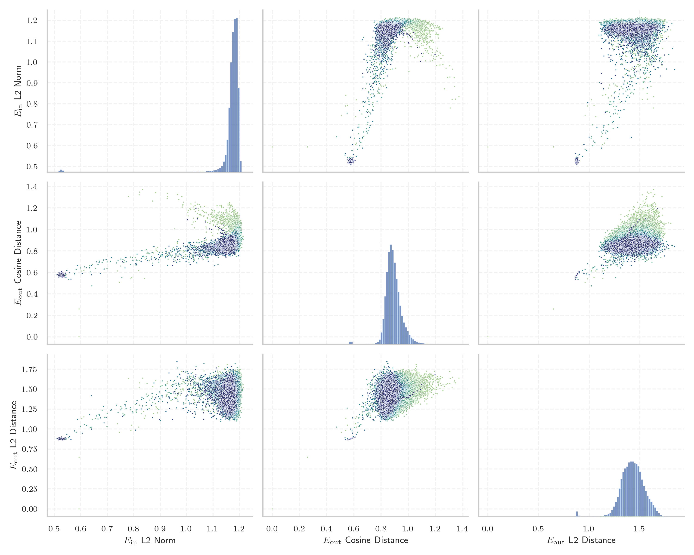
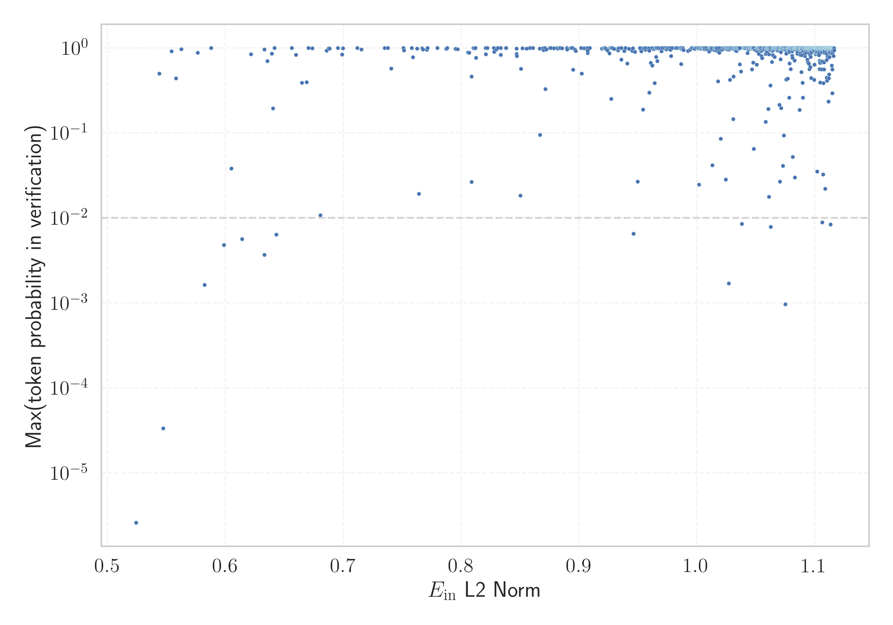

# Report for `EleutherAI/pythia-6.9b`

## Model info

* Model Info: 
  * Tied embeddings: False
  * LM head uses bias: False
  * Embeddings shape: [50432, 4096]
* Tokenizer Info: 
  * Vocab Size: 50277
  * Tokenizer Class: GPTNeoXTokenizer
  * Tokenizer Type: BPE
  * Bytes handling: Byte Input
  * Token for verification prompt building: ArgumentException
  * Token id for verification prompt building: 43411
* Indicator summary: 
  * Indicator for under-trained tokens: E_{in} L2 Norm
  * Overall distribution: 1.169 +/- 0.063
* Detected Token Counts: 
  * Number of tested under-trained tokens: 993, 933 non-special, 13 below p = 0.01 threshold, 11 below soft indicator threshold
  * Number of single byte tokens: 243, of which 19 below indicator threshold
  * Number of special tokens: 221, of which 216 below indicator threshold
  * Number of non-single-byte unreachable tokens: 221, of which 216 below indicator threshold
  * Number of non-single-byte UTF-fragment tokens:  369, of which 0 below soft indicator threshold

## Under-trained token indicators plot


## Verification plot


## Under-trained token verification results
11 entries below threshold of 0.622

|   token_id | token                        |   indicator | max_prob                                                         | in_other_tokens                                                                                                                                                      |
|------------|------------------------------|-------------|------------------------------------------------------------------|----------------------------------------------------------------------------------------------------------------------------------------------------------------------|
|      26868 | ````` ÃÂÃÂÃÂÃÂ `````         |    0.543767 | <span style='border: 1px solid rgb(40, 167, 69);'>0.5</span>     | <span style='border: 1px solid rgb(40, 167, 69);'>````` ÃÂÃÂÃÂÃÂÃÂÃÂÃÂÃÂ `````</span>                                                                                |
|      28696 | ````` FFIRMED `````          |    0.54714  | <span style='border: 1px solid rgb(169, 68, 66);'>3.3e-05</span> | ````` AFFIRMED `````, ````` ▁AFFIRMED `````                                                                                                                          |
|      17030 | ````` ÃÂÃÂ `````             |    0.554296 | <span style='border: 1px solid rgb(40, 167, 69);'>0.91</span>    | <span style='border: 1px solid rgb(40, 167, 69);'>````` ÃÂÃÂÃÂÃÂÃÂÃÂÃÂÃÂ `````</span>, <span style='border: 1px solid rgb(40, 167, 69);'>````` ÃÂÃÂÃÂÃÂ `````</span> |
|      37402 | ````` imonit `````           |    0.558076 | <span style='border: 1px solid rgb(40, 167, 69);'>0.44</span>    | ````` medscimonit `````                                                                                                                                              |
|      41606 | ````` ÃÂÃÂÃÂÃÂÃÂÃÂÃÂÃÂ ````` |    0.562616 | <span style='border: 1px solid rgb(40, 167, 69);'>0.97</span>    |                                                                                                                                                                      |
|      26362 | ````` ▁{¶ `````              |    0.576331 | <span style='border: 1px solid rgb(40, 167, 69);'>0.88</span>    |                                                                                                                                                                      |
|      15479 | ````` ▁taxp `````            |    0.582213 | <span style='border: 1px solid rgb(255, 145, 0);'>0.0016</span>  | ````` ▁taxpayer `````, ````` ▁taxpayers `````                                                                                                                        |
|      30356 | ````` marined `````          |    0.587726 | <span style='border: 1px solid rgb(40, 167, 69);'>1</span>       | ````` marinedrugs `````                                                                                                                                              |
|      14798 | ````` ▁affidav `````         |    0.598583 | <span style='border: 1px solid rgb(255, 145, 0);'>0.0048</span>  | ````` ▁affidavit `````, ````` ▁affidavits `````                                                                                                                      |
|      39743 | ````` 14514500 `````         |    0.604977 | <span style='border: 1px solid rgb(251, 189, 8);'>0.038</span>   | <span style='border: 1px solid rgb(40, 167, 69);'>````` 1451450014514500 `````</span>                                                                                |
|      15236 | ````` ▁biomark `````         |    0.614003 | <span style='border: 1px solid rgb(255, 145, 0);'>0.0057</span>  | ````` ▁biomarkers `````, ````` ▁biomarker `````                                                                                                                      |
<details><summary>922 additional entries above threshold</summary>

|   token_id | token                                                                                        |   indicator | max_prob                                                         | in_other_tokens                                                                                                                                                                                                                                                                                                                                                                                                                                                                                                                                                                                                                                                                                                                                                              |
|------------|----------------------------------------------------------------------------------------------|-------------|------------------------------------------------------------------|------------------------------------------------------------------------------------------------------------------------------------------------------------------------------------------------------------------------------------------------------------------------------------------------------------------------------------------------------------------------------------------------------------------------------------------------------------------------------------------------------------------------------------------------------------------------------------------------------------------------------------------------------------------------------------------------------------------------------------------------------------------------------|
|      23063 | ````` ▁careg `````                                                                           |    0.62156  | <span style='border: 1px solid rgb(40, 167, 69);'>0.84</span>    | ````` ▁caregiver `````, ````` ▁caregivers `````                                                                                                                                                                                                                                                                                                                                                                                                                                                                                                                                                                                                                                                                                                                              |
|      27655 | ````` ▁$[]$ `````                                                                            |    0.632954 | <span style='border: 1px solid rgb(40, 167, 69);'>0.96</span>    |                                                                                                                                                                                                                                                                                                                                                                                                                                                                                                                                                                                                                                                                                                                                                                              |
|       6761 | ````` ortunately `````                                                                       |    0.633148 | <span style='border: 1px solid rgb(255, 145, 0);'>0.0037</span>  | ````` ▁unfortunately `````, ````` ▁Fortunately `````, ````` fortunately `````, ````` Unfortunately `````, ````` Fortunately `````, ...                                                                                                                                                                                                                                                                                                                                                                                                                                                                                                                                                                                                                                       |
|      12370 | ````` ICENSE `````                                                                           |    0.635485 | <span style='border: 1px solid rgb(40, 167, 69);'>0.7</span>     | ````` LICENSE `````, ````` ▁LICENSE `````                                                                                                                                                                                                                                                                                                                                                                                                                                                                                                                                                                                                                                                                                                                                    |
|      37087 | ````` medsc `````                                                                            |    0.639459 | <span style='border: 1px solid rgb(40, 167, 69);'>0.86</span>    | ````` medscimonit `````                                                                                                                                                                                                                                                                                                                                                                                                                                                                                                                                                                                                                                                                                                                                                      |
|      39922 | ````` 1451450014514500 `````                                                                 |    0.640238 | <span style='border: 1px solid rgb(40, 167, 69);'>0.19</span>    |                                                                                                                                                                                                                                                                                                                                                                                                                                                                                                                                                                                                                                                                                                                                                                              |
|      16990 | ````` ÃÂ `````                                                                               |    0.641629 | <span style='border: 1px solid rgb(40, 167, 69);'>1</span>       | <span style='border: 1px solid rgb(40, 167, 69);'>````` ÃÂÃÂÃÂÃÂÃÂÃÂÃÂÃÂ `````</span>, <span style='border: 1px solid rgb(40, 167, 69);'>````` ÃÂÃÂÃÂÃÂ `````</span>, <span style='border: 1px solid rgb(40, 167, 69);'>````` ÃÂÃÂ `````</span>                                                                                                                                                                                                                                                                                                                                                                                                                                                                                                                              |
|       7440 | ````` ▁researc `````                                                                         |    0.643222 | <span style='border: 1px solid rgb(255, 145, 0);'>0.0064</span>  | ````` ▁researched `````, ````` ▁researchers `````, ````` ▁researcher `````, ````` ▁researching `````                                                                                                                                                                                                                                                                                                                                                                                                                                                                                                                                                                                                                                                                         |
|       8827 | ````` rsfs `````                                                                             |    0.656283 | <span style='border: 1px solid rgb(40, 167, 69);'>1</span>       | ````` mathrsfs `````                                                                                                                                                                                                                                                                                                                                                                                                                                                                                                                                                                                                                                                                                                                                                         |
|      21852 | ````` ▁earthqu `````                                                                         |    0.659811 | <span style='border: 1px solid rgb(40, 167, 69);'>0.83</span>    | ````` ▁earthquakes `````, ````` ▁earthquake `````                                                                                                                                                                                                                                                                                                                                                                                                                                                                                                                                                                                                                                                                                                                            |
|      18112 | ````` ▁practition `````                                                                      |    0.664836 | <span style='border: 1px solid rgb(40, 167, 69);'>0.39</span>    | ````` ▁practitioner `````, ````` ▁practitioners `````                                                                                                                                                                                                                                                                                                                                                                                                                                                                                                                                                                                                                                                                                                                        |
|      22066 | ````` ▁resemb `````                                                                          |    0.668831 | <span style='border: 1px solid rgb(40, 167, 69);'>0.4</span>     | ````` ▁resembling `````, ````` ▁resembles `````, ````` ▁resemble `````, ````` ▁resemblance `````, ````` ▁resembled `````                                                                                                                                                                                                                                                                                                                                                                                                                                                                                                                                                                                                                                                     |
|      20033 | ````` ▁tradem `````                                                                          |    0.670488 | <span style='border: 1px solid rgb(40, 167, 69);'>1</span>       | ````` ▁trademarks `````, ````` ▁trademark `````                                                                                                                                                                                                                                                                                                                                                                                                                                                                                                                                                                                                                                                                                                                              |
|      34985 | ````` \xa0\n▁ `````                                                                          |    0.67365  | <span style='border: 1px solid rgb(40, 167, 69);'>0.99</span>    |                                                                                                                                                                                                                                                                                                                                                                                                                                                                                                                                                                                                                                                                                                                                                                              |
|      12253 | ````` ▁questionna `````                                                                      |    0.680478 | <span style='border: 1px solid rgb(251, 189, 8);'>0.011</span>   | ````` ▁questionnaire `````, ````` ▁questionnaires `````                                                                                                                                                                                                                                                                                                                                                                                                                                                                                                                                                                                                                                                                                                                      |
|      27092 | ````` ▁glimp `````                                                                           |    0.685847 | <span style='border: 1px solid rgb(40, 167, 69);'>0.93</span>    | ````` ▁glimps `````, ````` ▁glimpse `````                                                                                                                                                                                                                                                                                                                                                                                                                                                                                                                                                                                                                                                                                                                                    |
|      26939 | ````` ▁\xa0\xa0▁\xa0\xa0▁\xa0\xa0▁\xa0\xa0 `````                                             |    0.687709 | <span style='border: 1px solid rgb(40, 167, 69);'>0.99</span>    |                                                                                                                                                                                                                                                                                                                                                                                                                                                                                                                                                                                                                                                                                                                                                                              |
|      13236 | ````` ▁teasp `````                                                                           |    0.688398 | <span style='border: 1px solid rgb(40, 167, 69);'>0.98</span>    | ````` ▁teaspoons `````, ````` ▁teaspoon `````                                                                                                                                                                                                                                                                                                                                                                                                                                                                                                                                                                                                                                                                                                                                |
|      26384 | ````` ▁remn `````                                                                            |    0.695483 | <span style='border: 1px solid rgb(40, 167, 69);'>1</span>       | ````` ▁remnants `````, ````` ▁remnant `````                                                                                                                                                                                                                                                                                                                                                                                                                                                                                                                                                                                                                                                                                                                                  |
|       8865 | ````` idemargin `````                                                                        |    0.69891  | <span style='border: 1px solid rgb(40, 167, 69);'>0.83</span>    | <span style='border: 1px solid rgb(40, 167, 69);'>````` oddsidemargin `````</span>                                                                                                                                                                                                                                                                                                                                                                                                                                                                                                                                                                                                                                                                                           |
|      10248 | ````` ▁specim `````                                                                          |    0.699587 | <span style='border: 1px solid rgb(40, 167, 69);'>0.99</span>    | ````` ▁specimen `````, ````` ▁specimens `````                                                                                                                                                                                                                                                                                                                                                                                                                                                                                                                                                                                                                                                                                                                                |
|      20637 | ````` ▁supernat `````                                                                        |    0.711928 | <span style='border: 1px solid rgb(40, 167, 69);'>1</span>       | ````` ▁supernatants `````, ````` ▁supernatant `````, ````` ▁supernatural `````                                                                                                                                                                                                                                                                                                                                                                                                                                                                                                                                                                                                                                                                                               |
|      29910 | ````` ▁counc `````                                                                           |    0.715382 | <span style='border: 1px solid rgb(40, 167, 69);'>0.96</span>    | ````` ▁councils `````, ````` ▁councill `````                                                                                                                                                                                                                                                                                                                                                                                                                                                                                                                                                                                                                                                                                                                                 |
|      16658 | ````` tocol `````                                                                            |    0.735134 | <span style='border: 1px solid rgb(40, 167, 69);'>1</span>       | ````` Protocol `````, ````` ▁Protocol `````, ````` protocol `````                                                                                                                                                                                                                                                                                                                                                                                                                                                                                                                                                                                                                                                                                                            |
|      16793 | ````` ▁entreprene `````                                                                      |    0.740699 | <span style='border: 1px solid rgb(40, 167, 69);'>0.57</span>    | ````` ▁entrepreneur `````, ````` ▁entrepreneurs `````                                                                                                                                                                                                                                                                                                                                                                                                                                                                                                                                                                                                                                                                                                                        |
|       6767 | ````` widet `````                                                                            |    0.751087 | <span style='border: 1px solid rgb(40, 167, 69);'>1</span>       | ````` widetilde `````                                                                                                                                                                                                                                                                                                                                                                                                                                                                                                                                                                                                                                                                                                                                                        |
|      22394 | ````` ▁cryptocur `````                                                                       |    0.751374 | <span style='border: 1px solid rgb(40, 167, 69);'>0.94</span>    | ````` ▁cryptocurrency `````, ````` ▁cryptocurrencies `````                                                                                                                                                                                                                                                                                                                                                                                                                                                                                                                                                                                                                                                                                                                   |
|      48628 | ````` ▁doxor `````                                                                           |    0.757977 | <span style='border: 1px solid rgb(40, 167, 69);'>1</span>       | ````` ▁doxorubicin `````                                                                                                                                                                                                                                                                                                                                                                                                                                                                                                                                                                                                                                                                                                                                                     |
|      10365 | ````` ▁embod `````                                                                           |    0.759172 | <span style='border: 1px solid rgb(40, 167, 69);'>0.78</span>    | ````` ▁embodied `````, ````` ▁embodiment `````, ````` ▁embodiments `````                                                                                                                                                                                                                                                                                                                                                                                                                                                                                                                                                                                                                                                                                                     |
|      13704 | ````` ▁\xa0\xa0▁\xa0\xa0 `````                                                               |    0.762514 | <span style='border: 1px solid rgb(40, 167, 69);'>0.98</span>    | <span style='border: 1px solid rgb(40, 167, 69);'>````` ▁\xa0\xa0▁\xa0\xa0▁\xa0\xa0▁\xa0\xa0 `````</span>                                                                                                                                                                                                                                                                                                                                                                                                                                                                                                                                                                                                                                                                    |
|       7702 | ````` ▁encoun `````                                                                          |    0.764066 | <span style='border: 1px solid rgb(251, 189, 8);'>0.019</span>   | ````` ▁encounter `````, ````` ▁encountered `````, ````` ▁encounters `````                                                                                                                                                                                                                                                                                                                                                                                                                                                                                                                                                                                                                                                                                                    |
|      27618 | ````` []$ `````                                                                              |    0.766914 | <span style='border: 1px solid rgb(40, 167, 69);'>0.99</span>    | <span style='border: 1px solid rgb(40, 167, 69);'>````` ▁$[]$ `````</span>                                                                                                                                                                                                                                                                                                                                                                                                                                                                                                                                                                                                                                                                                                   |
|      32034 | ````` enment `````                                                                           |    0.767688 | <span style='border: 1px solid rgb(40, 167, 69);'>0.96</span>    | ````` lightenment `````, ````` ▁enlightenment `````                                                                                                                                                                                                                                                                                                                                                                                                                                                                                                                                                                                                                                                                                                                          |
|      17505 | ````` gorithm `````                                                                          |    0.770922 | <span style='border: 1px solid rgb(40, 167, 69);'>0.95</span>    | ````` ▁Algorithm `````, ````` gorithms `````, ````` algorithm `````, ````` Algorithm `````                                                                                                                                                                                                                                                                                                                                                                                                                                                                                                                                                                                                                                                                                   |
|      22514 | ````` ▁Leban `````                                                                           |    0.771519 | <span style='border: 1px solid rgb(40, 167, 69);'>1</span>       | ````` ▁Lebanon `````, ````` ▁Lebanese `````                                                                                                                                                                                                                                                                                                                                                                                                                                                                                                                                                                                                                                                                                                                                  |
|       6211 | ````` ▁citiz `````                                                                           |    0.78741  | <span style='border: 1px solid rgb(40, 167, 69);'>0.97</span>    | ````` ▁citizen `````, ````` ▁citizens `````, ````` ▁citizenship `````                                                                                                                                                                                                                                                                                                                                                                                                                                                                                                                                                                                                                                                                                                        |
|      19250 | ````` PDATE `````                                                                            |    0.78822  | <span style='border: 1px solid rgb(40, 167, 69);'>1</span>       | ````` ▁UPDATE `````, ````` UPDATE `````                                                                                                                                                                                                                                                                                                                                                                                                                                                                                                                                                                                                                                                                                                                                      |
|      14529 | ````` scious `````                                                                           |    0.795263 | <span style='border: 1px solid rgb(40, 167, 69);'>0.98</span>    | ````` conscious `````, ````` sciously `````, ````` ▁unconscious `````, ````` ▁consciously `````                                                                                                                                                                                                                                                                                                                                                                                                                                                                                                                                                                                                                                                                              |
|      18249 | ````` ▁reluct `````                                                                          |    0.796992 | <span style='border: 1px solid rgb(40, 167, 69);'>0.96</span>    | ````` ▁reluctant `````, ````` ▁reluctantly `````, ````` ▁reluctance `````                                                                                                                                                                                                                                                                                                                                                                                                                                                                                                                                                                                                                                                                                                    |
|       5273 | ````` sembly `````                                                                           |    0.80577  | <span style='border: 1px solid rgb(40, 167, 69);'>0.89</span>    | ````` Assembly `````, ````` assembly `````, ````` ▁Assembly `````, ````` ▁assembly `````                                                                                                                                                                                                                                                                                                                                                                                                                                                                                                                                                                                                                                                                                     |
|      35088 | ````` ...\...\ `````                                                                         |    0.80685  | <span style='border: 1px solid rgb(40, 167, 69);'>0.88</span>    |                                                                                                                                                                                                                                                                                                                                                                                                                                                                                                                                                                                                                                                                                                                                                                              |
|       6599 | ````` icrosoft `````                                                                         |    0.808791 | <span style='border: 1px solid rgb(251, 189, 8);'>0.026</span>   | ````` microsoft `````, ````` ▁Microsoft `````, ````` Microsoft `````                                                                                                                                                                                                                                                                                                                                                                                                                                                                                                                                                                                                                                                                                                         |
|      19650 | ````` izontal `````                                                                          |    0.808907 | <span style='border: 1px solid rgb(40, 167, 69);'>0.46</span>    | ````` Horizontal `````, ````` horizontal `````, ````` ▁horizontally `````, ````` ▁Horizontal `````                                                                                                                                                                                                                                                                                                                                                                                                                                                                                                                                                                                                                                                                           |
|      10900 | ````` ▁occas `````                                                                           |    0.81031  | <span style='border: 1px solid rgb(40, 167, 69);'>1</span>       | ````` ▁occasional `````, ````` ▁occasions `````, ````` ▁occasionally `````                                                                                                                                                                                                                                                                                                                                                                                                                                                                                                                                                                                                                                                                                                   |
|      38438 | ````` ORAND `````                                                                            |    0.811173 | <span style='border: 1px solid rgb(40, 167, 69);'>0.99</span>    | ````` ORANDUM `````                                                                                                                                                                                                                                                                                                                                                                                                                                                                                                                                                                                                                                                                                                                                                          |
|      22596 | ````` ▁opio `````                                                                            |    0.812072 | <span style='border: 1px solid rgb(40, 167, 69);'>1</span>       | ````` ▁opioids `````, ````` ▁opioid `````                                                                                                                                                                                                                                                                                                                                                                                                                                                                                                                                                                                                                                                                                                                                    |
|      21895 | ````` ▁predecess `````                                                                       |    0.81251  | <span style='border: 1px solid rgb(40, 167, 69);'>0.77</span>    | ````` ▁predecessors `````, ````` ▁predecessor `````                                                                                                                                                                                                                                                                                                                                                                                                                                                                                                                                                                                                                                                                                                                          |
|        253 | ````` ▁the `````                                                                             |    0.820585 | <span style='border: 1px solid rgb(40, 167, 69);'>1</span>       | ````` ▁therapy `````, ````` ▁therapeutics `````, ````` ▁thereof `````, <span style='border: 1px solid rgb(40, 167, 69);'>````` ▁they `````</span>, ````` ▁theory `````, ...                                                                                                                                                                                                                                                                                                                                                                                                                                                                                                                                                                                                  |
|       6145 | ````` acebook `````                                                                          |    0.820882 | <span style='border: 1px solid rgb(40, 167, 69);'>0.85</span>    | ````` facebook `````, ````` ▁Facebook `````, ````` Facebook `````, ````` ▁facebook `````                                                                                                                                                                                                                                                                                                                                                                                                                                                                                                                                                                                                                                                                                     |
|      39586 | ````` }{~ `````                                                                              |    0.827803 | <span style='border: 1px solid rgb(40, 167, 69);'>1</span>       | <span style='border: 1px solid rgb(40, 167, 69);'>````` ~}{~ `````</span>                                                                                                                                                                                                                                                                                                                                                                                                                                                                                                                                                                                                                                                                                                    |
|       6094 | ````` ▁behavi `````                                                                          |    0.82809  | <span style='border: 1px solid rgb(40, 167, 69);'>0.9</span>     | ````` ▁behaving `````, ````` ▁behaviours `````, ````` ▁behaviors `````, ````` ▁behaviour `````, ````` ▁behavioral `````, ...                                                                                                                                                                                                                                                                                                                                                                                                                                                                                                                                                                                                                                                 |
|      29304 | ````` uvant `````                                                                            |    0.829784 | <span style='border: 1px solid rgb(40, 167, 69);'>0.96</span>    | ````` juvant `````, ````` ▁adjuvant `````                                                                                                                                                                                                                                                                                                                                                                                                                                                                                                                                                                                                                                                                                                                                    |
|      20214 | ````` –––– `````                                                                             |    0.83103  | <span style='border: 1px solid rgb(40, 167, 69);'>1</span>       | <span style='border: 1px solid rgb(40, 167, 69);'>````` –––––––– `````</span>                                                                                                                                                                                                                                                                                                                                                                                                                                                                                                                                                                                                                                                                                                |
|      23996 | ````` utative `````                                                                          |    0.833618 | <span style='border: 1px solid rgb(40, 167, 69);'>0.83</span>    | ````` ▁commutative `````, ````` commutative `````                                                                                                                                                                                                                                                                                                                                                                                                                                                                                                                                                                                                                                                                                                                            |
|      21551 | ````` arlier `````                                                                           |    0.838021 | <span style='border: 1px solid rgb(40, 167, 69);'>1</span>       | ````` Earlier `````, ````` ▁Earlier `````                                                                                                                                                                                                                                                                                                                                                                                                                                                                                                                                                                                                                                                                                                                                    |
|      10055 | ````` iscussion `````                                                                        |    0.846892 | <span style='border: 1px solid rgb(40, 167, 69);'>0.85</span>    | ````` ▁Discussion `````, ````` ▁discussions `````, ````` discussion `````, ````` Discussion `````                                                                                                                                                                                                                                                                                                                                                                                                                                                                                                                                                                                                                                                                            |
|      31236 | ````` ▁triglycer `````                                                                       |    0.847088 | <span style='border: 1px solid rgb(40, 167, 69);'>0.99</span>    | ````` ▁triglyceride `````, ````` ▁triglycerides `````                                                                                                                                                                                                                                                                                                                                                                                                                                                                                                                                                                                                                                                                                                                        |
|       9120 | ````` everal `````                                                                           |    0.847226 | <span style='border: 1px solid rgb(40, 167, 69);'>0.8</span>     | ````` ▁Several `````, ````` several `````, ````` Several `````                                                                                                                                                                                                                                                                                                                                                                                                                                                                                                                                                                                                                                                                                                               |
|       3421 | ````` ccording `````                                                                         |    0.850268 | <span style='border: 1px solid rgb(251, 189, 8);'>0.018</span>   | ````` ▁Accordingly `````, ````` ▁accordingly `````, ````` According `````, ````` ▁According `````, ````` Accordingly `````, ...                                                                                                                                                                                                                                                                                                                                                                                                                                                                                                                                                                                                                                              |
|       9057 | ````` ometimes `````                                                                         |    0.850773 | <span style='border: 1px solid rgb(40, 167, 69);'>0.57</span>    | ````` ▁Sometimes `````, ````` sometimes `````, ````` Sometimes `````                                                                                                                                                                                                                                                                                                                                                                                                                                                                                                                                                                                                                                                                                                         |
|      37570 | ````` ▁0000000000000000000000000000000000 `````                                              |    0.852096 | <span style='border: 1px solid rgb(40, 167, 69);'>0.99</span>    |                                                                                                                                                                                                                                                                                                                                                                                                                                                                                                                                                                                                                                                                                                                                                                              |
|       9641 | ````` inical `````                                                                           |    0.855611 | <span style='border: 1px solid rgb(40, 167, 69);'>0.98</span>    | ````` Clinical `````, ````` ▁preclinical `````, ````` ▁Clinical `````, ````` ▁clinically `````, ````` clinical `````                                                                                                                                                                                                                                                                                                                                                                                                                                                                                                                                                                                                                                                         |
|       5855 | ````` ▁weap `````                                                                            |    0.858267 | <span style='border: 1px solid rgb(40, 167, 69);'>1</span>       | ````` ▁weapons `````, ````` ▁weapon `````                                                                                                                                                                                                                                                                                                                                                                                                                                                                                                                                                                                                                                                                                                                                    |
|      13530 | ````` parison `````                                                                          |    0.860934 | <span style='border: 1px solid rgb(40, 167, 69);'>0.99</span>    | ````` ▁Comparison `````, ````` ▁comparisons `````, ````` Comparison `````, ````` comparison `````                                                                                                                                                                                                                                                                                                                                                                                                                                                                                                                                                                                                                                                                            |
|      14886 | ````` ▁discharg `````                                                                        |    0.866783 | <span style='border: 1px solid rgb(40, 167, 69);'>0.99</span>    | ````` ▁discharges `````, ````` ▁discharging `````, ````` ▁discharged `````                                                                                                                                                                                                                                                                                                                                                                                                                                                                                                                                                                                                                                                                                                   |
|      40251 | ````` chrane `````                                                                           |    0.866996 | <span style='border: 1px solid rgb(251, 189, 8);'>0.095</span>   | ````` ▁Cochrane `````                                                                                                                                                                                                                                                                                                                                                                                                                                                                                                                                                                                                                                                                                                                                                        |
|      23413 | ````` chemic `````                                                                           |    0.869371 | <span style='border: 1px solid rgb(40, 167, 69);'>0.99</span>    | ````` ▁ischemic `````, ````` ▁chemically `````, ````` ▁immunohistochemical `````, ````` ▁electrochemical `````                                                                                                                                                                                                                                                                                                                                                                                                                                                                                                                                                                                                                                                               |
|       9926 | ````` perties `````                                                                          |    0.869836 | <span style='border: 1px solid rgb(40, 167, 69);'>0.94</span>    | ````` Properties `````, ````` ▁Properties `````, ````` properties `````                                                                                                                                                                                                                                                                                                                                                                                                                                                                                                                                                                                                                                                                                                      |
|        273 | ````` ▁of `````                                                                              |    0.871328 | <span style='border: 1px solid rgb(40, 167, 69);'>1</span>       | ````` ▁offended `````, ````` ▁offices `````, ````` ▁offense `````, ````` ▁often `````, ````` ▁offline `````, ...                                                                                                                                                                                                                                                                                                                                                                                                                                                                                                                                                                                                                                                             |
|      41557 | ````` PtrFromString `````                                                                    |    0.871493 | <span style='border: 1px solid rgb(40, 167, 69);'>0.33</span>    | <span style='border: 1px solid rgb(251, 189, 8);'>````` ▁BytePtrFromString `````</span>                                                                                                                                                                                                                                                                                                                                                                                                                                                                                                                                                                                                                                                                                      |
|       8321 | ````` ▁disappe `````                                                                         |    0.87216  | <span style='border: 1px solid rgb(40, 167, 69);'>0.96</span>    | ````` ▁disappears `````, ````` ▁disappearance `````, ````` ▁disappearing `````, ````` ▁disappear `````, ````` ▁disappeared `````                                                                                                                                                                                                                                                                                                                                                                                                                                                                                                                                                                                                                                             |
|      29148 | ````` 14514 `````                                                                            |    0.876324 | <span style='border: 1px solid rgb(40, 167, 69);'>1</span>       | <span style='border: 1px solid rgb(40, 167, 69);'>````` 1451450014514500 `````</span>, <span style='border: 1px solid rgb(251, 189, 8);'>````` 14514500 `````</span>                                                                                                                                                                                                                                                                                                                                                                                                                                                                                                                                                                                                         |
|      37898 | ````` uilt `````                                                                             |    0.878901 | <span style='border: 1px solid rgb(40, 167, 69);'>0.99</span>    | ````` ▁quilt `````, ````` ▁Built `````, ````` Built `````, ````` ▁rebuilt `````                                                                                                                                                                                                                                                                                                                                                                                                                                                                                                                                                                                                                                                                                              |
|       6063 | ````` ▁cryst `````                                                                           |    0.881281 | <span style='border: 1px solid rgb(40, 167, 69);'>1</span>       | ````` ▁crystalline `````, ````` ▁crystals `````, ````` ▁crystal `````, ````` ▁crystallization `````, ````` ▁crystall `````                                                                                                                                                                                                                                                                                                                                                                                                                                                                                                                                                                                                                                                   |
|      44580 | ````` ERTYPE `````                                                                           |    0.882118 | <span style='border: 1px solid rgb(40, 167, 69);'>0.99</span>    | <span style='border: 1px solid rgb(40, 167, 69);'>````` ETHERTYPE `````</span>                                                                                                                                                                                                                                                                                                                                                                                                                                                                                                                                                                                                                                                                                               |
|        285 | ````` ▁and `````                                                                             |    0.88341  | <span style='border: 1px solid rgb(40, 167, 69);'>1</span>       | ````` ▁andra `````, ````` ▁andere `````, ````` ▁androgen `````, ````` ▁android `````                                                                                                                                                                                                                                                                                                                                                                                                                                                                                                                                                                                                                                                                                         |
|      21170 | ````` ▁orche `````                                                                           |    0.88563  | <span style='border: 1px solid rgb(40, 167, 69);'>0.99</span>    | ````` ▁orchestra `````, ````` ▁orchestr `````                                                                                                                                                                                                                                                                                                                                                                                                                                                                                                                                                                                                                                                                                                                                |
|      35613 | ````` ▁/*! `````                                                                             |    0.893149 | <span style='border: 1px solid rgb(40, 167, 69);'>1</span>       | <span style='border: 1px solid rgb(40, 167, 69);'>````` ▁/*!< `````</span>                                                                                                                                                                                                                                                                                                                                                                                                                                                                                                                                                                                                                                                                                                   |
|      34575 | ````` ▁00000000000000000000000000000000 `````                                                |    0.894345 | <span style='border: 1px solid rgb(40, 167, 69);'>1</span>       | <span style='border: 1px solid rgb(40, 167, 69);'>````` ▁0000000000000000000000000000000000 `````</span>                                                                                                                                                                                                                                                                                                                                                                                                                                                                                                                                                                                                                                                                     |
|      11278 | ````` estinal `````                                                                          |    0.895041 | <span style='border: 1px solid rgb(40, 167, 69);'>0.56</span>    | ````` intestinal `````, ````` ▁intestinal `````, ````` ▁gastrointestinal `````                                                                                                                                                                                                                                                                                                                                                                                                                                                                                                                                                                                                                                                                                               |
|      26061 | ````` \r\n\r\n▁ `````                                                                        |    0.89658  | <span style='border: 1px solid rgb(40, 167, 69);'>0.96</span>    | ````` \r\n\r\n▁▁▁▁▁▁▁▁▁▁▁ `````                                                                                                                                                                                                                                                                                                                                                                                                                                                                                                                                                                                                                                                                                                                                              |
|      14198 | ````` ▁Palestin `````                                                                        |    0.89735  | <span style='border: 1px solid rgb(40, 167, 69);'>0.92</span>    | ````` ▁Palestinian `````, ````` ▁Palestine `````, ````` ▁Palestinians `````                                                                                                                                                                                                                                                                                                                                                                                                                                                                                                                                                                                                                                                                                                  |
|       8809 | ````` amss `````                                                                             |    0.901792 | <span style='border: 1px solid rgb(40, 167, 69);'>1</span>       | ````` amssymb `````                                                                                                                                                                                                                                                                                                                                                                                                                                                                                                                                                                                                                                                                                                                                                          |
|       6608 | ````` opyright `````                                                                         |    0.902273 | <span style='border: 1px solid rgb(40, 167, 69);'>0.5</span>     | ````` copyright `````, ````` Copyright `````, ````` ▁Copyright `````, ````` ▁copyrighted `````, ````` ▁copyright `````                                                                                                                                                                                                                                                                                                                                                                                                                                                                                                                                                                                                                                                       |
|      12635 | ````` ariju `````                                                                            |    0.904379 | <span style='border: 1px solid rgb(40, 167, 69);'>0.99</span>    | ````` arijuana `````, ````` ▁marijuana `````                                                                                                                                                                                                                                                                                                                                                                                                                                                                                                                                                                                                                                                                                                                                 |
|      30316 | ````` ▁oligonucle `````                                                                      |    0.906919 | <span style='border: 1px solid rgb(40, 167, 69);'>0.96</span>    | ````` ▁oligonucleotides `````, ````` ▁oligonucleotide `````                                                                                                                                                                                                                                                                                                                                                                                                                                                                                                                                                                                                                                                                                                                  |
|       8823 | ````` bsy `````                                                                              |    0.907029 | <span style='border: 1px solid rgb(40, 167, 69);'>1</span>       | ````` ▁subsystem `````, ````` amsbsy `````                                                                                                                                                                                                                                                                                                                                                                                                                                                                                                                                                                                                                                                                                                                                   |
|      28632 | ````` iversal `````                                                                          |    0.90737  | <span style='border: 1px solid rgb(40, 167, 69);'>0.87</span>    | ````` Universal `````, ````` ▁universally `````, ````` universal `````                                                                                                                                                                                                                                                                                                                                                                                                                                                                                                                                                                                                                                                                                                       |
|      17365 | ````` ▁errone `````                                                                          |    0.907403 | <span style='border: 1px solid rgb(40, 167, 69);'>0.93</span>    | ````` ▁erroneous `````, ````` ▁erroneously `````                                                                                                                                                                                                                                                                                                                                                                                                                                                                                                                                                                                                                                                                                                                             |
|      20796 | ````` ▁oun `````                                                                             |    0.909134 | <span style='border: 1px solid rgb(40, 167, 69);'>1</span>       | ````` ▁ounces `````, ````` ▁ounce `````                                                                                                                                                                                                                                                                                                                                                                                                                                                                                                                                                                                                                                                                                                                                      |
|      15536 | ````` ▁photograp `````                                                                       |    0.919391 | <span style='border: 1px solid rgb(40, 167, 69);'>0.98</span>    | ````` ▁photographed `````, ````` ▁photography `````, ````` ▁photographer `````, ````` ▁photographers `````, ````` ▁photographs `````, ...                                                                                                                                                                                                                                                                                                                                                                                                                                                                                                                                                                                                                                    |
|      32194 | ````` ▁assertEquals `````                                                                    |    0.921063 | <span style='border: 1px solid rgb(40, 167, 69);'>1</span>       |                                                                                                                                                                                                                                                                                                                                                                                                                                                                                                                                                                                                                                                                                                                                                                              |
|      15238 | ````` ****, `````                                                                            |    0.921227 | <span style='border: 1px solid rgb(40, 167, 69);'>0.99</span>    | ````` ▁****, `````, ````` ▁[****, `````                                                                                                                                                                                                                                                                                                                                                                                                                                                                                                                                                                                                                                                                                                                                      |
|      36320 | ````` \x1b[ `````                                                                            |    0.921724 | <span style='border: 1px solid rgb(40, 167, 69);'>1</span>       |                                                                                                                                                                                                                                                                                                                                                                                                                                                                                                                                                                                                                                                                                                                                                                              |
|      30491 | ````` OMNI `````                                                                             |    0.921951 | <span style='border: 1px solid rgb(40, 167, 69);'>1</span>       |                                                                                                                                                                                                                                                                                                                                                                                                                                                                                                                                                                                                                                                                                                                                                                              |
|       4043 | ````` ournal `````                                                                           |    0.922691 | <span style='border: 1px solid rgb(40, 167, 69);'>0.98</span>    | ````` journals `````, ````` ▁journal `````, ````` journal `````, ````` ▁journalists `````, ````` Journal `````, ...                                                                                                                                                                                                                                                                                                                                                                                                                                                                                                                                                                                                                                                          |
|       5509 | ````` indows `````                                                                           |    0.924017 | <span style='border: 1px solid rgb(40, 167, 69);'>0.93</span>    | ````` Windows `````, ````` ▁Windows `````, ````` windows `````, ````` ▁windows `````                                                                                                                                                                                                                                                                                                                                                                                                                                                                                                                                                                                                                                                                                         |
|       3278 | ````` icense `````                                                                           |    0.925666 | <span style='border: 1px solid rgb(40, 167, 69);'>0.87</span>    | ````` License `````, ````` ▁License `````, ````` ▁licensed `````, ````` ▁license `````, ````` ▁Licensed `````, ...                                                                                                                                                                                                                                                                                                                                                                                                                                                                                                                                                                                                                                                           |
|        281 | ````` ▁to `````                                                                              |    0.926251 | <span style='border: 1px solid rgb(40, 167, 69);'>1</span>       | ````` ▁toll `````, ````` ▁tong `````, <span style='border: 1px solid rgb(40, 167, 69);'>````` ▁tomat `````</span>, ````` ▁touched `````, ````` ▁toasted `````, ...                                                                                                                                                                                                                                                                                                                                                                                                                                                                                                                                                                                                           |
|        275 | ````` ▁in `````                                                                              |    0.926677 | <span style='border: 1px solid rgb(40, 167, 69);'>1</span>       | ````` ▁incre `````, ````` ▁intersections `````, ````` ▁investigators `````, ````` ▁inertial `````, ````` ▁interior `````, ...                                                                                                                                                                                                                                                                                                                                                                                                                                                                                                                                                                                                                                                |
|      40494 | ````` bersome `````                                                                          |    0.927169 | <span style='border: 1px solid rgb(40, 167, 69);'>0.25</span>    | ````` ▁cumbersome `````                                                                                                                                                                                                                                                                                                                                                                                                                                                                                                                                                                                                                                                                                                                                                      |
|       5655 | ````` bolds `````                                                                            |    0.927471 | <span style='border: 1px solid rgb(40, 167, 69);'>1</span>       | ````` boldsymbol `````                                                                                                                                                                                                                                                                                                                                                                                                                                                                                                                                                                                                                                                                                                                                                       |
|        247 | ````` ▁a `````                                                                               |    0.9279   | <span style='border: 1px solid rgb(40, 167, 69);'>1</span>       | ````` ▁acceptor `````, ````` ▁assaults `````, ````` ▁activates `````, ````` ▁altered `````, ````` ▁analog `````, ...                                                                                                                                                                                                                                                                                                                                                                                                                                                                                                                                                                                                                                                         |
|      30031 | ````` ViewById `````                                                                         |    0.928177 | <span style='border: 1px solid rgb(40, 167, 69);'>0.99</span>    | ````` ▁findViewById `````, ````` findViewById `````                                                                                                                                                                                                                                                                                                                                                                                                                                                                                                                                                                                                                                                                                                                          |
|       5782 | ````` ▁proport `````                                                                         |    0.929875 | <span style='border: 1px solid rgb(40, 167, 69);'>0.97</span>    | ````` ▁proportions `````, ````` ▁proportion `````, ````` ▁proportional `````                                                                                                                                                                                                                                                                                                                                                                                                                                                                                                                                                                                                                                                                                                 |
|      25028 | ````` ernate `````                                                                           |    0.932782 | <span style='border: 1px solid rgb(40, 167, 69);'>0.98</span>    | ````` hibernate `````, ````` ibernate `````                                                                                                                                                                                                                                                                                                                                                                                                                                                                                                                                                                                                                                                                                                                                  |
|      45094 | ````` ▁ocks `````                                                                            |    0.933141 | <span style='border: 1px solid rgb(40, 167, 69);'>0.93</span>    | ````` ▁också `````                                                                                                                                                                                                                                                                                                                                                                                                                                                                                                                                                                                                                                                                                                                                                           |
|      16709 | ````` bsite `````                                                                            |    0.93328  | <span style='border: 1px solid rgb(40, 167, 69);'>0.99</span>    | ````` website `````, ````` Website `````, ````` ▁Website `````                                                                                                                                                                                                                                                                                                                                                                                                                                                                                                                                                                                                                                                                                                               |
|      47863 | ````` hatic `````                                                                            |    0.933552 | <span style='border: 1px solid rgb(40, 167, 69);'>0.99</span>    | ````` iphatic `````                                                                                                                                                                                                                                                                                                                                                                                                                                                                                                                                                                                                                                                                                                                                                          |
|      47748 | ````` olymers `````                                                                          |    0.935921 | <span style='border: 1px solid rgb(40, 167, 69);'>0.73</span>    | ````` ▁copolymers `````                                                                                                                                                                                                                                                                                                                                                                                                                                                                                                                                                                                                                                                                                                                                                      |
|      33935 | ````` gester `````                                                                           |    0.935928 | <span style='border: 1px solid rgb(40, 167, 69);'>1</span>       | ````` ▁progesterone `````, ````` gesterone `````                                                                                                                                                                                                                                                                                                                                                                                                                                                                                                                                                                                                                                                                                                                             |
|      21742 | ````` ▁carboh `````                                                                          |    0.938321 | <span style='border: 1px solid rgb(40, 167, 69);'>0.92</span>    | ````` ▁carbohydrates `````, ````` ▁carbohydrate `````                                                                                                                                                                                                                                                                                                                                                                                                                                                                                                                                                                                                                                                                                                                        |
|      37816 | ````` ▁Gmb `````                                                                             |    0.939327 | <span style='border: 1px solid rgb(40, 167, 69);'>1</span>       | ````` ▁GmbH `````                                                                                                                                                                                                                                                                                                                                                                                                                                                                                                                                                                                                                                                                                                                                                            |
|       2671 | ````` vironment `````                                                                        |    0.940886 | <span style='border: 1px solid rgb(40, 167, 69);'>0.66</span>    | ````` ▁environment `````, ````` ▁environmental `````, ````` environment `````, ````` ▁Environment `````, ````` Environment `````, ...                                                                                                                                                                                                                                                                                                                                                                                                                                                                                                                                                                                                                                        |
|       2365 | ````` gether `````                                                                           |    0.942162 | <span style='border: 1px solid rgb(40, 167, 69);'>0.98</span>    | ````` ogether `````, ````` ▁together `````, ````` ▁altogether `````, ````` ▁Together `````, ````` together `````                                                                                                                                                                                                                                                                                                                                                                                                                                                                                                                                                                                                                                                             |
|      14740 | ````` mpty `````                                                                             |    0.942389 | <span style='border: 1px solid rgb(40, 167, 69);'>0.98</span>    | ````` Empty `````, ````` emptyset `````, ````` omitempty `````, ````` isEmpty `````, ````` ▁Empty `````                                                                                                                                                                                                                                                                                                                                                                                                                                                                                                                                                                                                                                                                      |
|      20080 | ````` izoph `````                                                                            |    0.945266 | <span style='border: 1px solid rgb(40, 167, 69);'>0.92</span>    | ````` izophren `````, ````` ▁schizophrenia `````, ````` ▁schizophren `````                                                                                                                                                                                                                                                                                                                                                                                                                                                                                                                                                                                                                                                                                                   |
|      15224 | ````` typen `````                                                                            |    0.945805 | <span style='border: 1px solid rgb(40, 167, 69);'>0.99</span>    | ````` typename `````                                                                                                                                                                                                                                                                                                                                                                                                                                                                                                                                                                                                                                                                                                                                                         |
|      49169 | ````` GLIGENCE `````                                                                         |    0.946291 | <span style='border: 1px solid rgb(255, 145, 0);'>0.0065</span>  | ````` ▁NEGLIGENCE `````                                                                                                                                                                                                                                                                                                                                                                                                                                                                                                                                                                                                                                                                                                                                                      |
|      33525 | ````` \n\n\n▁ `````                                                                          |    0.947526 | <span style='border: 1px solid rgb(40, 167, 69);'>0.9</span>     | ````` \n\n\n▁▁▁▁▁ `````, ````` \n\n\n▁▁▁▁▁▁▁ `````, ````` \n\n\n▁▁▁▁▁▁ `````                                                                                                                                                                                                                                                                                                                                                                                                                                                                                                                                                                                                                                                                                                 |
|       4844 | ````` atever `````                                                                           |    0.949699 | <span style='border: 1px solid rgb(251, 189, 8);'>0.027</span>   | ````` ▁Whatever `````, ````` whatever `````, ````` ▁whatever `````, ````` Whatever `````                                                                                                                                                                                                                                                                                                                                                                                                                                                                                                                                                                                                                                                                                     |
|      22576 | ````` ▁resil `````                                                                           |    0.951661 | <span style='border: 1px solid rgb(40, 167, 69);'>0.98</span>    | ````` ▁resilience `````, ````` ▁resilient `````                                                                                                                                                                                                                                                                                                                                                                                                                                                                                                                                                                                                                                                                                                                              |
|      45330 | ````` ETHERTYPE `````                                                                        |    0.951723 | <span style='border: 1px solid rgb(40, 167, 69);'>1</span>       |                                                                                                                                                                                                                                                                                                                                                                                                                                                                                                                                                                                                                                                                                                                                                                              |
|      46578 | ````` ▁Syrac `````                                                                           |    0.952763 | <span style='border: 1px solid rgb(40, 167, 69);'>0.91</span>    | ````` ▁Syracuse `````                                                                                                                                                                                                                                                                                                                                                                                                                                                                                                                                                                                                                                                                                                                                                        |
|      15669 | ````` ailure `````                                                                           |    0.954342 | <span style='border: 1px solid rgb(40, 167, 69);'>0.19</span>    | ````` ▁Failure `````, ````` failure `````, ````` ▁failures `````, ````` Failure `````                                                                                                                                                                                                                                                                                                                                                                                                                                                                                                                                                                                                                                                                                        |
|      32821 | ````` –––––––– `````                                                                         |    0.954351 | <span style='border: 1px solid rgb(40, 167, 69);'>0.99</span>    |                                                                                                                                                                                                                                                                                                                                                                                                                                                                                                                                                                                                                                                                                                                                                                              |
|       1712 | ````` ▁{# `````                                                                              |    0.955085 | <span style='border: 1px solid rgb(40, 167, 69);'>0.99</span>    |                                                                                                                                                                                                                                                                                                                                                                                                                                                                                                                                                                                                                                                                                                                                                                              |
|       4649 | ````` ▁algorith `````                                                                        |    0.956394 | <span style='border: 1px solid rgb(40, 167, 69);'>0.95</span>    | ````` ▁algorithm `````, ````` ▁algorithms `````                                                                                                                                                                                                                                                                                                                                                                                                                                                                                                                                                                                                                                                                                                                              |
|       2928 | ````` ▁answ `````                                                                            |    0.956507 | <span style='border: 1px solid rgb(40, 167, 69);'>1</span>       | ````` ▁answering `````, ````` ▁answers `````, ````` ▁answer `````, ````` ▁answered `````                                                                                                                                                                                                                                                                                                                                                                                                                                                                                                                                                                                                                                                                                     |
|      12489 | ````` ▁therap `````                                                                          |    0.958514 | <span style='border: 1px solid rgb(40, 167, 69);'>0.99</span>    | ````` ▁therapeutics `````, ````` ▁therapists `````, ````` ▁therapist `````, ````` ▁therapies `````                                                                                                                                                                                                                                                                                                                                                                                                                                                                                                                                                                                                                                                                           |
|      18643 | ````` ALSE `````                                                                             |    0.959486 | <span style='border: 1px solid rgb(40, 167, 69);'>0.99</span>    | ````` ▁FALSE `````, ````` FALSE `````                                                                                                                                                                                                                                                                                                                                                                                                                                                                                                                                                                                                                                                                                                                                        |
|      35206 | ````` imbab `````                                                                            |    0.959547 | <span style='border: 1px solid rgb(40, 167, 69);'>0.93</span>    | ````` ▁Zimbabwe `````, <span style='border: 1px solid rgb(40, 167, 69);'>````` imbabwe `````</span>                                                                                                                                                                                                                                                                                                                                                                                                                                                                                                                                                                                                                                                                          |
|       1958 | ````` ividual `````                                                                          |    0.959625 | <span style='border: 1px solid rgb(40, 167, 69);'>0.3</span>     | ````` individual `````, ````` ▁Individuals `````, ````` ▁individually `````, ````` ▁individuals `````, ````` ▁individual `````, ...                                                                                                                                                                                                                                                                                                                                                                                                                                                                                                                                                                                                                                          |
|      23282 | ````` essages `````                                                                          |    0.960958 | <span style='border: 1px solid rgb(40, 167, 69);'>0.67</span>    | ````` Messages `````, ````` messages `````                                                                                                                                                                                                                                                                                                                                                                                                                                                                                                                                                                                                                                                                                                                                   |
|      28328 | ````` idopsis `````                                                                          |    0.962128 | <span style='border: 1px solid rgb(40, 167, 69);'>0.62</span>    | ````` ▁Arabidopsis `````, ````` Arabidopsis `````                                                                                                                                                                                                                                                                                                                                                                                                                                                                                                                                                                                                                                                                                                                            |
|      33047 | ````` ▁//! `````                                                                             |    0.962195 | <span style='border: 1px solid rgb(40, 167, 69);'>1</span>       |                                                                                                                                                                                                                                                                                                                                                                                                                                                                                                                                                                                                                                                                                                                                                                              |
|      33984 | ````` ▁CURI `````                                                                            |    0.963354 | <span style='border: 1px solid rgb(40, 167, 69);'>0.97</span>    | ````` ▁CURIAM `````                                                                                                                                                                                                                                                                                                                                                                                                                                                                                                                                                                                                                                                                                                                                                          |
|      36658 | ````` debted `````                                                                           |    0.964174 | <span style='border: 1px solid rgb(40, 167, 69);'>0.38</span>    | ````` ▁indebted `````                                                                                                                                                                                                                                                                                                                                                                                                                                                                                                                                                                                                                                                                                                                                                        |
|      49793 | ````` -€ `````                                                                               |    0.965517 | <span style='border: 1px solid rgb(40, 167, 69);'>0.78</span>    |                                                                                                                                                                                                                                                                                                                                                                                                                                                                                                                                                                                                                                                                                                                                                                              |
|      15480 | ````` ▁infil `````                                                                           |    0.965593 | <span style='border: 1px solid rgb(40, 167, 69);'>0.99</span>    | ````` ▁infiltration `````, ````` ▁infiltr `````                                                                                                                                                                                                                                                                                                                                                                                                                                                                                                                                                                                                                                                                                                                              |
|        313 | ````` ▁( `````                                                                               |    0.965945 | <span style='border: 1px solid rgb(40, 167, 69);'>1</span>       | ````` ▁(; `````, ````` ▁(), `````, ````` ▁($( `````, ````` ▁(+) `````, ````` ▁(\ `````, ...                                                                                                                                                                                                                                                                                                                                                                                                                                                                                                                                                                                                                                                                                  |
|      20758 | ````` CLUDING `````                                                                          |    0.966487 | <span style='border: 1px solid rgb(40, 167, 69);'>0.7</span>     | ````` ▁INCLUDING `````, ````` INCLUDING `````                                                                                                                                                                                                                                                                                                                                                                                                                                                                                                                                                                                                                                                                                                                                |
|      37046 | ````` +-+- `````                                                                             |    0.967117 | <span style='border: 1px solid rgb(40, 167, 69);'>0.99</span>    |                                                                                                                                                                                                                                                                                                                                                                                                                                                                                                                                                                                                                                                                                                                                                                              |
|      44988 | ````` NFTA `````                                                                             |    0.967224 | <span style='border: 1px solid rgb(40, 167, 69);'>0.99</span>    |                                                                                                                                                                                                                                                                                                                                                                                                                                                                                                                                                                                                                                                                                                                                                                              |
|      14083 | ````` icture `````                                                                           |    0.967313 | <span style='border: 1px solid rgb(40, 167, 69);'>1</span>       | ````` ▁Pictures `````, <span style='border: 1px solid rgb(40, 167, 69);'>````` tikzpicture `````</span>, ````` picture `````, ````` Picture `````, <span style='border: 1px solid rgb(40, 167, 69);'>````` ▁Picture `````</span>, ...                                                                                                                                                                                                                                                                                                                                                                                                                                                                                                                                        |
|      15449 | ````` letal `````                                                                            |    0.968866 | <span style='border: 1px solid rgb(40, 167, 69);'>0.99</span>    | ````` ▁skeletal `````, ````` keletal `````, ````` culoskeletal `````                                                                                                                                                                                                                                                                                                                                                                                                                                                                                                                                                                                                                                                                                                         |
|      35326 | ````` VERTIS `````                                                                           |    0.969896 | <span style='border: 1px solid rgb(40, 167, 69);'>0.91</span>    | <span style='border: 1px solid rgb(40, 167, 69);'>````` ADVERTISEMENT `````</span>, <span style='border: 1px solid rgb(251, 189, 8);'>````` VERTISEMENT `````</span>                                                                                                                                                                                                                                                                                                                                                                                                                                                                                                                                                                                                         |
|        323 | ````` ▁for `````                                                                             |    0.970458 | <span style='border: 1px solid rgb(40, 167, 69);'>1</span>       | ````` ▁forwards `````, ````` ▁forcing `````, ````` ▁forehead `````, ````` ▁forgiven `````, ````` ▁formations `````, ...                                                                                                                                                                                                                                                                                                                                                                                                                                                                                                                                                                                                                                                      |
|      28031 | ````` aeda `````                                                                             |    0.972157 | <span style='border: 1px solid rgb(40, 167, 69);'>1</span>       | ````` Qaeda `````, ````` ▁Qaeda `````                                                                                                                                                                                                                                                                                                                                                                                                                                                                                                                                                                                                                                                                                                                                        |
|      10275 | ````` ▁ingred `````                                                                          |    0.973646 | <span style='border: 1px solid rgb(40, 167, 69);'>1</span>       | ````` ▁ingredient `````, ````` ▁ingredients `````                                                                                                                                                                                                                                                                                                                                                                                                                                                                                                                                                                                                                                                                                                                            |
|      37714 | ````` ▁antican `````                                                                         |    0.973893 | <span style='border: 1px solid rgb(40, 167, 69);'>0.96</span>    | ````` ▁anticancer `````                                                                                                                                                                                                                                                                                                                                                                                                                                                                                                                                                                                                                                                                                                                                                      |
|      16230 | ````` ▁advertis `````                                                                        |    0.974489 | <span style='border: 1px solid rgb(40, 167, 69);'>0.96</span>    | ````` ▁advertise `````, ````` ▁advertised `````, ````` ▁advertisement `````, ````` ▁advertisers `````, ````` ▁advertisements `````                                                                                                                                                                                                                                                                                                                                                                                                                                                                                                                                                                                                                                           |
|      45712 | ````` itars `````                                                                            |    0.977492 | <span style='border: 1px solid rgb(40, 167, 69);'>0.95</span>    | ````` ▁guitars `````                                                                                                                                                                                                                                                                                                                                                                                                                                                                                                                                                                                                                                                                                                                                                         |
|      28855 | ````` aukee `````                                                                            |    0.978132 | <span style='border: 1px solid rgb(40, 167, 69);'>0.81</span>    | ````` ▁Milwaukee `````, ````` waukee `````                                                                                                                                                                                                                                                                                                                                                                                                                                                                                                                                                                                                                                                                                                                                   |
|      42769 | ````` ypse `````                                                                             |    0.979041 | <span style='border: 1px solid rgb(40, 167, 69);'>1</span>       | ````` ocalypse `````                                                                                                                                                                                                                                                                                                                                                                                                                                                                                                                                                                                                                                                                                                                                                         |
|       4429 | ````` ▁thous `````                                                                           |    0.982025 | <span style='border: 1px solid rgb(40, 167, 69);'>1</span>       | ````` ▁thousands `````, ````` ▁thousand `````                                                                                                                                                                                                                                                                                                                                                                                                                                                                                                                                                                                                                                                                                                                                |
|        326 | ````` ▁that `````                                                                            |    0.983466 | <span style='border: 1px solid rgb(40, 167, 69);'>1</span>       | ````` ▁thats `````                                                                                                                                                                                                                                                                                                                                                                                                                                                                                                                                                                                                                                                                                                                                                           |
|        342 | ````` ▁with `````                                                                            |    0.985985 | <span style='border: 1px solid rgb(40, 167, 69);'>1</span>       | ````` ▁withdraw `````, ````` ▁withholding `````, ````` ▁withdrawn `````, ````` ▁withdrawing `````, ````` ▁withheld `````, ...                                                                                                                                                                                                                                                                                                                                                                                                                                                                                                                                                                                                                                                |
|      37294 | ````` íses `````                                                                             |    0.98666  | <span style='border: 1px solid rgb(40, 167, 69);'>0.65</span>    | ````` ▁países `````                                                                                                                                                                                                                                                                                                                                                                                                                                                                                                                                                                                                                                                                                                                                                          |
|      13275 | ````` ▁adoles `````                                                                          |    0.986705 | <span style='border: 1px solid rgb(40, 167, 69);'>0.98</span>    | ````` ▁adolescent `````, ````` ▁adolescents `````, ````` ▁adolescence `````                                                                                                                                                                                                                                                                                                                                                                                                                                                                                                                                                                                                                                                                                                  |
|       4091 | ````` yond `````                                                                             |    0.986914 | <span style='border: 1px solid rgb(40, 167, 69);'>1</span>       | ````` ▁beyond `````, ````` Beyond `````, ````` beyond `````, ````` ▁Beyond `````                                                                                                                                                                                                                                                                                                                                                                                                                                                                                                                                                                                                                                                                                             |
|       4359 | ````` ▁clust `````                                                                           |    0.986923 | <span style='border: 1px solid rgb(40, 167, 69);'>0.99</span>    | ````` ▁cluster `````, ````` ▁clustered `````, ````` ▁clustering `````, ````` ▁clusters `````                                                                                                                                                                                                                                                                                                                                                                                                                                                                                                                                                                                                                                                                                 |
|      16882 | ````` havior `````                                                                           |    0.987627 | <span style='border: 1px solid rgb(40, 167, 69);'>0.98</span>    | ````` ▁Behavior `````, ````` Behavior `````, ````` behavior `````                                                                                                                                                                                                                                                                                                                                                                                                                                                                                                                                                                                                                                                                                                            |
|        310 | ````` ▁is `````                                                                              |    0.988047 | <span style='border: 1px solid rgb(40, 167, 69);'>1</span>       | ````` ▁isinstance `````, ````` ▁isn `````, ````` ▁ischemic `````, ````` ▁ischemia `````, ````` ▁isoform `````, ...                                                                                                                                                                                                                                                                                                                                                                                                                                                                                                                                                                                                                                                           |
|      46201 | ````` )}/\ `````                                                                             |    0.98822  | <span style='border: 1px solid rgb(40, 167, 69);'>0.97</span>    |                                                                                                                                                                                                                                                                                                                                                                                                                                                                                                                                                                                                                                                                                                                                                                              |
|      21908 | ````` ══ `````                                                                               |    0.988591 | <span style='border: 1px solid rgb(40, 167, 69);'>0.94</span>    | <span style='border: 1px solid rgb(40, 167, 69);'>````` ════ `````</span>                                                                                                                                                                                                                                                                                                                                                                                                                                                                                                                                                                                                                                                                                                    |
|       1489 | ````` urther `````                                                                           |    0.99233  | <span style='border: 1px solid rgb(40, 167, 69);'>0.92</span>    | ````` further `````, ````` Furthermore `````, ````` ▁furthermore `````, ````` ▁Further `````, ````` Further `````, ...                                                                                                                                                                                                                                                                                                                                                                                                                                                                                                                                                                                                                                                       |
|      15183 | ````` emale `````                                                                            |    0.994222 | <span style='border: 1px solid rgb(40, 167, 69);'>0.95</span>    | ````` Female `````, ````` female `````, ````` ▁Female `````                                                                                                                                                                                                                                                                                                                                                                                                                                                                                                                                                                                                                                                                                                                  |
|      40142 | ````` OMN `````                                                                              |    0.995545 | <span style='border: 1px solid rgb(40, 167, 69);'>1</span>       |                                                                                                                                                                                                                                                                                                                                                                                                                                                                                                                                                                                                                                                                                                                                                                              |
|      13310 | ````` ▁traject `````                                                                         |    0.995922 | <span style='border: 1px solid rgb(40, 167, 69);'>0.99</span>    | ````` ▁trajectory `````, ````` ▁trajectories `````                                                                                                                                                                                                                                                                                                                                                                                                                                                                                                                                                                                                                                                                                                                           |
|      31522 | ````` ▁\u2062 `````                                                                          |    0.997525 | <span style='border: 1px solid rgb(40, 167, 69);'>1</span>       |                                                                                                                                                                                                                                                                                                                                                                                                                                                                                                                                                                                                                                                                                                                                                                              |
|      39283 | ````` AtA `````                                                                              |    0.9977   | <span style='border: 1px solid rgb(40, 167, 69);'>0.99</span>    | <span style='border: 1px solid rgb(40, 167, 69);'>````` dAtA `````</span>                                                                                                                                                                                                                                                                                                                                                                                                                                                                                                                                                                                                                                                                                                    |
|      37096 | ````` =-=- `````                                                                             |    0.997797 | <span style='border: 1px solid rgb(40, 167, 69);'>0.98</span>    |                                                                                                                                                                                                                                                                                                                                                                                                                                                                                                                                                                                                                                                                                                                                                                              |
|       7023 | ````` aturday `````                                                                          |    0.998264 | <span style='border: 1px solid rgb(40, 167, 69);'>0.97</span>    | ````` Saturday `````, ````` ▁Saturday `````                                                                                                                                                                                                                                                                                                                                                                                                                                                                                                                                                                                                                                                                                                                                  |
|      34842 | ````` ```` `````                                                                             |    0.999494 | <span style='border: 1px solid rgb(40, 167, 69);'>1</span>       |                                                                                                                                                                                                                                                                                                                                                                                                                                                                                                                                                                                                                                                                                                                                                                              |
|       9460 | ````` OOST `````                                                                             |    1.00062  | <span style='border: 1px solid rgb(40, 167, 69);'>1</span>       | ````` BOOST `````, ````` ▁BOOST `````                                                                                                                                                                                                                                                                                                                                                                                                                                                                                                                                                                                                                                                                                                                                        |
|      44740 | ````` ▁/*!< `````                                                                            |    1.00111  | <span style='border: 1px solid rgb(40, 167, 69);'>1</span>       |                                                                                                                                                                                                                                                                                                                                                                                                                                                                                                                                                                                                                                                                                                                                                                              |
|      22120 | ````` emetery `````                                                                          |    1.00178  | <span style='border: 1px solid rgb(251, 189, 8);'>0.025</span>   | ````` ▁cemetery `````, ````` ▁Cemetery `````                                                                                                                                                                                                                                                                                                                                                                                                                                                                                                                                                                                                                                                                                                                                 |
|      39389 | ````` toolt `````                                                                            |    1.00182  | <span style='border: 1px solid rgb(40, 167, 69);'>0.99</span>    | ````` tooltip `````                                                                                                                                                                                                                                                                                                                                                                                                                                                                                                                                                                                                                                                                                                                                                          |
|      49989 | ````` ▁✓ `````                                                                               |    1.00244  | <span style='border: 1px solid rgb(40, 167, 69);'>1</span>       |                                                                                                                                                                                                                                                                                                                                                                                                                                                                                                                                                                                                                                                                                                                                                                              |
|      37543 | ````` xym `````                                                                              |    1.00263  | <span style='border: 1px solid rgb(40, 167, 69);'>1</span>       | ````` xymatrix `````                                                                                                                                                                                                                                                                                                                                                                                                                                                                                                                                                                                                                                                                                                                                                         |
|      50254 | ````` ¿▁▁▁▁▁▁▁▁▁▁▁▁▁▁▁▁▁▁▁▁▁▁▁▁? `````                                                       |    1.00347  | <span style='border: 1px solid rgb(40, 167, 69);'>1</span>       |                                                                                                                                                                                                                                                                                                                                                                                                                                                                                                                                                                                                                                                                                                                                                                              |
|      27269 | ````` ▁aneur `````                                                                           |    1.00363  | <span style='border: 1px solid rgb(40, 167, 69);'>1</span>       | ````` ▁aneurys `````, ````` ▁aneurysm `````                                                                                                                                                                                                                                                                                                                                                                                                                                                                                                                                                                                                                                                                                                                                  |
|      46625 | ````` ▁Debor `````                                                                           |    1.00364  | <span style='border: 1px solid rgb(40, 167, 69);'>0.97</span>    | ````` ▁Deborah `````                                                                                                                                                                                                                                                                                                                                                                                                                                                                                                                                                                                                                                                                                                                                                         |
|      35017 | ````` ▁Ù `````                                                                               |    1.00401  | <span style='border: 1px solid rgb(40, 167, 69);'>0.99</span>    |                                                                                                                                                                                                                                                                                                                                                                                                                                                                                                                                                                                                                                                                                                                                                                              |
|      11567 | ````` ▁WARRANT `````                                                                         |    1.00453  | <span style='border: 1px solid rgb(40, 167, 69);'>1</span>       | ````` ▁WARRANTY `````, ````` ▁WARRANTIES `````                                                                                                                                                                                                                                                                                                                                                                                                                                                                                                                                                                                                                                                                                                                               |
|      35862 | ````` eday `````                                                                             |    1.00526  | <span style='border: 1px solid rgb(40, 167, 69);'>0.99</span>    | ````` ▁someday `````                                                                                                                                                                                                                                                                                                                                                                                                                                                                                                                                                                                                                                                                                                                                                         |
|      26069 | ````` ──── `````                                                                             |    1.00581  | <span style='border: 1px solid rgb(40, 167, 69);'>0.99</span>    | <span style='border: 1px solid rgb(40, 167, 69);'>````` ──────── `````</span>                                                                                                                                                                                                                                                                                                                                                                                                                                                                                                                                                                                                                                                                                                |
|      35148 | ````` ennas `````                                                                            |    1.00642  | <span style='border: 1px solid rgb(40, 167, 69);'>0.97</span>    | ````` ▁antennas `````                                                                                                                                                                                                                                                                                                                                                                                                                                                                                                                                                                                                                                                                                                                                                        |
|      14498 | ````` ▁lapt `````                                                                            |    1.00648  | <span style='border: 1px solid rgb(40, 167, 69);'>1</span>       | ````` ▁laptop `````, ````` ▁laptops `````                                                                                                                                                                                                                                                                                                                                                                                                                                                                                                                                                                                                                                                                                                                                    |
|      34221 | ````` ▁Elli `````                                                                            |    1.00668  | <span style='border: 1px solid rgb(40, 167, 69);'>1</span>       | ````` ▁Elliot `````, ````` ▁Elliott `````                                                                                                                                                                                                                                                                                                                                                                                                                                                                                                                                                                                                                                                                                                                                    |
|      37447 | ````` ە `````                                                                                |    1.00784  | <span style='border: 1px solid rgb(40, 167, 69);'>0.99</span>    |                                                                                                                                                                                                                                                                                                                                                                                                                                                                                                                                                                                                                                                                                                                                                                              |
|      12924 | ````` ▁neighb `````                                                                          |    1.0088   | <span style='border: 1px solid rgb(40, 167, 69);'>0.96</span>    | ````` ▁neighbourhood `````, ````` ▁neighbouring `````, ````` ▁neighboring `````, ````` ▁neighbour `````, ````` ▁neighbours `````, ...                                                                                                                                                                                                                                                                                                                                                                                                                                                                                                                                                                                                                                        |
|      28220 | ````` ██ `````                                                                               |    1.01021  | <span style='border: 1px solid rgb(40, 167, 69);'>0.99</span>    |                                                                                                                                                                                                                                                                                                                                                                                                                                                                                                                                                                                                                                                                                                                                                                              |
|       6997 | ````` ▁acknow `````                                                                          |    1.01041  | <span style='border: 1px solid rgb(40, 167, 69);'>0.91</span>    | ````` ▁acknowledgment `````, ````` ▁acknowledges `````, ````` ▁acknowled `````, ````` ▁acknowledge `````, ````` ▁acknowledging `````, ...                                                                                                                                                                                                                                                                                                                                                                                                                                                                                                                                                                                                                                    |
|      42584 | ````` moil `````                                                                             |    1.01051  | <span style='border: 1px solid rgb(40, 167, 69);'>0.99</span>    | ````` ▁turmoil `````                                                                                                                                                                                                                                                                                                                                                                                                                                                                                                                                                                                                                                                                                                                                                         |
|      24162 | ````` ▁invari `````                                                                          |    1.01128  | <span style='border: 1px solid rgb(40, 167, 69);'>1</span>       | ````` ▁invariably `````, ````` ▁invariants `````, ````` ▁invariance `````                                                                                                                                                                                                                                                                                                                                                                                                                                                                                                                                                                                                                                                                                                    |
|      26941 | ````` NRAS `````                                                                             |    1.01135  | <span style='border: 1px solid rgb(40, 167, 69);'>1</span>       | ````` MNRAS `````, ````` ▁MNRAS `````                                                                                                                                                                                                                                                                                                                                                                                                                                                                                                                                                                                                                                                                                                                                        |
|      27172 | ````` ▁pestic `````                                                                          |    1.01143  | <span style='border: 1px solid rgb(40, 167, 69);'>1</span>       | ````` ▁pesticide `````, ````` ▁pesticides `````                                                                                                                                                                                                                                                                                                                                                                                                                                                                                                                                                                                                                                                                                                                              |
|      24630 | ````` %%%%%%%% `````                                                                         |    1.01168  | <span style='border: 1px solid rgb(40, 167, 69);'>0.98</span>    | <span style='border: 1px solid rgb(40, 167, 69);'>````` %%%%%%%%%%%%%%%% `````</span>                                                                                                                                                                                                                                                                                                                                                                                                                                                                                                                                                                                                                                                                                        |
|      36530 | ````` uginosa `````                                                                          |    1.01172  | <span style='border: 1px solid rgb(40, 167, 69);'>0.95</span>    | ````` ▁aeruginosa `````                                                                                                                                                                                                                                                                                                                                                                                                                                                                                                                                                                                                                                                                                                                                                      |
|       2528 | ````` ▁establ `````                                                                          |    1.01237  | <span style='border: 1px solid rgb(40, 167, 69);'>0.99</span>    | ````` ▁establishes `````, ````` ▁establishment `````, ````` ▁establishing `````, ````` ▁established `````, ````` ▁establishments `````, ...                                                                                                                                                                                                                                                                                                                                                                                                                                                                                                                                                                                                                                  |
|      24177 | ````` █ `````                                                                                |    1.01285  | <span style='border: 1px solid rgb(40, 167, 69);'>0.99</span>    | <span style='border: 1px solid rgb(40, 167, 69);'>````` ██ `````</span>                                                                                                                                                                                                                                                                                                                                                                                                                                                                                                                                                                                                                                                                                                      |
|      43978 | ````` ciparum `````                                                                          |    1.01311  | <span style='border: 1px solid rgb(251, 189, 8);'>0.042</span>   | ````` ▁falciparum `````                                                                                                                                                                                                                                                                                                                                                                                                                                                                                                                                                                                                                                                                                                                                                      |
|      44658 | ````` ませ `````                                                                             |    1.01458  | <span style='border: 1px solid rgb(40, 167, 69);'>0.95</span>    | ````` ません `````                                                                                                                                                                                                                                                                                                                                                                                                                                                                                                                                                                                                                                                                                                                                                           |
|      45054 | ````` ▁foli `````                                                                            |    1.015    | <span style='border: 1px solid rgb(40, 167, 69);'>0.99</span>    | ````` ▁foliage `````                                                                                                                                                                                                                                                                                                                                                                                                                                                                                                                                                                                                                                                                                                                                                         |
|      35379 | ````` )}^{( `````                                                                            |    1.01514  | <span style='border: 1px solid rgb(40, 167, 69);'>0.97</span>    |                                                                                                                                                                                                                                                                                                                                                                                                                                                                                                                                                                                                                                                                                                                                                                              |
|        369 | ````` ▁was `````                                                                             |    1.01536  | <span style='border: 1px solid rgb(40, 167, 69);'>1</span>       | ````` ▁waste `````, ````` ▁wash `````, ````` ▁wasted `````, ````` ▁wastewater `````, ````` ▁wastes `````, ...                                                                                                                                                                                                                                                                                                                                                                                                                                                                                                                                                                                                                                                                |
|        327 | ````` ▁on `````                                                                              |    1.01593  | <span style='border: 1px solid rgb(40, 167, 69);'>1</span>       | ````` ▁once `````, ````` ▁onion `````, <span style='border: 1px solid rgb(40, 167, 69);'>````` ▁only `````</span>, ````` ▁onc `````, ````` ▁onward `````, ...                                                                                                                                                                                                                                                                                                                                                                                                                                                                                                                                                                                                                |
|        346 | ````` ▁" `````                                                                               |    1.01638  | <span style='border: 1px solid rgb(40, 167, 69);'>1</span>       | ````` ▁"# `````, ````` ▁"... `````, ````` ▁"* `````, ````` ▁"@ `````, ````` ▁"/ `````, ...                                                                                                                                                                                                                                                                                                                                                                                                                                                                                                                                                                                                                                                                                   |
|      33301 | ````` --** `````                                                                             |    1.01673  | <span style='border: 1px solid rgb(40, 167, 69);'>0.93</span>    | ````` **--** `````                                                                                                                                                                                                                                                                                                                                                                                                                                                                                                                                                                                                                                                                                                                                                           |
|       7595 | ````` ▁galax `````                                                                           |    1.01696  | <span style='border: 1px solid rgb(40, 167, 69);'>0.99</span>    | ````` ▁galaxies `````, ````` ▁galaxy `````                                                                                                                                                                                                                                                                                                                                                                                                                                                                                                                                                                                                                                                                                                                                   |
|      30850 | ````` oietic `````                                                                           |    1.01807  | <span style='border: 1px solid rgb(40, 167, 69);'>0.4</span>     | ````` ▁hematopoietic `````, ````` opoietic `````                                                                                                                                                                                                                                                                                                                                                                                                                                                                                                                                                                                                                                                                                                                             |
|       9156 | ````` ▁theoret `````                                                                         |    1.01857  | <span style='border: 1px solid rgb(40, 167, 69);'>0.92</span>    | ````` ▁theoretical `````, ````` ▁theoretically `````                                                                                                                                                                                                                                                                                                                                                                                                                                                                                                                                                                                                                                                                                                                         |
|      44959 | ````` ▁parch `````                                                                           |    1.01866  | <span style='border: 1px solid rgb(40, 167, 69);'>1</span>       | ````` ▁parchment `````                                                                                                                                                                                                                                                                                                                                                                                                                                                                                                                                                                                                                                                                                                                                                       |
|       1280 | ````` ategory `````                                                                          |    1.01895  | <span style='border: 1px solid rgb(40, 167, 69);'>0.88</span>    | ````` Category `````, ````` ▁category `````, ````` category `````, ````` ▁Category `````                                                                                                                                                                                                                                                                                                                                                                                                                                                                                                                                                                                                                                                                                     |
|      13899 | ````` sime `````                                                                             |    1.02103  | <span style='border: 1px solid rgb(40, 167, 69);'>0.99</span>    | ````` simeq `````                                                                                                                                                                                                                                                                                                                                                                                                                                                                                                                                                                                                                                                                                                                                                            |
|      46045 | ````` brainsci `````                                                                         |    1.02121  | <span style='border: 1px solid rgb(40, 167, 69);'>0.95</span>    |                                                                                                                                                                                                                                                                                                                                                                                                                                                                                                                                                                                                                                                                                                                                                                              |
|      32137 | ````` CUIT `````                                                                             |    1.02242  | <span style='border: 1px solid rgb(40, 167, 69);'>0.99</span>    | ````` ▁CIRCUIT `````                                                                                                                                                                                                                                                                                                                                                                                                                                                                                                                                                                                                                                                                                                                                                         |
|       5510 | ````` ▁laug `````                                                                            |    1.02277  | <span style='border: 1px solid rgb(40, 167, 69);'>1</span>       | ````` ▁laugh `````, ````` ▁laughs `````, ````` ▁laughed `````, ````` ▁laughing `````, ````` ▁laughter `````                                                                                                                                                                                                                                                                                                                                                                                                                                                                                                                                                                                                                                                                  |
|      49316 | ````` ICAg `````                                                                             |    1.02291  | <span style='border: 1px solid rgb(40, 167, 69);'>0.98</span>    |                                                                                                                                                                                                                                                                                                                                                                                                                                                                                                                                                                                                                                                                                                                                                                              |
|       7347 | ````` ▁vess `````                                                                            |    1.02434  | <span style='border: 1px solid rgb(40, 167, 69);'>1</span>       | ````` ▁vessel `````, ````` ▁vessels `````                                                                                                                                                                                                                                                                                                                                                                                                                                                                                                                                                                                                                                                                                                                                    |
|      17982 | ````` \n\t▁ `````                                                                            |    1.02437  | <span style='border: 1px solid rgb(40, 167, 69);'>0.99</span>    | ````` \n\t▁▁ `````, ````` \n\t▁▁▁▁▁ `````                                                                                                                                                                                                                                                                                                                                                                                                                                                                                                                                                                                                                                                                                                                                    |
|      36059 | ````` VERTISEMENT `````                                                                      |    1.02449  | <span style='border: 1px solid rgb(251, 189, 8);'>0.028</span>   | <span style='border: 1px solid rgb(40, 167, 69);'>````` ADVERTISEMENT `````</span>                                                                                                                                                                                                                                                                                                                                                                                                                                                                                                                                                                                                                                                                                           |
|        449 | ````` ." `````                                                                               |    1.02458  | <span style='border: 1px solid rgb(40, 167, 69);'>0.98</span>    | ````` ."" `````, ````` ."; `````, ````` ▁." `````, ````` ."). `````, ````` ...." `````, ...                                                                                                                                                                                                                                                                                                                                                                                                                                                                                                                                                                                                                                                                                  |
|      25673 | ````` fefe `````                                                                             |    1.02499  | <span style='border: 1px solid rgb(40, 167, 69);'>1</span>       | <span style='border: 1px solid rgb(40, 167, 69);'>````` fefefe `````</span>                                                                                                                                                                                                                                                                                                                                                                                                                                                                                                                                                                                                                                                                                                  |
|       2669 | ````` ▁agre `````                                                                            |    1.02525  | <span style='border: 1px solid rgb(40, 167, 69);'>1</span>       | ````` ▁agree `````, ````` ▁agrees `````, ````` ▁agreement `````, ````` ▁agreed `````, ````` ▁agreeing `````, ...                                                                                                                                                                                                                                                                                                                                                                                                                                                                                                                                                                                                                                                             |
|      19666 | ````` ▁scrut `````                                                                           |    1.02543  | <span style='border: 1px solid rgb(40, 167, 69);'>1</span>       | ````` ▁scrutiny `````, ````` ▁scrutin `````                                                                                                                                                                                                                                                                                                                                                                                                                                                                                                                                                                                                                                                                                                                                  |
|      24719 | ````` ▁atheros `````                                                                         |    1.02566  | <span style='border: 1px solid rgb(40, 167, 69);'>0.99</span>    | ````` ▁atherosclerosis `````, ````` ▁atherosclerotic `````                                                                                                                                                                                                                                                                                                                                                                                                                                                                                                                                                                                                                                                                                                                   |
|       7181 | ````` ▁obser `````                                                                           |    1.02611  | <span style='border: 1px solid rgb(40, 167, 69);'>0.96</span>    | ````` ▁observations `````, ````` ▁observing `````, ````` ▁observer `````, ````` ▁observe `````, ````` ▁observational `````, ...                                                                                                                                                                                                                                                                                                                                                                                                                                                                                                                                                                                                                                              |
|        434 | ````` 's `````                                                                               |    1.02614  | <span style='border: 1px solid rgb(40, 167, 69);'>0.96</span>    |                                                                                                                                                                                                                                                                                                                                                                                                                                                                                                                                                                                                                                                                                                                                                                              |
|      20248 | ````` ▁uncert `````                                                                          |    1.02652  | <span style='border: 1px solid rgb(40, 167, 69);'>0.99</span>    | ````` ▁uncertainties `````                                                                                                                                                                                                                                                                                                                                                                                                                                                                                                                                                                                                                                                                                                                                                   |
|      42481 | ````` �� `````                                                                               |    1.02661  | <span style='border: 1px solid rgb(40, 167, 69);'>0.99</span>    |                                                                                                                                                                                                                                                                                                                                                                                                                                                                                                                                                                                                                                                                                                                                                                              |
|      22304 | ````` swer `````                                                                             |    1.02671  | <span style='border: 1px solid rgb(40, 167, 69);'>0.98</span>    | ````` answer `````, ````` answered `````, ````` Answer `````, ````` ▁Answer `````, ````` swers `````                                                                                                                                                                                                                                                                                                                                                                                                                                                                                                                                                                                                                                                                         |
|      39740 | ````` visiae `````                                                                           |    1.02694  | <span style='border: 1px solid rgb(255, 145, 0);'>0.0017</span>  | ````` ▁cerevisiae `````                                                                                                                                                                                                                                                                                                                                                                                                                                                                                                                                                                                                                                                                                                                                                      |
|       9695 | ````` ▁advoc `````                                                                           |    1.02712  | <span style='border: 1px solid rgb(40, 167, 69);'>0.99</span>    | ````` ▁advocating `````, ````` ▁advocacy `````, ````` ▁advocate `````, ````` ▁advocates `````, ````` ▁advocated `````                                                                                                                                                                                                                                                                                                                                                                                                                                                                                                                                                                                                                                                        |
|      43436 | ````` icions `````                                                                           |    1.02732  | <span style='border: 1px solid rgb(40, 167, 69);'>0.96</span>    | ````` ▁suspicions `````                                                                                                                                                                                                                                                                                                                                                                                                                                                                                                                                                                                                                                                                                                                                                      |
|        407 | ````` ▁by `````                                                                              |    1.02732  | <span style='border: 1px solid rgb(40, 167, 69);'>1</span>       | ````` ▁bytes `````, ````` ▁bye `````, ````` ▁bypass `````, ````` ▁byte `````                                                                                                                                                                                                                                                                                                                                                                                                                                                                                                                                                                                                                                                                                                 |
|        432 | ````` ▁from `````                                                                            |    1.02808  | <span style='border: 1px solid rgb(40, 167, 69);'>1</span>       |                                                                                                                                                                                                                                                                                                                                                                                                                                                                                                                                                                                                                                                                                                                                                                              |
|       2481 | ````` aintiff `````                                                                          |    1.02809  | <span style='border: 1px solid rgb(40, 167, 69);'>0.42</span>    | ````` Plaintiff `````, ````` ▁Plaintiffs `````, ````` plaintiff `````, ````` ▁plaintiff `````, ````` Plaintiffs `````, ...                                                                                                                                                                                                                                                                                                                                                                                                                                                                                                                                                                                                                                                   |
|       6103 | ````` ▁strugg `````                                                                          |    1.02823  | <span style='border: 1px solid rgb(40, 167, 69);'>0.98</span>    | ````` ▁struggles `````, ````` ▁struggle `````, ````` ▁struggled `````, ````` ▁struggling `````                                                                                                                                                                                                                                                                                                                                                                                                                                                                                                                                                                                                                                                                               |
|      22137 | ````` pnt `````                                                                              |    1.02833  | <span style='border: 1px solid rgb(40, 167, 69);'>1</span>       | ````` pntd `````                                                                                                                                                                                                                                                                                                                                                                                                                                                                                                                                                                                                                                                                                                                                                             |
|      39945 | ````` ~}{~ `````                                                                             |    1.02867  | <span style='border: 1px solid rgb(40, 167, 69);'>0.98</span>    |                                                                                                                                                                                                                                                                                                                                                                                                                                                                                                                                                                                                                                                                                                                                                                              |
|       8270 | ````` seud `````                                                                             |    1.02994  | <span style='border: 1px solid rgb(40, 167, 69);'>1</span>       | ````` ▁Pseud `````, ````` Pseud `````, ````` pseud `````, ````` ▁pseud `````, ````` ▁pseudo `````                                                                                                                                                                                                                                                                                                                                                                                                                                                                                                                                                                                                                                                                            |
|      15094 | ````` ▁Dise `````                                                                            |    1.03047  | <span style='border: 1px solid rgb(40, 167, 69);'>0.99</span>    | ````` ▁Diseases `````, ````` ▁Disease `````                                                                                                                                                                                                                                                                                                                                                                                                                                                                                                                                                                                                                                                                                                                                  |
|      39427 | ````` gså `````                                                                              |    1.03077  | <span style='border: 1px solid rgb(40, 167, 69);'>0.15</span>    | ````` ▁også `````                                                                                                                                                                                                                                                                                                                                                                                                                                                                                                                                                                                                                                                                                                                                                            |
|       4701 | ````` ruary `````                                                                            |    1.03096  | <span style='border: 1px solid rgb(40, 167, 69);'>0.98</span>    | ````` February `````, ````` ▁February `````                                                                                                                                                                                                                                                                                                                                                                                                                                                                                                                                                                                                                                                                                                                                  |
|       4301 | ````` ovember `````                                                                          |    1.03097  | <span style='border: 1px solid rgb(40, 167, 69);'>0.46</span>    | ````` ▁November `````, ````` November `````                                                                                                                                                                                                                                                                                                                                                                                                                                                                                                                                                                                                                                                                                                                                  |
|      49760 | ````` IRQHandler `````                                                                       |    1.03157  | <span style='border: 1px solid rgb(40, 167, 69);'>0.99</span>    |                                                                                                                                                                                                                                                                                                                                                                                                                                                                                                                                                                                                                                                                                                                                                                              |
|      46068 | ````` SEQUENTIAL `````                                                                       |    1.03175  | <span style='border: 1px solid rgb(40, 167, 69);'>1</span>       | <span style='border: 1px solid rgb(40, 167, 69);'>````` ▁CONSEQUENTIAL `````</span>                                                                                                                                                                                                                                                                                                                                                                                                                                                                                                                                                                                                                                                                                          |
|        309 | ````` ▁I `````                                                                               |    1.03181  | <span style='border: 1px solid rgb(40, 167, 69);'>1</span>       | ````` ▁Instead `````, ````` ▁Illinois `````, ````` ▁Info `````, ````` ▁Integrated `````, ````` ▁Infl `````, ...                                                                                                                                                                                                                                                                                                                                                                                                                                                                                                                                                                                                                                                              |
|        347 | ````` ▁as `````                                                                              |    1.03188  | <span style='border: 1px solid rgb(40, 167, 69);'>1</span>       | ````` ▁assaults `````, <span style='border: 1px solid rgb(40, 167, 69);'>````` ▁assertEquals `````</span>, ````` ▁aspiration `````, ````` ▁asympt `````, ````` ▁ascribed `````, ...                                                                                                                                                                                                                                                                                                                                                                                                                                                                                                                                                                                          |
|      24254 | ````` ▁]$ `````                                                                              |    1.03235  | <span style='border: 1px solid rgb(40, 167, 69);'>0.99</span>    |                                                                                                                                                                                                                                                                                                                                                                                                                                                                                                                                                                                                                                                                                                                                                                              |
|      47639 | ````` ▁unmist `````                                                                          |    1.03267  | <span style='border: 1px solid rgb(40, 167, 69);'>0.96</span>    | ````` ▁unmistak `````                                                                                                                                                                                                                                                                                                                                                                                                                                                                                                                                                                                                                                                                                                                                                        |
|      12279 | ````` ▁satell `````                                                                          |    1.03286  | <span style='border: 1px solid rgb(40, 167, 69);'>0.93</span>    | ````` ▁satellite `````, ````` ▁satellites `````                                                                                                                                                                                                                                                                                                                                                                                                                                                                                                                                                                                                                                                                                                                              |
|        535 | ````` \n\n `````                                                                             |    1.03314  | <span style='border: 1px solid rgb(40, 167, 69);'>0.99</span>    | ````` \n\n▁▁ `````, ````` \n\n\n▁▁▁▁▁ `````, ````` \n\n▁▁▁▁▁ `````, ````` \n\n\t\t\t\t `````, ````` \n\n▁▁▁▁▁▁▁▁▁▁▁▁▁▁▁▁▁▁▁▁ `````, ...                                                                                                                                                                                                                                                                                                                                                                                                                                                                                                                                                                                                                                      |
|        352 | ````` ▁it `````                                                                              |    1.03332  | <span style='border: 1px solid rgb(40, 167, 69);'>1</span>       | ````` ▁ital `````, ````` ▁item `````, ````` ▁itiner `````, ````` ▁iter `````, ````` ▁iteration `````, ...                                                                                                                                                                                                                                                                                                                                                                                                                                                                                                                                                                                                                                                                    |
|      10991 | ````` inition `````                                                                          |    1.03343  | <span style='border: 1px solid rgb(40, 167, 69);'>0.97</span>    | ````` ▁definitions `````, ````` Definitions `````, ````` initions `````, ````` definition `````, ````` ▁Definition `````, ...                                                                                                                                                                                                                                                                                                                                                                                                                                                                                                                                                                                                                                                |
|      46404 | ````` empre `````                                                                            |    1.03353  | <span style='border: 1px solid rgb(40, 167, 69);'>1</span>       | ````` ▁siempre `````                                                                                                                                                                                                                                                                                                                                                                                                                                                                                                                                                                                                                                                                                                                                                         |
|      48765 | ````` IPPROTO `````                                                                          |    1.03356  | <span style='border: 1px solid rgb(40, 167, 69);'>1</span>       |                                                                                                                                                                                                                                                                                                                                                                                                                                                                                                                                                                                                                                                                                                                                                                              |
|      12492 | ````` irectory `````                                                                         |    1.03361  | <span style='border: 1px solid rgb(40, 167, 69);'>0.92</span>    | ````` directory `````, ````` ▁Directory `````, ````` Directory `````                                                                                                                                                                                                                                                                                                                                                                                                                                                                                                                                                                                                                                                                                                         |
|      17900 | ````` ▁ery `````                                                                             |    1.0339   | <span style='border: 1px solid rgb(40, 167, 69);'>0.98</span>    | ````` ▁eryth `````, ````` ▁erythrocytes `````, ````` ▁erythe `````                                                                                                                                                                                                                                                                                                                                                                                                                                                                                                                                                                                                                                                                                                           |
|      15013 | ````` ▁seiz `````                                                                            |    1.03405  | <span style='border: 1px solid rgb(40, 167, 69);'>0.99</span>    | ````` ▁seized `````, ````` ▁seize `````, ````` ▁seizures `````, ````` ▁seizure `````                                                                                                                                                                                                                                                                                                                                                                                                                                                                                                                                                                                                                                                                                         |
|      40272 | ````` ▁deleter `````                                                                         |    1.035    | <span style='border: 1px solid rgb(40, 167, 69);'>1</span>       | ````` ▁deleterious `````                                                                                                                                                                                                                                                                                                                                                                                                                                                                                                                                                                                                                                                                                                                                                     |
|      50276 | ````` ¿▁▁? `````                                                                             |    1.03509  | <span style='border: 1px solid rgb(40, 167, 69);'>1</span>       |                                                                                                                                                                                                                                                                                                                                                                                                                                                                                                                                                                                                                                                                                                                                                                              |
|      20608 | ````` ▁corrid `````                                                                          |    1.03553  | <span style='border: 1px solid rgb(40, 167, 69);'>0.99</span>    | ````` ▁corridors `````, ````` ▁corridor `````                                                                                                                                                                                                                                                                                                                                                                                                                                                                                                                                                                                                                                                                                                                                |
|      44747 | ````` skirts `````                                                                           |    1.03553  | <span style='border: 1px solid rgb(40, 167, 69);'>0.99</span>    | ````` ▁outskirts `````, ````` ▁skirts `````                                                                                                                                                                                                                                                                                                                                                                                                                                                                                                                                                                                                                                                                                                                                  |
|       8747 | ````` greek `````                                                                            |    1.03564  | <span style='border: 1px solid rgb(40, 167, 69);'>1</span>       | ````` upgreek `````                                                                                                                                                                                                                                                                                                                                                                                                                                                                                                                                                                                                                                                                                                                                                          |
|      36963 | ````` ════ `````                                                                             |    1.03618  | <span style='border: 1px solid rgb(40, 167, 69);'>0.99</span>    |                                                                                                                                                                                                                                                                                                                                                                                                                                                                                                                                                                                                                                                                                                                                                                              |
|       6775 | ````` rivate `````                                                                           |    1.03645  | <span style='border: 1px solid rgb(40, 167, 69);'>0.64</span>    | ````` private `````, ````` ▁privately `````, ````` ▁Private `````, ````` Private `````                                                                                                                                                                                                                                                                                                                                                                                                                                                                                                                                                                                                                                                                                       |
|      14747 | ````` %%%% `````                                                                             |    1.03651  | <span style='border: 1px solid rgb(40, 167, 69);'>1</span>       | <span style='border: 1px solid rgb(40, 167, 69);'>````` %%%%%%%% `````</span>, <span style='border: 1px solid rgb(40, 167, 69);'>````` %%%%%%%%%%%%%%%% `````</span>                                                                                                                                                                                                                                                                                                                                                                                                                                                                                                                                                                                                         |
|      23484 | ````` chemia `````                                                                           |    1.03738  | <span style='border: 1px solid rgb(40, 167, 69);'>0.53</span>    | ````` ▁ischemia `````                                                                                                                                                                                                                                                                                                                                                                                                                                                                                                                                                                                                                                                                                                                                                        |
|      35539 | ````` NdEx `````                                                                             |    1.03808  | <span style='border: 1px solid rgb(255, 145, 0);'>0.0085</span>  | <span style='border: 1px solid rgb(40, 167, 69);'>````` iNdEx `````</span>                                                                                                                                                                                                                                                                                                                                                                                                                                                                                                                                                                                                                                                                                                   |
|      44819 | ````` ▁BGC `````                                                                             |    1.03932  | <span style='border: 1px solid rgb(40, 167, 69);'>1</span>       | <span style='border: 1px solid rgb(40, 167, 69);'>````` ▁BGCOLOR `````</span>                                                                                                                                                                                                                                                                                                                                                                                                                                                                                                                                                                                                                                                                                                |
|       3873 | ````` pril `````                                                                             |    1.03984  | <span style='border: 1px solid rgb(40, 167, 69);'>1</span>       | ````` ▁April `````, ````` April `````                                                                                                                                                                                                                                                                                                                                                                                                                                                                                                                                                                                                                                                                                                                                        |
|      16420 | ````` rowser `````                                                                           |    1.04035  | <span style='border: 1px solid rgb(40, 167, 69);'>0.99</span>    | ````` ▁Browser `````, ````` ▁browsers `````, ````` browser `````, ````` Browser `````                                                                                                                                                                                                                                                                                                                                                                                                                                                                                                                                                                                                                                                                                        |
|      50275 | ````` ¿▁▁▁? `````                                                                            |    1.04058  | <span style='border: 1px solid rgb(40, 167, 69);'>1</span>       |                                                                                                                                                                                                                                                                                                                                                                                                                                                                                                                                                                                                                                                                                                                                                                              |
|        387 | ````` ▁at `````                                                                              |    1.04078  | <span style='border: 1px solid rgb(40, 167, 69);'>1</span>       | ````` ▁attenuated `````, ````` ▁attent `````, ````` ▁attainment `````, ````` ▁attractions `````, ````` ▁attributable `````, ...                                                                                                                                                                                                                                                                                                                                                                                                                                                                                                                                                                                                                                              |
|        403 | ````` ▁are `````                                                                             |    1.04084  | <span style='border: 1px solid rgb(40, 167, 69);'>1</span>       | ````` ▁area `````, ````` ▁areas `````, ````` ▁arena `````, ````` ▁aren `````                                                                                                                                                                                                                                                                                                                                                                                                                                                                                                                                                                                                                                                                                                 |
|      45315 | ````` ──────── `````                                                                         |    1.0412   | <span style='border: 1px solid rgb(40, 167, 69);'>0.99</span>    |                                                                                                                                                                                                                                                                                                                                                                                                                                                                                                                                                                                                                                                                                                                                                                              |
|      44578 | ````` ▁\u2009 `````                                                                          |    1.04192  | <span style='border: 1px solid rgb(40, 167, 69);'>1</span>       |                                                                                                                                                                                                                                                                                                                                                                                                                                                                                                                                                                                                                                                                                                                                                                              |
|        368 | ````` ▁you `````                                                                             |    1.04215  | <span style='border: 1px solid rgb(40, 167, 69);'>1</span>       | ````` ▁yourselves `````, ````` ▁yourself `````, ````` ▁youthful `````, ````` ▁youth `````, ````` ▁youths `````, ...                                                                                                                                                                                                                                                                                                                                                                                                                                                                                                                                                                                                                                                          |
|      24029 | ````` Ï `````                                                                                |    1.04291  | <span style='border: 1px solid rgb(40, 167, 69);'>0.99</span>    |                                                                                                                                                                                                                                                                                                                                                                                                                                                                                                                                                                                                                                                                                                                                                                              |
|      22673 | ````` ▁congression `````                                                                     |    1.04297  | <span style='border: 1px solid rgb(40, 167, 69);'>0.87</span>    | ````` ▁congressional `````                                                                                                                                                                                                                                                                                                                                                                                                                                                                                                                                                                                                                                                                                                                                                   |
|      24140 | ````` ▁supre `````                                                                           |    1.04357  | <span style='border: 1px solid rgb(40, 167, 69);'>0.98</span>    | ````` ▁suprem `````, ````` ▁supreme `````, ````` ▁supremacy `````                                                                                                                                                                                                                                                                                                                                                                                                                                                                                                                                                                                                                                                                                                            |
|      11469 | ````` ▁hospit `````                                                                          |    1.04392  | <span style='border: 1px solid rgb(40, 167, 69);'>1</span>       | ````` ▁hospitalization `````, ````` ▁hospitalized `````, ````` ▁hospitality `````, ````` ▁hospitals `````                                                                                                                                                                                                                                                                                                                                                                                                                                                                                                                                                                                                                                                                    |
|      11520 | ````` izabeth `````                                                                          |    1.044    | <span style='border: 1px solid rgb(40, 167, 69);'>0.96</span>    | ````` Elizabeth `````, ````` ▁Elizabeth `````                                                                                                                                                                                                                                                                                                                                                                                                                                                                                                                                                                                                                                                                                                                                |
|      37766 | ````` ▁hydrocar `````                                                                        |    1.04449  | <span style='border: 1px solid rgb(40, 167, 69);'>1</span>       | ````` ▁hydrocarbons `````                                                                                                                                                                                                                                                                                                                                                                                                                                                                                                                                                                                                                                                                                                                                                    |
|      21617 | ````` istration `````                                                                        |    1.04514  | <span style='border: 1px solid rgb(40, 167, 69);'>0.97</span>    | ````` registration `````, ````` Registration `````, ````` administration `````, ````` ▁Registration `````                                                                                                                                                                                                                                                                                                                                                                                                                                                                                                                                                                                                                                                                    |
|      46880 | ````` ▁///< `````                                                                            |    1.04514  | <span style='border: 1px solid rgb(40, 167, 69);'>0.99</span>    |                                                                                                                                                                                                                                                                                                                                                                                                                                                                                                                                                                                                                                                                                                                                                                              |
|      12350 | ````` ▁affili `````                                                                          |    1.04521  | <span style='border: 1px solid rgb(40, 167, 69);'>1</span>       | ````` ▁affiliation `````, ````` ▁affiliated `````, ````` ▁affiliate `````, ````` ▁affiliations `````, ````` ▁affiliates `````                                                                                                                                                                                                                                                                                                                                                                                                                                                                                                                                                                                                                                                |
|      16792 | ````` Willi `````                                                                            |    1.04549  | <span style='border: 1px solid rgb(40, 167, 69);'>0.99</span>    | ````` ▁Willie `````, ````` ▁Williamson `````, ````` Williams `````, ````` William `````, ````` ▁Willis `````                                                                                                                                                                                                                                                                                                                                                                                                                                                                                                                                                                                                                                                                 |
|        417 | ````` ▁not `````                                                                             |    1.04571  | <span style='border: 1px solid rgb(40, 167, 69);'>1</span>       | ````` ▁notation `````, ````` ▁nothing `````, ````` ▁notch `````, ````` ▁notes `````, ````` ▁noticeable `````, ...                                                                                                                                                                                                                                                                                                                                                                                                                                                                                                                                                                                                                                                            |
|      38685 | ````` ITERATION `````                                                                        |    1.0459   | <span style='border: 1px solid rgb(40, 167, 69);'>1</span>       |                                                                                                                                                                                                                                                                                                                                                                                                                                                                                                                                                                                                                                                                                                                                                                              |
|      21644 | ````` ameters `````                                                                          |    1.04658  | <span style='border: 1px solid rgb(40, 167, 69);'>0.99</span>    | ````` parameters `````, ````` ▁diameters `````, ````` ▁Parameters `````                                                                                                                                                                                                                                                                                                                                                                                                                                                                                                                                                                                                                                                                                                      |
|       7502 | ````` nesday `````                                                                           |    1.04664  | <span style='border: 1px solid rgb(40, 167, 69);'>0.56</span>    | ````` Wednesday `````, ````` ▁Wednesday `````                                                                                                                                                                                                                                                                                                                                                                                                                                                                                                                                                                                                                                                                                                                                |
|      32119 | ````` ibase `````                                                                            |    1.04681  | <span style='border: 1px solid rgb(40, 167, 69);'>1</span>       | <span style='border: 1px solid rgb(40, 167, 69);'>````` doibase `````</span>                                                                                                                                                                                                                                                                                                                                                                                                                                                                                                                                                                                                                                                                                                 |
|      48503 | ````` \u3000\u3000 `````                                                                     |    1.04691  | <span style='border: 1px solid rgb(40, 167, 69);'>0.99</span>    |                                                                                                                                                                                                                                                                                                                                                                                                                                                                                                                                                                                                                                                                                                                                                                              |
|      44342 | ````` ▁<! `````                                                                              |    1.04721  | <span style='border: 1px solid rgb(40, 167, 69);'>0.98</span>    |                                                                                                                                                                                                                                                                                                                                                                                                                                                                                                                                                                                                                                                                                                                                                                              |
|        390 | ````` ▁or `````                                                                              |    1.04746  | <span style='border: 1px solid rgb(40, 167, 69);'>1</span>       | ````` ▁orchestra `````, ````` ▁orally `````, ````` ▁originating `````, ````` ▁orbital `````, ````` ▁ortholog `````, ...                                                                                                                                                                                                                                                                                                                                                                                                                                                                                                                                                                                                                                                      |
|        534 | ````` ▁which `````                                                                           |    1.04774  | <span style='border: 1px solid rgb(40, 167, 69);'>1</span>       | ````` ▁whichever `````                                                                                                                                                                                                                                                                                                                                                                                                                                                                                                                                                                                                                                                                                                                                                       |
|      44595 | ````` TIOC `````                                                                             |    1.04776  | <span style='border: 1px solid rgb(40, 167, 69);'>0.99</span>    |                                                                                                                                                                                                                                                                                                                                                                                                                                                                                                                                                                                                                                                                                                                                                                              |
|      20377 | ````` yscall `````                                                                           |    1.04782  | <span style='border: 1px solid rgb(40, 167, 69);'>0.67</span>    | ````` syscall `````, ````` ▁syscall `````, ````` ▁Syscall `````, <span style='border: 1px solid rgb(40, 167, 69);'>````` Syscall `````</span>                                                                                                                                                                                                                                                                                                                                                                                                                                                                                                                                                                                                                                |
|      46712 | ````` rolet `````                                                                            |    1.04828  | <span style='border: 1px solid rgb(40, 167, 69);'>0.99</span>    | ````` ▁Chevrolet `````                                                                                                                                                                                                                                                                                                                                                                                                                                                                                                                                                                                                                                                                                                                                                       |
|      47167 | ````` IGENCE `````                                                                           |    1.04835  | <span style='border: 1px solid rgb(251, 189, 8);'>0.065</span>   | <span style='border: 1px solid rgb(255, 145, 0);'>````` GLIGENCE `````</span>, ````` ▁NEGLIGENCE `````                                                                                                                                                                                                                                                                                                                                                                                                                                                                                                                                                                                                                                                                       |
|      15097 | ````` Ù `````                                                                                |    1.04922  | <span style='border: 1px solid rgb(40, 167, 69);'>0.95</span>    | <span style='border: 1px solid rgb(40, 167, 69);'>````` ▁Ù `````</span>                                                                                                                                                                                                                                                                                                                                                                                                                                                                                                                                                                                                                                                                                                      |
|       9000 | ````` ▁apopt `````                                                                           |    1.0502   | <span style='border: 1px solid rgb(40, 167, 69);'>0.98</span>    | ````` ▁apoptotic `````, ````` ▁apoptosis `````                                                                                                                                                                                                                                                                                                                                                                                                                                                                                                                                                                                                                                                                                                                               |
|      18457 | ````` ▁Indones `````                                                                         |    1.05047  | <span style='border: 1px solid rgb(40, 167, 69);'>0.98</span>    | ````` ▁Indonesian `````, ````` ▁Indonesia `````                                                                                                                                                                                                                                                                                                                                                                                                                                                                                                                                                                                                                                                                                                                              |
|      42673 | ````` terness `````                                                                          |    1.05074  | <span style='border: 1px solid rgb(40, 167, 69);'>0.64</span>    | ````` ▁bitterness `````                                                                                                                                                                                                                                                                                                                                                                                                                                                                                                                                                                                                                                                                                                                                                      |
|      12508 | ````` irtual `````                                                                           |    1.05103  | <span style='border: 1px solid rgb(40, 167, 69);'>0.92</span>    | ````` ▁Virtual `````, ````` virtual `````, ````` Virtual `````, ````` ▁virtually `````                                                                                                                                                                                                                                                                                                                                                                                                                                                                                                                                                                                                                                                                                       |
|      15710 | ````` slant `````                                                                            |    1.05103  | <span style='border: 1px solid rgb(40, 167, 69);'>1</span>       | ````` geqslant `````, ````` leqslant `````                                                                                                                                                                                                                                                                                                                                                                                                                                                                                                                                                                                                                                                                                                                                   |
|      16096 | ````` ▁unemploy `````                                                                        |    1.05136  | <span style='border: 1px solid rgb(40, 167, 69);'>0.99</span>    | ````` ▁unemployment `````, ````` ▁unemployed `````                                                                                                                                                                                                                                                                                                                                                                                                                                                                                                                                                                                                                                                                                                                           |
|        320 | ````` ▁be `````                                                                              |    1.05179  | <span style='border: 1px solid rgb(40, 167, 69);'>1</span>       | ````` ▁behind `````, ````` ▁beneficiary `````, ````` ▁beginner `````, ````` ▁bearings `````, ````` ▁belly `````, ...                                                                                                                                                                                                                                                                                                                                                                                                                                                                                                                                                                                                                                                         |
|      28597 | ````` AAAAAAAAAAAAAAAA `````                                                                 |    1.05206  | <span style='border: 1px solid rgb(40, 167, 69);'>0.99</span>    |                                                                                                                                                                                                                                                                                                                                                                                                                                                                                                                                                                                                                                                                                                                                                                              |
|        380 | ````` ▁The `````                                                                             |    1.0521   | <span style='border: 1px solid rgb(40, 167, 69);'>1</span>       | ````` ▁Theo `````, ````` ▁Theatre `````, ````` ▁Theater `````, ````` ▁They `````, ````` ▁Theresa `````, ...                                                                                                                                                                                                                                                                                                                                                                                                                                                                                                                                                                                                                                                                  |
|      44450 | ````` amais `````                                                                            |    1.05228  | <span style='border: 1px solid rgb(40, 167, 69);'>1</span>       | ````` ▁jamais `````                                                                                                                                                                                                                                                                                                                                                                                                                                                                                                                                                                                                                                                                                                                                                          |
|      44391 | ````` #{$ `````                                                                              |    1.0523   | <span style='border: 1px solid rgb(40, 167, 69);'>0.97</span>    |                                                                                                                                                                                                                                                                                                                                                                                                                                                                                                                                                                                                                                                                                                                                                                              |
|      40930 | ````` aseous `````                                                                           |    1.05254  | <span style='border: 1px solid rgb(40, 167, 69);'>0.85</span>    | ````` ▁gaseous `````                                                                                                                                                                                                                                                                                                                                                                                                                                                                                                                                                                                                                                                                                                                                                         |
|      28760 | ````` ▁promin `````                                                                          |    1.05282  | <span style='border: 1px solid rgb(40, 167, 69);'>0.98</span>    | ````` ▁prominently `````, ````` ▁prominence `````                                                                                                                                                                                                                                                                                                                                                                                                                                                                                                                                                                                                                                                                                                                            |
|      12754 | ````` ▁enthus `````                                                                          |    1.05291  | <span style='border: 1px solid rgb(40, 167, 69);'>0.99</span>    | ````` ▁enthusiasm `````, ````` ▁enthusiasts `````, ````` ▁enthusi `````, ````` ▁enthusiastic `````                                                                                                                                                                                                                                                                                                                                                                                                                                                                                                                                                                                                                                                                           |
|        271 | ````` ▁an `````                                                                              |    1.05304  | <span style='border: 1px solid rgb(40, 167, 69);'>1</span>       | ````` ▁analog `````, ````` ▁antes `````, ````` ▁antiqu `````, ````` ▁anesthetic `````, ````` ▁ann `````, ...                                                                                                                                                                                                                                                                                                                                                                                                                                                                                                                                                                                                                                                                 |
|        436 | ````` ▁this `````                                                                            |    1.05317  | <span style='border: 1px solid rgb(40, 167, 69);'>1</span>       |                                                                                                                                                                                                                                                                                                                                                                                                                                                                                                                                                                                                                                                                                                                                                                              |
|      13150 | ````` phia `````                                                                             |    1.0532   | <span style='border: 1px solid rgb(40, 167, 69);'>0.98</span>    | ````` adelphia `````, ````` ▁Philadelphia `````                                                                                                                                                                                                                                                                                                                                                                                                                                                                                                                                                                                                                                                                                                                              |
|       6509 | ````` ▁categ `````                                                                           |    1.05365  | <span style='border: 1px solid rgb(40, 167, 69);'>0.99</span>    | ````` ▁categor `````, ````` ▁categorical `````, ````` ▁category `````, ````` ▁categorized `````, ````` ▁categories `````                                                                                                                                                                                                                                                                                                                                                                                                                                                                                                                                                                                                                                                     |
|       3224 | ````` ederal `````                                                                           |    1.05414  | <span style='border: 1px solid rgb(40, 167, 69);'>0.94</span>    | ````` Federal `````, ````` federal `````, ````` ▁Federal `````, ````` ▁federal `````                                                                                                                                                                                                                                                                                                                                                                                                                                                                                                                                                                                                                                                                                         |
|        426 | ````` ▁= `````                                                                               |    1.05439  | <span style='border: 1px solid rgb(40, 167, 69);'>1</span>       | ````` ▁=& `````, ````` ▁================================================================ `````, ````` ▁=== `````, ````` ▁=> `````, ````` ▁=\ `````, ...                                                                                                                                                                                                                                                                                                                                                                                                                                                                                                                                                                                                                      |
|      45581 | ````` dAtA `````                                                                             |    1.05487  | <span style='border: 1px solid rgb(40, 167, 69);'>0.92</span>    |                                                                                                                                                                                                                                                                                                                                                                                                                                                                                                                                                                                                                                                                                                                                                                              |
|       7376 | ````` ursday `````                                                                           |    1.05495  | <span style='border: 1px solid rgb(40, 167, 69);'>0.8</span>     | ````` Thursday `````, ````` ▁Thursday `````                                                                                                                                                                                                                                                                                                                                                                                                                                                                                                                                                                                                                                                                                                                                  |
|      45028 | ````` otransfer `````                                                                        |    1.05544  | <span style='border: 1px solid rgb(40, 167, 69);'>0.76</span>    | ````` otransferase `````                                                                                                                                                                                                                                                                                                                                                                                                                                                                                                                                                                                                                                                                                                                                                     |
|       2174 | ````` indow `````                                                                            |    1.0558   | <span style='border: 1px solid rgb(40, 167, 69);'>0.95</span>    | ````` Windows `````, ````` ▁Windows `````, ````` Window `````, ````` ▁Window `````, ````` window `````, ...                                                                                                                                                                                                                                                                                                                                                                                                                                                                                                                                                                                                                                                                  |
|      27527 | ````` CUSS `````                                                                             |    1.05658  | <span style='border: 1px solid rgb(40, 167, 69);'>0.98</span>    | ````` DISCUSSION `````, ````` CUSSION `````                                                                                                                                                                                                                                                                                                                                                                                                                                                                                                                                                                                                                                                                                                                                  |
|      36932 | ````` clonal `````                                                                           |    1.05665  | <span style='border: 1px solid rgb(40, 167, 69);'>0.99</span>    | ````` ▁clonal `````, ````` ▁polyclonal `````                                                                                                                                                                                                                                                                                                                                                                                                                                                                                                                                                                                                                                                                                                                                 |
|      39958 | ````` gtr `````                                                                              |    1.05685  | <span style='border: 1px solid rgb(40, 167, 69);'>1</span>       | ````` gtrsim `````                                                                                                                                                                                                                                                                                                                                                                                                                                                                                                                                                                                                                                                                                                                                                           |
|      17350 | ````` ▁regim `````                                                                           |    1.05713  | <span style='border: 1px solid rgb(40, 167, 69);'>0.98</span>    | ````` ▁regimen `````, ````` ▁regiment `````, ````` ▁regimes `````, ````` ▁regimens `````                                                                                                                                                                                                                                                                                                                                                                                                                                                                                                                                                                                                                                                                                     |
|      22677 | ````` ·· `````                                                                               |    1.05771  | <span style='border: 1px solid rgb(40, 167, 69);'>1</span>       | ````` ··· `````                                                                                                                                                                                                                                                                                                                                                                                                                                                                                                                                                                                                                                                                                                                                                              |
|      47312 | ````` iNdEx `````                                                                            |    1.05825  | <span style='border: 1px solid rgb(40, 167, 69);'>0.14</span>    |                                                                                                                                                                                                                                                                                                                                                                                                                                                                                                                                                                                                                                                                                                                                                                              |
|       6396 | ````` ▁jurisd `````                                                                          |    1.05847  | <span style='border: 1px solid rgb(40, 167, 69);'>0.85</span>    | ````` ▁jurisdictions `````, ````` ▁jurisdiction `````, ````` ▁jurisdictional `````                                                                                                                                                                                                                                                                                                                                                                                                                                                                                                                                                                                                                                                                                           |
|      34353 | ````` -\-\ `````                                                                             |    1.05918  | <span style='border: 1px solid rgb(40, 167, 69);'>0.98</span>    |                                                                                                                                                                                                                                                                                                                                                                                                                                                                                                                                                                                                                                                                                                                                                                              |
|      35847 | ````` ▁disast `````                                                                          |    1.0592   | <span style='border: 1px solid rgb(40, 167, 69);'>0.92</span>    | ````` ▁disastrous `````, ````` ▁disasters `````                                                                                                                                                                                                                                                                                                                                                                                                                                                                                                                                                                                                                                                                                                                              |
|      11486 | ````` ARRANT `````                                                                           |    1.05932  | <span style='border: 1px solid rgb(40, 167, 69);'>0.89</span>    | ````` ▁WARRANTY `````, ````` ▁WARRANTIES `````, <span style='border: 1px solid rgb(40, 167, 69);'>````` ▁WARRANT `````</span>                                                                                                                                                                                                                                                                                                                                                                                                                                                                                                                                                                                                                                                |
|       7131 | ````` uesday `````                                                                           |    1.05942  | <span style='border: 1px solid rgb(40, 167, 69);'>0.99</span>    | ````` ▁Tuesday `````, ````` Tuesday `````                                                                                                                                                                                                                                                                                                                                                                                                                                                                                                                                                                                                                                                                                                                                    |
|      25214 | ````` brevi `````                                                                            |    1.05969  | <span style='border: 1px solid rgb(40, 167, 69);'>0.99</span>    | ````` breviations `````, ````` Abbreviations `````, ````` ▁abbreviated `````                                                                                                                                                                                                                                                                                                                                                                                                                                                                                                                                                                                                                                                                                                 |
|      46618 | ````` `,` `````                                                                              |    1.05986  | <span style='border: 1px solid rgb(40, 167, 69);'>1</span>       |                                                                                                                                                                                                                                                                                                                                                                                                                                                                                                                                                                                                                                                                                                                                                                              |
|      32523 | ````` ▁│ `````                                                                               |    1.06039  | <span style='border: 1px solid rgb(40, 167, 69);'>0.99</span>    |                                                                                                                                                                                                                                                                                                                                                                                                                                                                                                                                                                                                                                                                                                                                                                              |
|      14690 | ````` ▁Matthe `````                                                                          |    1.06044  | <span style='border: 1px solid rgb(40, 167, 69);'>0.99</span>    | ````` ▁Matthew `````, ````` ▁Matthews `````                                                                                                                                                                                                                                                                                                                                                                                                                                                                                                                                                                                                                                                                                                                                  |
|      15262 | ````` ▁tomat `````                                                                           |    1.06045  | <span style='border: 1px solid rgb(40, 167, 69);'>1</span>       | ````` ▁tomatoes `````, ````` ▁tomato `````                                                                                                                                                                                                                                                                                                                                                                                                                                                                                                                                                                                                                                                                                                                                   |
|      40931 | ````` dala `````                                                                             |    1.06068  | <span style='border: 1px solid rgb(40, 167, 69);'>1</span>       | ````` ▁amygdala `````                                                                                                                                                                                                                                                                                                                                                                                                                                                                                                                                                                                                                                                                                                                                                        |
|      46738 | ````` atchewan `````                                                                         |    1.06072  | <span style='border: 1px solid rgb(40, 167, 69);'>0.19</span>    | ````` ▁Saskatchewan `````                                                                                                                                                                                                                                                                                                                                                                                                                                                                                                                                                                                                                                                                                                                                                    |
|       4570 | ````` perty `````                                                                            |    1.06103  | <span style='border: 1px solid rgb(40, 167, 69);'>0.99</span>    | ````` PropertyGroup `````, ````` property `````, ````` Property `````, ````` ▁Property `````                                                                                                                                                                                                                                                                                                                                                                                                                                                                                                                                                                                                                                                                                 |
|      24579 | ````` ritory `````                                                                           |    1.06105  | <span style='border: 1px solid rgb(251, 189, 8);'>0.018</span>   | ````` ▁Territory `````, <span style='border: 1px solid rgb(40, 167, 69);'>````` territory `````</span>                                                                                                                                                                                                                                                                                                                                                                                                                                                                                                                                                                                                                                                                       |
|      27011 | ````` ortium `````                                                                           |    1.06106  | <span style='border: 1px solid rgb(40, 167, 69);'>0.85</span>    | ````` ▁consortium `````, ````` ▁Consortium `````                                                                                                                                                                                                                                                                                                                                                                                                                                                                                                                                                                                                                                                                                                                             |
|      38072 | ````` hdad `````                                                                             |    1.06108  | <span style='border: 1px solid rgb(40, 167, 69);'>0.97</span>    | ````` ▁Baghdad `````                                                                                                                                                                                                                                                                                                                                                                                                                                                                                                                                                                                                                                                                                                                                                         |
|      48980 | ````` ▁LINEAR `````                                                                          |    1.06157  | <span style='border: 1px solid rgb(40, 167, 69);'>1</span>       |                                                                                                                                                                                                                                                                                                                                                                                                                                                                                                                                                                                                                                                                                                                                                                              |
|      29004 | ````` ▁elif `````                                                                            |    1.06172  | <span style='border: 1px solid rgb(40, 167, 69);'>1</span>       |                                                                                                                                                                                                                                                                                                                                                                                                                                                                                                                                                                                                                                                                                                                                                                              |
|       7148 | ````` ▁explan `````                                                                          |    1.06215  | <span style='border: 1px solid rgb(40, 167, 69);'>0.98</span>    | ````` ▁explanatory `````, ````` ▁explanation `````, ````` ▁explanations `````                                                                                                                                                                                                                                                                                                                                                                                                                                                                                                                                                                                                                                                                                                |
|      13494 | ````` requency `````                                                                         |    1.06235  | <span style='border: 1px solid rgb(40, 167, 69);'>0.36</span>    | ````` frequency `````, ````` Frequency `````, ````` ▁Frequency `````                                                                                                                                                                                                                                                                                                                                                                                                                                                                                                                                                                                                                                                                                                         |
|      19865 | ````` pendicular `````                                                                       |    1.06264  | <span style='border: 1px solid rgb(255, 145, 0);'>0.0078</span>  | ````` ▁perpendicular `````                                                                                                                                                                                                                                                                                                                                                                                                                                                                                                                                                                                                                                                                                                                                                   |
|       9714 | ````` tyle `````                                                                             |    1.06278  | <span style='border: 1px solid rgb(40, 167, 69);'>0.99</span>    | ````` ▁styled `````, ````` estyle `````, ````` ▁Style `````, ````` ▁lifestyle `````, ````` ▁styles `````, ...                                                                                                                                                                                                                                                                                                                                                                                                                                                                                                                                                                                                                                                                |
|      32657 | ````` ;;;; `````                                                                             |    1.06297  | <span style='border: 1px solid rgb(40, 167, 69);'>1</span>       |                                                                                                                                                                                                                                                                                                                                                                                                                                                                                                                                                                                                                                                                                                                                                                              |
|      33645 | ````` verages `````                                                                          |    1.06375  | <span style='border: 1px solid rgb(40, 167, 69);'>0.68</span>    | ````` ▁beverages `````                                                                                                                                                                                                                                                                                                                                                                                                                                                                                                                                                                                                                                                                                                                                                       |
|      43134 | ````` ▁()]{} `````                                                                           |    1.06428  | <span style='border: 1px solid rgb(40, 167, 69);'>0.92</span>    |                                                                                                                                                                                                                                                                                                                                                                                                                                                                                                                                                                                                                                                                                                                                                                              |
|        452 | ````` ▁have `````                                                                            |    1.06438  | <span style='border: 1px solid rgb(40, 167, 69);'>1</span>       | ````` ▁haven `````                                                                                                                                                                                                                                                                                                                                                                                                                                                                                                                                                                                                                                                                                                                                                           |
|       8179 | ````` ftware `````                                                                           |    1.06443  | <span style='border: 1px solid rgb(40, 167, 69);'>0.82</span>    | ````` Software `````, ````` ▁Software `````, ````` software `````                                                                                                                                                                                                                                                                                                                                                                                                                                                                                                                                                                                                                                                                                                            |
|      22069 | ````` plitudes `````                                                                         |    1.06455  | <span style='border: 1px solid rgb(40, 167, 69);'>0.97</span>    | ````` ▁amplitudes `````                                                                                                                                                                                                                                                                                                                                                                                                                                                                                                                                                                                                                                                                                                                                                      |
|      48622 | ````` Kilos `````                                                                            |    1.06465  | <span style='border: 1px solid rgb(40, 167, 69);'>0.99</span>    |                                                                                                                                                                                                                                                                                                                                                                                                                                                                                                                                                                                                                                                                                                                                                                              |
|      41428 | ````` idemia `````                                                                           |    1.06498  | <span style='border: 1px solid rgb(40, 167, 69);'>0.95</span>    | ````` lipidemia `````                                                                                                                                                                                                                                                                                                                                                                                                                                                                                                                                                                                                                                                                                                                                                        |
|      45659 | ````` ▁Spacewatch `````                                                                      |    1.0651   | <span style='border: 1px solid rgb(40, 167, 69);'>0.99</span>    |                                                                                                                                                                                                                                                                                                                                                                                                                                                                                                                                                                                                                                                                                                                                                                              |
|      26627 | ````` IRST `````                                                                             |    1.06533  | <span style='border: 1px solid rgb(40, 167, 69);'>0.99</span>    | ````` ▁FIRST `````, ````` FIRST `````                                                                                                                                                                                                                                                                                                                                                                                                                                                                                                                                                                                                                                                                                                                                        |
|      46195 | ````` rokee `````                                                                            |    1.06539  | <span style='border: 1px solid rgb(40, 167, 69);'>1</span>       | ````` ▁Cherokee `````                                                                                                                                                                                                                                                                                                                                                                                                                                                                                                                                                                                                                                                                                                                                                        |
|      46153 | ````` idegger `````                                                                          |    1.06587  | <span style='border: 1px solid rgb(40, 167, 69);'>0.78</span>    | ````` ▁Heidegger `````                                                                                                                                                                                                                                                                                                                                                                                                                                                                                                                                                                                                                                                                                                                                                       |
|      18003 | ````` ▁fibrobl `````                                                                         |    1.066    | <span style='border: 1px solid rgb(40, 167, 69);'>1</span>       | ````` ▁fibroblast `````, ````` ▁fibroblasts `````                                                                                                                                                                                                                                                                                                                                                                                                                                                                                                                                                                                                                                                                                                                            |
|      18076 | ````` ▁progen `````                                                                          |    1.06616  | <span style='border: 1px solid rgb(40, 167, 69);'>1</span>       | ````` ▁progenitor `````, ````` ▁progenitors `````, ````` ▁progeny `````                                                                                                                                                                                                                                                                                                                                                                                                                                                                                                                                                                                                                                                                                                      |
|      48394 | ````` ▪ `````                                                                                |    1.06635  | <span style='border: 1px solid rgb(40, 167, 69);'>1</span>       |                                                                                                                                                                                                                                                                                                                                                                                                                                                                                                                                                                                                                                                                                                                                                                              |
|        428 | ````` ▁- `````                                                                               |    1.06682  | <span style='border: 1px solid rgb(40, 167, 69);'>1</span>       | ````` ▁-> `````, ````` ▁----------------------- `````, ````` ▁-= `````, ````` ▁-- `````, ````` ▁------ `````, ...                                                                                                                                                                                                                                                                                                                                                                                                                                                                                                                                                                                                                                                            |
|      40739 | ````` SIOC `````                                                                             |    1.0669   | <span style='border: 1px solid rgb(40, 167, 69);'>0.97</span>    |                                                                                                                                                                                                                                                                                                                                                                                                                                                                                                                                                                                                                                                                                                                                                                              |
|      47455 | ````` FFFFFFFF `````                                                                         |    1.06692  | <span style='border: 1px solid rgb(40, 167, 69);'>0.99</span>    |                                                                                                                                                                                                                                                                                                                                                                                                                                                                                                                                                                                                                                                                                                                                                                              |
|      20245 | ````` ═ `````                                                                                |    1.06752  | <span style='border: 1px solid rgb(40, 167, 69);'>0.99</span>    | <span style='border: 1px solid rgb(40, 167, 69);'>````` ════ `````</span>, <span style='border: 1px solid rgb(40, 167, 69);'>````` ══ `````</span>                                                                                                                                                                                                                                                                                                                                                                                                                                                                                                                                                                                                                           |
|        370 | ````` ▁$ `````                                                                               |    1.06793  | <span style='border: 1px solid rgb(40, 167, 69);'>1</span>       | ````` ▁${{{\ `````, ````` ▁${{ `````, ````` ▁$< `````, ````` ▁$$( `````, ````` ▁$% `````, ...                                                                                                                                                                                                                                                                                                                                                                                                                                                                                                                                                                                                                                                                                |
|       9597 | ````` ▁semicon `````                                                                         |    1.06827  | <span style='border: 1px solid rgb(40, 167, 69);'>1</span>       | ````` ▁semiconductor `````, ````` ▁semiconduct `````                                                                                                                                                                                                                                                                                                                                                                                                                                                                                                                                                                                                                                                                                                                         |
|      44809 | ````` pections `````                                                                         |    1.06832  | <span style='border: 1px solid rgb(40, 167, 69);'>0.93</span>    | ````` ▁inspections `````                                                                                                                                                                                                                                                                                                                                                                                                                                                                                                                                                                                                                                                                                                                                                     |
|      17297 | ````` ▁cytotox `````                                                                         |    1.06836  | <span style='border: 1px solid rgb(40, 167, 69);'>0.94</span>    | ````` ▁cytotoxic `````, ````` ▁cytotoxicity `````                                                                                                                                                                                                                                                                                                                                                                                                                                                                                                                                                                                                                                                                                                                            |
|      27455 | ````` arynge `````                                                                           |    1.06841  | <span style='border: 1px solid rgb(40, 167, 69);'>1</span>       | ````` aryngeal `````                                                                                                                                                                                                                                                                                                                                                                                                                                                                                                                                                                                                                                                                                                                                                         |
|      48969 | ````` း `````                                                                                 |    1.06856  | <span style='border: 1px solid rgb(40, 167, 69);'>0.94</span>    |                                                                                                                                                                                                                                                                                                                                                                                                                                                                                                                                                                                                                                                                                                                                                                              |
|      33689 | ````` comings `````                                                                          |    1.06868  | <span style='border: 1px solid rgb(40, 167, 69);'>0.99</span>    | ````` ▁shortcomings `````                                                                                                                                                                                                                                                                                                                                                                                                                                                                                                                                                                                                                                                                                                                                                    |
|       2518 | ````` ---------------------------------------------------------------- `````                 |    1.0688   | <span style='border: 1px solid rgb(40, 167, 69);'>0.98</span>    | ````` ▁-------------------------------------------------------------------------------------------------------------------------------- `````, ````` ▁---------------------------------------------------------------- `````, ````` -------------------------------------------------------------------------------------------------------------------------------- `````, ````` ------------------------------------------------------------------------------------------------ `````, ````` ▁---------------------------------------------------------------------------------------------------------------------------------------------------------------------------------------------------------------------------------------------------------------- `````, ... |
|      20430 | ````` ▁destro `````                                                                          |    1.06904  | <span style='border: 1px solid rgb(40, 167, 69);'>1</span>       | ````` ▁destroying `````, ````` ▁destroys `````                                                                                                                                                                                                                                                                                                                                                                                                                                                                                                                                                                                                                                                                                                                               |
|      21606 | ````` ▁ener `````                                                                            |    1.06925  | <span style='border: 1px solid rgb(40, 167, 69);'>1</span>       | ````` ▁energet `````, ````` ▁energetic `````                                                                                                                                                                                                                                                                                                                                                                                                                                                                                                                                                                                                                                                                                                                                 |
|      41114 | ````` avorable `````                                                                         |    1.07006  | <span style='border: 1px solid rgb(40, 167, 69);'>0.21</span>    | ````` ▁unfavorable `````                                                                                                                                                                                                                                                                                                                                                                                                                                                                                                                                                                                                                                                                                                                                                     |
|       8285 | ````` ▁asym `````                                                                            |    1.07027  | <span style='border: 1px solid rgb(40, 167, 69);'>1</span>       | ````` ▁asympt `````, ````` ▁asymptomatic `````, ````` ▁asymptotic `````, ````` ▁asymptotically `````, ````` ▁asymmet `````, ...                                                                                                                                                                                                                                                                                                                                                                                                                                                                                                                                                                                                                                              |
|      44129 | ````` ioxidants `````                                                                        |    1.07042  | <span style='border: 1px solid rgb(251, 189, 8);'>0.027</span>   | <span style='border: 1px solid rgb(40, 167, 69);'>````` antioxidants `````</span>                                                                                                                                                                                                                                                                                                                                                                                                                                                                                                                                                                                                                                                                                            |
|      50274 | ````` ¿▁▁▁▁? `````                                                                           |    1.07051  | <span style='border: 1px solid rgb(40, 167, 69);'>1</span>       |                                                                                                                                                                                                                                                                                                                                                                                                                                                                                                                                                                                                                                                                                                                                                                              |
|      41259 | ````` othelium `````                                                                         |    1.0709   | <span style='border: 1px solid rgb(40, 167, 69);'>0.74</span>    | ````` ▁endothelium `````                                                                                                                                                                                                                                                                                                                                                                                                                                                                                                                                                                                                                                                                                                                                                     |
|      22518 | ````` ffffffff `````                                                                         |    1.07094  | <span style='border: 1px solid rgb(40, 167, 69);'>1</span>       | ````` xffffffff `````                                                                                                                                                                                                                                                                                                                                                                                                                                                                                                                                                                                                                                                                                                                                                        |
|      39127 | ````` swick `````                                                                            |    1.071    | <span style='border: 1px solid rgb(40, 167, 69);'>1</span>       | ````` ▁Brunswick `````                                                                                                                                                                                                                                                                                                                                                                                                                                                                                                                                                                                                                                                                                                                                                       |
|      47468 | ````` omencl `````                                                                           |    1.07129  | <span style='border: 1px solid rgb(40, 167, 69);'>0.89</span>    | ````` omenclature `````                                                                                                                                                                                                                                                                                                                                                                                                                                                                                                                                                                                                                                                                                                                                                      |
|        457 | ````` ’ `````                                                                                |    1.07146  | <span style='border: 1px solid rgb(40, 167, 69);'>1</span>       | <span style='border: 1px solid rgb(40, 167, 69);'>````` .’” `````</span>, <span style='border: 1px solid rgb(40, 167, 69);'>````` ?’ `````</span>, ````` ,’ `````, <span style='border: 1px solid rgb(40, 167, 69);'>````` .’ `````</span>, ````` ’, `````, ...                                                                                                                                                                                                                                                                                                                                                                                                                                                                                                              |
|      43830 | ````` MBOL `````                                                                             |    1.07156  | <span style='border: 1px solid rgb(40, 167, 69);'>0.2</span>     | ````` SYMBOL `````                                                                                                                                                                                                                                                                                                                                                                                                                                                                                                                                                                                                                                                                                                                                                           |
|      49427 | ````` ▁Invoice `````                                                                         |    1.07165  | <span style='border: 1px solid rgb(40, 167, 69);'>1</span>       |                                                                                                                                                                                                                                                                                                                                                                                                                                                                                                                                                                                                                                                                                                                                                                              |
|       8000 | ````` ▁accel `````                                                                           |    1.07166  | <span style='border: 1px solid rgb(40, 167, 69);'>1</span>       | ````` ▁accelerator `````, ````` ▁accelerated `````, ````` ▁acceler `````, ````` ▁acceleration `````, ````` ▁accelerating `````, ...                                                                                                                                                                                                                                                                                                                                                                                                                                                                                                                                                                                                                                          |
|      10849 | ````` untime `````                                                                           |    1.07173  | <span style='border: 1px solid rgb(40, 167, 69);'>1</span>       | ````` AndroidRuntime `````, ````` runtime `````, ````` ▁runtime `````, ````` Runtime `````, ````` ▁untimely `````, ...                                                                                                                                                                                                                                                                                                                                                                                                                                                                                                                                                                                                                                                       |
|      32105 | ````` infall `````                                                                           |    1.07179  | <span style='border: 1px solid rgb(40, 167, 69);'>0.98</span>    | ````` ▁rainfall `````                                                                                                                                                                                                                                                                                                                                                                                                                                                                                                                                                                                                                                                                                                                                                        |
|      17592 | ````` ▁hippocamp `````                                                                       |    1.0718   | <span style='border: 1px solid rgb(40, 167, 69);'>0.99</span>    | ````` ▁hippocampal `````, ````` ▁hippocampus `````                                                                                                                                                                                                                                                                                                                                                                                                                                                                                                                                                                                                                                                                                                                           |
|      45384 | ````` aution `````                                                                           |    1.07191  | <span style='border: 1px solid rgb(40, 167, 69);'>0.98</span>    | ````` ▁precaution `````                                                                                                                                                                                                                                                                                                                                                                                                                                                                                                                                                                                                                                                                                                                                                      |
|      30041 | ````` Û `````                                                                                |    1.07194  | <span style='border: 1px solid rgb(40, 167, 69);'>0.99</span>    |                                                                                                                                                                                                                                                                                                                                                                                                                                                                                                                                                                                                                                                                                                                                                                              |
|       8443 | ````` ▁arrang `````                                                                          |    1.0728   | <span style='border: 1px solid rgb(40, 167, 69);'>0.99</span>    | ````` ▁arrange `````, ````` ▁arranging `````, ````` ▁arranged `````, ````` ▁arrangement `````, ````` ▁arrangements `````                                                                                                                                                                                                                                                                                                                                                                                                                                                                                                                                                                                                                                                     |
|      43164 | ````` ▁fprintf `````                                                                         |    1.07287  | <span style='border: 1px solid rgb(40, 167, 69);'>1</span>       |                                                                                                                                                                                                                                                                                                                                                                                                                                                                                                                                                                                                                                                                                                                                                                              |
|       8792 | ````` omething `````                                                                         |    1.07288  | <span style='border: 1px solid rgb(40, 167, 69);'>0.96</span>    | ````` something `````, ````` Something `````, ````` ▁Something `````                                                                                                                                                                                                                                                                                                                                                                                                                                                                                                                                                                                                                                                                                                         |
|       3274 | ````` ecause `````                                                                           |    1.07297  | <span style='border: 1px solid rgb(251, 189, 8);'>0.041</span>   | ````` Because `````, ````` ▁Because `````, ````` because `````                                                                                                                                                                                                                                                                                                                                                                                                                                                                                                                                                                                                                                                                                                               |
|      49642 | ````` aaaaaaaa `````                                                                         |    1.073    | <span style='border: 1px solid rgb(40, 167, 69);'>1</span>       |                                                                                                                                                                                                                                                                                                                                                                                                                                                                                                                                                                                                                                                                                                                                                                              |
|       7451 | ````` olean `````                                                                            |    1.07302  | <span style='border: 1px solid rgb(40, 167, 69);'>0.99</span>    | ````` ▁Boolean `````, ````` ▁boolean `````, ````` boolean `````, ````` Boolean `````                                                                                                                                                                                                                                                                                                                                                                                                                                                                                                                                                                                                                                                                                         |
|      43751 | ````` ipsych `````                                                                           |    1.07311  | <span style='border: 1px solid rgb(40, 167, 69);'>0.98</span>    | ````` ▁antipsych `````                                                                                                                                                                                                                                                                                                                                                                                                                                                                                                                                                                                                                                                                                                                                                       |
|       8315 | ````` ▁defic `````                                                                           |    1.07355  | <span style='border: 1px solid rgb(40, 167, 69);'>0.98</span>    | ````` ▁deficits `````, ````` ▁deficient `````, ````` ▁deficiencies `````, ````` ▁deficiency `````, ````` ▁deficit `````                                                                                                                                                                                                                                                                                                                                                                                                                                                                                                                                                                                                                                                      |
|        533 | ````` ▁but `````                                                                             |    1.07358  | <span style='border: 1px solid rgb(40, 167, 69);'>1</span>       | ````` ▁button `````, ````` ▁buttons `````, ````` ▁butt `````, ````` ▁butterfly `````, ````` ▁butcher `````, ...                                                                                                                                                                                                                                                                                                                                                                                                                                                                                                                                                                                                                                                              |
|      35245 | ````` ίναι `````                                                                             |    1.07371  | <span style='border: 1px solid rgb(251, 189, 8);'>0.093</span>   | ````` ▁είναι `````                                                                                                                                                                                                                                                                                                                                                                                                                                                                                                                                                                                                                                                                                                                                                           |
|      37944 | ````` ▁/**< `````                                                                            |    1.07427  | <span style='border: 1px solid rgb(40, 167, 69);'>0.99</span>    |                                                                                                                                                                                                                                                                                                                                                                                                                                                                                                                                                                                                                                                                                                                                                                              |
|      41511 | ````` %%%%%%%%%%%%%%%% `````                                                                 |    1.07435  | <span style='border: 1px solid rgb(40, 167, 69);'>0.98</span>    |                                                                                                                                                                                                                                                                                                                                                                                                                                                                                                                                                                                                                                                                                                                                                                              |
|      23619 | ````` insula `````                                                                           |    1.07438  | <span style='border: 1px solid rgb(40, 167, 69);'>1</span>       | ````` ▁insulator `````, ````` ▁Peninsula `````, ````` ▁insulated `````, ````` ▁insulation `````, ````` ▁peninsula `````                                                                                                                                                                                                                                                                                                                                                                                                                                                                                                                                                                                                                                                      |
|      48716 | ````` က `````                                                                                |    1.07456  | <span style='border: 1px solid rgb(40, 167, 69);'>0.96</span>    |                                                                                                                                                                                                                                                                                                                                                                                                                                                                                                                                                                                                                                                                                                                                                                              |
|      20885 | ````` lotte `````                                                                            |    1.07475  | <span style='border: 1px solid rgb(40, 167, 69);'>0.99</span>    | ````` ▁Charlotte `````, ````` ▁lottery `````                                                                                                                                                                                                                                                                                                                                                                                                                                                                                                                                                                                                                                                                                                                                 |
|        476 | ````` ▁can `````                                                                             |    1.07495  | <span style='border: 1px solid rgb(40, 167, 69);'>1</span>       | ````` ▁canvas `````, ````` ▁cancers `````, ````` ▁cant `````, ````` ▁canoe `````, ````` ▁canonical `````, ...                                                                                                                                                                                                                                                                                                                                                                                                                                                                                                                                                                                                                                                                |
|      37990 | ````` ferroni `````                                                                          |    1.07495  | <span style='border: 1px solid rgb(169, 68, 66);'>0.00096</span> | ````` ▁Bonferroni `````                                                                                                                                                                                                                                                                                                                                                                                                                                                                                                                                                                                                                                                                                                                                                      |
|      34971 | ````` GREEK `````                                                                            |    1.07531  | <span style='border: 1px solid rgb(40, 167, 69);'>1</span>       |                                                                                                                                                                                                                                                                                                                                                                                                                                                                                                                                                                                                                                                                                                                                                                              |
|      41595 | ````` udeau `````                                                                            |    1.07531  | <span style='border: 1px solid rgb(40, 167, 69);'>0.95</span>    | ````` ▁Trudeau `````                                                                                                                                                                                                                                                                                                                                                                                                                                                                                                                                                                                                                                                                                                                                                         |
|      44228 | ````` ipeg `````                                                                             |    1.07572  | <span style='border: 1px solid rgb(40, 167, 69);'>0.98</span>    | ````` ▁Winnipeg `````                                                                                                                                                                                                                                                                                                                                                                                                                                                                                                                                                                                                                                                                                                                                                        |
|      38638 | ````` ambiguation `````                                                                      |    1.07579  | <span style='border: 1px solid rgb(40, 167, 69);'>0.86</span>    | ````` disambiguation `````                                                                                                                                                                                                                                                                                                                                                                                                                                                                                                                                                                                                                                                                                                                                                   |
|      33695 | ````` ് `````                                                                                 |    1.07591  | <span style='border: 1px solid rgb(40, 167, 69);'>0.43</span>    |                                                                                                                                                                                                                                                                                                                                                                                                                                                                                                                                                                                                                                                                                                                                                                              |
|      22231 | ````` ▁CONDITION `````                                                                       |    1.07598  | <span style='border: 1px solid rgb(40, 167, 69);'>1</span>       | ````` ▁CONDITIONS `````                                                                                                                                                                                                                                                                                                                                                                                                                                                                                                                                                                                                                                                                                                                                                      |
|      16188 | ````` ▁resem `````                                                                           |    1.07678  | <span style='border: 1px solid rgb(40, 167, 69);'>0.96</span>    | ````` ▁resembling `````, ````` ▁resembles `````, ````` ▁resemble `````, ````` ▁resemblance `````, ````` ▁resembled `````, ...                                                                                                                                                                                                                                                                                                                                                                                                                                                                                                                                                                                                                                                |
|       5592 | ````` ▁commerc `````                                                                         |    1.07679  | <span style='border: 1px solid rgb(40, 167, 69);'>1</span>       | ````` ▁commercials `````, ````` ▁commercially `````, ````` ▁commerce `````, ````` ▁commercial `````                                                                                                                                                                                                                                                                                                                                                                                                                                                                                                                                                                                                                                                                          |
|       7986 | ````` hether `````                                                                           |    1.07714  | <span style='border: 1px solid rgb(40, 167, 69);'>0.44</span>    | ````` whether `````, ````` ▁Whether `````, ````` Whether `````                                                                                                                                                                                                                                                                                                                                                                                                                                                                                                                                                                                                                                                                                                               |
|       2724 | ````` ▁behav `````                                                                           |    1.0773   | <span style='border: 1px solid rgb(40, 167, 69);'>0.98</span>    | ````` ▁behaved `````, ````` ▁behaving `````, ````` ▁behave `````, ````` ▁behaviours `````, ````` ▁behaves `````, ...                                                                                                                                                                                                                                                                                                                                                                                                                                                                                                                                                                                                                                                         |
|       4545 | ````` ▁advant `````                                                                          |    1.07738  | <span style='border: 1px solid rgb(40, 167, 69);'>0.98</span>    | ````` ▁advantages `````, ````` ▁advantage `````, ````` ▁advantageous `````                                                                                                                                                                                                                                                                                                                                                                                                                                                                                                                                                                                                                                                                                                   |
|       6141 | ````` ▁/// `````                                                                             |    1.07774  | <span style='border: 1px solid rgb(40, 167, 69);'>1</span>       | <span style='border: 1px solid rgb(40, 167, 69);'>````` ▁///< `````</span>                                                                                                                                                                                                                                                                                                                                                                                                                                                                                                                                                                                                                                                                                                   |
|      42635 | ````` ▁cereb `````                                                                           |    1.07781  | <span style='border: 1px solid rgb(40, 167, 69);'>0.95</span>    | ````` ▁cerebellar `````, ````` ▁cerebellum `````                                                                                                                                                                                                                                                                                                                                                                                                                                                                                                                                                                                                                                                                                                                             |
|      31047 | ````` ա `````                                                                                |    1.0779   | <span style='border: 1px solid rgb(40, 167, 69);'>0.99</span>    | ````` ա<0xD5> `````                                                                                                                                                                                                                                                                                                                                                                                                                                                                                                                                                                                                                                                                                                                                                          |
|        497 | ````` ▁were `````                                                                            |    1.07798  | <span style='border: 1px solid rgb(40, 167, 69);'>1</span>       | ````` ▁weren `````                                                                                                                                                                                                                                                                                                                                                                                                                                                                                                                                                                                                                                                                                                                                                           |
|      50062 | ````` ո `````                                                                                |    1.07804  | <span style='border: 1px solid rgb(40, 167, 69);'>0.95</span>    |                                                                                                                                                                                                                                                                                                                                                                                                                                                                                                                                                                                                                                                                                                                                                                              |
|      40450 | ````` complet `````                                                                          |    1.07808  | <span style='border: 1px solid rgb(40, 167, 69);'>0.99</span>    | ````` ocomplete `````, ````` completely `````, ````` completion `````, ````` completed `````                                                                                                                                                                                                                                                                                                                                                                                                                                                                                                                                                                                                                                                                                 |
|      44200 | ````` orget `````                                                                            |    1.07827  | <span style='border: 1px solid rgb(40, 167, 69);'>0.89</span>    | ````` orgetown `````, ````` Forget `````                                                                                                                                                                                                                                                                                                                                                                                                                                                                                                                                                                                                                                                                                                                                     |
|      20682 | ````` ▁upgrad `````                                                                          |    1.07836  | <span style='border: 1px solid rgb(40, 167, 69);'>1</span>       | ````` ▁upgrading `````, ````` ▁upgrades `````, ````` ▁upgraded `````                                                                                                                                                                                                                                                                                                                                                                                                                                                                                                                                                                                                                                                                                                         |
|      44634 | ````` grily `````                                                                            |    1.07837  | <span style='border: 1px solid rgb(40, 167, 69);'>0.26</span>    | ````` ▁angrily `````                                                                                                                                                                                                                                                                                                                                                                                                                                                                                                                                                                                                                                                                                                                                                         |
|      41865 | ````` ▁égal `````                                                                            |    1.07841  | <span style='border: 1px solid rgb(40, 167, 69);'>1</span>       | ````` ▁également `````                                                                                                                                                                                                                                                                                                                                                                                                                                                                                                                                                                                                                                                                                                                                                       |
|      43019 | ````` ▁intrins `````                                                                         |    1.0785   | <span style='border: 1px solid rgb(40, 167, 69);'>0.99</span>    | ````` ▁intrinsically `````                                                                                                                                                                                                                                                                                                                                                                                                                                                                                                                                                                                                                                                                                                                                                   |
|      49171 | ````` ု `````                                                                                 |    1.07855  | <span style='border: 1px solid rgb(40, 167, 69);'>0.66</span>    |                                                                                                                                                                                                                                                                                                                                                                                                                                                                                                                                                                                                                                                                                                                                                                              |
|      45839 | ````` OLOR `````                                                                             |    1.0786   | <span style='border: 1px solid rgb(40, 167, 69);'>0.99</span>    | <span style='border: 1px solid rgb(40, 167, 69);'>````` ▁BGCOLOR `````</span>                                                                                                                                                                                                                                                                                                                                                                                                                                                                                                                                                                                                                                                                                                |
|      39388 | ````` ▁contral `````                                                                         |    1.07867  | <span style='border: 1px solid rgb(40, 167, 69);'>0.99</span>    | ````` ▁contralateral `````                                                                                                                                                                                                                                                                                                                                                                                                                                                                                                                                                                                                                                                                                                                                                   |
|       9918 | ````` razil `````                                                                            |    1.07868  | <span style='border: 1px solid rgb(40, 167, 69);'>0.92</span>    | ````` ▁Brazilian `````, ````` ▁Brazil `````, ````` Brazil `````                                                                                                                                                                                                                                                                                                                                                                                                                                                                                                                                                                                                                                                                                                              |
|      30414 | ````` cursors `````                                                                          |    1.07872  | <span style='border: 1px solid rgb(40, 167, 69);'>1</span>       | ````` ▁precursors `````                                                                                                                                                                                                                                                                                                                                                                                                                                                                                                                                                                                                                                                                                                                                                      |
|        481 | ````` ). `````                                                                               |    1.07901  | <span style='border: 1px solid rgb(40, 167, 69);'>1</span>       | ````` ).]( `````, ````` ))). `````, ````` ?). `````, <span style='border: 1px solid rgb(40, 167, 69);'>````` ▁}). `````</span>, ````` ).[ `````, ...                                                                                                                                                                                                                                                                                                                                                                                                                                                                                                                                                                                                                         |
|      25621 | ````` ▁cocon `````                                                                           |    1.07904  | <span style='border: 1px solid rgb(40, 167, 69);'>1</span>       | ````` ▁coconut `````                                                                                                                                                                                                                                                                                                                                                                                                                                                                                                                                                                                                                                                                                                                                                         |
|      41277 | ````` ▁Juda `````                                                                            |    1.07904  | <span style='border: 1px solid rgb(40, 167, 69);'>1</span>       | ````` ▁Judaism `````, ````` ▁Judah `````                                                                                                                                                                                                                                                                                                                                                                                                                                                                                                                                                                                                                                                                                                                                     |
|      10901 | ````` ▁elig `````                                                                            |    1.07955  | <span style='border: 1px solid rgb(40, 167, 69);'>1</span>       | ````` ▁eligible `````, ````` ▁eligibility `````                                                                                                                                                                                                                                                                                                                                                                                                                                                                                                                                                                                                                                                                                                                              |
|      45492 | ````` ာ `````                                                                                 |    1.07964  | <span style='border: 1px solid rgb(40, 167, 69);'>0.57</span>    |                                                                                                                                                                                                                                                                                                                                                                                                                                                                                                                                                                                                                                                                                                                                                                              |
|      48028 | ````` ."," `````                                                                             |    1.07979  | <span style='border: 1px solid rgb(40, 167, 69);'>1</span>       |                                                                                                                                                                                                                                                                                                                                                                                                                                                                                                                                                                                                                                                                                                                                                                              |
|      37145 | ````` brids `````                                                                            |    1.08002  | <span style='border: 1px solid rgb(40, 167, 69);'>0.97</span>    | ````` ▁hybrids `````                                                                                                                                                                                                                                                                                                                                                                                                                                                                                                                                                                                                                                                                                                                                                         |
|      34106 | ````` ontally `````                                                                          |    1.08011  | <span style='border: 1px solid rgb(40, 167, 69);'>0.99</span>    | ````` ▁horizontally `````                                                                                                                                                                                                                                                                                                                                                                                                                                                                                                                                                                                                                                                                                                                                                    |
|      25793 | ````` ▁incarcer `````                                                                        |    1.08014  | <span style='border: 1px solid rgb(40, 167, 69);'>0.99</span>    | ````` ▁incarceration `````, ````` ▁incarcerated `````                                                                                                                                                                                                                                                                                                                                                                                                                                                                                                                                                                                                                                                                                                                        |
|      19970 | ````` CHANT `````                                                                            |    1.08021  | <span style='border: 1px solid rgb(40, 167, 69);'>0.98</span>    | <span style='border: 1px solid rgb(169, 68, 66);'>````` CHANTABILITY `````</span>, ````` ▁MERCHANTABILITY `````                                                                                                                                                                                                                                                                                                                                                                                                                                                                                                                                                                                                                                                              |
|       6632 | ````` ▁pregn `````                                                                           |    1.08022  | <span style='border: 1px solid rgb(40, 167, 69);'>0.99</span>    | ````` ▁pregnancy `````, ````` ▁pregnancies `````, ````` ▁pregnant `````                                                                                                                                                                                                                                                                                                                                                                                                                                                                                                                                                                                                                                                                                                      |
|      32498 | ````` oulos `````                                                                            |    1.08078  | <span style='border: 1px solid rgb(40, 167, 69);'>0.99</span>    | ````` opoulos `````                                                                                                                                                                                                                                                                                                                                                                                                                                                                                                                                                                                                                                                                                                                                                          |
|      42831 | ````` microorganisms `````                                                                   |    1.08078  | <span style='border: 1px solid rgb(40, 167, 69);'>1</span>       |                                                                                                                                                                                                                                                                                                                                                                                                                                                                                                                                                                                                                                                                                                                                                                              |
|      47384 | ````` ]< `````                                                                               |    1.08085  | <span style='border: 1px solid rgb(40, 167, 69);'>0.81</span>    |                                                                                                                                                                                                                                                                                                                                                                                                                                                                                                                                                                                                                                                                                                                                                                              |
|      10783 | ````` ▁cyl `````                                                                             |    1.08091  | <span style='border: 1px solid rgb(40, 167, 69);'>1</span>       | ````` ▁cylindrical `````, ````` ▁cylinder `````, ````` ▁cylinders `````, ````` ▁cylind `````                                                                                                                                                                                                                                                                                                                                                                                                                                                                                                                                                                                                                                                                                 |
|      49096 | ````` ▁hsa `````                                                                             |    1.08095  | <span style='border: 1px solid rgb(40, 167, 69);'>0.92</span>    |                                                                                                                                                                                                                                                                                                                                                                                                                                                                                                                                                                                                                                                                                                                                                                              |
|      43822 | ````` ▁umbil `````                                                                           |    1.08097  | <span style='border: 1px solid rgb(40, 167, 69);'>0.96</span>    | ````` ▁umbilical `````                                                                                                                                                                                                                                                                                                                                                                                                                                                                                                                                                                                                                                                                                                                                                       |
|      45884 | ````` aI `````                                                                               |    1.08103  | <span style='border: 1px solid rgb(40, 167, 69);'>1</span>       |                                                                                                                                                                                                                                                                                                                                                                                                                                                                                                                                                                                                                                                                                                                                                                              |
|      27634 | ````` ▁prophyl `````                                                                         |    1.08113  | <span style='border: 1px solid rgb(40, 167, 69);'>0.98</span>    | ````` ▁prophylaxis `````, ````` ▁prophylactic `````                                                                                                                                                                                                                                                                                                                                                                                                                                                                                                                                                                                                                                                                                                                          |
|      36514 | ````` ▁reperto `````                                                                         |    1.08117  | <span style='border: 1px solid rgb(40, 167, 69);'>0.76</span>    | ````` ▁repertoire `````                                                                                                                                                                                                                                                                                                                                                                                                                                                                                                                                                                                                                                                                                                                                                      |
|      42010 | ````` ▁BytePtrFromString `````                                                               |    1.08131  | <span style='border: 1px solid rgb(251, 189, 8);'>0.052</span>   |                                                                                                                                                                                                                                                                                                                                                                                                                                                                                                                                                                                                                                                                                                                                                                              |
|      43352 | ````` territory `````                                                                        |    1.0814   | <span style='border: 1px solid rgb(40, 167, 69);'>1</span>       |                                                                                                                                                                                                                                                                                                                                                                                                                                                                                                                                                                                                                                                                                                                                                                              |
|      44883 | ````` adors `````                                                                            |    1.08142  | <span style='border: 1px solid rgb(40, 167, 69);'>1</span>       | ````` assadors `````                                                                                                                                                                                                                                                                                                                                                                                                                                                                                                                                                                                                                                                                                                                                                         |
|      39277 | ````` gerald `````                                                                           |    1.08169  | <span style='border: 1px solid rgb(40, 167, 69);'>0.99</span>    | ````` ▁Fitzgerald `````                                                                                                                                                                                                                                                                                                                                                                                                                                                                                                                                                                                                                                                                                                                                                      |
|      43145 | ````` hljs `````                                                                             |    1.08236  | <span style='border: 1px solid rgb(40, 167, 69);'>1</span>       |                                                                                                                                                                                                                                                                                                                                                                                                                                                                                                                                                                                                                                                                                                                                                                              |
|      44572 | ````` asac `````                                                                             |    1.08244  | <span style='border: 1px solid rgb(40, 167, 69);'>0.98</span>    |                                                                                                                                                                                                                                                                                                                                                                                                                                                                                                                                                                                                                                                                                                                                                                              |
|      29090 | ````` Depend `````                                                                           |    1.08265  | <span style='border: 1px solid rgb(40, 167, 69);'>0.99</span>    | ````` ▁Depend `````, ````` Dependencies `````, ````` Dependency `````                                                                                                                                                                                                                                                                                                                                                                                                                                                                                                                                                                                                                                                                                                        |
|      44320 | ````` ascus `````                                                                            |    1.08266  | <span style='border: 1px solid rgb(40, 167, 69);'>1</span>       | ````` ▁Damascus `````                                                                                                                                                                                                                                                                                                                                                                                                                                                                                                                                                                                                                                                                                                                                                        |
|        359 | ````` ▁we `````                                                                              |    1.08286  | <span style='border: 1px solid rgb(40, 167, 69);'>1</span>       | <span style='border: 1px solid rgb(40, 167, 69);'>````` ▁weap `````</span>, ````` ▁weighting `````, ````` ▁week `````, ````` ▁wears `````, ````` ▁wed `````, ...                                                                                                                                                                                                                                                                                                                                                                                                                                                                                                                                                                                                             |
|       8165 | ````` ollowing `````                                                                         |    1.0829   | <span style='border: 1px solid rgb(40, 167, 69);'>0.71</span>    | ````` Following `````, ````` ▁Following `````, ````` following `````                                                                                                                                                                                                                                                                                                                                                                                                                                                                                                                                                                                                                                                                                                         |
|      15138 | ````` bably `````                                                                            |    1.08315  | <span style='border: 1px solid rgb(251, 189, 8);'>0.03</span>    | ````` ▁Probably `````, ````` probably `````, ````` Probably `````                                                                                                                                                                                                                                                                                                                                                                                                                                                                                                                                                                                                                                                                                                            |
|      13251 | ````` ▁ancest `````                                                                          |    1.08316  | <span style='border: 1px solid rgb(40, 167, 69);'>0.99</span>    | ````` ▁ancestry `````, ````` ▁ancestral `````, ````` ▁ancestor `````, ````` ▁ancestors `````                                                                                                                                                                                                                                                                                                                                                                                                                                                                                                                                                                                                                                                                                 |
|       6918 | ````` ygen `````                                                                             |    1.08336  | <span style='border: 1px solid rgb(40, 167, 69);'>1</span>       | ````` xygen `````, ````` ▁oxygen `````, ````` oxygen `````                                                                                                                                                                                                                                                                                                                                                                                                                                                                                                                                                                                                                                                                                                                   |
|      46967 | ````` antioxidants `````                                                                     |    1.08339  | <span style='border: 1px solid rgb(40, 167, 69);'>1</span>       |                                                                                                                                                                                                                                                                                                                                                                                                                                                                                                                                                                                                                                                                                                                                                                              |
|      47018 | ````` vnd `````                                                                              |    1.08364  | <span style='border: 1px solid rgb(40, 167, 69);'>1</span>       |                                                                                                                                                                                                                                                                                                                                                                                                                                                                                                                                                                                                                                                                                                                                                                              |
|      21070 | ````` Ā `````                                                                                |    1.08367  | <span style='border: 1px solid rgb(40, 167, 69);'>1</span>       |                                                                                                                                                                                                                                                                                                                                                                                                                                                                                                                                                                                                                                                                                                                                                                              |
|      19230 | ````` andum `````                                                                            |    1.08373  | <span style='border: 1px solid rgb(40, 167, 69);'>0.97</span>    | ````` ▁Memorandum `````, ````` orandum `````, ````` ▁memorandum `````                                                                                                                                                                                                                                                                                                                                                                                                                                                                                                                                                                                                                                                                                                        |
|      12533 | ````` ▁macroph `````                                                                         |    1.08379  | <span style='border: 1px solid rgb(40, 167, 69);'>0.98</span>    | ````` ▁macrophages `````, ````` ▁macrophage `````                                                                                                                                                                                                                                                                                                                                                                                                                                                                                                                                                                                                                                                                                                                            |
|      11603 | ````` ▁conflic `````                                                                         |    1.08383  | <span style='border: 1px solid rgb(40, 167, 69);'>0.98</span>    | ````` ▁conflicting `````, ````` ▁conflicts `````                                                                                                                                                                                                                                                                                                                                                                                                                                                                                                                                                                                                                                                                                                                             |
|       8843 | ````` ▁newsp `````                                                                           |    1.08404  | <span style='border: 1px solid rgb(40, 167, 69);'>1</span>       | ````` ▁newspaper `````, ````` ▁newspapers `````                                                                                                                                                                                                                                                                                                                                                                                                                                                                                                                                                                                                                                                                                                                              |
|      24002 | ````` bserver `````                                                                          |    1.08407  | <span style='border: 1px solid rgb(40, 167, 69);'>1</span>       | ````` ▁observers `````, ````` ▁Observer `````, ````` observer `````, ````` Observer `````                                                                                                                                                                                                                                                                                                                                                                                                                                                                                                                                                                                                                                                                                    |
|      12409 | ````` ouston `````                                                                           |    1.08418  | <span style='border: 1px solid rgb(40, 167, 69);'>0.97</span>    | ````` Houston `````, ````` ▁Houston `````                                                                                                                                                                                                                                                                                                                                                                                                                                                                                                                                                                                                                                                                                                                                    |
|       5885 | ````` ▁rul `````                                                                             |    1.08425  | <span style='border: 1px solid rgb(40, 167, 69);'>1</span>       | ````` ▁ruled `````, ````` ▁ruler `````, ````` ▁rulers `````, ````` ▁ruling `````, ````` ▁rulings `````                                                                                                                                                                                                                                                                                                                                                                                                                                                                                                                                                                                                                                                                       |
|      47528 | ````` ▁STRICT `````                                                                          |    1.08429  | <span style='border: 1px solid rgb(40, 167, 69);'>1</span>       |                                                                                                                                                                                                                                                                                                                                                                                                                                                                                                                                                                                                                                                                                                                                                                              |
|      11519 | ````` endix `````                                                                            |    1.08477  | <span style='border: 1px solid rgb(40, 167, 69);'>0.99</span>    | ````` appendix `````, ````` ▁appendix `````, ````` Appendix `````, ````` ▁Appendix `````                                                                                                                                                                                                                                                                                                                                                                                                                                                                                                                                                                                                                                                                                     |
|      41795 | ````` monton `````                                                                           |    1.0849   | <span style='border: 1px solid rgb(40, 167, 69);'>0.99</span>    | ````` ▁Edmonton `````                                                                                                                                                                                                                                                                                                                                                                                                                                                                                                                                                                                                                                                                                                                                                        |
|      41446 | ````` Syscall `````                                                                          |    1.08504  | <span style='border: 1px solid rgb(40, 167, 69);'>1</span>       |                                                                                                                                                                                                                                                                                                                                                                                                                                                                                                                                                                                                                                                                                                                                                                              |
|      49669 | ````` တ `````                                                                                |    1.08509  | <span style='border: 1px solid rgb(40, 167, 69);'>0.86</span>    |                                                                                                                                                                                                                                                                                                                                                                                                                                                                                                                                                                                                                                                                                                                                                                              |
|      41210 | ````` :::: `````                                                                             |    1.08528  | <span style='border: 1px solid rgb(40, 167, 69);'>1</span>       |                                                                                                                                                                                                                                                                                                                                                                                                                                                                                                                                                                                                                                                                                                                                                                              |
|      36640 | ````` anyahu `````                                                                           |    1.08533  | <span style='border: 1px solid rgb(40, 167, 69);'>0.97</span>    | ````` ▁Netanyahu `````                                                                                                                                                                                                                                                                                                                                                                                                                                                                                                                                                                                                                                                                                                                                                       |
|      30378 | ````` ichia `````                                                                            |    1.08544  | <span style='border: 1px solid rgb(40, 167, 69);'>1</span>       | ````` ▁Escherichia `````, ````` herichia `````                                                                                                                                                                                                                                                                                                                                                                                                                                                                                                                                                                                                                                                                                                                               |
|       4729 | ````` ifornia `````                                                                          |    1.08547  | <span style='border: 1px solid rgb(40, 167, 69);'>0.9</span>     | ````` California `````, ````` ▁California `````                                                                                                                                                                                                                                                                                                                                                                                                                                                                                                                                                                                                                                                                                                                              |
|      39461 | ````` jà `````                                                                               |    1.08559  | <span style='border: 1px solid rgb(40, 167, 69);'>0.99</span>    | ````` ▁déjà `````                                                                                                                                                                                                                                                                                                                                                                                                                                                                                                                                                                                                                                                                                                                                                            |
|      44191 | ````` erala `````                                                                            |    1.08564  | <span style='border: 1px solid rgb(40, 167, 69);'>0.99</span>    | ````` ▁Kerala `````                                                                                                                                                                                                                                                                                                                                                                                                                                                                                                                                                                                                                                                                                                                                                          |
|      41423 | ````` prus `````                                                                             |    1.08571  | <span style='border: 1px solid rgb(40, 167, 69);'>1</span>       | ````` ▁Cyprus `````                                                                                                                                                                                                                                                                                                                                                                                                                                                                                                                                                                                                                                                                                                                                                          |
|      32753 | ````` orkshire `````                                                                         |    1.08579  | <span style='border: 1px solid rgb(40, 167, 69);'>0.97</span>    | ````` ▁Yorkshire `````                                                                                                                                                                                                                                                                                                                                                                                                                                                                                                                                                                                                                                                                                                                                                       |
|      34568 | ````` ▁ASSERT `````                                                                          |    1.08585  | <span style='border: 1px solid rgb(40, 167, 69);'>1</span>       |                                                                                                                                                                                                                                                                                                                                                                                                                                                                                                                                                                                                                                                                                                                                                                              |
|       6316 | ````` stract `````                                                                           |    1.08601  | <span style='border: 1px solid rgb(40, 167, 69);'>0.97</span>    | ````` Abstract `````, ````` abstract `````, ````` ▁Abstract `````, ````` ▁abstract `````, ````` ▁abstraction `````, ...                                                                                                                                                                                                                                                                                                                                                                                                                                                                                                                                                                                                                                                      |
|      40706 | ````` ▁Telesc `````                                                                          |    1.08633  | <span style='border: 1px solid rgb(40, 167, 69);'>0.97</span>    | ````` ▁Telescope `````                                                                                                                                                                                                                                                                                                                                                                                                                                                                                                                                                                                                                                                                                                                                                       |
|      50270 | ````` ¿▁▁▁▁▁▁▁▁? `````                                                                       |    1.08712  | <span style='border: 1px solid rgb(40, 167, 69);'>1</span>       |                                                                                                                                                                                                                                                                                                                                                                                                                                                                                                                                                                                                                                                                                                                                                                              |
|      33379 | ````` ▁biomed `````                                                                          |    1.08715  | <span style='border: 1px solid rgb(40, 167, 69);'>0.99</span>    | ````` ▁biomedical `````                                                                                                                                                                                                                                                                                                                                                                                                                                                                                                                                                                                                                                                                                                                                                      |
|      13026 | ````` Î `````                                                                                |    1.08725  | <span style='border: 1px solid rgb(40, 167, 69);'>1</span>       | <span style='border: 1px solid rgb(40, 167, 69);'>````` ▁Î `````</span>                                                                                                                                                                                                                                                                                                                                                                                                                                                                                                                                                                                                                                                                                                      |
|      39170 | ````` guyen `````                                                                            |    1.08729  | <span style='border: 1px solid rgb(40, 167, 69);'>0.19</span>    | ````` ▁Nguyen `````                                                                                                                                                                                                                                                                                                                                                                                                                                                                                                                                                                                                                                                                                                                                                          |
|      19904 | ````` ▁PARTIC `````                                                                          |    1.08729  | <span style='border: 1px solid rgb(40, 167, 69);'>0.98</span>    | ````` ▁PARTICULAR `````                                                                                                                                                                                                                                                                                                                                                                                                                                                                                                                                                                                                                                                                                                                                                      |
|      44876 | ````` ▁extraordin `````                                                                      |    1.08753  | <span style='border: 1px solid rgb(40, 167, 69);'>0.98</span>    | ````` ▁extraordinarily `````                                                                                                                                                                                                                                                                                                                                                                                                                                                                                                                                                                                                                                                                                                                                                 |
|      45281 | ````` ":"", `````                                                                            |    1.08758  | <span style='border: 1px solid rgb(40, 167, 69);'>0.99</span>    |                                                                                                                                                                                                                                                                                                                                                                                                                                                                                                                                                                                                                                                                                                                                                                              |
|      33160 | ````` ် `````                                                                                 |    1.08758  | <span style='border: 1px solid rgb(40, 167, 69);'>0.86</span>    |                                                                                                                                                                                                                                                                                                                                                                                                                                                                                                                                                                                                                                                                                                                                                                              |
|      44835 | ````` ր `````                                                                                |    1.08766  | <span style='border: 1px solid rgb(40, 167, 69);'>0.83</span>    |                                                                                                                                                                                                                                                                                                                                                                                                                                                                                                                                                                                                                                                                                                                                                                              |
|       1053 | ````` ▁don `````                                                                             |    1.08785  | <span style='border: 1px solid rgb(40, 167, 69);'>1</span>       | ````` ▁donations `````, ````` ▁donated `````, ````` ▁done `````, ````` ▁donation `````, ````` ▁donors `````, ...                                                                                                                                                                                                                                                                                                                                                                                                                                                                                                                                                                                                                                                             |
|      25401 | ````` pancy `````                                                                            |    1.0881   | <span style='border: 1px solid rgb(40, 167, 69);'>0.97</span>    | ````` ▁occupancy `````, ````` ▁discrepancy `````                                                                                                                                                                                                                                                                                                                                                                                                                                                                                                                                                                                                                                                                                                                             |
|      41233 | ````` rounds `````                                                                           |    1.0882   | <span style='border: 1px solid rgb(40, 167, 69);'>1</span>       | ````` ▁surrounds `````                                                                                                                                                                                                                                                                                                                                                                                                                                                                                                                                                                                                                                                                                                                                                       |
|      30958 | ````` ▁Rena `````                                                                            |    1.0882   | <span style='border: 1px solid rgb(40, 167, 69);'>1</span>       | ````` ▁Renaissance `````                                                                                                                                                                                                                                                                                                                                                                                                                                                                                                                                                                                                                                                                                                                                                     |
|       4106 | ````` efore `````                                                                            |    1.08833  | <span style='border: 1px solid rgb(40, 167, 69);'>0.99</span>    | ````` before `````, ````` Before `````, ````` ▁beforehand `````, ````` ▁Before `````, ````` Therefore `````, ...                                                                                                                                                                                                                                                                                                                                                                                                                                                                                                                                                                                                                                                             |
|      31954 | ````` acknow `````                                                                           |    1.08836  | <span style='border: 1px solid rgb(40, 167, 69);'>0.97</span>    | ````` ▁acknowledgment `````, ````` ▁acknowledging `````, ````` acknowled `````                                                                                                                                                                                                                                                                                                                                                                                                                                                                                                                                                                                                                                                                                               |
|        521 | ````` ▁his `````                                                                             |    1.08843  | <span style='border: 1px solid rgb(40, 167, 69);'>1</span>       | ````` ▁histological `````, ````` ▁historian `````, ````` ▁histopathological `````, ````` ▁histone `````, ````` ▁histograms `````, ...                                                                                                                                                                                                                                                                                                                                                                                                                                                                                                                                                                                                                                        |
|      44029 | ````` arroll `````                                                                           |    1.08851  | <span style='border: 1px solid rgb(40, 167, 69);'>1</span>       | ````` ▁desarroll `````                                                                                                                                                                                                                                                                                                                                                                                                                                                                                                                                                                                                                                                                                                                                                       |
|      27448 | ````` ertained `````                                                                         |    1.08859  | <span style='border: 1px solid rgb(40, 167, 69);'>0.52</span>    | ````` ▁ascertained `````, ````` ▁entertained `````                                                                                                                                                                                                                                                                                                                                                                                                                                                                                                                                                                                                                                                                                                                           |
|      39291 | ````` ｡ `````                                                                                |    1.08864  | <span style='border: 1px solid rgb(40, 167, 69);'>0.99</span>    |                                                                                                                                                                                                                                                                                                                                                                                                                                                                                                                                                                                                                                                                                                                                                                              |
|      41391 | ````` ………… `````                                                                             |    1.08876  | <span style='border: 1px solid rgb(40, 167, 69);'>0.99</span>    |                                                                                                                                                                                                                                                                                                                                                                                                                                                                                                                                                                                                                                                                                                                                                                              |
|      14582 | ````` ▁retros `````                                                                          |    1.08884  | <span style='border: 1px solid rgb(40, 167, 69);'>1</span>       | ````` ▁retrospective `````, ````` ▁retrospect `````, ````` ▁retrospectively `````                                                                                                                                                                                                                                                                                                                                                                                                                                                                                                                                                                                                                                                                                            |
|      42373 | ````` ensely `````                                                                           |    1.08906  | <span style='border: 1px solid rgb(40, 167, 69);'>0.82</span>    | ````` ▁immensely `````                                                                                                                                                                                                                                                                                                                                                                                                                                                                                                                                                                                                                                                                                                                                                       |
|      48847 | ````` ▁Socorro `````                                                                         |    1.08907  | <span style='border: 1px solid rgb(40, 167, 69);'>1</span>       |                                                                                                                                                                                                                                                                                                                                                                                                                                                                                                                                                                                                                                                                                                                                                                              |
|      33053 | ````` biomolecules `````                                                                     |    1.08918  | <span style='border: 1px solid rgb(40, 167, 69);'>1</span>       |                                                                                                                                                                                                                                                                                                                                                                                                                                                                                                                                                                                                                                                                                                                                                                              |
|      13050 | ````` ▁feas `````                                                                            |    1.08925  | <span style='border: 1px solid rgb(40, 167, 69);'>0.98</span>    | ````` ▁feast `````, ````` ▁feasibility `````, ````` ▁feasible `````                                                                                                                                                                                                                                                                                                                                                                                                                                                                                                                                                                                                                                                                                                          |
|        574 | ````` ▁had `````                                                                             |    1.08962  | <span style='border: 1px solid rgb(40, 167, 69);'>1</span>       | ````` ▁hadn `````, ````` ▁hade `````, ````` ▁hadronic `````                                                                                                                                                                                                                                                                                                                                                                                                                                                                                                                                                                                                                                                                                                                  |
|      49763 | ````` ે `````                                                                                 |    1.08973  | <span style='border: 1px solid rgb(40, 167, 69);'>0.39</span>    |                                                                                                                                                                                                                                                                                                                                                                                                                                                                                                                                                                                                                                                                                                                                                                              |
|      49170 | ````` ા `````                                                                                 |    1.08983  | <span style='border: 1px solid rgb(40, 167, 69);'>0.26</span>    |                                                                                                                                                                                                                                                                                                                                                                                                                                                                                                                                                                                                                                                                                                                                                                              |
|      46331 | ````` maha `````                                                                             |    1.09029  | <span style='border: 1px solid rgb(40, 167, 69);'>0.99</span>    | ````` ▁Omaha `````                                                                                                                                                                                                                                                                                                                                                                                                                                                                                                                                                                                                                                                                                                                                                           |
|      47296 | ````` NavBar `````                                                                           |    1.09068  | <span style='border: 1px solid rgb(40, 167, 69);'>1</span>       |                                                                                                                                                                                                                                                                                                                                                                                                                                                                                                                                                                                                                                                                                                                                                                              |
|       2202 | ````` idth `````                                                                             |    1.09076  | <span style='border: 1px solid rgb(40, 167, 69);'>1</span>       | ````` columnwidth `````, ````` ▁Width `````, ````` ▁bandwidth `````, ````` ▁width `````, ````` textwidth `````, ...                                                                                                                                                                                                                                                                                                                                                                                                                                                                                                                                                                                                                                                          |
|      46687 | ````` insects `````                                                                          |    1.0909   | <span style='border: 1px solid rgb(40, 167, 69);'>1</span>       |                                                                                                                                                                                                                                                                                                                                                                                                                                                                                                                                                                                                                                                                                                                                                                              |
|      14879 | ````` APTER `````                                                                            |    1.09113  | <span style='border: 1px solid rgb(40, 167, 69);'>1</span>       | ````` CHAPTER `````, ````` ▁CHAPTER `````                                                                                                                                                                                                                                                                                                                                                                                                                                                                                                                                                                                                                                                                                                                                    |
|      37487 | ````` cuador `````                                                                           |    1.09123  | <span style='border: 1px solid rgb(40, 167, 69);'>0.99</span>    | ````` ▁Ecuador `````                                                                                                                                                                                                                                                                                                                                                                                                                                                                                                                                                                                                                                                                                                                                                         |
|      46938 | ````` ▁}_ `````                                                                              |    1.09133  | <span style='border: 1px solid rgb(40, 167, 69);'>0.99</span>    |                                                                                                                                                                                                                                                                                                                                                                                                                                                                                                                                                                                                                                                                                                                                                                              |
|      15809 | ````` ahoma `````                                                                            |    1.09142  | <span style='border: 1px solid rgb(40, 167, 69);'>0.96</span>    | ````` klahoma `````, ````` ▁Oklahoma `````                                                                                                                                                                                                                                                                                                                                                                                                                                                                                                                                                                                                                                                                                                                                   |
|      41681 | ````` unningham `````                                                                        |    1.09174  | <span style='border: 1px solid rgb(40, 167, 69);'>0.8</span>     | ````` ▁Cunningham `````                                                                                                                                                                                                                                                                                                                                                                                                                                                                                                                                                                                                                                                                                                                                                      |
|      43528 | ````` erdinand `````                                                                         |    1.09175  | <span style='border: 1px solid rgb(40, 167, 69);'>0.96</span>    | ````` ▁Ferdinand `````                                                                                                                                                                                                                                                                                                                                                                                                                                                                                                                                                                                                                                                                                                                                                       |
|      15349 | ````` agment `````                                                                           |    1.09181  | <span style='border: 1px solid rgb(40, 167, 69);'>0.99</span>    | ````` fragment `````, ````` ▁fragmented `````, ````` ▁Fragment `````, ````` ▁fragmentation `````, ````` Fragment `````                                                                                                                                                                                                                                                                                                                                                                                                                                                                                                                                                                                                                                                       |
|      42443 | ````` ulses `````                                                                            |    1.09184  | <span style='border: 1px solid rgb(40, 167, 69);'>0.85</span>    | ````` ▁impulses `````                                                                                                                                                                                                                                                                                                                                                                                                                                                                                                                                                                                                                                                                                                                                                        |
|      41093 | ````` oarth `````                                                                            |    1.09188  | <span style='border: 1px solid rgb(40, 167, 69);'>0.95</span>    | ````` oarthritis `````                                                                                                                                                                                                                                                                                                                                                                                                                                                                                                                                                                                                                                                                                                                                                       |
|      39298 | ````` ymphony `````                                                                          |    1.0921   | <span style='border: 1px solid rgb(40, 167, 69);'>0.94</span>    | ````` ▁Symphony `````                                                                                                                                                                                                                                                                                                                                                                                                                                                                                                                                                                                                                                                                                                                                                        |
|       4012 | ````` atform `````                                                                           |    1.09252  | <span style='border: 1px solid rgb(40, 167, 69);'>0.99</span>    | ````` ▁platform `````, ````` platform `````, ````` ▁Platform `````, ````` Platform `````, ````` ▁platforms `````                                                                                                                                                                                                                                                                                                                                                                                                                                                                                                                                                                                                                                                             |
|      15800 | ````` osex `````                                                                             |    1.0926   | <span style='border: 1px solid rgb(40, 167, 69);'>0.99</span>    | ````` ▁homosexual `````, ````` osexuality `````, ````` ▁heterosexual `````, ````` osexual `````, ````` ▁homosexuality `````                                                                                                                                                                                                                                                                                                                                                                                                                                                                                                                                                                                                                                                  |
|      37926 | ````` َ `````                                                                                 |    1.09262  | <span style='border: 1px solid rgb(40, 167, 69);'>0.99</span>    |                                                                                                                                                                                                                                                                                                                                                                                                                                                                                                                                                                                                                                                                                                                                                                              |
|        510 | ````` The `````                                                                              |    1.09284  | <span style='border: 1px solid rgb(40, 167, 69);'>0.99</span>    | ````` ▁Theo `````, ````` ▁Theatre `````, ````` ▁Theater `````, ````` Ther `````, ````` ▁They `````, ...                                                                                                                                                                                                                                                                                                                                                                                                                                                                                                                                                                                                                                                                      |
|      41330 | ````` fefefe `````                                                                           |    1.09291  | <span style='border: 1px solid rgb(40, 167, 69);'>0.9</span>     |                                                                                                                                                                                                                                                                                                                                                                                                                                                                                                                                                                                                                                                                                                                                                                              |
|      49728 | ````` emitter `````                                                                          |    1.09294  | <span style='border: 1px solid rgb(40, 167, 69);'>0.99</span>    |                                                                                                                                                                                                                                                                                                                                                                                                                                                                                                                                                                                                                                                                                                                                                                              |
|      39972 | ````` imester `````                                                                          |    1.09302  | <span style='border: 1px solid rgb(40, 167, 69);'>0.96</span>    | ````` ▁trimester `````                                                                                                                                                                                                                                                                                                                                                                                                                                                                                                                                                                                                                                                                                                                                                       |
|      11344 | ````` ttp `````                                                                              |    1.09303  | <span style='border: 1px solid rgb(40, 167, 69);'>1</span>       | ````` ▁Http `````, ````` Http `````                                                                                                                                                                                                                                                                                                                                                                                                                                                                                                                                                                                                                                                                                                                                          |
|      31944 | ````` ▁courty `````                                                                          |    1.09305  | <span style='border: 1px solid rgb(40, 167, 69);'>0.99</span>    | ````` ▁courtyard `````                                                                                                                                                                                                                                                                                                                                                                                                                                                                                                                                                                                                                                                                                                                                                       |
|        626 | ````` 't `````                                                                               |    1.09309  | <span style='border: 1px solid rgb(40, 167, 69);'>0.88</span>    |                                                                                                                                                                                                                                                                                                                                                                                                                                                                                                                                                                                                                                                                                                                                                                              |
|       4578 | ````` ================================ `````                                                 |    1.09309  | <span style='border: 1px solid rgb(40, 167, 69);'>1</span>       | ````` ▁================================================================ `````, ````` ================================= `````, ````` ================================================ `````, ````` ================================== `````, ````` ================================================================ `````                                                                                                                                                                                                                                                                                                                                                                                                                                                     |
|      33033 | ````` ▁amel `````                                                                            |    1.09323  | <span style='border: 1px solid rgb(40, 167, 69);'>0.99</span>    | ````` ▁amelior `````                                                                                                                                                                                                                                                                                                                                                                                                                                                                                                                                                                                                                                                                                                                                                         |
|      31676 | ````` enderer `````                                                                          |    1.09344  | <span style='border: 1px solid rgb(40, 167, 69);'>0.97</span>    | ````` Renderer `````                                                                                                                                                                                                                                                                                                                                                                                                                                                                                                                                                                                                                                                                                                                                                         |
|      36769 | ````` astom `````                                                                            |    1.09352  | <span style='border: 1px solid rgb(40, 167, 69);'>0.96</span>    | ````` ▁anastom `````, ````` oblastoma `````                                                                                                                                                                                                                                                                                                                                                                                                                                                                                                                                                                                                                                                                                                                                  |
|      45477 | ````` negie `````                                                                            |    1.09352  | <span style='border: 1px solid rgb(40, 167, 69);'>0.98</span>    | ````` ▁Carnegie `````                                                                                                                                                                                                                                                                                                                                                                                                                                                                                                                                                                                                                                                                                                                                                        |
|      25316 | ````` resholds `````                                                                         |    1.09363  | <span style='border: 1px solid rgb(40, 167, 69);'>0.73</span>    | ````` ▁thresholds `````                                                                                                                                                                                                                                                                                                                                                                                                                                                                                                                                                                                                                                                                                                                                                      |
|      37483 | ````` ietzsche `````                                                                         |    1.0937   | <span style='border: 1px solid rgb(40, 167, 69);'>0.96</span>    | ````` ▁Nietzsche `````                                                                                                                                                                                                                                                                                                                                                                                                                                                                                                                                                                                                                                                                                                                                                       |
|      30915 | ````` CTYPE `````                                                                            |    1.09378  | <span style='border: 1px solid rgb(40, 167, 69);'>1</span>       | ````` DOCTYPE `````                                                                                                                                                                                                                                                                                                                                                                                                                                                                                                                                                                                                                                                                                                                                                          |
|       2630 | ````` ▁compon `````                                                                          |    1.0938   | <span style='border: 1px solid rgb(40, 167, 69);'>0.99</span>    | ````` ▁component `````, ````` ▁components `````                                                                                                                                                                                                                                                                                                                                                                                                                                                                                                                                                                                                                                                                                                                              |
|      12301 | ````` formance `````                                                                         |    1.09381  | <span style='border: 1px solid rgb(40, 167, 69);'>0.95</span>    | ````` ▁performances `````, ````` ▁Performance `````, ````` Performance `````, ````` performance `````                                                                                                                                                                                                                                                                                                                                                                                                                                                                                                                                                                                                                                                                        |
|      32025 | ````` REEK `````                                                                             |    1.0939   | <span style='border: 1px solid rgb(40, 167, 69);'>0.98</span>    | <span style='border: 1px solid rgb(40, 167, 69);'>````` GREEK `````</span>                                                                                                                                                                                                                                                                                                                                                                                                                                                                                                                                                                                                                                                                                                   |
|      22189 | ````` INVAL `````                                                                            |    1.09406  | <span style='border: 1px solid rgb(40, 167, 69);'>0.99</span>    | ````` EINVAL `````, ````` INVALID `````                                                                                                                                                                                                                                                                                                                                                                                                                                                                                                                                                                                                                                                                                                                                      |
|      19628 | ````` -------------------------------------------------------------------------------- ````` |    1.09408  | <span style='border: 1px solid rgb(40, 167, 69);'>0.97</span>    | ````` ▁-------------------------------------------------------------------------------------------------------------------------------- `````, ````` ------------------------------------------------------------------------------------------------ `````, ````` ▁---------------------------------------------------------------------------------------------------------------------------------------------------------------------------------------------------------------------------------------------------------------- `````, ````` ---------------------------------------------------------------------------------------------------------------- `````                                                                                                     |
|      50266 | ````` ¿▁▁▁▁▁▁▁▁▁▁▁▁? `````                                                                   |    1.09409  | <span style='border: 1px solid rgb(40, 167, 69);'>0.99</span>    |                                                                                                                                                                                                                                                                                                                                                                                                                                                                                                                                                                                                                                                                                                                                                                              |
|      39918 | ````` infra `````                                                                            |    1.09414  | <span style='border: 1px solid rgb(40, 167, 69);'>1</span>       | ````` infrared `````                                                                                                                                                                                                                                                                                                                                                                                                                                                                                                                                                                                                                                                                                                                                                         |
|      23637 | ````` PLIED `````                                                                            |    1.09415  | <span style='border: 1px solid rgb(40, 167, 69);'>0.68</span>    | ````` ▁IMPLIED `````                                                                                                                                                                                                                                                                                                                                                                                                                                                                                                                                                                                                                                                                                                                                                         |
|      39122 | ````` addam `````                                                                            |    1.0945   | <span style='border: 1px solid rgb(40, 167, 69);'>0.99</span>    | ````` ▁Saddam `````                                                                                                                                                                                                                                                                                                                                                                                                                                                                                                                                                                                                                                                                                                                                                          |
|       4393 | ````` semb `````                                                                             |    1.09451  | <span style='border: 1px solid rgb(40, 167, 69);'>1</span>       | ````` ▁ensembles `````, <span style='border: 1px solid rgb(40, 167, 69);'>````` sembly `````</span>, ````` ▁resembling `````, ````` sembl `````, ````` Assembly `````, ...                                                                                                                                                                                                                                                                                                                                                                                                                                                                                                                                                                                                   |
|        512 | ````` ▁all `````                                                                             |    1.09455  | <span style='border: 1px solid rgb(40, 167, 69);'>1</span>       | ````` ▁alleg `````, ````` ▁alley `````, ````` ▁allergies `````, ````` ▁allied `````, ````` ▁allergy `````, ...                                                                                                                                                                                                                                                                                                                                                                                                                                                                                                                                                                                                                                                               |
|      26730 | ````` ieur `````                                                                             |    1.09463  | <span style='border: 1px solid rgb(40, 167, 69);'>0.99</span>    | ````` ieurs `````, ````` ▁Monsieur `````, ````` onsieur `````                                                                                                                                                                                                                                                                                                                                                                                                                                                                                                                                                                                                                                                                                                                |
|      31044 | ````` 11111111 `````                                                                         |    1.09463  | <span style='border: 1px solid rgb(40, 167, 69);'>0.99</span>    |                                                                                                                                                                                                                                                                                                                                                                                                                                                                                                                                                                                                                                                                                                                                                                              |
|        604 | ````` ▁if `````                                                                              |    1.09483  | <span style='border: 1px solid rgb(40, 167, 69);'>1</span>       | ````` ▁iff `````                                                                                                                                                                                                                                                                                                                                                                                                                                                                                                                                                                                                                                                                                                                                                             |
|      47034 | ````` \n▁\n▁\n▁\n▁\n▁\n▁\n▁\n▁ `````                                                         |    1.0949   | <span style='border: 1px solid rgb(40, 167, 69);'>0.98</span>    |                                                                                                                                                                                                                                                                                                                                                                                                                                                                                                                                                                                                                                                                                                                                                                              |
|      37485 | ````` elaide `````                                                                           |    1.09493  | <span style='border: 1px solid rgb(40, 167, 69);'>0.65</span>    | ````` ▁Adelaide `````                                                                                                                                                                                                                                                                                                                                                                                                                                                                                                                                                                                                                                                                                                                                                        |
|      25218 | ````` fessional `````                                                                        |    1.09521  | <span style='border: 1px solid rgb(40, 167, 69);'>0.96</span>    | ````` ▁professionally `````, ````` professional `````, ````` Professional `````                                                                                                                                                                                                                                                                                                                                                                                                                                                                                                                                                                                                                                                                                              |
|      36017 | ````` ე `````                                                                                |    1.09525  | <span style='border: 1px solid rgb(40, 167, 69);'>0.92</span>    | ````` ე<0xE1><0x83> `````                                                                                                                                                                                                                                                                                                                                                                                                                                                                                                                                                                                                                                                                                                                                                    |
|        773 | ````` ▁“ `````                                                                               |    1.09534  | <span style='border: 1px solid rgb(40, 167, 69);'>0.95</span>    | ````` ▁“[ `````                                                                                                                                                                                                                                                                                                                                                                                                                                                                                                                                                                                                                                                                                                                                                              |
|      42674 | ````` ideon `````                                                                            |    1.09535  | <span style='border: 1px solid rgb(40, 167, 69);'>0.9</span>     | ````` ▁Gideon `````                                                                                                                                                                                                                                                                                                                                                                                                                                                                                                                                                                                                                                                                                                                                                          |
|       4296 | ````` ▁surpr `````                                                                           |    1.09536  | <span style='border: 1px solid rgb(40, 167, 69);'>0.99</span>    | ````` ▁surprising `````, ````` ▁surprises `````, ````` ▁surprised `````, ````` ▁surprisingly `````, ````` ▁surprise `````                                                                                                                                                                                                                                                                                                                                                                                                                                                                                                                                                                                                                                                    |
|      41700 | ````` avanaugh `````                                                                         |    1.09543  | <span style='border: 1px solid rgb(40, 167, 69);'>0.56</span>    | ````` ▁Kavanaugh `````                                                                                                                                                                                                                                                                                                                                                                                                                                                                                                                                                                                                                                                                                                                                                       |
|      38137 | ````` openhagen `````                                                                        |    1.09553  | <span style='border: 1px solid rgb(40, 167, 69);'>0.98</span>    | ````` ▁Copenhagen `````                                                                                                                                                                                                                                                                                                                                                                                                                                                                                                                                                                                                                                                                                                                                                      |
|      42680 | ````` ▁Comiss `````                                                                          |    1.09554  | <span style='border: 1px solid rgb(40, 167, 69);'>0.86</span>    | ````` ▁Comissão `````                                                                                                                                                                                                                                                                                                                                                                                                                                                                                                                                                                                                                                                                                                                                                        |
|      43664 | ````` ▁Lemmon `````                                                                          |    1.09562  | <span style='border: 1px solid rgb(40, 167, 69);'>1</span>       |                                                                                                                                                                                                                                                                                                                                                                                                                                                                                                                                                                                                                                                                                                                                                                              |
|      18609 | ````` trl `````                                                                              |    1.09563  | <span style='border: 1px solid rgb(40, 167, 69);'>1</span>       | ````` ▁strlen `````, ````` ctrl `````, ````` ▁ctrl `````, ````` Ctrl `````, ````` ▁Ctrl `````                                                                                                                                                                                                                                                                                                                                                                                                                                                                                                                                                                                                                                                                                |
|      48451 | ````` ե `````                                                                                |    1.09566  | <span style='border: 1px solid rgb(40, 167, 69);'>0.93</span>    |                                                                                                                                                                                                                                                                                                                                                                                                                                                                                                                                                                                                                                                                                                                                                                              |
|      12736 | ````` ▁merch `````                                                                           |    1.09576  | <span style='border: 1px solid rgb(40, 167, 69);'>0.99</span>    | ````` ▁merchandise `````, ````` ▁merchant `````, ````` ▁merchants `````, ````` ▁merchand `````                                                                                                                                                                                                                                                                                                                                                                                                                                                                                                                                                                                                                                                                               |
|        344 | ````` ▁he `````                                                                              |    1.09578  | <span style='border: 1px solid rgb(40, 167, 69);'>1</span>       | ````` ▁hepatitis `````, ````` ▁het `````, ````` ▁headphones `````, ````` ▁heating `````, ````` ▁hearings `````, ...                                                                                                                                                                                                                                                                                                                                                                                                                                                                                                                                                                                                                                                          |
|       6664 | ````` orthern `````                                                                          |    1.09585  | <span style='border: 1px solid rgb(40, 167, 69);'>0.98</span>    | ````` ▁Northern `````, ````` ▁northern `````, ````` Northern `````                                                                                                                                                                                                                                                                                                                                                                                                                                                                                                                                                                                                                                                                                                           |
|      21331 | ````` acerb `````                                                                            |    1.09589  | <span style='border: 1px solid rgb(40, 167, 69);'>0.98</span>    | ````` ▁exacerb `````, ````` ▁exacerbated `````                                                                                                                                                                                                                                                                                                                                                                                                                                                                                                                                                                                                                                                                                                                               |
|       7926 | ````` ▁recip `````                                                                           |    1.09594  | <span style='border: 1px solid rgb(40, 167, 69);'>1</span>       | ````` ▁recipients `````, ````` ▁reciproc `````, ````` ▁recipient `````, ````` ▁reciprocal `````, ````` ▁recipes `````, ...                                                                                                                                                                                                                                                                                                                                                                                                                                                                                                                                                                                                                                                   |
|      43652 | ````` ▁00000000 `````                                                                        |    1.09598  | <span style='border: 1px solid rgb(40, 167, 69);'>1</span>       |                                                                                                                                                                                                                                                                                                                                                                                                                                                                                                                                                                                                                                                                                                                                                                              |
|       5364 | ````` ▁Democr `````                                                                          |    1.09599  | <span style='border: 1px solid rgb(40, 167, 69);'>1</span>       | ````` ▁Democracy `````, ````` ▁Democrats `````, ````` ▁Democratic `````, ````` ▁Democrat `````                                                                                                                                                                                                                                                                                                                                                                                                                                                                                                                                                                                                                                                                               |
|      38151 | ````` jours `````                                                                            |    1.09599  | <span style='border: 1px solid rgb(40, 167, 69);'>1</span>       | ````` ▁toujours `````                                                                                                                                                                                                                                                                                                                                                                                                                                                                                                                                                                                                                                                                                                                                                        |
|      15931 | ````` itored `````                                                                           |    1.09602  | <span style='border: 1px solid rgb(40, 167, 69);'>0.96</span>    | ````` ▁monitored `````                                                                                                                                                                                                                                                                                                                                                                                                                                                                                                                                                                                                                                                                                                                                                       |
|      35402 | ````` >>>> `````                                                                             |    1.09606  | <span style='border: 1px solid rgb(40, 167, 69);'>1</span>       |                                                                                                                                                                                                                                                                                                                                                                                                                                                                                                                                                                                                                                                                                                                                                                              |
|      29332 | ````` lemn `````                                                                             |    1.09609  | <span style='border: 1px solid rgb(40, 167, 69);'>0.98</span>    | ````` ▁solemn `````                                                                                                                                                                                                                                                                                                                                                                                                                                                                                                                                                                                                                                                                                                                                                          |
|      39234 | ````` uckland `````                                                                          |    1.09613  | <span style='border: 1px solid rgb(40, 167, 69);'>0.83</span>    | ````` ▁Auckland `````                                                                                                                                                                                                                                                                                                                                                                                                                                                                                                                                                                                                                                                                                                                                                        |
|       6025 | ````` alysis `````                                                                           |    1.09614  | <span style='border: 1px solid rgb(40, 167, 69);'>0.98</span>    | ````` ▁dialysis `````, ````` ialysis `````, ````` analysis `````, ````` ▁paralysis `````, ````` ▁Analysis `````, ...                                                                                                                                                                                                                                                                                                                                                                                                                                                                                                                                                                                                                                                         |
|       6154 | ````` ------------------------------------------------ `````                                 |    1.09619  | <span style='border: 1px solid rgb(40, 167, 69);'>0.98</span>    | ````` --------------------------------------------------- `````, ````` ------------------------------------------------- `````, ````` ---------------------------------------------------- `````, ````` ------------------------------------------------------- `````, ````` ▁-------------------------------------------------------------------------------------------------------------------------------- `````, ...                                                                                                                                                                                                                                                                                                                                                    |
|       4790 | ````` ymbol `````                                                                            |    1.09622  | <span style='border: 1px solid rgb(40, 167, 69);'>0.6</span>     | ````` ▁symbols `````, ````` Symbol `````, ````` ▁Symbol `````, ````` ymbols `````, ````` symbol `````, ...                                                                                                                                                                                                                                                                                                                                                                                                                                                                                                                                                                                                                                                                   |
|      48738 | ````` \u2003\u2003\u2003 `````                                                               |    1.09629  | <span style='border: 1px solid rgb(40, 167, 69);'>0.99</span>    |                                                                                                                                                                                                                                                                                                                                                                                                                                                                                                                                                                                                                                                                                                                                                                              |
|       5923 | ````` ▁instr `````                                                                           |    1.09632  | <span style='border: 1px solid rgb(40, 167, 69);'>1</span>       | ````` ▁instrumental `````, ````` ▁instructors `````, ````` ▁instruments `````, ````` ▁instructions `````, ````` ▁instruct `````, ...                                                                                                                                                                                                                                                                                                                                                                                                                                                                                                                                                                                                                                         |
|       7825 | ````` ▁adequ `````                                                                           |    1.09637  | <span style='border: 1px solid rgb(40, 167, 69);'>1</span>       | ````` ▁adequately `````, ````` ▁adequacy `````, ````` ▁adequate `````                                                                                                                                                                                                                                                                                                                                                                                                                                                                                                                                                                                                                                                                                                        |
|      20761 | ````` uese `````                                                                             |    1.09637  | <span style='border: 1px solid rgb(40, 167, 69);'>0.92</span>    | ````` ▁Portuguese `````, ````` Portuguese `````                                                                                                                                                                                                                                                                                                                                                                                                                                                                                                                                                                                                                                                                                                                              |
|      38052 | ````` ödinger `````                                                                          |    1.09641  | <span style='border: 1px solid rgb(40, 167, 69);'>0.94</span>    | ````` ▁Schrödinger `````                                                                                                                                                                                                                                                                                                                                                                                                                                                                                                                                                                                                                                                                                                                                                     |
|       8175 | ````` ottom `````                                                                            |    1.09647  | <span style='border: 1px solid rgb(40, 167, 69);'>0.99</span>    | ````` Bottom `````, ````` ▁Bottom `````, ````` bottom `````                                                                                                                                                                                                                                                                                                                                                                                                                                                                                                                                                                                                                                                                                                                  |
|       6360 | ````` outhern `````                                                                          |    1.09659  | <span style='border: 1px solid rgb(40, 167, 69);'>0.98</span>    | ````` ▁Southern `````, ````` Southern `````, ````` ▁southern `````                                                                                                                                                                                                                                                                                                                                                                                                                                                                                                                                                                                                                                                                                                           |
|      18231 | ````` ellees `````                                                                           |    1.0966   | <span style='border: 1px solid rgb(40, 167, 69);'>0.78</span>    | ````` Appellees `````, ````` ▁appellees `````, ````` ▁Appellees `````                                                                                                                                                                                                                                                                                                                                                                                                                                                                                                                                                                                                                                                                                                        |
|      16588 | ````` ▁uniqu `````                                                                           |    1.09673  | <span style='border: 1px solid rgb(40, 167, 69);'>1</span>       | ````` ▁uniqueness `````, ````` ▁uniquely `````                                                                                                                                                                                                                                                                                                                                                                                                                                                                                                                                                                                                                                                                                                                               |
|       3412 | ````` bject `````                                                                            |    1.09674  | <span style='border: 1px solid rgb(40, 167, 69);'>0.98</span>    | ````` Objects `````, ````` ▁Objects `````, ````` ▁objective `````, ````` Object `````, ````` object `````, ...                                                                                                                                                                                                                                                                                                                                                                                                                                                                                                                                                                                                                                                               |
|      19834 | ````` outube `````                                                                           |    1.09706  | <span style='border: 1px solid rgb(40, 167, 69);'>0.44</span>    | ````` youtube `````, ````` ▁Youtube `````, ````` ▁youtube `````                                                                                                                                                                                                                                                                                                                                                                                                                                                                                                                                                                                                                                                                                                              |
|        556 | ````` ▁has `````                                                                             |    1.09712  | <span style='border: 1px solid rgb(40, 167, 69);'>1</span>       | ````` ▁hassle `````, ````` ▁haste `````, ````` ▁hash `````, ````` ▁hasht `````, ````` ▁hasn `````, ...                                                                                                                                                                                                                                                                                                                                                                                                                                                                                                                                                                                                                                                                       |
|      45567 | ````` strous `````                                                                           |    1.09713  | <span style='border: 1px solid rgb(40, 167, 69);'>0.99</span>    | ````` ▁monstrous `````                                                                                                                                                                                                                                                                                                                                                                                                                                                                                                                                                                                                                                                                                                                                                       |
|       2394 | ````` verage `````                                                                           |    1.09718  | <span style='border: 1px solid rgb(40, 167, 69);'>0.88</span>    | ````` ▁Average `````, ````` ▁average `````, <span style='border: 1px solid rgb(40, 167, 69);'>````` verages `````</span>, ````` ▁beverages `````, ````` ▁leverage `````, ...                                                                                                                                                                                                                                                                                                                                                                                                                                                                                                                                                                                                 |
|      43985 | ````` ▁pleth `````                                                                           |    1.09746  | <span style='border: 1px solid rgb(40, 167, 69);'>0.98</span>    | ````` ▁plethora `````                                                                                                                                                                                                                                                                                                                                                                                                                                                                                                                                                                                                                                                                                                                                                        |
|       2547 | ````` ources `````                                                                           |    1.09763  | <span style='border: 1px solid rgb(40, 167, 69);'>0.99</span>    | ````` resources `````, ````` ▁Sources `````, ````` ▁sources `````, ````` Sources `````, ````` ▁Resources `````, ...                                                                                                                                                                                                                                                                                                                                                                                                                                                                                                                                                                                                                                                          |
|      36670 | ````` ▁millilit `````                                                                        |    1.09767  | <span style='border: 1px solid rgb(40, 167, 69);'>1</span>       | ````` ▁millilitres `````                                                                                                                                                                                                                                                                                                                                                                                                                                                                                                                                                                                                                                                                                                                                                     |
|      44309 | ````` emplo `````                                                                            |    1.09777  | <span style='border: 1px solid rgb(40, 167, 69);'>0.99</span>    | ````` ▁ejemplo `````, ````` employed `````                                                                                                                                                                                                                                                                                                                                                                                                                                                                                                                                                                                                                                                                                                                                   |
|      45247 | ````` ▁■ `````                                                                               |    1.09805  | <span style='border: 1px solid rgb(40, 167, 69);'>1</span>       |                                                                                                                                                                                                                                                                                                                                                                                                                                                                                                                                                                                                                                                                                                                                                                              |
|        393 | ````` ▁\ `````                                                                               |    1.09819  | <span style='border: 1px solid rgb(40, 167, 69);'>1</span>       | ````` ▁\{ `````, ````` ▁\[[ `````, ````` ▁\,\ `````, ````` ▁\: `````, ````` ▁\*\** `````, ...                                                                                                                                                                                                                                                                                                                                                                                                                                                                                                                                                                                                                                                                                |
|      23401 | ````` \u2003\u2003 `````                                                                     |    1.09827  | <span style='border: 1px solid rgb(40, 167, 69);'>0.99</span>    | <span style='border: 1px solid rgb(40, 167, 69);'>````` \u2003\u2003\u2003 `````</span>                                                                                                                                                                                                                                                                                                                                                                                                                                                                                                                                                                                                                                                                                      |
|      10019 | ````` iginal `````                                                                           |    1.09838  | <span style='border: 1px solid rgb(40, 167, 69);'>0.99</span>    | ````` ▁Originally `````, ````` iginally `````, ````` Original `````, ````` Originally `````, ````` original `````, ...                                                                                                                                                                                                                                                                                                                                                                                                                                                                                                                                                                                                                                                       |
|      31185 | ````` kees `````                                                                             |    1.09839  | <span style='border: 1px solid rgb(40, 167, 69);'>0.99</span>    | ````` ▁Yankees `````                                                                                                                                                                                                                                                                                                                                                                                                                                                                                                                                                                                                                                                                                                                                                         |
|       2482 | ````` essage `````                                                                           |    1.0985   | <span style='border: 1px solid rgb(40, 167, 69);'>0.93</span>    | ````` message `````, ````` Messages `````, ````` messages `````, ````` Message `````, ````` ▁messages `````, ...                                                                                                                                                                                                                                                                                                                                                                                                                                                                                                                                                                                                                                                             |
|        551 | ````` ▁{ `````                                                                               |    1.09872  | <span style='border: 1px solid rgb(40, 167, 69);'>0.99</span>    | ````` ▁{" `````, <span style='border: 1px solid rgb(40, 167, 69);'>````` ▁{% `````</span>, ````` ▁{( `````, ````` ▁{{ `````, ````` ▁{{{\ `````, ...                                                                                                                                                                                                                                                                                                                                                                                                                                                                                                                                                                                                                          |
|      41862 | ````` ῶ `````                                                                                |    1.09878  | <span style='border: 1px solid rgb(40, 167, 69);'>0.97</span>    | <span style='border: 1px solid rgb(40, 167, 69);'>````` ῶν `````</span>                                                                                                                                                                                                                                                                                                                                                                                                                                                                                                                                                                                                                                                                                                      |
|      36980 | ````` uthan `````                                                                            |    1.09893  | <span style='border: 1px solid rgb(40, 167, 69);'>0.99</span>    | ````` ▁euthan `````                                                                                                                                                                                                                                                                                                                                                                                                                                                                                                                                                                                                                                                                                                                                                          |
|        582 | ````` ), `````                                                                               |    1.09894  | <span style='border: 1px solid rgb(40, 167, 69);'>0.99</span>    | ````` ▁(), `````, ````` (), `````, ````` }), `````, ````` "), `````, ````` '), `````, ...                                                                                                                                                                                                                                                                                                                                                                                                                                                                                                                                                                                                                                                                                    |
|      44579 | ````` ▁msgid `````                                                                           |    1.09897  | <span style='border: 1px solid rgb(40, 167, 69);'>1</span>       |                                                                                                                                                                                                                                                                                                                                                                                                                                                                                                                                                                                                                                                                                                                                                                              |
|        588 | ````` ▁will `````                                                                            |    1.09906  | <span style='border: 1px solid rgb(40, 167, 69);'>1</span>       | ````` ▁willful `````, ````` ▁willingness `````, ````` ▁willingly `````, ````` ▁willing `````                                                                                                                                                                                                                                                                                                                                                                                                                                                                                                                                                                                                                                                                                 |
|       6084 | ````` cknow `````                                                                            |    1.09923  | <span style='border: 1px solid rgb(40, 167, 69);'>0.93</span>    | ````` ▁acknowledgment `````, ````` ▁acknowledges `````, <span style='border: 1px solid rgb(40, 167, 69);'>````` acknow `````</span>, ````` cknowled `````, ````` ▁acknowled `````, ...                                                                                                                                                                                                                                                                                                                                                                                                                                                                                                                                                                                       |
|      19472 | ````` leans `````                                                                            |    1.09932  | <span style='border: 1px solid rgb(40, 167, 69);'>1</span>       | ````` ▁Orleans `````, ````` ▁cleansing `````, ````` ▁cleans `````                                                                                                                                                                                                                                                                                                                                                                                                                                                                                                                                                                                                                                                                                                            |
|      38573 | ````` ▁psori `````                                                                           |    1.09936  | <span style='border: 1px solid rgb(40, 167, 69);'>0.95</span>    | ````` ▁psoriasis `````                                                                                                                                                                                                                                                                                                                                                                                                                                                                                                                                                                                                                                                                                                                                                       |
|      36038 | ````` \\\\ `````                                                                             |    1.09943  | <span style='border: 1px solid rgb(40, 167, 69);'>0.99</span>    |                                                                                                                                                                                                                                                                                                                                                                                                                                                                                                                                                                                                                                                                                                                                                                              |
|      38192 | ````` nyder `````                                                                            |    1.09962  | <span style='border: 1px solid rgb(40, 167, 69);'>0.42</span>    | ````` ▁Snyder `````                                                                                                                                                                                                                                                                                                                                                                                                                                                                                                                                                                                                                                                                                                                                                          |
|       8152 | ````` irector `````                                                                          |    1.09982  | <span style='border: 1px solid rgb(40, 167, 69);'>0.63</span>    | ````` directory `````, ````` Director `````, ````` ▁directors `````, ````` ▁Directory `````, <span style='border: 1px solid rgb(40, 167, 69);'>````` irectory `````</span>, ...                                                                                                                                                                                                                                                                                                                                                                                                                                                                                                                                                                                              |
|      22320 | ````` ▁Beaut `````                                                                           |    1.09991  | <span style='border: 1px solid rgb(40, 167, 69);'>1</span>       | ````` ▁Beauty `````, ````` ▁Beautiful `````                                                                                                                                                                                                                                                                                                                                                                                                                                                                                                                                                                                                                                                                                                                                  |
|      23515 | ````` alion `````                                                                            |    1.10006  | <span style='border: 1px solid rgb(40, 167, 69);'>0.99</span>    | ````` ▁battalion `````, ````` ▁Battalion `````                                                                                                                                                                                                                                                                                                                                                                                                                                                                                                                                                                                                                                                                                                                               |
|       2532 | ````` uture `````                                                                            |    1.10042  | <span style='border: 1px solid rgb(40, 167, 69);'>1</span>       | ````` ▁future `````, ````` future `````, ````` ▁Future `````, ````` ▁futures `````, ````` ▁suture `````, ...                                                                                                                                                                                                                                                                                                                                                                                                                                                                                                                                                                                                                                                                 |
|      17204 | ````` ippi `````                                                                             |    1.10043  | <span style='border: 1px solid rgb(40, 167, 69);'>1</span>       | ````` issippi `````, ````` ▁stripping `````, ````` ▁gripping `````, ````` ▁Philippines `````, ````` ▁Shipping `````, ...                                                                                                                                                                                                                                                                                                                                                                                                                                                                                                                                                                                                                                                     |
|      35549 | ````` datab `````                                                                            |    1.10044  | <span style='border: 1px solid rgb(40, 167, 69);'>1</span>       | <span style='border: 1px solid rgb(40, 167, 69);'>````` databind `````</span>                                                                                                                                                                                                                                                                                                                                                                                                                                                                                                                                                                                                                                                                                                |
|      21415 | ````` getElement `````                                                                       |    1.10064  | <span style='border: 1px solid rgb(40, 167, 69);'>1</span>       | ````` getElementById `````                                                                                                                                                                                                                                                                                                                                                                                                                                                                                                                                                                                                                                                                                                                                                   |
|      42883 | ````` iberal `````                                                                           |    1.10069  | <span style='border: 1px solid rgb(40, 167, 69);'>1</span>       | ````` oliberal `````                                                                                                                                                                                                                                                                                                                                                                                                                                                                                                                                                                                                                                                                                                                                                         |
|        672 | ````` ▁when `````                                                                            |    1.10072  | <span style='border: 1px solid rgb(40, 167, 69);'>1</span>       | ````` ▁whenever `````, ````` ▁whence `````                                                                                                                                                                                                                                                                                                                                                                                                                                                                                                                                                                                                                                                                                                                                   |
|      34761 | ````` ▁()](\ `````                                                                           |    1.10085  | <span style='border: 1px solid rgb(40, 167, 69);'>0.84</span>    |                                                                                                                                                                                                                                                                                                                                                                                                                                                                                                                                                                                                                                                                                                                                                                              |
|      33874 | ````` aporation `````                                                                        |    1.10098  | <span style='border: 1px solid rgb(40, 167, 69);'>0.87</span>    | ````` ▁evaporation `````                                                                                                                                                                                                                                                                                                                                                                                                                                                                                                                                                                                                                                                                                                                                                     |
|       3375 | ````` ▁tiss `````                                                                            |    1.10106  | <span style='border: 1px solid rgb(40, 167, 69);'>1</span>       | ````` ▁tissue `````, ````` ▁tissues `````                                                                                                                                                                                                                                                                                                                                                                                                                                                                                                                                                                                                                                                                                                                                    |
|      28937 | ````` ▁rg `````                                                                              |    1.10107  | <span style='border: 1px solid rgb(40, 167, 69);'>1</span>       | ````` ▁rgba `````, ````` ▁rgb `````                                                                                                                                                                                                                                                                                                                                                                                                                                                                                                                                                                                                                                                                                                                                          |
|      39729 | ````` anmar `````                                                                            |    1.10108  | <span style='border: 1px solid rgb(40, 167, 69);'>0.99</span>    | ````` ▁Myanmar `````                                                                                                                                                                                                                                                                                                                                                                                                                                                                                                                                                                                                                                                                                                                                                         |
|      20149 | ````` orect `````                                                                            |    1.10109  | <span style='border: 1px solid rgb(40, 167, 69);'>1</span>       | ````` orectal `````, ````` ▁colorectal `````                                                                                                                                                                                                                                                                                                                                                                                                                                                                                                                                                                                                                                                                                                                                 |
|      16021 | ````` ▁exch `````                                                                            |    1.10114  | <span style='border: 1px solid rgb(40, 167, 69);'>1</span>       | ````` ▁exchanges `````, ````` ▁exchanger `````, ````` ▁exchanged `````, ````` ▁exchanging `````                                                                                                                                                                                                                                                                                                                                                                                                                                                                                                                                                                                                                                                                              |
|       4810 | ````` ▁Willi `````                                                                           |    1.1012   | <span style='border: 1px solid rgb(40, 167, 69);'>0.99</span>    | ````` ▁Willie `````, ````` ▁Williamson `````, ````` ▁William `````, ````` ▁Willis `````, ````` ▁Williams `````                                                                                                                                                                                                                                                                                                                                                                                                                                                                                                                                                                                                                                                               |
|      40519 | ````` ▁immunodef `````                                                                       |    1.10128  | <span style='border: 1px solid rgb(40, 167, 69);'>1</span>       | ````` ▁immunodeficiency `````                                                                                                                                                                                                                                                                                                                                                                                                                                                                                                                                                                                                                                                                                                                                                |
|      36801 | ````` amacare `````                                                                          |    1.10146  | <span style='border: 1px solid rgb(40, 167, 69);'>0.99</span>    | ````` ▁Obamacare `````                                                                                                                                                                                                                                                                                                                                                                                                                                                                                                                                                                                                                                                                                                                                                       |
|      27449 | ````` cester `````                                                                           |    1.10151  | <span style='border: 1px solid rgb(40, 167, 69);'>0.88</span>    | <span style='border: 1px solid rgb(40, 167, 69);'>````` icester `````</span>, ````` oucester `````, ````` ▁Worcester `````, ````` ▁Leicester `````                                                                                                                                                                                                                                                                                                                                                                                                                                                                                                                                                                                                                           |
|       1613 | ````` ▁Americ `````                                                                          |    1.10154  | <span style='border: 1px solid rgb(40, 167, 69);'>0.99</span>    | ````` ▁American `````, ````` ▁Americans `````, ````` ▁Americas `````, ````` ▁America `````                                                                                                                                                                                                                                                                                                                                                                                                                                                                                                                                                                                                                                                                                   |
|      29232 | ````` orphous `````                                                                          |    1.10163  | <span style='border: 1px solid rgb(40, 167, 69);'>0.95</span>    | ````` ▁amorphous `````                                                                                                                                                                                                                                                                                                                                                                                                                                                                                                                                                                                                                                                                                                                                                       |
|      43860 | ````` afers `````                                                                            |    1.10163  | <span style='border: 1px solid rgb(40, 167, 69);'>0.95</span>    | ````` ▁wafers `````                                                                                                                                                                                                                                                                                                                                                                                                                                                                                                                                                                                                                                                                                                                                                          |
|      43317 | ````` tingham `````                                                                          |    1.1017   | <span style='border: 1px solid rgb(40, 167, 69);'>0.9</span>     | ````` ▁Nottingham `````                                                                                                                                                                                                                                                                                                                                                                                                                                                                                                                                                                                                                                                                                                                                                      |
|      44466 | ````` lifeless `````                                                                         |    1.10171  | <span style='border: 1px solid rgb(40, 167, 69);'>0.89</span>    | ````` ▁lifeless `````                                                                                                                                                                                                                                                                                                                                                                                                                                                                                                                                                                                                                                                                                                                                                        |
|      38187 | ````` asone `````                                                                            |    1.10189  | <span style='border: 1px solid rgb(40, 167, 69);'>0.99</span>    | ````` ▁seasoned `````, ````` ▁dexamethasone `````, ````` amethasone `````                                                                                                                                                                                                                                                                                                                                                                                                                                                                                                                                                                                                                                                                                                    |
|      11363 | ````` ▁branc `````                                                                           |    1.10193  | <span style='border: 1px solid rgb(40, 167, 69);'>1</span>       | ````` ▁branching `````, ````` ▁branches `````, ````` ▁branched `````                                                                                                                                                                                                                                                                                                                                                                                                                                                                                                                                                                                                                                                                                                         |
|       5634 | ````` ▁legis `````                                                                           |    1.10213  | <span style='border: 1px solid rgb(40, 167, 69);'>1</span>       | ````` ▁legislators `````, ````` ▁legislation `````, ````` ▁legislative `````, ````` ▁legisl `````, ````` ▁legislature `````                                                                                                                                                                                                                                                                                                                                                                                                                                                                                                                                                                                                                                                  |
|      32013 | ````` idepress `````                                                                         |    1.10214  | <span style='border: 1px solid rgb(251, 189, 8);'>0.035</span>   | ````` ▁antidepress `````                                                                                                                                                                                                                                                                                                                                                                                                                                                                                                                                                                                                                                                                                                                                                     |
|      29812 | ````` biom `````                                                                             |    1.10216  | <span style='border: 1px solid rgb(40, 167, 69);'>1</span>       | ````` ▁microbiome `````, <span style='border: 1px solid rgb(40, 167, 69);'>````` ▁biomed `````</span>, ````` ▁biomedical `````, <span style='border: 1px solid rgb(40, 167, 69);'>````` biomolecules `````</span>                                                                                                                                                                                                                                                                                                                                                                                                                                                                                                                                                            |
|      36053 | ````` BPF `````                                                                              |    1.10229  | <span style='border: 1px solid rgb(40, 167, 69);'>0.98</span>    |                                                                                                                                                                                                                                                                                                                                                                                                                                                                                                                                                                                                                                                                                                                                                                              |
|       4094 | ````` estern `````                                                                           |    1.10239  | <span style='border: 1px solid rgb(40, 167, 69);'>0.99</span>    | ````` western `````, ````` ▁western `````, ````` Western `````, ````` ▁Northwestern `````, ````` ▁Western `````                                                                                                                                                                                                                                                                                                                                                                                                                                                                                                                                                                                                                                                              |
|      12950 | ````` ettings `````                                                                          |    1.10244  | <span style='border: 1px solid rgb(40, 167, 69);'>0.99</span>    | ````` settings `````, ````` Settings `````, ````` ▁Settings `````                                                                                                                                                                                                                                                                                                                                                                                                                                                                                                                                                                                                                                                                                                            |
|        670 | ````` ▁about `````                                                                           |    1.10248  | <span style='border: 1px solid rgb(40, 167, 69);'>1</span>       |                                                                                                                                                                                                                                                                                                                                                                                                                                                                                                                                                                                                                                                                                                                                                                              |
|      37892 | ````` DLT `````                                                                              |    1.10263  | <span style='border: 1px solid rgb(40, 167, 69);'>1</span>       |                                                                                                                                                                                                                                                                                                                                                                                                                                                                                                                                                                                                                                                                                                                                                                              |
|      10661 | ````` ▁polynom `````                                                                         |    1.10266  | <span style='border: 1px solid rgb(40, 167, 69);'>1</span>       | ````` ▁polynomials `````, ````` ▁polynomial `````                                                                                                                                                                                                                                                                                                                                                                                                                                                                                                                                                                                                                                                                                                                            |
|      38319 | ````` ▁adjo `````                                                                            |    1.1027   | <span style='border: 1px solid rgb(40, 167, 69);'>0.96</span>    | ````` ▁adjoining `````, ````` ▁adjoint `````                                                                                                                                                                                                                                                                                                                                                                                                                                                                                                                                                                                                                                                                                                                                 |
|      39211 | ````` ffield `````                                                                           |    1.10277  | <span style='border: 1px solid rgb(40, 167, 69);'>1</span>       | ````` ▁Sheffield `````                                                                                                                                                                                                                                                                                                                                                                                                                                                                                                                                                                                                                                                                                                                                                       |
|      42007 | ````` itosan `````                                                                           |    1.10293  | <span style='border: 1px solid rgb(40, 167, 69);'>0.86</span>    | ````` ▁chitosan `````                                                                                                                                                                                                                                                                                                                                                                                                                                                                                                                                                                                                                                                                                                                                                        |
|      34174 | ````` brities `````                                                                          |    1.10301  | <span style='border: 1px solid rgb(40, 167, 69);'>0.85</span>    | ````` ▁celebrities `````                                                                                                                                                                                                                                                                                                                                                                                                                                                                                                                                                                                                                                                                                                                                                     |
|        581 | ````` ▁one `````                                                                             |    1.1032   | <span style='border: 1px solid rgb(40, 167, 69);'>1</span>       | ````` ▁ones `````, ````` ▁oneself `````                                                                                                                                                                                                                                                                                                                                                                                                                                                                                                                                                                                                                                                                                                                                      |
|      28030 | ````` intendent `````                                                                        |    1.1033   | <span style='border: 1px solid rgb(40, 167, 69);'>0.88</span>    | ````` ▁Superintendent `````, ````` ▁superintendent `````                                                                                                                                                                                                                                                                                                                                                                                                                                                                                                                                                                                                                                                                                                                     |
|      36293 | ````` rophot `````                                                                           |    1.1033   | <span style='border: 1px solid rgb(40, 167, 69);'>0.96</span>    | ````` ▁spectrophot `````                                                                                                                                                                                                                                                                                                                                                                                                                                                                                                                                                                                                                                                                                                                                                     |
|      16718 | ````` ndef `````                                                                             |    1.10348  | <span style='border: 1px solid rgb(40, 167, 69);'>0.98</span>    | ````` ▁indefinite `````, ````` ▁indefinitely `````, ````` ▁undef `````, ````` ifndef `````, ````` ▁undefined `````, ...                                                                                                                                                                                                                                                                                                                                                                                                                                                                                                                                                                                                                                                      |
|      41500 | ````` ANNEL `````                                                                            |    1.10358  | <span style='border: 1px solid rgb(40, 167, 69);'>0.82</span>    | ````` CHANNEL `````                                                                                                                                                                                                                                                                                                                                                                                                                                                                                                                                                                                                                                                                                                                                                          |
|       9291 | ````` lymp `````                                                                             |    1.10359  | <span style='border: 1px solid rgb(40, 167, 69);'>0.95</span>    | ````` ▁lymphoid `````, ````` ▁lymphocytes `````, ````` ▁Olympic `````, ````` ▁Olympics `````, ````` ▁lymphocyte `````, ...                                                                                                                                                                                                                                                                                                                                                                                                                                                                                                                                                                                                                                                   |
|       7207 | ````` ▁philos `````                                                                          |    1.1037   | <span style='border: 1px solid rgb(40, 167, 69);'>0.98</span>    | ````` ▁philosophical `````, ````` ▁philosophers `````, ````` ▁philosopher `````, ````` ▁philosoph `````, ````` ▁philosophy `````                                                                                                                                                                                                                                                                                                                                                                                                                                                                                                                                                                                                                                             |
|      39864 | ````` ▁amyg `````                                                                            |    1.10377  | <span style='border: 1px solid rgb(40, 167, 69);'>0.99</span>    | ````` ▁amygdala `````                                                                                                                                                                                                                                                                                                                                                                                                                                                                                                                                                                                                                                                                                                                                                        |
|      42878 | ````` ichlet `````                                                                           |    1.10378  | <span style='border: 1px solid rgb(40, 167, 69);'>0.95</span>    | ````` ▁Dirichlet `````                                                                                                                                                                                                                                                                                                                                                                                                                                                                                                                                                                                                                                                                                                                                                       |
|      31803 | ````` bben `````                                                                             |    1.10385  | <span style='border: 1px solid rgb(40, 167, 69);'>0.99</span>    | ````` ▁hebben `````                                                                                                                                                                                                                                                                                                                                                                                                                                                                                                                                                                                                                                                                                                                                                          |
|       5934 | ````` istory `````                                                                           |    1.10392  | <span style='border: 1px solid rgb(40, 167, 69);'>0.98</span>    | ````` ▁History `````, ````` history `````, ````` History `````                                                                                                                                                                                                                                                                                                                                                                                                                                                                                                                                                                                                                                                                                                               |
|      28691 | ````` )–( `````                                                                              |    1.10398  | <span style='border: 1px solid rgb(40, 167, 69);'>0.96</span>    |                                                                                                                                                                                                                                                                                                                                                                                                                                                                                                                                                                                                                                                                                                                                                                              |
|      21017 | ````` ecess `````                                                                            |    1.104    | <span style='border: 1px solid rgb(40, 167, 69);'>0.96</span>    | ````` ▁predecessors `````, <span style='border: 1px solid rgb(40, 167, 69);'>````` ▁predecess `````</span>, ````` ▁recession `````, ````` ▁predecessor `````, ````` necessarily `````, ...                                                                                                                                                                                                                                                                                                                                                                                                                                                                                                                                                                                   |
|      36376 | ````` thereum `````                                                                          |    1.104    | <span style='border: 1px solid rgb(40, 167, 69);'>0.56</span>    | ````` ▁Ethereum `````                                                                                                                                                                                                                                                                                                                                                                                                                                                                                                                                                                                                                                                                                                                                                        |
|        625 | ````` ▁more `````                                                                            |    1.10402  | <span style='border: 1px solid rgb(40, 167, 69);'>1</span>       | ````` ▁moreover `````                                                                                                                                                                                                                                                                                                                                                                                                                                                                                                                                                                                                                                                                                                                                                        |
|      19892 | ````` akespe `````                                                                           |    1.10411  | <span style='border: 1px solid rgb(40, 167, 69);'>0.71</span>    | ````` ▁Shakespeare `````, ````` akespeare `````                                                                                                                                                                                                                                                                                                                                                                                                                                                                                                                                                                                                                                                                                                                              |
|      35976 | ````` imbabwe `````                                                                          |    1.10419  | <span style='border: 1px solid rgb(40, 167, 69);'>0.95</span>    | ````` ▁Zimbabwe `````                                                                                                                                                                                                                                                                                                                                                                                                                                                                                                                                                                                                                                                                                                                                                        |
|      34527 | ````` geries `````                                                                           |    1.10425  | <span style='border: 1px solid rgb(40, 167, 69);'>0.98</span>    | ````` ▁surgeries `````                                                                                                                                                                                                                                                                                                                                                                                                                                                                                                                                                                                                                                                                                                                                                       |
|      37361 | ````` romes `````                                                                            |    1.10432  | <span style='border: 1px solid rgb(40, 167, 69);'>0.99</span>    | ````` ▁syndromes `````                                                                                                                                                                                                                                                                                                                                                                                                                                                                                                                                                                                                                                                                                                                                                       |
|      14948 | ````` sembled `````                                                                          |    1.10436  | <span style='border: 1px solid rgb(40, 167, 69);'>0.68</span>    | ````` ▁assembled `````, ````` ▁resembled `````, ````` assembled `````                                                                                                                                                                                                                                                                                                                                                                                                                                                                                                                                                                                                                                                                                                        |
|      20497 | ````` atible `````                                                                           |    1.1045   | <span style='border: 1px solid rgb(40, 167, 69);'>0.99</span>    | ````` compatible `````, ````` ▁incompatible `````                                                                                                                                                                                                                                                                                                                                                                                                                                                                                                                                                                                                                                                                                                                            |
|        597 | ````` ▁they `````                                                                            |    1.10451  | <span style='border: 1px solid rgb(40, 167, 69);'>1</span>       |                                                                                                                                                                                                                                                                                                                                                                                                                                                                                                                                                                                                                                                                                                                                                                              |
|      49437 | ````` ῶν `````                                                                               |    1.10457  | <span style='border: 1px solid rgb(40, 167, 69);'>0.67</span>    |                                                                                                                                                                                                                                                                                                                                                                                                                                                                                                                                                                                                                                                                                                                                                                              |
|      35762 | ````` ▁\ufeff `````                                                                          |    1.10457  | <span style='border: 1px solid rgb(40, 167, 69);'>0.99</span>    |                                                                                                                                                                                                                                                                                                                                                                                                                                                                                                                                                                                                                                                                                                                                                                              |
|      44973 | ````` ి `````                                                                                 |    1.10465  | <span style='border: 1px solid rgb(40, 167, 69);'>0.39</span>    |                                                                                                                                                                                                                                                                                                                                                                                                                                                                                                                                                                                                                                                                                                                                                                              |
|      34573 | ````` rinos `````                                                                            |    1.10482  | <span style='border: 1px solid rgb(40, 167, 69);'>1</span>       | ````` ▁neutrinos `````                                                                                                                                                                                                                                                                                                                                                                                                                                                                                                                                                                                                                                                                                                                                                       |
|        686 | ````` ▁' `````                                                                               |    1.105    | <span style='border: 1px solid rgb(40, 167, 69);'>1</span>       | ````` ▁'{ `````, ````` ▁'./ `````, ````` ▁'# `````, ````` ▁'% `````, ````` ▁'@ `````, ...                                                                                                                                                                                                                                                                                                                                                                                                                                                                                                                                                                                                                                                                                    |
|      18187 | ````` coma `````                                                                             |    1.10529  | <span style='border: 1px solid rgb(40, 167, 69);'>0.96</span>    | ````` osarcoma `````, ````` ▁coma `````, <span style='border: 1px solid rgb(40, 167, 69);'>````` aucoma `````</span>, <span style='border: 1px solid rgb(40, 167, 69);'>````` arcoma `````</span>, ````` ▁sarcoma `````, ...                                                                                                                                                                                                                                                                                                                                                                                                                                                                                                                                                 |
|       4594 | ````` ▁Afric `````                                                                           |    1.10546  | <span style='border: 1px solid rgb(40, 167, 69);'>0.98</span>    | ````` ▁Africans `````, ````` ▁African `````, ````` ▁Africa `````                                                                                                                                                                                                                                                                                                                                                                                                                                                                                                                                                                                                                                                                                                             |
|      17550 | ````` ▁penet `````                                                                           |    1.10561  | <span style='border: 1px solid rgb(40, 167, 69);'>0.95</span>    | ````` ▁penetrating `````, ````` ▁penetration `````, ````` ▁penetrate `````, ````` ▁penetr `````                                                                                                                                                                                                                                                                                                                                                                                                                                                                                                                                                                                                                                                                              |
|      12179 | ````` Xiv `````                                                                              |    1.10567  | <span style='border: 1px solid rgb(40, 167, 69);'>1</span>       | ````` arXiv `````, ````` ▁arXiv `````                                                                                                                                                                                                                                                                                                                                                                                                                                                                                                                                                                                                                                                                                                                                        |
|        562 | ````` ▁out `````                                                                             |    1.10574  | <span style='border: 1px solid rgb(40, 167, 69);'>1</span>       | ````` ▁outer `````, ````` ▁outline `````, ````` ▁outdoors `````, ````` ▁outs `````, ````` ▁outbreak `````, ...                                                                                                                                                                                                                                                                                                                                                                                                                                                                                                                                                                                                                                                               |
|      41163 | ````` micromachines `````                                                                    |    1.10578  | <span style='border: 1px solid rgb(40, 167, 69);'>0.56</span>    |                                                                                                                                                                                                                                                                                                                                                                                                                                                                                                                                                                                                                                                                                                                                                                              |
|      48058 | ````` ు `````                                                                                 |    1.10578  | <span style='border: 1px solid rgb(40, 167, 69);'>0.94</span>    |                                                                                                                                                                                                                                                                                                                                                                                                                                                                                                                                                                                                                                                                                                                                                                              |
|      49080 | ````` ▁PROFITS `````                                                                         |    1.10592  | <span style='border: 1px solid rgb(40, 167, 69);'>0.97</span>    |                                                                                                                                                                                                                                                                                                                                                                                                                                                                                                                                                                                                                                                                                                                                                                              |
|      30537 | ````` ](\ `````                                                                              |    1.10598  | <span style='border: 1px solid rgb(40, 167, 69);'>0.99</span>    | <span style='border: 1px solid rgb(40, 167, 69);'>````` ▁()](\ `````</span>                                                                                                                                                                                                                                                                                                                                                                                                                                                                                                                                                                                                                                                                                                  |
|      37758 | ````` shifts `````                                                                           |    1.10604  | <span style='border: 1px solid rgb(40, 167, 69);'>0.98</span>    | ````` ▁redshifts `````                                                                                                                                                                                                                                                                                                                                                                                                                                                                                                                                                                                                                                                                                                                                                       |
|      40869 | ````` plicial `````                                                                          |    1.10607  | <span style='border: 1px solid rgb(40, 167, 69);'>0.88</span>    | ````` ▁simplicial `````                                                                                                                                                                                                                                                                                                                                                                                                                                                                                                                                                                                                                                                                                                                                                      |
|      24282 | ````` IDTH `````                                                                             |    1.10619  | <span style='border: 1px solid rgb(40, 167, 69);'>0.68</span>    | ````` WIDTH `````                                                                                                                                                                                                                                                                                                                                                                                                                                                                                                                                                                                                                                                                                                                                                            |
|      39598 | ````` oneliness `````                                                                        |    1.10627  | <span style='border: 1px solid rgb(255, 145, 0);'>0.0089</span>  | ````` ▁loneliness `````                                                                                                                                                                                                                                                                                                                                                                                                                                                                                                                                                                                                                                                                                                                                                      |
|       3143 | ````` ▁achie `````                                                                           |    1.10633  | <span style='border: 1px solid rgb(40, 167, 69);'>0.98</span>    | ````` ▁achievements `````, ````` ▁achieving `````, ````` ▁achieves `````, ````` ▁achievable `````, ````` ▁achieved `````, ...                                                                                                                                                                                                                                                                                                                                                                                                                                                                                                                                                                                                                                                |
|      33835 | ````` doibase `````                                                                          |    1.10639  | <span style='border: 1px solid rgb(40, 167, 69);'>0.69</span>    |                                                                                                                                                                                                                                                                                                                                                                                                                                                                                                                                                                                                                                                                                                                                                                              |
|      10926 | ````` ▁reli `````                                                                            |    1.10647  | <span style='border: 1px solid rgb(40, 167, 69);'>0.97</span>    | ````` ▁relieved `````, ````` ▁reliability `````, ````` ▁relinqu `````, ````` ▁relic `````, ````` ▁relieve `````, ...                                                                                                                                                                                                                                                                                                                                                                                                                                                                                                                                                                                                                                                         |
|        559 | ````` ▁+ `````                                                                               |    1.1066   | <span style='border: 1px solid rgb(40, 167, 69);'>1</span>       | ````` ▁+/- `````, ````` ▁+\ `````, ````` ▁+= `````, ````` ▁++ `````                                                                                                                                                                                                                                                                                                                                                                                                                                                                                                                                                                                                                                                                                                          |
|      40899 | ````` ▁concess `````                                                                         |    1.10664  | <span style='border: 1px solid rgb(40, 167, 69);'>0.99</span>    | ````` ▁concessions `````, ````` ▁concession `````                                                                                                                                                                                                                                                                                                                                                                                                                                                                                                                                                                                                                                                                                                                            |
|      32129 | ````` WISE `````                                                                             |    1.10669  | <span style='border: 1px solid rgb(40, 167, 69);'>1</span>       | ````` ▁OTHERWISE `````                                                                                                                                                                                                                                                                                                                                                                                                                                                                                                                                                                                                                                                                                                                                                       |
|      37518 | ````` formin `````                                                                           |    1.1068   | <span style='border: 1px solid rgb(40, 167, 69);'>0.99</span>    | ````` ▁metformin `````                                                                                                                                                                                                                                                                                                                                                                                                                                                                                                                                                                                                                                                                                                                                                       |
|      43636 | ````` ▁capric `````                                                                          |    1.10684  | <span style='border: 1px solid rgb(40, 167, 69);'>1</span>       | ````` ▁capricious `````                                                                                                                                                                                                                                                                                                                                                                                                                                                                                                                                                                                                                                                                                                                                                      |
|      11481 | ````` ▁Palest `````                                                                          |    1.10685  | <span style='border: 1px solid rgb(40, 167, 69);'>1</span>       | <span style='border: 1px solid rgb(40, 167, 69);'>````` ▁Palestin `````</span>, ````` ▁Palestinian `````, ````` ▁Palestine `````, ````` ▁Palestinians `````                                                                                                                                                                                                                                                                                                                                                                                                                                                                                                                                                                                                                  |
|      34576 | ````` xxxxxxxx `````                                                                         |    1.10688  | <span style='border: 1px solid rgb(40, 167, 69);'>1</span>       |                                                                                                                                                                                                                                                                                                                                                                                                                                                                                                                                                                                                                                                                                                                                                                              |
|      28041 | ````` plets `````                                                                            |    1.107    | <span style='border: 1px solid rgb(40, 167, 69);'>0.97</span>    | ````` ▁droplets `````                                                                                                                                                                                                                                                                                                                                                                                                                                                                                                                                                                                                                                                                                                                                                        |
|       6241 | ````` ilarly `````                                                                           |    1.10705  | <span style='border: 1px solid rgb(251, 189, 8);'>0.033</span>   | ````` ▁Similarly `````, ````` Similarly `````, ````` ▁similarly `````                                                                                                                                                                                                                                                                                                                                                                                                                                                                                                                                                                                                                                                                                                        |
|      41170 | ````` ▁nú `````                                                                              |    1.10707  | <span style='border: 1px solid rgb(40, 167, 69);'>0.97</span>    | ````` ▁númer `````                                                                                                                                                                                                                                                                                                                                                                                                                                                                                                                                                                                                                                                                                                                                                           |
|      22834 | ````` thood `````                                                                            |    1.10729  | <span style='border: 1px solid rgb(40, 167, 69);'>0.38</span>    | ````` ▁adulthood `````, ````` ▁Parenthood `````, <span style='border: 1px solid rgb(251, 189, 8);'>````` renthood `````</span>                                                                                                                                                                                                                                                                                                                                                                                                                                                                                                                                                                                                                                               |
|      41693 | ````` nore `````                                                                             |    1.10734  | <span style='border: 1px solid rgb(40, 167, 69);'>0.99</span>    | ````` noreply `````, ````` ▁immunoreactivity `````                                                                                                                                                                                                                                                                                                                                                                                                                                                                                                                                                                                                                                                                                                                           |
|      48378 | ````` ▁SAME `````                                                                            |    1.10736  | <span style='border: 1px solid rgb(40, 167, 69);'>1</span>       |                                                                                                                                                                                                                                                                                                                                                                                                                                                                                                                                                                                                                                                                                                                                                                              |
|      36132 | ````` microm `````                                                                           |    1.10741  | <span style='border: 1px solid rgb(40, 167, 69);'>1</span>       | <span style='border: 1px solid rgb(40, 167, 69);'>````` micromachines `````</span>                                                                                                                                                                                                                                                                                                                                                                                                                                                                                                                                                                                                                                                                                           |
|      21321 | ````` ++++ `````                                                                             |    1.10746  | <span style='border: 1px solid rgb(40, 167, 69);'>0.99</span>    | <span style='border: 1px solid rgb(40, 167, 69);'>````` ++++++++ `````</span>                                                                                                                                                                                                                                                                                                                                                                                                                                                                                                                                                                                                                                                                                                |
|      19340 | ````` tait `````                                                                             |    1.10749  | <span style='border: 1px solid rgb(40, 167, 69);'>1</span>       | ````` ▁était `````, ````` était `````                                                                                                                                                                                                                                                                                                                                                                                                                                                                                                                                                                                                                                                                                                                                        |
|      44005 | ````` aleigh `````                                                                           |    1.10753  | <span style='border: 1px solid rgb(40, 167, 69);'>0.97</span>    | ````` ▁Raleigh `````                                                                                                                                                                                                                                                                                                                                                                                                                                                                                                                                                                                                                                                                                                                                                         |
|      19194 | ````` velt `````                                                                             |    1.10767  | <span style='border: 1px solid rgb(40, 167, 69);'>1</span>       | ````` ▁Roosevelt `````, ````` osevelt `````, ````` ▁novelty `````                                                                                                                                                                                                                                                                                                                                                                                                                                                                                                                                                                                                                                                                                                            |
|      40383 | ````` gently `````                                                                           |    1.1077   | <span style='border: 1px solid rgb(40, 167, 69);'>1</span>       | ````` ▁urgently `````                                                                                                                                                                                                                                                                                                                                                                                                                                                                                                                                                                                                                                                                                                                                                        |
|      22665 | ````` precedented `````                                                                      |    1.10772  | <span style='border: 1px solid rgb(40, 167, 69);'>0.98</span>    | ````` ▁unprecedented `````                                                                                                                                                                                                                                                                                                                                                                                                                                                                                                                                                                                                                                                                                                                                                   |
|      32556 | ````` aphragm `````                                                                          |    1.10779  | <span style='border: 1px solid rgb(40, 167, 69);'>0.87</span>    | ````` ▁diaphragm `````                                                                                                                                                                                                                                                                                                                                                                                                                                                                                                                                                                                                                                                                                                                                                       |
|      19976 | ````` ETHOD `````                                                                            |    1.10783  | <span style='border: 1px solid rgb(40, 167, 69);'>0.56</span>    | ````` ▁METHODS `````, ````` METHOD `````, ````` ▁METHOD `````                                                                                                                                                                                                                                                                                                                                                                                                                                                                                                                                                                                                                                                                                                                |
|       1800 | ````` ▁describ `````                                                                         |    1.10784  | <span style='border: 1px solid rgb(40, 167, 69);'>0.97</span>    | ````` ▁describing `````, ````` ▁described `````, ````` ▁describes `````, ````` ▁describe `````                                                                                                                                                                                                                                                                                                                                                                                                                                                                                                                                                                                                                                                                               |
|      36849 | ````` urdy `````                                                                             |    1.10789  | <span style='border: 1px solid rgb(40, 167, 69);'>0.99</span>    | ````` ▁sturdy `````                                                                                                                                                                                                                                                                                                                                                                                                                                                                                                                                                                                                                                                                                                                                                          |
|      42916 | ````` ్ `````                                                                                 |    1.10789  | <span style='border: 1px solid rgb(40, 167, 69);'>0.68</span>    |                                                                                                                                                                                                                                                                                                                                                                                                                                                                                                                                                                                                                                                                                                                                                                              |
|      35158 | ````` apopt `````                                                                            |    1.10798  | <span style='border: 1px solid rgb(40, 167, 69);'>0.92</span>    | ````` apoptotic `````                                                                                                                                                                                                                                                                                                                                                                                                                                                                                                                                                                                                                                                                                                                                                        |
|      24467 | ````` icaid `````                                                                            |    1.10803  | <span style='border: 1px solid rgb(40, 167, 69);'>0.99</span>    | ````` ▁Medicaid `````                                                                                                                                                                                                                                                                                                                                                                                                                                                                                                                                                                                                                                                                                                                                                        |
|      19376 | ````` ▁anomal `````                                                                          |    1.10812  | <span style='border: 1px solid rgb(40, 167, 69);'>0.99</span>    | ````` ▁anomalous `````, ````` ▁anomaly `````, ````` ▁anomalies `````                                                                                                                                                                                                                                                                                                                                                                                                                                                                                                                                                                                                                                                                                                         |
|      21532 | ````` inafter `````                                                                          |    1.10817  | <span style='border: 1px solid rgb(40, 167, 69);'>0.88</span>    | ````` hereinafter `````, ````` ▁hereinafter `````                                                                                                                                                                                                                                                                                                                                                                                                                                                                                                                                                                                                                                                                                                                            |
|       6633 | ````` reate `````                                                                            |    1.10819  | <span style='border: 1px solid rgb(40, 167, 69);'>0.99</span>    | ````` create `````, ````` reated `````, ````` ▁creates `````, ````` ▁threatened `````, ````` created `````, ...                                                                                                                                                                                                                                                                                                                                                                                                                                                                                                                                                                                                                                                              |
|       4381 | ````` ▁neigh `````                                                                           |    1.1082   | <span style='border: 1px solid rgb(40, 167, 69);'>0.99</span>    | ````` ▁neighbourhood `````, ````` ▁neighbouring `````, ````` ▁neighboring `````, ````` ▁neighbour `````, <span style='border: 1px solid rgb(40, 167, 69);'>````` ▁neighb `````</span>, ...                                                                                                                                                                                                                                                                                                                                                                                                                                                                                                                                                                                   |
|      49180 | ````` 0059 `````                                                                             |    1.10822  | <span style='border: 1px solid rgb(40, 167, 69);'>0.99</span>    |                                                                                                                                                                                                                                                                                                                                                                                                                                                                                                                                                                                                                                                                                                                                                                              |
|      43288 | ````` ▁unsatisf `````                                                                        |    1.10827  | <span style='border: 1px solid rgb(40, 167, 69);'>0.99</span>    | ````` ▁unsatisfactory `````                                                                                                                                                                                                                                                                                                                                                                                                                                                                                                                                                                                                                                                                                                                                                  |
|      35618 | ````` ▁osteopor `````                                                                        |    1.1084   | <span style='border: 1px solid rgb(40, 167, 69);'>1</span>       | ````` ▁osteoporosis `````                                                                                                                                                                                                                                                                                                                                                                                                                                                                                                                                                                                                                                                                                                                                                    |
|      26781 | ````` ა `````                                                                                |    1.10847  | <span style='border: 1px solid rgb(40, 167, 69);'>0.93</span>    | ````` ა<0xE1><0x83> `````                                                                                                                                                                                                                                                                                                                                                                                                                                                                                                                                                                                                                                                                                                                                                    |
|      33175 | ````` amac `````                                                                             |    1.10872  | <span style='border: 1px solid rgb(40, 167, 69);'>1</span>       | ````` ▁Obamacare `````, <span style='border: 1px solid rgb(40, 167, 69);'>````` amacare `````</span>                                                                                                                                                                                                                                                                                                                                                                                                                                                                                                                                                                                                                                                                         |
|      42395 | ````` renthood `````                                                                         |    1.10879  | <span style='border: 1px solid rgb(251, 189, 8);'>0.022</span>   | ````` ▁Parenthood `````                                                                                                                                                                                                                                                                                                                                                                                                                                                                                                                                                                                                                                                                                                                                                      |
|      49212 | ````` ▁THEORY `````                                                                          |    1.10882  | <span style='border: 1px solid rgb(40, 167, 69);'>1</span>       |                                                                                                                                                                                                                                                                                                                                                                                                                                                                                                                                                                                                                                                                                                                                                                              |
|      48734 | ````` aceutics `````                                                                         |    1.10894  | <span style='border: 1px solid rgb(40, 167, 69);'>0.98</span>    |                                                                                                                                                                                                                                                                                                                                                                                                                                                                                                                                                                                                                                                                                                                                                                              |
|      36512 | ````` (?: `````                                                                              |    1.10895  | <span style='border: 1px solid rgb(40, 167, 69);'>1</span>       |                                                                                                                                                                                                                                                                                                                                                                                                                                                                                                                                                                                                                                                                                                                                                                              |
|      32311 | ````` MESS `````                                                                             |    1.10907  | <span style='border: 1px solid rgb(40, 167, 69);'>0.99</span>    | ````` MESSAGE `````                                                                                                                                                                                                                                                                                                                                                                                                                                                                                                                                                                                                                                                                                                                                                          |
|      39254 | ````` ++++++++ `````                                                                         |    1.10907  | <span style='border: 1px solid rgb(40, 167, 69);'>0.99</span>    |                                                                                                                                                                                                                                                                                                                                                                                                                                                                                                                                                                                                                                                                                                                                                                              |
|      11458 | ````` ─ `````                                                                                |    1.1091   | <span style='border: 1px solid rgb(40, 167, 69);'>0.99</span>    | <span style='border: 1px solid rgb(40, 167, 69);'>````` ──────── `````</span>, <span style='border: 1px solid rgb(40, 167, 69);'>````` ──── `````</span>, ````` ── `````                                                                                                                                                                                                                                                                                                                                                                                                                                                                                                                                                                                                     |
|      36343 | ````` rades `````                                                                            |    1.10913  | <span style='border: 1px solid rgb(40, 167, 69);'>1</span>       | ````` ▁comrades `````                                                                                                                                                                                                                                                                                                                                                                                                                                                                                                                                                                                                                                                                                                                                                        |
|      22666 | ````` heta `````                                                                             |    1.10926  | <span style='border: 1px solid rgb(40, 167, 69);'>1</span>       | ````` hetamine `````, ````` ▁theta `````, ````` amphetamine `````, ````` vartheta `````, ````` ▁methamphetamine `````                                                                                                                                                                                                                                                                                                                                                                                                                                                                                                                                                                                                                                                        |
|      38382 | ````` ▁Bris `````                                                                            |    1.10926  | <span style='border: 1px solid rgb(40, 167, 69);'>1</span>       | ````` ▁Brisbane `````                                                                                                                                                                                                                                                                                                                                                                                                                                                                                                                                                                                                                                                                                                                                                        |
|      30698 | ````` eft `````                                                                              |    1.10931  | <span style='border: 1px solid rgb(40, 167, 69);'>1</span>       | ````` leftrightarrow `````, ````` ▁heeft `````, ````` ▁efter `````, ````` leftarrow `````, ````` ▁cleft `````                                                                                                                                                                                                                                                                                                                                                                                                                                                                                                                                                                                                                                                                |
|      30822 | ````` anyon `````                                                                            |    1.10932  | <span style='border: 1px solid rgb(40, 167, 69);'>0.99</span>    | ````` ▁Canyon `````                                                                                                                                                                                                                                                                                                                                                                                                                                                                                                                                                                                                                                                                                                                                                          |
|      41320 | ````` ▁unavoid `````                                                                         |    1.10957  | <span style='border: 1px solid rgb(40, 167, 69);'>0.99</span>    | ````` ▁unavoidable `````                                                                                                                                                                                                                                                                                                                                                                                                                                                                                                                                                                                                                                                                                                                                                     |
|      27032 | ````` faster `````                                                                           |    1.1096   | <span style='border: 1px solid rgb(40, 167, 69);'>1</span>       | ````` fasterxml `````                                                                                                                                                                                                                                                                                                                                                                                                                                                                                                                                                                                                                                                                                                                                                        |
|       4256 | ````` \r\n▁ `````                                                                            |    1.10975  | <span style='border: 1px solid rgb(40, 167, 69);'>0.98</span>    | ````` \r\n▁▁▁▁▁ `````, ````` \r\n▁▁▁▁▁▁▁▁▁▁▁ `````, ````` \r\n▁▁▁▁▁▁▁ `````, ````` \r\n▁▁▁▁▁▁▁▁ `````, ````` \r\n\r\n▁▁▁▁▁▁▁▁▁▁▁ `````, ...                                                                                                                                                                                                                                                                                                                                                                                                                                                                                                                                                                                                                                  |
|      49249 | ````` ▁BGCOLOR `````                                                                         |    1.10983  | <span style='border: 1px solid rgb(40, 167, 69);'>1</span>       |                                                                                                                                                                                                                                                                                                                                                                                                                                                                                                                                                                                                                                                                                                                                                                              |
|      40735 | ````` ▁adiab `````                                                                           |    1.10984  | <span style='border: 1px solid rgb(40, 167, 69);'>1</span>       | ````` ▁adiabatic `````                                                                                                                                                                                                                                                                                                                                                                                                                                                                                                                                                                                                                                                                                                                                                       |
|      42892 | ````` becue `````                                                                            |    1.10985  | <span style='border: 1px solid rgb(40, 167, 69);'>0.72</span>    | ````` ▁barbecue `````                                                                                                                                                                                                                                                                                                                                                                                                                                                                                                                                                                                                                                                                                                                                                        |
|      43187 | ````` cibly `````                                                                            |    1.10988  | <span style='border: 1px solid rgb(40, 167, 69);'>0.86</span>    | ````` ▁forcibly `````                                                                                                                                                                                                                                                                                                                                                                                                                                                                                                                                                                                                                                                                                                                                                        |
|       2832 | ````` ▁htt `````                                                                             |    1.10989  | <span style='border: 1px solid rgb(40, 167, 69);'>1</span>       | ````` ▁https `````, ````` ▁http `````                                                                                                                                                                                                                                                                                                                                                                                                                                                                                                                                                                                                                                                                                                                                        |
|      35727 | ````` riton `````                                                                            |    1.10991  | <span style='border: 1px solid rgb(40, 167, 69);'>1</span>       | ````` ▁Triton `````, ````` peritoneal `````, ````` ▁peritoneal `````                                                                                                                                                                                                                                                                                                                                                                                                                                                                                                                                                                                                                                                                                                         |
|      35320 | ````` ydrates `````                                                                          |    1.10993  | <span style='border: 1px solid rgb(40, 167, 69);'>0.97</span>    | ````` ▁carbohydrates `````                                                                                                                                                                                                                                                                                                                                                                                                                                                                                                                                                                                                                                                                                                                                                   |
|      42366 | ````` tsd `````                                                                              |    1.10998  | <span style='border: 1px solid rgb(40, 167, 69);'>0.98</span>    |                                                                                                                                                                                                                                                                                                                                                                                                                                                                                                                                                                                                                                                                                                                                                                              |
|      50272 | ````` ¿▁▁▁▁▁▁? `````                                                                         |    1.11001  | <span style='border: 1px solid rgb(40, 167, 69);'>0.99</span>    |                                                                                                                                                                                                                                                                                                                                                                                                                                                                                                                                                                                                                                                                                                                                                                              |
|      36699 | ````` aucoma `````                                                                           |    1.11006  | <span style='border: 1px solid rgb(40, 167, 69);'>0.45</span>    | ````` ▁glaucoma `````                                                                                                                                                                                                                                                                                                                                                                                                                                                                                                                                                                                                                                                                                                                                                        |
|      31892 | ````` ydr `````                                                                              |    1.11008  | <span style='border: 1px solid rgb(40, 167, 69);'>1</span>       | ````` ▁carbohydrates `````, ````` ▁hydrodynamic `````, ````` Hydro `````, ````` ▁hydrochlor `````, ````` ▁hydr `````, ...                                                                                                                                                                                                                                                                                                                                                                                                                                                                                                                                                                                                                                                    |
|      28979 | ````` ▁Hallow `````                                                                          |    1.11008  | <span style='border: 1px solid rgb(40, 167, 69);'>1</span>       | ````` ▁Halloween `````                                                                                                                                                                                                                                                                                                                                                                                                                                                                                                                                                                                                                                                                                                                                                       |
|      19426 | ````` riors `````                                                                            |    1.1102   | <span style='border: 1px solid rgb(40, 167, 69);'>0.73</span>    | ````` ▁Warriors `````, ````` ▁warriors `````                                                                                                                                                                                                                                                                                                                                                                                                                                                                                                                                                                                                                                                                                                                                 |
|      39932 | ````` prehens `````                                                                          |    1.11025  | <span style='border: 1px solid rgb(40, 167, 69);'>0.96</span>    | ````` prehensive `````, ````` ▁Comprehensive `````, ````` ▁apprehension `````                                                                                                                                                                                                                                                                                                                                                                                                                                                                                                                                                                                                                                                                                                |
|      47823 | ````` ▁INDIRECT `````                                                                        |    1.11028  | <span style='border: 1px solid rgb(40, 167, 69);'>0.98</span>    |                                                                                                                                                                                                                                                                                                                                                                                                                                                                                                                                                                                                                                                                                                                                                                              |
|      34828 | ````` letcher `````                                                                          |    1.1104   | <span style='border: 1px solid rgb(40, 167, 69);'>0.94</span>    | ````` ▁Fletcher `````                                                                                                                                                                                                                                                                                                                                                                                                                                                                                                                                                                                                                                                                                                                                                        |
|      30677 | ````` ▁PROVID `````                                                                          |    1.11044  | <span style='border: 1px solid rgb(40, 167, 69);'>1</span>       | ````` ▁PROVIDED `````                                                                                                                                                                                                                                                                                                                                                                                                                                                                                                                                                                                                                                                                                                                                                        |
|      41154 | ````` isciplinary `````                                                                      |    1.11051  | <span style='border: 1px solid rgb(40, 167, 69);'>0.41</span>    | ````` ▁multidisciplinary `````                                                                                                                                                                                                                                                                                                                                                                                                                                                                                                                                                                                                                                                                                                                                               |
|      41609 | ````` ousseau `````                                                                          |    1.11058  | <span style='border: 1px solid rgb(40, 167, 69);'>0.96</span>    | ````` ▁Rousseau `````                                                                                                                                                                                                                                                                                                                                                                                                                                                                                                                                                                                                                                                                                                                                                        |
|      19828 | ````` 00000000000000000000000000000000 `````                                                 |    1.11062  | <span style='border: 1px solid rgb(40, 167, 69);'>0.99</span>    | <span style='border: 1px solid rgb(40, 167, 69);'>````` ▁00000000000000000000000000000000 `````</span>, <span style='border: 1px solid rgb(40, 167, 69);'>````` ▁0000000000000000000000000000000000 `````</span>                                                                                                                                                                                                                                                                                                                                                                                                                                                                                                                                                             |
|        715 | ````` ▁into `````                                                                            |    1.11069  | <span style='border: 1px solid rgb(40, 167, 69);'>1</span>       | ````` ▁intolerance `````, ````` ▁intoler `````, ````` ▁intoxication `````, ````` ▁intoxicated `````, ````` ▁intox `````                                                                                                                                                                                                                                                                                                                                                                                                                                                                                                                                                                                                                                                      |
|        751 | ````` ▁like `````                                                                            |    1.11069  | <span style='border: 1px solid rgb(40, 167, 69);'>1</span>       | ````` ▁likewise `````, ````` ▁likely `````, ````` ▁likes `````, ````` ▁likelihood `````, ````` ▁liked `````                                                                                                                                                                                                                                                                                                                                                                                                                                                                                                                                                                                                                                                                  |
|      49466 | ````` ▁INCIDENT `````                                                                        |    1.11076  | <span style='border: 1px solid rgb(40, 167, 69);'>1</span>       |                                                                                                                                                                                                                                                                                                                                                                                                                                                                                                                                                                                                                                                                                                                                                                              |
|      28487 | ````` arrhea `````                                                                           |    1.11082  | <span style='border: 1px solid rgb(40, 167, 69);'>0.8</span>     | ````` ▁diarrhea `````                                                                                                                                                                                                                                                                                                                                                                                                                                                                                                                                                                                                                                                                                                                                                        |
|      44422 | ````` ▁CURL `````                                                                            |    1.111    | <span style='border: 1px solid rgb(40, 167, 69);'>1</span>       |                                                                                                                                                                                                                                                                                                                                                                                                                                                                                                                                                                                                                                                                                                                                                                              |
|       5888 | ````` ▁encour `````                                                                          |    1.111    | <span style='border: 1px solid rgb(40, 167, 69);'>0.98</span>    | ````` ▁encouragement `````, ````` ▁encouraged `````, ````` ▁encouraging `````, ````` ▁encourages `````, ````` ▁encourage `````                                                                                                                                                                                                                                                                                                                                                                                                                                                                                                                                                                                                                                               |
|      16981 | ````` \r\r `````                                                                             |    1.11107  | <span style='border: 1px solid rgb(40, 167, 69);'>0.97</span>    | ````` \r\r▁▁▁▁▁▁▁▁▁ `````                                                                                                                                                                                                                                                                                                                                                                                                                                                                                                                                                                                                                                                                                                                                                    |
|      38128 | ````` phants `````                                                                           |    1.1111   | <span style='border: 1px solid rgb(40, 167, 69);'>0.95</span>    | ````` ▁elephants `````                                                                                                                                                                                                                                                                                                                                                                                                                                                                                                                                                                                                                                                                                                                                                       |
|      38796 | ````` ellington `````                                                                        |    1.11111  | <span style='border: 1px solid rgb(40, 167, 69);'>1</span>       | ````` ▁Wellington `````                                                                                                                                                                                                                                                                                                                                                                                                                                                                                                                                                                                                                                                                                                                                                      |
|      14956 | ````` ikip `````                                                                             |    1.11136  | <span style='border: 1px solid rgb(40, 167, 69);'>1</span>       | ````` wikipedia `````, ````` ▁Wikipedia `````, ````` ikipedia `````                                                                                                                                                                                                                                                                                                                                                                                                                                                                                                                                                                                                                                                                                                          |
|      37148 | ````` inguishable `````                                                                      |    1.11137  | <span style='border: 1px solid rgb(40, 167, 69);'>0.99</span>    | ````` ▁distinguishable `````, ````` ▁indistinguishable `````                                                                                                                                                                                                                                                                                                                                                                                                                                                                                                                                                                                                                                                                                                                 |
|        671 | ````` ▁also `````                                                                            |    1.11155  | <span style='border: 1px solid rgb(40, 167, 69);'>1</span>       |                                                                                                                                                                                                                                                                                                                                                                                                                                                                                                                                                                                                                                                                                                                                                                              |
|      47827 | ````` mathchoice `````                                                                       |    1.11155  | <span style='border: 1px solid rgb(40, 167, 69);'>0.23</span>    |                                                                                                                                                                                                                                                                                                                                                                                                                                                                                                                                                                                                                                                                                                                                                                              |
|      32637 | ````` creas `````                                                                            |    1.11156  | <span style='border: 1px solid rgb(40, 167, 69);'>1</span>       | ````` ▁Increasing `````, ````` increasing `````, ````` ▁pancreas `````, ````` ▁Increase `````                                                                                                                                                                                                                                                                                                                                                                                                                                                                                                                                                                                                                                                                                |
|      18151 | ````` poons `````                                                                            |    1.11158  | <span style='border: 1px solid rgb(40, 167, 69);'>0.96</span>    | ````` ▁tablespoons `````, ````` ▁teaspoons `````                                                                                                                                                                                                                                                                                                                                                                                                                                                                                                                                                                                                                                                                                                                             |
|       7755 | ````` ▁colle `````                                                                           |    1.11171  | <span style='border: 1px solid rgb(40, 167, 69);'>1</span>       | ````` ▁collectively `````, ````` ▁collector `````, ````` ▁collectors `````, ````` ▁colleagues `````, ````` ▁colleg `````, ...                                                                                                                                                                                                                                                                                                                                                                                                                                                                                                                                                                                                                                                |
|      21359 | ````` OUP `````                                                                              |    1.11183  | <span style='border: 1px solid rgb(40, 167, 69);'>0.99</span>    | ````` GROUP `````, ````` ▁GROUP `````                                                                                                                                                                                                                                                                                                                                                                                                                                                                                                                                                                                                                                                                                                                                        |
|        249 | ````` in `````                                                                               |    1.11185  | <span style='border: 1px solid rgb(40, 167, 69);'>0.99</span>    | ````` ▁fuckin `````, ````` integer `````, ````` ▁brushing `````, ````` ▁vin `````, ````` ▁plotting `````, ...                                                                                                                                                                                                                                                                                                                                                                                                                                                                                                                                                                                                                                                                |
|       4068 | ````` ibrary `````                                                                           |    1.11188  | <span style='border: 1px solid rgb(40, 167, 69);'>0.44</span>    | ````` Library `````, ````` ▁library `````, ````` library `````, ````` ▁Library `````                                                                                                                                                                                                                                                                                                                                                                                                                                                                                                                                                                                                                                                                                         |
|      40772 | ````` ▁Strick `````                                                                          |    1.11191  | <span style='border: 1px solid rgb(40, 167, 69);'>0.99</span>    | ````` ▁Strickland `````                                                                                                                                                                                                                                                                                                                                                                                                                                                                                                                                                                                                                                                                                                                                                      |
|      48138 | ````` )}}{\ `````                                                                            |    1.11196  | <span style='border: 1px solid rgb(40, 167, 69);'>0.91</span>    |                                                                                                                                                                                                                                                                                                                                                                                                                                                                                                                                                                                                                                                                                                                                                                              |
|      13643 | ````` pread `````                                                                            |    1.11198  | <span style='border: 1px solid rgb(40, 167, 69);'>1</span>       | ````` idespread `````, ````` ▁spreading `````, ````` ▁spreadsheet `````, ````` spread `````, ````` ▁widespread `````, ...                                                                                                                                                                                                                                                                                                                                                                                                                                                                                                                                                                                                                                                    |
|      48128 | ````` ▁CONSEQUENTIAL `````                                                                   |    1.11199  | <span style='border: 1px solid rgb(40, 167, 69);'>0.97</span>    |                                                                                                                                                                                                                                                                                                                                                                                                                                                                                                                                                                                                                                                                                                                                                                              |
|      47726 | ````` #' `````                                                                               |    1.11213  | <span style='border: 1px solid rgb(40, 167, 69);'>1</span>       |                                                                                                                                                                                                                                                                                                                                                                                                                                                                                                                                                                                                                                                                                                                                                                              |
|      49236 | ````` ])); `````                                                                             |    1.11224  | <span style='border: 1px solid rgb(40, 167, 69);'>0.49</span>    |                                                                                                                                                                                                                                                                                                                                                                                                                                                                                                                                                                                                                                                                                                                                                                              |
|      27393 | ````` ▁inconsist `````                                                                       |    1.11224  | <span style='border: 1px solid rgb(40, 167, 69);'>0.98</span>    | ````` ▁inconsistency `````, ````` ▁inconsistencies `````                                                                                                                                                                                                                                                                                                                                                                                                                                                                                                                                                                                                                                                                                                                     |
|       6183 | ````` ▁manif `````                                                                           |    1.11228  | <span style='border: 1px solid rgb(40, 167, 69);'>1</span>       | ````` ▁manifested `````, ````` ▁manifolds `````, ````` ▁manifestations `````, ````` ▁manifest `````, ````` ▁manifests `````, ...                                                                                                                                                                                                                                                                                                                                                                                                                                                                                                                                                                                                                                             |
|      23436 | ````` ▁inad `````                                                                            |    1.11232  | <span style='border: 1px solid rgb(40, 167, 69);'>0.98</span>    | ````` ▁inadvertently `````, ````` ▁inadvert `````, ````` ▁inadmissible `````                                                                                                                                                                                                                                                                                                                                                                                                                                                                                                                                                                                                                                                                                                 |
|      45337 | ````` cket `````                                                                             |    1.11234  | <span style='border: 1px solid rgb(40, 167, 69);'>0.9</span>     | ````` pocket `````, ````` ▁mycket `````, ````` ▁Tickets `````, ````` ▁docket `````, ````` Docket `````, ...                                                                                                                                                                                                                                                                                                                                                                                                                                                                                                                                                                                                                                                                  |
|      47499 | ````` ':' `````                                                                              |    1.11234  | <span style='border: 1px solid rgb(40, 167, 69);'>0.99</span>    |                                                                                                                                                                                                                                                                                                                                                                                                                                                                                                                                                                                                                                                                                                                                                                              |
|      36721 | ````` inand `````                                                                            |    1.11236  | <span style='border: 1px solid rgb(40, 167, 69);'>0.99</span>    | ````` ▁Ferdinand `````, <span style='border: 1px solid rgb(40, 167, 69);'>````` erdinand `````</span>                                                                                                                                                                                                                                                                                                                                                                                                                                                                                                                                                                                                                                                                        |
|      38673 | ````` icester `````                                                                          |    1.11237  | <span style='border: 1px solid rgb(40, 167, 69);'>0.77</span>    | ````` ▁Leicester `````                                                                                                                                                                                                                                                                                                                                                                                                                                                                                                                                                                                                                                                                                                                                                       |
|      31725 | ````` atican `````                                                                           |    1.11238  | <span style='border: 1px solid rgb(40, 167, 69);'>0.87</span>    | ````` ▁Vatican `````                                                                                                                                                                                                                                                                                                                                                                                                                                                                                                                                                                                                                                                                                                                                                         |
|      15373 | ````` ▁cous `````                                                                            |    1.11242  | <span style='border: 1px solid rgb(40, 167, 69);'>1</span>       | ````` ▁cousin `````, ````` ▁cousins `````                                                                                                                                                                                                                                                                                                                                                                                                                                                                                                                                                                                                                                                                                                                                    |
|      11992 | ````` ▁municip `````                                                                         |    1.11243  | <span style='border: 1px solid rgb(40, 167, 69);'>1</span>       | ````` ▁municipalities `````, ````` ▁municipality `````, ````` ▁municipal `````                                                                                                                                                                                                                                                                                                                                                                                                                                                                                                                                                                                                                                                                                               |
|      46924 | ````` obbsee `````                                                                           |    1.11251  | <span style='border: 1px solid rgb(40, 167, 69);'>0.97</span>    |                                                                                                                                                                                                                                                                                                                                                                                                                                                                                                                                                                                                                                                                                                                                                                              |
|      44723 | ````` ▁↑ `````                                                                               |    1.11254  | <span style='border: 1px solid rgb(40, 167, 69);'>1</span>       |                                                                                                                                                                                                                                                                                                                                                                                                                                                                                                                                                                                                                                                                                                                                                                              |
|      43766 | ````` ὲ `````                                                                                |    1.11261  | <span style='border: 1px solid rgb(40, 167, 69);'>0.87</span>    |                                                                                                                                                                                                                                                                                                                                                                                                                                                                                                                                                                                                                                                                                                                                                                              |
|      25395 | ````` \n▁\n▁\n▁\n▁ `````                                                                     |    1.11267  | <span style='border: 1px solid rgb(40, 167, 69);'>0.88</span>    | <span style='border: 1px solid rgb(40, 167, 69);'>````` \n▁\n▁\n▁\n▁\n▁\n▁\n▁\n▁ `````</span>                                                                                                                                                                                                                                                                                                                                                                                                                                                                                                                                                                                                                                                                                |
|      44417 | ````` ▁assort `````                                                                          |    1.11269  | <span style='border: 1px solid rgb(40, 167, 69);'>0.99</span>    | ````` ▁assortment `````                                                                                                                                                                                                                                                                                                                                                                                                                                                                                                                                                                                                                                                                                                                                                      |
|      28577 | ````` ▁bipart `````                                                                          |    1.11272  | <span style='border: 1px solid rgb(40, 167, 69);'>1</span>       | ````` ▁bipartite `````, ````` ▁bipartisan `````                                                                                                                                                                                                                                                                                                                                                                                                                                                                                                                                                                                                                                                                                                                              |
|      49457 | ````` ▁HOWEVER `````                                                                         |    1.11283  | <span style='border: 1px solid rgb(40, 167, 69);'>1</span>       |                                                                                                                                                                                                                                                                                                                                                                                                                                                                                                                                                                                                                                                                                                                                                                              |
|      27848 | ````` ▁Airl `````                                                                            |    1.11292  | <span style='border: 1px solid rgb(40, 167, 69);'>1</span>       | ````` ▁Airlines `````                                                                                                                                                                                                                                                                                                                                                                                                                                                                                                                                                                                                                                                                                                                                                        |
|      40705 | ````` bish `````                                                                             |    1.11301  | <span style='border: 1px solid rgb(40, 167, 69);'>1</span>       | ````` ▁rubbish `````, ````` ▁Archbishop `````                                                                                                                                                                                                                                                                                                                                                                                                                                                                                                                                                                                                                                                                                                                                |
|      23740 | ````` ▁epithe `````                                                                          |    1.11301  | <span style='border: 1px solid rgb(40, 167, 69);'>0.99</span>    | ````` ▁epithelium `````                                                                                                                                                                                                                                                                                                                                                                                                                                                                                                                                                                                                                                                                                                                                                      |
|      30523 | ````` ODUCTION `````                                                                         |    1.11309  | <span style='border: 1px solid rgb(40, 167, 69);'>0.98</span>    | ````` ▁INTRODUCTION `````, ````` TRODUCTION `````                                                                                                                                                                                                                                                                                                                                                                                                                                                                                                                                                                                                                                                                                                                            |
|       5501 | ````` conne `````                                                                            |    1.11313  | <span style='border: 1px solid rgb(40, 167, 69);'>1</span>       | ````` ▁connector `````, ````` ▁connectivity `````, ````` ▁connects `````, ````` connector `````, ````` ▁interconnect `````, ...                                                                                                                                                                                                                                                                                                                                                                                                                                                                                                                                                                                                                                              |
|      33560 | ````` ▁tiem `````                                                                            |    1.11316  | <span style='border: 1px solid rgb(40, 167, 69);'>0.99</span>    | ````` ▁tiempo `````                                                                                                                                                                                                                                                                                                                                                                                                                                                                                                                                                                                                                                                                                                                                                          |
|      24713 | ````` )– `````                                                                               |    1.11316  | <span style='border: 1px solid rgb(40, 167, 69);'>0.99</span>    | <span style='border: 1px solid rgb(40, 167, 69);'>````` )–( `````</span>                                                                                                                                                                                                                                                                                                                                                                                                                                                                                                                                                                                                                                                                                                     |
|      38736 | ````` databind `````                                                                         |    1.11322  | <span style='border: 1px solid rgb(40, 167, 69);'>0.99</span>    |                                                                                                                                                                                                                                                                                                                                                                                                                                                                                                                                                                                                                                                                                                                                                                              |
|      27153 | ````` innati `````                                                                           |    1.11331  | <span style='border: 1px solid rgb(255, 145, 0);'>0.0084</span>  | ````` ▁Cincinnati `````                                                                                                                                                                                                                                                                                                                                                                                                                                                                                                                                                                                                                                                                                                                                                      |
|       5688 | ````` lication `````                                                                         |    1.11337  | <span style='border: 1px solid rgb(40, 167, 69);'>0.98</span>    | ````` plication `````, ````` ▁complication `````, ````` ▁publication `````, ````` ▁implication `````, ````` plications `````, ...                                                                                                                                                                                                                                                                                                                                                                                                                                                                                                                                                                                                                                            |
|      34917 | ````` ▁καὶ `````                                                                             |    1.11345  | <span style='border: 1px solid rgb(40, 167, 69);'>0.94</span>    |                                                                                                                                                                                                                                                                                                                                                                                                                                                                                                                                                                                                                                                                                                                                                                              |
|      41874 | ````` ▁Somers `````                                                                          |    1.11351  | <span style='border: 1px solid rgb(40, 167, 69);'>0.99</span>    | ````` ▁Somerset `````                                                                                                                                                                                                                                                                                                                                                                                                                                                                                                                                                                                                                                                                                                                                                        |
|      26435 | ````` ▁-. `````                                                                              |    1.11362  | <span style='border: 1px solid rgb(40, 167, 69);'>0.99</span>    |                                                                                                                                                                                                                                                                                                                                                                                                                                                                                                                                                                                                                                                                                                                                                                              |
|      37183 | ````` ▁{% `````                                                                              |    1.11363  | <span style='border: 1px solid rgb(40, 167, 69);'>1</span>       |                                                                                                                                                                                                                                                                                                                                                                                                                                                                                                                                                                                                                                                                                                                                                                              |
|        634 | ````` ▁your `````                                                                            |    1.1137   | <span style='border: 1px solid rgb(40, 167, 69);'>1</span>       | ````` ▁yourselves `````, ````` ▁yourself `````, ````` ▁yours `````                                                                                                                                                                                                                                                                                                                                                                                                                                                                                                                                                                                                                                                                                                           |
|      10070 | ````` ▁vulner `````                                                                          |    1.11376  | <span style='border: 1px solid rgb(40, 167, 69);'>1</span>       | ````` ▁vulnerabilities `````, ````` ▁vulnerability `````, ````` ▁vulnerable `````                                                                                                                                                                                                                                                                                                                                                                                                                                                                                                                                                                                                                                                                                            |
|      40165 | ````` tif `````                                                                              |    1.11382  | <span style='border: 1px solid rgb(40, 167, 69);'>1</span>       | ````` ▁Quantification `````, ````` Certificate `````, ````` ▁identifiers `````, ````` ▁antifungal `````, ````` scientific `````, ...                                                                                                                                                                                                                                                                                                                                                                                                                                                                                                                                                                                                                                         |
|      30534 | ````` ▁iT `````                                                                              |    1.11383  | <span style='border: 1px solid rgb(40, 167, 69);'>1</span>       | ````` ▁iTunes `````                                                                                                                                                                                                                                                                                                                                                                                                                                                                                                                                                                                                                                                                                                                                                          |
|      34194 | ````` ;&# `````                                                                              |    1.11387  | <span style='border: 1px solid rgb(40, 167, 69);'>0.97</span>    |                                                                                                                                                                                                                                                                                                                                                                                                                                                                                                                                                                                                                                                                                                                                                                              |
|      41298 | ````` chro `````                                                                             |    1.11393  | <span style='border: 1px solid rgb(40, 167, 69);'>0.99</span>    | ````` ▁chromium `````, ````` chrotron `````                                                                                                                                                                                                                                                                                                                                                                                                                                                                                                                                                                                                                                                                                                                                  |
|      44621 | ````` byter `````                                                                            |    1.11396  | <span style='border: 1px solid rgb(40, 167, 69);'>0.98</span>    | ````` byterian `````                                                                                                                                                                                                                                                                                                                                                                                                                                                                                                                                                                                                                                                                                                                                                         |
|      44315 | ````` Sov `````                                                                              |    1.11397  | <span style='border: 1px solid rgb(40, 167, 69);'>0.97</span>    | ````` Soviet `````                                                                                                                                                                                                                                                                                                                                                                                                                                                                                                                                                                                                                                                                                                                                                           |
|      48070 | ````` smallmatrix `````                                                                      |    1.11403  | <span style='border: 1px solid rgb(40, 167, 69);'>1</span>       |                                                                                                                                                                                                                                                                                                                                                                                                                                                                                                                                                                                                                                                                                                                                                                              |
|      38013 | ````` pmb `````                                                                              |    1.11413  | <span style='border: 1px solid rgb(40, 167, 69);'>0.99</span>    |                                                                                                                                                                                                                                                                                                                                                                                                                                                                                                                                                                                                                                                                                                                                                                              |
|      12055 | ````` –– `````                                                                               |    1.11424  | <span style='border: 1px solid rgb(40, 167, 69);'>0.99</span>    | <span style='border: 1px solid rgb(40, 167, 69);'>````` –––––––– `````</span>, <span style='border: 1px solid rgb(40, 167, 69);'>````` –––– `````</span>                                                                                                                                                                                                                                                                                                                                                                                                                                                                                                                                                                                                                     |
|       4494 | ````` ▁descript `````                                                                        |    1.11429  | <span style='border: 1px solid rgb(40, 167, 69);'>0.98</span>    | ````` ▁descriptions `````, ````` ▁description `````, ````` ▁descriptive `````, ````` ▁descriptors `````, ````` ▁descriptor `````                                                                                                                                                                                                                                                                                                                                                                                                                                                                                                                                                                                                                                             |
|       9126 | ````` fraid `````                                                                            |    1.11435  | <span style='border: 1px solid rgb(40, 167, 69);'>0.96</span>    | ````` ▁afraid `````                                                                                                                                                                                                                                                                                                                                                                                                                                                                                                                                                                                                                                                                                                                                                          |
|        617 | ````` ▁her `````                                                                             |    1.1144   | <span style='border: 1px solid rgb(40, 167, 69);'>0.99</span>    | ````` ▁herd `````, ````` ▁hero `````, ````` ▁herself `````, ````` ▁herein `````, ````` ▁heritage `````, ...                                                                                                                                                                                                                                                                                                                                                                                                                                                                                                                                                                                                                                                                  |
|      49380 | ````` ▁ELSE `````                                                                            |    1.11441  | <span style='border: 1px solid rgb(40, 167, 69);'>1</span>       |                                                                                                                                                                                                                                                                                                                                                                                                                                                                                                                                                                                                                                                                                                                                                                              |
|      26227 | ````` asgow `````                                                                            |    1.11452  | <span style='border: 1px solid rgb(40, 167, 69);'>0.62</span>    | ````` ▁Glasgow `````                                                                                                                                                                                                                                                                                                                                                                                                                                                                                                                                                                                                                                                                                                                                                         |
|       1995 | ````` ajor `````                                                                             |    1.11453  | <span style='border: 1px solid rgb(40, 167, 69);'>0.99</span>    | ````` ▁majority `````, ````` ▁major `````, ````` ▁majors `````, ````` ▁Major `````, ````` major `````, ...                                                                                                                                                                                                                                                                                                                                                                                                                                                                                                                                                                                                                                                                   |
|      37371 | ````` oors `````                                                                             |    1.11458  | <span style='border: 1px solid rgb(40, 167, 69);'>0.99</span>    | ````` ▁indoors `````                                                                                                                                                                                                                                                                                                                                                                                                                                                                                                                                                                                                                                                                                                                                                         |
|      41348 | ````` oresist `````                                                                          |    1.11463  | <span style='border: 1px solid rgb(40, 167, 69);'>0.98</span>    | ````` ▁photoresist `````                                                                                                                                                                                                                                                                                                                                                                                                                                                                                                                                                                                                                                                                                                                                                     |
|      47996 | ````` \!\!\! `````                                                                           |    1.11467  | <span style='border: 1px solid rgb(40, 167, 69);'>0.96</span>    |                                                                                                                                                                                                                                                                                                                                                                                                                                                                                                                                                                                                                                                                                                                                                                              |
|      32073 | ````` ▁hepar `````                                                                           |    1.11473  | <span style='border: 1px solid rgb(40, 167, 69);'>1</span>       | ````` ▁heparin `````                                                                                                                                                                                                                                                                                                                                                                                                                                                                                                                                                                                                                                                                                                                                                         |
|      47259 | ````` STITUTE `````                                                                          |    1.11474  | <span style='border: 1px solid rgb(40, 167, 69);'>0.86</span>    |                                                                                                                                                                                                                                                                                                                                                                                                                                                                                                                                                                                                                                                                                                                                                                              |
|      47056 | ````` }}}({\ `````                                                                           |    1.11479  | <span style='border: 1px solid rgb(40, 167, 69);'>0.98</span>    |                                                                                                                                                                                                                                                                                                                                                                                                                                                                                                                                                                                                                                                                                                                                                                              |
|        329 | ````` ▁A `````                                                                               |    1.11485  | <span style='border: 1px solid rgb(40, 167, 69);'>1</span>       | ````` ▁Abr `````, ````` ▁April `````, ````` ▁Augustus `````, ````` ▁AJ `````, ````` ▁Administration `````, ...                                                                                                                                                                                                                                                                                                                                                                                                                                                                                                                                                                                                                                                               |
|      37038 | ````` imuth `````                                                                            |    1.11487  | <span style='border: 1px solid rgb(40, 167, 69);'>0.88</span>    | ````` ▁azimuth `````                                                                                                                                                                                                                                                                                                                                                                                                                                                                                                                                                                                                                                                                                                                                                         |
|      22571 | ````` Austral `````                                                                          |    1.11488  | <span style='border: 1px solid rgb(40, 167, 69);'>0.99</span>    | ````` Australian `````, ````` Australia `````, ````` ▁Australians `````                                                                                                                                                                                                                                                                                                                                                                                                                                                                                                                                                                                                                                                                                                      |
|       6496 | ````` Americ `````                                                                           |    1.1149   | <span style='border: 1px solid rgb(40, 167, 69);'>0.99</span>    | ````` ▁Americans `````, ````` Americans `````, ````` ▁Americas `````, ````` American `````, ````` America `````                                                                                                                                                                                                                                                                                                                                                                                                                                                                                                                                                                                                                                                              |
|      26976 | ````` munition `````                                                                         |    1.11491  | <span style='border: 1px solid rgb(40, 167, 69);'>0.91</span>    | ````` ▁ammunition `````                                                                                                                                                                                                                                                                                                                                                                                                                                                                                                                                                                                                                                                                                                                                                      |
|      22490 | ````` itoneal `````                                                                          |    1.11493  | <span style='border: 1px solid rgb(40, 167, 69);'>0.56</span>    | ````` peritoneal `````, ````` ▁peritoneal `````                                                                                                                                                                                                                                                                                                                                                                                                                                                                                                                                                                                                                                                                                                                              |
|        651 | ````` ▁would `````                                                                           |    1.11493  | <span style='border: 1px solid rgb(40, 167, 69);'>1</span>       | ````` ▁wouldn `````                                                                                                                                                                                                                                                                                                                                                                                                                                                                                                                                                                                                                                                                                                                                                          |
|      22617 | ````` pshire `````                                                                           |    1.11496  | <span style='border: 1px solid rgb(40, 167, 69);'>0.86</span>    | ````` ▁Hampshire `````                                                                                                                                                                                                                                                                                                                                                                                                                                                                                                                                                                                                                                                                                                                                                       |
|      39851 | ````` textsf `````                                                                           |    1.11499  | <span style='border: 1px solid rgb(40, 167, 69);'>0.29</span>    |                                                                                                                                                                                                                                                                                                                                                                                                                                                                                                                                                                                                                                                                                                                                                                              |
|      14995 | ````` ▁spectrosc `````                                                                       |    1.11507  | <span style='border: 1px solid rgb(40, 167, 69);'>0.99</span>    | ````` ▁spectroscopy `````, ````` ▁spectroscopic `````                                                                                                                                                                                                                                                                                                                                                                                                                                                                                                                                                                                                                                                                                                                        |
|      42926 | ````` ,# `````                                                                               |    1.11511  | <span style='border: 1px solid rgb(40, 167, 69);'>1</span>       |                                                                                                                                                                                                                                                                                                                                                                                                                                                                                                                                                                                                                                                                                                                                                                              |
|      22837 | ````` ▁uter `````                                                                            |    1.11517  | <span style='border: 1px solid rgb(40, 167, 69);'>1</span>       | ````` ▁uterus `````, ````` ▁uterine `````                                                                                                                                                                                                                                                                                                                                                                                                                                                                                                                                                                                                                                                                                                                                    |
|      33206 | ````` ▁WHETHER `````                                                                         |    1.1152   | <span style='border: 1px solid rgb(40, 167, 69);'>0.94</span>    |                                                                                                                                                                                                                                                                                                                                                                                                                                                                                                                                                                                                                                                                                                                                                                              |
|        760 | ````` ▁only `````                                                                            |    1.11521  | <span style='border: 1px solid rgb(40, 167, 69);'>1</span>       |                                                                                                                                                                                                                                                                                                                                                                                                                                                                                                                                                                                                                                                                                                                                                                              |
|      26633 | ````` psis `````                                                                             |    1.11525  | <span style='border: 1px solid rgb(40, 167, 69);'>1</span>       | ````` ▁Arabidopsis `````, ````` Arabidopsis `````, ````` ▁sepsis `````, <span style='border: 1px solid rgb(40, 167, 69);'>````` idopsis `````</span>                                                                                                                                                                                                                                                                                                                                                                                                                                                                                                                                                                                                                         |
|      40978 | ````` epit `````                                                                             |    1.11526  | <span style='border: 1px solid rgb(40, 167, 69);'>1</span>       | ````` epithelial `````, ````` ▁epitopes `````                                                                                                                                                                                                                                                                                                                                                                                                                                                                                                                                                                                                                                                                                                                                |
|      22376 | ````` ▁EXPECT `````                                                                          |    1.11526  | <span style='border: 1px solid rgb(40, 167, 69);'>1</span>       |                                                                                                                                                                                                                                                                                                                                                                                                                                                                                                                                                                                                                                                                                                                                                                              |
|      31609 | ````` inki `````                                                                             |    1.11531  | <span style='border: 1px solid rgb(40, 167, 69);'>0.98</span>    | ````` ▁Thinking `````, ````` thinking `````, ````` ▁shrinking `````, ````` ▁sinking `````, ````` ▁Helsinki `````                                                                                                                                                                                                                                                                                                                                                                                                                                                                                                                                                                                                                                                             |
|      38463 | ````` ▁Abor `````                                                                            |    1.11536  | <span style='border: 1px solid rgb(40, 167, 69);'>1</span>       | ````` ▁Aboriginal `````                                                                                                                                                                                                                                                                                                                                                                                                                                                                                                                                                                                                                                                                                                                                                      |
|      41743 | ````` zerba `````                                                                            |    1.11541  | <span style='border: 1px solid rgb(40, 167, 69);'>0.97</span>    | ````` ▁Azerba `````                                                                                                                                                                                                                                                                                                                                                                                                                                                                                                                                                                                                                                                                                                                                                          |
|      29922 | ````` neapolis `````                                                                         |    1.11542  | <span style='border: 1px solid rgb(40, 167, 69);'>1</span>       | ````` ▁Minneapolis `````                                                                                                                                                                                                                                                                                                                                                                                                                                                                                                                                                                                                                                                                                                                                                     |
|        616 | ````` ▁their `````                                                                           |    1.11547  | <span style='border: 1px solid rgb(40, 167, 69);'>1</span>       | ````` ▁theirs `````                                                                                                                                                                                                                                                                                                                                                                                                                                                                                                                                                                                                                                                                                                                                                          |
|        669 | ````` ▁$\ `````                                                                              |    1.11562  | <span style='border: 1px solid rgb(40, 167, 69);'>0.99</span>    | ````` ▁$\\|\ `````, ````` ▁$\{\ `````, ````` ▁$\{ `````, ````` ▁$\\| `````                                                                                                                                                                                                                                                                                                                                                                                                                                                                                                                                                                                                                                                                                                   |
|      37224 | ````` efined `````                                                                           |    1.11571  | <span style='border: 1px solid rgb(40, 167, 69);'>1</span>       | ````` ▁predefined `````                                                                                                                                                                                                                                                                                                                                                                                                                                                                                                                                                                                                                                                                                                                                                      |
|      22321 | ````` artifact `````                                                                         |    1.11572  | <span style='border: 1px solid rgb(40, 167, 69);'>1</span>       | ````` ▁artifacts `````, ````` artifactId `````, ````` ▁artifact `````                                                                                                                                                                                                                                                                                                                                                                                                                                                                                                                                                                                                                                                                                                        |
|      39646 | ````` StackTrace `````                                                                       |    1.11572  | <span style='border: 1px solid rgb(40, 167, 69);'>0.99</span>    | ````` printStackTrace `````                                                                                                                                                                                                                                                                                                                                                                                                                                                                                                                                                                                                                                                                                                                                                  |
|      43181 | ````` ▁patter `````                                                                          |    1.11573  | <span style='border: 1px solid rgb(40, 167, 69);'>0.99</span>    | ````` ▁patterning `````                                                                                                                                                                                                                                                                                                                                                                                                                                                                                                                                                                                                                                                                                                                                                      |
|      31286 | ````` ▁WHE `````                                                                             |    1.11577  | <span style='border: 1px solid rgb(40, 167, 69);'>1</span>       | <span style='border: 1px solid rgb(40, 167, 69);'>````` ▁WHETHER `````</span>, ````` ▁WHEN `````                                                                                                                                                                                                                                                                                                                                                                                                                                                                                                                                                                                                                                                                             |
|      30600 | ````` platin `````                                                                           |    1.11582  | <span style='border: 1px solid rgb(40, 167, 69);'>1</span>       | ````` ▁cisplatin `````, ````` ▁platinum `````, ````` ▁plating `````                                                                                                                                                                                                                                                                                                                                                                                                                                                                                                                                                                                                                                                                                                          |
|      11160 | ````` ▁insu `````                                                                            |    1.11584  | <span style='border: 1px solid rgb(40, 167, 69);'>0.99</span>    | ````` ▁insulator `````, ````` ▁insufficient `````, ````` ▁insured `````, ````` ▁insurers `````, ````` ▁insufficiency `````, ...                                                                                                                                                                                                                                                                                                                                                                                                                                                                                                                                                                                                                                              |
|      25003 | ````` istors `````                                                                           |    1.11594  | <span style='border: 1px solid rgb(40, 167, 69);'>0.99</span>    | ````` ▁transistors `````                                                                                                                                                                                                                                                                                                                                                                                                                                                                                                                                                                                                                                                                                                                                                     |
|      48201 | ````` ="\'$( `````                                                                           |    1.11599  | <span style='border: 1px solid rgb(40, 167, 69);'>0.99</span>    |                                                                                                                                                                                                                                                                                                                                                                                                                                                                                                                                                                                                                                                                                                                                                                              |
|      45251 | ````` }})$, `````                                                                            |    1.116    | <span style='border: 1px solid rgb(40, 167, 69);'>0.8</span>     |                                                                                                                                                                                                                                                                                                                                                                                                                                                                                                                                                                                                                                                                                                                                                                              |
|      43991 | ````` datepicker `````                                                                       |    1.116    | <span style='border: 1px solid rgb(40, 167, 69);'>1</span>       |                                                                                                                                                                                                                                                                                                                                                                                                                                                                                                                                                                                                                                                                                                                                                                              |
|      10162 | ````` ▁mitochond `````                                                                       |    1.11602  | <span style='border: 1px solid rgb(40, 167, 69);'>1</span>       | ````` ▁mitochondria `````, ````` ▁mitochondrial `````                                                                                                                                                                                                                                                                                                                                                                                                                                                                                                                                                                                                                                                                                                                        |
|      24857 | ````` arcoma `````                                                                           |    1.11604  | <span style='border: 1px solid rgb(40, 167, 69);'>0.97</span>    | ````` osarcoma `````, ````` ▁sarcoma `````                                                                                                                                                                                                                                                                                                                                                                                                                                                                                                                                                                                                                                                                                                                                   |
|      33200 | ````` rivol `````                                                                            |    1.11605  | <span style='border: 1px solid rgb(40, 167, 69);'>1</span>       | ````` rivolous `````, ````` ▁frivolous `````                                                                                                                                                                                                                                                                                                                                                                                                                                                                                                                                                                                                                                                                                                                                 |
|      38293 | ````` oclast `````                                                                           |    1.1161   | <span style='border: 1px solid rgb(40, 167, 69);'>0.98</span>    | ````` ▁osteoclast `````                                                                                                                                                                                                                                                                                                                                                                                                                                                                                                                                                                                                                                                                                                                                                      |
|      20747 | ````` ▁viscos `````                                                                          |    1.11612  | <span style='border: 1px solid rgb(40, 167, 69);'>1</span>       | ````` ▁viscosity `````                                                                                                                                                                                                                                                                                                                                                                                                                                                                                                                                                                                                                                                                                                                                                       |
|      44141 | ````` ▁}). `````                                                                             |    1.11612  | <span style='border: 1px solid rgb(40, 167, 69);'>0.95</span>    |                                                                                                                                                                                                                                                                                                                                                                                                                                                                                                                                                                                                                                                                                                                                                                              |
|      38764 | ````` timely `````                                                                           |    1.11615  | <span style='border: 1px solid rgb(40, 167, 69);'>1</span>       | ````` ▁untimely `````                                                                                                                                                                                                                                                                                                                                                                                                                                                                                                                                                                                                                                                                                                                                                        |
|        927 | ````` ▁includ `````                                                                          |    1.11617  | <span style='border: 1px solid rgb(40, 167, 69);'>0.98</span>    | ````` ▁included `````, ````` ▁including `````, ````` ▁include `````, ````` ▁includes `````                                                                                                                                                                                                                                                                                                                                                                                                                                                                                                                                                                                                                                                                                   |
|       6710 | ````` ammat `````                                                                            |    1.1164   | <span style='border: 1px solid rgb(40, 167, 69);'>0.99</span>    | ````` ▁inflammatory `````, ````` ▁proinflammatory `````, ````` ▁teammates `````, ````` ammation `````, ````` ▁grammat `````, ...                                                                                                                                                                                                                                                                                                                                                                                                                                                                                                                                                                                                                                             |
|        272 | ````` ing `````                                                                              |    1.1164   | <span style='border: 1px solid rgb(40, 167, 69);'>0.99</span>    | ````` ▁brushing `````, ````` ▁plotting `````, ````` ▁occurring `````, ````` ▁missing `````, ````` ▁saving `````, ...                                                                                                                                                                                                                                                                                                                                                                                                                                                                                                                                                                                                                                                         |
|      37075 | ````` RSOS `````                                                                             |    1.11641  | <span style='border: 1px solid rgb(40, 167, 69);'>0.93</span>    |                                                                                                                                                                                                                                                                                                                                                                                                                                                                                                                                                                                                                                                                                                                                                                              |
</details>

## Tokens with partial UTF-8 sequences
0 entries below threshold of 0.622


<details><summary>369 additional entries above threshold</summary>

|   token_id | token                           |   indicator | in_other_tokens                                                                                                                                                                                                                                                                                                                                                          |
|------------|---------------------------------|-------------|--------------------------------------------------------------------------------------------------------------------------------------------------------------------------------------------------------------------------------------------------------------------------------------------------------------------------------------------------------------------------|
|      15911 | ````` <0x83><0xBD> `````        |    0.75519  | ````` 可能 `````, ````` 能 `````, ````` 都 `````                                                                                                                                                                                                                                                                                                                         |
|      49233 | ````` <0xE0><0xBD> `````        |    0.897451 |                                                                                                                                                                                                                                                                                                                                                                          |
|      26601 | ````` <0xE0><0xAC> `````        |    0.900894 |                                                                                                                                                                                                                                                                                                                                                                          |
|       1819 | ````` о<0xD0> `````             |    0.97903  | ````` нов `````, ````` ▁мож `````, ````` ной `````, ````` об `````, ````` оз `````, ...                                                                                                                                                                                                                                                                                  |
|       2871 | ````` е<0xD0> `````             |    0.994128 | ````` ред `````, ````` ения `````, ````` ени `````, ````` дел `````, ````` ител `````, ...                                                                                                                                                                                                                                                                               |
|       2467 | ````` а<0xD0> `````             |    0.99665  | ````` ам `````, ````` ай `````, ````` ▁сам `````, ````` ает `````, ````` али `````, ...                                                                                                                                                                                                                                                                                  |
|       8318 | ````` <0x99><0xAA> `````        |    1.00444  | ````` ♪ `````, <span style='border: 1px solid rgb(40, 167, 69);'>````` ▁♪" `````</span>, ````` ▁♪ `````, ````` ▁"♪ `````                                                                                                                                                                                                                                                 |
|      39936 | ````` <0xE1><0x9F> `````        |    1.01669  |                                                                                                                                                                                                                                                                                                                                                                          |
|      24384 | ````` <0xBB><0xBF> `````        |    1.02881  | <span style='border: 1px solid rgb(40, 167, 69);'>````` ▁\ufeff `````</span>, ````` \ufeff `````                                                                                                                                                                                                                                                                         |
|      18081 | ````` <0xE1><0x9E> `````        |    1.03247  |                                                                                                                                                                                                                                                                                                                                                                          |
|      34556 | ````` <0xE0><0xBA> `````        |    1.03406  |                                                                                                                                                                                                                                                                                                                                                                          |
|      38897 | ````` <0xE0><0xA9> `````        |    1.05069  |                                                                                                                                                                                                                                                                                                                                                                          |
|      18537 | ````` <0xE0><0xA8> `````        |    1.05789  |                                                                                                                                                                                                                                                                                                                                                                          |
|      48807 | ````` ▁<0xE0><0xB4> `````       |    1.06276  |                                                                                                                                                                                                                                                                                                                                                                          |
|      27344 | ````` ▁<0xE2><0x81> `````       |    1.06977  | <span style='border: 1px solid rgb(40, 167, 69);'>````` ▁\u2062 `````</span>                                                                                                                                                                                                                                                                                             |
|      17865 | ````` <0xE2><0x95> `````        |    1.07061  | <span style='border: 1px solid rgb(40, 167, 69);'>````` ════ `````</span>, <span style='border: 1px solid rgb(40, 167, 69);'>````` ═ `````</span>, <span style='border: 1px solid rgb(40, 167, 69);'>````` ══ `````</span>                                                                                                                                               |
|      21367 | ````` <0xE0><0xB5> `````        |    1.08182  | <span style='border: 1px solid rgb(40, 167, 69);'>````` ് `````</span>                                                                                                                                                                                                                                                                                                    |
|      12483 | ````` <0xE0><0xB4> `````        |    1.08312  | ````` ▁<0xE0><0xB4> `````                                                                                                                                                                                                                                                                                                                                                |
|      32053 | ````` <0xE5><0x99> `````        |    1.09216  | ````` 器 `````                                                                                                                                                                                                                                                                                                                                                           |
|      35257 | ````` ▁<0xD5> `````             |    1.09426  |                                                                                                                                                                                                                                                                                                                                                                          |
|      34918 | ````` <0x9C><0x93> `````        |    1.09449  | <span style='border: 1px solid rgb(40, 167, 69);'>````` ▁✓ `````</span>                                                                                                                                                                                                                                                                                                  |
|      31828 | ````` ▁<0xE0><0xAA> `````       |    1.09895  |                                                                                                                                                                                                                                                                                                                                                                          |
|      36771 | ````` ա<0xD5> `````             |    1.10028  |                                                                                                                                                                                                                                                                                                                                                                          |
|      41777 | ````` <0xE8><0xBA> `````        |    1.10102  | ````` 身 `````                                                                                                                                                                                                                                                                                                                                                           |
|      47568 | ````` ▁<0xE0><0xB2> `````       |    1.1012   |                                                                                                                                                                                                                                                                                                                                                                          |
|       7183 | ````` <0xE1><0x80> `````        |    1.10186  | <span style='border: 1px solid rgb(40, 167, 69);'>````` က `````</span>, <span style='border: 1px solid rgb(40, 167, 69);'>````` တ `````</span>, <span style='border: 1px solid rgb(40, 167, 69);'>````` ် `````</span>, <span style='border: 1px solid rgb(40, 167, 69);'>````` း `````</span>, <span style='border: 1px solid rgb(40, 167, 69);'>````` ု `````</span>, ... |
|      22760 | ````` ▁<0xE2><0x94> `````       |    1.10468  | <span style='border: 1px solid rgb(40, 167, 69);'>````` ▁│ `````</span>                                                                                                                                                                                                                                                                                                  |
|      49113 | ````` <0xE1><0xBE> `````        |    1.10535  |                                                                                                                                                                                                                                                                                                                                                                          |
|      37794 | ````` <0xE6><0xA9> `````        |    1.10705  | ````` 機 `````                                                                                                                                                                                                                                                                                                                                                           |
|      28888 | ````` <0xE0><0xB3> `````        |    1.10718  |                                                                                                                                                                                                                                                                                                                                                                          |
|      21121 | ````` <0xE7><0xA4> `````        |    1.10941  | ````` 示 `````, ````` 社 `````                                                                                                                                                                                                                                                                                                                                           |
|      38053 | ````` <0xE8><0xA2> `````        |    1.11071  | ````` 被 `````                                                                                                                                                                                                                                                                                                                                                           |
|      25657 | ````` <0xE0><0xAB> `````        |    1.11126  | <span style='border: 1px solid rgb(40, 167, 69);'>````` ે `````</span>                                                                                                                                                                                                                                                                                                    |
|      34749 | ````` ▁<0xE0><0xB0> `````       |    1.11312  |                                                                                                                                                                                                                                                                                                                                                                          |
|      32120 | ````` <0xE5><0x9E> `````        |    1.11395  | ````` 型 `````                                                                                                                                                                                                                                                                                                                                                           |
|      14489 | ````` <0xE0><0xB2> `````        |    1.1171   | ````` ▁<0xE0><0xB2> `````                                                                                                                                                                                                                                                                                                                                                |
|      22379 | ````` <0xE0><0xB1> `````        |    1.11712  | <span style='border: 1px solid rgb(40, 167, 69);'>````` ు `````</span>, <span style='border: 1px solid rgb(40, 167, 69);'>````` ్ `````</span>                                                                                                                                                                                                                             |
|      38262 | ````` <0xE2><0x8B> `````        |    1.11755  | ````` ⋯ `````                                                                                                                                                                                                                                                                                                                                                            |
|      12268 | ````` <0xE0><0xAA> `````        |    1.11876  | ````` ▁<0xE0><0xAA> `````, <span style='border: 1px solid rgb(40, 167, 69);'>````` ા `````</span>                                                                                                                                                                                                                                                                         |
|      19675 | ````` <0xBF><0xBD> `````        |    1.11916  | <span style='border: 1px solid rgb(40, 167, 69);'>````` �� `````</span>, ````` � `````                                                                                                                                                                                                                                                                                   |
|      21283 | ````` <0xE0><0xA7> `````        |    1.12265  | ````` ে `````, ````` ্ `````                                                                                                                                                                                                                                                                                                                                               |
|      22983 | ````` <0xEB><0x8A> `````        |    1.1257   | ````` 는 `````                                                                                                                                                                                                                                                                                                                                                           |
|      26036 | ````` <0xE7><0x84> `````        |    1.12595  | ````` 無 `````, ````` 然 `````                                                                                                                                                                                                                                                                                                                                           |
|      10681 | ````` <0xE0><0xB0> `````        |    1.12613  | <span style='border: 1px solid rgb(40, 167, 69);'>````` ి `````</span>, ````` ▁<0xE0><0xB0> `````                                                                                                                                                                                                                                                                         |
|      31963 | ````` ▁<0xE2><0x99> `````       |    1.12716  |                                                                                                                                                                                                                                                                                                                                                                          |
|      23969 | ````` ▁<0xE0><0xA6> `````       |    1.12901  |                                                                                                                                                                                                                                                                                                                                                                          |
|      42490 | ````` ი<0xE1><0x83> `````       |    1.12902  |                                                                                                                                                                                                                                                                                                                                                                          |
|      34271 | ````` ▁<0xE1><0x83> `````       |    1.12929  |                                                                                                                                                                                                                                                                                                                                                                          |
|      31600 | ````` <0xE2><0x98> `````        |    1.13089  | ````` ★ `````                                                                                                                                                                                                                                                                                                                                                            |
|      39146 | ````` ე<0xE1><0x83> `````       |    1.13148  |                                                                                                                                                                                                                                                                                                                                                                          |
|      32141 | ````` ა<0xE1><0x83> `````       |    1.13163  |                                                                                                                                                                                                                                                                                                                                                                          |
|      37531 | ````` <0xE7><0x9D> `````        |    1.13209  | ````` 着 `````                                                                                                                                                                                                                                                                                                                                                           |
|      27712 | ````` <0xE9><0xAB> `````        |    1.13247  | ````` 高 `````                                                                                                                                                                                                                                                                                                                                                           |
|      31554 | ````` <0xEB><0xA1> `````        |    1.13369  | ````` 로 `````                                                                                                                                                                                                                                                                                                                                                           |
|      13076 | ````` <0x86><0x92> `````        |    1.13404  | ````` ▁→ `````, ````` → `````                                                                                                                                                                                                                                                                                                                                            |
|      27739 | ````` <0xE2><0x97> `````        |    1.13434  | ````` ● `````                                                                                                                                                                                                                                                                                                                                                            |
|      35973 | ````` <0x96><0xB4> `````        |    1.1345   | ````` 어 `````                                                                                                                                                                                                                                                                                                                                                           |
|      18713 | ````` <0x99><0x82> `````        |    1.13543  | ````` 時 `````, ````` ▁🙂 `````                                                                                                                                                                                                                                                                                                                                          |
|      35801 | ````` <0xE7><0x8F> `````        |    1.13586  | ````` 現 `````                                                                                                                                                                                                                                                                                                                                                           |
|      46979 | ````` <0xE2><0x82> `````        |    1.13624  | ````` €™ `````, <span style='border: 1px solid rgb(40, 167, 69);'>````` -€ `````</span>                                                                                                                                                                                                                                                                                  |
|       8082 | ````` <0xE0><0xA6> `````        |    1.13668  | ````` া `````, ````` ▁<0xE0><0xA6> `````, ````` ি `````, ````` র `````                                                                                                                                                                                                                                                                                                     |
|      40025 | ````` <0xEB><0x8F> `````        |    1.13691  | ````` 도 `````                                                                                                                                                                                                                                                                                                                                                           |
|      20345 | ````` <0xE5><0x92> `````        |    1.13711  | ````` 和 `````                                                                                                                                                                                                                                                                                                                                                           |
|      15176 | ````` <0xE0><0xAF> `````        |    1.13837  | ````` ் `````, ````` ு `````                                                                                                                                                                                                                                                                                                                                               |
|      31165 | ````` ▁<0xE0><0xAE> `````       |    1.1385   |                                                                                                                                                                                                                                                                                                                                                                          |
|      10623 | ````` <0xE1><0xBD> `````        |    1.13876  | ````` ὸ `````, ````` ▁<0xE1><0xBD> `````, ````` ὐ `````, ````` ὶ `````, ````` ὰ `````, ...                                                                                                                                                                                                                                                                               |
|       7226 | ````` <0xE1><0x83> `````        |    1.13886  | <span style='border: 1px solid rgb(40, 167, 69);'>````` ა `````</span>, ````` ე<0xE1><0x83> `````, ````` ▁<0xE1><0x83> `````, ````` ა<0xE1><0x83> `````, ````` ი `````, ...                                                                                                                                                                                              |
|      25516 | ````` ▁<0xE2><0x96> `````       |    1.14009  | <span style='border: 1px solid rgb(40, 167, 69);'>````` ▁■ `````</span>                                                                                                                                                                                                                                                                                                  |
|      37679 | ````` <0xE7><0xB3> `````        |    1.14098  | ````` 系 `````                                                                                                                                                                                                                                                                                                                                                           |
|      16482 | ````` <0xE1><0xBF> `````        |    1.14135  | ````` ῖ `````, ````` ῦ `````, <span style='border: 1px solid rgb(40, 167, 69);'>````` ῶν `````</span>, <span style='border: 1px solid rgb(40, 167, 69);'>````` ῶ `````</span>                                                                                                                                                                                            |
|      34996 | ````` ▁<0xE1><0xBD> `````       |    1.14337  |                                                                                                                                                                                                                                                                                                                                                                          |
|       9799 | ````` <0xE2><0x94> `````        |    1.14378  | <span style='border: 1px solid rgb(40, 167, 69);'>````` ──────── `````</span>, <span style='border: 1px solid rgb(40, 167, 69);'>````` ──── `````</span>, <span style='border: 1px solid rgb(40, 167, 69);'>````` ▁│ `````</span>, ````` ── `````, <span style='border: 1px solid rgb(40, 167, 69);'>````` ─ `````</span>, ...                                           |
|      36178 | ````` <0xEA><0xB8> `````        |    1.14614  | ````` 기 `````                                                                                                                                                                                                                                                                                                                                                           |
|      14239 | ````` ▁<0xE1><0xBC> `````       |    1.14701  | ````` ▁ἐ `````, ````` ▁ἀ `````                                                                                                                                                                                                                                                                                                                                           |
|      24299 | ````` <0xE9><0x83> `````        |    1.14732  | ````` 都 `````, ````` 部 `````                                                                                                                                                                                                                                                                                                                                           |
|      26473 | ````` ▁<0xE2><0x86> `````       |    1.14771  | <span style='border: 1px solid rgb(40, 167, 69);'>````` ▁↑ `````</span>                                                                                                                                                                                                                                                                                                  |
|      10897 | ````` <0xE2><0x96> `````        |    1.14903  | <span style='border: 1px solid rgb(40, 167, 69);'>````` ██ `````</span>, ````` ■ `````, ````` ▁<0xE2><0x96> `````, <span style='border: 1px solid rgb(40, 167, 69);'>````` ▁■ `````</span>, <span style='border: 1px solid rgb(40, 167, 69);'>````` █ `````</span>, ...                                                                                                  |
|      22150 | ````` <0xE5><0xA0> `````        |    1.14959  | ````` 報 `````, ````` 場 `````                                                                                                                                                                                                                                                                                                                                           |
|      32653 | ````` <0xE5><0x83> `````        |    1.14967  | ````` 像 `````                                                                                                                                                                                                                                                                                                                                                           |
|      36720 | ````` <0xE7><0x8A> `````        |    1.15026  | ````` 状 `````                                                                                                                                                                                                                                                                                                                                                           |
|      12272 | ````` <0xE1><0xBC> `````        |    1.1504   | ````` ▁<0xE1><0xBC> `````, ````` ▁ἐ `````, ````` ▁ἀ `````                                                                                                                                                                                                                                                                                                                |
|       9053 | ````` <0xE0><0xAE> `````        |    1.15055  | ````` க `````, ````` ி `````, ````` ▁<0xE0><0xAE> `````, ````` த `````                                                                                                                                                                                                                                                                                                    |
|      13262 | ````` <0xE2><0x84> `````        |    1.15223  | ````` €™ `````, <span style='border: 1px solid rgb(40, 167, 69);'>````` ™ `````</span>                                                                                                                                                                                                                                                                                   |
|      21422 | ````` <0xE7><0x90> `````        |    1.15236  | ````` 理 `````                                                                                                                                                                                                                                                                                                                                                           |
|      37300 | ````` <0xE8><0xB1> `````        |    1.15261  | ````` 象 `````                                                                                                                                                                                                                                                                                                                                                           |
|      19597 | ````` <0xE6><0x84> `````        |    1.15474  | ````` 感 `````, ````` 意 `````                                                                                                                                                                                                                                                                                                                                           |
|      49835 | ````` <0xE7><0xA1> `````        |    1.15499  |                                                                                                                                                                                                                                                                                                                                                                          |
|      32654 | ````` <0xEB><0xA6> `````        |    1.15503  | ````` 리 `````                                                                                                                                                                                                                                                                                                                                                           |
|      28607 | ````` <0xE9><0x95> `````        |    1.15513  | ````` 長 `````                                                                                                                                                                                                                                                                                                                                                           |
|      21555 | ````` <0xE6><0x83> `````        |    1.15577  | ````` 想 `````, ````` 情 `````                                                                                                                                                                                                                                                                                                                                           |
|      46992 | ````` <0xEF><0xAC> `````        |    1.15583  |                                                                                                                                                                                                                                                                                                                                                                          |
|      32283 | ````` <0xE5><0xBB> `````        |    1.15617  | ````` 建 `````                                                                                                                                                                                                                                                                                                                                                           |
|      15954 | ````` <0xE9><0x96> `````        |    1.15707  | ````` 間 `````, ````` 開 `````, ````` 関 `````                                                                                                                                                                                                                                                                                                                           |
|       5138 | ````` <0xE7><0x9A> `````        |    1.15756  | ````` 的 `````                                                                                                                                                                                                                                                                                                                                                           |
|      26437 | ````` <0xEA><0xB3> `````        |    1.15912  | ````` 고 `````                                                                                                                                                                                                                                                                                                                                                           |
|      14931 | ````` <0xF0><0x9F> `````        |    1.15935  | ````` ▁<0xF0><0x9F><0x98> `````, ````` ▁🙂 `````, ````` ▁<0xF0><0x9F> `````                                                                                                                                                                                                                                                                                              |
|      32790 | ````` <0xE9><0x9C> `````        |    1.1595   | ````` 需要 `````, ````` 需 `````                                                                                                                                                                                                                                                                                                                                         |
|      14394 | ````` <0xEB><0x8B> `````        |    1.15956  | ````` 니다 `````, ````` 니 `````, ````` 다 `````                                                                                                                                                                                                                                                                                                                         |
|      16127 | ````` <0xE6><0x94> `````        |    1.16006  | ````` 改 `````, ````` 放 `````, ````` 政 `````, ````` 支 `````                                                                                                                                                                                                                                                                                                           |
|      31956 | ````` <0xEB><0xA5> `````        |    1.16029  | ````` 를 `````                                                                                                                                                                                                                                                                                                                                                           |
|      20647 | ````` <0xE5><0x8E> `````        |    1.1605   | ````` 去 `````, ````` 原 `````                                                                                                                                                                                                                                                                                                                                           |
|      30088 | ````` <0xE9><0x85> `````        |    1.16051  | ````` 配 `````                                                                                                                                                                                                                                                                                                                                                           |
|      48604 | ````` <0xE9><0xAA> `````        |    1.16077  |                                                                                                                                                                                                                                                                                                                                                                          |
|      32115 | ````` ▁<0xEC><0x9E> `````       |    1.16109  | ````` ▁있 `````                                                                                                                                                                                                                                                                                                                                                          |
|      44140 | ````` <0x88><0x98> `````        |    1.16173  |                                                                                                                                                                                                                                                                                                                                                                          |
|      25541 | ````` <0xE7><0xAE> `````        |    1.16241  | ````` 管 `````, ````` 算 `````                                                                                                                                                                                                                                                                                                                                           |
|      39915 | ````` <0xE9><0x94> `````        |    1.16303  |                                                                                                                                                                                                                                                                                                                                                                          |
|      21683 | ````` <0xE5><0xA6> `````        |    1.16308  | ````` 如果 `````, ````` 如 `````                                                                                                                                                                                                                                                                                                                                         |
|      17289 | ````` <0xE6><0xB0> `````        |    1.1632   | ````` 水 `````, ````` 氏 `````, ````` 民 `````, ````` 気 `````                                                                                                                                                                                                                                                                                                           |
|      44966 | ````` <0xE8><0x8E> `````        |    1.16324  |                                                                                                                                                                                                                                                                                                                                                                          |
|      35305 | ````` ▁<0xEC><0x9D> `````       |    1.16325  | ````` ▁이 `````                                                                                                                                                                                                                                                                                                                                                          |
|      26532 | ````` <0xEA><0xB0> `````        |    1.16364  | ````` 가 `````, ````` ▁<0xEA><0xB0> `````                                                                                                                                                                                                                                                                                                                                |
|      46438 | ````` ▁<0xEA><0xB2> `````       |    1.16423  |                                                                                                                                                                                                                                                                                                                                                                          |
|      33089 | ````` <0xE2><0x86> `````        |    1.16434  | <span style='border: 1px solid rgb(40, 167, 69);'>````` ▁↑ `````</span>                                                                                                                                                                                                                                                                                                  |
|      40162 | ````` <0xE7><0x97> `````        |    1.16442  |                                                                                                                                                                                                                                                                                                                                                                          |
|      30086 | ````` <0xE9><0x82> `````        |    1.16456  | ````` 那 `````                                                                                                                                                                                                                                                                                                                                                           |
|      27582 | ````` <0xE2><0x99> `````        |    1.16462  | ````` ▁<0xE2><0x99> `````                                                                                                                                                                                                                                                                                                                                                |
|      48672 | ````` <0xEB><0xA9> `````        |    1.16471  |                                                                                                                                                                                                                                                                                                                                                                          |
|      46291 | ````` <0xE6><0xA3> `````        |    1.16526  |                                                                                                                                                                                                                                                                                                                                                                          |
|      44508 | ````` <0xE6><0x93> `````        |    1.16533  |                                                                                                                                                                                                                                                                                                                                                                          |
|      16141 | ````` ▁<0xEF> `````             |    1.16562  | <span style='border: 1px solid rgb(40, 167, 69);'>````` ▁\ufeff `````</span>                                                                                                                                                                                                                                                                                             |
|       7786 | ````` ▁<0xD1> `````             |    1.16589  | ````` ▁ш `````, ````` ▁сам `````, ````` ▁ц `````, ````` ▁ст `````, ````` ▁св `````, ...                                                                                                                                                                                                                                                                                  |
|      12984 | ````` <0xE2><0x89> `````        |    1.16602  | ````` ▁≤ `````, ````` ≥ `````, ````` ≤ `````, ````` ▁(≥ `````                                                                                                                                                                                                                                                                                                            |
|      39393 | ````` <0xE7><0x96> `````        |    1.16614  |                                                                                                                                                                                                                                                                                                                                                                          |
|      32417 | ````` <0xE8><0x89> `````        |    1.16635  | ````` 色 `````                                                                                                                                                                                                                                                                                                                                                           |
|      21944 | ````` <0xE7><0x82> `````        |    1.16644  | ````` 点 `````                                                                                                                                                                                                                                                                                                                                                           |
|      33057 | ````` <0xEC><0x8A> `````        |    1.16646  |                                                                                                                                                                                                                                                                                                                                                                          |
|      49070 | ````` <0xE8><0xBC> `````        |    1.16665  |                                                                                                                                                                                                                                                                                                                                                                          |
|      46791 | ````` <0xE6><0x85> `````        |    1.16722  |                                                                                                                                                                                                                                                                                                                                                                          |
|       8611 | ````` ▁<0xE2><0x89> `````       |    1.16731  | ````` ▁≤ `````, ````` ▁≥ `````                                                                                                                                                                                                                                                                                                                                           |
|      10674 | ````` <0xE5><0xAD> `````        |    1.16748  | ````` 字 `````, ````` 存 `````, ````` 学 `````, ````` 子 `````                                                                                                                                                                                                                                                                                                           |
|      43710 | ````` ▁<0xEC><0xA0> `````       |    1.16784  |                                                                                                                                                                                                                                                                                                                                                                          |
|      27374 | ````` <0xE7><0xA0> `````        |    1.16786  | ````` 码 `````                                                                                                                                                                                                                                                                                                                                                           |
|      44633 | ````` <0xEC><0x9C> `````        |    1.16808  |                                                                                                                                                                                                                                                                                                                                                                          |
|      35072 | ````` <0xE6><0xA1> `````        |    1.16822  |                                                                                                                                                                                                                                                                                                                                                                          |
|      38822 | ````` <0xE8><0x83> `````        |    1.1683   | ````` 可能 `````                                                                                                                                                                                                                                                                                                                                                         |
|      26844 | ````` <0xE7><0xB1> `````        |    1.16835  | ````` 类 `````                                                                                                                                                                                                                                                                                                                                                           |
|      20422 | ````` <0xEF><0xBD> `````        |    1.16844  | <span style='border: 1px solid rgb(40, 167, 69);'>````` ｡ `````</span>                                                                                                                                                                                                                                                                                                   |
|      44246 | ````` <0xE5><0x82> `````        |    1.16844  |                                                                                                                                                                                                                                                                                                                                                                          |
|      22692 | ````` ▁<0xF0><0x9F> `````       |    1.16901  | ````` ▁<0xF0><0x9F><0x98> `````, ````` ▁🙂 `````                                                                                                                                                                                                                                                                                                                         |
|      46927 | ````` ▁<0xEB><0xA7> `````       |    1.16941  |                                                                                                                                                                                                                                                                                                                                                                          |
|      27750 | ````` <0xEC><0xA7> `````        |    1.16948  | ````` 지 `````                                                                                                                                                                                                                                                                                                                                                           |
|      48897 | ````` <0xE5><0x84> `````        |    1.1695   |                                                                                                                                                                                                                                                                                                                                                                          |
|      23823 | ````` <0xE6><0x8D> `````        |    1.16961  | ````` 数据 `````, ````` 据 `````                                                                                                                                                                                                                                                                                                                                         |
|      28492 | ````` <0xE6><0xA5> `````        |    1.1697   | ````` 業 `````                                                                                                                                                                                                                                                                                                                                                           |
|      30676 | ````` <0xE5><0x95> `````        |    1.1699   | ````` 問 `````                                                                                                                                                                                                                                                                                                                                                           |
|      50152 | ````` <0xEB><0xA0> `````        |    1.16998  |                                                                                                                                                                                                                                                                                                                                                                          |
|      21053 | ````` <0xEC><0x97> `````        |    1.17009  | ````` 에 `````                                                                                                                                                                                                                                                                                                                                                           |
|      40153 | ````` <0xE9><0x9F> `````        |    1.17037  |                                                                                                                                                                                                                                                                                                                                                                          |
|      49460 | ````` ▁<0xEB><0xB0> `````       |    1.17046  |                                                                                                                                                                                                                                                                                                                                                                          |
|      34431 | ````` <0xEB><0x93> `````        |    1.17053  |                                                                                                                                                                                                                                                                                                                                                                          |
|      48078 | ````` <0xE7><0x81> `````        |    1.17066  |                                                                                                                                                                                                                                                                                                                                                                          |
|      27997 | ````` <0xEC><0x9A> `````        |    1.17074  | ````` 요 `````                                                                                                                                                                                                                                                                                                                                                           |
|      26581 | ````` <0xE5><0x9F> `````        |    1.17153  | ````` 基 `````                                                                                                                                                                                                                                                                                                                                                           |
|      28650 | ````` <0xE5><0xA7> `````        |    1.17199  | ````` 始 `````                                                                                                                                                                                                                                                                                                                                                           |
|      28215 | ````` <0xE7><0xA9> `````        |    1.17208  | ````` 空 `````                                                                                                                                                                                                                                                                                                                                                           |
|      33104 | ````` <0xEC><0x95> `````        |    1.1723   | ````` ▁<0xEC><0x95> `````                                                                                                                                                                                                                                                                                                                                                |
|      29597 | ````` <0xEC><0x84> `````        |    1.17243  | ````` 서 `````                                                                                                                                                                                                                                                                                                                                                           |
|      18947 | ````` <0xE7><0xAC> `````        |    1.17255  | ````` 第 `````                                                                                                                                                                                                                                                                                                                                                           |
|      41986 | ````` <0xEB><0xA7> `````        |    1.17256  | ````` ▁<0xEB><0xA7> `````                                                                                                                                                                                                                                                                                                                                                |
|      48153 | ````` <0xE7><0xB2> `````        |    1.17264  |                                                                                                                                                                                                                                                                                                                                                                          |
|      43641 | ````` <0xE8><0x84> `````        |    1.17298  |                                                                                                                                                                                                                                                                                                                                                                          |
|      31498 | ````` <0xE1><0xB8> `````        |    1.17298  |                                                                                                                                                                                                                                                                                                                                                                          |
|      31811 | ````` <0xE8><0xB7> `````        |    1.173    | ````` 路 `````                                                                                                                                                                                                                                                                                                                                                           |
|      44020 | ````` <0xE7><0xA6> `````        |    1.1731   |                                                                                                                                                                                                                                                                                                                                                                          |
|      24379 | ````` <0xE7><0xAD> `````        |    1.17313  | ````` 等 `````                                                                                                                                                                                                                                                                                                                                                           |
|      44028 | ````` <0xEB><0x82> `````        |    1.17314  |                                                                                                                                                                                                                                                                                                                                                                          |
|      41514 | ````` ▁<0xEC><0x95> `````       |    1.17321  |                                                                                                                                                                                                                                                                                                                                                                          |
|      30834 | ````` ư<0xE1><0xBB> `````       |    1.17333  |                                                                                                                                                                                                                                                                                                                                                                          |
|      14670 | ````` <0xE6><0xB3> `````        |    1.17349  | ````` 方法 `````, ````` 法 `````, ````` 注 `````                                                                                                                                                                                                                                                                                                                         |
|      43033 | ````` <0xE6><0xA7> `````        |    1.17371  |                                                                                                                                                                                                                                                                                                                                                                          |
|      37933 | ````` <0xE6><0xB6> `````        |    1.17371  |                                                                                                                                                                                                                                                                                                                                                                          |
|      45128 | ````` <0xE6><0x92> `````        |    1.17375  |                                                                                                                                                                                                                                                                                                                                                                          |
|      33656 | ````` <0xE8><0xB0> `````        |    1.17381  |                                                                                                                                                                                                                                                                                                                                                                          |
|      45387 | ````` <0xE6><0xBC> `````        |    1.17389  |                                                                                                                                                                                                                                                                                                                                                                          |
|      25715 | ````` <0xE6><0xAC> `````        |    1.17421  | ````` 次 `````                                                                                                                                                                                                                                                                                                                                                           |
|      20286 | ````` <0xE6><0x9B> `````        |    1.17442  | ````` 更 `````, ````` 書 `````                                                                                                                                                                                                                                                                                                                                           |
|       6123 | ````` <0xE0><0xA5> `````        |    1.17446  | ````` ै `````, ````` े `````, ````` ् `````, ````` ो `````, ````` ी `````, ...                                                                                                                                                                                                                                                                                                |
|      35458 | ````` <0xEA><0xB2> `````        |    1.17447  | ````` ▁<0xEA><0xB2> `````                                                                                                                                                                                                                                                                                                                                                |
|      19127 | ````` <0xE9><0x9D> `````        |    1.17453  | ````` 面 `````, ````` 非 `````                                                                                                                                                                                                                                                                                                                                           |
|      42984 | ````` ▁<0xEA><0xB0> `````       |    1.17459  |                                                                                                                                                                                                                                                                                                                                                                          |
|      36087 | ````` <0xE6><0xB7> `````        |    1.17475  |                                                                                                                                                                                                                                                                                                                                                                          |
|      15868 | ````` <0xE1><0xB9> `````        |    1.17479  |                                                                                                                                                                                                                                                                                                                                                                          |
|        325 | ````` <0xE2><0x80> `````        |    1.17479  | ````` ———— `````, ````` ….. `````, <span style='border: 1px solid rgb(40, 167, 69);'>````` \u2003\u2003 `````</span>, ````` ”— `````, <span style='border: 1px solid rgb(40, 167, 69);'>````` ………… `````</span>, ...                                                                                                                                                     |
|      13180 | ````` <0xE8><0x80> `````        |    1.1748   | ````` 而 `````, ````` 考 `````, ````` 者 `````                                                                                                                                                                                                                                                                                                                           |
|      43894 | ````` <0xE8><0xAB> `````        |    1.17481  |                                                                                                                                                                                                                                                                                                                                                                          |
|      25086 | ````` <0xE2><0x81> `````        |    1.17484  | ````` ▁<0xE2><0x81> `````, <span style='border: 1px solid rgb(40, 167, 69);'>````` ▁\u2062 `````</span>, ````` ⁄ `````                                                                                                                                                                                                                                                   |
|      35392 | ````` <0xE7><0xB6> `````        |    1.17503  |                                                                                                                                                                                                                                                                                                                                                                          |
|      46180 | ````` <0xE7><0xA2> `````        |    1.17511  |                                                                                                                                                                                                                                                                                                                                                                          |
|      22580 | ````` <0xE7><0xA8> `````        |    1.17518  | ````` 程 `````                                                                                                                                                                                                                                                                                                                                                           |
|      37661 | ````` <0xE7><0xBC> `````        |    1.17523  |                                                                                                                                                                                                                                                                                                                                                                          |
|      26487 | ````` <0xE6><0xA8> `````        |    1.17536  | ````` 模 `````                                                                                                                                                                                                                                                                                                                                                           |
|      20827 | ````` <0xE7><0x9C> `````        |    1.17574  | ````` 真 `````, ````` 看 `````                                                                                                                                                                                                                                                                                                                                           |
|       7772 | ````` <0xE0><0xB9> `````        |    1.17583  | ````` ่ `````, ````` เ `````, ````` เ<0xE0><0xB8> `````, ````` แ `````, ````` ไ `````, ...                                                                                                                                                                                                                                                                                |
|      32750 | ````` <0xE8><0xAD> `````        |    1.17591  |                                                                                                                                                                                                                                                                                                                                                                          |
|      23101 | ````` เ<0xE0><0xB8> `````       |    1.17599  |                                                                                                                                                                                                                                                                                                                                                                          |
|      20616 | ````` <0xE9><0x97> `````        |    1.17628  | ````` 问 `````, ````` 间 `````                                                                                                                                                                                                                                                                                                                                           |
|      42025 | ````` <0xE7><0x88> `````        |    1.1763   |                                                                                                                                                                                                                                                                                                                                                                          |
|      27258 | ````` <0xE8><0xBD> `````        |    1.1765   |                                                                                                                                                                                                                                                                                                                                                                          |
|      15074 | ````` <0xED><0x95> `````        |    1.1765   | ````` 해 `````, ````` 하 `````, ````` 한 `````                                                                                                                                                                                                                                                                                                                           |
|      28774 | ````` <0xEC><0x9E> `````        |    1.17661  | ````` ▁<0xEC><0x9E> `````, ````` ▁있 `````                                                                                                                                                                                                                                                                                                                               |
|      37769 | ````` <0xE7><0xA5> `````        |    1.17687  |                                                                                                                                                                                                                                                                                                                                                                          |
|      16818 | ````` <0xE4><0xBF> `````        |    1.17693  | ````` 信 `````, ````` 保 `````                                                                                                                                                                                                                                                                                                                                           |
|      25811 | ````` ▁<0xED> `````             |    1.17696  |                                                                                                                                                                                                                                                                                                                                                                          |
|      17474 | ````` <0xE5><0xA5> `````        |    1.17699  | ````` 女 `````, ````` 好 `````                                                                                                                                                                                                                                                                                                                                           |
|      29785 | ````` <0xE6><0x81> `````        |    1.17708  | ````` 息 `````                                                                                                                                                                                                                                                                                                                                                           |
|      13499 | ````` <0xE9><0x87> `````        |    1.17708  | ````` 金 `````, ````` 里 `````, ````` 重 `````, ````` 量 `````                                                                                                                                                                                                                                                                                                           |
|      39429 | ````` <0xE5><0x96> `````        |    1.1771   |                                                                                                                                                                                                                                                                                                                                                                          |
|      39068 | ````` <0xB7><0xB8> `````        |    1.17712  |                                                                                                                                                                                                                                                                                                                                                                          |
|      46982 | ````` <0xE8><0x99> `````        |    1.1774   |                                                                                                                                                                                                                                                                                                                                                                          |
|      29852 | ````` <0xE9><0x98> `````        |    1.17767  |                                                                                                                                                                                                                                                                                                                                                                          |
|      16857 | ````` ▁<0xEA> `````             |    1.17771  | ````` ▁<0xEA><0xB0> `````, ````` ▁<0xEA><0xB2> `````                                                                                                                                                                                                                                                                                                                     |
|      35169 | ````` <0xEC><0x8B> `````        |    1.1778   |                                                                                                                                                                                                                                                                                                                                                                          |
|      23692 | ````` <0xE8><0xB5> `````        |    1.17786  | ````` 起 `````                                                                                                                                                                                                                                                                                                                                                           |
|      20833 | ````` <0xE5><0x93> `````        |    1.1779   | ````` 品 `````                                                                                                                                                                                                                                                                                                                                                           |
|      36387 | ````` <0xE8><0x8A> `````        |    1.17802  |                                                                                                                                                                                                                                                                                                                                                                          |
|      20516 | ````` า<0xE0><0xB8> `````       |    1.17803  |                                                                                                                                                                                                                                                                                                                                                                          |
|      31902 | ````` <0xE5><0x9D> `````        |    1.17811  |                                                                                                                                                                                                                                                                                                                                                                          |
|      32262 | ````` ▁ا<0xD8> `````            |    1.17835  |                                                                                                                                                                                                                                                                                                                                                                          |
|      22470 | ````` <0xE6><0x8F> `````        |    1.17857  | ````` 提 `````                                                                                                                                                                                                                                                                                                                                                           |
|      49042 | ````` ▁<0xF0><0x9F><0x98> ````` |    1.17859  |                                                                                                                                                                                                                                                                                                                                                                          |
|      18245 | ````` <0xE6><0x8C> `````        |    1.17876  | ````` 指 `````, ````` 持 `````                                                                                                                                                                                                                                                                                                                                           |
|      25762 | ````` <0xE7><0x9F> `````        |    1.17877  | ````` 知 `````                                                                                                                                                                                                                                                                                                                                                           |
|      32026 | ````` <0xE8><0x82> `````        |    1.17901  |                                                                                                                                                                                                                                                                                                                                                                          |
|      34372 | ````` <0xE8><0x88> `````        |    1.17902  |                                                                                                                                                                                                                                                                                                                                                                          |
|      10361 | ````` <0xEC><0x9D> `````        |    1.17914  | ````` 은 `````, ````` 을 `````, ````` 이 `````, ````` ▁<0xEC><0x9D> `````, ````` ▁이 `````, ...                                                                                                                                                                                                                                                                          |
|      30093 | ````` <0xE6><0xB4> `````        |    1.17925  | ````` 活 `````                                                                                                                                                                                                                                                                                                                                                           |
|      30255 | ````` <0xE7><0xBE> `````        |    1.17934  |                                                                                                                                                                                                                                                                                                                                                                          |
|       9223 | ````` <0x82><0xAC> `````        |    1.17943  | ````` €™ `````, <span style='border: 1px solid rgb(40, 167, 69);'>````` -€ `````</span>, ````` € `````, ````` ▁€ `````                                                                                                                                                                                                                                                   |
|      22701 | ````` <0xE7><0xAB> `````        |    1.17952  | ````` 立 `````                                                                                                                                                                                                                                                                                                                                                           |
|      10716 | ````` <0xE8><0xA1> `````        |    1.17953  | ````` 表 `````, ````` 行 `````                                                                                                                                                                                                                                                                                                                                           |
|      37215 | ````` <0xE9><0xBB> `````        |    1.17981  |                                                                                                                                                                                                                                                                                                                                                                          |
|      38672 | ````` <0xE8><0x8B> `````        |    1.17984  |                                                                                                                                                                                                                                                                                                                                                                          |
|      33700 | ````` <0xE9><0xA3> `````        |    1.18007  |                                                                                                                                                                                                                                                                                                                                                                          |
|      16787 | ````` <0xE8><0x87> `````        |    1.18009  | ````` 自 `````                                                                                                                                                                                                                                                                                                                                                           |
|      26974 | ````` <0xE6><0x9F> `````        |    1.18023  | ````` 查 `````                                                                                                                                                                                                                                                                                                                                                           |
|      15756 | ````` <0xE6><0xA0> `````        |    1.18032  | ````` 格 `````, ````` 样 `````, ````` 标 `````                                                                                                                                                                                                                                                                                                                           |
|      32403 | ````` <0xE6><0x82> `````        |    1.18033  |                                                                                                                                                                                                                                                                                                                                                                          |
|      19957 | ````` <0xE7><0xBD> `````        |    1.18067  | ````` 置 `````                                                                                                                                                                                                                                                                                                                                                           |
|      13246 | ````` ▁<0xE2><0x88> `````       |    1.18072  | ````` ▁∼ `````                                                                                                                                                                                                                                                                                                                                                           |
|      15957 | ````` <0xE7><0x89> `````        |    1.18088  | ````` 物 `````, ````` 特 `````                                                                                                                                                                                                                                                                                                                                           |
|      40843 | ````` <0xE9><0xA6> `````        |    1.18112  |                                                                                                                                                                                                                                                                                                                                                                          |
|      22305 | ````` <0xE6><0xB2> `````        |    1.18115  | ````` 没 `````                                                                                                                                                                                                                                                                                                                                                           |
|      17321 | ````` <0xE6><0x9E> `````        |    1.1814   | ````` 如果 `````, ````` 果 `````                                                                                                                                                                                                                                                                                                                                         |
|      13764 | ````` <0xE7><0x9B> `````        |    1.18146  | ````` 目 `````, ````` 相 `````, ````` 直 `````                                                                                                                                                                                                                                                                                                                           |
|      22985 | ````` <0xE6><0xAF> `````        |    1.18151  | ````` 比 `````                                                                                                                                                                                                                                                                                                                                                           |
|      34693 | ````` <0xE5><0xA2> `````        |    1.18157  |                                                                                                                                                                                                                                                                                                                                                                          |
|      24545 | ````` <0xE6><0xB1> `````        |    1.18161  | ````` 求 `````                                                                                                                                                                                                                                                                                                                                                           |
|      40329 | ````` <0xE8><0xBB> `````        |    1.18164  |                                                                                                                                                                                                                                                                                                                                                                          |
|       6280 | ````` ▁<0xE0><0xA4> `````       |    1.18182  | ````` ▁स `````, ````` ▁क `````, ````` ▁ह `````, ````` ▁म `````, ````` ▁प `````                                                                                                                                                                                                                                                                                           |
|       8650 | ````` <0xE6><0x88> `````        |    1.18183  | ````` 或 `````, <span style='border: 1px solid rgb(40, 167, 69);'>````` 户 `````</span>, ````` 成 `````, ````` 我们 `````, ````` 我 `````                                                                                                                                                                                                                                |
|      20241 | ````` <0xE7><0x8E> `````        |    1.18193  | ````` 现 `````                                                                                                                                                                                                                                                                                                                                                           |
|      37895 | ````` <0xE6><0x99> `````        |    1.18196  |                                                                                                                                                                                                                                                                                                                                                                          |
|      38675 | ````` <0xE7><0xB7> `````        |    1.18233  |                                                                                                                                                                                                                                                                                                                                                                          |
|      29333 | ````` <0xEC><0xA0> `````        |    1.18239  | ````` ▁<0xEC><0xA0> `````                                                                                                                                                                                                                                                                                                                                                |
|      13486 | ````` <0xE5><0x87> `````        |    1.1824   | ````` 出 `````                                                                                                                                                                                                                                                                                                                                                           |
|      33836 | ````` <0xE8><0xB3> `````        |    1.18241  |                                                                                                                                                                                                                                                                                                                                                                          |
|      32363 | ````` <0xE8><0xB2> `````        |    1.18247  |                                                                                                                                                                                                                                                                                                                                                                          |
|      19621 | ````` ▁ال<0xD8> `````           |    1.18261  | ````` ▁الأ `````, ````` ▁الت `````                                                                                                                                                                                                                                                                                                                                       |
|      36337 | ````` <0xE6><0xBA> `````        |    1.18283  |                                                                                                                                                                                                                                                                                                                                                                          |
|      19218 | ````` <0xE7><0x99> `````        |    1.18284  | ````` 発 `````                                                                                                                                                                                                                                                                                                                                                           |
|      28812 | ````` <0xE8><0xA9> `````        |    1.18298  |                                                                                                                                                                                                                                                                                                                                                                          |
|      38892 | ````` フ<0xE3><0x82> `````      |    1.18342  |                                                                                                                                                                                                                                                                                                                                                                          |
|      27107 | ````` <0xE9><0xA2> `````        |    1.18344  |                                                                                                                                                                                                                                                                                                                                                                          |
|      12755 | ````` <0xE7><0xBB> `````        |    1.18344  | ````` 结 `````, ````` 经 `````, ````` 组 `````                                                                                                                                                                                                                                                                                                                           |
|      28917 | ````` <0xE5><0xA3> `````        |    1.18349  |                                                                                                                                                                                                                                                                                                                                                                          |
|      33369 | ````` <0xE6><0xAE> `````        |    1.18374  |                                                                                                                                                                                                                                                                                                                                                                          |
|      16549 | ````` <0xE5><0xBF> `````        |    1.18382  | ````` 必 `````, ````` 心 `````                                                                                                                                                                                                                                                                                                                                           |
|      26151 | ````` <0xE6><0xB8> `````        |    1.18407  |                                                                                                                                                                                                                                                                                                                                                                          |
|      16805 | ````` <0xE5><0x89> `````        |    1.1841   | ````` 前 `````                                                                                                                                                                                                                                                                                                                                                           |
|       9504 | ````` <0xE5><0x9C> `````        |    1.18436  | ````` 在 `````, ````` 地 `````                                                                                                                                                                                                                                                                                                                                           |
|      11871 | ````` <0xE4><0xB9> `````        |    1.18436  | ````` 也 `````, ````` 么 `````, ````` 之 `````                                                                                                                                                                                                                                                                                                                           |
|       2869 | ````` <0xE0><0xB8> `````        |    1.18455  | ````` จ `````, ````` ะ `````, ````` ก `````, ````` ร `````, ````` บ `````, ...                                                                                                                                                                                                                                                                                           |
|      29832 | ````` <0xE8><0xB4> `````        |    1.1847   |                                                                                                                                                                                                                                                                                                                                                                          |
|      21998 | ````` <0xE6><0xB5> `````        |    1.18489  | ````` 流 `````                                                                                                                                                                                                                                                                                                                                                           |
|      13963 | ````` י<0xD7> `````             |    1.18493  | ````` ים `````                                                                                                                                                                                                                                                                                                                                                           |
|       8587 | ````` <0xE6><0x96> `````        |    1.1853   | ````` 方法 `````, ````` 文 `````, ````` 文件 `````, ````` 新 `````, ````` 方 `````                                                                                                                                                                                                                                                                                       |
|      21163 | ````` <0xE5><0x8B> `````        |    1.18535  | ````` 動 `````                                                                                                                                                                                                                                                                                                                                                           |
|        541 | ````` ▁<0xE2><0x80> `````       |    1.18556  | <span style='border: 1px solid rgb(40, 167, 69);'>````` ▁\u2009 `````</span>, ````` ▁– `````, ````` ▁— `````, ````` ▁\u200b `````, ````` ▁‘ `````, ...                                                                                                                                                                                                                   |
|       1191 | ````` ▁<0xC2> `````             |    1.18558  | ````` ▁\x93 `````, ````` ▁\xad `````, ````` ▁§\[ `````, ````` ▁µm `````, ````` ▁µl `````, ...                                                                                                                                                                                                                                                                            |
|      20031 | ````` <0xE9><0x9B> `````        |    1.18572  | ````` 集 `````                                                                                                                                                                                                                                                                                                                                                           |
|      16849 | ````` <0xE5><0x80> `````        |    1.18585  | ````` 值 `````, ````` 個 `````                                                                                                                                                                                                                                                                                                                                           |
|       2155 | ````` <0xE3><0x80> `````        |    1.18588  | ````` 。 `````, ````` 」 `````, <span style='border: 1px solid rgb(40, 167, 69);'>````` \u3000\u3000 `````</span>, ````` 「 `````, ````` \u3000 `````, ...                                                                                                                                                                                                               |
|      12462 | ````` <0xE5><0xB9> `````        |    1.18625  | ````` 平 `````, ````` 年 `````, ````` 并 `````                                                                                                                                                                                                                                                                                                                           |
|      11800 | ````` <0xE8><0xA6> `````        |    1.18636  | ````` 需要 `````, ````` 要 `````, ````` 見 `````                                                                                                                                                                                                                                                                                                                         |
|       6810 | ````` ▁<0xD7> `````             |    1.1864   | ````` ▁ו `````, ````` ▁ב `````, ````` ▁מ `````, ````` ▁ה `````, ````` ▁ש `````, ...                                                                                                                                                                                                                                                                                      |
|      10714 | ````` ا<0xD8> `````             |    1.18651  | ````` اب `````, ````` ار `````, ````` اس `````, ````` ات `````, ````` ▁ا<0xD8> `````, ...                                                                                                                                                                                                                                                                                |
|      12859 | ````` ו<0xD7> `````             |    1.18654  | ````` ות `````                                                                                                                                                                                                                                                                                                                                                           |
|      34138 | ````` <0xE8><0xB6> `````        |    1.18664  |                                                                                                                                                                                                                                                                                                                                                                          |
|      28915 | ````` <0xE5><0x81> `````        |    1.18675  |                                                                                                                                                                                                                                                                                                                                                                          |
|      10460 | ````` <0xE6><0x97> `````        |    1.18681  | ````` 日本 `````, ````` 无 `````, ````` 日 `````, ````` 时 `````                                                                                                                                                                                                                                                                                                         |
|       7111 | ````` <0xE4><0xBD> `````        |    1.18688  | ````` 但 `````, ````` 你 `````, ````` 位 `````, ````` 作 `````, ````` 体 `````, ...                                                                                                                                                                                                                                                                                      |
|       7775 | ````` ▁<0xEC> `````             |    1.18707  | ````` ▁<0xEC><0xA0> `````, ````` ▁<0xEC><0x9D> `````, ````` ▁<0xEC><0x95> `````, ````` ▁이 `````, ````` ▁<0xEC><0x9E> `````, ...                                                                                                                                                                                                                                         |
|      25558 | ````` ン<0xE3><0x83> `````      |    1.18715  | ````` ント `````                                                                                                                                                                                                                                                                                                                                                         |
|      10962 | ````` <0xE6><0x95> `````        |    1.18716  | ````` 教 `````, ````` 数据 `````, ````` 数 `````                                                                                                                                                                                                                                                                                                                         |
|       3384 | ````` ▁<0xE2> `````             |    1.18733  | ````` ▁∼ `````, ````` ▁→ `````, ````` ▁<0xE2><0x88> `````, ````` ▁<0xE2><0x86> `````, <span style='border: 1px solid rgb(40, 167, 69);'>````` ▁↑ `````</span>, ...                                                                                                                                                                                                       |
|       2483 | ````` <0xE0><0xA4> `````        |    1.18742  | ````` ▁स `````, ````` ▁<0xE0><0xA4> `````, ````` ▁क `````, ````` ग `````, ````` ि `````, ...                                                                                                                                                                                                                                                                              |
|      29626 | ````` <0xE8><0xA3> `````        |    1.18761  |                                                                                                                                                                                                                                                                                                                                                                          |
|      11894 | ````` <0xE8><0xAF> `````        |    1.18763  | ````` 请 `````, ````` 说 `````                                                                                                                                                                                                                                                                                                                                           |
|      30590 | ````` <0xE8><0x81> `````        |    1.18763  |                                                                                                                                                                                                                                                                                                                                                                          |
|       1853 | ````` <0xE2><0x88> `````        |    1.18769  | ````` ▁∼ `````, ````` ▁<0xE2><0x88> `````, ````` ∶ `````, ````` −/− `````, ````` ▁− `````, ...                                                                                                                                                                                                                                                                           |
|      23956 | ````` <0xE7><0x95> `````        |    1.18778  | ````` 界 `````                                                                                                                                                                                                                                                                                                                                                           |
|      15899 | ````` <0xE5><0x8C> `````        |    1.18786  | ````` 化 `````                                                                                                                                                                                                                                                                                                                                                           |
|      10041 | ````` <0xE5><0x9B> `````        |    1.18815  | ````` 回 `````, ````` 图 `````, ````` 因 `````, ````` 国 `````                                                                                                                                                                                                                                                                                                           |
|       3193 | ````` <0xEF><0xBC> `````        |    1.18838  | ````` ） `````, ````` ： `````, ````` ！ `````, ````` ， `````, ````` １ `````, ...                                                                                                                                                                                                                                                                                      |
|      14262 | ````` <0xE5><0x86> `````        |    1.18869  | ````` 再 `````, ````` 内 `````                                                                                                                                                                                                                                                                                                                                           |
|      13258 | ````` <0xE6><0x80> `````        |    1.18881  | ````` 思 `````, ````` 性 `````                                                                                                                                                                                                                                                                                                                                           |
|      11437 | ````` ▁<0xC4> `````             |    1.18886  | ````` ▁č `````, ````` ▁đ `````                                                                                                                                                                                                                                                                                                                                           |
|      12448 | ````` ー<0xE3><0x83> `````      |    1.18889  | ````` ード `````, ````` ート `````, ````` ール `````                                                                                                                                                                                                                                                                                                                     |
|      29268 | ````` <0xE7><0xBA> `````        |    1.18902  |                                                                                                                                                                                                                                                                                                                                                                          |
|       9702 | ````` <0xE1><0xBA> `````        |    1.18907  | ````` ả `````, ````` ấ `````, ````` ạ `````, ````` ế `````                                                                                                                                                                                                                                                                                                               |
|      14945 | ````` <0xE8><0xA8> `````        |    1.18916  | ````` 記 `````, ````` 言 `````                                                                                                                                                                                                                                                                                                                                           |
|       8841 | ````` <0xE6><0x98> `````        |    1.1892   | ````` 是 `````, ````` 明 `````                                                                                                                                                                                                                                                                                                                                           |
|      14486 | ````` <0xE6><0xAD> `````        |    1.18929  | ````` 正 `````, ````` 此 `````                                                                                                                                                                                                                                                                                                                                           |
|      21365 | ````` <0xE8><0xBE> `````        |    1.18929  |                                                                                                                                                                                                                                                                                                                                                                          |
|       6078 | ````` ▁<0xC5> `````             |    1.18935  | ````` ▁š `````, <span style='border: 1px solid rgb(40, 167, 69);'>````` ▁ż `````</span>, ````` ▁şi `````, ````` ▁že `````, ````` ▁Š `````, ...                                                                                                                                                                                                                           |
|      12613 | ````` <0xE5><0xBA> `````        |    1.18959  | ````` 序 `````, ````` 应 `````, ````` 度 `````                                                                                                                                                                                                                                                                                                                           |
|      26335 | ````` <0xE9><0x9A> `````        |    1.18963  |                                                                                                                                                                                                                                                                                                                                                                          |
|      11043 | ````` <0xE5><0x8A> `````        |    1.18968  | ````` 力 `````, ````` 加 `````, <span style='border: 1px solid rgb(40, 167, 69);'>````` 动 `````</span>, ````` 务 `````                                                                                                                                                                                                                                                  |
|      27661 | ````` <0xE9><0xA0> `````        |    1.18977  |                                                                                                                                                                                                                                                                                                                                                                          |
|      14129 | ````` <0xE8><0xAE> `````        |    1.18988  | ````` 设 `````                                                                                                                                                                                                                                                                                                                                                           |
|      20557 | ````` <0xE7><0xB4> `````        |    1.19024  | ````` 素 `````                                                                                                                                                                                                                                                                                                                                                           |
|      17598 | ````` <0xE6><0x8E> `````        |    1.19047  | ````` 接 `````                                                                                                                                                                                                                                                                                                                                                           |
|      10608 | ````` ▁<0xEB> `````             |    1.19049  | ````` ▁<0xEB><0xA7> `````, ````` ▁<0xEB><0xB0> `````                                                                                                                                                                                                                                                                                                                     |
|      16800 | ````` <0xE4><0xBE> `````        |    1.19073  | ````` 供 `````, ````` 例 `````                                                                                                                                                                                                                                                                                                                                           |
|      35259 | ````` シ<0xE3><0x83> `````      |    1.19098  |                                                                                                                                                                                                                                                                                                                                                                          |
|      12676 | ````` <0xE6><0x9D> `````        |    1.19101  | ````` 来 `````, ````` 条 `````                                                                                                                                                                                                                                                                                                                                           |
|       4954 | ````` ▁<0xD8> `````             |    1.19106  | ````` ▁خ `````, ````` ▁الم `````, ````` ▁ال<0xD8> `````, ````` ▁ح `````, ````` ▁ال `````, ...                                                                                                                                                                                                                                                                            |
|      13744 | ````` <0xE5><0xAF> `````        |    1.19126  | ````` 对 `````, ````` 対 `````                                                                                                                                                                                                                                                                                                                                           |
|      13127 | ````` <0xE4><0xBC> `````        |    1.19137  | ````` 会 `````                                                                                                                                                                                                                                                                                                                                                           |
|      12363 | ````` <0xE5><0x8D> `````        |    1.19138  | ````` 单 `````, ````` 十 `````                                                                                                                                                                                                                                                                                                                                           |
|      17783 | ````` <0xE9><0x99> `````        |    1.19155  | ````` 除 `````, ````` 限 `````                                                                                                                                                                                                                                                                                                                                           |
|       1325 | ````` ▁<0xC3> `````             |    1.19161  | <span style='border: 1px solid rgb(40, 167, 69);'>````` ▁ó `````</span>, ````` ▁Â `````, ````` ▁ç `````, ````` ▁ú `````, ````` ▁Ñ `````, ...                                                                                                                                                                                                                             |
|       7249 | ````` <0xE5><0xA4> `````        |    1.19186  | ````` 変 `````, ````` 天 `````, ````` 多 `````, ````` 大 `````, ````` 外 `````                                                                                                                                                                                                                                                                                           |
|      17559 | ````` <0xE8><0xA7> `````        |    1.19215  | ````` 解 `````                                                                                                                                                                                                                                                                                                                                                           |
|       6829 | ````` <0xE1><0xBB> `````        |    1.19217  | ````` ộ `````, ````` ệ `````, ````` ư<0xE1><0xBB> `````, ````` ể `````, ````` ề `````, ...                                                                                                                                                                                                                                                                               |
|      17955 | ````` <0xE5><0xB1> `````        |    1.19226  |                                                                                                                                                                                                                                                                                                                                                                          |
|      23825 | ````` <0xE6><0x8B> `````        |    1.19265  |                                                                                                                                                                                                                                                                                                                                                                          |
|       5690 | ````` <0xE4><0xBB> `````        |    1.19267  | ````` 他 `````, ````` 可以 `````, ````` 文件 `````, ````` 以 `````, ````` 们 `````, ...                                                                                                                                                                                                                                                                                  |
|      19119 | ````` <0xE8><0xAA> `````        |    1.19332  |                                                                                                                                                                                                                                                                                                                                                                          |
|      11827 | ````` <0xE6><0x89> `````        |    1.19349  | ````` 所 `````, ````` 手 `````                                                                                                                                                                                                                                                                                                                                           |
|      15446 | ````` <0xE5><0xB8> `````        |    1.19349  | ````` 常 `````, ````` 市 `````                                                                                                                                                                                                                                                                                                                                           |
|       7056 | ````` <0xE5><0x85> `````        |    1.19362  | ````` 先 `````, ````` 入 `````, ````` 其 `````, ````` 全 `````, ````` 元 `````, ...                                                                                                                                                                                                                                                                                      |
|      16998 | ````` <0xE7><0xA7> `````        |    1.19364  | ````` 种 `````, ````` 私 `````                                                                                                                                                                                                                                                                                                                                           |
|       1769 | ````` <0xE3><0x83> `````        |    1.19386  | ````` ン `````, ````` ッ `````, ````` ット `````, ````` バ `````, ````` テ `````, ...                                                                                                                                                                                                                                                                                    |
|      12811 | ````` <0xE5><0xBC> `````        |    1.19392  | ````` 开 `````, ````` 引 `````, ````` 式 `````                                                                                                                                                                                                                                                                                                                           |
|      12005 | ````` <0xE5><0xBE> `````        |    1.19393  | ````` 得 `````, ````` 很 `````, ````` 後 `````                                                                                                                                                                                                                                                                                                                           |
|       3218 | ````` <0xE4><0xB8> `````        |    1.19403  | ````` 下 `````, ````` 一 `````, ````` 不 `````, ````` 个 `````, ````` 中 `````, ...                                                                                                                                                                                                                                                                                      |
|       7719 | ````` <0xE5><0x90> `````        |    1.19408  | ````` 向 `````, ````` 后 `````, ````` 合 `````, ````` 同 `````, ````` 名 `````                                                                                                                                                                                                                                                                                           |
|       6765 | ````` <0xE5><0x88> `````        |    1.19409  | ````` 制 `````, ````` 初 `````, ````` 利 `````, ````` 到 `````, ````` 列 `````, ...                                                                                                                                                                                                                                                                                      |
|      18617 | ````` <0xE5><0x91> `````        |    1.19433  |                                                                                                                                                                                                                                                                                                                                                                          |
|       5494 | ````` <0xE4><0xBA> `````        |    1.19437  | ````` 于 `````, ````` 些 `````, ````` 交 `````, ````` 了 `````, ````` 二 `````, ...                                                                                                                                                                                                                                                                                      |
|      11016 | ````` <0xE9><0x80> `````        |    1.19498  | ````` 选 `````, ````` 通 `````                                                                                                                                                                                                                                                                                                                                           |
|      19780 | ````` <0xE9><0xA1> `````        |    1.19518  |                                                                                                                                                                                                                                                                                                                                                                          |
|      18751 | ````` <0xE6><0x8A> `````        |    1.19532  |                                                                                                                                                                                                                                                                                                                                                                          |
|       5959 | ````` <0xE6><0x9C> `````        |    1.19548  | ````` 服 `````, ````` 日本 `````, ````` 有 `````, ````` 最 `````, ````` 本 `````, ...                                                                                                                                                                                                                                                                                    |
|      21700 | ````` <0xE7><0xB5> `````        |    1.19589  |                                                                                                                                                                                                                                                                                                                                                                          |
|      14318 | ````` <0xE5><0xBD> `````        |    1.19692  | ````` 当 `````                                                                                                                                                                                                                                                                                                                                                           |
|      14378 | ````` <0xE9><0x81> `````        |    1.19725  | ````` 道 `````                                                                                                                                                                                                                                                                                                                                                           |
|       5941 | ````` <0xE5><0x8F> `````        |    1.19729  | ````` 取 `````, ````` 可以 `````, ````` 可 `````, ````` 只 `````, ````` 受 `````, ...                                                                                                                                                                                                                                                                                    |
|      16385 | ````` <0xE5><0xB7> `````        |    1.19733  | ````` 工 `````, ````` 已 `````                                                                                                                                                                                                                                                                                                                                           |
|       9078 | ````` <0xE8><0xBF> `````        |    1.198    | ````` 进 `````, ````` 过 `````, ````` 这 `````, ````` 返 `````                                                                                                                                                                                                                                                                                                           |
|       7297 | ````` <0xE7><0x94> `````        |    1.198    | ````` 用 `````, ````` 生 `````, ````` 由 `````, ````` 画 `````, ````` 使用 `````                                                                                                                                                                                                                                                                                         |
|       1454 | ````` ▁<0xCE> `````             |    1.1981   | ````` ▁ν `````, ````` ▁ο `````, ````` ▁δ `````, ````` ▁μl `````, ````` ▁Κ `````, ...                                                                                                                                                                                                                                                                                     |
|       6916 | ````` <0xE5><0xAE> `````        |    1.19851  | ````` 它 `````, ````` 实 `````, ````` 容 `````, ````` 完 `````, ````` 家 `````, ...                                                                                                                                                                                                                                                                                      |
|       1357 | ````` <0xE3><0x82> `````        |    1.1989   | ````` よう `````, ````` ら `````, ````` ス `````, ````` ょ `````, ````` も `````, ...                                                                                                                                                                                                                                                                                    |
|      10673 | ````` <0xE5><0xB0> `````        |    1.19919  | ````` 少 `````, ````` 小 `````, ````` 将 `````, ````` 就 `````                                                                                                                                                                                                                                                                                                           |
|        929 | ````` ▁<0xD0> `````             |    1.19955  | ````` ▁вы `````, ````` ▁лю `````, ````` ▁мож `````, ````` ▁е `````, ````` ▁л `````, ...                                                                                                                                                                                                                                                                                  |
|        765 | ````` <0xE3><0x81> `````        |    1.19999  | ````` ず `````, ````` よう `````, ````` げ `````, ````` な `````, ````` え `````, ...                                                                                                                                                                                                                                                                                    |
</details>

## Byte tokens
19 entries below threshold of 0.946

|   token_id | token              |   indicator |   ord | hex   | byte_type   |
|------------|--------------------|-------------|-------|-------|-------------|
|        126 | ````` <0xC2> ````` |    0.519536 |   194 | 0xC2  | utf8        |
|        173 | ````` <0xF1> ````` |    0.593025 |   241 | 0xF1  | utf8        |
|        174 | ````` <0xF2> ````` |    0.593232 |   242 | 0xF2  | utf8        |
|        208 | ````` \x1f `````   |    0.737947 |    31 | 0x1F  | ascii       |
|        153 | ````` <0xDD> ````` |    0.745274 |   221 | 0xDD  | utf8        |
|        187 | ````` \n `````     |    0.779793 |    10 | 0x0A  | ascii       |
|        154 | ````` <0xDE> ````` |    0.789284 |   222 | 0xDE  | utf8        |
|        176 | ````` <0xF4> ````` |    0.792456 |   244 | 0xF4  | utf8        |
|        152 | ````` <0xDC> ````` |    0.818796 |   220 | 0xDC  | utf8        |
|         15 | ````` . `````      |    0.822275 |    46 | 0x2E  | ascii       |
|         13 | ````` , `````      |    0.833641 |    44 | 0x2C  | ascii       |
|        177 | ````` \x00 `````   |    0.837923 |       | 0x00  | ascii       |
|        175 | ````` <0xF3> ````` |    0.841057 |   243 | 0xF3  | utf8        |
|        155 | ````` <0xDF> ````` |    0.843444 |   223 | 0xDF  | utf8        |
|        183 | ````` \x06 `````   |    0.875138 |     6 | 0x06  | ascii       |
|        191 | ````` \x0e `````   |    0.884153 |    14 | 0x0E  | ascii       |
|        160 | ````` <0xE4> ````` |    0.884836 |   228 | 0xE4  | utf8        |
|        181 | ````` \x04 `````   |    0.889667 |     4 | 0x04  | ascii       |
|        182 | ````` \x05 `````   |    0.889909 |     5 | 0x05  | ascii       |
<details><summary>224 additional entries above threshold</summary>

|   token_id | token              |   indicator |   ord | hex   | byte_type   |
|------------|--------------------|-------------|-------|-------|-------------|
|        179 | ````` \x02 `````   |    0.964061 |     2 | 0x02  | ascii       |
|        184 | ````` \x07 `````   |    0.965102 |     7 | 0x07  | ascii       |
|        185 | ````` \x08 `````   |    0.970387 |     8 | 0x08  | ascii       |
|        195 | ````` \x12 `````   |    0.975823 |    18 | 0x12  | ascii       |
|        210 | ````` \x7f `````   |    0.977037 |   127 | 0x7F  | ascii       |
|         14 | ````` - `````      |    0.98195  |    45 | 0x2D  | ascii       |
|         27 | ````` : `````      |    0.985485 |    58 | 0x3A  | ascii       |
|          9 | ````` ( `````      |    1.00466  |    40 | 0x28  | ascii       |
|         10 | ````` ) `````      |    1.00535  |    41 | 0x29  | ascii       |
|         64 | ````` _ `````      |    1.00601  |    95 | 0x5F  | ascii       |
|         28 | ````` ; `````      |    1.01235  |    59 | 0x3B  | ascii       |
|        137 | ````` <0xCD> ````` |    1.02729  |   205 | 0xCD  | utf8        |
|         94 | ````` } `````      |    1.02933  |   125 | 0x7D  | ascii       |
|         16 | ````` / `````      |    1.04371  |    47 | 0x2F  | ascii       |
|        172 | ````` <0xF0> ````` |    1.04467  |   240 | 0xF0  | utf8        |
|        206 | ````` \x1d `````   |    1.05505  |    29 | 0x1D  | ascii       |
|         18 | ````` 1 `````      |    1.05858  |    49 | 0x31  | ascii       |
|        207 | ````` \x1e `````   |    1.06144  |    30 | 0x1E  | ascii       |
|        203 | ````` \x1a `````   |    1.06194  |    26 | 0x1A  | ascii       |
|         19 | ````` 2 `````      |    1.06422  |    50 | 0x32  | ascii       |
|        202 | ````` \x19 `````   |    1.06532  |    25 | 0x19  | ascii       |
|         84 | ````` s `````      |    1.06552  |   115 | 0x73  | ascii       |
|        204 | ````` \x1b `````   |    1.07286  |    27 | 0x1B  | ascii       |
|         92 | ````` { `````      |    1.07298  |   123 | 0x7B  | ascii       |
|        186 | ````` \t `````     |    1.07364  |     9 | 0x09  | ascii       |
|        201 | ````` \x18 `````   |    1.07433  |    24 | 0x18  | ascii       |
|        159 | ````` <0xE3> ````` |    1.07508  |   227 | 0xE3  | utf8        |
|        200 | ````` \x17 `````   |    1.07737  |    23 | 0x17  | ascii       |
|          3 | ````` " `````      |    1.07777  |    34 | 0x22  | ascii       |
|         32 | ````` ? `````      |    1.0783   |    63 | 0x3F  | ascii       |
|        178 | ````` \x01 `````   |    1.07992  |     1 | 0x01  | ascii       |
|        170 | ````` <0xEE> ````` |    1.08951  |   238 | 0xEE  | utf8        |
|        199 | ````` \x16 `````   |    1.09011  |    22 | 0x16  | ascii       |
|         61 | ````` \ `````      |    1.09091  |    92 | 0x5C  | ascii       |
|         11 | ````` * `````      |    1.09357  |    42 | 0x2A  | ascii       |
|         20 | ````` 3 `````      |    1.09519  |    51 | 0x33  | ascii       |
|        144 | ````` <0xD4> ````` |    1.09616  |   212 | 0xD4  | utf8        |
|        157 | ````` <0xE1> ````` |    1.09773  |   225 | 0xE1  | utf8        |
|        196 | ````` \x13 `````   |    1.09894  |    19 | 0x13  | ascii       |
|         66 | ````` a `````      |    1.09956  |    97 | 0x61  | ascii       |
|        205 | ````` \x1c `````   |    1.10101  |    28 | 0x1C  | ascii       |
|         31 | ````` > `````      |    1.10121  |    62 | 0x3E  | ascii       |
|         29 | ````` < `````      |    1.10132  |    60 | 0x3C  | ascii       |
|         74 | ````` i `````      |    1.10221  |   105 | 0x69  | ascii       |
|         17 | ````` 0 `````      |    1.10323  |    48 | 0x30  | ascii       |
|        198 | ````` \x15 `````   |    1.10555  |    21 | 0x15  | ascii       |
|         21 | ````` 4 `````      |    1.10776  |    52 | 0x34  | ascii       |
|        192 | ````` \x0f `````   |    1.10926  |    15 | 0x0F  | ascii       |
|        132 | ````` <0xC8> ````` |    1.11059  |   200 | 0xC8  | utf8        |
|         85 | ````` t `````      |    1.1109   |   116 | 0x74  | ascii       |
|        145 | ````` <0xD5> ````` |    1.11096  |   213 | 0xD5  | utf8        |
|        193 | ````` \x10 `````   |    1.11115  |    16 | 0x10  | ascii       |
|          8 | ````` ' `````      |    1.11217  |    39 | 0x27  | ascii       |
|         69 | ````` d `````      |    1.11269  |   100 | 0x64  | ascii       |
|          2 | ````` ! `````      |    1.11282  |    33 | 0x21  | ascii       |
|        197 | ````` \x14 `````   |    1.11426  |    20 | 0x14  | ascii       |
|          5 | ````` $ `````      |    1.11483  |    36 | 0x24  | ascii       |
|        156 | ````` <0xE0> ````` |    1.11524  |   224 | 0xE0  | utf8        |
|         80 | ````` o `````      |    1.11947  |   111 | 0x6F  | ascii       |
|         34 | ````` A `````      |    1.11978  |    65 | 0x41  | ascii       |
|         42 | ````` I `````      |    1.11982  |    73 | 0x49  | ascii       |
|        136 | ````` <0xCC> ````` |    1.12318  |   204 | 0xCC  | utf8        |
|        143 | ````` <0xD3> ````` |    1.12353  |   211 | 0xD3  | utf8        |
|        188 | ````` \x0b `````   |    1.12423  |    11 | 0x0B  | ascii       |
|         22 | ````` 5 `````      |    1.12795  |    53 | 0x35  | ascii       |
|        142 | ````` <0xD2> ````` |    1.12871  |   210 | 0xD2  | utf8        |
|         60 | ````` [ `````      |    1.1297   |    91 | 0x5B  | ascii       |
|         30 | ````` = `````      |    1.13159  |    61 | 0x3D  | ascii       |
|         90 | ````` y `````      |    1.13216  |   121 | 0x79  | ascii       |
|         36 | ````` C `````      |    1.1324   |    67 | 0x43  | ascii       |
|         67 | ````` b `````      |    1.13307  |    98 | 0x62  | ascii       |
|         79 | ````` n `````      |    1.13388  |   110 | 0x6E  | ascii       |
|        194 | ````` \x11 `````   |    1.13455  |    17 | 0x11  | ascii       |
|         78 | ````` m `````      |    1.13519  |   109 | 0x6D  | ascii       |
|         35 | ````` B `````      |    1.13567  |    66 | 0x42  | ascii       |
|        130 | ````` <0xC6> ````` |    1.13672  |   198 | 0xC6  | utf8        |
|        139 | ````` <0xCF> ````` |    1.13898  |   207 | 0xCF  | utf8        |
|         89 | ````` x `````      |    1.13901  |   120 | 0x78  | ascii       |
|         70 | ````` e `````      |    1.13941  |   101 | 0x65  | ascii       |
|         37 | ````` D `````      |    1.14188  |    68 | 0x44  | ascii       |
|         23 | ````` 6 `````      |    1.14239  |    54 | 0x36  | ascii       |
|         62 | ````` ] `````      |    1.14248  |    93 | 0x5D  | ascii       |
|         86 | ````` u `````      |    1.14338  |   117 | 0x75  | ascii       |
|         68 | ````` c `````      |    1.14421  |    99 | 0x63  | ascii       |
|         76 | ````` k `````      |    1.14449  |   107 | 0x6B  | ascii       |
|          4 | ````` # `````      |    1.1464   |    35 | 0x23  | ascii       |
|         52 | ````` S `````      |    1.14651  |    83 | 0x53  | ascii       |
|        131 | ````` <0xC7> ````` |    1.1476   |   199 | 0xC7  | utf8        |
|        151 | ````` <0xDB> ````` |    1.14961  |   219 | 0xDB  | utf8        |
|        133 | ````` <0xC9> ````` |    1.14984  |   201 | 0xC9  | utf8        |
|         25 | ````` 8 `````      |    1.15005  |    56 | 0x38  | ascii       |
|         71 | ````` f `````      |    1.15008  |   102 | 0x66  | ascii       |
|         41 | ````` H `````      |    1.15096  |    72 | 0x48  | ascii       |
|         47 | ````` N `````      |    1.15203  |    78 | 0x4E  | ascii       |
|         51 | ````` R `````      |    1.1523   |    82 | 0x52  | ascii       |
|         39 | ````` F `````      |    1.15246  |    70 | 0x46  | ascii       |
|         53 | ````` T `````      |    1.15268  |    84 | 0x54  | ascii       |
|         81 | ````` p `````      |    1.15284  |   112 | 0x70  | ascii       |
|         24 | ````` 7 `````      |    1.15292  |    55 | 0x37  | ascii       |
|         12 | ````` + `````      |    1.15305  |    43 | 0x2B  | ascii       |
|         63 | ````` ^ `````      |    1.15386  |    94 | 0x5E  | ascii       |
|         46 | ````` M `````      |    1.15424  |    77 | 0x4D  | ascii       |
|        141 | ````` <0xD1> ````` |    1.15434  |   209 | 0xD1  | utf8        |
|         91 | ````` z `````      |    1.15444  |   122 | 0x7A  | ascii       |
|         77 | ````` l `````      |    1.15461  |   108 | 0x6C  | ascii       |
|         49 | ````` P `````      |    1.15476  |    80 | 0x50  | ascii       |
|         83 | ````` r `````      |    1.15485  |   114 | 0x72  | ascii       |
|        149 | ````` <0xD9> ````` |    1.15497  |   217 | 0xD9  | utf8        |
|         75 | ````` j `````      |    1.15577  |   106 | 0x6A  | ascii       |
|        189 | ````` \x0c `````   |    1.15636  |    12 | 0x0C  | ascii       |
|         50 | ````` Q `````      |    1.15691  |    81 | 0x51  | ascii       |
|        146 | ````` <0xD6> ````` |    1.1574   |   214 | 0xD6  | utf8        |
|        150 | ````` <0xDA> ````` |    1.1584   |   218 | 0xDA  | utf8        |
|         40 | ````` G `````      |    1.1589   |    71 | 0x47  | ascii       |
|         72 | ````` g `````      |    1.16074  |   103 | 0x67  | ascii       |
|         93 | ````` \| `````     |    1.16108  |   124 | 0x7C  | ascii       |
|         45 | ````` L `````      |    1.16172  |    76 | 0x4C  | ascii       |
|        209 | ````` ▁ `````      |    1.16317  |    32 | 0x20  | ascii       |
|         87 | ````` v `````      |    1.16318  |   118 | 0x76  | ascii       |
|         26 | ````` 9 `````      |    1.16319  |    57 | 0x39  | ascii       |
|         58 | ````` Y `````      |    1.16378  |    89 | 0x59  | ascii       |
|         44 | ````` K `````      |    1.16419  |    75 | 0x4B  | ascii       |
|        180 | ````` \x03 `````   |    1.16457  |     3 | 0x03  | ascii       |
|          6 | ````` % `````      |    1.16589  |    37 | 0x25  | ascii       |
|        171 | ````` <0xEF> ````` |    1.1662   |   239 | 0xEF  | utf8        |
|         38 | ````` E `````      |    1.16699  |    69 | 0x45  | ascii       |
|         55 | ````` V `````      |    1.1671   |    86 | 0x56  | ascii       |
|         48 | ````` O `````      |    1.16786  |    79 | 0x4F  | ascii       |
|         57 | ````` X `````      |    1.16963  |    88 | 0x58  | ascii       |
|         73 | ````` h `````      |    1.16987  |   104 | 0x68  | ascii       |
|         43 | ````` J `````      |    1.17077  |    74 | 0x4A  | ascii       |
|         56 | ````` W `````      |    1.17177  |    87 | 0x57  | ascii       |
|         88 | ````` w `````      |    1.17201  |   119 | 0x77  | ascii       |
|        166 | ````` <0xEA> ````` |    1.17442  |   234 | 0xEA  | utf8        |
|         82 | ````` q `````      |    1.17632  |   113 | 0x71  | ascii       |
|          7 | ````` & `````      |    1.17784  |    38 | 0x26  | ascii       |
|         95 | ````` ~ `````      |    1.17969  |   126 | 0x7E  | ascii       |
|        135 | ````` <0xCB> ````` |    1.17973  |   203 | 0xCB  | utf8        |
|         59 | ````` Z `````      |    1.17997  |    90 | 0x5A  | ascii       |
|        158 | ````` <0xE2> ````` |    1.18019  |   226 | 0xE2  | utf8        |
|        134 | ````` <0xCA> ````` |    1.18027  |   202 | 0xCA  | utf8        |
|         33 | ````` @ `````      |    1.18137  |    64 | 0x40  | ascii       |
|        148 | ````` <0xD8> ````` |    1.18299  |   216 | 0xD8  | utf8        |
|         54 | ````` U `````      |    1.18325  |    85 | 0x55  | ascii       |
|        169 | ````` <0xED> ````` |    1.18334  |   237 | 0xED  | utf8        |
|        147 | ````` <0xD7> ````` |    1.18488  |   215 | 0xD7  | utf8        |
|        128 | ````` <0xC4> ````` |    1.18541  |   196 | 0xC4  | utf8        |
|        225 | ````` <0x8E> ````` |    1.18765  |   142 | 0x8E  | utf8        |
|        161 | ````` <0xE5> ````` |    1.18929  |   229 | 0xE5  | utf8        |
|        164 | ````` <0xE8> ````` |    1.1898   |   232 | 0xE8  | utf8        |
|        129 | ````` <0xC5> ````` |    1.19007  |   197 | 0xC5  | utf8        |
|        162 | ````` <0xE6> ````` |    1.1902   |   230 | 0xE6  | utf8        |
|        117 | ````` <0xB7> ````` |    1.1912   |   183 | 0xB7  | utf8        |
|         65 | ````` ` `````      |    1.19129  |    96 | 0x60  | ascii       |
|        227 | ````` <0x90> ````` |    1.19132  |   144 | 0x90  | utf8        |
|        167 | ````` <0xEB> ````` |    1.19135  |   235 | 0xEB  | utf8        |
|        165 | ````` <0xE9> ````` |    1.19155  |   233 | 0xE9  | utf8        |
|        138 | ````` <0xCE> ````` |    1.19173  |   206 | 0xCE  | utf8        |
|        122 | ````` <0xBC> ````` |    1.19186  |   188 | 0xBC  | utf8        |
|        140 | ````` <0xD0> ````` |    1.19191  |   208 | 0xD0  | utf8        |
|        226 | ````` <0x8F> ````` |    1.19231  |   143 | 0x8F  | utf8        |
|        104 | ````` <0xA9> ````` |    1.19255  |   169 | 0xA9  | utf8        |
|        223 | ````` <0x8C> ````` |    1.19265  |   140 | 0x8C  | utf8        |
|        168 | ````` <0xEC> ````` |    1.19266  |   236 | 0xEC  | utf8        |
|        211 | ````` <0x80> ````` |    1.19318  |   128 | 0x80  | utf8        |
|         99 | ````` <0xA4> ````` |    1.19344  |   164 | 0xA4  | utf8        |
|        190 | ````` \r `````     |    1.19387  |    13 | 0x0D  | ascii       |
|        127 | ````` <0xC3> ````` |    1.19441  |   195 | 0xC3  | utf8        |
|        220 | ````` <0x89> ````` |    1.19468  |   137 | 0x89  | utf8        |
|        218 | ````` <0x87> ````` |    1.19469  |   135 | 0x87  | utf8        |
|        123 | ````` <0xBD> ````` |    1.19513  |   189 | 0xBD  | utf8        |
|        103 | ````` <0xA8> ````` |    1.19556  |   168 | 0xA8  | utf8        |
|        240 | ````` <0x9D> ````` |    1.19565  |   157 | 0x9D  | utf8        |
|        113 | ````` <0xB3> ````` |    1.19589  |   179 | 0xB3  | utf8        |
|        241 | ````` <0x9E> ````` |    1.19613  |   158 | 0x9E  | utf8        |
|        224 | ````` <0x8D> ````` |    1.19623  |   141 | 0x8D  | utf8        |
|        163 | ````` <0xE7> ````` |    1.19623  |   231 | 0xE7  | utf8        |
|        120 | ````` <0xBA> ````` |    1.19624  |   186 | 0xBA  | utf8        |
|        221 | ````` <0x8A> ````` |    1.19654  |   138 | 0x8A  | utf8        |
|        244 | ````` <0xAD> ````` |    1.1966   |   173 | 0xAD  | utf8        |
|        121 | ````` <0xBB> ````` |    1.19664  |   187 | 0xBB  | utf8        |
|        230 | ````` <0x93> ````` |    1.19665  |   147 | 0x93  | utf8        |
|        212 | ````` <0x81> ````` |    1.19731  |   129 | 0x81  | utf8        |
|        215 | ````` <0x84> ````` |    1.19741  |   132 | 0x84  | utf8        |
|        233 | ````` <0x96> ````` |    1.19784  |   150 | 0x96  | utf8        |
|         97 | ````` <0xA2> ````` |    1.198    |   162 | 0xA2  | utf8        |
|        116 | ````` <0xB6> ````` |    1.19807  |   182 | 0xB6  | utf8        |
|        124 | ````` <0xBE> ````` |    1.19808  |   190 | 0xBE  | utf8        |
|         96 | ````` <0xA1> ````` |    1.19834  |   161 | 0xA1  | utf8        |
|        232 | ````` <0x95> ````` |    1.19864  |   149 | 0x95  | utf8        |
|        106 | ````` <0xAB> ````` |    1.19878  |   171 | 0xAB  | utf8        |
|        237 | ````` <0x9A> ````` |    1.1989   |   154 | 0x9A  | utf8        |
|        115 | ````` <0xB5> ````` |    1.19895  |   181 | 0xB5  | utf8        |
|         98 | ````` <0xA3> ````` |    1.19898  |   163 | 0xA3  | utf8        |
|        216 | ````` <0x85> ````` |    1.19906  |   133 | 0x85  | utf8        |
|        111 | ````` <0xB1> ````` |    1.1992   |   177 | 0xB1  | utf8        |
|        243 | ````` <0xA0> ````` |    1.19924  |   160 | 0xA0  | utf8        |
|        217 | ````` <0x86> ````` |    1.19946  |   134 | 0x86  | utf8        |
|        107 | ````` <0xAC> ````` |    1.19963  |   172 | 0xAC  | utf8        |
|        239 | ````` <0x9C> ````` |    1.19967  |   156 | 0x9C  | utf8        |
|        236 | ````` <0x99> ````` |    1.19974  |   153 | 0x99  | utf8        |
|        229 | ````` <0x92> ````` |    1.19976  |   146 | 0x92  | utf8        |
|        112 | ````` <0xB2> ````` |    1.19998  |   178 | 0xB2  | utf8        |
|        109 | ````` <0xAF> ````` |    1.20006  |   175 | 0xAF  | utf8        |
|        235 | ````` <0x98> ````` |    1.20006  |   152 | 0x98  | utf8        |
|        125 | ````` <0xBF> ````` |    1.20017  |   191 | 0xBF  | utf8        |
|        214 | ````` <0x83> ````` |    1.20042  |   131 | 0x83  | utf8        |
|        118 | ````` <0xB8> ````` |    1.2005   |   184 | 0xB8  | utf8        |
|        102 | ````` <0xA7> ````` |    1.20059  |   167 | 0xA7  | utf8        |
|        110 | ````` <0xB0> ````` |    1.20064  |   176 | 0xB0  | utf8        |
|        100 | ````` <0xA5> ````` |    1.20076  |   165 | 0xA5  | utf8        |
|        238 | ````` <0x9B> ````` |    1.20078  |   155 | 0x9B  | utf8        |
|        213 | ````` <0x82> ````` |    1.20098  |   130 | 0x82  | utf8        |
|        222 | ````` <0x8B> ````` |    1.20106  |   139 | 0x8B  | utf8        |
|        231 | ````` <0x94> ````` |    1.20146  |   148 | 0x94  | utf8        |
|        119 | ````` <0xB9> ````` |    1.20194  |   185 | 0xB9  | utf8        |
|        228 | ````` <0x91> ````` |    1.20199  |   145 | 0x91  | utf8        |
|        219 | ````` <0x88> ````` |    1.20231  |   136 | 0x88  | utf8        |
|        234 | ````` <0x97> ````` |    1.20278  |   151 | 0x97  | utf8        |
|        114 | ````` <0xB4> ````` |    1.20294  |   180 | 0xB4  | utf8        |
|        108 | ````` <0xAE> ````` |    1.20355  |   174 | 0xAE  | utf8        |
|        101 | ````` <0xA6> ````` |    1.20404  |   166 | 0xA6  | utf8        |
|        242 | ````` <0x9F> ````` |    1.20423  |   159 | 0x9F  | utf8        |
|        105 | ````` <0xAA> ````` |    1.20775  |   170 | 0xAA  | utf8        |
</details>

## Special tokens
1 entries below threshold of 0.946

|   token_id | token                     |   indicator | max_prob                                                         |
|------------|---------------------------|-------------|------------------------------------------------------------------|
|          1 | ````` <\|padding\|> ````` |     0.52426 | <span style='border: 1px solid rgb(169, 68, 66);'>2.6e-06</span> |
<details><summary>1 additional entries above threshold</summary>

|   token_id | token                       |   indicator | max_prob                                                       |
|------------|-----------------------------|-------------|----------------------------------------------------------------|
|          0 | ````` <\|endoftext\|> ````` |     1.02027 | <span style='border: 1px solid rgb(251, 189, 8);'>0.086</span> |
</details>

## Unreachable tokens
216 entries below threshold of 0.946

|   token_id | token                                                                                                                                                                                                        |   indicator | reencoded                                                                                                                                                                                                                                                                                                                                                                              |
|------------|--------------------------------------------------------------------------------------------------------------------------------------------------------------------------------------------------------------|-------------|----------------------------------------------------------------------------------------------------------------------------------------------------------------------------------------------------------------------------------------------------------------------------------------------------------------------------------------------------------------------------------------|
|       6596 | ````` \n▁▁▁▁▁▁▁▁▁▁▁▁▁▁▁▁▁▁▁▁▁▁▁▁▁▁▁ `````                                                                                                                                                                    |    0.507957 | 187: ````` \n `````, 50254: ````` ¿▁▁▁▁▁▁▁▁▁▁▁▁▁▁▁▁▁▁▁▁▁▁▁▁? `````, 50275: ````` ¿▁▁▁? `````                                                                                                                                                                                                                                                                                           |
|      22177 | ````` ▁▁▁▁▁▁▁▁▁▁▁▁▁▁▁▁▁▁▁▁▁▁▁▁▁▁▁▁▁▁▁▁▁▁▁▁▁▁▁▁▁▁▁▁▁▁▁▁▁▁▁▁ `````                                                                                                                                             |    0.514415 | 50254: ````` ¿▁▁▁▁▁▁▁▁▁▁▁▁▁▁▁▁▁▁▁▁▁▁▁▁? `````, 50254: ````` ¿▁▁▁▁▁▁▁▁▁▁▁▁▁▁▁▁▁▁▁▁▁▁▁▁? `````, 50274: ````` ¿▁▁▁▁? `````                                                                                                                                                                                                                                                                |
|      29942 | ````` \n▁▁▁▁▁▁▁▁▁▁▁▁▁▁▁▁▁▁▁▁▁▁▁▁▁▁▁▁▁▁▁▁▁▁▁▁▁▁ `````                                                                                                                                                         |    0.516156 | 187: ````` \n `````, 50254: ````` ¿▁▁▁▁▁▁▁▁▁▁▁▁▁▁▁▁▁▁▁▁▁▁▁▁? `````, 50264: ````` ¿▁▁▁▁▁▁▁▁▁▁▁▁▁▁? `````                                                                                                                                                                                                                                                                                |
|      44782 | ````` ▁▁▁▁▁▁▁▁▁▁▁▁\n▁ `````                                                                                                                                                                                  |    0.516517 | 50266: ````` ¿▁▁▁▁▁▁▁▁▁▁▁▁? `````, 586: ````` \n▁ `````                                                                                                                                                                                                                                                                                                                                |
|      23883 | ````` \r\n\r\n▁▁▁▁▁▁▁ `````                                                                                                                                                                                  |    0.516626 | 15971: ````` \r\n\r\n `````, 50271: ````` ¿▁▁▁▁▁▁▁? `````                                                                                                                                                                                                                                                                                                                              |
|      34229 | ````` ▁▁▁▁▁▁▁▁▁▁\n▁ `````                                                                                                                                                                                    |    0.51685  | 50268: ````` ¿▁▁▁▁▁▁▁▁▁▁? `````, 586: ````` \n▁ `````                                                                                                                                                                                                                                                                                                                                  |
|      20170 | ````` ▁▁▁▁▁▁▁▁▁▁▁▁▁▁▁▁▁▁▁▁▁▁▁▁▁▁▁▁▁▁▁▁▁▁▁▁▁▁▁▁▁▁▁▁▁▁▁▁▁▁▁▁▁▁▁▁▁▁▁▁▁▁▁▁▁▁▁▁▁▁▁▁▁▁▁▁▁▁▁▁▁▁▁▁▁▁▁▁▁▁▁▁▁▁▁▁▁▁▁▁▁▁▁▁▁▁▁▁▁▁▁▁▁▁▁▁▁▁▁▁▁▁▁▁▁▁▁▁▁▁▁▁▁▁▁▁▁▁▁▁▁▁▁▁▁▁▁▁▁▁▁▁▁▁▁▁▁▁▁▁▁▁▁▁▁▁▁▁▁▁▁▁▁▁▁▁▁▁▁▁▁▁▁▁▁▁▁▁▁▁▁▁ ````` |    0.517079 | 50254: ````` ¿▁▁▁▁▁▁▁▁▁▁▁▁▁▁▁▁▁▁▁▁▁▁▁▁? `````, 50254: ````` ¿▁▁▁▁▁▁▁▁▁▁▁▁▁▁▁▁▁▁▁▁▁▁▁▁? `````, 50254: ````` ¿▁▁▁▁▁▁▁▁▁▁▁▁▁▁▁▁▁▁▁▁▁▁▁▁? `````, 50254: ````` ¿▁▁▁▁▁▁▁▁▁▁▁▁▁▁▁▁▁▁▁▁▁▁▁▁? `````, 50254: ````` ¿▁▁▁▁▁▁▁▁▁▁▁▁▁▁▁▁▁▁▁▁▁▁▁▁? `````, 50254: ````` ¿▁▁▁▁▁▁▁▁▁▁▁▁▁▁▁▁▁▁▁▁▁▁▁▁? `````, 50254: ````` ¿▁▁▁▁▁▁▁▁▁▁▁▁▁▁▁▁▁▁▁▁▁▁▁▁? `````, 50254: ````` ¿▁▁▁▁▁▁▁▁▁▁▁▁▁▁▁▁▁▁▁▁▁▁▁▁? ````` |
|      17677 | ````` ▁▁▁▁▁▁▁▁▁▁▁▁▁▁▁▁▁▁▁▁▁▁▁▁▁▁▁▁▁▁▁▁▁▁▁▁▁▁▁▁▁▁▁▁▁▁▁▁ `````                                                                                                                                                 |    0.517547 | 50254: ````` ¿▁▁▁▁▁▁▁▁▁▁▁▁▁▁▁▁▁▁▁▁▁▁▁▁? `````, 50254: ````` ¿▁▁▁▁▁▁▁▁▁▁▁▁▁▁▁▁▁▁▁▁▁▁▁▁? `````                                                                                                                                                                                                                                                                                           |
|      12703 | ````` ▁▁▁▁▁▁▁▁▁▁▁▁▁▁▁▁▁▁▁▁▁▁▁▁▁▁▁▁▁▁▁▁▁▁ `````                                                                                                                                                               |    0.517767 | 50254: ````` ¿▁▁▁▁▁▁▁▁▁▁▁▁▁▁▁▁▁▁▁▁▁▁▁▁? `````, 50268: ````` ¿▁▁▁▁▁▁▁▁▁▁? `````                                                                                                                                                                                                                                                                                                         |
|       9219 | ````` ▁▁▁▁▁▁▁▁▁▁▁▁▁▁▁▁▁▁▁▁▁▁▁▁▁▁▁▁ `````                                                                                                                                                                     |    0.517991 | 50254: ````` ¿▁▁▁▁▁▁▁▁▁▁▁▁▁▁▁▁▁▁▁▁▁▁▁▁? `````, 50274: ````` ¿▁▁▁▁? `````                                                                                                                                                                                                                                                                                                               |
|      16085 | ````` ▁▁▁▁▁▁▁▁▁▁▁▁▁▁▁▁▁▁▁▁▁▁▁▁▁▁▁▁▁▁▁▁▁▁▁▁▁▁▁▁▁▁▁▁▁ `````                                                                                                                                                    |    0.518057 | 50254: ````` ¿▁▁▁▁▁▁▁▁▁▁▁▁▁▁▁▁▁▁▁▁▁▁▁▁? `````, 50257: ````` ¿▁▁▁▁▁▁▁▁▁▁▁▁▁▁▁▁▁▁▁▁▁? `````                                                                                                                                                                                                                                                                                              |
|      22686 | ````` ▁▁▁▁▁▁▁▁▁▁▁▁▁▁▁▁▁▁▁▁▁▁▁▁▁▁▁▁▁▁▁▁▁▁▁▁▁▁▁▁▁▁▁▁▁▁▁▁▁▁▁▁▁ `````                                                                                                                                            |    0.518193 | 50254: ````` ¿▁▁▁▁▁▁▁▁▁▁▁▁▁▁▁▁▁▁▁▁▁▁▁▁? `````, 50254: ````` ¿▁▁▁▁▁▁▁▁▁▁▁▁▁▁▁▁▁▁▁▁▁▁▁▁? `````, 50273: ````` ¿▁▁▁▁▁? `````                                                                                                                                                                                                                                                               |
|      18774 | ````` \n▁▁▁▁▁▁▁▁▁▁▁▁▁▁▁▁▁▁▁▁▁▁▁▁▁▁▁▁▁ `````                                                                                                                                                                  |    0.518283 | 187: ````` \n `````, 50254: ````` ¿▁▁▁▁▁▁▁▁▁▁▁▁▁▁▁▁▁▁▁▁▁▁▁▁? `````, 50273: ````` ¿▁▁▁▁▁? `````                                                                                                                                                                                                                                                                                         |
|       8129 | ````` ▁\n▁▁▁ `````                                                                                                                                                                                           |    0.518459 | 2490: ````` ▁\n `````, 50275: ````` ¿▁▁▁? `````                                                                                                                                                                                                                                                                                                                                        |
|      37242 | ````` ▁▁▁▁▁▁▁▁▁▁▁▁▁▁▁▁▁▁▁▁▁▁▁▁▁▁▁▁▁▁▁▁▁▁▁▁▁▁▁▁▁▁▁▁▁▁▁▁▁▁▁▁▁▁▁▁▁▁▁▁▁▁▁▁▁▁▁▁▁▁▁ `````                                                                                                                          |    0.518552 | 50254: ````` ¿▁▁▁▁▁▁▁▁▁▁▁▁▁▁▁▁▁▁▁▁▁▁▁▁? `````, 50254: ````` ¿▁▁▁▁▁▁▁▁▁▁▁▁▁▁▁▁▁▁▁▁▁▁▁▁? `````, 50255: ````` ¿▁▁▁▁▁▁▁▁▁▁▁▁▁▁▁▁▁▁▁▁▁▁▁? `````                                                                                                                                                                                                                                             |
|        477 | ````` \n▁▁▁ `````                                                                                                                                                                                            |    0.518636 | 187: ````` \n `````, 50275: ````` ¿▁▁▁? `````                                                                                                                                                                                                                                                                                                                                          |
|      47666 | ````` ▁▁▁▁▁▁▁▁▁▁▁▁▁▁▁▁▁▁▁▁▁▁▁▁▁▁▁▁▁▁▁▁▁▁▁▁▁▁▁▁▁▁▁▁▁▁▁▁▁▁▁▁▁▁▁▁▁▁▁▁▁▁▁▁▁▁▁▁▁▁▁▁▁▁▁▁ `````                                                                                                                     |    0.518818 | 50254: ````` ¿▁▁▁▁▁▁▁▁▁▁▁▁▁▁▁▁▁▁▁▁▁▁▁▁? `````, 50254: ````` ¿▁▁▁▁▁▁▁▁▁▁▁▁▁▁▁▁▁▁▁▁▁▁▁▁? `````, 50254: ````` ¿▁▁▁▁▁▁▁▁▁▁▁▁▁▁▁▁▁▁▁▁▁▁▁▁? `````, 50274: ````` ¿▁▁▁▁? `````                                                                                                                                                                                                                 |
|      12826 | ````` \n▁▁▁▁▁▁▁▁▁▁▁▁▁▁▁▁▁▁▁▁▁ `````                                                                                                                                                                          |    0.518855 | 187: ````` \n `````, 50257: ````` ¿▁▁▁▁▁▁▁▁▁▁▁▁▁▁▁▁▁▁▁▁▁? `````                                                                                                                                                                                                                                                                                                                        |
|      36209 | ````` \n\n▁▁▁▁▁▁▁▁▁▁ `````                                                                                                                                                                                   |    0.51888  | 535: ````` \n\n `````, 50268: ````` ¿▁▁▁▁▁▁▁▁▁▁? `````                                                                                                                                                                                                                                                                                                                                 |
|       5640 | ````` ▁▁▁▁▁▁▁▁▁▁▁▁▁▁▁▁▁▁▁▁▁▁▁ `````                                                                                                                                                                          |    0.519002 | 50255: ````` ¿▁▁▁▁▁▁▁▁▁▁▁▁▁▁▁▁▁▁▁▁▁▁▁? `````                                                                                                                                                                                                                                                                                                                                           |
<details><summary>196 additional entries below threshold</summary>

|   token_id | token                                                                                                                                                                                                                                                                                                                                                                                                                                                                                                                                        |   indicator | reencoded                                                                                                                                                                                                                                                                                                                                                                                                                                                                                                                                                                                                                                                                                                                                                                                                                                                                                                                                                                                                                                                |
|------------|----------------------------------------------------------------------------------------------------------------------------------------------------------------------------------------------------------------------------------------------------------------------------------------------------------------------------------------------------------------------------------------------------------------------------------------------------------------------------------------------------------------------------------------------|-------------|----------------------------------------------------------------------------------------------------------------------------------------------------------------------------------------------------------------------------------------------------------------------------------------------------------------------------------------------------------------------------------------------------------------------------------------------------------------------------------------------------------------------------------------------------------------------------------------------------------------------------------------------------------------------------------------------------------------------------------------------------------------------------------------------------------------------------------------------------------------------------------------------------------------------------------------------------------------------------------------------------------------------------------------------------------|
|       9531 | ````` ▁▁▁▁▁▁▁▁▁▁▁▁▁▁▁▁▁▁▁▁▁▁▁▁▁▁▁▁▁ `````                                                                                                                                                                                                                                                                                                                                                                                                                                                                                                    |    0.519041 | 50254: ````` ¿▁▁▁▁▁▁▁▁▁▁▁▁▁▁▁▁▁▁▁▁▁▁▁▁? `````, 50273: ````` ¿▁▁▁▁▁? `````                                                                                                                                                                                                                                                                                                                                                                                                                                                                                                                                                                                                                                                                                                                                                                                                                                                                                                                                                                                |
|      48523 | ````` \n\n▁▁▁▁▁▁▁▁▁▁▁▁▁▁▁▁▁▁▁▁▁▁▁▁▁▁▁▁▁▁▁▁▁▁▁▁▁▁▁▁▁ `````                                                                                                                                                                                                                                                                                                                                                                                                                                                                                    |    0.519108 | 535: ````` \n\n `````, 50254: ````` ¿▁▁▁▁▁▁▁▁▁▁▁▁▁▁▁▁▁▁▁▁▁▁▁▁? `````, 50261: ````` ¿▁▁▁▁▁▁▁▁▁▁▁▁▁▁▁▁▁? `````                                                                                                                                                                                                                                                                                                                                                                                                                                                                                                                                                                                                                                                                                                                                                                                                                                                                                                                                             |
|      37129 | ````` ▁▁▁▁▁▁▁▁▁▁▁▁▁▁▁▁▁▁▁▁▁▁▁▁▁▁▁▁▁▁▁▁▁▁▁▁▁▁▁▁▁▁▁▁▁▁▁▁▁▁▁▁▁▁▁▁▁▁▁▁▁▁▁▁▁▁▁ `````                                                                                                                                                                                                                                                                                                                                                                                                                                                              |    0.519152 | 50254: ````` ¿▁▁▁▁▁▁▁▁▁▁▁▁▁▁▁▁▁▁▁▁▁▁▁▁? `````, 50254: ````` ¿▁▁▁▁▁▁▁▁▁▁▁▁▁▁▁▁▁▁▁▁▁▁▁▁? `````, 50259: ````` ¿▁▁▁▁▁▁▁▁▁▁▁▁▁▁▁▁▁▁▁? `````                                                                                                                                                                                                                                                                                                                                                                                                                                                                                                                                                                                                                                                                                                                                                                                                                                                                                                                   |
|       9740 | ````` \n▁▁▁▁▁▁▁▁▁▁▁▁▁▁▁▁▁▁▁▁▁▁▁▁▁▁▁▁▁▁▁ `````                                                                                                                                                                                                                                                                                                                                                                                                                                                                                                |    0.519176 | 187: ````` \n `````, 50254: ````` ¿▁▁▁▁▁▁▁▁▁▁▁▁▁▁▁▁▁▁▁▁▁▁▁▁? `````, 50271: ````` ¿▁▁▁▁▁▁▁? `````                                                                                                                                                                                                                                                                                                                                                                                                                                                                                                                                                                                                                                                                                                                                                                                                                                                                                                                                                         |
|      28272 | ````` ▁▁▁▁▁▁▁▁▁▁▁▁▁▁▁▁▁▁▁▁▁▁▁▁▁▁▁▁▁▁▁▁▁▁▁▁▁▁▁▁▁▁▁▁▁▁▁▁▁▁▁▁▁▁▁▁▁▁▁▁▁▁▁ `````                                                                                                                                                                                                                                                                                                                                                                                                                                                                  |    0.519225 | 50254: ````` ¿▁▁▁▁▁▁▁▁▁▁▁▁▁▁▁▁▁▁▁▁▁▁▁▁? `````, 50254: ````` ¿▁▁▁▁▁▁▁▁▁▁▁▁▁▁▁▁▁▁▁▁▁▁▁▁? `````, 50263: ````` ¿▁▁▁▁▁▁▁▁▁▁▁▁▁▁▁? `````                                                                                                                                                                                                                                                                                                                                                                                                                                                                                                                                                                                                                                                                                                                                                                                                                                                                                                                       |
|      20380 | ````` \n▁▁▁▁▁▁▁▁▁▁▁▁▁▁▁▁▁▁▁▁▁▁▁▁▁▁ `````                                                                                                                                                                                                                                                                                                                                                                                                                                                                                                     |    0.519311 | 187: ````` \n `````, 50254: ````` ¿▁▁▁▁▁▁▁▁▁▁▁▁▁▁▁▁▁▁▁▁▁▁▁▁? `````, 50276: ````` ¿▁▁? `````                                                                                                                                                                                                                                                                                                                                                                                                                                                                                                                                                                                                                                                                                                                                                                                                                                                                                                                                                              |
|      13873 | ````` ▁▁▁▁▁▁▁▁▁▁▁▁▁▁▁▁▁▁▁▁▁▁▁▁▁▁▁▁▁▁▁▁▁▁▁▁▁▁ `````                                                                                                                                                                                                                                                                                                                                                                                                                                                                                           |    0.519535 | 50254: ````` ¿▁▁▁▁▁▁▁▁▁▁▁▁▁▁▁▁▁▁▁▁▁▁▁▁? `````, 50264: ````` ¿▁▁▁▁▁▁▁▁▁▁▁▁▁▁? `````                                                                                                                                                                                                                                                                                                                                                                                                                                                                                                                                                                                                                                                                                                                                                                                                                                                                                                                                                                       |
|      31988 | ````` ▁▁▁▁\n▁ `````                                                                                                                                                                                                                                                                                                                                                                                                                                                                                                                          |    0.519737 | 50274: ````` ¿▁▁▁▁? `````, 586: ````` \n▁ `````                                                                                                                                                                                                                                                                                                                                                                                                                                                                                                                                                                                                                                                                                                                                                                                                                                                                                                                                                                                                          |
|      25766 | ````` ▁▁▁▁▁▁▁▁▁▁▁▁▁▁\n▁ `````                                                                                                                                                                                                                                                                                                                                                                                                                                                                                                                |    0.519804 | 50264: ````` ¿▁▁▁▁▁▁▁▁▁▁▁▁▁▁? `````, 586: ````` \n▁ `````                                                                                                                                                                                                                                                                                                                                                                                                                                                                                                                                                                                                                                                                                                                                                                                                                                                                                                                                                                                                |
|      26625 | ````` ▁▁▁▁▁▁▁▁▁▁▁▁▁▁▁▁▁▁▁▁▁▁▁▁▁▁▁▁▁▁▁▁▁▁▁▁▁▁▁▁▁▁▁▁▁▁▁▁▁▁▁▁▁▁▁▁▁▁▁▁▁▁ `````                                                                                                                                                                                                                                                                                                                                                                                                                                                                   |    0.519844 | 50254: ````` ¿▁▁▁▁▁▁▁▁▁▁▁▁▁▁▁▁▁▁▁▁▁▁▁▁? `````, 50254: ````` ¿▁▁▁▁▁▁▁▁▁▁▁▁▁▁▁▁▁▁▁▁▁▁▁▁? `````, 50264: ````` ¿▁▁▁▁▁▁▁▁▁▁▁▁▁▁? `````                                                                                                                                                                                                                                                                                                                                                                                                                                                                                                                                                                                                                                                                                                                                                                                                                                                                                                                        |
|       7421 | ````` ▁▁▁▁▁▁▁▁▁▁▁▁▁▁▁▁▁▁▁▁▁▁▁▁▁▁▁▁▁▁▁▁▁▁▁▁▁▁▁▁▁▁▁▁▁▁▁▁▁▁▁▁▁▁▁▁▁▁▁▁▁▁▁▁▁▁▁▁▁▁▁▁▁▁▁▁▁▁▁▁▁▁▁▁▁▁▁▁▁▁▁▁▁▁▁▁▁▁▁▁▁▁▁▁▁▁▁▁▁▁▁▁▁▁▁▁▁▁▁▁▁▁▁▁▁▁▁▁▁▁▁▁▁▁▁▁▁▁▁▁▁▁▁▁▁▁▁▁▁▁▁▁▁▁▁▁▁▁▁▁▁▁▁▁▁▁▁▁▁▁▁▁▁▁▁▁▁▁▁▁▁▁▁▁▁▁▁▁▁▁▁▁▁▁▁▁▁▁▁▁▁▁▁▁▁▁▁▁▁▁▁▁▁▁▁▁▁▁▁▁▁▁▁▁▁▁▁▁▁▁▁▁▁▁▁▁▁▁▁▁▁▁▁▁▁▁▁▁▁▁▁▁▁▁▁▁ `````                                                                                                                                                                                                                                                                 |    0.519898 | 50254: ````` ¿▁▁▁▁▁▁▁▁▁▁▁▁▁▁▁▁▁▁▁▁▁▁▁▁? `````, 50254: ````` ¿▁▁▁▁▁▁▁▁▁▁▁▁▁▁▁▁▁▁▁▁▁▁▁▁? `````, 50254: ````` ¿▁▁▁▁▁▁▁▁▁▁▁▁▁▁▁▁▁▁▁▁▁▁▁▁? `````, 50254: ````` ¿▁▁▁▁▁▁▁▁▁▁▁▁▁▁▁▁▁▁▁▁▁▁▁▁? `````, 50254: ````` ¿▁▁▁▁▁▁▁▁▁▁▁▁▁▁▁▁▁▁▁▁▁▁▁▁? `````, 50254: ````` ¿▁▁▁▁▁▁▁▁▁▁▁▁▁▁▁▁▁▁▁▁▁▁▁▁? `````, 50254: ````` ¿▁▁▁▁▁▁▁▁▁▁▁▁▁▁▁▁▁▁▁▁▁▁▁▁? `````, 50254: ````` ¿▁▁▁▁▁▁▁▁▁▁▁▁▁▁▁▁▁▁▁▁▁▁▁▁? `````, 50254: ````` ¿▁▁▁▁▁▁▁▁▁▁▁▁▁▁▁▁▁▁▁▁▁▁▁▁? `````, 50254: ````` ¿▁▁▁▁▁▁▁▁▁▁▁▁▁▁▁▁▁▁▁▁▁▁▁▁? `````, 50262: ````` ¿▁▁▁▁▁▁▁▁▁▁▁▁▁▁▁▁? `````                                                                                                                                                                                                                                                                                                                                                                                                                                                                                                                              |
|      18761 | ````` \r\n▁▁▁▁▁▁▁▁▁ `````                                                                                                                                                                                                                                                                                                                                                                                                                                                                                                                    |    0.520028 | 2379: ````` \r\n `````, 50269: ````` ¿▁▁▁▁▁▁▁▁▁? `````                                                                                                                                                                                                                                                                                                                                                                                                                                                                                                                                                                                                                                                                                                                                                                                                                                                                                                                                                                                                   |
|      25835 | ````` \n▁▁▁▁▁▁▁▁▁▁▁▁▁▁▁▁▁▁▁▁▁▁▁▁▁▁▁▁▁▁▁▁▁▁▁▁▁▁▁▁▁▁▁▁▁▁▁▁▁▁▁▁▁▁▁▁▁▁▁▁▁▁▁▁▁▁▁▁▁▁▁▁▁▁▁▁▁▁▁▁▁▁▁▁▁▁▁▁▁▁▁▁▁▁▁▁▁▁▁▁▁▁▁▁▁▁▁▁▁▁▁▁▁▁▁▁▁▁▁▁▁▁▁▁▁▁▁▁ `````                                                                                                                                                                                                                                                                                                                                                                                               |    0.520105 | 187: ````` \n `````, 50254: ````` ¿▁▁▁▁▁▁▁▁▁▁▁▁▁▁▁▁▁▁▁▁▁▁▁▁? `````, 50254: ````` ¿▁▁▁▁▁▁▁▁▁▁▁▁▁▁▁▁▁▁▁▁▁▁▁▁? `````, 50254: ````` ¿▁▁▁▁▁▁▁▁▁▁▁▁▁▁▁▁▁▁▁▁▁▁▁▁? `````, 50254: ````` ¿▁▁▁▁▁▁▁▁▁▁▁▁▁▁▁▁▁▁▁▁▁▁▁▁? `````, 50254: ````` ¿▁▁▁▁▁▁▁▁▁▁▁▁▁▁▁▁▁▁▁▁▁▁▁▁? `````, 50270: ````` ¿▁▁▁▁▁▁▁▁? `````                                                                                                                                                                                                                                                                                                                                                                                                                                                                                                                                                                                                                                                                                                                                                            |
|      37505 | ````` ▁▁▁▁▁▁▁▁▁▁▁▁▁▁▁▁▁▁▁▁▁▁▁▁▁▁▁▁▁▁▁▁▁▁▁▁▁▁▁▁▁▁▁▁▁▁▁▁▁▁▁▁▁▁▁▁▁▁▁▁▁▁▁▁▁▁▁▁▁▁▁▁ `````                                                                                                                                                                                                                                                                                                                                                                                                                                                         |    0.520168 | 50254: ````` ¿▁▁▁▁▁▁▁▁▁▁▁▁▁▁▁▁▁▁▁▁▁▁▁▁? `````, 50254: ````` ¿▁▁▁▁▁▁▁▁▁▁▁▁▁▁▁▁▁▁▁▁▁▁▁▁? `````, 50254: ````` ¿▁▁▁▁▁▁▁▁▁▁▁▁▁▁▁▁▁▁▁▁▁▁▁▁? `````                                                                                                                                                                                                                                                                                                                                                                                                                                                                                                                                                                                                                                                                                                                                                                                                                                                                                                              |
|      10033 | ````` ▁▁▁▁▁▁▁▁▁▁▁▁▁▁▁▁▁▁▁▁▁▁▁▁▁▁▁▁▁▁▁ `````                                                                                                                                                                                                                                                                                                                                                                                                                                                                                                  |    0.520263 | 50254: ````` ¿▁▁▁▁▁▁▁▁▁▁▁▁▁▁▁▁▁▁▁▁▁▁▁▁? `````, 50271: ````` ¿▁▁▁▁▁▁▁? `````                                                                                                                                                                                                                                                                                                                                                                                                                                                                                                                                                                                                                                                                                                                                                                                                                                                                                                                                                                              |
|       1636 | ````` ▁▁▁▁▁▁▁▁▁▁▁▁▁▁▁▁▁▁▁▁▁▁▁▁ `````                                                                                                                                                                                                                                                                                                                                                                                                                                                                                                         |    0.520389 | 50254: ````` ¿▁▁▁▁▁▁▁▁▁▁▁▁▁▁▁▁▁▁▁▁▁▁▁▁? `````                                                                                                                                                                                                                                                                                                                                                                                                                                                                                                                                                                                                                                                                                                                                                                                                                                                                                                                                                                                                            |
|       8431 | ````` \r\n▁▁▁▁▁ `````                                                                                                                                                                                                                                                                                                                                                                                                                                                                                                                        |    0.520397 | 2379: ````` \r\n `````, 50273: ````` ¿▁▁▁▁▁? `````                                                                                                                                                                                                                                                                                                                                                                                                                                                                                                                                                                                                                                                                                                                                                                                                                                                                                                                                                                                                       |
|        542 | ````` ▁▁▁▁▁▁▁▁▁▁▁▁▁▁▁▁▁▁▁▁▁▁▁▁▁▁▁▁▁▁▁▁ `````                                                                                                                                                                                                                                                                                                                                                                                                                                                                                                 |    0.520489 | 50254: ````` ¿▁▁▁▁▁▁▁▁▁▁▁▁▁▁▁▁▁▁▁▁▁▁▁▁? `````, 50270: ````` ¿▁▁▁▁▁▁▁▁? `````                                                                                                                                                                                                                                                                                                                                                                                                                                                                                                                                                                                                                                                                                                                                                                                                                                                                                                                                                                             |
|      25927 | ````` \n▁▁▁▁▁▁▁▁▁▁▁▁▁▁▁▁▁▁▁▁▁▁▁▁▁▁▁▁▁▁▁▁▁▁▁▁ `````                                                                                                                                                                                                                                                                                                                                                                                                                                                                                           |    0.520545 | 187: ````` \n `````, 50254: ````` ¿▁▁▁▁▁▁▁▁▁▁▁▁▁▁▁▁▁▁▁▁▁▁▁▁? `````, 50266: ````` ¿▁▁▁▁▁▁▁▁▁▁▁▁? `````                                                                                                                                                                                                                                                                                                                                                                                                                                                                                                                                                                                                                                                                                                                                                                                                                                                                                                                                                    |
|      36393 | ````` ▁▁▁▁▁▁▁▁▁▁▁▁▁▁▁▁▁▁▁▁▁▁▁▁▁▁▁▁▁▁▁▁▁▁▁▁▁▁▁▁▁▁▁▁▁▁▁▁▁▁▁▁▁▁▁▁▁▁▁▁▁▁▁▁▁▁▁▁▁▁▁▁▁▁▁▁▁▁▁▁▁▁▁▁▁▁▁▁▁▁▁▁▁▁▁▁▁▁▁▁▁▁▁▁▁▁▁▁▁▁▁▁▁▁▁▁▁▁▁▁▁▁▁▁▁▁▁▁▁▁▁▁▁▁▁▁▁▁▁▁▁▁▁▁▁▁▁▁▁▁▁▁▁▁▁▁▁▁▁▁▁▁▁▁▁▁▁▁▁▁▁▁▁▁▁▁▁▁▁▁▁▁▁▁▁▁▁▁▁▁▁▁▁▁▁▁▁▁▁▁▁▁▁▁▁▁▁▁▁▁▁▁▁▁▁▁▁▁▁▁▁▁▁▁ `````                                                                                                                                                                                                                                                                                                 |    0.520564 | 50254: ````` ¿▁▁▁▁▁▁▁▁▁▁▁▁▁▁▁▁▁▁▁▁▁▁▁▁? `````, 50254: ````` ¿▁▁▁▁▁▁▁▁▁▁▁▁▁▁▁▁▁▁▁▁▁▁▁▁? `````, 50254: ````` ¿▁▁▁▁▁▁▁▁▁▁▁▁▁▁▁▁▁▁▁▁▁▁▁▁? `````, 50254: ````` ¿▁▁▁▁▁▁▁▁▁▁▁▁▁▁▁▁▁▁▁▁▁▁▁▁? `````, 50254: ````` ¿▁▁▁▁▁▁▁▁▁▁▁▁▁▁▁▁▁▁▁▁▁▁▁▁? `````, 50254: ````` ¿▁▁▁▁▁▁▁▁▁▁▁▁▁▁▁▁▁▁▁▁▁▁▁▁? `````, 50254: ````` ¿▁▁▁▁▁▁▁▁▁▁▁▁▁▁▁▁▁▁▁▁▁▁▁▁? `````, 50254: ````` ¿▁▁▁▁▁▁▁▁▁▁▁▁▁▁▁▁▁▁▁▁▁▁▁▁? `````, 50254: ````` ¿▁▁▁▁▁▁▁▁▁▁▁▁▁▁▁▁▁▁▁▁▁▁▁▁? `````, 50270: ````` ¿▁▁▁▁▁▁▁▁? `````                                                                                                                                                                                                                                                                                                                                                                                                                                                                                                                                                                                     |
|      14352 | ````` \n\t▁▁▁ `````                                                                                                                                                                                                                                                                                                                                                                                                                                                                                                                          |    0.520575 | 996: ````` \n\t `````, 50275: ````` ¿▁▁▁? `````                                                                                                                                                                                                                                                                                                                                                                                                                                                                                                                                                                                                                                                                                                                                                                                                                                                                                                                                                                                                          |
|      32972 | ````` \n\n▁▁▁▁▁▁▁▁▁▁▁▁ `````                                                                                                                                                                                                                                                                                                                                                                                                                                                                                                                 |    0.520668 | 535: ````` \n\n `````, 50266: ````` ¿▁▁▁▁▁▁▁▁▁▁▁▁? `````                                                                                                                                                                                                                                                                                                                                                                                                                                                                                                                                                                                                                                                                                                                                                                                                                                                                                                                                                                                                 |
|      23893 | ````` ▁▁▁▁▁▁▁▁▁▁▁\n▁ `````                                                                                                                                                                                                                                                                                                                                                                                                                                                                                                                   |    0.520852 | 50267: ````` ¿▁▁▁▁▁▁▁▁▁▁▁? `````, 586: ````` \n▁ `````                                                                                                                                                                                                                                                                                                                                                                                                                                                                                                                                                                                                                                                                                                                                                                                                                                                                                                                                                                                                   |
|       5452 | ````` \r\n▁▁▁▁▁▁▁ `````                                                                                                                                                                                                                                                                                                                                                                                                                                                                                                                      |    0.520957 | 2379: ````` \r\n `````, 50271: ````` ¿▁▁▁▁▁▁▁? `````                                                                                                                                                                                                                                                                                                                                                                                                                                                                                                                                                                                                                                                                                                                                                                                                                                                                                                                                                                                                     |
|       4119 | ````` \n▁▁▁▁▁▁▁▁▁▁▁▁▁▁▁▁▁▁▁▁▁▁▁ `````                                                                                                                                                                                                                                                                                                                                                                                                                                                                                                        |    0.521    | 187: ````` \n `````, 50255: ````` ¿▁▁▁▁▁▁▁▁▁▁▁▁▁▁▁▁▁▁▁▁▁▁▁? `````                                                                                                                                                                                                                                                                                                                                                                                                                                                                                                                                                                                                                                                                                                                                                                                                                                                                                                                                                                                        |
|      12849 | ````` ▁▁▁▁▁▁▁▁▁▁▁▁▁▁▁▁▁▁▁▁▁▁▁▁▁▁▁▁▁▁▁▁▁ `````                                                                                                                                                                                                                                                                                                                                                                                                                                                                                                |    0.521052 | 50254: ````` ¿▁▁▁▁▁▁▁▁▁▁▁▁▁▁▁▁▁▁▁▁▁▁▁▁? `````, 50269: ````` ¿▁▁▁▁▁▁▁▁▁? `````                                                                                                                                                                                                                                                                                                                                                                                                                                                                                                                                                                                                                                                                                                                                                                                                                                                                                                                                                                            |
|       2463 | ````` \n▁▁▁▁▁▁▁▁▁ `````                                                                                                                                                                                                                                                                                                                                                                                                                                                                                                                      |    0.521091 | 187: ````` \n `````, 50269: ````` ¿▁▁▁▁▁▁▁▁▁? `````                                                                                                                                                                                                                                                                                                                                                                                                                                                                                                                                                                                                                                                                                                                                                                                                                                                                                                                                                                                                      |
|      30462 | ````` \n\n▁▁▁▁▁▁▁▁▁▁▁▁▁▁▁▁▁▁▁▁▁▁▁ `````                                                                                                                                                                                                                                                                                                                                                                                                                                                                                                      |    0.52131  | 535: ````` \n\n `````, 50255: ````` ¿▁▁▁▁▁▁▁▁▁▁▁▁▁▁▁▁▁▁▁▁▁▁▁? `````                                                                                                                                                                                                                                                                                                                                                                                                                                                                                                                                                                                                                                                                                                                                                                                                                                                                                                                                                                                      |
|      48458 | ````` \n\n▁▁▁▁▁▁▁▁▁▁▁▁▁▁▁▁▁▁▁▁ `````                                                                                                                                                                                                                                                                                                                                                                                                                                                                                                         |    0.52143  | 535: ````` \n\n `````, 50258: ````` ¿▁▁▁▁▁▁▁▁▁▁▁▁▁▁▁▁▁▁▁▁? `````                                                                                                                                                                                                                                                                                                                                                                                                                                                                                                                                                                                                                                                                                                                                                                                                                                                                                                                                                                                         |
|       8369 | ````` ▁▁▁▁▁▁▁▁▁▁▁▁▁▁▁▁▁▁▁▁▁▁▁▁▁▁▁▁▁▁▁▁▁▁▁▁▁▁▁▁▁▁▁▁▁▁▁▁▁▁▁▁▁▁▁▁▁▁▁▁▁▁▁▁▁▁▁▁▁▁▁▁▁▁▁▁▁▁▁▁▁▁▁▁▁▁▁▁▁▁▁▁▁▁▁▁ `````                                                                                                                                                                                                                                                                                                                                                                                                                                 |    0.521474 | 50254: ````` ¿▁▁▁▁▁▁▁▁▁▁▁▁▁▁▁▁▁▁▁▁▁▁▁▁? `````, 50254: ````` ¿▁▁▁▁▁▁▁▁▁▁▁▁▁▁▁▁▁▁▁▁▁▁▁▁? `````, 50254: ````` ¿▁▁▁▁▁▁▁▁▁▁▁▁▁▁▁▁▁▁▁▁▁▁▁▁? `````, 50254: ````` ¿▁▁▁▁▁▁▁▁▁▁▁▁▁▁▁▁▁▁▁▁▁▁▁▁? `````                                                                                                                                                                                                                                                                                                                                                                                                                                                                                                                                                                                                                                                                                                                                                                                                                                                               |
|      49051 | ````` ▁▁▁▁▁▁▁▁▁▁▁▁▁▁▁▁▁▁▁▁▁▁▁▁▁▁▁▁▁▁▁▁▁▁▁▁▁▁▁▁▁▁▁▁▁▁▁▁▁▁▁▁▁▁▁▁▁▁▁▁▁▁▁▁▁▁▁▁▁▁▁▁▁▁▁▁▁▁ `````                                                                                                                                                                                                                                                                                                                                                                                                                                                   |    0.521504 | 50254: ````` ¿▁▁▁▁▁▁▁▁▁▁▁▁▁▁▁▁▁▁▁▁▁▁▁▁? `````, 50254: ````` ¿▁▁▁▁▁▁▁▁▁▁▁▁▁▁▁▁▁▁▁▁▁▁▁▁? `````, 50254: ````` ¿▁▁▁▁▁▁▁▁▁▁▁▁▁▁▁▁▁▁▁▁▁▁▁▁? `````, 50272: ````` ¿▁▁▁▁▁▁? `````                                                                                                                                                                                                                                                                                                                                                                                                                                                                                                                                                                                                                                                                                                                                                                                                                                                                                 |
|      42897 | ````` \n\n▁▁▁▁▁▁▁▁▁▁▁▁▁▁▁▁▁▁▁▁▁▁▁▁▁▁▁ `````                                                                                                                                                                                                                                                                                                                                                                                                                                                                                                  |    0.521627 | 535: ````` \n\n `````, 50254: ````` ¿▁▁▁▁▁▁▁▁▁▁▁▁▁▁▁▁▁▁▁▁▁▁▁▁? `````, 50275: ````` ¿▁▁▁? `````                                                                                                                                                                                                                                                                                                                                                                                                                                                                                                                                                                                                                                                                                                                                                                                                                                                                                                                                                           |
|      46500 | ````` \n▁▁▁▁▁▁▁▁▁▁▁▁▁▁▁▁▁▁▁▁▁▁▁▁▁▁▁▁▁▁▁▁▁▁▁▁▁▁▁▁▁▁▁▁▁▁▁▁▁ `````                                                                                                                                                                                                                                                                                                                                                                                                                                                                              |    0.521762 | 187: ````` \n `````, 50254: ````` ¿▁▁▁▁▁▁▁▁▁▁▁▁▁▁▁▁▁▁▁▁▁▁▁▁? `````, 50254: ````` ¿▁▁▁▁▁▁▁▁▁▁▁▁▁▁▁▁▁▁▁▁▁▁▁▁? `````, 209: ````` ▁ `````                                                                                                                                                                                                                                                                                                                                                                                                                                                                                                                                                                                                                                                                                                                                                                                                                                                                                                                    |
|      47729 | ````` \n\n▁▁▁▁▁▁▁▁▁▁▁▁▁▁▁▁▁▁▁▁▁▁▁▁▁▁▁▁▁▁▁ `````                                                                                                                                                                                                                                                                                                                                                                                                                                                                                              |    0.521791 | 535: ````` \n\n `````, 50254: ````` ¿▁▁▁▁▁▁▁▁▁▁▁▁▁▁▁▁▁▁▁▁▁▁▁▁? `````, 50271: ````` ¿▁▁▁▁▁▁▁? `````                                                                                                                                                                                                                                                                                                                                                                                                                                                                                                                                                                                                                                                                                                                                                                                                                                                                                                                                                       |
|      17067 | ````` ▁▁▁▁▁▁▁▁▁▁▁▁▁▁▁▁▁▁▁▁▁▁▁▁▁▁▁▁▁▁▁▁▁▁▁▁▁▁▁▁▁▁▁▁▁▁ `````                                                                                                                                                                                                                                                                                                                                                                                                                                                                                   |    0.521899 | 50254: ````` ¿▁▁▁▁▁▁▁▁▁▁▁▁▁▁▁▁▁▁▁▁▁▁▁▁? `````, 50256: ````` ¿▁▁▁▁▁▁▁▁▁▁▁▁▁▁▁▁▁▁▁▁▁▁? `````                                                                                                                                                                                                                                                                                                                                                                                                                                                                                                                                                                                                                                                                                                                                                                                                                                                                                                                                                               |
|      12375 | ````` ▁▁▁▁▁▁▁▁▁▁▁▁▁▁▁▁▁▁▁▁▁▁▁▁▁▁▁▁▁▁▁▁▁▁▁ `````                                                                                                                                                                                                                                                                                                                                                                                                                                                                                              |    0.52196  | 50254: ````` ¿▁▁▁▁▁▁▁▁▁▁▁▁▁▁▁▁▁▁▁▁▁▁▁▁? `````, 50267: ````` ¿▁▁▁▁▁▁▁▁▁▁▁? `````                                                                                                                                                                                                                                                                                                                                                                                                                                                                                                                                                                                                                                                                                                                                                                                                                                                                                                                                                                          |
|      33235 | ````` \r\n▁▁▁▁▁▁▁▁ `````                                                                                                                                                                                                                                                                                                                                                                                                                                                                                                                     |    0.521995 | 2379: ````` \r\n `````, 50270: ````` ¿▁▁▁▁▁▁▁▁? `````                                                                                                                                                                                                                                                                                                                                                                                                                                                                                                                                                                                                                                                                                                                                                                                                                                                                                                                                                                                                    |
|      47464 | ````` \n▁▁▁▁▁▁▁▁▁▁▁▁▁▁▁▁▁▁▁▁▁▁▁▁▁▁▁▁▁▁▁▁▁▁▁▁▁▁▁▁▁▁▁▁▁▁▁▁▁▁ `````                                                                                                                                                                                                                                                                                                                                                                                                                                                                             |    0.522013 | 187: ````` \n `````, 50254: ````` ¿▁▁▁▁▁▁▁▁▁▁▁▁▁▁▁▁▁▁▁▁▁▁▁▁? `````, 50254: ````` ¿▁▁▁▁▁▁▁▁▁▁▁▁▁▁▁▁▁▁▁▁▁▁▁▁? `````, 50276: ````` ¿▁▁? `````                                                                                                                                                                                                                                                                                                                                                                                                                                                                                                                                                                                                                                                                                                                                                                                                                                                                                                               |
|       8940 | ````` \n▁▁▁▁▁▁▁▁▁▁▁▁▁▁▁▁▁ `````                                                                                                                                                                                                                                                                                                                                                                                                                                                                                                              |    0.522084 | 187: ````` \n `````, 50261: ````` ¿▁▁▁▁▁▁▁▁▁▁▁▁▁▁▁▁▁? `````                                                                                                                                                                                                                                                                                                                                                                                                                                                                                                                                                                                                                                                                                                                                                                                                                                                                                                                                                                                              |
|       2707 | ````` \n\n▁▁▁▁▁▁▁ `````                                                                                                                                                                                                                                                                                                                                                                                                                                                                                                                      |    0.5222   | 535: ````` \n\n `````, 50271: ````` ¿▁▁▁▁▁▁▁? `````                                                                                                                                                                                                                                                                                                                                                                                                                                                                                                                                                                                                                                                                                                                                                                                                                                                                                                                                                                                                      |
|       1772 | ````` \n▁▁ `````                                                                                                                                                                                                                                                                                                                                                                                                                                                                                                                             |    0.522252 | 187: ````` \n `````, 50276: ````` ¿▁▁? `````                                                                                                                                                                                                                                                                                                                                                                                                                                                                                                                                                                                                                                                                                                                                                                                                                                                                                                                                                                                                             |
|       7828 | ````` ▁▁▁▁▁▁▁▁▁▁▁▁▁▁▁▁▁▁▁▁▁▁▁▁▁▁ `````                                                                                                                                                                                                                                                                                                                                                                                                                                                                                                       |    0.52227  | 50254: ````` ¿▁▁▁▁▁▁▁▁▁▁▁▁▁▁▁▁▁▁▁▁▁▁▁▁? `````, 50276: ````` ¿▁▁? `````                                                                                                                                                                                                                                                                                                                                                                                                                                                                                                                                                                                                                                                                                                                                                                                                                                                                                                                                                                                   |
|      36321 | ````` ▁▁▁▁▁▁▁▁▁▁▁▁▁▁▁▁▁▁▁▁▁▁▁▁▁▁▁▁▁▁▁▁▁▁▁▁▁▁▁▁▁▁▁▁▁▁▁▁▁▁▁▁▁▁▁▁▁▁▁▁▁▁▁▁▁ `````                                                                                                                                                                                                                                                                                                                                                                                                                                                                |    0.52229  | 50254: ````` ¿▁▁▁▁▁▁▁▁▁▁▁▁▁▁▁▁▁▁▁▁▁▁▁▁? `````, 50254: ````` ¿▁▁▁▁▁▁▁▁▁▁▁▁▁▁▁▁▁▁▁▁▁▁▁▁? `````, 50261: ````` ¿▁▁▁▁▁▁▁▁▁▁▁▁▁▁▁▁▁? `````                                                                                                                                                                                                                                                                                                                                                                                                                                                                                                                                                                                                                                                                                                                                                                                                                                                                                                                     |
|      24262 | ````` ▁▁▁▁▁▁▁▁▁▁▁▁▁▁▁▁▁▁▁▁▁▁▁▁▁▁▁▁▁▁▁▁▁▁▁▁▁▁▁▁▁▁▁▁▁▁▁▁▁▁▁▁▁▁▁▁▁▁ `````                                                                                                                                                                                                                                                                                                                                                                                                                                                                       |    0.522404 | 50254: ````` ¿▁▁▁▁▁▁▁▁▁▁▁▁▁▁▁▁▁▁▁▁▁▁▁▁? `````, 50254: ````` ¿▁▁▁▁▁▁▁▁▁▁▁▁▁▁▁▁▁▁▁▁▁▁▁▁? `````, 50268: ````` ¿▁▁▁▁▁▁▁▁▁▁? `````                                                                                                                                                                                                                                                                                                                                                                                                                                                                                                                                                                                                                                                                                                                                                                                                                                                                                                                            |
|      48018 | ````` ▁▁▁▁▁▁\n▁ `````                                                                                                                                                                                                                                                                                                                                                                                                                                                                                                                        |    0.522445 | 50272: ````` ¿▁▁▁▁▁▁? `````, 586: ````` \n▁ `````                                                                                                                                                                                                                                                                                                                                                                                                                                                                                                                                                                                                                                                                                                                                                                                                                                                                                                                                                                                                        |
|      36411 | ````` \n▁▁▁▁▁▁▁▁▁▁▁▁▁▁▁▁▁▁▁▁▁▁▁▁▁▁▁▁▁▁▁▁▁▁▁▁▁▁▁▁▁▁▁▁▁▁▁▁▁▁▁ `````                                                                                                                                                                                                                                                                                                                                                                                                                                                                            |    0.522453 | 187: ````` \n `````, 50254: ````` ¿▁▁▁▁▁▁▁▁▁▁▁▁▁▁▁▁▁▁▁▁▁▁▁▁? `````, 50254: ````` ¿▁▁▁▁▁▁▁▁▁▁▁▁▁▁▁▁▁▁▁▁▁▁▁▁? `````, 50275: ````` ¿▁▁▁? `````                                                                                                                                                                                                                                                                                                                                                                                                                                                                                                                                                                                                                                                                                                                                                                                                                                                                                                              |
|      47147 | ````` \n\n\n▁▁▁▁▁▁▁ `````                                                                                                                                                                                                                                                                                                                                                                                                                                                                                                                    |    0.52253  | 2756: ````` \n\n\n `````, 50271: ````` ¿▁▁▁▁▁▁▁? `````                                                                                                                                                                                                                                                                                                                                                                                                                                                                                                                                                                                                                                                                                                                                                                                                                                                                                                                                                                                                   |
|      19617 | ````` ▁▁▁▁▁▁▁▁▁▁▁▁▁▁▁▁▁▁▁▁▁▁▁▁▁▁▁▁▁▁▁▁▁▁▁▁▁▁▁▁▁▁▁▁▁▁▁▁▁▁ `````                                                                                                                                                                                                                                                                                                                                                                                                                                                                               |    0.522646 | 50254: ````` ¿▁▁▁▁▁▁▁▁▁▁▁▁▁▁▁▁▁▁▁▁▁▁▁▁? `````, 50254: ````` ¿▁▁▁▁▁▁▁▁▁▁▁▁▁▁▁▁▁▁▁▁▁▁▁▁? `````, 50276: ````` ¿▁▁? `````                                                                                                                                                                                                                                                                                                                                                                                                                                                                                                                                                                                                                                                                                                                                                                                                                                                                                                                                    |
|       5808 | ````` ▁▁▁▁▁▁▁▁▁▁▁▁▁▁▁▁▁▁▁▁▁▁ `````                                                                                                                                                                                                                                                                                                                                                                                                                                                                                                           |    0.522671 | 50256: ````` ¿▁▁▁▁▁▁▁▁▁▁▁▁▁▁▁▁▁▁▁▁▁▁? `````                                                                                                                                                                                                                                                                                                                                                                                                                                                                                                                                                                                                                                                                                                                                                                                                                                                                                                                                                                                                              |
|      31617 | ````` ▁▁▁▁▁▁▁▁▁▁▁▁▁▁▁▁▁▁▁▁▁▁▁▁▁▁▁▁▁▁▁▁▁▁▁▁▁▁▁▁▁▁▁▁▁▁▁▁▁▁▁▁▁▁▁▁▁▁▁▁▁▁▁▁▁▁▁▁▁▁ `````                                                                                                                                                                                                                                                                                                                                                                                                                                                           |    0.522943 | 50254: ````` ¿▁▁▁▁▁▁▁▁▁▁▁▁▁▁▁▁▁▁▁▁▁▁▁▁? `````, 50254: ````` ¿▁▁▁▁▁▁▁▁▁▁▁▁▁▁▁▁▁▁▁▁▁▁▁▁? `````, 50256: ````` ¿▁▁▁▁▁▁▁▁▁▁▁▁▁▁▁▁▁▁▁▁▁▁? `````                                                                                                                                                                                                                                                                                                                                                                                                                                                                                                                                                                                                                                                                                                                                                                                                                                                                                                                |
|      43833 | ````` ▁▁▁▁▁▁▁▁▁▁▁▁▁▁▁▁▁▁▁▁▁▁▁▁▁▁▁▁▁▁▁▁▁▁▁▁▁▁▁▁▁▁▁▁▁▁▁▁▁▁▁▁▁▁▁▁▁▁▁▁▁▁▁▁▁▁▁▁▁▁▁▁▁▁▁ `````                                                                                                                                                                                                                                                                                                                                                                                                                                                      |    0.523063 | 50254: ````` ¿▁▁▁▁▁▁▁▁▁▁▁▁▁▁▁▁▁▁▁▁▁▁▁▁? `````, 50254: ````` ¿▁▁▁▁▁▁▁▁▁▁▁▁▁▁▁▁▁▁▁▁▁▁▁▁? `````, 50254: ````` ¿▁▁▁▁▁▁▁▁▁▁▁▁▁▁▁▁▁▁▁▁▁▁▁▁? `````, 50275: ````` ¿▁▁▁? `````                                                                                                                                                                                                                                                                                                                                                                                                                                                                                                                                                                                                                                                                                                                                                                                                                                                                                    |
|      22937 | ````` ▁\n▁▁▁▁▁ `````                                                                                                                                                                                                                                                                                                                                                                                                                                                                                                                         |    0.523326 | 2490: ````` ▁\n `````, 50273: ````` ¿▁▁▁▁▁? `````                                                                                                                                                                                                                                                                                                                                                                                                                                                                                                                                                                                                                                                                                                                                                                                                                                                                                                                                                                                                        |
|      29424 | ````` \n▁▁▁▁▁▁▁▁▁▁▁▁▁▁▁▁▁▁▁▁▁▁▁▁▁▁▁▁▁▁▁▁▁▁ `````                                                                                                                                                                                                                                                                                                                                                                                                                                                                                             |    0.523458 | 187: ````` \n `````, 50254: ````` ¿▁▁▁▁▁▁▁▁▁▁▁▁▁▁▁▁▁▁▁▁▁▁▁▁? `````, 50268: ````` ¿▁▁▁▁▁▁▁▁▁▁? `````                                                                                                                                                                                                                                                                                                                                                                                                                                                                                                                                                                                                                                                                                                                                                                                                                                                                                                                                                      |
|      48513 | ````` \n\n▁▁▁▁▁▁▁▁▁▁▁▁▁▁▁▁▁▁▁▁▁▁▁▁▁▁▁▁▁▁▁▁▁▁▁▁▁▁▁▁▁▁▁▁▁ `````                                                                                                                                                                                                                                                                                                                                                                                                                                                                                |    0.523462 | 535: ````` \n\n `````, 50254: ````` ¿▁▁▁▁▁▁▁▁▁▁▁▁▁▁▁▁▁▁▁▁▁▁▁▁? `````, 50257: ````` ¿▁▁▁▁▁▁▁▁▁▁▁▁▁▁▁▁▁▁▁▁▁? `````                                                                                                                                                                                                                                                                                                                                                                                                                                                                                                                                                                                                                                                                                                                                                                                                                                                                                                                                         |
|       1085 | ````` ▁▁▁▁▁▁▁▁▁▁▁▁▁▁▁▁▁▁▁▁▁▁▁▁▁▁▁▁▁▁▁▁▁▁▁▁▁▁▁▁▁▁▁▁▁▁▁▁▁▁▁▁▁▁▁▁▁▁▁▁▁▁▁▁ `````                                                                                                                                                                                                                                                                                                                                                                                                                                                                 |    0.523471 | 50254: ````` ¿▁▁▁▁▁▁▁▁▁▁▁▁▁▁▁▁▁▁▁▁▁▁▁▁? `````, 50254: ````` ¿▁▁▁▁▁▁▁▁▁▁▁▁▁▁▁▁▁▁▁▁▁▁▁▁? `````, 50262: ````` ¿▁▁▁▁▁▁▁▁▁▁▁▁▁▁▁▁? `````                                                                                                                                                                                                                                                                                                                                                                                                                                                                                                                                                                                                                                                                                                                                                                                                                                                                                                                      |
|      46209 | ````` ▁▁▁▁▁▁▁▁▁\n▁ `````                                                                                                                                                                                                                                                                                                                                                                                                                                                                                                                     |    0.523501 | 50269: ````` ¿▁▁▁▁▁▁▁▁▁? `````, 586: ````` \n▁ `````                                                                                                                                                                                                                                                                                                                                                                                                                                                                                                                                                                                                                                                                                                                                                                                                                                                                                                                                                                                                     |
|      43068 | ````` \n▁▁▁▁▁▁▁▁▁▁▁▁▁▁▁▁▁▁▁▁▁▁▁▁▁▁▁▁▁▁▁▁▁▁▁▁▁▁▁▁▁▁▁▁▁▁▁▁▁▁▁▁▁▁▁ `````                                                                                                                                                                                                                                                                                                                                                                                                                                                                        |    0.523626 | 187: ````` \n `````, 50254: ````` ¿▁▁▁▁▁▁▁▁▁▁▁▁▁▁▁▁▁▁▁▁▁▁▁▁? `````, 50254: ````` ¿▁▁▁▁▁▁▁▁▁▁▁▁▁▁▁▁▁▁▁▁▁▁▁▁? `````, 50271: ````` ¿▁▁▁▁▁▁▁? `````                                                                                                                                                                                                                                                                                                                                                                                                                                                                                                                                                                                                                                                                                                                                                                                                                                                                                                          |
|       4643 | ````` ▁▁▁▁▁▁▁▁▁▁▁▁▁▁▁▁▁▁ `````                                                                                                                                                                                                                                                                                                                                                                                                                                                                                                               |    0.523638 | 50260: ````` ¿▁▁▁▁▁▁▁▁▁▁▁▁▁▁▁▁▁▁? `````                                                                                                                                                                                                                                                                                                                                                                                                                                                                                                                                                                                                                                                                                                                                                                                                                                                                                                                                                                                                                  |
|      44863 | ````` ▁\n▁▁▁▁▁▁ `````                                                                                                                                                                                                                                                                                                                                                                                                                                                                                                                        |    0.523655 | 2490: ````` ▁\n `````, 50272: ````` ¿▁▁▁▁▁▁? `````                                                                                                                                                                                                                                                                                                                                                                                                                                                                                                                                                                                                                                                                                                                                                                                                                                                                                                                                                                                                       |
|      21024 | ````` ▁\n▁▁▁▁▁▁▁▁▁▁▁ `````                                                                                                                                                                                                                                                                                                                                                                                                                                                                                                                   |    0.523679 | 2490: ````` ▁\n `````, 50267: ````` ¿▁▁▁▁▁▁▁▁▁▁▁? `````                                                                                                                                                                                                                                                                                                                                                                                                                                                                                                                                                                                                                                                                                                                                                                                                                                                                                                                                                                                                  |
|      17482 | ````` \n▁▁▁▁▁▁▁▁▁▁▁▁▁▁▁▁▁▁▁▁▁▁ `````                                                                                                                                                                                                                                                                                                                                                                                                                                                                                                         |    0.523695 | 187: ````` \n `````, 50256: ````` ¿▁▁▁▁▁▁▁▁▁▁▁▁▁▁▁▁▁▁▁▁▁▁? `````                                                                                                                                                                                                                                                                                                                                                                                                                                                                                                                                                                                                                                                                                                                                                                                                                                                                                                                                                                                         |
|      30871 | ````` \n\n▁▁▁▁▁▁▁▁▁▁▁▁▁▁ `````                                                                                                                                                                                                                                                                                                                                                                                                                                                                                                               |    0.52372  | 535: ````` \n\n `````, 50264: ````` ¿▁▁▁▁▁▁▁▁▁▁▁▁▁▁? `````                                                                                                                                                                                                                                                                                                                                                                                                                                                                                                                                                                                                                                                                                                                                                                                                                                                                                                                                                                                               |
|      26046 | ````` \n\n\n▁▁▁ `````                                                                                                                                                                                                                                                                                                                                                                                                                                                                                                                        |    0.524018 | 2756: ````` \n\n\n `````, 50275: ````` ¿▁▁▁? `````                                                                                                                                                                                                                                                                                                                                                                                                                                                                                                                                                                                                                                                                                                                                                                                                                                                                                                                                                                                                       |
|      24675 | ````` \n▁▁▁▁▁▁▁▁\n▁▁▁▁▁▁▁ `````                                                                                                                                                                                                                                                                                                                                                                                                                                                                                                              |    0.524049 | 187: ````` \n `````, 50270: ````` ¿▁▁▁▁▁▁▁▁? `````, 187: ````` \n `````, 50271: ````` ¿▁▁▁▁▁▁▁? `````                                                                                                                                                                                                                                                                                                                                                                                                                                                                                                                                                                                                                                                                                                                                                                                                                                                                                                                                                    |
|      17240 | ````` \n▁▁▁▁▁▁▁▁▁▁▁▁▁▁▁▁▁▁▁▁▁▁▁▁▁▁▁▁▁▁▁▁▁▁▁▁▁▁▁ `````                                                                                                                                                                                                                                                                                                                                                                                                                                                                                        |    0.524066 | 187: ````` \n `````, 50254: ````` ¿▁▁▁▁▁▁▁▁▁▁▁▁▁▁▁▁▁▁▁▁▁▁▁▁? `````, 50263: ````` ¿▁▁▁▁▁▁▁▁▁▁▁▁▁▁▁? `````                                                                                                                                                                                                                                                                                                                                                                                                                                                                                                                                                                                                                                                                                                                                                                                                                                                                                                                                                 |
|       7643 | ````` ▁▁▁▁▁▁▁▁▁▁▁▁▁▁▁▁▁▁▁▁▁▁▁▁▁ `````                                                                                                                                                                                                                                                                                                                                                                                                                                                                                                        |    0.524194 | 50254: ````` ¿▁▁▁▁▁▁▁▁▁▁▁▁▁▁▁▁▁▁▁▁▁▁▁▁? `````, 209: ````` ▁ `````                                                                                                                                                                                                                                                                                                                                                                                                                                                                                                                                                                                                                                                                                                                                                                                                                                                                                                                                                                                        |
|      13475 | ````` ▁▁▁▁▁▁▁▁▁▁▁▁▁▁▁▁▁▁▁▁▁▁▁▁▁▁▁▁▁▁▁▁▁▁▁▁▁▁▁ `````                                                                                                                                                                                                                                                                                                                                                                                                                                                                                          |    0.524224 | 50254: ````` ¿▁▁▁▁▁▁▁▁▁▁▁▁▁▁▁▁▁▁▁▁▁▁▁▁? `````, 50263: ````` ¿▁▁▁▁▁▁▁▁▁▁▁▁▁▁▁? `````                                                                                                                                                                                                                                                                                                                                                                                                                                                                                                                                                                                                                                                                                                                                                                                                                                                                                                                                                                      |
|      14921 | ````` ▁▁▁▁▁▁▁▁▁▁▁▁▁▁▁▁▁▁▁▁▁▁▁▁▁▁▁▁▁▁▁▁▁▁▁▁▁▁▁▁▁▁▁ `````                                                                                                                                                                                                                                                                                                                                                                                                                                                                                      |    0.524305 | 50254: ````` ¿▁▁▁▁▁▁▁▁▁▁▁▁▁▁▁▁▁▁▁▁▁▁▁▁? `````, 50259: ````` ¿▁▁▁▁▁▁▁▁▁▁▁▁▁▁▁▁▁▁▁? `````                                                                                                                                                                                                                                                                                                                                                                                                                                                                                                                                                                                                                                                                                                                                                                                                                                                                                                                                                                  |
|       2580 | ````` \n▁▁▁▁▁▁▁▁▁▁▁▁▁▁▁▁▁▁▁ `````                                                                                                                                                                                                                                                                                                                                                                                                                                                                                                            |    0.524361 | 187: ````` \n `````, 50259: ````` ¿▁▁▁▁▁▁▁▁▁▁▁▁▁▁▁▁▁▁▁? `````                                                                                                                                                                                                                                                                                                                                                                                                                                                                                                                                                                                                                                                                                                                                                                                                                                                                                                                                                                                            |
|      39472 | ````` \n\t▁▁▁▁▁ `````                                                                                                                                                                                                                                                                                                                                                                                                                                                                                                                        |    0.524461 | 996: ````` \n\t `````, 50273: ````` ¿▁▁▁▁▁? `````                                                                                                                                                                                                                                                                                                                                                                                                                                                                                                                                                                                                                                                                                                                                                                                                                                                                                                                                                                                                        |
|        349 | ````` ▁▁▁▁▁▁▁▁▁▁▁▁▁▁▁▁ `````                                                                                                                                                                                                                                                                                                                                                                                                                                                                                                                 |    0.524501 | 50262: ````` ¿▁▁▁▁▁▁▁▁▁▁▁▁▁▁▁▁? `````                                                                                                                                                                                                                                                                                                                                                                                                                                                                                                                                                                                                                                                                                                                                                                                                                                                                                                                                                                                                                    |
|       8926 | ````` \n\n▁▁ `````                                                                                                                                                                                                                                                                                                                                                                                                                                                                                                                           |    0.524707 | 535: ````` \n\n `````, 50276: ````` ¿▁▁? `````                                                                                                                                                                                                                                                                                                                                                                                                                                                                                                                                                                                                                                                                                                                                                                                                                                                                                                                                                                                                           |
|      14686 | ````` ▁▁▁▁▁▁▁▁▁▁▁▁▁▁▁▁▁▁▁▁▁▁▁▁▁▁▁▁▁▁▁▁▁▁▁▁▁▁▁▁▁▁ `````                                                                                                                                                                                                                                                                                                                                                                                                                                                                                       |    0.524754 | 50254: ````` ¿▁▁▁▁▁▁▁▁▁▁▁▁▁▁▁▁▁▁▁▁▁▁▁▁? `````, 50260: ````` ¿▁▁▁▁▁▁▁▁▁▁▁▁▁▁▁▁▁▁? `````                                                                                                                                                                                                                                                                                                                                                                                                                                                                                                                                                                                                                                                                                                                                                                                                                                                                                                                                                                   |
|      22597 | ````` \n▁▁▁▁▁▁▁▁▁▁▁▁▁▁▁▁▁▁▁▁▁▁▁▁▁▁▁▁▁▁ `````                                                                                                                                                                                                                                                                                                                                                                                                                                                                                                 |    0.524759 | 187: ````` \n `````, 50254: ````` ¿▁▁▁▁▁▁▁▁▁▁▁▁▁▁▁▁▁▁▁▁▁▁▁▁? `````, 50272: ````` ¿▁▁▁▁▁▁? `````                                                                                                                                                                                                                                                                                                                                                                                                                                                                                                                                                                                                                                                                                                                                                                                                                                                                                                                                                          |
|      43993 | ````` ▁▁▁▁▁\n▁ `````                                                                                                                                                                                                                                                                                                                                                                                                                                                                                                                         |    0.524778 | 50273: ````` ¿▁▁▁▁▁? `````, 586: ````` \n▁ `````                                                                                                                                                                                                                                                                                                                                                                                                                                                                                                                                                                                                                                                                                                                                                                                                                                                                                                                                                                                                         |
|      48581 | ````` ▁\n▁▁▁▁▁▁▁▁▁ `````                                                                                                                                                                                                                                                                                                                                                                                                                                                                                                                     |    0.524828 | 2490: ````` ▁\n `````, 50269: ````` ¿▁▁▁▁▁▁▁▁▁? `````                                                                                                                                                                                                                                                                                                                                                                                                                                                                                                                                                                                                                                                                                                                                                                                                                                                                                                                                                                                                    |
|      24546 | ````` ▁▁▁▁▁▁▁▁▁▁▁▁▁▁▁▁▁▁▁▁▁▁▁▁▁▁▁▁▁▁▁▁▁▁▁▁▁▁▁▁▁▁▁▁▁▁▁▁▁▁▁▁▁▁▁▁▁ `````                                                                                                                                                                                                                                                                                                                                                                                                                                                                        |    0.525139 | 50254: ````` ¿▁▁▁▁▁▁▁▁▁▁▁▁▁▁▁▁▁▁▁▁▁▁▁▁? `````, 50254: ````` ¿▁▁▁▁▁▁▁▁▁▁▁▁▁▁▁▁▁▁▁▁▁▁▁▁? `````, 50269: ````` ¿▁▁▁▁▁▁▁▁▁? `````                                                                                                                                                                                                                                                                                                                                                                                                                                                                                                                                                                                                                                                                                                                                                                                                                                                                                                                             |
|      31072 | ````` \n\n▁▁▁▁▁▁▁▁▁▁▁▁▁ `````                                                                                                                                                                                                                                                                                                                                                                                                                                                                                                                |    0.52518  | 535: ````` \n\n `````, 50265: ````` ¿▁▁▁▁▁▁▁▁▁▁▁▁▁? `````                                                                                                                                                                                                                                                                                                                                                                                                                                                                                                                                                                                                                                                                                                                                                                                                                                                                                                                                                                                                |
|      11261 | ````` \n▁▁▁▁▁▁▁▁▁▁▁▁▁▁▁▁▁▁▁▁▁▁▁▁▁▁▁▁▁▁▁▁▁▁▁▁▁▁▁▁▁▁▁▁▁▁▁▁▁▁▁▁▁▁▁▁▁▁▁▁▁▁▁▁ `````                                                                                                                                                                                                                                                                                                                                                                                                                                                               |    0.525314 | 187: ````` \n `````, 50254: ````` ¿▁▁▁▁▁▁▁▁▁▁▁▁▁▁▁▁▁▁▁▁▁▁▁▁? `````, 50254: ````` ¿▁▁▁▁▁▁▁▁▁▁▁▁▁▁▁▁▁▁▁▁▁▁▁▁? `````, 50262: ````` ¿▁▁▁▁▁▁▁▁▁▁▁▁▁▁▁▁? `````                                                                                                                                                                                                                                                                                                                                                                                                                                                                                                                                                                                                                                                                                                                                                                                                                                                                                                 |
|      21120 | ````` \n\n▁▁▁▁▁▁▁▁ `````                                                                                                                                                                                                                                                                                                                                                                                                                                                                                                                     |    0.525315 | 535: ````` \n\n `````, 50270: ````` ¿▁▁▁▁▁▁▁▁? `````                                                                                                                                                                                                                                                                                                                                                                                                                                                                                                                                                                                                                                                                                                                                                                                                                                                                                                                                                                                                     |
|       1760 | ````` \n▁▁▁▁ `````                                                                                                                                                                                                                                                                                                                                                                                                                                                                                                                           |    0.525332 | 187: ````` \n `````, 50274: ````` ¿▁▁▁▁? `````                                                                                                                                                                                                                                                                                                                                                                                                                                                                                                                                                                                                                                                                                                                                                                                                                                                                                                                                                                                                           |
|      17091 | ````` \n\n▁▁▁▁▁▁▁▁▁ `````                                                                                                                                                                                                                                                                                                                                                                                                                                                                                                                    |    0.525419 | 535: ````` \n\n `````, 50269: ````` ¿▁▁▁▁▁▁▁▁▁? `````                                                                                                                                                                                                                                                                                                                                                                                                                                                                                                                                                                                                                                                                                                                                                                                                                                                                                                                                                                                                    |
|       7833 | ````` \n▁▁▁▁▁▁▁▁▁▁▁▁ `````                                                                                                                                                                                                                                                                                                                                                                                                                                                                                                                   |    0.525475 | 187: ````` \n `````, 50266: ````` ¿▁▁▁▁▁▁▁▁▁▁▁▁? `````                                                                                                                                                                                                                                                                                                                                                                                                                                                                                                                                                                                                                                                                                                                                                                                                                                                                                                                                                                                                   |
|       3203 | ````` ▁▁▁▁▁▁▁▁▁▁▁▁▁ `````                                                                                                                                                                                                                                                                                                                                                                                                                                                                                                                    |    0.525479 | 50265: ````` ¿▁▁▁▁▁▁▁▁▁▁▁▁▁? `````                                                                                                                                                                                                                                                                                                                                                                                                                                                                                                                                                                                                                                                                                                                                                                                                                                                                                                                                                                                                                       |
|      38411 | ````` \r\n▁▁▁▁▁▁▁▁▁▁▁▁▁ `````                                                                                                                                                                                                                                                                                                                                                                                                                                                                                                                |    0.525684 | 2379: ````` \r\n `````, 50265: ````` ¿▁▁▁▁▁▁▁▁▁▁▁▁▁? `````                                                                                                                                                                                                                                                                                                                                                                                                                                                                                                                                                                                                                                                                                                                                                                                                                                                                                                                                                                                               |
|       7633 | ````` \n▁▁▁▁▁▁▁▁▁▁ `````                                                                                                                                                                                                                                                                                                                                                                                                                                                                                                                     |    0.525687 | 187: ````` \n `````, 50268: ````` ¿▁▁▁▁▁▁▁▁▁▁? `````                                                                                                                                                                                                                                                                                                                                                                                                                                                                                                                                                                                                                                                                                                                                                                                                                                                                                                                                                                                                     |
|      10072 | ````` \n\n▁▁▁▁ `````                                                                                                                                                                                                                                                                                                                                                                                                                                                                                                                         |    0.525731 | 535: ````` \n\n `````, 50274: ````` ¿▁▁▁▁? `````                                                                                                                                                                                                                                                                                                                                                                                                                                                                                                                                                                                                                                                                                                                                                                                                                                                                                                                                                                                                         |
|      14243 | ````` \n▁▁▁▁▁▁▁▁▁▁▁▁▁▁▁▁▁▁▁▁ `````                                                                                                                                                                                                                                                                                                                                                                                                                                                                                                           |    0.525829 | 187: ````` \n `````, 50258: ````` ¿▁▁▁▁▁▁▁▁▁▁▁▁▁▁▁▁▁▁▁▁? `````                                                                                                                                                                                                                                                                                                                                                                                                                                                                                                                                                                                                                                                                                                                                                                                                                                                                                                                                                                                           |
|      38531 | ````` \n▁▁▁▁▁▁▁▁▁▁▁▁▁▁▁▁▁▁▁▁▁▁▁▁▁▁▁▁▁▁▁▁▁▁▁▁▁▁▁▁▁▁▁▁▁ `````                                                                                                                                                                                                                                                                                                                                                                                                                                                                                  |    0.525949 | 187: ````` \n `````, 50254: ````` ¿▁▁▁▁▁▁▁▁▁▁▁▁▁▁▁▁▁▁▁▁▁▁▁▁? `````, 50257: ````` ¿▁▁▁▁▁▁▁▁▁▁▁▁▁▁▁▁▁▁▁▁▁? `````                                                                                                                                                                                                                                                                                                                                                                                                                                                                                                                                                                                                                                                                                                                                                                                                                                                                                                                                           |
|      39454 | ````` ▁▁▁▁▁▁▁▁▁▁▁▁▁▁▁▁▁▁▁▁▁▁▁▁▁▁▁▁▁▁▁▁▁▁▁▁▁▁▁▁▁▁▁▁▁▁▁▁▁▁▁▁▁▁▁▁▁▁▁▁▁▁▁▁▁▁▁▁▁▁▁▁▁ `````                                                                                                                                                                                                                                                                                                                                                                                                                                                        |    0.525998 | 50254: ````` ¿▁▁▁▁▁▁▁▁▁▁▁▁▁▁▁▁▁▁▁▁▁▁▁▁? `````, 50254: ````` ¿▁▁▁▁▁▁▁▁▁▁▁▁▁▁▁▁▁▁▁▁▁▁▁▁? `````, 50254: ````` ¿▁▁▁▁▁▁▁▁▁▁▁▁▁▁▁▁▁▁▁▁▁▁▁▁? `````, 209: ````` ▁ `````                                                                                                                                                                                                                                                                                                                                                                                                                                                                                                                                                                                                                                                                                                                                                                                                                                                                                          |
|       2286 | ````` ▁▁▁▁▁▁▁▁▁ `````                                                                                                                                                                                                                                                                                                                                                                                                                                                                                                                        |    0.526017 | 50269: ````` ¿▁▁▁▁▁▁▁▁▁? `````                                                                                                                                                                                                                                                                                                                                                                                                                                                                                                                                                                                                                                                                                                                                                                                                                                                                                                                                                                                                                           |
|      13075 | ````` ▁▁▁▁▁▁▁▁▁▁▁▁▁▁▁▁▁▁▁▁▁▁▁▁▁▁▁▁▁▁▁▁▁▁▁▁▁▁▁▁▁ `````                                                                                                                                                                                                                                                                                                                                                                                                                                                                                        |    0.526027 | 50254: ````` ¿▁▁▁▁▁▁▁▁▁▁▁▁▁▁▁▁▁▁▁▁▁▁▁▁? `````, 50261: ````` ¿▁▁▁▁▁▁▁▁▁▁▁▁▁▁▁▁▁? `````                                                                                                                                                                                                                                                                                                                                                                                                                                                                                                                                                                                                                                                                                                                                                                                                                                                                                                                                                                    |
|       5121 | ````` ▁▁▁▁▁▁▁▁▁▁▁▁▁▁▁▁▁▁▁▁ `````                                                                                                                                                                                                                                                                                                                                                                                                                                                                                                             |    0.526056 | 50258: ````` ¿▁▁▁▁▁▁▁▁▁▁▁▁▁▁▁▁▁▁▁▁? `````                                                                                                                                                                                                                                                                                                                                                                                                                                                                                                                                                                                                                                                                                                                                                                                                                                                                                                                                                                                                                |
|       1188 | ````` \n▁▁▁▁▁▁▁▁▁▁▁▁▁▁▁▁ `````                                                                                                                                                                                                                                                                                                                                                                                                                                                                                                               |    0.52622  | 187: ````` \n `````, 50262: ````` ¿▁▁▁▁▁▁▁▁▁▁▁▁▁▁▁▁? `````                                                                                                                                                                                                                                                                                                                                                                                                                                                                                                                                                                                                                                                                                                                                                                                                                                                                                                                                                                                               |
|       3990 | ````` ▁\n▁▁▁▁▁▁▁▁▁▁▁▁▁▁▁ `````                                                                                                                                                                                                                                                                                                                                                                                                                                                                                                               |    0.526273 | 2490: ````` ▁\n `````, 50263: ````` ¿▁▁▁▁▁▁▁▁▁▁▁▁▁▁▁? `````                                                                                                                                                                                                                                                                                                                                                                                                                                                                                                                                                                                                                                                                                                                                                                                                                                                                                                                                                                                              |
|      14222 | ````` \n▁▁▁▁▁▁▁▁▁▁▁▁▁▁▁▁▁▁▁▁▁▁▁▁▁▁▁▁▁▁▁▁▁▁▁ `````                                                                                                                                                                                                                                                                                                                                                                                                                                                                                            |    0.526402 | 187: ````` \n `````, 50254: ````` ¿▁▁▁▁▁▁▁▁▁▁▁▁▁▁▁▁▁▁▁▁▁▁▁▁? `````, 50267: ````` ¿▁▁▁▁▁▁▁▁▁▁▁? `````                                                                                                                                                                                                                                                                                                                                                                                                                                                                                                                                                                                                                                                                                                                                                                                                                                                                                                                                                     |
|       8044 | ````` ▁▁▁▁▁▁▁▁▁▁▁▁▁▁▁▁▁▁▁▁▁▁▁▁▁▁▁ `````                                                                                                                                                                                                                                                                                                                                                                                                                                                                                                      |    0.526413 | 50254: ````` ¿▁▁▁▁▁▁▁▁▁▁▁▁▁▁▁▁▁▁▁▁▁▁▁▁? `````, 50275: ````` ¿▁▁▁? `````                                                                                                                                                                                                                                                                                                                                                                                                                                                                                                                                                                                                                                                                                                                                                                                                                                                                                                                                                                                  |
|      16310 | ````` \n▁▁▁▁▁▁▁▁▁▁▁▁▁▁▁▁▁▁▁▁▁▁▁▁▁ `````                                                                                                                                                                                                                                                                                                                                                                                                                                                                                                      |    0.526415 | 187: ````` \n `````, 50254: ````` ¿▁▁▁▁▁▁▁▁▁▁▁▁▁▁▁▁▁▁▁▁▁▁▁▁? `````, 209: ````` ▁ `````                                                                                                                                                                                                                                                                                                                                                                                                                                                                                                                                                                                                                                                                                                                                                                                                                                                                                                                                                                   |
|       3568 | ````` \r\n▁▁▁ `````                                                                                                                                                                                                                                                                                                                                                                                                                                                                                                                          |    0.526648 | 2379: ````` \r\n `````, 50275: ````` ¿▁▁▁? `````                                                                                                                                                                                                                                                                                                                                                                                                                                                                                                                                                                                                                                                                                                                                                                                                                                                                                                                                                                                                         |
|      50133 | ````` \n\n▁▁▁▁▁▁▁▁▁▁▁▁▁▁▁▁▁ `````                                                                                                                                                                                                                                                                                                                                                                                                                                                                                                            |    0.526658 | 535: ````` \n\n `````, 50261: ````` ¿▁▁▁▁▁▁▁▁▁▁▁▁▁▁▁▁▁? `````                                                                                                                                                                                                                                                                                                                                                                                                                                                                                                                                                                                                                                                                                                                                                                                                                                                                                                                                                                                            |
|       8173 | ````` \r\n▁▁▁▁▁▁▁▁▁▁▁ `````                                                                                                                                                                                                                                                                                                                                                                                                                                                                                                                  |    0.52679  | 2379: ````` \r\n `````, 50267: ````` ¿▁▁▁▁▁▁▁▁▁▁▁? `````                                                                                                                                                                                                                                                                                                                                                                                                                                                                                                                                                                                                                                                                                                                                                                                                                                                                                                                                                                                                 |
|      13286 | ````` \r\n▁▁▁▁▁▁▁▁▁▁▁▁▁▁▁ `````                                                                                                                                                                                                                                                                                                                                                                                                                                                                                                              |    0.526843 | 2379: ````` \r\n `````, 50263: ````` ¿▁▁▁▁▁▁▁▁▁▁▁▁▁▁▁? `````                                                                                                                                                                                                                                                                                                                                                                                                                                                                                                                                                                                                                                                                                                                                                                                                                                                                                                                                                                                             |
|      35950 | ````` ▁▁\n▁▁▁ `````                                                                                                                                                                                                                                                                                                                                                                                                                                                                                                                          |    0.526947 | 50276: ````` ¿▁▁? `````, 187: ````` \n `````, 50275: ````` ¿▁▁▁? `````                                                                                                                                                                                                                                                                                                                                                                                                                                                                                                                                                                                                                                                                                                                                                                                                                                                                                                                                                                                   |
|        648 | ````` \n▁▁▁▁▁▁▁ `````                                                                                                                                                                                                                                                                                                                                                                                                                                                                                                                        |    0.527007 | 187: ````` \n `````, 50271: ````` ¿▁▁▁▁▁▁▁? `````                                                                                                                                                                                                                                                                                                                                                                                                                                                                                                                                                                                                                                                                                                                                                                                                                                                                                                                                                                                                        |
|      39992 | ````` \n▁▁▁▁▁▁▁▁▁▁▁▁▁▁▁▁▁▁▁▁▁▁▁▁▁▁▁▁▁▁▁▁▁▁▁▁▁▁▁▁▁▁▁▁▁▁▁▁ `````                                                                                                                                                                                                                                                                                                                                                                                                                                                                               |    0.527014 | 187: ````` \n `````, 50254: ````` ¿▁▁▁▁▁▁▁▁▁▁▁▁▁▁▁▁▁▁▁▁▁▁▁▁? `````, 50254: ````` ¿▁▁▁▁▁▁▁▁▁▁▁▁▁▁▁▁▁▁▁▁▁▁▁▁? `````                                                                                                                                                                                                                                                                                                                                                                                                                                                                                                                                                                                                                                                                                                                                                                                                                                                                                                                                        |
|      15533 | ````` ▁▁▁▁▁▁▁▁▁▁▁▁▁▁▁▁▁▁▁▁▁▁▁▁▁▁▁▁▁▁▁▁▁▁▁▁▁▁▁▁▁▁▁▁ `````                                                                                                                                                                                                                                                                                                                                                                                                                                                                                     |    0.527026 | 50254: ````` ¿▁▁▁▁▁▁▁▁▁▁▁▁▁▁▁▁▁▁▁▁▁▁▁▁? `````, 50258: ````` ¿▁▁▁▁▁▁▁▁▁▁▁▁▁▁▁▁▁▁▁▁? `````                                                                                                                                                                                                                                                                                                                                                                                                                                                                                                                                                                                                                                                                                                                                                                                                                                                                                                                                                                 |
|        576 | ````` \n▁▁▁▁▁▁▁▁ `````                                                                                                                                                                                                                                                                                                                                                                                                                                                                                                                       |    0.527029 | 187: ````` \n `````, 50270: ````` ¿▁▁▁▁▁▁▁▁? `````                                                                                                                                                                                                                                                                                                                                                                                                                                                                                                                                                                                                                                                                                                                                                                                                                                                                                                                                                                                                       |
|       1015 | ````` \n▁▁▁▁▁▁▁▁▁▁▁▁▁▁▁ `````                                                                                                                                                                                                                                                                                                                                                                                                                                                                                                                |    0.527052 | 187: ````` \n `````, 50263: ````` ¿▁▁▁▁▁▁▁▁▁▁▁▁▁▁▁? `````                                                                                                                                                                                                                                                                                                                                                                                                                                                                                                                                                                                                                                                                                                                                                                                                                                                                                                                                                                                                |
|       3263 | ````` \n▁▁▁▁▁▁▁▁▁▁▁▁▁▁▁▁▁▁▁▁▁▁▁▁▁▁▁▁▁▁▁▁ `````                                                                                                                                                                                                                                                                                                                                                                                                                                                                                               |    0.527197 | 187: ````` \n `````, 50254: ````` ¿▁▁▁▁▁▁▁▁▁▁▁▁▁▁▁▁▁▁▁▁▁▁▁▁? `````, 50270: ````` ¿▁▁▁▁▁▁▁▁? `````                                                                                                                                                                                                                                                                                                                                                                                                                                                                                                                                                                                                                                                                                                                                                                                                                                                                                                                                                        |
|      11475 | ````` \n\n▁▁▁▁▁▁▁▁▁▁▁▁▁▁▁ `````                                                                                                                                                                                                                                                                                                                                                                                                                                                                                                              |    0.527281 | 535: ````` \n\n `````, 50263: ````` ¿▁▁▁▁▁▁▁▁▁▁▁▁▁▁▁? `````                                                                                                                                                                                                                                                                                                                                                                                                                                                                                                                                                                                                                                                                                                                                                                                                                                                                                                                                                                                              |
|      21981 | ````` \r\n▁▁▁▁▁▁▁▁▁▁▁▁▁▁▁▁▁▁▁ `````                                                                                                                                                                                                                                                                                                                                                                                                                                                                                                          |    0.5274   | 2379: ````` \r\n `````, 50259: ````` ¿▁▁▁▁▁▁▁▁▁▁▁▁▁▁▁▁▁▁▁? `````                                                                                                                                                                                                                                                                                                                                                                                                                                                                                                                                                                                                                                                                                                                                                                                                                                                                                                                                                                                         |
|      33640 | ````` \n▁▁▁▁▁▁▁▁▁▁▁▁▁▁▁▁▁▁▁▁▁▁▁▁▁▁▁▁▁▁▁▁▁▁▁▁▁▁▁▁ `````                                                                                                                                                                                                                                                                                                                                                                                                                                                                                       |    0.5274   | 187: ````` \n `````, 50254: ````` ¿▁▁▁▁▁▁▁▁▁▁▁▁▁▁▁▁▁▁▁▁▁▁▁▁? `````, 50262: ````` ¿▁▁▁▁▁▁▁▁▁▁▁▁▁▁▁▁? `````                                                                                                                                                                                                                                                                                                                                                                                                                                                                                                                                                                                                                                                                                                                                                                                                                                                                                                                                                |
|      41727 | ````` ▁▁▁▁▁▁▁▁▁▁▁▁▁▁▁▁▁▁▁▁▁▁▁▁▁▁▁▁▁▁▁▁▁▁▁▁▁▁▁▁▁▁▁▁▁▁▁▁▁▁▁▁▁▁▁▁▁▁▁▁▁▁▁▁▁▁▁▁▁▁▁▁▁▁ `````                                                                                                                                                                                                                                                                                                                                                                                                                                                       |    0.527537 | 50254: ````` ¿▁▁▁▁▁▁▁▁▁▁▁▁▁▁▁▁▁▁▁▁▁▁▁▁? `````, 50254: ````` ¿▁▁▁▁▁▁▁▁▁▁▁▁▁▁▁▁▁▁▁▁▁▁▁▁? `````, 50254: ````` ¿▁▁▁▁▁▁▁▁▁▁▁▁▁▁▁▁▁▁▁▁▁▁▁▁? `````, 50276: ````` ¿▁▁? `````                                                                                                                                                                                                                                                                                                                                                                                                                                                                                                                                                                                                                                                                                                                                                                                                                                                                                     |
|      20102 | ````` \n▁▁▁▁▁▁▁▁▁▁▁▁▁▁▁▁▁▁▁▁▁▁▁▁▁▁▁▁ `````                                                                                                                                                                                                                                                                                                                                                                                                                                                                                                   |    0.527574 | 187: ````` \n `````, 50254: ````` ¿▁▁▁▁▁▁▁▁▁▁▁▁▁▁▁▁▁▁▁▁▁▁▁▁? `````, 50274: ````` ¿▁▁▁▁? `````                                                                                                                                                                                                                                                                                                                                                                                                                                                                                                                                                                                                                                                                                                                                                                                                                                                                                                                                                            |
|        467 | ````` ▁▁▁▁▁▁▁ `````                                                                                                                                                                                                                                                                                                                                                                                                                                                                                                                          |    0.527593 | 50271: ````` ¿▁▁▁▁▁▁▁? `````                                                                                                                                                                                                                                                                                                                                                                                                                                                                                                                                                                                                                                                                                                                                                                                                                                                                                                                                                                                                                             |
|       4945 | ````` \n▁▁▁▁▁▁▁▁▁▁▁▁▁ `````                                                                                                                                                                                                                                                                                                                                                                                                                                                                                                                  |    0.527638 | 187: ````` \n `````, 50265: ````` ¿▁▁▁▁▁▁▁▁▁▁▁▁▁? `````                                                                                                                                                                                                                                                                                                                                                                                                                                                                                                                                                                                                                                                                                                                                                                                                                                                                                                                                                                                                  |
|      19738 | ````` \n\n▁▁▁▁▁▁▁▁▁▁▁▁▁▁▁▁▁▁▁ `````                                                                                                                                                                                                                                                                                                                                                                                                                                                                                                          |    0.527666 | 535: ````` \n\n `````, 50259: ````` ¿▁▁▁▁▁▁▁▁▁▁▁▁▁▁▁▁▁▁▁? `````                                                                                                                                                                                                                                                                                                                                                                                                                                                                                                                                                                                                                                                                                                                                                                                                                                                                                                                                                                                          |
|      40960 | ````` ▁▁▁▁▁▁▁▁▁▁▁▁▁▁▁▁▁▁▁▁▁▁▁▁▁▁▁▁▁▁▁▁▁▁▁▁▁▁▁▁▁▁▁▁▁▁▁▁▁▁▁▁▁▁▁▁▁▁▁▁▁▁▁▁▁▁▁▁ `````                                                                                                                                                                                                                                                                                                                                                                                                                                                             |    0.527675 | 50254: ````` ¿▁▁▁▁▁▁▁▁▁▁▁▁▁▁▁▁▁▁▁▁▁▁▁▁? `````, 50254: ````` ¿▁▁▁▁▁▁▁▁▁▁▁▁▁▁▁▁▁▁▁▁▁▁▁▁? `````, 50258: ````` ¿▁▁▁▁▁▁▁▁▁▁▁▁▁▁▁▁▁▁▁▁? `````                                                                                                                                                                                                                                                                                                                                                                                                                                                                                                                                                                                                                                                                                                                                                                                                                                                                                                                  |
|      21898 | ````` ▁\n▁▁ `````                                                                                                                                                                                                                                                                                                                                                                                                                                                                                                                            |    0.527719 | 2490: ````` ▁\n `````, 50276: ````` ¿▁▁? `````                                                                                                                                                                                                                                                                                                                                                                                                                                                                                                                                                                                                                                                                                                                                                                                                                                                                                                                                                                                                           |
|      27323 | ````` \n▁▁▁▁▁▁▁▁▁▁▁▁▁▁▁▁▁▁▁▁▁▁▁▁▁▁▁▁▁▁▁▁▁▁▁▁▁ `````                                                                                                                                                                                                                                                                                                                                                                                                                                                                                          |    0.52773  | 187: ````` \n `````, 50254: ````` ¿▁▁▁▁▁▁▁▁▁▁▁▁▁▁▁▁▁▁▁▁▁▁▁▁? `````, 50265: ````` ¿▁▁▁▁▁▁▁▁▁▁▁▁▁? `````                                                                                                                                                                                                                                                                                                                                                                                                                                                                                                                                                                                                                                                                                                                                                                                                                                                                                                                                                   |
|      45936 | ````` \n\n\n▁▁▁▁▁ `````                                                                                                                                                                                                                                                                                                                                                                                                                                                                                                                      |    0.527866 | 2756: ````` \n\n\n `````, 50273: ````` ¿▁▁▁▁▁? `````                                                                                                                                                                                                                                                                                                                                                                                                                                                                                                                                                                                                                                                                                                                                                                                                                                                                                                                                                                                                     |
|      44652 | ````` ▁▁▁▁▁▁▁▁▁▁▁▁▁▁▁▁▁▁▁▁▁▁▁▁▁▁▁▁▁▁▁▁▁▁▁▁▁▁▁▁▁▁▁▁▁▁▁▁▁▁▁▁▁▁▁▁▁▁▁▁▁▁▁▁▁▁▁▁▁▁▁▁▁▁▁▁▁ `````                                                                                                                                                                                                                                                                                                                                                                                                                                                    |    0.52826  | 50254: ````` ¿▁▁▁▁▁▁▁▁▁▁▁▁▁▁▁▁▁▁▁▁▁▁▁▁? `````, 50254: ````` ¿▁▁▁▁▁▁▁▁▁▁▁▁▁▁▁▁▁▁▁▁▁▁▁▁? `````, 50254: ````` ¿▁▁▁▁▁▁▁▁▁▁▁▁▁▁▁▁▁▁▁▁▁▁▁▁? `````, 50273: ````` ¿▁▁▁▁▁? `````                                                                                                                                                                                                                                                                                                                                                                                                                                                                                                                                                                                                                                                                                                                                                                                                                                                                                  |
|      48303 | ````` ▁▁▁▁▁▁▁▁▁▁▁▁▁▁▁▁▁▁▁▁▁▁▁▁▁▁▁▁▁▁▁▁▁▁▁▁▁▁▁▁▁▁▁▁▁▁▁▁▁▁▁▁▁▁▁▁▁▁▁▁▁▁▁▁▁▁▁▁▁▁▁▁▁▁▁▁▁▁▁ `````                                                                                                                                                                                                                                                                                                                                                                                                                                                  |    0.528265 | 50254: ````` ¿▁▁▁▁▁▁▁▁▁▁▁▁▁▁▁▁▁▁▁▁▁▁▁▁? `````, 50254: ````` ¿▁▁▁▁▁▁▁▁▁▁▁▁▁▁▁▁▁▁▁▁▁▁▁▁? `````, 50254: ````` ¿▁▁▁▁▁▁▁▁▁▁▁▁▁▁▁▁▁▁▁▁▁▁▁▁? `````, 50271: ````` ¿▁▁▁▁▁▁▁? `````                                                                                                                                                                                                                                                                                                                                                                                                                                                                                                                                                                                                                                                                                                                                                                                                                                                                                |
|      17293 | ````` \r\n\r\n▁▁▁ `````                                                                                                                                                                                                                                                                                                                                                                                                                                                                                                                      |    0.528323 | 15971: ````` \r\n\r\n `````, 50275: ````` ¿▁▁▁? `````                                                                                                                                                                                                                                                                                                                                                                                                                                                                                                                                                                                                                                                                                                                                                                                                                                                                                                                                                                                                    |
|       2674 | ````` ▁▁▁▁▁▁▁▁▁▁ `````                                                                                                                                                                                                                                                                                                                                                                                                                                                                                                                       |    0.528338 | 50268: ````` ¿▁▁▁▁▁▁▁▁▁▁? `````                                                                                                                                                                                                                                                                                                                                                                                                                                                                                                                                                                                                                                                                                                                                                                                                                                                                                                                                                                                                                          |
|      24356 | ````` ▁▁▁▁▁▁▁▁▁▁▁▁▁▁▁▁▁▁▁▁▁▁▁▁▁▁▁▁▁▁▁▁▁▁▁▁▁▁▁▁▁▁▁▁▁▁▁▁▁▁▁▁▁▁ `````                                                                                                                                                                                                                                                                                                                                                                                                                                                                           |    0.528428 | 50254: ````` ¿▁▁▁▁▁▁▁▁▁▁▁▁▁▁▁▁▁▁▁▁▁▁▁▁? `````, 50254: ````` ¿▁▁▁▁▁▁▁▁▁▁▁▁▁▁▁▁▁▁▁▁▁▁▁▁? `````, 50272: ````` ¿▁▁▁▁▁▁? `````                                                                                                                                                                                                                                                                                                                                                                                                                                                                                                                                                                                                                                                                                                                                                                                                                                                                                                                                |
|      15398 | ````` \n▁▁▁▁\n▁▁▁ `````                                                                                                                                                                                                                                                                                                                                                                                                                                                                                                                      |    0.528467 | 187: ````` \n `````, 50274: ````` ¿▁▁▁▁? `````, 187: ````` \n `````, 50275: ````` ¿▁▁▁? `````                                                                                                                                                                                                                                                                                                                                                                                                                                                                                                                                                                                                                                                                                                                                                                                                                                                                                                                                                            |
|      38827 | ````` \r\n\r\n▁▁▁▁▁▁▁▁▁▁▁ `````                                                                                                                                                                                                                                                                                                                                                                                                                                                                                                              |    0.528498 | 15971: ````` \r\n\r\n `````, 50267: ````` ¿▁▁▁▁▁▁▁▁▁▁▁? `````                                                                                                                                                                                                                                                                                                                                                                                                                                                                                                                                                                                                                                                                                                                                                                                                                                                                                                                                                                                            |
|       6530 | ````` \n\n▁▁▁▁▁▁ `````                                                                                                                                                                                                                                                                                                                                                                                                                                                                                                                       |    0.52855  | 535: ````` \n\n `````, 50272: ````` ¿▁▁▁▁▁▁? `````                                                                                                                                                                                                                                                                                                                                                                                                                                                                                                                                                                                                                                                                                                                                                                                                                                                                                                                                                                                                       |
|      13095 | ````` ▁▁▁▁▁▁▁▁▁▁▁▁▁▁▁▁▁▁▁▁▁▁▁▁▁▁▁▁▁▁▁▁▁▁▁▁ `````                                                                                                                                                                                                                                                                                                                                                                                                                                                                                             |    0.528638 | 50254: ````` ¿▁▁▁▁▁▁▁▁▁▁▁▁▁▁▁▁▁▁▁▁▁▁▁▁? `````, 50266: ````` ¿▁▁▁▁▁▁▁▁▁▁▁▁? `````                                                                                                                                                                                                                                                                                                                                                                                                                                                                                                                                                                                                                                                                                                                                                                                                                                                                                                                                                                         |
|       1932 | ````` ▁▁▁▁▁▁▁▁▁▁▁ `````                                                                                                                                                                                                                                                                                                                                                                                                                                                                                                                      |    0.529061 | 50267: ````` ¿▁▁▁▁▁▁▁▁▁▁▁? `````                                                                                                                                                                                                                                                                                                                                                                                                                                                                                                                                                                                                                                                                                                                                                                                                                                                                                                                                                                                                                         |
|      41689 | ````` \r\n▁▁▁▁▁▁ `````                                                                                                                                                                                                                                                                                                                                                                                                                                                                                                                       |    0.529108 | 2379: ````` \r\n `````, 50272: ````` ¿▁▁▁▁▁▁? `````                                                                                                                                                                                                                                                                                                                                                                                                                                                                                                                                                                                                                                                                                                                                                                                                                                                                                                                                                                                                      |
|      27401 | ````` ▁\n▁▁▁▁ `````                                                                                                                                                                                                                                                                                                                                                                                                                                                                                                                          |    0.529147 | 2490: ````` ▁\n `````, 50274: ````` ¿▁▁▁▁? `````                                                                                                                                                                                                                                                                                                                                                                                                                                                                                                                                                                                                                                                                                                                                                                                                                                                                                                                                                                                                         |
|       2763 | ````` ▁▁▁▁▁▁▁▁▁▁▁▁▁▁▁▁▁▁▁▁▁▁▁▁▁▁▁▁▁▁▁▁▁▁▁▁▁▁▁▁▁▁▁▁▁▁▁▁▁▁▁▁▁▁▁▁▁▁▁▁▁▁▁▁▁▁▁▁▁▁▁▁▁▁▁▁▁▁▁▁▁▁▁▁▁▁▁▁▁▁▁▁▁▁▁▁▁▁▁▁▁▁▁▁▁▁▁▁▁▁▁▁▁▁▁▁▁▁▁▁▁▁▁▁▁▁▁▁ `````                                                                                                                                                                                                                                                                                                                                                                                                 |    0.529153 | 50254: ````` ¿▁▁▁▁▁▁▁▁▁▁▁▁▁▁▁▁▁▁▁▁▁▁▁▁? `````, 50254: ````` ¿▁▁▁▁▁▁▁▁▁▁▁▁▁▁▁▁▁▁▁▁▁▁▁▁? `````, 50254: ````` ¿▁▁▁▁▁▁▁▁▁▁▁▁▁▁▁▁▁▁▁▁▁▁▁▁? `````, 50254: ````` ¿▁▁▁▁▁▁▁▁▁▁▁▁▁▁▁▁▁▁▁▁▁▁▁▁? `````, 50254: ````` ¿▁▁▁▁▁▁▁▁▁▁▁▁▁▁▁▁▁▁▁▁▁▁▁▁? `````, 50270: ````` ¿▁▁▁▁▁▁▁▁? `````                                                                                                                                                                                                                                                                                                                                                                                                                                                                                                                                                                                                                                                                                                                                                                                 |
|      44898 | ````` \n\t▁▁ `````                                                                                                                                                                                                                                                                                                                                                                                                                                                                                                                           |    0.529315 | 996: ````` \n\t `````, 50276: ````` ¿▁▁? `````                                                                                                                                                                                                                                                                                                                                                                                                                                                                                                                                                                                                                                                                                                                                                                                                                                                                                                                                                                                                           |
|      17723 | ````` \r\n▁▁▁▁ `````                                                                                                                                                                                                                                                                                                                                                                                                                                                                                                                         |    0.529462 | 2379: ````` \r\n `````, 50274: ````` ¿▁▁▁▁? `````                                                                                                                                                                                                                                                                                                                                                                                                                                                                                                                                                                                                                                                                                                                                                                                                                                                                                                                                                                                                        |
|      13582 | ````` ▁▁▁▁▁▁▁▁▁▁▁▁▁▁▁▁▁▁▁▁▁▁▁▁▁▁▁▁▁▁▁▁▁▁▁▁▁▁▁▁ `````                                                                                                                                                                                                                                                                                                                                                                                                                                                                                         |    0.529464 | 50254: ````` ¿▁▁▁▁▁▁▁▁▁▁▁▁▁▁▁▁▁▁▁▁▁▁▁▁? `````, 50262: ````` ¿▁▁▁▁▁▁▁▁▁▁▁▁▁▁▁▁? `````                                                                                                                                                                                                                                                                                                                                                                                                                                                                                                                                                                                                                                                                                                                                                                                                                                                                                                                                                                     |
|       3380 | ````` ▁▁▁▁▁▁▁▁▁▁▁▁▁▁ `````                                                                                                                                                                                                                                                                                                                                                                                                                                                                                                                   |    0.529559 | 50264: ````` ¿▁▁▁▁▁▁▁▁▁▁▁▁▁▁? `````                                                                                                                                                                                                                                                                                                                                                                                                                                                                                                                                                                                                                                                                                                                                                                                                                                                                                                                                                                                                                      |
|       4356 | ````` ▁▁▁▁▁▁▁▁▁▁▁▁▁▁▁▁▁ `````                                                                                                                                                                                                                                                                                                                                                                                                                                                                                                                |    0.529787 | 50261: ````` ¿▁▁▁▁▁▁▁▁▁▁▁▁▁▁▁▁▁? `````                                                                                                                                                                                                                                                                                                                                                                                                                                                                                                                                                                                                                                                                                                                                                                                                                                                                                                                                                                                                                   |
|      47231 | ````` ▁\n▁▁▁▁▁▁▁▁ `````                                                                                                                                                                                                                                                                                                                                                                                                                                                                                                                      |    0.529899 | 2490: ````` ▁\n `````, 50270: ````` ¿▁▁▁▁▁▁▁▁? `````                                                                                                                                                                                                                                                                                                                                                                                                                                                                                                                                                                                                                                                                                                                                                                                                                                                                                                                                                                                                     |
|      19979 | ````` ▁▁▁▁▁▁▁▁▁▁▁▁▁▁▁▁▁▁▁▁▁▁▁▁▁▁▁▁▁▁▁▁▁▁▁▁▁▁▁▁▁▁▁▁▁▁▁▁▁▁▁▁▁▁▁▁▁▁▁▁▁▁▁▁▁▁▁▁▁▁▁▁▁▁▁▁▁▁▁▁▁▁▁▁▁▁▁▁▁▁▁▁▁▁▁▁▁▁▁▁▁▁▁▁▁▁▁▁▁▁▁▁▁▁▁▁▁▁▁▁▁▁▁▁▁▁▁▁▁▁▁▁▁▁▁▁▁▁▁▁▁▁▁▁▁▁▁▁▁▁▁▁▁▁▁▁▁▁▁▁▁▁▁▁▁▁▁▁▁▁▁▁▁▁▁▁▁▁▁▁▁▁▁▁▁▁▁▁▁▁▁▁▁▁▁▁▁▁▁▁▁▁▁▁▁▁▁▁▁▁▁▁▁▁▁▁▁▁▁▁▁▁▁▁▁▁▁▁▁▁▁▁▁▁▁▁▁▁▁▁▁▁▁▁▁▁▁▁▁▁▁▁▁▁▁▁▁▁▁▁▁▁▁▁▁▁▁▁▁▁▁▁▁▁▁▁▁▁▁▁▁▁▁▁▁▁▁▁▁▁▁▁▁▁▁▁▁▁▁▁▁▁▁▁▁▁▁▁▁▁▁▁▁▁▁▁▁▁▁▁▁▁▁▁▁▁▁▁▁▁▁▁▁▁▁▁▁▁▁▁▁▁▁▁▁▁▁▁▁▁▁▁▁▁▁▁▁▁▁▁▁▁▁▁▁▁▁▁▁▁▁▁▁▁▁▁▁▁▁▁▁▁▁▁▁▁▁▁▁▁▁▁▁▁▁▁▁▁▁▁▁▁▁▁▁▁▁▁▁▁▁▁▁▁▁▁▁▁▁▁▁▁▁▁▁▁▁▁▁▁▁▁▁▁▁▁▁▁▁▁▁▁▁▁▁▁▁▁▁▁▁▁▁▁▁▁▁▁▁▁▁▁▁▁▁▁▁▁▁▁▁▁▁▁▁▁▁▁▁▁▁▁▁▁▁▁▁▁▁▁▁▁▁▁▁▁▁▁▁▁▁▁▁▁▁▁▁▁▁▁▁▁ ````` |    0.529995 | 50254: ````` ¿▁▁▁▁▁▁▁▁▁▁▁▁▁▁▁▁▁▁▁▁▁▁▁▁? `````, 50254: ````` ¿▁▁▁▁▁▁▁▁▁▁▁▁▁▁▁▁▁▁▁▁▁▁▁▁? `````, 50254: ````` ¿▁▁▁▁▁▁▁▁▁▁▁▁▁▁▁▁▁▁▁▁▁▁▁▁? `````, 50254: ````` ¿▁▁▁▁▁▁▁▁▁▁▁▁▁▁▁▁▁▁▁▁▁▁▁▁? `````, 50254: ````` ¿▁▁▁▁▁▁▁▁▁▁▁▁▁▁▁▁▁▁▁▁▁▁▁▁? `````, 50254: ````` ¿▁▁▁▁▁▁▁▁▁▁▁▁▁▁▁▁▁▁▁▁▁▁▁▁? `````, 50254: ````` ¿▁▁▁▁▁▁▁▁▁▁▁▁▁▁▁▁▁▁▁▁▁▁▁▁? `````, 50254: ````` ¿▁▁▁▁▁▁▁▁▁▁▁▁▁▁▁▁▁▁▁▁▁▁▁▁? `````, 50254: ````` ¿▁▁▁▁▁▁▁▁▁▁▁▁▁▁▁▁▁▁▁▁▁▁▁▁? `````, 50254: ````` ¿▁▁▁▁▁▁▁▁▁▁▁▁▁▁▁▁▁▁▁▁▁▁▁▁? `````, 50254: ````` ¿▁▁▁▁▁▁▁▁▁▁▁▁▁▁▁▁▁▁▁▁▁▁▁▁? `````, 50254: ````` ¿▁▁▁▁▁▁▁▁▁▁▁▁▁▁▁▁▁▁▁▁▁▁▁▁? `````, 50254: ````` ¿▁▁▁▁▁▁▁▁▁▁▁▁▁▁▁▁▁▁▁▁▁▁▁▁? `````, 50254: ````` ¿▁▁▁▁▁▁▁▁▁▁▁▁▁▁▁▁▁▁▁▁▁▁▁▁? `````, 50254: ````` ¿▁▁▁▁▁▁▁▁▁▁▁▁▁▁▁▁▁▁▁▁▁▁▁▁? `````, 50254: ````` ¿▁▁▁▁▁▁▁▁▁▁▁▁▁▁▁▁▁▁▁▁▁▁▁▁? `````, 50254: ````` ¿▁▁▁▁▁▁▁▁▁▁▁▁▁▁▁▁▁▁▁▁▁▁▁▁? `````, 50254: ````` ¿▁▁▁▁▁▁▁▁▁▁▁▁▁▁▁▁▁▁▁▁▁▁▁▁? `````, 50254: ````` ¿▁▁▁▁▁▁▁▁▁▁▁▁▁▁▁▁▁▁▁▁▁▁▁▁? `````, 50254: ````` ¿▁▁▁▁▁▁▁▁▁▁▁▁▁▁▁▁▁▁▁▁▁▁▁▁? `````, 50254: ````` ¿▁▁▁▁▁▁▁▁▁▁▁▁▁▁▁▁▁▁▁▁▁▁▁▁? `````, 50270: ````` ¿▁▁▁▁▁▁▁▁? ````` |
|       5814 | ````` \n\n▁▁▁▁▁ `````                                                                                                                                                                                                                                                                                                                                                                                                                                                                                                                        |    0.530003 | 535: ````` \n\n `````, 50273: ````` ¿▁▁▁▁▁? `````                                                                                                                                                                                                                                                                                                                                                                                                                                                                                                                                                                                                                                                                                                                                                                                                                                                                                                                                                                                                        |
|      41642 | ````` \n▁▁▁▁▁▁▁▁▁▁▁▁▁▁▁▁▁▁▁▁▁▁▁▁▁▁▁▁▁▁▁▁▁▁▁▁▁▁▁▁▁▁▁▁▁▁ `````                                                                                                                                                                                                                                                                                                                                                                                                                                                                                 |    0.530108 | 187: ````` \n `````, 50254: ````` ¿▁▁▁▁▁▁▁▁▁▁▁▁▁▁▁▁▁▁▁▁▁▁▁▁? `````, 50256: ````` ¿▁▁▁▁▁▁▁▁▁▁▁▁▁▁▁▁▁▁▁▁▁▁? `````                                                                                                                                                                                                                                                                                                                                                                                                                                                                                                                                                                                                                                                                                                                                                                                                                                                                                                                                          |
|       1496 | ````` \n\n▁▁▁ `````                                                                                                                                                                                                                                                                                                                                                                                                                                                                                                                          |    0.530578 | 535: ````` \n\n `````, 50275: ````` ¿▁▁▁? `````                                                                                                                                                                                                                                                                                                                                                                                                                                                                                                                                                                                                                                                                                                                                                                                                                                                                                                                                                                                                          |
|       1043 | ````` \n▁▁▁▁▁ `````                                                                                                                                                                                                                                                                                                                                                                                                                                                                                                                          |    0.530582 | 187: ````` \n `````, 50273: ````` ¿▁▁▁▁▁? `````                                                                                                                                                                                                                                                                                                                                                                                                                                                                                                                                                                                                                                                                                                                                                                                                                                                                                                                                                                                                          |
|      33634 | ````` \n▁▁▁▁▁▁▁▁▁▁▁▁▁▁▁▁▁▁▁▁▁▁▁▁▁▁▁▁▁▁▁▁▁▁▁▁▁▁▁▁▁ `````                                                                                                                                                                                                                                                                                                                                                                                                                                                                                      |    0.530612 | 187: ````` \n `````, 50254: ````` ¿▁▁▁▁▁▁▁▁▁▁▁▁▁▁▁▁▁▁▁▁▁▁▁▁? `````, 50261: ````` ¿▁▁▁▁▁▁▁▁▁▁▁▁▁▁▁▁▁? `````                                                                                                                                                                                                                                                                                                                                                                                                                                                                                                                                                                                                                                                                                                                                                                                                                                                                                                                                               |
|      41499 | ````` \r\r▁▁▁▁▁▁▁▁▁ `````                                                                                                                                                                                                                                                                                                                                                                                                                                                                                                                    |    0.530797 | 16981: ````` \r\r `````, 50269: ````` ¿▁▁▁▁▁▁▁▁▁? `````                                                                                                                                                                                                                                                                                                                                                                                                                                                                                                                                                                                                                                                                                                                                                                                                                                                                                                                                                                                                  |
|      21336 | ````` ▁▁▁▁▁▁▁▁▁▁▁▁▁▁▁▁▁▁▁▁▁▁▁▁▁▁▁▁▁▁▁▁▁▁▁▁▁▁▁▁▁▁▁▁▁▁▁▁▁▁▁ `````                                                                                                                                                                                                                                                                                                                                                                                                                                                                              |    0.530806 | 50254: ````` ¿▁▁▁▁▁▁▁▁▁▁▁▁▁▁▁▁▁▁▁▁▁▁▁▁? `````, 50254: ````` ¿▁▁▁▁▁▁▁▁▁▁▁▁▁▁▁▁▁▁▁▁▁▁▁▁? `````, 50275: ````` ¿▁▁▁? `````                                                                                                                                                                                                                                                                                                                                                                                                                                                                                                                                                                                                                                                                                                                                                                                                                                                                                                                                   |
|      26213 | ````` \n▁▁▁▁▁▁▁▁▁▁▁▁▁▁▁▁▁▁▁▁▁▁▁▁▁▁▁▁▁▁▁▁▁ `````                                                                                                                                                                                                                                                                                                                                                                                                                                                                                              |    0.531137 | 187: ````` \n `````, 50254: ````` ¿▁▁▁▁▁▁▁▁▁▁▁▁▁▁▁▁▁▁▁▁▁▁▁▁? `````, 50269: ````` ¿▁▁▁▁▁▁▁▁▁? `````                                                                                                                                                                                                                                                                                                                                                                                                                                                                                                                                                                                                                                                                                                                                                                                                                                                                                                                                                       |
|      16727 | ````` ▁▁▁▁▁▁▁▁▁▁▁▁▁▁▁▁▁▁▁▁▁▁▁▁▁▁▁▁▁▁▁▁▁▁▁▁▁▁▁▁▁▁▁▁▁▁▁ `````                                                                                                                                                                                                                                                                                                                                                                                                                                                                                  |    0.531217 | 50254: ````` ¿▁▁▁▁▁▁▁▁▁▁▁▁▁▁▁▁▁▁▁▁▁▁▁▁? `````, 50255: ````` ¿▁▁▁▁▁▁▁▁▁▁▁▁▁▁▁▁▁▁▁▁▁▁▁? `````                                                                                                                                                                                                                                                                                                                                                                                                                                                                                                                                                                                                                                                                                                                                                                                                                                                                                                                                                              |
|      10204 | ````` ▁▁▁▁▁▁▁▁▁▁▁▁▁▁▁▁▁▁▁▁▁▁▁▁▁▁▁▁▁▁ `````                                                                                                                                                                                                                                                                                                                                                                                                                                                                                                   |    0.531374 | 50254: ````` ¿▁▁▁▁▁▁▁▁▁▁▁▁▁▁▁▁▁▁▁▁▁▁▁▁? `````, 50272: ````` ¿▁▁▁▁▁▁? `````                                                                                                                                                                                                                                                                                                                                                                                                                                                                                                                                                                                                                                                                                                                                                                                                                                                                                                                                                                               |
|      22672 | ````` \n▁▁▁▁▁▁▁▁▁▁▁▁▁▁▁▁▁▁▁▁▁▁▁▁▁▁▁▁▁▁▁▁▁▁▁▁▁▁▁▁▁▁▁ `````                                                                                                                                                                                                                                                                                                                                                                                                                                                                                    |    0.531503 | 187: ````` \n `````, 50254: ````` ¿▁▁▁▁▁▁▁▁▁▁▁▁▁▁▁▁▁▁▁▁▁▁▁▁? `````, 50259: ````` ¿▁▁▁▁▁▁▁▁▁▁▁▁▁▁▁▁▁▁▁? `````                                                                                                                                                                                                                                                                                                                                                                                                                                                                                                                                                                                                                                                                                                                                                                                                                                                                                                                                             |
|      47245 | ````` ▁▁▁▁▁▁▁\n▁ `````                                                                                                                                                                                                                                                                                                                                                                                                                                                                                                                       |    0.531596 | 50271: ````` ¿▁▁▁▁▁▁▁? `````, 586: ````` \n▁ `````                                                                                                                                                                                                                                                                                                                                                                                                                                                                                                                                                                                                                                                                                                                                                                                                                                                                                                                                                                                                       |
|      42820 | ````` \n\t\t\t▁▁▁ `````                                                                                                                                                                                                                                                                                                                                                                                                                                                                                                                      |    0.531659 | 2657: ````` \n\t\t\t `````, 50275: ````` ¿▁▁▁? `````                                                                                                                                                                                                                                                                                                                                                                                                                                                                                                                                                                                                                                                                                                                                                                                                                                                                                                                                                                                                     |
|      29162 | ````` \n▁▁▁▁▁▁▁▁▁▁▁▁▁▁▁▁▁▁▁▁▁▁▁▁▁▁▁▁▁▁▁▁▁▁▁▁▁▁▁▁▁▁▁▁▁▁▁ `````                                                                                                                                                                                                                                                                                                                                                                                                                                                                                |    0.531732 | 187: ````` \n `````, 50254: ````` ¿▁▁▁▁▁▁▁▁▁▁▁▁▁▁▁▁▁▁▁▁▁▁▁▁? `````, 50255: ````` ¿▁▁▁▁▁▁▁▁▁▁▁▁▁▁▁▁▁▁▁▁▁▁▁? `````                                                                                                                                                                                                                                                                                                                                                                                                                                                                                                                                                                                                                                                                                                                                                                                                                                                                                                                                         |
|      33528 | ````` \r\n▁▁▁▁▁▁▁▁▁▁▁▁▁▁▁▁▁▁▁▁▁▁▁ `````                                                                                                                                                                                                                                                                                                                                                                                                                                                                                                      |    0.531745 | 2379: ````` \r\n `````, 50255: ````` ¿▁▁▁▁▁▁▁▁▁▁▁▁▁▁▁▁▁▁▁▁▁▁▁? `````                                                                                                                                                                                                                                                                                                                                                                                                                                                                                                                                                                                                                                                                                                                                                                                                                                                                                                                                                                                     |
|      30324 | ````` \n▁▁\n▁ `````                                                                                                                                                                                                                                                                                                                                                                                                                                                                                                                          |    0.531951 | 187: ````` \n `````, 50276: ````` ¿▁▁? `````, 586: ````` \n▁ `````                                                                                                                                                                                                                                                                                                                                                                                                                                                                                                                                                                                                                                                                                                                                                                                                                                                                                                                                                                                       |
|      29223 | ````` \n▁▁\u2003 `````                                                                                                                                                                                                                                                                                                                                                                                                                                                                                                                       |    0.53223  | 187: ````` \n `````, 50276: ````` ¿▁▁? `````, 3930: ````` \u2003 `````                                                                                                                                                                                                                                                                                                                                                                                                                                                                                                                                                                                                                                                                                                                                                                                                                                                                                                                                                                                   |
|      15518 | ````` \n▁▁▁▁▁▁▁▁▁▁▁▁▁▁▁▁▁▁ `````                                                                                                                                                                                                                                                                                                                                                                                                                                                                                                             |    0.532371 | 187: ````` \n `````, 50260: ````` ¿▁▁▁▁▁▁▁▁▁▁▁▁▁▁▁▁▁▁? `````                                                                                                                                                                                                                                                                                                                                                                                                                                                                                                                                                                                                                                                                                                                                                                                                                                                                                                                                                                                             |
|       3059 | ````` ▁▁▁▁▁▁▁▁▁▁▁▁ `````                                                                                                                                                                                                                                                                                                                                                                                                                                                                                                                     |    0.532482 | 50266: ````` ¿▁▁▁▁▁▁▁▁▁▁▁▁? `````                                                                                                                                                                                                                                                                                                                                                                                                                                                                                                                                                                                                                                                                                                                                                                                                                                                                                                                                                                                                                        |
|      13300 | ````` ▁\n▁▁▁▁▁▁▁ `````                                                                                                                                                                                                                                                                                                                                                                                                                                                                                                                       |    0.532592 | 2490: ````` ▁\n `````, 50271: ````` ¿▁▁▁▁▁▁▁? `````                                                                                                                                                                                                                                                                                                                                                                                                                                                                                                                                                                                                                                                                                                                                                                                                                                                                                                                                                                                                      |
|      37992 | ````` ▁▁▁▁▁▁▁▁▁▁▁▁▁▁▁▁▁▁▁▁▁▁▁▁▁▁▁▁▁▁▁▁▁▁▁▁▁▁▁▁▁▁▁▁▁▁▁▁▁▁▁▁▁▁▁▁▁▁▁▁▁▁▁▁▁▁▁▁▁ `````                                                                                                                                                                                                                                                                                                                                                                                                                                                            |    0.532779 | 50254: ````` ¿▁▁▁▁▁▁▁▁▁▁▁▁▁▁▁▁▁▁▁▁▁▁▁▁? `````, 50254: ````` ¿▁▁▁▁▁▁▁▁▁▁▁▁▁▁▁▁▁▁▁▁▁▁▁▁? `````, 50257: ````` ¿▁▁▁▁▁▁▁▁▁▁▁▁▁▁▁▁▁▁▁▁▁? `````                                                                                                                                                                                                                                                                                                                                                                                                                                                                                                                                                                                                                                                                                                                                                                                                                                                                                                                 |
|       4333 | ````` ▁▁▁▁▁▁▁▁▁▁▁▁▁▁▁▁▁▁▁ `````                                                                                                                                                                                                                                                                                                                                                                                                                                                                                                              |    0.532835 | 50259: ````` ¿▁▁▁▁▁▁▁▁▁▁▁▁▁▁▁▁▁▁▁? `````                                                                                                                                                                                                                                                                                                                                                                                                                                                                                                                                                                                                                                                                                                                                                                                                                                                                                                                                                                                                                 |
|       5144 | ````` ▁▁▁▁▁▁▁▁▁▁▁▁▁▁▁▁▁▁▁▁▁ `````                                                                                                                                                                                                                                                                                                                                                                                                                                                                                                            |    0.532871 | 50257: ````` ¿▁▁▁▁▁▁▁▁▁▁▁▁▁▁▁▁▁▁▁▁▁? `````                                                                                                                                                                                                                                                                                                                                                                                                                                                                                                                                                                                                                                                                                                                                                                                                                                                                                                                                                                                                               |
|      32776 | ````` ▁▁\n▁ `````                                                                                                                                                                                                                                                                                                                                                                                                                                                                                                                            |    0.532905 | 50276: ````` ¿▁▁? `````, 586: ````` \n▁ `````                                                                                                                                                                                                                                                                                                                                                                                                                                                                                                                                                                                                                                                                                                                                                                                                                                                                                                                                                                                                            |
|       9660 | ````` \n▁▁▁▁▁▁▁▁▁▁▁▁▁▁ `````                                                                                                                                                                                                                                                                                                                                                                                                                                                                                                                 |    0.532937 | 187: ````` \n `````, 50264: ````` ¿▁▁▁▁▁▁▁▁▁▁▁▁▁▁? `````                                                                                                                                                                                                                                                                                                                                                                                                                                                                                                                                                                                                                                                                                                                                                                                                                                                                                                                                                                                                 |
|      36732 | ````` ▁▁▁▁▁▁▁▁▁▁▁▁▁▁▁▁▁▁▁▁▁▁▁▁▁▁▁▁▁▁▁▁▁▁▁▁▁▁▁▁▁▁▁▁▁▁▁▁▁▁▁▁▁▁▁▁▁▁▁▁▁▁▁▁▁▁ `````                                                                                                                                                                                                                                                                                                                                                                                                                                                               |    0.532983 | 50254: ````` ¿▁▁▁▁▁▁▁▁▁▁▁▁▁▁▁▁▁▁▁▁▁▁▁▁? `````, 50254: ````` ¿▁▁▁▁▁▁▁▁▁▁▁▁▁▁▁▁▁▁▁▁▁▁▁▁? `````, 50260: ````` ¿▁▁▁▁▁▁▁▁▁▁▁▁▁▁▁▁▁▁? `````                                                                                                                                                                                                                                                                                                                                                                                                                                                                                                                                                                                                                                                                                                                                                                                                                                                                                                                    |
|      18118 | ````` \n▁▁▁▁▁▁▁▁▁▁▁▁▁▁▁▁▁▁▁▁▁▁▁▁ `````                                                                                                                                                                                                                                                                                                                                                                                                                                                                                                       |    0.533081 | 187: ````` \n `````, 50254: ````` ¿▁▁▁▁▁▁▁▁▁▁▁▁▁▁▁▁▁▁▁▁▁▁▁▁? `````                                                                                                                                                                                                                                                                                                                                                                                                                                                                                                                                                                                                                                                                                                                                                                                                                                                                                                                                                                                       |
|      25878 | ````` ▁▁▁▁▁▁▁▁▁▁▁▁▁▁▁▁▁▁▁▁▁▁▁▁▁▁▁▁▁▁▁▁▁▁▁▁▁▁▁▁▁▁▁▁▁▁▁▁▁▁▁▁▁▁▁▁▁▁▁▁ `````                                                                                                                                                                                                                                                                                                                                                                                                                                                                     |    0.53335  | 50254: ````` ¿▁▁▁▁▁▁▁▁▁▁▁▁▁▁▁▁▁▁▁▁▁▁▁▁? `````, 50254: ````` ¿▁▁▁▁▁▁▁▁▁▁▁▁▁▁▁▁▁▁▁▁▁▁▁▁? `````, 50266: ````` ¿▁▁▁▁▁▁▁▁▁▁▁▁? `````                                                                                                                                                                                                                                                                                                                                                                                                                                                                                                                                                                                                                                                                                                                                                                                                                                                                                                                          |
|      24245 | ````` ▁▁▁▁▁▁▁▁▁▁▁▁▁▁▁▁▁▁▁▁▁▁▁▁▁▁▁▁▁▁▁▁▁▁▁▁▁▁▁▁▁▁▁▁▁▁▁▁▁▁▁▁▁▁▁▁▁▁▁▁▁ `````                                                                                                                                                                                                                                                                                                                                                                                                                                                                    |    0.533469 | 50254: ````` ¿▁▁▁▁▁▁▁▁▁▁▁▁▁▁▁▁▁▁▁▁▁▁▁▁? `````, 50254: ````` ¿▁▁▁▁▁▁▁▁▁▁▁▁▁▁▁▁▁▁▁▁▁▁▁▁? `````, 50265: ````` ¿▁▁▁▁▁▁▁▁▁▁▁▁▁? `````                                                                                                                                                                                                                                                                                                                                                                                                                                                                                                                                                                                                                                                                                                                                                                                                                                                                                                                         |
|      46336 | ````` \n▁▁▁▁▁▁▁▁▁▁▁▁\n▁▁▁▁▁▁▁▁▁▁▁ `````                                                                                                                                                                                                                                                                                                                                                                                                                                                                                                      |    0.533489 | 187: ````` \n `````, 50266: ````` ¿▁▁▁▁▁▁▁▁▁▁▁▁? `````, 187: ````` \n `````, 50267: ````` ¿▁▁▁▁▁▁▁▁▁▁▁? `````                                                                                                                                                                                                                                                                                                                                                                                                                                                                                                                                                                                                                                                                                                                                                                                                                                                                                                                                            |
|      37974 | ````` \n▁▁▁▁▁▁▁▁▁▁▁▁▁▁▁▁▁▁▁▁▁▁▁▁▁▁▁▁▁▁▁▁▁▁▁▁▁▁▁▁▁▁ `````                                                                                                                                                                                                                                                                                                                                                                                                                                                                                     |    0.53351  | 187: ````` \n `````, 50254: ````` ¿▁▁▁▁▁▁▁▁▁▁▁▁▁▁▁▁▁▁▁▁▁▁▁▁? `````, 50260: ````` ¿▁▁▁▁▁▁▁▁▁▁▁▁▁▁▁▁▁▁? `````                                                                                                                                                                                                                                                                                                                                                                                                                                                                                                                                                                                                                                                                                                                                                                                                                                                                                                                                              |
|      37293 | ````` \n\n\n▁▁▁▁▁▁ `````                                                                                                                                                                                                                                                                                                                                                                                                                                                                                                                     |    0.533952 | 2756: ````` \n\n\n `````, 50272: ````` ¿▁▁▁▁▁▁? `````                                                                                                                                                                                                                                                                                                                                                                                                                                                                                                                                                                                                                                                                                                                                                                                                                                                                                                                                                                                                    |
|      37682 | ````` \n\x0c▁▁▁▁▁▁ `````                                                                                                                                                                                                                                                                                                                                                                                                                                                                                                                     |    0.533959 | 8675: ````` \n\x0c `````, 50272: ````` ¿▁▁▁▁▁▁? `````                                                                                                                                                                                                                                                                                                                                                                                                                                                                                                                                                                                                                                                                                                                                                                                                                                                                                                                                                                                                    |
|      25511 | ````` ▁▁▁▁▁▁▁▁▁▁▁▁▁▁▁▁▁▁▁▁▁▁▁▁▁▁▁▁▁▁▁▁▁▁▁▁▁▁▁▁▁▁▁▁▁▁▁▁▁▁▁▁▁▁▁▁▁▁▁ `````                                                                                                                                                                                                                                                                                                                                                                                                                                                                      |    0.53435  | 50254: ````` ¿▁▁▁▁▁▁▁▁▁▁▁▁▁▁▁▁▁▁▁▁▁▁▁▁? `````, 50254: ````` ¿▁▁▁▁▁▁▁▁▁▁▁▁▁▁▁▁▁▁▁▁▁▁▁▁? `````, 50267: ````` ¿▁▁▁▁▁▁▁▁▁▁▁? `````                                                                                                                                                                                                                                                                                                                                                                                                                                                                                                                                                                                                                                                                                                                                                                                                                                                                                                                           |
|       5980 | ````` ▁▁▁▁▁▁▁▁▁▁▁▁▁▁▁▁▁▁▁▁▁▁▁▁▁▁▁▁▁▁▁▁▁▁▁▁▁▁▁▁▁▁▁▁▁▁▁▁▁▁▁▁▁▁▁▁ `````                                                                                                                                                                                                                                                                                                                                                                                                                                                                         |    0.534452 | 50254: ````` ¿▁▁▁▁▁▁▁▁▁▁▁▁▁▁▁▁▁▁▁▁▁▁▁▁? `````, 50254: ````` ¿▁▁▁▁▁▁▁▁▁▁▁▁▁▁▁▁▁▁▁▁▁▁▁▁? `````, 50270: ````` ¿▁▁▁▁▁▁▁▁? `````                                                                                                                                                                                                                                                                                                                                                                                                                                                                                                                                                                                                                                                                                                                                                                                                                                                                                                                              |
|       3893 | ````` \n▁▁▁▁▁▁ `````                                                                                                                                                                                                                                                                                                                                                                                                                                                                                                                         |    0.534684 | 187: ````` \n `````, 50272: ````` ¿▁▁▁▁▁▁? `````                                                                                                                                                                                                                                                                                                                                                                                                                                                                                                                                                                                                                                                                                                                                                                                                                                                                                                                                                                                                         |
|       2857 | ````` ▁▁▁▁▁▁▁▁▁▁▁▁▁▁▁ `````                                                                                                                                                                                                                                                                                                                                                                                                                                                                                                                  |    0.53493  | 50263: ````` ¿▁▁▁▁▁▁▁▁▁▁▁▁▁▁▁? `````                                                                                                                                                                                                                                                                                                                                                                                                                                                                                                                                                                                                                                                                                                                                                                                                                                                                                                                                                                                                                     |
|      20426 | ````` ▁▁▁\n▁ `````                                                                                                                                                                                                                                                                                                                                                                                                                                                                                                                           |    0.535053 | 50275: ````` ¿▁▁▁? `````, 586: ````` \n▁ `````                                                                                                                                                                                                                                                                                                                                                                                                                                                                                                                                                                                                                                                                                                                                                                                                                                                                                                                                                                                                           |
|      44919 | ````` \n▁▁▁▁▁▁▁▁▁▁▁▁▁▁▁▁▁▁▁▁▁▁▁▁▁▁▁▁▁▁▁▁▁▁▁▁▁▁▁▁▁▁▁▁▁▁▁▁▁▁▁▁▁▁▁▁▁▁▁▁▁▁▁▁▁▁▁▁▁▁▁▁▁▁▁▁▁▁▁▁▁▁▁▁▁▁▁▁▁▁▁▁▁▁▁▁▁▁▁▁▁▁▁▁▁▁▁▁▁▁▁▁▁▁▁▁▁▁▁▁▁▁▁▁▁▁▁▁▁▁▁▁▁▁▁▁▁▁▁▁▁▁▁▁▁▁▁▁▁▁▁▁▁▁▁▁▁▁▁▁▁▁▁▁▁▁▁▁▁▁▁▁▁▁▁▁▁▁▁▁▁▁▁▁▁▁▁▁▁▁▁▁▁▁▁▁▁▁▁▁▁▁▁▁▁▁▁▁▁▁▁▁▁▁▁▁▁▁▁▁▁▁▁▁▁▁▁▁▁▁▁▁▁▁▁▁▁▁▁▁▁▁▁▁▁▁▁▁▁▁▁▁▁▁▁▁ `````                                                                                                                                                                                                                                                               |    0.535203 | 187: ````` \n `````, 50254: ````` ¿▁▁▁▁▁▁▁▁▁▁▁▁▁▁▁▁▁▁▁▁▁▁▁▁? `````, 50254: ````` ¿▁▁▁▁▁▁▁▁▁▁▁▁▁▁▁▁▁▁▁▁▁▁▁▁? `````, 50254: ````` ¿▁▁▁▁▁▁▁▁▁▁▁▁▁▁▁▁▁▁▁▁▁▁▁▁? `````, 50254: ````` ¿▁▁▁▁▁▁▁▁▁▁▁▁▁▁▁▁▁▁▁▁▁▁▁▁? `````, 50254: ````` ¿▁▁▁▁▁▁▁▁▁▁▁▁▁▁▁▁▁▁▁▁▁▁▁▁? `````, 50254: ````` ¿▁▁▁▁▁▁▁▁▁▁▁▁▁▁▁▁▁▁▁▁▁▁▁▁? `````, 50254: ````` ¿▁▁▁▁▁▁▁▁▁▁▁▁▁▁▁▁▁▁▁▁▁▁▁▁? `````, 50254: ````` ¿▁▁▁▁▁▁▁▁▁▁▁▁▁▁▁▁▁▁▁▁▁▁▁▁? `````, 50254: ````` ¿▁▁▁▁▁▁▁▁▁▁▁▁▁▁▁▁▁▁▁▁▁▁▁▁? `````, 50254: ````` ¿▁▁▁▁▁▁▁▁▁▁▁▁▁▁▁▁▁▁▁▁▁▁▁▁? `````, 50262: ````` ¿▁▁▁▁▁▁▁▁▁▁▁▁▁▁▁▁? `````                                                                                                                                                                                                                                                                                                                                                                                                                                                                                                         |
|      27728 | ````` \n▁▁▁▁▁▁▁▁▁▁▁▁▁▁▁▁▁▁▁▁▁▁▁▁▁▁▁▁▁▁▁▁▁▁▁▁▁▁▁▁▁▁▁▁▁▁▁▁▁▁▁▁▁▁▁▁▁▁▁▁▁▁▁▁▁▁▁▁▁▁▁▁▁▁▁▁▁▁▁▁▁▁▁▁▁▁▁▁▁▁▁▁▁▁▁▁ `````                                                                                                                                                                                                                                                                                                                                                                                                                               |    0.535298 | 187: ````` \n `````, 50254: ````` ¿▁▁▁▁▁▁▁▁▁▁▁▁▁▁▁▁▁▁▁▁▁▁▁▁? `````, 50254: ````` ¿▁▁▁▁▁▁▁▁▁▁▁▁▁▁▁▁▁▁▁▁▁▁▁▁? `````, 50254: ````` ¿▁▁▁▁▁▁▁▁▁▁▁▁▁▁▁▁▁▁▁▁▁▁▁▁? `````, 50254: ````` ¿▁▁▁▁▁▁▁▁▁▁▁▁▁▁▁▁▁▁▁▁▁▁▁▁? `````                                                                                                                                                                                                                                                                                                                                                                                                                                                                                                                                                                                                                                                                                                                                                                                                                                          |
|      28655 | ````` \n\t\t▁▁▁ `````                                                                                                                                                                                                                                                                                                                                                                                                                                                                                                                        |    0.535791 | 988: ````` \n\t\t `````, 50275: ````` ¿▁▁▁? `````                                                                                                                                                                                                                                                                                                                                                                                                                                                                                                                                                                                                                                                                                                                                                                                                                                                                                                                                                                                                        |
|       8533 | ````` \n\n▁▁▁▁▁▁▁▁▁▁▁▁▁▁▁▁▁▁▁▁▁▁▁▁▁▁▁▁▁▁▁▁ `````                                                                                                                                                                                                                                                                                                                                                                                                                                                                                             |    0.535959 | 535: ````` \n\n `````, 50254: ````` ¿▁▁▁▁▁▁▁▁▁▁▁▁▁▁▁▁▁▁▁▁▁▁▁▁? `````, 50270: ````` ¿▁▁▁▁▁▁▁▁? `````                                                                                                                                                                                                                                                                                                                                                                                                                                                                                                                                                                                                                                                                                                                                                                                                                                                                                                                                                      |
|       6066 | ````` \n\n▁▁▁▁▁▁▁▁▁▁▁ `````                                                                                                                                                                                                                                                                                                                                                                                                                                                                                                                  |    0.536812 | 535: ````` \n\n `````, 50267: ````` ¿▁▁▁▁▁▁▁▁▁▁▁? `````                                                                                                                                                                                                                                                                                                                                                                                                                                                                                                                                                                                                                                                                                                                                                                                                                                                                                                                                                                                                  |
|      49176 | ````` ▁▁▁▁▁▁▁▁\n▁ `````                                                                                                                                                                                                                                                                                                                                                                                                                                                                                                                      |    0.536927 | 50270: ````` ¿▁▁▁▁▁▁▁▁? `````, 586: ````` \n▁ `````                                                                                                                                                                                                                                                                                                                                                                                                                                                                                                                                                                                                                                                                                                                                                                                                                                                                                                                                                                                                      |
|      39229 | ````` \n▁▁▁▁▁▁▁▁▁▁▁▁▁▁▁▁▁▁▁▁▁▁▁▁▁▁▁▁▁▁▁▁▁▁▁▁▁▁▁▁▁▁▁▁ `````                                                                                                                                                                                                                                                                                                                                                                                                                                                                                   |    0.537336 | 187: ````` \n `````, 50254: ````` ¿▁▁▁▁▁▁▁▁▁▁▁▁▁▁▁▁▁▁▁▁▁▁▁▁? `````, 50258: ````` ¿▁▁▁▁▁▁▁▁▁▁▁▁▁▁▁▁▁▁▁▁? `````                                                                                                                                                                                                                                                                                                                                                                                                                                                                                                                                                                                                                                                                                                                                                                                                                                                                                                                                            |
|      38679 | ````` ▁▁▁\n `````                                                                                                                                                                                                                                                                                                                                                                                                                                                                                                                            |    0.537351 | 50275: ````` ¿▁▁▁? `````, 187: ````` \n `````                                                                                                                                                                                                                                                                                                                                                                                                                                                                                                                                                                                                                                                                                                                                                                                                                                                                                                                                                                                                            |
|      29683 | ````` \n▁▁\xa0 `````                                                                                                                                                                                                                                                                                                                                                                                                                                                                                                                         |    0.537695 | 187: ````` \n `````, 50276: ````` ¿▁▁? `````, 575: ````` \xa0 `````                                                                                                                                                                                                                                                                                                                                                                                                                                                                                                                                                                                                                                                                                                                                                                                                                                                                                                                                                                                      |
|      43566 | ````` \n▁▁\xa0\xa0\xa0 `````                                                                                                                                                                                                                                                                                                                                                                                                                                                                                                                 |    0.53805  | 187: ````` \n `````, 50276: ````` ¿▁▁? `````, 21469: ````` \xa0\xa0\xa0 `````                                                                                                                                                                                                                                                                                                                                                                                                                                                                                                                                                                                                                                                                                                                                                                                                                                                                                                                                                                            |
|      23913 | ````` ▁▁▁▁▁▁▁▁▁▁▁▁▁▁▁▁▁▁▁▁▁▁▁▁▁▁▁▁▁▁▁▁▁▁▁▁▁▁▁▁▁▁▁▁▁▁▁▁▁▁▁▁▁▁▁ `````                                                                                                                                                                                                                                                                                                                                                                                                                                                                          |    0.538369 | 50254: ````` ¿▁▁▁▁▁▁▁▁▁▁▁▁▁▁▁▁▁▁▁▁▁▁▁▁? `````, 50254: ````` ¿▁▁▁▁▁▁▁▁▁▁▁▁▁▁▁▁▁▁▁▁▁▁▁▁? `````, 50271: ````` ¿▁▁▁▁▁▁▁? `````                                                                                                                                                                                                                                                                                                                                                                                                                                                                                                                                                                                                                                                                                                                                                                                                                                                                                                                               |
|      16413 | ````` \r\n▁▁ `````                                                                                                                                                                                                                                                                                                                                                                                                                                                                                                                           |    0.541737 | 2379: ````` \r\n `````, 50276: ````` ¿▁▁? `````                                                                                                                                                                                                                                                                                                                                                                                                                                                                                                                                                                                                                                                                                                                                                                                                                                                                                                                                                                                                          |
|      18411 | ````` ▁▁▁▁▁▁▁▁▁▁▁▁▁▁▁▁▁▁▁▁▁▁▁▁▁▁▁▁▁▁▁▁▁▁▁▁▁▁▁▁▁▁▁▁▁▁▁▁▁ `````                                                                                                                                                                                                                                                                                                                                                                                                                                                                                |    0.542154 | 50254: ````` ¿▁▁▁▁▁▁▁▁▁▁▁▁▁▁▁▁▁▁▁▁▁▁▁▁? `````, 50254: ````` ¿▁▁▁▁▁▁▁▁▁▁▁▁▁▁▁▁▁▁▁▁▁▁▁▁? `````, 209: ````` ▁ `````                                                                                                                                                                                                                                                                                                                                                                                                                                                                                                                                                                                                                                                                                                                                                                                                                                                                                                                                         |
|      13113 | ````` ▁▁▁▁▁▁▁▁▁▁▁▁▁▁▁▁▁▁▁▁▁▁▁▁▁▁▁▁▁▁▁▁▁▁▁▁▁ `````                                                                                                                                                                                                                                                                                                                                                                                                                                                                                            |    0.542548 | 50254: ````` ¿▁▁▁▁▁▁▁▁▁▁▁▁▁▁▁▁▁▁▁▁▁▁▁▁? `````, 50265: ````` ¿▁▁▁▁▁▁▁▁▁▁▁▁▁? `````                                                                                                                                                                                                                                                                                                                                                                                                                                                                                                                                                                                                                                                                                                                                                                                                                                                                                                                                                                        |
|        935 | ````` \n▁▁▁▁▁▁▁▁▁▁▁ `````                                                                                                                                                                                                                                                                                                                                                                                                                                                                                                                    |    0.545011 | 187: ````` \n `````, 50267: ````` ¿▁▁▁▁▁▁▁▁▁▁▁? `````                                                                                                                                                                                                                                                                                                                                                                                                                                                                                                                                                                                                                                                                                                                                                                                                                                                                                                                                                                                                    |
|        674 | ````` ▁▁▁▁▁ `````                                                                                                                                                                                                                                                                                                                                                                                                                                                                                                                            |    0.603718 | 50273: ````` ¿▁▁▁▁▁? `````                                                                                                                                                                                                                                                                                                                                                                                                                                                                                                                                                                                                                                                                                                                                                                                                                                                                                                                                                                                                                               |
|        286 | ````` ▁▁▁▁▁▁▁▁ `````                                                                                                                                                                                                                                                                                                                                                                                                                                                                                                                         |    0.611497 | 50270: ````` ¿▁▁▁▁▁▁▁▁? `````                                                                                                                                                                                                                                                                                                                                                                                                                                                                                                                                                                                                                                                                                                                                                                                                                                                                                                                                                                                                                            |
</details>
<details><summary>5 additional entries above threshold</summary>

|   token_id | token              |   indicator | reencoded                                    |
|------------|--------------------|-------------|----------------------------------------------|
|        979 | ````` ▁▁▁▁▁▁ ````` |     1.17361 | 50272: ````` ¿▁▁▁▁▁▁? `````                  |
|        341 | ````` ▁▁▁ `````    |     1.17477 | 50275: ````` ¿▁▁▁? `````                     |
|        252 | ````` ▁▁▁▁ `````   |     1.17501 | 50274: ````` ¿▁▁▁▁? `````                    |
|        245 | ````` ▁▁ `````     |     1.17512 | 50276: ````` ¿▁▁? `````                      |
|      13769 | ````` ▁▁\n `````   |     1.17707 | 50276: ````` ¿▁▁? `````, 187: ````` \n ````` |
</details>
