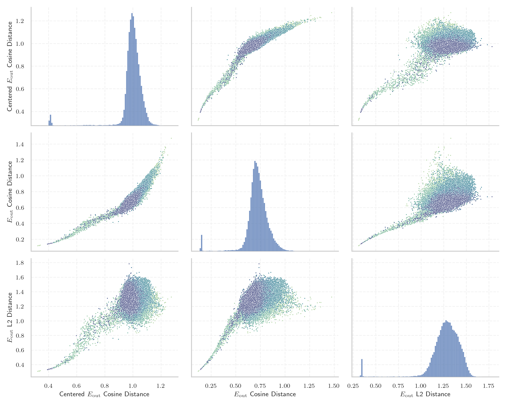
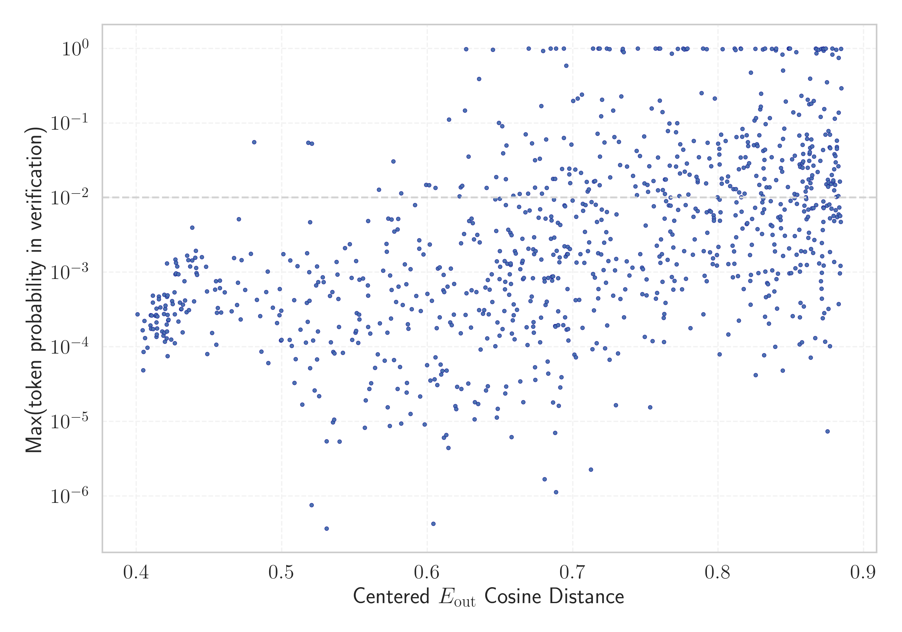

# Report for `Fugaku-LLM/Fugaku-LLM-13B`

## Model info

* Model Info: 
  * Tied embeddings: True
  * LM head uses bias: False
  * Embeddings shape: [49152, 5184]
* Tokenizer Info: 
  * Vocab Size: 48586
  * Tokenizer Class: PreTrainedTokenizerFast
  * Tokenizer Type: Unigram
  * Bytes handling: Byte Fallback
  * Token for verification prompt building: FIAsyncOperation
  * Token id for verification prompt building: 8975
* Indicator summary: 
  * Indicator for under-trained tokens: E_{out} Cosine Distance
  * Overall distribution: 0.720 +/- 0.119
* Detected Token Counts: 
  * Number of tested under-trained tokens: 972, 965 non-special, 675 below p = 0.01 threshold, 439 below soft indicator threshold
  * Number of single byte tokens: 353, of which 111 below indicator threshold
  * Number of special tokens: 85, of which 79 below indicator threshold
  * Number of non-single-byte unreachable tokens: 85, of which 79 below indicator threshold

## Under-trained token indicators plot


## Verification plot


## Under-trained token verification results
439 entries below threshold of 0.414

|   token_id | token                        |   indicator | max_prob                                                         |
|------------|------------------------------|-------------|------------------------------------------------------------------|
|       8788 | ````` ▁kGTLR `````           |    0.143908 | <span style='border: 1px solid rgb(169, 68, 66);'>4.9e-05</span> |
|       8162 | ````` RESETVALUE `````       |    0.14407  | <span style='border: 1px solid rgb(169, 68, 66);'>0.00027</span> |
|      48436 | ````` \ue964 `````           |    0.145802 | <span style='border: 1px solid rgb(169, 68, 66);'>0.00017</span> |
|       7013 | ````` YYCURSOR `````         |    0.145874 | <span style='border: 1px solid rgb(169, 68, 66);'>0.00022</span> |
|       9301 | ````` ▁GBProperty `````      |    0.14626  | <span style='border: 1px solid rgb(169, 68, 66);'>0.00013</span> |
|       9972 | ````` CyFunction `````       |    0.146629 | <span style='border: 1px solid rgb(169, 68, 66);'>0.00049</span> |
|       8519 | ````` VNVPROC `````          |    0.146649 | <span style='border: 1px solid rgb(169, 68, 66);'>0.00021</span> |
|       7853 | ````` DIPSETTING `````       |    0.1468   | <span style='border: 1px solid rgb(169, 68, 66);'>0.00019</span> |
|       9792 | ````` acadoWorkspace `````   |    0.147423 | <span style='border: 1px solid rgb(169, 68, 66);'>0.00018</span> |
|       9876 | ````` ewGetProcAddress ````` |    0.147551 | <span style='border: 1px solid rgb(169, 68, 66);'>0.00026</span> |
|       9613 | ````` OSCENCMD `````         |    0.14764  | <span style='border: 1px solid rgb(169, 68, 66);'>0.00014</span> |
|       9742 | ````` LiftoffRegister `````  |    0.147711 | <span style='border: 1px solid rgb(169, 68, 66);'>0.00015</span> |
|       8942 | ````` VERTEXATTRIBI `````    |    0.147817 | <span style='border: 1px solid rgb(169, 68, 66);'>0.00039</span> |
|       9404 | ````` PFNGLTEXCOORD `````    |    0.147983 | <span style='border: 1px solid rgb(169, 68, 66);'>0.00027</span> |
|       9188 | ````` MASKWRITE `````        |    0.14811  | <span style='border: 1px solid rgb(169, 68, 66);'>0.00047</span> |
|       9920 | ````` USEBURSTS `````        |    0.148184 | <span style='border: 1px solid rgb(169, 68, 66);'>0.00034</span> |
|       8989 | ````` PFNGLPROGRAM `````     |    0.148806 | <span style='border: 1px solid rgb(169, 68, 66);'>0.00028</span> |
|       8975 | ````` FIAsyncOperation ````` |    0.148868 | <span style='border: 1px solid rgb(169, 68, 66);'>0.00015</span> |
|      21883 | ````` \u2009\<\u2009 `````   |    0.148941 | <span style='border: 1px solid rgb(169, 68, 66);'>9.7e-05</span> |
|       9707 | ````` regBuiltin `````       |    0.14911  | <span style='border: 1px solid rgb(169, 68, 66);'>8.5e-05</span> |
<details><summary>419 additional entries below threshold</summary>

|   token_id | token                        |   indicator | max_prob                                                         | in_other_tokens                                                                                                                                                                                                                                                                                                                                                                                                           |
|------------|------------------------------|-------------|------------------------------------------------------------------|---------------------------------------------------------------------------------------------------------------------------------------------------------------------------------------------------------------------------------------------------------------------------------------------------------------------------------------------------------------------------------------------------------------------------|
|      16187 | ````` ]--[@ `````            |    0.149467 | <span style='border: 1px solid rgb(169, 68, 66);'>0.00017</span> |                                                                                                                                                                                                                                                                                                                                                                                                                           |
|       7882 | ````` emlrt `````            |    0.149712 | <span style='border: 1px solid rgb(169, 68, 66);'>0.00026</span> |                                                                                                                                                                                                                                                                                                                                                                                                                           |
|       7775 | ````` DVPROC `````           |    0.149717 | <span style='border: 1px solid rgb(169, 68, 66);'>0.00049</span> |                                                                                                                                                                                                                                                                                                                                                                                                                           |
|       5861 | ````` NimStringDesc `````    |    0.149821 | <span style='border: 1px solid rgb(169, 68, 66);'>0.00027</span> |                                                                                                                                                                                                                                                                                                                                                                                                                           |
|       8209 | ````` NIMCALL `````          |    0.150119 | <span style='border: 1px solid rgb(169, 68, 66);'>7.5e-05</span> |                                                                                                                                                                                                                                                                                                                                                                                                                           |
|       9530 | ````` ▁CYDEV `````           |    0.150122 | <span style='border: 1px solid rgb(169, 68, 66);'>0.0002</span>  |                                                                                                                                                                                                                                                                                                                                                                                                                           |
|       8369 | ````` PROGRAMUNIFORM `````   |    0.150167 | <span style='border: 1px solid rgb(169, 68, 66);'>0.0005</span>  |                                                                                                                                                                                                                                                                                                                                                                                                                           |
|       7975 | ````` PQExpBuffer `````      |    0.15023  | <span style='border: 1px solid rgb(169, 68, 66);'>0.00026</span> | <span style='border: 1px solid rgb(169, 68, 66);'>````` ppendPQExpBuffer `````</span>                                                                                                                                                                                                                                                                                                                                     |
|       9383 | ````` ▁OMITBAD `````         |    0.150328 | <span style='border: 1px solid rgb(169, 68, 66);'>0.00016</span> |                                                                                                                                                                                                                                                                                                                                                                                                                           |
|       9766 | ````` HFPERCLKDIV `````      |    0.150464 | <span style='border: 1px solid rgb(169, 68, 66);'>0.00033</span> |                                                                                                                                                                                                                                                                                                                                                                                                                           |
|       8224 | ````` HFPERCLKEN `````       |    0.150564 | <span style='border: 1px solid rgb(169, 68, 66);'>0.00041</span> |                                                                                                                                                                                                                                                                                                                                                                                                                           |
|       8507 | ````` highbd `````           |    0.150606 | <span style='border: 1px solid rgb(169, 68, 66);'>0.00043</span> |                                                                                                                                                                                                                                                                                                                                                                                                                           |
|       7763 | ````` MagickFalse `````      |    0.151247 | <span style='border: 1px solid rgb(169, 68, 66);'>0.00013</span> |                                                                                                                                                                                                                                                                                                                                                                                                                           |
|       8655 | ````` ▁{&__ `````            |    0.151418 | <span style='border: 1px solid rgb(169, 68, 66);'>0.00014</span> |                                                                                                                                                                                                                                                                                                                                                                                                                           |
|       7825 | ````` SINGLECTRL `````       |    0.151482 | <span style='border: 1px solid rgb(169, 68, 66);'>0.00012</span> |                                                                                                                                                                                                                                                                                                                                                                                                                           |
|       6291 | ````` SIGSEL `````           |    0.151536 | <span style='border: 1px solid rgb(169, 68, 66);'>0.00037</span> |                                                                                                                                                                                                                                                                                                                                                                                                                           |
|       9611 | ````` marshallOut `````      |    0.151606 | <span style='border: 1px solid rgb(169, 68, 66);'>0.00018</span> |                                                                                                                                                                                                                                                                                                                                                                                                                           |
|       5512 | ````` :%.*]], `````          |    0.151894 | <span style='border: 1px solid rgb(169, 68, 66);'>0.00013</span> |                                                                                                                                                                                                                                                                                                                                                                                                                           |
|       7306 | ````` PFNGLUNIFORM `````     |    0.151968 | <span style='border: 1px solid rgb(169, 68, 66);'>0.00039</span> |                                                                                                                                                                                                                                                                                                                                                                                                                           |
|       9550 | ````` ▁OMITGOOD `````        |    0.152323 | <span style='border: 1px solid rgb(169, 68, 66);'>0.00032</span> |                                                                                                                                                                                                                                                                                                                                                                                                                           |
|       9389 | ````` HFCORECLKDIV `````     |    0.152565 | <span style='border: 1px solid rgb(169, 68, 66);'>0.00027</span> |                                                                                                                                                                                                                                                                                                                                                                                                                           |
|       9636 | ````` OutcomeCallable `````  |    0.15257  | <span style='border: 1px solid rgb(169, 68, 66);'>0.00027</span> |                                                                                                                                                                                                                                                                                                                                                                                                                           |
|       8852 | ````` hcryp `````            |    0.152589 | <span style='border: 1px solid rgb(169, 68, 66);'>0.00047</span> |                                                                                                                                                                                                                                                                                                                                                                                                                           |
|       8095 | ````` ▁sbitmap `````         |    0.152654 | <span style='border: 1px solid rgb(169, 68, 66);'>0.00036</span> |                                                                                                                                                                                                                                                                                                                                                                                                                           |
|       9526 | ````` GetEmptyString `````   |    0.152843 | <span style='border: 1px solid rgb(169, 68, 66);'>0.00023</span> |                                                                                                                                                                                                                                                                                                                                                                                                                           |
|       8067 | ````` VEXTPROC `````         |    0.152881 | <span style='border: 1px solid rgb(169, 68, 66);'>0.00054</span> |                                                                                                                                                                                                                                                                                                                                                                                                                           |
|       8339 | ````` ppendPQExpBuffer ````` |    0.153235 | <span style='border: 1px solid rgb(169, 68, 66);'>0.00023</span> |                                                                                                                                                                                                                                                                                                                                                                                                                           |
|       3886 | ````` ▁PFNGLGET `````        |    0.153281 | <span style='border: 1px solid rgb(255, 145, 0);'>0.0013</span>  |                                                                                                                                                                                                                                                                                                                                                                                                                           |
|       7443 | ````` UIVPROC `````          |    0.153395 | <span style='border: 1px solid rgb(169, 68, 66);'>0.00094</span> |                                                                                                                                                                                                                                                                                                                                                                                                                           |
|       9967 | ````` LFCLKSEL `````         |    0.153543 | <span style='border: 1px solid rgb(169, 68, 66);'>0.00011</span> |                                                                                                                                                                                                                                                                                                                                                                                                                           |
|       6980 | ````` INPUTSEL `````         |    0.153571 | <span style='border: 1px solid rgb(169, 68, 66);'>0.00042</span> |                                                                                                                                                                                                                                                                                                                                                                                                                           |
|       7466 | ````` SLJIT `````            |    0.153837 | <span style='border: 1px solid rgb(255, 145, 0);'>0.0012</span>  |                                                                                                                                                                                                                                                                                                                                                                                                                           |
|       9432 | ````` ▁EZRADIO `````         |    0.154062 | <span style='border: 1px solid rgb(169, 68, 66);'>0.00016</span> |                                                                                                                                                                                                                                                                                                                                                                                                                           |
|       9953 | ````` mlxsw `````            |    0.154073 | <span style='border: 1px solid rgb(169, 68, 66);'>0.00094</span> |                                                                                                                                                                                                                                                                                                                                                                                                                           |
|       8903 | ````` appendStringInfo ````` |    0.154592 | <span style='border: 1px solid rgb(169, 68, 66);'>0.00016</span> |                                                                                                                                                                                                                                                                                                                                                                                                                           |
|       9625 | ````` ftnlen `````           |    0.155289 | <span style='border: 1px solid rgb(255, 145, 0);'>0.0013</span>  |                                                                                                                                                                                                                                                                                                                                                                                                                           |
|       8440 | ````` ntDefaultHandler ````` |    0.156206 | <span style='border: 1px solid rgb(169, 68, 66);'>0.00032</span> |                                                                                                                                                                                                                                                                                                                                                                                                                           |
|       9133 | ````` CALCTRL `````          |    0.156308 | <span style='border: 1px solid rgb(169, 68, 66);'>0.00041</span> |                                                                                                                                                                                                                                                                                                                                                                                                                           |
|       7444 | ````` GLAPIENTRY `````       |    0.156504 | <span style='border: 1px solid rgb(169, 68, 66);'>0.00097</span> |                                                                                                                                                                                                                                                                                                                                                                                                                           |
|       9819 | ````` TCPWM `````            |    0.156857 | <span style='border: 1px solid rgb(255, 145, 0);'>0.0015</span>  |                                                                                                                                                                                                                                                                                                                                                                                                                           |
|       8754 | ````` AsyncCaller `````      |    0.15698  | <span style='border: 1px solid rgb(169, 68, 66);'>0.00076</span> |                                                                                                                                                                                                                                                                                                                                                                                                                           |
|       6459 | ````` NVPROC `````           |    0.157058 | <span style='border: 1px solid rgb(169, 68, 66);'>0.00031</span> | <span style='border: 1px solid rgb(169, 68, 66);'>````` VNVPROC `````</span>                                                                                                                                                                                                                                                                                                                                              |
|       9553 | ````` lreadyInited `````     |    0.157103 | <span style='border: 1px solid rgb(169, 68, 66);'>0.00032</span> |                                                                                                                                                                                                                                                                                                                                                                                                                           |
|       5311 | ````` FNGLVERTEXATTRIB ````` |    0.15722  | <span style='border: 1px solid rgb(169, 68, 66);'>0.00022</span> |                                                                                                                                                                                                                                                                                                                                                                                                                           |
|       9260 | ````` VARBPROC `````         |    0.157682 | <span style='border: 1px solid rgb(255, 145, 0);'>0.0017</span>  |                                                                                                                                                                                                                                                                                                                                                                                                                           |
|       8006 | ````` typval `````           |    0.159766 | <span style='border: 1px solid rgb(255, 145, 0);'>0.0014</span>  |                                                                                                                                                                                                                                                                                                                                                                                                                           |
|       6352 | ````` ▁GTLR `````            |    0.159777 | <span style='border: 1px solid rgb(169, 68, 66);'>0.00037</span> |                                                                                                                                                                                                                                                                                                                                                                                                                           |
|       6535 | ````` FVPROC `````           |    0.159897 | <span style='border: 1px solid rgb(255, 145, 0);'>0.0015</span>  |                                                                                                                                                                                                                                                                                                                                                                                                                           |
|       8758 | ````` UNIFORMMATRIX `````    |    0.160249 | <span style='border: 1px solid rgb(255, 145, 0);'>0.004</span>   |                                                                                                                                                                                                                                                                                                                                                                                                                           |
|       9752 | ````` rehasher `````         |    0.16101  | <span style='border: 1px solid rgb(169, 68, 66);'>0.00092</span> |                                                                                                                                                                                                                                                                                                                                                                                                                           |
|      37016 | ````` \u3000>> `````         |    0.161603 | <span style='border: 1px solid rgb(255, 145, 0);'>0.0012</span>  |                                                                                                                                                                                                                                                                                                                                                                                                                           |
|       9837 | ````` glSecondaryColor ````` |    0.161689 | <span style='border: 1px solid rgb(169, 68, 66);'>0.00056</span> |                                                                                                                                                                                                                                                                                                                                                                                                                           |
|       4948 | ````` ▁classdump `````       |    0.161986 | <span style='border: 1px solid rgb(169, 68, 66);'>0.00029</span> |                                                                                                                                                                                                                                                                                                                                                                                                                           |
|       5172 | ````` :%.*]] `````           |    0.162354 | <span style='border: 1px solid rgb(255, 145, 0);'>0.0019</span>  | <span style='border: 1px solid rgb(169, 68, 66);'>````` :%.*]], `````</span>                                                                                                                                                                                                                                                                                                                                              |
|       7003 | ````` LETIMER `````          |    0.163473 | <span style='border: 1px solid rgb(255, 145, 0);'>0.0016</span>  |                                                                                                                                                                                                                                                                                                                                                                                                                           |
|       5715 | ````` joaat `````            |    0.163509 | <span style='border: 1px solid rgb(255, 145, 0);'>0.0011</span>  |                                                                                                                                                                                                                                                                                                                                                                                                                           |
|       8681 | ````` MULTITEXCOORD `````    |    0.16406  | <span style='border: 1px solid rgb(255, 145, 0);'>0.0016</span>  |                                                                                                                                                                                                                                                                                                                                                                                                                           |
|       6061 | ````` IVPROC `````           |    0.164895 | <span style='border: 1px solid rgb(169, 68, 66);'>0.00097</span> | <span style='border: 1px solid rgb(169, 68, 66);'>````` UIVPROC `````</span>                                                                                                                                                                                                                                                                                                                                              |
|       9882 | ````` memviewslice `````     |    0.164982 | <span style='border: 1px solid rgb(255, 145, 0);'>0.0012</span>  |                                                                                                                                                                                                                                                                                                                                                                                                                           |
|       9788 | ````` POSSEL `````           |    0.165835 | <span style='border: 1px solid rgb(169, 68, 66);'>0.00029</span> |                                                                                                                                                                                                                                                                                                                                                                                                                           |
|       9451 | ````` PFNGLBIND `````        |    0.16775  | <span style='border: 1px solid rgb(169, 68, 66);'>8e-05</span>   |                                                                                                                                                                                                                                                                                                                                                                                                                           |
|       7196 | ````` ▁PGUID `````           |    0.169139 | <span style='border: 1px solid rgb(169, 68, 66);'>0.00076</span> |                                                                                                                                                                                                                                                                                                                                                                                                                           |
|       9030 | ````` NEGSEL `````           |    0.169379 | <span style='border: 1px solid rgb(169, 68, 66);'>0.00073</span> |                                                                                                                                                                                                                                                                                                                                                                                                                           |
|       9280 | ````` GetArena `````         |    0.170197 | <span style='border: 1px solid rgb(169, 68, 66);'>0.00061</span> |                                                                                                                                                                                                                                                                                                                                                                                                                           |
|       1801 | ````` APIENTRYP `````        |    0.170504 | <span style='border: 1px solid rgb(169, 68, 66);'>0.00077</span> |                                                                                                                                                                                                                                                                                                                                                                                                                           |
|       3367 | ````` ▁WTIMER `````          |    0.170533 | <span style='border: 1px solid rgb(255, 145, 0);'>0.0051</span>  |                                                                                                                                                                                                                                                                                                                                                                                                                           |
|      45996 | ````` イランドキッチン ````` |    0.171701 | <span style='border: 1px solid rgb(169, 68, 66);'>0.00029</span> |                                                                                                                                                                                                                                                                                                                                                                                                                           |
|       5734 | ````` ▁uLocal `````          |    0.171843 | <span style='border: 1px solid rgb(169, 68, 66);'>0.00015</span> |                                                                                                                                                                                                                                                                                                                                                                                                                           |
|       8889 | ````` ▁COBJMACROS `````      |    0.17349  | <span style='border: 1px solid rgb(169, 68, 66);'>0.00011</span> |                                                                                                                                                                                                                                                                                                                                                                                                                           |
|       5214 | ````` RefNanny `````         |    0.176514 | <span style='border: 1px solid rgb(169, 68, 66);'>0.00054</span> |                                                                                                                                                                                                                                                                                                                                                                                                                           |
|       7898 | ````` yyvsp `````            |    0.177138 | <span style='border: 1px solid rgb(255, 145, 0);'>0.0015</span>  |                                                                                                                                                                                                                                                                                                                                                                                                                           |
|       6854 | ````` PFNGLGET `````         |    0.177923 | <span style='border: 1px solid rgb(169, 68, 66);'>0.00023</span> |                                                                                                                                                                                                                                                                                                                                                                                                                           |
|       9561 | ````` DTPRS `````            |    0.178245 | <span style='border: 1px solid rgb(255, 145, 0);'>0.0015</span>  |                                                                                                                                                                                                                                                                                                                                                                                                                           |
|       7704 | ````` BORINGSSL `````        |    0.180162 | <span style='border: 1px solid rgb(255, 145, 0);'>0.0018</span>  |                                                                                                                                                                                                                                                                                                                                                                                                                           |
|       5175 | ````` LESENSE `````          |    0.180928 | <span style='border: 1px solid rgb(169, 68, 66);'>0.00058</span> |                                                                                                                                                                                                                                                                                                                                                                                                                           |
|       8165 | ````` vwsn `````             |    0.183235 | <span style='border: 1px solid rgb(169, 68, 66);'>0.00058</span> |                                                                                                                                                                                                                                                                                                                                                                                                                           |
|       8962 | ````` UIPROC `````           |    0.183411 | <span style='border: 1px solid rgb(169, 68, 66);'>0.00033</span> |                                                                                                                                                                                                                                                                                                                                                                                                                           |
|       9575 | ````` RpcChannelBuffer ````` |    0.186337 | <span style='border: 1px solid rgb(169, 68, 66);'>0.00042</span> |                                                                                                                                                                                                                                                                                                                                                                                                                           |
|       6454 | ````` */]. `````             |    0.186544 | <span style='border: 1px solid rgb(169, 68, 66);'>0.00026</span> |                                                                                                                                                                                                                                                                                                                                                                                                                           |
|       3091 | ````` NRFX `````             |    0.186729 | <span style='border: 1px solid rgb(169, 68, 66);'>0.0003</span>  |                                                                                                                                                                                                                                                                                                                                                                                                                           |
|      40481 | ````` rackBack `````         |    0.188152 | <span style='border: 1px solid rgb(169, 68, 66);'>0.00036</span> |                                                                                                                                                                                                                                                                                                                                                                                                                           |
|       9157 | ````` FinishContext `````    |    0.189991 | <span style='border: 1px solid rgb(251, 189, 8);'>0.056</span>   |                                                                                                                                                                                                                                                                                                                                                                                                                           |
|       3063 | ````` ROUTELOC `````         |    0.191305 | <span style='border: 1px solid rgb(169, 68, 66);'>0.00012</span> |                                                                                                                                                                                                                                                                                                                                                                                                                           |
|       6581 | ````` PINMUX `````           |    0.192568 | <span style='border: 1px solid rgb(169, 68, 66);'>0.00054</span> |                                                                                                                                                                                                                                                                                                                                                                                                                           |
|       8844 | ````` XDMAC `````            |    0.194542 | <span style='border: 1px solid rgb(169, 68, 66);'>6.1e-05</span> |                                                                                                                                                                                                                                                                                                                                                                                                                           |
|       7821 | ````` IXGBE `````            |    0.197146 | <span style='border: 1px solid rgb(255, 145, 0);'>0.0017</span>  |                                                                                                                                                                                                                                                                                                                                                                                                                           |
|       9659 | ````` MonoMethod `````       |    0.197856 | <span style='border: 1px solid rgb(169, 68, 66);'>0.00012</span> |                                                                                                                                                                                                                                                                                                                                                                                                                           |
|       7283 | ````` dsverifier `````       |    0.19842  | <span style='border: 1px solid rgb(169, 68, 66);'>0.00034</span> |                                                                                                                                                                                                                                                                                                                                                                                                                           |
|       5536 | ````` ZEPHIR `````           |    0.19874  | <span style='border: 1px solid rgb(169, 68, 66);'>8.7e-05</span> |                                                                                                                                                                                                                                                                                                                                                                                                                           |
|       6613 | ````` LEUART `````           |    0.20104  | <span style='border: 1px solid rgb(169, 68, 66);'>0.00042</span> |                                                                                                                                                                                                                                                                                                                                                                                                                           |
|       9610 | ````` tupdesc `````          |    0.202502 | <span style='border: 1px solid rgb(169, 68, 66);'>0.0001</span>  |                                                                                                                                                                                                                                                                                                                                                                                                                           |
|       3182 | ````` HasBeenSet `````       |    0.202882 | <span style='border: 1px solid rgb(255, 145, 0);'>0.0014</span>  |                                                                                                                                                                                                                                                                                                                                                                                                                           |
|       9080 | ````` ▁smartlist `````       |    0.204846 | <span style='border: 1px solid rgb(255, 145, 0);'>0.0018</span>  |                                                                                                                                                                                                                                                                                                                                                                                                                           |
|       8901 | ````` IMETHOD `````          |    0.20491  | <span style='border: 1px solid rgb(169, 68, 66);'>0.00012</span> |                                                                                                                                                                                                                                                                                                                                                                                                                           |
|       5084 | ````` TSRMLS `````           |    0.206354 | <span style='border: 1px solid rgb(169, 68, 66);'>0.0003</span>  |                                                                                                                                                                                                                                                                                                                                                                                                                           |
|       9704 | ````` glWindowPos `````      |    0.206425 | <span style='border: 1px solid rgb(255, 145, 0);'>0.0012</span>  |                                                                                                                                                                                                                                                                                                                                                                                                                           |
|      47915 | ````` ローリークエスト ````` |    0.206931 | <span style='border: 1px solid rgb(169, 68, 66);'>0.0006</span>  |                                                                                                                                                                                                                                                                                                                                                                                                                           |
|       1705 | ````` ▁GLAPI `````           |    0.207353 | <span style='border: 1px solid rgb(169, 68, 66);'>0.00021</span> |                                                                                                                                                                                                                                                                                                                                                                                                                           |
|       6453 | ````` HRTIM `````            |    0.207435 | <span style='border: 1px solid rgb(169, 68, 66);'>0.00027</span> |                                                                                                                                                                                                                                                                                                                                                                                                                           |
|       7541 | ````` AUXHFRCO `````         |    0.20882  | <span style='border: 1px solid rgb(169, 68, 66);'>1.1e-05</span> |                                                                                                                                                                                                                                                                                                                                                                                                                           |
|       6945 | ````` xabababab `````        |    0.209196 | <span style='border: 1px solid rgb(169, 68, 66);'>0.00012</span> |                                                                                                                                                                                                                                                                                                                                                                                                                           |
|       6592 | ````` curbuf `````           |    0.210086 | <span style='border: 1px solid rgb(169, 68, 66);'>0.00016</span> |                                                                                                                                                                                                                                                                                                                                                                                                                           |
|      10008 | ````` tySequence `````       |    0.21034  | <span style='border: 1px solid rgb(169, 68, 66);'>0.00017</span> |                                                                                                                                                                                                                                                                                                                                                                                                                           |
|       4849 | ````` ▁//========== `````    |    0.210853 | <span style='border: 1px solid rgb(169, 68, 66);'>6.9e-05</span> | <span style='border: 1px solid rgb(169, 68, 66);'>````` ▁//============= `````</span>                                                                                                                                                                                                                                                                                                                                     |
|       9989 | ````` GASNET `````           |    0.211251 | <span style='border: 1px solid rgb(169, 68, 66);'>1.7e-05</span> |                                                                                                                                                                                                                                                                                                                                                                                                                           |
|       9491 | ````` EXTIPSEL `````         |    0.21198  | <span style='border: 1px solid rgb(169, 68, 66);'>8.5e-05</span> |                                                                                                                                                                                                                                                                                                                                                                                                                           |
|       9834 | ````` SWIER `````            |    0.21288  | <span style='border: 1px solid rgb(169, 68, 66);'>7.5e-07</span> |                                                                                                                                                                                                                                                                                                                                                                                                                           |
|       5892 | ````` chartInstance `````    |    0.21331  | <span style='border: 1px solid rgb(169, 68, 66);'>0.00073</span> |                                                                                                                                                                                                                                                                                                                                                                                                                           |
|      37274 | ````` \|\u3000\| `````       |    0.214903 | <span style='border: 1px solid rgb(251, 189, 8);'>0.054</span>   |                                                                                                                                                                                                                                                                                                                                                                                                                           |
|       5898 | ````` sqInt `````            |    0.215035 | <span style='border: 1px solid rgb(255, 145, 0);'>0.0014</span>  |                                                                                                                                                                                                                                                                                                                                                                                                                           |
|      48142 | ````` \ue075 `````           |    0.215077 | <span style='border: 1px solid rgb(255, 145, 0);'>0.001</span>   |                                                                                                                                                                                                                                                                                                                                                                                                                           |
|      46381 | ````` /\u3000/ `````         |    0.2165   | <span style='border: 1px solid rgb(255, 145, 0);'>0.0047</span>  |                                                                                                                                                                                                                                                                                                                                                                                                                           |
|       9630 | ````` EXTICR `````           |    0.218043 | <span style='border: 1px solid rgb(169, 68, 66);'>3.7e-07</span> |                                                                                                                                                                                                                                                                                                                                                                                                                           |
|       8264 | ````` GetDatum `````         |    0.218462 | <span style='border: 1px solid rgb(169, 68, 66);'>0.00039</span> |                                                                                                                                                                                                                                                                                                                                                                                                                           |
|       7271 | ````` sysbios `````          |    0.220312 | <span style='border: 1px solid rgb(169, 68, 66);'>0.00018</span> |                                                                                                                                                                                                                                                                                                                                                                                                                           |
|       9051 | ````` ▁debugstr `````        |    0.222259 | <span style='border: 1px solid rgb(255, 145, 0);'>0.0021</span>  |                                                                                                                                                                                                                                                                                                                                                                                                                           |
|       7913 | ````` ARBPROC `````          |    0.223069 | <span style='border: 1px solid rgb(169, 68, 66);'>0.00086</span> | <span style='border: 1px solid rgb(255, 145, 0);'>````` VARBPROC `````</span>                                                                                                                                                                                                                                                                                                                                             |
|       1304 | ````` ▁PFNGL `````           |    0.223129 | <span style='border: 1px solid rgb(251, 189, 8);'>0.053</span>   | <span style='border: 1px solid rgb(255, 145, 0);'>````` ▁PFNGLGET `````</span>                                                                                                                                                                                                                                                                                                                                            |
|       7169 | ````` TAILQ `````            |    0.224651 | <span style='border: 1px solid rgb(169, 68, 66);'>2.6e-05</span> |                                                                                                                                                                                                                                                                                                                                                                                                                           |
|       9699 | ````` INVALC `````           |    0.224745 | <span style='border: 1px solid rgb(169, 68, 66);'>5.2e-05</span> |                                                                                                                                                                                                                                                                                                                                                                                                                           |
|       9298 | ````` SEQAN `````            |    0.225106 | <span style='border: 1px solid rgb(169, 68, 66);'>0.00011</span> |                                                                                                                                                                                                                                                                                                                                                                                                                           |
|       9380 | ````` SAADC `````            |    0.225743 | <span style='border: 1px solid rgb(169, 68, 66);'>0.00022</span> |                                                                                                                                                                                                                                                                                                                                                                                                                           |
|       8005 | ````` padapter `````         |    0.226748 | <span style='border: 1px solid rgb(169, 68, 66);'>0.00012</span> |                                                                                                                                                                                                                                                                                                                                                                                                                           |
|      40969 | ````` セクフレ `````         |    0.226912 | <span style='border: 1px solid rgb(169, 68, 66);'>6.8e-05</span> |                                                                                                                                                                                                                                                                                                                                                                                                                           |
|       9320 | ````` Vdbe `````             |    0.227335 | <span style='border: 1px solid rgb(169, 68, 66);'>3.3e-05</span> |                                                                                                                                                                                                                                                                                                                                                                                                                           |
|       6849 | ````` VPROC `````            |    0.227421 | <span style='border: 1px solid rgb(169, 68, 66);'>0.00042</span> | <span style='border: 1px solid rgb(169, 68, 66);'>````` VNVPROC `````</span>, <span style='border: 1px solid rgb(169, 68, 66);'>````` UIVPROC `````</span>, <span style='border: 1px solid rgb(169, 68, 66);'>````` DVPROC `````</span>                                                                                                                                                                                   |
|      46346 | ````` ライクリーニング ````` |    0.228999 | <span style='border: 1px solid rgb(169, 68, 66);'>0.00048</span> |                                                                                                                                                                                                                                                                                                                                                                                                                           |
|       8566 | ````` EXTINT `````           |    0.229847 | <span style='border: 1px solid rgb(169, 68, 66);'>8.2e-05</span> |                                                                                                                                                                                                                                                                                                                                                                                                                           |
|       6472 | ````` LFRCO `````            |    0.230038 | <span style='border: 1px solid rgb(169, 68, 66);'>0.00067</span> |                                                                                                                                                                                                                                                                                                                                                                                                                           |
|       6801 | ````` clineno `````          |    0.230449 | <span style='border: 1px solid rgb(169, 68, 66);'>0.00023</span> |                                                                                                                                                                                                                                                                                                                                                                                                                           |
|       9233 | ````` DFSDM `````            |    0.230675 | <span style='border: 1px solid rgb(169, 68, 66);'>5.4e-06</span> |                                                                                                                                                                                                                                                                                                                                                                                                                           |
|       7162 | ````` avctx `````            |    0.230708 | <span style='border: 1px solid rgb(169, 68, 66);'>0.00074</span> |                                                                                                                                                                                                                                                                                                                                                                                                                           |
|       9829 | ````` PLLSAI `````           |    0.230925 | <span style='border: 1px solid rgb(169, 68, 66);'>0.00054</span> |                                                                                                                                                                                                                                                                                                                                                                                                                           |
|       8266 | ````` vreinterpret `````     |    0.231312 | <span style='border: 1px solid rgb(169, 68, 66);'>8.3e-05</span> |                                                                                                                                                                                                                                                                                                                                                                                                                           |
|       6899 | ````` glMultiTexCoord `````  |    0.23197  | <span style='border: 1px solid rgb(169, 68, 66);'>0.00016</span> |                                                                                                                                                                                                                                                                                                                                                                                                                           |
|       7960 | ````` glVertexAttribI `````  |    0.23211  | <span style='border: 1px solid rgb(169, 68, 66);'>0.00084</span> |                                                                                                                                                                                                                                                                                                                                                                                                                           |
|       9237 | ````` darkskin `````         |    0.232865 | <span style='border: 1px solid rgb(169, 68, 66);'>2.2e-05</span> |                                                                                                                                                                                                                                                                                                                                                                                                                           |
|       2828 | ````` PFNGL `````            |    0.233254 | <span style='border: 1px solid rgb(169, 68, 66);'>0.00044</span> | <span style='border: 1px solid rgb(255, 145, 0);'>````` ▁PFNGLGET `````</span>, <span style='border: 1px solid rgb(169, 68, 66);'>````` PFNGLGET `````</span>, <span style='border: 1px solid rgb(169, 68, 66);'>````` PFNGLTEXCOORD `````</span>, <span style='border: 1px solid rgb(169, 68, 66);'>````` PFNGLBIND `````</span>, <span style='border: 1px solid rgb(169, 68, 66);'>````` PFNGLUNIFORM `````</span>, ... |
|       2937 | ````` WTIMER `````           |    0.233633 | <span style='border: 1px solid rgb(169, 68, 66);'>1.9e-05</span> | <span style='border: 1px solid rgb(255, 145, 0);'>````` ▁WTIMER `````</span>                                                                                                                                                                                                                                                                                                                                              |
|       8063 | ````` PRSSEL `````           |    0.234776 | <span style='border: 1px solid rgb(169, 68, 66);'>3.3e-05</span> |                                                                                                                                                                                                                                                                                                                                                                                                                           |
|       5208 | ````` glProgramUniform ````` |    0.235376 | <span style='border: 1px solid rgb(255, 145, 0);'>0.0014</span>  |                                                                                                                                                                                                                                                                                                                                                                                                                           |
|       8979 | ````` ▁MICROPY `````         |    0.235553 | <span style='border: 1px solid rgb(255, 145, 0);'>0.001</span>   |                                                                                                                                                                                                                                                                                                                                                                                                                           |
|       6947 | ````` HeapTuple `````        |    0.236931 | <span style='border: 1px solid rgb(169, 68, 66);'>9.7e-06</span> |                                                                                                                                                                                                                                                                                                                                                                                                                           |
|      25828 | ````` [\*](# `````           |    0.237618 | <span style='border: 1px solid rgb(169, 68, 66);'>0.00093</span> |                                                                                                                                                                                                                                                                                                                                                                                                                           |
|       8682 | ````` cnfn `````             |    0.238867 | <span style='border: 1px solid rgb(169, 68, 66);'>0.00067</span> |                                                                                                                                                                                                                                                                                                                                                                                                                           |
|       9747 | ````` NamedFramebuffer ````` |    0.240562 | <span style='border: 1px solid rgb(255, 145, 0);'>0.0019</span>  |                                                                                                                                                                                                                                                                                                                                                                                                                           |
|       9438 | ````` DBGMCU `````           |    0.24221  | <span style='border: 1px solid rgb(169, 68, 66);'>0.00083</span> |                                                                                                                                                                                                                                                                                                                                                                                                                           |
|       8030 | ````` SYNCBUSY `````         |    0.242219 | <span style='border: 1px solid rgb(169, 68, 66);'>8.2e-06</span> |                                                                                                                                                                                                                                                                                                                                                                                                                           |
|       7280 | ````` WOLFSSL `````          |    0.242797 | <span style='border: 1px solid rgb(169, 68, 66);'>5.4e-06</span> |                                                                                                                                                                                                                                                                                                                                                                                                                           |
|       7226 | ````` GIVEREF `````          |    0.243458 | <span style='border: 1px solid rgb(169, 68, 66);'>0.00015</span> |                                                                                                                                                                                                                                                                                                                                                                                                                           |
|       9952 | ````` gdbarch `````          |    0.243462 | <span style='border: 1px solid rgb(169, 68, 66);'>2.7e-05</span> |                                                                                                                                                                                                                                                                                                                                                                                                                           |
|       7565 | ````` drvdata `````          |    0.245248 | <span style='border: 1px solid rgb(169, 68, 66);'>1.5e-05</span> |                                                                                                                                                                                                                                                                                                                                                                                                                           |
|       7584 | ````` argvars `````          |    0.247265 | <span style='border: 1px solid rgb(169, 68, 66);'>0.00019</span> |                                                                                                                                                                                                                                                                                                                                                                                                                           |
|       9596 | ````` ShiftMask `````        |    0.247319 | <span style='border: 1px solid rgb(169, 68, 66);'>0.0008</span>  |                                                                                                                                                                                                                                                                                                                                                                                                                           |
|       7472 | ````` LIBXSMM `````          |    0.249048 | <span style='border: 1px solid rgb(169, 68, 66);'>5.2e-05</span> |                                                                                                                                                                                                                                                                                                                                                                                                                           |
|       7507 | ````` StatusTypeDef `````    |    0.250648 | <span style='border: 1px solid rgb(169, 68, 66);'>6.7e-05</span> |                                                                                                                                                                                                                                                                                                                                                                                                                           |
|       7433 | ````` pybuffer `````         |    0.250866 | <span style='border: 1px solid rgb(169, 68, 66);'>6.6e-05</span> |                                                                                                                                                                                                                                                                                                                                                                                                                           |
|       6044 | ````` HFRCO `````            |    0.252635 | <span style='border: 1px solid rgb(169, 68, 66);'>0.00021</span> | <span style='border: 1px solid rgb(169, 68, 66);'>````` AUXHFRCO `````</span>                                                                                                                                                                                                                                                                                                                                             |
|       9793 | ````` GPIOTE `````           |    0.252725 | <span style='border: 1px solid rgb(255, 145, 0);'>0.0011</span>  |                                                                                                                                                                                                                                                                                                                                                                                                                           |
|       8879 | ````` ▁stbt `````            |    0.253197 | <span style='border: 1px solid rgb(255, 145, 0);'>0.0052</span>  |                                                                                                                                                                                                                                                                                                                                                                                                                           |
|       9270 | ````` SetupContext `````     |    0.254069 | <span style='border: 1px solid rgb(169, 68, 66);'>0.00049</span> |                                                                                                                                                                                                                                                                                                                                                                                                                           |
|       3954 | ````` kInstruction `````     |    0.254177 | <span style='border: 1px solid rgb(255, 145, 0);'>0.0052</span>  |                                                                                                                                                                                                                                                                                                                                                                                                                           |
|       9782 | ````` GNSP `````             |    0.254704 | <span style='border: 1px solid rgb(255, 145, 0);'>0.0012</span>  |                                                                                                                                                                                                                                                                                                                                                                                                                           |
|       7570 | ````` HFCLK `````            |    0.255695 | <span style='border: 1px solid rgb(169, 68, 66);'>0.00016</span> |                                                                                                                                                                                                                                                                                                                                                                                                                           |
|       9126 | ````` xfffffffd `````        |    0.255965 | <span style='border: 1px solid rgb(169, 68, 66);'>0.00015</span> |                                                                                                                                                                                                                                                                                                                                                                                                                           |
|       9938 | ````` glCompressed `````     |    0.257248 | <span style='border: 1px solid rgb(169, 68, 66);'>0.00064</span> |                                                                                                                                                                                                                                                                                                                                                                                                                           |
|      33875 | ````` \|\u3000 `````         |    0.257846 | <span style='border: 1px solid rgb(255, 145, 0);'>0.0024</span>  | <span style='border: 1px solid rgb(251, 189, 8);'>````` \|\u3000\| `````</span>, <span style='border: 1px solid rgb(40, 167, 69);'>````` \u3000\|\u3000 `````</span>                                                                                                                                                                                                                                                      |
|       4321 | ````` GOTREF `````           |    0.25842  | <span style='border: 1px solid rgb(169, 68, 66);'>0.00018</span> |                                                                                                                                                                                                                                                                                                                                                                                                                           |
|       9844 | ````` PQgetvalue `````       |    0.258697 | <span style='border: 1px solid rgb(169, 68, 66);'>5.4e-05</span> |                                                                                                                                                                                                                                                                                                                                                                                                                           |
|       9690 | ````` ▁MODKEY `````          |    0.258803 | <span style='border: 1px solid rgb(255, 145, 0);'>0.0049</span>  |                                                                                                                                                                                                                                                                                                                                                                                                                           |
|       9128 | ````` mtoll `````            |    0.258884 | <span style='border: 1px solid rgb(169, 68, 66);'>8e-05</span>   |                                                                                                                                                                                                                                                                                                                                                                                                                           |
|       7473 | ````` SIMDE `````            |    0.260033 | <span style='border: 1px solid rgb(169, 68, 66);'>0.00027</span> |                                                                                                                                                                                                                                                                                                                                                                                                                           |
|       8229 | ````` APIENTRY `````         |    0.260877 | <span style='border: 1px solid rgb(169, 68, 66);'>0.0004</span>  |                                                                                                                                                                                                                                                                                                                                                                                                                           |
|       5416 | ````` PRSCH `````            |    0.263711 | <span style='border: 1px solid rgb(169, 68, 66);'>2.4e-05</span> |                                                                                                                                                                                                                                                                                                                                                                                                                           |
|       9905 | ````` MspInit `````          |    0.263727 | <span style='border: 1px solid rgb(251, 189, 8);'>0.011</span>   |                                                                                                                                                                                                                                                                                                                                                                                                                           |
|       9495 | ````` glTexture `````        |    0.265878 | <span style='border: 1px solid rgb(255, 145, 0);'>0.0011</span>  |                                                                                                                                                                                                                                                                                                                                                                                                                           |
|       7492 | ````` irqrestore `````       |    0.266479 | <span style='border: 1px solid rgb(169, 68, 66);'>7.2e-05</span> |                                                                                                                                                                                                                                                                                                                                                                                                                           |
|       6329 | ````` LPTIM `````            |    0.266569 | <span style='border: 1px solid rgb(169, 68, 66);'>0.00024</span> |                                                                                                                                                                                                                                                                                                                                                                                                                           |
|       8304 | ````` GenTree `````          |    0.267668 | <span style='border: 1px solid rgb(255, 145, 0);'>0.0024</span>  |                                                                                                                                                                                                                                                                                                                                                                                                                           |
|       7944 | ````` InstancePtr `````      |    0.26777  | <span style='border: 1px solid rgb(255, 145, 0);'>0.0035</span>  |                                                                                                                                                                                                                                                                                                                                                                                                                           |
|       9132 | ````` QDEC `````             |    0.267974 | <span style='border: 1px solid rgb(169, 68, 66);'>0.00012</span> |                                                                                                                                                                                                                                                                                                                                                                                                                           |
|       8834 | ````` ************//** ````` |    0.26814  | <span style='border: 1px solid rgb(169, 68, 66);'>0.00091</span> |                                                                                                                                                                                                                                                                                                                                                                                                                           |
|       9825 | ````` XCVR `````             |    0.268148 | <span style='border: 1px solid rgb(169, 68, 66);'>0.00011</span> |                                                                                                                                                                                                                                                                                                                                                                                                                           |
|       6970 | ````` DECLSPEC `````         |    0.269953 | <span style='border: 1px solid rgb(169, 68, 66);'>0.0002</span>  |                                                                                                                                                                                                                                                                                                                                                                                                                           |
|       9429 | ````` IMXRT `````            |    0.274462 | <span style='border: 1px solid rgb(251, 189, 8);'>0.013</span>   |                                                                                                                                                                                                                                                                                                                                                                                                                           |
|       9122 | ````` xmlChar `````          |    0.27512  | <span style='border: 1px solid rgb(169, 68, 66);'>8.7e-06</span> |                                                                                                                                                                                                                                                                                                                                                                                                                           |
|       3346 | ````` StringCopy `````       |    0.277293 | <span style='border: 1px solid rgb(169, 68, 66);'>0.00069</span> |                                                                                                                                                                                                                                                                                                                                                                                                                           |
|       8451 | ````` ▁GLshort `````         |    0.279445 | <span style='border: 1px solid rgb(169, 68, 66);'>0.00051</span> |                                                                                                                                                                                                                                                                                                                                                                                                                           |
|       9645 | ````` ▁JNIEXPORT `````       |    0.280529 | <span style='border: 1px solid rgb(169, 68, 66);'>0.00058</span> |                                                                                                                                                                                                                                                                                                                                                                                                                           |
|       7576 | ````` esbmc `````            |    0.280632 | <span style='border: 1px solid rgb(169, 68, 66);'>2.7e-05</span> |                                                                                                                                                                                                                                                                                                                                                                                                                           |
|       8833 | ````` INTFLAG `````          |    0.282794 | <span style='border: 1px solid rgb(169, 68, 66);'>9.1e-06</span> |                                                                                                                                                                                                                                                                                                                                                                                                                           |
|       8573 | ````` EVSYS `````            |    0.282972 | <span style='border: 1px solid rgb(169, 68, 66);'>1.3e-05</span> |                                                                                                                                                                                                                                                                                                                                                                                                                           |
|       9334 | ````` DMAMUX `````           |    0.283092 | <span style='border: 1px solid rgb(169, 68, 66);'>9.4e-06</span> |                                                                                                                                                                                                                                                                                                                                                                                                                           |
|       7958 | ````` irqsave `````          |    0.283807 | <span style='border: 1px solid rgb(169, 68, 66);'>1.6e-05</span> |                                                                                                                                                                                                                                                                                                                                                                                                                           |
|       7512 | ````` INTENCLR `````         |    0.284279 | <span style='border: 1px solid rgb(169, 68, 66);'>2.9e-05</span> |                                                                                                                                                                                                                                                                                                                                                                                                                           |
|       8677 | ````` GETARG `````           |    0.285781 | <span style='border: 1px solid rgb(169, 68, 66);'>4.2e-07</span> |                                                                                                                                                                                                                                                                                                                                                                                                                           |
|       8101 | ````` PRIu `````             |    0.287856 | <span style='border: 1px solid rgb(169, 68, 66);'>3.3e-05</span> |                                                                                                                                                                                                                                                                                                                                                                                                                           |
|       9414 | ````` WWDG `````             |    0.288656 | <span style='border: 1px solid rgb(255, 145, 0);'>0.0037</span>  |                                                                                                                                                                                                                                                                                                                                                                                                                           |
|       9827 | ````` irectDrawSurface ````` |    0.289333 | <span style='border: 1px solid rgb(255, 145, 0);'>0.0011</span>  |                                                                                                                                                                                                                                                                                                                                                                                                                           |
|       9197 | ````` wiphy `````            |    0.292831 | <span style='border: 1px solid rgb(169, 68, 66);'>0.00048</span> |                                                                                                                                                                                                                                                                                                                                                                                                                           |
|       9393 | ````` CLKSOURCE `````        |    0.294464 | <span style='border: 1px solid rgb(169, 68, 66);'>0.00021</span> |                                                                                                                                                                                                                                                                                                                                                                                                                           |
|       6844 | ````` SDMMC `````            |    0.296052 | <span style='border: 1px solid rgb(255, 145, 0);'>0.0051</span>  |                                                                                                                                                                                                                                                                                                                                                                                                                           |
|       2379 | ````` lpVtbl `````           |    0.297581 | <span style='border: 1px solid rgb(169, 68, 66);'>0.00042</span> |                                                                                                                                                                                                                                                                                                                                                                                                                           |
|       9228 | ````` PUPDR `````            |    0.298321 | <span style='border: 1px solid rgb(169, 68, 66);'>6.6e-06</span> |                                                                                                                                                                                                                                                                                                                                                                                                                           |
|       8670 | ````` ▁NoneT `````           |    0.299501 | <span style='border: 1px solid rgb(169, 68, 66);'>2.2e-05</span> |                                                                                                                                                                                                                                                                                                                                                                                                                           |
|       9094 | ````` goodG `````            |    0.299737 | <span style='border: 1px solid rgb(251, 189, 8);'>0.015</span>   |                                                                                                                                                                                                                                                                                                                                                                                                                           |
|       5361 | ````` arginfo `````          |    0.300864 | <span style='border: 1px solid rgb(169, 68, 66);'>0.00092</span> |                                                                                                                                                                                                                                                                                                                                                                                                                           |
|       7961 | ````` libxsmm `````          |    0.301671 | <span style='border: 1px solid rgb(169, 68, 66);'>5.7e-05</span> |                                                                                                                                                                                                                                                                                                                                                                                                                           |
|       7191 | ````` ▁simde `````           |    0.301885 | <span style='border: 1px solid rgb(169, 68, 66);'>0.0007</span>  |                                                                                                                                                                                                                                                                                                                                                                                                                           |
|       9439 | ````` ▁PGNS `````            |    0.302575 | <span style='border: 1px solid rgb(255, 145, 0);'>0.0011</span>  |                                                                                                                                                                                                                                                                                                                                                                                                                           |
|       9220 | ````` CpltCallback `````     |    0.305013 | <span style='border: 1px solid rgb(255, 145, 0);'>0.0048</span>  |                                                                                                                                                                                                                                                                                                                                                                                                                           |
|       9626 | ````` ReceivedHandler `````  |    0.305959 | <span style='border: 1px solid rgb(255, 145, 0);'>0.0032</span>  |                                                                                                                                                                                                                                                                                                                                                                                                                           |
|       9853 | ````` NVMCTRL `````          |    0.307705 | <span style='border: 1px solid rgb(169, 68, 66);'>4.4e-06</span> |                                                                                                                                                                                                                                                                                                                                                                                                                           |
|       9452 | ````` CheckExact `````       |    0.310635 | <span style='border: 1px solid rgb(169, 68, 66);'>3.2e-05</span> |                                                                                                                                                                                                                                                                                                                                                                                                                           |
|       9416 | ````` IXMLDOM `````          |    0.310801 | <span style='border: 1px solid rgb(251, 189, 8);'>0.015</span>   |                                                                                                                                                                                                                                                                                                                                                                                                                           |
|       7577 | ````` ashcho `````           |    0.310987 | <span style='border: 1px solid rgb(251, 189, 8);'>0.014</span>   |                                                                                                                                                                                                                                                                                                                                                                                                                           |
|       8579 | ````` ▁VTSS `````            |    0.311499 | <span style='border: 1px solid rgb(255, 145, 0);'>0.0021</span>  |                                                                                                                                                                                                                                                                                                                                                                                                                           |
|       9900 | ````` GetAttrStr `````       |    0.311596 | <span style='border: 1px solid rgb(255, 145, 0);'>0.0036</span>  |                                                                                                                                                                                                                                                                                                                                                                                                                           |
|      46357 | ````` \u3000＼\u3000 `````   |    0.312066 | <span style='border: 1px solid rgb(255, 145, 0);'>0.0024</span>  |                                                                                                                                                                                                                                                                                                                                                                                                                           |
|       9652 | ````` CBigNum `````          |    0.312192 | <span style='border: 1px solid rgb(169, 68, 66);'>3.1e-05</span> |                                                                                                                                                                                                                                                                                                                                                                                                                           |
|       8815 | ````` DTFC `````             |    0.312398 | <span style='border: 1px solid rgb(169, 68, 66);'>0.00028</span> |                                                                                                                                                                                                                                                                                                                                                                                                                           |
|       7081 | ````` INTENSET `````         |    0.313991 | <span style='border: 1px solid rgb(169, 68, 66);'>0.00023</span> |                                                                                                                                                                                                                                                                                                                                                                                                                           |
|       9772 | ````` ▁XPAR `````            |    0.315123 | <span style='border: 1px solid rgb(169, 68, 66);'>0.00032</span> |                                                                                                                                                                                                                                                                                                                                                                                                                           |
|       9474 | ````` glCopy `````           |    0.315195 | <span style='border: 1px solid rgb(169, 68, 66);'>1.5e-05</span> |                                                                                                                                                                                                                                                                                                                                                                                                                           |
|       7549 | ````` phba `````             |    0.316768 | <span style='border: 1px solid rgb(169, 68, 66);'>4.7e-05</span> |                                                                                                                                                                                                                                                                                                                                                                                                                           |
|       9658 | ````` GetProcessHeap `````   |    0.316986 | <span style='border: 1px solid rgb(251, 189, 8);'>0.035</span>   |                                                                                                                                                                                                                                                                                                                                                                                                                           |
|       9470 | ````` QualType `````         |    0.317458 | <span style='border: 1px solid rgb(169, 68, 66);'>6e-06</span>   |                                                                                                                                                                                                                                                                                                                                                                                                                           |
|       9716 | ````` IWDG `````             |    0.317955 | <span style='border: 1px solid rgb(169, 68, 66);'>0.0003</span>  |                                                                                                                                                                                                                                                                                                                                                                                                                           |
|       6948 | ````` ppvObject `````        |    0.31822  | <span style='border: 1px solid rgb(169, 68, 66);'>0.00031</span> |                                                                                                                                                                                                                                                                                                                                                                                                                           |
|       7653 | ````` ZSTR `````             |    0.318511 | <span style='border: 1px solid rgb(255, 145, 0);'>0.0079</span>  |                                                                                                                                                                                                                                                                                                                                                                                                                           |
|       9598 | ````` xcccccccc `````        |    0.319505 | <span style='border: 1px solid rgb(169, 68, 66);'>0.00064</span> |                                                                                                                                                                                                                                                                                                                                                                                                                           |
|       9758 | ````` FALLTHROUGH `````      |    0.319963 | <span style='border: 1px solid rgb(169, 68, 66);'>0.00028</span> |                                                                                                                                                                                                                                                                                                                                                                                                                           |
|       4094 | ````` MBEDTLS `````          |    0.321976 | <span style='border: 1px solid rgb(169, 68, 66);'>3.5e-05</span> |                                                                                                                                                                                                                                                                                                                                                                                                                           |
|       9419 | ````` DAPM `````             |    0.322292 | <span style='border: 1px solid rgb(169, 68, 66);'>0.00037</span> |                                                                                                                                                                                                                                                                                                                                                                                                                           |
|       8466 | ````` ransformFeedback ````` |    0.325059 | <span style='border: 1px solid rgb(169, 68, 66);'>0.00041</span> |                                                                                                                                                                                                                                                                                                                                                                                                                           |
|       8687 | ````` Parameterfv `````      |    0.325778 | <span style='border: 1px solid rgb(169, 68, 66);'>0.00017</span> |                                                                                                                                                                                                                                                                                                                                                                                                                           |
|       8123 | ````` ENODEV `````           |    0.325951 | <span style='border: 1px solid rgb(169, 68, 66);'>0.00027</span> |                                                                                                                                                                                                                                                                                                                                                                                                                           |
|      40282 | ````` MOODYZ `````           |    0.326566 | <span style='border: 1px solid rgb(251, 189, 8);'>0.031</span>   |                                                                                                                                                                                                                                                                                                                                                                                                                           |
|      34295 | ````` ップアドバイザー ````` |    0.326842 | <span style='border: 1px solid rgb(169, 68, 66);'>0.0003</span>  |                                                                                                                                                                                                                                                                                                                                                                                                                           |
|       8045 | ````` CLKEN `````            |    0.326902 | <span style='border: 1px solid rgb(169, 68, 66);'>4.3e-05</span> | <span style='border: 1px solid rgb(169, 68, 66);'>````` HFPERCLKEN `````</span>                                                                                                                                                                                                                                                                                                                                           |
|       6972 | ````` MAVLINK `````          |    0.327323 | <span style='border: 1px solid rgb(255, 145, 0);'>0.0027</span>  |                                                                                                                                                                                                                                                                                                                                                                                                                           |
|       8556 | ````` PyLong `````           |    0.327947 | <span style='border: 1px solid rgb(169, 68, 66);'>0.00015</span> |                                                                                                                                                                                                                                                                                                                                                                                                                           |
|       2132 | ````` TDMETHODCALLTYPE ````` |    0.328029 | <span style='border: 1px solid rgb(169, 68, 66);'>0.0005</span>  |                                                                                                                                                                                                                                                                                                                                                                                                                           |
|       9965 | ````` LAPACKE `````          |    0.32978  | <span style='border: 1px solid rgb(169, 68, 66);'>0.00053</span> |                                                                                                                                                                                                                                                                                                                                                                                                                           |
|       8035 | ````` tyEnum `````           |    0.33018  | <span style='border: 1px solid rgb(169, 68, 66);'>0.00013</span> |                                                                                                                                                                                                                                                                                                                                                                                                                           |
|       9435 | ````` PyNumber `````         |    0.331188 | <span style='border: 1px solid rgb(169, 68, 66);'>9.3e-05</span> |                                                                                                                                                                                                                                                                                                                                                                                                                           |
|       5833 | ````` SGIX `````             |    0.331473 | <span style='border: 1px solid rgb(169, 68, 66);'>0.0004</span>  |                                                                                                                                                                                                                                                                                                                                                                                                                           |
|       9981 | ````` BSLS `````             |    0.33171  | <span style='border: 1px solid rgb(255, 145, 0);'>0.0013</span>  |                                                                                                                                                                                                                                                                                                                                                                                                                           |
|       8897 | ````` altivec `````          |    0.331838 | <span style='border: 1px solid rgb(169, 68, 66);'>3e-05</span>   |                                                                                                                                                                                                                                                                                                                                                                                                                           |
|       9940 | ````` strlcpy `````          |    0.331947 | <span style='border: 1px solid rgb(251, 189, 8);'>0.014</span>   |                                                                                                                                                                                                                                                                                                                                                                                                                           |
|       8525 | ````` SMARTCARD `````        |    0.332862 | <span style='border: 1px solid rgb(255, 145, 0);'>0.0024</span>  |                                                                                                                                                                                                                                                                                                                                                                                                                           |
|       5586 | ````` HFXO `````             |    0.332896 | <span style='border: 1px solid rgb(169, 68, 66);'>0.00054</span> |                                                                                                                                                                                                                                                                                                                                                                                                                           |
|       4251 | ````` ▁SYSCTL `````          |    0.33321  | <span style='border: 1px solid rgb(169, 68, 66);'>3.7e-05</span> |                                                                                                                                                                                                                                                                                                                                                                                                                           |
|       3399 | ````` ▁MBEDTLS `````         |    0.333824 | <span style='border: 1px solid rgb(169, 68, 66);'>4.8e-05</span> |                                                                                                                                                                                                                                                                                                                                                                                                                           |
|       8943 | ````` kcontrol `````         |    0.334038 | <span style='border: 1px solid rgb(255, 145, 0);'>0.0014</span>  |                                                                                                                                                                                                                                                                                                                                                                                                                           |
|       8415 | ````` gasnet `````           |    0.334622 | <span style='border: 1px solid rgb(169, 68, 66);'>5.8e-05</span> |                                                                                                                                                                                                                                                                                                                                                                                                                           |
|       7139 | ````` rettv `````            |    0.334904 | <span style='border: 1px solid rgb(169, 68, 66);'>0.0002</span>  |                                                                                                                                                                                                                                                                                                                                                                                                                           |
|       9472 | ````` -----------===// ````` |    0.337347 | <span style='border: 1px solid rgb(255, 145, 0);'>0.0053</span>  |                                                                                                                                                                                                                                                                                                                                                                                                                           |
|       3652 | ````` yych `````             |    0.337515 | <span style='border: 1px solid rgb(169, 68, 66);'>0.00057</span> |                                                                                                                                                                                                                                                                                                                                                                                                                           |
|       6496 | ````` ERRCODE `````          |    0.337616 | <span style='border: 1px solid rgb(169, 68, 66);'>1.7e-05</span> |                                                                                                                                                                                                                                                                                                                                                                                                                           |
|       5383 | ````` EXTPROC `````          |    0.337726 | <span style='border: 1px solid rgb(169, 68, 66);'>0.0001</span>  | <span style='border: 1px solid rgb(169, 68, 66);'>````` VEXTPROC `````</span>                                                                                                                                                                                                                                                                                                                                             |
|       8923 | ````` addReply `````         |    0.338232 | <span style='border: 1px solid rgb(169, 68, 66);'>1.1e-05</span> |                                                                                                                                                                                                                                                                                                                                                                                                                           |
|       6572 | ````` lpfc `````             |    0.33923  | <span style='border: 1px solid rgb(169, 68, 66);'>0.00054</span> |                                                                                                                                                                                                                                                                                                                                                                                                                           |
|       6324 | ````` selmon `````           |    0.341445 | <span style='border: 1px solid rgb(255, 145, 0);'>0.0034</span>  |                                                                                                                                                                                                                                                                                                                                                                                                                           |
|       9595 | ````` RedisModule `````      |    0.34152  | <span style='border: 1px solid rgb(169, 68, 66);'>0.00027</span> |                                                                                                                                                                                                                                                                                                                                                                                                                           |
|      48109 | ````` フォントネー `````     |    0.341711 | <span style='border: 1px solid rgb(255, 145, 0);'>0.0017</span>  |                                                                                                                                                                                                                                                                                                                                                                                                                           |
|       4739 | ````` HandleTypeDef `````    |    0.341793 | <span style='border: 1px solid rgb(255, 145, 0);'>0.0075</span>  |                                                                                                                                                                                                                                                                                                                                                                                                                           |
|       8658 | ````` ixgbe `````            |    0.343172 | <span style='border: 1px solid rgb(40, 167, 69);'>0.11</span>    |                                                                                                                                                                                                                                                                                                                                                                                                                           |
|       4155 | ````` ▁iParam `````          |    0.343888 | <span style='border: 1px solid rgb(169, 68, 66);'>1.1e-05</span> |                                                                                                                                                                                                                                                                                                                                                                                                                           |
|       7194 | ````` LPUART `````           |    0.34436  | <span style='border: 1px solid rgb(169, 68, 66);'>1.8e-05</span> |                                                                                                                                                                                                                                                                                                                                                                                                                           |
|       7542 | ````` DEVINFO `````          |    0.344928 | <span style='border: 1px solid rgb(255, 145, 0);'>0.0019</span>  |                                                                                                                                                                                                                                                                                                                                                                                                                           |
|      43851 | ````` upported `````         |    0.345583 | <span style='border: 1px solid rgb(169, 68, 66);'>0.00037</span> |                                                                                                                                                                                                                                                                                                                                                                                                                           |
|      36930 | ````` \u3000\|\u3000 `````   |    0.345753 | <span style='border: 1px solid rgb(40, 167, 69);'>0.15</span>    |                                                                                                                                                                                                                                                                                                                                                                                                                           |
|       9110 | ````` xaaaaaaaa `````        |    0.346409 | <span style='border: 1px solid rgb(169, 68, 66);'>0.00018</span> |                                                                                                                                                                                                                                                                                                                                                                                                                           |
|       8488 | ````` glIs `````             |    0.346418 | <span style='border: 1px solid rgb(255, 145, 0);'>0.0014</span>  |                                                                                                                                                                                                                                                                                                                                                                                                                           |
|       3773 | ````` WINED `````            |    0.346821 | <span style='border: 1px solid rgb(169, 68, 66);'>1.5e-05</span> |                                                                                                                                                                                                                                                                                                                                                                                                                           |
|      21182 | ````` ijerph `````           |    0.347443 | <span style='border: 1px solid rgb(169, 68, 66);'>0.00074</span> |                                                                                                                                                                                                                                                                                                                                                                                                                           |
|       7384 | ````` CLKSEL `````           |    0.347691 | <span style='border: 1px solid rgb(169, 68, 66);'>2.7e-05</span> | <span style='border: 1px solid rgb(169, 68, 66);'>````` LFCLKSEL `````</span>                                                                                                                                                                                                                                                                                                                                             |
|       7661 | ````` PyCFunction `````      |    0.348019 | <span style='border: 1px solid rgb(169, 68, 66);'>6.1e-06</span> |                                                                                                                                                                                                                                                                                                                                                                                                                           |
|       9448 | ````` PyDoc `````            |    0.348081 | <span style='border: 1px solid rgb(169, 68, 66);'>0.00031</span> |                                                                                                                                                                                                                                                                                                                                                                                                                           |
|       8807 | ````` SMBUS `````            |    0.348239 | <span style='border: 1px solid rgb(169, 68, 66);'>2.6e-05</span> |                                                                                                                                                                                                                                                                                                                                                                                                                           |
|       5181 | ````` LWIP `````             |    0.348682 | <span style='border: 1px solid rgb(251, 189, 8);'>0.014</span>   |                                                                                                                                                                                                                                                                                                                                                                                                                           |
|       9995 | ````` VkCommandBuffer `````  |    0.348986 | <span style='border: 1px solid rgb(169, 68, 66);'>0.0007</span>  |                                                                                                                                                                                                                                                                                                                                                                                                                           |
|       9336 | ````` PRESCALER `````        |    0.349126 | <span style='border: 1px solid rgb(251, 189, 8);'>0.014</span>   |                                                                                                                                                                                                                                                                                                                                                                                                                           |
|       9538 | ````` MSVCRT `````           |    0.349356 | <span style='border: 1px solid rgb(169, 68, 66);'>0.00025</span> |                                                                                                                                                                                                                                                                                                                                                                                                                           |
|      14063 | ````` ▁Sportspeople `````    |    0.349463 | <span style='border: 1px solid rgb(169, 68, 66);'>0.00021</span> |                                                                                                                                                                                                                                                                                                                                                                                                                           |
|       9805 | ````` strtoul `````          |    0.352118 | <span style='border: 1px solid rgb(169, 68, 66);'>1.8e-05</span> |                                                                                                                                                                                                                                                                                                                                                                                                                           |
|      44566 | ````` 気投 `````             |    0.352385 | <span style='border: 1px solid rgb(169, 68, 66);'>0.00077</span> |                                                                                                                                                                                                                                                                                                                                                                                                                           |
|      47905 | ````` ニニニニニ `````       |    0.352439 | <span style='border: 1px solid rgb(40, 167, 69);'>0.98</span>    |                                                                                                                                                                                                                                                                                                                                                                                                                           |
|       7769 | ````` nlmsg `````            |    0.354614 | <span style='border: 1px solid rgb(169, 68, 66);'>0.00081</span> |                                                                                                                                                                                                                                                                                                                                                                                                                           |
|       9893 | ````` ParseTuple `````       |    0.354676 | <span style='border: 1px solid rgb(251, 189, 8);'>0.054</span>   |                                                                                                                                                                                                                                                                                                                                                                                                                           |
|       3929 | ````` PyUnicode `````        |    0.356744 | <span style='border: 1px solid rgb(169, 68, 66);'>0.00059</span> |                                                                                                                                                                                                                                                                                                                                                                                                                           |
|       9638 | ````` nvmf `````             |    0.35743  | <span style='border: 1px solid rgb(251, 189, 8);'>0.01</span>    |                                                                                                                                                                                                                                                                                                                                                                                                                           |
|       9388 | ````` IVectorView `````      |    0.357638 | <span style='border: 1px solid rgb(169, 68, 66);'>0.00036</span> |                                                                                                                                                                                                                                                                                                                                                                                                                           |
|       9679 | ````` ▁internalformat `````  |    0.358033 | <span style='border: 1px solid rgb(169, 68, 66);'>0.00088</span> |                                                                                                                                                                                                                                                                                                                                                                                                                           |
|      47778 | ````` .:.:.:.: `````         |    0.358459 | <span style='border: 1px solid rgb(255, 145, 0);'>0.0012</span>  |                                                                                                                                                                                                                                                                                                                                                                                                                           |
|       6625 | ````` ▁GLubyte `````         |    0.359611 | <span style='border: 1px solid rgb(255, 145, 0);'>0.0014</span>  |                                                                                                                                                                                                                                                                                                                                                                                                                           |
|       5779 | ````` MemoryView `````       |    0.359774 | <span style='border: 1px solid rgb(255, 145, 0);'>0.0031</span>  |                                                                                                                                                                                                                                                                                                                                                                                                                           |
|       7616 | ````` Parameteriv `````      |    0.36022  | <span style='border: 1px solid rgb(255, 145, 0);'>0.0018</span>  |                                                                                                                                                                                                                                                                                                                                                                                                                           |
|       8811 | ````` PyThreadState `````    |    0.361795 | <span style='border: 1px solid rgb(255, 145, 0);'>0.0096</span>  |                                                                                                                                                                                                                                                                                                                                                                                                                           |
|       9043 | ````` PyMethod `````         |    0.361889 | <span style='border: 1px solid rgb(255, 145, 0);'>0.0037</span>  |                                                                                                                                                                                                                                                                                                                                                                                                                           |
|      46337 | ````` セフレアプリ `````     |    0.363848 | <span style='border: 1px solid rgb(40, 167, 69);'>0.1</span>     |                                                                                                                                                                                                                                                                                                                                                                                                                           |
|       9370 | ````` ntohl `````            |    0.365216 | <span style='border: 1px solid rgb(255, 145, 0);'>0.0013</span>  |                                                                                                                                                                                                                                                                                                                                                                                                                           |
|       9456 | ````` HASHMAP `````          |    0.365976 | <span style='border: 1px solid rgb(255, 145, 0);'>0.0013</span>  |                                                                                                                                                                                                                                                                                                                                                                                                                           |
|       9276 | ````` RENDERBUFFER `````     |    0.366815 | <span style='border: 1px solid rgb(255, 145, 0);'>0.0079</span>  |                                                                                                                                                                                                                                                                                                                                                                                                                           |
|       6878 | ````` NONNULL `````          |    0.367649 | <span style='border: 1px solid rgb(169, 68, 66);'>0.00019</span> |                                                                                                                                                                                                                                                                                                                                                                                                                           |
|       5805 | ````` zephir `````           |    0.367887 | <span style='border: 1px solid rgb(40, 167, 69);'>0.39</span>    |                                                                                                                                                                                                                                                                                                                                                                                                                           |
|       9471 | ````` ▁JNICALL `````         |    0.367962 | <span style='border: 1px solid rgb(255, 145, 0);'>0.007</span>   |                                                                                                                                                                                                                                                                                                                                                                                                                           |
|       8744 | ````` VkPhysicalDevice ````` |    0.369439 | <span style='border: 1px solid rgb(255, 145, 0);'>0.0043</span>  |                                                                                                                                                                                                                                                                                                                                                                                                                           |
|       7323 | ````` zalloc `````           |    0.370788 | <span style='border: 1px solid rgb(169, 68, 66);'>0.0002</span>  |                                                                                                                                                                                                                                                                                                                                                                                                                           |
|       5199 | ````` ▁GLdouble `````        |    0.370852 | <span style='border: 1px solid rgb(169, 68, 66);'>6.3e-05</span> |                                                                                                                                                                                                                                                                                                                                                                                                                           |
|       9099 | ````` xfffffffe `````        |    0.370963 | <span style='border: 1px solid rgb(169, 68, 66);'>0.00057</span> |                                                                                                                                                                                                                                                                                                                                                                                                                           |
|       4365 | ````` XDECREF `````          |    0.371097 | <span style='border: 1px solid rgb(255, 145, 0);'>0.0014</span>  |                                                                                                                                                                                                                                                                                                                                                                                                                           |
|      39180 | ````` baitoru `````          |    0.371703 | <span style='border: 1px solid rgb(251, 189, 8);'>0.011</span>   |                                                                                                                                                                                                                                                                                                                                                                                                                           |
|       9998 | ````` unpacklo `````         |    0.372418 | <span style='border: 1px solid rgb(169, 68, 66);'>0.00083</span> |                                                                                                                                                                                                                                                                                                                                                                                                                           |
|      44258 | ````` びかんれいちゃ `````   |    0.372666 | <span style='border: 1px solid rgb(255, 145, 0);'>0.0056</span>  |                                                                                                                                                                                                                                                                                                                                                                                                                           |
|       3951 | ````` ▁APIENTRY `````        |    0.372874 | <span style='border: 1px solid rgb(169, 68, 66);'>0.0004</span>  |                                                                                                                                                                                                                                                                                                                                                                                                                           |
|       7606 | ````` ovld `````             |    0.373638 | <span style='border: 1px solid rgb(169, 68, 66);'>0.00013</span> |                                                                                                                                                                                                                                                                                                                                                                                                                           |
|       7030 | ````` addtogroup `````       |    0.373968 | <span style='border: 1px solid rgb(251, 189, 8);'>0.017</span>   |                                                                                                                                                                                                                                                                                                                                                                                                                           |
|       8130 | ````` NDRV `````             |    0.374757 | <span style='border: 1px solid rgb(169, 68, 66);'>0.00081</span> |                                                                                                                                                                                                                                                                                                                                                                                                                           |
|       9166 | ````` ntohs `````            |    0.376079 | <span style='border: 1px solid rgb(255, 145, 0);'>0.0046</span>  |                                                                                                                                                                                                                                                                                                                                                                                                                           |
|       4111 | ````` WINRT `````            |    0.376193 | <span style='border: 1px solid rgb(169, 68, 66);'>1.6e-05</span> |                                                                                                                                                                                                                                                                                                                                                                                                                           |
|       4993 | ````` curwin `````           |    0.376768 | <span style='border: 1px solid rgb(251, 189, 8);'>0.024</span>   |                                                                                                                                                                                                                                                                                                                                                                                                                           |
|       8648 | ````` SYSCLK `````           |    0.377079 | <span style='border: 1px solid rgb(169, 68, 66);'>3.4e-05</span> |                                                                                                                                                                                                                                                                                                                                                                                                                           |
|       8792 | ````` PyBytes `````          |    0.377153 | <span style='border: 1px solid rgb(169, 68, 66);'>0.00094</span> |                                                                                                                                                                                                                                                                                                                                                                                                                           |
|      44624 | ````` ラサラロングヘア ````` |    0.377228 | <span style='border: 1px solid rgb(251, 189, 8);'>0.055</span>   |                                                                                                                                                                                                                                                                                                                                                                                                                           |
|       8596 | ````` propget `````          |    0.377514 | <span style='border: 1px solid rgb(169, 68, 66);'>1.8e-05</span> |                                                                                                                                                                                                                                                                                                                                                                                                                           |
|       6439 | ````` InitStruct `````       |    0.378105 | <span style='border: 1px solid rgb(169, 68, 66);'>0.00095</span> |                                                                                                                                                                                                                                                                                                                                                                                                                           |
|       7959 | ````` PyTypeObject `````     |    0.37869  | <span style='border: 1px solid rgb(255, 145, 0);'>0.002</span>   |                                                                                                                                                                                                                                                                                                                                                                                                                           |
|       9806 | ````` glGetProgram `````     |    0.379123 | <span style='border: 1px solid rgb(169, 68, 66);'>7.2e-05</span> |                                                                                                                                                                                                                                                                                                                                                                                                                           |
|      22719 | ````` bibr `````             |    0.379242 | <span style='border: 1px solid rgb(169, 68, 66);'>0.00031</span> |                                                                                                                                                                                                                                                                                                                                                                                                                           |
|       4702 | ````` INCREF `````           |    0.381126 | <span style='border: 1px solid rgb(169, 68, 66);'>8.1e-05</span> |                                                                                                                                                                                                                                                                                                                                                                                                                           |
|       7963 | ````` rivateFrameworks ````` |    0.381483 | <span style='border: 1px solid rgb(255, 145, 0);'>0.0051</span>  |                                                                                                                                                                                                                                                                                                                                                                                                                           |
|       9275 | ````` PROTOTYPES `````       |    0.382036 | <span style='border: 1px solid rgb(255, 145, 0);'>0.0064</span>  |                                                                                                                                                                                                                                                                                                                                                                                                                           |
|       9143 | ````` */]) `````             |    0.382127 | <span style='border: 1px solid rgb(169, 68, 66);'>0.00084</span> |                                                                                                                                                                                                                                                                                                                                                                                                                           |
|       8674 | ````` rspamd `````           |    0.382571 | <span style='border: 1px solid rgb(169, 68, 66);'>0.00059</span> |                                                                                                                                                                                                                                                                                                                                                                                                                           |
|       7750 | ````` jiffies `````          |    0.382946 | <span style='border: 1px solid rgb(251, 189, 8);'>0.05</span>    |                                                                                                                                                                                                                                                                                                                                                                                                                           |
|       9709 | ````` SetLastError `````     |    0.382998 | <span style='border: 1px solid rgb(169, 68, 66);'>0.00059</span> |                                                                                                                                                                                                                                                                                                                                                                                                                           |
|      48204 | ````` ニニニ `````           |    0.383175 | <span style='border: 1px solid rgb(251, 189, 8);'>0.018</span>   |                                                                                                                                                                                                                                                                                                                                                                                                                           |
|       4884 | ````` IMGUI `````            |    0.384519 | <span style='border: 1px solid rgb(169, 68, 66);'>0.00094</span> |                                                                                                                                                                                                                                                                                                                                                                                                                           |
|      40102 | ````` IDOLM `````            |    0.384537 | <span style='border: 1px solid rgb(255, 145, 0);'>0.0033</span>  |                                                                                                                                                                                                                                                                                                                                                                                                                           |
|       9574 | ````` ▁fHelp `````           |    0.384542 | <span style='border: 1px solid rgb(255, 145, 0);'>0.0035</span>  |                                                                                                                                                                                                                                                                                                                                                                                                                           |
|       5459 | ````` ▁GLboolean `````       |    0.384551 | <span style='border: 1px solid rgb(169, 68, 66);'>0.00083</span> |                                                                                                                                                                                                                                                                                                                                                                                                                           |
|       9774 | ````` nuttx `````            |    0.386217 | <span style='border: 1px solid rgb(169, 68, 66);'>0.00062</span> |                                                                                                                                                                                                                                                                                                                                                                                                                           |
|       4486 | ````` ▁PyLong `````          |    0.386851 | <span style='border: 1px solid rgb(255, 145, 0);'>0.0018</span>  |                                                                                                                                                                                                                                                                                                                                                                                                                           |
|       9514 | ````` //===----------- ````` |    0.387181 | <span style='border: 1px solid rgb(251, 189, 8);'>0.019</span>   |                                                                                                                                                                                                                                                                                                                                                                                                                           |
|       9428 | ````` typmod `````           |    0.387275 | <span style='border: 1px solid rgb(169, 68, 66);'>2.4e-05</span> |                                                                                                                                                                                                                                                                                                                                                                                                                           |
|       9046 | ````` TexSubImage `````      |    0.387658 | <span style='border: 1px solid rgb(169, 68, 66);'>0.00045</span> |                                                                                                                                                                                                                                                                                                                                                                                                                           |
|      35644 | ````` \u3000\| `````         |    0.38794  | <span style='border: 1px solid rgb(255, 145, 0);'>0.0025</span>  | <span style='border: 1px solid rgb(251, 189, 8);'>````` \|\u3000\| `````</span>, <span style='border: 1px solid rgb(40, 167, 69);'>````` \u3000\|\u3000 `````</span>                                                                                                                                                                                                                                                      |
|       8273 | ````` ▁/******** `````       |    0.388241 | <span style='border: 1px solid rgb(255, 145, 0);'>0.0028</span>  |                                                                                                                                                                                                                                                                                                                                                                                                                           |
|       7893 | ````` IHTML `````            |    0.388318 | <span style='border: 1px solid rgb(255, 145, 0);'>0.0013</span>  |                                                                                                                                                                                                                                                                                                                                                                                                                           |
|       6086 | ````` strcasecmp `````       |    0.389171 | <span style='border: 1px solid rgb(169, 68, 66);'>7e-06</span>   |                                                                                                                                                                                                                                                                                                                                                                                                                           |
|       9425 | ````` BTRFS `````            |    0.38933  | <span style='border: 1px solid rgb(169, 68, 66);'>0.00018</span> |                                                                                                                                                                                                                                                                                                                                                                                                                           |
|       6621 | ````` PyInt `````            |    0.389766 | <span style='border: 1px solid rgb(169, 68, 66);'>5.3e-05</span> |                                                                                                                                                                                                                                                                                                                                                                                                                           |
|       2084 | ````` uParam `````           |    0.389941 | <span style='border: 1px solid rgb(251, 189, 8);'>0.018</span>   |                                                                                                                                                                                                                                                                                                                                                                                                                           |
|       8479 | ````` GenericClass `````     |    0.39008  | <span style='border: 1px solid rgb(251, 189, 8);'>0.011</span>   |                                                                                                                                                                                                                                                                                                                                                                                                                           |
|       8540 | ````` GCLK `````             |    0.39024  | <span style='border: 1px solid rgb(169, 68, 66);'>0.00014</span> |                                                                                                                                                                                                                                                                                                                                                                                                                           |
|       9374 | ````` SPIRV `````            |    0.390698 | <span style='border: 1px solid rgb(255, 145, 0);'>0.0013</span>  |                                                                                                                                                                                                                                                                                                                                                                                                                           |
|       9676 | ````` optind `````           |    0.390865 | <span style='border: 1px solid rgb(255, 145, 0);'>0.0052</span>  |                                                                                                                                                                                                                                                                                                                                                                                                                           |
|       9035 | ````` qpair `````            |    0.390981 | <span style='border: 1px solid rgb(169, 68, 66);'>4.4e-05</span> |                                                                                                                                                                                                                                                                                                                                                                                                                           |
|       9621 | ````` FromLong `````         |    0.391251 | <span style='border: 1px solid rgb(255, 145, 0);'>0.0018</span>  |                                                                                                                                                                                                                                                                                                                                                                                                                           |
|       8350 | ````` WDOG `````             |    0.391535 | <span style='border: 1px solid rgb(255, 145, 0);'>0.0029</span>  |                                                                                                                                                                                                                                                                                                                                                                                                                           |
|       4055 | ````` (!__ `````             |    0.391605 | <span style='border: 1px solid rgb(169, 68, 66);'>0.00021</span> |                                                                                                                                                                                                                                                                                                                                                                                                                           |
|       6082 | ````` STBI `````             |    0.393568 | <span style='border: 1px solid rgb(251, 189, 8);'>0.091</span>   |                                                                                                                                                                                                                                                                                                                                                                                                                           |
|       4309 | ````` ▁stbi `````            |    0.394093 | <span style='border: 1px solid rgb(169, 68, 66);'>0.0003</span>  |                                                                                                                                                                                                                                                                                                                                                                                                                           |
|      31461 | ````` ゅそく `````           |    0.39424  | <span style='border: 1px solid rgb(255, 145, 0);'>0.0087</span>  |                                                                                                                                                                                                                                                                                                                                                                                                                           |
|       8728 | ````` vkCmd `````            |    0.394366 | <span style='border: 1px solid rgb(169, 68, 66);'>0.00017</span> |                                                                                                                                                                                                                                                                                                                                                                                                                           |
|       6236 | ````` SYSCFG `````           |    0.39564  | <span style='border: 1px solid rgb(169, 68, 66);'>0.00083</span> |                                                                                                                                                                                                                                                                                                                                                                                                                           |
|       9644 | ````` dapm `````             |    0.39616  | <span style='border: 1px solid rgb(169, 68, 66);'>0.00018</span> |                                                                                                                                                                                                                                                                                                                                                                                                                           |
|      48161 | ````` エポニム `````         |    0.396262 | <span style='border: 1px solid rgb(169, 68, 66);'>0.00015</span> |                                                                                                                                                                                                                                                                                                                                                                                                                           |
|       9200 | ````` VARARGS `````          |    0.396311 | <span style='border: 1px solid rgb(251, 189, 8);'>0.016</span>   |                                                                                                                                                                                                                                                                                                                                                                                                                           |
|       8020 | ````` EFAULT `````           |    0.397073 | <span style='border: 1px solid rgb(169, 68, 66);'>0.00059</span> |                                                                                                                                                                                                                                                                                                                                                                                                                           |
|       4560 | ````` SERCOM `````           |    0.397552 | <span style='border: 1px solid rgb(169, 68, 66);'>0.00025</span> |                                                                                                                                                                                                                                                                                                                                                                                                                           |
|       7842 | ````` IInspectable `````     |    0.397744 | <span style='border: 1px solid rgb(255, 145, 0);'>0.0014</span>  |                                                                                                                                                                                                                                                                                                                                                                                                                           |
|       8663 | ````` vkGet `````            |    0.397882 | <span style='border: 1px solid rgb(169, 68, 66);'>6.7e-05</span> |                                                                                                                                                                                                                                                                                                                                                                                                                           |
|       8082 | ````` CDTI `````             |    0.397942 | <span style='border: 1px solid rgb(255, 145, 0);'>0.0028</span>  |                                                                                                                                                                                                                                                                                                                                                                                                                           |
|       4034 | ````` CWindows `````         |    0.397964 | <span style='border: 1px solid rgb(255, 145, 0);'>0.0091</span>  |                                                                                                                                                                                                                                                                                                                                                                                                                           |
|       6413 | ````` QSTR `````             |    0.398804 | <span style='border: 1px solid rgb(169, 68, 66);'>0.00078</span> |                                                                                                                                                                                                                                                                                                                                                                                                                           |
|       8696 | ````` {{.*}} `````           |    0.399684 | <span style='border: 1px solid rgb(255, 145, 0);'>0.0094</span>  |                                                                                                                                                                                                                                                                                                                                                                                                                           |
|      10010 | ````` DescriptorProto `````  |    0.399877 | <span style='border: 1px solid rgb(251, 189, 8);'>0.011</span>   |                                                                                                                                                                                                                                                                                                                                                                                                                           |
|      43341 | ````` )┣ `````               |    0.400321 | <span style='border: 1px solid rgb(40, 167, 69);'>0.92</span>    |                                                                                                                                                                                                                                                                                                                                                                                                                           |
|       5871 | ````` DPROC `````            |    0.400485 | <span style='border: 1px solid rgb(169, 68, 66);'>3.9e-05</span> |                                                                                                                                                                                                                                                                                                                                                                                                                           |
|       6791 | ````` gboolean `````         |    0.400489 | <span style='border: 1px solid rgb(169, 68, 66);'>0.00019</span> |                                                                                                                                                                                                                                                                                                                                                                                                                           |
|       8707 | ````` hwloc `````            |    0.400503 | <span style='border: 1px solid rgb(251, 189, 8);'>0.014</span>   |                                                                                                                                                                                                                                                                                                                                                                                                                           |
|       6666 | ````` SPROC `````            |    0.401045 | <span style='border: 1px solid rgb(255, 145, 0);'>0.0045</span>  |                                                                                                                                                                                                                                                                                                                                                                                                                           |
|       2857 | ````` ▁(*(( `````            |    0.401091 | <span style='border: 1px solid rgb(255, 145, 0);'>0.0011</span>  |                                                                                                                                                                                                                                                                                                                                                                                                                           |
|       3831 | ````` IRQn `````             |    0.401214 | <span style='border: 1px solid rgb(169, 68, 66);'>0.00042</span> |                                                                                                                                                                                                                                                                                                                                                                                                                           |
|      25144 | ````` кР`````              |    0.40133  | <span style='border: 1px solid rgb(255, 145, 0);'>0.0079</span>  |                                                                                                                                                                                                                                                                                                                                                                                                                           |
|       9073 | ````` PyArg `````            |    0.401349 | <span style='border: 1px solid rgb(255, 145, 0);'>0.0022</span>  |                                                                                                                                                                                                                                                                                                                                                                                                                           |
|       9783 | ````` saxpy `````            |    0.401364 | <span style='border: 1px solid rgb(169, 68, 66);'>0.00015</span> |                                                                                                                                                                                                                                                                                                                                                                                                                           |
|       8314 | ````` helpstring `````       |    0.401569 | <span style='border: 1px solid rgb(255, 145, 0);'>0.002</span>   |                                                                                                                                                                                                                                                                                                                                                                                                                           |
|       2481 | ````` ▁GLsizei `````         |    0.401955 | <span style='border: 1px solid rgb(169, 68, 66);'>0.00081</span> |                                                                                                                                                                                                                                                                                                                                                                                                                           |
|       8142 | ````` GLsizei `````          |    0.402087 | <span style='border: 1px solid rgb(169, 68, 66);'>0.00019</span> |                                                                                                                                                                                                                                                                                                                                                                                                                           |
|       4393 | ````` xFFFE `````            |    0.402896 | <span style='border: 1px solid rgb(169, 68, 66);'>0.00019</span> |                                                                                                                                                                                                                                                                                                                                                                                                                           |
|       6490 | ````` ▁ImVec `````           |    0.402973 | <span style='border: 1px solid rgb(255, 145, 0);'>0.0014</span>  |                                                                                                                                                                                                                                                                                                                                                                                                                           |
|       9750 | ````` mgos `````             |    0.403178 | <span style='border: 1px solid rgb(169, 68, 66);'>0.00026</span> |                                                                                                                                                                                                                                                                                                                                                                                                                           |
|      22975 | ````` MOESM `````            |    0.403449 | <span style='border: 1px solid rgb(251, 189, 8);'>0.018</span>   |                                                                                                                                                                                                                                                                                                                                                                                                                           |
|      48524 | ````` 紆 `````               |    0.404024 | <span style='border: 1px solid rgb(40, 167, 69);'>1</span>       |                                                                                                                                                                                                                                                                                                                                                                                                                           |
|       4424 | ````` ▁GTEST `````           |    0.404695 | <span style='border: 1px solid rgb(169, 68, 66);'>0.00047</span> |                                                                                                                                                                                                                                                                                                                                                                                                                           |
|       8055 | ````` ZSTD `````             |    0.406237 | <span style='border: 1px solid rgb(169, 68, 66);'>0.00012</span> |                                                                                                                                                                                                                                                                                                                                                                                                                           |
|       6957 | ````` VkDevice `````         |    0.406324 | <span style='border: 1px solid rgb(255, 145, 0);'>0.0011</span>  |                                                                                                                                                                                                                                                                                                                                                                                                                           |
|       6506 | ````` Vtbl `````             |    0.406556 | <span style='border: 1px solid rgb(255, 145, 0);'>0.003</span>   |                                                                                                                                                                                                                                                                                                                                                                                                                           |
|      43375 | ````` フィシャルサイト ````` |    0.406724 | <span style='border: 1px solid rgb(169, 68, 66);'>0.00088</span> |                                                                                                                                                                                                                                                                                                                                                                                                                           |
|       7766 | ````` SPDK `````             |    0.407083 | <span style='border: 1px solid rgb(169, 68, 66);'>0.00027</span> |                                                                                                                                                                                                                                                                                                                                                                                                                           |
|       4718 | ````` spdk `````             |    0.407949 | <span style='border: 1px solid rgb(169, 68, 66);'>0.00011</span> |                                                                                                                                                                                                                                                                                                                                                                                                                           |
|       6966 | ````` cJSON `````            |    0.408903 | <span style='border: 1px solid rgb(169, 68, 66);'>3.6e-05</span> |                                                                                                                                                                                                                                                                                                                                                                                                                           |
|       7997 | ````` CCMR `````             |    0.40926  | <span style='border: 1px solid rgb(255, 145, 0);'>0.0012</span>  |                                                                                                                                                                                                                                                                                                                                                                                                                           |
|      39735 | ````` rackback `````         |    0.409559 | <span style='border: 1px solid rgb(169, 68, 66);'>0.00044</span> |                                                                                                                                                                                                                                                                                                                                                                                                                           |
|       4079 | ````` PROTOBUF `````         |    0.409949 | <span style='border: 1px solid rgb(255, 145, 0);'>0.0022</span>  |                                                                                                                                                                                                                                                                                                                                                                                                                           |
|      40619 | ````` ":"【 `````            |    0.411293 | <span style='border: 1px solid rgb(251, 189, 8);'>0.066</span>   |                                                                                                                                                                                                                                                                                                                                                                                                                           |
|       7170 | ````` gpointer `````         |    0.411403 | <span style='border: 1px solid rgb(169, 68, 66);'>0.0006</span>  |                                                                                                                                                                                                                                                                                                                                                                                                                           |
|       7099 | ````` STDMETHOD `````        |    0.411544 | <span style='border: 1px solid rgb(169, 68, 66);'>0.00044</span> |                                                                                                                                                                                                                                                                                                                                                                                                                           |
|       7837 | ````` MemoryContext `````    |    0.412468 | <span style='border: 1px solid rgb(251, 189, 8);'>0.025</span>   |                                                                                                                                                                                                                                                                                                                                                                                                                           |
|       9315 | ````` BITFIELD `````         |    0.412805 | <span style='border: 1px solid rgb(169, 68, 66);'>0.00017</span> |                                                                                                                                                                                                                                                                                                                                                                                                                           |
|      20243 | ````` disestablishment ````` |    0.413071 | <span style='border: 1px solid rgb(40, 167, 69);'>0.21</span>    |                                                                                                                                                                                                                                                                                                                                                                                                                           |
|       6445 | ````` strchr `````           |    0.413503 | <span style='border: 1px solid rgb(251, 189, 8);'>0.011</span>   |                                                                                                                                                                                                                                                                                                                                                                                                                           |
|      25385 | ````` bbffbb `````           |    0.41363  | <span style='border: 1px solid rgb(169, 68, 66);'>0.00011</span> |                                                                                                                                                                                                                                                                                                                                                                                                                           |
|       7421 | ````` Acpi `````             |    0.413985 | <span style='border: 1px solid rgb(40, 167, 69);'>1</span>       |                                                                                                                                                                                                                                                                                                                                                                                                                           |
|      46951 | ````` 専区 `````             |    0.414183 | <span style='border: 1px solid rgb(40, 167, 69);'>0.21</span>    |                                                                                                                                                                                                                                                                                                                                                                                                                           |
</details>
<details><summary>526 additional entries above threshold</summary>

|   token_id | token                        |   indicator | max_prob                                                         | in_other_tokens                                                                                                                                                            |
|------------|------------------------------|-------------|------------------------------------------------------------------|----------------------------------------------------------------------------------------------------------------------------------------------------------------------------|
|       8765 | ````` TORSO `````            |    0.414397 | <span style='border: 1px solid rgb(255, 145, 0);'>0.0019</span>  |                                                                                                                                                                            |
|       9400 | ````` attnum `````           |    0.415048 | <span style='border: 1px solid rgb(169, 68, 66);'>0.00011</span> |                                                                                                                                                                            |
|       7260 | ````` PMIX `````             |    0.415062 | <span style='border: 1px solid rgb(255, 145, 0);'>0.0095</span>  |                                                                                                                                                                            |
|       7365 | ````` ▁/******* `````        |    0.41557  | <span style='border: 1px solid rgb(251, 189, 8);'>0.06</span>    | <span style='border: 1px solid rgb(255, 145, 0);'>````` ▁/******** `````</span>                                                                                            |
|       2823 | ````` DECREF `````           |    0.415675 | <span style='border: 1px solid rgb(255, 145, 0);'>0.0015</span>  | <span style='border: 1px solid rgb(255, 145, 0);'>````` XDECREF `````</span>                                                                                               |
|       7688 | ````` regval `````           |    0.416002 | <span style='border: 1px solid rgb(169, 68, 66);'>1.1e-06</span> |                                                                                                                                                                            |
|       9570 | ````` MULTISAMPLE `````      |    0.416797 | <span style='border: 1px solid rgb(255, 145, 0);'>0.0017</span>  |                                                                                                                                                                            |
|       5160 | ````` QSPI `````             |    0.416944 | <span style='border: 1px solid rgb(169, 68, 66);'>0.00084</span> |                                                                                                                                                                            |
|       9103 | ````` lwip `````             |    0.417004 | <span style='border: 1px solid rgb(255, 145, 0);'>0.005</span>   |                                                                                                                                                                            |
|       9120 | ````` debugfs `````          |    0.417191 | <span style='border: 1px solid rgb(251, 189, 8);'>0.013</span>   |                                                                                                                                                                            |
|       9669 | ````` COMPILING `````        |    0.417318 | <span style='border: 1px solid rgb(169, 68, 66);'>0.00019</span> |                                                                                                                                                                            |
|        681 | ````` ▁/*!< `````            |    0.417594 | <span style='border: 1px solid rgb(169, 68, 66);'>0.00075</span> |                                                                                                                                                                            |
|       8299 | ````` pDst `````             |    0.418881 | <span style='border: 1px solid rgb(169, 68, 66);'>7.9e-05</span> |                                                                                                                                                                            |
|       8508 | ````` Renderbuffer `````     |    0.418904 | <span style='border: 1px solid rgb(251, 189, 8);'>0.019</span>   |                                                                                                                                                                            |
|       4886 | ````` PyExc `````            |    0.419197 | <span style='border: 1px solid rgb(169, 68, 66);'>0.00025</span> |                                                                                                                                                                            |
|       9984 | ````` PERIPHERAL `````       |    0.419532 | <span style='border: 1px solid rgb(255, 145, 0);'>0.0015</span>  |                                                                                                                                                                            |
|       8470 | ````` mlme `````             |    0.420412 | <span style='border: 1px solid rgb(251, 189, 8);'>0.022</span>   |                                                                                                                                                                            |
|       9735 | ````` xbfff `````            |    0.420668 | <span style='border: 1px solid rgb(169, 68, 66);'>0.00031</span> |                                                                                                                                                                            |
|      48530 | ````` 鍮 `````               |    0.420788 | <span style='border: 1px solid rgb(40, 167, 69);'>1</span>       |                                                                                                                                                                            |
|       7422 | ````` cbmc `````             |    0.421152 | <span style='border: 1px solid rgb(169, 68, 66);'>2.9e-05</span> |                                                                                                                                                                            |
|       6876 | ````` mbedtls `````          |    0.421635 | <span style='border: 1px solid rgb(169, 68, 66);'>9.6e-05</span> |                                                                                                                                                                            |
|       6173 | ````` PERIPH `````           |    0.421906 | <span style='border: 1px solid rgb(255, 145, 0);'>0.0021</span>  | <span style='border: 1px solid rgb(255, 145, 0);'>````` PERIPHERAL `````</span>                                                                                            |
|       9810 | ````` ▁VkResult `````        |    0.422631 | <span style='border: 1px solid rgb(255, 145, 0);'>0.0034</span>  |                                                                                                                                                                            |
|      25603 | ````` microorganisms `````   |    0.423628 | <span style='border: 1px solid rgb(251, 189, 8);'>0.021</span>   |                                                                                                                                                                            |
|      24923 | ````` ffbbbb `````           |    0.423658 | <span style='border: 1px solid rgb(255, 145, 0);'>0.0016</span>  |                                                                                                                                                                            |
|       9409 | ````` OPAMP `````            |    0.423663 | <span style='border: 1px solid rgb(251, 189, 8);'>0.07</span>    |                                                                                                                                                                            |
|       8319 | ````` BIGNUM `````           |    0.423684 | <span style='border: 1px solid rgb(169, 68, 66);'>1.7e-06</span> |                                                                                                                                                                            |
|       4384 | ````` ZVAL `````             |    0.423704 | <span style='border: 1px solid rgb(255, 145, 0);'>0.0067</span>  |                                                                                                                                                                            |
|       7605 | ````` VDAC `````             |    0.423773 | <span style='border: 1px solid rgb(255, 145, 0);'>0.0018</span>  |                                                                                                                                                                            |
|       8103 | ````` FSMC `````             |    0.423858 | <span style='border: 1px solid rgb(40, 167, 69);'>0.96</span>    |                                                                                                                                                                            |
|       9373 | ````` ▁XXH `````             |    0.424663 | <span style='border: 1px solid rgb(40, 167, 69);'>0.17</span>    |                                                                                                                                                                            |
|       9193 | ````` MMIO `````             |    0.425465 | <span style='border: 1px solid rgb(255, 145, 0);'>0.0025</span>  |                                                                                                                                                                            |
|       9129 | ````` glUniformMatrix `````  |    0.425493 | <span style='border: 1px solid rgb(169, 68, 66);'>0.00014</span> |                                                                                                                                                                            |
|       4327 | ````` ENOMEM `````           |    0.426707 | <span style='border: 1px solid rgb(251, 189, 8);'>0.013</span>   |                                                                                                                                                                            |
|      47949 | ````` :.:.:.:. `````         |    0.426801 | <span style='border: 1px solid rgb(251, 189, 8);'>0.013</span>   |                                                                                                                                                                            |
|       5023 | ````` HYPRE `````            |    0.427008 | <span style='border: 1px solid rgb(251, 189, 8);'>0.011</span>   |                                                                                                                                                                            |
|       8374 | ````` iommu `````            |    0.427281 | <span style='border: 1px solid rgb(251, 189, 8);'>0.072</span>   |                                                                                                                                                                            |
|       9349 | ````` Prescaler `````        |    0.427694 | <span style='border: 1px solid rgb(255, 145, 0);'>0.0077</span>  |                                                                                                                                                                            |
|      46037 | ````` ぼっき `````           |    0.427717 | <span style='border: 1px solid rgb(40, 167, 69);'>0.94</span>    |                                                                                                                                                                            |
|       7826 | ````` IRQHandler `````       |    0.428316 | <span style='border: 1px solid rgb(40, 167, 69);'>0.16</span>    |                                                                                                                                                                            |
|       7262 | ````` OPERAND `````          |    0.428532 | <span style='border: 1px solid rgb(255, 145, 0);'>0.0079</span>  |                                                                                                                                                                            |
|       5193 | ````` PCNT `````             |    0.428536 | <span style='border: 1px solid rgb(251, 189, 8);'>0.039</span>   |                                                                                                                                                                            |
|       8516 | ````` SysTick `````          |    0.428612 | <span style='border: 1px solid rgb(255, 145, 0);'>0.0083</span>  |                                                                                                                                                                            |
|       7587 | ````` ffffffe `````          |    0.428777 | <span style='border: 1px solid rgb(255, 145, 0);'>0.0016</span>  | <span style='border: 1px solid rgb(169, 68, 66);'>````` xfffffffe `````</span>                                                                                             |
|       7338 | ````` CRYP `````             |    0.428892 | <span style='border: 1px solid rgb(251, 189, 8);'>0.016</span>   | ````` ENCRYPT `````                                                                                                                                                        |
|       9562 | ````` POLARITY `````         |    0.429584 | <span style='border: 1px solid rgb(251, 189, 8);'>0.063</span>   |                                                                                                                                                                            |
|       8512 | ````` nodiscard `````        |    0.429805 | <span style='border: 1px solid rgb(169, 68, 66);'>0.00024</span> |                                                                                                                                                                            |
|       6406 | ````` LFXO `````             |    0.429824 | <span style='border: 1px solid rgb(255, 145, 0);'>0.003</span>   |                                                                                                                                                                            |
|       4766 | ````` tyObject `````         |    0.429896 | <span style='border: 1px solid rgb(251, 189, 8);'>0.024</span>   |                                                                                                                                                                            |
|       7331 | ````` glTexCoord `````       |    0.429922 | <span style='border: 1px solid rgb(255, 145, 0);'>0.0077</span>  |                                                                                                                                                                            |
|       8719 | ````` ▁REFIID `````          |    0.430103 | <span style='border: 1px solid rgb(255, 145, 0);'>0.0012</span>  |                                                                                                                                                                            |
|       6052 | ````` INSN `````             |    0.430925 | <span style='border: 1px solid rgb(251, 189, 8);'>0.033</span>   |                                                                                                                                                                            |
|      45679 | ````` \u3000｀ `````         |    0.430933 | <span style='border: 1px solid rgb(255, 145, 0);'>0.0054</span>  |                                                                                                                                                                            |
|       9573 | ````` ▁mxArray `````         |    0.431135 | <span style='border: 1px solid rgb(255, 145, 0);'>0.0067</span>  |                                                                                                                                                                            |
|       7833 | ````` DOCTEST `````          |    0.431389 | <span style='border: 1px solid rgb(255, 145, 0);'>0.0018</span>  |                                                                                                                                                                            |
|       8624 | ````` SGIS `````             |    0.433073 | <span style='border: 1px solid rgb(255, 145, 0);'>0.0016</span>  |                                                                                                                                                                            |
|      32097 | ````` ckground `````         |    0.433395 | <span style='border: 1px solid rgb(255, 145, 0);'>0.006</span>   |                                                                                                                                                                            |
|       3402 | ````` /**< `````             |    0.433439 | <span style='border: 1px solid rgb(255, 145, 0);'>0.0018</span>  |                                                                                                                                                                            |
|       8963 | ````` ▁ovsdb `````           |    0.433684 | <span style='border: 1px solid rgb(255, 145, 0);'>0.0019</span>  |                                                                                                                                                                            |
|       5790 | ````` iLocal `````           |    0.434655 | <span style='border: 1px solid rgb(40, 167, 69);'>0.24</span>    |                                                                                                                                                                            |
|       8418 | ````` fmadd `````            |    0.434919 | <span style='border: 1px solid rgb(169, 68, 66);'>0.00049</span> |                                                                                                                                                                            |
|       4447 | ````` offsetof `````         |    0.43545  | <span style='border: 1px solid rgb(255, 145, 0);'>0.0015</span>  |                                                                                                                                                                            |
|      37410 | ````` メルパラ `````         |    0.43649  | <span style='border: 1px solid rgb(255, 145, 0);'>0.0011</span>  |                                                                                                                                                                            |
|       3876 | ````` USBD `````             |    0.436665 | <span style='border: 1px solid rgb(255, 145, 0);'>0.0017</span>  |                                                                                                                                                                            |
|       3762 | ````` strdup `````           |    0.436752 | <span style='border: 1px solid rgb(169, 68, 66);'>0.00018</span> |                                                                                                                                                                            |
|      20126 | ````` *\u2009=\u2009 `````   |    0.437089 | <span style='border: 1px solid rgb(255, 145, 0);'>0.0028</span>  |                                                                                                                                                                            |
|       7031 | ````` ctrlr `````            |    0.437165 | <span style='border: 1px solid rgb(169, 68, 66);'>2.9e-05</span> |                                                                                                                                                                            |
|       8659 | ````` PCTL `````             |    0.437616 | <span style='border: 1px solid rgb(251, 189, 8);'>0.032</span>   |                                                                                                                                                                            |
|       4245 | ````` ▁mbedtls `````         |    0.437704 | <span style='border: 1px solid rgb(169, 68, 66);'>0.00018</span> |                                                                                                                                                                            |
|      46262 | ````` オマンコ `````         |    0.437858 | <span style='border: 1px solid rgb(40, 167, 69);'>0.59</span>    |                                                                                                                                                                            |
|       9479 | ````` DevicePath `````       |    0.437999 | <span style='border: 1px solid rgb(251, 189, 8);'>0.016</span>   |                                                                                                                                                                            |
|       3930 | ````` CFGR `````             |    0.439142 | <span style='border: 1px solid rgb(169, 68, 66);'>0.00025</span> |                                                                                                                                                                            |
|       7356 | ````` STRLEN `````           |    0.439157 | <span style='border: 1px solid rgb(169, 68, 66);'>9.3e-05</span> |                                                                                                                                                                            |
|      48522 | ````` 渤 `````               |    0.439199 | <span style='border: 1px solid rgb(40, 167, 69);'>1</span>       |                                                                                                                                                                            |
|       8357 | ````` PyList `````           |    0.439242 | <span style='border: 1px solid rgb(255, 145, 0);'>0.0065</span>  |                                                                                                                                                                            |
|      48531 | ````` 徨 `````               |    0.439476 | <span style='border: 1px solid rgb(40, 167, 69);'>1</span>       |                                                                                                                                                                            |
|       8187 | ````` VERIFIER `````         |    0.439838 | <span style='border: 1px solid rgb(255, 145, 0);'>0.0013</span>  |                                                                                                                                                                            |
|       9870 | ````` HANDSHAKE `````        |    0.439957 | <span style='border: 1px solid rgb(255, 145, 0);'>0.0013</span>  |                                                                                                                                                                            |
|       8909 | ````` PyModule `````         |    0.440397 | <span style='border: 1px solid rgb(255, 145, 0);'>0.0014</span>  |                                                                                                                                                                            |
|      44057 | ````` ゼンテーション `````   |    0.44128  | <span style='border: 1px solid rgb(255, 145, 0);'>0.0094</span>  |                                                                                                                                                                            |
|       8651 | ````` DFMT `````             |    0.441295 | <span style='border: 1px solid rgb(169, 68, 66);'>0.00072</span> |                                                                                                                                                                            |
|      48505 | ````` 旛 `````               |    0.441497 | <span style='border: 1px solid rgb(40, 167, 69);'>1</span>       |                                                                                                                                                                            |
|       9253 | ````` NVME `````             |    0.44175  | <span style='border: 1px solid rgb(169, 68, 66);'>0.00085</span> |                                                                                                                                                                            |
|       2198 | ````` ▁//************* ````` |    0.441899 | <span style='border: 1px solid rgb(255, 145, 0);'>0.0025</span>  |                                                                                                                                                                            |
|       9496 | ````` SIDL `````             |    0.442063 | <span style='border: 1px solid rgb(251, 189, 8);'>0.013</span>   |                                                                                                                                                                            |
|       4995 | ````` ▁GLEW `````            |    0.4421   | <span style='border: 1px solid rgb(255, 145, 0);'>0.0013</span>  |                                                                                                                                                                            |
|       8595 | ````` ▁jlong `````           |    0.443638 | <span style='border: 1px solid rgb(169, 68, 66);'>0.00012</span> |                                                                                                                                                                            |
|       8254 | ````` OSPEED `````           |    0.44377  | <span style='border: 1px solid rgb(251, 189, 8);'>0.026</span>   |                                                                                                                                                                            |
|       3415 | ````` ▁/*------------- ````` |    0.443899 | <span style='border: 1px solid rgb(169, 68, 66);'>0.00012</span> |                                                                                                                                                                            |
|       8001 | ````` XLog `````             |    0.444187 | <span style='border: 1px solid rgb(169, 68, 66);'>0.00042</span> |                                                                                                                                                                            |
|      12156 | ````` ^[@ `````              |    0.444709 | <span style='border: 1px solid rgb(40, 167, 69);'>0.2</span>     |                                                                                                                                                                            |
|       8705 | ````` printLine `````        |    0.445019 | <span style='border: 1px solid rgb(255, 145, 0);'>0.0019</span>  |                                                                                                                                                                            |
|       6186 | ````` PULLUP `````           |    0.44601  | <span style='border: 1px solid rgb(251, 189, 8);'>0.014</span>   |                                                                                                                                                                            |
|       7361 | ````` vNV `````              |    0.446167 | <span style='border: 1px solid rgb(255, 145, 0);'>0.0019</span>  |                                                                                                                                                                            |
|       8612 | ````` ▁htons `````           |    0.446222 | <span style='border: 1px solid rgb(255, 145, 0);'>0.0079</span>  |                                                                                                                                                                            |
|       8171 | ````` mongoc `````           |    0.446722 | <span style='border: 1px solid rgb(255, 145, 0);'>0.0056</span>  |                                                                                                                                                                            |
|      21916 | ````` )/((- `````            |    0.448028 | <span style='border: 1px solid rgb(251, 189, 8);'>0.01</span>    |                                                                                                                                                                            |
|      42036 | ````` ｀∀´>（ `````          |    0.448252 | <span style='border: 1px solid rgb(40, 167, 69);'>0.98</span>    |                                                                                                                                                                            |
|       7741 | ````` hdma `````             |    0.448325 | <span style='border: 1px solid rgb(251, 189, 8);'>0.012</span>   |                                                                                                                                                                            |
|       7236 | ````` phalcon `````          |    0.448689 | <span style='border: 1px solid rgb(251, 189, 8);'>0.015</span>   |                                                                                                                                                                            |
|       8858 | ````` RefPtr `````           |    0.449327 | <span style='border: 1px solid rgb(251, 189, 8);'>0.036</span>   |                                                                                                                                                                            |
|       6740 | ````` mavlink `````          |    0.449539 | <span style='border: 1px solid rgb(251, 189, 8);'>0.1</span>     |                                                                                                                                                                            |
|       2614 | ````` ▁GLenum `````          |    0.449714 | <span style='border: 1px solid rgb(255, 145, 0);'>0.0034</span>  |                                                                                                                                                                            |
|       3815 | ````` glVertexAttrib `````   |    0.450719 | <span style='border: 1px solid rgb(255, 145, 0);'>0.0066</span>  | <span style='border: 1px solid rgb(169, 68, 66);'>````` glVertexAttribI `````</span>                                                                                       |
|       5441 | ````` dentry `````           |    0.451041 | <span style='border: 1px solid rgb(255, 145, 0);'>0.008</span>   |                                                                                                                                                                            |
|       9367 | ````` hostapd `````          |    0.451073 | <span style='border: 1px solid rgb(255, 145, 0);'>0.0079</span>  |                                                                                                                                                                            |
|       7682 | ````` regmap `````           |    0.451641 | <span style='border: 1px solid rgb(169, 68, 66);'>1.7e-05</span> |                                                                                                                                                                            |
|      37207 | ````` Collec `````           |    0.451661 | <span style='border: 1px solid rgb(40, 167, 69);'>1</span>       |                                                                                                                                                                            |
|       8121 | ````` DPLL `````             |    0.451707 | <span style='border: 1px solid rgb(40, 167, 69);'>0.15</span>    |                                                                                                                                                                            |
|       8028 | ````` bParam `````           |    0.451764 | <span style='border: 1px solid rgb(255, 145, 0);'>0.0028</span>  |                                                                                                                                                                            |
|       5600 | ````` flatbuffers `````      |    0.452053 | <span style='border: 1px solid rgb(251, 189, 8);'>0.036</span>   |                                                                                                                                                                            |
|       5580 | ````` glUniform `````        |    0.452213 | <span style='border: 1px solid rgb(255, 145, 0);'>0.0023</span>  | <span style='border: 1px solid rgb(169, 68, 66);'>````` glUniformMatrix `````</span>                                                                                       |
|       9723 | ````` UNLIKELY `````         |    0.452336 | <span style='border: 1px solid rgb(169, 68, 66);'>0.00027</span> |                                                                                                                                                                            |
|       4406 | ````` ▁ImGui `````           |    0.452772 | <span style='border: 1px solid rgb(255, 145, 0);'>0.0055</span>  |                                                                                                                                                                            |
|       9890 | ````` ALLOCATOR `````        |    0.452871 | <span style='border: 1px solid rgb(169, 68, 66);'>0.00076</span> |                                                                                                                                                                            |
|      48079 | ````` タマゴサミン `````     |    0.453014 | <span style='border: 1px solid rgb(40, 167, 69);'>0.99</span>    |                                                                                                                                                                            |
|      48245 | ````` RACKBACK `````         |    0.453015 | <span style='border: 1px solid rgb(169, 68, 66);'>2.3e-06</span> |                                                                                                                                                                            |
|       8984 | ````` ▁IPPROTO `````         |    0.453797 | <span style='border: 1px solid rgb(169, 68, 66);'>0.00058</span> |                                                                                                                                                                            |
|      48529 | ````` 楕 `````               |    0.453973 | <span style='border: 1px solid rgb(40, 167, 69);'>0.98</span>    |                                                                                                                                                                            |
|       6014 | ````` FRAMEBUFFER `````      |    0.454588 | <span style='border: 1px solid rgb(251, 189, 8);'>0.057</span>   |                                                                                                                                                                            |
|       6024 | ````` buflen `````           |    0.454692 | <span style='border: 1px solid rgb(169, 68, 66);'>1.5e-05</span> |                                                                                                                                                                            |
|       7348 | ````` RELOC `````            |    0.455257 | <span style='border: 1px solid rgb(251, 189, 8);'>0.042</span>   |                                                                                                                                                                            |
|       8587 | ````` iomem `````            |    0.45544  | <span style='border: 1px solid rgb(255, 145, 0);'>0.0042</span>  |                                                                                                                                                                            |
|      48525 | ````` 漑 `````               |    0.455934 | <span style='border: 1px solid rgb(40, 167, 69);'>1</span>       |                                                                                                                                                                            |
|      46940 | ````` ラツィオーネ `````     |    0.45602  | <span style='border: 1px solid rgb(169, 68, 66);'>0.00053</span> |                                                                                                                                                                            |
|       6429 | ````` PyDict `````           |    0.456186 | <span style='border: 1px solid rgb(169, 68, 66);'>0.00051</span> |                                                                                                                                                                            |
|       4976 | ````` crtc `````             |    0.456285 | <span style='border: 1px solid rgb(255, 145, 0);'>0.0047</span>  |                                                                                                                                                                            |
|      45995 | ````` フェラチオ `````       |    0.456974 | <span style='border: 1px solid rgb(255, 145, 0);'>0.0019</span>  |                                                                                                                                                                            |
|       9075 | ````` XFER `````             |    0.457263 | <span style='border: 1px solid rgb(255, 145, 0);'>0.0069</span>  |                                                                                                                                                                            |
|       8642 | ````` ▁UniValue `````        |    0.457678 | <span style='border: 1px solid rgb(255, 145, 0);'>0.0013</span>  |                                                                                                                                                                            |
|       9203 | ````` wqe `````              |    0.457786 | <span style='border: 1px solid rgb(255, 145, 0);'>0.0017</span>  |                                                                                                                                                                            |
|      42174 | ````` ordPress `````         |    0.457836 | <span style='border: 1px solid rgb(255, 145, 0);'>0.0019</span>  |                                                                                                                                                                            |
|       8402 | ````` nghttp `````           |    0.457893 | <span style='border: 1px solid rgb(251, 189, 8);'>0.065</span>   |                                                                                                                                                                            |
|       4696 | ````` SCTP `````             |    0.458033 | <span style='border: 1px solid rgb(251, 189, 8);'>0.026</span>   |                                                                                                                                                                            |
|       8845 | ````` WAKEUP `````           |    0.458089 | <span style='border: 1px solid rgb(251, 189, 8);'>0.012</span>   |                                                                                                                                                                            |
|       7740 | ````` WINAPI `````           |    0.458543 | <span style='border: 1px solid rgb(255, 145, 0);'>0.0017</span>  |                                                                                                                                                                            |
|       9975 | ````` ▁PROGMEM `````         |    0.458649 | <span style='border: 1px solid rgb(255, 145, 0);'>0.0016</span>  |                                                                                                                                                                            |
|      39817 | ````` ディビシオン `````     |    0.459346 | <span style='border: 1px solid rgb(251, 189, 8);'>0.026</span>   |                                                                                                                                                                            |
|      48526 | ````` 騨 `````               |    0.459574 | <span style='border: 1px solid rgb(40, 167, 69);'>1</span>       |                                                                                                                                                                            |
|       4939 | ````` ▁IDirect `````         |    0.459694 | <span style='border: 1px solid rgb(255, 145, 0);'>0.0035</span>  |                                                                                                                                                                            |
|       3121 | ````` ▁GLfloat `````         |    0.459848 | <span style='border: 1px solid rgb(255, 145, 0);'>0.0013</span>  |                                                                                                                                                                            |
|      48453 | ````` 蛛 `````               |    0.460131 | <span style='border: 1px solid rgb(40, 167, 69);'>1</span>       |                                                                                                                                                                            |
|       7861 | ````` readl `````            |    0.460482 | <span style='border: 1px solid rgb(169, 68, 66);'>0.00049</span> |                                                                                                                                                                            |
|      44582 | ````` 武鉄道 `````           |    0.460915 | <span style='border: 1px solid rgb(251, 189, 8);'>0.049</span>   |                                                                                                                                                                            |
|       9732 | ````` milvus `````           |    0.461198 | <span style='border: 1px solid rgb(255, 145, 0);'>0.009</span>   |                                                                                                                                                                            |
|       8019 | ````` JNIEnv `````           |    0.461453 | <span style='border: 1px solid rgb(40, 167, 69);'>0.14</span>    |                                                                                                                                                                            |
|      47532 | ````` タンティノープル ````` |    0.462613 | <span style='border: 1px solid rgb(251, 189, 8);'>0.026</span>   |                                                                                                                                                                            |
|      16764 | ````` ijms `````             |    0.463674 | <span style='border: 1px solid rgb(251, 189, 8);'>0.056</span>   |                                                                                                                                                                            |
|       9221 | ````` UNORM `````            |    0.464164 | <span style='border: 1px solid rgb(255, 145, 0);'>0.0052</span>  |                                                                                                                                                                            |
|       8489 | ````` CriticalSection `````  |    0.464302 | <span style='border: 1px solid rgb(255, 145, 0);'>0.0064</span>  |                                                                                                                                                                            |
|       7020 | ````` SIZEOF `````           |    0.464683 | <span style='border: 1px solid rgb(255, 145, 0);'>0.0028</span>  |                                                                                                                                                                            |
|      48000 | ````` 苻 `````               |    0.464686 | <span style='border: 1px solid rgb(40, 167, 69);'>0.25</span>    |                                                                                                                                                                            |
|       8520 | ````` glDelete `````         |    0.464888 | <span style='border: 1px solid rgb(255, 145, 0);'>0.0049</span>  |                                                                                                                                                                            |
|       8752 | ````` rwlock `````           |    0.464888 | <span style='border: 1px solid rgb(169, 68, 66);'>0.00059</span> |                                                                                                                                                                            |
|       5266 | ````` READWRITE `````        |    0.465035 | <span style='border: 1px solid rgb(169, 68, 66);'>7.9e-05</span> |                                                                                                                                                                            |
|      17857 | ````` upgree `````           |    0.465059 | <span style='border: 1px solid rgb(255, 145, 0);'>0.0017</span>  |                                                                                                                                                                            |
|       5397 | ````` GLint `````            |    0.465268 | <span style='border: 1px solid rgb(169, 68, 66);'>4.2e-05</span> |                                                                                                                                                                            |
|       7820 | ````` ▁CAmount `````         |    0.465307 | <span style='border: 1px solid rgb(169, 68, 66);'>0.00069</span> |                                                                                                                                                                            |
|       4184 | ````` ▁//!< `````            |    0.465941 | <span style='border: 1px solid rgb(251, 189, 8);'>0.02</span>    |                                                                                                                                                                            |
|       8383 | ````` DTLS `````             |    0.466137 | <span style='border: 1px solid rgb(251, 189, 8);'>0.017</span>   |                                                                                                                                                                            |
|       4285 | ````` APORT `````            |    0.466527 | <span style='border: 1px solid rgb(251, 189, 8);'>0.018</span>   |                                                                                                                                                                            |
|       8147 | ````` Masternode `````       |    0.467178 | <span style='border: 1px solid rgb(251, 189, 8);'>0.075</span>   |                                                                                                                                                                            |
|      24862 | ````` pcbi `````             |    0.467307 | <span style='border: 1px solid rgb(255, 145, 0);'>0.0017</span>  |                                                                                                                                                                            |
|       9059 | ````` xdeadbeef `````        |    0.467362 | <span style='border: 1px solid rgb(169, 68, 66);'>0.00049</span> |                                                                                                                                                                            |
|       7614 | ````` Nonnull `````          |    0.467762 | <span style='border: 1px solid rgb(255, 145, 0);'>0.0019</span>  |                                                                                                                                                                            |
|       5359 | ````` opline `````           |    0.467806 | <span style='border: 1px solid rgb(169, 68, 66);'>0.00012</span> |                                                                                                                                                                            |
|       8915 | ````` hapd `````             |    0.468125 | <span style='border: 1px solid rgb(251, 189, 8);'>0.015</span>   |                                                                                                                                                                            |
|      46147 | ````` ァステストラップ ````` |    0.468616 | <span style='border: 1px solid rgb(251, 189, 8);'>0.016</span>   |                                                                                                                                                                            |
|       5555 | ````` strncmp `````          |    0.468757 | <span style='border: 1px solid rgb(255, 145, 0);'>0.0017</span>  |                                                                                                                                                                            |
|       9919 | ````` LongLong `````         |    0.468927 | <span style='border: 1px solid rgb(251, 189, 8);'>0.011</span>   |                                                                                                                                                                            |
|       4924 | ````` SDIO `````             |    0.468942 | <span style='border: 1px solid rgb(255, 145, 0);'>0.0068</span>  |                                                                                                                                                                            |
|       7334 | ````` ofproto `````          |    0.469319 | <span style='border: 1px solid rgb(251, 189, 8);'>0.019</span>   |                                                                                                                                                                            |
|       8644 | ````` ▁CBlockIndex `````     |    0.469443 | <span style='border: 1px solid rgb(251, 189, 8);'>0.01</span>    |                                                                                                                                                                            |
|      45889 | ````` パイズリ `````         |    0.469552 | <span style='border: 1px solid rgb(251, 189, 8);'>0.018</span>   |                                                                                                                                                                            |
|       6730 | ````` DDevice `````          |    0.469743 | <span style='border: 1px solid rgb(255, 145, 0);'>0.0044</span>  |                                                                                                                                                                            |
|       5176 | ````` netif `````            |    0.469823 | <span style='border: 1px solid rgb(251, 189, 8);'>0.035</span>   |                                                                                                                                                                            |
|       9579 | ````` ethtool `````          |    0.470069 | <span style='border: 1px solid rgb(251, 189, 8);'>0.014</span>   |                                                                                                                                                                            |
|      48528 | ````` 躇 `````               |    0.470086 | <span style='border: 1px solid rgb(40, 167, 69);'>1</span>       |                                                                                                                                                                            |
|       5748 | ````` mbuf `````             |    0.470231 | <span style='border: 1px solid rgb(255, 145, 0);'>0.0011</span>  |                                                                                                                                                                            |
|       4419 | ````` ▁DISCLAIMED `````      |    0.470821 | <span style='border: 1px solid rgb(255, 145, 0);'>0.0065</span>  |                                                                                                                                                                            |
|       5344 | ````` ImGui `````            |    0.471066 | <span style='border: 1px solid rgb(251, 189, 8);'>0.058</span>   |                                                                                                                                                                            |
|      48454 | ````` 蠶 `````               |    0.471325 | <span style='border: 1px solid rgb(40, 167, 69);'>1</span>       |                                                                                                                                                                            |
|       4909 | ````` PRINTF `````           |    0.47152  | <span style='border: 1px solid rgb(251, 189, 8);'>0.016</span>   |                                                                                                                                                                            |
|       8235 | ````` DISALLOW `````         |    0.472615 | <span style='border: 1px solid rgb(251, 189, 8);'>0.038</span>   |                                                                                                                                                                            |
|       4919 | ````` defgroup `````         |    0.472881 | <span style='border: 1px solid rgb(251, 189, 8);'>0.01</span>    |                                                                                                                                                                            |
|       5804 | ````` pSrc `````             |    0.473154 | <span style='border: 1px solid rgb(255, 145, 0);'>0.0023</span>  |                                                                                                                                                                            |
|      32914 | ````` opyright `````         |    0.473281 | <span style='border: 1px solid rgb(40, 167, 69);'>0.85</span>    |                                                                                                                                                                            |
|      46490 | ````` メイソンピアソン ````` |    0.473656 | <span style='border: 1px solid rgb(40, 167, 69);'>0.12</span>    |                                                                                                                                                                            |
|       3053 | ````` ▁GLuint `````          |    0.473963 | <span style='border: 1px solid rgb(255, 145, 0);'>0.001</span>   |                                                                                                                                                                            |
|       8739 | ````` CWallet `````          |    0.474104 | <span style='border: 1px solid rgb(255, 145, 0);'>0.0039</span>  |                                                                                                                                                                            |
|       6054 | ````` ▁NONINFRINGEMENT ````` |    0.474817 | <span style='border: 1px solid rgb(251, 189, 8);'>0.054</span>   |                                                                                                                                                                            |
|       8073 | ````` ▁BITCOIN `````         |    0.475147 | <span style='border: 1px solid rgb(40, 167, 69);'>1</span>       |                                                                                                                                                                            |
|       9119 | ````` NOEXCEPT `````         |    0.475792 | <span style='border: 1px solid rgb(255, 145, 0);'>0.0012</span>  |                                                                                                                                                                            |
|       2208 | ````` ▁ZEND `````            |    0.475912 | <span style='border: 1px solid rgb(40, 167, 69);'>0.99</span>    |                                                                                                                                                                            |
|       9057 | ````` GetProcAddress `````   |    0.475937 | <span style='border: 1px solid rgb(255, 145, 0);'>0.0022</span>  | <span style='border: 1px solid rgb(169, 68, 66);'>````` ewGetProcAddress `````</span>                                                                                      |
|       1920 | ````` ▁GLint `````           |    0.47674  | <span style='border: 1px solid rgb(255, 145, 0);'>0.0011</span>  |                                                                                                                                                                            |
|       6386 | ````` MODEM `````            |    0.477026 | <span style='border: 1px solid rgb(251, 189, 8);'>0.013</span>   |                                                                                                                                                                            |
|       9506 | ````` ▁/***** `````          |    0.477646 | <span style='border: 1px solid rgb(255, 145, 0);'>0.0032</span>  |                                                                                                                                                                            |
|       2875 | ````` ▁/************ `````   |    0.478127 | <span style='border: 1px solid rgb(169, 68, 66);'>0.00037</span> | <span style='border: 1px solid rgb(255, 145, 0);'>````` ▁/************** `````</span>                                                                                      |
|       4649 | ````` ▁((__ `````            |    0.4783   | <span style='border: 1px solid rgb(169, 68, 66);'>0.0009</span>  |                                                                                                                                                                            |
|       4411 | ````` sctp `````             |    0.478403 | <span style='border: 1px solid rgb(251, 189, 8);'>0.021</span>   |                                                                                                                                                                            |
|       6940 | ````` VertexAttrib `````     |    0.478403 | <span style='border: 1px solid rgb(255, 145, 0);'>0.0066</span>  | <span style='border: 1px solid rgb(169, 68, 66);'>````` glVertexAttribI `````</span>                                                                                       |
|       9235 | ````` LPWSTR `````           |    0.478488 | <span style='border: 1px solid rgb(169, 68, 66);'>0.00055</span> |                                                                                                                                                                            |
|       9667 | ````` LPCSTR `````           |    0.478605 | <span style='border: 1px solid rgb(169, 68, 66);'>0.0006</span>  |                                                                                                                                                                            |
|       9246 | ````` ▁CURLE `````           |    0.478819 | <span style='border: 1px solid rgb(255, 145, 0);'>0.0017</span>  |                                                                                                                                                                            |
|       9111 | ````` ▁njs `````             |    0.478854 | <span style='border: 1px solid rgb(251, 189, 8);'>0.051</span>   |                                                                                                                                                                            |
|       9207 | ````` XTAL `````             |    0.47889  | <span style='border: 1px solid rgb(40, 167, 69);'>0.2</span>     |                                                                                                                                                                            |
|       7926 | ````` **)& `````             |    0.478961 | <span style='border: 1px solid rgb(169, 68, 66);'>0.00092</span> |                                                                                                                                                                            |
|      25034 | ````` ccffcc `````           |    0.479113 | <span style='border: 1px solid rgb(169, 68, 66);'>0.00039</span> |                                                                                                                                                                            |
|       8109 | ````` amdgpu `````           |    0.47915  | <span style='border: 1px solid rgb(169, 68, 66);'>0.00027</span> |                                                                                                                                                                            |
|       5001 | ````` rarg `````             |    0.479276 | <span style='border: 1px solid rgb(169, 68, 66);'>0.00039</span> |                                                                                                                                                                            |
|      47579 | ````` tylife `````           |    0.479959 | <span style='border: 1px solid rgb(251, 189, 8);'>0.078</span>   |                                                                                                                                                                            |
|       7633 | ````` cospi `````            |    0.480149 | <span style='border: 1px solid rgb(251, 189, 8);'>0.027</span>   |                                                                                                                                                                            |
|       8838 | ````` IOTHUB `````           |    0.480277 | <span style='border: 1px solid rgb(251, 189, 8);'>0.053</span>   |                                                                                                                                                                            |
|       7593 | ````` bVar `````             |    0.48082  | <span style='border: 1px solid rgb(251, 189, 8);'>0.011</span>   |                                                                                                                                                                            |
|       9813 | ````` COAP `````             |    0.480915 | <span style='border: 1px solid rgb(255, 145, 0);'>0.0078</span>  |                                                                                                                                                                            |
|       8436 | ````` ▁XED `````             |    0.481168 | <span style='border: 1px solid rgb(40, 167, 69);'>0.12</span>    |                                                                                                                                                                            |
|       4683 | ````` ACMP `````             |    0.481286 | <span style='border: 1px solid rgb(255, 145, 0);'>0.0011</span>  |                                                                                                                                                                            |
|        522 | ````` ▁/**< `````            |    0.481382 | <span style='border: 1px solid rgb(255, 145, 0);'>0.0022</span>  |                                                                                                                                                                            |
|       9124 | ````` sdio `````             |    0.481621 | <span style='border: 1px solid rgb(169, 68, 66);'>0.00075</span> |                                                                                                                                                                            |
|      44111 | ````` リッドキララ `````     |    0.481739 | <span style='border: 1px solid rgb(40, 167, 69);'>0.47</span>    |                                                                                                                                                                            |
|      19670 | ````` ▁msgstr `````          |    0.482266 | <span style='border: 1px solid rgb(251, 189, 8);'>0.099</span>   |                                                                                                                                                                            |
|       6425 | ````` FreeRTOS `````         |    0.482547 | <span style='border: 1px solid rgb(251, 189, 8);'>0.039</span>   |                                                                                                                                                                            |
|       9192 | ````` ompletionHandler ````` |    0.483276 | <span style='border: 1px solid rgb(40, 167, 69);'>0.11</span>    |                                                                                                                                                                            |
|       4301 | ````` ▁NVIC `````            |    0.484547 | <span style='border: 1px solid rgb(255, 145, 0);'>0.0058</span>  |                                                                                                                                                                            |
|       8366 | ````` IRDA `````             |    0.484605 | <span style='border: 1px solid rgb(40, 167, 69);'>0.97</span>    |                                                                                                                                                                            |
|      41578 | ````` ゅうがっこう `````     |    0.485311 | <span style='border: 1px solid rgb(40, 167, 69);'>0.21</span>    |                                                                                                                                                                            |
|       1871 | ````` GLenum `````           |    0.485315 | <span style='border: 1px solid rgb(169, 68, 66);'>0.00011</span> | <span style='border: 1px solid rgb(255, 145, 0);'>````` ▁GLenum `````</span>                                                                                               |
|      33530 | ````` 拠地 `````             |    0.485491 | <span style='border: 1px solid rgb(40, 167, 69);'>0.98</span>    | ````` 根拠地 `````                                                                                                                                                         |
|       8710 | ````` FORCEINLINE `````      |    0.48606  | <span style='border: 1px solid rgb(169, 68, 66);'>0.00081</span> |                                                                                                                                                                            |
|       5661 | ````` memoryview `````       |    0.486693 | <span style='border: 1px solid rgb(255, 145, 0);'>0.0069</span>  |                                                                                                                                                                            |
|       9093 | ````` Interlocked `````      |    0.486868 | <span style='border: 1px solid rgb(251, 189, 8);'>0.024</span>   |                                                                                                                                                                            |
|      43358 | ````` havasa `````           |    0.486987 | <span style='border: 1px solid rgb(40, 167, 69);'>1</span>       |                                                                                                                                                                            |
|       7791 | ````` substream `````        |    0.487035 | <span style='border: 1px solid rgb(251, 189, 8);'>0.015</span>   |                                                                                                                                                                            |
|       7743 | ````` USHORT `````           |    0.487178 | <span style='border: 1px solid rgb(255, 145, 0);'>0.009</span>   |                                                                                                                                                                            |
|       4460 | ````` ▁wined `````           |    0.487243 | <span style='border: 1px solid rgb(255, 145, 0);'>0.0022</span>  |                                                                                                                                                                            |
|       9666 | ````` CMSIS `````            |    0.487277 | <span style='border: 1px solid rgb(251, 189, 8);'>0.07</span>    |                                                                                                                                                                            |
|       2060 | ````` iParam `````           |    0.487305 | <span style='border: 1px solid rgb(251, 189, 8);'>0.036</span>   | <span style='border: 1px solid rgb(169, 68, 66);'>````` ▁iParam `````</span>                                                                                               |
|       7158 | ````` GLEW `````             |    0.487313 | <span style='border: 1px solid rgb(251, 189, 8);'>0.015</span>   |                                                                                                                                                                            |
|      40709 | ````` アスロング `````       |    0.48738  | <span style='border: 1px solid rgb(251, 189, 8);'>0.017</span>   |                                                                                                                                                                            |
|      48508 | ````` 槃 `````               |    0.488561 | <span style='border: 1px solid rgb(40, 167, 69);'>1</span>       |                                                                                                                                                                            |
|      45033 | ````` nterview `````         |    0.488595 | <span style='border: 1px solid rgb(40, 167, 69);'>0.98</span>    |                                                                                                                                                                            |
|       5338 | ````` *************/ `````   |    0.48938  | <span style='border: 1px solid rgb(255, 145, 0);'>0.007</span>   |                                                                                                                                                                            |
|       6683 | ````` StringRef `````        |    0.489438 | <span style='border: 1px solid rgb(169, 68, 66);'>0.00086</span> |                                                                                                                                                                            |
|      47460 | ````` アタッカーズ `````     |    0.489616 | <span style='border: 1px solid rgb(40, 167, 69);'>0.99</span>    |                                                                                                                                                                            |
|      20455 | ````` ▁uintptr `````         |    0.48972  | <span style='border: 1px solid rgb(251, 189, 8);'>0.014</span>   |                                                                                                                                                                            |
|       8564 | ````` bssid `````            |    0.49006  | <span style='border: 1px solid rgb(169, 68, 66);'>0.00046</span> |                                                                                                                                                                            |
|       7720 | ````` txq `````              |    0.490199 | <span style='border: 1px solid rgb(40, 167, 69);'>1</span>       |                                                                                                                                                                            |
|       9569 | ````` PrettyPrinter `````    |    0.490316 | <span style='border: 1px solid rgb(255, 145, 0);'>0.0049</span>  |                                                                                                                                                                            |
|       8558 | ````` BNX `````              |    0.490897 | <span style='border: 1px solid rgb(251, 189, 8);'>0.015</span>   |                                                                                                                                                                            |
|      24380 | ````` smallcaps `````        |    0.491094 | <span style='border: 1px solid rgb(251, 189, 8);'>0.044</span>   |                                                                                                                                                                            |
|       6921 | ````` IPROC `````            |    0.491148 | <span style='border: 1px solid rgb(251, 189, 8);'>0.034</span>   | <span style='border: 1px solid rgb(169, 68, 66);'>````` UIPROC `````</span>                                                                                                |
|       4123 | ````` ▁sockaddr `````        |    0.491156 | <span style='border: 1px solid rgb(251, 189, 8);'>0.014</span>   |                                                                                                                                                                            |
|       5335 | ````` UnityEngine `````      |    0.491262 | <span style='border: 1px solid rgb(251, 189, 8);'>0.032</span>   |                                                                                                                                                                            |
|       2495 | ````` vscale `````           |    0.491455 | <span style='border: 1px solid rgb(251, 189, 8);'>0.018</span>   |                                                                                                                                                                            |
|       3444 | ````` printk `````           |    0.491517 | <span style='border: 1px solid rgb(251, 189, 8);'>0.045</span>   |                                                                                                                                                                            |
|       9236 | ````` symtab `````           |    0.491821 | <span style='border: 1px solid rgb(255, 145, 0);'>0.0019</span>  |                                                                                                                                                                            |
|       7050 | ````` ==============*/ ````` |    0.492105 | <span style='border: 1px solid rgb(255, 145, 0);'>0.0019</span>  |                                                                                                                                                                            |
|       7529 | ````` xmit `````             |    0.492259 | <span style='border: 1px solid rgb(251, 189, 8);'>0.016</span>   |                                                                                                                                                                            |
|       6949 | ````` ArrayRef `````         |    0.492399 | <span style='border: 1px solid rgb(251, 189, 8);'>0.01</span>    |                                                                                                                                                                            |
|      46451 | ````` パイパン `````         |    0.492566 | <span style='border: 1px solid rgb(251, 189, 8);'>0.034</span>   |                                                                                                                                                                            |
|       6703 | ````` SourceLocation `````   |    0.492611 | <span style='border: 1px solid rgb(255, 145, 0);'>0.0045</span>  |                                                                                                                                                                            |
|       8427 | ````` ▁CTransaction `````    |    0.49358  | <span style='border: 1px solid rgb(255, 145, 0);'>0.0096</span>  |                                                                                                                                                                            |
|      47708 | ````` Januar `````           |    0.494667 | <span style='border: 1px solid rgb(251, 189, 8);'>0.042</span>   |                                                                                                                                                                            |
|       8133 | ````` RefCount `````         |    0.494813 | <span style='border: 1px solid rgb(251, 189, 8);'>0.017</span>   |                                                                                                                                                                            |
|       9131 | ````` nondet `````           |    0.494827 | <span style='border: 1px solid rgb(255, 145, 0);'>0.0071</span>  |                                                                                                                                                                            |
|       5651 | ````` CNTL `````             |    0.495458 | <span style='border: 1px solid rgb(251, 189, 8);'>0.035</span>   |                                                                                                                                                                            |
|       7911 | ````` nxv `````              |    0.497275 | <span style='border: 1px solid rgb(40, 167, 69);'>0.17</span>    |                                                                                                                                                                            |
|       6918 | ````` instancetype `````     |    0.497413 | <span style='border: 1px solid rgb(169, 68, 66);'>0.00035</span> |                                                                                                                                                                            |
|       8490 | ````` lpsz `````             |    0.497443 | <span style='border: 1px solid rgb(251, 189, 8);'>0.097</span>   |                                                                                                                                                                            |
|       4475 | ````` ▁EXEMPLARY `````       |    0.497495 | <span style='border: 1px solid rgb(169, 68, 66);'>0.00086</span> |                                                                                                                                                                            |
|       4847 | ````` kfree `````            |    0.497662 | <span style='border: 1px solid rgb(251, 189, 8);'>0.02</span>    |                                                                                                                                                                            |
|      18845 | ````` ▁Defunct `````         |    0.498134 | <span style='border: 1px solid rgb(169, 68, 66);'>0.00044</span> |                                                                                                                                                                            |
|       5870 | ````` hresult `````          |    0.498383 | <span style='border: 1px solid rgb(169, 68, 66);'>0.00082</span> |                                                                                                                                                                            |
|       9948 | ````` RENDERER `````         |    0.498591 | <span style='border: 1px solid rgb(255, 145, 0);'>0.0053</span>  |                                                                                                                                                                            |
|       6430 | ````` capnp `````            |    0.499033 | <span style='border: 1px solid rgb(251, 189, 8);'>0.022</span>   |                                                                                                                                                                            |
|      48506 | ````` 萄 `````               |    0.499156 | <span style='border: 1px solid rgb(40, 167, 69);'>1</span>       |                                                                                                                                                                            |
|       9946 | ````` termios `````          |    0.499221 | <span style='border: 1px solid rgb(255, 145, 0);'>0.0031</span>  |                                                                                                                                                                            |
|       7516 | ````` srna `````             |    0.499415 | <span style='border: 1px solid rgb(40, 167, 69);'>0.9</span>     |                                                                                                                                                                            |
|       8081 | ````` netlink `````          |    0.499588 | <span style='border: 1px solid rgb(255, 145, 0);'>0.0064</span>  |                                                                                                                                                                            |
|       9932 | ````` endverbatim `````      |    0.499736 | <span style='border: 1px solid rgb(255, 145, 0);'>0.0015</span>  |                                                                                                                                                                            |
|       3140 | ````` ▁<<<<<<<<<<<<<< `````  |    0.499809 | <span style='border: 1px solid rgb(251, 189, 8);'>0.035</span>   |                                                                                                                                                                            |
|      45766 | ````` iphonex `````          |    0.500131 | <span style='border: 1px solid rgb(251, 189, 8);'>0.069</span>   |                                                                                                                                                                            |
|      47162 | ````` ﾆﾆ `````               |    0.500156 | <span style='border: 1px solid rgb(255, 145, 0);'>0.0038</span>  |                                                                                                                                                                            |
|       5186 | ````` GrB `````              |    0.500356 | <span style='border: 1px solid rgb(251, 189, 8);'>0.013</span>   |                                                                                                                                                                            |
|      16264 | ````` ^+^ `````              |    0.500409 | <span style='border: 1px solid rgb(40, 167, 69);'>0.23</span>    |                                                                                                                                                                            |
|       7841 | ````` ▁hri `````             |    0.500491 | <span style='border: 1px solid rgb(169, 68, 66);'>0.00032</span> |                                                                                                                                                                            |
|       8358 | ````` SECP `````             |    0.500763 | <span style='border: 1px solid rgb(251, 189, 8);'>0.026</span>   |                                                                                                                                                                            |
|       9698 | ````` TCPIP `````            |    0.501334 | <span style='border: 1px solid rgb(251, 189, 8);'>0.05</span>    |                                                                                                                                                                            |
|       9572 | ````` PhysicalDevice `````   |    0.501471 | <span style='border: 1px solid rgb(255, 145, 0);'>0.0039</span>  |                                                                                                                                                                            |
|       7353 | ````` optarg `````           |    0.502301 | <span style='border: 1px solid rgb(255, 145, 0);'>0.0049</span>  |                                                                                                                                                                            |
|       7829 | ````` vport `````            |    0.502502 | <span style='border: 1px solid rgb(251, 189, 8);'>0.052</span>   |                                                                                                                                                                            |
|       2528 | ````` ▁USART `````           |    0.502585 | <span style='border: 1px solid rgb(251, 189, 8);'>0.016</span>   |                                                                                                                                                                            |
|       8257 | ````` Phalcon `````          |    0.502678 | <span style='border: 1px solid rgb(255, 145, 0);'>0.0087</span>  |                                                                                                                                                                            |
|       9515 | ````` strtol `````           |    0.503506 | <span style='border: 1px solid rgb(169, 68, 66);'>0.00026</span> |                                                                                                                                                                            |
|       8820 | ````` VREF `````             |    0.503746 | <span style='border: 1px solid rgb(255, 145, 0);'>0.0041</span>  |                                                                                                                                                                            |
|       9074 | ````` EAGAIN `````           |    0.503994 | <span style='border: 1px solid rgb(251, 189, 8);'>0.012</span>   |                                                                                                                                                                            |
|      19368 | ````` ▁msgid `````           |    0.504006 | <span style='border: 1px solid rgb(169, 68, 66);'>0.00097</span> |                                                                                                                                                                            |
|       6632 | ````` IDirect `````          |    0.504279 | <span style='border: 1px solid rgb(251, 189, 8);'>0.056</span>   |                                                                                                                                                                            |
|       5362 | ````` ENDIAN `````           |    0.504399 | <span style='border: 1px solid rgb(255, 145, 0);'>0.0054</span>  |                                                                                                                                                                            |
|       9798 | ````` DOXYGEN `````          |    0.504524 | <span style='border: 1px solid rgb(169, 68, 66);'>0.00015</span> |                                                                                                                                                                            |
|      38014 | ````` ょうがっこう `````     |    0.504598 | <span style='border: 1px solid rgb(40, 167, 69);'>0.94</span>    |                                                                                                                                                                            |
|       6618 | ````` TNode `````            |    0.504782 | <span style='border: 1px solid rgb(251, 189, 8);'>0.025</span>   |                                                                                                                                                                            |
|       8668 | ````` PARITY `````           |    0.504941 | <span style='border: 1px solid rgb(255, 145, 0);'>0.0065</span>  |                                                                                                                                                                            |
|       3542 | ````` ************/ `````    |    0.505175 | <span style='border: 1px solid rgb(255, 145, 0);'>0.0033</span>  | <span style='border: 1px solid rgb(169, 68, 66);'>````` ************//** `````</span>, <span style='border: 1px solid rgb(255, 145, 0);'>````` *************/ `````</span> |
|       8249 | ````` ▁CScript `````         |    0.505545 | <span style='border: 1px solid rgb(169, 68, 66);'>0.00032</span> |                                                                                                                                                                            |
|       6523 | ````` xFB `````              |    0.506014 | <span style='border: 1px solid rgb(169, 68, 66);'>0.00061</span> |                                                                                                                                                                            |
|       3065 | ````` EXTERN `````           |    0.50609  | <span style='border: 1px solid rgb(169, 68, 66);'>0.00089</span> | ````` EXTERNAL `````                                                                                                                                                       |
|       9583 | ````` SPDIF `````            |    0.506187 | <span style='border: 1px solid rgb(255, 145, 0);'>0.0056</span>  |                                                                                                                                                                            |
|       6866 | ````` pmix `````             |    0.506407 | <span style='border: 1px solid rgb(255, 145, 0);'>0.0013</span>  |                                                                                                                                                                            |
|       6171 | ````` ▁DEALINGS `````        |    0.506409 | <span style='border: 1px solid rgb(255, 145, 0);'>0.0027</span>  |                                                                                                                                                                            |
|       7707 | ````` ▁*------------- `````  |    0.506739 | <span style='border: 1px solid rgb(169, 68, 66);'>0.0009</span>  |                                                                                                                                                                            |
|      47255 | ````` froma `````            |    0.506779 | <span style='border: 1px solid rgb(251, 189, 8);'>0.029</span>   |                                                                                                                                                                            |
|      47154 | ````` tructure `````         |    0.50681  | <span style='border: 1px solid rgb(251, 189, 8);'>0.028</span>   |                                                                                                                                                                            |
|      45833 | ````` セグンダ `````         |    0.507032 | <span style='border: 1px solid rgb(255, 145, 0);'>0.0067</span>  |                                                                                                                                                                            |
|       8827 | ````` mDNS `````             |    0.507186 | <span style='border: 1px solid rgb(251, 189, 8);'>0.019</span>   |                                                                                                                                                                            |
|       7429 | ````` DCHECK `````           |    0.507657 | <span style='border: 1px solid rgb(169, 68, 66);'>7.2e-05</span> |                                                                                                                                                                            |
|      45844 | ````` 小百 `````             |    0.507898 | <span style='border: 1px solid rgb(40, 167, 69);'>1</span>       |                                                                                                                                                                            |
|       8706 | ````` supplicant `````       |    0.508001 | <span style='border: 1px solid rgb(251, 189, 8);'>0.035</span>   |                                                                                                                                                                            |
|      10190 | ````` ▁\[[@ `````            |    0.508386 | <span style='border: 1px solid rgb(251, 189, 8);'>0.036</span>   |                                                                                                                                                                            |
|       4967 | ````` PyArray `````          |    0.509095 | <span style='border: 1px solid rgb(255, 145, 0);'>0.0087</span>  |                                                                                                                                                                            |
|      40749 | ````` ザーメン `````         |    0.509154 | <span style='border: 1px solid rgb(40, 167, 69);'>0.15</span>    |                                                                                                                                                                            |
|      42056 | ````` クンニ `````           |    0.509736 | <span style='border: 1px solid rgb(255, 145, 0);'>0.0055</span>  |                                                                                                                                                                            |
|       9528 | ````` swapchain `````        |    0.509788 | <span style='border: 1px solid rgb(251, 189, 8);'>0.031</span>   |                                                                                                                                                                            |
|      45466 | ````` :.:. `````             |    0.510066 | <span style='border: 1px solid rgb(255, 145, 0);'>0.0025</span>  | <span style='border: 1px solid rgb(255, 145, 0);'>````` .:.:.:.: `````</span>, <span style='border: 1px solid rgb(251, 189, 8);'>````` :.:.:.:. `````</span>               |
|      47880 | ````` レンブルク `````       |    0.510071 | <span style='border: 1px solid rgb(255, 145, 0);'>0.0031</span>  |                                                                                                                                                                            |
|      44065 | ````` 準ず `````             |    0.51018  | <span style='border: 1px solid rgb(251, 189, 8);'>0.015</span>   |                                                                                                                                                                            |
|      48532 | ````` 贩 `````               |    0.510714 | <span style='border: 1px solid rgb(40, 167, 69);'>0.95</span>    |                                                                                                                                                                            |
|       9264 | ````` OCSP `````             |    0.51123  | <span style='border: 1px solid rgb(251, 189, 8);'>0.044</span>   |                                                                                                                                                                            |
|       4185 | ````` ▁ADVISED `````         |    0.511276 | <span style='border: 1px solid rgb(251, 189, 8);'>0.025</span>   |                                                                                                                                                                            |
|      42022 | ````` ､\u3000 `````          |    0.511288 | <span style='border: 1px solid rgb(251, 189, 8);'>0.027</span>   |                                                                                                                                                                            |
|      16140 | ````` \[[@ `````             |    0.511366 | <span style='border: 1px solid rgb(255, 145, 0);'>0.0034</span>  |                                                                                                                                                                            |
|       6414 | ````` NTSTATUS `````         |    0.511375 | <span style='border: 1px solid rgb(169, 68, 66);'>0.00025</span> |                                                                                                                                                                            |
|       9171 | ````` shmem `````            |    0.511378 | <span style='border: 1px solid rgb(251, 189, 8);'>0.052</span>   |                                                                                                                                                                            |
|       5820 | ````` intptr `````           |    0.511818 | <span style='border: 1px solid rgb(255, 145, 0);'>0.0056</span>  | <span style='border: 1px solid rgb(251, 189, 8);'>````` ▁uintptr `````</span>                                                                                              |
|      14034 | ````` fefefe `````           |    0.511897 | <span style='border: 1px solid rgb(169, 68, 66);'>0.00061</span> |                                                                                                                                                                            |
|      21167 | ````` ▁Unincorporated `````  |    0.512052 | <span style='border: 1px solid rgb(255, 145, 0);'>0.0072</span>  |                                                                                                                                                                            |
|       7977 | ````` strstr `````           |    0.512958 | <span style='border: 1px solid rgb(251, 189, 8);'>0.014</span>   |                                                                                                                                                                            |
|      19972 | ````` ▁Communes `````        |    0.513126 | <span style='border: 1px solid rgb(251, 189, 8);'>0.02</span>    |                                                                                                                                                                            |
|       8795 | ````` dirent `````           |    0.5136   | <span style='border: 1px solid rgb(251, 189, 8);'>0.037</span>   |                                                                                                                                                                            |
|       8000 | ````` TexImage `````         |    0.513624 | <span style='border: 1px solid rgb(255, 145, 0);'>0.0052</span>  |                                                                                                                                                                            |
|       4417 | ````` ▁PROCUREMENT `````     |    0.513679 | <span style='border: 1px solid rgb(251, 189, 8);'>0.011</span>   |                                                                                                                                                                            |
|       9695 | ````` NSDate `````           |    0.51373  | <span style='border: 1px solid rgb(40, 167, 69);'>0.21</span>    |                                                                                                                                                                            |
|       6934 | ````` OBSERVER `````         |    0.513801 | <span style='border: 1px solid rgb(251, 189, 8);'>0.049</span>   |                                                                                                                                                                            |
|       8276 | ````` ▁/*============= ````` |    0.514316 | <span style='border: 1px solid rgb(169, 68, 66);'>0.00097</span> |                                                                                                                                                                            |
|       9145 | ````` PRIMITIVE `````        |    0.515109 | <span style='border: 1px solid rgb(40, 167, 69);'>0.51</span>    |                                                                                                                                                                            |
|       2761 | ````` winrt `````            |    0.515119 | <span style='border: 1px solid rgb(251, 189, 8);'>0.011</span>   |                                                                                                                                                                            |
|       7352 | ````` ///< `````             |    0.515138 | <span style='border: 1px solid rgb(255, 145, 0);'>0.0097</span>  |                                                                                                                                                                            |
|      46968 | ````` rametric `````         |    0.515246 | <span style='border: 1px solid rgb(255, 145, 0);'>0.0058</span>  |                                                                                                                                                                            |
|       9985 | ````` swizzle `````          |    0.515301 | <span style='border: 1px solid rgb(255, 145, 0);'>0.0034</span>  |                                                                                                                                                                            |
|      40644 | ````` llection `````         |    0.51534  | <span style='border: 1px solid rgb(169, 68, 66);'>0.00077</span> |                                                                                                                                                                            |
|       4731 | ````` ▁lapack `````          |    0.515343 | <span style='border: 1px solid rgb(169, 68, 66);'>0.0006</span>  |                                                                                                                                                                            |
|       4465 | ````` ▁INTERRUPTION `````    |    0.515363 | <span style='border: 1px solid rgb(169, 68, 66);'>0.00077</span> |                                                                                                                                                                            |
|       7284 | ````` spinlock `````         |    0.51542  | <span style='border: 1px solid rgb(169, 68, 66);'>0.0001</span>  |                                                                                                                                                                            |
|       5527 | ````` AddRef `````           |    0.515506 | <span style='border: 1px solid rgb(251, 189, 8);'>0.032</span>   |                                                                                                                                                                            |
|      48465 | ````` 嘩 `````               |    0.515524 | <span style='border: 1px solid rgb(40, 167, 69);'>1</span>       |                                                                                                                                                                            |
|      44806 | ````` Infoseek `````         |    0.515795 | <span style='border: 1px solid rgb(40, 167, 69);'>0.23</span>    |                                                                                                                                                                            |
|       9402 | ````` MIXER `````            |    0.515894 | <span style='border: 1px solid rgb(40, 167, 69);'>0.97</span>    |                                                                                                                                                                            |
|       8577 | ````` ▁timeval `````         |    0.515905 | <span style='border: 1px solid rgb(255, 145, 0);'>0.0069</span>  |                                                                                                                                                                            |
|       6559 | ````` IOCTL `````            |    0.516186 | <span style='border: 1px solid rgb(40, 167, 69);'>0.12</span>    |                                                                                                                                                                            |
|       7676 | ````` DXGI `````             |    0.51641  | <span style='border: 1px solid rgb(255, 145, 0);'>0.0063</span>  |                                                                                                                                                                            |
|       9191 | ````` scanline `````         |    0.516459 | <span style='border: 1px solid rgb(169, 68, 66);'>0.00012</span> |                                                                                                                                                                            |
|      45252 | ````` プファルツ `````       |    0.51733  | <span style='border: 1px solid rgb(40, 167, 69);'>0.11</span>    |                                                                                                                                                                            |
|      47168 | ````` イククル `````         |    0.518122 | <span style='border: 1px solid rgb(251, 189, 8);'>0.035</span>   |                                                                                                                                                                            |
|       7857 | ````` memmove `````          |    0.518244 | <span style='border: 1px solid rgb(255, 145, 0);'>0.0037</span>  |                                                                                                                                                                            |
|       6294 | ````` PVOID `````            |    0.518622 | <span style='border: 1px solid rgb(251, 189, 8);'>0.013</span>   |                                                                                                                                                                            |
|      30951 | ````` びとら `````           |    0.518947 | <span style='border: 1px solid rgb(251, 189, 8);'>0.028</span>   |                                                                                                                                                                            |
|       6373 | ````` ▁mlx `````             |    0.51905  | <span style='border: 1px solid rgb(255, 145, 0);'>0.0016</span>  |                                                                                                                                                                            |
|       7285 | ````` abfd `````             |    0.519207 | <span style='border: 1px solid rgb(255, 145, 0);'>0.0016</span>  |                                                                                                                                                                            |
|       9605 | ````` NSUInteger `````       |    0.519542 | <span style='border: 1px solid rgb(169, 68, 66);'>0.00027</span> |                                                                                                                                                                            |
|       9319 | ````` (^)( `````             |    0.519592 | <span style='border: 1px solid rgb(255, 145, 0);'>0.0012</span>  |                                                                                                                                                                            |
|      36607 | ````` 瑞宝章 `````           |    0.519669 | <span style='border: 1px solid rgb(251, 189, 8);'>0.044</span>   |                                                                                                                                                                            |
|      48571 | ````` 躊 `````               |    0.520009 | <span style='border: 1px solid rgb(251, 189, 8);'>0.029</span>   |                                                                                                                                                                            |
|      33574 | ````` 従っ `````             |    0.520036 | <span style='border: 1px solid rgb(255, 145, 0);'>0.0025</span>  |                                                                                                                                                                            |
|      48509 | ````` 閤 `````               |    0.520255 | <span style='border: 1px solid rgb(251, 189, 8);'>0.07</span>    |                                                                                                                                                                            |
|      48182 | ````` サウスウェールズ ````` |    0.520648 | <span style='border: 1px solid rgb(251, 189, 8);'>0.011</span>   |                                                                                                                                                                            |
|       8503 | ````` INITIALIZER `````      |    0.520672 | <span style='border: 1px solid rgb(255, 145, 0);'>0.0073</span>  |                                                                                                                                                                            |
|      45919 | ````` フィンジア `````       |    0.520916 | <span style='border: 1px solid rgb(40, 167, 69);'>0.12</span>    |                                                                                                                                                                            |
|      25529 | ````` ▁Campeonato `````      |    0.521151 | <span style='border: 1px solid rgb(251, 189, 8);'>0.031</span>   |                                                                                                                                                                            |
|       7016 | ````` ▁SCIP `````            |    0.522089 | <span style='border: 1px solid rgb(255, 145, 0);'>0.0019</span>  |                                                                                                                                                                            |
|       3880 | ````` ▁CONSEQUENTIAL `````   |    0.522197 | <span style='border: 1px solid rgb(169, 68, 66);'>0.00098</span> |                                                                                                                                                                            |
|      47652 | ````` オフパコ `````         |    0.522369 | <span style='border: 1px solid rgb(40, 167, 69);'>0.96</span>    |                                                                                                                                                                            |
|       7157 | ````` MUTEX `````            |    0.52237  | <span style='border: 1px solid rgb(255, 145, 0);'>0.0021</span>  |                                                                                                                                                                            |
|      48493 | ````` 薨 `````               |    0.522477 | <span style='border: 1px solid rgb(255, 145, 0);'>0.0042</span>  |                                                                                                                                                                            |
|       2053 | ````` ▁MERCHANTABILITY ````` |    0.522506 | <span style='border: 1px solid rgb(251, 189, 8);'>0.033</span>   |                                                                                                                                                                            |
|      43980 | ````` ジャパリパーク `````   |    0.522676 | <span style='border: 1px solid rgb(251, 189, 8);'>0.024</span>   |                                                                                                                                                                            |
|       8818 | ````` VertexArray `````      |    0.522747 | <span style='border: 1px solid rgb(251, 189, 8);'>0.083</span>   |                                                                                                                                                                            |
|      14530 | ````` ▁Spacewatch `````      |    0.522773 | <span style='border: 1px solid rgb(251, 189, 8);'>0.015</span>   |                                                                                                                                                                            |
|       4650 | ````` PRESC `````            |    0.522889 | <span style='border: 1px solid rgb(255, 145, 0);'>0.0023</span>  | <span style='border: 1px solid rgb(251, 189, 8);'>````` PRESCALER `````</span>                                                                                             |
|       9397 | ````` glGen `````            |    0.523463 | <span style='border: 1px solid rgb(255, 145, 0);'>0.0018</span>  |                                                                                                                                                                            |
|       8506 | ````` timespec `````         |    0.523697 | <span style='border: 1px solid rgb(251, 189, 8);'>0.026</span>   |                                                                                                                                                                            |
|       7286 | ````` bitwidth `````         |    0.524126 | <span style='border: 1px solid rgb(255, 145, 0);'>0.0072</span>  |                                                                                                                                                                            |
|      48232 | ````` アイキララ `````       |    0.524484 | <span style='border: 1px solid rgb(251, 189, 8);'>0.092</span>   |                                                                                                                                                                            |
|      20978 | ````` ▁División `````        |    0.524971 | <span style='border: 1px solid rgb(251, 189, 8);'>0.01</span>    |                                                                                                                                                                            |
|       8412 | ````` nothrow `````          |    0.525009 | <span style='border: 1px solid rgb(169, 68, 66);'>7.7e-05</span> |                                                                                                                                                                            |
|      48515 | ````` 鹸 `````               |    0.525174 | <span style='border: 1px solid rgb(251, 189, 8);'>0.013</span>   |                                                                                                                                                                            |
|      14868 | ````` ▁sportspeople `````    |    0.525293 | <span style='border: 1px solid rgb(251, 189, 8);'>0.025</span>   |                                                                                                                                                                            |
|       9187 | ````` PACKED `````           |    0.525701 | <span style='border: 1px solid rgb(251, 189, 8);'>0.025</span>   |                                                                                                                                                                            |
|      18032 | ````` ▁Medalists `````       |    0.526103 | <span style='border: 1px solid rgb(255, 145, 0);'>0.0017</span>  |                                                                                                                                                                            |
|       5148 | ````` memcmp `````           |    0.526149 | <span style='border: 1px solid rgb(169, 68, 66);'>0.00052</span> |                                                                                                                                                                            |
|      47407 | ````` !〜（ `````            |    0.526302 | <span style='border: 1px solid rgb(169, 68, 66);'>0.00076</span> |                                                                                                                                                                            |
|       7770 | ````` TransactionId `````    |    0.526493 | <span style='border: 1px solid rgb(251, 189, 8);'>0.049</span>   |                                                                                                                                                                            |
|       9842 | ````` ▁Gating `````          |    0.526659 | <span style='border: 1px solid rgb(255, 145, 0);'>0.0027</span>  |                                                                                                                                                                            |
|      44663 | ````` ヴェストファー `````   |    0.526951 | <span style='border: 1px solid rgb(251, 189, 8);'>0.046</span>   |                                                                                                                                                                            |
|       2407 | ````` --------------*/ ````` |    0.527207 | <span style='border: 1px solid rgb(169, 68, 66);'>0.00015</span> |                                                                                                                                                                            |
|       8654 | ````` wParam `````           |    0.527329 | <span style='border: 1px solid rgb(40, 167, 69);'>0.25</span>    |                                                                                                                                                                            |
|       7850 | ````` ("(% `````             |    0.527543 | <span style='border: 1px solid rgb(255, 145, 0);'>0.0035</span>  |                                                                                                                                                                            |
|       3484 | ````` ▁//@ `````             |    0.527545 | <span style='border: 1px solid rgb(169, 68, 66);'>4.8e-05</span> |                                                                                                                                                                            |
|      43174 | ````` 饉 `````               |    0.527807 | <span style='border: 1px solid rgb(40, 167, 69);'>0.33</span>    |                                                                                                                                                                            |
|       8736 | ````` ▁EFM `````             |    0.528132 | <span style='border: 1px solid rgb(255, 145, 0);'>0.002</span>   |                                                                                                                                                                            |
|      21347 | ````` ▁în `````              |    0.528551 | <span style='border: 1px solid rgb(255, 145, 0);'>0.0056</span>  |                                                                                                                                                                            |
|      19170 | ````` \x8c `````             |    0.528587 | <span style='border: 1px solid rgb(255, 145, 0);'>0.0066</span>  |                                                                                                                                                                            |
|      29687 | ````` "\|-\|\| `````         |    0.528706 | <span style='border: 1px solid rgb(255, 145, 0);'>0.008</span>   |                                                                                                                                                                            |
|      46828 | ````` ッディーン `````       |    0.528727 | <span style='border: 1px solid rgb(251, 189, 8);'>0.03</span>    |                                                                                                                                                                            |
|       6113 | ````` DMAC `````             |    0.528833 | <span style='border: 1px solid rgb(40, 167, 69);'>0.13</span>    | <span style='border: 1px solid rgb(169, 68, 66);'>````` XDMAC `````</span>                                                                                                 |
|      48521 | ````` 醐 `````               |    0.529081 | <span style='border: 1px solid rgb(40, 167, 69);'>0.99</span>    |                                                                                                                                                                            |
|      48144 | ````` 旭日重光章 `````       |    0.529649 | <span style='border: 1px solid rgb(255, 145, 0);'>0.0071</span>  |                                                                                                                                                                            |
|       9781 | ````` OCTET `````            |    0.529959 | <span style='border: 1px solid rgb(251, 189, 8);'>0.018</span>   |                                                                                                                                                                            |
|       6938 | ````` strncpy `````          |    0.529981 | <span style='border: 1px solid rgb(255, 145, 0);'>0.0014</span>  |                                                                                                                                                                            |
|      48516 | ````` 嵯 `````               |    0.530344 | <span style='border: 1px solid rgb(40, 167, 69);'>1</span>       |                                                                                                                                                                            |
|      48125 | ````` クルアーン `````       |    0.530837 | <span style='border: 1px solid rgb(255, 145, 0);'>0.003</span>   |                                                                                                                                                                            |
|      45743 | ````` ションズカップ `````   |    0.530959 | <span style='border: 1px solid rgb(255, 145, 0);'>0.0082</span>  |                                                                                                                                                                            |
|       5395 | ````` btrfs `````            |    0.531215 | <span style='border: 1px solid rgb(169, 68, 66);'>0.00038</span> |                                                                                                                                                                            |
|      25421 | ````` ▁Haleakala `````       |    0.531496 | <span style='border: 1px solid rgb(251, 189, 8);'>0.053</span>   |                                                                                                                                                                            |
|       5828 | ````` ▁NPY `````             |    0.531607 | <span style='border: 1px solid rgb(255, 145, 0);'>0.0047</span>  |                                                                                                                                                                            |
|       7340 | ````` hWnd `````             |    0.531945 | <span style='border: 1px solid rgb(255, 145, 0);'>0.0071</span>  |                                                                                                                                                                            |
|       8106 | ````` vlib `````             |    0.532035 | <span style='border: 1px solid rgb(251, 189, 8);'>0.02</span>    |                                                                                                                                                                            |
|       4994 | ````` dyld `````             |    0.532192 | <span style='border: 1px solid rgb(251, 189, 8);'>0.068</span>   |                                                                                                                                                                            |
|      10011 | ````` rocksdb `````          |    0.532456 | <span style='border: 1px solid rgb(255, 145, 0);'>0.0089</span>  |                                                                                                                                                                            |
|       3645 | ````` ▁WINAPI `````          |    0.532524 | <span style='border: 1px solid rgb(255, 145, 0);'>0.0011</span>  |                                                                                                                                                                            |
|       7278 | ````` ▁jint `````            |    0.532556 | <span style='border: 1px solid rgb(255, 145, 0);'>0.0012</span>  |                                                                                                                                                                            |
|      45694 | ````` テムル `````           |    0.532595 | <span style='border: 1px solid rgb(40, 167, 69);'>0.18</span>    |                                                                                                                                                                            |
|       7949 | ````` DECODER `````          |    0.532661 | <span style='border: 1px solid rgb(255, 145, 0);'>0.006</span>   |                                                                                                                                                                            |
|      46798 | ````` 擲弾 `````             |    0.532728 | <span style='border: 1px solid rgb(169, 68, 66);'>2e-05</span>   |                                                                                                                                                                            |
|       9352 | ````` UNPACK `````           |    0.533004 | <span style='border: 1px solid rgb(255, 145, 0);'>0.0024</span>  |                                                                                                                                                                            |
|       5342 | ````` initWith `````         |    0.533051 | <span style='border: 1px solid rgb(251, 189, 8);'>0.016</span>   |                                                                                                                                                                            |
|      48500 | ````` 渥 `````               |    0.533125 | <span style='border: 1px solid rgb(40, 167, 69);'>1</span>       |                                                                                                                                                                            |
|      43173 | ````` ヘルツェゴビナ `````   |    0.533305 | <span style='border: 1px solid rgb(251, 189, 8);'>0.014</span>   |                                                                                                                                                                            |
|      48032 | ````` 冪 `````               |    0.533536 | <span style='border: 1px solid rgb(255, 145, 0);'>0.0042</span>  |                                                                                                                                                                            |
|      46991 | ````` ＼: `````              |    0.533803 | <span style='border: 1px solid rgb(251, 189, 8);'>0.025</span>   |                                                                                                                                                                            |
|      47587 | ````` アムトラック `````     |    0.533882 | <span style='border: 1px solid rgb(255, 145, 0);'>0.0059</span>  |                                                                                                                                                                            |
|       9232 | ````` globus `````           |    0.53398  | <span style='border: 1px solid rgb(255, 145, 0);'>0.0091</span>  |                                                                                                                                                                            |
|       7101 | ````` xnn `````              |    0.534081 | <span style='border: 1px solid rgb(255, 145, 0);'>0.0017</span>  |                                                                                                                                                                            |
|      40858 | ````` なかよ `````           |    0.534178 | <span style='border: 1px solid rgb(255, 145, 0);'>0.0053</span>  |                                                                                                                                                                            |
|       7635 | ````` eeprom `````           |    0.534415 | <span style='border: 1px solid rgb(255, 145, 0);'>0.0027</span>  |                                                                                                                                                                            |
|       7666 | ````` mmio `````             |    0.534652 | <span style='border: 1px solid rgb(169, 68, 66);'>0.00013</span> |                                                                                                                                                                            |
|      45934 | ````` デバイセズ `````       |    0.534802 | <span style='border: 1px solid rgb(169, 68, 66);'>0.00097</span> |                                                                                                                                                                            |
|       3023 | ````` PyErr `````            |    0.534843 | <span style='border: 1px solid rgb(255, 145, 0);'>0.0019</span>  |                                                                                                                                                                            |
|       2615 | ````` ZEND `````             |    0.5349   | <span style='border: 1px solid rgb(255, 145, 0);'>0.0032</span>  |                                                                                                                                                                            |
|      25713 | ````` gastrointestinal ````` |    0.534901 | <span style='border: 1px solid rgb(255, 145, 0);'>0.0057</span>  |                                                                                                                                                                            |
|      42771 | ````` ュトゥットガルト ````` |    0.534933 | <span style='border: 1px solid rgb(169, 68, 66);'>0.00082</span> |                                                                                                                                                                            |
|      17559 | ````` ▁Moths `````           |    0.534989 | <span style='border: 1px solid rgb(40, 167, 69);'>0.97</span>    |                                                                                                                                                                            |
|      48527 | ````` 琲 `````               |    0.535202 | <span style='border: 1px solid rgb(40, 167, 69);'>1</span>       |                                                                                                                                                                            |
|      22815 | ````` ▁Endemic `````         |    0.535221 | <span style='border: 1px solid rgb(169, 68, 66);'>0.00059</span> |                                                                                                                                                                            |
|       8054 | ````` dwFlags `````          |    0.535318 | <span style='border: 1px solid rgb(255, 145, 0);'>0.0019</span>  |                                                                                                                                                                            |
|      25449 | ````` ▁Parlament `````       |    0.535478 | <span style='border: 1px solid rgb(251, 189, 8);'>0.013</span>   |                                                                                                                                                                            |
|       6378 | ````` glVertex `````         |    0.535622 | <span style='border: 1px solid rgb(251, 189, 8);'>0.07</span>    | <span style='border: 1px solid rgb(169, 68, 66);'>````` glVertexAttribI `````</span>                                                                                       |
|       9087 | ````` IWL `````              |    0.535683 | <span style='border: 1px solid rgb(255, 145, 0);'>0.0029</span>  |                                                                                                                                                                            |
|       9222 | ````` NSMutableArray `````   |    0.535924 | <span style='border: 1px solid rgb(255, 145, 0);'>0.0037</span>  |                                                                                                                                                                            |
|      48469 | ````` 肪 `````               |    0.536163 | <span style='border: 1px solid rgb(40, 167, 69);'>0.1</span>     |                                                                                                                                                                            |
|       6633 | ````` radeon `````           |    0.53617  | <span style='border: 1px solid rgb(40, 167, 69);'>0.98</span>    |                                                                                                                                                                            |
|       7014 | ````` pcie `````             |    0.536174 | <span style='border: 1px solid rgb(251, 189, 8);'>0.06</span>    |                                                                                                                                                                            |
|      48510 | ````` 涅 `````               |    0.536475 | <span style='border: 1px solid rgb(255, 145, 0);'>0.0011</span>  |                                                                                                                                                                            |
|      40811 | ````` 根強 `````             |    0.536529 | <span style='border: 1px solid rgb(251, 189, 8);'>0.016</span>   |                                                                                                                                                                            |
|      31430 | ````` コムーネ `````         |    0.536563 | <span style='border: 1px solid rgb(40, 167, 69);'>0.83</span>    |                                                                                                                                                                            |
|       6192 | ````` xBF `````              |    0.536721 | <span style='border: 1px solid rgb(169, 68, 66);'>8e-05</span>   |                                                                                                                                                                            |
|       4049 | ````` ▁PROFITS `````         |    0.53675  | <span style='border: 1px solid rgb(251, 189, 8);'>0.05</span>    |                                                                                                                                                                            |
|       4822 | ````` ▁/**/ `````            |    0.537027 | <span style='border: 1px solid rgb(169, 68, 66);'>0.00072</span> |                                                                                                                                                                            |
|       5575 | ````` MALLOC `````           |    0.537054 | <span style='border: 1px solid rgb(251, 189, 8);'>0.017</span>   |                                                                                                                                                                            |
|       2790 | ````` ▁LIABLE `````          |    0.537159 | <span style='border: 1px solid rgb(251, 189, 8);'>0.022</span>   |                                                                                                                                                                            |
|      46569 | ````` JRN `````              |    0.537197 | <span style='border: 1px solid rgb(169, 68, 66);'>0.00094</span> |                                                                                                                                                                            |
|      20152 | ````` \x83 `````             |    0.537204 | <span style='border: 1px solid rgb(251, 189, 8);'>0.044</span>   |                                                                                                                                                                            |
|      41985 | ````` アニゲー `````         |    0.537399 | <span style='border: 1px solid rgb(251, 189, 8);'>0.045</span>   |                                                                                                                                                                            |
|       9501 | ````` ▁UPB `````             |    0.537572 | <span style='border: 1px solid rgb(255, 145, 0);'>0.0082</span>  |                                                                                                                                                                            |
|       9271 | ````` SharedPtr `````        |    0.537645 | <span style='border: 1px solid rgb(251, 189, 8);'>0.025</span>   |                                                                                                                                                                            |
|       6952 | ````` xFA `````              |    0.537668 | <span style='border: 1px solid rgb(169, 68, 66);'>9.1e-06</span> |                                                                                                                                                                            |
|       1966 | ````` GLuint `````           |    0.538044 | <span style='border: 1px solid rgb(251, 189, 8);'>0.022</span>   | <span style='border: 1px solid rgb(255, 145, 0);'>````` ▁GLuint `````</span>                                                                                               |
|      42999 | ````` 不器 `````             |    0.538231 | <span style='border: 1px solid rgb(40, 167, 69);'>0.39</span>    |                                                                                                                                                                            |
|       8414 | ````` ▁MKL `````             |    0.538285 | <span style='border: 1px solid rgb(255, 145, 0);'>0.0037</span>  |                                                                                                                                                                            |
|       9455 | ````` Fifo `````             |    0.538426 | <span style='border: 1px solid rgb(40, 167, 69);'>0.18</span>    |                                                                                                                                                                            |
|      46026 | ````` ラバウル `````         |    0.539089 | <span style='border: 1px solid rgb(40, 167, 69);'>1</span>       |                                                                                                                                                                            |
|      48498 | ````` 菩 `````               |    0.539115 | <span style='border: 1px solid rgb(251, 189, 8);'>0.056</span>   |                                                                                                                                                                            |
|      17825 | ````` ysym `````             |    0.539177 | <span style='border: 1px solid rgb(40, 167, 69);'>0.9</span>     |                                                                                                                                                                            |
|       5635 | ````` GNUC `````             |    0.539388 | <span style='border: 1px solid rgb(251, 189, 8);'>0.022</span>   |                                                                                                                                                                            |
|      47223 | ````` tacritic `````         |    0.539464 | <span style='border: 1px solid rgb(251, 189, 8);'>0.051</span>   |                                                                                                                                                                            |
|       7358 | ````` ▁GPLv `````            |    0.539529 | <span style='border: 1px solid rgb(255, 145, 0);'>0.0068</span>  |                                                                                                                                                                            |
|      24746 | ````` ų `````                |    0.539569 | <span style='border: 1px solid rgb(251, 189, 8);'>0.07</span>    |                                                                                                                                                                            |
|       8376 | ````` Vma `````              |    0.539644 | <span style='border: 1px solid rgb(251, 189, 8);'>0.07</span>    |                                                                                                                                                                            |
|       1132 | ````` XFF `````              |    0.539841 | <span style='border: 1px solid rgb(169, 68, 66);'>0.00072</span> |                                                                                                                                                                            |
|      42742 | ````` ッドフィールダー ````` |    0.54017  | <span style='border: 1px solid rgb(169, 68, 66);'>1.6e-05</span> |                                                                                                                                                                            |
|       4402 | ````` SWIG `````             |    0.540267 | <span style='border: 1px solid rgb(255, 145, 0);'>0.0011</span>  |                                                                                                                                                                            |
|      22890 | ````` ▁Burials `````         |    0.540409 | <span style='border: 1px solid rgb(251, 189, 8);'>0.025</span>   |                                                                                                                                                                            |
|      25111 | ````` \x8e `````             |    0.540482 | <span style='border: 1px solid rgb(251, 189, 8);'>0.011</span>   |                                                                                                                                                                            |
|       3950 | ````` ▁INCIDENTAL `````      |    0.540486 | <span style='border: 1px solid rgb(169, 68, 66);'>0.00021</span> |                                                                                                                                                                            |
|      40571 | ````` samantha `````         |    0.540796 | <span style='border: 1px solid rgb(251, 189, 8);'>0.054</span>   |                                                                                                                                                                            |
|      35593 | ````` ぜなら `````           |    0.540834 | <span style='border: 1px solid rgb(40, 167, 69);'>0.99</span>    |                                                                                                                                                                            |
|       7056 | ````` STENCIL `````          |    0.540876 | <span style='border: 1px solid rgb(169, 68, 66);'>0.00022</span> |                                                                                                                                                                            |
|      19387 | ````` ▁Footballers `````     |    0.540942 | <span style='border: 1px solid rgb(40, 167, 69);'>0.99</span>    |                                                                                                                                                                            |
|       7104 | ````` CreateInfo `````       |    0.541046 | <span style='border: 1px solid rgb(251, 189, 8);'>0.084</span>   |                                                                                                                                                                            |
|       3078 | ````` ▁/************** ````` |    0.541195 | <span style='border: 1px solid rgb(255, 145, 0);'>0.0065</span>  |                                                                                                                                                                            |
|       8926 | ````` Periph `````           |    0.541223 | <span style='border: 1px solid rgb(40, 167, 69);'>0.35</span>    |                                                                                                                                                                            |
|      24424 | ````` ▁gastropod `````       |    0.541309 | <span style='border: 1px solid rgb(40, 167, 69);'>0.96</span>    |                                                                                                                                                                            |
|      46131 | ````` イアーエムブレム ````` |    0.541363 | <span style='border: 1px solid rgb(40, 167, 69);'>0.11</span>    |                                                                                                                                                                            |
|      45320 | ````` ゴローズ `````         |    0.541394 | <span style='border: 1px solid rgb(255, 145, 0);'>0.0017</span>  |                                                                                                                                                                            |
|       8783 | ````` fffffffffffff `````    |    0.541435 | <span style='border: 1px solid rgb(169, 68, 66);'>0.00015</span> |                                                                                                                                                                            |
|      46858 | ````` 東京教育大 `````       |    0.541439 | <span style='border: 1px solid rgb(169, 68, 66);'>9.5e-05</span> |                                                                                                                                                                            |
|       2609 | ````` ▁Redistributions ````` |    0.541969 | <span style='border: 1px solid rgb(251, 189, 8);'>0.014</span>   |                                                                                                                                                                            |
|      21661 | ````` \x8f `````             |    0.542053 | <span style='border: 1px solid rgb(255, 145, 0);'>0.0098</span>  |                                                                                                                                                                            |
|       7564 | ````` ZCL `````              |    0.542132 | <span style='border: 1px solid rgb(251, 189, 8);'>0.049</span>   |                                                                                                                                                                            |
|       7115 | ````` rdma `````             |    0.542348 | <span style='border: 1px solid rgb(255, 145, 0);'>0.0072</span>  |                                                                                                                                                                            |
|       5020 | ````` ▁CWE `````             |    0.542362 | <span style='border: 1px solid rgb(255, 145, 0);'>0.0089</span>  |                                                                                                                                                                            |
|       8258 | ````` PCRE `````             |    0.542371 | <span style='border: 1px solid rgb(251, 189, 8);'>0.031</span>   |                                                                                                                                                                            |
|       1124 | ````` nonatomic `````        |    0.542462 | <span style='border: 1px solid rgb(255, 145, 0);'>0.006</span>   |                                                                                                                                                                            |
|      24666 | ````` ▁και `````             |    0.542481 | <span style='border: 1px solid rgb(251, 189, 8);'>0.041</span>   |                                                                                                                                                                            |
|      25457 | ````` apoptotic `````        |    0.542493 | <span style='border: 1px solid rgb(251, 189, 8);'>0.02</span>    |                                                                                                                                                                            |
|       2630 | ````` ▁NSString `````        |    0.542643 | <span style='border: 1px solid rgb(40, 167, 69);'>0.94</span>    |                                                                                                                                                                            |
|      46635 | ````` ガイウス `````         |    0.542781 | <span style='border: 1px solid rgb(251, 189, 8);'>0.028</span>   |                                                                                                                                                                            |
|      38937 | ````` クトペテルブルク ````` |    0.542871 | <span style='border: 1px solid rgb(251, 189, 8);'>0.015</span>   |                                                                                                                                                                            |
|       5363 | ````` bdev `````             |    0.542967 | <span style='border: 1px solid rgb(255, 145, 0);'>0.0098</span>  |                                                                                                                                                                            |
|      44640 | ````` ;;;;;;;; `````         |    0.542978 | <span style='border: 1px solid rgb(169, 68, 66);'>0.0007</span>  |                                                                                                                                                                            |
|      48488 | ````` 泌 `````               |    0.543036 | <span style='border: 1px solid rgb(40, 167, 69);'>0.18</span>    |                                                                                                                                                                            |
|      38330 | ````` クルトスワローズ ````` |    0.543165 | <span style='border: 1px solid rgb(255, 145, 0);'>0.0096</span>  |                                                                                                                                                                            |
|       9737 | ````` ▁LAPACK `````          |    0.543207 | <span style='border: 1px solid rgb(251, 189, 8);'>0.024</span>   |                                                                                                                                                                            |
|      42871 | ````` GmbH `````             |    0.543271 | <span style='border: 1px solid rgb(255, 145, 0);'>0.0036</span>  |                                                                                                                                                                            |
|      23727 | ````` ▁Beetles `````         |    0.543325 | <span style='border: 1px solid rgb(255, 145, 0);'>0.0088</span>  |                                                                                                                                                                            |
|      46092 | ````` ┃\u3000 `````          |    0.54358  | <span style='border: 1px solid rgb(251, 189, 8);'>0.027</span>   |                                                                                                                                                                            |
</details>

## Byte tokens
111 entries below threshold of 0.386

|   token_id | token              |   indicator |   ord | hex   | byte_type   | reencoded           |
|------------|--------------------|-------------|-------|-------|-------------|---------------------|
|        283 | ````` <0xFA> ````` |    0.118421 |   250 | 0xFA  | unused_utf8 |                     |
|        278 | ````` <0xF5> ````` |    0.120872 |   245 | 0xF5  | unused_utf8 |                     |
|        288 | ````` <0xFF> ````` |    0.121058 |   255 | 0xFF  | unused_utf8 |                     |
|        279 | ````` <0xF6> ````` |    0.121719 |   246 | 0xF6  | unused_utf8 |                     |
|        285 | ````` <0xFC> ````` |    0.121826 |   252 | 0xFC  | unused_utf8 |                     |
|        282 | ````` <0xF9> ````` |    0.122334 |   249 | 0xF9  | unused_utf8 |                     |
|        287 | ````` <0xFE> ````` |    0.122353 |   254 | 0xFE  | unused_utf8 |                     |
|        284 | ````` <0xFB> ````` |    0.1226   |   251 | 0xFB  | unused_utf8 |                     |
|        281 | ````` <0xF8> ````` |    0.124272 |   248 | 0xF8  | unused_utf8 |                     |
|        280 | ````` <0xF7> ````` |    0.124864 |   247 | 0xF7  | unused_utf8 |                     |
|        286 | ````` <0xFD> ````` |    0.126564 |   253 | 0xFD  | unused_utf8 |                     |
|         76 | ````` <0x2B> ````` |    0.142914 |    43 | 0x2B  | ascii       | 461: ````` + `````  |
|        139 | ````` <0x6A> ````` |    0.143226 |   106 | 0x6A  | ascii       | 455: ````` j `````  |
|        124 | ````` <0x5B> ````` |    0.143296 |    91 | 0x5B  | ascii       | 319: ````` [ `````  |
|         65 | ````` <0x20> ````` |    0.143642 |    32 | 0x20  | ascii       | 31: ````` ▁ `````   |
|         92 | ````` <0x3B> ````` |    0.143823 |    59 | 0x3B  | ascii       | 296: ````` ; `````  |
|        116 | ````` <0x53> ````` |    0.143958 |    83 | 0x53  | ascii       | 340: ````` S `````  |
|         67 | ````` <0x22> ````` |    0.144001 |    34 | 0x22  | ascii       | 331: ````` " `````  |
|        127 | ````` <0x5E> ````` |    0.14441  |    94 | 0x5E  | ascii       | 1232: ````` ^ ````` |
|        136 | ````` <0x67> ````` |    0.144521 |   103 | 0x67  | ascii       | 407: ````` g `````  |
<details><summary>91 additional entries below threshold</summary>

|   token_id | token              |   indicator |   ord | hex   | byte_type   | reencoded               |
|------------|--------------------|-------------|-------|-------|-------------|-------------------------|
|         66 | ````` <0x21> ````` |    0.144571 |    33 | 0x21  | ascii       | 1043: ````` ! `````     |
|         78 | ````` <0x2D> ````` |    0.144593 |    45 | 0x2D  | ascii       | 329: ````` - `````      |
|        110 | ````` <0x4D> ````` |    0.144634 |    77 | 0x4D  | ascii       | 410: ````` M `````      |
|         80 | ````` <0x2F> ````` |    0.144939 |    47 | 0x2F  | ascii       | 341: ````` / `````      |
|        101 | ````` <0x44> ````` |    0.145049 |    68 | 0x44  | ascii       | 358: ````` D `````      |
|        150 | ````` <0x75> ````` |    0.145077 |   117 | 0x75  | ascii       | 349: ````` u `````      |
|        156 | ````` <0x7B> ````` |    0.14513  |   123 | 0x7B  | ascii       | 374: ````` { `````      |
|        133 | ````` <0x64> ````` |    0.1454   |   100 | 0x64  | ascii       | 326: ````` d `````      |
|         72 | ````` <0x27> ````` |    0.145543 |    39 | 0x27  | ascii       | 389: ````` ' `````      |
|        117 | ````` <0x54> ````` |    0.145608 |    84 | 0x54  | ascii       | 369: ````` T `````      |
|        152 | ````` <0x77> ````` |    0.145624 |   119 | 0x77  | ascii       | 416: ````` w `````      |
|         74 | ````` <0x29> ````` |    0.145712 |    41 | 0x29  | ascii       | 297: ````` ) `````      |
|        137 | ````` <0x68> ````` |    0.145929 |   104 | 0x68  | ascii       | 337: ````` h `````      |
|        142 | ````` <0x6D> ````` |    0.145956 |   109 | 0x6D  | ascii       | 368: ````` m `````      |
|        131 | ````` <0x62> ````` |    0.146225 |    98 | 0x62  | ascii       | 348: ````` b `````      |
|        126 | ````` <0x5D> ````` |    0.146289 |    93 | 0x5D  | ascii       | 352: ````` ] `````      |
|         73 | ````` <0x28> ````` |    0.146321 |    40 | 0x28  | ascii       | 292: ````` ( `````      |
|         98 | ````` <0x41> ````` |    0.146347 |    65 | 0x41  | ascii       | 347: ````` A `````      |
|        112 | ````` <0x4F> ````` |    0.146504 |    79 | 0x4F  | ascii       | 505: ````` O `````      |
|         81 | ````` <0x30> ````` |    0.1466   |    48 | 0x30  | ascii       | 290: ````` 0 `````      |
|         82 | ````` <0x31> ````` |    0.146682 |    49 | 0x31  | ascii       | 293: ````` 1 `````      |
|        118 | ````` <0x55> ````` |    0.146699 |    85 | 0x55  | ascii       | 382: ````` U `````      |
|        109 | ````` <0x4C> ````` |    0.146703 |    76 | 0x4C  | ascii       | 387: ````` L `````      |
|        226 | ````` <0xC1> ````` |    0.146713 |   193 | 0xC1  | unused_utf8 |                         |
|         43 | ````` <0x0A> ````` |    0.14697  |    10 | 0x0A  | ascii       | 32: ````` \n `````      |
|        159 | ````` <0x7E> ````` |    0.147012 |   126 | 0x7E  | ascii       | 1504: ````` ~ `````     |
|         75 | ````` <0x2A> ````` |    0.147117 |    42 | 0x2A  | ascii       | 328: ````` * `````      |
|        104 | ````` <0x47> ````` |    0.147214 |    71 | 0x47  | ascii       | 425: ````` G `````      |
|        155 | ````` <0x7A> ````` |    0.147272 |   122 | 0x7A  | ascii       | 464: ````` z `````      |
|        107 | ````` <0x4A> ````` |    0.147277 |    74 | 0x4A  | ascii       | 597: ````` J `````      |
|        108 | ````` <0x4B> ````` |    0.147299 |    75 | 0x4B  | ascii       | 482: ````` K `````      |
|        129 | ````` <0x60> ````` |    0.147342 |    96 | 0x60  | ascii       | 996: ````` ` `````      |
|        141 | ````` <0x6C> ````` |    0.147365 |   108 | 0x6C  | ascii       | 391: ````` l `````      |
|        102 | ````` <0x45> ````` |    0.147527 |    69 | 0x45  | ascii       | 372: ````` E `````      |
|        130 | ````` <0x61> ````` |    0.147536 |    97 | 0x61  | ascii       | 344: ````` a `````      |
|        113 | ````` <0x50> ````` |    0.147661 |    80 | 0x50  | ascii       | 375: ````` P `````      |
|        157 | ````` <0x7C> ````` |    0.147699 |   124 | 0x7C  | ascii       | 503: ````` \| `````     |
|         86 | ````` <0x35> ````` |    0.1477   |    53 | 0x35  | ascii       | 308: ````` 5 `````      |
|         36 | ````` <0x03> ````` |    0.147781 |     3 | 0x03  | ascii       | 14280: ````` \x03 ````` |
|        132 | ````` <0x63> ````` |    0.147832 |    99 | 0x63  | ascii       | 332: ````` c `````      |
|         71 | ````` <0x26> ````` |    0.147841 |    38 | 0x26  | ascii       | 393: ````` & `````      |
|         93 | ````` <0x3C> ````` |    0.147918 |    60 | 0x3C  | ascii       | 365: ````` < `````      |
|         90 | ````` <0x39> ````` |    0.14792  |    57 | 0x39  | ascii       | 314: ````` 9 `````      |
|        128 | ````` <0x5F> ````` |    0.147936 |    95 | 0x5F  | ascii       | 289: ````` _ `````      |
|         96 | ````` <0x3F> ````` |    0.147965 |    63 | 0x3F  | ascii       | 944: ````` ? `````      |
|        103 | ````` <0x46> ````` |    0.14797  |    70 | 0x46  | ascii       | 366: ````` F `````      |
|         91 | ````` <0x3A> ````` |    0.148018 |    58 | 0x3A  | ascii       | 317: ````` : `````      |
|         97 | ````` <0x40> ````` |    0.148038 |    64 | 0x40  | ascii       | 686: ````` @ `````      |
|        138 | ````` <0x69> ````` |    0.148325 |   105 | 0x69  | ascii       | 330: ````` i `````      |
|         45 | ````` <0x0C> ````` |    0.14843  |    12 | 0x0C  | ascii       | 25855: ````` \x0c ````` |
|        148 | ````` <0x73> ````` |    0.148514 |   115 | 0x73  | ascii       | 303: ````` s `````      |
|         79 | ````` <0x2E> ````` |    0.148545 |    46 | 0x2E  | ascii       | 298: ````` . `````      |
|         84 | ````` <0x33> ````` |    0.148703 |    51 | 0x33  | ascii       | 300: ````` 3 `````      |
|        225 | ````` <0xC0> ````` |    0.148737 |   192 | 0xC0  | unused_utf8 |                         |
|        158 | ````` <0x7D> ````` |    0.148933 |   125 | 0x7D  | ascii       | 323: ````` } `````      |
|        123 | ````` <0x5A> ````` |    0.148986 |    90 | 0x5A  | ascii       | 531: ````` Z `````      |
|         89 | ````` <0x38> ````` |    0.149009 |    56 | 0x38  | ascii       | 306: ````` 8 `````      |
|        121 | ````` <0x58> ````` |    0.149032 |    88 | 0x58  | ascii       | 381: ````` X `````      |
|        135 | ````` <0x66> ````` |    0.149187 |   102 | 0x66  | ascii       | 335: ````` f `````      |
|         85 | ````` <0x34> ````` |    0.149279 |    52 | 0x34  | ascii       | 304: ````` 4 `````      |
|         83 | ````` <0x32> ````` |    0.149363 |    50 | 0x32  | ascii       | 295: ````` 2 `````      |
|        145 | ````` <0x70> ````` |    0.149405 |   112 | 0x70  | ascii       | 321: ````` p `````      |
|        134 | ````` <0x65> ````` |    0.149415 |   101 | 0x65  | ascii       | 345: ````` e `````      |
|        105 | ````` <0x48> ````` |    0.14942  |    72 | 0x48  | ascii       | 394: ````` H `````      |
|         88 | ````` <0x37> ````` |    0.149582 |    55 | 0x37  | ascii       | 312: ````` 7 `````      |
|        144 | ````` <0x6F> ````` |    0.149592 |   111 | 0x6F  | ascii       | 440: ````` o `````      |
|        100 | ````` <0x43> ````` |    0.149656 |    67 | 0x43  | ascii       | 338: ````` C `````      |
|        111 | ````` <0x4E> ````` |    0.149735 |    78 | 0x4E  | ascii       | 423: ````` N `````      |
|         68 | ````` <0x23> ````` |    0.149754 |    35 | 0x23  | ascii       | 867: ````` # `````      |
|        149 | ````` <0x74> ````` |    0.14986  |   116 | 0x74  | ascii       | 310: ````` t `````      |
|        153 | ````` <0x78> ````` |    0.149879 |   120 | 0x78  | ascii       | 294: ````` x `````      |
|        115 | ````` <0x52> ````` |    0.149904 |    82 | 0x52  | ascii       | 395: ````` R `````      |
|         77 | ````` <0x2C> ````` |    0.150037 |    44 | 0x2C  | ascii       | 291: ````` , `````      |
|        143 | ````` <0x6E> ````` |    0.150052 |   110 | 0x6E  | ascii       | 327: ````` n `````      |
|        125 | ````` <0x5C> ````` |    0.15027  |    92 | 0x5C  | ascii       | 325: ````` \ `````      |
|        119 | ````` <0x56> ````` |    0.150294 |    86 | 0x56  | ascii       | 427: ````` V `````      |
|         99 | ````` <0x42> ````` |    0.150302 |    66 | 0x42  | ascii       | 370: ````` B `````      |
|        140 | ````` <0x6B> ````` |    0.150536 |   107 | 0x6B  | ascii       | 415: ````` k `````      |
|         95 | ````` <0x3E> ````` |    0.150612 |    62 | 0x3E  | ascii       | 334: ````` > `````      |
|        120 | ````` <0x57> ````` |    0.150732 |    87 | 0x57  | ascii       | 445: ````` W `````      |
|         70 | ````` <0x25> ````` |    0.150776 |    37 | 0x25  | ascii       | 542: ````` % `````      |
|        147 | ````` <0x72> ````` |    0.150856 |   114 | 0x72  | ascii       | 357: ````` r `````      |
|        146 | ````` <0x71> ````` |    0.150955 |   113 | 0x71  | ascii       | 449: ````` q `````      |
|         94 | ````` <0x3D> ````` |    0.151091 |    61 | 0x3D  | ascii       | 409: ````` = `````      |
|        106 | ````` <0x49> ````` |    0.151151 |    73 | 0x49  | ascii       | 399: ````` I `````      |
|        114 | ````` <0x51> ````` |    0.151229 |    81 | 0x51  | ascii       | 473: ````` Q `````      |
|         87 | ````` <0x36> ````` |    0.151747 |    54 | 0x36  | ascii       | 305: ````` 6 `````      |
|        122 | ````` <0x59> ````` |    0.151853 |    89 | 0x59  | ascii       | 513: ````` Y `````      |
|         69 | ````` <0x24> ````` |    0.152479 |    36 | 0x24  | ascii       | 1100: ````` $ `````     |
|        154 | ````` <0x79> ````` |    0.153122 |   121 | 0x79  | ascii       | 406: ````` y `````      |
|        151 | ````` <0x76> ````` |    0.154997 |   118 | 0x76  | ascii       | 371: ````` v `````      |
</details>
<details><summary>242 additional entries above threshold</summary>

|   token_id | token              |   indicator |   ord | hex   | byte_type   |
|------------|--------------------|-------------|-------|-------|-------------|
|        275 | ````` <0xF2> ````` |    0.441475 |   242 | 0xF2  | utf8        |
|        274 | ````` <0xF1> ````` |    0.531415 |   241 | 0xF1  | utf8        |
|         33 | ````` <0x00> ````` |    0.554691 |       | 0x00  | ascii       |
|        277 | ````` <0xF4> ````` |    0.569159 |   244 | 0xF4  | utf8        |
|         56 | ````` <0x17> ````` |    0.573083 |    23 | 0x17  | ascii       |
|        254 | ````` <0xDD> ````` |    0.576346 |   221 | 0xDD  | utf8        |
|         55 | ````` <0x16> ````` |    0.592164 |    22 | 0x16  | ascii       |
|         37 | ````` <0x04> ````` |    0.596362 |     4 | 0x04  | ascii       |
|         54 | ````` <0x15> ````` |    0.602476 |    21 | 0x15  | ascii       |
|         47 | ````` <0x0E> ````` |    0.602635 |    14 | 0x0E  | ascii       |
|        255 | ````` <0xDE> ````` |    0.605459 |   222 | 0xDE  | utf8        |
|        253 | ````` <0xDC> ````` |    0.611823 |   220 | 0xDC  | utf8        |
|         57 | ````` <0x18> ````` |    0.613215 |    24 | 0x18  | ascii       |
|        276 | ````` <0xF3> ````` |    0.616003 |   243 | 0xF3  | utf8        |
|        256 | ````` <0xDF> ````` |    0.621608 |   223 | 0xDF  | utf8        |
|         38 | ````` <0x05> ````` |    0.621894 |     5 | 0x05  | ascii       |
|         39 | ````` <0x06> ````` |    0.622824 |     6 | 0x06  | ascii       |
|         58 | ````` <0x19> ````` |    0.622957 |    25 | 0x19  | ascii       |
|         51 | ````` <0x12> ````` |    0.624377 |    18 | 0x12  | ascii       |
|         63 | ````` <0x1E> ````` |    0.630374 |    30 | 0x1E  | ascii       |
|        245 | ````` <0xD4> ````` |    0.630941 |   212 | 0xD4  | utf8        |
|         59 | ````` <0x1A> ````` |    0.631915 |    26 | 0x1A  | ascii       |
|         64 | ````` <0x1F> ````` |    0.632567 |    31 | 0x1F  | ascii       |
|         48 | ````` <0x0F> ````` |    0.634309 |    15 | 0x0F  | ascii       |
|         35 | ````` <0x02> ````` |    0.634398 |     2 | 0x02  | ascii       |
|         34 | ````` <0x01> ````` |    0.636077 |     1 | 0x01  | ascii       |
|        251 | ````` <0xDA> ````` |    0.640363 |   218 | 0xDA  | utf8        |
|         52 | ````` <0x13> ````` |    0.641309 |    19 | 0x13  | ascii       |
|         53 | ````` <0x14> ````` |    0.643412 |    20 | 0x14  | ascii       |
|         40 | ````` <0x07> ````` |    0.645113 |     7 | 0x07  | ascii       |
|        252 | ````` <0xDB> ````` |    0.646029 |   219 | 0xDB  | utf8        |
|         60 | ````` <0x1B> ````` |    0.650021 |    27 | 0x1B  | ascii       |
|         50 | ````` <0x11> ````` |    0.651208 |    17 | 0x11  | ascii       |
|        247 | ````` <0xD6> ````` |    0.655373 |   214 | 0xD6  | utf8        |
|        243 | ````` <0xD2> ````` |    0.656297 |   210 | 0xD2  | utf8        |
|        246 | ````` <0xD5> ````` |    0.657588 |   213 | 0xD5  | utf8        |
|        244 | ````` <0xD3> ````` |    0.659358 |   211 | 0xD3  | utf8        |
|        233 | ````` <0xC8> ````` |    0.660382 |   200 | 0xC8  | utf8        |
|        160 | ````` <0x7F> ````` |    0.666054 |   127 | 0x7F  | ascii       |
|         62 | ````` <0x1D> ````` |    0.677038 |    29 | 0x1D  | ascii       |
|         61 | ````` <0x1C> ````` |    0.677956 |    28 | 0x1C  | ascii       |
|        248 | ````` <0xD7> ````` |    0.684621 |   215 | 0xD7  | utf8        |
|        249 | ````` <0xD8> ````` |    0.689923 |   216 | 0xD8  | utf8        |
|        231 | ````` <0xC6> ````` |    0.691013 |   198 | 0xC6  | utf8        |
|         49 | ````` <0x10> ````` |    0.697426 |    16 | 0x10  | ascii       |
|        238 | ````` <0xCD> ````` |    0.698396 |   205 | 0xCD  | utf8        |
|         46 | ````` <0x0D> ````` |    0.70352  |    13 | 0x0D  | ascii       |
|        232 | ````` <0xC7> ````` |    0.704333 |   199 | 0xC7  | utf8        |
|        240 | ````` <0xCF> ````` |    0.707381 |   207 | 0xCF  | utf8        |
|        234 | ````` <0xC9> ````` |    0.707775 |   201 | 0xC9  | utf8        |
|         44 | ````` <0x0B> ````` |    0.713944 |    11 | 0x0B  | ascii       |
|        242 | ````` <0xD1> ````` |    0.718608 |   209 | 0xD1  | utf8        |
|        250 | ````` <0xD9> ````` |    0.719386 |   217 | 0xD9  | utf8        |
|        271 | ````` <0xEE> ````` |    0.722979 |   238 | 0xEE  | utf8        |
|        212 | ````` <0xB3> ````` |    0.743979 |   179 | 0xB3  | utf8        |
|        229 | ````` <0xC4> ````` |    0.744112 |   196 | 0xC4  | utf8        |
|        211 | ````` <0xB2> ````` |    0.752976 |   178 | 0xB2  | utf8        |
|        207 | ````` <0xAE> ````` |    0.753361 |   174 | 0xAE  | utf8        |
|        194 | ````` <0xA1> ````` |    0.755075 |   161 | 0xA1  | utf8        |
|        206 | ````` <0xAD> ````` |    0.758349 |   173 | 0xAD  | utf8        |
|        270 | ````` <0xED> ````` |    0.758672 |   237 | 0xED  | utf8        |
|        187 | ````` <0x9A> ````` |    0.759531 |   154 | 0x9A  | utf8        |
|        203 | ````` <0xAA> ````` |    0.759537 |   170 | 0xAA  | utf8        |
|        195 | ````` <0xA2> ````` |    0.759782 |   162 | 0xA2  | utf8        |
|        235 | ````` <0xCA> ````` |    0.760658 |   202 | 0xCA  | utf8        |
|        176 | ````` <0x8F> ````` |    0.761456 |   143 | 0x8F  | utf8        |
|        224 | ````` <0xBF> ````` |    0.761472 |   191 | 0xBF  | utf8        |
|        200 | ````` <0xA7> ````` |    0.762501 |   167 | 0xA7  | utf8        |
|        210 | ````` <0xB1> ````` |    0.762753 |   177 | 0xB1  | utf8        |
|        196 | ````` <0xA3> ````` |    0.763922 |   163 | 0xA3  | utf8        |
|        188 | ````` <0x9B> ````` |    0.764475 |   155 | 0x9B  | utf8        |
|        202 | ````` <0xA9> ````` |    0.764536 |   169 | 0xA9  | utf8        |
|        227 | ````` <0xC2> ````` |    0.764737 |   194 | 0xC2  | utf8        |
|        164 | ````` <0x83> ````` |    0.764804 |   131 | 0x83  | utf8        |
|        172 | ````` <0x8B> ````` |    0.764831 |   139 | 0x8B  | utf8        |
|        201 | ````` <0xA8> ````` |    0.76488  |   168 | 0xA8  | utf8        |
|        215 | ````` <0xB6> ````` |    0.765213 |   182 | 0xB6  | utf8        |
|        177 | ````` <0x90> ````` |    0.765772 |   144 | 0x90  | utf8        |
|        166 | ````` <0x85> ````` |    0.767307 |   133 | 0x85  | utf8        |
|        219 | ````` <0xBA> ````` |    0.767524 |   186 | 0xBA  | utf8        |
|        179 | ````` <0x92> ````` |    0.767769 |   146 | 0x92  | utf8        |
|        214 | ````` <0xB5> ````` |    0.76866  |   181 | 0xB5  | utf8        |
|        218 | ````` <0xB9> ````` |    0.768841 |   185 | 0xB9  | utf8        |
|        204 | ````` <0xAB> ````` |    0.769149 |   171 | 0xAB  | utf8        |
|        213 | ````` <0xB4> ````` |    0.770104 |   180 | 0xB4  | utf8        |
|        167 | ````` <0x86> ````` |    0.770391 |   134 | 0x86  | utf8        |
|        180 | ````` <0x93> ````` |    0.771008 |   147 | 0x93  | utf8        |
|        222 | ````` <0xBD> ````` |    0.771162 |   189 | 0xBD  | utf8        |
|        198 | ````` <0xA5> ````` |    0.771239 |   165 | 0xA5  | utf8        |
|        220 | ````` <0xBB> ````` |    0.771333 |   187 | 0xBB  | utf8        |
|        216 | ````` <0xB7> ````` |    0.771448 |   183 | 0xB7  | utf8        |
|        171 | ````` <0x8A> ````` |    0.772176 |   138 | 0x8A  | utf8        |
|        241 | ````` <0xD0> ````` |    0.772432 |   208 | 0xD0  | utf8        |
|        175 | ````` <0x8E> ````` |    0.772595 |   142 | 0x8E  | utf8        |
|        208 | ````` <0xAF> ````` |    0.772829 |   175 | 0xAF  | utf8        |
|        186 | ````` <0x99> ````` |    0.772949 |   153 | 0x99  | utf8        |
|        199 | ````` <0xA6> ````` |    0.772994 |   166 | 0xA6  | utf8        |
|        223 | ````` <0xBE> ````` |    0.773019 |   190 | 0xBE  | utf8        |
|        174 | ````` <0x8D> ````` |    0.773278 |   141 | 0x8D  | utf8        |
|        162 | ````` <0x81> ````` |    0.773707 |   129 | 0x81  | utf8        |
|        183 | ````` <0x96> ````` |    0.774077 |   150 | 0x96  | utf8        |
|        163 | ````` <0x82> ````` |    0.774113 |   130 | 0x82  | utf8        |
|        193 | ````` <0xA0> ````` |    0.77448  |   160 | 0xA0  | utf8        |
|        181 | ````` <0x94> ````` |    0.774845 |   148 | 0x94  | utf8        |
|        205 | ````` <0xAC> ````` |    0.775054 |   172 | 0xAC  | utf8        |
|      14280 | ````` \x03 `````   |    0.77538  |     3 | 0x03  | ascii       |
|        209 | ````` <0xB0> ````` |    0.776287 |   176 | 0xB0  | utf8        |
|        236 | ````` <0xCB> ````` |    0.776704 |   203 | 0xCB  | utf8        |
|        190 | ````` <0x9D> ````` |    0.777636 |   157 | 0x9D  | utf8        |
|        184 | ````` <0x97> ````` |    0.777917 |   151 | 0x97  | utf8        |
|        191 | ````` <0x9E> ````` |    0.779969 |   158 | 0x9E  | utf8        |
|        170 | ````` <0x89> ````` |    0.780263 |   137 | 0x89  | utf8        |
|        165 | ````` <0x84> ````` |    0.78213  |   132 | 0x84  | utf8        |
|        173 | ````` <0x8C> ````` |    0.782241 |   140 | 0x8C  | utf8        |
|        197 | ````` <0xA4> ````` |    0.783684 |   164 | 0xA4  | utf8        |
|        185 | ````` <0x98> ````` |    0.784835 |   152 | 0x98  | utf8        |
|        267 | ````` <0xEA> ````` |    0.784887 |   234 | 0xEA  | utf8        |
|        168 | ````` <0x87> ````` |    0.784995 |   135 | 0x87  | utf8        |
|        182 | ````` <0x95> ````` |    0.785816 |   149 | 0x95  | utf8        |
|        178 | ````` <0x91> ````` |    0.786568 |   145 | 0x91  | utf8        |
|        230 | ````` <0xC5> ````` |    0.786626 |   197 | 0xC5  | utf8        |
|        221 | ````` <0xBC> ````` |    0.787683 |   188 | 0xBC  | utf8        |
|        189 | ````` <0x9C> ````` |    0.787795 |   156 | 0x9C  | utf8        |
|      25855 | ````` \x0c `````   |    0.790209 |    12 | 0x0C  | ascii       |
|        217 | ````` <0xB8> ````` |    0.793229 |   184 | 0xB8  | utf8        |
|        161 | ````` <0x80> ````` |    0.793919 |   128 | 0x80  | utf8        |
|        268 | ````` <0xEB> ````` |    0.795895 |   235 | 0xEB  | utf8        |
|        239 | ````` <0xCE> ````` |    0.802661 |   206 | 0xCE  | utf8        |
|        169 | ````` <0x88> ````` |    0.804201 |   136 | 0x88  | utf8        |
|        192 | ````` <0x9F> ````` |    0.806536 |   159 | 0x9F  | utf8        |
|        257 | ````` <0xE0> ````` |    0.806729 |   224 | 0xE0  | utf8        |
|        237 | ````` <0xCC> ````` |    0.80685  |   204 | 0xCC  | utf8        |
|        269 | ````` <0xEC> ````` |    0.81318  |   236 | 0xEC  | utf8        |
|        228 | ````` <0xC3> ````` |    0.819225 |   195 | 0xC3  | utf8        |
|        258 | ````` <0xE1> ````` |    0.827309 |   225 | 0xE1  | utf8        |
|         41 | ````` <0x08> ````` |    0.840732 |     8 | 0x08  | ascii       |
|        260 | ````` <0xE3> ````` |    0.863027 |   227 | 0xE3  | utf8        |
|        261 | ````` <0xE4> ````` |    0.898652 |   228 | 0xE4  | utf8        |
|        272 | ````` <0xEF> ````` |    0.902544 |   239 | 0xEF  | utf8        |
|       1232 | ````` ^ `````      |    0.918336 |    94 | 0x5E  | ascii       |
|        542 | ````` % `````      |    0.924061 |    37 | 0x25  | ascii       |
|        449 | ````` q `````      |    0.932168 |   113 | 0x71  | ascii       |
|        273 | ````` <0xF0> ````` |    0.952156 |   240 | 0xF0  | utf8        |
|       1504 | ````` ~ `````      |    0.952641 |   126 | 0x7E  | ascii       |
|        503 | ````` \| `````     |    0.95304  |   124 | 0x7C  | ascii       |
|        996 | ````` ` `````      |    0.955485 |    96 | 0x60  | ascii       |
|        323 | ````` } `````      |    0.956893 |   125 | 0x7D  | ascii       |
|        686 | ````` @ `````      |    0.957309 |    64 | 0x40  | ascii       |
|       1100 | ````` $ `````      |    0.963434 |    36 | 0x24  | ascii       |
|        352 | ````` ] `````      |    0.965504 |    93 | 0x5D  | ascii       |
|         42 | ````` <0x09> ````` |    0.970122 |     9 | 0x09  | ascii       |
|        334 | ````` > `````      |    0.974982 |    62 | 0x3E  | ascii       |
|        409 | ````` = `````      |    0.984273 |    61 | 0x3D  | ascii       |
|        374 | ````` { `````      |    0.986253 |   123 | 0x7B  | ascii       |
|        531 | ````` Z `````      |    0.988392 |    90 | 0x5A  | ascii       |
|        266 | ````` <0xE9> ````` |    0.989123 |   233 | 0xE9  | utf8        |
|        464 | ````` z `````      |    0.99034  |   122 | 0x7A  | ascii       |
|        455 | ````` j `````      |    0.991856 |   106 | 0x6A  | ascii       |
|        513 | ````` Y `````      |    0.993322 |    89 | 0x59  | ascii       |
|        473 | ````` Q `````      |    0.993903 |    81 | 0x51  | ascii       |
|        264 | ````` <0xE7> ````` |    0.995698 |   231 | 0xE7  | utf8        |
|        297 | ````` ) `````      |    0.99667  |    41 | 0x29  | ascii       |
|        263 | ````` <0xE6> ````` |    0.997253 |   230 | 0xE6  | utf8        |
|        867 | ````` # `````      |    0.997396 |    35 | 0x23  | ascii       |
|        265 | ````` <0xE8> ````` |    1.0003   |   232 | 0xE8  | utf8        |
|        461 | ````` + `````      |    1.00154  |    43 | 0x2B  | ascii       |
|        440 | ````` o `````      |    1.00714  |   111 | 0x6F  | ascii       |
|        349 | ````` u `````      |    1.01031  |   117 | 0x75  | ascii       |
|        505 | ````` O `````      |    1.01127  |    79 | 0x4F  | ascii       |
|        371 | ````` v `````      |    1.01188  |   118 | 0x76  | ascii       |
|        365 | ````` < `````      |    1.01202  |    60 | 0x3C  | ascii       |
|        381 | ````` X `````      |    1.01206  |    88 | 0x58  | ascii       |
|        393 | ````` & `````      |    1.01347  |    38 | 0x26  | ascii       |
|        262 | ````` <0xE5> ````` |    1.01367  |   229 | 0xE5  | utf8        |
|        391 | ````` l `````      |    1.01416  |   108 | 0x6C  | ascii       |
|        597 | ````` J `````      |    1.01571  |    74 | 0x4A  | ascii       |
|        382 | ````` U `````      |    1.01636  |    85 | 0x55  | ascii       |
|        325 | ````` \ `````      |    1.02299  |    92 | 0x5C  | ascii       |
|       1043 | ````` ! `````      |    1.02404  |    33 | 0x21  | ascii       |
|        416 | ````` w `````      |    1.02622  |   119 | 0x77  | ascii       |
|        427 | ````` V `````      |    1.02757  |    86 | 0x56  | ascii       |
|        407 | ````` g `````      |    1.02887  |   103 | 0x67  | ascii       |
|        357 | ````` r `````      |    1.03365  |   114 | 0x72  | ascii       |
|        415 | ````` k `````      |    1.03416  |   107 | 0x6B  | ascii       |
|        328 | ````` * `````      |    1.03419  |    42 | 0x2A  | ascii       |
|        294 | ````` x `````      |    1.03512  |   120 | 0x78  | ascii       |
|        406 | ````` y `````      |    1.03796  |   121 | 0x79  | ascii       |
|        423 | ````` N `````      |    1.04668  |    78 | 0x4E  | ascii       |
|        482 | ````` K `````      |    1.0467   |    75 | 0x4B  | ascii       |
|        335 | ````` f `````      |    1.04681  |   102 | 0x66  | ascii       |
|        372 | ````` E `````      |    1.04822  |    69 | 0x45  | ascii       |
|        368 | ````` m `````      |    1.0487   |   109 | 0x6D  | ascii       |
|        445 | ````` W `````      |    1.05087  |    87 | 0x57  | ascii       |
|        337 | ````` h `````      |    1.05456  |   104 | 0x68  | ascii       |
|        387 | ````` L `````      |    1.05723  |    76 | 0x4C  | ascii       |
|        332 | ````` c `````      |    1.05789  |    99 | 0x63  | ascii       |
|        944 | ````` ? `````      |    1.05882  |    63 | 0x3F  | ascii       |
|        425 | ````` G `````      |    1.0599   |    71 | 0x47  | ascii       |
|        395 | ````` R `````      |    1.06021  |    82 | 0x52  | ascii       |
|        399 | ````` I `````      |    1.06031  |    73 | 0x49  | ascii       |
|        321 | ````` p `````      |    1.06163  |   112 | 0x70  | ascii       |
|        348 | ````` b `````      |    1.06255  |    98 | 0x62  | ascii       |
|        366 | ````` F `````      |    1.06477  |    70 | 0x46  | ascii       |
|        358 | ````` D `````      |    1.06797  |    68 | 0x44  | ascii       |
|        345 | ````` e `````      |    1.0698   |   101 | 0x65  | ascii       |
|        296 | ````` ; `````      |    1.07067  |    59 | 0x3B  | ascii       |
|        327 | ````` n `````      |    1.07368  |   110 | 0x6E  | ascii       |
|        410 | ````` M `````      |    1.07478  |    77 | 0x4D  | ascii       |
|        326 | ````` d `````      |    1.07542  |   100 | 0x64  | ascii       |
|        394 | ````` H `````      |    1.07542  |    72 | 0x48  | ascii       |
|        259 | ````` <0xE2> ````` |    1.07667  |   226 | 0xE2  | utf8        |
|        344 | ````` a `````      |    1.08375  |    97 | 0x61  | ascii       |
|        375 | ````` P `````      |    1.08386  |    80 | 0x50  | ascii       |
|        330 | ````` i `````      |    1.08475  |   105 | 0x69  | ascii       |
|        369 | ````` T `````      |    1.09083  |    84 | 0x54  | ascii       |
|        310 | ````` t `````      |    1.09205  |   116 | 0x74  | ascii       |
|        319 | ````` [ `````      |    1.09652  |    91 | 0x5B  | ascii       |
|        331 | ````` " `````      |    1.09923  |    34 | 0x22  | ascii       |
|        370 | ````` B `````      |    1.10347  |    66 | 0x42  | ascii       |
|        289 | ````` _ `````      |    1.10588  |    95 | 0x5F  | ascii       |
|        338 | ````` C `````      |    1.10995  |    67 | 0x43  | ascii       |
|        389 | ````` ' `````      |    1.11748  |    39 | 0x27  | ascii       |
|        340 | ````` S `````      |    1.12999  |    83 | 0x53  | ascii       |
|        347 | ````` A `````      |    1.13189  |    65 | 0x41  | ascii       |
|        317 | ````` : `````      |    1.13288  |    58 | 0x3A  | ascii       |
|        314 | ````` 9 `````      |    1.13489  |    57 | 0x39  | ascii       |
|        312 | ````` 7 `````      |    1.14738  |    55 | 0x37  | ascii       |
|        306 | ````` 8 `````      |    1.14809  |    56 | 0x38  | ascii       |
|        290 | ````` 0 `````      |    1.14869  |    48 | 0x30  | ascii       |
|        341 | ````` / `````      |    1.15784  |    47 | 0x2F  | ascii       |
|        305 | ````` 6 `````      |    1.16626  |    54 | 0x36  | ascii       |
|        308 | ````` 5 `````      |    1.20443  |    53 | 0x35  | ascii       |
|        304 | ````` 4 `````      |    1.21203  |    52 | 0x34  | ascii       |
|        292 | ````` ( `````      |    1.23365  |    40 | 0x28  | ascii       |
|        329 | ````` - `````      |    1.25746  |    45 | 0x2D  | ascii       |
|        300 | ````` 3 `````      |    1.26187  |    51 | 0x33  | ascii       |
|        303 | ````` s `````      |    1.2624   |   115 | 0x73  | ascii       |
|        298 | ````` . `````      |    1.29982  |    46 | 0x2E  | ascii       |
|        295 | ````` 2 `````      |    1.32792  |    50 | 0x32  | ascii       |
|        293 | ````` 1 `````      |    1.35075  |    49 | 0x31  | ascii       |
|        291 | ````` , `````      |    1.36031  |    44 | 0x2C  | ascii       |
|         32 | ````` \n `````     |    1.36441  |    10 | 0x0A  | ascii       |
</details>

## Special tokens
7 entries below threshold of 0.386

|   token_id | token                      |   indicator | max_prob                                                         |
|------------|----------------------------|-------------|------------------------------------------------------------------|
|          4 | ````` <pad\|LLM-jp> `````  |    0.144848 | <span style='border: 1px solid rgb(169, 68, 66);'>1e-05</span>   |
|          7 | ````` <EOD\|LLM-jp> `````  |    0.146972 | <span style='border: 1px solid rgb(169, 68, 66);'>0.00015</span> |
|          1 | ````` <s\|LLM-jp> `````    |    0.147509 | <span style='border: 1px solid rgb(169, 68, 66);'>0.00015</span> |
|          0 | ````` <unk\|LLM-jp> `````  |    0.148335 | <span style='border: 1px solid rgb(169, 68, 66);'>0.00014</span> |
|          3 | ````` <mask\|LLM-jp> ````` |    0.149107 | <span style='border: 1px solid rgb(169, 68, 66);'>0.00032</span> |
|          6 | ````` <SEP\|LLM-jp> `````  |    0.149215 | <span style='border: 1px solid rgb(169, 68, 66);'>0.00018</span> |
|          5 | ````` <CLS\|LLM-jp> `````  |    0.149947 | <span style='border: 1px solid rgb(169, 68, 66);'>0.00015</span> |
<details><summary>1 additional entries above threshold</summary>

|   token_id | token                    |   indicator |
|------------|--------------------------|-------------|
|          2 | ````` </s\|LLM-jp> ````` |     1.03989 |
</details>

## Unreachable tokens
79 entries below threshold of 0.386

|   token_id | token               |   indicator | reencoded                                     |
|------------|---------------------|-------------|-----------------------------------------------|
|      37724 | ````` .」 `````     |    0.142174 | 298: ````` . `````, 22304: ````` 」 `````     |
|      32956 | ````` -） `````     |    0.142479 | 329: ````` - `````, 22423: ````` ） `````     |
|      47174 | ````` /. `````      |    0.142639 | 341: ````` / `````, 298: ````` . `````        |
|      42972 | ````` (= `````      |    0.144379 | 292: ````` ( `````, 409: ````` = `````        |
|      39277 | ````` ）, `````     |    0.144404 | 22423: ````` ） `````, 291: ````` , `````     |
|      42305 | ````` ,\u3000 ````` |    0.14446  | 291: ````` , `````, 25862: ````` \u3000 ````` |
|      28429 | ````` lspan `````   |    0.144529 | 391: ````` l `````, 4341: ````` span `````    |
|      34510 | ````` .: `````      |    0.1446   | 298: ````` . `````, 317: ````` : `````        |
|      35900 | ````` （, `````     |    0.144636 | 22557: ````` （ `````, 291: ````` , `````     |
|      41816 | ````` ;; `````      |    0.144746 | 296: ````` ; `````, 296: ````` ; `````        |
|      45847 | ````` _\u3000 ````` |    0.144747 | 289: ````` _ `````, 25862: ````` \u3000 ````` |
|      34054 | ````` ;) `````      |    0.144923 | 296: ````` ; `````, 297: ````` ) `````        |
|      36518 | ````` ]、 `````     |    0.144975 | 352: ````` ] `````, 13088: ````` 、 `````     |
|      11233 | ````` \_ `````      |    0.144979 | 325: ````` \ `````, 289: ````` _ `````        |
|      44214 | ````` _, `````      |    0.145124 | 289: ````` _ `````, 291: ````` , `````        |
|      39515 | ````` (※ `````      |    0.145245 | 292: ````` ( `````, 26089: ````` ※ `````      |
|      37235 | ````` :- `````      |    0.145288 | 317: ````` : `````, 329: ````` - `````        |
|      34198 | ````` .\u3000 ````` |    0.14546  | 298: ````` . `````, 25862: ````` \u3000 ````` |
|      42392 | ````` "） `````     |    0.1456   | 331: ````` " `````, 22423: ````` ） `````     |
|      41934 | ````` (__) `````    |    0.145682 | 693: ````` (__ `````, 297: ````` ) `````      |
<details><summary>59 additional entries below threshold</summary>

|   token_id | token               |   indicator | reencoded                                                  |
|------------|---------------------|-------------|------------------------------------------------------------|
|      43130 | ````` :\u3000 ````` |    0.145737 | 317: ````` : `````, 25862: ````` \u3000 `````              |
|      38351 | ````` /: `````      |    0.146091 | 341: ````` / `````, 317: ````` : `````                     |
|      41873 | ````` >、 `````     |    0.146192 | 334: ````` > `````, 13088: ````` 、 `````                  |
|      41274 | ````` "、 `````     |    0.146304 | 331: ````` " `````, 13088: ````` 、 `````                  |
|      36475 | ````` \u3000. ````` |    0.146324 | 25862: ````` \u3000 `````, 298: ````` . `````              |
|      37124 | ````` (: `````      |    0.14636  | 292: ````` ( `````, 317: ````` : `````                     |
|      10890 | ````` }_ `````      |    0.146452 | 323: ````` } `````, 289: ````` _ `````                     |
|      42401 | ````` ;& `````      |    0.146497 | 296: ````` ; `````, 393: ````` & `````                     |
|      42188 | ````` '\u3000 ````` |    0.146524 | 389: ````` ' `````, 25862: ````` \u3000 `````              |
|      30308 | ````` )（ `````     |    0.146599 | 297: ````` ) `````, 22557: ````` （ `````                  |
|      42213 | ````` *） `````     |    0.146677 | 328: ````` * `````, 22423: ````` ） `````                  |
|      39241 | ````` （- `````     |    0.146798 | 22557: ````` （ `````, 329: ````` - `````                  |
|      39388 | ````` ,, `````      |    0.14694  | 291: ````` , `````, 291: ````` , `````                     |
|      40433 | ````` -[ `````      |    0.147188 | 329: ````` - `````, 319: ````` [ `````                     |
|      33671 | ````` )「 `````     |    0.147238 | 297: ````` ) `````, 22327: ````` 「 `````                  |
|      41598 | ````` ！. `````     |    0.147286 | 25877: ````` ！ `````, 298: ````` . `````                  |
|      42989 | ````` \u3000: ````` |    0.147309 | 25862: ````` \u3000 `````, 317: ````` : `````              |
|      42229 | ````` .』 `````     |    0.147393 | 298: ````` . `````, 25864: ````` 』 `````                  |
|      47491 | ````` }\u3000 ````` |    0.1475   | 323: ````` } `````, 25862: ````` \u3000 `````              |
|      46348 | ````` *: `````      |    0.14759  | 328: ````` * `````, 317: ````` : `````                     |
|      38966 | ````` \u3000, ````` |    0.147774 | 25862: ````` \u3000 `````, 291: ````` , `````              |
|      40529 | ````` .- `````      |    0.148051 | 298: ````` . `````, 329: ````` - `````                     |
|      33180 | ````` .） `````     |    0.148263 | 298: ````` . `````, 22423: ````` ） `````                  |
|      48114 | ````` .; `````      |    0.148383 | 298: ````` . `````, 296: ````` ; `````                     |
|      39430 | ````` (; `````      |    0.148506 | 292: ````` ( `````, 296: ````` ; `````                     |
|      45478 | ````` \u3000_ ````` |    0.14853  | 25862: ````` \u3000 `````, 289: ````` _ `````              |
|      34126 | ````` -) `````      |    0.148668 | 329: ````` - `````, 297: ````` ) `````                     |
|      34575 | ````` :. `````      |    0.148803 | 317: ````` : `````, 298: ````` . `````                     |
|      39069 | ````` :::: `````    |    0.148804 | 333: ````` :: `````, 333: ````` :: `````                   |
|      47535 | ````` ／: `````     |    0.148862 | 26152: ````` ／ `````, 317: ````` : `````                  |
|      36662 | ````` ）( `````     |    0.148913 | 22423: ````` ） `````, 292: ````` ( `````                  |
|      35473 | ````` "（ `````     |    0.148914 | 331: ````` " `````, 22557: ````` （ `````                  |
|      42042 | ````` :.: `````     |    0.14908  | 317: ````` : `````, 298: ````` . `````, 317: ````` : ````` |
|      44892 | ````` *. `````      |    0.149093 | 328: ````` * `````, 298: ````` . `````                     |
|      45569 | ````` };-- `````    |    0.149125 | 950: ````` }; `````, 1751: ````` -- `````                  |
|      39820 | ````` )『 `````     |    0.149228 | 297: ````` ) `````, 25863: ````` 『 `````                  |
|      45932 | ````` {\u3000 ````` |    0.149263 | 374: ````` { `````, 25862: ````` \u3000 `````              |
|      42414 | ````` :; `````      |    0.14928  | 317: ````` : `````, 296: ````` ; `````                     |
|      43580 | ````` ]： `````     |    0.149692 | 352: ````` ] `````, 24689: ````` ： `````                  |
|      45706 | ````` "」 `````     |    0.150017 | 331: ````` " `````, 22304: ````` 」 `````                  |
|      34689 | ````` .（ `````     |    0.150018 | 298: ````` . `````, 22557: ````` （ `````                  |
|      39880 | ````` ,. `````      |    0.150226 | 291: ````` , `````, 298: ````` . `````                     |
|      38491 | ````` .「 `````     |    0.150234 | 298: ````` . `````, 22327: ````` 「 `````                  |
|      36050 | ````` -「 `````     |    0.150267 | 329: ````` - `````, 22327: ````` 「 `````                  |
|      47051 | ````` \u3000} ````` |    0.150394 | 25862: ````` \u3000 `````, 323: ````` } `````              |
|      41704 | ````` .、 `````     |    0.150455 | 298: ````` . `````, 13088: ````` 、 `````                  |
|      40981 | ````` ]（ `````     |    0.150508 | 352: ````` ] `````, 22557: ````` （ `````                  |
|      45266 | ````` ::\| `````    |    0.151179 | 333: ````` :: `````, 503: ````` \| `````                   |
|      30118 | ````` .. `````      |    0.151947 | 298: ````` . `````, 298: ````` . `````                     |
|      37382 | ````` ::: `````     |    0.152264 | 317: ````` : `````, 333: ````` :: `````                    |
|      41633 | ````` :/ `````      |    0.152378 | 317: ````` : `````, 341: ````` / `````                     |
|      44943 | ````` .\| `````     |    0.152385 | 298: ````` . `````, 503: ````` \| `````                    |
|      34916 | ````` )） `````     |    0.152737 | 297: ````` ) `````, 22423: ````` ） `````                  |
|      37907 | ````` ）: `````     |    0.152846 | 22423: ````` ） `````, 317: ````` : `````                  |
|      35652 | ````` （: `````     |    0.153065 | 22557: ````` （ `````, 317: ````` : `````                  |
|      43483 | ````` "},{ `````    |    0.240948 | 2076: ````` "}, `````, 374: ````` { `````                  |
|      38665 | ````` \|: `````     |    0.255138 | 503: ````` \| `````, 317: ````` : `````                    |
|      39708 | ````` !: `````      |    0.264912 | 1043: ````` ! `````, 317: ````` : `````                    |
|      38847 | ````` _) `````      |    0.341148 | 289: ````` _ `````, 297: ````` ) `````                     |
</details>
<details><summary>6 additional entries above threshold</summary>

|   token_id | token           |   indicator | reencoded                                                  |
|------------|-----------------|-------------|------------------------------------------------------------|
|      10422 | ````` }( `````  |    0.420428 | 323: ````` } `````, 292: ````` ( `````                     |
|      11020 | ````` ▁([ ````` |    0.447008 | 316: ````` ▁( `````, 319: ````` [ `````                    |
|      11868 | ````` )} `````  |    0.472237 | 297: ````` ) `````, 323: ````` } `````                     |
|      45402 | ````` ,,, ````` |    0.505318 | 291: ````` , `````, 291: ````` , `````, 291: ````` , ````` |
|      33353 | ````` .) `````  |    0.597275 | 298: ````` . `````, 297: ````` ) `````                     |
|      30659 | ````` ., `````  |    0.656164 | 298: ````` . `````, 291: ````` , `````                     |
</details>
