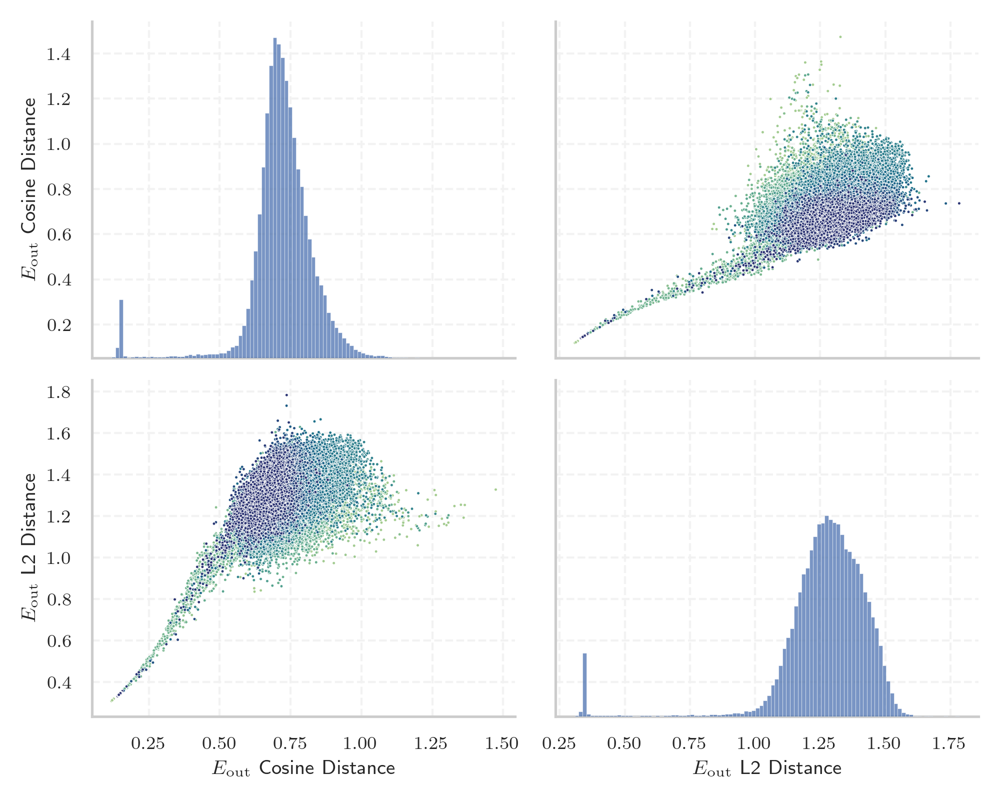

# Report for `Fugaku-LLM/Fugaku-LLM-13B`

## Model info

* Tied embeddings: yes
* LM head uses bias: no
* Indicator for under-trained tokens: Centered E_{out} Cosine Distance
  * Overall distribution 0.992 +/- 0.096
  * Token used for verification prompt building: `FIAsyncOperation`
  * Verification threshold: 0.885
  * Threshold for showing candidate under-trained tokens: 0.679
  * Median verified threshold (for bytes, unreachable and special tokens): 0.666
* Embeddings shape: (49152, 5184)
* Vocabulary size: 48586
  * Number of single byte tokens: 353, of which 111 below indicator threshold
  * Number of special tokens: 8, of which 7 below indicator threshold
  * Number of non-single-byte unreachable tokens: 85, of which 78 below indicator threshold
  * Number of tested under-trained tokens: 964, 964 non-special, 655 below p = 0.01 threshold, 388 below soft indicator threshold

## Under-trained token indicators plot


## Verification plot


## Under-trained token verification results
388 entries below threshold of 0.679

|   token_id | token                        |   indicator | max_prob                                                         |
|------------|------------------------------|-------------|------------------------------------------------------------------|
|       8162 | ````` RESETVALUE `````       |    0.400782 | <span style='border: 1px solid rgb(169, 68, 66);'>0.00027</span> |
|      48436 | ````` \ue964 `````           |    0.40421  | <span style='border: 1px solid rgb(169, 68, 66);'>0.00017</span> |
|       8788 | ````` ▁kGTLR `````           |    0.404621 | <span style='border: 1px solid rgb(169, 68, 66);'>4.9e-05</span> |
|       9707 | ````` regBuiltin `````       |    0.40482  | <span style='border: 1px solid rgb(169, 68, 66);'>8.5e-05</span> |
|       7013 | ````` YYCURSOR `````         |    0.4054   | <span style='border: 1px solid rgb(169, 68, 66);'>0.00022</span> |
|       9301 | ````` ▁GBProperty `````      |    0.405876 | <span style='border: 1px solid rgb(169, 68, 66);'>0.00013</span> |
|      21883 | ````` \u2009\<\u2009 `````   |    0.407652 | <span style='border: 1px solid rgb(169, 68, 66);'>9.7e-05</span> |
|       7853 | ````` DIPSETTING `````       |    0.409625 | <span style='border: 1px solid rgb(169, 68, 66);'>0.00019</span> |
|       9404 | ````` PFNGLTEXCOORD `````    |    0.409788 | <span style='border: 1px solid rgb(169, 68, 66);'>0.00027</span> |
|       9792 | ````` acadoWorkspace `````   |    0.41014  | <span style='border: 1px solid rgb(169, 68, 66);'>0.00018</span> |
|       9876 | ````` ewGetProcAddress ````` |    0.410546 | <span style='border: 1px solid rgb(169, 68, 66);'>0.00026</span> |
|       9972 | ````` CyFunction `````       |    0.411227 | <span style='border: 1px solid rgb(169, 68, 66);'>0.00049</span> |
|       8942 | ````` VERTEXATTRIBI `````    |    0.411295 | <span style='border: 1px solid rgb(169, 68, 66);'>0.00039</span> |
|      16187 | ````` ]--[@ `````            |    0.411457 | <span style='border: 1px solid rgb(169, 68, 66);'>0.00017</span> |
|       7882 | ````` emlrt `````            |    0.413045 | <span style='border: 1px solid rgb(169, 68, 66);'>0.00026</span> |
|       5861 | ````` NimStringDesc `````    |    0.413492 | <span style='border: 1px solid rgb(169, 68, 66);'>0.00027</span> |
|       9613 | ````` OSCENCMD `````         |    0.413731 | <span style='border: 1px solid rgb(169, 68, 66);'>0.00014</span> |
|       8519 | ````` VNVPROC `````          |    0.413764 | <span style='border: 1px solid rgb(169, 68, 66);'>0.00021</span> |
|       9766 | ````` HFPERCLKDIV `````      |    0.413776 | <span style='border: 1px solid rgb(169, 68, 66);'>0.00033</span> |
|       9742 | ````` LiftoffRegister `````  |    0.414052 | <span style='border: 1px solid rgb(169, 68, 66);'>0.00015</span> |
<details><summary>368 additional entries below threshold</summary>

|   token_id | token                        |   indicator | max_prob                                                         | in_other_tokens                                                                                                                                                                                                                                                                                                                                                                                                           |
|------------|------------------------------|-------------|------------------------------------------------------------------|---------------------------------------------------------------------------------------------------------------------------------------------------------------------------------------------------------------------------------------------------------------------------------------------------------------------------------------------------------------------------------------------------------------------------|
|       9611 | ````` marshallOut `````      |    0.414174 | <span style='border: 1px solid rgb(169, 68, 66);'>0.00018</span> |                                                                                                                                                                                                                                                                                                                                                                                                                           |
|       7975 | ````` PQExpBuffer `````      |    0.414389 | <span style='border: 1px solid rgb(169, 68, 66);'>0.00026</span> | <span style='border: 1px solid rgb(169, 68, 66);'>````` ppendPQExpBuffer `````</span>                                                                                                                                                                                                                                                                                                                                     |
|       9188 | ````` MASKWRITE `````        |    0.415337 | <span style='border: 1px solid rgb(169, 68, 66);'>0.00047</span> |                                                                                                                                                                                                                                                                                                                                                                                                                           |
|       8507 | ````` highbd `````           |    0.415444 | <span style='border: 1px solid rgb(169, 68, 66);'>0.00043</span> |                                                                                                                                                                                                                                                                                                                                                                                                                           |
|       9920 | ````` USEBURSTS `````        |    0.416458 | <span style='border: 1px solid rgb(169, 68, 66);'>0.00034</span> |                                                                                                                                                                                                                                                                                                                                                                                                                           |
|       9383 | ````` ▁OMITBAD `````         |    0.417592 | <span style='border: 1px solid rgb(169, 68, 66);'>0.00016</span> |                                                                                                                                                                                                                                                                                                                                                                                                                           |
|       8655 | ````` ▁{&__ `````            |    0.418467 | <span style='border: 1px solid rgb(169, 68, 66);'>0.00014</span> |                                                                                                                                                                                                                                                                                                                                                                                                                           |
|       8989 | ````` PFNGLPROGRAM `````     |    0.418913 | <span style='border: 1px solid rgb(169, 68, 66);'>0.00028</span> |                                                                                                                                                                                                                                                                                                                                                                                                                           |
|       8369 | ````` PROGRAMUNIFORM `````   |    0.419226 | <span style='border: 1px solid rgb(169, 68, 66);'>0.0005</span>  |                                                                                                                                                                                                                                                                                                                                                                                                                           |
|       8975 | ````` FIAsyncOperation ````` |    0.419263 | <span style='border: 1px solid rgb(169, 68, 66);'>0.00015</span> |                                                                                                                                                                                                                                                                                                                                                                                                                           |
|       7825 | ````` SINGLECTRL `````       |    0.419522 | <span style='border: 1px solid rgb(169, 68, 66);'>0.00012</span> |                                                                                                                                                                                                                                                                                                                                                                                                                           |
|       9550 | ````` ▁OMITGOOD `````        |    0.419841 | <span style='border: 1px solid rgb(169, 68, 66);'>0.00032</span> |                                                                                                                                                                                                                                                                                                                                                                                                                           |
|       8095 | ````` ▁sbitmap `````         |    0.419912 | <span style='border: 1px solid rgb(169, 68, 66);'>0.00036</span> |                                                                                                                                                                                                                                                                                                                                                                                                                           |
|       9530 | ````` ▁CYDEV `````           |    0.420703 | <span style='border: 1px solid rgb(169, 68, 66);'>0.0002</span>  |                                                                                                                                                                                                                                                                                                                                                                                                                           |
|       7763 | ````` MagickFalse `````      |    0.420823 | <span style='border: 1px solid rgb(169, 68, 66);'>0.00013</span> |                                                                                                                                                                                                                                                                                                                                                                                                                           |
|       8852 | ````` hcryp `````            |    0.420918 | <span style='border: 1px solid rgb(169, 68, 66);'>0.00047</span> |                                                                                                                                                                                                                                                                                                                                                                                                                           |
|       3886 | ````` ▁PFNGLGET `````        |    0.420963 | <span style='border: 1px solid rgb(255, 145, 0);'>0.0013</span>  |                                                                                                                                                                                                                                                                                                                                                                                                                           |
|       9432 | ````` ▁EZRADIO `````         |    0.42098  | <span style='border: 1px solid rgb(169, 68, 66);'>0.00016</span> |                                                                                                                                                                                                                                                                                                                                                                                                                           |
|       8209 | ````` NIMCALL `````          |    0.421391 | <span style='border: 1px solid rgb(169, 68, 66);'>7.5e-05</span> |                                                                                                                                                                                                                                                                                                                                                                                                                           |
|       9636 | ````` OutcomeCallable `````  |    0.421446 | <span style='border: 1px solid rgb(169, 68, 66);'>0.00027</span> |                                                                                                                                                                                                                                                                                                                                                                                                                           |
|       7775 | ````` DVPROC `````           |    0.421485 | <span style='border: 1px solid rgb(169, 68, 66);'>0.00049</span> |                                                                                                                                                                                                                                                                                                                                                                                                                           |
|       9526 | ````` GetEmptyString `````   |    0.421866 | <span style='border: 1px solid rgb(169, 68, 66);'>0.00023</span> |                                                                                                                                                                                                                                                                                                                                                                                                                           |
|       8339 | ````` ppendPQExpBuffer ````` |    0.422023 | <span style='border: 1px solid rgb(169, 68, 66);'>0.00023</span> |                                                                                                                                                                                                                                                                                                                                                                                                                           |
|       5512 | ````` :%.*]], `````          |    0.423827 | <span style='border: 1px solid rgb(169, 68, 66);'>0.00013</span> |                                                                                                                                                                                                                                                                                                                                                                                                                           |
|       8224 | ````` HFPERCLKEN `````       |    0.42457  | <span style='border: 1px solid rgb(169, 68, 66);'>0.00041</span> |                                                                                                                                                                                                                                                                                                                                                                                                                           |
|       6291 | ````` SIGSEL `````           |    0.424895 | <span style='border: 1px solid rgb(169, 68, 66);'>0.00037</span> |                                                                                                                                                                                                                                                                                                                                                                                                                           |
|       8067 | ````` VEXTPROC `````         |    0.426099 | <span style='border: 1px solid rgb(169, 68, 66);'>0.00054</span> |                                                                                                                                                                                                                                                                                                                                                                                                                           |
|       9389 | ````` HFCORECLKDIV `````     |    0.426361 | <span style='border: 1px solid rgb(169, 68, 66);'>0.00027</span> |                                                                                                                                                                                                                                                                                                                                                                                                                           |
|       9967 | ````` LFCLKSEL `````         |    0.426411 | <span style='border: 1px solid rgb(169, 68, 66);'>0.00011</span> |                                                                                                                                                                                                                                                                                                                                                                                                                           |
|       9819 | ````` TCPWM `````            |    0.426727 | <span style='border: 1px solid rgb(255, 145, 0);'>0.0015</span>  |                                                                                                                                                                                                                                                                                                                                                                                                                           |
|       9953 | ````` mlxsw `````            |    0.426848 | <span style='border: 1px solid rgb(169, 68, 66);'>0.00094</span> |                                                                                                                                                                                                                                                                                                                                                                                                                           |
|       9625 | ````` ftnlen `````           |    0.427236 | <span style='border: 1px solid rgb(255, 145, 0);'>0.0013</span>  |                                                                                                                                                                                                                                                                                                                                                                                                                           |
|       7444 | ````` GLAPIENTRY `````       |    0.427275 | <span style='border: 1px solid rgb(169, 68, 66);'>0.00097</span> |                                                                                                                                                                                                                                                                                                                                                                                                                           |
|       7466 | ````` SLJIT `````            |    0.428024 | <span style='border: 1px solid rgb(255, 145, 0);'>0.0012</span>  |                                                                                                                                                                                                                                                                                                                                                                                                                           |
|       5311 | ````` FNGLVERTEXATTRIB ````` |    0.428859 | <span style='border: 1px solid rgb(169, 68, 66);'>0.00022</span> |                                                                                                                                                                                                                                                                                                                                                                                                                           |
|       7443 | ````` UIVPROC `````          |    0.42888  | <span style='border: 1px solid rgb(169, 68, 66);'>0.00094</span> |                                                                                                                                                                                                                                                                                                                                                                                                                           |
|       7306 | ````` PFNGLUNIFORM `````     |    0.429792 | <span style='border: 1px solid rgb(169, 68, 66);'>0.00039</span> |                                                                                                                                                                                                                                                                                                                                                                                                                           |
|       8440 | ````` ntDefaultHandler ````` |    0.430677 | <span style='border: 1px solid rgb(169, 68, 66);'>0.00032</span> |                                                                                                                                                                                                                                                                                                                                                                                                                           |
|       9553 | ````` lreadyInited `````     |    0.430845 | <span style='border: 1px solid rgb(169, 68, 66);'>0.00032</span> |                                                                                                                                                                                                                                                                                                                                                                                                                           |
|       8903 | ````` appendStringInfo ````` |    0.431837 | <span style='border: 1px solid rgb(169, 68, 66);'>0.00016</span> |                                                                                                                                                                                                                                                                                                                                                                                                                           |
|       6352 | ````` ▁GTLR `````            |    0.431872 | <span style='border: 1px solid rgb(169, 68, 66);'>0.00037</span> |                                                                                                                                                                                                                                                                                                                                                                                                                           |
|       8754 | ````` AsyncCaller `````      |    0.432981 | <span style='border: 1px solid rgb(169, 68, 66);'>0.00076</span> |                                                                                                                                                                                                                                                                                                                                                                                                                           |
|       6980 | ````` INPUTSEL `````         |    0.433377 | <span style='border: 1px solid rgb(169, 68, 66);'>0.00042</span> |                                                                                                                                                                                                                                                                                                                                                                                                                           |
|       4948 | ````` ▁classdump `````       |    0.434496 | <span style='border: 1px solid rgb(169, 68, 66);'>0.00029</span> |                                                                                                                                                                                                                                                                                                                                                                                                                           |
|       9260 | ````` VARBPROC `````         |    0.434795 | <span style='border: 1px solid rgb(255, 145, 0);'>0.0017</span>  |                                                                                                                                                                                                                                                                                                                                                                                                                           |
|       6535 | ````` FVPROC `````           |    0.435697 | <span style='border: 1px solid rgb(255, 145, 0);'>0.0015</span>  |                                                                                                                                                                                                                                                                                                                                                                                                                           |
|       6459 | ````` NVPROC `````           |    0.436107 | <span style='border: 1px solid rgb(169, 68, 66);'>0.00031</span> | <span style='border: 1px solid rgb(169, 68, 66);'>````` VNVPROC `````</span>                                                                                                                                                                                                                                                                                                                                              |
|      37016 | ````` \u3000>> `````         |    0.437019 | <span style='border: 1px solid rgb(255, 145, 0);'>0.0012</span>  |                                                                                                                                                                                                                                                                                                                                                                                                                           |
|       8758 | ````` UNIFORMMATRIX `````    |    0.438274 | <span style='border: 1px solid rgb(255, 145, 0);'>0.004</span>   |                                                                                                                                                                                                                                                                                                                                                                                                                           |
|       8006 | ````` typval `````           |    0.438364 | <span style='border: 1px solid rgb(255, 145, 0);'>0.0014</span>  |                                                                                                                                                                                                                                                                                                                                                                                                                           |
|       9133 | ````` CALCTRL `````          |    0.43971  | <span style='border: 1px solid rgb(169, 68, 66);'>0.00041</span> |                                                                                                                                                                                                                                                                                                                                                                                                                           |
|       8681 | ````` MULTITEXCOORD `````    |    0.440511 | <span style='border: 1px solid rgb(255, 145, 0);'>0.0016</span>  |                                                                                                                                                                                                                                                                                                                                                                                                                           |
|       5172 | ````` :%.*]] `````           |    0.440893 | <span style='border: 1px solid rgb(255, 145, 0);'>0.0019</span>  | <span style='border: 1px solid rgb(169, 68, 66);'>````` :%.*]], `````</span>                                                                                                                                                                                                                                                                                                                                              |
|       5715 | ````` joaat `````            |    0.441002 | <span style='border: 1px solid rgb(255, 145, 0);'>0.0011</span>  |                                                                                                                                                                                                                                                                                                                                                                                                                           |
|       6061 | ````` IVPROC `````           |    0.441295 | <span style='border: 1px solid rgb(169, 68, 66);'>0.00097</span> | <span style='border: 1px solid rgb(169, 68, 66);'>````` UIVPROC `````</span>                                                                                                                                                                                                                                                                                                                                              |
|       9752 | ````` rehasher `````         |    0.441658 | <span style='border: 1px solid rgb(169, 68, 66);'>0.00092</span> |                                                                                                                                                                                                                                                                                                                                                                                                                           |
|       7003 | ````` LETIMER `````          |    0.444935 | <span style='border: 1px solid rgb(255, 145, 0);'>0.0016</span>  |                                                                                                                                                                                                                                                                                                                                                                                                                           |
|       9882 | ````` memviewslice `````     |    0.447973 | <span style='border: 1px solid rgb(255, 145, 0);'>0.0012</span>  |                                                                                                                                                                                                                                                                                                                                                                                                                           |
|       9837 | ````` glSecondaryColor ````` |    0.448395 | <span style='border: 1px solid rgb(169, 68, 66);'>0.00056</span> |                                                                                                                                                                                                                                                                                                                                                                                                                           |
|       9451 | ````` PFNGLBIND `````        |    0.448746 | <span style='border: 1px solid rgb(169, 68, 66);'>8e-05</span>   |                                                                                                                                                                                                                                                                                                                                                                                                                           |
|       5734 | ````` ▁uLocal `````          |    0.451916 | <span style='border: 1px solid rgb(169, 68, 66);'>0.00015</span> |                                                                                                                                                                                                                                                                                                                                                                                                                           |
|       8165 | ````` vwsn `````             |    0.45405  | <span style='border: 1px solid rgb(169, 68, 66);'>0.00058</span> |                                                                                                                                                                                                                                                                                                                                                                                                                           |
|       7196 | ````` ▁PGUID `````           |    0.454791 | <span style='border: 1px solid rgb(169, 68, 66);'>0.00076</span> |                                                                                                                                                                                                                                                                                                                                                                                                                           |
|       8889 | ````` ▁COBJMACROS `````      |    0.454948 | <span style='border: 1px solid rgb(169, 68, 66);'>0.00011</span> |                                                                                                                                                                                                                                                                                                                                                                                                                           |
|       9788 | ````` POSSEL `````           |    0.455392 | <span style='border: 1px solid rgb(169, 68, 66);'>0.00029</span> |                                                                                                                                                                                                                                                                                                                                                                                                                           |
|       8962 | ````` UIPROC `````           |    0.456012 | <span style='border: 1px solid rgb(169, 68, 66);'>0.00033</span> |                                                                                                                                                                                                                                                                                                                                                                                                                           |
|       9280 | ````` GetArena `````         |    0.457389 | <span style='border: 1px solid rgb(169, 68, 66);'>0.00061</span> |                                                                                                                                                                                                                                                                                                                                                                                                                           |
|       1801 | ````` APIENTRYP `````        |    0.457428 | <span style='border: 1px solid rgb(169, 68, 66);'>0.00077</span> |                                                                                                                                                                                                                                                                                                                                                                                                                           |
|      45996 | ````` イランドキッチン ````` |    0.458187 | <span style='border: 1px solid rgb(169, 68, 66);'>0.00029</span> |                                                                                                                                                                                                                                                                                                                                                                                                                           |
|       5214 | ````` RefNanny `````         |    0.460687 | <span style='border: 1px solid rgb(169, 68, 66);'>0.00054</span> |                                                                                                                                                                                                                                                                                                                                                                                                                           |
|       3091 | ````` NRFX `````             |    0.465497 | <span style='border: 1px solid rgb(169, 68, 66);'>0.0003</span>  |                                                                                                                                                                                                                                                                                                                                                                                                                           |
|       7898 | ````` yyvsp `````            |    0.467166 | <span style='border: 1px solid rgb(255, 145, 0);'>0.0015</span>  |                                                                                                                                                                                                                                                                                                                                                                                                                           |
|      40481 | ````` rackBack `````         |    0.469232 | <span style='border: 1px solid rgb(169, 68, 66);'>0.00036</span> |                                                                                                                                                                                                                                                                                                                                                                                                                           |
|       9030 | ````` NEGSEL `````           |    0.469768 | <span style='border: 1px solid rgb(169, 68, 66);'>0.00073</span> |                                                                                                                                                                                                                                                                                                                                                                                                                           |
|       3367 | ````` ▁WTIMER `````          |    0.47036  | <span style='border: 1px solid rgb(255, 145, 0);'>0.0051</span>  |                                                                                                                                                                                                                                                                                                                                                                                                                           |
|       6854 | ````` PFNGLGET `````         |    0.471609 | <span style='border: 1px solid rgb(169, 68, 66);'>0.00023</span> |                                                                                                                                                                                                                                                                                                                                                                                                                           |
|       9561 | ````` DTPRS `````            |    0.472232 | <span style='border: 1px solid rgb(255, 145, 0);'>0.0015</span>  |                                                                                                                                                                                                                                                                                                                                                                                                                           |
|       5175 | ````` LESENSE `````          |    0.474723 | <span style='border: 1px solid rgb(169, 68, 66);'>0.00058</span> |                                                                                                                                                                                                                                                                                                                                                                                                                           |
|       7704 | ````` BORINGSSL `````        |    0.478754 | <span style='border: 1px solid rgb(255, 145, 0);'>0.0018</span>  |                                                                                                                                                                                                                                                                                                                                                                                                                           |
|       9157 | ````` FinishContext `````    |    0.481017 | <span style='border: 1px solid rgb(251, 189, 8);'>0.056</span>   |                                                                                                                                                                                                                                                                                                                                                                                                                           |
|       9575 | ````` RpcChannelBuffer ````` |    0.482879 | <span style='border: 1px solid rgb(169, 68, 66);'>0.00042</span> |                                                                                                                                                                                                                                                                                                                                                                                                                           |
|       6454 | ````` */]. `````             |    0.485185 | <span style='border: 1px solid rgb(169, 68, 66);'>0.00026</span> |                                                                                                                                                                                                                                                                                                                                                                                                                           |
|       5536 | ````` ZEPHIR `````           |    0.485974 | <span style='border: 1px solid rgb(169, 68, 66);'>8.7e-05</span> |                                                                                                                                                                                                                                                                                                                                                                                                                           |
|       6581 | ````` PINMUX `````           |    0.489142 | <span style='border: 1px solid rgb(169, 68, 66);'>0.00054</span> |                                                                                                                                                                                                                                                                                                                                                                                                                           |
|      48142 | ````` \ue075 `````           |    0.490284 | <span style='border: 1px solid rgb(255, 145, 0);'>0.001</span>   |                                                                                                                                                                                                                                                                                                                                                                                                                           |
|       8844 | ````` XDMAC `````            |    0.490614 | <span style='border: 1px solid rgb(169, 68, 66);'>6.1e-05</span> |                                                                                                                                                                                                                                                                                                                                                                                                                           |
|       7283 | ````` dsverifier `````       |    0.493826 | <span style='border: 1px solid rgb(169, 68, 66);'>0.00034</span> |                                                                                                                                                                                                                                                                                                                                                                                                                           |
|       1705 | ````` ▁GLAPI `````           |    0.496721 | <span style='border: 1px solid rgb(169, 68, 66);'>0.00021</span> |                                                                                                                                                                                                                                                                                                                                                                                                                           |
|       6453 | ````` HRTIM `````            |    0.49826  | <span style='border: 1px solid rgb(169, 68, 66);'>0.00027</span> |                                                                                                                                                                                                                                                                                                                                                                                                                           |
|      47915 | ````` ローリークエスト ````` |    0.498522 | <span style='border: 1px solid rgb(169, 68, 66);'>0.0006</span>  |                                                                                                                                                                                                                                                                                                                                                                                                                           |
|       9659 | ````` MonoMethod `````       |    0.499327 | <span style='border: 1px solid rgb(169, 68, 66);'>0.00012</span> |                                                                                                                                                                                                                                                                                                                                                                                                                           |
|       5084 | ````` TSRMLS `````           |    0.499503 | <span style='border: 1px solid rgb(169, 68, 66);'>0.0003</span>  |                                                                                                                                                                                                                                                                                                                                                                                                                           |
|       3063 | ````` ROUTELOC `````         |    0.499744 | <span style='border: 1px solid rgb(169, 68, 66);'>0.00012</span> |                                                                                                                                                                                                                                                                                                                                                                                                                           |
|       7821 | ````` IXGBE `````            |    0.500962 | <span style='border: 1px solid rgb(255, 145, 0);'>0.0017</span>  |                                                                                                                                                                                                                                                                                                                                                                                                                           |
|       6945 | ````` xabababab `````        |    0.50533  | <span style='border: 1px solid rgb(169, 68, 66);'>0.00012</span> |                                                                                                                                                                                                                                                                                                                                                                                                                           |
|       3182 | ````` HasBeenSet `````       |    0.505674 | <span style='border: 1px solid rgb(255, 145, 0);'>0.0014</span>  |                                                                                                                                                                                                                                                                                                                                                                                                                           |
|       9610 | ````` tupdesc `````          |    0.50687  | <span style='border: 1px solid rgb(169, 68, 66);'>0.0001</span>  |                                                                                                                                                                                                                                                                                                                                                                                                                           |
|       6613 | ````` LEUART `````           |    0.508408 | <span style='border: 1px solid rgb(169, 68, 66);'>0.00042</span> |                                                                                                                                                                                                                                                                                                                                                                                                                           |
|       9320 | ````` Vdbe `````             |    0.508661 | <span style='border: 1px solid rgb(169, 68, 66);'>3.3e-05</span> |                                                                                                                                                                                                                                                                                                                                                                                                                           |
|       4849 | ````` ▁//========== `````    |    0.509486 | <span style='border: 1px solid rgb(169, 68, 66);'>6.9e-05</span> | <span style='border: 1px solid rgb(169, 68, 66);'>````` ▁//============= `````</span>                                                                                                                                                                                                                                                                                                                                     |
|       9704 | ````` glWindowPos `````      |    0.510636 | <span style='border: 1px solid rgb(255, 145, 0);'>0.0012</span>  |                                                                                                                                                                                                                                                                                                                                                                                                                           |
|      10008 | ````` tySequence `````       |    0.512857 | <span style='border: 1px solid rgb(169, 68, 66);'>0.00017</span> |                                                                                                                                                                                                                                                                                                                                                                                                                           |
|       9989 | ````` GASNET `````           |    0.514112 | <span style='border: 1px solid rgb(169, 68, 66);'>1.7e-05</span> |                                                                                                                                                                                                                                                                                                                                                                                                                           |
|       9298 | ````` SEQAN `````            |    0.516474 | <span style='border: 1px solid rgb(169, 68, 66);'>0.00011</span> |                                                                                                                                                                                                                                                                                                                                                                                                                           |
|       8264 | ````` GetDatum `````         |    0.517123 | <span style='border: 1px solid rgb(169, 68, 66);'>0.00039</span> |                                                                                                                                                                                                                                                                                                                                                                                                                           |
|       9080 | ````` ▁smartlist `````       |    0.517241 | <span style='border: 1px solid rgb(255, 145, 0);'>0.0018</span>  |                                                                                                                                                                                                                                                                                                                                                                                                                           |
|       9380 | ````` SAADC `````            |    0.517696 | <span style='border: 1px solid rgb(169, 68, 66);'>0.00022</span> |                                                                                                                                                                                                                                                                                                                                                                                                                           |
|      37274 | ````` \|\u3000\| `````       |    0.518081 | <span style='border: 1px solid rgb(251, 189, 8);'>0.054</span>   |                                                                                                                                                                                                                                                                                                                                                                                                                           |
|       8979 | ````` ▁MICROPY `````         |    0.518885 | <span style='border: 1px solid rgb(255, 145, 0);'>0.001</span>   |                                                                                                                                                                                                                                                                                                                                                                                                                           |
|       6849 | ````` VPROC `````            |    0.519035 | <span style='border: 1px solid rgb(169, 68, 66);'>0.00042</span> | <span style='border: 1px solid rgb(169, 68, 66);'>````` VNVPROC `````</span>, <span style='border: 1px solid rgb(169, 68, 66);'>````` UIVPROC `````</span>, <span style='border: 1px solid rgb(169, 68, 66);'>````` DVPROC `````</span>                                                                                                                                                                                   |
|      46381 | ````` /\u3000/ `````         |    0.519424 | <span style='border: 1px solid rgb(255, 145, 0);'>0.0047</span>  |                                                                                                                                                                                                                                                                                                                                                                                                                           |
|       9699 | ````` INVALC `````           |    0.519447 | <span style='border: 1px solid rgb(169, 68, 66);'>5.2e-05</span> |                                                                                                                                                                                                                                                                                                                                                                                                                           |
|       9834 | ````` SWIER `````            |    0.520409 | <span style='border: 1px solid rgb(169, 68, 66);'>7.5e-07</span> |                                                                                                                                                                                                                                                                                                                                                                                                                           |
|       1304 | ````` ▁PFNGL `````           |    0.520669 | <span style='border: 1px solid rgb(251, 189, 8);'>0.053</span>   | <span style='border: 1px solid rgb(255, 145, 0);'>````` ▁PFNGLGET `````</span>                                                                                                                                                                                                                                                                                                                                            |
|       8901 | ````` IMETHOD `````          |    0.521506 | <span style='border: 1px solid rgb(169, 68, 66);'>0.00012</span> |                                                                                                                                                                                                                                                                                                                                                                                                                           |
|       7169 | ````` TAILQ `````            |    0.522439 | <span style='border: 1px solid rgb(169, 68, 66);'>2.6e-05</span> |                                                                                                                                                                                                                                                                                                                                                                                                                           |
|       8682 | ````` cnfn `````             |    0.523542 | <span style='border: 1px solid rgb(169, 68, 66);'>0.00067</span> |                                                                                                                                                                                                                                                                                                                                                                                                                           |
|       9782 | ````` GNSP `````             |    0.524066 | <span style='border: 1px solid rgb(255, 145, 0);'>0.0012</span>  |                                                                                                                                                                                                                                                                                                                                                                                                                           |
|      40969 | ````` セクフレ `````         |    0.524194 | <span style='border: 1px solid rgb(169, 68, 66);'>6.8e-05</span> |                                                                                                                                                                                                                                                                                                                                                                                                                           |
|       6592 | ````` curbuf `````           |    0.524824 | <span style='border: 1px solid rgb(169, 68, 66);'>0.00016</span> |                                                                                                                                                                                                                                                                                                                                                                                                                           |
|       5892 | ````` chartInstance `````    |    0.525077 | <span style='border: 1px solid rgb(169, 68, 66);'>0.00073</span> |                                                                                                                                                                                                                                                                                                                                                                                                                           |
|       9237 | ````` darkskin `````         |    0.525514 | <span style='border: 1px solid rgb(169, 68, 66);'>2.2e-05</span> |                                                                                                                                                                                                                                                                                                                                                                                                                           |
|       7913 | ````` ARBPROC `````          |    0.52801  | <span style='border: 1px solid rgb(169, 68, 66);'>0.00086</span> | <span style='border: 1px solid rgb(255, 145, 0);'>````` VARBPROC `````</span>                                                                                                                                                                                                                                                                                                                                             |
|       7162 | ````` avctx `````            |    0.528674 | <span style='border: 1px solid rgb(169, 68, 66);'>0.00074</span> |                                                                                                                                                                                                                                                                                                                                                                                                                           |
|       9630 | ````` EXTICR `````           |    0.530734 | <span style='border: 1px solid rgb(169, 68, 66);'>3.7e-07</span> |                                                                                                                                                                                                                                                                                                                                                                                                                           |
|       9233 | ````` DFSDM `````            |    0.53087  | <span style='border: 1px solid rgb(169, 68, 66);'>5.4e-06</span> |                                                                                                                                                                                                                                                                                                                                                                                                                           |
|      46346 | ````` ライクリーニング ````` |    0.533071 | <span style='border: 1px solid rgb(169, 68, 66);'>0.00048</span> |                                                                                                                                                                                                                                                                                                                                                                                                                           |
|       8005 | ````` padapter `````         |    0.533735 | <span style='border: 1px solid rgb(169, 68, 66);'>0.00012</span> |                                                                                                                                                                                                                                                                                                                                                                                                                           |
|       9829 | ````` PLLSAI `````           |    0.534645 | <span style='border: 1px solid rgb(169, 68, 66);'>0.00054</span> |                                                                                                                                                                                                                                                                                                                                                                                                                           |
|       6947 | ````` HeapTuple `````        |    0.535027 | <span style='border: 1px solid rgb(169, 68, 66);'>9.7e-06</span> |                                                                                                                                                                                                                                                                                                                                                                                                                           |
|       9491 | ````` EXTIPSEL `````         |    0.535396 | <span style='border: 1px solid rgb(169, 68, 66);'>8.5e-05</span> |                                                                                                                                                                                                                                                                                                                                                                                                                           |
|       7541 | ````` AUXHFRCO `````         |    0.535883 | <span style='border: 1px solid rgb(169, 68, 66);'>1.1e-05</span> |                                                                                                                                                                                                                                                                                                                                                                                                                           |
|       8566 | ````` EXTINT `````           |    0.536161 | <span style='border: 1px solid rgb(169, 68, 66);'>8.2e-05</span> |                                                                                                                                                                                                                                                                                                                                                                                                                           |
|       5898 | ````` sqInt `````            |    0.537651 | <span style='border: 1px solid rgb(255, 145, 0);'>0.0014</span>  |                                                                                                                                                                                                                                                                                                                                                                                                                           |
|      25828 | ````` [\*](# `````           |    0.538258 | <span style='border: 1px solid rgb(169, 68, 66);'>0.00093</span> |                                                                                                                                                                                                                                                                                                                                                                                                                           |
|       2828 | ````` PFNGL `````            |    0.538755 | <span style='border: 1px solid rgb(169, 68, 66);'>0.00044</span> | <span style='border: 1px solid rgb(169, 68, 66);'>````` PFNGLUNIFORM `````</span>, <span style='border: 1px solid rgb(255, 145, 0);'>````` ▁PFNGLGET `````</span>, <span style='border: 1px solid rgb(169, 68, 66);'>````` PFNGLTEXCOORD `````</span>, <span style='border: 1px solid rgb(169, 68, 66);'>````` PFNGLBIND `````</span>, <span style='border: 1px solid rgb(169, 68, 66);'>````` PFNGLGET `````</span>, ... |
|       7271 | ````` sysbios `````          |    0.53928  | <span style='border: 1px solid rgb(169, 68, 66);'>0.00018</span> |                                                                                                                                                                                                                                                                                                                                                                                                                           |
|       7280 | ````` WOLFSSL `````          |    0.539583 | <span style='border: 1px solid rgb(169, 68, 66);'>5.4e-06</span> |                                                                                                                                                                                                                                                                                                                                                                                                                           |
|       8266 | ````` vreinterpret `````     |    0.541913 | <span style='border: 1px solid rgb(169, 68, 66);'>8.3e-05</span> |                                                                                                                                                                                                                                                                                                                                                                                                                           |
|       9051 | ````` ▁debugstr `````        |    0.543334 | <span style='border: 1px solid rgb(255, 145, 0);'>0.0021</span>  |                                                                                                                                                                                                                                                                                                                                                                                                                           |
|      33875 | ````` \|\u3000 `````         |    0.546644 | <span style='border: 1px solid rgb(255, 145, 0);'>0.0024</span>  | <span style='border: 1px solid rgb(40, 167, 69);'>````` \u3000\|\u3000 `````</span>, <span style='border: 1px solid rgb(251, 189, 8);'>````` \|\u3000\| `````</span>                                                                                                                                                                                                                                                      |
|       7960 | ````` glVertexAttribI `````  |    0.547874 | <span style='border: 1px solid rgb(169, 68, 66);'>0.00084</span> |                                                                                                                                                                                                                                                                                                                                                                                                                           |
|       9132 | ````` QDEC `````             |    0.548408 | <span style='border: 1px solid rgb(169, 68, 66);'>0.00012</span> |                                                                                                                                                                                                                                                                                                                                                                                                                           |
|       9126 | ````` xfffffffd `````        |    0.550523 | <span style='border: 1px solid rgb(169, 68, 66);'>0.00015</span> |                                                                                                                                                                                                                                                                                                                                                                                                                           |
|       5208 | ````` glProgramUniform ````` |    0.551083 | <span style='border: 1px solid rgb(255, 145, 0);'>0.0014</span>  |                                                                                                                                                                                                                                                                                                                                                                                                                           |
|       6899 | ````` glMultiTexCoord `````  |    0.551139 | <span style='border: 1px solid rgb(169, 68, 66);'>0.00016</span> |                                                                                                                                                                                                                                                                                                                                                                                                                           |
|       8815 | ````` DTFC `````             |    0.551503 | <span style='border: 1px solid rgb(169, 68, 66);'>0.00028</span> |                                                                                                                                                                                                                                                                                                                                                                                                                           |
|       9825 | ````` XCVR `````             |    0.552498 | <span style='border: 1px solid rgb(169, 68, 66);'>0.00011</span> |                                                                                                                                                                                                                                                                                                                                                                                                                           |
|       7473 | ````` SIMDE `````            |    0.553125 | <span style='border: 1px solid rgb(169, 68, 66);'>0.00027</span> |                                                                                                                                                                                                                                                                                                                                                                                                                           |
|       9596 | ````` ShiftMask `````        |    0.553308 | <span style='border: 1px solid rgb(169, 68, 66);'>0.0008</span>  |                                                                                                                                                                                                                                                                                                                                                                                                                           |
|       6801 | ````` clineno `````          |    0.553311 | <span style='border: 1px solid rgb(169, 68, 66);'>0.00023</span> |                                                                                                                                                                                                                                                                                                                                                                                                                           |
|       9438 | ````` DBGMCU `````           |    0.55578  | <span style='border: 1px solid rgb(169, 68, 66);'>0.00083</span> |                                                                                                                                                                                                                                                                                                                                                                                                                           |
|       8030 | ````` SYNCBUSY `````         |    0.557084 | <span style='border: 1px solid rgb(169, 68, 66);'>8.2e-06</span> |                                                                                                                                                                                                                                                                                                                                                                                                                           |
|       2937 | ````` WTIMER `````           |    0.557618 | <span style='border: 1px solid rgb(169, 68, 66);'>1.9e-05</span> | <span style='border: 1px solid rgb(255, 145, 0);'>````` ▁WTIMER `````</span>                                                                                                                                                                                                                                                                                                                                              |
|       6472 | ````` LFRCO `````            |    0.559091 | <span style='border: 1px solid rgb(169, 68, 66);'>0.00067</span> |                                                                                                                                                                                                                                                                                                                                                                                                                           |
|       9270 | ````` SetupContext `````     |    0.55933  | <span style='border: 1px solid rgb(169, 68, 66);'>0.00049</span> |                                                                                                                                                                                                                                                                                                                                                                                                                           |
|       9690 | ````` ▁MODKEY `````          |    0.559348 | <span style='border: 1px solid rgb(255, 145, 0);'>0.0049</span>  |                                                                                                                                                                                                                                                                                                                                                                                                                           |
|       7584 | ````` argvars `````          |    0.559381 | <span style='border: 1px solid rgb(169, 68, 66);'>0.00019</span> |                                                                                                                                                                                                                                                                                                                                                                                                                           |
|       9952 | ````` gdbarch `````          |    0.56018  | <span style='border: 1px solid rgb(169, 68, 66);'>2.7e-05</span> |                                                                                                                                                                                                                                                                                                                                                                                                                           |
|       7226 | ````` GIVEREF `````          |    0.56072  | <span style='border: 1px solid rgb(169, 68, 66);'>0.00015</span> |                                                                                                                                                                                                                                                                                                                                                                                                                           |
|       8063 | ````` PRSSEL `````           |    0.561472 | <span style='border: 1px solid rgb(169, 68, 66);'>3.3e-05</span> |                                                                                                                                                                                                                                                                                                                                                                                                                           |
|       7472 | ````` LIBXSMM `````          |    0.564129 | <span style='border: 1px solid rgb(169, 68, 66);'>5.2e-05</span> |                                                                                                                                                                                                                                                                                                                                                                                                                           |
|       9128 | ````` mtoll `````            |    0.565872 | <span style='border: 1px solid rgb(169, 68, 66);'>8e-05</span>   |                                                                                                                                                                                                                                                                                                                                                                                                                           |
|       9429 | ````` IMXRT `````            |    0.566659 | <span style='border: 1px solid rgb(251, 189, 8);'>0.013</span>   |                                                                                                                                                                                                                                                                                                                                                                                                                           |
|       6044 | ````` HFRCO `````            |    0.567391 | <span style='border: 1px solid rgb(169, 68, 66);'>0.00021</span> | <span style='border: 1px solid rgb(169, 68, 66);'>````` AUXHFRCO `````</span>                                                                                                                                                                                                                                                                                                                                             |
|       9793 | ````` GPIOTE `````           |    0.569546 | <span style='border: 1px solid rgb(255, 145, 0);'>0.0011</span>  |                                                                                                                                                                                                                                                                                                                                                                                                                           |
|       7433 | ````` pybuffer `````         |    0.570718 | <span style='border: 1px solid rgb(169, 68, 66);'>6.6e-05</span> |                                                                                                                                                                                                                                                                                                                                                                                                                           |
|       8304 | ````` GenTree `````          |    0.571908 | <span style='border: 1px solid rgb(255, 145, 0);'>0.0024</span>  |                                                                                                                                                                                                                                                                                                                                                                                                                           |
|       9747 | ````` NamedFramebuffer ````` |    0.572042 | <span style='border: 1px solid rgb(255, 145, 0);'>0.0019</span>  |                                                                                                                                                                                                                                                                                                                                                                                                                           |
|       7570 | ````` HFCLK `````            |    0.572591 | <span style='border: 1px solid rgb(169, 68, 66);'>0.00016</span> |                                                                                                                                                                                                                                                                                                                                                                                                                           |
|       7565 | ````` drvdata `````          |    0.572692 | <span style='border: 1px solid rgb(169, 68, 66);'>1.5e-05</span> |                                                                                                                                                                                                                                                                                                                                                                                                                           |
|       8879 | ````` ▁stbt `````            |    0.573111 | <span style='border: 1px solid rgb(255, 145, 0);'>0.0052</span>  |                                                                                                                                                                                                                                                                                                                                                                                                                           |
|       9122 | ````` xmlChar `````          |    0.574272 | <span style='border: 1px solid rgb(169, 68, 66);'>8.7e-06</span> |                                                                                                                                                                                                                                                                                                                                                                                                                           |
|       8834 | ````` ************//** ````` |    0.574482 | <span style='border: 1px solid rgb(169, 68, 66);'>0.00091</span> |                                                                                                                                                                                                                                                                                                                                                                                                                           |
|       6329 | ````` LPTIM `````            |    0.575001 | <span style='border: 1px solid rgb(169, 68, 66);'>0.00024</span> |                                                                                                                                                                                                                                                                                                                                                                                                                           |
|       9645 | ````` ▁JNIEXPORT `````       |    0.57537  | <span style='border: 1px solid rgb(169, 68, 66);'>0.00058</span> |                                                                                                                                                                                                                                                                                                                                                                                                                           |
|       6844 | ````` SDMMC `````            |    0.57548  | <span style='border: 1px solid rgb(255, 145, 0);'>0.0051</span>  |                                                                                                                                                                                                                                                                                                                                                                                                                           |
|      40282 | ````` MOODYZ `````           |    0.576625 | <span style='border: 1px solid rgb(251, 189, 8);'>0.031</span>   |                                                                                                                                                                                                                                                                                                                                                                                                                           |
|       7507 | ````` StatusTypeDef `````    |    0.577178 | <span style='border: 1px solid rgb(169, 68, 66);'>6.7e-05</span> |                                                                                                                                                                                                                                                                                                                                                                                                                           |
|       7944 | ````` InstancePtr `````      |    0.577265 | <span style='border: 1px solid rgb(255, 145, 0);'>0.0035</span>  |                                                                                                                                                                                                                                                                                                                                                                                                                           |
|       8229 | ````` APIENTRY `````         |    0.578521 | <span style='border: 1px solid rgb(169, 68, 66);'>0.0004</span>  |                                                                                                                                                                                                                                                                                                                                                                                                                           |
|       7576 | ````` esbmc `````            |    0.579502 | <span style='border: 1px solid rgb(169, 68, 66);'>2.7e-05</span> |                                                                                                                                                                                                                                                                                                                                                                                                                           |
|       9414 | ````` WWDG `````             |    0.579611 | <span style='border: 1px solid rgb(255, 145, 0);'>0.0037</span>  |                                                                                                                                                                                                                                                                                                                                                                                                                           |
|       3954 | ````` kInstruction `````     |    0.579898 | <span style='border: 1px solid rgb(255, 145, 0);'>0.0052</span>  |                                                                                                                                                                                                                                                                                                                                                                                                                           |
|       9938 | ````` glCompressed `````     |    0.58019  | <span style='border: 1px solid rgb(169, 68, 66);'>0.00064</span> |                                                                                                                                                                                                                                                                                                                                                                                                                           |
|       9844 | ````` PQgetvalue `````       |    0.581194 | <span style='border: 1px solid rgb(169, 68, 66);'>5.4e-05</span> |                                                                                                                                                                                                                                                                                                                                                                                                                           |
|       9334 | ````` DMAMUX `````           |    0.582081 | <span style='border: 1px solid rgb(169, 68, 66);'>9.4e-06</span> |                                                                                                                                                                                                                                                                                                                                                                                                                           |
|       9905 | ````` MspInit `````          |    0.582131 | <span style='border: 1px solid rgb(251, 189, 8);'>0.011</span>   |                                                                                                                                                                                                                                                                                                                                                                                                                           |
|       9419 | ````` DAPM `````             |    0.583124 | <span style='border: 1px solid rgb(169, 68, 66);'>0.00037</span> |                                                                                                                                                                                                                                                                                                                                                                                                                           |
|       9981 | ````` BSLS `````             |    0.584532 | <span style='border: 1px solid rgb(255, 145, 0);'>0.0013</span>  |                                                                                                                                                                                                                                                                                                                                                                                                                           |
|       3346 | ````` StringCopy `````       |    0.585538 | <span style='border: 1px solid rgb(169, 68, 66);'>0.00069</span> |                                                                                                                                                                                                                                                                                                                                                                                                                           |
|       5416 | ````` PRSCH `````            |    0.585739 | <span style='border: 1px solid rgb(169, 68, 66);'>2.4e-05</span> |                                                                                                                                                                                                                                                                                                                                                                                                                           |
|       8101 | ````` PRIu `````             |    0.586068 | <span style='border: 1px solid rgb(169, 68, 66);'>3.3e-05</span> |                                                                                                                                                                                                                                                                                                                                                                                                                           |
|       6970 | ````` DECLSPEC `````         |    0.586643 | <span style='border: 1px solid rgb(169, 68, 66);'>0.0002</span>  |                                                                                                                                                                                                                                                                                                                                                                                                                           |
|       4321 | ````` GOTREF `````           |    0.587022 | <span style='border: 1px solid rgb(169, 68, 66);'>0.00018</span> |                                                                                                                                                                                                                                                                                                                                                                                                                           |
|       8573 | ````` EVSYS `````            |    0.588448 | <span style='border: 1px solid rgb(169, 68, 66);'>1.3e-05</span> |                                                                                                                                                                                                                                                                                                                                                                                                                           |
|       9495 | ````` glTexture `````        |    0.58846  | <span style='border: 1px solid rgb(255, 145, 0);'>0.0011</span>  |                                                                                                                                                                                                                                                                                                                                                                                                                           |
|       9772 | ````` ▁XPAR `````            |    0.589353 | <span style='border: 1px solid rgb(169, 68, 66);'>0.00032</span> |                                                                                                                                                                                                                                                                                                                                                                                                                           |
|       7653 | ````` ZSTR `````             |    0.591646 | <span style='border: 1px solid rgb(255, 145, 0);'>0.0079</span>  |                                                                                                                                                                                                                                                                                                                                                                                                                           |
|       9197 | ````` wiphy `````            |    0.592445 | <span style='border: 1px solid rgb(169, 68, 66);'>0.00048</span> |                                                                                                                                                                                                                                                                                                                                                                                                                           |
|       8579 | ````` ▁VTSS `````            |    0.594448 | <span style='border: 1px solid rgb(255, 145, 0);'>0.0021</span>  |                                                                                                                                                                                                                                                                                                                                                                                                                           |
|       6972 | ````` MAVLINK `````          |    0.594496 | <span style='border: 1px solid rgb(255, 145, 0);'>0.0027</span>  |                                                                                                                                                                                                                                                                                                                                                                                                                           |
|       8670 | ````` ▁NoneT `````           |    0.595008 | <span style='border: 1px solid rgb(169, 68, 66);'>2.2e-05</span> |                                                                                                                                                                                                                                                                                                                                                                                                                           |
|       9716 | ````` IWDG `````             |    0.595554 | <span style='border: 1px solid rgb(169, 68, 66);'>0.0003</span>  |                                                                                                                                                                                                                                                                                                                                                                                                                           |
|      48109 | ````` フォントネー `````     |    0.597267 | <span style='border: 1px solid rgb(255, 145, 0);'>0.0017</span>  |                                                                                                                                                                                                                                                                                                                                                                                                                           |
|       8833 | ````` INTFLAG `````          |    0.598212 | <span style='border: 1px solid rgb(169, 68, 66);'>9.1e-06</span> |                                                                                                                                                                                                                                                                                                                                                                                                                           |
|       9416 | ````` IXMLDOM `````          |    0.599268 | <span style='border: 1px solid rgb(251, 189, 8);'>0.015</span>   |                                                                                                                                                                                                                                                                                                                                                                                                                           |
|       7961 | ````` libxsmm `````          |    0.599854 | <span style='border: 1px solid rgb(169, 68, 66);'>5.7e-05</span> |                                                                                                                                                                                                                                                                                                                                                                                                                           |
|       8451 | ````` ▁GLshort `````         |    0.600015 | <span style='border: 1px solid rgb(169, 68, 66);'>0.00051</span> |                                                                                                                                                                                                                                                                                                                                                                                                                           |
|       9094 | ````` goodG `````            |    0.601368 | <span style='border: 1px solid rgb(251, 189, 8);'>0.015</span>   |                                                                                                                                                                                                                                                                                                                                                                                                                           |
|      46357 | ````` \u3000＼\u3000 `````   |    0.601664 | <span style='border: 1px solid rgb(255, 145, 0);'>0.0024</span>  |                                                                                                                                                                                                                                                                                                                                                                                                                           |
|       4094 | ````` MBEDTLS `````          |    0.602117 | <span style='border: 1px solid rgb(169, 68, 66);'>3.5e-05</span> |                                                                                                                                                                                                                                                                                                                                                                                                                           |
|       2379 | ````` lpVtbl `````           |    0.603119 | <span style='border: 1px solid rgb(169, 68, 66);'>0.00042</span> |                                                                                                                                                                                                                                                                                                                                                                                                                           |
|       8677 | ````` GETARG `````           |    0.604144 | <span style='border: 1px solid rgb(169, 68, 66);'>4.2e-07</span> |                                                                                                                                                                                                                                                                                                                                                                                                                           |
|       4251 | ````` ▁SYSCTL `````          |    0.605056 | <span style='border: 1px solid rgb(169, 68, 66);'>3.7e-05</span> |                                                                                                                                                                                                                                                                                                                                                                                                                           |
|       5181 | ````` LWIP `````             |    0.605538 | <span style='border: 1px solid rgb(251, 189, 8);'>0.014</span>   |                                                                                                                                                                                                                                                                                                                                                                                                                           |
|       7492 | ````` irqrestore `````       |    0.605593 | <span style='border: 1px solid rgb(169, 68, 66);'>7.2e-05</span> |                                                                                                                                                                                                                                                                                                                                                                                                                           |
|       9110 | ````` xaaaaaaaa `````        |    0.606487 | <span style='border: 1px solid rgb(169, 68, 66);'>0.00018</span> |                                                                                                                                                                                                                                                                                                                                                                                                                           |
|       9652 | ````` CBigNum `````          |    0.606792 | <span style='border: 1px solid rgb(169, 68, 66);'>3.1e-05</span> |                                                                                                                                                                                                                                                                                                                                                                                                                           |
|       9827 | ````` irectDrawSurface ````` |    0.607339 | <span style='border: 1px solid rgb(255, 145, 0);'>0.0011</span>  |                                                                                                                                                                                                                                                                                                                                                                                                                           |
|       9538 | ````` MSVCRT `````           |    0.60847  | <span style='border: 1px solid rgb(169, 68, 66);'>0.00025</span> |                                                                                                                                                                                                                                                                                                                                                                                                                           |
|      47778 | ````` .:.:.:.: `````         |    0.608596 | <span style='border: 1px solid rgb(255, 145, 0);'>0.0012</span>  |                                                                                                                                                                                                                                                                                                                                                                                                                           |
|       8415 | ````` gasnet `````           |    0.60907  | <span style='border: 1px solid rgb(169, 68, 66);'>5.8e-05</span> |                                                                                                                                                                                                                                                                                                                                                                                                                           |
|       8045 | ````` CLKEN `````            |    0.609594 | <span style='border: 1px solid rgb(169, 68, 66);'>4.3e-05</span> | <span style='border: 1px solid rgb(169, 68, 66);'>````` HFPERCLKEN `````</span>                                                                                                                                                                                                                                                                                                                                           |
|       7549 | ````` phba `````             |    0.610339 | <span style='border: 1px solid rgb(169, 68, 66);'>4.7e-05</span> |                                                                                                                                                                                                                                                                                                                                                                                                                           |
|       3652 | ````` yych `````             |    0.610922 | <span style='border: 1px solid rgb(169, 68, 66);'>0.00057</span> |                                                                                                                                                                                                                                                                                                                                                                                                                           |
|       5361 | ````` arginfo `````          |    0.611289 | <span style='border: 1px solid rgb(169, 68, 66);'>0.00092</span> |                                                                                                                                                                                                                                                                                                                                                                                                                           |
|       9470 | ````` QualType `````         |    0.611338 | <span style='border: 1px solid rgb(169, 68, 66);'>6e-06</span>   |                                                                                                                                                                                                                                                                                                                                                                                                                           |
|       5586 | ````` HFXO `````             |    0.611709 | <span style='border: 1px solid rgb(169, 68, 66);'>0.00054</span> |                                                                                                                                                                                                                                                                                                                                                                                                                           |
|       9228 | ````` PUPDR `````            |    0.612953 | <span style='border: 1px solid rgb(169, 68, 66);'>6.6e-06</span> |                                                                                                                                                                                                                                                                                                                                                                                                                           |
|       3399 | ````` ▁MBEDTLS `````         |    0.613193 | <span style='border: 1px solid rgb(169, 68, 66);'>4.8e-05</span> |                                                                                                                                                                                                                                                                                                                                                                                                                           |
|       9598 | ````` xcccccccc `````        |    0.613947 | <span style='border: 1px solid rgb(169, 68, 66);'>0.00064</span> |                                                                                                                                                                                                                                                                                                                                                                                                                           |
|       9853 | ````` NVMCTRL `````          |    0.614504 | <span style='border: 1px solid rgb(169, 68, 66);'>4.4e-06</span> |                                                                                                                                                                                                                                                                                                                                                                                                                           |
|       8658 | ````` ixgbe `````            |    0.614814 | <span style='border: 1px solid rgb(40, 167, 69);'>0.11</span>    |                                                                                                                                                                                                                                                                                                                                                                                                                           |
|       9393 | ````` CLKSOURCE `````        |    0.61572  | <span style='border: 1px solid rgb(169, 68, 66);'>0.00021</span> |                                                                                                                                                                                                                                                                                                                                                                                                                           |
|       9439 | ````` ▁PGNS `````            |    0.616112 | <span style='border: 1px solid rgb(255, 145, 0);'>0.0011</span>  |                                                                                                                                                                                                                                                                                                                                                                                                                           |
|       7139 | ````` rettv `````            |    0.616727 | <span style='border: 1px solid rgb(169, 68, 66);'>0.0002</span>  |                                                                                                                                                                                                                                                                                                                                                                                                                           |
|       9595 | ````` RedisModule `````      |    0.618223 | <span style='border: 1px solid rgb(169, 68, 66);'>0.00027</span> |                                                                                                                                                                                                                                                                                                                                                                                                                           |
|       7191 | ````` ▁simde `````           |    0.618513 | <span style='border: 1px solid rgb(169, 68, 66);'>0.0007</span>  |                                                                                                                                                                                                                                                                                                                                                                                                                           |
|       7958 | ````` irqsave `````          |    0.619349 | <span style='border: 1px solid rgb(169, 68, 66);'>1.6e-05</span> |                                                                                                                                                                                                                                                                                                                                                                                                                           |
|       9474 | ````` glCopy `````           |    0.619954 | <span style='border: 1px solid rgb(169, 68, 66);'>1.5e-05</span> |                                                                                                                                                                                                                                                                                                                                                                                                                           |
|       7512 | ````` INTENCLR `````         |    0.620561 | <span style='border: 1px solid rgb(169, 68, 66);'>2.9e-05</span> |                                                                                                                                                                                                                                                                                                                                                                                                                           |
|       9638 | ````` nvmf `````             |    0.622182 | <span style='border: 1px solid rgb(251, 189, 8);'>0.01</span>    |                                                                                                                                                                                                                                                                                                                                                                                                                           |
|       8556 | ````` PyLong `````           |    0.622946 | <span style='border: 1px solid rgb(169, 68, 66);'>0.00015</span> |                                                                                                                                                                                                                                                                                                                                                                                                                           |
|       7577 | ````` ashcho `````           |    0.622995 | <span style='border: 1px solid rgb(251, 189, 8);'>0.014</span>   |                                                                                                                                                                                                                                                                                                                                                                                                                           |
|       8525 | ````` SMARTCARD `````        |    0.623116 | <span style='border: 1px solid rgb(255, 145, 0);'>0.0024</span>  |                                                                                                                                                                                                                                                                                                                                                                                                                           |
|       7384 | ````` CLKSEL `````           |    0.623336 | <span style='border: 1px solid rgb(169, 68, 66);'>2.7e-05</span> | <span style='border: 1px solid rgb(169, 68, 66);'>````` LFCLKSEL `````</span>                                                                                                                                                                                                                                                                                                                                             |
|       9940 | ````` strlcpy `````          |    0.624001 | <span style='border: 1px solid rgb(251, 189, 8);'>0.014</span>   |                                                                                                                                                                                                                                                                                                                                                                                                                           |
|      40102 | ````` IDOLM `````            |    0.62519  | <span style='border: 1px solid rgb(255, 145, 0);'>0.0033</span>  |                                                                                                                                                                                                                                                                                                                                                                                                                           |
|      36930 | ````` \u3000\|\u3000 `````   |    0.625965 | <span style='border: 1px solid rgb(40, 167, 69);'>0.15</span>    |                                                                                                                                                                                                                                                                                                                                                                                                                           |
|       8123 | ````` ENODEV `````           |    0.62627  | <span style='border: 1px solid rgb(169, 68, 66);'>0.00027</span> |                                                                                                                                                                                                                                                                                                                                                                                                                           |
|      47905 | ````` ニニニニニ `````       |    0.626679 | <span style='border: 1px solid rgb(40, 167, 69);'>0.98</span>    |                                                                                                                                                                                                                                                                                                                                                                                                                           |
|       9965 | ````` LAPACKE `````          |    0.626953 | <span style='border: 1px solid rgb(169, 68, 66);'>0.00053</span> |                                                                                                                                                                                                                                                                                                                                                                                                                           |
|       9452 | ````` CheckExact `````       |    0.62805  | <span style='border: 1px solid rgb(169, 68, 66);'>3.2e-05</span> |                                                                                                                                                                                                                                                                                                                                                                                                                           |
|       9658 | ````` GetProcessHeap `````   |    0.628319 | <span style='border: 1px solid rgb(251, 189, 8);'>0.035</span>   |                                                                                                                                                                                                                                                                                                                                                                                                                           |
|       9220 | ````` CpltCallback `````     |    0.628667 | <span style='border: 1px solid rgb(255, 145, 0);'>0.0048</span>  |                                                                                                                                                                                                                                                                                                                                                                                                                           |
|       9425 | ````` BTRFS `````            |    0.630085 | <span style='border: 1px solid rgb(169, 68, 66);'>0.00018</span> |                                                                                                                                                                                                                                                                                                                                                                                                                           |
|       9472 | ````` -----------===// ````` |    0.630373 | <span style='border: 1px solid rgb(255, 145, 0);'>0.0053</span>  |                                                                                                                                                                                                                                                                                                                                                                                                                           |
|       9099 | ````` xfffffffe `````        |    0.630488 | <span style='border: 1px solid rgb(169, 68, 66);'>0.00057</span> |                                                                                                                                                                                                                                                                                                                                                                                                                           |
|       6666 | ````` SPROC `````            |    0.631147 | <span style='border: 1px solid rgb(255, 145, 0);'>0.0045</span>  |                                                                                                                                                                                                                                                                                                                                                                                                                           |
|       8082 | ````` CDTI `````             |    0.63211  | <span style='border: 1px solid rgb(255, 145, 0);'>0.0028</span>  |                                                                                                                                                                                                                                                                                                                                                                                                                           |
|       8923 | ````` addReply `````         |    0.632509 | <span style='border: 1px solid rgb(169, 68, 66);'>1.1e-05</span> |                                                                                                                                                                                                                                                                                                                                                                                                                           |
|       7194 | ````` LPUART `````           |    0.632602 | <span style='border: 1px solid rgb(169, 68, 66);'>1.8e-05</span> |                                                                                                                                                                                                                                                                                                                                                                                                                           |
|       6572 | ````` lpfc `````             |    0.633818 | <span style='border: 1px solid rgb(169, 68, 66);'>0.00054</span> |                                                                                                                                                                                                                                                                                                                                                                                                                           |
|       9626 | ````` ReceivedHandler `````  |    0.634343 | <span style='border: 1px solid rgb(255, 145, 0);'>0.0032</span>  |                                                                                                                                                                                                                                                                                                                                                                                                                           |
|       6496 | ````` ERRCODE `````          |    0.634988 | <span style='border: 1px solid rgb(169, 68, 66);'>1.7e-05</span> |                                                                                                                                                                                                                                                                                                                                                                                                                           |
|       5805 | ````` zephir `````           |    0.635606 | <span style='border: 1px solid rgb(40, 167, 69);'>0.39</span>    |                                                                                                                                                                                                                                                                                                                                                                                                                           |
|       9448 | ````` PyDoc `````            |    0.635623 | <span style='border: 1px solid rgb(169, 68, 66);'>0.00031</span> |                                                                                                                                                                                                                                                                                                                                                                                                                           |
|      35644 | ````` \u3000\| `````         |    0.63606  | <span style='border: 1px solid rgb(255, 145, 0);'>0.0025</span>  | <span style='border: 1px solid rgb(40, 167, 69);'>````` \u3000\|\u3000 `````</span>, <span style='border: 1px solid rgb(251, 189, 8);'>````` \|\u3000\| `````</span>                                                                                                                                                                                                                                                      |
|       9435 | ````` PyNumber `````         |    0.636592 | <span style='border: 1px solid rgb(169, 68, 66);'>9.3e-05</span> |                                                                                                                                                                                                                                                                                                                                                                                                                           |
|       9758 | ````` FALLTHROUGH `````      |    0.63822  | <span style='border: 1px solid rgb(169, 68, 66);'>0.00028</span> |                                                                                                                                                                                                                                                                                                                                                                                                                           |
|       6948 | ````` ppvObject `````        |    0.639034 | <span style='border: 1px solid rgb(169, 68, 66);'>0.00031</span> |                                                                                                                                                                                                                                                                                                                                                                                                                           |
|       9774 | ````` nuttx `````            |    0.639968 | <span style='border: 1px solid rgb(169, 68, 66);'>0.00062</span> |                                                                                                                                                                                                                                                                                                                                                                                                                           |
|       8807 | ````` SMBUS `````            |    0.640405 | <span style='border: 1px solid rgb(169, 68, 66);'>2.6e-05</span> |                                                                                                                                                                                                                                                                                                                                                                                                                           |
|       9336 | ````` PRESCALER `````        |    0.640703 | <span style='border: 1px solid rgb(251, 189, 8);'>0.014</span>   |                                                                                                                                                                                                                                                                                                                                                                                                                           |
|       8035 | ````` tyEnum `````           |    0.641104 | <span style='border: 1px solid rgb(169, 68, 66);'>0.00013</span> |                                                                                                                                                                                                                                                                                                                                                                                                                           |
|       6413 | ````` QSTR `````             |    0.641495 | <span style='border: 1px solid rgb(169, 68, 66);'>0.00078</span> |                                                                                                                                                                                                                                                                                                                                                                                                                           |
|       8897 | ````` altivec `````          |    0.641581 | <span style='border: 1px solid rgb(169, 68, 66);'>3e-05</span>   |                                                                                                                                                                                                                                                                                                                                                                                                                           |
|       7766 | ````` SPDK `````             |    0.642238 | <span style='border: 1px solid rgb(169, 68, 66);'>0.00027</span> |                                                                                                                                                                                                                                                                                                                                                                                                                           |
|       3929 | ````` PyUnicode `````        |    0.642725 | <span style='border: 1px solid rgb(169, 68, 66);'>0.00059</span> |                                                                                                                                                                                                                                                                                                                                                                                                                           |
|       4884 | ````` IMGUI `````            |    0.644171 | <span style='border: 1px solid rgb(169, 68, 66);'>0.00094</span> |                                                                                                                                                                                                                                                                                                                                                                                                                           |
|       5833 | ````` SGIX `````             |    0.644649 | <span style='border: 1px solid rgb(169, 68, 66);'>0.0004</span>  |                                                                                                                                                                                                                                                                                                                                                                                                                           |
|       8103 | ````` FSMC `````             |    0.645021 | <span style='border: 1px solid rgb(40, 167, 69);'>0.96</span>    |                                                                                                                                                                                                                                                                                                                                                                                                                           |
|       7260 | ````` PMIX `````             |    0.646747 | <span style='border: 1px solid rgb(255, 145, 0);'>0.0095</span>  |                                                                                                                                                                                                                                                                                                                                                                                                                           |
|       5383 | ````` EXTPROC `````          |    0.646846 | <span style='border: 1px solid rgb(169, 68, 66);'>0.0001</span>  | <span style='border: 1px solid rgb(169, 68, 66);'>````` VEXTPROC `````</span>                                                                                                                                                                                                                                                                                                                                             |
|       9900 | ````` GetAttrStr `````       |    0.647393 | <span style='border: 1px solid rgb(255, 145, 0);'>0.0036</span>  |                                                                                                                                                                                                                                                                                                                                                                                                                           |
|       9514 | ````` //===----------- ````` |    0.647454 | <span style='border: 1px solid rgb(251, 189, 8);'>0.019</span>   |                                                                                                                                                                                                                                                                                                                                                                                                                           |
|       8488 | ````` glIs `````             |    0.647832 | <span style='border: 1px solid rgb(255, 145, 0);'>0.0014</span>  |                                                                                                                                                                                                                                                                                                                                                                                                                           |
|       4155 | ````` ▁iParam `````          |    0.647887 | <span style='border: 1px solid rgb(169, 68, 66);'>1.1e-05</span> |                                                                                                                                                                                                                                                                                                                                                                                                                           |
|      14063 | ````` ▁Sportspeople `````    |    0.648217 | <span style='border: 1px solid rgb(169, 68, 66);'>0.00021</span> |                                                                                                                                                                                                                                                                                                                                                                                                                           |
|       3773 | ````` WINED `````            |    0.648412 | <span style='border: 1px solid rgb(169, 68, 66);'>1.5e-05</span> |                                                                                                                                                                                                                                                                                                                                                                                                                           |
|      46337 | ````` セフレアプリ `````     |    0.649288 | <span style='border: 1px solid rgb(40, 167, 69);'>0.1</span>     |                                                                                                                                                                                                                                                                                                                                                                                                                           |
|       7769 | ````` nlmsg `````            |    0.649671 | <span style='border: 1px solid rgb(169, 68, 66);'>0.00081</span> |                                                                                                                                                                                                                                                                                                                                                                                                                           |
|       8540 | ````` GCLK `````             |    0.649738 | <span style='border: 1px solid rgb(169, 68, 66);'>0.00014</span> |                                                                                                                                                                                                                                                                                                                                                                                                                           |
|       7542 | ````` DEVINFO `````          |    0.649751 | <span style='border: 1px solid rgb(255, 145, 0);'>0.0019</span>  |                                                                                                                                                                                                                                                                                                                                                                                                                           |
|       8811 | ````` PyThreadState `````    |    0.649822 | <span style='border: 1px solid rgb(255, 145, 0);'>0.0096</span>  |                                                                                                                                                                                                                                                                                                                                                                                                                           |
|       7997 | ````` CCMR `````             |    0.650056 | <span style='border: 1px solid rgb(255, 145, 0);'>0.0012</span>  |                                                                                                                                                                                                                                                                                                                                                                                                                           |
|       6082 | ````` STBI `````             |    0.651493 | <span style='border: 1px solid rgb(251, 189, 8);'>0.091</span>   |                                                                                                                                                                                                                                                                                                                                                                                                                           |
|       8687 | ````` Parameterfv `````      |    0.651713 | <span style='border: 1px solid rgb(169, 68, 66);'>0.00017</span> |                                                                                                                                                                                                                                                                                                                                                                                                                           |
|       5193 | ````` PCNT `````             |    0.652093 | <span style='border: 1px solid rgb(251, 189, 8);'>0.039</span>   |                                                                                                                                                                                                                                                                                                                                                                                                                           |
|      34295 | ````` ップアドバイザー ````` |    0.65295  | <span style='border: 1px solid rgb(169, 68, 66);'>0.0003</span>  |                                                                                                                                                                                                                                                                                                                                                                                                                           |
|       8943 | ````` kcontrol `````         |    0.653194 | <span style='border: 1px solid rgb(255, 145, 0);'>0.0014</span>  |                                                                                                                                                                                                                                                                                                                                                                                                                           |
|       8674 | ````` rspamd `````           |    0.653358 | <span style='border: 1px solid rgb(169, 68, 66);'>0.00059</span> |                                                                                                                                                                                                                                                                                                                                                                                                                           |
|       9428 | ````` typmod `````           |    0.653489 | <span style='border: 1px solid rgb(169, 68, 66);'>2.4e-05</span> |                                                                                                                                                                                                                                                                                                                                                                                                                           |
|      21182 | ````` ijerph `````           |    0.653557 | <span style='border: 1px solid rgb(169, 68, 66);'>0.00074</span> |                                                                                                                                                                                                                                                                                                                                                                                                                           |
|      48204 | ````` ニニニ `````           |    0.653965 | <span style='border: 1px solid rgb(251, 189, 8);'>0.018</span>   |                                                                                                                                                                                                                                                                                                                                                                                                                           |
|      25144 | ````` кР`````              |    0.654084 | <span style='border: 1px solid rgb(255, 145, 0);'>0.0079</span>  |                                                                                                                                                                                                                                                                                                                                                                                                                           |
|       7422 | ````` cbmc `````             |    0.654185 | <span style='border: 1px solid rgb(169, 68, 66);'>2.9e-05</span> |                                                                                                                                                                                                                                                                                                                                                                                                                           |
|       7750 | ````` jiffies `````          |    0.654375 | <span style='border: 1px solid rgb(251, 189, 8);'>0.05</span>    |                                                                                                                                                                                                                                                                                                                                                                                                                           |
|       9370 | ````` ntohl `````            |    0.654932 | <span style='border: 1px solid rgb(255, 145, 0);'>0.0013</span>  |                                                                                                                                                                                                                                                                                                                                                                                                                           |
|       9043 | ````` PyMethod `````         |    0.655675 | <span style='border: 1px solid rgb(255, 145, 0);'>0.0037</span>  |                                                                                                                                                                                                                                                                                                                                                                                                                           |
|       2132 | ````` TDMETHODCALLTYPE ````` |    0.656345 | <span style='border: 1px solid rgb(169, 68, 66);'>0.0005</span>  |                                                                                                                                                                                                                                                                                                                                                                                                                           |
|       8792 | ````` PyBytes `````          |    0.656708 | <span style='border: 1px solid rgb(169, 68, 66);'>0.00094</span> |                                                                                                                                                                                                                                                                                                                                                                                                                           |
|       6324 | ````` selmon `````           |    0.657173 | <span style='border: 1px solid rgb(255, 145, 0);'>0.0034</span>  |                                                                                                                                                                                                                                                                                                                                                                                                                           |
|       9374 | ````` SPIRV `````            |    0.657274 | <span style='border: 1px solid rgb(255, 145, 0);'>0.0013</span>  |                                                                                                                                                                                                                                                                                                                                                                                                                           |
|       9456 | ````` HASHMAP `````          |    0.657343 | <span style='border: 1px solid rgb(255, 145, 0);'>0.0013</span>  |                                                                                                                                                                                                                                                                                                                                                                                                                           |
|       9995 | ````` VkCommandBuffer `````  |    0.657443 | <span style='border: 1px solid rgb(169, 68, 66);'>0.0007</span>  |                                                                                                                                                                                                                                                                                                                                                                                                                           |
|       7661 | ````` PyCFunction `````      |    0.657894 | <span style='border: 1px solid rgb(169, 68, 66);'>6.1e-06</span> |                                                                                                                                                                                                                                                                                                                                                                                                                           |
|       5779 | ````` MemoryView `````       |    0.657899 | <span style='border: 1px solid rgb(255, 145, 0);'>0.0031</span>  |                                                                                                                                                                                                                                                                                                                                                                                                                           |
|      48161 | ````` エポニム `````         |    0.658104 | <span style='border: 1px solid rgb(169, 68, 66);'>0.00015</span> |                                                                                                                                                                                                                                                                                                                                                                                                                           |
|       7081 | ````` INTENSET `````         |    0.658747 | <span style='border: 1px solid rgb(169, 68, 66);'>0.00023</span> |                                                                                                                                                                                                                                                                                                                                                                                                                           |
|      39180 | ````` baitoru `````          |    0.659125 | <span style='border: 1px solid rgb(251, 189, 8);'>0.011</span>   |                                                                                                                                                                                                                                                                                                                                                                                                                           |
|       9750 | ````` mgos `````             |    0.659301 | <span style='border: 1px solid rgb(169, 68, 66);'>0.00026</span> |                                                                                                                                                                                                                                                                                                                                                                                                                           |
|      43851 | ````` upported `````         |    0.65932  | <span style='border: 1px solid rgb(169, 68, 66);'>0.00037</span> |                                                                                                                                                                                                                                                                                                                                                                                                                           |
|       7606 | ````` ovld `````             |    0.659931 | <span style='border: 1px solid rgb(169, 68, 66);'>0.00013</span> |                                                                                                                                                                                                                                                                                                                                                                                                                           |
|       8765 | ````` TORSO `````            |    0.660093 | <span style='border: 1px solid rgb(255, 145, 0);'>0.0019</span>  |                                                                                                                                                                                                                                                                                                                                                                                                                           |
|       7605 | ````` VDAC `````             |    0.660707 | <span style='border: 1px solid rgb(255, 145, 0);'>0.0018</span>  |                                                                                                                                                                                                                                                                                                                                                                                                                           |
|      22719 | ````` bibr `````             |    0.661622 | <span style='border: 1px solid rgb(169, 68, 66);'>0.00031</span> |                                                                                                                                                                                                                                                                                                                                                                                                                           |
|       4739 | ````` HandleTypeDef `````    |    0.663106 | <span style='border: 1px solid rgb(255, 145, 0);'>0.0075</span>  |                                                                                                                                                                                                                                                                                                                                                                                                                           |
|       8479 | ````` GenericClass `````     |    0.663486 | <span style='border: 1px solid rgb(251, 189, 8);'>0.011</span>   |                                                                                                                                                                                                                                                                                                                                                                                                                           |
|       2857 | ````` ▁(*(( `````            |    0.663912 | <span style='border: 1px solid rgb(255, 145, 0);'>0.0011</span>  |                                                                                                                                                                                                                                                                                                                                                                                                                           |
|       8648 | ````` SYSCLK `````           |    0.663924 | <span style='border: 1px solid rgb(169, 68, 66);'>3.4e-05</span> |                                                                                                                                                                                                                                                                                                                                                                                                                           |
|       7893 | ````` IHTML `````            |    0.665052 | <span style='border: 1px solid rgb(255, 145, 0);'>0.0013</span>  |                                                                                                                                                                                                                                                                                                                                                                                                                           |
|       8273 | ````` ▁/******** `````       |    0.665453 | <span style='border: 1px solid rgb(255, 145, 0);'>0.0028</span>  |                                                                                                                                                                                                                                                                                                                                                                                                                           |
|       6625 | ````` ▁GLubyte `````         |    0.665568 | <span style='border: 1px solid rgb(255, 145, 0);'>0.0014</span>  |                                                                                                                                                                                                                                                                                                                                                                                                                           |
|       8130 | ````` NDRV `````             |    0.665843 | <span style='border: 1px solid rgb(169, 68, 66);'>0.00081</span> |                                                                                                                                                                                                                                                                                                                                                                                                                           |
|       9805 | ````` strtoul `````          |    0.66588  | <span style='border: 1px solid rgb(169, 68, 66);'>1.8e-05</span> |                                                                                                                                                                                                                                                                                                                                                                                                                           |
|       5160 | ````` QSPI `````             |    0.666371 | <span style='border: 1px solid rgb(169, 68, 66);'>0.00084</span> |                                                                                                                                                                                                                                                                                                                                                                                                                           |
|       9275 | ````` PROTOTYPES `````       |    0.667456 | <span style='border: 1px solid rgb(255, 145, 0);'>0.0064</span>  |                                                                                                                                                                                                                                                                                                                                                                                                                           |
|       9409 | ````` OPAMP `````            |    0.667663 | <span style='border: 1px solid rgb(251, 189, 8);'>0.07</span>    |                                                                                                                                                                                                                                                                                                                                                                                                                           |
|       9644 | ````` dapm `````             |    0.668344 | <span style='border: 1px solid rgb(169, 68, 66);'>0.00018</span> |                                                                                                                                                                                                                                                                                                                                                                                                                           |
|       4718 | ````` spdk `````             |    0.668817 | <span style='border: 1px solid rgb(169, 68, 66);'>0.00011</span> |                                                                                                                                                                                                                                                                                                                                                                                                                           |
|       5023 | ````` HYPRE `````            |    0.669184 | <span style='border: 1px solid rgb(251, 189, 8);'>0.011</span>   |                                                                                                                                                                                                                                                                                                                                                                                                                           |
|       6173 | ````` PERIPH `````           |    0.66951  | <span style='border: 1px solid rgb(255, 145, 0);'>0.0021</span>  | <span style='border: 1px solid rgb(255, 145, 0);'>````` PERIPHERAL `````</span>                                                                                                                                                                                                                                                                                                                                           |
|       7421 | ````` Acpi `````             |    0.66965  | <span style='border: 1px solid rgb(40, 167, 69);'>1</span>       |                                                                                                                                                                                                                                                                                                                                                                                                                           |
|       4384 | ````` ZVAL `````             |    0.670264 | <span style='border: 1px solid rgb(255, 145, 0);'>0.0067</span>  |                                                                                                                                                                                                                                                                                                                                                                                                                           |
|       8466 | ````` ransformFeedback ````` |    0.670874 | <span style='border: 1px solid rgb(169, 68, 66);'>0.00041</span> |                                                                                                                                                                                                                                                                                                                                                                                                                           |
|       4424 | ````` ▁GTEST `````           |    0.671847 | <span style='border: 1px solid rgb(169, 68, 66);'>0.00047</span> |                                                                                                                                                                                                                                                                                                                                                                                                                           |
|       9893 | ````` ParseTuple `````       |    0.672016 | <span style='border: 1px solid rgb(251, 189, 8);'>0.054</span>   |                                                                                                                                                                                                                                                                                                                                                                                                                           |
|       9998 | ````` unpacklo `````         |    0.672592 | <span style='border: 1px solid rgb(169, 68, 66);'>0.00083</span> |                                                                                                                                                                                                                                                                                                                                                                                                                           |
|       7959 | ````` PyTypeObject `````     |    0.672788 | <span style='border: 1px solid rgb(255, 145, 0);'>0.002</span>   |                                                                                                                                                                                                                                                                                                                                                                                                                           |
|       6878 | ````` NONNULL `````          |    0.672898 | <span style='border: 1px solid rgb(169, 68, 66);'>0.00019</span> |                                                                                                                                                                                                                                                                                                                                                                                                                           |
|       4055 | ````` (!__ `````             |    0.673082 | <span style='border: 1px solid rgb(169, 68, 66);'>0.00021</span> |                                                                                                                                                                                                                                                                                                                                                                                                                           |
|       9783 | ````` saxpy `````            |    0.673279 | <span style='border: 1px solid rgb(169, 68, 66);'>0.00015</span> |                                                                                                                                                                                                                                                                                                                                                                                                                           |
|       4486 | ````` ▁PyLong `````          |    0.673352 | <span style='border: 1px solid rgb(255, 145, 0);'>0.0018</span>  |                                                                                                                                                                                                                                                                                                                                                                                                                           |
|       6506 | ````` Vtbl `````             |    0.673421 | <span style='border: 1px solid rgb(255, 145, 0);'>0.003</span>   |                                                                                                                                                                                                                                                                                                                                                                                                                           |
|       6621 | ````` PyInt `````            |    0.674034 | <span style='border: 1px solid rgb(169, 68, 66);'>5.3e-05</span> |                                                                                                                                                                                                                                                                                                                                                                                                                           |
|       8659 | ````` PCTL `````             |    0.674058 | <span style='border: 1px solid rgb(251, 189, 8);'>0.032</span>   |                                                                                                                                                                                                                                                                                                                                                                                                                           |
|       8707 | ````` hwloc `````            |    0.674102 | <span style='border: 1px solid rgb(251, 189, 8);'>0.014</span>   |                                                                                                                                                                                                                                                                                                                                                                                                                           |
|       6966 | ````` cJSON `````            |    0.674198 | <span style='border: 1px solid rgb(169, 68, 66);'>3.6e-05</span> |                                                                                                                                                                                                                                                                                                                                                                                                                           |
|       7361 | ````` vNV `````              |    0.674358 | <span style='border: 1px solid rgb(255, 145, 0);'>0.0019</span>  |                                                                                                                                                                                                                                                                                                                                                                                                                           |
|      45679 | ````` \u3000｀ `````         |    0.676622 | <span style='border: 1px solid rgb(255, 145, 0);'>0.0054</span>  |                                                                                                                                                                                                                                                                                                                                                                                                                           |
|       6052 | ````` INSN `````             |    0.677393 | <span style='border: 1px solid rgb(251, 189, 8);'>0.033</span>   |                                                                                                                                                                                                                                                                                                                                                                                                                           |
|       9471 | ````` ▁JNICALL `````         |    0.677515 | <span style='border: 1px solid rgb(255, 145, 0);'>0.007</span>   |                                                                                                                                                                                                                                                                                                                                                                                                                           |
|       8055 | ````` ZSTD `````             |    0.677599 | <span style='border: 1px solid rgb(169, 68, 66);'>0.00012</span> |                                                                                                                                                                                                                                                                                                                                                                                                                           |
|       4560 | ````` SERCOM `````           |    0.678155 | <span style='border: 1px solid rgb(169, 68, 66);'>0.00025</span> |                                                                                                                                                                                                                                                                                                                                                                                                                           |
|       9373 | ````` ▁XXH `````             |    0.678282 | <span style='border: 1px solid rgb(40, 167, 69);'>0.17</span>    |                                                                                                                                                                                                                                                                                                                                                                                                                           |
|       9984 | ````` PERIPHERAL `````       |    0.6783   | <span style='border: 1px solid rgb(255, 145, 0);'>0.0015</span>  |                                                                                                                                                                                                                                                                                                                                                                                                                           |
</details>
<details><summary>576 additional entries above threshold</summary>

|   token_id | token                        |   indicator | max_prob                                                         | in_other_tokens                                                                                                                                                            |
|------------|------------------------------|-------------|------------------------------------------------------------------|----------------------------------------------------------------------------------------------------------------------------------------------------------------------------|
|      10010 | ````` DescriptorProto `````  |    0.678716 | <span style='border: 1px solid rgb(251, 189, 8);'>0.011</span>   |                                                                                                                                                                            |
|      43341 | ````` )┣ `````               |    0.679558 | <span style='border: 1px solid rgb(40, 167, 69);'>0.92</span>    |                                                                                                                                                                            |
|       6236 | ````` SYSCFG `````           |    0.680386 | <span style='border: 1px solid rgb(169, 68, 66);'>0.00083</span> |                                                                                                                                                                            |
|       8319 | ````` BIGNUM `````           |    0.680623 | <span style='border: 1px solid rgb(169, 68, 66);'>1.7e-06</span> |                                                                                                                                                                            |
|        681 | ````` ▁/*!< `````            |    0.680687 | <span style='border: 1px solid rgb(169, 68, 66);'>0.00075</span> |                                                                                                                                                                            |
|       9676 | ````` optind `````           |    0.681219 | <span style='border: 1px solid rgb(255, 145, 0);'>0.0052</span>  |                                                                                                                                                                            |
|       9388 | ````` IVectorView `````      |    0.681292 | <span style='border: 1px solid rgb(169, 68, 66);'>0.00036</span> |                                                                                                                                                                            |
|       7365 | ````` ▁/******* `````        |    0.681763 | <span style='border: 1px solid rgb(251, 189, 8);'>0.06</span>    | <span style='border: 1px solid rgb(255, 145, 0);'>````` ▁/******** `````</span>                                                                                            |
|       3951 | ````` ▁APIENTRY `````        |    0.682092 | <span style='border: 1px solid rgb(169, 68, 66);'>0.0004</span>  |                                                                                                                                                                            |
|       9120 | ````` debugfs `````          |    0.682158 | <span style='border: 1px solid rgb(251, 189, 8);'>0.013</span>   |                                                                                                                                                                            |
|       5199 | ````` ▁GLdouble `````        |    0.682759 | <span style='border: 1px solid rgb(169, 68, 66);'>6.3e-05</span> |                                                                                                                                                                            |
|       9035 | ````` qpair `````            |    0.683078 | <span style='border: 1px solid rgb(169, 68, 66);'>4.4e-05</span> |                                                                                                                                                                            |
|       9143 | ````` */]) `````             |    0.683128 | <span style='border: 1px solid rgb(169, 68, 66);'>0.00084</span> |                                                                                                                                                                            |
|      48530 | ````` 鍮 `````               |    0.6848   | <span style='border: 1px solid rgb(40, 167, 69);'>1</span>       |                                                                                                                                                                            |
|      20126 | ````` *\u2009=\u2009 `````   |    0.685016 | <span style='border: 1px solid rgb(255, 145, 0);'>0.0028</span>  |                                                                                                                                                                            |
|      44258 | ````` びかんれいちゃ `````   |    0.685167 | <span style='border: 1px solid rgb(255, 145, 0);'>0.0056</span>  |                                                                                                                                                                            |
|       9103 | ````` lwip `````             |    0.685369 | <span style='border: 1px solid rgb(255, 145, 0);'>0.005</span>   |                                                                                                                                                                            |
|       9679 | ````` ▁internalformat `````  |    0.685608 | <span style='border: 1px solid rgb(169, 68, 66);'>0.00088</span> |                                                                                                                                                                            |
|      44566 | ````` 気投 `````             |    0.685831 | <span style='border: 1px solid rgb(169, 68, 66);'>0.00077</span> |                                                                                                                                                                            |
|      43375 | ````` フィシャルサイト ````` |    0.686372 | <span style='border: 1px solid rgb(169, 68, 66);'>0.00088</span> |                                                                                                                                                                            |
|       8596 | ````` propget `````          |    0.68642  | <span style='border: 1px solid rgb(169, 68, 66);'>1.8e-05</span> |                                                                                                                                                                            |
|      22975 | ````` MOESM `````            |    0.686491 | <span style='border: 1px solid rgb(251, 189, 8);'>0.018</span>   |                                                                                                                                                                            |
|       3876 | ````` USBD `````             |    0.686629 | <span style='border: 1px solid rgb(255, 145, 0);'>0.0017</span>  |                                                                                                                                                                            |
|       8696 | ````` {{.*}} `````           |    0.687027 | <span style='border: 1px solid rgb(255, 145, 0);'>0.0094</span>  |                                                                                                                                                                            |
|       8350 | ````` WDOG `````             |    0.68734  | <span style='border: 1px solid rgb(255, 145, 0);'>0.0029</span>  |                                                                                                                                                                            |
|       9669 | ````` COMPILING `````        |    0.687863 | <span style='border: 1px solid rgb(169, 68, 66);'>0.00019</span> |                                                                                                                                                                            |
|       6086 | ````` strcasecmp `````       |    0.687911 | <span style='border: 1px solid rgb(169, 68, 66);'>7e-06</span>   |                                                                                                                                                                            |
|       2084 | ````` uParam `````           |    0.687919 | <span style='border: 1px solid rgb(251, 189, 8);'>0.018</span>   |                                                                                                                                                                            |
|       6791 | ````` gboolean `````         |    0.688009 | <span style='border: 1px solid rgb(169, 68, 66);'>0.00019</span> |                                                                                                                                                                            |
|       2208 | ````` ▁ZEND `````            |    0.688509 | <span style='border: 1px solid rgb(40, 167, 69);'>0.99</span>    |                                                                                                                                                                            |
|       7688 | ````` regval `````           |    0.688604 | <span style='border: 1px solid rgb(169, 68, 66);'>1.1e-06</span> |                                                                                                                                                                            |
|       8963 | ````` ▁ovsdb `````           |    0.689    | <span style='border: 1px solid rgb(255, 145, 0);'>0.0019</span>  |                                                                                                                                                                            |
|       9166 | ````` ntohs `````            |    0.689833 | <span style='border: 1px solid rgb(255, 145, 0);'>0.0046</span>  |                                                                                                                                                                            |
|       4309 | ````` ▁stbi `````            |    0.689925 | <span style='border: 1px solid rgb(169, 68, 66);'>0.0003</span>  |                                                                                                                                                                            |
|       7323 | ````` zalloc `````           |    0.690011 | <span style='border: 1px solid rgb(169, 68, 66);'>0.0002</span>  |                                                                                                                                                                            |
|       5459 | ````` ▁GLboolean `````       |    0.690019 | <span style='border: 1px solid rgb(169, 68, 66);'>0.00083</span> |                                                                                                                                                                            |
|       4111 | ````` WINRT `````            |    0.690462 | <span style='border: 1px solid rgb(169, 68, 66);'>1.6e-05</span> |                                                                                                                                                                            |
|       7842 | ````` IInspectable `````     |    0.69075  | <span style='border: 1px solid rgb(255, 145, 0);'>0.0014</span>  |                                                                                                                                                                            |
|       7587 | ````` ffffffe `````          |    0.690902 | <span style='border: 1px solid rgb(255, 145, 0);'>0.0016</span>  | <span style='border: 1px solid rgb(169, 68, 66);'>````` xfffffffe `````</span>                                                                                             |
|       8744 | ````` VkPhysicalDevice ````` |    0.69131  | <span style='border: 1px solid rgb(255, 145, 0);'>0.0043</span>  |                                                                                                                                                                            |
|       7031 | ````` ctrlr `````            |    0.691342 | <span style='border: 1px solid rgb(169, 68, 66);'>2.9e-05</span> |                                                                                                                                                                            |
|       5871 | ````` DPROC `````            |    0.692254 | <span style='border: 1px solid rgb(169, 68, 66);'>3.9e-05</span> |                                                                                                                                                                            |
|       4993 | ````` curwin `````           |    0.692671 | <span style='border: 1px solid rgb(251, 189, 8);'>0.024</span>   |                                                                                                                                                                            |
|       4393 | ````` xFFFE `````            |    0.693575 | <span style='border: 1px solid rgb(169, 68, 66);'>0.00019</span> |                                                                                                                                                                            |
|      48524 | ````` 紆 `````               |    0.693934 | <span style='border: 1px solid rgb(40, 167, 69);'>1</span>       |                                                                                                                                                                            |
|       9562 | ````` POLARITY `````         |    0.693982 | <span style='border: 1px solid rgb(251, 189, 8);'>0.063</span>   |                                                                                                                                                                            |
|       4079 | ````` PROTOBUF `````         |    0.69423  | <span style='border: 1px solid rgb(255, 145, 0);'>0.0022</span>  |                                                                                                                                                                            |
|       9276 | ````` RENDERBUFFER `````     |    0.694287 | <span style='border: 1px solid rgb(255, 145, 0);'>0.0079</span>  |                                                                                                                                                                            |
|       9349 | ````` Prescaler `````        |    0.69478  | <span style='border: 1px solid rgb(255, 145, 0);'>0.0077</span>  |                                                                                                                                                                            |
|       3930 | ````` CFGR `````             |    0.694812 | <span style='border: 1px solid rgb(169, 68, 66);'>0.00025</span> |                                                                                                                                                                            |
|       8624 | ````` SGIS `````             |    0.6951   | <span style='border: 1px solid rgb(255, 145, 0);'>0.0016</span>  |                                                                                                                                                                            |
|      46262 | ````` オマンコ `````         |    0.695578 | <span style='border: 1px solid rgb(40, 167, 69);'>0.59</span>    |                                                                                                                                                                            |
|       8728 | ````` vkCmd `````            |    0.695777 | <span style='border: 1px solid rgb(169, 68, 66);'>0.00017</span> |                                                                                                                                                                            |
|       3402 | ````` /**< `````             |    0.696092 | <span style='border: 1px solid rgb(255, 145, 0);'>0.0018</span>  |                                                                                                                                                                            |
|       9709 | ````` SetLastError `````     |    0.696455 | <span style='border: 1px solid rgb(169, 68, 66);'>0.00059</span> |                                                                                                                                                                            |
|       9073 | ````` PyArg `````            |    0.696567 | <span style='border: 1px solid rgb(255, 145, 0);'>0.0022</span>  |                                                                                                                                                                            |
|       7616 | ````` Parameteriv `````      |    0.696615 | <span style='border: 1px solid rgb(255, 145, 0);'>0.0018</span>  |                                                                                                                                                                            |
|       9315 | ````` BITFIELD `````         |    0.696839 | <span style='border: 1px solid rgb(169, 68, 66);'>0.00017</span> |                                                                                                                                                                            |
|       3415 | ````` ▁/*------------- ````` |    0.696974 | <span style='border: 1px solid rgb(169, 68, 66);'>0.00012</span> |                                                                                                                                                                            |
|      25603 | ````` microorganisms `````   |    0.697516 | <span style='border: 1px solid rgb(251, 189, 8);'>0.021</span>   |                                                                                                                                                                            |
|       7837 | ````` MemoryContext `````    |    0.697566 | <span style='border: 1px solid rgb(251, 189, 8);'>0.025</span>   |                                                                                                                                                                            |
|       8314 | ````` helpstring `````       |    0.698081 | <span style='border: 1px solid rgb(255, 145, 0);'>0.002</span>   |                                                                                                                                                                            |
|       9200 | ````` VARARGS `````          |    0.69815  | <span style='border: 1px solid rgb(251, 189, 8);'>0.016</span>   |                                                                                                                                                                            |
|       9111 | ````` ▁njs `````             |    0.699007 | <span style='border: 1px solid rgb(251, 189, 8);'>0.051</span>   |                                                                                                                                                                            |
|       4034 | ````` CWindows `````         |    0.699799 | <span style='border: 1px solid rgb(255, 145, 0);'>0.0091</span>  |                                                                                                                                                                            |
|      12156 | ````` ^[@ `````              |    0.700364 | <span style='border: 1px solid rgb(40, 167, 69);'>0.2</span>     |                                                                                                                                                                            |
|       8299 | ````` pDst `````             |    0.701065 | <span style='border: 1px solid rgb(169, 68, 66);'>7.9e-05</span> |                                                                                                                                                                            |
|       4766 | ````` tyObject `````         |    0.701661 | <span style='border: 1px solid rgb(251, 189, 8);'>0.024</span>   |                                                                                                                                                                            |
|       8001 | ````` XLog `````             |    0.70199  | <span style='border: 1px solid rgb(169, 68, 66);'>0.00042</span> |                                                                                                                                                                            |
|       9806 | ````` glGetProgram `````     |    0.702152 | <span style='border: 1px solid rgb(169, 68, 66);'>7.2e-05</span> |                                                                                                                                                                            |
|       8171 | ````` mongoc `````           |    0.702288 | <span style='border: 1px solid rgb(255, 145, 0);'>0.0056</span>  |                                                                                                                                                                            |
|       6490 | ````` ▁ImVec `````           |    0.702669 | <span style='border: 1px solid rgb(255, 145, 0);'>0.0014</span>  |                                                                                                                                                                            |
|      20243 | ````` disestablishment ````` |    0.703492 | <span style='border: 1px solid rgb(40, 167, 69);'>0.21</span>    |                                                                                                                                                                            |
|       3831 | ````` IRQn `````             |    0.704367 | <span style='border: 1px solid rgb(169, 68, 66);'>0.00042</span> |                                                                                                                                                                            |
|       7833 | ````` DOCTEST `````          |    0.705184 | <span style='border: 1px solid rgb(255, 145, 0);'>0.0018</span>  |                                                                                                                                                                            |
|       8470 | ````` mlme `````             |    0.705754 | <span style='border: 1px solid rgb(251, 189, 8);'>0.022</span>   |                                                                                                                                                                            |
|       5790 | ````` iLocal `````           |    0.706384 | <span style='border: 1px solid rgb(40, 167, 69);'>0.24</span>    |                                                                                                                                                                            |
|       4245 | ````` ▁mbedtls `````         |    0.706683 | <span style='border: 1px solid rgb(169, 68, 66);'>0.00018</span> |                                                                                                                                                                            |
|       8516 | ````` SysTick `````          |    0.706838 | <span style='border: 1px solid rgb(255, 145, 0);'>0.0083</span>  |                                                                                                                                                                            |
|       9573 | ````` ▁mxArray `````         |    0.707132 | <span style='border: 1px solid rgb(255, 145, 0);'>0.0067</span>  |                                                                                                                                                                            |
|       8187 | ````` VERIFIER `````         |    0.707959 | <span style='border: 1px solid rgb(255, 145, 0);'>0.0013</span>  |                                                                                                                                                                            |
|       9574 | ````` ▁fHelp `````           |    0.708261 | <span style='border: 1px solid rgb(255, 145, 0);'>0.0035</span>  |                                                                                                                                                                            |
|       7262 | ````` OPERAND `````          |    0.708673 | <span style='border: 1px solid rgb(255, 145, 0);'>0.0079</span>  |                                                                                                                                                                            |
|       7338 | ````` CRYP `````             |    0.709599 | <span style='border: 1px solid rgb(251, 189, 8);'>0.016</span>   | ````` ENCRYPT `````                                                                                                                                                        |
|       7741 | ````` hdma `````             |    0.710162 | <span style='border: 1px solid rgb(251, 189, 8);'>0.012</span>   |                                                                                                                                                                            |
|       8705 | ````` printLine `````        |    0.71051  | <span style='border: 1px solid rgb(255, 145, 0);'>0.0019</span>  |                                                                                                                                                                            |
|       9496 | ````` SIDL `````             |    0.711106 | <span style='border: 1px solid rgb(251, 189, 8);'>0.013</span>   |                                                                                                                                                                            |
|       2198 | ````` ▁//************* ````` |    0.711345 | <span style='border: 1px solid rgb(255, 145, 0);'>0.0025</span>  |                                                                                                                                                                            |
|      48245 | ````` RACKBACK `````         |    0.712578 | <span style='border: 1px solid rgb(169, 68, 66);'>2.3e-06</span> |                                                                                                                                                                            |
|      31461 | ````` ゅそく `````           |    0.712876 | <span style='border: 1px solid rgb(255, 145, 0);'>0.0087</span>  |                                                                                                                                                                            |
|       7356 | ````` STRLEN `````           |    0.713486 | <span style='border: 1px solid rgb(169, 68, 66);'>9.3e-05</span> |                                                                                                                                                                            |
|       6439 | ````` InitStruct `````       |    0.713889 | <span style='border: 1px solid rgb(169, 68, 66);'>0.00095</span> |                                                                                                                                                                            |
|      37207 | ````` Collec `````           |    0.713934 | <span style='border: 1px solid rgb(40, 167, 69);'>1</span>       |                                                                                                                                                                            |
|       9735 | ````` xbfff `````            |    0.714472 | <span style='border: 1px solid rgb(169, 68, 66);'>0.00031</span> |                                                                                                                                                                            |
|       9479 | ````` DevicePath `````       |    0.71465  | <span style='border: 1px solid rgb(251, 189, 8);'>0.016</span>   |                                                                                                                                                                            |
|       9253 | ````` NVME `````             |    0.715248 | <span style='border: 1px solid rgb(169, 68, 66);'>0.00085</span> |                                                                                                                                                                            |
|       7030 | ````` addtogroup `````       |    0.715299 | <span style='border: 1px solid rgb(251, 189, 8);'>0.017</span>   |                                                                                                                                                                            |
|       5441 | ````` dentry `````           |    0.715894 | <span style='border: 1px solid rgb(255, 145, 0);'>0.008</span>   |                                                                                                                                                                            |
|       9400 | ````` attnum `````           |    0.716376 | <span style='border: 1px solid rgb(169, 68, 66);'>0.00011</span> |                                                                                                                                                                            |
|       4976 | ````` crtc `````             |    0.716542 | <span style='border: 1px solid rgb(255, 145, 0);'>0.0047</span>  |                                                                                                                                                                            |
|       8374 | ````` iommu `````            |    0.716941 | <span style='border: 1px solid rgb(251, 189, 8);'>0.072</span>   |                                                                                                                                                                            |
|       9621 | ````` FromLong `````         |    0.71743  | <span style='border: 1px solid rgb(255, 145, 0);'>0.0018</span>  |                                                                                                                                                                            |
|       9046 | ````` TexSubImage `````      |    0.717541 | <span style='border: 1px solid rgb(169, 68, 66);'>0.00045</span> |                                                                                                                                                                            |
|       7170 | ````` gpointer `````         |    0.717571 | <span style='border: 1px solid rgb(169, 68, 66);'>0.0006</span>  |                                                                                                                                                                            |
|      48531 | ````` 徨 `````               |    0.717625 | <span style='border: 1px solid rgb(40, 167, 69);'>1</span>       |                                                                                                                                                                            |
|      48505 | ````` 旛 `````               |    0.71839  | <span style='border: 1px solid rgb(40, 167, 69);'>1</span>       |                                                                                                                                                                            |
|       7236 | ````` phalcon `````          |    0.71852  | <span style='border: 1px solid rgb(251, 189, 8);'>0.015</span>   |                                                                                                                                                                            |
|       8858 | ````` RefPtr `````           |    0.718592 | <span style='border: 1px solid rgb(251, 189, 8);'>0.036</span>   |                                                                                                                                                                            |
|       9246 | ````` ▁CURLE `````           |    0.719428 | <span style='border: 1px solid rgb(255, 145, 0);'>0.0017</span>  |                                                                                                                                                                            |
|       8436 | ````` ▁XED `````             |    0.719527 | <span style='border: 1px solid rgb(40, 167, 69);'>0.12</span>    |                                                                                                                                                                            |
|       7963 | ````` rivateFrameworks ````` |    0.719714 | <span style='border: 1px solid rgb(255, 145, 0);'>0.0051</span>  |                                                                                                                                                                            |
|       9075 | ````` XFER `````             |    0.719844 | <span style='border: 1px solid rgb(255, 145, 0);'>0.0069</span>  |                                                                                                                                                                            |
|      46951 | ````` 専区 `````             |    0.720118 | <span style='border: 1px solid rgb(40, 167, 69);'>0.21</span>    |                                                                                                                                                                            |
|       6957 | ````` VkDevice `````         |    0.721147 | <span style='border: 1px solid rgb(255, 145, 0);'>0.0011</span>  |                                                                                                                                                                            |
|       9193 | ````` MMIO `````             |    0.721571 | <span style='border: 1px solid rgb(255, 145, 0);'>0.0025</span>  |                                                                                                                                                                            |
|      44624 | ````` ラサラロングヘア ````` |    0.72187  | <span style='border: 1px solid rgb(251, 189, 8);'>0.055</span>   |                                                                                                                                                                            |
|       6876 | ````` mbedtls `````          |    0.722305 | <span style='border: 1px solid rgb(169, 68, 66);'>9.6e-05</span> |                                                                                                                                                                            |
|       8651 | ````` DFMT `````             |    0.722927 | <span style='border: 1px solid rgb(169, 68, 66);'>0.00072</span> |                                                                                                                                                                            |
|       9810 | ````` ▁VkResult `````        |    0.723087 | <span style='border: 1px solid rgb(255, 145, 0);'>0.0034</span>  |                                                                                                                                                                            |
|      48522 | ````` 渤 `````               |    0.723399 | <span style='border: 1px solid rgb(40, 167, 69);'>1</span>       |                                                                                                                                                                            |
|       8357 | ````` PyList `````           |    0.723524 | <span style='border: 1px solid rgb(255, 145, 0);'>0.0065</span>  |                                                                                                                                                                            |
|       8142 | ````` GLsizei `````          |    0.723669 | <span style='border: 1px solid rgb(169, 68, 66);'>0.00019</span> |                                                                                                                                                                            |
|       8909 | ````` PyModule `````         |    0.724461 | <span style='border: 1px solid rgb(255, 145, 0);'>0.0014</span>  |                                                                                                                                                                            |
|      48529 | ````` 楕 `````               |    0.725286 | <span style='border: 1px solid rgb(40, 167, 69);'>0.98</span>    |                                                                                                                                                                            |
|       8663 | ````` vkGet `````            |    0.7253   | <span style='border: 1px solid rgb(169, 68, 66);'>6.7e-05</span> |                                                                                                                                                                            |
|       8508 | ````` Renderbuffer `````     |    0.725638 | <span style='border: 1px solid rgb(251, 189, 8);'>0.019</span>   |                                                                                                                                                                            |
|       8028 | ````` bParam `````           |    0.725898 | <span style='border: 1px solid rgb(255, 145, 0);'>0.0028</span>  |                                                                                                                                                                            |
|       8121 | ````` DPLL `````             |    0.727759 | <span style='border: 1px solid rgb(40, 167, 69);'>0.15</span>    |                                                                                                                                                                            |
|       8418 | ````` fmadd `````            |    0.727884 | <span style='border: 1px solid rgb(169, 68, 66);'>0.00049</span> |                                                                                                                                                                            |
|       8402 | ````` nghttp `````           |    0.728625 | <span style='border: 1px solid rgb(251, 189, 8);'>0.065</span>   |                                                                                                                                                                            |
|      37410 | ````` メルパラ `````         |    0.728976 | <span style='border: 1px solid rgb(255, 145, 0);'>0.0011</span>  |                                                                                                                                                                            |
|       7682 | ````` regmap `````           |    0.729618 | <span style='border: 1px solid rgb(169, 68, 66);'>1.7e-05</span> |                                                                                                                                                                            |
|       4447 | ````` offsetof `````         |    0.729841 | <span style='border: 1px solid rgb(255, 145, 0);'>0.0015</span>  |                                                                                                                                                                            |
|      32097 | ````` ckground `````         |    0.729983 | <span style='border: 1px solid rgb(255, 145, 0);'>0.006</span>   |                                                                                                                                                                            |
|       4702 | ````` INCREF `````           |    0.731183 | <span style='border: 1px solid rgb(169, 68, 66);'>8.1e-05</span> |                                                                                                                                                                            |
|      16764 | ````` ijms `````             |    0.731684 | <span style='border: 1px solid rgb(251, 189, 8);'>0.056</span>   |                                                                                                                                                                            |
|      42022 | ````` ､\u3000 `````          |    0.732463 | <span style='border: 1px solid rgb(251, 189, 8);'>0.027</span>   |                                                                                                                                                                            |
|      39735 | ````` rackback `````         |    0.732735 | <span style='border: 1px solid rgb(169, 68, 66);'>0.00044</span> |                                                                                                                                                                            |
|      16264 | ````` ^+^ `````              |    0.733307 | <span style='border: 1px solid rgb(40, 167, 69);'>0.23</span>    |                                                                                                                                                                            |
|      46037 | ````` ぼっき `````           |    0.734105 | <span style='border: 1px solid rgb(40, 167, 69);'>0.94</span>    |                                                                                                                                                                            |
|      48079 | ````` タマゴサミン `````     |    0.734496 | <span style='border: 1px solid rgb(40, 167, 69);'>0.99</span>    |                                                                                                                                                                            |
|       7516 | ````` srna `````             |    0.735121 | <span style='border: 1px solid rgb(40, 167, 69);'>0.9</span>     |                                                                                                                                                                            |
|       4886 | ````` PyExc `````            |    0.735231 | <span style='border: 1px solid rgb(169, 68, 66);'>0.00025</span> |                                                                                                                                                                            |
|       8020 | ````` EFAULT `````           |    0.736005 | <span style='border: 1px solid rgb(169, 68, 66);'>0.00059</span> |                                                                                                                                                                            |
|       4365 | ````` XDECREF `````          |    0.737019 | <span style='border: 1px solid rgb(255, 145, 0);'>0.0014</span>  |                                                                                                                                                                            |
|       8254 | ````` OSPEED `````           |    0.737314 | <span style='border: 1px solid rgb(251, 189, 8);'>0.026</span>   |                                                                                                                                                                            |
|       4649 | ````` ▁((__ `````            |    0.739051 | <span style='border: 1px solid rgb(169, 68, 66);'>0.0009</span>  |                                                                                                                                                                            |
|       8719 | ````` ▁REFIID `````          |    0.740983 | <span style='border: 1px solid rgb(255, 145, 0);'>0.0012</span>  |                                                                                                                                                                            |
|       4184 | ````` ▁//!< `````            |    0.741388 | <span style='border: 1px solid rgb(251, 189, 8);'>0.02</span>    |                                                                                                                                                                            |
|       6186 | ````` PULLUP `````           |    0.743064 | <span style='border: 1px solid rgb(251, 189, 8);'>0.014</span>   |                                                                                                                                                                            |
|       7348 | ````` RELOC `````            |    0.743823 | <span style='border: 1px solid rgb(251, 189, 8);'>0.042</span>   |                                                                                                                                                                            |
|       6445 | ````` strchr `````           |    0.744174 | <span style='border: 1px solid rgb(251, 189, 8);'>0.011</span>   |                                                                                                                                                                            |
|      48526 | ````` 騨 `````               |    0.74469  | <span style='border: 1px solid rgb(40, 167, 69);'>1</span>       |                                                                                                                                                                            |
|       5600 | ````` flatbuffers `````      |    0.746261 | <span style='border: 1px solid rgb(251, 189, 8);'>0.036</span>   |                                                                                                                                                                            |
|       9570 | ````` MULTISAMPLE `````      |    0.746294 | <span style='border: 1px solid rgb(255, 145, 0);'>0.0017</span>  |                                                                                                                                                                            |
|       4683 | ````` ACMP `````             |    0.747686 | <span style='border: 1px solid rgb(255, 145, 0);'>0.0011</span>  |                                                                                                                                                                            |
|       6429 | ````` PyDict `````           |    0.747935 | <span style='border: 1px solid rgb(169, 68, 66);'>0.00051</span> |                                                                                                                                                                            |
|       5748 | ````` mbuf `````             |    0.748319 | <span style='border: 1px solid rgb(255, 145, 0);'>0.0011</span>  |                                                                                                                                                                            |
|      40619 | ````` ":"【 `````            |    0.749032 | <span style='border: 1px solid rgb(251, 189, 8);'>0.066</span>   |                                                                                                                                                                            |
|       7791 | ````` substream `````        |    0.74935  | <span style='border: 1px solid rgb(251, 189, 8);'>0.015</span>   |                                                                                                                                                                            |
|       9129 | ````` glUniformMatrix `````  |    0.74954  | <span style='border: 1px solid rgb(169, 68, 66);'>0.00014</span> |                                                                                                                                                                            |
|       8587 | ````` iomem `````            |    0.750059 | <span style='border: 1px solid rgb(255, 145, 0);'>0.0042</span>  |                                                                                                                                                                            |
|       2481 | ````` ▁GLsizei `````         |    0.750734 | <span style='border: 1px solid rgb(169, 68, 66);'>0.00081</span> |                                                                                                                                                                            |
|       7861 | ````` readl `````            |    0.750789 | <span style='border: 1px solid rgb(169, 68, 66);'>0.00049</span> |                                                                                                                                                                            |
|       8915 | ````` hapd `````             |    0.751313 | <span style='border: 1px solid rgb(251, 189, 8);'>0.015</span>   |                                                                                                                                                                            |
|       8845 | ````` WAKEUP `````           |    0.75186  | <span style='border: 1px solid rgb(251, 189, 8);'>0.012</span>   |                                                                                                                                                                            |
|       4696 | ````` SCTP `````             |    0.752637 | <span style='border: 1px solid rgb(251, 189, 8);'>0.026</span>   |                                                                                                                                                                            |
|       6024 | ````` buflen `````           |    0.753254 | <span style='border: 1px solid rgb(169, 68, 66);'>1.5e-05</span> |                                                                                                                                                                            |
|       7826 | ````` IRQHandler `````       |    0.754151 | <span style='border: 1px solid rgb(40, 167, 69);'>0.16</span>    |                                                                                                                                                                            |
|       5359 | ````` opline `````           |    0.754961 | <span style='border: 1px solid rgb(169, 68, 66);'>0.00012</span> |                                                                                                                                                                            |
|       8383 | ````` DTLS `````             |    0.75547  | <span style='border: 1px solid rgb(251, 189, 8);'>0.017</span>   |                                                                                                                                                                            |
|       7331 | ````` glTexCoord `````       |    0.755725 | <span style='border: 1px solid rgb(255, 145, 0);'>0.0077</span>  |                                                                                                                                                                            |
|      43358 | ````` havasa `````           |    0.756853 | <span style='border: 1px solid rgb(40, 167, 69);'>1</span>       |                                                                                                                                                                            |
|       7099 | ````` STDMETHOD `````        |    0.75711  | <span style='border: 1px solid rgb(169, 68, 66);'>0.00044</span> |                                                                                                                                                                            |
|       5804 | ````` pSrc `````             |    0.757843 | <span style='border: 1px solid rgb(255, 145, 0);'>0.0023</span>  |                                                                                                                                                                            |
|      46940 | ````` ラツィオーネ `````     |    0.75806  | <span style='border: 1px solid rgb(169, 68, 66);'>0.00053</span> |                                                                                                                                                                            |
|       5176 | ````` netif `````            |    0.758574 | <span style='border: 1px solid rgb(251, 189, 8);'>0.035</span>   |                                                                                                                                                                            |
|      47949 | ````` :.:.:.:. `````         |    0.758589 | <span style='border: 1px solid rgb(251, 189, 8);'>0.013</span>   |                                                                                                                                                                            |
|      48453 | ````` 蛛 `````               |    0.759121 | <span style='border: 1px solid rgb(40, 167, 69);'>1</span>       |                                                                                                                                                                            |
|       9975 | ````` ▁PROGMEM `````         |    0.759671 | <span style='border: 1px solid rgb(255, 145, 0);'>0.0016</span>  |                                                                                                                                                                            |
|       9207 | ````` XTAL `````             |    0.75979  | <span style='border: 1px solid rgb(40, 167, 69);'>0.2</span>     |                                                                                                                                                                            |
|      48528 | ````` 躇 `````               |    0.759964 | <span style='border: 1px solid rgb(40, 167, 69);'>1</span>       |                                                                                                                                                                            |
|       4995 | ````` ▁GLEW `````            |    0.760219 | <span style='border: 1px solid rgb(255, 145, 0);'>0.0013</span>  |                                                                                                                                                                            |
|       7020 | ````` SIZEOF `````           |    0.7606   | <span style='border: 1px solid rgb(255, 145, 0);'>0.0028</span>  |                                                                                                                                                                            |
|      17857 | ````` upgree `````           |    0.76118  | <span style='border: 1px solid rgb(255, 145, 0);'>0.0017</span>  |                                                                                                                                                                            |
|       9124 | ````` sdio `````             |    0.76173  | <span style='border: 1px solid rgb(169, 68, 66);'>0.00075</span> |                                                                                                                                                                            |
|       8019 | ````` JNIEnv `````           |    0.761765 | <span style='border: 1px solid rgb(40, 167, 69);'>0.14</span>    |                                                                                                                                                                            |
|       4327 | ````` ENOMEM `````           |    0.761917 | <span style='border: 1px solid rgb(251, 189, 8);'>0.013</span>   |                                                                                                                                                                            |
|       8512 | ````` nodiscard `````        |    0.762418 | <span style='border: 1px solid rgb(169, 68, 66);'>0.00024</span> |                                                                                                                                                                            |
|       8595 | ````` ▁jlong `````           |    0.762716 | <span style='border: 1px solid rgb(169, 68, 66);'>0.00012</span> |                                                                                                                                                                            |
|       9723 | ````` UNLIKELY `````         |    0.762862 | <span style='border: 1px solid rgb(169, 68, 66);'>0.00027</span> |                                                                                                                                                                            |
|       9221 | ````` UNORM `````            |    0.763241 | <span style='border: 1px solid rgb(255, 145, 0);'>0.0052</span>  |                                                                                                                                                                            |
|       4285 | ````` APORT `````            |    0.763341 | <span style='border: 1px solid rgb(251, 189, 8);'>0.018</span>   |                                                                                                                                                                            |
|       7593 | ````` bVar `````             |    0.763432 | <span style='border: 1px solid rgb(251, 189, 8);'>0.011</span>   |                                                                                                                                                                            |
|       5001 | ````` rarg `````             |    0.763691 | <span style='border: 1px solid rgb(169, 68, 66);'>0.00039</span> |                                                                                                                                                                            |
|      45889 | ````` パイズリ `````         |    0.764007 | <span style='border: 1px solid rgb(251, 189, 8);'>0.018</span>   |                                                                                                                                                                            |
|       9732 | ````` milvus `````           |    0.764275 | <span style='border: 1px solid rgb(255, 145, 0);'>0.009</span>   |                                                                                                                                                                            |
|       2823 | ````` DECREF `````           |    0.765166 | <span style='border: 1px solid rgb(255, 145, 0);'>0.0015</span>  | <span style='border: 1px solid rgb(255, 145, 0);'>````` XDECREF `````</span>                                                                                               |
|      47579 | ````` tylife `````           |    0.765374 | <span style='border: 1px solid rgb(251, 189, 8);'>0.078</span>   |                                                                                                                                                                            |
|       8612 | ````` ▁htons `````           |    0.766022 | <span style='border: 1px solid rgb(255, 145, 0);'>0.0079</span>  |                                                                                                                                                                            |
|      19670 | ````` ▁msgstr `````          |    0.76642  | <span style='border: 1px solid rgb(251, 189, 8);'>0.099</span>   |                                                                                                                                                                            |
|       7633 | ````` cospi `````            |    0.766725 | <span style='border: 1px solid rgb(251, 189, 8);'>0.027</span>   |                                                                                                                                                                            |
|       4939 | ````` ▁IDirect `````         |    0.767038 | <span style='border: 1px solid rgb(255, 145, 0);'>0.0035</span>  |                                                                                                                                                                            |
|      21916 | ````` )/((- `````            |    0.76727  | <span style='border: 1px solid rgb(251, 189, 8);'>0.01</span>    |                                                                                                                                                                            |
|       9813 | ````` COAP `````             |    0.767369 | <span style='border: 1px solid rgb(255, 145, 0);'>0.0078</span>  |                                                                                                                                                                            |
|       4475 | ````` ▁EXEMPLARY `````       |    0.768053 | <span style='border: 1px solid rgb(169, 68, 66);'>0.00086</span> |                                                                                                                                                                            |
|      32914 | ````` opyright `````         |    0.768082 | <span style='border: 1px solid rgb(40, 167, 69);'>0.85</span>    |                                                                                                                                                                            |
|       9506 | ````` ▁/***** `````          |    0.768496 | <span style='border: 1px solid rgb(255, 145, 0);'>0.0032</span>  |                                                                                                                                                                            |
|        522 | ````` ▁/**< `````            |    0.769037 | <span style='border: 1px solid rgb(255, 145, 0);'>0.0022</span>  |                                                                                                                                                                            |
|       8984 | ````` ▁IPPROTO `````         |    0.769185 | <span style='border: 1px solid rgb(169, 68, 66);'>0.00058</span> |                                                                                                                                                                            |
|       9569 | ````` PrettyPrinter `````    |    0.769719 | <span style='border: 1px solid rgb(255, 145, 0);'>0.0049</span>  |                                                                                                                                                                            |
|       4465 | ````` ▁INTERRUPTION `````    |    0.770015 | <span style='border: 1px solid rgb(169, 68, 66);'>0.00077</span> |                                                                                                                                                                            |
|       8147 | ````` Masternode `````       |    0.771042 | <span style='border: 1px solid rgb(251, 189, 8);'>0.075</span>   |                                                                                                                                                                            |
|      39817 | ````` ディビシオン `````     |    0.771058 | <span style='border: 1px solid rgb(251, 189, 8);'>0.026</span>   |                                                                                                                                                                            |
|       9870 | ````` HANDSHAKE `````        |    0.771406 | <span style='border: 1px solid rgb(255, 145, 0);'>0.0013</span>  |                                                                                                                                                                            |
|       6740 | ````` mavlink `````          |    0.771756 | <span style='border: 1px solid rgb(251, 189, 8);'>0.1</span>     |                                                                                                                                                                            |
|       2060 | ````` iParam `````           |    0.771758 | <span style='border: 1px solid rgb(251, 189, 8);'>0.036</span>   | <span style='border: 1px solid rgb(169, 68, 66);'>````` ▁iParam `````</span>                                                                                               |
|      47460 | ````` アタッカーズ `````     |    0.772176 | <span style='border: 1px solid rgb(40, 167, 69);'>0.99</span>    |                                                                                                                                                                            |
|       4924 | ````` SDIO `````             |    0.772437 | <span style='border: 1px solid rgb(255, 145, 0);'>0.0068</span>  |                                                                                                                                                                            |
|       9919 | ````` LongLong `````         |    0.773188 | <span style='border: 1px solid rgb(251, 189, 8);'>0.011</span>   |                                                                                                                                                                            |
|       4411 | ````` sctp `````             |    0.773604 | <span style='border: 1px solid rgb(251, 189, 8);'>0.021</span>   |                                                                                                                                                                            |
|       7829 | ````` vport `````            |    0.77384  | <span style='border: 1px solid rgb(251, 189, 8);'>0.052</span>   |                                                                                                                                                                            |
|       8752 | ````` rwlock `````           |    0.775178 | <span style='border: 1px solid rgb(169, 68, 66);'>0.00059</span> |                                                                                                                                                                            |
|      24380 | ````` smallcaps `````        |    0.775863 | <span style='border: 1px solid rgb(251, 189, 8);'>0.044</span>   |                                                                                                                                                                            |
|      48508 | ````` 槃 `````               |    0.7759   | <span style='border: 1px solid rgb(40, 167, 69);'>1</span>       |                                                                                                                                                                            |
|      42174 | ````` ordPress `````         |    0.776542 | <span style='border: 1px solid rgb(255, 145, 0);'>0.0019</span>  |                                                                                                                                                                            |
|       8366 | ````` IRDA `````             |    0.776718 | <span style='border: 1px solid rgb(40, 167, 69);'>0.97</span>    |                                                                                                                                                                            |
|       6430 | ````` capnp `````            |    0.776931 | <span style='border: 1px solid rgb(251, 189, 8);'>0.022</span>   |                                                                                                                                                                            |
|       9367 | ````` hostapd `````          |    0.777605 | <span style='border: 1px solid rgb(255, 145, 0);'>0.0079</span>  |                                                                                                                                                                            |
|       5870 | ````` hresult `````          |    0.777865 | <span style='border: 1px solid rgb(169, 68, 66);'>0.00082</span> |                                                                                                                                                                            |
|      42036 | ````` ｀∀´>（ `````          |    0.778137 | <span style='border: 1px solid rgb(40, 167, 69);'>0.98</span>    |                                                                                                                                                                            |
|      47255 | ````` froma `````            |    0.778401 | <span style='border: 1px solid rgb(251, 189, 8);'>0.029</span>   |                                                                                                                                                                            |
|       8073 | ````` ▁BITCOIN `````         |    0.778774 | <span style='border: 1px solid rgb(40, 167, 69);'>1</span>       |                                                                                                                                                                            |
|       4417 | ````` ▁PROCUREMENT `````     |    0.779394 | <span style='border: 1px solid rgb(251, 189, 8);'>0.011</span>   |                                                                                                                                                                            |
|       4847 | ````` kfree `````            |    0.780337 | <span style='border: 1px solid rgb(251, 189, 8);'>0.02</span>    |                                                                                                                                                                            |
|       3762 | ````` strdup `````           |    0.780948 | <span style='border: 1px solid rgb(169, 68, 66);'>0.00018</span> |                                                                                                                                                                            |
|       7740 | ````` WINAPI `````           |    0.782628 | <span style='border: 1px solid rgb(255, 145, 0);'>0.0017</span>  |                                                                                                                                                                            |
|       4406 | ````` ▁ImGui `````           |    0.782925 | <span style='border: 1px solid rgb(255, 145, 0);'>0.0055</span>  |                                                                                                                                                                            |
|       6014 | ````` FRAMEBUFFER `````      |    0.7832   | <span style='border: 1px solid rgb(251, 189, 8);'>0.057</span>   |                                                                                                                                                                            |
|       6171 | ````` ▁DEALINGS `````        |    0.783774 | <span style='border: 1px solid rgb(255, 145, 0);'>0.0027</span>  |                                                                                                                                                                            |
|       9131 | ````` nondet `````           |    0.784388 | <span style='border: 1px solid rgb(255, 145, 0);'>0.0071</span>  |                                                                                                                                                                            |
|       7334 | ````` ofproto `````          |    0.785119 | <span style='border: 1px solid rgb(251, 189, 8);'>0.019</span>   |                                                                                                                                                                            |
|       6940 | ````` VertexAttrib `````     |    0.785801 | <span style='border: 1px solid rgb(255, 145, 0);'>0.0066</span>  | <span style='border: 1px solid rgb(169, 68, 66);'>````` glVertexAttribI `````</span>                                                                                       |
|       4909 | ````` PRINTF `````           |    0.785839 | <span style='border: 1px solid rgb(251, 189, 8);'>0.016</span>   |                                                                                                                                                                            |
|      40709 | ````` アスロング `````       |    0.785841 | <span style='border: 1px solid rgb(251, 189, 8);'>0.017</span>   |                                                                                                                                                                            |
|       5651 | ````` CNTL `````             |    0.78678  | <span style='border: 1px solid rgb(251, 189, 8);'>0.035</span>   |                                                                                                                                                                            |
|      48000 | ````` 苻 `````               |    0.788535 | <span style='border: 1px solid rgb(40, 167, 69);'>0.25</span>    |                                                                                                                                                                            |
|      45844 | ````` 小百 `````             |    0.789564 | <span style='border: 1px solid rgb(40, 167, 69);'>1</span>       |                                                                                                                                                                            |
|       8109 | ````` amdgpu `````           |    0.789848 | <span style='border: 1px solid rgb(169, 68, 66);'>0.00027</span> |                                                                                                                                                                            |
|       7614 | ````` Nonnull `````          |    0.790093 | <span style='border: 1px solid rgb(255, 145, 0);'>0.0019</span>  |                                                                                                                                                                            |
|       7707 | ````` ▁*------------- `````  |    0.790608 | <span style='border: 1px solid rgb(169, 68, 66);'>0.0009</span>  |                                                                                                                                                                            |
|       7529 | ````` xmit `````             |    0.791641 | <span style='border: 1px solid rgb(251, 189, 8);'>0.016</span>   |                                                                                                                                                                            |
|      45033 | ````` nterview `````         |    0.79203  | <span style='border: 1px solid rgb(40, 167, 69);'>0.98</span>    |                                                                                                                                                                            |
|       8489 | ````` CriticalSection `````  |    0.792059 | <span style='border: 1px solid rgb(255, 145, 0);'>0.0064</span>  |                                                                                                                                                                            |
|       9890 | ````` ALLOCATOR `````        |    0.792137 | <span style='border: 1px solid rgb(169, 68, 66);'>0.00076</span> |                                                                                                                                                                            |
|       2614 | ````` ▁GLenum `````          |    0.792404 | <span style='border: 1px solid rgb(255, 145, 0);'>0.0034</span>  |                                                                                                                                                                            |
|       6054 | ````` ▁NONINFRINGEMENT ````` |    0.792611 | <span style='border: 1px solid rgb(251, 189, 8);'>0.054</span>   |                                                                                                                                                                            |
|       6921 | ````` IPROC `````            |    0.793992 | <span style='border: 1px solid rgb(251, 189, 8);'>0.034</span>   | <span style='border: 1px solid rgb(169, 68, 66);'>````` UIPROC `````</span>                                                                                                |
|       3815 | ````` glVertexAttrib `````   |    0.794164 | <span style='border: 1px solid rgb(255, 145, 0);'>0.0066</span>  | <span style='border: 1px solid rgb(169, 68, 66);'>````` glVertexAttribI `````</span>                                                                                       |
|       7050 | ````` ==============*/ ````` |    0.794311 | <span style='border: 1px solid rgb(255, 145, 0);'>0.0019</span>  |                                                                                                                                                                            |
|       4419 | ````` ▁DISCLAIMED `````      |    0.795061 | <span style='border: 1px solid rgb(255, 145, 0);'>0.0065</span>  |                                                                                                                                                                            |
|      47532 | ````` タンティノープル ````` |    0.795242 | <span style='border: 1px solid rgb(251, 189, 8);'>0.026</span>   |                                                                                                                                                                            |
|       3121 | ````` ▁GLfloat `````         |    0.796295 | <span style='border: 1px solid rgb(255, 145, 0);'>0.0013</span>  |                                                                                                                                                                            |
|       9932 | ````` endverbatim `````      |    0.796431 | <span style='border: 1px solid rgb(255, 145, 0);'>0.0015</span>  |                                                                                                                                                                            |
|       4301 | ````` ▁NVIC `````            |    0.796891 | <span style='border: 1px solid rgb(255, 145, 0);'>0.0058</span>  |                                                                                                                                                                            |
|       9948 | ````` RENDERER `````         |    0.79695  | <span style='border: 1px solid rgb(255, 145, 0);'>0.0053</span>  |                                                                                                                                                                            |
|       7353 | ````` optarg `````           |    0.797079 | <span style='border: 1px solid rgb(255, 145, 0);'>0.0049</span>  |                                                                                                                                                                            |
|      41578 | ````` ゅうがっこう `````     |    0.797678 | <span style='border: 1px solid rgb(40, 167, 69);'>0.21</span>    |                                                                                                                                                                            |
|       9119 | ````` NOEXCEPT `````         |    0.79904  | <span style='border: 1px solid rgb(255, 145, 0);'>0.0012</span>  |                                                                                                                                                                            |
|       9203 | ````` wqe `````              |    0.799119 | <span style='border: 1px solid rgb(255, 145, 0);'>0.0017</span>  |                                                                                                                                                                            |
|       6949 | ````` ArrayRef `````         |    0.799492 | <span style='border: 1px solid rgb(251, 189, 8);'>0.01</span>    |                                                                                                                                                                            |
|       8838 | ````` IOTHUB `````           |    0.79999  | <span style='border: 1px solid rgb(251, 189, 8);'>0.053</span>   |                                                                                                                                                                            |
|       9057 | ````` GetProcAddress `````   |    0.800089 | <span style='border: 1px solid rgb(255, 145, 0);'>0.0022</span>  | <span style='border: 1px solid rgb(169, 68, 66);'>````` ewGetProcAddress `````</span>                                                                                      |
|       3444 | ````` printk `````           |    0.800675 | <span style='border: 1px solid rgb(251, 189, 8);'>0.045</span>   |                                                                                                                                                                            |
|       8235 | ````` DISALLOW `````         |    0.800863 | <span style='border: 1px solid rgb(251, 189, 8);'>0.038</span>   |                                                                                                                                                                            |
|       5266 | ````` READWRITE `````        |    0.80094  | <span style='border: 1px solid rgb(169, 68, 66);'>7.9e-05</span> |                                                                                                                                                                            |
|      30951 | ````` びとら `````           |    0.800956 | <span style='border: 1px solid rgb(251, 189, 8);'>0.028</span>   |                                                                                                                                                                            |
|      44057 | ````` ゼンテーション `````   |    0.801005 | <span style='border: 1px solid rgb(255, 145, 0);'>0.0094</span>  |                                                                                                                                                                            |
|       8520 | ````` glDelete `````         |    0.801148 | <span style='border: 1px solid rgb(255, 145, 0);'>0.0049</span>  |                                                                                                                                                                            |
|       8081 | ````` netlink `````          |    0.801551 | <span style='border: 1px solid rgb(255, 145, 0);'>0.0064</span>  |                                                                                                                                                                            |
|       9666 | ````` CMSIS `````            |    0.802044 | <span style='border: 1px solid rgb(251, 189, 8);'>0.07</span>    |                                                                                                                                                                            |
|       7158 | ````` GLEW `````             |    0.802342 | <span style='border: 1px solid rgb(251, 189, 8);'>0.015</span>   |                                                                                                                                                                            |
|       2495 | ````` vscale `````           |    0.802356 | <span style='border: 1px solid rgb(251, 189, 8);'>0.018</span>   |                                                                                                                                                                            |
|      33530 | ````` 拠地 `````             |    0.802979 | <span style='border: 1px solid rgb(40, 167, 69);'>0.98</span>    | ````` 根拠地 `````                                                                                                                                                         |
|       5344 | ````` ImGui `````            |    0.80512  | <span style='border: 1px solid rgb(251, 189, 8);'>0.058</span>   |                                                                                                                                                                            |
|      46147 | ````` ァステストラップ ````` |    0.806236 | <span style='border: 1px solid rgb(251, 189, 8);'>0.016</span>   |                                                                                                                                                                            |
|       8827 | ````` mDNS `````             |    0.806744 | <span style='border: 1px solid rgb(251, 189, 8);'>0.019</span>   |                                                                                                                                                                            |
|       9798 | ````` DOXYGEN `````          |    0.806895 | <span style='border: 1px solid rgb(169, 68, 66);'>0.00015</span> |                                                                                                                                                                            |
|       6866 | ````` pmix `````             |    0.807048 | <span style='border: 1px solid rgb(255, 145, 0);'>0.0013</span>  |                                                                                                                                                                            |
|       9579 | ````` ethtool `````          |    0.808233 | <span style='border: 1px solid rgb(251, 189, 8);'>0.014</span>   |                                                                                                                                                                            |
|       5580 | ````` glUniform `````        |    0.809931 | <span style='border: 1px solid rgb(255, 145, 0);'>0.0023</span>  | <span style='border: 1px solid rgb(169, 68, 66);'>````` glUniformMatrix `````</span>                                                                                       |
|       6683 | ````` StringRef `````        |    0.810048 | <span style='border: 1px solid rgb(169, 68, 66);'>0.00086</span> |                                                                                                                                                                            |
|       5186 | ````` GrB `````              |    0.810437 | <span style='border: 1px solid rgb(251, 189, 8);'>0.013</span>   |                                                                                                                                                                            |
|      45995 | ````` フェラチオ `````       |    0.810902 | <span style='border: 1px solid rgb(255, 145, 0);'>0.0019</span>  |                                                                                                                                                                            |
|       8642 | ````` ▁UniValue `````        |    0.81118  | <span style='border: 1px solid rgb(255, 145, 0);'>0.0013</span>  |                                                                                                                                                                            |
|      48454 | ````` 蠶 `````               |    0.811284 | <span style='border: 1px solid rgb(40, 167, 69);'>1</span>       |                                                                                                                                                                            |
|      46968 | ````` rametric `````         |    0.811886 | <span style='border: 1px solid rgb(255, 145, 0);'>0.0058</span>  |                                                                                                                                                                            |
|      48532 | ````` 贩 `````               |    0.81198  | <span style='border: 1px solid rgb(40, 167, 69);'>0.95</span>    |                                                                                                                                                                            |
|       6386 | ````` MODEM `````            |    0.812205 | <span style='border: 1px solid rgb(251, 189, 8);'>0.013</span>   |                                                                                                                                                                            |
|       6406 | ````` LFXO `````             |    0.812388 | <span style='border: 1px solid rgb(255, 145, 0);'>0.003</span>   |                                                                                                                                                                            |
|       4023 | ````` ▁@} `````              |    0.812526 | <span style='border: 1px solid rgb(251, 189, 8);'>0.065</span>   |                                                                                                                                                                            |
|       8257 | ````` Phalcon `````          |    0.812529 | <span style='border: 1px solid rgb(255, 145, 0);'>0.0087</span>  |                                                                                                                                                                            |
|       3065 | ````` EXTERN `````           |    0.813635 | <span style='border: 1px solid rgb(169, 68, 66);'>0.00089</span> | ````` EXTERNAL `````                                                                                                                                                       |
|       7056 | ````` STENCIL `````          |    0.814205 | <span style='border: 1px solid rgb(169, 68, 66);'>0.00022</span> |                                                                                                                                                                            |
|       9093 | ````` Interlocked `````      |    0.814274 | <span style='border: 1px solid rgb(251, 189, 8);'>0.024</span>   |                                                                                                                                                                            |
|       9074 | ````` EAGAIN `````           |    0.814311 | <span style='border: 1px solid rgb(251, 189, 8);'>0.012</span>   |                                                                                                                                                                            |
|       7720 | ````` txq `````              |    0.815347 | <span style='border: 1px solid rgb(40, 167, 69);'>1</span>       |                                                                                                                                                                            |
|       8706 | ````` supplicant `````       |    0.815499 | <span style='border: 1px solid rgb(251, 189, 8);'>0.035</span>   |                                                                                                                                                                            |
|      48001 | ````` 髏 `````               |    0.815554 | <span style='border: 1px solid rgb(40, 167, 69);'>0.99</span>    |                                                                                                                                                                            |
|       4919 | ````` defgroup `````         |    0.815777 | <span style='border: 1px solid rgb(251, 189, 8);'>0.01</span>    |                                                                                                                                                                            |
|       8668 | ````` PARITY `````           |    0.816111 | <span style='border: 1px solid rgb(255, 145, 0);'>0.0065</span>  |                                                                                                                                                                            |
|      40030 | ````` nstitute `````         |    0.816574 | <span style='border: 1px solid rgb(251, 189, 8);'>0.066</span>   |                                                                                                                                                                            |
|       9572 | ````` PhysicalDevice `````   |    0.816688 | <span style='border: 1px solid rgb(255, 145, 0);'>0.0039</span>  |                                                                                                                                                                            |
|       8818 | ````` VertexArray `````      |    0.816752 | <span style='border: 1px solid rgb(251, 189, 8);'>0.083</span>   |                                                                                                                                                                            |
|       4185 | ````` ▁ADVISED `````         |    0.817453 | <span style='border: 1px solid rgb(251, 189, 8);'>0.025</span>   |                                                                                                                                                                            |
|       9667 | ````` LPCSTR `````           |    0.817495 | <span style='border: 1px solid rgb(169, 68, 66);'>0.0006</span>  |                                                                                                                                                                            |
|      46389 | ````` ]» `````               |    0.818148 | <span style='border: 1px solid rgb(251, 189, 8);'>0.011</span>   |                                                                                                                                                                            |
|       3140 | ````` ▁<<<<<<<<<<<<<< `````  |    0.818797 | <span style='border: 1px solid rgb(251, 189, 8);'>0.035</span>   |                                                                                                                                                                            |
|       7855 | ````` Xfer `````             |    0.819491 | <span style='border: 1px solid rgb(251, 189, 8);'>0.069</span>   |                                                                                                                                                                            |
|       6730 | ````` DDevice `````          |    0.819558 | <span style='border: 1px solid rgb(255, 145, 0);'>0.0044</span>  |                                                                                                                                                                            |
|       6703 | ````` SourceLocation `````   |    0.819977 | <span style='border: 1px solid rgb(255, 145, 0);'>0.0045</span>  |                                                                                                                                                                            |
|       8358 | ````` SECP `````             |    0.820112 | <span style='border: 1px solid rgb(251, 189, 8);'>0.026</span>   |                                                                                                                                                                            |
|       6632 | ````` IDirect `````          |    0.820448 | <span style='border: 1px solid rgb(251, 189, 8);'>0.056</span>   |                                                                                                                                                                            |
|       6934 | ````` OBSERVER `````         |    0.820623 | <span style='border: 1px solid rgb(251, 189, 8);'>0.049</span>   |                                                                                                                                                                            |
|      48571 | ````` 躊 `````               |    0.821327 | <span style='border: 1px solid rgb(251, 189, 8);'>0.029</span>   |                                                                                                                                                                            |
|      24862 | ````` pcbi `````             |    0.821841 | <span style='border: 1px solid rgb(255, 145, 0);'>0.0017</span>  |                                                                                                                                                                            |
|      40644 | ````` llection `````         |    0.822055 | <span style='border: 1px solid rgb(169, 68, 66);'>0.00077</span> |                                                                                                                                                                            |
|       2875 | ````` ▁/************ `````   |    0.822347 | <span style='border: 1px solid rgb(169, 68, 66);'>0.00037</span> | ````` ▁/************** `````                                                                                                                                               |
|      44111 | ````` リッドキララ `````     |    0.822482 | <span style='border: 1px solid rgb(40, 167, 69);'>0.47</span>    |                                                                                                                                                                            |
|       7926 | ````` **)& `````             |    0.82251  | <span style='border: 1px solid rgb(169, 68, 66);'>0.00092</span> |                                                                                                                                                                            |
|       4650 | ````` PRESC `````            |    0.823091 | <span style='border: 1px solid rgb(255, 145, 0);'>0.0023</span>  | <span style='border: 1px solid rgb(251, 189, 8);'>````` PRESCALER `````</span>                                                                                             |
|       8000 | ````` TexImage `````         |    0.823329 | <span style='border: 1px solid rgb(255, 145, 0);'>0.0052</span>  |                                                                                                                                                                            |
|       9698 | ````` TCPIP `````            |    0.82447  | <span style='border: 1px solid rgb(251, 189, 8);'>0.05</span>    |                                                                                                                                                                            |
|       9192 | ````` ompletionHandler ````` |    0.824861 | <span style='border: 1px solid rgb(40, 167, 69);'>0.11</span>    |                                                                                                                                                                            |
|       8503 | ````` INITIALIZER `````      |    0.825323 | <span style='border: 1px solid rgb(255, 145, 0);'>0.0073</span>  |                                                                                                                                                                            |
|      45997 | ````` ]\u3000[ `````         |    0.825555 | <span style='border: 1px solid rgb(40, 167, 69);'>0.99</span>    |                                                                                                                                                                            |
|       5397 | ````` GLint `````            |    0.825809 | <span style='border: 1px solid rgb(169, 68, 66);'>4.2e-05</span> |                                                                                                                                                                            |
|      46490 | ````` メイソンピアソン ````` |    0.826055 | <span style='border: 1px solid rgb(40, 167, 69);'>0.12</span>    |                                                                                                                                                                            |
|      21765 | ````` ▁Gmina `````           |    0.826267 | <span style='border: 1px solid rgb(251, 189, 8);'>0.02</span>    |                                                                                                                                                                            |
|       9171 | ````` shmem `````            |    0.826624 | <span style='border: 1px solid rgb(251, 189, 8);'>0.052</span>   |                                                                                                                                                                            |
|      44582 | ````` 武鉄道 `````           |    0.826918 | <span style='border: 1px solid rgb(251, 189, 8);'>0.049</span>   |                                                                                                                                                                            |
|      47162 | ````` ﾆﾆ `````               |    0.827034 | <span style='border: 1px solid rgb(255, 145, 0);'>0.0038</span>  |                                                                                                                                                                            |
|       3880 | ````` ▁CONSEQUENTIAL `````   |    0.827699 | <span style='border: 1px solid rgb(169, 68, 66);'>0.00098</span> |                                                                                                                                                                            |
|      45766 | ````` iphonex `````          |    0.82819  | <span style='border: 1px solid rgb(251, 189, 8);'>0.069</span>   |                                                                                                                                                                            |
|       8558 | ````` BNX `````              |    0.828357 | <span style='border: 1px solid rgb(251, 189, 8);'>0.015</span>   |                                                                                                                                                                            |
|      40749 | ````` ザーメン `````         |    0.828816 | <span style='border: 1px solid rgb(40, 167, 69);'>0.15</span>    |                                                                                                                                                                            |
|       7911 | ````` nxv `````              |    0.829247 | <span style='border: 1px solid rgb(40, 167, 69);'>0.17</span>    |                                                                                                                                                                            |
|       2761 | ````` winrt `````            |    0.829423 | <span style='border: 1px solid rgb(251, 189, 8);'>0.011</span>   |                                                                                                                                                                            |
|       8654 | ````` wParam `````           |    0.829585 | <span style='border: 1px solid rgb(40, 167, 69);'>0.25</span>    |                                                                                                                                                                            |
|       3542 | ````` ************/ `````    |    0.830223 | <span style='border: 1px solid rgb(255, 145, 0);'>0.0033</span>  | <span style='border: 1px solid rgb(255, 145, 0);'>````` *************/ `````</span>, <span style='border: 1px solid rgb(169, 68, 66);'>````` ************//** `````</span> |
|       4967 | ````` PyArray `````          |    0.830254 | <span style='border: 1px solid rgb(255, 145, 0);'>0.0087</span>  |                                                                                                                                                                            |
|       7676 | ````` DXGI `````             |    0.830602 | <span style='border: 1px solid rgb(255, 145, 0);'>0.0063</span>  |                                                                                                                                                                            |
|       8644 | ````` ▁CBlockIndex `````     |    0.830776 | <span style='border: 1px solid rgb(251, 189, 8);'>0.01</span>    |                                                                                                                                                                            |
|       9402 | ````` MIXER `````            |    0.830838 | <span style='border: 1px solid rgb(40, 167, 69);'>0.97</span>    |                                                                                                                                                                            |
|       7352 | ````` ///< `````             |    0.830906 | <span style='border: 1px solid rgb(255, 145, 0);'>0.0097</span>  |                                                                                                                                                                            |
|      47708 | ````` Januar `````           |    0.830931 | <span style='border: 1px solid rgb(251, 189, 8);'>0.042</span>   |                                                                                                                                                                            |
|       6618 | ````` TNode `````            |    0.83107  | <span style='border: 1px solid rgb(251, 189, 8);'>0.025</span>   |                                                                                                                                                                            |
|       8412 | ````` nothrow `````          |    0.831473 | <span style='border: 1px solid rgb(169, 68, 66);'>7.7e-05</span> |                                                                                                                                                                            |
|       5338 | ````` *************/ `````   |    0.831582 | <span style='border: 1px solid rgb(255, 145, 0);'>0.007</span>   |                                                                                                                                                                            |
|       9781 | ````` OCTET `````            |    0.831708 | <span style='border: 1px solid rgb(251, 189, 8);'>0.018</span>   |                                                                                                                                                                            |
|       5527 | ````` AddRef `````           |    0.831756 | <span style='border: 1px solid rgb(251, 189, 8);'>0.032</span>   |                                                                                                                                                                            |
|      48525 | ````` 漑 `````               |    0.832146 | <span style='border: 1px solid rgb(40, 167, 69);'>1</span>       |                                                                                                                                                                            |
|       6414 | ````` NTSTATUS `````         |    0.832176 | <span style='border: 1px solid rgb(169, 68, 66);'>0.00025</span> |                                                                                                                                                                            |
|       9264 | ````` OCSP `````             |    0.832244 | <span style='border: 1px solid rgb(251, 189, 8);'>0.044</span>   |                                                                                                                                                                            |
|       3053 | ````` ▁GLuint `````          |    0.832478 | <span style='border: 1px solid rgb(255, 145, 0);'>0.001</span>   |                                                                                                                                                                            |
|       8490 | ````` lpsz `````             |    0.832556 | <span style='border: 1px solid rgb(251, 189, 8);'>0.097</span>   |                                                                                                                                                                            |
|       8564 | ````` bssid `````            |    0.832754 | <span style='border: 1px solid rgb(169, 68, 66);'>0.00046</span> |                                                                                                                                                                            |
|      20455 | ````` ▁uintptr `````         |    0.833148 | <span style='border: 1px solid rgb(251, 189, 8);'>0.014</span>   |                                                                                                                                                                            |
|       4822 | ````` ▁/**/ `````            |    0.833555 | <span style='border: 1px solid rgb(169, 68, 66);'>0.00072</span> |                                                                                                                                                                            |
|       7820 | ````` ▁CAmount `````         |    0.834196 | <span style='border: 1px solid rgb(169, 68, 66);'>0.00069</span> |                                                                                                                                                                            |
|       3950 | ````` ▁INCIDENTAL `````      |    0.834782 | <span style='border: 1px solid rgb(169, 68, 66);'>0.00021</span> |                                                                                                                                                                            |
|       9059 | ````` xdeadbeef `````        |    0.834941 | <span style='border: 1px solid rgb(169, 68, 66);'>0.00049</span> |                                                                                                                                                                            |
|       2609 | ````` ▁Redistributions ````` |    0.835255 | <span style='border: 1px solid rgb(251, 189, 8);'>0.014</span>   |                                                                                                                                                                            |
|       6559 | ````` IOCTL `````            |    0.835544 | <span style='border: 1px solid rgb(40, 167, 69);'>0.12</span>    |                                                                                                                                                                            |
|       7743 | ````` USHORT `````           |    0.836061 | <span style='border: 1px solid rgb(255, 145, 0);'>0.009</span>   |                                                                                                                                                                            |
|       7651 | ````` endcode `````          |    0.836165 | <span style='border: 1px solid rgb(255, 145, 0);'>0.0043</span>  |                                                                                                                                                                            |
|      47168 | ````` イククル `````         |    0.83674  | <span style='border: 1px solid rgb(251, 189, 8);'>0.035</span>   |                                                                                                                                                                            |
|      48521 | ````` 醐 `````               |    0.83689  | <span style='border: 1px solid rgb(40, 167, 69);'>0.99</span>    |                                                                                                                                                                            |
|       1920 | ````` ▁GLint `````           |    0.837103 | <span style='border: 1px solid rgb(255, 145, 0);'>0.0011</span>  |                                                                                                                                                                            |
|       8820 | ````` VREF `````             |    0.837251 | <span style='border: 1px solid rgb(255, 145, 0);'>0.0041</span>  |                                                                                                                                                                            |
|       2615 | ````` ZEND `````             |    0.837353 | <span style='border: 1px solid rgb(255, 145, 0);'>0.0032</span>  |                                                                                                                                                                            |
|       9352 | ````` UNPACK `````           |    0.838511 | <span style='border: 1px solid rgb(255, 145, 0);'>0.0024</span>  |                                                                                                                                                                            |
|       9235 | ````` LPWSTR `````           |    0.838558 | <span style='border: 1px solid rgb(169, 68, 66);'>0.00055</span> |                                                                                                                                                                            |
|       9236 | ````` symtab `````           |    0.839064 | <span style='border: 1px solid rgb(255, 145, 0);'>0.0019</span>  |                                                                                                                                                                            |
|       7284 | ````` spinlock `````         |    0.839138 | <span style='border: 1px solid rgb(169, 68, 66);'>0.0001</span>  |                                                                                                                                                                            |
|      38014 | ````` ょうがっこう `````     |    0.839718 | <span style='border: 1px solid rgb(40, 167, 69);'>0.94</span>    |                                                                                                                                                                            |
|       4188 | ````` ▁POSSIBILITY `````     |    0.839794 | <span style='border: 1px solid rgb(40, 167, 69);'>1</span>       |                                                                                                                                                                            |
|       8133 | ````` RefCount `````         |    0.839897 | <span style='border: 1px solid rgb(251, 189, 8);'>0.017</span>   |                                                                                                                                                                            |
|       8710 | ````` FORCEINLINE `````      |    0.839981 | <span style='border: 1px solid rgb(169, 68, 66);'>0.00081</span> |                                                                                                                                                                            |
|       7841 | ````` ▁hri `````             |    0.840534 | <span style='border: 1px solid rgb(169, 68, 66);'>0.00032</span> |                                                                                                                                                                            |
|      23997 | ````` vcard `````            |    0.841054 | <span style='border: 1px solid rgb(169, 68, 66);'>0.00096</span> |                                                                                                                                                                            |
|       5362 | ````` ENDIAN `````           |    0.841333 | <span style='border: 1px solid rgb(255, 145, 0);'>0.0054</span>  |                                                                                                                                                                            |
|       4049 | ````` ▁PROFITS `````         |    0.84239  | <span style='border: 1px solid rgb(251, 189, 8);'>0.05</span>    |                                                                                                                                                                            |
|       6057 | ````` relid `````            |    0.842795 | <span style='border: 1px solid rgb(255, 145, 0);'>0.0056</span>  |                                                                                                                                                                            |
|       9501 | ````` ▁UPB `````             |    0.842839 | <span style='border: 1px solid rgb(255, 145, 0);'>0.0082</span>  |                                                                                                                                                                            |
|       8906 | ````` ENOENT `````           |    0.842973 | <span style='border: 1px solid rgb(255, 145, 0);'>0.005</span>   |                                                                                                                                                                            |
|       9187 | ````` PACKED `````           |    0.843071 | <span style='border: 1px solid rgb(251, 189, 8);'>0.025</span>   |                                                                                                                                                                            |
|       8739 | ````` CWallet `````          |    0.843077 | <span style='border: 1px solid rgb(255, 145, 0);'>0.0039</span>  |                                                                                                                                                                            |
|       5335 | ````` UnityEngine `````      |    0.843936 | <span style='border: 1px solid rgb(251, 189, 8);'>0.032</span>   |                                                                                                                                                                            |
|       2790 | ````` ▁LIABLE `````          |    0.844067 | <span style='border: 1px solid rgb(251, 189, 8);'>0.022</span>   |                                                                                                                                                                            |
|      31430 | ````` コムーネ `````         |    0.844181 | <span style='border: 1px solid rgb(40, 167, 69);'>0.83</span>    |                                                                                                                                                                            |
|       3484 | ````` ▁//@ `````             |    0.844392 | <span style='border: 1px solid rgb(169, 68, 66);'>4.8e-05</span> |                                                                                                                                                                            |
|       5555 | ````` strncmp `````          |    0.844537 | <span style='border: 1px solid rgb(255, 145, 0);'>0.0017</span>  |                                                                                                                                                                            |
|       9145 | ````` PRIMITIVE `````        |    0.844648 | <span style='border: 1px solid rgb(40, 167, 69);'>0.51</span>    |                                                                                                                                                                            |
|       4877 | ````` PKEY `````             |    0.844666 | <span style='border: 1px solid rgb(251, 189, 8);'>0.061</span>   |                                                                                                                                                                            |
|       7104 | ````` CreateInfo `````       |    0.845439 | <span style='border: 1px solid rgb(251, 189, 8);'>0.084</span>   |                                                                                                                                                                            |
|       5661 | ````` memoryview `````       |    0.845651 | <span style='border: 1px solid rgb(255, 145, 0);'>0.0069</span>  |                                                                                                                                                                            |
|       9946 | ````` termios `````          |    0.84583  | <span style='border: 1px solid rgb(255, 145, 0);'>0.0031</span>  |                                                                                                                                                                            |
|       7043 | ````` softc `````            |    0.846443 | <span style='border: 1px solid rgb(40, 167, 69);'>0.19</span>    |                                                                                                                                                                            |
|       4123 | ````` ▁sockaddr `````        |    0.847803 | <span style='border: 1px solid rgb(251, 189, 8);'>0.014</span>   |                                                                                                                                                                            |
|      41027 | ````` ﾁｮｲ `````              |    0.848617 | <span style='border: 1px solid rgb(40, 167, 69);'>1</span>       |                                                                                                                                                                            |
|       7157 | ````` MUTEX `````            |    0.848766 | <span style='border: 1px solid rgb(255, 145, 0);'>0.0021</span>  |                                                                                                                                                                            |
|      48527 | ````` 琲 `````               |    0.848873 | <span style='border: 1px solid rgb(40, 167, 69);'>1</span>       |                                                                                                                                                                            |
|      19368 | ````` ▁msgid `````           |    0.849016 | <span style='border: 1px solid rgb(169, 68, 66);'>0.00097</span> |                                                                                                                                                                            |
|      48506 | ````` 萄 `````               |    0.849247 | <span style='border: 1px solid rgb(40, 167, 69);'>1</span>       |                                                                                                                                                                            |
|       9232 | ````` globus `````           |    0.849831 | <span style='border: 1px solid rgb(255, 145, 0);'>0.0091</span>  |                                                                                                                                                                            |
|       8276 | ````` ▁/*============= ````` |    0.850268 | <span style='border: 1px solid rgb(169, 68, 66);'>0.00097</span> |                                                                                                                                                                            |
|       2053 | ````` ▁MERCHANTABILITY ````` |    0.850831 | <span style='border: 1px solid rgb(251, 189, 8);'>0.033</span>   |                                                                                                                                                                            |
|       9515 | ````` strtol `````           |    0.851127 | <span style='border: 1px solid rgb(169, 68, 66);'>0.00026</span> |                                                                                                                                                                            |
|       7073 | ````` ▁COPYING `````         |    0.851682 | <span style='border: 1px solid rgb(40, 167, 69);'>0.14</span>    |                                                                                                                                                                            |
|       2869 | ````` PYX `````              |    0.852349 | <span style='border: 1px solid rgb(251, 189, 8);'>0.011</span>   |                                                                                                                                                                            |
|       5363 | ````` bdev `````             |    0.852361 | <span style='border: 1px solid rgb(255, 145, 0);'>0.0098</span>  |                                                                                                                                                                            |
|      47880 | ````` レンブルク `````       |    0.852625 | <span style='border: 1px solid rgb(255, 145, 0);'>0.0031</span>  |                                                                                                                                                                            |
|       8795 | ````` dirent `````           |    0.852734 | <span style='border: 1px solid rgb(251, 189, 8);'>0.037</span>   |                                                                                                                                                                            |
|       4402 | ````` SWIG `````             |    0.853098 | <span style='border: 1px solid rgb(255, 145, 0);'>0.0011</span>  |                                                                                                                                                                            |
|      17825 | ````` ysym `````             |    0.853609 | <span style='border: 1px solid rgb(40, 167, 69);'>0.9</span>     |                                                                                                                                                                            |
|       9913 | ````` INTRINSIC `````        |    0.853955 | <span style='border: 1px solid rgb(255, 145, 0);'>0.0017</span>  |                                                                                                                                                                            |
|      45743 | ````` ションズカップ `````   |    0.854074 | <span style='border: 1px solid rgb(255, 145, 0);'>0.0082</span>  |                                                                                                                                                                            |
|       4011 | ````` ▁INDIRECT `````        |    0.854315 | <span style='border: 1px solid rgb(251, 189, 8);'>0.011</span>   |                                                                                                                                                                            |
|       6113 | ````` DMAC `````             |    0.855617 | <span style='border: 1px solid rgb(40, 167, 69);'>0.13</span>    | <span style='border: 1px solid rgb(169, 68, 66);'>````` XDMAC `````</span>                                                                                                 |
|       4994 | ````` dyld `````             |    0.855664 | <span style='border: 1px solid rgb(251, 189, 8);'>0.068</span>   |                                                                                                                                                                            |
|       7857 | ````` memmove `````          |    0.855805 | <span style='border: 1px solid rgb(255, 145, 0);'>0.0037</span>  |                                                                                                                                                                            |
|      47154 | ````` tructure `````         |    0.855896 | <span style='border: 1px solid rgb(251, 189, 8);'>0.028</span>   |                                                                                                                                                                            |
|       1871 | ````` GLenum `````           |    0.855942 | <span style='border: 1px solid rgb(169, 68, 66);'>0.00011</span> | <span style='border: 1px solid rgb(255, 145, 0);'>````` ▁GLenum `````</span>                                                                                               |
|       4968 | ````` stdcall `````          |    0.856261 | <span style='border: 1px solid rgb(169, 68, 66);'>0.00025</span> |                                                                                                                                                                            |
|       4859 | ````` riid `````             |    0.856272 | <span style='border: 1px solid rgb(255, 145, 0);'>0.001</span>   |                                                                                                                                                                            |
|       8506 | ````` timespec `````         |    0.856297 | <span style='border: 1px solid rgb(251, 189, 8);'>0.026</span>   |                                                                                                                                                                            |
|      25034 | ````` ccffcc `````           |    0.8565   | <span style='border: 1px solid rgb(169, 68, 66);'>0.00039</span> |                                                                                                                                                                            |
|       7278 | ````` ▁jint `````            |    0.85655  | <span style='border: 1px solid rgb(255, 145, 0);'>0.0012</span>  |                                                                                                                                                                            |
|       7016 | ````` ▁SCIP `````            |    0.856962 | <span style='border: 1px solid rgb(255, 145, 0);'>0.0019</span>  |                                                                                                                                                                            |
|      44806 | ````` Infoseek `````         |    0.857137 | <span style='border: 1px solid rgb(40, 167, 69);'>0.23</span>    |                                                                                                                                                                            |
|      25385 | ````` bbffbb `````           |    0.857627 | <span style='border: 1px solid rgb(169, 68, 66);'>0.00011</span> |                                                                                                                                                                            |
|       2785 | ````` netdev `````           |    0.857745 | <span style='border: 1px solid rgb(251, 189, 8);'>0.029</span>   |                                                                                                                                                                            |
|       3783 | ````` ▁HOLDERS `````         |    0.857968 | <span style='border: 1px solid rgb(251, 189, 8);'>0.025</span>   |                                                                                                                                                                            |
|      47223 | ````` tacritic `````         |    0.857983 | <span style='border: 1px solid rgb(251, 189, 8);'>0.051</span>   |                                                                                                                                                                            |
|       5342 | ````` initWith `````         |    0.858131 | <span style='border: 1px solid rgb(251, 189, 8);'>0.016</span>   |                                                                                                                                                                            |
|       2880 | ````` ▁ARISING `````         |    0.858406 | <span style='border: 1px solid rgb(251, 189, 8);'>0.039</span>   |                                                                                                                                                                            |
|       8258 | ````` PCRE `````             |    0.858521 | <span style='border: 1px solid rgb(251, 189, 8);'>0.031</span>   |                                                                                                                                                                            |
|       6918 | ````` instancetype `````     |    0.858809 | <span style='border: 1px solid rgb(169, 68, 66);'>0.00035</span> |                                                                                                                                                                            |
|      17720 | ````` amsb `````             |    0.8591   | <span style='border: 1px solid rgb(255, 145, 0);'>0.0066</span>  |                                                                                                                                                                            |
|      34324 | ````` \|-\|\| `````          |    0.85931  | <span style='border: 1px solid rgb(255, 145, 0);'>0.0078</span>  |                                                                                                                                                                            |
|       8054 | ````` dwFlags `````          |    0.85967  | <span style='border: 1px solid rgb(255, 145, 0);'>0.0019</span>  |                                                                                                                                                                            |
|       9954 | ````` clnt `````             |    0.860053 | <span style='border: 1px solid rgb(251, 189, 8);'>0.012</span>   |                                                                                                                                                                            |
|      20978 | ````` ▁División `````        |    0.860229 | <span style='border: 1px solid rgb(251, 189, 8);'>0.01</span>    |                                                                                                                                                                            |
|       8427 | ````` ▁CTransaction `````    |    0.860415 | <span style='border: 1px solid rgb(255, 145, 0);'>0.0096</span>  |                                                                                                                                                                            |
|       6150 | ````` Framebuffer `````      |    0.860703 | <span style='border: 1px solid rgb(255, 145, 0);'>0.0051</span>  | <span style='border: 1px solid rgb(255, 145, 0);'>````` NamedFramebuffer `````</span>                                                                                      |
|       8376 | ````` Vma `````              |    0.860891 | <span style='border: 1px solid rgb(251, 189, 8);'>0.07</span>    |                                                                                                                                                                            |
|       9319 | ````` (^)( `````             |    0.860952 | <span style='border: 1px solid rgb(255, 145, 0);'>0.0012</span>  |                                                                                                                                                                            |
|       7977 | ````` strstr `````           |    0.861023 | <span style='border: 1px solid rgb(251, 189, 8);'>0.014</span>   |                                                                                                                                                                            |
|      45731 | ````` nference `````         |    0.861075 | <span style='border: 1px solid rgb(251, 189, 8);'>0.061</span>   |                                                                                                                                                                            |
|       9695 | ````` NSDate `````           |    0.861508 | <span style='border: 1px solid rgb(40, 167, 69);'>0.21</span>    |                                                                                                                                                                            |
|       9271 | ````` SharedPtr `````        |    0.861535 | <span style='border: 1px solid rgb(251, 189, 8);'>0.025</span>   |                                                                                                                                                                            |
|       5820 | ````` intptr `````           |    0.861717 | <span style='border: 1px solid rgb(255, 145, 0);'>0.0056</span>  | <span style='border: 1px solid rgb(251, 189, 8);'>````` ▁uintptr `````</span>                                                                                              |
|       9087 | ````` IWL `````              |    0.86201  | <span style='border: 1px solid rgb(255, 145, 0);'>0.0029</span>  |                                                                                                                                                                            |
|       8577 | ````` ▁timeval `````         |    0.862027 | <span style='border: 1px solid rgb(255, 145, 0);'>0.0069</span>  |                                                                                                                                                                            |
|       8371 | ````` lParam `````           |    0.86216  | <span style='border: 1px solid rgb(251, 189, 8);'>0.018</span>   |                                                                                                                                                                            |
|      16140 | ````` \[[@ `````             |    0.86237  | <span style='border: 1px solid rgb(255, 145, 0);'>0.0034</span>  |                                                                                                                                                                            |
|      45694 | ````` テムル `````           |    0.86253  | <span style='border: 1px solid rgb(40, 167, 69);'>0.18</span>    |                                                                                                                                                                            |
|       2165 | ````` INCLUDING `````        |    0.86267  | <span style='border: 1px solid rgb(251, 189, 8);'>0.031</span>   | ````` ▁INCLUDING `````                                                                                                                                                     |
|       6425 | ````` FreeRTOS `````         |    0.862721 | <span style='border: 1px solid rgb(251, 189, 8);'>0.039</span>   |                                                                                                                                                                            |
|       5735 | ````` ereport `````          |    0.862938 | <span style='border: 1px solid rgb(251, 189, 8);'>0.041</span>   |                                                                                                                                                                            |
|       6319 | ````` CGAL `````             |    0.863152 | <span style='border: 1px solid rgb(251, 189, 8);'>0.047</span>   |                                                                                                                                                                            |
|      42999 | ````` 不器 `````             |    0.863235 | <span style='border: 1px solid rgb(40, 167, 69);'>0.39</span>    |                                                                                                                                                                            |
|       2528 | ````` ▁USART `````           |    0.863457 | <span style='border: 1px solid rgb(251, 189, 8);'>0.016</span>   |                                                                                                                                                                            |
|       7429 | ````` DCHECK `````           |    0.863637 | <span style='border: 1px solid rgb(169, 68, 66);'>7.2e-05</span> |                                                                                                                                                                            |
|       8736 | ````` ▁EFM `````             |    0.863841 | <span style='border: 1px solid rgb(255, 145, 0);'>0.002</span>   |                                                                                                                                                                            |
|       7014 | ````` pcie `````             |    0.86405  | <span style='border: 1px solid rgb(251, 189, 8);'>0.06</span>    |                                                                                                                                                                            |
|       6294 | ````` PVOID `````            |    0.864052 | <span style='border: 1px solid rgb(251, 189, 8);'>0.013</span>   |                                                                                                                                                                            |
|       9455 | ````` Fifo `````             |    0.864115 | <span style='border: 1px solid rgb(40, 167, 69);'>0.18</span>    |                                                                                                                                                                            |
|       7000 | ````` ▁ZAP `````             |    0.864161 | <span style='border: 1px solid rgb(251, 189, 8);'>0.018</span>   |                                                                                                                                                                            |
|       7115 | ````` rdma `````             |    0.864421 | <span style='border: 1px solid rgb(255, 145, 0);'>0.0072</span>  |                                                                                                                                                                            |
|      19972 | ````` ▁Communes `````        |    0.864624 | <span style='border: 1px solid rgb(251, 189, 8);'>0.02</span>    |                                                                                                                                                                            |
|       7564 | ````` ZCL `````              |    0.864673 | <span style='border: 1px solid rgb(251, 189, 8);'>0.049</span>   |                                                                                                                                                                            |
|       9397 | ````` glGen `````            |    0.865318 | <span style='border: 1px solid rgb(255, 145, 0);'>0.0018</span>  |                                                                                                                                                                            |
|      46092 | ````` ┃\u3000 `````          |    0.865405 | <span style='border: 1px solid rgb(251, 189, 8);'>0.027</span>   |                                                                                                                                                                            |
|       7286 | ````` bitwidth `````         |    0.865555 | <span style='border: 1px solid rgb(255, 145, 0);'>0.0072</span>  |                                                                                                                                                                            |
|       2963 | ````` ▁CONTRIBUTORS `````    |    0.865721 | <span style='border: 1px solid rgb(40, 167, 69);'>0.2</span>     |                                                                                                                                                                            |
|      10190 | ````` ▁\[[@ `````            |    0.865785 | <span style='border: 1px solid rgb(251, 189, 8);'>0.036</span>   |                                                                                                                                                                            |
|       7635 | ````` eeprom `````           |    0.866    | <span style='border: 1px solid rgb(255, 145, 0);'>0.0027</span>  |                                                                                                                                                                            |
|       7666 | ````` mmio `````             |    0.866611 | <span style='border: 1px solid rgb(169, 68, 66);'>0.00013</span> |                                                                                                                                                                            |
|      48465 | ````` 嘩 `````               |    0.867048 | <span style='border: 1px solid rgb(40, 167, 69);'>1</span>       |                                                                                                                                                                            |
|      29687 | ````` "\|-\|\| `````         |    0.867425 | <span style='border: 1px solid rgb(255, 145, 0);'>0.008</span>   |                                                                                                                                                                            |
|       9513 | ````` BARRIER `````          |    0.867539 | <span style='border: 1px solid rgb(40, 167, 69);'>0.86</span>    |                                                                                                                                                                            |
|       6633 | ````` radeon `````           |    0.867843 | <span style='border: 1px solid rgb(40, 167, 69);'>0.98</span>    |                                                                                                                                                                            |
|       5635 | ````` GNUC `````             |    0.868284 | <span style='border: 1px solid rgb(251, 189, 8);'>0.022</span>   |                                                                                                                                                                            |
|      47652 | ````` オフパコ `````         |    0.869205 | <span style='border: 1px solid rgb(40, 167, 69);'>0.96</span>    |                                                                                                                                                                            |
|       8409 | ````` cdecl `````            |    0.86935  | <span style='border: 1px solid rgb(255, 145, 0);'>0.0013</span>  |                                                                                                                                                                            |
|       9528 | ````` swapchain `````        |    0.870265 | <span style='border: 1px solid rgb(251, 189, 8);'>0.031</span>   |                                                                                                                                                                            |
|       1822 | ````` USART `````            |    0.87034  | <span style='border: 1px solid rgb(40, 167, 69);'>0.12</span>    | <span style='border: 1px solid rgb(251, 189, 8);'>````` ▁USART `````</span>                                                                                                |
|      47407 | ````` !〜（ `````            |    0.870736 | <span style='border: 1px solid rgb(169, 68, 66);'>0.00076</span> |                                                                                                                                                                            |
|      48520 | ````` 醍 `````               |    0.871042 | <span style='border: 1px solid rgb(40, 167, 69);'>0.99</span>    |                                                                                                                                                                            |
|       4731 | ````` ▁lapack `````          |    0.871131 | <span style='border: 1px solid rgb(169, 68, 66);'>0.0006</span>  |                                                                                                                                                                            |
|      18845 | ````` ▁Defunct `````         |    0.871161 | <span style='border: 1px solid rgb(169, 68, 66);'>0.00044</span> |                                                                                                                                                                            |
|       2872 | ````` pdev `````             |    0.87119  | <span style='border: 1px solid rgb(169, 68, 66);'>0.00099</span> |                                                                                                                                                                            |
|      45466 | ````` :.:. `````             |    0.871295 | <span style='border: 1px solid rgb(255, 145, 0);'>0.0025</span>  | <span style='border: 1px solid rgb(255, 145, 0);'>````` .:.:.:.: `````</span>, <span style='border: 1px solid rgb(251, 189, 8);'>````` :.:.:.:. `````</span>               |
|       6373 | ````` ▁mlx `````             |    0.871565 | <span style='border: 1px solid rgb(255, 145, 0);'>0.0016</span>  |                                                                                                                                                                            |
|       4553 | ````` rdev `````             |    0.871781 | <span style='border: 1px solid rgb(169, 68, 66);'>0.00024</span> |                                                                                                                                                                            |
|       8414 | ````` ▁MKL `````             |    0.871828 | <span style='border: 1px solid rgb(255, 145, 0);'>0.0037</span>  |                                                                                                                                                                            |
|       3638 | ````` OPENSSL `````          |    0.872055 | <span style='border: 1px solid rgb(251, 189, 8);'>0.043</span>   |                                                                                                                                                                            |
|      48516 | ````` 嵯 `````               |    0.872269 | <span style='border: 1px solid rgb(40, 167, 69);'>1</span>       |                                                                                                                                                                            |
|       5020 | ````` ▁CWE `````             |    0.872284 | <span style='border: 1px solid rgb(255, 145, 0);'>0.0089</span>  |                                                                                                                                                                            |
|       5828 | ````` ▁NPY `````             |    0.872346 | <span style='border: 1px solid rgb(255, 145, 0);'>0.0047</span>  |                                                                                                                                                                            |
|       6009 | ````` ▁SPDX `````            |    0.872357 | <span style='border: 1px solid rgb(255, 145, 0);'>0.0074</span>  |                                                                                                                                                                            |
|       2630 | ````` ▁NSString `````        |    0.872503 | <span style='border: 1px solid rgb(40, 167, 69);'>0.94</span>    |                                                                                                                                                                            |
|      21167 | ````` ▁Unincorporated `````  |    0.872556 | <span style='border: 1px solid rgb(255, 145, 0);'>0.0072</span>  |                                                                                                                                                                            |
|      21118 | ````` *~* `````              |    0.872582 | <span style='border: 1px solid rgb(255, 145, 0);'>0.0012</span>  |                                                                                                                                                                            |
|      23344 | ````` ▁NEAT `````            |    0.872616 | <span style='border: 1px solid rgb(40, 167, 69);'>0.99</span>    |                                                                                                                                                                            |
|       6476 | ````` declspec `````         |    0.872816 | <span style='border: 1px solid rgb(169, 68, 66);'>0.00028</span> |                                                                                                                                                                            |
|      43474 | ````` アヌス `````           |    0.873011 | <span style='border: 1px solid rgb(40, 167, 69);'>0.15</span>    |                                                                                                                                                                            |
|       9191 | ````` scanline `````         |    0.873442 | <span style='border: 1px solid rgb(169, 68, 66);'>0.00012</span> |                                                                                                                                                                            |
|      48509 | ````` 閤 `````               |    0.873773 | <span style='border: 1px solid rgb(251, 189, 8);'>0.07</span>    |                                                                                                                                                                            |
|      24393 | ````` ▁Universiade `````     |    0.874011 | <span style='border: 1px solid rgb(40, 167, 69);'>1</span>       |                                                                                                                                                                            |
|      44065 | ````` 準ず `````             |    0.874399 | <span style='border: 1px solid rgb(251, 189, 8);'>0.015</span>   |                                                                                                                                                                            |
|       8926 | ````` Periph `````           |    0.874765 | <span style='border: 1px solid rgb(40, 167, 69);'>0.35</span>    |                                                                                                                                                                            |
|       6859 | ````` SAMPLER `````          |    0.87487  | <span style='border: 1px solid rgb(255, 145, 0);'>0.0078</span>  |                                                                                                                                                                            |
|       3423 | ````` ▁//# `````             |    0.87511  | <span style='border: 1px solid rgb(169, 68, 66);'>7.4e-06</span> |                                                                                                                                                                            |
|       8885 | ````` RenderTarget `````     |    0.875401 | <span style='border: 1px solid rgb(251, 189, 8);'>0.017</span>   |                                                                                                                                                                            |
|       7749 | ````` GENERATED `````        |    0.875524 | <span style='border: 1px solid rgb(251, 189, 8);'>0.014</span>   |                                                                                                                                                                            |
|      48570 | ````` 琶 `````               |    0.875762 | <span style='border: 1px solid rgb(251, 189, 8);'>0.078</span>   |                                                                                                                                                                            |
|       8249 | ````` ▁CScript `````         |    0.875831 | <span style='border: 1px solid rgb(169, 68, 66);'>0.00032</span> |                                                                                                                                                                            |
|      48138 | ````` レヒト `````           |    0.875991 | <span style='border: 1px solid rgb(251, 189, 8);'>0.016</span>   |                                                                                                                                                                            |
|        864 | ````` iVar `````             |    0.876338 | <span style='border: 1px solid rgb(255, 145, 0);'>0.0081</span>  |                                                                                                                                                                            |
|      18645 | ````` ▁Voivodeship `````     |    0.876692 | <span style='border: 1px solid rgb(251, 189, 8);'>0.048</span>   |                                                                                                                                                                            |
|      24746 | ````` ų `````                |    0.876776 | <span style='border: 1px solid rgb(251, 189, 8);'>0.07</span>    |                                                                                                                                                                            |
|       3023 | ````` PyErr `````            |    0.876779 | <span style='border: 1px solid rgb(255, 145, 0);'>0.0019</span>  |                                                                                                                                                                            |
|       8904 | ````` ▁//============= ````` |    0.876869 | <span style='border: 1px solid rgb(169, 68, 66);'>0.0001</span>  |                                                                                                                                                                            |
|       2290 | ````` EINVAL `````           |    0.876939 | <span style='border: 1px solid rgb(255, 145, 0);'>0.0053</span>  |                                                                                                                                                                            |
|      44663 | ````` ヴェストファー `````   |    0.877122 | <span style='border: 1px solid rgb(251, 189, 8);'>0.046</span>   |                                                                                                                                                                            |
|       6537 | ````` ecma `````             |    0.877599 | <span style='border: 1px solid rgb(251, 189, 8);'>0.015</span>   |                                                                                                                                                                            |
|       7340 | ````` hWnd `````             |    0.87797  | <span style='border: 1px solid rgb(255, 145, 0);'>0.0071</span>  |                                                                                                                                                                            |
|       8106 | ````` vlib `````             |    0.877994 | <span style='border: 1px solid rgb(251, 189, 8);'>0.02</span>    |                                                                                                                                                                            |
|       3488 | ````` TypeDef `````          |    0.878436 | <span style='border: 1px solid rgb(40, 167, 69);'>0.83</span>    | <span style='border: 1px solid rgb(255, 145, 0);'>````` HandleTypeDef `````</span>, <span style='border: 1px solid rgb(169, 68, 66);'>````` StatusTypeDef `````</span>     |
|      46228 | ````` スペルマ `````         |    0.878464 | <span style='border: 1px solid rgb(40, 167, 69);'>1</span>       |                                                                                                                                                                            |
|       7130 | ````` nonnull `````          |    0.879126 | <span style='border: 1px solid rgb(251, 189, 8);'>0.016</span>   |                                                                                                                                                                            |
|       5575 | ````` MALLOC `````           |    0.879212 | <span style='border: 1px solid rgb(251, 189, 8);'>0.017</span>   |                                                                                                                                                                            |
|      24901 | ````` \x9f `````             |    0.87925  | <span style='border: 1px solid rgb(255, 145, 0);'>0.0057</span>  |                                                                                                                                                                            |
|       9737 | ````` ▁LAPACK `````          |    0.879645 | <span style='border: 1px solid rgb(251, 189, 8);'>0.024</span>   |                                                                                                                                                                            |
|      25449 | ````` ▁Parlament `````       |    0.879655 | <span style='border: 1px solid rgb(251, 189, 8);'>0.013</span>   |                                                                                                                                                                            |
|       3747 | ````` glew `````             |    0.879726 | <span style='border: 1px solid rgb(255, 145, 0);'>0.0014</span>  |                                                                                                                                                                            |
|       9916 | ````` RDONLY `````           |    0.879737 | <span style='border: 1px solid rgb(255, 145, 0);'>0.0049</span>  |                                                                                                                                                                            |
|       1810 | ````` ▁IMPLIED `````         |    0.880028 | <span style='border: 1px solid rgb(251, 189, 8);'>0.038</span>   |                                                                                                                                                                            |
|      45252 | ````` プファルツ `````       |    0.880122 | <span style='border: 1px solid rgb(40, 167, 69);'>0.11</span>    |                                                                                                                                                                            |
|      14530 | ````` ▁Spacewatch `````      |    0.880277 | <span style='border: 1px solid rgb(251, 189, 8);'>0.015</span>   |                                                                                                                                                                            |
|       6227 | ````` REGS `````             |    0.880485 | <span style='border: 1px solid rgb(251, 189, 8);'>0.036</span>   |                                                                                                                                                                            |
|      46828 | ````` ッディーン `````       |    0.880802 | <span style='border: 1px solid rgb(251, 189, 8);'>0.03</span>    |                                                                                                                                                                            |
|       7358 | ````` ▁GPLv `````            |    0.880857 | <span style='border: 1px solid rgb(255, 145, 0);'>0.0068</span>  |                                                                                                                                                                            |
|      24424 | ````` ▁gastropod `````       |    0.881092 | <span style='border: 1px solid rgb(40, 167, 69);'>0.96</span>    |                                                                                                                                                                            |
|       9892 | ````` ZONA `````             |    0.881176 | <span style='border: 1px solid rgb(251, 189, 8);'>0.01</span>    |                                                                                                                                                                            |
|       8978 | ````` OMAP `````             |    0.881537 | <span style='border: 1px solid rgb(251, 189, 8);'>0.048</span>   |                                                                                                                                                                            |
|      41985 | ````` アニゲー `````         |    0.881592 | <span style='border: 1px solid rgb(251, 189, 8);'>0.045</span>   |                                                                                                                                                                            |
|       4441 | ````` lnum `````             |    0.881652 | <span style='border: 1px solid rgb(251, 189, 8);'>0.058</span>   |                                                                                                                                                                            |
|      42056 | ````` クンニ `````           |    0.881873 | <span style='border: 1px solid rgb(255, 145, 0);'>0.0055</span>  |                                                                                                                                                                            |
|       9711 | ````` ▁AOM `````             |    0.882687 | <span style='border: 1px solid rgb(251, 189, 8);'>0.026</span>   |                                                                                                                                                                            |
|      48165 | ````` YYC `````              |    0.882724 | <span style='border: 1px solid rgb(251, 189, 8);'>0.011</span>   |                                                                                                                                                                            |
|       5395 | ````` btrfs `````            |    0.882752 | <span style='border: 1px solid rgb(169, 68, 66);'>0.00038</span> |                                                                                                                                                                            |
|       9958 | ````` trampoline `````       |    0.88281  | <span style='border: 1px solid rgb(40, 167, 69);'>0.14</span>    |                                                                                                                                                                            |
|       1124 | ````` nonatomic `````        |    0.882817 | <span style='border: 1px solid rgb(255, 145, 0);'>0.006</span>   |                                                                                                                                                                            |
|      43056 | ````` アソシエーツ `````     |    0.882927 | <span style='border: 1px solid rgb(40, 167, 69);'>0.75</span>    |                                                                                                                                                                            |
|       8141 | ````` SYSCALL `````          |    0.883279 | <span style='border: 1px solid rgb(255, 145, 0);'>0.0074</span>  |                                                                                                                                                                            |
|      45934 | ````` デバイセズ `````       |    0.88358  | <span style='border: 1px solid rgb(169, 68, 66);'>0.00097</span> |                                                                                                                                                                            |
|       6184 | ````` SetString `````        |    0.883673 | <span style='border: 1px solid rgb(251, 189, 8);'>0.016</span>   |                                                                                                                                                                            |
|      41248 | ````` \u3000＼ `````         |    0.883825 | <span style='border: 1px solid rgb(255, 145, 0);'>0.0057</span>  | <span style='border: 1px solid rgb(255, 145, 0);'>````` \u3000＼\u3000 `````</span>                                                                                        |
|      14982 | ````` ▁Ð `````               |    0.884031 | <span style='border: 1px solid rgb(255, 145, 0);'>0.0012</span>  |                                                                                                                                                                            |
|       8136 | ````` STMT `````             |    0.884333 | <span style='border: 1px solid rgb(255, 145, 0);'>0.0047</span>  |                                                                                                                                                                            |
|      35593 | ````` ぜなら `````           |    0.884478 | <span style='border: 1px solid rgb(40, 167, 69);'>0.99</span>    |                                                                                                                                                                            |
|       9990 | ````` ygard `````            |    0.884626 | <span style='border: 1px solid rgb(40, 167, 69);'>0.29</span>    |                                                                                                                                                                            |
</details>

## Byte tokens
111 entries below threshold of 0.666

|   token_id | token              |   indicator |   ord | hex   | byte_type   | reencoded           |
|------------|--------------------|-------------|-------|-------|-------------|---------------------|
|        283 | ````` <0xFA> ````` |    0.323028 |   250 | 0xFA  | unused_utf8 |                     |
|        278 | ````` <0xF5> ````` |    0.325658 |   245 | 0xF5  | unused_utf8 |                     |
|        279 | ````` <0xF6> ````` |    0.327018 |   246 | 0xF6  | unused_utf8 |                     |
|        287 | ````` <0xFE> ````` |    0.331066 |   254 | 0xFE  | unused_utf8 |                     |
|        285 | ````` <0xFC> ````` |    0.332136 |   252 | 0xFC  | unused_utf8 |                     |
|        288 | ````` <0xFF> ````` |    0.333192 |   255 | 0xFF  | unused_utf8 |                     |
|        282 | ````` <0xF9> ````` |    0.333262 |   249 | 0xF9  | unused_utf8 |                     |
|        281 | ````` <0xF8> ````` |    0.335788 |   248 | 0xF8  | unused_utf8 |                     |
|        280 | ````` <0xF7> ````` |    0.336713 |   247 | 0xF7  | unused_utf8 |                     |
|        284 | ````` <0xFB> ````` |    0.337388 |   251 | 0xFB  | unused_utf8 |                     |
|        286 | ````` <0xFD> ````` |    0.340624 |   253 | 0xFD  | unused_utf8 |                     |
|         76 | ````` <0x2B> ````` |    0.399365 |    43 | 0x2B  | ascii       | 461: ````` + `````  |
|        116 | ````` <0x53> ````` |    0.401557 |    83 | 0x53  | ascii       | 340: ````` S `````  |
|        124 | ````` <0x5B> ````` |    0.401886 |    91 | 0x5B  | ascii       | 319: ````` [ `````  |
|         78 | ````` <0x2D> ````` |    0.402227 |    45 | 0x2D  | ascii       | 329: ````` - `````  |
|         66 | ````` <0x21> ````` |    0.402325 |    33 | 0x21  | ascii       | 1043: ````` ! ````` |
|         67 | ````` <0x22> ````` |    0.403322 |    34 | 0x22  | ascii       | 331: ````` " `````  |
|        150 | ````` <0x75> ````` |    0.403569 |   117 | 0x75  | ascii       | 349: ````` u `````  |
|        133 | ````` <0x64> ````` |    0.403797 |   100 | 0x64  | ascii       | 326: ````` d `````  |
|        139 | ````` <0x6A> ````` |    0.404052 |   106 | 0x6A  | ascii       | 455: ````` j `````  |
<details><summary>91 additional entries below threshold</summary>

|   token_id | token              |   indicator |   ord | hex   | byte_type   | reencoded               |
|------------|--------------------|-------------|-------|-------|-------------|-------------------------|
|         65 | ````` <0x20> ````` |    0.404067 |    32 | 0x20  | ascii       | 31: ````` ▁ `````       |
|         72 | ````` <0x27> ````` |    0.404554 |    39 | 0x27  | ascii       | 389: ````` ' `````      |
|         92 | ````` <0x3B> ````` |    0.404637 |    59 | 0x3B  | ascii       | 296: ````` ; `````      |
|        127 | ````` <0x5E> ````` |    0.405217 |    94 | 0x5E  | ascii       | 1232: ````` ^ `````     |
|        104 | ````` <0x47> ````` |    0.40557  |    71 | 0x47  | ascii       | 425: ````` G `````      |
|        118 | ````` <0x55> ````` |    0.4059   |    85 | 0x55  | ascii       | 382: ````` U `````      |
|        126 | ````` <0x5D> ````` |    0.406005 |    93 | 0x5D  | ascii       | 352: ````` ] `````      |
|        156 | ````` <0x7B> ````` |    0.406235 |   123 | 0x7B  | ascii       | 374: ````` { `````      |
|        142 | ````` <0x6D> ````` |    0.406554 |   109 | 0x6D  | ascii       | 368: ````` m `````      |
|        110 | ````` <0x4D> ````` |    0.406613 |    77 | 0x4D  | ascii       | 410: ````` M `````      |
|        152 | ````` <0x77> ````` |    0.40687  |   119 | 0x77  | ascii       | 416: ````` w `````      |
|        109 | ````` <0x4C> ````` |    0.406885 |    76 | 0x4C  | ascii       | 387: ````` L `````      |
|        136 | ````` <0x67> ````` |    0.407344 |   103 | 0x67  | ascii       | 407: ````` g `````      |
|        144 | ````` <0x6F> ````` |    0.407791 |   111 | 0x6F  | ascii       | 440: ````` o `````      |
|         36 | ````` <0x03> ````` |    0.408116 |     3 | 0x03  | ascii       | 14280: ````` \x03 ````` |
|        101 | ````` <0x44> ````` |    0.408124 |    68 | 0x44  | ascii       | 358: ````` D `````      |
|        159 | ````` <0x7E> ````` |    0.40822  |   126 | 0x7E  | ascii       | 1504: ````` ~ `````     |
|        103 | ````` <0x46> ````` |    0.408295 |    70 | 0x46  | ascii       | 366: ````` F `````      |
|         81 | ````` <0x30> ````` |    0.408317 |    48 | 0x30  | ascii       | 290: ````` 0 `````      |
|         43 | ````` <0x0A> ````` |    0.408454 |    10 | 0x0A  | ascii       | 32: ````` \n `````      |
|        131 | ````` <0x62> ````` |    0.408604 |    98 | 0x62  | ascii       | 348: ````` b `````      |
|         80 | ````` <0x2F> ````` |    0.40861  |    47 | 0x2F  | ascii       | 341: ````` / `````      |
|         96 | ````` <0x3F> ````` |    0.409077 |    63 | 0x3F  | ascii       | 944: ````` ? `````      |
|         74 | ````` <0x29> ````` |    0.409225 |    41 | 0x29  | ascii       | 297: ````` ) `````      |
|        141 | ````` <0x6C> ````` |    0.409554 |   108 | 0x6C  | ascii       | 391: ````` l `````      |
|        132 | ````` <0x63> ````` |    0.410099 |    99 | 0x63  | ascii       | 332: ````` c `````      |
|        226 | ````` <0xC1> ````` |    0.410106 |   193 | 0xC1  | unused_utf8 |                         |
|        137 | ````` <0x68> ````` |    0.410243 |   104 | 0x68  | ascii       | 337: ````` h `````      |
|        123 | ````` <0x5A> ````` |    0.410418 |    90 | 0x5A  | ascii       | 531: ````` Z `````      |
|        112 | ````` <0x4F> ````` |    0.410423 |    79 | 0x4F  | ascii       | 505: ````` O `````      |
|         98 | ````` <0x41> ````` |    0.410519 |    65 | 0x41  | ascii       | 347: ````` A `````      |
|         75 | ````` <0x2A> ````` |    0.410548 |    42 | 0x2A  | ascii       | 328: ````` * `````      |
|        117 | ````` <0x54> ````` |    0.41068  |    84 | 0x54  | ascii       | 369: ````` T `````      |
|        138 | ````` <0x69> ````` |    0.411007 |   105 | 0x69  | ascii       | 330: ````` i `````      |
|        107 | ````` <0x4A> ````` |    0.411058 |    74 | 0x4A  | ascii       | 597: ````` J `````      |
|        121 | ````` <0x58> ````` |    0.411261 |    88 | 0x58  | ascii       | 381: ````` X `````      |
|        157 | ````` <0x7C> ````` |    0.411373 |   124 | 0x7C  | ascii       | 503: ````` \| `````     |
|        105 | ````` <0x48> ````` |    0.411504 |    72 | 0x48  | ascii       | 394: ````` H `````      |
|         86 | ````` <0x35> ````` |    0.411622 |    53 | 0x35  | ascii       | 308: ````` 5 `````      |
|         85 | ````` <0x34> ````` |    0.411622 |    52 | 0x34  | ascii       | 304: ````` 4 `````      |
|        225 | ````` <0xC0> ````` |    0.411781 |   192 | 0xC0  | unused_utf8 |                         |
|         90 | ````` <0x39> ````` |    0.411801 |    57 | 0x39  | ascii       | 314: ````` 9 `````      |
|        108 | ````` <0x4B> ````` |    0.41206  |    75 | 0x4B  | ascii       | 482: ````` K `````      |
|        115 | ````` <0x52> ````` |    0.412096 |    82 | 0x52  | ascii       | 395: ````` R `````      |
|        148 | ````` <0x73> ````` |    0.4123   |   115 | 0x73  | ascii       | 303: ````` s `````      |
|         97 | ````` <0x40> ````` |    0.412308 |    64 | 0x40  | ascii       | 686: ````` @ `````      |
|        134 | ````` <0x65> ````` |    0.412376 |   101 | 0x65  | ascii       | 345: ````` e `````      |
|         89 | ````` <0x38> ````` |    0.41274  |    56 | 0x38  | ascii       | 306: ````` 8 `````      |
|         73 | ````` <0x28> ````` |    0.412787 |    40 | 0x28  | ascii       | 292: ````` ( `````      |
|        135 | ````` <0x66> ````` |    0.41279  |   102 | 0x66  | ascii       | 335: ````` f `````      |
|        128 | ````` <0x5F> ````` |    0.41283  |    95 | 0x5F  | ascii       | 289: ````` _ `````      |
|        130 | ````` <0x61> ````` |    0.412921 |    97 | 0x61  | ascii       | 344: ````` a `````      |
|         93 | ````` <0x3C> ````` |    0.412924 |    60 | 0x3C  | ascii       | 365: ````` < `````      |
|        153 | ````` <0x78> ````` |    0.413503 |   120 | 0x78  | ascii       | 294: ````` x `````      |
|         88 | ````` <0x37> ````` |    0.413708 |    55 | 0x37  | ascii       | 312: ````` 7 `````      |
|        113 | ````` <0x50> ````` |    0.413734 |    80 | 0x50  | ascii       | 375: ````` P `````      |
|         91 | ````` <0x3A> ````` |    0.4139   |    58 | 0x3A  | ascii       | 317: ````` : `````      |
|         82 | ````` <0x31> ````` |    0.413908 |    49 | 0x31  | ascii       | 293: ````` 1 `````      |
|         71 | ````` <0x26> ````` |    0.413936 |    38 | 0x26  | ascii       | 393: ````` & `````      |
|        100 | ````` <0x43> ````` |    0.414195 |    67 | 0x43  | ascii       | 338: ````` C `````      |
|         99 | ````` <0x42> ````` |    0.414244 |    66 | 0x42  | ascii       | 370: ````` B `````      |
|         68 | ````` <0x23> ````` |    0.414366 |    35 | 0x23  | ascii       | 867: ````` # `````      |
|         79 | ````` <0x2E> ````` |    0.41446  |    46 | 0x2E  | ascii       | 298: ````` . `````      |
|        146 | ````` <0x71> ````` |    0.414593 |   113 | 0x71  | ascii       | 449: ````` q `````      |
|        102 | ````` <0x45> ````` |    0.41521  |    69 | 0x45  | ascii       | 372: ````` E `````      |
|        129 | ````` <0x60> ````` |    0.415537 |    96 | 0x60  | ascii       | 996: ````` ` `````      |
|         70 | ````` <0x25> ````` |    0.41555  |    37 | 0x25  | ascii       | 542: ````` % `````      |
|        149 | ````` <0x74> ````` |    0.415759 |   116 | 0x74  | ascii       | 310: ````` t `````      |
|         77 | ````` <0x2C> ````` |    0.416054 |    44 | 0x2C  | ascii       | 291: ````` , `````      |
|        147 | ````` <0x72> ````` |    0.416246 |   114 | 0x72  | ascii       | 357: ````` r `````      |
|        106 | ````` <0x49> ````` |    0.416451 |    73 | 0x49  | ascii       | 399: ````` I `````      |
|        140 | ````` <0x6B> ````` |    0.416706 |   107 | 0x6B  | ascii       | 415: ````` k `````      |
|        111 | ````` <0x4E> ````` |    0.417162 |    78 | 0x4E  | ascii       | 423: ````` N `````      |
|         95 | ````` <0x3E> ````` |    0.417267 |    62 | 0x3E  | ascii       | 334: ````` > `````      |
|         84 | ````` <0x33> ````` |    0.417421 |    51 | 0x33  | ascii       | 300: ````` 3 `````      |
|         45 | ````` <0x0C> ````` |    0.417638 |    12 | 0x0C  | ascii       | 25855: ````` \x0c ````` |
|        122 | ````` <0x59> ````` |    0.417977 |    89 | 0x59  | ascii       | 513: ````` Y `````      |
|         83 | ````` <0x32> ````` |    0.418091 |    50 | 0x32  | ascii       | 295: ````` 2 `````      |
|        155 | ````` <0x7A> ````` |    0.418369 |   122 | 0x7A  | ascii       | 464: ````` z `````      |
|        119 | ````` <0x56> ````` |    0.41844  |    86 | 0x56  | ascii       | 427: ````` V `````      |
|        125 | ````` <0x5C> ````` |    0.418702 |    92 | 0x5C  | ascii       | 325: ````` \ `````      |
|        143 | ````` <0x6E> ````` |    0.418707 |   110 | 0x6E  | ascii       | 327: ````` n `````      |
|        158 | ````` <0x7D> ````` |    0.418772 |   125 | 0x7D  | ascii       | 323: ````` } `````      |
|        120 | ````` <0x57> ````` |    0.419184 |    87 | 0x57  | ascii       | 445: ````` W `````      |
|        145 | ````` <0x70> ````` |    0.419351 |   112 | 0x70  | ascii       | 321: ````` p `````      |
|        114 | ````` <0x51> ````` |    0.419573 |    81 | 0x51  | ascii       | 473: ````` Q `````      |
|         94 | ````` <0x3D> ````` |    0.419587 |    61 | 0x3D  | ascii       | 409: ````` = `````      |
|        151 | ````` <0x76> ````` |    0.421102 |   118 | 0x76  | ascii       | 371: ````` v `````      |
|        154 | ````` <0x79> ````` |    0.421366 |   121 | 0x79  | ascii       | 406: ````` y `````      |
|         87 | ````` <0x36> ````` |    0.423608 |    54 | 0x36  | ascii       | 305: ````` 6 `````      |
|         69 | ````` <0x24> ````` |    0.426419 |    36 | 0x24  | ascii       | 1100: ````` $ `````     |
</details>
<details><summary>242 additional entries above threshold</summary>

|   token_id | token              |   indicator |   ord | hex   | byte_type   |
|------------|--------------------|-------------|-------|-------|-------------|
|        275 | ````` <0xF2> ````` |    0.765873 |   242 | 0xF2  | utf8        |
|         33 | ````` <0x00> ````` |    0.837272 |       | 0x00  | ascii       |
|        277 | ````` <0xF4> ````` |    0.872927 |   244 | 0xF4  | utf8        |
|        274 | ````` <0xF1> ````` |    0.903628 |   241 | 0xF1  | utf8        |
|        276 | ````` <0xF3> ````` |    0.92766  |   243 | 0xF3  | utf8        |
|        253 | ````` <0xDC> ````` |    0.962259 |   220 | 0xDC  | utf8        |
|        251 | ````` <0xDA> ````` |    0.962342 |   218 | 0xDA  | utf8        |
|        271 | ````` <0xEE> ````` |    0.964337 |   238 | 0xEE  | utf8        |
|        252 | ````` <0xDB> ````` |    0.964847 |   219 | 0xDB  | utf8        |
|         46 | ````` <0x0D> ````` |    0.965035 |    13 | 0x0D  | ascii       |
|        254 | ````` <0xDD> ````` |    0.967722 |   221 | 0xDD  | utf8        |
|         64 | ````` <0x1F> ````` |    0.970971 |    31 | 0x1F  | ascii       |
|        255 | ````` <0xDE> ````` |    0.971726 |   222 | 0xDE  | utf8        |
|         62 | ````` <0x1D> ````` |    0.972437 |    29 | 0x1D  | ascii       |
|         63 | ````` <0x1E> ````` |    0.973301 |    30 | 0x1E  | ascii       |
|         51 | ````` <0x12> ````` |    0.974146 |    18 | 0x12  | ascii       |
|        245 | ````` <0xD4> ````` |    0.979533 |   212 | 0xD4  | utf8        |
|        256 | ````` <0xDF> ````` |    0.980099 |   223 | 0xDF  | utf8        |
|         37 | ````` <0x04> ````` |    0.980626 |     4 | 0x04  | ascii       |
|        243 | ````` <0xD2> ````` |    0.98077  |   210 | 0xD2  | utf8        |
|        232 | ````` <0xC7> ````` |    0.98093  |   199 | 0xC7  | utf8        |
|        231 | ````` <0xC6> ````` |    0.981353 |   198 | 0xC6  | utf8        |
|        233 | ````` <0xC8> ````` |    0.982169 |   200 | 0xC8  | utf8        |
|        244 | ````` <0xD3> ````` |    0.983169 |   211 | 0xD3  | utf8        |
|         47 | ````` <0x0E> ````` |    0.98677  |    14 | 0x0E  | ascii       |
|        229 | ````` <0xC4> ````` |    0.988405 |   196 | 0xC4  | utf8        |
|         54 | ````` <0x15> ````` |    0.988847 |    21 | 0x15  | ascii       |
|        247 | ````` <0xD6> ````` |    0.990346 |   214 | 0xD6  | utf8        |
|        234 | ````` <0xC9> ````` |    0.99042  |   201 | 0xC9  | utf8        |
|         35 | ````` <0x02> ````` |    0.991182 |     2 | 0x02  | ascii       |
|        242 | ````` <0xD1> ````` |    0.991595 |   209 | 0xD1  | utf8        |
|         61 | ````` <0x1C> ````` |    0.99181  |    28 | 0x1C  | ascii       |
|         55 | ````` <0x16> ````` |    0.992516 |    22 | 0x16  | ascii       |
|        238 | ````` <0xCD> ````` |    0.992659 |   205 | 0xCD  | utf8        |
|         56 | ````` <0x17> ````` |    0.995592 |    23 | 0x17  | ascii       |
|         34 | ````` <0x01> ````` |    0.995642 |     1 | 0x01  | ascii       |
|         60 | ````` <0x1B> ````` |    0.997354 |    27 | 0x1B  | ascii       |
|         49 | ````` <0x10> ````` |    0.999425 |    16 | 0x10  | ascii       |
|        227 | ````` <0xC2> ````` |    0.999649 |   194 | 0xC2  | utf8        |
|        230 | ````` <0xC5> ````` |    0.999847 |   197 | 0xC5  | utf8        |
|         57 | ````` <0x18> ````` |    1.0008   |    24 | 0x18  | ascii       |
|        240 | ````` <0xCF> ````` |    1.00117  |   207 | 0xCF  | utf8        |
|         52 | ````` <0x13> ````` |    1.00139  |    19 | 0x13  | ascii       |
|        160 | ````` <0x7F> ````` |    1.00403  |   127 | 0x7F  | ascii       |
|        246 | ````` <0xD5> ````` |    1.00525  |   213 | 0xD5  | utf8        |
|        235 | ````` <0xCA> ````` |    1.00781  |   202 | 0xCA  | utf8        |
|         44 | ````` <0x0B> ````` |    1.008    |    11 | 0x0B  | ascii       |
|         59 | ````` <0x1A> ````` |    1.00838  |    26 | 0x1A  | ascii       |
|         50 | ````` <0x11> ````` |    1.00994  |    17 | 0x11  | ascii       |
|         58 | ````` <0x19> ````` |    1.01059  |    25 | 0x19  | ascii       |
|         53 | ````` <0x14> ````` |    1.01152  |    20 | 0x14  | ascii       |
|        236 | ````` <0xCB> ````` |    1.01783  |   203 | 0xCB  | utf8        |
|         38 | ````` <0x05> ````` |    1.01895  |     5 | 0x05  | ascii       |
|        188 | ````` <0x9B> ````` |    1.02025  |   155 | 0x9B  | utf8        |
|         48 | ````` <0x0F> ````` |    1.02139  |    15 | 0x0F  | ascii       |
|         39 | ````` <0x06> ````` |    1.02653  |     6 | 0x06  | ascii       |
|        250 | ````` <0xD9> ````` |    1.02671  |   217 | 0xD9  | utf8        |
|        164 | ````` <0x83> ````` |    1.02701  |   131 | 0x83  | utf8        |
|        222 | ````` <0xBD> ````` |    1.02784  |   189 | 0xBD  | utf8        |
|        249 | ````` <0xD8> ````` |    1.03056  |   216 | 0xD8  | utf8        |
|        206 | ````` <0xAD> ````` |    1.03164  |   173 | 0xAD  | utf8        |
|        211 | ````` <0xB2> ````` |    1.03208  |   178 | 0xB2  | utf8        |
|        166 | ````` <0x85> ````` |    1.03303  |   133 | 0x85  | utf8        |
|        228 | ````` <0xC3> ````` |    1.03415  |   195 | 0xC3  | utf8        |
|        248 | ````` <0xD7> ````` |    1.03432  |   215 | 0xD7  | utf8        |
|        187 | ````` <0x9A> ````` |    1.03449  |   154 | 0x9A  | utf8        |
|        212 | ````` <0xB3> ````` |    1.03467  |   179 | 0xB3  | utf8        |
|        194 | ````` <0xA1> ````` |    1.03487  |   161 | 0xA1  | utf8        |
|        172 | ````` <0x8B> ````` |    1.03509  |   139 | 0x8B  | utf8        |
|        167 | ````` <0x86> ````` |    1.03607  |   134 | 0x86  | utf8        |
|        181 | ````` <0x94> ````` |    1.03641  |   148 | 0x94  | utf8        |
|        237 | ````` <0xCC> ````` |    1.03646  |   204 | 0xCC  | utf8        |
|        270 | ````` <0xED> ````` |    1.03679  |   237 | 0xED  | utf8        |
|        196 | ````` <0xA3> ````` |    1.03689  |   163 | 0xA3  | utf8        |
|        202 | ````` <0xA9> ````` |    1.03779  |   169 | 0xA9  | utf8        |
|        210 | ````` <0xB1> ````` |    1.03807  |   177 | 0xB1  | utf8        |
|        165 | ````` <0x84> ````` |    1.03939  |   132 | 0x84  | utf8        |
|        201 | ````` <0xA8> ````` |    1.0395   |   168 | 0xA8  | utf8        |
|        183 | ````` <0x96> ````` |    1.03984  |   150 | 0x96  | utf8        |
|         40 | ````` <0x07> ````` |    1.04015  |     7 | 0x07  | ascii       |
|        177 | ````` <0x90> ````` |    1.04029  |   144 | 0x90  | utf8        |
|        176 | ````` <0x8F> ````` |    1.04033  |   143 | 0x8F  | utf8        |
|        195 | ````` <0xA2> ````` |    1.04112  |   162 | 0xA2  | utf8        |
|        162 | ````` <0x81> ````` |    1.04113  |   129 | 0x81  | utf8        |
|        180 | ````` <0x93> ````` |    1.04148  |   147 | 0x93  | utf8        |
|        241 | ````` <0xD0> ````` |    1.04149  |   208 | 0xD0  | utf8        |
|        199 | ````` <0xA6> ````` |    1.04197  |   166 | 0xA6  | utf8        |
|        163 | ````` <0x82> ````` |    1.0426   |   130 | 0x82  | utf8        |
|        213 | ````` <0xB4> ````` |    1.04344  |   180 | 0xB4  | utf8        |
|        214 | ````` <0xB5> ````` |    1.04359  |   181 | 0xB5  | utf8        |
|        216 | ````` <0xB7> ````` |    1.04403  |   183 | 0xB7  | utf8        |
|      25855 | ````` \x0c `````   |    1.04458  |    12 | 0x0C  | ascii       |
|        219 | ````` <0xBA> ````` |    1.04531  |   186 | 0xBA  | utf8        |
|        224 | ````` <0xBF> ````` |    1.04615  |   191 | 0xBF  | utf8        |
|        161 | ````` <0x80> ````` |    1.0467   |   128 | 0x80  | utf8        |
|        204 | ````` <0xAB> ````` |    1.04677  |   171 | 0xAB  | utf8        |
|        207 | ````` <0xAE> ````` |    1.04709  |   174 | 0xAE  | utf8        |
|        218 | ````` <0xB9> ````` |    1.04714  |   185 | 0xB9  | utf8        |
|        190 | ````` <0x9D> ````` |    1.04748  |   157 | 0x9D  | utf8        |
|        239 | ````` <0xCE> ````` |    1.0476   |   206 | 0xCE  | utf8        |
|        272 | ````` <0xEF> ````` |    1.04788  |   239 | 0xEF  | utf8        |
|        193 | ````` <0xA0> ````` |    1.04907  |   160 | 0xA0  | utf8        |
|        203 | ````` <0xAA> ````` |    1.04919  |   170 | 0xAA  | utf8        |
|        198 | ````` <0xA5> ````` |    1.04938  |   165 | 0xA5  | utf8        |
|        200 | ````` <0xA7> ````` |    1.04948  |   167 | 0xA7  | utf8        |
|        168 | ````` <0x87> ````` |    1.05108  |   135 | 0x87  | utf8        |
|        223 | ````` <0xBE> ````` |    1.05142  |   190 | 0xBE  | utf8        |
|        178 | ````` <0x91> ````` |    1.05177  |   145 | 0x91  | utf8        |
|        173 | ````` <0x8C> ````` |    1.05189  |   140 | 0x8C  | utf8        |
|        260 | ````` <0xE3> ````` |    1.05235  |   227 | 0xE3  | utf8        |
|        221 | ````` <0xBC> ````` |    1.05244  |   188 | 0xBC  | utf8        |
|        205 | ````` <0xAC> ````` |    1.05253  |   172 | 0xAC  | utf8        |
|        208 | ````` <0xAF> ````` |    1.05291  |   175 | 0xAF  | utf8        |
|        171 | ````` <0x8A> ````` |    1.05323  |   138 | 0x8A  | utf8        |
|        174 | ````` <0x8D> ````` |    1.05461  |   141 | 0x8D  | utf8        |
|        197 | ````` <0xA4> ````` |    1.05486  |   164 | 0xA4  | utf8        |
|        209 | ````` <0xB0> ````` |    1.05545  |   176 | 0xB0  | utf8        |
|        267 | ````` <0xEA> ````` |    1.05575  |   234 | 0xEA  | utf8        |
|        186 | ````` <0x99> ````` |    1.056    |   153 | 0x99  | utf8        |
|        182 | ````` <0x95> ````` |    1.05756  |   149 | 0x95  | utf8        |
|      14280 | ````` \x03 `````   |    1.05816  |     3 | 0x03  | ascii       |
|        220 | ````` <0xBB> ````` |    1.05939  |   187 | 0xBB  | utf8        |
|        215 | ````` <0xB6> ````` |    1.06063  |   182 | 0xB6  | utf8        |
|        189 | ````` <0x9C> ````` |    1.06173  |   156 | 0x9C  | utf8        |
|        179 | ````` <0x92> ````` |    1.062    |   146 | 0x92  | utf8        |
|        175 | ````` <0x8E> ````` |    1.06207  |   142 | 0x8E  | utf8        |
|        170 | ````` <0x89> ````` |    1.06235  |   137 | 0x89  | utf8        |
|        191 | ````` <0x9E> ````` |    1.06399  |   158 | 0x9E  | utf8        |
|        258 | ````` <0xE1> ````` |    1.06511  |   225 | 0xE1  | utf8        |
|        217 | ````` <0xB8> ````` |    1.06645  |   184 | 0xB8  | utf8        |
|        192 | ````` <0x9F> ````` |    1.06646  |   159 | 0x9F  | utf8        |
|        261 | ````` <0xE4> ````` |    1.06959  |   228 | 0xE4  | utf8        |
|        184 | ````` <0x97> ````` |    1.07002  |   151 | 0x97  | utf8        |
|        257 | ````` <0xE0> ````` |    1.07022  |   224 | 0xE0  | utf8        |
|        268 | ````` <0xEB> ````` |    1.07081  |   235 | 0xEB  | utf8        |
|        185 | ````` <0x98> ````` |    1.07448  |   152 | 0x98  | utf8        |
|        169 | ````` <0x88> ````` |    1.07632  |   136 | 0x88  | utf8        |
|        269 | ````` <0xEC> ````` |    1.08104  |   236 | 0xEC  | utf8        |
|        686 | ````` @ `````      |    1.09367  |    64 | 0x40  | ascii       |
|         41 | ````` <0x08> ````` |    1.09693  |     8 | 0x08  | ascii       |
|        266 | ````` <0xE9> ````` |    1.0981   |   233 | 0xE9  | utf8        |
|        263 | ````` <0xE6> ````` |    1.1009   |   230 | 0xE6  | utf8        |
|        264 | ````` <0xE7> ````` |    1.10419  |   231 | 0xE7  | utf8        |
|        503 | ````` \| `````     |    1.10862  |   124 | 0x7C  | ascii       |
|        273 | ````` <0xF0> ````` |    1.10954  |   240 | 0xF0  | utf8        |
|        265 | ````` <0xE8> ````` |    1.11073  |   232 | 0xE8  | utf8        |
|        542 | ````` % `````      |    1.11208  |    37 | 0x25  | ascii       |
|        334 | ````` > `````      |    1.11878  |    62 | 0x3E  | ascii       |
|         42 | ````` <0x09> ````` |    1.11894  |     9 | 0x09  | ascii       |
|       1504 | ````` ~ `````      |    1.11945  |   126 | 0x7E  | ascii       |
|        996 | ````` ` `````      |    1.11994  |    96 | 0x60  | ascii       |
|        262 | ````` <0xE5> ````` |    1.12392  |   229 | 0xE5  | utf8        |
|        461 | ````` + `````      |    1.12451  |    43 | 0x2B  | ascii       |
|        409 | ````` = `````      |    1.12497  |    61 | 0x3D  | ascii       |
|       1100 | ````` $ `````      |    1.12755  |    36 | 0x24  | ascii       |
|        867 | ````` # `````      |    1.12821  |    35 | 0x23  | ascii       |
|        513 | ````` Y `````      |    1.12822  |    89 | 0x59  | ascii       |
|       1232 | ````` ^ `````      |    1.12826  |    94 | 0x5E  | ascii       |
|        449 | ````` q `````      |    1.13072  |   113 | 0x71  | ascii       |
|        259 | ````` <0xE2> ````` |    1.13152  |   226 | 0xE2  | utf8        |
|        473 | ````` Q `````      |    1.13215  |    81 | 0x51  | ascii       |
|        328 | ````` * `````      |    1.13408  |    42 | 0x2A  | ascii       |
|        365 | ````` < `````      |    1.13724  |    60 | 0x3C  | ascii       |
|        531 | ````` Z `````      |    1.13777  |    90 | 0x5A  | ascii       |
|        597 | ````` J `````      |    1.13812  |    74 | 0x4A  | ascii       |
|        382 | ````` U `````      |    1.14018  |    85 | 0x55  | ascii       |
|        374 | ````` { `````      |    1.14283  |   123 | 0x7B  | ascii       |
|        455 | ````` j `````      |    1.14331  |   106 | 0x6A  | ascii       |
|        319 | ````` [ `````      |    1.14454  |    91 | 0x5B  | ascii       |
|        393 | ````` & `````      |    1.14586  |    38 | 0x26  | ascii       |
|        505 | ````` O `````      |    1.14818  |    79 | 0x4F  | ascii       |
|        427 | ````` V `````      |    1.15057  |    86 | 0x56  | ascii       |
|        391 | ````` l `````      |    1.15084  |   108 | 0x6C  | ascii       |
|        944 | ````` ? `````      |    1.1509   |    63 | 0x3F  | ascii       |
|        352 | ````` ] `````      |    1.15158  |    93 | 0x5D  | ascii       |
|        440 | ````` o `````      |    1.15241  |   111 | 0x6F  | ascii       |
|        296 | ````` ; `````      |    1.15307  |    59 | 0x3B  | ascii       |
|        357 | ````` r `````      |    1.1536   |   114 | 0x72  | ascii       |
|       1043 | ````` ! `````      |    1.15361  |    33 | 0x21  | ascii       |
|        395 | ````` R `````      |    1.15364  |    82 | 0x52  | ascii       |
|        464 | ````` z `````      |    1.15368  |   122 | 0x7A  | ascii       |
|        372 | ````` E `````      |    1.15391  |    69 | 0x45  | ascii       |
|        381 | ````` X `````      |    1.15513  |    88 | 0x58  | ascii       |
|        325 | ````` \ `````      |    1.15561  |    92 | 0x5C  | ascii       |
|        482 | ````` K `````      |    1.15799  |    75 | 0x4B  | ascii       |
|        423 | ````` N `````      |    1.15912  |    78 | 0x4E  | ascii       |
|        323 | ````` } `````      |    1.15947  |   125 | 0x7D  | ascii       |
|        406 | ````` y `````      |    1.1599   |   121 | 0x79  | ascii       |
|        445 | ````` W `````      |    1.16029  |    87 | 0x57  | ascii       |
|        371 | ````` v `````      |    1.16114  |   118 | 0x76  | ascii       |
|        345 | ````` e `````      |    1.16206  |   101 | 0x65  | ascii       |
|        358 | ````` D `````      |    1.1631   |    68 | 0x44  | ascii       |
|        349 | ````` u `````      |    1.1633   |   117 | 0x75  | ascii       |
|        344 | ````` a `````      |    1.16496  |    97 | 0x61  | ascii       |
|        326 | ````` d `````      |    1.16556  |   100 | 0x64  | ascii       |
|        366 | ````` F `````      |    1.16573  |    70 | 0x46  | ascii       |
|        410 | ````` M `````      |    1.16619  |    77 | 0x4D  | ascii       |
|        416 | ````` w `````      |    1.16626  |   119 | 0x77  | ascii       |
|        317 | ````` : `````      |    1.16637  |    58 | 0x3A  | ascii       |
|        331 | ````` " `````      |    1.16727  |    34 | 0x22  | ascii       |
|        415 | ````` k `````      |    1.16756  |   107 | 0x6B  | ascii       |
|        368 | ````` m `````      |    1.1683   |   109 | 0x6D  | ascii       |
|        312 | ````` 7 `````      |    1.16872  |    55 | 0x37  | ascii       |
|        407 | ````` g `````      |    1.1689   |   103 | 0x67  | ascii       |
|        425 | ````` G `````      |    1.16904  |    71 | 0x47  | ascii       |
|        314 | ````` 9 `````      |    1.16951  |    57 | 0x39  | ascii       |
|        335 | ````` f `````      |    1.16975  |   102 | 0x66  | ascii       |
|        332 | ````` c `````      |    1.16993  |    99 | 0x63  | ascii       |
|        387 | ````` L `````      |    1.17027  |    76 | 0x4C  | ascii       |
|        306 | ````` 8 `````      |    1.17165  |    56 | 0x38  | ascii       |
|        310 | ````` t `````      |    1.17241  |   116 | 0x74  | ascii       |
|        337 | ````` h `````      |    1.17264  |   104 | 0x68  | ascii       |
|        341 | ````` / `````      |    1.17374  |    47 | 0x2F  | ascii       |
|        369 | ````` T `````      |    1.17391  |    84 | 0x54  | ascii       |
|        327 | ````` n `````      |    1.17399  |   110 | 0x6E  | ascii       |
|        394 | ````` H `````      |    1.17441  |    72 | 0x48  | ascii       |
|        321 | ````` p `````      |    1.17543  |   112 | 0x70  | ascii       |
|        348 | ````` b `````      |    1.17709  |    98 | 0x62  | ascii       |
|        297 | ````` ) `````      |    1.17721  |    41 | 0x29  | ascii       |
|        370 | ````` B `````      |    1.17781  |    66 | 0x42  | ascii       |
|        305 | ````` 6 `````      |    1.17877  |    54 | 0x36  | ascii       |
|        375 | ````` P `````      |    1.17976  |    80 | 0x50  | ascii       |
|        289 | ````` _ `````      |    1.18002  |    95 | 0x5F  | ascii       |
|        294 | ````` x `````      |    1.18321  |   120 | 0x78  | ascii       |
|        340 | ````` S `````      |    1.18524  |    83 | 0x53  | ascii       |
|        389 | ````` ' `````      |    1.18531  |    39 | 0x27  | ascii       |
|        399 | ````` I `````      |    1.18554  |    73 | 0x49  | ascii       |
|        308 | ````` 5 `````      |    1.18955  |    53 | 0x35  | ascii       |
|        338 | ````` C `````      |    1.19013  |    67 | 0x43  | ascii       |
|        304 | ````` 4 `````      |    1.19092  |    52 | 0x34  | ascii       |
|        330 | ````` i `````      |    1.19092  |   105 | 0x69  | ascii       |
|        290 | ````` 0 `````      |    1.19225  |    48 | 0x30  | ascii       |
|        347 | ````` A `````      |    1.19271  |    65 | 0x41  | ascii       |
|        300 | ````` 3 `````      |    1.20643  |    51 | 0x33  | ascii       |
|        329 | ````` - `````      |    1.21187  |    45 | 0x2D  | ascii       |
|        292 | ````` ( `````      |    1.2123   |    40 | 0x28  | ascii       |
|        295 | ````` 2 `````      |    1.22452  |    50 | 0x32  | ascii       |
|        298 | ````` . `````      |    1.22635  |    46 | 0x2E  | ascii       |
|         32 | ````` \n `````     |    1.22773  |    10 | 0x0A  | ascii       |
|        291 | ````` , `````      |    1.23144  |    44 | 0x2C  | ascii       |
|        293 | ````` 1 `````      |    1.23166  |    49 | 0x31  | ascii       |
|        303 | ````` s `````      |    1.2473   |   115 | 0x73  | ascii       |
</details>

## Special tokens
7 entries below threshold of 0.666

|   token_id | token                      |   indicator | max_prob                                                         |
|------------|----------------------------|-------------|------------------------------------------------------------------|
|          4 | ````` <pad\|LLM-jp> `````  |    0.404776 | <span style='border: 1px solid rgb(169, 68, 66);'>1e-05</span>   |
|          0 | ````` <unk\|LLM-jp> `````  |    0.410131 | <span style='border: 1px solid rgb(169, 68, 66);'>0.00014</span> |
|          1 | ````` <s\|LLM-jp> `````    |    0.41061  | <span style='border: 1px solid rgb(169, 68, 66);'>0.00015</span> |
|          7 | ````` <EOD\|LLM-jp> `````  |    0.412088 | <span style='border: 1px solid rgb(169, 68, 66);'>0.00015</span> |
|          6 | ````` <SEP\|LLM-jp> `````  |    0.413681 | <span style='border: 1px solid rgb(169, 68, 66);'>0.00018</span> |
|          3 | ````` <mask\|LLM-jp> ````` |    0.416302 | <span style='border: 1px solid rgb(169, 68, 66);'>0.00032</span> |
|          5 | ````` <CLS\|LLM-jp> `````  |    0.416394 | <span style='border: 1px solid rgb(169, 68, 66);'>0.00015</span> |
<details><summary>1 additional entries above threshold</summary>

|   token_id | token                    |   indicator |
|------------|--------------------------|-------------|
|          2 | ````` </s\|LLM-jp> ````` |     1.14214 |
</details>

## Unreachable tokens
78 entries below threshold of 0.666

|   token_id | token               |   indicator | reencoded                                     |
|------------|---------------------|-------------|-----------------------------------------------|
|      32956 | ````` -） `````     |    0.397922 | 329: ````` - `````, 22423: ````` ） `````     |
|      42401 | ````` ;& `````      |    0.399644 | 296: ````` ; `````, 393: ````` & `````        |
|      47174 | ````` /. `````      |    0.399802 | 341: ````` / `````, 298: ````` . `````        |
|      39515 | ````` (※ `````      |    0.401999 | 292: ````` ( `````, 26089: ````` ※ `````      |
|      37724 | ````` .」 `````     |    0.403539 | 298: ````` . `````, 22304: ````` 」 `````     |
|      45847 | ````` _\u3000 ````` |    0.404192 | 289: ````` _ `````, 25862: ````` \u3000 ````` |
|      42392 | ````` "） `````     |    0.404308 | 331: ````` " `````, 22423: ````` ） `````     |
|      43130 | ````` :\u3000 ````` |    0.404432 | 317: ````` : `````, 25862: ````` \u3000 ````` |
|      11233 | ````` \_ `````      |    0.404572 | 325: ````` \ `````, 289: ````` _ `````        |
|      39277 | ````` ）, `````     |    0.404643 | 22423: ````` ） `````, 291: ````` , `````     |
|      42305 | ````` ,\u3000 ````` |    0.404825 | 291: ````` , `````, 25862: ````` \u3000 ````` |
|      37124 | ````` (: `````      |    0.405095 | 292: ````` ( `````, 317: ````` : `````        |
|      46348 | ````` *: `````      |    0.405745 | 328: ````` * `````, 317: ````` : `````        |
|      37235 | ````` :- `````      |    0.405763 | 317: ````` : `````, 329: ````` - `````        |
|      36518 | ````` ]、 `````     |    0.405883 | 352: ````` ] `````, 13088: ````` 、 `````     |
|      42972 | ````` (= `````      |    0.406132 | 292: ````` ( `````, 409: ````` = `````        |
|      44214 | ````` _, `````      |    0.406263 | 289: ````` _ `````, 291: ````` , `````        |
|      35900 | ````` （, `````     |    0.406284 | 22557: ````` （ `````, 291: ````` , `````     |
|      41934 | ````` (__) `````    |    0.406355 | 693: ````` (__ `````, 297: ````` ) `````      |
|      34126 | ````` -) `````      |    0.406515 | 329: ````` - `````, 297: ````` ) `````        |
<details><summary>58 additional entries below threshold</summary>

|   token_id | token               |   indicator | reencoded                                                  |
|------------|---------------------|-------------|------------------------------------------------------------|
|      39241 | ````` （- `````     |    0.406534 | 22557: ````` （ `````, 329: ````` - `````                  |
|      36475 | ````` \u3000. ````` |    0.406809 | 25862: ````` \u3000 `````, 298: ````` . `````              |
|      41816 | ````` ;; `````      |    0.407332 | 296: ````` ; `````, 296: ````` ; `````                     |
|      38351 | ````` /: `````      |    0.407842 | 341: ````` / `````, 317: ````` : `````                     |
|      30308 | ````` )（ `````     |    0.407937 | 297: ````` ) `````, 22557: ````` （ `````                  |
|      42229 | ````` .』 `````     |    0.408299 | 298: ````` . `````, 25864: ````` 』 `````                  |
|      41873 | ````` >、 `````     |    0.408443 | 334: ````` > `````, 13088: ````` 、 `````                  |
|      10890 | ````` }_ `````      |    0.408537 | 323: ````` } `````, 289: ````` _ `````                     |
|      28429 | ````` lspan `````   |    0.408831 | 391: ````` l `````, 4341: ````` span `````                 |
|      41274 | ````` "、 `````     |    0.408867 | 331: ````` " `````, 13088: ````` 、 `````                  |
|      34575 | ````` :. `````      |    0.408949 | 317: ````` : `````, 298: ````` . `````                     |
|      34054 | ````` ;) `````      |    0.409022 | 296: ````` ; `````, 297: ````` ) `````                     |
|      34510 | ````` .: `````      |    0.409071 | 298: ````` . `````, 317: ````` : `````                     |
|      47491 | ````` }\u3000 ````` |    0.409237 | 323: ````` } `````, 25862: ````` \u3000 `````              |
|      39388 | ````` ,, `````      |    0.409882 | 291: ````` , `````, 291: ````` , `````                     |
|      41598 | ````` ！. `````     |    0.411211 | 25877: ````` ！ `````, 298: ````` . `````                  |
|      42188 | ````` '\u3000 ````` |    0.412017 | 389: ````` ' `````, 25862: ````` \u3000 `````              |
|      33180 | ````` .） `````     |    0.412026 | 298: ````` . `````, 22423: ````` ） `````                  |
|      33671 | ````` )「 `````     |    0.412081 | 297: ````` ) `````, 22327: ````` 「 `````                  |
|      40529 | ````` .- `````      |    0.412096 | 298: ````` . `````, 329: ````` - `````                     |
|      34198 | ````` .\u3000 ````` |    0.412105 | 298: ````` . `````, 25862: ````` \u3000 `````              |
|      48114 | ````` .; `````      |    0.412224 | 298: ````` . `````, 296: ````` ; `````                     |
|      42989 | ````` \u3000: ````` |    0.412707 | 25862: ````` \u3000 `````, 317: ````` : `````              |
|      45569 | ````` };-- `````    |    0.412725 | 950: ````` }; `````, 1751: ````` -- `````                  |
|      45706 | ````` "」 `````     |    0.413221 | 331: ````` " `````, 22304: ````` 」 `````                  |
|      34689 | ````` .（ `````     |    0.413313 | 298: ````` . `````, 22557: ````` （ `````                  |
|      39069 | ````` :::: `````    |    0.413519 | 333: ````` :: `````, 333: ````` :: `````                   |
|      39430 | ````` (; `````      |    0.41409  | 292: ````` ( `````, 296: ````` ; `````                     |
|      38966 | ````` \u3000, ````` |    0.41422  | 25862: ````` \u3000 `````, 291: ````` , `````              |
|      47535 | ````` ／: `````     |    0.414437 | 26152: ````` ／ `````, 317: ````` : `````                  |
|      42414 | ````` :; `````      |    0.415119 | 317: ````` : `````, 296: ````` ; `````                     |
|      44892 | ````` *. `````      |    0.415147 | 328: ````` * `````, 298: ````` . `````                     |
|      30118 | ````` .. `````      |    0.415623 | 298: ````` . `````, 298: ````` . `````                     |
|      36662 | ````` ）( `````     |    0.415688 | 22423: ````` ） `````, 292: ````` ( `````                  |
|      42042 | ````` :.: `````     |    0.415708 | 317: ````` : `````, 298: ````` . `````, 317: ````` : ````` |
|      40433 | ````` -[ `````      |    0.41612  | 329: ````` - `````, 319: ````` [ `````                     |
|      39820 | ````` )『 `````     |    0.41625  | 297: ````` ) `````, 25863: ````` 『 `````                  |
|      45932 | ````` {\u3000 ````` |    0.416344 | 374: ````` { `````, 25862: ````` \u3000 `````              |
|      35473 | ````` "（ `````     |    0.416367 | 331: ````` " `````, 22557: ````` （ `````                  |
|      36050 | ````` -「 `````     |    0.416554 | 329: ````` - `````, 22327: ````` 「 `````                  |
|      42213 | ````` *） `````     |    0.416779 | 328: ````` * `````, 22423: ````` ） `````                  |
|      38491 | ````` .「 `````     |    0.417043 | 298: ````` . `````, 22327: ````` 「 `````                  |
|      37382 | ````` ::: `````     |    0.417337 | 317: ````` : `````, 333: ````` :: `````                    |
|      41633 | ````` :/ `````      |    0.418546 | 317: ````` : `````, 341: ````` / `````                     |
|      39880 | ````` ,. `````      |    0.418748 | 291: ````` , `````, 298: ````` . `````                     |
|      41704 | ````` .、 `````     |    0.419064 | 298: ````` . `````, 13088: ````` 、 `````                  |
|      47051 | ````` \u3000} ````` |    0.419155 | 25862: ````` \u3000 `````, 323: ````` } `````              |
|      43580 | ````` ]： `````     |    0.419195 | 352: ````` ] `````, 24689: ````` ： `````                  |
|      45478 | ````` \u3000_ ````` |    0.419539 | 25862: ````` \u3000 `````, 289: ````` _ `````              |
|      40981 | ````` ]（ `````     |    0.419797 | 352: ````` ] `````, 22557: ````` （ `````                  |
|      37907 | ````` ）: `````     |    0.420583 | 22423: ````` ） `````, 317: ````` : `````                  |
|      45266 | ````` ::\| `````    |    0.421196 | 333: ````` :: `````, 503: ````` \| `````                   |
|      44943 | ````` .\| `````     |    0.423796 | 298: ````` . `````, 503: ````` \| `````                    |
|      34916 | ````` )） `````     |    0.424103 | 297: ````` ) `````, 22423: ````` ） `````                  |
|      35652 | ````` （: `````     |    0.424204 | 22557: ````` （ `````, 317: ````` : `````                  |
|      38665 | ````` \|: `````     |    0.514087 | 503: ````` \| `````, 317: ````` : `````                    |
|      43483 | ````` "},{ `````    |    0.54612  | 2076: ````` "}, `````, 374: ````` { `````                  |
|      39708 | ````` !: `````      |    0.564292 | 1043: ````` ! `````, 317: ````` : `````                    |
</details>
<details><summary>7 additional entries above threshold</summary>

|   token_id | token           |   indicator | reencoded                                                  |
|------------|-----------------|-------------|------------------------------------------------------------|
|      38847 | ````` _) `````  |    0.67091  | 289: ````` _ `````, 297: ````` ) `````                     |
|      45402 | ````` ,,, ````` |    0.699978 | 291: ````` , `````, 291: ````` , `````, 291: ````` , ````` |
|      10422 | ````` }( `````  |    0.749765 | 323: ````` } `````, 292: ````` ( `````                     |
|      11020 | ````` ▁([ ````` |    0.75272  | 316: ````` ▁( `````, 319: ````` [ `````                    |
|      11868 | ````` )} `````  |    0.805399 | 297: ````` ) `````, 323: ````` } `````                     |
|      33353 | ````` .) `````  |    0.91729  | 298: ````` . `````, 297: ````` ) `````                     |
|      30659 | ````` ., `````  |    0.934705 | 298: ````` . `````, 291: ````` , `````                     |
</details>
