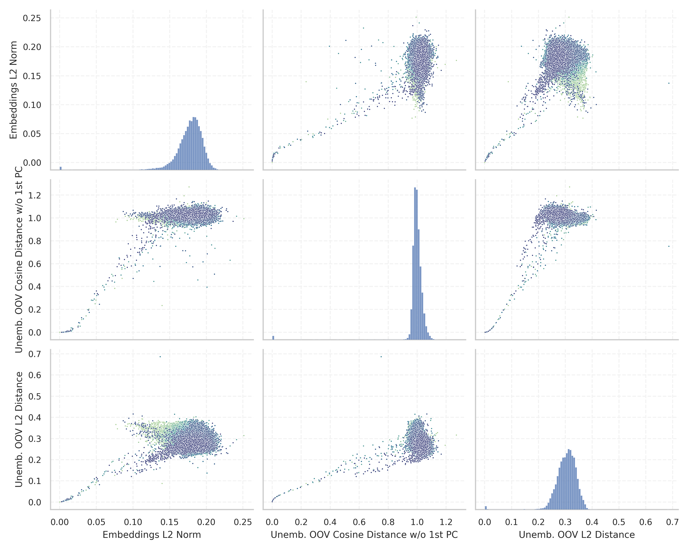

# Report for `HuggingFaceH4/zephyr-7b-beta`

## Model info

* Tied embeddings: no
* Unembeddings use bias: no
* Metric for under-trained tokens: Embeddings L2 Norm
  * Overall distribution 0.177 +/- 0.021
  * Token used for verification prompt building: `includegraphics`
  * Verification threshold: 0.135
  * Threshold for showing candidate under-trained tokens: 0.050
  * Median verified threshold (for bytes, unreachable and special tokens): 0.039
* Embeddings shape: (32000, 4096)
* Vocabulary size: 32000
  * Number of single byte tokens: 380, of which 145 below metric threshold
  * Number of special tokens: 3, of which 1 below metric threshold
  * Number of tested under-trained tokens: 529, 70 below p = 0.01 threshold, 45 below soft metric threshold

## Metrics plot


## Verification plot


## Under-trained token verification results
45 entries below threshold of 0.050

|   token_id | token              |     metric | max_prob                                                         | in_other_tokens                                                             |
|------------|--------------------|------------|------------------------------------------------------------------|-----------------------------------------------------------------------------|
|      31738 | ````` \uefc0 ````` | 0.00256505 | <span style='border: 1px solid rgb(169, 68, 66);'>2.6e-08</span> |                                                                             |
|      20418 | ````` ▁/**\r ````` | 0.00368849 | <span style='border: 1px solid rgb(169, 68, 66);'>3.1e-08</span> |                                                                             |
|      26636 | ````` });\r `````  | 0.00488573 | <span style='border: 1px solid rgb(169, 68, 66);'>3.7e-09</span> |                                                                             |
|      26407 | ````` };\r `````   | 0.00519729 | <span style='border: 1px solid rgb(169, 68, 66);'>7.3e-09</span> |                                                                             |
|      26392 | ````` ▁});\r ````` | 0.00557457 | <span style='border: 1px solid rgb(169, 68, 66);'>1.8e-08</span> |                                                                             |
|      18759 | ````` ';\r `````   | 0.00600828 | <span style='border: 1px solid rgb(169, 68, 66);'>2.1e-08</span> |                                                                             |
|      26083 | ````` ▁//\r `````  | 0.00611446 | <span style='border: 1px solid rgb(169, 68, 66);'>3.7e-08</span> |                                                                             |
|       9823 | ````` */\r `````   | 0.00744269 | <span style='border: 1px solid rgb(169, 68, 66);'>1.6e-08</span> |                                                                             |
|      25833 | ````` >?[< `````   | 0.00774109 | <span style='border: 1px solid rgb(169, 68, 66);'>7.4e-08</span> |                                                                             |
|       7608 | ````` ▁*/\r `````  | 0.00841445 | <span style='border: 1px solid rgb(169, 68, 66);'>3.7e-08</span> |                                                                             |
|      28171 | ````` ]);\r `````  | 0.00898351 | <span style='border: 1px solid rgb(169, 68, 66);'>5.5e-08</span> |                                                                             |
|      23139 | ````` ▁};\r `````  | 0.00917953 | <span style='border: 1px solid rgb(169, 68, 66);'>3e-08</span>   |                                                                             |
|      17695 | ````` },\r `````   | 0.0093152  | <span style='border: 1px solid rgb(169, 68, 66);'>1.4e-08</span> | <span style='border: 1px solid rgb(169, 68, 66);'>````` ▁},\r `````</span>  |
|      15056 | ````` ());\r ````` | 0.00938823 | <span style='border: 1px solid rgb(169, 68, 66);'>1.8e-08</span> |                                                                             |
|      12193 | ````` ▁);\r `````  | 0.00941279 | <span style='border: 1px solid rgb(169, 68, 66);'>5.1e-08</span> |                                                                             |
|      31363 | ````` \x85 `````   | 0.00975407 | <span style='border: 1px solid rgb(169, 68, 66);'>1.4e-09</span> |                                                                             |
|      14756 | ````` /**\r `````  | 0.010301   | <span style='border: 1px solid rgb(169, 68, 66);'>2.3e-08</span> | <span style='border: 1px solid rgb(169, 68, 66);'>````` ▁/**\r `````</span> |
|      16943 | ````` ');\r `````  | 0.0108607  | <span style='border: 1px solid rgb(169, 68, 66);'>3.1e-08</span> |                                                                             |
|      20692 | ````` ▁},\r `````  | 0.0110284  | <span style='border: 1px solid rgb(169, 68, 66);'>6.4e-08</span> |                                                                             |
|      10278 | ````` ',\r `````   | 0.0124934  | <span style='border: 1px solid rgb(169, 68, 66);'>5.5e-07</span> |                                                                             |
<details><summary>25 additional entries below threshold</summary>

|   token_id | token               |    metric | max_prob                                                         | in_other_tokens                                                                   |
|------------|---------------------|-----------|------------------------------------------------------------------|-----------------------------------------------------------------------------------|
|      11880 | ````` ";\r `````    | 0.0141034 | <span style='border: 1px solid rgb(169, 68, 66);'>2e-07</span>   |                                                                                   |
|      30929 | ````` ᥀ `````       | 0.0149118 | <span style='border: 1px solid rgb(169, 68, 66);'>2e-07</span>   |                                                                                   |
|      14420 | ````` ];\r `````    | 0.0156988 | <span style='border: 1px solid rgb(169, 68, 66);'>6.5e-08</span> |                                                                                   |
|      18055 | ````` ){\r `````    | 0.0159617 | <span style='border: 1px solid rgb(169, 68, 66);'>1.4e-07</span> |                                                                                   |
|      10941 | ````` ));\r `````   | 0.0173721 | <span style='border: 1px solid rgb(169, 68, 66);'>8.9e-08</span> | <span style='border: 1px solid rgb(169, 68, 66);'>````` ());\r `````</span>       |
|      14980 | ````` ">\r `````    | 0.0174355 | <span style='border: 1px solid rgb(169, 68, 66);'>4.2e-07</span> |                                                                                   |
|       6913 | ````` ");\r `````   | 0.0252151 | <span style='border: 1px solid rgb(169, 68, 66);'>6.3e-07</span> |                                                                                   |
|      25900 | ````` iNdEx `````   | 0.0259386 | <span style='border: 1px solid rgb(169, 68, 66);'>0.00025</span> |                                                                                   |
|      22186 | ````` ')\r `````    | 0.0270944 | <span style='border: 1px solid rgb(169, 68, 66);'>2.4e-06</span> |                                                                                   |
|      10939 | ````` ",\r `````    | 0.027903  | <span style='border: 1px solid rgb(169, 68, 66);'>6.4e-07</span> |                                                                                   |
|      26831 | ````` ▁febbra ````` | 0.0298659 | <span style='border: 1px solid rgb(169, 68, 66);'>1.2e-05</span> | <span style='border: 1px solid rgb(40, 167, 69);'>````` ▁febbraio `````</span>    |
|       4420 | ````` ();\r `````   | 0.0299867 | <span style='border: 1px solid rgb(169, 68, 66);'>5.1e-06</span> |                                                                                   |
|      19248 | ````` NdEx `````    | 0.03231   | <span style='border: 1px solid rgb(169, 68, 66);'>0.00035</span> | <span style='border: 1px solid rgb(169, 68, 66);'>````` iNdEx `````</span>        |
|       3426 | ````` ▁}\r `````    | 0.0359886 | <span style='border: 1px solid rgb(169, 68, 66);'>4.6e-06</span> |                                                                                   |
|       9962 | ````` ()\r `````    | 0.0381682 | <span style='border: 1px solid rgb(169, 68, 66);'>0.00012</span> |                                                                                   |
|      31853 | ````` ⇽ `````       | 0.039285  | <span style='border: 1px solid rgb(169, 68, 66);'>0.00056</span> |                                                                                   |
|       4441 | ````` {\r `````     | 0.0398455 | <span style='border: 1px solid rgb(169, 68, 66);'>2.2e-06</span> | <span style='border: 1px solid rgb(169, 68, 66);'>````` ){\r `````</span>         |
|      23486 | ````` ),\r `````    | 0.0402817 | <span style='border: 1px solid rgb(169, 68, 66);'>6.9e-06</span> |                                                                                   |
|      14619 | ````` ▁)\r `````    | 0.0432961 | <span style='border: 1px solid rgb(169, 68, 66);'>1.6e-05</span> |                                                                                   |
|      17334 | ````` (\r `````     | 0.0452383 | <span style='border: 1px solid rgb(169, 68, 66);'>4.9e-05</span> |                                                                                   |
|      15641 | ````` ▁uitgen ````` | 0.0471153 | <span style='border: 1px solid rgb(169, 68, 66);'>3.6e-05</span> | <span style='border: 1px solid rgb(255, 145, 0);'>````` ▁uitgenodigd `````</span> |
|      27732 | ````` '\r `````     | 0.0474714 | <span style='border: 1px solid rgb(169, 68, 66);'>9.2e-05</span> |                                                                                   |
|       2519 | ````` }\r `````     | 0.0483518 | <span style='border: 1px solid rgb(169, 68, 66);'>2.9e-05</span> | <span style='border: 1px solid rgb(169, 68, 66);'>````` ▁}\r `````</span>         |
|       1969 | ````` ▁{\r `````    | 0.0494827 | <span style='border: 1px solid rgb(169, 68, 66);'>1.9e-05</span> |                                                                                   |
|      31656 | ````` ≮ `````       | 0.0500745 | <span style='border: 1px solid rgb(251, 189, 8);'>0.025</span>   |                                                                                   |
</details>
<details><summary>484 additional entries above threshold</summary>

|   token_id | token                      |    metric | max_prob                                                         | in_other_tokens                                                                                                                                                                                                                                                                                                                                                                                                                     |
|------------|----------------------------|-----------|------------------------------------------------------------------|-------------------------------------------------------------------------------------------------------------------------------------------------------------------------------------------------------------------------------------------------------------------------------------------------------------------------------------------------------------------------------------------------------------------------------------|
|      16949 | ````` ")\r `````           | 0.0504424 | <span style='border: 1px solid rgb(169, 68, 66);'>0.00017</span> |                                                                                                                                                                                                                                                                                                                                                                                                                                     |
|       1761 | ````` );\r `````           | 0.0505434 | <span style='border: 1px solid rgb(169, 68, 66);'>0.00026</span> | <span style='border: 1px solid rgb(169, 68, 66);'>````` ();\r `````</span>, <span style='border: 1px solid rgb(169, 68, 66);'>````` ");\r `````</span>, <span style='border: 1px solid rgb(169, 68, 66);'>````` ));\r `````</span>, <span style='border: 1px solid rgb(169, 68, 66);'>````` ▁);\r `````</span>, <span style='border: 1px solid rgb(169, 68, 66);'>````` ());\r `````</span>, ...                                    |
|      31645 | ````` ≯ `````              | 0.0514121 | <span style='border: 1px solid rgb(251, 189, 8);'>0.01</span>    |                                                                                                                                                                                                                                                                                                                                                                                                                                     |
|      30413 | ````` ⌁ `````              | 0.0525205 | <span style='border: 1px solid rgb(251, 189, 8);'>0.045</span>   |                                                                                                                                                                                                                                                                                                                                                                                                                                     |
|      27456 | ````` :%.*]] `````         | 0.0542301 | <span style='border: 1px solid rgb(255, 145, 0);'>0.0097</span>  |                                                                                                                                                                                                                                                                                                                                                                                                                                     |
|      14668 | ````` ))\r `````           | 0.058685  | <span style='border: 1px solid rgb(169, 68, 66);'>2.4e-06</span> |                                                                                                                                                                                                                                                                                                                                                                                                                                     |
|      16724 | ````` tagHelper `````      | 0.0603997 | <span style='border: 1px solid rgb(40, 167, 69);'>0.89</span>    |                                                                                                                                                                                                                                                                                                                                                                                                                                     |
|      16772 | ````` :%.* `````           | 0.0612881 | <span style='border: 1px solid rgb(251, 189, 8);'>0.065</span>   | <span style='border: 1px solid rgb(255, 145, 0);'>````` :%.*]] `````</span>                                                                                                                                                                                                                                                                                                                                                         |
|      15880 | ````` >:]< `````           | 0.063233  | <span style='border: 1px solid rgb(251, 189, 8);'>0.022</span>   |                                                                                                                                                                                                                                                                                                                                                                                                                                     |
|      30813 | ````` ︙ `````             | 0.0658322 | <span style='border: 1px solid rgb(251, 189, 8);'>0.046</span>   |                                                                                                                                                                                                                                                                                                                                                                                                                                     |
|      31932 | ````` ҽ `````              | 0.0676692 | <span style='border: 1px solid rgb(255, 145, 0);'>0.0089</span>  |                                                                                                                                                                                                                                                                                                                                                                                                                                     |
|       7941 | ````` ICENSE `````         | 0.0710506 | <span style='border: 1px solid rgb(169, 68, 66);'>8.4e-05</span> | <span style='border: 1px solid rgb(40, 167, 69);'>````` LICENSE `````</span>, <span style='border: 1px solid rgb(40, 167, 69);'>````` ▁LICENSE `````</span>                                                                                                                                                                                                                                                                         |
|      27265 | ````` ▁SDValue `````       | 0.0715061 | <span style='border: 1px solid rgb(251, 189, 8);'>0.04</span>    |                                                                                                                                                                                                                                                                                                                                                                                                                                     |
|      10762 | ````` qpoint `````         | 0.0726682 | <span style='border: 1px solid rgb(40, 167, 69);'>0.99</span>    | <span style='border: 1px solid rgb(251, 189, 8);'>````` pgfqpoint `````</span>                                                                                                                                                                                                                                                                                                                                                      |
|      15500 | ````` itempty `````        | 0.0748776 | <span style='border: 1px solid rgb(251, 189, 8);'>0.092</span>   | <span style='border: 1px solid rgb(40, 167, 69);'>````` omitempty `````</span>                                                                                                                                                                                                                                                                                                                                                      |
|      31179 | ````` ┈ `````              | 0.0759263 | <span style='border: 1px solid rgb(40, 167, 69);'>0.9</span>     |                                                                                                                                                                                                                                                                                                                                                                                                                                     |
|        272 | ````` ▁the `````           | 0.0766494 | <span style='border: 1px solid rgb(40, 167, 69);'>1</span>       | <span style='border: 1px solid rgb(40, 167, 69);'>````` ▁they `````</span>, <span style='border: 1px solid rgb(40, 167, 69);'>````` ▁their `````</span>, <span style='border: 1px solid rgb(40, 167, 69);'>````` ▁them `````</span>, <span style='border: 1px solid rgb(40, 167, 69);'>````` ▁there `````</span>, <span style='border: 1px solid rgb(40, 167, 69);'>````` ▁then `````</span>, ...                                   |
|      31733 | ````` ⵙ `````              | 0.0783485 | <span style='border: 1px solid rgb(251, 189, 8);'>0.016</span>   |                                                                                                                                                                                                                                                                                                                                                                                                                                     |
|      31841 | ````` ❒ `````              | 0.0809174 | <span style='border: 1px solid rgb(40, 167, 69);'>0.57</span>    |                                                                                                                                                                                                                                                                                                                                                                                                                                     |
|      17779 | ````` ▁gepublice `````     | 0.0811037 | <span style='border: 1px solid rgb(255, 145, 0);'>0.0043</span>  | <span style='border: 1px solid rgb(251, 189, 8);'>````` ▁gepubliceerd `````</span>                                                                                                                                                                                                                                                                                                                                                  |
|      31922 | ````` ⵓ `````              | 0.0815264 | <span style='border: 1px solid rgb(169, 68, 66);'>0.00021</span> |                                                                                                                                                                                                                                                                                                                                                                                                                                     |
|      15630 | ````` odigd `````          | 0.0836839 | <span style='border: 1px solid rgb(255, 145, 0);'>0.0022</span>  | <span style='border: 1px solid rgb(255, 145, 0);'>````` ▁uitgenodigd `````</span>                                                                                                                                                                                                                                                                                                                                                   |
|      30897 | ````` ⠄ `````              | 0.0837612 | <span style='border: 1px solid rgb(40, 167, 69);'>0.42</span>    |                                                                                                                                                                                                                                                                                                                                                                                                                                     |
|       3685 | ````` >\r `````            | 0.0848595 | <span style='border: 1px solid rgb(255, 145, 0);'>0.0011</span>  | <span style='border: 1px solid rgb(169, 68, 66);'>````` ">\r `````</span>                                                                                                                                                                                                                                                                                                                                                           |
|      14052 | ````` ▁Jahrhund `````      | 0.0849249 | <span style='border: 1px solid rgb(169, 68, 66);'>0.0003</span>  | <span style='border: 1px solid rgb(40, 167, 69);'>````` ▁Jahrhundert `````</span>, <span style='border: 1px solid rgb(40, 167, 69);'>````` ▁Jahrhunderts `````</span>                                                                                                                                                                                                                                                               |
|      18766 | ````` ]\r `````            | 0.0871711 | <span style='border: 1px solid rgb(169, 68, 66);'>0.00024</span> |                                                                                                                                                                                                                                                                                                                                                                                                                                     |
|      31895 | ````` ❍ `````              | 0.0883292 | <span style='border: 1px solid rgb(40, 167, 69);'>0.89</span>    |                                                                                                                                                                                                                                                                                                                                                                                                                                     |
|       1271 | ````` ;\r `````            | 0.088446  | <span style='border: 1px solid rgb(251, 189, 8);'>0.015</span>   | <span style='border: 1px solid rgb(169, 68, 66);'>````` );\r `````</span>, <span style='border: 1px solid rgb(169, 68, 66);'>````` ();\r `````</span>, <span style='border: 1px solid rgb(169, 68, 66);'>````` ");\r `````</span>, <span style='border: 1px solid rgb(169, 68, 66);'>````` ));\r `````</span>, <span style='border: 1px solid rgb(169, 68, 66);'>````` ";\r `````</span>, ...                                       |
|      11167 | ````` ityEngine `````      | 0.0890044 | <span style='border: 1px solid rgb(251, 189, 8);'>0.082</span>   | <span style='border: 1px solid rgb(40, 167, 69);'>````` ▁UnityEngine `````</span>, <span style='border: 1px solid rgb(40, 167, 69);'>````` UnityEngine `````</span>                                                                                                                                                                                                                                                                 |
|        288 | ````` ing `````            | 0.0895147 | <span style='border: 1px solid rgb(40, 167, 69);'>1</span>       | <span style='border: 1px solid rgb(40, 167, 69);'>````` ring `````</span>, <span style='border: 1px solid rgb(40, 167, 69);'>````` ings `````</span>, <span style='border: 1px solid rgb(40, 167, 69);'>````` tring `````</span>, <span style='border: 1px solid rgb(40, 167, 69);'>````` ning `````</span>, <span style='border: 1px solid rgb(40, 167, 69);'>````` ating `````</span>, ...                                        |
|      31469 | ````` ӏ `````              | 0.0917858 | <span style='border: 1px solid rgb(40, 167, 69);'>0.12</span>    |                                                                                                                                                                                                                                                                                                                                                                                                                                     |
|        302 | ````` ▁of `````            | 0.0920416 | <span style='border: 1px solid rgb(40, 167, 69);'>1</span>       | <span style='border: 1px solid rgb(40, 167, 69);'>````` ▁off `````</span>, <span style='border: 1px solid rgb(40, 167, 69);'>````` ▁offer `````</span>, <span style='border: 1px solid rgb(40, 167, 69);'>````` ▁often `````</span>, <span style='border: 1px solid rgb(40, 167, 69);'>````` ▁offic `````</span>, <span style='border: 1px solid rgb(40, 167, 69);'>````` ▁office `````</span>, ...                                 |
|      31172 | ````` ┆ `````              | 0.0922086 | <span style='border: 1px solid rgb(40, 167, 69);'>0.52</span>    |                                                                                                                                                                                                                                                                                                                                                                                                                                     |
|      31443 | ````` ⵏ `````              | 0.0924198 | <span style='border: 1px solid rgb(255, 145, 0);'>0.0012</span>  |                                                                                                                                                                                                                                                                                                                                                                                                                                     |
|        264 | ````` ▁a `````             | 0.092889  | <span style='border: 1px solid rgb(40, 167, 69);'>1</span>       | <span style='border: 1px solid rgb(40, 167, 69);'>````` ▁and `````</span>, <span style='border: 1px solid rgb(40, 167, 69);'>````` ▁al `````</span>, <span style='border: 1px solid rgb(40, 167, 69);'>````` ▁as `````</span>, <span style='border: 1px solid rgb(40, 167, 69);'>````` ▁an `````</span>, <span style='border: 1px solid rgb(40, 167, 69);'>````` ▁at `````</span>, ...                                              |
|      30867 | ````` 🟠 `````             | 0.0935719 | <span style='border: 1px solid rgb(40, 167, 69);'>0.73</span>    |                                                                                                                                                                                                                                                                                                                                                                                                                                     |
|      11525 | ````` "\r `````            | 0.0940426 | <span style='border: 1px solid rgb(169, 68, 66);'>0.00052</span> |                                                                                                                                                                                                                                                                                                                                                                                                                                     |
|        286 | ````` ed `````             | 0.0948464 | <span style='border: 1px solid rgb(40, 167, 69);'>1</span>       | <span style='border: 1px solid rgb(40, 167, 69);'>````` ated `````</span>, <span style='border: 1px solid rgb(40, 167, 69);'>````` ied `````</span>, <span style='border: 1px solid rgb(40, 167, 69);'>````` hed `````</span>, <span style='border: 1px solid rgb(40, 167, 69);'>````` red `````</span>, <span style='border: 1px solid rgb(40, 167, 69);'>````` ▁need `````</span>, ...                                            |
|        298 | ````` ▁to `````            | 0.0966393 | <span style='border: 1px solid rgb(40, 167, 69);'>1</span>       | <span style='border: 1px solid rgb(40, 167, 69);'>````` ▁too `````</span>, <span style='border: 1px solid rgb(40, 167, 69);'>````` ▁top `````</span>, <span style='border: 1px solid rgb(40, 167, 69);'>````` ▁took `````</span>, <span style='border: 1px solid rgb(40, 167, 69);'>````` ▁tot `````</span>, <span style='border: 1px solid rgb(40, 167, 69);'>````` ▁told `````</span>, ...                                        |
|      30983 | ````` ڕ `````              | 0.0967776 | <span style='border: 1px solid rgb(40, 167, 69);'>0.28</span>    |                                                                                                                                                                                                                                                                                                                                                                                                                                     |
|      31317 | ````` ⵉ `````              | 0.0968221 | <span style='border: 1px solid rgb(251, 189, 8);'>0.022</span>   |                                                                                                                                                                                                                                                                                                                                                                                                                                     |
|        274 | ````` es `````             | 0.0972934 | <span style='border: 1px solid rgb(40, 167, 69);'>1</span>       | <span style='border: 1px solid rgb(40, 167, 69);'>````` est `````</span>, <span style='border: 1px solid rgb(40, 167, 69);'>````` ess `````</span>, <span style='border: 1px solid rgb(40, 167, 69);'>````` res `````</span>, <span style='border: 1px solid rgb(40, 167, 69);'>````` ies `````</span>, <span style='border: 1px solid rgb(40, 167, 69);'>````` ▁res `````</span>, ...                                              |
|      29934 | ````` ⣿ `````              | 0.0977994 | <span style='border: 1px solid rgb(40, 167, 69);'>0.15</span>    |                                                                                                                                                                                                                                                                                                                                                                                                                                     |
|      30770 | ````` 🟡 `````             | 0.0990421 | <span style='border: 1px solid rgb(40, 167, 69);'>0.92</span>    |                                                                                                                                                                                                                                                                                                                                                                                                                                     |
|        263 | ````` er `````             | 0.100088  | <span style='border: 1px solid rgb(40, 167, 69);'>1</span>       | <span style='border: 1px solid rgb(40, 167, 69);'>````` ver `````</span>, <span style='border: 1px solid rgb(40, 167, 69);'>````` ter `````</span>, <span style='border: 1px solid rgb(40, 167, 69);'>````` ere `````</span>, <span style='border: 1px solid rgb(40, 167, 69);'>````` ers `````</span>, <span style='border: 1px solid rgb(40, 167, 69);'>````` ser `````</span>, ...                                               |
|      28593 | ````` pgfscope `````       | 0.100196  | <span style='border: 1px solid rgb(40, 167, 69);'>0.55</span>    |                                                                                                                                                                                                                                                                                                                                                                                                                                     |
|      28705 | ````` ▁ `````              | 0.100198  | <span style='border: 1px solid rgb(40, 167, 69);'>1</span>       |                                                                                                                                                                                                                                                                                                                                                                                                                                     |
|        404 | ````` ers `````            | 0.101383  | <span style='border: 1px solid rgb(40, 167, 69);'>1</span>       | <span style='border: 1px solid rgb(40, 167, 69);'>````` vers `````</span>, <span style='border: 1px solid rgb(40, 167, 69);'>````` erson `````</span>, <span style='border: 1px solid rgb(40, 167, 69);'>````` ▁person `````</span>, <span style='border: 1px solid rgb(40, 167, 69);'>````` ters `````</span>, <span style='border: 1px solid rgb(40, 167, 69);'>````` ivers `````</span>, ...                                     |
|      31731 | ````` Ӏ `````              | 0.102405  | <span style='border: 1px solid rgb(40, 167, 69);'>0.62</span>    |                                                                                                                                                                                                                                                                                                                                                                                                                                     |
|      12683 | ````` pgfpathlineto `````  | 0.102959  | <span style='border: 1px solid rgb(40, 167, 69);'>0.15</span>    |                                                                                                                                                                                                                                                                                                                                                                                                                                     |
|      24713 | ````` vscale `````         | 0.103341  | <span style='border: 1px solid rgb(40, 167, 69);'>1</span>       |                                                                                                                                                                                                                                                                                                                                                                                                                                     |
|        269 | ````` en `````             | 0.104398  | <span style='border: 1px solid rgb(40, 167, 69);'>1</span>       | <span style='border: 1px solid rgb(40, 167, 69);'>````` ent `````</span>, <span style='border: 1px solid rgb(40, 167, 69);'>````` end `````</span>, <span style='border: 1px solid rgb(40, 167, 69);'>````` ment `````</span>, <span style='border: 1px solid rgb(40, 167, 69);'>````` ▁en `````</span>, <span style='border: 1px solid rgb(40, 167, 69);'>````` hen `````</span>, ...                                              |
|        352 | ````` ation `````          | 0.104696  | <span style='border: 1px solid rgb(40, 167, 69);'>0.99</span>    | <span style='border: 1px solid rgb(40, 167, 69);'>````` ations `````</span>, <span style='border: 1px solid rgb(40, 167, 69);'>````` ational `````</span>, <span style='border: 1px solid rgb(40, 167, 69);'>````` lation `````</span>, <span style='border: 1px solid rgb(40, 167, 69);'>````` formation `````</span>, <span style='border: 1px solid rgb(40, 167, 69);'>````` translation `````</span>, ...                       |
|      31901 | ````` ញ `````              | 0.10489   | <span style='border: 1px solid rgb(40, 167, 69);'>0.67</span>    |                                                                                                                                                                                                                                                                                                                                                                                                                                     |
|      31636 | ````` ⬜ `````             | 0.105043  | <span style='border: 1px solid rgb(40, 167, 69);'>0.91</span>    |                                                                                                                                                                                                                                                                                                                                                                                                                                     |
|      10765 | ````` pgfqpoint `````      | 0.105359  | <span style='border: 1px solid rgb(251, 189, 8);'>0.011</span>   |                                                                                                                                                                                                                                                                                                                                                                                                                                     |
|      31933 | ````` ថ `````              | 0.10538   | <span style='border: 1px solid rgb(40, 167, 69);'>0.76</span>    |                                                                                                                                                                                                                                                                                                                                                                                                                                     |
|        282 | ````` al `````             | 0.105493  | <span style='border: 1px solid rgb(40, 167, 69);'>1</span>       | <span style='border: 1px solid rgb(40, 167, 69);'>````` ▁al `````</span>, <span style='border: 1px solid rgb(40, 167, 69);'>````` all `````</span>, <span style='border: 1px solid rgb(40, 167, 69);'>````` ial `````</span>, <span style='border: 1px solid rgb(40, 167, 69);'>````` ▁all `````</span>, <span style='border: 1px solid rgb(40, 167, 69);'>````` ally `````</span>, ...                                             |
|        262 | ````` in `````             | 0.106046  | <span style='border: 1px solid rgb(40, 167, 69);'>1</span>       | <span style='border: 1px solid rgb(40, 167, 69);'>````` ing `````</span>, <span style='border: 1px solid rgb(40, 167, 69);'>````` ▁in `````</span>, <span style='border: 1px solid rgb(40, 167, 69);'>````` ain `````</span>, <span style='border: 1px solid rgb(40, 167, 69);'>````` ine `````</span>, <span style='border: 1px solid rgb(40, 167, 69);'>````` int `````</span>, ...                                               |
|        266 | ````` on `````             | 0.10728   | <span style='border: 1px solid rgb(40, 167, 69);'>1</span>       | <span style='border: 1px solid rgb(40, 167, 69);'>````` ion `````</span>, <span style='border: 1px solid rgb(40, 167, 69);'>````` ation `````</span>, <span style='border: 1px solid rgb(40, 167, 69);'>````` ▁on `````</span>, <span style='border: 1px solid rgb(40, 167, 69);'>````` ▁con `````</span>, <span style='border: 1px solid rgb(40, 167, 69);'>````` ction `````</span>, ...                                          |
|        725 | ````` ER `````             | 0.107431  | <span style='border: 1px solid rgb(40, 167, 69);'>1</span>       | <span style='border: 1px solid rgb(40, 167, 69);'>````` ERR `````</span>, <span style='border: 1px solid rgb(40, 167, 69);'>````` VER `````</span>, <span style='border: 1px solid rgb(40, 167, 69);'>````` ERT `````</span>, <span style='border: 1px solid rgb(40, 167, 69);'>````` ERROR `````</span>, <span style='border: 1px solid rgb(40, 167, 69);'>````` TER `````</span>, ...                                             |
|       2043 | ````` ING `````            | 0.107661  | <span style='border: 1px solid rgb(40, 167, 69);'>1</span>       | <span style='border: 1px solid rgb(40, 167, 69);'>````` STRING `````</span>, <span style='border: 1px solid rgb(40, 167, 69);'>````` TING `````</span>, <span style='border: 1px solid rgb(251, 189, 8);'>````` CLUDING `````</span>, <span style='border: 1px solid rgb(40, 167, 69);'>````` WARNING `````</span>, <span style='border: 1px solid rgb(40, 167, 69);'>````` SETTING `````</span>, ...                               |
|        395 | ````` ▁with `````          | 0.107818  | <span style='border: 1px solid rgb(40, 167, 69);'>1</span>       | <span style='border: 1px solid rgb(40, 167, 69);'>````` ▁without `````</span>, <span style='border: 1px solid rgb(40, 167, 69);'>````` ▁within `````</span>, <span style='border: 1px solid rgb(40, 167, 69);'>````` ▁withdraw `````</span>, <span style='border: 1px solid rgb(40, 167, 69);'>````` ▁withd `````</span>, <span style='border: 1px solid rgb(40, 167, 69);'>````` ▁withdrawal `````</span>                          |
|        297 | ````` ▁in `````            | 0.107951  | <span style='border: 1px solid rgb(40, 167, 69);'>1</span>       | <span style='border: 1px solid rgb(40, 167, 69);'>````` ▁int `````</span>, <span style='border: 1px solid rgb(40, 167, 69);'>````` ▁into `````</span>, <span style='border: 1px solid rgb(40, 167, 69);'>````` ▁inter `````</span>, <span style='border: 1px solid rgb(40, 167, 69);'>````` ▁inst `````</span>, <span style='border: 1px solid rgb(40, 167, 69);'>````` ▁incl `````</span>, ...                                     |
|        304 | ````` ▁and `````           | 0.107989  | <span style='border: 1px solid rgb(40, 167, 69);'>1</span>       | <span style='border: 1px solid rgb(40, 167, 69);'>````` ▁android `````</span>, <span style='border: 1px solid rgb(40, 167, 69);'>````` ▁andere `````</span>, <span style='border: 1px solid rgb(40, 167, 69);'>````` ▁anderen `````</span>, <span style='border: 1px solid rgb(40, 167, 69);'>````` ▁ander `````</span>, <span style='border: 1px solid rgb(40, 167, 69);'>````` ▁andra `````</span>, ...                           |
|      23270 | ````` ByComparator `````   | 0.108252  | <span style='border: 1px solid rgb(251, 189, 8);'>0.022</span>   |                                                                                                                                                                                                                                                                                                                                                                                                                                     |
|      26939 | ````` ▁invån `````         | 0.10833   | <span style='border: 1px solid rgb(169, 68, 66);'>3.2e-05</span> | <span style='border: 1px solid rgb(251, 189, 8);'>````` ▁invånare `````</span>                                                                                                                                                                                                                                                                                                                                                      |
|        276 | ````` an `````             | 0.108559  | <span style='border: 1px solid rgb(40, 167, 69);'>1</span>       | <span style='border: 1px solid rgb(40, 167, 69);'>````` ▁and `````</span>, <span style='border: 1px solid rgb(40, 167, 69);'>````` and `````</span>, <span style='border: 1px solid rgb(40, 167, 69);'>````` ▁an `````</span>, <span style='border: 1px solid rgb(40, 167, 69);'>````` ant `````</span>, <span style='border: 1px solid rgb(40, 167, 69);'>````` ans `````</span>, ...                                              |
|        497 | ````` ies `````            | 0.108568  | <span style='border: 1px solid rgb(40, 167, 69);'>1</span>       | <span style='border: 1px solid rgb(40, 167, 69);'>````` ities `````</span>, <span style='border: 1px solid rgb(40, 167, 69);'>````` ries `````</span>, <span style='border: 1px solid rgb(40, 167, 69);'>````` ories `````</span>, <span style='border: 1px solid rgb(255, 145, 0);'>````` perties `````</span>, <span style='border: 1px solid rgb(40, 167, 69);'>````` ▁series `````</span>, ...                                  |
|        354 | ````` ▁for `````           | 0.109391  | <span style='border: 1px solid rgb(40, 167, 69);'>1</span>       | <span style='border: 1px solid rgb(40, 167, 69);'>````` ▁form `````</span>, <span style='border: 1px solid rgb(40, 167, 69);'>````` ▁fore `````</span>, <span style='border: 1px solid rgb(40, 167, 69);'>````` ▁forward `````</span>, <span style='border: 1px solid rgb(40, 167, 69);'>````` ▁force `````</span>, <span style='border: 1px solid rgb(40, 167, 69);'>````` ▁former `````</span>, ...                               |
|      20411 | ````` ][< `````            | 0.109658  | <span style='border: 1px solid rgb(40, 167, 69);'>0.93</span>    |                                                                                                                                                                                                                                                                                                                                                                                                                                     |
|        415 | ````` ▁The `````           | 0.110072  | <span style='border: 1px solid rgb(40, 167, 69);'>1</span>       | <span style='border: 1px solid rgb(40, 167, 69);'>````` ▁They `````</span>, <span style='border: 1px solid rgb(40, 167, 69);'>````` ▁There `````</span>, <span style='border: 1px solid rgb(40, 167, 69);'>````` ▁Then `````</span>, <span style='border: 1px solid rgb(40, 167, 69);'>````` ▁These `````</span>, <span style='border: 1px solid rgb(40, 167, 69);'>````` ▁Their `````</span>, ...                                  |
|        697 | ````` ations `````         | 0.110262  | <span style='border: 1px solid rgb(40, 167, 69);'>0.52</span>    | <span style='border: 1px solid rgb(40, 167, 69);'>````` ▁relations `````</span>, <span style='border: 1px solid rgb(40, 167, 69);'>````` ▁relationship `````</span>, <span style='border: 1px solid rgb(40, 167, 69);'>````` ulations `````</span>, <span style='border: 1px solid rgb(40, 167, 69);'>````` ▁operations `````</span>, <span style='border: 1px solid rgb(40, 167, 69);'>````` ifications `````</span>, ...          |
|        385 | ````` os `````             | 0.111199  | <span style='border: 1px solid rgb(40, 167, 69);'>1</span>       | <span style='border: 1px solid rgb(40, 167, 69);'>````` ost `````</span>, <span style='border: 1px solid rgb(40, 167, 69);'>````` ose `````</span>, <span style='border: 1px solid rgb(40, 167, 69);'>````` ▁pos `````</span>, <span style='border: 1px solid rgb(40, 167, 69);'>````` pos `````</span>, <span style='border: 1px solid rgb(40, 167, 69);'>````` ▁most `````</span>, ...                                            |
|        380 | ````` ate `````            | 0.111248  | <span style='border: 1px solid rgb(40, 167, 69);'>1</span>       | <span style='border: 1px solid rgb(40, 167, 69);'>````` ated `````</span>, <span style='border: 1px solid rgb(40, 167, 69);'>````` ater `````</span>, <span style='border: 1px solid rgb(40, 167, 69);'>````` ates `````</span>, <span style='border: 1px solid rgb(169, 68, 66);'>````` rivate `````</span>, <span style='border: 1px solid rgb(40, 167, 69);'>````` date `````</span>, ...                                        |
|        278 | ````` is `````             | 0.111293  | <span style='border: 1px solid rgb(40, 167, 69);'>1</span>       | <span style='border: 1px solid rgb(40, 167, 69);'>````` ▁is `````</span>, <span style='border: 1px solid rgb(40, 167, 69);'>````` ist `````</span>, <span style='border: 1px solid rgb(40, 167, 69);'>````` ▁this `````</span>, <span style='border: 1px solid rgb(40, 167, 69);'>````` ▁his `````</span>, <span style='border: 1px solid rgb(40, 167, 69);'>````` ▁dis `````</span>, ...                                           |
|      31394 | ````` ើ `````               | 0.111319  | <span style='border: 1px solid rgb(251, 189, 8);'>0.015</span>   |                                                                                                                                                                                                                                                                                                                                                                                                                                     |
|        356 | ````` ▁on `````            | 0.111635  | <span style='border: 1px solid rgb(40, 167, 69);'>1</span>       | <span style='border: 1px solid rgb(40, 167, 69);'>````` ▁one `````</span>, <span style='border: 1px solid rgb(40, 167, 69);'>````` ▁only `````</span>, <span style='border: 1px solid rgb(40, 167, 69);'>````` ▁once `````</span>, <span style='border: 1px solid rgb(40, 167, 69);'>````` ▁online `````</span>, <span style='border: 1px solid rgb(40, 167, 69);'>````` ▁ones `````</span>, ...                                    |
|      29091 | ````` ↘ `````              | 0.111665  | <span style='border: 1px solid rgb(40, 167, 69);'>0.97</span>    |                                                                                                                                                                                                                                                                                                                                                                                                                                     |
|      30690 | ````` ێ `````              | 0.11186   | <span style='border: 1px solid rgb(40, 167, 69);'>0.13</span>    |                                                                                                                                                                                                                                                                                                                                                                                                                                     |
|      31264 | ````` ⬛ `````             | 0.111928  | <span style='border: 1px solid rgb(40, 167, 69);'>0.97</span>    |                                                                                                                                                                                                                                                                                                                                                                                                                                     |
|        349 | ````` ▁is `````            | 0.112533  | <span style='border: 1px solid rgb(40, 167, 69);'>1</span>       | <span style='border: 1px solid rgb(40, 167, 69);'>````` ▁iss `````</span>, <span style='border: 1px solid rgb(40, 167, 69);'>````` ▁ist `````</span>, <span style='border: 1px solid rgb(40, 167, 69);'>````` ▁isn `````</span>, <span style='border: 1px solid rgb(40, 167, 69);'>````` ▁issue `````</span>, <span style='border: 1px solid rgb(40, 167, 69);'>````` ▁issues `````</span>, ...                                     |
|      11370 | ````` pgfpath `````        | 0.112772  | <span style='border: 1px solid rgb(251, 189, 8);'>0.013</span>   | <span style='border: 1px solid rgb(40, 167, 69);'>````` pgfpathlineto `````</span>                                                                                                                                                                                                                                                                                                                                                  |
|        271 | ````` or `````             | 0.112907  | <span style='border: 1px solid rgb(40, 167, 69);'>1</span>       | <span style='border: 1px solid rgb(40, 167, 69);'>````` ▁for `````</span>, <span style='border: 1px solid rgb(40, 167, 69);'>````` ort `````</span>, <span style='border: 1px solid rgb(40, 167, 69);'>````` ore `````</span>, <span style='border: 1px solid rgb(40, 167, 69);'>````` ▁or `````</span>, <span style='border: 1px solid rgb(40, 167, 69);'>````` port `````</span>, ...                                             |
|        325 | ````` ▁( `````             | 0.113048  | <span style='border: 1px solid rgb(40, 167, 69);'>1</span>       | <span style='border: 1px solid rgb(40, 167, 69);'>````` ▁(! `````</span>, <span style='border: 1px solid rgb(40, 167, 69);'>````` ▁(* `````</span>, <span style='border: 1px solid rgb(40, 167, 69);'>````` ▁(( `````</span>, <span style='border: 1px solid rgb(40, 167, 69);'>````` ▁() `````</span>, <span style='border: 1px solid rgb(40, 167, 69);'>````` ▁($ `````</span>, ...                                               |
|        301 | ````` el `````             | 0.113273  | <span style='border: 1px solid rgb(40, 167, 69);'>1</span>       | <span style='border: 1px solid rgb(40, 167, 69);'>````` ell `````</span>, <span style='border: 1px solid rgb(40, 167, 69);'>````` elf `````</span>, <span style='border: 1px solid rgb(40, 167, 69);'>````` ▁el `````</span>, <span style='border: 1px solid rgb(40, 167, 69);'>````` ely `````</span>, <span style='border: 1px solid rgb(40, 167, 69);'>````` iel `````</span>, ...                                               |
|        369 | ````` ▁that `````          | 0.1136    | <span style='border: 1px solid rgb(40, 167, 69);'>1</span>       | <span style='border: 1px solid rgb(40, 167, 69);'>````` ▁thats `````</span>                                                                                                                                                                                                                                                                                                                                                         |
|       2255 | ````` ES `````             | 0.113649  | <span style='border: 1px solid rgb(40, 167, 69);'>1</span>       | <span style='border: 1px solid rgb(40, 167, 69);'>````` EST `````</span>, <span style='border: 1px solid rgb(40, 167, 69);'>````` CESS `````</span>, <span style='border: 1px solid rgb(40, 167, 69);'>````` TIES `````</span>, <span style='border: 1px solid rgb(40, 167, 69);'>````` RES `````</span>, <span style='border: 1px solid rgb(40, 167, 69);'>````` ▁WARRANTIES `````</span>, ...                                     |
|      31692 | ````` ែ `````               | 0.113698  | <span style='border: 1px solid rgb(40, 167, 69);'>0.27</span>    |                                                                                                                                                                                                                                                                                                                                                                                                                                     |
|      21876 | ````` imeq `````           | 0.113818  | <span style='border: 1px solid rgb(40, 167, 69);'>0.82</span>    | <span style='border: 1px solid rgb(40, 167, 69);'>````` simeq `````</span>                                                                                                                                                                                                                                                                                                                                                          |
|        294 | ````` ic `````             | 0.113856  | <span style='border: 1px solid rgb(40, 167, 69);'>1</span>       | <span style='border: 1px solid rgb(40, 167, 69);'>````` ice `````</span>, <span style='border: 1px solid rgb(40, 167, 69);'>````` ich `````</span>, <span style='border: 1px solid rgb(40, 167, 69);'>````` lic `````</span>, <span style='border: 1px solid rgb(40, 167, 69);'>````` ublic `````</span>, <span style='border: 1px solid rgb(40, 167, 69);'>````` ick `````</span>, ...                                             |
|        291 | ````` le `````             | 0.114177  | <span style='border: 1px solid rgb(40, 167, 69);'>1</span>       | <span style='border: 1px solid rgb(40, 167, 69);'>````` ▁le `````</span>, <span style='border: 1px solid rgb(40, 167, 69);'>````` able `````</span>, <span style='border: 1px solid rgb(40, 167, 69);'>````` ile `````</span>, <span style='border: 1px solid rgb(40, 167, 69);'>````` ple `````</span>, <span style='border: 1px solid rgb(40, 167, 69);'>````` lect `````</span>, ...                                             |
|        267 | ````` re `````             | 0.114348  | <span style='border: 1px solid rgb(40, 167, 69);'>1</span>       | <span style='border: 1px solid rgb(40, 167, 69);'>````` ▁re `````</span>, <span style='border: 1px solid rgb(40, 167, 69);'>````` ere `````</span>, <span style='border: 1px solid rgb(40, 167, 69);'>````` res `````</span>, <span style='border: 1px solid rgb(40, 167, 69);'>````` ore `````</span>, <span style='border: 1px solid rgb(40, 167, 69);'>````` ▁are `````</span>, ...                                              |
|        299 | ````` et `````             | 0.114472  | <span style='border: 1px solid rgb(40, 167, 69);'>1</span>       | <span style='border: 1px solid rgb(40, 167, 69);'>````` get `````</span>, <span style='border: 1px solid rgb(40, 167, 69);'>````` ▁return `````</span>, <span style='border: 1px solid rgb(40, 167, 69);'>````` ▁get `````</span>, <span style='border: 1px solid rgb(40, 167, 69);'>````` set `````</span>, <span style='border: 1px solid rgb(40, 167, 69);'>````` eth `````</span>, ...                                          |
|      30660 | ````` ☽ `````              | 0.114554  | <span style='border: 1px solid rgb(40, 167, 69);'>0.91</span>    |                                                                                                                                                                                                                                                                                                                                                                                                                                     |
|        270 | ````` at `````             | 0.114852  | <span style='border: 1px solid rgb(40, 167, 69);'>1</span>       | <span style='border: 1px solid rgb(40, 167, 69);'>````` ation `````</span>, <span style='border: 1px solid rgb(40, 167, 69);'>````` ▁that `````</span>, <span style='border: 1px solid rgb(40, 167, 69);'>````` ate `````</span>, <span style='border: 1px solid rgb(40, 167, 69);'>````` ▁at `````</span>, <span style='border: 1px solid rgb(40, 167, 69);'>````` ath `````</span>, ...                                           |
|        390 | ````` ▁as `````            | 0.11506   | <span style='border: 1px solid rgb(40, 167, 69);'>1</span>       | <span style='border: 1px solid rgb(40, 167, 69);'>````` ▁ass `````</span>, <span style='border: 1px solid rgb(40, 167, 69);'>````` ▁ask `````</span>, <span style='border: 1px solid rgb(40, 167, 69);'>````` ▁assert `````</span>, <span style='border: 1px solid rgb(40, 167, 69);'>````` ▁asked `````</span>, <span style='border: 1px solid rgb(40, 167, 69);'>````` ▁associ `````</span>, ...                                  |
|        283 | ````` ar `````             | 0.115118  | <span style='border: 1px solid rgb(40, 167, 69);'>1</span>       | <span style='border: 1px solid rgb(40, 167, 69);'>````` art `````</span>, <span style='border: 1px solid rgb(40, 167, 69);'>````` ▁are `````</span>, <span style='border: 1px solid rgb(40, 167, 69);'>````` ard `````</span>, <span style='border: 1px solid rgb(40, 167, 69);'>````` are `````</span>, <span style='border: 1px solid rgb(40, 167, 69);'>````` ▁ar `````</span>, ...                                              |
|      31734 | ````` 丶 `````             | 0.115191  | <span style='border: 1px solid rgb(40, 167, 69);'>0.87</span>    |                                                                                                                                                                                                                                                                                                                                                                                                                                     |
|        477 | ````` ▁from `````          | 0.115242  | <span style='border: 1px solid rgb(40, 167, 69);'>1</span>       |                                                                                                                                                                                                                                                                                                                                                                                                                                     |
|        293 | ````` as `````             | 0.115466  | <span style='border: 1px solid rgb(40, 167, 69);'>1</span>       | <span style='border: 1px solid rgb(40, 167, 69);'>````` ▁as `````</span>, <span style='border: 1px solid rgb(40, 167, 69);'>````` ▁was `````</span>, <span style='border: 1px solid rgb(40, 167, 69);'>````` ass `````</span>, <span style='border: 1px solid rgb(40, 167, 69);'>````` ast `````</span>, <span style='border: 1px solid rgb(40, 167, 69);'>````` ase `````</span>, ...                                              |
|        381 | ````` us `````             | 0.116275  | <span style='border: 1px solid rgb(40, 167, 69);'>1</span>       | <span style='border: 1px solid rgb(40, 167, 69);'>````` ust `````</span>, <span style='border: 1px solid rgb(40, 167, 69);'>````` ▁us `````</span>, <span style='border: 1px solid rgb(40, 167, 69);'>````` ous `````</span>, <span style='border: 1px solid rgb(40, 167, 69);'>````` ▁just `````</span>, <span style='border: 1px solid rgb(40, 167, 69);'>````` ause `````</span>, ...                                            |
|        346 | ````` ly `````             | 0.116278  | <span style='border: 1px solid rgb(40, 167, 69);'>1</span>       | <span style='border: 1px solid rgb(40, 167, 69);'>````` ally `````</span>, <span style='border: 1px solid rgb(40, 167, 69);'>````` ely `````</span>, <span style='border: 1px solid rgb(40, 167, 69);'>````` ▁only `````</span>, <span style='border: 1px solid rgb(40, 167, 69);'>````` ily `````</span>, <span style='border: 1px solid rgb(40, 167, 69);'>````` ually `````</span>, ...                                          |
|        601 | ````` ated `````           | 0.116617  | <span style='border: 1px solid rgb(40, 167, 69);'>1</span>       | <span style='border: 1px solid rgb(40, 167, 69);'>````` ▁created `````</span>, <span style='border: 1px solid rgb(40, 167, 69);'>````` ▁related `````</span>, <span style='border: 1px solid rgb(40, 167, 69);'>````` dated `````</span>, <span style='border: 1px solid rgb(40, 167, 69);'>````` ▁associated `````</span>, <span style='border: 1px solid rgb(40, 167, 69);'>````` inated `````</span>, ...                        |
|        515 | ````` ia `````             | 0.116655  | <span style='border: 1px solid rgb(40, 167, 69);'>1</span>       | <span style='border: 1px solid rgb(40, 167, 69);'>````` ian `````</span>, <span style='border: 1px solid rgb(40, 167, 69);'>````` ially `````</span>, <span style='border: 1px solid rgb(40, 167, 69);'>````` ential `````</span>, <span style='border: 1px solid rgb(40, 167, 69);'>````` aterial `````</span>, <span style='border: 1px solid rgb(40, 167, 69);'>````` iam `````</span>, ...                                      |
|      31441 | ````` ូ `````               | 0.116867  | <span style='border: 1px solid rgb(251, 189, 8);'>0.019</span>   |                                                                                                                                                                                                                                                                                                                                                                                                                                     |
|        460 | ````` ▁are `````           | 0.116934  | <span style='border: 1px solid rgb(40, 167, 69);'>1</span>       | <span style='border: 1px solid rgb(40, 167, 69);'>````` ▁area `````</span>, <span style='border: 1px solid rgb(40, 167, 69);'>````` ▁areas `````</span>, <span style='border: 1px solid rgb(40, 167, 69);'>````` ▁aren `````</span>, <span style='border: 1px solid rgb(40, 167, 69);'>````` ▁arena `````</span>                                                                                                                    |
|       1020 | ````` EN `````             | 0.117002  | <span style='border: 1px solid rgb(40, 167, 69);'>1</span>       | <span style='border: 1px solid rgb(40, 167, 69);'>````` ENT `````</span>, <span style='border: 1px solid rgb(40, 167, 69);'>````` END `````</span>, <span style='border: 1px solid rgb(40, 167, 69);'>````` MENT `````</span>, <span style='border: 1px solid rgb(40, 167, 69);'>````` ENSE `````</span>, <span style='border: 1px solid rgb(169, 68, 66);'>````` ICENSE `````</span>, ...                                          |
|      31956 | ````` ោ `````               | 0.117007  | <span style='border: 1px solid rgb(251, 189, 8);'>0.027</span>   |                                                                                                                                                                                                                                                                                                                                                                                                                                     |
|      31238 | ````` ដ `````              | 0.117148  | <span style='border: 1px solid rgb(40, 167, 69);'>0.84</span>    |                                                                                                                                                                                                                                                                                                                                                                                                                                     |
|       1014 | ````` The `````            | 0.11719   | <span style='border: 1px solid rgb(40, 167, 69);'>1</span>       | <span style='border: 1px solid rgb(40, 167, 69);'>````` ▁They `````</span>, <span style='border: 1px solid rgb(40, 167, 69);'>````` ▁There `````</span>, <span style='border: 1px solid rgb(40, 167, 69);'>````` ▁Then `````</span>, <span style='border: 1px solid rgb(40, 167, 69);'>````` ▁These `````</span>, <span style='border: 1px solid rgb(40, 167, 69);'>````` There `````</span>, ...                                   |
|      31849 | ````` ತ `````              | 0.117227  | <span style='border: 1px solid rgb(40, 167, 69);'>0.84</span>    |                                                                                                                                                                                                                                                                                                                                                                                                                                     |
|        330 | ````` ▁A `````             | 0.11729   | <span style='border: 1px solid rgb(40, 167, 69);'>1</span>       | <span style='border: 1px solid rgb(40, 167, 69);'>````` ▁Al `````</span>, <span style='border: 1px solid rgb(40, 167, 69);'>````` ▁Ar `````</span>, <span style='border: 1px solid rgb(40, 167, 69);'>````` ▁And `````</span>, <span style='border: 1px solid rgb(40, 167, 69);'>````` ▁An `````</span>, <span style='border: 1px solid rgb(40, 167, 69);'>````` ▁As `````</span>, ...                                              |
|      21399 | ````` TagHelpers `````     | 0.117675  | <span style='border: 1px solid rgb(40, 167, 69);'>0.55</span>    |                                                                                                                                                                                                                                                                                                                                                                                                                                     |
|        279 | ````` it `````             | 0.117736  | <span style='border: 1px solid rgb(40, 167, 69);'>1</span>       | <span style='border: 1px solid rgb(40, 167, 69);'>````` ith `````</span>, <span style='border: 1px solid rgb(40, 167, 69);'>````` ▁it `````</span>, <span style='border: 1px solid rgb(40, 167, 69);'>````` ▁with `````</span>, <span style='border: 1px solid rgb(40, 167, 69);'>````` ity `````</span>, <span style='border: 1px solid rgb(40, 167, 69);'>````` ite `````</span>, ...                                             |
|      31826 | ````` ಯ `````              | 0.117954  | <span style='border: 1px solid rgb(40, 167, 69);'>0.53</span>    |                                                                                                                                                                                                                                                                                                                                                                                                                                     |
|      31949 | ````` Ḩ `````              | 0.117985  | <span style='border: 1px solid rgb(40, 167, 69);'>0.99</span>    |                                                                                                                                                                                                                                                                                                                                                                                                                                     |
|        495 | ````` ive `````            | 0.11816   | <span style='border: 1px solid rgb(40, 167, 69);'>1</span>       | <span style='border: 1px solid rgb(40, 167, 69);'>````` ative `````</span>, <span style='border: 1px solid rgb(40, 167, 69);'>````` ivers `````</span>, <span style='border: 1px solid rgb(40, 167, 69);'>````` ives `````</span>, <span style='border: 1px solid rgb(40, 167, 69);'>````` ived `````</span>, <span style='border: 1px solid rgb(40, 167, 69);'>````` iver `````</span>, ...                                        |
|        396 | ````` ▁an `````            | 0.118242  | <span style='border: 1px solid rgb(40, 167, 69);'>1</span>       | <span style='border: 1px solid rgb(40, 167, 69);'>````` ▁any `````</span>, <span style='border: 1px solid rgb(40, 167, 69);'>````` ▁another `````</span>, <span style='border: 1px solid rgb(40, 167, 69);'>````` ▁ann `````</span>, <span style='border: 1px solid rgb(40, 167, 69);'>````` ▁anything `````</span>, <span style='border: 1px solid rgb(40, 167, 69);'>````` ▁ant `````</span>, ...                                 |
|       1086 | ````` AL `````             | 0.11857   | <span style='border: 1px solid rgb(40, 167, 69);'>1</span>       | <span style='border: 1px solid rgb(40, 167, 69);'>````` VAL `````</span>, <span style='border: 1px solid rgb(40, 167, 69);'>````` ALL `````</span>, <span style='border: 1px solid rgb(40, 167, 69);'>````` INVAL `````</span>, <span style='border: 1px solid rgb(40, 167, 69);'>````` ALSE `````</span>, <span style='border: 1px solid rgb(40, 167, 69);'>````` VALUE `````</span>, ...                                          |
|      31648 | ````` ಲ `````              | 0.118586  | <span style='border: 1px solid rgb(40, 167, 69);'>0.84</span>    |                                                                                                                                                                                                                                                                                                                                                                                                                                     |
|        734 | ````` ors `````            | 0.118613  | <span style='border: 1px solid rgb(40, 167, 69);'>1</span>       | <span style='border: 1px solid rgb(40, 167, 69);'>````` ators `````</span>, <span style='border: 1px solid rgb(40, 167, 69);'>````` ctors `````</span>, <span style='border: 1px solid rgb(40, 167, 69);'>````` ▁worse `````</span>, <span style='border: 1px solid rgb(40, 167, 69);'>````` ▁errors `````</span>, <span style='border: 1px solid rgb(40, 167, 69);'>````` ▁horse `````</span>, ...                                 |
|        472 | ````` ity `````            | 0.118711  | <span style='border: 1px solid rgb(40, 167, 69);'>1</span>       | <span style='border: 1px solid rgb(40, 167, 69);'>````` ility `````</span>, <span style='border: 1px solid rgb(40, 167, 69);'>````` ality `````</span>, <span style='border: 1px solid rgb(40, 167, 69);'>````` ability `````</span>, <span style='border: 1px solid rgb(40, 167, 69);'>````` ivity `````</span>, <span style='border: 1px solid rgb(40, 167, 69);'>````` ▁University `````</span>, ...                             |
|        557 | ````` ), `````             | 0.11881   | <span style='border: 1px solid rgb(40, 167, 69);'>1</span>       | <span style='border: 1px solid rgb(40, 167, 69);'>````` (), `````</span>, <span style='border: 1px solid rgb(40, 167, 69);'>````` "), `````</span>, <span style='border: 1px solid rgb(40, 167, 69);'>````` '), `````</span>, <span style='border: 1px solid rgb(40, 167, 69);'>````` ▁), `````</span>, <span style='border: 1px solid rgb(40, 167, 69);'>````` }), `````</span>, ...                                               |
|        360 | ````` ter `````            | 0.118966  | <span style='border: 1px solid rgb(40, 167, 69);'>1</span>       | <span style='border: 1px solid rgb(40, 167, 69);'>````` ▁inter `````</span>, <span style='border: 1px solid rgb(40, 167, 69);'>````` ater `````</span>, <span style='border: 1px solid rgb(40, 167, 69);'>````` fter `````</span>, <span style='border: 1px solid rgb(40, 167, 69);'>````` tern `````</span>, <span style='border: 1px solid rgb(40, 167, 69);'>````` ▁after `````</span>, ...                                      |
|       1251 | ````` AN `````             | 0.119007  | <span style='border: 1px solid rgb(40, 167, 69);'>1</span>       | <span style='border: 1px solid rgb(40, 167, 69);'>````` ▁AN `````</span>, <span style='border: 1px solid rgb(40, 167, 69);'>````` RAN `````</span>, <span style='border: 1px solid rgb(40, 167, 69);'>````` AND `````</span>, <span style='border: 1px solid rgb(40, 167, 69);'>````` ▁AND `````</span>, <span style='border: 1px solid rgb(40, 167, 69);'>````` ▁ANY `````</span>, ...                                             |
|        486 | ````` ▁by `````            | 0.119115  | <span style='border: 1px solid rgb(40, 167, 69);'>1</span>       | <span style='border: 1px solid rgb(40, 167, 69);'>````` ▁byte `````</span>, <span style='border: 1px solid rgb(40, 167, 69);'>````` ▁bytes `````</span>, <span style='border: 1px solid rgb(40, 167, 69);'>````` ▁byl `````</span>, <span style='border: 1px solid rgb(40, 167, 69);'>````` ▁był `````</span>, <span style='border: 1px solid rgb(40, 167, 69);'>````` ▁byla `````</span>                                           |
|      31803 | ````` ណ `````              | 0.119231  | <span style='border: 1px solid rgb(40, 167, 69);'>0.92</span>    |                                                                                                                                                                                                                                                                                                                                                                                                                                     |
|      30654 | ````` ⴰ `````              | 0.119245  | <span style='border: 1px solid rgb(40, 167, 69);'>0.14</span>    |                                                                                                                                                                                                                                                                                                                                                                                                                                     |
|        609 | ````` ). `````             | 0.119257  | <span style='border: 1px solid rgb(40, 167, 69);'>1</span>       | <span style='border: 1px solid rgb(40, 167, 69);'>````` (). `````</span>, <span style='border: 1px solid rgb(40, 167, 69);'>````` "). `````</span>, <span style='border: 1px solid rgb(40, 167, 69);'>````` '). `````</span>, <span style='border: 1px solid rgb(40, 167, 69);'>````` }). `````</span>, <span style='border: 1px solid rgb(40, 167, 69);'>````` )). `````</span>, ...                                               |
|        832 | ````` ON `````             | 0.119453  | <span style='border: 1px solid rgb(40, 167, 69);'>1</span>       | <span style='border: 1px solid rgb(40, 167, 69);'>````` ION `````</span>, <span style='border: 1px solid rgb(40, 167, 69);'>````` CON `````</span>, <span style='border: 1px solid rgb(40, 167, 69);'>````` ▁CON `````</span>, <span style='border: 1px solid rgb(40, 167, 69);'>````` SON `````</span>, <span style='border: 1px solid rgb(40, 167, 69);'>````` ATION `````</span>, ...                                            |
|        522 | ````` able `````           | 0.119485  | <span style='border: 1px solid rgb(40, 167, 69);'>1</span>       | <span style='border: 1px solid rgb(40, 167, 69);'>````` ailable `````</span>, <span style='border: 1px solid rgb(40, 167, 69);'>````` ▁able `````</span>, <span style='border: 1px solid rgb(40, 167, 69);'>````` ▁table `````</span>, <span style='border: 1px solid rgb(40, 167, 69);'>````` ables `````</span>, <span style='border: 1px solid rgb(40, 167, 69);'>````` table `````</span>, ...                                  |
|       1077 | ````` ating `````          | 0.119774  | <span style='border: 1px solid rgb(40, 167, 69);'>1</span>       | <span style='border: 1px solid rgb(40, 167, 69);'>````` ▁creating `````</span>, <span style='border: 1px solid rgb(40, 167, 69);'>````` ▁dating `````</span>, <span style='border: 1px solid rgb(40, 167, 69);'>````` ▁eating `````</span>, <span style='border: 1px solid rgb(40, 167, 69);'>````` ▁operating `````</span>, <span style='border: 1px solid rgb(40, 167, 69);'>````` inating `````</span>, ...                      |
|        440 | ````` ant `````            | 0.119843  | <span style='border: 1px solid rgb(40, 167, 69);'>1</span>       | <span style='border: 1px solid rgb(40, 167, 69);'>````` ▁want `````</span>, <span style='border: 1px solid rgb(40, 167, 69);'>````` ants `````</span>, <span style='border: 1px solid rgb(40, 167, 69);'>````` ante `````</span>, <span style='border: 1px solid rgb(40, 167, 69);'>````` ▁important `````</span>, <span style='border: 1px solid rgb(40, 167, 69);'>````` ▁wanted `````</span>, ...                                |
|       1002 | ````` ates `````           | 0.11994   | <span style='border: 1px solid rgb(40, 167, 69);'>1</span>       | <span style='border: 1px solid rgb(40, 167, 69);'>````` ▁States `````</span>, <span style='border: 1px solid rgb(40, 167, 69);'>````` ▁states `````</span>, <span style='border: 1px solid rgb(40, 167, 69);'>````` ▁latest `````</span>, <span style='border: 1px solid rgb(40, 167, 69);'>````` ▁rates `````</span>, <span style='border: 1px solid rgb(40, 167, 69);'>````` dates `````</span>, ...                              |
|      28786 | ````` т `````              | 0.120069  | <span style='border: 1px solid rgb(40, 167, 69);'>1</span>       |                                                                                                                                                                                                                                                                                                                                                                                                                                     |
|      31412 | ````` វ `````              | 0.120166  | <span style='border: 1px solid rgb(40, 167, 69);'>0.96</span>    |                                                                                                                                                                                                                                                                                                                                                                                                                                     |
|       1906 | ````` ED `````             | 0.120214  | <span style='border: 1px solid rgb(40, 167, 69);'>1</span>       | <span style='border: 1px solid rgb(40, 167, 69);'>````` RED `````</span>, <span style='border: 1px solid rgb(40, 167, 69);'>````` ATED `````</span>, <span style='border: 1px solid rgb(40, 167, 69);'>````` LED `````</span>, <span style='border: 1px solid rgb(40, 167, 69);'>````` ▁ED `````</span>, <span style='border: 1px solid rgb(40, 167, 69);'>````` DED `````</span>, ...                                              |
|        322 | ````` ot `````             | 0.120354  | <span style='border: 1px solid rgb(40, 167, 69);'>1</span>       | <span style='border: 1px solid rgb(40, 167, 69);'>````` ▁not `````</span>, <span style='border: 1px solid rgb(40, 167, 69);'>````` ▁other `````</span>, <span style='border: 1px solid rgb(40, 167, 69);'>````` oth `````</span>, <span style='border: 1px solid rgb(40, 167, 69);'>````` other `````</span>, <span style='border: 1px solid rgb(40, 167, 69);'>````` ▁got `````</span>, ...                                        |
|        867 | ````` les `````            | 0.120462  | <span style='border: 1px solid rgb(40, 167, 69);'>1</span>       | <span style='border: 1px solid rgb(40, 167, 69);'>````` less `````</span>, <span style='border: 1px solid rgb(40, 167, 69);'>````` ▁les `````</span>, <span style='border: 1px solid rgb(40, 167, 69);'>````` ▁less `````</span>, <span style='border: 1px solid rgb(40, 167, 69);'>````` ales `````</span>, <span style='border: 1px solid rgb(40, 167, 69);'>````` ules `````</span>, ...                                         |
|        742 | ````` ings `````           | 0.120549  | <span style='border: 1px solid rgb(40, 167, 69);'>1</span>       | <span style='border: 1px solid rgb(40, 167, 69);'>````` ▁things `````</span>, <span style='border: 1px solid rgb(40, 167, 69);'>````` tings `````</span>, <span style='border: 1px solid rgb(40, 167, 69);'>````` Settings `````</span>, <span style='border: 1px solid rgb(40, 167, 69);'>````` settings `````</span>, <span style='border: 1px solid rgb(40, 167, 69);'>````` ▁settings `````</span>, ...                         |
|        313 | ````` id `````             | 0.120568  | <span style='border: 1px solid rgb(40, 167, 69);'>1</span>       | <span style='border: 1px solid rgb(40, 167, 69);'>````` ide `````</span>, <span style='border: 1px solid rgb(40, 167, 69);'>````` ▁said `````</span>, <span style='border: 1px solid rgb(40, 167, 69);'>````` oid `````</span>, <span style='border: 1px solid rgb(40, 167, 69);'>````` ▁did `````</span>, <span style='border: 1px solid rgb(40, 167, 69);'>````` ▁void `````</span>, ...                                          |
|      15320 | ````` ▁/***/ `````         | 0.120583  | <span style='border: 1px solid rgb(40, 167, 69);'>0.74</span>    |                                                                                                                                                                                                                                                                                                                                                                                                                                     |
|        466 | ````` ment `````           | 0.120621  | <span style='border: 1px solid rgb(40, 167, 69);'>1</span>       | <span style='border: 1px solid rgb(40, 167, 69);'>````` lement `````</span>, <span style='border: 1px solid rgb(40, 167, 69);'>````` ement `````</span>, <span style='border: 1px solid rgb(40, 167, 69);'>````` ument `````</span>, <span style='border: 1px solid rgb(40, 167, 69);'>````` ments `````</span>, <span style='border: 1px solid rgb(40, 167, 69);'>````` ament `````</span>, ...                                    |
|        314 | ````` am `````             | 0.120719  | <span style='border: 1px solid rgb(40, 167, 69);'>1</span>       | <span style='border: 1px solid rgb(40, 167, 69);'>````` ame `````</span>, <span style='border: 1px solid rgb(40, 167, 69);'>````` aram `````</span>, <span style='border: 1px solid rgb(40, 167, 69);'>````` ▁am `````</span>, <span style='border: 1px solid rgb(40, 167, 69);'>````` name `````</span>, <span style='border: 1px solid rgb(40, 167, 69);'>````` Name `````</span>, ...                                            |
|        296 | ````` ion `````            | 0.120724  | <span style='border: 1px solid rgb(40, 167, 69);'>1</span>       | <span style='border: 1px solid rgb(40, 167, 69);'>````` ation `````</span>, <span style='border: 1px solid rgb(40, 167, 69);'>````` ction `````</span>, <span style='border: 1px solid rgb(40, 167, 69);'>````` ions `````</span>, <span style='border: 1px solid rgb(40, 167, 69);'>````` ition `````</span>, <span style='border: 1px solid rgb(40, 167, 69);'>````` ations `````</span>, ...                                     |
|        896 | ````` RE `````             | 0.12073   | <span style='border: 1px solid rgb(40, 167, 69);'>1</span>       | <span style='border: 1px solid rgb(40, 167, 69);'>````` ▁RE `````</span>, <span style='border: 1px solid rgb(40, 167, 69);'>````` REG `````</span>, <span style='border: 1px solid rgb(40, 167, 69);'>````` URE `````</span>, <span style='border: 1px solid rgb(40, 167, 69);'>````` PRE `````</span>, <span style='border: 1px solid rgb(40, 167, 69);'>````` ARE `````</span>, ...                                               |
|        424 | ````` te `````             | 0.120775  | <span style='border: 1px solid rgb(40, 167, 69);'>1</span>       | <span style='border: 1px solid rgb(40, 167, 69);'>````` ite `````</span>, <span style='border: 1px solid rgb(40, 167, 69);'>````` ated `````</span>, <span style='border: 1px solid rgb(40, 167, 69);'>````` ▁te `````</span>, <span style='border: 1px solid rgb(40, 167, 69);'>````` text `````</span>, <span style='border: 1px solid rgb(40, 167, 69);'>````` ▁inter `````</span>, ...                                          |
|        594 | ````` ions `````           | 0.120776  | <span style='border: 1px solid rgb(40, 167, 69);'>1</span>       | <span style='border: 1px solid rgb(40, 167, 69);'>````` ations `````</span>, <span style='border: 1px solid rgb(40, 167, 69);'>````` ctions `````</span>, <span style='border: 1px solid rgb(40, 167, 69);'>````` ptions `````</span>, <span style='border: 1px solid rgb(40, 167, 69);'>````` itions `````</span>, <span style='border: 1px solid rgb(40, 167, 69);'>````` ▁options `````</span>, ...                              |
|        628 | ````` ary `````            | 0.120852  | <span style='border: 1px solid rgb(40, 167, 69);'>1</span>       | <span style='border: 1px solid rgb(40, 167, 69);'>````` mary `````</span>, <span style='border: 1px solid rgb(40, 167, 69);'>````` inary `````</span>, <span style='border: 1px solid rgb(40, 167, 69);'>````` summary `````</span>, <span style='border: 1px solid rgb(40, 167, 69);'>````` uary `````</span>, <span style='border: 1px solid rgb(255, 145, 0);'>````` ibrary `````</span>, ...                                    |
|      31941 | ````` ಮ `````              | 0.120938  | <span style='border: 1px solid rgb(40, 167, 69);'>0.76</span>    |                                                                                                                                                                                                                                                                                                                                                                                                                                     |
|      31032 | ````` ច `````              | 0.120947  | <span style='border: 1px solid rgb(40, 167, 69);'>0.95</span>    |                                                                                                                                                                                                                                                                                                                                                                                                                                     |
|        438 | ````` ▁at `````            | 0.121075  | <span style='border: 1px solid rgb(40, 167, 69);'>1</span>       | <span style='border: 1px solid rgb(40, 167, 69);'>````` ▁att `````</span>, <span style='border: 1px solid rgb(40, 167, 69);'>````` ▁attack `````</span>, <span style='border: 1px solid rgb(40, 167, 69);'>````` ▁attempt `````</span>, <span style='border: 1px solid rgb(40, 167, 69);'>````` ▁attention `````</span>, <span style='border: 1px solid rgb(40, 167, 69);'>````` ▁attribute `````</span>, ...                       |
|      13130 | ````` ▁aapt `````          | 0.12109   | <span style='border: 1px solid rgb(40, 167, 69);'>0.98</span>    |                                                                                                                                                                                                                                                                                                                                                                                                                                     |
|      10291 | ````` ERS `````            | 0.121476  | <span style='border: 1px solid rgb(40, 167, 69);'>1</span>       |                                                                                                                                                                                                                                                                                                                                                                                                                                     |
|      30890 | ````` ់ `````               | 0.12152   | <span style='border: 1px solid rgb(255, 145, 0);'>0.0075</span>  |                                                                                                                                                                                                                                                                                                                                                                                                                                     |
|      31837 | ````` ે `````               | 0.121539  | <span style='border: 1px solid rgb(255, 145, 0);'>0.0019</span>  |                                                                                                                                                                                                                                                                                                                                                                                                                                     |
|        532 | ````` to `````             | 0.121613  | <span style='border: 1px solid rgb(40, 167, 69);'>1</span>       | <span style='border: 1px solid rgb(40, 167, 69);'>````` ▁into `````</span>, <span style='border: 1px solid rgb(40, 167, 69);'>````` ator `````</span>, <span style='border: 1px solid rgb(40, 167, 69);'>````` ton `````</span>, <span style='border: 1px solid rgb(40, 167, 69);'>````` ▁too `````</span>, <span style='border: 1px solid rgb(40, 167, 69);'>````` ustom `````</span>, ...                                         |
|        345 | ````` ▁" `````             | 0.121683  | <span style='border: 1px solid rgb(40, 167, 69);'>1</span>       | <span style='border: 1px solid rgb(40, 167, 69);'>````` ▁""" `````</span>, <span style='border: 1px solid rgb(40, 167, 69);'>````` ▁"\ `````</span>, <span style='border: 1px solid rgb(40, 167, 69);'>````` ▁"< `````</span>, <span style='border: 1px solid rgb(40, 167, 69);'>````` ▁"/ `````</span>, <span style='border: 1px solid rgb(40, 167, 69);'>````` ▁"" `````</span>, ...                                              |
|        412 | ````` ie `````             | 0.12171   | <span style='border: 1px solid rgb(40, 167, 69);'>1</span>       | <span style='border: 1px solid rgb(40, 167, 69);'>````` ies `````</span>, <span style='border: 1px solid rgb(40, 167, 69);'>````` ient `````</span>, <span style='border: 1px solid rgb(40, 167, 69);'>````` ier `````</span>, <span style='border: 1px solid rgb(40, 167, 69);'>````` iel `````</span>, <span style='border: 1px solid rgb(40, 167, 69);'>````` ied `````</span>, ...                                              |
|        473 | ````` ine `````            | 0.121834  | <span style='border: 1px solid rgb(40, 167, 69);'>1</span>       | <span style='border: 1px solid rgb(40, 167, 69);'>````` line `````</span>, <span style='border: 1px solid rgb(40, 167, 69);'>````` ines `````</span>, <span style='border: 1px solid rgb(40, 167, 69);'>````` ined `````</span>, <span style='border: 1px solid rgb(40, 167, 69);'>````` ▁line `````</span>, <span style='border: 1px solid rgb(40, 167, 69);'>````` iness `````</span>, ...                                        |
|        465 | ````` age `````            | 0.121876  | <span style='border: 1px solid rgb(40, 167, 69);'>1</span>       | <span style='border: 1px solid rgb(40, 167, 69);'>````` essage `````</span>, <span style='border: 1px solid rgb(40, 167, 69);'>````` ages `````</span>, <span style='border: 1px solid rgb(40, 167, 69);'>````` message `````</span>, <span style='border: 1px solid rgb(40, 167, 69);'>````` ager `````</span>, <span style='border: 1px solid rgb(40, 167, 69);'>````` aged `````</span>, ...                                     |
|        745 | ````` ical `````           | 0.121946  | <span style='border: 1px solid rgb(40, 167, 69);'>1</span>       | <span style='border: 1px solid rgb(40, 167, 69);'>````` ically `````</span>, <span style='border: 1px solid rgb(40, 167, 69);'>````` ▁political `````</span>, <span style='border: 1px solid rgb(40, 167, 69);'>````` ological `````</span>, <span style='border: 1px solid rgb(40, 167, 69);'>````` ▁physical `````</span>, <span style='border: 1px solid rgb(40, 167, 69);'>````` ▁medical `````</span>, ...                     |
|      31707 | ````` ಸ `````              | 0.121961  | <span style='border: 1px solid rgb(40, 167, 69);'>0.66</span>    |                                                                                                                                                                                                                                                                                                                                                                                                                                     |
|      31396 | ````` េ `````               | 0.122052  | <span style='border: 1px solid rgb(251, 189, 8);'>0.049</span>   |                                                                                                                                                                                                                                                                                                                                                                                                                                     |
|       1180 | ````` LE `````             | 0.122079  | <span style='border: 1px solid rgb(40, 167, 69);'>1</span>       | <span style='border: 1px solid rgb(40, 167, 69);'>````` ABLE `````</span>, <span style='border: 1px solid rgb(40, 167, 69);'>````` FILE `````</span>, <span style='border: 1px solid rgb(40, 167, 69);'>````` ULE `````</span>, <span style='border: 1px solid rgb(40, 167, 69);'>````` LECT `````</span>, <span style='border: 1px solid rgb(40, 167, 69);'>````` LEN `````</span>, ...                                            |
|        403 | ````` ▁was `````           | 0.122094  | <span style='border: 1px solid rgb(40, 167, 69);'>1</span>       | <span style='border: 1px solid rgb(40, 167, 69);'>````` ▁wasn `````</span>, <span style='border: 1px solid rgb(40, 167, 69);'>````` ▁waste `````</span>, <span style='border: 1px solid rgb(40, 167, 69);'>````` ▁wash `````</span>, <span style='border: 1px solid rgb(40, 167, 69);'>````` ▁washing `````</span>, <span style='border: 1px solid rgb(40, 167, 69);'>````` ▁washed `````</span>, ...                               |
|        414 | ````` ▁\ `````             | 0.122144  | <span style='border: 1px solid rgb(40, 167, 69);'>1</span>       | <span style='border: 1px solid rgb(40, 167, 69);'>````` ▁\\ `````</span>, <span style='border: 1px solid rgb(40, 167, 69);'>````` ▁\, `````</span>, <span style='border: 1px solid rgb(40, 167, 69);'>````` ▁\] `````</span>, <span style='border: 1px solid rgb(40, 167, 69);'>````` ▁\[ `````</span>, <span style='border: 1px solid rgb(40, 167, 69);'>````` ▁\" `````</span>, ...                                               |
|        318 | ````` ▁S `````             | 0.122145  | <span style='border: 1px solid rgb(40, 167, 69);'>1</span>       | <span style='border: 1px solid rgb(40, 167, 69);'>````` ▁St `````</span>, <span style='border: 1px solid rgb(40, 167, 69);'>````` ▁She `````</span>, <span style='border: 1px solid rgb(40, 167, 69);'>````` ▁Se `````</span>, <span style='border: 1px solid rgb(40, 167, 69);'>````` ▁Sh `````</span>, <span style='border: 1px solid rgb(40, 167, 69);'>````` ▁So `````</span>, ...                                              |
|      31015 | ````` ី `````               | 0.122157  | <span style='border: 1px solid rgb(251, 189, 8);'>0.038</span>   |                                                                                                                                                                                                                                                                                                                                                                                                                                     |
|      30832 | ````` 🟢 `````             | 0.122274  | <span style='border: 1px solid rgb(40, 167, 69);'>0.98</span>    |                                                                                                                                                                                                                                                                                                                                                                                                                                     |
|      31966 | ````` ಂ `````               | 0.122441  | <span style='border: 1px solid rgb(40, 167, 69);'>0.27</span>    |                                                                                                                                                                                                                                                                                                                                                                                                                                     |
|      31798 | ````` ም `````              | 0.122489  | <span style='border: 1px solid rgb(40, 167, 69);'>0.21</span>    |                                                                                                                                                                                                                                                                                                                                                                                                                                     |
|      31802 | ````` ವ `````              | 0.122526  | <span style='border: 1px solid rgb(40, 167, 69);'>0.45</span>    |                                                                                                                                                                                                                                                                                                                                                                                                                                     |
|      31100 | ````` យ `````              | 0.122563  | <span style='border: 1px solid rgb(40, 167, 69);'>0.99</span>    |                                                                                                                                                                                                                                                                                                                                                                                                                                     |
|      31741 | ````` ል `````              | 0.123025  | <span style='border: 1px solid rgb(40, 167, 69);'>0.24</span>    |                                                                                                                                                                                                                                                                                                                                                                                                                                     |
|        973 | ````` als `````            | 0.12304   | <span style='border: 1px solid rgb(40, 167, 69);'>1</span>       | <span style='border: 1px solid rgb(40, 167, 69);'>````` alse `````</span>, <span style='border: 1px solid rgb(40, 167, 69);'>````` ▁false `````</span>, <span style='border: 1px solid rgb(40, 167, 69);'>````` ▁als `````</span>, <span style='border: 1px solid rgb(40, 167, 69);'>````` false `````</span>, <span style='border: 1px solid rgb(40, 167, 69);'>````` Equals `````</span>, ...                                     |
|        315 | ````` ▁I `````             | 0.123056  | <span style='border: 1px solid rgb(40, 167, 69);'>1</span>       | <span style='border: 1px solid rgb(40, 167, 69);'>````` ▁In `````</span>, <span style='border: 1px solid rgb(40, 167, 69);'>````` ▁It `````</span>, <span style='border: 1px solid rgb(40, 167, 69);'>````` ▁If `````</span>, <span style='border: 1px solid rgb(40, 167, 69);'>````` ▁Is `````</span>, <span style='border: 1px solid rgb(40, 167, 69);'>````` ▁Ind `````</span>, ...                                              |
|        308 | ````` ent `````            | 0.123288  | <span style='border: 1px solid rgb(40, 167, 69);'>1</span>       | <span style='border: 1px solid rgb(40, 167, 69);'>````` ment `````</span>, <span style='border: 1px solid rgb(40, 167, 69);'>````` ient `````</span>, <span style='border: 1px solid rgb(40, 167, 69);'>````` ents `````</span>, <span style='border: 1px solid rgb(40, 167, 69);'>````` ▁ent `````</span>, <span style='border: 1px solid rgb(40, 167, 69);'>````` lement `````</span>, ...                                        |
|        338 | ````` ch `````             | 0.123457  | <span style='border: 1px solid rgb(40, 167, 69);'>1</span>       | <span style='border: 1px solid rgb(40, 167, 69);'>````` ▁ch `````</span>, <span style='border: 1px solid rgb(40, 167, 69);'>````` ich `````</span>, <span style='border: 1px solid rgb(40, 167, 69);'>````` ach `````</span>, <span style='border: 1px solid rgb(40, 167, 69);'>````` che `````</span>, <span style='border: 1px solid rgb(40, 167, 69);'>````` ▁which `````</span>, ...                                            |
|        482 | ````` ure `````            | 0.123466  | <span style='border: 1px solid rgb(40, 167, 69);'>1</span>       | <span style='border: 1px solid rgb(40, 167, 69);'>````` ures `````</span>, <span style='border: 1px solid rgb(40, 167, 69);'>````` ature `````</span>, <span style='border: 1px solid rgb(40, 167, 69);'>````` ▁sure `````</span>, <span style='border: 1px solid rgb(40, 167, 69);'>````` ured `````</span>, <span style='border: 1px solid rgb(40, 167, 69);'>````` atures `````</span>, ...                                      |
|        378 | ````` ▁it `````            | 0.123532  | <span style='border: 1px solid rgb(40, 167, 69);'>1</span>       | <span style='border: 1px solid rgb(40, 167, 69);'>````` ▁its `````</span>, <span style='border: 1px solid rgb(40, 167, 69);'>````` ▁item `````</span>, <span style='border: 1px solid rgb(40, 167, 69);'>````` ▁itself `````</span>, <span style='border: 1px solid rgb(40, 167, 69);'>````` ▁items `````</span>, <span style='border: 1px solid rgb(40, 167, 69);'>````` ▁iter `````</span>, ...                                   |
|       1532 | ````` ters `````           | 0.123563  | <span style='border: 1px solid rgb(40, 167, 69);'>1</span>       | <span style='border: 1px solid rgb(40, 167, 69);'>````` eters `````</span>, <span style='border: 1px solid rgb(40, 167, 69);'>````` ▁parameters `````</span>, <span style='border: 1px solid rgb(40, 167, 69);'>````` acters `````</span>, <span style='border: 1px solid rgb(40, 167, 69);'>````` ▁characters `````</span>, <span style='border: 1px solid rgb(40, 167, 69);'>````` Parameters `````</span>, ...                   |
|      31083 | ````` ᴛ `````              | 0.123634  | <span style='border: 1px solid rgb(40, 167, 69);'>0.91</span>    |                                                                                                                                                                                                                                                                                                                                                                                                                                     |
|        324 | ````` ur `````             | 0.123685  | <span style='border: 1px solid rgb(40, 167, 69);'>1</span>       | <span style='border: 1px solid rgb(40, 167, 69);'>````` our `````</span>, <span style='border: 1px solid rgb(40, 167, 69);'>````` urn `````</span>, <span style='border: 1px solid rgb(40, 167, 69);'>````` ure `````</span>, <span style='border: 1px solid rgb(40, 167, 69);'>````` turn `````</span>, <span style='border: 1px solid rgb(40, 167, 69);'>````` ▁your `````</span>, ...                                            |
|      31789 | ````` ಗ `````              | 0.123699  | <span style='border: 1px solid rgb(40, 167, 69);'>0.55</span>    |                                                                                                                                                                                                                                                                                                                                                                                                                                     |
|      10530 | ````` ▁franç `````         | 0.123749  | <span style='border: 1px solid rgb(40, 167, 69);'>0.84</span>    | <span style='border: 1px solid rgb(40, 167, 69);'>````` ▁français `````</span>, <span style='border: 1px solid rgb(40, 167, 69);'>````` ▁française `````</span>                                                                                                                                                                                                                                                                     |
|      31737 | ````` የ `````              | 0.123787  | <span style='border: 1px solid rgb(40, 167, 69);'>0.77</span>    |                                                                                                                                                                                                                                                                                                                                                                                                                                     |
|      31904 | ````` ນ `````              | 0.12384   | <span style='border: 1px solid rgb(40, 167, 69);'>0.27</span>    |                                                                                                                                                                                                                                                                                                                                                                                                                                     |
|        309 | ````` il `````             | 0.123907  | <span style='border: 1px solid rgb(40, 167, 69);'>1</span>       | <span style='border: 1px solid rgb(40, 167, 69);'>````` ill `````</span>, <span style='border: 1px solid rgb(40, 167, 69);'>````` ile `````</span>, <span style='border: 1px solid rgb(40, 167, 69);'>````` ail `````</span>, <span style='border: 1px solid rgb(40, 167, 69);'>````` ▁will `````</span>, <span style='border: 1px solid rgb(40, 167, 69);'>````` ild `````</span>, ...                                             |
|      31026 | ````` ಾ `````               | 0.124007  | <span style='border: 1px solid rgb(255, 145, 0);'>0.0021</span>  |                                                                                                                                                                                                                                                                                                                                                                                                                                     |
|       1339 | ````` ments `````          | 0.124042  | <span style='border: 1px solid rgb(40, 167, 69);'>1</span>       | <span style='border: 1px solid rgb(40, 167, 69);'>````` uments `````</span>, <span style='border: 1px solid rgb(40, 167, 69);'>````` ements `````</span>, <span style='border: 1px solid rgb(40, 167, 69);'>````` ▁elements `````</span>, <span style='border: 1px solid rgb(40, 167, 69);'>````` ▁arguments `````</span>, <span style='border: 1px solid rgb(40, 167, 69);'>````` ▁comments `````</span>, ...                      |
|      31903 | ````` Ս `````              | 0.124043  | <span style='border: 1px solid rgb(40, 167, 69);'>0.83</span>    |                                                                                                                                                                                                                                                                                                                                                                                                                                     |
|      31527 | ````` ჩ `````              | 0.124076  | <span style='border: 1px solid rgb(40, 167, 69);'>0.85</span>    |                                                                                                                                                                                                                                                                                                                                                                                                                                     |
|       1053 | ````` ons `````            | 0.124167  | <span style='border: 1px solid rgb(40, 167, 69);'>1</span>       | <span style='border: 1px solid rgb(40, 167, 69);'>````` ▁cons `````</span>, <span style='border: 1px solid rgb(40, 167, 69);'>````` ctions `````</span>, <span style='border: 1px solid rgb(40, 167, 69);'>````` ponse `````</span>, <span style='border: 1px solid rgb(40, 167, 69);'>````` ptions `````</span>, <span style='border: 1px solid rgb(40, 167, 69);'>````` ▁consider `````</span>, ...                               |
|       1126 | ````` ins `````            | 0.12417   | <span style='border: 1px solid rgb(40, 167, 69);'>1</span>       | <span style='border: 1px solid rgb(40, 167, 69);'>````` ▁inst `````</span>, <span style='border: 1px solid rgb(40, 167, 69);'>````` ▁ins `````</span>, <span style='border: 1px solid rgb(40, 167, 69);'>````` ains `````</span>, <span style='border: 1px solid rgb(40, 167, 69);'>````` ▁against `````</span>, <span style='border: 1px solid rgb(40, 167, 69);'>````` ▁instance `````</span>, ...                                |
|       4033 | ````` ▁OF `````            | 0.124242  | <span style='border: 1px solid rgb(40, 167, 69);'>1</span>       | <span style='border: 1px solid rgb(40, 167, 69);'>````` ▁OFF `````</span>                                                                                                                                                                                                                                                                                                                                                           |
|        316 | ````` ad `````             | 0.124438  | <span style='border: 1px solid rgb(40, 167, 69);'>1</span>       | <span style='border: 1px solid rgb(40, 167, 69);'>````` ▁had `````</span>, <span style='border: 1px solid rgb(40, 167, 69);'>````` ▁ad `````</span>, <span style='border: 1px solid rgb(40, 167, 69);'>````` ade `````</span>, <span style='border: 1px solid rgb(40, 167, 69);'>````` read `````</span>, <span style='border: 1px solid rgb(40, 167, 69);'>````` ▁add `````</span>, ...                                            |
|      30762 | ````` ಿ `````               | 0.124449  | <span style='border: 1px solid rgb(255, 145, 0);'>0.0039</span>  |                                                                                                                                                                                                                                                                                                                                                                                                                                     |
|       4866 | ````` ATION `````          | 0.124497  | <span style='border: 1px solid rgb(40, 167, 69);'>1</span>       | <span style='border: 1px solid rgb(40, 167, 69);'>````` ICATION `````</span>                                                                                                                                                                                                                                                                                                                                                        |
|       1074 | ````` ts `````             | 0.124502  | <span style='border: 1px solid rgb(40, 167, 69);'>1</span>       | <span style='border: 1px solid rgb(40, 167, 69);'>````` ments `````</span>, <span style='border: 1px solid rgb(40, 167, 69);'>````` ats `````</span>, <span style='border: 1px solid rgb(40, 167, 69);'>````` ets `````</span>, <span style='border: 1px solid rgb(40, 167, 69);'>````` ants `````</span>, <span style='border: 1px solid rgb(40, 167, 69);'>````` ists `````</span>, ...                                           |
|        374 | ````` est `````            | 0.124602  | <span style='border: 1px solid rgb(40, 167, 69);'>1</span>       | <span style='border: 1px solid rgb(40, 167, 69);'>````` ▁est `````</span>, <span style='border: 1px solid rgb(40, 167, 69);'>````` ▁test `````</span>, <span style='border: 1px solid rgb(40, 167, 69);'>````` ▁best `````</span>, <span style='border: 1px solid rgb(40, 167, 69);'>````` test `````</span>, <span style='border: 1px solid rgb(40, 167, 69);'>````` ▁quest `````</span>, ...                                      |
|       1468 | ````` ets `````            | 0.124711  | <span style='border: 1px solid rgb(40, 167, 69);'>1</span>       | <span style='border: 1px solid rgb(40, 167, 69);'>````` ▁gets `````</span>, <span style='border: 1px solid rgb(40, 167, 69);'>````` ▁sets `````</span>, <span style='border: 1px solid rgb(40, 167, 69);'>````` sets `````</span>, <span style='border: 1px solid rgb(40, 167, 69);'>````` lets `````</span>, <span style='border: 1px solid rgb(40, 167, 69);'>````` ▁streets `````</span>, ...                                    |
|        311 | ````` ro `````             | 0.12479   | <span style='border: 1px solid rgb(40, 167, 69);'>1</span>       | <span style='border: 1px solid rgb(40, 167, 69);'>````` ▁pro `````</span>, <span style='border: 1px solid rgb(40, 167, 69);'>````` rom `````</span>, <span style='border: 1px solid rgb(40, 167, 69);'>````` ▁from `````</span>, <span style='border: 1px solid rgb(40, 167, 69);'>````` rou `````</span>, <span style='border: 1px solid rgb(40, 167, 69);'>````` row `````</span>, ...                                            |
|      31543 | ````` ជ `````              | 0.124794  | <span style='border: 1px solid rgb(40, 167, 69);'>0.99</span>    |                                                                                                                                                                                                                                                                                                                                                                                                                                     |
|      31252 | ````` ۆ `````              | 0.124804  | <span style='border: 1px solid rgb(40, 167, 69);'>0.44</span>    |                                                                                                                                                                                                                                                                                                                                                                                                                                     |
|        303 | ````` st `````             | 0.12488   | <span style='border: 1px solid rgb(40, 167, 69);'>1</span>       | <span style='border: 1px solid rgb(40, 167, 69);'>````` ▁st `````</span>, <span style='border: 1px solid rgb(40, 167, 69);'>````` est `````</span>, <span style='border: 1px solid rgb(40, 167, 69);'>````` ist `````</span>, <span style='border: 1px solid rgb(40, 167, 69);'>````` ust `````</span>, <span style='border: 1px solid rgb(40, 167, 69);'>````` ost `````</span>, ...                                               |
|      26570 | ````` AtA `````            | 0.125006  | <span style='border: 1px solid rgb(40, 167, 69);'>0.99</span>    |                                                                                                                                                                                                                                                                                                                                                                                                                                     |
|        612 | ````` на `````             | 0.125074  | <span style='border: 1px solid rgb(40, 167, 69);'>1</span>       | <span style='border: 1px solid rgb(40, 167, 69);'>````` ▁на `````</span>, <span style='border: 1px solid rgb(40, 167, 69);'>````` она `````</span>, <span style='border: 1px solid rgb(40, 167, 69);'>````` ная `````</span>, <span style='border: 1px solid rgb(40, 167, 69);'>````` зна `````</span>, <span style='border: 1px solid rgb(251, 189, 8);'>````` ▁насе `````</span>, ...                                             |
|        331 | ````` se `````             | 0.125173  | <span style='border: 1px solid rgb(40, 167, 69);'>1</span>       | <span style='border: 1px solid rgb(40, 167, 69);'>````` ▁se `````</span>, <span style='border: 1px solid rgb(40, 167, 69);'>````` ser `````</span>, <span style='border: 1px solid rgb(40, 167, 69);'>````` ase `````</span>, <span style='border: 1px solid rgb(40, 167, 69);'>````` ose `````</span>, <span style='border: 1px solid rgb(40, 167, 69);'>````` set `````</span>, ...                                               |
|        362 | ````` th `````             | 0.125231  | <span style='border: 1px solid rgb(40, 167, 69);'>1</span>       | <span style='border: 1px solid rgb(40, 167, 69);'>````` ▁that `````</span>, <span style='border: 1px solid rgb(40, 167, 69);'>````` ith `````</span>, <span style='border: 1px solid rgb(40, 167, 69);'>````` ▁with `````</span>, <span style='border: 1px solid rgb(40, 167, 69);'>````` ▁this `````</span>, <span style='border: 1px solid rgb(40, 167, 69);'>````` ath `````</span>, ...                                         |
|      28809 | ````` ’ `````              | 0.125253  | <span style='border: 1px solid rgb(40, 167, 69);'>1</span>       |                                                                                                                                                                                                                                                                                                                                                                                                                                     |
|        321 | ````` im `````             | 0.125273  | <span style='border: 1px solid rgb(40, 167, 69);'>1</span>       | <span style='border: 1px solid rgb(40, 167, 69);'>````` ▁im `````</span>, <span style='border: 1px solid rgb(40, 167, 69);'>````` ime `````</span>, <span style='border: 1px solid rgb(40, 167, 69);'>````` ▁him `````</span>, <span style='border: 1px solid rgb(40, 167, 69);'>````` ▁import `````</span>, <span style='border: 1px solid rgb(40, 167, 69);'>````` ▁time `````</span>, ...                                        |
|      30964 | ````` ល `````              | 0.125343  | <span style='border: 1px solid rgb(40, 167, 69);'>0.95</span>    |                                                                                                                                                                                                                                                                                                                                                                                                                                     |
|      13667 | ````` *\r `````            | 0.125427  | <span style='border: 1px solid rgb(251, 189, 8);'>0.02</span>    | <span style='border: 1px solid rgb(169, 68, 66);'>````` /**\r `````</span>, <span style='border: 1px solid rgb(169, 68, 66);'>````` ▁/**\r `````</span>                                                                                                                                                                                                                                                                             |
|        368 | ````` ▁you `````           | 0.125493  | <span style='border: 1px solid rgb(40, 167, 69);'>1</span>       | <span style='border: 1px solid rgb(40, 167, 69);'>````` ▁your `````</span>, <span style='border: 1px solid rgb(40, 167, 69);'>````` ▁young `````</span>, <span style='border: 1px solid rgb(40, 167, 69);'>````` ▁yourself `````</span>, <span style='border: 1px solid rgb(40, 167, 69);'>````` ▁youth `````</span>, <span style='border: 1px solid rgb(40, 167, 69);'>````` ▁younger `````</span>, ...                            |
|        339 | ````` ay `````             | 0.12558   | <span style='border: 1px solid rgb(40, 167, 69);'>1</span>       | <span style='border: 1px solid rgb(40, 167, 69);'>````` ays `````</span>, <span style='border: 1px solid rgb(40, 167, 69);'>````` ray `````</span>, <span style='border: 1px solid rgb(40, 167, 69);'>````` ▁may `````</span>, <span style='border: 1px solid rgb(40, 167, 69);'>````` ▁way `````</span>, <span style='border: 1px solid rgb(40, 167, 69);'>````` way `````</span>, ...                                             |
|      31143 | ````` ು `````               | 0.125584  | <span style='border: 1px solid rgb(251, 189, 8);'>0.02</span>    |                                                                                                                                                                                                                                                                                                                                                                                                                                     |
|      31726 | ````` ስ `````              | 0.125637  | <span style='border: 1px solid rgb(251, 189, 8);'>0.059</span>   |                                                                                                                                                                                                                                                                                                                                                                                                                                     |
|      28788 | ````` с `````              | 0.12568   | <span style='border: 1px solid rgb(40, 167, 69);'>1</span>       |                                                                                                                                                                                                                                                                                                                                                                                                                                     |
|        506 | ````` ▁have `````          | 0.125938  | <span style='border: 1px solid rgb(40, 167, 69);'>1</span>       | <span style='border: 1px solid rgb(40, 167, 69);'>````` ▁haven `````</span>, <span style='border: 1px solid rgb(40, 167, 69);'>````` ▁havet `````</span>                                                                                                                                                                                                                                                                            |
|        383 | ````` um `````             | 0.125942  | <span style='border: 1px solid rgb(40, 167, 69);'>1</span>       | <span style='border: 1px solid rgb(40, 167, 69);'>````` umber `````</span>, <span style='border: 1px solid rgb(40, 167, 69);'>````` ument `````</span>, <span style='border: 1px solid rgb(40, 167, 69);'>````` ▁number `````</span>, <span style='border: 1px solid rgb(40, 167, 69);'>````` umn `````</span>, <span style='border: 1px solid rgb(40, 167, 69);'>````` sum `````</span>, ...                                       |
|        411 | ````` res `````            | 0.125946  | <span style='border: 1px solid rgb(40, 167, 69);'>1</span>       | <span style='border: 1px solid rgb(40, 167, 69);'>````` ▁res `````</span>, <span style='border: 1px solid rgb(40, 167, 69);'>````` ress `````</span>, <span style='border: 1px solid rgb(40, 167, 69);'>````` ▁result `````</span>, <span style='border: 1px solid rgb(40, 167, 69);'>````` ures `````</span>, <span style='border: 1px solid rgb(40, 167, 69);'>````` ▁pres `````</span>, ...                                      |
|       1063 | ````` ics `````            | 0.125961  | <span style='border: 1px solid rgb(40, 167, 69);'>1</span>       | <span style='border: 1px solid rgb(40, 167, 69);'>````` istics `````</span>, <span style='border: 1px solid rgb(40, 167, 69);'>````` graphics `````</span>, <span style='border: 1px solid rgb(40, 167, 69);'>````` rics `````</span>, <span style='border: 1px solid rgb(40, 167, 69);'>````` includegraphics `````</span>, <span style='border: 1px solid rgb(40, 167, 69);'>````` ▁politics `````</span>, ...                    |
|        981 | ````` ▁“ `````             | 0.125996  | <span style='border: 1px solid rgb(40, 167, 69);'>1</span>       |                                                                                                                                                                                                                                                                                                                                                                                                                                     |
|        775 | ````` IN `````             | 0.12601   | <span style='border: 1px solid rgb(40, 167, 69);'>1</span>       | <span style='border: 1px solid rgb(40, 167, 69);'>````` ING `````</span>, <span style='border: 1px solid rgb(40, 167, 69);'>````` ▁IN `````</span>, <span style='border: 1px solid rgb(40, 167, 69);'>````` INT `````</span>, <span style='border: 1px solid rgb(40, 167, 69);'>````` INE `````</span>, <span style='border: 1px solid rgb(40, 167, 69);'>````` IND `````</span>, ...                                               |
|      31066 | ````` ನ `````              | 0.126054  | <span style='border: 1px solid rgb(40, 167, 69);'>0.64</span>    |                                                                                                                                                                                                                                                                                                                                                                                                                                     |
|        653 | ````` ize `````            | 0.126085  | <span style='border: 1px solid rgb(40, 167, 69);'>1</span>       | <span style='border: 1px solid rgb(40, 167, 69);'>````` ized `````</span>, <span style='border: 1px solid rgb(40, 167, 69);'>````` size `````</span>, <span style='border: 1px solid rgb(40, 167, 69);'>````` ▁size `````</span>, <span style='border: 1px solid rgb(40, 167, 69);'>````` Size `````</span>, <span style='border: 1px solid rgb(40, 167, 69);'>````` izer `````</span>, ...                                         |
|       1238 | ````` ures `````           | 0.126095  | <span style='border: 1px solid rgb(40, 167, 69);'>1</span>       | <span style='border: 1px solid rgb(40, 167, 69);'>````` atures `````</span>, <span style='border: 1px solid rgb(40, 167, 69);'>````` ▁features `````</span>, <span style='border: 1px solid rgb(40, 167, 69);'>````` ▁pictures `````</span>, <span style='border: 1px solid rgb(40, 167, 69);'>````` ▁figures `````</span>, <span style='border: 1px solid rgb(40, 167, 69);'>````` ▁measures `````</span>, ...                     |
|      31863 | ````` Մ `````              | 0.12611   | <span style='border: 1px solid rgb(40, 167, 69);'>0.99</span>    |                                                                                                                                                                                                                                                                                                                                                                                                                                     |
|        659 | ````` ▁has `````           | 0.1262    | <span style='border: 1px solid rgb(40, 167, 69);'>1</span>       | <span style='border: 1px solid rgb(40, 167, 69);'>````` ▁hash `````</span>, <span style='border: 1px solid rgb(40, 167, 69);'>````` ▁hasta `````</span>, <span style='border: 1px solid rgb(40, 167, 69);'>````` ▁hasn `````</span>, <span style='border: 1px solid rgb(40, 167, 69);'>````` ▁hast `````</span>, <span style='border: 1px solid rgb(40, 167, 69);'>````` ▁hass `````</span>                                         |
|      31702 | ````` ʐ `````              | 0.1262    | <span style='border: 1px solid rgb(40, 167, 69);'>0.9</span>     |                                                                                                                                                                                                                                                                                                                                                                                                                                     |
|      16613 | ````` CLUD `````           | 0.126252  | <span style='border: 1px solid rgb(40, 167, 69);'>0.87</span>    | <span style='border: 1px solid rgb(251, 189, 8);'>````` CLUDING `````</span>, <span style='border: 1px solid rgb(40, 167, 69);'>````` ▁INCLUDING `````</span>, <span style='border: 1px solid rgb(40, 167, 69);'>````` INCLUDING `````</span>                                                                                                                                                                                       |
|       1017 | ````` OR `````             | 0.126272  | <span style='border: 1px solid rgb(40, 167, 69);'>1</span>       | <span style='border: 1px solid rgb(40, 167, 69);'>````` ORT `````</span>, <span style='border: 1px solid rgb(40, 167, 69);'>````` ▁OR `````</span>, <span style='border: 1px solid rgb(40, 167, 69);'>````` ERROR `````</span>, <span style='border: 1px solid rgb(40, 167, 69);'>````` PORT `````</span>, <span style='border: 1px solid rgb(40, 167, 69);'>````` ORD `````</span>, ...                                            |
|      31775 | ````` ದ `````              | 0.126335  | <span style='border: 1px solid rgb(40, 167, 69);'>0.67</span>    |                                                                                                                                                                                                                                                                                                                                                                                                                                     |
|       1332 | ````` ized `````           | 0.126356  | <span style='border: 1px solid rgb(40, 167, 69);'>1</span>       | <span style='border: 1px solid rgb(40, 167, 69);'>````` ▁realized `````</span>, <span style='border: 1px solid rgb(40, 167, 69);'>````` ialized `````</span>, <span style='border: 1px solid rgb(40, 167, 69);'>````` ▁recognized `````</span>, <span style='border: 1px solid rgb(40, 167, 69);'>````` ▁organized `````</span>, <span style='border: 1px solid rgb(40, 167, 69);'>````` sized `````</span>, ...                    |
|        582 | ````` ▁up `````            | 0.126374  | <span style='border: 1px solid rgb(40, 167, 69);'>1</span>       | <span style='border: 1px solid rgb(40, 167, 69);'>````` ▁upon `````</span>, <span style='border: 1px solid rgb(40, 167, 69);'>````` ▁update `````</span>, <span style='border: 1px solid rgb(40, 167, 69);'>````` ▁upper `````</span>, <span style='border: 1px solid rgb(40, 167, 69);'>````` ▁updated `````</span>, <span style='border: 1px solid rgb(40, 167, 69);'>````` ▁updates `````</span>, ...                            |
|        333 | ````` ve `````             | 0.1264    | <span style='border: 1px solid rgb(40, 167, 69);'>1</span>       | <span style='border: 1px solid rgb(40, 167, 69);'>````` ver `````</span>, <span style='border: 1px solid rgb(40, 167, 69);'>````` ave `````</span>, <span style='border: 1px solid rgb(40, 167, 69);'>````` ive `````</span>, <span style='border: 1px solid rgb(40, 167, 69);'>````` ▁have `````</span>, <span style='border: 1px solid rgb(40, 167, 69);'>````` very `````</span>, ...                                            |
|        351 | ````` ▁M `````             | 0.126414  | <span style='border: 1px solid rgb(40, 167, 69);'>1</span>       | <span style='border: 1px solid rgb(40, 167, 69);'>````` ▁Mar `````</span>, <span style='border: 1px solid rgb(40, 167, 69);'>````` ▁My `````</span>, <span style='border: 1px solid rgb(40, 167, 69);'>````` ▁Man `````</span>, <span style='border: 1px solid rgb(40, 167, 69);'>````` ▁May `````</span>, <span style='border: 1px solid rgb(40, 167, 69);'>````` ▁Me `````</span>, ...                                            |
|        391 | ````` and `````            | 0.126418  | <span style='border: 1px solid rgb(40, 167, 69);'>1</span>       | <span style='border: 1px solid rgb(40, 167, 69);'>````` ▁hand `````</span>, <span style='border: 1px solid rgb(40, 167, 69);'>````` land `````</span>, <span style='border: 1px solid rgb(40, 167, 69);'>````` stand `````</span>, <span style='border: 1px solid rgb(40, 167, 69);'>````` ▁stand `````</span>, <span style='border: 1px solid rgb(40, 167, 69);'>````` ands `````</span>, ...                                      |
|        400 | ````` ▁he `````            | 0.126425  | <span style='border: 1px solid rgb(40, 167, 69);'>1</span>       | <span style='border: 1px solid rgb(40, 167, 69);'>````` ▁her `````</span>, <span style='border: 1px solid rgb(40, 167, 69);'>````` ▁hel `````</span>, <span style='border: 1px solid rgb(40, 167, 69);'>````` ▁here `````</span>, <span style='border: 1px solid rgb(40, 167, 69);'>````` ▁help `````</span>, <span style='border: 1px solid rgb(40, 167, 69);'>````` ▁head `````</span>, ...                                       |
|        491 | ````` ak `````             | 0.126432  | <span style='border: 1px solid rgb(40, 167, 69);'>1</span>       | <span style='border: 1px solid rgb(40, 167, 69);'>````` ake `````</span>, <span style='border: 1px solid rgb(40, 167, 69);'>````` ▁make `````</span>, <span style='border: 1px solid rgb(40, 167, 69);'>````` reak `````</span>, <span style='border: 1px solid rgb(40, 167, 69);'>````` aking `````</span>, <span style='border: 1px solid rgb(40, 167, 69);'>````` ▁take `````</span>, ...                                        |
|      31946 | ````` ન `````              | 0.126486  | <span style='border: 1px solid rgb(251, 189, 8);'>0.031</span>   |                                                                                                                                                                                                                                                                                                                                                                                                                                     |
|        596 | ````` ens `````            | 0.126511  | <span style='border: 1px solid rgb(40, 167, 69);'>1</span>       | <span style='border: 1px solid rgb(40, 167, 69);'>````` ense `````</span>, <span style='border: 1px solid rgb(40, 167, 69);'>````` icense `````</span>, <span style='border: 1px solid rgb(40, 167, 69);'>````` ▁License `````</span>, <span style='border: 1px solid rgb(40, 167, 69);'>````` ension `````</span>, <span style='border: 1px solid rgb(40, 167, 69);'>````` ▁sense `````</span>, ...                                |
|        418 | ````` ▁N `````             | 0.126514  | <span style='border: 1px solid rgb(40, 167, 69);'>1</span>       | <span style='border: 1px solid rgb(40, 167, 69);'>````` ▁New `````</span>, <span style='border: 1px solid rgb(40, 167, 69);'>````` ▁No `````</span>, <span style='border: 1px solid rgb(40, 167, 69);'>````` ▁NULL `````</span>, <span style='border: 1px solid rgb(40, 167, 69);'>````` ▁Not `````</span>, <span style='border: 1px solid rgb(40, 167, 69);'>````` ▁Now `````</span>, ...                                          |
|       1046 | ````` its `````            | 0.126522  | <span style='border: 1px solid rgb(40, 167, 69);'>1</span>       | <span style='border: 1px solid rgb(40, 167, 69);'>````` ▁itself `````</span>, <span style='border: 1px solid rgb(40, 167, 69);'>````` ▁benefits `````</span>, <span style='border: 1px solid rgb(40, 167, 69);'>````` bits `````</span>, <span style='border: 1px solid rgb(40, 167, 69);'>````` ▁units `````</span>, <span style='border: 1px solid rgb(40, 167, 69);'>````` ▁bits `````</span>, ...                               |
|      12251 | ````` ября `````           | 0.126631  | <span style='border: 1px solid rgb(251, 189, 8);'>0.012</span>   | <span style='border: 1px solid rgb(40, 167, 69);'>````` ▁сентября `````</span>, <span style='border: 1px solid rgb(40, 167, 69);'>````` ▁октября `````</span>, <span style='border: 1px solid rgb(40, 167, 69);'>````` ▁ноября `````</span>                                                                                                                                                                                         |
|        578 | ````` ally `````           | 0.126671  | <span style='border: 1px solid rgb(40, 167, 69);'>1</span>       | <span style='border: 1px solid rgb(40, 167, 69);'>````` ually `````</span>, <span style='border: 1px solid rgb(40, 167, 69);'>````` ▁really `````</span>, <span style='border: 1px solid rgb(40, 167, 69);'>````` ially `````</span>, <span style='border: 1px solid rgb(40, 167, 69);'>````` ically `````</span>, <span style='border: 1px solid rgb(40, 167, 69);'>````` ▁actually `````</span>, ...                              |
|        399 | ````` ▁R `````             | 0.126705  | <span style='border: 1px solid rgb(40, 167, 69);'>1</span>       | <span style='border: 1px solid rgb(40, 167, 69);'>````` ▁Re `````</span>, <span style='border: 1px solid rgb(40, 167, 69);'>````` ▁Res `````</span>, <span style='border: 1px solid rgb(40, 167, 69);'>````` ▁Reg `````</span>, <span style='border: 1px solid rgb(40, 167, 69);'>````` ▁Rep `````</span>, <span style='border: 1px solid rgb(40, 167, 69);'>````` ▁Rec `````</span>, ...                                           |
|       3864 | ````` izing `````          | 0.126708  | <span style='border: 1px solid rgb(40, 167, 69);'>1</span>       | <span style='border: 1px solid rgb(40, 167, 69);'>````` ▁realizing `````</span>, <span style='border: 1px solid rgb(40, 167, 69);'>````` ▁utilizing `````</span>                                                                                                                                                                                                                                                                    |
|      31196 | ````` ព `````              | 0.126769  | <span style='border: 1px solid rgb(40, 167, 69);'>0.96</span>    |                                                                                                                                                                                                                                                                                                                                                                                                                                     |
|        488 | ````` ard `````            | 0.12677   | <span style='border: 1px solid rgb(40, 167, 69);'>1</span>       | <span style='border: 1px solid rgb(40, 167, 69);'>````` ward `````</span>, <span style='border: 1px solid rgb(40, 167, 69);'>````` ▁hard `````</span>, <span style='border: 1px solid rgb(40, 167, 69);'>````` ards `````</span>, <span style='border: 1px solid rgb(40, 167, 69);'>````` wards `````</span>, <span style='border: 1px solid rgb(40, 167, 69);'>````` ▁heard `````</span>, ...                                      |
|        715 | ````` up `````             | 0.126771  | <span style='border: 1px solid rgb(40, 167, 69);'>1</span>       | <span style='border: 1px solid rgb(40, 167, 69);'>````` roup `````</span>, <span style='border: 1px solid rgb(40, 167, 69);'>````` ▁sup `````</span>, <span style='border: 1px solid rgb(40, 167, 69);'>````` ▁support `````</span>, <span style='border: 1px solid rgb(40, 167, 69);'>````` ▁group `````</span>, <span style='border: 1px solid rgb(40, 167, 69);'>````` ▁super `````</span>, ...                                  |
|      28799 | ````` д `````              | 0.126822  | <span style='border: 1px solid rgb(40, 167, 69);'>1</span>       |                                                                                                                                                                                                                                                                                                                                                                                                                                     |
|        617 | ````` ance `````           | 0.126833  | <span style='border: 1px solid rgb(40, 167, 69);'>1</span>       | <span style='border: 1px solid rgb(40, 167, 69);'>````` ances `````</span>, <span style='border: 1px solid rgb(40, 167, 69);'>````` stance `````</span>, <span style='border: 1px solid rgb(40, 167, 69);'>````` ▁instance `````</span>, <span style='border: 1px solid rgb(40, 167, 69);'>````` anced `````</span>, <span style='border: 1px solid rgb(40, 167, 69);'>````` Instance `````</span>, ...                             |
|        846 | ````` ys `````             | 0.126855  | <span style='border: 1px solid rgb(40, 167, 69);'>1</span>       | <span style='border: 1px solid rgb(251, 189, 8);'>````` ystem `````</span>, <span style='border: 1px solid rgb(40, 167, 69);'>````` ways `````</span>, <span style='border: 1px solid rgb(40, 167, 69);'>````` ▁system `````</span>, <span style='border: 1px solid rgb(40, 167, 69);'>````` ▁always `````</span>, <span style='border: 1px solid rgb(40, 167, 69);'>````` ▁System `````</span>, ...                                |
|        300 | ````` om `````             | 0.126915  | <span style='border: 1px solid rgb(40, 167, 69);'>1</span>       | <span style='border: 1px solid rgb(40, 167, 69);'>````` ▁com `````</span>, <span style='border: 1px solid rgb(40, 167, 69);'>````` rom `````</span>, <span style='border: 1px solid rgb(40, 167, 69);'>````` ▁from `````</span>, <span style='border: 1px solid rgb(40, 167, 69);'>````` ome `````</span>, <span style='border: 1px solid rgb(40, 167, 69);'>````` ▁comp `````</span>, ...                                          |
|        946 | ````` та `````             | 0.126956  | <span style='border: 1px solid rgb(40, 167, 69);'>1</span>       | <span style='border: 1px solid rgb(40, 167, 69);'>````` ста `````</span>, <span style='border: 1px solid rgb(40, 167, 69);'>````` ▁та `````</span>, <span style='border: 1px solid rgb(40, 167, 69);'>````` ▁ста `````</span>, <span style='border: 1px solid rgb(40, 167, 69);'>````` став `````</span>, <span style='border: 1px solid rgb(40, 167, 69);'>````` ▁так `````</span>, ...                                            |
|       1087 | ````` AR `````             | 0.127018  | <span style='border: 1px solid rgb(40, 167, 69);'>1</span>       | <span style='border: 1px solid rgb(40, 167, 69);'>````` ART `````</span>, <span style='border: 1px solid rgb(40, 167, 69);'>````` ▁AR `````</span>, <span style='border: 1px solid rgb(40, 167, 69);'>````` ▁WAR `````</span>, <span style='border: 1px solid rgb(40, 167, 69);'>````` ARE `````</span>, <span style='border: 1px solid rgb(40, 167, 69);'>````` ▁WARRAN `````</span>, ...                                          |
|      15947 | ````` BPACK `````          | 0.127024  | <span style='border: 1px solid rgb(40, 167, 69);'>0.85</span>    | <span style='border: 1px solid rgb(40, 167, 69);'>````` WEBPACK `````</span>                                                                                                                                                                                                                                                                                                                                                        |
|        393 | ````` ▁L `````             | 0.127048  | <span style='border: 1px solid rgb(40, 167, 69);'>1</span>       | <span style='border: 1px solid rgb(40, 167, 69);'>````` ▁Le `````</span>, <span style='border: 1px solid rgb(40, 167, 69);'>````` ▁La `````</span>, <span style='border: 1px solid rgb(40, 167, 69);'>````` ▁License `````</span>, <span style='border: 1px solid rgb(40, 167, 69);'>````` ▁Let `````</span>, <span style='border: 1px solid rgb(40, 167, 69);'>````` ▁List `````</span>, ...                                       |
|      31942 | ````` አ `````              | 0.127079  | <span style='border: 1px solid rgb(40, 167, 69);'>0.96</span>    |                                                                                                                                                                                                                                                                                                                                                                                                                                     |
|      31913 | ````` ḩ `````              | 0.127172  | <span style='border: 1px solid rgb(40, 167, 69);'>0.98</span>    |                                                                                                                                                                                                                                                                                                                                                                                                                                     |
|      31379 | ````` អ `````              | 0.127223  | <span style='border: 1px solid rgb(40, 167, 69);'>0.97</span>    |                                                                                                                                                                                                                                                                                                                                                                                                                                     |
|       1218 | ````` ities `````          | 0.127263  | <span style='border: 1px solid rgb(40, 167, 69);'>1</span>       | <span style='border: 1px solid rgb(40, 167, 69);'>````` ilities `````</span>, <span style='border: 1px solid rgb(40, 167, 69);'>````` ▁activities `````</span>, <span style='border: 1px solid rgb(40, 167, 69);'>````` abilities `````</span>, <span style='border: 1px solid rgb(40, 167, 69);'>````` ▁opportunities `````</span>, <span style='border: 1px solid rgb(40, 167, 69);'>````` ▁cities `````</span>, ...              |
|        326 | ````` ig `````             | 0.127294  | <span style='border: 1px solid rgb(40, 167, 69);'>1</span>       | <span style='border: 1px solid rgb(40, 167, 69);'>````` ight `````</span>, <span style='border: 1px solid rgb(40, 167, 69);'>````` ign `````</span>, <span style='border: 1px solid rgb(40, 167, 69);'>````` fig `````</span>, <span style='border: 1px solid rgb(40, 167, 69);'>````` igh `````</span>, <span style='border: 1px solid rgb(40, 167, 69);'>````` ▁right `````</span>, ...                                           |
|       2435 | ````` .” `````             | 0.127365  | <span style='border: 1px solid rgb(40, 167, 69);'>0.99</span>    |                                                                                                                                                                                                                                                                                                                                                                                                                                     |
|       4604 | ````` ,\r `````            | 0.127395  | <span style='border: 1px solid rgb(251, 189, 8);'>0.051</span>   | <span style='border: 1px solid rgb(169, 68, 66);'>````` ',\r `````</span>, <span style='border: 1px solid rgb(169, 68, 66);'>````` ",\r `````</span>, <span style='border: 1px solid rgb(169, 68, 66);'>````` },\r `````</span>, <span style='border: 1px solid rgb(169, 68, 66);'>````` ▁},\r `````</span>, <span style='border: 1px solid rgb(169, 68, 66);'>````` ),\r `````</span>                                              |
|        864 | ````` ise `````            | 0.127413  | <span style='border: 1px solid rgb(40, 167, 69);'>1</span>       | <span style='border: 1px solid rgb(40, 167, 69);'>````` ised `````</span>, <span style='border: 1px solid rgb(40, 167, 69);'>````` wise `````</span>, <span style='border: 1px solid rgb(40, 167, 69);'>````` ises `````</span>, <span style='border: 1px solid rgb(40, 167, 69);'>````` aise `````</span>, <span style='border: 1px solid rgb(40, 167, 69);'>````` ▁otherwise `````</span>, ...                                    |
|       2287 | ````` ▁▁▁ `````            | 0.127444  | <span style='border: 1px solid rgb(40, 167, 69);'>1</span>       | <span style='border: 1px solid rgb(40, 167, 69);'>````` ▁▁▁▁▁▁▁▁▁ `````</span>, <span style='border: 1px solid rgb(40, 167, 69);'>````` ▁▁▁▁▁▁▁ `````</span>, <span style='border: 1px solid rgb(40, 167, 69);'>````` ▁▁▁▁▁▁▁▁▁▁▁ `````</span>                                                                                                                                                                                      |
|       1905 | ````` ling `````           | 0.127466  | <span style='border: 1px solid rgb(40, 167, 69);'>1</span>       | <span style='border: 1px solid rgb(40, 167, 69);'>````` elling `````</span>, <span style='border: 1px solid rgb(40, 167, 69);'>````` ▁feeling `````</span>, <span style='border: 1px solid rgb(40, 167, 69);'>````` aling `````</span>, <span style='border: 1px solid rgb(40, 167, 69);'>````` iling `````</span>, <span style='border: 1px solid rgb(40, 167, 69);'>````` bling `````</span>, ...                                 |
|      30845 | ````` ិ `````               | 0.127537  | <span style='border: 1px solid rgb(255, 145, 0);'>0.0039</span>  |                                                                                                                                                                                                                                                                                                                                                                                                                                     |
|        323 | ````` ac `````             | 0.127551  | <span style='border: 1px solid rgb(40, 167, 69);'>1</span>       | <span style='border: 1px solid rgb(40, 167, 69);'>````` ack `````</span>, <span style='border: 1px solid rgb(40, 167, 69);'>````` ace `````</span>, <span style='border: 1px solid rgb(40, 167, 69);'>````` act `````</span>, <span style='border: 1px solid rgb(40, 167, 69);'>````` ach `````</span>, <span style='border: 1px solid rgb(40, 167, 69);'>````` ▁back `````</span>, ...                                             |
|      31251 | ````` ំ `````               | 0.127572  | <span style='border: 1px solid rgb(251, 189, 8);'>0.072</span>   |                                                                                                                                                                                                                                                                                                                                                                                                                                     |
|      31048 | ````` ರ `````              | 0.127668  | <span style='border: 1px solid rgb(40, 167, 69);'>0.9</span>     |                                                                                                                                                                                                                                                                                                                                                                                                                                     |
|        643 | ````` ry `````             | 0.12776   | <span style='border: 1px solid rgb(40, 167, 69);'>1</span>       | <span style='border: 1px solid rgb(40, 167, 69);'>````` very `````</span>, <span style='border: 1px solid rgb(40, 167, 69);'>````` ory `````</span>, <span style='border: 1px solid rgb(40, 167, 69);'>````` ▁every `````</span>, <span style='border: 1px solid rgb(40, 167, 69);'>````` ery `````</span>, <span style='border: 1px solid rgb(40, 167, 69);'>````` ▁very `````</span>, ...                                         |
|        392 | ````` ist `````            | 0.127825  | <span style='border: 1px solid rgb(40, 167, 69);'>1</span>       | <span style='border: 1px solid rgb(40, 167, 69);'>````` List `````</span>, <span style='border: 1px solid rgb(40, 167, 69);'>````` ▁dist `````</span>, <span style='border: 1px solid rgb(40, 167, 69);'>````` ▁list `````</span>, <span style='border: 1px solid rgb(40, 167, 69);'>````` ister `````</span>, <span style='border: 1px solid rgb(40, 167, 69);'>````` ists `````</span>, ...                                       |
|       5004 | ````` izes `````           | 0.127923  | <span style='border: 1px solid rgb(40, 167, 69);'>1</span>       | <span style='border: 1px solid rgb(40, 167, 69);'>````` ▁sizes `````</span>, <span style='border: 1px solid rgb(40, 167, 69);'>````` Sizes `````</span>                                                                                                                                                                                                                                                                             |
|       2458 | ````` ised `````           | 0.127974  | <span style='border: 1px solid rgb(40, 167, 69);'>1</span>       | <span style='border: 1px solid rgb(40, 167, 69);'>````` ▁raised `````</span>, <span style='border: 1px solid rgb(40, 167, 69);'>````` ▁surprised `````</span>, <span style='border: 1px solid rgb(40, 167, 69);'>````` ▁promised `````</span>, <span style='border: 1px solid rgb(40, 167, 69);'>````` ▁advised `````</span>, <span style='border: 1px solid rgb(40, 167, 69);'>````` vised `````</span>, ...                       |
|        575 | ````` ▁out `````           | 0.128004  | <span style='border: 1px solid rgb(40, 167, 69);'>1</span>       | <span style='border: 1px solid rgb(40, 167, 69);'>````` ▁outside `````</span>, <span style='border: 1px solid rgb(40, 167, 69);'>````` ▁output `````</span>, <span style='border: 1px solid rgb(40, 167, 69);'>````` ▁outer `````</span>, <span style='border: 1px solid rgb(40, 167, 69);'>````` ▁outcome `````</span>, <span style='border: 1px solid rgb(40, 167, 69);'>````` ▁outdoor `````</span>, ...                         |
|      26292 | ````` emperaturen `````    | 0.128017  | <span style='border: 1px solid rgb(40, 167, 69);'>0.43</span>    | <span style='border: 1px solid rgb(255, 145, 0);'>````` eltemperaturen `````</span>                                                                                                                                                                                                                                                                                                                                                 |
|        509 | ````` ans `````            | 0.128023  | <span style='border: 1px solid rgb(40, 167, 69);'>1</span>       | <span style='border: 1px solid rgb(40, 167, 69);'>````` ▁trans `````</span>, <span style='border: 1px solid rgb(40, 167, 69);'>````` trans `````</span>, <span style='border: 1px solid rgb(40, 167, 69);'>````` translation `````</span>, <span style='border: 1px solid rgb(40, 167, 69);'>````` ▁dans `````</span>, <span style='border: 1px solid rgb(40, 167, 69);'>````` ▁means `````</span>, ...                             |
|        416 | ````` end `````            | 0.128037  | <span style='border: 1px solid rgb(40, 167, 69);'>1</span>       | <span style='border: 1px solid rgb(40, 167, 69);'>````` ▁end `````</span>, <span style='border: 1px solid rgb(40, 167, 69);'>````` riend `````</span>, <span style='border: 1px solid rgb(40, 167, 69);'>````` pend `````</span>, <span style='border: 1px solid rgb(40, 167, 69);'>````` ▁friend `````</span>, <span style='border: 1px solid rgb(40, 167, 69);'>````` ender `````</span>, ...                                     |
|        320 | ````` ▁T `````             | 0.128105  | <span style='border: 1px solid rgb(40, 167, 69);'>1</span>       | <span style='border: 1px solid rgb(40, 167, 69);'>````` ▁The `````</span>, <span style='border: 1px solid rgb(40, 167, 69);'>````` ▁Th `````</span>, <span style='border: 1px solid rgb(40, 167, 69);'>````` ▁This `````</span>, <span style='border: 1px solid rgb(40, 167, 69);'>````` ▁They `````</span>, <span style='border: 1px solid rgb(40, 167, 69);'>````` ▁Tr `````</span>, ...                                          |
|        367 | ````` ▁P `````             | 0.128107  | <span style='border: 1px solid rgb(40, 167, 69);'>1</span>       | <span style='border: 1px solid rgb(40, 167, 69);'>````` ▁Pro `````</span>, <span style='border: 1px solid rgb(40, 167, 69);'>````` ▁Pl `````</span>, <span style='border: 1px solid rgb(40, 167, 69);'>````` ▁Pr `````</span>, <span style='border: 1px solid rgb(40, 167, 69);'>````` ▁Ph `````</span>, <span style='border: 1px solid rgb(40, 167, 69);'>````` ▁Par `````</span>, ...                                             |
|      31938 | ````` ම `````              | 0.128112  | <span style='border: 1px solid rgb(40, 167, 69);'>0.66</span>    |                                                                                                                                                                                                                                                                                                                                                                                                                                     |
|        384 | ````` ▁D `````             | 0.12813   | <span style='border: 1px solid rgb(40, 167, 69);'>1</span>       | <span style='border: 1px solid rgb(40, 167, 69);'>````` ▁De `````</span>, <span style='border: 1px solid rgb(40, 167, 69);'>````` ▁Do `````</span>, <span style='border: 1px solid rgb(40, 167, 69);'>````` ▁Des `````</span>, <span style='border: 1px solid rgb(40, 167, 69);'>````` ▁Die `````</span>, <span style='border: 1px solid rgb(40, 167, 69);'>````` ▁Dr `````</span>, ...                                             |
|        753 | ````` ian `````            | 0.128301  | <span style='border: 1px solid rgb(40, 167, 69);'>1</span>       | <span style='border: 1px solid rgb(40, 167, 69);'>````` ians `````</span>, <span style='border: 1px solid rgb(40, 167, 69);'>````` iant `````</span>, <span style='border: 1px solid rgb(40, 167, 69);'>````` iance `````</span>, <span style='border: 1px solid rgb(40, 167, 69);'>````` iano `````</span>, <span style='border: 1px solid rgb(40, 167, 69);'>````` iana `````</span>, ...                                         |
|        328 | ````` ol `````             | 0.128303  | <span style='border: 1px solid rgb(40, 167, 69);'>1</span>       | <span style='border: 1px solid rgb(40, 167, 69);'>````` old `````</span>, <span style='border: 1px solid rgb(40, 167, 69);'>````` oll `````</span>, <span style='border: 1px solid rgb(40, 167, 69);'>````` ool `````</span>, <span style='border: 1px solid rgb(40, 167, 69);'>````` ▁col `````</span>, <span style='border: 1px solid rgb(40, 167, 69);'>````` ▁pol `````</span>, ...                                             |
|      31486 | ````` ્ `````               | 0.128378  | <span style='border: 1px solid rgb(169, 68, 66);'>0.00041</span> |                                                                                                                                                                                                                                                                                                                                                                                                                                     |
|      31061 | ````` ុ `````               | 0.128384  | <span style='border: 1px solid rgb(251, 189, 8);'>0.036</span>   |                                                                                                                                                                                                                                                                                                                                                                                                                                     |
|        485 | ````` ne `````             | 0.128388  | <span style='border: 1px solid rgb(40, 167, 69);'>1</span>       | <span style='border: 1px solid rgb(40, 167, 69);'>````` one `````</span>, <span style='border: 1px solid rgb(40, 167, 69);'>````` ▁one `````</span>, <span style='border: 1px solid rgb(40, 167, 69);'>````` ▁new `````</span>, <span style='border: 1px solid rgb(40, 167, 69);'>````` ener `````</span>, <span style='border: 1px solid rgb(40, 167, 69);'>````` ▁need `````</span>, ...                                          |
|      13078 | ````` ERCHANTABILITY ````` | 0.128399  | <span style='border: 1px solid rgb(169, 68, 66);'>0.00096</span> | <span style='border: 1px solid rgb(40, 167, 69);'>````` ▁MERCHANTABILITY `````</span>                                                                                                                                                                                                                                                                                                                                               |
|      31468 | ````` ಕ `````              | 0.128415  | <span style='border: 1px solid rgb(40, 167, 69);'>0.9</span>     |                                                                                                                                                                                                                                                                                                                                                                                                                                     |
|        520 | ````` ra `````             | 0.128432  | <span style='border: 1px solid rgb(40, 167, 69);'>1</span>       | <span style='border: 1px solid rgb(40, 167, 69);'>````` aram `````</span>, <span style='border: 1px solid rgb(40, 167, 69);'>````` ray `````</span>, <span style='border: 1px solid rgb(40, 167, 69);'>````` param `````</span>, <span style='border: 1px solid rgb(40, 167, 69);'>````` ▁trans `````</span>, <span style='border: 1px solid rgb(40, 167, 69);'>````` rap `````</span>, ...                                         |
|        727 | ````` ▁time `````          | 0.128444  | <span style='border: 1px solid rgb(40, 167, 69);'>1</span>       | <span style='border: 1px solid rgb(40, 167, 69);'>````` ▁times `````</span>, <span style='border: 1px solid rgb(40, 167, 69);'>````` ▁timeout `````</span>, <span style='border: 1px solid rgb(40, 167, 69);'>````` ▁timer `````</span>, <span style='border: 1px solid rgb(40, 167, 69);'>````` ▁timestamp `````</span>                                                                                                            |
|      31976 | ````` వ `````              | 0.128475  | <span style='border: 1px solid rgb(40, 167, 69);'>0.74</span>    |                                                                                                                                                                                                                                                                                                                                                                                                                                     |
|        375 | ````` ab `````             | 0.128507  | <span style='border: 1px solid rgb(40, 167, 69);'>1</span>       | <span style='border: 1px solid rgb(40, 167, 69);'>````` able `````</span>, <span style='border: 1px solid rgb(40, 167, 69);'>````` ▁ab `````</span>, <span style='border: 1px solid rgb(40, 167, 69);'>````` ▁about `````</span>, <span style='border: 1px solid rgb(40, 167, 69);'>````` abel `````</span>, <span style='border: 1px solid rgb(40, 167, 69);'>````` label `````</span>, ...                                        |
|        410 | ````` op `````             | 0.128554  | <span style='border: 1px solid rgb(40, 167, 69);'>1</span>       | <span style='border: 1px solid rgb(40, 167, 69);'>````` ople `````</span>, <span style='border: 1px solid rgb(40, 167, 69);'>````` ▁people `````</span>, <span style='border: 1px solid rgb(40, 167, 69);'>````` ▁op `````</span>, <span style='border: 1px solid rgb(40, 167, 69);'>````` rop `````</span>, <span style='border: 1px solid rgb(40, 167, 69);'>````` ▁open `````</span>, ...                                        |
|       1294 | ````` man `````            | 0.128658  | <span style='border: 1px solid rgb(40, 167, 69);'>1</span>       | <span style='border: 1px solid rgb(40, 167, 69);'>````` ▁human `````</span>, <span style='border: 1px solid rgb(40, 167, 69);'>````` ▁woman `````</span>, <span style='border: 1px solid rgb(40, 167, 69);'>````` ▁command `````</span>, <span style='border: 1px solid rgb(40, 167, 69);'>````` ▁performance `````</span>, <span style='border: 1px solid rgb(40, 167, 69);'>````` Command `````</span>, ...                       |
|        265 | ````` he `````             | 0.128724  | <span style='border: 1px solid rgb(40, 167, 69);'>1</span>       | <span style='border: 1px solid rgb(40, 167, 69);'>````` ▁the `````</span>, <span style='border: 1px solid rgb(40, 167, 69);'>````` ▁he `````</span>, <span style='border: 1px solid rgb(40, 167, 69);'>````` ▁The `````</span>, <span style='border: 1px solid rgb(40, 167, 69);'>````` hen `````</span>, <span style='border: 1px solid rgb(40, 167, 69);'>````` ▁her `````</span>, ...                                            |
|      30765 | ````` ង `````              | 0.128728  | <span style='border: 1px solid rgb(40, 167, 69);'>0.96</span>    |                                                                                                                                                                                                                                                                                                                                                                                                                                     |
|        350 | ````` od `````             | 0.128748  | <span style='border: 1px solid rgb(40, 167, 69);'>1</span>       | <span style='border: 1px solid rgb(40, 167, 69);'>````` ode `````</span>, <span style='border: 1px solid rgb(40, 167, 69);'>````` ▁mod `````</span>, <span style='border: 1px solid rgb(40, 167, 69);'>````` ood `````</span>, <span style='border: 1px solid rgb(40, 167, 69);'>````` ody `````</span>, <span style='border: 1px solid rgb(40, 167, 69);'>````` ▁good `````</span>, ...                                            |
|        387 | ````` ▁- `````             | 0.128773  | <span style='border: 1px solid rgb(40, 167, 69);'>1</span>       | <span style='border: 1px solid rgb(40, 167, 69);'>````` ▁-- `````</span>, <span style='border: 1px solid rgb(40, 167, 69);'>````` ▁-> `````</span>, <span style='border: 1px solid rgb(40, 167, 69);'>````` ▁--> `````</span>, <span style='border: 1px solid rgb(40, 167, 69);'>````` ▁-= `````</span>, <span style='border: 1px solid rgb(40, 167, 69);'>````` ▁--- `````</span>, ...                                             |
|        524 | ````` ▁K `````             | 0.128795  | <span style='border: 1px solid rgb(40, 167, 69);'>1</span>       | <span style='border: 1px solid rgb(40, 167, 69);'>````` ▁King `````</span>, <span style='border: 1px solid rgb(40, 167, 69);'>````` ▁Ke `````</span>, <span style='border: 1px solid rgb(40, 167, 69);'>````` ▁Kl `````</span>, <span style='border: 1px solid rgb(40, 167, 69);'>````` ▁Key `````</span>, <span style='border: 1px solid rgb(40, 167, 69);'>````` ▁Kar `````</span>, ...                                           |
|      20358 | ````` ):\r `````           | 0.129017  | <span style='border: 1px solid rgb(169, 68, 66);'>0.00031</span> |                                                                                                                                                                                                                                                                                                                                                                                                                                     |
|      31053 | ````` პ `````              | 0.129083  | <span style='border: 1px solid rgb(40, 167, 69);'>0.98</span>    |                                                                                                                                                                                                                                                                                                                                                                                                                                     |
|       1157 | ````` ting `````           | 0.12909   | <span style='border: 1px solid rgb(40, 167, 69);'>1</span>       | <span style='border: 1px solid rgb(40, 167, 69);'>````` tings `````</span>, <span style='border: 1px solid rgb(40, 167, 69);'>````` ▁getting `````</span>, <span style='border: 1px solid rgb(40, 167, 69);'>````` itting `````</span>, <span style='border: 1px solid rgb(40, 167, 69);'>````` ▁writing `````</span>, <span style='border: 1px solid rgb(40, 167, 69);'>````` iting `````</span>, ...                              |
|        487 | ````` per `````            | 0.129109  | <span style='border: 1px solid rgb(40, 167, 69);'>1</span>       | <span style='border: 1px solid rgb(40, 167, 69);'>````` ▁per `````</span>, <span style='border: 1px solid rgb(40, 167, 69);'>````` ▁person `````</span>, <span style='border: 1px solid rgb(40, 167, 69);'>````` ▁exper `````</span>, <span style='border: 1px solid rgb(40, 167, 69);'>````` perty `````</span>, <span style='border: 1px solid rgb(40, 167, 69);'>````` ▁oper `````</span>, ...                                   |
|      30460 | ````` ត `````              | 0.129154  | <span style='border: 1px solid rgb(40, 167, 69);'>0.98</span>    |                                                                                                                                                                                                                                                                                                                                                                                                                                     |
|        366 | ````` em `````             | 0.129165  | <span style='border: 1px solid rgb(40, 167, 69);'>1</span>       | <span style='border: 1px solid rgb(40, 167, 69);'>````` ▁them `````</span>, <span style='border: 1px solid rgb(40, 167, 69);'>````` ▁em `````</span>, <span style='border: 1px solid rgb(251, 189, 8);'>````` ystem `````</span>, <span style='border: 1px solid rgb(40, 167, 69);'>````` ▁rem `````</span>, <span style='border: 1px solid rgb(40, 167, 69);'>````` lement `````</span>, ...                                       |
|      30973 | ````` ទ `````              | 0.129213  | <span style='border: 1px solid rgb(40, 167, 69);'>0.93</span>    |                                                                                                                                                                                                                                                                                                                                                                                                                                     |
|        420 | ````` ▁G `````             | 0.129265  | <span style='border: 1px solid rgb(40, 167, 69);'>1</span>       | <span style='border: 1px solid rgb(40, 167, 69);'>````` ▁Gr `````</span>, <span style='border: 1px solid rgb(40, 167, 69);'>````` ▁Ge `````</span>, <span style='border: 1px solid rgb(40, 167, 69);'>````` ▁Gu `````</span>, <span style='border: 1px solid rgb(40, 167, 69);'>````` ▁Get `````</span>, <span style='border: 1px solid rgb(40, 167, 69);'>````` ▁God `````</span>, ...                                             |
|        590 | ````` ▁they `````          | 0.129291  | <span style='border: 1px solid rgb(40, 167, 69);'>1</span>       |                                                                                                                                                                                                                                                                                                                                                                                                                                     |
|        560 | ````` ▁In `````            | 0.129325  | <span style='border: 1px solid rgb(40, 167, 69);'>1</span>       | <span style='border: 1px solid rgb(40, 167, 69);'>````` ▁Ind `````</span>, <span style='border: 1px solid rgb(40, 167, 69);'>````` ▁Inst `````</span>, <span style='border: 1px solid rgb(40, 167, 69);'>````` ▁Intern `````</span>, <span style='border: 1px solid rgb(40, 167, 69);'>````` ▁Inter `````</span>, <span style='border: 1px solid rgb(40, 167, 69);'>````` ▁Int `````</span>, ...                                    |
|       1006 | ````` led `````            | 0.129439  | <span style='border: 1px solid rgb(40, 167, 69);'>1</span>       | <span style='border: 1px solid rgb(40, 167, 69);'>````` ▁called `````</span>, <span style='border: 1px solid rgb(40, 167, 69);'>````` ailed `````</span>, <span style='border: 1px solid rgb(40, 167, 69);'>````` illed `````</span>, <span style='border: 1px solid rgb(40, 167, 69);'>````` abled `````</span>, <span style='border: 1px solid rgb(40, 167, 69);'>````` ledge `````</span>, ...                                   |
|        401 | ````` ▁F `````             | 0.129443  | <span style='border: 1px solid rgb(40, 167, 69);'>1</span>       | <span style='border: 1px solid rgb(40, 167, 69);'>````` ▁For `````</span>, <span style='border: 1px solid rgb(40, 167, 69);'>````` ▁Fr `````</span>, <span style='border: 1px solid rgb(40, 167, 69);'>````` ▁Fl `````</span>, <span style='border: 1px solid rgb(40, 167, 69);'>````` ▁From `````</span>, <span style='border: 1px solid rgb(40, 167, 69);'>````` ▁Fin `````</span>, ...                                           |
|        764 | ````` ▁– `````             | 0.129473  | <span style='border: 1px solid rgb(40, 167, 69);'>1</span>       | <span style='border: 1px solid rgb(40, 167, 69);'>````` ▁–, `````</span>                                                                                                                                                                                                                                                                                                                                                            |
|        334 | ````` ▁C `````             | 0.129527  | <span style='border: 1px solid rgb(40, 167, 69);'>1</span>       | <span style='border: 1px solid rgb(40, 167, 69);'>````` ▁Ch `````</span>, <span style='border: 1px solid rgb(40, 167, 69);'>````` ▁Com `````</span>, <span style='border: 1px solid rgb(40, 167, 69);'>````` ▁Con `````</span>, <span style='border: 1px solid rgb(40, 167, 69);'>````` ▁Cl `````</span>, <span style='border: 1px solid rgb(40, 167, 69);'>````` ▁Col `````</span>, ...                                            |
|      28778 | ````` н `````              | 0.129562  | <span style='border: 1px solid rgb(40, 167, 69);'>1</span>       |                                                                                                                                                                                                                                                                                                                                                                                                                                     |
|        365 | ````` ▁B `````             | 0.129617  | <span style='border: 1px solid rgb(40, 167, 69);'>1</span>       | <span style='border: 1px solid rgb(40, 167, 69);'>````` ▁But `````</span>, <span style='border: 1px solid rgb(40, 167, 69);'>````` ▁Be `````</span>, <span style='border: 1px solid rgb(40, 167, 69);'>````` ▁Br `````</span>, <span style='border: 1px solid rgb(40, 167, 69);'>````` ▁Bl `````</span>, <span style='border: 1px solid rgb(40, 167, 69);'>````` ▁By `````</span>, ...                                              |
|      20896 | ````` ▁Станов `````        | 0.129678  | <span style='border: 1px solid rgb(40, 167, 69);'>0.76</span>    | <span style='border: 1px solid rgb(40, 167, 69);'>````` ▁Становништво `````</span>                                                                                                                                                                                                                                                                                                                                                  |
|        538 | ````` one `````            | 0.129744  | <span style='border: 1px solid rgb(40, 167, 69);'>1</span>       | <span style='border: 1px solid rgb(40, 167, 69);'>````` ▁one `````</span>, <span style='border: 1px solid rgb(40, 167, 69);'>````` oney `````</span>, <span style='border: 1px solid rgb(40, 167, 69);'>````` ▁done `````</span>, <span style='border: 1px solid rgb(40, 167, 69);'>````` ione `````</span>, <span style='border: 1px solid rgb(40, 167, 69);'>````` ones `````</span>, ...                                         |
|        570 | ````` ite `````            | 0.129749  | <span style='border: 1px solid rgb(40, 167, 69);'>1</span>       | <span style='border: 1px solid rgb(40, 167, 69);'>````` ited `````</span>, <span style='border: 1px solid rgb(40, 167, 69);'>````` iter `````</span>, <span style='border: 1px solid rgb(40, 167, 69);'>````` item `````</span>, <span style='border: 1px solid rgb(40, 167, 69);'>````` cite `````</span>, <span style='border: 1px solid rgb(40, 167, 69);'>````` rite `````</span>, ...                                          |
|        962 | ````` AT `````             | 0.129751  | <span style='border: 1px solid rgb(40, 167, 69);'>1</span>       | <span style='border: 1px solid rgb(40, 167, 69);'>````` ATE `````</span>, <span style='border: 1px solid rgb(40, 167, 69);'>````` ATION `````</span>, <span style='border: 1px solid rgb(40, 167, 69);'>````` ATA `````</span>, <span style='border: 1px solid rgb(40, 167, 69);'>````` STAT `````</span>, <span style='border: 1px solid rgb(40, 167, 69);'>````` ATH `````</span>, ...                                            |
|        456 | ````` ▁this `````          | 0.129797  | <span style='border: 1px solid rgb(40, 167, 69);'>1</span>       |                                                                                                                                                                                                                                                                                                                                                                                                                                     |
|        405 | ````` ke `````             | 0.129831  | <span style='border: 1px solid rgb(40, 167, 69);'>1</span>       | <span style='border: 1px solid rgb(40, 167, 69);'>````` ake `````</span>, <span style='border: 1px solid rgb(40, 167, 69);'>````` ▁like `````</span>, <span style='border: 1px solid rgb(40, 167, 69);'>````` ▁ke `````</span>, <span style='border: 1px solid rgb(40, 167, 69);'>````` ▁make `````</span>, <span style='border: 1px solid rgb(40, 167, 69);'>````` ▁take `````</span>, ...                                         |
|        611 | ````` ." `````             | 0.129838  | <span style='border: 1px solid rgb(40, 167, 69);'>1</span>       | <span style='border: 1px solid rgb(40, 167, 69);'>````` ..." `````</span>, <span style='border: 1px solid rgb(40, 167, 69);'>````` .", `````</span>, <span style='border: 1px solid rgb(40, 167, 69);'>````` ."); `````</span>, <span style='border: 1px solid rgb(40, 167, 69);'>````` ▁." `````</span>, <span style='border: 1px solid rgb(40, 167, 69);'>````` .""" `````</span>, ...                                            |
|      15617 | ````` netje `````          | 0.129878  | <span style='border: 1px solid rgb(40, 167, 69);'>0.89</span>    | <span style='border: 1px solid rgb(169, 68, 66);'>````` ▁beginnetje `````</span>                                                                                                                                                                                                                                                                                                                                                    |
|      28803 | ````` м `````              | 0.129938  | <span style='border: 1px solid rgb(40, 167, 69);'>1</span>       |                                                                                                                                                                                                                                                                                                                                                                                                                                     |
|      31427 | ````` ર `````              | 0.130124  | <span style='border: 1px solid rgb(40, 167, 69);'>0.19</span>    |                                                                                                                                                                                                                                                                                                                                                                                                                                     |
|        358 | ````` ce `````             | 0.130138  | <span style='border: 1px solid rgb(40, 167, 69);'>1</span>       | <span style='border: 1px solid rgb(40, 167, 69);'>````` ice `````</span>, <span style='border: 1px solid rgb(40, 167, 69);'>````` ace `````</span>, <span style='border: 1px solid rgb(40, 167, 69);'>````` ance `````</span>, <span style='border: 1px solid rgb(40, 167, 69);'>````` ence `````</span>, <span style='border: 1px solid rgb(40, 167, 69);'>````` ource `````</span>, ...                                           |
|      28838 | ````` ” `````              | 0.130156  | <span style='border: 1px solid rgb(40, 167, 69);'>1</span>       |                                                                                                                                                                                                                                                                                                                                                                                                                                     |
|        377 | ````` ap `````             | 0.130202  | <span style='border: 1px solid rgb(40, 167, 69);'>1</span>       | <span style='border: 1px solid rgb(40, 167, 69);'>````` app `````</span>, <span style='border: 1px solid rgb(40, 167, 69);'>````` ▁app `````</span>, <span style='border: 1px solid rgb(40, 167, 69);'>````` ▁ap `````</span>, <span style='border: 1px solid rgb(40, 167, 69);'>````` rap `````</span>, <span style='border: 1px solid rgb(40, 167, 69);'>````` apt `````</span>, ...                                              |
|      31963 | ````` ස `````              | 0.130233  | <span style='border: 1px solid rgb(40, 167, 69);'>0.72</span>    |                                                                                                                                                                                                                                                                                                                                                                                                                                     |
|        630 | ````` ▁she `````           | 0.130304  | <span style='border: 1px solid rgb(40, 167, 69);'>1</span>       | <span style='border: 1px solid rgb(40, 167, 69);'>````` ▁shel `````</span>, <span style='border: 1px solid rgb(40, 167, 69);'>````` ▁shell `````</span>, <span style='border: 1px solid rgb(40, 167, 69);'>````` ▁sheet `````</span>, <span style='border: 1px solid rgb(40, 167, 69);'>````` ▁shelter `````</span>, <span style='border: 1px solid rgb(40, 167, 69);'>````` ▁sheets `````</span>, ...                              |
|        382 | ````` ▁H `````             | 0.130357  | <span style='border: 1px solid rgb(40, 167, 69);'>1</span>       | <span style='border: 1px solid rgb(40, 167, 69);'>````` ▁He `````</span>, <span style='border: 1px solid rgb(40, 167, 69);'>````` ▁How `````</span>, <span style='border: 1px solid rgb(40, 167, 69);'>````` ▁His `````</span>, <span style='border: 1px solid rgb(40, 167, 69);'>````` ▁Her `````</span>, <span style='border: 1px solid rgb(40, 167, 69);'>````` ▁However `````</span>, ...                                       |
|      31616 | ````` າ `````              | 0.130492  | <span style='border: 1px solid rgb(40, 167, 69);'>0.17</span>    |                                                                                                                                                                                                                                                                                                                                                                                                                                     |
|      31674 | ````` న `````              | 0.130513  | <span style='border: 1px solid rgb(40, 167, 69);'>0.11</span>    |                                                                                                                                                                                                                                                                                                                                                                                                                                     |
|      28513 | ````` dentry `````         | 0.130518  | <span style='border: 1px solid rgb(40, 167, 69);'>1</span>       |                                                                                                                                                                                                                                                                                                                                                                                                                                     |
|      31287 | ````` ყ `````              | 0.13054   | <span style='border: 1px solid rgb(251, 189, 8);'>0.016</span>   |                                                                                                                                                                                                                                                                                                                                                                                                                                     |
|       2980 | ````` EL `````             | 0.130571  | <span style='border: 1px solid rgb(40, 167, 69);'>1</span>       | <span style='border: 1px solid rgb(40, 167, 69);'>````` SELECT `````</span>, <span style='border: 1px solid rgb(40, 167, 69);'>````` ELD `````</span>, <span style='border: 1px solid rgb(40, 167, 69);'>````` FIELD `````</span>, <span style='border: 1px solid rgb(40, 167, 69);'>````` VEL `````</span>, <span style='border: 1px solid rgb(40, 167, 69);'>````` SEL `````</span>, ...                                          |
|      28794 | ````` л `````              | 0.1306    | <span style='border: 1px solid rgb(40, 167, 69);'>1</span>       |                                                                                                                                                                                                                                                                                                                                                                                                                                     |
|       1549 | ````` ants `````           | 0.13064   | <span style='border: 1px solid rgb(40, 167, 69);'>1</span>       | <span style='border: 1px solid rgb(40, 167, 69);'>````` ▁wants `````</span>, <span style='border: 1px solid rgb(40, 167, 69);'>````` ▁plants `````</span>, <span style='border: 1px solid rgb(40, 167, 69);'>````` Constants `````</span>, <span style='border: 1px solid rgb(40, 167, 69);'>````` ▁participants `````</span>, <span style='border: 1px solid rgb(40, 167, 69);'>````` ▁restaurants `````</span>, ...               |
|        450 | ````` de `````             | 0.130676  | <span style='border: 1px solid rgb(40, 167, 69);'>1</span>       | <span style='border: 1px solid rgb(40, 167, 69);'>````` ide `````</span>, <span style='border: 1px solid rgb(40, 167, 69);'>````` ode `````</span>, <span style='border: 1px solid rgb(40, 167, 69);'>````` ▁des `````</span>, <span style='border: 1px solid rgb(40, 167, 69);'>````` ade `````</span>, <span style='border: 1px solid rgb(40, 167, 69);'>````` ▁def `````</span>, ...                                             |
|      31506 | ````` ት `````              | 0.130677  | <span style='border: 1px solid rgb(251, 189, 8);'>0.094</span>   |                                                                                                                                                                                                                                                                                                                                                                                                                                     |
|        290 | ````` ▁m `````             | 0.130679  | <span style='border: 1px solid rgb(40, 167, 69);'>1</span>       | <span style='border: 1px solid rgb(40, 167, 69);'>````` ▁me `````</span>, <span style='border: 1px solid rgb(40, 167, 69);'>````` ▁my `````</span>, <span style='border: 1px solid rgb(40, 167, 69);'>````` ▁man `````</span>, <span style='border: 1px solid rgb(40, 167, 69);'>````` ▁more `````</span>, <span style='border: 1px solid rgb(40, 167, 69);'>````` ▁mod `````</span>, ...                                           |
|        361 | ````` ir `````             | 0.130705  | <span style='border: 1px solid rgb(40, 167, 69);'>1</span>       | <span style='border: 1px solid rgb(40, 167, 69);'>````` ire `````</span>, <span style='border: 1px solid rgb(40, 167, 69);'>````` ▁their `````</span>, <span style='border: 1px solid rgb(40, 167, 69);'>````` irst `````</span>, <span style='border: 1px solid rgb(40, 167, 69);'>````` ▁first `````</span>, <span style='border: 1px solid rgb(40, 167, 69);'>````` air `````</span>, ...                                        |
|        406 | ````` out `````            | 0.130836  | <span style='border: 1px solid rgb(40, 167, 69);'>1</span>       | <span style='border: 1px solid rgb(40, 167, 69);'>````` ▁out `````</span>, <span style='border: 1px solid rgb(40, 167, 69);'>````` ▁about `````</span>, <span style='border: 1px solid rgb(40, 167, 69);'>````` ▁without `````</span>, <span style='border: 1px solid rgb(40, 167, 69);'>````` outh `````</span>, <span style='border: 1px solid rgb(40, 167, 69);'>````` ayout `````</span>, ...                                   |
|        464 | ````` ▁' `````             | 0.130839  | <span style='border: 1px solid rgb(40, 167, 69);'>1</span>       | <span style='border: 1px solid rgb(40, 167, 69);'>````` ▁'./ `````</span>, <span style='border: 1px solid rgb(40, 167, 69);'>````` ▁'/ `````</span>, <span style='border: 1px solid rgb(40, 167, 69);'>````` ▁'@ `````</span>, <span style='border: 1px solid rgb(40, 167, 69);'>````` ▁'\ `````</span>, <span style='border: 1px solid rgb(40, 167, 69);'>````` ▁'< `````</span>, ...                                              |
|        459 | ````` ▁not `````           | 0.130854  | <span style='border: 1px solid rgb(40, 167, 69);'>1</span>       | <span style='border: 1px solid rgb(40, 167, 69);'>````` ▁nothing `````</span>, <span style='border: 1px solid rgb(40, 167, 69);'>````` ▁note `````</span>, <span style='border: 1px solid rgb(40, 167, 69);'>````` ▁notice `````</span>, <span style='border: 1px solid rgb(40, 167, 69);'>````` ▁noticed `````</span>, <span style='border: 1px solid rgb(40, 167, 69);'>````` ▁notes `````</span>, ...                            |
|       1927 | ````` ches `````           | 0.130943  | <span style='border: 1px solid rgb(40, 167, 69);'>1</span>       | <span style='border: 1px solid rgb(40, 167, 69);'>````` aches `````</span>, <span style='border: 1px solid rgb(40, 167, 69);'>````` ▁chest `````</span>, <span style='border: 1px solid rgb(40, 167, 69);'>````` ▁matches `````</span>, <span style='border: 1px solid rgb(40, 167, 69);'>````` chester `````</span>, <span style='border: 1px solid rgb(40, 167, 69);'>````` anches `````</span>, ...                              |
|      31489 | ````` ڈ `````              | 0.130953  | <span style='border: 1px solid rgb(40, 167, 69);'>0.92</span>    |                                                                                                                                                                                                                                                                                                                                                                                                                                     |
|      31892 | ````` ᴜ `````              | 0.130962  | <span style='border: 1px solid rgb(40, 167, 69);'>0.22</span>    |                                                                                                                                                                                                                                                                                                                                                                                                                                     |
|        370 | ````` un `````             | 0.130996  | <span style='border: 1px solid rgb(40, 167, 69);'>1</span>       | <span style='border: 1px solid rgb(40, 167, 69);'>````` ▁un `````</span>, <span style='border: 1px solid rgb(40, 167, 69);'>````` ▁und `````</span>, <span style='border: 1px solid rgb(40, 167, 69);'>````` ound `````</span>, <span style='border: 1px solid rgb(40, 167, 69);'>````` ount `````</span>, <span style='border: 1px solid rgb(40, 167, 69);'>````` ▁fun `````</span>, ...                                           |
|        684 | ````` ▁about `````         | 0.131029  | <span style='border: 1px solid rgb(40, 167, 69);'>1</span>       |                                                                                                                                                                                                                                                                                                                                                                                                                                     |
|      25931 | ````` tcx `````            | 0.131061  | <span style='border: 1px solid rgb(40, 167, 69);'>1</span>       |                                                                                                                                                                                                                                                                                                                                                                                                                                     |
|        347 | ````` ▁be `````            | 0.131065  | <span style='border: 1px solid rgb(40, 167, 69);'>1</span>       | <span style='border: 1px solid rgb(40, 167, 69);'>````` ▁been `````</span>, <span style='border: 1px solid rgb(40, 167, 69);'>````` ▁bec `````</span>, <span style='border: 1px solid rgb(40, 167, 69);'>````` ▁bet `````</span>, <span style='border: 1px solid rgb(40, 167, 69);'>````` ▁because `````</span>, <span style='border: 1px solid rgb(40, 167, 69);'>````` ▁before `````</span>, ...                                  |
|        490 | ````` ge `````             | 0.131107  | <span style='border: 1px solid rgb(40, 167, 69);'>1</span>       | <span style='border: 1px solid rgb(40, 167, 69);'>````` get `````</span>, <span style='border: 1px solid rgb(40, 167, 69);'>````` ▁get `````</span>, <span style='border: 1px solid rgb(40, 167, 69);'>````` essage `````</span>, <span style='border: 1px solid rgb(40, 167, 69);'>````` ange `````</span>, <span style='border: 1px solid rgb(40, 167, 69);'>````` ger `````</span>, ...                                          |
|       1151 | ````` SE `````             | 0.131121  | <span style='border: 1px solid rgb(40, 167, 69);'>1</span>       | <span style='border: 1px solid rgb(40, 167, 69);'>````` SET `````</span>, <span style='border: 1px solid rgb(40, 167, 69);'>````` ▁SE `````</span>, <span style='border: 1px solid rgb(40, 167, 69);'>````` ALSE `````</span>, <span style='border: 1px solid rgb(40, 167, 69);'>````` ENSE `````</span>, <span style='border: 1px solid rgb(169, 68, 66);'>````` ICENSE `````</span>, ...                                          |
|      31865 | ````` ٔ `````               | 0.1312    | <span style='border: 1px solid rgb(40, 167, 69);'>0.13</span>    |                                                                                                                                                                                                                                                                                                                                                                                                                                     |
|       2854 | ````` AM `````             | 0.131208  | <span style='border: 1px solid rgb(40, 167, 69);'>1</span>       | <span style='border: 1px solid rgb(40, 167, 69);'>````` NAME `````</span>, <span style='border: 1px solid rgb(40, 167, 69);'>````` AME `````</span>, <span style='border: 1px solid rgb(40, 167, 69);'>````` ▁AM `````</span>, <span style='border: 1px solid rgb(40, 167, 69);'>````` PARAM `````</span>, <span style='border: 1px solid rgb(40, 167, 69);'>````` AMP `````</span>, ...                                            |
|       1702 | ````` ION `````            | 0.131219  | <span style='border: 1px solid rgb(40, 167, 69);'>1</span>       | <span style='border: 1px solid rgb(40, 167, 69);'>````` ATION `````</span>, <span style='border: 1px solid rgb(40, 167, 69);'>````` CTION `````</span>, <span style='border: 1px solid rgb(40, 167, 69);'>````` ITION `````</span>, <span style='border: 1px solid rgb(40, 167, 69);'>````` SION `````</span>, <span style='border: 1px solid rgb(40, 167, 69);'>````` VERSION `````</span>, ...                                    |
|      31943 | ````` 轩 `````             | 0.131252  | <span style='border: 1px solid rgb(40, 167, 69);'>0.98</span>    |                                                                                                                                                                                                                                                                                                                                                                                                                                     |
|       1079 | ````` ner `````            | 0.131297  | <span style='border: 1px solid rgb(40, 167, 69);'>1</span>       | <span style='border: 1px solid rgb(40, 167, 69);'>````` ▁gener `````</span>, <span style='border: 1px solid rgb(40, 167, 69);'>````` ainer `````</span>, <span style='border: 1px solid rgb(40, 167, 69);'>````` ▁Gener `````</span>, <span style='border: 1px solid rgb(40, 167, 69);'>````` ▁general `````</span>, <span style='border: 1px solid rgb(40, 167, 69);'>````` ▁ener `````</span>, ...                                |
|       1449 | ````` ats `````            | 0.131383  | <span style='border: 1px solid rgb(40, 167, 69);'>1</span>       | <span style='border: 1px solid rgb(40, 167, 69);'>````` stats `````</span>, <span style='border: 1px solid rgb(40, 167, 69);'>````` aats `````</span>, <span style='border: 1px solid rgb(40, 167, 69);'>````` Stats `````</span>, <span style='border: 1px solid rgb(40, 167, 69);'>````` ▁seats `````</span>, <span style='border: 1px solid rgb(40, 167, 69);'>````` ▁stats `````</span>, ...                                    |
|       1791 | ````` ▁To `````            | 0.131457  | <span style='border: 1px solid rgb(40, 167, 69);'>1</span>       | <span style='border: 1px solid rgb(40, 167, 69);'>````` ▁Tom `````</span>, <span style='border: 1px solid rgb(40, 167, 69);'>````` ▁Tor `````</span>, <span style='border: 1px solid rgb(40, 167, 69);'>````` ▁Tod `````</span>, <span style='border: 1px solid rgb(40, 167, 69);'>````` ▁Top `````</span>, <span style='border: 1px solid rgb(40, 167, 69);'>````` ▁Tour `````</span>, ...                                         |
|        426 | ````` ain `````            | 0.131479  | <span style='border: 1px solid rgb(40, 167, 69);'>1</span>       | <span style='border: 1px solid rgb(40, 167, 69);'>````` ▁again `````</span>, <span style='border: 1px solid rgb(40, 167, 69);'>````` ains `````</span>, <span style='border: 1px solid rgb(40, 167, 69);'>````` aint `````</span>, <span style='border: 1px solid rgb(40, 167, 69);'>````` ained `````</span>, <span style='border: 1px solid rgb(40, 167, 69);'>````` aining `````</span>, ...                                     |
|       1009 | ````` of `````             | 0.131511  | <span style='border: 1px solid rgb(40, 167, 69);'>1</span>       | <span style='border: 1px solid rgb(40, 167, 69);'>````` off `````</span>, <span style='border: 1px solid rgb(40, 167, 69);'>````` ▁prof `````</span>, <span style='border: 1px solid rgb(40, 167, 69);'>````` ▁offer `````</span>, <span style='border: 1px solid rgb(40, 167, 69);'>````` ▁often `````</span>, <span style='border: 1px solid rgb(40, 167, 69);'>````` ▁soft `````</span>, ...                                     |
|       1190 | ````` els `````            | 0.131537  | <span style='border: 1px solid rgb(40, 167, 69);'>1</span>       | <span style='border: 1px solid rgb(40, 167, 69);'>````` else `````</span>, <span style='border: 1px solid rgb(40, 167, 69);'>````` ▁models `````</span>, <span style='border: 1px solid rgb(40, 167, 69);'>````` ▁levels `````</span>, <span style='border: 1px solid rgb(40, 167, 69);'>````` annels `````</span>, <span style='border: 1px solid rgb(40, 167, 69);'>````` ▁els `````</span>, ...                                  |
|        665 | ````` ра `````             | 0.131561  | <span style='border: 1px solid rgb(40, 167, 69);'>1</span>       | <span style='border: 1px solid rgb(40, 167, 69);'>````` ▁ра `````</span>, <span style='border: 1px solid rgb(40, 167, 69);'>````` гра `````</span>, <span style='border: 1px solid rgb(40, 167, 69);'>````` ран `````</span>, <span style='border: 1px solid rgb(40, 167, 69);'>````` ▁раз `````</span>, <span style='border: 1px solid rgb(40, 167, 69);'>````` кра `````</span>, ...                                              |
|       2094 | ````` ET `````             | 0.131566  | <span style='border: 1px solid rgb(40, 167, 69);'>1</span>       | <span style='border: 1px solid rgb(40, 167, 69);'>````` SET `````</span>, <span style='border: 1px solid rgb(40, 167, 69);'>````` GET `````</span>, <span style='border: 1px solid rgb(40, 167, 69);'>````` NET `````</span>, <span style='border: 1px solid rgb(40, 167, 69);'>````` RET `````</span>, <span style='border: 1px solid rgb(40, 167, 69);'>````` LETE `````</span>, ...                                              |
|       2252 | ````` US `````             | 0.131596  | <span style='border: 1px solid rgb(40, 167, 69);'>1</span>       | <span style='border: 1px solid rgb(40, 167, 69);'>````` ▁USA `````</span>, <span style='border: 1px solid rgb(40, 167, 69);'>````` USE `````</span>, <span style='border: 1px solid rgb(40, 167, 69);'>````` STATUS `````</span>, <span style='border: 1px solid rgb(40, 167, 69);'>````` UST `````</span>, <span style='border: 1px solid rgb(40, 167, 69);'>````` USER `````</span>, ...                                          |
|        344 | ````` ); `````             | 0.131608  | <span style='border: 1px solid rgb(40, 167, 69);'>1</span>       | <span style='border: 1px solid rgb(40, 167, 69);'>````` (); `````</span>, <span style='border: 1px solid rgb(40, 167, 69);'>````` "); `````</span>, <span style='border: 1px solid rgb(40, 167, 69);'>````` )); `````</span>, <span style='border: 1px solid rgb(40, 167, 69);'>````` ()); `````</span>, <span style='border: 1px solid rgb(169, 68, 66);'>````` );\r `````</span>, ...                                             |
|       4896 | ````` GE `````             | 0.131628  | <span style='border: 1px solid rgb(40, 167, 69);'>1</span>       | <span style='border: 1px solid rgb(40, 167, 69);'>````` GET `````</span>, <span style='border: 1px solid rgb(40, 167, 69);'>````` AGE `````</span>, <span style='border: 1px solid rgb(40, 167, 69);'>````` GER `````</span>, <span style='border: 1px solid rgb(40, 167, 69);'>````` GEN `````</span>, <span style='border: 1px solid rgb(40, 167, 69);'>````` MAGE `````</span>, ...                                              |
|      28797 | ````` é `````              | 0.131632  | <span style='border: 1px solid rgb(40, 167, 69);'>1</span>       |                                                                                                                                                                                                                                                                                                                                                                                                                                     |
|       7148 | ````` sembly `````         | 0.131687  | <span style='border: 1px solid rgb(40, 167, 69);'>0.75</span>    | <span style='border: 1px solid rgb(40, 167, 69);'>````` ▁Assembly `````</span>, <span style='border: 1px solid rgb(40, 167, 69);'>````` ▁assembly `````</span>, <span style='border: 1px solid rgb(40, 167, 69);'>````` assembly `````</span>, <span style='border: 1px solid rgb(40, 167, 69);'>````` Assembly `````</span>                                                                                                        |
|      31627 | ````` ා `````               | 0.131748  | <span style='border: 1px solid rgb(251, 189, 8);'>0.028</span>   |                                                                                                                                                                                                                                                                                                                                                                                                                                     |
|        547 | ````` ide `````            | 0.131753  | <span style='border: 1px solid rgb(40, 167, 69);'>1</span>       | <span style='border: 1px solid rgb(40, 167, 69);'>````` ident `````</span>, <span style='border: 1px solid rgb(40, 167, 69);'>````` ider `````</span>, <span style='border: 1px solid rgb(40, 167, 69);'>````` ▁ide `````</span>, <span style='border: 1px solid rgb(40, 167, 69);'>````` ▁consider `````</span>, <span style='border: 1px solid rgb(40, 167, 69);'>````` ides `````</span>, ...                                    |
|      31266 | ````` 錢 `````             | 0.131769  | <span style='border: 1px solid rgb(40, 167, 69);'>0.99</span>    |                                                                                                                                                                                                                                                                                                                                                                                                                                     |
|        782 | ````` ps `````             | 0.131773  | <span style='border: 1px solid rgb(40, 167, 69);'>1</span>       | <span style='border: 1px solid rgb(40, 167, 69);'>````` aps `````</span>, <span style='border: 1px solid rgb(40, 167, 69);'>````` ips `````</span>, <span style='border: 1px solid rgb(40, 167, 69);'>````` ops `````</span>, <span style='border: 1px solid rgb(40, 167, 69);'>````` eps `````</span>, <span style='border: 1px solid rgb(255, 145, 0);'>````` roups `````</span>, ...                                             |
|        336 | ````` ow `````             | 0.131779  | <span style='border: 1px solid rgb(40, 167, 69);'>1</span>       | <span style='border: 1px solid rgb(40, 167, 69);'>````` own `````</span>, <span style='border: 1px solid rgb(40, 167, 69);'>````` row `````</span>, <span style='border: 1px solid rgb(40, 167, 69);'>````` ▁know `````</span>, <span style='border: 1px solid rgb(40, 167, 69);'>````` ▁how `````</span>, <span style='border: 1px solid rgb(40, 167, 69);'>````` ▁now `````</span>, ...                                           |
|      31880 | ````` ਰ `````              | 0.131819  | <span style='border: 1px solid rgb(40, 167, 69);'>0.69</span>    |                                                                                                                                                                                                                                                                                                                                                                                                                                     |
|        737 | ````` ▁like `````          | 0.13185   | <span style='border: 1px solid rgb(40, 167, 69);'>1</span>       | <span style='border: 1px solid rgb(40, 167, 69);'>````` ▁likely `````</span>, <span style='border: 1px solid rgb(40, 167, 69);'>````` ▁liked `````</span>, <span style='border: 1px solid rgb(40, 167, 69);'>````` ▁likes `````</span>, <span style='border: 1px solid rgb(40, 167, 69);'>````` ▁likelihood `````</span>, <span style='border: 1px solid rgb(40, 167, 69);'>````` ▁likewise `````</span>                            |
|      31532 | ````` ර `````              | 0.131955  | <span style='border: 1px solid rgb(40, 167, 69);'>0.59</span>    |                                                                                                                                                                                                                                                                                                                                                                                                                                     |
|        425 | ````` ill `````            | 0.131977  | <span style='border: 1px solid rgb(40, 167, 69);'>1</span>       | <span style='border: 1px solid rgb(40, 167, 69);'>````` ▁will `````</span>, <span style='border: 1px solid rgb(40, 167, 69);'>````` ▁still `````</span>, <span style='border: 1px solid rgb(40, 167, 69);'>````` ille `````</span>, <span style='border: 1px solid rgb(40, 167, 69);'>````` ▁mill `````</span>, <span style='border: 1px solid rgb(40, 167, 69);'>````` illed `````</span>, ...                                     |
|       3728 | ````` VE `````             | 0.131988  | <span style='border: 1px solid rgb(40, 167, 69);'>1</span>       | <span style='border: 1px solid rgb(40, 167, 69);'>````` IVE `````</span>, <span style='border: 1px solid rgb(40, 167, 69);'>````` VERSION `````</span>, <span style='border: 1px solid rgb(40, 167, 69);'>````` EVENT `````</span>, <span style='border: 1px solid rgb(40, 167, 69);'>````` VEL `````</span>, <span style='border: 1px solid rgb(40, 167, 69);'>````` ACTIVE `````</span>, ...                                      |
|      31994 | ````` ٓ `````               | 0.132017  | <span style='border: 1px solid rgb(40, 167, 69);'>0.56</span>    |                                                                                                                                                                                                                                                                                                                                                                                                                                     |
|      31355 | ````` ි `````               | 0.132025  | <span style='border: 1px solid rgb(255, 145, 0);'>0.0059</span>  |                                                                                                                                                                                                                                                                                                                                                                                                                                     |
|      31985 | ````` క `````              | 0.132058  | <span style='border: 1px solid rgb(40, 167, 69);'>0.82</span>    |                                                                                                                                                                                                                                                                                                                                                                                                                                     |
|       1263 | ````` ▁For `````           | 0.132079  | <span style='border: 1px solid rgb(40, 167, 69);'>1</span>       | <span style='border: 1px solid rgb(40, 167, 69);'>````` ▁Form `````</span>, <span style='border: 1px solid rgb(40, 167, 69);'>````` ▁Fort `````</span>, <span style='border: 1px solid rgb(40, 167, 69);'>````` ▁Fore `````</span>, <span style='border: 1px solid rgb(40, 167, 69);'>````` ▁Force `````</span>, <span style='border: 1px solid rgb(40, 167, 69);'>````` ▁Ford `````</span>, ...                                    |
|        535 | ````` ice `````            | 0.132089  | <span style='border: 1px solid rgb(40, 167, 69);'>1</span>       | <span style='border: 1px solid rgb(40, 167, 69);'>````` ices `````</span>, <span style='border: 1px solid rgb(40, 167, 69);'>````` icense `````</span>, <span style='border: 1px solid rgb(40, 167, 69);'>````` ervice `````</span>, <span style='border: 1px solid rgb(40, 167, 69);'>````` ▁License `````</span>, <span style='border: 1px solid rgb(40, 167, 69);'>````` Service `````</span>, ...                               |
|       1237 | ````` the `````            | 0.132149  | <span style='border: 1px solid rgb(40, 167, 69);'>1</span>       | <span style='border: 1px solid rgb(40, 167, 69);'>````` ▁another `````</span>, <span style='border: 1px solid rgb(40, 167, 69);'>````` ither `````</span>, <span style='border: 1px solid rgb(40, 167, 69);'>````` thers `````</span>, <span style='border: 1px solid rgb(40, 167, 69);'>````` ▁either `````</span>, <span style='border: 1px solid rgb(40, 167, 69);'>````` ▁together `````</span>, ...                            |
|       1225 | ````` да `````             | 0.132163  | <span style='border: 1px solid rgb(40, 167, 69);'>1</span>       | <span style='border: 1px solid rgb(40, 167, 69);'>````` ▁года `````</span>, <span style='border: 1px solid rgb(40, 167, 69);'>````` ▁да `````</span>, <span style='border: 1px solid rgb(40, 167, 69);'>````` дар `````</span>, <span style='border: 1px solid rgb(40, 167, 69);'>````` зда `````</span>, <span style='border: 1px solid rgb(40, 167, 69);'>````` жда `````</span>, ...                                             |
|      31190 | ````` ర `````              | 0.132167  | <span style='border: 1px solid rgb(40, 167, 69);'>0.58</span>    |                                                                                                                                                                                                                                                                                                                                                                                                                                     |
|      31487 | ````` න `````              | 0.132183  | <span style='border: 1px solid rgb(40, 167, 69);'>0.18</span>    |                                                                                                                                                                                                                                                                                                                                                                                                                                     |
|      31857 | ````` ය `````              | 0.132184  | <span style='border: 1px solid rgb(40, 167, 69);'>0.91</span>    |                                                                                                                                                                                                                                                                                                                                                                                                                                     |
|      31227 | ````` ి `````               | 0.132276  | <span style='border: 1px solid rgb(169, 68, 66);'>0.00022</span> |                                                                                                                                                                                                                                                                                                                                                                                                                                     |
|       1308 | ````` ctions `````         | 0.132289  | <span style='border: 1px solid rgb(40, 167, 69);'>0.52</span>    | <span style='border: 1px solid rgb(40, 167, 69);'>````` lections `````</span>, <span style='border: 1px solid rgb(40, 167, 69);'>````` actions `````</span>, <span style='border: 1px solid rgb(40, 167, 69);'>````` ▁functions `````</span>, <span style='border: 1px solid rgb(40, 167, 69);'>````` ▁actions `````</span>, <span style='border: 1px solid rgb(40, 167, 69);'>````` ructions `````</span>, ...                     |
|       1224 | ````` ти `````             | 0.132308  | <span style='border: 1px solid rgb(40, 167, 69);'>0.99</span>    | <span style='border: 1px solid rgb(40, 167, 69);'>````` сти `````</span>, <span style='border: 1px solid rgb(40, 167, 69);'>````` тив `````</span>, <span style='border: 1px solid rgb(40, 167, 69);'>````` ности `````</span>, <span style='border: 1px solid rgb(40, 167, 69);'>````` ▁ти `````</span>, <span style='border: 1px solid rgb(40, 167, 69);'>````` кти `````</span>, ...                                             |
|        343 | ````` ver `````            | 0.132358  | <span style='border: 1px solid rgb(40, 167, 69);'>1</span>       | <span style='border: 1px solid rgb(40, 167, 69);'>````` very `````</span>, <span style='border: 1px solid rgb(40, 167, 69);'>````` vers `````</span>, <span style='border: 1px solid rgb(40, 167, 69);'>````` ▁over `````</span>, <span style='border: 1px solid rgb(40, 167, 69);'>````` ▁every `````</span>, <span style='border: 1px solid rgb(40, 167, 69);'>````` ▁very `````</span>, ...                                      |
|        661 | ````` ▁It `````            | 0.132365  | <span style='border: 1px solid rgb(40, 167, 69);'>1</span>       | <span style='border: 1px solid rgb(40, 167, 69);'>````` ▁Ital `````</span>, <span style='border: 1px solid rgb(40, 167, 69);'>````` ▁Its `````</span>, <span style='border: 1px solid rgb(40, 167, 69);'>````` ▁Italian `````</span>, <span style='border: 1px solid rgb(40, 167, 69);'>````` ▁Italy `````</span>, <span style='border: 1px solid rgb(40, 167, 69);'>````` ▁Item `````</span>, ...                                  |
|        371 | ````` ▁{ `````             | 0.132365  | <span style='border: 1px solid rgb(40, 167, 69);'>1</span>       | <span style='border: 1px solid rgb(169, 68, 66);'>````` ▁{\r `````</span>, <span style='border: 1px solid rgb(40, 167, 69);'>````` ▁{\ `````</span>, <span style='border: 1px solid rgb(40, 167, 69);'>````` ▁{} `````</span>, <span style='border: 1px solid rgb(40, 167, 69);'>````` ▁{@ `````</span>, <span style='border: 1px solid rgb(40, 167, 69);'>````` ▁{" `````</span>, ...                                              |
|      31276 | ````` ን `````              | 0.132403  | <span style='border: 1px solid rgb(251, 189, 8);'>0.016</span>   |                                                                                                                                                                                                                                                                                                                                                                                                                                     |
|       1392 | ````` for `````            | 0.132432  | <span style='border: 1px solid rgb(40, 167, 69);'>1</span>       | <span style='border: 1px solid rgb(40, 167, 69);'>````` formation `````</span>, <span style='border: 1px solid rgb(40, 167, 69);'>````` ▁information `````</span>, <span style='border: 1px solid rgb(40, 167, 69);'>````` ▁perform `````</span>, <span style='border: 1px solid rgb(40, 167, 69);'>````` ▁fore `````</span>, <span style='border: 1px solid rgb(40, 167, 69);'>````` fort `````</span>, ...                        |
|      30208 | ````` ក `````              | 0.132449  | <span style='border: 1px solid rgb(40, 167, 69);'>0.97</span>    |                                                                                                                                                                                                                                                                                                                                                                                                                                     |
|       6991 | ````` ▁TO `````            | 0.132491  | <span style='border: 1px solid rgb(40, 167, 69);'>1</span>       | <span style='border: 1px solid rgb(40, 167, 69);'>````` ▁TODO `````</span>                                                                                                                                                                                                                                                                                                                                                          |
|        394 | ````` ▁W `````             | 0.132615  | <span style='border: 1px solid rgb(40, 167, 69);'>1</span>       | <span style='border: 1px solid rgb(40, 167, 69);'>````` ▁We `````</span>, <span style='border: 1px solid rgb(40, 167, 69);'>````` ▁Wh `````</span>, <span style='border: 1px solid rgb(40, 167, 69);'>````` ▁When `````</span>, <span style='border: 1px solid rgb(40, 167, 69);'>````` ▁What `````</span>, <span style='border: 1px solid rgb(40, 167, 69);'>````` ▁With `````</span>, ...                                         |
|      30264 | ````` ម `````              | 0.132635  | <span style='border: 1px solid rgb(40, 167, 69);'>0.95</span>    |                                                                                                                                                                                                                                                                                                                                                                                                                                     |
|      31679 | ````` త `````              | 0.132649  | <span style='border: 1px solid rgb(40, 167, 69);'>0.72</span>    |                                                                                                                                                                                                                                                                                                                                                                                                                                     |
|        277 | ````` ▁c `````             | 0.132673  | <span style='border: 1px solid rgb(40, 167, 69);'>1</span>       | <span style='border: 1px solid rgb(40, 167, 69);'>````` ▁con `````</span>, <span style='border: 1px solid rgb(40, 167, 69);'>````` ▁com `````</span>, <span style='border: 1px solid rgb(40, 167, 69);'>````` ▁ch `````</span>, <span style='border: 1px solid rgb(40, 167, 69);'>````` ▁cl `````</span>, <span style='border: 1px solid rgb(40, 167, 69);'>````` ▁can `````</span>, ...                                            |
|      28773 | ````` е `````              | 0.132676  | <span style='border: 1px solid rgb(40, 167, 69);'>1</span>       |                                                                                                                                                                                                                                                                                                                                                                                                                                     |
|       1604 | ````` IC `````             | 0.132764  | <span style='border: 1px solid rgb(40, 167, 69);'>1</span>       | <span style='border: 1px solid rgb(40, 167, 69);'>````` ICE `````</span>, <span style='border: 1px solid rgb(169, 68, 66);'>````` ICENSE `````</span>, <span style='border: 1px solid rgb(40, 167, 69);'>````` LICENSE `````</span>, <span style='border: 1px solid rgb(40, 167, 69);'>````` DEVICE `````</span>, <span style='border: 1px solid rgb(40, 167, 69);'>````` ▁PARTIC `````</span>, ...                                 |
|      28795 | ````` к `````              | 0.132868  | <span style='border: 1px solid rgb(40, 167, 69);'>1</span>       |                                                                                                                                                                                                                                                                                                                                                                                                                                     |
|      31886 | ````` ව `````              | 0.132888  | <span style='border: 1px solid rgb(40, 167, 69);'>0.73</span>    |                                                                                                                                                                                                                                                                                                                                                                                                                                     |
|       2178 | ````` ards `````           | 0.13289   | <span style='border: 1px solid rgb(40, 167, 69);'>1</span>       | <span style='border: 1px solid rgb(40, 167, 69);'>````` wards `````</span>, <span style='border: 1px solid rgb(40, 167, 69);'>````` ▁towards `````</span>, <span style='border: 1px solid rgb(40, 167, 69);'>````` ▁cards `````</span>, <span style='border: 1px solid rgb(40, 167, 69);'>````` ▁standards `````</span>, <span style='border: 1px solid rgb(40, 167, 69);'>````` ▁Awards `````</span>, ...                          |
|       1033 | ````` ms `````             | 0.13292   | <span style='border: 1px solid rgb(40, 167, 69);'>1</span>       | <span style='border: 1px solid rgb(40, 167, 69);'>````` ▁himself `````</span>, <span style='border: 1px solid rgb(40, 167, 69);'>````` ▁terms `````</span>, <span style='border: 1px solid rgb(40, 167, 69);'>````` params `````</span>, <span style='border: 1px solid rgb(40, 167, 69);'>````` ▁themselves `````</span>, <span style='border: 1px solid rgb(40, 167, 69);'>````` msg `````</span>, ...                            |
|       1851 | ````` IS `````             | 0.13292   | <span style='border: 1px solid rgb(40, 167, 69);'>1</span>       | <span style='border: 1px solid rgb(40, 167, 69);'>````` ▁IS `````</span>, <span style='border: 1px solid rgb(40, 167, 69);'>````` IST `````</span>, <span style='border: 1px solid rgb(40, 167, 69);'>````` ▁ISBN `````</span>, <span style='border: 1px solid rgb(40, 167, 69);'>````` DIS `````</span>, <span style='border: 1px solid rgb(40, 167, 69);'>````` LIST `````</span>, ...                                            |
|       2047 | ````` ley `````            | 0.132922  | <span style='border: 1px solid rgb(40, 167, 69);'>1</span>       | <span style='border: 1px solid rgb(40, 167, 69);'>````` ▁Valley `````</span>, <span style='border: 1px solid rgb(40, 167, 69);'>````` iley `````</span>, <span style='border: 1px solid rgb(40, 167, 69);'>````` ▁valley `````</span>, <span style='border: 1px solid rgb(40, 167, 69);'>````` ▁Stanley `````</span>, <span style='border: 1px solid rgb(40, 167, 69);'>````` keley `````</span>, ...                               |
|        492 | ````` are `````            | 0.132958  | <span style='border: 1px solid rgb(40, 167, 69);'>1</span>       | <span style='border: 1px solid rgb(40, 167, 69);'>````` ared `````</span>, <span style='border: 1px solid rgb(40, 167, 69);'>````` arent `````</span>, <span style='border: 1px solid rgb(40, 167, 69);'>````` ▁care `````</span>, <span style='border: 1px solid rgb(40, 167, 69);'>````` ware `````</span>, <span style='border: 1px solid rgb(40, 167, 69);'>````` ▁parent `````</span>, ...                                     |
|       1100 | ````` ta `````             | 0.132968  | <span style='border: 1px solid rgb(40, 167, 69);'>1</span>       | <span style='border: 1px solid rgb(40, 167, 69);'>````` ▁start `````</span>, <span style='border: 1px solid rgb(40, 167, 69);'>````` ▁data `````</span>, <span style='border: 1px solid rgb(40, 167, 69);'>````` Data `````</span>, <span style='border: 1px solid rgb(40, 167, 69);'>````` ▁take `````</span>, <span style='border: 1px solid rgb(40, 167, 69);'>````` eta `````</span>, ...                                       |
|        550 | ````` ▁V `````             | 0.132995  | <span style='border: 1px solid rgb(40, 167, 69);'>1</span>       | <span style='border: 1px solid rgb(40, 167, 69);'>````` ▁Ver `````</span>, <span style='border: 1px solid rgb(40, 167, 69);'>````` ▁Val `````</span>, <span style='border: 1px solid rgb(40, 167, 69);'>````` ▁Vol `````</span>, <span style='border: 1px solid rgb(40, 167, 69);'>````` ▁Vir `````</span>, <span style='border: 1px solid rgb(40, 167, 69);'>````` ▁Vis `````</span>, ...                                          |
|      30078 | ````` ន `````              | 0.133008  | <span style='border: 1px solid rgb(40, 167, 69);'>0.93</span>    |                                                                                                                                                                                                                                                                                                                                                                                                                                     |
|        691 | ````` io `````             | 0.13311   | <span style='border: 1px solid rgb(40, 167, 69);'>1</span>       | <span style='border: 1px solid rgb(40, 167, 69);'>````` ations `````</span>, <span style='border: 1px solid rgb(40, 167, 69);'>````` ption `````</span>, <span style='border: 1px solid rgb(40, 167, 69);'>````` ▁function `````</span>, <span style='border: 1px solid rgb(40, 167, 69);'>````` ious `````</span>, <span style='border: 1px solid rgb(40, 167, 69);'>````` ational `````</span>, ...                               |
|        513 | ````` ▁if `````            | 0.13313   | <span style='border: 1px solid rgb(40, 167, 69);'>1</span>       |                                                                                                                                                                                                                                                                                                                                                                                                                                     |
|       1265 | ````` son `````            | 0.133163  | <span style='border: 1px solid rgb(40, 167, 69);'>1</span>       | <span style='border: 1px solid rgb(40, 167, 69);'>````` ▁person `````</span>, <span style='border: 1px solid rgb(40, 167, 69);'>````` ason `````</span>, <span style='border: 1px solid rgb(40, 167, 69);'>````` ▁son `````</span>, <span style='border: 1px solid rgb(40, 167, 69);'>````` ison `````</span>, <span style='border: 1px solid rgb(40, 167, 69);'>````` ▁reason `````</span>, ...                                    |
|      31421 | ````` ೆ `````               | 0.133184  | <span style='border: 1px solid rgb(251, 189, 8);'>0.028</span>   |                                                                                                                                                                                                                                                                                                                                                                                                                                     |
|        470 | ````` () `````             | 0.133203  | <span style='border: 1px solid rgb(40, 167, 69);'>1</span>       | <span style='border: 1px solid rgb(40, 167, 69);'>````` (); `````</span>, <span style='border: 1px solid rgb(40, 167, 69);'>````` (). `````</span>, <span style='border: 1px solid rgb(40, 167, 69);'>````` (), `````</span>, <span style='border: 1px solid rgb(40, 167, 69);'>````` ()); `````</span>, <span style='border: 1px solid rgb(40, 167, 69);'>````` ()) `````</span>, ...                                              |
|        586 | ````` ▁my `````            | 0.133257  | <span style='border: 1px solid rgb(40, 167, 69);'>1</span>       | <span style='border: 1px solid rgb(40, 167, 69);'>````` ▁myself `````</span>, <span style='border: 1px solid rgb(40, 167, 69);'>````` ▁myst `````</span>, <span style='border: 1px solid rgb(40, 167, 69);'>````` ▁myth `````</span>, <span style='border: 1px solid rgb(40, 167, 69);'>````` ▁myster `````</span>, <span style='border: 1px solid rgb(40, 167, 69);'>````` ▁mystery `````</span>, ...                              |
|       1520 | ````` na `````             | 0.133274  | <span style='border: 1px solid rgb(40, 167, 69);'>1</span>       | <span style='border: 1px solid rgb(40, 167, 69);'>````` ▁una `````</span>, <span style='border: 1px solid rgb(40, 167, 69);'>````` ▁na `````</span>, <span style='border: 1px solid rgb(40, 167, 69);'>````` ination `````</span>, <span style='border: 1px solid rgb(40, 167, 69);'>````` ana `````</span>, <span style='border: 1px solid rgb(40, 167, 69);'>````` nal `````</span>, ...                                          |
|       1168 | ````` ars `````            | 0.133313  | <span style='border: 1px solid rgb(40, 167, 69);'>1</span>       | <span style='border: 1px solid rgb(40, 167, 69);'>````` ▁years `````</span>, <span style='border: 1px solid rgb(40, 167, 69);'>````` parse `````</span>, <span style='border: 1px solid rgb(40, 167, 69);'>````` ears `````</span>, <span style='border: 1px solid rgb(40, 167, 69);'>````` ▁parse `````</span>, <span style='border: 1px solid rgb(40, 167, 69);'>````` ▁stars `````</span>, ...                                   |
|      28811 | ````` я `````              | 0.133395  | <span style='border: 1px solid rgb(40, 167, 69);'>1</span>       |                                                                                                                                                                                                                                                                                                                                                                                                                                     |
|        455 | ````` all `````            | 0.133409  | <span style='border: 1px solid rgb(40, 167, 69);'>1</span>       | <span style='border: 1px solid rgb(40, 167, 69);'>````` ▁all `````</span>, <span style='border: 1px solid rgb(40, 167, 69);'>````` ally `````</span>, <span style='border: 1px solid rgb(40, 167, 69);'>````` ▁call `````</span>, <span style='border: 1px solid rgb(40, 167, 69);'>````` ually `````</span>, <span style='border: 1px solid rgb(40, 167, 69);'>````` ▁really `````</span>, ...                                     |
|        357 | ````` ag `````             | 0.133414  | <span style='border: 1px solid rgb(40, 167, 69);'>1</span>       | <span style='border: 1px solid rgb(40, 167, 69);'>````` age `````</span>, <span style='border: 1px solid rgb(40, 167, 69);'>````` ▁ag `````</span>, <span style='border: 1px solid rgb(40, 167, 69);'>````` essage `````</span>, <span style='border: 1px solid rgb(40, 167, 69);'>````` ▁again `````</span>, <span style='border: 1px solid rgb(40, 167, 69);'>````` ages `````</span>, ...                                        |
|      31910 | ````` ක `````              | 0.133422  | <span style='border: 1px solid rgb(40, 167, 69);'>0.63</span>    |                                                                                                                                                                                                                                                                                                                                                                                                                                     |
|       1523 | ````` ler `````            | 0.133435  | <span style='border: 1px solid rgb(40, 167, 69);'>1</span>       | <span style='border: 1px solid rgb(40, 167, 69);'>````` roller `````</span>, <span style='border: 1px solid rgb(40, 167, 69);'>````` Handler `````</span>, <span style='border: 1px solid rgb(40, 167, 69);'>````` eller `````</span>, <span style='border: 1px solid rgb(40, 167, 69);'>````` Controller `````</span>, <span style='border: 1px solid rgb(40, 167, 69);'>````` iler `````</span>, ...                              |
|        541 | ````` ▁can `````           | 0.133476  | <span style='border: 1px solid rgb(40, 167, 69);'>1</span>       | <span style='border: 1px solid rgb(40, 167, 69);'>````` ▁cannot `````</span>, <span style='border: 1px solid rgb(40, 167, 69);'>````` ▁candid `````</span>, <span style='border: 1px solid rgb(40, 167, 69);'>````` ▁cant `````</span>, <span style='border: 1px solid rgb(40, 167, 69);'>````` ▁cancer `````</span>, <span style='border: 1px solid rgb(40, 167, 69);'>````` ▁candidate `````</span>, ...                          |
|      30073 | ````` ▌ `````              | 0.133538  | <span style='border: 1px solid rgb(40, 167, 69);'>1</span>       |                                                                                                                                                                                                                                                                                                                                                                                                                                     |
|        748 | ````` ays `````            | 0.13355   | <span style='border: 1px solid rgb(40, 167, 69);'>1</span>       | <span style='border: 1px solid rgb(40, 167, 69);'>````` ways `````</span>, <span style='border: 1px solid rgb(40, 167, 69);'>````` ▁always `````</span>, <span style='border: 1px solid rgb(40, 167, 69);'>````` ▁days `````</span>, <span style='border: 1px solid rgb(40, 167, 69);'>````` ▁says `````</span>, <span style='border: 1px solid rgb(40, 167, 69);'>````` ▁ways `````</span>, ...                                    |
|       1837 | ````` ization `````        | 0.133578  | <span style='border: 1px solid rgb(40, 167, 69);'>1</span>       | <span style='border: 1px solid rgb(40, 167, 69);'>````` ▁organization `````</span>, <span style='border: 1px solid rgb(40, 167, 69);'>````` ▁organizations `````</span>, <span style='border: 1px solid rgb(40, 167, 69);'>````` izations `````</span>, <span style='border: 1px solid rgb(40, 167, 69);'>````` ▁optimization `````</span>, <span style='border: 1px solid rgb(40, 167, 69);'>````` Serialization `````</span>, ... |
|       1291 | ````` ages `````           | 0.133583  | <span style='border: 1px solid rgb(40, 167, 69);'>1</span>       | <span style='border: 1px solid rgb(40, 167, 69);'>````` ▁images `````</span>, <span style='border: 1px solid rgb(40, 167, 69);'>````` ▁pages `````</span>, <span style='border: 1px solid rgb(40, 167, 69);'>````` ▁messages `````</span>, <span style='border: 1px solid rgb(255, 145, 0);'>````` essages `````</span>, <span style='border: 1px solid rgb(40, 167, 69);'>````` pages `````</span>, ...                            |
|        749 | ````` ier `````            | 0.133586  | <span style='border: 1px solid rgb(40, 167, 69);'>1</span>       | <span style='border: 1px solid rgb(40, 167, 69);'>````` iers `````</span>, <span style='border: 1px solid rgb(40, 167, 69);'>````` ifier `````</span>, <span style='border: 1px solid rgb(40, 167, 69);'>````` rier `````</span>, <span style='border: 1px solid rgb(40, 167, 69);'>````` arlier `````</span>, <span style='border: 1px solid rgb(40, 167, 69);'>````` ▁earlier `````</span>, ...                                   |
|      31522 | ````` ር `````              | 0.133605  | <span style='border: 1px solid rgb(40, 167, 69);'>0.17</span>    |                                                                                                                                                                                                                                                                                                                                                                                                                                     |
|        329 | ````` ut `````             | 0.133606  | <span style='border: 1px solid rgb(40, 167, 69);'>1</span>       | <span style='border: 1px solid rgb(40, 167, 69);'>````` out `````</span>, <span style='border: 1px solid rgb(40, 167, 69);'>````` ▁but `````</span>, <span style='border: 1px solid rgb(40, 167, 69);'>````` ▁out `````</span>, <span style='border: 1px solid rgb(40, 167, 69);'>````` ▁about `````</span>, <span style='border: 1px solid rgb(40, 167, 69);'>````` put `````</span>, ...                                          |
|        884 | ````` ty `````             | 0.133607  | <span style='border: 1px solid rgb(40, 167, 69);'>1</span>       | <span style='border: 1px solid rgb(40, 167, 69);'>````` type `````</span>, <span style='border: 1px solid rgb(40, 167, 69);'>````` ▁type `````</span>, <span style='border: 1px solid rgb(40, 167, 69);'>````` ility `````</span>, <span style='border: 1px solid rgb(40, 167, 69);'>````` perty `````</span>, <span style='border: 1px solid rgb(40, 167, 69);'>````` ality `````</span>, ...                                      |
|        789 | ````` ish `````            | 0.133633  | <span style='border: 1px solid rgb(40, 167, 69);'>1</span>       | <span style='border: 1px solid rgb(40, 167, 69);'>````` ished `````</span>, <span style='border: 1px solid rgb(40, 167, 69);'>````` lish `````</span>, <span style='border: 1px solid rgb(40, 167, 69);'>````` lished `````</span>, <span style='border: 1px solid rgb(40, 167, 69);'>````` ▁English `````</span>, <span style='border: 1px solid rgb(40, 167, 69);'>````` ▁British `````</span>, ...                               |
|        567 | ````` ▁& `````             | 0.133692  | <span style='border: 1px solid rgb(40, 167, 69);'>1</span>       | <span style='border: 1px solid rgb(40, 167, 69);'>````` ▁&& `````</span>, <span style='border: 1px solid rgb(40, 167, 69);'>````` ▁&= `````</span>, <span style='border: 1px solid rgb(40, 167, 69);'>````` ▁&\ `````</span>, <span style='border: 1px solid rgb(40, 167, 69);'>````` ▁&# `````</span>, <span style='border: 1px solid rgb(40, 167, 69);'>````` ▁&=& `````</span>, ...                                              |
|       1536 | ````` time `````           | 0.133716  | <span style='border: 1px solid rgb(40, 167, 69);'>1</span>       | <span style='border: 1px solid rgb(40, 167, 69);'>````` ▁times `````</span>, <span style='border: 1px solid rgb(40, 167, 69);'>````` times `````</span>, <span style='border: 1px solid rgb(40, 167, 69);'>````` ▁sometimes `````</span>, <span style='border: 1px solid rgb(40, 167, 69);'>````` etime `````</span>, <span style='border: 1px solid rgb(40, 167, 69);'>````` ometimes `````</span>, ...                            |
|       1303 | ````` ines `````           | 0.133774  | <span style='border: 1px solid rgb(40, 167, 69);'>1</span>       | <span style='border: 1px solid rgb(40, 167, 69);'>````` iness `````</span>, <span style='border: 1px solid rgb(40, 167, 69);'>````` ▁business `````</span>, <span style='border: 1px solid rgb(40, 167, 69);'>````` ▁lines `````</span>, <span style='border: 1px solid rgb(40, 167, 69);'>````` inese `````</span>, <span style='border: 1px solid rgb(40, 167, 69);'>````` ▁Chinese `````</span>, ...                             |
|        624 | ````` ▁one `````           | 0.133848  | <span style='border: 1px solid rgb(40, 167, 69);'>1</span>       | <span style='border: 1px solid rgb(40, 167, 69);'>````` ▁ones `````</span>                                                                                                                                                                                                                                                                                                                                                          |
|       1403 | ````` by `````             | 0.133849  | <span style='border: 1px solid rgb(40, 167, 69);'>1</span>       | <span style='border: 1px solid rgb(40, 167, 69);'>````` aby `````</span>, <span style='border: 1px solid rgb(40, 167, 69);'>````` byte `````</span>, <span style='border: 1px solid rgb(40, 167, 69);'>````` ▁baby `````</span>, <span style='border: 1px solid rgb(40, 167, 69);'>````` bytes `````</span>, <span style='border: 1px solid rgb(40, 167, 69);'>````` ▁byte `````</span>, ...                                        |
|       1841 | ````` AD `````             | 0.133882  | <span style='border: 1px solid rgb(40, 167, 69);'>1</span>       | <span style='border: 1px solid rgb(40, 167, 69);'>````` READ `````</span>, <span style='border: 1px solid rgb(40, 167, 69);'>````` ▁AD `````</span>, <span style='border: 1px solid rgb(40, 167, 69);'>````` LOAD `````</span>, <span style='border: 1px solid rgb(40, 167, 69);'>````` ADD `````</span>, <span style='border: 1px solid rgb(40, 167, 69);'>````` ADDR `````</span>, ...                                            |
|        478 | ````` ▁we `````            | 0.133898  | <span style='border: 1px solid rgb(40, 167, 69);'>1</span>       | <span style='border: 1px solid rgb(40, 167, 69);'>````` ▁were `````</span>, <span style='border: 1px solid rgb(40, 167, 69);'>````` ▁well `````</span>, <span style='border: 1px solid rgb(40, 167, 69);'>````` ▁week `````</span>, <span style='border: 1px solid rgb(40, 167, 69);'>````` ▁went `````</span>, <span style='border: 1px solid rgb(40, 167, 69);'>````` ▁wer `````</span>, ...                                      |
|        636 | ````` ence `````           | 0.133931  | <span style='border: 1px solid rgb(40, 167, 69);'>1</span>       | <span style='border: 1px solid rgb(40, 167, 69);'>````` ience `````</span>, <span style='border: 1px solid rgb(40, 167, 69);'>````` ference `````</span>, <span style='border: 1px solid rgb(40, 167, 69);'>````` ences `````</span>, <span style='border: 1px solid rgb(40, 167, 69);'>````` ▁experience `````</span>, <span style='border: 1px solid rgb(40, 167, 69);'>````` idence `````</span>, ...                            |
|        413 | ````` ▁E `````             | 0.13395   | <span style='border: 1px solid rgb(40, 167, 69);'>1</span>       | <span style='border: 1px solid rgb(40, 167, 69);'>````` ▁Ex `````</span>, <span style='border: 1px solid rgb(40, 167, 69);'>````` ▁En `````</span>, <span style='border: 1px solid rgb(40, 167, 69);'>````` ▁El `````</span>, <span style='border: 1px solid rgb(40, 167, 69);'>````` ▁Eng `````</span>, <span style='border: 1px solid rgb(40, 167, 69);'>````` ▁Ed `````</span>, ...                                              |
|        657 | ````` In `````             | 0.134015  | <span style='border: 1px solid rgb(40, 167, 69);'>1</span>       | <span style='border: 1px solid rgb(40, 167, 69);'>````` ▁Ind `````</span>, <span style='border: 1px solid rgb(40, 167, 69);'>````` Info `````</span>, <span style='border: 1px solid rgb(40, 167, 69);'>````` Ind `````</span>, <span style='border: 1px solid rgb(40, 167, 69);'>````` Index `````</span>, <span style='border: 1px solid rgb(40, 167, 69);'>````` Int `````</span>, ...                                           |
|        949 | ````` ▁don `````           | 0.134017  | <span style='border: 1px solid rgb(40, 167, 69);'>1</span>       | <span style='border: 1px solid rgb(40, 167, 69);'>````` ▁done `````</span>, <span style='border: 1px solid rgb(40, 167, 69);'>````` ▁dont `````</span>, <span style='border: 1px solid rgb(40, 167, 69);'>````` ▁donde `````</span>, <span style='border: 1px solid rgb(40, 167, 69);'>````` ▁donc `````</span>, <span style='border: 1px solid rgb(40, 167, 69);'>````` ▁donne `````</span>                                        |
|      28785 | ````` р `````              | 0.134037  | <span style='border: 1px solid rgb(40, 167, 69);'>1</span>       |                                                                                                                                                                                                                                                                                                                                                                                                                                     |
|        284 | ````` ▁p `````             | 0.134096  | <span style='border: 1px solid rgb(40, 167, 69);'>1</span>       | <span style='border: 1px solid rgb(40, 167, 69);'>````` ▁pro `````</span>, <span style='border: 1px solid rgb(40, 167, 69);'>````` ▁pl `````</span>, <span style='border: 1px solid rgb(40, 167, 69);'>````` ▁per `````</span>, <span style='border: 1px solid rgb(40, 167, 69);'>````` ▁pre `````</span>, <span style='border: 1px solid rgb(40, 167, 69);'>````` ▁pr `````</span>, ...                                            |
|        920 | ````` ST `````             | 0.134103  | <span style='border: 1px solid rgb(40, 167, 69);'>1</span>       | <span style='border: 1px solid rgb(40, 167, 69);'>````` STR `````</span>, <span style='border: 1px solid rgb(40, 167, 69);'>````` ▁ST `````</span>, <span style='border: 1px solid rgb(40, 167, 69);'>````` STAT `````</span>, <span style='border: 1px solid rgb(40, 167, 69);'>````` EST `````</span>, <span style='border: 1px solid rgb(40, 167, 69);'>````` IST `````</span>, ...                                              |
|       3836 | ````` AY `````             | 0.13411   | <span style='border: 1px solid rgb(40, 167, 69);'>1</span>       | <span style='border: 1px solid rgb(40, 167, 69);'>````` RAY `````</span>, <span style='border: 1px solid rgb(40, 167, 69);'>````` LAY `````</span>, <span style='border: 1px solid rgb(40, 167, 69);'>````` PLAY `````</span>, <span style='border: 1px solid rgb(40, 167, 69);'>````` ARRAY `````</span>, <span style='border: 1px solid rgb(40, 167, 69);'>````` DAY `````</span>, ...                                            |
|      30991 | ````` ც `````              | 0.134139  | <span style='border: 1px solid rgb(40, 167, 69);'>0.22</span>    |                                                                                                                                                                                                                                                                                                                                                                                                                                     |
|        574 | ````` ▁your `````          | 0.134215  | <span style='border: 1px solid rgb(40, 167, 69);'>1</span>       | <span style='border: 1px solid rgb(40, 167, 69);'>````` ▁yourself `````</span>, <span style='border: 1px solid rgb(40, 167, 69);'>````` ▁yours `````</span>                                                                                                                                                                                                                                                                         |
|      30114 | ````` ប `````              | 0.134237  | <span style='border: 1px solid rgb(40, 167, 69);'>0.99</span>    |                                                                                                                                                                                                                                                                                                                                                                                                                                     |
|        516 | ````` ▁his `````           | 0.134245  | <span style='border: 1px solid rgb(40, 167, 69);'>1</span>       | <span style='border: 1px solid rgb(40, 167, 69);'>````` ▁hist `````</span>, <span style='border: 1px solid rgb(40, 167, 69);'>````` ▁history `````</span>, <span style='border: 1px solid rgb(40, 167, 69);'>````` ▁histor `````</span>, <span style='border: 1px solid rgb(40, 167, 69);'>````` ▁historical `````</span>, <span style='border: 1px solid rgb(40, 167, 69);'>````` ▁historic `````</span>, ...                      |
|       3148 | ````` ATE `````            | 0.134271  | <span style='border: 1px solid rgb(40, 167, 69);'>1</span>       | <span style='border: 1px solid rgb(40, 167, 69);'>````` STATE `````</span>, <span style='border: 1px solid rgb(40, 167, 69);'>````` DATE `````</span>, <span style='border: 1px solid rgb(40, 167, 69);'>````` ATED `````</span>, <span style='border: 1px solid rgb(40, 167, 69);'>````` UPDATE `````</span>, <span style='border: 1px solid rgb(40, 167, 69);'>````` CREATE `````</span>, ...                                     |
|        429 | ````` ▁$ `````             | 0.134283  | <span style='border: 1px solid rgb(40, 167, 69);'>1</span>       | <span style='border: 1px solid rgb(40, 167, 69);'>````` ▁$\ `````</span>, <span style='border: 1px solid rgb(40, 167, 69);'>````` ▁$( `````</span>, <span style='border: 1px solid rgb(40, 167, 69);'>````` ▁${\ `````</span>, <span style='border: 1px solid rgb(40, 167, 69);'>````` ▁$$ `````</span>, <span style='border: 1px solid rgb(40, 167, 69);'>````` ▁${ `````</span>, ...                                              |
|        402 | ````` oc `````             | 0.134328  | <span style='border: 1px solid rgb(40, 167, 69);'>1</span>       | <span style='border: 1px solid rgb(40, 167, 69);'>````` ock `````</span>, <span style='border: 1px solid rgb(40, 167, 69);'>````` ▁loc `````</span>, <span style='border: 1px solid rgb(40, 167, 69);'>````` lock `````</span>, <span style='border: 1px solid rgb(40, 167, 69);'>````` loc `````</span>, <span style='border: 1px solid rgb(40, 167, 69);'>````` ▁process `````</span>, ...                                        |
|      30880 | ````` ფ `````              | 0.134463  | <span style='border: 1px solid rgb(40, 167, 69);'>0.87</span>    |                                                                                                                                                                                                                                                                                                                                                                                                                                     |
|        373 | ````` ri `````             | 0.134474  | <span style='border: 1px solid rgb(40, 167, 69);'>1</span>       | <span style='border: 1px solid rgb(40, 167, 69);'>````` ring `````</span>, <span style='border: 1px solid rgb(40, 167, 69);'>````` rib `````</span>, <span style='border: 1px solid rgb(40, 167, 69);'>````` riv `````</span>, <span style='border: 1px solid rgb(40, 167, 69);'>````` tring `````</span>, <span style='border: 1px solid rgb(40, 167, 69);'>````` rit `````</span>, ...                                            |
|        317 | ````` ▁e `````             | 0.134485  | <span style='border: 1px solid rgb(40, 167, 69);'>1</span>       | <span style='border: 1px solid rgb(40, 167, 69);'>````` ▁ex `````</span>, <span style='border: 1px solid rgb(40, 167, 69);'>````` ▁en `````</span>, <span style='border: 1px solid rgb(40, 167, 69);'>````` ▁el `````</span>, <span style='border: 1px solid rgb(40, 167, 69);'>````` ▁ev `````</span>, <span style='border: 1px solid rgb(40, 167, 69);'>````` ▁em `````</span>, ...                                               |
|       1000 | ````` ла `````             | 0.134489  | <span style='border: 1px solid rgb(40, 167, 69);'>1</span>       | <span style='border: 1px solid rgb(40, 167, 69);'>````` кла `````</span>, <span style='border: 1px solid rgb(40, 167, 69);'>````` ▁обла `````</span>, <span style='border: 1px solid rgb(40, 167, 69);'>````` лав `````</span>, <span style='border: 1px solid rgb(40, 167, 69);'>````` лан `````</span>, <span style='border: 1px solid rgb(40, 167, 69);'>````` лась `````</span>, ...                                            |
|       1081 | ````` line `````           | 0.134526  | <span style='border: 1px solid rgb(40, 167, 69);'>1</span>       | <span style='border: 1px solid rgb(40, 167, 69);'>````` ▁line `````</span>, <span style='border: 1px solid rgb(40, 167, 69);'>````` ▁online `````</span>, <span style='border: 1px solid rgb(40, 167, 69);'>````` eline `````</span>, <span style='border: 1px solid rgb(40, 167, 69);'>````` ▁lines `````</span>, <span style='border: 1px solid rgb(40, 167, 69);'>````` overline `````</span>, ...                               |
|      30406 | ````` ್ `````               | 0.134538  | <span style='border: 1px solid rgb(169, 68, 66);'>0.00046</span> |                                                                                                                                                                                                                                                                                                                                                                                                                                     |
|      22801 | ````` crtc `````           | 0.134546  | <span style='border: 1px solid rgb(40, 167, 69);'>1</span>       |                                                                                                                                                                                                                                                                                                                                                                                                                                     |
|        442 | ````` ▁or `````            | 0.134554  | <span style='border: 1px solid rgb(40, 167, 69);'>1</span>       | <span style='border: 1px solid rgb(40, 167, 69);'>````` ▁order `````</span>, <span style='border: 1px solid rgb(40, 167, 69);'>````` ▁organ `````</span>, <span style='border: 1px solid rgb(40, 167, 69);'>````` ▁orig `````</span>, <span style='border: 1px solid rgb(40, 167, 69);'>````` ▁org `````</span>, <span style='border: 1px solid rgb(40, 167, 69);'>````` ▁original `````</span>, ...                                |
|      30862 | ````` ზ `````              | 0.13471   | <span style='border: 1px solid rgb(40, 167, 69);'>0.41</span>    |                                                                                                                                                                                                                                                                                                                                                                                                                                     |
|      31848 | ````` ల `````              | 0.134769  | <span style='border: 1px solid rgb(40, 167, 69);'>0.51</span>    |                                                                                                                                                                                                                                                                                                                                                                                                                                     |
|       2065 | ````` itions `````         | 0.13477   | <span style='border: 1px solid rgb(40, 167, 69);'>0.95</span>    | <span style='border: 1px solid rgb(40, 167, 69);'>````` ▁conditions `````</span>, <span style='border: 1px solid rgb(40, 167, 69);'>````` ▁positions `````</span>, <span style='border: 1px solid rgb(40, 167, 69);'>````` ▁definitions `````</span>, <span style='border: 1px solid rgb(40, 167, 69);'>````` ▁traditions `````</span>, <span style='border: 1px solid rgb(40, 167, 69);'>````` initions `````</span>, ...          |
|       2431 | ````` ENT `````            | 0.134782  | <span style='border: 1px solid rgb(40, 167, 69);'>1</span>       | <span style='border: 1px solid rgb(40, 167, 69);'>````` MENT `````</span>, <span style='border: 1px solid rgb(40, 167, 69);'>````` EVENT `````</span>, <span style='border: 1px solid rgb(40, 167, 69);'>````` IENT `````</span>, <span style='border: 1px solid rgb(40, 167, 69);'>````` ▁EVENT `````</span>, <span style='border: 1px solid rgb(40, 167, 69);'>````` ENTRY `````</span>, ...                                      |
|        826 | ````` der `````            | 0.134799  | <span style='border: 1px solid rgb(40, 167, 69);'>1</span>       | <span style='border: 1px solid rgb(40, 167, 69);'>````` ▁der `````</span>, <span style='border: 1px solid rgb(40, 167, 69);'>````` ▁under `````</span>, <span style='border: 1px solid rgb(40, 167, 69);'>````` ider `````</span>, <span style='border: 1px solid rgb(40, 167, 69);'>````` ▁order `````</span>, <span style='border: 1px solid rgb(40, 167, 69);'>````` ▁consider `````</span>, ...                                 |
|       1038 | ````` ▁make `````          | 0.134816  | <span style='border: 1px solid rgb(40, 167, 69);'>1</span>       | <span style='border: 1px solid rgb(40, 167, 69);'>````` ▁makes `````</span>, <span style='border: 1px solid rgb(40, 167, 69);'>````` ▁makeup `````</span>, <span style='border: 1px solid rgb(40, 167, 69);'>````` ▁maker `````</span>                                                                                                                                                                                              |
|       4529 | ````` ▁Of `````            | 0.134838  | <span style='border: 1px solid rgb(40, 167, 69);'>1</span>       | <span style='border: 1px solid rgb(40, 167, 69);'>````` ▁Office `````</span>, <span style='border: 1px solid rgb(40, 167, 69);'>````` ▁Officer `````</span>, <span style='border: 1px solid rgb(40, 167, 69);'>````` ▁Often `````</span>, <span style='border: 1px solid rgb(40, 167, 69);'>````` ▁Official `````</span>                                                                                                            |
|        305 | ````` ▁l `````             | 0.13489   | <span style='border: 1px solid rgb(40, 167, 69);'>1</span>       | <span style='border: 1px solid rgb(40, 167, 69);'>````` ▁le `````</span>, <span style='border: 1px solid rgb(40, 167, 69);'>````` ▁la `````</span>, <span style='border: 1px solid rgb(40, 167, 69);'>````` ▁li `````</span>, <span style='border: 1px solid rgb(40, 167, 69);'>````` ▁like `````</span>, <span style='border: 1px solid rgb(40, 167, 69);'>````` ▁look `````</span>, ...                                           |
</details>

## Byte tokens
145 entries below threshold of 0.039

|   token_id | token              |   metric |   ord | hex   | byte_type   | reencoded               |
|------------|--------------------|----------|-------|-------|-------------|-------------------------|
|          4 | ````` <0x01> ````` |        0 |     1 | 0x01  | ascii       | 29534: ````` \x01 ````` |
|          5 | ````` <0x02> ````` |        0 |     2 | 0x02  | ascii       | 30551: ````` \x02 ````` |
|          6 | ````` <0x03> ````` |        0 |     3 | 0x03  | ascii       | 30662: ````` \x03 ````` |
|          7 | ````` <0x04> ````` |        0 |     4 | 0x04  | ascii       | 30724: ````` \x04 ````` |
|          8 | ````` <0x05> ````` |        0 |     5 | 0x05  | ascii       | 30550: ````` \x05 ````` |
|          9 | ````` <0x06> ````` |        0 |     6 | 0x06  | ascii       | 30314: ````` \x06 ````` |
|         10 | ````` <0x07> ````` |        0 |     7 | 0x07  | ascii       | 30963: ````` \x07 ````` |
|         11 | ````` <0x08> ````` |        0 |     8 | 0x08  | ascii       | 31129: ````` \x08 ````` |
|         14 | ````` <0x0B> ````` |        0 |    11 | 0x0B  | ascii       | 30638: ````` \x0b ````` |
|         15 | ````` <0x0C> ````` |        0 |    12 | 0x0C  | ascii       | 29683: ````` \x0c ````` |
|         16 | ````` <0x0D> ````` |        0 |    13 | 0x0D  | ascii       | 28801: ````` \r `````   |
|         17 | ````` <0x0E> ````` |        0 |    14 | 0x0E  | ascii       | 30517: ````` \x0e ````` |
|         18 | ````` <0x0F> ````` |        0 |    15 | 0x0F  | ascii       | 30698: ````` \x0f ````` |
|         19 | ````` <0x10> ````` |        0 |    16 | 0x10  | ascii       | 30388: ````` \x10 ````` |
|         20 | ````` <0x11> ````` |        0 |    17 | 0x11  | ascii       | 30557: ````` \x11 ````` |
|         21 | ````` <0x12> ````` |        0 |    18 | 0x12  | ascii       | 30298: ````` \x12 ````` |
|         22 | ````` <0x13> ````` |        0 |    19 | 0x13  | ascii       | 30453: ````` \x13 ````` |
|         23 | ````` <0x14> ````` |        0 |    20 | 0x14  | ascii       | 30721: ````` \x14 ````` |
|         24 | ````` <0x15> ````` |        0 |    21 | 0x15  | ascii       | 30675: ````` \x15 ````` |
|         25 | ````` <0x16> ````` |        0 |    22 | 0x16  | ascii       | 30935: ````` \x16 ````` |
<details><summary>125 additional entries below threshold</summary>

|   token_id | token              |    metric |   ord | hex   | byte_type   | reencoded               |
|------------|--------------------|-----------|-------|-------|-------------|-------------------------|
|         26 | ````` <0x17> ````` | 0         |    23 | 0x17  | ascii       | 30841: ````` \x17 ````` |
|         27 | ````` <0x18> ````` | 0         |    24 | 0x18  | ascii       | 30555: ````` \x18 ````` |
|         28 | ````` <0x19> ````` | 0         |    25 | 0x19  | ascii       | 30969: ````` \x19 ````` |
|         29 | ````` <0x1A> ````` | 0         |    26 | 0x1A  | ascii       | 30759: ````` \x1a ````` |
|         30 | ````` <0x1B> ````` | 0         |    27 | 0x1B  | ascii       | 30246: ````` \x1b ````` |
|         31 | ````` <0x1C> ````` | 0         |    28 | 0x1C  | ascii       | 31134: ````` \x1c ````` |
|         32 | ````` <0x1D> ````` | 0         |    29 | 0x1D  | ascii       | 31236: ````` \x1d ````` |
|         33 | ````` <0x1E> ````` | 0         |    30 | 0x1E  | ascii       | 31150: ````` \x1e ````` |
|         34 | ````` <0x1F> ````` | 0         |    31 | 0x1F  | ascii       | 31217: ````` \x1f ````` |
|         35 | ````` <0x20> ````` | 0         |    32 | 0x20  | ascii       | 28705: ````` ▁ `````    |
|         36 | ````` <0x21> ````` | 0         |    33 | 0x21  | ascii       | 28808: ````` ! `````    |
|         37 | ````` <0x22> ````` | 0         |    34 | 0x22  | ascii       | 28739: ````` " `````    |
|         38 | ````` <0x23> ````` | 0         |    35 | 0x23  | ascii       | 28771: ````` # `````    |
|         39 | ````` <0x24> ````` | 0         |    36 | 0x24  | ascii       | 28776: ````` $ `````    |
|         40 | ````` <0x25> ````` | 0         |    37 | 0x25  | ascii       | 28823: ````` % `````    |
|         41 | ````` <0x26> ````` | 0         |    38 | 0x26  | ascii       | 28800: ````` & `````    |
|         42 | ````` <0x27> ````` | 0         |    39 | 0x27  | ascii       | 28742: ````` ' `````    |
|         43 | ````` <0x28> ````` | 0         |    40 | 0x28  | ascii       | 28732: ````` ( `````    |
|         44 | ````` <0x29> ````` | 0         |    41 | 0x29  | ascii       | 28731: ````` ) `````    |
|         45 | ````` <0x2A> ````` | 0         |    42 | 0x2A  | ascii       | 28736: ````` * `````    |
|         46 | ````` <0x2B> ````` | 0         |    43 | 0x2B  | ascii       | 28806: ````` + `````    |
|         47 | ````` <0x2C> ````` | 0         |    44 | 0x2C  | ascii       | 28725: ````` , `````    |
|         48 | ````` <0x2D> ````` | 0         |    45 | 0x2D  | ascii       | 28733: ````` - `````    |
|         49 | ````` <0x2E> ````` | 0         |    46 | 0x2E  | ascii       | 28723: ````` . `````    |
|         50 | ````` <0x2F> ````` | 0         |    47 | 0x2F  | ascii       | 28748: ````` / `````    |
|         51 | ````` <0x30> ````` | 0         |    48 | 0x30  | ascii       | 28734: ````` 0 `````    |
|         52 | ````` <0x31> ````` | 0         |    49 | 0x31  | ascii       | 28740: ````` 1 `````    |
|         53 | ````` <0x32> ````` | 0         |    50 | 0x32  | ascii       | 28750: ````` 2 `````    |
|         54 | ````` <0x33> ````` | 0         |    51 | 0x33  | ascii       | 28770: ````` 3 `````    |
|         55 | ````` <0x34> ````` | 0         |    52 | 0x34  | ascii       | 28781: ````` 4 `````    |
|         56 | ````` <0x35> ````` | 0         |    53 | 0x35  | ascii       | 28782: ````` 5 `````    |
|         57 | ````` <0x36> ````` | 0         |    54 | 0x36  | ascii       | 28784: ````` 6 `````    |
|         58 | ````` <0x37> ````` | 0         |    55 | 0x37  | ascii       | 28787: ````` 7 `````    |
|         59 | ````` <0x38> ````` | 0         |    56 | 0x38  | ascii       | 28783: ````` 8 `````    |
|         60 | ````` <0x39> ````` | 0         |    57 | 0x39  | ascii       | 28774: ````` 9 `````    |
|         61 | ````` <0x3A> ````` | 0         |    58 | 0x3A  | ascii       | 28747: ````` : `````    |
|         62 | ````` <0x3B> ````` | 0         |    59 | 0x3B  | ascii       | 28745: ````` ; `````    |
|         63 | ````` <0x3C> ````` | 0         |    60 | 0x3C  | ascii       | 28789: ````` < `````    |
|         64 | ````` <0x3D> ````` | 0         |    61 | 0x3D  | ascii       | 28746: ````` = `````    |
|         65 | ````` <0x3E> ````` | 0         |    62 | 0x3E  | ascii       | 28767: ````` > `````    |
|         66 | ````` <0x3F> ````` | 0         |    63 | 0x3F  | ascii       | 28804: ````` ? `````    |
|         67 | ````` <0x40> ````` | 0         |    64 | 0x40  | ascii       | 28818: ````` @ `````    |
|         68 | ````` <0x41> ````` | 0         |    65 | 0x41  | ascii       | 28741: ````` A `````    |
|         69 | ````` <0x42> ````` | 0         |    66 | 0x42  | ascii       | 28760: ````` B `````    |
|         70 | ````` <0x43> ````` | 0         |    67 | 0x43  | ascii       | 28743: ````` C `````    |
|         71 | ````` <0x44> ````` | 0         |    68 | 0x44  | ascii       | 28757: ````` D `````    |
|         72 | ````` <0x45> ````` | 0         |    69 | 0x45  | ascii       | 28749: ````` E `````    |
|         73 | ````` <0x46> ````` | 0         |    70 | 0x46  | ascii       | 28765: ````` F `````    |
|         74 | ````` <0x47> ````` | 0         |    71 | 0x47  | ascii       | 28777: ````` G `````    |
|         75 | ````` <0x48> ````` | 0         |    72 | 0x48  | ascii       | 28769: ````` H `````    |
|         76 | ````` <0x49> ````` | 0         |    73 | 0x49  | ascii       | 28737: ````` I `````    |
|         77 | ````` <0x4A> ````` | 0         |    74 | 0x4A  | ascii       | 28798: ````` J `````    |
|         78 | ````` <0x4B> ````` | 0         |    75 | 0x4B  | ascii       | 28796: ````` K `````    |
|         79 | ````` <0x4C> ````` | 0         |    76 | 0x4C  | ascii       | 28758: ````` L `````    |
|         80 | ````` <0x4D> ````` | 0         |    77 | 0x4D  | ascii       | 28755: ````` M `````    |
|         81 | ````` <0x4E> ````` | 0         |    78 | 0x4E  | ascii       | 28759: ````` N `````    |
|         82 | ````` <0x4F> ````` | 0         |    79 | 0x4F  | ascii       | 28762: ````` O `````    |
|         83 | ````` <0x50> ````` | 0         |    80 | 0x50  | ascii       | 28753: ````` P `````    |
|         84 | ````` <0x51> ````` | 0         |    81 | 0x51  | ascii       | 28824: ````` Q `````    |
|         85 | ````` <0x52> ````` | 0         |    82 | 0x52  | ascii       | 28754: ````` R `````    |
|         86 | ````` <0x53> ````` | 0         |    83 | 0x53  | ascii       | 28735: ````` S `````    |
|         87 | ````` <0x54> ````` | 0         |    84 | 0x54  | ascii       | 28738: ````` T `````    |
|         88 | ````` <0x55> ````` | 0         |    85 | 0x55  | ascii       | 28779: ````` U `````    |
|         89 | ````` <0x56> ````` | 0         |    86 | 0x56  | ascii       | 28790: ````` V `````    |
|         90 | ````` <0x57> ````` | 0         |    87 | 0x57  | ascii       | 28780: ````` W `````    |
|         91 | ````` <0x58> ````` | 0         |    88 | 0x58  | ascii       | 28814: ````` X `````    |
|         92 | ````` <0x59> ````` | 0         |    89 | 0x59  | ascii       | 28802: ````` Y `````    |
|         93 | ````` <0x5A> ````` | 0         |    90 | 0x5A  | ascii       | 28828: ````` Z `````    |
|         94 | ````` <0x5B> ````` | 0         |    91 | 0x5B  | ascii       | 28792: ````` [ `````    |
|         95 | ````` <0x5C> ````` | 0         |    92 | 0x5C  | ascii       | 28756: ````` \ `````    |
|         96 | ````` <0x5D> ````` | 0         |    93 | 0x5D  | ascii       | 28793: ````` ] `````    |
|         97 | ````` <0x5E> ````` | 0         |    94 | 0x5E  | ascii       | 28815: ````` ^ `````    |
|         98 | ````` <0x5F> ````` | 0         |    95 | 0x5F  | ascii       | 28730: ````` _ `````    |
|         99 | ````` <0x60> ````` | 0         |    96 | 0x60  | ascii       | 28832: ````` ` `````    |
|        100 | ````` <0x61> ````` | 0         |    97 | 0x61  | ascii       | 28708: ````` a `````    |
|        101 | ````` <0x62> ````` | 0         |    98 | 0x62  | ascii       | 28726: ````` b `````    |
|        102 | ````` <0x63> ````` | 0         |    99 | 0x63  | ascii       | 28717: ````` c `````    |
|        103 | ````` <0x64> ````` | 0         |   100 | 0x64  | ascii       | 28715: ````` d `````    |
|        104 | ````` <0x65> ````` | 0         |   101 | 0x65  | ascii       | 28706: ````` e `````    |
|        105 | ````` <0x66> ````` | 0         |   102 | 0x66  | ascii       | 28722: ````` f `````    |
|        106 | ````` <0x67> ````` | 0         |   103 | 0x67  | ascii       | 28721: ````` g `````    |
|        107 | ````` <0x68> ````` | 0         |   104 | 0x68  | ascii       | 28716: ````` h `````    |
|        108 | ````` <0x69> ````` | 0         |   105 | 0x69  | ascii       | 28710: ````` i `````    |
|        109 | ````` <0x6A> ````` | 0         |   106 | 0x6A  | ascii       | 28768: ````` j `````    |
|        110 | ````` <0x6B> ````` | 0         |   107 | 0x6B  | ascii       | 28729: ````` k `````    |
|        111 | ````` <0x6C> ````` | 0         |   108 | 0x6C  | ascii       | 28714: ````` l `````    |
|        112 | ````` <0x6D> ````` | 0         |   109 | 0x6D  | ascii       | 28719: ````` m `````    |
|        113 | ````` <0x6E> ````` | 0         |   110 | 0x6E  | ascii       | 28711: ````` n `````    |
|        114 | ````` <0x6F> ````` | 0         |   111 | 0x6F  | ascii       | 28709: ````` o `````    |
|        115 | ````` <0x70> ````` | 0         |   112 | 0x70  | ascii       | 28720: ````` p `````    |
|        116 | ````` <0x71> ````` | 0         |   113 | 0x71  | ascii       | 28775: ````` q `````    |
|        117 | ````` <0x72> ````` | 0         |   114 | 0x72  | ascii       | 28712: ````` r `````    |
|        118 | ````` <0x73> ````` | 0         |   115 | 0x73  | ascii       | 28713: ````` s `````    |
|        119 | ````` <0x74> ````` | 0         |   116 | 0x74  | ascii       | 28707: ````` t `````    |
|        120 | ````` <0x75> ````` | 0         |   117 | 0x75  | ascii       | 28718: ````` u `````    |
|        121 | ````` <0x76> ````` | 0         |   118 | 0x76  | ascii       | 28728: ````` v `````    |
|        122 | ````` <0x77> ````` | 0         |   119 | 0x77  | ascii       | 28727: ````` w `````    |
|        123 | ````` <0x78> ````` | 0         |   120 | 0x78  | ascii       | 28744: ````` x `````    |
|        124 | ````` <0x79> ````` | 0         |   121 | 0x79  | ascii       | 28724: ````` y `````    |
|        125 | ````` <0x7A> ````` | 0         |   122 | 0x7A  | ascii       | 28764: ````` z `````    |
|        126 | ````` <0x7B> ````` | 0         |   123 | 0x7B  | ascii       | 28751: ````` { `````    |
|        127 | ````` <0x7C> ````` | 0         |   124 | 0x7C  | ascii       | 28766: ````` \| `````   |
|        128 | ````` <0x7D> ````` | 0         |   125 | 0x7D  | ascii       | 28752: ````` } `````    |
|        129 | ````` <0x7E> ````` | 0         |   126 | 0x7E  | ascii       | 28845: ````` ~ `````    |
|        130 | ````` <0x7F> ````` | 0         |   127 | 0x7F  | ascii       | 30982: ````` \x7f ````` |
|        195 | ````` <0xC0> ````` | 0         |   192 | 0xC0  | unused_utf8 |                         |
|        196 | ````` <0xC1> ````` | 0         |   193 | 0xC1  | unused_utf8 |                         |
|        197 | ````` <0xC2> ````` | 0         |   194 | 0xC2  | utf8        |                         |
|        198 | ````` <0xC3> ````` | 0         |   195 | 0xC3  | utf8        |                         |
|        248 | ````` <0xF5> ````` | 0         |   245 | 0xF5  | unused_utf8 |                         |
|        249 | ````` <0xF6> ````` | 0         |   246 | 0xF6  | unused_utf8 |                         |
|        250 | ````` <0xF7> ````` | 0         |   247 | 0xF7  | unused_utf8 |                         |
|        251 | ````` <0xF8> ````` | 0         |   248 | 0xF8  | unused_utf8 |                         |
|        252 | ````` <0xF9> ````` | 0         |   249 | 0xF9  | unused_utf8 |                         |
|        253 | ````` <0xFA> ````` | 0         |   250 | 0xFA  | unused_utf8 |                         |
|        254 | ````` <0xFB> ````` | 0         |   251 | 0xFB  | unused_utf8 |                         |
|        255 | ````` <0xFC> ````` | 0         |   252 | 0xFC  | unused_utf8 |                         |
|        256 | ````` <0xFD> ````` | 0         |   253 | 0xFD  | unused_utf8 |                         |
|        257 | ````` <0xFE> ````` | 0         |   254 | 0xFE  | unused_utf8 |                         |
|        258 | ````` <0xFF> ````` | 0         |   255 | 0xFF  | unused_utf8 |                         |
|      31134 | ````` \x1c `````   | 0.0109612 |    28 | 0x1C  | ascii       |                         |
|      31150 | ````` \x1e `````   | 0.0117701 |    30 | 0x1E  | ascii       |                         |
|      31236 | ````` \x1d `````   | 0.0138711 |    29 | 0x1D  | ascii       |                         |
|      29683 | ````` \x0c `````   | 0.0178993 |    12 | 0x0C  | ascii       |                         |
|      30638 | ````` \x0b `````   | 0.0250177 |    11 | 0x0B  | ascii       |                         |
</details>
<details><summary>235 additional entries above threshold</summary>

|   token_id | token              |    metric |   ord | hex   | byte_type   |
|------------|--------------------|-----------|-------|-------|-------------|
|        244 | ````` <0xF1> ````` | 0.0750657 |   241 | 0xF1  | utf8        |
|        245 | ````` <0xF2> ````` | 0.0851321 |   242 | 0xF2  | utf8        |
|      28713 | ````` s `````      | 0.086673  |   115 | 0x73  | ascii       |
|      28723 | ````` . `````      | 0.0888948 |    46 | 0x2E  | ascii       |
|      28740 | ````` 1 `````      | 0.090978  |    49 | 0x31  | ascii       |
|      28725 | ````` , `````      | 0.0943044 |    44 | 0x2C  | ascii       |
|      28750 | ````` 2 `````      | 0.0963412 |    50 | 0x32  | ascii       |
|      28724 | ````` y `````      | 0.0978571 |   121 | 0x79  | ascii       |
|      28731 | ````` ) `````      | 0.0991102 |    41 | 0x29  | ascii       |
|      28735 | ````` S `````      | 0.0997779 |    83 | 0x53  | ascii       |
|      28734 | ````` 0 `````      | 0.101295  |    48 | 0x30  | ascii       |
|      28708 | ````` a `````      | 0.102304  |    97 | 0x61  | ascii       |
|      28707 | ````` t `````      | 0.102341  |   116 | 0x74  | ascii       |
|      28706 | ````` e `````      | 0.103177  |   101 | 0x65  | ascii       |
|      28747 | ````` : `````      | 0.103533  |    58 | 0x3A  | ascii       |
|      28710 | ````` i `````      | 0.103537  |   105 | 0x69  | ascii       |
|      30841 | ````` \x17 `````   | 0.104708  |    23 | 0x17  | ascii       |
|      28802 | ````` Y `````      | 0.105231  |    89 | 0x59  | ascii       |
|      31217 | ````` \x1f `````   | 0.106339  |    31 | 0x1F  | ascii       |
|      28709 | ````` o `````      | 0.106805  |   111 | 0x6F  | ascii       |
|      30935 | ````` \x16 `````   | 0.10847   |    22 | 0x16  | ascii       |
|      28719 | ````` m `````      | 0.108601  |   109 | 0x6D  | ascii       |
|      30453 | ````` \x13 `````   | 0.108805  |    19 | 0x13  | ascii       |
|      30298 | ````` \x12 `````   | 0.108985  |    18 | 0x12  | ascii       |
|      28770 | ````` 3 `````      | 0.109098  |    51 | 0x33  | ascii       |
|      28741 | ````` A `````      | 0.1095    |    65 | 0x41  | ascii       |
|      30675 | ````` \x15 `````   | 0.109537  |    21 | 0x15  | ascii       |
|      28738 | ````` T `````      | 0.110005  |    84 | 0x54  | ascii       |
|      28757 | ````` D `````      | 0.110252  |    68 | 0x44  | ascii       |
|      30517 | ````` \x0e `````   | 0.111379  |    14 | 0x0E  | ascii       |
|      28711 | ````` n `````      | 0.111425  |   110 | 0x6E  | ascii       |
|      28781 | ````` 4 `````      | 0.11153   |    52 | 0x34  | ascii       |
|      28715 | ````` d `````      | 0.111582  |   100 | 0x64  | ascii       |
|      28782 | ````` 5 `````      | 0.111764  |    53 | 0x35  | ascii       |
|      30698 | ````` \x0f `````   | 0.111874  |    15 | 0x0F  | ascii       |
|      28717 | ````` c `````      | 0.111985  |    99 | 0x63  | ascii       |
|         13 | ````` <0x0A> ````` | 0.112075  |    10 | 0x0A  | ascii       |
|      28749 | ````` E `````      | 0.112204  |    69 | 0x45  | ascii       |
|      28733 | ````` - `````      | 0.112489  |    45 | 0x2D  | ascii       |
|      28720 | ````` p `````      | 0.112711  |   112 | 0x70  | ascii       |
|      28742 | ````` ' `````      | 0.112775  |    39 | 0x27  | ascii       |
|      30314 | ````` \x06 `````   | 0.112993  |     6 | 0x06  | ascii       |
|      30721 | ````` \x14 `````   | 0.113171  |    20 | 0x14  | ascii       |
|      28718 | ````` u `````      | 0.113353  |   117 | 0x75  | ascii       |
|      28762 | ````` O `````      | 0.114535  |    79 | 0x4F  | ascii       |
|      28712 | ````` r `````      | 0.114582  |   114 | 0x72  | ascii       |
|      28714 | ````` l `````      | 0.114659  |   108 | 0x6C  | ascii       |
|      28729 | ````` k `````      | 0.114673  |   107 | 0x6B  | ascii       |
|      28743 | ````` C `````      | 0.1155    |    67 | 0x43  | ascii       |
|      28755 | ````` M `````      | 0.115726  |    77 | 0x4D  | ascii       |
|      28756 | ````` \ `````      | 0.116065  |    92 | 0x5C  | ascii       |
|      30557 | ````` \x11 `````   | 0.116151  |    17 | 0x11  | ascii       |
|      28764 | ````` z `````      | 0.11665   |   122 | 0x7A  | ascii       |
|      28784 | ````` 6 `````      | 0.116867  |    54 | 0x36  | ascii       |
|      28726 | ````` b `````      | 0.116869  |    98 | 0x62  | ascii       |
|      28722 | ````` f `````      | 0.1171    |   102 | 0x66  | ascii       |
|      28769 | ````` H `````      | 0.117487  |    72 | 0x48  | ascii       |
|      28744 | ````` x `````      | 0.117603  |   120 | 0x78  | ascii       |
|      28721 | ````` g `````      | 0.117654  |   103 | 0x67  | ascii       |
|      30724 | ````` \x04 `````   | 0.118335  |     4 | 0x04  | ascii       |
|      28759 | ````` N `````      | 0.11841   |    78 | 0x4E  | ascii       |
|      28783 | ````` 8 `````      | 0.118523  |    56 | 0x38  | ascii       |
|      28765 | ````` F `````      | 0.118992  |    70 | 0x46  | ascii       |
|      28739 | ````` " `````      | 0.119433  |    34 | 0x22  | ascii       |
|      28716 | ````` h `````      | 0.119691  |   104 | 0x68  | ascii       |
|      28753 | ````` P `````      | 0.119694  |    80 | 0x50  | ascii       |
|      28737 | ````` I `````      | 0.119705  |    73 | 0x49  | ascii       |
|      28758 | ````` L `````      | 0.120198  |    76 | 0x4C  | ascii       |
|      28777 | ````` G `````      | 0.12057   |    71 | 0x47  | ascii       |
|      28745 | ````` ; `````      | 0.120591  |    59 | 0x3B  | ascii       |
|      28793 | ````` ] `````      | 0.121062  |    93 | 0x5D  | ascii       |
|      28730 | ````` _ `````      | 0.121131  |    95 | 0x5F  | ascii       |
|      28796 | ````` K `````      | 0.121487  |    75 | 0x4B  | ascii       |
|      28767 | ````` > `````      | 0.122217  |    62 | 0x3E  | ascii       |
|      28751 | ````` { `````      | 0.122245  |   123 | 0x7B  | ascii       |
|      28774 | ````` 9 `````      | 0.12234   |    57 | 0x39  | ascii       |
|      28728 | ````` v `````      | 0.122484  |   118 | 0x76  | ascii       |
|      28732 | ````` ( `````      | 0.122578  |    40 | 0x28  | ascii       |
|      28727 | ````` w `````      | 0.122755  |   119 | 0x77  | ascii       |
|      28787 | ````` 7 `````      | 0.122916  |    55 | 0x37  | ascii       |
|      28752 | ````` } `````      | 0.122984  |   125 | 0x7D  | ascii       |
|      28760 | ````` B `````      | 0.123052  |    66 | 0x42  | ascii       |
|      28754 | ````` R `````      | 0.123309  |    82 | 0x52  | ascii       |
|      30969 | ````` \x19 `````   | 0.123521  |    25 | 0x19  | ascii       |
|      28779 | ````` U `````      | 0.123757  |    85 | 0x55  | ascii       |
|      28780 | ````` W `````      | 0.123965  |    87 | 0x57  | ascii       |
|      30963 | ````` \x07 `````   | 0.124607  |     7 | 0x07  | ascii       |
|      28790 | ````` V `````      | 0.126235  |    86 | 0x56  | ascii       |
|      28828 | ````` Z `````      | 0.126257  |    90 | 0x5A  | ascii       |
|        224 | ````` <0xDD> ````` | 0.126426  |   221 | 0xDD  | utf8        |
|      28748 | ````` / `````      | 0.126949  |    47 | 0x2F  | ascii       |
|      28768 | ````` j `````      | 0.127853  |   106 | 0x6A  | ascii       |
|      28814 | ````` X `````      | 0.128844  |    88 | 0x58  | ascii       |
|      28804 | ````` ? `````      | 0.128848  |    63 | 0x3F  | ascii       |
|      28736 | ````` * `````      | 0.130238  |    42 | 0x2A  | ascii       |
|      30555 | ````` \x18 `````   | 0.131105  |    24 | 0x18  | ascii       |
|      30388 | ````` \x10 `````   | 0.131674  |    16 | 0x10  | ascii       |
|      28808 | ````` ! `````      | 0.131779  |    33 | 0x21  | ascii       |
|      30550 | ````` \x05 `````   | 0.131906  |     5 | 0x05  | ascii       |
|      30662 | ````` \x03 `````   | 0.132958  |     3 | 0x03  | ascii       |
|         12 | ````` <0x09> ````` | 0.133516  |     9 | 0x09  | ascii       |
|      28798 | ````` J `````      | 0.133871  |    74 | 0x4A  | ascii       |
|      28771 | ````` # `````      | 0.133998  |    35 | 0x23  | ascii       |
|      28775 | ````` q `````      | 0.134677  |   113 | 0x71  | ascii       |
|      28776 | ````` $ `````      | 0.135957  |    36 | 0x24  | ascii       |
|      28792 | ````` [ `````      | 0.13671   |    91 | 0x5B  | ascii       |
|      28746 | ````` = `````      | 0.137702  |    61 | 0x3D  | ascii       |
|        226 | ````` <0xDF> ````` | 0.139587  |   223 | 0xDF  | utf8        |
|      28824 | ````` Q `````      | 0.140163  |    81 | 0x51  | ascii       |
|        225 | ````` <0xDE> ````` | 0.140859  |   222 | 0xDE  | utf8        |
|      30551 | ````` \x02 `````   | 0.143268  |     2 | 0x02  | ascii       |
|      28832 | ````` ` `````      | 0.143384  |    96 | 0x60  | ascii       |
|      30246 | ````` \x1b `````   | 0.144255  |    27 | 0x1B  | ascii       |
|      28766 | ````` \| `````     | 0.144602  |   124 | 0x7C  | ascii       |
|      28789 | ````` < `````      | 0.14517   |    60 | 0x3C  | ascii       |
|      28806 | ````` + `````      | 0.146968  |    43 | 0x2B  | ascii       |
|          3 | ````` <0x00> ````` | 0.147016  |       | 0x00  | ascii       |
|        247 | ````` <0xF4> ````` | 0.147204  |   244 | 0xF4  | utf8        |
|      28815 | ````` ^ `````      | 0.148092  |    94 | 0x5E  | ascii       |
|      29534 | ````` \x01 `````   | 0.148759  |     1 | 0x01  | ascii       |
|        131 | ````` <0x80> ````` | 0.15049   |   128 | 0x80  | utf8        |
|        223 | ````` <0xDC> ````` | 0.152093  |   220 | 0xDC  | utf8        |
|      28845 | ````` ~ `````      | 0.152329  |   126 | 0x7E  | ascii       |
|      30759 | ````` \x1a `````   | 0.152532  |    26 | 0x1A  | ascii       |
|        233 | ````` <0xE6> ````` | 0.15431   |   230 | 0xE6  | utf8        |
|        163 | ````` <0xA0> ````` | 0.154364  |   160 | 0xA0  | utf8        |
|      28823 | ````` % `````      | 0.157816  |    37 | 0x25  | ascii       |
|      28800 | ````` & `````      | 0.159108  |    38 | 0x26  | ascii       |
|        175 | ````` <0xAC> ````` | 0.161479  |   172 | 0xAC  | utf8        |
|      28818 | ````` @ `````      | 0.16148   |    64 | 0x40  | ascii       |
|        139 | ````` <0x88> ````` | 0.162135  |   136 | 0x88  | utf8        |
|        147 | ````` <0x90> ````` | 0.162291  |   144 | 0x90  | utf8        |
|        179 | ````` <0xB0> ````` | 0.162564  |   176 | 0xB0  | utf8        |
|        152 | ````` <0x95> ````` | 0.162839  |   149 | 0x95  | utf8        |
|        137 | ````` <0x86> ````` | 0.162841  |   134 | 0x86  | utf8        |
|        178 | ````` <0xAF> ````` | 0.163081  |   175 | 0xAF  | utf8        |
|        159 | ````` <0x9C> ````` | 0.163138  |   156 | 0x9C  | utf8        |
|        229 | ````` <0xE2> ````` | 0.16385   |   226 | 0xE2  | utf8        |
|        155 | ````` <0x98> ````` | 0.163885  |   152 | 0x98  | utf8        |
|        184 | ````` <0xB5> ````` | 0.164032  |   181 | 0xB5  | utf8        |
|        167 | ````` <0xA4> ````` | 0.164148  |   164 | 0xA4  | utf8        |
|        180 | ````` <0xB1> ````` | 0.164171  |   177 | 0xB1  | utf8        |
|        174 | ````` <0xAB> ````` | 0.16431   |   171 | 0xAB  | utf8        |
|        161 | ````` <0x9E> ````` | 0.164691  |   158 | 0x9E  | utf8        |
|        140 | ````` <0x89> ````` | 0.16476   |   137 | 0x89  | utf8        |
|        173 | ````` <0xAA> ````` | 0.165152  |   170 | 0xAA  | utf8        |
|        144 | ````` <0x8D> ````` | 0.165181  |   141 | 0x8D  | utf8        |
|        134 | ````` <0x83> ````` | 0.165182  |   131 | 0x83  | utf8        |
|        168 | ````` <0xA5> ````` | 0.165215  |   165 | 0xA5  | utf8        |
|        219 | ````` <0xD8> ````` | 0.165712  |   216 | 0xD8  | utf8        |
|        171 | ````` <0xA8> ````` | 0.165877  |   168 | 0xA8  | utf8        |
|        181 | ````` <0xB2> ````` | 0.16588   |   178 | 0xB2  | utf8        |
|        177 | ````` <0xAE> ````` | 0.166021  |   174 | 0xAE  | utf8        |
|        211 | ````` <0xD0> ````` | 0.166134  |   208 | 0xD0  | utf8        |
|        135 | ````` <0x84> ````` | 0.166231  |   132 | 0x84  | utf8        |
|        169 | ````` <0xA6> ````` | 0.166451  |   166 | 0xA6  | utf8        |
|        138 | ````` <0x87> ````` | 0.166524  |   135 | 0x87  | utf8        |
|        187 | ````` <0xB8> ````` | 0.166546  |   184 | 0xB8  | utf8        |
|        157 | ````` <0x9A> ````` | 0.166727  |   154 | 0x9A  | utf8        |
|        188 | ````` <0xB9> ````` | 0.166853  |   185 | 0xB9  | utf8        |
|        183 | ````` <0xB4> ````` | 0.167181  |   180 | 0xB4  | utf8        |
|        148 | ````` <0x91> ````` | 0.167265  |   145 | 0x91  | utf8        |
|        143 | ````` <0x8C> ````` | 0.167373  |   140 | 0x8C  | utf8        |
|        191 | ````` <0xBC> ````` | 0.167453  |   188 | 0xBC  | utf8        |
|        166 | ````` <0xA3> ````` | 0.167696  |   163 | 0xA3  | utf8        |
|        176 | ````` <0xAD> ````` | 0.168126  |   173 | 0xAD  | utf8        |
|        189 | ````` <0xBA> ````` | 0.168396  |   186 | 0xBA  | utf8        |
|        154 | ````` <0x97> ````` | 0.168417  |   151 | 0x97  | utf8        |
|        185 | ````` <0xB6> ````` | 0.168527  |   182 | 0xB6  | utf8        |
|        164 | ````` <0xA1> ````` | 0.168591  |   161 | 0xA1  | utf8        |
|        170 | ````` <0xA7> ````` | 0.168792  |   167 | 0xA7  | utf8        |
|        162 | ````` <0x9F> ````` | 0.168999  |   159 | 0x9F  | utf8        |
|        141 | ````` <0x8A> ````` | 0.169207  |   138 | 0x8A  | utf8        |
|        227 | ````` <0xE0> ````` | 0.169655  |   224 | 0xE0  | utf8        |
|        182 | ````` <0xB3> ````` | 0.169676  |   179 | 0xB3  | utf8        |
|        145 | ````` <0x8E> ````` | 0.170031  |   142 | 0x8E  | utf8        |
|        132 | ````` <0x81> ````` | 0.170131  |   129 | 0x81  | utf8        |
|        158 | ````` <0x9B> ````` | 0.170198  |   155 | 0x9B  | utf8        |
|        234 | ````` <0xE7> ````` | 0.170245  |   231 | 0xE7  | utf8        |
|        172 | ````` <0xA9> ````` | 0.170257  |   169 | 0xA9  | utf8        |
|        153 | ````` <0x96> ````` | 0.170553  |   150 | 0x96  | utf8        |
|        193 | ````` <0xBE> ````` | 0.170612  |   190 | 0xBE  | utf8        |
|        190 | ````` <0xBB> ````` | 0.170666  |   187 | 0xBB  | utf8        |
|        235 | ````` <0xE8> ````` | 0.170832  |   232 | 0xE8  | utf8        |
|        136 | ````` <0x85> ````` | 0.17085   |   133 | 0x85  | utf8        |
|        186 | ````` <0xB7> ````` | 0.171103  |   183 | 0xB7  | utf8        |
|        151 | ````` <0x94> ````` | 0.171129  |   148 | 0x94  | utf8        |
|        142 | ````` <0x8B> ````` | 0.17126   |   139 | 0x8B  | utf8        |
|      31129 | ````` \x08 `````   | 0.171393  |     8 | 0x08  | ascii       |
|        160 | ````` <0x9D> ````` | 0.171562  |   157 | 0x9D  | utf8        |
|        150 | ````` <0x93> ````` | 0.171585  |   147 | 0x93  | utf8        |
|        232 | ````` <0xE5> ````` | 0.17162   |   229 | 0xE5  | utf8        |
|        149 | ````` <0x92> ````` | 0.172192  |   146 | 0x92  | utf8        |
|        133 | ````` <0x82> ````` | 0.172375  |   130 | 0x82  | utf8        |
|        156 | ````` <0x99> ````` | 0.172498  |   153 | 0x99  | utf8        |
|        192 | ````` <0xBD> ````` | 0.1728    |   189 | 0xBD  | utf8        |
|        165 | ````` <0xA2> ````` | 0.172991  |   162 | 0xA2  | utf8        |
|        221 | ````` <0xDA> ````` | 0.173104  |   218 | 0xDA  | utf8        |
|        212 | ````` <0xD1> ````` | 0.17314   |   209 | 0xD1  | utf8        |
|        239 | ````` <0xEC> ````` | 0.174296  |   236 | 0xEC  | utf8        |
|        215 | ````` <0xD4> ````` | 0.174438  |   212 | 0xD4  | utf8        |
|        194 | ````` <0xBF> ````` | 0.17479   |   191 | 0xBF  | utf8        |
|        146 | ````` <0x8F> ````` | 0.174801  |   143 | 0x8F  | utf8        |
|        238 | ````` <0xEB> ````` | 0.175881  |   235 | 0xEB  | utf8        |
|        228 | ````` <0xE1> ````` | 0.176468  |   225 | 0xE1  | utf8        |
|        243 | ````` <0xF0> ````` | 0.17669   |   240 | 0xF0  | utf8        |
|        213 | ````` <0xD2> ````` | 0.177937  |   210 | 0xD2  | utf8        |
|        240 | ````` <0xED> ````` | 0.17859   |   237 | 0xED  | utf8        |
|        216 | ````` <0xD5> ````` | 0.179407  |   213 | 0xD5  | utf8        |
|        246 | ````` <0xF3> ````` | 0.179979  |   243 | 0xF3  | utf8        |
|        237 | ````` <0xEA> ````` | 0.180086  |   234 | 0xEA  | utf8        |
|        220 | ````` <0xD9> ````` | 0.180366  |   217 | 0xD9  | utf8        |
|        236 | ````` <0xE9> ````` | 0.182062  |   233 | 0xE9  | utf8        |
|        218 | ````` <0xD7> ````` | 0.18216   |   215 | 0xD7  | utf8        |
|        231 | ````` <0xE4> ````` | 0.184283  |   228 | 0xE4  | utf8        |
|        214 | ````` <0xD3> ````` | 0.185144  |   211 | 0xD3  | utf8        |
|        242 | ````` <0xEF> ````` | 0.186289  |   239 | 0xEF  | utf8        |
|        217 | ````` <0xD6> ````` | 0.186448  |   214 | 0xD6  | utf8        |
|        203 | ````` <0xC8> ````` | 0.187053  |   200 | 0xC8  | utf8        |
|        222 | ````` <0xDB> ````` | 0.187636  |   219 | 0xDB  | utf8        |
|        201 | ````` <0xC6> ````` | 0.188027  |   198 | 0xC6  | utf8        |
|        202 | ````` <0xC7> ````` | 0.190104  |   199 | 0xC7  | utf8        |
|        209 | ````` <0xCE> ````` | 0.191158  |   206 | 0xCE  | utf8        |
|        208 | ````` <0xCD> ````` | 0.191409  |   205 | 0xCD  | utf8        |
|        204 | ````` <0xC9> ````` | 0.193083  |   201 | 0xC9  | utf8        |
|        206 | ````` <0xCB> ````` | 0.195482  |   203 | 0xCB  | utf8        |
|        241 | ````` <0xEE> ````` | 0.19673   |   238 | 0xEE  | utf8        |
|        207 | ````` <0xCC> ````` | 0.196865  |   204 | 0xCC  | utf8        |
|        230 | ````` <0xE3> ````` | 0.197025  |   227 | 0xE3  | utf8        |
|        199 | ````` <0xC4> ````` | 0.199003  |   196 | 0xC4  | utf8        |
|        200 | ````` <0xC5> ````` | 0.199067  |   197 | 0xC5  | utf8        |
|        210 | ````` <0xCF> ````` | 0.199114  |   207 | 0xCF  | utf8        |
|      30982 | ````` \x7f `````   | 0.199932  |   127 | 0x7F  | ascii       |
|        205 | ````` <0xCA> ````` | 0.200114  |   202 | 0xCA  | utf8        |
|      28801 | ````` \r `````     | 0.208957  |    13 | 0x0D  | ascii       |
</details>

## Special tokens
1 entries below threshold of 0.039

|   token_id | token             |      metric | max_prob                                                         |
|------------|-------------------|-------------|------------------------------------------------------------------|
|          0 | ````` <unk> ````` | 0.000668355 | <span style='border: 1px solid rgb(169, 68, 66);'>1.1e-08</span> |
<details><summary>2 additional entries above threshold</summary>

|   token_id | token            |    metric | max_prob                                                         |
|------------|------------------|-----------|------------------------------------------------------------------|
|          2 | ````` </s> ````` | 0.0787296 | <span style='border: 1px solid rgb(40, 167, 69);'>0.99</span>    |
|          1 | ````` <s> `````  | 0.139665  | <span style='border: 1px solid rgb(169, 68, 66);'>4.4e-07</span> |
</details>
