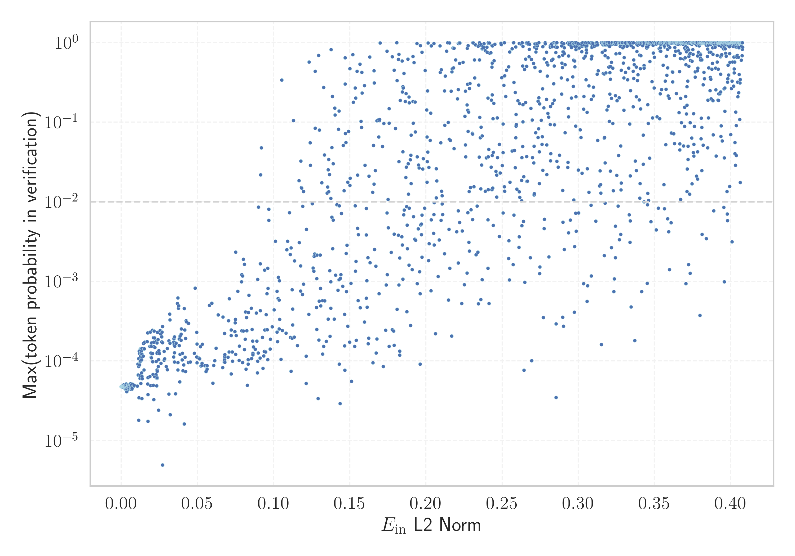

# Report for `LGAI-EXAONE/EXAONE-3.0-7.8B-Instruct`

## Model info

* Tied embeddings: no
* LM head uses bias: no
* Indicator for under-trained tokens: E_{in} L2 Norm
  * Overall distribution 0.688 +/- 0.099
  * Token used for verification prompt building: `MethodAccessorImpl`
  * Verification threshold: 0.408
  * Threshold for showing candidate under-trained tokens: 0.121
  * Median verified threshold (for bytes, unreachable and special tokens): 0.129
* Embeddings shape: (102400, 4096)
* Vocabulary size: 102400
  * Number of single byte tokens: 256, of which 13 below indicator threshold
  * Number of special tokens: 314, of which 303 below indicator threshold
  * Number of non-single-byte unreachable tokens: 2, of which 0 below indicator threshold
  * Number of non-single-byte UTF-fragment tokens: 1222, 7 below soft indicator threshold
  * Number of tested under-trained tokens: 2022, 1648 non-special, 462 below p = 0.01 threshold, 224 below soft indicator threshold

## Under-trained token indicators plot


## Verification plot


## Under-trained token verification results
224 entries below threshold of 0.121

|   token_id | token                  |   indicator | max_prob                                                         | in_other_tokens                                                                                                                                          |
|------------|------------------------|-------------|------------------------------------------------------------------|----------------------------------------------------------------------------------------------------------------------------------------------------------|
|      16227 | ````` ▁**]{}, `````    | 0.000175074 | <span style='border: 1px solid rgb(169, 68, 66);'>4.8e-05</span> |                                                                                                                                                          |
|      38696 | ````` ▁\|>#!/ `````    | 0.000617096 | <span style='border: 1px solid rgb(169, 68, 66);'>4.8e-05</span> |                                                                                                                                                          |
|      72810 | ````` ▁FBQyx `````     | 0.000808007 | <span style='border: 1px solid rgb(169, 68, 66);'>4.8e-05</span> |                                                                                                                                                          |
|      60128 | ````` ▁\x95\x98 `````  | 0.000929712 | <span style='border: 1px solid rgb(169, 68, 66);'>4.8e-05</span> |                                                                                                                                                          |
|      24243 | ````` ▁*]{}, `````     | 0.000935465 | <span style='border: 1px solid rgb(169, 68, 66);'>4.8e-05</span> |                                                                                                                                                          |
|      53381 | ````` ▁',['../ `````   | 0.00111137  | <span style='border: 1px solid rgb(169, 68, 66);'>4.8e-05</span> |                                                                                                                                                          |
|      89712 | ````` ▁\x9d\x80 `````  | 0.0012523   | <span style='border: 1px solid rgb(169, 68, 66);'>4.9e-05</span> |                                                                                                                                                          |
|      60037 | ````` ▁*]{}. `````     | 0.00139303  | <span style='border: 1px solid rgb(169, 68, 66);'>4.7e-05</span> |                                                                                                                                                          |
|     100494 | ````` ▁$]{}]{} `````   | 0.0016583   | <span style='border: 1px solid rgb(169, 68, 66);'>4.8e-05</span> |                                                                                                                                                          |
|      12363 | ````` ▁*]{} `````      | 0.00174418  | <span style='border: 1px solid rgb(169, 68, 66);'>5e-05</span>   | <span style='border: 1px solid rgb(169, 68, 66);'>````` ▁*]{}, `````</span>, <span style='border: 1px solid rgb(169, 68, 66);'>````` ▁*]{}. `````</span> |
|      94290 | ````` ▁\|>/** `````    | 0.00194753  | <span style='border: 1px solid rgb(169, 68, 66);'>4.9e-05</span> |                                                                                                                                                          |
|      90775 | ````` ▁\|>// `````     | 0.00202372  | <span style='border: 1px solid rgb(169, 68, 66);'>4.9e-05</span> |                                                                                                                                                          |
|      81354 | ````` ▁"}](# `````     | 0.00241068  | <span style='border: 1px solid rgb(169, 68, 66);'>4.9e-05</span> |                                                                                                                                                          |
|      89438 | ````` ▁$.[]{ `````     | 0.00246509  | <span style='border: 1px solid rgb(169, 68, 66);'>4.7e-05</span> |                                                                                                                                                          |
|      85203 | ````` ▁"}**). `````    | 0.00269218  | <span style='border: 1px solid rgb(169, 68, 66);'>4.9e-05</span> |                                                                                                                                                          |
|      78561 | ````` ▁^^<\| `````     | 0.00275918  | <span style='border: 1px solid rgb(169, 68, 66);'>4.7e-05</span> |                                                                                                                                                          |
|      90594 | ````` ▁\x82\x98 `````  | 0.00293064  | <span style='border: 1px solid rgb(169, 68, 66);'>4.8e-05</span> |                                                                                                                                                          |
|      82326 | ````` ▁searxhall ````` | 0.00304833  | <span style='border: 1px solid rgb(169, 68, 66);'>4.6e-05</span> |                                                                                                                                                          |
|      82407 | ````` ▁\])]{} `````    | 0.0031009   | <span style='border: 1px solid rgb(169, 68, 66);'>4.6e-05</span> |                                                                                                                                                          |
|      98615 | ````` ▁{}\_[ `````     | 0.00361375  | <span style='border: 1px solid rgb(169, 68, 66);'>4.7e-05</span> |                                                                                                                                                          |
<details><summary>204 additional entries below threshold</summary>

|   token_id | token                             |   indicator | max_prob                                                         | in_other_tokens                                                                                                                                                                                                                          |
|------------|-----------------------------------|-------------|------------------------------------------------------------------|------------------------------------------------------------------------------------------------------------------------------------------------------------------------------------------------------------------------------------------|
|      75262 | ````` ▁\x8b\x88 `````             |  0.00363557 | <span style='border: 1px solid rgb(169, 68, 66);'>4.1e-05</span> |                                                                                                                                                                                                                                          |
|      82617 | ````` ▁\x8f\x84 `````             |  0.00414573 | <span style='border: 1px solid rgb(169, 68, 66);'>4.7e-05</span> |                                                                                                                                                                                                                                          |
|      69830 | ````` ▁QUFDQTtBQUNBO `````        |  0.00435509 | <span style='border: 1px solid rgb(169, 68, 66);'>4.8e-05</span> |                                                                                                                                                                                                                                          |
|      82353 | ````` ▁>]{} `````                 |  0.00455295 | <span style='border: 1px solid rgb(169, 68, 66);'>4.5e-05</span> |                                                                                                                                                                                                                                          |
|      83735 | ````` ▁"}\]. `````                |  0.00473331 | <span style='border: 1px solid rgb(169, 68, 66);'>4.5e-05</span> |                                                                                                                                                                                                                                          |
|      68688 | ````` ▁\|>/* `````                |  0.00484487 | <span style='border: 1px solid rgb(169, 68, 66);'>4.8e-05</span> | <span style='border: 1px solid rgb(169, 68, 66);'>````` ▁\|>/** `````</span>                                                                                                                                                             |
|      99346 | ````` ▁cbiAg `````                |  0.00492841 | <span style='border: 1px solid rgb(169, 68, 66);'>4.8e-05</span> |                                                                                                                                                                                                                                          |
|      57503 | ````` ▁URL안녕 `````              |  0.00644422 | <span style='border: 1px solid rgb(169, 68, 66);'>4.7e-05</span> |                                                                                                                                                                                                                                          |
|      38822 | ````` ▁\|>""" `````               |  0.00735663 | <span style='border: 1px solid rgb(169, 68, 66);'>5.1e-05</span> |                                                                                                                                                                                                                                          |
|      95258 | ````` ▁{}\^[ `````                |  0.00843963 | <span style='border: 1px solid rgb(169, 68, 66);'>4.9e-05</span> |                                                                                                                                                                                                                                          |
|      66650 | ````` ▁\x9c\x89 `````             |  0.00850454 | <span style='border: 1px solid rgb(169, 68, 66);'>5e-05</span>   |                                                                                                                                                                                                                                          |
|      37108 | ````` ▁\x9a\x84 `````             |  0.0105861  | <span style='border: 1px solid rgb(169, 68, 66);'>4.9e-05</span> |                                                                                                                                                                                                                                          |
|      63972 | ````` ▁gICAg `````                |  0.0110624  | <span style='border: 1px solid rgb(169, 68, 66);'>6.7e-05</span> |                                                                                                                                                                                                                                          |
|      16979 | ````` ▁**]{} `````                |  0.0114744  | <span style='border: 1px solid rgb(169, 68, 66);'>1.8e-05</span> |                                                                                                                                                                                                                                          |
|      72269 | ````` ▁\x97\x90 `````             |  0.0115129  | <span style='border: 1px solid rgb(169, 68, 66);'>3.5e-05</span> |                                                                                                                                                                                                                                          |
|      76827 | ````` ▁§\[ `````                  |  0.0119162  | <span style='border: 1px solid rgb(169, 68, 66);'>8.9e-05</span> |                                                                                                                                                                                                                                          |
|      66125 | ````` ▁doibase `````              |  0.0122515  | <span style='border: 1px solid rgb(169, 68, 66);'>6.5e-05</span> |                                                                                                                                                                                                                                          |
|      80102 | ````` ▁욬ᄏᄏᄏ `````             |  0.0123572  | <span style='border: 1px solid rgb(169, 68, 66);'>6.1e-05</span> |                                                                                                                                                                                                                                          |
|      73093 | ````` ▁\x95\x84 `````             |  0.0128273  | <span style='border: 1px solid rgb(169, 68, 66);'>5.2e-05</span> |                                                                                                                                                                                                                                          |
|      49961 | ````` ▁\]]{} `````                |  0.0173867  | <span style='border: 1px solid rgb(169, 68, 66);'>5.2e-05</span> |                                                                                                                                                                                                                                          |
|     100641 | ````` ▁\x9e\x88 `````             |  0.0174227  | <span style='border: 1px solid rgb(169, 68, 66);'>6.2e-05</span> |                                                                                                                                                                                                                                          |
|      88178 | ````` ▁\|>## `````                |  0.0174944  | <span style='border: 1px solid rgb(169, 68, 66);'>3.8e-05</span> |                                                                                                                                                                                                                                          |
|      88410 | ````` ▁기Q `````                  |  0.01759    | <span style='border: 1px solid rgb(169, 68, 66);'>1.8e-05</span> |                                                                                                                                                                                                                                          |
|      97980 | ````` ▁\x95\x8a `````             |  0.0187558  | <span style='border: 1px solid rgb(169, 68, 66);'>6.4e-05</span> |                                                                                                                                                                                                                                          |
|      43572 | ````` ▁\x80\x82 `````             |  0.0191684  | <span style='border: 1px solid rgb(169, 68, 66);'>4.9e-05</span> |                                                                                                                                                                                                                                          |
|      39257 | ````` ▁}$]{} `````                |  0.019612   | <span style='border: 1px solid rgb(169, 68, 66);'>0.00011</span> |                                                                                                                                                                                                                                          |
|      95788 | ````` ▁\^[- `````                 |  0.0204227  | <span style='border: 1px solid rgb(169, 68, 66);'>9.9e-05</span> |                                                                                                                                                                                                                                          |
|      54411 | ````` ▁\x88\x91 `````             |  0.0207133  | <span style='border: 1px solid rgb(169, 68, 66);'>9.8e-05</span> |                                                                                                                                                                                                                                          |
|      72244 | ````` ▁기안녕 `````               |  0.020765   | <span style='border: 1px solid rgb(169, 68, 66);'>6.8e-05</span> |                                                                                                                                                                                                                                          |
|      93351 | ````` ▁\*\*](# `````              |  0.0232261  | <span style='border: 1px solid rgb(169, 68, 66);'>4.9e-05</span> |                                                                                                                                                                                                                                          |
|      26233 | ````` ▁$]{} `````                 |  0.0234889  | <span style='border: 1px solid rgb(169, 68, 66);'>0.00013</span> | <span style='border: 1px solid rgb(169, 68, 66);'>````` ▁$]{}; `````</span>, <span style='border: 1px solid rgb(169, 68, 66);'>````` ▁$]{}]{} `````</span>                                                                               |
|      88587 | ````` ▁="../../../../../../ ````` |  0.0243896  | <span style='border: 1px solid rgb(169, 68, 66);'>2.4e-05</span> |                                                                                                                                                                                                                                          |
|      82344 | ````` ▁으실까 `````               |  0.0244308  | <span style='border: 1px solid rgb(169, 68, 66);'>0.0001</span>  |                                                                                                                                                                                                                                          |
|       4370 | ````` ▁endofsec `````             |  0.024982   | <span style='border: 1px solid rgb(169, 68, 66);'>0.00012</span> |                                                                                                                                                                                                                                          |
|      87091 | ````` ▁으려구요 `````             |  0.0281696  | <span style='border: 1px solid rgb(169, 68, 66);'>0.00013</span> |                                                                                                                                                                                                                                          |
|      98926 | ````` ▁invCluster `````           |  0.0281997  | <span style='border: 1px solid rgb(169, 68, 66);'>0.0001</span>  |                                                                                                                                                                                                                                          |
|      97838 | ````` ▁\x8b\x9c `````             |  0.0294347  | <span style='border: 1px solid rgb(169, 68, 66);'>8.6e-05</span> |                                                                                                                                                                                                                                          |
|      71616 | ````` ▁\]\]. `````                |  0.030258   | <span style='border: 1px solid rgb(169, 68, 66);'>0.00014</span> |                                                                                                                                                                                                                                          |
|      79363 | ````` ▁었잖 `````                 |  0.0321555  | <span style='border: 1px solid rgb(169, 68, 66);'>2.1e-05</span> |                                                                                                                                                                                                                                          |
|      72232 | ````` ▁="../../../../../ `````    |  0.0343422  | <span style='border: 1px solid rgb(169, 68, 66);'>0.00017</span> | <span style='border: 1px solid rgb(169, 68, 66);'>````` ▁="../../../../../../ `````</span>                                                                                                                                               |
|      61214 | ````` ▁어야죠 `````               |  0.0343921  | <span style='border: 1px solid rgb(169, 68, 66);'>0.00011</span> |                                                                                                                                                                                                                                          |
|      47749 | ````` ▁\_{\\ `````                |  0.034726   | <span style='border: 1px solid rgb(169, 68, 66);'>0.00016</span> |                                                                                                                                                                                                                                          |
|     101885 | ````` ▁":[]," `````               |  0.0348421  | <span style='border: 1px solid rgb(169, 68, 66);'>0.00013</span> |                                                                                                                                                                                                                                          |
|      53233 | ````` ▁~}{~ `````                 |  0.0348569  | <span style='border: 1px solid rgb(169, 68, 66);'>0.0002</span>  |                                                                                                                                                                                                                                          |
|      93957 | ````` ▁을께요 `````               |  0.0348881  | <span style='border: 1px solid rgb(169, 68, 66);'>0.00017</span> |                                                                                                                                                                                                                                          |
|      94506 | ````` ▁으라며 `````               |  0.0349418  | <span style='border: 1px solid rgb(169, 68, 66);'>9.7e-05</span> |                                                                                                                                                                                                                                          |
|      94939 | ````` ▁\x80\x9d `````             |  0.0351221  | <span style='border: 1px solid rgb(169, 68, 66);'>0.00015</span> |                                                                                                                                                                                                                                          |
|      45978 | ````` ▁\x9a\x94 `````             |  0.035548   | <span style='border: 1px solid rgb(169, 68, 66);'>3.9e-05</span> |                                                                                                                                                                                                                                          |
|      55847 | ````` ▁lPLV `````                 |  0.0358812  | <span style='border: 1px solid rgb(169, 68, 66);'>0.00017</span> |                                                                                                                                                                                                                                          |
|      79783 | ````` ▁":{}," `````               |  0.0371327  | <span style='border: 1px solid rgb(169, 68, 66);'>7.7e-05</span> |                                                                                                                                                                                                                                          |
|      90146 | ````` ▁으셨다고 `````             |  0.0371451  | <span style='border: 1px solid rgb(169, 68, 66);'>9.6e-05</span> |                                                                                                                                                                                                                                          |
|      87756 | ````` ▁notChosenColour `````      |  0.0371648  | <span style='border: 1px solid rgb(169, 68, 66);'>0.00062</span> |                                                                                                                                                                                                                                          |
|      93834 | ````` ▁}$$^{ `````                |  0.0392839  | <span style='border: 1px solid rgb(169, 68, 66);'>0.00018</span> |                                                                                                                                                                                                                                          |
|     102050 | ````` ▁을런지 `````               |  0.0400233  | <span style='border: 1px solid rgb(169, 68, 66);'>0.0001</span>  |                                                                                                                                                                                                                                          |
|      82497 | ````` ▁으신데 `````               |  0.0402016  | <span style='border: 1px solid rgb(169, 68, 66);'>0.00013</span> |                                                                                                                                                                                                                                          |
|      72843 | ````` ▁을라고 `````               |  0.0405039  | <span style='border: 1px solid rgb(169, 68, 66);'>7.6e-05</span> |                                                                                                                                                                                                                                          |
|      94990 | ````` ▁는겨 `````                 |  0.0409461  | <span style='border: 1px solid rgb(169, 68, 66);'>8.9e-05</span> |                                                                                                                                                                                                                                          |
|      82306 | ````` ▁jagjag `````               |  0.0413802  | <span style='border: 1px solid rgb(169, 68, 66);'>1.6e-05</span> |                                                                                                                                                                                                                                          |
|      61185 | ````` ▁\x80\x99 `````             |  0.0416823  | <span style='border: 1px solid rgb(169, 68, 66);'>0.00025</span> |                                                                                                                                                                                                                                          |
|      91650 | ````` ▁세욧 `````                 |  0.0418946  | <span style='border: 1px solid rgb(169, 68, 66);'>0.00011</span> |                                                                                                                                                                                                                                          |
|      88118 | ````` ▁}^{\\ `````                |  0.0421325  | <span style='border: 1px solid rgb(169, 68, 66);'>0.00019</span> |                                                                                                                                                                                                                                          |
|      90782 | ````` ▁슴당 `````                 |  0.0422242  | <span style='border: 1px solid rgb(169, 68, 66);'>7.4e-05</span> |                                                                                                                                                                                                                                          |
|      11677 | ````` ▁\|># `````                 |  0.0427332  | <span style='border: 1px solid rgb(169, 68, 66);'>0.00031</span> | <span style='border: 1px solid rgb(169, 68, 66);'>````` ▁\|>#!/ `````</span>, <span style='border: 1px solid rgb(169, 68, 66);'>````` ▁\|>## `````</span>                                                                                |
|      74637 | ````` ▁을껄 `````                 |  0.0441268  | <span style='border: 1px solid rgb(169, 68, 66);'>9.6e-05</span> |                                                                                                                                                                                                                                          |
|      68640 | ````` ▁으셨으면 `````             |  0.0454152  | <span style='border: 1px solid rgb(169, 68, 66);'>9.7e-05</span> |                                                                                                                                                                                                                                          |
|      69409 | ````` ▁으셨다면 `````             |  0.0480046  | <span style='border: 1px solid rgb(169, 68, 66);'>0.00013</span> |                                                                                                                                                                                                                                          |
|      65727 | ````` ▁}}\_{ `````                |  0.0485478  | <span style='border: 1px solid rgb(169, 68, 66);'>0.00082</span> |                                                                                                                                                                                                                                          |
|      81529 | ````` ▁으라면 `````               |  0.0494797  | <span style='border: 1px solid rgb(169, 68, 66);'>0.00011</span> |                                                                                                                                                                                                                                          |
|      56328 | ````` ▁$]{}; `````                |  0.0496027  | <span style='border: 1px solid rgb(169, 68, 66);'>0.00023</span> |                                                                                                                                                                                                                                          |
|      90870 | ````` ▁으신지 `````               |  0.0496087  | <span style='border: 1px solid rgb(169, 68, 66);'>9.5e-05</span> |                                                                                                                                                                                                                                          |
|      91083 | ````` ▁셔야죠 `````               |  0.0496942  | <span style='border: 1px solid rgb(169, 68, 66);'>0.00016</span> |                                                                                                                                                                                                                                          |
|      98506 | ````` ▁을께 `````                 |  0.0508804  | <span style='border: 1px solid rgb(169, 68, 66);'>0.00011</span> |                                                                                                                                                                                                                                          |
|      73583 | ````` ▁으련만 `````               |  0.051362   | <span style='border: 1px solid rgb(169, 68, 66);'>0.00011</span> |                                                                                                                                                                                                                                          |
|      73431 | ````` ▁\x84\x9c `````             |  0.0520265  | <span style='border: 1px solid rgb(169, 68, 66);'>0.00015</span> |                                                                                                                                                                                                                                          |
|      65695 | ````` ▁으련 `````                 |  0.0522481  | <span style='border: 1px solid rgb(169, 68, 66);'>8.7e-05</span> | <span style='border: 1px solid rgb(169, 68, 66);'>````` ▁으련만 `````</span>                                                                                                                                                             |
|      47851 | ````` ▁으셨어요 `````             |  0.0528579  | <span style='border: 1px solid rgb(169, 68, 66);'>8.8e-05</span> |                                                                                                                                                                                                                                          |
|      78138 | ````` ▁으셨을 `````               |  0.0529417  | <span style='border: 1px solid rgb(169, 68, 66);'>9.4e-05</span> |                                                                                                                                                                                                                                          |
|      85552 | ````` ▁jobbuilder `````           |  0.053133   | <span style='border: 1px solid rgb(169, 68, 66);'>0.00016</span> |                                                                                                                                                                                                                                          |
|      79290 | ````` ▁은가요 `````               |  0.0549022  | <span style='border: 1px solid rgb(169, 68, 66);'>8.7e-05</span> |                                                                                                                                                                                                                                          |
|      87159 | ````` ▁으려다 `````               |  0.0555296  | <span style='border: 1px solid rgb(169, 68, 66);'>7.4e-05</span> |                                                                                                                                                                                                                                          |
|      52280 | ````` ▁으셨던 `````               |  0.0563484  | <span style='border: 1px solid rgb(169, 68, 66);'>8.7e-05</span> |                                                                                                                                                                                                                                          |
|      83138 | ````` ▁으려다가 `````             |  0.0563513  | <span style='border: 1px solid rgb(169, 68, 66);'>7.9e-05</span> |                                                                                                                                                                                                                                          |
|      78421 | ````` ▁'],['../ `````             |  0.0579015  | <span style='border: 1px solid rgb(169, 68, 66);'>0.0005</span>  |                                                                                                                                                                                                                                          |
|      56282 | ````` ▁"}},[ `````                |  0.0593925  | <span style='border: 1px solid rgb(169, 68, 66);'>0.00053</span> |                                                                                                                                                                                                                                          |
|      95513 | ````` ▁으신다 `````               |  0.0600611  | <span style='border: 1px solid rgb(169, 68, 66);'>5.3e-05</span> |                                                                                                                                                                                                                                          |
|      75375 | ````` ▁습니다요 `````             |  0.0606577  | <span style='border: 1px solid rgb(169, 68, 66);'>8.8e-05</span> |                                                                                                                                                                                                                                          |
|      21358 | ````` ▁"}]( `````                 |  0.0613163  | <span style='border: 1px solid rgb(169, 68, 66);'>0.0001</span>  | <span style='border: 1px solid rgb(169, 68, 66);'>````` ▁"}](# `````</span>                                                                                                                                                              |
|      70702 | ````` ▁URLQ `````                 |  0.063639   | <span style='border: 1px solid rgb(169, 68, 66);'>0.00038</span> |                                                                                                                                                                                                                                          |
|      78534 | ````` ▁으셨는데 `````             |  0.0665507  | <span style='border: 1px solid rgb(169, 68, 66);'>8.3e-05</span> |                                                                                                                                                                                                                                          |
|      64748 | ````` ▁{}\_ `````                 |  0.0668018  | <span style='border: 1px solid rgb(169, 68, 66);'>0.00036</span> | <span style='border: 1px solid rgb(169, 68, 66);'>````` ▁{}\_[ `````</span>                                                                                                                                                              |
|      37449 | ````` ▁으신다면 `````             |  0.0676796  | <span style='border: 1px solid rgb(169, 68, 66);'>9.7e-05</span> |                                                                                                                                                                                                                                          |
|      68787 | ````` ▁려니까 `````               |  0.0678627  | <span style='border: 1px solid rgb(169, 68, 66);'>0.0001</span>  |                                                                                                                                                                                                                                          |
|      83775 | ````` ▁더랬다 `````               |  0.0679134  | <span style='border: 1px solid rgb(169, 68, 66);'>9.7e-05</span> |                                                                                                                                                                                                                                          |
|      64198 | ````` ▁으려니 `````               |  0.0679142  | <span style='border: 1px solid rgb(169, 68, 66);'>0.00011</span> |                                                                                                                                                                                                                                          |
|     100200 | ````` ▁로페이 `````               |  0.068006   | <span style='border: 1px solid rgb(169, 68, 66);'>0.00012</span> |                                                                                                                                                                                                                                          |
|      50344 | ````` ▁으십니다 `````             |  0.0700746  | <span style='border: 1px solid rgb(169, 68, 66);'>0.00011</span> |                                                                                                                                                                                                                                          |
|      78806 | ````` ▁":{}, `````                |  0.070387   | <span style='border: 1px solid rgb(169, 68, 66);'>0.00032</span> | <span style='border: 1px solid rgb(169, 68, 66);'>````` ▁":{}," `````</span>                                                                                                                                                             |
|      80181 | ````` ▁랬죠 `````                 |  0.0706653  | <span style='border: 1px solid rgb(169, 68, 66);'>0.00013</span> |                                                                                                                                                                                                                                          |
|      52412 | ````` ▁\*](# `````                |  0.0709758  | <span style='border: 1px solid rgb(169, 68, 66);'>0.00061</span> |                                                                                                                                                                                                                                          |
|      76308 | ````` ▁지만서도 `````             |  0.0720576  | <span style='border: 1px solid rgb(169, 68, 66);'>0.00021</span> |                                                                                                                                                                                                                                          |
|      99448 | ````` ▁획단 `````                 |  0.0721189  | <span style='border: 1px solid rgb(169, 68, 66);'>0.00025</span> |                                                                                                                                                                                                                                          |
|      54883 | ````` ▁을게요 `````               |  0.0721986  | <span style='border: 1px solid rgb(169, 68, 66);'>6.9e-05</span> |                                                                                                                                                                                                                                          |
|      75205 | ````` ▁십쇼 `````                 |  0.0727978  | <span style='border: 1px solid rgb(169, 68, 66);'>0.00013</span> |                                                                                                                                                                                                                                          |
|      81533 | ````` ▁medscimonit `````          |  0.0729367  | <span style='border: 1px solid rgb(169, 68, 66);'>9.9e-05</span> |                                                                                                                                                                                                                                          |
|      69454 | ````` ▁실래요 `````               |  0.0745117  | <span style='border: 1px solid rgb(169, 68, 66);'>0.00023</span> |                                                                                                                                                                                                                                          |
|     100895 | ````` ▁coloneqq `````             |  0.0746932  | <span style='border: 1px solid rgb(169, 68, 66);'>0.0003</span>  |                                                                                                                                                                                                                                          |
|      54961 | ````` ▁":[{" `````                |  0.0749101  | <span style='border: 1px solid rgb(169, 68, 66);'>0.00033</span> |                                                                                                                                                                                                                                          |
|      26756 | ````` ▁\|>--- `````               |  0.0750794  | <span style='border: 1px solid rgb(255, 145, 0);'>0.0023</span>  |                                                                                                                                                                                                                                          |
|      86443 | ````` ▁숩니다 `````               |  0.0751194  | <span style='border: 1px solid rgb(169, 68, 66);'>0.00012</span> |                                                                                                                                                                                                                                          |
|      96375 | ````` ▁냐니까 `````               |  0.0753492  | <span style='border: 1px solid rgb(169, 68, 66);'>0.00021</span> |                                                                                                                                                                                                                                          |
|      40624 | ````` ▁으려나 `````               |  0.0773674  | <span style='border: 1px solid rgb(169, 68, 66);'>0.0001</span>  |                                                                                                                                                                                                                                          |
|      70311 | ````` ▁는대요 `````               |  0.0775046  | <span style='border: 1px solid rgb(169, 68, 66);'>0.00015</span> |                                                                                                                                                                                                                                          |
|      36400 | ````` ▁__': `````                 |  0.0788825  | <span style='border: 1px solid rgb(169, 68, 66);'>0.00099</span> |                                                                                                                                                                                                                                          |
|      41246 | ````` ▁setMaxAccess `````         |  0.0790024  | <span style='border: 1px solid rgb(255, 145, 0);'>0.0012</span>  |                                                                                                                                                                                                                                          |
|      42784 | ````` ▁아서요 `````               |  0.0791611  | <span style='border: 1px solid rgb(169, 68, 66);'>0.00024</span> |                                                                                                                                                                                                                                          |
|      76901 | ````` ▁\|>' `````                 |  0.0795299  | <span style='border: 1px solid rgb(255, 145, 0);'>0.0012</span>  |                                                                                                                                                                                                                                          |
|      41295 | ````` ▁을려고 `````               |  0.0796354  | <span style='border: 1px solid rgb(169, 68, 66);'>9.6e-05</span> |                                                                                                                                                                                                                                          |
|      89581 | ````` 들꼬들 `````                |  0.0800826  | <span style='border: 1px solid rgb(169, 68, 66);'>0.00024</span> | ````` ▁꼬들꼬들 `````                                                                                                                                                                                                                    |
|      89566 | ````` ▁{}\^ `````                 |  0.0801286  | <span style='border: 1px solid rgb(255, 145, 0);'>0.0019</span>  | <span style='border: 1px solid rgb(169, 68, 66);'>````` ▁{}\^[ `````</span>                                                                                                                                                              |
|      56650 | ````` ▁야징 `````                 |  0.0814219  | <span style='border: 1px solid rgb(169, 68, 66);'>0.00019</span> |                                                                                                                                                                                                                                          |
|      54395 | ````` ▁"}** `````                 |  0.0815075  | <span style='border: 1px solid rgb(169, 68, 66);'>0.00041</span> | <span style='border: 1px solid rgb(169, 68, 66);'>````` ▁"}**). `````</span>                                                                                                                                                             |
|      28517 | ````` ▁으셔도 `````               |  0.08186    | <span style='border: 1px solid rgb(169, 68, 66);'>7.9e-05</span> |                                                                                                                                                                                                                                          |
|      85781 | ````` ▁jcmm `````                 |  0.0822924  | <span style='border: 1px solid rgb(169, 68, 66);'>0.00035</span> |                                                                                                                                                                                                                                          |
|      91845 | ````` ▁련다 `````                 |  0.0823695  | <span style='border: 1px solid rgb(169, 68, 66);'>0.00024</span> |                                                                                                                                                                                                                                          |
|      42046 | ````` ▁으셔야 `````               |  0.0827796  | <span style='border: 1px solid rgb(169, 68, 66);'>4.9e-05</span> |                                                                                                                                                                                                                                          |
|      25075 | ````` ▁으셔서 `````               |  0.0832589  | <span style='border: 1px solid rgb(169, 68, 66);'>9.1e-05</span> |                                                                                                                                                                                                                                          |
|      22554 | ````` ▁으니깐 `````               |  0.0832792  | <span style='border: 1px solid rgb(169, 68, 66);'>0.0001</span>  |                                                                                                                                                                                                                                          |
|      32335 | ````` ▁MOESM `````                |  0.0834424  | <span style='border: 1px solid rgb(169, 68, 66);'>0.00041</span> |                                                                                                                                                                                                                                          |
|      64888 | ````` ▁mathds `````               |  0.0837605  | <span style='border: 1px solid rgb(169, 68, 66);'>0.00067</span> |                                                                                                                                                                                                                                          |
|     100835 | ````` ▁는진 `````                 |  0.0855041  | <span style='border: 1px solid rgb(169, 68, 66);'>0.00011</span> |                                                                                                                                                                                                                                          |
|      72444 | ````` 송뽀송 `````                |  0.0858916  | <span style='border: 1px solid rgb(169, 68, 66);'>0.00025</span> | ````` ▁뽀송뽀송 `````                                                                                                                                                                                                                    |
|     100351 | ````` ▁려는지 `````               |  0.0861538  | <span style='border: 1px solid rgb(169, 68, 66);'>0.00018</span> |                                                                                                                                                                                                                                          |
|      88319 | ````` ▁려나요 `````               |  0.0863743  | <span style='border: 1px solid rgb(169, 68, 66);'>0.00012</span> |                                                                                                                                                                                                                                          |
|      96403 | ````` ▁}}})$ `````                |  0.0864248  | <span style='border: 1px solid rgb(169, 68, 66);'>0.00012</span> |                                                                                                                                                                                                                                          |
|      63035 | ````` ▁더랬죠 `````               |  0.0867582  | <span style='border: 1px solid rgb(169, 68, 66);'>0.00015</span> |                                                                                                                                                                                                                                          |
|      84910 | ````` ▁\xad! `````                |  0.0879964  | <span style='border: 1px solid rgb(169, 68, 66);'>0.00014</span> |                                                                                                                                                                                                                                          |
|      94010 | ````` ▁계망 `````                 |  0.0885917  | <span style='border: 1px solid rgb(169, 68, 66);'>0.0004</span>  |                                                                                                                                                                                                                                          |
|      95028 | ````` ▁던지요 `````               |  0.0890141  | <span style='border: 1px solid rgb(169, 68, 66);'>0.00018</span> |                                                                                                                                                                                                                                          |
|      31729 | ````` ▁는지라 `````               |  0.0893019  | <span style='border: 1px solid rgb(169, 68, 66);'>7.1e-05</span> |                                                                                                                                                                                                                                          |
|      84909 | ````` ▁더라니 `````               |  0.0894393  | <span style='border: 1px solid rgb(169, 68, 66);'>9.9e-05</span> |                                                                                                                                                                                                                                          |
|      78879 | ````` ▁슴돠 `````                 |  0.0899123  | <span style='border: 1px solid rgb(169, 68, 66);'>0.00013</span> |                                                                                                                                                                                                                                          |
|      77490 | ````` ▁comtag `````               |  0.0900033  | <span style='border: 1px solid rgb(255, 145, 0);'>0.0085</span>  |                                                                                                                                                                                                                                          |
|      79467 | ````` ▁으셨고 `````               |  0.0911722  | <span style='border: 1px solid rgb(169, 68, 66);'>0.00011</span> |                                                                                                                                                                                                                                          |
|      49401 | ````` ▁="@+ `````                 |  0.0912628  | <span style='border: 1px solid rgb(255, 145, 0);'>0.0017</span>  |                                                                                                                                                                                                                                          |
|      76082 | ````` ▁"},[ `````                 |  0.0913067  | <span style='border: 1px solid rgb(169, 68, 66);'>0.00043</span> |                                                                                                                                                                                                                                          |
|      81604 | ````` ▁;"\| `````                 |  0.0920271  | <span style='border: 1px solid rgb(251, 189, 8);'>0.048</span>   |                                                                                                                                                                                                                                          |
|      95041 | ````` ▁로워서 `````               |  0.092717   | <span style='border: 1px solid rgb(169, 68, 66);'>0.0002</span>  |                                                                                                                                                                                                                                          |
|      36417 | ````` ▁는지요 `````               |  0.0930448  | <span style='border: 1px solid rgb(169, 68, 66);'>8.1e-05</span> |                                                                                                                                                                                                                                          |
|      38666 | ````` ▁신답니다 `````             |  0.0936131  | <span style='border: 1px solid rgb(169, 68, 66);'>0.00012</span> |                                                                                                                                                                                                                                          |
|      79505 | ````` ▁~<\| `````                 |  0.093809   | <span style='border: 1px solid rgb(169, 68, 66);'>0.00013</span> |                                                                                                                                                                                                                                          |
|      77017 | ````` ▁**](# `````                |  0.0940714  | <span style='border: 1px solid rgb(255, 145, 0);'>0.0014</span>  |                                                                                                                                                                                                                                          |
|      88793 | ````` ▁실까봐 `````               |  0.0941785  | <span style='border: 1px solid rgb(169, 68, 66);'>0.00025</span> |                                                                                                                                                                                                                                          |
|      75031 | ````` ▁어서다 `````               |  0.0947662  | <span style='border: 1px solid rgb(169, 68, 66);'>0.00013</span> |                                                                                                                                                                                                                                          |
|      54261 | ````` ▁scriptscripts `````        |  0.0951619  | <span style='border: 1px solid rgb(169, 68, 66);'>0.00038</span> | <span style='border: 1px solid rgb(255, 145, 0);'>````` ▁scriptscriptstyle `````</span>                                                                                                                                                  |
|      89389 | ````` 덕꾸덕 `````                |  0.0955829  | <span style='border: 1px solid rgb(169, 68, 66);'>0.0007</span>  | ````` ▁꾸덕꾸덕 `````                                                                                                                                                                                                                    |
|      20328 | ````` ▁으셔 `````                 |  0.0957458  | <span style='border: 1px solid rgb(169, 68, 66);'>0.00025</span> | <span style='border: 1px solid rgb(169, 68, 66);'>````` ▁으셔서 `````</span>, <span style='border: 1px solid rgb(169, 68, 66);'>````` ▁으셔도 `````</span>, <span style='border: 1px solid rgb(169, 68, 66);'>````` ▁으셔야 `````</span> |
|      79486 | ````` ▁을지라도 `````             |  0.096054   | <span style='border: 1px solid rgb(169, 68, 66);'>0.0001</span>  |                                                                                                                                                                                                                                          |
|      83403 | ````` ▁"}^ `````                  |  0.0962015  | <span style='border: 1px solid rgb(255, 145, 0);'>0.0015</span>  |                                                                                                                                                                                                                                          |
|      86581 | ````` ▁구화장 `````               |  0.0962356  | <span style='border: 1px solid rgb(169, 68, 66);'>0.00082</span> |                                                                                                                                                                                                                                          |
|      52797 | ````` ▁~}{ `````                  |  0.0968241  | <span style='border: 1px solid rgb(255, 145, 0);'>0.0058</span>  | <span style='border: 1px solid rgb(169, 68, 66);'>````` ▁~}{~ `````</span>                                                                                                                                                               |
|      73290 | ````` ▁fefefe `````               |  0.0968343  | <span style='border: 1px solid rgb(255, 145, 0);'>0.008</span>   |                                                                                                                                                                                                                                          |
|      87181 | ````` ▁더랍니다 `````             |  0.0976293  | <span style='border: 1px solid rgb(169, 68, 66);'>0.00014</span> |                                                                                                                                                                                                                                          |
|      63892 | ````` ▁냐면서 `````               |  0.0978787  | <span style='border: 1px solid rgb(169, 68, 66);'>0.00019</span> |                                                                                                                                                                                                                                          |
|      92491 | ````` ▁뇽하 `````                 |  0.0991043  | <span style='border: 1px solid rgb(169, 68, 66);'>0.00027</span> |                                                                                                                                                                                                                                          |
|      57149 | ````` ▁\xad~ `````                |  0.100361   | <span style='border: 1px solid rgb(169, 68, 66);'>0.00044</span> |                                                                                                                                                                                                                                          |
|      79973 | ````` ▁}}{\\ `````                |  0.101247   | <span style='border: 1px solid rgb(255, 145, 0);'>0.0032</span>  |                                                                                                                                                                                                                                          |
|      33518 | ````` ▁려고요 `````               |  0.102159   | <span style='border: 1px solid rgb(169, 68, 66);'>0.00023</span> |                                                                                                                                                                                                                                          |
|      34432 | ````` ▁더랬 `````                 |  0.102219   | <span style='border: 1px solid rgb(169, 68, 66);'>0.00075</span> | <span style='border: 1px solid rgb(169, 68, 66);'>````` ▁더랬죠 `````</span>, <span style='border: 1px solid rgb(169, 68, 66);'>````` ▁더랬다 `````</span>                                                                               |
|      40709 | ````` ▁="../../../../ `````       |  0.102508   | <span style='border: 1px solid rgb(169, 68, 66);'>0.00018</span> | <span style='border: 1px solid rgb(169, 68, 66);'>````` ▁="../../../../../ `````</span>, <span style='border: 1px solid rgb(169, 68, 66);'>````` ▁="../../../../../../ `````</span>                                                      |
|      55239 | ````` ▁']]], `````                |  0.103116   | <span style='border: 1px solid rgb(255, 145, 0);'>0.0011</span>  |                                                                                                                                                                                                                                          |
|      69613 | ````` ▁까말까 `````               |  0.103562   | <span style='border: 1px solid rgb(169, 68, 66);'>0.00025</span> |                                                                                                                                                                                                                                          |
|      97803 | ````` ▁;<\| `````                 |  0.103621   | <span style='border: 1px solid rgb(169, 68, 66);'>0.00059</span> |                                                                                                                                                                                                                                          |
|      87054 | ````` ▁옄 `````                   |  0.103732   | <span style='border: 1px solid rgb(255, 145, 0);'>0.001</span>   |                                                                                                                                                                                                                                          |
|      96764 | ````` ▁다면서요 `````             |  0.103913   | <span style='border: 1px solid rgb(169, 68, 66);'>0.00033</span> |                                                                                                                                                                                                                                          |
|      49721 | ````` ▁더니만 `````               |  0.104781   | <span style='border: 1px solid rgb(169, 68, 66);'>0.00011</span> |                                                                                                                                                                                                                                          |
|      94196 | ````` ▁memitem `````              |  0.105333   | <span style='border: 1px solid rgb(40, 167, 69);'>0.34</span>    |                                                                                                                                                                                                                                          |
|     100327 | ````` ▁더래도 `````               |  0.105654   | <span style='border: 1px solid rgb(169, 68, 66);'>0.00024</span> |                                                                                                                                                                                                                                          |
|      57675 | ````` ▁는군 `````                 |  0.108082   | <span style='border: 1px solid rgb(169, 68, 66);'>0.00022</span> |                                                                                                                                                                                                                                          |
|      82896 | ````` ▁간녀 `````                 |  0.10864    | <span style='border: 1px solid rgb(255, 145, 0);'>0.0025</span>  |                                                                                                                                                                                                                                          |
|      74440 | ````` ▁푸치노 `````               |  0.109201   | <span style='border: 1px solid rgb(255, 145, 0);'>0.0032</span>  |                                                                                                                                                                                                                                          |
|      48672 | ````` ▁\^[ `````                  |  0.110329   | <span style='border: 1px solid rgb(255, 145, 0);'>0.0073</span>  | <span style='border: 1px solid rgb(169, 68, 66);'>````` ▁\^[- `````</span>                                                                                                                                                               |
|      31589 | ````` ▁{}]{} `````                |  0.110914   | <span style='border: 1px solid rgb(255, 145, 0);'>0.0022</span>  |                                                                                                                                                                                                                                          |
|      78419 | ````` ▁기보단 `````               |  0.111123   | <span style='border: 1px solid rgb(169, 68, 66);'>0.0002</span>  |                                                                                                                                                                                                                                          |
|     100497 | ````` ▁저브 `````                 |  0.111438   | <span style='border: 1px solid rgb(255, 145, 0);'>0.0026</span>  |                                                                                                                                                                                                                                          |
|      55122 | ````` ▁렵니다 `````               |  0.111531   | <span style='border: 1px solid rgb(169, 68, 66);'>7.4e-05</span> |                                                                                                                                                                                                                                          |
|      44320 | ````` ▁곸 `````                   |  0.112072   | <span style='border: 1px solid rgb(169, 68, 66);'>0.00079</span> |                                                                                                                                                                                                                                          |
|      34357 | ````` ▁는디 `````                 |  0.112078   | <span style='border: 1px solid rgb(169, 68, 66);'>0.00019</span> |                                                                                                                                                                                                                                          |
|      46004 | ````` ▁셨었 `````                 |  0.112478   | <span style='border: 1px solid rgb(169, 68, 66);'>0.00028</span> |                                                                                                                                                                                                                                          |
|      70518 | ````` ▁marinedrugs `````          |  0.11255    | <span style='border: 1px solid rgb(169, 68, 66);'>0.00045</span> |                                                                                                                                                                                                                                          |
|      82529 | ````` ▁memItem `````              |  0.112924   | <span style='border: 1px solid rgb(40, 167, 69);'>0.11</span>    |                                                                                                                                                                                                                                          |
|      82398 | ````` ▁던가요 `````               |  0.113552   | <span style='border: 1px solid rgb(169, 68, 66);'>0.0002</span>  |                                                                                                                                                                                                                                          |
|      54662 | ````` ▁\x8a\x94 `````             |  0.113667   | <span style='border: 1px solid rgb(255, 145, 0);'>0.0018</span>  |                                                                                                                                                                                                                                          |
|      67939 | ````` ▁는다며 `````               |  0.115551   | <span style='border: 1px solid rgb(169, 68, 66);'>0.00016</span> |                                                                                                                                                                                                                                          |
|      89406 | ````` ▁}\_{ `````                 |  0.116589   | <span style='border: 1px solid rgb(251, 189, 8);'>0.018</span>   |                                                                                                                                                                                                                                          |
|     100522 | ````` ▁각외 `````                 |  0.116873   | <span style='border: 1px solid rgb(255, 145, 0);'>0.0031</span>  |                                                                                                                                                                                                                                          |
|      84632 | ````` ▁락할 `````                 |  0.117663   | <span style='border: 1px solid rgb(255, 145, 0);'>0.0016</span>  |                                                                                                                                                                                                                                          |
|      86075 | ````` ▁더이다 `````               |  0.117684   | <span style='border: 1px solid rgb(169, 68, 66);'>0.00076</span> |                                                                                                                                                                                                                                          |
|      64959 | ````` ▁^{\\ `````                 |  0.11824    | <span style='border: 1px solid rgb(251, 189, 8);'>0.015</span>   |                                                                                                                                                                                                                                          |
|      71016 | ````` ]{}]{} `````                |  0.11834    | <span style='border: 1px solid rgb(251, 189, 8);'>0.015</span>   | <span style='border: 1px solid rgb(169, 68, 66);'>````` ▁$]{}]{} `````</span>                                                                                                                                                            |
|      66645 | ````` ▁mathbbm `````              |  0.118931   | <span style='border: 1px solid rgb(169, 68, 66);'>0.00069</span> |                                                                                                                                                                                                                                          |
|      29519 | ````` ▁아야지 `````               |  0.119177   | <span style='border: 1px solid rgb(255, 145, 0);'>0.0088</span>  |                                                                                                                                                                                                                                          |
|      83390 | ````` ▁슴니다 `````               |  0.119535   | <span style='border: 1px solid rgb(169, 68, 66);'>0.00092</span> |                                                                                                                                                                                                                                          |
|      93448 | ````` ▁로점 `````                 |  0.119589   | <span style='border: 1px solid rgb(251, 189, 8);'>0.014</span>   |                                                                                                                                                                                                                                          |
|      44451 | ````` ▁으라는 `````               |  0.121301   | <span style='border: 1px solid rgb(169, 68, 66);'>5.2e-05</span> |                                                                                                                                                                                                                                          |
</details>
<details><summary>1424 additional entries above threshold</summary>

|   token_id | token                                  |   indicator | max_prob                                                         | in_other_tokens                                                                                                                                                                                                                                                                                                                                                                                                 |
|------------|----------------------------------------|-------------|------------------------------------------------------------------|-----------------------------------------------------------------------------------------------------------------------------------------------------------------------------------------------------------------------------------------------------------------------------------------------------------------------------------------------------------------------------------------------------------------|
|      27925 | ````` ▁려는데 `````                    |    0.121331 | <span style='border: 1px solid rgb(169, 68, 66);'>0.00012</span> |                                                                                                                                                                                                                                                                                                                                                                                                                 |
|      18419 | ````` ▁--[@ `````                      |    0.12151  | <span style='border: 1px solid rgb(255, 145, 0);'>0.0045</span>  |                                                                                                                                                                                                                                                                                                                                                                                                                 |
|      20707 | ````` ▁\]), `````                      |    0.12313  | <span style='border: 1px solid rgb(169, 68, 66);'>0.00039</span> |                                                                                                                                                                                                                                                                                                                                                                                                                 |
|      55820 | ````` ▁JTy `````                       |    0.123235 | <span style='border: 1px solid rgb(40, 167, 69);'>0.57</span>    |                                                                                                                                                                                                                                                                                                                                                                                                                 |
|      82312 | ````` ▁OnlineResponse `````            |    0.124016 | <span style='border: 1px solid rgb(251, 189, 8);'>0.055</span>   |                                                                                                                                                                                                                                                                                                                                                                                                                 |
|      95429 | ````` ▁드로버 `````                    |    0.124135 | <span style='border: 1px solid rgb(251, 189, 8);'>0.029</span>   |                                                                                                                                                                                                                                                                                                                                                                                                                 |
|      70516 | ````` ▁__[" `````                      |    0.125307 | <span style='border: 1px solid rgb(255, 145, 0);'>0.0095</span>  |                                                                                                                                                                                                                                                                                                                                                                                                                 |
|     101705 | ````` ▁는다거나 `````                  |    0.12588  | <span style='border: 1px solid rgb(255, 145, 0);'>0.0015</span>  |                                                                                                                                                                                                                                                                                                                                                                                                                 |
|      81052 | ````` ▁식회 `````                      |    0.126364 | <span style='border: 1px solid rgb(255, 145, 0);'>0.0013</span>  |                                                                                                                                                                                                                                                                                                                                                                                                                 |
|      53979 | ````` ▁네유 `````                      |    0.126587 | <span style='border: 1px solid rgb(255, 145, 0);'>0.0021</span>  |                                                                                                                                                                                                                                                                                                                                                                                                                 |
|      83860 | ````` ▁ばれる `````                    |    0.126876 | <span style='border: 1px solid rgb(255, 145, 0);'>0.0022</span>  |                                                                                                                                                                                                                                                                                                                                                                                                                 |
|      50387 | ````` ▁\]^ `````                       |    0.127185 | <span style='border: 1px solid rgb(255, 145, 0);'>0.0021</span>  |                                                                                                                                                                                                                                                                                                                                                                                                                 |
|      70473 | ````` ▁subtypeSpec `````               |    0.127309 | <span style='border: 1px solid rgb(40, 167, 69);'>0.44</span>    |                                                                                                                                                                                                                                                                                                                                                                                                                 |
|      78221 | ````` ▁카봉 `````                      |    0.127317 | <span style='border: 1px solid rgb(251, 189, 8);'>0.084</span>   |                                                                                                                                                                                                                                                                                                                                                                                                                 |
|      59921 | ````` ▁":""," `````                    |    0.12812  | <span style='border: 1px solid rgb(169, 68, 66);'>0.00047</span> |                                                                                                                                                                                                                                                                                                                                                                                                                 |
|      49762 | ````` ▁내받 `````                      |    0.128241 | <span style='border: 1px solid rgb(255, 145, 0);'>0.0011</span>  |                                                                                                                                                                                                                                                                                                                                                                                                                 |
|      41456 | ````` ▁느냐는 `````                    |    0.128272 | <span style='border: 1px solid rgb(169, 68, 66);'>0.00025</span> |                                                                                                                                                                                                                                                                                                                                                                                                                 |
|      60384 | ````` ▁^® `````                        |    0.128414 | <span style='border: 1px solid rgb(255, 145, 0);'>0.0021</span>  | <span style='border: 1px solid rgb(255, 145, 0);'>````` ▁^®^ `````</span>                                                                                                                                                                                                                                                                                                                                       |
|      82137 | ````` ▁쁩니다 `````                    |    0.129189 | <span style='border: 1px solid rgb(169, 68, 66);'>3.4e-05</span> |                                                                                                                                                                                                                                                                                                                                                                                                                 |
|      80111 | ````` ▁mkern `````                     |    0.129449 | <span style='border: 1px solid rgb(40, 167, 69);'>0.69</span>    |                                                                                                                                                                                                                                                                                                                                                                                                                 |
|      16948 | ````` ▁어야지 `````                    |    0.129758 | <span style='border: 1px solid rgb(169, 68, 66);'>0.00018</span> |                                                                                                                                                                                                                                                                                                                                                                                                                 |
|      45267 | ````` ▁..]( `````                      |    0.129951 | <span style='border: 1px solid rgb(169, 68, 66);'>0.00057</span> |                                                                                                                                                                                                                                                                                                                                                                                                                 |
|      39653 | ````` ▁\|>< `````                      |    0.130099 | <span style='border: 1px solid rgb(251, 189, 8);'>0.08</span>    |                                                                                                                                                                                                                                                                                                                                                                                                                 |
|      82730 | ````` ▁으냐 `````                      |    0.130661 | <span style='border: 1px solid rgb(255, 145, 0);'>0.0021</span>  |                                                                                                                                                                                                                                                                                                                                                                                                                 |
|      74054 | ````` ▁されていた `````                |    0.130783 | <span style='border: 1px solid rgb(169, 68, 66);'>0.00082</span> |                                                                                                                                                                                                                                                                                                                                                                                                                 |
|      47786 | ````` ▁으다 `````                      |    0.130878 | <span style='border: 1px solid rgb(169, 68, 66);'>0.00049</span> |                                                                                                                                                                                                                                                                                                                                                                                                                 |
|      91610 | ````` ▁장찌개 `````                    |    0.131547 | <span style='border: 1px solid rgb(251, 189, 8);'>0.017</span>   |                                                                                                                                                                                                                                                                                                                                                                                                                 |
|      65677 | ````` ▁을걸 `````                      |    0.132098 | <span style='border: 1px solid rgb(169, 68, 66);'>0.00012</span> |                                                                                                                                                                                                                                                                                                                                                                                                                 |
|      98891 | ````` ▁られた `````                    |    0.132117 | <span style='border: 1px solid rgb(169, 68, 66);'>0.00057</span> |                                                                                                                                                                                                                                                                                                                                                                                                                 |
|      87737 | ````` ▁notChosen `````                 |    0.132767 | <span style='border: 1px solid rgb(40, 167, 69);'>0.27</span>    | <span style='border: 1px solid rgb(169, 68, 66);'>````` ▁notChosenColour `````</span>                                                                                                                                                                                                                                                                                                                           |
|      67741 | ````` ▁われた `````                    |    0.132857 | <span style='border: 1px solid rgb(169, 68, 66);'>0.00015</span> |                                                                                                                                                                                                                                                                                                                                                                                                                 |
|      86828 | ````` ▁`](# `````                      |    0.13338  | <span style='border: 1px solid rgb(251, 189, 8);'>0.039</span>   |                                                                                                                                                                                                                                                                                                                                                                                                                 |
|      18678 | ````` ▁는구나 `````                    |    0.133571 | <span style='border: 1px solid rgb(169, 68, 66);'>0.00057</span> |                                                                                                                                                                                                                                                                                                                                                                                                                 |
|      29694 | ````` ▁려던 `````                      |    0.134617 | <span style='border: 1px solid rgb(169, 68, 66);'>0.00018</span> |                                                                                                                                                                                                                                                                                                                                                                                                                 |
|      40828 | ````` ▁-[@ `````                       |    0.135037 | <span style='border: 1px solid rgb(251, 189, 8);'>0.013</span>   |                                                                                                                                                                                                                                                                                                                                                                                                                 |
|      81601 | ````` 생숭 `````                       |    0.135396 | <span style='border: 1px solid rgb(251, 189, 8);'>0.015</span>   | <span style='border: 1px solid rgb(251, 189, 8);'>````` 숭생숭 `````</span>, ````` ▁싱숭생숭 `````                                                                                                                                                                                                                                                                                                              |
|      85139 | ````` ▁しており `````                  |    0.135711 | <span style='border: 1px solid rgb(169, 68, 66);'>0.00033</span> |                                                                                                                                                                                                                                                                                                                                                                                                                 |
|      92776 | ````` ▁삼공사 `````                    |    0.135734 | <span style='border: 1px solid rgb(251, 189, 8);'>0.025</span>   |                                                                                                                                                                                                                                                                                                                                                                                                                 |
|      84905 | ````` ▁욯 `````                        |    0.136202 | <span style='border: 1px solid rgb(251, 189, 8);'>0.034</span>   |                                                                                                                                                                                                                                                                                                                                                                                                                 |
|      42801 | ````` ▁__": `````                      |    0.136623 | <span style='border: 1px solid rgb(251, 189, 8);'>0.022</span>   |                                                                                                                                                                                                                                                                                                                                                                                                                 |
|      72128 | ````` ▁게라도 `````                    |    0.136858 | <span style='border: 1px solid rgb(255, 145, 0);'>0.0014</span>  |                                                                                                                                                                                                                                                                                                                                                                                                                 |
|      71054 | ````` ▁다니까요 `````                  |    0.136963 | <span style='border: 1px solid rgb(169, 68, 66);'>0.0002</span>  |                                                                                                                                                                                                                                                                                                                                                                                                                 |
|      17732 | ````` ▁\]). `````                      |    0.137462 | <span style='border: 1px solid rgb(169, 68, 66);'>0.00099</span> |                                                                                                                                                                                                                                                                                                                                                                                                                 |
|      52187 | ````` ▁뎈 `````                        |    0.137475 | <span style='border: 1px solid rgb(251, 189, 8);'>0.011</span>   |                                                                                                                                                                                                                                                                                                                                                                                                                 |
|      39189 | ````` ▁드라구요 `````                  |    0.13762  | <span style='border: 1px solid rgb(169, 68, 66);'>0.00046</span> |                                                                                                                                                                                                                                                                                                                                                                                                                 |
|      62022 | ````` ▁textnormal `````                |    0.137626 | <span style='border: 1px solid rgb(40, 167, 69);'>0.82</span>    |                                                                                                                                                                                                                                                                                                                                                                                                                 |
|      87165 | ````` ▁},_ `````                       |    0.138208 | <span style='border: 1px solid rgb(255, 145, 0);'>0.0064</span>  |                                                                                                                                                                                                                                                                                                                                                                                                                 |
|      60755 | ````` ▁geqslant `````                  |    0.138272 | <span style='border: 1px solid rgb(251, 189, 8);'>0.048</span>   |                                                                                                                                                                                                                                                                                                                                                                                                                 |
|      89353 | ````` ▁\|>" `````                      |    0.138583 | <span style='border: 1px solid rgb(40, 167, 69);'>0.21</span>    |                                                                                                                                                                                                                                                                                                                                                                                                                 |
|      32209 | ````` 록달록 `````                     |    0.138754 | <span style='border: 1px solid rgb(255, 145, 0);'>0.0026</span>  | ````` ▁알록달록 `````, ````` 알록달록 `````                                                                                                                                                                                                                                                                                                                                                                     |
|      97992 | ````` ▁튭 `````                        |    0.139036 | <span style='border: 1px solid rgb(251, 189, 8);'>0.03</span>    |                                                                                                                                                                                                                                                                                                                                                                                                                 |
|      77080 | ````` ▁장보관 `````                    |    0.13912  | <span style='border: 1px solid rgb(255, 145, 0);'>0.0059</span>  |                                                                                                                                                                                                                                                                                                                                                                                                                 |
|      67090 | ````` ▁다지요 `````                    |    0.139813 | <span style='border: 1px solid rgb(169, 68, 66);'>0.00034</span> |                                                                                                                                                                                                                                                                                                                                                                                                                 |
|      65589 | ````` ▁_\\_ `````                      |    0.140072 | <span style='border: 1px solid rgb(40, 167, 69);'>0.15</span>    |                                                                                                                                                                                                                                                                                                                                                                                                                 |
|      32970 | ````` ▁\|><\| `````                    |    0.140399 | <span style='border: 1px solid rgb(40, 167, 69);'>0.12</span>    |                                                                                                                                                                                                                                                                                                                                                                                                                 |
|      37335 | ````` ▁려구 `````                      |    0.140666 | <span style='border: 1px solid rgb(255, 145, 0);'>0.0012</span>  |                                                                                                                                                                                                                                                                                                                                                                                                                 |
|      62845 | ````` ▁수욕장 `````                    |    0.141468 | <span style='border: 1px solid rgb(255, 145, 0);'>0.0092</span>  |                                                                                                                                                                                                                                                                                                                                                                                                                 |
|      10909 | ````` ▁으셨 `````                      |    0.142234 | <span style='border: 1px solid rgb(169, 68, 66);'>0.00078</span> | <span style='border: 1px solid rgb(169, 68, 66);'>````` ▁으셨어요 `````</span>, <span style='border: 1px solid rgb(169, 68, 66);'>````` ▁으셨던 `````</span>, <span style='border: 1px solid rgb(169, 68, 66);'>````` ▁으셨으면 `````</span>, <span style='border: 1px solid rgb(169, 68, 66);'>````` ▁으셨다면 `````</span>, <span style='border: 1px solid rgb(169, 68, 66);'>````` ▁으셨을 `````</span>, ... |
|      68857 | ````` ▁적료 `````                      |    0.142531 | <span style='border: 1px solid rgb(251, 189, 8);'>0.082</span>   |                                                                                                                                                                                                                                                                                                                                                                                                                 |
|      90555 | ````` ▁\]]( `````                      |    0.142913 | <span style='border: 1px solid rgb(255, 145, 0);'>0.0011</span>  |                                                                                                                                                                                                                                                                                                                                                                                                                 |
|      72235 | ````` ▁queuebot `````                  |    0.143012 | <span style='border: 1px solid rgb(40, 167, 69);'>0.14</span>    |                                                                                                                                                                                                                                                                                                                                                                                                                 |
|      96852 | ````` ▁련지 `````                      |    0.143064 | <span style='border: 1px solid rgb(255, 145, 0);'>0.0089</span>  |                                                                                                                                                                                                                                                                                                                                                                                                                 |
|      19907 | ````` ▁려구요 `````                    |    0.143131 | <span style='border: 1px solid rgb(169, 68, 66);'>9.2e-05</span> |                                                                                                                                                                                                                                                                                                                                                                                                                 |
|      19935 | ````` ▁으니까요 `````                  |    0.143645 | <span style='border: 1px solid rgb(169, 68, 66);'>2.9e-05</span> |                                                                                                                                                                                                                                                                                                                                                                                                                 |
|      97202 | ````` ▁은커녕 `````                    |    0.143743 | <span style='border: 1px solid rgb(255, 145, 0);'>0.0011</span>  |                                                                                                                                                                                                                                                                                                                                                                                                                 |
|      84690 | ````` ▁="../../../ `````               |    0.144119 | <span style='border: 1px solid rgb(255, 145, 0);'>0.0012</span>  | <span style='border: 1px solid rgb(169, 68, 66);'>````` ▁="../../../../../../ `````</span>                                                                                                                                                                                                                                                                                                                      |
|      87397 | ````` ▁궜 `````                        |    0.144427 | <span style='border: 1px solid rgb(255, 145, 0);'>0.0071</span>  |                                                                                                                                                                                                                                                                                                                                                                                                                 |
|      43338 | ````` ▁!<\| `````                      |    0.145331 | <span style='border: 1px solid rgb(169, 68, 66);'>0.00087</span> |                                                                                                                                                                                                                                                                                                                                                                                                                 |
|      79735 | ````` ▁dafty `````                     |    0.145704 | <span style='border: 1px solid rgb(251, 189, 8);'>0.051</span>   | <span style='border: 1px solid rgb(40, 167, 69);'>````` ▁daftykins `````</span>                                                                                                                                                                                                                                                                                                                                 |
|      78533 | ````` ▁bigoplus `````                  |    0.146241 | <span style='border: 1px solid rgb(251, 189, 8);'>0.014</span>   |                                                                                                                                                                                                                                                                                                                                                                                                                 |
|      94994 | ````` ▁셨으며 `````                    |    0.146529 | <span style='border: 1px solid rgb(169, 68, 66);'>0.00015</span> |                                                                                                                                                                                                                                                                                                                                                                                                                 |
|      12220 | ````` ▁습니당 `````                    |    0.146576 | <span style='border: 1px solid rgb(169, 68, 66);'>0.00039</span> |                                                                                                                                                                                                                                                                                                                                                                                                                 |
|      78459 | ````` ▁}})$. `````                     |    0.146814 | <span style='border: 1px solid rgb(169, 68, 66);'>7.6e-05</span> |                                                                                                                                                                                                                                                                                                                                                                                                                 |
|      26835 | ````` ▁loadTexts `````                 |    0.146856 | <span style='border: 1px solid rgb(40, 167, 69);'>0.65</span>    |                                                                                                                                                                                                                                                                                                                                                                                                                 |
|       5446 | ````` ▁endoftext `````                 |    0.146878 | <span style='border: 1px solid rgb(40, 167, 69);'>0.3</span>     |                                                                                                                                                                                                                                                                                                                                                                                                                 |
|     100227 | ````` ▁"}* `````                       |    0.147036 | <span style='border: 1px solid rgb(251, 189, 8);'>0.072</span>   |                                                                                                                                                                                                                                                                                                                                                                                                                 |
|      32735 | ````` ▁욬 `````                        |    0.147517 | <span style='border: 1px solid rgb(251, 189, 8);'>0.056</span>   | <span style='border: 1px solid rgb(169, 68, 66);'>````` ▁욬ᄏᄏᄏ `````</span>                                                                                                                                                                                                                                                                                                                                  |
|      37979 | ````` ▁..<\| `````                     |    0.147579 | <span style='border: 1px solid rgb(255, 145, 0);'>0.0022</span>  |                                                                                                                                                                                                                                                                                                                                                                                                                 |
|      52411 | ````` ▁셨으니 `````                    |    0.147882 | <span style='border: 1px solid rgb(169, 68, 66);'>0.00075</span> |                                                                                                                                                                                                                                                                                                                                                                                                                 |
|      79224 | ````` ▁">,</ `````                     |    0.148107 | <span style='border: 1px solid rgb(255, 145, 0);'>0.0028</span>  |                                                                                                                                                                                                                                                                                                                                                                                                                 |
|      88338 | ````` ▁거덩 `````                      |    0.148614 | <span style='border: 1px solid rgb(169, 68, 66);'>0.00027</span> |                                                                                                                                                                                                                                                                                                                                                                                                                 |
|      92735 | ````` ▁닠 `````                        |    0.148646 | <span style='border: 1px solid rgb(251, 189, 8);'>0.018</span>   |                                                                                                                                                                                                                                                                                                                                                                                                                 |
|      44076 | ````` ▁^](# `````                      |    0.149206 | <span style='border: 1px solid rgb(251, 189, 8);'>0.077</span>   |                                                                                                                                                                                                                                                                                                                                                                                                                 |
|      90052 | ````` ▁}})$, `````                     |    0.149944 | <span style='border: 1px solid rgb(169, 68, 66);'>0.00017</span> |                                                                                                                                                                                                                                                                                                                                                                                                                 |
|      44754 | ````` ▁boldmath `````                  |    0.150052 | <span style='border: 1px solid rgb(251, 189, 8);'>0.016</span>   |                                                                                                                                                                                                                                                                                                                                                                                                                 |
|      57650 | ````` ▁rVert `````                     |    0.150138 | <span style='border: 1px solid rgb(40, 167, 69);'>0.47</span>    |                                                                                                                                                                                                                                                                                                                                                                                                                 |
|      66927 | ````` ▁섴 `````                        |    0.150249 | <span style='border: 1px solid rgb(251, 189, 8);'>0.02</span>    |                                                                                                                                                                                                                                                                                                                                                                                                                 |
|      38995 | ````` ▁느냐고 `````                    |    0.150802 | <span style='border: 1px solid rgb(169, 68, 66);'>0.00094</span> |                                                                                                                                                                                                                                                                                                                                                                                                                 |
|      86745 | ````` ▁는구 `````                      |    0.151077 | <span style='border: 1px solid rgb(169, 68, 66);'>5.6e-05</span> |                                                                                                                                                                                                                                                                                                                                                                                                                 |
|      63391 | ````` ▁*′ `````                        |    0.151929 | <span style='border: 1px solid rgb(40, 167, 69);'>0.71</span>    |                                                                                                                                                                                                                                                                                                                                                                                                                 |
|      54795 | ````` ▁textup `````                    |    0.152315 | <span style='border: 1px solid rgb(40, 167, 69);'>0.18</span>    |                                                                                                                                                                                                                                                                                                                                                                                                                 |
|      45568 | ````` ▁냐구 `````                      |    0.153164 | <span style='border: 1px solid rgb(169, 68, 66);'>0.00015</span> |                                                                                                                                                                                                                                                                                                                                                                                                                 |
|      98115 | ````` ▁락지 `````                      |    0.153603 | <span style='border: 1px solid rgb(40, 167, 69);'>0.27</span>    |                                                                                                                                                                                                                                                                                                                                                                                                                 |
|      67281 | ````` ▁이킹 `````                      |    0.153607 | <span style='border: 1px solid rgb(255, 145, 0);'>0.0089</span>  |                                                                                                                                                                                                                                                                                                                                                                                                                 |
|      89302 | ````` ▁gtrsim `````                    |    0.153742 | <span style='border: 1px solid rgb(255, 145, 0);'>0.0013</span>  |                                                                                                                                                                                                                                                                                                                                                                                                                 |
|      60611 | ````` ▁\x0f\x03 `````                  |    0.153927 | <span style='border: 1px solid rgb(40, 167, 69);'>0.2</span>     |                                                                                                                                                                                                                                                                                                                                                                                                                 |
|      95703 | ````` ▁}\\|_{ `````                    |    0.154003 | <span style='border: 1px solid rgb(255, 145, 0);'>0.0018</span>  |                                                                                                                                                                                                                                                                                                                                                                                                                 |
|      29495 | ````` ▁야겠다 `````                    |    0.154319 | <span style='border: 1px solid rgb(169, 68, 66);'>0.00018</span> |                                                                                                                                                                                                                                                                                                                                                                                                                 |
|      57773 | ````` ▁lVert `````                     |    0.154751 | <span style='border: 1px solid rgb(40, 167, 69);'>0.43</span>    |                                                                                                                                                                                                                                                                                                                                                                                                                 |
|      42089 | ````` ▁지만은 `````                    |    0.155042 | <span style='border: 1px solid rgb(255, 145, 0);'>0.0046</span>  |                                                                                                                                                                                                                                                                                                                                                                                                                 |
|      87215 | ````` ▁interopRequire `````            |    0.155187 | <span style='border: 1px solid rgb(251, 189, 8);'>0.022</span>   | <span style='border: 1px solid rgb(40, 167, 69);'>````` ▁interopRequireDefault `````</span>                                                                                                                                                                                                                                                                                                                     |
|      40334 | ````` ▁던데요 `````                    |    0.155521 | <span style='border: 1px solid rgb(169, 68, 66);'>0.00057</span> |                                                                                                                                                                                                                                                                                                                                                                                                                 |
|      10644 | ````` ▁니당 `````                      |    0.155693 | <span style='border: 1px solid rgb(255, 145, 0);'>0.0039</span>  |                                                                                                                                                                                                                                                                                                                                                                                                                 |
|      56688 | ````` ▁;&# `````                       |    0.156739 | <span style='border: 1px solid rgb(40, 167, 69);'>0.54</span>    |                                                                                                                                                                                                                                                                                                                                                                                                                 |
|      90824 | ````` ▁으로선 `````                    |    0.156913 | <span style='border: 1px solid rgb(169, 68, 66);'>0.00047</span> |                                                                                                                                                                                                                                                                                                                                                                                                                 |
|      40469 | ````` ▁leqslant `````                  |    0.157447 | <span style='border: 1px solid rgb(40, 167, 69);'>0.1</span>     |                                                                                                                                                                                                                                                                                                                                                                                                                 |
|      96193 | ````` ▁\x80\x9c `````                  |    0.157693 | <span style='border: 1px solid rgb(251, 189, 8);'>0.086</span>   |                                                                                                                                                                                                                                                                                                                                                                                                                 |
|      28719 | ````` ▁\_[ `````                       |    0.157885 | <span style='border: 1px solid rgb(40, 167, 69);'>0.42</span>    |                                                                                                                                                                                                                                                                                                                                                                                                                 |
|      49080 | ````` ▁\][ `````                       |    0.158013 | <span style='border: 1px solid rgb(40, 167, 69);'>0.23</span>    |                                                                                                                                                                                                                                                                                                                                                                                                                 |
|      43720 | ````` ▁냐고요 `````                    |    0.15959  | <span style='border: 1px solid rgb(169, 68, 66);'>0.00031</span> |                                                                                                                                                                                                                                                                                                                                                                                                                 |
|      71530 | ````` ▁약문 `````                      |    0.159715 | <span style='border: 1px solid rgb(40, 167, 69);'>0.29</span>    |                                                                                                                                                                                                                                                                                                                                                                                                                 |
|      63923 | ````` ▁*((- `````                      |    0.160036 | <span style='border: 1px solid rgb(251, 189, 8);'>0.029</span>   |                                                                                                                                                                                                                                                                                                                                                                                                                 |
|      78085 | ````` ▁っていた `````                  |    0.160789 | <span style='border: 1px solid rgb(169, 68, 66);'>0.00061</span> |                                                                                                                                                                                                                                                                                                                                                                                                                 |
|      45593 | ````` 젠간 `````                       |    0.160812 | <span style='border: 1px solid rgb(255, 145, 0);'>0.0083</span>  | ````` ▁언젠간 `````, ````` 언젠간 `````                                                                                                                                                                                                                                                                                                                                                                         |
|      87983 | ````` ▁">=</ `````                     |    0.160857 | <span style='border: 1px solid rgb(255, 145, 0);'>0.0039</span>  |                                                                                                                                                                                                                                                                                                                                                                                                                 |
|      62508 | ````` ▁라서요 `````                    |    0.161169 | <span style='border: 1px solid rgb(255, 145, 0);'>0.001</span>   |                                                                                                                                                                                                                                                                                                                                                                                                                 |
|      79930 | ````` ▁다는데요 `````                  |    0.161444 | <span style='border: 1px solid rgb(169, 68, 66);'>0.00047</span> |                                                                                                                                                                                                                                                                                                                                                                                                                 |
|      72791 | ````` ▁는커녕 `````                    |    0.161949 | <span style='border: 1px solid rgb(255, 145, 0);'>0.002</span>   |                                                                                                                                                                                                                                                                                                                                                                                                                 |
|      94878 | ````` ▁으면서도 `````                  |    0.162012 | <span style='border: 1px solid rgb(169, 68, 66);'>0.00017</span> |                                                                                                                                                                                                                                                                                                                                                                                                                 |
|      19443 | ````` ▁게끔 `````                      |    0.16242  | <span style='border: 1px solid rgb(169, 68, 66);'>0.00019</span> |                                                                                                                                                                                                                                                                                                                                                                                                                 |
|      51843 | ````` ▁취량 `````                      |    0.162573 | <span style='border: 1px solid rgb(251, 189, 8);'>0.021</span>   |                                                                                                                                                                                                                                                                                                                                                                                                                 |
|      57232 | ````` ▁mathtt `````                    |    0.163161 | <span style='border: 1px solid rgb(40, 167, 69);'>0.66</span>    |                                                                                                                                                                                                                                                                                                                                                                                                                 |
|      65666 | ````` ▁야죠 `````                      |    0.163367 | <span style='border: 1px solid rgb(255, 145, 0);'>0.0017</span>  |                                                                                                                                                                                                                                                                                                                                                                                                                 |
|      90828 | ````` ▁}}^* `````                      |    0.165096 | <span style='border: 1px solid rgb(251, 189, 8);'>0.013</span>   |                                                                                                                                                                                                                                                                                                                                                                                                                 |
|      27184 | ````` ▁려다가 `````                    |    0.165261 | <span style='border: 1px solid rgb(169, 68, 66);'>9.5e-05</span> |                                                                                                                                                                                                                                                                                                                                                                                                                 |
|      94305 | ````` ▁',), `````                      |    0.165487 | <span style='border: 1px solid rgb(251, 189, 8);'>0.051</span>   |                                                                                                                                                                                                                                                                                                                                                                                                                 |
|      81217 | ````` ▁노라면 `````                    |    0.165877 | <span style='border: 1px solid rgb(251, 189, 8);'>0.017</span>   |                                                                                                                                                                                                                                                                                                                                                                                                                 |
|      66389 | ````` <!~~ `````                       |    0.165903 | <span style='border: 1px solid rgb(40, 167, 69);'>0.44</span>    |                                                                                                                                                                                                                                                                                                                                                                                                                 |
|      95890 | ````` ▁姆 `````                        |    0.166117 | <span style='border: 1px solid rgb(40, 167, 69);'>0.31</span>    |                                                                                                                                                                                                                                                                                                                                                                                                                 |
|      85901 | ````` ▁">)</ `````                     |    0.16628  | <span style='border: 1px solid rgb(255, 145, 0);'>0.0025</span>  |                                                                                                                                                                                                                                                                                                                                                                                                                 |
|      46557 | ````` 글탱글 `````                     |    0.166773 | <span style='border: 1px solid rgb(251, 189, 8);'>0.025</span>   | ````` ▁탱글탱글 `````                                                                                                                                                                                                                                                                                                                                                                                           |
|      87065 | ````` ▁??❤ `````                       |    0.167165 | <span style='border: 1px solid rgb(255, 145, 0);'>0.0016</span>  |                                                                                                                                                                                                                                                                                                                                                                                                                 |
|      44718 | ````` ▁는답니다 `````                  |    0.167205 | <span style='border: 1px solid rgb(169, 68, 66);'>0.00013</span> |                                                                                                                                                                                                                                                                                                                                                                                                                 |
|      16545 | ````` ▁으라고 `````                    |    0.167805 | <span style='border: 1px solid rgb(169, 68, 66);'>0.00019</span> |                                                                                                                                                                                                                                                                                                                                                                                                                 |
|      26403 | ````` 가포르 `````                     |    0.167846 | <span style='border: 1px solid rgb(40, 167, 69);'>0.1</span>     | ````` ▁싱가포르 `````, ````` 싱가포르 `````                                                                                                                                                                                                                                                                                                                                                                     |
|      59861 | ````` ▁남점 `````                      |    0.168793 | <span style='border: 1px solid rgb(40, 167, 69);'>0.11</span>    |                                                                                                                                                                                                                                                                                                                                                                                                                 |
|      94761 | ````` ▁OptionsDefine `````             |    0.168965 | <span style='border: 1px solid rgb(251, 189, 8);'>0.065</span>   |                                                                                                                                                                                                                                                                                                                                                                                                                 |
|      88753 | ````` ▁더냐 `````                      |    0.169121 | <span style='border: 1px solid rgb(169, 68, 66);'>0.0007</span>  |                                                                                                                                                                                                                                                                                                                                                                                                                 |
|      81326 | ````` ▁medsc `````                     |    0.1695   | <span style='border: 1px solid rgb(40, 167, 69);'>0.11</span>    | <span style='border: 1px solid rgb(169, 68, 66);'>````` ▁medscimonit `````</span>                                                                                                                                                                                                                                                                                                                               |
|      96571 | ````` ▁eqno `````                      |    0.169902 | <span style='border: 1px solid rgb(40, 167, 69);'>0.99</span>    |                                                                                                                                                                                                                                                                                                                                                                                                                 |
|      76651 | ````` ▁われる `````                    |    0.171516 | <span style='border: 1px solid rgb(251, 189, 8);'>0.05</span>    |                                                                                                                                                                                                                                                                                                                                                                                                                 |
|      30942 | ````` ▁으려는 `````                    |    0.171906 | <span style='border: 1px solid rgb(169, 68, 66);'>8.5e-05</span> |                                                                                                                                                                                                                                                                                                                                                                                                                 |
|      64539 | ````` ▁어회 `````                      |    0.172266 | <span style='border: 1px solid rgb(251, 189, 8);'>0.097</span>   |                                                                                                                                                                                                                                                                                                                                                                                                                 |
|      40231 | ````` ▁다던데 `````                    |    0.173527 | <span style='border: 1px solid rgb(169, 68, 66);'>0.00024</span> |                                                                                                                                                                                                                                                                                                                                                                                                                 |
|      85415 | ````` ▁}).$$ `````                     |    0.173851 | <span style='border: 1px solid rgb(169, 68, 66);'>0.0009</span>  |                                                                                                                                                                                                                                                                                                                                                                                                                 |
|      75417 | ````` ▁textsf `````                    |    0.174367 | <span style='border: 1px solid rgb(40, 167, 69);'>0.78</span>    |                                                                                                                                                                                                                                                                                                                                                                                                                 |
|      33147 | ````` ▁신다는 `````                    |    0.174374 | <span style='border: 1px solid rgb(255, 145, 0);'>0.0072</span>  |                                                                                                                                                                                                                                                                                                                                                                                                                 |
|      15892 | ````` ▁으세요 `````                    |    0.174642 | <span style='border: 1px solid rgb(255, 145, 0);'>0.0012</span>  |                                                                                                                                                                                                                                                                                                                                                                                                                 |
|      93415 | ````` ▁>)</ `````                      |    0.17519  | <span style='border: 1px solid rgb(251, 189, 8);'>0.011</span>   |                                                                                                                                                                                                                                                                                                                                                                                                                 |
|     102169 | ````` ▁}$}} `````                      |    0.175221 | <span style='border: 1px solid rgb(255, 145, 0);'>0.0047</span>  |                                                                                                                                                                                                                                                                                                                                                                                                                 |
|      24443 | ````` ▁으려면 `````                    |    0.175723 | <span style='border: 1px solid rgb(169, 68, 66);'>0.00015</span> |                                                                                                                                                                                                                                                                                                                                                                                                                 |
|      27946 | ````` ▁ijerph `````                    |    0.175801 | <span style='border: 1px solid rgb(40, 167, 69);'>0.15</span>    |                                                                                                                                                                                                                                                                                                                                                                                                                 |
|      28339 | ````` 덜란드 `````                     |    0.175891 | <span style='border: 1px solid rgb(251, 189, 8);'>0.097</span>   | ````` ▁네덜란드 `````, ````` 네덜란드 `````                                                                                                                                                                                                                                                                                                                                                                     |
|      76126 | ````` ▁\]: `````                       |    0.177246 | <span style='border: 1px solid rgb(255, 145, 0);'>0.0023</span>  |                                                                                                                                                                                                                                                                                                                                                                                                                 |
|     101944 | ````` ▁ZygoteInit `````                |    0.177827 | <span style='border: 1px solid rgb(40, 167, 69);'>0.66</span>    |                                                                                                                                                                                                                                                                                                                                                                                                                 |
|      65364 | ````` ▁다더니 `````                    |    0.177909 | <span style='border: 1px solid rgb(169, 68, 66);'>0.00025</span> |                                                                                                                                                                                                                                                                                                                                                                                                                 |
|      38969 | ````` ▁다고요 `````                    |    0.178821 | <span style='border: 1px solid rgb(169, 68, 66);'>0.00024</span> |                                                                                                                                                                                                                                                                                                                                                                                                                 |
|      68360 | ````` ▁">(</ `````                     |    0.179077 | <span style='border: 1px solid rgb(255, 145, 0);'>0.0039</span>  |                                                                                                                                                                                                                                                                                                                                                                                                                 |
|      68912 | ````` ▁검장 `````                      |    0.179161 | <span style='border: 1px solid rgb(40, 167, 69);'>0.45</span>    |                                                                                                                                                                                                                                                                                                                                                                                                                 |
|      90131 | ````` ▁']): `````                      |    0.179163 | <span style='border: 1px solid rgb(169, 68, 66);'>0.00016</span> |                                                                                                                                                                                                                                                                                                                                                                                                                 |
|      22599 | ````` ▁oddsidemargin `````             |    0.179993 | <span style='border: 1px solid rgb(251, 189, 8);'>0.084</span>   |                                                                                                                                                                                                                                                                                                                                                                                                                 |
|      89832 | ````` ▁IEq `````                       |    0.180855 | <span style='border: 1px solid rgb(40, 167, 69);'>0.99</span>    |                                                                                                                                                                                                                                                                                                                                                                                                                 |
|      20936 | ````` ▁냐며 `````                      |    0.180963 | <span style='border: 1px solid rgb(169, 68, 66);'>0.00045</span> |                                                                                                                                                                                                                                                                                                                                                                                                                 |
|      43397 | ````` ▁fasterxml `````                 |    0.181076 | <span style='border: 1px solid rgb(40, 167, 69);'>0.33</span>    |                                                                                                                                                                                                                                                                                                                                                                                                                 |
|      41474 | ````` ▁%"} `````                       |    0.181833 | <span style='border: 1px solid rgb(40, 167, 69);'>0.62</span>    |                                                                                                                                                                                                                                                                                                                                                                                                                 |
|      93009 | ````` ▁れて `````                      |    0.181937 | <span style='border: 1px solid rgb(255, 145, 0);'>0.0038</span>  |                                                                                                                                                                                                                                                                                                                                                                                                                 |
|      90153 | ````` ▁*~, `````                       |    0.182232 | <span style='border: 1px solid rgb(40, 167, 69);'>0.71</span>    |                                                                                                                                                                                                                                                                                                                                                                                                                 |
|      79099 | ````` ▁게여 `````                      |    0.182251 | <span style='border: 1px solid rgb(169, 68, 66);'>0.0009</span>  |                                                                                                                                                                                                                                                                                                                                                                                                                 |
|      69698 | ````` ▁읕 `````                        |    0.182271 | <span style='border: 1px solid rgb(251, 189, 8);'>0.032</span>   |                                                                                                                                                                                                                                                                                                                                                                                                                 |
|      26652 | ````` ▁는군요 `````                    |    0.182753 | <span style='border: 1px solid rgb(169, 68, 66);'>0.00013</span> |                                                                                                                                                                                                                                                                                                                                                                                                                 |
|      48379 | ````` ▁느라고 `````                    |    0.182807 | <span style='border: 1px solid rgb(255, 145, 0);'>0.002</span>   |                                                                                                                                                                                                                                                                                                                                                                                                                 |
|      34953 | ````` ▁다길래 `````                    |    0.182816 | <span style='border: 1px solid rgb(169, 68, 66);'>0.00012</span> |                                                                                                                                                                                                                                                                                                                                                                                                                 |
|      92796 | ````` ▁;}. `````                       |    0.183145 | <span style='border: 1px solid rgb(40, 167, 69);'>0.19</span>    |                                                                                                                                                                                                                                                                                                                                                                                                                 |
|      95672 | ````` ▁로구나 `````                    |    0.184073 | <span style='border: 1px solid rgb(255, 145, 0);'>0.0036</span>  |                                                                                                                                                                                                                                                                                                                                                                                                                 |
|      98840 | ````` ▁묜 `````                        |    0.184281 | <span style='border: 1px solid rgb(40, 167, 69);'>0.59</span>    |                                                                                                                                                                                                                                                                                                                                                                                                                 |
|      98249 | ````` ▁}}}({\ `````                    |    0.184512 | <span style='border: 1px solid rgb(255, 145, 0);'>0.0029</span>  |                                                                                                                                                                                                                                                                                                                                                                                                                 |
|     100434 | ````` ▁연비누 `````                    |    0.184521 | <span style='border: 1px solid rgb(40, 167, 69);'>0.24</span>    |                                                                                                                                                                                                                                                                                                                                                                                                                 |
|      30082 | ````` ▁으리라 `````                    |    0.184788 | <span style='border: 1px solid rgb(255, 145, 0);'>0.0011</span>  |                                                                                                                                                                                                                                                                                                                                                                                                                 |
|      86017 | ````` ▁rceil `````                     |    0.184864 | <span style='border: 1px solid rgb(40, 167, 69);'>0.28</span>    |                                                                                                                                                                                                                                                                                                                                                                                                                 |
|     100840 | ````` ▁合衆 `````                      |    0.184935 | <span style='border: 1px solid rgb(251, 189, 8);'>0.042</span>   |                                                                                                                                                                                                                                                                                                                                                                                                                 |
|      45199 | ````` ▁\]; `````                       |    0.185067 | <span style='border: 1px solid rgb(40, 167, 69);'>0.27</span>    |                                                                                                                                                                                                                                                                                                                                                                                                                 |
|      54446 | ````` ▁scriptscriptstyle `````         |    0.185331 | <span style='border: 1px solid rgb(255, 145, 0);'>0.0069</span>  |                                                                                                                                                                                                                                                                                                                                                                                                                 |
|      64207 | ````` ▁験 `````                        |    0.185595 | <span style='border: 1px solid rgb(40, 167, 69);'>0.41</span>    |                                                                                                                                                                                                                                                                                                                                                                                                                 |
|      97327 | ````` ▁얔 `````                        |    0.1858   | <span style='border: 1px solid rgb(255, 145, 0);'>0.0079</span>  |                                                                                                                                                                                                                                                                                                                                                                                                                 |
|      96976 | ````` ▁hookrightarrow `````            |    0.186451 | <span style='border: 1px solid rgb(40, 167, 69);'>0.18</span>    |                                                                                                                                                                                                                                                                                                                                                                                                                 |
|      39591 | ````` ▁는대 `````                      |    0.186779 | <span style='border: 1px solid rgb(251, 189, 8);'>0.02</span>    | <span style='border: 1px solid rgb(169, 68, 66);'>````` ▁는대요 `````</span>                                                                                                                                                                                                                                                                                                                                    |
|     102075 | ````` ▁aå `````                        |    0.18695  | <span style='border: 1px solid rgb(40, 167, 69);'>0.23</span>    |                                                                                                                                                                                                                                                                                                                                                                                                                 |
|     101855 | ````` ▁="$( `````                      |    0.187178 | <span style='border: 1px solid rgb(251, 189, 8);'>0.027</span>   |                                                                                                                                                                                                                                                                                                                                                                                                                 |
|      79948 | ````` ▁따움 `````                      |    0.187324 | <span style='border: 1px solid rgb(255, 145, 0);'>0.0087</span>  |                                                                                                                                                                                                                                                                                                                                                                                                                 |
|      29953 | ````` ▁려다 `````                      |    0.187416 | <span style='border: 1px solid rgb(169, 68, 66);'>0.00042</span> |                                                                                                                                                                                                                                                                                                                                                                                                                 |
|      43749 | ````` ▁로웠 `````                      |    0.187691 | <span style='border: 1px solid rgb(255, 145, 0);'>0.0051</span>  |                                                                                                                                                                                                                                                                                                                                                                                                                 |
|      24032 | ````` 나저나 `````                     |    0.187821 | <span style='border: 1px solid rgb(255, 145, 0);'>0.0026</span>  | ````` 그나저나 `````, ````` ▁그나저나 `````                                                                                                                                                                                                                                                                                                                                                                     |
|      42949 | ````` ▁githubusercontent `````         |    0.188239 | <span style='border: 1px solid rgb(40, 167, 69);'>0.62</span>    |                                                                                                                                                                                                                                                                                                                                                                                                                 |
|     101123 | ````` ▁±° `````                        |    0.18833  | <span style='border: 1px solid rgb(251, 189, 8);'>0.03</span>    |                                                                                                                                                                                                                                                                                                                                                                                                                 |
|      78087 | ````` ▁으랴 `````                      |    0.188556 | <span style='border: 1px solid rgb(251, 189, 8);'>0.012</span>   |                                                                                                                                                                                                                                                                                                                                                                                                                 |
|      92752 | ````` ▁이페이 `````                    |    0.188774 | <span style='border: 1px solid rgb(40, 167, 69);'>0.21</span>    |                                                                                                                                                                                                                                                                                                                                                                                                                 |
|      76253 | ````` ▁けて `````                      |    0.188898 | <span style='border: 1px solid rgb(255, 145, 0);'>0.0016</span>  |                                                                                                                                                                                                                                                                                                                                                                                                                 |
|      99538 | ````` ▁여서는 `````                    |    0.189086 | <span style='border: 1px solid rgb(255, 145, 0);'>0.0083</span>  |                                                                                                                                                                                                                                                                                                                                                                                                                 |
|      69624 | ````` ▁"},{ `````                      |    0.189113 | <span style='border: 1px solid rgb(40, 167, 69);'>0.18</span>    |                                                                                                                                                                                                                                                                                                                                                                                                                 |
|      89788 | ````` ▁,^^ `````                       |    0.189657 | <span style='border: 1px solid rgb(251, 189, 8);'>0.034</span>   |                                                                                                                                                                                                                                                                                                                                                                                                                 |
|      48759 | ````` ▁십시요 `````                    |    0.189971 | <span style='border: 1px solid rgb(169, 68, 66);'>0.00028</span> |                                                                                                                                                                                                                                                                                                                                                                                                                 |
|      94223 | ````` ▁}}({{\ `````                    |    0.190046 | <span style='border: 1px solid rgb(251, 189, 8);'>0.039</span>   |                                                                                                                                                                                                                                                                                                                                                                                                                 |
|      88342 | ````` ▁..\u200b `````                  |    0.190235 | <span style='border: 1px solid rgb(251, 189, 8);'>0.017</span>   |                                                                                                                                                                                                                                                                                                                                                                                                                 |
|      79076 | ````` ▁\]- `````                       |    0.190257 | <span style='border: 1px solid rgb(251, 189, 8);'>0.069</span>   |                                                                                                                                                                                                                                                                                                                                                                                                                 |
|      96186 | ````` ▁$}}} `````                      |    0.1909   | <span style='border: 1px solid rgb(255, 145, 0);'>0.0014</span>  |                                                                                                                                                                                                                                                                                                                                                                                                                 |
|      24287 | ````` ▁핑장 `````                      |    0.191397 | <span style='border: 1px solid rgb(40, 167, 69);'>0.18</span>    |                                                                                                                                                                                                                                                                                                                                                                                                                 |
|      81336 | ````` ▁듐 `````                        |    0.191485 | <span style='border: 1px solid rgb(40, 167, 69);'>0.67</span>    |                                                                                                                                                                                                                                                                                                                                                                                                                 |
|      79868 | ````` ▁취록 `````                      |    0.191659 | <span style='border: 1px solid rgb(251, 189, 8);'>0.097</span>   |                                                                                                                                                                                                                                                                                                                                                                                                                 |
|      77483 | ````` ▁}\|^ `````                      |    0.19179  | <span style='border: 1px solid rgb(255, 145, 0);'>0.0065</span>  |                                                                                                                                                                                                                                                                                                                                                                                                                 |
|      99381 | ````` ▁bigcap `````                    |    0.192163 | <span style='border: 1px solid rgb(40, 167, 69);'>0.56</span>    |                                                                                                                                                                                                                                                                                                                                                                                                                 |
|      24627 | ````` ▁십니까 `````                    |    0.192639 | <span style='border: 1px solid rgb(255, 145, 0);'>0.0034</span>  |                                                                                                                                                                                                                                                                                                                                                                                                                 |
|      57321 | ````` ▁론가 `````                      |    0.192808 | <span style='border: 1px solid rgb(40, 167, 69);'>0.18</span>    |                                                                                                                                                                                                                                                                                                                                                                                                                 |
|      92133 | ````` ▁넼 `````                        |    0.193024 | <span style='border: 1px solid rgb(251, 189, 8);'>0.076</span>   |                                                                                                                                                                                                                                                                                                                                                                                                                 |
|      42208 | ````` 젯밤 `````                       |    0.193235 | <span style='border: 1px solid rgb(255, 145, 0);'>0.0033</span>  | ````` ▁어젯밤 `````, ````` 어젯밤 `````                                                                                                                                                                                                                                                                                                                                                                         |
|      53996 | ````` ▁varrho `````                    |    0.193989 | <span style='border: 1px solid rgb(40, 167, 69);'>0.97</span>    |                                                                                                                                                                                                                                                                                                                                                                                                                 |
|      97577 | ````` ▁..^^;; `````                    |    0.194302 | <span style='border: 1px solid rgb(169, 68, 66);'>0.00094</span> |                                                                                                                                                                                                                                                                                                                                                                                                                 |
|      63134 | ````` ▁\x11\x03 `````                  |    0.194306 | <span style='border: 1px solid rgb(251, 189, 8);'>0.037</span>   |                                                                                                                                                                                                                                                                                                                                                                                                                 |
|      52185 | ````` ▁겨드 `````                      |    0.194978 | <span style='border: 1px solid rgb(255, 145, 0);'>0.0046</span>  | ````` ▁겨드랑 `````, ````` ▁겨드랑이 `````                                                                                                                                                                                                                                                                                                                                                                      |
|     100046 | ````` ▁드만 `````                      |    0.195092 | <span style='border: 1px solid rgb(251, 189, 8);'>0.029</span>   |                                                                                                                                                                                                                                                                                                                                                                                                                 |
|      87718 | ````` ▁际 `````                        |    0.195469 | <span style='border: 1px solid rgb(251, 189, 8);'>0.027</span>   |                                                                                                                                                                                                                                                                                                                                                                                                                 |
|      66419 | ````` ▁다더라 `````                    |    0.19576  | <span style='border: 1px solid rgb(255, 145, 0);'>0.0013</span>  |                                                                                                                                                                                                                                                                                                                                                                                                                 |
|      28799 | ````` ▁더라구여 `````                  |    0.196148 | <span style='border: 1px solid rgb(169, 68, 66);'>0.0007</span>  |                                                                                                                                                                                                                                                                                                                                                                                                                 |
|      11122 | ````` ▁은데요 `````                    |    0.196197 | <span style='border: 1px solid rgb(169, 68, 66);'>9.1e-05</span> |                                                                                                                                                                                                                                                                                                                                                                                                                 |
|      56035 | ````` ▁rvert `````                     |    0.196373 | <span style='border: 1px solid rgb(40, 167, 69);'>0.92</span>    |                                                                                                                                                                                                                                                                                                                                                                                                                 |
|      22707 | ````` ▁을수록 `````                    |    0.196508 | <span style='border: 1px solid rgb(255, 145, 0);'>0.0051</span>  |                                                                                                                                                                                                                                                                                                                                                                                                                 |
|      48452 | ````` ▁}}}^ `````                      |    0.197023 | <span style='border: 1px solid rgb(255, 145, 0);'>0.0039</span>  | ````` ▁}}}^{ `````, <span style='border: 1px solid rgb(251, 189, 8);'>````` ▁}}}^{\ `````</span>                                                                                                                                                                                                                                                                                                                |
|      16013 | ````` ▁신다고 `````                    |    0.197046 | <span style='border: 1px solid rgb(255, 145, 0);'>0.0053</span>  |                                                                                                                                                                                                                                                                                                                                                                                                                 |
|      18714 | ````` ▁답니당 `````                    |    0.197317 | <span style='border: 1px solid rgb(255, 145, 0);'>0.002</span>   |                                                                                                                                                                                                                                                                                                                                                                                                                 |
|      98540 | ````` ▁.❤ `````                        |    0.197364 | <span style='border: 1px solid rgb(255, 145, 0);'>0.0068</span>  |                                                                                                                                                                                                                                                                                                                                                                                                                 |
|      89801 | ````` ▁\uf6dc `````                    |    0.197426 | <span style='border: 1px solid rgb(40, 167, 69);'>0.76</span>    |                                                                                                                                                                                                                                                                                                                                                                                                                 |
|     102176 | ````` **]{} `````                      |    0.197962 | <span style='border: 1px solid rgb(251, 189, 8);'>0.026</span>   |                                                                                                                                                                                                                                                                                                                                                                                                                 |
|      49335 | ````` ▁\|>[ `````                      |    0.198213 | <span style='border: 1px solid rgb(251, 189, 8);'>0.035</span>   |                                                                                                                                                                                                                                                                                                                                                                                                                 |
|      89869 | ````` ▁}^+ `````                       |    0.199117 | <span style='border: 1px solid rgb(255, 145, 0);'>0.0083</span>  |                                                                                                                                                                                                                                                                                                                                                                                                                 |
|      79777 | ````` ▁상작 `````                      |    0.199502 | <span style='border: 1px solid rgb(40, 167, 69);'>0.45</span>    |                                                                                                                                                                                                                                                                                                                                                                                                                 |
|      40399 | ````` ▁}{\\ `````                      |    0.200529 | <span style='border: 1px solid rgb(40, 167, 69);'>0.14</span>    |                                                                                                                                                                                                                                                                                                                                                                                                                 |
|      83542 | ````` ▁わせ `````                      |    0.200664 | <span style='border: 1px solid rgb(251, 189, 8);'>0.018</span>   |                                                                                                                                                                                                                                                                                                                                                                                                                 |
|      80595 | ````` ▁.?) `````                       |    0.2009   | <span style='border: 1px solid rgb(251, 189, 8);'>0.032</span>   |                                                                                                                                                                                                                                                                                                                                                                                                                 |
|      91866 | ````` ▁interopRequireDefault `````     |    0.200953 | <span style='border: 1px solid rgb(40, 167, 69);'>0.25</span>    |                                                                                                                                                                                                                                                                                                                                                                                                                 |
|      92826 | ````` ▁^*_{ `````                      |    0.201189 | <span style='border: 1px solid rgb(251, 189, 8);'>0.042</span>   |                                                                                                                                                                                                                                                                                                                                                                                                                 |
|      16346 | ````` ▁widetilde `````                 |    0.201349 | <span style='border: 1px solid rgb(40, 167, 69);'>0.99</span>    |                                                                                                                                                                                                                                                                                                                                                                                                                 |
|      74963 | ````` ▁신데요 `````                    |    0.201772 | <span style='border: 1px solid rgb(255, 145, 0);'>0.0018</span>  |                                                                                                                                                                                                                                                                                                                                                                                                                 |
|      96275 | ````` ▁네영 `````                      |    0.201933 | <span style='border: 1px solid rgb(251, 189, 8);'>0.027</span>   |                                                                                                                                                                                                                                                                                                                                                                                                                 |
|      64316 | ````` ▁けた `````                      |    0.202061 | <span style='border: 1px solid rgb(255, 145, 0);'>0.003</span>   |                                                                                                                                                                                                                                                                                                                                                                                                                 |
|      68297 | ````` ▁행제 `````                      |    0.203061 | <span style='border: 1px solid rgb(40, 167, 69);'>0.13</span>    |                                                                                                                                                                                                                                                                                                                                                                                                                 |
|      84444 | ````` ▁다니깐 `````                    |    0.203324 | <span style='border: 1px solid rgb(169, 68, 66);'>0.00076</span> |                                                                                                                                                                                                                                                                                                                                                                                                                 |
|      88481 | ````` ▁라죠 `````                      |    0.20338  | <span style='border: 1px solid rgb(255, 145, 0);'>0.0059</span>  |                                                                                                                                                                                                                                                                                                                                                                                                                 |
|      85475 | ````` ▁␊ `````                         |    0.20346  | <span style='border: 1px solid rgb(40, 167, 69);'>0.91</span>    |                                                                                                                                                                                                                                                                                                                                                                                                                 |
|      33641 | ````` ▁느니라 `````                    |    0.205081 | <span style='border: 1px solid rgb(255, 145, 0);'>0.004</span>   |                                                                                                                                                                                                                                                                                                                                                                                                                 |
|      18945 | ````` ▁네여 `````                      |    0.205207 | <span style='border: 1px solid rgb(255, 145, 0);'>0.0069</span>  |                                                                                                                                                                                                                                                                                                                                                                                                                 |
|      54383 | ````` ▁lvert `````                     |    0.205276 | <span style='border: 1px solid rgb(40, 167, 69);'>0.97</span>    |                                                                                                                                                                                                                                                                                                                                                                                                                 |
|     102391 | ````` ▁라뇨 `````                      |    0.205396 | <span style='border: 1px solid rgb(255, 145, 0);'>0.0098</span>  |                                                                                                                                                                                                                                                                                                                                                                                                                 |
|      97611 | ````` ▁")&& `````                      |    0.205398 | <span style='border: 1px solid rgb(255, 145, 0);'>0.0029</span>  |                                                                                                                                                                                                                                                                                                                                                                                                                 |
|      54996 | ````` ▁렀다 `````                      |    0.206313 | <span style='border: 1px solid rgb(169, 68, 66);'>0.00022</span> |                                                                                                                                                                                                                                                                                                                                                                                                                 |
|      52334 | ````` ▁めた `````                      |    0.206727 | <span style='border: 1px solid rgb(251, 189, 8);'>0.011</span>   |                                                                                                                                                                                                                                                                                                                                                                                                                 |
|      68558 | ````` ▁くの `````                      |    0.206795 | <span style='border: 1px solid rgb(251, 189, 8);'>0.026</span>   |                                                                                                                                                                                                                                                                                                                                                                                                                 |
|       6483 | ````` ▁으신 `````                      |    0.207189 | <span style='border: 1px solid rgb(251, 189, 8);'>0.018</span>   | <span style='border: 1px solid rgb(169, 68, 66);'>````` ▁으신다면 `````</span>, <span style='border: 1px solid rgb(169, 68, 66);'>````` ▁으신데 `````</span>, <span style='border: 1px solid rgb(169, 68, 66);'>````` ▁으신지 `````</span>, <span style='border: 1px solid rgb(169, 68, 66);'>````` ▁으신다 `````</span>                                                                                        |
|      28815 | ````` ▁실까요 `````                    |    0.208031 | <span style='border: 1px solid rgb(255, 145, 0);'>0.0012</span>  |                                                                                                                                                                                                                                                                                                                                                                                                                 |
|      10829 | ````` ▁으려고 `````                    |    0.208738 | <span style='border: 1px solid rgb(255, 145, 0);'>0.0033</span>  |                                                                                                                                                                                                                                                                                                                                                                                                                 |
|      86111 | ````` ▁lceil `````                     |    0.209146 | <span style='border: 1px solid rgb(40, 167, 69);'>0.91</span>    |                                                                                                                                                                                                                                                                                                                                                                                                                 |
|      68839 | ````` ▁까말 `````                      |    0.20938  | <span style='border: 1px solid rgb(40, 167, 69);'>0.42</span>    | <span style='border: 1px solid rgb(169, 68, 66);'>````` ▁까말까 `````</span>                                                                                                                                                                                                                                                                                                                                    |
|      57373 | ````` ▁애요 `````                      |    0.209674 | <span style='border: 1px solid rgb(251, 189, 8);'>0.055</span>   |                                                                                                                                                                                                                                                                                                                                                                                                                 |
|      54130 | ````` ▁っている `````                  |    0.209898 | <span style='border: 1px solid rgb(255, 145, 0);'>0.0058</span>  |                                                                                                                                                                                                                                                                                                                                                                                                                 |
|      84780 | ````` ▁raisebox `````                  |    0.210099 | <span style='border: 1px solid rgb(40, 167, 69);'>0.46</span>    |                                                                                                                                                                                                                                                                                                                                                                                                                 |
|      63726 | ````` ▁을려 `````                      |    0.210267 | <span style='border: 1px solid rgb(251, 189, 8);'>0.014</span>   |                                                                                                                                                                                                                                                                                                                                                                                                                 |
|      84966 | ````` ▁">.</ `````                     |    0.210586 | <span style='border: 1px solid rgb(255, 145, 0);'>0.0094</span>  |                                                                                                                                                                                                                                                                                                                                                                                                                 |
|      35054 | ````` ▁더라는 `````                    |    0.210588 | <span style='border: 1px solid rgb(251, 189, 8);'>0.012</span>   |                                                                                                                                                                                                                                                                                                                                                                                                                 |
|      43084 | ````` ▁していた `````                  |    0.21098  | <span style='border: 1px solid rgb(255, 145, 0);'>0.0069</span>  |                                                                                                                                                                                                                                                                                                                                                                                                                 |
|      45509 | ````` ▁을래 `````                      |    0.212106 | <span style='border: 1px solid rgb(255, 145, 0);'>0.0022</span>  |                                                                                                                                                                                                                                                                                                                                                                                                                 |
|      92167 | ````` ▁ᅲᅳ `````                          |    0.212154 | <span style='border: 1px solid rgb(40, 167, 69);'>0.25</span>    | ````` ▁ᅲᅳᅲ `````                                                                                                                                                                                                                                                                                                                                                                                                   |
|      74102 | ````` ▁예여 `````                      |    0.212296 | <span style='border: 1px solid rgb(251, 189, 8);'>0.092</span>   |                                                                                                                                                                                                                                                                                                                                                                                                                 |
|      89767 | ````` *]{} `````                       |    0.212679 | <span style='border: 1px solid rgb(40, 167, 69);'>0.38</span>    | <span style='border: 1px solid rgb(251, 189, 8);'>````` **]{} `````</span>                                                                                                                                                                                                                                                                                                                                      |
|      92865 | ````` ▁\ue103 `````                    |    0.213494 | <span style='border: 1px solid rgb(40, 167, 69);'>0.78</span>    |                                                                                                                                                                                                                                                                                                                                                                                                                 |
|      84530 | ````` ▁overrightarrow `````            |    0.214313 | <span style='border: 1px solid rgb(40, 167, 69);'>1</span>       |                                                                                                                                                                                                                                                                                                                                                                                                                 |
|      55119 | ````` ▁거니와 `````                    |    0.214586 | <span style='border: 1px solid rgb(251, 189, 8);'>0.1</span>     |                                                                                                                                                                                                                                                                                                                                                                                                                 |
|      74489 | ````` ▁}}}(\ `````                     |    0.214687 | <span style='border: 1px solid rgb(169, 68, 66);'>0.00058</span> |                                                                                                                                                                                                                                                                                                                                                                                                                 |
|      69242 | ````` ▁されて `````                    |    0.215108 | <span style='border: 1px solid rgb(255, 145, 0);'>0.0045</span>  | <span style='border: 1px solid rgb(169, 68, 66);'>````` ▁されていた `````</span>                                                                                                                                                                                                                                                                                                                                |
|      25991 | ````` ▁':{' `````                      |    0.215274 | <span style='border: 1px solid rgb(251, 189, 8);'>0.061</span>   |                                                                                                                                                                                                                                                                                                                                                                                                                 |
|      97703 | ````` ▁AlterField `````                |    0.215513 | <span style='border: 1px solid rgb(40, 167, 69);'>0.99</span>    |                                                                                                                                                                                                                                                                                                                                                                                                                 |
|       6408 | ````` ▁으려 `````                      |    0.215684 | <span style='border: 1px solid rgb(255, 145, 0);'>0.0015</span>  | <span style='border: 1px solid rgb(255, 145, 0);'>````` ▁으려고 `````</span>, <span style='border: 1px solid rgb(169, 68, 66);'>````` ▁으려면 `````</span>, <span style='border: 1px solid rgb(169, 68, 66);'>````` ▁으려는 `````</span>, <span style='border: 1px solid rgb(169, 68, 66);'>````` ▁으려나 `````</span>, <span style='border: 1px solid rgb(169, 68, 66);'>````` ▁으려니 `````</span>, ...       |
|      80605 | ````` ▁서인지 `````                    |    0.216058 | <span style='border: 1px solid rgb(251, 189, 8);'>0.059</span>   |                                                                                                                                                                                                                                                                                                                                                                                                                 |
|      22568 | ````` ▁amsbsy `````                    |    0.216441 | <span style='border: 1px solid rgb(40, 167, 69);'>0.25</span>    |                                                                                                                                                                                                                                                                                                                                                                                                                 |
|      58849 | ````` ▁}}$- `````                      |    0.216892 | <span style='border: 1px solid rgb(169, 68, 66);'>0.00021</span> |                                                                                                                                                                                                                                                                                                                                                                                                                 |
|      93871 | ````` ▁ั `````                          |    0.216993 | <span style='border: 1px solid rgb(40, 167, 69);'>0.43</span>    |                                                                                                                                                                                                                                                                                                                                                                                                                 |
|      22598 | ````` ▁upgreek `````                   |    0.217218 | <span style='border: 1px solid rgb(40, 167, 69);'>0.47</span>    |                                                                                                                                                                                                                                                                                                                                                                                                                 |
|      43104 | ````` ▁lesssim `````                   |    0.217768 | <span style='border: 1px solid rgb(40, 167, 69);'>0.86</span>    |                                                                                                                                                                                                                                                                                                                                                                                                                 |
|      74476 | ````` ▁出場 `````                      |    0.218097 | <span style='border: 1px solid rgb(40, 167, 69);'>0.48</span>    |                                                                                                                                                                                                                                                                                                                                                                                                                 |
|      79437 | ````` ▁곱새 `````                      |    0.218371 | <span style='border: 1px solid rgb(251, 189, 8);'>0.046</span>   |                                                                                                                                                                                                                                                                                                                                                                                                                 |
|      77872 | ````` ▁{{\\ `````                      |    0.218417 | <span style='border: 1px solid rgb(40, 167, 69);'>0.85</span>    |                                                                                                                                                                                                                                                                                                                                                                                                                 |
|      80701 | ````` ▁°± `````                        |    0.219522 | <span style='border: 1px solid rgb(40, 167, 69);'>0.61</span>    |                                                                                                                                                                                                                                                                                                                                                                                                                 |
|      58928 | ````` ▁えた `````                      |    0.220222 | <span style='border: 1px solid rgb(255, 145, 0);'>0.0042</span>  |                                                                                                                                                                                                                                                                                                                                                                                                                 |
|      88570 | ````` ▁られ `````                      |    0.22067  | <span style='border: 1px solid rgb(40, 167, 69);'>0.2</span>     | <span style='border: 1px solid rgb(169, 68, 66);'>````` ▁られた `````</span>                                                                                                                                                                                                                                                                                                                                    |
|      58396 | ````` ▁??♀ `````                       |    0.221137 | <span style='border: 1px solid rgb(255, 145, 0);'>0.0077</span>  |                                                                                                                                                                                                                                                                                                                                                                                                                 |
|      74283 | ````` ▁%"> `````                       |    0.221147 | <span style='border: 1px solid rgb(40, 167, 69);'>0.26</span>    |                                                                                                                                                                                                                                                                                                                                                                                                                 |
|      87144 | ````` ▁varpi `````                     |    0.221244 | <span style='border: 1px solid rgb(40, 167, 69);'>0.97</span>    |                                                                                                                                                                                                                                                                                                                                                                                                                 |
|      82105 | ````` ▁덩그러 `````                    |    0.221261 | <span style='border: 1px solid rgb(255, 145, 0);'>0.0017</span>  |                                                                                                                                                                                                                                                                                                                                                                                                                 |
|      94638 | ````` ▁hskip `````                     |    0.221689 | <span style='border: 1px solid rgb(40, 167, 69);'>0.99</span>    |                                                                                                                                                                                                                                                                                                                                                                                                                 |
|      67836 | ````` ▁권단 `````                      |    0.222003 | <span style='border: 1px solid rgb(40, 167, 69);'>0.55</span>    |                                                                                                                                                                                                                                                                                                                                                                                                                 |
|      70428 | ````` ▁れた `````                      |    0.222072 | <span style='border: 1px solid rgb(255, 145, 0);'>0.0055</span>  |                                                                                                                                                                                                                                                                                                                                                                                                                 |
|      18421 | ````` ▁ijms `````                      |    0.222288 | <span style='border: 1px solid rgb(40, 167, 69);'>0.99</span>    |                                                                                                                                                                                                                                                                                                                                                                                                                 |
|      34974 | ````` ▁냐구요 `````                    |    0.223433 | <span style='border: 1px solid rgb(169, 68, 66);'>0.00053</span> |                                                                                                                                                                                                                                                                                                                                                                                                                 |
|      58630 | ````` ▁="#"> `````                     |    0.223746 | <span style='border: 1px solid rgb(255, 145, 0);'>0.0043</span>  |                                                                                                                                                                                                                                                                                                                                                                                                                 |
|      57163 | ````` ▁bigcup `````                    |    0.224369 | <span style='border: 1px solid rgb(40, 167, 69);'>0.57</span>    |                                                                                                                                                                                                                                                                                                                                                                                                                 |
|      31623 | ````` ▁다구요 `````                    |    0.22515  | <span style='border: 1px solid rgb(169, 68, 66);'>0.00091</span> |                                                                                                                                                                                                                                                                                                                                                                                                                 |
|      59698 | ````` ▁해했 `````                      |    0.225599 | <span style='border: 1px solid rgb(40, 167, 69);'>0.12</span>    |                                                                                                                                                                                                                                                                                                                                                                                                                 |
|      57519 | ````` ▁}}^\ `````                      |    0.225908 | <span style='border: 1px solid rgb(251, 189, 8);'>0.052</span>   |                                                                                                                                                                                                                                                                                                                                                                                                                 |
|      93548 | ````` ▁、「 `````                      |    0.225979 | <span style='border: 1px solid rgb(40, 167, 69);'>0.25</span>    |                                                                                                                                                                                                                                                                                                                                                                                                                 |
|      81363 | ````` ▁きな `````                      |    0.226088 | <span style='border: 1px solid rgb(251, 189, 8);'>0.037</span>   |                                                                                                                                                                                                                                                                                                                                                                                                                 |
|      29250 | ````` ▁="../../ `````                  |    0.226907 | <span style='border: 1px solid rgb(255, 145, 0);'>0.0013</span>  | <span style='border: 1px solid rgb(169, 68, 66);'>````` ▁="../../../../ `````</span>, <span style='border: 1px solid rgb(169, 68, 66);'>````` ▁="../../../../../ `````</span>, <span style='border: 1px solid rgb(255, 145, 0);'>````` ▁="../../../ `````</span>, <span style='border: 1px solid rgb(169, 68, 66);'>````` ▁="../../../../../../ `````</span>                                                    |
|      43467 | ````` ▁**]( `````                      |    0.22695  | <span style='border: 1px solid rgb(40, 167, 69);'>0.17</span>    | <span style='border: 1px solid rgb(255, 145, 0);'>````` ▁**](# `````</span>                                                                                                                                                                                                                                                                                                                                     |
|      43367 | ````` ▁pcbi `````                      |    0.227066 | <span style='border: 1px solid rgb(40, 167, 69);'>0.85</span>    |                                                                                                                                                                                                                                                                                                                                                                                                                 |
|      84465 | ````` ▁","# `````                      |    0.227222 | <span style='border: 1px solid rgb(40, 167, 69);'>0.3</span>     |                                                                                                                                                                                                                                                                                                                                                                                                                 |
|      77709 | ````` ▁>.</ `````                      |    0.227441 | <span style='border: 1px solid rgb(40, 167, 69);'>0.14</span>    |                                                                                                                                                                                                                                                                                                                                                                                                                 |
|      26366 | ````` ▁더라면 `````                    |    0.227526 | <span style='border: 1px solid rgb(255, 145, 0);'>0.0073</span>  |                                                                                                                                                                                                                                                                                                                                                                                                                 |
|      61505 | ````` ▁nolimits `````                  |    0.227597 | <span style='border: 1px solid rgb(40, 167, 69);'>0.92</span>    |                                                                                                                                                                                                                                                                                                                                                                                                                 |
|      88654 | ````` ▁^*, `````                       |    0.227666 | <span style='border: 1px solid rgb(251, 189, 8);'>0.077</span>   |                                                                                                                                                                                                                                                                                                                                                                                                                 |
|      34497 | ````` ▁\]( `````                       |    0.227978 | <span style='border: 1px solid rgb(40, 167, 69);'>0.13</span>    |                                                                                                                                                                                                                                                                                                                                                                                                                 |
|      60705 | ````` ▁めて `````                      |    0.228235 | <span style='border: 1px solid rgb(255, 145, 0);'>0.0031</span>  |                                                                                                                                                                                                                                                                                                                                                                                                                 |
|       7582 | ````` ▁을까요 `````                    |    0.228323 | <span style='border: 1px solid rgb(251, 189, 8);'>0.013</span>   |                                                                                                                                                                                                                                                                                                                                                                                                                 |
|      91963 | ````` ▁;){ `````                       |    0.228451 | <span style='border: 1px solid rgb(255, 145, 0);'>0.0024</span>  |                                                                                                                                                                                                                                                                                                                                                                                                                 |
|      53888 | ````` ▁͔ `````                          |    0.228548 | <span style='border: 1px solid rgb(40, 167, 69);'>0.27</span>    |                                                                                                                                                                                                                                                                                                                                                                                                                 |
|      75282 | ````` ▁두국 `````                      |    0.228889 | <span style='border: 1px solid rgb(40, 167, 69);'>0.31</span>    |                                                                                                                                                                                                                                                                                                                                                                                                                 |
|      30049 | ````` ▁어서요 `````                    |    0.229292 | <span style='border: 1px solid rgb(251, 189, 8);'>0.015</span>   |                                                                                                                                                                                                                                                                                                                                                                                                                 |
|      68606 | ````` ▁えて `````                      |    0.229531 | <span style='border: 1px solid rgb(255, 145, 0);'>0.0079</span>  |                                                                                                                                                                                                                                                                                                                                                                                                                 |
|      95458 | ````` lampsia `````                    |    0.230462 | <span style='border: 1px solid rgb(251, 189, 8);'>0.073</span>   | ````` eclampsia `````, ````` ▁preeclampsia `````                                                                                                                                                                                                                                                                                                                                                                |
|      88508 | ````` ▁러서 `````                      |    0.230664 | <span style='border: 1px solid rgb(251, 189, 8);'>0.071</span>   |                                                                                                                                                                                                                                                                                                                                                                                                                 |
|      64971 | ````` ▁'}), `````                      |    0.230686 | <span style='border: 1px solid rgb(255, 145, 0);'>0.006</span>   |                                                                                                                                                                                                                                                                                                                                                                                                                 |
|     101887 | ````` ▁colLast `````                   |    0.230691 | <span style='border: 1px solid rgb(40, 167, 69);'>1</span>       |                                                                                                                                                                                                                                                                                                                                                                                                                 |
|      50341 | ````` ▁pntd `````                      |    0.231204 | <span style='border: 1px solid rgb(40, 167, 69);'>0.99</span>    |                                                                                                                                                                                                                                                                                                                                                                                                                 |
|      27300 | ````` ▁는데도 `````                    |    0.231409 | <span style='border: 1px solid rgb(251, 189, 8);'>0.015</span>   |                                                                                                                                                                                                                                                                                                                                                                                                                 |
|      59387 | ````` ▁버력 `````                      |    0.231782 | <span style='border: 1px solid rgb(40, 167, 69);'>0.61</span>    |                                                                                                                                                                                                                                                                                                                                                                                                                 |
|      92509 | ````` ▁Saviq `````                     |    0.232062 | <span style='border: 1px solid rgb(40, 167, 69);'>0.36</span>    |                                                                                                                                                                                                                                                                                                                                                                                                                 |
|      55431 | ````` ▁fiU `````                       |    0.23253  | <span style='border: 1px solid rgb(40, 167, 69);'>0.94</span>    |                                                                                                                                                                                                                                                                                                                                                                                                                 |
|      57476 | ````` ▁께선 `````                      |    0.232896 | <span style='border: 1px solid rgb(255, 145, 0);'>0.0022</span>  |                                                                                                                                                                                                                                                                                                                                                                                                                 |
|      80328 | ````` ▁니께 `````                      |    0.23351  | <span style='border: 1px solid rgb(255, 145, 0);'>0.0088</span>  |                                                                                                                                                                                                                                                                                                                                                                                                                 |
|      87108 | ````` ▁;"></ `````                     |    0.234138 | <span style='border: 1px solid rgb(255, 145, 0);'>0.0023</span>  |                                                                                                                                                                                                                                                                                                                                                                                                                 |
|      74626 | ````` ▁xrightarrow `````               |    0.234265 | <span style='border: 1px solid rgb(40, 167, 69);'>0.91</span>    |                                                                                                                                                                                                                                                                                                                                                                                                                 |
|      93499 | ````` ▁']). `````                      |    0.234437 | <span style='border: 1px solid rgb(169, 68, 66);'>0.00053</span> |                                                                                                                                                                                                                                                                                                                                                                                                                 |
|      73296 | ````` ▁="#" `````                      |    0.234683 | <span style='border: 1px solid rgb(40, 167, 69);'>0.29</span>    |                                                                                                                                                                                                                                                                                                                                                                                                                 |
|     100690 | ````` ▁jiero `````                     |    0.234981 | <span style='border: 1px solid rgb(251, 189, 8);'>0.037</span>   |                                                                                                                                                                                                                                                                                                                                                                                                                 |
|      85000 | ````` ▁**− `````                       |    0.235129 | <span style='border: 1px solid rgb(40, 167, 69);'>0.92</span>    |                                                                                                                                                                                                                                                                                                                                                                                                                 |
|      43222 | ````` ▁니즘 `````                      |    0.235196 | <span style='border: 1px solid rgb(40, 167, 69);'>0.61</span>    |                                                                                                                                                                                                                                                                                                                                                                                                                 |
|      74690 | ````` ▁apachel `````                   |    0.23521  | <span style='border: 1px solid rgb(40, 167, 69);'>1</span>       | <span style='border: 1px solid rgb(40, 167, 69);'>````` ▁apachelogger `````</span>                                                                                                                                                                                                                                                                                                                              |
|      68988 | ````` ▁}({{\ `````                     |    0.235238 | <span style='border: 1px solid rgb(40, 167, 69);'>0.11</span>    |                                                                                                                                                                                                                                                                                                                                                                                                                 |
|      61690 | ````` ▁공영주 `````                    |    0.235677 | <span style='border: 1px solid rgb(251, 189, 8);'>0.064</span>   |                                                                                                                                                                                                                                                                                                                                                                                                                 |
|      86492 | ````` ▁徴 `````                        |    0.235973 | <span style='border: 1px solid rgb(40, 167, 69);'>0.94</span>    |                                                                                                                                                                                                                                                                                                                                                                                                                 |
|      17866 | ````` ▁더라구 `````                    |    0.235995 | <span style='border: 1px solid rgb(169, 68, 66);'>0.00059</span> | <span style='border: 1px solid rgb(169, 68, 66);'>````` ▁더라구여 `````</span>                                                                                                                                                                                                                                                                                                                                  |
|      61202 | ````` ▁엇다 `````                      |    0.236074 | <span style='border: 1px solid rgb(251, 189, 8);'>0.015</span>   |                                                                                                                                                                                                                                                                                                                                                                                                                 |
|      64382 | ````` ▁^*_ `````                       |    0.236115 | <span style='border: 1px solid rgb(251, 189, 8);'>0.087</span>   | <span style='border: 1px solid rgb(251, 189, 8);'>````` ▁^*_{ `````</span>                                                                                                                                                                                                                                                                                                                                      |
|      12091 | ````` ▁신다면 `````                    |    0.236452 | <span style='border: 1px solid rgb(251, 189, 8);'>0.029</span>   |                                                                                                                                                                                                                                                                                                                                                                                                                 |
|      79544 | ````` ▁로직스 `````                    |    0.236889 | <span style='border: 1px solid rgb(40, 167, 69);'>0.84</span>    |                                                                                                                                                                                                                                                                                                                                                                                                                 |
|     101703 | ````` ▁;]( `````                       |    0.23691  | <span style='border: 1px solid rgb(255, 145, 0);'>0.0011</span>  |                                                                                                                                                                                                                                                                                                                                                                                                                 |
|      62764 | ````` ▁축물 `````                      |    0.236922 | <span style='border: 1px solid rgb(251, 189, 8);'>0.068</span>   |                                                                                                                                                                                                                                                                                                                                                                                                                 |
|      92353 | ````` ▁------------------------+ ````` |    0.237143 | <span style='border: 1px solid rgb(40, 167, 69);'>0.86</span>    |                                                                                                                                                                                                                                                                                                                                                                                                                 |
|      94768 | ````` ▁tomreyn `````                   |    0.237368 | <span style='border: 1px solid rgb(40, 167, 69);'>0.89</span>    |                                                                                                                                                                                                                                                                                                                                                                                                                 |
|      89108 | ````` ▁세유 `````                      |    0.23773  | <span style='border: 1px solid rgb(40, 167, 69);'>0.87</span>    |                                                                                                                                                                                                                                                                                                                                                                                                                 |
|      91957 | ````` ▁拠 `````                        |    0.238089 | <span style='border: 1px solid rgb(40, 167, 69);'>0.97</span>    |                                                                                                                                                                                                                                                                                                                                                                                                                 |
|      78967 | ````` ▁}]$ `````                       |    0.23889  | <span style='border: 1px solid rgb(251, 189, 8);'>0.014</span>   |                                                                                                                                                                                                                                                                                                                                                                                                                 |
|      24216 | ````` 베큐 `````                       |    0.238946 | <span style='border: 1px solid rgb(40, 167, 69);'>0.79</span>    | ````` ▁바베큐 `````, ````` 바베큐 `````                                                                                                                                                                                                                                                                                                                                                                         |
|      38385 | ````` ▁다죠 `````                      |    0.239666 | <span style='border: 1px solid rgb(251, 189, 8);'>0.036</span>   |                                                                                                                                                                                                                                                                                                                                                                                                                 |
|      84623 | ````` ▁闘 `````                        |    0.240037 | <span style='border: 1px solid rgb(40, 167, 69);'>0.88</span>    |                                                                                                                                                                                                                                                                                                                                                                                                                 |
|      73755 | ````` ▁'],[' `````                     |    0.240199 | <span style='border: 1px solid rgb(40, 167, 69);'>0.76</span>    | <span style='border: 1px solid rgb(169, 68, 66);'>````` ▁'],['../ `````</span>                                                                                                                                                                                                                                                                                                                                  |
|      22331 | ````` ▁"}), `````                      |    0.240635 | <span style='border: 1px solid rgb(255, 145, 0);'>0.0059</span>  |                                                                                                                                                                                                                                                                                                                                                                                                                 |
|      75660 | ````` ▁__)) `````                      |    0.240742 | <span style='border: 1px solid rgb(255, 145, 0);'>0.0015</span>  |                                                                                                                                                                                                                                                                                                                                                                                                                 |
|      95542 | ````` ▁던트 `````                      |    0.240771 | <span style='border: 1px solid rgb(40, 167, 69);'>0.2</span>     |                                                                                                                                                                                                                                                                                                                                                                                                                 |
|       7780 | ````` ▁느라 `````                      |    0.240899 | <span style='border: 1px solid rgb(251, 189, 8);'>0.014</span>   | <span style='border: 1px solid rgb(255, 145, 0);'>````` ▁느라고 `````</span>                                                                                                                                                                                                                                                                                                                                    |
|      57882 | ````` ▁rfloor `````                    |    0.240915 | <span style='border: 1px solid rgb(40, 167, 69);'>1</span>       |                                                                                                                                                                                                                                                                                                                                                                                                                 |
|       7139 | ````` ▁"}). `````                      |    0.240933 | <span style='border: 1px solid rgb(251, 189, 8);'>0.037</span>   |                                                                                                                                                                                                                                                                                                                                                                                                                 |
|      69843 | ````` ▁djangoproject `````             |    0.241066 | <span style='border: 1px solid rgb(40, 167, 69);'>0.98</span>    |                                                                                                                                                                                                                                                                                                                                                                                                                 |
|      31562 | ````` ▁}}}_ `````                      |    0.24128  | <span style='border: 1px solid rgb(251, 189, 8);'>0.046</span>   | ````` ▁}}}_{ `````, <span style='border: 1px solid rgb(169, 68, 66);'>````` ▁}}}_{\ `````</span>                                                                                                                                                                                                                                                                                                                |
|      92131 | ````` ▁もある `````                    |    0.241435 | <span style='border: 1px solid rgb(169, 68, 66);'>0.00053</span> |                                                                                                                                                                                                                                                                                                                                                                                                                 |
|      25718 | ````` ▁textrm `````                    |    0.241499 | <span style='border: 1px solid rgb(40, 167, 69);'>0.99</span>    |                                                                                                                                                                                                                                                                                                                                                                                                                 |
|      26390 | ````` ▁명회 `````                      |    0.241878 | <span style='border: 1px solid rgb(40, 167, 69);'>0.73</span>    |                                                                                                                                                                                                                                                                                                                                                                                                                 |
|      87372 | ````` ▁fabbione `````                  |    0.242586 | <span style='border: 1px solid rgb(40, 167, 69);'>0.74</span>    |                                                                                                                                                                                                                                                                                                                                                                                                                 |
|     101154 | ````` ▁")\|\| `````                    |    0.242775 | <span style='border: 1px solid rgb(251, 189, 8);'>0.027</span>   |                                                                                                                                                                                                                                                                                                                                                                                                                 |
|      76954 | ````` ▁_." `````                       |    0.242876 | <span style='border: 1px solid rgb(40, 167, 69);'>0.19</span>    |                                                                                                                                                                                                                                                                                                                                                                                                                 |
|       6425 | ````` ▁으니까 `````                    |    0.243326 | <span style='border: 1px solid rgb(251, 189, 8);'>0.014</span>   | <span style='border: 1px solid rgb(169, 68, 66);'>````` ▁으니까요 `````</span>                                                                                                                                                                                                                                                                                                                                  |
|      22855 | ````` ▁mathscr `````                   |    0.243348 | <span style='border: 1px solid rgb(40, 167, 69);'>0.92</span>    |                                                                                                                                                                                                                                                                                                                                                                                                                 |
|      97155 | ````` ▁':[' `````                      |    0.243364 | <span style='border: 1px solid rgb(40, 167, 69);'>0.49</span>    |                                                                                                                                                                                                                                                                                                                                                                                                                 |
|      90102 | ````` ▁としては `````                  |    0.24346  | <span style='border: 1px solid rgb(251, 189, 8);'>0.038</span>   |                                                                                                                                                                                                                                                                                                                                                                                                                 |
|     100117 | ````` ▁้ `````                          |    0.243497 | <span style='border: 1px solid rgb(40, 167, 69);'>0.55</span>    |                                                                                                                                                                                                                                                                                                                                                                                                                 |
|      22182 | ````` ▁려나 `````                      |    0.243519 | <span style='border: 1px solid rgb(40, 167, 69);'>0.22</span>    | <span style='border: 1px solid rgb(169, 68, 66);'>````` ▁려나요 `````</span>                                                                                                                                                                                                                                                                                                                                    |
|      16382 | ````` ▁\_{ `````                       |    0.243645 | <span style='border: 1px solid rgb(40, 167, 69);'>0.91</span>    | <span style='border: 1px solid rgb(169, 68, 66);'>````` ▁\_{\\ `````</span>                                                                                                                                                                                                                                                                                                                                     |
|      70430 | ````` ▁ける `````                      |    0.243773 | <span style='border: 1px solid rgb(251, 189, 8);'>0.015</span>   |                                                                                                                                                                                                                                                                                                                                                                                                                 |
|      94371 | ````` ▁로다가 `````                    |    0.244012 | <span style='border: 1px solid rgb(40, 167, 69);'>0.11</span>    |                                                                                                                                                                                                                                                                                                                                                                                                                 |
|      44858 | ````` ▁으루 `````                      |    0.24419  | <span style='border: 1px solid rgb(251, 189, 8);'>0.042</span>   |                                                                                                                                                                                                                                                                                                                                                                                                                 |
|      70620 | ````` ▁^-$ `````                       |    0.244206 | <span style='border: 1px solid rgb(255, 145, 0);'>0.0051</span>  |                                                                                                                                                                                                                                                                                                                                                                                                                 |
|      10438 | ````` ▁셔도 `````                      |    0.244526 | <span style='border: 1px solid rgb(40, 167, 69);'>0.17</span>    |                                                                                                                                                                                                                                                                                                                                                                                                                 |
|      78047 | ````` ▁소곱 `````                      |    0.244654 | <span style='border: 1px solid rgb(40, 167, 69);'>0.59</span>    |                                                                                                                                                                                                                                                                                                                                                                                                                 |
|      77995 | ````` ▁쪙 `````                        |    0.24519  | <span style='border: 1px solid rgb(40, 167, 69);'>0.95</span>    |                                                                                                                                                                                                                                                                                                                                                                                                                 |
|      55476 | ````` ▁..?" `````                      |    0.245856 | <span style='border: 1px solid rgb(251, 189, 8);'>0.024</span>   |                                                                                                                                                                                                                                                                                                                                                                                                                 |
|      90626 | ````` ▁~!^^ `````                      |    0.246422 | <span style='border: 1px solid rgb(251, 189, 8);'>0.022</span>   |                                                                                                                                                                                                                                                                                                                                                                                                                 |
|      45466 | ````` ▁となった `````                  |    0.246488 | <span style='border: 1px solid rgb(251, 189, 8);'>0.012</span>   |                                                                                                                                                                                                                                                                                                                                                                                                                 |
|      79254 | ````` ▁Mmike `````                     |    0.246759 | <span style='border: 1px solid rgb(40, 167, 69);'>0.11</span>    |                                                                                                                                                                                                                                                                                                                                                                                                                 |
|      94989 | ````` ▁かった `````                    |    0.24698  | <span style='border: 1px solid rgb(251, 189, 8);'>0.036</span>   |                                                                                                                                                                                                                                                                                                                                                                                                                 |
|      51510 | ````` ▁}}_\ `````                      |    0.248115 | <span style='border: 1px solid rgb(255, 145, 0);'>0.0037</span>  |                                                                                                                                                                                                                                                                                                                                                                                                                 |
|      75472 | ````` ▁을시 `````                      |    0.248251 | <span style='border: 1px solid rgb(251, 189, 8);'>0.053</span>   |                                                                                                                                                                                                                                                                                                                                                                                                                 |
|      93639 | ````` ▁~~??? `````                     |    0.248713 | <span style='border: 1px solid rgb(251, 189, 8);'>0.023</span>   |                                                                                                                                                                                                                                                                                                                                                                                                                 |
|      47642 | ````` ▁퓨저 `````                      |    0.24918  | <span style='border: 1px solid rgb(40, 167, 69);'>0.98</span>    |                                                                                                                                                                                                                                                                                                                                                                                                                 |
|      92345 | ````` ▁leftrightarrow `````            |    0.249331 | <span style='border: 1px solid rgb(40, 167, 69);'>0.95</span>    |                                                                                                                                                                                                                                                                                                                                                                                                                 |
|      82564 | ````` ▁ivoks `````                     |    0.249821 | <span style='border: 1px solid rgb(40, 167, 69);'>0.36</span>    |                                                                                                                                                                                                                                                                                                                                                                                                                 |
|      77741 | ````` ▁่ `````                          |    0.250045 | <span style='border: 1px solid rgb(251, 189, 8);'>0.029</span>   |                                                                                                                                                                                                                                                                                                                                                                                                                 |
|      88058 | ````` ▁しく `````                      |    0.250562 | <span style='border: 1px solid rgb(251, 189, 8);'>0.041</span>   |                                                                                                                                                                                                                                                                                                                                                                                                                 |
|       6519 | ````` ▁으러 `````                      |    0.250635 | <span style='border: 1px solid rgb(251, 189, 8);'>0.095</span>   |                                                                                                                                                                                                                                                                                                                                                                                                                 |
|      46322 | ````` ▁},{" `````                      |    0.25066  | <span style='border: 1px solid rgb(255, 145, 0);'>0.0072</span>  |                                                                                                                                                                                                                                                                                                                                                                                                                 |
|      79449 | ````` ▁*=" `````                       |    0.251095 | <span style='border: 1px solid rgb(40, 167, 69);'>0.29</span>    |                                                                                                                                                                                                                                                                                                                                                                                                                 |
|      71258 | ````` ▁uffff `````                     |    0.251486 | <span style='border: 1px solid rgb(40, 167, 69);'>0.99</span>    |                                                                                                                                                                                                                                                                                                                                                                                                                 |
|      80485 | ````` ▁']], `````                      |    0.251512 | <span style='border: 1px solid rgb(251, 189, 8);'>0.015</span>   |                                                                                                                                                                                                                                                                                                                                                                                                                 |
|      99216 | ````` ▁컨대 `````                      |    0.251575 | <span style='border: 1px solid rgb(251, 189, 8);'>0.014</span>   |                                                                                                                                                                                                                                                                                                                                                                                                                 |
|      85420 | ````` ▁』( `````                       |    0.252397 | <span style='border: 1px solid rgb(40, 167, 69);'>0.21</span>    |                                                                                                                                                                                                                                                                                                                                                                                                                 |
|      82655 | ````` ▁湾 `````                        |    0.252862 | <span style='border: 1px solid rgb(40, 167, 69);'>0.45</span>    |                                                                                                                                                                                                                                                                                                                                                                                                                 |
|      36793 | ````` ▁}})$ `````                      |    0.254255 | <span style='border: 1px solid rgb(255, 145, 0);'>0.0019</span>  | <span style='border: 1px solid rgb(169, 68, 66);'>````` ▁}})$. `````</span>, <span style='border: 1px solid rgb(169, 68, 66);'>````` ▁}})$, `````</span>                                                                                                                                                                                                                                                        |
|      90918 | ````` ▁わり `````                      |    0.254325 | <span style='border: 1px solid rgb(40, 167, 69);'>0.5</span>     |                                                                                                                                                                                                                                                                                                                                                                                                                 |
|      60699 | ````` ▁^®^ `````                       |    0.25435  | <span style='border: 1px solid rgb(255, 145, 0);'>0.0033</span>  |                                                                                                                                                                                                                                                                                                                                                                                                                 |
|      22206 | ````` ▁냐면 `````                      |    0.254766 | <span style='border: 1px solid rgb(255, 145, 0);'>0.001</span>   | <span style='border: 1px solid rgb(169, 68, 66);'>````` ▁냐면서 `````</span>                                                                                                                                                                                                                                                                                                                                    |
|      72312 | ````` 불긋 `````                       |    0.254963 | <span style='border: 1px solid rgb(40, 167, 69);'>0.76</span>    | ````` 긋불긋 `````, ````` ▁울긋불긋 `````                                                                                                                                                                                                                                                                                                                                                                       |
|      18598 | ````` ▁다시피 `````                    |    0.255212 | <span style='border: 1px solid rgb(251, 189, 8);'>0.018</span>   |                                                                                                                                                                                                                                                                                                                                                                                                                 |
|      97296 | ````` ▁就任 `````                      |    0.256444 | <span style='border: 1px solid rgb(40, 167, 69);'>0.84</span>    |                                                                                                                                                                                                                                                                                                                                                                                                                 |
|      28947 | ````` ▁읍니다 `````                    |    0.256561 | <span style='border: 1px solid rgb(251, 189, 8);'>0.043</span>   |                                                                                                                                                                                                                                                                                                                                                                                                                 |
|      82474 | ````` ▁뭡 `````                        |    0.257173 | <span style='border: 1px solid rgb(255, 145, 0);'>0.0016</span>  | ````` ▁뭡니까 `````                                                                                                                                                                                                                                                                                                                                                                                             |
|      47690 | ````` ▁vartheta `````                  |    0.2574   | <span style='border: 1px solid rgb(40, 167, 69);'>1</span>       |                                                                                                                                                                                                                                                                                                                                                                                                                 |
|      18554 | ````` ▁clusterK `````                  |    0.257502 | <span style='border: 1px solid rgb(40, 167, 69);'>1</span>       |                                                                                                                                                                                                                                                                                                                                                                                                                 |
|      70110 | ````` 니뭐니 `````                     |    0.257664 | <span style='border: 1px solid rgb(255, 145, 0);'>0.0068</span>  | ````` ▁뭐니뭐니 `````                                                                                                                                                                                                                                                                                                                                                                                           |
|       9646 | ````` ▁\]) `````                       |    0.257734 | <span style='border: 1px solid rgb(40, 167, 69);'>0.32</span>    | <span style='border: 1px solid rgb(169, 68, 66);'>````` ▁\]). `````</span>, <span style='border: 1px solid rgb(169, 68, 66);'>````` ▁\]), `````</span>, <span style='border: 1px solid rgb(169, 68, 66);'>````` ▁\])]{} `````</span>                                                                                                                                                                            |
|      90079 | ````` ▁}^{(\ `````                     |    0.258079 | <span style='border: 1px solid rgb(251, 189, 8);'>0.044</span>   |                                                                                                                                                                                                                                                                                                                                                                                                                 |
|      97941 | ````` ▁辖 `````                        |    0.258617 | <span style='border: 1px solid rgb(251, 189, 8);'>0.027</span>   |                                                                                                                                                                                                                                                                                                                                                                                                                 |
|      67049 | ````` ▁~\u200b `````                   |    0.258654 | <span style='border: 1px solid rgb(40, 167, 69);'>0.24</span>    |                                                                                                                                                                                                                                                                                                                                                                                                                 |
|      70704 | ````` ▁통운 `````                      |    0.258933 | <span style='border: 1px solid rgb(40, 167, 69);'>0.88</span>    |                                                                                                                                                                                                                                                                                                                                                                                                                 |
|      99248 | ````` ▁cfhowlett `````                 |    0.258969 | <span style='border: 1px solid rgb(251, 189, 8);'>0.064</span>   |                                                                                                                                                                                                                                                                                                                                                                                                                 |
|      82733 | ````` ▁든데 `````                      |    0.259127 | <span style='border: 1px solid rgb(251, 189, 8);'>0.09</span>    |                                                                                                                                                                                                                                                                                                                                                                                                                 |
|      97262 | ````` ▁があった `````                  |    0.25919  | <span style='border: 1px solid rgb(40, 167, 69);'>0.13</span>    |                                                                                                                                                                                                                                                                                                                                                                                                                 |
|      57021 | ````` ▁실까 `````                      |    0.259305 | <span style='border: 1px solid rgb(251, 189, 8);'>0.093</span>   | <span style='border: 1px solid rgb(169, 68, 66);'>````` ▁실까봐 `````</span>                                                                                                                                                                                                                                                                                                                                    |
|      94703 | ````` ▁~~?? `````                      |    0.259647 | <span style='border: 1px solid rgb(251, 189, 8);'>0.014</span>   |                                                                                                                                                                                                                                                                                                                                                                                                                 |
|      77933 | ````` ▁해져야 `````                    |    0.260272 | <span style='border: 1px solid rgb(40, 167, 69);'>0.19</span>    |                                                                                                                                                                                                                                                                                                                                                                                                                 |
|      43547 | ````` ▁에여 `````                      |    0.261078 | <span style='border: 1px solid rgb(255, 145, 0);'>0.0027</span>  |                                                                                                                                                                                                                                                                                                                                                                                                                 |
|       3677 | ````` ▁더라고 `````                    |    0.261184 | <span style='border: 1px solid rgb(255, 145, 0);'>0.0036</span>  | ````` ▁더라고요 `````                                                                                                                                                                                                                                                                                                                                                                                           |
|      41966 | ````` ▁;">< `````                      |    0.261224 | <span style='border: 1px solid rgb(251, 189, 8);'>0.013</span>   | <span style='border: 1px solid rgb(255, 145, 0);'>````` ▁;"></ `````</span>                                                                                                                                                                                                                                                                                                                                     |
|      79554 | ````` ▁smallmatrix `````               |    0.261267 | <span style='border: 1px solid rgb(40, 167, 69);'>0.98</span>    |                                                                                                                                                                                                                                                                                                                                                                                                                 |
|      81121 | ````` ▁혀서 `````                      |    0.261353 | <span style='border: 1px solid rgb(40, 167, 69);'>0.17</span>    |                                                                                                                                                                                                                                                                                                                                                                                                                 |
|      28887 | ````` ▁="@ `````                       |    0.261513 | <span style='border: 1px solid rgb(251, 189, 8);'>0.011</span>   | <span style='border: 1px solid rgb(255, 145, 0);'>````` ▁="@+ `````</span>                                                                                                                                                                                                                                                                                                                                      |
|      88020 | ````` ▁dobey `````                     |    0.262656 | <span style='border: 1px solid rgb(40, 167, 69);'>0.96</span>    |                                                                                                                                                                                                                                                                                                                                                                                                                 |
|      44587 | ````` ▁신가요 `````                    |    0.262761 | <span style='border: 1px solid rgb(251, 189, 8);'>0.01</span>    |                                                                                                                                                                                                                                                                                                                                                                                                                 |
|      39497 | ````` ▁자구요 `````                    |    0.262794 | <span style='border: 1px solid rgb(251, 189, 8);'>0.019</span>   |                                                                                                                                                                                                                                                                                                                                                                                                                 |
|      63353 | ````` ▁">&# `````                      |    0.262872 | <span style='border: 1px solid rgb(255, 145, 0);'>0.005</span>   |                                                                                                                                                                                                                                                                                                                                                                                                                 |
|      63570 | ````` ▁거늘 `````                      |    0.262916 | <span style='border: 1px solid rgb(251, 189, 8);'>0.036</span>   |                                                                                                                                                                                                                                                                                                                                                                                                                 |
|      31382 | ````` ▁simeq `````                     |    0.263113 | <span style='border: 1px solid rgb(40, 167, 69);'>1</span>       |                                                                                                                                                                                                                                                                                                                                                                                                                 |
|     100861 | ````` ▁장히 `````                      |    0.263417 | <span style='border: 1px solid rgb(251, 189, 8);'>0.05</span>    |                                                                                                                                                                                                                                                                                                                                                                                                                 |
|      82021 | ````` ▁*\] `````                       |    0.263492 | <span style='border: 1px solid rgb(40, 167, 69);'>0.51</span>    |                                                                                                                                                                                                                                                                                                                                                                                                                 |
|      56567 | ````` ▁める `````                      |    0.263673 | <span style='border: 1px solid rgb(40, 167, 69);'>0.17</span>    |                                                                                                                                                                                                                                                                                                                                                                                                                 |
|      97317 | ````` ▁로되 `````                      |    0.263676 | <span style='border: 1px solid rgb(40, 167, 69);'>0.1</span>     |                                                                                                                                                                                                                                                                                                                                                                                                                 |
|      67610 | ````` ▁*., `````                       |    0.263683 | <span style='border: 1px solid rgb(40, 167, 69);'>0.89</span>    |                                                                                                                                                                                                                                                                                                                                                                                                                 |
|      39891 | ````` ▁렷 `````                        |    0.26399  | <span style='border: 1px solid rgb(255, 145, 0);'>0.0057</span>  |                                                                                                                                                                                                                                                                                                                                                                                                                 |
|      74027 | ````` ▁}\}$ `````                      |    0.264113 | <span style='border: 1px solid rgb(251, 189, 8);'>0.021</span>   |                                                                                                                                                                                                                                                                                                                                                                                                                 |
|      67418 | ````` ▁}}}$. `````                     |    0.264291 | <span style='border: 1px solid rgb(169, 68, 66);'>7.7e-05</span> |                                                                                                                                                                                                                                                                                                                                                                                                                 |
|      87784 | ````` ▁집증 `````                      |    0.264729 | <span style='border: 1px solid rgb(40, 167, 69);'>0.46</span>    |                                                                                                                                                                                                                                                                                                                                                                                                                 |
|      92387 | ````` ▁릅니다 `````                    |    0.264908 | <span style='border: 1px solid rgb(169, 68, 66);'>0.00098</span> |                                                                                                                                                                                                                                                                                                                                                                                                                 |
|      39638 | ````` ▁\xad. `````                     |    0.265327 | <span style='border: 1px solid rgb(40, 167, 69);'>0.62</span>    |                                                                                                                                                                                                                                                                                                                                                                                                                 |
|      25649 | ````` ▁]{} `````                       |    0.265453 | <span style='border: 1px solid rgb(40, 167, 69);'>0.18</span>    |                                                                                                                                                                                                                                                                                                                                                                                                                 |
|      87584 | ````` ▁코노미 `````                    |    0.265898 | <span style='border: 1px solid rgb(40, 167, 69);'>0.98</span>    |                                                                                                                                                                                                                                                                                                                                                                                                                 |
|      78075 | ````` ▁␥ `````                         |    0.265953 | <span style='border: 1px solid rgb(40, 167, 69);'>0.99</span>    |                                                                                                                                                                                                                                                                                                                                                                                                                 |
|      78218 | ````` ▁られる `````                    |    0.266046 | <span style='border: 1px solid rgb(251, 189, 8);'>0.037</span>   |                                                                                                                                                                                                                                                                                                                                                                                                                 |
|      84982 | ````` ▁⃣ `````                          |    0.26613  | <span style='border: 1px solid rgb(40, 167, 69);'>0.51</span>    |                                                                                                                                                                                                                                                                                                                                                                                                                 |
|      47199 | ````` ▁립니 `````                      |    0.266297 | <span style='border: 1px solid rgb(251, 189, 8);'>0.018</span>   |                                                                                                                                                                                                                                                                                                                                                                                                                 |
|      90860 | ````` ▁프리바 `````                    |    0.266375 | <span style='border: 1px solid rgb(40, 167, 69);'>0.97</span>    |                                                                                                                                                                                                                                                                                                                                                                                                                 |
|      11275 | ````` ▁습니까 `````                    |    0.266677 | <span style='border: 1px solid rgb(251, 189, 8);'>0.018</span>   |                                                                                                                                                                                                                                                                                                                                                                                                                 |
|      36623 | ````` ▁튜버 `````                      |    0.267059 | <span style='border: 1px solid rgb(40, 167, 69);'>0.96</span>    |                                                                                                                                                                                                                                                                                                                                                                                                                 |
|      78867 | ````` ▁textsc `````                    |    0.267277 | <span style='border: 1px solid rgb(40, 167, 69);'>1</span>       |                                                                                                                                                                                                                                                                                                                                                                                                                 |
|      20130 | ````` ▁셔요 `````                      |    0.267594 | <span style='border: 1px solid rgb(40, 167, 69);'>0.66</span>    |                                                                                                                                                                                                                                                                                                                                                                                                                 |
|      59635 | ````` ▁대점 `````                      |    0.267909 | <span style='border: 1px solid rgb(40, 167, 69);'>0.82</span>    |                                                                                                                                                                                                                                                                                                                                                                                                                 |
|     101093 | ````` ▁部隊 `````                      |    0.267969 | <span style='border: 1px solid rgb(40, 167, 69);'>0.95</span>    |                                                                                                                                                                                                                                                                                                                                                                                                                 |
|      36259 | ````` ▁されている `````                |    0.268609 | <span style='border: 1px solid rgb(255, 145, 0);'>0.002</span>   |                                                                                                                                                                                                                                                                                                                                                                                                                 |
|      63462 | ````` ▁을라 `````                      |    0.268827 | <span style='border: 1px solid rgb(40, 167, 69);'>0.15</span>    | <span style='border: 1px solid rgb(169, 68, 66);'>````` ▁을라고 `````</span>                                                                                                                                                                                                                                                                                                                                    |
|      52521 | ````` ▁させ `````                      |    0.269186 | <span style='border: 1px solid rgb(40, 167, 69);'>0.62</span>    | <span style='border: 1px solid rgb(251, 189, 8);'>````` ▁させる `````</span>                                                                                                                                                                                                                                                                                                                                    |
|      82027 | ````` ▁"])) `````                      |    0.269397 | <span style='border: 1px solid rgb(169, 68, 66);'>0.0001</span>  |                                                                                                                                                                                                                                                                                                                                                                                                                 |
|      62238 | ````` ▁}}^{( `````                     |    0.269809 | <span style='border: 1px solid rgb(40, 167, 69);'>0.11</span>    |                                                                                                                                                                                                                                                                                                                                                                                                                 |
|      80893 | ````` ▁まれ `````                      |    0.269907 | <span style='border: 1px solid rgb(251, 189, 8);'>0.036</span>   |                                                                                                                                                                                                                                                                                                                                                                                                                 |
|      79947 | ````` ▁daftykins `````                 |    0.270686 | <span style='border: 1px solid rgb(40, 167, 69);'>0.55</span>    |                                                                                                                                                                                                                                                                                                                                                                                                                 |
|      91928 | ````` ▁="// `````                      |    0.270755 | <span style='border: 1px solid rgb(251, 189, 8);'>0.031</span>   |                                                                                                                                                                                                                                                                                                                                                                                                                 |
|      95617 | ````` ▁인즉 `````                      |    0.270987 | <span style='border: 1px solid rgb(251, 189, 8);'>0.05</span>    |                                                                                                                                                                                                                                                                                                                                                                                                                 |
|      82249 | ````` ▁^*} `````                       |    0.271008 | <span style='border: 1px solid rgb(251, 189, 8);'>0.012</span>   |                                                                                                                                                                                                                                                                                                                                                                                                                 |
|      87717 | ````` ▁})^{- `````                     |    0.271087 | <span style='border: 1px solid rgb(251, 189, 8);'>0.013</span>   |                                                                                                                                                                                                                                                                                                                                                                                                                 |
|      76889 | ````` ▁**--** `````                    |    0.271274 | <span style='border: 1px solid rgb(40, 167, 69);'>0.88</span>    |                                                                                                                                                                                                                                                                                                                                                                                                                 |
|      14684 | ````` ▁세용 `````                      |    0.271429 | <span style='border: 1px solid rgb(40, 167, 69);'>0.97</span>    |                                                                                                                                                                                                                                                                                                                                                                                                                 |
|      76909 | ````` ▁lotuspsychje `````              |    0.271454 | <span style='border: 1px solid rgb(40, 167, 69);'>0.49</span>    |                                                                                                                                                                                                                                                                                                                                                                                                                 |
|      95671 | ````` ▁^^> `````                       |    0.271482 | <span style='border: 1px solid rgb(40, 167, 69);'>0.49</span>    |                                                                                                                                                                                                                                                                                                                                                                                                                 |
|      70385 | ````` ▁아선 `````                      |    0.271904 | <span style='border: 1px solid rgb(40, 167, 69);'>0.96</span>    |                                                                                                                                                                                                                                                                                                                                                                                                                 |
|      17245 | ````` ▁냐는 `````                      |    0.272025 | <span style='border: 1px solid rgb(251, 189, 8);'>0.074</span>   |                                                                                                                                                                                                                                                                                                                                                                                                                 |
|      70489 | ````` ▁主義 `````                      |    0.272251 | <span style='border: 1px solid rgb(40, 167, 69);'>0.76</span>    |                                                                                                                                                                                                                                                                                                                                                                                                                 |
|      22585 | ````` ▁wasysym `````                   |    0.272542 | <span style='border: 1px solid rgb(40, 167, 69);'>0.89</span>    |                                                                                                                                                                                                                                                                                                                                                                                                                 |
|      67216 | ````` ▁댱 `````                        |    0.272599 | <span style='border: 1px solid rgb(40, 167, 69);'>0.84</span>    |                                                                                                                                                                                                                                                                                                                                                                                                                 |
|      18859 | ````` ▁mathsf `````                    |    0.272615 | <span style='border: 1px solid rgb(40, 167, 69);'>0.9</span>     |                                                                                                                                                                                                                                                                                                                                                                                                                 |
|      86497 | ````` ▁마을금고 `````                  |    0.273051 | <span style='border: 1px solid rgb(40, 167, 69);'>0.91</span>    |                                                                                                                                                                                                                                                                                                                                                                                                                 |
|      62876 | ````` ▁__.__ `````                     |    0.273085 | <span style='border: 1px solid rgb(40, 167, 69);'>0.97</span>    |                                                                                                                                                                                                                                                                                                                                                                                                                 |
|      70787 | ````` ▁』, `````                       |    0.273486 | <span style='border: 1px solid rgb(251, 189, 8);'>0.064</span>   |                                                                                                                                                                                                                                                                                                                                                                                                                 |
|      16562 | ````` ▁았었 `````                      |    0.273637 | <span style='border: 1px solid rgb(40, 167, 69);'>0.18</span>    |                                                                                                                                                                                                                                                                                                                                                                                                                 |
|      49051 | ````` ▁們 `````                        |    0.273978 | <span style='border: 1px solid rgb(251, 189, 8);'>0.083</span>   |                                                                                                                                                                                                                                                                                                                                                                                                                 |
|      58211 | ````` ▁lfloor `````                    |    0.274087 | <span style='border: 1px solid rgb(40, 167, 69);'>1</span>       |                                                                                                                                                                                                                                                                                                                                                                                                                 |
|      64095 | ````` ▁んだ `````                      |    0.274087 | <span style='border: 1px solid rgb(40, 167, 69);'>0.2</span>     |                                                                                                                                                                                                                                                                                                                                                                                                                 |
|      94545 | ````` ▁해진다고 `````                  |    0.274479 | <span style='border: 1px solid rgb(251, 189, 8);'>0.042</span>   |                                                                                                                                                                                                                                                                                                                                                                                                                 |
|      96016 | ````` ▁였음에도 `````                  |    0.274525 | <span style='border: 1px solid rgb(251, 189, 8);'>0.017</span>   |                                                                                                                                                                                                                                                                                                                                                                                                                 |
|      45748 | ````` ▁'])) `````                      |    0.274542 | <span style='border: 1px solid rgb(255, 145, 0);'>0.0013</span>  |                                                                                                                                                                                                                                                                                                                                                                                                                 |
|     102039 | ````` ▁リーグ `````                    |    0.274588 | <span style='border: 1px solid rgb(40, 167, 69);'>0.17</span>    |                                                                                                                                                                                                                                                                                                                                                                                                                 |
|      67877 | ````` ▁^\[[@ `````                     |    0.274859 | <span style='border: 1px solid rgb(255, 145, 0);'>0.0015</span>  |                                                                                                                                                                                                                                                                                                                                                                                                                 |
|      62242 | ````` ▁およ `````                      |    0.274949 | <span style='border: 1px solid rgb(40, 167, 69);'>0.43</span>    | ````` ▁および `````                                                                                                                                                                                                                                                                                                                                                                                             |
|      87267 | ````` ▁~?! `````                       |    0.275699 | <span style='border: 1px solid rgb(40, 167, 69);'>0.11</span>    |                                                                                                                                                                                                                                                                                                                                                                                                                 |
|      68154 | ````` ▁따구 `````                      |    0.276196 | <span style='border: 1px solid rgb(251, 189, 8);'>0.053</span>   |                                                                                                                                                                                                                                                                                                                                                                                                                 |
|      94918 | ````` ▁bekks `````                     |    0.27639  | <span style='border: 1px solid rgb(251, 189, 8);'>0.066</span>   |                                                                                                                                                                                                                                                                                                                                                                                                                 |
|      78539 | ````` ▁}_{( `````                      |    0.276545 | <span style='border: 1px solid rgb(40, 167, 69);'>0.26</span>    |                                                                                                                                                                                                                                                                                                                                                                                                                 |
|      73095 | ````` ▁?<\| `````                      |    0.27675  | <span style='border: 1px solid rgb(251, 189, 8);'>0.025</span>   |                                                                                                                                                                                                                                                                                                                                                                                                                 |
|      84429 | ````` ▁EriC `````                      |    0.276757 | <span style='border: 1px solid rgb(40, 167, 69);'>0.89</span>    |                                                                                                                                                                                                                                                                                                                                                                                                                 |
|      61299 | ````` ▁습니다만 `````                  |    0.277123 | <span style='border: 1px solid rgb(169, 68, 66);'>0.00035</span> |                                                                                                                                                                                                                                                                                                                                                                                                                 |
|     100226 | ````` ▁!!??? `````                     |    0.277339 | <span style='border: 1px solid rgb(40, 167, 69);'>0.15</span>    |                                                                                                                                                                                                                                                                                                                                                                                                                 |
|      83314 | ````` ▁LaserJock `````                 |    0.277488 | <span style='border: 1px solid rgb(40, 167, 69);'>0.63</span>    |                                                                                                                                                                                                                                                                                                                                                                                                                 |
|      41814 | ````` 저럭 `````                       |    0.277496 | <span style='border: 1px solid rgb(255, 145, 0);'>0.0046</span>  | ````` 럭저럭 `````, ````` ▁그럭저럭 `````                                                                                                                                                                                                                                                                                                                                                                       |
|      69852 | ````` ▁는걸 `````                      |    0.277687 | <span style='border: 1px solid rgb(255, 145, 0);'>0.006</span>   |                                                                                                                                                                                                                                                                                                                                                                                                                 |
|        668 | ````` ing `````                        |    0.278306 | <span style='border: 1px solid rgb(40, 167, 69);'>1</span>       | <span style='border: 1px solid rgb(40, 167, 69);'>````` ings `````</span>, <span style='border: 1px solid rgb(40, 167, 69);'>````` ting `````</span>, <span style='border: 1px solid rgb(40, 167, 69);'>````` ating `````</span>, ````` ning `````, ````` thing `````, ...                                                                                                                                      |
|      22530 | ````` ▁mathrsfs `````                  |    0.278339 | <span style='border: 1px solid rgb(40, 167, 69);'>0.97</span>    |                                                                                                                                                                                                                                                                                                                                                                                                                 |
|      95253 | ````` ▁择 `````                        |    0.279119 | <span style='border: 1px solid rgb(40, 167, 69);'>0.76</span>    |                                                                                                                                                                                                                                                                                                                                                                                                                 |
|      82775 | ````` ▁짘 `````                        |    0.279189 | <span style='border: 1px solid rgb(40, 167, 69);'>0.19</span>    |                                                                                                                                                                                                                                                                                                                                                                                                                 |
|      78437 | ````` ▁崎 `````                        |    0.279264 | <span style='border: 1px solid rgb(40, 167, 69);'>0.56</span>    |                                                                                                                                                                                                                                                                                                                                                                                                                 |
|      64487 | ````` ▁}},{ `````                      |    0.279321 | <span style='border: 1px solid rgb(251, 189, 8);'>0.022</span>   | <span style='border: 1px solid rgb(251, 189, 8);'>````` ▁}},{\ `````</span>                                                                                                                                                                                                                                                                                                                                     |
|      64961 | ````` ▁구먼 `````                      |    0.279341 | <span style='border: 1px solid rgb(251, 189, 8);'>0.052</span>   |                                                                                                                                                                                                                                                                                                                                                                                                                 |
|      12681 | ````` ▁는다면 `````                    |    0.279602 | <span style='border: 1px solid rgb(40, 167, 69);'>0.38</span>    |                                                                                                                                                                                                                                                                                                                                                                                                                 |
|      87066 | ````` ▁Keybuk `````                    |    0.280009 | <span style='border: 1px solid rgb(40, 167, 69);'>0.52</span>    |                                                                                                                                                                                                                                                                                                                                                                                                                 |
|      45961 | ````` ▁라니까 `````                    |    0.280014 | <span style='border: 1px solid rgb(40, 167, 69);'>0.13</span>    |                                                                                                                                                                                                                                                                                                                                                                                                                 |
|      57752 | ````` ▁んで `````                      |    0.280549 | <span style='border: 1px solid rgb(40, 167, 69);'>0.12</span>    |                                                                                                                                                                                                                                                                                                                                                                                                                 |
|      63865 | ````` ▁^+$ `````                       |    0.280664 | <span style='border: 1px solid rgb(255, 145, 0);'>0.002</span>   |                                                                                                                                                                                                                                                                                                                                                                                                                 |
|      81323 | ````` ▁.?! `````                       |    0.281586 | <span style='border: 1px solid rgb(40, 167, 69);'>0.91</span>    |                                                                                                                                                                                                                                                                                                                                                                                                                 |
|      90780 | ````` \\_\ `````                       |    0.281588 | <span style='border: 1px solid rgb(40, 167, 69);'>0.87</span>    | <span style='border: 1px solid rgb(255, 145, 0);'>````` ▁\\_\ `````</span>                                                                                                                                                                                                                                                                                                                                      |
|      98101 | ````` ▁させる `````                    |    0.281654 | <span style='border: 1px solid rgb(251, 189, 8);'>0.093</span>   |                                                                                                                                                                                                                                                                                                                                                                                                                 |
|      18382 | ````` ▁다면서 `````                    |    0.281676 | <span style='border: 1px solid rgb(251, 189, 8);'>0.033</span>   | <span style='border: 1px solid rgb(169, 68, 66);'>````` ▁다면서요 `````</span>                                                                                                                                                                                                                                                                                                                                  |
|      84075 | ````` ▁담회 `````                      |    0.281726 | <span style='border: 1px solid rgb(40, 167, 69);'>0.16</span>    |                                                                                                                                                                                                                                                                                                                                                                                                                 |
|      50489 | ````` ▁><![ `````                      |    0.282001 | <span style='border: 1px solid rgb(251, 189, 8);'>0.04</span>    |                                                                                                                                                                                                                                                                                                                                                                                                                 |
|      69153 | ````` ▁.♥ `````                        |    0.282367 | <span style='border: 1px solid rgb(40, 167, 69);'>0.6</span>     |                                                                                                                                                                                                                                                                                                                                                                                                                 |
|      77773 | ````` ▁던스 `````                      |    0.282525 | <span style='border: 1px solid rgb(40, 167, 69);'>0.96</span>    |                                                                                                                                                                                                                                                                                                                                                                                                                 |
|      59412 | ````` ▁挙 `````                        |    0.282872 | <span style='border: 1px solid rgb(40, 167, 69);'>0.89</span>    |                                                                                                                                                                                                                                                                                                                                                                                                                 |
|      77578 | ````` ▁+)- `````                       |    0.283103 | <span style='border: 1px solid rgb(40, 167, 69);'>0.17</span>    |                                                                                                                                                                                                                                                                                                                                                                                                                 |
|      54991 | ````` ▁더만 `````                      |    0.28327  | <span style='border: 1px solid rgb(40, 167, 69);'>0.62</span>    |                                                                                                                                                                                                                                                                                                                                                                                                                 |
|      32200 | ````` 록달 `````                       |    0.283776 | <span style='border: 1px solid rgb(40, 167, 69);'>0.3</span>     | <span style='border: 1px solid rgb(255, 145, 0);'>````` 록달록 `````</span>, ````` ▁알록달록 `````, ````` 알록달록 `````                                                                                                                                                                                                                                                                                        |
|      22106 | ````` ▁setlength `````                 |    0.283815 | <span style='border: 1px solid rgb(40, 167, 69);'>1</span>       |                                                                                                                                                                                                                                                                                                                                                                                                                 |
|      82887 | ````` ▁knome `````                     |    0.283935 | <span style='border: 1px solid rgb(40, 167, 69);'>1</span>       |                                                                                                                                                                                                                                                                                                                                                                                                                 |
|      87128 | ````` ▁해진다는 `````                  |    0.284125 | <span style='border: 1px solid rgb(40, 167, 69);'>0.19</span>    |                                                                                                                                                                                                                                                                                                                                                                                                                 |
|      71374 | ````` ▁われ `````                      |    0.28421  | <span style='border: 1px solid rgb(40, 167, 69);'>0.51</span>    | <span style='border: 1px solid rgb(251, 189, 8);'>````` ▁われる `````</span>                                                                                                                                                                                                                                                                                                                                    |
|      96081 | ````` ▁노라고 `````                    |    0.284436 | <span style='border: 1px solid rgb(251, 189, 8);'>0.093</span>   |                                                                                                                                                                                                                                                                                                                                                                                                                 |
|      50309 | ````` ▁notag `````                     |    0.284793 | <span style='border: 1px solid rgb(40, 167, 69);'>1</span>       |                                                                                                                                                                                                                                                                                                                                                                                                                 |
|      39403 | ````` cknowledg `````                  |    0.285084 | <span style='border: 1px solid rgb(40, 167, 69);'>0.88</span>    | ````` ▁acknowledges `````, ````` ▁acknowledg `````, ````` Acknowledg `````, ````` ▁acknowledging `````, ````` ▁acknowledgement `````, ...                                                                                                                                                                                                                                                                       |
|      85785 | ````` ▁아여 `````                      |    0.285271 | <span style='border: 1px solid rgb(40, 167, 69);'>0.75</span>    |                                                                                                                                                                                                                                                                                                                                                                                                                 |
|     100474 | ````` ▁classoperations `````           |    0.285345 | <span style='border: 1px solid rgb(169, 68, 66);'>3.5e-05</span> |                                                                                                                                                                                                                                                                                                                                                                                                                 |
|      69602 | ````` ▁}}}$, `````                     |    0.285421 | <span style='border: 1px solid rgb(169, 68, 66);'>0.00029</span> |                                                                                                                                                                                                                                                                                                                                                                                                                 |
|      12132 | ````` ▁boldsymbol `````                |    0.28546  | <span style='border: 1px solid rgb(40, 167, 69);'>0.99</span>    |                                                                                                                                                                                                                                                                                                                                                                                                                 |
|      17707 | ````` ▁십시오 `````                    |    0.285874 | <span style='border: 1px solid rgb(251, 189, 8);'>0.032</span>   |                                                                                                                                                                                                                                                                                                                                                                                                                 |
|      19332 | ````` ▁widehat `````                   |    0.285969 | <span style='border: 1px solid rgb(40, 167, 69);'>1</span>       |                                                                                                                                                                                                                                                                                                                                                                                                                 |
|      87136 | ````` ▁클라이너 `````                  |    0.286075 | <span style='border: 1px solid rgb(40, 167, 69);'>0.87</span>    |                                                                                                                                                                                                                                                                                                                                                                                                                 |
|      86237 | ````` ▁자꾸나 `````                    |    0.286872 | <span style='border: 1px solid rgb(251, 189, 8);'>0.027</span>   |                                                                                                                                                                                                                                                                                                                                                                                                                 |
|      43261 | ````` ▁담사 `````                      |    0.287314 | <span style='border: 1px solid rgb(40, 167, 69);'>0.66</span>    |                                                                                                                                                                                                                                                                                                                                                                                                                 |
|      46855 | ````` ▁であった `````                  |    0.287708 | <span style='border: 1px solid rgb(251, 189, 8);'>0.038</span>   |                                                                                                                                                                                                                                                                                                                                                                                                                 |
|      58860 | ````` ▁꿋 `````                        |    0.288795 | <span style='border: 1px solid rgb(40, 167, 69);'>0.36</span>    | ````` ▁꿋꿋 `````                                                                                                                                                                                                                                                                                                                                                                                               |
|     101562 | ````` ▁롱드 `````                      |    0.288996 | <span style='border: 1px solid rgb(40, 167, 69);'>0.91</span>    |                                                                                                                                                                                                                                                                                                                                                                                                                 |
|      76773 | ````` ▁국판 `````                      |    0.289052 | <span style='border: 1px solid rgb(40, 167, 69);'>0.23</span>    |                                                                                                                                                                                                                                                                                                                                                                                                                 |
|        623 | ````` er `````                         |    0.289192 | <span style='border: 1px solid rgb(40, 167, 69);'>1</span>       | <span style='border: 1px solid rgb(40, 167, 69);'>````` ter `````</span>, ````` ver `````, ````` ere `````, <span style='border: 1px solid rgb(40, 167, 69);'>````` ers `````</span>, ````` ther `````, ...                                                                                                                                                                                                     |
|      96978 | ````` ▁..?) `````                      |    0.28922  | <span style='border: 1px solid rgb(40, 167, 69);'>0.55</span>    |                                                                                                                                                                                                                                                                                                                                                                                                                 |
|      92831 | ````` ▁nickrud `````                   |    0.289504 | <span style='border: 1px solid rgb(40, 167, 69);'>0.48</span>    |                                                                                                                                                                                                                                                                                                                                                                                                                 |
|      43626 | ````` ▁한텐 `````                      |    0.289729 | <span style='border: 1px solid rgb(40, 167, 69);'>0.69</span>    |                                                                                                                                                                                                                                                                                                                                                                                                                 |
|     102111 | ````` ▁}}}^{\ `````                    |    0.289739 | <span style='border: 1px solid rgb(251, 189, 8);'>0.014</span>   |                                                                                                                                                                                                                                                                                                                                                                                                                 |
|      74415 | ````` ▁")]), `````                     |    0.289786 | <span style='border: 1px solid rgb(169, 68, 66);'>0.00035</span> |                                                                                                                                                                                                                                                                                                                                                                                                                 |
|      85570 | ````` ▁優勝 `````                      |    0.289943 | <span style='border: 1px solid rgb(40, 167, 69);'>0.77</span>    |                                                                                                                                                                                                                                                                                                                                                                                                                 |
|      55699 | ````` ▁']), `````                      |    0.289995 | <span style='border: 1px solid rgb(255, 145, 0);'>0.0055</span>  |                                                                                                                                                                                                                                                                                                                                                                                                                 |
|      68736 | ````` ▁"]), `````                      |    0.290214 | <span style='border: 1px solid rgb(169, 68, 66);'>0.00027</span> |                                                                                                                                                                                                                                                                                                                                                                                                                 |
|      81063 | ````` ▁토어 `````                      |    0.290238 | <span style='border: 1px solid rgb(40, 167, 69);'>0.76</span>    |                                                                                                                                                                                                                                                                                                                                                                                                                 |
|      75440 | ````` ▁원분 `````                      |    0.290433 | <span style='border: 1px solid rgb(40, 167, 69);'>0.97</span>    |                                                                                                                                                                                                                                                                                                                                                                                                                 |
|      63326 | ````` ▁라더니 `````                    |    0.290795 | <span style='border: 1px solid rgb(255, 145, 0);'>0.0025</span>  |                                                                                                                                                                                                                                                                                                                                                                                                                 |
|      53482 | ````` ▁͓ `````                          |    0.2908   | <span style='border: 1px solid rgb(40, 167, 69);'>0.73</span>    |                                                                                                                                                                                                                                                                                                                                                                                                                 |
|      55782 | ````` ▁\u202c `````                    |    0.290851 | <span style='border: 1px solid rgb(40, 167, 69);'>0.86</span>    |                                                                                                                                                                                                                                                                                                                                                                                                                 |
|      84648 | ````` ▁シーズン `````                  |    0.291337 | <span style='border: 1px solid rgb(40, 167, 69);'>0.53</span>    |                                                                                                                                                                                                                                                                                                                                                                                                                 |
|      46896 | ````` ▁..;;; `````                     |    0.291395 | <span style='border: 1px solid rgb(251, 189, 8);'>0.074</span>   |                                                                                                                                                                                                                                                                                                                                                                                                                 |
|      11095 | ````` ▁**(- `````                      |    0.292794 | <span style='border: 1px solid rgb(40, 167, 69);'>0.34</span>    |                                                                                                                                                                                                                                                                                                                                                                                                                 |
|      94924 | ````` ▁^{' `````                       |    0.293069 | <span style='border: 1px solid rgb(251, 189, 8);'>0.027</span>   |                                                                                                                                                                                                                                                                                                                                                                                                                 |
|      84332 | ````` ▁xymatrix `````                  |    0.293123 | <span style='border: 1px solid rgb(40, 167, 69);'>0.99</span>    |                                                                                                                                                                                                                                                                                                                                                                                                                 |
|      65508 | ````` ▁해져요 `````                    |    0.293241 | <span style='border: 1px solid rgb(251, 189, 8);'>0.031</span>   |                                                                                                                                                                                                                                                                                                                                                                                                                 |
|      52173 | ````` ▁릅 `````                        |    0.293365 | <span style='border: 1px solid rgb(40, 167, 69);'>0.15</span>    | <span style='border: 1px solid rgb(169, 68, 66);'>````` ▁릅니다 `````</span>                                                                                                                                                                                                                                                                                                                                    |
|      20197 | ````` ▁":{" `````                      |    0.293501 | <span style='border: 1px solid rgb(40, 167, 69);'>0.68</span>    |                                                                                                                                                                                                                                                                                                                                                                                                                 |
|      90851 | ````` ▁OerHeks `````                   |    0.293544 | <span style='border: 1px solid rgb(40, 167, 69);'>0.12</span>    |                                                                                                                                                                                                                                                                                                                                                                                                                 |
|      75185 | ````` ▁^{[ `````                       |    0.293558 | <span style='border: 1px solid rgb(255, 145, 0);'>0.0041</span>  |                                                                                                                                                                                                                                                                                                                                                                                                                 |
|      21747 | ````` ▁\x9a `````                      |    0.293746 | <span style='border: 1px solid rgb(40, 167, 69);'>0.95</span>    | <span style='border: 1px solid rgb(169, 68, 66);'>````` ▁\x9a\x84 `````</span>, <span style='border: 1px solid rgb(169, 68, 66);'>````` ▁\x9a\x94 `````</span>                                                                                                                                                                                                                                                  |
|      12689 | ````` ▁mathfrak `````                  |    0.293877 | <span style='border: 1px solid rgb(40, 167, 69);'>0.99</span>    |                                                                                                                                                                                                                                                                                                                                                                                                                 |
|      95908 | ````` ▁>/< `````                       |    0.293962 | <span style='border: 1px solid rgb(40, 167, 69);'>0.95</span>    |                                                                                                                                                                                                                                                                                                                                                                                                                 |
|      83335 | ````` ▁다던가 `````                    |    0.294836 | <span style='border: 1px solid rgb(255, 145, 0);'>0.0059</span>  |                                                                                                                                                                                                                                                                                                                                                                                                                 |
|      42477 | ````` ▁렐라 `````                      |    0.295203 | <span style='border: 1px solid rgb(40, 167, 69);'>0.92</span>    |                                                                                                                                                                                                                                                                                                                                                                                                                 |
|      73154 | ````` ▁리라고 `````                    |    0.295434 | <span style='border: 1px solid rgb(40, 167, 69);'>0.2</span>     |                                                                                                                                                                                                                                                                                                                                                                                                                 |
|      51042 | ````` ▁撃 `````                        |    0.295509 | <span style='border: 1px solid rgb(40, 167, 69);'>1</span>       |                                                                                                                                                                                                                                                                                                                                                                                                                 |
|      98550 | ````` ▁\]\ `````                       |    0.295568 | <span style='border: 1px solid rgb(40, 167, 69);'>0.87</span>    |                                                                                                                                                                                                                                                                                                                                                                                                                 |
|      64397 | ````` ▁いて `````                      |    0.296308 | <span style='border: 1px solid rgb(40, 167, 69);'>0.37</span>    |                                                                                                                                                                                                                                                                                                                                                                                                                 |
|      37169 | ````` ▁springframework `````           |    0.296516 | <span style='border: 1px solid rgb(40, 167, 69);'>1</span>       |                                                                                                                                                                                                                                                                                                                                                                                                                 |
|      43326 | ````` 태프 `````                       |    0.296778 | <span style='border: 1px solid rgb(40, 167, 69);'>0.28</span>    | ````` ▁스태프 `````, ````` 스태프 `````, ````` ▁코칭스태프 `````                                                                                                                                                                                                                                                                                                                                                |
|      69554 | ````` ▁済 `````                        |    0.296912 | <span style='border: 1px solid rgb(40, 167, 69);'>0.96</span>    |                                                                                                                                                                                                                                                                                                                                                                                                                 |
|      53602 | ````` ▁*^* `````                       |    0.296956 | <span style='border: 1px solid rgb(40, 167, 69);'>0.6</span>     |                                                                                                                                                                                                                                                                                                                                                                                                                 |
|      92614 | ````` ▁xnox `````                      |    0.297033 | <span style='border: 1px solid rgb(40, 167, 69);'>0.97</span>    |                                                                                                                                                                                                                                                                                                                                                                                                                 |
|      87426 | ````` ▁')], `````                      |    0.297133 | <span style='border: 1px solid rgb(251, 189, 8);'>0.011</span>   |                                                                                                                                                                                                                                                                                                                                                                                                                 |
|      98695 | ````` ▁})}$ `````                      |    0.297367 | <span style='border: 1px solid rgb(169, 68, 66);'>0.00041</span> |                                                                                                                                                                                                                                                                                                                                                                                                                 |
|        645 | ````` es `````                         |    0.297507 | <span style='border: 1px solid rgb(40, 167, 69);'>1</span>       | ````` res `````, ````` ess `````, <span style='border: 1px solid rgb(40, 167, 69);'>````` est `````</span>, ````` ▁res `````, <span style='border: 1px solid rgb(40, 167, 69);'>````` ies `````</span>, ...                                                                                                                                                                                                     |
|      86372 | ````` ▁="[ `````                       |    0.297651 | <span style='border: 1px solid rgb(255, 145, 0);'>0.0027</span>  |                                                                                                                                                                                                                                                                                                                                                                                                                 |
|      89968 | ````` ▁꼇 `````                        |    0.297655 | <span style='border: 1px solid rgb(40, 167, 69);'>0.59</span>    |                                                                                                                                                                                                                                                                                                                                                                                                                 |
|      92605 | ````` ▁jdstrand `````                  |    0.297702 | <span style='border: 1px solid rgb(40, 167, 69);'>0.5</span>     |                                                                                                                                                                                                                                                                                                                                                                                                                 |
|      78486 | ````` ▁터스 `````                      |    0.297707 | <span style='border: 1px solid rgb(40, 167, 69);'>0.9</span>     |                                                                                                                                                                                                                                                                                                                                                                                                                 |
|      78062 | ````` ▁texttt `````                    |    0.297784 | <span style='border: 1px solid rgb(40, 167, 69);'>1</span>       |                                                                                                                                                                                                                                                                                                                                                                                                                 |
|      76034 | ````` ▁}}^{- `````                     |    0.29827  | <span style='border: 1px solid rgb(255, 145, 0);'>0.0072</span>  |                                                                                                                                                                                                                                                                                                                                                                                                                 |
|      97526 | ````` ▁としての `````                  |    0.298286 | <span style='border: 1px solid rgb(251, 189, 8);'>0.089</span>   |                                                                                                                                                                                                                                                                                                                                                                                                                 |
|      39263 | ````` ▁mathit `````                    |    0.29829  | <span style='border: 1px solid rgb(40, 167, 69);'>0.99</span>    |                                                                                                                                                                                                                                                                                                                                                                                                                 |
|      17408 | ````` ▁으론 `````                      |    0.298411 | <span style='border: 1px solid rgb(40, 167, 69);'>0.21</span>    |                                                                                                                                                                                                                                                                                                                                                                                                                 |
|      89624 | ````` ▁shadeslayer `````               |    0.298414 | <span style='border: 1px solid rgb(40, 167, 69);'>0.82</span>    |                                                                                                                                                                                                                                                                                                                                                                                                                 |
|      37790 | ````` ▁랄까요 `````                    |    0.298547 | <span style='border: 1px solid rgb(255, 145, 0);'>0.0043</span>  |                                                                                                                                                                                                                                                                                                                                                                                                                 |
|       5317 | ````` ING `````                        |    0.298637 | <span style='border: 1px solid rgb(40, 167, 69);'>1</span>       | ````` INGS `````, ````` ARNING `````, ````` ▁STRING `````, ````` ▁WARNING `````, ````` INGTON `````, ...                                                                                                                                                                                                                                                                                                        |
|      69969 | ````` ▁Ͼ `````                         |    0.299324 | <span style='border: 1px solid rgb(40, 167, 69);'>0.92</span>    |                                                                                                                                                                                                                                                                                                                                                                                                                 |
|      99594 | ````` ▁児 `````                        |    0.299477 | <span style='border: 1px solid rgb(40, 167, 69);'>0.88</span>    |                                                                                                                                                                                                                                                                                                                                                                                                                 |
|      27437 | ````` ▁\x99 `````                      |    0.299862 | <span style='border: 1px solid rgb(40, 167, 69);'>0.98</span>    |                                                                                                                                                                                                                                                                                                                                                                                                                 |
|      42495 | ````` ▁}^* `````                       |    0.299951 | <span style='border: 1px solid rgb(251, 189, 8);'>0.025</span>   |                                                                                                                                                                                                                                                                                                                                                                                                                 |
|      39602 | ````` ▁슴다 `````                      |    0.300269 | <span style='border: 1px solid rgb(255, 145, 0);'>0.0072</span>  |                                                                                                                                                                                                                                                                                                                                                                                                                 |
|      75396 | ````` ▁늄 `````                        |    0.300561 | <span style='border: 1px solid rgb(40, 167, 69);'>0.85</span>    |                                                                                                                                                                                                                                                                                                                                                                                                                 |
|      41134 | ````` ▁"}}, `````                      |    0.30118  | <span style='border: 1px solid rgb(251, 189, 8);'>0.08</span>    | <span style='border: 1px solid rgb(169, 68, 66);'>````` ▁"}},[ `````</span>                                                                                                                                                                                                                                                                                                                                     |
|      32846 | ````` ▁\x8d `````                      |    0.301329 | <span style='border: 1px solid rgb(40, 167, 69);'>0.96</span>    |                                                                                                                                                                                                                                                                                                                                                                                                                 |
|       5648 | ````` ▁으면서 `````                    |    0.301805 | <span style='border: 1px solid rgb(251, 189, 8);'>0.064</span>   | <span style='border: 1px solid rgb(169, 68, 66);'>````` ▁으면서도 `````</span>                                                                                                                                                                                                                                                                                                                                  |
|      60862 | ````` ▁용시 `````                      |    0.302236 | <span style='border: 1px solid rgb(40, 167, 69);'>0.77</span>    |                                                                                                                                                                                                                                                                                                                                                                                                                 |
|      93458 | ````` ▁})\| `````                      |    0.302427 | <span style='border: 1px solid rgb(251, 189, 8);'>0.023</span>   |                                                                                                                                                                                                                                                                                                                                                                                                                 |
|      25468 | ````` ▁세여 `````                      |    0.302482 | <span style='border: 1px solid rgb(40, 167, 69);'>0.9</span>     |                                                                                                                                                                                                                                                                                                                                                                                                                 |
|      77055 | ````` ▁洲 `````                        |    0.302618 | <span style='border: 1px solid rgb(40, 167, 69);'>0.98</span>    |                                                                                                                                                                                                                                                                                                                                                                                                                 |
|      39859 | ````` ▁Ͻ `````                         |    0.302794 | <span style='border: 1px solid rgb(40, 167, 69);'>0.94</span>    |                                                                                                                                                                                                                                                                                                                                                                                                                 |
|        649 | ````` ed `````                         |    0.302831 | <span style='border: 1px solid rgb(40, 167, 69);'>1</span>       | <span style='border: 1px solid rgb(40, 167, 69);'>````` ted `````</span>, <span style='border: 1px solid rgb(40, 167, 69);'>````` ated `````</span>, ````` ied `````, ````` ased `````, ````` red `````, ...                                                                                                                                                                                                    |
|      48860 | ````` ▁^*( `````                       |    0.303435 | <span style='border: 1px solid rgb(40, 167, 69);'>0.15</span>    |                                                                                                                                                                                                                                                                                                                                                                                                                 |
|      40496 | ````` ▁})$, `````                      |    0.303465 | <span style='border: 1px solid rgb(169, 68, 66);'>0.00094</span> |                                                                                                                                                                                                                                                                                                                                                                                                                 |
|      64400 | ````` ▁^\[ `````                       |    0.303661 | <span style='border: 1px solid rgb(40, 167, 69);'>0.64</span>    | <span style='border: 1px solid rgb(255, 145, 0);'>````` ▁^\[[@ `````</span>                                                                                                                                                                                                                                                                                                                                     |
|      86382 | ````` ▁^), `````                       |    0.30374  | <span style='border: 1px solid rgb(40, 167, 69);'>0.21</span>    |                                                                                                                                                                                                                                                                                                                                                                                                                 |
|      27857 | ````` ▁국당 `````                      |    0.303945 | <span style='border: 1px solid rgb(40, 167, 69);'>0.94</span>    |                                                                                                                                                                                                                                                                                                                                                                                                                 |
|        923 | ````` ers `````                        |    0.304372 | <span style='border: 1px solid rgb(40, 167, 69);'>1</span>       | ````` vers `````, <span style='border: 1px solid rgb(40, 167, 69);'>````` ters `````</span>, ````` ▁pers `````, ````` ▁person `````, ````` ivers `````, ...                                                                                                                                                                                                                                                     |
|     102258 | ````` ▁다기에 `````                    |    0.30459  | <span style='border: 1px solid rgb(40, 167, 69);'>0.68</span>    |                                                                                                                                                                                                                                                                                                                                                                                                                 |
|      34042 | ````` ▁',[' `````                      |    0.305084 | <span style='border: 1px solid rgb(40, 167, 69);'>0.34</span>    | <span style='border: 1px solid rgb(169, 68, 66);'>````` ▁',['../ `````</span>                                                                                                                                                                                                                                                                                                                                   |
|      42301 | ````` ▁glimp `````                     |    0.305216 | <span style='border: 1px solid rgb(40, 167, 69);'>0.88</span>    | ````` ▁glimpse `````, ````` ▁glimps `````                                                                                                                                                                                                                                                                                                                                                                       |
|      90893 | ````` ▁併 `````                        |    0.305274 | <span style='border: 1px solid rgb(40, 167, 69);'>0.81</span>    |                                                                                                                                                                                                                                                                                                                                                                                                                 |
|      40446 | ````` ▁longrightarrow `````            |    0.305411 | <span style='border: 1px solid rgb(40, 167, 69);'>0.75</span>    |                                                                                                                                                                                                                                                                                                                                                                                                                 |
|      88415 | ````` ▁우랑 `````                      |    0.305617 | <span style='border: 1px solid rgb(40, 167, 69);'>0.91</span>    |                                                                                                                                                                                                                                                                                                                                                                                                                 |
|      36542 | ````` ▁})$. `````                      |    0.30569  | <span style='border: 1px solid rgb(169, 68, 66);'>0.00056</span> |                                                                                                                                                                                                                                                                                                                                                                                                                 |
|      46641 | ````` ▁える `````                      |    0.305812 | <span style='border: 1px solid rgb(40, 167, 69);'>0.13</span>    |                                                                                                                                                                                                                                                                                                                                                                                                                 |
|      55655 | ````` ▁티즈 `````                      |    0.305888 | <span style='border: 1px solid rgb(40, 167, 69);'>0.99</span>    |                                                                                                                                                                                                                                                                                                                                                                                                                 |
|      76885 | ````` ▁CrazyLemon `````                |    0.305974 | <span style='border: 1px solid rgb(251, 189, 8);'>0.026</span>   |                                                                                                                                                                                                                                                                                                                                                                                                                 |
|      95019 | ````` ▁}),\ `````                      |    0.306141 | <span style='border: 1px solid rgb(169, 68, 66);'>0.00088</span> |                                                                                                                                                                                                                                                                                                                                                                                                                 |
|      81696 | ````` ▁켯 `````                        |    0.306903 | <span style='border: 1px solid rgb(40, 167, 69);'>0.29</span>    |                                                                                                                                                                                                                                                                                                                                                                                                                 |
|      33016 | ````` ▁bibr `````                      |    0.306953 | <span style='border: 1px solid rgb(40, 167, 69);'>1</span>       |                                                                                                                                                                                                                                                                                                                                                                                                                 |
|      95150 | ````` ▁})/ `````                       |    0.306977 | <span style='border: 1px solid rgb(251, 189, 8);'>0.013</span>   |                                                                                                                                                                                                                                                                                                                                                                                                                 |
|      74778 | ````` ▁biggr `````                     |    0.307985 | <span style='border: 1px solid rgb(40, 167, 69);'>1</span>       |                                                                                                                                                                                                                                                                                                                                                                                                                 |
|      73137 | ````` ▁scriptsize `````                |    0.308037 | <span style='border: 1px solid rgb(40, 167, 69);'>0.99</span>    |                                                                                                                                                                                                                                                                                                                                                                                                                 |
|      21617 | ````` ▁によ `````                      |    0.308303 | <span style='border: 1px solid rgb(255, 145, 0);'>0.0091</span>  | ````` ▁による `````, ````` ▁によって `````, ````` ▁により `````                                                                                                                                                                                                                                                                                                                                                 |
|      64202 | ````` ▁}}.$$ `````                     |    0.308481 | <span style='border: 1px solid rgb(255, 145, 0);'>0.0012</span>  |                                                                                                                                                                                                                                                                                                                                                                                                                 |
|      39164 | ````` ▁`]( `````                       |    0.308504 | <span style='border: 1px solid rgb(40, 167, 69);'>0.19</span>    | <span style='border: 1px solid rgb(251, 189, 8);'>````` ▁`](# `````</span>                                                                                                                                                                                                                                                                                                                                      |
|      97925 | ````` ▁변국 `````                      |    0.30854  | <span style='border: 1px solid rgb(40, 167, 69);'>0.63</span>    |                                                                                                                                                                                                                                                                                                                                                                                                                 |
|      12577 | ````` ▁ensuremath `````                |    0.308817 | <span style='border: 1px solid rgb(40, 167, 69);'>0.67</span>    |                                                                                                                                                                                                                                                                                                                                                                                                                 |
|      39957 | ````` \\_\\_ `````                     |    0.308861 | <span style='border: 1px solid rgb(40, 167, 69);'>0.87</span>    |                                                                                                                                                                                                                                                                                                                                                                                                                 |
|      95356 | ````` ▁colone `````                    |    0.309008 | <span style='border: 1px solid rgb(40, 167, 69);'>1</span>       | <span style='border: 1px solid rgb(169, 68, 66);'>````` ▁coloneqq `````</span>                                                                                                                                                                                                                                                                                                                                  |
|      60740 | ````` ▁vdots `````                     |    0.309123 | <span style='border: 1px solid rgb(40, 167, 69);'>0.98</span>    |                                                                                                                                                                                                                                                                                                                                                                                                                 |
|      98341 | ````` ▁败 `````                        |    0.309138 | <span style='border: 1px solid rgb(40, 167, 69);'>0.9</span>     |                                                                                                                                                                                                                                                                                                                                                                                                                 |
|      38183 | ````` ▁루수 `````                      |    0.309635 | <span style='border: 1px solid rgb(40, 167, 69);'>0.97</span>    |                                                                                                                                                                                                                                                                                                                                                                                                                 |
|      77582 | ````` ▁れる `````                      |    0.309838 | <span style='border: 1px solid rgb(40, 167, 69);'>0.28</span>    |                                                                                                                                                                                                                                                                                                                                                                                                                 |
|      37939 | ````` ▁にお `````                      |    0.309981 | <span style='border: 1px solid rgb(40, 167, 69);'>0.21</span>    | ````` ▁において `````, ````` ▁における `````                                                                                                                                                                                                                                                                                                                                                                    |
|      50908 | ````` ▁데기 `````                      |    0.310458 | <span style='border: 1px solid rgb(40, 167, 69);'>0.9</span>     |                                                                                                                                                                                                                                                                                                                                                                                                                 |
|     101042 | ````` ▁제회 `````                      |    0.311477 | <span style='border: 1px solid rgb(40, 167, 69);'>0.96</span>    |                                                                                                                                                                                                                                                                                                                                                                                                                 |
|      83861 | ````` ▁천점 `````                      |    0.311509 | <span style='border: 1px solid rgb(40, 167, 69);'>0.99</span>    |                                                                                                                                                                                                                                                                                                                                                                                                                 |
|      33893 | ````` ▁\x9e `````                      |    0.311517 | <span style='border: 1px solid rgb(40, 167, 69);'>0.93</span>    | <span style='border: 1px solid rgb(169, 68, 66);'>````` ▁\x9e\x88 `````</span>                                                                                                                                                                                                                                                                                                                                  |
|      89886 | ````` ▁})}{ `````                      |    0.311535 | <span style='border: 1px solid rgb(255, 145, 0);'>0.0057</span>  |                                                                                                                                                                                                                                                                                                                                                                                                                 |
|      93934 | ````` ▁沢 `````                        |    0.31157  | <span style='border: 1px solid rgb(40, 167, 69);'>0.98</span>    |                                                                                                                                                                                                                                                                                                                                                                                                                 |
|      56487 | ````` ▁選手 `````                      |    0.311637 | <span style='border: 1px solid rgb(40, 167, 69);'>1</span>       |                                                                                                                                                                                                                                                                                                                                                                                                                 |
|      77035 | ````` ▁leftarrow `````                 |    0.311784 | <span style='border: 1px solid rgb(40, 167, 69);'>1</span>       |                                                                                                                                                                                                                                                                                                                                                                                                                 |
|      27462 | ````` ▁setminus `````                  |    0.312207 | <span style='border: 1px solid rgb(40, 167, 69);'>1</span>       |                                                                                                                                                                                                                                                                                                                                                                                                                 |
|      44895 | ````` ▁äo `````                        |    0.312355 | <span style='border: 1px solid rgb(40, 167, 69);'>0.4</span>     |                                                                                                                                                                                                                                                                                                                                                                                                                 |
|      64025 | ````` ▁께요 `````                      |    0.31268  | <span style='border: 1px solid rgb(251, 189, 8);'>0.059</span>   |                                                                                                                                                                                                                                                                                                                                                                                                                 |
|      74822 | ````` ▁apachelogger `````              |    0.312758 | <span style='border: 1px solid rgb(40, 167, 69);'>0.94</span>    |                                                                                                                                                                                                                                                                                                                                                                                                                 |
|       7607 | ````` ▁셔야 `````                      |    0.31306  | <span style='border: 1px solid rgb(40, 167, 69);'>0.44</span>    | <span style='border: 1px solid rgb(169, 68, 66);'>````` ▁셔야죠 `````</span>                                                                                                                                                                                                                                                                                                                                    |
|      99596 | ````` ▁*](# `````                      |    0.314    | <span style='border: 1px solid rgb(251, 189, 8);'>0.016</span>   |                                                                                                                                                                                                                                                                                                                                                                                                                 |
|      62269 | ````` ▁"}: `````                       |    0.314314 | <span style='border: 1px solid rgb(251, 189, 8);'>0.025</span>   |                                                                                                                                                                                                                                                                                                                                                                                                                 |
|      62087 | ````` ▁})_{ `````                      |    0.314622 | <span style='border: 1px solid rgb(251, 189, 8);'>0.016</span>   |                                                                                                                                                                                                                                                                                                                                                                                                                 |
|      48591 | ````` ▁=""> `````                      |    0.314821 | <span style='border: 1px solid rgb(251, 189, 8);'>0.013</span>   |                                                                                                                                                                                                                                                                                                                                                                                                                 |
|      89921 | ````` ▁루보 `````                      |    0.315076 | <span style='border: 1px solid rgb(40, 167, 69);'>1</span>       |                                                                                                                                                                                                                                                                                                                                                                                                                 |
|      83500 | ````` ▁}$), `````                      |    0.315197 | <span style='border: 1px solid rgb(169, 68, 66);'>0.00016</span> |                                                                                                                                                                                                                                                                                                                                                                                                                 |
|      62993 | ````` 박죽 `````                       |    0.315633 | <span style='border: 1px solid rgb(40, 167, 69);'>0.75</span>    | ````` 죽박죽 `````, ````` ▁뒤죽박죽 `````, ````` ▁호박죽 `````                                                                                                                                                                                                                                                                                                                                                  |
|      34700 | ````` ▁륵 `````                        |    0.315756 | <span style='border: 1px solid rgb(40, 167, 69);'>0.76</span>    |                                                                                                                                                                                                                                                                                                                                                                                                                 |
|      63935 | ````` ▁columnwidth `````               |    0.31578  | <span style='border: 1px solid rgb(40, 167, 69);'>1</span>       |                                                                                                                                                                                                                                                                                                                                                                                                                 |
|      93564 | ````` ▁献 `````                        |    0.316194 | <span style='border: 1px solid rgb(40, 167, 69);'>0.94</span>    |                                                                                                                                                                                                                                                                                                                                                                                                                 |
|        621 | ````` in `````                         |    0.316404 | <span style='border: 1px solid rgb(40, 167, 69);'>1</span>       | <span style='border: 1px solid rgb(40, 167, 69);'>````` ▁in `````</span>, <span style='border: 1px solid rgb(40, 167, 69);'>````` ing `````</span>, <span style='border: 1px solid rgb(40, 167, 69);'>````` ain `````</span>, <span style='border: 1px solid rgb(40, 167, 69);'>````` ine `````</span>, ````` ▁inc `````, ...                                                                                   |
|      87970 | ````` ▁erUSUL `````                    |    0.316421 | <span style='border: 1px solid rgb(40, 167, 69);'>0.41</span>    |                                                                                                                                                                                                                                                                                                                                                                                                                 |
|      23566 | ````` ▁とな `````                      |    0.316979 | <span style='border: 1px solid rgb(251, 189, 8);'>0.063</span>   | <span style='border: 1px solid rgb(251, 189, 8);'>````` ▁となった `````</span>, ````` ▁となる `````, ````` ▁となり `````, <span style='border: 1px solid rgb(255, 145, 0);'>````` ▁となっている `````</span>                                                                                                                                                                                                    |
|      66712 | ````` ▁scriptstyle `````               |    0.316984 | <span style='border: 1px solid rgb(40, 167, 69);'>0.94</span>    |                                                                                                                                                                                                                                                                                                                                                                                                                 |
|      53223 | ````` ▁라던데 `````                    |    0.317025 | <span style='border: 1px solid rgb(255, 145, 0);'>0.0021</span>  |                                                                                                                                                                                                                                                                                                                                                                                                                 |
|      25901 | ````` ▁느니 `````                      |    0.317117 | <span style='border: 1px solid rgb(40, 167, 69);'>0.41</span>    | <span style='border: 1px solid rgb(255, 145, 0);'>````` ▁느니라 `````</span>                                                                                                                                                                                                                                                                                                                                    |
|      28800 | ````` ▁った `````                      |    0.317157 | <span style='border: 1px solid rgb(251, 189, 8);'>0.064</span>   |                                                                                                                                                                                                                                                                                                                                                                                                                 |
|      78826 | ````` ▁出演 `````                      |    0.317312 | <span style='border: 1px solid rgb(40, 167, 69);'>1</span>       |                                                                                                                                                                                                                                                                                                                                                                                                                 |
|      90961 | ````` ▁Seony `````                     |    0.317373 | <span style='border: 1px solid rgb(40, 167, 69);'>0.99</span>    |                                                                                                                                                                                                                                                                                                                                                                                                                 |
|      67241 | ````` ▁기엔 `````                      |    0.31752  | <span style='border: 1px solid rgb(40, 167, 69);'>0.69</span>    |                                                                                                                                                                                                                                                                                                                                                                                                                 |
|      49672 | ````` ▁^*) `````                       |    0.317541 | <span style='border: 1px solid rgb(251, 189, 8);'>0.031</span>   |                                                                                                                                                                                                                                                                                                                                                                                                                 |
|     101753 | ````` ▁assertIsInstance `````          |    0.317551 | <span style='border: 1px solid rgb(40, 167, 69);'>0.8</span>     |                                                                                                                                                                                                                                                                                                                                                                                                                 |
|      83499 | ````` ▁となっている `````              |    0.317598 | <span style='border: 1px solid rgb(255, 145, 0);'>0.0097</span>  |                                                                                                                                                                                                                                                                                                                                                                                                                 |
|      33804 | ````` ▁\x8e `````                      |    0.317604 | <span style='border: 1px solid rgb(40, 167, 69);'>0.94</span>    |                                                                                                                                                                                                                                                                                                                                                                                                                 |
|      99094 | ````` ▁蔵 `````                        |    0.317671 | <span style='border: 1px solid rgb(40, 167, 69);'>1</span>       |                                                                                                                                                                                                                                                                                                                                                                                                                 |
|      95421 | ````` ▁'}( `````                       |    0.318126 | <span style='border: 1px solid rgb(40, 167, 69);'>0.42</span>    |                                                                                                                                                                                                                                                                                                                                                                                                                 |
|      71191 | ````` ▁setObjectName `````             |    0.318425 | <span style='border: 1px solid rgb(40, 167, 69);'>1</span>       |                                                                                                                                                                                                                                                                                                                                                                                                                 |
|      44653 | ````` ▁につ `````                      |    0.318843 | <span style='border: 1px solid rgb(40, 167, 69);'>0.14</span>    | ````` ▁について `````, ````` ▁については `````                                                                                                                                                                                                                                                                                                                                                                  |
|      72489 | ````` ▁면옥 `````                      |    0.318923 | <span style='border: 1px solid rgb(40, 167, 69);'>0.98</span>    |                                                                                                                                                                                                                                                                                                                                                                                                                 |
|        626 | ````` on `````                         |    0.318958 | <span style='border: 1px solid rgb(40, 167, 69);'>1</span>       | <span style='border: 1px solid rgb(40, 167, 69);'>````` ion `````</span>, ````` tion `````, <span style='border: 1px solid rgb(40, 167, 69);'>````` ation `````</span>, <span style='border: 1px solid rgb(40, 167, 69);'>````` ▁on `````</span>, ````` ▁con `````, ...                                                                                                                                         |
|      99949 | ````` ▁싱이 `````                      |    0.319083 | <span style='border: 1px solid rgb(40, 167, 69);'>0.93</span>    |                                                                                                                                                                                                                                                                                                                                                                                                                 |
|      39834 | ````` ▁__> `````                       |    0.319411 | <span style='border: 1px solid rgb(40, 167, 69);'>0.65</span>    |                                                                                                                                                                                                                                                                                                                                                                                                                 |
|      58212 | ````` ▁*− `````                        |    0.319603 | <span style='border: 1px solid rgb(40, 167, 69);'>0.98</span>    |                                                                                                                                                                                                                                                                                                                                                                                                                 |
|      89357 | ````` ▁になった `````                  |    0.319629 | <span style='border: 1px solid rgb(40, 167, 69);'>0.16</span>    |                                                                                                                                                                                                                                                                                                                                                                                                                 |
|      94418 | ````` ▁▦ `````                         |    0.319698 | <span style='border: 1px solid rgb(40, 167, 69);'>0.92</span>    |                                                                                                                                                                                                                                                                                                                                                                                                                 |
|      94110 | ````` ▁쳣 `````                        |    0.319975 | <span style='border: 1px solid rgb(40, 167, 69);'>0.49</span>    |                                                                                                                                                                                                                                                                                                                                                                                                                 |
|      93880 | ````` ▁~~~" `````                      |    0.320002 | <span style='border: 1px solid rgb(40, 167, 69);'>0.93</span>    |                                                                                                                                                                                                                                                                                                                                                                                                                 |
|      44850 | ````` ▁ANNON `````                     |    0.320197 | <span style='border: 1px solid rgb(40, 167, 69);'>1</span>       |                                                                                                                                                                                                                                                                                                                                                                                                                 |
|       2314 | ````` ER `````                         |    0.32023  | <span style='border: 1px solid rgb(40, 167, 69);'>1</span>       | ````` ▁ER `````, ````` TER `````, <span style='border: 1px solid rgb(40, 167, 69);'>````` ERS `````</span>, ````` ERE `````, ````` ERT `````, ...                                                                                                                                                                                                                                                               |
|      74594 | ````` ▁biggl `````                     |    0.32042  | <span style='border: 1px solid rgb(40, 167, 69);'>0.1</span>     |                                                                                                                                                                                                                                                                                                                                                                                                                 |
|      96213 | ````` ▁\]\[ `````                      |    0.320604 | <span style='border: 1px solid rgb(40, 167, 69);'>0.9</span>     |                                                                                                                                                                                                                                                                                                                                                                                                                 |
|      52351 | ````` ▁しい `````                      |    0.320684 | <span style='border: 1px solid rgb(40, 167, 69);'>0.23</span>    |                                                                                                                                                                                                                                                                                                                                                                                                                 |
|       8073 | ````` ▁느냐 `````                      |    0.320702 | <span style='border: 1px solid rgb(40, 167, 69);'>0.42</span>    | <span style='border: 1px solid rgb(169, 68, 66);'>````` ▁느냐고 `````</span>, <span style='border: 1px solid rgb(169, 68, 66);'>````` ▁느냐는 `````</span>                                                                                                                                                                                                                                                      |
|      84151 | ````` ▁^). `````                       |    0.320999 | <span style='border: 1px solid rgb(40, 167, 69);'>0.5</span>     |                                                                                                                                                                                                                                                                                                                                                                                                                 |
|      40283 | ````` ▁러지 `````                      |    0.321064 | <span style='border: 1px solid rgb(40, 167, 69);'>0.35</span>    |                                                                                                                                                                                                                                                                                                                                                                                                                 |
|      36443 | ````` ▁스러워서 `````                  |    0.321109 | <span style='border: 1px solid rgb(251, 189, 8);'>0.024</span>   |                                                                                                                                                                                                                                                                                                                                                                                                                 |
|      58174 | ````` ▁웟 `````                        |    0.321685 | <span style='border: 1px solid rgb(40, 167, 69);'>0.57</span>    |                                                                                                                                                                                                                                                                                                                                                                                                                 |
|       8946 | ````` ▁니깐 `````                      |    0.321712 | <span style='border: 1px solid rgb(40, 167, 69);'>0.2</span>     |                                                                                                                                                                                                                                                                                                                                                                                                                 |
|      39730 | ````` ▁^*$ `````                       |    0.32176  | <span style='border: 1px solid rgb(255, 145, 0);'>0.0027</span>  |                                                                                                                                                                                                                                                                                                                                                                                                                 |
|      99690 | ````` ▁nixternal `````                 |    0.322068 | <span style='border: 1px solid rgb(40, 167, 69);'>0.96</span>    |                                                                                                                                                                                                                                                                                                                                                                                                                 |
|      96073 | ````` ▁径 `````                        |    0.322698 | <span style='border: 1px solid rgb(40, 167, 69);'>0.48</span>    |                                                                                                                                                                                                                                                                                                                                                                                                                 |
|      89442 | ````` ▁とした `````                    |    0.322701 | <span style='border: 1px solid rgb(251, 189, 8);'>0.097</span>   |                                                                                                                                                                                                                                                                                                                                                                                                                 |
|      93552 | ````` ▁})^{\ `````                     |    0.322905 | <span style='border: 1px solid rgb(251, 189, 8);'>0.014</span>   |                                                                                                                                                                                                                                                                                                                                                                                                                 |
|      85952 | ````` ▁設立 `````                      |    0.323089 | <span style='border: 1px solid rgb(40, 167, 69);'>0.99</span>    |                                                                                                                                                                                                                                                                                                                                                                                                                 |
|      19528 | ````` ▁\x8c `````                      |    0.323194 | <span style='border: 1px solid rgb(40, 167, 69);'>0.98</span>    |                                                                                                                                                                                                                                                                                                                                                                                                                 |
|      72558 | ````` ▁}$). `````                      |    0.323362 | <span style='border: 1px solid rgb(169, 68, 66);'>0.00075</span> |                                                                                                                                                                                                                                                                                                                                                                                                                 |
|      76523 | ````` ▁灣 `````                        |    0.323538 | <span style='border: 1px solid rgb(40, 167, 69);'>0.96</span>    |                                                                                                                                                                                                                                                                                                                                                                                                                 |
|      95684 | ````` ▁인데다 `````                    |    0.323621 | <span style='border: 1px solid rgb(255, 145, 0);'>0.0011</span>  |                                                                                                                                                                                                                                                                                                                                                                                                                 |
|      69481 | ````` ▁didrocks `````                  |    0.323664 | <span style='border: 1px solid rgb(40, 167, 69);'>0.96</span>    |                                                                                                                                                                                                                                                                                                                                                                                                                 |
|      93007 | ````` 물놀 `````                       |    0.323844 | <span style='border: 1px solid rgb(40, 167, 69);'>0.96</span>    |                                                                                                                                                                                                                                                                                                                                                                                                                 |
|       2774 | ````` ES `````                         |    0.323872 | <span style='border: 1px solid rgb(40, 167, 69);'>1</span>       | ````` ▁ES `````, ````` EST `````, ````` ESS `````, ````` ▁RES `````, <span style='border: 1px solid rgb(40, 167, 69);'>````` IES `````</span>, ...                                                                                                                                                                                                                                                              |
|        781 | ````` ation `````                      |    0.323939 | <span style='border: 1px solid rgb(40, 167, 69);'>1</span>       | <span style='border: 1px solid rgb(40, 167, 69);'>````` ations `````</span>, ````` ational `````, ````` formation `````, <span style='border: 1px solid rgb(40, 167, 69);'>````` ization `````</span>, ````` ▁information `````, ...                                                                                                                                                                            |
|      65604 | ````` ▁)<\| `````                      |    0.324298 | <span style='border: 1px solid rgb(255, 145, 0);'>0.0049</span>  |                                                                                                                                                                                                                                                                                                                                                                                                                 |
|      93655 | ````` ▁"]); `````                      |    0.324331 | <span style='border: 1px solid rgb(255, 145, 0);'>0.002</span>   |                                                                                                                                                                                                                                                                                                                                                                                                                 |
|      62897 | ````` ▁언서 `````                      |    0.32443  | <span style='border: 1px solid rgb(40, 167, 69);'>0.22</span>    |                                                                                                                                                                                                                                                                                                                                                                                                                 |
|      46611 | ````` ▁":[" `````                      |    0.324653 | <span style='border: 1px solid rgb(40, 167, 69);'>0.72</span>    |                                                                                                                                                                                                                                                                                                                                                                                                                 |
|      94386 | ````` ▁路線 `````                      |    0.324806 | <span style='border: 1px solid rgb(40, 167, 69);'>0.95</span>    |                                                                                                                                                                                                                                                                                                                                                                                                                 |
|      13114 | ````` ▁니까요 `````                    |    0.3253   | <span style='border: 1px solid rgb(251, 189, 8);'>0.021</span>   |                                                                                                                                                                                                                                                                                                                                                                                                                 |
|      94816 | ````` ▁어엉 `````                      |    0.325337 | <span style='border: 1px solid rgb(40, 167, 69);'>0.19</span>    |                                                                                                                                                                                                                                                                                                                                                                                                                 |
|        656 | ````` an `````                         |    0.325526 | <span style='border: 1px solid rgb(40, 167, 69);'>1</span>       | ````` ▁an `````, ````` ▁and `````, ````` and `````, <span style='border: 1px solid rgb(40, 167, 69);'>````` ant `````</span>, ````` ▁can `````, ...                                                                                                                                                                                                                                                             |
|      91447 | ````` ▁労 `````                        |    0.325662 | <span style='border: 1px solid rgb(40, 167, 69);'>1</span>       |                                                                                                                                                                                                                                                                                                                                                                                                                 |
|      71519 | ````` ▁}}{( `````                      |    0.326038 | <span style='border: 1px solid rgb(255, 145, 0);'>0.0088</span>  |                                                                                                                                                                                                                                                                                                                                                                                                                 |
|      84958 | ````` ▁절레 `````                      |    0.32637  | <span style='border: 1px solid rgb(251, 189, 8);'>0.038</span>   | ````` ▁절레절레 `````                                                                                                                                                                                                                                                                                                                                                                                           |
|      94230 | ````` ▁javase `````                    |    0.326651 | <span style='border: 1px solid rgb(40, 167, 69);'>1</span>       |                                                                                                                                                                                                                                                                                                                                                                                                                 |
|      81535 | ````` ▁아아악 `````                    |    0.326851 | <span style='border: 1px solid rgb(40, 167, 69);'>0.2</span>     |                                                                                                                                                                                                                                                                                                                                                                                                                 |
|       3381 | ````` ED `````                         |    0.326876 | <span style='border: 1px solid rgb(40, 167, 69);'>1</span>       | ````` ▁LED `````, ````` ▁ED `````, ````` LED `````, ````` ITED `````, ````` ATED `````, ...                                                                                                                                                                                                                                                                                                                     |
|      28192 | ````` ▁biomark `````                   |    0.326998 | <span style='border: 1px solid rgb(40, 167, 69);'>1</span>       | ````` ▁biomarkers `````, ````` ▁biomarker `````                                                                                                                                                                                                                                                                                                                                                                 |
|      31019 | ````` ▁}}}( `````                      |    0.327045 | <span style='border: 1px solid rgb(255, 145, 0);'>0.0034</span>  | <span style='border: 1px solid rgb(169, 68, 66);'>````` ▁}}}(\ `````</span>, <span style='border: 1px solid rgb(255, 145, 0);'>````` ▁}}}({\ `````</span>                                                                                                                                                                                                                                                       |
|      55271 | ````` ▁~??? `````                      |    0.327078 | <span style='border: 1px solid rgb(40, 167, 69);'>0.73</span>    |                                                                                                                                                                                                                                                                                                                                                                                                                 |
|      48955 | ````` ▁downarrow `````                 |    0.327389 | <span style='border: 1px solid rgb(40, 167, 69);'>0.99</span>    |                                                                                                                                                                                                                                                                                                                                                                                                                 |
|      92489 | ````` ▁__= `````                       |    0.327467 | <span style='border: 1px solid rgb(40, 167, 69);'>0.9</span>     |                                                                                                                                                                                                                                                                                                                                                                                                                 |
|       1301 | ````` ia `````                         |    0.327639 | <span style='border: 1px solid rgb(40, 167, 69);'>1</span>       | <span style='border: 1px solid rgb(40, 167, 69);'>````` ian `````</span>, ````` ential `````, ````` aterial `````, ````` ▁material `````, ````` ocial `````, ...                                                                                                                                                                                                                                                |
|      79369 | ````` ▁̴̶̷ `````                          |    0.327897 | <span style='border: 1px solid rgb(255, 145, 0);'>0.0039</span>  |                                                                                                                                                                                                                                                                                                                                                                                                                 |
|      93611 | ````` ▁}:= `````                       |    0.327923 | <span style='border: 1px solid rgb(251, 189, 8);'>0.05</span>    | <span style='border: 1px solid rgb(251, 189, 8);'>````` ▁}:=\ `````</span>                                                                                                                                                                                                                                                                                                                                      |
|      82074 | ````` ▁}$; `````                       |    0.327935 | <span style='border: 1px solid rgb(251, 189, 8);'>0.014</span>   |                                                                                                                                                                                                                                                                                                                                                                                                                 |
|      34736 | ````` ▁스러우 `````                    |    0.328262 | <span style='border: 1px solid rgb(251, 189, 8);'>0.017</span>   |                                                                                                                                                                                                                                                                                                                                                                                                                 |
|      55583 | ````` ▁.?" `````                       |    0.328272 | <span style='border: 1px solid rgb(40, 167, 69);'>0.45</span>    |                                                                                                                                                                                                                                                                                                                                                                                                                 |
|      71461 | ````` ▁⌬ `````                         |    0.32828  | <span style='border: 1px solid rgb(40, 167, 69);'>1</span>       |                                                                                                                                                                                                                                                                                                                                                                                                                 |
|      69115 | ````` ▁'$, `````                       |    0.328304 | <span style='border: 1px solid rgb(40, 167, 69);'>0.9</span>     |                                                                                                                                                                                                                                                                                                                                                                                                                 |
|        635 | ````` en `````                         |    0.328689 | <span style='border: 1px solid rgb(40, 167, 69);'>1</span>       | <span style='border: 1px solid rgb(40, 167, 69);'>````` ent `````</span>, <span style='border: 1px solid rgb(40, 167, 69);'>````` ment `````</span>, <span style='border: 1px solid rgb(40, 167, 69);'>````` end `````</span>, ````` ▁en `````, ````` ence `````, ...                                                                                                                                           |
|      43591 | ````` ▁録 `````                        |    0.328914 | <span style='border: 1px solid rgb(40, 167, 69);'>1</span>       |                                                                                                                                                                                                                                                                                                                                                                                                                 |
|      76117 | ````` ▁slangasek `````                 |    0.329146 | <span style='border: 1px solid rgb(40, 167, 69);'>0.87</span>    |                                                                                                                                                                                                                                                                                                                                                                                                                 |
|      81659 | ````` ▁숴 `````                        |    0.329245 | <span style='border: 1px solid rgb(40, 167, 69);'>0.87</span>    |                                                                                                                                                                                                                                                                                                                                                                                                                 |
|      29497 | ````` ▁′- `````                        |    0.329578 | <span style='border: 1px solid rgb(40, 167, 69);'>0.55</span>    |                                                                                                                                                                                                                                                                                                                                                                                                                 |
|      80954 | ````` ]{}) `````                       |    0.329843 | <span style='border: 1px solid rgb(40, 167, 69);'>0.14</span>    |                                                                                                                                                                                                                                                                                                                                                                                                                 |
|      52933 | ````` 불퉁 `````                       |    0.329876 | <span style='border: 1px solid rgb(40, 167, 69);'>0.36</span>    | ````` 퉁불퉁 `````, ````` ▁울퉁불퉁 `````                                                                                                                                                                                                                                                                                                                                                                       |
|      35755 | ````` ▁尔 `````                        |    0.330102 | <span style='border: 1px solid rgb(40, 167, 69);'>0.65</span>    |                                                                                                                                                                                                                                                                                                                                                                                                                 |
|      66343 | ````` ▁큘 `````                        |    0.330161 | <span style='border: 1px solid rgb(40, 167, 69);'>0.9</span>     |                                                                                                                                                                                                                                                                                                                                                                                                                 |
|        658 | ````` al `````                         |    0.330538 | <span style='border: 1px solid rgb(40, 167, 69);'>1</span>       | ````` ▁al `````, ````` all `````, <span style='border: 1px solid rgb(40, 167, 69);'>````` ally `````</span>, ````` ▁all `````, ````` ial `````, ...                                                                                                                                                                                                                                                             |
|      81858 | ````` ▁xFF `````                       |    0.330669 | <span style='border: 1px solid rgb(40, 167, 69);'>1</span>       |                                                                                                                                                                                                                                                                                                                                                                                                                 |
|      97764 | ````` ▁treeitem `````                  |    0.330945 | <span style='border: 1px solid rgb(40, 167, 69);'>1</span>       |                                                                                                                                                                                                                                                                                                                                                                                                                 |
|      30442 | ````` 질랜드 `````                     |    0.331052 | <span style='border: 1px solid rgb(40, 167, 69);'>0.42</span>    | ````` ▁뉴질랜드 `````, ````` 뉴질랜드 `````                                                                                                                                                                                                                                                                                                                                                                     |
|      55169 | ````` ▁込 `````                        |    0.331463 | <span style='border: 1px solid rgb(40, 167, 69);'>0.96</span>    |                                                                                                                                                                                                                                                                                                                                                                                                                 |
|      98763 | ````` ▁济 `````                        |    0.332094 | <span style='border: 1px solid rgb(40, 167, 69);'>0.9</span>     |                                                                                                                                                                                                                                                                                                                                                                                                                 |
|      90372 | ````` ▁ᄋᄉ `````                      |    0.332294 | <span style='border: 1px solid rgb(40, 167, 69);'>0.34</span>    | ````` ▁ᄋᄉᄋ `````                                                                                                                                                                                                                                                                                                                                                                                             |
|        889 | ````` ate `````                        |    0.332657 | <span style='border: 1px solid rgb(40, 167, 69);'>1</span>       | <span style='border: 1px solid rgb(40, 167, 69);'>````` ated `````</span>, <span style='border: 1px solid rgb(40, 167, 69);'>````` ates `````</span>, ````` ater `````, ````` ateg `````, ````` ▁state `````, ...                                                                                                                                                                                               |
|      82489 | ````` ▁어염 `````                      |    0.333012 | <span style='border: 1px solid rgb(40, 167, 69);'>0.48</span>    |                                                                                                                                                                                                                                                                                                                                                                                                                 |
|      65575 | ````` ▁委員 `````                      |    0.333273 | <span style='border: 1px solid rgb(40, 167, 69);'>1</span>       |                                                                                                                                                                                                                                                                                                                                                                                                                 |
|      44154 | ````` ▁랍니당 `````                    |    0.333344 | <span style='border: 1px solid rgb(255, 145, 0);'>0.0069</span>  |                                                                                                                                                                                                                                                                                                                                                                                                                 |
|       1153 | ````` able `````                       |    0.333442 | <span style='border: 1px solid rgb(40, 167, 69);'>1</span>       | ````` table `````, ````` ▁table `````, ````` ▁available `````, ````` ▁able `````, ````` ables `````, ...                                                                                                                                                                                                                                                                                                        |
|      97873 | ````` ▁_{(\ `````                      |    0.333709 | <span style='border: 1px solid rgb(251, 189, 8);'>0.095</span>   |                                                                                                                                                                                                                                                                                                                                                                                                                 |
|      97853 | ````` ▁}]\ `````                       |    0.333901 | <span style='border: 1px solid rgb(255, 145, 0);'>0.0031</span>  |                                                                                                                                                                                                                                                                                                                                                                                                                 |
|      90009 | ````` ▁데몰 `````                      |    0.334032 | <span style='border: 1px solid rgb(40, 167, 69);'>0.95</span>    |                                                                                                                                                                                                                                                                                                                                                                                                                 |
|      74538 | ````` ▁試合 `````                      |    0.334037 | <span style='border: 1px solid rgb(40, 167, 69);'>0.97</span>    |                                                                                                                                                                                                                                                                                                                                                                                                                 |
|      93463 | ````` ▁="% `````                       |    0.334093 | <span style='border: 1px solid rgb(255, 145, 0);'>0.0058</span>  |                                                                                                                                                                                                                                                                                                                                                                                                                 |
|      33161 | ````` ▁렀 `````                        |    0.334187 | <span style='border: 1px solid rgb(251, 189, 8);'>0.021</span>   | <span style='border: 1px solid rgb(169, 68, 66);'>````` ▁렀다 `````</span>                                                                                                                                                                                                                                                                                                                                      |
|      99059 | ````` ▁분후 `````                      |    0.33433  | <span style='border: 1px solid rgb(40, 167, 69);'>0.25</span>    |                                                                                                                                                                                                                                                                                                                                                                                                                 |
|      88192 | ````` ▁였으므로 `````                  |    0.334565 | <span style='border: 1px solid rgb(169, 68, 66);'>0.00048</span> |                                                                                                                                                                                                                                                                                                                                                                                                                 |
|      35677 | ````` ▁틈틈 `````                      |    0.334653 | <span style='border: 1px solid rgb(40, 167, 69);'>0.91</span>    | ````` ▁틈틈히 `````, ````` ▁틈틈이 `````                                                                                                                                                                                                                                                                                                                                                                        |
|     100375 | ````` ▁patternfly `````                |    0.335765 | <span style='border: 1px solid rgb(40, 167, 69);'>0.99</span>    |                                                                                                                                                                                                                                                                                                                                                                                                                 |
|      90896 | ````` ▁드름 `````                      |    0.335998 | <span style='border: 1px solid rgb(40, 167, 69);'>0.44</span>    |                                                                                                                                                                                                                                                                                                                                                                                                                 |
|      32443 | ````` ▁される `````                    |    0.336077 | <span style='border: 1px solid rgb(40, 167, 69);'>0.16</span>    |                                                                                                                                                                                                                                                                                                                                                                                                                 |
|     100887 | ````` ▁~~^ `````                       |    0.336093 | <span style='border: 1px solid rgb(40, 167, 69);'>0.87</span>    |                                                                                                                                                                                                                                                                                                                                                                                                                 |
|        647 | ````` or `````                         |    0.336247 | <span style='border: 1px solid rgb(40, 167, 69);'>1</span>       | <span style='border: 1px solid rgb(40, 167, 69);'>````` ▁for `````</span>, ````` ▁or `````, ````` ore `````, ````` ort `````, ````` orm `````, ...                                                                                                                                                                                                                                                              |
|      75950 | ````` ▁态 `````                        |    0.336359 | <span style='border: 1px solid rgb(40, 167, 69);'>0.35</span>    |                                                                                                                                                                                                                                                                                                                                                                                                                 |
|      83734 | ````` ▁푠 `````                        |    0.33636  | <span style='border: 1px solid rgb(40, 167, 69);'>0.61</span>    |                                                                                                                                                                                                                                                                                                                                                                                                                 |
|      80908 | ````` ▁거등 `````                      |    0.336663 | <span style='border: 1px solid rgb(40, 167, 69);'>0.53</span>    |                                                                                                                                                                                                                                                                                                                                                                                                                 |
|      75593 | ````` ▁})}\ `````                      |    0.337089 | <span style='border: 1px solid rgb(169, 68, 66);'>0.00018</span> |                                                                                                                                                                                                                                                                                                                                                                                                                 |
|      99980 | ````` ▁}:=\ `````                      |    0.337334 | <span style='border: 1px solid rgb(251, 189, 8);'>0.033</span>   |                                                                                                                                                                                                                                                                                                                                                                                                                 |
|      95537 | ````` 멀스멀 `````                     |    0.338059 | <span style='border: 1px solid rgb(251, 189, 8);'>0.025</span>   | ````` ▁스멀스멀 `````                                                                                                                                                                                                                                                                                                                                                                                           |
|      35744 | ````` ▁라곤 `````                      |    0.33807  | <span style='border: 1px solid rgb(40, 167, 69);'>0.49</span>    |                                                                                                                                                                                                                                                                                                                                                                                                                 |
|      55141 | ````` ▁={}, `````                      |    0.338155 | <span style='border: 1px solid rgb(40, 167, 69);'>0.21</span>    |                                                                                                                                                                                                                                                                                                                                                                                                                 |
|      76110 | ````` ▁산로 `````                      |    0.338336 | <span style='border: 1px solid rgb(40, 167, 69);'>0.96</span>    |                                                                                                                                                                                                                                                                                                                                                                                                                 |
|      95655 | ````` ▁",[" `````                      |    0.338458 | <span style='border: 1px solid rgb(40, 167, 69);'>0.78</span>    |                                                                                                                                                                                                                                                                                                                                                                                                                 |
|      86836 | ````` ▁囲 `````                        |    0.33848  | <span style='border: 1px solid rgb(40, 167, 69);'>0.99</span>    |                                                                                                                                                                                                                                                                                                                                                                                                                 |
|      55327 | ````` ▁賽 `````                        |    0.338482 | <span style='border: 1px solid rgb(40, 167, 69);'>0.95</span>    |                                                                                                                                                                                                                                                                                                                                                                                                                 |
|      88158 | ````` ▁${{{\ `````                     |    0.338847 | <span style='border: 1px solid rgb(40, 167, 69);'>0.33</span>    |                                                                                                                                                                                                                                                                                                                                                                                                                 |
|      84413 | ````` ▁!??? `````                      |    0.338917 | <span style='border: 1px solid rgb(40, 167, 69);'>0.93</span>    |                                                                                                                                                                                                                                                                                                                                                                                                                 |
|      97839 | ````` ▁抜 `````                        |    0.339197 | <span style='border: 1px solid rgb(40, 167, 69);'>0.98</span>    |                                                                                                                                                                                                                                                                                                                                                                                                                 |
|      82333 | ````` ▁~^^* `````                      |    0.339202 | <span style='border: 1px solid rgb(40, 167, 69);'>0.39</span>    |                                                                                                                                                                                                                                                                                                                                                                                                                 |
|      51779 | ````` ▁로울 `````                      |    0.33971  | <span style='border: 1px solid rgb(40, 167, 69);'>0.99</span>    |                                                                                                                                                                                                                                                                                                                                                                                                                 |
|        670 | ````` ▁of `````                        |    0.339803 | <span style='border: 1px solid rgb(40, 167, 69);'>1</span>       | ````` ▁off `````, ````` ▁often `````, ````` ▁offic `````, ````` ▁offer `````, ````` ▁official `````, ...                                                                                                                                                                                                                                                                                                        |
|      10632 | ````` ortunately `````                 |    0.340041 | <span style='border: 1px solid rgb(40, 167, 69);'>0.19</span>    | ````` fortunately `````, ````` ▁Unfortunately `````, ````` ▁unfortunately `````, ````` Unfortunately `````, ````` ▁Fortunately `````, ...                                                                                                                                                                                                                                                                       |
|      72799 | ````` ▁议 `````                        |    0.340114 | <span style='border: 1px solid rgb(40, 167, 69);'>0.69</span>    |                                                                                                                                                                                                                                                                                                                                                                                                                 |
|      47378 | ````` ▁rbrack `````                    |    0.340154 | <span style='border: 1px solid rgb(40, 167, 69);'>1</span>       |                                                                                                                                                                                                                                                                                                                                                                                                                 |
|      35702 | ````` ▁maneu `````                     |    0.340425 | <span style='border: 1px solid rgb(40, 167, 69);'>0.95</span>    | ````` ▁maneuver `````, ````` ▁maneuvers `````                                                                                                                                                                                                                                                                                                                                                                   |
|      74075 | ````` ▁}}}}$ `````                     |    0.340433 | <span style='border: 1px solid rgb(251, 189, 8);'>0.011</span>   |                                                                                                                                                                                                                                                                                                                                                                                                                 |
|      74019 | ````` ▁']= `````                       |    0.340568 | <span style='border: 1px solid rgb(251, 189, 8);'>0.017</span>   |                                                                                                                                                                                                                                                                                                                                                                                                                 |
|      45250 | ````` ▁lbrack `````                    |    0.340745 | <span style='border: 1px solid rgb(40, 167, 69);'>1</span>       |                                                                                                                                                                                                                                                                                                                                                                                                                 |
|      92012 | ````` ▁촵 `````                        |    0.340801 | <span style='border: 1px solid rgb(40, 167, 69);'>0.47</span>    | ````` ▁촵촵 `````                                                                                                                                                                                                                                                                                                                                                                                               |
|        747 | ````` us `````                         |    0.340849 | <span style='border: 1px solid rgb(40, 167, 69);'>1</span>       | ````` ▁us `````, ````` ous `````, ````` ust `````, ````` aus `````, ````` ause `````, ...                                                                                                                                                                                                                                                                                                                       |
|      21031 | ````` 레칭 `````                       |    0.340949 | <span style='border: 1px solid rgb(40, 167, 69);'>0.15</span>    | ````` ▁스트레칭 `````, ````` 스트레칭 `````                                                                                                                                                                                                                                                                                                                                                                     |
|        795 | ````` ly `````                         |    0.340963 | <span style='border: 1px solid rgb(40, 167, 69);'>1</span>       | <span style='border: 1px solid rgb(40, 167, 69);'>````` ally `````</span>, ````` ely `````, ````` ▁only `````, ````` ily `````, ````` ually `````, ...                                                                                                                                                                                                                                                          |
|      71563 | ````` ▁assetid `````                   |    0.340969 | <span style='border: 1px solid rgb(40, 167, 69);'>1</span>       |                                                                                                                                                                                                                                                                                                                                                                                                                 |
|      21454 | ````` ▁려니 `````                      |    0.341072 | <span style='border: 1px solid rgb(40, 167, 69);'>0.69</span>    | <span style='border: 1px solid rgb(169, 68, 66);'>````` ▁려니까 `````</span>                                                                                                                                                                                                                                                                                                                                    |
|      77775 | ````` ▁帯 `````                        |    0.341294 | <span style='border: 1px solid rgb(40, 167, 69);'>0.99</span>    |                                                                                                                                                                                                                                                                                                                                                                                                                 |
|      31298 | ````` ▁\x8a `````                      |    0.341536 | <span style='border: 1px solid rgb(40, 167, 69);'>0.96</span>    | <span style='border: 1px solid rgb(255, 145, 0);'>````` ▁\x8a\x94 `````</span>                                                                                                                                                                                                                                                                                                                                  |
|      83790 | ````` ▁}}}_{\ `````                    |    0.341578 | <span style='border: 1px solid rgb(169, 68, 66);'>0.00074</span> |                                                                                                                                                                                                                                                                                                                                                                                                                 |
|        758 | ````` et `````                         |    0.341606 | <span style='border: 1px solid rgb(40, 167, 69);'>1</span>       | ````` ▁get `````, ````` ▁bet `````, ````` ▁set `````, ````` ▁det `````, ````` ▁between `````, ...                                                                                                                                                                                                                                                                                                               |
|      41515 | ````` ▁\x89 `````                      |    0.341642 | <span style='border: 1px solid rgb(40, 167, 69);'>0.95</span>    |                                                                                                                                                                                                                                                                                                                                                                                                                 |
|      85319 | ````` ▁RSOS `````                      |    0.342334 | <span style='border: 1px solid rgb(40, 167, 69);'>1</span>       |                                                                                                                                                                                                                                                                                                                                                                                                                 |
|      78017 | ````` ▁働 `````                        |    0.342354 | <span style='border: 1px solid rgb(40, 167, 69);'>0.92</span>    |                                                                                                                                                                                                                                                                                                                                                                                                                 |
|      78484 | ````` ▁="${ `````                      |    0.34264  | <span style='border: 1px solid rgb(251, 189, 8);'>0.03</span>    |                                                                                                                                                                                                                                                                                                                                                                                                                 |
|      57581 | ````` ▁든가 `````                      |    0.342674 | <span style='border: 1px solid rgb(251, 189, 8);'>0.069</span>   |                                                                                                                                                                                                                                                                                                                                                                                                                 |
|     101035 | ````` ▁岛 `````                        |    0.342751 | <span style='border: 1px solid rgb(40, 167, 69);'>0.99</span>    |                                                                                                                                                                                                                                                                                                                                                                                                                 |
|      77099 | ````` ▁="( `````                       |    0.343122 | <span style='border: 1px solid rgb(251, 189, 8);'>0.01</span>    |                                                                                                                                                                                                                                                                                                                                                                                                                 |
|      20597 | ````` espread `````                    |    0.343192 | <span style='border: 1px solid rgb(40, 167, 69);'>1</span>       | ````` ▁widespread `````                                                                                                                                                                                                                                                                                                                                                                                         |
|      60394 | ````` ▁~?? `````                       |    0.343195 | <span style='border: 1px solid rgb(40, 167, 69);'>0.52</span>    |                                                                                                                                                                                                                                                                                                                                                                                                                 |
|      57023 | ````` ▁"],[" `````                     |    0.343225 | <span style='border: 1px solid rgb(40, 167, 69);'>0.48</span>    |                                                                                                                                                                                                                                                                                                                                                                                                                 |
|      89545 | ````` ▁일향 `````                      |    0.343392 | <span style='border: 1px solid rgb(40, 167, 69);'>0.98</span>    |                                                                                                                                                                                                                                                                                                                                                                                                                 |
|      43017 | ````` ▁mathop `````                    |    0.344146 | <span style='border: 1px solid rgb(40, 167, 69);'>1</span>       |                                                                                                                                                                                                                                                                                                                                                                                                                 |
|      71684 | ````` ▁wgrant `````                    |    0.344169 | <span style='border: 1px solid rgb(40, 167, 69);'>0.99</span>    |                                                                                                                                                                                                                                                                                                                                                                                                                 |
|      81610 | ````` ▁議員 `````                      |    0.344728 | <span style='border: 1px solid rgb(40, 167, 69);'>0.99</span>    |                                                                                                                                                                                                                                                                                                                                                                                                                 |
|      43767 | ````` ▁団 `````                        |    0.344891 | <span style='border: 1px solid rgb(40, 167, 69);'>1</span>       |                                                                                                                                                                                                                                                                                                                                                                                                                 |
|      23344 | ````` 등포 `````                       |    0.344907 | <span style='border: 1px solid rgb(40, 167, 69);'>0.86</span>    | ````` ▁영등포 `````, ````` ▁영등포구 `````, ````` 영등포 `````                                                                                                                                                                                                                                                                                                                                                  |
|     101867 | ````` ▁미칼 `````                      |    0.34492  | <span style='border: 1px solid rgb(40, 167, 69);'>0.89</span>    |                                                                                                                                                                                                                                                                                                                                                                                                                 |
|      97210 | ````` ▁해복 `````                      |    0.345064 | <span style='border: 1px solid rgb(40, 167, 69);'>1</span>       |                                                                                                                                                                                                                                                                                                                                                                                                                 |
|      84795 | ````` ▁}},$$ `````                     |    0.345153 | <span style='border: 1px solid rgb(169, 68, 66);'>0.00094</span> |                                                                                                                                                                                                                                                                                                                                                                                                                 |
|        681 | ````` ▁to `````                        |    0.345248 | <span style='border: 1px solid rgb(40, 167, 69);'>1</span>       | ````` ▁top `````, ````` ▁too `````, ````` ▁total `````, ````` ▁together `````, ````` ▁tool `````, ...                                                                                                                                                                                                                                                                                                           |
|      45930 | ````` ▁라길래 `````                    |    0.345442 | <span style='border: 1px solid rgb(255, 145, 0);'>0.0092</span>  |                                                                                                                                                                                                                                                                                                                                                                                                                 |
|       7649 | ````` ▁던데 `````                      |    0.345501 | <span style='border: 1px solid rgb(40, 167, 69);'>0.17</span>    | <span style='border: 1px solid rgb(169, 68, 66);'>````` ▁던데요 `````</span>                                                                                                                                                                                                                                                                                                                                    |
|      88602 | ````` ▁labyr `````                     |    0.345532 | <span style='border: 1px solid rgb(40, 167, 69);'>1</span>       | ````` ▁labyrinth `````                                                                                                                                                                                                                                                                                                                                                                                          |
|      58294 | ````` ▁면부 `````                      |    0.345559 | <span style='border: 1px solid rgb(40, 167, 69);'>0.96</span>    |                                                                                                                                                                                                                                                                                                                                                                                                                 |
|      47405 | ````` ▁^__ `````                       |    0.345599 | <span style='border: 1px solid rgb(40, 167, 69);'>0.88</span>    | ````` ▁^___^ `````, ````` ▁^__^ `````                                                                                                                                                                                                                                                                                                                                                                           |
|      18459 | ````` ▁された `````                    |    0.345609 | <span style='border: 1px solid rgb(251, 189, 8);'>0.013</span>   |                                                                                                                                                                                                                                                                                                                                                                                                                 |
|      93368 | ````` ▁풍구 `````                      |    0.345887 | <span style='border: 1px solid rgb(40, 167, 69);'>0.99</span>    |                                                                                                                                                                                                                                                                                                                                                                                                                 |
|      74320 | ````` ▁쨰 `````                        |    0.345984 | <span style='border: 1px solid rgb(251, 189, 8);'>0.096</span>   |                                                                                                                                                                                                                                                                                                                                                                                                                 |
|        648 | ````` is `````                         |    0.346002 | <span style='border: 1px solid rgb(40, 167, 69);'>1</span>       | ````` ▁is `````, ````` ▁this `````, <span style='border: 1px solid rgb(40, 167, 69);'>````` ist `````</span>, ````` ▁dis `````, ````` ▁his `````, ...                                                                                                                                                                                                                                                           |
|      61580 | ````` ▁})}, `````                      |    0.346077 | <span style='border: 1px solid rgb(251, 189, 8);'>0.01</span>    |                                                                                                                                                                                                                                                                                                                                                                                                                 |
|      32012 | ````` ▁흥원 `````                      |    0.346216 | <span style='border: 1px solid rgb(40, 167, 69);'>0.96</span>    |                                                                                                                                                                                                                                                                                                                                                                                                                 |
|      99829 | ````` ▁니얼 `````                      |    0.346413 | <span style='border: 1px solid rgb(40, 167, 69);'>0.95</span>    |                                                                                                                                                                                                                                                                                                                                                                                                                 |
|      85331 | ````` ▁비언 `````                      |    0.346684 | <span style='border: 1px solid rgb(40, 167, 69);'>1</span>       |                                                                                                                                                                                                                                                                                                                                                                                                                 |
|      21934 | ````` ▁다던 `````                      |    0.346863 | <span style='border: 1px solid rgb(251, 189, 8);'>0.036</span>   | <span style='border: 1px solid rgb(169, 68, 66);'>````` ▁다던데 `````</span>, <span style='border: 1px solid rgb(255, 145, 0);'>````` ▁다던가 `````</span>                                                                                                                                                                                                                                                      |
|       1232 | ````` ations `````                     |    0.346913 | <span style='border: 1px solid rgb(40, 167, 69);'>1</span>       | ````` ▁relations `````, ````` ▁relationship `````, ````` ulations `````, ````` ▁applications `````, ````` ▁operations `````, ...                                                                                                                                                                                                                                                                                |
|      85145 | ````` ▁시요 `````                      |    0.34702  | <span style='border: 1px solid rgb(40, 167, 69);'>0.98</span>    |                                                                                                                                                                                                                                                                                                                                                                                                                 |
|      61880 | ````` ▁~), `````                       |    0.347059 | <span style='border: 1px solid rgb(40, 167, 69);'>0.58</span>    |                                                                                                                                                                                                                                                                                                                                                                                                                 |
|      37311 | ````` ▁')}, `````                      |    0.34772  | <span style='border: 1px solid rgb(255, 145, 0);'>0.0056</span>  |                                                                                                                                                                                                                                                                                                                                                                                                                 |
|        850 | ````` ▁as `````                        |    0.347821 | <span style='border: 1px solid rgb(40, 167, 69);'>1</span>       | ````` ▁ass `````, ````` ▁associ `````, ````` ▁ask `````, ````` ▁associated `````, ````` ▁assess `````, ...                                                                                                                                                                                                                                                                                                      |
|      48661 | ````` ▁~♡ `````                        |    0.348369 | <span style='border: 1px solid rgb(40, 167, 69);'>0.32</span>    |                                                                                                                                                                                                                                                                                                                                                                                                                 |
|      68570 | ````` ▁ϳ `````                         |    0.348387 | <span style='border: 1px solid rgb(40, 167, 69);'>0.96</span>    |                                                                                                                                                                                                                                                                                                                                                                                                                 |
|       1567 | ````` ings `````                       |    0.348744 | <span style='border: 1px solid rgb(40, 167, 69);'>1</span>       | ````` ▁things `````, ````` tings `````, ````` ▁findings `````, ````` ▁settings `````, ````` ▁buildings `````, ...                                                                                                                                                                                                                                                                                               |
|      77264 | ````` ▁^+\ `````                       |    0.348782 | <span style='border: 1px solid rgb(40, 167, 69);'>0.11</span>    |                                                                                                                                                                                                                                                                                                                                                                                                                 |
|        718 | ````` el `````                         |    0.348839 | <span style='border: 1px solid rgb(40, 167, 69);'>1</span>       | ````` ell `````, ````` elf `````, ````` vel `````, ````` ely `````, ````` ▁rel `````, ...                                                                                                                                                                                                                                                                                                                       |
|      51072 | ````` ▁예용 `````                      |    0.349107 | <span style='border: 1px solid rgb(40, 167, 69);'>0.92</span>    |                                                                                                                                                                                                                                                                                                                                                                                                                 |
|      52803 | ````` ▁로선 `````                      |    0.349205 | <span style='border: 1px solid rgb(40, 167, 69);'>0.74</span>    |                                                                                                                                                                                                                                                                                                                                                                                                                 |
|      48265 | ````` ▁_{{{\ `````                     |    0.349711 | <span style='border: 1px solid rgb(40, 167, 69);'>0.27</span>    |                                                                                                                                                                                                                                                                                                                                                                                                                 |
|      92927 | ````` ▁cód `````                       |    0.349822 | <span style='border: 1px solid rgb(40, 167, 69);'>0.99</span>    | ````` ▁código `````                                                                                                                                                                                                                                                                                                                                                                                             |
|       1148 | ````` ies `````                        |    0.34989  | <span style='border: 1px solid rgb(40, 167, 69);'>1</span>       | <span style='border: 1px solid rgb(40, 167, 69);'>````` ities `````</span>, ````` ties `````, ````` ories `````, ````` ▁studies `````, ````` ▁series `````, ...                                                                                                                                                                                                                                                 |
|      55348 | ````` ▁졋 `````                        |    0.349902 | <span style='border: 1px solid rgb(40, 167, 69);'>0.66</span>    |                                                                                                                                                                                                                                                                                                                                                                                                                 |
|        629 | ````` ▁the `````                       |    0.350039 | <span style='border: 1px solid rgb(40, 167, 69);'>1</span>       | ````` ▁their `````, ````` ▁they `````, ````` ▁there `````, ````` ▁them `````, ````` ▁these `````, ...                                                                                                                                                                                                                                                                                                           |
|      39840 | ````` ▁際 `````                        |    0.350435 | <span style='border: 1px solid rgb(40, 167, 69);'>0.98</span>    |                                                                                                                                                                                                                                                                                                                                                                                                                 |
|      53440 | ````` ▁\":\" `````                     |    0.350988 | <span style='border: 1px solid rgb(40, 167, 69);'>0.96</span>    |                                                                                                                                                                                                                                                                                                                                                                                                                 |
|      33609 | ````` ▁\x9f `````                      |    0.351062 | <span style='border: 1px solid rgb(40, 167, 69);'>0.99</span>    |                                                                                                                                                                                                                                                                                                                                                                                                                 |
|      21004 | ````` ▁아용 `````                      |    0.351084 | <span style='border: 1px solid rgb(40, 167, 69);'>0.97</span>    |                                                                                                                                                                                                                                                                                                                                                                                                                 |
|      45451 | ````` ▁수처 `````                      |    0.351167 | <span style='border: 1px solid rgb(40, 167, 69);'>0.96</span>    |                                                                                                                                                                                                                                                                                                                                                                                                                 |
|      85447 | ````` ▁}$: `````                       |    0.351183 | <span style='border: 1px solid rgb(255, 145, 0);'>0.0044</span>  |                                                                                                                                                                                                                                                                                                                                                                                                                 |
|      34262 | ````` ▁FBQ `````                       |    0.351572 | <span style='border: 1px solid rgb(40, 167, 69);'>1</span>       | <span style='border: 1px solid rgb(169, 68, 66);'>````` ▁FBQyx `````</span>                                                                                                                                                                                                                                                                                                                                     |
|       9276 | ````` ▁으실 `````                      |    0.351697 | <span style='border: 1px solid rgb(40, 167, 69);'>0.12</span>    | <span style='border: 1px solid rgb(169, 68, 66);'>````` ▁으실까 `````</span>                                                                                                                                                                                                                                                                                                                                    |
|       2237 | ````` ON `````                         |    0.352178 | <span style='border: 1px solid rgb(40, 167, 69);'>1</span>       | <span style='border: 1px solid rgb(40, 167, 69);'>````` ION `````</span>, ````` ONE `````, ````` ▁PHONE `````, ````` ▁CON `````, <span style='border: 1px solid rgb(40, 167, 69);'>````` ATION `````</span>, ...                                                                                                                                                                                                |
|      40652 | ````` ▁Ϯ `````                         |    0.352365 | <span style='border: 1px solid rgb(40, 167, 69);'>0.98</span>    |                                                                                                                                                                                                                                                                                                                                                                                                                 |
|      66721 | ````` ▁="- `````                       |    0.352457 | <span style='border: 1px solid rgb(255, 145, 0);'>0.0083</span>  |                                                                                                                                                                                                                                                                                                                                                                                                                 |
|        674 | ````` ar `````                         |    0.352569 | <span style='border: 1px solid rgb(40, 167, 69);'>1</span>       | ````` ▁are `````, <span style='border: 1px solid rgb(40, 167, 69);'>````` ard `````</span>, ````` ▁par `````, ````` are `````, ````` ▁ar `````, ...                                                                                                                                                                                                                                                             |
|      99847 | ````` ▁Њ `````                         |    0.352668 | <span style='border: 1px solid rgb(40, 167, 69);'>1</span>       |                                                                                                                                                                                                                                                                                                                                                                                                                 |
|      86035 | ````` 간힘 `````                       |    0.353149 | <span style='border: 1px solid rgb(40, 167, 69);'>0.84</span>    | ````` ▁안간힘 `````                                                                                                                                                                                                                                                                                                                                                                                             |
|      57249 | ````` 거래위 `````                     |    0.353403 | <span style='border: 1px solid rgb(40, 167, 69);'>0.11</span>    | ````` ▁공정거래위 `````                                                                                                                                                                                                                                                                                                                                                                                         |
|      63900 | ````` ▁란스 `````                      |    0.353605 | <span style='border: 1px solid rgb(40, 167, 69);'>0.97</span>    |                                                                                                                                                                                                                                                                                                                                                                                                                 |
|      98975 | ````` ▁">[ `````                       |    0.353676 | <span style='border: 1px solid rgb(40, 167, 69);'>0.23</span>    |                                                                                                                                                                                                                                                                                                                                                                                                                 |
|      67373 | ````` ▁리라는 `````                    |    0.353691 | <span style='border: 1px solid rgb(40, 167, 69);'>0.86</span>    |                                                                                                                                                                                                                                                                                                                                                                                                                 |
|      79018 | ````` ▁딧 `````                        |    0.353723 | <span style='border: 1px solid rgb(40, 167, 69);'>0.78</span>    |                                                                                                                                                                                                                                                                                                                                                                                                                 |
|       1085 | ````` ine `````                        |    0.353814 | <span style='border: 1px solid rgb(40, 167, 69);'>1</span>       | ````` ined `````, ````` ines `````, ````` ▁line `````, <span style='border: 1px solid rgb(40, 167, 69);'>````` line `````</span>, ````` iness `````, ...                                                                                                                                                                                                                                                        |
|      67930 | ````` ▁Sportspeople `````              |    0.35387  | <span style='border: 1px solid rgb(40, 167, 69);'>0.99</span>    |                                                                                                                                                                                                                                                                                                                                                                                                                 |
|      52231 | ````` ▁어다 `````                      |    0.354024 | <span style='border: 1px solid rgb(40, 167, 69);'>0.94</span>    |                                                                                                                                                                                                                                                                                                                                                                                                                 |
|      51108 | ````` ▁}'. `````                       |    0.354174 | <span style='border: 1px solid rgb(40, 167, 69);'>0.78</span>    |                                                                                                                                                                                                                                                                                                                                                                                                                 |
|      95006 | ````` ▁호대 `````                      |    0.354368 | <span style='border: 1px solid rgb(40, 167, 69);'>0.95</span>    |                                                                                                                                                                                                                                                                                                                                                                                                                 |
|       1729 | ````` ating `````                      |    0.354473 | <span style='border: 1px solid rgb(40, 167, 69);'>1</span>       | ````` ▁creating `````, ````` ▁operating `````, ````` ulating `````, ````` ▁indicating `````, ````` inating `````, ...                                                                                                                                                                                                                                                                                           |
|      72647 | ````` ▁世紀 `````                      |    0.354538 | <span style='border: 1px solid rgb(40, 167, 69);'>0.99</span>    |                                                                                                                                                                                                                                                                                                                                                                                                                 |
|      27060 | ````` ▁している `````                  |    0.354637 | <span style='border: 1px solid rgb(40, 167, 69);'>0.26</span>    |                                                                                                                                                                                                                                                                                                                                                                                                                 |
|      22478 | ````` ▁amss `````                      |    0.354707 | <span style='border: 1px solid rgb(40, 167, 69);'>1</span>       | ````` ▁amssymb `````                                                                                                                                                                                                                                                                                                                                                                                            |
|      51498 | ````` ▁pharmacokine `````              |    0.35518  | <span style='border: 1px solid rgb(40, 167, 69);'>0.97</span>    | ````` ▁pharmacokinetic `````, ````` ▁pharmacokinetics `````                                                                                                                                                                                                                                                                                                                                                     |
|      64479 | ````` ▁歳 `````                        |    0.355365 | <span style='border: 1px solid rgb(40, 167, 69);'>0.98</span>    |                                                                                                                                                                                                                                                                                                                                                                                                                 |
|      92629 | ````` ▁뭉이 `````                      |    0.355428 | <span style='border: 1px solid rgb(40, 167, 69);'>1</span>       |                                                                                                                                                                                                                                                                                                                                                                                                                 |
|      28620 | ````` ▁랬 `````                        |    0.355626 | <span style='border: 1px solid rgb(40, 167, 69);'>0.52</span>    | <span style='border: 1px solid rgb(169, 68, 66);'>````` ▁랬죠 `````</span>                                                                                                                                                                                                                                                                                                                                      |
|      97816 | ````` ▁アルバム `````                  |    0.355666 | <span style='border: 1px solid rgb(40, 167, 69);'>1</span>       |                                                                                                                                                                                                                                                                                                                                                                                                                 |
|      67257 | ````` ▁}},{\ `````                     |    0.356208 | <span style='border: 1px solid rgb(251, 189, 8);'>0.017</span>   |                                                                                                                                                                                                                                                                                                                                                                                                                 |
|      87147 | ````` ▁BQU `````                       |    0.356473 | <span style='border: 1px solid rgb(40, 167, 69);'>1</span>       |                                                                                                                                                                                                                                                                                                                                                                                                                 |
|     100594 | ````` ▁만시 `````                      |    0.356489 | <span style='border: 1px solid rgb(40, 167, 69);'>0.88</span>    |                                                                                                                                                                                                                                                                                                                                                                                                                 |
|      54386 | ````` ▁たち `````                      |    0.356493 | <span style='border: 1px solid rgb(40, 167, 69);'>0.9</span>     |                                                                                                                                                                                                                                                                                                                                                                                                                 |
|        689 | ````` as `````                         |    0.356507 | <span style='border: 1px solid rgb(40, 167, 69);'>1</span>       | <span style='border: 1px solid rgb(40, 167, 69);'>````` ▁as `````</span>, ````` ▁was `````, ````` ass `````, ````` ase `````, ````` ▁has `````, ...                                                                                                                                                                                                                                                             |
|      41499 | ````` ▁}}({\ `````                     |    0.356595 | <span style='border: 1px solid rgb(255, 145, 0);'>0.0082</span>  |                                                                                                                                                                                                                                                                                                                                                                                                                 |
|      84244 | ````` ▁~~) `````                       |    0.357002 | <span style='border: 1px solid rgb(40, 167, 69);'>0.98</span>    |                                                                                                                                                                                                                                                                                                                                                                                                                 |
|        665 | ````` to `````                         |    0.357034 | <span style='border: 1px solid rgb(40, 167, 69);'>1</span>       | <span style='border: 1px solid rgb(40, 167, 69);'>````` ▁to `````</span>, <span style='border: 1px solid rgb(40, 167, 69);'>````` ▁into `````</span>, ````` tom `````, ````` ton `````, ````` ▁sto `````, ...                                                                                                                                                                                                   |
|      21749 | ````` 나라당 `````                     |    0.357034 | <span style='border: 1px solid rgb(40, 167, 69);'>0.95</span>    | ````` ▁한나라당 `````, ````` 한나라당 `````                                                                                                                                                                                                                                                                                                                                                                     |
|      30784 | ````` ▁="_ `````                       |    0.357126 | <span style='border: 1px solid rgb(40, 167, 69);'>0.33</span>    |                                                                                                                                                                                                                                                                                                                                                                                                                 |
|      40247 | ````` ▁}\\| `````                      |    0.357408 | <span style='border: 1px solid rgb(251, 189, 8);'>0.052</span>   | <span style='border: 1px solid rgb(255, 145, 0);'>````` ▁}\\|_{ `````</span>                                                                                                                                                                                                                                                                                                                                    |
|       9619 | ````` ATION `````                      |    0.357418 | <span style='border: 1px solid rgb(40, 167, 69);'>1</span>       | ````` ICATION `````, ````` ATIONS `````, ````` ATIONAL `````, ````` FORMATION `````, ````` ▁INFORMATION `````, ...                                                                                                                                                                                                                                                                                              |
|      66309 | ````` ▁$_{\ `````                      |    0.357491 | <span style='border: 1px solid rgb(40, 167, 69);'>0.97</span>    |                                                                                                                                                                                                                                                                                                                                                                                                                 |
|      53924 | ````` ▁}^{+ `````                      |    0.357608 | <span style='border: 1px solid rgb(40, 167, 69);'>0.26</span>    |                                                                                                                                                                                                                                                                                                                                                                                                                 |
|        700 | ````` ic `````                         |    0.357613 | <span style='border: 1px solid rgb(40, 167, 69);'>1</span>       | ````` tic `````, ````` ich `````, ````` ▁which `````, <span style='border: 1px solid rgb(40, 167, 69);'>````` ice `````</span>, <span style='border: 1px solid rgb(40, 167, 69);'>````` ical `````</span>, ...                                                                                                                                                                                                  |
|        687 | ````` le `````                         |    0.357725 | <span style='border: 1px solid rgb(40, 167, 69);'>1</span>       | ````` ▁le `````, <span style='border: 1px solid rgb(40, 167, 69);'>````` able `````</span>, ````` ile `````, ````` ple `````, <span style='border: 1px solid rgb(40, 167, 69);'>````` les `````</span>, ...                                                                                                                                                                                                     |
|       1292 | ````` ▁up `````                        |    0.357781 | <span style='border: 1px solid rgb(40, 167, 69);'>1</span>       | ````` ▁upd `````, ````` ▁upon `````, ````` ▁update `````, ````` ▁upper `````, ````` ▁updated `````, ...                                                                                                                                                                                                                                                                                                         |
|      19713 | ````` ▁cytok `````                     |    0.357787 | <span style='border: 1px solid rgb(40, 167, 69);'>0.67</span>    | ````` ▁cytokines `````, ````` ▁cytokine `````                                                                                                                                                                                                                                                                                                                                                                   |
|      86758 | ````` ▁イギリス `````                  |    0.357917 | <span style='border: 1px solid rgb(40, 167, 69);'>0.99</span>    |                                                                                                                                                                                                                                                                                                                                                                                                                 |
|      99376 | ````` ▁brdr `````                      |    0.358011 | <span style='border: 1px solid rgb(40, 167, 69);'>1</span>       |                                                                                                                                                                                                                                                                                                                                                                                                                 |
|      42428 | ````` ▁␤ `````                         |    0.358011 | <span style='border: 1px solid rgb(40, 167, 69);'>0.99</span>    |                                                                                                                                                                                                                                                                                                                                                                                                                 |
|      63194 | ````` ▁..♥ `````                       |    0.358046 | <span style='border: 1px solid rgb(40, 167, 69);'>0.39</span>    |                                                                                                                                                                                                                                                                                                                                                                                                                 |
|      11931 | ````` ▁으므로 `````                    |    0.358549 | <span style='border: 1px solid rgb(40, 167, 69);'>0.48</span>    |                                                                                                                                                                                                                                                                                                                                                                                                                 |
|     100229 | ````` ▁뤠 `````                        |    0.358598 | <span style='border: 1px solid rgb(40, 167, 69);'>0.83</span>    |                                                                                                                                                                                                                                                                                                                                                                                                                 |
|      30285 | ````` ▁에용 `````                      |    0.358675 | <span style='border: 1px solid rgb(255, 145, 0);'>0.0061</span>  |                                                                                                                                                                                                                                                                                                                                                                                                                 |
|       7100 | ````` ▁다며 `````                      |    0.358897 | <span style='border: 1px solid rgb(40, 167, 69);'>0.21</span>    |                                                                                                                                                                                                                                                                                                                                                                                                                 |
|      85343 | ````` ▁rbrace `````                    |    0.359003 | <span style='border: 1px solid rgb(40, 167, 69);'>1</span>       |                                                                                                                                                                                                                                                                                                                                                                                                                 |
|      55004 | ````` ▁터리 `````                      |    0.359151 | <span style='border: 1px solid rgb(40, 167, 69);'>0.92</span>    |                                                                                                                                                                                                                                                                                                                                                                                                                 |
|      94973 | ````` ▁\\_\ `````                      |    0.359302 | <span style='border: 1px solid rgb(255, 145, 0);'>0.0042</span>  |                                                                                                                                                                                                                                                                                                                                                                                                                 |
|      50527 | ````` ▁FPar `````                      |    0.35934  | <span style='border: 1px solid rgb(40, 167, 69);'>1</span>       |                                                                                                                                                                                                                                                                                                                                                                                                                 |
|       3242 | ````` ▁을까 `````                      |    0.359659 | <span style='border: 1px solid rgb(40, 167, 69);'>0.2</span>     | <span style='border: 1px solid rgb(251, 189, 8);'>````` ▁을까요 `````</span>                                                                                                                                                                                                                                                                                                                                    |
|      60858 | ````` ▁pbio `````                      |    0.359803 | <span style='border: 1px solid rgb(40, 167, 69);'>1</span>       |                                                                                                                                                                                                                                                                                                                                                                                                                 |
|      72314 | ````` ▁")}, `````                      |    0.359804 | <span style='border: 1px solid rgb(255, 145, 0);'>0.0014</span>  |                                                                                                                                                                                                                                                                                                                                                                                                                 |
|      87105 | ````` ▁!\u200b `````                   |    0.359806 | <span style='border: 1px solid rgb(40, 167, 69);'>0.98</span>    |                                                                                                                                                                                                                                                                                                                                                                                                                 |
|        690 | ````` it `````                         |    0.360002 | <span style='border: 1px solid rgb(40, 167, 69);'>1</span>       | ````` ith `````, <span style='border: 1px solid rgb(40, 167, 69);'>````` ▁with `````</span>, <span style='border: 1px solid rgb(40, 167, 69);'>````` ▁it `````</span>, <span style='border: 1px solid rgb(40, 167, 69);'>````` ity `````</span>, ````` ition `````, ...                                                                                                                                         |
|        807 | ````` ▁on `````                        |    0.36005  | <span style='border: 1px solid rgb(40, 167, 69);'>1</span>       | ````` ▁one `````, ````` ▁only `````, ````` ▁once `````, ````` ▁online `````, ````` ▁ones `````, ...                                                                                                                                                                                                                                                                                                             |
|       1392 | ````` ors `````                        |    0.360065 | <span style='border: 1px solid rgb(40, 167, 69);'>1</span>       | <span style='border: 1px solid rgb(40, 167, 69);'>````` ators `````</span>, ````` ▁factors `````, ````` ▁authors `````, ````` ▁errors `````, ````` ectors `````, ...                                                                                                                                                                                                                                            |
|      31807 | ````` ▁$^{- `````                      |    0.360086 | <span style='border: 1px solid rgb(40, 167, 69);'>0.87</span>    |                                                                                                                                                                                                                                                                                                                                                                                                                 |
|        894 | ````` ts `````                         |    0.360252 | <span style='border: 1px solid rgb(40, 167, 69);'>1</span>       | <span style='border: 1px solid rgb(40, 167, 69);'>````` ents `````</span>, ````` ▁its `````, <span style='border: 1px solid rgb(40, 167, 69);'>````` ments `````</span>, <span style='border: 1px solid rgb(40, 167, 69);'>````` its `````</span>, ````` ects `````, ...                                                                                                                                        |
|      97887 | ````` ▁施設 `````                      |    0.360564 | <span style='border: 1px solid rgb(40, 167, 69);'>1</span>       |                                                                                                                                                                                                                                                                                                                                                                                                                 |
|     101741 | ````` ▁頼 `````                        |    0.360635 | <span style='border: 1px solid rgb(40, 167, 69);'>0.98</span>    |                                                                                                                                                                                                                                                                                                                                                                                                                 |
|      80048 | ````` ▁이라든가 `````                  |    0.360821 | <span style='border: 1px solid rgb(255, 145, 0);'>0.0055</span>  |                                                                                                                                                                                                                                                                                                                                                                                                                 |
|       1273 | ````` ▁out `````                       |    0.360874 | <span style='border: 1px solid rgb(40, 167, 69);'>1</span>       | ````` ▁output `````, ````` ▁outside `````, ````` ▁outcome `````, ````` ▁outcomes `````, ````` ▁outer `````, ...                                                                                                                                                                                                                                                                                                 |
|      21627 | ````` ▁ubot `````                      |    0.360931 | <span style='border: 1px solid rgb(40, 167, 69);'>1</span>       | ````` ▁ubottu `````, ````` ▁ubotu `````                                                                                                                                                                                                                                                                                                                                                                         |
|      89260 | ````` 지막지 `````                     |    0.361072 | <span style='border: 1px solid rgb(251, 189, 8);'>0.073</span>   | ````` ▁무지막지 `````                                                                                                                                                                                                                                                                                                                                                                                           |
|      77961 | ````` ▁.\u200b `````                   |    0.36165  | <span style='border: 1px solid rgb(40, 167, 69);'>0.98</span>    |                                                                                                                                                                                                                                                                                                                                                                                                                 |
|      48600 | ````` ▁페시아 `````                    |    0.361703 | <span style='border: 1px solid rgb(40, 167, 69);'>0.43</span>    |                                                                                                                                                                                                                                                                                                                                                                                                                 |
|      14161 | ````` ▁volunte `````                   |    0.361799 | <span style='border: 1px solid rgb(40, 167, 69);'>1</span>       | ````` ▁volunteers `````, ````` ▁volunteer `````, ````` ▁volunteered `````, ````` ▁volunteering `````                                                                                                                                                                                                                                                                                                            |
|      95052 | ````` ▁$^{+ `````                      |    0.361917 | <span style='border: 1px solid rgb(40, 167, 69);'>0.32</span>    |                                                                                                                                                                                                                                                                                                                                                                                                                 |
|      11651 | ````` 천히 `````                       |    0.362004 | <span style='border: 1px solid rgb(40, 167, 69);'>0.43</span>    | ````` ▁천천히 `````, ````` 천천히 `````                                                                                                                                                                                                                                                                                                                                                                         |
|        960 | ````` ity `````                        |    0.362245 | <span style='border: 1px solid rgb(40, 167, 69);'>1</span>       | ````` ility `````, ````` ality `````, ````` ability `````, ````` iversity `````, ````` ibility `````, ...                                                                                                                                                                                                                                                                                                       |
|        791 | ````` ▁for `````                       |    0.362565 | <span style='border: 1px solid rgb(40, 167, 69);'>1</span>       | ````` ▁form `````, ````` ▁fore `````, ````` ▁format `````, ````` ▁force `````, ````` ▁former `````, ...                                                                                                                                                                                                                                                                                                         |
|      93280 | ````` ▁鎮 `````                        |    0.362606 | <span style='border: 1px solid rgb(40, 167, 69);'>1</span>       |                                                                                                                                                                                                                                                                                                                                                                                                                 |
|      54674 | ````` ▁겄 `````                        |    0.362709 | <span style='border: 1px solid rgb(251, 189, 8);'>0.072</span>   |                                                                                                                                                                                                                                                                                                                                                                                                                 |
|        766 | ````` id `````                         |    0.362962 | <span style='border: 1px solid rgb(40, 167, 69);'>1</span>       | <span style='border: 1px solid rgb(40, 167, 69);'>````` ide `````</span>, ````` ▁id `````, ````` ▁said `````, ````` ▁did `````, ````` ider `````, ...                                                                                                                                                                                                                                                           |
|       7335 | ````` ▁려면 `````                      |    0.363131 | <span style='border: 1px solid rgb(251, 189, 8);'>0.054</span>   |                                                                                                                                                                                                                                                                                                                                                                                                                 |
|      73974 | ````` ▁.;;; `````                      |    0.363188 | <span style='border: 1px solid rgb(40, 167, 69);'>0.69</span>    |                                                                                                                                                                                                                                                                                                                                                                                                                 |
|      56260 | ````` ▁니랑 `````                      |    0.363277 | <span style='border: 1px solid rgb(40, 167, 69);'>0.87</span>    |                                                                                                                                                                                                                                                                                                                                                                                                                 |
|       3546 | ````` AL `````                         |    0.363378 | <span style='border: 1px solid rgb(40, 167, 69);'>1</span>       | ````` ▁AL `````, ````` ALL `````, ````` ▁ALL `````, ````` IAL `````, ````` ▁VAL `````, ...                                                                                                                                                                                                                                                                                                                      |
|       1128 | ````` age `````                        |    0.363474 | <span style='border: 1px solid rgb(40, 167, 69);'>1</span>       | ````` ages `````, ````` ▁image `````, ````` verage `````, ````` ▁age `````, ````` ▁page `````, ...                                                                                                                                                                                                                                                                                                              |
|       4800 | ````` ▁잖 `````                        |    0.363917 | <span style='border: 1px solid rgb(40, 167, 69);'>0.78</span>    | ````` ▁잖아 `````, ````` ▁잖아요 `````                                                                                                                                                                                                                                                                                                                                                                          |
|      81515 | ````` ▁$.\ `````                       |    0.364318 | <span style='border: 1px solid rgb(40, 167, 69);'>0.97</span>    |                                                                                                                                                                                                                                                                                                                                                                                                                 |
|       1078 | ````` ist `````                        |    0.364381 | <span style='border: 1px solid rgb(40, 167, 69);'>1</span>       | ````` ▁list `````, <span style='border: 1px solid rgb(40, 167, 69);'>````` ists `````</span>, ````` istic `````, ````` ▁dist `````, ````` istr `````, ...                                                                                                                                                                                                                                                       |
|      70674 | ````` ▁},\\ `````                      |    0.364385 | <span style='border: 1px solid rgb(40, 167, 69);'>0.23</span>    |                                                                                                                                                                                                                                                                                                                                                                                                                 |
|        632 | ````` at `````                         |    0.364656 | <span style='border: 1px solid rgb(40, 167, 69);'>1</span>       | <span style='border: 1px solid rgb(40, 167, 69);'>````` ation `````</span>, <span style='border: 1px solid rgb(40, 167, 69);'>````` ▁that `````</span>, <span style='border: 1px solid rgb(40, 167, 69);'>````` ate `````</span>, <span style='border: 1px solid rgb(40, 167, 69);'>````` ▁at `````</span>, <span style='border: 1px solid rgb(40, 167, 69);'>````` ated `````</span>, ...                      |
|       3225 | ````` EN `````                         |    0.364705 | <span style='border: 1px solid rgb(40, 167, 69);'>1</span>       | <span style='border: 1px solid rgb(40, 167, 69);'>````` ENT `````</span>, ````` ▁EN `````, ````` MENT `````, ````` END `````, ````` ENS `````, ...                                                                                                                                                                                                                                                              |
|        942 | ````` 자 `````                         |    0.364974 | <span style='border: 1px solid rgb(40, 167, 69);'>1</span>       | ````` ▁자 `````, ````` ▁자신 `````, ````` ▁자리 `````, ````` ▁투자 `````, ````` ▁자기 `````, ...                                                                                                                                                                                                                                                                                                                |
|      65336 | ````` ▁textit `````                    |    0.364988 | <span style='border: 1px solid rgb(40, 167, 69);'>1</span>       |                                                                                                                                                                                                                                                                                                                                                                                                                 |
|       1458 | ````` ates `````                       |    0.365128 | <span style='border: 1px solid rgb(40, 167, 69);'>1</span>       | ````` ▁States `````, ````` ▁states `````, ````` ▁rates `````, ````` ▁latest `````, ````` ▁indicates `````, ...                                                                                                                                                                                                                                                                                                  |
|      70436 | ````` ▁sphin `````                     |    0.365411 | <span style='border: 1px solid rgb(40, 167, 69);'>1</span>       | ````` ▁sphinx `````, ````` ▁sphincter `````, ````` ▁sphing `````                                                                                                                                                                                                                                                                                                                                                |
|      66675 | ````` ▁共和 `````                      |    0.365628 | <span style='border: 1px solid rgb(40, 167, 69);'>0.96</span>    |                                                                                                                                                                                                                                                                                                                                                                                                                 |
|       1681 | ````` ting `````                       |    0.365675 | <span style='border: 1px solid rgb(40, 167, 69);'>1</span>       | <span style='border: 1px solid rgb(40, 167, 69);'>````` ating `````</span>, ````` ▁getting `````, ````` iting `````, ````` tings `````, ````` ▁writing `````, ...                                                                                                                                                                                                                                               |
|      31752 | ````` ▁서부터 `````                    |    0.365691 | <span style='border: 1px solid rgb(40, 167, 69);'>0.79</span>    |                                                                                                                                                                                                                                                                                                                                                                                                                 |
|      48738 | ````` ▁隊 `````                        |    0.365835 | <span style='border: 1px solid rgb(40, 167, 69);'>1</span>       |                                                                                                                                                                                                                                                                                                                                                                                                                 |
|      17187 | ````` monary `````                     |    0.366016 | <span style='border: 1px solid rgb(40, 167, 69);'>1</span>       | ````` ▁pulmonary `````, ````` ulmonary `````, ````` ▁cardiopulmonary `````, ````` ▁Pulmonary `````                                                                                                                                                                                                                                                                                                              |
|      22166 | ````` ▁}{- `````                       |    0.366186 | <span style='border: 1px solid rgb(40, 167, 69);'>0.13</span>    |                                                                                                                                                                                                                                                                                                                                                                                                                 |
|      78308 | ````` ▁頃 `````                        |    0.36619  | <span style='border: 1px solid rgb(40, 167, 69);'>0.98</span>    |                                                                                                                                                                                                                                                                                                                                                                                                                 |
|       1261 | ````` ance `````                       |    0.366226 | <span style='border: 1px solid rgb(40, 167, 69);'>1</span>       | ````` ances `````, ````` ▁performance `````, ````` anced `````, ````` istance `````, ````` ▁instance `````, ...                                                                                                                                                                                                                                                                                                 |
|       1063 | ````` ated `````                       |    0.366242 | <span style='border: 1px solid rgb(40, 167, 69);'>1</span>       | ````` ▁related `````, ````` ▁associated `````, ````` ulated `````, ````` ▁created `````, ````` ▁located `````, ...                                                                                                                                                                                                                                                                                              |
|        813 | ````` ter `````                        |    0.366279 | <span style='border: 1px solid rgb(40, 167, 69);'>1</span>       | ````` ▁inter `````, ````` ater `````, ````` fter `````, ````` ▁after `````, ````` tern `````, ...                                                                                                                                                                                                                                                                                                               |
|        956 | ````` ▁by `````                        |    0.366402 | <span style='border: 1px solid rgb(40, 167, 69);'>1</span>       | ````` ▁bytes `````, ````` ▁byte `````, ````` ▁bypass `````, ````` ▁bye `````, ````` ▁bystand `````, ...                                                                                                                                                                                                                                                                                                         |
|      84963 | ````` ▁}^{* `````                      |    0.366545 | <span style='border: 1px solid rgb(40, 167, 69);'>0.43</span>    |                                                                                                                                                                                                                                                                                                                                                                                                                 |
|      75279 | ````` 렜 `````                         |    0.366558 | <span style='border: 1px solid rgb(251, 189, 8);'>0.053</span>   | ````` ▁설렜 `````                                                                                                                                                                                                                                                                                                                                                                                               |
|      50830 | ````` ▁^{(\ `````                      |    0.366717 | <span style='border: 1px solid rgb(251, 189, 8);'>0.045</span>   |                                                                                                                                                                                                                                                                                                                                                                                                                 |
|      93375 | ````` ▁^^\u200b `````                  |    0.366752 | <span style='border: 1px solid rgb(40, 167, 69);'>0.73</span>    |                                                                                                                                                                                                                                                                                                                                                                                                                 |
|        723 | ````` ent `````                        |    0.366918 | <span style='border: 1px solid rgb(40, 167, 69);'>1</span>       | <span style='border: 1px solid rgb(40, 167, 69);'>````` ment `````</span>, <span style='border: 1px solid rgb(40, 167, 69);'>````` ents `````</span>, ````` enti `````, ````` ient `````, <span style='border: 1px solid rgb(40, 167, 69);'>````` ments `````</span>, ...                                                                                                                                       |
|      84005 | ````` 날락 `````                       |    0.367029 | <span style='border: 1px solid rgb(40, 167, 69);'>0.63</span>    | ````` ▁들락날락 `````                                                                                                                                                                                                                                                                                                                                                                                           |
|      15696 | ````` ▁nonumber `````                  |    0.367062 | <span style='border: 1px solid rgb(40, 167, 69);'>0.97</span>    |                                                                                                                                                                                                                                                                                                                                                                                                                 |
|       1767 | ````` ian `````                        |    0.367105 | <span style='border: 1px solid rgb(40, 167, 69);'>1</span>       | ````` ians `````, ````` tian `````, ````` iance `````, ````` ▁Indian `````, ````` arian `````, ...                                                                                                                                                                                                                                                                                                              |
|      51686 | ````` ▁다지만 `````                    |    0.36716  | <span style='border: 1px solid rgb(251, 189, 8);'>0.011</span>   |                                                                                                                                                                                                                                                                                                                                                                                                                 |
|      69949 | ````` ▁잌 `````                        |    0.36723  | <span style='border: 1px solid rgb(40, 167, 69);'>0.2</span>     |                                                                                                                                                                                                                                                                                                                                                                                                                 |
|      59758 | ````` ▁nolim `````                     |    0.367303 | <span style='border: 1px solid rgb(40, 167, 69);'>1</span>       | <span style='border: 1px solid rgb(40, 167, 69);'>````` ▁nolimits `````</span>                                                                                                                                                                                                                                                                                                                                  |
|       1906 | ````` als `````                        |    0.367321 | <span style='border: 1px solid rgb(40, 167, 69);'>1</span>       | ````` alse `````, ````` ▁false `````, ````` ▁False `````, ````` ▁materials `````, ````` ▁individuals `````, ...                                                                                                                                                                                                                                                                                                 |
|       3080 | ````` OR `````                         |    0.367497 | <span style='border: 1px solid rgb(40, 167, 69);'>1</span>       | ````` ▁OR `````, ````` ▁FOR `````, ````` ORT `````, ````` ORE `````, ````` ORD `````, ...                                                                                                                                                                                                                                                                                                                       |
|      41497 | ````` ▁다니까 `````                    |    0.367594 | <span style='border: 1px solid rgb(251, 189, 8);'>0.099</span>   | <span style='border: 1px solid rgb(169, 68, 66);'>````` ▁다니까요 `````</span>                                                                                                                                                                                                                                                                                                                                  |
|       3313 | ````` AN `````                         |    0.368037 | <span style='border: 1px solid rgb(40, 167, 69);'>1</span>       | ````` ▁AN `````, ````` ▁AND `````, ````` AND `````, ````` ANT `````, ````` ANS `````, ...                                                                                                                                                                                                                                                                                                                       |
|      10818 | ````` ERS `````                        |    0.368188 | <span style='border: 1px solid rgb(40, 167, 69);'>1</span>       | ````` ERSION `````, ````` ▁VERSION `````, ````` ERSON `````, ````` ▁PERSON `````, ````` UTERS `````, ...                                                                                                                                                                                                                                                                                                        |
|       2105 | ````` ters `````                       |    0.368581 | <span style='border: 1px solid rgb(40, 167, 69);'>1</span>       | ````` eters `````, ````` ▁parameters `````, ````` ▁letters `````, ````` acters `````, ````` ▁characters `````, ...                                                                                                                                                                                                                                                                                              |
|      68170 | ````` ▁級 `````                        |    0.368662 | <span style='border: 1px solid rgb(40, 167, 69);'>0.96</span>    |                                                                                                                                                                                                                                                                                                                                                                                                                 |
|      44416 | ````` ▁tfrac `````                     |    0.368809 | <span style='border: 1px solid rgb(40, 167, 69);'>0.99</span>    |                                                                                                                                                                                                                                                                                                                                                                                                                 |
|      13089 | ````` ▁\x82 `````                      |    0.369036 | <span style='border: 1px solid rgb(40, 167, 69);'>0.98</span>    | <span style='border: 1px solid rgb(169, 68, 66);'>````` ▁\x82\x98 `````</span>                                                                                                                                                                                                                                                                                                                                  |
|      81021 | ````` ▁였음을 `````                    |    0.369054 | <span style='border: 1px solid rgb(251, 189, 8);'>0.05</span>    |                                                                                                                                                                                                                                                                                                                                                                                                                 |
|      73701 | ````` ▁開催 `````                      |    0.369125 | <span style='border: 1px solid rgb(40, 167, 69);'>1</span>       |                                                                                                                                                                                                                                                                                                                                                                                                                 |
|      38243 | ````` ▁믄 `````                        |    0.369223 | <span style='border: 1px solid rgb(40, 167, 69);'>0.62</span>    |                                                                                                                                                                                                                                                                                                                                                                                                                 |
|      68432 | ````` ▁너리 `````                      |    0.369429 | <span style='border: 1px solid rgb(40, 167, 69);'>0.98</span>    |                                                                                                                                                                                                                                                                                                                                                                                                                 |
|      73690 | ````` ▁거래법 `````                    |    0.369694 | <span style='border: 1px solid rgb(40, 167, 69);'>0.86</span>    |                                                                                                                                                                                                                                                                                                                                                                                                                 |
|      81620 | ````` ▁"/></ `````                     |    0.369735 | <span style='border: 1px solid rgb(40, 167, 69);'>0.15</span>    |                                                                                                                                                                                                                                                                                                                                                                                                                 |
|      58095 | ````` ▁}/\ `````                       |    0.369826 | <span style='border: 1px solid rgb(251, 189, 8);'>0.089</span>   |                                                                                                                                                                                                                                                                                                                                                                                                                 |
|      44694 | ````` ▁.??? `````                      |    0.370091 | <span style='border: 1px solid rgb(40, 167, 69);'>0.64</span>    |                                                                                                                                                                                                                                                                                                                                                                                                                 |
|      65073 | ````` ▁戸 `````                        |    0.37026  | <span style='border: 1px solid rgb(40, 167, 69);'>1</span>       |                                                                                                                                                                                                                                                                                                                                                                                                                 |
|       1165 | ````` ie `````                         |    0.370369 | <span style='border: 1px solid rgb(40, 167, 69);'>1</span>       | ````` ied `````, ````` iew `````, ````` ient `````, ````` ield `````, <span style='border: 1px solid rgb(40, 167, 69);'>````` ities `````</span>, ...                                                                                                                                                                                                                                                           |
|      61292 | ````` ▁래스 `````                      |    0.370433 | <span style='border: 1px solid rgb(40, 167, 69);'>0.89</span>    |                                                                                                                                                                                                                                                                                                                                                                                                                 |
|       1699 | ````` les `````                        |    0.370471 | <span style='border: 1px solid rgb(40, 167, 69);'>1</span>       | ````` ▁less `````, ````` less `````, ````` ples `````, ````` ules `````, ````` ables `````, ...                                                                                                                                                                                                                                                                                                                 |
|      64176 | ````` 튿 `````                         |    0.370481 | <span style='border: 1px solid rgb(40, 167, 69);'>0.21</span>    | ````` 튿날 `````, ````` ▁이튿날 `````                                                                                                                                                                                                                                                                                                                                                                           |
|       1055 | ````` ant `````                        |    0.370506 | <span style='border: 1px solid rgb(40, 167, 69);'>1</span>       | <span style='border: 1px solid rgb(40, 167, 69);'>````` ants `````</span>, ````` ▁want `````, ````` ▁significant `````, ````` ▁important `````, ````` ▁anti `````, ...                                                                                                                                                                                                                                          |
|      83032 | ````` ▁>') `````                       |    0.370517 | <span style='border: 1px solid rgb(40, 167, 69);'>0.82</span>    |                                                                                                                                                                                                                                                                                                                                                                                                                 |
|      76872 | ````` psychje `````                    |    0.370633 | <span style='border: 1px solid rgb(169, 68, 66);'>0.00094</span> | <span style='border: 1px solid rgb(40, 167, 69);'>````` ▁lotuspsychje `````</span>                                                                                                                                                                                                                                                                                                                              |
|      40063 | ````` ▁}_{- `````                      |    0.370635 | <span style='border: 1px solid rgb(40, 167, 69);'>0.53</span>    |                                                                                                                                                                                                                                                                                                                                                                                                                 |
|      26557 | ````` ▁textbf `````                    |    0.370671 | <span style='border: 1px solid rgb(40, 167, 69);'>1</span>       |                                                                                                                                                                                                                                                                                                                                                                                                                 |
|      92207 | ````` ▁浜 `````                        |    0.370684 | <span style='border: 1px solid rgb(40, 167, 69);'>1</span>       |                                                                                                                                                                                                                                                                                                                                                                                                                 |
|      68418 | ````` ▁\u202b `````                    |    0.370913 | <span style='border: 1px solid rgb(40, 167, 69);'>0.77</span>    |                                                                                                                                                                                                                                                                                                                                                                                                                 |
|      89485 | ````` ▁址 `````                        |    0.370944 | <span style='border: 1px solid rgb(40, 167, 69);'>0.13</span>    |                                                                                                                                                                                                                                                                                                                                                                                                                 |
|       1443 | ````` ons `````                        |    0.371327 | <span style='border: 1px solid rgb(40, 167, 69);'>1</span>       | <span style='border: 1px solid rgb(40, 167, 69);'>````` ions `````</span>, ````` ▁consider `````, ````` onse `````, ````` ▁response `````, ````` ▁relations `````, ...                                                                                                                                                                                                                                          |
|      54535 | ````` ▁},{\ `````                      |    0.371344 | <span style='border: 1px solid rgb(40, 167, 69);'>0.16</span>    |                                                                                                                                                                                                                                                                                                                                                                                                                 |
|      72221 | ````` ▁}^{{\ `````                     |    0.371344 | <span style='border: 1px solid rgb(40, 167, 69);'>0.28</span>    |                                                                                                                                                                                                                                                                                                                                                                                                                 |
|      63204 | ````` ▁='# `````                       |    0.371379 | <span style='border: 1px solid rgb(251, 189, 8);'>0.013</span>   |                                                                                                                                                                                                                                                                                                                                                                                                                 |
|      78944 | ````` ▁盟 `````                        |    0.371392 | <span style='border: 1px solid rgb(40, 167, 69);'>1</span>       |                                                                                                                                                                                                                                                                                                                                                                                                                 |
|      87168 | ````` ▁~~~? `````                      |    0.371404 | <span style='border: 1px solid rgb(40, 167, 69);'>0.86</span>    |                                                                                                                                                                                                                                                                                                                                                                                                                 |
|      65268 | ````` ▁า `````                         |    0.371534 | <span style='border: 1px solid rgb(40, 167, 69);'>0.86</span>    |                                                                                                                                                                                                                                                                                                                                                                                                                 |
|      72081 | ````` ▁="{{ `````                      |    0.37154  | <span style='border: 1px solid rgb(251, 189, 8);'>0.026</span>   |                                                                                                                                                                                                                                                                                                                                                                                                                 |
|      41439 | ````` ▁대놓 `````                      |    0.371933 | <span style='border: 1px solid rgb(40, 167, 69);'>0.33</span>    | ````` ▁대놓고 `````                                                                                                                                                                                                                                                                                                                                                                                             |
|      69317 | ````` ▁^−/−^ `````                     |    0.372    | <span style='border: 1px solid rgb(251, 189, 8);'>0.05</span>    |                                                                                                                                                                                                                                                                                                                                                                                                                 |
|      90591 | ````` ▁})$$ `````                      |    0.372008 | <span style='border: 1px solid rgb(251, 189, 8);'>0.034</span>   |                                                                                                                                                                                                                                                                                                                                                                                                                 |
|      87303 | ````` ▁냔 `````                        |    0.372033 | <span style='border: 1px solid rgb(40, 167, 69);'>0.97</span>    |                                                                                                                                                                                                                                                                                                                                                                                                                 |
|        722 | ````` 기 `````                         |    0.372201 | <span style='border: 1px solid rgb(40, 167, 69);'>1</span>       | ````` ▁기 `````, ````` ▁여기 `````, ````` ▁경기 `````, ````` ▁이야기 `````, ````` ▁기업 `````, ...                                                                                                                                                                                                                                                                                                              |
|      66276 | ````` ▁査 `````                        |    0.372242 | <span style='border: 1px solid rgb(40, 167, 69);'>0.99</span>    |                                                                                                                                                                                                                                                                                                                                                                                                                 |
|      91368 | ````` ▁ὶ `````                         |    0.372421 | <span style='border: 1px solid rgb(40, 167, 69);'>0.81</span>    |                                                                                                                                                                                                                                                                                                                                                                                                                 |
|      99824 | ````` ▁\,,$$ `````                     |    0.372438 | <span style='border: 1px solid rgb(255, 145, 0);'>0.0016</span>  |                                                                                                                                                                                                                                                                                                                                                                                                                 |
|      82279 | ````` ▁..?! `````                      |    0.37251  | <span style='border: 1px solid rgb(40, 167, 69);'>0.67</span>    |                                                                                                                                                                                                                                                                                                                                                                                                                 |
|      56296 | ````` ▁AndroidRuntime `````            |    0.37254  | <span style='border: 1px solid rgb(40, 167, 69);'>1</span>       |                                                                                                                                                                                                                                                                                                                                                                                                                 |
|      79759 | ````` ▁;;;) `````                      |    0.37255  | <span style='border: 1px solid rgb(40, 167, 69);'>0.5</span>     |                                                                                                                                                                                                                                                                                                                                                                                                                 |
|      20201 | ````` ▁라던 `````                      |    0.372939 | <span style='border: 1px solid rgb(40, 167, 69);'>0.72</span>    | ````` ▁라던가 `````, ````` ▁라던지 `````, <span style='border: 1px solid rgb(255, 145, 0);'>````` ▁라던데 `````</span>                                                                                                                                                                                                                                                                                          |
|      32469 | ````` ▁="../ `````                     |    0.373062 | <span style='border: 1px solid rgb(251, 189, 8);'>0.012</span>   | <span style='border: 1px solid rgb(169, 68, 66);'>````` ▁="../../../../ `````</span>, <span style='border: 1px solid rgb(169, 68, 66);'>````` ▁="../../../../../ `````</span>, <span style='border: 1px solid rgb(255, 145, 0);'>````` ▁="../../../ `````</span>, <span style='border: 1px solid rgb(169, 68, 66);'>````` ▁="../../../../../../ `````</span>                                                    |
|      79156 | ````` ▁勒 `````                        |    0.373348 | <span style='border: 1px solid rgb(40, 167, 69);'>0.98</span>    |                                                                                                                                                                                                                                                                                                                                                                                                                 |
|      10374 | ````` ▁され `````                      |    0.373398 | <span style='border: 1px solid rgb(251, 189, 8);'>0.099</span>   | <span style='border: 1px solid rgb(251, 189, 8);'>````` ▁された `````</span>, <span style='border: 1px solid rgb(40, 167, 69);'>````` ▁される `````</span>, <span style='border: 1px solid rgb(255, 145, 0);'>````` ▁されている `````</span>, <span style='border: 1px solid rgb(255, 145, 0);'>````` ▁されて `````</span>, <span style='border: 1px solid rgb(169, 68, 66);'>````` ▁されていた `````</span>    |
|      79799 | ````` ▁="./ `````                      |    0.373494 | <span style='border: 1px solid rgb(255, 145, 0);'>0.0013</span>  |                                                                                                                                                                                                                                                                                                                                                                                                                 |
|      36067 | ````` ▁"},{" `````                     |    0.373608 | <span style='border: 1px solid rgb(40, 167, 69);'>0.73</span>    |                                                                                                                                                                                                                                                                                                                                                                                                                 |
|      61436 | ````` ▁해지지 `````                    |    0.373676 | <span style='border: 1px solid rgb(40, 167, 69);'>0.6</span>     |                                                                                                                                                                                                                                                                                                                                                                                                                 |
|        712 | ````` 서 `````                         |    0.374126 | <span style='border: 1px solid rgb(40, 167, 69);'>1</span>       | ````` ▁에서 `````, ````` ▁서 `````, ````` ▁면서 `````, ````` ▁어서 `````, ````` ▁해서 `````, ...                                                                                                                                                                                                                                                                                                                |
|      85695 | ````` ▁廃 `````                        |    0.374335 | <span style='border: 1px solid rgb(40, 167, 69);'>0.99</span>    |                                                                                                                                                                                                                                                                                                                                                                                                                 |
|      52539 | ````` ▁바로우 `````                    |    0.37436  | <span style='border: 1px solid rgb(40, 167, 69);'>0.97</span>    |                                                                                                                                                                                                                                                                                                                                                                                                                 |
|      82722 | ````` ▁봉가 `````                      |    0.374398 | <span style='border: 1px solid rgb(40, 167, 69);'>0.96</span>    |                                                                                                                                                                                                                                                                                                                                                                                                                 |
|      51333 | ````` 컫 `````                         |    0.374469 | <span style='border: 1px solid rgb(251, 189, 8);'>0.063</span>   | ````` ▁일컫 `````                                                                                                                                                                                                                                                                                                                                                                                               |
|      87710 | ````` ▁藩 `````                        |    0.374589 | <span style='border: 1px solid rgb(40, 167, 69);'>0.99</span>    |                                                                                                                                                                                                                                                                                                                                                                                                                 |
|      96202 | ````` ▁전증 `````                      |    0.374598 | <span style='border: 1px solid rgb(40, 167, 69);'>0.58</span>    |                                                                                                                                                                                                                                                                                                                                                                                                                 |
|      45786 | ````` ▁})^ `````                       |    0.374637 | <span style='border: 1px solid rgb(251, 189, 8);'>0.017</span>   | ````` ▁})^{ `````, <span style='border: 1px solid rgb(251, 189, 8);'>````` ▁})^{- `````</span>, <span style='border: 1px solid rgb(251, 189, 8);'>````` ▁})^{\ `````</span>                                                                                                                                                                                                                                     |
|      86199 | ````` ▁辺 `````                        |    0.374742 | <span style='border: 1px solid rgb(40, 167, 69);'>0.99</span>    |                                                                                                                                                                                                                                                                                                                                                                                                                 |
|       1965 | ````` 적 `````                         |    0.374795 | <span style='border: 1px solid rgb(40, 167, 69);'>1</span>       | ````` ▁적용 `````, ````` ▁목적 `````, ````` ▁적극 `````, ````` ▁지적 `````, ````` ▁적당 `````, ...                                                                                                                                                                                                                                                                                                              |
|     102245 | ````` ▁建築 `````                      |    0.374944 | <span style='border: 1px solid rgb(40, 167, 69);'>1</span>       |                                                                                                                                                                                                                                                                                                                                                                                                                 |
|       1005 | ````` ▁from `````                      |    0.374944 | <span style='border: 1px solid rgb(40, 167, 69);'>1</span>       |                                                                                                                                                                                                                                                                                                                                                                                                                 |
|       2385 | ````` ets `````                        |    0.374957 | <span style='border: 1px solid rgb(40, 167, 69);'>1</span>       | ````` ▁sets `````, ````` ▁gets `````, ````` ▁assets `````, ````` ▁targets `````, ````` lets `````, ...                                                                                                                                                                                                                                                                                                          |
|       1210 | ````` 성 `````                         |    0.375022 | <span style='border: 1px solid rgb(40, 167, 69);'>1</span>       | ````` ▁성 `````, ````` ▁구성 `````, ````` ▁여성 `````, ````` ▁성장 `````, ````` ▁성공 `````, ...                                                                                                                                                                                                                                                                                                                |
|       1395 | ````` ▁time `````                      |    0.375211 | <span style='border: 1px solid rgb(40, 167, 69);'>1</span>       | ````` ▁times `````, ````` ▁timeout `````, ````` ▁timely `````, ````` ▁timestamp `````, ````` ▁timer `````, ...                                                                                                                                                                                                                                                                                                  |
|        696 | ````` 을 `````                         |    0.375223 | <span style='border: 1px solid rgb(40, 167, 69);'>1</span>       | ````` ▁을 `````, <span style='border: 1px solid rgb(40, 167, 69);'>````` ▁을까 `````</span>, ````` ▁마을 `````, <span style='border: 1px solid rgb(251, 189, 8);'>````` ▁을까요 `````</span>, ````` ▁을지 `````, ...                                                                                                                                                                                            |
|      71501 | ````` ▁BluesKaj `````                  |    0.37523  | <span style='border: 1px solid rgb(40, 167, 69);'>0.82</span>    |                                                                                                                                                                                                                                                                                                                                                                                                                 |
|      41217 | ````` ▁.!!! `````                      |    0.375395 | <span style='border: 1px solid rgb(40, 167, 69);'>0.71</span>    |                                                                                                                                                                                                                                                                                                                                                                                                                 |
|      32175 | ````` ▁県 `````                        |    0.375422 | <span style='border: 1px solid rgb(40, 167, 69);'>0.99</span>    |                                                                                                                                                                                                                                                                                                                                                                                                                 |
|      96490 | ````` ▁などが `````                    |    0.375536 | <span style='border: 1px solid rgb(251, 189, 8);'>0.041</span>   |                                                                                                                                                                                                                                                                                                                                                                                                                 |
|      83015 | ````` ▁..') `````                      |    0.375649 | <span style='border: 1px solid rgb(40, 167, 69);'>0.13</span>    |                                                                                                                                                                                                                                                                                                                                                                                                                 |
|      74781 | ````` ▁마이드 `````                    |    0.375683 | <span style='border: 1px solid rgb(40, 167, 69);'>0.99</span>    |                                                                                                                                                                                                                                                                                                                                                                                                                 |
|      79158 | ````` ▁..@ `````                       |    0.375718 | <span style='border: 1px solid rgb(40, 167, 69);'>0.99</span>    |                                                                                                                                                                                                                                                                                                                                                                                                                 |
|      94221 | ````` ▁_{\{ `````                      |    0.375781 | <span style='border: 1px solid rgb(251, 189, 8);'>0.053</span>   |                                                                                                                                                                                                                                                                                                                                                                                                                 |
|      81734 | ````` ▁LjL `````                       |    0.375814 | <span style='border: 1px solid rgb(40, 167, 69);'>1</span>       |                                                                                                                                                                                                                                                                                                                                                                                                                 |
|     100544 | ````` ▁}:\ `````                       |    0.375828 | <span style='border: 1px solid rgb(251, 189, 8);'>0.038</span>   |                                                                                                                                                                                                                                                                                                                                                                                                                 |
|      98021 | ````` ▁꿉니다 `````                    |    0.376136 | <span style='border: 1px solid rgb(251, 189, 8);'>0.089</span>   |                                                                                                                                                                                                                                                                                                                                                                                                                 |
|      73855 | ````` ▁mspace `````                    |    0.37616  | <span style='border: 1px solid rgb(40, 167, 69);'>1</span>       |                                                                                                                                                                                                                                                                                                                                                                                                                 |
|      73741 | ````` ▁bitstarz `````                  |    0.376635 | <span style='border: 1px solid rgb(40, 167, 69);'>0.97</span>    |                                                                                                                                                                                                                                                                                                                                                                                                                 |
|      84676 | ````` ▁내드리 `````                    |    0.376761 | <span style='border: 1px solid rgb(40, 167, 69);'>0.37</span>    |                                                                                                                                                                                                                                                                                                                                                                                                                 |
|      91881 | ````` ▁をも `````                      |    0.376782 | <span style='border: 1px solid rgb(40, 167, 69);'>0.43</span>    |                                                                                                                                                                                                                                                                                                                                                                                                                 |
|      87511 | ````` ▁建設 `````                      |    0.376866 | <span style='border: 1px solid rgb(40, 167, 69);'>1</span>       |                                                                                                                                                                                                                                                                                                                                                                                                                 |
|       2868 | ````` man `````                        |    0.377214 | <span style='border: 1px solid rgb(40, 167, 69);'>1</span>       | ````` ▁manag `````, ````` ▁human `````, ````` ▁performance `````, ````` oman `````, ````` ▁management `````, ...                                                                                                                                                                                                                                                                                                |
|       2701 | ````` IN `````                         |    0.377341 | <span style='border: 1px solid rgb(40, 167, 69);'>1</span>       | ````` ▁IN `````, <span style='border: 1px solid rgb(40, 167, 69);'>````` ING `````</span>, <span style='border: 1px solid rgb(40, 167, 69);'>````` INE `````</span>, ````` INT `````, ````` IND `````, ...                                                                                                                                                                                                      |
|      91336 | ````` ▁_{+} `````                      |    0.377543 | <span style='border: 1px solid rgb(251, 189, 8);'>0.021</span>   |                                                                                                                                                                                                                                                                                                                                                                                                                 |
|      69704 | ````` ▁고데 `````                      |    0.377695 | <span style='border: 1px solid rgb(40, 167, 69);'>0.96</span>    |                                                                                                                                                                                                                                                                                                                                                                                                                 |
|        973 | ````` ment `````                       |    0.377698 | <span style='border: 1px solid rgb(40, 167, 69);'>1</span>       | <span style='border: 1px solid rgb(40, 167, 69);'>````` ments `````</span>, ````` ement `````, ````` ument `````, ````` lement `````, ````` ▁treatment `````, ...                                                                                                                                                                                                                                               |
|      32002 | ````` ▁\x86 `````                      |    0.377707 | <span style='border: 1px solid rgb(40, 167, 69);'>0.93</span>    |                                                                                                                                                                                                                                                                                                                                                                                                                 |
|      80613 | ````` ▁監督 `````                      |    0.377808 | <span style='border: 1px solid rgb(40, 167, 69);'>0.99</span>    |                                                                                                                                                                                                                                                                                                                                                                                                                 |
|        851 | ````` ▁with `````                      |    0.37788  | <span style='border: 1px solid rgb(40, 167, 69);'>1</span>       | ````` ▁without `````, ````` ▁within `````, ````` ▁withd `````, ````` ▁withdraw `````, ````` ▁withdrawal `````, ...                                                                                                                                                                                                                                                                                              |
|      26566 | ````` ▁Ðo `````                        |    0.378162 | <span style='border: 1px solid rgb(40, 167, 69);'>0.44</span>    | ````` ▁Ðo<0xC3> `````, ````` ▁ÐoÐ `````, ````` ▁ÐoÑ `````                                                                                                                                                                                                                                                                                                                                                       |
|      30083 | ````` ▁습니 `````                      |    0.378275 | <span style='border: 1px solid rgb(251, 189, 8);'>0.019</span>   | <span style='border: 1px solid rgb(169, 68, 66);'>````` ▁습니다만 `````</span>, <span style='border: 1px solid rgb(169, 68, 66);'>````` ▁습니다요 `````</span>                                                                                                                                                                                                                                                  |
|      89033 | ````` ▁질까봐 `````                    |    0.378287 | <span style='border: 1px solid rgb(251, 189, 8);'>0.043</span>   |                                                                                                                                                                                                                                                                                                                                                                                                                 |
|      80460 | ````` ▁}}@ `````                       |    0.378294 | <span style='border: 1px solid rgb(40, 167, 69);'>0.68</span>    |                                                                                                                                                                                                                                                                                                                                                                                                                 |
|      62516 | ````` ▁꼐 `````                        |    0.378456 | <span style='border: 1px solid rgb(40, 167, 69);'>0.48</span>    |                                                                                                                                                                                                                                                                                                                                                                                                                 |
|      68955 | ````` ▁><\| `````                      |    0.378861 | <span style='border: 1px solid rgb(40, 167, 69);'>0.76</span>    |                                                                                                                                                                                                                                                                                                                                                                                                                 |
|        788 | ````` am `````                         |    0.379013 | <span style='border: 1px solid rgb(40, 167, 69);'>1</span>       | ````` ame `````, ````` ▁am `````, ````` ▁name `````, ````` ▁exam `````, ````` ▁same `````, ...                                                                                                                                                                                                                                                                                                                  |
|      94901 | ````` ▁타드 `````                      |    0.379022 | <span style='border: 1px solid rgb(40, 167, 69);'>0.96</span>    |                                                                                                                                                                                                                                                                                                                                                                                                                 |
|      41077 | ````` ▁々 `````                        |    0.379128 | <span style='border: 1px solid rgb(40, 167, 69);'>0.96</span>    |                                                                                                                                                                                                                                                                                                                                                                                                                 |
|      24564 | ````` ▁로움 `````                      |    0.379184 | <span style='border: 1px solid rgb(40, 167, 69);'>0.97</span>    |                                                                                                                                                                                                                                                                                                                                                                                                                 |
|      74305 | ````` ▁Seveas `````                    |    0.379313 | <span style='border: 1px solid rgb(40, 167, 69);'>0.91</span>    |                                                                                                                                                                                                                                                                                                                                                                                                                 |
|      77925 | ````` ▁dholbach `````                  |    0.379773 | <span style='border: 1px solid rgb(40, 167, 69);'>0.97</span>    |                                                                                                                                                                                                                                                                                                                                                                                                                 |
|      59125 | ````` ▁}})\ `````                      |    0.379861 | <span style='border: 1px solid rgb(169, 68, 66);'>0.00037</span> |                                                                                                                                                                                                                                                                                                                                                                                                                 |
|      31426 | ````` ▁\x92 `````                      |    0.379861 | <span style='border: 1px solid rgb(40, 167, 69);'>0.97</span>    |                                                                                                                                                                                                                                                                                                                                                                                                                 |
|      72228 | ````` ▁으네 `````                      |    0.380039 | <span style='border: 1px solid rgb(40, 167, 69);'>1</span>       |                                                                                                                                                                                                                                                                                                                                                                                                                 |
|      11417 | ````` ▁는다는 `````                    |    0.380198 | <span style='border: 1px solid rgb(40, 167, 69);'>0.61</span>    |                                                                                                                                                                                                                                                                                                                                                                                                                 |
|     101755 | ````` ▁矣 `````                        |    0.380231 | <span style='border: 1px solid rgb(40, 167, 69);'>0.72</span>    |                                                                                                                                                                                                                                                                                                                                                                                                                 |
|      92336 | ````` ▁からは `````                    |    0.380261 | <span style='border: 1px solid rgb(40, 167, 69);'>0.7</span>     |                                                                                                                                                                                                                                                                                                                                                                                                                 |
|      63247 | ````` ▁좔 `````                        |    0.380263 | <span style='border: 1px solid rgb(40, 167, 69);'>0.63</span>    | ````` ▁좔좔 `````                                                                                                                                                                                                                                                                                                                                                                                               |
|       4149 | ````` LE `````                         |    0.380337 | <span style='border: 1px solid rgb(40, 167, 69);'>1</span>       | ````` ▁LED `````, ````` ▁LE `````, ````` LECT `````, ````` ABLE `````, ````` ▁SELECT `````, ...                                                                                                                                                                                                                                                                                                                 |
|      90343 | ````` ▁='') `````                      |    0.380507 | <span style='border: 1px solid rgb(251, 189, 8);'>0.062</span>   |                                                                                                                                                                                                                                                                                                                                                                                                                 |
|       1147 | ````` 드 `````                         |    0.380649 | <span style='border: 1px solid rgb(40, 167, 69);'>1</span>       | ````` ▁드 `````, ````` ▁드리 `````, ````` 랜드 `````, ````` ▁드립니다 `````, ````` ▁드릴 `````, ...                                                                                                                                                                                                                                                                                                             |
|       2259 | ````` ator `````                       |    0.380686 | <span style='border: 1px solid rgb(40, 167, 69);'>1</span>       | ````` atory `````, <span style='border: 1px solid rgb(40, 167, 69);'>````` ators `````</span>, ````` ▁operator `````, ````` ▁operatorname `````, ````` inator `````, ...                                                                                                                                                                                                                                        |
|      51582 | ````` ▁라지만 `````                    |    0.380722 | <span style='border: 1px solid rgb(40, 167, 69);'>0.11</span>    |                                                                                                                                                                                                                                                                                                                                                                                                                 |
|      36878 | ````` ▁},$$ `````                      |    0.380988 | <span style='border: 1px solid rgb(251, 189, 8);'>0.025</span>   |                                                                                                                                                                                                                                                                                                                                                                                                                 |
|      88839 | ````` ▁터도 `````                      |    0.381091 | <span style='border: 1px solid rgb(40, 167, 69);'>0.61</span>    |                                                                                                                                                                                                                                                                                                                                                                                                                 |
|      27099 | ````` 부랴 `````                       |    0.381114 | <span style='border: 1px solid rgb(40, 167, 69);'>0.61</span>    | ````` ▁부랴 `````, ````` ▁부랴부랴 `````, ````` 부랴부랴 `````                                                                                                                                                                                                                                                                                                                                                  |
|      83551 | ````` ▁헣 `````                        |    0.381131 | <span style='border: 1px solid rgb(251, 189, 8);'>0.086</span>   |                                                                                                                                                                                                                                                                                                                                                                                                                 |
|      51528 | ````` ▁다간 `````                      |    0.381155 | <span style='border: 1px solid rgb(40, 167, 69);'>0.98</span>    |                                                                                                                                                                                                                                                                                                                                                                                                                 |
|      88015 | ````` ▁SimType `````                   |    0.381171 | <span style='border: 1px solid rgb(40, 167, 69);'>1</span>       |                                                                                                                                                                                                                                                                                                                                                                                                                 |
|      90868 | ````` ▁탕면 `````                      |    0.381217 | <span style='border: 1px solid rgb(40, 167, 69);'>0.99</span>    |                                                                                                                                                                                                                                                                                                                                                                                                                 |
|      85446 | ````` ▁})+ `````                       |    0.381299 | <span style='border: 1px solid rgb(255, 145, 0);'>0.0039</span>  |                                                                                                                                                                                                                                                                                                                                                                                                                 |
|       1174 | ````` ans `````                        |    0.381372 | <span style='border: 1px solid rgb(40, 167, 69);'>1</span>       | ````` ▁trans `````, ````` ▁means `````, ````` ▁answ `````, ````` ians `````, ````` ▁transfer `````, ...                                                                                                                                                                                                                                                                                                         |
|       1268 | ````` ens `````                        |    0.381835 | <span style='border: 1px solid rgb(40, 167, 69);'>1</span>       | ````` ense `````, ````` ension `````, ````` ▁sens `````, ````` ▁ens `````, ````` ensive `````, ...                                                                                                                                                                                                                                                                                                              |
|        979 | ````` est `````                        |    0.381898 | <span style='border: 1px solid rgb(40, 167, 69);'>1</span>       | ````` test `````, ````` ▁test `````, ````` ▁best `````, ````` ▁est `````, ````` ▁interest `````, ...                                                                                                                                                                                                                                                                                                            |
|        715 | ````` 로 `````                         |    0.381909 | <span style='border: 1px solid rgb(40, 167, 69);'>1</span>       | ````` ▁으로 `````, ````` ▁로 `````, ````` ▁바로 `````, ````` 대로 `````, ````` ▁프로 `````, ...                                                                                                                                                                                                                                                                                                                 |
|      59119 | ````` ▁야말로 `````                    |    0.381947 | <span style='border: 1px solid rgb(40, 167, 69);'>0.29</span>    |                                                                                                                                                                                                                                                                                                                                                                                                                 |
|      52053 | ````` 알루론 `````                     |    0.381967 | <span style='border: 1px solid rgb(251, 189, 8);'>0.052</span>   | ````` 알루론산 `````, ````` ▁히알루론산 `````                                                                                                                                                                                                                                                                                                                                                                   |
|      58214 | ````` ▁**). `````                      |    0.38253  | <span style='border: 1px solid rgb(40, 167, 69);'>0.42</span>    |                                                                                                                                                                                                                                                                                                                                                                                                                 |
|       1249 | ````` ary `````                        |    0.38259  | <span style='border: 1px solid rgb(40, 167, 69);'>1</span>       | ````` uary `````, ````` inary `````, ````` ▁necessary `````, ````` ▁primary `````, ````` itary `````, ...                                                                                                                                                                                                                                                                                                       |
|        830 | ````` 스 `````                         |    0.38269  | <span style='border: 1px solid rgb(40, 167, 69);'>1</span>       | ````` ▁스 `````, ````` 스트 `````, ````` ▁스타 `````, ````` 비스 `````, ````` 이스 `````, ...                                                                                                                                                                                                                                                                                                                   |
|      64490 | ````` ▁么 `````                        |    0.382796 | <span style='border: 1px solid rgb(40, 167, 69);'>0.35</span>    |                                                                                                                                                                                                                                                                                                                                                                                                                 |
|      92768 | ````` ▁리호 `````                      |    0.383168 | <span style='border: 1px solid rgb(40, 167, 69);'>1</span>       |                                                                                                                                                                                                                                                                                                                                                                                                                 |
|      52377 | ````` ▁cjwatson `````                  |    0.383276 | <span style='border: 1px solid rgb(40, 167, 69);'>0.98</span>    |                                                                                                                                                                                                                                                                                                                                                                                                                 |
|       1842 | ````` ments `````                      |    0.383804 | <span style='border: 1px solid rgb(40, 167, 69);'>1</span>       | ````` uments `````, ````` ▁elements `````, ````` ements `````, ````` ▁experiments `````, ````` ▁requirements `````, ...                                                                                                                                                                                                                                                                                         |
|      75780 | ````` ▁gnomefreak `````                |    0.383947 | <span style='border: 1px solid rgb(40, 167, 69);'>0.95</span>    |                                                                                                                                                                                                                                                                                                                                                                                                                 |
|      13548 | ````` ▁플란트 `````                    |    0.383947 | <span style='border: 1px solid rgb(40, 167, 69);'>0.93</span>    |                                                                                                                                                                                                                                                                                                                                                                                                                 |
|       1687 | ````` ative `````                      |    0.383965 | <span style='border: 1px solid rgb(40, 167, 69);'>1</span>       | ````` atively `````, ````` ▁negative `````, ````` ▁relative `````, ````` atives `````, ````` ▁relatively `````, ...                                                                                                                                                                                                                                                                                             |
|     100134 | ````` ▁")]) `````                      |    0.384092 | <span style='border: 1px solid rgb(255, 145, 0);'>0.0035</span>  |                                                                                                                                                                                                                                                                                                                                                                                                                 |
|       4361 | ````` ION `````                        |    0.384177 | <span style='border: 1px solid rgb(40, 167, 69);'>1</span>       | <span style='border: 1px solid rgb(40, 167, 69);'>````` ATION `````</span>, ````` CTION `````, ````` IONS `````, ````` ITION `````, ````` RODUCTION `````, ...                                                                                                                                                                                                                                                  |
|       1073 | ````` ty `````                         |    0.38424  | <span style='border: 1px solid rgb(40, 167, 69);'>1</span>       | ````` ▁ty `````, ````` ▁type `````, ````` ility `````, ````` ality `````, ````` ability `````, ...                                                                                                                                                                                                                                                                                                              |
|       1115 | ````` ally `````                       |    0.384461 | <span style='border: 1px solid rgb(40, 167, 69);'>1</span>       | ````` ually `````, ````` ically `````, ````` ▁really `````, ````` ially `````, ````` ▁actually `````, ...                                                                                                                                                                                                                                                                                                       |
|      81268 | ````` ▁击 `````                        |    0.384788 | <span style='border: 1px solid rgb(40, 167, 69);'>0.67</span>    |                                                                                                                                                                                                                                                                                                                                                                                                                 |
|      19913 | ````` ▁래요 `````                      |    0.384915 | <span style='border: 1px solid rgb(251, 189, 8);'>0.048</span>   |                                                                                                                                                                                                                                                                                                                                                                                                                 |
|      70985 | ````` ▁~~" `````                       |    0.384945 | <span style='border: 1px solid rgb(40, 167, 69);'>0.83</span>    |                                                                                                                                                                                                                                                                                                                                                                                                                 |
|       3434 | ````` IC `````                         |    0.38502  | <span style='border: 1px solid rgb(40, 167, 69);'>1</span>       | ````` ▁IC `````, ````` ICE `````, ````` ICAg `````, ````` ICAgICAg `````, ````` ▁ICT `````, ...                                                                                                                                                                                                                                                                                                                 |
|        817 | ````` ▁that `````                      |    0.385035 | <span style='border: 1px solid rgb(40, 167, 69);'>1</span>       | ````` ▁thats `````                                                                                                                                                                                                                                                                                                                                                                                              |
|      49946 | ````` ▁uparrow `````                   |    0.385061 | <span style='border: 1px solid rgb(40, 167, 69);'>1</span>       |                                                                                                                                                                                                                                                                                                                                                                                                                 |
|      83870 | ````` ▁_{\| `````                      |    0.38511  | <span style='border: 1px solid rgb(40, 167, 69);'>0.19</span>    |                                                                                                                                                                                                                                                                                                                                                                                                                 |
|      25749 | ````` ▁tradem `````                    |    0.385299 | <span style='border: 1px solid rgb(40, 167, 69);'>1</span>       | ````` ▁trademark `````, ````` ▁trademarks `````                                                                                                                                                                                                                                                                                                                                                                 |
|      24859 | ````` ▁":[ `````                       |    0.385327 | <span style='border: 1px solid rgb(40, 167, 69);'>0.93</span>    | <span style='border: 1px solid rgb(40, 167, 69);'>````` ▁":[" `````</span>, <span style='border: 1px solid rgb(169, 68, 66);'>````` ▁":[{" `````</span>, <span style='border: 1px solid rgb(169, 68, 66);'>````` ▁":[]," `````</span>                                                                                                                                                                           |
|      79509 | ````` ▁'}$ `````                       |    0.385334 | <span style='border: 1px solid rgb(40, 167, 69);'>0.11</span>    |                                                                                                                                                                                                                                                                                                                                                                                                                 |
|      53212 | ````` ▁\",\ `````                      |    0.385639 | <span style='border: 1px solid rgb(40, 167, 69);'>0.48</span>    | ````` ▁\",\" `````                                                                                                                                                                                                                                                                                                                                                                                              |
|      97658 | ````` ▁覚 `````                        |    0.385732 | <span style='border: 1px solid rgb(40, 167, 69);'>1</span>       |                                                                                                                                                                                                                                                                                                                                                                                                                 |
|      28404 | ````` ▁으라 `````                      |    0.385912 | <span style='border: 1px solid rgb(40, 167, 69);'>0.76</span>    | <span style='border: 1px solid rgb(169, 68, 66);'>````` ▁으라는 `````</span>, <span style='border: 1px solid rgb(169, 68, 66);'>````` ▁으라면 `````</span>, <span style='border: 1px solid rgb(169, 68, 66);'>````` ▁으라며 `````</span>                                                                                                                                                                        |
|       1933 | ````` io `````                         |    0.385925 | <span style='border: 1px solid rgb(40, 167, 69);'>1</span>       | ````` ational `````, ````` ption `````, ````` ection `````, ````` formation `````, <span style='border: 1px solid rgb(40, 167, 69);'>````` ization `````</span>, ...                                                                                                                                                                                                                                            |
|       1864 | ````` ize `````                        |    0.386305 | <span style='border: 1px solid rgb(40, 167, 69);'>1</span>       | <span style='border: 1px solid rgb(40, 167, 69);'>````` ized `````</span>, ````` ▁size `````, ````` izes `````, ````` izer `````, ````` ▁recognized `````, ...                                                                                                                                                                                                                                                  |
|       5883 | ````` ▁자마자 `````                    |    0.386429 | <span style='border: 1px solid rgb(40, 167, 69);'>0.25</span>    |                                                                                                                                                                                                                                                                                                                                                                                                                 |
|       6989 | ````` ▁냐고 `````                      |    0.386597 | <span style='border: 1px solid rgb(40, 167, 69);'>0.37</span>    | <span style='border: 1px solid rgb(169, 68, 66);'>````` ▁냐고요 `````</span>                                                                                                                                                                                                                                                                                                                                    |
|      79845 | ````` ▁ドイツ `````                    |    0.386695 | <span style='border: 1px solid rgb(40, 167, 69);'>0.98</span>    |                                                                                                                                                                                                                                                                                                                                                                                                                 |
|      18960 | ````` ▁;& `````                        |    0.386812 | <span style='border: 1px solid rgb(40, 167, 69);'>0.95</span>    | <span style='border: 1px solid rgb(40, 167, 69);'>````` ▁;&# `````</span>                                                                                                                                                                                                                                                                                                                                       |
|       1357 | ````` ical `````                       |    0.386883 | <span style='border: 1px solid rgb(40, 167, 69);'>1</span>       | ````` tical `````, ````` ically `````, ````` ological `````, ````` ▁physical `````, ````` ▁political `````, ...                                                                                                                                                                                                                                                                                                 |
|      88968 | ````` ▁데여 `````                      |    0.386935 | <span style='border: 1px solid rgb(40, 167, 69);'>0.35</span>    |                                                                                                                                                                                                                                                                                                                                                                                                                 |
|      90401 | ````` ▁!!^^ `````                      |    0.386999 | <span style='border: 1px solid rgb(40, 167, 69);'>0.76</span>    |                                                                                                                                                                                                                                                                                                                                                                                                                 |
|       6485 | ````` 밌 `````                         |    0.387172 | <span style='border: 1px solid rgb(40, 167, 69);'>0.2</span>     | ````` ▁재밌 `````, ````` 재밌 `````                                                                                                                                                                                                                                                                                                                                                                             |
|        738 | ````` ▁" `````                         |    0.387183 | <span style='border: 1px solid rgb(40, 167, 69);'>1</span>       | ````` ▁", `````, ````` ▁": `````, ````` ▁") `````, ````` ▁"> `````, ````` ▁"} `````, ...                                                                                                                                                                                                                                                                                                                        |
|      90979 | ````` ▁화고 `````                      |    0.387266 | <span style='border: 1px solid rgb(40, 167, 69);'>0.98</span>    |                                                                                                                                                                                                                                                                                                                                                                                                                 |
|        984 | ````` end `````                        |    0.387277 | <span style='border: 1px solid rgb(40, 167, 69);'>1</span>       | ````` ▁end `````, ````` ends `````, ````` ▁endof `````, ````` ended `````, ````` ending `````, ...                                                                                                                                                                                                                                                                                                              |
|      80117 | ````` ▁일테 `````                      |    0.387629 | <span style='border: 1px solid rgb(40, 167, 69);'>0.46</span>    |                                                                                                                                                                                                                                                                                                                                                                                                                 |
|      98415 | ````` ▁奧 `````                        |    0.387698 | <span style='border: 1px solid rgb(40, 167, 69);'>0.99</span>    |                                                                                                                                                                                                                                                                                                                                                                                                                 |
|      53757 | ````` ▁員 `````                        |    0.387799 | <span style='border: 1px solid rgb(40, 167, 69);'>1</span>       |                                                                                                                                                                                                                                                                                                                                                                                                                 |
|      84985 | ````` ▁슬금 `````                      |    0.388072 | <span style='border: 1px solid rgb(40, 167, 69);'>0.55</span>    | ````` ▁슬금슬금 `````                                                                                                                                                                                                                                                                                                                                                                                           |
|      64716 | ````` ▁镇 `````                        |    0.388159 | <span style='border: 1px solid rgb(40, 167, 69);'>0.86</span>    |                                                                                                                                                                                                                                                                                                                                                                                                                 |
|      72837 | ````` ▁="\' `````                      |    0.388293 | <span style='border: 1px solid rgb(40, 167, 69);'>0.71</span>    |                                                                                                                                                                                                                                                                                                                                                                                                                 |
|      55354 | ````` ▁드메 `````                      |    0.38838  | <span style='border: 1px solid rgb(40, 167, 69);'>0.98</span>    |                                                                                                                                                                                                                                                                                                                                                                                                                 |
|      42465 | ````` ▁="\ `````                       |    0.388445 | <span style='border: 1px solid rgb(40, 167, 69);'>0.19</span>    |                                                                                                                                                                                                                                                                                                                                                                                                                 |
|        726 | ````` ion `````                        |    0.388568 | <span style='border: 1px solid rgb(40, 167, 69);'>1</span>       | ````` tion `````, <span style='border: 1px solid rgb(40, 167, 69);'>````` ation `````</span>, <span style='border: 1px solid rgb(40, 167, 69);'>````` ations `````</span>, ````` ition `````, ````` ction `````, ...                                                                                                                                                                                            |
|      89846 | ````` ▁흫 `````                        |    0.388602 | <span style='border: 1px solid rgb(251, 189, 8);'>0.07</span>    |                                                                                                                                                                                                                                                                                                                                                                                                                 |
|      92893 | ````` ▁自治 `````                      |    0.388632 | <span style='border: 1px solid rgb(40, 167, 69);'>1</span>       |                                                                                                                                                                                                                                                                                                                                                                                                                 |
|      90542 | ````` ▁비뉴 `````                      |    0.388648 | <span style='border: 1px solid rgb(40, 167, 69);'>0.99</span>    |                                                                                                                                                                                                                                                                                                                                                                                                                 |
|      49683 | ````` ▁esModule `````                  |    0.38873  | <span style='border: 1px solid rgb(40, 167, 69);'>1</span>       |                                                                                                                                                                                                                                                                                                                                                                                                                 |
|      35334 | ````` ▁mapsto `````                    |    0.388776 | <span style='border: 1px solid rgb(40, 167, 69);'>1</span>       |                                                                                                                                                                                                                                                                                                                                                                                                                 |
|     100829 | ````` ▁')]) `````                      |    0.388904 | <span style='border: 1px solid rgb(255, 145, 0);'>0.0077</span>  |                                                                                                                                                                                                                                                                                                                                                                                                                 |
|        804 | ````` os `````                         |    0.388952 | <span style='border: 1px solid rgb(40, 167, 69);'>1</span>       | ````` ost `````, ````` ose `````, ````` ▁pos `````, ````` ▁most `````, ````` ▁those `````, ...                                                                                                                                                                                                                                                                                                                  |
|       1359 | ````` ite `````                        |    0.388979 | <span style='border: 1px solid rgb(40, 167, 69);'>1</span>       | ````` ited `````, ````` ▁United `````, ````` ▁site `````, ````` ▁item `````, ````` ▁website `````, ...                                                                                                                                                                                                                                                                                                          |
|      40448 | ````` ▁쿼트 `````                      |    0.389244 | <span style='border: 1px solid rgb(40, 167, 69);'>0.99</span>    |                                                                                                                                                                                                                                                                                                                                                                                                                 |
|        672 | ````` ▁- `````                         |    0.389346 | <span style='border: 1px solid rgb(40, 167, 69);'>1</span>       | ````` ▁-- `````, ````` ▁-> `````, ````` ▁----------------- `````, ````` ▁------------------------- `````, ````` ▁--- `````, ...                                                                                                                                                                                                                                                                                 |
|      75438 | ````` ▁릭스 `````                      |    0.389539 | <span style='border: 1px solid rgb(40, 167, 69);'>0.94</span>    |                                                                                                                                                                                                                                                                                                                                                                                                                 |
|      29814 | ````` ▁\x90 `````                      |    0.389693 | <span style='border: 1px solid rgb(40, 167, 69);'>0.87</span>    | ````` ▁\x90<0xC2> `````                                                                                                                                                                                                                                                                                                                                                                                         |
|        892 | ````` um `````                         |    0.390108 | <span style='border: 1px solid rgb(40, 167, 69);'>1</span>       | ````` ▁num `````, ````` ▁number `````, ````` ument `````, <span style='border: 1px solid rgb(40, 167, 69);'>````` ium `````</span>, ````` ▁sum `````, ...                                                                                                                                                                                                                                                       |
|      62252 | ````` ▁한테서 `````                    |    0.390112 | <span style='border: 1px solid rgb(40, 167, 69);'>0.48</span>    |                                                                                                                                                                                                                                                                                                                                                                                                                 |
|       6944 | ````` ▁려는 `````                      |    0.390232 | <span style='border: 1px solid rgb(40, 167, 69);'>0.25</span>    | <span style='border: 1px solid rgb(169, 68, 66);'>````` ▁려는데 `````</span>, <span style='border: 1px solid rgb(169, 68, 66);'>````` ▁려는지 `````</span>                                                                                                                                                                                                                                                      |
|      80505 | ````` ▁乎 `````                        |    0.3904   | <span style='border: 1px solid rgb(40, 167, 69);'>0.98</span>    |                                                                                                                                                                                                                                                                                                                                                                                                                 |
|      70978 | ````` ▁}})} `````                      |    0.390478 | <span style='border: 1px solid rgb(251, 189, 8);'>0.038</span>   |                                                                                                                                                                                                                                                                                                                                                                                                                 |
|      14655 | ````` ▁otimes `````                    |    0.390531 | <span style='border: 1px solid rgb(40, 167, 69);'>1</span>       |                                                                                                                                                                                                                                                                                                                                                                                                                 |
|      89509 | ````` ▁kci `````                       |    0.390637 | <span style='border: 1px solid rgb(40, 167, 69);'>1</span>       |                                                                                                                                                                                                                                                                                                                                                                                                                 |
|       2979 | ````` AR `````                         |    0.390741 | <span style='border: 1px solid rgb(40, 167, 69);'>1</span>       | ````` ▁AR `````, ````` ART `````, ````` ARD `````, ````` ARY `````, ````` ▁PAR `````, ...                                                                                                                                                                                                                                                                                                                       |
|      57638 | ````` ▁underset `````                  |    0.390753 | <span style='border: 1px solid rgb(40, 167, 69);'>0.99</span>    |                                                                                                                                                                                                                                                                                                                                                                                                                 |
|       1971 | ````` ities `````                      |    0.390799 | <span style='border: 1px solid rgb(40, 167, 69);'>0.97</span>    | ````` ilities `````, ````` ▁activities `````, ````` abilities `````, ````` ▁communities `````, ````` ▁opportunities `````, ...                                                                                                                                                                                                                                                                                  |
|      33125 | ````` ▁careg `````                     |    0.390823 | <span style='border: 1px solid rgb(40, 167, 69);'>1</span>       | ````` ▁caregivers `````, ````` ▁caregiver `````                                                                                                                                                                                                                                                                                                                                                                 |
|        698 | ````` 지 `````                         |    0.390894 | <span style='border: 1px solid rgb(40, 167, 69);'>1</span>       | ````` ▁지 `````, ````` ▁지만 `````, ````` ▁까지 `````, ````` ▁가지 `````, ````` ▁는지 `````, ...                                                                                                                                                                                                                                                                                                                |
|      90988 | ````` ▁\|$. `````                      |    0.391174 | <span style='border: 1px solid rgb(40, 167, 69);'>0.57</span>    |                                                                                                                                                                                                                                                                                                                                                                                                                 |
|      65899 | ````` ▁급속도 `````                    |    0.391197 | <span style='border: 1px solid rgb(40, 167, 69);'>0.69</span>    |                                                                                                                                                                                                                                                                                                                                                                                                                 |
|       1032 | ````` ted `````                        |    0.391375 | <span style='border: 1px solid rgb(40, 167, 69);'>1</span>       | <span style='border: 1px solid rgb(40, 167, 69);'>````` ated `````</span>, ````` ited `````, ````` ected `````, ````` orted `````, ````` lected `````, ...                                                                                                                                                                                                                                                      |
|      94643 | ````` ▁時期 `````                      |    0.391412 | <span style='border: 1px solid rgb(40, 167, 69);'>0.98</span>    |                                                                                                                                                                                                                                                                                                                                                                                                                 |
|        940 | ````` ▁{ `````                         |    0.391538 | <span style='border: 1px solid rgb(40, 167, 69);'>1</span>       | ````` ▁{\ `````, ````` ▁{# `````, ````` ▁{} `````, ````` ▁{{\ `````, ````` ▁{' `````, ...                                                                                                                                                                                                                                                                                                                       |
|      59141 | ````` 읊 `````                         |    0.391583 | <span style='border: 1px solid rgb(40, 167, 69);'>0.98</span>    | ````` ▁읊 `````                                                                                                                                                                                                                                                                                                                                                                                                 |
|       1075 | ````` 한 `````                         |    0.391596 | <span style='border: 1px solid rgb(40, 167, 69);'>1</span>       | ````` ▁한다 `````, ````` ▁대한 `````, ````` ▁한국 `````, ````` ▁위한 `````, ````` ▁또한 `````, ...                                                                                                                                                                                                                                                                                                              |
|      94944 | ````` ▁렵 `````                        |    0.391649 | <span style='border: 1px solid rgb(40, 167, 69);'>0.19</span>    |                                                                                                                                                                                                                                                                                                                                                                                                                 |
|        759 | ````` il `````                         |    0.391816 | <span style='border: 1px solid rgb(40, 167, 69);'>1</span>       | ````` ill `````, ````` ▁will `````, ````` ile `````, ````` ail `````, ````` ild `````, ...                                                                                                                                                                                                                                                                                                                      |
|      53884 | ````` ▁些 `````                        |    0.391877 | <span style='border: 1px solid rgb(40, 167, 69);'>0.46</span>    |                                                                                                                                                                                                                                                                                                                                                                                                                 |
|      10406 | ````` ▁는다고 `````                    |    0.392073 | <span style='border: 1px solid rgb(40, 167, 69);'>0.19</span>    |                                                                                                                                                                                                                                                                                                                                                                                                                 |
|     101472 | ````` ▁~). `````                       |    0.392173 | <span style='border: 1px solid rgb(40, 167, 69);'>0.23</span>    |                                                                                                                                                                                                                                                                                                                                                                                                                 |
|      97646 | ````` ▁—' `````                        |    0.3924   | <span style='border: 1px solid rgb(40, 167, 69);'>0.92</span>    |                                                                                                                                                                                                                                                                                                                                                                                                                 |
|      88377 | ````` ▁반부 `````                      |    0.39242  | <span style='border: 1px solid rgb(40, 167, 69);'>0.98</span>    |                                                                                                                                                                                                                                                                                                                                                                                                                 |
|       2644 | ````` els `````                        |    0.392447 | <span style='border: 1px solid rgb(40, 167, 69);'>1</span>       | ````` ▁models `````, ````` ▁levels `````, ````` ▁else `````, ````` else `````, ````` ▁channels `````, ...                                                                                                                                                                                                                                                                                                       |
|       2519 | ````` ists `````                       |    0.392509 | <span style='border: 1px solid rgb(40, 167, 69);'>1</span>       | ````` ▁exists `````, ````` ▁consists `````, ````` ▁lists `````, ````` ▁artists `````, ````` ▁scientists `````, ...                                                                                                                                                                                                                                                                                              |
|      21438 | ````` ▁'][' `````                      |    0.392539 | <span style='border: 1px solid rgb(40, 167, 69);'>0.99</span>    |                                                                                                                                                                                                                                                                                                                                                                                                                 |
|        853 | ````` 고 `````                         |    0.392714 | <span style='border: 1px solid rgb(40, 167, 69);'>1</span>       | ````` ▁다고 `````, ````` ▁라고 `````, ````` 리고 `````, ````` ▁그리고 `````, ````` 그리고 `````, ...                                                                                                                                                                                                                                                                                                            |
|        760 | ````` 리 `````                         |    0.392906 | <span style='border: 1px solid rgb(40, 167, 69);'>1</span>       | ````` ▁우리 `````, ````` 리고 `````, ````` ▁리 `````, ````` ▁그리고 `````, ````` ▁관리 `````, ...                                                                                                                                                                                                                                                                                                               |
|      16442 | ````` ▁었었 `````                      |    0.392977 | <span style='border: 1px solid rgb(40, 167, 69);'>0.23</span>    |                                                                                                                                                                                                                                                                                                                                                                                                                 |
|      97563 | ````` ▁撮 `````                        |    0.393035 | <span style='border: 1px solid rgb(40, 167, 69);'>1</span>       |                                                                                                                                                                                                                                                                                                                                                                                                                 |
|        720 | ````` 도 `````                         |    0.393331 | <span style='border: 1px solid rgb(40, 167, 69);'>1</span>       | ````` ▁도 `````, ````` ▁정도 `````, ````` ▁도록 `````, ````` ▁해도 `````, ````` ▁도움 `````, ...                                                                                                                                                                                                                                                                                                                |
|     102332 | ````` ▁때메 `````                      |    0.393337 | <span style='border: 1px solid rgb(40, 167, 69);'>0.4</span>     |                                                                                                                                                                                                                                                                                                                                                                                                                 |
|      79732 | ````` 첨화 `````                       |    0.393382 | <span style='border: 1px solid rgb(40, 167, 69);'>0.24</span>    | ````` ▁금상첨화 `````                                                                                                                                                                                                                                                                                                                                                                                           |
|      52134 | ````` ▁ϫ `````                         |    0.393495 | <span style='border: 1px solid rgb(40, 167, 69);'>0.66</span>    |                                                                                                                                                                                                                                                                                                                                                                                                                 |
|       2163 | ````` ants `````                       |    0.393526 | <span style='border: 1px solid rgb(40, 167, 69);'>1</span>       | ````` ▁participants `````, ````` ▁plants `````, ````` ▁wants `````, ````` ▁defendants `````, ````` endants `````, ...                                                                                                                                                                                                                                                                                           |
|      90592 | ````` ▁卒業 `````                      |    0.393552 | <span style='border: 1px solid rgb(40, 167, 69);'>0.99</span>    |                                                                                                                                                                                                                                                                                                                                                                                                                 |
|      35168 | ````` ▁="{ `````                       |    0.393674 | <span style='border: 1px solid rgb(251, 189, 8);'>0.066</span>   | <span style='border: 1px solid rgb(251, 189, 8);'>````` ▁="{{ `````</span>                                                                                                                                                                                                                                                                                                                                      |
|      98151 | ````` ▁엔가 `````                      |    0.393743 | <span style='border: 1px solid rgb(40, 167, 69);'>0.69</span>    |                                                                                                                                                                                                                                                                                                                                                                                                                 |
|        798 | ````` 인 `````                         |    0.393802 | <span style='border: 1px solid rgb(40, 167, 69);'>1</span>       | ````` ▁인 `````, ````` ▁인데 `````, ````` ▁확인 `````, ````` ▁인지 `````, ````` ▁개인 `````, ...                                                                                                                                                                                                                                                                                                                |
|      81606 | ````` 숭생숭 `````                     |    0.393855 | <span style='border: 1px solid rgb(251, 189, 8);'>0.09</span>    | ````` ▁싱숭생숭 `````                                                                                                                                                                                                                                                                                                                                                                                           |
|      41116 | ````` ▁ppat `````                      |    0.393977 | <span style='border: 1px solid rgb(40, 167, 69);'>1</span>       |                                                                                                                                                                                                                                                                                                                                                                                                                 |
|     102181 | ````` ▁\|\|{ `````                     |    0.394075 | <span style='border: 1px solid rgb(40, 167, 69);'>0.71</span>    |                                                                                                                                                                                                                                                                                                                                                                                                                 |
|      92882 | ````` ▁라요 `````                      |    0.394081 | <span style='border: 1px solid rgb(40, 167, 69);'>0.89</span>    |                                                                                                                                                                                                                                                                                                                                                                                                                 |
|      55159 | ````` ▁라네 `````                      |    0.394082 | <span style='border: 1px solid rgb(40, 167, 69);'>0.99</span>    |                                                                                                                                                                                                                                                                                                                                                                                                                 |
|        732 | ````` 은 `````                         |    0.394228 | <span style='border: 1px solid rgb(40, 167, 69);'>1</span>       | ````` ▁은 `````, ````` ▁은데 `````, ````` ▁은행 `````, ````` ▁혹은 `````, ````` 은행 `````, ...                                                                                                                                                                                                                                                                                                                 |
|       1067 | ````` 트 `````                         |    0.39427  | <span style='border: 1px solid rgb(40, 167, 69);'>1</span>       | ````` ▁트 `````, ````` 스트 `````, ````` 이트 `````, ````` ▁스트 `````, ````` 인트 `````, ...                                                                                                                                                                                                                                                                                                                   |
|       9037 | ````` ATE `````                        |    0.394498 | <span style='border: 1px solid rgb(40, 167, 69);'>1</span>       | ````` ATED `````, ````` ▁STATES `````, ````` PDATE `````, ````` ▁STATE `````, ````` ▁DATE `````, ...                                                                                                                                                                                                                                                                                                            |
|       8301 | ````` ▁더군요 `````                    |    0.394551 | <span style='border: 1px solid rgb(251, 189, 8);'>0.058</span>   |                                                                                                                                                                                                                                                                                                                                                                                                                 |
|      88548 | ````` ▁面積 `````                      |    0.394637 | <span style='border: 1px solid rgb(40, 167, 69);'>0.92</span>    |                                                                                                                                                                                                                                                                                                                                                                                                                 |
|      16151 | ````` ITY `````                        |    0.394659 | <span style='border: 1px solid rgb(40, 167, 69);'>1</span>       | ````` ILITY `````, ````` ABILITY `````, ````` ▁CITY `````, ````` URITY `````, ````` ALITY `````, ...                                                                                                                                                                                                                                                                                                            |
|       6310 | ````` ENT `````                        |    0.394736 | <span style='border: 1px solid rgb(40, 167, 69);'>1</span>       | ````` MENT `````, ````` EMENT `````, ````` ENTS `````, ````` ▁EVENT `````, ````` ▁CENT `````, ...                                                                                                                                                                                                                                                                                                               |
|      26249 | ````` ▁\x98 `````                      |    0.394778 | <span style='border: 1px solid rgb(40, 167, 69);'>0.96</span>    |                                                                                                                                                                                                                                                                                                                                                                                                                 |
|      74121 | ````` ▁登場 `````                      |    0.394794 | <span style='border: 1px solid rgb(40, 167, 69);'>0.97</span>    |                                                                                                                                                                                                                                                                                                                                                                                                                 |
|      21419 | ````` ▁qquad `````                     |    0.39506  | <span style='border: 1px solid rgb(40, 167, 69);'>0.99</span>    |                                                                                                                                                                                                                                                                                                                                                                                                                 |
|        741 | ````` ▁' `````                         |    0.395145 | <span style='border: 1px solid rgb(40, 167, 69);'>1</span>       | ````` ▁', `````, ````` ▁') `````, ````` ▁': `````, ````` ▁'] `````, ````` ▁'' `````, ...                                                                                                                                                                                                                                                                                                                        |
|        827 | ````` ot `````                         |    0.395262 | <span style='border: 1px solid rgb(40, 167, 69);'>1</span>       | ````` ▁not `````, ````` ▁other `````, ````` ▁both `````, ````` other `````, ````` ots `````, ...                                                                                                                                                                                                                                                                                                                |
|      13652 | ````` ▁"}. `````                       |    0.39538  | <span style='border: 1px solid rgb(40, 167, 69);'>0.91</span>    |                                                                                                                                                                                                                                                                                                                                                                                                                 |
|      68882 | ````` ▁독제 `````                      |    0.395398 | <span style='border: 1px solid rgb(40, 167, 69);'>0.84</span>    |                                                                                                                                                                                                                                                                                                                                                                                                                 |
|      62171 | ````` ▁bazhang `````                   |    0.395431 | <span style='border: 1px solid rgb(40, 167, 69);'>0.92</span>    |                                                                                                                                                                                                                                                                                                                                                                                                                 |
|       1198 | ````` ide `````                        |    0.395518 | <span style='border: 1px solid rgb(40, 167, 69);'>1</span>       | ````` ider `````, ````` ▁consider `````, ````` idence `````, ````` ▁identi `````, ````` ident `````, ...                                                                                                                                                                                                                                                                                                        |
|        628 | ````` re `````                         |    0.395529 | <span style='border: 1px solid rgb(40, 167, 69);'>1</span>       | ````` ▁re `````, ````` ere `````, ````` res `````, ````` ▁are `````, ````` ore `````, ...                                                                                                                                                                                                                                                                                                                       |
|      52987 | ````` ▁})}} `````                      |    0.395587 | <span style='border: 1px solid rgb(255, 145, 0);'>0.0085</span>  |                                                                                                                                                                                                                                                                                                                                                                                                                 |
|       2692 | ````` ium `````                        |    0.395598 | <span style='border: 1px solid rgb(40, 167, 69);'>1</span>       | ````` ▁medium `````, ````` rium `````, ````` ilibrium `````, ````` ▁equilibrium `````, ````` ▁sodium `````, ...                                                                                                                                                                                                                                                                                                 |
|      82634 | ````` ▁>'); `````                      |    0.395626 | <span style='border: 1px solid rgb(40, 167, 69);'>0.26</span>    |                                                                                                                                                                                                                                                                                                                                                                                                                 |
|      70821 | ````` ▁}=( `````                       |    0.395892 | <span style='border: 1px solid rgb(169, 68, 66);'>0.00099</span> |                                                                                                                                                                                                                                                                                                                                                                                                                 |
|     102299 | ````` ▁}{(\ `````                      |    0.395908 | <span style='border: 1px solid rgb(251, 189, 8);'>0.036</span>   |                                                                                                                                                                                                                                                                                                                                                                                                                 |
|        835 | ````` ay `````                         |    0.396003 | <span style='border: 1px solid rgb(40, 167, 69);'>1</span>       | ````` ays `````, ````` ▁may `````, ````` ▁way `````, ````` ▁play `````, ````` way `````, ...                                                                                                                                                                                                                                                                                                                    |
|      26191 | ````` ▁\x87 `````                      |    0.396117 | <span style='border: 1px solid rgb(40, 167, 69);'>0.99</span>    |                                                                                                                                                                                                                                                                                                                                                                                                                 |
|      32750 | ````` ▁=[], `````                      |    0.396122 | <span style='border: 1px solid rgb(40, 167, 69);'>0.14</span>    |                                                                                                                                                                                                                                                                                                                                                                                                                 |
|       1513 | ````` ▁about `````                     |    0.396157 | <span style='border: 1px solid rgb(40, 167, 69);'>1</span>       |                                                                                                                                                                                                                                                                                                                                                                                                                 |
|      87479 | ````` ▁=(' `````                       |    0.396159 | <span style='border: 1px solid rgb(40, 167, 69);'>0.98</span>    |                                                                                                                                                                                                                                                                                                                                                                                                                 |
|       1649 | ````` ry `````                         |    0.39616  | <span style='border: 1px solid rgb(40, 167, 69);'>1</span>       | ````` ▁every `````, ````` ▁very `````, ````` try `````, ````` ategory `````, ````` Category `````, ...                                                                                                                                                                                                                                                                                                          |
|      73961 | ````` ▁주섬 `````                      |    0.39619  | <span style='border: 1px solid rgb(40, 167, 69);'>0.27</span>    | ````` ▁주섬주섬 `````                                                                                                                                                                                                                                                                                                                                                                                           |
|       5100 | ````` EL `````                         |    0.39621  | <span style='border: 1px solid rgb(40, 167, 69);'>1</span>       | ````` ▁EL `````, ````` ELL `````, ````` ▁SELECT `````, ````` ▁DEL `````, ````` SELECT `````, ...                                                                                                                                                                                                                                                                                                                |
|       2332 | ````` ier `````                        |    0.396217 | <span style='border: 1px solid rgb(40, 167, 69);'>1</span>       | ````` ▁earlier `````, ````` iers `````, ````` rier `````, ````` ▁easier `````, ````` ifier `````, ...                                                                                                                                                                                                                                                                                                           |
|      50343 | ````` ▁여요 `````                      |    0.396341 | <span style='border: 1px solid rgb(40, 167, 69);'>0.83</span>    |                                                                                                                                                                                                                                                                                                                                                                                                                 |
|      77415 | ````` ▁번방 `````                      |    0.396369 | <span style='border: 1px solid rgb(40, 167, 69);'>0.98</span>    |                                                                                                                                                                                                                                                                                                                                                                                                                 |
|      26114 | ````` ▁subseteq `````                  |    0.39638  | <span style='border: 1px solid rgb(40, 167, 69);'>0.94</span>    |                                                                                                                                                                                                                                                                                                                                                                                                                 |
|        885 | ````` ▁it `````                        |    0.396478 | <span style='border: 1px solid rgb(40, 167, 69);'>1</span>       | ````` ▁its `````, ````` ▁item `````, ````` ▁itself `````, ````` ▁items `````, ````` ▁iter `````, ...                                                                                                                                                                                                                                                                                                            |
|       2054 | ````` ized `````                       |    0.396575 | <span style='border: 1px solid rgb(40, 167, 69);'>1</span>       | ````` ▁recognized `````, ````` ▁characterized `````, ````` ▁realized `````, ````` ▁organized `````, ````` ▁utilized `````, ...                                                                                                                                                                                                                                                                                  |
|       3162 | ````` ling `````                       |    0.396643 | <span style='border: 1px solid rgb(40, 167, 69);'>1</span>       | ````` elling `````, ````` aling `````, ````` illing `````, ````` pling `````, ````` ▁feeling `````, ...                                                                                                                                                                                                                                                                                                         |
|      17514 | ````` ▁던가 `````                      |    0.396749 | <span style='border: 1px solid rgb(40, 167, 69);'>0.74</span>    | <span style='border: 1px solid rgb(169, 68, 66);'>````` ▁던가요 `````</span>                                                                                                                                                                                                                                                                                                                                    |
|      70281 | ````` ▁인회 `````                      |    0.396815 | <span style='border: 1px solid rgb(40, 167, 69);'>0.94</span>    |                                                                                                                                                                                                                                                                                                                                                                                                                 |
|      17195 | ````` ▁͑ `````                          |    0.397017 | <span style='border: 1px solid rgb(40, 167, 69);'>0.68</span>    |                                                                                                                                                                                                                                                                                                                                                                                                                 |
|       1025 | ````` ure `````                        |    0.397052 | <span style='border: 1px solid rgb(40, 167, 69);'>1</span>       | ````` ures `````, ````` ature `````, ````` ured `````, ````` atures `````, ````` ▁sure `````, ...                                                                                                                                                                                                                                                                                                               |
|        666 | ````` ▁in `````                        |    0.397143 | <span style='border: 1px solid rgb(40, 167, 69);'>1</span>       | ````` ▁inc `````, ````` ▁inter `````, ````` ▁ind `````, <span style='border: 1px solid rgb(40, 167, 69);'>````` ▁into `````</span>, ````` ▁inv `````, ...                                                                                                                                                                                                                                                       |
|        952 | ````` ▁at `````                        |    0.397272 | <span style='border: 1px solid rgb(40, 167, 69);'>1</span>       | ````` ▁att `````, ````` ▁attack `````, ````` ▁attem `````, ````` ▁attrib `````, ````` ▁attention `````, ...                                                                                                                                                                                                                                                                                                     |
|      79802 | ````` ▁동반성 `````                    |    0.397343 | <span style='border: 1px solid rgb(40, 167, 69);'>0.99</span>    |                                                                                                                                                                                                                                                                                                                                                                                                                 |
|       3817 | ````` ET `````                         |    0.397577 | <span style='border: 1px solid rgb(40, 167, 69);'>1</span>       | ````` ▁ET `````, ````` ▁GET `````, ````` ▁NET `````, ````` ▁MET `````, ````` ▁SET `````, ...                                                                                                                                                                                                                                                                                                                    |
|      32095 | ````` ▁스러울 `````                    |    0.397616 | <span style='border: 1px solid rgb(251, 189, 8);'>0.013</span>   |                                                                                                                                                                                                                                                                                                                                                                                                                 |
|      94361 | ````` ▁스턴스 `````                    |    0.397641 | <span style='border: 1px solid rgb(40, 167, 69);'>0.99</span>    |                                                                                                                                                                                                                                                                                                                                                                                                                 |
|      24297 | ````` ▁다네요 `````                    |    0.397834 | <span style='border: 1px solid rgb(255, 145, 0);'>0.007</span>   |                                                                                                                                                                                                                                                                                                                                                                                                                 |
|      53362 | ````` ▁館 `````                        |    0.397837 | <span style='border: 1px solid rgb(40, 167, 69);'>0.99</span>    |                                                                                                                                                                                                                                                                                                                                                                                                                 |
|      30301 | ````` ▁져요 `````                      |    0.397927 | <span style='border: 1px solid rgb(255, 145, 0);'>0.0058</span>  |                                                                                                                                                                                                                                                                                                                                                                                                                 |
|      56521 | ````` ▁}[\ `````                       |    0.398029 | <span style='border: 1px solid rgb(40, 167, 69);'>0.32</span>    |                                                                                                                                                                                                                                                                                                                                                                                                                 |
|       2422 | ````` ism `````                        |    0.398162 | <span style='border: 1px solid rgb(40, 167, 69);'>1</span>       | ````` isms `````, ````` ▁mechanism `````, ````` ▁dismiss `````, ````` ▁mechanisms `````, ````` ▁metabolism `````, ...                                                                                                                                                                                                                                                                                           |
|      21301 | ````` ▁\x9c `````                      |    0.398169 | <span style='border: 1px solid rgb(40, 167, 69);'>0.35</span>    | ````` ▁\x9c<0xC2> `````, <span style='border: 1px solid rgb(169, 68, 66);'>````` ▁\x9c\x89 `````</span>                                                                                                                                                                                                                                                                                                         |
|        801 | ````` ▁= `````                         |    0.398203 | <span style='border: 1px solid rgb(40, 167, 69);'>1</span>       | ````` ▁=" `````, ````` ▁== `````, ````` ▁=' `````, ````` ▁=> `````, ````` ▁=\ `````, ...                                                                                                                                                                                                                                                                                                                        |
|      22908 | ````` ▁",{ `````                       |    0.398221 | <span style='border: 1px solid rgb(40, 167, 69);'>0.92</span>    |                                                                                                                                                                                                                                                                                                                                                                                                                 |
|      90859 | ````` ▁쉬엄 `````                      |    0.398277 | <span style='border: 1px solid rgb(40, 167, 69);'>0.52</span>    | ````` ▁쉬엄쉬엄 `````                                                                                                                                                                                                                                                                                                                                                                                           |
|      68877 | ````` ▁獲得 `````                      |    0.398304 | <span style='border: 1px solid rgb(40, 167, 69);'>0.99</span>    |                                                                                                                                                                                                                                                                                                                                                                                                                 |
|      99875 | ````` ▁奪 `````                        |    0.398332 | <span style='border: 1px solid rgb(40, 167, 69);'>1</span>       |                                                                                                                                                                                                                                                                                                                                                                                                                 |
|      95603 | ````` 지중지 `````                     |    0.398583 | <span style='border: 1px solid rgb(40, 167, 69);'>0.39</span>    | ````` ▁애지중지 `````                                                                                                                                                                                                                                                                                                                                                                                           |
|      23793 | ````` ▁\x8f `````                      |    0.39868  | <span style='border: 1px solid rgb(40, 167, 69);'>0.91</span>    | <span style='border: 1px solid rgb(169, 68, 66);'>````` ▁\x8f\x84 `````</span>                                                                                                                                                                                                                                                                                                                                  |
|       1272 | ````` ents `````                       |    0.398685 | <span style='border: 1px solid rgb(40, 167, 69);'>1</span>       | <span style='border: 1px solid rgb(40, 167, 69);'>````` ments `````</span>, ````` ients `````, ````` ▁patients `````, ````` ▁students `````, ````` uments `````, ...                                                                                                                                                                                                                                            |
|      55469 | ````` ▁astrona `````                   |    0.399084 | <span style='border: 1px solid rgb(40, 167, 69);'>0.99</span>    | ````` ▁astronauts `````, ````` ▁astronaut `````                                                                                                                                                                                                                                                                                                                                                                 |
|      42295 | ````` ▁ActionParsnip `````             |    0.399129 | <span style='border: 1px solid rgb(40, 167, 69);'>0.89</span>    |                                                                                                                                                                                                                                                                                                                                                                                                                 |
|      61117 | ````` ▁zyga `````                      |    0.39919  | <span style='border: 1px solid rgb(40, 167, 69);'>0.99</span>    |                                                                                                                                                                                                                                                                                                                                                                                                                 |
|      91337 | ````` ▁cellx `````                     |    0.399231 | <span style='border: 1px solid rgb(40, 167, 69);'>0.99</span>    |                                                                                                                                                                                                                                                                                                                                                                                                                 |
|      87099 | ````` ▁입니다요 `````                  |    0.399278 | <span style='border: 1px solid rgb(251, 189, 8);'>0.016</span>   |                                                                                                                                                                                                                                                                                                                                                                                                                 |
|       9824 | ````` ▁.<\| `````                      |    0.399304 | <span style='border: 1px solid rgb(40, 167, 69);'>0.73</span>    |                                                                                                                                                                                                                                                                                                                                                                                                                 |
|      91481 | ````` ▁벌임 `````                      |    0.399592 | <span style='border: 1px solid rgb(40, 167, 69);'>0.57</span>    |                                                                                                                                                                                                                                                                                                                                                                                                                 |
|      18693 | ````` IVE `````                        |    0.399639 | <span style='border: 1px solid rgb(40, 167, 69);'>1</span>       | ````` ▁LIVE `````, ````` ATIVE `````, ````` IVER `````, ````` IVES `````, ````` IVERS `````, ...                                                                                                                                                                                                                                                                                                                |
|        996 | ````` ap `````                         |    0.399659 | <span style='border: 1px solid rgb(40, 167, 69);'>1</span>       | ````` ▁app `````, ````` ▁appro `````, ````` aph `````, ````` ▁cap `````, ````` app `````, ...                                                                                                                                                                                                                                                                                                                   |
|       1160 | ````` ive `````                        |    0.399685 | <span style='border: 1px solid rgb(40, 167, 69);'>1</span>       | ````` tive `````, <span style='border: 1px solid rgb(40, 167, 69);'>````` ative `````</span>, ````` ivers `````, ````` itive `````, ````` ived `````, ...                                                                                                                                                                                                                                                       |
|      18420 | ````` ’ `````                          |    0.399727 | <span style='border: 1px solid rgb(40, 167, 69);'>1</span>       | ````` ▁’. `````, ````` ▁’” `````, ````` ▁’( `````, ````` ▁’’ `````, ````` ▁’) `````, ...                                                                                                                                                                                                                                                                                                                        |
|      90862 | ````` ▁弾 `````                        |    0.399748 | <span style='border: 1px solid rgb(40, 167, 69);'>1</span>       |                                                                                                                                                                                                                                                                                                                                                                                                                 |
|      89144 | ````` ▁}\! `````                       |    0.399954 | <span style='border: 1px solid rgb(251, 189, 8);'>0.07</span>    |                                                                                                                                                                                                                                                                                                                                                                                                                 |
|      24464 | ````` ▁\x94 `````                      |    0.400183 | <span style='border: 1px solid rgb(40, 167, 69);'>0.96</span>    |                                                                                                                                                                                                                                                                                                                                                                                                                 |
|      36318 | ````` ▁..??? `````                     |    0.400334 | <span style='border: 1px solid rgb(40, 167, 69);'>0.95</span>    |                                                                                                                                                                                                                                                                                                                                                                                                                 |
|      30635 | ````` ▁oplus `````                     |    0.400415 | <span style='border: 1px solid rgb(40, 167, 69);'>1</span>       |                                                                                                                                                                                                                                                                                                                                                                                                                 |
|      31075 | ````` ▁Ϫ `````                         |    0.400524 | <span style='border: 1px solid rgb(40, 167, 69);'>0.99</span>    |                                                                                                                                                                                                                                                                                                                                                                                                                 |
|       1863 | ````` ions `````                       |    0.400571 | <span style='border: 1px solid rgb(40, 167, 69);'>1</span>       | ````` ▁relations `````, ````` utions `````, ````` ▁conditions `````, ````` ▁relationship `````, ````` ▁options `````, ...                                                                                                                                                                                                                                                                                       |
|      57045 | ````` ▁}\} `````                       |    0.400583 | <span style='border: 1px solid rgb(40, 167, 69);'>0.27</span>    | <span style='border: 1px solid rgb(251, 189, 8);'>````` ▁}\}$ `````</span>                                                                                                                                                                                                                                                                                                                                      |
|      93073 | ````` ▁賀 `````                        |    0.400703 | <span style='border: 1px solid rgb(40, 167, 69);'>0.99</span>    |                                                                                                                                                                                                                                                                                                                                                                                                                 |
|      96936 | ````` ▁햄튼 `````                      |    0.400755 | <span style='border: 1px solid rgb(40, 167, 69);'>1</span>       |                                                                                                                                                                                                                                                                                                                                                                                                                 |
|      12269 | ````` ▁에겐 `````                      |    0.400893 | <span style='border: 1px solid rgb(40, 167, 69);'>0.98</span>    |                                                                                                                                                                                                                                                                                                                                                                                                                 |
|      62983 | ````` ▁})=\ `````                      |    0.400894 | <span style='border: 1px solid rgb(255, 145, 0);'>0.0032</span>  |                                                                                                                                                                                                                                                                                                                                                                                                                 |
|     101193 | ````` ▁倫 `````                        |    0.400905 | <span style='border: 1px solid rgb(40, 167, 69);'>0.99</span>    |                                                                                                                                                                                                                                                                                                                                                                                                                 |
|       2442 | ````` line `````                       |    0.400962 | <span style='border: 1px solid rgb(40, 167, 69);'>1</span>       | ````` ▁online `````, ````` ▁lines `````, ````` ▁linear `````, ````` eline `````, ````` elines `````, ...                                                                                                                                                                                                                                                                                                        |
|     101566 | ````` ▁타경 `````                      |    0.400985 | <span style='border: 1px solid rgb(40, 167, 69);'>0.33</span>    |                                                                                                                                                                                                                                                                                                                                                                                                                 |
|      70664 | ````` ▁}@ `````                        |    0.401031 | <span style='border: 1px solid rgb(40, 167, 69);'>0.99</span>    |                                                                                                                                                                                                                                                                                                                                                                                                                 |
|      95933 | ````` ▁WKDW `````                      |    0.401213 | <span style='border: 1px solid rgb(40, 167, 69);'>0.57</span>    |                                                                                                                                                                                                                                                                                                                                                                                                                 |
|      95527 | ````` ▁朗 `````                        |    0.401234 | <span style='border: 1px solid rgb(40, 167, 69);'>1</span>       |                                                                                                                                                                                                                                                                                                                                                                                                                 |
|      20745 | ````` ▁\x9d `````                      |    0.401336 | <span style='border: 1px solid rgb(40, 167, 69);'>0.98</span>    | <span style='border: 1px solid rgb(169, 68, 66);'>````` ▁\x9d\x80 `````</span>                                                                                                                                                                                                                                                                                                                                  |
|        721 | ````` 어 `````                         |    0.401492 | <span style='border: 1px solid rgb(40, 167, 69);'>1</span>       | ````` ▁어 `````, ````` ▁어요 `````, ````` ▁어서 `````, ````` ▁들어 `````, ````` ▁어<0xEB><0x96> `````, ...                                                                                                                                                                                                                                                                                                      |
|      34333 | ````` ▁éta `````                       |    0.40153  | <span style='border: 1px solid rgb(40, 167, 69);'>0.91</span>    | ````` ▁était `````, ````` ▁étaient `````                                                                                                                                                                                                                                                                                                                                                                        |
|        954 | ````` 시 `````                         |    0.401588 | <span style='border: 1px solid rgb(40, 167, 69);'>1</span>       | ````` ▁시간 `````, ````` ▁시작 `````, ````` ▁다시 `````, ````` ▁시장 `````, ````` ▁역시 `````, ...                                                                                                                                                                                                                                                                                                              |
|      15071 | ````` INE `````                        |    0.401611 | <span style='border: 1px solid rgb(40, 167, 69);'>1</span>       | ````` ▁LINE `````, ````` LINE `````, ````` ▁LINEAR `````, ````` INESS `````, ````` ▁ENGINE `````, ...                                                                                                                                                                                                                                                                                                           |
|      61824 | ````` ▁후군 `````                      |    0.40165  | <span style='border: 1px solid rgb(40, 167, 69);'>0.89</span>    |                                                                                                                                                                                                                                                                                                                                                                                                                 |
|      89897 | ````` ▁薬 `````                        |    0.401785 | <span style='border: 1px solid rgb(40, 167, 69);'>1</span>       |                                                                                                                                                                                                                                                                                                                                                                                                                 |
|      77331 | ````` ▁づ `````                        |    0.401793 | <span style='border: 1px solid rgb(40, 167, 69);'>0.98</span>    |                                                                                                                                                                                                                                                                                                                                                                                                                 |
|      66133 | ````` ▁_{[ `````                       |    0.401971 | <span style='border: 1px solid rgb(40, 167, 69);'>0.28</span>    |                                                                                                                                                                                                                                                                                                                                                                                                                 |
|      58930 | ````` ▁리언 `````                      |    0.402024 | <span style='border: 1px solid rgb(40, 167, 69);'>0.98</span>    |                                                                                                                                                                                                                                                                                                                                                                                                                 |
|       1008 | ````` 치 `````                         |    0.402161 | <span style='border: 1px solid rgb(40, 167, 69);'>1</span>       | ````` ▁치 `````, ````` ▁치료 `````, ````` ▁위치 `````, ````` ▁설치 `````, ````` ▁정치 `````, ...                                                                                                                                                                                                                                                                                                                |
|       7042 | ````` ▁는가 `````                      |    0.402173 | <span style='border: 1px solid rgb(40, 167, 69);'>0.66</span>    |                                                                                                                                                                                                                                                                                                                                                                                                                 |
|      79826 | ````` ▁crimsun `````                   |    0.402213 | <span style='border: 1px solid rgb(40, 167, 69);'>0.93</span>    |                                                                                                                                                                                                                                                                                                                                                                                                                 |
|      77243 | ````` ᄉᄒ `````                       |    0.402293 | <span style='border: 1px solid rgb(40, 167, 69);'>0.47</span>    | ````` ▁ᄒᄉᄒ `````                                                                                                                                                                                                                                                                                                                                                                                             |
|      39436 | ````` 살렘 `````                       |    0.402306 | <span style='border: 1px solid rgb(40, 167, 69);'>1</span>       | ````` 루살렘 `````, ````` ▁예루살렘 `````                                                                                                                                                                                                                                                                                                                                                                       |
|      93788 | ````` 서울청사 `````                   |    0.40234  | <span style='border: 1px solid rgb(40, 167, 69);'>0.42</span>    | ````` ▁정부서울청사 `````                                                                                                                                                                                                                                                                                                                                                                                       |
|      48960 | ````` ▁放送 `````                      |    0.402394 | <span style='border: 1px solid rgb(40, 167, 69);'>0.99</span>    |                                                                                                                                                                                                                                                                                                                                                                                                                 |
|       4605 | ````` 를 `````                         |    0.402396 | <span style='border: 1px solid rgb(40, 167, 69);'>1</span>       | ````` ▁모를 `````, ````` ▁다를 `````, ````` ▁고를 `````, ````` ▁오를 `````, ````` ▁부를 `````, ...                                                                                                                                                                                                                                                                                                              |
|       2421 | ````` ization `````                    |    0.402406 | <span style='border: 1px solid rgb(40, 167, 69);'>0.99</span>    | ````` ▁organization `````, ````` izations `````, ````` ▁organizations `````, ````` ▁optimization `````, ````` ▁characterization `````, ...                                                                                                                                                                                                                                                                      |
|      11963 | ````` ▁\x80 `````                      |    0.402429 | <span style='border: 1px solid rgb(40, 167, 69);'>0.96</span>    | ````` ▁\x80<0xC2> `````, <span style='border: 1px solid rgb(169, 68, 66);'>````` ▁\x80\x82 `````</span>, <span style='border: 1px solid rgb(169, 68, 66);'>````` ▁\x80\x99 `````</span>, <span style='border: 1px solid rgb(169, 68, 66);'>````` ▁\x80\x9d `````</span>, <span style='border: 1px solid rgb(251, 189, 8);'>````` ▁\x80\x9c `````</span>                                                         |
|      83794 | ````` ▁誌 `````                        |    0.40252  | <span style='border: 1px solid rgb(40, 167, 69);'>0.93</span>    |                                                                                                                                                                                                                                                                                                                                                                                                                 |
|      56788 | ````` ▁"!== `````                      |    0.402521 | <span style='border: 1px solid rgb(40, 167, 69);'>0.98</span>    |                                                                                                                                                                                                                                                                                                                                                                                                                 |
|      41448 | ````` ▁..;; `````                      |    0.402717 | <span style='border: 1px solid rgb(40, 167, 69);'>0.57</span>    | <span style='border: 1px solid rgb(251, 189, 8);'>````` ▁..;;; `````</span>                                                                                                                                                                                                                                                                                                                                     |
|      54262 | ````` ▁}}_{{\ `````                    |    0.402737 | <span style='border: 1px solid rgb(251, 189, 8);'>0.055</span>   |                                                                                                                                                                                                                                                                                                                                                                                                                 |
|      80793 | ````` ▁냉난 `````                      |    0.402785 | <span style='border: 1px solid rgb(251, 189, 8);'>0.04</span>    | ````` ▁냉난방 `````                                                                                                                                                                                                                                                                                                                                                                                             |
|       1016 | ````` te `````                         |    0.40287  | <span style='border: 1px solid rgb(40, 167, 69);'>1</span>       | <span style='border: 1px solid rgb(40, 167, 69);'>````` ted `````</span>, <span style='border: 1px solid rgb(40, 167, 69);'>````` ated `````</span>, <span style='border: 1px solid rgb(40, 167, 69);'>````` ite `````</span>, ````` ▁inter `````, <span style='border: 1px solid rgb(40, 167, 69);'>````` ates `````</span>, ...                                                                               |
|       1214 | ````` one `````                        |    0.403009 | <span style='border: 1px solid rgb(40, 167, 69);'>1</span>       | ````` ▁one `````, ````` ▁None `````, ````` oney `````, ````` ▁done `````, ````` ones `````, ...                                                                                                                                                                                                                                                                                                                 |
|      97134 | ````` ▁')-> `````                      |    0.403161 | <span style='border: 1px solid rgb(251, 189, 8);'>0.029</span>   |                                                                                                                                                                                                                                                                                                                                                                                                                 |
|      98489 | ````` ▁閣 `````                        |    0.403281 | <span style='border: 1px solid rgb(40, 167, 69);'>0.88</span>    |                                                                                                                                                                                                                                                                                                                                                                                                                 |
|      99625 | ````` ▁}-{\ `````                      |    0.403304 | <span style='border: 1px solid rgb(40, 167, 69);'>0.13</span>    |                                                                                                                                                                                                                                                                                                                                                                                                                 |
|        905 | ````` 가 `````                         |    0.403369 | <span style='border: 1px solid rgb(40, 167, 69);'>1</span>       | ````` ▁다가 `````, ````` ▁가능 `````, ````` ▁가지 `````, ````` ▁가장 `````, ````` ▁가격 `````, ...                                                                                                                                                                                                                                                                                                              |
|       2304 | ````` ness `````                       |    0.403393 | <span style='border: 1px solid rgb(40, 167, 69);'>1</span>       | ````` iness `````, ````` ▁business `````, ````` eness `````, ````` itness `````, ````` ▁witness `````, ...                                                                                                                                                                                                                                                                                                      |
|      75888 | ````` ▁_{+ `````                       |    0.403617 | <span style='border: 1px solid rgb(251, 189, 8);'>0.091</span>   | <span style='border: 1px solid rgb(251, 189, 8);'>````` ▁_{+} `````</span>                                                                                                                                                                                                                                                                                                                                      |
|      80910 | ````` }<\| `````                       |    0.403619 | <span style='border: 1px solid rgb(40, 167, 69);'>0.67</span>    |                                                                                                                                                                                                                                                                                                                                                                                                                 |
|      85055 | ````` ▁})- `````                       |    0.403673 | <span style='border: 1px solid rgb(251, 189, 8);'>0.038</span>   |                                                                                                                                                                                                                                                                                                                                                                                                                 |
|      40270 | ````` ▁해짐 `````                      |    0.403678 | <span style='border: 1px solid rgb(40, 167, 69);'>0.88</span>    |                                                                                                                                                                                                                                                                                                                                                                                                                 |
|      58011 | ````` ▁키오스 `````                    |    0.403945 | <span style='border: 1px solid rgb(40, 167, 69);'>1</span>       |                                                                                                                                                                                                                                                                                                                                                                                                                 |
|      53576 | ````` ▁営 `````                        |    0.403951 | <span style='border: 1px solid rgb(40, 167, 69);'>0.99</span>    |                                                                                                                                                                                                                                                                                                                                                                                                                 |
|      59158 | ````` ▁同年 `````                      |    0.403959 | <span style='border: 1px solid rgb(40, 167, 69);'>0.97</span>    |                                                                                                                                                                                                                                                                                                                                                                                                                 |
|      65792 | ````` ▁빳 `````                        |    0.404076 | <span style='border: 1px solid rgb(40, 167, 69);'>0.65</span>    | ````` ▁빳빳 `````                                                                                                                                                                                                                                                                                                                                                                                               |
|      20997 | ````` IES `````                        |    0.404114 | <span style='border: 1px solid rgb(40, 167, 69);'>1</span>       | ````` ITIES `````, ````` ▁WARRANTIES `````, ````` ORIES `````                                                                                                                                                                                                                                                                                                                                                   |
|      66177 | ````` ▁낭시 `````                      |    0.404289 | <span style='border: 1px solid rgb(40, 167, 69);'>0.99</span>    |                                                                                                                                                                                                                                                                                                                                                                                                                 |
|       1118 | ````` ard `````                        |    0.404303 | <span style='border: 1px solid rgb(40, 167, 69);'>1</span>       | ````` ward `````, ````` ▁hard `````, ````` ▁standard `````, ````` ▁card `````, ````` wards `````, ...                                                                                                                                                                                                                                                                                                           |
|      81244 | ````` ▁}({ `````                       |    0.404335 | <span style='border: 1px solid rgb(40, 167, 69);'>0.69</span>    |                                                                                                                                                                                                                                                                                                                                                                                                                 |
|       1315 | ````` ice `````                        |    0.404583 | <span style='border: 1px solid rgb(40, 167, 69);'>1</span>       | ````` ices `````, ````` tice `````, ````` ▁service `````, ````` ▁device `````, ````` ▁services `````, ...                                                                                                                                                                                                                                                                                                       |
|      51236 | ````` ▁争 `````                        |    0.404598 | <span style='border: 1px solid rgb(40, 167, 69);'>0.98</span>    |                                                                                                                                                                                                                                                                                                                                                                                                                 |
|      94999 | ````` ▁='+ `````                       |    0.404628 | <span style='border: 1px solid rgb(40, 167, 69);'>0.32</span>    |                                                                                                                                                                                                                                                                                                                                                                                                                 |
|       1809 | ````` ise `````                        |    0.404645 | <span style='border: 1px solid rgb(40, 167, 69);'>1</span>       | ````` ised `````, ````` ▁dise `````, ````` ▁disease `````, ````` ises `````, ````` wise `````, ...                                                                                                                                                                                                                                                                                                              |
|      59781 | ````` ▁义 `````                        |    0.404654 | <span style='border: 1px solid rgb(40, 167, 69);'>0.9</span>     |                                                                                                                                                                                                                                                                                                                                                                                                                 |
|      81484 | ````` ▁"}] `````                       |    0.404678 | <span style='border: 1px solid rgb(40, 167, 69);'>0.21</span>    |                                                                                                                                                                                                                                                                                                                                                                                                                 |
|     101950 | ````` ▁롱이 `````                      |    0.404908 | <span style='border: 1px solid rgb(40, 167, 69);'>0.97</span>    |                                                                                                                                                                                                                                                                                                                                                                                                                 |
|       1970 | ````` its `````                        |    0.405027 | <span style='border: 1px solid rgb(40, 167, 69);'>1</span>       | ````` ▁itself `````, ````` ▁units `````, ````` ▁benefits `````, ````` ▁limits `````, ````` uits `````, ...                                                                                                                                                                                                                                                                                                      |
|      71328 | ````` ▁']} `````                       |    0.405094 | <span style='border: 1px solid rgb(40, 167, 69);'>0.66</span>    |                                                                                                                                                                                                                                                                                                                                                                                                                 |
|      54023 | ````` ▁="$ `````                       |    0.405172 | <span style='border: 1px solid rgb(40, 167, 69);'>0.23</span>    | <span style='border: 1px solid rgb(251, 189, 8);'>````` ▁="${ `````</span>, <span style='border: 1px solid rgb(251, 189, 8);'>````` ▁="$( `````</span>                                                                                                                                                                                                                                                          |
|         33 | ````` ¿▁▁? `````                       |    0.405174 | <span style='border: 1px solid rgb(40, 167, 69);'>1</span>       |                                                                                                                                                                                                                                                                                                                                                                                                                 |
|      77428 | ````` ▁국간 `````                      |    0.405357 | <span style='border: 1px solid rgb(40, 167, 69);'>0.86</span>    |                                                                                                                                                                                                                                                                                                                                                                                                                 |
|       1613 | ````` ▁into `````                      |    0.405522 | <span style='border: 1px solid rgb(40, 167, 69);'>1</span>       | ````` ▁intox `````, ````` ▁intoler `````, ````` ▁intolerance `````, ````` ▁intoxication `````, ````` ▁intoxicated `````, ...                                                                                                                                                                                                                                                                                    |
|      51911 | ````` ▁"]," `````                      |    0.40555  | <span style='border: 1px solid rgb(40, 167, 69);'>0.4</span>     |                                                                                                                                                                                                                                                                                                                                                                                                                 |
|        921 | ````` ain `````                        |    0.405808 | <span style='border: 1px solid rgb(40, 167, 69);'>1</span>       | ````` tain `````, ````` ▁again `````, ````` ▁main `````, ````` aining `````, ````` ains `````, ...                                                                                                                                                                                                                                                                                                              |
|       2300 | ````` ins `````                        |    0.405928 | <span style='border: 1px solid rgb(40, 167, 69);'>1</span>       | ````` ains `````, ````` ▁against `````, ````` ▁install `````, ````` ▁instead `````, ````` ▁inside `````, ...                                                                                                                                                                                                                                                                                                    |
|       4332 | ````` ). `````                         |    0.405934 | <span style='border: 1px solid rgb(40, 167, 69);'>1</span>       | <span style='border: 1px solid rgb(251, 189, 8);'>````` ▁"}). `````</span>, ````` ▁"). `````, ````` ▁'). `````, ````` ▁). `````, ````` ▁%). `````, ...                                                                                                                                                                                                                                                          |
|      57521 | ````` ▁^−^ `````                       |    0.406012 | <span style='border: 1px solid rgb(40, 167, 69);'>0.11</span>    |                                                                                                                                                                                                                                                                                                                                                                                                                 |
|      82139 | ````` ▁フランス `````                  |    0.406031 | <span style='border: 1px solid rgb(40, 167, 69);'>1</span>       |                                                                                                                                                                                                                                                                                                                                                                                                                 |
|      94065 | ````` 긍긍 `````                       |    0.40606  | <span style='border: 1px solid rgb(40, 167, 69);'>0.31</span>    | ````` ▁전전긍긍 `````                                                                                                                                                                                                                                                                                                                                                                                           |
|       2294 | ````` ner `````                        |    0.406114 | <span style='border: 1px solid rgb(40, 167, 69);'>1</span>       | ````` ▁energ `````, ````` ▁general `````, ````` ▁energy `````, ````` ners `````, ````` ▁generally `````, ...                                                                                                                                                                                                                                                                                                    |
|        944 | ````` ▁The `````                       |    0.406154 | <span style='border: 1px solid rgb(40, 167, 69);'>1</span>       | ````` ▁There `````, ````` ▁They `````, ````` ▁These `````, ````` ▁Then `````, ````` ▁Therefore `````, ...                                                                                                                                                                                                                                                                                                       |
|      56549 | ````` ▁QUFD `````                      |    0.406279 | <span style='border: 1px solid rgb(251, 189, 8);'>0.017</span>   | <span style='border: 1px solid rgb(169, 68, 66);'>````` ▁QUFDQTtBQUNBO `````</span>                                                                                                                                                                                                                                                                                                                             |
|      88726 | ````` ▁쨌 `````                        |    0.406292 | <span style='border: 1px solid rgb(40, 167, 69);'>0.34</span>    |                                                                                                                                                                                                                                                                                                                                                                                                                 |
|       1557 | ````` ps `````                         |    0.406346 | <span style='border: 1px solid rgb(40, 167, 69);'>1</span>       | ````` ▁https `````, ````` aps `````, ````` ▁groups `````, ````` ▁ps `````, ````` ips `````, ...                                                                                                                                                                                                                                                                                                                 |
|       5445 | ````` ), `````                         |    0.406356 | <span style='border: 1px solid rgb(40, 167, 69);'>1</span>       | ````` ▁"), `````, ````` ▁'), `````, ````` ▁%), `````, ````` ▁}), `````, <span style='border: 1px solid rgb(169, 68, 66);'>````` ▁\]), `````</span>, ...                                                                                                                                                                                                                                                         |
|        688 | ````` ▁( `````                         |    0.40651  | <span style='border: 1px solid rgb(40, 167, 69);'>1</span>       | ````` ▁(- `````, ````` ▁(" `````, ````` ▁(' `````, ````` ▁() `````, ````` ▁(\ `````, ...                                                                                                                                                                                                                                                                                                                        |
|       2844 | ````` ics `````                        |    0.406661 | <span style='border: 1px solid rgb(40, 167, 69);'>1</span>       | ````` tics `````, ````` istics `````, ````` ▁characteristics `````, ````` ▁dynamics `````, ````` ▁statistics `````, ...                                                                                                                                                                                                                                                                                         |
|     102044 | ````` ▁생정 `````                      |    0.406948 | <span style='border: 1px solid rgb(40, 167, 69);'>0.6</span>     |                                                                                                                                                                                                                                                                                                                                                                                                                 |
|       2123 | ````` up `````                         |    0.407097 | <span style='border: 1px solid rgb(40, 167, 69);'>1</span>       | ````` ▁group `````, ````` ▁support `````, ````` upp `````, ````` ▁super `````, ````` ▁upd `````, ...                                                                                                                                                                                                                                                                                                            |
|      87424 | ````` ▁레이더스 `````                  |    0.407141 | <span style='border: 1px solid rgb(40, 167, 69);'>0.9</span>     |                                                                                                                                                                                                                                                                                                                                                                                                                 |
|        800 | ````` 수 `````                         |    0.407299 | <span style='border: 1px solid rgb(40, 167, 69);'>1</span>       | ````` ▁수 `````, ````` ▁선수 `````, ````` ▁수업 `````, ````` ▁수준 `````, ````` ▁수술 `````, ...                                                                                                                                                                                                                                                                                                                |
|       1173 | ````` 터 `````                         |    0.407308 | <span style='border: 1px solid rgb(40, 167, 69);'>1</span>       | ````` ▁부터 `````, ````` ▁터 `````, ````` ▁센터 `````, ````` ▁인터 `````, ````` 부터 `````, ...                                                                                                                                                                                                                                                                                                                 |
|       3917 | ````` ators `````                      |    0.40738  | <span style='border: 1px solid rgb(40, 167, 69);'>1</span>       | ````` ▁operators `````, ````` ▁indicators `````, ````` ▁investigators `````, ````` ▁generators `````, ````` ulators `````, ...                                                                                                                                                                                                                                                                                  |
|        618 | ````` th `````                         |    0.407566 | <span style='border: 1px solid rgb(40, 167, 69);'>1</span>       | ````` ▁th `````, <span style='border: 1px solid rgb(40, 167, 69);'>````` ▁the `````</span>, <span style='border: 1px solid rgb(40, 167, 69);'>````` ▁that `````</span>, ````` ith `````, <span style='border: 1px solid rgb(40, 167, 69);'>````` ▁with `````</span>, ...                                                                                                                                        |
|      98428 | ````` 랭킷 `````                       |    0.407585 | <span style='border: 1px solid rgb(40, 167, 69);'>0.69</span>    | ````` ▁블랭킷 `````                                                                                                                                                                                                                                                                                                                                                                                             |
|      17619 | ````` KS `````                         |    0.407694 | <span style='border: 1px solid rgb(40, 167, 69);'>1</span>       | ````` ▁KS `````, ````` ▁WORKS `````                                                                                                                                                                                                                                                                                                                                                                             |
|      84425 | ````` ▁견이 `````                      |    0.407711 | <span style='border: 1px solid rgb(40, 167, 69);'>0.82</span>    |                                                                                                                                                                                                                                                                                                                                                                                                                 |
|      81698 | ````` ▁芸 `````                        |    0.407724 | <span style='border: 1px solid rgb(40, 167, 69);'>1</span>       |                                                                                                                                                                                                                                                                                                                                                                                                                 |
|      94059 | ````` ▁란트 `````                      |    0.407822 | <span style='border: 1px solid rgb(40, 167, 69);'>0.87</span>    |                                                                                                                                                                                                                                                                                                                                                                                                                 |
</details>

## Tokens with partial UTF-8 sequences
7 entries below threshold of 0.121

|   token_id | token                        |   indicator | in_other_tokens                                                                                  |
|------------|------------------------------|-------------|--------------------------------------------------------------------------------------------------|
|      27954 | ````` <0x9D><0x8D>니다 ````` | 0.000974798 | ````` 읍니다 `````, <span style='border: 1px solid rgb(251, 189, 8);'>````` ▁읍니다 `````</span> |
|      36331 | ````` <0x8A>그제 `````       | 0.0165107   | ````` ▁엊그제 `````, ````` 엊그제 `````                                                          |
|      11245 | ````` <0x89>장고 `````       | 0.0388869   | ````` ▁냉장고 `````, ````` 냉장고 `````, ````` ▁김치냉장고 `````                                 |
|      44690 | ````` ▁\x9c<0xC2> `````      | 0.0767874   | <span style='border: 1px solid rgb(169, 68, 66);'>````` ▁\x9c\x89 `````</span>                   |
|      29921 | ````` ▁Ðo<0xC3> `````        | 0.0783414   | ````` ▁ÐoÐ `````, ````` ▁ÐoÑ `````                                                               |
|      79452 | ````` ▁\x90<0xC2> `````      | 0.0903527   |                                                                                                  |
|       5775 | ````` <0x89>장히 `````       | 0.0903641   | ````` ▁굉장히 `````, ````` 굉장히 `````                                                          |
<details><summary>1215 additional entries above threshold</summary>

|   token_id | token                           |   indicator | in_other_tokens                                                                                                                                                                                                                                                                                                                |
|------------|---------------------------------|-------------|--------------------------------------------------------------------------------------------------------------------------------------------------------------------------------------------------------------------------------------------------------------------------------------------------------------------------------|
|      14211 | ````` <0x9A>꽃 `````            |    0.172304 | ````` ▁벚꽃 `````, ````` 벚꽃 `````                                                                                                                                                                                                                                                                                            |
|      16557 | ````` ▁어<0xEB><0x91> `````     |    0.17239  | ````` ▁어두운 `````, ````` ▁어둠 `````, ````` ▁어둡 `````, ````` ▁어두워 `````, ````` ▁어둑 `````, ...                                                                                                                                                                                                                         |
|       8191 | ````` <0x90>러드 `````          |    0.184658 | ````` ▁샐러드 `````, ````` 샐러드 `````                                                                                                                                                                                                                                                                                        |
|      21898 | ````` ▁\x80<0xC2> `````         |    0.213982 | <span style='border: 1px solid rgb(169, 68, 66);'>````` ▁\x80\x82 `````</span>, <span style='border: 1px solid rgb(169, 68, 66);'>````` ▁\x80\x99 `````</span>, <span style='border: 1px solid rgb(169, 68, 66);'>````` ▁\x80\x9d `````</span>, <span style='border: 1px solid rgb(251, 189, 8);'>````` ▁\x80\x9c `````</span> |
|      74294 | ````` ▁\x81<0xC2> `````         |    0.232401 |                                                                                                                                                                                                                                                                                                                                |
|      93782 | ````` ▁<0xE0><0xA3> `````       |    0.236538 |                                                                                                                                                                                                                                                                                                                                |
|      28966 | ````` ▁<0xEB><0x9B> `````       |    0.267743 | ````` ▁뛰어넘 `````, ````` ▁뛰어들 `````, ````` ▁뛸 `````, ````` ▁뛴 `````, ````` ▁뛰어다니 `````, ...                                                                                                                                                                                                                         |
|      26841 | ````` ▁버<0xED><0x85> `````     |    0.270519 | ````` ▁버텨 `````, ````` ▁버텼 `````                                                                                                                                                                                                                                                                                           |
|     101987 | ````` ▁<0xEF><0x9C> `````       |    0.281041 |                                                                                                                                                                                                                                                                                                                                |
|       4876 | ````` ▁<0xEF><0xB8> `````       |    0.284878 | ````` ▁️ `````, ````` ▁︎ `````                                                                                                                                                                                                                                                                                                   |
|      15369 | ````` <0xAB><0x98> `````        |    0.294789 | ````` ▁高 `````, ````` 高 `````, ````` ▁쫘 `````, ````` ▁最高 `````, ````` ▁쫘악 `````, ...                                                                                                                                                                                                                                    |
|      74817 | ````` ▁<0xEE><0x84> `````       |    0.295175 | <span style='border: 1px solid rgb(40, 167, 69);'>````` ▁\ue103 `````</span>                                                                                                                                                                                                                                                   |
|       3973 | ````` <0xB7><0xB0> `````        |    0.299111 | ````` 뷰 `````, ````` ▁뷰 `````, ````` ▁리뷰 `````, ````` ▁인터뷰 `````, ````` ▁뷰티 `````, ...                                                                                                                                                                                                                                |
|      85476 | ````` <0x9B><0x9C> `````        |    0.301463 | <span style='border: 1px solid rgb(40, 167, 69);'>````` ▁\uf6dc `````</span>                                                                                                                                                                                                                                                   |
|      58128 | ````` <0x9D><0xAD> `````        |    0.303375 | ````` 읭 `````, ````` ▁읭 `````                                                                                                                                                                                                                                                                                                |
|      28232 | ````` <0xB9>굴 `````            |    0.305494 | ````` ▁뒹굴 `````, ````` 뒹굴 `````, ````` ▁뒹굴뒹굴 `````                                                                                                                                                                                                                                                                     |
|       6788 | ````` ▁바<0xEB><0x80> `````     |    0.319351 | ````` ▁바뀌 `````, ````` ▁바뀐 `````, ````` ▁바뀔 `````, ````` ▁바뀐다 `````, ````` ▁바뀜 `````, ...                                                                                                                                                                                                                           |
|       5143 | ````` ▁<0xEB><0xA3> `````       |    0.325782 | ````` ▁룸 `````, ````` ▁료 `````, ````` ▁룩 `````, ````` ▁룰 `````, ````` ▁루프 `````, ...                                                                                                                                                                                                                                     |
|      88810 | ````` <0xEF><0x9D> `````        |    0.334738 |                                                                                                                                                                                                                                                                                                                                |
|      74924 | ````` ▁<0xEF><0x99> `````       |    0.34898  |                                                                                                                                                                                                                                                                                                                                |
|      38482 | ````` <0xAB><0x94> `````        |    0.352932 | ````` 體 `````, ````` ▁體 `````                                                                                                                                                                                                                                                                                                |
|      80705 | ````` <0xEF><0x9C> `````        |    0.353198 | ````` ▁<0xEF><0x9C> `````                                                                                                                                                                                                                                                                                                      |
|      83588 | ````` ▁<0xEB><0xA6> `````       |    0.359259 | ````` ▁리도 `````, ````` ▁리전 `````, ````` ▁리시 `````, ````` ▁리퀴드 `````, ````` ▁리수 `````, ...                                                                                                                                                                                                                           |
|       5426 | ````` ▁<0xED><0x84> `````       |    0.366231 | ````` ▁털 `````, ````` ▁턱 `````, ````` ▁터지 `````, ````` ▁터치 `````, ````` ▁터미널 `````, ...                                                                                                                                                                                                                               |
|      40391 | ````` <0xA6><0x82> `````        |    0.382037 | ````` 概 `````, ````` ▁概 `````, ````` 如 `````                                                                                                                                                                                                                                                                                |
|      17373 | ````` ▁나<0xEB> `````           |    0.401016 | ````` ▁나뉘 `````, ````` ▁나빠 `````, ````` ▁나마 `````, ````` ▁나비 `````, ````` ▁나란히 `````, ...                                                                                                                                                                                                                           |
|      56999 | ````` <0xB4>̶ `````              |    0.412639 | ````` <0xB4>̶̷ `````, <span style='border: 1px solid rgb(255, 145, 0);'>````` ▁̴̶̷ `````</span>                                                                                                                                                                                                                                     |
|       8018 | ````` <0x86><0x9E> `````        |    0.418588 | ````` ▁ᆞ `````, ````` ᆞ `````                                                                                                                                                                                                                                                                                                    |
|      16432 | ````` ▁<0xE7><0xA4> `````       |    0.423079 | ````` ▁社 `````, ````` ▁示 `````, ````` ▁礼 `````                                                                                                                                                                                                                                                                              |
|       1973 | ````` ▁<0xEB><0x83> `````       |    0.423315 | ````` ▁냐 `````, ````` ▁냄 `````, ````` ▁냉 `````, ````` ▁냄새 `````, <span style='border: 1px solid rgb(40, 167, 69);'>````` ▁냐고 `````</span>, ...                                                                                                                                                                          |
|      89255 | ````` <0x9D>니다 `````          |    0.433777 | ````` ▁바뀝니다 `````                                                                                                                                                                                                                                                                                                          |
|      21551 | ````` ▁<0xEB><0x87> `````       |    0.451934 | ````` ▁뇽 `````, ````` ▁뇨 `````, ````` ▁뇌물 `````, ````` ▁뇌졸 `````, ````` ▁뇌졸중 `````, ...                                                                                                                                                                                                                               |
|       1825 | ````` <0x9D><0xBD> `````        |    0.454768 | ````` 락 `````, ````` 읽 `````, ````` ▁읽 `````, ````` ▁연락 `````, ````` 가락 `````, ...                                                                                                                                                                                                                                      |
|      41725 | ````` <0x9D><0xA3> `````        |    0.459254 | ````` 督 `````, <span style='border: 1px solid rgb(40, 167, 69);'>````` ▁監督 `````</span>, ````` ❣ `````                                                                                                                                                                                                                      |
|      69051 | ````` ▁<0xE9><0x90> `````       |    0.463011 | ````` ▁鐵 `````                                                                                                                                                                                                                                                                                                                |
|      56968 | ````` <0xEF><0x99> `````        |    0.46368  | ````` ▁<0xEF><0x99> `````                                                                                                                                                                                                                                                                                                      |
|      22367 | ````` <0xAD><0x90> `````        |    0.463953 | ````` ▁⭐ `````, ````` ⭐ `````, ````` 뭐니 `````, <span style='border: 1px solid rgb(255, 145, 0);'>````` 니뭐니 `````</span>, ````` ▁뭐니뭐니 `````, ...                                                                                                                                                                     |
|       2288 | ````` ▁느<0xEB><0x82> `````     |    0.471484 | ````` ▁느낌 `````, ````` ▁느낄 `````, ````` ▁느낀 `````, ````` ▁느낀다 `````, ````` ▁느낍니다 `````                                                                                                                                                                                                                            |
|      21482 | ````` ▁<0xE2><0x90> `````       |    0.47308  | ````` ▁␣ `````, <span style='border: 1px solid rgb(40, 167, 69);'>````` ▁␤ `````</span>, <span style='border: 1px solid rgb(40, 167, 69);'>````` ▁␥ `````</span>, <span style='border: 1px solid rgb(40, 167, 69);'>````` ▁␊ `````</span>                                                                                      |
|      80675 | ````` <0x86>이 `````            |    0.475044 | ````` 정신없이 `````, ````` ▁빈틈없이 `````, ````` 겆이 `````, ````` ▁틀림없이 `````, ````` ▁힘없이 `````, ...                                                                                                                                                                                                                 |
|       1204 | ````` ▁<0xED><0x83> `````       |    0.481229 | ````` ▁타 `````, ````` ▁태 `````, ````` ▁탈 `````, ````` ▁탄 `````, ````` ▁택 `````, ...                                                                                                                                                                                                                                       |
|     100827 | ````` ▁<0xE5><0xB6> `````       |    0.482426 |                                                                                                                                                                                                                                                                                                                                |
|      27094 | ````` ▁<0xE5><0xB3> `````       |    0.485872 | ````` ▁島 `````, ````` ▁峰 `````                                                                                                                                                                                                                                                                                               |
|      64841 | ````` ▁<0xE8><0xA4> `````       |    0.486825 | ````` ▁複 `````                                                                                                                                                                                                                                                                                                                |
|        998 | ````` ▁<0xEC><0xB2> `````       |    0.488902 | ````` ▁처 `````, ````` ▁체 `````, ````` ▁청 `````, ````` ▁천 `````, ````` ▁처럼 `````, ...                                                                                                                                                                                                                                     |
|      20159 | ````` <0x8D><0xBD> `````        |    0.489631 | ````` ▁퍽 `````, ````` 퍽 `````, ````` ▁퍽퍽 `````, ````` 썽 `````, ````` ▁말썽 `````, ...                                                                                                                                                                                                                                     |
|      57377 | ````` ▁<0xEB><0xBC> `````       |    0.493178 | ````` ▁뼈대 `````, ````` ▁뼈저리 `````, ````` ▁뼛 `````, ````` ▁뼘 `````, ````` ▁뼈다귀 `````                                                                                                                                                                                                                                  |
|     101108 | ````` ▁<0xED><0x87> `````       |    0.494324 |                                                                                                                                                                                                                                                                                                                                |
|     100804 | ````` ▁<0xE9><0x8B> `````       |    0.500983 |                                                                                                                                                                                                                                                                                                                                |
|      41984 | ````` ▁<0xE9><0x89> `````       |    0.50167  | ````` ▁鉄 `````                                                                                                                                                                                                                                                                                                                |
|      44268 | ````` ▁<0xE8><0x98> `````       |    0.501977 | ````` ▁蘭 `````, ````` ▁蘇 `````                                                                                                                                                                                                                                                                                               |
|       4297 | ````` <0x9A><0x84> `````        |    0.50558  | ````` ▁的 `````, ````` 的 `````, ````` ▁目的 `````                                                                                                                                                                                                                                                                             |
|       1672 | ````` ▁<0xE4> `````             |    0.506979 | ````` ▁<0xE4><0xB8> `````, ````` ▁<0xE4><0xBA> `````, ````` ▁<0xE4><0xBB> `````, ````` ▁<0xE4><0xBD> `````, ````` ▁<0xE4><0xB9> `````, ...                                                                                                                                                                                     |
|     101736 | ````` ▁<0xE9><0x8F> `````       |    0.507337 |                                                                                                                                                                                                                                                                                                                                |
|      64979 | ````` <0xB9>니다 `````          |    0.508198 | ````` ▁뜹니다 `````                                                                                                                                                                                                                                                                                                            |
|       2328 | ````` ▁<0xEB><0xBF> `````       |    0.508315 | ````` ▁뿐 `````, ````` ▁뿌 `````, ````` ▁뿌리 `````, ````` ▁뿌려 `````, ````` ▁뿌듯 `````, ...                                                                                                                                                                                                                                 |
|       2070 | ````` ▁<0xEA><0xBC> `````       |    0.508323 | ````` ▁꼭 `````, ````` ▁꼬 `````, ````` ▁꼼 `````, ````` ▁꼼꼼 `````, ````` ▁꼽 `````, ...                                                                                                                                                                                                                                     |
|       8671 | ````` ▁<0xEC><0xAA> `````       |    0.509139 | ````` ▁쪼 `````, ````` ▁쪄 `````, ````` ▁쪽지 `````, ````` ▁쪼개 `````, ````` ▁쪼금 `````, ...                                                                                                                                                                                                                                 |
|      94525 | ````` ▁<0xE8><0xA5> `````       |    0.513854 |                                                                                                                                                                                                                                                                                                                                |
|       5368 | ````` <0xAC>영 `````            |    0.519292 | ````` ▁촬영 `````, ````` 촬영 `````, ````` ▁투영 `````, ````` ▁촬영장 `````, ````` ▁구영 `````                                                                                                                                                                                                                                 |
|      16636 | ````` <0x90><0x86> `````        |    0.520598 | ````` 理 `````, ````` ▁理 `````, ````` ▁管理 `````, ````` ▁理由 `````                                                                                                                                                                                                                                                          |
|        729 | ````` <0x9D><0x98> `````        |    0.522954 | ````` 의 `````, ````` ▁의 `````, ````` ▁의원 `````, ````` ▁거의 `````, ````` ▁의미 `````, ...                                                                                                                                                                                                                                  |
|      15327 | ````` <0x83><0xBD> `````        |    0.523487 | ````` 能 `````, ````` ▁都 `````, ````` ▁能 `````, ````` ▁可能 `````, ````` 都 `````, ...                                                                                                                                                                                                                                       |
|      64696 | ````` <0xAE><0xAE> `````        |    0.524814 | ````` ம `````, <span style='border: 1px solid rgb(40, 167, 69);'>````` ▁议 `````</span>, ````` 鮮 `````, ````` 宮 `````, ````` ▁朝鮮 `````                                                                                                                                                                                     |
|       2449 | ````` <0x9D><0xB5> `````        |    0.525536 | ````` 익 `````, ````` ▁익 `````, ````` ▁수익 `````, ````` ▁이익 `````, ````` ▁익숙 `````, ...                                                                                                                                                                                                                                  |
|       3751 | ````` <0xED><0x84> `````        |    0.526653 | ````` ▁센터 `````, ````` ▁인터 `````, ````` 부터 `````, ````` ▁<0xED><0x84> `````, ````` 이터 `````, ...                                                                                                                                                                                                                       |
|      33997 | ````` ▁<0xE7><0x9A> `````       |    0.526851 | ````` ▁皇 `````, ````` ▁皆 `````, ````` ▁皮 `````                                                                                                                                                                                                                                                                              |
|        714 | ````` <0x9D><0xBC> `````        |    0.527497 | ````` 라 `````, ````` 일 `````, ````` ▁라 `````, ````` ▁일 `````, ````` ▁라고 `````, ...                                                                                                                                                                                                                                       |
|      41078 | ````` ▁<0xE6><0xA4> `````       |    0.528515 | ````` ▁植 `````, ````` ▁検 `````, ````` ▁植物 `````                                                                                                                                                                                                                                                                            |
|      70657 | ````` ▁<0xE9><0xB9> `````       |    0.528923 | ````` ▁鹿 `````                                                                                                                                                                                                                                                                                                                |
|      23504 | ````` ▁<0xE7><0xB1> `````       |    0.529048 | ````` ▁米 `````, ````` ▁类 `````                                                                                                                                                                                                                                                                                               |
|      68551 | ````` ▁<0xE7><0xB0> `````       |    0.529498 | ````` ▁簡 `````                                                                                                                                                                                                                                                                                                                |
|      95900 | ````` <0xB7>게 `````            |    0.530293 | ````` 롷게 `````                                                                                                                                                                                                                                                                                                               |
|       4454 | ````` ▁<0xEB><0x8C> `````       |    0.530448 | ````` ▁대해서 `````, ````` ▁대비 `````, ````` ▁대부분 `````, ````` ▁대출 `````, ````` ▁대회 `````, ...                                                                                                                                                                                                                         |
|      74393 | ````` ▁<0xE8><0x9E> `````       |    0.530603 | ````` ▁融 `````                                                                                                                                                                                                                                                                                                                |
|      54050 | ````` ▁<0xE7><0x91> `````       |    0.534062 | ````` ▁瑞 `````                                                                                                                                                                                                                                                                                                                |
|      57180 | ````` ▁<0xE7><0x93> `````       |    0.535312 | ````` ▁瓦 `````                                                                                                                                                                                                                                                                                                                |
|       1322 | ````` ▁<0xEB><0x86> `````       |    0.535944 | ````` ▁높 `````, ````` ▁놀 `````, ````` ▁놓 `````, ````` ▁농 `````, ````` ▁높이 `````, ...                                                                                                                                                                                                                                     |
|      80648 | ````` ▁다<0xED><0x89> `````     |    0.536905 | ````` ▁다퉈 `````                                                                                                                                                                                                                                                                                                              |
|      18974 | ````` ▁<0xE9><0xA6> `````       |    0.5408   | ````` ▁首 `````, ````` ▁馬 `````, ````` ▁香 `````, ````` ▁香港 `````                                                                                                                                                                                                                                                           |
|      16713 | ````` ▁<0xE8><0xA7> `````       |    0.544035 | ````` ▁解 `````, ````` ▁角 `````, ````` ▁觀 `````, ````` ▁视 `````, ````` ▁见 `````, ...                                                                                                                                                                                                                                       |
|      40460 | ````` ▁<0xE9><0xBE> `````       |    0.544118 | ````` ▁龍 `````, ````` ▁龙 `````                                                                                                                                                                                                                                                                                               |
|      13334 | ````` ▁<0xEB><0xA0> `````       |    0.544397 | ````` ▁렌즈 `````, ````` ▁레몬 `````, ````` ▁레스토랑 `````, ````` ▁렌트 `````, ````` ▁레벨 `````, ...                                                                                                                                                                                                                         |
|     102318 | ````` ▁<0xE7><0x98> `````       |    0.545806 |                                                                                                                                                                                                                                                                                                                                |
|      78063 | ````` ▁<0xE9><0xB2> `````       |    0.546322 |                                                                                                                                                                                                                                                                                                                                |
|      61033 | ````` ▁<0xE0><0xBA> `````       |    0.546655 |                                                                                                                                                                                                                                                                                                                                |
|       9409 | ````` <0x99>니다 `````          |    0.548608 | ````` ▁아닙니다 `````, ````` 닙니다 `````, ````` 힙니다 `````, ````` ▁다닙니다 `````, ````` ▁맙니다 `````                                                                                                                                                                                                                      |
|       1187 | ````` ▁<0xEC><0xB9> `````       |    0.550898 | ````` ▁치 `````, ````` ▁카 `````, ````` ▁친 `````, ````` ▁친구 `````, ````` ▁카페 `````, ...                                                                                                                                                                                                                                   |
|      45293 | ````` ▁<0xE9><0xA8> `````       |    0.55101  | <span style='border: 1px solid rgb(40, 167, 69);'>````` ▁験 `````</span>                                                                                                                                                                                                                                                       |
|      26088 | ````` <0x95><0x90> `````        |    0.554262 | ````` 땐 `````, ````` ═ `````, ````` ▁═ `````, ````` ▁할땐 `````, ````` ══ `````, ...                                                                                                                                                                                                                                          |
|     102180 | ````` ▁<0xE8><0x95> `````       |    0.554499 |                                                                                                                                                                                                                                                                                                                                |
|       1169 | ````` ▁<0xED><0x8F> `````       |    0.555674 | ````` ▁포 `````, ````` ▁평 `````, ````` ▁폭 `````, ````` ▁포스 `````, ````` ▁포스팅 `````, ...                                                                                                                                                                                                                                 |
|       1161 | ````` <0x9A><0x8C> `````        |    0.556338 | ````` 회 `````, ````` ▁회 `````, ````` ▁사회 `````, ````` ▁회사 `````, ````` ▁기회 `````, ...                                                                                                                                                                                                                                  |
|      83840 | ````` ▁<0xE5><0xAB> `````       |    0.556373 |                                                                                                                                                                                                                                                                                                                                |
|      14738 | ````` <0xAC><0xAC> `````        |    0.556433 | ````` ▁第 `````, ````` 第 `````, ````` 쬬 `````, ````` ▁쬬 `````                                                                                                                                                                                                                                                               |
|      66486 | ````` <0x9D><0x95> `````        |    0.557009 | ````` 읕 `````, <span style='border: 1px solid rgb(251, 189, 8);'>````` ▁읕 `````</span>                                                                                                                                                                                                                                       |
|      34395 | ````` ▁<0xE6><0xB9> `````       |    0.557069 | ````` ▁湖 `````, <span style='border: 1px solid rgb(40, 167, 69);'>````` ▁湾 `````</span>, ````` ▁湯 `````                                                                                                                                                                                                                     |
|      48170 | ````` <0x86><0xA2> `````        |    0.557529 | ````` ▁ᆢ `````                                                                                                                                                                                                                                                                                                                  |
|      13338 | ````` ▁<0xE7><0x9C> `````       |    0.557756 | ````` ▁省 `````, <span style='border: 1px solid rgb(40, 167, 69);'>````` ▁県 `````</span>, ````` ▁真 `````, ````` ▁看 `````, ````` ▁眞 `````, ...                                                                                                                                                                              |
|      79031 | ````` ▁<0xEB><0x89> `````       |    0.55882  | ````` ▁뉴캐슬 `````, ````` ▁뉴저지 `````                                                                                                                                                                                                                                                                                       |
|      37163 | ````` ▁<0xE6><0xA7> `````       |    0.561177 | ````` ▁様 `````, ````` ▁構 `````, ````` ▁構成 `````, ````` ▁構造 `````                                                                                                                                                                                                                                                         |
|      19940 | ````` ▁<0xEA><0xB6> `````       |    0.561373 | ````` ▁권한 `````, ````` ▁권장 `````, ````` ▁권고 `````, ````` ▁궤 `````, ````` ▁권유 `````, ...                                                                                                                                                                                                                               |
|      24603 | ````` ▁<0xE7><0xA0> `````       |    0.561376 | ````` ▁研 `````, ````` ▁码 `````, ````` ▁破 `````                                                                                                                                                                                                                                                                              |
|       3459 | ````` ▁<0xEB><0xA1> `````       |    0.561429 | ````` ▁로서 `````, ````` ▁롭 `````, ````` ▁로부터 `````, ````` ▁롯 `````, ````` ▁론 `````, ...                                                                                                                                                                                                                                 |
|       1059 | ````` ▁<0xEB><0xA8> `````       |    0.56155  | ````` ▁먹 `````, ````` ▁머 `````, ````` ▁먼 `````, ````` ▁머리 `````, ````` ▁먼저 `````, ...                                                                                                                                                                                                                                   |
|      56932 | ````` <0xB4><0x97> `````        |    0.562087 | ````` ▁ᴗ `````, ````` ᴗ `````                                                                                                                                                                                                                                                                                                  |
|       1518 | ````` ▁<0xEC><0x88> `````       |    0.562208 | ````` ▁순 `````, ````` ▁술 `````, ````` ▁숙 `````, ````` ▁수업 `````, ````` ▁순간 `````, ...                                                                                                                                                                                                                                   |
|      49619 | ````` ▁<0xE9><0xAA> `````       |    0.562251 | ````` ▁验 `````, ````` ▁骨 `````                                                                                                                                                                                                                                                                                               |
|       7533 | ````` ▁<0xEA><0xBB> `````       |    0.562269 | ````` ▁껍 `````, ````` ▁껍질 `````, ````` ▁껴 `````, ````` ▁껄 `````, ````` ▁껍데기 `````, ...                                                                                                                                                                                                                                 |
|       4874 | ````` <0x85>니다 `````          |    0.562906 | ````` ▁봅니다 `````, ````` 입니다 `````, ````` ▁보입니다 `````, ````` 릅니다 `````, ````` ▁다릅니다 `````, ...                                                                                                                                                                                                                 |
|      40124 | ````` ▁開<0xE5> `````           |    0.564552 | ````` ▁開始 `````, <span style='border: 1px solid rgb(40, 167, 69);'>````` ▁開催 `````</span>                                                                                                                                                                                                                                  |
|       5785 | ````` <0xBE><0x8C> `````        |    0.564857 | ````` 쾌 `````, ````` ▁쾌 `````, ````` ▁後 `````, ````` ▁쾌적 `````, ````` ▁상쾌 `````, ...                                                                                                                                                                                                                                    |
|       1179 | ````` ▁<0xED><0x94> `````       |    0.565227 | ````` ▁피 `````, ````` ▁프 `````, ````` ▁플 `````, ````` ▁프로 `````, ````` ▁피부 `````, ...                                                                                                                                                                                                                                   |
|      57145 | ````` ▁<0xEB><0xAB> `````       |    0.565345 | ````` ▁뫼 `````                                                                                                                                                                                                                                                                                                                |
|      94019 | ````` ▁<0xEC><0xB7> `````       |    0.565838 | ````` ▁취한다 `````, ````` ▁췌장암 `````                                                                                                                                                                                                                                                                                       |
|       1219 | ````` <0x9B><0x84> `````        |    0.56672  | ````` ▁후 `````, ````` 후 `````, ````` ▁이후 `````, ````` ▁오후 `````, ````` ▁후기 `````, ...                                                                                                                                                                                                                                  |
|       2028 | ````` ▁<0xED><0x92> `````       |    0.5673   | ````` ▁풀 `````, ````` ▁풍 `````, ````` ▁품 `````, ````` ▁풍경 `````, ````` ▁풍부 `````, ...                                                                                                                                                                                                                                   |
|      55726 | ````` ▁<0xE9><0xB3> `````       |    0.567395 | ````` ▁鳥 `````                                                                                                                                                                                                                                                                                                                |
|      72187 | ````` ▁<0xE6><0xA6> `````       |    0.567974 | ````` ▁概 `````                                                                                                                                                                                                                                                                                                                |
|       5866 | ````` ▁<0xE7><0x94> `````       |    0.568903 | ````` ▁生 `````, ````` ▁用 `````, ````` ▁画 `````, ````` ▁由 `````, ````` ▁田 `````, ...                                                                                                                                                                                                                                       |
|       2438 | ````` ▁<0xEC><0xA6> `````       |    0.569117 | ````` ▁즐 `````, ````` ▁증가 `````, ````` ▁증상 `````, ````` ▁즉 `````, ````` ▁즐기 `````, ...                                                                                                                                                                                                                                 |
|       1191 | ````` ▁<0xC2> `````             |    0.570078 | ````` ▁· `````, ````` ▁\xad `````, ````` ▁° `````, ````` ▁± `````, ````` ▁§ `````, ...                                                                                                                                                                                                                                         |
|      86253 | ````` ▁<0xE5><0xA9> `````       |    0.570946 |                                                                                                                                                                                                                                                                                                                                |
|      23467 | ````` ▁<0xE8><0xA2> `````       |    0.57165  | ````` ▁被 `````                                                                                                                                                                                                                                                                                                                |
|      35864 | ````` <0x99><0x87> `````        |    0.5723   | ````` ▁뙇 `````                                                                                                                                                                                                                                                                                                                |
|      21773 | ````` ▁<0xE7><0xBD> `````       |    0.573871 | ````` ▁置 `````, ````` ▁罗 `````, ````` ▁网 `````, ````` ▁罪 `````, ````` ▁署 `````                                                                                                                                                                                                                                            |
|      50210 | ````` ▁<0xEC><0xB5> `````       |    0.576207 | ````` ▁최상위 `````, ````` ▁최상급 `````, ````` ▁최장 `````, ````` ▁최저가 `````, ````` ▁쵝 `````, ...                                                                                                                                                                                                                         |
|        774 | ````` ▁<0xEB><0xA5> `````       |    0.577106 | ````` ▁를 `````, ````` ▁률 `````, ````` ▁류 `````, ````` ▁르 `````, <span style='border: 1px solid rgb(40, 167, 69);'>````` ▁륵 `````</span>, ...                                                                                                                                                                              |
|      59020 | ````` ▁<0xE9><0x86> `````       |    0.577518 | ````` ▁醫 `````                                                                                                                                                                                                                                                                                                                |
|      55998 | ````` ▁<0xE9><0x8E> `````       |    0.578337 | <span style='border: 1px solid rgb(40, 167, 69);'>````` ▁鎮 `````</span>                                                                                                                                                                                                                                                       |
|       1318 | ````` <0xA9>니다 `````          |    0.579296 | ````` ▁합니다 `````, ````` ▁됩니다 `````, ````` 합니다 `````, ````` 납니다 `````, ````` ▁납니다 `````, ...                                                                                                                                                                                                                     |
|      19577 | ````` <0x8F><0xBE> `````        |    0.580227 | ````` ▁現 `````, ````` 現 `````, ````` ▁現在 `````, ````` ▁表現 `````                                                                                                                                                                                                                                                          |
|       3297 | ````` ▁<0xEC><0xBF> `````       |    0.580689 | ````` ▁쿠 `````, ````` ▁쿨 `````, ````` ▁쿠키 `````, ````` ▁쿠폰 `````, ````` ▁쿠션 `````, ...                                                                                                                                                                                                                                 |
|      10118 | ````` ▁<0xE6><0xB0> `````       |    0.580825 | ````` ▁水 `````, ````` ▁民 `````, ````` ▁気 `````, ````` ▁氏 `````, ````` ▁永 `````, ...                                                                                                                                                                                                                                       |
|       4554 | ````` ▁맞<0xEC><0xB6> `````     |    0.581539 | ````` ▁맞춰 `````, ````` ▁맞춤 `````, ````` ▁맞추 `````, ````` ▁맞춰서 `````, ````` ▁맞춘 `````, ...                                                                                                                                                                                                                           |
|      89348 | ````` ▁<0xE9><0x8D> `````       |    0.581735 |                                                                                                                                                                                                                                                                                                                                |
|      10556 | ````` ▁<0xE7><0x99> `````       |    0.581886 | ````` ▁発 `````, ````` ▁發 `````, ````` ▁白 `````, ````` ▁登 `````, ````` ▁百 `````, ...                                                                                                                                                                                                                                       |
|      22865 | ````` ▁<0xE8><0xB6> `````       |    0.582012 | ````` ▁超 `````, ````` ▁足 `````, ````` ▁越 `````, ````` ▁趙 `````                                                                                                                                                                                                                                                             |
|       6636 | ````` ▁<0xE5><0x9B> `````       |    0.582172 | ````` ▁国 `````, ````` ▁回 `````, ````` ▁因 `````, ````` ▁四 `````, <span style='border: 1px solid rgb(40, 167, 69);'>````` ▁団 `````</span>, ...                                                                                                                                                                              |
|      43122 | ````` <0x8C>헨 `````            |    0.582221 | ````` ▁뮌헨 `````                                                                                                                                                                                                                                                                                                              |
|     100258 | ````` ▁<0xE9><0xB8> `````       |    0.58402  |                                                                                                                                                                                                                                                                                                                                |
|      62585 | ````` <0x93>이 `````            |    0.58498  | ````` 앓이 `````                                                                                                                                                                                                                                                                                                               |
|      91613 | ````` ▁<0xE9><0xA5> `````       |    0.585627 |                                                                                                                                                                                                                                                                                                                                |
|      36165 | ````` <0xA4>케 `````            |    0.587057 | ````` ▁왤케 `````, ````` ▁오케 `````, ````` ▁오케이 `````, ````` ▁오케스트라 `````, ````` ▁스케일링 `````, ...                                                                                                                                                                                                                 |
|      21255 | ````` ▁<0xE6><0xA9> `````       |    0.588917 | ````` ▁機 `````, ````` ▁橋 `````, ````` ▁機能 `````                                                                                                                                                                                                                                                                            |
|     102217 | ````` <0x85>이 `````            |    0.589254 |                                                                                                                                                                                                                                                                                                                                |
|      32727 | ````` ▁<0xE7><0x8D> `````       |    0.590077 | ````` ▁獲 `````, <span style='border: 1px solid rgb(40, 167, 69);'>````` ▁獲得 `````</span>, ````` ▁獨 `````                                                                                                                                                                                                                   |
|       3698 | ````` <0xB1>정 `````            |    0.590113 | ````` ▁걱정 `````, ````` 걱정 `````, ````` ▁걱정거리 `````                                                                                                                                                                                                                                                                     |
|      10948 | ````` ▁<0xEB><0x8E> `````       |    0.590442 | ````` ▁뎅 `````, ````` ▁뎌 `````, ````` ▁뎃 `````, ````` ▁뎀 `````, <span style='border: 1px solid rgb(251, 189, 8);'>````` ▁뎈 `````</span>, ...                                                                                                                                                                              |
|      78816 | ````` ▁<0xE8><0x86> `````       |    0.591328 |                                                                                                                                                                                                                                                                                                                                |
|      69825 | ````` ▁<0xE7><0x90> `````       |    0.591639 | ````` ▁理由 `````                                                                                                                                                                                                                                                                                                              |
|      35161 | ````` ▁<0xE8><0x8C> `````       |    0.591886 | ````` ▁茶 `````, ````` ▁范 `````                                                                                                                                                                                                                                                                                               |
|      26445 | ````` ▁<0xE7><0xB3> `````       |    0.592206 | ````` ▁系 `````, ````` ▁系統 `````                                                                                                                                                                                                                                                                                             |
|      97087 | ````` ▁<0xE8><0x9C> `````       |    0.592383 |                                                                                                                                                                                                                                                                                                                                |
|       2493 | ````` ▁<0xEB><0x91> `````       |    0.592671 | ````` ▁둘 `````, ````` ▁둔 `````, ````` ▁둘러 `````, ````` ▁둥 `````, ````` ▁두려 `````, ...                                                                                                                                                                                                                                   |
|      41754 | ````` ▁<0xE5><0xA8> `````       |    0.593079 | ````` ▁威 `````                                                                                                                                                                                                                                                                                                                |
|      25391 | ````` ▁<0xE5><0xA2> `````       |    0.593918 | ````` ▁增 `````, ````` ▁境 `````, ````` ▁増 `````, ````` ▁墓 `````                                                                                                                                                                                                                                                             |
|      26530 | ````` ▁<0xE6><0xBA> `````       |    0.593924 | ````` ▁源 `````, ````` ▁準 `````, ````` ▁満 `````, ````` ▁溫 `````                                                                                                                                                                                                                                                             |
|       2747 | ````` <0x8D><0xBC> `````        |    0.593992 | ````` 퍼 `````, ````` ▁퍼 `````, ````` ▁썼 `````, ````` ▁슈퍼 `````, ````` 퍼스 `````, ...                                                                                                                                                                                                                                     |
|      29291 | ````` ▁̧<0xC2> `````             |    0.594287 | ````` ▁̧\x8d `````, ````` ▁̧\x80 `````                                                                                                                                                                                                                                                                                           |
|      41844 | ````` ▁<0xEC><0x92> `````       |    0.59475  | ````` ▁쒀 `````, ````` ▁쒸 `````                                                                                                                                                                                                                                                                                               |
|      12150 | ````` ▁<0xEA><0xBA> `````       |    0.595025 | ````` ▁꺾 `````, ````` ▁꺄 `````, ````` ▁꺼지 `````, ````` ▁꺼냈 `````, ````` ▁꺼려 `````, ...                                                                                                                                                                                                                                 |
|      32190 | ````` <0xA0><0x80> `````        |    0.595196 | ````` 저렇게 `````, ````` ▁저소득 `````, <span style='border: 1px solid rgb(251, 189, 8);'>````` ▁렀 `````</span>, ````` ▁저주 `````, ````` ▁이곳저곳 `````, ...                                                                                                                                                               |
|      15105 | ````` ▁<0xE9><0x9D> `````       |    0.595227 | ````` ▁面 `````, ````` ▁非 `````, ````` ▁青 `````, ````` ▁靑 `````, ````` ▁革 `````, ...                                                                                                                                                                                                                                       |
|      77254 | ````` ▁<0xE8><0x9B> `````       |    0.595705 |                                                                                                                                                                                                                                                                                                                                |
|      66814 | ````` <0xE0><0xBB> `````        |    0.596454 |                                                                                                                                                                                                                                                                                                                                |
|       9970 | ````` <0x9D><0x8D> `````        |    0.597035 | ````` 읍 `````, ````` ▁읍 `````, ````` <0x9D><0x8D>니다 `````, ````` 읍니다 `````, <span style='border: 1px solid rgb(251, 189, 8);'>````` ▁읍니다 `````</span>, ...                                                                                                                                                           |
|      19076 | ````` <0x90><0x81> `````        |    0.597809 | ````` ▁퐁 `````, ````` 퐁 `````, ````` ▁퐁당 `````, ````` ▁퐁듀 `````, ````` ▁퐁퐁 `````                                                                                                                                                                                                                                       |
|      99181 | ````` ▁<0xE5><0x97> `````       |    0.59802  |                                                                                                                                                                                                                                                                                                                                |
|      29712 | ````` ▁<0xE7><0x8A> `````       |    0.598401 | ````` ▁状 `````, ````` ▁犯 `````                                                                                                                                                                                                                                                                                               |
|       1083 | ````` ▁<0xEB><0x85> `````       |    0.598417 | ````` ▁년 `````, ````` ▁노 `````, ````` ▁논 `````, ````` ▁노력 `````, ````` ▁노래 `````, ...                                                                                                                                                                                                                                   |
|      54736 | ````` <0x95>터 `````            |    0.59875  | ````` ▁챕터 `````                                                                                                                                                                                                                                                                                                              |
|      80189 | ````` ▁<0xE7><0x80> `````       |    0.598776 |                                                                                                                                                                                                                                                                                                                                |
|      10213 | ````` ▁<0xE6><0x94> `````       |    0.598788 | ````` ▁政 `````, ````` ▁改 `````, ````` ▁放 `````, ````` ▁支 `````, ````` ▁政府 `````, ...                                                                                                                                                                                                                                     |
|      11801 | ````` ▁<0xE7><0xB5> `````       |    0.59911  | ````` ▁組 `````, ````` ▁結 `````, ````` ▁経 `````, ````` ▁終 `````, ````` ▁統 `````, ...                                                                                                                                                                                                                                       |
|      31105 | ````` ▁<0xE8><0x8E> `````       |    0.599244 | ````` ▁获 `````, ````` ▁莫 `````                                                                                                                                                                                                                                                                                               |
|       6019 | ````` ▁<0xE4><0xBD> `````       |    0.599613 | ````` ▁作 `````, ````` ▁使 `````, ````` ▁体 `````, ````` ▁位 `````, ````` ▁使用 `````, ...                                                                                                                                                                                                                                     |
|       1306 | ````` ▁<0xE6> `````             |    0.599731 | ````` ▁<0xE6><0x9C> `````, ````` ▁<0xE6><0x96> `````, ````` ▁<0xE6><0x97> `````, ````` ▁<0xE6><0x98> `````, ````` ▁<0xE6><0x88> `````, ...                                                                                                                                                                                     |
|      31795 | ````` ▁<0xE7><0xBF> `````       |    0.600788 | ````` ▁習 `````, ````` ▁翌 `````, ````` ▁翻 `````                                                                                                                                                                                                                                                                              |
|       1998 | ````` ▁어<0xEB><0x96> `````     |    0.601222 | ````` ▁어떤 `````, ````` ▁어떻 `````, ````` ▁어떻게 `````, ````` ▁어떠 `````, ````` ▁어떨 `````, ...                                                                                                                                                                                                                           |
|      82948 | ````` ▁<0xE5><0xAA> `````       |    0.602099 |                                                                                                                                                                                                                                                                                                                                |
|      11056 | ````` ▁<0xE8><0x87> `````       |    0.602156 | ````` ▁自 `````, ````` ▁至 `````, ````` ▁自己 `````, ````` ▁致 `````, ````` ▁臺 `````, ...                                                                                                                                                                                                                                     |
|      53070 | ````` <0x90>러리 `````          |    0.60261  | ````` ▁샐러리 `````, ````` ▁힐러리 `````                                                                                                                                                                                                                                                                                       |
|      31471 | ````` ▁<0xE9><0xA7> `````       |    0.603358 | ````` ▁駅 `````                                                                                                                                                                                                                                                                                                                |
|      56659 | ````` ▁<0xE6><0xBE> `````       |    0.603725 |                                                                                                                                                                                                                                                                                                                                |
|       4751 | ````` ▁<0xEB><0x9A> `````       |    0.604279 | ````` ▁뚜 `````, ````` ▁뚫 `````, ````` ▁뚝 `````, ````` ▁뚜껑 `````, ````` ▁뚜렷 `````, ...                                                                                                                                                                                                                                   |
|       1192 | ````` ▁<0xEB><0x94> `````       |    0.605415 | ````` ▁따 `````, ````` ▁디 `````, ````` ▁따라 `````, ````` ▁딱 `````, ````` ▁디자 `````, ...                                                                                                                                                                                                                                   |
|      14988 | ````` ▁<0xE5><0x9F> `````       |    0.605554 | ````` ▁基 `````, ````` ▁城 `````, ````` ▁域 `````, ````` ▁執 `````, ````` ▁基本 `````, ...                                                                                                                                                                                                                                     |
|      17355 | ````` ▁<0xE6><0xA8> `````       |    0.605981 | ````` ▁権 `````, ````` ▁模 `````, ````` ▁樂 `````, ````` ▁標 `````, ````` ▁横 `````, ...                                                                                                                                                                                                                                       |
|      39866 | ````` ▁<0xE9><0x8A> `````       |    0.606064 | ````` ▁銀 `````                                                                                                                                                                                                                                                                                                                |
|      49275 | ````` ▁<0xE9><0x84> `````       |    0.606736 | ````` ▁鄭 `````                                                                                                                                                                                                                                                                                                                |
|      95308 | ````` <0xE0><0xAD> `````        |    0.606775 |                                                                                                                                                                                                                                                                                                                                |
|        633 | ````` <0x9D><0xB4> `````        |    0.606838 | ````` 이 `````, ````` ▁이 `````, ````` ▁많이 `````, ````` ▁아이 `````, ````` ▁이나 `````, ...                                                                                                                                                                                                                                  |
|       6909 | ````` ▁<0xED><0x80> `````       |    0.607054 | ````` ▁퀄 `````, ````` ▁퀄리티 `````, ````` ▁퀘 `````, ````` ▁퀴 `````, ````` ▁퀸 `````, ...                                                                                                                                                                                                                                   |
|      17139 | ````` ▁<0xE9><0x95> `````       |    0.607175 | ````` ▁長 `````, ````` ▁长 `````, <span style='border: 1px solid rgb(40, 167, 69);'>````` ▁镇 `````</span>                                                                                                                                                                                                                     |
|      48980 | ````` ▁<0xE8><0x92> `````       |    0.607289 | ````` ▁蒙 `````                                                                                                                                                                                                                                                                                                                |
|      48325 | ````` ▁<0xE7><0x8F> `````       |    0.60732  | ````` ▁班 `````                                                                                                                                                                                                                                                                                                                |
|      12654 | ````` ▁<0xE7><0x82> `````       |    0.607358 | ````` ▁為 `````, ````` ▁点 `````                                                                                                                                                                                                                                                                                               |
|      14061 | ````` ▁<0xE7><0xBE> `````       |    0.607639 | ````` ▁美 `````, ````` ▁義 `````, ````` ▁群 `````, ````` ▁羅 `````, ````` ▁美國 `````, ...                                                                                                                                                                                                                                     |
|      44143 | ````` <0x95>니다 `````          |    0.608324 | ````` 픕니다 `````, ````` ▁아픕니다 `````                                                                                                                                                                                                                                                                                      |
|        797 | ````` <0x9D><0xB8> `````        |    0.608559 | <span style='border: 1px solid rgb(40, 167, 69);'>````` 인 `````</span>, ````` ▁인 `````, ````` ▁인데 `````, ````` ▁확인 `````, ````` ▁인지 `````, ...                                                                                                                                                                         |
|      34773 | ````` ▁<0xE9><0xA4> `````       |    0.608956 | <span style='border: 1px solid rgb(40, 167, 69);'>````` ▁館 `````</span>, ````` ▁養 `````                                                                                                                                                                                                                                      |
|      41776 | ````` ▁<0xEF><0x98> `````       |    0.608967 |                                                                                                                                                                                                                                                                                                                                |
|      16623 | ````` <0x81>니다 `````          |    0.609032 | ````` 깁니다 `````, ````` ▁씁니다 `````, ````` ▁깁니다 `````, ````` ▁생깁니다 `````, ````` 웁니다 `````                                                                                                                                                                                                                        |
|      47783 | ````` ▁<0xEB><0x80> `````       |    0.609149 | ````` ▁뀨 `````, ````` ▁뀌 `````                                                                                                                                                                                                                                                                                               |
|      36321 | ````` ▁<0xE5><0x94> `````       |    0.609317 | ````` ▁唐 `````, ````` ▁唯 `````, ````` ▁唱 `````, ````` ▁唯一 `````                                                                                                                                                                                                                                                           |
|       5444 | ````` ▁어<0xEC><0xA9> `````     |    0.61004  | ````` ▁어쩌 `````, ````` ▁어쩔 `````, ````` ▁어쩌면 `````, ````` ▁어쩜 `````, ````` ▁어쩌다 `````, ...                                                                                                                                                                                                                         |
|      14087 | ````` ▁<0xEC><0xA8> `````       |    0.610264 | ````` ▁쨍 `````, ````` ▁쨩 `````, ````` ▁쨍쨍 `````, ````` ▁쨔 `````, ````` ▁쨈 `````, ...                                                                                                                                                                                                                                     |
|      79275 | ````` <0xAD>이 `````            |    0.610664 | ````` ▁속삭이 `````, ````` ▁무말랭이 `````, ````` ▁섭이 `````                                                                                                                                                                                                                                                                  |
|       2917 | ````` <0x8D>니다 `````          |    0.610685 | ````` ▁랍니다 `````, ````` ▁바랍니다 `````, ````` ▁줍니다 `````, ````` 줍니다 `````, ````` ▁해줍니다 `````, ...                                                                                                                                                                                                                |
|       4075 | ````` ▁<0xE6><0x9C> `````       |    0.610781 | ````` ▁月 `````, ````` ▁有 `````, ````` ▁本 `````, ````` ▁最 `````, ````` ▁期 `````, ...                                                                                                                                                                                                                                       |
|      14350 | ````` ▁<0xE8><0xBB> `````       |    0.610794 | ````` ▁車 `````, ````` ▁軍 `````, ````` ▁転 `````                                                                                                                                                                                                                                                                              |
|      15192 | ````` ▁<0xE6><0xB4> `````       |    0.610823 | ````` ▁活 `````, ````` ▁派 `````, ````` ▁活動 `````, ````` ▁洛 `````, ````` ▁津 `````, ...                                                                                                                                                                                                                                     |
|        985 | ````` <0xB5>니다 `````          |    0.610985 | ````` ▁습니다 `````, ````` ▁답니다 `````, ````` 답니다 `````, ````` ▁된답니다 `````, ````` ▁한답니다 `````, ...                                                                                                                                                                                                                |
|      54709 | ````` ▁<0xE5><0x98> `````       |    0.611877 | ````` ▁嘉 `````                                                                                                                                                                                                                                                                                                                |
|       1313 | ````` ▁<0xEB><0x8F> `````       |    0.614883 | ````` ▁동 `````, ````` ▁돌 `````, ````` ▁도록 `````, ````` ▁돼 `````, ````` ▁돈 `````, ...                                                                                                                                                                                                                                     |
|      70683 | ````` ▁<0xE9><0xAC> `````       |    0.614983 |                                                                                                                                                                                                                                                                                                                                |
|      61879 | ````` <0x87>ィ `````            |    0.616332 | ````` ▁ディ `````, ````` ンディ `````                                                                                                                                                                                                                                                                                          |
|      83022 | ````` <0xEF><0x98> `````        |    0.616592 |                                                                                                                                                                                                                                                                                                                                |
|       8074 | ````` е<0xD0> `````             |    0.616646 | ````` ен `````, ````` ем `````, ````` ел `````, ````` ед `````, ````` ени `````, ...                                                                                                                                                                                                                                           |
|      18999 | ````` ▁<0xE7><0x88> `````       |    0.616802 | ````` ▁爾 `````, ````` ▁父 `````, ````` ▁爲 `````, ````` ▁爆 `````, ````` ▁爱 `````                                                                                                                                                                                                                                            |
|      32285 | ````` ▁<0xE6><0xA3> `````       |    0.617541 | ````` ▁森 `````, ````` ▁检 `````                                                                                                                                                                                                                                                                                               |
|       4107 | ````` о<0xD0> `````             |    0.617602 | ````` ов `````, ````` ол `````, ````` ом `````, ````` од `````, ````` ог `````, ...                                                                                                                                                                                                                                            |
|      13764 | ````` ▁<0xE7><0x8E> `````       |    0.617744 | ````` ▁王 `````, ````` ▁率 `````, ````` ▁现 `````, ````` ▁玉 `````, ````` ▁环 `````, ...                                                                                                                                                                                                                                       |
|       1785 | ````` ▁<0xED><0x81> `````       |    0.618003 | ````` ▁크 `````, ````` ▁큰 `````, ````` ▁클 `````, ````` ▁크림 `````, ````` ▁크기 `````, ...                                                                                                                                                                                                                                   |
|      17384 | ````` ▁<0xE6><0x84> `````       |    0.618078 | ````` ▁意 `````, ````` ▁感 `````, ````` ▁愛 `````, ````` ▁意味 `````                                                                                                                                                                                                                                                           |
|       1220 | ````` <0x81><0xAC> `````        |    0.618138 | ````` 크 `````, ````` ▁크 `````, ````` 이크 `````, ````` 스크 `````, ````` ▁크림 `````, ...                                                                                                                                                                                                                                    |
|      12244 | ````` <0x92><0x8C> `````        |    0.618229 | ````` ▁和 `````, ````` 和 `````, ````` ▁昭和 `````, <span style='border: 1px solid rgb(40, 167, 69);'>````` ▁共和 `````</span>                                                                                                                                                                                                 |
|        837 | ````` <0xEB><0x90> `````        |    0.618552 | ````` ▁<0xEB><0x90> `````, ````` ▁되 `````, ````` ▁된 `````, ````` ▁될 `````, ````` ▁된다 `````, ...                                                                                                                                                                                                                           |
|      29000 | ````` ▁<0xE7><0xB8> `````       |    0.618717 | ````` ▁縣 `````, ````` ▁總 `````                                                                                                                                                                                                                                                                                               |
|      63039 | ````` <0xBD>이 `````            |    0.618756 | ````` ▁팽이버섯 `````, ````` ▁몽이 `````, ````` 죽이 `````                                                                                                                                                                                                                                                                     |
|      39916 | ````` ▁<0xE7><0x85> `````       |    0.619096 | ````` ▁照 `````                                                                                                                                                                                                                                                                                                                |
|       1132 | ````` <0x84><0xB0> `````        |    0.619219 | <span style='border: 1px solid rgb(40, 167, 69);'>````` 터 `````</span>, ````` ▁부터 `````, ````` ▁터 `````, ````` ▁센터 `````, ````` ▁인터 `````, ...                                                                                                                                                                         |
|      31200 | ````` ▁<0xE7><0x97> `````       |    0.619836 | ````` ▁病 `````, ````` ▁症 `````                                                                                                                                                                                                                                                                                               |
|     101808 | ````` <0x9D><0x8E> `````        |    0.620009 |                                                                                                                                                                                                                                                                                                                                |
|      11022 | ````` ▁<0xE8><0xA6> `````       |    0.620206 | ````` ▁見 `````, ````` ▁要 `````, ````` ▁親 `````, ````` ▁規 `````, ````` ▁視 `````, ...                                                                                                                                                                                                                                       |
|      56360 | ````` ▁<0xE6><0x86> `````       |    0.62032  | ````` ▁憲 `````                                                                                                                                                                                                                                                                                                                |
|      62775 | ````` ▁<0xE1><0x9E> `````       |    0.620723 |                                                                                                                                                                                                                                                                                                                                |
|      53418 | ````` ▁<0xE9><0xBD> `````       |    0.621412 |                                                                                                                                                                                                                                                                                                                                |
|      19451 | ````` <0xE0><0xAA> `````        |    0.621418 | ````` ▁<0xE0><0xAA> `````, ````` ા `````, ````` ર `````                                                                                                                                                                                                                                                                         |
|      16199 | ````` ▁<0xE7><0x84> `````       |    0.621538 | ````` ▁無 `````, ````` ▁然 `````                                                                                                                                                                                                                                                                                               |
|      17011 | ````` ▁<0xE7><0xB6> `````       |    0.622314 | ````` ▁続 `````, ````` ▁經 `````, ````` ▁継 `````, ````` ▁維 `````, ````` ▁網 `````                                                                                                                                                                                                                                            |
|      22295 | ````` <0xB7><0xAF> `````        |    0.622506 | ````` ▁路 `````, ````` 路 `````, ````` ▁道路 `````, <span style='border: 1px solid rgb(40, 167, 69);'>````` ▁路線 `````</span>                                                                                                                                                                                                 |
|      74108 | ````` ▁<0xE0><0xB7> `````       |    0.622742 | ````` ▁ෆ `````                                                                                                                                                                                                                                                                                                                 |
|      28722 | ````` <0x90><0x83> `````        |    0.62306  | ````` ▁球 `````, ````` 球 `````                                                                                                                                                                                                                                                                                                |
|       7702 | ````` <0x90>러 `````            |    0.623142 | ````` <0x90>러드 `````, ````` ▁샐러드 `````, ````` 샐러드 `````, ````` <0x90>러리 `````, ````` ▁에러 `````, ...                                                                                                                                                                                                                |
|       6508 | ````` <0x93><0xA8> `````        |    0.623246 | ````` 퓨 `````, ````` 퓨터 `````, ````` ▁컴퓨터 `````, ````` ▁퓨 `````, ````` 컴퓨터 `````, ...                                                                                                                                                                                                                                |
|      50100 | ````` <0xAC>프 `````            |    0.623378 | ````` ▁스탬프 `````, ````` ▁러프 `````, ````` 슬프 `````                                                                                                                                                                                                                                                                       |
|      23663 | ````` ▁<0xE6><0xAE> `````       |    0.623671 | ````` ▁段 `````, ````` ▁残 `````, ````` ▁殺 `````, ````` ▁殿 `````                                                                                                                                                                                                                                                             |
|       4871 | ````` ▁<0xED><0x86> `````       |    0.623777 | ````` ▁통증 `````, ````` ▁통신 `````, ````` ▁통해서 `````, ````` ▁톤 `````, ````` ▁통합 `````, ...                                                                                                                                                                                                                             |
|      28835 | ````` <0xE0><0xBA> `````        |    0.623905 | ````` ▁<0xE0><0xBA> `````                                                                                                                                                                                                                                                                                                      |
|      85595 | ````` ▁<0xE5><0x9E> `````       |    0.623908 |                                                                                                                                                                                                                                                                                                                                |
|      60408 | ````` ▁<0xE2><0x83> `````       |    0.624281 | <span style='border: 1px solid rgb(40, 167, 69);'>````` ▁⃣ `````</span>                                                                                                                                                                                                                                                         |
|      56962 | ````` ▁<0xE8><0x94> `````       |    0.624339 | <span style='border: 1px solid rgb(40, 167, 69);'>````` ▁蔵 `````</span>                                                                                                                                                                                                                                                       |
|      34814 | ````` ▁<0xE7><0xA2> `````       |    0.624435 | ````` ▁確 `````, ````` ▁確認 `````                                                                                                                                                                                                                                                                                             |
|       2292 | ````` ▁<0xED><0x82> `````       |    0.624872 | ````` ▁키 `````, ````` ▁키우 `````, ````` ▁킹 `````, ````` ▁키워 `````, ````` ▁킬 `````, ...                                                                                                                                                                                                                                   |
|      89695 | ````` ▁<0xEC><0x80> `````       |    0.625184 |                                                                                                                                                                                                                                                                                                                                |
|       9691 | ````` ▁<0xE5><0x8A> `````       |    0.626014 | ````` ▁加 `````, ````` ▁力 `````, ````` ▁动 `````, ````` ▁务 `````, ````` ▁助 `````, ...                                                                                                                                                                                                                                       |
|      11340 | ````` ▁<0xE7><0xA7> `````       |    0.626556 | ````` ▁科 `````, ````` ▁称 `````, ````` ▁移 `````, ````` ▁私 `````, ````` ▁种 `````, ...                                                                                                                                                                                                                                       |
|      12567 | ````` ▁어<0xEB><0x94> `````     |    0.626795 | ````` ▁어딘 `````, ````` ▁어딜 `````, ````` ▁어딘가 `````, ````` ▁어딨 `````, ````` ▁어딘지 `````, ...                                                                                                                                                                                                                         |
|      22066 | ````` ▁<0xE8><0x89> `````       |    0.62702  | ````` ▁色 `````, ````` ▁良 `````, ````` ▁艦 `````                                                                                                                                                                                                                                                                              |
|      21104 | ````` ▁<0xE5><0x81> `````       |    0.627392 | ````` ▁側 `````, ````` ▁停 `````, ````` ▁做 `````, ````` ▁健 `````, ````` ▁假 `````, ...                                                                                                                                                                                                                                       |
|      12090 | ````` ▁<0xEC><0x9F> `````       |    0.627552 | ````` ▁쟁 `````, ````` ▁쟈 `````, ````` ▁쟁이 `````, ````` ▁쟤 `````, ````` ▁쟁점 `````, ...                                                                                                                                                                                                                                   |
|      34795 | ````` <0xE0><0xA8> `````        |    0.628494 | ````` ▁<0xE0><0xA8> `````                                                                                                                                                                                                                                                                                                      |
|       7178 | ````` ▁<0xEC><0x9A> `````       |    0.628498 | ````` ▁우려 `````, ````` ▁요청 `````, ````` ▁우수 `````, ````` ▁요소 `````, ````` ▁우유 `````, ...                                                                                                                                                                                                                             |
|      46617 | ````` ▁<0xE6><0xBD> `````       |    0.62864  |                                                                                                                                                                                                                                                                                                                                |
|      10535 | ````` <0xB7><0x94> `````        |    0.628949 | ````` 뷔 `````, ````` ▁데뷔 `````, ````` ▁뷔 `````, ````` ▁뷔페 `````, ````` 데뷔 `````, ...                                                                                                                                                                                                                                   |
|       1297 | ````` ▁<0xEB><0x8A> `````       |    0.629413 | ````` ▁느 `````, ````` ▁느<0xEB><0x82> `````, ````` ▁는데요 `````, ````` ▁는지 `````, ````` ▁느낌 `````, ...                                                                                                                                                                                                                   |
|       1467 | ````` ▁<0xEB><0x88> `````       |    0.630937 | ````` ▁눈 `````, ````` ▁누 `````, ````` ▁누구 `````, ````` ▁눈물 `````, ````` ▁누가 `````, ...                                                                                                                                                                                                                                 |
|      73345 | ````` ▁<0xE9><0xBC> `````       |    0.631124 |                                                                                                                                                                                                                                                                                                                                |
|      28760 | ````` ▁<0xE5><0xB2> `````       |    0.631349 | ````` ▁岡 `````, ````` ▁岩 `````, <span style='border: 1px solid rgb(40, 167, 69);'>````` ▁岛 `````</span>                                                                                                                                                                                                                     |
|      24245 | ````` ▁<0xE8><0xAB> `````       |    0.631858 | ````` ▁論 `````, ````` ▁諸 `````, ````` ▁請 `````                                                                                                                                                                                                                                                                              |
|      20017 | ````` ▁<0xE8><0x8B> `````       |    0.631936 | ````` ▁英 `````, ````` ▁若 `````, ````` ▁苦 `````, ````` ▁苏 `````                                                                                                                                                                                                                                                             |
|       1758 | ````` ▁<0xED><0x9D> `````       |    0.632527 | ````` ▁흐 `````, ````` ▁희 `````, ````` ▁흔 `````, ````` ▁흡 `````, ````` ▁흘 `````, ...                                                                                                                                                                                                                                       |
|      25714 | ````` ▁<0xE6><0x8D> `````       |    0.63417  | ````` ▁据 `````, ````` ▁换 `````, ````` ▁捕 `````                                                                                                                                                                                                                                                                              |
|       6331 | ````` <0xAE><0xA4> `````        |    0.634256 | ````` ▁뮤 `````, ````` 뮤 `````, ````` 뮤니 `````, ````` ▁커뮤니 `````, ````` ▁뮤지 `````, ...                                                                                                                                                                                                                                 |
|      30478 | ````` <0x90>지 `````            |    0.634573 | ````` ▁탐지 `````, ````` ▁펼쳐지 `````, ````` ▁어쩐지 `````, ````` 원지 `````, ````` ▁아닐지 `````, ...                                                                                                                                                                                                                        |
|      40065 | ````` ▁<0xE7><0xAC> `````       |    0.635329 | ````` ▁笑 `````, ````` ▁符 `````                                                                                                                                                                                                                                                                                               |
|      58379 | ````` <0x86>ィ `````            |    0.636306 | ````` ーティ `````                                                                                                                                                                                                                                                                                                             |
|      26558 | ````` ▁<0xE8><0x90> `````       |    0.636335 | ````` ▁落 `````, ````` ▁萬 `````                                                                                                                                                                                                                                                                                               |
|      41539 | ````` <0x80>로로 `````          |    0.637014 | ````` ▁뽀로로 `````                                                                                                                                                                                                                                                                                                            |
|      15151 | ````` ▁<0xE4><0xBE> `````       |    0.637659 | ````` ▁例 `````, ````` ▁來 `````, ````` ▁価 `````, ````` ▁便 `````, ````` ▁依 `````, ...                                                                                                                                                                                                                                       |
|      43576 | ````` <0xEC><0xAE> `````        |    0.637713 | ````` 쮸 `````, ````` ▁쮸 `````                                                                                                                                                                                                                                                                                                |
|      70974 | ````` ▁<0xE7><0xA3> `````       |    0.63856  |                                                                                                                                                                                                                                                                                                                                |
|      22712 | ````` ▁<0xE1><0x85> `````       |    0.638607 | ````` ▁ᅳᅳ `````, ````` ▁ᅮᅮᅮ `````, ````` ▁ᅲᅮ `````, ````` ▁ᅡ `````, ````` ▁ᅵ `````, ...                                                                                                                                                                                                                                                 |
|       4414 | ````` <0x89>장 `````            |    0.638651 | ````` <0x89>장히 `````, ````` ▁굉장히 `````, ````` <0x89>장고 `````, ````` ▁냉장고 `````, ````` 굉장히 `````, ...                                                                                                                                                                                                              |
|      35907 | ````` ▁<0xE0><0xAA> `````       |    0.638655 |                                                                                                                                                                                                                                                                                                                                |
|      16777 | ````` ▁<0xE8><0xA9> `````       |    0.638688 | ````` ▁試 `````, ````` ▁話 `````, ````` ▁該 `````, ````` ▁詩 `````, ````` ▁評 `````, ...                                                                                                                                                                                                                                       |
|      30280 | ````` ▁<0xE9><0x8C> `````       |    0.639243 | <span style='border: 1px solid rgb(40, 167, 69);'>````` ▁録 `````</span>                                                                                                                                                                                                                                                       |
|      31135 | ````` ▁<0xE9><0x9C> `````       |    0.639399 | ````` ▁需 `````, ````` ▁需要 `````                                                                                                                                                                                                                                                                                             |
|      27364 | ````` ▁<0xE6><0x92> `````       |    0.639418 | <span style='border: 1px solid rgb(40, 167, 69);'>````` ▁撃 `````</span>, ````` ▁播 `````, ````` ▁撤 `````, <span style='border: 1px solid rgb(40, 167, 69);'>````` ▁撮 `````</span>                                                                                                                                           |
|      36064 | ````` ▁<0xE6><0xA2> `````       |    0.639435 | ````` ▁梅 `````, ````` ▁條 `````, ````` ▁梁 `````                                                                                                                                                                                                                                                                              |
|      41083 | ````` ▁<0xE9><0xBA> `````       |    0.639467 | ````` ▁麻 `````                                                                                                                                                                                                                                                                                                                |
|      90336 | ````` <0xBE><0xB1> `````        |    0.639533 |                                                                                                                                                                                                                                                                                                                                |
|       1804 | ````` ▁<0xEB><0xB8> `````       |    0.639749 | ````` ▁블 `````, ````` ▁브 `````, ````` ▁블로그 `````, ````` ▁브랜드 `````, ````` ▁블랙 `````, ...                                                                                                                                                                                                                             |
|      45582 | ````` ▁<0xE7><0xA1> `````       |    0.639806 | ````` ▁确 `````                                                                                                                                                                                                                                                                                                                |
|      42469 | ````` ▁<0xE1><0x80> `````       |    0.63981  |                                                                                                                                                                                                                                                                                                                                |
|      34001 | ````` <0xE0><0xB3> `````        |    0.640638 | ````` ್ `````, ````` ು `````                                                                                                                                                                                                                                                                                                     |
|      30391 | ````` ▁<0xEB><0xA4> `````       |    0.640773 | ````` ▁뤼 `````, <span style='border: 1px solid rgb(40, 167, 69);'>````` ▁뤠 `````</span>                                                                                                                                                                                                                                      |
|       4645 | ````` ▁<0xE5><0xA4> `````       |    0.640868 | ````` ▁大 `````, ````` ▁多 `````, ````` ▁天 `````, ````` ▁外 `````, ````` ▁太 `````, ...                                                                                                                                                                                                                                       |
|      92080 | ````` ▁<0xEE><0x80> `````       |    0.6409   |                                                                                                                                                                                                                                                                                                                                |
|      22076 | ````` ▁<0xE9><0x9F> `````       |    0.640949 | ````` ▁音 `````, ````` ▁韓 `````                                                                                                                                                                                                                                                                                               |
|      91415 | ````` ▁<0xED><0x89> `````       |    0.641236 |                                                                                                                                                                                                                                                                                                                                |
|     100553 | ````` ▁<0xE7><0x9E> `````       |    0.641274 |                                                                                                                                                                                                                                                                                                                                |
|      23363 | ````` ▁<0xE5><0x95> `````       |    0.64184  | ````` ▁商 `````, ````` ▁問 `````, ````` ▁問題 `````                                                                                                                                                                                                                                                                            |
|       9578 | ````` ▁<0xE8><0x80> `````       |    0.641869 | ````` ▁者 `````, ````` ▁而 `````, ````` ▁考 `````, ````` ▁老 `````, ````` ▁耳 `````                                                                                                                                                                                                                                            |
|      13361 | ````` ▁<0xE7><0xAB> `````       |    0.642232 | ````` ▁立 `````, ````` ▁站 `````, ````` ▁競 `````, ````` ▁端 `````, ````` ▁章 `````, ...                                                                                                                                                                                                                                       |
|      15844 | ````` ▁<0xE5><0xBB> `````       |    0.642731 | ````` ▁建 `````, ````` ▁廣 `````, ````` ▁延 `````, <span style='border: 1px solid rgb(40, 167, 69);'>````` ▁廃 `````</span>, <span style='border: 1px solid rgb(40, 167, 69);'>````` ▁建設 `````</span>, ...                                                                                                                   |
|      16560 | ````` <0x89><0x81> `````        |    0.643115 | ````` 퉁 `````, ````` ▁퉁 `````, <span style='border: 1px solid rgb(40, 167, 69);'>````` 불퉁 `````</span>, ````` 퉁불퉁 `````, ````` 퉁이 `````, ...                                                                                                                                                                          |
|      59543 | ````` <0xA9><0x9A> `````        |    0.643136 | ````` 婚 `````                                                                                                                                                                                                                                                                                                                 |
|      68288 | ````` ო<0xE1><0x83> `````       |    0.643291 |                                                                                                                                                                                                                                                                                                                                |
|        805 | ````` <0xEA><0xB1> `````        |    0.643324 | ````` ▁<0xEA><0xB1> `````, ````` ▁거 `````, ````` ▁건 `````, ````` 거 `````, ````` ▁걸 `````, ...                                                                                                                                                                                                                              |
|      41432 | ````` ▁<0xE7><0x86> `````       |    0.643341 | ````` ▁熱 `````                                                                                                                                                                                                                                                                                                                |
|      77392 | ````` ▁<0xEB><0xB7> `````       |    0.643369 | ````` ▁뷰러 `````                                                                                                                                                                                                                                                                                                              |
|      53302 | ````` ი<0xE1><0x83> `````       |    0.643778 |                                                                                                                                                                                                                                                                                                                                |
|      27977 | ````` ▁<0xE8><0x91> `````       |    0.643927 | ````` ▁著 `````, ````` ▁葉 `````                                                                                                                                                                                                                                                                                               |
|      20050 | ````` ▁<0xE9><0x97> `````       |    0.644368 | ````` ▁间 `````, ````` ▁關 `````, ````` ▁问 `````, ````` ▁门 `````, <span style='border: 1px solid rgb(40, 167, 69);'>````` ▁闘 `````</span>                                                                                                                                                                                   |
|      31701 | ````` ▁<0xE8><0x83> `````       |    0.644526 | ````` ▁背 `````, ````` ▁胡 `````, ````` ▁能力 `````                                                                                                                                                                                                                                                                            |
|      94000 | ````` <0xBA><0x8D> `````        |    0.645134 |                                                                                                                                                                                                                                                                                                                                |
|      26072 | ````` <0x9E><0x8B> `````        |    0.645212 | ````` ▁型 `````, ````` 型 `````                                                                                                                                                                                                                                                                                                |
|      52052 | ````` ▁<0xE9><0x94> `````       |    0.645349 | ````` ▁错 `````                                                                                                                                                                                                                                                                                                                |
|      16491 | ````` ▁<0xE7><0x9F> `````       |    0.645389 | ````` ▁知 `````, ````` ▁石 `````, ````` ▁短 `````, <span style='border: 1px solid rgb(40, 167, 69);'>````` ▁矣 `````</span>                                                                                                                                                                                                    |
|      42014 | ````` <0xA4>립 `````            |    0.645583 | ````` ▁튤립 `````, ````` ▁들립니다 `````, ````` ▁설립자 `````                                                                                                                                                                                                                                                                  |
|      43416 | ````` ▁<0xE6><0xBF> `````       |    0.645804 | ````` ▁激 `````                                                                                                                                                                                                                                                                                                                |
|      43869 | ````` ▁<0xE8><0x96> `````       |    0.645872 | <span style='border: 1px solid rgb(40, 167, 69);'>````` ▁薬 `````</span>                                                                                                                                                                                                                                                       |
|      16263 | ````` 어<0xEC><0xA9> `````      |    0.645936 | ````` ▁어쩌면 `````, ````` 어쩌 `````, ````` ▁어쩜 `````, ````` ▁어쩌다 `````, ````` ▁어쩐지 `````, ...                                                                                                                                                                                                                        |
|       3240 | ````` <0xE3><0x80> `````        |    0.646172 | ````` ▁<0xE3><0x80> `````, ````` ▁。 `````, ````` ▁、 `````, ````` ▁」 `````, ````` ▁「 `````, ...                                                                                                                                                                                                                             |
|      11345 | ````` ▁<0xE7><0x89> `````       |    0.646557 | ````` ▁特 `````, ````` ▁物 `````, ````` ▁版 `````, ````` ▁片 `````, ````` ▁牛 `````, ...                                                                                                                                                                                                                                       |
|      37322 | ````` ▁<0xE7><0xAF> `````       |    0.646917 | ````` ▁節 `````, ````` ▁範 `````                                                                                                                                                                                                                                                                                               |
|      13239 | ````` ▁<0xE6><0x9B> `````       |    0.64698  | ````` ▁書 `````, ````` ▁更 `````, ````` ▁曲 `````, ````` ▁曾 `````, ````` ▁曰 `````, ...                                                                                                                                                                                                                                       |
|      21897 | ````` ▁<0xE6><0x9F> `````       |    0.647164 | ````` ▁查 `````, <span style='border: 1px solid rgb(40, 167, 69);'>````` ▁査 `````</span>, ````` ▁染 `````, ````` ▁柳 `````, ````` ▁某 `````                                                                                                                                                                                   |
|      70922 | ````` ▁사<0xEA><0xB7> `````     |    0.647242 | ````` ▁사극 `````, ````` ▁사귈 `````                                                                                                                                                                                                                                                                                           |
|      28344 | ````` ▁<0xE5><0x84> `````       |    0.64732  | ````` ▁優 `````, <span style='border: 1px solid rgb(40, 167, 69);'>````` ▁優勝 `````</span>, ````` ▁億 `````, ````` ▁儀 `````, ````` ▁儿 `````                                                                                                                                                                                 |
|      18263 | ````` ▁<0xE7><0xA9> `````       |    0.647673 | ````` ▁空 `````, ````` ▁究 `````, ````` ▁積 `````                                                                                                                                                                                                                                                                              |
|      47525 | ````` ე<0xE1><0x83> `````       |    0.647752 | ````` ებ `````                                                                                                                                                                                                                                                                                                                 |
|       1538 | ````` <0x91><0x9C> `````        |    0.647796 | ````` 표 `````, ````` ▁표 `````, ````` ▁대표 `````, ````` ▁표현 `````, ````` ▁발표 `````, ...                                                                                                                                                                                                                                  |
|      43468 | ````` ▁<0xE6><0x87> `````       |    0.647829 | ````` ▁應 `````                                                                                                                                                                                                                                                                                                                |
|      22300 | ````` ▁<0xE7><0xA6> `````       |    0.648332 | ````` ▁福 `````, ````` ▁禁 `````, ````` ▁禮 `````, ````` ▁离 `````                                                                                                                                                                                                                                                             |
|        872 | ````` ▁<0xEA><0xB1> `````       |    0.648381 | ````` ▁거 `````, ````` ▁건 `````, ````` ▁걸 `````, ````` ▁거나 `````, ````` ▁건강 `````, ...                                                                                                                                                                                                                                   |
|      76100 | ````` <0xB8><0x8F> `````        |    0.648526 |                                                                                                                                                                                                                                                                                                                                |
|      22557 | ````` <0xE0><0xB4> `````        |    0.648561 | ````` ▁<0xE0><0xB4> `````, ````` ി `````, ````` ക `````, ````` ന `````                                                                                                                                                                                                                                                          |
|       8232 | ````` ▁<0xE6><0x95> `````       |    0.648835 | ````` ▁数 `````, ````` ▁教 `````, ````` ▁故 `````, ````` ▁整 `````, ````` ▁數 `````, ...                                                                                                                                                                                                                                       |
|       1532 | ````` <0xEA><0xB6> `````        |    0.648916 | ````` 권 `````, ````` ▁권 `````, ````` 궁 `````, ````` ▁궁 `````, ````` ▁궁금 `````, ...                                                                                                                                                                                                                                       |
|      14501 | ````` ▁<0xE5><0x91> `````       |    0.648995 | ````` ▁周 `````, ````` ▁呼 `````, ````` ▁命 `````, ````` ▁员 `````, ````` ▁告 `````, ...                                                                                                                                                                                                                                       |
|      25356 | ````` ▁<0xE7><0x81> `````       |    0.64943  | ````` ▁火 `````, <span style='border: 1px solid rgb(40, 167, 69);'>````` ▁灣 `````</span>                                                                                                                                                                                                                                      |
|      23920 | ````` ▁<0xE8><0x8A> `````       |    0.64945  | ````` ▁花 `````, ````` ▁节 `````, <span style='border: 1px solid rgb(40, 167, 69);'>````` ▁芸 `````</span>                                                                                                                                                                                                                     |
|      18143 | ````` ▁<0xE5><0xA7> `````       |    0.649643 | ````` ▁始 `````, ````` ▁委 `````, <span style='border: 1px solid rgb(40, 167, 69);'>````` ▁委員 `````</span>, <span style='border: 1px solid rgb(40, 167, 69);'>````` ▁姆 `````</span>, ````` ▁姿 `````, ...                                                                                                                   |
|      10038 | ````` ▁<0xEB><0xBA> `````       |    0.649849 | ````` ▁뺏 `````, ````` ▁뺀 `````, ````` ▁뺄 `````, ````` ▁뺐 `````, ````` ▁뺨 `````, ...                                                                                                                                                                                                                                       |
|      39322 | ````` <0xBB><0xBF> `````        |    0.650125 | ````` ▁\ufeff `````, ````` \ufeff `````                                                                                                                                                                                                                                                                                        |
|      31551 | ````` ▁<0xEC><0x8E> `````       |    0.650217 | ````` ▁쎈 `````                                                                                                                                                                                                                                                                                                                |
|      22541 | ````` ▁<0xE5><0x96> `````       |    0.650391 | <span style='border: 1px solid rgb(40, 167, 69);'>````` ▁営 `````</span>, ````` ▁善 `````, ````` ▁喜 `````, ````` ▁單 `````                                                                                                                                                                                                    |
|      10159 | ````` ▁<0xEA><0xBE> `````       |    0.650537 | ````` ▁꾸며 `````, ````` ▁꾼 `````, ````` ▁꾸미 `````, ````` ▁꾹 `````, ````` ▁꾀 `````, ...                                                                                                                                                                                                                                   |
|      10979 | ````` ▁나<0xEC><0x98> `````     |    0.650578 | ````` ▁나옵니다 `````, ````` ▁나옴 `````, ````` ▁나온다고 `````, ````` ▁나온다는 `````, ````` ▁나온답니다 `````, ...                                                                                                                                                                                                           |
|      28488 | ````` ▁<0xE8><0x97> `````       |    0.650653 | ````` ▁藤 `````, ````` ▁藏 `````, <span style='border: 1px solid rgb(40, 167, 69);'>````` ▁藩 `````</span>                                                                                                                                                                                                                     |
|      30166 | ````` ▁<0xE5><0xA1> `````       |    0.6508   | ````` ▁塔 `````, ````` ▁塞 `````                                                                                                                                                                                                                                                                                               |
|       3013 | ````` ▁<0xEB><0xAF> `````       |    0.650955 | ````` ▁미국 `````, ````` ▁믿 `````, ````` ▁미리 `````, ````` ▁민주 `````, ````` ▁미래 `````, ...                                                                                                                                                                                                                               |
|      27254 | ````` ▁<0xE5><0xA0> `````       |    0.651096 | ````` ▁報 `````, ````` ▁堂 `````, ````` ▁場所 `````                                                                                                                                                                                                                                                                            |
|      22516 | ````` ▁<0xE9><0xBB> `````       |    0.651326 | ````` ▁黃 `````, ````` ▁黑 `````, ````` ▁黄 `````, ````` ▁默 `````, ````` ▁黨 `````, ...                                                                                                                                                                                                                                       |
|       2045 | ````` <0xEC><0x81> `````        |    0.65194  | ````` 쁘 `````, ````` 쁜 `````, ````` ▁예쁘 `````, ````` ▁예쁜 `````, ````` ▁이쁘 `````, ...                                                                                                                                                                                                                                   |
|      28479 | ````` ▁<0xE8><0xBC> `````       |    0.651947 | ````` ▁載 `````, ````` ▁輸 `````                                                                                                                                                                                                                                                                                               |
|      65930 | ````` ▁<0xE5><0x92> `````       |    0.652012 |                                                                                                                                                                                                                                                                                                                                |
|      13152 | ````` ン<0xE3><0x82> `````      |    0.652232 | ````` ング `````, ````` ンス `````, ````` ンタ `````, ````` ンジ `````, ````` ンク `````, ...                                                                                                                                                                                                                                  |
|      31062 | ````` ▁<0xE8><0xB0> `````       |    0.652479 | ````` ▁谷 `````, ````` ▁调 `````                                                                                                                                                                                                                                                                                               |
|      14174 | ````` ▁<0xE6><0xB2> `````       |    0.652797 | ````` ▁河 `````, ````` ▁治 `````, ````` ▁没 `````, ````` ▁沙 `````, ````` ▁沒 `````, ...                                                                                                                                                                                                                                       |
|       1185 | ````` <0xED><0x94> `````        |    0.652896 | ````` ▁피 `````, ````` 프 `````, ````` 피 `````, ````` ▁프 `````, ````` ▁플 `````, ...                                                                                                                                                                                                                                         |
|      19818 | ````` <0xE0><0xB2> `````        |    0.653138 | ````` ▁<0xE0><0xB2> `````, ````` ಿ `````, ````` ರ `````, ````` ದ `````, ````` ಾ `````, ...                                                                                                                                                                                                                                       |
|      13579 | ````` <0xE1><0x80> `````        |    0.653315 | ````` ▁<0xE1><0x80> `````, ````` ် `````, ````` ာ `````, ````` ု `````, ````` း `````, ...                                                                                                                                                                                                                                         |
|      56251 | ````` ▁<0xE0><0xA8> `````       |    0.653424 |                                                                                                                                                                                                                                                                                                                                |
|      13914 | ````` ▁<0xE6><0x8E> `````       |    0.653593 | ````` ▁接 `````, ````` ▁推 `````, ````` ▁授 `````, ````` ▁排 `````, ````` ▁採 `````, ...                                                                                                                                                                                                                                       |
|      26746 | ````` ▁<0xE6><0xA5> `````       |    0.653636 | ````` ▁楽 `````, ````` ▁業 `````, ````` ▁極 `````                                                                                                                                                                                                                                                                              |
|      35149 | ````` <0xE1><0x9E> `````        |    0.653816 | ````` ▁<0xE1><0x9E> `````                                                                                                                                                                                                                                                                                                      |
|       4459 | ````` <0x80>로 `````            |    0.654056 | ````` ▁제대로 `````, ````` ▁그대로 `````, ````` ▁므로 `````, ````` 므로 `````, ````` ▁글로 `````, ...                                                                                                                                                                                                                          |
|      41056 | ````` ▁<0xE5><0xB4> `````       |    0.654122 | <span style='border: 1px solid rgb(40, 167, 69);'>````` ▁崎 `````</span>                                                                                                                                                                                                                                                       |
|       7123 | ````` <0xEB><0x9A> `````        |    0.654551 | ````` ▁뚜 `````, ````` ▁뚫 `````, ````` ▁뚝 `````, ````` 뚝 `````, ````` ▁뚜껑 `````, ...                                                                                                                                                                                                                                      |
|      27260 | ````` ▁<0xE5><0x82> `````       |    0.654956 | ````` ▁傳 `````, ````` ▁備 `````, ````` ▁傷 `````                                                                                                                                                                                                                                                                              |
|      34571 | ````` ▁<0xE9><0xAD> `````       |    0.655404 | ````` ▁魚 `````, ````` ▁魔 `````                                                                                                                                                                                                                                                                                               |
|      14909 | ````` ▁<0xE5><0x80> `````       |    0.655529 | ````` ▁個 `````, <span style='border: 1px solid rgb(251, 189, 8);'>````` ▁們 `````</span>, ````` ▁值 `````, ````` ▁候 `````, ````` ▁値 `````, ...                                                                                                                                                                              |
|      25228 | ````` <0xA7><0x8B> `````        |    0.655568 | ````` ▁始 `````, ````` ▁構 `````, ````` ▁開始 `````, ````` ▁秋 `````, ````` 構 `````, ...                                                                                                                                                                                                                                      |
|      32268 | ````` ▁<0xE6><0xB6> `````       |    0.655706 | ````` ▁消 `````                                                                                                                                                                                                                                                                                                                |
|      49124 | ````` ▁<0xE1><0xBF> `````       |    0.655818 |                                                                                                                                                                                                                                                                                                                                |
|        731 | ````` <0x9D><0x80> `````        |    0.655842 | <span style='border: 1px solid rgb(40, 167, 69);'>````` 은 `````</span>, ````` ▁은 `````, ````` ▁은데 `````, ````` ▁은행 `````, ````` ▁혹은 `````, ...                                                                                                                                                                         |
|      12728 | ````` ▁<0xE6><0xB3> `````       |    0.656165 | ````` ▁法 `````, ````` ▁注 `````, ````` ▁波 `````, ````` ▁泰 `````, ````` ▁泉 `````, ...                                                                                                                                                                                                                                       |
|      31293 | ````` ▁<0xEC><0xA1> `````       |    0.656394 | ````` ▁조림 `````, ````` ▁조세 `````, ````` ▁조망 `````, ````` ▁졌어요 `````, ````` ▁조그만 `````, ...                                                                                                                                                                                                                         |
|      48406 | ````` ▁<0xE7><0x87> `````       |    0.656751 |                                                                                                                                                                                                                                                                                                                                |
|       2607 | ````` ▁<0xEA><0xB5> `````       |    0.65703  | ````` ▁군 `````, ````` ▁교육 `````, ````` ▁구요 `````, ````` ▁구매 `````, ````` ▁국민 `````, ...                                                                                                                                                                                                                               |
|      24790 | ````` ▁<0xE1><0x83> `````       |    0.65715  | ````` ▁ღ `````                                                                                                                                                                                                                                                                                                                 |
|       6192 | ````` ▁<0xE5><0x9C> `````       |    0.657947 | ````` ▁在 `````, ````` ▁地 `````, ````` ▁國 `````, ````` ▁土 `````, ````` ▁场 `````, ...                                                                                                                                                                                                                                       |
|      14210 | ````` <0xE0><0xB0> `````        |    0.658006 | ````` ▁<0xE0><0xB0> `````, ````` ి `````, ````` ా `````, ````` ర `````, ````` న `````, ...                                                                                                                                                                                                                                       |
|      14268 | ````` ▁<0xE6><0x8C> `````       |    0.658291 | ````` ▁指 `````, ````` ▁持 `````, <span style='border: 1px solid rgb(40, 167, 69);'>````` ▁挙 `````</span>, ````` ▁指定 `````, ````` ▁振 `````, ...                                                                                                                                                                            |
|      40969 | ````` ▁<0xE7><0x96> `````       |    0.658343 | ````` ▁疑 `````                                                                                                                                                                                                                                                                                                                |
|       6291 | ````` а<0xD0> `````             |    0.658639 | ````` ан `````, ````` ак `````, ````` ал `````, ````` ав `````, ````` ам `````, ...                                                                                                                                                                                                                                            |
|       1741 | ````` ▁<0xEC><0x94> `````       |    0.658713 | ````` ▁씨 `````, ````` ▁씩 `````, ````` ▁씻 `````, ````` ▁씹 `````, ````` ▁씌 `````, ...                                                                                                                                                                                                                                       |
|      19686 | ````` ▁<0xE5><0xA6> `````       |    0.658798 | ````` ▁如 `````, ````` ▁妻 `````                                                                                                                                                                                                                                                                                               |
|       8613 | ````` ▁<0xE6><0xAD> `````       |    0.658827 | ````` ▁正 `````, ````` ▁此 `````, ````` ▁死 `````, ````` ▁武 `````, ````` ▁歌 `````, ...                                                                                                                                                                                                                                       |
|      16821 | ````` ▁<0xE5><0xA3> `````       |    0.65893  | ````` ▁士 `````, ````` ▁売 `````, ````` ▁声 `````, ````` ▁壬 `````                                                                                                                                                                                                                                                             |
|      22024 | ````` <0x99><0x82> `````        |    0.659011 | ````` 時 `````, ````` ▁🙂 `````, ````` ▁時代 `````, ````` ▁時間 `````, ````` ♂ `````, ...                                                                                                                                                                                                                                      |
|      23146 | ````` ▁<0xE9><0x85> `````       |    0.659017 | ````` ▁配 `````, ````` ▁酒 `````, ````` ▁配置 `````, ````` ▁酸 `````                                                                                                                                                                                                                                                           |
|      12381 | ````` ▁<0xE8><0xAA> `````       |    0.659156 | ````` ▁語 `````, ````` ▁調 `````, ````` ▁認 `````, ````` ▁説 `````, ````` ▁說 `````, ...                                                                                                                                                                                                                                       |
|      10951 | ````` ▁<0xE9><0x96> `````       |    0.659293 | ````` ▁開 `````, ````` ▁関 `````, ````` ▁間 `````, ````` ▁開<0xE5> `````, ````` ▁門 `````, ...                                                                                                                                                                                                                                 |
|      21764 | ````` ▁<0xE8><0xAD> `````       |    0.659421 | ````` ▁議 `````, ````` ▁警 `````, <span style='border: 1px solid rgb(40, 167, 69);'>````` ▁議員 `````</span>, ````` ▁護 `````, ````` ▁證 `````, ...                                                                                                                                                                            |
|       4176 | ````` ▁<0xE4><0xBA> `````       |    0.659803 | ````` ▁人 `````, ````` ▁了 `````, ````` ▁事 `````, ````` ▁于 `````, ````` ▁二 `````, ...                                                                                                                                                                                                                                       |
|      63061 | ````` <0xE0><0xB6> `````        |    0.660186 |                                                                                                                                                                                                                                                                                                                                |
|      16271 | ````` ▁<0xE7><0x95> `````       |    0.6602   | ````` ▁番 `````, ````` ▁當 `````, ````` ▁異 `````, ````` ▁留 `````, ````` ▁界 `````, ...                                                                                                                                                                                                                                       |
|       1498 | ````` ▁<0xE7> `````             |    0.660293 | ````` ▁的 `````, ````` ▁<0xE7><0x94> `````, ````` ▁<0xE7><0x9B> `````, ````` ▁<0xE7><0x99> `````, ````` ▁<0xE7><0xA7> `````, ...                                                                                                                                                                                               |
|      38931 | ````` ▁<0xE8><0xAC> `````       |    0.660305 | ````` ▁講 `````                                                                                                                                                                                                                                                                                                                |
|      20611 | ````` ▁<0xE6><0x83> `````       |    0.660322 | ````` ▁情 `````, ````` ▁想 `````, ````` ▁情報 `````, ````` ▁惡 `````                                                                                                                                                                                                                                                           |
|        809 | ````` <0x8C><0x80> `````        |    0.660503 | ````` 대 `````, ````` ▁대 `````, ````` ▁대한 `````, ````` ▁대해 `````, ````` 대로 `````, ...                                                                                                                                                                                                                                   |
|       6152 | ````` ▁<0xE6><0x96> `````       |    0.660878 | ````` ▁文 `````, ````` ▁新 `````, ````` ▁於 `````, ````` ▁方 `````, ````` ▁斯 `````, ...                                                                                                                                                                                                                                       |
|      41881 | ````` ა<0xE1><0x83> `````       |    0.661137 |                                                                                                                                                                                                                                                                                                                                |
|       1937 | ````` ▁<0xED><0x85> `````       |    0.66121  | ````` ▁테 `````, ````` ▁텐 `````, ````` ▁텐데 `````, ````` ▁테이블 `````, ````` ▁테스트 `````, ...                                                                                                                                                                                                                             |
|      34674 | ````` ▁<0xE7><0xB2> `````       |    0.661677 | ````` ▁精 `````                                                                                                                                                                                                                                                                                                                |
|       4631 | ````` ▁<0xE5><0xB9> `````       |    0.662215 | ````` ▁年 `````, ````` ▁平 `````, ````` ▁并 `````, ````` ▁平方 `````, ````` ▁广 `````, ...                                                                                                                                                                                                                                     |
|       1135 | ````` ▁<0xEC><0xB6> `````       |    0.662491 | ````` ▁추 `````, ````` ▁출 `````, ````` ▁충 `````, ````` ▁추천 `````, ````` ▁축 `````, ...                                                                                                                                                                                                                                     |
|      47165 | ````` ▁<0xE9><0x93> `````       |    0.662601 | ````` ▁铁 `````                                                                                                                                                                                                                                                                                                                |
|       3155 | ````` <0xEC><0x87> `````        |    0.662655 | ````` ▁<0xEC><0x87> `````, ````` ▁쇼 `````, ````` ▁쇼핑 `````, ````` 쇄 `````, ````` 쇼 `````, ...                                                                                                                                                                                                                             |
|      12811 | ````` ▁<0xE6><0xA0> `````       |    0.66268  | ````` ▁校 `````, ````` ▁格 `````, ````` ▁根 `````, ````` ▁标 `````, ````` ▁株 `````, ...                                                                                                                                                                                                                                       |
|      22682 | ````` ▁<0xE6><0xBC> `````       |    0.662703 | ````` ▁演 `````, ````` ▁漢 `````, ````` ▁漫 `````                                                                                                                                                                                                                                                                              |
|        705 | ````` ▁<0xEA><0xB2> `````       |    0.662721 | ````` ▁게 `````, ````` ▁것 `````, ````` ▁경 `````, ````` ▁겠 `````, ````` ▁결 `````, ...                                                                                                                                                                                                                                       |
|      60437 | ````` <0xE0><0xBD> `````        |    0.662912 |                                                                                                                                                                                                                                                                                                                                |
|       1317 | ````` ▁<0xEC><0x86> `````       |    0.663027 | ````` ▁손 `````, ````` ▁속 `````, ````` ▁소리 `````, ````` ▁소개 `````, ````` ▁송 `````, ...                                                                                                                                                                                                                                   |
|        754 | ````` ▁<0xEB><0x82> `````       |    0.663188 | ````` ▁나 `````, ````` ▁내 `````, ````` ▁남 `````, ````` ▁날 `````, ````` ▁난 `````, ...                                                                                                                                                                                                                                       |
|      20957 | ````` ▁<0xE9><0xA3> `````       |    0.663213 | ````` ▁食 `````, ````` ▁飛 `````, ````` ▁风 `````                                                                                                                                                                                                                                                                              |
|      29458 | ````` ▁<0xE5><0x9D> `````       |    0.663277 | ````` ▁均 `````, <span style='border: 1px solid rgb(40, 167, 69);'>````` ▁址 `````</span>, ````` ▁坐 `````                                                                                                                                                                                                                     |
|      28570 | ````` ▁<0xE5><0x83> `````       |    0.663684 | ````` ▁像 `````, <span style='border: 1px solid rgb(40, 167, 69);'>````` ▁働 `````</span>                                                                                                                                                                                                                                      |
|      19561 | ````` ▁<0xE6><0xAC> `````       |    0.663962 | ````` ▁次 `````, ````` ▁權 `````, ````` ▁欧 `````, ````` ▁欲 `````                                                                                                                                                                                                                                                             |
|      32359 | ````` ▁<0xE7><0x8B> `````       |    0.664073 | ````` ▁独 `````                                                                                                                                                                                                                                                                                                                |
|        883 | ````` ▁<0xED><0x96> `````       |    0.664707 | ````` ▁했 `````, ````` ▁행 `````, ````` ▁향 `````, ````` ▁행복 `````, ````` ▁했었 `````, ...                                                                                                                                                                                                                                   |
|      19663 | ````` ▁여<0xEC><0xAD> `````     |    0.66495  | ````` ▁여쭤 `````, ````` ▁여쭈 `````                                                                                                                                                                                                                                                                                           |
|      17457 | ````` ▁<0xE6><0x9E> `````       |    0.665074 | ````` ▁果 `````, ````` ▁林 `````, ````` ▁构 `````, ````` ▁架 `````, ````` ▁枚 `````                                                                                                                                                                                                                                            |
|      38402 | ````` ▁보<0xED><0x83> `````     |    0.665141 | ````` ▁보탬 `````, ````` ▁보탰 `````, ````` ▁보타 `````                                                                                                                                                                                                                                                                        |
|      22938 | ````` ▁<0xE6><0xB7> `````       |    0.665171 | ````` ▁深 `````, ````` ▁淸 `````, ````` ▁混 `````, ````` ▁添 `````                                                                                                                                                                                                                                                             |
|       9141 | ````` ▁<0xE5><0xB7> `````       |    0.665171 | ````` ▁州 `````, ````` ▁工 `````, ````` ▁川 `````, ````` ▁已 `````, ````` ▁巴 `````, ...                                                                                                                                                                                                                                       |
|       1725 | ````` <0xEC><0x93> `````        |    0.665189 | ````` ▁<0xEC><0x93> `````, ````` ▁쓰 `````, ````` ▁쓸 `````, ````` ▁쓴 `````, ````` 쓰 `````, ...                                                                                                                                                                                                                              |
|       1830 | ````` ▁<0xEC><0x93> `````       |    0.665239 | ````` ▁쓰 `````, ````` ▁쓸 `````, ````` ▁쓴 `````, ````` ▁쓰레기 `````, ````` ▁쓰이 `````, ...                                                                                                                                                                                                                                 |
|       1039 | ````` <0x9D><0x8C> `````        |    0.665463 | ````` 음 `````, ````` ▁음 `````, ````` ▁마음 `````, ````` ▁처음 `````, ````` ▁다음 `````, ...                                                                                                                                                                                                                                  |
|      16438 | ````` ▁<0xE6><0xAF> `````       |    0.665529 | ````` ▁比 `````, ````` ▁每 `````, ````` ▁母 `````, ````` ▁毛 `````, ````` ▁毎 `````                                                                                                                                                                                                                                            |
|      47864 | ````` ▁<0xE0><0xB2> `````       |    0.665601 |                                                                                                                                                                                                                                                                                                                                |
|       1688 | ````` ▁<0xE8> `````             |    0.665803 | ````` ▁<0xE8><0xA1> `````, ````` ▁<0xE8><0xBF> `````, ````` ▁<0xE8><0x80> `````, ````` ▁<0xE8><0xA8> `````, ````` ▁<0xE8><0xA6> `````, ...                                                                                                                                                                                     |
|       4412 | ````` ▁<0xE5><0x85> `````       |    0.666058 | ````` ▁公 `````, ````` ▁入 `````, ````` ▁其 `````, ````` ▁全 `````, ````` ▁元 `````, ...                                                                                                                                                                                                                                       |
|       7578 | ````` ▁바<0xEA><0xBF> `````     |    0.666092 | ````` ▁바꿔 `````, ````` ▁바꿀 `````, ````` ▁바꿨 `````, ````` ▁바꿔야 `````, ````` ▁바꿔서 `````, ...                                                                                                                                                                                                                         |
|       2303 | ````` ▁<0xEC><0xB8> `````       |    0.666206 | ````` ▁층 `````, ````` ▁측 `````, ````` ▁측면 `````, ````` ▁측정 `````, ````` ▁츠 `````, ...                                                                                                                                                                                                                                   |
|      18411 | ````` ▁<0xE7><0xB7> `````       |    0.666312 | ````` ▁線 `````, ````` ▁編 `````, ````` ▁総 `````                                                                                                                                                                                                                                                                              |
|       1215 | ````` <0xEB><0x81> `````        |    0.666313 | ````` ▁<0xEB><0x81> `````, ````` ▁끝 `````, ````` 끔 `````, ````` 끼 `````, ````` ▁끼 `````, ...                                                                                                                                                                                                                               |
|      31963 | ````` <0xE0><0xAB> `````        |    0.666357 | ````` ે `````, ````` ્ `````, ````` ી `````                                                                                                                                                                                                                                                                                       |
|        620 | ````` ▁<0xED> `````             |    0.666404 | ````` ▁<0xED><0x95> `````, ````` ▁하 `````, ````` ▁한 `````, ````` ▁해 `````, ````` ▁<0xED><0x96> `````, ...                                                                                                                                                                                                                   |
|       1253 | ````` <0xE1><0x84> `````        |    0.666593 | ````` ᄏ `````, ````` ᄒ `````, ````` ᄏᄏ `````, ````` ▁ᄏᄏ `````, ````` ▁ᄒ `````, ...                                                                                                                                                                                                                                      |
|      51446 | ````` ▁건<0xEB><0x84> `````     |    0.666651 | ````` ▁건너가 `````, ````` ▁건넸 `````, ````` ▁건넨 `````, ````` ▁건너뛰 `````, ````` ▁건널 `````                                                                                                                                                                                                                              |
|      14499 | ````` ▁<0xE7><0xB4> `````       |    0.666802 | ````` ▁約 `````, ````` ▁素 `````, <span style='border: 1px solid rgb(40, 167, 69);'>````` ▁級 `````</span>, ````` ▁細 `````, ````` ▁紀 `````, ...                                                                                                                                                                              |
|      44888 | ````` ▁<0xE7><0x83> `````       |    0.666848 |                                                                                                                                                                                                                                                                                                                                |
|       6919 | ````` ▁<0xEC><0xAD> `````       |    0.667241 | ````` ▁쭉 `````, ````` ▁쭈 `````, ````` ▁쭈꾸미 `````, ````` ▁쭈욱 `````, ````` ▁쭉쭉 `````, ...                                                                                                                                                                                                                               |
|      18050 | ````` ▁<0xE8><0xB3> `````       |    0.667361 | ````` ▁資 `````, <span style='border: 1px solid rgb(40, 167, 69);'>````` ▁賽 `````</span>, ````` ▁賞 `````, ````` ▁質 `````, <span style='border: 1px solid rgb(40, 167, 69);'>````` ▁賀 `````</span>, ...                                                                                                                     |
|      33865 | ````` ▁<0xE8><0x84> `````       |    0.667635 | ````` ▁脱 `````, ````` ▁脚 `````                                                                                                                                                                                                                                                                                               |
|      11008 | ````` ▁<0xE5><0xBA> `````       |    0.667645 | ````` ▁度 `````, ````` ▁広 `````, ````` ▁府 `````, ````` ▁应 `````, ````` ▁店 `````, ...                                                                                                                                                                                                                                       |
|       1448 | ````` ▁<0xEB><0xB4> `````       |    0.667894 | ````` ▁봤 `````, ````` ▁봐 `````, ````` ▁봉 `````, ````` ▁봄 `````, ````` ▁봐야 `````, ...                                                                                                                                                                                                                                     |
|      12739 | ````` ▁<0xE4><0xBF> `````       |    0.667937 | ````` ▁保 `````, ````` ▁信 `````, ````` ▁修 `````, ````` ▁係 `````, ````` ▁信息 `````, ...                                                                                                                                                                                                                                     |
|        744 | ````` ▁<0xEB><0x93> `````       |    0.668065 | ````` ▁들 `````, ````` ▁등 `````, ````` ▁드 `````, ````` ▁들어 `````, ````` ▁듯 `````, ...                                                                                                                                                                                                                                     |
|       5526 | ````` ▁<0xEB><0xBB> `````       |    0.668359 | ````` ▁뻔 `````, ````` ▁뻗 `````, ````` ▁뻥 `````, ````` ▁뻘 `````, ````` ▁뻐 `````, ...                                                                                                                                                                                                                                       |
|      36174 | ````` ▁<0xE8><0x8D> `````       |    0.668761 | ````` ▁草 `````                                                                                                                                                                                                                                                                                                                |
|      68853 | ````` <0xE1><0x9F> `````        |    0.670109 |                                                                                                                                                                                                                                                                                                                                |
|      21128 | ````` י<0xD7> `````             |    0.67012  | ````` ים `````                                                                                                                                                                                                                                                                                                                 |
|      46884 | ````` ▁<0xE7><0x8C> `````       |    0.670191 | <span style='border: 1px solid rgb(40, 167, 69);'>````` ▁献 `````</span>                                                                                                                                                                                                                                                       |
|       9463 | ````` ▁<0xE5><0xBE> `````       |    0.670301 | ````` ▁後 `````, ````` ▁得 `````, ````` ▁德 `````, ````` ▁很 `````, ````` ▁復 `````, ...                                                                                                                                                                                                                                       |
|      23345 | ````` ▁<0xE9><0xA2> `````       |    0.670314 | ````` ▁風 `````, ````` ▁题 `````, ````` ▁领 `````, ````` ▁预 `````                                                                                                                                                                                                                                                             |
|       8700 | ````` ▁<0xE8><0xA1> `````       |    0.670519 | ````` ▁行 `````, ````` ▁表 `````, ````` ▁街 `````, ````` ▁血 `````, ````` ▁術 `````, ...                                                                                                                                                                                                                                       |
|      46243 | ````` <0xED><0x93> `````        |    0.670533 | <span style='border: 1px solid rgb(40, 167, 69);'>````` ▁퓨저 `````</span>, ````` ▁퓨전 `````, ````` 퓸 `````, ````` ▁<0xED><0x93> `````, ````` 퓨팅 `````, ...                                                                                                                                                                |
|        840 | ````` ▁<0xEB><0x90> `````       |    0.670726 | ````` ▁되 `````, ````` ▁된 `````, ````` ▁될 `````, ````` ▁된다 `````, ````` ▁됐 `````, ...                                                                                                                                                                                                                                     |
|       5706 | ````` ▁바<0xEB><0x9E> `````     |    0.670879 | ````` ▁바랍니다 `````, ````` ▁바란다 `````, ````` ▁바래 `````, ````` ▁바람직 `````, ````` ▁바랄 `````, ...                                                                                                                                                                                                                     |
|      17856 | ````` ▁<0xE8><0x81> `````       |    0.671371 | ````` ▁聖 `````, ````` ▁联 `````, ````` ▁職 `````, ````` ▁聯 `````, ````` ▁聞 `````, ...                                                                                                                                                                                                                                       |
|        669 | ````` ▁<0xEA><0xB0> `````       |    0.671584 | ````` ▁가 `````, ````` ▁같 `````, ````` ▁개 `````, ````` ▁감 `````, ````` ▁강 `````, ...                                                                                                                                                                                                                                       |
|      52516 | ````` <0xE0><0xA9> `````        |    0.671863 |                                                                                                                                                                                                                                                                                                                                |
|      23208 | ````` ▁<0xEC><0x90> `````       |    0.671921 | ````` ▁쐬 `````, ````` ▁쐐 `````, ````` ▁쐐기 `````, ````` ▁쐈 `````                                                                                                                                                                                                                                                           |
|      16048 | ````` ▁<0xE6><0xB1> `````       |    0.672082 | ````` ▁江 `````, ````` ▁決 `````, ````` ▁求 `````, ````` ▁決定 `````, ````` ▁池 `````, ...                                                                                                                                                                                                                                     |
|        727 | ````` ▁<0xEC><0x8B> `````       |    0.672106 | ````` ▁시 `````, ````` ▁신 `````, ````` ▁실 `````, ````` ▁싶 `````, ````` ▁시간 `````, ...                                                                                                                                                                                                                                     |
|       1792 | ````` ▁<0xED><0x9E> `````       |    0.672218 | ````` ▁힘 `````, ````` ▁힘들 `````, ````` ▁히 `````, ````` ▁힘든 `````, ````` ▁힐 `````, ...                                                                                                                                                                                                                                   |
|       6795 | ````` ▁<0xE1><0x84> `````       |    0.672341 | ````` ▁ᄏ `````, ````` ▁ᄒᄒᄒ `````, ````` ▁ᄋ `````, ````` ▁ᄃ `````, ````` ▁ᄀ `````, ...                                                                                                                                                                                                                                   |
|      17414 | ````` ▁<0xE7><0xA5> `````       |    0.672344 | ````` ▁神 `````, ````` ▁祭 `````, ````` ▁祖 `````, ````` ▁票 `````                                                                                                                                                                                                                                                             |
|        860 | ````` ▁<0xEB><0x8D> `````       |    0.672487 | ````` ▁더 `````, ````` ▁던 `````, ````` ▁더라 `````, ````` ▁데 `````, ````` ▁더라구요 `````, ...                                                                                                                                                                                                                               |
|      92655 | ````` <0xE0><0xBC> `````        |    0.67264  |                                                                                                                                                                                                                                                                                                                                |
|      42880 | ````` ▁<0xE8><0x85> `````       |    0.672764 |                                                                                                                                                                                                                                                                                                                                |
|      63426 | ````` ▁<0xE8><0x93> `````       |    0.672795 |                                                                                                                                                                                                                                                                                                                                |
|      17910 | ````` <0xA5><0xBF> `````        |    0.673088 | ````` ▁西 `````, ````` 西 `````                                                                                                                                                                                                                                                                                                |
|      31798 | ````` ▁<0xE6><0x85> `````       |    0.673357 | ````` ▁態 `````, ````` ▁慶 `````                                                                                                                                                                                                                                                                                               |
|       8393 | ````` <0xE2><0x88> `````        |    0.673687 | ````` ▁∈ `````, ````` − `````, ````` ▁^− `````, ````` ▁∼ `````, ````` ▁∆ `````, ...                                                                                                                                                                                                                                            |
|       9155 | ````` ▁<0xE5><0x8C> `````       |    0.673958 | ````` ▁北 `````, ````` ▁区 `````, ````` ▁化 `````, ````` ▁包 `````, ````` ▁医 `````, ...                                                                                                                                                                                                                                       |
|       4324 | ````` ▁<0xEC><0xAF> `````       |    0.674052 | ````` ▁쯤 `````, ````` ▁쯔 `````                                                                                                                                                                                                                                                                                               |
|       2569 | ````` <0x9D><0x91> `````        |    0.674141 | ````` 응 `````, ````` ▁응 `````, ````` ▁흑 `````, ````` ▁반응 `````, ````` ▁대응 `````, ...                                                                                                                                                                                                                                    |
|        735 | ````` ▁<0xEC><0x9C> `````       |    0.674232 | ````` ▁으 `````, ````` ▁으로 `````, ````` ▁위 `````, ````` ▁유 `````, ````` ▁으면 `````, ...                                                                                                                                                                                                                                   |
|      11742 | ````` ▁<0xEC><0x91> `````       |    0.67429  | ````` ▁쑥 `````, ````` ▁쑤 `````, ````` ▁쑥쑥 `````, ````` ▁쑤시 `````, ````` ▁쑤셔 `````, ...                                                                                                                                                                                                                                 |
|      11547 | ````` ▁<0xE9><0x99> `````       |    0.674359 | ````` ▁院 `````, ````` ▁除 `````, ````` ▁限 `````, ````` ▁陸 `````, ````` ▁降 `````, ...                                                                                                                                                                                                                                       |
|      16871 | ````` ▁<0xE6><0xB8> `````       |    0.674392 | ````` ▁清 `````, ````` ▁渡 `````, <span style='border: 1px solid rgb(40, 167, 69);'>````` ▁済 `````</span>, ````` ▁港 `````, ````` ▁温 `````, ...                                                                                                                                                                              |
|      36864 | ````` ▁<0xE6><0x9A> `````       |    0.674522 | ````` ▁暴 `````, ````` ▁暗 `````                                                                                                                                                                                                                                                                                               |
|      11456 | ````` ▁<0xE9><0x83> `````       |    0.67461  | ````` ▁部 `````, ````` ▁都 `````, ````` ▁郡 `````, ````` ▁部分 `````, ````` ▁郎 `````, ...                                                                                                                                                                                                                                     |
|      26441 | ````` <0xE0><0xB1> `````        |    0.674775 | ````` ్ `````, ````` ు `````                                                                                                                                                                                                                                                                                                     |
|      12798 | ````` <0xE5><0x8F> `````        |    0.674791 | ````` ▁可 `````, ````` ▁取 `````, ````` ▁及 `````, ````` ▁受 `````, ````` ▁台 `````, ...                                                                                                                                                                                                                                       |
|      20590 | ````` ▁<0xE7><0xA8> `````       |    0.674921 | ````` ▁程 `````, ````` ▁種 `````, ````` ▁稱 `````, ````` ▁税 `````                                                                                                                                                                                                                                                             |
|       2464 | ````` ▁<0xEC><0xBA> `````       |    0.67495  | ````` ▁캐 `````, ````` ▁캠 `````, ````` ▁캐릭 `````, ````` ▁캐릭터 `````, ````` ▁캡 `````, ...                                                                                                                                                                                                                                 |
|       2371 | ````` ▁<0xED><0x8B> `````       |    0.67537  | ````` ▁티 `````, ````` ▁틀 `````, ````` ▁틈 `````, ````` ▁틱 `````, ````` ▁티켓 `````, ...                                                                                                                                                                                                                                     |
|      20586 | ````` ル<0xE3><0x83> `````      |    0.675541 | ````` ルト `````, ````` ルバ `````, ````` ループ `````, ````` ルバム `````, ````` ルフ `````, ...                                                                                                                                                                                                                              |
|      55772 | ````` ▁<0xE9><0x92> `````       |    0.675596 |                                                                                                                                                                                                                                                                                                                                |
|       7943 | ````` <0xBC><0x88> `````        |    0.675613 | ````` ▁뼈 `````, ````` 꼈 `````, ````` ▁느꼈 `````, ````` 뼈 `````, ````` ▁켈 `````, ...                                                                                                                                                                                                                                       |
|      16845 | ````` ▁<0xE8><0xB5> `````       |    0.675763 | ````` ▁起 `````, ````` ▁走 `````, ````` ▁赤 `````, ````` ▁赛 `````, ````` ▁资 `````                                                                                                                                                                                                                                            |
|       1242 | ````` <0xEC><0xBD> `````        |    0.675874 | ````` 코 `````, ````` ▁코 `````, ````` ▁<0xEC><0xBD> `````, ````` ▁코로나 `````, ````` ▁콘 `````, ...                                                                                                                                                                                                                          |
|      61662 | ````` <0xE0><0xB7> `````        |    0.675978 | ````` ▁<0xE0><0xB7> `````, ````` ▁ෆ `````                                                                                                                                                                                                                                                                                      |
|      11825 | ````` ▁<0xE5><0xA5> `````       |    0.676009 | ````` ▁女 `````, ````` ▁好 `````, ````` ▁她 `````, ````` ▁女性 `````, ````` ▁奇 `````, ...                                                                                                                                                                                                                                     |
|       1338 | ````` ▁<0xE3><0x81> `````       |    0.676309 | ````` ▁の `````, ````` ▁に `````, ````` ▁は `````, ````` ▁で `````, ````` ▁し `````, ...                                                                                                                                                                                                                                       |
|      12909 | ````` ▁<0xE6><0x80> `````       |    0.676437 | ````` ▁性 `````, ````` ▁思 `````, ````` ▁总 `````, ````` ▁急 `````, <span style='border: 1px solid rgb(40, 167, 69);'>````` ▁态 `````</span>                                                                                                                                                                                   |
|      31359 | ````` <0x99><0xA8> `````        |    0.676693 | ````` ▁器 `````, ````` 器 `````                                                                                                                                                                                                                                                                                                |
|      60549 | ````` ▁<0xE0><0xB4> `````       |    0.676863 |                                                                                                                                                                                                                                                                                                                                |
|       9230 | ````` ▁<0xE8><0xBF> `````       |    0.676972 | ````` ▁这 `````, ````` ▁近 `````, ````` ▁过 `````, ````` ▁进 `````, ````` ▁返 `````, ...                                                                                                                                                                                                                                       |
|       2043 | ````` <0xEC><0xB7> `````        |    0.677119 | ````` 취 `````, ````` ▁취 `````, ````` ▁섭취 `````, ````` ▁취업 `````, ````` ▁취향 `````, ...                                                                                                                                                                                                                                  |
|      10685 | ````` ▁<0xE5><0x86> `````       |    0.677202 | ````` ▁内 `````, ````` ▁再 `````, ````` ▁军 `````, ````` ▁写 `````, ````` ▁円 `````, ...                                                                                                                                                                                                                                       |
|       1196 | ````` <0x86><0xB5> `````        |    0.677836 | ````` ▁통 `````, ````` 통 `````, ````` ▁통해 `````, ````` 통령 `````, ````` ▁대통령 `````, ...                                                                                                                                                                                                                                 |
|      20454 | ````` ו<0xD7> `````             |    0.677957 | ````` ות `````, ````` ור `````, ````` ול `````                                                                                                                                                                                                                                                                                 |
|       7614 | ````` ▁<0xE4><0xB9> `````       |    0.678061 | ````` ▁之 `````, ````` ▁也 `````, ````` ▁九 `````, ````` ▁乗 `````, <span style='border: 1px solid rgb(40, 167, 69);'>````` ▁义 `````</span>, ...                                                                                                                                                                              |
|       1460 | ````` <0xEC><0xB5> `````        |    0.678137 | ````` 최 `````, ````` ▁최 `````, ````` ▁최고 `````, ````` ▁최근 `````, ````` ▁최대 `````, ...                                                                                                                                                                                                                                  |
|      31344 | ````` ▁<0xE8><0x8F> `````       |    0.678344 | ````` ▁華 `````                                                                                                                                                                                                                                                                                                                |
|      18171 | ````` ▁<0xE8><0xA3> `````       |    0.678412 | ````` ▁製 `````, ````` ▁装 `````, ````` ▁補 `````, ````` ▁裁 `````, ````` ▁製作 `````, ...                                                                                                                                                                                                                                     |
|      14590 | ````` ▁<0xE8><0x88> `````       |    0.678461 | ````` ▁與 `````, ````` ▁航 `````, ````` ▁船 `````, ````` ▁興 `````, ````` ▁舞 `````, ...                                                                                                                                                                                                                                       |
|        832 | ````` <0xEC><0xB2> `````        |    0.678595 | ````` ▁<0xEC><0xB2> `````, ````` 체 `````, ````` ▁처 `````, ````` 청 `````, ````` 천 `````, ...                                                                                                                                                                                                                                |
|      55957 | ````` ▁<0xE6><0x91> `````       |    0.678626 | ````` ▁摩 `````                                                                                                                                                                                                                                                                                                                |
|       7148 | ````` ▁<0xE5><0xAD> `````       |    0.678775 | ````` ▁学 `````, ````` ▁子 `````, ````` ▁存 `````, ````` ▁字 `````, ````` ▁學 `````, ...                                                                                                                                                                                                                                       |
|       8922 | ````` ▁<0xE6><0x9D> `````       |    0.679286 | ````` ▁東 `````, ````` ▁来 `````, ````` ▁李 `````, ````` ▁村 `````, ````` ▁松 `````, ...                                                                                                                                                                                                                                       |
|       4046 | ````` ▁<0xEC><0x87> `````       |    0.679522 | ````` ▁쇼 `````, ````` ▁쇼핑 `````, ````` ▁쇼핑몰 `````, ````` ▁쇠 `````, ````` ▁쇼파 `````, ...                                                                                                                                                                                                                               |
|      34372 | ````` ▁<0xE0><0xAE> `````       |    0.679682 |                                                                                                                                                                                                                                                                                                                                |
|       7691 | ````` ▁<0xEB><0xB1> `````       |    0.679781 | ````` ▁뱅 `````, ````` ▁뱃 `````, ````` ▁뱅크 `````, ````` ▁뱀 `````, ````` ▁뱉 `````, ...                                                                                                                                                                                                                                     |
|      27030 | ````` ▁<0xE8><0x99> `````       |    0.680032 | ````` ▁處 `````, ````` ▁號 `````, ````` ▁虛 `````                                                                                                                                                                                                                                                                              |
|      30997 | ````` ▁<0xE6><0x93> `````       |    0.680176 | ````` ▁操 `````, ````` ▁操作 `````                                                                                                                                                                                                                                                                                             |
|      29569 | ````` ▁<0xE8><0xB1> `````       |    0.680254 | ````` ▁象 `````, ````` ▁豊 `````                                                                                                                                                                                                                                                                                               |
|      13422 | ````` ▁<0xE5><0xBF> `````       |    0.680525 | ````` ▁心 `````, ````` ▁必 `````, ````` ▁応 `````, ````` ▁志 `````, ````` ▁必要 `````, ...                                                                                                                                                                                                                                     |
|      83958 | ````` <0x9D><0x94> `````        |    0.680589 | ````` ▁흔들흔들 `````, ````` 흔한 `````, ````` ▁흔들려 `````, ````` ▁뒤흔들 `````                                                                                                                                                                                                                                              |
|        695 | ````` <0x9D><0x84> `````        |    0.680669 | <span style='border: 1px solid rgb(40, 167, 69);'>````` 을 `````</span>, ````` ▁을 `````, <span style='border: 1px solid rgb(40, 167, 69);'>````` ▁을까 `````</span>, ````` ▁마을 `````, <span style='border: 1px solid rgb(251, 189, 8);'>````` ▁을까요 `````</span>, ...                                                     |
|       9718 | ````` <0xED><0x88> `````        |    0.680755 | ````` ▁투표 `````, ````` ▁투명 `````, ````` ▁투입 `````, ````` ▁투자자 `````, ````` ▁<0xED><0x88> `````, ...                                                                                                                                                                                                                   |
|      56859 | ````` <0xE7><0xBB> `````        |    0.680765 | ````` ▁维 `````, ````` ▁给 `````, ````` ▁细 `````, ````` ▁续 `````, ````` ▁终 `````                                                                                                                                                                                                                                            |
|       9526 | ````` ▁<0xE5><0xAF> `````       |    0.680938 | ````` ▁対 `````, ````` ▁对 `````, ````` ▁寺 `````, ````` ▁密 `````, ````` ▁富 `````, ...                                                                                                                                                                                                                                       |
|        847 | ````` <0xEB><0x9F> `````        |    0.680962 | ````` 러 `````, ````` 런 `````, ````` 럼 `````, ````` 량 `````, ````` ▁그런 `````, ...                                                                                                                                                                                                                                         |
|        943 | ````` ▁<0xEC><0xA4> `````       |    0.681207 | ````` ▁중 `````, ````` ▁준 `````, ````` ▁줄 `````, ````` ▁준비 `````, ````` ▁중요 `````, ...                                                                                                                                                                                                                                   |
|       1708 | ````` <0xED><0x8B> `````        |    0.681873 | ````` 티 `````, ````` ▁<0xED><0x8B> `````, ````` ▁티 `````, ````` 틀 `````, ````` ▁틀 `````, ...                                                                                                                                                                                                                               |
|       9416 | ````` ▁<0xE5><0xB1> `````       |    0.682393 | ````` ▁山 `````, ````` ▁属 `````, ````` ▁展 `````, ````` ▁局 `````, ````` ▁居 `````, ...                                                                                                                                                                                                                                       |
|       6861 | ````` ▁<0xE6><0x98> `````       |    0.682746 | ````` ▁是 `````, ````` ▁明 `````, ````` ▁映 `````, ````` ▁星 `````, ````` ▁春 `````, ...                                                                                                                                                                                                                                       |
|      18047 | ````` ▁<0xE8><0xB2> `````       |    0.683037 | ````` ▁財 `````, ````` ▁負 `````, ````` ▁貴 `````, ````` ▁販 `````, ````` ▁費 `````, ...                                                                                                                                                                                                                                       |
|      15144 | ````` ▁<0xE8><0xBE> `````       |    0.68309  | <span style='border: 1px solid rgb(40, 167, 69);'>````` ▁込 `````</span>, ````` ▁达 `````, ````` ▁辛 `````, ````` ▁输 `````, ````` ▁農 `````, ...                                                                                                                                                                              |
|       4405 | ````` ▁<0xEC><0x8D> `````       |    0.683102 | ````` ▁썼 `````, ````` ▁썰 `````, ````` ▁썬 `````, ````` ▁써야 `````, ````` ▁써서 `````, ...                                                                                                                                                                                                                                   |
|      26939 | ````` <0xE4><0xB9> `````        |    0.68326  | ````` 之 `````, ````` ▁九 `````, ````` ▁乗 `````, <span style='border: 1px solid rgb(40, 167, 69);'>````` ▁义 `````</span>, ````` ▁乙 `````, ...                                                                                                                                                                               |
|      10229 | ````` ▁<0xE5><0xBD> `````       |    0.683538 | ````` ▁当 `````, ````` ▁形 `````, ````` ▁影 `````, ````` ▁彼 `````, ````` ▁役 `````, ...                                                                                                                                                                                                                                       |
|       9982 | ````` <0xE1><0x83> `````        |    0.683626 | ````` ▁<0xE1><0x83> `````, ````` ა `````, ````` ი `````, ````` ა<0xE1><0x83> `````, ````` ე `````, ...                                                                                                                                                                                                                         |
|      10388 | ````` ▁<0xE8><0xA8> `````       |    0.683976 | ````` ▁言 `````, ````` ▁記 `````, ````` ▁設 `````, ````` ▁計 `````, ````` ▁許 `````, ...                                                                                                                                                                                                                                       |
|       3632 | ````` ▁<0xE3><0x83> `````       |    0.684025 | ````` ▁フ `````, ````` ▁マ `````, ````` ▁リ `````, ````` ▁プ `````, ````` ▁バ `````, ...                                                                                                                                                                                                                                       |
|      18683 | ````` ▁<0xE7><0xAD> `````       |    0.684049 | ````` ▁等 `````, ````` ▁策 `````, ````` ▁答 `````                                                                                                                                                                                                                                                                              |
|       1589 | ````` ▁<0xEC><0xB1> `````       |    0.684102 | ````` ▁채 `````, ````` ▁책 `````, ````` ▁챙 `````, ````` ▁책임 `````, ````` ▁챙겨 `````, ...                                                                                                                                                                                                                                   |
|      37087 | ````` ▁<0xE0><0xB0> `````       |    0.684198 |                                                                                                                                                                                                                                                                                                                                |
|        630 | ````` ▁<0xED><0x95> `````       |    0.684198 | ````` ▁하 `````, ````` ▁한 `````, ````` ▁해 `````, ````` ▁할 `````, ````` ▁한다 `````, ...                                                                                                                                                                                                                                     |
|      57439 | ````` <0x9D><0x8A> `````        |    0.68422  | <span style='border: 1px solid rgb(40, 167, 69);'>````` 읊 `````</span>, ````` ▁읊 `````                                                                                                                                                                                                                                       |
|       1089 | ````` ▁<0xEA><0xB8> `````       |    0.684312 | ````` ▁길 `````, ````` ▁금 `````, ````` ▁글 `````, ````` ▁긴 `````, ````` ▁급 `````, ...                                                                                                                                                                                                                                       |
|      18368 | ````` ▁<0xE9><0xA0> `````       |    0.684327 | ````` ▁領 `````, ````` ▁頭 `````, ````` ▁順 `````, <span style='border: 1px solid rgb(40, 167, 69);'>````` ▁頃 `````</span>, ````` ▁項 `````, ...                                                                                                                                                                              |
|      21714 | ````` <0xBA><0xAB> `````        |    0.684591 | ````` 身 `````, ````` ▁身 `````, ````` ▁出身 `````, ````` ▁自身 `````, ````` 庫 `````, ...                                                                                                                                                                                                                                     |
|      11618 | ````` ▁<0xE5><0x89> `````       |    0.684918 | ````` ▁前 `````, ````` ▁則 `````, ````` ▁創 `````, ````` ▁副 `````, ````` ▁割 `````                                                                                                                                                                                                                                            |
|       1007 | ````` <0xEB><0x94> `````        |    0.685334 | ````` ▁<0xEB><0x94> `````, ````` ▁따 `````, ````` 디 `````, ````` ▁디 `````, ````` ▁따라 `````, ...                                                                                                                                                                                                                            |
|       4592 | ````` ▁<0xE5><0x8F> `````       |    0.685402 | ````` ▁可 `````, ````` ▁取 `````, ````` ▁及 `````, ````` ▁受 `````, ````` ▁台 `````, ...                                                                                                                                                                                                                                       |
|      41165 | ````` ▁<0xE7><0xAA> `````       |    0.685699 | ````` ▁突 `````                                                                                                                                                                                                                                                                                                                |
|       6251 | ````` ▁<0xE6><0x97> `````       |    0.685789 | ````` ▁日 `````, ````` ▁日本 `````, ````` ▁时 `````, ````` ▁早 `````, ````` ▁无 `````, ...                                                                                                                                                                                                                                     |
|      14823 | ````` ▁<0xED><0x88> `````       |    0.686065 | ````` ▁투수 `````, ````` ▁투쟁 `````, ````` ▁툭 `````, ````` ▁투기 `````, ````` ▁툴 `````, ...                                                                                                                                                                                                                                 |
|      22776 | ````` ▁<0xE8><0x82> `````       |    0.686107 | ````` ▁育 `````, ````` ▁肉 `````                                                                                                                                                                                                                                                                                               |
|       9977 | ````` ▁<0xE9><0x87> `````       |    0.686488 | ````` ▁金 `````, ````` ▁重 `````, ````` ▁里 `````, ````` ▁野 `````, ````` ▁量 `````, ...                                                                                                                                                                                                                                       |
|       2160 | ````` ▁<0xEB><0x92> `````       |    0.686544 | ````` ▁뒤 `````, ````` ▁뒷 `````, ````` ▁뒤집 `````, ````` ▁뒀 `````, ````` ▁뒤늦 `````, ...                                                                                                                                                                                                                                   |
|       1098 | ````` ▁<0xEC><0x96> `````       |    0.686878 | ````` ▁어요 `````, ````` ▁어서 `````, ````` ▁양 `````, ````` ▁어<0xEB><0x96> `````, ````` ▁얼 `````, ...                                                                                                                                                                                                                       |
|      78258 | ````` <0xEC><0x80> `````        |    0.687077 | ````` ▁<0xEC><0x80> `````                                                                                                                                                                                                                                                                                                      |
|      13813 | ````` ▁<0xEC><0xA9> `````       |    0.687126 | ````` ▁쩔 `````, ````` ▁쩌 `````, ````` ▁쩝 `````, ````` ▁쩍 `````, ````` ▁쩐 `````, ...                                                                                                                                                                                                                                       |
|      19025 | ````` <0xA5><0xAD> `````        |    0.687416 | ````` 業 `````, ````` ▁業 `````, ````` ▁祭 `````, ````` ▁事業 `````, ````` ▁企業 `````, ...                                                                                                                                                                                                                                    |
|       2746 | ````` ▁<0xE4><0xB8> `````       |    0.68751  | ````` ▁一 `````, ````` ▁中 `````, ````` ▁不 `````, ````` ▁上 `````, ````` ▁为 `````, ...                                                                                                                                                                                                                                       |
|      59065 | ````` ա<0xD5> `````             |    0.68755  |                                                                                                                                                                                                                                                                                                                                |
|       7270 | ````` ▁<0xE6><0x88> `````       |    0.687691 | ````` ▁成 `````, ````` ▁戦 `````, ````` ▁我 `````, ````` ▁或 `````, ````` ▁戰 `````, ...                                                                                                                                                                                                                                       |
|      20882 | ````` ▁<0xE5><0x93> `````       |    0.68803  | ````` ▁品 `````, <span style='border: 1px solid rgb(40, 167, 69);'>````` ▁員 `````</span>, ````` ▁哈 `````, ````` ▁哲 `````, ````` ▁哥 `````                                                                                                                                                                                   |
|        936 | ````` <0xEC><0xB6> `````        |    0.688045 | ````` ▁<0xEC><0xB6> `````, ````` ▁추 `````, ````` 출 `````, ````` ▁출 `````, ````` 추 `````, ...                                                                                                                                                                                                                               |
|       5022 | ````` ▁<0xEB><0x98> `````       |    0.688153 | ````` ▁똑 `````, ````` ▁똑같 `````, ````` ▁똥 `````, ````` ▁똑같이 `````, ````` ▁똑똑 `````, ...                                                                                                                                                                                                                               |
|       3486 | ````` ▁<0xEA><0xBF> `````       |    0.688422 | ````` ▁꿈 `````, ````` ▁꿀 `````, ````` ▁꿈꾸 `````, ````` ▁꿀맛 `````, ````` ▁꿰 `````, ...                                                                                                                                                                                                                                   |
|      19795 | ````` ▁<0xE6><0x8F> `````       |    0.688475 | ````` ▁提 `````, ````` ▁描 `````, ````` ▁提供 `````, ````` ▁換 `````                                                                                                                                                                                                                                                           |
|       1795 | ````` <0xE2><0x80> `````        |    0.688539 | ````` ▁– `````, ````` ▁— `````, ````` ▁‘ `````, ````` “ `````, ````` ▁\u200b `````, ...                                                                                                                                                                                                                                        |
|      33974 | ````` <0xE0><0xB5> `````        |    0.6887   | ````` ് `````, ````` ു `````                                                                                                                                                                                                                                                                                                     |
|        918 | ````` <0xEB><0x85> `````        |    0.688982 | ````` ▁<0xEB><0x85> `````, ````` ▁년 `````, ````` ▁노 `````, ````` 년 `````, ````` 녀 `````, ...                                                                                                                                                                                                                               |
|      14780 | ````` ▁<0xE5><0x8E> `````       |    0.689042 | ````` ▁原 `````, ````` ▁去 `````, ````` ▁县 `````, ````` ▁历 `````, ````` ▁原因 `````                                                                                                                                                                                                                                          |
|      22980 | ````` ▁<0xE9><0x82> `````       |    0.689264 | ````` ▁那 `````, ````` ▁邦 `````, ````` ▁還 `````                                                                                                                                                                                                                                                                              |
|      41452 | ````` ▁나<0xEB><0x89> `````     |    0.689273 | ````` ▁나뉜 `````, ````` ▁나뉜다 `````, ````` ▁나뉩니다 `````                                                                                                                                                                                                                                                                  |
|       1054 | ````` <0xED><0x98> `````        |    0.689397 | ````` ▁현 `````, ````` 호 `````, ````` ▁호 `````, ````` ▁형 `````, ````` 현 `````, ...                                                                                                                                                                                                                                         |
|      15676 | ````` ▁<0xEB><0xB5> `````       |    0.689563 | ````` ▁뵙 `````, ````` ▁뵈 `````, ````` ▁뵐 `````                                                                                                                                                                                                                                                                              |
|        836 | ````` ▁<0xEC><0x84> `````       |    0.689638 | ````` ▁서 `````, ````` ▁세 `````, ````` ▁성 `````, ````` ▁선 `````, ````` ▁세요 `````, ...                                                                                                                                                                                                                                     |
|       6651 | ````` ▁나<0xEB><0x88> `````     |    0.689661 | ````` ▁나누 `````, ````` ▁나눠 `````, ````` ▁나눔 `````, ````` ▁나눌 `````, ````` ▁나눈 `````, ...                                                                                                                                                                                                                             |
|        859 | ````` ▁<0xEC><0x83> `````       |    0.68981  | ````` ▁생 `````, ````` ▁상 `````, ````` ▁생각 `````, ````` ▁새 `````, ````` ▁상황 `````, ...                                                                                                                                                                                                                                   |
|      11760 | ````` ン<0xE3><0x83> `````      |    0.690149 | ````` ンド `````, ````` ント `````, ````` ンダ `````, ````` ンバ `````, ````` ランド `````, ...                                                                                                                                                                                                                                |
|       1592 | ````` ▁<0xEC><0xBB> `````       |    0.690547 | ````` ▁커 `````, ````` ▁커피 `````, ````` ▁컨 `````, ````` ▁컬 `````, ````` ▁컴 `````, ...                                                                                                                                                                                                                                     |
|       9693 | ````` <0x87><0xA8> `````        |    0.690647 | ````` 뇨 `````, ````` ▁당뇨 `````, ````` ▁뇨 `````, ````` ▁당뇨병 `````, ````` ▁비뇨 `````, ...                                                                                                                                                                                                                                |
|       1892 | ````` ▁<0xEB><0x96> `````       |    0.690803 | ````` ▁떨 `````, ````` ▁떠 `````, ````` ▁떨어 `````, ````` ▁떡 `````, ````` ▁떨어지 `````, ...                                                                                                                                                                                                                                 |
|        755 | ````` ▁<0xEB><0xB0> `````       |    0.69107  | ````` ▁바 `````, ````` ▁방 `````, ````` ▁받 `````, ````` ▁발 `````, ````` ▁배 `````, ...                                                                                                                                                                                                                                       |
|      36181 | ````` ▁<0xEC><0xB3> `````       |    0.691081 | ````` ▁쳐도 `````, ````` ▁쳇 `````, ````` ▁쳐다봤 `````, ````` ▁쳐먹 `````, ````` ▁쳐야 `````, ...                                                                                                                                                                                                                             |
|       3484 | ````` ▁<0xEB><0xAC> `````       |    0.691256 | ````` ▁물론 `````, ````` ▁무엇 `````, ````` ▁문화 `````, ````` ▁무슨 `````, ````` ▁묻 `````, ...                                                                                                                                                                                                                               |
|       1129 | ````` ▁<0xE5> `````             |    0.691749 | ````` ▁<0xE5><0x85> `````, ````` ▁<0xE5><0x8F> `````, ````` ▁<0xE5><0xB9> `````, ````` ▁<0xE5><0xA4> `````, ````` ▁年 `````, ...                                                                                                                                                                                               |
|      10968 | ````` ▁<0xE6><0x99> `````       |    0.69206  | ````` ▁時 `````, ````` ▁時代 `````, ````` ▁普 `````, ````` ▁時間 `````, ````` ▁景 `````, ...                                                                                                                                                                                                                                   |
|      36577 | ````` ▁<0xE9><0xA9> `````       |    0.69297  | ````` ▁马 `````                                                                                                                                                                                                                                                                                                                |
|       1163 | ````` ▁<0xED><0x8C> `````       |    0.693057 | ````` ▁파 `````, ````` ▁판 `````, ````` ▁패 `````, ````` ▁팀 `````, ````` ▁팔 `````, ...                                                                                                                                                                                                                                       |
|      96361 | ````` <0x9A><0xB4> `````        |    0.693105 | ````` 카운트 `````, ````` 매운탕 `````, ````` 무서운 `````, ````` ▁다운타운 `````, ````` ▁셧다운 `````, ...                                                                                                                                                                                                                    |
|      21835 | ````` ▁<0xE7><0xBA> `````       |    0.693123 | ````` ▁线 `````, ````` ▁约 `````, ````` ▁级 `````, ````` ▁纳 `````, ````` ▁纪 `````                                                                                                                                                                                                                                            |
|        739 | ````` <0xEB><0x8D> `````        |    0.6932   | ````` ▁<0xEB><0x8D> `````, ````` 데 `````, ````` ▁는데 `````, ````` ▁더 `````, ````` ▁던 `````, ...                                                                                                                                                                                                                            |
|      73986 | ````` ▁<0xE6><0xAA> `````       |    0.693642 |                                                                                                                                                                                                                                                                                                                                |
|      24054 | ````` ▁<0xE8><0xBD> `````       |    0.693704 | ````` ▁车 `````, ````` ▁转 `````, ````` ▁载 `````, ````` ▁轉 `````                                                                                                                                                                                                                                                             |
|       2700 | ````` ▁<0xEC><0xBD> `````       |    0.693838 | ````` ▁코로나 `````, ````` ▁콘 `````, ````` ▁코스 `````, ````` ▁콜 `````, ````` ▁콩 `````, ...                                                                                                                                                                                                                                 |
|      44445 | ````` ▁찾아<0xEB><0xB5> `````   |    0.694109 | ````` ▁찾아뵙 `````                                                                                                                                                                                                                                                                                                            |
|      10050 | ````` ▁<0xE7><0x9B> `````       |    0.694699 | ````` ▁目 `````, ````` ▁相 `````, ````` ▁直 `````, ````` ▁監 `````, ````` ▁盛 `````, ...                                                                                                                                                                                                                                       |
|        831 | ````` <0xEC><0xB9> `````        |    0.69472  | <span style='border: 1px solid rgb(40, 167, 69);'>````` 치 `````</span>, ````` ▁<0xEC><0xB9> `````, ````` ▁치 `````, ````` ▁카 `````, ````` ▁친 `````, ...                                                                                                                                                                     |
|       7899 | ````` <0xEB><0x92> `````        |    0.694985 | ````` 뒤 `````, ````` ▁뒤집 `````, ````` 뒀 `````, ````` ▁뒀 `````, ````` 뒷 `````, ...                                                                                                                                                                                                                                        |
|      43647 | ````` ▁<0xE7><0xB9> `````       |    0.69502  |                                                                                                                                                                                                                                                                                                                                |
|      84821 | ````` ▁<0xD2> `````             |    0.695076 |                                                                                                                                                                                                                                                                                                                                |
|      65513 | ````` <0xEF><0x82> `````        |    0.695265 | ````` \uf0b7 `````                                                                                                                                                                                                                                                                                                             |
|       1419 | ````` ▁<0xED><0x8E> `````       |    0.695569 | ````` ▁편 `````, ````` ▁페 `````, ````` ▁편하 `````, ````` ▁펼 `````, ````` ▁편안 `````, ...                                                                                                                                                                                                                                   |
|       1345 | ````` ▁<0xEB><0xB9> `````       |    0.695603 | ````` ▁빠 `````, ````` ▁빨 `````, ````` ▁빼 `````, ````` ▁빵 `````, ````` ▁비교 `````, ...                                                                                                                                                                                                                                     |
|      94729 | ````` <0xEF><0x81> `````        |    0.695867 |                                                                                                                                                                                                                                                                                                                                |
|      29231 | ````` ▁<0xE0><0xA6> `````       |    0.696127 |                                                                                                                                                                                                                                                                                                                                |
|       8836 | ````` ▁<0xCD> `````             |    0.696395 | <span style='border: 1px solid rgb(40, 167, 69);'>````` ▁͑ `````</span>, ````` ▁͒ `````, <span style='border: 1px solid rgb(40, 167, 69);'>````` ▁͓ `````</span>, <span style='border: 1px solid rgb(40, 167, 69);'>````` ▁͔ `````</span>, ````` ▁͡ `````, ...                                                                      |
|      63951 | ````` <0xE8><0xAF> `````        |    0.69652  | ````` ▁证 `````, ````` ▁试 `````, ````` ▁话 `````, ````` ▁评 `````                                                                                                                                                                                                                                                             |
|       9839 | ````` <0xE5><0xAE> `````        |    0.696891 | ````` ▁家 `````, ````` 定 `````, ````` ▁安 `````, ````` ▁定 `````, ````` ▁実 `````, ...                                                                                                                                                                                                                                        |
|      42404 | ````` ▁<0xE6><0x90> `````       |    0.697259 | ````` ▁搭 `````                                                                                                                                                                                                                                                                                                                |
|      13522 | ````` ▁<0xE6><0xB5> `````       |    0.697381 | ````` ▁海 `````, ````` ▁流 `````, ````` ▁测 `````, <span style='border: 1px solid rgb(40, 167, 69);'>````` ▁浜 `````</span>, ````` ▁浦 `````, ...                                                                                                                                                                              |
|      30606 | ````` ▁<0xE6><0xA1> `````       |    0.697449 | ````` ▁案 `````                                                                                                                                                                                                                                                                                                                |
|      16074 | ````` ▁<0xE9><0x9A> `````       |    0.697569 | <span style='border: 1px solid rgb(40, 167, 69);'>````` ▁際 `````</span>, <span style='border: 1px solid rgb(40, 167, 69);'>````` ▁隊 `````</span>, ````` ▁随 `````, ````` ▁階 `````, ````` ▁隨 `````, ...                                                                                                                     |
|       3273 | ````` <0xEB><0x9C> `````        |    0.697599 | ````` ▁뜨 `````, ````` 뜻 `````, ````` ▁뜻 `````, ````` ▁따뜻 `````, ````` 뜨 `````, ...                                                                                                                                                                                                                                       |
|       1348 | ````` <0xEC><0xBB> `````        |    0.697613 | ````` ▁<0xEC><0xBB> `````, ````` ▁커 `````, ````` 커 `````, ````` ▁커피 `````, ````` ▁컨 `````, ...                                                                                                                                                                                                                            |
|       3904 | ````` <0xE0><0xA4> `````        |    0.697701 | ````` ▁<0xE0><0xA4> `````, ````` ा `````, ````` र `````, ````` ि `````, ````` ▁क `````, ...                                                                                                                                                                                                                                      |
|       1245 | ````` ▁<0xEC><0x9B> `````       |    0.697799 | ````` ▁월 `````, ````` ▁웃 `````, ````` ▁워 `````, ````` ▁움 `````, ````` ▁웨 `````, ...                                                                                                                                                                                                                                       |
|      29227 | ````` ▁<0xE0><0xB9> `````       |    0.698237 | <span style='border: 1px solid rgb(251, 189, 8);'>````` ▁่ `````</span>, ````` ▁เ `````, <span style='border: 1px solid rgb(40, 167, 69);'>````` ▁้ `````</span>                                                                                                                                                                 |
|        683 | ````` ▁<0xEC><0x95> `````       |    0.698374 | ````` ▁아 `````, ````` ▁안 `````, ````` ▁않 `````, ````` ▁았 `````, ````` ▁알 `````, ...                                                                                                                                                                                                                                       |
|      10928 | ````` ー<0xE3><0x82> `````      |    0.698567 | ````` ース `````, ````` ーズ `````, ````` ージ `````, ````` ーク `````, ````` ータ `````, ...                                                                                                                                                                                                                                  |
|      41221 | ````` ▁<0xE7><0xBC> `````       |    0.698571 | ````` ▁编 `````                                                                                                                                                                                                                                                                                                                |
|      12918 | ````` <0xE0><0xA6> `````        |    0.698644 | ````` ▁<0xE0><0xA6> `````, ````` া `````, ````` র `````, ````` ি `````, ````` ন `````, ...                                                                                                                                                                                                                                       |
|       1506 | ````` ▁<0xEC><0x85> `````       |    0.698805 | ````` ▁셨 `````, ````` ▁셔 `````, ````` ▁셔서 `````, ````` ▁셀 `````, <span style='border: 1px solid rgb(40, 167, 69);'>````` ▁셔야 `````</span>, ...                                                                                                                                                                          |
|      47578 | ````` <0x9D><0x8F> `````        |    0.698923 | ````` 읏 `````, ````` ▁읏 `````                                                                                                                                                                                                                                                                                                |
|       7688 | ````` <0x9D><0xA4> `````        |    0.698965 | ````` ▁❤ `````, ````` ❤ `````, ````` ▁띤 `````, ````` 띤 `````, <span style='border: 1px solid rgb(255, 145, 0);'>````` ▁??❤ `````</span>, ...                                                                                                                                                                                 |
|      32733 | ````` <0xEB><0x87> `````        |    0.699149 | ````` ▁뇌물 `````, ````` ▁두뇌 `````, ````` ▁뇌졸 `````, ````` ▁뇌졸중 `````, ````` 뇸 `````, ...                                                                                                                                                                                                                              |
|      30119 | ````` <0xE0><0xA7> `````        |    0.69925  | ````` ে `````, ````` ্ `````                                                                                                                                                                                                                                                                                                     |
|      14790 | ````` ▁<0xE6><0x8A> `````       |    0.699669 | ````` ▁投 `````, ````` ▁技 `````, ````` ▁把 `````, ````` ▁报 `````, ````` ▁抗 `````, ...                                                                                                                                                                                                                                       |
|      52944 | ````` <0x92><0xB0> `````        |    0.69969  | ````` ▁環 `````, ````` ▁環境 `````                                                                                                                                                                                                                                                                                             |
|        991 | ````` ▁<0xEB><0xB2> `````       |    0.699772 | ````` ▁번 `````, ````` ▁버 `````, ````` ▁법 `````, ````` ▁베 `````, ````` ▁벌 `````, ...                                                                                                                                                                                                                                       |
|      13455 | ````` ▁<0xE0><0xB8> `````       |    0.69986  | <span style='border: 1px solid rgb(40, 167, 69);'>````` ▁า `````</span>, ````` ▁ง `````, ````` ▁น `````, ````` ▁อ `````, ````` ▁ร `````, ...                                                                                                                                                                                   |
|      34412 | ````` ▁<0xE6><0xBB> `````       |    0.699908 |                                                                                                                                                                                                                                                                                                                                |
|       6647 | ````` <0xA2><0xB0> `````        |    0.699932 | ````` 뢰 `````, ````` ▁신뢰 `````, ````` ▁의뢰 `````, ````` ▁의뢰인 `````, ````` ▁신뢰도 `````, ...                                                                                                                                                                                                                            |
|       2216 | ````` ▁<0xEC><0x89> `````       |    0.699975 | ````` ▁쉽 `````, ````` ▁쉬 `````, ````` ▁쉐 `````, ````` ▁쉬운 `````, ````` ▁쉴 `````, ...                                                                                                                                                                                                                                     |
|       8784 | ````` ▁<0xE4><0xBC> `````       |    0.700108 | ````` ▁会 `````, ````` ▁伊 `````, ````` ▁伝 `````, ````` ▁企 `````, ````` ▁伯 `````, ...                                                                                                                                                                                                                                       |
|      10286 | ````` ▁<0xE5><0x87> `````       |    0.700123 | ````` ▁出 `````, ````` ▁出身 `````, <span style='border: 1px solid rgb(40, 167, 69);'>````` ▁出場 `````</span>, <span style='border: 1px solid rgb(40, 167, 69);'>````` ▁出演 `````</span>, ````` ▁函 `````, ...                                                                                                               |
|      15554 | ````` ▁<0xE8><0xAE> `````       |    0.700164 | ````` ▁设 `````, ````` ▁计 `````, ````` ▁认 `````, ````` ▁记 `````, <span style='border: 1px solid rgb(40, 167, 69);'>````` ▁议 `````</span>, ...                                                                                                                                                                              |
|       4443 | ````` <0x9B><0xB0> `````        |    0.70027  | ````` ▁뛰 `````, ````` ▁뛰어 `````, ````` ▁뛰어난 `````, ````` ▁웰 `````, ````` ▁뛰어나 `````, ...                                                                                                                                                                                                                             |
|      83073 | ````` <0xE2><0x81> `````        |    0.700385 |                                                                                                                                                                                                                                                                                                                                |
|      44235 | ````` ▁<0xEF><0x80> `````       |    0.700618 |                                                                                                                                                                                                                                                                                                                                |
|       5165 | ````` ▁<0xE4><0xBB> `````       |    0.700766 | ````` ▁以 `````, ````` ▁他 `````, ````` ▁代 `````, ````` ▁任 `````, ````` ▁今 `````, ...                                                                                                                                                                                                                                       |
|      23883 | ````` ▁<0xEB><0xAE> `````       |    0.700787 | ````` ▁뮬 `````, ````` ▁뮌헨 `````, ````` ▁뮤지엄 `````, ````` ▁뮤지션 `````, ````` ▁뮤즈 `````                                                                                                                                                                                                                                |
|      11881 | ````` <0xF0><0x9F> `````        |    0.701    | ````` ▁<0xF0><0x9F> `````, ````` ▁<0xF0><0x9F><0x98> `````, ````` ▁🙂 `````, ````` ▁<0xF0><0x9F><0x92> `````, ````` ▁<0xF0><0x9F><0x91> `````, ...                                                                                                                                                                             |
|      12116 | ````` ▁<0xEC><0xBC> `````       |    0.701038 | ````` ▁케이 `````, ````` ▁케익 `````, ````` ▁케이블 `````, ````` ▁켄 `````, ````` ▁켠 `````, ...                                                                                                                                                                                                                               |
|      27200 | ````` ▁<0xEB><0x97> `````       |    0.701081 | ````` ▁뗄 `````, ````` ▁뗀 `````, ````` ▁뗐 `````                                                                                                                                                                                                                                                                              |
|        825 | ````` ▁<0xEB><0xB6> `````       |    0.701095 | ````` ▁부 `````, ````` ▁분 `````, ````` ▁불 `````, ````` ▁부터 `````, ````` ▁부분 `````, ...                                                                                                                                                                                                                                   |
|       1459 | ````` <0x98><0x90> `````        |    0.701173 | ````` ▁또 `````, ````` ▁또한 `````, ````` 또 `````, ````` ▁또는 `````, ````` ▁혐 `````, ...                                                                                                                                                                                                                                    |
|      19447 | ````` ▁<0xE9><0x98> `````       |    0.701231 | ````` ▁阿 `````, ````` ▁防 `````, ````` ▁队 `````, ````` ▁阳 `````                                                                                                                                                                                                                                                             |
|      24956 | ````` <0xBE><0xB0> `````        |    0.701435 | ````` ▁뾰 `````, ````` ▁뾰족 `````, ````` ▁뾰루지 `````, ````` ▁辰 `````, ````` 뾰 `````                                                                                                                                                                                                                                       |
|       1391 | ````` <0xED><0x92> `````        |    0.701476 | ````` 품 `````, ````` ▁<0xED><0x92> `````, ````` ▁제품 `````, ````` ▁풀 `````, ````` ▁풍 `````, ...                                                                                                                                                                                                                            |
|      86607 | ````` ▁<0xC8> `````             |    0.701635 |                                                                                                                                                                                                                                                                                                                                |
|       7063 | ````` ▁<0xE5><0xB0> `````       |    0.701795 | ````` ▁小 `````, ````` ▁就 `````, ````` ▁少 `````, ````` ▁将 `````, <span style='border: 1px solid rgb(40, 167, 69);'>````` ▁尔 `````</span>, ...                                                                                                                                                                              |
|       6117 | ````` ▁<0xE5><0x88> `````       |    0.701884 | ````` ▁分 `````, ````` ▁到 `````, ````` ▁利 `````, ````` ▁初 `````, ````` ▁制 `````, ...                                                                                                                                                                                                                                       |
|       2383 | ````` ▁아<0xEB><0x8B> `````     |    0.701995 | ````` ▁아닌 `````, ````` ▁아닐 `````, ````` ▁아닌가 `````, ````` ▁아닐까 `````, ````` ▁아닙니다 `````, ...                                                                                                                                                                                                                     |
|        677 | ````` ▁<0xEC><0x9E> `````       |    0.702619 | ````` ▁있 `````, ````` ▁자 `````, ````` ▁입 `````, ````` ▁입니다 `````, ````` ▁잘 `````, ...                                                                                                                                                                                                                                   |
|      26789 | ````` ▁<0xE6><0x81> `````       |    0.702629 | ````` ▁恩 `````, ````` ▁息 `````, ````` ▁恐 `````                                                                                                                                                                                                                                                                              |
|       9300 | ````` ▁<0xE5><0xB8> `````       |    0.702652 | ````` ▁市 `````, ````` ▁常 `````, ````` ▁布 `````, ````` ▁師 `````, ````` ▁帝 `````, ...                                                                                                                                                                                                                                       |
|       5673 | ````` ▁<0xE5><0x90> `````       |    0.702735 | ````` ▁同 `````, ````` ▁名 `````, ````` ▁合 `````, ````` ▁后 `````, ````` ▁向 `````, ...                                                                                                                                                                                                                                       |
|      54838 | ````` <0xE7><0x82> `````        |    0.702864 | ````` 為 `````                                                                                                                                                                                                                                                                                                                 |
|      87184 | ````` <0xE6><0x8D> `````        |    0.702973 | ````` ▁换 `````, ````` ▁捕 `````                                                                                                                                                                                                                                                                                               |
|      96934 | ````` <0xEF><0x80> `````        |    0.703122 |                                                                                                                                                                                                                                                                                                                                |
|      36988 | ````` ▁<0xD5> `````             |    0.703257 |                                                                                                                                                                                                                                                                                                                                |
|       1335 | ````` <0xE3><0x82> `````        |    0.703294 | ````` ▁<0xE3><0x82> `````, ````` る `````, ````` ▁を `````, ````` れ `````, ````` ス `````, ...                                                                                                                                                                                                                                |
|      24866 | ````` ▁<0xE8><0xB4> `````       |    0.703428 | ````` ▁质 `````, <span style='border: 1px solid rgb(40, 167, 69);'>````` ▁败 `````</span>, ````` ▁费 `````                                                                                                                                                                                                                     |
|       1388 | ````` ▁<0xEA><0xB9> `````       |    0.703523 | ````` ▁김 `````, ````` ▁깨 `````, ````` ▁깔 `````, ````` ▁깔끔 `````, ````` ▁깊 `````, ...                                                                                                                                                                                                                                     |
|      10659 | ````` <0xE5><0x88> `````        |    0.703822 | ````` ▁分 `````, ````` ▁到 `````, ````` 分 `````, ````` ▁利 `````, ````` ▁初 `````, ...                                                                                                                                                                                                                                        |
|       1099 | ````` ▁<0xEB><0xA9> `````       |    0.703918 | ````` ▁며 `````, ````` ▁면서 `````, ````` ▁메 `````, ````` ▁메뉴 `````, ````` ▁멋 `````, ...                                                                                                                                                                                                                                   |
|       1341 | ````` ▁<0xEA><0xB7> `````       |    0.703924 | ````` ▁근 `````, ````` ▁그래 `````, ````` ▁그런 `````, ````` ▁그리고 `````, ````` ▁그러 `````, ...                                                                                                                                                                                                                             |
|      13944 | ````` <0x82><0xAC> `````        |    0.703983 | ````` ▁사기 `````, ````` ▁미사 `````, ````` ▁박사 `````, ````` ▁유사 `````, ````` ▁군사 `````, ...                                                                                                                                                                                                                             |
|       5787 | ````` ▁<0xE5><0xAE> `````       |    0.704003 | ````` ▁家 `````, ````` ▁安 `````, ````` ▁定 `````, ````` ▁実 `````, ````` ▁官 `````, ...                                                                                                                                                                                                                                       |
|      19763 | ````` イ<0xE3><0x83> `````      |    0.704177 | ````` イン `````, ````` イト `````, ````` イル `````, ````` イツ `````, ````` イド `````, ...                                                                                                                                                                                                                                  |
|       5915 | ````` ▁<0xE1> `````             |    0.704827 | ````` ▁<0xE1><0x84> `````, ````` ▁ᅮ `````, ````` ▁ᄏ `````, ````` ▁ᄒᄒᄒ `````, ````` ▁ᅮᅮ `````, ...                                                                                                                                                                                                                             |
|      11781 | ````` ▁<0xE9><0x9B> `````       |    0.704929 | ````` ▁電 `````, ````` ▁集 `````, ````` ▁離 `````, ````` ▁難 `````, ````` ▁雲 `````, ...                                                                                                                                                                                                                                       |
|      35548 | ````` ▁<0xEE> `````             |    0.704974 | ````` ▁<0xEE><0x84> `````, ````` ▁<0xEE><0x80> `````, <span style='border: 1px solid rgb(40, 167, 69);'>````` ▁\ue103 `````</span>                                                                                                                                                                                             |
|      63539 | ````` <0xED><0x89> `````        |    0.705021 | ````` ▁퉁퉁 `````, ````` ▁짝퉁 `````, ````` ▁다<0xED><0x89> `````, ````` ▁모퉁이 `````, ````` ▁<0xED><0x89> `````, ...                                                                                                                                                                                                         |
|       1401 | ````` ▁<0xED><0x8A> `````       |    0.705202 | ````` ▁특 `````, ````` ▁트 `````, ````` ▁특히 `````, ````` ▁특별 `````, ````` ▁튀 `````, ...                                                                                                                                                                                                                                   |
|      16042 | ````` <0xE5><0x8D> `````        |    0.705207 | ````` ▁南 `````, ````` ▁十 `````, ````` 十 `````, ````` 南 `````, ````` ▁區 `````, ...                                                                                                                                                                                                                                         |
|      24561 | ````` ▁스<0xED><0x8C> `````     |    0.705234 | ````` ▁스팀 `````, ````` ▁스파게티 `````, ````` ▁스파이 `````, ````` ▁스팟 `````, ````` ▁스팸 `````, ...                                                                                                                                                                                                                       |
|      20582 | ````` ▁<0xE9><0xA1> `````       |    0.70524  | ````` ▁類 `````, ````` ▁项 `````, ````` ▁页 `````, ````` ▁願 `````                                                                                                                                                                                                                                                             |
|      52149 | ````` ▁<0xC7> `````             |    0.705757 | ````` ▁ǫ `````                                                                                                                                                                                                                                                                                                                 |
|      17950 | ````` <0xE0><0xAF> `````        |    0.705784 | ````` ் `````, ````` ு `````, ````` ை `````                                                                                                                                                                                                                                                                                       |
|        811 | ````` <0xEB><0x9E> `````        |    0.706565 | ````` 래 `````, ````` 람 `````, ````` 랑 `````, ````` ▁사람 `````, ````` 란 `````, ...                                                                                                                                                                                                                                         |
|      28442 | ````` <0xEC><0xAC> `````        |    0.706841 | ````` 쬐 `````, ````` ▁쬐 `````, ````` 쬬 `````, ````` ▁쬬 `````, ````` ▁쬐끔 `````, ...                                                                                                                                                                                                                                       |
|       2031 | ````` ▁<0xCE> `````             |    0.706851 | ````` ▁μ `````, ````` ▁α `````, ````` ▁β `````, ````` ▁γ `````, ````` ▁λ `````, ...                                                                                                                                                                                                                                            |
|      13844 | ````` <0xE6><0x88> `````        |    0.706914 | ````` ▁成 `````, ````` 成 `````, ````` ▁戦 `````, ````` ▁我 `````, ````` ▁或 `````, ...                                                                                                                                                                                                                                        |
|      18832 | ````` ▁<0xE2><0x94> `````       |    0.706994 | ````` ▁─ `````, ````` ▁│ `````, ````` ▁── `````, ````` ▁━ `````, ````` ▁├ `````, ...                                                                                                                                                                                                                                           |
|       8113 | ````` ▁<0xE9><0x81> `````       |    0.707352 | ````` ▁道 `````, ````` ▁選 `````, ````` ▁運 `````, ````` ▁過 `````, ````` ▁達 `````, ...                                                                                                                                                                                                                                       |
|      13150 | ````` <0xEB><0xB1> `````        |    0.707429 | ````` ▁뱅 `````, ````` ▁뱃 `````, ````` ▁뱅크 `````, ````` 뱅 `````, ````` ▁뱀 `````, ...                                                                                                                                                                                                                                      |
|      37692 | ````` ▁<0xE8><0xB7> `````       |    0.707622 | ````` ▁距 `````, <span style='border: 1px solid rgb(40, 167, 69);'>````` ▁路線 `````</span>                                                                                                                                                                                                                                    |
|       8721 | ````` ▁<0xE0><0xA4> `````       |    0.70777  | ````` ▁क `````, ````` ▁ह `````, ````` ▁स `````, ````` ▁म `````, ````` ▁प `````, ...                                                                                                                                                                                                                                            |
|       9349 | ````` ▁<0xE6><0x89> `````       |    0.708156 | ````` ▁所 `````, ````` ▁手 `````, ````` ▁打 `````, ````` ▁承 `````, ````` ▁所有 `````, ...                                                                                                                                                                                                                                     |
|       1969 | ````` ▁<0xEA><0xB4> `````       |    0.708193 | ````` ▁관리 `````, ````` ▁광 `````, ````` ▁관련 `````, ````` ▁관계 `````, ````` ▁괜 `````, ...                                                                                                                                                                                                                                 |
|      47823 | ````` ▁<0xE2><0xAC> `````       |    0.708767 | ````` ▁⬇ `````                                                                                                                                                                                                                                                                                                                 |
|      13355 | ````` ▁<0xE8><0xAF> `````       |    0.708935 | ````` ▁该 `````, ````` ▁请 `````, ````` ▁说 `````, ````` ▁语 `````, ````` ▁证 `````, ...                                                                                                                                                                                                                                       |
|      10884 | ````` ▁<0xE5><0xBC> `````       |    0.709037 | ````` ▁开 `````, ````` ▁引 `````, ````` ▁強 `````, ````` ▁式 `````, ````` ▁張 `````, ...                                                                                                                                                                                                                                       |
|      59656 | ````` <0xB4>̶̷ `````              |    0.709351 | <span style='border: 1px solid rgb(255, 145, 0);'>````` ▁̴̶̷ `````</span>                                                                                                                                                                                                                                                         |
|      41059 | ````` ▁ال<0xD8> `````           |    0.70955  | ````` ▁الت `````, ````` ▁الأ `````, ````` ▁الع `````                                                                                                                                                                                                                                                                           |
|        917 | ````` <0xEB><0xAF> `````        |    0.709859 | ````` 미 `````, ````` ▁미 `````, ````` 민 `````, ````` ▁민 `````, ````` ▁<0xEB><0xAF> `````, ...                                                                                                                                                                                                                               |
|       1423 | ````` ▁<0xEC><0xB4> `````       |    0.710135 | ````` ▁초 `````, ````` ▁총 `````, ````` ▁촬영 `````, ````` ▁촉 `````, ````` ▁초등 `````, ...                                                                                                                                                                                                                                   |
|      11002 | ````` <0xEB><0x98> `````        |    0.710167 | ````` ▁똥 `````, ````` 똑 `````, ````` ▁똑같이 `````, ````` 똥 `````, ````` ▁똑똑 `````, ...                                                                                                                                                                                                                                   |
|        724 | ````` <0xEB><0xB3> `````        |    0.710175 | ````` ▁<0xEB><0xB3> `````, ````` ▁보 `````, ````` 보 `````, ````` ▁보다 `````, ````` ▁본 `````, ...                                                                                                                                                                                                                            |
|        959 | ````` ▁<0xEC><0x8A> `````       |    0.710249 | ````` ▁습니다 `````, ````` ▁스 `````, ````` ▁승 `````, ````` ▁스타 `````, ````` ▁스러 `````, ...                                                                                                                                                                                                                               |
|       3490 | ````` ▁<0xCF> `````             |    0.710534 | ````` ▁τ `````, ````` ▁σ `````, ````` ▁π `````, ````` ▁φ `````, ````` ▁ω `````, ...                                                                                                                                                                                                                                            |
|        983 | ````` <0xEA><0xB4> `````        |    0.710728 | ````` 관 `````, ````` ▁관 `````, ````` ▁<0xEA><0xB4> `````, ````` ▁관리 `````, ````` ▁광 `````, ...                                                                                                                                                                                                                            |
|       3809 | ````` <0xED><0x86> `````        |    0.710731 | ````` 통령 `````, ````` ▁대통령 `````, ````` ▁<0xED><0x86> `````, ````` 톡 `````, ````` ▁통증 `````, ...                                                                                                                                                                                                                       |
|      34865 | ````` ▁<0xE1><0xBD> `````       |    0.710748 | <span style='border: 1px solid rgb(40, 167, 69);'>````` ▁ὶ `````</span>                                                                                                                                                                                                                                                        |
|       1894 | ````` <0xE1><0x85> `````        |    0.710979 | ````` ᅲ `````, ````` ▁ᅲ `````, ````` ▁ᅲᅲ `````, ````` ᅮ `````, ````` ▁ᅮ `````, ...                                                                                                                                                                                                                                                   |
|       9467 | ````` <0xE2><0x96> `````        |    0.711013 | ````` ▁△ `````, ````` ▁▶ `````, ````` ▁▲ `````, ````` ▶ `````, ````` ▁■ `````, ...                                                                                                                                                                                                                                             |
|      13797 | ````` ▁<0xE7><0xBB> `````       |    0.711105 | ````` ▁经 `````, ````` ▁组 `````, ````` ▁结 `````, ````` ▁统 `````, ````` ▁维 `````, ...                                                                                                                                                                                                                                       |
|        969 | ````` ▁<0xEC><0xA2> `````       |    0.711174 | ````` ▁좋 `````, ````` ▁종 `````, ````` ▁좀 `````, ````` ▁종류 `````, ````` ▁좌 `````, ...                                                                                                                                                                                                                                     |
|       7987 | ````` ▁<0xE9><0x80> `````       |    0.711678 | ````` ▁通 `````, ````` ▁連 `````, ````` ▁進 `````, ````` ▁這 `````, ````` ▁选 `````, ...                                                                                                                                                                                                                                       |
|       1820 | ````` <0x88><0xAC> `````        |    0.711974 | ````` ▁투 `````, ````` ▁투자 `````, ````` 투 `````, ````` ▁투어 `````, ````` ▁투표 `````, ...                                                                                                                                                                                                                                  |
|       8905 | ````` <0x9D><0xA0> `````        |    0.712099 | ````` ▁띠 `````, ````` ▁흠 `````, ````` 띠 `````, ````` 흠 `````, ````` ▁흠집 `````, ...                                                                                                                                                                                                                                       |
|       1638 | ````` <0x86><0xA0> `````        |    0.712116 | ````` 토 `````, ````` ▁토 `````, ````` ▁스토 `````, ````` ▁스토리 `````, ````` ▁검토 `````, ...                                                                                                                                                                                                                                |
|        875 | ````` <0xEC><0xA4> `````        |    0.712162 | ````` ▁<0xEC><0xA4> `````, ````` ▁중 `````, ````` 중 `````, ````` ▁준 `````, ````` ▁줄 `````, ...                                                                                                                                                                                                                              |
|      21177 | ````` ッ<0xE3><0x83> `````      |    0.712718 | ````` ット `````, ````` ップ `````, ````` ッド `````, ````` ッチ `````, ````` ッパ `````                                                                                                                                                                                                                                       |
|       3377 | ````` <0x91><0xB8> `````        |    0.71282  | ````` ▁푸 `````, ````` 푸 `````, ````` ▁샴푸 `````, ````` ▁푸짐 `````, ````` ▁푸드 `````, ...                                                                                                                                                                                                                                  |
|      15074 | ````` ▁<0xE5><0x8B> `````       |    0.713049 | ````` ▁動 `````, ````` ▁勝 `````, ````` ▁務 `````, ````` ▁勢 `````, <span style='border: 1px solid rgb(40, 167, 69);'>````` ▁勒 `````</span>                                                                                                                                                                                   |
|       1013 | ````` <0xED><0x8A> `````        |    0.713074 | <span style='border: 1px solid rgb(40, 167, 69);'>````` 트 `````</span>, ````` ▁<0xED><0x8A> `````, ````` ▁특 `````, ````` ▁트 `````, ````` 스트 `````, ...                                                                                                                                                                    |
|      15880 | ````` <0xE5><0x8A> `````        |    0.71309  | ````` ▁加 `````, ````` 力 `````, ````` ▁力 `````, ````` ▁动 `````, ````` 加 `````, ...                                                                                                                                                                                                                                         |
|      49248 | ````` <0xE2><0x89> `````        |    0.713457 | ````` ▁≡ `````, ````` ▁≫ `````, ````` ▁≪ `````, ````` ≥ `````, ````` ▁≠ `````                                                                                                                                                                                                                                                  |
|       4675 | ````` ▁<0xEC><0xA5> `````       |    0.713491 | ````` ▁쥬 `````, ````` ▁쥐 `````, ````` ▁쥬얼 `````, ````` ▁쥬스 `````, ````` ▁쥴 `````, ...                                                                                                                                                                                                                                   |
|      12950 | ````` <0xE0><0xAE> `````        |    0.713815 | ````` ▁<0xE0><0xAE> `````, ````` க `````, ````` ி `````, ````` த `````, ````` ர `````, ...                                                                                                                                                                                                                                      |
|       3035 | ````` ▁<0xEB><0x9E> `````       |    0.714049 | ````` ▁란 `````, ````` ▁랍니다 `````, ````` ▁래 `````, ````` ▁랄 `````, ````` ▁랩 `````, ...                                                                                                                                                                                                                                   |
|        810 | ````` ▁<0xE2><0x80> `````       |    0.714125 | ````` ▁’ `````, ````` ▁” `````, ````` ▁“ `````, ````` ▁– `````, ````` ▁— `````, ...                                                                                                                                                                                                                                            |
|      23929 | ````` <0xE2><0x94> `````        |    0.714208 | ````` ▁│ `````, ````` ──── `````, ````` ▁── `````, ````` │ `````, ````` ━ `````, ...                                                                                                                                                                                                                                           |
|       2320 | ````` <0xEA><0xBE> `````        |    0.714457 | ````` 꾸 `````, ````` ▁꾸 `````, ````` ▁꾸준 `````, ````` ▁자꾸 `````, ````` ▁꾸준히 `````, ...                                                                                                                                                                                                                                |
|      15320 | ````` ▁<0xE6><0x8B> `````       |    0.714474 | ````` ▁拉 `````, ````` ▁担 `````, <span style='border: 1px solid rgb(40, 167, 69);'>````` ▁拠 `````</span>, <span style='border: 1px solid rgb(40, 167, 69);'>````` ▁择 `````</span>, ````` ▁拿 `````, ...                                                                                                                     |
|      67385 | ````` <0xEB><0xBC> `````        |    0.714593 | ````` ▁뼈대 `````, ````` ▁갈비뼈 `````, ````` 뼛 `````, ````` ▁뼈저리 `````, ````` ▁뼛 `````, ...                                                                                                                                                                                                                              |
|      10431 | ````` <0xE4><0xBB> `````        |    0.714711 | ````` ▁以 `````, ````` ▁他 `````, ````` ▁代 `````, ````` 代 `````, ````` ▁任 `````, ...                                                                                                                                                                                                                                        |
|       4642 | ````` ▁<0xEB><0xBD> `````       |    0.715231 | ````` ▁뽑 `````, ````` ▁뽀 `````, ````` ▁뽕 `````, ````` ▁뽐 `````, ````` ▁뽀뽀 `````, ...                                                                                                                                                                                                                                     |
|      41579 | ````` ▁一<0xE8> `````           |    0.715469 | ````` ▁一般 `````                                                                                                                                                                                                                                                                                                              |
|       8718 | ````` 어<0xEB><0x96> `````      |    0.715694 | ````` ▁어떠 `````, ````` 어떤 `````, ````` ▁어떨 `````, ````` ▁어떨까 `````, ````` 어떻 `````, ...                                                                                                                                                                                                                             |
|        866 | ````` ▁<0xEB><0xAA> `````       |    0.716123 | ````` ▁모 `````, ````` ▁못 `````, ````` ▁명 `````, ````` ▁목 `````, ````` ▁모두 `````, ...                                                                                                                                                                                                                                     |
|       2342 | ````` ▁<0xE3><0x82> `````       |    0.716154 | ````` ▁を `````, ````` ▁ア `````, ````` ▁も `````, ````` ▁り `````, ````` ▁や `````, ...                                                                                                                                                                                                                                       |
|       1074 | ````` <0xEB><0xA3> `````        |    0.717271 | ````` 루 `````, ````` 료 `````, ````` ▁치료 `````, ````` ▁하루 `````, ````` ▁루 `````, ...                                                                                                                                                                                                                                     |
|      64659 | ````` ▁<0xED><0x93> `````       |    0.717403 | ````` ▁퓨처 `````, ````` ▁퓨리 `````, ````` ▁퓨레 `````, ````` ▁퓨처스 `````                                                                                                                                                                                                                                                   |
|      32691 | ````` <0xE1><0xB9> `````        |    0.717445 | ````` ṇ `````, ````` ṣ `````, ````` ▁<0xE1><0xB9> `````                                                                                                                                                                                                                                                                        |
|       1152 | ````` ▁<0xEC><0x82> `````       |    0.717538 | ````` ▁사람 `````, ````` ▁살 `````, ````` ▁사용 `````, ````` ▁사진 `````, ````` ▁산 `````, ...                                                                                                                                                                                                                                 |
|      96567 | ````` <0x94>र `````             |    0.717576 |                                                                                                                                                                                                                                                                                                                                |
|        945 | ````` ▁<0xEC><0xB0> `````       |    0.717624 | ````` ▁차 `````, ````` ▁참 `````, ````` ▁찾 `````, ````` ▁찍 `````, ````` ▁창 `````, ...                                                                                                                                                                                                                                       |
|       1462 | ````` ▁<0xEC><0xA3> `````       |    0.717663 | ````` ▁죠 `````, ````` ▁죽 `````, ````` ▁주문 `````, ````` ▁주변 `````, ````` ▁주차 `````, ...                                                                                                                                                                                                                                 |
|       5451 | ````` ▁<0xEC><0xAB> `````       |    0.717726 | ````` ▁쫄 `````, ````` ▁쫓 `````, ````` ▁쫄깃 `````, ````` ▁쫀 `````, ````` ▁쫌 `````, ...                                                                                                                                                                                                                                     |
|       1889 | ````` ▁<0xE9> `````             |    0.717743 | ````` ▁<0xE9><0x80> `````, ````` ▁<0xE9><0x81> `````, ````` ▁<0xE9><0x87> `````, ````` ▁<0xE9><0x96> `````, ````` ▁<0xE9><0x83> `````, ...                                                                                                                                                                                     |
|      20697 | ````` <0xBB>잎 `````            |    0.718097 | ````` ▁깻잎 `````, ````` 깻잎 `````                                                                                                                                                                                                                                                                                            |
|       2477 | ````` ▁<0xEA><0xBD> `````       |    0.7181   | ````` ▁꽃 `````, ````` ▁꽤 `````, ````` ▁꽉 `````, ````` ▁꽂 `````, ````` ▁꽁 `````, ...                                                                                                                                                                                                                                       |
|       1207 | ````` <0xEC><0x85> `````        |    0.718111 | ````` ▁<0xEC><0x85> `````, ````` ▁셨 `````, ````` 션 `````, ````` ▁셔 `````, ````` ▁셔서 `````, ...                                                                                                                                                                                                                            |
|      61333 | ````` 바<0xEB><0x80> `````      |    0.718203 | ````` ▁바뀜 `````, ````` 바뀌 `````, ````` ▁바뀝니다 `````                                                                                                                                                                                                                                                                     |
|      38751 | ````` ▁<0xE1><0xBC> `````       |    0.718317 | ````` ▁ἐ `````, ````` ▁ἀ `````                                                                                                                                                                                                                                                                                                 |
|      32715 | ````` <0xE5><0x80> `````        |    0.718354 | ````` ▁個 `````, ````` 個 `````, <span style='border: 1px solid rgb(251, 189, 8);'>````` ▁們 `````</span>, ````` ▁值 `````, ````` ▁一個 `````, ...                                                                                                                                                                             |
|      11681 | ````` <0xE1><0xBB> `````        |    0.71862  | ````` ư<0xE1><0xBB> `````, ````` ộ `````, ````` ệ `````, ````` ố `````, ````` ể `````, ...                                                                                                                                                                                                                                     |
|       1591 | ````` ▁<0xEB><0x81> `````       |    0.718734 | ````` ▁끝 `````, ````` ▁끼 `````, ````` ▁끌 `````, ````` ▁끊 `````, ````` ▁끓 `````, ...                                                                                                                                                                                                                                       |
|      30553 | ````` า<0xE0><0xB8> `````       |    0.718735 | ````` าร `````                                                                                                                                                                                                                                                                                                                 |
|      49173 | ````` <0xE2><0x95> `````        |    0.719722 | ````` ▁<0xE2><0x95> `````, ````` ════ `````                                                                                                                                                                                                                                                                                    |
|       6653 | ````` <0xEB><0xA4> `````        |    0.7199   | ````` 뤄 `````, ````` ▁이뤄 `````, ````` ▁이뤄지 `````, ````` ▁미뤄 `````, ````` 뤘 `````, ...                                                                                                                                                                                                                                 |
|       2255 | ````` <0x89><0xB4> `````        |    0.720069 | ````` 뉴 `````, ````` ▁메뉴 `````, ````` ▁뉴 `````, ````` ▁뉴스 `````, ````` 뉴스 `````, ...                                                                                                                                                                                                                                   |
|        725 | ````` <0xEB><0xA5> `````        |    0.720144 | ````` ▁<0xEB><0xA5> `````, ````` ▁를 `````, ````` 르 `````, ````` 른 `````, ````` ▁다른 `````, ...                                                                                                                                                                                                                             |
|      27198 | ````` ا<0xD8> `````             |    0.720238 | ````` ار `````, ````` ات `````, ````` اد `````, ````` اب `````, ````` اء `````, ...                                                                                                                                                                                                                                            |
|      16775 | ````` <0xE6><0x97> `````        |    0.720648 | ````` ▁日本 `````, ````` ▁时 `````, ````` 日 `````, ````` 族 `````, ````` ▁早 `````, ...                                                                                                                                                                                                                                       |
|       8787 | ````` <0xE0><0xA5> `````        |    0.72074  | ````` े `````, ````` ् `````, ````` ी `````, ````` ो `````, ````` ै `````, ...                                                                                                                                                                                                                                                      |
|      32911 | ````` ▁<0xE6><0x82> `````       |    0.720901 | ````` ▁悪 `````, ````` ▁患 `````                                                                                                                                                                                                                                                                                               |
|      12888 | ````` <0xED><0x91> `````        |    0.720971 | ````` ▁샴푸 `````, ````` ▁푸짐 `````, ````` 대표 `````, ````` ▁푸드 `````, ````` 푼 `````, ...                                                                                                                                                                                                                                 |
|        701 | ````` <0xEB><0xA1> `````        |    0.721099 | <span style='border: 1px solid rgb(40, 167, 69);'>````` 로 `````</span>, ````` ▁으로 `````, ````` ▁로 `````, ````` 록 `````, ````` 론 `````, ...                                                                                                                                                                               |
|        793 | ````` <0xEC><0x9B> `````        |    0.72136  | ````` 원 `````, ````` ▁원 `````, ````` ▁<0xEC><0x9B> `````, ````` ▁월 `````, ````` 워 `````, ...                                                                                                                                                                                                                               |
|      83110 | ````` ▁<0xDA> `````             |    0.721384 |                                                                                                                                                                                                                                                                                                                                |
|      22545 | ````` <0xE2><0x86> `````        |    0.721547 | ````` ▁↓ `````, ````` → `````, ````` ↓ `````, ````` ▁↑ `````, ````` ↑ `````, ...                                                                                                                                                                                                                                               |
|       3072 | ````` ▁<0xED><0x9B> `````       |    0.721602 | ````` ▁후기 `````, ````` ▁후보 `````, ````` ▁훈 `````, ````` ▁훨 `````, ````` ▁훨씬 `````, ...                                                                                                                                                                                                                                 |
|       7240 | ````` ▁<0xE5><0x8D> `````       |    0.721651 | ````` ▁南 `````, ````` ▁十 `````, ````` ▁區 `````, ````` ▁千 `````, ````` ▁博 `````, ...                                                                                                                                                                                                                                       |
|      27645 | ````` ▁<0xC9> `````             |    0.721905 | ````` ▁ə `````                                                                                                                                                                                                                                                                                                                 |
|       6901 | ````` ー<0xE3><0x83> `````      |    0.722272 | ````` ール `````, ````` ート `````, ````` ード `````, ````` ーム `````, ````` ープ `````, ...                                                                                                                                                                                                                                  |
|       2005 | ````` ▁<0xEB><0xAD> `````       |    0.722304 | ````` ▁뭐 `````, ````` ▁뭔 `````, ````` ▁뭔가 `````, ````` ▁뭘 `````, ````` ▁뭉 `````, ...                                                                                                                                                                                                                                     |
|      14773 | ````` <0x89><0x98> `````        |    0.722321 | ````` ▁나뉘 `````, ````` ▁뉘 `````, ````` ▁쉘 `````, ````` ▁뉘앙스 `````, ````` 뉘 `````, ...                                                                                                                                                                                                                                  |
|      21965 | ````` ▁<0xE2><0x8A> `````       |    0.722523 | ````` ▁⊂ `````, ````` ▁⊆ `````, ````` ▁⊗ `````, ````` ▁⊥ `````, ````` ▁⊙ `````, ...                                                                                                                                                                                                                                            |
|        845 | ````` <0xEB><0xB2> `````        |    0.722533 | ````` ▁<0xEB><0xB2> `````, ````` ▁번 `````, ````` 번 `````, ````` ▁버 `````, ````` 법 `````, ...                                                                                                                                                                                                                               |
|      24276 | ````` ▁<0xE7><0xAE> `````       |    0.722565 | ````` ▁管 `````, ````` ▁管理 `````, ````` ▁算 `````                                                                                                                                                                                                                                                                            |
|      95987 | ````` <0xED><0x90> `````        |    0.72293  | ````` ▁퐁퐁 `````                                                                                                                                                                                                                                                                                                              |
|      37350 | ````` <0x80><0xE0><0xB8> `````  |    0.722973 | ````` เ<0xE0><0xB8> `````                                                                                                                                                                                                                                                                                                      |
|        912 | ````` ▁<0xEC><0x99> `````       |    0.723107 | ````` ▁와 `````, ````` ▁외 `````, ````` ▁완 `````, ````` ▁왔 `````, ````` ▁왜 `````, ...                                                                                                                                                                                                                                       |
|        763 | ````` <0xEB><0xA9> `````        |    0.723228 | ````` 면 `````, ````` ▁면 `````, ````` ▁<0xEB><0xA9> `````, ````` ▁며 `````, ````` ▁면서 `````, ...                                                                                                                                                                                                                            |
|       2130 | ````` <0xED><0x81> `````        |    0.72338  | ````` ▁큰 `````, ````` 큼 `````, ````` ▁클 `````, ````` ▁만큼 `````, ````` 이크 `````, ...                                                                                                                                                                                                                                     |
|       3445 | ````` ▁<0xEC><0x8C> `````       |    0.723596 | ````` ▁쌓 `````, ````` ▁쌀 `````, ````` ▁쌤 `````, ````` ▁쌍 `````, ````` ▁쌈 `````, ...                                                                                                                                                                                                                                       |
|      71453 | ````` ▁<0xEF><0x83> `````       |    0.723829 |                                                                                                                                                                                                                                                                                                                                |
|       1838 | ````` <0xEB><0xB8> `````        |    0.724078 | ````` ▁블 `````, ````` 브 `````, ````` ▁브 `````, ````` 블 `````, ````` ▁블로그 `````, ...                                                                                                                                                                                                                                     |
|       6629 | ````` <0xE4><0xB8> `````        |    0.724136 | ````` ▁一 `````, ````` ▁中 `````, ````` ▁不 `````, ````` ▁上 `````, ````` ▁为 `````, ...                                                                                                                                                                                                                                       |
|      88234 | ````` <0xE1><0xB4> `````        |    0.724699 | ````` ᴗ `````                                                                                                                                                                                                                                                                                                                  |
|       3178 | ````` <0xEB><0x86> `````        |    0.724703 | ````` ▁농 `````, ````` 놓 `````, ````` ▁높이 `````, ````` ▁놀이 `````, ````` 놀 `````, ...                                                                                                                                                                                                                                     |
|       2612 | ````` <0xED><0x9A> `````        |    0.725006 | ````` ▁효 `````, ````` 획 `````, ````` ▁사회 `````, ````` ▁계획 `````, ````` ▁효과 `````, ...                                                                                                                                                                                                                                  |
|        734 | ````` <0xEC><0x8A> `````        |    0.725167 | <span style='border: 1px solid rgb(40, 167, 69);'>````` 스 `````</span>, ````` ▁<0xEC><0x8A> `````, ````` ▁습니다 `````, ````` ▁스 `````, ````` 습 `````, ...                                                                                                                                                                  |
|       8175 | ````` <0xE4><0xBA> `````        |    0.7252   | ````` ▁人 `````, ````` 人 `````, ````` ▁了 `````, ````` ▁事 `````, ````` ▁于 `````, ...                                                                                                                                                                                                                                        |
|      12450 | ````` <0xEC><0x8E> `````        |    0.725318 | ````` 쎄 `````, ````` ▁쎄 `````, ````` ▁<0xEC><0x8E> `````, ````` ▁글쎄 `````, ````` ▁쎈 `````, ...                                                                                                                                                                                                                            |
|       1827 | ````` ▁<0xED><0x97> `````       |    0.725537 | ````` ▁허 `````, ````` ▁헤 `````, ````` ▁헤어 `````, ````` ▁헬 `````, ````` ▁헌 `````, ...                                                                                                                                                                                                                                     |
|       4238 | ````` <0xEC><0xAF> `````        |    0.725619 | ````` ▁<0xEC><0xAF> `````, ````` ▁쯤 `````, ````` ▁쯔 `````, ````` 쯤 `````, ````` 쯔 `````, ...                                                                                                                                                                                                                               |
|        786 | ````` <0xEB><0xA0> `````        |    0.725625 | ````` 려 `````, ````` 레 `````, ````` 력 `````, ````` 렇 `````, ````` 렇게 `````, ...                                                                                                                                                                                                                                          |
|      15671 | ````` <0xE1><0xBA> `````        |    0.725672 | ````` ạ `````, ````` ế `````, ````` ả `````, ````` ấ `````, ````` ậ `````, ...                                                                                                                                                                                                                                                 |
|       9329 | ````` ▁<0xD9> `````             |    0.725777 | ````` ▁م `````, ````` ▁و `````, ````` ▁ل `````, ````` ▁ف `````, ````` ▁ه `````, ...                                                                                                                                                                                                                                            |
|      26779 | ````` <0xE5><0xAF> `````        |    0.725798 | ````` ▁对 `````, ````` ▁寺 `````, ````` ▁密 `````, ````` ▁富 `````, ````` ▁實 `````, ...                                                                                                                                                                                                                                       |
|      11386 | ````` <0x94><0x80> `````        |    0.72582  | ````` ─ `````, ````` ▁─ `````, ````` ── `````, ````` ▁씀 `````, ````` ──── `````, ...                                                                                                                                                                                                                                          |
|       2284 | ````` ▁<0xD0> `````             |    0.72593  | ````` ▁п `````, ````` ▁в `````, ````` ▁н `````, ````` ▁и `````, ````` ▁о `````, ...                                                                                                                                                                                                                                            |
|      37955 | ````` <0xE4><0xBC> `````        |    0.725933 | ````` ▁伊 `````, ````` ▁伝 `````, ````` ▁企 `````, ````` ▁伯 `````, ````` ▁传 `````, ...                                                                                                                                                                                                                                       |
|        878 | ````` ▁<0xEB><0x8B> `````       |    0.725968 | ````` ▁니 `````, ````` ▁다고 `````, ````` ▁당 `````, ````` ▁님 `````, ````` ▁단 `````, ...                                                                                                                                                                                                                                     |
|      13871 | ````` ▁스<0xED><0x83> `````     |    0.726158 | ````` ▁스탠 `````, ````` ▁스타트 `````, ````` ▁스타트업 `````, ````` ▁스타일링 `````, ````` ▁스탠드 `````, ...                                                                                                                                                                                                                 |
|      60814 | ````` ▁<0xE2><0x95> `````       |    0.726271 |                                                                                                                                                                                                                                                                                                                                |
|      53199 | ````` 스<0xED><0x83> `````      |    0.72646  | ````` ▁스태프 `````, ````` ▁스탬프 `````, ````` ▁스타킹 `````, ````` ▁스타드 `````, ````` 스탠 `````, ...                                                                                                                                                                                                                      |
|      53068 | ````` <0xE8><0xAE> `````        |    0.726514 | ````` ▁认 `````, ````` ▁记 `````, <span style='border: 1px solid rgb(40, 167, 69);'>````` ▁议 `````</span>, ````` ▁變 `````, ````` ▁论 `````, ...                                                                                                                                                                              |
|        717 | ````` <0xEB><0xA6> `````        |    0.72652  | <span style='border: 1px solid rgb(40, 167, 69);'>````` 리 `````</span>, ````` 름 `````, ````` 린 `````, ````` ▁우리 `````, ````` 리고 `````, ...                                                                                                                                                                              |
|       7402 | ````` <0xEB><0xBF> `````        |    0.726534 | ````` ▁뿌리 `````, ````` 뿍 `````, ````` ▁뿌려 `````, ````` ▁듬뿍 `````, ````` ▁뿌듯 `````, ...                                                                                                                                                                                                                                |
|       4329 | ````` ▁<0xEC><0x8F> `````       |    0.726569 | ````` ▁쏘 `````, ````` ▁쏟 `````, ````` ▁쏙 `````, ````` ▁쏠 `````, ````` ▁쏟아 `````, ...                                                                                                                                                                                                                                     |
|      39476 | ````` ▁<0xEF><0x82> `````       |    0.72695  | ````` ▁\uf0b7 `````                                                                                                                                                                                                                                                                                                            |
|       1033 | ````` <0xEB><0x95> `````        |    0.7272   | ````` ▁<0xEB><0x95> `````, ````` ▁때 `````, ````` ▁때문 `````, ````` 때 `````, ````` ▁땅 `````, ...                                                                                                                                                                                                                            |
|        673 | ````` <0xEC><0x8B> `````        |    0.727259 | ````` ▁<0xEC><0x8B> `````, ````` ▁시 `````, <span style='border: 1px solid rgb(40, 167, 69);'>````` 시 `````</span>, ````` ▁신 `````, ````` 신 `````, ...                                                                                                                                                                      |
|      29758 | ````` <0xE8><0xBF> `````        |    0.727305 | ````` ▁近 `````, ````` ▁过 `````, ````` ▁进 `````, ````` ▁返 `````, ````` ▁追 `````, ...                                                                                                                                                                                                                                       |
|       4915 | ````` <0xEC><0xAD> `````        |    0.727463 | ````` ▁<0xEC><0xAD> `````, ````` ▁쭉 `````, ````` ▁쭈 `````, ````` 쭉 `````, ````` ▁여<0xEC><0xAD> `````, ...                                                                                                                                                                                                                  |
|      17492 | ````` <0xE2><0x97> `````        |    0.727565 | ````` ▁● `````, ````` ▁○ `````, ````` ● `````, ````` ○ `````, ````` ▁◆ `````, ...                                                                                                                                                                                                                                              |
|      29162 | ````` <0xEC><0xBE> `````        |    0.727669 | ````` ▁불쾌 `````, ````` 쾅 `````, ````` ▁유쾌 `````, ````` ▁쾅 `````, ````` 쾌히 `````, ...                                                                                                                                                                                                                                   |
|       2997 | ````` <0xEC><0x8C> `````        |    0.728152 | ````` ▁<0xEC><0x8C> `````, ````` 쌀 `````, ````` ▁쌓 `````, ````` ▁쌀 `````, ````` ▁쌤 `````, ...                                                                                                                                                                                                                              |
|        646 | ````` <0xEB><0x8A> `````        |    0.728425 | ````` 는 `````, ````` ▁는 `````, ````` ▁는데 `````, ````` ▁<0xEB><0x8A> `````, ````` ▁느 `````, ...                                                                                                                                                                                                                            |
|       2786 | ````` ▁<0xEB><0x9C> `````       |    0.72882  | ````` ▁뜨 `````, ````` ▁뜻 `````, ````` ▁뜯 `````, ````` ▁뜨거운 `````, ````` ▁뜬 `````, ...                                                                                                                                                                                                                                   |
|       1978 | ````` <0xEC><0x8D> `````        |    0.729434 | ````` 써 `````, ````` ▁써 `````, ````` ▁<0xEC><0x8D> `````, ````` ▁벌써 `````, ````` ▁으로써 `````, ...                                                                                                                                                                                                                        |
|       1630 | ````` <0xED><0x82> `````        |    0.729564 | ````` 키 `````, ````` ▁<0xED><0x82> `````, ````` ▁키 `````, ````` 킨 `````, ````` ▁시키 `````, ...                                                                                                                                                                                                                             |
|       1088 | ````` <0xEB><0x91> `````        |    0.729862 | ````` 두 `````, ````` ▁두 `````, ````` ▁<0xEB><0x91> `````, ````` ▁모두 `````, ````` ▁둘 `````, ...                                                                                                                                                                                                                            |
|      96579 | ````` ▁<0xE1><0xB8> `````       |    0.730065 |                                                                                                                                                                                                                                                                                                                                |
|      30913 | ````` ▁<0xEB><0x9D> `````       |    0.730173 | ````` ▁라벨 `````, ````` ▁라운지 `````, ````` ▁라임 `````, ````` ▁라는데 `````, ````` ▁라스 `````, ...                                                                                                                                                                                                                         |
|       5140 | ````` ▁<0xE2><0x96> `````       |    0.730241 | ````` ▁△ `````, ````` ▁▶ `````, ````` ▁▲ `````, ````` ▁■ `````, ````` ▁▼ `````, ...                                                                                                                                                                                                                                            |
|      11003 | ````` <0xE5><0x85> `````        |    0.730262 | ````` ▁公 `````, ````` ▁入 `````, ````` ▁其 `````, ````` ▁全 `````, ````` ▁元 `````, ...                                                                                                                                                                                                                                       |
|       1751 | ````` <0xEB><0x83> `````        |    0.730407 | ````` ▁<0xEB><0x83> `````, ````` 냥 `````, ````` ▁그냥 `````, ````` ▁냐 `````, ````` 냐 `````, ...                                                                                                                                                                                                                             |
|       2838 | ````` <0xEB><0xB4> `````        |    0.730551 | ````` ▁봉 `````, ````` 봉 `````, ````` ▁봄 `````, ````` ▁봐야 `````, ````` ▁봅니다 `````, ...                                                                                                                                                                                                                                  |
|      24693 | ````` <0xE5><0x9B> `````        |    0.730588 | ````` ▁因 `````, ````` ▁四 `````, <span style='border: 1px solid rgb(40, 167, 69);'>````` ▁団 `````</span>, ````` ▁图 `````, ````` 因 `````, ...                                                                                                                                                                               |
|        787 | ````` ▁<0xE2> `````             |    0.730625 | ````` ▁<0xE2><0x80> `````, ````` ▁’ `````, ````` ▁” `````, ````` ▁“ `````, ````` ▁– `````, ...                                                                                                                                                                                                                                 |
|      67826 | ````` <0xE1><0xB8> `````        |    0.73112  | ````` ▁<0xE1><0xB8> `````                                                                                                                                                                                                                                                                                                      |
|       3400 | ````` ▁<0xE3><0x80> `````       |    0.731565 | ````` ▁。 `````, ````` ▁、 `````, ````` ▁」 `````, ````` ▁「 `````, ````` ▁』 `````, ...                                                                                                                                                                                                                                       |
|      15235 | ````` <0xEB><0x8E> `````        |    0.731677 | ````` ▁뎅 `````, ````` 뎅 `````, ````` ▁뎌 `````, ````` 뎌 `````, ````` ▁오뎅 `````, ...                                                                                                                                                                                                                                       |
|        641 | ````` <0xEA><0xB3> `````        |    0.731901 | ````` ▁<0xEA><0xB3> `````, ````` ▁고 `````, <span style='border: 1px solid rgb(40, 167, 69);'>````` 고 `````</span>, ````` ▁과 `````, ````` ▁공 `````, ...                                                                                                                                                                     |
|      46162 | ````` <0xE6><0x8A> `````        |    0.731917 | ````` ▁技 `````, ````` ▁把 `````, ````` ▁报 `````, ````` ▁抗 `````, ````` ▁技術 `````, ...                                                                                                                                                                                                                                     |
|       8283 | ````` <0xED><0x80> `````        |    0.731932 | ````` 퀴 `````, ````` ▁퀄 `````, ````` ▁퀄리티 `````, ````` ▁바퀴 `````, ````` ▁퀘 `````, ...                                                                                                                                                                                                                                  |
|      15434 | ````` ▁<0xC4> `````             |    0.73198  | ````` ▁đ `````, ````` ▁č `````, ````` ▁İ `````, ````` ▁Đ `````, ````` ▁Č `````, ...                                                                                                                                                                                                                                            |
|        897 | ````` ▁<0xEC><0xA7> `````       |    0.732101 | ````` ▁진 `````, ````` ▁지만 `````, ````` ▁집 `````, ````` ▁직 `````, ````` ▁질 `````, ...                                                                                                                                                                                                                                     |
|      14901 | ````` ▁<0xF0><0x9F> `````       |    0.732401 | ````` ▁<0xF0><0x9F><0x98> `````, ````` ▁🙂 `````, ````` ▁<0xF0><0x9F><0x92> `````, ````` ▁<0xF0><0x9F><0x91> `````, ````` ▁😉 `````, ...                                                                                                                                                                                       |
|       1474 | ````` <0xED><0x8F> `````        |    0.732509 | ````` ▁포 `````, ````` ▁평 `````, ````` 포 `````, ````` ▁폭 `````, ````` 폰 `````, ...                                                                                                                                                                                                                                         |
|      53842 | ````` <0xE6><0x9F> `````        |    0.732837 | <span style='border: 1px solid rgb(40, 167, 69);'>````` ▁査 `````</span>, ````` ▁染 `````, ````` ▁柳 `````, ````` ▁某 `````                                                                                                                                                                                                    |
|       6168 | ````` <0x87><0x8C> `````        |    0.733017 | ````` ▁뇌 `````, ````` 뇌 `````, ````` ▁里 `````, ````` ▁뇌물 `````, ````` ▁두뇌 `````, ...                                                                                                                                                                                                                                    |
|      96514 | ````` ▁<0xF0><0x9F><0x94> ````` |    0.733609 |                                                                                                                                                                                                                                                                                                                                |
|       9361 | ````` ▁<0xED><0x91> `````       |    0.733859 | ````` ▁표시 `````, ````` ▁푹 `````, ````` ▁푸짐 `````, ````` ▁푸드 `````, ````` ▁표준 `````, ...                                                                                                                                                                                                                               |
|       1563 | ````` <0xED><0x85> `````        |    0.734007 | ````` ▁<0xED><0x85> `````, ````` 테 `````, ````` ▁테 `````, ````` ▁한테 `````, ````` 템 `````, ...                                                                                                                                                                                                                             |
|       6569 | ````` <0xEB><0x80> `````        |    0.734069 | ````` ▁바<0xEB><0x80> `````, ````` ▁바뀌 `````, ````` ▁바뀐 `````, ````` ▁바뀔 `````, ````` ▁<0xEB><0x80> `````, ...                                                                                                                                                                                                           |
|      43320 | ````` <0xE5><0x86> `````        |    0.734073 | ````` ▁军 `````, ````` ▁写 `````, ````` ▁円 `````, ````` ▁冠 `````, ````` ▁决 `````, ...                                                                                                                                                                                                                                       |
|      29627 | ````` <0xEB><0xAE> `````        |    0.734166 | ````` ▁커뮤니케이션 `````, ````` 뮬 `````, ````` ▁뮬 `````, ````` ▁뮌헨 `````, ````` ▁시뮬 `````, ...                                                                                                                                                                                                                          |
|        750 | ````` <0xEA><0xB7> `````        |    0.734264 | ````` 그 `````, ````` ▁그 `````, ````` ▁<0xEA><0xB7> `````, ````` 근 `````, ````` ▁근 `````, ...                                                                                                                                                                                                                               |
|       1122 | ````` <0xED><0x9E> `````        |    0.734984 | ````` 히 `````, ````` ▁<0xED><0x9E> `````, ````` ▁힘 `````, ````` ▁힘들 `````, ````` 심히 `````, ...                                                                                                                                                                                                                           |
|      61397 | ````` <0xE8><0xBD> `````        |    0.735017 | ````` ▁转 `````, ````` ▁载 `````, ````` ▁轉 `````                                                                                                                                                                                                                                                                              |
|      27454 | ````` ▁<0xCA> `````             |    0.735027 | ````` ▁ʼ `````, ````` ▁ʻ `````                                                                                                                                                                                                                                                                                                 |
|       2498 | ````` <0xEC><0xBF> `````        |    0.73512  | ````` ▁<0xEC><0xBF> `````, ````` ▁쿠 `````, ````` 쿠 `````, ````` ▁쿨 `````, ````` ▁쿠키 `````, ...                                                                                                                                                                                                                            |
|        909 | ````` <0xEC><0xA1> `````        |    0.735278 | ````` 조 `````, ````` ▁조 `````, ````` 족 `````, ````` 존 `````, ````` 졌 `````, ...                                                                                                                                                                                                                                           |
|        988 | ````` ▁<0xED><0x99> `````       |    0.735466 | ````` ▁화 `````, ````` ▁확 `````, ````` ▁활 `````, ````` ▁환 `````, ````` ▁확인 `````, ...                                                                                                                                                                                                                                     |
|      10011 | ````` ▁<0xD7> `````             |    0.735645 | ````` ▁ה `````, ````` ▁א `````, ````` ▁ל `````, ````` ▁מ `````, ````` ▁ש `````, ...                                                                                                                                                                                                                                            |
|       3115 | ````` ▁<0xE2><0x88> `````       |    0.735688 | ````` ▁− `````, ````` ▁∈ `````, ````` ▁∼ `````, ````` ▁∆ `````, ````` ▁∞ `````, ...                                                                                                                                                                                                                                            |
|       1036 | ````` ▁<0xED><0x98> `````       |    0.735779 | ````` ▁현 `````, ````` ▁호 `````, ````` ▁형 `````, ````` ▁협 `````, ````` ▁혼 `````, ...                                                                                                                                                                                                                                       |
|       1217 | ````` ▁<0xEB> `````             |    0.736148 | ````` ▁등 `````, ````` ▁니 `````, ````` ▁네 `````, ````` ▁된 `````, ````` ▁무 `````, ...                                                                                                                                                                                                                                       |
|      18873 | ````` <0xE5><0xB0> `````        |    0.736283 | ````` ▁小 `````, ````` ▁就 `````, ````` ▁少 `````, ````` ▁将 `````, <span style='border: 1px solid rgb(40, 167, 69);'>````` ▁尔 `````</span>, ...                                                                                                                                                                              |
|      15357 | ````` <0xA0><0xB4> `````        |    0.736335 | ````` ▁場 `````, ````` ▁렴 `````, ````` 場 `````, ````` ▁수렴 `````, ````` 저렴 `````, ...                                                                                                                                                                                                                                     |
|      22836 | ````` <0xEC><0x90> `````        |    0.736409 | ````` ▁<0xEC><0x90> `````, ````` ▁쐬 `````, ````` ▁쐐 `````, ````` ▁쐐기 `````, ````` ▁쐈 `````                                                                                                                                                                                                                                |
|      48205 | ````` ư<0xE1><0xBB> `````       |    0.73646  | ````` ườ `````, ````` ượ `````                                                                                                                                                                                                                                                                                                 |
|      50442 | ````` <0xE6><0xA9> `````        |    0.736578 | ````` 機 `````, ````` ▁橋 `````, ````` ▁機能 `````                                                                                                                                                                                                                                                                             |
|       2952 | ````` <0xEA><0xBA> `````        |    0.736612 | ````` 꺼 `````, ````` ▁꺼 `````, ````` ▁꺼내 `````, ````` ▁<0xEA><0xBA> `````, ````` ▁두꺼 `````, ...                                                                                                                                                                                                                          |
|      73612 | ````` <0xE2><0xAC> `````        |    0.736961 |                                                                                                                                                                                                                                                                                                                                |
|       4343 | ````` <0xED><0x9C> `````        |    0.737366 | ````` 휴 `````, ````` ▁휘 `````, ````` 휘 `````, ````` ▁휴대 `````, ````` ▁휴가 `````, ...                                                                                                                                                                                                                                     |
|      33680 | ````` <0xE6><0xB1> `````        |    0.737429 | ````` ▁江 `````, ````` ▁決 `````, ````` ▁求 `````, ````` 求 `````, ````` ▁決定 `````, ...                                                                                                                                                                                                                                      |
|      11194 | ````` ▁<0xE2><0x97> `````       |    0.737642 | ````` ▁● `````, ````` ▁○ `````, ````` ▁◆ `````, ````` ▁◇ `````, ````` ▁◀ `````, ...                                                                                                                                                                                                                                            |
|       6961 | ````` <0xE2><0x99> `````        |    0.737659 | ````` ▁♥ `````, ````` ♥ `````, ````` ▁♡ `````, ````` ♡ `````, ````` ♀ `````, ...                                                                                                                                                                                                                                               |
|       4523 | ````` <0xEB><0xBB> `````        |    0.737974 | ````` ▁<0xEB><0xBB> `````, ````` 뻐 `````, ````` ▁뻔 `````, ````` ▁예뻐 `````, ````` ▁이뻐 `````, ...                                                                                                                                                                                                                          |
|      88028 | ````` <0xE8><0xA2> `````        |    0.738295 | ````` 被 `````                                                                                                                                                                                                                                                                                                                 |
|        659 | ````` <0xEC><0x84> `````        |    0.738486 | <span style='border: 1px solid rgb(40, 167, 69);'>````` 서 `````</span>, ````` ▁<0xEC><0x84> `````, ````` ▁에서 `````, ````` ▁서 `````, ````` ▁세 `````, ...                                                                                                                                                                   |
|       3468 | ````` <0xEC><0xA9> `````        |    0.738808 | ````` ▁어<0xEC><0xA9> `````, ````` ▁어쩌 `````, ````` 쩍 `````, ````` ▁어쩔 `````, ````` ▁<0xEC><0xA9> `````, ...                                                                                                                                                                                                              |
|      20584 | ````` <0xE6><0xB3> `````        |    0.738921 | ````` 法 `````, ````` ▁注 `````, ````` ▁波 `````, ````` ▁方法 `````, ````` ▁泰 `````, ...                                                                                                                                                                                                                                      |
|      47716 | ````` <0xE7><0xB1> `````        |    0.738961 | ````` 籍 `````, ````` 米 `````                                                                                                                                                                                                                                                                                                 |
|       2274 | ````` <0xEC><0xBA> `````        |    0.73901  | ````` ▁<0xEC><0xBA> `````, ````` ▁캐 `````, ````` ▁캠 `````, ````` ▁캐릭 `````, ````` ▁캐릭터 `````, ...                                                                                                                                                                                                                       |
|       1850 | ````` <0xED><0x9D> `````        |    0.739472 | ````` 희 `````, ````` ▁저희 `````, ````` ▁흐 `````, ````` ▁희 `````, ````` ▁흔 `````, ...                                                                                                                                                                                                                                      |
|      82454 | ````` <0xE7><0x87> `````        |    0.740095 |                                                                                                                                                                                                                                                                                                                                |
|      39253 | ````` <0xE6><0x8C> `````        |    0.740217 | ````` 持 `````, <span style='border: 1px solid rgb(40, 167, 69);'>````` ▁挙 `````</span>, ````` ▁支持 `````, ````` ▁指定 `````, ````` ▁振 `````, ...                                                                                                                                                                           |
|        708 | ````` ▁<0xEB><0xA7> `````       |    0.740527 | ````` ▁만 `````, ````` ▁마 `````, ````` ▁많 `````, ````` ▁말 `````, ````` ▁맛 `````, ...                                                                                                                                                                                                                                       |
|      87332 | ````` <0xE2><0x9F> `````        |    0.740678 |                                                                                                                                                                                                                                                                                                                                |
|       3823 | ````` <0x87><0xB4> `````        |    0.740693 | ````` ▁퇴 `````, ````` 퇴 `````, ````` ▁퇴근 `````, ````` 퇴근 `````, ````` ▁퇴직 `````, ...                                                                                                                                                                                                                                   |
|      73065 | ````` 나<0xEB><0x88> `````      |    0.740695 | ````` ▁나눈다 `````                                                                                                                                                                                                                                                                                                            |
|       1379 | ````` <0xEA><0xBB> `````        |    0.740746 | ````` 께 `````, ````` ▁함께 `````, ````` ▁께 `````, ````` ▁께서 `````, ````` 껴 `````, ...                                                                                                                                                                                                                                     |
|        737 | ````` <0xEB><0xB6> `````        |    0.740931 | ````` ▁<0xEB><0xB6> `````, ````` ▁부 `````, ````` 부 `````, ````` ▁분 `````, ````` 분 `````, ...                                                                                                                                                                                                                               |
|      23625 | ````` ▁<0xE2><0x9D> `````       |    0.741047 | ````` ▁❣ `````, ````` ▁❗ `````, ````` ▁❤❤ `````, ````` ▁❌ `````                                                                                                                                                                                                                                                              |
|      12134 | ````` ▁<0xD1> `````             |    0.741158 | ````` ▁т `````, ````` ▁р `````, ````` ▁ч `````, ````` ▁у `````, ````` ▁э `````, ...                                                                                                                                                                                                                                            |
|       3979 | ````` ▁<0xEF> `````             |    0.741421 | ````` ▁<0xEF><0xB8> `````, ````` ▁️ `````, ````` ▁� `````, ````` ▁<0xEF><0x81> `````, ````` ▁<0xEF><0x82> `````, ...                                                                                                                                                                                                            |
|      25818 | ````` <0xE8><0xAA> `````        |    0.741668 | ````` ▁語 `````, ````` ▁調 `````, ````` ▁認 `````, ````` 語 `````, ````` ▁説 `````, ...                                                                                                                                                                                                                                        |
|      90932 | ````` <0xE6><0x86> `````        |    0.741718 |                                                                                                                                                                                                                                                                                                                                |
|       5033 | ````` <0xEB><0xAD> `````        |    0.741746 | ````` ▁뭔가 `````, ````` ▁뭘 `````, ````` 뭐 `````, ````` ▁뭉 `````, ````` 뭔 `````, ...                                                                                                                                                                                                                                       |
|      81321 | ````` ▁<0xC6> `````             |    0.742107 |                                                                                                                                                                                                                                                                                                                                |
|     101508 | ````` ▁<0xE1><0xB9> `````       |    0.742118 |                                                                                                                                                                                                                                                                                                                                |
|      16109 | ````` <0xBF><0xBD> `````        |    0.742267 | ````` ▁� `````, ````` � `````, ````` �� `````, ````` ▁追 `````, ````` ▁�� `````, ...                                                                                                                                                                                                                                           |
|      97232 | ````` ▁<0xE1><0xBA> `````       |    0.742294 |                                                                                                                                                                                                                                                                                                                                |
|        652 | ````` <0xEC><0xA0> `````        |    0.742562 | ````` ▁<0xEC><0xA0> `````, ````` ▁전 `````, ````` ▁정 `````, ````` 정 `````, ````` ▁적 `````, ...                                                                                                                                                                                                                              |
|      51511 | ````` ▁<0xE2><0x87> `````       |    0.742659 | ````` ▁⇒ `````                                                                                                                                                                                                                                                                                                                 |
|      30891 | ````` <0xE7><0xA4> `````        |    0.742861 | ````` ▁示 `````, ````` 社 `````, ````` 示 `````, ````` ▁礼 `````                                                                                                                                                                                                                                                               |
|      92332 | ````` ▁<0xE1><0xBB> `````       |    0.742888 |                                                                                                                                                                                                                                                                                                                                |
|       8060 | ````` ▁<0xD8> `````             |    0.74292  | ````` ▁ا `````, ````` ▁ال `````, ````` ▁ب `````, ````` ▁ت `````, ````` ▁أ `````, ...                                                                                                                                                                                                                                           |
|      73121 | ````` <0xE9><0x8C> `````        |    0.742936 | ````` 錄 `````                                                                                                                                                                                                                                                                                                                 |
|      70505 | ````` <0xE2><0x8A> `````        |    0.743295 | ````` ▁⊥ `````, ````` ▁⊙ `````, ````` ▁⊕ `````                                                                                                                                                                                                                                                                                 |
|      67894 | ````` <0xE2><0x9E> `````        |    0.743586 | ````` ▁➡ `````                                                                                                                                                                                                                                                                                                                 |
|      25403 | ````` <0xE5><0xBD> `````        |    0.743678 | ````` ▁形 `````, ````` ▁影 `````, ````` ▁彼 `````, ````` ▁役 `````, ````` 形 `````, ...                                                                                                                                                                                                                                        |
|      49508 | ````` <0xE7><0x9C> `````        |    0.743756 | ````` ▁眞 `````, ````` ▁眼 `````                                                                                                                                                                                                                                                                                               |
|      78049 | ````` <0xE2><0x8B> `````        |    0.743822 | ````` ▁⋯ `````                                                                                                                                                                                                                                                                                                                 |
|      33645 | ````` <0xE9><0x9F> `````        |    0.743924 | ````` ▁音 `````, ````` ▁韓 `````, ````` 音 `````, ````` 響 `````, ````` ▁影響 `````, ...                                                                                                                                                                                                                                       |
|       2156 | ````` <0xEA><0xBD> `````        |    0.744298 | ````` ▁<0xEA><0xBD> `````, ````` ▁꽃 `````, ````` ▁꽤 `````, ````` 꽃 `````, ````` ▁꽉 `````, ...                                                                                                                                                                                                                              |
|        757 | ````` <0xED><0x95> `````        |    0.744336 | ````` ▁한 `````, ````` ▁해 `````, ````` 해 `````, ````` ▁할 `````, <span style='border: 1px solid rgb(40, 167, 69);'>````` 한 `````</span>, ...                                                                                                                                                                                |
|      59848 | ````` <0xE7><0x97> `````        |    0.744581 | ````` ▁症 `````, ````` 病 `````                                                                                                                                                                                                                                                                                                |
|        778 | ````` ▁<0xEB><0xB3> `````       |    0.74463  | ````` ▁보 `````, ````` ▁보다 `````, ````` ▁본 `````, ````` ▁볼 `````, ````` ▁변 `````, ...                                                                                                                                                                                                                                     |
|      27403 | ````` <0xE8><0xBB> `````        |    0.744676 | ````` ▁軍 `````, ````` 軍 `````, ````` ▁転 `````, ````` 車 `````                                                                                                                                                                                                                                                               |
|      56302 | ````` <0xE5><0xB3> `````        |    0.744769 | ````` 島 `````, ````` ▁峰 `````                                                                                                                                                                                                                                                                                                |
|      51705 | ````` <0xE5><0xB2> `````        |    0.744804 | ````` ▁岡 `````, ````` ▁岩 `````, ````` 岸 `````, <span style='border: 1px solid rgb(40, 167, 69);'>````` ▁岛 `````</span>                                                                                                                                                                                                     |
|        671 | ````` <0xEB><0xA7> `````        |    0.744876 | ````` ▁<0xEB><0xA7> `````, ````` ▁만 `````, ````` 만 `````, ````` ▁마 `````, ````` ▁많 `````, ...                                                                                                                                                                                                                              |
|      22850 | ````` <0xE6><0x95> `````        |    0.745026 | ````` ▁故 `````, ````` ▁整 `````, ````` ▁數 `````, ````` ▁敗 `````, ````` 數 `````, ...                                                                                                                                                                                                                                        |
|      12339 | ````` <0xE4><0xBD> `````        |    0.74507  | ````` ▁作 `````, ````` ▁使 `````, ````` 作 `````, ````` ▁体 `````, ````` ▁位 `````, ...                                                                                                                                                                                                                                        |
|       2717 | ````` ▁<0xED><0x9C> `````       |    0.745135 | ````` ▁휴 `````, ````` ▁휘 `````, ````` ▁휴대 `````, ````` ▁휴가 `````, ````` ▁휴식 `````, ...                                                                                                                                                                                                                                 |
|      12266 | ````` <0xE6><0x96> `````        |    0.745287 | ````` ▁文 `````, ````` ▁新 `````, ````` ▁於 `````, ````` ▁方 `````, ````` 方 `````, ...                                                                                                                                                                                                                                        |
|      12263 | ````` <0xE0><0xB9> `````        |    0.745791 | ````` ▁<0xE0><0xB9> `````, ````` ่ `````, ````` ้ `````, ````` เ<0xE0><0xB8> `````, ````` ๑ `````, ...                                                                                                                                                                                                                           |
|       1223 | ````` <0xED><0x8C> `````        |    0.745906 | ````` ▁파 `````, ````` 파 `````, ````` 팅 `````, ````` ▁판 `````, ````` 판 `````, ...                                                                                                                                                                                                                                          |
|        849 | ````` <0xEC><0x99> `````        |    0.746084 | ````` ▁<0xEC><0x99> `````, ````` ▁와 `````, ````` 와 `````, ````` ▁외 `````, ````` ▁완 `````, ...                                                                                                                                                                                                                              |
|      13928 | ````` <0xE2><0x98> `````        |    0.746132 | ````` ▁★ `````, ````` ★ `````, ````` ▁☺ `````, ````` ▁☞ `````, ````` ▁☎ `````, ...                                                                                                                                                                                                                                             |
|       7689 | ````` ▁<0xE2><0x89> `````       |    0.746152 | ````` ▁≤ `````, ````` ▁≥ `````, ````` ▁≈ `````, ````` ▁≡ `````, ````` ▁≫ `````, ...                                                                                                                                                                                                                                            |
|      45080 | ````` <0xE5><0x83> `````        |    0.746188 | ````` ▁像 `````, ````` 像 `````, <span style='border: 1px solid rgb(40, 167, 69);'>````` ▁働 `````</span>                                                                                                                                                                                                                      |
|      57341 | ````` <0xEB><0xBA> `````        |    0.746253 | ````` ▁뺏기 `````, ````` ▁뺑소니 `````, ````` ▁뺴 `````                                                                                                                                                                                                                                                                        |
|      41240 | ````` ▁<0xE2><0x8C> `````       |    0.74631  | <span style='border: 1px solid rgb(40, 167, 69);'>````` ▁⌬ `````</span>                                                                                                                                                                                                                                                        |
|      33009 | ````` <0xE9><0xA0> `````        |    0.746466 | ````` ▁領 `````, ````` ▁頭 `````, ````` 頭 `````, ````` ▁順 `````, ````` 領 `````, ...                                                                                                                                                                                                                                         |
|      18986 | ````` <0xE5><0xBE> `````        |    0.746585 | ````` ▁得 `````, ````` 後 `````, ````` ▁德 `````, ````` 得 `````, ````` ▁很 `````, ...                                                                                                                                                                                                                                         |
|       1666 | ````` <0xEC><0xB8> `````        |    0.746628 | ````` ▁<0xEC><0xB8> `````, ````` ▁층 `````, ````` 츠 `````, ````` ▁측 `````, ````` 측 `````, ...                                                                                                                                                                                                                               |
|      40786 | ````` ▁<0xE2><0x8B> `````       |    0.746712 | ````` ▁⋅ `````, ````` ▁⋯ `````                                                                                                                                                                                                                                                                                                 |
|       1515 | ````` <0xEC><0xBC> `````        |    0.746815 | ````` 케 `````, ````` ▁케 `````, ````` 켜 `````, ````` ▁시켜 `````, ````` 켓 `````, ...                                                                                                                                                                                                                                        |
|      23498 | ````` <0xE6><0xB2> `````        |    0.746949 | ````` 治 `````, ````` ▁河 `````, ````` ▁治 `````, ````` ▁没 `````, ````` ▁政治 `````, ...                                                                                                                                                                                                                                      |
|       7905 | ````` ▁<0xE2><0x86> `````       |    0.74698  | ````` ▁→ `````, ````` ▁↓ `````, ````` ▁↑ `````, ````` ▁← `````, ````` ▁↓↓ `````, ...                                                                                                                                                                                                                                           |
|       1065 | ````` ▁<0xEB><0x95> `````       |    0.747022 | ````` ▁때 `````, ````` ▁때문 `````, ````` ▁땅 `````, ````` ▁땐 `````, ````` ▁땡 `````, ...                                                                                                                                                                                                                                     |
|      52761 | ````` <0xE7><0xB6> `````        |    0.747045 | ````` ▁継 `````, ````` ▁維 `````, ````` 經 `````, ````` ▁網 `````                                                                                                                                                                                                                                                              |
|        707 | ````` <0xEC><0x9C> `````        |    0.747107 | ````` ▁<0xEC><0x9C> `````, ````` ▁으 `````, ````` ▁으로 `````, ````` ▁위 `````, ````` ▁유 `````, ...                                                                                                                                                                                                                           |
|      26699 | ````` <0xE6><0xA0> `````        |    0.747183 | ````` ▁校 `````, ````` ▁格 `````, ````` ▁根 `````, ````` 格 `````, ````` ▁标 `````, ...                                                                                                                                                                                                                                        |
|      36928 | ````` <0xE5><0xA0> `````        |    0.747203 | ````` 報 `````, ````` ▁報 `````, ````` ▁堂 `````, ````` ▁情報 `````, <span style='border: 1px solid rgb(40, 167, 69);'>````` ▁登場 `````</span>, ...                                                                                                                                                                           |
|       2179 | ````` <0xEC><0xB3> `````        |    0.747391 | ````` 쳐 `````, ````` 쳤 `````, ````` ▁쳐 `````, ````` ▁거쳐 `````, ````` ▁펼쳐 `````, ...                                                                                                                                                                                                                                     |
|       1307 | ````` <0xEC><0xB1> `````        |    0.747601 | ````` ▁<0xEC><0xB1> `````, ````` ▁채 `````, ````` ▁책 `````, ````` 책 `````, ````` 채 `````, ...                                                                                                                                                                                                                               |
|       4568 | ````` <0xE0><0xB8> `````        |    0.74766  | ````` ▁<0xE0><0xB8> `````, ````` า `````, ````` น `````, ````` า<0xE0><0xB8> `````, ````` อ `````, ...                                                                                                                                                                                                                         |
|      89405 | ````` <0xE9><0xBE> `````        |    0.747881 | ````` 龍 `````, ````` ▁龙 `````                                                                                                                                                                                                                                                                                                |
|        703 | ````` ▁<0xEC><0xA0> `````       |    0.747903 | ````` ▁전 `````, ````` ▁정 `````, ````` ▁적 `````, ````` ▁제 `````, ````` ▁저 `````, ...                                                                                                                                                                                                                                       |
|      98328 | ````` <0xE8><0xB4> `````        |    0.748002 | <span style='border: 1px solid rgb(40, 167, 69);'>````` ▁败 `````</span>, ````` ▁费 `````                                                                                                                                                                                                                                      |
|      29903 | ````` <0xE6><0x84> `````        |    0.748209 | ````` ▁意 `````, ````` ▁感 `````, ````` 意 `````, ````` ▁愛 `````, ````` ▁意味 `````, ...                                                                                                                                                                                                                                      |
|      21806 | ````` <0xE5><0x8C> `````        |    0.748471 | ````` ▁化 `````, ````` 化 `````, ````` ▁包 `````, ````` 北 `````, ````` ▁文化 `````, ...                                                                                                                                                                                                                                       |
|      33557 | ````` <0xE8><0x87> `````        |    0.748617 | ````` ▁自己 `````, ````` 臣 `````, ````` ▁致 `````, ````` ▁臺 `````, ````` 自 `````, ...                                                                                                                                                                                                                                       |
|      54771 | ````` <0xE9><0x82> `````        |    0.748644 | ````` ▁邦 `````, ````` ▁還 `````                                                                                                                                                                                                                                                                                               |
|      21731 | ````` <0xE5><0xBF> `````        |    0.748684 | ````` 心 `````, ````` ▁心 `````, ````` ▁必 `````, ````` ▁中心 `````, ````` ▁応 `````, ...                                                                                                                                                                                                                                      |
|      69062 | ````` <0xE7><0xB8> `````        |    0.748752 |                                                                                                                                                                                                                                                                                                                                |
|      56614 | ````` <0xE9><0xA4> `````        |    0.748831 | ````` ▁養 `````, ````` 館 `````                                                                                                                                                                                                                                                                                                |
|       1044 | ````` <0xED><0x83> `````        |    0.748959 | ````` ▁<0xED><0x83> `````, ````` 타 `````, ````` ▁타 `````, ````` 태 `````, ````` 택 `````, ...                                                                                                                                                                                                                                |
|        653 | ````` <0xEC><0x95> `````        |    0.749221 | ````` ▁<0xEC><0x95> `````, ````` ▁아 `````, ````` 아 `````, ````` ▁안 `````, ````` 야 `````, ...                                                                                                                                                                                                                               |
|       2537 | ````` <0xEB><0x88> `````        |    0.749374 | ````` 누 `````, ````` ▁누구 `````, ````` 눈 `````, ````` ▁나<0xEB><0x88> `````, ````` ▁나누 `````, ...                                                                                                                                                                                                                         |
|      60265 | ````` <0xE8><0x8A> `````        |    0.749462 | ````` ▁节 `````, ````` 花 `````, <span style='border: 1px solid rgb(40, 167, 69);'>````` ▁芸 `````</span>                                                                                                                                                                                                                      |
|      25070 | ````` <0xE7><0xB5> `````        |    0.749468 | ````` ▁組 `````, ````` ▁結 `````, ````` ▁経 `````, ````` ▁終 `````, ````` 統 `````, ...                                                                                                                                                                                                                                        |
|      97593 | ````` <0xE8><0xB0> `````        |    0.749474 |                                                                                                                                                                                                                                                                                                                                |
|       1228 | ````` <0xEC><0xB4> `````        |    0.749484 | ````` ▁<0xEC><0xB4> `````, ````` ▁초 `````, ````` ▁총 `````, ````` 초 `````, ````` ▁촬영 `````, ...                                                                                                                                                                                                                            |
|      47692 | ````` <0xE7><0xAE> `````        |    0.749681 | ````` ▁管理 `````, ````` ▁算 `````, ````` 算 `````, ````` 管 `````                                                                                                                                                                                                                                                             |
|      17713 | ````` <0xE8><0xA6> `````        |    0.749775 | ````` ▁見 `````, ````` 要 `````, ````` ▁要 `````, ````` ▁親 `````, ````` ▁規 `````, ...                                                                                                                                                                                                                                        |
|        935 | ````` ▁<0xEB><0x84> `````       |    0.749828 | ````` ▁네 `````, ````` ▁너 `````, ````` ▁너무 `````, ````` ▁네요 `````, ````` ▁넘 `````, ...                                                                                                                                                                                                                                   |
|      28295 | ````` <0xE9><0x9A> `````        |    0.749859 | <span style='border: 1px solid rgb(40, 167, 69);'>````` ▁際 `````</span>, <span style='border: 1px solid rgb(40, 167, 69);'>````` ▁隊 `````</span>, ````` 隊 `````, ````` ▁随 `````, ````` ▁階 `````, ...                                                                                                                      |
|       4483 | ````` ▁<0xCC> `````             |    0.749895 | ````` ▁́ `````, ````` ▁̧ `````, ````` ▁̄ `````, ````` ▁̈ `````, ````` ▁̧<0xC2> `````, ...                                                                                                                                                                                                                                           |
|      58341 | ````` ▁<0xE2><0x82> `````       |    0.749994 | ````` ▁₩ `````                                                                                                                                                                                                                                                                                                                 |
|       5418 | ````` ▁<0xE2><0x99> `````       |    0.750293 | ````` ▁♥ `````, ````` ▁♡ `````, ````` ▁♪ `````, ````` ▁♥♥ `````, ````` ▁♥♥♥ `````, ...                                                                                                                                                                                                                                         |
|      38912 | ````` <0xEB><0xB5> `````        |    0.750357 | ````` ▁찾아<0xEB><0xB5> `````, ````` ▁뵐 `````, ````` ▁찾아뵙 `````                                                                                                                                                                                                                                                            |
|      94660 | ````` <0xF0><0x9F><0x8F> `````  |    0.750373 |                                                                                                                                                                                                                                                                                                                                |
|       2410 | ````` ▁<0xED><0x9A> `````       |    0.750494 | ````` ▁효 `````, ````` ▁효과 `````, ````` ▁회사 `````, ````` ▁회의 `````, ````` ▁회장 `````, ...                                                                                                                                                                                                                               |
|        990 | ````` <0xEB><0xA8> `````        |    0.750508 | ````` ▁<0xEB><0xA8> `````, ````` ▁먹 `````, ````` ▁머 `````, ````` 머 `````, ````` ▁먼 `````, ...                                                                                                                                                                                                                              |
|      14197 | ````` <0xE5><0xBA> `````        |    0.750579 | ````` 度 `````, ````` ▁度 `````, ````` 府 `````, ````` ▁政府 `````, ````` ▁広 `````, ...                                                                                                                                                                                                                                       |
|        794 | ````` ▁<0xEC><0x98> `````       |    0.750684 | ````` ▁오 `````, ````` ▁예 `````, ````` ▁영 `````, ````` ▁올 `````, ````` ▁였 `````, ...                                                                                                                                                                                                                                       |
|        667 | ````` ▁<0xEA><0xB3> `````       |    0.750696 | ````` ▁고 `````, ````` ▁과 `````, ````` ▁공 `````, ````` ▁계 `````, ````` ▁곳 `````, ...                                                                                                                                                                                                                                       |
|      16324 | ````` <0xE9><0x81> `````        |    0.750756 | ````` ▁道 `````, ````` ▁選 `````, ````` 道 `````, ````` ▁運 `````, ````` ▁過 `````, ...                                                                                                                                                                                                                                        |
|      23796 | ````` ▁<0xCB> `````             |    0.7508   | ````` ▁˃ `````, ````` ▁˂ `````, ````` ▁ː `````, ````` ▁ˆ `````                                                                                                                                                                                                                                                                 |
|      88046 | ````` <0xE8><0x96> `````        |    0.751056 | <span style='border: 1px solid rgb(40, 167, 69);'>````` ▁薬 `````</span>                                                                                                                                                                                                                                                       |
|        842 | ````` <0xEC><0x86> `````        |    0.751132 | ````` 소 `````, ````` ▁소 `````, ````` ▁<0xEC><0x86> `````, ````` 속 `````, ````` ▁손 `````, ...                                                                                                                                                                                                                               |
|      49050 | ````` ▁<0xE2><0x9E> `````       |    0.751148 | ````` ▁➡ `````                                                                                                                                                                                                                                                                                                                 |
|      69344 | ````` ▁<0xE2><0x9F> `````       |    0.751192 |                                                                                                                                                                                                                                                                                                                                |
|       1444 | ````` <0xE3><0x83> `````        |    0.751316 | ````` ▁<0xE3><0x83> `````, ````` ー `````, ````` ン `````, ````` ー<0xE3><0x83> `````, ````` ル `````, ...                                                                                                                                                                                                                     |
|      52869 | ````` ▁<0xED><0x90> `````       |    0.751356 | ````` ▁퐁당 `````, ````` ▁퐁듀 `````, ````` ▁퐈 `````, ````` ▁퐁퐁 `````                                                                                                                                                                                                                                                       |
|      97108 | ````` <0xE7><0xA0> `````        |    0.751412 |                                                                                                                                                                                                                                                                                                                                |
|      18214 | ````` <0xE5><0xBC> `````        |    0.751423 | ````` 式 `````, ````` ▁开 `````, ````` ▁引 `````, ````` ▁強 `````, ````` ▁式 `````, ...                                                                                                                                                                                                                                        |
|        631 | ````` <0xEC><0x97> `````        |    0.751423 | ````` ▁<0xEC><0x97> `````, ````` ▁에 `````, ````` ▁에서 `````, ````` ▁었 `````, ````` ▁여 `````, ...                                                                                                                                                                                                                           |
|      73134 | ````` <0xE9><0xAD> `````        |    0.751434 | ````` ▁魚 `````, ````` ▁魔 `````                                                                                                                                                                                                                                                                                               |
|      93913 | ````` <0xE2><0x9A> `````        |    0.751505 |                                                                                                                                                                                                                                                                                                                                |
|       4210 | ````` <0xEC><0xA5> `````        |    0.751607 | ````` ▁<0xEC><0xA5> `````, ````` ▁쥬 `````, ````` ▁쥐 `````, ````` ▁쥬얼 `````, ````` 쥐 `````, ...                                                                                                                                                                                                                            |
|      32994 | ````` ▁<0xEF><0x81> `````       |    0.751695 |                                                                                                                                                                                                                                                                                                                                |
|      43219 | ````` <0xE6><0x85> `````        |    0.751732 | ````` ▁態 `````, ````` 態 `````, ````` ▁慶 `````                                                                                                                                                                                                                                                                               |
|      17969 | ````` <0xE7><0x89> `````        |    0.751978 | ````` ▁特 `````, ````` 物 `````, ````` ▁物 `````, ````` ▁版 `````, ````` ▁片 `````, ...                                                                                                                                                                                                                                        |
|      19646 | ````` <0xE9><0x83> `````        |    0.75224  | ````` 部 `````, ````` ▁都 `````, ````` 都 `````, ````` ▁郡 `````, ````` ▁部分 `````, ...                                                                                                                                                                                                                                       |
|      58032 | ````` <0xE2><0x9D> `````        |    0.752255 | <span style='border: 1px solid rgb(255, 145, 0);'>````` ▁??❤ `````</span>, ````` ❣ `````, ````` ▁❤❤ `````, ````` ▁❌ `````, ````` .❤ `````, ...                                                                                                                                                                                |
|       1037 | ````` <0xE3><0x81> `````        |    0.752257 | ````` ▁<0xE3><0x81> `````, ````` ▁の `````, ````` ▁に `````, ````` た `````, ````` て `````, ...                                                                                                                                                                                                                               |
|       5118 | ````` <0xED><0x9B> `````        |    0.752293 | ````` ▁후기 `````, ````` ▁후보 `````, ````` 훈 `````, ````` ▁훈 `````, ````` ▁훨 `````, ...                                                                                                                                                                                                                                    |
|      20310 | ````` <0xE2><0x9C> `````        |    0.752297 | ````` ▁✨ `````, ````` ▁✔ `````, ````` ✔ `````, ````` ✨ `````, ````` ▁✌ `````, ...                                                                                                                                                                                                                                            |
|       1011 | ````` <0xED><0x99> `````        |    0.752503 | ````` 화 `````, ````` ▁화 `````, ````` ▁확 `````, ````` ▁활 `````, ````` 황 `````, ...                                                                                                                                                                                                                                         |
|      11857 | ````` <0xE5><0xA4> `````        |    0.752695 | ````` ▁多 `````, ````` ▁天 `````, ````` 大 `````, ````` ▁外 `````, ````` ▁太 `````, ...                                                                                                                                                                                                                                        |
|       8619 | ````` ▁<0xE0> `````             |    0.752906 | ````` ▁<0xE0><0xA4> `````, ````` ▁<0xE0><0xB8> `````, ````` ▁क `````, ````` ▁<0xE0><0xB9> `````, ````` ▁<0xE0><0xA6> `````, ...                                                                                                                                                                                                |
|      40205 | ````` <0xE6><0x8E> `````        |    0.753092 | ````` ▁推 `````, ````` 接 `````, ````` ▁授 `````, ````` ▁排 `````, ````` ▁採 `````, ...                                                                                                                                                                                                                                        |
|        748 | ````` <0xEA><0xB5> `````        |    0.753344 | ````` 구 `````, ````` 국 `````, ````` ▁구 `````, ````` 교 `````, ````` ▁국 `````, ...                                                                                                                                                                                                                                          |
|      35709 | ````` <0xE7><0x99> `````        |    0.753353 | ````` ▁登 `````, ````` ▁百 `````, ````` 白 `````, <span style='border: 1px solid rgb(40, 167, 69);'>````` ▁登場 `````</span>, ````` 發 `````, ...                                                                                                                                                                              |
|      14692 | ````` ▁<0xE2><0x9C> `````       |    0.753421 | ````` ▁✨ `````, ````` ▁✔ `````, ````` ▁✌ `````, ````` ▁✓ `````, ````` ▁✅ `````                                                                                                                                                                                                                                               |
|       2675 | ````` <0xEA><0xBF> `````        |    0.753474 | ````` ▁<0xEA><0xBF> `````, ````` ▁꿈 `````, ````` ▁바<0xEA><0xBF> `````, ````` ▁꿀 `````, ````` ▁바꿔 `````, ...                                                                                                                                                                                                               |
|        685 | ````` <0xEB><0x8F> `````        |    0.753606 | <span style='border: 1px solid rgb(40, 167, 69);'>````` 도 `````</span>, ````` ▁도 `````, ````` 동 `````, ````` ▁<0xEB><0x8F> `````, ````` ▁동 `````, ...                                                                                                                                                                      |
|      56522 | ````` <0xE9><0x97> `````        |    0.753658 | ````` ▁關 `````, ````` ▁问 `````, ````` ▁门 `````, <span style='border: 1px solid rgb(40, 167, 69);'>````` ▁闘 `````</span>, ````` 關 `````                                                                                                                                                                                    |
|        625 | ````` <0xEB><0x8B> `````        |    0.753738 | ````` 다 `````, ````` ▁다 `````, ````` 니 `````, ````` 니다 `````, ````` ▁<0xEB><0x8B> `````, ...                                                                                                                                                                                                                              |
|      23688 | ````` <0xE6><0x80> `````        |    0.753903 | ````` 性 `````, ````` ▁思 `````, ````` ▁总 `````, ````` ▁女性 `````, ````` ▁急 `````, ...                                                                                                                                                                                                                                      |
|      38466 | ````` <0xE8><0xB2> `````        |    0.753967 | ````` ▁財 `````, ````` ▁負 `````, ````` ▁貴 `````, ````` ▁販 `````, ````` ▁費 `````, ...                                                                                                                                                                                                                                       |
|      67075 | ````` <0xE7><0xB3> `````        |    0.754175 | ````` 系 `````, ````` ▁系統 `````                                                                                                                                                                                                                                                                                              |
|      20101 | ````` <0xE5><0xB1> `````        |    0.75437  | ````` ▁属 `````, ````` 山 `````, ````` ▁展 `````, ````` ▁局 `````, ````` ▁居 `````, ...                                                                                                                                                                                                                                        |
|      30645 | ````` <0xE8><0xB3> `````        |    0.754375 | ````` ▁資 `````, <span style='border: 1px solid rgb(40, 167, 69);'>````` ▁賽 `````</span>, ````` 質 `````, ````` ▁賞 `````, ````` ▁質 `````, ...                                                                                                                                                                               |
|        702 | ````` <0xEB><0x93> `````        |    0.754382 | ````` ▁<0xEB><0x93> `````, ````` ▁들 `````, <span style='border: 1px solid rgb(40, 167, 69);'>````` 드 `````</span>, ````` ▁등 `````, ````` ▁드 `````, ...                                                                                                                                                                     |
|      66849 | ````` <0xE6><0xBF> `````        |    0.754508 | ````` ▁激 `````, ````` 濟 `````                                                                                                                                                                                                                                                                                                |
|      28290 | ````` <0xE8><0xAD> `````        |    0.754519 | ````` ▁議 `````, ````` 議 `````, ````` ▁警 `````, ````` 識 `````, ````` 護 `````, ...                                                                                                                                                                                                                                          |
|        927 | ````` <0xEC><0xA2> `````        |    0.75531  | ````` ▁<0xEC><0xA2> `````, ````` ▁좋 `````, ````` ▁종 `````, ````` ▁좀 `````, ````` 종 `````, ...                                                                                                                                                                                                                              |
|      87723 | ````` <0xE7><0x8B> `````        |    0.755373 |                                                                                                                                                                                                                                                                                                                                |
|      67984 | ````` <0xE6><0xA5> `````        |    0.755664 | ````` ▁事業 `````, ````` ▁極 `````, ````` 極 `````, ````` ▁企業 `````, <span style='border: 1px solid rgb(40, 167, 69);'>````` ▁卒業 `````</span>                                                                                                                                                                              |
|      74135 | ````` <0xE6><0xB7> `````        |    0.755711 | ````` ▁淸 `````, ````` ▁混 `````, ````` ▁添 `````                                                                                                                                                                                                                                                                              |
|      28313 | ````` <0xE5><0xA5> `````        |    0.755719 | ````` ▁好 `````, ````` 女 `````, ````` ▁她 `````, ````` ▁女性 `````, ````` ▁奇 `````, ...                                                                                                                                                                                                                                      |
|       1608 | ````` <0xED><0x97> `````        |    0.755857 | ````` ▁<0xED><0x97> `````, ````` 험 `````, ````` ▁허 `````, ````` ▁헤 `````, ````` ▁보험 `````, ...                                                                                                                                                                                                                            |
|      11514 | ````` <0xE5><0xAD> `````        |    0.755899 | ````` ▁学 `````, ````` 子 `````, ````` ▁子 `````, ````` ▁存 `````, ````` 學 `````, ...                                                                                                                                                                                                                                         |
|        749 | ````` <0xEC><0x83> `````        |    0.75593  | ````` ▁<0xEC><0x83> `````, ````` 상 `````, ````` ▁생 `````, ````` ▁상 `````, ````` 생 `````, ...                                                                                                                                                                                                                               |
|      91455 | ````` <0xE6><0x92> `````        |    0.755996 | ````` ▁撤 `````, <span style='border: 1px solid rgb(40, 167, 69);'>````` ▁撮 `````</span>                                                                                                                                                                                                                                      |
|      36516 | ````` <0xE8><0xA9> `````        |    0.756042 | ````` ▁試 `````, ````` ▁話 `````, ````` ▁該 `````, ````` ▁詩 `````, ````` ▁評 `````, ...                                                                                                                                                                                                                                       |
|      85613 | ````` <0xE7><0x86> `````        |    0.756142 |                                                                                                                                                                                                                                                                                                                                |
|       4682 | ````` ▁<0xE2><0x81> `````       |    0.756148 | ````` ▁⁄ `````, ````` ▁\u2060 `````, ````` ▁\u2062 `````                                                                                                                                                                                                                                                                       |
|      71804 | ````` <0xE5><0xA6> `````        |    0.756162 | ````` ▁妻 `````, ````` 如 `````                                                                                                                                                                                                                                                                                                |
|      36235 | ````` <0xE8><0x89> `````        |    0.756214 | ````` ▁色 `````, ````` 色 `````, ````` ▁良 `````, ````` ▁艦 `````, ````` 良 `````                                                                                                                                                                                                                                              |
|       8757 | ````` <0xEB><0xBD> `````        |    0.756245 | ````` ▁뽀 `````, ````` 뽕 `````, ````` ▁짬뽕 `````, ````` 뽀 `````, ````` ▁뽕 `````, ...                                                                                                                                                                                                                                       |
|       1434 | ````` <0xED><0x8E> `````        |    0.756603 | ````` ▁편 `````, ````` 페 `````, ````` 편 `````, ````` ▁카페 `````, ````` ▁페 `````, ...                                                                                                                                                                                                                                       |
|      90438 | ````` ▁<0xF0><0x9F><0xA4> ````` |    0.756633 |                                                                                                                                                                                                                                                                                                                                |
|      50455 | ````` <0xE8><0x8F> `````        |    0.756754 | ````` ▁華 `````, ````` 華 `````                                                                                                                                                                                                                                                                                                |
|      76629 | ````` ▁<0xF0><0x9F><0x91> ````` |    0.756842 |                                                                                                                                                                                                                                                                                                                                |
|      38838 | ````` <0xE7><0x8E> `````        |    0.756851 | ````` ▁率 `````, ````` ▁现 `````, ````` 王 `````, ````` ▁玉 `````, ````` ▁环 `````, ...                                                                                                                                                                                                                                        |
|      14275 | ````` <0xE5><0xB9> `````        |    0.756939 | ````` 年 `````, ````` ▁平 `````, ````` ▁并 `````, ````` 平 `````, <span style='border: 1px solid rgb(40, 167, 69);'>````` ▁同年 `````</span>, ...                                                                                                                                                                              |
|      84996 | ````` <0xE8><0xAC> `````        |    0.757015 |                                                                                                                                                                                                                                                                                                                                |
|      73710 | ````` <0xE7><0x8D> `````        |    0.757048 | ````` ▁獨 `````                                                                                                                                                                                                                                                                                                                |
|        639 | ````` <0xEC><0x9E> `````        |    0.757126 | ````` ▁<0xEC><0x9E> `````, ````` ▁있 `````, ````` 장 `````, <span style='border: 1px solid rgb(40, 167, 69);'>````` 자 `````</span>, ````` ▁자 `````, ...                                                                                                                                                                      |
|        654 | ````` <0xEC><0xA7> `````        |    0.757332 | <span style='border: 1px solid rgb(40, 167, 69);'>````` 지 `````</span>, ````` ▁지 `````, ````` ▁<0xEC><0xA7> `````, ````` 진 `````, ````` ▁진 `````, ...                                                                                                                                                                      |
|      26907 | ````` <0xE5><0x9F> `````        |    0.757563 | ````` ▁基 `````, ````` ▁城 `````, ````` 域 `````, ````` 城 `````, ````` ▁地域 `````, ...                                                                                                                                                                                                                                       |
|      41317 | ````` <0xE6><0x8B> `````        |    0.757683 | ````` ▁担 `````, ````` 括 `````, ````` ▁包括 `````, <span style='border: 1px solid rgb(40, 167, 69);'>````` ▁拠 `````</span>, <span style='border: 1px solid rgb(40, 167, 69);'>````` ▁择 `````</span>, ...                                                                                                                    |
|      11516 | ````` <0xE5><0x90> `````        |    0.757927 | ````` ▁同 `````, ````` ▁名 `````, ````` ▁合 `````, ````` 名 `````, ````` ▁后 `````, ...                                                                                                                                                                                                                                        |
|       8711 | ````` <0xEC><0x91> `````        |    0.758141 | ````` ▁<0xEC><0x91> `````, ````` ▁쑥 `````, ````` 쑥 `````, ````` ▁쑤 `````, ````` 쑤 `````, ...                                                                                                                                                                                                                               |
|      48625 | ````` <0xE6><0xBA> `````        |    0.75825  | ````` ▁源 `````, ````` ▁準 `````, ````` ▁満 `````, ````` 準 `````, ````` 源 `````, ...                                                                                                                                                                                                                                         |
|        682 | ````` <0xEB><0x82> `````        |    0.758335 | ````` ▁<0xEB><0x82> `````, ````` ▁나 `````, ````` 나 `````, ````` ▁내 `````, ````` 내 `````, ...                                                                                                                                                                                                                               |
|      62645 | ````` <0xE9><0x9C> `````        |    0.758405 | ````` ▁需要 `````                                                                                                                                                                                                                                                                                                              |
|      27869 | ````` <0xE7><0xBD> `````        |    0.758484 | ````` 置 `````, ````` ▁置 `````, ````` ▁罗 `````, ````` ▁位置 `````, ````` ▁网 `````, ...                                                                                                                                                                                                                                      |
|      64238 | ````` <0xE8><0x8B> `````        |    0.758567 | ````` ▁苦 `````, ````` ▁苏 `````                                                                                                                                                                                                                                                                                               |
|      26118 | ````` <0xE6><0x9B> `````        |    0.758633 | ````` ▁書 `````, ````` ▁更 `````, ````` ▁曲 `````, ````` 書 `````, ````` ▁曾 `````, ...                                                                                                                                                                                                                                        |
|        676 | ````` <0xEA><0xB2> `````        |    0.758995 | ````` ▁<0xEA><0xB2> `````, ````` ▁게 `````, ````` ▁것 `````, ````` 게 `````, ````` ▁경 `````, ...                                                                                                                                                                                                                              |
|      39592 | ````` <0xE8><0xBC> `````        |    0.759059 | ````` ▁載 `````, ````` 載 `````, ````` ▁輸 `````                                                                                                                                                                                                                                                                               |
|        796 | ````` <0xEC><0xA3> `````        |    0.759066 | ````` 주 `````, ````` ▁주 `````, ````` ▁<0xEC><0xA3> `````, ````` ▁죠 `````, ````` ▁아주 `````, ...                                                                                                                                                                                                                            |
|      25299 | ````` <0xE7><0xBE> `````        |    0.75908  | ````` 義 `````, ````` ▁義 `````, ````` 美 `````, ````` ▁群 `````, ````` ▁羅 `````, ...                                                                                                                                                                                                                                         |
|      14293 | ````` <0xE9><0x80> `````        |    0.759095 | ````` ▁通 `````, ````` ▁連 `````, ````` ▁進 `````, ````` 通 `````, ````` 送 `````, ...                                                                                                                                                                                                                                         |
|       2020 | ````` <0xEC><0xAA> `````        |    0.759204 | ````` 쪽 `````, ````` ▁쪽 `````, ````` ▁<0xEC><0xAA> `````, ````` ▁오른쪽 `````, ````` ▁왼쪽 `````, ...                                                                                                                                                                                                                        |
|      39254 | ````` <0xE8><0xAB> `````        |    0.75935  | ````` ▁論 `````, ````` ▁諸 `````, ````` 論 `````, ````` ▁請 `````                                                                                                                                                                                                                                                              |
|      31366 | ````` <0xE7><0xA5> `````        |    0.760194 | ````` 神 `````, ````` ▁祭 `````, ````` ▁祖 `````, ````` 祖 `````, ````` ▁票 `````, ...                                                                                                                                                                                                                                         |
|      53904 | ````` <0xE9><0xBB> `````        |    0.760388 | ````` ▁黃 `````, ````` ▁黑 `````, ````` ▁黄 `````, ````` ▁默 `````, ````` ▁黨 `````, ...                                                                                                                                                                                                                                       |
|       4624 | ````` <0xEC><0xAB> `````        |    0.760459 | ````` ▁<0xEC><0xAB> `````, ````` ▁쫄 `````, ````` ▁쫓 `````, ````` ▁쫄깃 `````, ````` ▁쫀 `````, ...                                                                                                                                                                                                                           |
|      45574 | ````` <0xE7><0xAF> `````        |    0.760506 | ````` ▁節 `````, ````` 築 `````, ````` 節 `````, ````` ▁範 `````, <span style='border: 1px solid rgb(40, 167, 69);'>````` ▁建築 `````</span>                                                                                                                                                                                   |
|     101800 | ````` <0xE7><0xAA> `````        |    0.760704 |                                                                                                                                                                                                                                                                                                                                |
|      38263 | ````` <0xE6><0xAF> `````        |    0.760748 | ````` ▁每 `````, ````` ▁母 `````, ````` 母 `````, ````` ▁毛 `````, ````` ▁毎 `````                                                                                                                                                                                                                                             |
|      27270 | ````` <0xE9><0x95> `````        |    0.760874 | ````` 長 `````, ````` ▁长 `````, <span style='border: 1px solid rgb(40, 167, 69);'>````` ▁镇 `````</span>                                                                                                                                                                                                                      |
|        888 | ````` <0xEA><0xB9> `````        |    0.761006 | ````` 까 `````, ````` ▁까 `````, ````` ▁까지 `````, ````` ▁<0xEA><0xB9> `````, ````` ▁김 `````, ...                                                                                                                                                                                                                            |
|      54944 | ````` <0xE9><0xA2> `````        |    0.761136 | ````` ▁题 `````, ````` 風 `````, ````` ▁领 `````, ````` ▁预 `````                                                                                                                                                                                                                                                              |
|        640 | ````` ▁<0xEC><0x97> `````       |    0.761213 | ````` ▁에 `````, ````` ▁에서 `````, ````` ▁었 `````, ````` ▁여 `````, ````` ▁없 `````, ...                                                                                                                                                                                                                                     |
|      57193 | ````` <0xE8><0xB1> `````        |    0.761401 | ````` 象 `````, ````` ▁豊 `````                                                                                                                                                                                                                                                                                                |
|      24827 | ````` <0xE6><0x9D> `````        |    0.761403 | ````` ▁李 `````, ````` ▁村 `````, ````` ▁松 `````, ````` ▁条 `````, ````` ▁東京 `````, ...                                                                                                                                                                                                                                     |
|      57723 | ````` <0xE8><0x91> `````        |    0.761426 | ````` ▁葉 `````, ````` 葉 `````                                                                                                                                                                                                                                                                                                |
|      35033 | ````` <0xE6><0xB8> `````        |    0.761575 | ````` ▁清 `````, ````` 港 `````, ````` ▁香港 `````, ````` ▁渡 `````, <span style='border: 1px solid rgb(40, 167, 69);'>````` ▁済 `````</span>, ...                                                                                                                                                                             |
|      36912 | ````` <0xE6><0xA8> `````        |    0.76183  | ````` ▁権 `````, ````` ▁模 `````, ````` ▁樂 `````, ````` ▁標 `````, ````` ▁横 `````, ...                                                                                                                                                                                                                                       |
|       1116 | ````` <0xED><0x96> `````        |    0.761838 | ````` 행 `````, ````` ▁행 `````, ````` 향 `````, ````` ▁진행 `````, ````` 했 `````, ...                                                                                                                                                                                                                                        |
|       1759 | ````` <0xEB><0x96> `````        |    0.761902 | ````` ▁<0xEB><0x96> `````, ````` ▁어<0xEB><0x96> `````, ````` ▁어떤 `````, ````` ▁어떻 `````, ````` ▁떨 `````, ...                                                                                                                                                                                                             |
|      63681 | ````` <0xE7><0x9A> `````        |    0.761914 | ````` ▁皆 `````, ````` ▁目的 `````, ````` ▁皮 `````, ````` 皇 `````                                                                                                                                                                                                                                                            |
|       1064 | ````` <0xEC><0xA6> `````        |    0.762285 | ````` 증 `````, ````` 즈 `````, ````` ▁증 `````, ````` ▁<0xEC><0xA6> `````, ````` 즘 `````, ...                                                                                                                                                                                                                                |
|      19486 | ````` <0xE6><0xAD> `````        |    0.762533 | ````` ▁正 `````, ````` ▁此 `````, ````` ▁死 `````, ````` ▁武 `````, ````` ▁歌 `````, ...                                                                                                                                                                                                                                       |
|       8598 | ````` ▁<0xE2><0x98> `````       |    0.76254  | ````` ▁★ `````, ````` ▁☺ `````, ````` ▁☞ `````, ````` ▁☎ `````, ````` ▁☆ `````, ...                                                                                                                                                                                                                                            |
|      18191 | ````` <0xE8><0xA8> `````        |    0.762681 | ````` ▁言 `````, ````` ▁記 `````, ````` ▁設 `````, ````` 設 `````, ````` ▁計 `````, ...                                                                                                                                                                                                                                        |
|      30589 | ````` <0xE5><0xA3> `````        |    0.762843 | ````` ▁士 `````, ````` ▁売 `````, ````` 士 `````, ````` ▁声 `````, ````` ▁壬 `````                                                                                                                                                                                                                                             |
|       9611 | ````` <0xE5><0x9C> `````        |    0.76292  | ````` ▁在 `````, ````` ▁地 `````, ````` 在 `````, ````` 地 `````, ````` 國 `````, ...                                                                                                                                                                                                                                          |
|       1635 | ````` ▁<0xC3> `````             |    0.76319  | ````` ▁Ð `````, ````` ▁× `````, ````` ▁Ñ `````, ````` ▁é `````, ````` ▁à `````, ...                                                                                                                                                                                                                                            |
|      64672 | ````` <0xE8><0x83> `````        |    0.763293 | ````` ▁背 `````, ````` ▁胡 `````, ````` ▁機能 `````, ````` ▁能力 `````                                                                                                                                                                                                                                                         |
|      72294 | ````` ▁<0xF0><0x9F><0x92> ````` |    0.763323 |                                                                                                                                                                                                                                                                                                                                |
|      96163 | ````` ▁<0xF0><0x9F><0x93> ````` |    0.763495 |                                                                                                                                                                                                                                                                                                                                |
|      12604 | ````` ▁<0xC5> `````             |    0.763522 | ````` ▁ş `````, ````` ▁şi `````, ````` ▁ż `````, ````` ▁š `````, ````` ▁ž `````, ...                                                                                                                                                                                                                                           |
|        728 | ````` <0xEC><0x98> `````        |    0.763552 | ````` ▁<0xEC><0x98> `````, ````` ▁오 `````, ````` 오 `````, ````` ▁예 `````, ````` ▁영 `````, ...                                                                                                                                                                                                                              |
|        692 | ````` <0xEC><0x96> `````        |    0.763553 | <span style='border: 1px solid rgb(40, 167, 69);'>````` 어 `````</span>, ````` ▁어 `````, ````` ▁<0xEC><0x96> `````, ````` ▁어요 `````, ````` 양 `````, ...                                                                                                                                                                    |
|      39011 | ````` <0xE7><0x88> `````        |    0.76378  | ````` ▁爾 `````, ````` ▁父 `````, ````` ▁爲 `````, ````` 父 `````, ````` ▁爆 `````, ...                                                                                                                                                                                                                                        |
|      60293 | ````` <0xE8><0xBE> `````        |    0.764    | ````` ▁达 `````, ````` ▁辛 `````, ````` ▁输 `````, ````` ▁農 `````, <span style='border: 1px solid rgb(40, 167, 69);'>````` ▁辺 `````</span>, ...                                                                                                                                                                              |
|      51835 | ````` <0xE8><0xB6> `````        |    0.764145 | ````` ▁越 `````, ````` 足 `````, ````` ▁趙 `````                                                                                                                                                                                                                                                                               |
|        638 | ````` <0xEA><0xB0> `````        |    0.764226 | ````` ▁<0xEA><0xB0> `````, ````` ▁가 `````, <span style='border: 1px solid rgb(40, 167, 69);'>````` 가 `````</span>, ````` 간 `````, ````` ▁같 `````, ...                                                                                                                                                                      |
|      37844 | ````` <0xE5><0x82> `````        |    0.764403 | ````` 備 `````, ````` ▁傳 `````, ````` ▁備 `````, <span style='border: 1px solid rgb(40, 167, 69);'>````` ▁開催 `````</span>, ````` ▁傷 `````, ...                                                                                                                                                                             |
|      47934 | ````` <0xE8><0xB5> `````        |    0.764427 | ````` ▁走 `````, ````` ▁赤 `````, ````` ▁赛 `````, ````` ▁资 `````, ````` 起 `````, ...                                                                                                                                                                                                                                        |
|      37276 | ````` <0xE7><0x84> `````        |    0.764441 | ````` ▁然 `````, ````` 然 `````, ````` ▁自然 `````, ````` 無 `````                                                                                                                                                                                                                                                             |
|      21357 | ````` <0xE7><0xB4> `````        |    0.764486 | ````` ▁約 `````, ````` 素 `````, ````` 約 `````, ````` 紀 `````, ````` ▁素 `````, ...                                                                                                                                                                                                                                          |
|      55541 | ````` <0xE8><0x99> `````        |    0.764686 | ````` ▁處 `````, ````` ▁號 `````, ````` ▁虛 `````                                                                                                                                                                                                                                                                              |
|      91395 | ````` <0xE7><0xA2> `````        |    0.764704 | ````` ▁確認 `````                                                                                                                                                                                                                                                                                                              |
|      53709 | ````` <0xE6><0xA1> `````        |    0.764708 | ````` 案 `````, ````` ▁案 `````                                                                                                                                                                                                                                                                                                |
|      31875 | ````` <0xE6><0x83> `````        |    0.764773 | ````` ▁情 `````, ````` ▁想 `````, ````` 情 `````, ````` 想 `````, ````` ▁情報 `````, ...                                                                                                                                                                                                                                       |
|      38167 | ````` <0xE9><0xA6> `````        |    0.764812 | ````` ▁馬 `````, ````` ▁香 `````, ````` 馬 `````, ````` ▁香港 `````, ````` 首 `````                                                                                                                                                                                                                                            |
|      23997 | ````` <0xE9><0x9D> `````        |    0.764929 | ````` ▁面 `````, ````` 面 `````, ````` ▁非 `````, ````` ▁青 `````, ````` ▁靑 `````, ...                                                                                                                                                                                                                                        |
|       1753 | ````` <0xEA><0xBC> `````        |    0.76511  | ````` ▁<0xEA><0xBC> `````, ````` ▁꼭 `````, ````` ▁꼬 `````, ````` 꼼 `````, ````` ▁꼼 `````, ...                                                                                                                                                                                                                              |
|      34157 | ````` <0xE8><0x88> `````        |    0.76516  | ````` ▁航 `````, ````` ▁船 `````, ````` ▁興 `````, ````` ▁一般 `````, ````` ▁舞 `````, ...                                                                                                                                                                                                                                     |
|      16240 | ````` <0xE9><0x96> `````        |    0.765292 | ````` ▁開 `````, ````` 間 `````, ````` ▁関 `````, ````` ▁間 `````, ````` ▁開<0xE5> `````, ...                                                                                                                                                                                                                                  |
|       3963 | ````` <0xEC><0x8F> `````        |    0.765301 | ````` ▁<0xEC><0x8F> `````, ````` ▁쏘 `````, ````` ▁쏟 `````, ````` ▁쏙 `````, ````` ▁쏠 `````, ...                                                                                                                                                                                                                             |
|      39350 | ````` <0xEC><0x92> `````        |    0.765379 | ````` ▁<0xEC><0x92> `````, ````` ▁쒀 `````, ````` ▁쒸 `````                                                                                                                                                                                                                                                                    |
|      24101 | ````` <0xE7><0xAB> `````        |    0.765385 | ````` 立 `````, ````` ▁站 `````, ````` ▁競 `````, ````` ▁端 `````, ````` 章 `````, ...                                                                                                                                                                                                                                         |
|       1791 | ````` <0xEC><0x89> `````        |    0.765475 | ````` ▁<0xEC><0x89> `````, ````` ▁쉽 `````, ````` ▁쉬 `````, ````` 쉬 `````, ````` ▁아쉬 `````, ...                                                                                                                                                                                                                            |
|      89893 | ````` <0xE7><0x8F> `````        |    0.765494 | ````` ▁班 `````, ````` ▁表現 `````                                                                                                                                                                                                                                                                                             |
|      22783 | ````` <0xE6><0x94> `````        |    0.765931 | ````` ▁改 `````, ````` ▁放 `````, ````` ▁支 `````, ````` 政 `````, ````` ▁政府 `````, ...                                                                                                                                                                                                                                      |
|        864 | ````` <0xEB><0xB9> `````        |    0.765949 | ````` 비 `````, ````` ▁비 `````, ````` ▁<0xEB><0xB9> `````, ````` ▁빠 `````, ````` ▁준비 `````, ...                                                                                                                                                                                                                            |
|      27871 | ````` <0xE6><0x9E> `````        |    0.765989 | ````` ▁果 `````, ````` ▁林 `````, ````` 果 `````, ````` ▁結果 `````, ````` 林 `````, ...                                                                                                                                                                                                                                       |
|      20103 | ````` <0xE7><0x9B> `````        |    0.766199 | ````` ▁目 `````, ````` ▁相 `````, ````` ▁直 `````, ````` 目 `````, ````` 相 `````, ...                                                                                                                                                                                                                                         |
|      38961 | ````` ▁<0xF0><0x9F><0x98> ````` |    0.766232 | ````` ▁😉 `````                                                                                                                                                                                                                                                                                                                |
|      40348 | ````` เ<0xE0><0xB8> `````       |    0.766496 |                                                                                                                                                                                                                                                                                                                                |
|      55219 | ````` <0xE9><0xA3> `````        |    0.766608 | ````` 食 `````, ````` ▁风 `````                                                                                                                                                                                                                                                                                                |
|      57472 | ````` <0xE6><0xB6> `````        |    0.76674  | ````` 消 `````                                                                                                                                                                                                                                                                                                                 |
|     101429 | ````` <0xE7><0xAC> `````        |    0.766824 |                                                                                                                                                                                                                                                                                                                                |
|      72944 | ````` <0xE8><0x8D> `````        |    0.766825 | ````` 草 `````                                                                                                                                                                                                                                                                                                                 |
|      19650 | ````` <0xE5><0xB7> `````        |    0.766968 | ````` ▁州 `````, ````` ▁工 `````, ````` ▁川 `````, ````` ▁已 `````, ````` 州 `````, ...                                                                                                                                                                                                                                        |
|      80643 | ````` <0xE8><0x85> `````        |    0.767297 |                                                                                                                                                                                                                                                                                                                                |
|       3106 | ````` <0xEC><0x9F> `````        |    0.767377 | ````` 쟁 `````, ````` ▁경쟁 `````, ````` ▁전쟁 `````, ````` ▁<0xEC><0x9F> `````, ````` ▁쟁 `````, ...                                                                                                                                                                                                                          |
|      52309 | ````` <0xE6><0x93> `````        |    0.767399 | ````` ▁操 `````, ````` ▁操作 `````                                                                                                                                                                                                                                                                                             |
|      31780 | ````` <0xE4><0xBF> `````        |    0.767596 | ````` ▁修 `````, ````` 信 `````, ````` ▁係 `````, ````` ▁信息 `````, ````` 保 `````, ...                                                                                                                                                                                                                                       |
|      69834 | ````` <0xE5><0xA1> `````        |    0.76765  | ````` ▁塞 `````                                                                                                                                                                                                                                                                                                                |
|      47029 | ````` <0xE7><0xA6> `````        |    0.76798  | ````` ▁禁 `````, ````` ▁禮 `````, ````` 福 `````, ````` ▁离 `````                                                                                                                                                                                                                                                              |
|      53686 | ````` <0xE7><0xBA> `````        |    0.768278 | ````` ▁线 `````, ````` ▁约 `````, ````` ▁级 `````, ````` ▁纳 `````, ````` ▁纪 `````                                                                                                                                                                                                                                            |
|        792 | ````` <0xEB><0xAA> `````        |    0.768412 | ````` ▁<0xEB><0xAA> `````, ````` ▁모 `````, ````` 명 `````, ````` ▁못 `````, ````` ▁명 `````, ...                                                                                                                                                                                                                              |
|      46994 | ````` <0xE7><0x81> `````        |    0.768412 | <span style='border: 1px solid rgb(40, 167, 69);'>````` ▁灣 `````</span>, ````` 火 `````                                                                                                                                                                                                                                       |
|      37810 | ````` <0xE6><0x8F> `````        |    0.768438 | ````` ▁描 `````, ````` ▁提供 `````, ````` 援 `````, ````` ▁換 `````, ````` 提 `````                                                                                                                                                                                                                                            |
|      59275 | ````` <0xE5><0x81> `````        |    0.768549 | ````` ▁停 `````, ````` ▁做 `````, ````` ▁健 `````, ````` ▁假 `````, ````` 側 `````, ...                                                                                                                                                                                                                                        |
|      83052 | ````` <0xE9><0xBA> `````        |    0.768742 | ````` ▁麻 `````                                                                                                                                                                                                                                                                                                                |
|      57734 | ````` <0xE8><0x90> `````        |    0.768786 | ````` 落 `````                                                                                                                                                                                                                                                                                                                 |
|      31838 | ````` <0xE6><0xAC> `````        |    0.768866 | ````` 次 `````, ````` ▁權 `````, ````` ▁一次 `````, ````` ▁欧 `````, ````` ▁欲 `````                                                                                                                                                                                                                                           |
|      53178 | ````` <0xE5><0xA2> `````        |    0.768905 | ````` ▁增 `````, ````` ▁境 `````, ````` ▁増 `````, ````` 境 `````, ````` ▁環境 `````, ...                                                                                                                                                                                                                                      |
|      93352 | ````` <0xE6><0xA3> `````        |    0.769135 | ````` ▁检 `````                                                                                                                                                                                                                                                                                                                |
|      24680 | ````` <0xE9><0xA1> `````        |    0.769141 | ````` 題 `````, ````` 類 `````, ````` ▁問題 `````, ````` ▁類 `````, ````` ▁项 `````, ...                                                                                                                                                                                                                                       |
|      61955 | ````` <0xE5><0x9D> `````        |    0.76933  | ````` ▁均 `````, ````` 均 `````, <span style='border: 1px solid rgb(40, 167, 69);'>````` ▁址 `````</span>, ````` ▁平均 `````, ````` ▁坐 `````                                                                                                                                                                                  |
|      97330 | ````` <0xE6><0x87> `````        |    0.769622 |                                                                                                                                                                                                                                                                                                                                |
|     101758 | ````` <0xE5><0xA8> `````        |    0.770243 |                                                                                                                                                                                                                                                                                                                                |
|      34927 | ````` <0xE8><0xA7> `````        |    0.770677 | ````` 解 `````, ````` ▁角 `````, ````` ▁觀 `````, ````` ▁视 `````, ````` 角 `````, ...                                                                                                                                                                                                                                         |
|      21696 | ````` <0xE8><0x80> `````        |    0.770792 | ````` 者 `````, ````` ▁考 `````, ````` ▁老 `````, ````` 而 `````, ````` ▁耳 `````, ...                                                                                                                                                                                                                                         |
|      47631 | ````` <0xE9><0x85> `````        |    0.770828 | ````` ▁酒 `````, ````` 配 `````, ````` ▁配置 `````, ````` ▁酸 `````                                                                                                                                                                                                                                                            |
|      19105 | ````` <0xE9><0x99> `````        |    0.770981 | ````` ▁院 `````, ````` ▁除 `````, ````` 院 `````, ````` ▁限 `````, ````` ▁陸 `````, ...                                                                                                                                                                                                                                        |
|      25163 | ````` <0xE6><0xB5> `````        |    0.771403 | ````` ▁流 `````, ````` 海 `````, ````` 流 `````, ````` ▁测 `````, ````` ▁上海 `````, ...                                                                                                                                                                                                                                       |
|       9383 | ````` <0xE7><0x94> `````        |    0.771564 | ````` ▁生 `````, ````` 用 `````, ````` ▁用 `````, ````` 生 `````, ````` ▁画 `````, ...                                                                                                                                                                                                                                         |
|       7915 | ````` <0xE6><0x9C> `````        |    0.771589 | ````` ▁月 `````, ````` ▁有 `````, ````` 本 `````, ````` ▁本 `````, ````` ▁最 `````, ...                                                                                                                                                                                                                                        |
|      15479 | ````` <0xE5><0x8B> `````        |    0.771865 | ````` 動 `````, ````` ▁動 `````, ````` 務 `````, ````` ▁勝 `````, ````` ▁務 `````, ...                                                                                                                                                                                                                                         |
|      36537 | ````` <0xE6><0xBC> `````        |    0.771924 | ````` ▁演 `````, ````` 演 `````, ````` ▁漢 `````, <span style='border: 1px solid rgb(40, 167, 69);'>````` ▁出演 `````</span>, ````` ▁漫 `````                                                                                                                                                                                  |
|       1363 | ````` <0xEC><0x94> `````        |    0.77208  | ````` ▁<0xEC><0x94> `````, ````` ▁씨 `````, ````` ▁씩 `````, ````` 씨 `````, ````` 씀 `````, ...                                                                                                                                                                                                                               |
|      61434 | ````` <0xE7><0xB9> `````        |    0.772107 | ````` 織 `````, ````` ▁組織 `````                                                                                                                                                                                                                                                                                              |
|      48306 | ````` <0xE8><0xA3> `````        |    0.772171 | ````` ▁補 `````, ````` ▁裁 `````, ````` ▁製作 `````, ````` ▁製造 `````                                                                                                                                                                                                                                                         |
|      25512 | ````` <0xE4><0xBE> `````        |    0.772322 | ````` ▁例 `````, ````` ▁來 `````, ````` 來 `````, ````` 供 `````, ````` ▁価 `````, ...                                                                                                                                                                                                                                         |
|      99678 | ````` <0xE9><0xAA> `````        |    0.772472 |                                                                                                                                                                                                                                                                                                                                |
|        833 | ````` <0xEC><0xB0> `````        |    0.772507 | ````` ▁<0xEC><0xB0> `````, ````` ▁차 `````, ````` 차 `````, ````` ▁참 `````, ````` ▁찾 `````, ...                                                                                                                                                                                                                              |
|      45821 | ````` <0xE5><0xBB> `````        |    0.773085 | ````` ▁廣 `````, ````` ▁延 `````, ````` 建 `````, <span style='border: 1px solid rgb(40, 167, 69);'>````` ▁廃 `````</span>, <span style='border: 1px solid rgb(40, 167, 69);'>````` ▁建設 `````</span>, ...                                                                                                                    |
|        675 | ````` <0xEC><0x9A> `````        |    0.773211 | ````` 요 `````, ````` 우 `````, ````` 용 `````, ````` 운 `````, ````` ▁어요 `````, ...                                                                                                                                                                                                                                         |
|      32581 | ````` <0xE7><0xA9> `````        |    0.773324 | ````` ▁究 `````, ````` 空 `````, ````` 積 `````, ````` ▁航空 `````, ````` ▁積 `````, ...                                                                                                                                                                                                                                       |
|      19524 | ````` <0xE6><0x89> `````        |    0.773389 | ````` ▁手 `````, ````` 手 `````, ````` 所 `````, ````` ▁打 `````, <span style='border: 1px solid rgb(40, 167, 69);'>````` ▁選手 `````</span>, ...                                                                                                                                                                              |
|      26457 | ````` <0xE5><0x87> `````        |    0.773477 | ````` 出 `````, ````` ▁出身 `````, <span style='border: 1px solid rgb(40, 167, 69);'>````` ▁出場 `````</span>, <span style='border: 1px solid rgb(40, 167, 69);'>````` ▁出演 `````</span>, ````` ▁函 `````, ...                                                                                                                |
|      34453 | ````` <0xE7><0xA7> `````        |    0.773726 | ````` ▁移 `````, ````` ▁私 `````, ````` ▁种 `````, ````` ▁秋 `````, ````` 科 `````, ...                                                                                                                                                                                                                                        |
|        719 | ````` <0xEC><0x82> `````        |    0.773799 | ````` 사 `````, ````` ▁사 `````, ````` ▁<0xEC><0x82> `````, ````` 산 `````, ````` ▁사람 `````, ...                                                                                                                                                                                                                             |
|      50263 | ````` <0xE5><0x95> `````        |    0.773978 | ````` ▁問題 `````, ````` 問 `````                                                                                                                                                                                                                                                                                              |
|      66038 | ````` <0xE5><0xA7> `````        |    0.774094 | <span style='border: 1px solid rgb(40, 167, 69);'>````` ▁姆 `````</span>, ````` 始 `````, ````` ▁姿 `````, ````` ▁姓 `````                                                                                                                                                                                                     |
|      32949 | ````` <0xE7><0xAD> `````        |    0.774489 | ````` 等 `````, ````` ▁策 `````, ````` 策 `````, ````` ▁高等 `````, ````` ▁答 `````                                                                                                                                                                                                                                            |
|      61377 | ````` <0xE8><0x97> `````        |    0.774609 | ````` ▁藏 `````, <span style='border: 1px solid rgb(40, 167, 69);'>````` ▁藩 `````</span>                                                                                                                                                                                                                                      |
|      67411 | ````` ▁<0xE2><0x9A> `````       |    0.774872 |                                                                                                                                                                                                                                                                                                                                |
|      18918 | ````` <0xE7><0x95> `````        |    0.775129 | ````` 界 `````, ````` ▁世界 `````, ````` ▁番 `````, ````` ▁當 `````, ````` ▁異 `````, ...                                                                                                                                                                                                                                      |
|      24743 | ````` <0xE9><0x9B> `````        |    0.775163 | ````` ▁電 `````, ````` ▁集 `````, ````` ▁離 `````, ````` 集 `````, ````` ▁難 `````, ...                                                                                                                                                                                                                                        |
|      80745 | ````` <0xE6><0xA2> `````        |    0.775901 | ````` ▁梅 `````, ````` ▁條 `````, ````` ▁梁 `````                                                                                                                                                                                                                                                                              |
|      58906 | ````` <0xE5><0x84> `````        |    0.776307 | <span style='border: 1px solid rgb(40, 167, 69);'>````` ▁優勝 `````</span>, ````` ▁億 `````, ````` 優 `````, ````` ▁儀 `````, ````` ▁儿 `````                                                                                                                                                                                  |
|      57255 | ````` <0xE8><0x82> `````        |    0.776958 | ````` ▁肉 `````                                                                                                                                                                                                                                                                                                                |
|      29391 | ````` <0xE7><0xB7> `````        |    0.776992 | ````` ▁線 `````, ````` 線 `````, ````` ▁編 `````, ````` ▁総 `````, <span style='border: 1px solid rgb(40, 167, 69);'>````` ▁路線 `````</span>                                                                                                                                                                                  |
|      24622 | ````` <0xE9><0x87> `````        |    0.777662 | ````` ▁重 `````, ````` ▁里 `````, ````` ▁野 `````, ````` ▁量 `````, ````` 量 `````, ...                                                                                                                                                                                                                                        |
|      63065 | ````` <0xE7><0xBF> `````        |    0.777886 | ````` ▁習 `````, ````` ▁翌 `````, ````` ▁翻 `````, ````` 習 `````                                                                                                                                                                                                                                                              |
|        761 | ````` <0xEB><0xAC> `````        |    0.777979 | ````` 무 `````, ````` 문 `````, ````` 물 `````, ````` ▁무 `````, ````` ▁문 `````, ...                                                                                                                                                                                                                                          |
|        879 | ````` <0xEB><0x84> `````        |    0.778003 | ````` ▁<0xEB><0x84> `````, ````` ▁네 `````, ````` ▁너 `````, ````` ▁너무 `````, ````` ▁네요 `````, ...                                                                                                                                                                                                                         |
|      30388 | ````` <0xE6><0xB4> `````        |    0.778194 | ````` ▁活 `````, ````` ▁派 `````, ````` ▁活動 `````, ````` 活 `````, ````` ▁洛 `````, ...                                                                                                                                                                                                                                      |
|      84221 | ````` <0xE6><0xBB> `````        |    0.778355 |                                                                                                                                                                                                                                                                                                                                |
|      33162 | ````` <0xE5><0x8E> `````        |    0.778648 | ````` ▁去 `````, ````` ▁县 `````, ````` 去 `````, ````` 原 `````, ````` ▁历 `````, ...                                                                                                                                                                                                                                         |
|      41406 | ````` <0xE6><0x81> `````        |    0.77891  | ````` 息 `````, ````` ▁恩 `````, ````` ▁信息 `````, ````` ▁息 `````, ````` ▁恐 `````                                                                                                                                                                                                                                           |
|      26623 | ````` <0xE5><0x89> `````        |    0.779912 | ````` 前 `````, ````` ▁則 `````, ````` ▁創 `````, ````` ▁副 `````, ````` ▁割 `````, ...                                                                                                                                                                                                                                        |
|        762 | ````` <0xEC><0x88> `````        |    0.780366 | <span style='border: 1px solid rgb(40, 167, 69);'>````` 수 `````</span>, ````` ▁수 `````, ````` ▁<0xEC><0x88> `````, ````` 술 `````, ````` ▁순 `````, ...                                                                                                                                                                      |
|      79073 | ````` <0xE6><0x82> `````        |    0.780408 | ````` ▁悪 `````, ````` ▁患 `````                                                                                                                                                                                                                                                                                               |
|      26799 | ````` <0xE7><0xA8> `````        |    0.780475 | ````` ▁程 `````, ````` ▁種 `````, ````` 種 `````, ````` 程 `````, ````` ▁稱 `````, ...                                                                                                                                                                                                                                         |
|      45737 | ````` <0xE9><0x98> `````        |    0.780584 | ````` ▁防 `````, ````` ▁队 `````, ````` 阪 `````, ````` ▁大阪 `````, ````` ▁阳 `````                                                                                                                                                                                                                                           |
|      34246 | ````` <0xE8><0x81> `````        |    0.780711 | ````` ▁聖 `````, ````` ▁联 `````, ````` ▁職 `````, ````` ▁聯 `````, ````` ▁聞 `````, ...                                                                                                                                                                                                                                       |
|      38600 | ````` <0xE6><0xAE> `````        |    0.780997 | ````` ▁段 `````, ````` ▁残 `````, ````` ▁殺 `````, ````` 段 `````, ````` ▁殿 `````, ...                                                                                                                                                                                                                                        |
|      18199 | ````` <0xE6><0xB0> `````        |    0.78161  | ````` ▁水 `````, ````` ▁民 `````, ````` 民 `````, ````` ▁気 `````, ````` ▁氏 `````, ...                                                                                                                                                                                                                                        |
|      66840 | ````` <0xE7><0x96> `````        |    0.781978 | ````` ▁疑 `````                                                                                                                                                                                                                                                                                                                |
|       9601 | ````` <0xEB><0x8C> `````        |    0.782568 | ````` ▁임대 `````, ````` ▁무대 `````, ````` ▁대한민국 `````, ````` ▁대단 `````, ````` ▁대박 `````, ...                                                                                                                                                                                                                         |
|      18526 | ````` <0xE5><0x93> `````        |    0.782777 | ````` ▁<0xE5><0x93> `````, ````` 品 `````, ````` 員 `````, ````` ▁作品 `````, ````` ▁品 `````, ...                                                                                                                                                                                                                             |
|      73765 | ````` <0xE5><0x94> `````        |    0.782782 | ````` ▁唯 `````, ````` ▁唱 `````, ````` ▁唯一 `````                                                                                                                                                                                                                                                                            |
|      22778 | ````` <0xE5><0x91> `````        |    0.782969 | ````` ▁周 `````, ````` 命 `````, ````` ▁呼 `````, ````` ▁命 `````, ````` ▁员 `````, ...                                                                                                                                                                                                                                        |
|      12242 | ````` <0xE8><0xA1> `````        |    0.784035 | ````` ▁行 `````, ````` 行 `````, ````` ▁表 `````, ````` 表 `````, ````` 術 `````, ...                                                                                                                                                                                                                                          |
|      69315 | ````` <0xE8><0x84> `````        |    0.785218 | ````` ▁脱 `````, ````` ▁脚 `````                                                                                                                                                                                                                                                                                               |
|      19082 | ````` <0xE6><0x98> `````        |    0.785415 | ````` ▁明 `````, ````` 明 `````, ````` ▁映 `````, ````` ▁星 `````, ````` 星 `````, ...                                                                                                                                                                                                                                         |
|      49176 | ````` <0xE6><0x99> `````        |    0.785641 | ````` ▁景 `````, ````` ▁智 `````, ````` ▁同時 `````, ````` 景 `````, <span style='border: 1px solid rgb(40, 167, 69);'>````` ▁時期 `````</span>, ...                                                                                                                                                                           |
|      35640 | ````` <0xE7><0x9F> `````        |    0.787145 | ````` ▁石 `````, ````` 知 `````, ````` 石 `````, ````` ▁短 `````, <span style='border: 1px solid rgb(40, 167, 69);'>````` ▁矣 `````</span>                                                                                                                                                                                     |
|      15874 | ````` <0xE5><0xB8> `````        |    0.788163 | ````` ▁市 `````, ````` 市 `````, ````` ▁常 `````, ````` 常 `````, ````` ▁布 `````, ...                                                                                                                                                                                                                                         |
|      84512 | ````` <0xE8><0xB7> `````        |    0.788653 | ````` ▁道路 `````, <span style='border: 1px solid rgb(40, 167, 69);'>````` ▁路線 `````</span>                                                                                                                                                                                                                                  |
|      97270 | ````` <0xE9><0xA9> `````        |    0.789635 |                                                                                                                                                                                                                                                                                                                                |
|        706 | ````` <0xEB><0xB0> `````        |    0.789705 | ````` ▁<0xEB><0xB0> `````, ````` ▁바 `````, ````` ▁방 `````, ````` ▁받 `````, ````` ▁발 `````, ...                                                                                                                                                                                                                             |
|      53681 | ````` <0xE5><0x96> `````        |    0.791415 | ````` ▁善 `````, ````` ▁喜 `````, ````` ▁單 `````, ````` 善 `````                                                                                                                                                                                                                                                              |
|      93882 | ````` <0xE7><0xB2> `````        |    0.792611 |                                                                                                                                                                                                                                                                                                                                |
|       7163 | ````` <0xEC><0xA8> `````        |    0.79345  | ````` 쨌 `````, ````` ▁<0xEC><0xA8> `````, ````` 쨌든 `````, ````` ▁어쨌든 `````, ````` 쨋 `````, ...                                                                                                                                                                                                                          |
|        684 | ````` <0xEA><0xB8> `````        |    0.797089 | <span style='border: 1px solid rgb(40, 167, 69);'>````` 기 `````</span>, ````` ▁기 `````, ````` ▁<0xEA><0xB8> `````, ````` 금 `````, ````` ▁길 `````, ...                                                                                                                                                                      |
</details>

## Byte tokens
13 entries below threshold of 0.129

|   token_id | token              |   indicator |   ord | hex   | byte_type   |
|------------|--------------------|-------------|-------|-------|-------------|
|        545 | ````` <0xFB> ````` |  0.00179251 |   251 | 0xFB  | unused_utf8 |
|        543 | ````` <0xF9> ````` |  0.00184159 |   249 | 0xF9  | unused_utf8 |
|        546 | ````` <0xFC> ````` |  0.00184445 |   252 | 0xFC  | unused_utf8 |
|        548 | ````` <0xFE> ````` |  0.00194893 |   254 | 0xFE  | unused_utf8 |
|        487 | ````` <0xC1> ````` |  0.00202368 |   193 | 0xC1  | unused_utf8 |
|        549 | ````` <0xFF> ````` |  0.00205352 |   255 | 0xFF  | unused_utf8 |
|        542 | ````` <0xF8> ````` |  0.00206042 |   248 | 0xF8  | unused_utf8 |
|        544 | ````` <0xFA> ````` |  0.00208949 |   250 | 0xFA  | unused_utf8 |
|        539 | ````` <0xF5> ````` |  0.00236954 |   245 | 0xF5  | unused_utf8 |
|        540 | ````` <0xF6> ````` |  0.00265925 |   246 | 0xF6  | unused_utf8 |
|        541 | ````` <0xF7> ````` |  0.00423177 |   247 | 0xF7  | unused_utf8 |
|        547 | ````` <0xFD> ````` |  0.00428703 |   253 | 0xFD  | unused_utf8 |
|        486 | ````` <0xC0> ````` |  0.00606388 |   192 | 0xC0  | unused_utf8 |
<details><summary>243 additional entries above threshold</summary>

|   token_id | token              |   indicator |   ord | hex   | byte_type   |
|------------|--------------------|-------------|-------|-------|-------------|
|        444 | ````` s `````      |    0.304874 |   115 | 0x73  | ascii       |
|        434 | ````` i `````      |    0.31624  |   105 | 0x69  | ascii       |
|        450 | ````` y `````      |    0.316885 |   121 | 0x79  | ascii       |
|        440 | ````` o `````      |    0.318976 |   111 | 0x6F  | ascii       |
|        430 | ````` e `````      |    0.322125 |   101 | 0x65  | ascii       |
|        445 | ````` t `````      |    0.324217 |   116 | 0x74  | ascii       |
|        582 | ````` ▁ `````      |    0.330293 |    32 | 0x20  | ascii       |
|        426 | ````` a `````      |    0.330469 |    97 | 0x61  | ascii       |
|        387 | ````` : `````      |    0.335056 |    58 | 0x3A  | ascii       |
|        391 | ````` > `````      |    0.342571 |    62 | 0x3E  | ascii       |
|        478 | ````` <0xB8> ````` |    0.346831 |   184 | 0xB8  | utf8        |
|        439 | ````` n `````      |    0.347105 |   110 | 0x6E  | ascii       |
|        438 | ````` m `````      |    0.347212 |   109 | 0x6D  | ascii       |
|        474 | ````` <0xB4> ````` |    0.349245 |   180 | 0xB4  | utf8        |
|        388 | ````` ; `````      |    0.349746 |    59 | 0x3B  | ascii       |
|        608 | ````` <0x98> ````` |    0.349947 |   152 | 0x98  | utf8        |
|        585 | ````` <0x81> ````` |    0.350341 |   129 | 0x81  | utf8        |
|        428 | ````` c `````      |    0.352033 |    99 | 0x63  | ascii       |
|        610 | ````` <0x9A> ````` |    0.352755 |   154 | 0x9A  | utf8        |
|        449 | ````` x `````      |    0.35386  |   120 | 0x78  | ascii       |
|        468 | ````` <0xAE> ````` |    0.354285 |   174 | 0xAE  | utf8        |
|        408 | ````` O `````      |    0.354677 |    79 | 0x4F  | ascii       |
|        418 | ````` Y `````      |    0.355162 |    89 | 0x59  | ascii       |
|        616 | ````` <0xA0> ````` |    0.355397 |   160 | 0xA0  | utf8        |
|        470 | ````` <0xB0> ````` |    0.355789 |   176 | 0xB0  | utf8        |
|        429 | ````` d `````      |    0.356951 |   100 | 0x64  | ascii       |
|        456 | ````` <0xA1> ````` |    0.357158 |   161 | 0xA1  | utf8        |
|        467 | ````` <0xAC> ````` |    0.357914 |   172 | 0xAC  | utf8        |
|        441 | ````` p `````      |    0.358409 |   112 | 0x70  | ascii       |
|        605 | ````` <0x95> ````` |    0.35969  |   149 | 0x95  | utf8        |
|        592 | ````` <0x88> ````` |    0.359829 |   136 | 0x88  | utf8        |
|        463 | ````` <0xA8> ````` |    0.360257 |   168 | 0xA8  | utf8        |
|        370 | ````` ) `````      |    0.360335 |    41 | 0x29  | ascii       |
|        485 | ````` <0xBF> ````` |    0.360431 |   191 | 0xBF  | utf8        |
|        590 | ````` <0x86> ````` |    0.360749 |   134 | 0x86  | utf8        |
|        482 | ````` <0xBC> ````` |    0.360768 |   188 | 0xBC  | utf8        |
|        596 | ````` <0x8C> ````` |    0.360848 |   140 | 0x8C  | utf8        |
|        443 | ````` r `````      |    0.360988 |   114 | 0x72  | ascii       |
|        460 | ````` <0xA5> ````` |    0.361096 |   165 | 0xA5  | utf8        |
|        560 | ````` \n `````     |    0.361125 |    10 | 0x0A  | ascii       |
|        432 | ````` g `````      |    0.361279 |   103 | 0x67  | ascii       |
|        402 | ````` I `````      |    0.361358 |    73 | 0x49  | ascii       |
|        609 | ````` <0x99> ````` |    0.361611 |   153 | 0x99  | utf8        |
|        484 | ````` <0xBE> ````` |    0.362009 |   190 | 0xBE  | utf8        |
|        597 | ````` <0x8D> ````` |    0.362369 |   141 | 0x8D  | utf8        |
|        472 | ````` <0xB2> ````` |    0.362593 |   178 | 0xB2  | utf8        |
|        452 | ````` { `````      |    0.362955 |   123 | 0x7B  | ascii       |
|        436 | ````` k `````      |    0.363778 |   107 | 0x6B  | ascii       |
|        446 | ````` u `````      |    0.363836 |   117 | 0x75  | ascii       |
|        375 | ````` . `````      |    0.363885 |    46 | 0x2E  | ascii       |
|        599 | ````` <0x8F> ````` |    0.365257 |   143 | 0x8F  | utf8        |
|        607 | ````` <0x97> ````` |    0.365316 |   151 | 0x97  | utf8        |
|        368 | ````` ' `````      |    0.365393 |    39 | 0x27  | ascii       |
|        476 | ````` <0xB6> ````` |    0.366122 |   182 | 0xB6  | utf8        |
|        479 | ````` <0xB9> ````` |    0.366439 |   185 | 0xB9  | utf8        |
|        588 | ````` <0x84> ````` |    0.366785 |   132 | 0x84  | utf8        |
|        591 | ````` <0x87> ````` |    0.367058 |   135 | 0x87  | utf8        |
|        363 | ````` " `````      |    0.367506 |    34 | 0x22  | ascii       |
|        615 | ````` <0x9F> ````` |    0.367625 |   159 | 0x9F  | utf8        |
|        584 | ````` <0x80> ````` |    0.367694 |   128 | 0x80  | utf8        |
|        390 | ````` = `````      |    0.367858 |    61 | 0x3D  | ascii       |
|        394 | ````` A `````      |    0.368082 |    65 | 0x41  | ascii       |
|        437 | ````` l `````      |    0.368924 |   108 | 0x6C  | ascii       |
|        412 | ````` S `````      |    0.369486 |    83 | 0x53  | ascii       |
|        589 | ````` <0x85> ````` |    0.369775 |   133 | 0x85  | utf8        |
|        431 | ````` f `````      |    0.37003  |   102 | 0x66  | ascii       |
|        480 | ````` <0xBA> ````` |    0.370381 |   186 | 0xBA  | utf8        |
|        598 | ````` <0x8E> ````` |    0.370579 |   142 | 0x8E  | utf8        |
|        465 | ````` <0xAA> ````` |    0.370704 |   170 | 0xAA  | utf8        |
|        369 | ````` ( `````      |    0.371354 |    40 | 0x28  | ascii       |
|        604 | ````` <0x94> ````` |    0.371449 |   148 | 0x94  | utf8        |
|        477 | ````` <0xB7> ````` |    0.372683 |   183 | 0xB7  | utf8        |
|        461 | ````` <0xA6> ````` |    0.37347  |   166 | 0xA6  | utf8        |
|        459 | ````` <0xA4> ````` |    0.373599 |   164 | 0xA4  | utf8        |
|        587 | ````` <0x83> ````` |    0.37379  |   131 | 0x83  | utf8        |
|        594 | ````` <0x8A> ````` |    0.374089 |   138 | 0x8A  | utf8        |
|        601 | ````` <0x91> ````` |    0.374317 |   145 | 0x91  | utf8        |
|        617 | ````` <0xAD> ````` |    0.374477 |   173 | 0xAD  | utf8        |
|        602 | ````` <0x92> ````` |    0.374494 |   146 | 0x92  | utf8        |
|        611 | ````` <0x9B> ````` |    0.37469  |   155 | 0x9B  | utf8        |
|        614 | ````` <0x9E> ````` |    0.375331 |   158 | 0x9E  | utf8        |
|        376 | ````` / `````      |    0.375363 |    47 | 0x2F  | ascii       |
|        593 | ````` <0x89> ````` |    0.376036 |   137 | 0x89  | utf8        |
|        475 | ````` <0xB5> ````` |    0.376491 |   181 | 0xB5  | utf8        |
|        457 | ````` <0xA2> ````` |    0.376742 |   162 | 0xA2  | utf8        |
|        603 | ````` <0x93> ````` |    0.377029 |   147 | 0x93  | utf8        |
|        427 | ````` b `````      |    0.377192 |    98 | 0x62  | ascii       |
|        464 | ````` <0xA9> ````` |    0.378308 |   169 | 0xA9  | utf8        |
|        462 | ````` <0xA7> ````` |    0.378374 |   167 | 0xA7  | utf8        |
|        458 | ````` <0xA3> ````` |    0.379239 |   163 | 0xA3  | utf8        |
|        398 | ````` E `````      |    0.379407 |    69 | 0x45  | ascii       |
|        469 | ````` <0xAF> ````` |    0.379998 |   175 | 0xAF  | utf8        |
|        473 | ````` <0xB3> ````` |    0.380521 |   179 | 0xB3  | utf8        |
|        422 | ````` ] `````      |    0.380577 |    93 | 0x5D  | ascii       |
|        481 | ````` <0xBB> ````` |    0.381258 |   187 | 0xBB  | utf8        |
|        397 | ````` D `````      |    0.381578 |    68 | 0x44  | ascii       |
|        612 | ````` <0x9C> ````` |    0.382112 |   156 | 0x9C  | utf8        |
|        379 | ````` 2 `````      |    0.382421 |    50 | 0x32  | ascii       |
|        600 | ````` <0x90> ````` |    0.383095 |   144 | 0x90  | utf8        |
|        374 | ````` - `````      |    0.383098 |    45 | 0x2D  | ascii       |
|        613 | ````` <0x9D> ````` |    0.384751 |   157 | 0x9D  | utf8        |
|        466 | ````` <0xAB> ````` |    0.386853 |   171 | 0xAB  | utf8        |
|        424 | ````` _ `````      |    0.387425 |    95 | 0x5F  | ascii       |
|        406 | ````` M `````      |    0.38818  |    77 | 0x4D  | ascii       |
|        471 | ````` <0xB1> ````` |    0.389179 |   177 | 0xB1  | utf8        |
|        586 | ````` <0x82> ````` |    0.39286  |   130 | 0x82  | utf8        |
|        378 | ````` 1 `````      |    0.392946 |    49 | 0x31  | ascii       |
|        451 | ````` z `````      |    0.39298  |   122 | 0x7A  | ascii       |
|        595 | ````` <0x8B> ````` |    0.392981 |   139 | 0x8B  | utf8        |
|        396 | ````` C `````      |    0.393265 |    67 | 0x43  | ascii       |
|        400 | ````` G `````      |    0.39436  |    71 | 0x47  | ascii       |
|        409 | ````` P `````      |    0.394441 |    80 | 0x50  | ascii       |
|        373 | ````` , `````      |    0.395081 |    44 | 0x2C  | ascii       |
|        381 | ````` 4 `````      |    0.398147 |    52 | 0x34  | ascii       |
|        454 | ````` } `````      |    0.398804 |   125 | 0x7D  | ascii       |
|        413 | ````` T `````      |    0.399246 |    84 | 0x54  | ascii       |
|        433 | ````` h `````      |    0.399534 |   104 | 0x68  | ascii       |
|        417 | ````` X `````      |    0.400172 |    88 | 0x58  | ascii       |
|        483 | ````` <0xBD> ````` |    0.401078 |   189 | 0xBD  | utf8        |
|        386 | ````` 9 `````      |    0.401157 |    57 | 0x39  | ascii       |
|        404 | ````` K `````      |    0.401541 |    75 | 0x4B  | ascii       |
|        606 | ````` <0x96> ````` |    0.402439 |   150 | 0x96  | utf8        |
|        420 | ````` [ `````      |    0.402998 |    91 | 0x5B  | ascii       |
|        377 | ````` 0 `````      |    0.403439 |    48 | 0x30  | ascii       |
|        380 | ````` 3 `````      |    0.403646 |    51 | 0x33  | ascii       |
|        371 | ````` * `````      |    0.405353 |    42 | 0x2A  | ascii       |
|        447 | ````` v `````      |    0.406133 |   118 | 0x76  | ascii       |
|        399 | ````` F `````      |    0.406473 |    70 | 0x46  | ascii       |
|        392 | ````` ? `````      |    0.406872 |    63 | 0x3F  | ascii       |
|        383 | ````` 6 `````      |    0.409    |    54 | 0x36  | ascii       |
|        536 | ````` <0xF2> ````` |    0.40939  |   242 | 0xF2  | utf8        |
|        401 | ````` H `````      |    0.411863 |    72 | 0x48  | ascii       |
|        395 | ````` B `````      |    0.412123 |    66 | 0x42  | ascii       |
|        405 | ````` L `````      |    0.414965 |    76 | 0x4C  | ascii       |
|        385 | ````` 8 `````      |    0.416038 |    56 | 0x38  | ascii       |
|        453 | ````` \| `````     |    0.416882 |   124 | 0x7C  | ascii       |
|        407 | ````` N `````      |    0.418202 |    78 | 0x4E  | ascii       |
|        362 | ````` ! `````      |    0.421094 |    33 | 0x21  | ascii       |
|        411 | ````` R `````      |    0.424141 |    82 | 0x52  | ascii       |
|        389 | ````` < `````      |    0.425366 |    60 | 0x3C  | ascii       |
|        382 | ````` 5 `````      |    0.427027 |    53 | 0x35  | ascii       |
|        384 | ````` 7 `````      |    0.428191 |    55 | 0x37  | ascii       |
|        442 | ````` q `````      |    0.428369 |   113 | 0x71  | ascii       |
|        364 | ````` # `````      |    0.430454 |    35 | 0x23  | ascii       |
|        448 | ````` w `````      |    0.434082 |   119 | 0x77  | ascii       |
|        415 | ````` V `````      |    0.434255 |    86 | 0x56  | ascii       |
|        414 | ````` U `````      |    0.434334 |    85 | 0x55  | ascii       |
|        365 | ````` $ `````      |    0.436855 |    36 | 0x24  | ascii       |
|        416 | ````` W `````      |    0.440822 |    87 | 0x57  | ascii       |
|        419 | ````` Z `````      |    0.444887 |    90 | 0x5A  | ascii       |
|        372 | ````` + `````      |    0.451141 |    43 | 0x2B  | ascii       |
|        435 | ````` j `````      |    0.454394 |   106 | 0x6A  | ascii       |
|        559 | ````` \t `````     |    0.457721 |     9 | 0x09  | ascii       |
|        421 | ````` \ `````      |    0.459026 |    92 | 0x5C  | ascii       |
|        425 | ````` ` `````      |    0.459177 |    96 | 0x60  | ascii       |
|        366 | ````` % `````      |    0.475797 |    37 | 0x25  | ascii       |
|        410 | ````` Q `````      |    0.47661  |    81 | 0x51  | ascii       |
|        367 | ````` & `````      |    0.478836 |    38 | 0x26  | ascii       |
|        563 | ````` \r `````     |    0.480742 |    13 | 0x0D  | ascii       |
|        455 | ````` ~ `````      |    0.487924 |   126 | 0x7E  | ascii       |
|        403 | ````` J `````      |    0.488835 |    74 | 0x4A  | ascii       |
|        423 | ````` ^ `````      |    0.494276 |    94 | 0x5E  | ascii       |
|        393 | ````` @ `````      |    0.508422 |    64 | 0x40  | ascii       |
|        535 | ````` <0xF1> ````` |    0.530459 |   241 | 0xF1  | utf8        |
|        573 | ````` \x17 `````   |    0.596769 |    23 | 0x17  | ascii       |
|        580 | ````` \x1e `````   |    0.597676 |    30 | 0x1E  | ascii       |
|        572 | ````` \x16 `````   |    0.600987 |    22 | 0x16  | ascii       |
|        579 | ````` \x1d `````   |    0.60947  |    29 | 0x1D  | ascii       |
|        538 | ````` <0xF4> ````` |    0.612969 |   244 | 0xF4  | utf8        |
|        575 | ````` \x19 `````   |    0.613173 |    25 | 0x19  | ascii       |
|        567 | ````` \x11 `````   |    0.61527  |    17 | 0x11  | ascii       |
|        581 | ````` \x1f `````   |    0.619304 |    31 | 0x1F  | ascii       |
|        550 | ````` \x00 `````   |    0.619604 |       | 0x00  | ascii       |
|        515 | ````` <0xDD> ````` |    0.620013 |   221 | 0xDD  | utf8        |
|        574 | ````` \x18 `````   |    0.623824 |    24 | 0x18  | ascii       |
|        516 | ````` <0xDE> ````` |    0.627466 |   222 | 0xDE  | utf8        |
|        578 | ````` \x1c `````   |    0.628887 |    28 | 0x1C  | ascii       |
|        522 | ````` <0xE4> ````` |    0.629753 |   228 | 0xE4  | utf8        |
|        565 | ````` \x0f `````   |    0.63537  |    15 | 0x0F  | ascii       |
|        564 | ````` \x0e `````   |    0.637744 |    14 | 0x0E  | ascii       |
|        554 | ````` \x04 `````   |    0.639112 |     4 | 0x04  | ascii       |
|        562 | ````` \x0c `````   |    0.645422 |    12 | 0x0C  | ascii       |
|        537 | ````` <0xF3> ````` |    0.650714 |   243 | 0xF3  | utf8        |
|        571 | ````` \x15 `````   |    0.651628 |    21 | 0x15  | ascii       |
|        556 | ````` \x06 `````   |    0.653664 |     6 | 0x06  | ascii       |
|        569 | ````` \x13 `````   |    0.654451 |    19 | 0x13  | ascii       |
|        576 | ````` \x1a `````   |    0.656319 |    26 | 0x1A  | ascii       |
|        553 | ````` \x03 `````   |    0.656392 |     3 | 0x03  | ascii       |
|        500 | ````` <0xCE> ````` |    0.656534 |   206 | 0xCE  | utf8        |
|        568 | ````` \x12 `````   |    0.660304 |    18 | 0x12  | ascii       |
|        488 | ````` <0xC2> ````` |    0.662903 |   194 | 0xC2  | utf8        |
|        489 | ````` <0xC3> ````` |    0.663867 |   195 | 0xC3  | utf8        |
|        519 | ````` <0xE1> ````` |    0.664095 |   225 | 0xE1  | utf8        |
|        566 | ````` \x10 `````   |    0.66583  |    16 | 0x10  | ascii       |
|        561 | ````` \x0b `````   |    0.667375 |    11 | 0x0B  | ascii       |
|        517 | ````` <0xDF> ````` |    0.669504 |   223 | 0xDF  | utf8        |
|        577 | ````` \x1b `````   |    0.670518 |    27 | 0x1B  | ascii       |
|        533 | ````` <0xEF> ````` |    0.671696 |   239 | 0xEF  | utf8        |
|        557 | ````` \x07 `````   |    0.672548 |     7 | 0x07  | ascii       |
|        514 | ````` <0xDC> ````` |    0.677982 |   220 | 0xDC  | utf8        |
|        520 | ````` <0xE2> ````` |    0.67858  |   226 | 0xE2  | utf8        |
|        502 | ````` <0xD0> ````` |    0.681694 |   208 | 0xD0  | utf8        |
|        570 | ````` \x14 `````   |    0.68226  |    20 | 0x14  | ascii       |
|        555 | ````` \x05 `````   |    0.682467 |     5 | 0x05  | ascii       |
|        526 | ````` <0xE8> ````` |    0.683362 |   232 | 0xE8  | utf8        |
|        527 | ````` <0xE9> ````` |    0.685533 |   233 | 0xE9  | utf8        |
|        552 | ````` \x02 `````   |    0.686672 |     2 | 0x02  | ascii       |
|        503 | ````` <0xD1> ````` |    0.692752 |   209 | 0xD1  | utf8        |
|        495 | ````` <0xC9> ````` |    0.693739 |   201 | 0xC9  | utf8        |
|        504 | ````` <0xD2> ````` |    0.696568 |   210 | 0xD2  | utf8        |
|        507 | ````` <0xD5> ````` |    0.697564 |   213 | 0xD5  | utf8        |
|        497 | ````` <0xCB> ````` |    0.701823 |   203 | 0xCB  | utf8        |
|        551 | ````` \x01 `````   |    0.703966 |     1 | 0x01  | ascii       |
|        518 | ````` <0xE0> ````` |    0.704009 |   224 | 0xE0  | utf8        |
|        498 | ````` <0xCC> ````` |    0.704365 |   204 | 0xCC  | utf8        |
|        506 | ````` <0xD4> ````` |    0.704581 |   212 | 0xD4  | utf8        |
|        490 | ````` <0xC4> ````` |    0.705552 |   196 | 0xC4  | utf8        |
|        496 | ````` <0xCA> ````` |    0.707765 |   202 | 0xCA  | utf8        |
|        491 | ````` <0xC5> ````` |    0.708269 |   197 | 0xC5  | utf8        |
|        508 | ````` <0xD6> ````` |    0.708775 |   214 | 0xD6  | utf8        |
|        583 | ````` \x7f `````   |    0.712341 |   127 | 0x7F  | ascii       |
|        525 | ````` <0xE7> ````` |    0.71406  |   231 | 0xE7  | utf8        |
|        492 | ````` <0xC6> ````` |    0.722163 |   198 | 0xC6  | utf8        |
|        523 | ````` <0xE5> ````` |    0.723569 |   229 | 0xE5  | utf8        |
|        494 | ````` <0xC8> ````` |    0.723703 |   200 | 0xC8  | utf8        |
|        521 | ````` <0xE3> ````` |    0.72519  |   227 | 0xE3  | utf8        |
|        528 | ````` <0xEA> ````` |    0.72539  |   234 | 0xEA  | utf8        |
|        532 | ````` <0xEE> ````` |    0.729525 |   238 | 0xEE  | utf8        |
|        501 | ````` <0xCF> ````` |    0.730444 |   207 | 0xCF  | utf8        |
|        531 | ````` <0xED> ````` |    0.730777 |   237 | 0xED  | utf8        |
|        512 | ````` <0xDA> ````` |    0.732906 |   218 | 0xDA  | utf8        |
|        511 | ````` <0xD9> ````` |    0.736481 |   217 | 0xD9  | utf8        |
|        524 | ````` <0xE6> ````` |    0.737052 |   230 | 0xE6  | utf8        |
|        510 | ````` <0xD8> ````` |    0.738822 |   216 | 0xD8  | utf8        |
|        513 | ````` <0xDB> ````` |    0.740076 |   219 | 0xDB  | utf8        |
|        509 | ````` <0xD7> ````` |    0.740974 |   215 | 0xD7  | utf8        |
|        499 | ````` <0xCD> ````` |    0.741385 |   205 | 0xCD  | utf8        |
|        530 | ````` <0xEC> ````` |    0.746315 |   236 | 0xEC  | utf8        |
|        505 | ````` <0xD3> ````` |    0.750419 |   211 | 0xD3  | utf8        |
|        529 | ````` <0xEB> ````` |    0.756542 |   235 | 0xEB  | utf8        |
|        493 | ````` <0xC7> ````` |    0.759069 |   199 | 0xC7  | utf8        |
|        534 | ````` <0xF0> ````` |    0.768698 |   240 | 0xF0  | utf8        |
|        558 | ````` \x08 `````   |    0.777212 |     8 | 0x08  | ascii       |
</details>

## Special tokens
303 entries below threshold of 0.129

|   token_id | token                      |   indicator | max_prob                                                         |
|------------|----------------------------|-------------|------------------------------------------------------------------|
|        223 | ````` [extra_id_61] `````  | 7.34871e-06 | <span style='border: 1px solid rgb(169, 68, 66);'>4.8e-05</span> |
|        334 | ````` [extra_id_172] ````` | 6.42718e-05 | <span style='border: 1px solid rgb(169, 68, 66);'>4.8e-05</span> |
|        222 | ````` [extra_id_60] `````  | 8.72868e-05 | <span style='border: 1px solid rgb(169, 68, 66);'>4.8e-05</span> |
|        249 | ````` [extra_id_87] `````  | 8.82647e-05 | <span style='border: 1px solid rgb(169, 68, 66);'>4.8e-05</span> |
|        220 | ````` [extra_id_58] `````  | 0.000105483 | <span style='border: 1px solid rgb(169, 68, 66);'>4.8e-05</span> |
|        231 | ````` [extra_id_69] `````  | 0.000117927 | <span style='border: 1px solid rgb(169, 68, 66);'>4.8e-05</span> |
|        354 | ````` [extra_id_192] ````` | 0.000162149 | <span style='border: 1px solid rgb(169, 68, 66);'>4.8e-05</span> |
|        225 | ````` [extra_id_63] `````  | 0.000212067 | <span style='border: 1px solid rgb(169, 68, 66);'>4.8e-05</span> |
|        336 | ````` [extra_id_174] ````` | 0.00023249  | <span style='border: 1px solid rgb(169, 68, 66);'>4.8e-05</span> |
|        324 | ````` [extra_id_162] ````` | 0.000244394 | <span style='border: 1px solid rgb(169, 68, 66);'>4.8e-05</span> |
|        338 | ````` [extra_id_176] ````` | 0.000249313 | <span style='border: 1px solid rgb(169, 68, 66);'>4.8e-05</span> |
|        342 | ````` [extra_id_180] ````` | 0.000252277 | <span style='border: 1px solid rgb(169, 68, 66);'>4.8e-05</span> |
|        169 | ````` [extra_id_7] `````   | 0.000258015 | <span style='border: 1px solid rgb(169, 68, 66);'>4.8e-05</span> |
|        330 | ````` [extra_id_168] ````` | 0.000264444 | <span style='border: 1px solid rgb(169, 68, 66);'>4.8e-05</span> |
|        329 | ````` [extra_id_167] ````` | 0.000287085 | <span style='border: 1px solid rgb(169, 68, 66);'>4.8e-05</span> |
|        353 | ````` [extra_id_191] ````` | 0.000309026 | <span style='border: 1px solid rgb(169, 68, 66);'>4.8e-05</span> |
|        333 | ````` [extra_id_171] ````` | 0.000324951 | <span style='border: 1px solid rgb(169, 68, 66);'>4.8e-05</span> |
|        170 | ````` [extra_id_8] `````   | 0.000325663 | <span style='border: 1px solid rgb(169, 68, 66);'>4.8e-05</span> |
|        177 | ````` [extra_id_15] `````  | 0.000326328 | <span style='border: 1px solid rgb(169, 68, 66);'>4.8e-05</span> |
|        358 | ````` [extra_id_196] ````` | 0.000331537 | <span style='border: 1px solid rgb(169, 68, 66);'>4.8e-05</span> |
<details><summary>283 additional entries below threshold</summary>

|   token_id | token                        |   indicator | max_prob                                                         |
|------------|------------------------------|-------------|------------------------------------------------------------------|
|        181 | ````` [extra_id_19] `````    | 0.00033814  | <span style='border: 1px solid rgb(169, 68, 66);'>4.8e-05</span> |
|        180 | ````` [extra_id_18] `````    | 0.000350379 | <span style='border: 1px solid rgb(169, 68, 66);'>4.8e-05</span> |
|        219 | ````` [extra_id_57] `````    | 0.000375773 | <span style='border: 1px solid rgb(169, 68, 66);'>4.8e-05</span> |
|        272 | ````` [extra_id_110] `````   | 0.000382845 | <span style='border: 1px solid rgb(169, 68, 66);'>4.8e-05</span> |
|        235 | ````` [extra_id_73] `````    | 0.000390829 | <span style='border: 1px solid rgb(169, 68, 66);'>4.8e-05</span> |
|        186 | ````` [extra_id_24] `````    | 0.000401663 | <span style='border: 1px solid rgb(169, 68, 66);'>4.8e-05</span> |
|        265 | ````` [extra_id_103] `````   | 0.000411467 | <span style='border: 1px solid rgb(169, 68, 66);'>4.8e-05</span> |
|        276 | ````` [extra_id_114] `````   | 0.00041287  | <span style='border: 1px solid rgb(169, 68, 66);'>4.8e-05</span> |
|        321 | ````` [extra_id_159] `````   | 0.000424407 | <span style='border: 1px solid rgb(169, 68, 66);'>4.8e-05</span> |
|        264 | ````` [extra_id_102] `````   | 0.000429689 | <span style='border: 1px solid rgb(169, 68, 66);'>4.8e-05</span> |
|        242 | ````` [extra_id_80] `````    | 0.000466881 | <span style='border: 1px solid rgb(169, 68, 66);'>4.8e-05</span> |
|        259 | ````` [extra_id_97] `````    | 0.000468757 | <span style='border: 1px solid rgb(169, 68, 66);'>4.8e-05</span> |
|        275 | ````` [extra_id_113] `````   | 0.000485044 | <span style='border: 1px solid rgb(169, 68, 66);'>4.8e-05</span> |
|        254 | ````` [extra_id_92] `````    | 0.000489609 | <span style='border: 1px solid rgb(169, 68, 66);'>4.8e-05</span> |
|        314 | ````` [extra_id_152] `````   | 0.000561131 | <span style='border: 1px solid rgb(169, 68, 66);'>4.8e-05</span> |
|        185 | ````` [extra_id_23] `````    | 0.000614053 | <span style='border: 1px solid rgb(169, 68, 66);'>4.8e-05</span> |
|        183 | ````` [extra_id_21] `````    | 0.000672824 | <span style='border: 1px solid rgb(169, 68, 66);'>4.7e-05</span> |
|        327 | ````` [extra_id_165] `````   | 0.00071481  | <span style='border: 1px solid rgb(169, 68, 66);'>4.8e-05</span> |
|        253 | ````` [extra_id_91] `````    | 0.000750936 | <span style='border: 1px solid rgb(169, 68, 66);'>4.8e-05</span> |
|        234 | ````` [extra_id_72] `````    | 0.000762563 | <span style='border: 1px solid rgb(169, 68, 66);'>4.8e-05</span> |
|        271 | ````` [extra_id_109] `````   | 0.000762794 | <span style='border: 1px solid rgb(169, 68, 66);'>4.8e-05</span> |
|        343 | ````` [extra_id_181] `````   | 0.000836849 | <span style='border: 1px solid rgb(169, 68, 66);'>4.7e-05</span> |
|        294 | ````` [extra_id_132] `````   | 0.000841131 | <span style='border: 1px solid rgb(169, 68, 66);'>4.7e-05</span> |
|        300 | ````` [extra_id_138] `````   | 0.000851909 | <span style='border: 1px solid rgb(169, 68, 66);'>4.8e-05</span> |
|        221 | ````` [extra_id_59] `````    | 0.000864377 | <span style='border: 1px solid rgb(169, 68, 66);'>4.8e-05</span> |
|        304 | ````` [extra_id_142] `````   | 0.000865802 | <span style='border: 1px solid rgb(169, 68, 66);'>4.8e-05</span> |
|        278 | ````` [extra_id_116] `````   | 0.000885106 | <span style='border: 1px solid rgb(169, 68, 66);'>4.8e-05</span> |
|        309 | ````` [extra_id_147] `````   | 0.000889362 | <span style='border: 1px solid rgb(169, 68, 66);'>4.8e-05</span> |
|        237 | ````` [extra_id_75] `````    | 0.000895329 | <span style='border: 1px solid rgb(169, 68, 66);'>4.8e-05</span> |
|        357 | ````` [extra_id_195] `````   | 0.000897692 | <span style='border: 1px solid rgb(169, 68, 66);'>4.8e-05</span> |
|        289 | ````` [extra_id_127] `````   | 0.000914487 | <span style='border: 1px solid rgb(169, 68, 66);'>4.8e-05</span> |
|        311 | ````` [extra_id_149] `````   | 0.000922471 | <span style='border: 1px solid rgb(169, 68, 66);'>4.8e-05</span> |
|        299 | ````` [extra_id_137] `````   | 0.000937873 | <span style='border: 1px solid rgb(169, 68, 66);'>4.8e-05</span> |
|        308 | ````` [extra_id_146] `````   | 0.00096453  | <span style='border: 1px solid rgb(169, 68, 66);'>4.7e-05</span> |
|        326 | ````` [extra_id_164] `````   | 0.000972009 | <span style='border: 1px solid rgb(169, 68, 66);'>4.7e-05</span> |
|        269 | ````` [extra_id_107] `````   | 0.000976714 | <span style='border: 1px solid rgb(169, 68, 66);'>4.7e-05</span> |
|        274 | ````` [extra_id_112] `````   | 0.000979656 | <span style='border: 1px solid rgb(169, 68, 66);'>4.8e-05</span> |
|        298 | ````` [extra_id_136] `````   | 0.00098127  | <span style='border: 1px solid rgb(169, 68, 66);'>4.8e-05</span> |
|        238 | ````` [extra_id_76] `````    | 0.00101749  | <span style='border: 1px solid rgb(169, 68, 66);'>4.8e-05</span> |
|        171 | ````` [extra_id_9] `````     | 0.00107939  | <span style='border: 1px solid rgb(169, 68, 66);'>4.8e-05</span> |
|        302 | ````` [extra_id_140] `````   | 0.00108952  | <span style='border: 1px solid rgb(169, 68, 66);'>4.9e-05</span> |
|        313 | ````` [extra_id_151] `````   | 0.00109634  | <span style='border: 1px solid rgb(169, 68, 66);'>4.7e-05</span> |
|        328 | ````` [extra_id_166] `````   | 0.00116246  | <span style='border: 1px solid rgb(169, 68, 66);'>4.7e-05</span> |
|        263 | ````` [extra_id_101] `````   | 0.00118612  | <span style='border: 1px solid rgb(169, 68, 66);'>4.8e-05</span> |
|        166 | ````` [extra_id_4] `````     | 0.0011947   | <span style='border: 1px solid rgb(169, 68, 66);'>4.7e-05</span> |
|        346 | ````` [extra_id_184] `````   | 0.00120758  | <span style='border: 1px solid rgb(169, 68, 66);'>4.8e-05</span> |
|        331 | ````` [extra_id_169] `````   | 0.00122286  | <span style='border: 1px solid rgb(169, 68, 66);'>4.7e-05</span> |
|        240 | ````` [extra_id_78] `````    | 0.00126404  | <span style='border: 1px solid rgb(169, 68, 66);'>4.8e-05</span> |
|        233 | ````` [extra_id_71] `````    | 0.00127153  | <span style='border: 1px solid rgb(169, 68, 66);'>4.7e-05</span> |
|        251 | ````` [extra_id_89] `````    | 0.00129422  | <span style='border: 1px solid rgb(169, 68, 66);'>4.7e-05</span> |
|        296 | ````` [extra_id_134] `````   | 0.00132051  | <span style='border: 1px solid rgb(169, 68, 66);'>4.8e-05</span> |
|        261 | ````` [extra_id_99] `````    | 0.00132276  | <span style='border: 1px solid rgb(169, 68, 66);'>4.7e-05</span> |
|        224 | ````` [extra_id_62] `````    | 0.0013341   | <span style='border: 1px solid rgb(169, 68, 66);'>4.8e-05</span> |
|        305 | ````` [extra_id_143] `````   | 0.0013417   | <span style='border: 1px solid rgb(169, 68, 66);'>4.8e-05</span> |
|        281 | ````` [extra_id_119] `````   | 0.00134395  | <span style='border: 1px solid rgb(169, 68, 66);'>4.8e-05</span> |
|        332 | ````` [extra_id_170] `````   | 0.0013619   | <span style='border: 1px solid rgb(169, 68, 66);'>4.8e-05</span> |
|        245 | ````` [extra_id_83] `````    | 0.00136659  | <span style='border: 1px solid rgb(169, 68, 66);'>4.7e-05</span> |
|        359 | ````` [extra_id_197] `````   | 0.00139038  | <span style='border: 1px solid rgb(169, 68, 66);'>4.9e-05</span> |
|        178 | ````` [extra_id_16] `````    | 0.00139463  | <span style='border: 1px solid rgb(169, 68, 66);'>4.7e-05</span> |
|        356 | ````` [extra_id_194] `````   | 0.00140978  | <span style='border: 1px solid rgb(169, 68, 66);'>4.8e-05</span> |
|        284 | ````` [extra_id_122] `````   | 0.00142483  | <span style='border: 1px solid rgb(169, 68, 66);'>4.8e-05</span> |
|        286 | ````` [extra_id_124] `````   | 0.00145208  | <span style='border: 1px solid rgb(169, 68, 66);'>4.8e-05</span> |
|        236 | ````` [extra_id_74] `````    | 0.00147906  | <span style='border: 1px solid rgb(169, 68, 66);'>4.7e-05</span> |
|        243 | ````` [extra_id_81] `````    | 0.00148502  | <span style='border: 1px solid rgb(169, 68, 66);'>4.8e-05</span> |
|        239 | ````` [extra_id_77] `````    | 0.00153188  | <span style='border: 1px solid rgb(169, 68, 66);'>4.8e-05</span> |
|        260 | ````` [extra_id_98] `````    | 0.00155052  | <span style='border: 1px solid rgb(169, 68, 66);'>4.8e-05</span> |
|        319 | ````` [extra_id_157] `````   | 0.00156776  | <span style='border: 1px solid rgb(169, 68, 66);'>4.8e-05</span> |
|        257 | ````` [extra_id_95] `````    | 0.00157174  | <span style='border: 1px solid rgb(169, 68, 66);'>4.7e-05</span> |
|        317 | ````` [extra_id_155] `````   | 0.00163134  | <span style='border: 1px solid rgb(169, 68, 66);'>4.8e-05</span> |
|        277 | ````` [extra_id_115] `````   | 0.0016582   | <span style='border: 1px solid rgb(169, 68, 66);'>4.7e-05</span> |
|        232 | ````` [extra_id_70] `````    | 0.00167633  | <span style='border: 1px solid rgb(169, 68, 66);'>4.6e-05</span> |
|        173 | ````` [extra_id_11] `````    | 0.00169634  | <span style='border: 1px solid rgb(169, 68, 66);'>4.8e-05</span> |
|        318 | ````` [extra_id_156] `````   | 0.00170217  | <span style='border: 1px solid rgb(169, 68, 66);'>4.9e-05</span> |
|        306 | ````` [extra_id_144] `````   | 0.00171857  | <span style='border: 1px solid rgb(169, 68, 66);'>4.9e-05</span> |
|        344 | ````` [extra_id_182] `````   | 0.00172215  | <span style='border: 1px solid rgb(169, 68, 66);'>4.9e-05</span> |
|        288 | ````` [extra_id_126] `````   | 0.00173242  | <span style='border: 1px solid rgb(169, 68, 66);'>4.7e-05</span> |
|        262 | ````` [extra_id_100] `````   | 0.00175902  | <span style='border: 1px solid rgb(169, 68, 66);'>4.8e-05</span> |
|        258 | ````` [extra_id_96] `````    | 0.0018499   | <span style='border: 1px solid rgb(169, 68, 66);'>4.8e-05</span> |
|        176 | ````` [extra_id_14] `````    | 0.00185512  | <span style='border: 1px solid rgb(169, 68, 66);'>4.7e-05</span> |
|        270 | ````` [extra_id_108] `````   | 0.00191447  | <span style='border: 1px solid rgb(169, 68, 66);'>4.9e-05</span> |
|        290 | ````` [extra_id_128] `````   | 0.00194498  | <span style='border: 1px solid rgb(169, 68, 66);'>4.8e-05</span> |
|        247 | ````` [extra_id_85] `````    | 0.00197581  | <span style='border: 1px solid rgb(169, 68, 66);'>4.9e-05</span> |
|        187 | ````` [extra_id_25] `````    | 0.00200984  | <span style='border: 1px solid rgb(169, 68, 66);'>4.7e-05</span> |
|        350 | ````` [extra_id_188] `````   | 0.00204473  | <span style='border: 1px solid rgb(169, 68, 66);'>4.8e-05</span> |
|        273 | ````` [extra_id_111] `````   | 0.00206964  | <span style='border: 1px solid rgb(169, 68, 66);'>4.9e-05</span> |
|        339 | ````` [extra_id_177] `````   | 0.00209721  | <span style='border: 1px solid rgb(169, 68, 66);'>4.9e-05</span> |
|        212 | ````` [extra_id_50] `````    | 0.00211588  | <span style='border: 1px solid rgb(169, 68, 66);'>4.7e-05</span> |
|        202 | ````` [extra_id_40] `````    | 0.00214594  | <span style='border: 1px solid rgb(169, 68, 66);'>4.8e-05</span> |
|        211 | ````` [extra_id_49] `````    | 0.00215202  | <span style='border: 1px solid rgb(169, 68, 66);'>4.8e-05</span> |
|        213 | ````` [extra_id_51] `````    | 0.00215985  | <span style='border: 1px solid rgb(169, 68, 66);'>4.9e-05</span> |
|        198 | ````` [extra_id_36] `````    | 0.00216926  | <span style='border: 1px solid rgb(169, 68, 66);'>4.8e-05</span> |
|        204 | ````` [extra_id_42] `````    | 0.00218167  | <span style='border: 1px solid rgb(169, 68, 66);'>4.8e-05</span> |
|        193 | ````` [extra_id_31] `````    | 0.00219174  | <span style='border: 1px solid rgb(169, 68, 66);'>4.8e-05</span> |
|        207 | ````` [extra_id_45] `````    | 0.00219748  | <span style='border: 1px solid rgb(169, 68, 66);'>4.8e-05</span> |
|        208 | ````` [extra_id_46] `````    | 0.00221103  | <span style='border: 1px solid rgb(169, 68, 66);'>4.8e-05</span> |
|        217 | ````` [extra_id_55] `````    | 0.00221376  | <span style='border: 1px solid rgb(169, 68, 66);'>4.8e-05</span> |
|        348 | ````` [extra_id_186] `````   | 0.00222128  | <span style='border: 1px solid rgb(169, 68, 66);'>4.8e-05</span> |
|        210 | ````` [extra_id_48] `````    | 0.00222758  | <span style='border: 1px solid rgb(169, 68, 66);'>4.8e-05</span> |
|        352 | ````` [extra_id_190] `````   | 0.0022482   | <span style='border: 1px solid rgb(169, 68, 66);'>4.6e-05</span> |
|        285 | ````` [extra_id_123] `````   | 0.00228248  | <span style='border: 1px solid rgb(169, 68, 66);'>4.9e-05</span> |
|        199 | ````` [extra_id_37] `````    | 0.00231783  | <span style='border: 1px solid rgb(169, 68, 66);'>4.6e-05</span> |
|        255 | ````` [extra_id_93] `````    | 0.00232017  | <span style='border: 1px solid rgb(169, 68, 66);'>4.7e-05</span> |
|        310 | ````` [extra_id_148] `````   | 0.0023469   | <span style='border: 1px solid rgb(169, 68, 66);'>4.7e-05</span> |
|        244 | ````` [extra_id_82] `````    | 0.00236604  | <span style='border: 1px solid rgb(169, 68, 66);'>4.8e-05</span> |
|        250 | ````` [extra_id_88] `````    | 0.00240256  | <span style='border: 1px solid rgb(169, 68, 66);'>4.7e-05</span> |
|        188 | ````` [extra_id_26] `````    | 0.00241098  | <span style='border: 1px solid rgb(169, 68, 66);'>4.7e-05</span> |
|        214 | ````` [extra_id_52] `````    | 0.00242094  | <span style='border: 1px solid rgb(169, 68, 66);'>4.7e-05</span> |
|        337 | ````` [extra_id_175] `````   | 0.00244611  | <span style='border: 1px solid rgb(169, 68, 66);'>4.7e-05</span> |
|        349 | ````` [extra_id_187] `````   | 0.00247813  | <span style='border: 1px solid rgb(169, 68, 66);'>4.8e-05</span> |
|        209 | ````` [extra_id_47] `````    | 0.00249262  | <span style='border: 1px solid rgb(169, 68, 66);'>4.6e-05</span> |
|        360 | ````` [extra_id_198] `````   | 0.00255355  | <span style='border: 1px solid rgb(169, 68, 66);'>4.7e-05</span> |
|        197 | ````` [extra_id_35] `````    | 0.00257368  | <span style='border: 1px solid rgb(169, 68, 66);'>4.7e-05</span> |
|        315 | ````` [extra_id_153] `````   | 0.00267741  | <span style='border: 1px solid rgb(169, 68, 66);'>4.5e-05</span> |
|        323 | ````` [extra_id_161] `````   | 0.00269486  | <span style='border: 1px solid rgb(169, 68, 66);'>4.9e-05</span> |
|        252 | ````` [extra_id_90] `````    | 0.00272457  | <span style='border: 1px solid rgb(169, 68, 66);'>4.8e-05</span> |
|        195 | ````` [extra_id_33] `````    | 0.00273533  | <span style='border: 1px solid rgb(169, 68, 66);'>4.7e-05</span> |
|        347 | ````` [extra_id_185] `````   | 0.00274769  | <span style='border: 1px solid rgb(169, 68, 66);'>4.7e-05</span> |
|        200 | ````` [extra_id_38] `````    | 0.00280182  | <span style='border: 1px solid rgb(169, 68, 66);'>4.8e-05</span> |
|        295 | ````` [extra_id_133] `````   | 0.00282523  | <span style='border: 1px solid rgb(169, 68, 66);'>4.6e-05</span> |
|        192 | ````` [extra_id_30] `````    | 0.00282962  | <span style='border: 1px solid rgb(169, 68, 66);'>4.6e-05</span> |
|        196 | ````` [extra_id_34] `````    | 0.00283072  | <span style='border: 1px solid rgb(169, 68, 66);'>4.7e-05</span> |
|        256 | ````` [extra_id_94] `````    | 0.00285795  | <span style='border: 1px solid rgb(169, 68, 66);'>5e-05</span>   |
|        341 | ````` [extra_id_179] `````   | 0.00291671  | <span style='border: 1px solid rgb(169, 68, 66);'>4.8e-05</span> |
|        194 | ````` [extra_id_32] `````    | 0.00295402  | <span style='border: 1px solid rgb(169, 68, 66);'>4.8e-05</span> |
|        203 | ````` [extra_id_41] `````    | 0.00296781  | <span style='border: 1px solid rgb(169, 68, 66);'>5e-05</span>   |
|        280 | ````` [extra_id_118] `````   | 0.0030073   | <span style='border: 1px solid rgb(169, 68, 66);'>4.6e-05</span> |
|        190 | ````` [extra_id_28] `````    | 0.0030144   | <span style='border: 1px solid rgb(169, 68, 66);'>4.8e-05</span> |
|        241 | ````` [extra_id_79] `````    | 0.0030439   | <span style='border: 1px solid rgb(169, 68, 66);'>4.6e-05</span> |
|        335 | ````` [extra_id_173] `````   | 0.00309974  | <span style='border: 1px solid rgb(169, 68, 66);'>4.5e-05</span> |
|        218 | ````` [extra_id_56] `````    | 0.00312193  | <span style='border: 1px solid rgb(169, 68, 66);'>4.7e-05</span> |
|        340 | ````` [extra_id_178] `````   | 0.00314293  | <span style='border: 1px solid rgb(169, 68, 66);'>4.8e-05</span> |
|        184 | ````` [extra_id_22] `````    | 0.00316511  | <span style='border: 1px solid rgb(169, 68, 66);'>4.6e-05</span> |
|        307 | ````` [extra_id_145] `````   | 0.00331335  | <span style='border: 1px solid rgb(169, 68, 66);'>5.1e-05</span> |
|        345 | ````` [extra_id_183] `````   | 0.00332351  | <span style='border: 1px solid rgb(169, 68, 66);'>4.5e-05</span> |
|        320 | ````` [extra_id_158] `````   | 0.00334599  | <span style='border: 1px solid rgb(169, 68, 66);'>4.9e-05</span> |
|        227 | ````` [extra_id_65] `````    | 0.0033665   | <span style='border: 1px solid rgb(169, 68, 66);'>4.7e-05</span> |
|        292 | ````` [extra_id_130] `````   | 0.00336842  | <span style='border: 1px solid rgb(169, 68, 66);'>4.7e-05</span> |
|        266 | ````` [extra_id_104] `````   | 0.0033875   | <span style='border: 1px solid rgb(169, 68, 66);'>4.7e-05</span> |
|        230 | ````` [extra_id_68] `````    | 0.00339118  | <span style='border: 1px solid rgb(169, 68, 66);'>4.8e-05</span> |
|        174 | ````` [extra_id_12] `````    | 0.00341661  | <span style='border: 1px solid rgb(169, 68, 66);'>4.7e-05</span> |
|        351 | ````` [extra_id_189] `````   | 0.00353862  | <span style='border: 1px solid rgb(169, 68, 66);'>4.6e-05</span> |
|        322 | ````` [extra_id_160] `````   | 0.00357692  | <span style='border: 1px solid rgb(169, 68, 66);'>4.8e-05</span> |
|        226 | ````` [extra_id_64] `````    | 0.00365847  | <span style='border: 1px solid rgb(169, 68, 66);'>4.9e-05</span> |
|        246 | ````` [extra_id_84] `````    | 0.00375842  | <span style='border: 1px solid rgb(169, 68, 66);'>4.5e-05</span> |
|        316 | ````` [extra_id_154] `````   | 0.00397633  | <span style='border: 1px solid rgb(169, 68, 66);'>4.8e-05</span> |
|        189 | ````` [extra_id_27] `````    | 0.00416784  | <span style='border: 1px solid rgb(169, 68, 66);'>4.4e-05</span> |
|        297 | ````` [extra_id_135] `````   | 0.00419131  | <span style='border: 1px solid rgb(169, 68, 66);'>4.6e-05</span> |
|        179 | ````` [extra_id_17] `````    | 0.00422874  | <span style='border: 1px solid rgb(169, 68, 66);'>5e-05</span>   |
|        312 | ````` [extra_id_150] `````   | 0.00442798  | <span style='border: 1px solid rgb(169, 68, 66);'>4.9e-05</span> |
|        268 | ````` [extra_id_106] `````   | 0.00446173  | <span style='border: 1px solid rgb(169, 68, 66);'>4.9e-05</span> |
|        215 | ````` [extra_id_53] `````    | 0.00447039  | <span style='border: 1px solid rgb(169, 68, 66);'>4.8e-05</span> |
|        172 | ````` [extra_id_10] `````    | 0.00454965  | <span style='border: 1px solid rgb(169, 68, 66);'>4.8e-05</span> |
|        267 | ````` [extra_id_105] `````   | 0.00462408  | <span style='border: 1px solid rgb(169, 68, 66);'>4.8e-05</span> |
|        164 | ````` [extra_id_2] `````     | 0.00464513  | <span style='border: 1px solid rgb(169, 68, 66);'>4.9e-05</span> |
|        303 | ````` [extra_id_141] `````   | 0.00465954  | <span style='border: 1px solid rgb(169, 68, 66);'>4.9e-05</span> |
|        182 | ````` [extra_id_20] `````    | 0.00479023  | <span style='border: 1px solid rgb(169, 68, 66);'>4.7e-05</span> |
|        216 | ````` [extra_id_54] `````    | 0.0048355   | <span style='border: 1px solid rgb(169, 68, 66);'>4.5e-05</span> |
|        206 | ````` [extra_id_44] `````    | 0.00493669  | <span style='border: 1px solid rgb(169, 68, 66);'>4.7e-05</span> |
|        325 | ````` [extra_id_163] `````   | 0.0049776   | <span style='border: 1px solid rgb(169, 68, 66);'>5e-05</span>   |
|        167 | ````` [extra_id_5] `````     | 0.005077    | <span style='border: 1px solid rgb(169, 68, 66);'>4.5e-05</span> |
|        201 | ````` [extra_id_39] `````    | 0.00510969  | <span style='border: 1px solid rgb(169, 68, 66);'>4.8e-05</span> |
|        175 | ````` [extra_id_13] `````    | 0.00515211  | <span style='border: 1px solid rgb(169, 68, 66);'>4.8e-05</span> |
|        165 | ````` [extra_id_3] `````     | 0.00530982  | <span style='border: 1px solid rgb(169, 68, 66);'>4.7e-05</span> |
|        228 | ````` [extra_id_66] `````    | 0.005438    | <span style='border: 1px solid rgb(169, 68, 66);'>5.1e-05</span> |
|        191 | ````` [extra_id_29] `````    | 0.00559264  | <span style='border: 1px solid rgb(169, 68, 66);'>4.5e-05</span> |
|        291 | ````` [extra_id_129] `````   | 0.00561192  | <span style='border: 1px solid rgb(169, 68, 66);'>5e-05</span>   |
|        229 | ````` [extra_id_67] `````    | 0.00578013  | <span style='border: 1px solid rgb(169, 68, 66);'>4.9e-05</span> |
|        248 | ````` [extra_id_86] `````    | 0.00587687  | <span style='border: 1px solid rgb(169, 68, 66);'>5.1e-05</span> |
|        279 | ````` [extra_id_117] `````   | 0.00592418  | <span style='border: 1px solid rgb(169, 68, 66);'>4.9e-05</span> |
|        282 | ````` [extra_id_120] `````   | 0.00600648  | <span style='border: 1px solid rgb(169, 68, 66);'>5.2e-05</span> |
|        287 | ````` [extra_id_125] `````   | 0.00624098  | <span style='border: 1px solid rgb(169, 68, 66);'>4.6e-05</span> |
|        301 | ````` [extra_id_139] `````   | 0.00630549  | <span style='border: 1px solid rgb(169, 68, 66);'>5e-05</span>   |
|        355 | ````` [extra_id_193] `````   | 0.0064369   | <span style='border: 1px solid rgb(169, 68, 66);'>4.4e-05</span> |
|        283 | ````` [extra_id_121] `````   | 0.00646676  | <span style='border: 1px solid rgb(169, 68, 66);'>5e-05</span>   |
|        168 | ````` [extra_id_6] `````     | 0.00649999  | <span style='border: 1px solid rgb(169, 68, 66);'>4.4e-05</span> |
|        293 | ````` [extra_id_131] `````   | 0.00700667  | <span style='border: 1px solid rgb(169, 68, 66);'>4.5e-05</span> |
|        205 | ````` [extra_id_43] `````    | 0.00701903  | <span style='border: 1px solid rgb(169, 68, 66);'>4.6e-05</span> |
|        147 | ````` [unused85] `````       | 0.0109155   | <span style='border: 1px solid rgb(169, 68, 66);'>9.1e-05</span> |
|        136 | ````` [unused74] `````       | 0.0113487   | <span style='border: 1px solid rgb(169, 68, 66);'>8.5e-05</span> |
|        129 | ````` [unused67] `````       | 0.0114667   | <span style='border: 1px solid rgb(169, 68, 66);'>0.00011</span> |
|        134 | ````` [unused72] `````       | 0.0117171   | <span style='border: 1px solid rgb(169, 68, 66);'>0.00013</span> |
|        122 | ````` [unused60] `````       | 0.0120034   | <span style='border: 1px solid rgb(169, 68, 66);'>0.00012</span> |
|        145 | ````` [unused83] `````       | 0.0124258   | <span style='border: 1px solid rgb(169, 68, 66);'>9.8e-05</span> |
|        133 | ````` [unused71] `````       | 0.012471    | <span style='border: 1px solid rgb(169, 68, 66);'>0.00014</span> |
|        130 | ````` [unused68] `````       | 0.0125642   | <span style='border: 1px solid rgb(169, 68, 66);'>0.00011</span> |
|        141 | ````` [unused79] `````       | 0.0126037   | <span style='border: 1px solid rgb(169, 68, 66);'>0.00012</span> |
|        156 | ````` [unused94] `````       | 0.0126149   | <span style='border: 1px solid rgb(169, 68, 66);'>0.0001</span>  |
|        131 | ````` [unused69] `````       | 0.0126762   | <span style='border: 1px solid rgb(169, 68, 66);'>0.00014</span> |
|        148 | ````` [unused86] `````       | 0.012731    | <span style='border: 1px solid rgb(169, 68, 66);'>0.00014</span> |
|        109 | ````` [unused47] `````       | 0.012808    | <span style='border: 1px solid rgb(169, 68, 66);'>0.00012</span> |
|        142 | ````` [unused80] `````       | 0.0129332   | <span style='border: 1px solid rgb(169, 68, 66);'>0.00012</span> |
|         94 | ````` [unused32] `````       | 0.0129506   | <span style='border: 1px solid rgb(169, 68, 66);'>0.00011</span> |
|        143 | ````` [unused81] `````       | 0.0129681   | <span style='border: 1px solid rgb(169, 68, 66);'>0.00013</span> |
|        146 | ````` [unused84] `````       | 0.0131343   | <span style='border: 1px solid rgb(169, 68, 66);'>0.00014</span> |
|        140 | ````` [unused78] `````       | 0.0133477   | <span style='border: 1px solid rgb(169, 68, 66);'>0.0001</span>  |
|        138 | ````` [unused76] `````       | 0.0133489   | <span style='border: 1px solid rgb(169, 68, 66);'>0.00013</span> |
|        149 | ````` [unused87] `````       | 0.0134062   | <span style='border: 1px solid rgb(169, 68, 66);'>7.1e-05</span> |
|        155 | ````` [unused93] `````       | 0.0134226   | <span style='border: 1px solid rgb(169, 68, 66);'>0.00012</span> |
|        139 | ````` [unused77] `````       | 0.0134358   | <span style='border: 1px solid rgb(169, 68, 66);'>6.3e-05</span> |
|        120 | ````` [unused58] `````       | 0.0134436   | <span style='border: 1px solid rgb(169, 68, 66);'>3.4e-05</span> |
|         96 | ````` [unused34] `````       | 0.013463    | <span style='border: 1px solid rgb(169, 68, 66);'>0.00011</span> |
|         97 | ````` [unused35] `````       | 0.0135858   | <span style='border: 1px solid rgb(169, 68, 66);'>0.00014</span> |
|        132 | ````` [unused70] `````       | 0.0135875   | <span style='border: 1px solid rgb(169, 68, 66);'>6.4e-05</span> |
|        157 | ````` [unused95] `````       | 0.0136907   | <span style='border: 1px solid rgb(169, 68, 66);'>6e-05</span>   |
|         89 | ````` [unused27] `````       | 0.0144502   | <span style='border: 1px solid rgb(169, 68, 66);'>0.00012</span> |
|         98 | ````` [unused36] `````       | 0.0146033   | <span style='border: 1px solid rgb(169, 68, 66);'>0.00017</span> |
|         91 | ````` [unused29] `````       | 0.0148571   | <span style='border: 1px solid rgb(169, 68, 66);'>7.7e-05</span> |
|         95 | ````` [unused33] `````       | 0.0148773   | <span style='border: 1px solid rgb(169, 68, 66);'>0.00014</span> |
|        108 | ````` [unused46] `````       | 0.0151008   | <span style='border: 1px solid rgb(169, 68, 66);'>0.00014</span> |
|        100 | ````` [unused38] `````       | 0.015476    | <span style='border: 1px solid rgb(169, 68, 66);'>0.00017</span> |
|        158 | ````` [unused96] `````       | 0.0169095   | <span style='border: 1px solid rgb(169, 68, 66);'>0.00017</span> |
|        126 | ````` [unused64] `````       | 0.0172977   | <span style='border: 1px solid rgb(169, 68, 66);'>0.00023</span> |
|        125 | ````` [unused63] `````       | 0.0186527   | <span style='border: 1px solid rgb(169, 68, 66);'>0.00015</span> |
|        151 | ````` [unused89] `````       | 0.019032    | <span style='border: 1px solid rgb(169, 68, 66);'>0.00023</span> |
|        107 | ````` [unused45] `````       | 0.0194074   | <span style='border: 1px solid rgb(169, 68, 66);'>0.00013</span> |
|         93 | ````` [unused31] `````       | 0.0195439   | <span style='border: 1px solid rgb(169, 68, 66);'>0.00015</span> |
|        144 | ````` [unused82] `````       | 0.0197909   | <span style='border: 1px solid rgb(169, 68, 66);'>0.00017</span> |
|        152 | ````` [unused90] `````       | 0.0198165   | <span style='border: 1px solid rgb(169, 68, 66);'>0.00011</span> |
|        153 | ````` [unused91] `````       | 0.0204701   | <span style='border: 1px solid rgb(169, 68, 66);'>0.00012</span> |
|        101 | ````` [unused39] `````       | 0.0205336   | <span style='border: 1px solid rgb(169, 68, 66);'>0.00024</span> |
|         90 | ````` [unused28] `````       | 0.0209299   | <span style='border: 1px solid rgb(169, 68, 66);'>5e-05</span>   |
|        106 | ````` [unused44] `````       | 0.021194    | <span style='border: 1px solid rgb(169, 68, 66);'>0.0002</span>  |
|        154 | ````` [unused92] `````       | 0.0212793   | <span style='border: 1px solid rgb(169, 68, 66);'>3.3e-05</span> |
|        123 | ````` [unused61] `````       | 0.0213278   | <span style='border: 1px solid rgb(169, 68, 66);'>0.00017</span> |
|         86 | ````` [unused24] `````       | 0.0213548   | <span style='border: 1px solid rgb(169, 68, 66);'>0.00015</span> |
|        124 | ````` [unused62] `````       | 0.0215303   | <span style='border: 1px solid rgb(169, 68, 66);'>0.00024</span> |
|         47 | ````` <\|markdown\|> `````   | 0.0218559   | <span style='border: 1px solid rgb(169, 68, 66);'>6.4e-05</span> |
|        119 | ````` [unused57] `````       | 0.0219434   | <span style='border: 1px solid rgb(169, 68, 66);'>0.0002</span>  |
|        105 | ````` [unused43] `````       | 0.0220246   | <span style='border: 1px solid rgb(169, 68, 66);'>0.00015</span> |
|         50 | ````` <\|vue\|> `````        | 0.022745    | <span style='border: 1px solid rgb(169, 68, 66);'>6.8e-05</span> |
|        117 | ````` [unused55] `````       | 0.0229456   | <span style='border: 1px solid rgb(169, 68, 66);'>9.9e-05</span> |
|         51 | ````` <\|java\|> `````       | 0.0231769   | <span style='border: 1px solid rgb(169, 68, 66);'>6.3e-05</span> |
|        102 | ````` [unused40] `````       | 0.0231853   | <span style='border: 1px solid rgb(169, 68, 66);'>0.00018</span> |
|         49 | ````` <\|css\|> `````        | 0.0233627   | <span style='border: 1px solid rgb(169, 68, 66);'>7.7e-05</span> |
|         46 | ````` <\|javascript\|> ````` | 0.0233934   | <span style='border: 1px solid rgb(169, 68, 66);'>6.1e-05</span> |
|        110 | ````` [unused48] `````       | 0.023407    | <span style='border: 1px solid rgb(169, 68, 66);'>0.00017</span> |
|         48 | ````` <\|html\|> `````       | 0.0234271   | <span style='border: 1px solid rgb(169, 68, 66);'>6.1e-05</span> |
|        104 | ````` [unused42] `````       | 0.023621    | <span style='border: 1px solid rgb(169, 68, 66);'>0.00013</span> |
|         44 | ````` <\|c++\|> `````        | 0.0236299   | <span style='border: 1px solid rgb(169, 68, 66);'>7.4e-05</span> |
|        137 | ````` [unused75] `````       | 0.0237058   | <span style='border: 1px solid rgb(169, 68, 66);'>0.00023</span> |
|        159 | ````` [unused97] `````       | 0.0241688   | <span style='border: 1px solid rgb(169, 68, 66);'>0.00019</span> |
|         88 | ````` [unused26] `````       | 0.0242718   | <span style='border: 1px solid rgb(169, 68, 66);'>8.5e-05</span> |
|        116 | ````` [unused54] `````       | 0.0246025   | <span style='border: 1px solid rgb(169, 68, 66);'>0.00013</span> |
|         87 | ````` [unused25] `````       | 0.0254563   | <span style='border: 1px solid rgb(169, 68, 66);'>0.00024</span> |
|         99 | ````` [unused37] `````       | 0.0257911   | <span style='border: 1px solid rgb(169, 68, 66);'>0.00022</span> |
|        114 | ````` [unused52] `````       | 0.025976    | <span style='border: 1px solid rgb(169, 68, 66);'>9.3e-05</span> |
|        113 | ````` [unused51] `````       | 0.0266101   | <span style='border: 1px solid rgb(169, 68, 66);'>0.0002</span>  |
|        121 | ````` [unused59] `````       | 0.0266306   | <span style='border: 1px solid rgb(169, 68, 66);'>0.00017</span> |
|        150 | ````` [unused88] `````       | 0.0267671   | <span style='border: 1px solid rgb(169, 68, 66);'>0.00023</span> |
|        103 | ````` [unused41] `````       | 0.0270126   | <span style='border: 1px solid rgb(169, 68, 66);'>4.9e-06</span> |
|        128 | ````` [unused66] `````       | 0.0270241   | <span style='border: 1px solid rgb(169, 68, 66);'>0.00027</span> |
|        112 | ````` [unused50] `````       | 0.0271227   | <span style='border: 1px solid rgb(169, 68, 66);'>0.00017</span> |
|         45 | ````` <\|python\|> `````     | 0.0283894   | <span style='border: 1px solid rgb(169, 68, 66);'>0.00011</span> |
|         80 | ````` [unused18] `````       | 0.0302106   | <span style='border: 1px solid rgb(169, 68, 66);'>7.8e-05</span> |
|         92 | ````` [unused30] `````       | 0.0312382   | <span style='border: 1px solid rgb(169, 68, 66);'>0.00018</span> |
|         43 | ````` <\|c\|> `````          | 0.0313299   | <span style='border: 1px solid rgb(169, 68, 66);'>3.9e-05</span> |
|        127 | ````` [unused65] `````       | 0.0317415   | <span style='border: 1px solid rgb(169, 68, 66);'>0.00039</span> |
|        163 | ````` [extra_id_1] `````     | 0.0318811   | <span style='border: 1px solid rgb(169, 68, 66);'>0.00017</span> |
|        111 | ````` [unused49] `````       | 0.0319117   | <span style='border: 1px solid rgb(169, 68, 66);'>0.00033</span> |
|         78 | ````` [unused16] `````       | 0.0345542   | <span style='border: 1px solid rgb(169, 68, 66);'>0.00019</span> |
|        135 | ````` [unused73] `````       | 0.0368021   | <span style='border: 1px solid rgb(169, 68, 66);'>0.00053</span> |
|        118 | ````` [unused56] `````       | 0.037586    | <span style='border: 1px solid rgb(169, 68, 66);'>0.00046</span> |
|         84 | ````` [unused22] `````       | 0.0376091   | <span style='border: 1px solid rgb(169, 68, 66);'>0.00049</span> |
|         79 | ````` [unused17] `````       | 0.0379542   | <span style='border: 1px solid rgb(169, 68, 66);'>0.00019</span> |
|        161 | ````` [unused99] `````       | 0.0379805   | <span style='border: 1px solid rgb(169, 68, 66);'>0.00016</span> |
|         85 | ````` [unused23] `````       | 0.03833     | <span style='border: 1px solid rgb(169, 68, 66);'>5.5e-05</span> |
|         82 | ````` [unused20] `````       | 0.0385764   | <span style='border: 1px solid rgb(169, 68, 66);'>0.00012</span> |
|        160 | ````` [unused98] `````       | 0.0386267   | <span style='border: 1px solid rgb(169, 68, 66);'>0.00021</span> |
|         83 | ````` [unused21] `````       | 0.0392389   | <span style='border: 1px solid rgb(169, 68, 66);'>0.00022</span> |
|         81 | ````` [unused19] `````       | 0.0394366   | <span style='border: 1px solid rgb(169, 68, 66);'>0.00025</span> |
|        115 | ````` [unused53] `````       | 0.0412721   | <span style='border: 1px solid rgb(169, 68, 66);'>0.00046</span> |
|         77 | ````` [unused15] `````       | 0.0425963   | <span style='border: 1px solid rgb(169, 68, 66);'>0.00032</span> |
|        162 | ````` [extra_id_0] `````     | 0.044146    | <span style='border: 1px solid rgb(169, 68, 66);'>0.0003</span>  |
|         75 | ````` [unused13] `````       | 0.0621667   | <span style='border: 1px solid rgb(169, 68, 66);'>0.00014</span> |
|         76 | ````` [unused14] `````       | 0.0678528   | <span style='border: 1px solid rgb(169, 68, 66);'>0.00022</span> |
|         74 | ````` [unused12] `````       | 0.0764971   | <span style='border: 1px solid rgb(169, 68, 66);'>0.00075</span> |
|         71 | ````` [unused9] `````        | 0.0808379   | <span style='border: 1px solid rgb(255, 145, 0);'>0.0016</span>  |
|         73 | ````` [unused11] `````       | 0.0809081   | <span style='border: 1px solid rgb(169, 68, 66);'>0.00014</span> |
|         70 | ````` [unused8] `````        | 0.0853232   | <span style='border: 1px solid rgb(169, 68, 66);'>0.00046</span> |
|         69 | ````` [unused7] `````        | 0.0896123   | <span style='border: 1px solid rgb(255, 145, 0);'>0.0011</span>  |
|         68 | ````` [unused6] `````        | 0.091433    | <span style='border: 1px solid rgb(251, 189, 8);'>0.022</span>   |
|         72 | ````` [unused10] `````       | 0.102937    | <span style='border: 1px solid rgb(169, 68, 66);'>0.00061</span> |
|         67 | ````` [unused5] `````        | 0.117869    | <span style='border: 1px solid rgb(251, 189, 8);'>0.033</span>   |
</details>
<details><summary>11 additional entries above threshold</summary>

|   token_id | token                       |   indicator | max_prob                                                       |
|------------|-----------------------------|-------------|----------------------------------------------------------------|
|         66 | ````` [unused4] `````       |    0.136218 | <span style='border: 1px solid rgb(251, 189, 8);'>0.013</span> |
|         65 | ````` [unused3] `````       |    0.169306 | <span style='border: 1px solid rgb(40, 167, 69);'>0.1</span>   |
|         64 | ````` [unused2] `````       |    0.200608 | <span style='border: 1px solid rgb(251, 189, 8);'>0.065</span> |
|         62 | ````` [unused0] `````       |    0.202697 | <span style='border: 1px solid rgb(251, 189, 8);'>0.059</span> |
|         63 | ````` [unused1] `````       |    0.251643 | <span style='border: 1px solid rgb(40, 167, 69);'>0.38</span>  |
|          1 | ````` [BOS] `````           |    0.320601 | <span style='border: 1px solid rgb(40, 167, 69);'>0.92</span>  |
|         42 | ````` <\|endoftext\|> ````` |    0.418442 |                                                                |
|          2 | ````` [EOS] `````           |    0.481931 |                                                                |
|        361 | ````` [\|endofturn\|] ````` |    0.488601 |                                                                |
|          3 | ````` [UNK] `````           |    0.536315 |                                                                |
|          0 | ````` [PAD] `````           |    0.552819 |                                                                |
</details>

## Unreachable tokens
0 entries below threshold of 0.129


<details><summary>2 additional entries above threshold</summary>

|   token_id | token           |   indicator | reencoded             |
|------------|-----------------|-------------|-----------------------|
|      21856 | ````` ▁▁ `````  |    0.601383 | 33: ````` ¿▁▁? `````  |
|      97848 | ````` ▁▁▁ ````` |    0.693033 | 32: ````` ¿▁▁▁? ````` |
</details>
