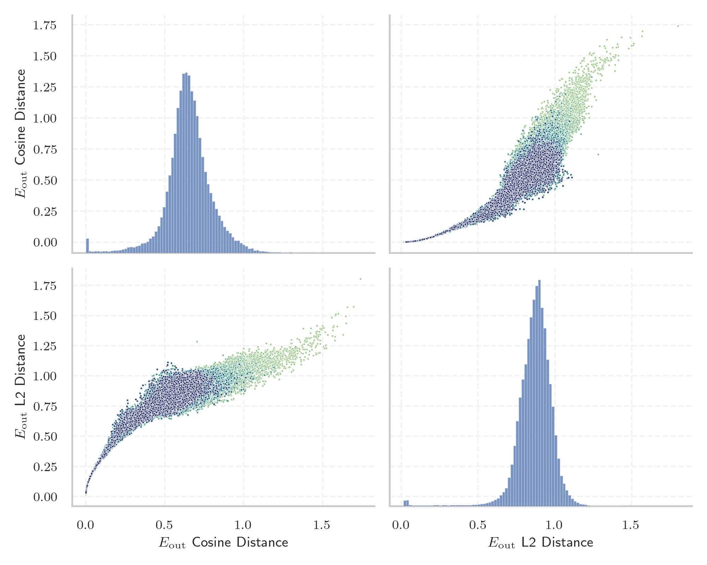
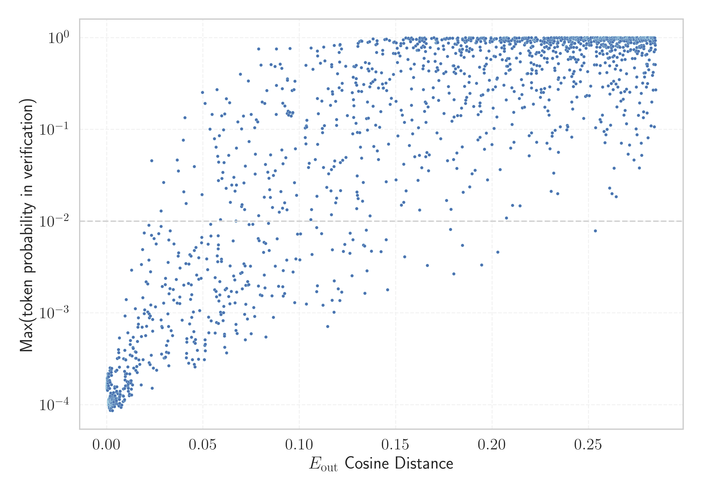

# Report for `LGAI-EXAONE/EXAONE-3.5-2.4B-Instruct`

## Model info

* Model Info: 
  * Tied embeddings: True
  * LM head uses bias: False
  * Embeddings shape: [102400, 2560]
* Tokenizer Info: 
  * Vocab Size: 102400
  * Tokenizer Class: GPT2Tokenizer
  * Tokenizer Type: BPE
  * Bytes handling: Byte Input
  * Token for verification prompt building: MethodAccessorImpl
  * Token id for verification prompt building: 96943
* Indicator summary: 
  * Indicator for under-trained tokens: E_{out} Cosine Distance
  * Overall distribution: 0.651 +/- 0.151
* Detected Token Counts: 
  * Number of tested under-trained tokens: 2021, 1713 non-special, 480 below p = 0.01 threshold, 374 below soft indicator threshold
  * Number of single byte tokens: 256, of which 13 below indicator threshold
  * Number of special tokens: 2, of which 0 below indicator threshold
  * Number of non-single-byte unreachable tokens: 2, of which 0 below indicator threshold
  * Number of non-single-byte UTF-fragment tokens:  1222, of which 9 below soft indicator threshold

## Under-trained token indicators plot


## Verification plot


## Under-trained token verification results
374 entries below threshold of 0.057

|   token_id | token                 |   indicator | max_prob                                                         |
|------------|-----------------------|-------------|------------------------------------------------------------------|
|      63972 | ````` ▁gICAg `````    | 0.000968933 | <span style='border: 1px solid rgb(169, 68, 66);'>0.00011</span> |
|      66125 | ````` ▁doibase `````  | 0.000985384 | <span style='border: 1px solid rgb(169, 68, 66);'>0.0001</span>  |
|      88410 | ````` ▁기Q `````      | 0.000996053 | <span style='border: 1px solid rgb(169, 68, 66);'>0.00011</span> |
|      60128 | ````` ▁\x95\x98 ````` | 0.0010069   | <span style='border: 1px solid rgb(169, 68, 66);'>0.00011</span> |
|      72843 | ````` ▁을라고 `````   | 0.00102651  | <span style='border: 1px solid rgb(169, 68, 66);'>0.0001</span>  |
|      37108 | ````` ▁\x9a\x84 ````` | 0.00103229  | <span style='border: 1px solid rgb(169, 68, 66);'>0.0001</span>  |
|      76827 | ````` ▁§\[ `````      | 0.00103879  | <span style='border: 1px solid rgb(169, 68, 66);'>0.00018</span> |
|      82344 | ````` ▁으실까 `````   | 0.00104117  | <span style='border: 1px solid rgb(169, 68, 66);'>0.00011</span> |
|      79363 | ````` ▁었잖 `````     | 0.00105965  | <span style='border: 1px solid rgb(169, 68, 66);'>0.0001</span>  |
|      82497 | ````` ▁으신데 `````   | 0.00106084  | <span style='border: 1px solid rgb(169, 68, 66);'>0.00011</span> |
|      97980 | ````` ▁\x95\x8a ````` | 0.00106728  | <span style='border: 1px solid rgb(169, 68, 66);'>0.00011</span> |
|      90594 | ````` ▁\x82\x98 ````` | 0.0010705   | <span style='border: 1px solid rgb(169, 68, 66);'>0.00011</span> |
|      53381 | ````` ▁',['../ `````  | 0.00107431  | <span style='border: 1px solid rgb(169, 68, 66);'>0.00011</span> |
|     100641 | ````` ▁\x9e\x88 ````` | 0.00107509  | <span style='border: 1px solid rgb(169, 68, 66);'>0.00011</span> |
|      91650 | ````` ▁세욧 `````     | 0.00107789  | <span style='border: 1px solid rgb(169, 68, 66);'>0.00011</span> |
|      72244 | ````` ▁기안녕 `````   | 0.00108689  | <span style='border: 1px solid rgb(169, 68, 66);'>0.00011</span> |
|      95788 | ````` ▁\^[- `````     | 0.00108695  | <span style='border: 1px solid rgb(169, 68, 66);'>0.0001</span>  |
|      55847 | ````` ▁lPLV `````     | 0.00108814  | <span style='border: 1px solid rgb(169, 68, 66);'>0.0001</span>  |
|      94506 | ````` ▁으라며 `````   | 0.00109619  | <span style='border: 1px solid rgb(169, 68, 66);'>0.00011</span> |
|      90782 | ````` ▁슴당 `````     | 0.00110435  | <span style='border: 1px solid rgb(169, 68, 66);'>0.00011</span> |
<details><summary>354 additional entries below threshold</summary>

|   token_id | token                             |   indicator | max_prob                                                         | in_other_tokens                                                                                                                                                                                                                          |
|------------|-----------------------------------|-------------|------------------------------------------------------------------|------------------------------------------------------------------------------------------------------------------------------------------------------------------------------------------------------------------------------------------|
|      88178 | ````` ▁\|>## `````                |  0.0011059  | <span style='border: 1px solid rgb(169, 68, 66);'>0.0001</span>  |                                                                                                                                                                                                                                          |
|      89566 | ````` ▁{}\^ `````                 |  0.00111258 | <span style='border: 1px solid rgb(169, 68, 66);'>0.00011</span> | <span style='border: 1px solid rgb(169, 68, 66);'>````` ▁{}\^[ `````</span>                                                                                                                                                              |
|      16979 | ````` ▁**]{} `````                |  0.00111288 | <span style='border: 1px solid rgb(169, 68, 66);'>0.00011</span> |                                                                                                                                                                                                                                          |
|      89712 | ````` ▁\x9d\x80 `````             |  0.00111419 | <span style='border: 1px solid rgb(169, 68, 66);'>0.00011</span> |                                                                                                                                                                                                                                          |
|      61214 | ````` ▁어야죠 `````               |  0.00112468 | <span style='border: 1px solid rgb(169, 68, 66);'>0.00011</span> |                                                                                                                                                                                                                                          |
|      99346 | ````` ▁cbiAg `````                |  0.001136   | <span style='border: 1px solid rgb(169, 68, 66);'>0.00012</span> |                                                                                                                                                                                                                                          |
|      91083 | ````` ▁셔야죠 `````               |  0.00114125 | <span style='border: 1px solid rgb(169, 68, 66);'>0.0001</span>  |                                                                                                                                                                                                                                          |
|      87091 | ````` ▁으려구요 `````             |  0.00114608 | <span style='border: 1px solid rgb(169, 68, 66);'>0.00011</span> |                                                                                                                                                                                                                                          |
|      93957 | ````` ▁을께요 `````               |  0.00114721 | <span style='border: 1px solid rgb(169, 68, 66);'>0.00011</span> |                                                                                                                                                                                                                                          |
|      66650 | ````` ▁\x9c\x89 `````             |  0.00116122 | <span style='border: 1px solid rgb(169, 68, 66);'>0.00011</span> |                                                                                                                                                                                                                                          |
|      68688 | ````` ▁\|>/* `````                |  0.00116265 | <span style='border: 1px solid rgb(169, 68, 66);'>0.00011</span> | <span style='border: 1px solid rgb(169, 68, 66);'>````` ▁\|>/** `````</span>                                                                                                                                                             |
|      78561 | ````` ▁^^<\| `````                |  0.00116277 | <span style='border: 1px solid rgb(169, 68, 66);'>0.00011</span> |                                                                                                                                                                                                                                          |
|      72810 | ````` ▁FBQyx `````                |  0.00116289 | <span style='border: 1px solid rgb(169, 68, 66);'>0.00011</span> |                                                                                                                                                                                                                                          |
|      69830 | ````` ▁QUFDQTtBQUNBO `````        |  0.00116295 | <span style='border: 1px solid rgb(169, 68, 66);'>0.00011</span> |                                                                                                                                                                                                                                          |
|      16227 | ````` ▁**]{}, `````               |  0.00116318 | <span style='border: 1px solid rgb(169, 68, 66);'>0.00011</span> |                                                                                                                                                                                                                                          |
|      94290 | ````` ▁\|>/** `````               |  0.00116318 | <span style='border: 1px solid rgb(169, 68, 66);'>0.00011</span> |                                                                                                                                                                                                                                          |
|      80102 | ````` ▁욬ᄏᄏᄏ `````             |  0.0011633  | <span style='border: 1px solid rgb(169, 68, 66);'>0.00011</span> |                                                                                                                                                                                                                                          |
|     100494 | ````` ▁$]{}]{} `````              |  0.00116384 | <span style='border: 1px solid rgb(169, 68, 66);'>0.00011</span> |                                                                                                                                                                                                                                          |
|      24243 | ````` ▁*]{}, `````                |  0.0011639  | <span style='border: 1px solid rgb(169, 68, 66);'>0.00011</span> |                                                                                                                                                                                                                                          |
|      38696 | ````` ▁\|>#!/ `````               |  0.00116402 | <span style='border: 1px solid rgb(169, 68, 66);'>0.00011</span> |                                                                                                                                                                                                                                          |
|      12363 | ````` ▁*]{} `````                 |  0.00116414 | <span style='border: 1px solid rgb(169, 68, 66);'>0.00011</span> | <span style='border: 1px solid rgb(169, 68, 66);'>````` ▁*]{}, `````</span>, <span style='border: 1px solid rgb(169, 68, 66);'>````` ▁*]{}. `````</span>                                                                                 |
|      83735 | ````` ▁"}\]. `````                |  0.00116414 | <span style='border: 1px solid rgb(169, 68, 66);'>0.00011</span> |                                                                                                                                                                                                                                          |
|      38822 | ````` ▁\|>""" `````               |  0.00116426 | <span style='border: 1px solid rgb(169, 68, 66);'>0.00011</span> |                                                                                                                                                                                                                                          |
|      82326 | ````` ▁searxhall `````            |  0.00116438 | <span style='border: 1px solid rgb(169, 68, 66);'>0.00011</span> |                                                                                                                                                                                                                                          |
|      85203 | ````` ▁"}**). `````               |  0.00116438 | <span style='border: 1px solid rgb(169, 68, 66);'>0.00011</span> |                                                                                                                                                                                                                                          |
|      90775 | ````` ▁\|>// `````                |  0.00116438 | <span style='border: 1px solid rgb(169, 68, 66);'>0.00011</span> |                                                                                                                                                                                                                                          |
|      89438 | ````` ▁$.[]{ `````                |  0.00116444 | <span style='border: 1px solid rgb(169, 68, 66);'>0.00011</span> |                                                                                                                                                                                                                                          |
|      95258 | ````` ▁{}\^[ `````                |  0.00116456 | <span style='border: 1px solid rgb(169, 68, 66);'>0.00011</span> |                                                                                                                                                                                                                                          |
|      82407 | ````` ▁\])]{} `````               |  0.00116467 | <span style='border: 1px solid rgb(169, 68, 66);'>0.00011</span> |                                                                                                                                                                                                                                          |
|      49961 | ````` ▁\]]{} `````                |  0.00116491 | <span style='border: 1px solid rgb(169, 68, 66);'>0.00011</span> |                                                                                                                                                                                                                                          |
|      57503 | ````` ▁URL안녕 `````              |  0.00116503 | <span style='border: 1px solid rgb(169, 68, 66);'>0.00011</span> |                                                                                                                                                                                                                                          |
|      60037 | ````` ▁*]{}. `````                |  0.00116533 | <span style='border: 1px solid rgb(169, 68, 66);'>0.00011</span> |                                                                                                                                                                                                                                          |
|      98615 | ````` ▁{}\_[ `````                |  0.00116569 | <span style='border: 1px solid rgb(169, 68, 66);'>0.00011</span> |                                                                                                                                                                                                                                          |
|      82353 | ````` ▁>]{} `````                 |  0.00116575 | <span style='border: 1px solid rgb(169, 68, 66);'>0.00011</span> |                                                                                                                                                                                                                                          |
|      81354 | ````` ▁"}](# `````                |  0.00116599 | <span style='border: 1px solid rgb(169, 68, 66);'>0.00011</span> |                                                                                                                                                                                                                                          |
|      94990 | ````` ▁는겨 `````                 |  0.0012278  | <span style='border: 1px solid rgb(169, 68, 66);'>0.0001</span>  |                                                                                                                                                                                                                                          |
|      43572 | ````` ▁\x80\x82 `````             |  0.00124252 | <span style='border: 1px solid rgb(169, 68, 66);'>0.00011</span> |                                                                                                                                                                                                                                          |
|     102050 | ````` ▁을런지 `````               |  0.00124949 | <span style='border: 1px solid rgb(169, 68, 66);'>0.0001</span>  |                                                                                                                                                                                                                                          |
|      54883 | ````` ▁을게요 `````               |  0.00126112 | <span style='border: 1px solid rgb(169, 68, 66);'>0.0001</span>  |                                                                                                                                                                                                                                          |
|      68640 | ````` ▁으셨으면 `````             |  0.00126272 | <span style='border: 1px solid rgb(169, 68, 66);'>0.00011</span> |                                                                                                                                                                                                                                          |
|      82617 | ````` ▁\x8f\x84 `````             |  0.00128508 | <span style='border: 1px solid rgb(169, 68, 66);'>0.00011</span> |                                                                                                                                                                                                                                          |
|      39257 | ````` ▁}$]{} `````                |  0.00130051 | <span style='border: 1px solid rgb(169, 68, 66);'>0.00011</span> |                                                                                                                                                                                                                                          |
|      72269 | ````` ▁\x97\x90 `````             |  0.00130308 | <span style='border: 1px solid rgb(169, 68, 66);'>0.0001</span>  |                                                                                                                                                                                                                                          |
|      74637 | ````` ▁을껄 `````                 |  0.00132936 | <span style='border: 1px solid rgb(169, 68, 66);'>0.00011</span> |                                                                                                                                                                                                                                          |
|      75375 | ````` ▁습니다요 `````             |  0.00133801 | <span style='border: 1px solid rgb(169, 68, 66);'>9.2e-05</span> |                                                                                                                                                                                                                                          |
|      79505 | ````` ▁~<\| `````                 |  0.00137752 | <span style='border: 1px solid rgb(169, 68, 66);'>0.0001</span>  |                                                                                                                                                                                                                                          |
|      52280 | ````` ▁으셨던 `````               |  0.00139636 | <span style='border: 1px solid rgb(169, 68, 66);'>0.0001</span>  |                                                                                                                                                                                                                                          |
|      41295 | ````` ▁을려고 `````               |  0.00140029 | <span style='border: 1px solid rgb(169, 68, 66);'>0.00011</span> |                                                                                                                                                                                                                                          |
|      69409 | ````` ▁으셨다면 `````             |  0.00140971 | <span style='border: 1px solid rgb(169, 68, 66);'>9.9e-05</span> |                                                                                                                                                                                                                                          |
|      26233 | ````` ▁$]{} `````                 |  0.00142318 | <span style='border: 1px solid rgb(169, 68, 66);'>9.5e-05</span> | <span style='border: 1px solid rgb(169, 68, 66);'>````` ▁$]{}; `````</span>, <span style='border: 1px solid rgb(169, 68, 66);'>````` ▁$]{}]{} `````</span>                                                                               |
|      98506 | ````` ▁을께 `````                 |  0.00142813 | <span style='border: 1px solid rgb(169, 68, 66);'>0.0001</span>  |                                                                                                                                                                                                                                          |
|      47851 | ````` ▁으셨어요 `````             |  0.00142968 | <span style='border: 1px solid rgb(169, 68, 66);'>0.00011</span> |                                                                                                                                                                                                                                          |
|      65727 | ````` ▁}}\_{ `````                |  0.00144339 | <span style='border: 1px solid rgb(169, 68, 66);'>0.00011</span> |                                                                                                                                                                                                                                          |
|      73431 | ````` ▁\x84\x9c `````             |  0.00145507 | <span style='border: 1px solid rgb(169, 68, 66);'>0.00011</span> |                                                                                                                                                                                                                                          |
|      71616 | ````` ▁\]\]. `````                |  0.00152296 | <span style='border: 1px solid rgb(169, 68, 66);'>0.0001</span>  |                                                                                                                                                                                                                                          |
|      64198 | ````` ▁으려니 `````               |  0.0015282  | <span style='border: 1px solid rgb(169, 68, 66);'>0.0001</span>  |                                                                                                                                                                                                                                          |
|      78534 | ````` ▁으셨는데 `````             |  0.00155175 | <span style='border: 1px solid rgb(169, 68, 66);'>0.0001</span>  |                                                                                                                                                                                                                                          |
|      73583 | ````` ▁으련만 `````               |  0.00156701 | <span style='border: 1px solid rgb(169, 68, 66);'>0.00012</span> |                                                                                                                                                                                                                                          |
|      83138 | ````` ▁으려다가 `````             |  0.00162184 | <span style='border: 1px solid rgb(169, 68, 66);'>0.00011</span> |                                                                                                                                                                                                                                          |
|      76308 | ````` ▁지만서도 `````             |  0.00163293 | <span style='border: 1px solid rgb(169, 68, 66);'>0.00011</span> |                                                                                                                                                                                                                                          |
|      69454 | ````` ▁실래요 `````               |  0.00164795 | <span style='border: 1px solid rgb(169, 68, 66);'>0.00012</span> |                                                                                                                                                                                                                                          |
|      76885 | ````` ▁CrazyLemon `````           |  0.00165701 | <span style='border: 1px solid rgb(169, 68, 66);'>0.00011</span> |                                                                                                                                                                                                                                          |
|      78138 | ````` ▁으셨을 `````               |  0.00167024 | <span style='border: 1px solid rgb(169, 68, 66);'>0.00011</span> |                                                                                                                                                                                                                                          |
|      37449 | ````` ▁으신다면 `````             |  0.00168544 | <span style='border: 1px solid rgb(169, 68, 66);'>0.00011</span> |                                                                                                                                                                                                                                          |
|      96375 | ````` ▁냐니까 `````               |  0.0017103  | <span style='border: 1px solid rgb(169, 68, 66);'>0.00011</span> |                                                                                                                                                                                                                                          |
|      56328 | ````` ▁$]{}; `````                |  0.00175536 | <span style='border: 1px solid rgb(169, 68, 66);'>0.00012</span> |                                                                                                                                                                                                                                          |
|      78879 | ````` ▁슴돠 `````                 |  0.00176197 | <span style='border: 1px solid rgb(169, 68, 66);'>0.00011</span> |                                                                                                                                                                                                                                          |
|      79290 | ````` ▁은가요 `````               |  0.00178903 | <span style='border: 1px solid rgb(169, 68, 66);'>0.00011</span> |                                                                                                                                                                                                                                          |
|      81529 | ````` ▁으라면 `````               |  0.00180084 | <span style='border: 1px solid rgb(169, 68, 66);'>0.00011</span> |                                                                                                                                                                                                                                          |
|      25075 | ````` ▁으셔서 `````               |  0.00180322 | <span style='border: 1px solid rgb(169, 68, 66);'>0.0001</span>  |                                                                                                                                                                                                                                          |
|      90870 | ````` ▁으신지 `````               |  0.00182563 | <span style='border: 1px solid rgb(169, 68, 66);'>9.8e-05</span> |                                                                                                                                                                                                                                          |
|      63035 | ````` ▁더랬죠 `````               |  0.00185496 | <span style='border: 1px solid rgb(169, 68, 66);'>8.7e-05</span> |                                                                                                                                                                                                                                          |
|      97803 | ````` ▁;<\| `````                 |  0.0018906  | <span style='border: 1px solid rgb(169, 68, 66);'>0.00011</span> |                                                                                                                                                                                                                                          |
|      90146 | ````` ▁으셨다고 `````             |  0.00191545 | <span style='border: 1px solid rgb(169, 68, 66);'>0.00011</span> |                                                                                                                                                                                                                                          |
|      97838 | ````` ▁\x8b\x9c `````             |  0.00192153 | <span style='border: 1px solid rgb(169, 68, 66);'>0.0001</span>  |                                                                                                                                                                                                                                          |
|      11677 | ````` ▁\|># `````                 |  0.00194257 | <span style='border: 1px solid rgb(169, 68, 66);'>0.00011</span> | <span style='border: 1px solid rgb(169, 68, 66);'>````` ▁\|>#!/ `````</span>, <span style='border: 1px solid rgb(169, 68, 66);'>````` ▁\|>## `````</span>                                                                                |
|      50344 | ````` ▁으십니다 `````             |  0.00194919 | <span style='border: 1px solid rgb(169, 68, 66);'>0.0001</span>  |                                                                                                                                                                                                                                          |
|      80181 | ````` ▁랬죠 `````                 |  0.00196469 | <span style='border: 1px solid rgb(169, 68, 66);'>0.00011</span> |                                                                                                                                                                                                                                          |
|      82564 | ````` ▁ivoks `````                |  0.00200957 | <span style='border: 1px solid rgb(169, 68, 66);'>0.00011</span> |                                                                                                                                                                                                                                          |
|      65695 | ````` ▁으련 `````                 |  0.00202388 | <span style='border: 1px solid rgb(169, 68, 66);'>9.3e-05</span> | <span style='border: 1px solid rgb(169, 68, 66);'>````` ▁으련만 `````</span>                                                                                                                                                             |
|      20328 | ````` ▁으셔 `````                 |  0.00202441 | <span style='border: 1px solid rgb(169, 68, 66);'>0.00011</span> | <span style='border: 1px solid rgb(169, 68, 66);'>````` ▁으셔서 `````</span>, <span style='border: 1px solid rgb(169, 68, 66);'>````` ▁으셔도 `````</span>, <span style='border: 1px solid rgb(169, 68, 66);'>````` ▁으셔야 `````</span> |
|     101885 | ````` ▁":[]," `````               |  0.00209844 | <span style='border: 1px solid rgb(169, 68, 66);'>9.7e-05</span> |                                                                                                                                                                                                                                          |
|      83775 | ````` ▁더랬다 `````               |  0.00212437 | <span style='border: 1px solid rgb(169, 68, 66);'>9.2e-05</span> |                                                                                                                                                                                                                                          |
|      47749 | ````` ▁\_{\\ `````                |  0.00213236 | <span style='border: 1px solid rgb(169, 68, 66);'>0.00013</span> |                                                                                                                                                                                                                                          |
|      93351 | ````` ▁\*\*](# `````              |  0.0021441  | <span style='border: 1px solid rgb(169, 68, 66);'>0.00012</span> |                                                                                                                                                                                                                                          |
|      79783 | ````` ▁":{}," `````               |  0.00219184 | <span style='border: 1px solid rgb(169, 68, 66);'>0.0001</span>  |                                                                                                                                                                                                                                          |
|     100200 | ````` ▁로페이 `````               |  0.00221181 | <span style='border: 1px solid rgb(169, 68, 66);'>9.8e-05</span> |                                                                                                                                                                                                                                          |
|      92491 | ````` ▁뇽하 `````                 |  0.00222212 | <span style='border: 1px solid rgb(169, 68, 66);'>0.0001</span>  |                                                                                                                                                                                                                                          |
|      98926 | ````` ▁invCluster `````           |  0.00228417 | <span style='border: 1px solid rgb(169, 68, 66);'>0.0001</span>  |                                                                                                                                                                                                                                          |
|      87159 | ````` ▁으려다 `````               |  0.00229526 | <span style='border: 1px solid rgb(169, 68, 66);'>0.0001</span>  |                                                                                                                                                                                                                                          |
|      42784 | ````` ▁아서요 `````               |  0.00234425 | <span style='border: 1px solid rgb(169, 68, 66);'>0.00011</span> |                                                                                                                                                                                                                                          |
|      87756 | ````` ▁notChosenColour `````      |  0.00242937 | <span style='border: 1px solid rgb(169, 68, 66);'>0.00017</span> |                                                                                                                                                                                                                                          |
|      73093 | ````` ▁\x95\x84 `````             |  0.00245059 | <span style='border: 1px solid rgb(169, 68, 66);'>9.4e-05</span> |                                                                                                                                                                                                                                          |
|      70311 | ````` ▁는대요 `````               |  0.00246143 | <span style='border: 1px solid rgb(169, 68, 66);'>9.8e-05</span> |                                                                                                                                                                                                                                          |
|     100351 | ````` ▁려는지 `````               |  0.00246662 | <span style='border: 1px solid rgb(169, 68, 66);'>0.00011</span> |                                                                                                                                                                                                                                          |
|      93834 | ````` ▁}$$^{ `````                |  0.0024879  | <span style='border: 1px solid rgb(169, 68, 66);'>0.0001</span>  |                                                                                                                                                                                                                                          |
|      86443 | ````` ▁숩니다 `````               |  0.00250173 | <span style='border: 1px solid rgb(169, 68, 66);'>0.0001</span>  |                                                                                                                                                                                                                                          |
|      63892 | ````` ▁냐면서 `````               |  0.00252301 | <span style='border: 1px solid rgb(169, 68, 66);'>9.9e-05</span> |                                                                                                                                                                                                                                          |
|      79254 | ````` ▁Mmike `````                |  0.00252879 | <span style='border: 1px solid rgb(169, 68, 66);'>9.8e-05</span> |                                                                                                                                                                                                                                          |
|      37979 | ````` ▁..<\| `````                |  0.00254124 | <span style='border: 1px solid rgb(169, 68, 66);'>0.00011</span> |                                                                                                                                                                                                                                          |
|      95513 | ````` ▁으신다 `````               |  0.00255191 | <span style='border: 1px solid rgb(169, 68, 66);'>0.0001</span>  |                                                                                                                                                                                                                                          |
|      40624 | ````` ▁으려나 `````               |  0.00255978 | <span style='border: 1px solid rgb(169, 68, 66);'>0.00011</span> |                                                                                                                                                                                                                                          |
|      53233 | ````` ▁~}{~ `````                 |  0.00256175 | <span style='border: 1px solid rgb(169, 68, 66);'>0.00012</span> |                                                                                                                                                                                                                                          |
|      72444 | ````` 송뽀송 `````                |  0.00258052 | <span style='border: 1px solid rgb(169, 68, 66);'>0.0001</span>  | ````` ▁뽀송뽀송 `````                                                                                                                                                                                                                    |
|     100835 | ````` ▁는진 `````                 |  0.0026291  | <span style='border: 1px solid rgb(169, 68, 66);'>9.8e-05</span> |                                                                                                                                                                                                                                          |
|      22554 | ````` ▁으니깐 `````               |  0.00264406 | <span style='border: 1px solid rgb(169, 68, 66);'>0.0001</span>  |                                                                                                                                                                                                                                          |
|      28517 | ````` ▁으셔도 `````               |  0.00264573 | <span style='border: 1px solid rgb(169, 68, 66);'>0.00011</span> |                                                                                                                                                                                                                                          |
|      68787 | ````` ▁려니까 `````               |  0.00267476 | <span style='border: 1px solid rgb(169, 68, 66);'>0.00011</span> |                                                                                                                                                                                                                                          |
|      87970 | ````` ▁erUSUL `````               |  0.00268483 | <span style='border: 1px solid rgb(169, 68, 66);'>0.00011</span> |                                                                                                                                                                                                                                          |
|      88319 | ````` ▁려나요 `````               |  0.00278848 | <span style='border: 1px solid rgb(169, 68, 66);'>0.00011</span> |                                                                                                                                                                                                                                          |
|      54411 | ````` ▁\x88\x91 `````             |  0.00283945 | <span style='border: 1px solid rgb(169, 68, 66);'>9.8e-05</span> |                                                                                                                                                                                                                                          |
|      89581 | ````` 들꼬들 `````                |  0.00289547 | <span style='border: 1px solid rgb(169, 68, 66);'>0.00012</span> | ````` ▁꼬들꼬들 `````                                                                                                                                                                                                                    |
|      81533 | ````` ▁medscimonit `````          |  0.00297552 | <span style='border: 1px solid rgb(169, 68, 66);'>8.7e-05</span> |                                                                                                                                                                                                                                          |
|      82306 | ````` ▁jagjag `````               |  0.0030126  | <span style='border: 1px solid rgb(169, 68, 66);'>0.00013</span> |                                                                                                                                                                                                                                          |
|      45978 | ````` ▁\x9a\x94 `````             |  0.0030567  | <span style='border: 1px solid rgb(169, 68, 66);'>0.0001</span>  |                                                                                                                                                                                                                                          |
|      92831 | ````` ▁nickrud `````              |  0.00308883 | <span style='border: 1px solid rgb(169, 68, 66);'>9.9e-05</span> |                                                                                                                                                                                                                                          |
|      56650 | ````` ▁야징 `````                 |  0.0031184  | <span style='border: 1px solid rgb(169, 68, 66);'>0.0001</span>  |                                                                                                                                                                                                                                          |
|      87372 | ````` ▁fabbione `````             |  0.00313365 | <span style='border: 1px solid rgb(169, 68, 66);'>0.00011</span> |                                                                                                                                                                                                                                          |
|      75262 | ````` ▁\x8b\x88 `````             |  0.00315386 | <span style='border: 1px solid rgb(169, 68, 66);'>9.6e-05</span> |                                                                                                                                                                                                                                          |
|     100690 | ````` ▁jiero `````                |  0.0031693  | <span style='border: 1px solid rgb(169, 68, 66);'>0.00012</span> |                                                                                                                                                                                                                                          |
|       4370 | ````` ▁endofsec `````             |  0.00333613 | <span style='border: 1px solid rgb(169, 68, 66);'>0.0001</span>  |                                                                                                                                                                                                                                          |
|      52412 | ````` ▁\*](# `````                |  0.0034439  | <span style='border: 1px solid rgb(169, 68, 66);'>0.00011</span> |                                                                                                                                                                                                                                          |
|      92509 | ````` ▁Saviq `````                |  0.00355732 | <span style='border: 1px solid rgb(169, 68, 66);'>0.00014</span> |                                                                                                                                                                                                                                          |
|      91845 | ````` ▁련다 `````                 |  0.00356156 | <span style='border: 1px solid rgb(169, 68, 66);'>0.0001</span>  |                                                                                                                                                                                                                                          |
|      75205 | ````` ▁십쇼 `````                 |  0.00360811 | <span style='border: 1px solid rgb(169, 68, 66);'>0.00011</span> |                                                                                                                                                                                                                                          |
|     100327 | ````` ▁더래도 `````               |  0.00388461 | <span style='border: 1px solid rgb(169, 68, 66);'>0.00012</span> |                                                                                                                                                                                                                                          |
|      88793 | ````` ▁실까봐 `````               |  0.00390142 | <span style='border: 1px solid rgb(169, 68, 66);'>0.0001</span>  |                                                                                                                                                                                                                                          |
|      38666 | ````` ▁신답니다 `````             |  0.0040217  | <span style='border: 1px solid rgb(169, 68, 66);'>9.6e-05</span> |                                                                                                                                                                                                                                          |
|      89389 | ````` 덕꾸덕 `````                |  0.00418985 | <span style='border: 1px solid rgb(169, 68, 66);'>0.00011</span> | ````` ▁꾸덕꾸덕 `````                                                                                                                                                                                                                    |
|      87066 | ````` ▁Keybuk `````               |  0.00419635 | <span style='border: 1px solid rgb(169, 68, 66);'>0.00016</span> |                                                                                                                                                                                                                                          |
|      67877 | ````` ▁^\[[@ `````                |  0.00419849 | <span style='border: 1px solid rgb(169, 68, 66);'>0.00015</span> |                                                                                                                                                                                                                                          |
|      42046 | ````` ▁으셔야 `````               |  0.00426704 | <span style='border: 1px solid rgb(169, 68, 66);'>0.00013</span> |                                                                                                                                                                                                                                          |
|      96764 | ````` ▁다면서요 `````             |  0.00451589 | <span style='border: 1px solid rgb(169, 68, 66);'>0.00012</span> |                                                                                                                                                                                                                                          |
|      99248 | ````` ▁cfhowlett `````            |  0.00467527 | <span style='border: 1px solid rgb(169, 68, 66);'>0.00023</span> |                                                                                                                                                                                                                                          |
|      57149 | ````` ▁\xad~ `````                |  0.00472945 | <span style='border: 1px solid rgb(169, 68, 66);'>0.00012</span> |                                                                                                                                                                                                                                          |
|      73095 | ````` ▁?<\| `````                 |  0.00484359 | <span style='border: 1px solid rgb(169, 68, 66);'>0.00012</span> |                                                                                                                                                                                                                                          |
|      79467 | ````` ▁으셨고 `````               |  0.00495106 | <span style='border: 1px solid rgb(169, 68, 66);'>0.00011</span> |                                                                                                                                                                                                                                          |
|      49721 | ````` ▁더니만 `````               |  0.00501812 | <span style='border: 1px solid rgb(169, 68, 66);'>0.00011</span> |                                                                                                                                                                                                                                          |
|      88118 | ````` ▁}^{\\ `````                |  0.00513119 | <span style='border: 1px solid rgb(169, 68, 66);'>0.00014</span> |                                                                                                                                                                                                                                          |
|      94768 | ````` ▁tomreyn `````              |  0.00520968 | <span style='border: 1px solid rgb(169, 68, 66);'>0.00024</span> |                                                                                                                                                                                                                                          |
|      43338 | ````` ▁!<\| `````                 |  0.00529879 | <span style='border: 1px solid rgb(169, 68, 66);'>0.00016</span> |                                                                                                                                                                                                                                          |
|      34432 | ````` ▁더랬 `````                 |  0.00531512 | <span style='border: 1px solid rgb(169, 68, 66);'>0.0001</span>  | <span style='border: 1px solid rgb(169, 68, 66);'>````` ▁더랬죠 `````</span>, <span style='border: 1px solid rgb(169, 68, 66);'>````` ▁더랬다 `````</span>                                                                               |
|      79947 | ````` ▁daftykins `````            |  0.00550854 | <span style='border: 1px solid rgb(169, 68, 66);'>0.00032</span> |                                                                                                                                                                                                                                          |
|      74822 | ````` ▁apachelogger `````         |  0.00586641 | <span style='border: 1px solid rgb(169, 68, 66);'>0.0001</span>  |                                                                                                                                                                                                                                          |
|      61185 | ````` ▁\x80\x99 `````             |  0.0059129  | <span style='border: 1px solid rgb(169, 68, 66);'>0.00013</span> |                                                                                                                                                                                                                                          |
|      95028 | ````` ▁던지요 `````               |  0.00609744 | <span style='border: 1px solid rgb(169, 68, 66);'>0.00012</span> |                                                                                                                                                                                                                                          |
|      75780 | ````` ▁gnomefreak `````           |  0.00610191 | <span style='border: 1px solid rgb(169, 68, 66);'>0.0004</span>  |                                                                                                                                                                                                                                          |
|      90851 | ````` ▁OerHeks `````              |  0.00627995 | <span style='border: 1px solid rgb(169, 68, 66);'>0.00037</span> |                                                                                                                                                                                                                                          |
|      71501 | ````` ▁BluesKaj `````             |  0.0063054  | <span style='border: 1px solid rgb(169, 68, 66);'>0.00033</span> |                                                                                                                                                                                                                                          |
|      12220 | ````` ▁습니당 `````               |  0.00630814 | <span style='border: 1px solid rgb(169, 68, 66);'>9.7e-05</span> |                                                                                                                                                                                                                                          |
|      94939 | ````` ▁\x80\x9d `````             |  0.00636429 | <span style='border: 1px solid rgb(169, 68, 66);'>0.00012</span> |                                                                                                                                                                                                                                          |
|      46004 | ````` ▁셨었 `````                 |  0.00655705 | <span style='border: 1px solid rgb(169, 68, 66);'>0.00012</span> |                                                                                                                                                                                                                                          |
|      87054 | ````` ▁옄 `````                   |  0.00657618 | <span style='border: 1px solid rgb(169, 68, 66);'>0.00011</span> |                                                                                                                                                                                                                                          |
|      76909 | ````` ▁lotuspsychje `````         |  0.00658762 | <span style='border: 1px solid rgb(169, 68, 66);'>0.00054</span> |                                                                                                                                                                                                                                          |
|      56282 | ````` ▁"}},[ `````                |  0.00664461 | <span style='border: 1px solid rgb(169, 68, 66);'>0.00026</span> |                                                                                                                                                                                                                                          |
|      82398 | ````` ▁던가요 `````               |  0.00669634 | <span style='border: 1px solid rgb(169, 68, 66);'>0.00012</span> |                                                                                                                                                                                                                                          |
|      69613 | ````` ▁까말까 `````               |  0.00675118 | <span style='border: 1px solid rgb(169, 68, 66);'>0.0001</span>  |                                                                                                                                                                                                                                          |
|      87181 | ````` ▁더랍니다 `````             |  0.00675499 | <span style='border: 1px solid rgb(169, 68, 66);'>0.0001</span>  |                                                                                                                                                                                                                                          |
|      84909 | ````` ▁더라니 `````               |  0.00684071 | <span style='border: 1px solid rgb(169, 68, 66);'>0.00013</span> |                                                                                                                                                                                                                                          |
|      57675 | ````` ▁는군 `````                 |  0.00698584 | <span style='border: 1px solid rgb(169, 68, 66);'>0.00014</span> |                                                                                                                                                                                                                                          |
|      99448 | ````` ▁획단 `````                 |  0.00698704 | <span style='border: 1px solid rgb(169, 68, 66);'>0.00013</span> |                                                                                                                                                                                                                                          |
|      55122 | ````` ▁렵니다 `````               |  0.0074023  | <span style='border: 1px solid rgb(169, 68, 66);'>9.4e-05</span> |                                                                                                                                                                                                                                          |
|      42295 | ````` ▁ActionParsnip `````        |  0.00782984 | <span style='border: 1px solid rgb(169, 68, 66);'>0.0001</span>  |                                                                                                                                                                                                                                          |
|      89624 | ````` ▁shadeslayer `````          |  0.0083763  | <span style='border: 1px solid rgb(169, 68, 66);'>0.00013</span> |                                                                                                                                                                                                                                          |
|      95041 | ````` ▁로워서 `````               |  0.00850153 | <span style='border: 1px solid rgb(169, 68, 66);'>0.00011</span> |                                                                                                                                                                                                                                          |
|      39189 | ````` ▁드라구요 `````             |  0.00860173 | <span style='border: 1px solid rgb(169, 68, 66);'>0.00012</span> |                                                                                                                                                                                                                                          |
|         57 | ````` PI:ANNON `````              |  0.00860393 | <span style='border: 1px solid rgb(169, 68, 66);'>0.00012</span> |                                                                                                                                                                                                                                          |
|      54395 | ````` ▁"}** `````                 |  0.00864524 | <span style='border: 1px solid rgb(169, 68, 66);'>0.00015</span> | <span style='border: 1px solid rgb(169, 68, 66);'>````` ▁"}**). `````</span>                                                                                                                                                             |
|      60699 | ````` ▁^®^ `````                  |  0.00882822 | <span style='border: 1px solid rgb(169, 68, 66);'>0.00032</span> |                                                                                                                                                                                                                                          |
|      19907 | ````` ▁려구요 `````               |  0.00917447 | <span style='border: 1px solid rgb(169, 68, 66);'>0.00011</span> |                                                                                                                                                                                                                                          |
|      64748 | ````` ▁{}\_ `````                 |  0.00921226 | <span style='border: 1px solid rgb(169, 68, 66);'>0.00015</span> | <span style='border: 1px solid rgb(169, 68, 66);'>````` ▁{}\_[ `````</span>                                                                                                                                                              |
|      26756 | ````` ▁\|>--- `````               |  0.00927699 | <span style='border: 1px solid rgb(169, 68, 66);'>0.00023</span> |                                                                                                                                                                                                                                          |
|      72232 | ````` ▁="../../../../../ `````    |  0.00931656 | <span style='border: 1px solid rgb(169, 68, 66);'>0.00011</span> | <span style='border: 1px solid rgb(169, 68, 66);'>````` ▁="../../../../../../ `````</span>                                                                                                                                               |
|      72282 | ````` ▁Hobbsee `````              |  0.0094189  | <span style='border: 1px solid rgb(169, 68, 66);'>0.00039</span> |                                                                                                                                                                                                                                          |
|      94918 | ````` ▁bekks `````                |  0.00948805 | <span style='border: 1px solid rgb(169, 68, 66);'>0.00019</span> |                                                                                                                                                                                                                                          |
|      79826 | ````` ▁crimsun `````              |  0.00967884 | <span style='border: 1px solid rgb(169, 68, 66);'>0.0002</span>  |                                                                                                                                                                                                                                          |
|      44320 | ````` ▁곸 `````                   |  0.00974816 | <span style='border: 1px solid rgb(169, 68, 66);'>0.00016</span> |                                                                                                                                                                                                                                          |
|      87065 | ````` ▁??❤ `````                  |  0.00977194 | <span style='border: 1px solid rgb(169, 68, 66);'>0.00022</span> |                                                                                                                                                                                                                                          |
|      99690 | ````` ▁nixternal `````            |  0.00980562 | <span style='border: 1px solid rgb(169, 68, 66);'>0.00031</span> |                                                                                                                                                                                                                                          |
|      62171 | ````` ▁bazhang `````              |  0.00989366 | <span style='border: 1px solid rgb(169, 68, 66);'>0.00031</span> |                                                                                                                                                                                                                                          |
|      76872 | ````` psychje `````               |  0.0101412  | <span style='border: 1px solid rgb(255, 145, 0);'>0.0014</span>  | <span style='border: 1px solid rgb(169, 68, 66);'>````` ▁lotuspsychje `````</span>                                                                                                                                                       |
|      94010 | ````` ▁계망 `````                 |  0.0103464  | <span style='border: 1px solid rgb(169, 68, 66);'>0.00022</span> |                                                                                                                                                                                                                                          |
|      85552 | ````` ▁jobbuilder `````           |  0.010619   | <span style='border: 1px solid rgb(169, 68, 66);'>0.00018</span> |                                                                                                                                                                                                                                          |
|      16948 | ````` ▁어야지 `````               |  0.0109075  | <span style='border: 1px solid rgb(169, 68, 66);'>0.00016</span> |                                                                                                                                                                                                                                          |
|      75031 | ````` ▁어서다 `````               |  0.0109836  | <span style='border: 1px solid rgb(169, 68, 66);'>0.00016</span> |                                                                                                                                                                                                                                          |
|      52187 | ````` ▁뎈 `````                   |  0.0110077  | <span style='border: 1px solid rgb(169, 68, 66);'>0.00061</span> |                                                                                                                                                                                                                                          |
|      86581 | ````` ▁구화장 `````               |  0.0110158  | <span style='border: 1px solid rgb(169, 68, 66);'>0.00026</span> |                                                                                                                                                                                                                                          |
|      91610 | ````` ▁장찌개 `````               |  0.0111693  | <span style='border: 1px solid rgb(169, 68, 66);'>0.00014</span> |                                                                                                                                                                                                                                          |
|      32335 | ````` ▁MOESM `````                |  0.0111847  | <span style='border: 1px solid rgb(169, 68, 66);'>0.00015</span> |                                                                                                                                                                                                                                          |
|      37335 | ````` ▁려구 `````                 |  0.011264   | <span style='border: 1px solid rgb(169, 68, 66);'>0.00017</span> |                                                                                                                                                                                                                                          |
|      39695 | ````` ▁ubotu `````                |  0.0115596  | <span style='border: 1px solid rgb(169, 68, 66);'>0.00018</span> |                                                                                                                                                                                                                                          |
|      79486 | ````` ▁을지라도 `````             |  0.0116637  | <span style='border: 1px solid rgb(169, 68, 66);'>0.00013</span> |                                                                                                                                                                                                                                          |
|      31729 | ````` ▁는지라 `````               |  0.0117751  | <span style='border: 1px solid rgb(169, 68, 66);'>0.00013</span> |                                                                                                                                                                                                                                          |
|      47786 | ````` ▁으다 `````                 |  0.0119318  | <span style='border: 1px solid rgb(169, 68, 66);'>0.00022</span> |                                                                                                                                                                                                                                          |
|      66927 | ````` ▁섴 `````                   |  0.0121944  | <span style='border: 1px solid rgb(169, 68, 66);'>0.00045</span> |                                                                                                                                                                                                                                          |
|      70702 | ````` ▁URLQ `````                 |  0.0122139  | <span style='border: 1px solid rgb(169, 68, 66);'>0.00035</span> |                                                                                                                                                                                                                                          |
|      71684 | ````` ▁wgrant `````               |  0.0123559  | <span style='border: 1px solid rgb(169, 68, 66);'>0.0005</span>  |                                                                                                                                                                                                                                          |
|      10644 | ````` ▁니당 `````                 |  0.0123693  | <span style='border: 1px solid rgb(169, 68, 66);'>0.00018</span> |                                                                                                                                                                                                                                          |
|      27925 | ````` ▁려는데 `````               |  0.0125516  | <span style='border: 1px solid rgb(169, 68, 66);'>0.00017</span> |                                                                                                                                                                                                                                          |
|      36417 | ````` ▁는지요 `````               |  0.0126857  | <span style='border: 1px solid rgb(169, 68, 66);'>0.00018</span> |                                                                                                                                                                                                                                          |
|      84910 | ````` ▁\xad! `````                |  0.0127388  | <span style='border: 1px solid rgb(169, 68, 66);'>0.00015</span> |                                                                                                                                                                                                                                          |
|      32209 | ````` 록달록 `````                |  0.0129375  | <span style='border: 1px solid rgb(169, 68, 66);'>0.00013</span> | ````` ▁알록달록 `````, ````` 알록달록 `````                                                                                                                                                                                              |
|      74305 | ````` ▁Seveas `````               |  0.0131658  | <span style='border: 1px solid rgb(169, 68, 66);'>0.00034</span> |                                                                                                                                                                                                                                          |
|      78421 | ````` ▁'],['../ `````             |  0.0133567  | <span style='border: 1px solid rgb(169, 68, 66);'>0.00016</span> |                                                                                                                                                                                                                                          |
|      53979 | ````` ▁네유 `````                 |  0.0136203  | <span style='border: 1px solid rgb(169, 68, 66);'>0.00042</span> |                                                                                                                                                                                                                                          |
|      18419 | ````` ▁--[@ `````                 |  0.0137436  | <span style='border: 1px solid rgb(169, 68, 66);'>0.00041</span> |                                                                                                                                                                                                                                          |
|      82730 | ````` ▁으냐 `````                 |  0.0137838  | <span style='border: 1px solid rgb(169, 68, 66);'>0.00055</span> |                                                                                                                                                                                                                                          |
|      78419 | ````` ▁기보단 `````               |  0.0139828  | <span style='border: 1px solid rgb(169, 68, 66);'>0.00025</span> |                                                                                                                                                                                                                                          |
|      84905 | ````` ▁욯 `````                   |  0.0148168  | <span style='border: 1px solid rgb(169, 68, 66);'>0.00038</span> |                                                                                                                                                                                                                                          |
|      83314 | ````` ▁LaserJock `````            |  0.0149087  | <span style='border: 1px solid rgb(255, 145, 0);'>0.0011</span>  |                                                                                                                                                                                                                                          |
|      34357 | ````` ▁는디 `````                 |  0.0149846  | <span style='border: 1px solid rgb(169, 68, 66);'>0.00032</span> |                                                                                                                                                                                                                                          |
|      67939 | ````` ▁는다며 `````               |  0.015053   | <span style='border: 1px solid rgb(169, 68, 66);'>0.00024</span> |                                                                                                                                                                                                                                          |
|      65604 | ````` ▁)<\| `````                 |  0.0151963  | <span style='border: 1px solid rgb(169, 68, 66);'>0.00032</span> |                                                                                                                                                                                                                                          |
|      86075 | ````` ▁더이다 `````               |  0.0151973  | <span style='border: 1px solid rgb(169, 68, 66);'>0.00037</span> |                                                                                                                                                                                                                                          |
|      96403 | ````` ▁}}})$ `````                |  0.015526   | <span style='border: 1px solid rgb(169, 68, 66);'>0.00026</span> |                                                                                                                                                                                                                                          |
|      49762 | ````` ▁내받 `````                 |  0.0155805  | <span style='border: 1px solid rgb(169, 68, 66);'>0.00026</span> |                                                                                                                                                                                                                                          |
|      18678 | ````` ▁는구나 `````               |  0.0158764  | <span style='border: 1px solid rgb(169, 68, 66);'>0.00022</span> |                                                                                                                                                                                                                                          |
|      83390 | ````` ▁슴니다 `````               |  0.0159703  | <span style='border: 1px solid rgb(169, 68, 66);'>0.00049</span> |                                                                                                                                                                                                                                          |
|      74440 | ````` ▁푸치노 `````               |  0.0162181  | <span style='border: 1px solid rgb(169, 68, 66);'>0.0007</span>  |                                                                                                                                                                                                                                          |
|      41199 | ````` ▁ikonia `````               |  0.0163804  | <span style='border: 1px solid rgb(169, 68, 66);'>0.00089</span> |                                                                                                                                                                                                                                          |
|      32455 | ````` ▁ubottu `````               |  0.0164666  | <span style='border: 1px solid rgb(169, 68, 66);'>0.00076</span> |                                                                                                                                                                                                                                          |
|      45568 | ````` ▁냐구 `````                 |  0.016664   | <span style='border: 1px solid rgb(169, 68, 66);'>0.00031</span> |                                                                                                                                                                                                                                          |
|      72128 | ````` ▁게라도 `````               |  0.017161   | <span style='border: 1px solid rgb(169, 68, 66);'>0.00028</span> |                                                                                                                                                                                                                                          |
|      71054 | ````` ▁다니까요 `````             |  0.0178316  | <span style='border: 1px solid rgb(169, 68, 66);'>0.00017</span> |                                                                                                                                                                                                                                          |
|      93448 | ````` ▁로점 `````                 |  0.0179846  | <span style='border: 1px solid rgb(169, 68, 66);'>0.00055</span> |                                                                                                                                                                                                                                          |
|      92735 | ````` ▁닠 `````                   |  0.0184075  | <span style='border: 1px solid rgb(169, 68, 66);'>0.0007</span>  |                                                                                                                                                                                                                                          |
|      29519 | ````` ▁아야지 `````               |  0.0187252  | <span style='border: 1px solid rgb(255, 145, 0);'>0.0015</span>  |                                                                                                                                                                                                                                          |
|      81601 | ````` 생숭 `````                  |  0.0188454  | <span style='border: 1px solid rgb(169, 68, 66);'>0.00031</span> | <span style='border: 1px solid rgb(251, 189, 8);'>````` 숭생숭 `````</span>, ````` ▁싱숭생숭 `````                                                                                                                                       |
|      89406 | ````` ▁}\_{ `````                 |  0.0194106  | <span style='border: 1px solid rgb(255, 145, 0);'>0.0075</span>  |                                                                                                                                                                                                                                          |
|      54961 | ````` ▁":[{" `````                |  0.0194683  | <span style='border: 1px solid rgb(169, 68, 66);'>0.00099</span> |                                                                                                                                                                                                                                          |
|      82896 | ````` ▁간녀 `````                 |  0.0197284  | <span style='border: 1px solid rgb(255, 145, 0);'>0.0011</span>  |                                                                                                                                                                                                                                          |
|      79735 | ````` ▁dafty `````                |  0.0202309  | <span style='border: 1px solid rgb(169, 68, 66);'>0.00057</span> | <span style='border: 1px solid rgb(169, 68, 66);'>````` ▁daftykins `````</span>                                                                                                                                                          |
|      97992 | ````` ▁튭 `````                   |  0.0204937  | <span style='border: 1px solid rgb(255, 145, 0);'>0.0022</span>  |                                                                                                                                                                                                                                          |
|      87397 | ````` ▁궜 `````                   |  0.0207272  | <span style='border: 1px solid rgb(169, 68, 66);'>0.00072</span> |                                                                                                                                                                                                                                          |
|      81052 | ````` ▁식회 `````                 |  0.0212402  | <span style='border: 1px solid rgb(255, 145, 0);'>0.001</span>   |                                                                                                                                                                                                                                          |
|      78806 | ````` ▁":{}, `````                |  0.0212527  | <span style='border: 1px solid rgb(255, 145, 0);'>0.0021</span>  | <span style='border: 1px solid rgb(169, 68, 66);'>````` ▁":{}," `````</span>                                                                                                                                                             |
|      76117 | ````` ▁slangasek `````            |  0.0218757  | <span style='border: 1px solid rgb(255, 145, 0);'>0.009</span>   |                                                                                                                                                                                                                                          |
|      69481 | ````` ▁didrocks `````             |  0.0219367  | <span style='border: 1px solid rgb(255, 145, 0);'>0.0038</span>  |                                                                                                                                                                                                                                          |
|      21358 | ````` ▁"}]( `````                 |  0.0219731  | <span style='border: 1px solid rgb(169, 68, 66);'>0.00098</span> | <span style='border: 1px solid rgb(169, 68, 66);'>````` ▁"}](# `````</span>                                                                                                                                                              |
|      52411 | ````` ▁셨으니 `````               |  0.0220295  | <span style='border: 1px solid rgb(169, 68, 66);'>0.00029</span> |                                                                                                                                                                                                                                          |
|      72235 | ````` ▁queuebot `````             |  0.0221153  | <span style='border: 1px solid rgb(169, 68, 66);'>0.00089</span> |                                                                                                                                                                                                                                          |
|      67741 | ````` ▁われた `````               |  0.0225132  | <span style='border: 1px solid rgb(169, 68, 66);'>0.00027</span> |                                                                                                                                                                                                                                          |
|      77017 | ````` ▁**](# `````                |  0.0226697  | <span style='border: 1px solid rgb(169, 68, 66);'>0.00093</span> |                                                                                                                                                                                                                                          |
|      92133 | ````` ▁넼 `````                   |  0.0227346  | <span style='border: 1px solid rgb(255, 145, 0);'>0.0028</span>  |                                                                                                                                                                                                                                          |
|      49401 | ````` ▁="@+ `````                 |  0.0228473  | <span style='border: 1px solid rgb(255, 145, 0);'>0.0012</span>  |                                                                                                                                                                                                                                          |
|      33518 | ````` ▁려고요 `````               |  0.0230609  | <span style='border: 1px solid rgb(169, 68, 66);'>0.00035</span> |                                                                                                                                                                                                                                          |
|      78221 | ````` ▁카봉 `````                 |  0.0233027  | <span style='border: 1px solid rgb(251, 189, 8);'>0.046</span>   |                                                                                                                                                                                                                                          |
|      92167 | ````` ▁ᅲᅳ `````                     |  0.0236306  | <span style='border: 1px solid rgb(169, 68, 66);'>0.00015</span> | <span style='border: 1px solid rgb(169, 68, 66);'>````` ▁ᅲᅳᅲ `````</span>                                                                                                                                                                   |
|      67090 | ````` ▁다지요 `````               |  0.0238059  | <span style='border: 1px solid rgb(169, 68, 66);'>0.00063</span> |                                                                                                                                                                                                                                          |
|      54662 | ````` ▁\x8a\x94 `````             |  0.0238515  | <span style='border: 1px solid rgb(169, 68, 66);'>0.00085</span> |                                                                                                                                                                                                                                          |
|     101705 | ````` ▁는다거나 `````             |  0.024152   | <span style='border: 1px solid rgb(169, 68, 66);'>0.00025</span> |                                                                                                                                                                                                                                          |
|      85781 | ````` ▁jcmm `````                 |  0.0253308  | <span style='border: 1px solid rgb(255, 145, 0);'>0.0012</span>  |                                                                                                                                                                                                                                          |
|      88587 | ````` ▁="../../../../../../ ````` |  0.025902   | <span style='border: 1px solid rgb(169, 68, 66);'>0.00024</span> |                                                                                                                                                                                                                                          |
|      60486 | ````` ▁jrib `````                 |  0.0270024  | <span style='border: 1px solid rgb(255, 145, 0);'>0.0073</span>  |                                                                                                                                                                                                                                          |
|      76901 | ````` ▁\|>' `````                 |  0.0281972  | <span style='border: 1px solid rgb(169, 68, 66);'>0.00084</span> |                                                                                                                                                                                                                                          |
|      92776 | ````` ▁삼공사 `````               |  0.0282395  | <span style='border: 1px solid rgb(255, 145, 0);'>0.0088</span>  |                                                                                                                                                                                                                                          |
|      90372 | ````` ▁ᄋᄉ `````                 |  0.0284414  | <span style='border: 1px solid rgb(169, 68, 66);'>0.00036</span> | <span style='border: 1px solid rgb(255, 145, 0);'>````` ▁ᄋᄉᄋ `````</span>                                                                                                                                                             |
|     100895 | ````` ▁coloneqq `````             |  0.0285168  | <span style='border: 1px solid rgb(169, 68, 66);'>0.00071</span> |                                                                                                                                                                                                                                          |
|      98540 | ````` ▁.❤ `````                   |  0.0287783  | <span style='border: 1px solid rgb(169, 68, 66);'>0.00069</span> |                                                                                                                                                                                                                                          |
|      79973 | ````` ▁}}{\\ `````                |  0.0288227  | <span style='border: 1px solid rgb(255, 145, 0);'>0.0019</span>  |                                                                                                                                                                                                                                          |
|      60384 | ````` ▁^® `````                   |  0.0295225  | <span style='border: 1px solid rgb(255, 145, 0);'>0.0013</span>  | <span style='border: 1px solid rgb(169, 68, 66);'>````` ▁^®^ `````</span>                                                                                                                                                                |
|      95429 | ````` ▁드로버 `````               |  0.0295795  | <span style='border: 1px solid rgb(251, 189, 8);'>0.027</span>   |                                                                                                                                                                                                                                          |
|      43720 | ````` ▁냐고요 `````               |  0.0298238  | <span style='border: 1px solid rgb(169, 68, 66);'>0.00032</span> |                                                                                                                                                                                                                                          |
|      86745 | ````` ▁는구 `````                 |  0.0302835  | <span style='border: 1px solid rgb(169, 68, 66);'>0.00033</span> |                                                                                                                                                                                                                                          |
|     100522 | ````` ▁각외 `````                 |  0.030442   | <span style='border: 1px solid rgb(255, 145, 0);'>0.002</span>   |                                                                                                                                                                                                                                          |
|      36400 | ````` ▁__': `````                 |  0.0304627  | <span style='border: 1px solid rgb(255, 145, 0);'>0.0024</span>  |                                                                                                                                                                                                                                          |
|      96301 | ````` ᄀᄏ `````                  |  0.0305089  | <span style='border: 1px solid rgb(169, 68, 66);'>0.00033</span> |                                                                                                                                                                                                                                          |
|      65677 | ````` ▁을걸 `````                 |  0.0310088  | <span style='border: 1px solid rgb(169, 68, 66);'>0.00038</span> |                                                                                                                                                                                                                                          |
|      83860 | ````` ▁ばれる `````               |  0.0310248  | <span style='border: 1px solid rgb(169, 68, 66);'>0.00044</span> |                                                                                                                                                                                                                                          |
|      97327 | ````` ▁얔 `````                   |  0.0317118  | <span style='border: 1px solid rgb(169, 68, 66);'>0.00098</span> |                                                                                                                                                                                                                                          |
|      72826 | ````` ▁̧\x80 `````                 |  0.0317709  | <span style='border: 1px solid rgb(169, 68, 66);'>0.0005</span>  |                                                                                                                                                                                                                                          |
|      52797 | ````` ▁~}{ `````                  |  0.0317903  | <span style='border: 1px solid rgb(255, 145, 0);'>0.0036</span>  | <span style='border: 1px solid rgb(169, 68, 66);'>````` ▁~}{~ `````</span>                                                                                                                                                               |
|      78085 | ````` ▁っていた `````             |  0.0320335  | <span style='border: 1px solid rgb(169, 68, 66);'>0.00071</span> |                                                                                                                                                                                                                                          |
|      19935 | ````` ▁으니까요 `````             |  0.0320795  | <span style='border: 1px solid rgb(169, 68, 66);'>0.00037</span> |                                                                                                                                                                                                                                          |
|      50387 | ````` ▁\]^ `````                  |  0.0321563  | <span style='border: 1px solid rgb(255, 145, 0);'>0.0062</span>  |                                                                                                                                                                                                                                          |
|      49465 | ````` ▁̧\x8d `````                 |  0.0322642  | <span style='border: 1px solid rgb(169, 68, 66);'>0.00027</span> |                                                                                                                                                                                                                                          |
|      73290 | ````` ▁fefefe `````               |  0.0322978  | <span style='border: 1px solid rgb(255, 145, 0);'>0.0016</span>  |                                                                                                                                                                                                                                          |
|      32735 | ````` ▁욬 `````                   |  0.0328283  | <span style='border: 1px solid rgb(255, 145, 0);'>0.0018</span>  | <span style='border: 1px solid rgb(169, 68, 66);'>````` ▁욬ᄏᄏᄏ `````</span>                                                                                                                                                           |
|      92614 | ````` ▁xnox `````                 |  0.0329894  | <span style='border: 1px solid rgb(255, 145, 0);'>0.0078</span>  |                                                                                                                                                                                                                                          |
|      41246 | ````` ▁setMaxAccess `````         |  0.0334682  | <span style='border: 1px solid rgb(169, 68, 66);'>0.00064</span> |                                                                                                                                                                                                                                          |
|      98891 | ````` ▁られた `````               |  0.0342095  | <span style='border: 1px solid rgb(169, 68, 66);'>0.00057</span> |                                                                                                                                                                                                                                          |
|      96852 | ````` ▁련지 `````                 |  0.0345652  | <span style='border: 1px solid rgb(255, 145, 0);'>0.0018</span>  |                                                                                                                                                                                                                                          |
|      75515 | ````` ▁ÐoÑ `````                  |  0.0348201  | <span style='border: 1px solid rgb(255, 145, 0);'>0.0014</span>  |                                                                                                                                                                                                                                          |
|      98840 | ````` ▁묜 `````                   |  0.0348767  | <span style='border: 1px solid rgb(255, 145, 0);'>0.0056</span>  |                                                                                                                                                                                                                                          |
|      62845 | ````` ▁수욕장 `````               |  0.0360665  | <span style='border: 1px solid rgb(255, 145, 0);'>0.0023</span>  |                                                                                                                                                                                                                                          |
|      84429 | ````` ▁EriC `````                 |  0.036595   | <span style='border: 1px solid rgb(251, 189, 8);'>0.046</span>   |                                                                                                                                                                                                                                          |
|      54261 | ````` ▁scriptscripts `````        |  0.0365973  | <span style='border: 1px solid rgb(255, 145, 0);'>0.0013</span>  | <span style='border: 1px solid rgb(40, 167, 69);'>````` ▁scriptscriptstyle `````</span>                                                                                                                                                  |
|      48672 | ````` ▁\^[ `````                  |  0.0370389  | <span style='border: 1px solid rgb(255, 145, 0);'>0.0042</span>  | <span style='border: 1px solid rgb(169, 68, 66);'>````` ▁\^[- `````</span>                                                                                                                                                               |
|     100497 | ````` ▁저브 `````                 |  0.0371727  | <span style='border: 1px solid rgb(251, 189, 8);'>0.035</span>   |                                                                                                                                                                                                                                          |
|      18945 | ````` ▁네여 `````                 |  0.0378946  | <span style='border: 1px solid rgb(255, 145, 0);'>0.0013</span>  |                                                                                                                                                                                                                                          |
|      76651 | ````` ▁われる `````               |  0.0379245  | <span style='border: 1px solid rgb(255, 145, 0);'>0.0015</span>  |                                                                                                                                                                                                                                          |
|     100434 | ````` ▁연비누 `````               |  0.0380195  | <span style='border: 1px solid rgb(255, 145, 0);'>0.0031</span>  |                                                                                                                                                                                                                                          |
|      93639 | ````` ▁~~??? `````                |  0.0391822  | <span style='border: 1px solid rgb(169, 68, 66);'>0.00084</span> |                                                                                                                                                                                                                                          |
|      92605 | ````` ▁jdstrand `````             |  0.0397795  | <span style='border: 1px solid rgb(251, 189, 8);'>0.077</span>   |                                                                                                                                                                                                                                          |
|      39591 | ````` ▁는대 `````                 |  0.0399802  | <span style='border: 1px solid rgb(255, 145, 0);'>0.002</span>   | <span style='border: 1px solid rgb(169, 68, 66);'>````` ▁는대요 `````</span>                                                                                                                                                             |
|       9824 | ````` ▁.<\| `````                 |  0.0400187  | <span style='border: 1px solid rgb(251, 189, 8);'>0.021</span>   |                                                                                                                                                                                                                                          |
|      69317 | ````` ▁^−/−^ `````                |  0.0406323  | <span style='border: 1px solid rgb(40, 167, 69);'>0.13</span>    |                                                                                                                                                                                                                                          |
|      59921 | ````` ▁":""," `````               |  0.0411137  | <span style='border: 1px solid rgb(255, 145, 0);'>0.0035</span>  |                                                                                                                                                                                                                                          |
|      70516 | ````` ▁__[" `````                 |  0.0411666  | <span style='border: 1px solid rgb(251, 189, 8);'>0.016</span>   |                                                                                                                                                                                                                                          |
|      44451 | ````` ▁으라는 `````               |  0.0413484  | <span style='border: 1px solid rgb(169, 68, 66);'>0.00033</span> |                                                                                                                                                                                                                                          |
|      82137 | ````` ▁쁩니다 `````               |  0.0414481  | <span style='border: 1px solid rgb(169, 68, 66);'>0.00036</span> |                                                                                                                                                                                                                                          |
|      85139 | ````` ▁しており `````             |  0.0415736  | <span style='border: 1px solid rgb(169, 68, 66);'>0.00053</span> |                                                                                                                                                                                                                                          |
|      97202 | ````` ▁은커녕 `````               |  0.0415869  | <span style='border: 1px solid rgb(169, 68, 66);'>0.00048</span> |                                                                                                                                                                                                                                          |
|      81217 | ````` ▁노라면 `````               |  0.0423548  | <span style='border: 1px solid rgb(255, 145, 0);'>0.0021</span>  |                                                                                                                                                                                                                                          |
|      27184 | ````` ▁려다가 `````               |  0.0424768  | <span style='border: 1px solid rgb(169, 68, 66);'>0.00028</span> |                                                                                                                                                                                                                                          |
|      64888 | ````` ▁mathds `````               |  0.0426574  | <span style='border: 1px solid rgb(255, 145, 0);'>0.0034</span>  |                                                                                                                                                                                                                                          |
|      88481 | ````` ▁라죠 `````                 |  0.0430192  | <span style='border: 1px solid rgb(169, 68, 66);'>0.00076</span> |                                                                                                                                                                                                                                          |
|      71016 | ````` ]{}]{} `````                |  0.0431619  | <span style='border: 1px solid rgb(255, 145, 0);'>0.0043</span>  | <span style='border: 1px solid rgb(169, 68, 66);'>````` ▁$]{}]{} `````</span>                                                                                                                                                            |
|      34805 | ````` ▁ÐoÐ `````                  |  0.0435539  | <span style='border: 1px solid rgb(255, 145, 0);'>0.0014</span>  |                                                                                                                                                                                                                                          |
|      76253 | ````` ▁けて `````                 |  0.0437791  | <span style='border: 1px solid rgb(255, 145, 0);'>0.0042</span>  |                                                                                                                                                                                                                                          |
|      74102 | ````` ▁예여 `````                 |  0.0438971  | <span style='border: 1px solid rgb(255, 145, 0);'>0.002</span>   |                                                                                                                                                                                                                                          |
|      24032 | ````` 나저나 `````                |  0.0440474  | <span style='border: 1px solid rgb(169, 68, 66);'>0.00054</span> | ````` 그나저나 `````, ````` ▁그나저나 `````                                                                                                                                                                                              |
|      90824 | ````` ▁으로선 `````               |  0.0441257  | <span style='border: 1px solid rgb(169, 68, 66);'>0.0009</span>  |                                                                                                                                                                                                                                          |
|      78087 | ````` ▁으랴 `````                 |  0.0441705  | <span style='border: 1px solid rgb(255, 145, 0);'>0.0016</span>  |                                                                                                                                                                                                                                          |
|      99277 | ````` ▁ᅲᅳᅲ `````                     |  0.044484   | <span style='border: 1px solid rgb(169, 68, 66);'>0.00031</span> |                                                                                                                                                                                                                                          |
|      20707 | ````` ▁\]), `````                 |  0.04501    | <span style='border: 1px solid rgb(255, 145, 0);'>0.001</span>   |                                                                                                                                                                                                                                          |
|      88338 | ````` ▁거덩 `````                 |  0.0452493  | <span style='border: 1px solid rgb(169, 68, 66);'>0.00063</span> |                                                                                                                                                                                                                                          |
|      40334 | ````` ▁던데요 `````               |  0.0453016  | <span style='border: 1px solid rgb(169, 68, 66);'>0.00048</span> |                                                                                                                                                                                                                                          |
|      20936 | ````` ▁냐며 `````                 |  0.0454482  | <span style='border: 1px solid rgb(169, 68, 66);'>0.00028</span> |                                                                                                                                                                                                                                          |
|      83403 | ````` ▁"}^ `````                  |  0.0454955  | <span style='border: 1px solid rgb(255, 145, 0);'>0.0048</span>  |                                                                                                                                                                                                                                          |
|      97577 | ````` ▁..^^;; `````               |  0.04584    | <span style='border: 1px solid rgb(169, 68, 66);'>0.00026</span> |                                                                                                                                                                                                                                          |
|      44718 | ````` ▁는답니다 `````             |  0.0458806  | <span style='border: 1px solid rgb(169, 68, 66);'>0.00047</span> |                                                                                                                                                                                                                                          |
|      84444 | ````` ▁다니깐 `````               |  0.0460903  | <span style='border: 1px solid rgb(169, 68, 66);'>0.00051</span> |                                                                                                                                                                                                                                          |
|      66645 | ````` ▁mathbbm `````              |  0.0463059  | <span style='border: 1px solid rgb(255, 145, 0);'>0.0052</span>  |                                                                                                                                                                                                                                          |
|      96275 | ````` ▁네영 `````                 |  0.0466719  | <span style='border: 1px solid rgb(255, 145, 0);'>0.0026</span>  |                                                                                                                                                                                                                                          |
|      28799 | ````` ▁더라구여 `````             |  0.0470296  | <span style='border: 1px solid rgb(169, 68, 66);'>0.00039</span> |                                                                                                                                                                                                                                          |
|      34953 | ````` ▁다길래 `````               |  0.0476941  | <span style='border: 1px solid rgb(169, 68, 66);'>0.00031</span> |                                                                                                                                                                                                                                          |
|      83542 | ````` ▁わせ `````                 |  0.0477458  | <span style='border: 1px solid rgb(255, 145, 0);'>0.0023</span>  |                                                                                                                                                                                                                                          |
|      77080 | ````` ▁장보관 `````               |  0.047776   | <span style='border: 1px solid rgb(255, 145, 0);'>0.004</span>   |                                                                                                                                                                                                                                          |
|      58396 | ````` ▁??♀ `````                  |  0.0482973  | <span style='border: 1px solid rgb(255, 145, 0);'>0.0011</span>  |                                                                                                                                                                                                                                          |
|      88342 | ````` ▁..\u200b `````             |  0.0489215  | <span style='border: 1px solid rgb(255, 145, 0);'>0.0024</span>  |                                                                                                                                                                                                                                          |
|      52185 | ````` ▁겨드 `````                 |  0.0492159  | <span style='border: 1px solid rgb(255, 145, 0);'>0.0058</span>  | <span style='border: 1px solid rgb(40, 167, 69);'>````` ▁겨드랑 `````</span>, ````` ▁겨드랑이 `````                                                                                                                                      |
|      44895 | ````` ▁äo `````                   |  0.0492899  | <span style='border: 1px solid rgb(255, 145, 0);'>0.0067</span>  |                                                                                                                                                                                                                                          |
|      92865 | ````` ▁\ue103 `````               |  0.0494775  | <span style='border: 1px solid rgb(251, 189, 8);'>0.019</span>   |                                                                                                                                                                                                                                          |
|      57521 | ````` ▁^−^ `````                  |  0.0496649  | <span style='border: 1px solid rgb(40, 167, 69);'>0.25</span>    |                                                                                                                                                                                                                                          |
|      62508 | ````` ▁라서요 `````               |  0.0507064  | <span style='border: 1px solid rgb(169, 68, 66);'>0.00031</span> |                                                                                                                                                                                                                                          |
|      72791 | ````` ▁는커녕 `````               |  0.0509735  | <span style='border: 1px solid rgb(169, 68, 66);'>0.00044</span> |                                                                                                                                                                                                                                          |
|      65666 | ````` ▁야죠 `````                 |  0.0510395  | <span style='border: 1px solid rgb(169, 68, 66);'>0.00051</span> |                                                                                                                                                                                                                                          |
|      74739 | ````` ▁^\*^ `````                 |  0.0510854  | <span style='border: 1px solid rgb(40, 167, 69);'>0.19</span>    |                                                                                                                                                                                                                                          |
|      65364 | ````` ▁다더니 `````               |  0.0511159  | <span style='border: 1px solid rgb(169, 68, 66);'>0.00039</span> |                                                                                                                                                                                                                                          |
|      26652 | ````` ▁는군요 `````               |  0.0511332  | <span style='border: 1px solid rgb(169, 68, 66);'>0.00046</span> |                                                                                                                                                                                                                                          |
|      57373 | ````` ▁애요 `````                 |  0.0523643  | <span style='border: 1px solid rgb(255, 145, 0);'>0.003</span>   |                                                                                                                                                                                                                                          |
|      29694 | ````` ▁려던 `````                 |  0.0525792  | <span style='border: 1px solid rgb(255, 145, 0);'>0.0056</span>  |                                                                                                                                                                                                                                          |
|      84632 | ````` ▁락할 `````                 |  0.0529041  | <span style='border: 1px solid rgb(169, 68, 66);'>0.0009</span>  |                                                                                                                                                                                                                                          |
|      80032 | ````` ▁ᄒᄉᄒ `````               |  0.0530208  | <span style='border: 1px solid rgb(169, 68, 66);'>0.00061</span> |                                                                                                                                                                                                                                          |
|      45593 | ````` 젠간 `````                  |  0.0536135  | <span style='border: 1px solid rgb(40, 167, 69);'>0.1</span>     | ````` ▁언젠간 `````, ````` 언젠간 `````                                                                                                                                                                                                  |
|      69698 | ````` ▁읕 `````                   |  0.0539457  | <span style='border: 1px solid rgb(255, 145, 0);'>0.0093</span>  |                                                                                                                                                                                                                                          |
|      64316 | ````` ▁けた `````                 |  0.0540975  | <span style='border: 1px solid rgb(255, 145, 0);'>0.0069</span>  |                                                                                                                                                                                                                                          |
|      38995 | ````` ▁느냐고 `````               |  0.0542183  | <span style='border: 1px solid rgb(169, 68, 66);'>0.00082</span> |                                                                                                                                                                                                                                          |
|      71530 | ````` ▁약문 `````                 |  0.0546317  | <span style='border: 1px solid rgb(40, 167, 69);'>0.15</span>    |                                                                                                                                                                                                                                          |
|      78047 | ````` ▁소곱 `````                 |  0.0558627  | <span style='border: 1px solid rgb(251, 189, 8);'>0.079</span>   |                                                                                                                                                                                                                                          |
|      41456 | ````` ▁느냐는 `````               |  0.0560297  | <span style='border: 1px solid rgb(255, 145, 0);'>0.0018</span>  |                                                                                                                                                                                                                                          |
|      79099 | ````` ▁게여 `````                 |  0.0562428  | <span style='border: 1px solid rgb(255, 145, 0);'>0.0024</span>  |                                                                                                                                                                                                                                          |
|      79930 | ````` ▁다는데요 `````             |  0.0562946  | <span style='border: 1px solid rgb(169, 68, 66);'>0.0006</span>  |                                                                                                                                                                                                                                          |
</details>
<details><summary>1339 additional entries above threshold</summary>

|   token_id | token                                  |   indicator | max_prob                                                         | in_other_tokens                                                                                                                                                                                                                                                                                                                                                                                                 |
|------------|----------------------------------------|-------------|------------------------------------------------------------------|-----------------------------------------------------------------------------------------------------------------------------------------------------------------------------------------------------------------------------------------------------------------------------------------------------------------------------------------------------------------------------------------------------------------|
|      68857 | ````` ▁적료 `````                      |   0.0566996 | <span style='border: 1px solid rgb(251, 189, 8);'>0.064</span>   |                                                                                                                                                                                                                                                                                                                                                                                                                 |
|      43547 | ````` ▁에여 `````                      |   0.0567071 | <span style='border: 1px solid rgb(255, 145, 0);'>0.0017</span>  |                                                                                                                                                                                                                                                                                                                                                                                                                 |
|      16545 | ````` ▁으라고 `````                    |   0.0569959 | <span style='border: 1px solid rgb(255, 145, 0);'>0.0015</span>  |                                                                                                                                                                                                                                                                                                                                                                                                                 |
|      76082 | ````` ▁"},[ `````                      |   0.0569994 | <span style='border: 1px solid rgb(169, 68, 66);'>0.00079</span> |                                                                                                                                                                                                                                                                                                                                                                                                                 |
|      94196 | ````` ▁memitem `````                   |   0.0571881 | <span style='border: 1px solid rgb(40, 167, 69);'>0.27</span>    |                                                                                                                                                                                                                                                                                                                                                                                                                 |
|      58928 | ````` ▁えた `````                      |   0.0575672 | <span style='border: 1px solid rgb(255, 145, 0);'>0.0036</span>  |                                                                                                                                                                                                                                                                                                                                                                                                                 |
|      70473 | ````` ▁subtypeSpec `````               |   0.0576384 | <span style='border: 1px solid rgb(251, 189, 8);'>0.051</span>   |                                                                                                                                                                                                                                                                                                                                                                                                                 |
|      93009 | ````` ▁れて `````                      |   0.0578042 | <span style='border: 1px solid rgb(255, 145, 0);'>0.0069</span>  |                                                                                                                                                                                                                                                                                                                                                                                                                 |
|      68558 | ````` ▁くの `````                      |   0.0578307 | <span style='border: 1px solid rgb(255, 145, 0);'>0.005</span>   |                                                                                                                                                                                                                                                                                                                                                                                                                 |
|      64959 | ````` ▁^{\\ `````                      |   0.0579018 | <span style='border: 1px solid rgb(251, 189, 8);'>0.028</span>   |                                                                                                                                                                                                                                                                                                                                                                                                                 |
|      19443 | ````` ▁게끔 `````                      |   0.0579347 | <span style='border: 1px solid rgb(169, 68, 66);'>0.00077</span> |                                                                                                                                                                                                                                                                                                                                                                                                                 |
|      24287 | ````` ▁핑장 `````                      |   0.0580993 | <span style='border: 1px solid rgb(251, 189, 8);'>0.044</span>   |                                                                                                                                                                                                                                                                                                                                                                                                                 |
|      48379 | ````` ▁느라고 `````                    |   0.0582091 | <span style='border: 1px solid rgb(255, 145, 0);'>0.0014</span>  |                                                                                                                                                                                                                                                                                                                                                                                                                 |
|      77995 | ````` ▁쪙 `````                        |   0.0584547 | <span style='border: 1px solid rgb(251, 189, 8);'>0.086</span>   |                                                                                                                                                                                                                                                                                                                                                                                                                 |
|      38969 | ````` ▁다고요 `````                    |   0.0586846 | <span style='border: 1px solid rgb(255, 145, 0);'>0.0016</span>  |                                                                                                                                                                                                                                                                                                                                                                                                                 |
|      88753 | ````` ▁더냐 `````                      |   0.0586959 | <span style='border: 1px solid rgb(255, 145, 0);'>0.0022</span>  |                                                                                                                                                                                                                                                                                                                                                                                                                 |
|      52334 | ````` ▁めた `````                      |   0.0590007 | <span style='border: 1px solid rgb(251, 189, 8);'>0.01</span>    |                                                                                                                                                                                                                                                                                                                                                                                                                 |
|      40231 | ````` ▁다던데 `````                    |   0.059015  | <span style='border: 1px solid rgb(255, 145, 0);'>0.001</span>   |                                                                                                                                                                                                                                                                                                                                                                                                                 |
|      74054 | ````` ▁されていた `````                |   0.0593013 | <span style='border: 1px solid rgb(169, 68, 66);'>0.00096</span> |                                                                                                                                                                                                                                                                                                                                                                                                                 |
|      66419 | ````` ▁다더라 `````                    |   0.0595353 | <span style='border: 1px solid rgb(255, 145, 0);'>0.0039</span>  |                                                                                                                                                                                                                                                                                                                                                                                                                 |
|      68912 | ````` ▁검장 `````                      |   0.0596773 | <span style='border: 1px solid rgb(40, 167, 69);'>0.14</span>    |                                                                                                                                                                                                                                                                                                                                                                                                                 |
|      73741 | ````` ▁bitstarz `````                  |   0.0597722 | <span style='border: 1px solid rgb(251, 189, 8);'>0.029</span>   |                                                                                                                                                                                                                                                                                                                                                                                                                 |
|      67281 | ````` ▁이킹 `````                      |   0.0602388 | <span style='border: 1px solid rgb(251, 189, 8);'>0.034</span>   |                                                                                                                                                                                                                                                                                                                                                                                                                 |
|      10909 | ````` ▁으셨 `````                      |   0.0604188 | <span style='border: 1px solid rgb(169, 68, 66);'>0.00083</span> | <span style='border: 1px solid rgb(169, 68, 66);'>````` ▁으셨어요 `````</span>, <span style='border: 1px solid rgb(169, 68, 66);'>````` ▁으셨던 `````</span>, <span style='border: 1px solid rgb(169, 68, 66);'>````` ▁으셨으면 `````</span>, <span style='border: 1px solid rgb(169, 68, 66);'>````` ▁으셨다면 `````</span>, <span style='border: 1px solid rgb(169, 68, 66);'>````` ▁으셨을 `````</span>, ... |
|      42089 | ````` ▁지만은 `````                    |   0.0606128 | <span style='border: 1px solid rgb(251, 189, 8);'>0.099</span>   |                                                                                                                                                                                                                                                                                                                                                                                                                 |
|      18714 | ````` ▁답니당 `````                    |   0.0606382 | <span style='border: 1px solid rgb(255, 145, 0);'>0.001</span>   |                                                                                                                                                                                                                                                                                                                                                                                                                 |
|      46557 | ````` 글탱글 `````                     |   0.060749  | <span style='border: 1px solid rgb(255, 145, 0);'>0.0012</span>  | ````` ▁탱글탱글 `````                                                                                                                                                                                                                                                                                                                                                                                           |
|      87215 | ````` ▁interopRequire `````            |   0.0608677 | <span style='border: 1px solid rgb(251, 189, 8);'>0.043</span>   | <span style='border: 1px solid rgb(40, 167, 69);'>````` ▁interopRequireDefault `````</span>                                                                                                                                                                                                                                                                                                                     |
|      88616 | ````` ▁ᄌᄂ `````                      |   0.0611067 | <span style='border: 1px solid rgb(169, 68, 66);'>0.00059</span> |                                                                                                                                                                                                                                                                                                                                                                                                                 |
|      16013 | ````` ▁신다고 `````                    |   0.0611165 | <span style='border: 1px solid rgb(169, 68, 66);'>0.00056</span> |                                                                                                                                                                                                                                                                                                                                                                                                                 |
|      34974 | ````` ▁냐구요 `````                    |   0.0612112 | <span style='border: 1px solid rgb(169, 68, 66);'>0.00042</span> |                                                                                                                                                                                                                                                                                                                                                                                                                 |
|      55820 | ````` ▁JTy `````                       |   0.0612926 | <span style='border: 1px solid rgb(40, 167, 69);'>0.15</span>    |                                                                                                                                                                                                                                                                                                                                                                                                                 |
|      80328 | ````` ▁니께 `````                      |   0.0614921 | <span style='border: 1px solid rgb(255, 145, 0);'>0.0018</span>  |                                                                                                                                                                                                                                                                                                                                                                                                                 |
|      94761 | ````` ▁OptionsDefine `````             |   0.0619956 | <span style='border: 1px solid rgb(251, 189, 8);'>0.023</span>   |                                                                                                                                                                                                                                                                                                                                                                                                                 |
|      90828 | ````` ▁}}^* `````                      |   0.0621296 | <span style='border: 1px solid rgb(40, 167, 69);'>0.22</span>    |                                                                                                                                                                                                                                                                                                                                                                                                                 |
|      77147 | ````` ▁ᄉᄇ `````                      |   0.0622287 | <span style='border: 1px solid rgb(169, 68, 66);'>0.00037</span> |                                                                                                                                                                                                                                                                                                                                                                                                                 |
|      29953 | ````` ▁려다 `````                      |   0.0622363 | <span style='border: 1px solid rgb(255, 145, 0);'>0.0019</span>  |                                                                                                                                                                                                                                                                                                                                                                                                                 |
|      77490 | ````` ▁comtag `````                    |   0.0632476 | <span style='border: 1px solid rgb(251, 189, 8);'>0.052</span>   |                                                                                                                                                                                                                                                                                                                                                                                                                 |
|      33147 | ````` ▁신다는 `````                    |   0.0633315 | <span style='border: 1px solid rgb(255, 145, 0);'>0.0015</span>  |                                                                                                                                                                                                                                                                                                                                                                                                                 |
|      98115 | ````` ▁락지 `````                      |   0.0638244 | <span style='border: 1px solid rgb(40, 167, 69);'>0.2</span>     |                                                                                                                                                                                                                                                                                                                                                                                                                 |
|      95672 | ````` ▁로구나 `````                    |   0.0639177 | <span style='border: 1px solid rgb(255, 145, 0);'>0.0013</span>  |                                                                                                                                                                                                                                                                                                                                                                                                                 |
|     101703 | ````` ▁;]( `````                       |   0.0640438 | <span style='border: 1px solid rgb(255, 145, 0);'>0.0033</span>  |                                                                                                                                                                                                                                                                                                                                                                                                                 |
|      31589 | ````` ▁{}]{} `````                     |   0.0641246 | <span style='border: 1px solid rgb(251, 189, 8);'>0.016</span>   |                                                                                                                                                                                                                                                                                                                                                                                                                 |
|      42208 | ````` 젯밤 `````                       |   0.064671  | <span style='border: 1px solid rgb(255, 145, 0);'>0.0017</span>  | ````` ▁어젯밤 `````, ````` 어젯밤 `````                                                                                                                                                                                                                                                                                                                                                                         |
|     102075 | ````` ▁aå `````                        |   0.0648416 | <span style='border: 1px solid rgb(251, 189, 8);'>0.025</span>   |                                                                                                                                                                                                                                                                                                                                                                                                                 |
|      58998 | ````` ▁ᄅᄋ `````                      |   0.0655549 | <span style='border: 1px solid rgb(255, 145, 0);'>0.0061</span>  |                                                                                                                                                                                                                                                                                                                                                                                                                 |
|     100371 | ````` ▁ᄋᄉᄋ `````                    |   0.0658423 | <span style='border: 1px solid rgb(255, 145, 0);'>0.0025</span>  |                                                                                                                                                                                                                                                                                                                                                                                                                 |
|      64207 | ````` ▁験 `````                        |   0.0659236 | <span style='border: 1px solid rgb(251, 189, 8);'>0.03</span>    |                                                                                                                                                                                                                                                                                                                                                                                                                 |
|      54130 | ````` ▁っている `````                  |   0.0665161 | <span style='border: 1px solid rgb(255, 145, 0);'>0.0023</span>  |                                                                                                                                                                                                                                                                                                                                                                                                                 |
|      39513 | ````` ▁ᅲᅮ `````                          |   0.0665242 | <span style='border: 1px solid rgb(255, 145, 0);'>0.0013</span>  |                                                                                                                                                                                                                                                                                                                                                                                                                 |
|      68606 | ````` ▁えて `````                      |   0.0665346 | <span style='border: 1px solid rgb(251, 189, 8);'>0.021</span>   |                                                                                                                                                                                                                                                                                                                                                                                                                 |
|      57555 | ````` ▁ᅮᅲ `````                          |   0.067005  | <span style='border: 1px solid rgb(169, 68, 66);'>0.00075</span> |                                                                                                                                                                                                                                                                                                                                                                                                                 |
|      94994 | ````` ▁셨으며 `````                    |   0.0670323 | <span style='border: 1px solid rgb(169, 68, 66);'>0.00064</span> |                                                                                                                                                                                                                                                                                                                                                                                                                 |
|      60705 | ````` ▁めて `````                      |   0.0670692 | <span style='border: 1px solid rgb(251, 189, 8);'>0.01</span>    |                                                                                                                                                                                                                                                                                                                                                                                                                 |
|     102391 | ````` ▁라뇨 `````                      |   0.0672513 | <span style='border: 1px solid rgb(251, 189, 8);'>0.025</span>   |                                                                                                                                                                                                                                                                                                                                                                                                                 |
|      64539 | ````` ▁어회 `````                      |   0.0672663 | <span style='border: 1px solid rgb(251, 189, 8);'>0.063</span>   |                                                                                                                                                                                                                                                                                                                                                                                                                 |
|      77243 | ````` ᄉᄒ `````                       |   0.0673943 | <span style='border: 1px solid rgb(255, 145, 0);'>0.0017</span>  | <span style='border: 1px solid rgb(169, 68, 66);'>````` ▁ᄒᄉᄒ `````</span>                                                                                                                                                                                                                                                                                                                                    |
|      29495 | ````` ▁야겠다 `````                    |   0.0676207 | <span style='border: 1px solid rgb(169, 68, 66);'>0.0006</span>  |                                                                                                                                                                                                                                                                                                                                                                                                                 |
|      68839 | ````` ▁까말 `````                      |   0.0679855 | <span style='border: 1px solid rgb(40, 167, 69);'>0.12</span>    | <span style='border: 1px solid rgb(169, 68, 66);'>````` ▁까말까 `````</span>                                                                                                                                                                                                                                                                                                                                    |
|      77925 | ````` ▁dholbach `````                  |   0.0693886 | <span style='border: 1px solid rgb(40, 167, 69);'>0.4</span>     |                                                                                                                                                                                                                                                                                                                                                                                                                 |
|      24627 | ````` ▁십니까 `````                    |   0.0694599 | <span style='border: 1px solid rgb(255, 145, 0);'>0.0027</span>  |                                                                                                                                                                                                                                                                                                                                                                                                                 |
|      82312 | ````` ▁OnlineResponse `````            |   0.0699723 | <span style='border: 1px solid rgb(40, 167, 69);'>0.1</span>     |                                                                                                                                                                                                                                                                                                                                                                                                                 |
|      40828 | ````` ▁-[@ `````                       |   0.0700355 | <span style='border: 1px solid rgb(251, 189, 8);'>0.015</span>   |                                                                                                                                                                                                                                                                                                                                                                                                                 |
|      42801 | ````` ▁__": `````                      |   0.0701659 | <span style='border: 1px solid rgb(255, 145, 0);'>0.0028</span>  |                                                                                                                                                                                                                                                                                                                                                                                                                 |
|      63134 | ````` ▁\x11\x03 `````                  |   0.0702763 | <span style='border: 1px solid rgb(251, 189, 8);'>0.015</span>   |                                                                                                                                                                                                                                                                                                                                                                                                                 |
|      35054 | ````` ▁더라는 `````                    |   0.0703872 | <span style='border: 1px solid rgb(255, 145, 0);'>0.0018</span>  |                                                                                                                                                                                                                                                                                                                                                                                                                 |
|      81604 | ````` ▁;"\| `````                      |   0.070976  | <span style='border: 1px solid rgb(40, 167, 69);'>0.14</span>    |                                                                                                                                                                                                                                                                                                                                                                                                                 |
|      89788 | ````` ▁,^^ `````                       |   0.0711716 | <span style='border: 1px solid rgb(255, 145, 0);'>0.0034</span>  |                                                                                                                                                                                                                                                                                                                                                                                                                 |
|      22182 | ````` ▁려나 `````                      |   0.071502  | <span style='border: 1px solid rgb(251, 189, 8);'>0.013</span>   | <span style='border: 1px solid rgb(169, 68, 66);'>````` ▁려나요 `````</span>                                                                                                                                                                                                                                                                                                                                    |
|      74963 | ````` ▁신데요 `````                    |   0.071591  | <span style='border: 1px solid rgb(169, 68, 66);'>0.00097</span> |                                                                                                                                                                                                                                                                                                                                                                                                                 |
|      44858 | ````` ▁으루 `````                      |   0.0717734 | <span style='border: 1px solid rgb(255, 145, 0);'>0.0033</span>  |                                                                                                                                                                                                                                                                                                                                                                                                                 |
|       5446 | ````` ▁endoftext `````                 |   0.0719119 | <span style='border: 1px solid rgb(251, 189, 8);'>0.04</span>    |                                                                                                                                                                                                                                                                                                                                                                                                                 |
|      11122 | ````` ▁은데요 `````                    |   0.071949  | <span style='border: 1px solid rgb(169, 68, 66);'>0.00051</span> |                                                                                                                                                                                                                                                                                                                                                                                                                 |
|      70518 | ````` ▁marinedrugs `````               |   0.0721195 | <span style='border: 1px solid rgb(255, 145, 0);'>0.0012</span>  |                                                                                                                                                                                                                                                                                                                                                                                                                 |
|      57476 | ````` ▁께선 `````                      |   0.072148  | <span style='border: 1px solid rgb(255, 145, 0);'>0.002</span>   |                                                                                                                                                                                                                                                                                                                                                                                                                 |
|      36188 | ````` ▁ᅮᅮᅮ `````                          |   0.0729797 | <span style='border: 1px solid rgb(169, 68, 66);'>0.00086</span> |                                                                                                                                                                                                                                                                                                                                                                                                                 |
|      51843 | ````` ▁취량 `````                      |   0.0731807 | <span style='border: 1px solid rgb(255, 145, 0);'>0.0022</span>  |                                                                                                                                                                                                                                                                                                                                                                                                                 |
|      90626 | ````` ▁~!^^ `````                      |   0.0733534 | <span style='border: 1px solid rgb(255, 145, 0);'>0.002</span>   |                                                                                                                                                                                                                                                                                                                                                                                                                 |
|      92752 | ````` ▁이페이 `````                    |   0.0734402 | <span style='border: 1px solid rgb(40, 167, 69);'>0.34</span>    |                                                                                                                                                                                                                                                                                                                                                                                                                 |
|      31623 | ````` ▁다구요 `````                    |   0.0737081 | <span style='border: 1px solid rgb(255, 145, 0);'>0.002</span>   |                                                                                                                                                                                                                                                                                                                                                                                                                 |
|      63726 | ````` ▁을려 `````                      |   0.073846  | <span style='border: 1px solid rgb(255, 145, 0);'>0.0092</span>  |                                                                                                                                                                                                                                                                                                                                                                                                                 |
|     100840 | ````` ▁合衆 `````                      |   0.0738502 | <span style='border: 1px solid rgb(251, 189, 8);'>0.074</span>   |                                                                                                                                                                                                                                                                                                                                                                                                                 |
|      89863 | ````` ▁ᄀᄀ `````                      |   0.0746015 | <span style='border: 1px solid rgb(255, 145, 0);'>0.0032</span>  |                                                                                                                                                                                                                                                                                                                                                                                                                 |
|      28815 | ````` ▁실까요 `````                    |   0.0749837 | <span style='border: 1px solid rgb(169, 68, 66);'>0.0006</span>  |                                                                                                                                                                                                                                                                                                                                                                                                                 |
|      94371 | ````` ▁로다가 `````                    |   0.0750149 | <span style='border: 1px solid rgb(40, 167, 69);'>0.15</span>    |                                                                                                                                                                                                                                                                                                                                                                                                                 |
|      50873 | ````` ▁ᄋᄋᄋ `````                    |   0.0758214 | <span style='border: 1px solid rgb(255, 145, 0);'>0.0092</span>  |                                                                                                                                                                                                                                                                                                                                                                                                                 |
|      94878 | ````` ▁으면서도 `````                  |   0.0762885 | <span style='border: 1px solid rgb(255, 145, 0);'>0.0012</span>  |                                                                                                                                                                                                                                                                                                                                                                                                                 |
|      39497 | ````` ▁자구요 `````                    |   0.0767592 | <span style='border: 1px solid rgb(169, 68, 66);'>0.00092</span> |                                                                                                                                                                                                                                                                                                                                                                                                                 |
|      67049 | ````` ▁~\u200b `````                   |   0.0767959 | <span style='border: 1px solid rgb(40, 167, 69);'>0.1</span>     |                                                                                                                                                                                                                                                                                                                                                                                                                 |
|      88020 | ````` ▁dobey `````                     |   0.0770294 | <span style='border: 1px solid rgb(251, 189, 8);'>0.033</span>   |                                                                                                                                                                                                                                                                                                                                                                                                                 |
|      81363 | ````` ▁きな `````                      |   0.0771472 | <span style='border: 1px solid rgb(251, 189, 8);'>0.054</span>   |                                                                                                                                                                                                                                                                                                                                                                                                                 |
|      59861 | ````` ▁남점 `````                      |   0.0775907 | <span style='border: 1px solid rgb(40, 167, 69);'>0.13</span>    |                                                                                                                                                                                                                                                                                                                                                                                                                 |
|      26566 | ````` ▁Ðo `````                        |   0.0783448 | <span style='border: 1px solid rgb(40, 167, 69);'>0.12</span>    | ````` ▁Ðo<0xC3> `````, <span style='border: 1px solid rgb(255, 145, 0);'>````` ▁ÐoÐ `````</span>, <span style='border: 1px solid rgb(255, 145, 0);'>````` ▁ÐoÑ `````</span>                                                                                                                                                                                                                                     |
|      86828 | ````` ▁`](# `````                      |   0.0786151 | <span style='border: 1px solid rgb(255, 145, 0);'>0.0065</span>  |                                                                                                                                                                                                                                                                                                                                                                                                                 |
|       6519 | ````` ▁으러 `````                      |   0.0787383 | <span style='border: 1px solid rgb(255, 145, 0);'>0.002</span>   |                                                                                                                                                                                                                                                                                                                                                                                                                 |
|      75282 | ````` ▁두국 `````                      |   0.0788414 | <span style='border: 1px solid rgb(251, 189, 8);'>0.012</span>   |                                                                                                                                                                                                                                                                                                                                                                                                                 |
|      63391 | ````` ▁*′ `````                        |   0.0788678 | <span style='border: 1px solid rgb(40, 167, 69);'>0.76</span>    |                                                                                                                                                                                                                                                                                                                                                                                                                 |
|      40709 | ````` ▁="../../../../ `````            |   0.0791259 | <span style='border: 1px solid rgb(255, 145, 0);'>0.0062</span>  | <span style='border: 1px solid rgb(169, 68, 66);'>````` ▁="../../../../../ `````</span>, <span style='border: 1px solid rgb(169, 68, 66);'>````` ▁="../../../../../../ `````</span>                                                                                                                                                                                                                             |
|      48759 | ````` ▁십시요 `````                    |   0.0796701 | <span style='border: 1px solid rgb(255, 145, 0);'>0.0016</span>  |                                                                                                                                                                                                                                                                                                                                                                                                                 |
|      57232 | ````` ▁mathtt `````                    |   0.080041  | <span style='border: 1px solid rgb(40, 167, 69);'>0.5</span>     |                                                                                                                                                                                                                                                                                                                                                                                                                 |
|      68214 | ````` ▁ᄃᄃᄃ `````                    |   0.0804843 | <span style='border: 1px solid rgb(255, 145, 0);'>0.0015</span>  |                                                                                                                                                                                                                                                                                                                                                                                                                 |
|     100046 | ````` ▁드만 `````                      |   0.0806517 | <span style='border: 1px solid rgb(40, 167, 69);'>0.2</span>     |                                                                                                                                                                                                                                                                                                                                                                                                                 |
|      18598 | ````` ▁다시피 `````                    |   0.0813771 | <span style='border: 1px solid rgb(255, 145, 0);'>0.0046</span>  |                                                                                                                                                                                                                                                                                                                                                                                                                 |
|      15892 | ````` ▁으세요 `````                    |   0.0815997 | <span style='border: 1px solid rgb(255, 145, 0);'>0.0059</span>  |                                                                                                                                                                                                                                                                                                                                                                                                                 |
|       6483 | ````` ▁으신 `````                      |   0.0817494 | <span style='border: 1px solid rgb(255, 145, 0);'>0.0026</span>  | <span style='border: 1px solid rgb(169, 68, 66);'>````` ▁으신다면 `````</span>, <span style='border: 1px solid rgb(169, 68, 66);'>````` ▁으신데 `````</span>, <span style='border: 1px solid rgb(169, 68, 66);'>````` ▁으신지 `````</span>, <span style='border: 1px solid rgb(169, 68, 66);'>````` ▁으신다 `````</span>                                                                                        |
|      79868 | ````` ▁취록 `````                      |   0.0817962 | <span style='border: 1px solid rgb(251, 189, 8);'>0.018</span>   |                                                                                                                                                                                                                                                                                                                                                                                                                 |
|      79437 | ````` ▁곱새 `````                      |   0.0819772 | <span style='border: 1px solid rgb(40, 167, 69);'>0.19</span>    |                                                                                                                                                                                                                                                                                                                                                                                                                 |
|      30082 | ````` ▁으리라 `````                    |   0.082137  | <span style='border: 1px solid rgb(255, 145, 0);'>0.0019</span>  |                                                                                                                                                                                                                                                                                                                                                                                                                 |
|      56549 | ````` ▁QUFD `````                      |   0.0823178 | <span style='border: 1px solid rgb(251, 189, 8);'>0.042</span>   | <span style='border: 1px solid rgb(169, 68, 66);'>````` ▁QUFDQTtBQUNBO `````</span>                                                                                                                                                                                                                                                                                                                             |
|       7780 | ````` ▁느라 `````                      |   0.0824475 | <span style='border: 1px solid rgb(255, 145, 0);'>0.0057</span>  | <span style='border: 1px solid rgb(255, 145, 0);'>````` ▁느라고 `````</span>                                                                                                                                                                                                                                                                                                                                    |
|      17866 | ````` ▁더라구 `````                    |   0.0826226 | <span style='border: 1px solid rgb(169, 68, 66);'>0.00055</span> | <span style='border: 1px solid rgb(169, 68, 66);'>````` ▁더라구여 `````</span>                                                                                                                                                                                                                                                                                                                                  |
|      52377 | ````` ▁cjwatson `````                  |   0.0830421 | <span style='border: 1px solid rgb(40, 167, 69);'>0.27</span>    |                                                                                                                                                                                                                                                                                                                                                                                                                 |
|      45509 | ````` ▁을래 `````                      |   0.0836245 | <span style='border: 1px solid rgb(251, 189, 8);'>0.034</span>   |                                                                                                                                                                                                                                                                                                                                                                                                                 |
|      63570 | ````` ▁거늘 `````                      |   0.0839915 | <span style='border: 1px solid rgb(255, 145, 0);'>0.0095</span>  |                                                                                                                                                                                                                                                                                                                                                                                                                 |
|      55119 | ````` ▁거니와 `````                    |   0.0841843 | <span style='border: 1px solid rgb(251, 189, 8);'>0.029</span>   |                                                                                                                                                                                                                                                                                                                                                                                                                 |
|      17732 | ````` ▁\]). `````                      |   0.0842528 | <span style='border: 1px solid rgb(255, 145, 0);'>0.0048</span>  |                                                                                                                                                                                                                                                                                                                                                                                                                 |
|      60611 | ````` ▁\x0f\x03 `````                  |   0.0846049 | <span style='border: 1px solid rgb(251, 189, 8);'>0.022</span>   |                                                                                                                                                                                                                                                                                                                                                                                                                 |
|      95703 | ````` ▁}\\|_{ `````                    |   0.0849488 | <span style='border: 1px solid rgb(251, 189, 8);'>0.018</span>   |                                                                                                                                                                                                                                                                                                                                                                                                                 |
|      55271 | ````` ▁~??? `````                      |   0.0850374 | <span style='border: 1px solid rgb(251, 189, 8);'>0.053</span>   |                                                                                                                                                                                                                                                                                                                                                                                                                 |
|      79777 | ````` ▁상작 `````                      |   0.0853124 | <span style='border: 1px solid rgb(40, 167, 69);'>0.51</span>    |                                                                                                                                                                                                                                                                                                                                                                                                                 |
|      42456 | ````` ▁ᄃᄃ `````                      |   0.0857908 | <span style='border: 1px solid rgb(255, 145, 0);'>0.0015</span>  | <span style='border: 1px solid rgb(255, 145, 0);'>````` ▁ᄃᄃᄃ `````</span>                                                                                                                                                                                                                                                                                                                                    |
|      33641 | ````` ▁느니라 `````                    |   0.0860458 | <span style='border: 1px solid rgb(251, 189, 8);'>0.014</span>   |                                                                                                                                                                                                                                                                                                                                                                                                                 |
|      75472 | ````` ▁을시 `````                      |   0.0865223 | <span style='border: 1px solid rgb(251, 189, 8);'>0.032</span>   |                                                                                                                                                                                                                                                                                                                                                                                                                 |
|       3677 | ````` ▁더라고 `````                    |   0.0865386 | <span style='border: 1px solid rgb(169, 68, 66);'>0.0009</span>  | <span style='border: 1px solid rgb(40, 167, 69);'>````` ▁더라고요 `````</span>                                                                                                                                                                                                                                                                                                                                  |
|      14684 | ````` ▁세용 `````                      |   0.0872846 | <span style='border: 1px solid rgb(40, 167, 69);'>0.48</span>    |                                                                                                                                                                                                                                                                                                                                                                                                                 |
|       6408 | ````` ▁으려 `````                      |   0.0875201 | <span style='border: 1px solid rgb(255, 145, 0);'>0.0032</span>  | <span style='border: 1px solid rgb(255, 145, 0);'>````` ▁으려고 `````</span>, <span style='border: 1px solid rgb(255, 145, 0);'>````` ▁으려면 `````</span>, <span style='border: 1px solid rgb(255, 145, 0);'>````` ▁으려는 `````</span>, <span style='border: 1px solid rgb(169, 68, 66);'>````` ▁으려나 `````</span>, <span style='border: 1px solid rgb(169, 68, 66);'>````` ▁으려니 `````</span>, ...       |
|      91866 | ````` ▁interopRequireDefault `````     |   0.0879899 | <span style='border: 1px solid rgb(40, 167, 69);'>0.15</span>    |                                                                                                                                                                                                                                                                                                                                                                                                                 |
|      82887 | ````` ▁knome `````                     |   0.0881058 | <span style='border: 1px solid rgb(40, 167, 69);'>0.75</span>    |                                                                                                                                                                                                                                                                                                                                                                                                                 |
|      89869 | ````` ▁}^+ `````                       |   0.0881058 | <span style='border: 1px solid rgb(40, 167, 69);'>0.3</span>     |                                                                                                                                                                                                                                                                                                                                                                                                                 |
|      80605 | ````` ▁서인지 `````                    |   0.0884937 | <span style='border: 1px solid rgb(255, 145, 0);'>0.0065</span>  |                                                                                                                                                                                                                                                                                                                                                                                                                 |
|     100474 | ````` ▁classoperations `````           |   0.0891727 | <span style='border: 1px solid rgb(255, 145, 0);'>0.002</span>   |                                                                                                                                                                                                                                                                                                                                                                                                                 |
|      55239 | ````` ▁']]], `````                     |   0.0894732 | <span style='border: 1px solid rgb(251, 189, 8);'>0.013</span>   |                                                                                                                                                                                                                                                                                                                                                                                                                 |
|      53491 | ````` /−^ `````                        |   0.0900574 | <span style='border: 1px solid rgb(40, 167, 69);'>0.52</span>    | <span style='border: 1px solid rgb(40, 167, 69);'>````` ▁^−/−^ `````</span>                                                                                                                                                                                                                                                                                                                                     |
|      44076 | ````` ▁^](# `````                      |   0.0903911 | <span style='border: 1px solid rgb(251, 189, 8);'>0.021</span>   |                                                                                                                                                                                                                                                                                                                                                                                                                 |
|     100227 | ````` ▁"}* `````                       |   0.0908162 | <span style='border: 1px solid rgb(251, 189, 8);'>0.06</span>    |                                                                                                                                                                                                                                                                                                                                                                                                                 |
|      89108 | ````` ▁세유 `````                      |   0.090922  | <span style='border: 1px solid rgb(40, 167, 69);'>0.46</span>    |                                                                                                                                                                                                                                                                                                                                                                                                                 |
|      57321 | ````` ▁론가 `````                      |   0.0910834 | <span style='border: 1px solid rgb(40, 167, 69);'>0.28</span>    |                                                                                                                                                                                                                                                                                                                                                                                                                 |
|      63194 | ````` ▁..♥ `````                       |   0.091186  | <span style='border: 1px solid rgb(251, 189, 8);'>0.014</span>   |                                                                                                                                                                                                                                                                                                                                                                                                                 |
|      60755 | ````` ▁geqslant `````                  |   0.0912951 | <span style='border: 1px solid rgb(40, 167, 69);'>0.19</span>    |                                                                                                                                                                                                                                                                                                                                                                                                                 |
|      45961 | ````` ▁라니까 `````                    |   0.0913446 | <span style='border: 1px solid rgb(255, 145, 0);'>0.0019</span>  |                                                                                                                                                                                                                                                                                                                                                                                                                 |
|      79369 | ````` ▁̴̶̷ `````                          |   0.0915107 | <span style='border: 1px solid rgb(251, 189, 8);'>0.042</span>   |                                                                                                                                                                                                                                                                                                                                                                                                                 |
|      70110 | ````` 니뭐니 `````                     |   0.0915933 | <span style='border: 1px solid rgb(255, 145, 0);'>0.0029</span>  | ````` ▁뭐니뭐니 `````                                                                                                                                                                                                                                                                                                                                                                                           |
|      90052 | ````` ▁}})$, `````                     |   0.0916239 | <span style='border: 1px solid rgb(255, 145, 0);'>0.0015</span>  |                                                                                                                                                                                                                                                                                                                                                                                                                 |
|      97317 | ````` ▁로되 `````                      |   0.0922849 | <span style='border: 1px solid rgb(251, 189, 8);'>0.016</span>   |                                                                                                                                                                                                                                                                                                                                                                                                                 |
|      30942 | ````` ▁으려는 `````                    |   0.0923322 | <span style='border: 1px solid rgb(255, 145, 0);'>0.0016</span>  |                                                                                                                                                                                                                                                                                                                                                                                                                 |
|      85785 | ````` ▁아여 `````                      |   0.0924191 | <span style='border: 1px solid rgb(40, 167, 69);'>0.18</span>    |                                                                                                                                                                                                                                                                                                                                                                                                                 |
|      88570 | ````` ▁られ `````                      |   0.0928689 | <span style='border: 1px solid rgb(251, 189, 8);'>0.049</span>   | <span style='border: 1px solid rgb(169, 68, 66);'>````` ▁られた `````</span>                                                                                                                                                                                                                                                                                                                                    |
|      10438 | ````` ▁셔도 `````                      |   0.0934678 | <span style='border: 1px solid rgb(255, 145, 0);'>0.0038</span>  |                                                                                                                                                                                                                                                                                                                                                                                                                 |
|      39602 | ````` ▁슴다 `````                      |   0.0935795 | <span style='border: 1px solid rgb(251, 189, 8);'>0.013</span>   |                                                                                                                                                                                                                                                                                                                                                                                                                 |
|      28719 | ````` ▁\_[ `````                       |   0.0936959 | <span style='border: 1px solid rgb(40, 167, 69);'>0.15</span>    |                                                                                                                                                                                                                                                                                                                                                                                                                 |
|      62022 | ````` ▁textnormal `````                |   0.0937973 | <span style='border: 1px solid rgb(40, 167, 69);'>0.36</span>    |                                                                                                                                                                                                                                                                                                                                                                                                                 |
|      39653 | ````` ▁\|>< `````                      |   0.0938335 | <span style='border: 1px solid rgb(40, 167, 69);'>0.34</span>    |                                                                                                                                                                                                                                                                                                                                                                                                                 |
|      67216 | ````` ▁댱 `````                        |   0.0942019 | <span style='border: 1px solid rgb(40, 167, 69);'>0.16</span>    |                                                                                                                                                                                                                                                                                                                                                                                                                 |
|      89801 | ````` ▁\uf6dc `````                    |   0.0943723 | <span style='border: 1px solid rgb(40, 167, 69);'>0.14</span>    |                                                                                                                                                                                                                                                                                                                                                                                                                 |
|      56567 | ````` ▁める `````                      |   0.0950037 | <span style='border: 1px solid rgb(40, 167, 69);'>0.15</span>    |                                                                                                                                                                                                                                                                                                                                                                                                                 |
|      81336 | ````` ▁듐 `````                        |   0.0950625 | <span style='border: 1px solid rgb(40, 167, 69);'>0.76</span>    |                                                                                                                                                                                                                                                                                                                                                                                                                 |
|      85901 | ````` ▁">)</ `````                     |   0.0957322 | <span style='border: 1px solid rgb(40, 167, 69);'>0.14</span>    |                                                                                                                                                                                                                                                                                                                                                                                                                 |
|      81326 | ````` ▁medsc `````                     |   0.0961758 | <span style='border: 1px solid rgb(40, 167, 69);'>0.26</span>    | <span style='border: 1px solid rgb(169, 68, 66);'>````` ▁medscimonit `````</span>                                                                                                                                                                                                                                                                                                                               |
|      88508 | ````` ▁러서 `````                      |   0.0964662 | <span style='border: 1px solid rgb(40, 167, 69);'>0.15</span>    |                                                                                                                                                                                                                                                                                                                                                                                                                 |
|      70430 | ````` ▁ける `````                      |   0.096589  | <span style='border: 1px solid rgb(40, 167, 69);'>0.15</span>    |                                                                                                                                                                                                                                                                                                                                                                                                                 |
|      30049 | ````` ▁어서요 `````                    |   0.0967388 | <span style='border: 1px solid rgb(255, 145, 0);'>0.0028</span>  |                                                                                                                                                                                                                                                                                                                                                                                                                 |
|      24216 | ````` 베큐 `````                       |   0.0971574 | <span style='border: 1px solid rgb(40, 167, 69);'>0.27</span>    | ````` ▁바베큐 `````, ````` 바베큐 `````                                                                                                                                                                                                                                                                                                                                                                         |
|      70428 | ````` ▁れた `````                      |   0.0973777 | <span style='border: 1px solid rgb(251, 189, 8);'>0.026</span>   |                                                                                                                                                                                                                                                                                                                                                                                                                 |
|      78459 | ````` ▁}})$. `````                     |   0.0975609 | <span style='border: 1px solid rgb(255, 145, 0);'>0.0013</span>  |                                                                                                                                                                                                                                                                                                                                                                                                                 |
|      68297 | ````` ▁행제 `````                      |   0.0976821 | <span style='border: 1px solid rgb(40, 167, 69);'>0.34</span>    |                                                                                                                                                                                                                                                                                                                                                                                                                 |
|      79224 | ````` ▁">,</ `````                     |   0.0979201 | <span style='border: 1px solid rgb(251, 189, 8);'>0.062</span>   |                                                                                                                                                                                                                                                                                                                                                                                                                 |
|       6425 | ````` ▁으니까 `````                    |   0.098127  | <span style='border: 1px solid rgb(255, 145, 0);'>0.0039</span>  | <span style='border: 1px solid rgb(169, 68, 66);'>````` ▁으니까요 `````</span>                                                                                                                                                                                                                                                                                                                                  |
|      27946 | ````` ▁ijerph `````                    |   0.0984585 | <span style='border: 1px solid rgb(251, 189, 8);'>0.019</span>   |                                                                                                                                                                                                                                                                                                                                                                                                                 |
|      94703 | ````` ▁~~?? `````                      |   0.0990567 | <span style='border: 1px solid rgb(255, 145, 0);'>0.0073</span>  |                                                                                                                                                                                                                                                                                                                                                                                                                 |
|      27757 | ````` ▁ᅳᅳ `````                          |   0.100206  | <span style='border: 1px solid rgb(255, 145, 0);'>0.0038</span>  | <span style='border: 1px solid rgb(255, 145, 0);'>````` ▁ᅳᅳᅳ `````</span>                                                                                                                                                                                                                                                                                                                                          |
|      82105 | ````` ▁덩그러 `````                    |   0.100613  | <span style='border: 1px solid rgb(255, 145, 0);'>0.0073</span>  |                                                                                                                                                                                                                                                                                                                                                                                                                 |
|      79948 | ````` ▁따움 `````                      |   0.102958  | <span style='border: 1px solid rgb(40, 167, 69);'>0.1</span>     |                                                                                                                                                                                                                                                                                                                                                                                                                 |
|     100861 | ````` ▁장히 `````                      |   0.103028  | <span style='border: 1px solid rgb(251, 189, 8);'>0.082</span>   |                                                                                                                                                                                                                                                                                                                                                                                                                 |
|      43626 | ````` ▁한텐 `````                      |   0.103329  | <span style='border: 1px solid rgb(40, 167, 69);'>0.5</span>     |                                                                                                                                                                                                                                                                                                                                                                                                                 |
|     100226 | ````` ▁!!??? `````                     |   0.103415  | <span style='border: 1px solid rgb(251, 189, 8);'>0.07</span>    |                                                                                                                                                                                                                                                                                                                                                                                                                 |
|      63326 | ````` ▁라더니 `````                    |   0.103563  | <span style='border: 1px solid rgb(255, 145, 0);'>0.0013</span>  |                                                                                                                                                                                                                                                                                                                                                                                                                 |
|      87983 | ````` ▁">=</ `````                     |   0.103664  | <span style='border: 1px solid rgb(40, 167, 69);'>0.11</span>    |                                                                                                                                                                                                                                                                                                                                                                                                                 |
|      88058 | ````` ▁しく `````                      |   0.103733  | <span style='border: 1px solid rgb(40, 167, 69);'>0.11</span>    |                                                                                                                                                                                                                                                                                                                                                                                                                 |
|      65589 | ````` ▁_\\_ `````                      |   0.10386   | <span style='border: 1px solid rgb(40, 167, 69);'>0.13</span>    |                                                                                                                                                                                                                                                                                                                                                                                                                 |
|     101123 | ````` ▁±° `````                        |   0.104675  | <span style='border: 1px solid rgb(251, 189, 8);'>0.038</span>   |                                                                                                                                                                                                                                                                                                                                                                                                                 |
|      44754 | ````` ▁boldmath `````                  |   0.105101  | <span style='border: 1px solid rgb(251, 189, 8);'>0.043</span>   |                                                                                                                                                                                                                                                                                                                                                                                                                 |
|      99538 | ````` ▁여서는 `````                    |   0.105897  | <span style='border: 1px solid rgb(251, 189, 8);'>0.01</span>    |                                                                                                                                                                                                                                                                                                                                                                                                                 |
|      91627 | ````` ▁ᅥ `````                          |   0.106041  | <span style='border: 1px solid rgb(40, 167, 69);'>0.77</span>    |                                                                                                                                                                                                                                                                                                                                                                                                                 |
|      86237 | ````` ▁자꾸나 `````                    |   0.106291  | <span style='border: 1px solid rgb(251, 189, 8);'>0.013</span>   |                                                                                                                                                                                                                                                                                                                                                                                                                 |
|      43749 | ````` ▁로웠 `````                      |   0.106505  | <span style='border: 1px solid rgb(255, 145, 0);'>0.0044</span>  |                                                                                                                                                                                                                                                                                                                                                                                                                 |
|      26403 | ````` 가포르 `````                     |   0.106979  | <span style='border: 1px solid rgb(40, 167, 69);'>0.45</span>    | ````` ▁싱가포르 `````, ````` 싱가포르 `````                                                                                                                                                                                                                                                                                                                                                                     |
|      30546 | ````` ▁ᄋᄋ `````                      |   0.108257  | <span style='border: 1px solid rgb(251, 189, 8);'>0.047</span>   | <span style='border: 1px solid rgb(255, 145, 0);'>````` ▁ᄋᄋᄋ `````</span>                                                                                                                                                                                                                                                                                                                                    |
|      22206 | ````` ▁냐면 `````                      |   0.108926  | <span style='border: 1px solid rgb(255, 145, 0);'>0.0017</span>  | <span style='border: 1px solid rgb(169, 68, 66);'>````` ▁냐면서 `````</span>                                                                                                                                                                                                                                                                                                                                    |
|      93415 | ````` ▁>)</ `````                      |   0.108947  | <span style='border: 1px solid rgb(255, 145, 0);'>0.0085</span>  |                                                                                                                                                                                                                                                                                                                                                                                                                 |
|      89302 | ````` ▁gtrsim `````                    |   0.109125  | <span style='border: 1px solid rgb(251, 189, 8);'>0.019</span>   |                                                                                                                                                                                                                                                                                                                                                                                                                 |
|      94223 | ````` ▁}}({{\ `````                    |   0.109267  | <span style='border: 1px solid rgb(40, 167, 69);'>0.22</span>    |                                                                                                                                                                                                                                                                                                                                                                                                                 |
|      78533 | ````` ▁bigoplus `````                  |   0.109289  | <span style='border: 1px solid rgb(40, 167, 69);'>0.72</span>    |                                                                                                                                                                                                                                                                                                                                                                                                                 |
|      61299 | ````` ▁습니다만 `````                  |   0.109298  | <span style='border: 1px solid rgb(255, 145, 0);'>0.002</span>   |                                                                                                                                                                                                                                                                                                                                                                                                                 |
|      82775 | ````` ▁짘 `````                        |   0.109388  | <span style='border: 1px solid rgb(251, 189, 8);'>0.069</span>   |                                                                                                                                                                                                                                                                                                                                                                                                                 |
|      96193 | ````` ▁\x80\x9c `````                  |   0.109492  | <span style='border: 1px solid rgb(40, 167, 69);'>0.63</span>    |                                                                                                                                                                                                                                                                                                                                                                                                                 |
|      46308 | ````` ▁~♥ `````                        |   0.109754  | <span style='border: 1px solid rgb(40, 167, 69);'>0.15</span>    |                                                                                                                                                                                                                                                                                                                                                                                                                 |
|      58860 | ````` ▁꿋 `````                        |   0.11089   | <span style='border: 1px solid rgb(40, 167, 69);'>0.53</span>    | ````` ▁꿋꿋 `````                                                                                                                                                                                                                                                                                                                                                                                               |
|      61202 | ````` ▁엇다 `````                      |   0.111453  | <span style='border: 1px solid rgb(255, 145, 0);'>0.0073</span>  |                                                                                                                                                                                                                                                                                                                                                                                                                 |
|      68955 | ````` ▁><\| `````                      |   0.111651  | <span style='border: 1px solid rgb(40, 167, 69);'>0.2</span>     |                                                                                                                                                                                                                                                                                                                                                                                                                 |
|      53888 | ````` ▁͔ `````                          |   0.111893  | <span style='border: 1px solid rgb(40, 167, 69);'>0.1</span>     |                                                                                                                                                                                                                                                                                                                                                                                                                 |
|      61690 | ````` ▁공영주 `````                    |   0.112037  | <span style='border: 1px solid rgb(251, 189, 8);'>0.093</span>   |                                                                                                                                                                                                                                                                                                                                                                                                                 |
|      82840 | ````` ▁ᅳᅳᅳ `````                          |   0.112175  | <span style='border: 1px solid rgb(255, 145, 0);'>0.0012</span>  |                                                                                                                                                                                                                                                                                                                                                                                                                 |
|      32200 | ````` 록달 `````                       |   0.112454  | <span style='border: 1px solid rgb(251, 189, 8);'>0.038</span>   | <span style='border: 1px solid rgb(169, 68, 66);'>````` 록달록 `````</span>, ````` ▁알록달록 `````, ````` 알록달록 `````                                                                                                                                                                                                                                                                                        |
|      80111 | ````` ▁mkern `````                     |   0.112552  | <span style='border: 1px solid rgb(40, 167, 69);'>0.79</span>    |                                                                                                                                                                                                                                                                                                                                                                                                                 |
|      89353 | ````` ▁\|>" `````                      |   0.113009  | <span style='border: 1px solid rgb(40, 167, 69);'>0.11</span>    |                                                                                                                                                                                                                                                                                                                                                                                                                 |
|      86492 | ````` ▁徴 `````                        |   0.113171  | <span style='border: 1px solid rgb(40, 167, 69);'>0.56</span>    |                                                                                                                                                                                                                                                                                                                                                                                                                 |
|      98249 | ````` ▁}}}({\ `````                    |   0.11413   | <span style='border: 1px solid rgb(251, 189, 8);'>0.023</span>   |                                                                                                                                                                                                                                                                                                                                                                                                                 |
|      11405 | ````` ▁ᅲᅲᅲ `````                          |   0.114699  | <span style='border: 1px solid rgb(169, 68, 66);'>0.00071</span> |                                                                                                                                                                                                                                                                                                                                                                                                                 |
|      82529 | ````` ▁memItem `````                   |   0.11494   | <span style='border: 1px solid rgb(40, 167, 69);'>0.28</span>    |                                                                                                                                                                                                                                                                                                                                                                                                                 |
|      80595 | ````` ▁.?) `````                       |   0.115178  | <span style='border: 1px solid rgb(251, 189, 8);'>0.033</span>   |                                                                                                                                                                                                                                                                                                                                                                                                                 |
|      72312 | ````` 불긋 `````                       |   0.11631   | <span style='border: 1px solid rgb(251, 189, 8);'>0.021</span>   | ````` 긋불긋 `````, ````` ▁울긋불긋 `````                                                                                                                                                                                                                                                                                                                                                                       |
|      90555 | ````` ▁\]]( `````                      |   0.116548  | <span style='border: 1px solid rgb(251, 189, 8);'>0.012</span>   |                                                                                                                                                                                                                                                                                                                                                                                                                 |
|      82474 | ````` ▁뭡 `````                        |   0.11656   | <span style='border: 1px solid rgb(251, 189, 8);'>0.037</span>   | ````` ▁뭡니까 `````                                                                                                                                                                                                                                                                                                                                                                                             |
|      47199 | ````` ▁립니 `````                      |   0.116693  | <span style='border: 1px solid rgb(40, 167, 69);'>0.48</span>    |                                                                                                                                                                                                                                                                                                                                                                                                                 |
|      54446 | ````` ▁scriptscriptstyle `````         |   0.116746  | <span style='border: 1px solid rgb(40, 167, 69);'>0.51</span>    |                                                                                                                                                                                                                                                                                                                                                                                                                 |
|      80105 | ````` ᅲᅲᅲ `````                           |   0.117015  | <span style='border: 1px solid rgb(255, 145, 0);'>0.0014</span>  |                                                                                                                                                                                                                                                                                                                                                                                                                 |
|      27300 | ````` ▁는데도 `````                    |   0.117039  | <span style='border: 1px solid rgb(255, 145, 0);'>0.0049</span>  |                                                                                                                                                                                                                                                                                                                                                                                                                 |
|      40469 | ````` ▁leqslant `````                  |   0.117077  | <span style='border: 1px solid rgb(40, 167, 69);'>0.26</span>    |                                                                                                                                                                                                                                                                                                                                                                                                                 |
|     101944 | ````` ▁ZygoteInit `````                |   0.117164  | <span style='border: 1px solid rgb(40, 167, 69);'>0.24</span>    |                                                                                                                                                                                                                                                                                                                                                                                                                 |
|      12091 | ````` ▁신다면 `````                    |   0.117894  | <span style='border: 1px solid rgb(255, 145, 0);'>0.001</span>   |                                                                                                                                                                                                                                                                                                                                                                                                                 |
|      48452 | ````` ▁}}}^ `````                      |   0.117935  | <span style='border: 1px solid rgb(251, 189, 8);'>0.039</span>   | ````` ▁}}}^{ `````, <span style='border: 1px solid rgb(40, 167, 69);'>````` ▁}}}^{\ `````</span>                                                                                                                                                                                                                                                                                                                |
|      22707 | ````` ▁을수록 `````                    |   0.11805   | <span style='border: 1px solid rgb(255, 145, 0);'>0.0022</span>  |                                                                                                                                                                                                                                                                                                                                                                                                                 |
|      11304 | ````` ▁^[@ `````                       |   0.118116  | <span style='border: 1px solid rgb(40, 167, 69);'>0.82</span>    |                                                                                                                                                                                                                                                                                                                                                                                                                 |
|      94989 | ````` ▁かった `````                    |   0.118283  | <span style='border: 1px solid rgb(251, 189, 8);'>0.045</span>   |                                                                                                                                                                                                                                                                                                                                                                                                                 |
|      46896 | ````` ▁..;;; `````                     |   0.118831  | <span style='border: 1px solid rgb(251, 189, 8);'>0.016</span>   |                                                                                                                                                                                                                                                                                                                                                                                                                 |
|      28339 | ````` 덜란드 `````                     |   0.118834  | <span style='border: 1px solid rgb(40, 167, 69);'>0.2</span>     | ````` ▁네덜란드 `````, ````` 네덜란드 `````                                                                                                                                                                                                                                                                                                                                                                     |
|      63923 | ````` ▁*((- `````                      |   0.119238  | <span style='border: 1px solid rgb(40, 167, 69);'>0.13</span>    |                                                                                                                                                                                                                                                                                                                                                                                                                 |
|      21454 | ````` ▁려니 `````                      |   0.119257  | <span style='border: 1px solid rgb(251, 189, 8);'>0.018</span>   | <span style='border: 1px solid rgb(169, 68, 66);'>````` ▁려니까 `````</span>                                                                                                                                                                                                                                                                                                                                    |
|      39891 | ````` ▁렷 `````                        |   0.119283  | <span style='border: 1px solid rgb(40, 167, 69);'>0.11</span>    |                                                                                                                                                                                                                                                                                                                                                                                                                 |
|      80701 | ````` ▁°± `````                        |   0.119799  | <span style='border: 1px solid rgb(40, 167, 69);'>0.41</span>    |                                                                                                                                                                                                                                                                                                                                                                                                                 |
|      24443 | ````` ▁으려면 `````                    |   0.120103  | <span style='border: 1px solid rgb(255, 145, 0);'>0.0018</span>  |                                                                                                                                                                                                                                                                                                                                                                                                                 |
|      84958 | ````` ▁절레 `````                      |   0.120615  | <span style='border: 1px solid rgb(40, 167, 69);'>0.28</span>    | ````` ▁절레절레 `````                                                                                                                                                                                                                                                                                                                                                                                           |
|      25468 | ````` ▁세여 `````                      |   0.120673  | <span style='border: 1px solid rgb(40, 167, 69);'>0.69</span>    |                                                                                                                                                                                                                                                                                                                                                                                                                 |
|      49080 | ````` ▁\][ `````                       |   0.120911  | <span style='border: 1px solid rgb(40, 167, 69);'>0.54</span>    |                                                                                                                                                                                                                                                                                                                                                                                                                 |
|      45267 | ````` ▁..]( `````                      |   0.120924  | <span style='border: 1px solid rgb(255, 145, 0);'>0.0014</span>  |                                                                                                                                                                                                                                                                                                                                                                                                                 |
|      59387 | ````` ▁버력 `````                      |   0.120983  | <span style='border: 1px solid rgb(40, 167, 69);'>0.83</span>    |                                                                                                                                                                                                                                                                                                                                                                                                                 |
|     102039 | ````` ▁リーグ `````                    |   0.121045  | <span style='border: 1px solid rgb(40, 167, 69);'>0.84</span>    |                                                                                                                                                                                                                                                                                                                                                                                                                 |
|      56260 | ````` ▁니랑 `````                      |   0.121225  | <span style='border: 1px solid rgb(251, 189, 8);'>0.044</span>   |                                                                                                                                                                                                                                                                                                                                                                                                                 |
|      82333 | ````` ▁~^^* `````                      |   0.121383  | <span style='border: 1px solid rgb(251, 189, 8);'>0.022</span>   |                                                                                                                                                                                                                                                                                                                                                                                                                 |
|      83184 | ````` ▁\*\** `````                     |   0.12181   | <span style='border: 1px solid rgb(40, 167, 69);'>0.75</span>    |                                                                                                                                                                                                                                                                                                                                                                                                                 |
|      53223 | ````` ▁라던데 `````                    |   0.121936  | <span style='border: 1px solid rgb(255, 145, 0);'>0.0017</span>  |                                                                                                                                                                                                                                                                                                                                                                                                                 |
|      93871 | ````` ▁ั `````                          |   0.122042  | <span style='border: 1px solid rgb(40, 167, 69);'>0.27</span>    |                                                                                                                                                                                                                                                                                                                                                                                                                 |
|     101562 | ````` ▁롱드 `````                      |   0.12215   | <span style='border: 1px solid rgb(40, 167, 69);'>0.32</span>    |                                                                                                                                                                                                                                                                                                                                                                                                                 |
|      68360 | ````` ▁">(</ `````                     |   0.122422  | <span style='border: 1px solid rgb(251, 189, 8);'>0.046</span>   |                                                                                                                                                                                                                                                                                                                                                                                                                 |
|       8946 | ````` ▁니깐 `````                      |   0.12277   | <span style='border: 1px solid rgb(255, 145, 0);'>0.0047</span>  |                                                                                                                                                                                                                                                                                                                                                                                                                 |
|      30285 | ````` ▁에용 `````                      |   0.123488  | <span style='border: 1px solid rgb(255, 145, 0);'>0.0056</span>  |                                                                                                                                                                                                                                                                                                                                                                                                                 |
|      35677 | ````` ▁틈틈 `````                      |   0.124005  | <span style='border: 1px solid rgb(40, 167, 69);'>0.49</span>    | ````` ▁틈틈히 `````, ````` ▁틈틈이 `````                                                                                                                                                                                                                                                                                                                                                                        |
|      94816 | ````` ▁어엉 `````                      |   0.124143  | <span style='border: 1px solid rgb(251, 189, 8);'>0.049</span>   |                                                                                                                                                                                                                                                                                                                                                                                                                 |
|      32970 | ````` ▁\|><\| `````                    |   0.124924  | <span style='border: 1px solid rgb(40, 167, 69);'>0.14</span>    |                                                                                                                                                                                                                                                                                                                                                                                                                 |
|      44154 | ````` ▁랍니당 `````                    |   0.1262    | <span style='border: 1px solid rgb(255, 145, 0);'>0.0045</span>  |                                                                                                                                                                                                                                                                                                                                                                                                                 |
|       3565 | ````` ▁ᄏᄏᄏ `````                    |   0.126312  | <span style='border: 1px solid rgb(255, 145, 0);'>0.0074</span>  |                                                                                                                                                                                                                                                                                                                                                                                                                 |
|      44587 | ````` ▁신가요 `````                    |   0.12727   | <span style='border: 1px solid rgb(255, 145, 0);'>0.0025</span>  |                                                                                                                                                                                                                                                                                                                                                                                                                 |
|      96976 | ````` ▁hookrightarrow `````            |   0.127408  | <span style='border: 1px solid rgb(40, 167, 69);'>0.25</span>    |                                                                                                                                                                                                                                                                                                                                                                                                                 |
|     102169 | ````` ▁}$}} `````                      |   0.127619  | <span style='border: 1px solid rgb(251, 189, 8);'>0.09</span>    |                                                                                                                                                                                                                                                                                                                                                                                                                 |
|       8227 | ````` ▁ᄒᄒᄒ `````                    |   0.127761  | <span style='border: 1px solid rgb(255, 145, 0);'>0.0063</span>  |                                                                                                                                                                                                                                                                                                                                                                                                                 |
|      63462 | ````` ▁을라 `````                      |   0.127913  | <span style='border: 1px solid rgb(40, 167, 69);'>0.37</span>    | <span style='border: 1px solid rgb(169, 68, 66);'>````` ▁을라고 `````</span>                                                                                                                                                                                                                                                                                                                                    |
|      90918 | ````` ▁わり `````                      |   0.128057  | <span style='border: 1px solid rgb(40, 167, 69);'>0.21</span>    |                                                                                                                                                                                                                                                                                                                                                                                                                 |
|      28947 | ````` ▁읍니다 `````                    |   0.128098  | <span style='border: 1px solid rgb(40, 167, 69);'>0.14</span>    |                                                                                                                                                                                                                                                                                                                                                                                                                 |
|      95617 | ````` ▁인즉 `````                      |   0.128259  | <span style='border: 1px solid rgb(40, 167, 69);'>0.18</span>    |                                                                                                                                                                                                                                                                                                                                                                                                                 |
|      83861 | ````` ▁천점 `````                      |   0.128301  | <span style='border: 1px solid rgb(40, 167, 69);'>0.49</span>    |                                                                                                                                                                                                                                                                                                                                                                                                                 |
|      74522 | ````` ▁♡♡ `````                        |   0.128833  | <span style='border: 1px solid rgb(40, 167, 69);'>0.48</span>    |                                                                                                                                                                                                                                                                                                                                                                                                                 |
|      43397 | ````` ▁fasterxml `````                 |   0.129239  | <span style='border: 1px solid rgb(40, 167, 69);'>0.32</span>    |                                                                                                                                                                                                                                                                                                                                                                                                                 |
|      85420 | ````` ▁』( `````                       |   0.129303  | <span style='border: 1px solid rgb(40, 167, 69);'>0.12</span>    |                                                                                                                                                                                                                                                                                                                                                                                                                 |
|      69949 | ````` ▁잌 `````                        |   0.12947   | <span style='border: 1px solid rgb(40, 167, 69);'>0.36</span>    |                                                                                                                                                                                                                                                                                                                                                                                                                 |
|      75417 | ````` ▁textsf `````                    |   0.129485  | <span style='border: 1px solid rgb(40, 167, 69);'>0.5</span>     |                                                                                                                                                                                                                                                                                                                                                                                                                 |
|      69852 | ````` ▁는걸 `````                      |   0.129711  | <span style='border: 1px solid rgb(251, 189, 8);'>0.014</span>   |                                                                                                                                                                                                                                                                                                                                                                                                                 |
|      62764 | ````` ▁축물 `````                      |   0.129781  | <span style='border: 1px solid rgb(40, 167, 69);'>0.3</span>     |                                                                                                                                                                                                                                                                                                                                                                                                                 |
|      96186 | ````` ▁$}}} `````                      |   0.1299    | <span style='border: 1px solid rgb(251, 189, 8);'>0.021</span>   |                                                                                                                                                                                                                                                                                                                                                                                                                 |
|      43084 | ````` ▁していた `````                  |   0.129964  | <span style='border: 1px solid rgb(251, 189, 8);'>0.031</span>   |                                                                                                                                                                                                                                                                                                                                                                                                                 |
|      91346 | ````` ᄃᄃ `````                       |   0.130113  | <span style='border: 1px solid rgb(251, 189, 8);'>0.019</span>   |                                                                                                                                                                                                                                                                                                                                                                                                                 |
|      77483 | ````` ▁}\|^ `````                      |   0.130131  | <span style='border: 1px solid rgb(251, 189, 8);'>0.093</span>   |                                                                                                                                                                                                                                                                                                                                                                                                                 |
|      74280 | ````` ▁^\* `````                       |   0.130335  | <span style='border: 1px solid rgb(40, 167, 69);'>0.8</span>     | <span style='border: 1px solid rgb(40, 167, 69);'>````` ▁^\*^ `````</span>                                                                                                                                                                                                                                                                                                                                      |
|      87267 | ````` ▁~?! `````                       |   0.130391  | <span style='border: 1px solid rgb(251, 189, 8);'>0.018</span>   |                                                                                                                                                                                                                                                                                                                                                                                                                 |
|     102044 | ````` ▁생정 `````                      |   0.130464  | <span style='border: 1px solid rgb(40, 167, 69);'>0.87</span>    |                                                                                                                                                                                                                                                                                                                                                                                                                 |
|      63247 | ````` ▁좔 `````                        |   0.130651  | <span style='border: 1px solid rgb(40, 167, 69);'>0.26</span>    | ````` ▁좔좔 `````                                                                                                                                                                                                                                                                                                                                                                                               |
|      57752 | ````` ▁んで `````                      |   0.131268  | <span style='border: 1px solid rgb(251, 189, 8);'>0.092</span>   |                                                                                                                                                                                                                                                                                                                                                                                                                 |
|       6806 | ````` ▁ᅮ `````                          |   0.131342  | <span style='border: 1px solid rgb(40, 167, 69);'>0.91</span>    | <span style='border: 1px solid rgb(255, 145, 0);'>````` ▁ᅮᅮ `````</span>, <span style='border: 1px solid rgb(169, 68, 66);'>````` ▁ᅮᅮᅮ `````</span>, <span style='border: 1px solid rgb(169, 68, 66);'>````` ▁ᅮᅲ `````</span>                                                                                                                                                                                          |
|      81121 | ````` ▁혀서 `````                      |   0.131722  | <span style='border: 1px solid rgb(251, 189, 8);'>0.064</span>   |                                                                                                                                                                                                                                                                                                                                                                                                                 |
|      45538 | ````` ▁변백현 `````                    |   0.132011  | <span style='border: 1px solid rgb(40, 167, 69);'>0.93</span>    |                                                                                                                                                                                                                                                                                                                                                                                                                 |
|      92826 | ````` ▁^*_{ `````                      |   0.132144  | <span style='border: 1px solid rgb(40, 167, 69);'>0.47</span>    |                                                                                                                                                                                                                                                                                                                                                                                                                 |
|       2787 | ````` ▁ᄏᄏ `````                      |   0.132238  | <span style='border: 1px solid rgb(40, 167, 69);'>0.26</span>    | <span style='border: 1px solid rgb(255, 145, 0);'>````` ▁ᄏᄏᄏ `````</span>                                                                                                                                                                                                                                                                                                                                    |
|      99216 | ````` ▁컨대 `````                      |   0.132289  | <span style='border: 1px solid rgb(251, 189, 8);'>0.049</span>   |                                                                                                                                                                                                                                                                                                                                                                                                                 |
|      75982 | ````` ▁ScottK `````                    |   0.132389  | <span style='border: 1px solid rgb(40, 167, 69);'>0.92</span>    |                                                                                                                                                                                                                                                                                                                                                                                                                 |
|      87165 | ````` ▁},_ `````                       |   0.132794  | <span style='border: 1px solid rgb(251, 189, 8);'>0.017</span>   |                                                                                                                                                                                                                                                                                                                                                                                                                 |
|      79076 | ````` ▁\]- `````                       |   0.133174  | <span style='border: 1px solid rgb(251, 189, 8);'>0.027</span>   |                                                                                                                                                                                                                                                                                                                                                                                                                 |
|      54996 | ````` ▁렀다 `````                      |   0.133188  | <span style='border: 1px solid rgb(255, 145, 0);'>0.0055</span>  |                                                                                                                                                                                                                                                                                                                                                                                                                 |
|      69153 | ````` ▁.♥ `````                        |   0.133367  | <span style='border: 1px solid rgb(40, 167, 69);'>0.31</span>    |                                                                                                                                                                                                                                                                                                                                                                                                                 |
|      38385 | ````` ▁다죠 `````                      |   0.133889  | <span style='border: 1px solid rgb(255, 145, 0);'>0.0054</span>  |                                                                                                                                                                                                                                                                                                                                                                                                                 |
|       9140 | ````` ▁ᅮᅮ `````                          |   0.133958  | <span style='border: 1px solid rgb(255, 145, 0);'>0.0016</span>  | <span style='border: 1px solid rgb(169, 68, 66);'>````` ▁ᅮᅮᅮ `````</span>                                                                                                                                                                                                                                                                                                                                          |
|      90153 | ````` ▁*~, `````                       |   0.134233  | <span style='border: 1px solid rgb(40, 167, 69);'>0.54</span>    |                                                                                                                                                                                                                                                                                                                                                                                                                 |
|      22144 | ````` ᄏᄏᄏ `````                     |   0.134717  | <span style='border: 1px solid rgb(255, 145, 0);'>0.008</span>   | <span style='border: 1px solid rgb(169, 68, 66);'>````` ▁욬ᄏᄏᄏ `````</span>                                                                                                                                                                                                                                                                                                                                  |
|      95671 | ````` ▁^^> `````                       |   0.134873  | <span style='border: 1px solid rgb(40, 167, 69);'>0.13</span>    |                                                                                                                                                                                                                                                                                                                                                                                                                 |
|       7582 | ````` ▁을까요 `````                    |   0.135021  | <span style='border: 1px solid rgb(255, 145, 0);'>0.0029</span>  |                                                                                                                                                                                                                                                                                                                                                                                                                 |
|      56615 | ````` ▁쵝 `````                        |   0.135256  | <span style='border: 1px solid rgb(251, 189, 8);'>0.099</span>   | ````` ▁쵝오 `````                                                                                                                                                                                                                                                                                                                                                                                               |
|      20130 | ````` ▁셔요 `````                      |   0.135353  | <span style='border: 1px solid rgb(40, 167, 69);'>0.2</span>     |                                                                                                                                                                                                                                                                                                                                                                                                                 |
|      69923 | ````` inedrugs `````                   |   0.135531  | <span style='border: 1px solid rgb(40, 167, 69);'>0.89</span>    | <span style='border: 1px solid rgb(255, 145, 0);'>````` ▁marinedrugs `````</span>                                                                                                                                                                                                                                                                                                                               |
|      46641 | ````` ▁える `````                      |   0.135585  | <span style='border: 1px solid rgb(40, 167, 69);'>0.46</span>    |                                                                                                                                                                                                                                                                                                                                                                                                                 |
|      17245 | ````` ▁냐는 `````                      |   0.135822  | <span style='border: 1px solid rgb(40, 167, 69);'>0.13</span>    |                                                                                                                                                                                                                                                                                                                                                                                                                 |
|      87784 | ````` ▁집증 `````                      |   0.136053  | <span style='border: 1px solid rgb(40, 167, 69);'>0.43</span>    |                                                                                                                                                                                                                                                                                                                                                                                                                 |
|      84623 | ````` ▁闘 `````                        |   0.136182  | <span style='border: 1px solid rgb(40, 167, 69);'>0.53</span>    |                                                                                                                                                                                                                                                                                                                                                                                                                 |
|     100229 | ````` ▁뤠 `````                        |   0.136355  | <span style='border: 1px solid rgb(40, 167, 69);'>0.9</span>     |                                                                                                                                                                                                                                                                                                                                                                                                                 |
|      92012 | ````` ▁촵 `````                        |   0.1365    | <span style='border: 1px solid rgb(40, 167, 69);'>0.29</span>    | <span style='border: 1px solid rgb(40, 167, 69);'>````` ▁촵촵 `````</span>                                                                                                                                                                                                                                                                                                                                      |
|      18382 | ````` ▁다면서 `````                    |   0.136603  | <span style='border: 1px solid rgb(251, 189, 8);'>0.011</span>   | <span style='border: 1px solid rgb(169, 68, 66);'>````` ▁다면서요 `````</span>                                                                                                                                                                                                                                                                                                                                  |
|      55431 | ````` ▁fiU `````                       |   0.137129  | <span style='border: 1px solid rgb(40, 167, 69);'>0.32</span>    |                                                                                                                                                                                                                                                                                                                                                                                                                 |
|      41814 | ````` 저럭 `````                       |   0.137371  | <span style='border: 1px solid rgb(255, 145, 0);'>0.0047</span>  | ````` 럭저럭 `````, ````` ▁그럭저럭 `````                                                                                                                                                                                                                                                                                                                                                                       |
|      68154 | ````` ▁따구 `````                      |   0.13775   | <span style='border: 1px solid rgb(40, 167, 69);'>0.46</span>    |                                                                                                                                                                                                                                                                                                                                                                                                                 |
|      54991 | ````` ▁더만 `````                      |   0.138041  | <span style='border: 1px solid rgb(40, 167, 69);'>0.33</span>    |                                                                                                                                                                                                                                                                                                                                                                                                                 |
|      85000 | ````` ▁**− `````                       |   0.138222  | <span style='border: 1px solid rgb(40, 167, 69);'>0.97</span>    |                                                                                                                                                                                                                                                                                                                                                                                                                 |
|      78218 | ````` ▁られる `````                    |   0.138277  | <span style='border: 1px solid rgb(40, 167, 69);'>0.18</span>    |                                                                                                                                                                                                                                                                                                                                                                                                                 |
|      42949 | ````` ▁githubusercontent `````         |   0.138554  | <span style='border: 1px solid rgb(251, 189, 8);'>0.065</span>   |                                                                                                                                                                                                                                                                                                                                                                                                                 |
|      81734 | ````` ▁LjL `````                       |   0.13915   | <span style='border: 1px solid rgb(40, 167, 69);'>0.35</span>    |                                                                                                                                                                                                                                                                                                                                                                                                                 |
|      66389 | ````` <!~~ `````                       |   0.139596  | <span style='border: 1px solid rgb(40, 167, 69);'>0.11</span>    |                                                                                                                                                                                                                                                                                                                                                                                                                 |
|     101566 | ````` ▁타경 `````                      |   0.139672  | <span style='border: 1px solid rgb(40, 167, 69);'>0.42</span>    |                                                                                                                                                                                                                                                                                                                                                                                                                 |
|      30852 | ````` ▁닼 `````                        |   0.139686  | <span style='border: 1px solid rgb(40, 167, 69);'>0.84</span>    |                                                                                                                                                                                                                                                                                                                                                                                                                 |
|      85475 | ````` ▁␊ `````                         |   0.140052  | <span style='border: 1px solid rgb(40, 167, 69);'>0.69</span>    |                                                                                                                                                                                                                                                                                                                                                                                                                 |
|      54795 | ````` ▁textup `````                    |   0.140242  | <span style='border: 1px solid rgb(40, 167, 69);'>0.86</span>    |                                                                                                                                                                                                                                                                                                                                                                                                                 |
|      26390 | ````` ▁명회 `````                      |   0.140284  | <span style='border: 1px solid rgb(40, 167, 69);'>0.93</span>    |                                                                                                                                                                                                                                                                                                                                                                                                                 |
|       2074 | ````` ᄏᄏ `````                       |   0.140432  | <span style='border: 1px solid rgb(251, 189, 8);'>0.058</span>   | <span style='border: 1px solid rgb(40, 167, 69);'>````` ▁ᄏᄏ `````</span>, <span style='border: 1px solid rgb(255, 145, 0);'>````` ▁ᄏᄏᄏ `````</span>, <span style='border: 1px solid rgb(255, 145, 0);'>````` ᄏᄏᄏ `````</span>, <span style='border: 1px solid rgb(169, 68, 66);'>````` ▁욬ᄏᄏᄏ `````</span>                                                                                           |
|      80893 | ````` ▁まれ `````                      |   0.141063  | <span style='border: 1px solid rgb(251, 189, 8);'>0.047</span>   |                                                                                                                                                                                                                                                                                                                                                                                                                 |
|      84966 | ````` ▁">.</ `````                     |   0.141072  | <span style='border: 1px solid rgb(40, 167, 69);'>0.28</span>    |                                                                                                                                                                                                                                                                                                                                                                                                                 |
|      97296 | ````` ▁就任 `````                      |   0.141652  | <span style='border: 1px solid rgb(40, 167, 69);'>0.11</span>    |                                                                                                                                                                                                                                                                                                                                                                                                                 |
|      77741 | ````` ▁่ `````                          |   0.142167  | <span style='border: 1px solid rgb(40, 167, 69);'>0.16</span>    |                                                                                                                                                                                                                                                                                                                                                                                                                 |
|      66026 | ````` ᅮᅮ `````                           |   0.142362  | <span style='border: 1px solid rgb(255, 145, 0);'>0.0047</span>  |                                                                                                                                                                                                                                                                                                                                                                                                                 |
|      57021 | ````` ▁실까 `````                      |   0.142581  | <span style='border: 1px solid rgb(40, 167, 69);'>0.41</span>    | <span style='border: 1px solid rgb(169, 68, 66);'>````` ▁실까봐 `````</span>                                                                                                                                                                                                                                                                                                                                    |
|      64095 | ````` ▁んだ `````                      |   0.143038  | <span style='border: 1px solid rgb(40, 167, 69);'>0.31</span>    |                                                                                                                                                                                                                                                                                                                                                                                                                 |
|      95890 | ````` ▁姆 `````                        |   0.143222  | <span style='border: 1px solid rgb(40, 167, 69);'>0.73</span>    |                                                                                                                                                                                                                                                                                                                                                                                                                 |
|      67106 | ````` ▁박찬열 `````                    |   0.143245  | <span style='border: 1px solid rgb(40, 167, 69);'>0.66</span>    |                                                                                                                                                                                                                                                                                                                                                                                                                 |
|      93375 | ````` ▁^^\u200b `````                  |   0.143429  | <span style='border: 1px solid rgb(40, 167, 69);'>0.28</span>    |                                                                                                                                                                                                                                                                                                                                                                                                                 |
|      64961 | ````` ▁구먼 `````                      |   0.143523  | <span style='border: 1px solid rgb(40, 167, 69);'>0.28</span>    |                                                                                                                                                                                                                                                                                                                                                                                                                 |
|      50861 | ````` ▁김여주 `````                    |   0.144261  | <span style='border: 1px solid rgb(40, 167, 69);'>0.95</span>    |                                                                                                                                                                                                                                                                                                                                                                                                                 |
|       3179 | ````` ▁ᅲ `````                          |   0.144876  | <span style='border: 1px solid rgb(40, 167, 69);'>0.32</span>    | <span style='border: 1px solid rgb(251, 189, 8);'>````` ▁ᅲᅲ `````</span>, <span style='border: 1px solid rgb(169, 68, 66);'>````` ▁ᅲᅲᅲ `````</span>, <span style='border: 1px solid rgb(255, 145, 0);'>````` ▁ᅲᅮ `````</span>, <span style='border: 1px solid rgb(169, 68, 66);'>````` ▁ᅲᅳ `````</span>, <span style='border: 1px solid rgb(169, 68, 66);'>````` ▁ᅲᅳᅲ `````</span>                                          |
|      37790 | ````` ▁랄까요 `````                    |   0.144976  | <span style='border: 1px solid rgb(255, 145, 0);'>0.0063</span>  |                                                                                                                                                                                                                                                                                                                                                                                                                 |
|      28800 | ````` ▁った `````                      |   0.145049  | <span style='border: 1px solid rgb(251, 189, 8);'>0.027</span>   |                                                                                                                                                                                                                                                                                                                                                                                                                 |
|      92629 | ````` ▁뭉이 `````                      |   0.145106  | <span style='border: 1px solid rgb(40, 167, 69);'>0.96</span>    |                                                                                                                                                                                                                                                                                                                                                                                                                 |
|      52173 | ````` ▁릅 `````                        |   0.145273  | <span style='border: 1px solid rgb(40, 167, 69);'>0.27</span>    | <span style='border: 1px solid rgb(251, 189, 8);'>````` ▁릅니다 `````</span>                                                                                                                                                                                                                                                                                                                                    |
|      26366 | ````` ▁더라면 `````                    |   0.145699  | <span style='border: 1px solid rgb(255, 145, 0);'>0.0018</span>  |                                                                                                                                                                                                                                                                                                                                                                                                                 |
|      17408 | ````` ▁으론 `````                      |   0.146242  | <span style='border: 1px solid rgb(251, 189, 8);'>0.069</span>   |                                                                                                                                                                                                                                                                                                                                                                                                                 |
|      48311 | ````` ▁ᅡ `````                          |   0.146744  | <span style='border: 1px solid rgb(40, 167, 69);'>0.93</span>    |                                                                                                                                                                                                                                                                                                                                                                                                                 |
|      78404 | ````` ▁즤 `````                        |   0.146843  | <span style='border: 1px solid rgb(40, 167, 69);'>0.35</span>    |                                                                                                                                                                                                                                                                                                                                                                                                                 |
|      22599 | ````` ▁oddsidemargin `````             |   0.147076  | <span style='border: 1px solid rgb(40, 167, 69);'>0.19</span>    |                                                                                                                                                                                                                                                                                                                                                                                                                 |
|       9276 | ````` ▁으실 `````                      |   0.147702  | <span style='border: 1px solid rgb(40, 167, 69);'>0.22</span>    | <span style='border: 1px solid rgb(169, 68, 66);'>````` ▁으실까 `````</span>                                                                                                                                                                                                                                                                                                                                    |
|      71374 | ````` ▁われ `````                      |   0.148762  | <span style='border: 1px solid rgb(40, 167, 69);'>0.4</span>     | <span style='border: 1px solid rgb(255, 145, 0);'>````` ▁われる `````</span>                                                                                                                                                                                                                                                                                                                                    |
|      72228 | ````` ▁으네 `````                      |   0.148839  | <span style='border: 1px solid rgb(40, 167, 69);'>0.68</span>    |                                                                                                                                                                                                                                                                                                                                                                                                                 |
|      86017 | ````` ▁rceil `````                     |   0.148874  | <span style='border: 1px solid rgb(40, 167, 69);'>0.89</span>    |                                                                                                                                                                                                                                                                                                                                                                                                                 |
|      60862 | ````` ▁용시 `````                      |   0.149405  | <span style='border: 1px solid rgb(40, 167, 69);'>0.9</span>     |                                                                                                                                                                                                                                                                                                                                                                                                                 |
|      99381 | ````` ▁bigcap `````                    |   0.149814  | <span style='border: 1px solid rgb(40, 167, 69);'>0.67</span>    |                                                                                                                                                                                                                                                                                                                                                                                                                 |
|      99596 | ````` ▁*](# `````                      |   0.150135  | <span style='border: 1px solid rgb(251, 189, 8);'>0.028</span>   |                                                                                                                                                                                                                                                                                                                                                                                                                 |
|      93548 | ````` ▁、「 `````                      |   0.150142  | <span style='border: 1px solid rgb(40, 167, 69);'>0.2</span>     |                                                                                                                                                                                                                                                                                                                                                                                                                 |
|      67836 | ````` ▁권단 `````                      |   0.150256  | <span style='border: 1px solid rgb(40, 167, 69);'>0.88</span>    |                                                                                                                                                                                                                                                                                                                                                                                                                 |
|     100117 | ````` ▁้ `````                          |   0.150735  | <span style='border: 1px solid rgb(40, 167, 69);'>0.77</span>    |                                                                                                                                                                                                                                                                                                                                                                                                                 |
|      70550 | ````` ▁♡♡♡ `````                       |   0.150884  | <span style='border: 1px solid rgb(40, 167, 69);'>0.54</span>    |                                                                                                                                                                                                                                                                                                                                                                                                                 |
|      48661 | ````` ▁~♡ `````                        |   0.151057  | <span style='border: 1px solid rgb(251, 189, 8);'>0.085</span>   |                                                                                                                                                                                                                                                                                                                                                                                                                 |
|      18421 | ````` ▁ijms `````                      |   0.151423  | <span style='border: 1px solid rgb(40, 167, 69);'>0.68</span>    |                                                                                                                                                                                                                                                                                                                                                                                                                 |
|      50472 | ````` ▁ᆢ `````                          |   0.15219   | <span style='border: 1px solid rgb(40, 167, 69);'>0.63</span>    |                                                                                                                                                                                                                                                                                                                                                                                                                 |
|      56035 | ````` ▁rvert `````                     |   0.152513  | <span style='border: 1px solid rgb(40, 167, 69);'>0.82</span>    |                                                                                                                                                                                                                                                                                                                                                                                                                 |
|      55169 | ````` ▁込 `````                        |   0.152621  | <span style='border: 1px solid rgb(40, 167, 69);'>0.43</span>    |                                                                                                                                                                                                                                                                                                                                                                                                                 |
|      38243 | ````` ▁믄 `````                        |   0.152644  | <span style='border: 1px solid rgb(40, 167, 69);'>0.86</span>    |                                                                                                                                                                                                                                                                                                                                                                                                                 |
|      62242 | ````` ▁およ `````                      |   0.152817  | <span style='border: 1px solid rgb(40, 167, 69);'>0.16</span>    | ````` ▁および `````                                                                                                                                                                                                                                                                                                                                                                                             |
|      85415 | ````` ▁}).$$ `````                     |   0.152955  | <span style='border: 1px solid rgb(251, 189, 8);'>0.015</span>   |                                                                                                                                                                                                                                                                                                                                                                                                                 |
|      55476 | ````` ▁..?" `````                      |   0.153438  | <span style='border: 1px solid rgb(40, 167, 69);'>0.14</span>    |                                                                                                                                                                                                                                                                                                                                                                                                                 |
|      95542 | ````` ▁던트 `````                      |   0.15385   | <span style='border: 1px solid rgb(40, 167, 69);'>0.95</span>    |                                                                                                                                                                                                                                                                                                                                                                                                                 |
|      32483 | ````` ▁ogra `````                      |   0.154104  | <span style='border: 1px solid rgb(40, 167, 69);'>0.87</span>    |                                                                                                                                                                                                                                                                                                                                                                                                                 |
|      59698 | ````` ▁해했 `````                      |   0.154115  | <span style='border: 1px solid rgb(251, 189, 8);'>0.016</span>   |                                                                                                                                                                                                                                                                                                                                                                                                                 |
|       4184 | ````` ▁ᅲᅲ `````                          |   0.154119  | <span style='border: 1px solid rgb(251, 189, 8);'>0.042</span>   | <span style='border: 1px solid rgb(169, 68, 66);'>````` ▁ᅲᅲᅲ `````</span>                                                                                                                                                                                                                                                                                                                                          |
|      64397 | ````` ▁いて `````                      |   0.154507  | <span style='border: 1px solid rgb(40, 167, 69);'>0.12</span>    |                                                                                                                                                                                                                                                                                                                                                                                                                 |
|      10829 | ````` ▁으려고 `````                    |   0.154601  | <span style='border: 1px solid rgb(255, 145, 0);'>0.0041</span>  |                                                                                                                                                                                                                                                                                                                                                                                                                 |
|      59635 | ````` ▁대점 `````                      |   0.155242  | <span style='border: 1px solid rgb(40, 167, 69);'>0.99</span>    |                                                                                                                                                                                                                                                                                                                                                                                                                 |
|      82733 | ````` ▁든데 `````                      |   0.155283  | <span style='border: 1px solid rgb(251, 189, 8);'>0.021</span>   |                                                                                                                                                                                                                                                                                                                                                                                                                 |
|      95006 | ````` ▁호대 `````                      |   0.155701  | <span style='border: 1px solid rgb(40, 167, 69);'>0.77</span>    |                                                                                                                                                                                                                                                                                                                                                                                                                 |
|      70489 | ````` ▁主義 `````                      |   0.156268  | <span style='border: 1px solid rgb(40, 167, 69);'>0.58</span>    |                                                                                                                                                                                                                                                                                                                                                                                                                 |
|      70385 | ````` ▁아선 `````                      |   0.156508  | <span style='border: 1px solid rgb(40, 167, 69);'>0.97</span>    |                                                                                                                                                                                                                                                                                                                                                                                                                 |
|      36623 | ````` ▁튜버 `````                      |   0.156582  | <span style='border: 1px solid rgb(40, 167, 69);'>0.98</span>    |                                                                                                                                                                                                                                                                                                                                                                                                                 |
|      49335 | ````` ▁\|>[ `````                      |   0.157055  | <span style='border: 1px solid rgb(251, 189, 8);'>0.067</span>   |                                                                                                                                                                                                                                                                                                                                                                                                                 |
|      51072 | ````` ▁예용 `````                      |   0.157394  | <span style='border: 1px solid rgb(40, 167, 69);'>0.96</span>    |                                                                                                                                                                                                                                                                                                                                                                                                                 |
|      79544 | ````` ▁로직스 `````                    |   0.157616  | <span style='border: 1px solid rgb(40, 167, 69);'>0.91</span>    |                                                                                                                                                                                                                                                                                                                                                                                                                 |
|      62993 | ````` 박죽 `````                       |   0.157781  | <span style='border: 1px solid rgb(40, 167, 69);'>0.46</span>    | ````` 죽박죽 `````, ````` ▁뒤죽박죽 `````, ````` ▁호박죽 `````                                                                                                                                                                                                                                                                                                                                                  |
|      90860 | ````` ▁프리바 `````                    |   0.158087  | <span style='border: 1px solid rgb(40, 167, 69);'>0.99</span>    |                                                                                                                                                                                                                                                                                                                                                                                                                 |
|      89846 | ````` ▁흫 `````                        |   0.158091  | <span style='border: 1px solid rgb(40, 167, 69);'>0.18</span>    |                                                                                                                                                                                                                                                                                                                                                                                                                 |
|      70787 | ````` ▁』, `````                       |   0.15817   | <span style='border: 1px solid rgb(40, 167, 69);'>0.28</span>    |                                                                                                                                                                                                                                                                                                                                                                                                                 |
|      52351 | ````` ▁しい `````                      |   0.158422  | <span style='border: 1px solid rgb(40, 167, 69);'>0.13</span>    |                                                                                                                                                                                                                                                                                                                                                                                                                 |
|      84690 | ````` ▁="../../../ `````               |   0.158707  | <span style='border: 1px solid rgb(251, 189, 8);'>0.09</span>    | <span style='border: 1px solid rgb(169, 68, 66);'>````` ▁="../../../../../../ `````</span>                                                                                                                                                                                                                                                                                                                      |
|      81659 | ````` ▁숴 `````                        |   0.158816  | <span style='border: 1px solid rgb(40, 167, 69);'>0.96</span>    |                                                                                                                                                                                                                                                                                                                                                                                                                 |
|      57650 | ````` ▁rVert `````                     |   0.159055  | <span style='border: 1px solid rgb(40, 167, 69);'>0.78</span>    |                                                                                                                                                                                                                                                                                                                                                                                                                 |
|      52231 | ````` ▁어다 `````                      |   0.159242  | <span style='border: 1px solid rgb(40, 167, 69);'>0.37</span>    |                                                                                                                                                                                                                                                                                                                                                                                                                 |
|      68988 | ````` ▁}({{\ `````                     |   0.159582  | <span style='border: 1px solid rgb(40, 167, 69);'>0.52</span>    |                                                                                                                                                                                                                                                                                                                                                                                                                 |
|      87718 | ````` ▁际 `````                        |   0.159882  | <span style='border: 1px solid rgb(251, 189, 8);'>0.05</span>    |                                                                                                                                                                                                                                                                                                                                                                                                                 |
|      61505 | ````` ▁nolimits `````                  |   0.160317  | <span style='border: 1px solid rgb(40, 167, 69);'>0.81</span>    |                                                                                                                                                                                                                                                                                                                                                                                                                 |
|      88415 | ````` ▁우랑 `````                      |   0.16071   | <span style='border: 1px solid rgb(40, 167, 69);'>0.96</span>    |                                                                                                                                                                                                                                                                                                                                                                                                                 |
|     101093 | ````` ▁部隊 `````                      |   0.161065  | <span style='border: 1px solid rgb(40, 167, 69);'>0.73</span>    |                                                                                                                                                                                                                                                                                                                                                                                                                 |
|      43261 | ````` ▁담사 `````                      |   0.161306  | <span style='border: 1px solid rgb(40, 167, 69);'>0.85</span>    |                                                                                                                                                                                                                                                                                                                                                                                                                 |
|      84648 | ````` ▁シーズン `````                  |   0.161394  | <span style='border: 1px solid rgb(40, 167, 69);'>0.73</span>    |                                                                                                                                                                                                                                                                                                                                                                                                                 |
|      16562 | ````` ▁았었 `````                      |   0.1615    | <span style='border: 1px solid rgb(251, 189, 8);'>0.028</span>   |                                                                                                                                                                                                                                                                                                                                                                                                                 |
|      39761 | ````` ᅲᅲ `````                           |   0.161836  | <span style='border: 1px solid rgb(40, 167, 69);'>0.1</span>     | <span style='border: 1px solid rgb(255, 145, 0);'>````` ᅲᅲᅲ `````</span>                                                                                                                                                                                                                                                                                                                                           |
|      96081 | ````` ▁노라고 `````                    |   0.161855  | <span style='border: 1px solid rgb(40, 167, 69);'>0.73</span>    |                                                                                                                                                                                                                                                                                                                                                                                                                 |
|      83065 | ````` ▁ෆ `````                         |   0.162243  | <span style='border: 1px solid rgb(40, 167, 69);'>0.94</span>    |                                                                                                                                                                                                                                                                                                                                                                                                                 |
|       7649 | ````` ▁던데 `````                      |   0.162263  | <span style='border: 1px solid rgb(251, 189, 8);'>0.052</span>   | <span style='border: 1px solid rgb(169, 68, 66);'>````` ▁던데요 `````</span>                                                                                                                                                                                                                                                                                                                                    |
|      96016 | ````` ▁였음에도 `````                  |   0.162389  | <span style='border: 1px solid rgb(251, 189, 8);'>0.013</span>   |                                                                                                                                                                                                                                                                                                                                                                                                                 |
|      16346 | ````` ▁widetilde `````                 |   0.162395  | <span style='border: 1px solid rgb(40, 167, 69);'>0.96</span>    |                                                                                                                                                                                                                                                                                                                                                                                                                 |
|      67241 | ````` ▁기엔 `````                      |   0.162432  | <span style='border: 1px solid rgb(40, 167, 69);'>0.9</span>     |                                                                                                                                                                                                                                                                                                                                                                                                                 |
|      47642 | ````` ▁퓨저 `````                      |   0.162453  | <span style='border: 1px solid rgb(40, 167, 69);'>0.99</span>    |                                                                                                                                                                                                                                                                                                                                                                                                                 |
|      96571 | ````` ▁eqno `````                      |   0.163302  | <span style='border: 1px solid rgb(40, 167, 69);'>0.78</span>    |                                                                                                                                                                                                                                                                                                                                                                                                                 |
|      81535 | ````` ▁아아악 `````                    |   0.163429  | <span style='border: 1px solid rgb(251, 189, 8);'>0.038</span>   |                                                                                                                                                                                                                                                                                                                                                                                                                 |
|      87584 | ````` ▁코노미 `````                    |   0.163557  | <span style='border: 1px solid rgb(40, 167, 69);'>0.99</span>    |                                                                                                                                                                                                                                                                                                                                                                                                                 |
|      72489 | ````` ▁면옥 `````                      |   0.163825  | <span style='border: 1px solid rgb(40, 167, 69);'>0.93</span>    |                                                                                                                                                                                                                                                                                                                                                                                                                 |
|      81518 | ````` ▁̆̈ `````                          |   0.164105  | <span style='border: 1px solid rgb(40, 167, 69);'>0.46</span>    |                                                                                                                                                                                                                                                                                                                                                                                                                 |
|      81528 | ````` imonit `````                     |   0.164221  | <span style='border: 1px solid rgb(40, 167, 69);'>0.81</span>    | <span style='border: 1px solid rgb(169, 68, 66);'>````` ▁medscimonit `````</span>                                                                                                                                                                                                                                                                                                                               |
|      34700 | ````` ▁륵 `````                        |   0.164234  | <span style='border: 1px solid rgb(40, 167, 69);'>0.98</span>    |                                                                                                                                                                                                                                                                                                                                                                                                                 |
|      45924 | ````` ▁아무거 `````                    |   0.164294  | <span style='border: 1px solid rgb(40, 167, 69);'>0.27</span>    |                                                                                                                                                                                                                                                                                                                                                                                                                 |
|      80793 | ````` ▁냉난 `````                      |   0.164353  | <span style='border: 1px solid rgb(40, 167, 69);'>0.49</span>    | ````` ▁냉난방 `````                                                                                                                                                                                                                                                                                                                                                                                             |
|      87737 | ````` ▁notChosen `````                 |   0.164719  | <span style='border: 1px solid rgb(40, 167, 69);'>0.59</span>    | <span style='border: 1px solid rgb(169, 68, 66);'>````` ▁notChosenColour `````</span>                                                                                                                                                                                                                                                                                                                           |
|      90896 | ````` ▁드름 `````                      |   0.164753  | <span style='border: 1px solid rgb(40, 167, 69);'>0.9</span>     |                                                                                                                                                                                                                                                                                                                                                                                                                 |
|      97703 | ````` ▁AlterField `````                |   0.164929  | <span style='border: 1px solid rgb(40, 167, 69);'>0.99</span>    |                                                                                                                                                                                                                                                                                                                                                                                                                 |
|     102258 | ````` ▁다기에 `````                    |   0.164933  | <span style='border: 1px solid rgb(40, 167, 69);'>0.79</span>    |                                                                                                                                                                                                                                                                                                                                                                                                                 |
|      31562 | ````` ▁}}}_ `````                      |   0.165336  | <span style='border: 1px solid rgb(40, 167, 69);'>0.2</span>     | ````` ▁}}}_{ `````, <span style='border: 1px solid rgb(251, 189, 8);'>````` ▁}}}_{\ `````</span>                                                                                                                                                                                                                                                                                                                |
|     100887 | ````` ▁~~^ `````                       |   0.165469  | <span style='border: 1px solid rgb(40, 167, 69);'>0.71</span>    |                                                                                                                                                                                                                                                                                                                                                                                                                 |
|     101855 | ````` ▁="$( `````                      |   0.165507  | <span style='border: 1px solid rgb(251, 189, 8);'>0.05</span>    |                                                                                                                                                                                                                                                                                                                                                                                                                 |
|      87303 | ````` ▁냔 `````                        |   0.165532  | <span style='border: 1px solid rgb(40, 167, 69);'>0.96</span>    |                                                                                                                                                                                                                                                                                                                                                                                                                 |
|      89968 | ````` ▁꼇 `````                        |   0.165704  | <span style='border: 1px solid rgb(40, 167, 69);'>0.12</span>    |                                                                                                                                                                                                                                                                                                                                                                                                                 |
|      94418 | ````` ▁▦ `````                         |   0.165776  | <span style='border: 1px solid rgb(40, 167, 69);'>0.86</span>    |                                                                                                                                                                                                                                                                                                                                                                                                                 |
|      83551 | ````` ▁헣 `````                        |   0.165829  | <span style='border: 1px solid rgb(40, 167, 69);'>0.19</span>    |                                                                                                                                                                                                                                                                                                                                                                                                                 |
|      28620 | ````` ▁랬 `````                        |   0.166178  | <span style='border: 1px solid rgb(251, 189, 8);'>0.056</span>   | <span style='border: 1px solid rgb(169, 68, 66);'>````` ▁랬죠 `````</span>                                                                                                                                                                                                                                                                                                                                      |
|      13114 | ````` ▁니까요 `````                    |   0.166444  | <span style='border: 1px solid rgb(255, 145, 0);'>0.0033</span>  |                                                                                                                                                                                                                                                                                                                                                                                                                 |
|     102176 | ````` **]{} `````                      |   0.166784  | <span style='border: 1px solid rgb(40, 167, 69);'>0.18</span>    |                                                                                                                                                                                                                                                                                                                                                                                                                 |
|      60394 | ````` ▁~?? `````                       |   0.16688   | <span style='border: 1px solid rgb(40, 167, 69);'>0.55</span>    |                                                                                                                                                                                                                                                                                                                                                                                                                 |
|      81606 | ````` 숭생숭 `````                     |   0.166984  | <span style='border: 1px solid rgb(251, 189, 8);'>0.035</span>   | ````` ▁싱숭생숭 `````                                                                                                                                                                                                                                                                                                                                                                                           |
|      92353 | ````` ▁------------------------+ ````` |   0.167146  | <span style='border: 1px solid rgb(40, 167, 69);'>0.43</span>    |                                                                                                                                                                                                                                                                                                                                                                                                                 |
|      11275 | ````` ▁습니까 `````                    |   0.167337  | <span style='border: 1px solid rgb(251, 189, 8);'>0.053</span>   |                                                                                                                                                                                                                                                                                                                                                                                                                 |
|      63695 | ````` ▁쬬 `````                        |   0.167849  | <span style='border: 1px solid rgb(40, 167, 69);'>0.78</span>    |                                                                                                                                                                                                                                                                                                                                                                                                                 |
|      58174 | ````` ▁웟 `````                        |   0.168632  | <span style='border: 1px solid rgb(40, 167, 69);'>0.98</span>    |                                                                                                                                                                                                                                                                                                                                                                                                                 |
|      39638 | ````` ▁\xad. `````                     |   0.169395  | <span style='border: 1px solid rgb(40, 167, 69);'>0.22</span>    |                                                                                                                                                                                                                                                                                                                                                                                                                 |
|      92796 | ````` ▁;}. `````                       |   0.16941   | <span style='border: 1px solid rgb(40, 167, 69);'>0.28</span>    |                                                                                                                                                                                                                                                                                                                                                                                                                 |
|      42477 | ````` ▁렐라 `````                      |   0.16976   | <span style='border: 1px solid rgb(40, 167, 69);'>1</span>       |                                                                                                                                                                                                                                                                                                                                                                                                                 |
|      95933 | ````` ▁WKDW `````                      |   0.17035   | <span style='border: 1px solid rgb(40, 167, 69);'>0.67</span>    |                                                                                                                                                                                                                                                                                                                                                                                                                 |
|      87105 | ````` ▁!\u200b `````                   |   0.170416  | <span style='border: 1px solid rgb(40, 167, 69);'>0.55</span>    |                                                                                                                                                                                                                                                                                                                                                                                                                 |
|      50341 | ````` ▁pntd `````                      |   0.170848  | <span style='border: 1px solid rgb(40, 167, 69);'>0.95</span>    |                                                                                                                                                                                                                                                                                                                                                                                                                 |
|      78437 | ````` ▁崎 `````                        |   0.170927  | <span style='border: 1px solid rgb(40, 167, 69);'>0.88</span>    |                                                                                                                                                                                                                                                                                                                                                                                                                 |
|      90859 | ````` ▁쉬엄 `````                      |   0.170927  | <span style='border: 1px solid rgb(40, 167, 69);'>0.43</span>    | ````` ▁쉬엄쉬엄 `````                                                                                                                                                                                                                                                                                                                                                                                           |
|      76126 | ````` ▁\]: `````                       |   0.17123   | <span style='border: 1px solid rgb(40, 167, 69);'>0.88</span>    |                                                                                                                                                                                                                                                                                                                                                                                                                 |
|      97210 | ````` ▁해복 `````                      |   0.171303  | <span style='border: 1px solid rgb(40, 167, 69);'>0.97</span>    |                                                                                                                                                                                                                                                                                                                                                                                                                 |
|      83335 | ````` ▁다던가 `````                    |   0.17131   | <span style='border: 1px solid rgb(251, 189, 8);'>0.092</span>   |                                                                                                                                                                                                                                                                                                                                                                                                                 |
|       3301 | ````` ▁ᄒᄒ `````                      |   0.171544  | <span style='border: 1px solid rgb(40, 167, 69);'>0.47</span>    | <span style='border: 1px solid rgb(255, 145, 0);'>````` ▁ᄒᄒᄒ `````</span>                                                                                                                                                                                                                                                                                                                                    |
|      43367 | ````` ▁pcbi `````                      |   0.171551  | <span style='border: 1px solid rgb(40, 167, 69);'>0.89</span>    |                                                                                                                                                                                                                                                                                                                                                                                                                 |
|      82722 | ````` ▁봉가 `````                      |   0.171674  | <span style='border: 1px solid rgb(40, 167, 69);'>0.9</span>     |                                                                                                                                                                                                                                                                                                                                                                                                                 |
|      43222 | ````` ▁니즘 `````                      |   0.171692  | <span style='border: 1px solid rgb(40, 167, 69);'>0.88</span>    |                                                                                                                                                                                                                                                                                                                                                                                                                 |
|      85570 | ````` ▁優勝 `````                      |   0.171912  | <span style='border: 1px solid rgb(40, 167, 69);'>0.44</span>    |                                                                                                                                                                                                                                                                                                                                                                                                                 |
|      62897 | ````` ▁언서 `````                      |   0.172097  | <span style='border: 1px solid rgb(40, 167, 69);'>0.76</span>    |                                                                                                                                                                                                                                                                                                                                                                                                                 |
|      21934 | ````` ▁다던 `````                      |   0.172251  | <span style='border: 1px solid rgb(40, 167, 69);'>0.21</span>    | <span style='border: 1px solid rgb(255, 145, 0);'>````` ▁다던데 `````</span>, <span style='border: 1px solid rgb(251, 189, 8);'>````` ▁다던가 `````</span>                                                                                                                                                                                                                                                      |
|      75993 | ````` ▁폿팅 `````                      |   0.172354  | <span style='border: 1px solid rgb(40, 167, 69);'>0.34</span>    |                                                                                                                                                                                                                                                                                                                                                                                                                 |
|      58849 | ````` ▁}}$- `````                      |   0.173269  | <span style='border: 1px solid rgb(251, 189, 8);'>0.079</span>   |                                                                                                                                                                                                                                                                                                                                                                                                                 |
|      73961 | ````` ▁주섬 `````                      |   0.173278  | <span style='border: 1px solid rgb(40, 167, 69);'>0.52</span>    | ````` ▁주섬주섬 `````                                                                                                                                                                                                                                                                                                                                                                                           |
|      59071 | ````` \[[@ `````                       |   0.173875  | <span style='border: 1px solid rgb(40, 167, 69);'>0.95</span>    | <span style='border: 1px solid rgb(169, 68, 66);'>````` ▁^\[[@ `````</span>                                                                                                                                                                                                                                                                                                                                     |
|      84985 | ````` ▁슬금 `````                      |   0.174672  | <span style='border: 1px solid rgb(40, 167, 69);'>0.81</span>    | ````` ▁슬금슬금 `````                                                                                                                                                                                                                                                                                                                                                                                           |
|      97941 | ````` ▁辖 `````                        |   0.174834  | <span style='border: 1px solid rgb(40, 167, 69);'>0.74</span>    |                                                                                                                                                                                                                                                                                                                                                                                                                 |
|      74476 | ````` ▁出場 `````                      |   0.174929  | <span style='border: 1px solid rgb(40, 167, 69);'>0.41</span>    |                                                                                                                                                                                                                                                                                                                                                                                                                 |
|      52933 | ````` 불퉁 `````                       |   0.174971  | <span style='border: 1px solid rgb(40, 167, 69);'>0.15</span>    | ````` 퉁불퉁 `````, ````` ▁울퉁불퉁 `````                                                                                                                                                                                                                                                                                                                                                                       |
|      70704 | ````` ▁통운 `````                      |   0.175255  | <span style='border: 1px solid rgb(40, 167, 69);'>0.97</span>    |                                                                                                                                                                                                                                                                                                                                                                                                                 |
|      35744 | ````` ▁라곤 `````                      |   0.175852  | <span style='border: 1px solid rgb(40, 167, 69);'>0.96</span>    |                                                                                                                                                                                                                                                                                                                                                                                                                 |
|      88654 | ````` ▁^*, `````                       |   0.175945  | <span style='border: 1px solid rgb(40, 167, 69);'>0.42</span>    |                                                                                                                                                                                                                                                                                                                                                                                                                 |
|      39180 | ````` ▁라네요 `````                    |   0.176387  | <span style='border: 1px solid rgb(251, 189, 8);'>0.017</span>   |                                                                                                                                                                                                                                                                                                                                                                                                                 |
|      86497 | ````` ▁마을금고 `````                  |   0.176513  | <span style='border: 1px solid rgb(40, 167, 69);'>0.99</span>    |                                                                                                                                                                                                                                                                                                                                                                                                                 |
|      92387 | ````` ▁릅니다 `````                    |   0.176825  | <span style='border: 1px solid rgb(251, 189, 8);'>0.046</span>   |                                                                                                                                                                                                                                                                                                                                                                                                                 |
|      62340 | ````` ▁앜 `````                        |   0.176871  | <span style='border: 1px solid rgb(40, 167, 69);'>0.63</span>    |                                                                                                                                                                                                                                                                                                                                                                                                                 |
|      57773 | ````` ▁lVert `````                     |   0.177303  | <span style='border: 1px solid rgb(40, 167, 69);'>0.87</span>    |                                                                                                                                                                                                                                                                                                                                                                                                                 |
|      74320 | ````` ▁쨰 `````                        |   0.177356  | <span style='border: 1px solid rgb(40, 167, 69);'>0.29</span>    |                                                                                                                                                                                                                                                                                                                                                                                                                 |
|      38183 | ````` ▁루수 `````                      |   0.177477  | <span style='border: 1px solid rgb(40, 167, 69);'>0.98</span>    |                                                                                                                                                                                                                                                                                                                                                                                                                 |
|      11651 | ````` 천히 `````                       |   0.177628  | <span style='border: 1px solid rgb(40, 167, 69);'>0.25</span>    | ````` ▁천천히 `````, ````` 천천히 `````                                                                                                                                                                                                                                                                                                                                                                         |
|      47897 | ````` ▁이추 `````                      |   0.17823   | <span style='border: 1px solid rgb(40, 167, 69);'>0.98</span>    |                                                                                                                                                                                                                                                                                                                                                                                                                 |
|      45930 | ````` ▁라길래 `````                    |   0.178427  | <span style='border: 1px solid rgb(255, 145, 0);'>0.0081</span>  |                                                                                                                                                                                                                                                                                                                                                                                                                 |
|      65508 | ````` ▁해져요 `````                    |   0.178604  | <span style='border: 1px solid rgb(251, 189, 8);'>0.014</span>   |                                                                                                                                                                                                                                                                                                                                                                                                                 |
|      57519 | ````` ▁}}^\ `````                      |   0.179133  | <span style='border: 1px solid rgb(40, 167, 69);'>0.12</span>    |                                                                                                                                                                                                                                                                                                                                                                                                                 |
|      14021 | ````` ▁초콜 `````                      |   0.179558  | <span style='border: 1px solid rgb(40, 167, 69);'>0.99</span>    | ````` ▁초콜릿 `````, ````` ▁초콜렛 `````                                                                                                                                                                                                                                                                                                                                                                        |
|      51263 | ````` ▁ᅵ `````                          |   0.179605  | <span style='border: 1px solid rgb(40, 167, 69);'>0.79</span>    |                                                                                                                                                                                                                                                                                                                                                                                                                 |
|      86111 | ````` ▁lceil `````                     |   0.179718  | <span style='border: 1px solid rgb(40, 167, 69);'>0.49</span>    |                                                                                                                                                                                                                                                                                                                                                                                                                 |
|      64025 | ````` ▁께요 `````                      |   0.179989  | <span style='border: 1px solid rgb(251, 189, 8);'>0.047</span>   |                                                                                                                                                                                                                                                                                                                                                                                                                 |
|      36443 | ````` ▁스러워서 `````                  |   0.180064  | <span style='border: 1px solid rgb(255, 145, 0);'>0.0027</span>  |                                                                                                                                                                                                                                                                                                                                                                                                                 |
|      84780 | ````` ▁raisebox `````                  |   0.180088  | <span style='border: 1px solid rgb(40, 167, 69);'>0.49</span>    |                                                                                                                                                                                                                                                                                                                                                                                                                 |
|      90401 | ````` ▁!!^^ `````                      |   0.180186  | <span style='border: 1px solid rgb(40, 167, 69);'>0.42</span>    |                                                                                                                                                                                                                                                                                                                                                                                                                 |
|      25991 | ````` ▁':{' `````                      |   0.180254  | <span style='border: 1px solid rgb(40, 167, 69);'>0.14</span>    |                                                                                                                                                                                                                                                                                                                                                                                                                 |
|      74489 | ````` ▁}}}(\ `````                     |   0.180287  | <span style='border: 1px solid rgb(40, 167, 69);'>0.21</span>    |                                                                                                                                                                                                                                                                                                                                                                                                                 |
|      76773 | ````` ▁국판 `````                      |   0.180721  | <span style='border: 1px solid rgb(40, 167, 69);'>0.85</span>    |                                                                                                                                                                                                                                                                                                                                                                                                                 |
|      12577 | ````` ▁ensuremath `````                |   0.180924  | <span style='border: 1px solid rgb(40, 167, 69);'>0.46</span>    |                                                                                                                                                                                                                                                                                                                                                                                                                 |
|      84413 | ````` ▁!??? `````                      |   0.181059  | <span style='border: 1px solid rgb(40, 167, 69);'>0.67</span>    |                                                                                                                                                                                                                                                                                                                                                                                                                 |
|      94110 | ````` ▁쳣 `````                        |   0.181101  | <span style='border: 1px solid rgb(40, 167, 69);'>0.41</span>    |                                                                                                                                                                                                                                                                                                                                                                                                                 |
|      81877 | ````` ▁ᴗ `````                         |   0.181512  | <span style='border: 1px solid rgb(40, 167, 69);'>0.85</span>    |                                                                                                                                                                                                                                                                                                                                                                                                                 |
|      96978 | ````` ▁..?) `````                      |   0.181633  | <span style='border: 1px solid rgb(251, 189, 8);'>0.055</span>   |                                                                                                                                                                                                                                                                                                                                                                                                                 |
|      87099 | ````` ▁입니다요 `````                  |   0.181651  | <span style='border: 1px solid rgb(251, 189, 8);'>0.038</span>   |                                                                                                                                                                                                                                                                                                                                                                                                                 |
|      98231 | ````` ▁꼬끄 `````                      |   0.181859  | <span style='border: 1px solid rgb(40, 167, 69);'>0.97</span>    |                                                                                                                                                                                                                                                                                                                                                                                                                 |
|      84982 | ````` ▁⃣ `````                          |   0.182094  | <span style='border: 1px solid rgb(40, 167, 69);'>0.14</span>    |                                                                                                                                                                                                                                                                                                                                                                                                                 |
|      79429 | ````` ▁탱이 `````                      |   0.182135  | <span style='border: 1px solid rgb(40, 167, 69);'>0.99</span>    |                                                                                                                                                                                                                                                                                                                                                                                                                 |
|      53602 | ````` ▁*^* `````                       |   0.18217   | <span style='border: 1px solid rgb(40, 167, 69);'>0.88</span>    |                                                                                                                                                                                                                                                                                                                                                                                                                 |
|      65504 | ````` ▁무럭 `````                      |   0.182213  | <span style='border: 1px solid rgb(40, 167, 69);'>0.93</span>    | ````` ▁무럭무럭 `````                                                                                                                                                                                                                                                                                                                                                                                           |
|      80908 | ````` ▁거등 `````                      |   0.182261  | <span style='border: 1px solid rgb(40, 167, 69);'>0.89</span>    |                                                                                                                                                                                                                                                                                                                                                                                                                 |
|      24297 | ````` ▁다네요 `````                    |   0.182463  | <span style='border: 1px solid rgb(40, 167, 69);'>0.48</span>    |                                                                                                                                                                                                                                                                                                                                                                                                                 |
|     101042 | ````` ▁제회 `````                      |   0.183089  | <span style='border: 1px solid rgb(40, 167, 69);'>0.74</span>    |                                                                                                                                                                                                                                                                                                                                                                                                                 |
|      90079 | ````` ▁}^{(\ `````                     |   0.183275  | <span style='border: 1px solid rgb(40, 167, 69);'>0.71</span>    |                                                                                                                                                                                                                                                                                                                                                                                                                 |
|      82692 | ````` 겆이 `````                       |   0.183788  | <span style='border: 1px solid rgb(40, 167, 69);'>0.14</span>    | ````` ▁설겆이 `````                                                                                                                                                                                                                                                                                                                                                                                             |
|      99059 | ````` ▁분후 `````                      |   0.183812  | <span style='border: 1px solid rgb(40, 167, 69);'>0.44</span>    |                                                                                                                                                                                                                                                                                                                                                                                                                 |
|      43104 | ````` ▁lesssim `````                   |   0.183901  | <span style='border: 1px solid rgb(40, 167, 69);'>0.64</span>    |                                                                                                                                                                                                                                                                                                                                                                                                                 |
|      89832 | ````` ▁IEq `````                       |   0.183924  | <span style='border: 1px solid rgb(40, 167, 69);'>0.82</span>    |                                                                                                                                                                                                                                                                                                                                                                                                                 |
|      53482 | ````` ▁͓ `````                          |   0.184005  | <span style='border: 1px solid rgb(40, 167, 69);'>0.69</span>    |                                                                                                                                                                                                                                                                                                                                                                                                                 |
|      62252 | ````` ▁한테서 `````                    |   0.184137  | <span style='border: 1px solid rgb(40, 167, 69);'>0.17</span>    |                                                                                                                                                                                                                                                                                                                                                                                                                 |
|      69843 | ````` ▁djangoproject `````             |   0.184333  | <span style='border: 1px solid rgb(40, 167, 69);'>0.75</span>    |                                                                                                                                                                                                                                                                                                                                                                                                                 |
|      21617 | ````` ▁によ `````                      |   0.184472  | <span style='border: 1px solid rgb(251, 189, 8);'>0.064</span>   | ````` ▁による `````, ````` ▁によって `````, ````` ▁により `````                                                                                                                                                                                                                                                                                                                                                 |
|      48312 | ````` ᄒᄒ `````                       |   0.184567  | <span style='border: 1px solid rgb(40, 167, 69);'>0.75</span>    |                                                                                                                                                                                                                                                                                                                                                                                                                 |
|      95537 | ````` 멀스멀 `````                     |   0.18464   | <span style='border: 1px solid rgb(255, 145, 0);'>0.0055</span>  | ````` ▁스멀스멀 `````                                                                                                                                                                                                                                                                                                                                                                                           |
|      85145 | ````` ▁시요 `````                      |   0.184642  | <span style='border: 1px solid rgb(40, 167, 69);'>0.97</span>    |                                                                                                                                                                                                                                                                                                                                                                                                                 |
|      82655 | ````` ▁湾 `````                        |   0.184705  | <span style='border: 1px solid rgb(40, 167, 69);'>0.95</span>    |                                                                                                                                                                                                                                                                                                                                                                                                                 |
|      51582 | ````` ▁라지만 `````                    |   0.184974  | <span style='border: 1px solid rgb(251, 189, 8);'>0.021</span>   |                                                                                                                                                                                                                                                                                                                                                                                                                 |
|      77872 | ````` ▁{{\\ `````                      |   0.185505  | <span style='border: 1px solid rgb(40, 167, 69);'>0.61</span>    |                                                                                                                                                                                                                                                                                                                                                                                                                 |
|      64382 | ````` ▁^*_ `````                       |   0.185539  | <span style='border: 1px solid rgb(40, 167, 69);'>0.4</span>     | <span style='border: 1px solid rgb(40, 167, 69);'>````` ▁^*_{ `````</span>                                                                                                                                                                                                                                                                                                                                      |
|      76889 | ````` ▁**--** `````                    |   0.185689  | <span style='border: 1px solid rgb(40, 167, 69);'>0.92</span>    |                                                                                                                                                                                                                                                                                                                                                                                                                 |
|      34497 | ````` ▁\]( `````                       |   0.185702  | <span style='border: 1px solid rgb(40, 167, 69);'>0.29</span>    |                                                                                                                                                                                                                                                                                                                                                                                                                 |
|      99070 | ````` howlett `````                    |   0.186053  | <span style='border: 1px solid rgb(40, 167, 69);'>0.89</span>    | <span style='border: 1px solid rgb(169, 68, 66);'>````` ▁cfhowlett `````</span>                                                                                                                                                                                                                                                                                                                                 |
|      92566 | ````` 랑땡 `````                       |   0.186153  | <span style='border: 1px solid rgb(40, 167, 69);'>0.19</span>    | ````` ▁동그랑땡 `````                                                                                                                                                                                                                                                                                                                                                                                           |
|      56015 | ````` ▁민윤기 `````                    |   0.186244  | <span style='border: 1px solid rgb(40, 167, 69);'>1</span>       |                                                                                                                                                                                                                                                                                                                                                                                                                 |
|      19913 | ````` ▁래요 `````                      |   0.186285  | <span style='border: 1px solid rgb(40, 167, 69);'>0.21</span>    |                                                                                                                                                                                                                                                                                                                                                                                                                 |
|      39840 | ````` ▁際 `````                        |   0.186626  | <span style='border: 1px solid rgb(40, 167, 69);'>0.72</span>    |                                                                                                                                                                                                                                                                                                                                                                                                                 |
|      71258 | ````` ▁uffff `````                     |   0.18666   | <span style='border: 1px solid rgb(40, 167, 69);'>0.91</span>    |                                                                                                                                                                                                                                                                                                                                                                                                                 |
|      97925 | ````` ▁변국 `````                      |   0.18675   | <span style='border: 1px solid rgb(40, 167, 69);'>0.93</span>    |                                                                                                                                                                                                                                                                                                                                                                                                                 |
|      81696 | ````` ▁켯 `````                        |   0.186753  | <span style='border: 1px solid rgb(40, 167, 69);'>0.22</span>    |                                                                                                                                                                                                                                                                                                                                                                                                                 |
|      26835 | ````` ▁loadTexts `````                 |   0.186804  | <span style='border: 1px solid rgb(40, 167, 69);'>0.73</span>    |                                                                                                                                                                                                                                                                                                                                                                                                                 |
|      41077 | ````` ▁々 `````                        |   0.186823  | <span style='border: 1px solid rgb(40, 167, 69);'>0.8</span>     |                                                                                                                                                                                                                                                                                                                                                                                                                 |
|      84530 | ````` ▁overrightarrow `````            |   0.187778  | <span style='border: 1px solid rgb(40, 167, 69);'>0.94</span>    |                                                                                                                                                                                                                                                                                                                                                                                                                 |
|      57163 | ````` ▁bigcup `````                    |   0.188022  | <span style='border: 1px solid rgb(40, 167, 69);'>0.7</span>     |                                                                                                                                                                                                                                                                                                                                                                                                                 |
|       4800 | ````` ▁잖 `````                        |   0.188056  | <span style='border: 1px solid rgb(40, 167, 69);'>0.33</span>    | <span style='border: 1px solid rgb(40, 167, 69);'>````` ▁잖아 `````</span>, ````` ▁잖아요 `````                                                                                                                                                                                                                                                                                                                 |
|      75440 | ````` ▁원분 `````                      |   0.188131  | <span style='border: 1px solid rgb(40, 167, 69);'>1</span>       |                                                                                                                                                                                                                                                                                                                                                                                                                 |
|      68432 | ````` ▁너리 `````                      |   0.188197  | <span style='border: 1px solid rgb(40, 167, 69);'>0.99</span>    |                                                                                                                                                                                                                                                                                                                                                                                                                 |
|      74690 | ````` ▁apachel `````                   |   0.188254  | <span style='border: 1px solid rgb(40, 167, 69);'>0.38</span>    | <span style='border: 1px solid rgb(169, 68, 66);'>````` ▁apachelogger `````</span>                                                                                                                                                                                                                                                                                                                              |
|      55354 | ````` ▁드메 `````                      |   0.188288  | <span style='border: 1px solid rgb(40, 167, 69);'>0.98</span>    |                                                                                                                                                                                                                                                                                                                                                                                                                 |
|      95684 | ````` ▁인데다 `````                    |   0.188386  | <span style='border: 1px solid rgb(251, 189, 8);'>0.024</span>   |                                                                                                                                                                                                                                                                                                                                                                                                                 |
|      40399 | ````` ▁}{\\ `````                      |   0.188496  | <span style='border: 1px solid rgb(40, 167, 69);'>0.25</span>    |                                                                                                                                                                                                                                                                                                                                                                                                                 |
|      62516 | ````` ▁꼐 `````                        |   0.188552  | <span style='border: 1px solid rgb(40, 167, 69);'>0.76</span>    |                                                                                                                                                                                                                                                                                                                                                                                                                 |
|      78075 | ````` ▁␥ `````                         |   0.189014  | <span style='border: 1px solid rgb(40, 167, 69);'>0.92</span>    |                                                                                                                                                                                                                                                                                                                                                                                                                 |
|      69704 | ````` ▁고데 `````                      |   0.189116  | <span style='border: 1px solid rgb(40, 167, 69);'>0.99</span>    |                                                                                                                                                                                                                                                                                                                                                                                                                 |
|      77415 | ````` ▁번방 `````                      |   0.189121  | <span style='border: 1px solid rgb(40, 167, 69);'>0.96</span>    |                                                                                                                                                                                                                                                                                                                                                                                                                 |
|      30083 | ````` ▁습니 `````                      |   0.189574  | <span style='border: 1px solid rgb(40, 167, 69);'>0.74</span>    | <span style='border: 1px solid rgb(255, 145, 0);'>````` ▁습니다만 `````</span>, <span style='border: 1px solid rgb(169, 68, 66);'>````` ▁습니다요 `````</span>                                                                                                                                                                                                                                                  |
|       7100 | ````` ▁다며 `````                      |   0.189586  | <span style='border: 1px solid rgb(251, 189, 8);'>0.033</span>   |                                                                                                                                                                                                                                                                                                                                                                                                                 |
|      93368 | ````` ▁풍구 `````                      |   0.190091  | <span style='border: 1px solid rgb(40, 167, 69);'>1</span>       |                                                                                                                                                                                                                                                                                                                                                                                                                 |
|      54674 | ````` ▁겄 `````                        |   0.190151  | <span style='border: 1px solid rgb(40, 167, 69);'>0.63</span>    |                                                                                                                                                                                                                                                                                                                                                                                                                 |
|      77582 | ````` ▁れる `````                      |   0.190439  | <span style='border: 1px solid rgb(40, 167, 69);'>0.18</span>    |                                                                                                                                                                                                                                                                                                                                                                                                                 |
|      51686 | ````` ▁다지만 `````                    |   0.19116   | <span style='border: 1px solid rgb(251, 189, 8);'>0.036</span>   |                                                                                                                                                                                                                                                                                                                                                                                                                 |
|      28404 | ````` ▁으라 `````                      |   0.191477  | <span style='border: 1px solid rgb(40, 167, 69);'>0.88</span>    | <span style='border: 1px solid rgb(169, 68, 66);'>````` ▁으라는 `````</span>, <span style='border: 1px solid rgb(169, 68, 66);'>````` ▁으라면 `````</span>, <span style='border: 1px solid rgb(169, 68, 66);'>````` ▁으라며 `````</span>                                                                                                                                                                        |
|      33893 | ````` ▁\x9e `````                      |   0.191743  | <span style='border: 1px solid rgb(40, 167, 69);'>0.88</span>    | <span style='border: 1px solid rgb(169, 68, 66);'>````` ▁\x9e\x88 `````</span>                                                                                                                                                                                                                                                                                                                                  |
|      52521 | ````` ▁させ `````                      |   0.191896  | <span style='border: 1px solid rgb(40, 167, 69);'>0.32</span>    | <span style='border: 1px solid rgb(40, 167, 69);'>````` ▁させる `````</span>                                                                                                                                                                                                                                                                                                                                    |
|      45451 | ````` ▁수처 `````                      |   0.191988  | <span style='border: 1px solid rgb(40, 167, 69);'>0.93</span>    |                                                                                                                                                                                                                                                                                                                                                                                                                 |
|      64400 | ````` ▁^\[ `````                       |   0.192069  | <span style='border: 1px solid rgb(40, 167, 69);'>0.9</span>     | <span style='border: 1px solid rgb(169, 68, 66);'>````` ▁^\[[@ `````</span>                                                                                                                                                                                                                                                                                                                                     |
|      92205 | ````` ▁씸 `````                        |   0.192333  | <span style='border: 1px solid rgb(40, 167, 69);'>0.99</span>    |                                                                                                                                                                                                                                                                                                                                                                                                                 |
|      84367 | ````` ▁?^^ `````                       |   0.192625  | <span style='border: 1px solid rgb(251, 189, 8);'>0.077</span>   |                                                                                                                                                                                                                                                                                                                                                                                                                 |
|      70620 | ````` ▁^-$ `````                       |   0.192726  | <span style='border: 1px solid rgb(40, 167, 69);'>0.14</span>    |                                                                                                                                                                                                                                                                                                                                                                                                                 |
|      90979 | ````` ▁화고 `````                      |   0.192872  | <span style='border: 1px solid rgb(40, 167, 69);'>0.96</span>    |                                                                                                                                                                                                                                                                                                                                                                                                                 |
|      74626 | ````` ▁xrightarrow `````               |   0.193414  | <span style='border: 1px solid rgb(40, 167, 69);'>0.48</span>    |                                                                                                                                                                                                                                                                                                                                                                                                                 |
|      30342 | ````` ▁~~~^^ `````                     |   0.193575  | <span style='border: 1px solid rgb(40, 167, 69);'>0.18</span>    |                                                                                                                                                                                                                                                                                                                                                                                                                 |
|       7607 | ````` ▁셔야 `````                      |   0.193699  | <span style='border: 1px solid rgb(251, 189, 8);'>0.082</span>   | <span style='border: 1px solid rgb(169, 68, 66);'>````` ▁셔야죠 `````</span>                                                                                                                                                                                                                                                                                                                                    |
|      82279 | ````` ▁..?! `````                      |   0.193756  | <span style='border: 1px solid rgb(40, 167, 69);'>0.19</span>    |                                                                                                                                                                                                                                                                                                                                                                                                                 |
|      84075 | ````` ▁담회 `````                      |   0.193757  | <span style='border: 1px solid rgb(40, 167, 69);'>0.79</span>    |                                                                                                                                                                                                                                                                                                                                                                                                                 |
|      45199 | ````` ▁\]; `````                       |   0.194009  | <span style='border: 1px solid rgb(40, 167, 69);'>0.73</span>    |                                                                                                                                                                                                                                                                                                                                                                                                                 |
|      89921 | ````` ▁루보 `````                      |   0.194024  | <span style='border: 1px solid rgb(40, 167, 69);'>0.99</span>    |                                                                                                                                                                                                                                                                                                                                                                                                                 |
|      54383 | ````` ▁lvert `````                     |   0.194078  | <span style='border: 1px solid rgb(40, 167, 69);'>0.91</span>    |                                                                                                                                                                                                                                                                                                                                                                                                                 |
|      43467 | ````` ▁**]( `````                      |   0.194218  | <span style='border: 1px solid rgb(40, 167, 69);'>0.16</span>    | <span style='border: 1px solid rgb(169, 68, 66);'>````` ▁**](# `````</span>                                                                                                                                                                                                                                                                                                                                     |
|      22568 | ````` ▁amsbsy `````                    |   0.194325  | <span style='border: 1px solid rgb(40, 167, 69);'>0.23</span>    |                                                                                                                                                                                                                                                                                                                                                                                                                 |
|      94545 | ````` ▁해진다고 `````                  |   0.19451   | <span style='border: 1px solid rgb(255, 145, 0);'>0.0033</span>  |                                                                                                                                                                                                                                                                                                                                                                                                                 |
|      77773 | ````` ▁던스 `````                      |   0.194785  | <span style='border: 1px solid rgb(40, 167, 69);'>0.99</span>    |                                                                                                                                                                                                                                                                                                                                                                                                                 |
|      66343 | ````` ▁큘 `````                        |   0.195074  | <span style='border: 1px solid rgb(40, 167, 69);'>0.99</span>    |                                                                                                                                                                                                                                                                                                                                                                                                                 |
|      91937 | ````` ▁͈ `````                          |   0.195224  | <span style='border: 1px solid rgb(40, 167, 69);'>0.24</span>    |                                                                                                                                                                                                                                                                                                                                                                                                                 |
|      81323 | ````` ▁.?! `````                       |   0.195733  | <span style='border: 1px solid rgb(40, 167, 69);'>0.45</span>    |                                                                                                                                                                                                                                                                                                                                                                                                                 |
|      87144 | ````` ▁varpi `````                     |   0.195835  | <span style='border: 1px solid rgb(40, 167, 69);'>0.99</span>    |                                                                                                                                                                                                                                                                                                                                                                                                                 |
|      38316 | ````` ▁\u200d♀ `````                   |   0.195862  | <span style='border: 1px solid rgb(40, 167, 69);'>0.41</span>    |                                                                                                                                                                                                                                                                                                                                                                                                                 |
|       6989 | ````` ▁냐고 `````                      |   0.196079  | <span style='border: 1px solid rgb(251, 189, 8);'>0.061</span>   | <span style='border: 1px solid rgb(169, 68, 66);'>````` ▁냐고요 `````</span>                                                                                                                                                                                                                                                                                                                                    |
|      82489 | ````` ▁어염 `````                      |   0.196161  | <span style='border: 1px solid rgb(40, 167, 69);'>0.93</span>    |                                                                                                                                                                                                                                                                                                                                                                                                                 |
|      94638 | ````` ▁hskip `````                     |   0.196164  | <span style='border: 1px solid rgb(40, 167, 69);'>0.96</span>    |                                                                                                                                                                                                                                                                                                                                                                                                                 |
|      41217 | ````` ▁.!!! `````                      |   0.196223  | <span style='border: 1px solid rgb(40, 167, 69);'>0.49</span>    |                                                                                                                                                                                                                                                                                                                                                                                                                 |
|     100346 | ````` ▁정호석 `````                    |   0.196663  | <span style='border: 1px solid rgb(40, 167, 69);'>0.98</span>    |                                                                                                                                                                                                                                                                                                                                                                                                                 |
|      81610 | ````` ▁議員 `````                      |   0.196669  | <span style='border: 1px solid rgb(40, 167, 69);'>0.87</span>    |                                                                                                                                                                                                                                                                                                                                                                                                                 |
|      43595 | ````` ▁!^^ `````                       |   0.19699   | <span style='border: 1px solid rgb(40, 167, 69);'>0.51</span>    |                                                                                                                                                                                                                                                                                                                                                                                                                 |
|       6485 | ````` 밌 `````                         |   0.197038  | <span style='border: 1px solid rgb(251, 189, 8);'>0.091</span>   | ````` ▁재밌 `````, ````` 재밌 `````                                                                                                                                                                                                                                                                                                                                                                             |
|      98145 | ````` ▁횽 `````                        |   0.197148  | <span style='border: 1px solid rgb(40, 167, 69);'>0.6</span>     |                                                                                                                                                                                                                                                                                                                                                                                                                 |
|      41497 | ````` ▁다니까 `````                    |   0.197592  | <span style='border: 1px solid rgb(251, 189, 8);'>0.028</span>   | <span style='border: 1px solid rgb(169, 68, 66);'>````` ▁다니까요 `````</span>                                                                                                                                                                                                                                                                                                                                  |
|      55348 | ````` ▁졋 `````                        |   0.197833  | <span style='border: 1px solid rgb(40, 167, 69);'>0.27</span>    |                                                                                                                                                                                                                                                                                                                                                                                                                 |
|      56688 | ````` ▁;&# `````                       |   0.197908  | <span style='border: 1px solid rgb(40, 167, 69);'>0.27</span>    |                                                                                                                                                                                                                                                                                                                                                                                                                 |
|      87168 | ````` ▁~~~? `````                      |   0.198273  | <span style='border: 1px solid rgb(40, 167, 69);'>0.72</span>    |                                                                                                                                                                                                                                                                                                                                                                                                                 |
|      25901 | ````` ▁느니 `````                      |   0.19852   | <span style='border: 1px solid rgb(40, 167, 69);'>0.34</span>    | <span style='border: 1px solid rgb(251, 189, 8);'>````` ▁느니라 `````</span>                                                                                                                                                                                                                                                                                                                                    |
|      65135 | ````` ▁챱 `````                        |   0.198896  | <span style='border: 1px solid rgb(40, 167, 69);'>0.89</span>    | <span style='border: 1px solid rgb(40, 167, 69);'>````` ▁챱챱 `````</span>                                                                                                                                                                                                                                                                                                                                      |
|     100375 | ````` ▁patternfly `````                |   0.199026  | <span style='border: 1px solid rgb(40, 167, 69);'>0.93</span>    |                                                                                                                                                                                                                                                                                                                                                                                                                 |
|      51510 | ````` ▁}}_\ `````                      |   0.199339  | <span style='border: 1px solid rgb(40, 167, 69);'>0.58</span>    |                                                                                                                                                                                                                                                                                                                                                                                                                 |
|      90961 | ````` ▁Seony `````                     |   0.19942   | <span style='border: 1px solid rgb(40, 167, 69);'>1</span>       |                                                                                                                                                                                                                                                                                                                                                                                                                 |
|     100373 | ````` ▁\[^ `````                       |   0.199437  | <span style='border: 1px solid rgb(40, 167, 69);'>0.98</span>    |                                                                                                                                                                                                                                                                                                                                                                                                                 |
|      57581 | ````` ▁든가 `````                      |   0.199948  | <span style='border: 1px solid rgb(251, 189, 8);'>0.068</span>   |                                                                                                                                                                                                                                                                                                                                                                                                                 |
|      93934 | ````` ▁沢 `````                        |   0.200028  | <span style='border: 1px solid rgb(40, 167, 69);'>0.91</span>    |                                                                                                                                                                                                                                                                                                                                                                                                                 |
|      45466 | ````` ▁となった `````                  |   0.200376  | <span style='border: 1px solid rgb(40, 167, 69);'>0.27</span>    |                                                                                                                                                                                                                                                                                                                                                                                                                 |
|      94065 | ````` 긍긍 `````                       |   0.200481  | <span style='border: 1px solid rgb(40, 167, 69);'>0.17</span>    | ````` ▁전전긍긍 `````                                                                                                                                                                                                                                                                                                                                                                                           |
|      69242 | ````` ▁されて `````                    |   0.201015  | <span style='border: 1px solid rgb(40, 167, 69);'>0.1</span>     | <span style='border: 1px solid rgb(169, 68, 66);'>````` ▁されていた `````</span>                                                                                                                                                                                                                                                                                                                                |
|      76523 | ````` ▁灣 `````                        |   0.201031  | <span style='border: 1px solid rgb(40, 167, 69);'>0.95</span>    |                                                                                                                                                                                                                                                                                                                                                                                                                 |
|      53996 | ````` ▁varrho `````                    |   0.201033  | <span style='border: 1px solid rgb(40, 167, 69);'>0.96</span>    |                                                                                                                                                                                                                                                                                                                                                                                                                 |
|      19498 | ````` ▁죵 `````                        |   0.201038  | <span style='border: 1px solid rgb(40, 167, 69);'>0.63</span>    |                                                                                                                                                                                                                                                                                                                                                                                                                 |
|      89545 | ````` ▁일향 `````                      |   0.201456  | <span style='border: 1px solid rgb(40, 167, 69);'>0.98</span>    |                                                                                                                                                                                                                                                                                                                                                                                                                 |
|      73974 | ````` ▁.;;; `````                      |   0.201687  | <span style='border: 1px solid rgb(40, 167, 69);'>0.62</span>    |                                                                                                                                                                                                                                                                                                                                                                                                                 |
|      98428 | ````` 랭킷 `````                       |   0.201745  | <span style='border: 1px solid rgb(40, 167, 69);'>0.29</span>    | ````` ▁블랭킷 `````                                                                                                                                                                                                                                                                                                                                                                                             |
|      50908 | ````` ▁데기 `````                      |   0.202103  | <span style='border: 1px solid rgb(40, 167, 69);'>0.97</span>    |                                                                                                                                                                                                                                                                                                                                                                                                                 |
|      61089 | ````` ▁븐 `````                        |   0.202141  | <span style='border: 1px solid rgb(40, 167, 69);'>0.79</span>    |                                                                                                                                                                                                                                                                                                                                                                                                                 |
|      90009 | ````` ▁데몰 `````                      |   0.202211  | <span style='border: 1px solid rgb(40, 167, 69);'>0.97</span>    |                                                                                                                                                                                                                                                                                                                                                                                                                 |
|      91127 | ````` 쿠아즈 `````                     |   0.202489  | <span style='border: 1px solid rgb(40, 167, 69);'>0.35</span>    | <span style='border: 1px solid rgb(40, 167, 69);'>````` ▁다쿠아즈 `````</span>                                                                                                                                                                                                                                                                                                                                  |
|      44866 | ````` ▁~~~!! `````                     |   0.202512  | <span style='border: 1px solid rgb(40, 167, 69);'>0.14</span>    |                                                                                                                                                                                                                                                                                                                                                                                                                 |
|      73154 | ````` ▁리라고 `````                    |   0.202694  | <span style='border: 1px solid rgb(40, 167, 69);'>0.36</span>    |                                                                                                                                                                                                                                                                                                                                                                                                                 |
|      88192 | ````` ▁였으므로 `````                  |   0.202929  | <span style='border: 1px solid rgb(255, 145, 0);'>0.0046</span>  |                                                                                                                                                                                                                                                                                                                                                                                                                 |
|      61117 | ````` ▁zyga `````                      |   0.204014  | <span style='border: 1px solid rgb(40, 167, 69);'>0.93</span>    |                                                                                                                                                                                                                                                                                                                                                                                                                 |
|       8301 | ````` ▁더군요 `````                    |   0.204134  | <span style='border: 1px solid rgb(251, 189, 8);'>0.036</span>   |                                                                                                                                                                                                                                                                                                                                                                                                                 |
|      93007 | ````` 물놀 `````                       |   0.204204  | <span style='border: 1px solid rgb(40, 167, 69);'>0.66</span>    |                                                                                                                                                                                                                                                                                                                                                                                                                 |
|      95289 | ````` ▁썹 `````                        |   0.204313  | <span style='border: 1px solid rgb(40, 167, 69);'>0.99</span>    |                                                                                                                                                                                                                                                                                                                                                                                                                 |
|      56167 | ````` ▁댕이 `````                      |   0.204334  | <span style='border: 1px solid rgb(40, 167, 69);'>0.93</span>    |                                                                                                                                                                                                                                                                                                                                                                                                                 |
|      22855 | ````` ▁mathscr `````                   |   0.204629  | <span style='border: 1px solid rgb(40, 167, 69);'>0.89</span>    |                                                                                                                                                                                                                                                                                                                                                                                                                 |
|      16382 | ````` ▁\_{ `````                       |   0.205011  | <span style='border: 1px solid rgb(40, 167, 69);'>0.77</span>    | <span style='border: 1px solid rgb(169, 68, 66);'>````` ▁\_{\\ `````</span>                                                                                                                                                                                                                                                                                                                                     |
|      41085 | ````` ▁〰 `````                        |   0.205111  | <span style='border: 1px solid rgb(40, 167, 69);'>0.96</span>    |                                                                                                                                                                                                                                                                                                                                                                                                                 |
|      49051 | ````` ▁們 `````                        |   0.205284  | <span style='border: 1px solid rgb(40, 167, 69);'>0.57</span>    |                                                                                                                                                                                                                                                                                                                                                                                                                 |
|      69377 | ````` ▁인석 `````                      |   0.205758  | <span style='border: 1px solid rgb(40, 167, 69);'>0.98</span>    |                                                                                                                                                                                                                                                                                                                                                                                                                 |
|      53538 | ````` ▁슈페너 `````                    |   0.206036  | <span style='border: 1px solid rgb(40, 167, 69);'>0.98</span>    |                                                                                                                                                                                                                                                                                                                                                                                                                 |
|      80240 | ````` ▁쭈니 `````                      |   0.206075  | <span style='border: 1px solid rgb(40, 167, 69);'>0.92</span>    |                                                                                                                                                                                                                                                                                                                                                                                                                 |
|      36586 | ````` ▁~~!!! `````                     |   0.206145  | <span style='border: 1px solid rgb(40, 167, 69);'>0.3</span>     |                                                                                                                                                                                                                                                                                                                                                                                                                 |
|      97870 | ````` ▁장실 `````                      |   0.20617   | <span style='border: 1px solid rgb(40, 167, 69);'>0.99</span>    |                                                                                                                                                                                                                                                                                                                                                                                                                 |
|      13768 | ````` ▁ᅳ `````                          |   0.206252  | <span style='border: 1px solid rgb(40, 167, 69);'>0.82</span>    | <span style='border: 1px solid rgb(255, 145, 0);'>````` ▁ᅳᅳ `````</span>, <span style='border: 1px solid rgb(255, 145, 0);'>````` ▁ᅳᅳᅳ `````</span>                                                                                                                                                                                                                                                                  |
|      22598 | ````` ▁upgreek `````                   |   0.206393  | <span style='border: 1px solid rgb(40, 167, 69);'>0.71</span>    |                                                                                                                                                                                                                                                                                                                                                                                                                 |
|      40283 | ````` ▁러지 `````                      |   0.206397  | <span style='border: 1px solid rgb(40, 167, 69);'>0.76</span>    |                                                                                                                                                                                                                                                                                                                                                                                                                 |
|      87710 | ````` ▁藩 `````                        |   0.206472  | <span style='border: 1px solid rgb(40, 167, 69);'>0.91</span>    |                                                                                                                                                                                                                                                                                                                                                                                                                 |
|      27857 | ````` ▁국당 `````                      |   0.206758  | <span style='border: 1px solid rgb(40, 167, 69);'>0.98</span>    |                                                                                                                                                                                                                                                                                                                                                                                                                 |
|      43665 | ````` ▁예랑 `````                      |   0.207053  | <span style='border: 1px solid rgb(40, 167, 69);'>0.99</span>    |                                                                                                                                                                                                                                                                                                                                                                                                                 |
|      82249 | ````` ▁^*} `````                       |   0.207108  | <span style='border: 1px solid rgb(40, 167, 69);'>0.41</span>    |                                                                                                                                                                                                                                                                                                                                                                                                                 |
|      96575 | ````` ▁\u200d♂ `````                   |   0.207261  | <span style='border: 1px solid rgb(40, 167, 69);'>0.21</span>    |                                                                                                                                                                                                                                                                                                                                                                                                                 |
|     100702 | ````` ▁저라 `````                      |   0.207294  | <span style='border: 1px solid rgb(40, 167, 69);'>0.94</span>    |                                                                                                                                                                                                                                                                                                                                                                                                                 |
|      64176 | ````` 튿 `````                         |   0.207355  | <span style='border: 1px solid rgb(40, 167, 69);'>0.56</span>    | ````` 튿날 `````, ````` ▁이튿날 `````                                                                                                                                                                                                                                                                                                                                                                           |
|      55004 | ````` ▁터리 `````                      |   0.207426  | <span style='border: 1px solid rgb(40, 167, 69);'>0.99</span>    |                                                                                                                                                                                                                                                                                                                                                                                                                 |
|      77933 | ````` ▁해져야 `````                    |   0.207459  | <span style='border: 1px solid rgb(251, 189, 8);'>0.011</span>   |                                                                                                                                                                                                                                                                                                                                                                                                                 |
|      88968 | ````` ▁데여 `````                      |   0.207614  | <span style='border: 1px solid rgb(40, 167, 69);'>0.49</span>    |                                                                                                                                                                                                                                                                                                                                                                                                                 |
|      81063 | ````` ▁토어 `````                      |   0.207692  | <span style='border: 1px solid rgb(40, 167, 69);'>1</span>       |                                                                                                                                                                                                                                                                                                                                                                                                                 |
|      97408 | ````` ▁권순영 `````                    |   0.207857  | <span style='border: 1px solid rgb(40, 167, 69);'>0.99</span>    |                                                                                                                                                                                                                                                                                                                                                                                                                 |
|      90638 | ````` ♡♡♡ `````                        |   0.207994  | <span style='border: 1px solid rgb(40, 167, 69);'>0.59</span>    |                                                                                                                                                                                                                                                                                                                                                                                                                 |
|      63947 | ````` ▁엌 `````                        |   0.208097  | <span style='border: 1px solid rgb(40, 167, 69);'>0.49</span>    |                                                                                                                                                                                                                                                                                                                                                                                                                 |
|      78826 | ````` ▁出演 `````                      |   0.208205  | <span style='border: 1px solid rgb(40, 167, 69);'>0.92</span>    |                                                                                                                                                                                                                                                                                                                                                                                                                 |
|      78486 | ````` ▁터스 `````                      |   0.208439  | <span style='border: 1px solid rgb(40, 167, 69);'>0.99</span>    |                                                                                                                                                                                                                                                                                                                                                                                                                 |
|      99594 | ````` ▁児 `````                        |   0.208479  | <span style='border: 1px solid rgb(40, 167, 69);'>0.98</span>    |                                                                                                                                                                                                                                                                                                                                                                                                                 |
|      52053 | ````` 알루론 `````                     |   0.208727  | <span style='border: 1px solid rgb(40, 167, 69);'>0.59</span>    | ````` 알루론산 `````, ````` ▁히알루론산 `````                                                                                                                                                                                                                                                                                                                                                                   |
|     101755 | ````` ▁矣 `````                        |   0.20873   | <span style='border: 1px solid rgb(40, 167, 69);'>0.44</span>    |                                                                                                                                                                                                                                                                                                                                                                                                                 |
|      50846 | ````` ▁아앙 `````                      |   0.208822  | <span style='border: 1px solid rgb(40, 167, 69);'>0.92</span>    |                                                                                                                                                                                                                                                                                                                                                                                                                 |
|      18859 | ````` ▁mathsf `````                    |   0.209032  | <span style='border: 1px solid rgb(40, 167, 69);'>0.85</span>    |                                                                                                                                                                                                                                                                                                                                                                                                                 |
|     100133 | ````` ▁킄 `````                        |   0.209239  | <span style='border: 1px solid rgb(40, 167, 69);'>0.52</span>    |                                                                                                                                                                                                                                                                                                                                                                                                                 |
|      69624 | ````` ▁"},{ `````                      |   0.209341  | <span style='border: 1px solid rgb(40, 167, 69);'>0.45</span>    |                                                                                                                                                                                                                                                                                                                                                                                                                 |
|      91957 | ````` ▁拠 `````                        |   0.209405  | <span style='border: 1px solid rgb(40, 167, 69);'>0.85</span>    |                                                                                                                                                                                                                                                                                                                                                                                                                 |
|      89260 | ````` 지막지 `````                     |   0.209636  | <span style='border: 1px solid rgb(251, 189, 8);'>0.063</span>   | ````` ▁무지막지 `````                                                                                                                                                                                                                                                                                                                                                                                           |
|      97337 | ````` ▁^** `````                       |   0.209929  | <span style='border: 1px solid rgb(40, 167, 69);'>0.93</span>    |                                                                                                                                                                                                                                                                                                                                                                                                                 |
|      95458 | ````` lampsia `````                    |   0.210217  | <span style='border: 1px solid rgb(40, 167, 69);'>0.29</span>    | ````` eclampsia `````, ````` ▁preeclampsia `````                                                                                                                                                                                                                                                                                                                                                                |
|      76202 | ````` ▁아찌 `````                      |   0.210312  | <span style='border: 1px solid rgb(40, 167, 69);'>0.76</span>    |                                                                                                                                                                                                                                                                                                                                                                                                                 |
|      44653 | ````` ▁につ `````                      |   0.210376  | <span style='border: 1px solid rgb(40, 167, 69);'>0.11</span>    | ````` ▁について `````, ````` ▁については `````                                                                                                                                                                                                                                                                                                                                                                  |
|      87128 | ````` ▁해진다는 `````                  |   0.210596  | <span style='border: 1px solid rgb(251, 189, 8);'>0.015</span>   |                                                                                                                                                                                                                                                                                                                                                                                                                 |
|      62876 | ````` ▁__.__ `````                     |   0.210839  | <span style='border: 1px solid rgb(40, 167, 69);'>0.97</span>    |                                                                                                                                                                                                                                                                                                                                                                                                                 |
|      90102 | ````` ▁としては `````                  |   0.211248  | <span style='border: 1px solid rgb(40, 167, 69);'>0.15</span>    |                                                                                                                                                                                                                                                                                                                                                                                                                 |
|      47405 | ````` ▁^__ `````                       |   0.211313  | <span style='border: 1px solid rgb(40, 167, 69);'>0.8</span>     | ````` ▁^___^ `````, ````` ▁^__^ `````                                                                                                                                                                                                                                                                                                                                                                           |
|      94305 | ````` ▁',), `````                      |   0.211342  | <span style='border: 1px solid rgb(251, 189, 8);'>0.073</span>   |                                                                                                                                                                                                                                                                                                                                                                                                                 |
|      75279 | ````` 렜 `````                         |   0.211471  | <span style='border: 1px solid rgb(40, 167, 69);'>0.26</span>    | ````` ▁설렜 `````                                                                                                                                                                                                                                                                                                                                                                                               |
|      98796 | ````` ▁술부 `````                      |   0.21152   | <span style='border: 1px solid rgb(40, 167, 69);'>0.99</span>    |                                                                                                                                                                                                                                                                                                                                                                                                                 |
|      38634 | ````` ▁찬열 `````                      |   0.211698  | <span style='border: 1px solid rgb(40, 167, 69);'>1</span>       |                                                                                                                                                                                                                                                                                                                                                                                                                 |
|      75396 | ````` ▁늄 `````                        |   0.211818  | <span style='border: 1px solid rgb(40, 167, 69);'>0.92</span>    |                                                                                                                                                                                                                                                                                                                                                                                                                 |
|      20201 | ````` ▁라던 `````                      |   0.212036  | <span style='border: 1px solid rgb(40, 167, 69);'>0.88</span>    | ````` ▁라던가 `````, ````` ▁라던지 `````, <span style='border: 1px solid rgb(255, 145, 0);'>````` ▁라던데 `````</span>                                                                                                                                                                                                                                                                                          |
|      76110 | ````` ▁산로 `````                      |   0.21209   | <span style='border: 1px solid rgb(40, 167, 69);'>0.99</span>    |                                                                                                                                                                                                                                                                                                                                                                                                                 |
|      71585 | ````` ▁▼▼ `````                        |   0.212229  | <span style='border: 1px solid rgb(40, 167, 69);'>0.85</span>    | ````` ▁▼▼▼ `````                                                                                                                                                                                                                                                                                                                                                                                                |
|      69969 | ````` ▁Ͼ `````                         |   0.212533  | <span style='border: 1px solid rgb(40, 167, 69);'>0.6</span>     |                                                                                                                                                                                                                                                                                                                                                                                                                 |
|      37968 | ````` ▁핳 `````                        |   0.212677  | <span style='border: 1px solid rgb(40, 167, 69);'>0.6</span>     |                                                                                                                                                                                                                                                                                                                                                                                                                 |
|      90868 | ````` ▁탕면 `````                      |   0.212739  | <span style='border: 1px solid rgb(40, 167, 69);'>0.99</span>    |                                                                                                                                                                                                                                                                                                                                                                                                                 |
|      43326 | ````` 태프 `````                       |   0.213255  | <span style='border: 1px solid rgb(40, 167, 69);'>0.91</span>    | ````` ▁스태프 `````, ````` 스태프 `````, ````` ▁코칭스태프 `````                                                                                                                                                                                                                                                                                                                                                |
|      78508 | ````` 달콩 `````                       |   0.213966  | <span style='border: 1px solid rgb(40, 167, 69);'>0.99</span>    | <span style='border: 1px solid rgb(40, 167, 69);'>````` 콩달콩 `````</span>, ````` ▁알콩달콩 `````                                                                                                                                                                                                                                                                                                              |
|      68790 | ````` ▁짭조 `````                      |   0.214076  | <span style='border: 1px solid rgb(40, 167, 69);'>0.22</span>    | ````` ▁짭조름 `````                                                                                                                                                                                                                                                                                                                                                                                             |
|      19705 | ````` ▁숟 `````                        |   0.214389  | <span style='border: 1px solid rgb(40, 167, 69);'>0.91</span>    | ````` ▁숟가락 `````, ````` ▁숟갈 `````                                                                                                                                                                                                                                                                                                                                                                          |
|      92131 | ````` ▁もある `````                    |   0.214482  | <span style='border: 1px solid rgb(251, 189, 8);'>0.015</span>   |                                                                                                                                                                                                                                                                                                                                                                                                                 |
|      81466 | ````` ▁^^!! `````                      |   0.214584  | <span style='border: 1px solid rgb(40, 167, 69);'>0.55</span>    |                                                                                                                                                                                                                                                                                                                                                                                                                 |
|      84005 | ````` 날락 `````                       |   0.214648  | <span style='border: 1px solid rgb(40, 167, 69);'>0.68</span>    | ````` ▁들락날락 `````                                                                                                                                                                                                                                                                                                                                                                                           |
|      89767 | ````` *]{} `````                       |   0.215183  | <span style='border: 1px solid rgb(40, 167, 69);'>0.35</span>    | <span style='border: 1px solid rgb(40, 167, 69);'>````` **]{} `````</span>                                                                                                                                                                                                                                                                                                                                      |
|      53867 | ````` 물가물 `````                     |   0.215442  | <span style='border: 1px solid rgb(40, 167, 69);'>0.24</span>    | ````` ▁가물가물 `````                                                                                                                                                                                                                                                                                                                                                                                           |
|     101741 | ````` ▁頼 `````                        |   0.215549  | <span style='border: 1px solid rgb(40, 167, 69);'>0.94</span>    |                                                                                                                                                                                                                                                                                                                                                                                                                 |
|       8073 | ````` ▁느냐 `````                      |   0.215687  | <span style='border: 1px solid rgb(40, 167, 69);'>0.17</span>    | <span style='border: 1px solid rgb(169, 68, 66);'>````` ▁느냐고 `````</span>, <span style='border: 1px solid rgb(255, 145, 0);'>````` ▁느냐는 `````</span>                                                                                                                                                                                                                                                      |
|      85331 | ````` ▁비언 `````                      |   0.215865  | <span style='border: 1px solid rgb(40, 167, 69);'>0.98</span>    |                                                                                                                                                                                                                                                                                                                                                                                                                 |
|      98101 | ````` ▁させる `````                    |   0.216008  | <span style='border: 1px solid rgb(40, 167, 69);'>0.3</span>     |                                                                                                                                                                                                                                                                                                                                                                                                                 |
|      13548 | ````` ▁플란트 `````                    |   0.216665  | <span style='border: 1px solid rgb(40, 167, 69);'>0.99</span>    |                                                                                                                                                                                                                                                                                                                                                                                                                 |
|      58294 | ````` ▁면부 `````                      |   0.216753  | <span style='border: 1px solid rgb(40, 167, 69);'>0.98</span>    |                                                                                                                                                                                                                                                                                                                                                                                                                 |
|      88726 | ````` ▁쨌 `````                        |   0.216838  | <span style='border: 1px solid rgb(40, 167, 69);'>0.83</span>    |                                                                                                                                                                                                                                                                                                                                                                                                                 |
|      99094 | ````` ▁蔵 `````                        |   0.217312  | <span style='border: 1px solid rgb(40, 167, 69);'>0.87</span>    |                                                                                                                                                                                                                                                                                                                                                                                                                 |
|      58212 | ````` ▁*− `````                        |   0.217655  | <span style='border: 1px solid rgb(40, 167, 69);'>0.98</span>    |                                                                                                                                                                                                                                                                                                                                                                                                                 |
|      58011 | ````` ▁키오스 `````                    |   0.217669  | <span style='border: 1px solid rgb(40, 167, 69);'>0.99</span>    |                                                                                                                                                                                                                                                                                                                                                                                                                 |
|      42301 | ````` ▁glimp `````                     |   0.217723  | <span style='border: 1px solid rgb(40, 167, 69);'>0.97</span>    | ````` ▁glimpse `````, ````` ▁glimps `````                                                                                                                                                                                                                                                                                                                                                                       |
|      79383 | ````` ▁^\# `````                       |   0.217822  | <span style='border: 1px solid rgb(40, 167, 69);'>0.89</span>    |                                                                                                                                                                                                                                                                                                                                                                                                                 |
|       7902 | ````` ▁ᄏ `````                        |   0.218081  | <span style='border: 1px solid rgb(40, 167, 69);'>0.89</span>    |                                                                                                                                                                                                                                                                                                                                                                                                                 |
|      74594 | ````` ▁biggl `````                     |   0.218122  | <span style='border: 1px solid rgb(40, 167, 69);'>0.41</span>    |                                                                                                                                                                                                                                                                                                                                                                                                                 |
|      57882 | ````` ▁rfloor `````                    |   0.21842   | <span style='border: 1px solid rgb(40, 167, 69);'>0.91</span>    |                                                                                                                                                                                                                                                                                                                                                                                                                 |
|      98166 | ````` ▁촵촵 `````                      |   0.218449  | <span style='border: 1px solid rgb(40, 167, 69);'>0.41</span>    |                                                                                                                                                                                                                                                                                                                                                                                                                 |
|      74778 | ````` ▁biggr `````                     |   0.218487  | <span style='border: 1px solid rgb(40, 167, 69);'>0.96</span>    |                                                                                                                                                                                                                                                                                                                                                                                                                 |
|      17430 | ````` ▁͒ `````                          |   0.218931  | <span style='border: 1px solid rgb(40, 167, 69);'>0.72</span>    |                                                                                                                                                                                                                                                                                                                                                                                                                 |
|      92163 | ````` ▁츠나 `````                      |   0.218991  | <span style='border: 1px solid rgb(40, 167, 69);'>1</span>       |                                                                                                                                                                                                                                                                                                                                                                                                                 |
|       2293 | ````` ▁는데요 `````                    |   0.219155  | <span style='border: 1px solid rgb(251, 189, 8);'>0.052</span>   |                                                                                                                                                                                                                                                                                                                                                                                                                 |
|     102332 | ````` ▁때메 `````                      |   0.219178  | <span style='border: 1px solid rgb(251, 189, 8);'>0.086</span>   |                                                                                                                                                                                                                                                                                                                                                                                                                 |
|      80518 | ````` ▁꺄아 `````                      |   0.21941   | <span style='border: 1px solid rgb(40, 167, 69);'>0.64</span>    |                                                                                                                                                                                                                                                                                                                                                                                                                 |
|      85723 | ````` ▁쁜 `````                        |   0.219667  | <span style='border: 1px solid rgb(40, 167, 69);'>0.68</span>    |                                                                                                                                                                                                                                                                                                                                                                                                                 |
|      79554 | ````` ▁smallmatrix `````               |   0.219811  | <span style='border: 1px solid rgb(40, 167, 69);'>0.92</span>    |                                                                                                                                                                                                                                                                                                                                                                                                                 |
|      76873 | ````` 촵 `````                         |   0.22005   | <span style='border: 1px solid rgb(40, 167, 69);'>0.89</span>    | <span style='border: 1px solid rgb(40, 167, 69);'>````` ▁촵 `````</span>, <span style='border: 1px solid rgb(40, 167, 69);'>````` ▁촵촵 `````</span>                                                                                                                                                                                                                                                            |
|      79732 | ````` 첨화 `````                       |   0.22014   | <span style='border: 1px solid rgb(40, 167, 69);'>0.53</span>    | ````` ▁금상첨화 `````                                                                                                                                                                                                                                                                                                                                                                                           |
|      51042 | ````` ▁撃 `````                        |   0.220216  | <span style='border: 1px solid rgb(40, 167, 69);'>0.78</span>    |                                                                                                                                                                                                                                                                                                                                                                                                                 |
|      62041 | ````` ▁줫 `````                        |   0.220253  | <span style='border: 1px solid rgb(40, 167, 69);'>0.4</span>     |                                                                                                                                                                                                                                                                                                                                                                                                                 |
|      80048 | ````` ▁이라든가 `````                  |   0.220373  | <span style='border: 1px solid rgb(251, 189, 8);'>0.092</span>   |                                                                                                                                                                                                                                                                                                                                                                                                                 |
|      98431 | ````` ▁다쿠아즈 `````                  |   0.220378  | <span style='border: 1px solid rgb(40, 167, 69);'>1</span>       |                                                                                                                                                                                                                                                                                                                                                                                                                 |
|      77709 | ````` ▁>.</ `````                      |   0.220384  | <span style='border: 1px solid rgb(40, 167, 69);'>0.28</span>    |                                                                                                                                                                                                                                                                                                                                                                                                                 |
|      54386 | ````` ▁たち `````                      |   0.220436  | <span style='border: 1px solid rgb(40, 167, 69);'>0.32</span>    |                                                                                                                                                                                                                                                                                                                                                                                                                 |
|      55583 | ````` ▁.?" `````                       |   0.220528  | <span style='border: 1px solid rgb(40, 167, 69);'>0.46</span>    |                                                                                                                                                                                                                                                                                                                                                                                                                 |
|      89786 | ````` ̣̣̣ `````                           |   0.220634  | <span style='border: 1px solid rgb(40, 167, 69);'>0.63</span>    |                                                                                                                                                                                                                                                                                                                                                                                                                 |
|      21031 | ````` 레칭 `````                       |   0.220791  | <span style='border: 1px solid rgb(40, 167, 69);'>0.81</span>    | ````` ▁스트레칭 `````, ````` 스트레칭 `````                                                                                                                                                                                                                                                                                                                                                                     |
|      74819 | ````` ▁달짝 `````                      |   0.220838  | <span style='border: 1px solid rgb(40, 167, 69);'>0.44</span>    | ````` ▁달짝지근 `````                                                                                                                                                                                                                                                                                                                                                                                           |
|      37951 | ````` ♡♡ `````                         |   0.221164  | <span style='border: 1px solid rgb(40, 167, 69);'>0.8</span>     | <span style='border: 1px solid rgb(40, 167, 69);'>````` ▁♡♡♡ `````</span>, <span style='border: 1px solid rgb(40, 167, 69);'>````` ▁♡♡ `````</span>, <span style='border: 1px solid rgb(40, 167, 69);'>````` ♡♡♡ `````</span>                                                                                                                                                                                   |
|      92157 | ````` ▁볼께 `````                      |   0.221416  | <span style='border: 1px solid rgb(40, 167, 69);'>0.19</span>    |                                                                                                                                                                                                                                                                                                                                                                                                                 |
|      53891 | ````` ▁킁 `````                        |   0.221469  | <span style='border: 1px solid rgb(40, 167, 69);'>0.94</span>    | ````` ▁킁킁 `````                                                                                                                                                                                                                                                                                                                                                                                               |
|      34736 | ````` ▁스러우 `````                    |   0.221582  | <span style='border: 1px solid rgb(40, 167, 69);'>0.51</span>    |                                                                                                                                                                                                                                                                                                                                                                                                                 |
|      23344 | ````` 등포 `````                       |   0.222066  | <span style='border: 1px solid rgb(40, 167, 69);'>0.95</span>    | ````` ▁영등포 `````, ````` ▁영등포구 `````, ````` 영등포 `````                                                                                                                                                                                                                                                                                                                                                  |
|      72390 | ````` ▁러블 `````                      |   0.222083  | <span style='border: 1px solid rgb(40, 167, 69);'>0.91</span>    |                                                                                                                                                                                                                                                                                                                                                                                                                 |
|      27323 | ````` ▁넹 `````                        |   0.222156  | <span style='border: 1px solid rgb(40, 167, 69);'>0.94</span>    |                                                                                                                                                                                                                                                                                                                                                                                                                 |
|      86035 | ````` 간힘 `````                       |   0.222219  | <span style='border: 1px solid rgb(40, 167, 69);'>0.95</span>    | ````` ▁안간힘 `````                                                                                                                                                                                                                                                                                                                                                                                             |
|      77055 | ````` ▁洲 `````                        |   0.222243  | <span style='border: 1px solid rgb(40, 167, 69);'>0.97</span>    |                                                                                                                                                                                                                                                                                                                                                                                                                 |
|      55655 | ````` ▁티즈 `````                      |   0.222456  | <span style='border: 1px solid rgb(40, 167, 69);'>1</span>       |                                                                                                                                                                                                                                                                                                                                                                                                                 |
|      93115 | ````` ▁석민 `````                      |   0.222523  | <span style='border: 1px solid rgb(40, 167, 69);'>1</span>       |                                                                                                                                                                                                                                                                                                                                                                                                                 |
|      55159 | ````` ▁라네 `````                      |   0.222744  | <span style='border: 1px solid rgb(40, 167, 69);'>1</span>       |                                                                                                                                                                                                                                                                                                                                                                                                                 |
|      37952 | ````` ▁~~~!!! `````                    |   0.222776  | <span style='border: 1px solid rgb(40, 167, 69);'>0.67</span>    |                                                                                                                                                                                                                                                                                                                                                                                                                 |
|      83734 | ````` ▁푠 `````                        |   0.222798  | <span style='border: 1px solid rgb(40, 167, 69);'>0.43</span>    |                                                                                                                                                                                                                                                                                                                                                                                                                 |
|      67740 | ````` ▁히히히 `````                    |   0.222928  | <span style='border: 1px solid rgb(40, 167, 69);'>0.41</span>    |                                                                                                                                                                                                                                                                                                                                                                                                                 |
|     102164 | ````` ▁먄 `````                        |   0.222959  | <span style='border: 1px solid rgb(40, 167, 69);'>0.93</span>    |                                                                                                                                                                                                                                                                                                                                                                                                                 |
|     100999 | ````` \*^ `````                        |   0.223023  | <span style='border: 1px solid rgb(40, 167, 69);'>0.27</span>    |                                                                                                                                                                                                                                                                                                                                                                                                                 |
|      12681 | ````` ▁는다면 `````                    |   0.223063  | <span style='border: 1px solid rgb(251, 189, 8);'>0.072</span>   |                                                                                                                                                                                                                                                                                                                                                                                                                 |
|      80117 | ````` ▁일테 `````                      |   0.223196  | <span style='border: 1px solid rgb(40, 167, 69);'>0.69</span>    |                                                                                                                                                                                                                                                                                                                                                                                                                 |
|      59412 | ````` ▁挙 `````                        |   0.223215  | <span style='border: 1px solid rgb(40, 167, 69);'>0.5</span>     |                                                                                                                                                                                                                                                                                                                                                                                                                 |
|      78017 | ````` ▁働 `````                        |   0.223265  | <span style='border: 1px solid rgb(40, 167, 69);'>0.93</span>    |                                                                                                                                                                                                                                                                                                                                                                                                                 |
|      55843 | ````` ▁꿉 `````                        |   0.223495  | <span style='border: 1px solid rgb(40, 167, 69);'>0.95</span>    | ````` ▁꿉꿉 `````, <span style='border: 1px solid rgb(40, 167, 69);'>````` ▁꿉니다 `````</span>                                                                                                                                                                                                                                                                                                                 |
|      95052 | ````` ▁$^{+ `````                      |   0.224272  | <span style='border: 1px solid rgb(40, 167, 69);'>0.69</span>    |                                                                                                                                                                                                                                                                                                                                                                                                                 |
|      15962 | ````` ▁^− `````                        |   0.224738  | <span style='border: 1px solid rgb(40, 167, 69);'>0.49</span>    | <span style='border: 1px solid rgb(40, 167, 69);'>````` ▁^−^ `````</span>, <span style='border: 1px solid rgb(40, 167, 69);'>````` ▁^−/−^ `````</span>                                                                                                                                                                                                                                                          |
|      92592 | ````` ▁했어여 `````                    |   0.225072  | <span style='border: 1px solid rgb(40, 167, 69);'>0.22</span>    |                                                                                                                                                                                                                                                                                                                                                                                                                 |
|      56487 | ````` ▁選手 `````                      |   0.225127  | <span style='border: 1px solid rgb(40, 167, 69);'>0.93</span>    |                                                                                                                                                                                                                                                                                                                                                                                                                 |
|      57935 | ````` ▁힣 `````                        |   0.225448  | <span style='border: 1px solid rgb(40, 167, 69);'>0.27</span>    |                                                                                                                                                                                                                                                                                                                                                                                                                 |
|      50377 | ````` 오랫만 `````                     |   0.225478  | <span style='border: 1px solid rgb(40, 167, 69);'>0.64</span>    |                                                                                                                                                                                                                                                                                                                                                                                                                 |
|      78308 | ````` ▁頃 `````                        |   0.225521  | <span style='border: 1px solid rgb(40, 167, 69);'>0.84</span>    |                                                                                                                                                                                                                                                                                                                                                                                                                 |
|      56193 | ````` 구장창 `````                     |   0.22555   | <span style='border: 1px solid rgb(40, 167, 69);'>0.25</span>    | ````` ▁주구장창 `````                                                                                                                                                                                                                                                                                                                                                                                           |
|      93880 | ````` ▁~~~" `````                      |   0.225854  | <span style='border: 1px solid rgb(40, 167, 69);'>0.45</span>    |                                                                                                                                                                                                                                                                                                                                                                                                                 |
|      85952 | ````` ▁設立 `````                      |   0.226117  | <span style='border: 1px solid rgb(40, 167, 69);'>0.72</span>    |                                                                                                                                                                                                                                                                                                                                                                                                                 |
|      69554 | ````` ▁済 `````                        |   0.226228  | <span style='border: 1px solid rgb(40, 167, 69);'>0.91</span>    |                                                                                                                                                                                                                                                                                                                                                                                                                 |
|      60712 | ````` ▁이라던지 `````                  |   0.22665   | <span style='border: 1px solid rgb(40, 167, 69);'>0.25</span>    |                                                                                                                                                                                                                                                                                                                                                                                                                 |
|      92802 | ````` ▁몽이 `````                      |   0.226873  | <span style='border: 1px solid rgb(40, 167, 69);'>1</span>       |                                                                                                                                                                                                                                                                                                                                                                                                                 |
|     101753 | ````` ▁assertIsInstance `````          |   0.226941  | <span style='border: 1px solid rgb(40, 167, 69);'>0.7</span>     |                                                                                                                                                                                                                                                                                                                                                                                                                 |
|       9317 | ````` ▁ᆞ `````                          |   0.226978  | <span style='border: 1px solid rgb(40, 167, 69);'>0.96</span>    |                                                                                                                                                                                                                                                                                                                                                                                                                 |
|      84006 | ````` ▁̥ `````                          |   0.227102  | <span style='border: 1px solid rgb(40, 167, 69);'>0.87</span>    |                                                                                                                                                                                                                                                                                                                                                                                                                 |
|      88295 | ````` 벌컥 `````                       |   0.227142  | <span style='border: 1px solid rgb(40, 167, 69);'>0.6</span>     | ````` ▁벌컥벌컥 `````                                                                                                                                                                                                                                                                                                                                                                                           |
|      95603 | ````` 지중지 `````                     |   0.227175  | <span style='border: 1px solid rgb(40, 167, 69);'>0.28</span>    | ````` ▁애지중지 `````                                                                                                                                                                                                                                                                                                                                                                                           |
|      98341 | ````` ▁败 `````                        |   0.227198  | <span style='border: 1px solid rgb(40, 167, 69);'>0.79</span>    |                                                                                                                                                                                                                                                                                                                                                                                                                 |
|      33609 | ````` ▁\x9f `````                      |   0.227283  | <span style='border: 1px solid rgb(40, 167, 69);'>0.9</span>     |                                                                                                                                                                                                                                                                                                                                                                                                                 |
|      97155 | ````` ▁':[' `````                      |   0.227409  | <span style='border: 1px solid rgb(40, 167, 69);'>0.17</span>    |                                                                                                                                                                                                                                                                                                                                                                                                                 |
|      77673 | ````` ▁뀨 `````                        |   0.227417  | <span style='border: 1px solid rgb(40, 167, 69);'>0.98</span>    |                                                                                                                                                                                                                                                                                                                                                                                                                 |
|      98186 | ````` ▁^^: `````                       |   0.228152  | <span style='border: 1px solid rgb(40, 167, 69);'>0.8</span>     |                                                                                                                                                                                                                                                                                                                                                                                                                 |
|      25718 | ````` ▁textrm `````                    |   0.2284    | <span style='border: 1px solid rgb(40, 167, 69);'>0.97</span>    |                                                                                                                                                                                                                                                                                                                                                                                                                 |
|      33161 | ````` ▁렀 `````                        |   0.228477  | <span style='border: 1px solid rgb(251, 189, 8);'>0.071</span>   | <span style='border: 1px solid rgb(255, 145, 0);'>````` ▁렀다 `````</span>                                                                                                                                                                                                                                                                                                                                      |
|      83103 | ````` ▁퐈 `````                        |   0.228506  | <span style='border: 1px solid rgb(40, 167, 69);'>0.89</span>    |                                                                                                                                                                                                                                                                                                                                                                                                                 |
|      41448 | ````` ▁..;; `````                      |   0.228508  | <span style='border: 1px solid rgb(40, 167, 69);'>0.59</span>    | <span style='border: 1px solid rgb(251, 189, 8);'>````` ▁..;;; `````</span>                                                                                                                                                                                                                                                                                                                                     |
|      39859 | ````` ▁Ͻ `````                         |   0.228522  | <span style='border: 1px solid rgb(40, 167, 69);'>0.54</span>    |                                                                                                                                                                                                                                                                                                                                                                                                                 |
|      83112 | ````` ▁니엘 `````                      |   0.228622  | <span style='border: 1px solid rgb(40, 167, 69);'>0.99</span>    |                                                                                                                                                                                                                                                                                                                                                                                                                 |
|      69186 | ````` ▁주렁 `````                      |   0.228748  | <span style='border: 1px solid rgb(40, 167, 69);'>0.96</span>    | ````` ▁주렁주렁 `````                                                                                                                                                                                                                                                                                                                                                                                           |
|       5648 | ````` ▁으면서 `````                    |   0.228977  | <span style='border: 1px solid rgb(40, 167, 69);'>0.16</span>    | <span style='border: 1px solid rgb(255, 145, 0);'>````` ▁으면서도 `````</span>                                                                                                                                                                                                                                                                                                                                  |
|      30442 | ````` 질랜드 `````                     |   0.229043  | <span style='border: 1px solid rgb(40, 167, 69);'>0.92</span>    | ````` ▁뉴질랜드 `````, ````` 뉴질랜드 `````                                                                                                                                                                                                                                                                                                                                                                     |
|      74026 | ````` ▁︎ `````                          |   0.229115  | <span style='border: 1px solid rgb(40, 167, 69);'>0.94</span>    |                                                                                                                                                                                                                                                                                                                                                                                                                 |
|      59119 | ````` ▁야말로 `````                    |   0.229131  | <span style='border: 1px solid rgb(40, 167, 69);'>0.76</span>    |                                                                                                                                                                                                                                                                                                                                                                                                                 |
|      27099 | ````` 부랴 `````                       |   0.229226  | <span style='border: 1px solid rgb(40, 167, 69);'>0.98</span>    | ````` ▁부랴 `````, ````` ▁부랴부랴 `````, ````` 부랴부랴 `````                                                                                                                                                                                                                                                                                                                                                  |
|      17707 | ````` ▁십시오 `````                    |   0.229576  | <span style='border: 1px solid rgb(40, 167, 69);'>0.21</span>    |                                                                                                                                                                                                                                                                                                                                                                                                                 |
|     102111 | ````` ▁}}}^{\ `````                    |   0.229593  | <span style='border: 1px solid rgb(40, 167, 69);'>0.14</span>    |                                                                                                                                                                                                                                                                                                                                                                                                                 |
|      40652 | ````` ▁Ϯ `````                         |   0.229652  | <span style='border: 1px solid rgb(40, 167, 69);'>0.77</span>    |                                                                                                                                                                                                                                                                                                                                                                                                                 |
|      79018 | ````` ▁딧 `````                        |   0.229687  | <span style='border: 1px solid rgb(40, 167, 69);'>0.86</span>    |                                                                                                                                                                                                                                                                                                                                                                                                                 |
|      79759 | ````` ▁;;;) `````                      |   0.229937  | <span style='border: 1px solid rgb(40, 167, 69);'>0.29</span>    |                                                                                                                                                                                                                                                                                                                                                                                                                 |
|      61138 | ````` ▁찮 `````                        |   0.23      | <span style='border: 1px solid rgb(251, 189, 8);'>0.061</span>   |                                                                                                                                                                                                                                                                                                                                                                                                                 |
|      65792 | ````` ▁빳 `````                        |   0.230061  | <span style='border: 1px solid rgb(40, 167, 69);'>0.87</span>    | ````` ▁빳빳 `````                                                                                                                                                                                                                                                                                                                                                                                               |
|      35755 | ````` ▁尔 `````                        |   0.230197  | <span style='border: 1px solid rgb(40, 167, 69);'>0.89</span>    |                                                                                                                                                                                                                                                                                                                                                                                                                 |
|      78867 | ````` ▁textsc `````                    |   0.230226  | <span style='border: 1px solid rgb(40, 167, 69);'>0.94</span>    |                                                                                                                                                                                                                                                                                                                                                                                                                 |
|      90893 | ````` ▁併 `````                        |   0.230375  | <span style='border: 1px solid rgb(40, 167, 69);'>0.83</span>    |                                                                                                                                                                                                                                                                                                                                                                                                                 |
|      89033 | ````` ▁질까봐 `````                    |   0.230579  | <span style='border: 1px solid rgb(251, 189, 8);'>0.021</span>   |                                                                                                                                                                                                                                                                                                                                                                                                                 |
|      51779 | ````` ▁로울 `````                      |   0.230586  | <span style='border: 1px solid rgb(40, 167, 69);'>1</span>       |                                                                                                                                                                                                                                                                                                                                                                                                                 |
|      90592 | ````` ▁卒業 `````                      |   0.230993  | <span style='border: 1px solid rgb(40, 167, 69);'>0.94</span>    |                                                                                                                                                                                                                                                                                                                                                                                                                 |
|      58008 | ````` ▁하세용 `````                    |   0.231155  | <span style='border: 1px solid rgb(251, 189, 8);'>0.084</span>   |                                                                                                                                                                                                                                                                                                                                                                                                                 |
|      58967 | ````` ▁이라든지 `````                  |   0.231201  | <span style='border: 1px solid rgb(251, 189, 8);'>0.092</span>   |                                                                                                                                                                                                                                                                                                                                                                                                                 |
|      21747 | ````` ▁\x9a `````                      |   0.231312  | <span style='border: 1px solid rgb(40, 167, 69);'>0.59</span>    | <span style='border: 1px solid rgb(169, 68, 66);'>````` ▁\x9a\x84 `````</span>, <span style='border: 1px solid rgb(169, 68, 66);'>````` ▁\x9a\x94 `````</span>                                                                                                                                                                                                                                                  |
|      97720 | ````` ▁으앙 `````                      |   0.231326  | <span style='border: 1px solid rgb(40, 167, 69);'>0.6</span>     |                                                                                                                                                                                                                                                                                                                                                                                                                 |
|      43767 | ````` ▁団 `````                        |   0.2315    | <span style='border: 1px solid rgb(40, 167, 69);'>0.94</span>    |                                                                                                                                                                                                                                                                                                                                                                                                                 |
|      59668 | ````` ▁^,^ `````                       |   0.231572  | <span style='border: 1px solid rgb(40, 167, 69);'>0.98</span>    |                                                                                                                                                                                                                                                                                                                                                                                                                 |
|      51498 | ````` ▁pharmacokine `````              |   0.231706  | <span style='border: 1px solid rgb(40, 167, 69);'>0.72</span>    | ````` ▁pharmacokinetic `````, ````` ▁pharmacokinetics `````                                                                                                                                                                                                                                                                                                                                                     |
|      62238 | ````` ▁}}^{( `````                     |   0.231712  | <span style='border: 1px solid rgb(40, 167, 69);'>0.88</span>    |                                                                                                                                                                                                                                                                                                                                                                                                                 |
|      50803 | ````` ▁쨔 `````                        |   0.231946  | <span style='border: 1px solid rgb(40, 167, 69);'>0.96</span>    |                                                                                                                                                                                                                                                                                                                                                                                                                 |
|       3242 | ````` ▁을까 `````                      |   0.231948  | <span style='border: 1px solid rgb(251, 189, 8);'>0.034</span>   | <span style='border: 1px solid rgb(255, 145, 0);'>````` ▁을까요 `````</span>                                                                                                                                                                                                                                                                                                                                    |
|      94995 | ````` ▁드라이플라워 `````              |   0.232072  | <span style='border: 1px solid rgb(40, 167, 69);'>1</span>       |                                                                                                                                                                                                                                                                                                                                                                                                                 |
|      72647 | ````` ▁世紀 `````                      |   0.232189  | <span style='border: 1px solid rgb(40, 167, 69);'>0.92</span>    |                                                                                                                                                                                                                                                                                                                                                                                                                 |
|      98443 | ````` ▁해유 `````                      |   0.232397  | <span style='border: 1px solid rgb(40, 167, 69);'>0.99</span>    |                                                                                                                                                                                                                                                                                                                                                                                                                 |
|      82021 | ````` ▁*\] `````                       |   0.232425  | <span style='border: 1px solid rgb(40, 167, 69);'>0.47</span>    |                                                                                                                                                                                                                                                                                                                                                                                                                 |
|      74816 | ````` ▁◡ `````                         |   0.232431  | <span style='border: 1px solid rgb(40, 167, 69);'>0.78</span>    |                                                                                                                                                                                                                                                                                                                                                                                                                 |
|      94973 | ````` ▁\\_\ `````                      |   0.232554  | <span style='border: 1px solid rgb(40, 167, 69);'>0.44</span>    |                                                                                                                                                                                                                                                                                                                                                                                                                 |
|      90957 | ````` ▁할껄 `````                      |   0.232646  | <span style='border: 1px solid rgb(251, 189, 8);'>0.098</span>   |                                                                                                                                                                                                                                                                                                                                                                                                                 |
|      58211 | ````` ▁lfloor `````                    |   0.233082  | <span style='border: 1px solid rgb(40, 167, 69);'>0.7</span>     |                                                                                                                                                                                                                                                                                                                                                                                                                 |
|      99597 | ````` ▁꼼장어 `````                    |   0.233472  | <span style='border: 1px solid rgb(40, 167, 69);'>1</span>       |                                                                                                                                                                                                                                                                                                                                                                                                                 |
|      39594 | ````` ▁~~~! `````                      |   0.233623  | <span style='border: 1px solid rgb(40, 167, 69);'>0.62</span>    | <span style='border: 1px solid rgb(40, 167, 69);'>````` ▁~~~!! `````</span>                                                                                                                                                                                                                                                                                                                                     |
|      77156 | ````` ▁슷 `````                        |   0.233802  | <span style='border: 1px solid rgb(40, 167, 69);'>0.86</span>    |                                                                                                                                                                                                                                                                                                                                                                                                                 |
|      92613 | ````` 좌왕 `````                       |   0.233878  | <span style='border: 1px solid rgb(40, 167, 69);'>0.8</span>     | ````` ▁우왕좌왕 `````                                                                                                                                                                                                                                                                                                                                                                                           |
|      64479 | ````` ▁歳 `````                        |   0.233999  | <span style='border: 1px solid rgb(40, 167, 69);'>0.91</span>    |                                                                                                                                                                                                                                                                                                                                                                                                                 |
|      63405 | ````` ▁부턴가 `````                    |   0.234066  | <span style='border: 1px solid rgb(251, 189, 8);'>0.02</span>    |                                                                                                                                                                                                                                                                                                                                                                                                                 |
|      89261 | ````` ▁홍홍 `````                      |   0.234077  | <span style='border: 1px solid rgb(40, 167, 69);'>0.99</span>    |                                                                                                                                                                                                                                                                                                                                                                                                                 |
|      89401 | ````` ▁헤헤헤 `````                    |   0.23415   | <span style='border: 1px solid rgb(40, 167, 69);'>0.88</span>    |                                                                                                                                                                                                                                                                                                                                                                                                                 |
|      37939 | ````` ▁にお `````                      |   0.234326  | <span style='border: 1px solid rgb(40, 167, 69);'>0.35</span>    | ````` ▁において `````, ````` ▁における `````                                                                                                                                                                                                                                                                                                                                                                    |
|      78548 | ````` 콩달콩 `````                     |   0.23433   | <span style='border: 1px solid rgb(40, 167, 69);'>0.27</span>    | ````` ▁알콩달콩 `````                                                                                                                                                                                                                                                                                                                                                                                           |
|      36793 | ````` ▁}})$ `````                      |   0.234347  | <span style='border: 1px solid rgb(251, 189, 8);'>0.056</span>   | <span style='border: 1px solid rgb(255, 145, 0);'>````` ▁}})$. `````</span>, <span style='border: 1px solid rgb(255, 145, 0);'>````` ▁}})$, `````</span>                                                                                                                                                                                                                                                        |
|       3620 | ````` ▁셔서 `````                      |   0.234417  | <span style='border: 1px solid rgb(40, 167, 69);'>0.52</span>    |                                                                                                                                                                                                                                                                                                                                                                                                                 |
|      99051 | ````` ▁요걸로 `````                    |   0.234531  | <span style='border: 1px solid rgb(40, 167, 69);'>0.37</span>    |                                                                                                                                                                                                                                                                                                                                                                                                                 |
|      84425 | ````` ▁견이 `````                      |   0.234895  | <span style='border: 1px solid rgb(40, 167, 69);'>1</span>       |                                                                                                                                                                                                                                                                                                                                                                                                                 |
|      39498 | ````` ▁다닥 `````                      |   0.235319  | <span style='border: 1px solid rgb(40, 167, 69);'>0.67</span>    | ````` ▁다닥다닥 `````                                                                                                                                                                                                                                                                                                                                                                                           |
|       3795 | ````` ▁더라고요 `````                  |   0.235411  | <span style='border: 1px solid rgb(40, 167, 69);'>0.11</span>    |                                                                                                                                                                                                                                                                                                                                                                                                                 |
|      65575 | ````` ▁委員 `````                      |   0.23545   | <span style='border: 1px solid rgb(40, 167, 69);'>0.98</span>    |                                                                                                                                                                                                                                                                                                                                                                                                                 |
|      39263 | ````` ▁mathit `````                    |   0.235698  | <span style='border: 1px solid rgb(40, 167, 69);'>0.93</span>    |                                                                                                                                                                                                                                                                                                                                                                                                                 |
|      15006 | ````` 깥 `````                         |   0.235771  | <span style='border: 1px solid rgb(40, 167, 69);'>0.32</span>    | ````` ▁바깥 `````, ````` ▁바깥쪽 `````, ````` 바깥 `````                                                                                                                                                                                                                                                                                                                                                        |
|      51528 | ````` ▁다간 `````                      |   0.236107  | <span style='border: 1px solid rgb(40, 167, 69);'>1</span>       |                                                                                                                                                                                                                                                                                                                                                                                                                 |
|      47378 | ````` ▁rbrack `````                    |   0.236552  | <span style='border: 1px solid rgb(40, 167, 69);'>0.97</span>    |                                                                                                                                                                                                                                                                                                                                                                                                                 |
|      47589 | ````` ▁치알 `````                      |   0.236825  | <span style='border: 1px solid rgb(40, 167, 69);'>0.84</span>    |                                                                                                                                                                                                                                                                                                                                                                                                                 |
|      49377 | ````` ▁~!~! `````                      |   0.237303  | <span style='border: 1px solid rgb(40, 167, 69);'>0.87</span>    |                                                                                                                                                                                                                                                                                                                                                                                                                 |
|      87669 | ````` ▁올께요 `````                    |   0.237447  | <span style='border: 1px solid rgb(40, 167, 69);'>0.37</span>    |                                                                                                                                                                                                                                                                                                                                                                                                                 |
|      58158 | ````` ▁♥♥ `````                        |   0.237488  | <span style='border: 1px solid rgb(40, 167, 69);'>0.88</span>    | ````` ▁♥♥♥ `````                                                                                                                                                                                                                                                                                                                                                                                                |
|      94901 | ````` ▁타드 `````                      |   0.237498  | <span style='border: 1px solid rgb(40, 167, 69);'>1</span>       |                                                                                                                                                                                                                                                                                                                                                                                                                 |
|     100594 | ````` ▁만시 `````                      |   0.237517  | <span style='border: 1px solid rgb(40, 167, 69);'>1</span>       |                                                                                                                                                                                                                                                                                                                                                                                                                 |
|      32175 | ````` ▁県 `````                        |   0.2376    | <span style='border: 1px solid rgb(40, 167, 69);'>0.9</span>     |                                                                                                                                                                                                                                                                                                                                                                                                                 |
|      56058 | ````` ▁꼬미 `````                      |   0.237791  | <span style='border: 1px solid rgb(40, 167, 69);'>1</span>       |                                                                                                                                                                                                                                                                                                                                                                                                                 |
|      53594 | ````` ▁새록 `````                      |   0.237803  | <span style='border: 1px solid rgb(40, 167, 69);'>0.96</span>    | ````` ▁새록새록 `````                                                                                                                                                                                                                                                                                                                                                                                           |
|      84332 | ````` ▁xymatrix `````                  |   0.238175  | <span style='border: 1px solid rgb(40, 167, 69);'>0.98</span>    |                                                                                                                                                                                                                                                                                                                                                                                                                 |
|      51021 | ````` ▁꾸역 `````                      |   0.238396  | <span style='border: 1px solid rgb(40, 167, 69);'>0.74</span>    | ````` ▁꾸역꾸역 `````                                                                                                                                                                                                                                                                                                                                                                                           |
|     100390 | ````` ▁^^( `````                       |   0.238501  | <span style='border: 1px solid rgb(40, 167, 69);'>0.8</span>     |                                                                                                                                                                                                                                                                                                                                                                                                                 |
|      50489 | ````` ▁><![ `````                      |   0.238555  | <span style='border: 1px solid rgb(40, 167, 69);'>0.79</span>    |                                                                                                                                                                                                                                                                                                                                                                                                                 |
|      36259 | ````` ▁されている `````                |   0.238735  | <span style='border: 1px solid rgb(251, 189, 8);'>0.099</span>   |                                                                                                                                                                                                                                                                                                                                                                                                                 |
|      50600 | ````` ▁였으면 `````                    |   0.238782  | <span style='border: 1px solid rgb(40, 167, 69);'>0.78</span>    |                                                                                                                                                                                                                                                                                                                                                                                                                 |
|      61967 | ````` ▁승관 `````                      |   0.238995  | <span style='border: 1px solid rgb(40, 167, 69);'>1</span>       |                                                                                                                                                                                                                                                                                                                                                                                                                 |
|      82697 | ````` ▁챱챱 `````                      |   0.239041  | <span style='border: 1px solid rgb(40, 167, 69);'>0.11</span>    |                                                                                                                                                                                                                                                                                                                                                                                                                 |
|      12990 | ````` 쨌 `````                         |   0.239177  | <span style='border: 1px solid rgb(40, 167, 69);'>0.71</span>    | ````` 쨌든 `````, ````` ▁어쨌든 `````, ````` 어쨌든 `````, ````` ▁어쨌 `````, ````` 어쨌 `````, ...                                                                                                                                                                                                                                                                                                             |
|      65151 | ````` ▁이라던가 `````                  |   0.239222  | <span style='border: 1px solid rgb(40, 167, 69);'>0.11</span>    |                                                                                                                                                                                                                                                                                                                                                                                                                 |
|      98181 | ````` ▁인단 `````                      |   0.239222  | <span style='border: 1px solid rgb(40, 167, 69);'>0.96</span>    |                                                                                                                                                                                                                                                                                                                                                                                                                 |
|      41474 | ````` ▁%"} `````                       |   0.239453  | <span style='border: 1px solid rgb(40, 167, 69);'>0.58</span>    |                                                                                                                                                                                                                                                                                                                                                                                                                 |
|      53999 | ````` ▁여라 `````                      |   0.23983   | <span style='border: 1px solid rgb(40, 167, 69);'>0.9</span>     |                                                                                                                                                                                                                                                                                                                                                                                                                 |
|      65073 | ````` ▁戸 `````                        |   0.239868  | <span style='border: 1px solid rgb(40, 167, 69);'>0.95</span>    |                                                                                                                                                                                                                                                                                                                                                                                                                 |
|      81361 | ````` ▁쨘 `````                        |   0.240031  | <span style='border: 1px solid rgb(40, 167, 69);'>0.76</span>    |                                                                                                                                                                                                                                                                                                                                                                                                                 |
|      26200 | ````` 난히 `````                       |   0.240172  | <span style='border: 1px solid rgb(40, 167, 69);'>0.44</span>    | ````` ▁유난히 `````, ````` ▁무난히 `````, ````` 유난히 `````                                                                                                                                                                                                                                                                                                                                                    |
|      50343 | ````` ▁여요 `````                      |   0.240275  | <span style='border: 1px solid rgb(40, 167, 69);'>0.99</span>    |                                                                                                                                                                                                                                                                                                                                                                                                                 |
|      38479 | ````` ▁ᄌ `````                        |   0.240317  | <span style='border: 1px solid rgb(40, 167, 69);'>0.99</span>    | <span style='border: 1px solid rgb(169, 68, 66);'>````` ▁ᄌᄂ `````</span>                                                                                                                                                                                                                                                                                                                                      |
|      71135 | ````` ▁쭈쭈 `````                      |   0.240332  | <span style='border: 1px solid rgb(40, 167, 69);'>0.97</span>    |                                                                                                                                                                                                                                                                                                                                                                                                                 |
|      47690 | ````` ▁vartheta `````                  |   0.240532  | <span style='border: 1px solid rgb(40, 167, 69);'>0.97</span>    |                                                                                                                                                                                                                                                                                                                                                                                                                 |
|      99745 | ````` ▁갈께요 `````                    |   0.240562  | <span style='border: 1px solid rgb(40, 167, 69);'>0.61</span>    |                                                                                                                                                                                                                                                                                                                                                                                                                 |
|      80613 | ````` ▁監督 `````                      |   0.240579  | <span style='border: 1px solid rgb(40, 167, 69);'>0.97</span>    |                                                                                                                                                                                                                                                                                                                                                                                                                 |
|      55327 | ````` ▁賽 `````                        |   0.240726  | <span style='border: 1px solid rgb(40, 167, 69);'>0.92</span>    |                                                                                                                                                                                                                                                                                                                                                                                                                 |
|      37874 | ````` ▁❣ `````                         |   0.240733  | <span style='border: 1px solid rgb(40, 167, 69);'>0.82</span>    |                                                                                                                                                                                                                                                                                                                                                                                                                 |
|      78967 | ````` ▁}]$ `````                       |   0.240848  | <span style='border: 1px solid rgb(40, 167, 69);'>0.59</span>    |                                                                                                                                                                                                                                                                                                                                                                                                                 |
|      79298 | ````` ▁^^? `````                       |   0.241071  | <span style='border: 1px solid rgb(40, 167, 69);'>0.78</span>    |                                                                                                                                                                                                                                                                                                                                                                                                                 |
|      85975 | ````` ▁섭이 `````                      |   0.241124  | <span style='border: 1px solid rgb(40, 167, 69);'>1</span>       |                                                                                                                                                                                                                                                                                                                                                                                                                 |
|      84068 | ````` ▁여직 `````                      |   0.241179  | <span style='border: 1px solid rgb(40, 167, 69);'>0.89</span>    |                                                                                                                                                                                                                                                                                                                                                                                                                 |
|      45551 | ````` ▁뽁 `````                        |   0.24122   | <span style='border: 1px solid rgb(40, 167, 69);'>0.85</span>    | ````` ▁뽁뽁 `````                                                                                                                                                                                                                                                                                                                                                                                               |
|      84244 | ````` ▁~~) `````                       |   0.24132   | <span style='border: 1px solid rgb(40, 167, 69);'>0.6</span>     |                                                                                                                                                                                                                                                                                                                                                                                                                 |
|      41439 | ````` ▁대놓 `````                      |   0.241352  | <span style='border: 1px solid rgb(40, 167, 69);'>0.2</span>     | ````` ▁대놓고 `````                                                                                                                                                                                                                                                                                                                                                                                             |
|      81021 | ````` ▁였음을 `````                    |   0.241356  | <span style='border: 1px solid rgb(251, 189, 8);'>0.083</span>   |                                                                                                                                                                                                                                                                                                                                                                                                                 |
|      79449 | ````` ▁*=" `````                       |   0.24137   | <span style='border: 1px solid rgb(40, 167, 69);'>0.38</span>    |                                                                                                                                                                                                                                                                                                                                                                                                                 |
|      94361 | ````` ▁스턴스 `````                    |   0.241552  | <span style='border: 1px solid rgb(40, 167, 69);'>1</span>       |                                                                                                                                                                                                                                                                                                                                                                                                                 |
|      99875 | ````` ▁奪 `````                        |   0.241653  | <span style='border: 1px solid rgb(40, 167, 69);'>0.89</span>    |                                                                                                                                                                                                                                                                                                                                                                                                                 |
|      98489 | ````` ▁閣 `````                        |   0.241764  | <span style='border: 1px solid rgb(40, 167, 69);'>0.88</span>    |                                                                                                                                                                                                                                                                                                                                                                                                                 |
|      77578 | ````` ▁+)- `````                       |   0.241816  | <span style='border: 1px solid rgb(40, 167, 69);'>0.17</span>    |                                                                                                                                                                                                                                                                                                                                                                                                                 |
|      73105 | ````` 르트문트 `````                   |   0.242101  | <span style='border: 1px solid rgb(40, 167, 69);'>0.41</span>    | ````` ▁도르트문트 `````                                                                                                                                                                                                                                                                                                                                                                                         |
|     102259 | ````` ▁이큐 `````                      |   0.242148  | <span style='border: 1px solid rgb(40, 167, 69);'>1</span>       |                                                                                                                                                                                                                                                                                                                                                                                                                 |
|      36318 | ````` ▁..??? `````                     |   0.242151  | <span style='border: 1px solid rgb(40, 167, 69);'>0.7</span>     |                                                                                                                                                                                                                                                                                                                                                                                                                 |
|      32633 | ````` ▁더군 `````                      |   0.242162  | <span style='border: 1px solid rgb(40, 167, 69);'>0.29</span>    | ````` ▁더군다나 `````                                                                                                                                                                                                                                                                                                                                                                                           |
|      91085 | ````` ˂̵ `````                          |   0.242176  | <span style='border: 1px solid rgb(40, 167, 69);'>0.61</span>    |                                                                                                                                                                                                                                                                                                                                                                                                                 |
|      87136 | ````` ▁클라이너 `````                  |   0.242201  | <span style='border: 1px solid rgb(40, 167, 69);'>1</span>       |                                                                                                                                                                                                                                                                                                                                                                                                                 |
|      70663 | ````` ▁코야 `````                      |   0.242257  | <span style='border: 1px solid rgb(40, 167, 69);'>0.97</span>    |                                                                                                                                                                                                                                                                                                                                                                                                                 |
|      73892 | ````` ▁도경수 `````                    |   0.242288  | <span style='border: 1px solid rgb(40, 167, 69);'>1</span>       |                                                                                                                                                                                                                                                                                                                                                                                                                 |
|      97816 | ````` ▁アルバム `````                  |   0.242302  | <span style='border: 1px solid rgb(40, 167, 69);'>0.78</span>    |                                                                                                                                                                                                                                                                                                                                                                                                                 |
|      21301 | ````` ▁\x9c `````                      |   0.242393  | <span style='border: 1px solid rgb(40, 167, 69);'>0.33</span>    | ````` ▁\x9c<0xC2> `````, <span style='border: 1px solid rgb(169, 68, 66);'>````` ▁\x9c\x89 `````</span>                                                                                                                                                                                                                                                                                                         |
|      59158 | ````` ▁同年 `````                      |   0.242538  | <span style='border: 1px solid rgb(40, 167, 69);'>0.98</span>    |                                                                                                                                                                                                                                                                                                                                                                                                                 |
|      92345 | ````` ▁leftrightarrow `````            |   0.242544  | <span style='border: 1px solid rgb(40, 167, 69);'>0.87</span>    |                                                                                                                                                                                                                                                                                                                                                                                                                 |
|      19528 | ````` ▁\x8c `````                      |   0.242555  | <span style='border: 1px solid rgb(40, 167, 69);'>0.43</span>    |                                                                                                                                                                                                                                                                                                                                                                                                                 |
|      93564 | ````` ▁献 `````                        |   0.24293   | <span style='border: 1px solid rgb(40, 167, 69);'>0.87</span>    |                                                                                                                                                                                                                                                                                                                                                                                                                 |
|      94046 | ````` ▁잔틴 `````                      |   0.242993  | <span style='border: 1px solid rgb(40, 167, 69);'>0.99</span>    |                                                                                                                                                                                                                                                                                                                                                                                                                 |
|      80505 | ````` ▁乎 `````                        |   0.243181  | <span style='border: 1px solid rgb(40, 167, 69);'>0.58</span>    |                                                                                                                                                                                                                                                                                                                                                                                                                 |
|      42116 | ````` ▁미얀 `````                      |   0.243218  | <span style='border: 1px solid rgb(40, 167, 69);'>0.98</span>    | ````` ▁미얀마 `````                                                                                                                                                                                                                                                                                                                                                                                             |
|      81388 | ````` ▁翌 `````                        |   0.243365  | <span style='border: 1px solid rgb(40, 167, 69);'>0.96</span>    |                                                                                                                                                                                                                                                                                                                                                                                                                 |
|     102033 | ````` ▁열씨 `````                      |   0.2434    | <span style='border: 1px solid rgb(40, 167, 69);'>0.95</span>    |                                                                                                                                                                                                                                                                                                                                                                                                                 |
|      75208 | ````` ▁오래간만 `````                  |   0.243494  | <span style='border: 1px solid rgb(40, 167, 69);'>0.32</span>    |                                                                                                                                                                                                                                                                                                                                                                                                                 |
|      60692 | ````` ▁艦 `````                        |   0.243741  | <span style='border: 1px solid rgb(40, 167, 69);'>0.95</span>    |                                                                                                                                                                                                                                                                                                                                                                                                                 |
|      39341 | ````` ▁ᄅ `````                        |   0.243758  | <span style='border: 1px solid rgb(40, 167, 69);'>1</span>       | <span style='border: 1px solid rgb(255, 145, 0);'>````` ▁ᄅᄋ `````</span>                                                                                                                                                                                                                                                                                                                                      |
|      17514 | ````` ▁던가 `````                      |   0.243774  | <span style='border: 1px solid rgb(40, 167, 69);'>0.54</span>    | <span style='border: 1px solid rgb(169, 68, 66);'>````` ▁던가요 `````</span>                                                                                                                                                                                                                                                                                                                                    |
|      19713 | ````` ▁cytok `````                     |   0.243878  | <span style='border: 1px solid rgb(40, 167, 69);'>0.96</span>    | ````` ▁cytokines `````, ````` ▁cytokine `````                                                                                                                                                                                                                                                                                                                                                                   |
|      77331 | ````` ▁づ `````                        |   0.24392   | <span style='border: 1px solid rgb(40, 167, 69);'>0.78</span>    |                                                                                                                                                                                                                                                                                                                                                                                                                 |
|      49672 | ````` ▁^*) `````                       |   0.243997  | <span style='border: 1px solid rgb(40, 167, 69);'>0.22</span>    |                                                                                                                                                                                                                                                                                                                                                                                                                 |
|      59628 | ````` ▁개동 `````                      |   0.244106  | <span style='border: 1px solid rgb(40, 167, 69);'>0.98</span>    |                                                                                                                                                                                                                                                                                                                                                                                                                 |
|      33016 | ````` ▁bibr `````                      |   0.244223  | <span style='border: 1px solid rgb(40, 167, 69);'>0.96</span>    |                                                                                                                                                                                                                                                                                                                                                                                                                 |
|      89742 | ````` ▁니티 `````                      |   0.244413  | <span style='border: 1px solid rgb(40, 167, 69);'>1</span>       |                                                                                                                                                                                                                                                                                                                                                                                                                 |
|      63865 | ````` ▁^+$ `````                       |   0.244599  | <span style='border: 1px solid rgb(40, 167, 69);'>0.58</span>    |                                                                                                                                                                                                                                                                                                                                                                                                                 |
|      18203 | ````` ▁스런 `````                      |   0.244636  | <span style='border: 1px solid rgb(40, 167, 69);'>0.93</span>    |                                                                                                                                                                                                                                                                                                                                                                                                                 |
|      12269 | ````` ▁에겐 `````                      |   0.24475   | <span style='border: 1px solid rgb(40, 167, 69);'>0.98</span>    |                                                                                                                                                                                                                                                                                                                                                                                                                 |
|      18554 | ````` ▁clusterK `````                  |   0.244756  | <span style='border: 1px solid rgb(40, 167, 69);'>0.98</span>    |                                                                                                                                                                                                                                                                                                                                                                                                                 |
|      99949 | ````` ▁싱이 `````                      |   0.244879  | <span style='border: 1px solid rgb(40, 167, 69);'>0.97</span>    |                                                                                                                                                                                                                                                                                                                                                                                                                 |
|      83794 | ````` ▁誌 `````                        |   0.244893  | <span style='border: 1px solid rgb(40, 167, 69);'>0.93</span>    |                                                                                                                                                                                                                                                                                                                                                                                                                 |
|      52718 | ````` ▁읏 `````                        |   0.244961  | <span style='border: 1px solid rgb(40, 167, 69);'>0.89</span>    |                                                                                                                                                                                                                                                                                                                                                                                                                 |
|      68570 | ````` ▁ϳ `````                         |   0.245551  | <span style='border: 1px solid rgb(40, 167, 69);'>0.73</span>    |                                                                                                                                                                                                                                                                                                                                                                                                                 |
|      57194 | ````` ▁순영 `````                      |   0.245744  | <span style='border: 1px solid rgb(40, 167, 69);'>1</span>       |                                                                                                                                                                                                                                                                                                                                                                                                                 |
|      14965 | ````` ▁~~^^ `````                      |   0.245756  | <span style='border: 1px solid rgb(40, 167, 69);'>0.33</span>    |                                                                                                                                                                                                                                                                                                                                                                                                                 |
|      15351 | ````` ▁랄까 `````                      |   0.245759  | <span style='border: 1px solid rgb(40, 167, 69);'>0.45</span>    | <span style='border: 1px solid rgb(255, 145, 0);'>````` ▁랄까요 `````</span>                                                                                                                                                                                                                                                                                                                                    |
|      32846 | ````` ▁\x8d `````                      |   0.245977  | <span style='border: 1px solid rgb(40, 167, 69);'>0.86</span>    |                                                                                                                                                                                                                                                                                                                                                                                                                 |
|      87147 | ````` ▁BQU `````                       |   0.246029  | <span style='border: 1px solid rgb(40, 167, 69);'>0.95</span>    |                                                                                                                                                                                                                                                                                                                                                                                                                 |
|      98481 | ````` ▁임다 `````                      |   0.246314  | <span style='border: 1px solid rgb(40, 167, 69);'>1</span>       |                                                                                                                                                                                                                                                                                                                                                                                                                 |
|      44850 | ````` ▁ANNON `````                     |   0.246379  | <span style='border: 1px solid rgb(40, 167, 69);'>0.65</span>    |                                                                                                                                                                                                                                                                                                                                                                                                                 |
|      64920 | ````` ▁으아 `````                      |   0.246682  | <span style='border: 1px solid rgb(40, 167, 69);'>0.5</span>     |                                                                                                                                                                                                                                                                                                                                                                                                                 |
|      93524 | ````` ▁다구리 `````                    |   0.247258  | <span style='border: 1px solid rgb(40, 167, 69);'>0.93</span>    |                                                                                                                                                                                                                                                                                                                                                                                                                 |
|      80775 | ````` 슬금 `````                       |   0.247459  | <span style='border: 1px solid rgb(40, 167, 69);'>0.82</span>    | <span style='border: 1px solid rgb(40, 167, 69);'>````` ▁슬금 `````</span>, ````` ▁슬금슬금 `````                                                                                                                                                                                                                                                                                                               |
|      78539 | ````` ▁}_{( `````                      |   0.247518  | <span style='border: 1px solid rgb(40, 167, 69);'>0.92</span>    |                                                                                                                                                                                                                                                                                                                                                                                                                 |
|      75660 | ````` ▁__)) `````                      |   0.247542  | <span style='border: 1px solid rgb(40, 167, 69);'>0.13</span>    |                                                                                                                                                                                                                                                                                                                                                                                                                 |
|      67610 | ````` ▁*., `````                       |   0.247614  | <span style='border: 1px solid rgb(40, 167, 69);'>0.62</span>    |                                                                                                                                                                                                                                                                                                                                                                                                                 |
|      31695 | ````` ▁..!!! `````                     |   0.247623  | <span style='border: 1px solid rgb(40, 167, 69);'>0.53</span>    |                                                                                                                                                                                                                                                                                                                                                                                                                 |
|      98152 | ````` ▁숯불갈비 `````                  |   0.247961  | <span style='border: 1px solid rgb(40, 167, 69);'>1</span>       |                                                                                                                                                                                                                                                                                                                                                                                                                 |
|      96290 | ````` ▁쉑쉑 `````                      |   0.248171  | <span style='border: 1px solid rgb(40, 167, 69);'>0.95</span>    |                                                                                                                                                                                                                                                                                                                                                                                                                 |
|      66167 | ````` ▁리티 `````                      |   0.248328  | <span style='border: 1px solid rgb(40, 167, 69);'>0.98</span>    |                                                                                                                                                                                                                                                                                                                                                                                                                 |
|      66276 | ````` ▁査 `````                        |   0.24847   | <span style='border: 1px solid rgb(40, 167, 69);'>0.94</span>    |                                                                                                                                                                                                                                                                                                                                                                                                                 |
|      84676 | ````` ▁내드리 `````                    |   0.248471  | <span style='border: 1px solid rgb(40, 167, 69);'>0.23</span>    |                                                                                                                                                                                                                                                                                                                                                                                                                 |
|      84454 | ````` ▁톡스 `````                      |   0.24863   | <span style='border: 1px solid rgb(40, 167, 69);'>0.99</span>    |                                                                                                                                                                                                                                                                                                                                                                                                                 |
|      74283 | ````` ▁%"> `````                       |   0.248717  | <span style='border: 1px solid rgb(40, 167, 69);'>0.77</span>    |                                                                                                                                                                                                                                                                                                                                                                                                                 |
|      87511 | ````` ▁建設 `````                      |   0.248895  | <span style='border: 1px solid rgb(40, 167, 69);'>1</span>       |                                                                                                                                                                                                                                                                                                                                                                                                                 |
|      62146 | ````` ▁겻 `````                        |   0.24899   | <span style='border: 1px solid rgb(40, 167, 69);'>0.84</span>    |                                                                                                                                                                                                                                                                                                                                                                                                                 |
|      57821 | ````` ▁비앤비 `````                    |   0.248999  | <span style='border: 1px solid rgb(40, 167, 69);'>0.99</span>    |                                                                                                                                                                                                                                                                                                                                                                                                                 |
|      68638 | ````` ▁쉑 `````                        |   0.249079  | <span style='border: 1px solid rgb(40, 167, 69);'>0.98</span>    | <span style='border: 1px solid rgb(40, 167, 69);'>````` ▁쉑쉑 `````</span>                                                                                                                                                                                                                                                                                                                                      |
|      54646 | ````` 새록 `````                       |   0.249106  | <span style='border: 1px solid rgb(40, 167, 69);'>0.86</span>    | ````` ▁새록새록 `````                                                                                                                                                                                                                                                                                                                                                                                           |
|      94923 | ````` ▁손칼국수 `````                  |   0.249124  | <span style='border: 1px solid rgb(40, 167, 69);'>1</span>       |                                                                                                                                                                                                                                                                                                                                                                                                                 |
|      88602 | ````` ▁labyr `````                     |   0.249219  | <span style='border: 1px solid rgb(40, 167, 69);'>0.99</span>    | ````` ▁labyrinth `````                                                                                                                                                                                                                                                                                                                                                                                          |
|      95354 | ````` ▁할라고 `````                    |   0.249253  | <span style='border: 1px solid rgb(40, 167, 69);'>0.23</span>    |                                                                                                                                                                                                                                                                                                                                                                                                                 |
|      77778 | ````` ▁으응 `````                      |   0.249543  | <span style='border: 1px solid rgb(40, 167, 69);'>0.43</span>    |                                                                                                                                                                                                                                                                                                                                                                                                                 |
|      77775 | ````` ▁帯 `````                        |   0.249567  | <span style='border: 1px solid rgb(40, 167, 69);'>1</span>       |                                                                                                                                                                                                                                                                                                                                                                                                                 |
|      86836 | ````` ▁囲 `````                        |   0.249637  | <span style='border: 1px solid rgb(40, 167, 69);'>0.96</span>    |                                                                                                                                                                                                                                                                                                                                                                                                                 |
|      82929 | ````` ▁우분 `````                      |   0.24966   | <span style='border: 1px solid rgb(40, 167, 69);'>0.98</span>    |                                                                                                                                                                                                                                                                                                                                                                                                                 |
|      81331 | ````` ▁듕 `````                        |   0.249859  | <span style='border: 1px solid rgb(40, 167, 69);'>0.97</span>    |                                                                                                                                                                                                                                                                                                                                                                                                                 |
|      85319 | ````` ▁RSOS `````                      |   0.249914  | <span style='border: 1px solid rgb(40, 167, 69);'>0.98</span>    |                                                                                                                                                                                                                                                                                                                                                                                                                 |
|       3393 | ````` ▁은데 `````                      |   0.250065  | <span style='border: 1px solid rgb(40, 167, 69);'>0.96</span>    | <span style='border: 1px solid rgb(169, 68, 66);'>````` ▁은데요 `````</span>                                                                                                                                                                                                                                                                                                                                    |
|      35702 | ````` ▁maneu `````                     |   0.250246  | <span style='border: 1px solid rgb(40, 167, 69);'>0.92</span>    | ````` ▁maneuver `````, ````` ▁maneuvers `````                                                                                                                                                                                                                                                                                                                                                                   |
|      44080 | ````` ▁pitti `````                     |   0.250326  | <span style='border: 1px solid rgb(40, 167, 69);'>0.92</span>    |                                                                                                                                                                                                                                                                                                                                                                                                                 |
|      93788 | ````` 서울청사 `````                   |   0.25047   | <span style='border: 1px solid rgb(40, 167, 69);'>0.23</span>    | ````` ▁정부서울청사 `````                                                                                                                                                                                                                                                                                                                                                                                       |
|      99847 | ````` ▁Њ `````                         |   0.250542  | <span style='border: 1px solid rgb(40, 167, 69);'>0.87</span>    |                                                                                                                                                                                                                                                                                                                                                                                                                 |
|      51229 | ````` ̣̣ `````                           |   0.25057   | <span style='border: 1px solid rgb(40, 167, 69);'>0.83</span>    | <span style='border: 1px solid rgb(40, 167, 69);'>````` ̣̣̣ `````</span>                                                                                                                                                                                                                                                                                                                                           |
|      40992 | ````` ▁쨩 `````                        |   0.250992  | <span style='border: 1px solid rgb(40, 167, 69);'>0.94</span>    |                                                                                                                                                                                                                                                                                                                                                                                                                 |
|      87209 | ````` 들짝 `````                       |   0.251166  | <span style='border: 1px solid rgb(40, 167, 69);'>0.3</span>     | ````` ▁화들짝 `````                                                                                                                                                                                                                                                                                                                                                                                             |
|      56771 | ````` ▁ᄇ `````                        |   0.251231  | <span style='border: 1px solid rgb(40, 167, 69);'>1</span>       |                                                                                                                                                                                                                                                                                                                                                                                                                 |
|      88158 | ````` ▁${{{\ `````                     |   0.251282  | <span style='border: 1px solid rgb(40, 167, 69);'>0.9</span>     |                                                                                                                                                                                                                                                                                                                                                                                                                 |
|      21004 | ````` ▁아용 `````                      |   0.251343  | <span style='border: 1px solid rgb(40, 167, 69);'>0.83</span>    |                                                                                                                                                                                                                                                                                                                                                                                                                 |
|      94413 | ````` ▁..’ `````                       |   0.251403  | <span style='border: 1px solid rgb(40, 167, 69);'>0.89</span>    |                                                                                                                                                                                                                                                                                                                                                                                                                 |
|       3606 | ````` ▁\[[@ `````                      |   0.252326  | <span style='border: 1px solid rgb(40, 167, 69);'>1</span>       |                                                                                                                                                                                                                                                                                                                                                                                                                 |
|      74538 | ````` ▁試合 `````                      |   0.252951  | <span style='border: 1px solid rgb(40, 167, 69);'>0.91</span>    |                                                                                                                                                                                                                                                                                                                                                                                                                 |
|      49292 | ````` ▁숩 `````                        |   0.253099  | <span style='border: 1px solid rgb(40, 167, 69);'>0.99</span>    | <span style='border: 1px solid rgb(169, 68, 66);'>````` ▁숩니다 `````</span>                                                                                                                                                                                                                                                                                                                                    |
|      75185 | ````` ▁^{[ `````                       |   0.25313   | <span style='border: 1px solid rgb(40, 167, 69);'>0.51</span>    |                                                                                                                                                                                                                                                                                                                                                                                                                 |
|      70436 | ````` ▁sphin `````                     |   0.253183  | <span style='border: 1px solid rgb(40, 167, 69);'>0.99</span>    | ````` ▁sphinx `````, ````` ▁sphincter `````, ````` ▁sphing `````                                                                                                                                                                                                                                                                                                                                                |
|      39360 | ````` ▁세훈 `````                      |   0.253487  | <span style='border: 1px solid rgb(40, 167, 69);'>1</span>       |                                                                                                                                                                                                                                                                                                                                                                                                                 |
|      90131 | ````` ▁']): `````                      |   0.253614  | <span style='border: 1px solid rgb(255, 145, 0);'>0.0078</span>  |                                                                                                                                                                                                                                                                                                                                                                                                                 |
|      63686 | ````` ▁크으 `````                      |   0.25367   | <span style='border: 1px solid rgb(40, 167, 69);'>0.1</span>     |                                                                                                                                                                                                                                                                                                                                                                                                                 |
|      63900 | ````` ▁란스 `````                      |   0.253821  | <span style='border: 1px solid rgb(40, 167, 69);'>1</span>       |                                                                                                                                                                                                                                                                                                                                                                                                                 |
|      65899 | ````` ▁급속도 `````                    |   0.253906  | <span style='border: 1px solid rgb(40, 167, 69);'>0.94</span>    |                                                                                                                                                                                                                                                                                                                                                                                                                 |
|     100981 | ````` ▁으이 `````                      |   0.254123  | <span style='border: 1px solid rgb(40, 167, 69);'>0.7</span>     |                                                                                                                                                                                                                                                                                                                                                                                                                 |
|      89989 | ````` ▁요러 `````                      |   0.254151  | <span style='border: 1px solid rgb(40, 167, 69);'>0.63</span>    |                                                                                                                                                                                                                                                                                                                                                                                                                 |
|      70288 | ````` ▁smartstore `````                |   0.254227  | <span style='border: 1px solid rgb(40, 167, 69);'>0.97</span>    |                                                                                                                                                                                                                                                                                                                                                                                                                 |
|      46855 | ````` ▁であった `````                  |   0.254242  | <span style='border: 1px solid rgb(40, 167, 69);'>0.51</span>    |                                                                                                                                                                                                                                                                                                                                                                                                                 |
|      27089 | ````` ▁뇽 `````                        |   0.254242  | <span style='border: 1px solid rgb(40, 167, 69);'>0.94</span>    | <span style='border: 1px solid rgb(169, 68, 66);'>````` ▁뇽하 `````</span>                                                                                                                                                                                                                                                                                                                                      |
|      18984 | ````` ▁^+^ `````                       |   0.254246  | <span style='border: 1px solid rgb(40, 167, 69);'>0.79</span>    |                                                                                                                                                                                                                                                                                                                                                                                                                 |
|      91447 | ````` ▁労 `````                        |   0.254334  | <span style='border: 1px solid rgb(40, 167, 69);'>0.99</span>    |                                                                                                                                                                                                                                                                                                                                                                                                                 |
|      98334 | ````` 지부지 `````                     |   0.254366  | <span style='border: 1px solid rgb(40, 167, 69);'>0.89</span>    | ````` ▁흐지부지 `````                                                                                                                                                                                                                                                                                                                                                                                           |
|      31382 | ````` ▁simeq `````                     |   0.254513  | <span style='border: 1px solid rgb(40, 167, 69);'>0.97</span>    |                                                                                                                                                                                                                                                                                                                                                                                                                 |
|     102076 | ````` ▁!!” `````                       |   0.254609  | <span style='border: 1px solid rgb(40, 167, 69);'>0.86</span>    |                                                                                                                                                                                                                                                                                                                                                                                                                 |
|      48738 | ````` ▁隊 `````                        |   0.254653  | <span style='border: 1px solid rgb(40, 167, 69);'>0.97</span>    |                                                                                                                                                                                                                                                                                                                                                                                                                 |
|      53362 | ````` ▁館 `````                        |   0.254676  | <span style='border: 1px solid rgb(40, 167, 69);'>1</span>       |                                                                                                                                                                                                                                                                                                                                                                                                                 |
|      48455 | ````` 코롬 `````                       |   0.254678  | <span style='border: 1px solid rgb(40, 167, 69);'>0.89</span>    | <span style='border: 1px solid rgb(40, 167, 69);'>````` ▁요로코롬 `````</span>, <span style='border: 1px solid rgb(251, 189, 8);'>````` 요로코롬 `````</span>                                                                                                                                                                                                                                                   |
|      12132 | ````` ▁boldsymbol `````                |   0.254926  | <span style='border: 1px solid rgb(40, 167, 69);'>0.97</span>    |                                                                                                                                                                                                                                                                                                                                                                                                                 |
|      64333 | ````` ▁popey `````                     |   0.255296  | <span style='border: 1px solid rgb(40, 167, 69);'>0.97</span>    |                                                                                                                                                                                                                                                                                                                                                                                                                 |
|      59471 | ````` ▁~~? `````                       |   0.255332  | <span style='border: 1px solid rgb(40, 167, 69);'>0.89</span>    | <span style='border: 1px solid rgb(169, 68, 66);'>````` ▁~~??? `````</span>, <span style='border: 1px solid rgb(255, 145, 0);'>````` ▁~~?? `````</span>                                                                                                                                                                                                                                                         |
|      60877 | ````` ▁\[* `````                       |   0.255546  | <span style='border: 1px solid rgb(40, 167, 69);'>0.96</span>    |                                                                                                                                                                                                                                                                                                                                                                                                                 |
|      48960 | ````` ▁放送 `````                      |   0.255713  | <span style='border: 1px solid rgb(40, 167, 69);'>0.94</span>    |                                                                                                                                                                                                                                                                                                                                                                                                                 |
|      86758 | ````` ▁イギリス `````                  |   0.255794  | <span style='border: 1px solid rgb(40, 167, 69);'>0.98</span>    |                                                                                                                                                                                                                                                                                                                                                                                                                 |
|      97262 | ````` ▁があった `````                  |   0.25588   | <span style='border: 1px solid rgb(40, 167, 69);'>0.41</span>    |                                                                                                                                                                                                                                                                                                                                                                                                                 |
|      59724 | ````` ▁몽글 `````                      |   0.255883  | <span style='border: 1px solid rgb(40, 167, 69);'>0.99</span>    | ````` ▁몽글몽글 `````                                                                                                                                                                                                                                                                                                                                                                                           |
|      80452 | ````` ▁볼려 `````                      |   0.255904  | <span style='border: 1px solid rgb(40, 167, 69);'>0.67</span>    |                                                                                                                                                                                                                                                                                                                                                                                                                 |
|      32012 | ````` ▁흥원 `````                      |   0.255915  | <span style='border: 1px solid rgb(40, 167, 69);'>0.99</span>    |                                                                                                                                                                                                                                                                                                                                                                                                                 |
|      97827 | ````` ▁왕돈 `````                      |   0.255954  | <span style='border: 1px solid rgb(40, 167, 69);'>0.99</span>    |                                                                                                                                                                                                                                                                                                                                                                                                                 |
|      78062 | ````` ▁texttt `````                    |   0.255958  | <span style='border: 1px solid rgb(40, 167, 69);'>0.95</span>    |                                                                                                                                                                                                                                                                                                                                                                                                                 |
|       2275 | ````` ▁더라구요 `````                  |   0.256023  | <span style='border: 1px solid rgb(40, 167, 69);'>0.13</span>    |                                                                                                                                                                                                                                                                                                                                                                                                                 |
|      70985 | ````` ▁~~" `````                       |   0.256064  | <span style='border: 1px solid rgb(40, 167, 69);'>0.78</span>    |                                                                                                                                                                                                                                                                                                                                                                                                                 |
|      29250 | ````` ▁="../../ `````                  |   0.256163  | <span style='border: 1px solid rgb(40, 167, 69);'>0.5</span>     | <span style='border: 1px solid rgb(255, 145, 0);'>````` ▁="../../../../ `````</span>, <span style='border: 1px solid rgb(169, 68, 66);'>````` ▁="../../../../../ `````</span>, <span style='border: 1px solid rgb(251, 189, 8);'>````` ▁="../../../ `````</span>, <span style='border: 1px solid rgb(169, 68, 66);'>````` ▁="../../../../../../ `````</span>                                                    |
|      71461 | ````` ▁⌬ `````                         |   0.256216  | <span style='border: 1px solid rgb(40, 167, 69);'>1</span>       |                                                                                                                                                                                                                                                                                                                                                                                                                 |
|      34262 | ````` ▁FBQ `````                       |   0.256273  | <span style='border: 1px solid rgb(40, 167, 69);'>1</span>       | <span style='border: 1px solid rgb(169, 68, 66);'>````` ▁FBQyx `````</span>                                                                                                                                                                                                                                                                                                                                     |
|      95253 | ````` ▁择 `````                        |   0.256288  | <span style='border: 1px solid rgb(40, 167, 69);'>0.93</span>    |                                                                                                                                                                                                                                                                                                                                                                                                                 |
|      68882 | ````` ▁독제 `````                      |   0.256431  | <span style='border: 1px solid rgb(40, 167, 69);'>0.98</span>    |                                                                                                                                                                                                                                                                                                                                                                                                                 |
|      92148 | ````` rexate `````                     |   0.256498  | <span style='border: 1px solid rgb(40, 167, 69);'>0.93</span>    | ````` otrexate `````, ````` ▁methotrexate `````                                                                                                                                                                                                                                                                                                                                                                 |
|       7335 | ````` ▁려면 `````                      |   0.256516  | <span style='border: 1px solid rgb(40, 167, 69);'>0.12</span>    |                                                                                                                                                                                                                                                                                                                                                                                                                 |
|      94386 | ````` ▁路線 `````                      |   0.256713  | <span style='border: 1px solid rgb(40, 167, 69);'>0.84</span>    |                                                                                                                                                                                                                                                                                                                                                                                                                 |
|      66383 | ````` ▁베토 `````                      |   0.256819  | <span style='border: 1px solid rgb(40, 167, 69);'>0.98</span>    | ````` ▁베토벤 `````                                                                                                                                                                                                                                                                                                                                                                                             |
|      55074 | ````` ▁텁 `````                        |   0.256932  | <span style='border: 1px solid rgb(40, 167, 69);'>0.95</span>    | ````` ▁텁텁 `````                                                                                                                                                                                                                                                                                                                                                                                               |
|      60858 | ````` ▁pbio `````                      |   0.257046  | <span style='border: 1px solid rgb(40, 167, 69);'>0.98</span>    |                                                                                                                                                                                                                                                                                                                                                                                                                 |
|      76824 | ````` ▁뽀짝 `````                      |   0.257112  | <span style='border: 1px solid rgb(40, 167, 69);'>0.71</span>    |                                                                                                                                                                                                                                                                                                                                                                                                                 |
|      94643 | ````` ▁時期 `````                      |   0.25712   | <span style='border: 1px solid rgb(40, 167, 69);'>0.72</span>    |                                                                                                                                                                                                                                                                                                                                                                                                                 |
|      87717 | ````` ▁})^{- `````                     |   0.257245  | <span style='border: 1px solid rgb(40, 167, 69);'>0.14</span>    |                                                                                                                                                                                                                                                                                                                                                                                                                 |
|      85134 | ````` 깃밥 `````                       |   0.257362  | <span style='border: 1px solid rgb(40, 167, 69);'>0.29</span>    | ````` ▁공깃밥 `````                                                                                                                                                                                                                                                                                                                                                                                             |
|     101867 | ````` ▁미칼 `````                      |   0.257512  | <span style='border: 1px solid rgb(40, 167, 69);'>0.99</span>    |                                                                                                                                                                                                                                                                                                                                                                                                                 |
|      94944 | ````` ▁렵 `````                        |   0.257616  | <span style='border: 1px solid rgb(40, 167, 69);'>0.66</span>    |                                                                                                                                                                                                                                                                                                                                                                                                                 |
|      39403 | ````` cknowledg `````                  |   0.257651  | <span style='border: 1px solid rgb(40, 167, 69);'>0.85</span>    | ````` ▁acknowledges `````, ````` ▁acknowledg `````, ````` Acknowledg `````, ````` ▁acknowledging `````, ````` ▁acknowledgement `````, ...                                                                                                                                                                                                                                                                       |
|      97688 | ````` ▁돌침대 `````                    |   0.257733  | <span style='border: 1px solid rgb(40, 167, 69);'>1</span>       |                                                                                                                                                                                                                                                                                                                                                                                                                 |
|      97526 | ````` ▁としての `````                  |   0.257795  | <span style='border: 1px solid rgb(40, 167, 69);'>0.81</span>    |                                                                                                                                                                                                                                                                                                                                                                                                                 |
|      30212 | ````` ▁종시 `````                      |   0.257941  | <span style='border: 1px solid rgb(40, 167, 69);'>1</span>       |                                                                                                                                                                                                                                                                                                                                                                                                                 |
|      87950 | ````` 쭘 `````                         |   0.258039  | <span style='border: 1px solid rgb(40, 167, 69);'>0.93</span>    | ````` ▁뻘쭘 `````                                                                                                                                                                                                                                                                                                                                                                                               |
|      64085 | ````` ▁쨋 `````                        |   0.258049  | <span style='border: 1px solid rgb(251, 189, 8);'>0.095</span>   |                                                                                                                                                                                                                                                                                                                                                                                                                 |
|      79720 | ````` ▁솨 `````                        |   0.258151  | <span style='border: 1px solid rgb(40, 167, 69);'>0.94</span>    |                                                                                                                                                                                                                                                                                                                                                                                                                 |
|      80594 | ````` ▁썽 `````                        |   0.258258  | <span style='border: 1px solid rgb(40, 167, 69);'>0.98</span>    |                                                                                                                                                                                                                                                                                                                                                                                                                 |
|      92377 | ````` ▁올꺼 `````                      |   0.258319  | <span style='border: 1px solid rgb(40, 167, 69);'>0.81</span>    |                                                                                                                                                                                                                                                                                                                                                                                                                 |
|      31752 | ````` ▁서부터 `````                    |   0.258329  | <span style='border: 1px solid rgb(40, 167, 69);'>0.83</span>    |                                                                                                                                                                                                                                                                                                                                                                                                                 |
|      72318 | ````` ▁^*^ `````                       |   0.258543  | <span style='border: 1px solid rgb(40, 167, 69);'>0.99</span>    |                                                                                                                                                                                                                                                                                                                                                                                                                 |
|      93499 | ````` ▁']). `````                      |   0.258564  | <span style='border: 1px solid rgb(251, 189, 8);'>0.072</span>   |                                                                                                                                                                                                                                                                                                                                                                                                                 |
|      42495 | ````` ▁}^* `````                       |   0.258633  | <span style='border: 1px solid rgb(40, 167, 69);'>0.81</span>    |                                                                                                                                                                                                                                                                                                                                                                                                                 |
|      44790 | ````` ▁끙 `````                        |   0.258694  | <span style='border: 1px solid rgb(40, 167, 69);'>0.53</span>    | ````` ▁끙끙 `````                                                                                                                                                                                                                                                                                                                                                                                               |
|      88623 | ````` ▁은우 `````                      |   0.258769  | <span style='border: 1px solid rgb(40, 167, 69);'>1</span>       |                                                                                                                                                                                                                                                                                                                                                                                                                 |
|      88839 | ````` ▁터도 `````                      |   0.258805  | <span style='border: 1px solid rgb(40, 167, 69);'>0.83</span>    |                                                                                                                                                                                                                                                                                                                                                                                                                 |
|      93073 | ````` ▁賀 `````                        |   0.258921  | <span style='border: 1px solid rgb(40, 167, 69);'>0.99</span>    |                                                                                                                                                                                                                                                                                                                                                                                                                 |
|      16442 | ````` ▁었었 `````                      |   0.258989  | <span style='border: 1px solid rgb(251, 189, 8);'>0.088</span>   |                                                                                                                                                                                                                                                                                                                                                                                                                 |
|      95176 | ````` ▁McGreg `````                    |   0.259095  | <span style='border: 1px solid rgb(40, 167, 69);'>1</span>       | ````` ▁McGregor `````                                                                                                                                                                                                                                                                                                                                                                                           |
|      17473 | ````` ▁~!!! `````                      |   0.259124  | <span style='border: 1px solid rgb(40, 167, 69);'>0.8</span>     |                                                                                                                                                                                                                                                                                                                                                                                                                 |
|      93280 | ````` ▁鎮 `````                        |   0.259169  | <span style='border: 1px solid rgb(40, 167, 69);'>0.96</span>    |                                                                                                                                                                                                                                                                                                                                                                                                                 |
|      93082 | ````` ▁히나타 `````                    |   0.259361  | <span style='border: 1px solid rgb(40, 167, 69);'>1</span>       |                                                                                                                                                                                                                                                                                                                                                                                                                 |
|      57249 | ````` 거래위 `````                     |   0.259416  | <span style='border: 1px solid rgb(40, 167, 69);'>0.78</span>    | ````` ▁공정거래위 `````                                                                                                                                                                                                                                                                                                                                                                                         |
|      30408 | ````` ▁욧 `````                        |   0.259499  | <span style='border: 1px solid rgb(40, 167, 69);'>0.97</span>    |                                                                                                                                                                                                                                                                                                                                                                                                                 |
|      30301 | ````` ▁져요 `````                      |   0.259578  | <span style='border: 1px solid rgb(40, 167, 69);'>0.42</span>    |                                                                                                                                                                                                                                                                                                                                                                                                                 |
|      18351 | ````` ▁.^^ `````                       |   0.259654  | <span style='border: 1px solid rgb(40, 167, 69);'>0.67</span>    |                                                                                                                                                                                                                                                                                                                                                                                                                 |
|     100465 | ````` 역쉬 `````                       |   0.259683  | <span style='border: 1px solid rgb(251, 189, 8);'>0.1</span>     |                                                                                                                                                                                                                                                                                                                                                                                                                 |
|      19332 | ````` ▁widehat `````                   |   0.259809  | <span style='border: 1px solid rgb(40, 167, 69);'>0.99</span>    |                                                                                                                                                                                                                                                                                                                                                                                                                 |
|      87251 | ````` ▁얼릉 `````                      |   0.259887  | <span style='border: 1px solid rgb(40, 167, 69);'>0.78</span>    |                                                                                                                                                                                                                                                                                                                                                                                                                 |
|      14161 | ````` ▁volunte `````                   |   0.25991   | <span style='border: 1px solid rgb(40, 167, 69);'>0.96</span>    | ````` ▁volunteers `````, ````` ▁volunteer `````, ````` ▁volunteered `````, ````` ▁volunteering `````                                                                                                                                                                                                                                                                                                            |
|      22585 | ````` ▁wasysym `````                   |   0.260175  | <span style='border: 1px solid rgb(40, 167, 69);'>0.6</span>     |                                                                                                                                                                                                                                                                                                                                                                                                                 |
|      62370 | ````` ▁큭 `````                        |   0.260226  | <span style='border: 1px solid rgb(40, 167, 69);'>0.79</span>    |                                                                                                                                                                                                                                                                                                                                                                                                                 |
|      84085 | ````` ▁져라 `````                      |   0.26029   | <span style='border: 1px solid rgb(40, 167, 69);'>0.3</span>     |                                                                                                                                                                                                                                                                                                                                                                                                                 |
|      26757 | ````` ▁부턴 `````                      |   0.260384  | <span style='border: 1px solid rgb(40, 167, 69);'>0.59</span>    | <span style='border: 1px solid rgb(251, 189, 8);'>````` ▁부턴가 `````</span>                                                                                                                                                                                                                                                                                                                                    |
|      96944 | ````` ▁,,? `````                       |   0.260443  | <span style='border: 1px solid rgb(40, 167, 69);'>0.91</span>    |                                                                                                                                                                                                                                                                                                                                                                                                                 |
|      73887 | ````` ▁샾 `````                        |   0.260731  | <span style='border: 1px solid rgb(40, 167, 69);'>0.95</span>    |                                                                                                                                                                                                                                                                                                                                                                                                                 |
|      74415 | ````` ▁")]), `````                     |   0.260936  | <span style='border: 1px solid rgb(251, 189, 8);'>0.023</span>   |                                                                                                                                                                                                                                                                                                                                                                                                                 |
|      40562 | ````` ▁ᄆ `````                        |   0.260983  | <span style='border: 1px solid rgb(40, 167, 69);'>1</span>       |                                                                                                                                                                                                                                                                                                                                                                                                                 |
|      75693 | ````` ▁읭 `````                        |   0.260995  | <span style='border: 1px solid rgb(40, 167, 69);'>0.49</span>    |                                                                                                                                                                                                                                                                                                                                                                                                                 |
|     102078 | ````` ▁놨더니 `````                    |   0.261016  | <span style='border: 1px solid rgb(40, 167, 69);'>0.61</span>    |                                                                                                                                                                                                                                                                                                                                                                                                                 |
|      77002 | ````` ▁울부 `````                      |   0.261053  | <span style='border: 1px solid rgb(40, 167, 69);'>0.24</span>    | ````` ▁울부짖 `````                                                                                                                                                                                                                                                                                                                                                                                             |
|     102245 | ````` ▁建築 `````                      |   0.261189  | <span style='border: 1px solid rgb(40, 167, 69);'>0.87</span>    |                                                                                                                                                                                                                                                                                                                                                                                                                 |
|      92207 | ````` ▁浜 `````                        |   0.261225  | <span style='border: 1px solid rgb(40, 167, 69);'>0.98</span>    |                                                                                                                                                                                                                                                                                                                                                                                                                 |
|      56682 | ````` ▁폿 `````                        |   0.261226  | <span style='border: 1px solid rgb(40, 167, 69);'>0.93</span>    | <span style='border: 1px solid rgb(40, 167, 69);'>````` ▁폿팅 `````</span>                                                                                                                                                                                                                                                                                                                                      |
|      52818 | ````` ▁아아아 `````                    |   0.261248  | <span style='border: 1px solid rgb(40, 167, 69);'>0.71</span>    |                                                                                                                                                                                                                                                                                                                                                                                                                 |
|     101950 | ````` ▁롱이 `````                      |   0.261352  | <span style='border: 1px solid rgb(40, 167, 69);'>0.98</span>    |                                                                                                                                                                                                                                                                                                                                                                                                                 |
|      33562 | ````` ▁라는데 `````                    |   0.261456  | <span style='border: 1px solid rgb(40, 167, 69);'>0.11</span>    |                                                                                                                                                                                                                                                                                                                                                                                                                 |
|      94659 | ````` 리세이드 `````                   |   0.261588  | <span style='border: 1px solid rgb(40, 167, 69);'>0.71</span>    | ````` ▁팰리세이드 `````                                                                                                                                                                                                                                                                                                                                                                                         |
|      84465 | ````` ▁","# `````                      |   0.261653  | <span style='border: 1px solid rgb(40, 167, 69);'>0.81</span>    |                                                                                                                                                                                                                                                                                                                                                                                                                 |
|      92478 | ````` ▁뿌시 `````                      |   0.261689  | <span style='border: 1px solid rgb(40, 167, 69);'>0.9</span>     |                                                                                                                                                                                                                                                                                                                                                                                                                 |
|      99829 | ````` ▁니얼 `````                      |   0.261757  | <span style='border: 1px solid rgb(40, 167, 69);'>0.99</span>    |                                                                                                                                                                                                                                                                                                                                                                                                                 |
|      66712 | ````` ▁scriptstyle `````               |   0.261766  | <span style='border: 1px solid rgb(40, 167, 69);'>0.95</span>    |                                                                                                                                                                                                                                                                                                                                                                                                                 |
|      43972 | ````` ▁돠 `````                        |   0.261834  | <span style='border: 1px solid rgb(40, 167, 69);'>0.32</span>    |                                                                                                                                                                                                                                                                                                                                                                                                                 |
|      35882 | ````` ▁오랫만 `````                    |   0.261927  | <span style='border: 1px solid rgb(40, 167, 69);'>0.83</span>    |                                                                                                                                                                                                                                                                                                                                                                                                                 |
|      50303 | ````` ▁..?? `````                      |   0.261977  | <span style='border: 1px solid rgb(40, 167, 69);'>0.77</span>    |                                                                                                                                                                                                                                                                                                                                                                                                                 |
|      94744 | ````` 절레 `````                       |   0.262111  | <span style='border: 1px solid rgb(40, 167, 69);'>0.72</span>    | ````` ▁절레절레 `````                                                                                                                                                                                                                                                                                                                                                                                           |
|       4281 | ````` ▁거든요 `````                    |   0.262173  | <span style='border: 1px solid rgb(251, 189, 8);'>0.02</span>    |                                                                                                                                                                                                                                                                                                                                                                                                                 |
|      79845 | ````` ▁ドイツ `````                    |   0.262198  | <span style='border: 1px solid rgb(40, 167, 69);'>0.96</span>    |                                                                                                                                                                                                                                                                                                                                                                                                                 |
|      96936 | ````` ▁햄튼 `````                      |   0.262373  | <span style='border: 1px solid rgb(40, 167, 69);'>1</span>       |                                                                                                                                                                                                                                                                                                                                                                                                                 |
|     101887 | ````` ▁colLast `````                   |   0.26251   | <span style='border: 1px solid rgb(40, 167, 69);'>0.9</span>     |                                                                                                                                                                                                                                                                                                                                                                                                                 |
|      27437 | ````` ▁\x99 `````                      |   0.262675  | <span style='border: 1px solid rgb(40, 167, 69);'>0.8</span>     |                                                                                                                                                                                                                                                                                                                                                                                                                 |
|      72007 | ````` ▁흐흐흐 `````                    |   0.262677  | <span style='border: 1px solid rgb(40, 167, 69);'>0.62</span>    |                                                                                                                                                                                                                                                                                                                                                                                                                 |
|      28192 | ````` ▁biomark `````                   |   0.262681  | <span style='border: 1px solid rgb(40, 167, 69);'>0.97</span>    | ````` ▁biomarkers `````, ````` ▁biomarker `````                                                                                                                                                                                                                                                                                                                                                                 |
|      22434 | ````` ▁인지라 `````                    |   0.262731  | <span style='border: 1px solid rgb(40, 167, 69);'>0.8</span>     |                                                                                                                                                                                                                                                                                                                                                                                                                 |
|      41966 | ````` ▁;">< `````                      |   0.262789  | <span style='border: 1px solid rgb(40, 167, 69);'>0.27</span>    | <span style='border: 1px solid rgb(251, 189, 8);'>````` ▁;"></ `````</span>                                                                                                                                                                                                                                                                                                                                     |
|     102250 | ````` 언능 `````                       |   0.263008  | <span style='border: 1px solid rgb(40, 167, 69);'>0.34</span>    |                                                                                                                                                                                                                                                                                                                                                                                                                 |
|      81151 | ````` ▁치즈스틱 `````                  |   0.263054  | <span style='border: 1px solid rgb(40, 167, 69);'>1</span>       |                                                                                                                                                                                                                                                                                                                                                                                                                 |
|      96980 | ````` ▁라볶이 `````                    |   0.26308   | <span style='border: 1px solid rgb(40, 167, 69);'>1</span>       |                                                                                                                                                                                                                                                                                                                                                                                                                 |
|      95908 | ````` ▁>/< `````                       |   0.263088  | <span style='border: 1px solid rgb(40, 167, 69);'>0.55</span>    |                                                                                                                                                                                                                                                                                                                                                                                                                 |
|      95643 | ````` ▁조개찜 `````                    |   0.263102  | <span style='border: 1px solid rgb(40, 167, 69);'>0.99</span>    |                                                                                                                                                                                                                                                                                                                                                                                                                 |
|      72356 | ````` ▁態 `````                        |   0.26325   | <span style='border: 1px solid rgb(40, 167, 69);'>0.94</span>    |                                                                                                                                                                                                                                                                                                                                                                                                                 |
|      59353 | ````` ▁똭 `````                        |   0.263261  | <span style='border: 1px solid rgb(40, 167, 69);'>0.64</span>    |                                                                                                                                                                                                                                                                                                                                                                                                                 |
|      84408 | ````` ▁봣는데 `````                    |   0.26331   | <span style='border: 1px solid rgb(251, 189, 8);'>0.038</span>   |                                                                                                                                                                                                                                                                                                                                                                                                                 |
|      95548 | ````` 트리버 `````                     |   0.263423  | <span style='border: 1px solid rgb(40, 167, 69);'>0.99</span>    | ````` ▁리트리버 `````                                                                                                                                                                                                                                                                                                                                                                                           |
|      84038 | ````` ▁자긍 `````                      |   0.263735  | <span style='border: 1px solid rgb(40, 167, 69);'>0.98</span>    | ````` ▁자긍심 `````                                                                                                                                                                                                                                                                                                                                                                                             |
|      77428 | ````` ▁국간 `````                      |   0.263776  | <span style='border: 1px solid rgb(40, 167, 69);'>0.97</span>    |                                                                                                                                                                                                                                                                                                                                                                                                                 |
|      96360 | ````` ▁쬐금 `````                      |   0.263853  | <span style='border: 1px solid rgb(40, 167, 69);'>0.74</span>    |                                                                                                                                                                                                                                                                                                                                                                                                                 |
|      89357 | ````` ▁になった `````                  |   0.263951  | <span style='border: 1px solid rgb(40, 167, 69);'>0.46</span>    |                                                                                                                                                                                                                                                                                                                                                                                                                 |
|      78944 | ````` ▁盟 `````                        |   0.263964  | <span style='border: 1px solid rgb(40, 167, 69);'>1</span>       |                                                                                                                                                                                                                                                                                                                                                                                                                 |
|      78376 | ````` ▁껍니다 `````                    |   0.264317  | <span style='border: 1px solid rgb(40, 167, 69);'>0.31</span>    |                                                                                                                                                                                                                                                                                                                                                                                                                 |
|      22331 | ````` ▁"}), `````                      |   0.264339  | <span style='border: 1px solid rgb(251, 189, 8);'>0.019</span>   |                                                                                                                                                                                                                                                                                                                                                                                                                 |
|      67299 | ````` 버둥 `````                       |   0.264392  | <span style='border: 1px solid rgb(40, 167, 69);'>0.81</span>    | ````` ▁발버둥 `````                                                                                                                                                                                                                                                                                                                                                                                             |
|      61292 | ````` ▁래스 `````                      |   0.264522  | <span style='border: 1px solid rgb(40, 167, 69);'>0.99</span>    |                                                                                                                                                                                                                                                                                                                                                                                                                 |
|       2837 | ````` ▁ᄒ `````                        |   0.26461   | <span style='border: 1px solid rgb(40, 167, 69);'>0.97</span>    | <span style='border: 1px solid rgb(40, 167, 69);'>````` ▁ᄒᄒ `````</span>, <span style='border: 1px solid rgb(255, 145, 0);'>````` ▁ᄒᄒᄒ `````</span>, <span style='border: 1px solid rgb(169, 68, 66);'>````` ▁ᄒᄉᄒ `````</span>                                                                                                                                                                          |
|      84894 | ````` ▁보말 `````                      |   0.264612  | <span style='border: 1px solid rgb(40, 167, 69);'>1</span>       |                                                                                                                                                                                                                                                                                                                                                                                                                 |
|      54851 | ````` ▁뇸 `````                        |   0.264661  | <span style='border: 1px solid rgb(40, 167, 69);'>0.5</span>     | ````` ▁뇸뇸 `````                                                                                                                                                                                                                                                                                                                                                                                               |
|      97611 | ````` ▁")&& `````                      |   0.26469   | <span style='border: 1px solid rgb(40, 167, 69);'>0.18</span>    |                                                                                                                                                                                                                                                                                                                                                                                                                 |
|      51199 | ````` ▁antidepress `````               |   0.264774  | <span style='border: 1px solid rgb(40, 167, 69);'>0.86</span>    | ````` ▁antidepressant `````, ````` ▁antidepressants `````                                                                                                                                                                                                                                                                                                                                                       |
|      27932 | ````` ▁뎌 `````                        |   0.264904  | <span style='border: 1px solid rgb(40, 167, 69);'>0.61</span>    |                                                                                                                                                                                                                                                                                                                                                                                                                 |
|      73137 | ````` ▁scriptsize `````                |   0.264912  | <span style='border: 1px solid rgb(40, 167, 69);'>0.97</span>    |                                                                                                                                                                                                                                                                                                                                                                                                                 |
|      59979 | ````` ▁래미 `````                      |   0.264968  | <span style='border: 1px solid rgb(40, 167, 69);'>1</span>       | ````` ▁래미안 `````                                                                                                                                                                                                                                                                                                                                                                                             |
|      89034 | ````` ▁쳐묵 `````                      |   0.26498   | <span style='border: 1px solid rgb(40, 167, 69);'>0.99</span>    |                                                                                                                                                                                                                                                                                                                                                                                                                 |
|      97887 | ````` ▁施設 `````                      |   0.265013  | <span style='border: 1px solid rgb(40, 167, 69);'>0.99</span>    |                                                                                                                                                                                                                                                                                                                                                                                                                 |
|      67115 | ````` ▁*,* `````                       |   0.265029  | <span style='border: 1px solid rgb(40, 167, 69);'>0.83</span>    |                                                                                                                                                                                                                                                                                                                                                                                                                 |
|      24494 | ````` ▁.!! `````                       |   0.265074  | <span style='border: 1px solid rgb(40, 167, 69);'>0.8</span>     | <span style='border: 1px solid rgb(40, 167, 69);'>````` ▁.!!! `````</span>                                                                                                                                                                                                                                                                                                                                      |
|      39164 | ````` ▁`]( `````                       |   0.265209  | <span style='border: 1px solid rgb(40, 167, 69);'>0.29</span>    | <span style='border: 1px solid rgb(255, 145, 0);'>````` ▁`](# `````</span>                                                                                                                                                                                                                                                                                                                                      |
|      50017 | ````` ▁いた `````                      |   0.265361  | <span style='border: 1px solid rgb(40, 167, 69);'>0.79</span>    |                                                                                                                                                                                                                                                                                                                                                                                                                 |
|      73693 | ````` ▁園 `````                        |   0.265392  | <span style='border: 1px solid rgb(40, 167, 69);'>0.99</span>    |                                                                                                                                                                                                                                                                                                                                                                                                                 |
|     100385 | ````` ▁오빤 `````                      |   0.265608  | <span style='border: 1px solid rgb(40, 167, 69);'>0.98</span>    |                                                                                                                                                                                                                                                                                                                                                                                                                 |
|      25749 | ````` ▁tradem `````                    |   0.265693  | <span style='border: 1px solid rgb(40, 167, 69);'>1</span>       | ````` ▁trademark `````, ````` ▁trademarks `````                                                                                                                                                                                                                                                                                                                                                                 |
|      98861 | ````` ▁립스 `````                      |   0.265762  | <span style='border: 1px solid rgb(40, 167, 69);'>0.99</span>    |                                                                                                                                                                                                                                                                                                                                                                                                                 |
|      59141 | ````` 읊 `````                         |   0.265779  | <span style='border: 1px solid rgb(40, 167, 69);'>0.97</span>    | ````` ▁읊 `````                                                                                                                                                                                                                                                                                                                                                                                                 |
|      66675 | ````` ▁共和 `````                      |   0.265781  | <span style='border: 1px solid rgb(40, 167, 69);'>0.97</span>    |                                                                                                                                                                                                                                                                                                                                                                                                                 |
|      97110 | ````` ▁-!!! `````                      |   0.265881  | <span style='border: 1px solid rgb(40, 167, 69);'>0.81</span>    |                                                                                                                                                                                                                                                                                                                                                                                                                 |
|      48301 | ````` ▁야들 `````                      |   0.265944  | <span style='border: 1px solid rgb(40, 167, 69);'>0.8</span>     | ````` ▁야들야들 `````                                                                                                                                                                                                                                                                                                                                                                                           |
|      55151 | ````` ▁놨어요 `````                    |   0.265954  | <span style='border: 1px solid rgb(40, 167, 69);'>0.35</span>    |                                                                                                                                                                                                                                                                                                                                                                                                                 |
|      76019 | ````` ▁郎 `````                        |   0.265973  | <span style='border: 1px solid rgb(40, 167, 69);'>0.96</span>    |                                                                                                                                                                                                                                                                                                                                                                                                                 |
|      73294 | ````` ▁와이번 `````                    |   0.266063  | <span style='border: 1px solid rgb(40, 167, 69);'>1</span>       | ````` ▁와이번스 `````                                                                                                                                                                                                                                                                                                                                                                                           |
|      19683 | ````` ▁~~!! `````                      |   0.266108  | <span style='border: 1px solid rgb(40, 167, 69);'>0.89</span>    | <span style='border: 1px solid rgb(40, 167, 69);'>````` ▁~~!!! `````</span>                                                                                                                                                                                                                                                                                                                                     |
|      40885 | ````` ▁인승 `````                      |   0.266176  | <span style='border: 1px solid rgb(40, 167, 69);'>0.99</span>    |                                                                                                                                                                                                                                                                                                                                                                                                                 |
|      85695 | ````` ▁廃 `````                        |   0.266338  | <span style='border: 1px solid rgb(40, 167, 69);'>0.99</span>    |                                                                                                                                                                                                                                                                                                                                                                                                                 |
|      62002 | ````` 좔 `````                         |   0.266364  | <span style='border: 1px solid rgb(40, 167, 69);'>0.78</span>    | <span style='border: 1px solid rgb(40, 167, 69);'>````` ▁좔 `````</span>, ````` ▁좔좔 `````                                                                                                                                                                                                                                                                                                                     |
|      99971 | ````` ▁찹찹 `````                      |   0.266365  | <span style='border: 1px solid rgb(40, 167, 69);'>0.67</span>    |                                                                                                                                                                                                                                                                                                                                                                                                                 |
|      61693 | ````` ▁텐동 `````                      |   0.26659   | <span style='border: 1px solid rgb(40, 167, 69);'>1</span>       |                                                                                                                                                                                                                                                                                                                                                                                                                 |
|      25649 | ````` ▁]{} `````                       |   0.266662  | <span style='border: 1px solid rgb(40, 167, 69);'>0.92</span>    |                                                                                                                                                                                                                                                                                                                                                                                                                 |
|      74461 | ````` ▁놨었 `````                      |   0.266677  | <span style='border: 1px solid rgb(40, 167, 69);'>0.44</span>    |                                                                                                                                                                                                                                                                                                                                                                                                                 |
|      92768 | ````` ▁리호 `````                      |   0.266685  | <span style='border: 1px solid rgb(40, 167, 69);'>0.99</span>    |                                                                                                                                                                                                                                                                                                                                                                                                                 |
|      37169 | ````` ▁springframework `````           |   0.266758  | <span style='border: 1px solid rgb(40, 167, 69);'>0.99</span>    |                                                                                                                                                                                                                                                                                                                                                                                                                 |
|      34597 | ````` ▁라구요 `````                    |   0.266775  | <span style='border: 1px solid rgb(40, 167, 69);'>0.2</span>     |                                                                                                                                                                                                                                                                                                                                                                                                                 |
|      93549 | ````` ▁옹심 `````                      |   0.266827  | <span style='border: 1px solid rgb(40, 167, 69);'>1</span>       |                                                                                                                                                                                                                                                                                                                                                                                                                 |
|      62121 | ````` ▁히힛 `````                      |   0.266828  | <span style='border: 1px solid rgb(40, 167, 69);'>0.25</span>    |                                                                                                                                                                                                                                                                                                                                                                                                                 |
|      82170 | ````` ᄎ `````                         |   0.266853  | <span style='border: 1px solid rgb(40, 167, 69);'>0.99</span>    |                                                                                                                                                                                                                                                                                                                                                                                                                 |
|       7139 | ````` ▁"}). `````                      |   0.267044  | <span style='border: 1px solid rgb(251, 189, 8);'>0.071</span>   |                                                                                                                                                                                                                                                                                                                                                                                                                 |
|      91440 | ````` ▁뚠 `````                        |   0.267276  | <span style='border: 1px solid rgb(40, 167, 69);'>0.97</span>    |                                                                                                                                                                                                                                                                                                                                                                                                                 |
|       4955 | ````` ▁으시 `````                      |   0.267333  | <span style='border: 1px solid rgb(40, 167, 69);'>0.57</span>    |                                                                                                                                                                                                                                                                                                                                                                                                                 |
|      12689 | ````` ▁mathfrak `````                  |   0.267729  | <span style='border: 1px solid rgb(40, 167, 69);'>0.98</span>    |                                                                                                                                                                                                                                                                                                                                                                                                                 |
|      81698 | ````` ▁芸 `````                        |   0.267814  | <span style='border: 1px solid rgb(40, 167, 69);'>0.96</span>    |                                                                                                                                                                                                                                                                                                                                                                                                                 |
|      96202 | ````` ▁전증 `````                      |   0.267936  | <span style='border: 1px solid rgb(40, 167, 69);'>0.99</span>    |                                                                                                                                                                                                                                                                                                                                                                                                                 |
|       9646 | ````` ▁\]) `````                       |   0.267953  | <span style='border: 1px solid rgb(40, 167, 69);'>0.65</span>    | <span style='border: 1px solid rgb(255, 145, 0);'>````` ▁\]). `````</span>, <span style='border: 1px solid rgb(255, 145, 0);'>````` ▁\]), `````</span>, <span style='border: 1px solid rgb(169, 68, 66);'>````` ▁\])]{} `````</span>                                                                                                                                                                            |
|      84345 | ````` 쉬엄 `````                       |   0.267997  | <span style='border: 1px solid rgb(40, 167, 69);'>0.21</span>    | <span style='border: 1px solid rgb(40, 167, 69);'>````` ▁쉬엄 `````</span>, ````` ▁쉬엄쉬엄 `````                                                                                                                                                                                                                                                                                                               |
|      92563 | ````` ▁엄만 `````                      |   0.268025  | <span style='border: 1px solid rgb(40, 167, 69);'>0.78</span>    |                                                                                                                                                                                                                                                                                                                                                                                                                 |
|      97839 | ````` ▁抜 `````                        |   0.268101  | <span style='border: 1px solid rgb(40, 167, 69);'>0.93</span>    |                                                                                                                                                                                                                                                                                                                                                                                                                 |
|      80776 | ````` 요래 `````                       |   0.268377  | <span style='border: 1px solid rgb(40, 167, 69);'>0.14</span>    |                                                                                                                                                                                                                                                                                                                                                                                                                 |
|      85187 | ````` ▁텟 `````                        |   0.268466  | <span style='border: 1px solid rgb(40, 167, 69);'>0.97</span>    |                                                                                                                                                                                                                                                                                                                                                                                                                 |
|      74781 | ````` ▁마이드 `````                    |   0.268515  | <span style='border: 1px solid rgb(40, 167, 69);'>0.99</span>    |                                                                                                                                                                                                                                                                                                                                                                                                                 |
|      91757 | ````` ▁쪼매 `````                      |   0.268683  | <span style='border: 1px solid rgb(40, 167, 69);'>0.72</span>    |                                                                                                                                                                                                                                                                                                                                                                                                                 |
|      63353 | ````` ▁">&# `````                      |   0.268699  | <span style='border: 1px solid rgb(40, 167, 69);'>0.26</span>    |                                                                                                                                                                                                                                                                                                                                                                                                                 |
|      65295 | ````` ▁出身 `````                      |   0.268725  | <span style='border: 1px solid rgb(40, 167, 69);'>0.92</span>    |                                                                                                                                                                                                                                                                                                                                                                                                                 |
|      72095 | ````` ▁피닝 `````                      |   0.268731  | <span style='border: 1px solid rgb(40, 167, 69);'>1</span>       |                                                                                                                                                                                                                                                                                                                                                                                                                 |
|      97722 | ````` .❤ `````                         |   0.268952  | <span style='border: 1px solid rgb(40, 167, 69);'>0.58</span>    | <span style='border: 1px solid rgb(169, 68, 66);'>````` ▁.❤ `````</span>                                                                                                                                                                                                                                                                                                                                        |
|      48860 | ````` ▁^*( `````                       |   0.269028  | <span style='border: 1px solid rgb(40, 167, 69);'>0.16</span>    |                                                                                                                                                                                                                                                                                                                                                                                                                 |
|      98161 | ````` ▁만동 `````                      |   0.269148  | <span style='border: 1px solid rgb(40, 167, 69);'>0.99</span>    |                                                                                                                                                                                                                                                                                                                                                                                                                 |
|      58524 | ````` ▁택트 `````                      |   0.269157  | <span style='border: 1px solid rgb(40, 167, 69);'>1</span>       |                                                                                                                                                                                                                                                                                                                                                                                                                 |
|      26869 | ````` ▁teasp `````                     |   0.269319  | <span style='border: 1px solid rgb(40, 167, 69);'>0.83</span>    | ````` ▁teaspoon `````, ````` ▁teaspoons `````                                                                                                                                                                                                                                                                                                                                                                   |
|      53757 | ````` ▁員 `````                        |   0.269369  | <span style='border: 1px solid rgb(40, 167, 69);'>0.96</span>    |                                                                                                                                                                                                                                                                                                                                                                                                                 |
|      33804 | ````` ▁\x8e `````                      |   0.26958   | <span style='border: 1px solid rgb(40, 167, 69);'>0.82</span>    |                                                                                                                                                                                                                                                                                                                                                                                                                 |
|      92893 | ````` ▁自治 `````                      |   0.269661  | <span style='border: 1px solid rgb(40, 167, 69);'>0.98</span>    |                                                                                                                                                                                                                                                                                                                                                                                                                 |
|      71707 | ````` 잣말 `````                       |   0.269716  | <span style='border: 1px solid rgb(40, 167, 69);'>0.41</span>    | ````` ▁혼잣말 `````                                                                                                                                                                                                                                                                                                                                                                                             |
|      78676 | ````` ▁어따 `````                      |   0.269722  | <span style='border: 1px solid rgb(40, 167, 69);'>0.27</span>    |                                                                                                                                                                                                                                                                                                                                                                                                                 |
|      69995 | ````` ▁윰 `````                        |   0.269723  | <span style='border: 1px solid rgb(40, 167, 69);'>0.97</span>    |                                                                                                                                                                                                                                                                                                                                                                                                                 |
|      67690 | ````` ▁간답니다 `````                  |   0.269752  | <span style='border: 1px solid rgb(40, 167, 69);'>0.12</span>    |                                                                                                                                                                                                                                                                                                                                                                                                                 |
|      75435 | ````` 절부절 `````                     |   0.269924  | <span style='border: 1px solid rgb(40, 167, 69);'>0.91</span>    | ````` ▁안절부절 `````                                                                                                                                                                                                                                                                                                                                                                                           |
|      85121 | ````` ▁드라고 `````                    |   0.269936  | <span style='border: 1px solid rgb(40, 167, 69);'>0.99</span>    |                                                                                                                                                                                                                                                                                                                                                                                                                 |
|     101254 | ````` ▁혜주 `````                      |   0.270026  | <span style='border: 1px solid rgb(40, 167, 69);'>1</span>       |                                                                                                                                                                                                                                                                                                                                                                                                                 |
|      30171 | ````` ▁악세 `````                      |   0.270067  | <span style='border: 1px solid rgb(40, 167, 69);'>0.99</span>    | ````` ▁악세사리 `````, ````` ▁악세서리 `````                                                                                                                                                                                                                                                                                                                                                                    |
|      85218 | ````` ▁術 `````                        |   0.270167  | <span style='border: 1px solid rgb(40, 167, 69);'>0.98</span>    |                                                                                                                                                                                                                                                                                                                                                                                                                 |
|      80663 | ````` 끄적 `````                       |   0.270251  | <span style='border: 1px solid rgb(40, 167, 69);'>0.96</span>    | ````` ▁끄적여 `````, ````` ▁끄적이 `````, <span style='border: 1px solid rgb(40, 167, 69);'>````` ▁끄적끄적 `````</span>                                                                                                                                                                                                                                                                                        |
|      21749 | ````` 나라당 `````                     |   0.270324  | <span style='border: 1px solid rgb(40, 167, 69);'>0.81</span>    | ````` ▁한나라당 `````, ````` 한나라당 `````                                                                                                                                                                                                                                                                                                                                                                     |
|      41513 | ````` ▁한가요 `````                    |   0.270403  | <span style='border: 1px solid rgb(40, 167, 69);'>0.71</span>    |                                                                                                                                                                                                                                                                                                                                                                                                                 |
|      43591 | ````` ▁録 `````                        |   0.270456  | <span style='border: 1px solid rgb(40, 167, 69);'>0.97</span>    |                                                                                                                                                                                                                                                                                                                                                                                                                 |
|      87075 | ````` 요로코롬 `````                   |   0.270585  | <span style='border: 1px solid rgb(251, 189, 8);'>0.054</span>   |                                                                                                                                                                                                                                                                                                                                                                                                                 |
|      70281 | ````` ▁인회 `````                      |   0.270723  | <span style='border: 1px solid rgb(40, 167, 69);'>0.99</span>    |                                                                                                                                                                                                                                                                                                                                                                                                                 |
|      67177 | ````` 주렁 `````                       |   0.270725  | <span style='border: 1px solid rgb(40, 167, 69);'>0.87</span>    | <span style='border: 1px solid rgb(40, 167, 69);'>````` ▁주렁 `````</span>, ````` ▁주렁주렁 `````                                                                                                                                                                                                                                                                                                               |
|      59629 | ````` ▁준우 `````                      |   0.270768  | <span style='border: 1px solid rgb(40, 167, 69);'>1</span>       | ````` ▁준우승 `````                                                                                                                                                                                                                                                                                                                                                                                             |
|      83061 | ````` ▁여보세요 `````                  |   0.270816  | <span style='border: 1px solid rgb(40, 167, 69);'>0.99</span>    |                                                                                                                                                                                                                                                                                                                                                                                                                 |
|      40908 | ````` ▁び `````                        |   0.270938  | <span style='border: 1px solid rgb(40, 167, 69);'>0.9</span>     |                                                                                                                                                                                                                                                                                                                                                                                                                 |
|      33902 | ````` ▁물놀 `````                      |   0.271015  | <span style='border: 1px solid rgb(40, 167, 69);'>0.98</span>    | ````` ▁물놀이 `````                                                                                                                                                                                                                                                                                                                                                                                             |
|       2290 | ````` ᅲ `````                           |   0.271081  | <span style='border: 1px solid rgb(40, 167, 69);'>0.94</span>    | <span style='border: 1px solid rgb(40, 167, 69);'>````` ▁ᅲ `````</span>, <span style='border: 1px solid rgb(251, 189, 8);'>````` ▁ᅲᅲ `````</span>, <span style='border: 1px solid rgb(169, 68, 66);'>````` ▁ᅲᅲᅲ `````</span>, <span style='border: 1px solid rgb(255, 145, 0);'>````` ▁ᅲᅮ `````</span>, <span style='border: 1px solid rgb(40, 167, 69);'>````` ᅲᅲ `````</span>, ...                                      |
|      83334 | ````` ▁승우 `````                      |   0.271197  | <span style='border: 1px solid rgb(40, 167, 69);'>1</span>       |                                                                                                                                                                                                                                                                                                                                                                                                                 |
|      97997 | ````` ▁왕만두 `````                    |   0.271301  | <span style='border: 1px solid rgb(40, 167, 69);'>0.99</span>    |                                                                                                                                                                                                                                                                                                                                                                                                                 |
|      64971 | ````` ▁'}), `````                      |   0.271349  | <span style='border: 1px solid rgb(251, 189, 8);'>0.067</span>   |                                                                                                                                                                                                                                                                                                                                                                                                                 |
|      11931 | ````` ▁으므로 `````                    |   0.271441  | <span style='border: 1px solid rgb(40, 167, 69);'>0.25</span>    |                                                                                                                                                                                                                                                                                                                                                                                                                 |
|      82736 | ````` ▁역쉬 `````                      |   0.271507  | <span style='border: 1px solid rgb(40, 167, 69);'>0.88</span>    |                                                                                                                                                                                                                                                                                                                                                                                                                 |
|      42428 | ````` ▁␤ `````                         |   0.271532  | <span style='border: 1px solid rgb(40, 167, 69);'>0.89</span>    |                                                                                                                                                                                                                                                                                                                                                                                                                 |
|      48600 | ````` ▁페시아 `````                    |   0.271553  | <span style='border: 1px solid rgb(40, 167, 69);'>0.94</span>    |                                                                                                                                                                                                                                                                                                                                                                                                                 |
|      32002 | ````` ▁\x86 `````                      |   0.27159   | <span style='border: 1px solid rgb(40, 167, 69);'>0.95</span>    |                                                                                                                                                                                                                                                                                                                                                                                                                 |
|      63989 | ````` 뛰드 `````                       |   0.271674  | <span style='border: 1px solid rgb(40, 167, 69);'>0.72</span>    | ````` ▁에뛰드 `````                                                                                                                                                                                                                                                                                                                                                                                             |
|      69945 | ````` ▁으르 `````                      |   0.271929  | <span style='border: 1px solid rgb(40, 167, 69);'>0.74</span>    | ````` ▁으르렁 `````                                                                                                                                                                                                                                                                                                                                                                                             |
|      58301 | ````` ▁쮸 `````                        |   0.271986  | <span style='border: 1px solid rgb(40, 167, 69);'>0.95</span>    |                                                                                                                                                                                                                                                                                                                                                                                                                 |
|      82954 | ````` 지우지 `````                     |   0.272008  | <span style='border: 1px solid rgb(40, 167, 69);'>0.88</span>    | ````` ▁좌지우지 `````                                                                                                                                                                                                                                                                                                                                                                                           |
|      98763 | ````` ▁济 `````                        |   0.272232  | <span style='border: 1px solid rgb(40, 167, 69);'>0.99</span>    |                                                                                                                                                                                                                                                                                                                                                                                                                 |
|      98021 | ````` ▁꿉니다 `````                    |   0.27282   | <span style='border: 1px solid rgb(40, 167, 69);'>0.59</span>    |                                                                                                                                                                                                                                                                                                                                                                                                                 |
|      97658 | ````` ▁覚 `````                        |   0.272903  | <span style='border: 1px solid rgb(40, 167, 69);'>0.96</span>    |                                                                                                                                                                                                                                                                                                                                                                                                                 |
|      91591 | ````` ▁레페 `````                      |   0.272927  | <span style='border: 1px solid rgb(40, 167, 69);'>1</span>       |                                                                                                                                                                                                                                                                                                                                                                                                                 |
|      75438 | ````` ▁릭스 `````                      |   0.273187  | <span style='border: 1px solid rgb(40, 167, 69);'>1</span>       |                                                                                                                                                                                                                                                                                                                                                                                                                 |
|      67930 | ````` ▁Sportspeople `````              |   0.273471  | <span style='border: 1px solid rgb(40, 167, 69);'>0.95</span>    |                                                                                                                                                                                                                                                                                                                                                                                                                 |
|      65939 | ````` ▁賞 `````                        |   0.273479  | <span style='border: 1px solid rgb(40, 167, 69);'>0.97</span>    |                                                                                                                                                                                                                                                                                                                                                                                                                 |
|      69885 | ````` ▁겨드랑 `````                    |   0.273565  | <span style='border: 1px solid rgb(40, 167, 69);'>0.99</span>    | ````` ▁겨드랑이 `````                                                                                                                                                                                                                                                                                                                                                                                           |
|      86360 | ````` ▁~” `````                        |   0.273567  | <span style='border: 1px solid rgb(40, 167, 69);'>0.74</span>    |                                                                                                                                                                                                                                                                                                                                                                                                                 |
|       5532 | ````` ▁더라도 `````                    |   0.273599  | <span style='border: 1px solid rgb(251, 189, 8);'>0.047</span>   |                                                                                                                                                                                                                                                                                                                                                                                                                 |
|      49683 | ````` ▁esModule `````                  |   0.273723  | <span style='border: 1px solid rgb(40, 167, 69);'>0.86</span>    |                                                                                                                                                                                                                                                                                                                                                                                                                 |
|      56238 | ````` ▁숑 `````                        |   0.273733  | <span style='border: 1px solid rgb(40, 167, 69);'>0.96</span>    |                                                                                                                                                                                                                                                                                                                                                                                                                 |
|       1171 | ````` ▁어요 `````                      |   0.273851  | <span style='border: 1px solid rgb(40, 167, 69);'>0.47</span>    |                                                                                                                                                                                                                                                                                                                                                                                                                 |
|      65268 | ````` ▁า `````                         |   0.274153  | <span style='border: 1px solid rgb(40, 167, 69);'>0.59</span>    |                                                                                                                                                                                                                                                                                                                                                                                                                 |
|      97244 | ````` ▁판위 `````                      |   0.274462  | <span style='border: 1px solid rgb(40, 167, 69);'>0.99</span>    |                                                                                                                                                                                                                                                                                                                                                                                                                 |
|      98043 | ````` ▁끄적끄적 `````                  |   0.274545  | <span style='border: 1px solid rgb(40, 167, 69);'>0.71</span>    |                                                                                                                                                                                                                                                                                                                                                                                                                 |
|      67956 | ````` ▁テレビ `````                    |   0.274548  | <span style='border: 1px solid rgb(40, 167, 69);'>0.98</span>    |                                                                                                                                                                                                                                                                                                                                                                                                                 |
|      21627 | ````` ▁ubot `````                      |   0.274708  | <span style='border: 1px solid rgb(40, 167, 69);'>1</span>       | <span style='border: 1px solid rgb(169, 68, 66);'>````` ▁ubottu `````</span>, <span style='border: 1px solid rgb(169, 68, 66);'>````` ▁ubotu `````</span>                                                                                                                                                                                                                                                       |
|      74027 | ````` ▁}\}$ `````                      |   0.274724  | <span style='border: 1px solid rgb(40, 167, 69);'>0.1</span>     |                                                                                                                                                                                                                                                                                                                                                                                                                 |
|      39972 | ````` ▁.;; `````                       |   0.274754  | <span style='border: 1px solid rgb(40, 167, 69);'>0.92</span>    | <span style='border: 1px solid rgb(40, 167, 69);'>````` ▁.;;; `````</span>                                                                                                                                                                                                                                                                                                                                      |
|      45250 | ````` ▁lbrack `````                    |   0.274769  | <span style='border: 1px solid rgb(40, 167, 69);'>0.97</span>    |                                                                                                                                                                                                                                                                                                                                                                                                                 |
|      59558 | ````` ▁분경 `````                      |   0.274807  | <span style='border: 1px solid rgb(40, 167, 69);'>1</span>       |                                                                                                                                                                                                                                                                                                                                                                                                                 |
|      20197 | ````` ▁":{" `````                      |   0.274807  | <span style='border: 1px solid rgb(40, 167, 69);'>0.29</span>    |                                                                                                                                                                                                                                                                                                                                                                                                                 |
|      70020 | ````` 보송 `````                       |   0.274952  | <span style='border: 1px solid rgb(40, 167, 69);'>0.93</span>    | ````` ▁보송보송 `````                                                                                                                                                                                                                                                                                                                                                                                           |
|      52134 | ````` ▁ϫ `````                         |   0.274955  | <span style='border: 1px solid rgb(40, 167, 69);'>0.87</span>    |                                                                                                                                                                                                                                                                                                                                                                                                                 |
|      98800 | ````` 우걱 `````                       |   0.274979  | <span style='border: 1px solid rgb(40, 167, 69);'>0.72</span>    |                                                                                                                                                                                                                                                                                                                                                                                                                 |
|      76704 | ````` 눗방울 `````                     |   0.27506   | <span style='border: 1px solid rgb(40, 167, 69);'>0.37</span>    | ````` ▁비눗방울 `````                                                                                                                                                                                                                                                                                                                                                                                           |
|      86968 | ````` ▁남치 `````                      |   0.275068  | <span style='border: 1px solid rgb(40, 167, 69);'>0.99</span>    |                                                                                                                                                                                                                                                                                                                                                                                                                 |
|      41515 | ````` ▁\x89 `````                      |   0.275071  | <span style='border: 1px solid rgb(40, 167, 69);'>0.78</span>    |                                                                                                                                                                                                                                                                                                                                                                                                                 |
|       6944 | ````` ▁려는 `````                      |   0.275103  | <span style='border: 1px solid rgb(40, 167, 69);'>0.88</span>    | <span style='border: 1px solid rgb(169, 68, 66);'>````` ▁려는데 `````</span>, <span style='border: 1px solid rgb(169, 68, 66);'>````` ▁려는지 `````</span>                                                                                                                                                                                                                                                      |
|      87108 | ````` ▁;"></ `````                     |   0.275232  | <span style='border: 1px solid rgb(251, 189, 8);'>0.088</span>   |                                                                                                                                                                                                                                                                                                                                                                                                                 |
|      96991 | ````` 필코 `````                       |   0.275263  | <span style='border: 1px solid rgb(40, 167, 69);'>0.67</span>    | ````` ▁기필코 `````                                                                                                                                                                                                                                                                                                                                                                                             |
|      88377 | ````` ▁반부 `````                      |   0.275339  | <span style='border: 1px solid rgb(40, 167, 69);'>1</span>       |                                                                                                                                                                                                                                                                                                                                                                                                                 |
|      57370 | ````` .♥ `````                         |   0.275446  | <span style='border: 1px solid rgb(40, 167, 69);'>0.89</span>    | <span style='border: 1px solid rgb(251, 189, 8);'>````` ▁..♥ `````</span>, <span style='border: 1px solid rgb(40, 167, 69);'>````` ▁.♥ `````</span>                                                                                                                                                                                                                                                             |
|      77035 | ````` ▁leftarrow `````                 |   0.275495  | <span style='border: 1px solid rgb(40, 167, 69);'>0.96</span>    |                                                                                                                                                                                                                                                                                                                                                                                                                 |
|      55183 | ````` ▁할께 `````                      |   0.275881  | <span style='border: 1px solid rgb(40, 167, 69);'>0.14</span>    |                                                                                                                                                                                                                                                                                                                                                                                                                 |
|      22750 | ````` ▁Palestin `````                  |   0.275917  | <span style='border: 1px solid rgb(40, 167, 69);'>0.95</span>    | ````` ▁Palestinian `````, ````` ▁Palestine `````, ````` ▁Palestinians `````                                                                                                                                                                                                                                                                                                                                     |
|      54024 | ````` ▁귀욤 `````                      |   0.275968  | <span style='border: 1px solid rgb(40, 167, 69);'>0.98</span>    |                                                                                                                                                                                                                                                                                                                                                                                                                 |
|      63685 | ````` 주섬 `````                       |   0.275971  | <span style='border: 1px solid rgb(40, 167, 69);'>0.71</span>    | <span style='border: 1px solid rgb(40, 167, 69);'>````` ▁주섬 `````</span>, ````` ▁주섬주섬 `````                                                                                                                                                                                                                                                                                                               |
|     100167 | ````` ▁바사삭 `````                    |   0.276263  | <span style='border: 1px solid rgb(40, 167, 69);'>0.97</span>    |                                                                                                                                                                                                                                                                                                                                                                                                                 |
|      98537 | ````` ▁꼬우 `````                      |   0.276286  | <span style='border: 1px solid rgb(40, 167, 69);'>0.79</span>    |                                                                                                                                                                                                                                                                                                                                                                                                                 |
|       2542 | ````` ▁으니 `````                      |   0.276346  | <span style='border: 1px solid rgb(40, 167, 69);'>0.95</span>    | <span style='border: 1px solid rgb(255, 145, 0);'>````` ▁으니까 `````</span>, <span style='border: 1px solid rgb(169, 68, 66);'>````` ▁으니까요 `````</span>, <span style='border: 1px solid rgb(169, 68, 66);'>````` ▁으니깐 `````</span>                                                                                                                                                                      |
|      85343 | ````` ▁rbrace `````                    |   0.27636   | <span style='border: 1px solid rgb(40, 167, 69);'>0.98</span>    |                                                                                                                                                                                                                                                                                                                                                                                                                 |
|      43974 | ````` ▁였으니 `````                    |   0.27637   | <span style='border: 1px solid rgb(251, 189, 8);'>0.038</span>   |                                                                                                                                                                                                                                                                                                                                                                                                                 |
|      48955 | ````` ▁downarrow `````                 |   0.276399  | <span style='border: 1px solid rgb(40, 167, 69);'>0.98</span>    |                                                                                                                                                                                                                                                                                                                                                                                                                 |
|      77416 | ````` ▁明治 `````                      |   0.276433  | <span style='border: 1px solid rgb(40, 167, 69);'>0.96</span>    |                                                                                                                                                                                                                                                                                                                                                                                                                 |
|      87861 | ````` ▁況 `````                        |   0.276495  | <span style='border: 1px solid rgb(40, 167, 69);'>0.8</span>     |                                                                                                                                                                                                                                                                                                                                                                                                                 |
|      74592 | ````` 들갑 `````                       |   0.276581  | <span style='border: 1px solid rgb(40, 167, 69);'>0.19</span>    | ````` ▁호들갑 `````                                                                                                                                                                                                                                                                                                                                                                                             |
|      43630 | ````` ▁駅 `````                        |   0.276804  | <span style='border: 1px solid rgb(40, 167, 69);'>0.93</span>    |                                                                                                                                                                                                                                                                                                                                                                                                                 |
|      84630 | ````` 우뚱 `````                       |   0.276851  | <span style='border: 1px solid rgb(40, 167, 69);'>0.92</span>    | ````` ▁갸우뚱 `````                                                                                                                                                                                                                                                                                                                                                                                             |
|      83008 | ````` ▁마늘빵 `````                    |   0.277032  | <span style='border: 1px solid rgb(40, 167, 69);'>1</span>       |                                                                                                                                                                                                                                                                                                                                                                                                                 |
|      84844 | ````` ▁흐음 `````                      |   0.27705   | <span style='border: 1px solid rgb(40, 167, 69);'>0.78</span>    |                                                                                                                                                                                                                                                                                                                                                                                                                 |
|      25325 | ````` ▁오리지 `````                    |   0.277155  | <span style='border: 1px solid rgb(40, 167, 69);'>1</span>       | ````` ▁오리지널 `````, ````` ▁오리지날 `````                                                                                                                                                                                                                                                                                                                                                                    |
|      40496 | ````` ▁})$, `````                      |   0.27738   | <span style='border: 1px solid rgb(251, 189, 8);'>0.071</span>   |                                                                                                                                                                                                                                                                                                                                                                                                                 |
|      51333 | ````` 컫 `````                         |   0.277388  | <span style='border: 1px solid rgb(40, 167, 69);'>0.25</span>    | ````` ▁일컫 `````                                                                                                                                                                                                                                                                                                                                                                                               |
|      22106 | ````` ▁setlength `````                 |   0.277427  | <span style='border: 1px solid rgb(40, 167, 69);'>0.98</span>    |                                                                                                                                                                                                                                                                                                                                                                                                                 |
|      76467 | ````` 쫙 `````                         |   0.277489  | <span style='border: 1px solid rgb(40, 167, 69);'>0.82</span>    | ````` ▁쫙쫙 `````                                                                                                                                                                                                                                                                                                                                                                                               |
|      60740 | ````` ▁vdots `````                     |   0.277601  | <span style='border: 1px solid rgb(40, 167, 69);'>0.99</span>    |                                                                                                                                                                                                                                                                                                                                                                                                                 |
|      83790 | ````` ▁}}}_{\ `````                    |   0.277628  | <span style='border: 1px solid rgb(251, 189, 8);'>0.052</span>   |                                                                                                                                                                                                                                                                                                                                                                                                                 |
|      59758 | ````` ▁nolim `````                     |   0.27763   | <span style='border: 1px solid rgb(40, 167, 69);'>0.95</span>    | <span style='border: 1px solid rgb(40, 167, 69);'>````` ▁nolimits `````</span>                                                                                                                                                                                                                                                                                                                                  |
|      79347 | ````` ▁한다구 `````                    |   0.277718  | <span style='border: 1px solid rgb(40, 167, 69);'>0.64</span>    |                                                                                                                                                                                                                                                                                                                                                                                                                 |
|      13089 | ````` ▁\x82 `````                      |   0.277802  | <span style='border: 1px solid rgb(40, 167, 69);'>0.8</span>     | <span style='border: 1px solid rgb(169, 68, 66);'>````` ▁\x82\x98 `````</span>                                                                                                                                                                                                                                                                                                                                  |
|      96070 | ````` ▁ぎ `````                        |   0.277823  | <span style='border: 1px solid rgb(40, 167, 69);'>0.92</span>    |                                                                                                                                                                                                                                                                                                                                                                                                                 |
|      81231 | ````` ▁줄려고 `````                    |   0.277923  | <span style='border: 1px solid rgb(40, 167, 69);'>0.68</span>    |                                                                                                                                                                                                                                                                                                                                                                                                                 |
|      95265 | ````` ▁리쉬 `````                      |   0.277963  | <span style='border: 1px solid rgb(40, 167, 69);'>1</span>       |                                                                                                                                                                                                                                                                                                                                                                                                                 |
|      92807 | ````` ▁ː `````                         |   0.277971  | <span style='border: 1px solid rgb(40, 167, 69);'>0.93</span>    |                                                                                                                                                                                                                                                                                                                                                                                                                 |
|      79802 | ````` ▁동반성 `````                    |   0.278054  | <span style='border: 1px solid rgb(40, 167, 69);'>1</span>       |                                                                                                                                                                                                                                                                                                                                                                                                                 |
|      50309 | ````` ▁notag `````                     |   0.278102  | <span style='border: 1px solid rgb(40, 167, 69);'>0.99</span>    |                                                                                                                                                                                                                                                                                                                                                                                                                 |
|      23566 | ````` ▁とな `````                      |   0.278122  | <span style='border: 1px solid rgb(40, 167, 69);'>0.32</span>    | <span style='border: 1px solid rgb(40, 167, 69);'>````` ▁となった `````</span>, ````` ▁となる `````, ````` ▁となり `````, ````` ▁となっている `````                                                                                                                                                                                                                                                             |
|       8988 | ````` 찬가지 `````                     |   0.278431  | <span style='border: 1px solid rgb(40, 167, 69);'>0.13</span>    | ````` ▁마찬가지 `````, ````` 마찬가지 `````                                                                                                                                                                                                                                                                                                                                                                     |
|      97764 | ````` ▁treeitem `````                  |   0.278516  | <span style='border: 1px solid rgb(40, 167, 69);'>0.99</span>    |                                                                                                                                                                                                                                                                                                                                                                                                                 |
|      89485 | ````` ▁址 `````                        |   0.278552  | <span style='border: 1px solid rgb(40, 167, 69);'>0.16</span>    |                                                                                                                                                                                                                                                                                                                                                                                                                 |
|      57121 | ````` ▁昭和 `````                      |   0.278587  | <span style='border: 1px solid rgb(40, 167, 69);'>0.82</span>    |                                                                                                                                                                                                                                                                                                                                                                                                                 |
|      94924 | ````` ▁^{' `````                       |   0.278693  | <span style='border: 1px solid rgb(40, 167, 69);'>0.76</span>    |                                                                                                                                                                                                                                                                                                                                                                                                                 |
|      89355 | ````` ▁볼꺼 `````                      |   0.278717  | <span style='border: 1px solid rgb(40, 167, 69);'>0.97</span>    |                                                                                                                                                                                                                                                                                                                                                                                                                 |
|      31298 | ````` ▁\x8a `````                      |   0.27877   | <span style='border: 1px solid rgb(40, 167, 69);'>0.8</span>     | <span style='border: 1px solid rgb(169, 68, 66);'>````` ▁\x8a\x94 `````</span>                                                                                                                                                                                                                                                                                                                                  |
|      79156 | ````` ▁勒 `````                        |   0.278777  | <span style='border: 1px solid rgb(40, 167, 69);'>1</span>       |                                                                                                                                                                                                                                                                                                                                                                                                                 |
|      65021 | ````` ▁꺅 `````                        |   0.27886   | <span style='border: 1px solid rgb(40, 167, 69);'>0.41</span>    |                                                                                                                                                                                                                                                                                                                                                                                                                 |
|      66309 | ````` ▁$_{\ `````                      |   0.278951  | <span style='border: 1px solid rgb(40, 167, 69);'>0.94</span>    |                                                                                                                                                                                                                                                                                                                                                                                                                 |
|      98007 | ````` ▁김남준 `````                    |   0.279112  | <span style='border: 1px solid rgb(40, 167, 69);'>0.99</span>    |                                                                                                                                                                                                                                                                                                                                                                                                                 |
|     101811 | ````` ̥̥ `````                           |   0.27912   | <span style='border: 1px solid rgb(40, 167, 69);'>0.37</span>    |                                                                                                                                                                                                                                                                                                                                                                                                                 |
|      90262 | ````` ▁소근 `````                      |   0.279234  | <span style='border: 1px solid rgb(40, 167, 69);'>0.99</span>    |                                                                                                                                                                                                                                                                                                                                                                                                                 |
|      87869 | ````` 짜고짜 `````                     |   0.27949   | <span style='border: 1px solid rgb(40, 167, 69);'>0.41</span>    | ````` ▁다짜고짜 `````                                                                                                                                                                                                                                                                                                                                                                                           |
|      96900 | ````` ▁크리너 `````                    |   0.279498  | <span style='border: 1px solid rgb(40, 167, 69);'>0.98</span>    |                                                                                                                                                                                                                                                                                                                                                                                                                 |
|      66162 | ````` ▁됴 `````                        |   0.279735  | <span style='border: 1px solid rgb(40, 167, 69);'>0.65</span>    |                                                                                                                                                                                                                                                                                                                                                                                                                 |
|      61824 | ````` ▁후군 `````                      |   0.279781  | <span style='border: 1px solid rgb(40, 167, 69);'>0.93</span>    |                                                                                                                                                                                                                                                                                                                                                                                                                 |
|      66177 | ````` ▁낭시 `````                      |   0.279855  | <span style='border: 1px solid rgb(40, 167, 69);'>0.98</span>    |                                                                                                                                                                                                                                                                                                                                                                                                                 |
|      83685 | ````` ▁다잉 `````                      |   0.27989   | <span style='border: 1px solid rgb(40, 167, 69);'>1</span>       |                                                                                                                                                                                                                                                                                                                                                                                                                 |
|       5514 | ````` ▁잖아 `````                      |   0.280001  | <span style='border: 1px solid rgb(40, 167, 69);'>0.29</span>    | ````` ▁잖아요 `````                                                                                                                                                                                                                                                                                                                                                                                             |
|      32000 | ````` ▁리원 `````                      |   0.280035  | <span style='border: 1px solid rgb(40, 167, 69);'>0.99</span>    |                                                                                                                                                                                                                                                                                                                                                                                                                 |
|      88015 | ````` ▁SimType `````                   |   0.280087  | <span style='border: 1px solid rgb(40, 167, 69);'>0.97</span>    |                                                                                                                                                                                                                                                                                                                                                                                                                 |
|      93590 | ````` ▁지후 `````                      |   0.280169  | <span style='border: 1px solid rgb(40, 167, 69);'>1</span>       |                                                                                                                                                                                                                                                                                                                                                                                                                 |
|      56468 | ````` ▁언능 `````                      |   0.280197  | <span style='border: 1px solid rgb(40, 167, 69);'>0.52</span>    |                                                                                                                                                                                                                                                                                                                                                                                                                 |
|      73604 | ````` ▁학관 `````                      |   0.28026   | <span style='border: 1px solid rgb(40, 167, 69);'>1</span>       |                                                                                                                                                                                                                                                                                                                                                                                                                 |
|      88734 | ````` 비스커스 `````                   |   0.2803    | <span style='border: 1px solid rgb(40, 167, 69);'>0.87</span>    | ````` ▁히비스커스 `````                                                                                                                                                                                                                                                                                                                                                                                         |
|      93458 | ````` ▁})\| `````                      |   0.280302  | <span style='border: 1px solid rgb(40, 167, 69);'>0.66</span>    |                                                                                                                                                                                                                                                                                                                                                                                                                 |
|      90568 | ````` 성의껏 `````                     |   0.280358  | <span style='border: 1px solid rgb(40, 167, 69);'>0.15</span>    | ````` ▁성심성의껏 `````                                                                                                                                                                                                                                                                                                                                                                                         |
|      94094 | ````` ▁승현 `````                      |   0.280406  | <span style='border: 1px solid rgb(40, 167, 69);'>1</span>       |                                                                                                                                                                                                                                                                                                                                                                                                                 |
|      90542 | ````` ▁비뉴 `````                      |   0.280464  | <span style='border: 1px solid rgb(40, 167, 69);'>1</span>       |                                                                                                                                                                                                                                                                                                                                                                                                                 |
|      73772 | ````` ▁퐁듀 `````                      |   0.280507  | <span style='border: 1px solid rgb(40, 167, 69);'>1</span>       |                                                                                                                                                                                                                                                                                                                                                                                                                 |
|      96073 | ````` ▁径 `````                        |   0.280512  | <span style='border: 1px solid rgb(40, 167, 69);'>0.51</span>    |                                                                                                                                                                                                                                                                                                                                                                                                                 |
|      52539 | ````` ▁바로우 `````                    |   0.280565  | <span style='border: 1px solid rgb(40, 167, 69);'>1</span>       |                                                                                                                                                                                                                                                                                                                                                                                                                 |
|      73296 | ````` ▁="#" `````                      |   0.280591  | <span style='border: 1px solid rgb(40, 167, 69);'>0.49</span>    |                                                                                                                                                                                                                                                                                                                                                                                                                 |
|      76034 | ````` ▁}}^{- `````                     |   0.280617  | <span style='border: 1px solid rgb(40, 167, 69);'>0.32</span>    |                                                                                                                                                                                                                                                                                                                                                                                                                 |
|      36542 | ````` ▁})$. `````                      |   0.280864  | <span style='border: 1px solid rgb(251, 189, 8);'>0.081</span>   |                                                                                                                                                                                                                                                                                                                                                                                                                 |
|      68461 | ````` ▁재환 `````                      |   0.28091   | <span style='border: 1px solid rgb(40, 167, 69);'>1</span>       |                                                                                                                                                                                                                                                                                                                                                                                                                 |
|      72171 | ````` ▁소떡 `````                      |   0.281164  | <span style='border: 1px solid rgb(40, 167, 69);'>0.97</span>    |                                                                                                                                                                                                                                                                                                                                                                                                                 |
|      40319 | ````` ▁음직 `````                      |   0.281255  | <span style='border: 1px solid rgb(40, 167, 69);'>0.95</span>    |                                                                                                                                                                                                                                                                                                                                                                                                                 |
|      71270 | ````` ▁즁 `````                        |   0.281284  | <span style='border: 1px solid rgb(40, 167, 69);'>0.45</span>    |                                                                                                                                                                                                                                                                                                                                                                                                                 |
|      74801 | ````` ▁러플 `````                      |   0.281439  | <span style='border: 1px solid rgb(40, 167, 69);'>0.98</span>    |                                                                                                                                                                                                                                                                                                                                                                                                                 |
|      94922 | ````` ▁아휴 `````                      |   0.281475  | <span style='border: 1px solid rgb(40, 167, 69);'>0.57</span>    |                                                                                                                                                                                                                                                                                                                                                                                                                 |
|      55782 | ````` ▁\u202c `````                    |   0.281576  | <span style='border: 1px solid rgb(40, 167, 69);'>0.95</span>    |                                                                                                                                                                                                                                                                                                                                                                                                                 |
|      68170 | ````` ▁級 `````                        |   0.281627  | <span style='border: 1px solid rgb(40, 167, 69);'>0.96</span>    |                                                                                                                                                                                                                                                                                                                                                                                                                 |
|      70784 | ````` ▁땜시 `````                      |   0.28166   | <span style='border: 1px solid rgb(40, 167, 69);'>0.72</span>    |                                                                                                                                                                                                                                                                                                                                                                                                                 |
|      45009 | ````` ▁럴 `````                        |   0.281887  | <span style='border: 1px solid rgb(40, 167, 69);'>0.99</span>    |                                                                                                                                                                                                                                                                                                                                                                                                                 |
|      99256 | ````` ▁예린 `````                      |   0.281936  | <span style='border: 1px solid rgb(40, 167, 69);'>1</span>       |                                                                                                                                                                                                                                                                                                                                                                                                                 |
|      78910 | ````` ▁ytn `````                       |   0.281959  | <span style='border: 1px solid rgb(40, 167, 69);'>0.91</span>    |                                                                                                                                                                                                                                                                                                                                                                                                                 |
|      81858 | ````` ▁xFF `````                       |   0.282183  | <span style='border: 1px solid rgb(40, 167, 69);'>0.99</span>    |                                                                                                                                                                                                                                                                                                                                                                                                                 |
|      39216 | ````` ▁げ `````                        |   0.28219   | <span style='border: 1px solid rgb(40, 167, 69);'>0.85</span>    |                                                                                                                                                                                                                                                                                                                                                                                                                 |
|      95367 | ````` ▁시어머님 `````                  |   0.282201  | <span style='border: 1px solid rgb(40, 167, 69);'>0.99</span>    |                                                                                                                                                                                                                                                                                                                                                                                                                 |
|      56296 | ````` ▁AndroidRuntime `````            |   0.282233  | <span style='border: 1px solid rgb(40, 167, 69);'>0.99</span>    |                                                                                                                                                                                                                                                                                                                                                                                                                 |
|      61436 | ````` ▁해지지 `````                    |   0.282252  | <span style='border: 1px solid rgb(40, 167, 69);'>0.74</span>    |                                                                                                                                                                                                                                                                                                                                                                                                                 |
|      56013 | ````` ▁⠀ `````                         |   0.282296  | <span style='border: 1px solid rgb(40, 167, 69);'>0.99</span>    |                                                                                                                                                                                                                                                                                                                                                                                                                 |
|      64484 | ````` ▁요로코롬 `````                  |   0.282485  | <span style='border: 1px solid rgb(40, 167, 69);'>0.11</span>    |                                                                                                                                                                                                                                                                                                                                                                                                                 |
|      93472 | ````` ▁̑ `````                          |   0.282493  | <span style='border: 1px solid rgb(40, 167, 69);'>0.77</span>    |                                                                                                                                                                                                                                                                                                                                                                                                                 |
|      62886 | ````` ▁돌상 `````                      |   0.282503  | <span style='border: 1px solid rgb(40, 167, 69);'>1</span>       |                                                                                                                                                                                                                                                                                                                                                                                                                 |
|      94686 | ````` ▁kiko `````                      |   0.282538  | <span style='border: 1px solid rgb(40, 167, 69);'>1</span>       |                                                                                                                                                                                                                                                                                                                                                                                                                 |
|      73365 | ````` ▁덕지 `````                      |   0.2826    | <span style='border: 1px solid rgb(40, 167, 69);'>0.99</span>    | ````` ▁덕지덕지 `````                                                                                                                                                                                                                                                                                                                                                                                           |
|      84739 | ````` ▁지마 `````                      |   0.282829  | <span style='border: 1px solid rgb(40, 167, 69);'>0.99</span>    |                                                                                                                                                                                                                                                                                                                                                                                                                 |
|      98151 | ````` ▁엔가 `````                      |   0.282853  | <span style='border: 1px solid rgb(40, 167, 69);'>0.99</span>    |                                                                                                                                                                                                                                                                                                                                                                                                                 |
|      30211 | ````` ▁다거나 `````                    |   0.282897  | <span style='border: 1px solid rgb(40, 167, 69);'>0.2</span>     |                                                                                                                                                                                                                                                                                                                                                                                                                 |
|      42776 | ````` ▁요래 `````                      |   0.283239  | <span style='border: 1px solid rgb(40, 167, 69);'>0.39</span>    |                                                                                                                                                                                                                                                                                                                                                                                                                 |
|      95777 | ````` ▁누텔라 `````                    |   0.283432  | <span style='border: 1px solid rgb(40, 167, 69);'>1</span>       |                                                                                                                                                                                                                                                                                                                                                                                                                 |
|      74573 | ````` ▁즌 `````                        |   0.283433  | <span style='border: 1px solid rgb(40, 167, 69);'>0.88</span>    |                                                                                                                                                                                                                                                                                                                                                                                                                 |
|      73701 | ````` ▁開催 `````                      |   0.283459  | <span style='border: 1px solid rgb(40, 167, 69);'>0.95</span>    |                                                                                                                                                                                                                                                                                                                                                                                                                 |
|      89212 | ````` 보싱 `````                       |   0.283489  | <span style='border: 1px solid rgb(40, 167, 69);'>0.94</span>    | ````` ▁엠보싱 `````                                                                                                                                                                                                                                                                                                                                                                                             |
|      72763 | ````` ▁졌었 `````                      |   0.283511  | <span style='border: 1px solid rgb(40, 167, 69);'>0.27</span>    |                                                                                                                                                                                                                                                                                                                                                                                                                 |
|      83355 | ````` ▁따땃 `````                      |   0.283522  | <span style='border: 1px solid rgb(40, 167, 69);'>0.42</span>    |                                                                                                                                                                                                                                                                                                                                                                                                                 |
|      52790 | ````` ▁ornam `````                     |   0.283525  | <span style='border: 1px solid rgb(40, 167, 69);'>0.95</span>    | ````` ▁ornament `````, ````` ▁ornaments `````, ````` ▁ornamental `````                                                                                                                                                                                                                                                                                                                                          |
|      39453 | ````` ▁켓 `````                        |   0.283529  | <span style='border: 1px solid rgb(40, 167, 69);'>0.99</span>    |                                                                                                                                                                                                                                                                                                                                                                                                                 |
|      65213 | ````` ▁요걸 `````                      |   0.283553  | <span style='border: 1px solid rgb(40, 167, 69);'>0.92</span>    | <span style='border: 1px solid rgb(40, 167, 69);'>````` ▁요걸로 `````</span>                                                                                                                                                                                                                                                                                                                                    |
|      50716 | ````` ▁Thous `````                     |   0.283659  | <span style='border: 1px solid rgb(40, 167, 69);'>0.94</span>    | ````` ▁Thousand `````, ````` ▁Thousands `````                                                                                                                                                                                                                                                                                                                                                                   |
|      88548 | ````` ▁面積 `````                      |   0.283716  | <span style='border: 1px solid rgb(40, 167, 69);'>0.97</span>    |                                                                                                                                                                                                                                                                                                                                                                                                                 |
|      76954 | ````` ▁_." `````                       |   0.283905  | <span style='border: 1px solid rgb(40, 167, 69);'>0.51</span>    |                                                                                                                                                                                                                                                                                                                                                                                                                 |
|      41674 | ````` ▁Moroc `````                     |   0.284001  | <span style='border: 1px solid rgb(40, 167, 69);'>0.99</span>    | ````` ▁Morocco `````, ````` ▁Moroccan `````                                                                                                                                                                                                                                                                                                                                                                     |
|      68418 | ````` ▁\u202b `````                    |   0.284023  | <span style='border: 1px solid rgb(40, 167, 69);'>0.92</span>    |                                                                                                                                                                                                                                                                                                                                                                                                                 |
|     101124 | ````` ▁놨다가 `````                    |   0.284056  | <span style='border: 1px solid rgb(40, 167, 69);'>0.7</span>     |                                                                                                                                                                                                                                                                                                                                                                                                                 |
|      99454 | ````` ▁가베 `````                      |   0.284106  | <span style='border: 1px solid rgb(40, 167, 69);'>1</span>       |                                                                                                                                                                                                                                                                                                                                                                                                                 |
|      72796 | ````` 나큰 `````                       |   0.284143  | <span style='border: 1px solid rgb(40, 167, 69);'>0.11</span>    | ````` ▁크나큰 `````                                                                                                                                                                                                                                                                                                                                                                                             |
|      58148 | ````` 무럭 `````                       |   0.284413  | <span style='border: 1px solid rgb(40, 167, 69);'>0.86</span>    | <span style='border: 1px solid rgb(40, 167, 69);'>````` ▁무럭 `````</span>, ````` ▁무럭무럭 `````                                                                                                                                                                                                                                                                                                               |
|      94059 | ````` ▁란트 `````                      |   0.284472  | <span style='border: 1px solid rgb(40, 167, 69);'>0.99</span>    |                                                                                                                                                                                                                                                                                                                                                                                                                 |
|      24366 | ````` 얗 `````                         |   0.284623  | <span style='border: 1px solid rgb(40, 167, 69);'>0.51</span>    | ````` ▁하얗 `````, ````` 하얗 `````, ````` ▁뽀얗 `````                                                                                                                                                                                                                                                                                                                                                          |
|      65243 | ````` 둥절 `````                       |   0.284635  | <span style='border: 1px solid rgb(40, 167, 69);'>0.83</span>    | ````` ▁어리둥절 `````                                                                                                                                                                                                                                                                                                                                                                                           |
|     101035 | ````` ▁岛 `````                        |   0.284638  | <span style='border: 1px solid rgb(40, 167, 69);'>0.93</span>    |                                                                                                                                                                                                                                                                                                                                                                                                                 |
|      96454 | ````` ▁얜 `````                        |   0.28467   | <span style='border: 1px solid rgb(40, 167, 69);'>0.74</span>    |                                                                                                                                                                                                                                                                                                                                                                                                                 |
|      68736 | ````` ▁"]), `````                      |   0.28488   | <span style='border: 1px solid rgb(40, 167, 69);'>0.27</span>    |                                                                                                                                                                                                                                                                                                                                                                                                                 |
</details>

## Tokens with partial UTF-8 sequences
9 entries below threshold of 0.057

|   token_id | token                        |   indicator | in_other_tokens                                                                                                                                      |
|------------|------------------------------|-------------|------------------------------------------------------------------------------------------------------------------------------------------------------|
|      36331 | ````` <0x8A>그제 `````       |  0.00113946 | ````` ▁엊그제 `````, ````` 엊그제 `````                                                                                                              |
|      27954 | ````` <0x9D><0x8D>니다 ````` |  0.0011636  | ````` 읍니다 `````, <span style='border: 1px solid rgb(40, 167, 69);'>````` ▁읍니다 `````</span>                                                     |
|      11245 | ````` <0x89>장고 `````       |  0.00126451 | ````` ▁냉장고 `````, ````` 냉장고 `````, ````` ▁김치냉장고 `````                                                                                     |
|      29921 | ````` ▁Ðo<0xC3> `````        |  0.00431931 | <span style='border: 1px solid rgb(255, 145, 0);'>````` ▁ÐoÐ `````</span>, <span style='border: 1px solid rgb(255, 145, 0);'>````` ▁ÐoÑ `````</span> |
|       5775 | ````` <0x89>장히 `````       |  0.00624979 | ````` ▁굉장히 `````, ````` 굉장히 `````                                                                                                              |
|      16557 | ````` ▁어<0xEB><0x91> `````  |  0.0408421  | ````` ▁어두운 `````, ````` ▁어둠 `````, ````` ▁어둡 `````, ````` ▁어두워 `````, ````` ▁어둑 `````, ...                                               |
|      44690 | ````` ▁\x9c<0xC2> `````      |  0.0447631  | <span style='border: 1px solid rgb(169, 68, 66);'>````` ▁\x9c\x89 `````</span>                                                                       |
|      79452 | ````` ▁\x90<0xC2> `````      |  0.0452881  |                                                                                                                                                      |
|      14211 | ````` <0x9A>꽃 `````         |  0.0525862  | ````` ▁벚꽃 `````, ````` 벚꽃 `````                                                                                                                  |
<details><summary>1213 additional entries above threshold</summary>

|   token_id | token                           |   indicator | in_other_tokens                                                                                                                                                                                                                                                                                                                                                             |
|------------|---------------------------------|-------------|-----------------------------------------------------------------------------------------------------------------------------------------------------------------------------------------------------------------------------------------------------------------------------------------------------------------------------------------------------------------------------|
|      28966 | ````` ▁<0xEB><0x9B> `````       |   0.0856711 | ````` ▁뛰어넘 `````, ````` ▁뛰어들 `````, ````` ▁뛸 `````, ````` ▁뛴 `````, ````` ▁뛰어다니 `````, ...                                                                                                                                                                                                                                                                      |
|      56999 | ````` <0xB4>̶ `````              |   0.0858559 | ````` <0xB4>̶̷ `````, <span style='border: 1px solid rgb(251, 189, 8);'>````` ▁̴̶̷ `````</span>                                                                                                                                                                                                                                                                                  |
|      93782 | ````` ▁<0xE0><0xA3> `````       |   0.109788  |                                                                                                                                                                                                                                                                                                                                                                             |
|      26841 | ````` ▁버<0xED><0x85> `````     |   0.112326  | ````` ▁버텨 `````, ````` ▁버텼 `````                                                                                                                                                                                                                                                                                                                                        |
|       5426 | ````` ▁<0xED><0x84> `````       |   0.113581  | ````` ▁털 `````, ````` ▁턱 `````, ````` ▁터지 `````, ````` ▁터치 `````, ````` ▁터미널 `````, ...                                                                                                                                                                                                                                                                            |
|       8191 | ````` <0x90>러드 `````          |   0.115802  | ````` ▁샐러드 `````, ````` 샐러드 `````                                                                                                                                                                                                                                                                                                                                     |
|      83588 | ````` ▁<0xEB><0xA6> `````       |   0.133776  | ````` ▁리도 `````, ````` ▁리전 `````, ````` ▁리시 `````, ````` ▁리퀴드 `````, ````` ▁리수 `````, ...                                                                                                                                                                                                                                                                        |
|      28232 | ````` <0xB9>굴 `````            |   0.136666  | ````` ▁뒹굴 `````, ````` 뒹굴 `````, ````` ▁뒹굴뒹굴 `````                                                                                                                                                                                                                                                                                                                  |
|      74924 | ````` ▁<0xEF><0x99> `````       |   0.147073  |                                                                                                                                                                                                                                                                                                                                                                             |
|      21898 | ````` ▁\x80<0xC2> `````         |   0.155059  | <span style='border: 1px solid rgb(169, 68, 66);'>````` ▁\x80\x82 `````</span>, <span style='border: 1px solid rgb(169, 68, 66);'>````` ▁\x80\x99 `````</span>, <span style='border: 1px solid rgb(169, 68, 66);'>````` ▁\x80\x9d `````</span>, <span style='border: 1px solid rgb(40, 167, 69);'>````` ▁\x80\x9c `````</span>                                              |
|       1973 | ````` ▁<0xEB><0x83> `````       |   0.167455  | ````` ▁냐 `````, ````` ▁냄 `````, ````` ▁냉 `````, ````` ▁냄새 `````, <span style='border: 1px solid rgb(251, 189, 8);'>````` ▁냐고 `````</span>, ...                                                                                                                                                                                                                       |
|      29291 | ````` ▁̧<0xC2> `````             |   0.175278  | <span style='border: 1px solid rgb(169, 68, 66);'>````` ▁̧\x8d `````</span>, <span style='border: 1px solid rgb(169, 68, 66);'>````` ▁̧\x80 `````</span>                                                                                                                                                                                                                      |
|      74817 | ````` ▁<0xEE><0x84> `````       |   0.176786  | <span style='border: 1px solid rgb(251, 189, 8);'>````` ▁\ue103 `````</span>                                                                                                                                                                                                                                                                                                |
|     101987 | ````` ▁<0xEF><0x9C> `````       |   0.183147  |                                                                                                                                                                                                                                                                                                                                                                             |
|       6788 | ````` ▁바<0xEB><0x80> `````     |   0.183472  | ````` ▁바뀌 `````, ````` ▁바뀐 `````, ````` ▁바뀔 `````, ````` ▁바뀐다 `````, ````` ▁바뀜 `````, ...                                                                                                                                                                                                                                                                        |
|       2328 | ````` ▁<0xEB><0xBF> `````       |   0.190135  | ````` ▁뿐 `````, ````` ▁뿌 `````, ````` ▁뿌리 `````, ````` ▁뿌려 `````, ````` ▁뿌듯 `````, ...                                                                                                                                                                                                                                                                              |
|      17373 | ````` ▁나<0xEB> `````           |   0.194787  | ````` ▁나뉘 `````, ````` ▁나빠 `````, ````` ▁나마 `````, ````` ▁나비 `````, ````` ▁나란히 `````, ...                                                                                                                                                                                                                                                                        |
|       5143 | ````` ▁<0xEB><0xA3> `````       |   0.195622  | ````` ▁룸 `````, ````` ▁료 `````, ````` ▁룩 `````, ````` ▁룰 `````, ````` ▁루프 `````, ...                                                                                                                                                                                                                                                                                  |
|      21551 | ````` ▁<0xEB><0x87> `````       |   0.199078  | <span style='border: 1px solid rgb(40, 167, 69);'>````` ▁뇽 `````</span>, ````` ▁뇨 `````, ````` ▁뇌물 `````, ````` ▁뇌졸 `````, ````` ▁뇌졸중 `````, ...                                                                                                                                                                                                                   |
|       8671 | ````` ▁<0xEC><0xAA> `````       |   0.211262  | ````` ▁쪼 `````, ````` ▁쪄 `````, ````` ▁쪽지 `````, ````` ▁쪼개 `````, ````` ▁쪼금 `````, ...                                                                                                                                                                                                                                                                              |
|      57377 | ````` ▁<0xEB><0xBC> `````       |   0.222725  | ````` ▁뼈대 `````, ````` ▁뼈저리 `````, ````` ▁뼛 `````, ````` ▁뼘 `````, ````` ▁뼈다귀 `````                                                                                                                                                                                                                                                                               |
|       1204 | ````` ▁<0xED><0x83> `````       |   0.222839  | ````` ▁타 `````, ````` ▁태 `````, ````` ▁탈 `````, ````` ▁탄 `````, ````` ▁택 `````, ...                                                                                                                                                                                                                                                                                    |
|       2438 | ````` ▁<0xEC><0xA6> `````       |   0.225726  | ````` ▁즐 `````, ````` ▁증가 `````, ````` ▁증상 `````, ````` ▁즉 `````, ````` ▁즐기 `````, ...                                                                                                                                                                                                                                                                              |
|       2070 | ````` ▁<0xEA><0xBC> `````       |   0.228454  | ````` ▁꼭 `````, ````` ▁꼬 `````, ````` ▁꼼 `````, ````` ▁꼼꼼 `````, ````` ▁꼽 `````, ...                                                                                                                                                                                                                                                                                  |
|      57145 | ````` ▁<0xEB><0xAB> `````       |   0.229844  | ````` ▁뫼 `````                                                                                                                                                                                                                                                                                                                                                             |
|        998 | ````` ▁<0xEC><0xB2> `````       |   0.232706  | ````` ▁처 `````, ````` ▁체 `````, ````` ▁청 `````, ````` ▁천 `````, ````` ▁처럼 `````, ...                                                                                                                                                                                                                                                                                  |
|      12150 | ````` ▁<0xEA><0xBA> `````       |   0.238627  | ````` ▁꺾 `````, ````` ▁꺄 `````, ````` ▁꺼지 `````, ````` ▁꺼냈 `````, ````` ▁꺼려 `````, ...                                                                                                                                                                                                                                                                              |
|       1059 | ````` ▁<0xEB><0xA8> `````       |   0.24396   | ````` ▁먹 `````, ````` ▁머 `````, ````` ▁먼 `````, ````` ▁머리 `````, ````` ▁먼저 `````, ...                                                                                                                                                                                                                                                                                |
|       1322 | ````` ▁<0xEB><0x86> `````       |   0.244032  | ````` ▁높 `````, ````` ▁놀 `````, ````` ▁놓 `````, ````` ▁농 `````, ````` ▁높이 `````, ...                                                                                                                                                                                                                                                                                  |
|       1187 | ````` ▁<0xEC><0xB9> `````       |   0.253596  | ````` ▁치 `````, ````` ▁카 `````, ````` ▁친 `````, ````` ▁친구 `````, ````` ▁카페 `````, ...                                                                                                                                                                                                                                                                                |
|      59656 | ````` <0xB4>̶̷ `````              |   0.254773  | <span style='border: 1px solid rgb(251, 189, 8);'>````` ▁̴̶̷ `````</span>                                                                                                                                                                                                                                                                                                      |
|      85476 | ````` <0x9B><0x9C> `````        |   0.255227  | <span style='border: 1px solid rgb(40, 167, 69);'>````` ▁\uf6dc `````</span>                                                                                                                                                                                                                                                                                                |
|     101108 | ````` ▁<0xED><0x87> `````       |   0.258141  |                                                                                                                                                                                                                                                                                                                                                                             |
|      22712 | ````` ▁<0xE1><0x85> `````       |   0.258739  | <span style='border: 1px solid rgb(255, 145, 0);'>````` ▁ᅳᅳ `````</span>, <span style='border: 1px solid rgb(169, 68, 66);'>````` ▁ᅮᅮᅮ `````</span>, <span style='border: 1px solid rgb(255, 145, 0);'>````` ▁ᅲᅮ `````</span>, <span style='border: 1px solid rgb(40, 167, 69);'>````` ▁ᅡ `````</span>, <span style='border: 1px solid rgb(40, 167, 69);'>````` ▁ᅵ `````</span>, ... |
|       4454 | ````` ▁<0xEB><0x8C> `````       |   0.260069  | ````` ▁대해서 `````, ````` ▁대비 `````, ````` ▁대부분 `````, ````` ▁대출 `````, ````` ▁대회 `````, ...                                                                                                                                                                                                                                                                      |
|      15369 | ````` <0xAB><0x98> `````        |   0.261602  | ````` ▁高 `````, ````` 高 `````, ````` ▁쫘 `````, ````` ▁最高 `````, ````` ▁쫘악 `````, ...                                                                                                                                                                                                                                                                                 |
|      94019 | ````` ▁<0xEC><0xB7> `````       |   0.261962  | ````` ▁취한다 `````, ````` ▁췌장암 `````                                                                                                                                                                                                                                                                                                                                    |
|      41844 | ````` ▁<0xEC><0x92> `````       |   0.262565  | ````` ▁쒀 `````, ````` ▁쒸 `````                                                                                                                                                                                                                                                                                                                                            |
|       1830 | ````` ▁<0xEC><0x93> `````       |   0.264987  | ````` ▁쓰 `````, ````` ▁쓸 `````, ````` ▁쓴 `````, ````` ▁쓰레기 `````, ````` ▁쓰이 `````, ...                                                                                                                                                                                                                                                                              |
|      89695 | ````` ▁<0xEC><0x80> `````       |   0.265324  |                                                                                                                                                                                                                                                                                                                                                                             |
|      16263 | ````` 어<0xEC><0xA9> `````      |   0.265574  | ````` ▁어쩌면 `````, ````` 어쩌 `````, ````` ▁어쩜 `````, ````` ▁어쩌다 `````, ````` ▁어쩐지 `````, ...                                                                                                                                                                                                                                                                     |
|       3973 | ````` <0xB7><0xB0> `````        |   0.268846  | ````` 뷰 `````, ````` ▁뷰 `````, ````` ▁리뷰 `````, ````` ▁인터뷰 `````, ````` ▁뷰티 `````, ...                                                                                                                                                                                                                                                                             |
|       7533 | ````` ▁<0xEA><0xBB> `````       |   0.272942  | ````` ▁껍 `````, ````` ▁껍질 `````, ````` ▁껴 `````, ````` ▁껄 `````, ````` ▁껍데기 `````, ...                                                                                                                                                                                                                                                                              |
|       2288 | ````` ▁느<0xEB><0x82> `````     |   0.273155  | ````` ▁느낌 `````, ````` ▁느낄 `````, ````` ▁느낀 `````, ````` ▁느낀다 `````, ````` ▁느낍니다 `````                                                                                                                                                                                                                                                                         |
|       1998 | ````` ▁어<0xEB><0x96> `````     |   0.275917  | ````` ▁어떤 `````, ````` ▁어떻 `````, ````` ▁어떻게 `````, ````` ▁어떠 `````, ````` ▁어떨 `````, ...                                                                                                                                                                                                                                                                        |
|      88810 | ````` <0xEF><0x9D> `````        |   0.290942  |                                                                                                                                                                                                                                                                                                                                                                             |
|      12090 | ````` ▁<0xEC><0x9F> `````       |   0.294673  | ````` ▁쟁 `````, ````` ▁쟈 `````, ````` ▁쟁이 `````, ````` ▁쟤 `````, ````` ▁쟁점 `````, ...                                                                                                                                                                                                                                                                                |
|      16432 | ````` ▁<0xE7><0xA4> `````       |   0.294994  | ````` ▁社 `````, ````` ▁示 `````, ````` ▁礼 `````                                                                                                                                                                                                                                                                                                                           |
|      80705 | ````` <0xEF><0x9C> `````        |   0.295209  | ````` ▁<0xEF><0x9C> `````                                                                                                                                                                                                                                                                                                                                                   |
|       1518 | ````` ▁<0xEC><0x88> `````       |   0.295916  | ````` ▁순 `````, ````` ▁술 `````, ````` ▁숙 `````, ````` ▁수업 `````, ````` ▁순간 `````, ...                                                                                                                                                                                                                                                                                |
|      56968 | ````` <0xEF><0x99> `````        |   0.29611   | ````` ▁<0xEF><0x99> `````                                                                                                                                                                                                                                                                                                                                                   |
|       4751 | ````` ▁<0xEB><0x9A> `````       |   0.299675  | ````` ▁뚜 `````, ````` ▁뚫 `````, ````` ▁뚝 `````, ````` ▁뚜껑 `````, ````` ▁뚜렷 `````, ...                                                                                                                                                                                                                                                                                |
|      50210 | ````` ▁<0xEC><0xB5> `````       |   0.305591  | ````` ▁최상위 `````, ````` ▁최상급 `````, ````` ▁최장 `````, ````` ▁최저가 `````, <span style='border: 1px solid rgb(251, 189, 8);'>````` ▁쵝 `````</span>, ...                                                                                                                                                                                                             |
|      58128 | ````` <0x9D><0xAD> `````        |   0.30673   | ````` 읭 `````, <span style='border: 1px solid rgb(40, 167, 69);'>````` ▁읭 `````</span>                                                                                                                                                                                                                                                                                    |
|      89255 | ````` <0x9D>니다 `````          |   0.307055  | ````` ▁바뀝니다 `````                                                                                                                                                                                                                                                                                                                                                       |
|       3751 | ````` <0xED><0x84> `````        |   0.31365   | ````` ▁센터 `````, ````` ▁인터 `````, ````` 부터 `````, ````` ▁<0xED><0x84> `````, ````` 이터 `````, ...                                                                                                                                                                                                                                                                    |
|      14087 | ````` ▁<0xEC><0xA8> `````       |   0.314266  | ````` ▁쨍 `````, <span style='border: 1px solid rgb(40, 167, 69);'>````` ▁쨩 `````</span>, ````` ▁쨍쨍 `````, <span style='border: 1px solid rgb(40, 167, 69);'>````` ▁쨔 `````</span>, ````` ▁쨈 `````, ...                                                                                                                                                                |
|      64979 | ````` <0xB9>니다 `````          |   0.315327  | ````` ▁뜹니다 `````                                                                                                                                                                                                                                                                                                                                                         |
|       1672 | ````` ▁<0xE4> `````             |   0.320985  | ````` ▁<0xE4><0xB8> `````, ````` ▁<0xE4><0xBA> `````, ````` ▁<0xE4><0xBB> `````, ````` ▁<0xE4><0xBD> `````, ````` ▁<0xE4><0xB9> `````, ...                                                                                                                                                                                                                                  |
|       3013 | ````` ▁<0xEB><0xAF> `````       |   0.326492  | ````` ▁미국 `````, ````` ▁믿 `````, ````` ▁미리 `````, ````` ▁민주 `````, ````` ▁미래 `````, ...                                                                                                                                                                                                                                                                            |
|       1460 | ````` <0xEC><0xB5> `````        |   0.328208  | ````` 최 `````, ````` ▁최 `````, ````` ▁최고 `````, ````` ▁최근 `````, ````` ▁최대 `````, ...                                                                                                                                                                                                                                                                               |
|       2493 | ````` ▁<0xEB><0x91> `````       |   0.329327  | ````` ▁둘 `````, ````` ▁둔 `````, ````` ▁둘러 `````, ````` ▁둥 `````, ````` ▁두려 `````, ...                                                                                                                                                                                                                                                                                |
|       1741 | ````` ▁<0xEC><0x94> `````       |   0.330626  | ````` ▁씨 `````, ````` ▁씩 `````, ````` ▁씻 `````, ````` ▁씹 `````, ````` ▁씌 `````, ...                                                                                                                                                                                                                                                                                    |
|      19940 | ````` ▁<0xEA><0xB6> `````       |   0.333056  | ````` ▁권한 `````, ````` ▁권장 `````, ````` ▁권고 `````, ````` ▁궤 `````, ````` ▁권유 `````, ...                                                                                                                                                                                                                                                                            |
|      12567 | ````` ▁어<0xEB><0x94> `````     |   0.337696  | ````` ▁어딘 `````, ````` ▁어딜 `````, ````` ▁어딘가 `````, ````` ▁어딨 `````, ````` ▁어딘지 `````, ...                                                                                                                                                                                                                                                                      |
|       8018 | ````` <0x86><0x9E> `````        |   0.338998  | <span style='border: 1px solid rgb(40, 167, 69);'>````` ▁ᆞ `````</span>, ````` ᆞ `````                                                                                                                                                                                                                                                                                        |
|      38482 | ````` <0xAB><0x94> `````        |   0.339167  | ````` 體 `````, ````` ▁體 `````                                                                                                                                                                                                                                                                                                                                             |
|       1135 | ````` ▁<0xEC><0xB6> `````       |   0.341724  | ````` ▁추 `````, ````` ▁출 `````, ````` ▁충 `````, ````` ▁추천 `````, ````` ▁축 `````, ...                                                                                                                                                                                                                                                                                  |
|      69051 | ````` ▁<0xE9><0x90> `````       |   0.342975  | ````` ▁鐵 `````                                                                                                                                                                                                                                                                                                                                                             |
|      78258 | ````` <0xEC><0x80> `````        |   0.343629  | ````` ▁<0xEC><0x80> `````                                                                                                                                                                                                                                                                                                                                                   |
|     100827 | ````` ▁<0xE5><0xB6> `````       |   0.344099  |                                                                                                                                                                                                                                                                                                                                                                             |
|       5368 | ````` <0xAC>영 `````            |   0.345033  | ````` ▁촬영 `````, ````` 촬영 `````, ````` ▁투영 `````, ````` ▁촬영장 `````, ````` ▁구영 `````                                                                                                                                                                                                                                                                              |
|      21482 | ````` ▁<0xE2><0x90> `````       |   0.345432  | ````` ▁␣ `````, <span style='border: 1px solid rgb(40, 167, 69);'>````` ▁␤ `````</span>, <span style='border: 1px solid rgb(40, 167, 69);'>````` ▁␥ `````</span>, <span style='border: 1px solid rgb(40, 167, 69);'>````` ▁␊ `````</span>                                                                                                                                   |
|      79031 | ````` ▁<0xEB><0x89> `````       |   0.346272  | ````` ▁뉴캐슬 `````, ````` ▁뉴저지 `````                                                                                                                                                                                                                                                                                                                                    |
|       1179 | ````` ▁<0xED><0x94> `````       |   0.34792   | ````` ▁피 `````, ````` ▁프 `````, ````` ▁플 `````, ````` ▁프로 `````, ````` ▁피부 `````, ...                                                                                                                                                                                                                                                                                |
|      10948 | ````` ▁<0xEB><0x8E> `````       |   0.348532  | ````` ▁뎅 `````, <span style='border: 1px solid rgb(40, 167, 69);'>````` ▁뎌 `````</span>, ````` ▁뎃 `````, ````` ▁뎀 `````, <span style='border: 1px solid rgb(169, 68, 66);'>````` ▁뎈 `````</span>, ...                                                                                                                                                                  |
|       1083 | ````` ▁<0xEB><0x85> `````       |   0.34857   | ````` ▁년 `````, ````` ▁노 `````, ````` ▁논 `````, ````` ▁노력 `````, ````` ▁노래 `````, ...                                                                                                                                                                                                                                                                                |
|      27094 | ````` ▁<0xE5><0xB3> `````       |   0.34981   | ````` ▁島 `````, ````` ▁峰 `````                                                                                                                                                                                                                                                                                                                                            |
|       5444 | ````` ▁어<0xEC><0xA9> `````     |   0.350568  | ````` ▁어쩌 `````, ````` ▁어쩔 `````, ````` ▁어쩌면 `````, ````` ▁어쩜 `````, ````` ▁어쩌다 `````, ...                                                                                                                                                                                                                                                                      |
|       4876 | ````` ▁<0xEF><0xB8> `````       |   0.350779  | ````` ▁️ `````, <span style='border: 1px solid rgb(40, 167, 69);'>````` ▁︎ `````</span>                                                                                                                                                                                                                                                                                       |
|       2028 | ````` ▁<0xED><0x92> `````       |   0.351015  | ````` ▁풀 `````, ````` ▁풍 `````, ````` ▁품 `````, ````` ▁풍경 `````, ````` ▁풍부 `````, ...                                                                                                                                                                                                                                                                                |
|       1725 | ````` <0xEC><0x93> `````        |   0.352469  | ````` ▁<0xEC><0x93> `````, ````` ▁쓰 `````, ````` ▁쓸 `````, ````` ▁쓴 `````, ````` 쓰 `````, ...                                                                                                                                                                                                                                                                           |
|       1253 | ````` <0xE1><0x84> `````        |   0.354574  | ````` ᄏ `````, ````` ᄒ `````, <span style='border: 1px solid rgb(251, 189, 8);'>````` ᄏᄏ `````</span>, <span style='border: 1px solid rgb(40, 167, 69);'>````` ▁ᄏᄏ `````</span>, <span style='border: 1px solid rgb(40, 167, 69);'>````` ▁ᄒ `````</span>, ...                                                                                                        |
|       4642 | ````` ▁<0xEB><0xBD> `````       |   0.355075  | ````` ▁뽑 `````, ````` ▁뽀 `````, ````` ▁뽕 `````, ````` ▁뽐 `````, ````` ▁뽀뽀 `````, ...                                                                                                                                                                                                                                                                                  |
|      91415 | ````` ▁<0xED><0x89> `````       |   0.358319  |                                                                                                                                                                                                                                                                                                                                                                             |
|       3297 | ````` ▁<0xEC><0xBF> `````       |   0.359524  | ````` ▁쿠 `````, ````` ▁쿨 `````, ````` ▁쿠키 `````, ````` ▁쿠폰 `````, ````` ▁쿠션 `````, ...                                                                                                                                                                                                                                                                              |
|      42014 | ````` <0xA4>립 `````            |   0.361183  | ````` ▁튤립 `````, ````` ▁들립니다 `````, ````` ▁설립자 `````                                                                                                                                                                                                                                                                                                               |
|      48170 | ````` <0x86><0xA2> `````        |   0.361226  | <span style='border: 1px solid rgb(40, 167, 69);'>````` ▁ᆢ `````</span>                                                                                                                                                                                                                                                                                                      |
|      40391 | ````` <0xA6><0x82> `````        |   0.362859  | ````` 概 `````, ````` ▁概 `````, ````` 如 `````                                                                                                                                                                                                                                                                                                                             |
|       1297 | ````` ▁<0xEB><0x8A> `````       |   0.364702  | ````` ▁느 `````, ````` ▁느<0xEB><0x82> `````, <span style='border: 1px solid rgb(251, 189, 8);'>````` ▁는데요 `````</span>, ````` ▁는지 `````, ````` ▁느낌 `````, ...                                                                                                                                                                                                       |
|     100804 | ````` ▁<0xE9><0x8B> `````       |   0.365381  |                                                                                                                                                                                                                                                                                                                                                                             |
|      43576 | ````` <0xEC><0xAE> `````        |   0.365735  | ````` 쮸 `````, <span style='border: 1px solid rgb(40, 167, 69);'>````` ▁쮸 `````</span>                                                                                                                                                                                                                                                                                    |
|       6795 | ````` ▁<0xE1><0x84> `````       |   0.371346  | <span style='border: 1px solid rgb(40, 167, 69);'>````` ▁ᄏ `````</span>, <span style='border: 1px solid rgb(255, 145, 0);'>````` ▁ᄒᄒᄒ `````</span>, ````` ▁ᄋ `````, ````` ▁ᄃ `````, ````` ▁ᄀ `````, ...                                                                                                                                                              |
|       7123 | ````` <0xEB><0x9A> `````        |   0.372279  | ````` ▁뚜 `````, ````` ▁뚫 `````, ````` ▁뚝 `````, ````` 뚝 `````, ````` ▁뚜껑 `````, ...                                                                                                                                                                                                                                                                                   |
|      13334 | ````` ▁<0xEB><0xA0> `````       |   0.372881  | ````` ▁렌즈 `````, ````` ▁레몬 `````, ````` ▁레스토랑 `````, ````` ▁렌트 `````, ````` ▁레벨 `````, ...                                                                                                                                                                                                                                                                      |
|       1630 | ````` <0xED><0x82> `````        |   0.372972  | ````` 키 `````, ````` ▁<0xED><0x82> `````, ````` ▁키 `````, ````` 킨 `````, ````` ▁시키 `````, ...                                                                                                                                                                                                                                                                          |
|      20697 | ````` <0xBB>잎 `````            |   0.373255  | ````` ▁깻잎 `````, ````` 깻잎 `````                                                                                                                                                                                                                                                                                                                                         |
|       2045 | ````` <0xEC><0x81> `````        |   0.374774  | ````` 쁘 `````, ````` 쁜 `````, ````` ▁예쁘 `````, ````` ▁예쁜 `````, ````` ▁이쁘 `````, ...                                                                                                                                                                                                                                                                                |
|       1758 | ````` ▁<0xED><0x9D> `````       |   0.379314  | ````` ▁흐 `````, ````` ▁희 `````, ````` ▁흔 `````, ````` ▁흡 `````, ````` ▁흘 `````, ...                                                                                                                                                                                                                                                                                    |
|        872 | ````` ▁<0xEA><0xB1> `````       |   0.380185  | ````` ▁거 `````, ````` ▁건 `````, ````` ▁걸 `````, ````` ▁거나 `````, ````` ▁건강 `````, ...                                                                                                                                                                                                                                                                                |
|      33997 | ````` ▁<0xE7><0x9A> `````       |   0.380201  | ````` ▁皇 `````, ````` ▁皆 `````, ````` ▁皮 `````                                                                                                                                                                                                                                                                                                                           |
|      64841 | ````` ▁<0xE8><0xA4> `````       |   0.381953  | ````` ▁複 `````                                                                                                                                                                                                                                                                                                                                                             |
|      41984 | ````` ▁<0xE9><0x89> `````       |   0.383416  | ````` ▁鉄 `````                                                                                                                                                                                                                                                                                                                                                             |
|      31293 | ````` ▁<0xEC><0xA1> `````       |   0.384623  | ````` ▁조림 `````, ````` ▁조세 `````, ````` ▁조망 `````, ````` ▁졌어요 `````, ````` ▁조그만 `````, ...                                                                                                                                                                                                                                                                      |
|       1785 | ````` ▁<0xED><0x81> `````       |   0.38578   | ````` ▁크 `````, ````` ▁큰 `````, ````` ▁클 `````, ````` ▁크림 `````, ````` ▁크기 `````, ...                                                                                                                                                                                                                                                                                |
|        985 | ````` <0xB5>니다 `````          |   0.386771  | ````` ▁습니다 `````, ````` ▁답니다 `````, ````` 답니다 `````, ````` ▁된답니다 `````, ````` ▁한답니다 `````, ...                                                                                                                                                                                                                                                             |
|      36165 | ````` <0xA4>케 `````            |   0.387415  | ````` ▁왤케 `````, ````` ▁오케 `````, ````` ▁오케이 `````, ````` ▁오케스트라 `````, ````` ▁스케일링 `````, ...                                                                                                                                                                                                                                                              |
|       1192 | ````` ▁<0xEB><0x94> `````       |   0.388344  | ````` ▁따 `````, ````` ▁디 `````, ````` ▁따라 `````, ````` ▁딱 `````, ````` ▁디자 `````, ...                                                                                                                                                                                                                                                                                |
|       1169 | ````` ▁<0xED><0x8F> `````       |   0.389895  | ````` ▁포 `````, ````` ▁평 `````, ````` ▁폭 `````, ````` ▁포스 `````, ````` ▁포스팅 `````, ...                                                                                                                                                                                                                                                                              |
|       4874 | ````` <0x85>니다 `````          |   0.391698  | ````` ▁봅니다 `````, ````` 입니다 `````, ````` ▁보입니다 `````, ````` 릅니다 `````, ````` ▁다릅니다 `````, ...                                                                                                                                                                                                                                                              |
|      83022 | ````` <0xEF><0x98> `````        |   0.392236  |                                                                                                                                                                                                                                                                                                                                                                             |
|      41725 | ````` <0x9D><0xA3> `````        |   0.394269  | ````` 督 `````, <span style='border: 1px solid rgb(40, 167, 69);'>````` ▁監督 `````</span>, ````` ❣ `````                                                                                                                                                                                                                                                                   |
|       9409 | ````` <0x99>니다 `````          |   0.394891  | ````` ▁아닙니다 `````, ````` 닙니다 `````, ````` 힙니다 `````, ````` ▁다닙니다 `````, ````` ▁맙니다 `````                                                                                                                                                                                                                                                                   |
|       1804 | ````` ▁<0xEB><0xB8> `````       |   0.395148  | ````` ▁블 `````, ````` ▁브 `````, ````` ▁블로그 `````, ````` ▁브랜드 `````, ````` ▁블랙 `````, ...                                                                                                                                                                                                                                                                          |
|      94525 | ````` ▁<0xE8><0xA5> `````       |   0.402695  |                                                                                                                                                                                                                                                                                                                                                                             |
|        727 | ````` ▁<0xEC><0x8B> `````       |   0.403254  | ````` ▁시 `````, ````` ▁신 `````, ````` ▁실 `````, ````` ▁싶 `````, ````` ▁시간 `````, ...                                                                                                                                                                                                                                                                                  |
|     102318 | ````` ▁<0xE7><0x98> `````       |   0.406463  |                                                                                                                                                                                                                                                                                                                                                                             |
|      74294 | ````` ▁\x81<0xC2> `````         |   0.406784  |                                                                                                                                                                                                                                                                                                                                                                             |
|       1825 | ````` <0x9D><0xBD> `````        |   0.406984  | ````` 락 `````, ````` 읽 `````, ````` ▁읽 `````, ````` ▁연락 `````, ````` 가락 `````, ...                                                                                                                                                                                                                                                                                   |
|      44268 | ````` ▁<0xE8><0x98> `````       |   0.407084  | ````` ▁蘭 `````, ````` ▁蘇 `````                                                                                                                                                                                                                                                                                                                                            |
|      47783 | ````` ▁<0xEB><0x80> `````       |   0.408616  | <span style='border: 1px solid rgb(40, 167, 69);'>````` ▁뀨 `````</span>, ````` ▁뀌 `````                                                                                                                                                                                                                                                                                   |
|       2292 | ````` ▁<0xED><0x82> `````       |   0.411719  | ````` ▁키 `````, ````` ▁키우 `````, ````` ▁킹 `````, ````` ▁키워 `````, ````` ▁킬 `````, ...                                                                                                                                                                                                                                                                                |
|      43122 | ````` <0x8C>헨 `````            |   0.411761  | ````` ▁뮌헨 `````                                                                                                                                                                                                                                                                                                                                                           |
|      41539 | ````` <0x80>로로 `````          |   0.412016  | ````` ▁뽀로로 `````                                                                                                                                                                                                                                                                                                                                                         |
|      80675 | ````` <0x86>이 `````            |   0.412688  | ````` 정신없이 `````, ````` ▁빈틈없이 `````, <span style='border: 1px solid rgb(40, 167, 69);'>````` 겆이 `````</span>, ````` ▁틀림없이 `````, ````` ▁힘없이 `````, ...                                                                                                                                                                                                     |
|      18974 | ````` ▁<0xE9><0xA6> `````       |   0.412836  | ````` ▁首 `````, ````` ▁馬 `````, ````` ▁香 `````, ````` ▁香港 `````                                                                                                                                                                                                                                                                                                        |
|        943 | ````` ▁<0xEC><0xA4> `````       |   0.413033  | ````` ▁중 `````, ````` ▁준 `````, ````` ▁줄 `````, ````` ▁준비 `````, ````` ▁중요 `````, ...                                                                                                                                                                                                                                                                                |
|        936 | ````` <0xEC><0xB6> `````        |   0.413465  | ````` ▁<0xEC><0xB6> `````, ````` ▁추 `````, ````` 출 `````, ````` ▁출 `````, ````` 추 `````, ...                                                                                                                                                                                                                                                                            |
|       1185 | ````` <0xED><0x94> `````        |   0.414898  | ````` ▁피 `````, ````` 프 `````, ````` 피 `````, ````` ▁프 `````, ````` ▁플 `````, ...                                                                                                                                                                                                                                                                                      |
|      10556 | ````` ▁<0xE7><0x99> `````       |   0.416889  | ````` ▁発 `````, ````` ▁發 `````, ````` ▁白 `````, ````` ▁登 `````, ````` ▁百 `````, ...                                                                                                                                                                                                                                                                                    |
|      80648 | ````` ▁다<0xED><0x89> `````     |   0.417304  | ````` ▁다퉈 `````                                                                                                                                                                                                                                                                                                                                                           |
|       3459 | ````` ▁<0xEB><0xA1> `````       |   0.417316  | ````` ▁로서 `````, ````` ▁롭 `````, ````` ▁로부터 `````, ````` ▁롯 `````, ````` ▁론 `````, ...                                                                                                                                                                                                                                                                              |
|       1448 | ````` ▁<0xEB><0xB4> `````       |   0.418107  | ````` ▁봤 `````, ````` ▁봐 `````, ````` ▁봉 `````, ````` ▁봄 `````, ````` ▁봐야 `````, ...                                                                                                                                                                                                                                                                                  |
|      45293 | ````` ▁<0xE9><0xA8> `````       |   0.418589  | <span style='border: 1px solid rgb(251, 189, 8);'>````` ▁験 `````</span>                                                                                                                                                                                                                                                                                                    |
|       5451 | ````` ▁<0xEC><0xAB> `````       |   0.418992  | ````` ▁쫄 `````, ````` ▁쫓 `````, ````` ▁쫄깃 `````, ````` ▁쫀 `````, ````` ▁쫌 `````, ...                                                                                                                                                                                                                                                                                  |
|       1978 | ````` <0xEC><0x8D> `````        |   0.419652  | ````` 써 `````, ````` ▁써 `````, ````` ▁<0xEC><0x8D> `````, ````` ▁벌써 `````, ````` ▁으로써 `````, ...                                                                                                                                                                                                                                                                     |
|       4405 | ````` ▁<0xEC><0x8D> `````       |   0.422315  | ````` ▁썼 `````, ````` ▁썰 `````, ````` ▁썬 `````, ````` ▁써야 `````, ````` ▁써서 `````, ...                                                                                                                                                                                                                                                                                |
|       1467 | ````` ▁<0xEB><0x88> `````       |   0.42354   | ````` ▁눈 `````, ````` ▁누 `````, ````` ▁누구 `````, ````` ▁눈물 `````, ````` ▁누가 `````, ...                                                                                                                                                                                                                                                                              |
|      68551 | ````` ▁<0xE7><0xB0> `````       |   0.424061  | ````` ▁簡 `````                                                                                                                                                                                                                                                                                                                                                             |
|       4324 | ````` ▁<0xEC><0xAF> `````       |   0.424135  | ````` ▁쯤 `````, ````` ▁쯔 `````                                                                                                                                                                                                                                                                                                                                            |
|     101736 | ````` ▁<0xE9><0x8F> `````       |   0.42462   |                                                                                                                                                                                                                                                                                                                                                                             |
|        774 | ````` ▁<0xEB><0xA5> `````       |   0.42529   | ````` ▁를 `````, ````` ▁률 `````, ````` ▁류 `````, ````` ▁르 `````, <span style='border: 1px solid rgb(40, 167, 69);'>````` ▁륵 `````</span>, ...                                                                                                                                                                                                                           |
|       5022 | ````` ▁<0xEB><0x98> `````       |   0.427091  | ````` ▁똑 `````, ````` ▁똑같 `````, ````` ▁똥 `````, ````` ▁똑같이 `````, ````` ▁똑똑 `````, ...                                                                                                                                                                                                                                                                            |
|      41078 | ````` ▁<0xE6><0xA4> `````       |   0.427248  | ````` ▁植 `````, ````` ▁検 `````, ````` ▁植物 `````                                                                                                                                                                                                                                                                                                                         |
|       1532 | ````` <0xEA><0xB6> `````        |   0.432834  | ````` 권 `````, ````` ▁권 `````, ````` 궁 `````, ````` ▁궁 `````, ````` ▁궁금 `````, ...                                                                                                                                                                                                                                                                                    |
|      70657 | ````` ▁<0xE9><0xB9> `````       |   0.432981  | ````` ▁鹿 `````                                                                                                                                                                                                                                                                                                                                                             |
|      54050 | ````` ▁<0xE7><0x91> `````       |   0.434325  | ````` ▁瑞 `````                                                                                                                                                                                                                                                                                                                                                             |
|      86253 | ````` ▁<0xE5><0xA9> `````       |   0.435567  |                                                                                                                                                                                                                                                                                                                                                                             |
|       1592 | ````` ▁<0xEC><0xBB> `````       |   0.43678   | ````` ▁커 `````, ````` ▁커피 `````, ````` ▁컨 `````, ````` ▁컬 `````, ````` ▁컴 `````, ...                                                                                                                                                                                                                                                                                  |
|        797 | ````` <0x9D><0xB8> `````        |   0.437154  | ````` 인 `````, ````` ▁인 `````, ````` ▁인데 `````, ````` ▁확인 `````, ````` ▁인지 `````, ...                                                                                                                                                                                                                                                                               |
|      59020 | ````` ▁<0xE9><0x86> `````       |   0.437374  | ````` ▁醫 `````                                                                                                                                                                                                                                                                                                                                                             |
|      64696 | ````` <0xAE><0xAE> `````        |   0.437378  | ````` ம `````, ````` ▁议 `````, ````` 鮮 `````, ````` 宮 `````, ````` ▁朝鮮 `````                                                                                                                                                                                                                                                                                           |
|       3698 | ````` <0xB1>정 `````            |   0.437477  | ````` ▁걱정 `````, ````` 걱정 `````, ````` ▁걱정거리 `````                                                                                                                                                                                                                                                                                                                  |
|      16713 | ````` ▁<0xE8><0xA7> `````       |   0.437722  | ````` ▁解 `````, ````` ▁角 `````, ````` ▁觀 `````, ````` ▁视 `````, ````` ▁见 `````, ...                                                                                                                                                                                                                                                                                    |
|       1313 | ````` ▁<0xEB><0x8F> `````       |   0.437801  | ````` ▁동 `````, ````` ▁돌 `````, ````` ▁도록 `````, ````` ▁돼 `````, ````` ▁돈 `````, ...                                                                                                                                                                                                                                                                                  |
|      44445 | ````` ▁찾아<0xEB><0xB5> `````   |   0.438191  | ````` ▁찾아뵙 `````                                                                                                                                                                                                                                                                                                                                                         |
|       1054 | ````` <0xED><0x98> `````        |   0.439648  | ````` ▁현 `````, ````` 호 `````, ````` ▁호 `````, ````` ▁형 `````, ````` 현 `````, ...                                                                                                                                                                                                                                                                                      |
|      15105 | ````` ▁<0xE9><0x9D> `````       |   0.440341  | ````` ▁面 `````, ````` ▁非 `````, ````` ▁青 `````, ````` ▁靑 `````, ````` ▁革 `````, ...                                                                                                                                                                                                                                                                                    |
|      74393 | ````` ▁<0xE8><0x9E> `````       |   0.440423  | ````` ▁融 `````                                                                                                                                                                                                                                                                                                                                                             |
|       6919 | ````` ▁<0xEC><0xAD> `````       |   0.440684  | ````` ▁쭉 `````, ````` ▁쭈 `````, ````` ▁쭈꾸미 `````, ````` ▁쭈욱 `````, ````` ▁쭉쭉 `````, ...                                                                                                                                                                                                                                                                            |
|       7402 | ````` <0xEB><0xBF> `````        |   0.440954  | ````` ▁뿌리 `````, ````` 뿍 `````, ````` ▁뿌려 `````, ````` ▁듬뿍 `````, ````` ▁뿌듯 `````, ...                                                                                                                                                                                                                                                                             |
|      22367 | ````` <0xAD><0x90> `````        |   0.442782  | ````` ▁⭐ `````, ````` ⭐ `````, ````` 뭐니 `````, <span style='border: 1px solid rgb(255, 145, 0);'>````` 니뭐니 `````</span>, ````` ▁뭐니뭐니 `````, ...                                                                                                                                                                                                                  |
|      53070 | ````` <0x90>러리 `````          |   0.442953  | ````` ▁샐러리 `````, ````` ▁힐러리 `````                                                                                                                                                                                                                                                                                                                                    |
|       1098 | ````` ▁<0xEC><0x96> `````       |   0.444874  | <span style='border: 1px solid rgb(40, 167, 69);'>````` ▁어요 `````</span>, ````` ▁어서 `````, ````` ▁양 `````, ````` ▁어<0xEB><0x96> `````, ````` ▁얼 `````, ...                                                                                                                                                                                                           |
|      56360 | ````` ▁<0xE6><0x86> `````       |   0.445542  | ````` ▁憲 `````                                                                                                                                                                                                                                                                                                                                                             |
|      54736 | ````` <0x95>터 `````            |   0.446826  | ````` ▁챕터 `````                                                                                                                                                                                                                                                                                                                                                           |
|      23208 | ````` ▁<0xEC><0x90> `````       |   0.447505  | ````` ▁쐬 `````, ````` ▁쐐 `````, ````` ▁쐐기 `````, ````` ▁쐈 `````                                                                                                                                                                                                                                                                                                        |
|      40460 | ````` ▁<0xE9><0xBE> `````       |   0.447643  | ````` ▁龍 `````, ````` ▁龙 `````                                                                                                                                                                                                                                                                                                                                            |
|      13338 | ````` ▁<0xE7><0x9C> `````       |   0.448043  | ````` ▁省 `````, <span style='border: 1px solid rgb(40, 167, 69);'>````` ▁県 `````</span>, ````` ▁真 `````, ````` ▁看 `````, ````` ▁眞 `````, ...                                                                                                                                                                                                                           |
|      31551 | ````` ▁<0xEC><0x8E> `````       |   0.448544  | ````` ▁쎈 `````                                                                                                                                                                                                                                                                                                                                                             |
|      23467 | ````` ▁<0xE8><0xA2> `````       |   0.448687  | ````` ▁被 `````                                                                                                                                                                                                                                                                                                                                                             |
|      34773 | ````` ▁<0xE9><0xA4> `````       |   0.448851  | <span style='border: 1px solid rgb(40, 167, 69);'>````` ▁館 `````</span>, ````` ▁養 `````                                                                                                                                                                                                                                                                                   |
|      39350 | ````` <0xEC><0x92> `````        |   0.449061  | ````` ▁<0xEC><0x92> `````, ````` ▁쒀 `````, ````` ▁쒸 `````                                                                                                                                                                                                                                                                                                                 |
|      57180 | ````` ▁<0xE7><0x93> `````       |   0.449429  | ````` ▁瓦 `````                                                                                                                                                                                                                                                                                                                                                             |
|       1348 | ````` <0xEC><0xBB> `````        |   0.450034  | ````` ▁<0xEC><0xBB> `````, ````` ▁커 `````, ````` 커 `````, ````` ▁커피 `````, ````` ▁컨 `````, ...                                                                                                                                                                                                                                                                         |
|      23504 | ````` ▁<0xE7><0xB1> `````       |   0.450245  | ````` ▁米 `````, ````` ▁类 `````                                                                                                                                                                                                                                                                                                                                            |
|        840 | ````` ▁<0xEB><0x90> `````       |   0.450343  | ````` ▁되 `````, ````` ▁된 `````, ````` ▁될 `````, ````` ▁된다 `````, ````` ▁됐 `````, ...                                                                                                                                                                                                                                                                                  |
|      61033 | ````` ▁<0xE0><0xBA> `````       |   0.45082   |                                                                                                                                                                                                                                                                                                                                                                             |
|       2607 | ````` ▁<0xEA><0xB5> `````       |   0.451366  | ````` ▁군 `````, ````` ▁교육 `````, ````` ▁구요 `````, ````` ▁구매 `````, ````` ▁국민 `````, ...                                                                                                                                                                                                                                                                            |
|      83840 | ````` ▁<0xE5><0xAB> `````       |   0.453586  |                                                                                                                                                                                                                                                                                                                                                                             |
|       2917 | ````` <0x8D>니다 `````          |   0.454454  | ````` ▁랍니다 `````, ````` ▁바랍니다 `````, ````` ▁줍니다 `````, ````` 줍니다 `````, ````` ▁해줍니다 `````, ...                                                                                                                                                                                                                                                             |
|      13813 | ````` ▁<0xEC><0xA9> `````       |   0.45447   | ````` ▁쩔 `````, ````` ▁쩌 `````, ````` ▁쩝 `````, ````` ▁쩍 `````, ````` ▁쩐 `````, ...                                                                                                                                                                                                                                                                                    |
|      11056 | ````` ▁<0xE8><0x87> `````       |   0.455335  | ````` ▁自 `````, ````` ▁至 `````, ````` ▁自己 `````, ````` ▁致 `````, ````` ▁臺 `````, ...                                                                                                                                                                                                                                                                                  |
|      11002 | ````` <0xEB><0x98> `````        |   0.455541  | ````` ▁똥 `````, ````` 똑 `````, ````` ▁똑같이 `````, ````` 똥 `````, ````` ▁똑똑 `````, ...                                                                                                                                                                                                                                                                                |
|        805 | ````` <0xEA><0xB1> `````        |   0.455737  | ````` ▁<0xEA><0xB1> `````, ````` ▁거 `````, ````` ▁건 `````, ````` 거 `````, ````` ▁걸 `````, ...                                                                                                                                                                                                                                                                           |
|      29712 | ````` ▁<0xE7><0x8A> `````       |   0.457107  | ````` ▁状 `````, ````` ▁犯 `````                                                                                                                                                                                                                                                                                                                                            |
|      55726 | ````` ▁<0xE9><0xB3> `````       |   0.457239  | ````` ▁鳥 `````                                                                                                                                                                                                                                                                                                                                                             |
|        847 | ````` <0xEB><0x9F> `````        |   0.45753   | ````` 러 `````, ````` 런 `````, ````` 럼 `````, ````` 량 `````, ````` ▁그런 `````, ...                                                                                                                                                                                                                                                                                      |
|      37163 | ````` ▁<0xE6><0xA7> `````       |   0.458024  | ````` ▁様 `````, ````` ▁構 `````, ````` ▁構成 `````, ````` ▁構造 `````                                                                                                                                                                                                                                                                                                      |
|      49619 | ````` ▁<0xE9><0xAA> `````       |   0.459867  | ````` ▁验 `````, ````` ▁骨 `````                                                                                                                                                                                                                                                                                                                                            |
|     102180 | ````` ▁<0xE8><0x95> `````       |   0.460076  |                                                                                                                                                                                                                                                                                                                                                                             |
|       7178 | ````` ▁<0xEC><0x9A> `````       |   0.4603    | ````` ▁우려 `````, ````` ▁요청 `````, ````` ▁우수 `````, ````` ▁요소 `````, ````` ▁우유 `````, ...                                                                                                                                                                                                                                                                          |
|      10213 | ````` ▁<0xE6><0x94> `````       |   0.460628  | ````` ▁政 `````, ````` ▁改 `````, ````` ▁放 `````, ````` ▁支 `````, ````` ▁政府 `````, ...                                                                                                                                                                                                                                                                                  |
|      32727 | ````` ▁<0xE7><0x8D> `````       |   0.460736  | ````` ▁獲 `````, ````` ▁獲得 `````, ````` ▁獨 `````                                                                                                                                                                                                                                                                                                                         |
|      40124 | ````` ▁開<0xE5> `````           |   0.460766  | ````` ▁開始 `````, <span style='border: 1px solid rgb(40, 167, 69);'>````` ▁開催 `````</span>                                                                                                                                                                                                                                                                               |
|      14061 | ````` ▁<0xE7><0xBE> `````       |   0.461618  | ````` ▁美 `````, ````` ▁義 `````, ````` ▁群 `````, ````` ▁羅 `````, ````` ▁美國 `````, ...                                                                                                                                                                                                                                                                                  |
|       6909 | ````` ▁<0xED><0x80> `````       |   0.46243   | ````` ▁퀄 `````, ````` ▁퀄리티 `````, ````` ▁퀘 `````, ````` ▁퀴 `````, ````` ▁퀸 `````, ...                                                                                                                                                                                                                                                                                |
|      31200 | ````` ▁<0xE7><0x97> `````       |   0.462851  | ````` ▁病 `````, ````` ▁症 `````                                                                                                                                                                                                                                                                                                                                            |
|      16623 | ````` <0x81>니다 `````          |   0.462855  | ````` 깁니다 `````, ````` ▁씁니다 `````, ````` ▁깁니다 `````, ````` ▁생깁니다 `````, ````` 웁니다 `````                                                                                                                                                                                                                                                                     |
|        875 | ````` <0xEC><0xA4> `````        |   0.462964  | ````` ▁<0xEC><0xA4> `````, ````` ▁중 `````, ````` 중 `````, ````` ▁준 `````, ````` ▁줄 `````, ...                                                                                                                                                                                                                                                                           |
|      55998 | ````` ▁<0xE9><0x8E> `````       |   0.463212  | <span style='border: 1px solid rgb(40, 167, 69);'>````` ▁鎮 `````</span>                                                                                                                                                                                                                                                                                                    |
|      23146 | ````` ▁<0xE9><0x85> `````       |   0.463385  | ````` ▁配 `````, ````` ▁酒 `````, ````` ▁配置 `````, ````` ▁酸 `````                                                                                                                                                                                                                                                                                                        |
|      89348 | ````` ▁<0xE9><0x8D> `````       |   0.463503  |                                                                                                                                                                                                                                                                                                                                                                             |
|      78816 | ````` ▁<0xE8><0x86> `````       |   0.464359  |                                                                                                                                                                                                                                                                                                                                                                             |
|        860 | ````` ▁<0xEB><0x8D> `````       |   0.464383  | ````` ▁더 `````, ````` ▁던 `````, ````` ▁더라 `````, ````` ▁데 `````, <span style='border: 1px solid rgb(40, 167, 69);'>````` ▁더라구요 `````</span>, ...                                                                                                                                                                                                                   |
|      25391 | ````` ▁<0xE5><0xA2> `````       |   0.465181  | ````` ▁增 `````, ````` ▁境 `````, ````` ▁増 `````, ````` ▁墓 `````                                                                                                                                                                                                                                                                                                          |
|      10118 | ````` ▁<0xE6><0xB0> `````       |   0.465466  | ````` ▁水 `````, ````` ▁民 `````, ````` ▁気 `````, ````` ▁氏 `````, ````` ▁永 `````, ...                                                                                                                                                                                                                                                                                    |
|      41754 | ````` ▁<0xE5><0xA8> `````       |   0.465753  | ````` ▁威 `````                                                                                                                                                                                                                                                                                                                                                             |
|      26445 | ````` ▁<0xE7><0xB3> `````       |   0.466577  | ````` ▁系 `````, ````` ▁系統 `````                                                                                                                                                                                                                                                                                                                                          |
|      24603 | ````` ▁<0xE7><0xA0> `````       |   0.467711  | ````` ▁研 `````, ````` ▁码 `````, ````` ▁破 `````                                                                                                                                                                                                                                                                                                                           |
|       4238 | ````` <0xEC><0xAF> `````        |   0.468029  | ````` ▁<0xEC><0xAF> `````, ````` ▁쯤 `````, ````` ▁쯔 `````, ````` 쯤 `````, ````` 쯔 `````, ...                                                                                                                                                                                                                                                                            |
|      95987 | ````` <0xED><0x90> `````        |   0.468854  | ````` ▁퐁퐁 `````                                                                                                                                                                                                                                                                                                                                                           |
|      34395 | ````` ▁<0xE6><0xB9> `````       |   0.468859  | ````` ▁湖 `````, <span style='border: 1px solid rgb(40, 167, 69);'>````` ▁湾 `````</span>, ````` ▁湯 `````                                                                                                                                                                                                                                                                  |
|      82948 | ````` ▁<0xE5><0xAA> `````       |   0.469546  |                                                                                                                                                                                                                                                                                                                                                                             |
|      15192 | ````` ▁<0xE6><0xB4> `````       |   0.469757  | ````` ▁活 `````, ````` ▁派 `````, ````` ▁活動 `````, ````` ▁洛 `````, ````` ▁津 `````, ...                                                                                                                                                                                                                                                                                  |
|       1892 | ````` ▁<0xEB><0x96> `````       |   0.469904  | ````` ▁떨 `````, ````` ▁떠 `````, ````` ▁떨어 `````, ````` ▁떡 `````, ````` ▁떨어지 `````, ...                                                                                                                                                                                                                                                                              |
|      95900 | ````` <0xB7>게 `````            |   0.470462  | ````` 롷게 `````                                                                                                                                                                                                                                                                                                                                                            |
|      77254 | ````` ▁<0xE8><0x9B> `````       |   0.471411  |                                                                                                                                                                                                                                                                                                                                                                             |
|      26530 | ````` ▁<0xE6><0xBA> `````       |   0.472556  | ````` ▁源 `````, ````` ▁準 `````, ````` ▁満 `````, ````` ▁溫 `````                                                                                                                                                                                                                                                                                                          |
|      31471 | ````` ▁<0xE9><0xA7> `````       |   0.472645  | <span style='border: 1px solid rgb(40, 167, 69);'>````` ▁駅 `````</span>                                                                                                                                                                                                                                                                                                    |
|       8074 | ````` е<0xD0> `````             |   0.472843  | ````` ен `````, ````` ем `````, ````` ел `````, ````` ед `````, ````` ени `````, ...                                                                                                                                                                                                                                                                                        |
|      21773 | ````` ▁<0xE7><0xBD> `````       |   0.473573  | ````` ▁置 `````, ````` ▁罗 `````, ````` ▁网 `````, ````` ▁罪 `````, ````` ▁署 `````                                                                                                                                                                                                                                                                                         |
|      28442 | ````` <0xEC><0xAC> `````        |   0.473749  | ````` 쬐 `````, ````` ▁쬐 `````, ````` 쬬 `````, <span style='border: 1px solid rgb(40, 167, 69);'>````` ▁쬬 `````</span>, ````` ▁쬐끔 `````, ...                                                                                                                                                                                                                           |
|       1007 | ````` <0xEB><0x94> `````        |   0.474395  | ````` ▁<0xEB><0x94> `````, ````` ▁따 `````, ````` 디 `````, ````` ▁디 `````, ````` ▁따라 `````, ...                                                                                                                                                                                                                                                                         |
|      78063 | ````` ▁<0xE9><0xB2> `````       |   0.474398  |                                                                                                                                                                                                                                                                                                                                                                             |
|      10159 | ````` ▁<0xEA><0xBE> `````       |   0.474445  | ````` ▁꾸며 `````, ````` ▁꾼 `````, ````` ▁꾸미 `````, ````` ▁꾹 `````, ````` ▁꾀 `````, ...                                                                                                                                                                                                                                                                                |
|     100258 | ````` ▁<0xE9><0xB8> `````       |   0.475607  |                                                                                                                                                                                                                                                                                                                                                                             |
|        849 | ````` <0xEC><0x99> `````        |   0.476106  | ````` ▁<0xEC><0x99> `````, ````` ▁와 `````, ````` 와 `````, ````` ▁외 `````, ````` ▁완 `````, ...                                                                                                                                                                                                                                                                           |
|      72187 | ````` ▁<0xE6><0xA6> `````       |   0.476245  | ````` ▁概 `````                                                                                                                                                                                                                                                                                                                                                             |
|      11801 | ````` ▁<0xE7><0xB5> `````       |   0.476504  | ````` ▁組 `````, ````` ▁結 `````, ````` ▁経 `````, ````` ▁終 `````, ````` ▁統 `````, ...                                                                                                                                                                                                                                                                                    |
|      39916 | ````` ▁<0xE7><0x85> `````       |   0.477062  | ````` ▁照 `````                                                                                                                                                                                                                                                                                                                                                             |
|      22865 | ````` ▁<0xE8><0xB6> `````       |   0.477542  | ````` ▁超 `````, ````` ▁足 `````, ````` ▁越 `````, ````` ▁趙 `````                                                                                                                                                                                                                                                                                                          |
|       2303 | ````` ▁<0xEC><0xB8> `````       |   0.477922  | ````` ▁층 `````, ````` ▁측 `````, ````` ▁측면 `````, ````` ▁측정 `````, ````` ▁츠 `````, ...                                                                                                                                                                                                                                                                                |
|      39866 | ````` ▁<0xE9><0x8A> `````       |   0.477951  | ````` ▁銀 `````                                                                                                                                                                                                                                                                                                                                                             |
|      29000 | ````` ▁<0xE7><0xB8> `````       |   0.478513  | ````` ▁縣 `````, ````` ▁總 `````                                                                                                                                                                                                                                                                                                                                            |
|      41776 | ````` ▁<0xEF><0x98> `````       |   0.479337  |                                                                                                                                                                                                                                                                                                                                                                             |
|      21255 | ````` ▁<0xE6><0xA9> `````       |   0.479464  | ````` ▁機 `````, ````` ▁橋 `````, ````` ▁機能 `````                                                                                                                                                                                                                                                                                                                         |
|      50100 | ````` <0xAC>프 `````            |   0.479712  | ````` ▁스탬프 `````, ````` ▁러프 `````, ````` 슬프 `````                                                                                                                                                                                                                                                                                                                    |
|      48325 | ````` ▁<0xE7><0x8F> `````       |   0.480136  | ````` ▁班 `````                                                                                                                                                                                                                                                                                                                                                             |
|      70683 | ````` ▁<0xE9><0xAC> `````       |   0.480214  |                                                                                                                                                                                                                                                                                                                                                                             |
|      10979 | ````` ▁나<0xEC><0x98> `````     |   0.480274  | ````` ▁나옵니다 `````, ````` ▁나옴 `````, ````` ▁나온다고 `````, ````` ▁나온다는 `````, ````` ▁나온답니다 `````, ...                                                                                                                                                                                                                                                        |
|      16199 | ````` ▁<0xE7><0x84> `````       |   0.480559  | ````` ▁無 `````, ````` ▁然 `````                                                                                                                                                                                                                                                                                                                                            |
|       5866 | ````` ▁<0xE7><0x94> `````       |   0.482352  | ````` ▁生 `````, ````` ▁用 `````, ````` ▁画 `````, ````` ▁由 `````, ````` ▁田 `````, ...                                                                                                                                                                                                                                                                                    |
|      37322 | ````` ▁<0xE7><0xAF> `````       |   0.483009  | ````` ▁節 `````, ````` ▁範 `````                                                                                                                                                                                                                                                                                                                                            |
|      10535 | ````` <0xB7><0x94> `````        |   0.483028  | ````` 뷔 `````, ````` ▁데뷔 `````, ````` ▁뷔 `````, ````` ▁뷔페 `````, ````` 데뷔 `````, ...                                                                                                                                                                                                                                                                                |
|      24245 | ````` ▁<0xE8><0xAB> `````       |   0.484028  | ````` ▁論 `````, ````` ▁諸 `````, ````` ▁請 `````                                                                                                                                                                                                                                                                                                                           |
|      77392 | ````` ▁<0xEB><0xB7> `````       |   0.484106  | ````` ▁뷰러 `````                                                                                                                                                                                                                                                                                                                                                           |
|       1242 | ````` <0xEC><0xBD> `````        |   0.484352  | ````` 코 `````, ````` ▁코 `````, ````` ▁<0xEC><0xBD> `````, ````` ▁코로나 `````, ````` ▁콘 `````, ...                                                                                                                                                                                                                                                                       |
|      19577 | ````` <0x8F><0xBE> `````        |   0.485313  | ````` ▁現 `````, ````` 現 `````, ````` ▁現在 `````, ````` ▁表現 `````                                                                                                                                                                                                                                                                                                       |
|      47823 | ````` ▁<0xE2><0xAC> `````       |   0.485421  | ````` ▁⬇ `````                                                                                                                                                                                                                                                                                                                                                              |
|        630 | ````` ▁<0xED><0x95> `````       |   0.486     | ````` ▁하 `````, ````` ▁한 `````, ````` ▁해 `````, ````` ▁할 `````, ````` ▁한다 `````, ...                                                                                                                                                                                                                                                                                  |
|       1215 | ````` <0xEB><0x81> `````        |   0.486021  | ````` ▁<0xEB><0x81> `````, ````` ▁끝 `````, ````` 끔 `````, ````` 끼 `````, ````` ▁끼 `````, ...                                                                                                                                                                                                                                                                            |
|       9718 | ````` <0xED><0x88> `````        |   0.486633  | ````` ▁투표 `````, ````` ▁투명 `````, ````` ▁투입 `````, ````` ▁투자자 `````, ````` ▁<0xED><0x88> `````, ...                                                                                                                                                                                                                                                                |
|      91613 | ````` ▁<0xE9><0xA5> `````       |   0.486646  |                                                                                                                                                                                                                                                                                                                                                                             |
|      69825 | ````` ▁<0xE7><0x90> `````       |   0.486744  | ````` ▁理由 `````                                                                                                                                                                                                                                                                                                                                                           |
|       2043 | ````` <0xEC><0xB7> `````        |   0.486795  | ````` 취 `````, ````` ▁취 `````, ````` ▁섭취 `````, ````` ▁취업 `````, ````` ▁취향 `````, ...                                                                                                                                                                                                                                                                               |
|      31795 | ````` ▁<0xE7><0xBF> `````       |   0.487552  | ````` ▁習 `````, <span style='border: 1px solid rgb(40, 167, 69);'>````` ▁翌 `````</span>, ````` ▁翻 `````                                                                                                                                                                                                                                                                  |
|       6636 | ````` ▁<0xE5><0x9B> `````       |   0.487638  | ````` ▁国 `````, ````` ▁回 `````, ````` ▁因 `````, ````` ▁四 `````, <span style='border: 1px solid rgb(40, 167, 69);'>````` ▁団 `````</span>, ...                                                                                                                                                                                                                           |
|     100553 | ````` ▁<0xE7><0x9E> `````       |   0.488207  |                                                                                                                                                                                                                                                                                                                                                                             |
|        883 | ````` ▁<0xED><0x96> `````       |   0.488615  | ````` ▁했 `````, ````` ▁행 `````, ````` ▁향 `````, ````` ▁행복 `````, ````` ▁했었 `````, ...                                                                                                                                                                                                                                                                                |
|      14350 | ````` ▁<0xE8><0xBB> `````       |   0.488934  | ````` ▁車 `````, ````` ▁軍 `````, ````` ▁転 `````                                                                                                                                                                                                                                                                                                                           |
|      23663 | ````` ▁<0xE6><0xAE> `````       |   0.488958  | ````` ▁段 `````, ````` ▁残 `````, ````` ▁殺 `````, ````` ▁殿 `````                                                                                                                                                                                                                                                                                                          |
|        831 | ````` <0xEC><0xB9> `````        |   0.489757  | ````` 치 `````, ````` ▁<0xEC><0xB9> `````, ````` ▁치 `````, ````` ▁카 `````, ````` ▁친 `````, ...                                                                                                                                                                                                                                                                           |
|      97087 | ````` ▁<0xE8><0x9C> `````       |   0.490022  |                                                                                                                                                                                                                                                                                                                                                                             |
|       1033 | ````` <0xEB><0x95> `````        |   0.490745  | ````` ▁<0xEB><0x95> `````, ````` ▁때 `````, ````` ▁때문 `````, ````` 때 `````, ````` ▁땅 `````, ...                                                                                                                                                                                                                                                                         |
|      52869 | ````` ▁<0xED><0x90> `````       |   0.490952  | ````` ▁퐁당 `````, <span style='border: 1px solid rgb(40, 167, 69);'>````` ▁퐁듀 `````</span>, <span style='border: 1px solid rgb(40, 167, 69);'>````` ▁퐈 `````</span>, ````` ▁퐁퐁 `````                                                                                                                                                                                  |
|      11340 | ````` ▁<0xE7><0xA7> `````       |   0.491153  | ````` ▁科 `````, ````` ▁称 `````, ````` ▁移 `````, ````` ▁私 `````, ````` ▁种 `````, ...                                                                                                                                                                                                                                                                                    |
|       7899 | ````` <0xEB><0x92> `````        |   0.491424  | ````` 뒤 `````, ````` ▁뒤집 `````, ````` 뒀 `````, ````` ▁뒀 `````, ````` 뒷 `````, ...                                                                                                                                                                                                                                                                                     |
|      17355 | ````` ▁<0xE6><0xA8> `````       |   0.491991  | ````` ▁権 `````, ````` ▁模 `````, ````` ▁樂 `````, ````` ▁標 `````, ````` ▁横 `````, ...                                                                                                                                                                                                                                                                                    |
|       1345 | ````` ▁<0xEB><0xB9> `````       |   0.491996  | ````` ▁빠 `````, ````` ▁빨 `````, ````` ▁빼 `````, ````` ▁빵 `````, ````` ▁비교 `````, ...                                                                                                                                                                                                                                                                                  |
|      27364 | ````` ▁<0xE6><0x92> `````       |   0.492276  | <span style='border: 1px solid rgb(40, 167, 69);'>````` ▁撃 `````</span>, ````` ▁播 `````, ````` ▁撤 `````, ````` ▁撮 `````                                                                                                                                                                                                                                                 |
|       3632 | ````` ▁<0xE3><0x83> `````       |   0.492809  | ````` ▁フ `````, ````` ▁マ `````, ````` ▁リ `````, ````` ▁プ `````, ````` ▁バ `````, ...                                                                                                                                                                                                                                                                                    |
|      32285 | ````` ▁<0xE6><0xA3> `````       |   0.493735  | ````` ▁森 `````, ````` ▁检 `````                                                                                                                                                                                                                                                                                                                                            |
|       3155 | ````` <0xEC><0x87> `````        |   0.493878  | ````` ▁<0xEC><0x87> `````, ````` ▁쇼 `````, ````` ▁쇼핑 `````, ````` 쇄 `````, ````` 쇼 `````, ...                                                                                                                                                                                                                                                                          |
|      70922 | ````` ▁사<0xEA><0xB7> `````     |   0.493935  | ````` ▁사극 `````, ````` ▁사귈 `````                                                                                                                                                                                                                                                                                                                                        |
|        754 | ````` ▁<0xEB><0x82> `````       |   0.494041  | ````` ▁나 `````, ````` ▁내 `````, ````` ▁남 `````, ````` ▁날 `````, ````` ▁난 `````, ...                                                                                                                                                                                                                                                                                    |
|      14988 | ````` ▁<0xE5><0x9F> `````       |   0.494089  | ````` ▁基 `````, ````` ▁城 `````, ````` ▁域 `````, ````` ▁執 `````, ````` ▁基本 `````, ...                                                                                                                                                                                                                                                                                  |
|      43416 | ````` ▁<0xE6><0xBF> `````       |   0.494207  | ````` ▁激 `````                                                                                                                                                                                                                                                                                                                                                             |
|      62585 | ````` <0x93>이 `````            |   0.494643  | ````` 앓이 `````                                                                                                                                                                                                                                                                                                                                                            |
|       8836 | ````` ▁<0xCD> `````             |   0.494889  | ````` ▁͑ `````, <span style='border: 1px solid rgb(40, 167, 69);'>````` ▁͒ `````</span>, <span style='border: 1px solid rgb(40, 167, 69);'>````` ▁͓ `````</span>, <span style='border: 1px solid rgb(40, 167, 69);'>````` ▁͔ `````</span>, ````` ▁͡ `````, ...                                                                                                                   |
|       5526 | ````` ▁<0xEB><0xBB> `````       |   0.495076  | ````` ▁뻔 `````, ````` ▁뻗 `````, ````` ▁뻥 `````, ````` ▁뻘 `````, ````` ▁뻐 `````, ...                                                                                                                                                                                                                                                                                    |
|       4107 | ````` о<0xD0> `````             |   0.495235  | ````` ов `````, ````` ол `````, ````` ом `````, ````` од `````, ````` ог `````, ...                                                                                                                                                                                                                                                                                         |
|      85595 | ````` ▁<0xE5><0x9E> `````       |   0.495753  |                                                                                                                                                                                                                                                                                                                                                                             |
|      63539 | ````` <0xED><0x89> `````        |   0.496012  | ````` ▁퉁퉁 `````, ````` ▁짝퉁 `````, ````` ▁다<0xED><0x89> `````, ````` ▁모퉁이 `````, ````` ▁<0xED><0x89> `````, ...                                                                                                                                                                                                                                                      |
|      49275 | ````` ▁<0xE9><0x84> `````       |   0.496313  | ````` ▁鄭 `````                                                                                                                                                                                                                                                                                                                                                             |
|      17384 | ````` ▁<0xE6><0x84> `````       |   0.496635  | ````` ▁意 `````, ````` ▁感 `````, ````` ▁愛 `````, ````` ▁意味 `````                                                                                                                                                                                                                                                                                                        |
|      74108 | ````` ▁<0xE0><0xB7> `````       |   0.496751  | <span style='border: 1px solid rgb(40, 167, 69);'>````` ▁ෆ `````</span>                                                                                                                                                                                                                                                                                                     |
|      99181 | ````` ▁<0xE5><0x97> `````       |   0.497245  |                                                                                                                                                                                                                                                                                                                                                                             |
|      19663 | ````` ▁여<0xEC><0xAD> `````     |   0.497269  | ````` ▁여쭤 `````, ````` ▁여쭈 `````                                                                                                                                                                                                                                                                                                                                        |
|      17139 | ````` ▁<0xE9><0x95> `````       |   0.497538  | ````` ▁長 `````, ````` ▁长 `````, ````` ▁镇 `````                                                                                                                                                                                                                                                                                                                           |
|      63039 | ````` <0xBD>이 `````            |   0.49813   | ````` ▁팽이버섯 `````, <span style='border: 1px solid rgb(40, 167, 69);'>````` ▁몽이 `````</span>, ````` 죽이 `````                                                                                                                                                                                                                                                         |
|      41432 | ````` ▁<0xE7><0x86> `````       |   0.49813   | ````` ▁熱 `````                                                                                                                                                                                                                                                                                                                                                             |
|      60408 | ````` ▁<0xE2><0x83> `````       |   0.498952  | <span style='border: 1px solid rgb(40, 167, 69);'>````` ▁⃣ `````</span>                                                                                                                                                                                                                                                                                                      |
|      40065 | ````` ▁<0xE7><0xAC> `````       |   0.498969  | ````` ▁笑 `````, ````` ▁符 `````                                                                                                                                                                                                                                                                                                                                            |
|      44143 | ````` <0x95>니다 `````          |   0.500381  | ````` 픕니다 `````, ````` ▁아픕니다 `````                                                                                                                                                                                                                                                                                                                                   |
|        918 | ````` <0xEB><0x85> `````        |   0.5007    | ````` ▁<0xEB><0x85> `````, ````` ▁년 `````, ````` ▁노 `````, ````` 년 `````, ````` 녀 `````, ...                                                                                                                                                                                                                                                                            |
|        724 | ````` <0xEB><0xB3> `````        |   0.500816  | ````` ▁<0xEB><0xB3> `````, ````` ▁보 `````, ````` 보 `````, ````` ▁보다 `````, ````` ▁본 `````, ...                                                                                                                                                                                                                                                                         |
|      28760 | ````` ▁<0xE5><0xB2> `````       |   0.501031  | ````` ▁岡 `````, ````` ▁岩 `````, <span style='border: 1px solid rgb(40, 167, 69);'>````` ▁岛 `````</span>                                                                                                                                                                                                                                                                  |
|       2449 | ````` <0x9D><0xB5> `````        |   0.501071  | ````` 익 `````, ````` ▁익 `````, ````` ▁수익 `````, ````` ▁이익 `````, ````` ▁익숙 `````, ...                                                                                                                                                                                                                                                                               |
|      80189 | ````` ▁<0xE7><0x80> `````       |   0.501306  |                                                                                                                                                                                                                                                                                                                                                                             |
|        739 | ````` <0xEB><0x8D> `````        |   0.501315  | ````` ▁<0xEB><0x8D> `````, ````` 데 `````, ````` ▁는데 `````, ````` ▁더 `````, ````` ▁던 `````, ...                                                                                                                                                                                                                                                                         |
|      28479 | ````` ▁<0xE8><0xBC> `````       |   0.501506  | ````` ▁載 `````, ````` ▁輸 `````                                                                                                                                                                                                                                                                                                                                            |
|        866 | ````` ▁<0xEB><0xAA> `````       |   0.501653  | ````` ▁모 `````, ````` ▁못 `````, ````` ▁명 `````, ````` ▁목 `````, ````` ▁모두 `````, ...                                                                                                                                                                                                                                                                                  |
|      22836 | ````` <0xEC><0x90> `````        |   0.50188   | ````` ▁<0xEC><0x90> `````, ````` ▁쐬 `````, ````` ▁쐐 `````, ````` ▁쐐기 `````, ````` ▁쐈 `````                                                                                                                                                                                                                                                                             |
|      56659 | ````` ▁<0xE6><0xBE> `````       |   0.502006  |                                                                                                                                                                                                                                                                                                                                                                             |
|      16777 | ````` ▁<0xE8><0xA9> `````       |   0.502695  | ````` ▁試 `````, ````` ▁話 `````, ````` ▁該 `````, ````` ▁詩 `````, ````` ▁評 `````, ...                                                                                                                                                                                                                                                                                    |
|        683 | ````` ▁<0xEC><0x95> `````       |   0.502758  | ````` ▁아 `````, ````` ▁안 `````, ````` ▁않 `````, ````` ▁았 `````, ````` ▁알 `````, ...                                                                                                                                                                                                                                                                                    |
|      53418 | ````` ▁<0xE9><0xBD> `````       |   0.502959  |                                                                                                                                                                                                                                                                                                                                                                             |
|      11345 | ````` ▁<0xE7><0x89> `````       |   0.503156  | ````` ▁特 `````, ````` ▁物 `````, ````` ▁版 `````, ````` ▁片 `````, ````` ▁牛 `````, ...                                                                                                                                                                                                                                                                                    |
|      30280 | ````` ▁<0xE9><0x8C> `````       |   0.504039  | <span style='border: 1px solid rgb(40, 167, 69);'>````` ▁録 `````</span>                                                                                                                                                                                                                                                                                                    |
|       1850 | ````` <0xED><0x9D> `````        |   0.504132  | ````` 희 `````, ````` ▁저희 `````, ````` ▁흐 `````, ````` ▁희 `````, ````` ▁흔 `````, ...                                                                                                                                                                                                                                                                                   |
|       6569 | ````` <0xEB><0x80> `````        |   0.50501   | ````` ▁바<0xEB><0x80> `````, ````` ▁바뀌 `````, ````` ▁바뀐 `````, ````` ▁바뀔 `````, ````` ▁<0xEB><0x80> `````, ...                                                                                                                                                                                                                                                        |
|      28488 | ````` ▁<0xE8><0x97> `````       |   0.505044  | ````` ▁藤 `````, ````` ▁藏 `````, <span style='border: 1px solid rgb(40, 167, 69);'>````` ▁藩 `````</span>                                                                                                                                                                                                                                                                  |
|      34814 | ````` ▁<0xE7><0xA2> `````       |   0.505155  | ````` ▁確 `````, ````` ▁確認 `````                                                                                                                                                                                                                                                                                                                                          |
|      12654 | ````` ▁<0xE7><0x82> `````       |   0.505158  | ````` ▁為 `````, ````` ▁点 `````                                                                                                                                                                                                                                                                                                                                            |
|      27977 | ````` ▁<0xE8><0x91> `````       |   0.505208  | ````` ▁著 `````, ````` ▁葉 `````                                                                                                                                                                                                                                                                                                                                            |
|      22066 | ````` ▁<0xE8><0x89> `````       |   0.505383  | ````` ▁色 `````, ````` ▁良 `````, <span style='border: 1px solid rgb(40, 167, 69);'>````` ▁艦 `````</span>                                                                                                                                                                                                                                                                  |
|      36321 | ````` ▁<0xE5><0x94> `````       |   0.506238  | ````` ▁唐 `````, ````` ▁唯 `````, ````` ▁唱 `````, ````` ▁唯一 `````                                                                                                                                                                                                                                                                                                        |
|       1089 | ````` ▁<0xEA><0xB8> `````       |   0.506305  | ````` ▁길 `````, ````` ▁금 `````, ````` ▁글 `````, ````` ▁긴 `````, ````` ▁급 `````, ...                                                                                                                                                                                                                                                                                    |
|      68288 | ````` ო<0xE1><0x83> `````       |   0.50644   |                                                                                                                                                                                                                                                                                                                                                                             |
|      92655 | ````` <0xE0><0xBC> `````        |   0.506523  |                                                                                                                                                                                                                                                                                                                                                                             |
|      27254 | ````` ▁<0xE5><0xA0> `````       |   0.507106  | ````` ▁報 `````, ````` ▁堂 `````, ````` ▁場所 `````                                                                                                                                                                                                                                                                                                                         |
|      46243 | ````` <0xED><0x93> `````        |   0.507194  | <span style='border: 1px solid rgb(40, 167, 69);'>````` ▁퓨저 `````</span>, ````` ▁퓨전 `````, ````` 퓸 `````, ````` ▁<0xED><0x93> `````, ````` 퓨팅 `````, ...                                                                                                                                                                                                             |
|       9578 | ````` ▁<0xE8><0x80> `````       |   0.507594  | ````` ▁者 `````, ````` ▁而 `````, ````` ▁考 `````, ````` ▁老 `````, ````` ▁耳 `````                                                                                                                                                                                                                                                                                         |
|     102217 | ````` <0x85>이 `````            |   0.50762   |                                                                                                                                                                                                                                                                                                                                                                             |
|       1894 | ````` <0xE1><0x85> `````        |   0.507703  | <span style='border: 1px solid rgb(40, 167, 69);'>````` ᅲ `````</span>, <span style='border: 1px solid rgb(40, 167, 69);'>````` ▁ᅲ `````</span>, <span style='border: 1px solid rgb(251, 189, 8);'>````` ▁ᅲᅲ `````</span>, ````` ᅮ `````, <span style='border: 1px solid rgb(40, 167, 69);'>````` ▁ᅮ `````</span>, ...                                                            |
|      34571 | ````` ▁<0xE9><0xAD> `````       |   0.50798   | ````` ▁魚 `````, ````` ▁魔 `````                                                                                                                                                                                                                                                                                                                                            |
|      40969 | ````` ▁<0xE7><0x96> `````       |   0.508042  | ````` ▁疑 `````                                                                                                                                                                                                                                                                                                                                                             |
|       4329 | ````` ▁<0xEC><0x8F> `````       |   0.508178  | ````` ▁쏘 `````, ````` ▁쏟 `````, ````` ▁쏙 `````, ````` ▁쏠 `````, ````` ▁쏟아 `````, ...                                                                                                                                                                                                                                                                                  |
|      15844 | ````` ▁<0xE5><0xBB> `````       |   0.509067  | ````` ▁建 `````, ````` ▁廣 `````, ````` ▁延 `````, <span style='border: 1px solid rgb(40, 167, 69);'>````` ▁廃 `````</span>, <span style='border: 1px solid rgb(40, 167, 69);'>````` ▁建設 `````</span>, ...                                                                                                                                                                |
|      48980 | ````` ▁<0xE8><0x92> `````       |   0.510207  | ````` ▁蒙 `````                                                                                                                                                                                                                                                                                                                                                             |
|       1317 | ````` ▁<0xEC><0x86> `````       |   0.51023   | ````` ▁손 `````, ````` ▁속 `````, ````` ▁소리 `````, ````` ▁소개 `````, ````` ▁송 `````, ...                                                                                                                                                                                                                                                                                |
|        717 | ````` <0xEB><0xA6> `````        |   0.510344  | ````` 리 `````, ````` 름 `````, ````` 린 `````, ````` ▁우리 `````, ````` 리고 `````, ...                                                                                                                                                                                                                                                                                    |
|      41083 | ````` ▁<0xE9><0xBA> `````       |   0.510477  | ````` ▁麻 `````                                                                                                                                                                                                                                                                                                                                                             |
|       1064 | ````` <0xEC><0xA6> `````        |   0.51048   | ````` 증 `````, ````` 즈 `````, ````` ▁증 `````, ````` ▁<0xEC><0xA6> `````, ````` 즘 `````, ...                                                                                                                                                                                                                                                                             |
|      60437 | ````` <0xE0><0xBD> `````        |   0.510533  |                                                                                                                                                                                                                                                                                                                                                                             |
|      11742 | ````` ▁<0xEC><0x91> `````       |   0.51067   | ````` ▁쑥 `````, ````` ▁쑤 `````, ````` ▁쑥쑥 `````, ````` ▁쑤시 `````, ````` ▁쑤셔 `````, ...                                                                                                                                                                                                                                                                              |
|      17011 | ````` ▁<0xE7><0xB6> `````       |   0.510784  | ````` ▁続 `````, ````` ▁經 `````, ````` ▁継 `````, ````` ▁維 `````, ````` ▁網 `````                                                                                                                                                                                                                                                                                         |
|       2383 | ````` ▁아<0xEB><0x8B> `````     |   0.510842  | ````` ▁아닌 `````, ````` ▁아닐 `````, ````` ▁아닌가 `````, ````` ▁아닐까 `````, ````` ▁아닙니다 `````, ...                                                                                                                                                                                                                                                                  |
|       6291 | ````` а<0xD0> `````             |   0.510871  | ````` ан `````, ````` ак `````, ````` ал `````, ````` ав `````, ````` ам `````, ...                                                                                                                                                                                                                                                                                         |
|      22076 | ````` ▁<0xE9><0x9F> `````       |   0.510914  | ````` ▁音 `````, ````` ▁韓 `````                                                                                                                                                                                                                                                                                                                                            |
|      35161 | ````` ▁<0xE8><0x8C> `````       |   0.510918  | ````` ▁茶 `````, ````` ▁范 `````                                                                                                                                                                                                                                                                                                                                            |
|      43869 | ````` ▁<0xE8><0x96> `````       |   0.511009  | ````` ▁薬 `````                                                                                                                                                                                                                                                                                                                                                             |
|     101808 | ````` <0x9D><0x8E> `````        |   0.511341  |                                                                                                                                                                                                                                                                                                                                                                             |
|      22295 | ````` <0xB7><0xAF> `````        |   0.511714  | ````` ▁路 `````, ````` 路 `````, ````` ▁道路 `````, <span style='border: 1px solid rgb(40, 167, 69);'>````` ▁路線 `````</span>                                                                                                                                                                                                                                              |
|      56962 | ````` ▁<0xE8><0x94> `````       |   0.512202  | <span style='border: 1px solid rgb(40, 167, 69);'>````` ▁蔵 `````</span>                                                                                                                                                                                                                                                                                                    |
|      18999 | ````` ▁<0xE7><0x88> `````       |   0.512291  | ````` ▁爾 `````, ````` ▁父 `````, ````` ▁爲 `````, ````` ▁爆 `````, ````` ▁爱 `````                                                                                                                                                                                                                                                                                         |
|       4075 | ````` ▁<0xE6><0x9C> `````       |   0.512309  | ````` ▁月 `````, ````` ▁有 `````, ````` ▁本 `````, ````` ▁最 `````, ````` ▁期 `````, ...                                                                                                                                                                                                                                                                                    |
|      21764 | ````` ▁<0xE8><0xAD> `````       |   0.512686  | ````` ▁議 `````, ````` ▁警 `````, <span style='border: 1px solid rgb(40, 167, 69);'>````` ▁議員 `````</span>, ````` ▁護 `````, ````` ▁證 `````, ...                                                                                                                                                                                                                         |
|      58379 | ````` <0x86>ィ `````            |   0.513209  | ````` ーティ `````                                                                                                                                                                                                                                                                                                                                                          |
|       1937 | ````` ▁<0xED><0x85> `````       |   0.513663  | ````` ▁테 `````, ````` ▁텐 `````, ````` ▁텐데 `````, ````` ▁테이블 `````, ````` ▁테스트 `````, ...                                                                                                                                                                                                                                                                          |
|       6019 | ````` ▁<0xE4><0xBD> `````       |   0.514     | ````` ▁作 `````, ````` ▁使 `````, ````` ▁体 `````, ````` ▁位 `````, ````` ▁使用 `````, ...                                                                                                                                                                                                                                                                                  |
|      70974 | ````` ▁<0xE7><0xA3> `````       |   0.514172  |                                                                                                                                                                                                                                                                                                                                                                             |
|      28344 | ````` ▁<0xE5><0x84> `````       |   0.514505  | ````` ▁優 `````, <span style='border: 1px solid rgb(40, 167, 69);'>````` ▁優勝 `````</span>, ````` ▁億 `````, ````` ▁儀 `````, ````` ▁儿 `````                                                                                                                                                                                                                              |
|      56932 | ````` <0xB4><0x97> `````        |   0.514654  | <span style='border: 1px solid rgb(40, 167, 69);'>````` ▁ᴗ `````</span>, ````` ᴗ `````                                                                                                                                                                                                                                                                                      |
|      22682 | ````` ▁<0xE6><0xBC> `````       |   0.514713  | ````` ▁演 `````, ````` ▁漢 `````, ````` ▁漫 `````                                                                                                                                                                                                                                                                                                                           |
|       6192 | ````` ▁<0xE5><0x9C> `````       |   0.514817  | ````` ▁在 `````, ````` ▁地 `````, ````` ▁國 `````, ````` ▁土 `````, ````` ▁场 `````, ...                                                                                                                                                                                                                                                                                    |
|      92080 | ````` ▁<0xEE><0x80> `````       |   0.515367  |                                                                                                                                                                                                                                                                                                                                                                             |
|        714 | ````` <0x9D><0xBC> `````        |   0.516382  | ````` 라 `````, ````` 일 `````, ````` ▁라 `````, ````` ▁일 `````, ````` ▁라고 `````, ...                                                                                                                                                                                                                                                                                    |
|      56251 | ````` ▁<0xE0><0xA8> `````       |   0.516762  |                                                                                                                                                                                                                                                                                                                                                                             |
|       6508 | ````` <0x93><0xA8> `````        |   0.516811  | ````` 퓨 `````, ````` 퓨터 `````, ````` ▁컴퓨터 `````, ````` ▁퓨 `````, ````` 컴퓨터 `````, ...                                                                                                                                                                                                                                                                             |
|       2020 | ````` <0xEC><0xAA> `````        |   0.516905  | ````` 쪽 `````, ````` ▁쪽 `````, ````` ▁<0xEC><0xAA> `````, ````` ▁오른쪽 `````, ````` ▁왼쪽 `````, ...                                                                                                                                                                                                                                                                     |
|       4624 | ````` <0xEC><0xAB> `````        |   0.51694   | ````` ▁<0xEC><0xAB> `````, ````` ▁쫄 `````, ````` ▁쫓 `````, ````` ▁쫄깃 `````, ````` ▁쫀 `````, ...                                                                                                                                                                                                                                                                        |
|       2160 | ````` ▁<0xEB><0x92> `````       |   0.517031  | ````` ▁뒤 `````, ````` ▁뒷 `````, ````` ▁뒤집 `````, ````` ▁뒀 `````, ````` ▁뒤늦 `````, ...                                                                                                                                                                                                                                                                                |
|      31701 | ````` ▁<0xE8><0x83> `````       |   0.517141  | ````` ▁背 `````, ````` ▁胡 `````, ````` ▁能力 `````                                                                                                                                                                                                                                                                                                                         |
|        744 | ````` ▁<0xEB><0x93> `````       |   0.517204  | ````` ▁들 `````, ````` ▁등 `````, ````` ▁드 `````, ````` ▁들어 `````, ````` ▁듯 `````, ...                                                                                                                                                                                                                                                                                  |
|       4297 | ````` <0x9A><0x84> `````        |   0.517288  | ````` ▁的 `````, ````` 的 `````, ````` ▁目的 `````                                                                                                                                                                                                                                                                                                                          |
|      31105 | ````` ▁<0xE8><0x8E> `````       |   0.517326  | ````` ▁获 `````, ````` ▁莫 `````                                                                                                                                                                                                                                                                                                                                            |
|        669 | ````` ▁<0xEA><0xB0> `````       |   0.517582  | ````` ▁가 `````, ````` ▁같 `````, ````` ▁개 `````, ````` ▁감 `````, ````` ▁강 `````, ...                                                                                                                                                                                                                                                                                    |
|      41579 | ````` ▁一<0xE8> `````           |   0.517685  | ````` ▁一般 `````                                                                                                                                                                                                                                                                                                                                                           |
|       6653 | ````` <0xEB><0xA4> `````        |   0.517758  | ````` 뤄 `````, ````` ▁이뤄 `````, ````` ▁이뤄지 `````, ````` ▁미뤄 `````, ````` 뤘 `````, ...                                                                                                                                                                                                                                                                              |
|      61879 | ````` <0x87>ィ `````            |   0.517776  | ````` ▁ディ `````, ````` ンディ `````                                                                                                                                                                                                                                                                                                                                       |
|      47525 | ````` ე<0xE1><0x83> `````       |   0.518146  | ````` ებ `````                                                                                                                                                                                                                                                                                                                                                              |
|      15151 | ````` ▁<0xE4><0xBE> `````       |   0.518201  | ````` ▁例 `````, ````` ▁來 `````, ````` ▁価 `````, ````` ▁便 `````, ````` ▁依 `````, ...                                                                                                                                                                                                                                                                                    |
|       8613 | ````` ▁<0xE6><0xAD> `````       |   0.51824   | ````` ▁正 `````, ````` ▁此 `````, ````` ▁死 `````, ````` ▁武 `````, ````` ▁歌 `````, ...                                                                                                                                                                                                                                                                                    |
|      43468 | ````` ▁<0xE6><0x87> `````       |   0.518678  | ````` ▁應 `````                                                                                                                                                                                                                                                                                                                                                             |
|       8718 | ````` 어<0xEB><0x96> `````      |   0.518812  | ````` ▁어떠 `````, ````` 어떤 `````, ````` ▁어떨 `````, ````` ▁어떨까 `````, ````` 어떻 `````, ...                                                                                                                                                                                                                                                                          |
|      16491 | ````` ▁<0xE7><0x9F> `````       |   0.519251  | ````` ▁知 `````, ````` ▁石 `````, ````` ▁短 `````, <span style='border: 1px solid rgb(40, 167, 69);'>````` ▁矣 `````</span>                                                                                                                                                                                                                                                 |
|      38402 | ````` ▁보<0xED><0x83> `````     |   0.519271  | ````` ▁보탬 `````, ````` ▁보탰 `````, ````` ▁보타 `````                                                                                                                                                                                                                                                                                                                     |
|       2216 | ````` ▁<0xEC><0x89> `````       |   0.519303  | ````` ▁쉽 `````, ````` ▁쉬 `````, ````` ▁쉐 `````, ````` ▁쉬운 `````, ````` ▁쉴 `````, ...                                                                                                                                                                                                                                                                                  |
|       4871 | ````` ▁<0xED><0x86> `````       |   0.519323  | ````` ▁통증 `````, ````` ▁통신 `````, ````` ▁통해서 `````, ````` ▁톤 `````, ````` ▁통합 `````, ...                                                                                                                                                                                                                                                                          |
|      90336 | ````` <0xBE><0xB1> `````        |   0.519345  |                                                                                                                                                                                                                                                                                                                                                                             |
|      73345 | ````` ▁<0xE9><0xBC> `````       |   0.5195    |                                                                                                                                                                                                                                                                                                                                                                             |
|      23920 | ````` ▁<0xE8><0x8A> `````       |   0.51958   | ````` ▁花 `````, ````` ▁节 `````, <span style='border: 1px solid rgb(40, 167, 69);'>````` ▁芸 `````</span>                                                                                                                                                                                                                                                                  |
|       3273 | ````` <0xEB><0x9C> `````        |   0.519741  | ````` ▁뜨 `````, ````` 뜻 `````, ````` ▁뜻 `````, ````` ▁따뜻 `````, ````` 뜨 `````, ...                                                                                                                                                                                                                                                                                    |
|        811 | ````` <0xEB><0x9E> `````        |   0.519966  | ````` 래 `````, ````` 람 `````, ````` 랑 `````, ````` ▁사람 `````, ````` 란 `````, ...                                                                                                                                                                                                                                                                                      |
|      48406 | ````` ▁<0xE7><0x87> `````       |   0.520088  |                                                                                                                                                                                                                                                                                                                                                                             |
|      54709 | ````` ▁<0xE5><0x98> `````       |   0.520513  | ````` ▁嘉 `````                                                                                                                                                                                                                                                                                                                                                             |
|      36174 | ````` ▁<0xE8><0x8D> `````       |   0.521133  | ````` ▁草 `````                                                                                                                                                                                                                                                                                                                                                             |
|        897 | ````` ▁<0xEC><0xA7> `````       |   0.5215    | ````` ▁진 `````, ````` ▁지만 `````, ````` ▁집 `````, ````` ▁직 `````, ````` ▁질 `````, ...                                                                                                                                                                                                                                                                                  |
|      21104 | ````` ▁<0xE5><0x81> `````       |   0.522629  | ````` ▁側 `````, ````` ▁停 `````, ````` ▁做 `````, ````` ▁健 `````, ````` ▁假 `````, ...                                                                                                                                                                                                                                                                                    |
|      42469 | ````` ▁<0xE1><0x80> `````       |   0.523208  |                                                                                                                                                                                                                                                                                                                                                                             |
|      11022 | ````` ▁<0xE8><0xA6> `````       |   0.523319  | ````` ▁見 `````, ````` ▁要 `````, ````` ▁親 `````, ````` ▁規 `````, ````` ▁視 `````, ...                                                                                                                                                                                                                                                                                    |
|      95308 | ````` <0xE0><0xAD> `````        |   0.523531  |                                                                                                                                                                                                                                                                                                                                                                             |
|      20159 | ````` <0x8D><0xBD> `````        |   0.523612  | ````` ▁퍽 `````, ````` 퍽 `````, ````` ▁퍽퍽 `````, ````` 썽 `````, ````` ▁말썽 `````, ...                                                                                                                                                                                                                                                                                  |
|      16271 | ````` ▁<0xE7><0x95> `````       |   0.523868  | ````` ▁番 `````, ````` ▁當 `````, ````` ▁異 `````, ````` ▁留 `````, ````` ▁界 `````, ...                                                                                                                                                                                                                                                                                    |
|      15327 | ````` <0x83><0xBD> `````        |   0.524202  | ````` 能 `````, ````` ▁都 `````, ````` ▁能 `````, ````` ▁可能 `````, ````` 都 `````, ...                                                                                                                                                                                                                                                                                    |
|      17414 | ````` ▁<0xE7><0xA5> `````       |   0.524376  | ````` ▁神 `````, ````` ▁祭 `````, ````` ▁祖 `````, ````` ▁票 `````                                                                                                                                                                                                                                                                                                          |
|      73612 | ````` <0xE2><0xAC> `````        |   0.524599  |                                                                                                                                                                                                                                                                                                                                                                             |
|       1306 | ````` ▁<0xE6> `````             |   0.525335  | ````` ▁<0xE6><0x9C> `````, ````` ▁<0xE6><0x96> `````, ````` ▁<0xE6><0x97> `````, ````` ▁<0xE6><0x98> `````, ````` ▁<0xE6><0x88> `````, ...                                                                                                                                                                                                                                  |
|      10951 | ````` ▁<0xE9><0x96> `````       |   0.525744  | ````` ▁開 `````, ````` ▁関 `````, ````` ▁間 `````, ````` ▁開<0xE5> `````, ````` ▁門 `````, ...                                                                                                                                                                                                                                                                              |
|      22300 | ````` ▁<0xE7><0xA6> `````       |   0.525986  | ````` ▁福 `````, ````` ▁禁 `````, ````` ▁禮 `````, ````` ▁离 `````                                                                                                                                                                                                                                                                                                          |
|      18143 | ````` ▁<0xE5><0xA7> `````       |   0.526019  | ````` ▁始 `````, ````` ▁委 `````, <span style='border: 1px solid rgb(40, 167, 69);'>````` ▁委員 `````</span>, <span style='border: 1px solid rgb(40, 167, 69);'>````` ▁姆 `````</span>, ````` ▁姿 `````, ...                                                                                                                                                                |
|       3486 | ````` ▁<0xEA><0xBF> `````       |   0.526074  | ````` ▁꿈 `````, ````` ▁꿀 `````, ````` ▁꿈꾸 `````, ````` ▁꿀맛 `````, ````` ▁꿰 `````, ...                                                                                                                                                                                                                                                                                |
|        832 | ````` <0xEC><0xB2> `````        |   0.526595  | ````` ▁<0xEC><0xB2> `````, ````` 체 `````, ````` ▁처 `````, ````` 청 `````, ````` 천 `````, ...                                                                                                                                                                                                                                                                             |
|      53302 | ````` ი<0xE1><0x83> `````       |   0.526856  |                                                                                                                                                                                                                                                                                                                                                                             |
|      24561 | ````` ▁스<0xED><0x8C> `````     |   0.527013  | ````` ▁스팀 `````, ````` ▁스파게티 `````, ````` ▁스파이 `````, ````` ▁스팟 `````, ````` ▁스팸 `````, ...                                                                                                                                                                                                                                                                    |
|        755 | ````` ▁<0xEB><0xB0> `````       |   0.52777   | ````` ▁바 `````, ````` ▁방 `````, ````` ▁받 `````, ````` ▁발 `````, ````` ▁배 `````, ...                                                                                                                                                                                                                                                                                    |
|      26558 | ````` ▁<0xE8><0x90> `````       |   0.5283    | ````` ▁落 `````, ````` ▁萬 `````                                                                                                                                                                                                                                                                                                                                            |
|      62775 | ````` ▁<0xE1><0x9E> `````       |   0.528549  |                                                                                                                                                                                                                                                                                                                                                                             |
|       9141 | ````` ▁<0xE5><0xB7> `````       |   0.529301  | ````` ▁州 `````, ````` ▁工 `````, ````` ▁川 `````, ````` ▁已 `````, ````` ▁巴 `````, ...                                                                                                                                                                                                                                                                                    |
|      13361 | ````` ▁<0xE7><0xAB> `````       |   0.529563  | ````` ▁立 `````, ````` ▁站 `````, ````` ▁競 `````, ````` ▁端 `````, ````` ▁章 `````, ...                                                                                                                                                                                                                                                                                    |
|        825 | ````` ▁<0xEB><0xB6> `````       |   0.529757  | ````` ▁부 `````, ````` ▁분 `````, ````` ▁불 `````, ````` ▁부터 `````, ````` ▁부분 `````, ...                                                                                                                                                                                                                                                                                |
|       4915 | ````` <0xEC><0xAD> `````        |   0.529832  | ````` ▁<0xEC><0xAD> `````, ````` ▁쭉 `````, ````` ▁쭈 `````, ````` 쭉 `````, ````` ▁여<0xEC><0xAD> `````, ...                                                                                                                                                                                                                                                               |
|       1589 | ````` ▁<0xEC><0xB1> `````       |   0.529854  | ````` ▁채 `````, ````` ▁책 `````, ````` ▁챙 `````, ````` ▁책임 `````, ````` ▁챙겨 `````, ...                                                                                                                                                                                                                                                                                |
|       1338 | ````` ▁<0xE3><0x81> `````       |   0.530151  | ````` ▁の `````, ````` ▁に `````, ````` ▁は `````, ````` ▁で `````, ````` ▁し `````, ...                                                                                                                                                                                                                                                                                    |
|      18263 | ````` ▁<0xE7><0xA9> `````       |   0.530274  | ````` ▁空 `````, ````` ▁究 `````, ````` ▁積 `````                                                                                                                                                                                                                                                                                                                           |
|      20017 | ````` ▁<0xE8><0x8B> `````       |   0.530279  | ````` ▁英 `````, ````` ▁若 `````, ````` ▁苦 `````, ````` ▁苏 `````                                                                                                                                                                                                                                                                                                          |
|       1388 | ````` ▁<0xEA><0xB9> `````       |   0.530486  | ````` ▁김 `````, ````` ▁깨 `````, ````` ▁깔 `````, ````` ▁깔끔 `````, ````` ▁깊 `````, ...                                                                                                                                                                                                                                                                                  |
|       3035 | ````` ▁<0xEB><0x9E> `````       |   0.531054  | ````` ▁란 `````, ````` ▁랍니다 `````, ````` ▁래 `````, ````` ▁랄 `````, ````` ▁랩 `````, ...                                                                                                                                                                                                                                                                                |
|       5706 | ````` ▁바<0xEB><0x9E> `````     |   0.531133  | ````` ▁바랍니다 `````, ````` ▁바란다 `````, ````` ▁바래 `````, ````` ▁바람직 `````, ````` ▁바랄 `````, ...                                                                                                                                                                                                                                                                  |
|      13239 | ````` ▁<0xE6><0x9B> `````       |   0.531183  | ````` ▁書 `````, ````` ▁更 `````, ````` ▁曲 `````, ````` ▁曾 `````, ````` ▁曰 `````, ...                                                                                                                                                                                                                                                                                    |
|      13150 | ````` <0xEB><0xB1> `````        |   0.531549  | ````` ▁뱅 `````, ````` ▁뱃 `````, ````` ▁뱅크 `````, ````` 뱅 `````, ````` ▁뱀 `````, ...                                                                                                                                                                                                                                                                                   |
|      18050 | ````` ▁<0xE8><0xB3> `````       |   0.531667  | ````` ▁資 `````, <span style='border: 1px solid rgb(40, 167, 69);'>````` ▁賽 `````</span>, <span style='border: 1px solid rgb(40, 167, 69);'>````` ▁賞 `````</span>, ````` ▁質 `````, <span style='border: 1px solid rgb(40, 167, 69);'>````` ▁賀 `````</span>, ...                                                                                                         |
|        859 | ````` ▁<0xEC><0x83> `````       |   0.532163  | ````` ▁생 `````, ````` ▁상 `````, ````` ▁생각 `````, ````` ▁새 `````, ````` ▁상황 `````, ...                                                                                                                                                                                                                                                                                |
|       4523 | ````` <0xEB><0xBB> `````        |   0.532503  | ````` ▁<0xEB><0xBB> `````, ````` 뻐 `````, ````` ▁뻔 `````, ````` ▁예뻐 `````, ````` ▁이뻐 `````, ...                                                                                                                                                                                                                                                                       |
|       2700 | ````` ▁<0xEC><0xBD> `````       |   0.532654  | ````` ▁코로나 `````, ````` ▁콘 `````, ````` ▁코스 `````, ````` ▁콜 `````, ````` ▁콩 `````, ...                                                                                                                                                                                                                                                                              |
|      49124 | ````` ▁<0xE1><0xBF> `````       |   0.532914  |                                                                                                                                                                                                                                                                                                                                                                             |
|       9691 | ````` ▁<0xE5><0x8A> `````       |   0.532972  | ````` ▁加 `````, ````` ▁力 `````, ````` ▁动 `````, ````` ▁务 `````, ````` ▁助 `````, ...                                                                                                                                                                                                                                                                                    |
|      65513 | ````` <0xEF><0x82> `````        |   0.533143  | ````` \uf0b7 `````                                                                                                                                                                                                                                                                                                                                                          |
|       4414 | ````` <0x89>장 `````            |   0.533201  | ````` <0x89>장히 `````, ````` ▁굉장히 `````, ````` <0x89>장고 `````, ````` ▁냉장고 `````, ````` 굉장히 `````, ...                                                                                                                                                                                                                                                           |
|        917 | ````` <0xEB><0xAF> `````        |   0.533845  | ````` 미 `````, ````` ▁미 `````, ````` 민 `````, ````` ▁민 `````, ````` ▁<0xEB><0xAF> `````, ...                                                                                                                                                                                                                                                                            |
|       1036 | ````` ▁<0xED><0x98> `````       |   0.534176  | ````` ▁현 `````, ````` ▁호 `````, ````` ▁형 `````, ````` ▁협 `````, ````` ▁혼 `````, ...                                                                                                                                                                                                                                                                                    |
|       3445 | ````` ▁<0xEC><0x8C> `````       |   0.534234  | ````` ▁쌓 `````, ````` ▁쌀 `````, ````` ▁쌤 `````, ````` ▁쌍 `````, ````` ▁쌈 `````, ...                                                                                                                                                                                                                                                                                    |
|      12739 | ````` ▁<0xE4><0xBF> `````       |   0.534296  | ````` ▁保 `````, ````` ▁信 `````, ````` ▁修 `````, ````` ▁係 `````, ````` ▁信息 `````, ...                                                                                                                                                                                                                                                                                  |
|        912 | ````` ▁<0xEC><0x99> `````       |   0.534512  | ````` ▁와 `````, ````` ▁외 `````, ````` ▁완 `````, ````` ▁왔 `````, ````` ▁왜 `````, ...                                                                                                                                                                                                                                                                                    |
|      23363 | ````` ▁<0xE5><0x95> `````       |   0.534579  | ````` ▁商 `````, ````` ▁問 `````, ````` ▁問題 `````                                                                                                                                                                                                                                                                                                                         |
|      14501 | ````` ▁<0xE5><0x91> `````       |   0.534615  | ````` ▁周 `````, ````` ▁呼 `````, ````` ▁命 `````, ````` ▁员 `````, ````` ▁告 `````, ...                                                                                                                                                                                                                                                                                    |
|       2612 | ````` <0xED><0x9A> `````        |   0.534681  | ````` ▁효 `````, ````` 획 `````, ````` ▁사회 `````, ````` ▁계획 `````, ````` ▁효과 `````, ...                                                                                                                                                                                                                                                                               |
|      63426 | ````` ▁<0xE8><0x93> `````       |   0.53515   |                                                                                                                                                                                                                                                                                                                                                                             |
|       7688 | ````` <0x9D><0xA4> `````        |   0.535218  | ````` ▁❤ `````, ````` ❤ `````, ````` ▁띤 `````, ````` 띤 `````, <span style='border: 1px solid rgb(169, 68, 66);'>````` ▁??❤ `````</span>, ...                                                                                                                                                                                                                              |
|       2320 | ````` <0xEA><0xBE> `````        |   0.535255  | ````` 꾸 `````, ````` ▁꾸 `````, ````` ▁꾸준 `````, ````` ▁자꾸 `````, ````` ▁꾸준히 `````, ...                                                                                                                                                                                                                                                                             |
|       3963 | ````` <0xEC><0x8F> `````        |   0.535392  | ````` ▁<0xEC><0x8F> `````, ````` ▁쏘 `````, ````` ▁쏟 `````, ````` ▁쏙 `````, ````` ▁쏠 `````, ...                                                                                                                                                                                                                                                                          |
|      20957 | ````` ▁<0xE9><0xA3> `````       |   0.535438  | ````` ▁食 `````, ````` ▁飛 `````, ````` ▁风 `````                                                                                                                                                                                                                                                                                                                           |
|      25356 | ````` ▁<0xE7><0x81> `````       |   0.535872  | ````` ▁火 `````, <span style='border: 1px solid rgb(40, 167, 69);'>````` ▁灣 `````</span>                                                                                                                                                                                                                                                                                   |
|      19686 | ````` ▁<0xE5><0xA6> `````       |   0.537145  | ````` ▁如 `````, ````` ▁妻 `````                                                                                                                                                                                                                                                                                                                                            |
|      53199 | ````` 스<0xED><0x83> `````      |   0.537195  | ````` ▁스태프 `````, ````` ▁스탬프 `````, ````` ▁스타킹 `````, ````` ▁스타드 `````, ````` 스탠 `````, ...                                                                                                                                                                                                                                                                   |
|       2156 | ````` <0xEA><0xBD> `````        |   0.537592  | ````` ▁<0xEA><0xBD> `````, ````` ▁꽃 `````, ````` ▁꽤 `````, ````` 꽃 `````, ````` ▁꽉 `````, ...                                                                                                                                                                                                                                                                           |
|      46617 | ````` ▁<0xE6><0xBD> `````       |   0.537751  |                                                                                                                                                                                                                                                                                                                                                                             |
|       1219 | ````` <0x9B><0x84> `````        |   0.538119  | ````` ▁후 `````, ````` 후 `````, ````` ▁이후 `````, ````` ▁오후 `````, ````` ▁후기 `````, ...                                                                                                                                                                                                                                                                               |
|      20050 | ````` ▁<0xE9><0x97> `````       |   0.53864   | ````` ▁间 `````, ````` ▁關 `````, ````` ▁问 `````, ````` ▁门 `````, <span style='border: 1px solid rgb(40, 167, 69);'>````` ▁闘 `````</span>                                                                                                                                                                                                                                |
|      61333 | ````` 바<0xEB><0x80> `````      |   0.538693  | ````` ▁바뀜 `````, ````` 바뀌 `````, ````` ▁바뀝니다 `````                                                                                                                                                                                                                                                                                                                  |
|      22516 | ````` ▁<0xE9><0xBB> `````       |   0.538767  | ````` ▁黃 `````, ````` ▁黑 `````, ````` ▁黄 `````, ````` ▁默 `````, ````` ▁黨 `````, ...                                                                                                                                                                                                                                                                                    |
|      94729 | ````` <0xEF><0x81> `````        |   0.53897   |                                                                                                                                                                                                                                                                                                                                                                             |
|        833 | ````` <0xEC><0xB0> `````        |   0.539029  | ````` ▁<0xEC><0xB0> `````, ````` ▁차 `````, ````` 차 `````, ````` ▁참 `````, ````` ▁찾 `````, ...                                                                                                                                                                                                                                                                           |
|      26746 | ````` ▁<0xE6><0xA5> `````       |   0.539059  | ````` ▁楽 `````, ````` ▁業 `````, ````` ▁極 `````                                                                                                                                                                                                                                                                                                                           |
|       4554 | ````` ▁맞<0xEC><0xB6> `````     |   0.53908   | ````` ▁맞춰 `````, ````` ▁맞춤 `````, ````` ▁맞추 `````, ````` ▁맞춰서 `````, ````` ▁맞춘 `````, ...                                                                                                                                                                                                                                                                        |
|      18411 | ````` ▁<0xE7><0xB7> `````       |   0.539183  | ````` ▁線 `````, ````` ▁編 `````, ````` ▁総 `````                                                                                                                                                                                                                                                                                                                           |
|      14909 | ````` ▁<0xE5><0x80> `````       |   0.539281  | ````` ▁個 `````, <span style='border: 1px solid rgb(40, 167, 69);'>````` ▁們 `````</span>, ````` ▁值 `````, ````` ▁候 `````, ````` ▁値 `````, ...                                                                                                                                                                                                                           |
|      28570 | ````` ▁<0xE5><0x83> `````       |   0.539462  | ````` ▁像 `````, <span style='border: 1px solid rgb(40, 167, 69);'>````` ▁働 `````</span>                                                                                                                                                                                                                                                                                   |
|      42880 | ````` ▁<0xE8><0x85> `````       |   0.539731  |                                                                                                                                                                                                                                                                                                                                                                             |
|      16636 | ````` <0x90><0x86> `````        |   0.53974   | ````` 理 `````, ````` ▁理 `````, ````` ▁管理 `````, ````` ▁理由 `````                                                                                                                                                                                                                                                                                                       |
|      20611 | ````` ▁<0xE6><0x83> `````       |   0.539909  | ````` ▁情 `````, ````` ▁想 `````, ````` ▁情報 `````, ````` ▁惡 `````                                                                                                                                                                                                                                                                                                        |
|      24790 | ````` ▁<0xE1><0x83> `````       |   0.540152  | ````` ▁ღ `````                                                                                                                                                                                                                                                                                                                                                              |
|      94000 | ````` <0xBA><0x8D> `````        |   0.540344  |                                                                                                                                                                                                                                                                                                                                                                             |
|        991 | ````` ▁<0xEB><0xB2> `````       |   0.540433  | ````` ▁번 `````, ````` ▁버 `````, ````` ▁법 `````, ````` ▁베 `````, ````` ▁벌 `````, ...                                                                                                                                                                                                                                                                                    |
|      30166 | ````` ▁<0xE5><0xA1> `````       |   0.540457  | ````` ▁塔 `````, ````` ▁塞 `````                                                                                                                                                                                                                                                                                                                                            |
|      13764 | ````` ▁<0xE7><0x8E> `````       |   0.541723  | ````` ▁王 `````, ````` ▁率 `````, ````` ▁现 `````, ````` ▁玉 `````, ````` ▁环 `````, ...                                                                                                                                                                                                                                                                                    |
|      16821 | ````` ▁<0xE5><0xA3> `````       |   0.542165  | ````` ▁士 `````, ````` ▁売 `````, ````` ▁声 `````, ````` ▁壬 `````                                                                                                                                                                                                                                                                                                          |
|        646 | ````` <0xEB><0x8A> `````        |   0.542361  | ````` 는 `````, ````` ▁는 `````, ````` ▁는데 `````, ````` ▁<0xEB><0x8A> `````, ````` ▁느 `````, ...                                                                                                                                                                                                                                                                         |
|      22541 | ````` ▁<0xE5><0x96> `````       |   0.542454  | ````` ▁営 `````, ````` ▁善 `````, ````` ▁喜 `````, ````` ▁單 `````                                                                                                                                                                                                                                                                                                          |
|       8711 | ````` <0xEC><0x91> `````        |   0.542914  | ````` ▁<0xEC><0x91> `````, ````` ▁쑥 `````, ````` 쑥 `````, ````` ▁쑤 `````, ````` 쑤 `````, ...                                                                                                                                                                                                                                                                            |
|      16438 | ````` ▁<0xE6><0xAF> `````       |   0.543326  | ````` ▁比 `````, ````` ▁每 `````, ````` ▁母 `````, ````` ▁毛 `````, ````` ▁毎 `````                                                                                                                                                                                                                                                                                         |
|      14174 | ````` ▁<0xE6><0xB2> `````       |   0.5436    | ````` ▁河 `````, ````` ▁治 `````, ````` ▁没 `````, ````` ▁沙 `````, ````` ▁沒 `````, ...                                                                                                                                                                                                                                                                                    |
|      41056 | ````` ▁<0xE5><0xB4> `````       |   0.543878  | <span style='border: 1px solid rgb(40, 167, 69);'>````` ▁崎 `````</span>                                                                                                                                                                                                                                                                                                    |
|        673 | ````` <0xEC><0x8B> `````        |   0.543901  | ````` ▁<0xEC><0x8B> `````, ````` ▁시 `````, ````` 시 `````, ````` ▁신 `````, ````` 신 `````, ...                                                                                                                                                                                                                                                                            |
|       2464 | ````` ▁<0xEC><0xBA> `````       |   0.544059  | ````` ▁캐 `````, ````` ▁캠 `````, ````` ▁캐릭 `````, ````` ▁캐릭터 `````, ````` ▁캡 `````, ...                                                                                                                                                                                                                                                                              |
|        729 | ````` <0x9D><0x98> `````        |   0.544179  | ````` 의 `````, ````` ▁의 `````, ````` ▁의원 `````, ````` ▁거의 `````, ````` ▁의미 `````, ...                                                                                                                                                                                                                                                                               |
|      30478 | ````` <0x90>지 `````            |   0.544425  | ````` ▁탐지 `````, ````` ▁펼쳐지 `````, ````` ▁어쩐지 `````, ````` 원지 `````, ````` ▁아닐지 `````, ...                                                                                                                                                                                                                                                                     |
|       1401 | ````` ▁<0xED><0x8A> `````       |   0.544483  | ````` ▁특 `````, ````` ▁트 `````, ````` ▁특히 `````, ````` ▁특별 `````, ````` ▁튀 `````, ...                                                                                                                                                                                                                                                                                |
|        969 | ````` ▁<0xEC><0xA2> `````       |   0.544495  | ````` ▁좋 `````, ````` ▁종 `````, ````` ▁좀 `````, ````` ▁종류 `````, ````` ▁좌 `````, ...                                                                                                                                                                                                                                                                                  |
|       8232 | ````` ▁<0xE6><0x95> `````       |   0.544991  | ````` ▁数 `````, ````` ▁教 `````, ````` ▁故 `````, ````` ▁整 `````, ````` ▁數 `````, ...                                                                                                                                                                                                                                                                                    |
|        909 | ````` <0xEC><0xA1> `````        |   0.545268  | ````` 조 `````, ````` ▁조 `````, ````` 족 `````, ````` 존 `````, ````` 졌 `````, ...                                                                                                                                                                                                                                                                                        |
|      17856 | ````` ▁<0xE8><0x81> `````       |   0.545303  | ````` ▁聖 `````, ````` ▁联 `````, ````` ▁職 `````, ````` ▁聯 `````, ````` ▁聞 `````, ...                                                                                                                                                                                                                                                                                    |
|      38931 | ````` ▁<0xE8><0xAC> `````       |   0.545344  | ````` ▁講 `````                                                                                                                                                                                                                                                                                                                                                             |
|       5785 | ````` <0xBE><0x8C> `````        |   0.545537  | ````` 쾌 `````, ````` ▁쾌 `````, ````` ▁後 `````, ````` ▁쾌적 `````, ````` ▁상쾌 `````, ...                                                                                                                                                                                                                                                                                 |
|      11456 | ````` ▁<0xE9><0x83> `````       |   0.546088  | ````` ▁部 `````, ````` ▁都 `````, ````` ▁郡 `````, ````` ▁部分 `````, <span style='border: 1px solid rgb(40, 167, 69);'>````` ▁郎 `````</span>, ...                                                                                                                                                                                                                         |
|      27260 | ````` ▁<0xE5><0x82> `````       |   0.546152  | ````` ▁傳 `````, ````` ▁備 `````, ````` ▁傷 `````                                                                                                                                                                                                                                                                                                                           |
|       2477 | ````` ▁<0xEA><0xBD> `````       |   0.54616   | ````` ▁꽃 `````, ````` ▁꽤 `````, ````` ▁꽉 `````, ````` ▁꽂 `````, ````` ▁꽁 `````, ...                                                                                                                                                                                                                                                                                    |
|      25714 | ````` ▁<0xE6><0x8D> `````       |   0.546372  | ````` ▁据 `````, ````` ▁换 `````, ````` ▁捕 `````                                                                                                                                                                                                                                                                                                                           |
|      32268 | ````` ▁<0xE6><0xB6> `````       |   0.546524  | ````` ▁消 `````                                                                                                                                                                                                                                                                                                                                                             |
|      32190 | ````` <0xA0><0x80> `````        |   0.546611  | ````` 저렇게 `````, ````` ▁저소득 `````, <span style='border: 1px solid rgb(251, 189, 8);'>````` ▁렀 `````</span>, ````` ▁저주 `````, ````` ▁이곳저곳 `````, ...                                                                                                                                                                                                            |
|      43647 | ````` ▁<0xE7><0xB9> `````       |   0.546893  |                                                                                                                                                                                                                                                                                                                                                                             |
|       4645 | ````` ▁<0xE5><0xA4> `````       |   0.547545  | ````` ▁大 `````, ````` ▁多 `````, ````` ▁天 `````, ````` ▁外 `````, ````` ▁太 `````, ...                                                                                                                                                                                                                                                                                    |
|        725 | ````` <0xEB><0xA5> `````        |   0.547606  | ````` ▁<0xEB><0xA5> `````, ````` ▁를 `````, ````` 르 `````, ````` 른 `````, ````` ▁다른 `````, ...                                                                                                                                                                                                                                                                          |
|      29162 | ````` <0xEC><0xBE> `````        |   0.547725  | ````` ▁불쾌 `````, ````` 쾅 `````, ````` ▁유쾌 `````, ````` ▁쾅 `````, ````` 쾌히 `````, ...                                                                                                                                                                                                                                                                                |
|      36064 | ````` ▁<0xE6><0xA2> `````       |   0.548143  | ````` ▁梅 `````, ````` ▁條 `````, ````` ▁梁 `````                                                                                                                                                                                                                                                                                                                           |
|       1152 | ````` ▁<0xEC><0x82> `````       |   0.5482    | ````` ▁사람 `````, ````` ▁살 `````, ````` ▁사용 `````, ````` ▁사진 `````, ````` ▁산 `````, ...                                                                                                                                                                                                                                                                              |
|      32359 | ````` ▁<0xE7><0x8B> `````       |   0.548207  | ````` ▁独 `````                                                                                                                                                                                                                                                                                                                                                             |
|      35864 | ````` <0x99><0x87> `````        |   0.548344  | ````` ▁뙇 `````                                                                                                                                                                                                                                                                                                                                                             |
|      29458 | ````` ▁<0xE5><0x9D> `````       |   0.548379  | ````` ▁均 `````, <span style='border: 1px solid rgb(40, 167, 69);'>````` ▁址 `````</span>, ````` ▁坐 `````                                                                                                                                                                                                                                                                  |
|       6152 | ````` ▁<0xE6><0x96> `````       |   0.548411  | ````` ▁文 `````, ````` ▁新 `````, ````` ▁於 `````, ````` ▁方 `````, ````` ▁斯 `````, ...                                                                                                                                                                                                                                                                                    |
|      34674 | ````` ▁<0xE7><0xB2> `````       |   0.548558  | ````` ▁精 `````                                                                                                                                                                                                                                                                                                                                                             |
|      79275 | ````` <0xAD>이 `````            |   0.549487  | ````` ▁속삭이 `````, ````` ▁무말랭이 `````, <span style='border: 1px solid rgb(40, 167, 69);'>````` ▁섭이 `````</span>                                                                                                                                                                                                                                                      |
|      51446 | ````` ▁건<0xEB><0x84> `````     |   0.549554  | ````` ▁건너가 `````, ````` ▁건넸 `````, ````` ▁건넨 `````, ````` ▁건너뛰 `````, ````` ▁건널 `````                                                                                                                                                                                                                                                                           |
|        935 | ````` ▁<0xEB><0x84> `````       |   0.549636  | ````` ▁네 `````, ````` ▁너 `````, ````` ▁너무 `````, ````` ▁네요 `````, ````` ▁넘 `````, ...                                                                                                                                                                                                                                                                                |
|      31344 | ````` ▁<0xE8><0x8F> `````       |   0.550068  | ````` ▁華 `````                                                                                                                                                                                                                                                                                                                                                             |
|       9601 | ````` <0xEB><0x8C> `````        |   0.550668  | ````` ▁임대 `````, ````` ▁무대 `````, ````` ▁대한민국 `````, ````` ▁대단 `````, ````` ▁대박 `````, ...                                                                                                                                                                                                                                                                      |
|       2952 | ````` <0xEA><0xBA> `````        |   0.551072  | ````` 꺼 `````, ````` ▁꺼 `````, ````` ▁꺼내 `````, ````` ▁<0xEA><0xBA> `````, ````` ▁두꺼 `````, ...                                                                                                                                                                                                                                                                       |
|       1423 | ````` ▁<0xEC><0xB4> `````       |   0.551073  | ````` ▁초 `````, ````` ▁총 `````, ````` ▁촬영 `````, ````` ▁촉 `````, ````` ▁초등 `````, ...                                                                                                                                                                                                                                                                                |
|      26088 | ````` <0x95><0x90> `````        |   0.551123  | ````` 땐 `````, ````` ═ `````, ````` ▁═ `````, ````` ▁할땐 `````, ````` ══ `````, ...                                                                                                                                                                                                                                                                                       |
|       2130 | ````` <0xED><0x81> `````        |   0.551156  | ````` ▁큰 `````, ````` 큼 `````, ````` ▁클 `````, ````` ▁만큼 `````, ````` 이크 `````, ...                                                                                                                                                                                                                                                                                  |
|      30391 | ````` ▁<0xEB><0xA4> `````       |   0.551188  | ````` ▁뤼 `````, <span style='border: 1px solid rgb(40, 167, 69);'>````` ▁뤠 `````</span>                                                                                                                                                                                                                                                                                   |
|        945 | ````` ▁<0xEC><0xB0> `````       |   0.551425  | ````` ▁차 `````, ````` ▁참 `````, ````` ▁찾 `````, ````` ▁찍 `````, ````` ▁창 `````, ...                                                                                                                                                                                                                                                                                    |
|       1122 | ````` <0xED><0x9E> `````        |   0.551555  | ````` 히 `````, ````` ▁<0xED><0x9E> `````, ````` ▁힘 `````, ````` ▁힘들 `````, ````` 심히 `````, ...                                                                                                                                                                                                                                                                        |
|      65930 | ````` ▁<0xE5><0x92> `````       |   0.551641  |                                                                                                                                                                                                                                                                                                                                                                             |
|      45582 | ````` ▁<0xE7><0xA1> `````       |   0.551737  | ````` ▁确 `````                                                                                                                                                                                                                                                                                                                                                             |
|      59065 | ````` ա<0xD5> `````             |   0.552095  |                                                                                                                                                                                                                                                                                                                                                                             |
|        796 | ````` <0xEC><0xA3> `````        |   0.552152  | ````` 주 `````, ````` ▁주 `````, ````` ▁<0xEC><0xA3> `````, ````` ▁죠 `````, ````` ▁아주 `````, ...                                                                                                                                                                                                                                                                         |
|        927 | ````` <0xEC><0xA2> `````        |   0.552646  | ````` ▁<0xEC><0xA2> `````, ````` ▁좋 `````, ````` ▁종 `````, ````` ▁좀 `````, ````` 종 `````, ...                                                                                                                                                                                                                                                                           |
|      12450 | ````` <0xEC><0x8E> `````        |   0.552769  | ````` 쎄 `````, ````` ▁쎄 `````, ````` ▁<0xEC><0x8E> `````, ````` ▁글쎄 `````, ````` ▁쎈 `````, ...                                                                                                                                                                                                                                                                         |
|       1335 | ````` <0xE3><0x82> `````        |   0.552907  | ````` ▁<0xE3><0x82> `````, ````` る `````, ````` ▁を `````, ````` れ `````, ````` ス `````, ...                                                                                                                                                                                                                                                                             |
|      12909 | ````` ▁<0xE6><0x80> `````       |   0.553098  | ````` ▁性 `````, ````` ▁思 `````, ````` ▁总 `````, ````` ▁急 `````, ````` ▁态 `````                                                                                                                                                                                                                                                                                         |
|      41165 | ````` ▁<0xE7><0xAA> `````       |   0.55334   | ````` ▁突 `````                                                                                                                                                                                                                                                                                                                                                             |
|      55957 | ````` ▁<0xE6><0x91> `````       |   0.553643  | ````` ▁摩 `````                                                                                                                                                                                                                                                                                                                                                             |
|      13914 | ````` ▁<0xE6><0x8E> `````       |   0.553682  | ````` ▁接 `````, ````` ▁推 `````, ````` ▁授 `````, ````` ▁排 `````, ````` ▁採 `````, ...                                                                                                                                                                                                                                                                                    |
|      20590 | ````` ▁<0xE7><0xA8> `````       |   0.554267  | ````` ▁程 `````, ````` ▁種 `````, ````` ▁稱 `````, ````` ▁税 `````                                                                                                                                                                                                                                                                                                          |
|       8757 | ````` <0xEB><0xBD> `````        |   0.554287  | ````` ▁뽀 `````, ````` 뽕 `````, ````` ▁짬뽕 `````, ````` 뽀 `````, ````` ▁뽕 `````, ...                                                                                                                                                                                                                                                                                    |
|       4046 | ````` ▁<0xEC><0x87> `````       |   0.555014  | ````` ▁쇼 `````, ````` ▁쇼핑 `````, ````` ▁쇼핑몰 `````, ````` ▁쇠 `````, ````` ▁쇼파 `````, ...                                                                                                                                                                                                                                                                            |
|      14823 | ````` ▁<0xED><0x88> `````       |   0.555062  | ````` ▁투수 `````, ````` ▁투쟁 `````, ````` ▁툭 `````, ````` ▁투기 `````, ````` ▁툴 `````, ...                                                                                                                                                                                                                                                                              |
|      35907 | ````` ▁<0xE0><0xAA> `````       |   0.555119  |                                                                                                                                                                                                                                                                                                                                                                             |
|       1245 | ````` ▁<0xEC><0x9B> `````       |   0.555395  | ````` ▁월 `````, ````` ▁웃 `````, ````` ▁워 `````, ````` ▁움 `````, ````` ▁웨 `````, ...                                                                                                                                                                                                                                                                                    |
|       1753 | ````` <0xEA><0xBC> `````        |   0.556046  | ````` ▁<0xEA><0xBC> `````, ````` ▁꼭 `````, ````` ▁꼬 `````, ````` 꼼 `````, ````` ▁꼼 `````, ...                                                                                                                                                                                                                                                                           |
|      29569 | ````` ▁<0xE8><0xB1> `````       |   0.556081  | ````` ▁象 `````, ````` ▁豊 `````                                                                                                                                                                                                                                                                                                                                            |
|      30997 | ````` ▁<0xE6><0x93> `````       |   0.556426  | ````` ▁操 `````, ````` ▁操作 `````                                                                                                                                                                                                                                                                                                                                          |
|      52149 | ````` ▁<0xC7> `````             |   0.556914  | ````` ▁ǫ `````                                                                                                                                                                                                                                                                                                                                                              |
|      10038 | ````` ▁<0xEB><0xBA> `````       |   0.557024  | ````` ▁뺏 `````, ````` ▁뺀 `````, ````` ▁뺄 `````, ````` ▁뺐 `````, ````` ▁뺨 `````, ...                                                                                                                                                                                                                                                                                    |
|      18171 | ````` ▁<0xE8><0xA3> `````       |   0.557328  | ````` ▁製 `````, ````` ▁装 `````, ````` ▁補 `````, ````` ▁裁 `````, ````` ▁製作 `````, ...                                                                                                                                                                                                                                                                                  |
|      32733 | ````` <0xEB><0x87> `````        |   0.557365  | ````` ▁뇌물 `````, ````` ▁두뇌 `````, ````` ▁뇌졸 `````, ````` ▁뇌졸중 `````, ````` 뇸 `````, ...                                                                                                                                                                                                                                                                           |
|       7691 | ````` ▁<0xEB><0xB1> `````       |   0.557614  | ````` ▁뱅 `````, ````` ▁뱃 `````, ````` ▁뱅크 `````, ````` ▁뱀 `````, ````` ▁뱉 `````, ...                                                                                                                                                                                                                                                                                  |
|       2747 | ````` <0x8D><0xBC> `````        |   0.557658  | ````` 퍼 `````, ````` ▁퍼 `````, ````` ▁썼 `````, ````` ▁슈퍼 `````, ````` 퍼스 `````, ...                                                                                                                                                                                                                                                                                  |
|      41881 | ````` ა<0xE1><0x83> `````       |   0.558099  |                                                                                                                                                                                                                                                                                                                                                                             |
|        836 | ````` ▁<0xEC><0x84> `````       |   0.558152  | ````` ▁서 `````, ````` ▁세 `````, ````` ▁성 `````, ````` ▁선 `````, ````` ▁세요 `````, ...                                                                                                                                                                                                                                                                                  |
|       2498 | ````` <0xEC><0xBF> `````        |   0.558277  | ````` ▁<0xEC><0xBF> `````, ````` ▁쿠 `````, ````` 쿠 `````, ````` ▁쿨 `````, ````` ▁쿠키 `````, ...                                                                                                                                                                                                                                                                         |
|      15676 | ````` ▁<0xEB><0xB5> `````       |   0.558599  | ````` ▁뵙 `````, ````` ▁뵈 `````, ````` ▁뵐 `````                                                                                                                                                                                                                                                                                                                           |
|      22938 | ````` ▁<0xE6><0xB7> `````       |   0.558782  | ````` ▁深 `````, ````` ▁淸 `````, ````` ▁混 `````, ````` ▁添 `````                                                                                                                                                                                                                                                                                                          |
|       1013 | ````` <0xED><0x8A> `````        |   0.558963  | ````` 트 `````, ````` ▁<0xED><0x8A> `````, ````` ▁특 `````, ````` ▁트 `````, ````` 스트 `````, ...                                                                                                                                                                                                                                                                          |
|       1792 | ````` ▁<0xED><0x9E> `````       |   0.559026  | ````` ▁힘 `````, ````` ▁힘들 `````, ````` ▁히 `````, ````` ▁힘든 `````, ````` ▁힐 `````, ...                                                                                                                                                                                                                                                                                |
|      46884 | ````` ▁<0xE7><0x8C> `````       |   0.559521  | <span style='border: 1px solid rgb(40, 167, 69);'>````` ▁献 `````</span>                                                                                                                                                                                                                                                                                                    |
|      11825 | ````` ▁<0xE5><0xA5> `````       |   0.559793  | ````` ▁女 `````, ````` ▁好 `````, ````` ▁她 `````, ````` ▁女性 `````, ````` ▁奇 `````, ...                                                                                                                                                                                                                                                                                  |
|       1462 | ````` ▁<0xEC><0xA3> `````       |   0.559904  | ````` ▁죠 `````, ````` ▁죽 `````, ````` ▁주문 `````, ````` ▁주변 `````, ````` ▁주차 `````, ...                                                                                                                                                                                                                                                                              |
|      17910 | ````` <0xA5><0xBF> `````        |   0.560385  | ````` ▁西 `````, ````` 西 `````                                                                                                                                                                                                                                                                                                                                             |
|       1838 | ````` <0xEB><0xB8> `````        |   0.560403  | ````` ▁블 `````, ````` 브 `````, ````` ▁브 `````, ````` 블 `````, ````` ▁블로그 `````, ...                                                                                                                                                                                                                                                                                  |
|        734 | ````` <0xEC><0x8A> `````        |   0.560406  | ````` 스 `````, ````` ▁<0xEC><0x8A> `````, ````` ▁습니다 `````, ````` ▁스 `````, ````` 습 `````, ...                                                                                                                                                                                                                                                                        |
|       4631 | ````` ▁<0xE5><0xB9> `````       |   0.560516  | ````` ▁年 `````, ````` ▁平 `````, ````` ▁并 `````, ````` ▁平方 `````, ````` ▁广 `````, ...                                                                                                                                                                                                                                                                                  |
|        845 | ````` <0xEB><0xB2> `````        |   0.560739  | ````` ▁<0xEB><0xB2> `````, ````` ▁번 `````, ````` 번 `````, ````` ▁버 `````, ````` 법 `````, ...                                                                                                                                                                                                                                                                            |
|      84821 | ````` ▁<0xD2> `````             |   0.560837  |                                                                                                                                                                                                                                                                                                                                                                             |
|      67385 | ````` <0xEB><0xBC> `````        |   0.561656  | ````` ▁뼈대 `````, ````` ▁갈비뼈 `````, ````` 뼛 `````, ````` ▁뼈저리 `````, ````` ▁뼛 `````, ...                                                                                                                                                                                                                                                                           |
|      57439 | ````` <0x9D><0x8A> `````        |   0.561686  | <span style='border: 1px solid rgb(40, 167, 69);'>````` 읊 `````</span>, ````` ▁읊 `````                                                                                                                                                                                                                                                                                    |
|      17457 | ````` ▁<0xE6><0x9E> `````       |   0.561709  | ````` ▁果 `````, ````` ▁林 `````, ````` ▁构 `````, ````` ▁架 `````, ````` ▁枚 `````                                                                                                                                                                                                                                                                                         |
|      31135 | ````` ▁<0xE9><0x9C> `````       |   0.562153  | ````` ▁需 `````, ````` ▁需要 `````                                                                                                                                                                                                                                                                                                                                          |
|      94660 | ````` <0xF0><0x9F><0x8F> `````  |   0.562178  |                                                                                                                                                                                                                                                                                                                                                                             |
|        990 | ````` <0xEB><0xA8> `````        |   0.562603  | ````` ▁<0xEB><0xA8> `````, ````` ▁먹 `````, ````` ▁머 `````, ````` 머 `````, ````` ▁먼 `````, ...                                                                                                                                                                                                                                                                           |
|      10388 | ````` ▁<0xE8><0xA8> `````       |   0.56278   | ````` ▁言 `````, ````` ▁記 `````, ````` ▁設 `````, ````` ▁計 `````, ````` ▁許 `````, ...                                                                                                                                                                                                                                                                                    |
|      18683 | ````` ▁<0xE7><0xAD> `````       |   0.562873  | ````` ▁等 `````, ````` ▁策 `````, ````` ▁答 `````                                                                                                                                                                                                                                                                                                                           |
|       3106 | ````` <0xEC><0x9F> `````        |   0.562883  | ````` 쟁 `````, ````` ▁경쟁 `````, ````` ▁전쟁 `````, ````` ▁<0xEC><0x9F> `````, ````` ▁쟁 `````, ...                                                                                                                                                                                                                                                                       |
|       7578 | ````` ▁바<0xEA><0xBF> `````     |   0.562971  | ````` ▁바꿔 `````, ````` ▁바꿀 `````, ````` ▁바꿨 `````, ````` ▁바꿔야 `````, ````` ▁바꿔서 `````, ...                                                                                                                                                                                                                                                                      |
|       3809 | ````` <0xED><0x86> `````        |   0.56331   | ````` 통령 `````, ````` ▁대통령 `````, ````` ▁<0xED><0x86> `````, ````` 톡 `````, ````` ▁통증 `````, ...                                                                                                                                                                                                                                                                    |
|      31963 | ````` <0xE0><0xAB> `````        |   0.563701  | ````` ે `````, ````` ્ `````, ````` ી `````                                                                                                                                                                                                                                                                                                                                    |
|       1474 | ````` <0xED><0x8F> `````        |   0.563839  | ````` ▁포 `````, ````` ▁평 `````, ````` 포 `````, ````` ▁폭 `````, ````` 폰 `````, ...                                                                                                                                                                                                                                                                                      |
|      52052 | ````` ▁<0xE9><0x94> `````       |   0.564299  | ````` ▁错 `````                                                                                                                                                                                                                                                                                                                                                             |
|      11008 | ````` ▁<0xE5><0xBA> `````       |   0.564371  | ````` ▁度 `````, ````` ▁広 `````, ````` ▁府 `````, ````` ▁应 `````, ````` ▁店 `````, ...                                                                                                                                                                                                                                                                                    |
|      73986 | ````` ▁<0xE6><0xAA> `````       |   0.564384  |                                                                                                                                                                                                                                                                                                                                                                             |
|      13422 | ````` ▁<0xE5><0xBF> `````       |   0.56477   | ````` ▁心 `````, ````` ▁必 `````, ````` ▁応 `````, ````` ▁志 `````, ````` ▁必要 `````, ...                                                                                                                                                                                                                                                                                  |
|      10968 | ````` ▁<0xE6><0x99> `````       |   0.564893  | ````` ▁時 `````, ````` ▁時代 `````, ````` ▁普 `````, ````` ▁時間 `````, ````` ▁景 `````, ...                                                                                                                                                                                                                                                                                |
|       3468 | ````` <0xEC><0xA9> `````        |   0.565608  | ````` ▁어<0xEC><0xA9> `````, ````` ▁어쩌 `````, ````` 쩍 `````, ````` ▁어쩔 `````, ````` ▁<0xEC><0xA9> `````, ...                                                                                                                                                                                                                                                           |
|       2342 | ````` ▁<0xE3><0x82> `````       |   0.565609  | ````` ▁を `````, ````` ▁ア `````, ````` ▁も `````, ````` ▁り `````, ````` ▁や `````, ...                                                                                                                                                                                                                                                                                    |
|      36864 | ````` ▁<0xE6><0x9A> `````       |   0.56571   | ````` ▁暴 `````, ````` ▁暗 `````                                                                                                                                                                                                                                                                                                                                            |
|       7163 | ````` <0xEC><0xA8> `````        |   0.565761  | <span style='border: 1px solid rgb(40, 167, 69);'>````` 쨌 `````</span>, ````` ▁<0xEC><0xA8> `````, ````` 쨌든 `````, ````` ▁어쨌든 `````, ````` 쨋 `````, ...                                                                                                                                                                                                              |
|      19561 | ````` ▁<0xE6><0xAC> `````       |   0.565907  | ````` ▁次 `````, ````` ▁權 `````, ````` ▁欧 `````, ````` ▁欲 `````                                                                                                                                                                                                                                                                                                          |
|      23625 | ````` ▁<0xE2><0x9D> `````       |   0.566044  | <span style='border: 1px solid rgb(40, 167, 69);'>````` ▁❣ `````</span>, ````` ▁❗ `````, ````` ▁❤❤ `````, ````` ▁❌ `````                                                                                                                                                                                                                                                  |
|       2997 | ````` <0xEC><0x8C> `````        |   0.566746  | ````` ▁<0xEC><0x8C> `````, ````` 쌀 `````, ````` ▁쌓 `````, ````` ▁쌀 `````, ````` ▁쌤 `````, ...                                                                                                                                                                                                                                                                           |
|       4343 | ````` <0xED><0x9C> `````        |   0.56675   | ````` 휴 `````, ````` ▁휘 `````, ````` 휘 `````, ````` ▁휴대 `````, ````` ▁휴가 `````, ...                                                                                                                                                                                                                                                                                  |
|       4176 | ````` ▁<0xE4><0xBA> `````       |   0.566782  | ````` ▁人 `````, ````` ▁了 `````, ````` ▁事 `````, ````` ▁于 `````, ````` ▁二 `````, ...                                                                                                                                                                                                                                                                                    |
|       8700 | ````` ▁<0xE8><0xA1> `````       |   0.567005  | ````` ▁行 `````, ````` ▁表 `````, ````` ▁街 `````, ````` ▁血 `````, <span style='border: 1px solid rgb(40, 167, 69);'>````` ▁術 `````</span>, ...                                                                                                                                                                                                                           |
|       1163 | ````` ▁<0xED><0x8C> `````       |   0.567054  | ````` ▁파 `````, ````` ▁판 `````, ````` ▁패 `````, ````` ▁팀 `````, ````` ▁팔 `````, ...                                                                                                                                                                                                                                                                                    |
|       7702 | ````` <0x90>러 `````            |   0.567407  | ````` <0x90>러드 `````, ````` ▁샐러드 `````, ````` 샐러드 `````, ````` <0x90>러리 `````, ````` ▁에러 `````, ...                                                                                                                                                                                                                                                             |
|      96934 | ````` <0xEF><0x80> `````        |   0.567684  |                                                                                                                                                                                                                                                                                                                                                                             |
|      44888 | ````` ▁<0xE7><0x83> `````       |   0.567742  |                                                                                                                                                                                                                                                                                                                                                                             |
|      12381 | ````` ▁<0xE8><0xAA> `````       |   0.568008  | ````` ▁語 `````, ````` ▁調 `````, ````` ▁認 `````, ````` ▁説 `````, ````` ▁說 `````, ...                                                                                                                                                                                                                                                                                    |
|      36577 | ````` ▁<0xE9><0xA9> `````       |   0.568046  | ````` ▁马 `````                                                                                                                                                                                                                                                                                                                                                             |
|        708 | ````` ▁<0xEB><0xA7> `````       |   0.5681    | ````` ▁만 `````, ````` ▁마 `````, ````` ▁많 `````, ````` ▁말 `````, ````` ▁맛 `````, ...                                                                                                                                                                                                                                                                                    |
|      33865 | ````` ▁<0xE8><0x84> `````       |   0.568355  | ````` ▁脱 `````, ````` ▁脚 `````                                                                                                                                                                                                                                                                                                                                            |
|        735 | ````` ▁<0xEC><0x9C> `````       |   0.56837   | ````` ▁으 `````, ````` ▁으로 `````, ````` ▁위 `````, ````` ▁유 `````, ````` ▁으면 `````, ...                                                                                                                                                                                                                                                                                |
|       3484 | ````` ▁<0xEB><0xAC> `````       |   0.56851   | ````` ▁물론 `````, ````` ▁무엇 `````, ````` ▁문화 `````, ````` ▁무슨 `````, ````` ▁묻 `````, ...                                                                                                                                                                                                                                                                            |
|       1419 | ````` ▁<0xED><0x8E> `````       |   0.569096  | ````` ▁편 `````, ````` ▁페 `````, ````` ▁편하 `````, ````` ▁펼 `````, ````` ▁편안 `````, ...                                                                                                                                                                                                                                                                                |
|       2786 | ````` ▁<0xEB><0x9C> `````       |   0.569325  | ````` ▁뜨 `````, ````` ▁뜻 `````, ````` ▁뜯 `````, ````` ▁뜨거운 `````, ````` ▁뜬 `````, ...                                                                                                                                                                                                                                                                                |
|        750 | ````` <0xEA><0xB7> `````        |   0.569339  | ````` 그 `````, ````` ▁그 `````, ````` ▁<0xEA><0xB7> `````, ````` 근 `````, ````` ▁근 `````, ...                                                                                                                                                                                                                                                                            |
|      31798 | ````` ▁<0xE6><0x85> `````       |   0.569447  | <span style='border: 1px solid rgb(40, 167, 69);'>````` ▁態 `````</span>, ````` ▁慶 `````                                                                                                                                                                                                                                                                                   |
|       9977 | ````` ▁<0xE9><0x87> `````       |   0.569547  | ````` ▁金 `````, ````` ▁重 `````, ````` ▁里 `````, ````` ▁野 `````, ````` ▁量 `````, ...                                                                                                                                                                                                                                                                                    |
|       1161 | ````` <0x9A><0x8C> `````        |   0.569714  | ````` 회 `````, ````` ▁회 `````, ````` ▁사회 `````, ````` ▁회사 `````, ````` ▁기회 `````, ...                                                                                                                                                                                                                                                                               |
|      14590 | ````` ▁<0xE8><0x88> `````       |   0.569731  | ````` ▁與 `````, ````` ▁航 `````, ````` ▁船 `````, ````` ▁興 `````, ````` ▁舞 `````, ...                                                                                                                                                                                                                                                                                    |
|      58032 | ````` <0xE2><0x9D> `````        |   0.569885  | <span style='border: 1px solid rgb(169, 68, 66);'>````` ▁??❤ `````</span>, ````` ❣ `````, ````` ▁❤❤ `````, ````` ▁❌ `````, <span style='border: 1px solid rgb(40, 167, 69);'>````` .❤ `````</span>, ...                                                                                                                                                                    |
|      23345 | ````` ▁<0xE9><0xA2> `````       |   0.569985  | ````` ▁風 `````, ````` ▁题 `````, ````` ▁领 `````, ````` ▁预 `````                                                                                                                                                                                                                                                                                                          |
|       1074 | ````` <0xEB><0xA3> `````        |   0.570211  | ````` 루 `````, ````` 료 `````, ````` ▁치료 `````, ````` ▁하루 `````, ````` ▁루 `````, ...                                                                                                                                                                                                                                                                                  |
|       7148 | ````` ▁<0xE5><0xAD> `````       |   0.570306  | ````` ▁学 `````, ````` ▁子 `````, ````` ▁存 `````, ````` ▁字 `````, ````` ▁學 `````, ...                                                                                                                                                                                                                                                                                    |
|       2675 | ````` <0xEA><0xBF> `````        |   0.570668  | ````` ▁<0xEA><0xBF> `````, ````` ▁꿈 `````, ````` ▁바<0xEA><0xBF> `````, ````` ▁꿀 `````, ````` ▁바꿔 `````, ...                                                                                                                                                                                                                                                            |
|      12811 | ````` ▁<0xE6><0xA0> `````       |   0.571064  | ````` ▁校 `````, ````` ▁格 `````, ````` ▁根 `````, ````` ▁标 `````, ````` ▁株 `````, ...                                                                                                                                                                                                                                                                                    |
|        719 | ````` <0xEC><0x82> `````        |   0.571768  | ````` 사 `````, ````` ▁사 `````, ````` ▁<0xEC><0x82> `````, ````` 산 `````, ````` ▁사람 `````, ...                                                                                                                                                                                                                                                                          |
|      86607 | ````` ▁<0xC8> `````             |   0.571936  |                                                                                                                                                                                                                                                                                                                                                                             |
|      47165 | ````` ▁<0xE9><0x93> `````       |   0.572502  | ````` ▁铁 `````                                                                                                                                                                                                                                                                                                                                                             |
|      22776 | ````` ▁<0xE8><0x82> `````       |   0.572528  | ````` ▁育 `````, ````` ▁肉 `````                                                                                                                                                                                                                                                                                                                                            |
|       6651 | ````` ▁나<0xEB><0x88> `````     |   0.57261   | ````` ▁나누 `````, ````` ▁나눠 `````, ````` ▁나눔 `````, ````` ▁나눌 `````, ````` ▁나눈 `````, ...                                                                                                                                                                                                                                                                          |
|      16871 | ````` ▁<0xE6><0xB8> `````       |   0.572723  | ````` ▁清 `````, ````` ▁渡 `````, <span style='border: 1px solid rgb(40, 167, 69);'>````` ▁済 `````</span>, ````` ▁港 `````, ````` ▁温 `````, ...                                                                                                                                                                                                                           |
|      93913 | ````` <0xE2><0x9A> `````        |   0.572979  |                                                                                                                                                                                                                                                                                                                                                                             |
|       2005 | ````` ▁<0xEB><0xAD> `````       |   0.573026  | ````` ▁뭐 `````, ````` ▁뭔 `````, ````` ▁뭔가 `````, ````` ▁뭘 `````, ````` ▁뭉 `````, ...                                                                                                                                                                                                                                                                                  |
|       9970 | ````` <0x9D><0x8D> `````        |   0.573391  | ````` 읍 `````, ````` ▁읍 `````, ````` <0x9D><0x8D>니다 `````, ````` 읍니다 `````, <span style='border: 1px solid rgb(40, 167, 69);'>````` ▁읍니다 `````</span>, ...                                                                                                                                                                                                        |
|        701 | ````` <0xEB><0xA1> `````        |   0.573668  | ````` 로 `````, ````` ▁으로 `````, ````` ▁로 `````, ````` 록 `````, ````` 론 `````, ...                                                                                                                                                                                                                                                                                     |
|      14499 | ````` ▁<0xE7><0xB4> `````       |   0.573728  | ````` ▁約 `````, ````` ▁素 `````, <span style='border: 1px solid rgb(40, 167, 69);'>````` ▁級 `````</span>, ````` ▁細 `````, ````` ▁紀 `````, ...                                                                                                                                                                                                                           |
|        705 | ````` ▁<0xEA><0xB2> `````       |   0.573845  | ````` ▁게 `````, ````` ▁것 `````, ````` ▁경 `````, ````` ▁겠 `````, ````` ▁결 `````, ...                                                                                                                                                                                                                                                                                    |
|      12888 | ````` <0xED><0x91> `````        |   0.573916  | ````` ▁샴푸 `````, ````` ▁푸짐 `````, ````` 대표 `````, ````` ▁푸드 `````, ````` 푼 `````, ...                                                                                                                                                                                                                                                                              |
|      21897 | ````` ▁<0xE6><0x9F> `````       |   0.573977  | ````` ▁查 `````, <span style='border: 1px solid rgb(40, 167, 69);'>````` ▁査 `````</span>, ````` ▁染 `````, ````` ▁柳 `````, ````` ▁某 `````                                                                                                                                                                                                                                |
|      83958 | ````` <0x9D><0x94> `````        |   0.574848  | ````` ▁흔들흔들 `````, ````` 흔한 `````, ````` ▁흔들려 `````, ````` ▁뒤흔들 `````                                                                                                                                                                                                                                                                                           |
|      52516 | ````` <0xE0><0xA9> `````        |   0.575277  |                                                                                                                                                                                                                                                                                                                                                                             |
|      66814 | ````` <0xE0><0xBB> `````        |   0.575395  |                                                                                                                                                                                                                                                                                                                                                                             |
|      16845 | ````` ▁<0xE8><0xB5> `````       |   0.575424  | ````` ▁起 `````, ````` ▁走 `````, ````` ▁赤 `````, ````` ▁赛 `````, ````` ▁资 `````                                                                                                                                                                                                                                                                                         |
|      18047 | ````` ▁<0xE8><0xB2> `````       |   0.575552  | ````` ▁財 `````, ````` ▁負 `````, ````` ▁貴 `````, ````` ▁販 `````, ````` ▁費 `````, ...                                                                                                                                                                                                                                                                                    |
|      14268 | ````` ▁<0xE6><0x8C> `````       |   0.575875  | ````` ▁指 `````, ````` ▁持 `````, <span style='border: 1px solid rgb(40, 167, 69);'>````` ▁挙 `````</span>, ````` ▁指定 `````, ````` ▁振 `````, ...                                                                                                                                                                                                                         |
|      31359 | ````` <0x99><0xA8> `````        |   0.576318  | ````` ▁器 `````, ````` 器 `````                                                                                                                                                                                                                                                                                                                                             |
|      24054 | ````` ▁<0xE8><0xBD> `````       |   0.576537  | ````` ▁车 `````, ````` ▁转 `````, ````` ▁载 `````, ````` ▁轉 `````                                                                                                                                                                                                                                                                                                          |
|      44235 | ````` ▁<0xEF><0x80> `````       |   0.576539  |                                                                                                                                                                                                                                                                                                                                                                             |
|      96567 | ````` <0x94>र `````             |   0.576576  |                                                                                                                                                                                                                                                                                                                                                                             |
|        684 | ````` <0xEA><0xB8> `````        |   0.576945  | ````` 기 `````, ````` ▁기 `````, ````` ▁<0xEA><0xB8> `````, ````` 금 `````, ````` ▁길 `````, ...                                                                                                                                                                                                                                                                            |
|      31062 | ````` ▁<0xE8><0xB0> `````       |   0.576967  | ````` ▁谷 `````, ````` ▁调 `````                                                                                                                                                                                                                                                                                                                                            |
|       1498 | ````` ▁<0xE7> `````             |   0.577122  | ````` ▁的 `````, ````` ▁<0xE7><0x94> `````, ````` ▁<0xE7><0x9B> `````, ````` ▁<0xE7><0x99> `````, ````` ▁<0xE7><0xA7> `````, ...                                                                                                                                                                                                                                            |
|      12728 | ````` ▁<0xE6><0xB3> `````       |   0.577285  | ````` ▁法 `````, ````` ▁注 `````, ````` ▁波 `````, ````` ▁泰 `````, ````` ▁泉 `````, ...                                                                                                                                                                                                                                                                                    |
|        983 | ````` <0xEA><0xB4> `````        |   0.577872  | ````` 관 `````, ````` ▁관 `````, ````` ▁<0xEA><0xB4> `````, ````` ▁관리 `````, ````` ▁광 `````, ...                                                                                                                                                                                                                                                                         |
|      55772 | ````` ▁<0xE9><0x92> `````       |   0.577881  |                                                                                                                                                                                                                                                                                                                                                                             |
|       3178 | ````` <0xEB><0x86> `````        |   0.57914   | ````` ▁농 `````, ````` 놓 `````, ````` ▁높이 `````, ````` ▁놀이 `````, ````` 놀 `````, ...                                                                                                                                                                                                                                                                                  |
|       1391 | ````` <0xED><0x92> `````        |   0.580181  | ````` 품 `````, ````` ▁<0xED><0x92> `````, ````` ▁제품 `````, ````` ▁풀 `````, ````` ▁풍 `````, ...                                                                                                                                                                                                                                                                         |
|        620 | ````` ▁<0xED> `````             |   0.580299  | ````` ▁<0xED><0x95> `````, ````` ▁하 `````, ````` ▁한 `````, ````` ▁해 `````, ````` ▁<0xED><0x96> `````, ...                                                                                                                                                                                                                                                                |
|        959 | ````` ▁<0xEC><0x8A> `````       |   0.580689  | ````` ▁습니다 `````, ````` ▁스 `````, ````` ▁승 `````, ````` ▁스타 `````, ````` ▁스러 `````, ...                                                                                                                                                                                                                                                                            |
|      15144 | ````` ▁<0xE8><0xBE> `````       |   0.580779  | <span style='border: 1px solid rgb(40, 167, 69);'>````` ▁込 `````</span>, ````` ▁达 `````, ````` ▁辛 `````, ````` ▁输 `````, ````` ▁農 `````, ...                                                                                                                                                                                                                           |
|      36181 | ````` ▁<0xEC><0xB3> `````       |   0.581263  | ````` ▁쳐도 `````, ````` ▁쳇 `````, ````` ▁쳐다봤 `````, ````` ▁쳐먹 `````, ````` ▁쳐야 `````, ...                                                                                                                                                                                                                                                                          |
|        809 | ````` <0x8C><0x80> `````        |   0.582579  | ````` 대 `````, ````` ▁대 `````, ````` ▁대한 `````, ````` ▁대해 `````, ````` 대로 `````, ...                                                                                                                                                                                                                                                                                |
|        792 | ````` <0xEB><0xAA> `````        |   0.582643  | ````` ▁<0xEB><0xAA> `````, ````` ▁모 `````, ````` 명 `````, ````` ▁못 `````, ````` ▁명 `````, ...                                                                                                                                                                                                                                                                           |
|       9416 | ````` ▁<0xE5><0xB1> `````       |   0.582795  | ````` ▁山 `````, ````` ▁属 `````, ````` ▁展 `````, ````` ▁局 `````, ````` ▁居 `````, ...                                                                                                                                                                                                                                                                                    |
|      66486 | ````` <0x9D><0x95> `````        |   0.583036  | ````` 읕 `````, <span style='border: 1px solid rgb(255, 145, 0);'>````` ▁읕 `````</span>                                                                                                                                                                                                                                                                                    |
|        864 | ````` <0xEB><0xB9> `````        |   0.583118  | ````` 비 `````, ````` ▁비 `````, ````` ▁<0xEB><0xB9> `````, ````` ▁빠 `````, ````` ▁준비 `````, ...                                                                                                                                                                                                                                                                         |
|       7270 | ````` ▁<0xE6><0x88> `````       |   0.583419  | ````` ▁成 `````, ````` ▁戦 `````, ````` ▁我 `````, ````` ▁或 `````, ````` ▁戰 `````, ...                                                                                                                                                                                                                                                                                    |
|      16048 | ````` ▁<0xE6><0xB1> `````       |   0.583882  | ````` ▁江 `````, ````` ▁決 `````, ````` ▁求 `````, ````` ▁決定 `````, ````` ▁池 `````, ...                                                                                                                                                                                                                                                                                  |
|       9463 | ````` ▁<0xE5><0xBE> `````       |   0.584014  | ````` ▁後 `````, ````` ▁得 `````, ````` ▁德 `````, ````` ▁很 `````, ````` ▁復 `````, ...                                                                                                                                                                                                                                                                                    |
|      20882 | ````` ▁<0xE5><0x93> `````       |   0.584584  | ````` ▁品 `````, <span style='border: 1px solid rgb(40, 167, 69);'>````` ▁員 `````</span>, ````` ▁哈 `````, ````` ▁哲 `````, ````` ▁哥 `````                                                                                                                                                                                                                                |
|        757 | ````` <0xED><0x95> `````        |   0.584681  | ````` ▁한 `````, ````` ▁해 `````, ````` 해 `````, ````` ▁할 `````, ````` 한 `````, ...                                                                                                                                                                                                                                                                                      |
|       4210 | ````` <0xEC><0xA5> `````        |   0.585211  | ````` ▁<0xEC><0xA5> `````, ````` ▁쥬 `````, ````` ▁쥐 `````, ````` ▁쥬얼 `````, ````` 쥐 `````, ...                                                                                                                                                                                                                                                                         |
|      35548 | ````` ▁<0xEE> `````             |   0.585219  | ````` ▁<0xEE><0x84> `````, ````` ▁<0xEE><0x80> `````, <span style='border: 1px solid rgb(251, 189, 8);'>````` ▁\ue103 `````</span>                                                                                                                                                                                                                                          |
|      22024 | ````` <0x99><0x82> `````        |   0.585291  | ````` 時 `````, ````` ▁🙂 `````, ````` ▁時代 `````, ````` ▁時間 `````, ````` ♂ `````, ...                                                                                                                                                                                                                                                                                   |
|      13522 | ````` ▁<0xE6><0xB5> `````       |   0.585395  | ````` ▁海 `````, ````` ▁流 `````, ````` ▁测 `````, <span style='border: 1px solid rgb(40, 167, 69);'>````` ▁浜 `````</span>, ````` ▁浦 `````, ...                                                                                                                                                                                                                           |
|       2838 | ````` <0xEB><0xB4> `````        |   0.585966  | ````` ▁봉 `````, ````` 봉 `````, ````` ▁봄 `````, ````` ▁봐야 `````, ````` ▁봅니다 `````, ...                                                                                                                                                                                                                                                                               |
|      47578 | ````` <0x9D><0x8F> `````        |   0.586039  | ````` 읏 `````, <span style='border: 1px solid rgb(40, 167, 69);'>````` ▁읏 `````</span>                                                                                                                                                                                                                                                                                    |
|      56302 | ````` <0xE5><0xB3> `````        |   0.586838  | ````` 島 `````, ````` ▁峰 `````                                                                                                                                                                                                                                                                                                                                             |
|       1341 | ````` ▁<0xEA><0xB7> `````       |   0.588323  | ````` ▁근 `````, ````` ▁그래 `````, ````` ▁그런 `````, ````` ▁그리고 `````, ````` ▁그러 `````, ...                                                                                                                                                                                                                                                                          |
|       1132 | ````` <0x84><0xB0> `````        |   0.588355  | ````` 터 `````, ````` ▁부터 `````, ````` ▁터 `````, ````` ▁센터 `````, ````` ▁인터 `````, ...                                                                                                                                                                                                                                                                               |
|      48205 | ````` ư<0xE1><0xBB> `````       |   0.58894   | ````` ườ `````, ````` ượ `````                                                                                                                                                                                                                                                                                                                                              |
|       1011 | ````` <0xED><0x99> `````        |   0.588941  | ````` 화 `````, ````` ▁화 `````, ````` ▁확 `````, ````` ▁활 `````, ````` 황 `````, ...                                                                                                                                                                                                                                                                                      |
|      11547 | ````` ▁<0xE9><0x99> `````       |   0.58909   | ````` ▁院 `````, ````` ▁除 `````, ````` ▁限 `````, ````` ▁陸 `````, ````` ▁降 `````, ...                                                                                                                                                                                                                                                                                    |
|        653 | ````` <0xEC><0x95> `````        |   0.589174  | ````` ▁<0xEC><0x95> `````, ````` ▁아 `````, ````` 아 `````, ````` ▁안 `````, ````` 야 `````, ...                                                                                                                                                                                                                                                                            |
|        761 | ````` <0xEB><0xAC> `````        |   0.589375  | ````` 무 `````, ````` 문 `````, ````` 물 `````, ````` ▁무 `````, ````` ▁문 `````, ...                                                                                                                                                                                                                                                                                       |
|      37350 | ````` <0x80><0xE0><0xB8> `````  |   0.589839  | ````` เ<0xE0><0xB8> `````                                                                                                                                                                                                                                                                                                                                                   |
|       9982 | ````` <0xE1><0x83> `````        |   0.589864  | ````` ▁<0xE1><0x83> `````, ````` ა `````, ````` ი `````, ````` ა<0xE1><0x83> `````, ````` ე `````, ...                                                                                                                                                                                                                                                                      |
|      34865 | ````` ▁<0xE1><0xBD> `````       |   0.59029   | ````` ▁ὶ `````                                                                                                                                                                                                                                                                                                                                                              |
|      26789 | ````` ▁<0xE6><0x81> `````       |   0.590295  | ````` ▁恩 `````, ````` ▁息 `````, ````` ▁恐 `````                                                                                                                                                                                                                                                                                                                           |
|       9155 | ````` ▁<0xE5><0x8C> `````       |   0.590893  | ````` ▁北 `````, ````` ▁区 `````, ````` ▁化 `````, ````` ▁包 `````, ````` ▁医 `````, ...                                                                                                                                                                                                                                                                                    |
|      36988 | ````` ▁<0xD5> `````             |   0.590954  |                                                                                                                                                                                                                                                                                                                                                                             |
|       8283 | ````` <0xED><0x80> `````        |   0.591004  | ````` 퀴 `````, ````` ▁퀄 `````, ````` ▁퀄리티 `````, ````` ▁바퀴 `````, ````` ▁퀘 `````, ...                                                                                                                                                                                                                                                                               |
|       1088 | ````` <0xEB><0x91> `````        |   0.591426  | ````` 두 `````, ````` ▁두 `````, ````` ▁<0xEB><0x91> `````, ````` ▁모두 `````, ````` ▁둘 `````, ...                                                                                                                                                                                                                                                                         |
|      12244 | ````` <0x92><0x8C> `````        |   0.591804  | ````` ▁和 `````, ````` 和 `````, <span style='border: 1px solid rgb(40, 167, 69);'>````` ▁昭和 `````</span>, <span style='border: 1px solid rgb(40, 167, 69);'>````` ▁共和 `````</span>                                                                                                                                                                                     |
|      38912 | ````` <0xEB><0xB5> `````        |   0.59215   | ````` ▁찾아<0xEB><0xB5> `````, ````` ▁뵐 `````, ````` ▁찾아뵙 `````                                                                                                                                                                                                                                                                                                         |
|       4675 | ````` ▁<0xEC><0xA5> `````       |   0.592161  | ````` ▁쥬 `````, ````` ▁쥐 `````, ````` ▁쥬얼 `````, ````` ▁쥬스 `````, ````` ▁쥴 `````, ...                                                                                                                                                                                                                                                                                |
|       6861 | ````` ▁<0xE6><0x98> `````       |   0.592182  | ````` ▁是 `````, ````` ▁明 `````, ````` ▁映 `````, ````` ▁星 `````, ````` ▁春 `````, ...                                                                                                                                                                                                                                                                                    |
|      14780 | ````` ▁<0xE5><0x8E> `````       |   0.592229  | ````` ▁原 `````, ````` ▁去 `````, ````` ▁县 `````, ````` ▁历 `````, ````` ▁原因 `````                                                                                                                                                                                                                                                                                       |
|        639 | ````` <0xEC><0x9E> `````        |   0.592528  | ````` ▁<0xEC><0x9E> `````, ````` ▁있 `````, ````` 장 `````, ````` 자 `````, ````` ▁자 `````, ...                                                                                                                                                                                                                                                                            |
|        692 | ````` <0xEC><0x96> `````        |   0.592607  | ````` 어 `````, ````` ▁어 `````, ````` ▁<0xEC><0x96> `````, <span style='border: 1px solid rgb(40, 167, 69);'>````` ▁어요 `````</span>, ````` 양 `````, ...                                                                                                                                                                                                                 |
|      15074 | ````` ▁<0xE5><0x8B> `````       |   0.592748  | ````` ▁動 `````, ````` ▁勝 `````, ````` ▁務 `````, ````` ▁勢 `````, <span style='border: 1px solid rgb(40, 167, 69);'>````` ▁勒 `````</span>                                                                                                                                                                                                                                |
|       7614 | ````` ▁<0xE4><0xB9> `````       |   0.593151  | ````` ▁之 `````, ````` ▁也 `````, ````` ▁九 `````, ````` ▁乗 `````, ````` ▁义 `````, ...                                                                                                                                                                                                                                                                                    |
|      14738 | ````` <0xAC><0xAC> `````        |   0.593298  | ````` ▁第 `````, ````` 第 `````, ````` 쬬 `````, <span style='border: 1px solid rgb(40, 167, 69);'>````` ▁쬬 `````</span>                                                                                                                                                                                                                                                   |
|      11618 | ````` ▁<0xE5><0x89> `````       |   0.593878  | ````` ▁前 `````, ````` ▁則 `````, ````` ▁創 `````, ````` ▁副 `````, ````` ▁割 `````                                                                                                                                                                                                                                                                                         |
|        652 | ````` <0xEC><0xA0> `````        |   0.594301  | ````` ▁<0xEC><0xA0> `````, ````` ▁전 `````, ````` ▁정 `````, ````` 정 `````, ````` ▁적 `````, ...                                                                                                                                                                                                                                                                           |
|      71453 | ````` ▁<0xEF><0x83> `````       |   0.59469   |                                                                                                                                                                                                                                                                                                                                                                             |
|        794 | ````` ▁<0xEC><0x98> `````       |   0.594977  | ````` ▁오 `````, ````` ▁예 `````, ````` ▁영 `````, ````` ▁올 `````, ````` ▁였 `````, ...                                                                                                                                                                                                                                                                                    |
|        677 | ````` ▁<0xEC><0x9E> `````       |   0.594979  | ````` ▁있 `````, ````` ▁자 `````, ````` ▁입 `````, ````` ▁입니다 `````, ````` ▁잘 `````, ...                                                                                                                                                                                                                                                                                |
|      67894 | ````` <0xE2><0x9E> `````        |   0.59506   | ````` ▁➡ `````                                                                                                                                                                                                                                                                                                                                                              |
|      21835 | ````` ▁<0xE7><0xBA> `````       |   0.595563  | ````` ▁线 `````, ````` ▁约 `````, ````` ▁级 `````, ````` ▁纳 `````, ````` ▁纪 `````                                                                                                                                                                                                                                                                                         |
|        786 | ````` <0xEB><0xA0> `````        |   0.595621  | ````` 려 `````, ````` 레 `````, ````` 력 `````, ````` 렇 `````, ````` 렇게 `````, ...                                                                                                                                                                                                                                                                                       |
|      18368 | ````` ▁<0xE9><0xA0> `````       |   0.595754  | ````` ▁領 `````, ````` ▁頭 `````, ````` ▁順 `````, <span style='border: 1px solid rgb(40, 167, 69);'>````` ▁頃 `````</span>, ````` ▁項 `````, ...                                                                                                                                                                                                                           |
|      21177 | ````` ッ<0xE3><0x83> `````      |   0.595998  | ````` ット `````, ````` ップ `````, ````` ッド `````, ````` ッチ `````, ````` ッパ `````                                                                                                                                                                                                                                                                                    |
|       3072 | ````` ▁<0xED><0x9B> `````       |   0.596284  | ````` ▁후기 `````, ````` ▁후보 `````, ````` ▁훈 `````, ````` ▁훨 `````, ````` ▁훨씬 `````, ...                                                                                                                                                                                                                                                                              |
|        703 | ````` ▁<0xEC><0xA0> `````       |   0.596431  | ````` ▁전 `````, ````` ▁정 `````, ````` ▁적 `````, ````` ▁제 `````, ````` ▁저 `````, ...                                                                                                                                                                                                                                                                                    |
|        641 | ````` <0xEA><0xB3> `````        |   0.597294  | ````` ▁<0xEA><0xB3> `````, ````` ▁고 `````, ````` 고 `````, ````` ▁과 `````, ````` ▁공 `````, ...                                                                                                                                                                                                                                                                           |
|       1379 | ````` <0xEA><0xBB> `````        |   0.597398  | ````` 께 `````, ````` ▁함께 `````, ````` ▁께 `````, ````` ▁께서 `````, ````` 껴 `````, ...                                                                                                                                                                                                                                                                                  |
|       9300 | ````` ▁<0xE5><0xB8> `````       |   0.597576  | ````` ▁市 `````, ````` ▁常 `````, ````` ▁布 `````, ````` ▁師 `````, ````` ▁帝 `````, ...                                                                                                                                                                                                                                                                                    |
|       5033 | ````` <0xEB><0xAD> `````        |   0.597616  | ````` ▁뭔가 `````, ````` ▁뭘 `````, ````` 뭐 `````, ````` ▁뭉 `````, ````` 뭔 `````, ...                                                                                                                                                                                                                                                                                    |
|      27200 | ````` ▁<0xEB><0x97> `````       |   0.597914  | ````` ▁뗄 `````, ````` ▁뗀 `````, ````` ▁뗐 `````                                                                                                                                                                                                                                                                                                                           |
|      34001 | ````` <0xE0><0xB3> `````        |   0.598064  | ````` ್ `````, ````` ು `````                                                                                                                                                                                                                                                                                                                                                  |
|      24956 | ````` <0xBE><0xB0> `````        |   0.598228  | ````` ▁뾰 `````, ````` ▁뾰족 `````, ````` ▁뾰루지 `````, ````` ▁辰 `````, ````` 뾰 `````                                                                                                                                                                                                                                                                                    |
|        654 | ````` <0xEC><0xA7> `````        |   0.59859   | ````` 지 `````, ````` ▁지 `````, ````` ▁<0xEC><0xA7> `````, ````` 진 `````, ````` ▁진 `````, ...                                                                                                                                                                                                                                                                            |
|       1228 | ````` <0xEC><0xB4> `````        |   0.598667  | ````` ▁<0xEC><0xB4> `````, ````` ▁초 `````, ````` ▁총 `````, ````` 초 `````, ````` ▁촬영 `````, ...                                                                                                                                                                                                                                                                         |
|      22980 | ````` ▁<0xE9><0x82> `````       |   0.598668  | ````` ▁那 `````, ````` ▁邦 `````, ````` ▁還 `````                                                                                                                                                                                                                                                                                                                           |
|      18832 | ````` ▁<0xE2><0x94> `````       |   0.598944  | ````` ▁─ `````, ````` ▁│ `````, ````` ▁── `````, ````` ▁━ `````, ````` ▁├ `````, ...                                                                                                                                                                                                                                                                                        |
|        631 | ````` <0xEC><0x97> `````        |   0.599991  | ````` ▁<0xEC><0x97> `````, ````` ▁에 `````, ````` ▁에서 `````, ````` ▁었 `````, ````` ▁여 `````, ...                                                                                                                                                                                                                                                                        |
|      26072 | ````` <0x9E><0x8B> `````        |   0.600191  | ````` ▁型 `````, ````` 型 `````                                                                                                                                                                                                                                                                                                                                             |
|      19447 | ````` ▁<0xE9><0x98> `````       |   0.6002    | ````` ▁阿 `````, ````` ▁防 `````, ````` ▁队 `````, ````` ▁阳 `````                                                                                                                                                                                                                                                                                                          |
|      11781 | ````` ▁<0xE9><0x9B> `````       |   0.600654  | ````` ▁電 `````, ````` ▁集 `````, ````` ▁離 `````, ````` ▁難 `````, ````` ▁雲 `````, ...                                                                                                                                                                                                                                                                                    |
|       2255 | ````` <0x89><0xB4> `````        |   0.601384  | ````` 뉴 `````, ````` ▁메뉴 `````, ````` ▁뉴 `````, ````` ▁뉴스 `````, ````` 뉴스 `````, ...                                                                                                                                                                                                                                                                                |
|      28722 | ````` <0x90><0x83> `````        |   0.602116  | ````` ▁球 `````, ````` 球 `````                                                                                                                                                                                                                                                                                                                                             |
|        667 | ````` ▁<0xEA><0xB3> `````       |   0.602391  | ````` ▁고 `````, ````` ▁과 `````, ````` ▁공 `````, ````` ▁계 `````, ````` ▁곳 `````, ...                                                                                                                                                                                                                                                                                    |
|        685 | ````` <0xEB><0x8F> `````        |   0.603036  | ````` 도 `````, ````` ▁도 `````, ````` 동 `````, ````` ▁<0xEB><0x8F> `````, ````` ▁동 `````, ...                                                                                                                                                                                                                                                                            |
|        625 | ````` <0xEB><0x8B> `````        |   0.603454  | ````` 다 `````, ````` ▁다 `````, ````` 니 `````, ````` 니다 `````, ````` ▁<0xEB><0x8B> `````, ...                                                                                                                                                                                                                                                                           |
|      30606 | ````` ▁<0xE6><0xA1> `````       |   0.60349   | ````` ▁案 `````                                                                                                                                                                                                                                                                                                                                                             |
|      24276 | ````` ▁<0xE7><0xAE> `````       |   0.603619  | ````` ▁管 `````, ````` ▁管理 `````, ````` ▁算 `````                                                                                                                                                                                                                                                                                                                         |
|        695 | ````` <0x9D><0x84> `````        |   0.603768  | ````` 을 `````, ````` ▁을 `````, <span style='border: 1px solid rgb(251, 189, 8);'>````` ▁을까 `````</span>, ````` ▁마을 `````, <span style='border: 1px solid rgb(255, 145, 0);'>````` ▁을까요 `````</span>, ...                                                                                                                                                           |
|      12116 | ````` ▁<0xEC><0xBC> `````       |   0.60467   | ````` ▁케이 `````, ````` ▁케익 `````, ````` ▁케이블 `````, ````` ▁켄 `````, ````` ▁켠 `````, ...                                                                                                                                                                                                                                                                            |
|      38751 | ````` ▁<0xE1><0xBC> `````       |   0.605992  | ````` ▁ἐ `````, ````` ▁ἀ `````                                                                                                                                                                                                                                                                                                                                              |
|      32911 | ````` ▁<0xE6><0x82> `````       |   0.60643   | ````` ▁悪 `````, ````` ▁患 `````                                                                                                                                                                                                                                                                                                                                            |
|       3400 | ````` ▁<0xE3><0x80> `````       |   0.607056  | ````` ▁。 `````, ````` ▁、 `````, ````` ▁」 `````, ````` ▁「 `````, ````` ▁』 `````, ...                                                                                                                                                                                                                                                                                    |
|       9361 | ````` ▁<0xED><0x91> `````       |   0.607092  | ````` ▁표시 `````, ````` ▁푹 `````, ````` ▁푸짐 `````, ````` ▁푸드 `````, ````` ▁표준 `````, ...                                                                                                                                                                                                                                                                            |
|       2537 | ````` <0xEB><0x88> `````        |   0.607303  | ````` 누 `````, ````` ▁누구 `````, ````` 눈 `````, ````` ▁나<0xEB><0x88> `````, ````` ▁나누 `````, ...                                                                                                                                                                                                                                                                      |
|      17950 | ````` <0xE0><0xAF> `````        |   0.6075    | ````` ் `````, ````` ு `````, ````` ை `````                                                                                                                                                                                                                                                                                                                                    |
|      13871 | ````` ▁스<0xED><0x83> `````     |   0.607757  | ````` ▁스탠 `````, ````` ▁스타트 `````, ````` ▁스타트업 `````, ````` ▁스타일링 `````, ````` ▁스탠드 `````, ...                                                                                                                                                                                                                                                              |
|       1099 | ````` ▁<0xEB><0xA9> `````       |   0.607773  | ````` ▁며 `````, ````` ▁면서 `````, ````` ▁메 `````, ````` ▁메뉴 `````, ````` ▁멋 `````, ...                                                                                                                                                                                                                                                                                |
|      16074 | ````` ▁<0xE9><0x9A> `````       |   0.608002  | <span style='border: 1px solid rgb(40, 167, 69);'>````` ▁際 `````</span>, <span style='border: 1px solid rgb(40, 167, 69);'>````` ▁隊 `````</span>, ````` ▁随 `````, ````` ▁階 `````, ````` ▁隨 `````, ...                                                                                                                                                                  |
|        763 | ````` <0xEB><0xA9> `````        |   0.608582  | ````` 면 `````, ````` ▁면 `````, ````` ▁<0xEB><0xA9> `````, ````` ▁며 `````, ````` ▁면서 `````, ...                                                                                                                                                                                                                                                                         |
|      57341 | ````` <0xEB><0xBA> `````        |   0.608636  | ````` ▁뺏기 `````, ````` ▁뺑소니 `````, ````` ▁뺴 `````                                                                                                                                                                                                                                                                                                                     |
|      42404 | ````` ▁<0xE6><0x90> `````       |   0.608761  | ````` ▁搭 `````                                                                                                                                                                                                                                                                                                                                                             |
|      64659 | ````` ▁<0xED><0x93> `````       |   0.609329  | ````` ▁퓨처 `````, ````` ▁퓨리 `````, ````` ▁퓨레 `````, ````` ▁퓨처스 `````                                                                                                                                                                                                                                                                                                |
|       9329 | ````` ▁<0xD9> `````             |   0.610025  | ````` ▁م `````, ````` ▁و `````, ````` ▁ل `````, ````` ▁ف `````, ````` ▁ه `````, ...                                                                                                                                                                                                                                                                                         |
|      37276 | ````` <0xE7><0x84> `````        |   0.610105  | ````` ▁然 `````, ````` 然 `````, ````` ▁自然 `````, ````` 無 `````                                                                                                                                                                                                                                                                                                          |
|      73065 | ````` 나<0xEB><0x88> `````      |   0.610633  | ````` ▁나눈다 `````                                                                                                                                                                                                                                                                                                                                                         |
|      88234 | ````` <0xE1><0xB4> `````        |   0.610772  | ````` ᴗ `````                                                                                                                                                                                                                                                                                                                                                               |
|      30891 | ````` <0xE7><0xA4> `````        |   0.610895  | ````` ▁示 `````, ````` 社 `````, ````` 示 `````, ````` ▁礼 `````                                                                                                                                                                                                                                                                                                            |
|        762 | ````` <0xEC><0x88> `````        |   0.610986  | ````` 수 `````, ````` ▁수 `````, ````` ▁<0xEC><0x88> `````, ````` 술 `````, ````` ▁순 `````, ...                                                                                                                                                                                                                                                                            |
|        682 | ````` <0xEB><0x82> `````        |   0.611117  | ````` ▁<0xEB><0x82> `````, ````` ▁나 `````, ````` 나 `````, ````` ▁내 `````, ````` 내 `````, ...                                                                                                                                                                                                                                                                            |
|      27030 | ````` ▁<0xE8><0x99> `````       |   0.611131  | ````` ▁處 `````, ````` ▁號 `````, ````` ▁虛 `````                                                                                                                                                                                                                                                                                                                           |
|       4592 | ````` ▁<0xE5><0x8F> `````       |   0.611444  | ````` ▁可 `````, ````` ▁取 `````, ````` ▁及 `````, ````` ▁受 `````, ````` ▁台 `````, ...                                                                                                                                                                                                                                                                                    |
|       1220 | ````` <0x81><0xAC> `````        |   0.611514  | ````` 크 `````, ````` ▁크 `````, ````` 이크 `````, ````` 스크 `````, ````` ▁크림 `````, ...                                                                                                                                                                                                                                                                                 |
|       1363 | ````` <0xEC><0x94> `````        |   0.611583  | ````` ▁<0xEC><0x94> `````, ````` ▁씨 `````, ````` ▁씩 `````, ````` 씨 `````, ````` 씀 `````, ...                                                                                                                                                                                                                                                                            |
|        671 | ````` <0xEB><0xA7> `````        |   0.611664  | ````` ▁<0xEB><0xA7> `````, ````` ▁만 `````, ````` 만 `````, ````` ▁마 `````, ````` ▁많 `````, ...                                                                                                                                                                                                                                                                           |
|      88028 | ````` <0xE8><0xA2> `````        |   0.61171   | ````` 被 `````                                                                                                                                                                                                                                                                                                                                                              |
|      41221 | ````` ▁<0xE7><0xBC> `````       |   0.611861  | ````` ▁编 `````                                                                                                                                                                                                                                                                                                                                                             |
|      47864 | ````` ▁<0xE0><0xB2> `````       |   0.611867  |                                                                                                                                                                                                                                                                                                                                                                             |
|       4412 | ````` ▁<0xE5><0x85> `````       |   0.611925  | ````` ▁公 `````, ````` ▁入 `````, ````` ▁其 `````, ````` ▁全 `````, ````` ▁元 `````, ...                                                                                                                                                                                                                                                                                    |
|       6647 | ````` <0xA2><0xB0> `````        |   0.611972  | ````` 뢰 `````, ````` ▁신뢰 `````, ````` ▁의뢰 `````, ````` ▁의뢰인 `````, ````` ▁신뢰도 `````, ...                                                                                                                                                                                                                                                                         |
|       1708 | ````` <0xED><0x8B> `````        |   0.612327  | ````` 티 `````, ````` ▁<0xED><0x8B> `````, ````` ▁티 `````, ````` 틀 `````, ````` ▁틀 `````, ...                                                                                                                                                                                                                                                                            |
|      37692 | ````` ▁<0xE8><0xB7> `````       |   0.612913  | ````` ▁距 `````, <span style='border: 1px solid rgb(40, 167, 69);'>````` ▁路線 `````</span>                                                                                                                                                                                                                                                                                 |
|      67075 | ````` <0xE7><0xB3> `````        |   0.613041  | ````` 系 `````, ````` ▁系統 `````                                                                                                                                                                                                                                                                                                                                           |
|       4459 | ````` <0x80>로 `````            |   0.613535  | ````` ▁제대로 `````, ````` ▁그대로 `````, ````` ▁므로 `````, ````` 므로 `````, ````` ▁글로 `````, ...                                                                                                                                                                                                                                                                       |
|      49050 | ````` ▁<0xE2><0x9E> `````       |   0.613787  | ````` ▁➡ `````                                                                                                                                                                                                                                                                                                                                                              |
|      51511 | ````` ▁<0xE2><0x87> `````       |   0.614059  | ````` ▁⇒ `````                                                                                                                                                                                                                                                                                                                                                              |
|        842 | ````` <0xEC><0x86> `````        |   0.614775  | ````` 소 `````, ````` ▁소 `````, ````` ▁<0xEC><0x86> `````, ````` 속 `````, ````` ▁손 `````, ...                                                                                                                                                                                                                                                                            |
|      26441 | ````` <0xE0><0xB1> `````        |   0.614934  | ````` ్ `````, ````` ు `````                                                                                                                                                                                                                                                                                                                                                  |
|      34412 | ````` ▁<0xE6><0xBB> `````       |   0.615006  |                                                                                                                                                                                                                                                                                                                                                                             |
|      34795 | ````` <0xE0><0xA8> `````        |   0.61525   | ````` ▁<0xE0><0xA8> `````                                                                                                                                                                                                                                                                                                                                                   |
|      90438 | ````` ▁<0xF0><0x9F><0xA4> ````` |   0.615291  |                                                                                                                                                                                                                                                                                                                                                                             |
|      59543 | ````` <0xA9><0x9A> `````        |   0.615392  | ````` 婚 `````                                                                                                                                                                                                                                                                                                                                                              |
|       1129 | ````` ▁<0xE5> `````             |   0.61555   | ````` ▁<0xE5><0x85> `````, ````` ▁<0xE5><0x8F> `````, ````` ▁<0xE5><0xB9> `````, ````` ▁<0xE5><0xA4> `````, ````` ▁年 `````, ...                                                                                                                                                                                                                                            |
|      10229 | ````` ▁<0xE5><0xBD> `````       |   0.615626  | ````` ▁当 `````, ````` ▁形 `````, ````` ▁影 `````, ````` ▁彼 `````, ````` ▁役 `````, ...                                                                                                                                                                                                                                                                                    |
|      60814 | ````` ▁<0xE2><0x95> `````       |   0.61587   |                                                                                                                                                                                                                                                                                                                                                                             |
|      50442 | ````` <0xE6><0xA9> `````        |   0.615924  | ````` 機 `````, ````` ▁橋 `````, ````` ▁機能 `````                                                                                                                                                                                                                                                                                                                          |
|      63061 | ````` <0xE0><0xB6> `````        |   0.616013  |                                                                                                                                                                                                                                                                                                                                                                             |
|       1223 | ````` <0xED><0x8C> `````        |   0.616143  | ````` ▁파 `````, ````` 파 `````, ````` 팅 `````, ````` ▁판 `````, ````` 판 `````, ...                                                                                                                                                                                                                                                                                       |
|        659 | ````` <0xEC><0x84> `````        |   0.61652   | ````` 서 `````, ````` ▁<0xEC><0x84> `````, ````` ▁에서 `````, ````` ▁서 `````, ````` ▁세 `````, ...                                                                                                                                                                                                                                                                         |
|       1688 | ````` ▁<0xE8> `````             |   0.61767   | ````` ▁<0xE8><0xA1> `````, ````` ▁<0xE8><0xBF> `````, ````` ▁<0xE8><0x80> `````, ````` ▁<0xE8><0xA8> `````, ````` ▁<0xE8><0xA6> `````, ...                                                                                                                                                                                                                                  |
|      19076 | ````` <0x90><0x81> `````        |   0.617729  | ````` ▁퐁 `````, ````` 퐁 `````, ````` ▁퐁당 `````, <span style='border: 1px solid rgb(40, 167, 69);'>````` ▁퐁듀 `````</span>, ````` ▁퐁퐁 `````                                                                                                                                                                                                                           |
|      61662 | ````` <0xE0><0xB7> `````        |   0.617948  | ````` ▁<0xE0><0xB7> `````, <span style='border: 1px solid rgb(40, 167, 69);'>````` ▁ෆ `````</span>                                                                                                                                                                                                                                                                          |
|       9230 | ````` ▁<0xE8><0xBF> `````       |   0.617975  | ````` ▁这 `````, ````` ▁近 `````, ````` ▁过 `````, ````` ▁进 `````, ````` ▁返 `````, ...                                                                                                                                                                                                                                                                                    |
|       1065 | ````` ▁<0xEB><0x95> `````       |   0.618023  | ````` ▁때 `````, ````` ▁때문 `````, ````` ▁땅 `````, ````` ▁땐 `````, ````` ▁땡 `````, ...                                                                                                                                                                                                                                                                                  |
|       1666 | ````` <0xEC><0xB8> `````        |   0.618415  | ````` ▁<0xEC><0xB8> `````, ````` ▁층 `````, ````` 츠 `````, ````` ▁측 `````, ````` 측 `````, ...                                                                                                                                                                                                                                                                            |
|      39476 | ````` ▁<0xEF><0x82> `````       |   0.618562  | ````` ▁\uf0b7 `````                                                                                                                                                                                                                                                                                                                                                         |
|       2274 | ````` <0xEC><0xBA> `````        |   0.618765  | ````` ▁<0xEC><0xBA> `````, ````` ▁캐 `````, ````` ▁캠 `````, ````` ▁캐릭 `````, ````` ▁캐릭터 `````, ...                                                                                                                                                                                                                                                                    |
|       9526 | ````` ▁<0xE5><0xAF> `````       |   0.619359  | ````` ▁対 `````, ````` ▁对 `````, ````` ▁寺 `````, ````` ▁密 `````, ````` ▁富 `````, ...                                                                                                                                                                                                                                                                                    |
|        878 | ````` ▁<0xEB><0x8B> `````       |   0.619688  | ````` ▁니 `````, ````` ▁다고 `````, ````` ▁당 `````, ````` ▁님 `````, ````` ▁단 `````, ...                                                                                                                                                                                                                                                                                  |
|       8922 | ````` ▁<0xE6><0x9D> `````       |   0.619934  | ````` ▁東 `````, ````` ▁来 `````, ````` ▁李 `````, ````` ▁村 `````, ````` ▁松 `````, ...                                                                                                                                                                                                                                                                                    |
|       3377 | ````` <0x91><0xB8> `````        |   0.620104  | ````` ▁푸 `````, ````` 푸 `````, ````` ▁샴푸 `````, ````` ▁푸짐 `````, ````` ▁푸드 `````, ...                                                                                                                                                                                                                                                                               |
|      97232 | ````` ▁<0xE1><0xBA> `````       |   0.620281  |                                                                                                                                                                                                                                                                                                                                                                             |
|       8598 | ````` ▁<0xE2><0x98> `````       |   0.620486  | ````` ▁★ `````, ````` ▁☺ `````, ````` ▁☞ `````, ````` ▁☎ `````, ````` ▁☆ `````, ...                                                                                                                                                                                                                                                                                         |
|      30913 | ````` ▁<0xEB><0x9D> `````       |   0.621488  | ````` ▁라벨 `````, ````` ▁라운지 `````, ````` ▁라임 `````, <span style='border: 1px solid rgb(40, 167, 69);'>````` ▁라는데 `````</span>, ````` ▁라스 `````, ...                                                                                                                                                                                                             |
|      90932 | ````` <0xE6><0x86> `````        |   0.621506  |                                                                                                                                                                                                                                                                                                                                                                             |
|       1506 | ````` ▁<0xEC><0x85> `````       |   0.62151   | ````` ▁셨 `````, ````` ▁셔 `````, <span style='border: 1px solid rgb(40, 167, 69);'>````` ▁셔서 `````</span>, ````` ▁셀 `````, <span style='border: 1px solid rgb(251, 189, 8);'>````` ▁셔야 `````</span>, ...                                                                                                                                                              |
|      41452 | ````` ▁나<0xEB><0x89> `````     |   0.621571  | ````` ▁나뉜 `````, ````` ▁나뉜다 `````, ````` ▁나뉩니다 `````                                                                                                                                                                                                                                                                                                               |
|       8905 | ````` <0x9D><0xA0> `````        |   0.622061  | ````` ▁띠 `````, ````` ▁흠 `````, ````` 띠 `````, ````` 흠 `````, ````` ▁흠집 `````, ...                                                                                                                                                                                                                                                                                    |
|       1751 | ````` <0xEB><0x83> `````        |   0.622351  | ````` ▁<0xEB><0x83> `````, ````` 냥 `````, ````` ▁그냥 `````, ````` ▁냐 `````, ````` 냐 `````, ...                                                                                                                                                                                                                                                                          |
|      10685 | ````` ▁<0xE5><0x86> `````       |   0.622359  | ````` ▁内 `````, ````` ▁再 `````, ````` ▁军 `````, ````` ▁写 `````, ````` ▁円 `````, ...                                                                                                                                                                                                                                                                                    |
|       1116 | ````` <0xED><0x96> `````        |   0.622662  | ````` 행 `````, ````` ▁행 `````, ````` 향 `````, ````` ▁진행 `````, ````` 했 `````, ...                                                                                                                                                                                                                                                                                     |
|       1563 | ````` <0xED><0x85> `````        |   0.622924  | ````` ▁<0xED><0x85> `````, ````` 테 `````, ````` ▁테 `````, ````` ▁한테 `````, ````` 템 `````, ...                                                                                                                                                                                                                                                                          |
|      60549 | ````` ▁<0xE0><0xB4> `````       |   0.623092  |                                                                                                                                                                                                                                                                                                                                                                             |
|        707 | ````` <0xEC><0x9C> `````        |   0.623149  | ````` ▁<0xEC><0x9C> `````, ````` ▁으 `````, ````` ▁으로 `````, ````` ▁위 `````, ````` ▁유 `````, ...                                                                                                                                                                                                                                                                        |
|       1638 | ````` <0x86><0xA0> `````        |   0.623256  | ````` 토 `````, ````` ▁토 `````, ````` ▁스토 `````, ````` ▁스토리 `````, ````` ▁검토 `````, ...                                                                                                                                                                                                                                                                             |
|      20586 | ````` ル<0xE3><0x83> `````      |   0.623289  | ````` ルト `````, ````` ルバ `````, ````` ループ `````, ````` ルバム `````, ````` ルフ `````, ...                                                                                                                                                                                                                                                                           |
|        675 | ````` <0xEC><0x9A> `````        |   0.623352  | ````` 요 `````, ````` 우 `````, ````` 용 `````, ````` 운 `````, <span style='border: 1px solid rgb(40, 167, 69);'>````` ▁어요 `````</span>, ...                                                                                                                                                                                                                             |
|       2179 | ````` <0xEC><0xB3> `````        |   0.623388  | ````` 쳐 `````, ````` 쳤 `````, ````` ▁쳐 `````, ````` ▁거쳐 `````, ````` ▁펼쳐 `````, ...                                                                                                                                                                                                                                                                                  |
|       5165 | ````` ▁<0xE4><0xBB> `````       |   0.623395  | ````` ▁以 `````, ````` ▁他 `````, ````` ▁代 `````, ````` ▁任 `````, ````` ▁今 `````, ...                                                                                                                                                                                                                                                                                    |
|      59848 | ````` <0xE7><0x97> `````        |   0.623789  | ````` ▁症 `````, ````` 病 `````                                                                                                                                                                                                                                                                                                                                             |
|      96579 | ````` ▁<0xE1><0xB8> `````       |   0.623877  |                                                                                                                                                                                                                                                                                                                                                                             |
|       1217 | ````` ▁<0xEB> `````             |   0.623891  | ````` ▁등 `````, ````` ▁니 `````, ````` ▁네 `````, ````` ▁된 `````, ````` ▁무 `````, ...                                                                                                                                                                                                                                                                                    |
|        778 | ````` ▁<0xEB><0xB3> `````       |   0.623916  | ````` ▁보 `````, ````` ▁보다 `````, ````` ▁본 `````, ````` ▁볼 `````, ````` ▁변 `````, ...                                                                                                                                                                                                                                                                                  |
|       2371 | ````` ▁<0xED><0x8B> `````       |   0.62399   | ````` ▁티 `````, ````` ▁틀 `````, ````` ▁틈 `````, ````` ▁틱 `````, ````` ▁티켓 `````, ...                                                                                                                                                                                                                                                                                  |
|      37087 | ````` ▁<0xE0><0xB0> `````       |   0.624447  |                                                                                                                                                                                                                                                                                                                                                                             |
|      28835 | ````` <0xE0><0xBA> `````        |   0.624794  | ````` ▁<0xE0><0xBA> `````                                                                                                                                                                                                                                                                                                                                                   |
|        737 | ````` <0xEB><0xB6> `````        |   0.625004  | ````` ▁<0xEB><0xB6> `````, ````` ▁부 `````, ````` 부 `````, ````` ▁분 `````, ````` 분 `````, ...                                                                                                                                                                                                                                                                            |
|      16560 | ````` <0x89><0x81> `````        |   0.625224  | ````` 퉁 `````, ````` ▁퉁 `````, <span style='border: 1px solid rgb(40, 167, 69);'>````` 불퉁 `````</span>, ````` 퉁불퉁 `````, ````` 퉁이 `````, ...                                                                                                                                                                                                                       |
|      33645 | ````` <0xE9><0x9F> `````        |   0.625315  | ````` ▁音 `````, ````` ▁韓 `````, ````` 音 `````, ````` 響 `````, ````` ▁影響 `````, ...                                                                                                                                                                                                                                                                                    |
|      29627 | ````` <0xEB><0xAE> `````        |   0.625586  | ````` ▁커뮤니케이션 `````, ````` 뮬 `````, ````` ▁뮬 `````, ````` ▁뮌헨 `````, ````` ▁시뮬 `````, ...                                                                                                                                                                                                                                                                       |
|       5118 | ````` <0xED><0x9B> `````        |   0.625829  | ````` ▁후기 `````, ````` ▁후보 `````, ````` 훈 `````, ````` ▁훈 `````, ````` ▁훨 `````, ...                                                                                                                                                                                                                                                                                 |
|      23883 | ````` ▁<0xEB><0xAE> `````       |   0.627384  | ````` ▁뮬 `````, ````` ▁뮌헨 `````, ````` ▁뮤지엄 `````, ````` ▁뮤지션 `````, ````` ▁뮤즈 `````                                                                                                                                                                                                                                                                             |
|        676 | ````` <0xEA><0xB2> `````        |   0.627693  | ````` ▁<0xEA><0xB2> `````, ````` ▁게 `````, ````` ▁것 `````, ````` 게 `````, ````` ▁경 `````, ...                                                                                                                                                                                                                                                                           |
|        633 | ````` <0x9D><0xB4> `````        |   0.628018  | ````` 이 `````, ````` ▁이 `````, ````` ▁많이 `````, ````` ▁아이 `````, ````` ▁이나 `````, ...                                                                                                                                                                                                                                                                               |
|       1969 | ````` ▁<0xEA><0xB4> `````       |   0.628489  | ````` ▁관리 `````, ````` ▁광 `````, ````` ▁관련 `````, ````` ▁관계 `````, ````` ▁괜 `````, ...                                                                                                                                                                                                                                                                              |
|       1591 | ````` ▁<0xEB><0x81> `````       |   0.628702  | ````` ▁끝 `````, ````` ▁끼 `````, ````` ▁끌 `````, ````` ▁끊 `````, ````` ▁끓 `````, ...                                                                                                                                                                                                                                                                                    |
|       5787 | ````` ▁<0xE5><0xAE> `````       |   0.629283  | ````` ▁家 `````, ````` ▁安 `````, ````` ▁定 `````, ````` ▁実 `````, ````` ▁官 `````, ...                                                                                                                                                                                                                                                                                    |
|      68853 | ````` <0xE1><0x9F> `````        |   0.629413  |                                                                                                                                                                                                                                                                                                                                                                             |
|      36235 | ````` <0xE8><0x89> `````        |   0.629754  | ````` ▁色 `````, ````` 色 `````, ````` ▁良 `````, <span style='border: 1px solid rgb(40, 167, 69);'>````` ▁艦 `````</span>, ````` 良 `````                                                                                                                                                                                                                                  |
|        640 | ````` ▁<0xEC><0x97> `````       |   0.62989   | ````` ▁에 `````, ````` ▁에서 `````, ````` ▁었 `````, ````` ▁여 `````, ````` ▁없 `````, ...                                                                                                                                                                                                                                                                                  |
|       6251 | ````` ▁<0xE6><0x97> `````       |   0.630093  | ````` ▁日 `````, ````` ▁日本 `````, ````` ▁时 `````, ````` ▁早 `````, ````` ▁无 `````, ...                                                                                                                                                                                                                                                                                  |
|      67411 | ````` ▁<0xE2><0x9A> `````       |   0.630682  |                                                                                                                                                                                                                                                                                                                                                                             |
|      13928 | ````` <0xE2><0x98> `````        |   0.631109  | ````` ▁★ `````, ````` ★ `````, ````` ▁☺ `````, ````` ▁☞ `````, ````` ▁☎ `````, ...                                                                                                                                                                                                                                                                                          |
|      19025 | ````` <0xA5><0xAD> `````        |   0.631135  | ````` 業 `````, ````` ▁業 `````, ````` ▁祭 `````, ````` ▁事業 `````, ````` ▁企業 `````, ...                                                                                                                                                                                                                                                                                 |
|      56614 | ````` <0xE9><0xA4> `````        |   0.631273  | ````` ▁養 `````, ````` 館 `````                                                                                                                                                                                                                                                                                                                                             |
|     101508 | ````` ▁<0xE1><0xB9> `````       |   0.631481  |                                                                                                                                                                                                                                                                                                                                                                             |
|        638 | ````` <0xEA><0xB0> `````        |   0.631594  | ````` ▁<0xEA><0xB0> `````, ````` ▁가 `````, ````` 가 `````, ````` 간 `````, ````` ▁같 `````, ...                                                                                                                                                                                                                                                                            |
|       9349 | ````` ▁<0xE6><0x89> `````       |   0.631915  | ````` ▁所 `````, ````` ▁手 `````, ````` ▁打 `````, ````` ▁承 `````, ````` ▁所有 `````, ...                                                                                                                                                                                                                                                                                  |
|        731 | ````` <0x9D><0x80> `````        |   0.632354  | ````` 은 `````, ````` ▁은 `````, <span style='border: 1px solid rgb(40, 167, 69);'>````` ▁은데 `````</span>, ````` ▁은행 `````, ````` ▁혹은 `````, ...                                                                                                                                                                                                                      |
|       1538 | ````` <0x91><0x9C> `````        |   0.632435  | ````` 표 `````, ````` ▁표 `````, ````` ▁대표 `````, ````` ▁표현 `````, ````` ▁발표 `````, ...                                                                                                                                                                                                                                                                               |
|        988 | ````` ▁<0xED><0x99> `````       |   0.632888  | ````` ▁화 `````, ````` ▁확 `````, ````` ▁활 `````, ````` ▁환 `````, ````` ▁확인 `````, ...                                                                                                                                                                                                                                                                                  |
|      92332 | ````` ▁<0xE1><0xBB> `````       |   0.633044  |                                                                                                                                                                                                                                                                                                                                                                             |
|      11386 | ````` <0x94><0x80> `````        |   0.633192  | ````` ─ `````, ````` ▁─ `````, ````` ── `````, ````` ▁씀 `````, ````` ──── `````, ...                                                                                                                                                                                                                                                                                       |
|      10286 | ````` ▁<0xE5><0x87> `````       |   0.633509  | ````` ▁出 `````, <span style='border: 1px solid rgb(40, 167, 69);'>````` ▁出身 `````</span>, <span style='border: 1px solid rgb(40, 167, 69);'>````` ▁出場 `````</span>, <span style='border: 1px solid rgb(40, 167, 69);'>````` ▁出演 `````</span>, ````` ▁函 `````, ...                                                                                                   |
|      33974 | ````` <0xE0><0xB5> `````        |   0.633636  | ````` ് `````, ````` ു `````                                                                                                                                                                                                                                                                                                                                                  |
|      88046 | ````` <0xE8><0x96> `````        |   0.633719  | ````` ▁薬 `````                                                                                                                                                                                                                                                                                                                                                             |
|      19795 | ````` ▁<0xE6><0x8F> `````       |   0.63393   | ````` ▁提 `````, ````` ▁描 `````, ````` ▁提供 `````, ````` ▁換 `````                                                                                                                                                                                                                                                                                                        |
|      21714 | ````` <0xBA><0xAB> `````        |   0.634506  | ````` 身 `````, ````` ▁身 `````, <span style='border: 1px solid rgb(40, 167, 69);'>````` ▁出身 `````</span>, ````` ▁自身 `````, ````` 庫 `````, ...                                                                                                                                                                                                                         |
|      12950 | ````` <0xE0><0xAE> `````        |   0.634518  | ````` ▁<0xE0><0xAE> `````, ````` க `````, ````` ி `````, ````` த `````, ````` ர `````, ...                                                                                                                                                                                                                                                                                   |
|      10050 | ````` ▁<0xE7><0x9B> `````       |   0.634755  | ````` ▁目 `````, ````` ▁相 `````, ````` ▁直 `````, ````` ▁監 `````, ````` ▁盛 `````, ...                                                                                                                                                                                                                                                                                    |
|       1827 | ````` ▁<0xED><0x97> `````       |   0.634859  | ````` ▁허 `````, ````` ▁헤 `````, ````` ▁헤어 `````, ````` ▁헬 `````, ````` ▁헌 `````, ...                                                                                                                                                                                                                                                                                  |
|      19451 | ````` <0xE0><0xAA> `````        |   0.636384  | ````` ▁<0xE0><0xAA> `````, ````` ા `````, ````` ર `````                                                                                                                                                                                                                                                                                                                      |
|      83110 | ````` ▁<0xDA> `````             |   0.638247  |                                                                                                                                                                                                                                                                                                                                                                             |
|      15235 | ````` <0xEB><0x8E> `````        |   0.638827  | ````` ▁뎅 `````, ````` 뎅 `````, <span style='border: 1px solid rgb(40, 167, 69);'>````` ▁뎌 `````</span>, ````` 뎌 `````, ````` ▁오뎅 `````, ...                                                                                                                                                                                                                           |
|        748 | ````` <0xEA><0xB5> `````        |   0.639183  | ````` 구 `````, ````` 국 `````, ````` ▁구 `````, ````` 교 `````, ````` ▁국 `````, ...                                                                                                                                                                                                                                                                                       |
|       2746 | ````` ▁<0xE4><0xB8> `````       |   0.640123  | ````` ▁一 `````, ````` ▁中 `````, ````` ▁不 `````, ````` ▁上 `````, ````` ▁为 `````, ...                                                                                                                                                                                                                                                                                    |
|       1196 | ````` <0x86><0xB5> `````        |   0.640458  | ````` ▁통 `````, ````` 통 `````, ````` ▁통해 `````, ````` 통령 `````, ````` ▁대통령 `````, ...                                                                                                                                                                                                                                                                              |
|      96514 | ````` ▁<0xF0><0x9F><0x94> ````` |   0.641299  |                                                                                                                                                                                                                                                                                                                                                                             |
|      89405 | ````` <0xE9><0xBE> `````        |   0.641747  | ````` 龍 `````, ````` ▁龙 `````                                                                                                                                                                                                                                                                                                                                             |
|       1820 | ````` <0x88><0xAC> `````        |   0.641917  | ````` ▁투 `````, ````` ▁투자 `````, ````` 투 `````, ````` ▁투어 `````, ````` ▁투표 `````, ...                                                                                                                                                                                                                                                                               |
|      19763 | ````` イ<0xE3><0x83> `````      |   0.642498  | ````` イン `````, ````` イト `````, ````` イル `````, ````` イツ `````, ````` イド `````, ...                                                                                                                                                                                                                                                                               |
|      13579 | ````` <0xE1><0x80> `````        |   0.643264  | ````` ▁<0xE1><0x80> `````, ````` ် `````, ````` ာ `````, ````` ု `````, ````` း `````, ...                                                                                                                                                                                                                                                                                      |
|       1608 | ````` <0xED><0x97> `````        |   0.643458  | ````` ▁<0xED><0x97> `````, ````` 험 `````, ````` ▁허 `````, ````` ▁헤 `````, ````` ▁보험 `````, ...                                                                                                                                                                                                                                                                         |
|      40786 | ````` ▁<0xE2><0x8B> `````       |   0.643642  | ````` ▁⋅ `````, ````` ▁⋯ `````                                                                                                                                                                                                                                                                                                                                              |
|        702 | ````` <0xEB><0x93> `````        |   0.644264  | ````` ▁<0xEB><0x93> `````, ````` ▁들 `````, ````` 드 `````, ````` ▁등 `````, ````` ▁드 `````, ...                                                                                                                                                                                                                                                                           |
|      34372 | ````` ▁<0xE0><0xAE> `````       |   0.644321  |                                                                                                                                                                                                                                                                                                                                                                             |
|      11760 | ````` ン<0xE3><0x83> `````      |   0.644425  | ````` ンド `````, ````` ント `````, ````` ンダ `````, ````` ンバ `````, ````` ランド `````, ...                                                                                                                                                                                                                                                                             |
|       1459 | ````` <0x98><0x90> `````        |   0.645388  | ````` ▁또 `````, ````` ▁또한 `````, ````` 또 `````, ````` ▁또는 `````, ````` ▁혐 `````, ...                                                                                                                                                                                                                                                                                 |
|      14773 | ````` <0x89><0x98> `````        |   0.64572   | ````` ▁나뉘 `````, ````` ▁뉘 `````, ````` ▁쉘 `````, ````` ▁뉘앙스 `````, ````` 뉘 `````, ...                                                                                                                                                                                                                                                                               |
|       4443 | ````` <0x9B><0xB0> `````        |   0.646199  | ````` ▁뛰 `````, ````` ▁뛰어 `````, ````` ▁뛰어난 `````, ````` ▁웰 `````, ````` ▁뛰어나 `````, ...                                                                                                                                                                                                                                                                          |
|        879 | ````` <0xEB><0x84> `````        |   0.647026  | ````` ▁<0xEB><0x84> `````, ````` ▁네 `````, ````` ▁너 `````, ````` ▁너무 `````, ````` ▁네요 `````, ...                                                                                                                                                                                                                                                                      |
|      82454 | ````` <0xE7><0x87> `````        |   0.647654  |                                                                                                                                                                                                                                                                                                                                                                             |
|      13152 | ````` ン<0xE3><0x82> `````      |   0.647743  | ````` ング `````, ````` ンス `````, ````` ンタ `````, ````` ンジ `````, ````` ンク `````, ...                                                                                                                                                                                                                                                                               |
|       7063 | ````` ▁<0xE5><0xB0> `````       |   0.648008  | ````` ▁小 `````, ````` ▁就 `````, ````` ▁少 `````, ````` ▁将 `````, <span style='border: 1px solid rgb(40, 167, 69);'>````` ▁尔 `````</span>, ...                                                                                                                                                                                                                           |
|      73710 | ````` <0xE7><0x8D> `````        |   0.649541  | ````` ▁獨 `````                                                                                                                                                                                                                                                                                                                                                             |
|       2410 | ````` ▁<0xED><0x9A> `````       |   0.649605  | ````` ▁효 `````, ````` ▁효과 `````, ````` ▁회사 `````, ````` ▁회의 `````, ````` ▁회장 `````, ...                                                                                                                                                                                                                                                                            |
|       7987 | ````` ▁<0xE9><0x80> `````       |   0.649698  | ````` ▁通 `````, ````` ▁連 `````, ````` ▁進 `````, ````` ▁這 `````, ````` ▁选 `````, ...                                                                                                                                                                                                                                                                                    |
|      39322 | ````` <0xBB><0xBF> `````        |   0.650236  | ````` ▁\ufeff `````, ````` \ufeff `````                                                                                                                                                                                                                                                                                                                                     |
|       6901 | ````` ー<0xE3><0x83> `````      |   0.650774  | ````` ール `````, ````` ート `````, ````` ード `````, ````` ーム `````, ````` ープ `````, ...                                                                                                                                                                                                                                                                               |
|       1207 | ````` <0xEC><0x85> `````        |   0.651003  | ````` ▁<0xEC><0x85> `````, ````` ▁셨 `````, ````` 션 `````, ````` ▁셔 `````, <span style='border: 1px solid rgb(40, 167, 69);'>````` ▁셔서 `````</span>, ...                                                                                                                                                                                                                |
|      20310 | ````` <0xE2><0x9C> `````        |   0.651194  | ````` ▁✨ `````, ````` ▁✔ `````, ````` ✔ `````, ````` ✨ `````, ````` ▁✌ `````, ...                                                                                                                                                                                                                                                                                         |
|       2717 | ````` ▁<0xED><0x9C> `````       |   0.651367  | ````` ▁휴 `````, ````` ▁휘 `````, ````` ▁휴대 `````, ````` ▁휴가 `````, ````` ▁휴식 `````, ...                                                                                                                                                                                                                                                                              |
|      15554 | ````` ▁<0xE8><0xAE> `````       |   0.652005  | ````` ▁设 `````, ````` ▁计 `````, ````` ▁认 `````, ````` ▁记 `````, ````` ▁议 `````, ...                                                                                                                                                                                                                                                                                    |
|       8113 | ````` ▁<0xE9><0x81> `````       |   0.65216   | ````` ▁道 `````, ````` ▁選 `````, ````` ▁運 `````, ````` ▁過 `````, ````` ▁達 `````, ...                                                                                                                                                                                                                                                                                    |
|     101758 | ````` <0xE5><0xA8> `````        |   0.652331  |                                                                                                                                                                                                                                                                                                                                                                             |
|      41059 | ````` ▁ال<0xD8> `````           |   0.652545  | ````` ▁الت `````, ````` ▁الأ `````, ````` ▁الع `````                                                                                                                                                                                                                                                                                                                        |
|      31366 | ````` <0xE7><0xA5> `````        |   0.652822  | ````` 神 `````, ````` ▁祭 `````, ````` ▁祖 `````, ````` 祖 `````, ````` ▁票 `````, ...                                                                                                                                                                                                                                                                                      |
|      14790 | ````` ▁<0xE6><0x8A> `````       |   0.652862  | ````` ▁投 `````, ````` ▁技 `````, ````` ▁把 `````, ````` ▁报 `````, ````` ▁抗 `````, ...                                                                                                                                                                                                                                                                                    |
|      21965 | ````` ▁<0xE2><0x8A> `````       |   0.652973  | ````` ▁⊂ `````, ````` ▁⊆ `````, ````` ▁⊗ `````, ````` ▁⊥ `````, ````` ▁⊙ `````, ...                                                                                                                                                                                                                                                                                         |
|       8787 | ````` <0xE0><0xA5> `````        |   0.653341  | ````` े `````, ````` ् `````, ````` ी `````, ````` ो `````, ````` ै `````, ...                                                                                                                                                                                                                                                                                                   |
|       4483 | ````` ▁<0xCC> `````             |   0.653357  | ````` ▁́ `````, ````` ▁̧ `````, ````` ▁̄ `````, ````` ▁̈ `````, ````` ▁̧<0xC2> `````, ...                                                                                                                                                                                                                                                                                        |
|       1434 | ````` <0xED><0x8E> `````        |   0.653756  | ````` ▁편 `````, ````` 페 `````, ````` 편 `````, ````` ▁카페 `````, ````` ▁페 `````, ...                                                                                                                                                                                                                                                                                    |
|      36928 | ````` <0xE5><0xA0> `````        |   0.653983  | ````` 報 `````, ````` ▁報 `````, ````` ▁堂 `````, ````` ▁情報 `````, ````` ▁登場 `````, ...                                                                                                                                                                                                                                                                                 |
|       1515 | ````` <0xEC><0xBC> `````        |   0.65412   | ````` 케 `````, ````` ▁케 `````, ````` 켜 `````, ````` ▁시켜 `````, ````` 켓 `````, ...                                                                                                                                                                                                                                                                                     |
|      85613 | ````` <0xE7><0x86> `````        |   0.65475   |                                                                                                                                                                                                                                                                                                                                                                             |
|      32994 | ````` ▁<0xEF><0x81> `````       |   0.654797  |                                                                                                                                                                                                                                                                                                                                                                             |
|      96163 | ````` ▁<0xF0><0x9F><0x93> ````` |   0.654943  |                                                                                                                                                                                                                                                                                                                                                                             |
|       3823 | ````` <0x87><0xB4> `````        |   0.655219  | ````` ▁퇴 `````, ````` 퇴 `````, ````` ▁퇴근 `````, ````` 퇴근 `````, ````` ▁퇴직 `````, ...                                                                                                                                                                                                                                                                                |
|      27403 | ````` <0xE8><0xBB> `````        |   0.6554    | ````` ▁軍 `````, ````` 軍 `````, ````` ▁転 `````, ````` 車 `````                                                                                                                                                                                                                                                                                                            |
|       6168 | ````` <0x87><0x8C> `````        |   0.655434  | ````` ▁뇌 `````, ````` 뇌 `````, ````` ▁里 `````, ````` ▁뇌물 `````, ````` ▁두뇌 `````, ...                                                                                                                                                                                                                                                                                 |
|      20582 | ````` ▁<0xE9><0xA1> `````       |   0.656071  | ````` ▁類 `````, ````` ▁项 `````, ````` ▁页 `````, ````` ▁願 `````                                                                                                                                                                                                                                                                                                          |
|      58341 | ````` ▁<0xE2><0x82> `````       |   0.656729  | ````` ▁₩ `````                                                                                                                                                                                                                                                                                                                                                              |
|       6331 | ````` <0xAE><0xA4> `````        |   0.657162  | ````` ▁뮤 `````, ````` 뮤 `````, ````` 뮤니 `````, ````` ▁커뮤니 `````, ````` ▁뮤지 `````, ...                                                                                                                                                                                                                                                                              |
|      73121 | ````` <0xE9><0x8C> `````        |   0.657197  | ````` 錄 `````                                                                                                                                                                                                                                                                                                                                                              |
|      47631 | ````` <0xE9><0x85> `````        |   0.657742  | ````` ▁酒 `````, ````` 配 `````, ````` ▁配置 `````, ````` ▁酸 `````                                                                                                                                                                                                                                                                                                         |
|        888 | ````` <0xEA><0xB9> `````        |   0.657775  | ````` 까 `````, ````` ▁까 `````, ````` ▁까지 `````, ````` ▁<0xEA><0xB9> `````, ````` ▁김 `````, ...                                                                                                                                                                                                                                                                         |
|      38167 | ````` <0xE9><0xA6> `````        |   0.657883  | ````` ▁馬 `````, ````` ▁香 `````, ````` 馬 `````, ````` ▁香港 `````, ````` 首 `````                                                                                                                                                                                                                                                                                         |
|      11194 | ````` ▁<0xE2><0x97> `````       |   0.658435  | ````` ▁● `````, ````` ▁○ `````, ````` ▁◆ `````, ````` ▁◇ `````, ````` ▁◀ `````, ...                                                                                                                                                                                                                                                                                         |
|      48625 | ````` <0xE6><0xBA> `````        |   0.658509  | ````` ▁源 `````, ````` ▁準 `````, ````` ▁満 `````, ````` 準 `````, ````` 源 `````, ...                                                                                                                                                                                                                                                                                      |
|      25228 | ````` <0xA7><0x8B> `````        |   0.658874  | ````` ▁始 `````, ````` ▁構 `````, ````` ▁開始 `````, ````` ▁秋 `````, ````` 構 `````, ...                                                                                                                                                                                                                                                                                   |
|       7689 | ````` ▁<0xE2><0x89> `````       |   0.659154  | ````` ▁≤ `````, ````` ▁≥ `````, ````` ▁≈ `````, ````` ▁≡ `````, ````` ▁≫ `````, ...                                                                                                                                                                                                                                                                                         |
|      63681 | ````` <0xE7><0x9A> `````        |   0.659334  | ````` ▁皆 `````, ````` ▁目的 `````, ````` ▁皮 `````, ````` 皇 `````                                                                                                                                                                                                                                                                                                         |
|      33557 | ````` <0xE8><0x87> `````        |   0.65983   | ````` ▁自己 `````, ````` 臣 `````, ````` ▁致 `````, ````` ▁臺 `````, ````` 自 `````, ...                                                                                                                                                                                                                                                                                    |
|      84996 | ````` <0xE8><0xAC> `````        |   0.659885  |                                                                                                                                                                                                                                                                                                                                                                             |
|       1759 | ````` <0xEB><0x96> `````        |   0.660239  | ````` ▁<0xEB><0x96> `````, ````` ▁어<0xEB><0x96> `````, ````` ▁어떤 `````, ````` ▁어떻 `````, ````` ▁떨 `````, ...                                                                                                                                                                                                                                                          |
|      76100 | ````` <0xB8><0x8F> `````        |   0.66062   |                                                                                                                                                                                                                                                                                                                                                                             |
|      10928 | ````` ー<0xE3><0x82> `````      |   0.660835  | ````` ース `````, ````` ーズ `````, ````` ージ `````, ````` ーク `````, ````` ータ `````, ...                                                                                                                                                                                                                                                                               |
|      83052 | ````` <0xE9><0xBA> `````        |   0.661097  | ````` ▁麻 `````                                                                                                                                                                                                                                                                                                                                                             |
|      14210 | ````` <0xE0><0xB0> `````        |   0.661291  | ````` ▁<0xE0><0xB0> `````, ````` ి `````, ````` ా `````, ````` ర `````, ````` న `````, ...                                                                                                                                                                                                                                                                                    |
|      15357 | ````` <0xA0><0xB4> `````        |   0.66215   | ````` ▁場 `````, ````` ▁렴 `````, ````` 場 `````, ````` ▁수렴 `````, ````` 저렴 `````, ...                                                                                                                                                                                                                                                                                  |
|      89893 | ````` <0xE7><0x8F> `````        |   0.662584  | ````` ▁班 `````, ````` ▁表現 `````                                                                                                                                                                                                                                                                                                                                          |
|      57193 | ````` <0xE8><0xB1> `````        |   0.662737  | ````` 象 `````, ````` ▁豊 `````                                                                                                                                                                                                                                                                                                                                             |
|      13944 | ````` <0x82><0xAC> `````        |   0.66289   | ````` ▁사기 `````, ````` ▁미사 `````, ````` ▁박사 `````, ````` ▁유사 `````, ````` ▁군사 `````, ...                                                                                                                                                                                                                                                                          |
|      10884 | ````` ▁<0xE5><0xBC> `````       |   0.663188  | ````` ▁开 `````, ````` ▁引 `````, ````` ▁強 `````, ````` ▁式 `````, ````` ▁張 `````, ...                                                                                                                                                                                                                                                                                    |
|      24866 | ````` ▁<0xE8><0xB4> `````       |   0.663474  | ````` ▁质 `````, <span style='border: 1px solid rgb(40, 167, 69);'>````` ▁败 `````</span>, ````` ▁费 `````                                                                                                                                                                                                                                                                  |
|      96361 | ````` <0x9A><0xB4> `````        |   0.663549  | ````` 카운트 `````, ````` 매운탕 `````, ````` 무서운 `````, ````` ▁다운타운 `````, ````` ▁셧다운 `````, ...                                                                                                                                                                                                                                                                 |
|      29903 | ````` <0xE6><0x84> `````        |   0.663861  | ````` ▁意 `````, ````` ▁感 `````, ````` 意 `````, ````` ▁愛 `````, ````` ▁意味 `````, ...                                                                                                                                                                                                                                                                                   |
|       1039 | ````` <0x9D><0x8C> `````        |   0.663882  | ````` 음 `````, ````` ▁음 `````, ````` ▁마음 `````, ````` ▁처음 `````, ````` ▁다음 `````, ...                                                                                                                                                                                                                                                                               |
|      30119 | ````` <0xE0><0xA7> `````        |   0.66419   | ````` ে `````, ````` ্ `````                                                                                                                                                                                                                                                                                                                                                  |
|       1318 | ````` <0xA9>니다 `````          |   0.66454   | ````` ▁합니다 `````, ````` ▁됩니다 `````, ````` 합니다 `````, ````` 납니다 `````, ````` ▁납니다 `````, ...                                                                                                                                                                                                                                                                  |
|      66849 | ````` <0xE6><0xBF> `````        |   0.665756  | ````` ▁激 `````, ````` 濟 `````                                                                                                                                                                                                                                                                                                                                             |
|      87332 | ````` <0xE2><0x9F> `````        |   0.666853  |                                                                                                                                                                                                                                                                                                                                                                             |
|      38961 | ````` ▁<0xF0><0x9F><0x98> ````` |   0.667018  | ````` ▁😉 `````                                                                                                                                                                                                                                                                                                                                                             |
|      72294 | ````` ▁<0xF0><0x9F><0x92> ````` |   0.668725  |                                                                                                                                                                                                                                                                                                                                                                             |
|      69062 | ````` <0xE7><0xB8> `````        |   0.668821  |                                                                                                                                                                                                                                                                                                                                                                             |
|      73134 | ````` <0xE9><0xAD> `````        |   0.669325  | ````` ▁魚 `````, ````` ▁魔 `````                                                                                                                                                                                                                                                                                                                                            |
|      57723 | ````` <0xE8><0x91> `````        |   0.669891  | ````` ▁葉 `````, ````` 葉 `````                                                                                                                                                                                                                                                                                                                                             |
|      19818 | ````` <0xE0><0xB2> `````        |   0.670488  | ````` ▁<0xE0><0xB2> `````, ````` ಿ `````, ````` ರ `````, ````` ದ `````, ````` ಾ `````, ...                                                                                                                                                                                                                                                                                    |
|       1791 | ````` <0xEC><0x89> `````        |   0.670982  | ````` ▁<0xEC><0x89> `````, ````` ▁쉽 `````, ````` ▁쉬 `````, ````` 쉬 `````, ````` ▁아쉬 `````, ...                                                                                                                                                                                                                                                                         |
|      45080 | ````` <0xE5><0x83> `````        |   0.670994  | ````` ▁像 `````, ````` 像 `````, <span style='border: 1px solid rgb(40, 167, 69);'>````` ▁働 `````</span>                                                                                                                                                                                                                                                                   |
|      13797 | ````` ▁<0xE7><0xBB> `````       |   0.671209  | ````` ▁经 `````, ````` ▁组 `````, ````` ▁结 `````, ````` ▁统 `````, ````` ▁维 `````, ...                                                                                                                                                                                                                                                                                    |
|      19646 | ````` <0xE9><0x83> `````        |   0.67203   | ````` 部 `````, ````` ▁都 `````, ````` 都 `````, ````` ▁郡 `````, ````` ▁部分 `````, ...                                                                                                                                                                                                                                                                                    |
|      35149 | ````` <0xE1><0x9E> `````        |   0.672273  | ````` ▁<0xE1><0x9E> `````                                                                                                                                                                                                                                                                                                                                                   |
|      14692 | ````` ▁<0xE2><0x9C> `````       |   0.672607  | ````` ▁✨ `````, ````` ▁✔ `````, ````` ▁✌ `````, ````` ▁✓ `````, ````` ▁✅ `````                                                                                                                                                                                                                                                                                            |
|      61434 | ````` <0xE7><0xB9> `````        |   0.673181  | ````` 織 `````, ````` ▁組織 `````                                                                                                                                                                                                                                                                                                                                           |
|      38600 | ````` <0xE6><0xAE> `````        |   0.673349  | ````` ▁段 `````, ````` ▁残 `````, ````` ▁殺 `````, ````` 段 `````, ````` ▁殿 `````, ...                                                                                                                                                                                                                                                                                     |
|      50455 | ````` <0xE8><0x8F> `````        |   0.674273  | ````` ▁華 `````, ````` 華 `````                                                                                                                                                                                                                                                                                                                                             |
|      63065 | ````` <0xE7><0xBF> `````        |   0.675077  | ````` ▁習 `````, <span style='border: 1px solid rgb(40, 167, 69);'>````` ▁翌 `````</span>, ````` ▁翻 `````, ````` 習 `````                                                                                                                                                                                                                                                  |
|      72944 | ````` <0xE8><0x8D> `````        |   0.675082  | ````` 草 `````                                                                                                                                                                                                                                                                                                                                                              |
|      21696 | ````` <0xE8><0x80> `````        |   0.675194  | ````` 者 `````, ````` ▁考 `````, ````` ▁老 `````, ````` 而 `````, ````` ▁耳 `````, ...                                                                                                                                                                                                                                                                                      |
|      30645 | ````` <0xE8><0xB3> `````        |   0.675479  | ````` ▁資 `````, <span style='border: 1px solid rgb(40, 167, 69);'>````` ▁賽 `````</span>, ````` 質 `````, <span style='border: 1px solid rgb(40, 167, 69);'>````` ▁賞 `````</span>, ````` ▁質 `````, ...                                                                                                                                                                   |
|       7905 | ````` ▁<0xE2><0x86> `````       |   0.675585  | ````` ▁→ `````, ````` ▁↓ `````, ````` ▁↑ `````, ````` ▁← `````, ````` ▁↓↓ `````, ...                                                                                                                                                                                                                                                                                        |
|      13355 | ````` ▁<0xE8><0xAF> `````       |   0.676642  | ````` ▁该 `````, ````` ▁请 `````, ````` ▁说 `````, ````` ▁语 `````, ````` ▁证 `````, ...                                                                                                                                                                                                                                                                                    |
|       2569 | ````` <0x9D><0x91> `````        |   0.677359  | ````` 응 `````, ````` ▁응 `````, ````` ▁흑 `````, ````` ▁반응 `````, ````` ▁대응 `````, ...                                                                                                                                                                                                                                                                                 |
|      28290 | ````` <0xE8><0xAD> `````        |   0.677928  | ````` ▁議 `````, ````` 議 `````, ````` ▁警 `````, ````` 識 `````, ````` 護 `````, ...                                                                                                                                                                                                                                                                                       |
|      41240 | ````` ▁<0xE2><0x8C> `````       |   0.678425  | <span style='border: 1px solid rgb(40, 167, 69);'>````` ▁⌬ `````</span>                                                                                                                                                                                                                                                                                                     |
|      67984 | ````` <0xE6><0xA5> `````        |   0.678976  | ````` ▁事業 `````, ````` ▁極 `````, ````` 極 `````, ````` ▁企業 `````, <span style='border: 1px solid rgb(40, 167, 69);'>````` ▁卒業 `````</span>                                                                                                                                                                                                                           |
|      16109 | ````` <0xBF><0xBD> `````        |   0.679745  | ````` ▁� `````, ````` � `````, ````` �� `````, ````` ▁追 `````, ````` ▁�� `````, ...                                                                                                                                                                                                                                                                                        |
|      51705 | ````` <0xE5><0xB2> `````        |   0.680067  | ````` ▁岡 `````, ````` ▁岩 `````, ````` 岸 `````, <span style='border: 1px solid rgb(40, 167, 69);'>````` ▁岛 `````</span>                                                                                                                                                                                                                                                  |
|      67826 | ````` <0xE1><0xB8> `````        |   0.680331  | ````` ▁<0xE1><0xB8> `````                                                                                                                                                                                                                                                                                                                                                   |
|        749 | ````` <0xEC><0x83> `````        |   0.680795  | ````` ▁<0xEC><0x83> `````, ````` 상 `````, ````` ▁생 `````, ````` ▁상 `````, ````` 생 `````, ...                                                                                                                                                                                                                                                                            |
|       7943 | ````` <0xBC><0x88> `````        |   0.680855  | ````` ▁뼈 `````, ````` 꼈 `````, ````` ▁느꼈 `````, ````` 뼈 `````, ````` ▁켈 `````, ...                                                                                                                                                                                                                                                                                    |
|      52944 | ````` <0x92><0xB0> `````        |   0.681117  | ````` ▁環 `````, ````` ▁環境 `````                                                                                                                                                                                                                                                                                                                                          |
|      39592 | ````` <0xE8><0xBC> `````        |   0.681417  | ````` ▁載 `````, ````` 載 `````, ````` ▁輸 `````                                                                                                                                                                                                                                                                                                                            |
|       8784 | ````` ▁<0xE4><0xBC> `````       |   0.681886  | ````` ▁会 `````, ````` ▁伊 `````, ````` ▁伝 `````, ````` ▁企 `````, ````` ▁伯 `````, ...                                                                                                                                                                                                                                                                                    |
|      45574 | ````` <0xE7><0xAF> `````        |   0.6819    | ````` ▁節 `````, ````` 築 `````, ````` 節 `````, ````` ▁範 `````, <span style='border: 1px solid rgb(40, 167, 69);'>````` ▁建築 `````</span>                                                                                                                                                                                                                                |
|      36537 | ````` <0xE6><0xBC> `````        |   0.682813  | ````` ▁演 `````, ````` 演 `````, ````` ▁漢 `````, <span style='border: 1px solid rgb(40, 167, 69);'>````` ▁出演 `````</span>, ````` ▁漫 `````                                                                                                                                                                                                                               |
|       1044 | ````` <0xED><0x83> `````        |   0.683147  | ````` ▁<0xED><0x83> `````, ````` 타 `````, ````` ▁타 `````, ````` 태 `````, ````` 택 `````, ...                                                                                                                                                                                                                                                                             |
|      71804 | ````` <0xE5><0xA6> `````        |   0.683295  | ````` ▁妻 `````, ````` 如 `````                                                                                                                                                                                                                                                                                                                                             |
|      80643 | ````` <0xE8><0x85> `````        |   0.683703  |                                                                                                                                                                                                                                                                                                                                                                             |
|        728 | ````` <0xEC><0x98> `````        |   0.684179  | ````` ▁<0xEC><0x98> `````, ````` ▁오 `````, ````` 오 `````, ````` ▁예 `````, ````` ▁영 `````, ...                                                                                                                                                                                                                                                                           |
|      18918 | ````` <0xE7><0x95> `````        |   0.684777  | ````` 界 `````, ````` ▁世界 `````, ````` ▁番 `````, ````` ▁當 `````, ````` ▁異 `````, ...                                                                                                                                                                                                                                                                                   |
|      46994 | ````` <0xE7><0x81> `````        |   0.685373  | <span style='border: 1px solid rgb(40, 167, 69);'>````` ▁灣 `````</span>, ````` 火 `````                                                                                                                                                                                                                                                                                    |
|      37844 | ````` <0xE5><0x82> `````        |   0.685408  | ````` 備 `````, ````` ▁傳 `````, ````` ▁備 `````, <span style='border: 1px solid rgb(40, 167, 69);'>````` ▁開催 `````</span>, ````` ▁傷 `````, ...                                                                                                                                                                                                                          |
|       9693 | ````` <0x87><0xA8> `````        |   0.685677  | ````` 뇨 `````, ````` ▁당뇨 `````, ````` ▁뇨 `````, ````` ▁당뇨병 `````, ````` ▁비뇨 `````, ...                                                                                                                                                                                                                                                                             |
|      91455 | ````` <0xE6><0x92> `````        |   0.687123  | ````` ▁撤 `````, ````` ▁撮 `````                                                                                                                                                                                                                                                                                                                                            |
|      15320 | ````` ▁<0xE6><0x8B> `````       |   0.687137  | ````` ▁拉 `````, ````` ▁担 `````, <span style='border: 1px solid rgb(40, 167, 69);'>````` ▁拠 `````</span>, <span style='border: 1px solid rgb(40, 167, 69);'>````` ▁择 `````</span>, ````` ▁拿 `````, ...                                                                                                                                                                  |
|      32581 | ````` <0xE7><0xA9> `````        |   0.689368  | ````` ▁究 `````, ````` 空 `````, ````` 積 `````, ````` ▁航空 `````, ````` ▁積 `````, ...                                                                                                                                                                                                                                                                                    |
|      22557 | ````` <0xE0><0xB4> `````        |   0.68951   | ````` ▁<0xE0><0xB4> `````, ````` ി `````, ````` ക `````, ````` ന `````                                                                                                                                                                                                                                                                                                       |
|      57472 | ````` <0xE6><0xB6> `````        |   0.68967   | ````` 消 `````                                                                                                                                                                                                                                                                                                                                                              |
|      12263 | ````` <0xE0><0xB9> `````        |   0.689872  | ````` ▁<0xE0><0xB9> `````, ````` ่ `````, ````` ้ `````, ````` เ<0xE0><0xB8> `````, ````` ๑ `````, ...                                                                                                                                                                                                                                                                        |
|      23997 | ````` <0xE9><0x9D> `````        |   0.690433  | ````` ▁面 `````, ````` 面 `````, ````` ▁非 `````, ````` ▁青 `````, ````` ▁靑 `````, ...                                                                                                                                                                                                                                                                                     |
|      27454 | ````` ▁<0xCA> `````             |   0.690555  | ````` ▁ʼ `````, ````` ▁ʻ `````                                                                                                                                                                                                                                                                                                                                              |
|      32691 | ````` <0xE1><0xB9> `````        |   0.690706  | ````` ṇ `````, ````` ṣ `````, ````` ▁<0xE1><0xB9> `````                                                                                                                                                                                                                                                                                                                     |
|        793 | ````` <0xEC><0x9B> `````        |   0.690837  | ````` 원 `````, ````` ▁원 `````, ````` ▁<0xEC><0x9B> `````, ````` ▁월 `````, ````` 워 `````, ...                                                                                                                                                                                                                                                                            |
|      36912 | ````` <0xE6><0xA8> `````        |   0.691469  | ````` ▁権 `````, ````` ▁模 `````, ````` ▁樂 `````, ````` ▁標 `````, ````` ▁横 `````, ...                                                                                                                                                                                                                                                                                    |
|       1444 | ````` <0xE3><0x83> `````        |   0.691753  | ````` ▁<0xE3><0x83> `````, ````` ー `````, ````` ン `````, ````` ー<0xE3><0x83> `````, ````` ル `````, ...                                                                                                                                                                                                                                                                  |
|      25299 | ````` <0xE7><0xBE> `````        |   0.692007  | ````` 義 `````, ````` ▁義 `````, ````` 美 `````, ````` ▁群 `````, ````` ▁羅 `````, ...                                                                                                                                                                                                                                                                                      |
|       7240 | ````` ▁<0xE5><0x8D> `````       |   0.693275  | ````` ▁南 `````, ````` ▁十 `````, ````` ▁區 `````, ````` ▁千 `````, ````` ▁博 `````, ...                                                                                                                                                                                                                                                                                    |
|      58906 | ````` <0xE5><0x84> `````        |   0.693828  | <span style='border: 1px solid rgb(40, 167, 69);'>````` ▁優勝 `````</span>, ````` ▁億 `````, ````` 優 `````, ````` ▁儀 `````, ````` ▁儿 `````                                                                                                                                                                                                                               |
|      20454 | ````` ו<0xD7> `````             |   0.694822  | ````` ות `````, ````` ור `````, ````` ול `````                                                                                                                                                                                                                                                                                                                              |
|       6961 | ````` <0xE2><0x99> `````        |   0.695     | ````` ▁♥ `````, ````` ♥ `````, ````` ▁♡ `````, ````` ♡ `````, ````` ♀ `````, ...                                                                                                                                                                                                                                                                                            |
|      61377 | ````` <0xE8><0x97> `````        |   0.695022  | ````` ▁藏 `````, <span style='border: 1px solid rgb(40, 167, 69);'>````` ▁藩 `````</span>                                                                                                                                                                                                                                                                                   |
|      17492 | ````` <0xE2><0x97> `````        |   0.696207  | ````` ▁● `````, ````` ▁○ `````, ````` ● `````, ````` ○ `````, ````` ▁◆ `````, ...                                                                                                                                                                                                                                                                                           |
|      30553 | ````` า<0xE0><0xB8> `````       |   0.696789  | ````` าร `````                                                                                                                                                                                                                                                                                                                                                              |
|       5673 | ````` ▁<0xE5><0x90> `````       |   0.697308  | ````` ▁同 `````, ````` ▁名 `````, ````` ▁合 `````, ````` ▁后 `````, ````` ▁向 `````, ...                                                                                                                                                                                                                                                                                    |
|      26799 | ````` <0xE7><0xA8> `````        |   0.697473  | ````` ▁程 `````, ````` ▁種 `````, ````` 種 `````, ````` 程 `````, ````` ▁稱 `````, ...                                                                                                                                                                                                                                                                                      |
|      70505 | ````` <0xE2><0x8A> `````        |   0.698109  | ````` ▁⊥ `````, ````` ▁⊙ `````, ````` ▁⊕ `````                                                                                                                                                                                                                                                                                                                              |
|      69344 | ````` ▁<0xE2><0x9F> `````       |   0.698213  |                                                                                                                                                                                                                                                                                                                                                                             |
|      66840 | ````` <0xE7><0x96> `````        |   0.698781  | ````` ▁疑 `````                                                                                                                                                                                                                                                                                                                                                             |
|      99678 | ````` <0xE9><0xAA> `````        |   0.69895   |                                                                                                                                                                                                                                                                                                                                                                             |
|      39254 | ````` <0xE8><0xAB> `````        |   0.69938   | ````` ▁論 `````, ````` ▁諸 `````, ````` 論 `````, ````` ▁請 `````                                                                                                                                                                                                                                                                                                           |
|      21128 | ````` י<0xD7> `````             |   0.700481  | ````` ים `````                                                                                                                                                                                                                                                                                                                                                              |
|      31875 | ````` <0xE6><0x83> `````        |   0.700866  | ````` ▁情 `````, ````` ▁想 `````, ````` 情 `````, ````` 想 `````, ````` ▁情報 `````, ...                                                                                                                                                                                                                                                                                    |
|       6117 | ````` ▁<0xE5><0x88> `````       |   0.701092  | ````` ▁分 `````, ````` ▁到 `````, ````` ▁利 `````, ````` ▁初 `````, ````` ▁制 `````, ...                                                                                                                                                                                                                                                                                    |
|       1307 | ````` <0xEC><0xB1> `````        |   0.703574  | ````` ▁<0xEC><0xB1> `````, ````` ▁채 `````, ````` ▁책 `````, ````` 책 `````, ````` 채 `````, ...                                                                                                                                                                                                                                                                            |
|      57734 | ````` <0xE8><0x90> `````        |   0.70433   | ````` 落 `````                                                                                                                                                                                                                                                                                                                                                              |
|      11514 | ````` <0xE5><0xAD> `````        |   0.704991  | ````` ▁学 `````, ````` 子 `````, ````` ▁子 `````, ````` ▁存 `````, ````` 學 `````, ...                                                                                                                                                                                                                                                                                      |
|      27645 | ````` ▁<0xC9> `````             |   0.705048  | ````` ▁ə `````                                                                                                                                                                                                                                                                                                                                                              |
|       4682 | ````` ▁<0xE2><0x81> `````       |   0.707651  | ````` ▁⁄ `````, ````` ▁\u2060 `````, ````` ▁\u2062 `````                                                                                                                                                                                                                                                                                                                    |
|      15671 | ````` <0xE1><0xBA> `````        |   0.708543  | ````` ạ `````, ````` ế `````, ````` ả `````, ````` ấ `````, ````` ậ `````, ...                                                                                                                                                                                                                                                                                              |
|      17713 | ````` <0xE8><0xA6> `````        |   0.708935  | ````` ▁見 `````, ````` 要 `````, ````` ▁要 `````, ````` ▁親 `````, ````` ▁規 `````, ...                                                                                                                                                                                                                                                                                     |
|      97330 | ````` <0xE6><0x87> `````        |   0.709249  |                                                                                                                                                                                                                                                                                                                                                                             |
|      69834 | ````` <0xE5><0xA1> `````        |   0.709768  | ````` ▁塞 `````                                                                                                                                                                                                                                                                                                                                                             |
|      64672 | ````` <0xE8><0x83> `````        |   0.709842  | ````` ▁背 `````, ````` ▁胡 `````, ````` ▁機能 `````, ````` ▁能力 `````                                                                                                                                                                                                                                                                                                      |
|      73765 | ````` <0xE5><0x94> `````        |   0.709929  | ````` ▁唯 `````, ````` ▁唱 `````, ````` ▁唯一 `````                                                                                                                                                                                                                                                                                                                         |
|      76629 | ````` ▁<0xF0><0x9F><0x91> ````` |   0.71      |                                                                                                                                                                                                                                                                                                                                                                             |
|      27198 | ````` ا<0xD8> `````             |   0.710323  | ````` ار `````, ````` ات `````, ````` اد `````, ````` اب `````, ````` اء `````, ...                                                                                                                                                                                                                                                                                         |
|      12134 | ````` ▁<0xD1> `````             |   0.710364  | ````` ▁т `````, ````` ▁р `````, ````` ▁ч `````, ````` ▁у `````, ````` ▁э `````, ...                                                                                                                                                                                                                                                                                         |
|      53178 | ````` <0xE5><0xA2> `````        |   0.710667  | ````` ▁增 `````, ````` ▁境 `````, ````` ▁増 `````, ````` 境 `````, ````` ▁環境 `````, ...                                                                                                                                                                                                                                                                                   |
|       1037 | ````` <0xE3><0x81> `````        |   0.710672  | ````` ▁<0xE3><0x81> `````, ````` ▁の `````, ````` ▁に `````, ````` た `````, ````` て `````, ...                                                                                                                                                                                                                                                                            |
|      91395 | ````` <0xE7><0xA2> `````        |   0.710926  | ````` ▁確認 `````                                                                                                                                                                                                                                                                                                                                                           |
|      40348 | ````` เ<0xE0><0xB8> `````       |   0.711462  |                                                                                                                                                                                                                                                                                                                                                                             |
|     101800 | ````` <0xE7><0xAA> `````        |   0.711916  |                                                                                                                                                                                                                                                                                                                                                                             |
|      27270 | ````` <0xE9><0x95> `````        |   0.712289  | ````` 長 `````, ````` ▁长 `````, ````` ▁镇 `````                                                                                                                                                                                                                                                                                                                            |
|      49173 | ````` <0xE2><0x95> `````        |   0.712478  | ````` ▁<0xE2><0x95> `````, ````` ════ `````                                                                                                                                                                                                                                                                                                                                 |
|      29391 | ````` <0xE7><0xB7> `````        |   0.71354   | ````` ▁線 `````, ````` 線 `````, ````` ▁編 `````, ````` ▁総 `````, <span style='border: 1px solid rgb(40, 167, 69);'>````` ▁路線 `````</span>                                                                                                                                                                                                                               |
|      97270 | ````` <0xE9><0xA9> `````        |   0.714768  |                                                                                                                                                                                                                                                                                                                                                                             |
|       1889 | ````` ▁<0xE9> `````             |   0.715745  | ````` ▁<0xE9><0x80> `````, ````` ▁<0xE9><0x81> `````, ````` ▁<0xE9><0x87> `````, ````` ▁<0xE9><0x96> `````, ````` ▁<0xE9><0x83> `````, ...                                                                                                                                                                                                                                  |
|      43219 | ````` <0xE6><0x85> `````        |   0.71577   | <span style='border: 1px solid rgb(40, 167, 69);'>````` ▁態 `````</span>, ````` 態 `````, ````` ▁慶 `````                                                                                                                                                                                                                                                                   |
|      55219 | ````` <0xE9><0xA3> `````        |   0.716419  | ````` 食 `````, ````` ▁风 `````                                                                                                                                                                                                                                                                                                                                             |
|      66038 | ````` <0xE5><0xA7> `````        |   0.71762   | <span style='border: 1px solid rgb(40, 167, 69);'>````` ▁姆 `````</span>, ````` 始 `````, ````` ▁姿 `````, ````` ▁姓 `````                                                                                                                                                                                                                                                  |
|       3490 | ````` ▁<0xCF> `````             |   0.717772  | ````` ▁τ `````, ````` ▁σ `````, ````` ▁π `````, ````` ▁φ `````, ````` ▁ω `````, ...                                                                                                                                                                                                                                                                                         |
|      45821 | ````` <0xE5><0xBB> `````        |   0.717913  | ````` ▁廣 `````, ````` ▁延 `````, ````` 建 `````, <span style='border: 1px solid rgb(40, 167, 69);'>````` ▁廃 `````</span>, <span style='border: 1px solid rgb(40, 167, 69);'>````` ▁建設 `````</span>, ...                                                                                                                                                                 |
|      47692 | ````` <0xE7><0xAE> `````        |   0.718583  | ````` ▁管理 `````, ````` ▁算 `````, ````` 算 `````, ````` 管 `````                                                                                                                                                                                                                                                                                                          |
|       5915 | ````` ▁<0xE1> `````             |   0.719864  | ````` ▁<0xE1><0x84> `````, <span style='border: 1px solid rgb(40, 167, 69);'>````` ▁ᅮ `````</span>, <span style='border: 1px solid rgb(40, 167, 69);'>````` ▁ᄏ `````</span>, <span style='border: 1px solid rgb(255, 145, 0);'>````` ▁ᄒᄒᄒ `````</span>, <span style='border: 1px solid rgb(255, 145, 0);'>````` ▁ᅮᅮ `````</span>, ...                                      |
|      35640 | ````` <0xE7><0x9F> `````        |   0.721205  | ````` ▁石 `````, ````` 知 `````, ````` 石 `````, ````` ▁短 `````, <span style='border: 1px solid rgb(40, 167, 69);'>````` ▁矣 `````</span>                                                                                                                                                                                                                                  |
|      81321 | ````` ▁<0xC6> `````             |   0.721554  |                                                                                                                                                                                                                                                                                                                                                                             |
|      53681 | ````` <0xE5><0x96> `````        |   0.722516  | ````` ▁善 `````, ````` ▁喜 `````, ````` ▁單 `````, ````` 善 `````                                                                                                                                                                                                                                                                                                           |
|      80745 | ````` <0xE6><0xA2> `````        |   0.72363   | ````` ▁梅 `````, ````` ▁條 `````, ````` ▁梁 `````                                                                                                                                                                                                                                                                                                                           |
|      47029 | ````` <0xE7><0xA6> `````        |   0.725565  | ````` ▁禁 `````, ````` ▁禮 `````, ````` 福 `````, ````` ▁离 `````                                                                                                                                                                                                                                                                                                           |
|      15479 | ````` <0xE5><0x8B> `````        |   0.728233  | ````` 動 `````, ````` ▁動 `````, ````` 務 `````, ````` ▁勝 `````, ````` ▁務 `````, ...                                                                                                                                                                                                                                                                                      |
|      19486 | ````` <0xE6><0xAD> `````        |   0.72924   | ````` ▁正 `````, ````` ▁此 `````, ````` ▁死 `````, ````` ▁武 `````, ````` ▁歌 `````, ...                                                                                                                                                                                                                                                                                    |
|      30388 | ````` <0xE6><0xB4> `````        |   0.72937   | ````` ▁活 `````, ````` ▁派 `````, ````` ▁活動 `````, ````` 活 `````, ````` ▁洛 `````, ...                                                                                                                                                                                                                                                                                   |
|      61955 | ````` <0xE5><0x9D> `````        |   0.729823  | ````` ▁均 `````, ````` 均 `````, <span style='border: 1px solid rgb(40, 167, 69);'>````` ▁址 `````</span>, ````` ▁平均 `````, ````` ▁坐 `````                                                                                                                                                                                                                               |
|       3904 | ````` <0xE0><0xA4> `````        |   0.730057  | ````` ▁<0xE0><0xA4> `````, ````` ा `````, ````` र `````, ````` ि `````, ````` ▁क `````, ...                                                                                                                                                                                                                                                                                   |
|      60265 | ````` <0xE8><0x8A> `````        |   0.730394  | ````` ▁节 `````, ````` 花 `````, <span style='border: 1px solid rgb(40, 167, 69);'>````` ▁芸 `````</span>                                                                                                                                                                                                                                                                   |
|      84221 | ````` <0xE6><0xBB> `````        |   0.730511  |                                                                                                                                                                                                                                                                                                                                                                             |
|      38466 | ````` <0xE8><0xB2> `````        |   0.730784  | ````` ▁財 `````, ````` ▁負 `````, ````` ▁貴 `````, ````` ▁販 `````, ````` ▁費 `````, ...                                                                                                                                                                                                                                                                                    |
|      12918 | ````` <0xE0><0xA6> `````        |   0.730922  | ````` ▁<0xE0><0xA6> `````, ````` া `````, ````` র `````, ````` ি `````, ````` ন `````, ...                                                                                                                                                                                                                                                                                    |
|      33680 | ````` <0xE6><0xB1> `````        |   0.731172  | ````` ▁江 `````, ````` ▁決 `````, ````` ▁求 `````, ````` 求 `````, ````` ▁決定 `````, ...                                                                                                                                                                                                                                                                                   |
|      24622 | ````` <0xE9><0x87> `````        |   0.731485  | ````` ▁重 `````, ````` ▁里 `````, ````` ▁野 `````, ````` ▁量 `````, ````` 量 `````, ...                                                                                                                                                                                                                                                                                     |
|      39011 | ````` <0xE7><0x88> `````        |   0.731902  | ````` ▁爾 `````, ````` ▁父 `````, ````` ▁爲 `````, ````` 父 `````, ````` ▁爆 `````, ...                                                                                                                                                                                                                                                                                     |
|      87723 | ````` <0xE7><0x8B> `````        |   0.731978  |                                                                                                                                                                                                                                                                                                                                                                             |
|      57255 | ````` <0xE8><0x82> `````        |   0.732891  | ````` ▁肉 `````                                                                                                                                                                                                                                                                                                                                                             |
|      32949 | ````` <0xE7><0xAD> `````        |   0.733254  | ````` 等 `````, ````` ▁策 `````, ````` 策 `````, ````` ▁高等 `````, ````` ▁答 `````                                                                                                                                                                                                                                                                                         |
|      93882 | ````` <0xE7><0xB2> `````        |   0.733255  |                                                                                                                                                                                                                                                                                                                                                                             |
|      52761 | ````` <0xE7><0xB6> `````        |   0.733831  | ````` ▁継 `````, ````` ▁維 `````, ````` 經 `````, ````` ▁網 `````                                                                                                                                                                                                                                                                                                           |
|      93352 | ````` <0xE6><0xA3> `````        |   0.733931  | ````` ▁检 `````                                                                                                                                                                                                                                                                                                                                                             |
|        706 | ````` <0xEB><0xB0> `````        |   0.734139  | ````` ▁<0xEB><0xB0> `````, ````` ▁바 `````, ````` ▁방 `````, ````` ▁받 `````, ````` ▁발 `````, ...                                                                                                                                                                                                                                                                          |
|      41406 | ````` <0xE6><0x81> `````        |   0.734494  | ````` 息 `````, ````` ▁恩 `````, ````` ▁信息 `````, ````` ▁息 `````, ````` ▁恐 `````                                                                                                                                                                                                                                                                                        |
|      12242 | ````` <0xE8><0xA1> `````        |   0.734629  | ````` ▁行 `````, ````` 行 `````, ````` ▁表 `````, ````` 表 `````, ````` 術 `````, ...                                                                                                                                                                                                                                                                                       |
|      11681 | ````` <0xE1><0xBB> `````        |   0.735389  | ````` ư<0xE1><0xBB> `````, ````` ộ `````, ````` ệ `````, ````` ố `````, ````` ể `````, ...                                                                                                                                                                                                                                                                                  |
|      50263 | ````` <0xE5><0x95> `````        |   0.735548  | ````` ▁問題 `````, ````` 問 `````                                                                                                                                                                                                                                                                                                                                           |
|      34157 | ````` <0xE8><0x88> `````        |   0.73585   | ````` ▁航 `````, ````` ▁船 `````, ````` ▁興 `````, ````` ▁一般 `````, ````` ▁舞 `````, ...                                                                                                                                                                                                                                                                                  |
|      69315 | ````` <0xE8><0x84> `````        |   0.736005  | ````` ▁脱 `````, ````` ▁脚 `````                                                                                                                                                                                                                                                                                                                                            |
|      97108 | ````` <0xE7><0xA0> `````        |   0.736082  |                                                                                                                                                                                                                                                                                                                                                                             |
|      31838 | ````` <0xE6><0xAC> `````        |   0.736937  | ````` 次 `````, ````` ▁權 `````, ````` ▁一次 `````, ````` ▁欧 `````, ````` ▁欲 `````                                                                                                                                                                                                                                                                                        |
|      30589 | ````` <0xE5><0xA3> `````        |   0.737133  | ````` ▁士 `````, ````` ▁売 `````, ````` 士 `````, ````` ▁声 `````, ````` ▁壬 `````                                                                                                                                                                                                                                                                                          |
|      16240 | ````` <0xE9><0x96> `````        |   0.737205  | ````` ▁開 `````, ````` 間 `````, ````` ▁関 `````, ````` ▁間 `````, ````` ▁開<0xE5> `````, ...                                                                                                                                                                                                                                                                               |
|     101429 | ````` <0xE7><0xAC> `````        |   0.7374    |                                                                                                                                                                                                                                                                                                                                                                             |
|      29231 | ````` ▁<0xE0><0xA6> `````       |   0.738606  |                                                                                                                                                                                                                                                                                                                                                                             |
|       9611 | ````` <0xE5><0x9C> `````        |   0.73862   | ````` ▁在 `````, ````` ▁地 `````, ````` 在 `````, ````` 地 `````, ````` 國 `````, ...                                                                                                                                                                                                                                                                                       |
|      78049 | ````` <0xE2><0x8B> `````        |   0.739062  | ````` ▁⋯ `````                                                                                                                                                                                                                                                                                                                                                              |
|      29227 | ````` ▁<0xE0><0xB9> `````       |   0.739342  | <span style='border: 1px solid rgb(40, 167, 69);'>````` ▁่ `````</span>, ````` ▁เ `````, <span style='border: 1px solid rgb(40, 167, 69);'>````` ▁้ `````</span>                                                                                                                                                                                                              |
|       8060 | ````` ▁<0xD8> `````             |   0.739674  | ````` ▁ا `````, ````` ▁ال `````, ````` ▁ب `````, ````` ▁ت `````, ````` ▁أ `````, ...                                                                                                                                                                                                                                                                                        |
|      25512 | ````` <0xE4><0xBE> `````        |   0.742605  | ````` ▁例 `````, ````` ▁來 `````, ````` 來 `````, ````` 供 `````, ````` ▁価 `````, ...                                                                                                                                                                                                                                                                                      |
|      24101 | ````` <0xE7><0xAB> `````        |   0.742725  | ````` 立 `````, ````` ▁站 `````, ````` ▁競 `````, ````` ▁端 `````, ````` 章 `````, ...                                                                                                                                                                                                                                                                                      |
|      35709 | ````` <0xE7><0x99> `````        |   0.743706  | ````` ▁登 `````, ````` ▁百 `````, ````` 白 `````, ````` ▁登場 `````, ````` 發 `````, ...                                                                                                                                                                                                                                                                                    |
|       8619 | ````` ▁<0xE0> `````             |   0.744782  | ````` ▁<0xE0><0xA4> `````, ````` ▁<0xE0><0xB8> `````, ````` ▁क `````, ````` ▁<0xE0><0xB9> `````, ````` ▁<0xE0><0xA6> `````, ...                                                                                                                                                                                                                                             |
|      84512 | ````` <0xE8><0xB7> `````        |   0.744835  | ````` ▁道路 `````, <span style='border: 1px solid rgb(40, 167, 69);'>````` ▁路線 `````</span>                                                                                                                                                                                                                                                                               |
|      17969 | ````` <0xE7><0x89> `````        |   0.74487   | ````` ▁特 `````, ````` 物 `````, ````` ▁物 `````, ````` ▁版 `````, ````` ▁片 `````, ...                                                                                                                                                                                                                                                                                     |
|      22783 | ````` <0xE6><0x94> `````        |   0.747254  | ````` ▁改 `````, ````` ▁放 `````, ````` ▁支 `````, ````` 政 `````, ````` ▁政府 `````, ...                                                                                                                                                                                                                                                                                   |
|       5140 | ````` ▁<0xE2><0x96> `````       |   0.748101  | ````` ▁△ `````, ````` ▁▶ `````, ````` ▁▲ `````, ````` ▁■ `````, ````` ▁▼ `````, ...                                                                                                                                                                                                                                                                                         |
|      53709 | ````` <0xE6><0xA1> `````        |   0.748349  | ````` 案 `````, ````` ▁案 `````                                                                                                                                                                                                                                                                                                                                             |
|       5418 | ````` ▁<0xE2><0x99> `````       |   0.748708  | ````` ▁♥ `````, ````` ▁♡ `````, ````` ▁♪ `````, <span style='border: 1px solid rgb(40, 167, 69);'>````` ▁♥♥ `````</span>, ````` ▁♥♥♥ `````, ...                                                                                                                                                                                                                             |
|       8721 | ````` ▁<0xE0><0xA4> `````       |   0.74919   | ````` ▁क `````, ````` ▁ह `````, ````` ▁स `````, ````` ▁म `````, ````` ▁प `````, ...                                                                                                                                                                                                                                                                                         |
|      25070 | ````` <0xE7><0xB5> `````        |   0.749337  | ````` ▁組 `````, ````` ▁結 `````, ````` ▁経 `````, ````` ▁終 `````, ````` 統 `````, ...                                                                                                                                                                                                                                                                                     |
|      24743 | ````` <0xE9><0x9B> `````        |   0.750169  | ````` ▁電 `````, ````` ▁集 `````, ````` ▁離 `````, ````` 集 `````, ````` ▁難 `````, ...                                                                                                                                                                                                                                                                                     |
|      79073 | ````` <0xE6><0x82> `````        |   0.751052  | ````` ▁悪 `````, ````` ▁患 `````                                                                                                                                                                                                                                                                                                                                            |
|      33009 | ````` <0xE9><0xA0> `````        |   0.752124  | ````` ▁領 `````, ````` ▁頭 `````, ````` 頭 `````, ````` ▁順 `````, ````` 領 `````, ...                                                                                                                                                                                                                                                                                      |
|      18191 | ````` <0xE8><0xA8> `````        |   0.753542  | ````` ▁言 `````, ````` ▁記 `````, ````` ▁設 `````, ````` 設 `````, ````` ▁計 `````, ...                                                                                                                                                                                                                                                                                     |
|      25818 | ````` <0xE8><0xAA> `````        |   0.754766  | ````` ▁語 `````, ````` ▁調 `````, ````` ▁認 `````, ````` 語 `````, ````` ▁説 `````, ...                                                                                                                                                                                                                                                                                     |
|      36516 | ````` <0xE8><0xA9> `````        |   0.755496  | ````` ▁試 `````, ````` ▁話 `````, ````` ▁該 `````, ````` ▁詩 `````, ````` ▁評 `````, ...                                                                                                                                                                                                                                                                                    |
|      33162 | ````` <0xE5><0x8E> `````        |   0.757165  | ````` ▁去 `````, ````` ▁县 `````, ````` 去 `````, ````` 原 `````, ````` ▁历 `````, ...                                                                                                                                                                                                                                                                                      |
|      22545 | ````` <0xE2><0x86> `````        |   0.758352  | ````` ▁↓ `````, ````` → `````, ````` ↓ `````, ````` ▁↑ `````, ````` ↑ `````, ...                                                                                                                                                                                                                                                                                            |
|      23929 | ````` <0xE2><0x94> `````        |   0.758365  | ````` ▁│ `````, ````` ──── `````, ````` ▁── `````, ````` │ `````, ````` ━ `````, ...                                                                                                                                                                                                                                                                                        |
|       9467 | ````` <0xE2><0x96> `````        |   0.759183  | ````` ▁△ `````, ````` ▁▶ `````, ````` ▁▲ `````, ````` ▶ `````, ````` ▁■ `````, ...                                                                                                                                                                                                                                                                                          |
|      18199 | ````` <0xE6><0xB0> `````        |   0.759233  | ````` ▁水 `````, ````` ▁民 `````, ````` 民 `````, ````` ▁気 `````, ````` ▁氏 `````, ...                                                                                                                                                                                                                                                                                     |
|       4568 | ````` <0xE0><0xB8> `````        |   0.760596  | ````` ▁<0xE0><0xB8> `````, ````` า `````, ````` น `````, ````` า<0xE0><0xB8> `````, ````` อ `````, ...                                                                                                                                                                                                                                                                      |
|      31780 | ````` <0xE4><0xBF> `````        |   0.765744  | ````` ▁修 `````, ````` 信 `````, ````` ▁係 `````, ````` ▁信息 `````, ````` 保 `````, ...                                                                                                                                                                                                                                                                                    |
|      27869 | ````` <0xE7><0xBD> `````        |   0.766185  | ````` 置 `````, ````` ▁置 `````, ````` ▁罗 `````, ````` ▁位置 `````, ````` ▁网 `````, ...                                                                                                                                                                                                                                                                                   |
|      37810 | ````` <0xE6><0x8F> `````        |   0.766553  | ````` ▁描 `````, ````` ▁提供 `````, ````` 援 `````, ````` ▁換 `````, ````` 提 `````                                                                                                                                                                                                                                                                                         |
|      51835 | ````` <0xE8><0xB6> `````        |   0.766889  | ````` ▁越 `````, ````` 足 `````, ````` ▁趙 `````                                                                                                                                                                                                                                                                                                                            |
|      26623 | ````` <0xE5><0x89> `````        |   0.767849  | ````` 前 `````, ````` ▁則 `````, ````` ▁創 `````, ````` ▁副 `````, ````` ▁割 `````, ...                                                                                                                                                                                                                                                                                     |
|      49176 | ````` <0xE6><0x99> `````        |   0.768304  | ````` ▁景 `````, ````` ▁智 `````, ````` ▁同時 `````, ````` 景 `````, <span style='border: 1px solid rgb(40, 167, 69);'>````` ▁時期 `````</span>, ...                                                                                                                                                                                                                        |
|      87184 | ````` <0xE6><0x8D> `````        |   0.76833   | ````` ▁换 `````, ````` ▁捕 `````                                                                                                                                                                                                                                                                                                                                            |
|      55541 | ````` <0xE8><0x99> `````        |   0.768668  | ````` ▁處 `````, ````` ▁號 `````, ````` ▁虛 `````                                                                                                                                                                                                                                                                                                                           |
|      18526 | ````` <0xE5><0x93> `````        |   0.768871  | ````` ▁<0xE5><0x93> `````, ````` 品 `````, ````` 員 `````, ````` ▁作品 `````, ````` ▁品 `````, ...                                                                                                                                                                                                                                                                          |
|      28313 | ````` <0xE5><0xA5> `````        |   0.769892  | ````` ▁好 `````, ````` 女 `````, ````` ▁她 `````, ````` ▁女性 `````, ````` ▁奇 `````, ...                                                                                                                                                                                                                                                                                   |
|      10011 | ````` ▁<0xD7> `````             |   0.771713  | ````` ▁ה `````, ````` ▁א `````, ````` ▁ל `````, ````` ▁מ `````, ````` ▁ש `````, ...                                                                                                                                                                                                                                                                                         |
|      45737 | ````` <0xE9><0x98> `````        |   0.772095  | ````` ▁防 `````, ````` ▁队 `````, ````` 阪 `````, ````` ▁大阪 `````, ````` ▁阳 `````                                                                                                                                                                                                                                                                                        |
|      54838 | ````` <0xE7><0x82> `````        |   0.773577  | ````` 為 `````                                                                                                                                                                                                                                                                                                                                                              |
|      12266 | ````` <0xE6><0x96> `````        |   0.774284  | ````` ▁文 `````, ````` ▁新 `````, ````` ▁於 `````, ````` ▁方 `````, ````` 方 `````, ...                                                                                                                                                                                                                                                                                     |
|      19105 | ````` <0xE9><0x99> `````        |   0.776291  | ````` ▁院 `````, ````` ▁除 `````, ````` 院 `````, ````` ▁限 `````, ````` ▁陸 `````, ...                                                                                                                                                                                                                                                                                     |
|      48306 | ````` <0xE8><0xA3> `````        |   0.77746   | ````` ▁補 `````, ````` ▁裁 `````, ````` ▁製作 `````, ````` ▁製造 `````                                                                                                                                                                                                                                                                                                      |
|      56522 | ````` <0xE9><0x97> `````        |   0.780023  | ````` ▁關 `````, ````` ▁问 `````, ````` ▁门 `````, <span style='border: 1px solid rgb(40, 167, 69);'>````` ▁闘 `````</span>, ````` 關 `````                                                                                                                                                                                                                                 |
|      27871 | ````` <0xE6><0x9E> `````        |   0.78079   | ````` ▁果 `````, ````` ▁林 `````, ````` 果 `````, ````` ▁結果 `````, ````` 林 `````, ...                                                                                                                                                                                                                                                                                    |
|      47716 | ````` <0xE7><0xB1> `````        |   0.7815    | ````` 籍 `````, ````` 米 `````                                                                                                                                                                                                                                                                                                                                              |
|      20103 | ````` <0xE7><0x9B> `````        |   0.78236   | ````` ▁目 `````, ````` ▁相 `````, ````` ▁直 `````, ````` 目 `````, ````` 相 `````, ...                                                                                                                                                                                                                                                                                      |
|      34453 | ````` <0xE7><0xA7> `````        |   0.782616  | ````` ▁移 `````, ````` ▁私 `````, ````` ▁种 `````, ````` ▁秋 `````, ````` 科 `````, ...                                                                                                                                                                                                                                                                                     |
|      64238 | ````` <0xE8><0x8B> `````        |   0.784431  | ````` ▁苦 `````, ````` ▁苏 `````                                                                                                                                                                                                                                                                                                                                            |
|      34246 | ````` <0xE8><0x81> `````        |   0.784999  | ````` ▁聖 `````, ````` ▁联 `````, ````` ▁職 `````, ````` ▁聯 `````, ````` ▁聞 `````, ...                                                                                                                                                                                                                                                                                    |
|      28295 | ````` <0xE9><0x9A> `````        |   0.78651   | <span style='border: 1px solid rgb(40, 167, 69);'>````` ▁際 `````</span>, <span style='border: 1px solid rgb(40, 167, 69);'>````` ▁隊 `````</span>, ````` 隊 `````, ````` ▁随 `````, ````` ▁階 `````, ...                                                                                                                                                                   |
|      23688 | ````` <0xE6><0x80> `````        |   0.786551  | ````` 性 `````, ````` ▁思 `````, ````` ▁总 `````, ````` ▁女性 `````, ````` ▁急 `````, ...                                                                                                                                                                                                                                                                                   |
|      25163 | ````` <0xE6><0xB5> `````        |   0.787742  | ````` ▁流 `````, ````` 海 `````, ````` 流 `````, ````` ▁测 `````, ````` ▁上海 `````, ...                                                                                                                                                                                                                                                                                    |
|      52309 | ````` <0xE6><0x93> `````        |   0.787952  | ````` ▁操 `````, ````` ▁操作 `````                                                                                                                                                                                                                                                                                                                                          |
|      22778 | ````` <0xE5><0x91> `````        |   0.78857   | ````` ▁周 `````, ````` 命 `````, ````` ▁呼 `````, ````` ▁命 `````, ````` ▁员 `````, ...                                                                                                                                                                                                                                                                                     |
|      21357 | ````` <0xE7><0xB4> `````        |   0.78938   | ````` ▁約 `````, ````` 素 `````, ````` 約 `````, ````` 紀 `````, ````` ▁素 `````, ...                                                                                                                                                                                                                                                                                       |
|      47934 | ````` <0xE8><0xB5> `````        |   0.790143  | ````` ▁走 `````, ````` ▁赤 `````, ````` ▁赛 `````, ````` ▁资 `````, ````` 起 `````, ...                                                                                                                                                                                                                                                                                     |
|      62645 | ````` <0xE9><0x9C> `````        |   0.791102  | ````` ▁需要 `````                                                                                                                                                                                                                                                                                                                                                           |
|      19082 | ````` <0xE6><0x98> `````        |   0.792064  | ````` ▁明 `````, ````` 明 `````, ````` ▁映 `````, ````` ▁星 `````, ````` 星 `````, ...                                                                                                                                                                                                                                                                                      |
|      20101 | ````` <0xE5><0xB1> `````        |   0.792668  | ````` ▁属 `````, ````` 山 `````, ````` ▁展 `````, ````` ▁局 `````, ````` ▁居 `````, ...                                                                                                                                                                                                                                                                                     |
|       9383 | ````` <0xE7><0x94> `````        |   0.792969  | ````` ▁生 `````, ````` 用 `````, ````` ▁用 `````, ````` 生 `````, ````` ▁画 `````, ...                                                                                                                                                                                                                                                                                      |
|      97593 | ````` <0xE8><0xB0> `````        |   0.793322  |                                                                                                                                                                                                                                                                                                                                                                             |
|      53904 | ````` <0xE9><0xBB> `````        |   0.795257  | ````` ▁黃 `````, ````` ▁黑 `````, ````` ▁黄 `````, ````` ▁默 `````, ````` ▁黨 `````, ...                                                                                                                                                                                                                                                                                    |
|      98328 | ````` <0xE8><0xB4> `````        |   0.795403  | <span style='border: 1px solid rgb(40, 167, 69);'>````` ▁败 `````</span>, ````` ▁费 `````                                                                                                                                                                                                                                                                                   |
|      35033 | ````` <0xE6><0xB8> `````        |   0.795829  | ````` ▁清 `````, ````` 港 `````, ````` ▁香港 `````, ````` ▁渡 `````, <span style='border: 1px solid rgb(40, 167, 69);'>````` ▁済 `````</span>, ...                                                                                                                                                                                                                          |
|      32715 | ````` <0xE5><0x80> `````        |   0.79681   | ````` ▁個 `````, ````` 個 `````, <span style='border: 1px solid rgb(40, 167, 69);'>````` ▁們 `````</span>, ````` ▁值 `````, ````` ▁一個 `````, ...                                                                                                                                                                                                                          |
|      61397 | ````` <0xE8><0xBD> `````        |   0.797234  | ````` ▁转 `````, ````` ▁载 `````, ````` ▁轉 `````                                                                                                                                                                                                                                                                                                                           |
|      16324 | ````` <0xE9><0x81> `````        |   0.797418  | ````` ▁道 `````, ````` ▁選 `````, ````` 道 `````, ````` ▁運 `````, ````` ▁過 `````, ...                                                                                                                                                                                                                                                                                     |
|      74135 | ````` <0xE6><0xB7> `````        |   0.799821  | ````` ▁淸 `````, ````` ▁混 `````, ````` ▁添 `````                                                                                                                                                                                                                                                                                                                           |
|      15874 | ````` <0xE5><0xB8> `````        |   0.800314  | ````` ▁市 `````, ````` 市 `````, ````` ▁常 `````, ````` 常 `````, ````` ▁布 `````, ...                                                                                                                                                                                                                                                                                      |
|      54771 | ````` <0xE9><0x82> `````        |   0.801292  | ````` ▁邦 `````, ````` ▁還 `````                                                                                                                                                                                                                                                                                                                                            |
|      54944 | ````` <0xE9><0xA2> `````        |   0.802021  | ````` ▁题 `````, ````` 風 `````, ````` ▁领 `````, ````` ▁预 `````                                                                                                                                                                                                                                                                                                           |
|      21731 | ````` <0xE5><0xBF> `````        |   0.805784  | ````` 心 `````, ````` ▁心 `````, ````` ▁必 `````, ````` ▁中心 `````, ````` ▁応 `````, ...                                                                                                                                                                                                                                                                                   |
|      15880 | ````` <0xE5><0x8A> `````        |   0.806634  | ````` ▁加 `````, ````` 力 `````, ````` ▁力 `````, ````` ▁动 `````, ````` 加 `````, ...                                                                                                                                                                                                                                                                                      |
|      23498 | ````` <0xE6><0xB2> `````        |   0.806994  | ````` 治 `````, ````` ▁河 `````, ````` ▁治 `````, ````` ▁没 `````, ````` ▁政治 `````, ...                                                                                                                                                                                                                                                                                   |
|      41317 | ````` <0xE6><0x8B> `````        |   0.807143  | ````` ▁担 `````, ````` 括 `````, ````` ▁包括 `````, <span style='border: 1px solid rgb(40, 167, 69);'>````` ▁拠 `````</span>, <span style='border: 1px solid rgb(40, 167, 69);'>````` ▁择 `````</span>, ...                                                                                                                                                                 |
|      24693 | ````` <0xE5><0x9B> `````        |   0.808568  | ````` ▁因 `````, ````` ▁四 `````, <span style='border: 1px solid rgb(40, 167, 69);'>````` ▁団 `````</span>, ````` ▁图 `````, ````` 因 `````, ...                                                                                                                                                                                                                            |
|      49508 | ````` <0xE7><0x9C> `````        |   0.810806  | ````` ▁眞 `````, ````` ▁眼 `````                                                                                                                                                                                                                                                                                                                                            |
|       2284 | ````` ▁<0xD0> `````             |   0.810938  | ````` ▁п `````, ````` ▁в `````, ````` ▁н `````, ````` ▁и `````, ````` ▁о `````, ...                                                                                                                                                                                                                                                                                         |
|      26907 | ````` <0xE5><0x9F> `````        |   0.811021  | ````` ▁基 `````, ````` ▁城 `````, ````` 域 `````, ````` 城 `````, ````` ▁地域 `````, ...                                                                                                                                                                                                                                                                                    |
|      38838 | ````` <0xE7><0x8E> `````        |   0.81286   | ````` ▁率 `````, ````` ▁现 `````, ````` 王 `````, ````` ▁玉 `````, ````` ▁环 `````, ...                                                                                                                                                                                                                                                                                     |
|      13455 | ````` ▁<0xE0><0xB8> `````       |   0.813319  | <span style='border: 1px solid rgb(40, 167, 69);'>````` ▁า `````</span>, ````` ▁ง `````, ````` ▁น `````, ````` ▁อ `````, ````` ▁ร `````, ...                                                                                                                                                                                                                                |
|      26118 | ````` <0xE6><0x9B> `````        |   0.814669  | ````` ▁書 `````, ````` ▁更 `````, ````` ▁曲 `````, ````` 書 `````, ````` ▁曾 `````, ...                                                                                                                                                                                                                                                                                     |
|      20584 | ````` <0xE6><0xB3> `````        |   0.815961  | ````` 法 `````, ````` ▁注 `````, ````` ▁波 `````, ````` ▁方法 `````, ````` ▁泰 `````, ...                                                                                                                                                                                                                                                                                   |
|      53686 | ````` <0xE7><0xBA> `````        |   0.817307  | ````` ▁线 `````, ````` ▁约 `````, ````` ▁级 `````, ````` ▁纳 `````, ````` ▁纪 `````                                                                                                                                                                                                                                                                                         |
|      34927 | ````` <0xE8><0xA7> `````        |   0.818789  | ````` 解 `````, ````` ▁角 `````, ````` ▁觀 `````, ````` ▁视 `````, ````` 角 `````, ...                                                                                                                                                                                                                                                                                      |
|      83073 | ````` <0xE2><0x81> `````        |   0.818875  |                                                                                                                                                                                                                                                                                                                                                                             |
|      59275 | ````` <0xE5><0x81> `````        |   0.823491  | ````` ▁停 `````, ````` ▁做 `````, ````` ▁健 `````, ````` ▁假 `````, ````` 側 `````, ...                                                                                                                                                                                                                                                                                     |
|      53842 | ````` <0xE6><0x9F> `````        |   0.826377  | <span style='border: 1px solid rgb(40, 167, 69);'>````` ▁査 `````</span>, ````` ▁染 `````, ````` ▁柳 `````, ````` ▁某 `````                                                                                                                                                                                                                                                 |
|      26457 | ````` <0xE5><0x87> `````        |   0.827283  | ````` 出 `````, <span style='border: 1px solid rgb(40, 167, 69);'>````` ▁出身 `````</span>, <span style='border: 1px solid rgb(40, 167, 69);'>````` ▁出場 `````</span>, <span style='border: 1px solid rgb(40, 167, 69);'>````` ▁出演 `````</span>, ````` ▁函 `````, ...                                                                                                    |
|      49248 | ````` <0xE2><0x89> `````        |   0.829878  | ````` ▁≡ `````, ````` ▁≫ `````, ````` ▁≪ `````, ````` ≥ `````, ````` ▁≠ `````                                                                                                                                                                                                                                                                                               |
|      22850 | ````` <0xE6><0x95> `````        |   0.830221  | ````` ▁故 `````, ````` ▁整 `````, ````` ▁數 `````, ````` ▁敗 `````, ````` 數 `````, ...                                                                                                                                                                                                                                                                                     |
|      19650 | ````` <0xE5><0xB7> `````        |   0.83023   | ````` ▁州 `````, ````` ▁工 `````, ````` ▁川 `````, ````` ▁已 `````, ````` 州 `````, ...                                                                                                                                                                                                                                                                                     |
|      12339 | ````` <0xE4><0xBD> `````        |   0.830746  | ````` ▁作 `````, ````` ▁使 `````, ````` 作 `````, ````` ▁体 `````, ````` ▁位 `````, ...                                                                                                                                                                                                                                                                                     |
|       2031 | ````` ▁<0xCE> `````             |   0.831168  | ````` ▁μ `````, ````` ▁α `````, ````` ▁β `````, ````` ▁γ `````, ````` ▁λ `````, ...                                                                                                                                                                                                                                                                                         |
|      21806 | ````` <0xE5><0x8C> `````        |   0.833047  | ````` ▁化 `````, ````` 化 `````, ````` ▁包 `````, ````` 北 `````, ````` ▁文化 `````, ...                                                                                                                                                                                                                                                                                    |
|      24680 | ````` <0xE9><0xA1> `````        |   0.836154  | ````` 題 `````, ````` 類 `````, ````` ▁問題 `````, ````` ▁類 `````, ````` ▁项 `````, ...                                                                                                                                                                                                                                                                                    |
|       7915 | ````` <0xE6><0x9C> `````        |   0.836559  | ````` ▁月 `````, ````` ▁有 `````, ````` 本 `````, ````` ▁本 `````, ````` ▁最 `````, ...                                                                                                                                                                                                                                                                                     |
|      23796 | ````` ▁<0xCB> `````             |   0.837942  | ````` ▁˃ `````, ````` ▁˂ `````, <span style='border: 1px solid rgb(40, 167, 69);'>````` ▁ː `````</span>, ````` ▁ˆ `````                                                                                                                                                                                                                                                     |
|      26699 | ````` <0xE6><0xA0> `````        |   0.839581  | ````` ▁校 `````, ````` ▁格 `````, ````` ▁根 `````, ````` 格 `````, ````` ▁标 `````, ...                                                                                                                                                                                                                                                                                     |
|      13844 | ````` <0xE6><0x88> `````        |   0.839895  | ````` ▁成 `````, ````` 成 `````, ````` ▁戦 `````, ````` ▁我 `````, ````` ▁或 `````, ...                                                                                                                                                                                                                                                                                     |
|      60293 | ````` <0xE8><0xBE> `````        |   0.84126   | ````` ▁达 `````, ````` ▁辛 `````, ````` ▁输 `````, ````` ▁農 `````, ````` ▁辺 `````, ...                                                                                                                                                                                                                                                                                    |
|      24827 | ````` <0xE6><0x9D> `````        |   0.841432  | ````` ▁李 `````, ````` ▁村 `````, ````` ▁松 `````, ````` ▁条 `````, ````` ▁東京 `````, ...                                                                                                                                                                                                                                                                                  |
|      39253 | ````` <0xE6><0x8C> `````        |   0.841513  | ````` 持 `````, <span style='border: 1px solid rgb(40, 167, 69);'>````` ▁挙 `````</span>, ````` ▁支持 `````, ````` ▁指定 `````, ````` ▁振 `````, ...                                                                                                                                                                                                                        |
|      14275 | ````` <0xE5><0xB9> `````        |   0.842001  | ````` 年 `````, ````` ▁平 `````, ````` ▁并 `````, ````` 平 `````, <span style='border: 1px solid rgb(40, 167, 69);'>````` ▁同年 `````</span>, ...                                                                                                                                                                                                                           |
|      40205 | ````` <0xE6><0x8E> `````        |   0.847907  | ````` ▁推 `````, ````` 接 `````, ````` ▁授 `````, ````` ▁排 `````, ````` ▁採 `````, ...                                                                                                                                                                                                                                                                                     |
|      38263 | ````` <0xE6><0xAF> `````        |   0.848496  | ````` ▁每 `````, ````` ▁母 `````, ````` 母 `````, ````` ▁毛 `````, ````` ▁毎 `````                                                                                                                                                                                                                                                                                          |
|      18986 | ````` <0xE5><0xBE> `````        |   0.853104  | ````` ▁得 `````, ````` 後 `````, ````` ▁德 `````, ````` 得 `````, ````` ▁很 `````, ...                                                                                                                                                                                                                                                                                      |
|      25403 | ````` <0xE5><0xBD> `````        |   0.854076  | ````` ▁形 `````, ````` ▁影 `````, ````` ▁彼 `````, ````` ▁役 `````, ````` 形 `````, ...                                                                                                                                                                                                                                                                                     |
|      26939 | ````` <0xE4><0xB9> `````        |   0.856678  | ````` 之 `````, ````` ▁九 `````, ````` ▁乗 `````, ````` ▁义 `````, ````` ▁乙 `````, ...                                                                                                                                                                                                                                                                                     |
|      15434 | ````` ▁<0xC4> `````             |   0.857118  | ````` ▁đ `````, ````` ▁č `````, ````` ▁İ `````, ````` ▁Đ `````, ````` ▁Č `````, ...                                                                                                                                                                                                                                                                                         |
|      46162 | ````` <0xE6><0x8A> `````        |   0.857247  | ````` ▁技 `````, ````` ▁把 `````, ````` ▁报 `````, ````` ▁抗 `````, ````` ▁技術 `````, ...                                                                                                                                                                                                                                                                                  |
|       3115 | ````` ▁<0xE2><0x88> `````       |   0.858495  | ````` ▁− `````, ````` ▁∈ `````, ````` ▁∼ `````, ````` ▁∆ `````, ````` ▁∞ `````, ...                                                                                                                                                                                                                                                                                         |
|      10659 | ````` <0xE5><0x88> `````        |   0.859097  | ````` ▁分 `````, ````` ▁到 `````, ````` 分 `````, ````` ▁利 `````, ````` ▁初 `````, ...                                                                                                                                                                                                                                                                                     |
|      19524 | ````` <0xE6><0x89> `````        |   0.859119  | ````` ▁手 `````, ````` 手 `````, ````` 所 `````, ````` ▁打 `````, <span style='border: 1px solid rgb(40, 167, 69);'>````` ▁選手 `````</span>, ...                                                                                                                                                                                                                           |
|      11881 | ````` <0xF0><0x9F> `````        |   0.862354  | ````` ▁<0xF0><0x9F> `````, ````` ▁<0xF0><0x9F><0x98> `````, ````` ▁🙂 `````, ````` ▁<0xF0><0x9F><0x92> `````, ````` ▁<0xF0><0x9F><0x91> `````, ...                                                                                                                                                                                                                          |
|      14901 | ````` ▁<0xF0><0x9F> `````       |   0.863841  | ````` ▁<0xF0><0x9F><0x98> `````, ````` ▁🙂 `````, ````` ▁<0xF0><0x9F><0x92> `````, ````` ▁<0xF0><0x9F><0x91> `````, ````` ▁😉 `````, ...                                                                                                                                                                                                                                    |
|        837 | ````` <0xEB><0x90> `````        |   0.86386   | ````` ▁<0xEB><0x90> `````, ````` ▁되 `````, ````` ▁된 `````, ````` ▁될 `````, ````` ▁된다 `````, ...                                                                                                                                                                                                                                                                        |
|      11857 | ````` <0xE5><0xA4> `````        |   0.866397  | ````` ▁多 `````, ````` ▁天 `````, ````` 大 `````, ````` ▁外 `````, ````` ▁太 `````, ...                                                                                                                                                                                                                                                                                     |
|      37955 | ````` <0xE4><0xBC> `````        |   0.866718  | ````` ▁伊 `````, ````` ▁伝 `````, ````` ▁企 `````, ````` ▁伯 `````, ````` ▁传 `````, ...                                                                                                                                                                                                                                                                                    |
|      12604 | ````` ▁<0xC5> `````             |   0.867859  | ````` ▁ş `````, ````` ▁şi `````, ````` ▁ż `````, ````` ▁š `````, ````` ▁ž `````, ...                                                                                                                                                                                                                                                                                        |
|      14197 | ````` <0xE5><0xBA> `````        |   0.872453  | ````` 度 `````, ````` ▁度 `````, ````` 府 `````, ````` ▁政府 `````, ````` ▁広 `````, ...                                                                                                                                                                                                                                                                                    |
|      18214 | ````` <0xE5><0xBC> `````        |   0.875034  | ````` 式 `````, ````` ▁开 `````, ````` ▁引 `````, ````` ▁強 `````, ````` ▁式 `````, ...                                                                                                                                                                                                                                                                                     |
|      11516 | ````` <0xE5><0x90> `````        |   0.879405  | ````` ▁同 `````, ````` ▁名 `````, ````` ▁合 `````, ````` 名 `````, ````` ▁后 `````, ...                                                                                                                                                                                                                                                                                     |
|      11003 | ````` <0xE5><0x85> `````        |   0.880285  | ````` ▁公 `````, ````` ▁入 `````, ````` ▁其 `````, ````` ▁全 `````, ````` ▁元 `````, ...                                                                                                                                                                                                                                                                                    |
|      14293 | ````` <0xE9><0x80> `````        |   0.881032  | ````` ▁通 `````, ````` ▁連 `````, ````` ▁進 `````, ````` 通 `````, ````` 送 `````, ...                                                                                                                                                                                                                                                                                      |
|      10431 | ````` <0xE4><0xBB> `````        |   0.889565  | ````` ▁以 `````, ````` ▁他 `````, ````` ▁代 `````, ````` 代 `````, ````` ▁任 `````, ...                                                                                                                                                                                                                                                                                     |
|      56859 | ````` <0xE7><0xBB> `````        |   0.891713  | ````` ▁维 `````, ````` ▁给 `````, ````` ▁细 `````, ````` ▁续 `````, ````` ▁终 `````                                                                                                                                                                                                                                                                                         |
|       8175 | ````` <0xE4><0xBA> `````        |   0.903634  | ````` ▁人 `````, ````` 人 `````, ````` ▁了 `````, ````` ▁事 `````, ````` ▁于 `````, ...                                                                                                                                                                                                                                                                                     |
|      53068 | ````` <0xE8><0xAE> `````        |   0.90414   | ````` ▁认 `````, ````` ▁记 `````, ````` ▁议 `````, ````` ▁變 `````, ````` ▁论 `````, ...                                                                                                                                                                                                                                                                                    |
|      29758 | ````` <0xE8><0xBF> `````        |   0.904209  | ````` ▁近 `````, ````` ▁过 `````, ````` ▁进 `````, ````` ▁返 `````, ````` ▁追 `````, ...                                                                                                                                                                                                                                                                                    |
|      43320 | ````` <0xE5><0x86> `````        |   0.908406  | ````` ▁军 `````, ````` ▁写 `````, ````` ▁円 `````, ````` ▁冠 `````, ````` ▁决 `````, ...                                                                                                                                                                                                                                                                                    |
|      16775 | ````` <0xE6><0x97> `````        |   0.911159  | ````` ▁日本 `````, ````` ▁时 `````, ````` 日 `````, ````` 族 `````, ````` ▁早 `````, ...                                                                                                                                                                                                                                                                                    |
|      16042 | ````` <0xE5><0x8D> `````        |   0.914721  | ````` ▁南 `````, ````` ▁十 `````, ````` 十 `````, ````` 南 `````, ````` ▁區 `````, ...                                                                                                                                                                                                                                                                                      |
|       1635 | ````` ▁<0xC3> `````             |   0.918666  | ````` ▁Ð `````, ````` ▁× `````, ````` ▁Ñ `````, ````` ▁é `````, ````` ▁à `````, ...                                                                                                                                                                                                                                                                                         |
|      63951 | ````` <0xE8><0xAF> `````        |   0.922908  | ````` ▁证 `````, ````` ▁试 `````, ````` ▁话 `````, ````` ▁评 `````                                                                                                                                                                                                                                                                                                          |
|      18873 | ````` <0xE5><0xB0> `````        |   0.923785  | ````` ▁小 `````, ````` ▁就 `````, ````` ▁少 `````, ````` ▁将 `````, <span style='border: 1px solid rgb(40, 167, 69);'>````` ▁尔 `````</span>, ...                                                                                                                                                                                                                           |
|      26779 | ````` <0xE5><0xAF> `````        |   0.926853  | ````` ▁对 `````, ````` ▁寺 `````, ````` ▁密 `````, ````` ▁富 `````, ````` ▁實 `````, ...                                                                                                                                                                                                                                                                                    |
|       9839 | ````` <0xE5><0xAE> `````        |   0.934245  | ````` ▁家 `````, ````` 定 `````, ````` ▁安 `````, ````` ▁定 `````, ````` ▁実 `````, ...                                                                                                                                                                                                                                                                                     |
|       1191 | ````` ▁<0xC2> `````             |   0.942651  | ````` ▁· `````, ````` ▁\xad `````, ````` ▁° `````, ````` ▁± `````, ````` ▁§ `````, ...                                                                                                                                                                                                                                                                                      |
|       6629 | ````` <0xE4><0xB8> `````        |   0.943286  | ````` ▁一 `````, ````` ▁中 `````, ````` ▁不 `````, ````` ▁上 `````, ````` ▁为 `````, ...                                                                                                                                                                                                                                                                                    |
|      12798 | ````` <0xE5><0x8F> `````        |   0.960244  | ````` ▁可 `````, ````` ▁取 `````, ````` ▁及 `````, ````` ▁受 `````, ````` ▁台 `````, ...                                                                                                                                                                                                                                                                                    |
|       8393 | ````` <0xE2><0x88> `````        |   0.975711  | ````` ▁∈ `````, ````` − `````, <span style='border: 1px solid rgb(40, 167, 69);'>````` ▁^− `````</span>, ````` ▁∼ `````, ````` ▁∆ `````, ...                                                                                                                                                                                                                                |
|       3979 | ````` ▁<0xEF> `````             |   1.00873   | ````` ▁<0xEF><0xB8> `````, ````` ▁️ `````, ````` ▁� `````, ````` ▁<0xEF><0x81> `````, ````` ▁<0xEF><0x82> `````, ...                                                                                                                                                                                                                                                         |
|        787 | ````` ▁<0xE2> `````             |   1.04431   | ````` ▁<0xE2><0x80> `````, ````` ▁’ `````, ````` ▁” `````, ````` ▁“ `````, ````` ▁– `````, ...                                                                                                                                                                                                                                                                              |
|        810 | ````` ▁<0xE2><0x80> `````       |   1.09106   | ````` ▁’ `````, ````` ▁” `````, ````` ▁“ `````, ````` ▁– `````, ````` ▁— `````, ...                                                                                                                                                                                                                                                                                         |
|       3240 | ````` <0xE3><0x80> `````        |   1.14566   | ````` ▁<0xE3><0x80> `````, ````` ▁。 `````, ````` ▁、 `````, ````` ▁」 `````, ````` ▁「 `````, ...                                                                                                                                                                                                                                                                          |
|       1795 | ````` <0xE2><0x80> `````        |   1.3298    | ````` ▁– `````, ````` ▁— `````, ````` ▁‘ `````, ````` “ `````, ````` ▁\u200b `````, ...                                                                                                                                                                                                                                                                                     |
</details>

## Byte tokens
13 entries below threshold of 0.016

|   token_id | token              |   indicator |   ord | hex   | byte_type   |
|------------|--------------------|-------------|-------|-------|-------------|
|        549 | ````` <0xFF> ````` |  0.00116128 |   255 | 0xFF  | unused_utf8 |
|        547 | ````` <0xFD> ````` |  0.00116271 |   253 | 0xFD  | unused_utf8 |
|        542 | ````` <0xF8> ````` |  0.0011633  |   248 | 0xF8  | unused_utf8 |
|        487 | ````` <0xC1> ````` |  0.00116366 |   193 | 0xC1  | unused_utf8 |
|        548 | ````` <0xFE> ````` |  0.00116372 |   254 | 0xFE  | unused_utf8 |
|        540 | ````` <0xF6> ````` |  0.00116402 |   246 | 0xF6  | unused_utf8 |
|        539 | ````` <0xF5> ````` |  0.00116408 |   245 | 0xF5  | unused_utf8 |
|        546 | ````` <0xFC> ````` |  0.00116426 |   252 | 0xFC  | unused_utf8 |
|        545 | ````` <0xFB> ````` |  0.00116479 |   251 | 0xFB  | unused_utf8 |
|        543 | ````` <0xF9> ````` |  0.00116485 |   249 | 0xF9  | unused_utf8 |
|        486 | ````` <0xC0> ````` |  0.00116497 |   192 | 0xC0  | unused_utf8 |
|        541 | ````` <0xF7> ````` |  0.00116533 |   247 | 0xF7  | unused_utf8 |
|        544 | ````` <0xFA> ````` |  0.00116545 |   250 | 0xFA  | unused_utf8 |
<details><summary>243 additional entries above threshold</summary>

|   token_id | token              |   indicator |   ord | hex   | byte_type   |
|------------|--------------------|-------------|-------|-------|-------------|
|        535 | ````` <0xF1> ````` |    0.360563 |   241 | 0xF1  | utf8        |
|        536 | ````` <0xF2> ````` |    0.361774 |   242 | 0xF2  | utf8        |
|        573 | ````` \x17 `````   |    0.418569 |    23 | 0x17  | ascii       |
|        579 | ````` \x1d `````   |    0.438439 |    29 | 0x1D  | ascii       |
|        567 | ````` \x11 `````   |    0.440329 |    17 | 0x11  | ascii       |
|        580 | ````` \x1e `````   |    0.449298 |    30 | 0x1E  | ascii       |
|        538 | ````` <0xF4> ````` |    0.449586 |   244 | 0xF4  | utf8        |
|        572 | ````` \x16 `````   |    0.452123 |    22 | 0x16  | ascii       |
|        578 | ````` \x1c `````   |    0.461124 |    28 | 0x1C  | ascii       |
|        522 | ````` <0xE4> ````` |    0.469843 |   228 | 0xE4  | utf8        |
|        565 | ````` \x0f `````   |    0.471726 |    15 | 0x0F  | ascii       |
|        581 | ````` \x1f `````   |    0.474291 |    31 | 0x1F  | ascii       |
|        575 | ````` \x19 `````   |    0.479698 |    25 | 0x19  | ascii       |
|        574 | ````` \x18 `````   |    0.481989 |    24 | 0x18  | ascii       |
|        516 | ````` <0xDE> ````` |    0.486249 |   222 | 0xDE  | utf8        |
|        554 | ````` \x04 `````   |    0.493162 |     4 | 0x04  | ascii       |
|        517 | ````` <0xDF> ````` |    0.493645 |   223 | 0xDF  | utf8        |
|        568 | ````` \x12 `````   |    0.494383 |    18 | 0x12  | ascii       |
|        566 | ````` \x10 `````   |    0.509162 |    16 | 0x10  | ascii       |
|        570 | ````` \x14 `````   |    0.509961 |    20 | 0x14  | ascii       |
|        515 | ````` <0xDD> ````` |    0.51134  |   221 | 0xDD  | utf8        |
|        576 | ````` \x1a `````   |    0.513659 |    26 | 0x1A  | ascii       |
|        571 | ````` \x15 `````   |    0.518803 |    21 | 0x15  | ascii       |
|        555 | ````` \x05 `````   |    0.520474 |     5 | 0x05  | ascii       |
|        569 | ````` \x13 `````   |    0.521722 |    19 | 0x13  | ascii       |
|        537 | ````` <0xF3> ````` |    0.534099 |   243 | 0xF3  | utf8        |
|        556 | ````` \x06 `````   |    0.538959 |     6 | 0x06  | ascii       |
|        564 | ````` \x0e `````   |    0.539523 |    14 | 0x0E  | ascii       |
|        514 | ````` <0xDC> ````` |    0.544777 |   220 | 0xDC  | utf8        |
|        553 | ````` \x03 `````   |    0.546785 |     3 | 0x03  | ascii       |
|        506 | ````` <0xD4> ````` |    0.55788  |   212 | 0xD4  | utf8        |
|        561 | ````` \x0b `````   |    0.562429 |    11 | 0x0B  | ascii       |
|        531 | ````` <0xED> ````` |    0.58288  |   237 | 0xED  | utf8        |
|        557 | ````` \x07 `````   |    0.598267 |     7 | 0x07  | ascii       |
|        552 | ````` \x02 `````   |    0.603264 |     2 | 0x02  | ascii       |
|        528 | ````` <0xEA> ````` |    0.608923 |   234 | 0xEA  | utf8        |
|        530 | ````` <0xEC> ````` |    0.614691 |   236 | 0xEC  | utf8        |
|        550 | ````` \x00 `````   |    0.617468 |       | 0x00  | ascii       |
|        551 | ````` \x01 `````   |    0.62646  |     1 | 0x01  | ascii       |
|        577 | ````` \x1b `````   |    0.626966 |    27 | 0x1B  | ascii       |
|        583 | ````` \x7f `````   |    0.628086 |   127 | 0x7F  | ascii       |
|        505 | ````` <0xD3> ````` |    0.630274 |   211 | 0xD3  | utf8        |
|        504 | ````` <0xD2> ````` |    0.660185 |   210 | 0xD2  | utf8        |
|        512 | ````` <0xDA> ````` |    0.661641 |   218 | 0xDA  | utf8        |
|        507 | ````` <0xD5> ````` |    0.667876 |   213 | 0xD5  | utf8        |
|        494 | ````` <0xC8> ````` |    0.671545 |   200 | 0xC8  | utf8        |
|        513 | ````` <0xDB> ````` |    0.672106 |   219 | 0xDB  | utf8        |
|        532 | ````` <0xEE> ````` |    0.6764   |   238 | 0xEE  | utf8        |
|        509 | ````` <0xD7> ````` |    0.686661 |   215 | 0xD7  | utf8        |
|        503 | ````` <0xD1> ````` |    0.686971 |   209 | 0xD1  | utf8        |
|        508 | ````` <0xD6> ````` |    0.687301 |   214 | 0xD6  | utf8        |
|        493 | ````` <0xC7> ````` |    0.691536 |   199 | 0xC7  | utf8        |
|        499 | ````` <0xCD> ````` |    0.693745 |   205 | 0xCD  | utf8        |
|        518 | ````` <0xE0> ````` |    0.695104 |   224 | 0xE0  | utf8        |
|        562 | ````` \x0c `````   |    0.706803 |    12 | 0x0C  | ascii       |
|        529 | ````` <0xEB> ````` |    0.708001 |   235 | 0xEB  | utf8        |
|        492 | ````` <0xC6> ````` |    0.716859 |   198 | 0xC6  | utf8        |
|        558 | ````` \x08 `````   |    0.724557 |     8 | 0x08  | ascii       |
|        510 | ````` <0xD8> ````` |    0.730521 |   216 | 0xD8  | utf8        |
|        501 | ````` <0xCF> ````` |    0.731134 |   207 | 0xCF  | utf8        |
|        511 | ````` <0xD9> ````` |    0.741843 |   217 | 0xD9  | utf8        |
|        534 | ````` <0xF0> ````` |    0.775875 |   240 | 0xF0  | utf8        |
|        613 | ````` <0x9D> ````` |    0.814451 |   157 | 0x9D  | utf8        |
|        475 | ````` <0xB5> ````` |    0.814705 |   181 | 0xB5  | utf8        |
|        496 | ````` <0xCA> ````` |    0.816355 |   202 | 0xCA  | utf8        |
|        464 | ````` <0xA9> ````` |    0.816366 |   169 | 0xA9  | utf8        |
|        606 | ````` <0x96> ````` |    0.816449 |   150 | 0x96  | utf8        |
|        483 | ````` <0xBD> ````` |    0.82065  |   189 | 0xBD  | utf8        |
|        460 | ````` <0xA5> ````` |    0.820801 |   165 | 0xA5  | utf8        |
|        519 | ````` <0xE1> ````` |    0.821338 |   225 | 0xE1  | utf8        |
|        595 | ````` <0x8B> ````` |    0.821755 |   139 | 0x8B  | utf8        |
|        459 | ````` <0xA4> ````` |    0.822473 |   164 | 0xA4  | utf8        |
|        458 | ````` <0xA3> ````` |    0.82422  |   163 | 0xA3  | utf8        |
|        605 | ````` <0x95> ````` |    0.82437  |   149 | 0x95  | utf8        |
|        614 | ````` <0x9E> ````` |    0.825204 |   158 | 0x9E  | utf8        |
|        466 | ````` <0xAB> ````` |    0.826842 |   171 | 0xAB  | utf8        |
|        485 | ````` <0xBF> ````` |    0.82741  |   191 | 0xBF  | utf8        |
|        612 | ````` <0x9C> ````` |    0.827543 |   156 | 0x9C  | utf8        |
|        617 | ````` <0xAD> ````` |    0.82759  |   173 | 0xAD  | utf8        |
|        495 | ````` <0xC9> ````` |    0.828739 |   201 | 0xC9  | utf8        |
|        481 | ````` <0xBB> ````` |    0.828887 |   187 | 0xBB  | utf8        |
|        467 | ````` <0xAC> ````` |    0.829019 |   172 | 0xAC  | utf8        |
|        457 | ````` <0xA2> ````` |    0.829664 |   162 | 0xA2  | utf8        |
|        480 | ````` <0xBA> ````` |    0.829983 |   186 | 0xBA  | utf8        |
|        462 | ````` <0xA7> ````` |    0.832148 |   167 | 0xA7  | utf8        |
|        470 | ````` <0xB0> ````` |    0.833122 |   176 | 0xB0  | utf8        |
|        473 | ````` <0xB3> ````` |    0.833408 |   179 | 0xB3  | utf8        |
|        469 | ````` <0xAF> ````` |    0.83373  |   175 | 0xAF  | utf8        |
|        477 | ````` <0xB7> ````` |    0.835238 |   183 | 0xB7  | utf8        |
|        608 | ````` <0x98> ````` |    0.835594 |   152 | 0x98  | utf8        |
|        471 | ````` <0xB1> ````` |    0.83708  |   177 | 0xB1  | utf8        |
|        607 | ````` <0x97> ````` |    0.837386 |   151 | 0x97  | utf8        |
|        468 | ````` <0xAE> ````` |    0.83766  |   174 | 0xAE  | utf8        |
|        592 | ````` <0x88> ````` |    0.838165 |   136 | 0x88  | utf8        |
|        478 | ````` <0xB8> ````` |    0.83817  |   184 | 0xB8  | utf8        |
|        594 | ````` <0x8A> ````` |    0.838172 |   138 | 0x8A  | utf8        |
|        502 | ````` <0xD0> ````` |    0.840311 |   208 | 0xD0  | utf8        |
|        597 | ````` <0x8D> ````` |    0.840584 |   141 | 0x8D  | utf8        |
|        476 | ````` <0xB6> ````` |    0.841183 |   182 | 0xB6  | utf8        |
|        474 | ````` <0xB4> ````` |    0.842012 |   180 | 0xB4  | utf8        |
|        609 | ````` <0x99> ````` |    0.843315 |   153 | 0x99  | utf8        |
|        500 | ````` <0xCE> ````` |    0.846656 |   206 | 0xCE  | utf8        |
|        498 | ````` <0xCC> ````` |    0.847146 |   204 | 0xCC  | utf8        |
|        465 | ````` <0xAA> ````` |    0.847399 |   170 | 0xAA  | utf8        |
|        599 | ````` <0x8F> ````` |    0.847424 |   143 | 0x8F  | utf8        |
|        598 | ````` <0x8E> ````` |    0.849554 |   142 | 0x8E  | utf8        |
|        602 | ````` <0x92> ````` |    0.851465 |   146 | 0x92  | utf8        |
|        611 | ````` <0x9B> ````` |    0.851587 |   155 | 0x9B  | utf8        |
|        484 | ````` <0xBE> ````` |    0.851589 |   190 | 0xBE  | utf8        |
|        472 | ````` <0xB2> ````` |    0.852023 |   178 | 0xB2  | utf8        |
|        615 | ````` <0x9F> ````` |    0.852347 |   159 | 0x9F  | utf8        |
|        604 | ````` <0x94> ````` |    0.854919 |   148 | 0x94  | utf8        |
|        589 | ````` <0x85> ````` |    0.854954 |   133 | 0x85  | utf8        |
|        600 | ````` <0x90> ````` |    0.856982 |   144 | 0x90  | utf8        |
|        588 | ````` <0x84> ````` |    0.858422 |   132 | 0x84  | utf8        |
|        584 | ````` <0x80> ````` |    0.858859 |   128 | 0x80  | utf8        |
|        463 | ````` <0xA8> ````` |    0.860977 |   168 | 0xA8  | utf8        |
|        593 | ````` <0x89> ````` |    0.861986 |   137 | 0x89  | utf8        |
|        590 | ````` <0x86> ````` |    0.862355 |   134 | 0x86  | utf8        |
|        591 | ````` <0x87> ````` |    0.86238  |   135 | 0x87  | utf8        |
|        479 | ````` <0xB9> ````` |    0.862388 |   185 | 0xB9  | utf8        |
|        586 | ````` <0x82> ````` |    0.86264  |   130 | 0x82  | utf8        |
|        456 | ````` <0xA1> ````` |    0.862719 |   161 | 0xA1  | utf8        |
|        587 | ````` <0x83> ````` |    0.863316 |   131 | 0x83  | utf8        |
|        523 | ````` <0xE5> ````` |    0.867916 |   229 | 0xE5  | utf8        |
|        610 | ````` <0x9A> ````` |    0.86903  |   154 | 0x9A  | utf8        |
|        603 | ````` <0x93> ````` |    0.869156 |   147 | 0x93  | utf8        |
|        601 | ````` <0x91> ````` |    0.869449 |   145 | 0x91  | utf8        |
|        490 | ````` <0xC4> ````` |    0.87205  |   196 | 0xC4  | utf8        |
|        461 | ````` <0xA6> ````` |    0.876575 |   166 | 0xA6  | utf8        |
|        491 | ````` <0xC5> ````` |    0.882838 |   197 | 0xC5  | utf8        |
|        482 | ````` <0xBC> ````` |    0.886064 |   188 | 0xBC  | utf8        |
|        585 | ````` <0x81> ````` |    0.901871 |   129 | 0x81  | utf8        |
|        616 | ````` <0xA0> ````` |    0.904063 |   160 | 0xA0  | utf8        |
|        521 | ````` <0xE3> ````` |    0.904543 |   227 | 0xE3  | utf8        |
|        524 | ````` <0xE6> ````` |    0.918884 |   230 | 0xE6  | utf8        |
|        596 | ````` <0x8C> ````` |    0.922407 |   140 | 0x8C  | utf8        |
|        497 | ````` <0xCB> ````` |    0.925356 |   203 | 0xCB  | utf8        |
|        526 | ````` <0xE8> ````` |    0.946748 |   232 | 0xE8  | utf8        |
|        489 | ````` <0xC3> ````` |    0.965346 |   195 | 0xC3  | utf8        |
|        527 | ````` <0xE9> ````` |    0.972173 |   233 | 0xE9  | utf8        |
|        525 | ````` <0xE7> ````` |    0.984598 |   231 | 0xE7  | utf8        |
|        520 | ````` <0xE2> ````` |    1.04223  |   226 | 0xE2  | utf8        |
|        442 | ````` q `````      |    1.1051   |   113 | 0x71  | ascii       |
|        410 | ````` Q `````      |    1.10566  |    81 | 0x51  | ascii       |
|        419 | ````` Z `````      |    1.14293  |    90 | 0x5A  | ascii       |
|        418 | ````` Y `````      |    1.15115  |    89 | 0x59  | ascii       |
|        366 | ````` % `````      |    1.15574  |    37 | 0x25  | ascii       |
|        393 | ````` @ `````      |    1.15696  |    64 | 0x40  | ascii       |
|        414 | ````` U `````      |    1.1779   |    85 | 0x55  | ascii       |
|        446 | ````` u `````      |    1.19073  |   117 | 0x75  | ascii       |
|        451 | ````` z `````      |    1.19585  |   122 | 0x7A  | ascii       |
|        440 | ````` o `````      |    1.19826  |   111 | 0x6F  | ascii       |
|        452 | ````` { `````      |    1.20561  |   123 | 0x7B  | ascii       |
|        533 | ````` <0xEF> ````` |    1.20643  |   239 | 0xEF  | utf8        |
|        408 | ````` O `````      |    1.21207  |    79 | 0x4F  | ascii       |
|        450 | ````` y `````      |    1.21532  |   121 | 0x79  | ascii       |
|        423 | ````` ^ `````      |    1.22011  |    94 | 0x5E  | ascii       |
|        417 | ````` X `````      |    1.22295  |    88 | 0x58  | ascii       |
|        365 | ````` $ `````      |    1.22588  |    36 | 0x24  | ascii       |
|        416 | ````` W `````      |    1.23041  |    87 | 0x57  | ascii       |
|        454 | ````` } `````      |    1.23047  |   125 | 0x7D  | ascii       |
|        403 | ````` J `````      |    1.23054  |    74 | 0x4A  | ascii       |
|        448 | ````` w `````      |    1.23303  |   119 | 0x77  | ascii       |
|        447 | ````` v `````      |    1.23508  |   118 | 0x76  | ascii       |
|        436 | ````` k `````      |    1.23574  |   107 | 0x6B  | ascii       |
|        425 | ````` ` `````      |    1.23714  |    96 | 0x60  | ascii       |
|        430 | ````` e `````      |    1.24109  |   101 | 0x65  | ascii       |
|        443 | ````` r `````      |    1.24144  |   114 | 0x72  | ascii       |
|        435 | ````` j `````      |    1.24387  |   106 | 0x6A  | ascii       |
|        415 | ````` V `````      |    1.24409  |    86 | 0x56  | ascii       |
|        398 | ````` E `````      |    1.24814  |    69 | 0x45  | ascii       |
|        433 | ````` h `````      |    1.25197  |   104 | 0x68  | ascii       |
|        445 | ````` t `````      |    1.25472  |   116 | 0x74  | ascii       |
|        367 | ````` & `````      |    1.26014  |    38 | 0x26  | ascii       |
|        432 | ````` g `````      |    1.26027  |   103 | 0x67  | ascii       |
|        411 | ````` R `````      |    1.26689  |    82 | 0x52  | ascii       |
|        453 | ````` \| `````     |    1.27117  |   124 | 0x7C  | ascii       |
|        449 | ````` x `````      |    1.27129  |   120 | 0x78  | ascii       |
|        364 | ````` # `````      |    1.27144  |    35 | 0x23  | ascii       |
|        563 | ````` \r `````     |    1.27366  |    13 | 0x0D  | ascii       |
|        404 | ````` K `````      |    1.27394  |    75 | 0x4B  | ascii       |
|        434 | ````` i `````      |    1.27901  |   105 | 0x69  | ascii       |
|        429 | ````` d `````      |    1.2801   |   100 | 0x64  | ascii       |
|        402 | ````` I `````      |    1.28217  |    73 | 0x49  | ascii       |
|        422 | ````` ] `````      |    1.28506  |    93 | 0x5D  | ascii       |
|        401 | ````` H `````      |    1.28684  |    72 | 0x48  | ascii       |
|        421 | ````` \ `````      |    1.29117  |    92 | 0x5C  | ascii       |
|        488 | ````` <0xC2> ````` |    1.29337  |   194 | 0xC2  | utf8        |
|        407 | ````` N `````      |    1.29377  |    78 | 0x4E  | ascii       |
|        399 | ````` F `````      |    1.29414  |    70 | 0x46  | ascii       |
|        437 | ````` l `````      |    1.29516  |   108 | 0x6C  | ascii       |
|        397 | ````` D `````      |    1.29599  |    68 | 0x44  | ascii       |
|        400 | ````` G `````      |    1.29629  |    71 | 0x47  | ascii       |
|        409 | ````` P `````      |    1.29916  |    80 | 0x50  | ascii       |
|        427 | ````` b `````      |    1.30072  |    98 | 0x62  | ascii       |
|        444 | ````` s `````      |    1.30242  |   115 | 0x73  | ascii       |
|        431 | ````` f `````      |    1.30308  |   102 | 0x66  | ascii       |
|        441 | ````` p `````      |    1.30321  |   112 | 0x70  | ascii       |
|        391 | ````` > `````      |    1.30382  |    62 | 0x3E  | ascii       |
|        455 | ````` ~ `````      |    1.30476  |   126 | 0x7E  | ascii       |
|        438 | ````` m `````      |    1.30522  |   109 | 0x6D  | ascii       |
|        405 | ````` L `````      |    1.31119  |    76 | 0x4C  | ascii       |
|        413 | ````` T `````      |    1.31184  |    84 | 0x54  | ascii       |
|        406 | ````` M `````      |    1.31261  |    77 | 0x4D  | ascii       |
|        439 | ````` n `````      |    1.31283  |   110 | 0x6E  | ascii       |
|        372 | ````` + `````      |    1.31298  |    43 | 0x2B  | ascii       |
|        559 | ````` \t `````     |    1.31416  |     9 | 0x09  | ascii       |
|        428 | ````` c `````      |    1.31796  |    99 | 0x63  | ascii       |
|        389 | ````` < `````      |    1.32341  |    60 | 0x3C  | ascii       |
|        395 | ````` B `````      |    1.32692  |    66 | 0x42  | ascii       |
|        396 | ````` C `````      |    1.32748  |    67 | 0x43  | ascii       |
|        412 | ````` S `````      |    1.34     |    83 | 0x53  | ascii       |
|        426 | ````` a `````      |    1.35326  |    97 | 0x61  | ascii       |
|        390 | ````` = `````      |    1.36252  |    61 | 0x3D  | ascii       |
|        394 | ````` A `````      |    1.3637   |    65 | 0x41  | ascii       |
|        386 | ````` 9 `````      |    1.36393  |    57 | 0x39  | ascii       |
|        385 | ````` 8 `````      |    1.38125  |    56 | 0x38  | ascii       |
|        384 | ````` 7 `````      |    1.38264  |    55 | 0x37  | ascii       |
|        371 | ````` * `````      |    1.39317  |    42 | 0x2A  | ascii       |
|        420 | ````` [ `````      |    1.3945   |    91 | 0x5B  | ascii       |
|        383 | ````` 6 `````      |    1.40716  |    54 | 0x36  | ascii       |
|        362 | ````` ! `````      |    1.42003  |    33 | 0x21  | ascii       |
|        363 | ````` " `````      |    1.43065  |    34 | 0x22  | ascii       |
|        382 | ````` 5 `````      |    1.44125  |    53 | 0x35  | ascii       |
|        388 | ````` ; `````      |    1.45556  |    59 | 0x3B  | ascii       |
|        370 | ````` ) `````      |    1.45772  |    41 | 0x29  | ascii       |
|        377 | ````` 0 `````      |    1.46342  |    48 | 0x30  | ascii       |
|        424 | ````` _ `````      |    1.46812  |    95 | 0x5F  | ascii       |
|        392 | ````` ? `````      |    1.47014  |    63 | 0x3F  | ascii       |
|        381 | ````` 4 `````      |    1.47459  |    52 | 0x34  | ascii       |
|        376 | ````` / `````      |    1.50061  |    47 | 0x2F  | ascii       |
|        368 | ````` ' `````      |    1.51665  |    39 | 0x27  | ascii       |
|        380 | ````` 3 `````      |    1.52379  |    51 | 0x33  | ascii       |
|        387 | ````` : `````      |    1.5618   |    58 | 0x3A  | ascii       |
|        369 | ````` ( `````      |    1.57114  |    40 | 0x28  | ascii       |
|        379 | ````` 2 `````      |    1.57782  |    50 | 0x32  | ascii       |
|        374 | ````` - `````      |    1.59966  |    45 | 0x2D  | ascii       |
|        378 | ````` 1 `````      |    1.62995  |    49 | 0x31  | ascii       |
|        560 | ````` \n `````     |    1.6463   |    10 | 0x0A  | ascii       |
|        375 | ````` . `````      |    1.64879  |    46 | 0x2E  | ascii       |
|        373 | ````` , `````      |    1.65728  |    44 | 0x2C  | ascii       |
|        582 | ````` ▁ `````      |    1.73967  |    32 | 0x20  | ascii       |
</details>

## Special tokens
291 entries below threshold of 0.016

|   token_id | token                  |   indicator | max_prob                                                         |
|------------|------------------------|-------------|------------------------------------------------------------------|
|        143 | ````` [unused81] ````` | 0.000203431 | <span style='border: 1px solid rgb(169, 68, 66);'>0.00016</span> |
|        109 | ````` [unused47] ````` | 0.000211298 | <span style='border: 1px solid rgb(169, 68, 66);'>0.00016</span> |
|        146 | ````` [unused84] ````` | 0.00021553  | <span style='border: 1px solid rgb(169, 68, 66);'>0.00016</span> |
|        100 | ````` [unused38] ````` | 0.000219166 | <span style='border: 1px solid rgb(169, 68, 66);'>0.00017</span> |
|        136 | ````` [unused74] ````` | 0.000224888 | <span style='border: 1px solid rgb(169, 68, 66);'>0.00015</span> |
|        129 | ````` [unused67] ````` | 0.000225008 | <span style='border: 1px solid rgb(169, 68, 66);'>0.00017</span> |
|        120 | ````` [unused58] ````` | 0.000226438 | <span style='border: 1px solid rgb(169, 68, 66);'>0.00018</span> |
|        108 | ````` [unused46] ````` | 0.000227571 | <span style='border: 1px solid rgb(169, 68, 66);'>0.00016</span> |
|        131 | ````` [unused69] ````` | 0.000234246 | <span style='border: 1px solid rgb(169, 68, 66);'>0.00017</span> |
|        130 | ````` [unused68] ````` | 0.000239551 | <span style='border: 1px solid rgb(169, 68, 66);'>0.00017</span> |
|        142 | ````` [unused80] ````` | 0.000243008 | <span style='border: 1px solid rgb(169, 68, 66);'>0.00016</span> |
|         94 | ````` [unused32] ````` | 0.000248075 | <span style='border: 1px solid rgb(169, 68, 66);'>0.00016</span> |
|        140 | ````` [unused78] ````` | 0.000254571 | <span style='border: 1px solid rgb(169, 68, 66);'>0.00015</span> |
|        122 | ````` [unused60] ````` | 0.000255227 | <span style='border: 1px solid rgb(169, 68, 66);'>0.00017</span> |
|        134 | ````` [unused72] ````` | 0.000257075 | <span style='border: 1px solid rgb(169, 68, 66);'>0.00015</span> |
|         91 | ````` [unused29] ````` | 0.000276566 | <span style='border: 1px solid rgb(169, 68, 66);'>0.00016</span> |
|        132 | ````` [unused70] ````` | 0.00028336  | <span style='border: 1px solid rgb(169, 68, 66);'>0.00015</span> |
|        141 | ````` [unused79] ````` | 0.000285387 | <span style='border: 1px solid rgb(169, 68, 66);'>0.00015</span> |
|        139 | ````` [unused77] ````` | 0.000286162 | <span style='border: 1px solid rgb(169, 68, 66);'>0.00016</span> |
|         97 | ````` [unused35] ````` | 0.000287652 | <span style='border: 1px solid rgb(169, 68, 66);'>0.00017</span> |
<details><summary>271 additional entries below threshold</summary>

|   token_id | token                      |   indicator | max_prob                                                         |
|------------|----------------------------|-------------|------------------------------------------------------------------|
|        148 | ````` [unused86] `````     | 0.000290096 | <span style='border: 1px solid rgb(169, 68, 66);'>0.00015</span> |
|        145 | ````` [unused83] `````     | 0.00029099  | <span style='border: 1px solid rgb(169, 68, 66);'>0.00015</span> |
|         95 | ````` [unused33] `````     | 0.000292182 | <span style='border: 1px solid rgb(169, 68, 66);'>0.00017</span> |
|        157 | ````` [unused95] `````     | 0.000293493 | <span style='border: 1px solid rgb(169, 68, 66);'>0.00016</span> |
|        133 | ````` [unused71] `````     | 0.000295222 | <span style='border: 1px solid rgb(169, 68, 66);'>0.00015</span> |
|         98 | ````` [unused36] `````     | 0.00029552  | <span style='border: 1px solid rgb(169, 68, 66);'>0.00017</span> |
|        137 | ````` [unused75] `````     | 0.000300407 | <span style='border: 1px solid rgb(169, 68, 66);'>0.00016</span> |
|        138 | ````` [unused76] `````     | 0.000305116 | <span style='border: 1px solid rgb(169, 68, 66);'>0.00015</span> |
|        106 | ````` [unused44] `````     | 0.000311196 | <span style='border: 1px solid rgb(169, 68, 66);'>0.00017</span> |
|        101 | ````` [unused39] `````     | 0.000316322 | <span style='border: 1px solid rgb(169, 68, 66);'>0.00019</span> |
|        155 | ````` [unused93] `````     | 0.000316441 | <span style='border: 1px solid rgb(169, 68, 66);'>0.00016</span> |
|        147 | ````` [unused85] `````     | 0.000317156 | <span style='border: 1px solid rgb(169, 68, 66);'>0.00015</span> |
|         96 | ````` [unused34] `````     | 0.000326812 | <span style='border: 1px solid rgb(169, 68, 66);'>0.00017</span> |
|        128 | ````` [unused66] `````     | 0.000329375 | <span style='border: 1px solid rgb(169, 68, 66);'>0.0002</span>  |
|        156 | ````` [unused94] `````     | 0.000330985 | <span style='border: 1px solid rgb(169, 68, 66);'>0.00015</span> |
|        144 | ````` [unused82] `````     | 0.000339508 | <span style='border: 1px solid rgb(169, 68, 66);'>0.00016</span> |
|         90 | ````` [unused28] `````     | 0.000346124 | <span style='border: 1px solid rgb(169, 68, 66);'>0.00015</span> |
|        150 | ````` [unused88] `````     | 0.000346422 | <span style='border: 1px solid rgb(169, 68, 66);'>0.00017</span> |
|         99 | ````` [unused37] `````     | 0.000346482 | <span style='border: 1px solid rgb(169, 68, 66);'>0.00019</span> |
|         89 | ````` [unused27] `````     | 0.000350952 | <span style='border: 1px solid rgb(169, 68, 66);'>0.00016</span> |
|        105 | ````` [unused43] `````     | 0.000356317 | <span style='border: 1px solid rgb(169, 68, 66);'>0.00018</span> |
|         93 | ````` [unused31] `````     | 0.000357032 | <span style='border: 1px solid rgb(169, 68, 66);'>0.00016</span> |
|        149 | ````` [unused87] `````     | 0.000358939 | <span style='border: 1px solid rgb(169, 68, 66);'>0.00014</span> |
|        154 | ````` [unused92] `````     | 0.000364959 | <span style='border: 1px solid rgb(169, 68, 66);'>0.00017</span> |
|        107 | ````` [unused45] `````     | 0.000367105 | <span style='border: 1px solid rgb(169, 68, 66);'>0.00015</span> |
|        110 | ````` [unused48] `````     | 0.000376701 | <span style='border: 1px solid rgb(169, 68, 66);'>0.00018</span> |
|        104 | ````` [unused42] `````     | 0.000396073 | <span style='border: 1px solid rgb(169, 68, 66);'>0.00017</span> |
|        102 | ````` [unused40] `````     | 0.000410616 | <span style='border: 1px solid rgb(169, 68, 66);'>0.00017</span> |
|         87 | ````` [unused25] `````     | 0.000432253 | <span style='border: 1px solid rgb(169, 68, 66);'>0.00017</span> |
|        153 | ````` [unused91] `````     | 0.000436246 | <span style='border: 1px solid rgb(169, 68, 66);'>0.00016</span> |
|        123 | ````` [unused61] `````     | 0.000436723 | <span style='border: 1px solid rgb(169, 68, 66);'>0.00018</span> |
|        152 | ````` [unused90] `````     | 0.000450075 | <span style='border: 1px solid rgb(169, 68, 66);'>0.00014</span> |
|        124 | ````` [unused62] `````     | 0.000452638 | <span style='border: 1px solid rgb(169, 68, 66);'>0.0002</span>  |
|        125 | ````` [unused63] `````     | 0.000455976 | <span style='border: 1px solid rgb(169, 68, 66);'>0.0002</span>  |
|         86 | ````` [unused24] `````     | 0.000481606 | <span style='border: 1px solid rgb(169, 68, 66);'>0.00017</span> |
|        151 | ````` [unused89] `````     | 0.000504851 | <span style='border: 1px solid rgb(169, 68, 66);'>0.00015</span> |
|        103 | ````` [unused41] `````     | 0.00050807  | <span style='border: 1px solid rgb(169, 68, 66);'>0.00017</span> |
|        126 | ````` [unused64] `````     | 0.000526845 | <span style='border: 1px solid rgb(169, 68, 66);'>0.00018</span> |
|        116 | ````` [unused54] `````     | 0.000585794 | <span style='border: 1px solid rgb(169, 68, 66);'>0.0002</span>  |
|         88 | ````` [unused26] `````     | 0.000599623 | <span style='border: 1px solid rgb(169, 68, 66);'>0.0002</span>  |
|        113 | ````` [unused51] `````     | 0.000605822 | <span style='border: 1px solid rgb(169, 68, 66);'>0.00017</span> |
|        159 | ````` [unused97] `````     | 0.000645101 | <span style='border: 1px solid rgb(169, 68, 66);'>0.00016</span> |
|        158 | ````` [unused96] `````     | 0.000649095 | <span style='border: 1px solid rgb(169, 68, 66);'>0.00016</span> |
|        117 | ````` [unused55] `````     | 0.000664353 | <span style='border: 1px solid rgb(169, 68, 66);'>0.00022</span> |
|         92 | ````` [unused30] `````     | 0.000670612 | <span style='border: 1px solid rgb(169, 68, 66);'>0.00018</span> |
|        111 | ````` [unused49] `````     | 0.000726283 | <span style='border: 1px solid rgb(169, 68, 66);'>0.00021</span> |
|        121 | ````` [unused59] `````     | 0.000772178 | <span style='border: 1px solid rgb(169, 68, 66);'>0.00016</span> |
|        112 | ````` [unused50] `````     | 0.0008322   | <span style='border: 1px solid rgb(169, 68, 66);'>0.00015</span> |
|        119 | ````` [unused57] `````     | 0.000873268 | <span style='border: 1px solid rgb(169, 68, 66);'>0.00016</span> |
|        114 | ````` [unused52] `````     | 0.000889361 | <span style='border: 1px solid rgb(169, 68, 66);'>0.00021</span> |
|        127 | ````` [unused65] `````     | 0.00094974  | <span style='border: 1px solid rgb(169, 68, 66);'>0.00021</span> |
|        115 | ````` [unused53] `````     | 0.000969887 | <span style='border: 1px solid rgb(169, 68, 66);'>0.0002</span>  |
|        335 | ````` [extra_id_173] ````` | 0.00116068  | <span style='border: 1px solid rgb(169, 68, 66);'>0.00011</span> |
|        268 | ````` [extra_id_106] ````` | 0.00116098  | <span style='border: 1px solid rgb(169, 68, 66);'>0.00011</span> |
|        292 | ````` [extra_id_130] ````` | 0.00116128  | <span style='border: 1px solid rgb(169, 68, 66);'>0.00011</span> |
|        214 | ````` [extra_id_52] `````  | 0.00116134  | <span style='border: 1px solid rgb(169, 68, 66);'>0.00011</span> |
|        208 | ````` [extra_id_46] `````  | 0.0011614   | <span style='border: 1px solid rgb(169, 68, 66);'>0.00011</span> |
|        227 | ````` [extra_id_65] `````  | 0.00116152  | <span style='border: 1px solid rgb(169, 68, 66);'>0.00011</span> |
|        291 | ````` [extra_id_129] ````` | 0.00116158  | <span style='border: 1px solid rgb(169, 68, 66);'>0.00011</span> |
|        355 | ````` [extra_id_193] ````` | 0.00116158  | <span style='border: 1px solid rgb(169, 68, 66);'>0.00011</span> |
|        190 | ````` [extra_id_28] `````  | 0.00116169  | <span style='border: 1px solid rgb(169, 68, 66);'>0.00011</span> |
|        209 | ````` [extra_id_47] `````  | 0.00116181  | <span style='border: 1px solid rgb(169, 68, 66);'>0.00011</span> |
|        225 | ````` [extra_id_63] `````  | 0.00116181  | <span style='border: 1px solid rgb(169, 68, 66);'>0.00011</span> |
|        230 | ````` [extra_id_68] `````  | 0.00116193  | <span style='border: 1px solid rgb(169, 68, 66);'>0.00011</span> |
|        201 | ````` [extra_id_39] `````  | 0.00116205  | <span style='border: 1px solid rgb(169, 68, 66);'>0.00011</span> |
|        244 | ````` [extra_id_82] `````  | 0.00116205  | <span style='border: 1px solid rgb(169, 68, 66);'>0.00011</span> |
|        247 | ````` [extra_id_85] `````  | 0.00116205  | <span style='border: 1px solid rgb(169, 68, 66);'>0.00011</span> |
|        272 | ````` [extra_id_110] ````` | 0.00116205  | <span style='border: 1px solid rgb(169, 68, 66);'>0.00011</span> |
|        251 | ````` [extra_id_89] `````  | 0.00116211  | <span style='border: 1px solid rgb(169, 68, 66);'>0.00011</span> |
|        290 | ````` [extra_id_128] ````` | 0.00116211  | <span style='border: 1px solid rgb(169, 68, 66);'>0.00011</span> |
|        349 | ````` [extra_id_187] ````` | 0.00116211  | <span style='border: 1px solid rgb(169, 68, 66);'>0.00011</span> |
|        238 | ````` [extra_id_76] `````  | 0.00116217  | <span style='border: 1px solid rgb(169, 68, 66);'>0.00011</span> |
|        256 | ````` [extra_id_94] `````  | 0.00116217  | <span style='border: 1px solid rgb(169, 68, 66);'>0.00011</span> |
|        282 | ````` [extra_id_120] ````` | 0.00116217  | <span style='border: 1px solid rgb(169, 68, 66);'>0.00011</span> |
|        303 | ````` [extra_id_141] ````` | 0.00116217  | <span style='border: 1px solid rgb(169, 68, 66);'>0.00011</span> |
|        266 | ````` [extra_id_104] ````` | 0.00116223  | <span style='border: 1px solid rgb(169, 68, 66);'>0.00011</span> |
|        354 | ````` [extra_id_192] ````` | 0.00116223  | <span style='border: 1px solid rgb(169, 68, 66);'>0.00011</span> |
|        360 | ````` [extra_id_198] ````` | 0.00116223  | <span style='border: 1px solid rgb(169, 68, 66);'>0.00011</span> |
|        217 | ````` [extra_id_55] `````  | 0.00116229  | <span style='border: 1px solid rgb(169, 68, 66);'>0.00011</span> |
|        222 | ````` [extra_id_60] `````  | 0.00116229  | <span style='border: 1px solid rgb(169, 68, 66);'>0.00011</span> |
|        260 | ````` [extra_id_98] `````  | 0.00116229  | <span style='border: 1px solid rgb(169, 68, 66);'>0.00011</span> |
|        298 | ````` [extra_id_136] ````` | 0.00116229  | <span style='border: 1px solid rgb(169, 68, 66);'>0.00011</span> |
|        347 | ````` [extra_id_185] ````` | 0.00116241  | <span style='border: 1px solid rgb(169, 68, 66);'>0.00011</span> |
|        218 | ````` [extra_id_56] `````  | 0.00116247  | <span style='border: 1px solid rgb(169, 68, 66);'>0.00011</span> |
|        220 | ````` [extra_id_58] `````  | 0.00116247  | <span style='border: 1px solid rgb(169, 68, 66);'>0.00011</span> |
|        229 | ````` [extra_id_67] `````  | 0.00116253  | <span style='border: 1px solid rgb(169, 68, 66);'>0.00011</span> |
|        270 | ````` [extra_id_108] ````` | 0.00116253  | <span style='border: 1px solid rgb(169, 68, 66);'>0.00011</span> |
|        314 | ````` [extra_id_152] ````` | 0.00116259  | <span style='border: 1px solid rgb(169, 68, 66);'>0.00011</span> |
|        325 | ````` [extra_id_163] ````` | 0.00116259  | <span style='border: 1px solid rgb(169, 68, 66);'>0.00011</span> |
|        277 | ````` [extra_id_115] ````` | 0.00116265  | <span style='border: 1px solid rgb(169, 68, 66);'>0.00011</span> |
|        310 | ````` [extra_id_148] ````` | 0.00116265  | <span style='border: 1px solid rgb(169, 68, 66);'>0.00011</span> |
|        311 | ````` [extra_id_149] ````` | 0.00116265  | <span style='border: 1px solid rgb(169, 68, 66);'>0.00011</span> |
|        340 | ````` [extra_id_178] ````` | 0.00116265  | <span style='border: 1px solid rgb(169, 68, 66);'>0.00011</span> |
|        287 | ````` [extra_id_125] ````` | 0.00116271  | <span style='border: 1px solid rgb(169, 68, 66);'>0.00011</span> |
|        324 | ````` [extra_id_162] ````` | 0.00116271  | <span style='border: 1px solid rgb(169, 68, 66);'>0.00011</span> |
|        169 | ````` [extra_id_7] `````   | 0.00116283  | <span style='border: 1px solid rgb(169, 68, 66);'>0.00011</span> |
|        215 | ````` [extra_id_53] `````  | 0.00116283  | <span style='border: 1px solid rgb(169, 68, 66);'>0.00011</span> |
|        234 | ````` [extra_id_72] `````  | 0.00116283  | <span style='border: 1px solid rgb(169, 68, 66);'>0.00011</span> |
|        233 | ````` [extra_id_71] `````  | 0.00116289  | <span style='border: 1px solid rgb(169, 68, 66);'>0.00011</span> |
|        289 | ````` [extra_id_127] ````` | 0.00116289  | <span style='border: 1px solid rgb(169, 68, 66);'>0.00011</span> |
|        339 | ````` [extra_id_177] ````` | 0.00116289  | <span style='border: 1px solid rgb(169, 68, 66);'>0.00011</span> |
|        181 | ````` [extra_id_19] `````  | 0.00116295  | <span style='border: 1px solid rgb(169, 68, 66);'>0.00011</span> |
|        300 | ````` [extra_id_138] ````` | 0.00116295  | <span style='border: 1px solid rgb(169, 68, 66);'>0.00011</span> |
|        357 | ````` [extra_id_195] ````` | 0.00116295  | <span style='border: 1px solid rgb(169, 68, 66);'>0.00011</span> |
|        164 | ````` [extra_id_2] `````   | 0.00116301  | <span style='border: 1px solid rgb(169, 68, 66);'>0.00011</span> |
|        176 | ````` [extra_id_14] `````  | 0.00116301  | <span style='border: 1px solid rgb(169, 68, 66);'>0.00011</span> |
|        200 | ````` [extra_id_38] `````  | 0.00116301  | <span style='border: 1px solid rgb(169, 68, 66);'>0.00011</span> |
|        279 | ````` [extra_id_117] ````` | 0.00116307  | <span style='border: 1px solid rgb(169, 68, 66);'>0.00011</span> |
|        170 | ````` [extra_id_8] `````   | 0.00116313  | <span style='border: 1px solid rgb(169, 68, 66);'>0.00011</span> |
|        180 | ````` [extra_id_18] `````  | 0.00116313  | <span style='border: 1px solid rgb(169, 68, 66);'>0.00011</span> |
|        307 | ````` [extra_id_145] ````` | 0.00116313  | <span style='border: 1px solid rgb(169, 68, 66);'>0.00011</span> |
|        254 | ````` [extra_id_92] `````  | 0.00116318  | <span style='border: 1px solid rgb(169, 68, 66);'>0.00011</span> |
|        259 | ````` [extra_id_97] `````  | 0.00116318  | <span style='border: 1px solid rgb(169, 68, 66);'>0.00011</span> |
|        235 | ````` [extra_id_73] `````  | 0.00116324  | <span style='border: 1px solid rgb(169, 68, 66);'>0.00011</span> |
|        242 | ````` [extra_id_80] `````  | 0.00116324  | <span style='border: 1px solid rgb(169, 68, 66);'>0.00011</span> |
|        264 | ````` [extra_id_102] ````` | 0.00116324  | <span style='border: 1px solid rgb(169, 68, 66);'>0.00011</span> |
|        338 | ````` [extra_id_176] ````` | 0.00116324  | <span style='border: 1px solid rgb(169, 68, 66);'>0.00011</span> |
|        280 | ````` [extra_id_118] ````` | 0.0011633   | <span style='border: 1px solid rgb(169, 68, 66);'>0.00011</span> |
|        301 | ````` [extra_id_139] ````` | 0.0011633   | <span style='border: 1px solid rgb(169, 68, 66);'>0.00011</span> |
|        305 | ````` [extra_id_143] ````` | 0.0011633   | <span style='border: 1px solid rgb(169, 68, 66);'>0.00011</span> |
|        344 | ````` [extra_id_182] ````` | 0.0011633   | <span style='border: 1px solid rgb(169, 68, 66);'>0.00011</span> |
|        165 | ````` [extra_id_3] `````   | 0.00116336  | <span style='border: 1px solid rgb(169, 68, 66);'>0.00011</span> |
|        333 | ````` [extra_id_171] ````` | 0.00116336  | <span style='border: 1px solid rgb(169, 68, 66);'>0.00011</span> |
|        177 | ````` [extra_id_15] `````  | 0.00116348  | <span style='border: 1px solid rgb(169, 68, 66);'>0.00011</span> |
|        183 | ````` [extra_id_21] `````  | 0.00116348  | <span style='border: 1px solid rgb(169, 68, 66);'>0.00011</span> |
|        185 | ````` [extra_id_23] `````  | 0.00116348  | <span style='border: 1px solid rgb(169, 68, 66);'>0.00011</span> |
|        186 | ````` [extra_id_24] `````  | 0.00116348  | <span style='border: 1px solid rgb(169, 68, 66);'>0.00011</span> |
|        219 | ````` [extra_id_57] `````  | 0.00116348  | <span style='border: 1px solid rgb(169, 68, 66);'>0.00011</span> |
|        224 | ````` [extra_id_62] `````  | 0.00116348  | <span style='border: 1px solid rgb(169, 68, 66);'>0.00011</span> |
|        236 | ````` [extra_id_74] `````  | 0.00116348  | <span style='border: 1px solid rgb(169, 68, 66);'>0.00011</span> |
|        345 | ````` [extra_id_183] ````` | 0.00116348  | <span style='border: 1px solid rgb(169, 68, 66);'>0.00011</span> |
|        241 | ````` [extra_id_79] `````  | 0.00116354  | <span style='border: 1px solid rgb(169, 68, 66);'>0.00011</span> |
|        257 | ````` [extra_id_95] `````  | 0.00116354  | <span style='border: 1px solid rgb(169, 68, 66);'>0.00011</span> |
|        286 | ````` [extra_id_124] ````` | 0.00116354  | <span style='border: 1px solid rgb(169, 68, 66);'>0.00011</span> |
|        327 | ````` [extra_id_165] ````` | 0.00116354  | <span style='border: 1px solid rgb(169, 68, 66);'>0.00011</span> |
|        336 | ````` [extra_id_174] ````` | 0.00116354  | <span style='border: 1px solid rgb(169, 68, 66);'>0.00011</span> |
|        342 | ````` [extra_id_180] ````` | 0.00116354  | <span style='border: 1px solid rgb(169, 68, 66);'>0.00011</span> |
|        175 | ````` [extra_id_13] `````  | 0.0011636   | <span style='border: 1px solid rgb(169, 68, 66);'>0.00011</span> |
|        191 | ````` [extra_id_29] `````  | 0.0011636   | <span style='border: 1px solid rgb(169, 68, 66);'>0.00011</span> |
|        321 | ````` [extra_id_159] ````` | 0.0011636   | <span style='border: 1px solid rgb(169, 68, 66);'>0.00011</span> |
|        323 | ````` [extra_id_161] ````` | 0.0011636   | <span style='border: 1px solid rgb(169, 68, 66);'>0.00011</span> |
|        329 | ````` [extra_id_167] ````` | 0.0011636   | <span style='border: 1px solid rgb(169, 68, 66);'>0.00011</span> |
|        171 | ````` [extra_id_9] `````   | 0.00116366  | <span style='border: 1px solid rgb(169, 68, 66);'>0.00011</span> |
|        261 | ````` [extra_id_99] `````  | 0.00116366  | <span style='border: 1px solid rgb(169, 68, 66);'>0.00011</span> |
|        317 | ````` [extra_id_155] ````` | 0.00116366  | <span style='border: 1px solid rgb(169, 68, 66);'>0.00011</span> |
|        346 | ````` [extra_id_184] ````` | 0.00116366  | <span style='border: 1px solid rgb(169, 68, 66);'>0.00011</span> |
|        211 | ````` [extra_id_49] `````  | 0.00116372  | <span style='border: 1px solid rgb(169, 68, 66);'>0.00011</span> |
|        223 | ````` [extra_id_61] `````  | 0.00116372  | <span style='border: 1px solid rgb(169, 68, 66);'>0.00011</span> |
|        351 | ````` [extra_id_189] ````` | 0.00116372  | <span style='border: 1px solid rgb(169, 68, 66);'>0.00011</span> |
|        166 | ````` [extra_id_4] `````   | 0.00116378  | <span style='border: 1px solid rgb(169, 68, 66);'>0.00011</span> |
|        167 | ````` [extra_id_5] `````   | 0.00116378  | <span style='border: 1px solid rgb(169, 68, 66);'>0.00011</span> |
|        172 | ````` [extra_id_10] `````  | 0.00116378  | <span style='border: 1px solid rgb(169, 68, 66);'>0.00011</span> |
|        226 | ````` [extra_id_64] `````  | 0.00116378  | <span style='border: 1px solid rgb(169, 68, 66);'>0.00011</span> |
|        271 | ````` [extra_id_109] ````` | 0.00116378  | <span style='border: 1px solid rgb(169, 68, 66);'>0.00011</span> |
|        278 | ````` [extra_id_116] ````` | 0.00116378  | <span style='border: 1px solid rgb(169, 68, 66);'>0.00011</span> |
|        293 | ````` [extra_id_131] ````` | 0.00116378  | <span style='border: 1px solid rgb(169, 68, 66);'>0.00011</span> |
|        315 | ````` [extra_id_153] ````` | 0.00116378  | <span style='border: 1px solid rgb(169, 68, 66);'>0.00011</span> |
|        316 | ````` [extra_id_154] ````` | 0.00116378  | <span style='border: 1px solid rgb(169, 68, 66);'>0.00011</span> |
|        341 | ````` [extra_id_179] ````` | 0.00116378  | <span style='border: 1px solid rgb(169, 68, 66);'>0.00011</span> |
|        284 | ````` [extra_id_122] ````` | 0.00116384  | <span style='border: 1px solid rgb(169, 68, 66);'>0.00011</span> |
|        343 | ````` [extra_id_181] ````` | 0.00116384  | <span style='border: 1px solid rgb(169, 68, 66);'>0.00011</span> |
|        356 | ````` [extra_id_194] ````` | 0.00116384  | <span style='border: 1px solid rgb(169, 68, 66);'>0.00011</span> |
|        359 | ````` [extra_id_197] ````` | 0.00116384  | <span style='border: 1px solid rgb(169, 68, 66);'>0.00011</span> |
|        265 | ````` [extra_id_103] ````` | 0.0011639   | <span style='border: 1px solid rgb(169, 68, 66);'>0.00011</span> |
|        308 | ````` [extra_id_146] ````` | 0.0011639   | <span style='border: 1px solid rgb(169, 68, 66);'>0.00011</span> |
|        312 | ````` [extra_id_150] ````` | 0.0011639   | <span style='border: 1px solid rgb(169, 68, 66);'>0.00011</span> |
|        350 | ````` [extra_id_188] ````` | 0.0011639   | <span style='border: 1px solid rgb(169, 68, 66);'>0.00011</span> |
|        202 | ````` [extra_id_40] `````  | 0.00116396  | <span style='border: 1px solid rgb(169, 68, 66);'>0.00011</span> |
|        334 | ````` [extra_id_172] ````` | 0.00116396  | <span style='border: 1px solid rgb(169, 68, 66);'>0.00011</span> |
|        352 | ````` [extra_id_190] ````` | 0.00116396  | <span style='border: 1px solid rgb(169, 68, 66);'>0.00011</span> |
|        184 | ````` [extra_id_22] `````  | 0.00116402  | <span style='border: 1px solid rgb(169, 68, 66);'>0.00011</span> |
|        187 | ````` [extra_id_25] `````  | 0.00116402  | <span style='border: 1px solid rgb(169, 68, 66);'>0.00011</span> |
|        221 | ````` [extra_id_59] `````  | 0.00116402  | <span style='border: 1px solid rgb(169, 68, 66);'>0.00011</span> |
|        196 | ````` [extra_id_34] `````  | 0.00116408  | <span style='border: 1px solid rgb(169, 68, 66);'>0.00011</span> |
|        231 | ````` [extra_id_69] `````  | 0.00116408  | <span style='border: 1px solid rgb(169, 68, 66);'>0.00011</span> |
|        232 | ````` [extra_id_70] `````  | 0.00116408  | <span style='border: 1px solid rgb(169, 68, 66);'>0.00011</span> |
|        263 | ````` [extra_id_101] ````` | 0.00116408  | <span style='border: 1px solid rgb(169, 68, 66);'>0.00011</span> |
|        299 | ````` [extra_id_137] ````` | 0.00116408  | <span style='border: 1px solid rgb(169, 68, 66);'>0.00011</span> |
|        348 | ````` [extra_id_186] ````` | 0.00116408  | <span style='border: 1px solid rgb(169, 68, 66);'>0.00011</span> |
|        194 | ````` [extra_id_32] `````  | 0.00116414  | <span style='border: 1px solid rgb(169, 68, 66);'>0.00011</span> |
|        239 | ````` [extra_id_77] `````  | 0.00116414  | <span style='border: 1px solid rgb(169, 68, 66);'>0.00011</span> |
|        269 | ````` [extra_id_107] ````` | 0.00116414  | <span style='border: 1px solid rgb(169, 68, 66);'>0.00011</span> |
|        295 | ````` [extra_id_133] ````` | 0.00116414  | <span style='border: 1px solid rgb(169, 68, 66);'>0.00011</span> |
|        195 | ````` [extra_id_33] `````  | 0.0011642   | <span style='border: 1px solid rgb(169, 68, 66);'>0.00011</span> |
|        249 | ````` [extra_id_87] `````  | 0.0011642   | <span style='border: 1px solid rgb(169, 68, 66);'>0.00011</span> |
|        276 | ````` [extra_id_114] ````` | 0.0011642   | <span style='border: 1px solid rgb(169, 68, 66);'>0.00011</span> |
|        330 | ````` [extra_id_168] ````` | 0.0011642   | <span style='border: 1px solid rgb(169, 68, 66);'>0.00011</span> |
|        237 | ````` [extra_id_75] `````  | 0.00116426  | <span style='border: 1px solid rgb(169, 68, 66);'>0.00011</span> |
|        326 | ````` [extra_id_164] ````` | 0.00116426  | <span style='border: 1px solid rgb(169, 68, 66);'>0.00011</span> |
|        358 | ````` [extra_id_196] ````` | 0.00116426  | <span style='border: 1px solid rgb(169, 68, 66);'>0.00011</span> |
|        192 | ````` [extra_id_30] `````  | 0.00116432  | <span style='border: 1px solid rgb(169, 68, 66);'>0.00011</span> |
|        205 | ````` [extra_id_43] `````  | 0.00116432  | <span style='border: 1px solid rgb(169, 68, 66);'>0.00011</span> |
|        258 | ````` [extra_id_96] `````  | 0.00116432  | <span style='border: 1px solid rgb(169, 68, 66);'>0.00011</span> |
|        281 | ````` [extra_id_119] ````` | 0.00116432  | <span style='border: 1px solid rgb(169, 68, 66);'>0.00011</span> |
|        288 | ````` [extra_id_126] ````` | 0.00116432  | <span style='border: 1px solid rgb(169, 68, 66);'>0.00011</span> |
|        178 | ````` [extra_id_16] `````  | 0.00116438  | <span style='border: 1px solid rgb(169, 68, 66);'>0.00011</span> |
|        240 | ````` [extra_id_78] `````  | 0.00116438  | <span style='border: 1px solid rgb(169, 68, 66);'>0.00011</span> |
|        313 | ````` [extra_id_151] ````` | 0.00116438  | <span style='border: 1px solid rgb(169, 68, 66);'>0.00011</span> |
|        212 | ````` [extra_id_50] `````  | 0.00116444  | <span style='border: 1px solid rgb(169, 68, 66);'>0.00011</span> |
|        294 | ````` [extra_id_132] ````` | 0.00116444  | <span style='border: 1px solid rgb(169, 68, 66);'>0.00011</span> |
|        309 | ````` [extra_id_147] ````` | 0.00116444  | <span style='border: 1px solid rgb(169, 68, 66);'>0.00011</span> |
|        331 | ````` [extra_id_169] ````` | 0.00116444  | <span style='border: 1px solid rgb(169, 68, 66);'>0.00011</span> |
|        206 | ````` [extra_id_44] `````  | 0.0011645   | <span style='border: 1px solid rgb(169, 68, 66);'>0.00011</span> |
|        216 | ````` [extra_id_54] `````  | 0.0011645   | <span style='border: 1px solid rgb(169, 68, 66);'>0.00011</span> |
|        250 | ````` [extra_id_88] `````  | 0.0011645   | <span style='border: 1px solid rgb(169, 68, 66);'>0.00011</span> |
|        262 | ````` [extra_id_100] ````` | 0.0011645   | <span style='border: 1px solid rgb(169, 68, 66);'>0.00011</span> |
|        296 | ````` [extra_id_134] ````` | 0.0011645   | <span style='border: 1px solid rgb(169, 68, 66);'>0.00011</span> |
|        302 | ````` [extra_id_140] ````` | 0.0011645   | <span style='border: 1px solid rgb(169, 68, 66);'>0.00011</span> |
|        304 | ````` [extra_id_142] ````` | 0.0011645   | <span style='border: 1px solid rgb(169, 68, 66);'>0.00011</span> |
|        319 | ````` [extra_id_157] ````` | 0.0011645   | <span style='border: 1px solid rgb(169, 68, 66);'>0.00011</span> |
|        332 | ````` [extra_id_170] ````` | 0.0011645   | <span style='border: 1px solid rgb(169, 68, 66);'>0.00011</span> |
|        189 | ````` [extra_id_27] `````  | 0.00116456  | <span style='border: 1px solid rgb(169, 68, 66);'>0.00011</span> |
|        245 | ````` [extra_id_83] `````  | 0.00116456  | <span style='border: 1px solid rgb(169, 68, 66);'>0.00011</span> |
|        246 | ````` [extra_id_84] `````  | 0.00116456  | <span style='border: 1px solid rgb(169, 68, 66);'>0.00011</span> |
|        275 | ````` [extra_id_113] ````` | 0.00116456  | <span style='border: 1px solid rgb(169, 68, 66);'>0.00011</span> |
|        283 | ````` [extra_id_121] ````` | 0.00116456  | <span style='border: 1px solid rgb(169, 68, 66);'>0.00011</span> |
|        297 | ````` [extra_id_135] ````` | 0.00116456  | <span style='border: 1px solid rgb(169, 68, 66);'>0.00011</span> |
|        306 | ````` [extra_id_144] ````` | 0.00116456  | <span style='border: 1px solid rgb(169, 68, 66);'>0.00011</span> |
|        328 | ````` [extra_id_166] ````` | 0.00116456  | <span style='border: 1px solid rgb(169, 68, 66);'>0.00011</span> |
|        252 | ````` [extra_id_90] `````  | 0.00116462  | <span style='border: 1px solid rgb(169, 68, 66);'>0.00011</span> |
|        267 | ````` [extra_id_105] ````` | 0.00116462  | <span style='border: 1px solid rgb(169, 68, 66);'>0.00011</span> |
|        353 | ````` [extra_id_191] ````` | 0.00116462  | <span style='border: 1px solid rgb(169, 68, 66);'>0.00011</span> |
|        322 | ````` [extra_id_160] ````` | 0.00116467  | <span style='border: 1px solid rgb(169, 68, 66);'>0.00011</span> |
|        188 | ````` [extra_id_26] `````  | 0.00116473  | <span style='border: 1px solid rgb(169, 68, 66);'>0.00011</span> |
|        253 | ````` [extra_id_91] `````  | 0.00116473  | <span style='border: 1px solid rgb(169, 68, 66);'>0.00011</span> |
|        197 | ````` [extra_id_35] `````  | 0.00116479  | <span style='border: 1px solid rgb(169, 68, 66);'>0.00011</span> |
|        274 | ````` [extra_id_112] ````` | 0.00116485  | <span style='border: 1px solid rgb(169, 68, 66);'>0.00011</span> |
|        320 | ````` [extra_id_158] ````` | 0.00116485  | <span style='border: 1px solid rgb(169, 68, 66);'>0.00011</span> |
|        179 | ````` [extra_id_17] `````  | 0.00116503  | <span style='border: 1px solid rgb(169, 68, 66);'>0.00011</span> |
|        199 | ````` [extra_id_37] `````  | 0.00116509  | <span style='border: 1px solid rgb(169, 68, 66);'>0.00011</span> |
|        168 | ````` [extra_id_6] `````   | 0.00116515  | <span style='border: 1px solid rgb(169, 68, 66);'>0.00011</span> |
|        173 | ````` [extra_id_11] `````  | 0.00116515  | <span style='border: 1px solid rgb(169, 68, 66);'>0.00011</span> |
|        207 | ````` [extra_id_45] `````  | 0.00116515  | <span style='border: 1px solid rgb(169, 68, 66);'>0.00011</span> |
|        213 | ````` [extra_id_51] `````  | 0.00116515  | <span style='border: 1px solid rgb(169, 68, 66);'>0.00011</span> |
|        337 | ````` [extra_id_175] ````` | 0.00116515  | <span style='border: 1px solid rgb(169, 68, 66);'>0.00011</span> |
|        193 | ````` [extra_id_31] `````  | 0.00116521  | <span style='border: 1px solid rgb(169, 68, 66);'>0.00011</span> |
|        182 | ````` [extra_id_20] `````  | 0.00116527  | <span style='border: 1px solid rgb(169, 68, 66);'>0.00011</span> |
|        210 | ````` [extra_id_48] `````  | 0.00116527  | <span style='border: 1px solid rgb(169, 68, 66);'>0.00011</span> |
|        228 | ````` [extra_id_66] `````  | 0.00116533  | <span style='border: 1px solid rgb(169, 68, 66);'>0.00011</span> |
|        174 | ````` [extra_id_12] `````  | 0.00116539  | <span style='border: 1px solid rgb(169, 68, 66);'>0.00011</span> |
|        273 | ````` [extra_id_111] ````` | 0.00116539  | <span style='border: 1px solid rgb(169, 68, 66);'>0.00011</span> |
|        243 | ````` [extra_id_81] `````  | 0.00116545  | <span style='border: 1px solid rgb(169, 68, 66);'>0.00011</span> |
|        198 | ````` [extra_id_36] `````  | 0.00116551  | <span style='border: 1px solid rgb(169, 68, 66);'>0.00011</span> |
|        204 | ````` [extra_id_42] `````  | 0.00116551  | <span style='border: 1px solid rgb(169, 68, 66);'>0.00011</span> |
|        285 | ````` [extra_id_123] ````` | 0.00116551  | <span style='border: 1px solid rgb(169, 68, 66);'>0.00011</span> |
|        318 | ````` [extra_id_156] ````` | 0.00116557  | <span style='border: 1px solid rgb(169, 68, 66);'>0.00011</span> |
|        255 | ````` [extra_id_93] `````  | 0.00116587  | <span style='border: 1px solid rgb(169, 68, 66);'>0.00011</span> |
|        203 | ````` [extra_id_41] `````  | 0.00116599  | <span style='border: 1px solid rgb(169, 68, 66);'>0.00011</span> |
|        248 | ````` [extra_id_86] `````  | 0.00116682  | <span style='border: 1px solid rgb(169, 68, 66);'>0.00011</span> |
|         80 | ````` [unused18] `````     | 0.00130564  | <span style='border: 1px solid rgb(169, 68, 66);'>0.00022</span> |
|         83 | ````` [unused21] `````     | 0.00144219  | <span style='border: 1px solid rgb(169, 68, 66);'>0.00018</span> |
|        160 | ````` [unused98] `````     | 0.00155026  | <span style='border: 1px solid rgb(169, 68, 66);'>0.00015</span> |
|        118 | ````` [unused56] `````     | 0.00171345  | <span style='border: 1px solid rgb(169, 68, 66);'>0.00024</span> |
|        135 | ````` [unused73] `````     | 0.00175118  | <span style='border: 1px solid rgb(169, 68, 66);'>0.00024</span> |
|         84 | ````` [unused22] `````     | 0.0017646   | <span style='border: 1px solid rgb(169, 68, 66);'>0.00025</span> |
|         82 | ````` [unused20] `````     | 0.00178158  | <span style='border: 1px solid rgb(169, 68, 66);'>0.00018</span> |
|        163 | ````` [extra_id_1] `````   | 0.00182426  | <span style='border: 1px solid rgb(169, 68, 66);'>0.00013</span> |
|        161 | ````` [unused99] `````     | 0.001899    | <span style='border: 1px solid rgb(169, 68, 66);'>0.00012</span> |
|         85 | ````` [unused23] `````     | 0.00233644  | <span style='border: 1px solid rgb(169, 68, 66);'>0.00021</span> |
|         81 | ````` [unused19] `````     | 0.00235486  | <span style='border: 1px solid rgb(169, 68, 66);'>0.00024</span> |
|         79 | ````` [unused17] `````     | 0.0023585   | <span style='border: 1px solid rgb(169, 68, 66);'>0.00023</span> |
|         78 | ````` [unused16] `````     | 0.00246423  | <span style='border: 1px solid rgb(169, 68, 66);'>0.00021</span> |
|         77 | ````` [unused15] `````     | 0.00260961  | <span style='border: 1px solid rgb(169, 68, 66);'>0.00025</span> |
|        162 | ````` [extra_id_0] `````   | 0.0028109   | <span style='border: 1px solid rgb(169, 68, 66);'>9.7e-05</span> |
|         50 | ````` <\|vue\|> `````      | 0.00367278  | <span style='border: 1px solid rgb(169, 68, 66);'>0.00011</span> |
|         49 | ````` <\|css\|> `````      | 0.00380486  | <span style='border: 1px solid rgb(169, 68, 66);'>0.00012</span> |
|         48 | ````` <\|html\|> `````     | 0.00409508  | <span style='border: 1px solid rgb(169, 68, 66);'>0.00012</span> |
|         47 | ````` <\|markdown\|> ````` | 0.00464672  | <span style='border: 1px solid rgb(169, 68, 66);'>0.0001</span>  |
|         43 | ````` <\|c\|> `````        | 0.00501591  | <span style='border: 1px solid rgb(169, 68, 66);'>0.00014</span> |
|         76 | ````` [unused14] `````     | 0.00955874  | <span style='border: 1px solid rgb(169, 68, 66);'>0.00093</span> |
|         75 | ````` [unused13] `````     | 0.0129054   | <span style='border: 1px solid rgb(255, 145, 0);'>0.0029</span>  |
</details>
<details><summary>23 additional entries above threshold</summary>

|   token_id | token                        |   indicator | max_prob                                                        |
|------------|------------------------------|-------------|-----------------------------------------------------------------|
|         73 | ````` [unused11] `````       |   0.0179716 | <span style='border: 1px solid rgb(255, 145, 0);'>0.0034</span> |
|         74 | ````` [unused12] `````       |   0.0185769 | <span style='border: 1px solid rgb(255, 145, 0);'>0.0049</span> |
|         71 | ````` [unused9] `````        |   0.0232325 | <span style='border: 1px solid rgb(255, 145, 0);'>0.007</span>  |
|         72 | ````` [unused10] `````       |   0.0245784 | <span style='border: 1px solid rgb(255, 145, 0);'>0.0065</span> |
|         70 | ````` [unused8] `````        |   0.025649  | <span style='border: 1px solid rgb(255, 145, 0);'>0.0057</span> |
|         69 | ````` [unused7] `````        |   0.0282204 | <span style='border: 1px solid rgb(251, 189, 8);'>0.013</span>  |
|         68 | ````` [unused6] `````        |   0.0373567 | <span style='border: 1px solid rgb(255, 145, 0);'>0.0045</span> |
|         67 | ````` [unused5] `````        |   0.0454834 | <span style='border: 1px solid rgb(251, 189, 8);'>0.039</span>  |
|         46 | ````` <\|javascript\|> ````` |   0.051921  | <span style='border: 1px solid rgb(255, 145, 0);'>0.0039</span> |
|         45 | ````` <\|python\|> `````     |   0.0573369 | <span style='border: 1px solid rgb(255, 145, 0);'>0.0042</span> |
|         44 | ````` <\|c++\|> `````        |   0.058009  | <span style='border: 1px solid rgb(255, 145, 0);'>0.0055</span> |
|         51 | ````` <\|java\|> `````       |   0.0595421 | <span style='border: 1px solid rgb(255, 145, 0);'>0.0036</span> |
|         66 | ````` [unused4] `````        |   0.0711923 | <span style='border: 1px solid rgb(251, 189, 8);'>0.026</span>  |
|         65 | ````` [unused3] `````        |   0.0874907 | <span style='border: 1px solid rgb(251, 189, 8);'>0.035</span>  |
|         64 | ````` [unused2] `````        |   0.116176  | <span style='border: 1px solid rgb(40, 167, 69);'>0.18</span>   |
|         62 | ````` [unused0] `````        |   0.16495   | <span style='border: 1px solid rgb(40, 167, 69);'>0.16</span>   |
|         63 | ````` [unused1] `````        |   0.216796  | <span style='border: 1px solid rgb(40, 167, 69);'>0.18</span>   |
|          1 | ````` [BOS] `````            |   0.334159  |                                                                 |
|         42 | ````` <\|endoftext\|> `````  |   0.396079  |                                                                 |
|          3 | ````` [UNK] `````            |   0.440621  |                                                                 |
|          0 | ````` [PAD] `````            |   0.475355  |                                                                 |
|          2 | ````` [EOS] `````            |   1.25103   |                                                                 |
|        361 | ````` [\|endofturn\|] `````  |   1.39402   |                                                                 |
</details>

## Unreachable tokens
0 entries below threshold of 0.016


<details><summary>2 additional entries above threshold</summary>

|   token_id | token           |   indicator | reencoded             |
|------------|-----------------|-------------|-----------------------|
|      97848 | ````` ▁▁▁ ````` |    0.153257 | 32: ````` ¿▁▁▁? ````` |
|      21856 | ````` ▁▁ `````  |    0.155348 | 33: ````` ¿▁▁? `````  |
</details>
