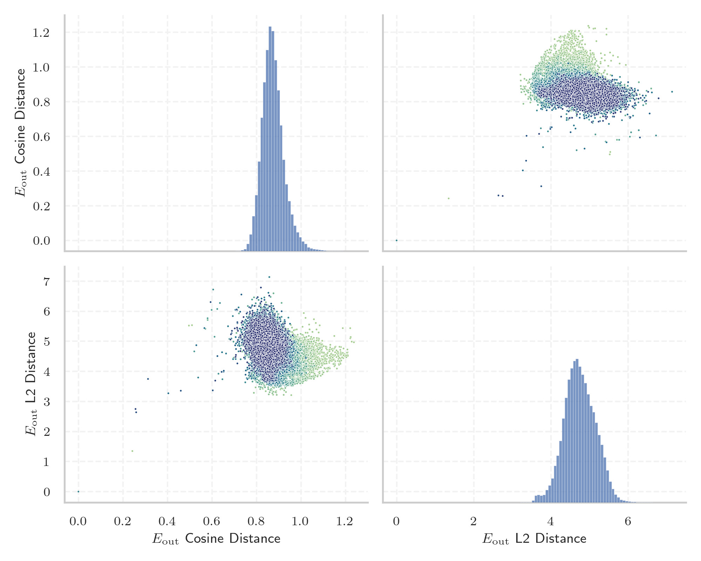
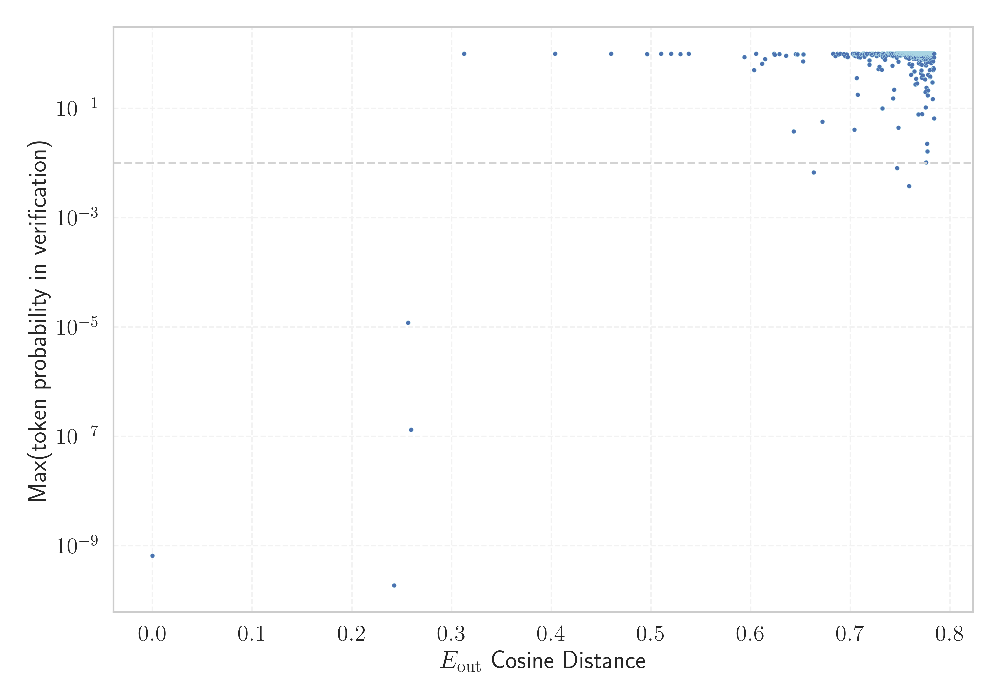

# Report for `PleIAs/Pleias-1.2b-Preview`

## Model info

* Model Info: 
  * Tied embeddings: True
  * LM head uses bias: False
  * Embeddings shape: [65536, 2048]
* Tokenizer Info: 
  * Vocab Size: 65536
  * Tokenizer Class: PreTrainedTokenizerFast
  * Tokenizer Type: BPE
  * Bytes handling: Byte Input
  * Token for verification prompt building: ArgumentException
  * Token id for verification prompt building: 52922
* Indicator summary: 
  * Indicator for under-trained tokens: E_{out} Cosine Distance
  * Overall distribution: 0.873 +/- 0.052
* Detected Token Counts: 
  * Number of tested under-trained tokens: 1297, 1294 non-special, 6 below p = 0.01 threshold, 11 below soft indicator threshold
  * Number of single byte tokens: 243, of which 0 below indicator threshold
  * Number of special tokens: 0, of which 0 below indicator threshold
  * Number of non-single-byte UTF-fragment tokens:  603, of which 5 below soft indicator threshold

## Under-trained token indicators plot


## Verification plot


## Under-trained token verification results
11 entries below threshold of 0.605

|   token_id | token                 |   indicator | max_prob                                                         | in_other_tokens                                                                                                                                                    |
|------------|-----------------------|-------------|------------------------------------------------------------------|--------------------------------------------------------------------------------------------------------------------------------------------------------------------|
|      33234 | ````` NdEx `````      | 4.76837e-07 | <span style='border: 1px solid rgb(169, 68, 66);'>6.5e-10</span> | <span style='border: 1px solid rgb(40, 167, 69);'>````` ▁iNdEx `````</span>, <span style='border: 1px solid rgb(40, 167, 69);'>````` iNdEx `````</span>            |
|      60031 | ````` abogon `````    | 0.256473    | <span style='border: 1px solid rgb(169, 68, 66);'>1.2e-05</span> | <span style='border: 1px solid rgb(40, 167, 69);'>````` ▁gihabogon `````</span>                                                                                    |
|      56780 | ````` ▁talags `````   | 0.259384    | <span style='border: 1px solid rgb(169, 68, 66);'>1.3e-07</span> | ````` ▁talagsaon `````                                                                                                                                             |
|      54187 | ````` alakip `````    | 0.312524    | <span style='border: 1px solid rgb(40, 167, 69);'>1</span>       | <span style='border: 1px solid rgb(40, 167, 69);'>````` ilalakip `````</span>, <span style='border: 1px solid rgb(40, 167, 69);'>````` ▁nahilalakip `````</span>   |
|      44733 | ````` imutangan ````` | 0.403777    | <span style='border: 1px solid rgb(40, 167, 69);'>1</span>       | <span style='border: 1px solid rgb(40, 167, 69);'>````` ▁nahimutangan `````</span>                                                                                 |
|      54194 | ````` ilalakip `````  | 0.459803    | <span style='border: 1px solid rgb(40, 167, 69);'>1</span>       | <span style='border: 1px solid rgb(40, 167, 69);'>````` ▁nahilalakip `````</span>                                                                                  |
|      25491 | ````` ámci `````      | 0.520261    | <span style='border: 1px solid rgb(40, 167, 69);'>0.99</span>    | ````` rámci `````, ````` ▁rámci `````                                                                                                                              |
|      45088 | ````` ahabog `````    | 0.529495    | <span style='border: 1px solid rgb(40, 167, 69);'>0.99</span>    | <span style='border: 1px solid rgb(40, 167, 69);'>````` ahabogang `````</span>, <span style='border: 1px solid rgb(40, 167, 69);'>````` ▁kinahabogang `````</span> |
|      35475 | ````` inaugahan ````` | 0.537871    | <span style='border: 1px solid rgb(40, 167, 69);'>1</span>       | <span style='border: 1px solid rgb(40, 167, 69);'>````` ▁kinaugahan `````</span>                                                                                   |
|      55607 | ````` ÜÜÜÜ `````      | 0.593691    | <span style='border: 1px solid rgb(40, 167, 69);'>0.87</span>    |                                                                                                                                                                    |
|      54053 | ````` ▁MILAWA `````   | 0.603315    | <span style='border: 1px solid rgb(40, 167, 69);'>0.5</span>     |                                                                                                                                                                    |
<details><summary>1283 additional entries above threshold</summary>

|   token_id | token                                                |   indicator | max_prob                                                        | in_other_tokens                                                                                                                                                                                                                                                                                                                                                              |
|------------|------------------------------------------------------|-------------|-----------------------------------------------------------------|------------------------------------------------------------------------------------------------------------------------------------------------------------------------------------------------------------------------------------------------------------------------------------------------------------------------------------------------------------------------------|
|      29814 | ````` lakan `````                                    |    0.60521  | <span style='border: 1px solid rgb(40, 167, 69);'>1</span>      | <span style='border: 1px solid rgb(40, 167, 69);'>````` lakang `````</span>, ````` ▁sidlakan `````, ````` sidlakan `````                                                                                                                                                                                                                                                     |
|      22768 | ````` ſſſſ `````                                     |    0.611387 | <span style='border: 1px solid rgb(40, 167, 69);'>0.65</span>   | <span style='border: 1px solid rgb(40, 167, 69);'>````` ſſſſſſſſſſſſſſſſ `````</span>, <span style='border: 1px solid rgb(255, 145, 0);'>````` ſſſſſſſſ `````</span>                                                                                                                                                                                                         |
|      60015 | ````` bhainteach `````                               |    0.614514 | <span style='border: 1px solid rgb(40, 167, 69);'>0.79</span>   | <span style='border: 1px solid rgb(40, 167, 69);'>````` ▁Neamhbhainteach `````</span>                                                                                                                                                                                                                                                                                        |
|      26070 | ````` UMMARY `````                                   |    0.623519 | <span style='border: 1px solid rgb(40, 167, 69);'>1</span>      | ````` SUMMARY `````, ````` ▁SUMMARY `````                                                                                                                                                                                                                                                                                                                                    |
|      49765 | ````` μερομ `````                                    |    0.624155 | <span style='border: 1px solid rgb(40, 167, 69);'>0.95</span>   | <span style='border: 1px solid rgb(40, 167, 69);'>````` μερομην `````</span>, ````` μερομηνία `````                                                                                                                                                                                                                                                                          |
|      29134 | ````` ugnawan `````                                  |    0.628909 | <span style='border: 1px solid rgb(40, 167, 69);'>0.99</span>   | <span style='border: 1px solid rgb(40, 167, 69);'>````` ▁kinabugnawan `````</span>                                                                                                                                                                                                                                                                                           |
|      29104 | ````` initon `````                                   |    0.635601 | <span style='border: 1px solid rgb(40, 167, 69);'>0.92</span>   | <span style='border: 1px solid rgb(40, 167, 69);'>````` ▁giiniton `````</span>                                                                                                                                                                                                                                                                                               |
|      53225 | ````` úlade `````                                    |    0.643171 | <span style='border: 1px solid rgb(251, 189, 8);'>0.038</span>  | ````` súlade `````                                                                                                                                                                                                                                                                                                                                                           |
|      41730 | ````` ειτου `````                                    |    0.645094 | <span style='border: 1px solid rgb(40, 167, 69);'>0.99</span>   | ````` ▁λειτουργ `````, <span style='border: 1px solid rgb(40, 167, 69);'>````` ειτουργ `````</span>                                                                                                                                                                                                                                                                          |
|      29052 | ````` ainitan `````                                  |    0.646706 | <span style='border: 1px solid rgb(40, 167, 69);'>0.97</span>   | <span style='border: 1px solid rgb(40, 167, 69);'>````` ▁kinainitan `````</span>                                                                                                                                                                                                                                                                                             |
|      48091 | ````` ▁RowBox `````                                  |    0.652392 | <span style='border: 1px solid rgb(40, 167, 69);'>0.72</span>   |                                                                                                                                                                                                                                                                                                                                                                              |
|      49944 | ````` ▁lwstring `````                                |    0.652815 | <span style='border: 1px solid rgb(40, 167, 69);'>0.97</span>   |                                                                                                                                                                                                                                                                                                                                                                              |
|      38600 | ````` ſſſſſſſſ `````                                 |    0.663075 | <span style='border: 1px solid rgb(255, 145, 0);'>0.0067</span> | <span style='border: 1px solid rgb(40, 167, 69);'>````` ſſſſſſſſſſſſſſſſ `````</span>                                                                                                                                                                                                                                                                                        |
|      38552 | ````` ▁déduisez `````                                |    0.671968 | <span style='border: 1px solid rgb(251, 189, 8);'>0.057</span>  |                                                                                                                                                                                                                                                                                                                                                                              |
|      60246 | ````` ▁localVar `````                                |    0.682657 | <span style='border: 1px solid rgb(40, 167, 69);'>1</span>      |                                                                                                                                                                                                                                                                                                                                                                              |
|      60287 | ````` ▁Neamhbhainteach `````                         |    0.685087 | <span style='border: 1px solid rgb(40, 167, 69);'>0.91</span>   |                                                                                                                                                                                                                                                                                                                                                                              |
|      38647 | ````` ▁exposeriez `````                              |    0.686925 | <span style='border: 1px solid rgb(40, 167, 69);'>1</span>      |                                                                                                                                                                                                                                                                                                                                                                              |
|      50976 | ````` klaro `````                                    |    0.688189 | <span style='border: 1px solid rgb(40, 167, 69);'>0.96</span>   | <span style='border: 1px solid rgb(40, 167, 69);'>````` Pagklaro `````</span>                                                                                                                                                                                                                                                                                                |
|      59132 | ````` cccccccc `````                                 |    0.689497 | <span style='border: 1px solid rgb(40, 167, 69);'>1</span>      |                                                                                                                                                                                                                                                                                                                                                                              |
|      36282 | ````` ÈÈ `````                                       |    0.693419 | <span style='border: 1px solid rgb(40, 167, 69);'>0.98</span>   | <span style='border: 1px solid rgb(40, 167, 69);'>````` ÈÈÈÈ `````</span>                                                                                                                                                                                                                                                                                                    |
|      38635 | ````` ulagway `````                                  |    0.694602 | <span style='border: 1px solid rgb(40, 167, 69);'>0.91</span>   | <span style='border: 1px solid rgb(40, 167, 69);'>````` hulagway `````</span>, <span style='border: 1px solid rgb(251, 189, 8);'>````` ▁ginhulagway `````</span>, <span style='border: 1px solid rgb(40, 167, 69);'>````` ▁gihulagway `````</span>                                                                                                                           |
|      21745 | ````` ▁Άνευ `````                                    |    0.696282 | <span style='border: 1px solid rgb(40, 167, 69);'>0.98</span>   |                                                                                                                                                                                                                                                                                                                                                                              |
|      16423 | ````` "}}," `````                                    |    0.697148 | <span style='border: 1px solid rgb(40, 167, 69);'>0.87</span>   |                                                                                                                                                                                                                                                                                                                                                                              |
|      60662 | ````` \x00\x00\x00\x00 `````                         |    0.702174 | <span style='border: 1px solid rgb(40, 167, 69);'>1</span>      |                                                                                                                                                                                                                                                                                                                                                                              |
|      60035 | ````` ▁gihabogon `````                               |    0.703876 | <span style='border: 1px solid rgb(40, 167, 69);'>0.92</span>   |                                                                                                                                                                                                                                                                                                                                                                              |
|      50259 | ````` "}}}," `````                                   |    0.703971 | <span style='border: 1px solid rgb(251, 189, 8);'>0.04</span>   |                                                                                                                                                                                                                                                                                                                                                                              |
|      59972 | ````` ▁dunay `````                                   |    0.704101 | <span style='border: 1px solid rgb(40, 167, 69);'>1</span>      |                                                                                                                                                                                                                                                                                                                                                                              |
|      35333 | ````` "]}}}," `````                                  |    0.705016 | <span style='border: 1px solid rgb(40, 167, 69);'>0.9</span>    |                                                                                                                                                                                                                                                                                                                                                                              |
|      42224 | ````` ],< `````                                      |    0.705333 | <span style='border: 1px solid rgb(40, 167, 69);'>1</span>      |                                                                                                                                                                                                                                                                                                                                                                              |
|      61939 | ````` ivituses `````                                 |    0.705974 | <span style='border: 1px solid rgb(40, 167, 69);'>0.96</span>   |                                                                                                                                                                                                                                                                                                                                                                              |
|      36333 | ````` "]}}," `````                                   |    0.706204 | <span style='border: 1px solid rgb(40, 167, 69);'>0.36</span>   |                                                                                                                                                                                                                                                                                                                                                                              |
|      42387 | ````` ecommons `````                                 |    0.706351 | <span style='border: 1px solid rgb(40, 167, 69);'>0.99</span>   | ````` creativecommons `````                                                                                                                                                                                                                                                                                                                                                  |
|      62910 | ````` ukyvytt `````                                  |    0.70734  | <span style='border: 1px solid rgb(40, 167, 69);'>0.93</span>   | ````` ▁maksukyvytt `````, ````` ▁maksukyvyttömyys `````                                                                                                                                                                                                                                                                                                                      |
|      32217 | ````` "]}," `````                                    |    0.707459 | <span style='border: 1px solid rgb(40, 167, 69);'>0.18</span>   |                                                                                                                                                                                                                                                                                                                                                                              |
|      50173 | ````` emenea `````                                   |    0.707709 | <span style='border: 1px solid rgb(40, 167, 69);'>1</span>      | ````` ▁asemenea `````                                                                                                                                                                                                                                                                                                                                                        |
|      43947 | ````` achweise `````                                 |    0.707934 | <span style='border: 1px solid rgb(40, 167, 69);'>0.87</span>   | <span style='border: 1px solid rgb(40, 167, 69);'>````` zelnachweise `````</span>, ````` Einzelnachweise `````                                                                                                                                                                                                                                                               |
|      10405 | ````` indows `````                                   |    0.709769 | <span style='border: 1px solid rgb(40, 167, 69);'>0.86</span>   | ````` ▁windows `````, ````` windows `````, ````` Windows `````, ````` ▁Windows `````                                                                                                                                                                                                                                                                                         |
|      56652 | ````` ▁komon `````                                   |    0.711041 | <span style='border: 1px solid rgb(40, 167, 69);'>0.96</span>   |                                                                                                                                                                                                                                                                                                                                                                              |
|      63121 | ````` sekto `````                                    |    0.712431 | <span style='border: 1px solid rgb(40, 167, 69);'>1</span>      |                                                                                                                                                                                                                                                                                                                                                                              |
|      48285 | ````` saluran `````                                  |    0.712517 | <span style='border: 1px solid rgb(40, 167, 69);'>1</span>      |                                                                                                                                                                                                                                                                                                                                                                              |
|      60911 | ````` ÈÈÈÈ `````                                     |    0.713757 | <span style='border: 1px solid rgb(40, 167, 69);'>0.99</span>   |                                                                                                                                                                                                                                                                                                                                                                              |
|      55334 | ````` ▁listade `````                                 |    0.713821 | <span style='border: 1px solid rgb(40, 167, 69);'>0.97</span>   |                                                                                                                                                                                                                                                                                                                                                                              |
|      38039 | ````` Alike `````                                    |    0.713977 | <span style='border: 1px solid rgb(40, 167, 69);'>1</span>      | <span style='border: 1px solid rgb(40, 167, 69);'>````` ShareAlike `````</span>                                                                                                                                                                                                                                                                                              |
|      52521 | ````` ▁iNdEx `````                                   |    0.714068 | <span style='border: 1px solid rgb(40, 167, 69);'>0.96</span>   |                                                                                                                                                                                                                                                                                                                                                                              |
|      48558 | ````` "}}}, `````                                    |    0.714128 | <span style='border: 1px solid rgb(40, 167, 69);'>0.88</span>   | <span style='border: 1px solid rgb(251, 189, 8);'>````` "}}}," `````</span>                                                                                                                                                                                                                                                                                                  |
|      58116 | ````` [{" `````                                      |    0.716115 | <span style='border: 1px solid rgb(40, 167, 69);'>0.98</span>   |                                                                                                                                                                                                                                                                                                                                                                              |
|      63881 | ````` ▁αθέτηση `````                                 |    0.716373 | <span style='border: 1px solid rgb(40, 167, 69);'>0.97</span>   |                                                                                                                                                                                                                                                                                                                                                                              |
|      34312 | ````` awigan `````                                   |    0.716399 | <span style='border: 1px solid rgb(40, 167, 69);'>1</span>      | ````` ▁lalawigan `````                                                                                                                                                                                                                                                                                                                                                       |
|      35301 | ````` "]}}}, `````                                   |    0.719007 | <span style='border: 1px solid rgb(40, 167, 69);'>0.63</span>   | <span style='border: 1px solid rgb(40, 167, 69);'>````` "]}}}," `````</span>                                                                                                                                                                                                                                                                                                 |
|      36290 | ````` "]}}, `````                                    |    0.719057 | <span style='border: 1px solid rgb(40, 167, 69);'>0.75</span>   | <span style='border: 1px solid rgb(40, 167, 69);'>````` "]}}," `````</span>                                                                                                                                                                                                                                                                                                  |
|      36358 | ````` aboga `````                                    |    0.719318 | <span style='border: 1px solid rgb(40, 167, 69);'>1</span>      | <span style='border: 1px solid rgb(40, 167, 69);'>````` ▁kahaboga `````</span>, <span style='border: 1px solid rgb(40, 167, 69);'>````` ahabogang `````</span>, <span style='border: 1px solid rgb(40, 167, 69);'>````` ▁kinahabogang `````</span>                                                                                                                           |
|      15117 | ````` "]}} `````                                     |    0.720892 | <span style='border: 1px solid rgb(40, 167, 69);'>0.96</span>   | <span style='border: 1px solid rgb(40, 167, 69);'>````` "]}}, `````</span>, <span style='border: 1px solid rgb(40, 167, 69);'>````` "]}}}," `````</span>, <span style='border: 1px solid rgb(40, 167, 69);'>````` "]}}}, `````</span>, <span style='border: 1px solid rgb(40, 167, 69);'>````` "]}}," `````</span>                                                           |
|      35543 | ````` ▁kinaugahan `````                              |    0.721423 | <span style='border: 1px solid rgb(40, 167, 69);'>1</span>      |                                                                                                                                                                                                                                                                                                                                                                              |
|      52555 | ````` yembre `````                                   |    0.721648 | <span style='border: 1px solid rgb(40, 167, 69);'>0.94</span>   |                                                                                                                                                                                                                                                                                                                                                                              |
|      44335 | ````` primento `````                                 |    0.722747 | <span style='border: 1px solid rgb(40, 167, 69);'>1</span>      |                                                                                                                                                                                                                                                                                                                                                                              |
|      46150 | ````` postavljenosti `````                           |    0.723663 | <span style='border: 1px solid rgb(40, 167, 69);'>0.99</span>   | ````` ▁izpostavljenosti `````                                                                                                                                                                                                                                                                                                                                                |
|      60834 | ````` ursare `````                                   |    0.724886 | <span style='border: 1px solid rgb(40, 167, 69);'>0.99</span>   | <span style='border: 1px solid rgb(40, 167, 69);'>````` ▁nerambursare `````</span>                                                                                                                                                                                                                                                                                           |
|      40560 | ````` ▁nalista `````                                 |    0.724915 | <span style='border: 1px solid rgb(40, 167, 69);'>0.99</span>   |                                                                                                                                                                                                                                                                                                                                                                              |
|      48525 | ````` ▁tová `````                                    |    0.726542 | <span style='border: 1px solid rgb(40, 167, 69);'>0.91</span>   | ````` ▁további `````, ````` ▁tovább `````                                                                                                                                                                                                                                                                                                                                    |
|      51704 | ````` ukangon `````                                  |    0.726998 | <span style='border: 1px solid rgb(40, 167, 69);'>0.96</span>   |                                                                                                                                                                                                                                                                                                                                                                              |
|      65380 | ````` jesítő `````                                   |    0.727499 | <span style='border: 1px solid rgb(40, 167, 69);'>1</span>      |                                                                                                                                                                                                                                                                                                                                                                              |
|      65317 | ````` ſſſſſſſſſſſſſſſſ `````                         |    0.727987 | <span style='border: 1px solid rgb(40, 167, 69);'>0.52</span>   |                                                                                                                                                                                                                                                                                                                                                                              |
|      58636 | ````` ▁kinadul `````                                 |    0.728193 | <span style='border: 1px solid rgb(40, 167, 69);'>0.99</span>   |                                                                                                                                                                                                                                                                                                                                                                              |
|      21226 | ````` %%%% `````                                     |    0.7283   | <span style='border: 1px solid rgb(40, 167, 69);'>1</span>      | <span style='border: 1px solid rgb(40, 167, 69);'>````` %%%%%%%% `````</span>                                                                                                                                                                                                                                                                                                |
|      30251 | ````` "]}, `````                                     |    0.729123 | <span style='border: 1px solid rgb(40, 167, 69);'>0.58</span>   | <span style='border: 1px solid rgb(40, 167, 69);'>````` "]}," `````</span>                                                                                                                                                                                                                                                                                                   |
|      26780 | ````` ▁ibabaw `````                                  |    0.730196 | <span style='border: 1px solid rgb(40, 167, 69);'>0.94</span>   |                                                                                                                                                                                                                                                                                                                                                                              |
|      37445 | ````` zzles `````                                    |    0.730588 | <span style='border: 1px solid rgb(40, 167, 69);'>0.97</span>   | ````` ▁puzzles `````, ````` ▁nozzles `````                                                                                                                                                                                                                                                                                                                                   |
|      23217 | ````` ủa `````                                       |    0.731303 | <span style='border: 1px solid rgb(40, 167, 69);'>0.99</span>   | ````` ▁của `````                                                                                                                                                                                                                                                                                                                                                             |
|      20105 | ````` usetts `````                                   |    0.731348 | <span style='border: 1px solid rgb(40, 167, 69);'>0.51</span>   | <span style='border: 1px solid rgb(40, 167, 69);'>````` achusetts `````</span>, ````` ▁Massachusetts `````                                                                                                                                                                                                                                                                   |
|      49340 | ````` ▁السماو `````                                  |    0.731961 | <span style='border: 1px solid rgb(40, 167, 69);'>1</span>      |                                                                                                                                                                                                                                                                                                                                                                              |
|      25473 | ````` ▁ulohan `````                                  |    0.732158 | <span style='border: 1px solid rgb(251, 189, 8);'>0.1</span>    |                                                                                                                                                                                                                                                                                                                                                                              |
|      64589 | ````` ¯¯ `````                                       |    0.732507 | <span style='border: 1px solid rgb(40, 167, 69);'>1</span>      |                                                                                                                                                                                                                                                                                                                                                                              |
|      37851 | ````` hiyon `````                                    |    0.73253  | <span style='border: 1px solid rgb(40, 167, 69);'>0.98</span>   | <span style='border: 1px solid rgb(40, 167, 69);'>````` ▁rehiyon `````</span>                                                                                                                                                                                                                                                                                                |
|      22596 | ````` ▁Nepiemēro `````                               |    0.73287  | <span style='border: 1px solid rgb(40, 167, 69);'>0.86</span>   |                                                                                                                                                                                                                                                                                                                                                                              |
|      46832 | ````` ▁adtong `````                                  |    0.733252 | <span style='border: 1px solid rgb(40, 167, 69);'>0.99</span>   |                                                                                                                                                                                                                                                                                                                                                                              |
|      33471 | ````` ── `````                                       |    0.733583 | <span style='border: 1px solid rgb(40, 167, 69);'>1</span>      | <span style='border: 1px solid rgb(40, 167, 69);'>````` ──── `````</span>                                                                                                                                                                                                                                                                                                    |
|      25059 | ````` orithm `````                                   |    0.734194 | <span style='border: 1px solid rgb(40, 167, 69);'>0.91</span>   | ````` ▁Algorithm `````, ````` algorithm `````, <span style='border: 1px solid rgb(40, 167, 69);'>````` orithms `````</span>, ````` Algorithm `````                                                                                                                                                                                                                           |
|      51140 | ````` ÉES `````                                      |    0.734327 | <span style='border: 1px solid rgb(40, 167, 69);'>0.86</span>   |                                                                                                                                                                                                                                                                                                                                                                              |
|      23784 | ````` ▁holid `````                                   |    0.734758 | <span style='border: 1px solid rgb(40, 167, 69);'>0.77</span>   | ````` ▁holiday `````, ````` ▁holidays `````                                                                                                                                                                                                                                                                                                                                  |
|      10982 | ````` "}," `````                                     |    0.735336 | <span style='border: 1px solid rgb(40, 167, 69);'>0.96</span>   |                                                                                                                                                                                                                                                                                                                                                                              |
|      27188 | ````` iecie `````                                    |    0.735714 | <span style='border: 1px solid rgb(40, 167, 69);'>0.92</span>   | ````` ▁powiecie `````                                                                                                                                                                                                                                                                                                                                                        |
|      58658 | ````` ▁dakong `````                                  |    0.736357 | <span style='border: 1px solid rgb(40, 167, 69);'>1</span>      |                                                                                                                                                                                                                                                                                                                                                                              |
|      64815 | ````` linky `````                                    |    0.736372 | <span style='border: 1px solid rgb(40, 167, 69);'>1</span>      |                                                                                                                                                                                                                                                                                                                                                                              |
|      26949 | ````` ▁dagat `````                                   |    0.736597 | <span style='border: 1px solid rgb(40, 167, 69);'>0.95</span>   |                                                                                                                                                                                                                                                                                                                                                                              |
|      63239 | ````` ▁беха `````                                    |    0.736741 | <span style='border: 1px solid rgb(40, 167, 69);'>0.99</span>   |                                                                                                                                                                                                                                                                                                                                                                              |
|      30321 | ````` ▁autorais `````                                |    0.736841 | <span style='border: 1px solid rgb(40, 167, 69);'>1</span>      |                                                                                                                                                                                                                                                                                                                                                                              |
|      65442 | ````` ▁WHETHER `````                                 |    0.737564 | <span style='border: 1px solid rgb(40, 167, 69);'>1</span>      |                                                                                                                                                                                                                                                                                                                                                                              |
|      25219 | ````` ▁[{: `````                                     |    0.737654 | <span style='border: 1px solid rgb(40, 167, 69);'>0.99</span>   |                                                                                                                                                                                                                                                                                                                                                                              |
|      21230 | ````` imutang `````                                  |    0.737774 | <span style='border: 1px solid rgb(40, 167, 69);'>0.96</span>   | <span style='border: 1px solid rgb(40, 167, 69);'>````` imutangan `````</span>, <span style='border: 1px solid rgb(40, 167, 69);'>````` ▁nahimutangan `````</span>, ````` ▁Nahimutang `````                                                                                                                                                                                  |
|      44618 | ````` äische `````                                   |    0.739103 | <span style='border: 1px solid rgb(40, 167, 69);'>0.99</span>   | ````` ▁Europäische `````, ````` ▁europäischen `````                                                                                                                                                                                                                                                                                                                          |
|      24739 | ````` adpan `````                                    |    0.739199 | <span style='border: 1px solid rgb(40, 167, 69);'>1</span>      | <span style='border: 1px solid rgb(40, 167, 69);'>````` kasadpan `````</span>, <span style='border: 1px solid rgb(40, 167, 69);'>````` adpang `````</span>, ````` ▁kasadpan `````                                                                                                                                                                                            |
|      16806 | ````` ▁enthus `````                                  |    0.739329 | <span style='border: 1px solid rgb(40, 167, 69);'>1</span>      | ````` ▁enthusiastic `````, ````` ▁enthusiasm `````, ````` ▁enthusiasts `````, ````` ▁enthusiast `````, ````` ▁enthusias `````                                                                                                                                                                                                                                                |
|      51951 | ````` EQUI `````                                     |    0.739598 | <span style='border: 1px solid rgb(40, 167, 69);'>1</span>      |                                                                                                                                                                                                                                                                                                                                                                              |
|      43813 | ````` ▁tawo `````                                    |    0.739804 | <span style='border: 1px solid rgb(40, 167, 69);'>1</span>      |                                                                                                                                                                                                                                                                                                                                                                              |
|      38383 | ````` envoyez `````                                  |    0.739868 | <span style='border: 1px solid rgb(40, 167, 69);'>1</span>      |                                                                                                                                                                                                                                                                                                                                                                              |
|      37534 | ````` ▁ischem `````                                  |    0.740025 | <span style='border: 1px solid rgb(40, 167, 69);'>1</span>      | ````` ▁ischemia `````, ````` ▁ischemic `````                                                                                                                                                                                                                                                                                                                                 |
|      24057 | ````` asurement `````                                |    0.740124 | <span style='border: 1px solid rgb(40, 167, 69);'>0.95</span>   | ````` Measurement `````, ````` ▁Measurement `````, ````` measurement `````, <span style='border: 1px solid rgb(40, 167, 69);'>````` asurements `````</span>                                                                                                                                                                                                                  |
|      62579 | ````` ──── `````                                     |    0.740587 | <span style='border: 1px solid rgb(40, 167, 69);'>0.99</span>   |                                                                                                                                                                                                                                                                                                                                                                              |
|      35253 | ````` quées `````                                    |    0.740681 | <span style='border: 1px solid rgb(40, 167, 69);'>0.98</span>   |                                                                                                                                                                                                                                                                                                                                                                              |
|      35152 | ````` igoj `````                                     |    0.74144  | <span style='border: 1px solid rgb(40, 167, 69);'>1</span>      | <span style='border: 1px solid rgb(40, 167, 69);'>````` sipareigoj `````</span>, ````` ▁įsipareigoj `````, ````` ▁įsipareigojimų `````                                                                                                                                                                                                                                       |
|      34048 | ````` clature `````                                  |    0.741583 | <span style='border: 1px solid rgb(40, 167, 69);'>0.97</span>   | ````` omenclature `````, ````` ▁nomenclature `````                                                                                                                                                                                                                                                                                                                           |
|      33228 | ````` iquées `````                                   |    0.741611 | <span style='border: 1px solid rgb(40, 167, 69);'>0.97</span>   |                                                                                                                                                                                                                                                                                                                                                                              |
|      62361 | ````` انيه `````                                     |    0.741754 | <span style='border: 1px solid rgb(40, 167, 69);'>1</span>      |                                                                                                                                                                                                                                                                                                                                                                              |
|      58767 | ````` ainteach `````                                 |    0.742082 | <span style='border: 1px solid rgb(40, 167, 69);'>0.6</span>    | <span style='border: 1px solid rgb(40, 167, 69);'>````` bhainteach `````</span>, <span style='border: 1px solid rgb(40, 167, 69);'>````` ▁Neamhbhainteach `````</span>                                                                                                                                                                                                       |
|      29065 | ````` ommendations `````                             |    0.742691 | <span style='border: 1px solid rgb(40, 167, 69);'>0.15</span>   | ````` ▁Recommendations `````, ````` Recommendations `````                                                                                                                                                                                                                                                                                                                    |
|      15962 | ````` "}}, `````                                     |    0.742731 | <span style='border: 1px solid rgb(40, 167, 69);'>0.9</span>    | <span style='border: 1px solid rgb(40, 167, 69);'>````` "}}," `````</span>                                                                                                                                                                                                                                                                                                   |
|      63671 | ````` idirisk `````                                  |    0.743303 | <span style='border: 1px solid rgb(40, 167, 69);'>0.99</span>   |                                                                                                                                                                                                                                                                                                                                                                              |
|      45154 | ````` ipong `````                                    |    0.743313 | <span style='border: 1px solid rgb(40, 167, 69);'>0.99</span>   | ````` ▁Tinipong `````                                                                                                                                                                                                                                                                                                                                                        |
|      57654 | ````` itrostát `````                                 |    0.743753 | <span style='border: 1px solid rgb(40, 167, 69);'>0.22</span>   | ````` ▁vnitrostát `````                                                                                                                                                                                                                                                                                                                                                      |
|      44793 | ````` ▁nahimutangan `````                            |    0.744551 | <span style='border: 1px solid rgb(40, 167, 69);'>0.93</span>   |                                                                                                                                                                                                                                                                                                                                                                              |
|      55956 | ````` tické `````                                    |    0.745107 | <span style='border: 1px solid rgb(40, 167, 69);'>0.99</span>   |                                                                                                                                                                                                                                                                                                                                                                              |
|      64985 | ````` ▁меттигаш `````                                |    0.745592 | <span style='border: 1px solid rgb(40, 167, 69);'>1</span>      |                                                                                                                                                                                                                                                                                                                                                                              |
|      48318 | ````` filmiau `````                                  |    0.745849 | <span style='border: 1px solid rgb(40, 167, 69);'>1</span>      | <span style='border: 1px solid rgb(40, 167, 69);'>````` Ffilmiau `````</span>                                                                                                                                                                                                                                                                                                |
|      28314 | ````` ración `````                                   |    0.746341 | <span style='border: 1px solid rgb(40, 167, 69);'>1</span>      | ````` ▁cooperación `````                                                                                                                                                                                                                                                                                                                                                     |
|      63821 | ````` raciones `````                                 |    0.746488 | <span style='border: 1px solid rgb(40, 167, 69);'>0.99</span>   |                                                                                                                                                                                                                                                                                                                                                                              |
|      58760 | ````` iNdEx `````                                    |    0.746545 | <span style='border: 1px solid rgb(40, 167, 69);'>0.84</span>   |                                                                                                                                                                                                                                                                                                                                                                              |
|      33886 | ````` ticolul `````                                  |    0.746696 | <span style='border: 1px solid rgb(255, 145, 0);'>0.008</span>  | ````` Articolul `````, ````` ▁Articolul `````, ````` ▁articolului `````                                                                                                                                                                                                                                                                                                      |
|      47264 | ````` átane `````                                    |    0.746866 | <span style='border: 1px solid rgb(40, 167, 69);'>0.97</span>   | ````` ▁vrátane `````                                                                                                                                                                                                                                                                                                                                                         |
|      31517 | ````` ▁\u200e `````                                  |    0.746982 | <span style='border: 1px solid rgb(40, 167, 69);'>1</span>      |                                                                                                                                                                                                                                                                                                                                                                              |
|      42963 | ````` itā `````                                      |    0.747302 | <span style='border: 1px solid rgb(40, 167, 69);'>1</span>      |                                                                                                                                                                                                                                                                                                                                                                              |
|      62761 | ````` ístico `````                                   |    0.747347 | <span style='border: 1px solid rgb(40, 167, 69);'>1</span>      |                                                                                                                                                                                                                                                                                                                                                                              |
|      52870 | ````` álu `````                                      |    0.747349 | <span style='border: 1px solid rgb(40, 167, 69);'>1</span>      |                                                                                                                                                                                                                                                                                                                                                                              |
|      34872 | ````` ahoma `````                                    |    0.747548 | <span style='border: 1px solid rgb(40, 167, 69);'>1</span>      | <span style='border: 1px solid rgb(40, 167, 69);'>````` klahoma `````</span>, ````` ▁Oklahoma `````                                                                                                                                                                                                                                                                          |
|      58556 | ````` hulgas `````                                   |    0.747694 | <span style='border: 1px solid rgb(40, 167, 69);'>1</span>      | ````` ▁sealhulgas `````                                                                                                                                                                                                                                                                                                                                                      |
|      54513 | ````` kolari `````                                   |    0.747854 | <span style='border: 1px solid rgb(40, 167, 69);'>1</span>      | ````` ▁partikolari `````                                                                                                                                                                                                                                                                                                                                                     |
|      44185 | ````` zelnachweise `````                             |    0.747965 | <span style='border: 1px solid rgb(40, 167, 69);'>0.71</span>   | ````` Einzelnachweise `````                                                                                                                                                                                                                                                                                                                                                  |
|      49070 | ````` tées `````                                     |    0.748182 | <span style='border: 1px solid rgb(40, 167, 69);'>1</span>      | ````` ▁présentées `````                                                                                                                                                                                                                                                                                                                                                      |
|      55955 | ````` ▁kasarigan `````                               |    0.748197 | <span style='border: 1px solid rgb(40, 167, 69);'>0.91</span>   |                                                                                                                                                                                                                                                                                                                                                                              |
|      12212 | ````` ftware `````                                   |    0.748221 | <span style='border: 1px solid rgb(251, 189, 8);'>0.044</span>  | ````` Software `````, ````` software `````, ````` ▁Software `````                                                                                                                                                                                                                                                                                                            |
|      45438 | ````` ▁Bansa `````                                   |    0.748327 | <span style='border: 1px solid rgb(40, 167, 69);'>1</span>      |                                                                                                                                                                                                                                                                                                                                                                              |
|      29210 | ````` ▁kinabugnawan `````                            |    0.748356 | <span style='border: 1px solid rgb(40, 167, 69);'>1</span>      |                                                                                                                                                                                                                                                                                                                                                                              |
|      50107 | ````` formità `````                                  |    0.748358 | <span style='border: 1px solid rgb(40, 167, 69);'>1</span>      | ````` konformità `````, ````` ▁conformità `````                                                                                                                                                                                                                                                                                                                              |
|      21398 | ````` médiaire `````                                 |    0.748399 | <span style='border: 1px solid rgb(40, 167, 69);'>0.93</span>   | ````` intermédiaire `````, <span style='border: 1px solid rgb(40, 167, 69);'>````` médiaires `````</span>, ````` ▁intermédiaires `````, ````` ▁intermédiaire `````                                                                                                                                                                                                           |
|      64955 | ````` cimentos `````                                 |    0.74866  | <span style='border: 1px solid rgb(40, 167, 69);'>0.99</span>   |                                                                                                                                                                                                                                                                                                                                                                              |
|      62045 | ````` čenie `````                                    |    0.748705 | <span style='border: 1px solid rgb(40, 167, 69);'>1</span>      |                                                                                                                                                                                                                                                                                                                                                                              |
|      41473 | ````` ▁kwadrado `````                                |    0.748754 | <span style='border: 1px solid rgb(40, 167, 69);'>0.98</span>   |                                                                                                                                                                                                                                                                                                                                                                              |
|      37992 | ````` ACIÓN `````                                    |    0.748934 | <span style='border: 1px solid rgb(40, 167, 69);'>0.96</span>   |                                                                                                                                                                                                                                                                                                                                                                              |
|      45917 | ````` rables `````                                   |    0.749221 | <span style='border: 1px solid rgb(40, 167, 69);'>0.99</span>   | ````` ▁considérables `````, ````` ▁favorables `````                                                                                                                                                                                                                                                                                                                          |
|      49098 | ````` uations `````                                  |    0.749248 | <span style='border: 1px solid rgb(40, 167, 69);'>1</span>      |                                                                                                                                                                                                                                                                                                                                                                              |
|      38966 | ````` zügyi `````                                    |    0.749391 | <span style='border: 1px solid rgb(40, 167, 69);'>0.99</span>   | ````` ▁pénzügyi `````                                                                                                                                                                                                                                                                                                                                                        |
|      32483 | ````` ▁ಸ `````                                       |    0.749476 | <span style='border: 1px solid rgb(40, 167, 69);'>0.98</span>   |                                                                                                                                                                                                                                                                                                                                                                              |
|      60746 | ````` IMENTS `````                                   |    0.749486 | <span style='border: 1px solid rgb(40, 167, 69);'>0.97</span>   |                                                                                                                                                                                                                                                                                                                                                                              |
|      30462 | ````` čných `````                                    |    0.749508 | <span style='border: 1px solid rgb(40, 167, 69);'>0.99</span>   |                                                                                                                                                                                                                                                                                                                                                                              |
|      41004 | ````` ledu `````                                     |    0.7497   | <span style='border: 1px solid rgb(40, 167, 69);'>1</span>      | ````` ▁pogledu `````                                                                                                                                                                                                                                                                                                                                                         |
|       8706 | ````` īb `````                                       |    0.749764 | <span style='border: 1px solid rgb(40, 167, 69);'>0.99</span>   | <span style='border: 1px solid rgb(40, 167, 69);'>````` ībval `````</span>, <span style='border: 1px solid rgb(40, 167, 69);'>````` ībai `````</span>, <span style='border: 1px solid rgb(40, 167, 69);'>````` ība `````</span>, ````` ▁attiecībā `````, ````` ībā `````, ...                                                                                                |
|      55261 | ````` bilité `````                                   |    0.749801 | <span style='border: 1px solid rgb(40, 167, 69);'>1</span>      | ````` ▁responsabilités `````, ````` ▁comptabilité `````, ````` ▁possibilités `````                                                                                                                                                                                                                                                                                           |
|      15448 | ````` imetro `````                                   |    0.750081 | <span style='border: 1px solid rgb(40, 167, 69);'>0.98</span>   | <span style='border: 1px solid rgb(40, 167, 69);'>````` ▁milimetro `````</span>                                                                                                                                                                                                                                                                                              |
|      62273 | ````` ulación `````                                  |    0.750288 | <span style='border: 1px solid rgb(40, 167, 69);'>1</span>      |                                                                                                                                                                                                                                                                                                                                                                              |
|      61192 | ````` ALYSIS `````                                   |    0.75034  | <span style='border: 1px solid rgb(40, 167, 69);'>0.93</span>   |                                                                                                                                                                                                                                                                                                                                                                              |
|      49274 | ````` ▁ವ `````                                       |    0.750634 | <span style='border: 1px solid rgb(40, 167, 69);'>1</span>      |                                                                                                                                                                                                                                                                                                                                                                              |
|      34743 | ````` otud `````                                     |    0.750684 | <span style='border: 1px solid rgb(40, 167, 69);'>1</span>      | ````` ▁seotud `````                                                                                                                                                                                                                                                                                                                                                          |
|      62520 | ````` adpang `````                                   |    0.751056 | <span style='border: 1px solid rgb(40, 167, 69);'>0.98</span>   |                                                                                                                                                                                                                                                                                                                                                                              |
|      50984 | ````` érő `````                                      |    0.75126  | <span style='border: 1px solid rgb(40, 167, 69);'>0.99</span>   |                                                                                                                                                                                                                                                                                                                                                                              |
|      41184 | ````` omitempty `````                                |    0.751485 | <span style='border: 1px solid rgb(40, 167, 69);'>0.94</span>   |                                                                                                                                                                                                                                                                                                                                                                              |
|      65375 | ````` ológicos `````                                 |    0.751531 | <span style='border: 1px solid rgb(40, 167, 69);'>0.99</span>   |                                                                                                                                                                                                                                                                                                                                                                              |
|      27302 | ````` agway `````                                    |    0.751736 | <span style='border: 1px solid rgb(40, 167, 69);'>1</span>      | <span style='border: 1px solid rgb(40, 167, 69);'>````` hulagway `````</span>, <span style='border: 1px solid rgb(40, 167, 69);'>````` ulagway `````</span>, <span style='border: 1px solid rgb(251, 189, 8);'>````` ▁ginhulagway `````</span>, <span style='border: 1px solid rgb(40, 167, 69);'>````` ▁gihulagway `````</span>                                             |
|      18943 | ````` ▁kasarangang `````                             |    0.751898 | <span style='border: 1px solid rgb(40, 167, 69);'>1</span>      |                                                                                                                                                                                                                                                                                                                                                                              |
|      44817 | ````` ▁అ `````                                       |    0.752038 | <span style='border: 1px solid rgb(40, 167, 69);'>0.99</span>   |                                                                                                                                                                                                                                                                                                                                                                              |
|      34724 | ````` acionais `````                                 |    0.752073 | <span style='border: 1px solid rgb(40, 167, 69);'>1</span>      | ````` ▁nacionais `````                                                                                                                                                                                                                                                                                                                                                       |
|      65294 | ````` ingsS `````                                    |    0.752107 | <span style='border: 1px solid rgb(40, 167, 69);'>0.99</span>   |                                                                                                                                                                                                                                                                                                                                                                              |
|      61433 | ````` ਾ `````                                         |    0.752278 | <span style='border: 1px solid rgb(40, 167, 69);'>1</span>      |                                                                                                                                                                                                                                                                                                                                                                              |
|      57650 | ````` ▁hayop `````                                   |    0.752306 | <span style='border: 1px solid rgb(40, 167, 69);'>0.99</span>   |                                                                                                                                                                                                                                                                                                                                                                              |
|      57943 | ````` ienė `````                                     |    0.75242  | <span style='border: 1px solid rgb(40, 167, 69);'>1</span>      |                                                                                                                                                                                                                                                                                                                                                                              |
|      38913 | ````` CLUDING `````                                  |    0.752426 | <span style='border: 1px solid rgb(40, 167, 69);'>1</span>      | <span style='border: 1px solid rgb(40, 167, 69);'>````` ▁INCLUDING `````</span>                                                                                                                                                                                                                                                                                              |
|      62455 | ````` ūru `````                                      |    0.752761 | <span style='border: 1px solid rgb(40, 167, 69);'>1</span>      |                                                                                                                                                                                                                                                                                                                                                                              |
|      10698 | ````` ":[" `````                                     |    0.752773 | <span style='border: 1px solid rgb(40, 167, 69);'>1</span>      |                                                                                                                                                                                                                                                                                                                                                                              |
|      58787 | ````` IZATION `````                                  |    0.752819 | <span style='border: 1px solid rgb(40, 167, 69);'>1</span>      |                                                                                                                                                                                                                                                                                                                                                                              |
|      35423 | ````` ▁kinabasaan `````                              |    0.75312  | <span style='border: 1px solid rgb(40, 167, 69);'>0.97</span>   |                                                                                                                                                                                                                                                                                                                                                                              |
|      52725 | ````` ológica `````                                  |    0.753392 | <span style='border: 1px solid rgb(40, 167, 69);'>1</span>      |                                                                                                                                                                                                                                                                                                                                                                              |
|      52702 | ````` ▁Consignes `````                               |    0.753665 | <span style='border: 1px solid rgb(40, 167, 69);'>0.99</span>   |                                                                                                                                                                                                                                                                                                                                                                              |
|      46315 | ````` enské `````                                    |    0.753679 | <span style='border: 1px solid rgb(40, 167, 69);'>1</span>      | ````` ▁členské `````, ````` ▁členského `````                                                                                                                                                                                                                                                                                                                                 |
|      31237 | ````` ▁Nigend `````                                  |    0.753899 | <span style='border: 1px solid rgb(40, 167, 69);'>1</span>      |                                                                                                                                                                                                                                                                                                                                                                              |
|      43565 | ````` ▁nalukop `````                                 |    0.754116 | <span style='border: 1px solid rgb(40, 167, 69);'>0.98</span>   |                                                                                                                                                                                                                                                                                                                                                                              |
|      38247 | ````` AtA `````                                      |    0.754491 | <span style='border: 1px solid rgb(40, 167, 69);'>1</span>      | <span style='border: 1px solid rgb(40, 167, 69);'>````` dAtA `````</span>                                                                                                                                                                                                                                                                                                    |
|      51526 | ````` LoS `````                                      |    0.754549 | <span style='border: 1px solid rgb(40, 167, 69);'>0.99</span>   | ````` ▁PLoS `````                                                                                                                                                                                                                                                                                                                                                            |
|      41141 | ````` ukiran `````                                   |    0.754739 | <span style='border: 1px solid rgb(40, 167, 69);'>0.99</span>   | ````` Kabukiran `````                                                                                                                                                                                                                                                                                                                                                        |
|      30419 | ````` iencies `````                                  |    0.754792 | <span style='border: 1px solid rgb(40, 167, 69);'>1</span>      | ````` ▁deficiencies `````                                                                                                                                                                                                                                                                                                                                                    |
|      63042 | ````` ālu `````                                      |    0.754793 | <span style='border: 1px solid rgb(40, 167, 69);'>1</span>      |                                                                                                                                                                                                                                                                                                                                                                              |
|      43611 | ````` ANCES `````                                    |    0.754942 | <span style='border: 1px solid rgb(40, 167, 69);'>0.99</span>   |                                                                                                                                                                                                                                                                                                                                                                              |
|      19757 | ````` nées `````                                     |    0.754964 | <span style='border: 1px solid rgb(40, 167, 69);'>0.99</span>   | <span style='border: 1px solid rgb(40, 167, 69);'>````` énées `````</span>, ````` ▁concernées `````, ````` onnées `````, ````` ▁mentionnées `````, ````` ▁destinées `````, ...                                                                                                                                                                                               |
|      52173 | ````` jména `````                                    |    0.75517  | <span style='border: 1px solid rgb(40, 167, 69);'>1</span>      | ````` ▁zejména `````                                                                                                                                                                                                                                                                                                                                                         |
|      63581 | ````` oniques `````                                  |    0.755189 | <span style='border: 1px solid rgb(40, 167, 69);'>1</span>      |                                                                                                                                                                                                                                                                                                                                                                              |
|      58167 | ````` ÍA `````                                       |    0.755254 | <span style='border: 1px solid rgb(40, 167, 69);'>1</span>      |                                                                                                                                                                                                                                                                                                                                                                              |
|      26578 | ````` ísticas `````                                  |    0.755275 | <span style='border: 1px solid rgb(40, 167, 69);'>1</span>      | ````` ▁características `````                                                                                                                                                                                                                                                                                                                                                 |
|      56938 | ````` eerd `````                                     |    0.75529  | <span style='border: 1px solid rgb(40, 167, 69);'>1</span>      | ````` ▁gepubliceerd `````                                                                                                                                                                                                                                                                                                                                                    |
|      61013 | ````` ▁Waray `````                                   |    0.75537  | <span style='border: 1px solid rgb(40, 167, 69);'>1</span>      |                                                                                                                                                                                                                                                                                                                                                                              |
|      38565 | ````` urança `````                                   |    0.755592 | <span style='border: 1px solid rgb(40, 167, 69);'>0.95</span>   | ````` ▁segurança `````                                                                                                                                                                                                                                                                                                                                                       |
|      37629 | ````` pozycje `````                                  |    0.755725 | <span style='border: 1px solid rgb(40, 167, 69);'>1</span>      | <span style='border: 1px solid rgb(40, 167, 69);'>````` ▁Ekspozycje `````</span>                                                                                                                                                                                                                                                                                             |
|      50133 | ````` iaľ `````                                      |    0.755776 | <span style='border: 1px solid rgb(40, 167, 69);'>0.86</span>   | ````` ▁pokiaľ `````                                                                                                                                                                                                                                                                                                                                                          |
|      32703 | ````` itôt `````                                     |    0.755862 | <span style='border: 1px solid rgb(40, 167, 69);'>1</span>      | ````` ▁aussitôt `````                                                                                                                                                                                                                                                                                                                                                        |
|      61266 | ````` ēd `````                                       |    0.755923 | <span style='border: 1px solid rgb(40, 167, 69);'>1</span>      |                                                                                                                                                                                                                                                                                                                                                                              |
|      26767 | ````` capes `````                                    |    0.756051 | <span style='border: 1px solid rgb(40, 167, 69);'>1</span>      | ````` ▁landscapes `````                                                                                                                                                                                                                                                                                                                                                      |
|      40485 | ````` ▁ക `````                                       |    0.756201 | <span style='border: 1px solid rgb(40, 167, 69);'>1</span>      |                                                                                                                                                                                                                                                                                                                                                                              |
|      64713 | ````` vím `````                                      |    0.756208 | <span style='border: 1px solid rgb(40, 167, 69);'>0.96</span>   |                                                                                                                                                                                                                                                                                                                                                                              |
|      30250 | ````` znál `````                                     |    0.756212 | <span style='border: 1px solid rgb(40, 167, 69);'>0.98</span>   | ````` ▁használ `````, ````` használ `````                                                                                                                                                                                                                                                                                                                                    |
|      63622 | ````` ▁Εξ `````                                      |    0.756461 | <span style='border: 1px solid rgb(40, 167, 69);'>0.99</span>   |                                                                                                                                                                                                                                                                                                                                                                              |
|      53882 | ````` ▁contribs `````                                |    0.756589 | <span style='border: 1px solid rgb(40, 167, 69);'>1</span>      |                                                                                                                                                                                                                                                                                                                                                                              |
|      55392 | ````` ológico `````                                  |    0.756618 | <span style='border: 1px solid rgb(40, 167, 69);'>0.99</span>   | <span style='border: 1px solid rgb(40, 167, 69);'>````` ológicos `````</span>                                                                                                                                                                                                                                                                                                |
|      59439 | ````` hulagway `````                                 |    0.756649 | <span style='border: 1px solid rgb(40, 167, 69);'>0.91</span>   | <span style='border: 1px solid rgb(251, 189, 8);'>````` ▁ginhulagway `````</span>                                                                                                                                                                                                                                                                                            |
|      45904 | ````` ército `````                                   |    0.756672 | <span style='border: 1px solid rgb(40, 167, 69);'>0.99</span>   |                                                                                                                                                                                                                                                                                                                                                                              |
|      59650 | ````` ISATION `````                                  |    0.756937 | <span style='border: 1px solid rgb(40, 167, 69);'>0.99</span>   |                                                                                                                                                                                                                                                                                                                                                                              |
|      37105 | ````` ÈRE `````                                      |    0.756975 | <span style='border: 1px solid rgb(40, 167, 69);'>0.99</span>   | <span style='border: 1px solid rgb(40, 167, 69);'>````` ÈRES `````</span>                                                                                                                                                                                                                                                                                                    |
|      31471 | ````` léans `````                                    |    0.756978 | <span style='border: 1px solid rgb(40, 167, 69);'>1</span>      | ````` Orléans `````, ````` ▁Orléans `````                                                                                                                                                                                                                                                                                                                                    |
|      56424 | ````` ▁]); `````                                     |    0.756978 | <span style='border: 1px solid rgb(40, 167, 69);'>0.97</span>   |                                                                                                                                                                                                                                                                                                                                                                              |
|      62684 | ````` āla `````                                      |    0.757169 | <span style='border: 1px solid rgb(40, 167, 69);'>1</span>      | <span style='border: 1px solid rgb(40, 167, 69);'>````` ālais `````</span>                                                                                                                                                                                                                                                                                                   |
|      50620 | ````` lakang `````                                   |    0.757282 | <span style='border: 1px solid rgb(40, 167, 69);'>0.98</span>   |                                                                                                                                                                                                                                                                                                                                                                              |
|      55483 | ````` ÈRES `````                                     |    0.757313 | <span style='border: 1px solid rgb(40, 167, 69);'>0.99</span>   |                                                                                                                                                                                                                                                                                                                                                                              |
|      36595 | ````` ULTS `````                                     |    0.757316 | <span style='border: 1px solid rgb(40, 167, 69);'>0.99</span>   | ````` ▁RESULTS `````                                                                                                                                                                                                                                                                                                                                                         |
|      27291 | ````` ítés `````                                     |    0.757354 | <span style='border: 1px solid rgb(40, 167, 69);'>0.98</span>   | <span style='border: 1px solid rgb(40, 167, 69);'>````` ítése `````</span>                                                                                                                                                                                                                                                                                                   |
|      59332 | ````` omorphism `````                                |    0.75736  | <span style='border: 1px solid rgb(40, 167, 69);'>0.99</span>   |                                                                                                                                                                                                                                                                                                                                                                              |
|      27055 | ````` █ `````                                        |    0.757477 | <span style='border: 1px solid rgb(40, 167, 69);'>1</span>      | ````` ██ `````                                                                                                                                                                                                                                                                                                                                                               |
|      53679 | ````` ▁underarter `````                              |    0.757527 | <span style='border: 1px solid rgb(40, 167, 69);'>0.99</span>   |                                                                                                                                                                                                                                                                                                                                                                              |
|      44621 | ````` ▁ubang `````                                   |    0.757573 | <span style='border: 1px solid rgb(40, 167, 69);'>1</span>      |                                                                                                                                                                                                                                                                                                                                                                              |
|      21999 | ````` ização `````                                   |    0.757583 | <span style='border: 1px solid rgb(40, 167, 69);'>0.98</span>   | ````` ▁utilização `````                                                                                                                                                                                                                                                                                                                                                      |
|      63908 | ````` hydrous `````                                  |    0.757603 | <span style='border: 1px solid rgb(40, 167, 69);'>1</span>      |                                                                                                                                                                                                                                                                                                                                                                              |
|      50144 | ````` áticas `````                                   |    0.757677 | <span style='border: 1px solid rgb(40, 167, 69);'>0.98</span>   |                                                                                                                                                                                                                                                                                                                                                                              |
|      47066 | ````` itigen `````                                   |    0.757714 | <span style='border: 1px solid rgb(40, 167, 69);'>1</span>      |                                                                                                                                                                                                                                                                                                                                                                              |
|      58177 | ````` éraires `````                                  |    0.757782 | <span style='border: 1px solid rgb(40, 167, 69);'>0.99</span>   |                                                                                                                                                                                                                                                                                                                                                                              |
|      29177 | ````` ▁kinainitan `````                              |    0.757851 | <span style='border: 1px solid rgb(40, 167, 69);'>0.95</span>   |                                                                                                                                                                                                                                                                                                                                                                              |
|      54237 | ````` Ț `````                                        |    0.757863 | <span style='border: 1px solid rgb(40, 167, 69);'>1</span>      |                                                                                                                                                                                                                                                                                                                                                                              |
|      60531 | ````` iquant `````                                   |    0.757886 | <span style='border: 1px solid rgb(40, 167, 69);'>0.99</span>   |                                                                                                                                                                                                                                                                                                                                                                              |
|      62457 | ````` defaulted `````                                |    0.757899 | <span style='border: 1px solid rgb(40, 167, 69);'>1</span>      |                                                                                                                                                                                                                                                                                                                                                                              |
|      64231 | ````` ține `````                                     |    0.75806  | <span style='border: 1px solid rgb(40, 167, 69);'>0.99</span>   |                                                                                                                                                                                                                                                                                                                                                                              |
|      56413 | ````` اعيه `````                                     |    0.758155 | <span style='border: 1px solid rgb(40, 167, 69);'>1</span>      |                                                                                                                                                                                                                                                                                                                                                                              |
|      53272 | ````` esseurs `````                                  |    0.758205 | <span style='border: 1px solid rgb(40, 167, 69);'>0.98</span>   |                                                                                                                                                                                                                                                                                                                                                                              |
|      50474 | ````` ISING `````                                    |    0.758316 | <span style='border: 1px solid rgb(40, 167, 69);'>0.97</span>   |                                                                                                                                                                                                                                                                                                                                                                              |
|      64422 | ````` ▁ఆ `````                                       |    0.75833  | <span style='border: 1px solid rgb(40, 167, 69);'>1</span>      |                                                                                                                                                                                                                                                                                                                                                                              |
|      41864 | ````` embrie `````                                   |    0.758365 | <span style='border: 1px solid rgb(40, 167, 69);'>0.89</span>   |                                                                                                                                                                                                                                                                                                                                                                              |
|      46626 | ````` věrové `````                                   |    0.758384 | <span style='border: 1px solid rgb(40, 167, 69);'>1</span>      |                                                                                                                                                                                                                                                                                                                                                                              |
|      26810 | ````` āciju `````                                    |    0.758552 | <span style='border: 1px solid rgb(40, 167, 69);'>1</span>      | ````` ▁informāciju `````                                                                                                                                                                                                                                                                                                                                                     |
|      63795 | ````` izate `````                                    |    0.758579 | <span style='border: 1px solid rgb(40, 167, 69);'>0.95</span>   |                                                                                                                                                                                                                                                                                                                                                                              |
|      24644 | ````` icação `````                                   |    0.758644 | <span style='border: 1px solid rgb(40, 167, 69);'>0.98</span>   | ````` ▁aplicação `````                                                                                                                                                                                                                                                                                                                                                       |
|      21708 | ````` ptides `````                                   |    0.758653 | <span style='border: 1px solid rgb(40, 167, 69);'>0.98</span>   | ````` ▁peptides `````, ````` ▁polypeptides `````                                                                                                                                                                                                                                                                                                                             |
|      41007 | ````` tevõ `````                                     |    0.758671 | <span style='border: 1px solid rgb(40, 167, 69);'>0.8</span>    | ````` ▁ettevõ `````                                                                                                                                                                                                                                                                                                                                                          |
|      62251 | ````` ▁Cooking `````                                 |    0.758745 | <span style='border: 1px solid rgb(40, 167, 69);'>1</span>      |                                                                                                                                                                                                                                                                                                                                                                              |
|      36449 | ````` ▁kahaboga `````                                |    0.758757 | <span style='border: 1px solid rgb(40, 167, 69);'>0.99</span>   |                                                                                                                                                                                                                                                                                                                                                                              |
|      54804 | ````` uintes `````                                   |    0.758816 | <span style='border: 1px solid rgb(40, 167, 69);'>0.98</span>   | ````` ▁seguintes `````                                                                                                                                                                                                                                                                                                                                                       |
|      52575 | ````` véni `````                                     |    0.758853 | <span style='border: 1px solid rgb(40, 167, 69);'>1</span>      | ````` ▁inconvéni `````                                                                                                                                                                                                                                                                                                                                                       |
|      19071 | ````` chniques `````                                 |    0.758857 | <span style='border: 1px solid rgb(255, 145, 0);'>0.0038</span> | ````` ▁Techniques `````, ````` techniques `````                                                                                                                                                                                                                                                                                                                              |
|      16452 | ````` entification `````                             |    0.758892 | <span style='border: 1px solid rgb(40, 167, 69);'>0.97</span>   | ````` ▁Identification `````, ````` identification `````, ````` Identification `````                                                                                                                                                                                                                                                                                          |
|      45669 | ````` ▁గ `````                                       |    0.758911 | <span style='border: 1px solid rgb(40, 167, 69);'>1</span>      |                                                                                                                                                                                                                                                                                                                                                                              |
|      64244 | ````` ālais `````                                    |    0.758928 | <span style='border: 1px solid rgb(40, 167, 69);'>0.95</span>   |                                                                                                                                                                                                                                                                                                                                                                              |
|      31867 | ````` ériques `````                                  |    0.758962 | <span style='border: 1px solid rgb(40, 167, 69);'>1</span>      | ````` ▁numériques `````                                                                                                                                                                                                                                                                                                                                                      |
|      62508 | ````` кспозиции `````                                |    0.759129 | <span style='border: 1px solid rgb(40, 167, 69);'>0.65</span>   |                                                                                                                                                                                                                                                                                                                                                                              |
|      41198 | ````` ūra `````                                      |    0.759135 | <span style='border: 1px solid rgb(40, 167, 69);'>0.99</span>   |                                                                                                                                                                                                                                                                                                                                                                              |
|      46837 | ````` ▁സ `````                                       |    0.759198 | <span style='border: 1px solid rgb(40, 167, 69);'>1</span>      |                                                                                                                                                                                                                                                                                                                                                                              |
|      36148 | ````` ▁আ `````                                       |    0.759274 | <span style='border: 1px solid rgb(40, 167, 69);'>0.99</span>   |                                                                                                                                                                                                                                                                                                                                                                              |
|      45602 | ````` ských `````                                    |    0.759276 | <span style='border: 1px solid rgb(40, 167, 69);'>0.88</span>   |                                                                                                                                                                                                                                                                                                                                                                              |
|      47081 | ````` ▁пун `````                                     |    0.759391 | <span style='border: 1px solid rgb(40, 167, 69);'>0.98</span>   | ````` ▁пункт `````                                                                                                                                                                                                                                                                                                                                                           |
|      46459 | ````` ENING `````                                    |    0.759636 | <span style='border: 1px solid rgb(40, 167, 69);'>1</span>      |                                                                                                                                                                                                                                                                                                                                                                              |
|      35009 | ````` ▁matag `````                                   |    0.759676 | <span style='border: 1px solid rgb(40, 167, 69);'>1</span>      |                                                                                                                                                                                                                                                                                                                                                                              |
|      12788 | ````` riculture `````                                |    0.759731 | <span style='border: 1px solid rgb(40, 167, 69);'>0.94</span>   | ````` Agriculture `````, ````` ▁Agriculture `````, ````` ▁agriculture `````, ````` agriculture `````                                                                                                                                                                                                                                                                         |
|      17031 | ````` inéa `````                                     |    0.75994  | <span style='border: 1px solid rgb(40, 167, 69);'>1</span>      | ````` ▁alinéa `````, ````` alinéa `````                                                                                                                                                                                                                                                                                                                                      |
|      45500 | ````` kenys `````                                    |    0.759953 | <span style='border: 1px solid rgb(40, 167, 69);'>1</span>      | ````` ▁tevékenys `````                                                                                                                                                                                                                                                                                                                                                       |
|      42983 | ````` ▁bgcolor `````                                 |    0.759961 | <span style='border: 1px solid rgb(40, 167, 69);'>1</span>      |                                                                                                                                                                                                                                                                                                                                                                              |
|      60158 | ````` izadas `````                                   |    0.760119 | <span style='border: 1px solid rgb(40, 167, 69);'>0.91</span>   |                                                                                                                                                                                                                                                                                                                                                                              |
|      51527 | ````` ▁populasyon `````                              |    0.760171 | <span style='border: 1px solid rgb(40, 167, 69);'>1</span>      |                                                                                                                                                                                                                                                                                                                                                                              |
|      59492 | ````` ovanju `````                                   |    0.760258 | <span style='border: 1px solid rgb(40, 167, 69);'>0.94</span>   |                                                                                                                                                                                                                                                                                                                                                                              |
|      34399 | ````` ulée `````                                     |    0.760447 | <span style='border: 1px solid rgb(40, 167, 69);'>1</span>      |                                                                                                                                                                                                                                                                                                                                                                              |
|      54289 | ````` ijā `````                                      |    0.760474 | <span style='border: 1px solid rgb(40, 167, 69);'>1</span>      |                                                                                                                                                                                                                                                                                                                                                                              |
|      64079 | ````` ifiées `````                                   |    0.760478 | <span style='border: 1px solid rgb(40, 167, 69);'>0.98</span>   |                                                                                                                                                                                                                                                                                                                                                                              |
|      63273 | ````` anía `````                                     |    0.76054  | <span style='border: 1px solid rgb(40, 167, 69);'>0.99</span>   |                                                                                                                                                                                                                                                                                                                                                                              |
|      39324 | ````` ística `````                                   |    0.76068  | <span style='border: 1px solid rgb(40, 167, 69);'>1</span>      | ````` ▁características `````                                                                                                                                                                                                                                                                                                                                                 |
|      37772 | ````` ▁kabanay `````                                 |    0.760734 | <span style='border: 1px solid rgb(40, 167, 69);'>1</span>      |                                                                                                                                                                                                                                                                                                                                                                              |
|      23653 | ````` }," `````                                      |    0.760757 | <span style='border: 1px solid rgb(40, 167, 69);'>0.98</span>   | <span style='border: 1px solid rgb(40, 167, 69);'>````` "]}," `````</span>, <span style='border: 1px solid rgb(40, 167, 69);'>````` "]}}}," `````</span>, <span style='border: 1px solid rgb(251, 189, 8);'>````` "}}}," `````</span>, <span style='border: 1px solid rgb(40, 167, 69);'>````` "]}}," `````</span>                                                           |
|      27180 | ````` "}), `````                                     |    0.76076  | <span style='border: 1px solid rgb(40, 167, 69);'>0.41</span>   |                                                                                                                                                                                                                                                                                                                                                                              |
|      19638 | ````` ▁SMEC `````                                    |    0.760778 | <span style='border: 1px solid rgb(40, 167, 69);'>1</span>      |                                                                                                                                                                                                                                                                                                                                                                              |
|      49894 | ````` μερομην `````                                  |    0.760833 | <span style='border: 1px solid rgb(40, 167, 69);'>1</span>      | ````` μερομηνία `````                                                                                                                                                                                                                                                                                                                                                        |
|      58190 | ````` nį `````                                       |    0.760928 | <span style='border: 1px solid rgb(40, 167, 69);'>1</span>      |                                                                                                                                                                                                                                                                                                                                                                              |
|      35945 | ````` ▁automatizadas `````                           |    0.760949 | <span style='border: 1px solid rgb(40, 167, 69);'>0.99</span>   |                                                                                                                                                                                                                                                                                                                                                                              |
|      52132 | ````` êmement `````                                  |    0.761057 | <span style='border: 1px solid rgb(40, 167, 69);'>0.99</span>   | ````` ▁extrêmement `````                                                                                                                                                                                                                                                                                                                                                     |
|      62986 | ````` ▁niewykonanie `````                            |    0.761092 | <span style='border: 1px solid rgb(40, 167, 69);'>1</span>      |                                                                                                                                                                                                                                                                                                                                                                              |
|      45119 | ````` ▁Hamps `````                                   |    0.761109 | <span style='border: 1px solid rgb(40, 167, 69);'>0.99</span>   | ````` ▁Hampshire `````                                                                                                                                                                                                                                                                                                                                                       |
|      51947 | ````` ▁paghimo `````                                 |    0.761159 | <span style='border: 1px solid rgb(40, 167, 69);'>1</span>      |                                                                                                                                                                                                                                                                                                                                                                              |
|      45961 | ````` četně `````                                    |    0.761283 | <span style='border: 1px solid rgb(40, 167, 69);'>1</span>      | ````` ▁včetně `````                                                                                                                                                                                                                                                                                                                                                          |
|      62411 | ````` flies `````                                    |    0.761317 | <span style='border: 1px solid rgb(40, 167, 69);'>1</span>      |                                                                                                                                                                                                                                                                                                                                                                              |
|      37573 | ````` ulyo `````                                     |    0.761354 | <span style='border: 1px solid rgb(40, 167, 69);'>1</span>      | ````` ▁Hulyo `````                                                                                                                                                                                                                                                                                                                                                           |
|      24703 | ````` ției `````                                     |    0.761429 | <span style='border: 1px solid rgb(40, 167, 69);'>0.98</span>   |                                                                                                                                                                                                                                                                                                                                                                              |
|      54286 | ````` ▁nahilalakip `````                             |    0.76143  | <span style='border: 1px solid rgb(40, 167, 69);'>0.59</span>   |                                                                                                                                                                                                                                                                                                                                                                              |
|      29179 | ````` ▁giiniton `````                                |    0.761477 | <span style='border: 1px solid rgb(40, 167, 69);'>0.99</span>   |                                                                                                                                                                                                                                                                                                                                                                              |
|      35158 | ````` izados `````                                   |    0.761502 | <span style='border: 1px solid rgb(40, 167, 69);'>1</span>      | ````` ▁utilizados `````                                                                                                                                                                                                                                                                                                                                                      |
|      56613 | ````` owią `````                                     |    0.761556 | <span style='border: 1px solid rgb(40, 167, 69);'>1</span>      |                                                                                                                                                                                                                                                                                                                                                                              |
|      59275 | ````` ▁Matières `````                                |    0.761568 | <span style='border: 1px solid rgb(40, 167, 69);'>1</span>      |                                                                                                                                                                                                                                                                                                                                                                              |
|      31746 | ````` ților `````                                    |    0.761579 | <span style='border: 1px solid rgb(40, 167, 69);'>1</span>      |                                                                                                                                                                                                                                                                                                                                                                              |
|      27446 | ````` guez `````                                     |    0.761625 | <span style='border: 1px solid rgb(40, 167, 69);'>0.96</span>   | ````` ▁Rodríguez `````, ````` ▁Rodriguez `````, <span style='border: 1px solid rgb(40, 167, 69);'>````` ríguez `````</span>                                                                                                                                                                                                                                                  |
|      60228 | ````` vytt `````                                     |    0.761631 | <span style='border: 1px solid rgb(40, 167, 69);'>0.96</span>   | ````` ▁maksukyvytt `````, <span style='border: 1px solid rgb(40, 167, 69);'>````` ukyvytt `````</span>, ````` ▁maksukyvyttömyys `````                                                                                                                                                                                                                                        |
|      60630 | ````` cripción `````                                 |    0.761711 | <span style='border: 1px solid rgb(40, 167, 69);'>0.98</span>   |                                                                                                                                                                                                                                                                                                                                                                              |
|      57752 | ````` ticing `````                                   |    0.761748 | <span style='border: 1px solid rgb(40, 167, 69);'>0.96</span>   |                                                                                                                                                                                                                                                                                                                                                                              |
|      45116 | ````` ahabogang `````                                |    0.761785 | <span style='border: 1px solid rgb(40, 167, 69);'>0.94</span>   | <span style='border: 1px solid rgb(40, 167, 69);'>````` ▁kinahabogang `````</span>                                                                                                                                                                                                                                                                                           |
|      42410 | ````` zköz `````                                     |    0.761817 | <span style='border: 1px solid rgb(40, 167, 69);'>0.62</span>   | ````` ▁eszköz `````                                                                                                                                                                                                                                                                                                                                                          |
|      53269 | ````` rateurs `````                                  |    0.761938 | <span style='border: 1px solid rgb(40, 167, 69);'>0.92</span>   |                                                                                                                                                                                                                                                                                                                                                                              |
|      42716 | ````` ▁yuta `````                                    |    0.761946 | <span style='border: 1px solid rgb(40, 167, 69);'>0.99</span>   |                                                                                                                                                                                                                                                                                                                                                                              |
|      61305 | ````` zcza `````                                     |    0.762184 | <span style='border: 1px solid rgb(40, 167, 69);'>1</span>      |                                                                                                                                                                                                                                                                                                                                                                              |
|      60029 | ````` ▁kinahabogang `````                            |    0.762217 | <span style='border: 1px solid rgb(40, 167, 69);'>0.95</span>   |                                                                                                                                                                                                                                                                                                                                                                              |
|      45732 | ````` ATING `````                                    |    0.762243 | <span style='border: 1px solid rgb(40, 167, 69);'>1</span>      |                                                                                                                                                                                                                                                                                                                                                                              |
|      64864 | ````` ligare `````                                   |    0.76227  | <span style='border: 1px solid rgb(40, 167, 69);'>0.98</span>   |                                                                                                                                                                                                                                                                                                                                                                              |
|      57225 | ````` unkwe `````                                    |    0.762282 | <span style='border: 1px solid rgb(40, 167, 69);'>1</span>      | ````` ▁kwalunkwe `````                                                                                                                                                                                                                                                                                                                                                       |
|      51084 | ````` ="<? `````                                     |    0.762482 | <span style='border: 1px solid rgb(40, 167, 69);'>1</span>      |                                                                                                                                                                                                                                                                                                                                                                              |
|      21914 | ````` ución `````                                    |    0.762487 | <span style='border: 1px solid rgb(40, 167, 69);'>0.99</span>   | <span style='border: 1px solid rgb(40, 167, 69);'>````` ecución `````</span>, ````` ▁ejecución `````, <span style='border: 1px solid rgb(40, 167, 69);'>````` titución `````</span>, ````` ▁resolución `````, <span style='border: 1px solid rgb(40, 167, 69);'>````` olución `````</span>                                                                                   |
|      53761 | ````` átum `````                                     |    0.762488 | <span style='border: 1px solid rgb(40, 167, 69);'>0.97</span>   |                                                                                                                                                                                                                                                                                                                                                                              |
|      51464 | ````` cznych `````                                   |    0.762858 | <span style='border: 1px solid rgb(40, 167, 69);'>0.99</span>   | <span style='border: 1px solid rgb(40, 167, 69);'>````` icznych `````</span>, ````` ycznych `````                                                                                                                                                                                                                                                                            |
|      17283 | ````` ínio `````                                     |    0.762869 | <span style='border: 1px solid rgb(40, 167, 69);'>1</span>      | ````` ▁domínio `````                                                                                                                                                                                                                                                                                                                                                         |
|      33075 | ````` ▁অ `````                                       |    0.762885 | <span style='border: 1px solid rgb(40, 167, 69);'>1</span>      |                                                                                                                                                                                                                                                                                                                                                                              |
|      45034 | ````` ącą `````                                      |    0.762889 | <span style='border: 1px solid rgb(40, 167, 69);'>0.96</span>   | <span style='border: 1px solid rgb(40, 167, 69);'>````` ▁biegnącą `````</span>                                                                                                                                                                                                                                                                                               |
|      27546 | ````` rators `````                                   |    0.762907 | <span style='border: 1px solid rgb(40, 167, 69);'>1</span>      | ````` ▁generators `````, ````` ▁administrators `````                                                                                                                                                                                                                                                                                                                         |
|      44908 | ````` ières `````                                    |    0.763004 | <span style='border: 1px solid rgb(40, 167, 69);'>1</span>      | ````` ▁frontières `````, <span style='border: 1px solid rgb(40, 167, 69);'>````` ▁Matières `````</span>, <span style='border: 1px solid rgb(40, 167, 69);'>````` ▁Premières `````</span>                                                                                                                                                                                     |
|      57119 | ````` ïne `````                                      |    0.763004 | <span style='border: 1px solid rgb(40, 167, 69);'>1</span>      |                                                                                                                                                                                                                                                                                                                                                                              |
|      58219 | ````` cées `````                                     |    0.763018 | <span style='border: 1px solid rgb(40, 167, 69);'>0.96</span>   |                                                                                                                                                                                                                                                                                                                                                                              |
|      49475 | ````` ālo `````                                      |    0.763064 | <span style='border: 1px solid rgb(40, 167, 69);'>1</span>      |                                                                                                                                                                                                                                                                                                                                                                              |
|      64958 | ````` ídos `````                                     |    0.763108 | <span style='border: 1px solid rgb(40, 167, 69);'>0.99</span>   |                                                                                                                                                                                                                                                                                                                                                                              |
|      42501 | ````` ARIES `````                                    |    0.763272 | <span style='border: 1px solid rgb(40, 167, 69);'>1</span>      | <span style='border: 1px solid rgb(40, 167, 69);'>````` ▁SUBSIDIARIES `````</span>                                                                                                                                                                                                                                                                                           |
|      32455 | ````` itajiet `````                                  |    0.763318 | <span style='border: 1px solid rgb(40, 167, 69);'>0.81</span>   | ````` awtoritajiet `````                                                                                                                                                                                                                                                                                                                                                     |
|      20009 | ````` ukais `````                                    |    0.763331 | <span style='border: 1px solid rgb(40, 167, 69);'>1</span>      | ````` ▁mukais `````, ````` ▁mukaisesti `````, ````` mukais `````                                                                                                                                                                                                                                                                                                             |
|      24526 | ````` buie `````                                     |    0.763345 | <span style='border: 1px solid rgb(40, 167, 69);'>1</span>      | ````` ▁trebuie `````                                                                                                                                                                                                                                                                                                                                                         |
|      53046 | ````` ésil `````                                     |    0.763352 | <span style='border: 1px solid rgb(40, 167, 69);'>0.95</span>   | ````` ▁Brésil `````                                                                                                                                                                                                                                                                                                                                                          |
|      46530 | ````` isiones `````                                  |    0.763364 | <span style='border: 1px solid rgb(40, 167, 69);'>1</span>      | ````` ▁decisiones `````                                                                                                                                                                                                                                                                                                                                                      |
|      12947 | ````` ▁Επι `````                                     |    0.763429 | <span style='border: 1px solid rgb(40, 167, 69);'>1</span>      | <span style='border: 1px solid rgb(40, 167, 69);'>````` ▁Επιτροπ `````</span>, ````` ▁Επιτροπής `````, ````` ▁Επιτροπή `````                                                                                                                                                                                                                                                 |
|      55759 | ````` gerald `````                                   |    0.763432 | <span style='border: 1px solid rgb(40, 167, 69);'>1</span>      | ````` ▁Fitzgerald `````                                                                                                                                                                                                                                                                                                                                                      |
|      11533 | ````` īj `````                                       |    0.7635   | <span style='border: 1px solid rgb(40, 167, 69);'>1</span>      | ````` ▁gadījumā `````, ````` ▁gadīj `````, <span style='border: 1px solid rgb(40, 167, 69);'>````` ījumi `````</span>, ````` ījumu `````                                                                                                                                                                                                                                     |
|      44151 | ````` ΜΕ `````                                       |    0.763504 | <span style='border: 1px solid rgb(40, 167, 69);'>1</span>      |                                                                                                                                                                                                                                                                                                                                                                              |
|      56054 | ````` ursors `````                                   |    0.763527 | <span style='border: 1px solid rgb(40, 167, 69);'>0.98</span>   | ````` ▁precursors `````                                                                                                                                                                                                                                                                                                                                                      |
|      34757 | ````` ūros `````                                     |    0.763581 | <span style='border: 1px solid rgb(40, 167, 69);'>0.99</span>   |                                                                                                                                                                                                                                                                                                                                                                              |
|      57269 | ````` ālās `````                                     |    0.76361  | <span style='border: 1px solid rgb(40, 167, 69);'>0.98</span>   |                                                                                                                                                                                                                                                                                                                                                                              |
|      63495 | ````` āc `````                                       |    0.763623 | <span style='border: 1px solid rgb(40, 167, 69);'>1</span>      |                                                                                                                                                                                                                                                                                                                                                                              |
|      35957 | ````` cribers `````                                  |    0.763674 | <span style='border: 1px solid rgb(40, 167, 69);'>1</span>      | ````` ▁subscribers `````                                                                                                                                                                                                                                                                                                                                                     |
|      37946 | ````` úde `````                                      |    0.763717 | <span style='border: 1px solid rgb(40, 167, 69);'>1</span>      | ````` ▁saúde `````                                                                                                                                                                                                                                                                                                                                                           |
|      58363 | ````` pośred `````                                   |    0.763721 | <span style='border: 1px solid rgb(40, 167, 69);'>1</span>      | ````` ▁bezpośred `````                                                                                                                                                                                                                                                                                                                                                       |
|      61361 | ````` cribes `````                                   |    0.763722 | <span style='border: 1px solid rgb(40, 167, 69);'>1</span>      |                                                                                                                                                                                                                                                                                                                                                                              |
|      55350 | ````` uating `````                                   |    0.763769 | <span style='border: 1px solid rgb(40, 167, 69);'>1</span>      | ````` ▁actuating `````                                                                                                                                                                                                                                                                                                                                                       |
|      42520 | ````` čná `````                                      |    0.763872 | <span style='border: 1px solid rgb(40, 167, 69);'>0.97</span>   |                                                                                                                                                                                                                                                                                                                                                                              |
|      26165 | ````` zález `````                                    |    0.763872 | <span style='border: 1px solid rgb(40, 167, 69);'>0.82</span>   | ````` ▁González `````                                                                                                                                                                                                                                                                                                                                                        |
|      61217 | ````` ulière `````                                   |    0.764013 | <span style='border: 1px solid rgb(40, 167, 69);'>1</span>      |                                                                                                                                                                                                                                                                                                                                                                              |
|      24435 | ````` ologist `````                                  |    0.76402  | <span style='border: 1px solid rgb(40, 167, 69);'>1</span>      |                                                                                                                                                                                                                                                                                                                                                                              |
|      36631 | ````` ENCES `````                                    |    0.76402  | <span style='border: 1px solid rgb(40, 167, 69);'>0.97</span>   | ````` FERENCES `````                                                                                                                                                                                                                                                                                                                                                         |
|      58288 | ````` FERRED `````                                   |    0.764055 | <span style='border: 1px solid rgb(40, 167, 69);'>1</span>      |                                                                                                                                                                                                                                                                                                                                                                              |
|      51000 | ````` inātu `````                                    |    0.764084 | <span style='border: 1px solid rgb(40, 167, 69);'>0.97</span>   |                                                                                                                                                                                                                                                                                                                                                                              |
|      34951 | ````` ériences `````                                 |    0.764127 | <span style='border: 1px solid rgb(40, 167, 69);'>0.48</span>   | ````` ▁expériences `````                                                                                                                                                                                                                                                                                                                                                     |
|      19471 | ````` ologiques `````                                |    0.764131 | <span style='border: 1px solid rgb(40, 167, 69);'>0.99</span>   |                                                                                                                                                                                                                                                                                                                                                                              |
|      43023 | ````` ▁WASH `````                                    |    0.764161 | <span style='border: 1px solid rgb(40, 167, 69);'>1</span>      | <span style='border: 1px solid rgb(40, 167, 69);'>````` ▁WASHINGTON `````</span>                                                                                                                                                                                                                                                                                             |
|      50420 | ````` níct `````                                     |    0.764181 | <span style='border: 1px solid rgb(40, 167, 69);'>1</span>      |                                                                                                                                                                                                                                                                                                                                                                              |
|      57494 | ````` ÇÃO `````                                      |    0.764197 | <span style='border: 1px solid rgb(40, 167, 69);'>0.96</span>   |                                                                                                                                                                                                                                                                                                                                                                              |
|      55159 | ````` ▁Engineers `````                               |    0.764233 | <span style='border: 1px solid rgb(40, 167, 69);'>1</span>      |                                                                                                                                                                                                                                                                                                                                                                              |
|      18043 | ````` éraux `````                                    |    0.764288 | <span style='border: 1px solid rgb(40, 167, 69);'>0.95</span>   | ````` ▁généraux `````                                                                                                                                                                                                                                                                                                                                                        |
|      48227 | ````` inação `````                                   |    0.7643   | <span style='border: 1px solid rgb(40, 167, 69);'>0.99</span>   |                                                                                                                                                                                                                                                                                                                                                                              |
|      20534 | ````` imientos `````                                 |    0.764303 | <span style='border: 1px solid rgb(40, 167, 69);'>0.99</span>   | ````` ▁procedimientos `````                                                                                                                                                                                                                                                                                                                                                  |
|      59967 | ````` τέρω `````                                     |    0.764445 | <span style='border: 1px solid rgb(40, 167, 69);'>1</span>      |                                                                                                                                                                                                                                                                                                                                                                              |
|      39224 | ````` aysay `````                                    |    0.76445  | <span style='border: 1px solid rgb(40, 167, 69);'>1</span>      | ````` Saysay `````                                                                                                                                                                                                                                                                                                                                                           |
|      47764 | ````` ▁COUNTY `````                                  |    0.764555 | <span style='border: 1px solid rgb(40, 167, 69);'>1</span>      |                                                                                                                                                                                                                                                                                                                                                                              |
|      11197 | ````` ibilities `````                                |    0.764791 | <span style='border: 1px solid rgb(40, 167, 69);'>1</span>      | ````` ▁possibilities `````, ````` ▁responsibilities `````                                                                                                                                                                                                                                                                                                                    |
|      24730 | ````` ▁requêtes `````                                |    0.76482  | <span style='border: 1px solid rgb(40, 167, 69);'>1</span>      |                                                                                                                                                                                                                                                                                                                                                                              |
|      44754 | ````` ▁کے `````                                      |    0.764868 | <span style='border: 1px solid rgb(40, 167, 69);'>0.99</span>   |                                                                                                                                                                                                                                                                                                                                                                              |
|      64936 | ````` リカ `````                                     |    0.76495  | <span style='border: 1px solid rgb(40, 167, 69);'>1</span>      |                                                                                                                                                                                                                                                                                                                                                                              |
|      29123 | ````` ▁వ `````                                       |    0.765038 | <span style='border: 1px solid rgb(40, 167, 69);'>1</span>      |                                                                                                                                                                                                                                                                                                                                                                              |
|      15278 | ````` bted `````                                     |    0.765071 | <span style='border: 1px solid rgb(40, 167, 69);'>0.99</span>   | ````` ▁undoubtedly `````, ````` oubted `````, ````` ▁indebted `````, ````` ▁undoubted `````, ````` ▁indebtedness `````                                                                                                                                                                                                                                                       |
|      59783 | ````` ▁neįvykdymo `````                              |    0.765077 | <span style='border: 1px solid rgb(40, 167, 69);'>0.81</span>   |                                                                                                                                                                                                                                                                                                                                                                              |
|      62941 | ````` ▁nerambursare `````                            |    0.76511  | <span style='border: 1px solid rgb(40, 167, 69);'>0.97</span>   |                                                                                                                                                                                                                                                                                                                                                                              |
|      49251 | ````` ēta `````                                      |    0.765124 | <span style='border: 1px solid rgb(40, 167, 69);'>1</span>      | <span style='border: 1px solid rgb(40, 167, 69);'>````` ētas `````</span>                                                                                                                                                                                                                                                                                                    |
|      62409 | ````` blika `````                                    |    0.765125 | <span style='border: 1px solid rgb(40, 167, 69);'>1</span>      |                                                                                                                                                                                                                                                                                                                                                                              |
|      30182 | ````` OLIDATED `````                                 |    0.765127 | <span style='border: 1px solid rgb(40, 167, 69);'>0.27</span>   | ````` ▁CONSOLIDATED `````                                                                                                                                                                                                                                                                                                                                                    |
|      33875 | ````` ÃO `````                                       |    0.765133 | <span style='border: 1px solid rgb(40, 167, 69);'>0.97</span>   | <span style='border: 1px solid rgb(40, 167, 69);'>````` ÇÃO `````</span>                                                                                                                                                                                                                                                                                                     |
|      57379 | ````` עע `````                                       |    0.765153 | <span style='border: 1px solid rgb(40, 167, 69);'>1</span>      |                                                                                                                                                                                                                                                                                                                                                                              |
|      51297 | ````` cherichia `````                                |    0.765154 | <span style='border: 1px solid rgb(40, 167, 69);'>0.91</span>   | ````` ▁Escherichia `````                                                                                                                                                                                                                                                                                                                                                     |
|      52801 | ````` ▁släktet `````                                 |    0.765199 | <span style='border: 1px solid rgb(40, 167, 69);'>0.99</span>   |                                                                                                                                                                                                                                                                                                                                                                              |
|      19312 | ````` hanol `````                                    |    0.765313 | <span style='border: 1px solid rgb(40, 167, 69);'>0.96</span>   | ````` ▁methanol `````, ````` ▁ethanol `````, ````` ethanol `````                                                                                                                                                                                                                                                                                                             |
|      35501 | ````` ITIES `````                                    |    0.765364 | <span style='border: 1px solid rgb(40, 167, 69);'>1</span>      |                                                                                                                                                                                                                                                                                                                                                                              |
|      17017 | ````` ifiée `````                                    |    0.765428 | <span style='border: 1px solid rgb(40, 167, 69);'>0.99</span>   | ````` ▁simplifiée `````, ````` ▁spécifiée `````, <span style='border: 1px solid rgb(40, 167, 69);'>````` ifiées `````</span>, ````` ▁modifiée `````                                                                                                                                                                                                                          |
|      51388 | ````` érante `````                                   |    0.765437 | <span style='border: 1px solid rgb(40, 167, 69);'>1</span>      | ````` ▁requérante `````                                                                                                                                                                                                                                                                                                                                                      |
|      56959 | ````` pieczeństwa `````                              |    0.765575 | <span style='border: 1px solid rgb(40, 167, 69);'>0.89</span>   |                                                                                                                                                                                                                                                                                                                                                                              |
|      37091 | ````` AMENTO `````                                   |    0.765585 | <span style='border: 1px solid rgb(40, 167, 69);'>0.98</span>   |                                                                                                                                                                                                                                                                                                                                                                              |
|      14134 | ````` ▁nasod `````                                   |    0.765615 | <span style='border: 1px solid rgb(40, 167, 69);'>0.85</span>   |                                                                                                                                                                                                                                                                                                                                                                              |
|      44273 | ````` érables `````                                  |    0.765657 | <span style='border: 1px solid rgb(40, 167, 69);'>1</span>      | ````` ▁considérables `````                                                                                                                                                                                                                                                                                                                                                   |
|      51033 | ````` ▁Neuplatňuje `````                             |    0.765658 | <span style='border: 1px solid rgb(40, 167, 69);'>1</span>      |                                                                                                                                                                                                                                                                                                                                                                              |
|      36023 | ````` ماو `````                                      |    0.76569  | <span style='border: 1px solid rgb(40, 167, 69);'>1</span>      | <span style='border: 1px solid rgb(40, 167, 69);'>````` ▁السماو `````</span>                                                                                                                                                                                                                                                                                                 |
|      31277 | ````` zadas `````                                    |    0.765691 | <span style='border: 1px solid rgb(40, 167, 69);'>1</span>      | <span style='border: 1px solid rgb(40, 167, 69);'>````` ▁automatizadas `````</span>, <span style='border: 1px solid rgb(40, 167, 69);'>````` izadas `````</span>                                                                                                                                                                                                             |
|      50760 | ````` komsten `````                                  |    0.765713 | <span style='border: 1px solid rgb(40, 167, 69);'>0.97</span>   |                                                                                                                                                                                                                                                                                                                                                                              |
|      21320 | ````` érience `````                                  |    0.765751 | <span style='border: 1px solid rgb(40, 167, 69);'>0.35</span>   | ````` ▁expériences `````, ````` expérience `````, ````` ▁expérience `````, <span style='border: 1px solid rgb(40, 167, 69);'>````` ériences `````</span>                                                                                                                                                                                                                     |
|      63481 | ````` rások `````                                    |    0.765764 | <span style='border: 1px solid rgb(40, 167, 69);'>0.93</span>   |                                                                                                                                                                                                                                                                                                                                                                              |
|      50543 | ````` ▁IMPLIED `````                                 |    0.765794 | <span style='border: 1px solid rgb(40, 167, 69);'>1</span>      |                                                                                                                                                                                                                                                                                                                                                                              |
|      20234 | ````` zgl `````                                      |    0.76582  | <span style='border: 1px solid rgb(40, 167, 69);'>1</span>      | ````` zględ `````, ````` ▁uwzględ `````, ````` ▁wzgl `````, ````` ▁wzglę `````                                                                                                                                                                                                                                                                                               |
|      59812 | ````` SilkS `````                                    |    0.765835 | <span style='border: 1px solid rgb(40, 167, 69);'>0.96</span>   |                                                                                                                                                                                                                                                                                                                                                                              |
|      16863 | ````` ároz `````                                     |    0.765875 | <span style='border: 1px solid rgb(40, 167, 69);'>0.92</span>   | <span style='border: 1px solid rgb(40, 167, 69);'>````` határoz `````</span>, ````` ▁meghatároz `````, ````` ▁határozat `````, ````` ▁meghatározott `````, ````` ▁határoz `````                                                                                                                                                                                              |
|      17703 | ````` ección `````                                   |    0.765876 | <span style='border: 1px solid rgb(40, 167, 69);'>0.97</span>   | ````` ▁dirección `````, ````` ▁sección `````, ````` ▁protección `````                                                                                                                                                                                                                                                                                                        |
|      53577 | ````` ancías `````                                   |    0.765909 | <span style='border: 1px solid rgb(40, 167, 69);'>1</span>      | ````` ▁mercancías `````                                                                                                                                                                                                                                                                                                                                                      |
|      21251 | ````` ņā `````                                       |    0.765919 | <span style='border: 1px solid rgb(40, 167, 69);'>0.99</span>   | ````` ▁saskaņā `````, ````` askaņā `````                                                                                                                                                                                                                                                                                                                                     |
|      43732 | ````` ivald `````                                    |    0.765928 | <span style='border: 1px solid rgb(40, 167, 69);'>1</span>      | <span style='border: 1px solid rgb(40, 167, 69);'>````` ▁savivald `````</span>, <span style='border: 1px solid rgb(40, 167, 69);'>````` ▁savivaldybė `````</span>                                                                                                                                                                                                            |
|      54328 | ````` ADOS `````                                     |    0.765966 | <span style='border: 1px solid rgb(40, 167, 69);'>1</span>      |                                                                                                                                                                                                                                                                                                                                                                              |
|      59497 | ````` ömyys `````                                    |    0.765988 | <span style='border: 1px solid rgb(40, 167, 69);'>0.88</span>   | ````` ▁maksukyvyttömyys `````                                                                                                                                                                                                                                                                                                                                                |
|      41080 | ````` kében `````                                    |    0.766006 | <span style='border: 1px solid rgb(40, 167, 69);'>1</span>      | ````` ▁érdekében `````                                                                                                                                                                                                                                                                                                                                                       |
|      47795 | ````` ▁ಹ `````                                       |    0.766065 | <span style='border: 1px solid rgb(40, 167, 69);'>0.98</span>   |                                                                                                                                                                                                                                                                                                                                                                              |
|      62757 | ````` iquée `````                                    |    0.766078 | <span style='border: 1px solid rgb(40, 167, 69);'>0.98</span>   |                                                                                                                                                                                                                                                                                                                                                                              |
|      56345 | ````` zyp `````                                      |    0.766196 | <span style='border: 1px solid rgb(40, 167, 69);'>0.99</span>   | ````` ▁przyp `````, ````` Przyp `````                                                                                                                                                                                                                                                                                                                                        |
|      62397 | ````` ▁త `````                                       |    0.766246 | <span style='border: 1px solid rgb(40, 167, 69);'>1</span>      |                                                                                                                                                                                                                                                                                                                                                                              |
|      26635 | ````` ▁స `````                                       |    0.766291 | <span style='border: 1px solid rgb(40, 167, 69);'>1</span>      |                                                                                                                                                                                                                                                                                                                                                                              |
|      63398 | ````` \u200b\u200b\u200b\u200b `````                 |    0.766292 | <span style='border: 1px solid rgb(40, 167, 69);'>1</span>      |                                                                                                                                                                                                                                                                                                                                                                              |
|      51826 | ````` érences `````                                  |    0.766322 | <span style='border: 1px solid rgb(40, 167, 69);'>0.98</span>   |                                                                                                                                                                                                                                                                                                                                                                              |
|      23363 | ````` ▁Nepoužije `````                               |    0.766329 | <span style='border: 1px solid rgb(40, 167, 69);'>1</span>      |                                                                                                                                                                                                                                                                                                                                                                              |
|      59062 | ````` ijoje `````                                    |    0.766353 | <span style='border: 1px solid rgb(40, 167, 69);'>0.99</span>   |                                                                                                                                                                                                                                                                                                                                                                              |
|      41642 | ````` klade `````                                    |    0.766373 | <span style='border: 1px solid rgb(40, 167, 69);'>1</span>      | ````` ▁základe `````                                                                                                                                                                                                                                                                                                                                                         |
|      48431 | ````` ▁വ `````                                       |    0.766408 | <span style='border: 1px solid rgb(40, 167, 69);'>1</span>      |                                                                                                                                                                                                                                                                                                                                                                              |
|      21392 | ````` HOUT `````                                     |    0.76641  | <span style='border: 1px solid rgb(40, 167, 69);'>1</span>      | ````` ▁WITHOUT `````                                                                                                                                                                                                                                                                                                                                                         |
|      48475 | ````` ИЕ `````                                       |    0.766431 | <span style='border: 1px solid rgb(40, 167, 69);'>1</span>      | <span style='border: 1px solid rgb(40, 167, 69);'>````` ЕНИЕ `````</span>                                                                                                                                                                                                                                                                                                    |
|      62875 | ````` ▁WARRANTY `````                                |    0.766539 | <span style='border: 1px solid rgb(40, 167, 69);'>1</span>      |                                                                                                                                                                                                                                                                                                                                                                              |
|      15615 | ````` ▁milimetro `````                               |    0.766555 | <span style='border: 1px solid rgb(40, 167, 69);'>1</span>      |                                                                                                                                                                                                                                                                                                                                                                              |
|      27381 | ````` ēc `````                                       |    0.76656  | <span style='border: 1px solid rgb(40, 167, 69);'>0.98</span>   | ````` ▁pēc `````                                                                                                                                                                                                                                                                                                                                                             |
|      23008 | ````` érence `````                                   |    0.766572 | <span style='border: 1px solid rgb(40, 167, 69);'>0.99</span>   | ````` ▁différence `````, <span style='border: 1px solid rgb(40, 167, 69);'>````` érences `````</span>, ````` ▁différences `````, ````` ▁conférence `````, ````` férences `````, ...                                                                                                                                                                                          |
|      48424 | ````` grés `````                                     |    0.766599 | <span style='border: 1px solid rgb(40, 167, 69);'>1</span>      | ````` ▁degrés `````                                                                                                                                                                                                                                                                                                                                                          |
|      43606 | ````` ulators `````                                  |    0.7666   | <span style='border: 1px solid rgb(40, 167, 69);'>1</span>      |                                                                                                                                                                                                                                                                                                                                                                              |
|      43822 | ````` zeństwa `````                                  |    0.766635 | <span style='border: 1px solid rgb(40, 167, 69);'>0.98</span>   | <span style='border: 1px solid rgb(40, 167, 69);'>````` pieczeństwa `````</span>                                                                                                                                                                                                                                                                                             |
|      64408 | ````` Duel `````                                     |    0.766638 | <span style='border: 1px solid rgb(40, 167, 69);'>1</span>      |                                                                                                                                                                                                                                                                                                                                                                              |
|      63500 | ````` හ `````                                        |    0.766657 | <span style='border: 1px solid rgb(40, 167, 69);'>1</span>      |                                                                                                                                                                                                                                                                                                                                                                              |
|      51938 | ````` izons `````                                    |    0.766742 | <span style='border: 1px solid rgb(40, 167, 69);'>0.99</span>   | ````` ▁horizons `````                                                                                                                                                                                                                                                                                                                                                        |
|      37950 | ````` ujące `````                                    |    0.766766 | <span style='border: 1px solid rgb(40, 167, 69);'>0.95</span>   |                                                                                                                                                                                                                                                                                                                                                                              |
|      25078 | ````` elligence `````                                |    0.766793 | <span style='border: 1px solid rgb(40, 167, 69);'>0.29</span>   | ````` ▁Intelligence `````, ````` intelligence `````                                                                                                                                                                                                                                                                                                                          |
|      65224 | ````` cciones `````                                  |    0.766827 | <span style='border: 1px solid rgb(40, 167, 69);'>1</span>      |                                                                                                                                                                                                                                                                                                                                                                              |
|      38276 | ````` ▁encourageons `````                            |    0.766853 | <span style='border: 1px solid rgb(40, 167, 69);'>0.99</span>   |                                                                                                                                                                                                                                                                                                                                                                              |
|      40134 | ````` žiš `````                                      |    0.766861 | <span style='border: 1px solid rgb(40, 167, 69);'>1</span>      | ````` ▁tržiš `````                                                                                                                                                                                                                                                                                                                                                           |
|      44602 | ````` īst `````                                      |    0.766862 | <span style='border: 1px solid rgb(40, 167, 69);'>0.99</span>   |                                                                                                                                                                                                                                                                                                                                                                              |
|      48313 | ````` lių `````                                      |    0.766871 | <span style='border: 1px solid rgb(40, 167, 69);'>0.94</span>   | ````` alių `````                                                                                                                                                                                                                                                                                                                                                             |
|      43349 | ````` ética `````                                    |    0.766886 | <span style='border: 1px solid rgb(40, 167, 69);'>1</span>      |                                                                                                                                                                                                                                                                                                                                                                              |
|      51360 | ````` źniej `````                                    |    0.766921 | <span style='border: 1px solid rgb(40, 167, 69);'>1</span>      | ````` ▁później `````                                                                                                                                                                                                                                                                                                                                                         |
|      45390 | ````` pectives `````                                 |    0.766956 | <span style='border: 1px solid rgb(40, 167, 69);'>0.99</span>   | ````` ▁Perspectives `````                                                                                                                                                                                                                                                                                                                                                    |
|      42889 | ````` μβρίου `````                                   |    0.766993 | <span style='border: 1px solid rgb(40, 167, 69);'>0.99</span>   | ````` εμβρίου `````                                                                                                                                                                                                                                                                                                                                                          |
|      59203 | ````` ªo `````                                       |    0.767143 | <span style='border: 1px solid rgb(40, 167, 69);'>0.94</span>   |                                                                                                                                                                                                                                                                                                                                                                              |
|      36210 | ````` eriez `````                                    |    0.767156 | <span style='border: 1px solid rgb(40, 167, 69);'>1</span>      | <span style='border: 1px solid rgb(40, 167, 69);'>````` ▁exposeriez `````</span>                                                                                                                                                                                                                                                                                             |
|      31313 | ````` ursuant `````                                  |    0.767239 | <span style='border: 1px solid rgb(40, 167, 69);'>0.99</span>   | ````` ▁Pursuant `````, ````` Pursuant `````                                                                                                                                                                                                                                                                                                                                  |
|      56303 | ````` itizing `````                                  |    0.767279 | <span style='border: 1px solid rgb(40, 167, 69);'>0.99</span>   |                                                                                                                                                                                                                                                                                                                                                                              |
|      61229 | ````` iados `````                                    |    0.76732  | <span style='border: 1px solid rgb(40, 167, 69);'>1</span>      |                                                                                                                                                                                                                                                                                                                                                                              |
|      51892 | ````` idopsis `````                                  |    0.76734  | <span style='border: 1px solid rgb(40, 167, 69);'>0.94</span>   | ````` ▁Arabidopsis `````                                                                                                                                                                                                                                                                                                                                                     |
|      27024 | ````` iekš `````                                     |    0.767351 | <span style='border: 1px solid rgb(40, 167, 69);'>1</span>      | ````` priekš `````, ````` ▁priekš `````                                                                                                                                                                                                                                                                                                                                      |
|      52247 | ````` atieb `````                                    |    0.76738  | <span style='border: 1px solid rgb(40, 167, 69);'>0.95</span>   | <span style='border: 1px solid rgb(40, 167, 69);'>````` atieblad `````</span>                                                                                                                                                                                                                                                                                                |
|      53814 | ````` ifiés `````                                    |    0.767391 | <span style='border: 1px solid rgb(40, 167, 69);'>0.99</span>   |                                                                                                                                                                                                                                                                                                                                                                              |
|      49952 | ````` pliment `````                                  |    0.767466 | <span style='border: 1px solid rgb(40, 167, 69);'>1</span>      | ````` ▁compliment `````                                                                                                                                                                                                                                                                                                                                                      |
|      54746 | ````` ▁inépuisables `````                            |    0.767504 | <span style='border: 1px solid rgb(40, 167, 69);'>0.97</span>   |                                                                                                                                                                                                                                                                                                                                                                              |
|      28128 | ````` ições `````                                    |    0.767513 | <span style='border: 1px solid rgb(40, 167, 69);'>0.93</span>   | <span style='border: 1px solid rgb(40, 167, 69);'>````` uições `````</span>, ````` ▁condições `````, ````` ▁disposições `````                                                                                                                                                                                                                                                |
|      50033 | ````` htud `````                                     |    0.76752  | <span style='border: 1px solid rgb(40, 167, 69);'>0.94</span>   |                                                                                                                                                                                                                                                                                                                                                                              |
|      11808 | ````` ptide `````                                    |    0.767547 | <span style='border: 1px solid rgb(40, 167, 69);'>0.92</span>   | ````` ▁peptide `````, ````` ▁peptides `````, ````` ▁polypeptides `````, <span style='border: 1px solid rgb(40, 167, 69);'>````` ptides `````</span>, ````` ▁polypeptide `````                                                                                                                                                                                                |
|      10157 | ````` ▁guarante `````                                |    0.767598 | <span style='border: 1px solid rgb(40, 167, 69);'>0.98</span>   | ````` ▁guarantee `````, ````` ▁guarantees `````, ````` ▁guaranteed `````                                                                                                                                                                                                                                                                                                     |
|      22502 | ````` atreg `````                                    |    0.767979 | <span style='border: 1px solid rgb(40, 167, 69);'>0.88</span>   | ````` ▁maatregelen `````, <span style='border: 1px solid rgb(40, 167, 69);'>````` atregelen `````</span>                                                                                                                                                                                                                                                                     |
|      28078 | ````` onents `````                                   |    0.768024 | <span style='border: 1px solid rgb(40, 167, 69);'>1</span>      | ````` ▁Components `````, ````` Components `````, ````` ▁opponents `````                                                                                                                                                                                                                                                                                                      |
|      64269 | ````` omètre `````                                   |    0.768049 | <span style='border: 1px solid rgb(40, 167, 69);'>0.98</span>   |                                                                                                                                                                                                                                                                                                                                                                              |
|      63111 | ````` ЕНИЕ `````                                     |    0.768058 | <span style='border: 1px solid rgb(40, 167, 69);'>0.98</span>   |                                                                                                                                                                                                                                                                                                                                                                              |
|      46964 | ````` ulés `````                                     |    0.768064 | <span style='border: 1px solid rgb(40, 167, 69);'>0.99</span>   |                                                                                                                                                                                                                                                                                                                                                                              |
|      50326 | ````` ėž `````                                       |    0.768079 | <span style='border: 1px solid rgb(40, 167, 69);'>1</span>      |                                                                                                                                                                                                                                                                                                                                                                              |
|      60018 | ````` ▁Κοινοβουλίου `````                            |    0.7681   | <span style='border: 1px solid rgb(251, 189, 8);'>0.078</span>  |                                                                                                                                                                                                                                                                                                                                                                              |
|      15619 | ````` olidated `````                                 |    0.7681   | <span style='border: 1px solid rgb(40, 167, 69);'>0.95</span>   | ````` ▁Consolidated `````, ````` Consolidated `````                                                                                                                                                                                                                                                                                                                          |
|      35601 | ````` ecución `````                                  |    0.768125 | <span style='border: 1px solid rgb(40, 167, 69);'>0.97</span>   | ````` ▁ejecución `````                                                                                                                                                                                                                                                                                                                                                       |
|      43090 | ````` vaise `````                                    |    0.768126 | <span style='border: 1px solid rgb(40, 167, 69);'>1</span>      | ````` ▁mauvaise `````                                                                                                                                                                                                                                                                                                                                                        |
|      50288 | ````` ālā `````                                      |    0.76813  | <span style='border: 1px solid rgb(40, 167, 69);'>0.98</span>   | <span style='border: 1px solid rgb(40, 167, 69);'>````` ālās `````</span>                                                                                                                                                                                                                                                                                                    |
|      47455 | ````` rilor `````                                    |    0.768145 | <span style='border: 1px solid rgb(40, 167, 69);'>1</span>      |                                                                                                                                                                                                                                                                                                                                                                              |
|      41286 | ````` érales `````                                   |    0.768151 | <span style='border: 1px solid rgb(40, 167, 69);'>1</span>      |                                                                                                                                                                                                                                                                                                                                                                              |
|      40265 | ````` ▁ಅ `````                                       |    0.768171 | <span style='border: 1px solid rgb(40, 167, 69);'>0.99</span>   |                                                                                                                                                                                                                                                                                                                                                                              |
|      29954 | ````` ▁\xa0▁\xa0▁\xa0▁\xa0▁\xa0▁\xa0▁\xa0▁\xa0 ````` |    0.768225 | <span style='border: 1px solid rgb(40, 167, 69);'>1</span>      |                                                                                                                                                                                                                                                                                                                                                                              |
|      36682 | ````` valuer `````                                   |    0.76823  | <span style='border: 1px solid rgb(40, 167, 69);'>1</span>      | ````` ▁évaluer `````                                                                                                                                                                                                                                                                                                                                                         |
|      47878 | ````` amientos `````                                 |    0.76827  | <span style='border: 1px solid rgb(40, 167, 69);'>0.98</span>   |                                                                                                                                                                                                                                                                                                                                                                              |
|      55138 | ````` racji `````                                    |    0.768271 | <span style='border: 1px solid rgb(40, 167, 69);'>1</span>      |                                                                                                                                                                                                                                                                                                                                                                              |
|      43203 | ````` ixante `````                                   |    0.768314 | <span style='border: 1px solid rgb(40, 167, 69);'>0.85</span>   | ````` ▁soixante `````                                                                                                                                                                                                                                                                                                                                                        |
|      20258 | ````` tività `````                                   |    0.768347 | <span style='border: 1px solid rgb(40, 167, 69);'>0.91</span>   | ````` ▁attività `````, ````` attività `````                                                                                                                                                                                                                                                                                                                                  |
|      23643 | ````` olución `````                                  |    0.768349 | <span style='border: 1px solid rgb(40, 167, 69);'>0.95</span>   | ````` ▁resolución `````                                                                                                                                                                                                                                                                                                                                                      |
|      59321 | ````` titución `````                                 |    0.768349 | <span style='border: 1px solid rgb(40, 167, 69);'>0.99</span>   |                                                                                                                                                                                                                                                                                                                                                                              |
|      10061 | ````` inating `````                                  |    0.768367 | <span style='border: 1px solid rgb(40, 167, 69);'>1</span>      | ````` ▁terminating `````, ````` ▁eliminating `````, ````` ▁fascinating `````, ````` ▁originating `````                                                                                                                                                                                                                                                                       |
|      54947 | ````` URANCE `````                                   |    0.768409 | <span style='border: 1px solid rgb(40, 167, 69);'>1</span>      |                                                                                                                                                                                                                                                                                                                                                                              |
|      41891 | ````` ειτουργ `````                                  |    0.768424 | <span style='border: 1px solid rgb(40, 167, 69);'>0.99</span>   | ````` ▁λειτουργ `````                                                                                                                                                                                                                                                                                                                                                        |
|      51346 | ````` criptors `````                                 |    0.768429 | <span style='border: 1px solid rgb(40, 167, 69);'>0.98</span>   |                                                                                                                                                                                                                                                                                                                                                                              |
|      59458 | ````` čke `````                                      |    0.768437 | <span style='border: 1px solid rgb(40, 167, 69);'>0.99</span>   |                                                                                                                                                                                                                                                                                                                                                                              |
|      28825 | ````` Ŝ `````                                        |    0.768452 | <span style='border: 1px solid rgb(40, 167, 69);'>0.98</span>   |                                                                                                                                                                                                                                                                                                                                                                              |
|      37697 | ````` aliwatan `````                                 |    0.768518 | <span style='border: 1px solid rgb(40, 167, 69);'>0.9</span>    | ````` Kaliwatan `````                                                                                                                                                                                                                                                                                                                                                        |
|      28932 | ````` ▁biomark `````                                 |    0.768541 | <span style='border: 1px solid rgb(40, 167, 69);'>0.98</span>   | ````` ▁biomarkers `````, ````` ▁biomarker `````                                                                                                                                                                                                                                                                                                                              |
|      50149 | ````` ▁ಬ `````                                       |    0.76855  | <span style='border: 1px solid rgb(40, 167, 69);'>0.99</span>   |                                                                                                                                                                                                                                                                                                                                                                              |
|      64693 | ````` érants `````                                   |    0.768563 | <span style='border: 1px solid rgb(40, 167, 69);'>0.99</span>   |                                                                                                                                                                                                                                                                                                                                                                              |
|      43145 | ````` ühing `````                                    |    0.768578 | <span style='border: 1px solid rgb(40, 167, 69);'>1</span>      | ````` riühing `````                                                                                                                                                                                                                                                                                                                                                          |
|      48316 | ````` arettes `````                                  |    0.768584 | <span style='border: 1px solid rgb(40, 167, 69);'>1</span>      | ````` ▁cigarettes `````                                                                                                                                                                                                                                                                                                                                                      |
|      19917 | ````` ▁αντικειμένου `````                            |    0.768598 | <span style='border: 1px solid rgb(40, 167, 69);'>0.67</span>   |                                                                                                                                                                                                                                                                                                                                                                              |
|      57531 | ````` hání `````                                     |    0.768613 | <span style='border: 1px solid rgb(40, 167, 69);'>1</span>      |                                                                                                                                                                                                                                                                                                                                                                              |
|      59463 | ````` rían `````                                     |    0.768614 | <span style='border: 1px solid rgb(40, 167, 69);'>1</span>      |                                                                                                                                                                                                                                                                                                                                                                              |
|      18179 | ````` ▁WARRANT `````                                 |    0.768652 | <span style='border: 1px solid rgb(40, 167, 69);'>0.98</span>   | ````` ▁WARRANTIES `````, <span style='border: 1px solid rgb(40, 167, 69);'>````` ▁WARRANTY `````</span>                                                                                                                                                                                                                                                                      |
|      59005 | ````` żenia `````                                    |    0.76869  | <span style='border: 1px solid rgb(40, 167, 69);'>1</span>      |                                                                                                                                                                                                                                                                                                                                                                              |
|      28432 | ````` hyde `````                                     |    0.768719 | <span style='border: 1px solid rgb(40, 167, 69);'>1</span>      | ````` dehyde `````, ````` aldehyde `````                                                                                                                                                                                                                                                                                                                                     |
|      26573 | ````` cimento `````                                  |    0.768734 | <span style='border: 1px solid rgb(40, 167, 69);'>0.99</span>   | <span style='border: 1px solid rgb(40, 167, 69);'>````` cimentos `````</span>, ````` ▁reconhecimento `````                                                                                                                                                                                                                                                                   |
|      39063 | ````` ționale `````                                  |    0.768743 | <span style='border: 1px solid rgb(40, 167, 69);'>0.99</span>   |                                                                                                                                                                                                                                                                                                                                                                              |
|      59475 | ````` čiau `````                                     |    0.768751 | <span style='border: 1px solid rgb(40, 167, 69);'>0.95</span>   |                                                                                                                                                                                                                                                                                                                                                                              |
|      52834 | ````` nutia `````                                    |    0.768775 | <span style='border: 1px solid rgb(40, 167, 69);'>0.99</span>   |                                                                                                                                                                                                                                                                                                                                                                              |
|      64380 | ````` āts `````                                      |    0.768783 | <span style='border: 1px solid rgb(40, 167, 69);'>1</span>      |                                                                                                                                                                                                                                                                                                                                                                              |
|      49294 | ````` écie `````                                     |    0.768786 | <span style='border: 1px solid rgb(40, 167, 69);'>0.94</span>   | ````` ▁espécie `````, ````` ▁précieux `````                                                                                                                                                                                                                                                                                                                                  |
|      15400 | ````` platň `````                                    |    0.768793 | <span style='border: 1px solid rgb(40, 167, 69);'>1</span>      | ````` ▁uplatň `````, ````` platňuje `````, <span style='border: 1px solid rgb(40, 167, 69);'>````` ▁Neuplatňuje `````</span>, ````` ▁neuplatňuje `````                                                                                                                                                                                                                       |
|      31659 | ````` íveis `````                                    |    0.768925 | <span style='border: 1px solid rgb(40, 167, 69);'>0.99</span>   |                                                                                                                                                                                                                                                                                                                                                                              |
|      40263 | ````` zji `````                                      |    0.768935 | <span style='border: 1px solid rgb(40, 167, 69);'>1</span>      | ````` ▁decyzji `````                                                                                                                                                                                                                                                                                                                                                         |
|      14075 | ````` ización `````                                  |    0.768967 | <span style='border: 1px solid rgb(40, 167, 69);'>0.96</span>   | ````` ▁organización `````                                                                                                                                                                                                                                                                                                                                                    |
|      54956 | ````` giène `````                                    |    0.768979 | <span style='border: 1px solid rgb(40, 167, 69);'>0.76</span>   |                                                                                                                                                                                                                                                                                                                                                                              |
|      30187 | ````` itée `````                                     |    0.768995 | <span style='border: 1px solid rgb(40, 167, 69);'>1</span>      | <span style='border: 1px solid rgb(40, 167, 69);'>````` itées `````</span>                                                                                                                                                                                                                                                                                                   |
|      39266 | ````` ▁kahenera `````                                |    0.769025 | <span style='border: 1px solid rgb(40, 167, 69);'>1</span>      |                                                                                                                                                                                                                                                                                                                                                                              |
|      33583 | ````` ză `````                                       |    0.769063 | <span style='border: 1px solid rgb(40, 167, 69);'>0.99</span>   | ````` ▁cauză `````                                                                                                                                                                                                                                                                                                                                                           |
|      45183 | ````` IFICATION `````                                |    0.769137 | <span style='border: 1px solid rgb(40, 167, 69);'>0.99</span>   |                                                                                                                                                                                                                                                                                                                                                                              |
|      60380 | ````` atieve `````                                   |    0.769153 | <span style='border: 1px solid rgb(40, 167, 69);'>0.99</span>   |                                                                                                                                                                                                                                                                                                                                                                              |
|      22072 | ````` bacco `````                                    |    0.769181 | <span style='border: 1px solid rgb(40, 167, 69);'>0.99</span>   | ````` ▁tobacco `````, ````` ▁Tobacco `````                                                                                                                                                                                                                                                                                                                                   |
|      28983 | ````` ètement `````                                  |    0.769196 | <span style='border: 1px solid rgb(40, 167, 69);'>0.9</span>    | ````` ▁complètement `````                                                                                                                                                                                                                                                                                                                                                    |
|      52984 | ````` ície `````                                     |    0.769208 | <span style='border: 1px solid rgb(40, 167, 69);'>0.84</span>   |                                                                                                                                                                                                                                                                                                                                                                              |
|      22684 | ````` ulaires `````                                  |    0.76928  | <span style='border: 1px solid rgb(40, 167, 69);'>1</span>      | ````` ▁titulaires `````                                                                                                                                                                                                                                                                                                                                                      |
|      45112 | ````` гаш `````                                      |    0.769304 | <span style='border: 1px solid rgb(40, 167, 69);'>1</span>      | <span style='border: 1px solid rgb(40, 167, 69);'>````` ▁меттигаш `````</span>                                                                                                                                                                                                                                                                                               |
|      22451 | ````` acionales `````                                |    0.769356 | <span style='border: 1px solid rgb(40, 167, 69);'>0.96</span>   | ````` ▁internacionales `````, ````` ▁nacionales `````                                                                                                                                                                                                                                                                                                                        |
|      59423 | ````` itaria `````                                   |    0.769373 | <span style='border: 1px solid rgb(40, 167, 69);'>1</span>      |                                                                                                                                                                                                                                                                                                                                                                              |
|      26697 | ````` ▁క `````                                       |    0.769413 | <span style='border: 1px solid rgb(40, 167, 69);'>1</span>      |                                                                                                                                                                                                                                                                                                                                                                              |
|      40422 | ````` ító `````                                      |    0.76944  | <span style='border: 1px solid rgb(40, 167, 69);'>0.99</span>   |                                                                                                                                                                                                                                                                                                                                                                              |
|      55554 | ````` ▁५ `````                                       |    0.769472 | <span style='border: 1px solid rgb(40, 167, 69);'>0.98</span>   |                                                                                                                                                                                                                                                                                                                                                                              |
|      21252 | ````` quée `````                                     |    0.769478 | <span style='border: 1px solid rgb(40, 167, 69);'>1</span>      | <span style='border: 1px solid rgb(40, 167, 69);'>````` iquée `````</span>, <span style='border: 1px solid rgb(40, 167, 69);'>````` quées `````</span>, ````` ▁appliquée `````, <span style='border: 1px solid rgb(40, 167, 69);'>````` iquées `````</span>                                                                                                                  |
|      38882 | ````` ▁MERCH `````                                   |    0.769534 | <span style='border: 1px solid rgb(40, 167, 69);'>0.99</span>   | <span style='border: 1px solid rgb(40, 167, 69);'>````` ▁MERCHANTABILITY `````</span>, <span style='border: 1px solid rgb(40, 167, 69);'>````` ▁MERCHANT `````</span>                                                                                                                                                                                                        |
|      57877 | ````` riga `````                                     |    0.769561 | <span style='border: 1px solid rgb(40, 167, 69);'>0.98</span>   | ````` ▁Brigade `````                                                                                                                                                                                                                                                                                                                                                         |
|      54073 | ````` wności `````                                   |    0.769562 | <span style='border: 1px solid rgb(40, 167, 69);'>1</span>      |                                                                                                                                                                                                                                                                                                                                                                              |
|      17411 | ````` zzle `````                                     |    0.769565 | <span style='border: 1px solid rgb(40, 167, 69);'>0.97</span>   | ````` ▁puzzle `````, <span style='border: 1px solid rgb(40, 167, 69);'>````` zzles `````</span>, ````` ▁puzzles `````, ````` ▁nozzles `````, ````` ▁nozzle `````                                                                                                                                                                                                             |
|      20356 | ````` ologists `````                                 |    0.769575 | <span style='border: 1px solid rgb(40, 167, 69);'>1</span>      |                                                                                                                                                                                                                                                                                                                                                                              |
|      29781 | ````` uição `````                                    |    0.769582 | <span style='border: 1px solid rgb(40, 167, 69);'>0.99</span>   |                                                                                                                                                                                                                                                                                                                                                                              |
|      10672 | ````` :** `````                                      |    0.769584 | <span style='border: 1px solid rgb(40, 167, 69);'>1</span>      |                                                                                                                                                                                                                                                                                                                                                                              |
|      56385 | ````` ető `````                                      |    0.769586 | <span style='border: 1px solid rgb(40, 167, 69);'>0.95</span>   |                                                                                                                                                                                                                                                                                                                                                                              |
|      22951 | ````` iaires `````                                   |    0.769599 | <span style='border: 1px solid rgb(40, 167, 69);'>0.99</span>   | ````` ▁bénéficiaires `````, <span style='border: 1px solid rgb(40, 167, 69);'>````` médiaires `````</span>, ````` ▁judiciaires `````, ````` ▁intermédiaires `````                                                                                                                                                                                                            |
|      46980 | ````` ▁Ա `````                                       |    0.769607 | <span style='border: 1px solid rgb(40, 167, 69);'>0.98</span>   |                                                                                                                                                                                                                                                                                                                                                                              |
|      45873 | ````` rafu `````                                     |    0.769642 | <span style='border: 1px solid rgb(40, 167, 69);'>1</span>      | ````` paragrafu `````                                                                                                                                                                                                                                                                                                                                                        |
|      51301 | ````` dobl `````                                     |    0.769645 | <span style='border: 1px solid rgb(40, 167, 69);'>1</span>      | ````` ▁razdobl `````                                                                                                                                                                                                                                                                                                                                                         |
|      29487 | ````` titink `````                                   |    0.769666 | <span style='border: 1px solid rgb(40, 167, 69);'>0.98</span>   | ````` ▁atitink `````                                                                                                                                                                                                                                                                                                                                                         |
|      29420 | ````` ūt `````                                       |    0.769699 | <span style='border: 1px solid rgb(40, 167, 69);'>0.99</span>   | ````` ▁būtų `````, ````` ▁būtu `````, ````` ▁būt `````                                                                                                                                                                                                                                                                                                                       |
|      56541 | ````` ricas `````                                    |    0.769737 | <span style='border: 1px solid rgb(40, 167, 69);'>1</span>      |                                                                                                                                                                                                                                                                                                                                                                              |
|      45080 | ````` lées `````                                     |    0.76982  | <span style='border: 1px solid rgb(40, 167, 69);'>0.97</span>   |                                                                                                                                                                                                                                                                                                                                                                              |
|      36967 | ````` ācija `````                                    |    0.769835 | <span style='border: 1px solid rgb(40, 167, 69);'>1</span>      |                                                                                                                                                                                                                                                                                                                                                                              |
|      63188 | ````` ▁كرة `````                                     |    0.769883 | <span style='border: 1px solid rgb(40, 167, 69);'>1</span>      |                                                                                                                                                                                                                                                                                                                                                                              |
|      30052 | ````` zked `````                                     |    0.769952 | <span style='border: 1px solid rgb(40, 167, 69);'>1</span>      | ````` ▁intézkedések `````, ````` ▁intézked `````                                                                                                                                                                                                                                                                                                                             |
|      47887 | ````` ystalline `````                                |    0.769956 | <span style='border: 1px solid rgb(40, 167, 69);'>0.66</span>   | ````` crystalline `````                                                                                                                                                                                                                                                                                                                                                      |
|      63761 | ````` ÈS `````                                       |    0.769988 | <span style='border: 1px solid rgb(40, 167, 69);'>1</span>      |                                                                                                                                                                                                                                                                                                                                                                              |
|      50488 | ````` himo `````                                     |    0.77001  | <span style='border: 1px solid rgb(40, 167, 69);'>1</span>      | <span style='border: 1px solid rgb(40, 167, 69);'>````` ▁paghimo `````</span>                                                                                                                                                                                                                                                                                                |
|      39142 | ````` INESS `````                                    |    0.770013 | <span style='border: 1px solid rgb(40, 167, 69);'>1</span>      | ````` ▁BUSINESS `````                                                                                                                                                                                                                                                                                                                                                        |
|      62132 | ````` ▁wanbetaling `````                             |    0.770051 | <span style='border: 1px solid rgb(40, 167, 69);'>0.97</span>   |                                                                                                                                                                                                                                                                                                                                                                              |
|      23628 | ````` šana `````                                     |    0.770056 | <span style='border: 1px solid rgb(40, 167, 69);'>0.99</span>   | <span style='border: 1px solid rgb(40, 167, 69);'>````` ināšanas `````</span>, ````` ošanas `````, ````` ēšana `````, ````` šanai `````, ````` ēšanas `````                                                                                                                                                                                                                  |
|      21175 | ````` riques `````                                   |    0.770074 | <span style='border: 1px solid rgb(40, 167, 69);'>1</span>      | ````` ▁numériques `````, <span style='border: 1px solid rgb(40, 167, 69);'>````` ériques `````</span>, ````` ▁historiques `````, ````` ▁électriques `````                                                                                                                                                                                                                    |
|      49600 | ````` ▁Neamh `````                                   |    0.770102 | <span style='border: 1px solid rgb(40, 167, 69);'>0.99</span>   | <span style='border: 1px solid rgb(40, 167, 69);'>````` ▁Neamhbhainteach `````</span>                                                                                                                                                                                                                                                                                        |
|      50271 | ````` énées `````                                    |    0.770111 | <span style='border: 1px solid rgb(40, 167, 69);'>0.98</span>   |                                                                                                                                                                                                                                                                                                                                                                              |
|      18779 | ````` etaikoma `````                                 |    0.770136 | <span style='border: 1px solid rgb(40, 167, 69);'>0.78</span>   | <span style='border: 1px solid rgb(40, 167, 69);'>````` ▁Netaikoma `````</span>                                                                                                                                                                                                                                                                                              |
|      55214 | ````` ▁uska `````                                    |    0.770239 | <span style='border: 1px solid rgb(40, 167, 69);'>1</span>      |                                                                                                                                                                                                                                                                                                                                                                              |
|      60576 | ````` lád `````                                      |    0.770253 | <span style='border: 1px solid rgb(40, 167, 69);'>0.99</span>   |                                                                                                                                                                                                                                                                                                                                                                              |
|      61790 | ````` ▁Engaging `````                                |    0.770279 | <span style='border: 1px solid rgb(40, 167, 69);'>0.99</span>   |                                                                                                                                                                                                                                                                                                                                                                              |
|      63309 | ````` FINED `````                                    |    0.770333 | <span style='border: 1px solid rgb(40, 167, 69);'>0.99</span>   |                                                                                                                                                                                                                                                                                                                                                                              |
|      63637 | ````` aní `````                                      |    0.770357 | <span style='border: 1px solid rgb(40, 167, 69);'>1</span>      |                                                                                                                                                                                                                                                                                                                                                                              |
|      62309 | ````` chny `````                                     |    0.770378 | <span style='border: 1px solid rgb(40, 167, 69);'>0.99</span>   |                                                                                                                                                                                                                                                                                                                                                                              |
|      45728 | ````` OUNT `````                                     |    0.770407 | <span style='border: 1px solid rgb(40, 167, 69);'>0.88</span>   | ````` ▁ACCOUNT `````, <span style='border: 1px solid rgb(40, 167, 69);'>````` ▁COUNTY `````</span>, ````` COUNT `````                                                                                                                                                                                                                                                        |
|      26746 | ````` érées `````                                    |    0.770416 | <span style='border: 1px solid rgb(40, 167, 69);'>0.98</span>   |                                                                                                                                                                                                                                                                                                                                                                              |
|      65480 | ````` ÉL `````                                       |    0.770517 | <span style='border: 1px solid rgb(40, 167, 69);'>1</span>      |                                                                                                                                                                                                                                                                                                                                                                              |
|      56113 | ````` Sprintf `````                                  |    0.770574 | <span style='border: 1px solid rgb(40, 167, 69);'>1</span>      |                                                                                                                                                                                                                                                                                                                                                                              |
|      53392 | ````` ZIONE `````                                    |    0.770593 | <span style='border: 1px solid rgb(40, 167, 69);'>0.98</span>   |                                                                                                                                                                                                                                                                                                                                                                              |
|      53127 | ````` ńskim `````                                    |    0.770605 | <span style='border: 1px solid rgb(40, 167, 69);'>0.99</span>   |                                                                                                                                                                                                                                                                                                                                                                              |
|      18379 | ````` ITED `````                                     |    0.770608 | <span style='border: 1px solid rgb(40, 167, 69);'>0.99</span>   | ````` ▁UNITED `````, ````` ▁LIMITED `````                                                                                                                                                                                                                                                                                                                                    |
|      43829 | ````` nienie `````                                   |    0.77065  | <span style='border: 1px solid rgb(40, 167, 69);'>0.99</span>   |                                                                                                                                                                                                                                                                                                                                                                              |
|      30484 | ````` hops `````                                     |    0.770656 | <span style='border: 1px solid rgb(40, 167, 69);'>1</span>      | ````` ishops `````, ````` ▁shops `````, ````` ▁bishops `````, ````` ▁workshops `````                                                                                                                                                                                                                                                                                         |
|      59218 | ````` ātā `````                                      |    0.770664 | <span style='border: 1px solid rgb(40, 167, 69);'>0.97</span>   |                                                                                                                                                                                                                                                                                                                                                                              |
|      63208 | ````` ricane `````                                   |    0.770705 | <span style='border: 1px solid rgb(40, 167, 69);'>1</span>      |                                                                                                                                                                                                                                                                                                                                                                              |
|      59337 | ````` ieważ `````                                    |    0.770741 | <span style='border: 1px solid rgb(40, 167, 69);'>0.97</span>   |                                                                                                                                                                                                                                                                                                                                                                              |
|      48652 | ````` ânia `````                                     |    0.770758 | <span style='border: 1px solid rgb(40, 167, 69);'>0.99</span>   |                                                                                                                                                                                                                                                                                                                                                                              |
|      56019 | ````` istiche `````                                  |    0.770772 | <span style='border: 1px solid rgb(40, 167, 69);'>0.98</span>   |                                                                                                                                                                                                                                                                                                                                                                              |
|      20696 | ````` ottság `````                                   |    0.770807 | <span style='border: 1px solid rgb(40, 167, 69);'>0.98</span>   | ````` ▁Bizottság `````                                                                                                                                                                                                                                                                                                                                                       |
|      59481 | ````` iguiente `````                                 |    0.77082  | <span style='border: 1px solid rgb(40, 167, 69);'>1</span>      |                                                                                                                                                                                                                                                                                                                                                                              |
|      37752 | ````` uló `````                                      |    0.77082  | <span style='border: 1px solid rgb(40, 167, 69);'>1</span>      |                                                                                                                                                                                                                                                                                                                                                                              |
|      37304 | ````` rences `````                                   |    0.770835 | <span style='border: 1px solid rgb(40, 167, 69);'>1</span>      | ````` ▁Differences `````, ````` ▁occurrences `````, ````` ▁References `````, <span style='border: 1px solid rgb(40, 167, 69);'>````` érences `````</span>, ````` ▁différences `````, ...                                                                                                                                                                                     |
|      52096 | ````` Pagklaro `````                                 |    0.770847 | <span style='border: 1px solid rgb(40, 167, 69);'>0.43</span>   |                                                                                                                                                                                                                                                                                                                                                                              |
|      59302 | ````` Walay `````                                    |    0.770853 | <span style='border: 1px solid rgb(40, 167, 69);'>1</span>      |                                                                                                                                                                                                                                                                                                                                                                              |
|      47280 | ````` čních `````                                    |    0.770893 | <span style='border: 1px solid rgb(40, 167, 69);'>0.98</span>   |                                                                                                                                                                                                                                                                                                                                                                              |
|      64170 | ````` thood `````                                    |    0.770919 | <span style='border: 1px solid rgb(40, 167, 69);'>0.99</span>   |                                                                                                                                                                                                                                                                                                                                                                              |
|      18113 | ````` kezd `````                                     |    0.770947 | <span style='border: 1px solid rgb(40, 167, 69);'>1</span>      | <span style='border: 1px solid rgb(40, 167, 69);'>````` kezdése `````</span>, ````` bekezdés `````, ````` ▁bekezdés `````, <span style='border: 1px solid rgb(40, 167, 69);'>````` kezdés `````</span>                                                                                                                                                                       |
|      54188 | ````` orithms `````                                  |    0.771036 | <span style='border: 1px solid rgb(40, 167, 69);'>0.99</span>   |                                                                                                                                                                                                                                                                                                                                                                              |
|      40508 | ````` äntöön `````                                   |    0.771048 | <span style='border: 1px solid rgb(40, 167, 69);'>0.97</span>   | ````` ▁täytäntöön `````                                                                                                                                                                                                                                                                                                                                                      |
|      53307 | ````` ília `````                                     |    0.771122 | <span style='border: 1px solid rgb(40, 167, 69);'>1</span>      |                                                                                                                                                                                                                                                                                                                                                                              |
|      62308 | ````` jami `````                                     |    0.771191 | <span style='border: 1px solid rgb(40, 167, 69);'>1</span>      |                                                                                                                                                                                                                                                                                                                                                                              |
|      62218 | ````` thouse `````                                   |    0.771291 | <span style='border: 1px solid rgb(40, 167, 69);'>0.76</span>   |                                                                                                                                                                                                                                                                                                                                                                              |
|      16586 | ````` ircraft `````                                  |    0.771292 | <span style='border: 1px solid rgb(40, 167, 69);'>0.49</span>   | ````` ▁aircraft `````                                                                                                                                                                                                                                                                                                                                                        |
|      34468 | ````` fficking `````                                 |    0.771297 | <span style='border: 1px solid rgb(40, 167, 69);'>0.9</span>    | ````` ▁trafficking `````                                                                                                                                                                                                                                                                                                                                                     |
|      56190 | ````` jenja `````                                    |    0.771308 | <span style='border: 1px solid rgb(40, 167, 69);'>0.98</span>   |                                                                                                                                                                                                                                                                                                                                                                              |
|      54604 | ````` ăț `````                                       |    0.771354 | <span style='border: 1px solid rgb(40, 167, 69);'>0.91</span>   | ````` ități `````                                                                                                                                                                                                                                                                                                                                                            |
|      16685 | ````` isés `````                                     |    0.771382 | <span style='border: 1px solid rgb(40, 167, 69);'>0.99</span>   | ````` ▁utilisés `````, ````` ▁réalisés `````, ````` ▁visés `````                                                                                                                                                                                                                                                                                                             |
|      34213 | ````` vanie `````                                    |    0.771406 | <span style='border: 1px solid rgb(40, 167, 69);'>0.98</span>   |                                                                                                                                                                                                                                                                                                                                                                              |
|      44927 | ````` OLOGY `````                                    |    0.771418 | <span style='border: 1px solid rgb(40, 167, 69);'>1</span>      |                                                                                                                                                                                                                                                                                                                                                                              |
|      54674 | ````` niť `````                                      |    0.771519 | <span style='border: 1px solid rgb(40, 167, 69);'>0.85</span>   |                                                                                                                                                                                                                                                                                                                                                                              |
|      32027 | ````` üfung `````                                    |    0.771569 | <span style='border: 1px solid rgb(40, 167, 69);'>0.97</span>   | ````` prüfung `````, ````` ▁Prüfung `````                                                                                                                                                                                                                                                                                                                                    |
|      63954 | ````` ▁జ `````                                       |    0.771569 | <span style='border: 1px solid rgb(40, 167, 69);'>0.99</span>   |                                                                                                                                                                                                                                                                                                                                                                              |
|      55102 | ````` troštát `````                                  |    0.77157  | <span style='border: 1px solid rgb(40, 167, 69);'>0.97</span>   | ````` ▁vnútroštát `````                                                                                                                                                                                                                                                                                                                                                      |
|      46519 | ````` tities `````                                   |    0.771595 | <span style='border: 1px solid rgb(40, 167, 69);'>0.63</span>   | ````` Entities `````                                                                                                                                                                                                                                                                                                                                                         |
|      26139 | ````` esota `````                                    |    0.771602 | <span style='border: 1px solid rgb(40, 167, 69);'>1</span>      | ````` ▁Minnesota `````                                                                                                                                                                                                                                                                                                                                                       |
|      39547 | ````` itization `````                                |    0.77163  | <span style='border: 1px solid rgb(40, 167, 69);'>1</span>      |                                                                                                                                                                                                                                                                                                                                                                              |
|      63375 | ````` intă `````                                     |    0.771636 | <span style='border: 1px solid rgb(40, 167, 69);'>1</span>      |                                                                                                                                                                                                                                                                                                                                                                              |
|      24926 | ````` ▁Browse `````                                  |    0.77166  | <span style='border: 1px solid rgb(40, 167, 69);'>1</span>      |                                                                                                                                                                                                                                                                                                                                                                              |
|      36708 | ````` ▁Initialized `````                             |    0.771663 | <span style='border: 1px solid rgb(40, 167, 69);'>1</span>      |                                                                                                                                                                                                                                                                                                                                                                              |
|      50024 | ````` izzazzjoni `````                               |    0.771665 | <span style='border: 1px solid rgb(40, 167, 69);'>0.95</span>   |                                                                                                                                                                                                                                                                                                                                                                              |
|      62977 | ````` etrisico `````                                 |    0.771669 | <span style='border: 1px solid rgb(40, 167, 69);'>0.36</span>   |                                                                                                                                                                                                                                                                                                                                                                              |
|      50433 | ````` IBO `````                                      |    0.771678 | <span style='border: 1px solid rgb(40, 167, 69);'>1</span>      |                                                                                                                                                                                                                                                                                                                                                                              |
|      37423 | ````` isiún `````                                    |    0.771683 | <span style='border: 1px solid rgb(40, 167, 69);'>0.87</span>   | ````` imisiún `````                                                                                                                                                                                                                                                                                                                                                          |
|      57586 | ````` ət `````                                       |    0.771752 | <span style='border: 1px solid rgb(40, 167, 69);'>0.99</span>   |                                                                                                                                                                                                                                                                                                                                                                              |
|      21648 | ````` γγ `````                                       |    0.77178  | <span style='border: 1px solid rgb(40, 167, 69);'>1</span>      |                                                                                                                                                                                                                                                                                                                                                                              |
|      54312 | ````` paravant `````                                 |    0.771787 | <span style='border: 1px solid rgb(40, 167, 69);'>0.97</span>   | ````` ▁auparavant `````                                                                                                                                                                                                                                                                                                                                                      |
|      49353 | ````` ýchto `````                                    |    0.771791 | <span style='border: 1px solid rgb(40, 167, 69);'>1</span>      | ````` ▁týchto `````                                                                                                                                                                                                                                                                                                                                                          |
|      65124 | ````` ický `````                                     |    0.771793 | <span style='border: 1px solid rgb(40, 167, 69);'>0.98</span>   |                                                                                                                                                                                                                                                                                                                                                                              |
|      62038 | ````` ▁DAMAGES `````                                 |    0.771819 | <span style='border: 1px solid rgb(40, 167, 69);'>0.97</span>   |                                                                                                                                                                                                                                                                                                                                                                              |
|      55467 | ````` ември `````                                    |    0.771839 | <span style='border: 1px solid rgb(251, 189, 8);'>0.079</span>  |                                                                                                                                                                                                                                                                                                                                                                              |
|      25743 | ````` ács `````                                      |    0.771952 | <span style='border: 1px solid rgb(40, 167, 69);'>0.99</span>   | ````` ▁tanácsi `````, ````` ▁Tanács `````, ````` ▁tanács `````                                                                                                                                                                                                                                                                                                               |
|      64006 | ````` ága `````                                      |    0.771984 | <span style='border: 1px solid rgb(40, 167, 69);'>1</span>      |                                                                                                                                                                                                                                                                                                                                                                              |
|      50686 | ````` tidos `````                                    |    0.772014 | <span style='border: 1px solid rgb(40, 167, 69);'>1</span>      |                                                                                                                                                                                                                                                                                                                                                                              |
|      51903 | ````` ▁മ `````                                       |    0.772016 | <span style='border: 1px solid rgb(40, 167, 69);'>1</span>      |                                                                                                                                                                                                                                                                                                                                                                              |
|      58441 | ````` ▁INCLUDING `````                               |    0.772028 | <span style='border: 1px solid rgb(40, 167, 69);'>1</span>      |                                                                                                                                                                                                                                                                                                                                                                              |
|      39123 | ````` لين `````                                      |    0.77203  | <span style='border: 1px solid rgb(40, 167, 69);'>1</span>      | ````` لينكات `````                                                                                                                                                                                                                                                                                                                                                           |
|      37035 | ````` %%%%%%%% `````                                 |    0.772111 | <span style='border: 1px solid rgb(40, 167, 69);'>1</span>      |                                                                                                                                                                                                                                                                                                                                                                              |
|      55357 | ````` boxylate `````                                 |    0.77212  | <span style='border: 1px solid rgb(40, 167, 69);'>0.91</span>   |                                                                                                                                                                                                                                                                                                                                                                              |
|      47036 | ````` ΙΚ `````                                       |    0.772124 | <span style='border: 1px solid rgb(40, 167, 69);'>1</span>      |                                                                                                                                                                                                                                                                                                                                                                              |
|      50712 | ````` celand `````                                   |    0.772146 | <span style='border: 1px solid rgb(40, 167, 69);'>0.99</span>   | ````` ▁Iceland `````                                                                                                                                                                                                                                                                                                                                                         |
|      22752 | ````` assium `````                                   |    0.772156 | <span style='border: 1px solid rgb(40, 167, 69);'>0.95</span>   | ````` ▁potassium `````                                                                                                                                                                                                                                                                                                                                                       |
|      36501 | ````` τημα `````                                     |    0.772163 | <span style='border: 1px solid rgb(40, 167, 69);'>0.95</span>   | ````` στημα `````                                                                                                                                                                                                                                                                                                                                                            |
|      59285 | ````` ítése `````                                    |    0.772168 | <span style='border: 1px solid rgb(40, 167, 69);'>0.99</span>   |                                                                                                                                                                                                                                                                                                                                                                              |
|      48262 | ````` quième `````                                   |    0.772234 | <span style='border: 1px solid rgb(40, 167, 69);'>0.97</span>   | ````` ▁cinquième `````                                                                                                                                                                                                                                                                                                                                                       |
|      35653 | ````` ▁kilometro `````                               |    0.772236 | <span style='border: 1px solid rgb(40, 167, 69);'>0.98</span>   |                                                                                                                                                                                                                                                                                                                                                                              |
|      22129 | ````` isées `````                                    |    0.77227  | <span style='border: 1px solid rgb(40, 167, 69);'>0.97</span>   | <span style='border: 1px solid rgb(40, 167, 69);'>````` ▁automatisées `````</span>, ````` ▁visées `````, ````` ▁utilisées `````, ````` ▁réalisées `````                                                                                                                                                                                                                      |
|      51755 | ````` ÈME `````                                      |    0.772303 | <span style='border: 1px solid rgb(40, 167, 69);'>1</span>      |                                                                                                                                                                                                                                                                                                                                                                              |
|      19813 | ````` ocracy `````                                   |    0.772313 | <span style='border: 1px solid rgb(40, 167, 69);'>0.99</span>   | ````` ▁Democracy `````, ````` ▁democracy `````                                                                                                                                                                                                                                                                                                                               |
|      59223 | ````` ▁చ `````                                       |    0.772327 | <span style='border: 1px solid rgb(40, 167, 69);'>0.99</span>   |                                                                                                                                                                                                                                                                                                                                                                              |
|      28656 | ````` RIEF `````                                     |    0.772368 | <span style='border: 1px solid rgb(40, 167, 69);'>0.98</span>   | ````` BRIEF `````, ````` ▁BRIEF `````                                                                                                                                                                                                                                                                                                                                        |
|      14931 | ````` ▁médec `````                                   |    0.772398 | <span style='border: 1px solid rgb(40, 167, 69);'>0.99</span>   | ````` ▁médecins `````, ````` ▁médecin `````, ````` ▁médecine `````                                                                                                                                                                                                                                                                                                           |
|      22245 | ````` atility `````                                  |    0.772412 | <span style='border: 1px solid rgb(40, 167, 69);'>1</span>      | ````` ▁volatility `````                                                                                                                                                                                                                                                                                                                                                      |
|      30647 | ````` ádz `````                                      |    0.772418 | <span style='border: 1px solid rgb(40, 167, 69);'>0.99</span>   | ````` ▁prevádz `````, ````` ádza `````                                                                                                                                                                                                                                                                                                                                       |
|      26083 | ````` ▁ს `````                                       |    0.772466 | <span style='border: 1px solid rgb(40, 167, 69);'>1</span>      | ````` ▁სა<0xE1><0x83> `````                                                                                                                                                                                                                                                                                                                                                  |
|      48305 | ````` agée `````                                     |    0.77248  | <span style='border: 1px solid rgb(40, 167, 69);'>0.98</span>   |                                                                                                                                                                                                                                                                                                                                                                              |
|      53620 | ````` āda `````                                      |    0.772487 | <span style='border: 1px solid rgb(40, 167, 69);'>1</span>      |                                                                                                                                                                                                                                                                                                                                                                              |
|      15205 | ````` äischen `````                                  |    0.772497 | <span style='border: 1px solid rgb(40, 167, 69);'>0.97</span>   | ````` ▁europäischen `````, ````` ▁Europäischen `````                                                                                                                                                                                                                                                                                                                         |
|      35246 | ````` érisation `````                                |    0.772499 | <span style='border: 1px solid rgb(40, 167, 69);'>1</span>      | ````` ▁numérisation `````                                                                                                                                                                                                                                                                                                                                                    |
|      57703 | ````` vané `````                                     |    0.772499 | <span style='border: 1px solid rgb(40, 167, 69);'>1</span>      |                                                                                                                                                                                                                                                                                                                                                                              |
|      40931 | ````` izzati `````                                   |    0.772521 | <span style='border: 1px solid rgb(40, 167, 69);'>0.98</span>   |                                                                                                                                                                                                                                                                                                                                                                              |
|      61709 | ````` tnings `````                                   |    0.772528 | <span style='border: 1px solid rgb(40, 167, 69);'>0.99</span>   |                                                                                                                                                                                                                                                                                                                                                                              |
|      64075 | ````` ΙΙ `````                                       |    0.772549 | <span style='border: 1px solid rgb(40, 167, 69);'>0.99</span>   |                                                                                                                                                                                                                                                                                                                                                                              |
|      36451 | ````` ických `````                                   |    0.772568 | <span style='border: 1px solid rgb(40, 167, 69);'>0.89</span>   |                                                                                                                                                                                                                                                                                                                                                                              |
|      65129 | ````` ódó `````                                      |    0.772626 | <span style='border: 1px solid rgb(40, 167, 69);'>1</span>      |                                                                                                                                                                                                                                                                                                                                                                              |
|      61827 | ````` ćim `````                                      |    0.772645 | <span style='border: 1px solid rgb(40, 167, 69);'>0.98</span>   |                                                                                                                                                                                                                                                                                                                                                                              |
|      50279 | ````` ificance `````                                 |    0.772649 | <span style='border: 1px solid rgb(40, 167, 69);'>0.4</span>    | ````` significance `````                                                                                                                                                                                                                                                                                                                                                     |
|      29674 | ````` țiilor `````                                   |    0.772668 | <span style='border: 1px solid rgb(40, 167, 69);'>0.98</span>   |                                                                                                                                                                                                                                                                                                                                                                              |
|      63974 | ````` ším `````                                      |    0.772687 | <span style='border: 1px solid rgb(40, 167, 69);'>1</span>      |                                                                                                                                                                                                                                                                                                                                                                              |
|      57075 | ````` Kini `````                                     |    0.772721 | <span style='border: 1px solid rgb(40, 167, 69);'>1</span>      |                                                                                                                                                                                                                                                                                                                                                                              |
|      50892 | ````` ġija `````                                     |    0.772819 | <span style='border: 1px solid rgb(40, 167, 69);'>0.99</span>   |                                                                                                                                                                                                                                                                                                                                                                              |
|      52896 | ````` ská `````                                      |    0.772828 | <span style='border: 1px solid rgb(40, 167, 69);'>0.99</span>   |                                                                                                                                                                                                                                                                                                                                                                              |
|      50335 | ````` ésére `````                                    |    0.77283  | <span style='border: 1px solid rgb(40, 167, 69);'>0.95</span>   |                                                                                                                                                                                                                                                                                                                                                                              |
|      50591 | ````` itifs `````                                    |    0.772838 | <span style='border: 1px solid rgb(40, 167, 69);'>0.99</span>   |                                                                                                                                                                                                                                                                                                                                                                              |
|      54456 | ````` ▁EBIT `````                                    |    0.772929 | <span style='border: 1px solid rgb(40, 167, 69);'>1</span>      | ````` ▁EBITDA `````                                                                                                                                                                                                                                                                                                                                                          |
|      62301 | ````` álnej `````                                    |    0.772945 | <span style='border: 1px solid rgb(40, 167, 69);'>0.99</span>   |                                                                                                                                                                                                                                                                                                                                                                              |
|      56542 | ````` Ffilmiau `````                                 |    0.77297  | <span style='border: 1px solid rgb(40, 167, 69);'>1</span>      |                                                                                                                                                                                                                                                                                                                                                                              |
|      58419 | ````` itvi `````                                     |    0.772979 | <span style='border: 1px solid rgb(40, 167, 69);'>0.97</span>   |                                                                                                                                                                                                                                                                                                                                                                              |
|      15126 | ````` ursday `````                                   |    0.773014 | <span style='border: 1px solid rgb(40, 167, 69);'>0.83</span>   | ````` ▁Thursday `````, ````` Thursday `````                                                                                                                                                                                                                                                                                                                                  |
|      52354 | ````` ății `````                                     |    0.773061 | <span style='border: 1px solid rgb(40, 167, 69);'>0.99</span>   |                                                                                                                                                                                                                                                                                                                                                                              |
|      60520 | ````` ína `````                                      |    0.773068 | <span style='border: 1px solid rgb(40, 167, 69);'>1</span>      |                                                                                                                                                                                                                                                                                                                                                                              |
|      62444 | ````` ▁میں `````                                     |    0.773075 | <span style='border: 1px solid rgb(40, 167, 69);'>0.99</span>   |                                                                                                                                                                                                                                                                                                                                                                              |
|      53439 | ````` Ге `````                                       |    0.773103 | <span style='border: 1px solid rgb(40, 167, 69);'>0.99</span>   |                                                                                                                                                                                                                                                                                                                                                                              |
|      53516 | ````` ského `````                                    |    0.773111 | <span style='border: 1px solid rgb(40, 167, 69);'>0.96</span>   | ````` ▁členského `````, ````` ▁Evropského `````                                                                                                                                                                                                                                                                                                                              |
|      49373 | ````` ensión `````                                   |    0.773113 | <span style='border: 1px solid rgb(40, 167, 69);'>1</span>      |                                                                                                                                                                                                                                                                                                                                                                              |
|      51203 | ````` ñana `````                                     |    0.773151 | <span style='border: 1px solid rgb(40, 167, 69);'>1</span>      | ````` ▁mañana `````                                                                                                                                                                                                                                                                                                                                                          |
|      42107 | ````` مصادر `````                                    |    0.773237 | <span style='border: 1px solid rgb(40, 167, 69);'>1</span>      |                                                                                                                                                                                                                                                                                                                                                                              |
|      30933 | ````` iella `````                                    |    0.773251 | <span style='border: 1px solid rgb(40, 167, 69);'>1</span>      | ````` ▁officiella `````                                                                                                                                                                                                                                                                                                                                                      |
|      57893 | ````` verages `````                                  |    0.77327  | <span style='border: 1px solid rgb(40, 167, 69);'>0.79</span>   | ````` ▁beverages `````                                                                                                                                                                                                                                                                                                                                                       |
|      36524 | ````` ▁supprimez `````                               |    0.773274 | <span style='border: 1px solid rgb(40, 167, 69);'>0.98</span>   |                                                                                                                                                                                                                                                                                                                                                                              |
|      32143 | ````` ását `````                                     |    0.773351 | <span style='border: 1px solid rgb(40, 167, 69);'>0.98</span>   |                                                                                                                                                                                                                                                                                                                                                                              |
|      28536 | ````` blems `````                                    |    0.773438 | <span style='border: 1px solid rgb(40, 167, 69);'>0.8</span>    | ````` ▁Problems `````, ````` problems `````                                                                                                                                                                                                                                                                                                                                  |
|      52271 | ````` ixxi `````                                     |    0.773453 | <span style='border: 1px solid rgb(40, 167, 69);'>1</span>      |                                                                                                                                                                                                                                                                                                                                                                              |
|      12741 | ````` ticed `````                                    |    0.77346  | <span style='border: 1px solid rgb(40, 167, 69);'>0.97</span>   | ````` ▁practiced `````, ````` ▁noticed `````                                                                                                                                                                                                                                                                                                                                 |
|      64546 | ````` ellingen `````                                 |    0.77346  | <span style='border: 1px solid rgb(40, 167, 69);'>1</span>      |                                                                                                                                                                                                                                                                                                                                                                              |
|      32705 | ````` TERS `````                                     |    0.773495 | <span style='border: 1px solid rgb(40, 167, 69);'>0.99</span>   |                                                                                                                                                                                                                                                                                                                                                                              |
|      63218 | ````` Photographer `````                             |    0.773515 | <span style='border: 1px solid rgb(40, 167, 69);'>1</span>      |                                                                                                                                                                                                                                                                                                                                                                              |
|      37892 | ````` ර `````                                        |    0.773521 | <span style='border: 1px solid rgb(40, 167, 69);'>1</span>      |                                                                                                                                                                                                                                                                                                                                                                              |
|      31525 | ````` īs `````                                       |    0.773538 | <span style='border: 1px solid rgb(40, 167, 69);'>1</span>      | ````` ▁īsten `````, <span style='border: 1px solid rgb(40, 167, 69);'>````` īst `````</span>, ````` ▁šīs `````                                                                                                                                                                                                                                                               |
|      54028 | ````` ędzyn `````                                    |    0.773547 | <span style='border: 1px solid rgb(40, 167, 69);'>0.81</span>   | ````` ędzynarod `````                                                                                                                                                                                                                                                                                                                                                        |
|      46895 | ````` <>(); `````                                    |    0.773583 | <span style='border: 1px solid rgb(40, 167, 69);'>1</span>      |                                                                                                                                                                                                                                                                                                                                                                              |
|      51830 | ````` tipr `````                                     |    0.773596 | <span style='border: 1px solid rgb(40, 167, 69);'>1</span>      | ````` ▁apstipr `````                                                                                                                                                                                                                                                                                                                                                         |
|      62119 | ````` ▁neramb `````                                  |    0.773658 | <span style='border: 1px solid rgb(40, 167, 69);'>0.95</span>   | <span style='border: 1px solid rgb(40, 167, 69);'>````` ▁nerambursare `````</span>                                                                                                                                                                                                                                                                                           |
|      21030 | ````` ría `````                                      |    0.773673 | <span style='border: 1px solid rgb(40, 167, 69);'>0.99</span>   | ````` ▁podría `````, <span style='border: 1px solid rgb(40, 167, 69);'>````` rían `````</span>, ````` ▁mayoría `````, ````` aría `````, ````` ▁María `````, ...                                                                                                                                                                                                              |
|      53533 | ````` zások `````                                    |    0.773692 | <span style='border: 1px solid rgb(40, 167, 69);'>1</span>      |                                                                                                                                                                                                                                                                                                                                                                              |
|      32700 | ````` cimiento `````                                 |    0.773704 | <span style='border: 1px solid rgb(40, 167, 69);'>1</span>      | ````` ▁conocimiento `````                                                                                                                                                                                                                                                                                                                                                    |
|      49144 | ````` ÉC `````                                       |    0.773718 | <span style='border: 1px solid rgb(40, 167, 69);'>0.99</span>   |                                                                                                                                                                                                                                                                                                                                                                              |
|      43656 | ````` onext `````                                    |    0.773723 | <span style='border: 1px solid rgb(40, 167, 69);'>1</span>      | ````` ▁Euronext `````                                                                                                                                                                                                                                                                                                                                                        |
|      41275 | ````` uidos `````                                    |    0.773725 | <span style='border: 1px solid rgb(40, 167, 69);'>0.99</span>   |                                                                                                                                                                                                                                                                                                                                                                              |
|      46478 | ````` bių `````                                      |    0.773735 | <span style='border: 1px solid rgb(40, 167, 69);'>0.98</span>   | ````` ▁valstybių `````                                                                                                                                                                                                                                                                                                                                                       |
|      61573 | ````` áit `````                                      |    0.773751 | <span style='border: 1px solid rgb(40, 167, 69);'>0.95</span>   |                                                                                                                                                                                                                                                                                                                                                                              |
|      52962 | ````` ését `````                                     |    0.773753 | <span style='border: 1px solid rgb(40, 167, 69);'>0.99</span>   |                                                                                                                                                                                                                                                                                                                                                                              |
|      54833 | ````` dzier `````                                    |    0.773764 | <span style='border: 1px solid rgb(40, 167, 69);'>0.99</span>   | ````` ździernika `````, <span style='border: 1px solid rgb(40, 167, 69);'>````` ździer `````</span>                                                                                                                                                                                                                                                                          |
|      43047 | ````` ologischen `````                               |    0.773765 | <span style='border: 1px solid rgb(40, 167, 69);'>1</span>      |                                                                                                                                                                                                                                                                                                                                                                              |
|      54636 | ````` ği `````                                       |    0.773782 | <span style='border: 1px solid rgb(40, 167, 69);'>1</span>      |                                                                                                                                                                                                                                                                                                                                                                              |
|      26498 | ````` ▁automatisées `````                            |    0.773846 | <span style='border: 1px solid rgb(40, 167, 69);'>1</span>      |                                                                                                                                                                                                                                                                                                                                                                              |
|      40632 | ````` waarden `````                                  |    0.773875 | <span style='border: 1px solid rgb(40, 167, 69);'>1</span>      | ````` ▁voorwaarden `````                                                                                                                                                                                                                                                                                                                                                     |
|      64831 | ````` lášt `````                                     |    0.773928 | <span style='border: 1px solid rgb(40, 167, 69);'>0.9</span>    |                                                                                                                                                                                                                                                                                                                                                                              |
|      23740 | ````` emás `````                                     |    0.773929 | <span style='border: 1px solid rgb(40, 167, 69);'>0.99</span>   | ````` ▁Además `````, ````` ▁además `````, ````` ▁demás `````                                                                                                                                                                                                                                                                                                                 |
|      44423 | ````` atório `````                                   |    0.773954 | <span style='border: 1px solid rgb(40, 167, 69);'>1</span>      |                                                                                                                                                                                                                                                                                                                                                                              |
|      11672 | ````` illance `````                                  |    0.773961 | <span style='border: 1px solid rgb(40, 167, 69);'>0.87</span>   | ````` ▁Surveillance `````, ````` ▁surveillance `````, ````` veillance `````                                                                                                                                                                                                                                                                                                  |
|      27115 | ````` šení `````                                     |    0.773963 | <span style='border: 1px solid rgb(40, 167, 69);'>0.99</span>   |                                                                                                                                                                                                                                                                                                                                                                              |
|      65433 | ````` ▁ల `````                                       |    0.773968 | <span style='border: 1px solid rgb(40, 167, 69);'>1</span>      |                                                                                                                                                                                                                                                                                                                                                                              |
|      49875 | ````` áticos `````                                   |    0.774019 | <span style='border: 1px solid rgb(40, 167, 69);'>1</span>      |                                                                                                                                                                                                                                                                                                                                                                              |
|      53201 | ````` ņas `````                                      |    0.77405  | <span style='border: 1px solid rgb(40, 167, 69);'>1</span>      |                                                                                                                                                                                                                                                                                                                                                                              |
|      32087 | ````` ján `````                                      |    0.774082 | <span style='border: 1px solid rgb(40, 167, 69);'>1</span>      | ````` ▁alapján `````                                                                                                                                                                                                                                                                                                                                                         |
|       8448 | ````` "}} `````                                      |    0.774122 | <span style='border: 1px solid rgb(40, 167, 69);'>0.98</span>   | <span style='border: 1px solid rgb(40, 167, 69);'>````` "}}," `````</span>, <span style='border: 1px solid rgb(40, 167, 69);'>````` "}}}, `````</span>, <span style='border: 1px solid rgb(40, 167, 69);'>````` "}}, `````</span>, <span style='border: 1px solid rgb(251, 189, 8);'>````` "}}}," `````</span>                                                               |
|      28196 | ````` ▁BASIS `````                                   |    0.774138 | <span style='border: 1px solid rgb(40, 167, 69);'>1</span>      |                                                                                                                                                                                                                                                                                                                                                                              |
|      38438 | ````` ático `````                                    |    0.774194 | <span style='border: 1px solid rgb(40, 167, 69);'>0.99</span>   | <span style='border: 1px solid rgb(40, 167, 69);'>````` áticos `````</span>                                                                                                                                                                                                                                                                                                  |
|      60978 | ````` ▁nakalista `````                               |    0.774199 | <span style='border: 1px solid rgb(40, 167, 69);'>1</span>      |                                                                                                                                                                                                                                                                                                                                                                              |
|      56556 | ````` ộc `````                                       |    0.774203 | <span style='border: 1px solid rgb(40, 167, 69);'>1</span>      |                                                                                                                                                                                                                                                                                                                                                                              |
|      43034 | ````` ▁জ `````                                       |    0.774328 | <span style='border: 1px solid rgb(40, 167, 69);'>1</span>      |                                                                                                                                                                                                                                                                                                                                                                              |
|      35430 | ````` anstaltninger `````                            |    0.774335 | <span style='border: 1px solid rgb(40, 167, 69);'>0.97</span>   | ````` ▁foranstaltninger `````                                                                                                                                                                                                                                                                                                                                                |
|      47715 | ````` ▁അ `````                                       |    0.774363 | <span style='border: 1px solid rgb(40, 167, 69);'>0.99</span>   |                                                                                                                                                                                                                                                                                                                                                                              |
|      54104 | ````` ▁ద `````                                       |    0.774374 | <span style='border: 1px solid rgb(40, 167, 69);'>0.98</span>   |                                                                                                                                                                                                                                                                                                                                                                              |
|      63602 | ````` ▁неизпълнение `````                            |    0.774426 | <span style='border: 1px solid rgb(40, 167, 69);'>0.98</span>   |                                                                                                                                                                                                                                                                                                                                                                              |
|      58252 | ````` ▁κίνδυνος `````                                |    0.77445  | <span style='border: 1px solid rgb(40, 167, 69);'>1</span>      |                                                                                                                                                                                                                                                                                                                                                                              |
|      54173 | ````` ascript `````                                  |    0.77446  | <span style='border: 1px solid rgb(40, 167, 69);'>0.99</span>   | ````` javascript `````                                                                                                                                                                                                                                                                                                                                                       |
|      32050 | ````` ÜÜ `````                                       |    0.774483 | <span style='border: 1px solid rgb(40, 167, 69);'>0.99</span>   | <span style='border: 1px solid rgb(40, 167, 69);'>````` ÜÜÜÜ `````</span>                                                                                                                                                                                                                                                                                                    |
|      26293 | ````` ][' `````                                      |    0.774485 | <span style='border: 1px solid rgb(40, 167, 69);'>0.98</span>   | ````` '][' `````                                                                                                                                                                                                                                                                                                                                                             |
|      62822 | ````` innings `````                                  |    0.77449  | <span style='border: 1px solid rgb(40, 167, 69);'>1</span>      |                                                                                                                                                                                                                                                                                                                                                                              |
|      62388 | ````` icznej `````                                   |    0.774508 | <span style='border: 1px solid rgb(40, 167, 69);'>0.97</span>   |                                                                                                                                                                                                                                                                                                                                                                              |
|      46640 | ````` ▁henb `````                                    |    0.774522 | <span style='border: 1px solid rgb(40, 167, 69);'>0.98</span>   | ````` ▁henblik `````                                                                                                                                                                                                                                                                                                                                                         |
|      56136 | ````` íses `````                                     |    0.774532 | <span style='border: 1px solid rgb(40, 167, 69);'>0.99</span>   |                                                                                                                                                                                                                                                                                                                                                                              |
|      29373 | ````` ográfic `````                                  |    0.774536 | <span style='border: 1px solid rgb(40, 167, 69);'>1</span>      | ````` ▁geográfic `````                                                                                                                                                                                                                                                                                                                                                       |
|      49181 | ````` ▁ನ `````                                       |    0.774559 | <span style='border: 1px solid rgb(40, 167, 69);'>1</span>      |                                                                                                                                                                                                                                                                                                                                                                              |
|      34030 | ````` ϑ `````                                        |    0.774593 | <span style='border: 1px solid rgb(40, 167, 69);'>1</span>      |                                                                                                                                                                                                                                                                                                                                                                              |
|      58509 | ````` ónica `````                                    |    0.774594 | <span style='border: 1px solid rgb(40, 167, 69);'>0.99</span>   |                                                                                                                                                                                                                                                                                                                                                                              |
|      35871 | ````` ្ `````                                         |    0.77464  | <span style='border: 1px solid rgb(40, 167, 69);'>0.99</span>   |                                                                                                                                                                                                                                                                                                                                                                              |
|      48925 | ````` PERIENCE `````                                 |    0.77472  | <span style='border: 1px solid rgb(40, 167, 69);'>0.34</span>   | <span style='border: 1px solid rgb(40, 167, 69);'>````` DEXPERIENCE `````</span>                                                                                                                                                                                                                                                                                             |
|      50126 | ````` copes `````                                    |    0.774762 | <span style='border: 1px solid rgb(40, 167, 69);'>1</span>      |                                                                                                                                                                                                                                                                                                                                                                              |
|      60625 | ````` iċ `````                                       |    0.774763 | <span style='border: 1px solid rgb(40, 167, 69);'>0.99</span>   |                                                                                                                                                                                                                                                                                                                                                                              |
|      63709 | ````` ▁υπηρεσιών `````                               |    0.774834 | <span style='border: 1px solid rgb(40, 167, 69);'>0.95</span>   |                                                                                                                                                                                                                                                                                                                                                                              |
|      40980 | ````` čného `````                                    |    0.774893 | <span style='border: 1px solid rgb(40, 167, 69);'>1</span>      |                                                                                                                                                                                                                                                                                                                                                                              |
|      62758 | ````` igneurs `````                                  |    0.774914 | <span style='border: 1px solid rgb(40, 167, 69);'>1</span>      |                                                                                                                                                                                                                                                                                                                                                                              |
|      41951 | ````` estones `````                                  |    0.774925 | <span style='border: 1px solid rgb(40, 167, 69);'>0.96</span>   | ````` ▁milestones `````                                                                                                                                                                                                                                                                                                                                                      |
|      63162 | ````` ILITY `````                                    |    0.774973 | <span style='border: 1px solid rgb(40, 167, 69);'>0.99</span>   |                                                                                                                                                                                                                                                                                                                                                                              |
|      53254 | ````` obež `````                                     |    0.774988 | <span style='border: 1px solid rgb(40, 167, 69);'>1</span>      | ````` ▁ierobež `````                                                                                                                                                                                                                                                                                                                                                         |
|      31314 | ````` onių `````                                     |    0.774993 | <span style='border: 1px solid rgb(40, 167, 69);'>1</span>      | ````` ▁priemonių `````, ````` monių `````                                                                                                                                                                                                                                                                                                                                    |
|      34442 | ````` asaan `````                                    |    0.774999 | <span style='border: 1px solid rgb(40, 167, 69);'>1</span>      | <span style='border: 1px solid rgb(40, 167, 69);'>````` ▁kinabasaan `````</span>                                                                                                                                                                                                                                                                                             |
|      11267 | ````` ticolo `````                                   |    0.775033 | <span style='border: 1px solid rgb(40, 167, 69);'>1</span>      | ````` ▁Articolo `````, ````` Articolo `````, ````` articolo `````                                                                                                                                                                                                                                                                                                            |
|      49883 | ````` oscope `````                                   |    0.775038 | <span style='border: 1px solid rgb(40, 167, 69);'>0.99</span>   |                                                                                                                                                                                                                                                                                                                                                                              |
|      39082 | ````` rencies `````                                  |    0.775042 | <span style='border: 1px solid rgb(40, 167, 69);'>0.76</span>   | ````` ▁currencies `````                                                                                                                                                                                                                                                                                                                                                      |
|      52724 | ````` ifieke `````                                   |    0.775042 | <span style='border: 1px solid rgb(40, 167, 69);'>0.99</span>   | ````` ▁specifieke `````                                                                                                                                                                                                                                                                                                                                                      |
|      41928 | ````` iqués `````                                    |    0.775092 | <span style='border: 1px solid rgb(40, 167, 69);'>0.98</span>   |                                                                                                                                                                                                                                                                                                                                                                              |
|      17918 | ````` cipants `````                                  |    0.775106 | <span style='border: 1px solid rgb(40, 167, 69);'>0.2</span>    | ````` participants `````, ````` ▁Participants `````                                                                                                                                                                                                                                                                                                                          |
|      35040 | ````` zág `````                                      |    0.775131 | <span style='border: 1px solid rgb(40, 167, 69);'>0.99</span>   | ````` ország `````, ````` ▁ország `````                                                                                                                                                                                                                                                                                                                                      |
|      52809 | ````` ymą `````                                      |    0.775174 | <span style='border: 1px solid rgb(40, 167, 69);'>0.95</span>   |                                                                                                                                                                                                                                                                                                                                                                              |
|      58325 | ````` ētas `````                                     |    0.77519  | <span style='border: 1px solid rgb(40, 167, 69);'>1</span>      |                                                                                                                                                                                                                                                                                                                                                                              |
|      57312 | ````` ździer `````                                   |    0.775203 | <span style='border: 1px solid rgb(40, 167, 69);'>0.9</span>    | ````` ździernika `````                                                                                                                                                                                                                                                                                                                                                       |
|      28849 | ````` ieuses `````                                   |    0.775209 | <span style='border: 1px solid rgb(40, 167, 69);'>1</span>      | ````` ▁religieuses `````                                                                                                                                                                                                                                                                                                                                                     |
|      60227 | ````` ▁هيا `````                                     |    0.775226 | <span style='border: 1px solid rgb(40, 167, 69);'>1</span>      |                                                                                                                                                                                                                                                                                                                                                                              |
|      60224 | ````` vių `````                                      |    0.775253 | <span style='border: 1px solid rgb(40, 167, 69);'>0.97</span>   |                                                                                                                                                                                                                                                                                                                                                                              |
|      59426 | ````` ▁Συν `````                                     |    0.775328 | <span style='border: 1px solid rgb(40, 167, 69);'>1</span>      |                                                                                                                                                                                                                                                                                                                                                                              |
|      30903 | ````` dades `````                                    |    0.77534  | <span style='border: 1px solid rgb(40, 167, 69);'>0.99</span>   | ````` edades `````, ````` ▁atividades `````, ````` ▁entidades `````, ````` ▁actividades `````                                                                                                                                                                                                                                                                                |
|      47830 | ````` imètre `````                                   |    0.775365 | <span style='border: 1px solid rgb(40, 167, 69);'>0.97</span>   | ````` ▁périmètre `````                                                                                                                                                                                                                                                                                                                                                       |
|      59748 | ````` standigheden `````                             |    0.775417 | <span style='border: 1px solid rgb(40, 167, 69);'>1</span>      |                                                                                                                                                                                                                                                                                                                                                                              |
|      54117 | ````` années `````                                   |    0.775417 | <span style='border: 1px solid rgb(40, 167, 69);'>1</span>      |                                                                                                                                                                                                                                                                                                                                                                              |
|      47987 | ````` usión `````                                    |    0.775451 | <span style='border: 1px solid rgb(40, 167, 69);'>1</span>      |                                                                                                                                                                                                                                                                                                                                                                              |
|      56972 | ````` ▁Navigating `````                              |    0.775452 | <span style='border: 1px solid rgb(40, 167, 69);'>1</span>      |                                                                                                                                                                                                                                                                                                                                                                              |
|      38768 | ````` iembre `````                                   |    0.775506 | <span style='border: 1px solid rgb(40, 167, 69);'>0.61</span>   | ````` ▁noviembre `````, ````` ▁septiembre `````, ````` iciembre `````, ````` ▁diciembre `````                                                                                                                                                                                                                                                                                |
|      36602 | ````` LETE `````                                     |    0.775518 | <span style='border: 1px solid rgb(40, 167, 69);'>0.99</span>   | ````` DELETE `````                                                                                                                                                                                                                                                                                                                                                           |
|      54262 | ````` cií `````                                      |    0.775549 | <span style='border: 1px solid rgb(40, 167, 69);'>0.97</span>   |                                                                                                                                                                                                                                                                                                                                                                              |
|      51781 | ````` liwości `````                                  |    0.7756   | <span style='border: 1px solid rgb(40, 167, 69);'>0.89</span>   |                                                                                                                                                                                                                                                                                                                                                                              |
|      13326 | ````` aintiff `````                                  |    0.775603 | <span style='border: 1px solid rgb(40, 167, 69);'>0.1</span>    | ````` ▁Plaintiffs `````, ````` ▁Plaintiff `````, ````` ▁plaintiffs `````, ````` Plaintiff `````                                                                                                                                                                                                                                                                              |
|      51998 | ````` oliques `````                                  |    0.775621 | <span style='border: 1px solid rgb(40, 167, 69);'>1</span>      |                                                                                                                                                                                                                                                                                                                                                                              |
|      35503 | ````` vimento `````                                  |    0.775679 | <span style='border: 1px solid rgb(40, 167, 69);'>0.99</span>   | ````` ▁desenvolvimento `````                                                                                                                                                                                                                                                                                                                                                 |
|      46175 | ````` ▁MERCHANT `````                                |    0.775699 | <span style='border: 1px solid rgb(40, 167, 69);'>1</span>      | <span style='border: 1px solid rgb(40, 167, 69);'>````` ▁MERCHANTABILITY `````</span>                                                                                                                                                                                                                                                                                        |
|      58345 | ````` lities `````                                   |    0.775726 | <span style='border: 1px solid rgb(40, 167, 69);'>0.96</span>   | ````` ▁functionalities `````, ````` ▁realities `````, ````` ▁vulnerabilities `````, ````` ▁localities `````                                                                                                                                                                                                                                                                  |
|      25550 | ````` ABILITY `````                                  |    0.775731 | <span style='border: 1px solid rgb(40, 167, 69);'>0.99</span>   | <span style='border: 1px solid rgb(40, 167, 69);'>````` ▁MERCHANTABILITY `````</span>, <span style='border: 1px solid rgb(40, 167, 69);'>````` ▁LIABILITY `````</span>                                                                                                                                                                                                       |
|      40504 | ````` ików `````                                     |    0.775737 | <span style='border: 1px solid rgb(40, 167, 69);'>1</span>      |                                                                                                                                                                                                                                                                                                                                                                              |
|      61378 | ````` electual `````                                 |    0.775766 | <span style='border: 1px solid rgb(40, 167, 69);'>0.61</span>   |                                                                                                                                                                                                                                                                                                                                                                              |
|      48821 | ````` igheid `````                                   |    0.775779 | <span style='border: 1px solid rgb(40, 167, 69);'>0.99</span>   |                                                                                                                                                                                                                                                                                                                                                                              |
|      63110 | ````` ório `````                                     |    0.775802 | <span style='border: 1px solid rgb(40, 167, 69);'>1</span>      |                                                                                                                                                                                                                                                                                                                                                                              |
|      51402 | ````` entists `````                                  |    0.775815 | <span style='border: 1px solid rgb(40, 167, 69);'>0.99</span>   |                                                                                                                                                                                                                                                                                                                                                                              |
|      35980 | ````` rateur `````                                   |    0.775824 | <span style='border: 1px solid rgb(40, 167, 69);'>0.99</span>   | ````` ▁opérateurs `````, <span style='border: 1px solid rgb(40, 167, 69);'>````` rateurs `````</span>, ````` érateur `````                                                                                                                                                                                                                                                   |
|      64129 | ````` ējumu `````                                    |    0.775854 | <span style='border: 1px solid rgb(40, 167, 69);'>0.92</span>   |                                                                                                                                                                                                                                                                                                                                                                              |
|      36758 | ````` ivery `````                                    |    0.775856 | <span style='border: 1px solid rgb(40, 167, 69);'>0.95</span>   | ````` ▁Delivery `````                                                                                                                                                                                                                                                                                                                                                        |
|      43100 | ````` orphous `````                                  |    0.77587  | <span style='border: 1px solid rgb(40, 167, 69);'>0.67</span>   | ````` ▁amorphous `````                                                                                                                                                                                                                                                                                                                                                       |
|      54499 | ````` ajući `````                                    |    0.775885 | <span style='border: 1px solid rgb(40, 167, 69);'>1</span>      |                                                                                                                                                                                                                                                                                                                                                                              |
|      40999 | ````` ņoj `````                                      |    0.775897 | <span style='border: 1px solid rgb(40, 167, 69);'>1</span>      |                                                                                                                                                                                                                                                                                                                                                                              |
|      18360 | ````` ་ `````                                        |    0.775965 | <span style='border: 1px solid rgb(40, 167, 69);'>1</span>      |                                                                                                                                                                                                                                                                                                                                                                              |
|      44689 | ````` ▁դ `````                                       |    0.775984 | <span style='border: 1px solid rgb(40, 167, 69);'>0.99</span>   |                                                                                                                                                                                                                                                                                                                                                                              |
|      20717 | ````` struments `````                                |    0.77601  | <span style='border: 1px solid rgb(251, 189, 8);'>0.01</span>   | ````` ▁Instruments `````, ````` instruments `````                                                                                                                                                                                                                                                                                                                            |
|      51222 | ````` ▁FITNESS `````                                 |    0.77604  | <span style='border: 1px solid rgb(40, 167, 69);'>1</span>      |                                                                                                                                                                                                                                                                                                                                                                              |
|      48635 | ````` ▁PURPOSE `````                                 |    0.776085 | <span style='border: 1px solid rgb(40, 167, 69);'>1</span>      |                                                                                                                                                                                                                                                                                                                                                                              |
|      34335 | ````` fiques `````                                   |    0.776091 | <span style='border: 1px solid rgb(40, 167, 69);'>1</span>      | ````` ▁scientifiques `````, ````` ifiques `````                                                                                                                                                                                                                                                                                                                              |
|      41899 | ````` entissage `````                                |    0.776102 | <span style='border: 1px solid rgb(40, 167, 69);'>0.24</span>   | ````` apprentissage `````                                                                                                                                                                                                                                                                                                                                                    |
|      51733 | ````` úla `````                                      |    0.776111 | <span style='border: 1px solid rgb(40, 167, 69);'>1</span>      | ````` súlade `````, ````` ▁súlade `````, <span style='border: 1px solid rgb(251, 189, 8);'>````` úlade `````</span>                                                                                                                                                                                                                                                          |
|      19529 | ````` trukt `````                                    |    0.776148 | <span style='border: 1px solid rgb(40, 167, 69);'>0.99</span>   | ````` ▁infrastrukt `````, ````` ▁struktur `````, ````` ▁Strukt `````, ````` strukt `````, ````` rastrukt `````                                                                                                                                                                                                                                                               |
|      65219 | ````` issants `````                                  |    0.776166 | <span style='border: 1px solid rgb(40, 167, 69);'>0.96</span>   |                                                                                                                                                                                                                                                                                                                                                                              |
|      56089 | ````` aande `````                                    |    0.776171 | <span style='border: 1px solid rgb(40, 167, 69);'>1</span>      |                                                                                                                                                                                                                                                                                                                                                                              |
|      13768 | ````` atég `````                                     |    0.776191 | <span style='border: 1px solid rgb(40, 167, 69);'>1</span>      | ````` ▁stratégie `````, ````` ▁estratég `````, ````` ▁stratégies `````, ````` ▁catég `````, ````` ▁stratég `````, ...                                                                                                                                                                                                                                                        |
|      37107 | ````` rances `````                                   |    0.776194 | <span style='border: 1px solid rgb(40, 167, 69);'>0.99</span>   | ````` ▁assurances `````, ````` urances `````, ````` ▁appearances `````, ````` ▁Francesco `````                                                                                                                                                                                                                                                                               |
|      52337 | ````` لاعبو `````                                    |    0.776203 | <span style='border: 1px solid rgb(40, 167, 69);'>1</span>      |                                                                                                                                                                                                                                                                                                                                                                              |
|      11381 | ````` iciones `````                                  |    0.776218 | <span style='border: 1px solid rgb(40, 167, 69);'>1</span>      | ````` ▁condiciones `````, ````` ▁disposiciones `````                                                                                                                                                                                                                                                                                                                         |
|      52074 | ````` īts `````                                      |    0.776233 | <span style='border: 1px solid rgb(40, 167, 69);'>1</span>      |                                                                                                                                                                                                                                                                                                                                                                              |
|      38082 | ````` ▁GOODS `````                                   |    0.776254 | <span style='border: 1px solid rgb(40, 167, 69);'>0.99</span>   |                                                                                                                                                                                                                                                                                                                                                                              |
|      32874 | ````` ān `````                                       |    0.776283 | <span style='border: 1px solid rgb(40, 167, 69);'>0.99</span>   |                                                                                                                                                                                                                                                                                                                                                                              |
|      59286 | ````` ⁷ `````                                        |    0.776286 | <span style='border: 1px solid rgb(40, 167, 69);'>1</span>      |                                                                                                                                                                                                                                                                                                                                                                              |
|      29401 | ````` cije `````                                     |    0.776337 | <span style='border: 1px solid rgb(40, 167, 69);'>1</span>      | ````` ▁informacije `````                                                                                                                                                                                                                                                                                                                                                     |
|      65352 | ````` ENSION `````                                   |    0.776344 | <span style='border: 1px solid rgb(40, 167, 69);'>0.97</span>   |                                                                                                                                                                                                                                                                                                                                                                              |
|      50076 | ````` niku `````                                     |    0.776375 | <span style='border: 1px solid rgb(40, 167, 69);'>0.98</span>   |                                                                                                                                                                                                                                                                                                                                                                              |
|      65088 | ````` ellation `````                                 |    0.776379 | <span style='border: 1px solid rgb(40, 167, 69);'>0.98</span>   |                                                                                                                                                                                                                                                                                                                                                                              |
|      57109 | ````` ISES `````                                     |    0.77638  | <span style='border: 1px solid rgb(40, 167, 69);'>1</span>      |                                                                                                                                                                                                                                                                                                                                                                              |
|      47360 | ````` orspr `````                                    |    0.776385 | <span style='border: 1px solid rgb(40, 167, 69);'>1</span>      | ````` ▁oorspr `````                                                                                                                                                                                                                                                                                                                                                          |
|      59811 | ````` ėmis `````                                     |    0.776388 | <span style='border: 1px solid rgb(40, 167, 69);'>0.98</span>   |                                                                                                                                                                                                                                                                                                                                                                              |
|      62228 | ````` bertura `````                                  |    0.776389 | <span style='border: 1px solid rgb(40, 167, 69);'>0.99</span>   |                                                                                                                                                                                                                                                                                                                                                                              |
|      64938 | ````` ercizio `````                                  |    0.776443 | <span style='border: 1px solid rgb(40, 167, 69);'>0.94</span>   |                                                                                                                                                                                                                                                                                                                                                                              |
|      31501 | ````` ಮ `````                                        |    0.776448 | <span style='border: 1px solid rgb(40, 167, 69);'>0.99</span>   | ````` ▁ಮ `````                                                                                                                                                                                                                                                                                                                                                               |
|      41349 | ````` nuti `````                                     |    0.77647  | <span style='border: 1px solid rgb(40, 167, 69);'>1</span>      | ````` ▁inutile `````, <span style='border: 1px solid rgb(40, 167, 69);'>````` nutia `````</span>, <span style='border: 1px solid rgb(40, 167, 69);'>````` nutie `````</span>                                                                                                                                                                                                 |
|      18203 | ````` odity `````                                    |    0.776486 | <span style='border: 1px solid rgb(40, 167, 69);'>0.95</span>   | ````` ▁Commodity `````, ````` ▁commodity `````                                                                                                                                                                                                                                                                                                                               |
|      50943 | ````` idores `````                                   |    0.776553 | <span style='border: 1px solid rgb(40, 167, 69);'>1</span>      |                                                                                                                                                                                                                                                                                                                                                                              |
|      30872 | ````` ▁ম `````                                       |    0.776587 | <span style='border: 1px solid rgb(40, 167, 69);'>1</span>      |                                                                                                                                                                                                                                                                                                                                                                              |
|      50341 | ````` jenti `````                                    |    0.776617 | <span style='border: 1px solid rgb(40, 167, 69);'>1</span>      |                                                                                                                                                                                                                                                                                                                                                                              |
|      42603 | ````` rité `````                                     |    0.776628 | <span style='border: 1px solid rgb(40, 167, 69);'>1</span>      | ````` ▁kritéri `````, ````` intégrité `````, ````` ▁solidarité `````, ````` Autorité `````, ````` ▁priorité `````                                                                                                                                                                                                                                                            |
|      32882 | ````` jnych `````                                    |    0.77665  | <span style='border: 1px solid rgb(40, 167, 69);'>0.98</span>   |                                                                                                                                                                                                                                                                                                                                                                              |
|      64423 | ````` alisme `````                                   |    0.776658 | <span style='border: 1px solid rgb(40, 167, 69);'>0.93</span>   |                                                                                                                                                                                                                                                                                                                                                                              |
|      47892 | ````` plotlib `````                                  |    0.776662 | <span style='border: 1px solid rgb(40, 167, 69);'>0.97</span>   |                                                                                                                                                                                                                                                                                                                                                                              |
|      57117 | ````` IBLE `````                                     |    0.776675 | <span style='border: 1px solid rgb(40, 167, 69);'>1</span>      |                                                                                                                                                                                                                                                                                                                                                                              |
|      35707 | ````` ēti `````                                      |    0.776706 | <span style='border: 1px solid rgb(40, 167, 69);'>1</span>      |                                                                                                                                                                                                                                                                                                                                                                              |
|      48828 | ````` gements `````                                  |    0.776715 | <span style='border: 1px solid rgb(40, 167, 69);'>1</span>      | ````` ▁logements `````, ````` Acknowledgements `````                                                                                                                                                                                                                                                                                                                         |
|      57168 | ````` itario `````                                   |    0.776735 | <span style='border: 1px solid rgb(40, 167, 69);'>1</span>      |                                                                                                                                                                                                                                                                                                                                                                              |
|      41183 | ````` ňuje `````                                     |    0.776735 | <span style='border: 1px solid rgb(40, 167, 69);'>1</span>      | <span style='border: 1px solid rgb(40, 167, 69);'>````` ▁Neuplatňuje `````</span>                                                                                                                                                                                                                                                                                            |
|      48669 | ````` ▁SUBSIDI `````                                 |    0.776751 | <span style='border: 1px solid rgb(40, 167, 69);'>1</span>      | <span style='border: 1px solid rgb(40, 167, 69);'>````` ▁SUBSIDIARIES `````</span>                                                                                                                                                                                                                                                                                           |
|      50623 | ````` estyles `````                                  |    0.77677  | <span style='border: 1px solid rgb(40, 167, 69);'>1</span>      |                                                                                                                                                                                                                                                                                                                                                                              |
|      47872 | ````` ško `````                                      |    0.776814 | <span style='border: 1px solid rgb(40, 167, 69);'>0.98</span>   | ````` škov `````                                                                                                                                                                                                                                                                                                                                                             |
|      43860 | ````` uckland `````                                  |    0.776827 | <span style='border: 1px solid rgb(40, 167, 69);'>0.99</span>   | ````` ▁Auckland `````                                                                                                                                                                                                                                                                                                                                                        |
|      32120 | ````` tibles `````                                   |    0.776839 | <span style='border: 1px solid rgb(40, 167, 69);'>0.99</span>   | ````` ▁susceptibles `````                                                                                                                                                                                                                                                                                                                                                    |
|      21437 | ````` qués `````                                     |    0.776878 | <span style='border: 1px solid rgb(40, 167, 69);'>1</span>      | <span style='border: 1px solid rgb(40, 167, 69);'>````` iqués `````</span>                                                                                                                                                                                                                                                                                                   |
|      38430 | ````` ▁effectuez `````                               |    0.776893 | <span style='border: 1px solid rgb(251, 189, 8);'>0.023</span>  |                                                                                                                                                                                                                                                                                                                                                                              |
|      14998 | ````` ▁Ά `````                                       |    0.7769   | <span style='border: 1px solid rgb(40, 167, 69);'>1</span>      | ````` ▁Άρθρο `````, <span style='border: 1px solid rgb(40, 167, 69);'>````` ▁Άνευ `````</span>                                                                                                                                                                                                                                                                               |
|      20507 | ````` étaires `````                                  |    0.776965 | <span style='border: 1px solid rgb(40, 167, 69);'>1</span>      | ````` ▁propriétaires `````                                                                                                                                                                                                                                                                                                                                                   |
|      56383 | ````` ▁Ευρωπαϊκού `````                              |    0.776992 | <span style='border: 1px solid rgb(40, 167, 69);'>0.94</span>   |                                                                                                                                                                                                                                                                                                                                                                              |
|      48519 | ````` ījumi `````                                    |    0.777001 | <span style='border: 1px solid rgb(40, 167, 69);'>1</span>      |                                                                                                                                                                                                                                                                                                                                                                              |
|      56237 | ````` ▁SMER `````                                    |    0.777003 | <span style='border: 1px solid rgb(40, 167, 69);'>1</span>      |                                                                                                                                                                                                                                                                                                                                                                              |
|      15037 | ````` pligt `````                                    |    0.777004 | <span style='border: 1px solid rgb(40, 167, 69);'>0.97</span>   | ````` ▁forpligt `````, ````` ▁tillämpligt `````                                                                                                                                                                                                                                                                                                                              |
|      46075 | ````` onnés `````                                    |    0.777012 | <span style='border: 1px solid rgb(40, 167, 69);'>1</span>      | ````` ▁donnés `````                                                                                                                                                                                                                                                                                                                                                          |
|      22687 | ````` ērt `````                                      |    0.777019 | <span style='border: 1px solid rgb(40, 167, 69);'>0.99</span>   | ````` ▁novērt `````, ````` ▁vērt `````                                                                                                                                                                                                                                                                                                                                       |
|      44598 | ````` ļas `````                                      |    0.777025 | <span style='border: 1px solid rgb(40, 167, 69);'>0.99</span>   |                                                                                                                                                                                                                                                                                                                                                                              |
|      35362 | ````` ijai `````                                     |    0.777035 | <span style='border: 1px solid rgb(40, 167, 69);'>1</span>      | ````` ▁Komisijai `````                                                                                                                                                                                                                                                                                                                                                       |
|      57005 | ````` ținut `````                                    |    0.777044 | <span style='border: 1px solid rgb(40, 167, 69);'>0.98</span>   |                                                                                                                                                                                                                                                                                                                                                                              |
|      44830 | ````` Насе `````                                     |    0.777049 | <span style='border: 1px solid rgb(40, 167, 69);'>1</span>      |                                                                                                                                                                                                                                                                                                                                                                              |
|      38970 | ````` itées `````                                    |    0.777057 | <span style='border: 1px solid rgb(40, 167, 69);'>0.99</span>   |                                                                                                                                                                                                                                                                                                                                                                              |
|      58996 | ````` itelj `````                                    |    0.777062 | <span style='border: 1px solid rgb(40, 167, 69);'>0.99</span>   |                                                                                                                                                                                                                                                                                                                                                                              |
|      50160 | ````` inaires `````                                  |    0.777067 | <span style='border: 1px solid rgb(40, 167, 69);'>1</span>      |                                                                                                                                                                                                                                                                                                                                                                              |
|      53402 | ````` alistic `````                                  |    0.777084 | <span style='border: 1px solid rgb(40, 167, 69);'>1</span>      |                                                                                                                                                                                                                                                                                                                                                                              |
|      42325 | ````` ēto `````                                      |    0.777089 | <span style='border: 1px solid rgb(40, 167, 69);'>0.98</span>   |                                                                                                                                                                                                                                                                                                                                                                              |
|      31879 | ````` icales `````                                   |    0.777115 | <span style='border: 1px solid rgb(40, 167, 69);'>0.99</span>   |                                                                                                                                                                                                                                                                                                                                                                              |
|      12574 | ````` ibilité `````                                  |    0.777132 | <span style='border: 1px solid rgb(40, 167, 69);'>0.99</span>   | ````` ▁possibilité `````, ````` ▁possibilités `````                                                                                                                                                                                                                                                                                                                          |
|      32851 | ````` itize `````                                    |    0.77714  | <span style='border: 1px solid rgb(40, 167, 69);'>1</span>      | ````` ▁Citizens `````, ````` ▁citizenship `````, ````` ▁prioritize `````                                                                                                                                                                                                                                                                                                     |
|      57292 | ````` ovací `````                                    |    0.777141 | <span style='border: 1px solid rgb(40, 167, 69);'>1</span>      |                                                                                                                                                                                                                                                                                                                                                                              |
|      18383 | ````` ológ `````                                     |    0.777142 | <span style='border: 1px solid rgb(40, 167, 69);'>0.99</span>   | <span style='border: 1px solid rgb(40, 167, 69);'>````` ológico `````</span>, <span style='border: 1px solid rgb(40, 167, 69);'>````` ológica `````</span>, <span style='border: 1px solid rgb(40, 167, 69);'>````` ológicos `````</span>                                                                                                                                    |
|      43418 | ````` igheden `````                                  |    0.777208 | <span style='border: 1px solid rgb(40, 167, 69);'>0.99</span>   | <span style='border: 1px solid rgb(40, 167, 69);'>````` standigheden `````</span>                                                                                                                                                                                                                                                                                            |
|      55733 | ````` ömy `````                                      |    0.777218 | <span style='border: 1px solid rgb(40, 167, 69);'>1</span>      | <span style='border: 1px solid rgb(40, 167, 69);'>````` ömyys `````</span>, ````` ▁maksukyvyttömyys `````                                                                                                                                                                                                                                                                    |
|      37006 | ````` ▁പ `````                                       |    0.777227 | <span style='border: 1px solid rgb(40, 167, 69);'>1</span>      |                                                                                                                                                                                                                                                                                                                                                                              |
|      35057 | ````` ريك `````                                      |    0.777229 | <span style='border: 1px solid rgb(40, 167, 69);'>1</span>      | ````` مريك `````                                                                                                                                                                                                                                                                                                                                                             |
|      64568 | ````` imentazzjoni `````                             |    0.77724  | <span style='border: 1px solid rgb(40, 167, 69);'>0.7</span>    |                                                                                                                                                                                                                                                                                                                                                                              |
|      60678 | ````` ocytosis `````                                 |    0.777273 | <span style='border: 1px solid rgb(40, 167, 69);'>1</span>      |                                                                                                                                                                                                                                                                                                                                                                              |
|      42802 | ````` áid `````                                      |    0.777289 | <span style='border: 1px solid rgb(40, 167, 69);'>0.99</span>   |                                                                                                                                                                                                                                                                                                                                                                              |
|      52673 | ````` ocities `````                                  |    0.777291 | <span style='border: 1px solid rgb(40, 167, 69);'>0.99</span>   | ````` ▁velocities `````                                                                                                                                                                                                                                                                                                                                                      |
|      17495 | ````` iences `````                                   |    0.777298 | <span style='border: 1px solid rgb(40, 167, 69);'>0.98</span>   | ````` ▁sciences `````, ````` ▁expériences `````, <span style='border: 1px solid rgb(40, 167, 69);'>````` ériences `````</span>, ````` ▁audiences `````                                                                                                                                                                                                                       |
|      15888 | ````` tų `````                                       |    0.777309 | <span style='border: 1px solid rgb(40, 167, 69);'>0.99</span>   | ````` ▁būtų `````, ````` ėtų `````, ````` ▁turėtų `````                                                                                                                                                                                                                                                                                                                      |
|      33383 | ````` swers `````                                    |    0.77733  | <span style='border: 1px solid rgb(251, 189, 8);'>0.016</span>  | ````` answers `````, ````` ▁Answers `````                                                                                                                                                                                                                                                                                                                                    |
|      20269 | ````` liers `````                                    |    0.777335 | <span style='border: 1px solid rgb(40, 167, 69);'>0.95</span>   | ````` ▁suppliers `````, ````` ▁particuliers `````, ````` ▁milliers `````, ````` aliers `````, ````` eliers `````, ...                                                                                                                                                                                                                                                        |
|      39098 | ````` niesieniu `````                                |    0.77735  | <span style='border: 1px solid rgb(40, 167, 69);'>0.99</span>   | ````` ▁odniesieniu `````                                                                                                                                                                                                                                                                                                                                                     |
|      55313 | ````` ▁Método `````                                  |    0.777351 | <span style='border: 1px solid rgb(40, 167, 69);'>1</span>      |                                                                                                                                                                                                                                                                                                                                                                              |
|      58250 | ````` rijke `````                                    |    0.777421 | <span style='border: 1px solid rgb(40, 167, 69);'>0.99</span>   |                                                                                                                                                                                                                                                                                                                                                                              |
|      57422 | ````` médiaires `````                                |    0.777437 | <span style='border: 1px solid rgb(40, 167, 69);'>0.99</span>   | ````` ▁intermédiaires `````                                                                                                                                                                                                                                                                                                                                                  |
|      44844 | ````` blos `````                                     |    0.777444 | <span style='border: 1px solid rgb(40, 167, 69);'>1</span>      | ````` ▁pueblos `````, ````` ▁bloss `````                                                                                                                                                                                                                                                                                                                                     |
|      65230 | ````` íritu `````                                    |    0.777454 | <span style='border: 1px solid rgb(40, 167, 69);'>0.99</span>   |                                                                                                                                                                                                                                                                                                                                                                              |
|      34283 | ````` tschafts `````                                 |    0.777458 | <span style='border: 1px solid rgb(40, 167, 69);'>0.78</span>   | ````` ▁Wirtschafts `````                                                                                                                                                                                                                                                                                                                                                     |
|      14844 | ````` izations `````                                 |    0.777462 | <span style='border: 1px solid rgb(40, 167, 69);'>0.99</span>   | <span style='border: 1px solid rgb(40, 167, 69);'>````` ▁Organizations `````</span>, ````` ▁civilizations `````                                                                                                                                                                                                                                                              |
|      60924 | ````` мә `````                                       |    0.777487 | <span style='border: 1px solid rgb(40, 167, 69);'>1</span>      |                                                                                                                                                                                                                                                                                                                                                                              |
|      58036 | ````` ertung `````                                   |    0.77751  | <span style='border: 1px solid rgb(40, 167, 69);'>0.99</span>   |                                                                                                                                                                                                                                                                                                                                                                              |
|      18837 | ````` ▁Έ `````                                       |    0.777528 | <span style='border: 1px solid rgb(40, 167, 69);'>1</span>      | ````` ▁Ένωσης `````, ````` ▁Ένω `````                                                                                                                                                                                                                                                                                                                                        |
|      55219 | ````` ocrin `````                                    |    0.777529 | <span style='border: 1px solid rgb(40, 167, 69);'>1</span>      |                                                                                                                                                                                                                                                                                                                                                                              |
|      21063 | ````` ácie `````                                     |    0.77754  | <span style='border: 1px solid rgb(40, 167, 69);'>0.99</span>   | ````` ▁informácie `````                                                                                                                                                                                                                                                                                                                                                      |
|      61235 | ````` ▁PROVIDED `````                                |    0.777542 | <span style='border: 1px solid rgb(40, 167, 69);'>1</span>      |                                                                                                                                                                                                                                                                                                                                                                              |
|      29375 | ````` eenk `````                                     |    0.777565 | <span style='border: 1px solid rgb(40, 167, 69);'>1</span>      | ````` ▁overeenkomstig `````, <span style='border: 1px solid rgb(40, 167, 69);'>````` eenkomstig `````</span>, ````` ▁overeenkomst `````                                                                                                                                                                                                                                      |
|      54320 | ````` kezdése `````                                  |    0.777583 | <span style='border: 1px solid rgb(40, 167, 69);'>1</span>      |                                                                                                                                                                                                                                                                                                                                                                              |
|      58950 | ````` يرة `````                                      |    0.777583 | <span style='border: 1px solid rgb(40, 167, 69);'>0.98</span>   |                                                                                                                                                                                                                                                                                                                                                                              |
|      63862 | ````` ▁ΚΑ `````                                      |    0.777589 | <span style='border: 1px solid rgb(40, 167, 69);'>1</span>      |                                                                                                                                                                                                                                                                                                                                                                              |
|      65413 | ````` ▁neizpildes `````                              |    0.777595 | <span style='border: 1px solid rgb(40, 167, 69);'>0.9</span>    |                                                                                                                                                                                                                                                                                                                                                                              |
|      20379 | ````` țin `````                                      |    0.777624 | <span style='border: 1px solid rgb(40, 167, 69);'>1</span>      | ````` ▁puțin `````, <span style='border: 1px solid rgb(40, 167, 69);'>````` ținut `````</span>, <span style='border: 1px solid rgb(40, 167, 69);'>````` ține `````</span>                                                                                                                                                                                                    |
|      33643 | ````` ▁Portugu `````                                 |    0.777649 | <span style='border: 1px solid rgb(40, 167, 69);'>1</span>      | ````` ▁Portuguese `````                                                                                                                                                                                                                                                                                                                                                      |
|      42262 | ````` arji `````                                     |    0.77765  | <span style='border: 1px solid rgb(40, 167, 69);'>0.99</span>   |                                                                                                                                                                                                                                                                                                                                                                              |
|      11809 | ````` icians `````                                   |    0.777655 | <span style='border: 1px solid rgb(40, 167, 69);'>0.99</span>   | ````` ▁politicians `````, ````` ▁musicians `````, ````` ▁physicians `````, ````` ▁clinicians `````                                                                                                                                                                                                                                                                           |
|      26308 | ````` hicle `````                                    |    0.777659 | <span style='border: 1px solid rgb(40, 167, 69);'>0.17</span>   | ````` ▁Vehicle `````, ````` hicles `````, ````` vehicle `````                                                                                                                                                                                                                                                                                                                |
|      54201 | ````` štění `````                                    |    0.777679 | <span style='border: 1px solid rgb(40, 167, 69);'>0.98</span>   |                                                                                                                                                                                                                                                                                                                                                                              |
|      52929 | ````` țial `````                                     |    0.777693 | <span style='border: 1px solid rgb(40, 167, 69);'>0.98</span>   |                                                                                                                                                                                                                                                                                                                                                                              |
|      21872 | ````` èles `````                                     |    0.777718 | <span style='border: 1px solid rgb(40, 167, 69);'>0.99</span>   | ````` ▁modèles `````                                                                                                                                                                                                                                                                                                                                                         |
|      61964 | ````` >{{ `````                                      |    0.777745 | <span style='border: 1px solid rgb(40, 167, 69);'>0.21</span>   |                                                                                                                                                                                                                                                                                                                                                                              |
|      52274 | ````` áciu `````                                     |    0.777754 | <span style='border: 1px solid rgb(40, 167, 69);'>0.97</span>   |                                                                                                                                                                                                                                                                                                                                                                              |
|      25430 | ````` elses `````                                    |    0.777754 | <span style='border: 1px solid rgb(40, 167, 69);'>0.99</span>   | ````` relses `````                                                                                                                                                                                                                                                                                                                                                           |
|      59237 | ````` glises `````                                   |    0.777757 | <span style='border: 1px solid rgb(40, 167, 69);'>0.98</span>   |                                                                                                                                                                                                                                                                                                                                                                              |
|      15561 | ````` ÉS `````                                       |    0.777777 | <span style='border: 1px solid rgb(40, 167, 69);'>1</span>      |                                                                                                                                                                                                                                                                                                                                                                              |
|      40974 | ````` ledem `````                                    |    0.777809 | <span style='border: 1px solid rgb(40, 167, 69);'>1</span>      |                                                                                                                                                                                                                                                                                                                                                                              |
|      44123 | ````` iées `````                                     |    0.777822 | <span style='border: 1px solid rgb(40, 167, 69);'>0.99</span>   | ````` ▁associées `````, <span style='border: 1px solid rgb(40, 167, 69);'>````` ifiées `````</span>                                                                                                                                                                                                                                                                          |
|      65087 | ````` équences `````                                 |    0.777835 | <span style='border: 1px solid rgb(40, 167, 69);'>0.97</span>   |                                                                                                                                                                                                                                                                                                                                                                              |
|      53267 | ````` ▁ի `````                                       |    0.777848 | <span style='border: 1px solid rgb(40, 167, 69);'>0.99</span>   |                                                                                                                                                                                                                                                                                                                                                                              |
|      13256 | ````` ▁niini `````                                   |    0.777867 | <span style='border: 1px solid rgb(40, 167, 69);'>1</span>      |                                                                                                                                                                                                                                                                                                                                                                              |
|      46182 | ````` étiques `````                                  |    0.777874 | <span style='border: 1px solid rgb(40, 167, 69);'>0.99</span>   |                                                                                                                                                                                                                                                                                                                                                                              |
|      38385 | ````` Ά `````                                        |    0.777875 | <span style='border: 1px solid rgb(40, 167, 69);'>1</span>      | ````` ▁Άρθρο `````                                                                                                                                                                                                                                                                                                                                                           |
|      41854 | ````` oclonal `````                                  |    0.777878 | <span style='border: 1px solid rgb(40, 167, 69);'>0.94</span>   | ````` ▁monoclonal `````                                                                                                                                                                                                                                                                                                                                                      |
|      61324 | ````` islu `````                                     |    0.7779   | <span style='border: 1px solid rgb(40, 167, 69);'>1</span>      |                                                                                                                                                                                                                                                                                                                                                                              |
|      62168 | ````` umą `````                                      |    0.777914 | <span style='border: 1px solid rgb(40, 167, 69);'>0.99</span>   |                                                                                                                                                                                                                                                                                                                                                                              |
|      40525 | ````` ----------- `````                              |    0.777948 | <span style='border: 1px solid rgb(40, 167, 69);'>1</span>      | ````` //---------------------------------------------------------------- `````, <span style='border: 1px solid rgb(40, 167, 69);'>````` ------------- `````</span>, <span style='border: 1px solid rgb(40, 167, 69);'>````` -------------- `````</span>, <span style='border: 1px solid rgb(40, 167, 69);'>````` --------------- `````</span>, ````` ▁---------------- ````` |
|      27882 | ````` ographer `````                                 |    0.777948 | <span style='border: 1px solid rgb(40, 167, 69);'>1</span>      | <span style='border: 1px solid rgb(40, 167, 69);'>````` Photographer `````</span>                                                                                                                                                                                                                                                                                            |
|      15613 | ````` ributes `````                                  |    0.777962 | <span style='border: 1px solid rgb(40, 167, 69);'>1</span>      | ````` ▁attributes `````, ````` attributes `````, ````` Attributes `````, ````` ▁contributes `````                                                                                                                                                                                                                                                                            |
|      31640 | ````` sgál `````                                     |    0.777971 | <span style='border: 1px solid rgb(40, 167, 69);'>0.86</span>   | ````` ▁vizsgál `````                                                                                                                                                                                                                                                                                                                                                         |
|      34431 | ````` ▁ಕ `````                                       |    0.777991 | <span style='border: 1px solid rgb(40, 167, 69);'>0.99</span>   |                                                                                                                                                                                                                                                                                                                                                                              |
|      64471 | ````` ▁চ `````                                       |    0.77801  | <span style='border: 1px solid rgb(40, 167, 69);'>1</span>      |                                                                                                                                                                                                                                                                                                                                                                              |
|      36064 | ````` timento `````                                  |    0.778042 | <span style='border: 1px solid rgb(40, 167, 69);'>1</span>      | ````` ▁investimento `````                                                                                                                                                                                                                                                                                                                                                    |
|       8182 | ````` troduction `````                               |    0.778044 | <span style='border: 1px solid rgb(40, 167, 69);'>0.41</span>   | ````` introduction `````, ````` ▁introduction `````, ````` Introduction `````, ````` ▁Introduction `````                                                                                                                                                                                                                                                                     |
|      13737 | ````` ajú `````                                      |    0.778078 | <span style='border: 1px solid rgb(40, 167, 69);'>0.99</span>   | ````` ▁týkajú `````                                                                                                                                                                                                                                                                                                                                                          |
|      38304 | ````` ibbli `````                                    |    0.778092 | <span style='border: 1px solid rgb(40, 167, 69);'>0.96</span>   |                                                                                                                                                                                                                                                                                                                                                                              |
|      65484 | ````` ALTH `````                                     |    0.778092 | <span style='border: 1px solid rgb(40, 167, 69);'>1</span>      |                                                                                                                                                                                                                                                                                                                                                                              |
|      47170 | ````` AGEMENT `````                                  |    0.778103 | <span style='border: 1px solid rgb(40, 167, 69);'>1</span>      | <span style='border: 1px solid rgb(40, 167, 69);'>````` ▁MANAGEMENT `````</span>                                                                                                                                                                                                                                                                                             |
|      58860 | ````` anvas `````                                    |    0.778125 | <span style='border: 1px solid rgb(40, 167, 69);'>1</span>      | ````` Canvas `````, ````` canvas `````                                                                                                                                                                                                                                                                                                                                       |
|      21887 | ````` érieures `````                                 |    0.778134 | <span style='border: 1px solid rgb(40, 167, 69);'>0.97</span>   | ````` ▁supérieures `````                                                                                                                                                                                                                                                                                                                                                     |
|      27993 | ````` ATIONAL `````                                  |    0.778134 | <span style='border: 1px solid rgb(40, 167, 69);'>0.99</span>   | ````` ▁NATIONAL `````, ````` NATIONAL `````                                                                                                                                                                                                                                                                                                                                  |
|      41255 | ````` etofore `````                                  |    0.778152 | <span style='border: 1px solid rgb(40, 167, 69);'>1</span>      | ````` ▁heretofore `````                                                                                                                                                                                                                                                                                                                                                      |
|      64826 | ````` gestions `````                                 |    0.778157 | <span style='border: 1px solid rgb(40, 167, 69);'>1</span>      |                                                                                                                                                                                                                                                                                                                                                                              |
|      45790 | ````` ▁SUBS `````                                    |    0.778181 | <span style='border: 1px solid rgb(40, 167, 69);'>0.99</span>   | <span style='border: 1px solid rgb(40, 167, 69);'>````` ▁SUBSIDIARIES `````</span>, <span style='border: 1px solid rgb(40, 167, 69);'>````` ▁SUBSIDI `````</span>                                                                                                                                                                                                            |
|      64263 | ````` ÁN `````                                       |    0.778186 | <span style='border: 1px solid rgb(40, 167, 69);'>0.98</span>   |                                                                                                                                                                                                                                                                                                                                                                              |
|      46310 | ````` ▁tubig `````                                   |    0.778268 | <span style='border: 1px solid rgb(40, 167, 69);'>1</span>      |                                                                                                                                                                                                                                                                                                                                                                              |
|      49689 | ````` ▁শ `````                                       |    0.778313 | <span style='border: 1px solid rgb(40, 167, 69);'>0.99</span>   |                                                                                                                                                                                                                                                                                                                                                                              |
|      57952 | ````` ▁sabwag `````                                  |    0.778373 | <span style='border: 1px solid rgb(40, 167, 69);'>0.96</span>   |                                                                                                                                                                                                                                                                                                                                                                              |
|      39457 | ````` niczą `````                                    |    0.778402 | <span style='border: 1px solid rgb(40, 167, 69);'>0.99</span>   | ````` zewodniczą `````, ````` odniczą `````                                                                                                                                                                                                                                                                                                                                  |
|      21378 | ````` monary `````                                   |    0.778462 | <span style='border: 1px solid rgb(40, 167, 69);'>0.99</span>   | ````` ▁pulmonary `````                                                                                                                                                                                                                                                                                                                                                       |
|      31350 | ````` eenkomstig `````                               |    0.77849  | <span style='border: 1px solid rgb(40, 167, 69);'>0.95</span>   | ````` ▁overeenkomstig `````                                                                                                                                                                                                                                                                                                                                                  |
|      51943 | ````` avanja `````                                   |    0.778514 | <span style='border: 1px solid rgb(40, 167, 69);'>1</span>      |                                                                                                                                                                                                                                                                                                                                                                              |
|      61658 | ````` ოლ `````                                       |    0.778534 | <span style='border: 1px solid rgb(40, 167, 69);'>0.92</span>   |                                                                                                                                                                                                                                                                                                                                                                              |
|      45233 | ````` ńc `````                                       |    0.778535 | <span style='border: 1px solid rgb(40, 167, 69);'>0.99</span>   |                                                                                                                                                                                                                                                                                                                                                                              |
|      28687 | ````` opropyl `````                                  |    0.778546 | <span style='border: 1px solid rgb(40, 167, 69);'>0.83</span>   | ````` isopropyl `````                                                                                                                                                                                                                                                                                                                                                        |
|      18666 | ````` ▁ক `````                                       |    0.778555 | <span style='border: 1px solid rgb(40, 167, 69);'>1</span>      | <span style='border: 1px solid rgb(40, 167, 69);'>````` ▁কর `````</span>                                                                                                                                                                                                                                                                                                     |
|      32165 | ````` arité `````                                    |    0.778559 | <span style='border: 1px solid rgb(40, 167, 69);'>1</span>      | ````` ▁solidarité `````                                                                                                                                                                                                                                                                                                                                                      |
|      30406 | ````` uated `````                                    |    0.778581 | <span style='border: 1px solid rgb(40, 167, 69);'>0.98</span>   | ````` ▁graduated `````, ````` ▁actuated `````                                                                                                                                                                                                                                                                                                                                |
|      65017 | ````` Ա `````                                        |    0.778595 | <span style='border: 1px solid rgb(40, 167, 69);'>1</span>      |                                                                                                                                                                                                                                                                                                                                                                              |
|      51647 | ````` გ `````                                        |    0.778595 | <span style='border: 1px solid rgb(40, 167, 69);'>0.99</span>   |                                                                                                                                                                                                                                                                                                                                                                              |
|      48858 | ````` Dgr `````                                      |    0.778605 | <span style='border: 1px solid rgb(40, 167, 69);'>1</span>      |                                                                                                                                                                                                                                                                                                                                                                              |
|      56538 | ````` ▁Embracing `````                               |    0.77861  | <span style='border: 1px solid rgb(40, 167, 69);'>1</span>      |                                                                                                                                                                                                                                                                                                                                                                              |
|      19101 | ````` ricts `````                                    |    0.778612 | <span style='border: 1px solid rgb(40, 167, 69);'>0.91</span>   | ````` ▁districts `````                                                                                                                                                                                                                                                                                                                                                       |
|      27496 | ````` ificación `````                                |    0.778616 | <span style='border: 1px solid rgb(40, 167, 69);'>1</span>      | ````` ▁notificación `````                                                                                                                                                                                                                                                                                                                                                    |
|      48171 | ````` resos `````                                    |    0.77863  | <span style='border: 1px solid rgb(40, 167, 69);'>0.99</span>   |                                                                                                                                                                                                                                                                                                                                                                              |
|      36286 | ````` itimes `````                                   |    0.778642 | <span style='border: 1px solid rgb(40, 167, 69);'>1</span>      | ````` ▁maritimes `````                                                                                                                                                                                                                                                                                                                                                       |
|      12609 | ````` lá `````                                       |    0.778649 | <span style='border: 1px solid rgb(40, 167, 69);'>1</span>      | ````` ▁plán `````, ````` ▁lát `````, ````` ▁alá `````, ````` ▁Článek `````, ````` ▁lá `````, ...                                                                                                                                                                                                                                                                             |
|      48718 | ````` ismos `````                                    |    0.778695 | <span style='border: 1px solid rgb(40, 167, 69);'>1</span>      | ````` ▁organismos `````, ````` ▁mismos `````                                                                                                                                                                                                                                                                                                                                 |
|      43647 | ````` ▁Encourage `````                               |    0.778696 | <span style='border: 1px solid rgb(40, 167, 69);'>1</span>      |                                                                                                                                                                                                                                                                                                                                                                              |
|      59184 | ````` αρίου `````                                    |    0.778697 | <span style='border: 1px solid rgb(40, 167, 69);'>1</span>      |                                                                                                                                                                                                                                                                                                                                                                              |
|      60975 | ````` iquent `````                                   |    0.778743 | <span style='border: 1px solid rgb(40, 167, 69);'>1</span>      |                                                                                                                                                                                                                                                                                                                                                                              |
|      20194 | ````` …………………… `````                                 |    0.778744 | <span style='border: 1px solid rgb(40, 167, 69);'>0.98</span>   | <span style='border: 1px solid rgb(40, 167, 69);'>````` ………………………………………… `````</span>                                                                                                                                                                                                                                                                                        |
|      58984 | ````` cích `````                                     |    0.778765 | <span style='border: 1px solid rgb(40, 167, 69);'>0.78</span>   |                                                                                                                                                                                                                                                                                                                                                                              |
|      62901 | ````` tilassa `````                                  |    0.778782 | <span style='border: 1px solid rgb(40, 167, 69);'>0.92</span>   |                                                                                                                                                                                                                                                                                                                                                                              |
|      58169 | ````` iteits `````                                   |    0.778783 | <span style='border: 1px solid rgb(40, 167, 69);'>0.95</span>   |                                                                                                                                                                                                                                                                                                                                                                              |
|      31612 | ````` timents `````                                  |    0.778788 | <span style='border: 1px solid rgb(40, 167, 69);'>0.98</span>   | ````` ▁bâtiments `````                                                                                                                                                                                                                                                                                                                                                       |
|      60780 | ````` ános `````                                     |    0.778838 | <span style='border: 1px solid rgb(40, 167, 69);'>1</span>      |                                                                                                                                                                                                                                                                                                                                                                              |
|      25189 | ````` ographique `````                               |    0.778889 | <span style='border: 1px solid rgb(40, 167, 69);'>1</span>      | <span style='border: 1px solid rgb(40, 167, 69);'>````` ographiques `````</span>, ````` ▁géographique `````                                                                                                                                                                                                                                                                  |
|      22898 | ````` ybės `````                                     |    0.778891 | <span style='border: 1px solid rgb(40, 167, 69);'>0.98</span>   | ````` ▁valstybės `````                                                                                                                                                                                                                                                                                                                                                       |
|      61916 | ````` ▁ಇ `````                                       |    0.77891  | <span style='border: 1px solid rgb(40, 167, 69);'>0.99</span>   |                                                                                                                                                                                                                                                                                                                                                                              |
|      42223 | ````` ôtés `````                                     |    0.778915 | <span style='border: 1px solid rgb(40, 167, 69);'>1</span>      | ````` ▁côtés `````                                                                                                                                                                                                                                                                                                                                                           |
|      55072 | ````` ▁Под `````                                     |    0.778916 | <span style='border: 1px solid rgb(40, 167, 69);'>1</span>      |                                                                                                                                                                                                                                                                                                                                                                              |
|      45548 | ````` patitis `````                                  |    0.778925 | <span style='border: 1px solid rgb(40, 167, 69);'>1</span>      | ````` ▁hepatitis `````                                                                                                                                                                                                                                                                                                                                                       |
|      47529 | ````` oende `````                                    |    0.778926 | <span style='border: 1px solid rgb(40, 167, 69);'>0.97</span>   |                                                                                                                                                                                                                                                                                                                                                                              |
|      23851 | ````` uée `````                                      |    0.778926 | <span style='border: 1px solid rgb(40, 167, 69);'>1</span>      | <span style='border: 1px solid rgb(40, 167, 69);'>````` iquée `````</span>, <span style='border: 1px solid rgb(40, 167, 69);'>````` quées `````</span>, ````` ▁effectuée `````, ````` ▁effectuées `````, ````` uées `````, ...                                                                                                                                               |
|      62538 | ````` vanje `````                                    |    0.779003 | <span style='border: 1px solid rgb(40, 167, 69);'>0.98</span>   |                                                                                                                                                                                                                                                                                                                                                                              |
|      59878 | ````` brella `````                                   |    0.779009 | <span style='border: 1px solid rgb(40, 167, 69);'>0.97</span>   |                                                                                                                                                                                                                                                                                                                                                                              |
|      26246 | ````` ipment `````                                   |    0.779022 | <span style='border: 1px solid rgb(40, 167, 69);'>0.98</span>   | ````` ▁shipment `````, ````` ▁Equipment `````, ````` ▁shipments `````                                                                                                                                                                                                                                                                                                        |
|      48166 | ````` ionales `````                                  |    0.779037 | <span style='border: 1px solid rgb(40, 167, 69);'>1</span>      | ````` ▁internacionales `````, ````` ▁régionales `````                                                                                                                                                                                                                                                                                                                        |
|      36250 | ````` ādi `````                                      |    0.779052 | <span style='border: 1px solid rgb(40, 167, 69);'>1</span>      |                                                                                                                                                                                                                                                                                                                                                                              |
|      51440 | ````` panek `````                                    |    0.779059 | <span style='border: 1px solid rgb(40, 167, 69);'>0.97</span>   |                                                                                                                                                                                                                                                                                                                                                                              |
|      61276 | ````` ▁Για `````                                     |    0.779065 | <span style='border: 1px solid rgb(40, 167, 69);'>1</span>      |                                                                                                                                                                                                                                                                                                                                                                              |
|      54271 | ````` icznych `````                                  |    0.779103 | <span style='border: 1px solid rgb(40, 167, 69);'>1</span>      |                                                                                                                                                                                                                                                                                                                                                                              |
|      49444 | ````` λεσμ `````                                     |    0.779111 | <span style='border: 1px solid rgb(40, 167, 69);'>0.99</span>   |                                                                                                                                                                                                                                                                                                                                                                              |
|      14305 | ````` aña `````                                      |    0.779118 | <span style='border: 1px solid rgb(40, 167, 69);'>0.99</span>   | ````` ▁mañana `````, ````` ▁España `````                                                                                                                                                                                                                                                                                                                                     |
|      52583 | ````` ítási `````                                    |    0.779143 | <span style='border: 1px solid rgb(40, 167, 69);'>1</span>      |                                                                                                                                                                                                                                                                                                                                                                              |
|      38911 | ````` ácter `````                                    |    0.77915  | <span style='border: 1px solid rgb(40, 167, 69);'>0.99</span>   | ````` ▁carácter `````                                                                                                                                                                                                                                                                                                                                                        |
|      36627 | ````` áltat `````                                    |    0.779151 | <span style='border: 1px solid rgb(40, 167, 69);'>1</span>      | ````` ▁szolgáltat `````                                                                                                                                                                                                                                                                                                                                                      |
|       6720 | ````` isión `````                                    |    0.779154 | <span style='border: 1px solid rgb(40, 167, 69);'>0.95</span>   | ````` ▁Comisión `````, ````` Comisión `````, ````` ▁Decisión `````, ````` ▁decisión `````                                                                                                                                                                                                                                                                                    |
|      38502 | ````` ômes `````                                     |    0.779155 | <span style='border: 1px solid rgb(40, 167, 69);'>0.99</span>   | ````` ▁symptômes `````                                                                                                                                                                                                                                                                                                                                                       |
|      21963 | ````` atoires `````                                  |    0.77917  | <span style='border: 1px solid rgb(40, 167, 69);'>0.99</span>   |                                                                                                                                                                                                                                                                                                                                                                              |
|      60104 | ````` ▁ভ `````                                       |    0.779214 | <span style='border: 1px solid rgb(40, 167, 69);'>1</span>      |                                                                                                                                                                                                                                                                                                                                                                              |
|      22919 | ````` ▁biblioth `````                                |    0.779224 | <span style='border: 1px solid rgb(40, 167, 69);'>1</span>      | ````` ▁bibliothèques `````, ````` ▁bibliothèque `````                                                                                                                                                                                                                                                                                                                        |
|      64801 | ````` viselő `````                                   |    0.779227 | <span style='border: 1px solid rgb(40, 167, 69);'>0.99</span>   |                                                                                                                                                                                                                                                                                                                                                                              |
|      59138 | ````` DEXPERIENCE `````                              |    0.779248 | <span style='border: 1px solid rgb(40, 167, 69);'>0.93</span>   |                                                                                                                                                                                                                                                                                                                                                                              |
|      42418 | ````` astă `````                                     |    0.779249 | <span style='border: 1px solid rgb(40, 167, 69);'>1</span>      | ````` ▁această `````                                                                                                                                                                                                                                                                                                                                                         |
|      48850 | ````` ρήσεις `````                                   |    0.779288 | <span style='border: 1px solid rgb(40, 167, 69);'>0.96</span>   |                                                                                                                                                                                                                                                                                                                                                                              |
|      30695 | ````` ancias `````                                   |    0.779305 | <span style='border: 1px solid rgb(40, 167, 69);'>1</span>      | ````` ▁circunstancias `````                                                                                                                                                                                                                                                                                                                                                  |
|      53669 | ````` IONES `````                                    |    0.779331 | <span style='border: 1px solid rgb(40, 167, 69);'>0.99</span>   |                                                                                                                                                                                                                                                                                                                                                                              |
|      65529 | ````` rals `````                                     |    0.779345 | <span style='border: 1px solid rgb(40, 167, 69);'>1</span>      |                                                                                                                                                                                                                                                                                                                                                                              |
|      30998 | ````` ancies `````                                   |    0.779347 | <span style='border: 1px solid rgb(40, 167, 69);'>1</span>      | ````` ▁discrepancies `````                                                                                                                                                                                                                                                                                                                                                   |
|      63593 | ````` :` `````                                       |    0.779374 | <span style='border: 1px solid rgb(40, 167, 69);'>1</span>      |                                                                                                                                                                                                                                                                                                                                                                              |
|      23814 | ````` čnosti `````                                   |    0.779379 | <span style='border: 1px solid rgb(40, 167, 69);'>0.93</span>   |                                                                                                                                                                                                                                                                                                                                                                              |
|      32350 | ````` \u2003\u2003 `````                             |    0.779442 | <span style='border: 1px solid rgb(40, 167, 69);'>0.99</span>   |                                                                                                                                                                                                                                                                                                                                                                              |
|      55284 | ````` rhu `````                                      |    0.779444 | <span style='border: 1px solid rgb(40, 167, 69);'>1</span>      |                                                                                                                                                                                                                                                                                                                                                                              |
|      64040 | ````` něž `````                                      |    0.779493 | <span style='border: 1px solid rgb(40, 167, 69);'>0.99</span>   |                                                                                                                                                                                                                                                                                                                                                                              |
|      52148 | ````` niegt `````                                    |    0.779518 | <span style='border: 1px solid rgb(40, 167, 69);'>0.99</span>   |                                                                                                                                                                                                                                                                                                                                                                              |
|      36005 | ````` ADER `````                                     |    0.779559 | <span style='border: 1px solid rgb(40, 167, 69);'>0.99</span>   |                                                                                                                                                                                                                                                                                                                                                                              |
|      19173 | ````` acité `````                                    |    0.779563 | <span style='border: 1px solid rgb(40, 167, 69);'>1</span>      | ````` efficacité `````, ````` ▁capacité `````, ````` ▁capacités `````                                                                                                                                                                                                                                                                                                        |
|      29740 | ````` ITÉ `````                                      |    0.779577 | <span style='border: 1px solid rgb(40, 167, 69);'>0.98</span>   |                                                                                                                                                                                                                                                                                                                                                                              |
|      28387 | ````` ativos `````                                   |    0.779603 | <span style='border: 1px solid rgb(40, 167, 69);'>1</span>      | ````` ▁relativos `````                                                                                                                                                                                                                                                                                                                                                       |
|      32743 | ````` ocolate `````                                  |    0.779624 | <span style='border: 1px solid rgb(40, 167, 69);'>0.73</span>   | ````` ▁chocolate `````                                                                                                                                                                                                                                                                                                                                                       |
|      52025 | ````` χιστ `````                                     |    0.779629 | <span style='border: 1px solid rgb(40, 167, 69);'>1</span>      | ````` λάχιστ `````                                                                                                                                                                                                                                                                                                                                                           |
|      51532 | ````` isiä `````                                     |    0.779644 | <span style='border: 1px solid rgb(40, 167, 69);'>1</span>      |                                                                                                                                                                                                                                                                                                                                                                              |
|      49469 | ````` kių `````                                      |    0.779649 | <span style='border: 1px solid rgb(40, 167, 69);'>0.97</span>   |                                                                                                                                                                                                                                                                                                                                                                              |
|      60433 | ````` ▁метти `````                                   |    0.779668 | <span style='border: 1px solid rgb(40, 167, 69);'>0.81</span>   | <span style='border: 1px solid rgb(40, 167, 69);'>````` ▁меттигаш `````</span>                                                                                                                                                                                                                                                                                               |
|      56035 | ````` ními `````                                     |    0.779702 | <span style='border: 1px solid rgb(40, 167, 69);'>0.5</span>    |                                                                                                                                                                                                                                                                                                                                                                              |
|      54039 | ````` realized `````                                 |    0.779708 | <span style='border: 1px solid rgb(40, 167, 69);'>1</span>      | ````` ▁unrealized `````                                                                                                                                                                                                                                                                                                                                                      |
|      40190 | ````` wijl `````                                     |    0.779714 | <span style='border: 1px solid rgb(40, 167, 69);'>1</span>      | ````` ▁terwijl `````                                                                                                                                                                                                                                                                                                                                                         |
|      63699 | ````` ratulations `````                              |    0.77972  | <span style='border: 1px solid rgb(40, 167, 69);'>0.37</span>   |                                                                                                                                                                                                                                                                                                                                                                              |
|      42247 | ````` ugeot `````                                    |    0.779729 | <span style='border: 1px solid rgb(40, 167, 69);'>0.38</span>   | ````` ▁Peugeot `````                                                                                                                                                                                                                                                                                                                                                         |
|      31715 | ````` "]; `````                                      |    0.779782 | <span style='border: 1px solid rgb(40, 167, 69);'>1</span>      |                                                                                                                                                                                                                                                                                                                                                                              |
|      25420 | ````` ▁க `````                                       |    0.779787 | <span style='border: 1px solid rgb(40, 167, 69);'>1</span>      |                                                                                                                                                                                                                                                                                                                                                                              |
|       9454 | ````` icago `````                                    |    0.779793 | <span style='border: 1px solid rgb(40, 167, 69);'>0.96</span>   | ````` ▁Chicago `````, ````` Chicago `````                                                                                                                                                                                                                                                                                                                                    |
|      31007 | ````` unces `````                                    |    0.779811 | <span style='border: 1px solid rgb(40, 167, 69);'>1</span>      | ````` ▁ounces `````                                                                                                                                                                                                                                                                                                                                                          |
|      36297 | ````` ieving `````                                   |    0.779831 | <span style='border: 1px solid rgb(40, 167, 69);'>0.97</span>   | ````` ▁believing `````                                                                                                                                                                                                                                                                                                                                                       |
|      49671 | ````` ISTS `````                                     |    0.779834 | <span style='border: 1px solid rgb(40, 167, 69);'>1</span>      |                                                                                                                                                                                                                                                                                                                                                                              |
|      41470 | ````` ício `````                                     |    0.779855 | <span style='border: 1px solid rgb(40, 167, 69);'>0.99</span>   |                                                                                                                                                                                                                                                                                                                                                                              |
|      43968 | ````` يره `````                                      |    0.779876 | <span style='border: 1px solid rgb(40, 167, 69);'>1</span>      |                                                                                                                                                                                                                                                                                                                                                                              |
|      57993 | ````` θέτηση `````                                   |    0.779879 | <span style='border: 1px solid rgb(40, 167, 69);'>0.98</span>   | <span style='border: 1px solid rgb(40, 167, 69);'>````` ▁αθέτηση `````</span>                                                                                                                                                                                                                                                                                                |
|      62668 | ````` ześnia `````                                   |    0.779886 | <span style='border: 1px solid rgb(40, 167, 69);'>0.95</span>   |                                                                                                                                                                                                                                                                                                                                                                              |
|      23893 | ````` ▁cytok `````                                   |    0.779923 | <span style='border: 1px solid rgb(40, 167, 69);'>0.92</span>   | ````` ▁cytokine `````, ````` ▁cytokines `````                                                                                                                                                                                                                                                                                                                                |
|      35731 | ````` ância `````                                    |    0.779946 | <span style='border: 1px solid rgb(40, 167, 69);'>0.99</span>   |                                                                                                                                                                                                                                                                                                                                                                              |
|      65504 | ````` illée `````                                    |    0.779959 | <span style='border: 1px solid rgb(40, 167, 69);'>0.99</span>   |                                                                                                                                                                                                                                                                                                                                                                              |
|      50444 | ````` pathetic `````                                 |    0.779979 | <span style='border: 1px solid rgb(40, 167, 69);'>1</span>      | ````` ▁sympathetic `````                                                                                                                                                                                                                                                                                                                                                     |
|      61645 | ````` aciju `````                                    |    0.779985 | <span style='border: 1px solid rgb(40, 167, 69);'>0.83</span>   |                                                                                                                                                                                                                                                                                                                                                                              |
|      41579 | ````` ovský `````                                    |    0.779991 | <span style='border: 1px solid rgb(40, 167, 69);'>0.99</span>   |                                                                                                                                                                                                                                                                                                                                                                              |
|      12850 | ````` ēro `````                                      |    0.779996 | <span style='border: 1px solid rgb(40, 167, 69);'>1</span>      | ````` ▁piemēro `````, ````` iemēro `````, <span style='border: 1px solid rgb(40, 167, 69);'>````` ▁Nepiemēro `````</span>                                                                                                                                                                                                                                                    |
|      23459 | ````` gaap `````                                     |    0.78001  | <span style='border: 1px solid rgb(40, 167, 69);'>1</span>      |                                                                                                                                                                                                                                                                                                                                                                              |
|       6532 | ````` úblic `````                                    |    0.780011 | <span style='border: 1px solid rgb(40, 167, 69);'>0.9</span>    | ````` ▁públicos `````, ````` ▁República `````, ````` ▁pública `````, ````` ública `````, ````` ▁públicas `````, ...                                                                                                                                                                                                                                                          |
|      39189 | ````` ėjo `````                                      |    0.780034 | <span style='border: 1px solid rgb(40, 167, 69);'>0.96</span>   |                                                                                                                                                                                                                                                                                                                                                                              |
|      15676 | ````` érique `````                                   |    0.780038 | <span style='border: 1px solid rgb(40, 167, 69);'>0.99</span>   | ````` ▁numériques `````, ````` Amérique `````, <span style='border: 1px solid rgb(40, 167, 69);'>````` ériques `````</span>, ````` ▁numérique `````                                                                                                                                                                                                                          |
|      61118 | ````` clésias `````                                  |    0.780042 | <span style='border: 1px solid rgb(40, 167, 69);'>0.99</span>   |                                                                                                                                                                                                                                                                                                                                                                              |
|      49244 | ````` thane `````                                    |    0.780049 | <span style='border: 1px solid rgb(40, 167, 69);'>1</span>      | ````` ▁methane `````, ````` urethane `````                                                                                                                                                                                                                                                                                                                                   |
|      39591 | ````` țele `````                                     |    0.780058 | <span style='border: 1px solid rgb(40, 167, 69);'>0.99</span>   |                                                                                                                                                                                                                                                                                                                                                                              |
|      61070 | ````` kockázat `````                                 |    0.780076 | <span style='border: 1px solid rgb(40, 167, 69);'>1</span>      |                                                                                                                                                                                                                                                                                                                                                                              |
|      36684 | ````` śred `````                                     |    0.780103 | <span style='border: 1px solid rgb(40, 167, 69);'>1</span>      | ````` ▁bezpośred `````, <span style='border: 1px solid rgb(40, 167, 69);'>````` pośred `````</span>                                                                                                                                                                                                                                                                          |
|      17365 | ````` conóm `````                                    |    0.780119 | <span style='border: 1px solid rgb(40, 167, 69);'>0.99</span>   | ````` ▁económ `````, ````` ▁económica `````, ````` ▁económico `````, ````` ▁económicos `````                                                                                                                                                                                                                                                                                 |
|      54026 | ````` ;</ `````                                      |    0.78012  | <span style='border: 1px solid rgb(40, 167, 69);'>1</span>      |                                                                                                                                                                                                                                                                                                                                                                              |
|      34397 | ````` elfde `````                                    |    0.780148 | <span style='border: 1px solid rgb(40, 167, 69);'>1</span>      | ````` ▁dezelfde `````                                                                                                                                                                                                                                                                                                                                                        |
|      30940 | ````` tiveness `````                                 |    0.780158 | <span style='border: 1px solid rgb(40, 167, 69);'>0.95</span>   | ````` ▁competitiveness `````, ````` effectiveness `````                                                                                                                                                                                                                                                                                                                      |
|      47339 | ````` voerd `````                                    |    0.78018  | <span style='border: 1px solid rgb(40, 167, 69);'>1</span>      |                                                                                                                                                                                                                                                                                                                                                                              |
|      29865 | ````` tisseurs `````                                 |    0.780184 | <span style='border: 1px solid rgb(40, 167, 69);'>1</span>      | ````` ▁investisseurs `````                                                                                                                                                                                                                                                                                                                                                   |
|      23656 | ````` óság `````                                     |    0.780205 | <span style='border: 1px solid rgb(40, 167, 69);'>0.99</span>   | ````` íróság `````, ````` ▁hatóság `````                                                                                                                                                                                                                                                                                                                                     |
|      63770 | ````` ក `````                                        |    0.78021  | <span style='border: 1px solid rgb(40, 167, 69);'>0.98</span>   |                                                                                                                                                                                                                                                                                                                                                                              |
|      38685 | ````` ají `````                                      |    0.780215 | <span style='border: 1px solid rgb(40, 167, 69);'>0.97</span>   | ````` ▁týkající `````                                                                                                                                                                                                                                                                                                                                                        |
|      50713 | ````` uerite `````                                   |    0.780219 | <span style='border: 1px solid rgb(40, 167, 69);'>0.89</span>   | ````` ▁Marguerite `````                                                                                                                                                                                                                                                                                                                                                      |
|      36142 | ````` estock `````                                   |    0.780222 | <span style='border: 1px solid rgb(40, 167, 69);'>0.97</span>   | ````` ▁livestock `````                                                                                                                                                                                                                                                                                                                                                       |
|      54233 | ````` ΙΣ `````                                       |    0.780225 | <span style='border: 1px solid rgb(40, 167, 69);'>1</span>      |                                                                                                                                                                                                                                                                                                                                                                              |
|      19513 | ````` rées `````                                     |    0.780245 | <span style='border: 1px solid rgb(40, 167, 69);'>0.95</span>   | ````` ▁denrées `````, <span style='border: 1px solid rgb(40, 167, 69);'>````` érées `````</span>                                                                                                                                                                                                                                                                             |
|      56262 | ````` \t\t\t\t\t\t\t\t\t\t `````                     |    0.780255 | <span style='border: 1px solid rgb(40, 167, 69);'>0.99</span>   |                                                                                                                                                                                                                                                                                                                                                                              |
|      61919 | ````` czych `````                                    |    0.780263 | <span style='border: 1px solid rgb(40, 167, 69);'>0.95</span>   |                                                                                                                                                                                                                                                                                                                                                                              |
|       7479 | ````` ######## `````                                 |    0.780272 | <span style='border: 1px solid rgb(40, 167, 69);'>1</span>      | ````` ################################ `````, <span style='border: 1px solid rgb(40, 167, 69);'>````` ################ `````</span>                                                                                                                                                                                                                                          |
|      46060 | ````` ála `````                                      |    0.780279 | <span style='border: 1px solid rgb(40, 167, 69);'>1</span>      |                                                                                                                                                                                                                                                                                                                                                                              |
|      63183 | ````` érait `````                                    |    0.780307 | <span style='border: 1px solid rgb(40, 167, 69);'>0.99</span>   |                                                                                                                                                                                                                                                                                                                                                                              |
|      34939 | ````` tivité `````                                   |    0.780319 | <span style='border: 1px solid rgb(40, 167, 69);'>1</span>      | ````` activités `````                                                                                                                                                                                                                                                                                                                                                        |
|      58779 | ````` σίες `````                                     |    0.780388 | <span style='border: 1px solid rgb(40, 167, 69);'>0.99</span>   |                                                                                                                                                                                                                                                                                                                                                                              |
|      54845 | ````` inée `````                                     |    0.780407 | <span style='border: 1px solid rgb(40, 167, 69);'>1</span>      | ````` ▁matinée `````                                                                                                                                                                                                                                                                                                                                                         |
|      23539 | ````` īv `````                                       |    0.780421 | <span style='border: 1px solid rgb(40, 167, 69);'>0.99</span>   | ````` īvu `````, ````` īvas `````                                                                                                                                                                                                                                                                                                                                            |
|      58903 | ````` ▁Organizations `````                           |    0.780427 | <span style='border: 1px solid rgb(40, 167, 69);'>1</span>      |                                                                                                                                                                                                                                                                                                                                                                              |
|      49339 | ````` ostasis `````                                  |    0.78045  | <span style='border: 1px solid rgb(40, 167, 69);'>0.93</span>   | ````` ▁homeostasis `````                                                                                                                                                                                                                                                                                                                                                     |
|      39154 | ````` ċiżjoni `````                                  |    0.780471 | <span style='border: 1px solid rgb(40, 167, 69);'>0.98</span>   |                                                                                                                                                                                                                                                                                                                                                                              |
|      33919 | ````` újt `````                                      |    0.780482 | <span style='border: 1px solid rgb(40, 167, 69);'>0.98</span>   | ````` ▁nyújt `````                                                                                                                                                                                                                                                                                                                                                           |
|      54388 | ````` posición `````                                 |    0.780497 | <span style='border: 1px solid rgb(40, 167, 69);'>1</span>      | ````` ▁disposición `````, ````` ▁posición `````                                                                                                                                                                                                                                                                                                                              |
|      31290 | ````` ċjali `````                                    |    0.780562 | <span style='border: 1px solid rgb(40, 167, 69);'>0.98</span>   |                                                                                                                                                                                                                                                                                                                                                                              |
|      34864 | ````` asurements `````                               |    0.780578 | <span style='border: 1px solid rgb(40, 167, 69);'>1</span>      |                                                                                                                                                                                                                                                                                                                                                                              |
|      29470 | ````` ämän `````                                     |    0.780582 | <span style='border: 1px solid rgb(40, 167, 69);'>0.99</span>   | ````` ▁tämän `````                                                                                                                                                                                                                                                                                                                                                           |
|      42703 | ````` eday `````                                     |    0.780592 | <span style='border: 1px solid rgb(40, 167, 69);'>0.99</span>   | ````` ▁someday `````                                                                                                                                                                                                                                                                                                                                                         |
|      42368 | ````` čný `````                                      |    0.780592 | <span style='border: 1px solid rgb(40, 167, 69);'>0.98</span>   |                                                                                                                                                                                                                                                                                                                                                                              |
|      20387 | ````` érale `````                                    |    0.780615 | <span style='border: 1px solid rgb(40, 167, 69);'>1</span>      | ````` ▁Générale `````, ````` ▁générales `````, <span style='border: 1px solid rgb(40, 167, 69);'>````` érales `````</span>, ````` ▁généralement `````                                                                                                                                                                                                                        |
|      50885 | ````` adoras `````                                   |    0.780622 | <span style='border: 1px solid rgb(40, 167, 69);'>0.97</span>   |                                                                                                                                                                                                                                                                                                                                                                              |
|      54719 | ````` ībai `````                                     |    0.780629 | <span style='border: 1px solid rgb(40, 167, 69);'>0.97</span>   |                                                                                                                                                                                                                                                                                                                                                                              |
|      41884 | ````` hetics `````                                   |    0.78069  | <span style='border: 1px solid rgb(40, 167, 69);'>0.99</span>   | ````` ▁aesthetics `````                                                                                                                                                                                                                                                                                                                                                      |
|      29471 | ````` čení `````                                     |    0.78071  | <span style='border: 1px solid rgb(40, 167, 69);'>0.97</span>   |                                                                                                                                                                                                                                                                                                                                                                              |
|      37242 | ````` ▁ն `````                                       |    0.780716 | <span style='border: 1px solid rgb(40, 167, 69);'>1</span>      |                                                                                                                                                                                                                                                                                                                                                                              |
|      55894 | ````` lda `````                                      |    0.78074  | <span style='border: 1px solid rgb(40, 167, 69);'>1</span>      |                                                                                                                                                                                                                                                                                                                                                                              |
|      65246 | ````` inimas `````                                   |    0.780777 | <span style='border: 1px solid rgb(40, 167, 69);'>0.96</span>   |                                                                                                                                                                                                                                                                                                                                                                              |
|      64368 | ````` emaa `````                                     |    0.780824 | <span style='border: 1px solid rgb(40, 167, 69);'>1</span>      |                                                                                                                                                                                                                                                                                                                                                                              |
|      45570 | ````` ▁Policies `````                                |    0.780826 | <span style='border: 1px solid rgb(40, 167, 69);'>1</span>      |                                                                                                                                                                                                                                                                                                                                                                              |
|      47151 | ````` ΠΑ `````                                       |    0.78084  | <span style='border: 1px solid rgb(40, 167, 69);'>1</span>      |                                                                                                                                                                                                                                                                                                                                                                              |
|      58283 | ````` ▁উ `````                                       |    0.780894 | <span style='border: 1px solid rgb(40, 167, 69);'>1</span>      |                                                                                                                                                                                                                                                                                                                                                                              |
|      19861 | ````` érée `````                                     |    0.780899 | <span style='border: 1px solid rgb(40, 167, 69);'>1</span>      | ````` ▁considérée `````, <span style='border: 1px solid rgb(40, 167, 69);'>````` érées `````</span>                                                                                                                                                                                                                                                                          |
|      43422 | ````` enschappelijke `````                           |    0.780904 | <span style='border: 1px solid rgb(40, 167, 69);'>0.95</span>   | ````` ▁wetenschappelijke `````                                                                                                                                                                                                                                                                                                                                               |
|      40847 | ````` čios `````                                     |    0.780966 | <span style='border: 1px solid rgb(40, 167, 69);'>0.96</span>   |                                                                                                                                                                                                                                                                                                                                                                              |
|      54348 | ````` alista `````                                   |    0.780977 | <span style='border: 1px solid rgb(40, 167, 69);'>0.95</span>   | <span style='border: 1px solid rgb(40, 167, 69);'>````` ▁nakalista `````</span>                                                                                                                                                                                                                                                                                              |
|      63752 | ````` ifices `````                                   |    0.780987 | <span style='border: 1px solid rgb(40, 167, 69);'>0.67</span>   |                                                                                                                                                                                                                                                                                                                                                                              |
|      57433 | ````` ivered `````                                   |    0.781005 | <span style='border: 1px solid rgb(40, 167, 69);'>0.97</span>   |                                                                                                                                                                                                                                                                                                                                                                              |
|      11659 | ````` ATIONS `````                                   |    0.781015 | <span style='border: 1px solid rgb(40, 167, 69);'>1</span>      |                                                                                                                                                                                                                                                                                                                                                                              |
|      19991 | ````` ření `````                                     |    0.781022 | <span style='border: 1px solid rgb(40, 167, 69);'>1</span>      | ````` ▁opatření `````                                                                                                                                                                                                                                                                                                                                                        |
|      62191 | ````` IJE `````                                      |    0.781039 | <span style='border: 1px solid rgb(40, 167, 69);'>1</span>      |                                                                                                                                                                                                                                                                                                                                                                              |
|      57152 | ````` vykdymo `````                                  |    0.781041 | <span style='border: 1px solid rgb(40, 167, 69);'>1</span>      | <span style='border: 1px solid rgb(40, 167, 69);'>````` ▁neįvykdymo `````</span>                                                                                                                                                                                                                                                                                             |
|      40817 | ````` rières `````                                   |    0.781046 | <span style='border: 1px solid rgb(40, 167, 69);'>1</span>      |                                                                                                                                                                                                                                                                                                                                                                              |
|      27343 | ````` ática `````                                    |    0.781064 | <span style='border: 1px solid rgb(40, 167, 69);'>0.98</span>   | <span style='border: 1px solid rgb(40, 167, 69);'>````` áticas `````</span>                                                                                                                                                                                                                                                                                                  |
|      49393 | ````` ardoor `````                                   |    0.781068 | <span style='border: 1px solid rgb(40, 167, 69);'>1</span>      |                                                                                                                                                                                                                                                                                                                                                                              |
|      63133 | ````` ścia `````                                     |    0.78111  | <span style='border: 1px solid rgb(40, 167, 69);'>1</span>      |                                                                                                                                                                                                                                                                                                                                                                              |
|      23554 | ````` ärder `````                                    |    0.78112  | <span style='border: 1px solid rgb(40, 167, 69);'>0.99</span>   | ````` ▁åtgärder `````, <span style='border: 1px solid rgb(40, 167, 69);'>````` tgärder `````</span>                                                                                                                                                                                                                                                                          |
|      61464 | ````` leiding `````                                  |    0.781152 | <span style='border: 1px solid rgb(40, 167, 69);'>1</span>      |                                                                                                                                                                                                                                                                                                                                                                              |
|      26415 | ````` itored `````                                   |    0.781157 | <span style='border: 1px solid rgb(40, 167, 69);'>0.98</span>   | ````` ▁monitored `````                                                                                                                                                                                                                                                                                                                                                       |
|      35809 | ````` ellten `````                                   |    0.781165 | <span style='border: 1px solid rgb(40, 167, 69);'>1</span>      | ````` gestellten `````                                                                                                                                                                                                                                                                                                                                                       |
|      29154 | ````` ─ `````                                        |    0.781186 | <span style='border: 1px solid rgb(40, 167, 69);'>1</span>      | <span style='border: 1px solid rgb(40, 167, 69);'>````` ── `````</span>, <span style='border: 1px solid rgb(40, 167, 69);'>````` ──── `````</span>                                                                                                                                                                                                                           |
|      41749 | ````` ographics `````                                |    0.781195 | <span style='border: 1px solid rgb(40, 167, 69);'>1</span>      | ````` ▁demographics `````                                                                                                                                                                                                                                                                                                                                                    |
|      59370 | ````` pitaux `````                                   |    0.781223 | <span style='border: 1px solid rgb(40, 167, 69);'>0.98</span>   |                                                                                                                                                                                                                                                                                                                                                                              |
|      60892 | ````` tieve `````                                    |    0.781231 | <span style='border: 1px solid rgb(40, 167, 69);'>0.99</span>   |                                                                                                                                                                                                                                                                                                                                                                              |
|      25977 | ````` ▁ہ `````                                       |    0.781233 | <span style='border: 1px solid rgb(40, 167, 69);'>1</span>      | ````` ▁ہے `````                                                                                                                                                                                                                                                                                                                                                              |
|      45255 | ````` uestos `````                                   |    0.781247 | <span style='border: 1px solid rgb(40, 167, 69);'>1</span>      |                                                                                                                                                                                                                                                                                                                                                                              |
|      51435 | ````` ▁instaurant `````                              |    0.78126  | <span style='border: 1px solid rgb(40, 167, 69);'>1</span>      |                                                                                                                                                                                                                                                                                                                                                                              |
|      60354 | ````` giveness `````                                 |    0.781278 | <span style='border: 1px solid rgb(40, 167, 69);'>0.94</span>   |                                                                                                                                                                                                                                                                                                                                                                              |
|      18199 | ````` ța `````                                       |    0.781302 | <span style='border: 1px solid rgb(40, 167, 69);'>0.94</span>   |                                                                                                                                                                                                                                                                                                                                                                              |
|      55737 | ````` ulteurs `````                                  |    0.781302 | <span style='border: 1px solid rgb(40, 167, 69);'>1</span>      |                                                                                                                                                                                                                                                                                                                                                                              |
|       5050 | ````` sych `````                                     |    0.781339 | <span style='border: 1px solid rgb(40, 167, 69);'>0.99</span>   | ````` ▁psych `````, ````` ▁Psychiatry `````, ````` Psych `````, ````` ▁psychology `````, ````` ▁psychological `````, ...                                                                                                                                                                                                                                                     |
|      43517 | ````` ▁տ `````                                       |    0.78135  | <span style='border: 1px solid rgb(40, 167, 69);'>1</span>      |                                                                                                                                                                                                                                                                                                                                                                              |
|      32031 | ````` emmelse `````                                  |    0.781383 | <span style='border: 1px solid rgb(40, 167, 69);'>0.97</span>   | ````` ▁overensstemmelse `````, <span style='border: 1px solid rgb(40, 167, 69);'>````` ensstemmelse `````</span>                                                                                                                                                                                                                                                             |
|      61741 | ````` mės `````                                      |    0.781443 | <span style='border: 1px solid rgb(40, 167, 69);'>1</span>      |                                                                                                                                                                                                                                                                                                                                                                              |
|      31851 | ````` riched `````                                   |    0.78145  | <span style='border: 1px solid rgb(40, 167, 69);'>0.98</span>   | ````` ▁enriched `````                                                                                                                                                                                                                                                                                                                                                        |
|      28397 | ````` tgärder `````                                  |    0.781457 | <span style='border: 1px solid rgb(40, 167, 69);'>0.94</span>   | ````` ▁åtgärder `````                                                                                                                                                                                                                                                                                                                                                        |
|      57508 | ````` ოს `````                                       |    0.781465 | <span style='border: 1px solid rgb(40, 167, 69);'>0.99</span>   |                                                                                                                                                                                                                                                                                                                                                                              |
|      48410 | ````` ához `````                                     |    0.781476 | <span style='border: 1px solid rgb(40, 167, 69);'>0.92</span>   |                                                                                                                                                                                                                                                                                                                                                                              |
|      63689 | ````` ▁թվական `````                                  |    0.781477 | <span style='border: 1px solid rgb(40, 167, 69);'>0.99</span>   |                                                                                                                                                                                                                                                                                                                                                                              |
|      46857 | ````` ු `````                                         |    0.781537 | <span style='border: 1px solid rgb(40, 167, 69);'>0.97</span>   |                                                                                                                                                                                                                                                                                                                                                                              |
|      44501 | ````` icano `````                                    |    0.781548 | <span style='border: 1px solid rgb(40, 167, 69);'>1</span>      |                                                                                                                                                                                                                                                                                                                                                                              |
|      35091 | ````` ékl `````                                      |    0.781581 | <span style='border: 1px solid rgb(40, 167, 69);'>1</span>      | ````` ▁melléklet `````, ````` ▁mellékl `````                                                                                                                                                                                                                                                                                                                                 |
|      54074 | ````` matriculation `````                            |    0.781619 | <span style='border: 1px solid rgb(40, 167, 69);'>1</span>      |                                                                                                                                                                                                                                                                                                                                                                              |
|      35156 | ````` ЕО `````                                       |    0.781634 | <span style='border: 1px solid rgb(40, 167, 69);'>1</span>      |                                                                                                                                                                                                                                                                                                                                                                              |
|      53586 | ````` opathic `````                                  |    0.781646 | <span style='border: 1px solid rgb(40, 167, 69);'>1</span>      |                                                                                                                                                                                                                                                                                                                                                                              |
|      52965 | ````` kości `````                                    |    0.781649 | <span style='border: 1px solid rgb(40, 167, 69);'>1</span>      |                                                                                                                                                                                                                                                                                                                                                                              |
|      43387 | ````` itățile `````                                  |    0.781669 | <span style='border: 1px solid rgb(40, 167, 69);'>0.99</span>   |                                                                                                                                                                                                                                                                                                                                                                              |
|      37427 | ````` ật `````                                       |    0.78167  | <span style='border: 1px solid rgb(40, 167, 69);'>0.96</span>   | <span style='border: 1px solid rgb(40, 167, 69);'>````` ▁vật `````</span>                                                                                                                                                                                                                                                                                                    |
|      62732 | ````` ▁Fees `````                                    |    0.781676 | <span style='border: 1px solid rgb(40, 167, 69);'>1</span>      |                                                                                                                                                                                                                                                                                                                                                                              |
|      61960 | ````` ▁Programs `````                                |    0.781676 | <span style='border: 1px solid rgb(40, 167, 69);'>1</span>      |                                                                                                                                                                                                                                                                                                                                                                              |
|      10695 | ````` ných `````                                     |    0.781708 | <span style='border: 1px solid rgb(40, 167, 69);'>0.95</span>   | ````` ▁uvedených `````, ````` ovaných `````, <span style='border: 1px solid rgb(40, 167, 69);'>````` čných `````</span>                                                                                                                                                                                                                                                      |
|      19744 | ````` ▁স `````                                       |    0.781742 | <span style='border: 1px solid rgb(40, 167, 69);'>1</span>      |                                                                                                                                                                                                                                                                                                                                                                              |
|      58265 | ````` πεζ `````                                      |    0.781781 | <span style='border: 1px solid rgb(40, 167, 69);'>1</span>      |                                                                                                                                                                                                                                                                                                                                                                              |
|      21594 | ````` ionship `````                                  |    0.781783 | <span style='border: 1px solid rgb(40, 167, 69);'>1</span>      | ````` ▁Relationships `````, ````` Relationship `````, ````` ▁championship `````, ````` ▁Relationship `````, ````` ▁Championship `````                                                                                                                                                                                                                                        |
|      20213 | ````` ība `````                                      |    0.781806 | <span style='border: 1px solid rgb(40, 167, 69);'>0.99</span>   | <span style='border: 1px solid rgb(40, 167, 69);'>````` ībai `````</span>, ````` ▁Savienības `````, ````` niecības `````, ````` ▁darbības `````, ````` iedrības `````                                                                                                                                                                                                        |
|      18326 | ````` VENTION `````                                  |    0.781813 | <span style='border: 1px solid rgb(40, 167, 69);'>0.95</span>   | ````` ▁INVENTION `````                                                                                                                                                                                                                                                                                                                                                       |
|      32417 | ````` āti `````                                      |    0.781825 | <span style='border: 1px solid rgb(40, 167, 69);'>1</span>      |                                                                                                                                                                                                                                                                                                                                                                              |
|      24102 | ````` criber `````                                   |    0.781831 | <span style='border: 1px solid rgb(40, 167, 69);'>1</span>      | <span style='border: 1px solid rgb(40, 167, 69);'>````` cribers `````</span>, ````` ▁subscriber `````, ````` ▁subscribers `````                                                                                                                                                                                                                                              |
|      31360 | ````` gevens `````                                   |    0.781855 | <span style='border: 1px solid rgb(40, 167, 69);'>0.99</span>   | ````` ▁gegevens `````                                                                                                                                                                                                                                                                                                                                                        |
|      37150 | ````` sipareigoj `````                               |    0.781882 | <span style='border: 1px solid rgb(40, 167, 69);'>0.92</span>   | ````` ▁įsipareigoj `````, ````` ▁įsipareigojimų `````                                                                                                                                                                                                                                                                                                                        |
|      42982 | ````` ười `````                                      |    0.781887 | <span style='border: 1px solid rgb(40, 167, 69);'>0.98</span>   | ````` ▁người `````                                                                                                                                                                                                                                                                                                                                                           |
|      37441 | ````` 0435 `````                                     |    0.781898 | <span style='border: 1px solid rgb(40, 167, 69);'>1</span>      |                                                                                                                                                                                                                                                                                                                                                                              |
|      13916 | ````` ientos `````                                   |    0.781901 | <span style='border: 1px solid rgb(40, 167, 69);'>1</span>      | <span style='border: 1px solid rgb(40, 167, 69);'>````` imientos `````</span>, ````` ▁procedimientos `````, <span style='border: 1px solid rgb(40, 167, 69);'>````` amientos `````</span>                                                                                                                                                                                    |
|      56519 | ````` agés `````                                     |    0.781919 | <span style='border: 1px solid rgb(40, 167, 69);'>1</span>      |                                                                                                                                                                                                                                                                                                                                                                              |
|      49076 | ````` ármaz `````                                    |    0.781925 | <span style='border: 1px solid rgb(40, 167, 69);'>0.96</span>   | ````` ▁származ `````                                                                                                                                                                                                                                                                                                                                                         |
|      40681 | ````` ču `````                                       |    0.781931 | <span style='border: 1px solid rgb(40, 167, 69);'>1</span>      | ````` ▁račun `````, ````` ▁uključujući `````                                                                                                                                                                                                                                                                                                                                 |
|      38603 | ````` IMENT `````                                    |    0.781931 | <span style='border: 1px solid rgb(40, 167, 69);'>0.98</span>   | <span style='border: 1px solid rgb(40, 167, 69);'>````` IMENTS `````</span>                                                                                                                                                                                                                                                                                                  |
|      47793 | ````` nenie `````                                    |    0.781956 | <span style='border: 1px solid rgb(40, 167, 69);'>0.97</span>   |                                                                                                                                                                                                                                                                                                                                                                              |
|      64002 | ````` brush `````                                    |    0.781997 | <span style='border: 1px solid rgb(40, 167, 69);'>1</span>      |                                                                                                                                                                                                                                                                                                                                                                              |
|      55941 | ````` ylke `````                                     |    0.782001 | <span style='border: 1px solid rgb(40, 167, 69);'>1</span>      |                                                                                                                                                                                                                                                                                                                                                                              |
|      59920 | ````` ASES `````                                     |    0.782007 | <span style='border: 1px solid rgb(40, 167, 69);'>1</span>      |                                                                                                                                                                                                                                                                                                                                                                              |
|      31605 | ````` érica `````                                    |    0.782011 | <span style='border: 1px solid rgb(40, 167, 69);'>1</span>      | ````` ▁américaine `````, ````` ▁América `````                                                                                                                                                                                                                                                                                                                                |
|      52044 | ````` yczne `````                                    |    0.782033 | <span style='border: 1px solid rgb(40, 167, 69);'>0.92</span>   |                                                                                                                                                                                                                                                                                                                                                                              |
|      29682 | ````` ographiques `````                              |    0.782051 | <span style='border: 1px solid rgb(40, 167, 69);'>0.98</span>   |                                                                                                                                                                                                                                                                                                                                                                              |
|      35146 | ````` ▁న `````                                       |    0.782059 | <span style='border: 1px solid rgb(40, 167, 69);'>1</span>      |                                                                                                                                                                                                                                                                                                                                                                              |
|      55345 | ````` olução `````                                   |    0.782061 | <span style='border: 1px solid rgb(40, 167, 69);'>0.94</span>   |                                                                                                                                                                                                                                                                                                                                                                              |
|      64522 | ````` uania `````                                    |    0.782063 | <span style='border: 1px solid rgb(40, 167, 69);'>1</span>      |                                                                                                                                                                                                                                                                                                                                                                              |
|      46592 | ````` ÉG `````                                       |    0.782085 | <span style='border: 1px solid rgb(40, 167, 69);'>0.99</span>   |                                                                                                                                                                                                                                                                                                                                                                              |
|      29652 | ````` iée `````                                      |    0.782127 | <span style='border: 1px solid rgb(40, 167, 69);'>0.99</span>   | ````` ▁simplifiée `````, ````` ▁liée `````, ````` ▁spécifiée `````, ````` ▁associées `````, <span style='border: 1px solid rgb(40, 167, 69);'>````` ifiées `````</span>, ...                                                                                                                                                                                                 |
|      54929 | ````` ถ `````                                        |    0.782135 | <span style='border: 1px solid rgb(40, 167, 69);'>1</span>      |                                                                                                                                                                                                                                                                                                                                                                              |
|      46621 | ````` deling `````                                   |    0.782155 | <span style='border: 1px solid rgb(40, 167, 69);'>1</span>      | ````` ▁Modeling `````                                                                                                                                                                                                                                                                                                                                                        |
|      11202 | ````` ividual `````                                  |    0.782155 | <span style='border: 1px solid rgb(40, 167, 69);'>0.96</span>   | ````` Individual `````, ````` individuals `````, ````` ▁Individual `````, ````` individual `````, ````` ▁individually `````                                                                                                                                                                                                                                                  |
|      50851 | ````` dyti `````                                     |    0.782177 | <span style='border: 1px solid rgb(40, 167, 69);'>0.99</span>   |                                                                                                                                                                                                                                                                                                                                                                              |
|      24327 | ````` nutí `````                                     |    0.782186 | <span style='border: 1px solid rgb(40, 167, 69);'>1</span>      | ````` ▁rozhodnutí `````                                                                                                                                                                                                                                                                                                                                                      |
|      34333 | ````` မ `````                                        |    0.782201 | <span style='border: 1px solid rgb(40, 167, 69);'>1</span>      |                                                                                                                                                                                                                                                                                                                                                                              |
|      30735 | ````` ▁হ `````                                       |    0.782228 | <span style='border: 1px solid rgb(40, 167, 69);'>1</span>      |                                                                                                                                                                                                                                                                                                                                                                              |
|      61666 | ````` CIAL `````                                     |    0.78223  | <span style='border: 1px solid rgb(40, 167, 69);'>0.98</span>   | ````` ▁SOCIAL `````                                                                                                                                                                                                                                                                                                                                                          |
|      30944 | ````` ăz `````                                       |    0.782248 | <span style='border: 1px solid rgb(40, 167, 69);'>0.99</span>   | ````` ▁prevăz `````, ````` ▁prevăzute `````                                                                                                                                                                                                                                                                                                                                  |
|      29636 | ````` ΕΚ `````                                       |    0.782251 | <span style='border: 1px solid rgb(40, 167, 69);'>0.98</span>   |                                                                                                                                                                                                                                                                                                                                                                              |
|      63724 | ````` cheon `````                                    |    0.782266 | <span style='border: 1px solid rgb(40, 167, 69);'>1</span>      |                                                                                                                                                                                                                                                                                                                                                                              |
|      48722 | ````` ovolta `````                                   |    0.782289 | <span style='border: 1px solid rgb(40, 167, 69);'>0.94</span>   | ````` ▁photovolta `````                                                                                                                                                                                                                                                                                                                                                      |
|      59244 | ````` ક `````                                        |    0.782292 | <span style='border: 1px solid rgb(40, 167, 69);'>1</span>      |                                                                                                                                                                                                                                                                                                                                                                              |
|      47108 | ````` ▁κίνδυ `````                                   |    0.782313 | <span style='border: 1px solid rgb(40, 167, 69);'>1</span>      | <span style='border: 1px solid rgb(40, 167, 69);'>````` ▁κίνδυνος `````</span>                                                                                                                                                                                                                                                                                               |
|      37418 | ````` plicht `````                                   |    0.78232  | <span style='border: 1px solid rgb(40, 167, 69);'>0.99</span>   | ````` ▁verplicht `````                                                                                                                                                                                                                                                                                                                                                       |
|      57639 | ````` plying `````                                   |    0.782329 | <span style='border: 1px solid rgb(40, 167, 69);'>0.99</span>   | ````` ▁multiplying `````                                                                                                                                                                                                                                                                                                                                                     |
|      14088 | ````` theless `````                                  |    0.782341 | <span style='border: 1px solid rgb(40, 167, 69);'>1</span>      | ````` ▁Nevertheless `````, ````` etheless `````, ````` ▁Nonetheless `````, ````` ▁nevertheless `````                                                                                                                                                                                                                                                                         |
|      24355 | ````` ricultural `````                               |    0.782342 | <span style='border: 1px solid rgb(40, 167, 69);'>0.98</span>   | ````` ▁Agricultural `````                                                                                                                                                                                                                                                                                                                                                    |
|      48566 | ````` ={{ `````                                      |    0.782352 | <span style='border: 1px solid rgb(40, 167, 69);'>1</span>      |                                                                                                                                                                                                                                                                                                                                                                              |
|      49935 | ````` tischer `````                                  |    0.782355 | <span style='border: 1px solid rgb(40, 167, 69);'>1</span>      |                                                                                                                                                                                                                                                                                                                                                                              |
|      55165 | ````` igencia `````                                  |    0.782361 | <span style='border: 1px solid rgb(40, 167, 69);'>0.99</span>   |                                                                                                                                                                                                                                                                                                                                                                              |
|      36302 | ````` klahoma `````                                  |    0.782373 | <span style='border: 1px solid rgb(40, 167, 69);'>0.3</span>    | ````` ▁Oklahoma `````                                                                                                                                                                                                                                                                                                                                                        |
|      37339 | ````` ▁comptez `````                                 |    0.782374 | <span style='border: 1px solid rgb(40, 167, 69);'>1</span>      |                                                                                                                                                                                                                                                                                                                                                                              |
|      59933 | ````` ▁Ῥ `````                                       |    0.782383 | <span style='border: 1px solid rgb(40, 167, 69);'>0.88</span>   |                                                                                                                                                                                                                                                                                                                                                                              |
|      59098 | ````` ināšanas `````                                 |    0.782392 | <span style='border: 1px solid rgb(40, 167, 69);'>1</span>      |                                                                                                                                                                                                                                                                                                                                                                              |
|      60359 | ````` FairValue `````                                |    0.7824   | <span style='border: 1px solid rgb(40, 167, 69);'>0.98</span>   |                                                                                                                                                                                                                                                                                                                                                                              |
|      18411 | ````` érature `````                                  |    0.782405 | <span style='border: 1px solid rgb(40, 167, 69);'>0.96</span>   | ````` ▁température `````, ````` ▁littérature `````                                                                                                                                                                                                                                                                                                                           |
|      33125 | ````` ▁औ `````                                       |    0.782422 | <span style='border: 1px solid rgb(40, 167, 69);'>1</span>      | ````` ▁और `````                                                                                                                                                                                                                                                                                                                                                              |
|      12013 | ````` atoire `````                                   |    0.782428 | <span style='border: 1px solid rgb(40, 167, 69);'>0.99</span>   | <span style='border: 1px solid rgb(40, 167, 69);'>````` atoires `````</span>, ````` ▁obligatoire `````, ````` ▁laboratoire `````                                                                                                                                                                                                                                             |
|      59992 | ````` ksiä `````                                     |    0.782447 | <span style='border: 1px solid rgb(40, 167, 69);'>0.99</span>   |                                                                                                                                                                                                                                                                                                                                                                              |
|       8387 | ````` iconductor `````                               |    0.782448 | <span style='border: 1px solid rgb(40, 167, 69);'>0.96</span>   | ````` ▁semiconductor `````                                                                                                                                                                                                                                                                                                                                                   |
|      51145 | ````` eczne `````                                    |    0.782449 | <span style='border: 1px solid rgb(40, 167, 69);'>0.99</span>   |                                                                                                                                                                                                                                                                                                                                                                              |
|      58183 | ````` âtres `````                                    |    0.782452 | <span style='border: 1px solid rgb(40, 167, 69);'>0.98</span>   |                                                                                                                                                                                                                                                                                                                                                                              |
|      53202 | ````` uance `````                                    |    0.782459 | <span style='border: 1px solid rgb(40, 167, 69);'>1</span>      | ````` ▁continuance `````                                                                                                                                                                                                                                                                                                                                                     |
|      10601 | ````` bién `````                                     |    0.782484 | <span style='border: 1px solid rgb(40, 167, 69);'>1</span>      | ````` ▁también `````, ````` ▁También `````                                                                                                                                                                                                                                                                                                                                   |
|      44695 | ````` 0442 `````                                     |    0.782501 | <span style='border: 1px solid rgb(40, 167, 69);'>0.99</span>   |                                                                                                                                                                                                                                                                                                                                                                              |
|      60128 | ````` тория `````                                    |    0.782503 | <span style='border: 1px solid rgb(40, 167, 69);'>1</span>      |                                                                                                                                                                                                                                                                                                                                                                              |
|      45912 | ````` itroën `````                                   |    0.782535 | <span style='border: 1px solid rgb(40, 167, 69);'>0.94</span>   | ````` ▁Citroën `````                                                                                                                                                                                                                                                                                                                                                         |
|      34483 | ````` XFF `````                                      |    0.782545 | <span style='border: 1px solid rgb(40, 167, 69);'>0.98</span>   |                                                                                                                                                                                                                                                                                                                                                                              |
|      11673 | ````` issão `````                                    |    0.782553 | <span style='border: 1px solid rgb(40, 167, 69);'>0.85</span>   | ````` ▁Comissão `````                                                                                                                                                                                                                                                                                                                                                        |
|      33686 | ````` ="{{ `````                                     |    0.78256  | <span style='border: 1px solid rgb(40, 167, 69);'>1</span>      |                                                                                                                                                                                                                                                                                                                                                                              |
|      30869 | ````` ánchez `````                                   |    0.78257  | <span style='border: 1px solid rgb(40, 167, 69);'>0.85</span>   | ````` ▁Sánchez `````                                                                                                                                                                                                                                                                                                                                                         |
|      37443 | ````` abanay `````                                   |    0.782578 | <span style='border: 1px solid rgb(40, 167, 69);'>0.99</span>   | <span style='border: 1px solid rgb(40, 167, 69);'>````` ▁kabanay `````</span>                                                                                                                                                                                                                                                                                                |
|      50443 | ````` STON `````                                     |    0.782589 | <span style='border: 1px solid rgb(40, 167, 69);'>1</span>      |                                                                                                                                                                                                                                                                                                                                                                              |
|      20006 | ````` 년 `````                                       |    0.782599 | <span style='border: 1px solid rgb(40, 167, 69);'>1</span>      |                                                                                                                                                                                                                                                                                                                                                                              |
|      32584 | ````` egate `````                                    |    0.782602 | <span style='border: 1px solid rgb(40, 167, 69);'>1</span>      | ````` ▁legate `````, ````` ▁delegates `````, ````` ▁aggregates `````, ````` regate `````, ````` ▁delegate `````, ...                                                                                                                                                                                                                                                         |
|      19326 | ````` ācijas `````                                   |    0.782634 | <span style='border: 1px solid rgb(40, 167, 69);'>0.94</span>   |                                                                                                                                                                                                                                                                                                                                                                              |
|      63504 | ````` ▁Voices `````                                  |    0.782645 | <span style='border: 1px solid rgb(40, 167, 69);'>1</span>      |                                                                                                                                                                                                                                                                                                                                                                              |
|      44657 | ````` centes `````                                   |    0.782657 | <span style='border: 1px solid rgb(40, 167, 69);'>1</span>      |                                                                                                                                                                                                                                                                                                                                                                              |
|      34944 | ````` ▁Mortgage `````                                |    0.78266  | <span style='border: 1px solid rgb(40, 167, 69);'>1</span>      |                                                                                                                                                                                                                                                                                                                                                                              |
|      26894 | ````` érez `````                                     |    0.782679 | <span style='border: 1px solid rgb(40, 167, 69);'>0.98</span>   | ````` ▁Pérez `````                                                                                                                                                                                                                                                                                                                                                           |
|      39200 | ````` uteurs `````                                   |    0.782691 | <span style='border: 1px solid rgb(40, 167, 69);'>0.92</span>   |                                                                                                                                                                                                                                                                                                                                                                              |
|      22580 | ````` ște `````                                      |    0.782714 | <span style='border: 1px solid rgb(40, 167, 69);'>1</span>      | ````` ▁privește `````                                                                                                                                                                                                                                                                                                                                                        |
|      27919 | ````` țile `````                                     |    0.782721 | <span style='border: 1px solid rgb(40, 167, 69);'>0.96</span>   | <span style='border: 1px solid rgb(40, 167, 69);'>````` itățile `````</span>                                                                                                                                                                                                                                                                                                 |
|      46838 | ````` rictions `````                                 |    0.782721 | <span style='border: 1px solid rgb(40, 167, 69);'>1</span>      |                                                                                                                                                                                                                                                                                                                                                                              |
|      30786 | ````` riculation `````                               |    0.782722 | <span style='border: 1px solid rgb(40, 167, 69);'>0.15</span>   | ````` immatriculation `````, <span style='border: 1px solid rgb(40, 167, 69);'>````` matriculation `````</span>                                                                                                                                                                                                                                                              |
|      63442 | ````` oče `````                                      |    0.78273  | <span style='border: 1px solid rgb(40, 167, 69);'>1</span>      |                                                                                                                                                                                                                                                                                                                                                                              |
|      44220 | ````` èdent `````                                    |    0.78273  | <span style='border: 1px solid rgb(40, 167, 69);'>0.99</span>   |                                                                                                                                                                                                                                                                                                                                                                              |
|      45993 | ````` ionych `````                                   |    0.782737 | <span style='border: 1px solid rgb(40, 167, 69);'>0.99</span>   |                                                                                                                                                                                                                                                                                                                                                                              |
|      56669 | ````` ▁vật `````                                     |    0.782753 | <span style='border: 1px solid rgb(40, 167, 69);'>0.99</span>   |                                                                                                                                                                                                                                                                                                                                                                              |
|      38420 | ````` nostic `````                                   |    0.782771 | <span style='border: 1px solid rgb(40, 167, 69);'>0.97</span>   | ````` ▁Diagnostic `````, ````` ▁diagnostics `````, ````` ▁prognostic `````, ````` Diagnostics `````                                                                                                                                                                                                                                                                          |
|      53819 | ````` tsége `````                                    |    0.782774 | <span style='border: 1px solid rgb(40, 167, 69);'>0.98</span>   |                                                                                                                                                                                                                                                                                                                                                                              |
|      34382 | ````` СР `````                                       |    0.782784 | <span style='border: 1px solid rgb(40, 167, 69);'>1</span>      | <span style='border: 1px solid rgb(40, 167, 69);'>````` ССР `````</span>, ````` ▁СССР `````                                                                                                                                                                                                                                                                                  |
|      64763 | ````` comand `````                                   |    0.782785 | <span style='border: 1px solid rgb(40, 167, 69);'>0.99</span>   |                                                                                                                                                                                                                                                                                                                                                                              |
|      47627 | ````` ücksich `````                                  |    0.782786 | <span style='border: 1px solid rgb(40, 167, 69);'>1</span>      | ````` ▁berücksich `````                                                                                                                                                                                                                                                                                                                                                      |
|      51472 | ````` redel `````                                    |    0.782791 | <span style='border: 1px solid rgb(40, 167, 69);'>1</span>      | ````` ▁opredel `````                                                                                                                                                                                                                                                                                                                                                         |
|      27924 | ````` ské `````                                      |    0.782855 | <span style='border: 1px solid rgb(40, 167, 69);'>0.99</span>   | ````` ▁členské `````, ````` ▁Evropské `````, <span style='border: 1px solid rgb(40, 167, 69);'>````` ského `````</span>, <span style='border: 1px solid rgb(40, 167, 69);'>````` enské `````</span>, ````` ▁členského `````, ...                                                                                                                                             |
|      25809 | ````` uciones `````                                  |    0.782855 | <span style='border: 1px solid rgb(40, 167, 69);'>0.99</span>   | ````` ▁instituciones `````                                                                                                                                                                                                                                                                                                                                                   |
|      36971 | ````` väks `````                                     |    0.782856 | <span style='border: 1px solid rgb(40, 167, 69);'>0.72</span>   | ````` ▁hyväks `````                                                                                                                                                                                                                                                                                                                                                          |
|      28559 | ````` ář `````                                       |    0.782862 | <span style='border: 1px solid rgb(40, 167, 69);'>1</span>      | ````` ▁hospodář `````                                                                                                                                                                                                                                                                                                                                                        |
|      45197 | ````` ▁ఉ `````                                       |    0.782875 | <span style='border: 1px solid rgb(40, 167, 69);'>1</span>      |                                                                                                                                                                                                                                                                                                                                                                              |
|      20715 | ````` tión `````                                     |    0.782885 | <span style='border: 1px solid rgb(40, 167, 69);'>1</span>      | ````` ▁cuestión `````, ````` ▁gestión `````                                                                                                                                                                                                                                                                                                                                  |
|      60132 | ````` AGNE `````                                     |    0.782895 | <span style='border: 1px solid rgb(40, 167, 69);'>1</span>      |                                                                                                                                                                                                                                                                                                                                                                              |
|      45544 | ````` iciers `````                                   |    0.782907 | <span style='border: 1px solid rgb(40, 167, 69);'>0.96</span>   |                                                                                                                                                                                                                                                                                                                                                                              |
|      55806 | ````` olutely `````                                  |    0.78292  | <span style='border: 1px solid rgb(40, 167, 69);'>0.98</span>   |                                                                                                                                                                                                                                                                                                                                                                              |
|      53098 | ````` ▁Infantry `````                                |    0.782933 | <span style='border: 1px solid rgb(40, 167, 69);'>1</span>      |                                                                                                                                                                                                                                                                                                                                                                              |
|      32856 | ````` ughters `````                                  |    0.782959 | <span style='border: 1px solid rgb(40, 167, 69);'>0.5</span>    | ````` ▁daughters `````                                                                                                                                                                                                                                                                                                                                                       |
|      29474 | ````` risiko `````                                   |    0.782963 | <span style='border: 1px solid rgb(40, 167, 69);'>1</span>      |                                                                                                                                                                                                                                                                                                                                                                              |
|      27217 | ````` ANTS `````                                     |    0.782968 | <span style='border: 1px solid rgb(40, 167, 69);'>0.99</span>   |                                                                                                                                                                                                                                                                                                                                                                              |
|      53496 | ````` zers `````                                     |    0.78298  | <span style='border: 1px solid rgb(40, 167, 69);'>1</span>      |                                                                                                                                                                                                                                                                                                                                                                              |
|      40779 | ````` ▁Pictures `````                                |    0.783001 | <span style='border: 1px solid rgb(40, 167, 69);'>1</span>      |                                                                                                                                                                                                                                                                                                                                                                              |
|      32436 | ````` iooni `````                                    |    0.783003 | <span style='border: 1px solid rgb(40, 167, 69);'>0.97</span>   | ````` atsiooni `````                                                                                                                                                                                                                                                                                                                                                         |
|      53583 | ````` ΡΑ `````                                       |    0.783006 | <span style='border: 1px solid rgb(40, 167, 69);'>0.99</span>   |                                                                                                                                                                                                                                                                                                                                                                              |
|      19536 | ````` clusions `````                                 |    0.783012 | <span style='border: 1px solid rgb(40, 167, 69);'>0.99</span>   | ````` Conclusions `````, ````` ▁Conclusions `````                                                                                                                                                                                                                                                                                                                            |
|      39512 | ````` tière `````                                    |    0.783034 | <span style='border: 1px solid rgb(40, 167, 69);'>1</span>      | ````` ▁frontière `````, ````` ▁frontières `````, <span style='border: 1px solid rgb(40, 167, 69);'>````` ▁Matières `````</span>                                                                                                                                                                                                                                              |
|      61028 | ````` tigd `````                                     |    0.783035 | <span style='border: 1px solid rgb(40, 167, 69);'>0.99</span>   |                                                                                                                                                                                                                                                                                                                                                                              |
|      56561 | ````` ättning `````                                  |    0.783044 | <span style='border: 1px solid rgb(40, 167, 69);'>1</span>      |                                                                                                                                                                                                                                                                                                                                                                              |
|      39369 | ````` ška `````                                      |    0.783057 | <span style='border: 1px solid rgb(40, 167, 69);'>1</span>      |                                                                                                                                                                                                                                                                                                                                                                              |
|      24647 | ````` ários `````                                    |    0.78308  | <span style='border: 1px solid rgb(40, 167, 69);'>0.99</span>   |                                                                                                                                                                                                                                                                                                                                                                              |
|      35934 | ````` akš `````                                      |    0.783104 | <span style='border: 1px solid rgb(40, 167, 69);'>1</span>      | ````` ▁apakš `````                                                                                                                                                                                                                                                                                                                                                           |
|      41883 | ````` insula `````                                   |    0.783134 | <span style='border: 1px solid rgb(40, 167, 69);'>0.98</span>   | ````` ▁insulator `````, ````` ▁insulated `````, ````` ▁Peninsula `````                                                                                                                                                                                                                                                                                                       |
|      45071 | ````` erialize `````                                 |    0.783138 | <span style='border: 1px solid rgb(40, 167, 69);'>0.93</span>   | ````` Serializer `````                                                                                                                                                                                                                                                                                                                                                       |
|      24383 | ````` ▁ప `````                                       |    0.783142 | <span style='border: 1px solid rgb(40, 167, 69);'>1</span>      |                                                                                                                                                                                                                                                                                                                                                                              |
|      59944 | ````` munition `````                                 |    0.783147 | <span style='border: 1px solid rgb(40, 167, 69);'>1</span>      |                                                                                                                                                                                                                                                                                                                                                                              |
|      51706 | ````` kenyl `````                                    |    0.783149 | <span style='border: 1px solid rgb(40, 167, 69);'>0.99</span>   |                                                                                                                                                                                                                                                                                                                                                                              |
|      48310 | ````` chée `````                                     |    0.78316  | <span style='border: 1px solid rgb(40, 167, 69);'>0.93</span>   |                                                                                                                                                                                                                                                                                                                                                                              |
|      27791 | ````` mbito `````                                    |    0.783175 | <span style='border: 1px solid rgb(40, 167, 69);'>0.54</span>   | ````` ▁âmbito `````, ````` ▁ámbito `````, ````` ambito `````                                                                                                                                                                                                                                                                                                                 |
|      47883 | ````` zonych `````                                   |    0.783204 | <span style='border: 1px solid rgb(40, 167, 69);'>1</span>      |                                                                                                                                                                                                                                                                                                                                                                              |
|      29961 | ````` ências `````                                   |    0.783213 | <span style='border: 1px solid rgb(40, 167, 69);'>1</span>      |                                                                                                                                                                                                                                                                                                                                                                              |
|      30629 | ````` seaux `````                                    |    0.78325  | <span style='border: 1px solid rgb(40, 167, 69);'>0.99</span>   | ````` iseaux `````, ````` ▁réseaux `````, ````` ▁vaisseaux `````                                                                                                                                                                                                                                                                                                             |
|      11243 | ````` ètres `````                                    |    0.783275 | <span style='border: 1px solid rgb(40, 167, 69);'>0.95</span>   | ````` ▁mètres `````, ````` ▁kilomètres `````, ````` ▁paramètres `````                                                                                                                                                                                                                                                                                                        |
|      48470 | ````` AIRES `````                                    |    0.783281 | <span style='border: 1px solid rgb(40, 167, 69);'>1</span>      |                                                                                                                                                                                                                                                                                                                                                                              |
|      19801 | ````` ▁λό `````                                      |    0.783299 | <span style='border: 1px solid rgb(40, 167, 69);'>1</span>      | ````` ▁λόγω `````, ````` ▁λόγ `````                                                                                                                                                                                                                                                                                                                                          |
|      47882 | ````` udnia `````                                    |    0.78331  | <span style='border: 1px solid rgb(40, 167, 69);'>1</span>      | ````` ▁grudnia `````                                                                                                                                                                                                                                                                                                                                                         |
|      64333 | ````` ▁Επί `````                                     |    0.783334 | <span style='border: 1px solid rgb(40, 167, 69);'>1</span>      |                                                                                                                                                                                                                                                                                                                                                                              |
|      53312 | ````` erimis `````                                   |    0.783339 | <span style='border: 1px solid rgb(40, 167, 69);'>0.89</span>   |                                                                                                                                                                                                                                                                                                                                                                              |
|      40254 | ````` ške `````                                      |    0.783342 | <span style='border: 1px solid rgb(40, 167, 69);'>0.99</span>   |                                                                                                                                                                                                                                                                                                                                                                              |
|      46594 | ````` ▁SERVICES `````                                |    0.783361 | <span style='border: 1px solid rgb(40, 167, 69);'>1</span>      |                                                                                                                                                                                                                                                                                                                                                                              |
|      58685 | ````` ▁ე `````                                       |    0.783385 | <span style='border: 1px solid rgb(40, 167, 69);'>0.99</span>   |                                                                                                                                                                                                                                                                                                                                                                              |
|      33191 | ````` CLUD `````                                     |    0.783387 | <span style='border: 1px solid rgb(40, 167, 69);'>0.97</span>   | <span style='border: 1px solid rgb(40, 167, 69);'>````` CLUDING `````</span>, <span style='border: 1px solid rgb(40, 167, 69);'>````` ▁INCLUDING `````</span>                                                                                                                                                                                                                |
|      45145 | ````` presas `````                                   |    0.78339  | <span style='border: 1px solid rgb(40, 167, 69);'>1</span>      |                                                                                                                                                                                                                                                                                                                                                                              |
|      27598 | ````` ▁կ `````                                       |    0.783401 | <span style='border: 1px solid rgb(40, 167, 69);'>1</span>      |                                                                                                                                                                                                                                                                                                                                                                              |
|      65373 | ````` LECTION `````                                  |    0.783421 | <span style='border: 1px solid rgb(40, 167, 69);'>0.99</span>   |                                                                                                                                                                                                                                                                                                                                                                              |
|      34386 | ````` radas `````                                    |    0.783425 | <span style='border: 1px solid rgb(40, 167, 69);'>0.99</span>   |                                                                                                                                                                                                                                                                                                                                                                              |
|      19705 | ````` šanu `````                                     |    0.783462 | <span style='border: 1px solid rgb(40, 167, 69);'>1</span>      |                                                                                                                                                                                                                                                                                                                                                                              |
|      54780 | ````` ignée `````                                    |    0.783464 | <span style='border: 1px solid rgb(40, 167, 69);'>1</span>      |                                                                                                                                                                                                                                                                                                                                                                              |
|      32919 | ````` áva `````                                      |    0.78348  | <span style='border: 1px solid rgb(40, 167, 69);'>0.99</span>   | ````` ▁závaz `````, ````` ▁práva `````                                                                                                                                                                                                                                                                                                                                       |
|      21444 | ````` mbH `````                                      |    0.783497 | <span style='border: 1px solid rgb(40, 167, 69);'>0.98</span>   | ````` ▁GmbH `````                                                                                                                                                                                                                                                                                                                                                            |
|      28302 | ````` řej `````                                      |    0.7835   | <span style='border: 1px solid rgb(40, 167, 69);'>1</span>      | ````` ▁veřej `````                                                                                                                                                                                                                                                                                                                                                           |
|      60008 | ````` リア `````                                     |    0.783526 | <span style='border: 1px solid rgb(40, 167, 69);'>1</span>      |                                                                                                                                                                                                                                                                                                                                                                              |
|      47689 | ````` skog `````                                     |    0.783533 | <span style='border: 1px solid rgb(40, 167, 69);'>0.97</span>   | ````` ▁Europskog `````                                                                                                                                                                                                                                                                                                                                                       |
|      30043 | ````` DUCTION `````                                  |    0.783539 | <span style='border: 1px solid rgb(40, 167, 69);'>0.96</span>   | ````` ▁INTRODUCTION `````, ````` RODUCTION `````                                                                                                                                                                                                                                                                                                                             |
|      62349 | ````` ājumu `````                                    |    0.783546 | <span style='border: 1px solid rgb(40, 167, 69);'>0.52</span>   |                                                                                                                                                                                                                                                                                                                                                                              |
|      39958 | ````` ligere `````                                   |    0.783548 | <span style='border: 1px solid rgb(40, 167, 69);'>0.95</span>   |                                                                                                                                                                                                                                                                                                                                                                              |
|      59588 | ````` ▁SHALL `````                                   |    0.783566 | <span style='border: 1px solid rgb(40, 167, 69);'>1</span>      |                                                                                                                                                                                                                                                                                                                                                                              |
|      64731 | ````` PESC `````                                     |    0.783591 | <span style='border: 1px solid rgb(40, 167, 69);'>1</span>      |                                                                                                                                                                                                                                                                                                                                                                              |
|      40613 | ````` řední `````                                    |    0.783603 | <span style='border: 1px solid rgb(40, 167, 69);'>0.98</span>   |                                                                                                                                                                                                                                                                                                                                                                              |
|      34222 | ````` ällor `````                                    |    0.783611 | <span style='border: 1px solid rgb(40, 167, 69);'>0.99</span>   | ````` Källor `````                                                                                                                                                                                                                                                                                                                                                           |
|      52412 | ````` ССР `````                                      |    0.783637 | <span style='border: 1px solid rgb(40, 167, 69);'>0.98</span>   | ````` ▁СССР `````                                                                                                                                                                                                                                                                                                                                                            |
|      47665 | ````` moč `````                                      |    0.78366  | <span style='border: 1px solid rgb(40, 167, 69);'>1</span>      | ````` ▁območ `````                                                                                                                                                                                                                                                                                                                                                           |
|      39263 | ````` itrile `````                                   |    0.783676 | <span style='border: 1px solid rgb(40, 167, 69);'>0.99</span>   |                                                                                                                                                                                                                                                                                                                                                                              |
|      37588 | ````` licted `````                                   |    0.783686 | <span style='border: 1px solid rgb(40, 167, 69);'>1</span>      |                                                                                                                                                                                                                                                                                                                                                                              |
|      33787 | ````` ▁ত `````                                       |    0.783703 | <span style='border: 1px solid rgb(40, 167, 69);'>1</span>      |                                                                                                                                                                                                                                                                                                                                                                              |
|      45724 | ````` ucional `````                                  |    0.783743 | <span style='border: 1px solid rgb(40, 167, 69);'>0.86</span>   |                                                                                                                                                                                                                                                                                                                                                                              |
|      51865 | ````` dAtA `````                                     |    0.783777 | <span style='border: 1px solid rgb(40, 167, 69);'>0.99</span>   |                                                                                                                                                                                                                                                                                                                                                                              |
|      25138 | ````` ▁մ `````                                       |    0.783781 | <span style='border: 1px solid rgb(40, 167, 69);'>1</span>      |                                                                                                                                                                                                                                                                                                                                                                              |
|      38302 | ````` ptoms `````                                    |    0.7838   | <span style='border: 1px solid rgb(251, 189, 8);'>0.065</span>  | ````` symptoms `````                                                                                                                                                                                                                                                                                                                                                         |
|      62644 | ````` udž `````                                      |    0.78381  | <span style='border: 1px solid rgb(40, 167, 69);'>1</span>      |                                                                                                                                                                                                                                                                                                                                                                              |
|      59121 | ````` éget `````                                     |    0.783812 | <span style='border: 1px solid rgb(40, 167, 69);'>1</span>      |                                                                                                                                                                                                                                                                                                                                                                              |
|      57307 | ````` crets `````                                    |    0.783822 | <span style='border: 1px solid rgb(40, 167, 69);'>1</span>      |                                                                                                                                                                                                                                                                                                                                                                              |
</details>

## Tokens with partial UTF-8 sequences
5 entries below threshold of 0.605

|   token_id | token                    |   indicator | in_other_tokens                                                                  |
|------------|--------------------------|-------------|----------------------------------------------------------------------------------|
|      42545 | ````` <0xE1><0xB1> ````` |    0.565722 |                                                                                  |
|      18385 | ````` <0xEE><0xA2> ````` |    0.569999 | ````` \ue89e\ `````, ````` ▁\ue89e `````, ````` \ue89e `````, ````` \ue8a0 ````` |
|      22434 | ````` <0xEA><0xA6> ````` |    0.580088 |                                                                                  |
|      12157 | ````` <0x99><0xA6> ````` |    0.580312 | ````` ♦♦ `````, ````` ▁♦ `````, ````` ♦ `````                                    |
|      22401 | ````` <0xA1><0xB0> ````` |    0.598273 | ````` 조 `````, ````` ▁조 `````                                                  |
<details><summary>598 additional entries above threshold</summary>

|   token_id | token                           |   indicator | in_other_tokens                                                                                                                                                                                                                                                                                                                                                                  |
|------------|---------------------------------|-------------|----------------------------------------------------------------------------------------------------------------------------------------------------------------------------------------------------------------------------------------------------------------------------------------------------------------------------------------------------------------------------------|
|      29587 | ````` <0xB4><0x80> `````        |    0.678085 | ````` 紀 `````, ````` 관 `````, ````` ▁관 `````                                                                                                                                                                                                                                                                                                                                  |
|      56441 | ````` <0xEF><0x8B> `````        |    0.713865 |                                                                                                                                                                                                                                                                                                                                                                                  |
|      30384 | ````` ▁<0xE0><0xA8> `````       |    0.728604 |                                                                                                                                                                                                                                                                                                                                                                                  |
|      58063 | ````` <0xB2><0xEF><0x9C> `````  |    0.74437  |                                                                                                                                                                                                                                                                                                                                                                                  |
|      41801 | ````` <0xE0><0xBE> `````        |    0.748011 |                                                                                                                                                                                                                                                                                                                                                                                  |
|      27960 | ````` <0xE2><0x95> `````        |    0.748706 | ````` ═ `````                                                                                                                                                                                                                                                                                                                                                                    |
|      49703 | ````` <0xB1><0xEF><0x9C> `````  |    0.75346  |                                                                                                                                                                                                                                                                                                                                                                                  |
|        832 | ````` ▁<0xD7> `````             |    0.754412 | ````` ▁יש `````, ````` ▁אל `````, ````` ▁ז `````, ````` ▁וה `````, ````` ▁הע `````, ...                                                                                                                                                                                                                                                                                          |
|      23108 | ````` <0xE0><0xBA> `````        |    0.765785 |                                                                                                                                                                                                                                                                                                                                                                                  |
|      64774 | ````` ▁<0xE2><0x94> `````       |    0.766752 |                                                                                                                                                                                                                                                                                                                                                                                  |
|      27562 | ````` <0xE0><0xA9> `````        |    0.766821 |                                                                                                                                                                                                                                                                                                                                                                                  |
|      48377 | ````` <0xEF><0x8A> `````        |    0.768495 |                                                                                                                                                                                                                                                                                                                                                                                  |
|      44540 | ````` <0xEA><0xAF> `````        |    0.771125 |                                                                                                                                                                                                                                                                                                                                                                                  |
|      26558 | ````` <0xA3><0xBC> `````        |    0.773773 | ````` 주 `````, ````` ▁주 `````                                                                                                                                                                                                                                                                                                                                                  |
|      40516 | ````` <0xE1><0x82> `````        |    0.774881 |                                                                                                                                                                                                                                                                                                                                                                                  |
|      47234 | ````` ▁<0xDC> `````             |    0.77527  |                                                                                                                                                                                                                                                                                                                                                                                  |
|      62476 | ````` ▁۱۹<0xDB> `````           |    0.777876 |                                                                                                                                                                                                                                                                                                                                                                                  |
|      29099 | ````` ▁<0xE0><0xA7> `````       |    0.778875 |                                                                                                                                                                                                                                                                                                                                                                                  |
|      58840 | ````` ▁სა<0xE1><0x83> `````     |    0.780071 |                                                                                                                                                                                                                                                                                                                                                                                  |
|      28954 | ````` ▁<0xE0><0xAC> `````       |    0.781138 |                                                                                                                                                                                                                                                                                                                                                                                  |
|      18309 | ````` ▁<0xE0><0xB6> `````       |    0.783199 |                                                                                                                                                                                                                                                                                                                                                                                  |
|      16230 | ````` <0xE0><0xBC> `````        |    0.783775 | <span style='border: 1px solid rgb(40, 167, 69);'>````` ་ `````</span>                                                                                                                                                                                                                                                                                                           |
|      59739 | ````` ▁<0xED><0x94> `````       |    0.7871   |                                                                                                                                                                                                                                                                                                                                                                                  |
|       5215 | ````` ▁<0xE0><0xB2> `````       |    0.787983 | <span style='border: 1px solid rgb(40, 167, 69);'>````` ▁ಹ `````</span>, ````` ▁ಪ `````, ````` ▁ಮ `````, <span style='border: 1px solid rgb(40, 167, 69);'>````` ▁ಬ `````</span>, <span style='border: 1px solid rgb(40, 167, 69);'>````` ▁ಅ `````</span>, ...                                                                                                                   |
|      19640 | ````` <0x88><0x98> `````        |    0.789318 | ````` ▁수 `````, ````` 수 `````                                                                                                                                                                                                                                                                                                                                                  |
|      37887 | ````` <0xEF><0x89> `````        |    0.789773 |                                                                                                                                                                                                                                                                                                                                                                                  |
|      19273 | ````` ▁<0xE1><0x80> `````       |    0.789775 |                                                                                                                                                                                                                                                                                                                                                                                  |
|       6758 | ````` <0xB8><0x97> `````        |    0.790338 | ````` ท `````, ````` ▁⸗ `````, ````` ⸗ `````                                                                                                                                                                                                                                                                                                                                     |
|      44477 | ````` <0xB9><0xDB> `````        |    0.790416 | ````` ▁۱۹<0xDB> `````                                                                                                                                                                                                                                                                                                                                                            |
|      13314 | ````` ▁<0xEC><0xA0> `````       |    0.791983 | ````` ▁정 `````, ````` ▁전 `````, ````` ▁제 `````                                                                                                                                                                                                                                                                                                                                |
|      49825 | ````` ▁<0xE3><0x80> `````       |    0.792106 |                                                                                                                                                                                                                                                                                                                                                                                  |
|      26877 | ````` <0x9D><0x9B> `````        |    0.79267  | ````` ꝛ `````, ````` ❛ `````                                                                                                                                                                                                                                                                                                                                                     |
|      33189 | ````` ▁۱<0xDB> `````            |    0.793279 | ````` ▁۱۹<0xDB> `````                                                                                                                                                                                                                                                                                                                                                            |
|      11791 | ````` <0xE0><0xA8> `````        |    0.794807 | <span style='border: 1px solid rgb(40, 167, 69);'>````` ਾ `````</span>, ````` ▁<0xE0><0xA8> `````                                                                                                                                                                                                                                                                                 |
|      11754 | ````` ư<0xE1><0xBB> `````       |    0.795108 | ````` ▁người `````, ````` ường `````, ````` ▁được `````, <span style='border: 1px solid rgb(40, 167, 69);'>````` ười `````</span>, ````` ướ `````, ...                                                                                                                                                                                                                           |
|        967 | ````` <0xE0><0xB8> `````        |    0.795753 | ````` ธ `````, ````` ง `````, ````` า `````, <span style='border: 1px solid rgb(40, 167, 69);'>````` ประ `````</span>, ````` ื่ `````, ...                                                                                                                                                                                                                                         |
|       4639 | ````` ▁<0xE1><0x83> `````       |    0.795802 | ````` ▁შ `````, <span style='border: 1px solid rgb(40, 167, 69);'>````` ▁ს `````</span>, ````` ▁და `````, ````` ▁ბ `````, ````` ▁პ `````, ...                                                                                                                                                                                                                                    |
|      39655 | ````` ▁<0xEB><0xAA> `````       |    0.796953 |                                                                                                                                                                                                                                                                                                                                                                                  |
|      48113 | ````` ▁<0xEC><0x9A> `````       |    0.798247 |                                                                                                                                                                                                                                                                                                                                                                                  |
|      44871 | ````` ▁<0xEC><0xB6> `````       |    0.798674 |                                                                                                                                                                                                                                                                                                                                                                                  |
|       3000 | ````` ▁<0xE0><0xA6> `````       |    0.798843 | <span style='border: 1px solid rgb(40, 167, 69);'>````` ▁দ `````</span>, <span style='border: 1px solid rgb(40, 167, 69);'>````` ▁কর `````</span>, ````` ▁ব `````, ````` ▁প `````, <span style='border: 1px solid rgb(40, 167, 69);'>````` ▁ম `````</span>, ...                                                                                                                  |
|      47163 | ````` <0xA8>ი `````             |    0.799136 |                                                                                                                                                                                                                                                                                                                                                                                  |
|      29103 | ````` ▁<0xEB><0xA7> `````       |    0.799878 |                                                                                                                                                                                                                                                                                                                                                                                  |
|       3173 | ````` <0xE0><0xB3> `````        |    0.800983 | ````` ್ `````, ````` ೊ `````, ````` ೇ `````, ````` ು `````, ````` ೆ `````, ...                                                                                                                                                                                                                                                                                                        |
|      17385 | ````` ▁<0xDA> `````             |    0.802209 | <span style='border: 1px solid rgb(40, 167, 69);'>````` ▁کر `````</span>, ````` ▁گ `````, ````` ▁کی `````, ````` ▁که `````, <span style='border: 1px solid rgb(40, 167, 69);'>````` ▁کے `````</span>, ...                                                                                                                                                                        |
|      15754 | ````` <0xA0><0xE1><0x83> `````  |    0.802278 | ````` რ<0xE1><0x83> `````, ````` ერ<0xE1><0x83> `````, ````` არ<0xE1><0x83> `````                                                                                                                                                                                                                                                                                                |
|      45283 | ````` ▁<0xE1><0xBE> `````       |    0.802451 | ````` ▁᾿ `````                                                                                                                                                                                                                                                                                                                                                                   |
|      55822 | ````` <0xA7><0xE0><0xA7> `````  |    0.802455 |                                                                                                                                                                                                                                                                                                                                                                                  |
|      22518 | ````` ▁<0xEF><0x9C> `````       |    0.8025   |                                                                                                                                                                                                                                                                                                                                                                                  |
|      52242 | ````` ▁<0xF0><0x9F> `````       |    0.8027   |                                                                                                                                                                                                                                                                                                                                                                                  |
|      22474 | ````` ▁<0xEC><0x95> `````       |    0.803098 | ````` ▁아 `````                                                                                                                                                                                                                                                                                                                                                                  |
|      42328 | ````` <0x9A>ი `````             |    0.803236 |                                                                                                                                                                                                                                                                                                                                                                                  |
|      51002 | ````` ▁<0xEB><0xAC> `````       |    0.803317 |                                                                                                                                                                                                                                                                                                                                                                                  |
|      10597 | ````` <0xE0><0xAB> `````        |    0.803468 | ````` ે `````, ````` ો `````, ````` ુ `````, ````` ી `````, ````` ્ `````                                                                                                                                                                                                                                                                                                             |
|       4282 | ````` ▁<0xE0><0xB0> `````       |    0.804066 | <span style='border: 1px solid rgb(40, 167, 69);'>````` ▁జ `````</span>, <span style='border: 1px solid rgb(40, 167, 69);'>````` ▁గ `````</span>, <span style='border: 1px solid rgb(40, 167, 69);'>````` ▁మ `````</span>, <span style='border: 1px solid rgb(40, 167, 69);'>````` ▁ఆ `````</span>, <span style='border: 1px solid rgb(40, 167, 69);'>````` ▁క `````</span>, ... |
|      63619 | ````` ▁<0xEC><0xB0> `````       |    0.804096 |                                                                                                                                                                                                                                                                                                                                                                                  |
|       2500 | ````` <0xE1><0x80> `````        |    0.804802 | ````` ည `````, ````` ို `````, ````` ▁<0xE1><0x80> `````, ````` န `````, ````` း `````, ...                                                                                                                                                                                                                                                                                         |
|      26577 | ````` ▁<0xD6> `````             |    0.804894 | ````` ▁և `````                                                                                                                                                                                                                                                                                                                                                                   |
|      25284 | ````` <0xB1><0xDB> `````        |    0.805421 | ````` اری `````, ````` ▁۱<0xDB> `````, ````` ری `````, ````` ▁۱۹<0xDB> `````                                                                                                                                                                                                                                                                                                     |
|       7206 | ````` ▁<0xE0><0xA5> `````       |    0.805757 | <span style='border: 1px solid rgb(40, 167, 69);'>````` ▁१ `````</span>, <span style='border: 1px solid rgb(40, 167, 69);'>````` ▁॥ `````</span>, <span style='border: 1px solid rgb(40, 167, 69);'>````` ▁४ `````</span>, ````` ▁। `````, <span style='border: 1px solid rgb(40, 167, 69);'>````` ▁५ `````</span>, ...                                                          |
|      13984 | ````` <0xA3><0xE1><0x83> `````  |    0.806028 | ````` უ<0xE1><0x83> `````, ````` ურ `````                                                                                                                                                                                                                                                                                                                                        |
|      24774 | ````` ▁<0xEC><0x8B> `````       |    0.806382 | ````` ▁시 `````                                                                                                                                                                                                                                                                                                                                                                  |
|      21220 | ````` <0xE0><0xAD> `````        |    0.807135 | ````` ୍ `````                                                                                                                                                                                                                                                                                                                                                                     |
|      10063 | ````` ო<0xE1><0x83> `````       |    0.807192 | ````` ონ `````, ````` ომ `````, <span style='border: 1px solid rgb(40, 167, 69);'>````` ოლ `````</span>, ````` ობ `````, <span style='border: 1px solid rgb(40, 167, 69);'>````` ოს `````</span>                                                                                                                                                                                 |
|      42538 | ````` ▁<0xEC><0x83> `````       |    0.807204 |                                                                                                                                                                                                                                                                                                                                                                                  |
|      17778 | ````` <0xE1><0x9F> `````        |    0.807224 | <span style='border: 1px solid rgb(40, 167, 69);'>````` ្ `````</span>                                                                                                                                                                                                                                                                                                            |
|       1379 | ````` <0xE0><0xB2> `````        |    0.807378 | ````` ಷ `````, ````` ಯ `````, ````` ಾ `````, ````` ವ `````, <span style='border: 1px solid rgb(40, 167, 69);'>````` ▁ಹ `````</span>, ...                                                                                                                                                                                                                                          |
|      65257 | ````` ▁ა<0xE1><0x83> `````      |    0.807958 |                                                                                                                                                                                                                                                                                                                                                                                  |
|      42017 | ````` ▁<0xE1><0xBF> `````       |    0.80813  | <span style='border: 1px solid rgb(40, 167, 69);'>````` ▁Ῥ `````</span>                                                                                                                                                                                                                                                                                                          |
|       6231 | ````` <0xE0><0xB6> `````        |    0.808242 | <span style='border: 1px solid rgb(40, 167, 69);'>````` ර `````</span>, ````` ▁<0xE0><0xB6> `````, ````` ම `````, ````` ය `````, ````` ත `````, ...                                                                                                                                                                                                                              |
|      16977 | ````` ▁<0xD4> `````             |    0.810188 | <span style='border: 1px solid rgb(40, 167, 69);'>````` ▁Ա `````</span>                                                                                                                                                                                                                                                                                                          |
|        460 | ````` ▁<0xCE> `````             |    0.810473 | ````` ▁απόφαση `````, <span style='border: 1px solid rgb(40, 167, 69);'>````` ▁Ευρωπαϊκού `````</span>, ````` ▁αρμό `````, ````` ▁εφαρ `````, ````` ▁μελών `````, ...                                                                                                                                                                                                            |
|      54879 | ````` ▁<0xEC><0x96> `````       |    0.810609 |                                                                                                                                                                                                                                                                                                                                                                                  |
|      54000 | ````` ერ<0xE1><0x83> `````      |    0.810927 |                                                                                                                                                                                                                                                                                                                                                                                  |
|      58463 | ````` ▁เ<0xE0><0xB8> `````      |    0.811154 |                                                                                                                                                                                                                                                                                                                                                                                  |
|      13507 | ````` <0xEF><0x9C> `````        |    0.811174 | ````` <0xB1><0xEF><0x9C> `````, ````` <0xB2><0xEF><0x9C> `````, ````` ▁<0xEF><0x9C> `````                                                                                                                                                                                                                                                                                        |
|      22727 | ````` ▁<0xEA><0xB2> `````       |    0.811493 | ````` ▁경 `````, ````` ▁것 `````                                                                                                                                                                                                                                                                                                                                                 |
|      41687 | ````` ▁<0xEB><0x93> `````       |    0.812091 | ````` ▁등 `````                                                                                                                                                                                                                                                                                                                                                                  |
|       6061 | ````` ი<0xE1><0x83> `````       |    0.812995 | ````` ით `````, ````` ინ `````, ````` ის `````, ````` ების `````, ````` ილ `````                                                                                                                                                                                                                                                                                                 |
|      19092 | ````` უ<0xE1><0x83> `````       |    0.813191 | ````` ურ `````                                                                                                                                                                                                                                                                                                                                                                   |
|       7151 | ````` <0xE1><0x9E> `````        |    0.813293 | ````` រ `````, <span style='border: 1px solid rgb(40, 167, 69);'>````` ក `````</span>, ````` ា `````, ````` ន `````                                                                                                                                                                                                                                                               |
|       2997 | ````` <0xE0><0xB5> `````        |    0.813347 | ````` ു `````, ````` ൽ `````, ````` ർ `````, ````` ് `````, ````` െ `````, ...                                                                                                                                                                                                                                                                                                      |
|      25610 | ````` ▁<0xEA><0xB7> `````       |    0.813482 | ````` ▁그 `````                                                                                                                                                                                                                                                                                                                                                                  |
|      34580 | ````` ▁<0xEB><0xB6> `````       |    0.813498 | ````` ▁부 `````                                                                                                                                                                                                                                                                                                                                                                  |
|       4742 | ````` ▁<0xE0><0xAE> `````       |    0.81356  | ````` ▁ஆ `````, ````` ▁த `````, <span style='border: 1px solid rgb(40, 167, 69);'>````` ▁எ `````</span>, ````` ▁ப `````, ````` ▁வ `````, ...                                                                                                                                                                                                                                     |
|      39310 | ````` <0xED><0x9A> `````        |    0.81386  | ````` 회 `````                                                                                                                                                                                                                                                                                                                                                                   |
|      32201 | ````` ▁<0xEB><0xB3> `````       |    0.814664 | ````` ▁보 `````                                                                                                                                                                                                                                                                                                                                                                  |
|      15252 | ````` <0xE9><0x95> `````        |    0.815088 | ````` 长 `````, ````` 長 `````                                                                                                                                                                                                                                                                                                                                                   |
|       6655 | ````` ▁<0xE0><0xB4> `````       |    0.816325 | <span style='border: 1px solid rgb(40, 167, 69);'>````` ▁ക `````</span>, <span style='border: 1px solid rgb(40, 167, 69);'>````` ▁മ `````</span>, <span style='border: 1px solid rgb(40, 167, 69);'>````` ▁പ `````</span>, <span style='border: 1px solid rgb(40, 167, 69);'>````` ▁വ `````</span>, <span style='border: 1px solid rgb(40, 167, 69);'>````` ▁അ `````</span>, ... |
|      52749 | ````` რ<0xE1><0x83> `````       |    0.816342 | ````` ერ<0xE1><0x83> `````                                                                                                                                                                                                                                                                                                                                                       |
|      29520 | ````` ▁<0xEB><0x8B> `````       |    0.817309 | ````` ▁다 `````                                                                                                                                                                                                                                                                                                                                                                  |
|      12489 | ````` <0x82><0xB7> `````        |    0.817364 | ````` ショ `````, ````` ▁\uf0b7 `````, ````` ション `````, ````` シ `````, ````` \uf0b7 `````                                                                                                                                                                                                                                                                                    |
|      56077 | ````` ▁<0xEB><0x94> `````       |    0.8182   |                                                                                                                                                                                                                                                                                                                                                                                  |
|      60073 | ````` <0x8F><0xAC> `````        |    0.818399 |                                                                                                                                                                                                                                                                                                                                                                                  |
|       9379 | ````` ▁<0xED> `````             |    0.818457 | ````` ▁한 `````, ````` ▁하 `````, ````` ▁<0xED><0x94> `````, ````` ▁<0xED><0x99> `````, ````` ▁<0xED><0x98> `````, ...                                                                                                                                                                                                                                                           |
|      27752 | ````` ▁<0xEA><0xB3> `````       |    0.818774 | ````` ▁공 `````                                                                                                                                                                                                                                                                                                                                                                  |
|      42569 | ````` <0x84><0xB0> `````        |    0.81906  | ````` 터 `````                                                                                                                                                                                                                                                                                                                                                                   |
|      49850 | ````` <0xE1><0x88> `````        |    0.8191   |                                                                                                                                                                                                                                                                                                                                                                                  |
|      65462 | ````` ۰<0xDB> `````             |    0.819173 |                                                                                                                                                                                                                                                                                                                                                                                  |
|      12761 | ````` ▁<0xEC><0x9D> `````       |    0.819366 | ````` ▁의 `````, ````` ▁이 `````, ````` ▁일 `````, ````` ▁인 `````                                                                                                                                                                                                                                                                                                               |
|       8612 | ````` <0xE0><0xBD> `````        |    0.819382 | ````` ས `````, ````` ད `````, ````` ི `````, ````` ག `````                                                                                                                                                                                                                                                                                                                        |
|      21770 | ````` <0xE1><0xBE> `````        |    0.819783 | ````` ᾽ `````, ````` ᾶ `````, ````` ▁᾿ `````, ````` ▁<0xE1><0xBE> `````                                                                                                                                                                                                                                                                                                          |
|       8736 | ````` <0xE0><0xAC> `````        |    0.819844 | ````` ▁<0xE0><0xAC> `````, ````` ର `````, ````` ି `````, ````` ା `````                                                                                                                                                                                                                                                                                                             |
|       5060 | ````` <0xBF><0xBD> `````        |    0.819854 | <span style='border: 1px solid rgb(40, 167, 69);'>````` ���� `````</span>, ````` �� `````, ````` ▁� `````, ````` �������� `````, ````` � `````                                                                                                                                                                                                                                   |
|      35691 | ````` არ<0xE1><0x83> `````      |    0.819944 |                                                                                                                                                                                                                                                                                                                                                                                  |
|       3367 | ````` ▁<0xD5> `````             |    0.820001 | <span style='border: 1px solid rgb(40, 167, 69);'>````` ▁թվ `````</span>, ````` ▁գ `````, ````` ▁հ `````, ````` ▁ս `````, <span style='border: 1px solid rgb(40, 167, 69);'>````` ▁ն `````</span>, ...                                                                                                                                                                           |
|      46039 | ````` <0xED><0x86> `````        |    0.820098 |                                                                                                                                                                                                                                                                                                                                                                                  |
|      31238 | ````` ▁<0xEC><0x9C> `````       |    0.821225 | ````` ▁위 `````, ````` ▁유 `````                                                                                                                                                                                                                                                                                                                                                 |
|      30680 | ````` ▁<0xEC><0x98> `````       |    0.82204  | ````` ▁영 `````                                                                                                                                                                                                                                                                                                                                                                  |
|      12612 | ````` ▁<0xE0><0xAA> `````       |    0.822416 |                                                                                                                                                                                                                                                                                                                                                                                  |
|      13220 | ````` <0xA7><0x80> `````        |    0.822461 | ````` ী `````, ````` ▁지 `````, ````` 지 `````                                                                                                                                                                                                                                                                                                                                    |
|      47239 | ````` ▁<0xEC><0x86> `````       |    0.822508 | ````` ▁소 `````                                                                                                                                                                                                                                                                                                                                                                  |
|       6549 | ````` <0xE0><0xB7> `````        |    0.822522 | ````` ් `````, ````` ස `````, ````` ා `````, ````` ි `````, <span style='border: 1px solid rgb(40, 167, 69);'>````` ු `````</span>, ...                                                                                                                                                                                                                                              |
|       6087 | ````` ე<0xE1><0x83> `````       |    0.822802 | ````` ენ `````, ````` ელ `````, ````` ებ `````, ````` ები `````, ````` ერ<0xE1><0x83> `````, ...                                                                                                                                                                                                                                                                                 |
|      23564 | ````` ▁<0xEC><0x84> `````       |    0.822967 | ````` ▁선 `````                                                                                                                                                                                                                                                                                                                                                                  |
|        899 | ````` <0xE1><0x83> `````        |    0.823358 | ````` თ `````, ````` ენ `````, ````` ით `````, ````` ელ `````, ````` ▁შ `````, ...                                                                                                                                                                                                                                                                                               |
|      13506 | ````` ▁<0xEF><0xAC> `````       |    0.824015 | ````` ▁fi `````, ````` ▁first `````, ````` ▁fl `````                                                                                                                                                                                                                                                                                                                                |
|      21528 | ````` <0xE1><0x81> `````        |    0.82409  |                                                                                                                                                                                                                                                                                                                                                                                  |
|      15073 | ````` <0xB8><0xB0> `````        |    0.824433 | <span style='border: 1px solid rgb(40, 167, 69);'>````` ประ `````</span>, ````` ▁기 `````, ````` ระ `````, ````` ะ `````, ````` 기 `````, ...                                                                                                                                                                                                                                    |
|      49223 | ````` ▁<0xED><0x98> `````       |    0.824446 |                                                                                                                                                                                                                                                                                                                                                                                  |
|      37630 | ````` ▁<0xEB><0x8F> `````       |    0.824829 |                                                                                                                                                                                                                                                                                                                                                                                  |
|      22912 | ````` ար<0xD5> `````            |    0.824904 |                                                                                                                                                                                                                                                                                                                                                                                  |
|       5400 | ````` <0x82><0xAC> `````        |    0.825076 | ````` 사 `````, ````` ガ `````, ````` € `````, ````` €/ `````, ````` ▁€ `````, ...                                                                                                                                                                                                                                                                                               |
|       3038 | ````` <0xE0><0xB9> `````        |    0.825534 | ````` ื่ `````, ````` ไ `````, ````` ใน `````, ````` เ<0xE0><0xB8> `````, ````` ี่ `````, ...                                                                                                                                                                                                                                                                                        |
|      10057 | ````` ▁<0xDB> `````             |    0.826191 | ````` ▁۱<0xDB> `````, ````` ▁ہے `````, <span style='border: 1px solid rgb(40, 167, 69);'>````` ▁ہ `````</span>, ````` ▁یک `````, ````` ▁ی `````, ...                                                                                                                                                                                                                             |
|      15247 | ````` ▁<0xEC><0x9E> `````       |    0.826222 | ````` ▁자 `````, ````` ▁있 `````, ````` ▁있다 `````                                                                                                                                                                                                                                                                                                                              |
|      10253 | ````` <0x86><0x92> `````        |    0.826384 | ````` → `````, ````` ▁→ `````                                                                                                                                                                                                                                                                                                                                                    |
|      12659 | ````` ▁<0xD2> `````             |    0.826552 | ````` ▁һәм `````, ````` ▁қ `````, ````` ▁ү `````, <span style='border: 1px solid rgb(40, 167, 69);'>````` ▁һ `````</span>                                                                                                                                                                                                                                                        |
|      24086 | ````` <0xE2><0x94> `````        |    0.827177 | <span style='border: 1px solid rgb(40, 167, 69);'>````` ── `````</span>, <span style='border: 1px solid rgb(40, 167, 69);'>````` ─ `````</span>, <span style='border: 1px solid rgb(40, 167, 69);'>````` ──── `````</span>, ````` ▁<0xE2><0x94> `````                                                                                                                            |
|      52585 | ````` ▁<0xEC><0xB2> `````       |    0.82757  |                                                                                                                                                                                                                                                                                                                                                                                  |
|       3776 | ````` ▁<0xEB> `````             |    0.8279   | ````` ▁<0xEB><0xAA> `````, ````` ▁대 `````, ````` ▁<0xEB><0xAC> `````, ````` ▁<0xEB><0xB2> `````, ````` ▁<0xEB><0x94> `````, ...                                                                                                                                                                                                                                                 |
|      51817 | ````` <0xEB><0xA3> `````        |    0.827971 |                                                                                                                                                                                                                                                                                                                                                                                  |
|       1572 | ````` <0xE0><0xB4> `````        |    0.82809  | ````` ള `````, ````` ാ `````, <span style='border: 1px solid rgb(40, 167, 69);'>````` ▁ക `````</span>, ````` ക `````, <span style='border: 1px solid rgb(40, 167, 69);'>````` ▁മ `````</span>, ...                                                                                                                                                                                |
|      60935 | ````` ▁<0xEC><0x8A> `````       |    0.828092 |                                                                                                                                                                                                                                                                                                                                                                                  |
|       3018 | ````` ա<0xD5> `````             |    0.82917  | ````` ահ `````, ````` ամ `````, ````` աղ `````, ````` ության `````, ````` ատ `````, ...                                                                                                                                                                                                                                                                                          |
|      33095 | ````` ▁<0xEB><0x82> `````       |    0.829181 |                                                                                                                                                                                                                                                                                                                                                                                  |
|      54197 | ````` ▁<0xED><0x99> `````       |    0.829805 |                                                                                                                                                                                                                                                                                                                                                                                  |
|      56417 | ````` ▁<0xEC><0xA7> `````       |    0.830229 |                                                                                                                                                                                                                                                                                                                                                                                  |
|      35003 | ````` եր<0xD5> `````            |    0.830382 | ````` ների `````, ````` երը `````                                                                                                                                                                                                                                                                                                                                                |
|      19343 | ````` ▁<0xEB><0xB0> `````       |    0.831536 | ````` ▁및 `````                                                                                                                                                                                                                                                                                                                                                                  |
|       2842 | ````` <0xE0><0xB1> `````        |    0.831538 | ````` ె `````, ````` ు. `````, ````` ీ `````, <span style='border: 1px solid rgb(40, 167, 69);'>````` ుం `````</span>, ````` ై `````, ...                                                                                                                                                                                                                                              |
|       4899 | ````` ა<0xE1><0x83> `````       |    0.832131 | ````` ან `````, ````` ალ `````, ````` ამ `````, ````` ას `````, ````` ავ `````, ...                                                                                                                                                                                                                                                                                              |
|      52490 | ````` <0xE6><0x90> `````        |    0.832983 |                                                                                                                                                                                                                                                                                                                                                                                  |
|       2008 | ````` <0xE2><0x82> `````        |    0.833798 | ````` ₋ `````, ````` ₁₀ `````, ````` ₆ `````, ````` ₁ `````, ````` ₂ `````, ...                                                                                                                                                                                                                                                                                                  |
|       1731 | ````` י<0xD7> `````             |    0.834114 | ````` ▁יש `````, ````` ימ `````, ````` ין `````, ````` ים `````, ````` יו `````, ...                                                                                                                                                                                                                                                                                             |
|      59690 | ````` ▁<0xEB><0xAF> `````       |    0.834181 |                                                                                                                                                                                                                                                                                                                                                                                  |
|       6863 | ````` า<0xE0><0xB8> `````       |    0.834321 | ````` าย `````, ````` าก `````, ````` าม `````, ````` การ `````, ````` าง `````, ...                                                                                                                                                                                                                                                                                             |
|      19222 | ````` ▁<0xEA><0xB0> `````       |    0.834425 | ````` ▁가 `````, ````` ▁개 `````                                                                                                                                                                                                                                                                                                                                                 |
|      18434 | ````` <0xE6><0x8F> `````        |    0.834444 | ````` 提 `````                                                                                                                                                                                                                                                                                                                                                                   |
|      53384 | ````` <0xE9><0x94> `````        |    0.834793 |                                                                                                                                                                                                                                                                                                                                                                                  |
|       1092 | ````` ▁<0xE0><0xA4> `````       |    0.835338 | ````` ▁व `````, <span style='border: 1px solid rgb(40, 167, 69);'>````` ▁औ `````</span>, ````` ▁र `````, ````` ▁सम `````, ````` ▁ज `````, ...                                                                                                                                                                                                                                    |
|       9813 | ````` <0xEC><0xA0> `````        |    0.835938 | ````` ▁정 `````, ````` ▁전 `````, ````` ▁제 `````, ````` 정 `````, ````` 전 `````, ...                                                                                                                                                                                                                                                                                           |
|      27580 | ````` <0xEB><0xA9> `````        |    0.83635  | ````` 면 `````, ````` 며 `````                                                                                                                                                                                                                                                                                                                                                   |
|      21455 | ````` <0xE9><0xA2> `````        |    0.836538 | ````` 風 `````                                                                                                                                                                                                                                                                                                                                                                   |
|      10131 | ````` <0xEB><0x8A> `````        |    0.837101 | ````` 하는 `````, ````` 는 `````                                                                                                                                                                                                                                                                                                                                                 |
|      23436 | ````` <0x88>다 `````            |    0.837211 | ````` 었다 `````, ````` ▁있다 `````                                                                                                                                                                                                                                                                                                                                              |
|      41267 | ````` ▁<0xE2><0x8C> `````       |    0.837954 |                                                                                                                                                                                                                                                                                                                                                                                  |
|      43940 | ````` ▁<0xEB><0xB2> `````       |    0.838264 |                                                                                                                                                                                                                                                                                                                                                                                  |
|      30634 | ````` <0xF0><0x9F> `````        |    0.838794 | ````` ▁<0xF0><0x9F> `````                                                                                                                                                                                                                                                                                                                                                        |
|      31298 | ````` ▁<0xEA><0xB5> `````       |    0.839071 |                                                                                                                                                                                                                                                                                                                                                                                  |
|      64254 | ````` ▁<0xED><0x95> `````       |    0.839149 | ````` ▁한 `````                                                                                                                                                                                                                                                                                                                                                                  |
|      55168 | ````` <0xE9><0xAA> `````        |    0.839421 |                                                                                                                                                                                                                                                                                                                                                                                  |
|      42142 | ````` <0xEB><0x8D> `````        |    0.839495 |                                                                                                                                                                                                                                                                                                                                                                                  |
|      10410 | ````` ր<0xD5> `````             |    0.839607 | ````` որ<0xD5> `````, ````` ների `````, ````` եր<0xD5> `````, ````` ար<0xD5> `````, ````` երը `````                                                                                                                                                                                                                                                                              |
|       1210 | ````` <0xE0><0xB0> `````        |    0.840497 | ````` జ `````, ````` య `````, ````` ద `````, <span style='border: 1px solid rgb(40, 167, 69);'>````` ▁జ `````</span>, <span style='border: 1px solid rgb(40, 167, 69);'>````` ▁గ `````</span>, ...                                                                                                                                                                               |
|       9946 | ````` ու<0xD5> `````            |    0.841016 | ````` ության `````, ````` ութ `````, ````` ում `````, ````` ուն `````, <span style='border: 1px solid rgb(40, 167, 69);'>````` ությ `````</span>, ...                                                                                                                                                                                                                            |
|      54687 | ````` <0xEF><0xBD> `````        |    0.841024 |                                                                                                                                                                                                                                                                                                                                                                                  |
|      13297 | ````` ո<0xD5> `````             |    0.841159 | ````` ոն `````, ````` ով `````, ````` ող `````                                                                                                                                                                                                                                                                                                                                   |
|       2429 | ````` ▁<0xEC> `````             |    0.84124  | ````` ▁<0xEC><0x83> `````, ````` ▁자 `````, ````` ▁수 `````, ````` ▁<0xEC><0x9C> `````, ````` ▁정 `````, ...                                                                                                                                                                                                                                                                     |
|      34988 | ````` <0x98><0x90> `````        |    0.841263 |                                                                                                                                                                                                                                                                                                                                                                                  |
|        915 | ````` <0xE0><0xA5> `````        |    0.841455 | ````` ॥ `````, ````` ैं `````, ````` १ `````, ````` ० `````, ````` ू `````, ...                                                                                                                                                                                                                                                                                                     |
|      50067 | ````` <0xE7><0xAA> `````        |    0.841644 |                                                                                                                                                                                                                                                                                                                                                                                  |
|       2389 | ````` <0x96><0xA0> `````        |    0.841759 | ````` ▁'■ `````, ````` ■■ `````, ````` ■' `````, ````` ■ `````, ````` ▁■■ `````, ...                                                                                                                                                                                                                                                                                             |
|       5708 | ````` ▁<0xEA> `````             |    0.841991 | ````` ▁기 `````, ````` ▁경 `````, ````` ▁가 `````, ````` ▁공 `````, ````` ▁<0xEA><0xB0> `````, ...                                                                                                                                                                                                                                                                               |
|      38733 | ````` <0xEB><0xA6> `````        |    0.842028 |                                                                                                                                                                                                                                                                                                                                                                                  |
|      60363 | ````` <0x91><0x9C> `````        |    0.84214  |                                                                                                                                                                                                                                                                                                                                                                                  |
|      54586 | ````` <0x9B><0x84> `````        |    0.842283 |                                                                                                                                                                                                                                                                                                                                                                                  |
|      24494 | ````` <0xEB><0xA7> `````        |    0.842293 | ````` 만 `````, ````` ▁<0xEB><0xA7> `````, ````` 마 `````                                                                                                                                                                                                                                                                                                                        |
|      37274 | ````` <0xED><0x83> `````        |    0.842352 |                                                                                                                                                                                                                                                                                                                                                                                  |
|      28499 | ````` <0xED><0x98> `````        |    0.842444 | ````` 호 `````, ````` ▁<0xED><0x98> `````                                                                                                                                                                                                                                                                                                                                        |
|      55220 | ````` <0xED><0x8C> `````        |    0.843579 |                                                                                                                                                                                                                                                                                                                                                                                  |
|      19610 | ````` <0xEC><0x9B> `````        |    0.843593 | ````` 월 `````, ````` 원 `````                                                                                                                                                                                                                                                                                                                                                   |
|       6463 | ````` <0xEC><0x97> `````        |    0.843624 | ````` 에서 `````, ````` 업 `````, ````` ▁<0xEC><0x97> `````, ````` 었다 `````, ````` 하여 `````, ...                                                                                                                                                                                                                                                                             |
|      20359 | ````` <0xE7><0xAE> `````        |    0.843652 | ````` 算 `````, ````` 管 `````, ````` 管理 `````                                                                                                                                                                                                                                                                                                                                 |
|      29817 | ````` <0xED><0x96> `````        |    0.844118 | ````` 행 `````                                                                                                                                                                                                                                                                                                                                                                   |
|        955 | ````` <0xE0><0xA6> `````        |    0.844164 | ````` ট `````, ````` থ `````, ````` দ `````, <span style='border: 1px solid rgb(40, 167, 69);'>````` ▁দ `````</span>, <span style='border: 1px solid rgb(40, 167, 69);'>````` ▁কর `````</span>, ...                                                                                                                                                                              |
|       2441 | ````` <0xE0><0xA7> `````        |    0.844352 | ````` ৰ `````, ````` ০ `````, ````` ো `````, ````` ূ `````, ````` <0xA7><0xE0><0xA7> `````, ...                                                                                                                                                                                                                                                                                    |
|      15290 | ````` <0xE8><0xA7> `````        |    0.844356 | ````` 解 `````, ````` 规 `````, ````` 角 `````                                                                                                                                                                                                                                                                                                                                   |
|        719 | ````` <0xE3><0x81> `````        |    0.844496 | ````` た `````, ````` この `````, ````` もの `````, ````` が `````, ````` ない `````, ...                                                                                                                                                                                                                                                                                        |
|      65478 | ````` ▁ο<0xE1><0xBD> `````      |    0.844499 |                                                                                                                                                                                                                                                                                                                                                                                  |
|      46642 | ````` <0xEC><0xB0> `````        |    0.844613 | ````` ▁<0xEC><0xB0> `````                                                                                                                                                                                                                                                                                                                                                        |
|      34722 | ````` <0xEB><0xAA> `````        |    0.845038 | ````` ▁<0xEB><0xAA> `````, ````` 명 `````                                                                                                                                                                                                                                                                                                                                        |
|      14552 | ````` <0xA6><0xAC> `````        |    0.845076 | ````` ▁ব `````, ````` 馬 `````, ````` 리 `````                                                                                                                                                                                                                                                                                                                                   |
|      38557 | ````` <0xEB><0x9F> `````        |    0.845129 | ````` 러 `````                                                                                                                                                                                                                                                                                                                                                                   |
|      35149 | ````` <0xF0><0x9D><0x90> `````  |    0.845264 |                                                                                                                                                                                                                                                                                                                                                                                  |
|       1221 | ````` <0xE0><0xAE> `````        |    0.845524 | ````` ▁ஆ `````, ````` ▁த `````, <span style='border: 1px solid rgb(40, 167, 69);'>````` ▁எ `````</span>, ````` ▁ப `````, ````` ட `````, ...                                                                                                                                                                                                                                      |
|      20531 | ````` <0xEB><0x93> `````        |    0.845697 | ````` 드 `````, ````` ▁<0xEB><0x93> `````, ````` ▁등 `````, ````` 들 `````                                                                                                                                                                                                                                                                                                       |
|       2270 | ````` <0xE0><0xAF> `````        |    0.845703 | ````` ெ `````, ````` ூ `````, ````` ே `````, ````` ு `````, ````` ். `````, ...                                                                                                                                                                                                                                                                                                       |
|       8720 | ````` <0xE2><0x97> `````        |    0.845754 | ````` ◦ `````, ````` ◄ `````, ````` ▁● `````, ````` ● `````, ````` ▁<0xE2><0x97> `````                                                                                                                                                                                                                                                                                           |
|      10279 | ````` ե<0xD5> `````             |    0.845794 | ````` ել `````, ````` ետ `````, ````` ես `````, ````` եղ `````, ````` են `````                                                                                                                                                                                                                                                                                                   |
|      36976 | ````` <0xED><0x8A> `````        |    0.845815 | ````` 트 `````                                                                                                                                                                                                                                                                                                                                                                   |
|      35780 | ````` ▁t<0xE1><0xBB> `````      |    0.845872 | ````` ▁từ `````                                                                                                                                                                                                                                                                                                                                                                  |
|      22397 | ````` <0xEB><0x82> `````        |    0.84606  | ````` 나 `````, ````` ▁<0xEB><0x82> `````                                                                                                                                                                                                                                                                                                                                        |
|      51275 | ````` <0xED><0x94> `````        |    0.846191 | ````` ▁<0xED><0x94> `````                                                                                                                                                                                                                                                                                                                                                        |
|      27294 | ````` <0xEC><0xB9> `````        |    0.846501 | ````` 치 `````                                                                                                                                                                                                                                                                                                                                                                   |
|      17479 | ````` <0x8C><0x80> `````        |    0.846938 | ````` ▁대 `````, ````` 대 `````                                                                                                                                                                                                                                                                                                                                                  |
|       6530 | ````` <0xE1><0xBF> `````        |    0.847213 | ````` ῃ `````, ````` ῦ `````, <span style='border: 1px solid rgb(40, 167, 69);'>````` ▁Ῥ `````</span>, ````` ῶν `````, ````` ῆς `````, ...                                                                                                                                                                                                                                       |
|      57376 | ````` <0xE9><0x93> `````        |    0.847316 |                                                                                                                                                                                                                                                                                                                                                                                  |
|      43202 | ````` <0xE7><0xBC> `````        |    0.847462 |                                                                                                                                                                                                                                                                                                                                                                                  |
|      55036 | ````` <0xE7><0xA1> `````        |    0.84754  |                                                                                                                                                                                                                                                                                                                                                                                  |
|       3815 | ````` <0xE1><0xBA> `````        |    0.847799 | ````` ậ `````, ````` ạ `````, ````` ầu `````, ````` ại `````, ````` ản `````, ...                                                                                                                                                                                                                                                                                                |
|       9066 | ````` ー<0xE3><0x83> `````      |    0.847975 | ````` ート `````, ````` ード `````, ````` ーム `````, ````` ール `````                                                                                                                                                                                                                                                                                                           |
|      46558 | ````` ﻟ<0xEF><0xBA> `````       |    0.848073 |                                                                                                                                                                                                                                                                                                                                                                                  |
|      26458 | ````` <0xEC><0x83> `````        |    0.849541 | ````` 상 `````, ````` ▁<0xEC><0x83> `````                                                                                                                                                                                                                                                                                                                                        |
|      42994 | ````` <0xEA><0xB7> `````        |    0.849554 |                                                                                                                                                                                                                                                                                                                                                                                  |
|      36357 | ````` ▁<0xC8> `````             |    0.849902 | ````` ▁ț `````, ````` ▁Ș `````                                                                                                                                                                                                                                                                                                                                                   |
|       6464 | ````` <0xEF><0xAC> `````        |    0.849951 | ````` ific `````, ````` ff `````, ````` ▁<0xEF><0xAC> `````, ````` ▁fi `````, ````` fic `````, ...                                                                                                                                                                                                                                                                                   |
|      34366 | ````` ▁<0xE2><0x82> `````       |    0.850463 | ````` ▁€/ `````                                                                                                                                                                                                                                                                                                                                                                  |
|      56066 | ````` <0xED><0x81> `````        |    0.850602 | ````` 크 `````                                                                                                                                                                                                                                                                                                                                                                   |
|      14520 | ````` <0xE7><0xAD> `````        |    0.850747 | ````` 等 `````                                                                                                                                                                                                                                                                                                                                                                   |
|      24016 | ````` <0xEB><0xB0> `````        |    0.850835 | ````` ▁및 `````                                                                                                                                                                                                                                                                                                                                                                  |
|      32155 | ````` <0xE8><0x8F> `````        |    0.850875 | ````` 華 `````                                                                                                                                                                                                                                                                                                                                                                   |
|      12525 | ````` <0xE8><0xAF> `````        |    0.851191 | ````` 该 `````, ````` 请 `````                                                                                                                                                                                                                                                                                                                                                   |
|      33441 | ````` <0xEB><0xAF> `````        |    0.851405 | ````` 미 `````, ````` 민 `````, ````` ▁<0xEB><0xAF> `````                                                                                                                                                                                                                                                                                                                        |
|       7107 | ````` <0xE5><0xB8> `````        |    0.851935 | ````` 常 `````, ````` 市 `````, ````` 布 `````, ````` 師 `````, ````` 帝 `````                                                                                                                                                                                                                                                                                                   |
|      14424 | ````` ▁<0xEF><0xBA> `````       |    0.852315 | ````` ▁ﺗ `````, ````` ▁ﺑ `````, ````` ▁ﺍ `````                                                                                                                                                                                                                                                                                                                                   |
|      39560 | ````` <0xB9><0x84> `````        |    0.852472 | ````` 비 `````, ````` ได `````                                                                                                                                                                                                                                                                                                                                                   |
|      52722 | ````` <0xE9><0x89> `````        |    0.852878 |                                                                                                                                                                                                                                                                                                                                                                                  |
|       3249 | ````` <0xE5><0x8F> `````        |    0.853229 | ````` 反 `````, ````` 口 `````, ````` 发 `````, ````` 号 `````, ````` 又 `````, ...                                                                                                                                                                                                                                                                                              |
|      14691 | ````` ン<0xE3><0x83> `````      |    0.853281 | ````` ント `````, ````` ンド `````                                                                                                                                                                                                                                                                                                                                               |
|      13973 | ````` <0xE6><0x8C> `````        |    0.853284 | ````` 持 `````, ````` 按 `````, ````` 指 `````                                                                                                                                                                                                                                                                                                                                   |
|      12143 | ````` <0xE7><0xBB> `````        |    0.853326 | ````` 经 `````, ````` 结 `````, ````` 组 `````, ````` 统 `````                                                                                                                                                                                                                                                                                                                   |
|      11618 | ````` <0xEB><0xA1> `````        |    0.853396 | ````` 로 `````, ````` 으로 `````                                                                                                                                                                                                                                                                                                                                                 |
|      17119 | ````` <0xEB><0x8F> `````        |    0.85343  | ````` 도 `````, ````` 동 `````, ````` ▁<0xEB><0x8F> `````                                                                                                                                                                                                                                                                                                                        |
|      40377 | ````` <0xE9><0xA9> `````        |    0.853449 |                                                                                                                                                                                                                                                                                                                                                                                  |
|       2249 | ````` <0xE1><0xBB> `````        |    0.853612 | ````` ▁người `````, <span style='border: 1px solid rgb(40, 167, 69);'>````` ủa `````</span>, ````` ố `````, ````` ▁số `````, <span style='border: 1px solid rgb(40, 167, 69);'>````` ộc `````</span>, ...                                                                                                                                                                        |
|      23837 | ````` <0xE6><0x8D> `````        |    0.854109 | ````` 数据 `````, ````` 据 `````                                                                                                                                                                                                                                                                                                                                                 |
|      19514 | ````` <0xE8><0xB7> `````        |    0.854203 | ````` 路 `````                                                                                                                                                                                                                                                                                                                                                                   |
|      46321 | ````` <0xEA><0xB8> `````        |    0.854475 |                                                                                                                                                                                                                                                                                                                                                                                  |
|        517 | ````` <0xE0><0xA4> `````        |    0.854574 | ````` ा, `````, ````` ▁व `````, <span style='border: 1px solid rgb(40, 167, 69);'>````` ▁औ `````</span>, ````` ▁र `````, ````` फ `````, ...                                                                                                                                                                                                                                       |
|      12610 | ````` ▁<0xE1><0xBD> `````       |    0.854609 | ````` ▁ὅ `````, ````` ▁ὃ `````, ````` ▁ὁ `````, ````` ▁ὑ `````                                                                                                                                                                                                                                                                                                                   |
|      17604 | ````` <0xEB><0x85> `````        |    0.855058 | <span style='border: 1px solid rgb(40, 167, 69);'>````` 년 `````</span>                                                                                                                                                                                                                                                                                                          |
|      10225 | ````` <0xEA><0xB3> `````        |    0.855226 | ````` ▁공 `````, ````` 하고 `````, ````` 과 `````, ````` 고 `````, ````` 계 `````, ...                                                                                                                                                                                                                                                                                           |
|      15144 | ````` <0xE9><0xA1> `````        |    0.855287 | ````` 项 `````, ````` 題 `````, ````` 類 `````                                                                                                                                                                                                                                                                                                                                   |
|      23694 | ````` ▁<0xEC><0x97> `````       |    0.855445 |                                                                                                                                                                                                                                                                                                                                                                                  |
|      64318 | ````` ▁<0xC9> `````             |    0.855495 |                                                                                                                                                                                                                                                                                                                                                                                  |
|      63899 | ````` ▁<0xE2><0x81> `````       |    0.855552 |                                                                                                                                                                                                                                                                                                                                                                                  |
|      14707 | ````` <0xEA><0xB5> `````        |    0.855693 | ````` 교 `````, ````` ▁<0xEA><0xB5> `````, ````` 국 `````, ````` 구 `````                                                                                                                                                                                                                                                                                                        |
|      20399 | ````` <0xE8><0xB4> `````        |    0.855817 |                                                                                                                                                                                                                                                                                                                                                                                  |
|      25740 | ````` <0xE7><0xB8> `````        |    0.856053 | ````` 縣 `````                                                                                                                                                                                                                                                                                                                                                                   |
|       1265 | ````` <0xE3><0x80> `````        |    0.856131 | ````` 。 `````, ````` 」 `````, ````` 『 `````, ````` ▁<0xE3><0x80> `````, ````` 「 `````, ...                                                                                                                                                                                                                                                                                   |
|      46659 | ````` <0xF0><0x9D><0x9C> `````  |    0.85616  |                                                                                                                                                                                                                                                                                                                                                                                  |
|        337 | ````` ▁<0xD0> `````             |    0.856175 | ````` ▁Б `````, ````` ▁въпро `````, ````` ▁З `````, ````` ▁определ `````, <span style='border: 1px solid rgb(40, 167, 69);'>````` ▁пун `````</span>, ...                                                                                                                                                                                                                         |
|      29762 | ````` <0xEB><0x9E> `````        |    0.856265 |                                                                                                                                                                                                                                                                                                                                                                                  |
|       8442 | ````` <0xE1><0xBC> `````        |    0.856381 | ````` ▁ἄ `````, ````` ἱ `````, ````` ἴ `````, ````` ▁ἐ `````, ````` ▁ἡ `````, ...                                                                                                                                                                                                                                                                                                |
|      11206 | ````` เ<0xE0><0xB8> `````       |    0.85645  | ````` ▁เ<0xE0><0xB8> `````, <span style='border: 1px solid rgb(40, 167, 69);'>````` เป `````</span>                                                                                                                                                                                                                                                                              |
|       4157 | ````` <0xE7><0x9A> `````        |    0.856773 | ````` 皆 `````, ````` 皇 `````, ````` 的 `````                                                                                                                                                                                                                                                                                                                                   |
|      13566 | ````` <0xEB><0xA5> `````        |    0.856787 | ````` 를 `````, ````` 르 `````                                                                                                                                                                                                                                                                                                                                                   |
|      30188 | ````` <0xED><0x99> `````        |    0.857009 | ````` 화 `````, ````` ▁<0xED><0x99> `````                                                                                                                                                                                                                                                                                                                                        |
|      39470 | ````` <0xA4><0x91> `````        |    0.857172 | ````` ▁중 `````                                                                                                                                                                                                                                                                                                                                                                  |
|      21796 | ````` ▁<0xCF> `````             |    0.857364 | <span style='border: 1px solid rgb(40, 167, 69);'>````` ▁υπηρεσιών `````</span>, ````` ▁προϊ `````, ````` ▁τέ `````, ````` ▁τομέα `````, ````` ▁στους `````, ...                                                                                                                                                                                                                 |
|      16182 | ````` <0xEC><0x95> `````        |    0.8581   | ````` ▁<0xEC><0x95> `````, ````` 야 `````, ````` 아 `````, ````` ▁아 `````                                                                                                                                                                                                                                                                                                       |
|      43937 | ````` <0xEC><0x82> `````        |    0.858654 | ````` 산 `````                                                                                                                                                                                                                                                                                                                                                                   |
|       4759 | ````` <0xE5><0x9C> `````        |    0.858706 | ````` 地 `````, ````` 在 `````, ````` 土 `````, ````` 國 `````, ````` 園 `````                                                                                                                                                                                                                                                                                                   |
|       7767 | ````` <0xF0><0x9D> `````        |    0.858824 | ````` <0xF0><0x9D><0x9C> `````, ````` ▁<0xF0><0x9D><0x91> `````, ````` <0xF0><0x9D><0x90> `````, ````` <0xF0><0x9D><0x91> `````                                                                                                                                                                                                                                                  |
|       2788 | ````` <0xE6><0x9C> `````        |    0.859148 | ````` 日本 `````, ````` 本 `````, ````` 有 `````, ````` 最 `````, ````` 期 `````, ...                                                                                                                                                                                                                                                                                            |
|      60999 | ````` ﺎ<0xEF><0xBA> `````       |    0.859358 |                                                                                                                                                                                                                                                                                                                                                                                  |
|      23527 | ````` <0xE8><0x99> `````        |    0.859753 | ````` 處 `````                                                                                                                                                                                                                                                                                                                                                                   |
|      13137 | ````` <0xE7><0x9F> `````        |    0.859764 | ````` 矣 `````, ````` 知 `````, ````` 石 `````                                                                                                                                                                                                                                                                                                                                   |
|      39907 | ````` <0xE7><0x97> `````        |    0.859916 | ````` 病 `````                                                                                                                                                                                                                                                                                                                                                                   |
|      15209 | ````` <0xE8><0x83> `````        |    0.860093 | ````` 能 `````                                                                                                                                                                                                                                                                                                                                                                   |
|      53940 | ````` <0xEC><0xB6> `````        |    0.860416 |                                                                                                                                                                                                                                                                                                                                                                                  |
|      59881 | ````` <0xE9><0xA8> `````        |    0.860509 |                                                                                                                                                                                                                                                                                                                                                                                  |
|      14039 | ````` <0xE8><0x81> `````        |    0.860532 | ````` 联 `````, ````` 職 `````, ````` 聞 `````, ````` 聖 `````                                                                                                                                                                                                                                                                                                                   |
|      25008 | ````` <0xE8><0xBA> `````        |    0.860533 | ````` 身 `````                                                                                                                                                                                                                                                                                                                                                                   |
|      25018 | ````` <0xE8><0x90> `````        |    0.860829 | ````` 萬 `````, ````` 落 `````                                                                                                                                                                                                                                                                                                                                                   |
|      45189 | ````` <0xEA><0xB1> `````        |    0.86102  | ````` 거 `````                                                                                                                                                                                                                                                                                                                                                                   |
|      31304 | ````` <0xE7><0xAF> `````        |    0.861021 | ````` 節 `````                                                                                                                                                                                                                                                                                                                                                                   |
|       4692 | ````` <0xE1><0xBD> `````        |    0.861155 | ````` ὸ `````, ````` ὸς `````, ````` ▁τὸ `````, ````` ὺ `````, ````` ὴ `````, ...                                                                                                                                                                                                                                                                                                |
|      24689 | ````` <0xE8><0xBC> `````        |    0.861399 |                                                                                                                                                                                                                                                                                                                                                                                  |
|        494 | ````` о<0xD0> `````             |    0.861563 | ````` ола `````, ````` сона `````, ````` ▁определ `````, ````` ▁нов `````, ````` ▁окол `````, ...                                                                                                                                                                                                                                                                                |
|      58625 | ````` <0xE6><0xA4> `````        |    0.861662 |                                                                                                                                                                                                                                                                                                                                                                                  |
|      24194 | ````` <0xE8><0xBD> `````        |    0.861949 |                                                                                                                                                                                                                                                                                                                                                                                  |
|      47206 | ````` որ<0xD5> `````            |    0.862401 |                                                                                                                                                                                                                                                                                                                                                                                  |
|      11848 | ````` <0xE7><0xAC> `````        |    0.862828 | ````` ▁第 `````, ````` 第 `````                                                                                                                                                                                                                                                                                                                                                  |
|      21020 | ````` <0xEB><0xB6> `````        |    0.862942 | ````` 부 `````, ````` ▁부 `````, ````` ▁<0xEB><0xB6> `````                                                                                                                                                                                                                                                                                                                       |
|      14972 | ````` <0xE7><0xBD> `````        |    0.863005 | ````` 置 `````                                                                                                                                                                                                                                                                                                                                                                   |
|      32362 | ````` <0xEC><0x86> `````        |    0.863233 | ````` 소 `````, ````` ▁<0xEC><0x86> `````, ````` ▁소 `````                                                                                                                                                                                                                                                                                                                       |
|      17004 | ````` <0xE6><0x84> `````        |    0.863802 | ````` 意 `````, ````` 愛 `````                                                                                                                                                                                                                                                                                                                                                   |
|      24554 | ````` <0x9D><0xBC> `````        |    0.863963 | ````` ▁일 `````, ````` 라 `````, ````` 일 `````                                                                                                                                                                                                                                                                                                                                  |
|      35216 | ````` <0xE5><0x99> `````        |    0.864101 | ````` 器 `````                                                                                                                                                                                                                                                                                                                                                                   |
|      18730 | ````` <0xE8><0xAD> `````        |    0.864165 | ````` 議 `````                                                                                                                                                                                                                                                                                                                                                                   |
|      23303 | ````` <0xEB><0xA0> `````        |    0.864188 |                                                                                                                                                                                                                                                                                                                                                                                  |
|      23276 | ````` <0xEC><0x96> `````        |    0.864936 | ````` ▁<0xEC><0x96> `````, ````` 어 `````                                                                                                                                                                                                                                                                                                                                        |
|      16257 | ````` ի<0xD5> `````             |    0.864966 | ````` ային `````, ````` ին `````, ````` իս `````                                                                                                                                                                                                                                                                                                                                 |
|      24727 | ````` <0xE8><0x82> `````        |    0.865181 | ````` 育 `````                                                                                                                                                                                                                                                                                                                                                                   |
|      25773 | ````` <0xE5><0xA2> `````        |    0.865297 | ````` 境 `````                                                                                                                                                                                                                                                                                                                                                                   |
|      28992 | ````` <0xEB><0xB2> `````        |    0.865334 | ````` 법 `````, ````` ▁<0xEB><0xB2> `````                                                                                                                                                                                                                                                                                                                                        |
|       3456 | ````` <0xEC><0x9D> `````        |    0.865364 | ````` 이 `````, ````` 인 `````, ````` ▁의 `````, ````` ▁이 `````, ````` 은 `````, ...                                                                                                                                                                                                                                                                                            |
|      15742 | ````` <0xE5><0xA6> `````        |    0.865532 | ````` 如 `````                                                                                                                                                                                                                                                                                                                                                                   |
|      32979 | ````` <0xE7><0x9D> `````        |    0.865636 | ````` 督 `````                                                                                                                                                                                                                                                                                                                                                                   |
|       8472 | ````` <0xE5><0x8C> `````        |    0.865874 | ````` 北 `````, ````` 化 `````, ````` 包 `````, ````` 区 `````                                                                                                                                                                                                                                                                                                                   |
|      24066 | ````` <0xEC><0x98> `````        |    0.866036 | ````` 였 `````, ````` ▁<0xEC><0x98> `````, ````` ▁영 `````                                                                                                                                                                                                                                                                                                                       |
|      16343 | ````` <0xE6><0xAF> `````        |    0.866464 | ````` 母 `````, ````` 每 `````, ````` 比 `````                                                                                                                                                                                                                                                                                                                                   |
|      19689 | ````` <0xE7><0xB6> `````        |    0.866691 | ````` 經 `````                                                                                                                                                                                                                                                                                                                                                                   |
|      25690 | ````` <0xEB><0xAC> `````        |    0.866785 | ````` ▁<0xEB><0xAC> `````, ````` 무 `````, ````` 물 `````, ````` 문 `````                                                                                                                                                                                                                                                                                                        |
|      25736 | ````` <0xE8><0x8A> `````        |    0.866916 | ````` 花 `````                                                                                                                                                                                                                                                                                                                                                                   |
|      14301 | ````` <0xEC><0x8B> `````        |    0.866993 | ````` ▁<0xEC><0x8B> `````, ````` 시 `````, ````` 신 `````, ````` 식 `````, ````` ▁시 `````                                                                                                                                                                                                                                                                                       |
|      36042 | ````` <0xE8><0x8D> `````        |    0.867043 |                                                                                                                                                                                                                                                                                                                                                                                  |
|       1541 | ````` <0xEF><0xBC> `````        |    0.86718  | ````` ！ `````, ````` ▁（ `````, ````` ） `````, ````` ）， `````, ````` ； `````, ...                                                                                                                                                                                                                                                                                           |
|      34814 | ````` <0xE7><0x8A> `````        |    0.867303 | ````` 状 `````                                                                                                                                                                                                                                                                                                                                                                   |
|      28922 | ````` <0xE7><0xB3> `````        |    0.867339 | ````` 系 `````                                                                                                                                                                                                                                                                                                                                                                   |
|      21000 | ````` <0xE6><0xAE> `````        |    0.867458 | ````` 段 `````                                                                                                                                                                                                                                                                                                                                                                   |
|      36832 | ````` <0xE6><0x82> `````        |    0.867688 |                                                                                                                                                                                                                                                                                                                                                                                  |
|      16877 | ````` <0xEC><0x9A> `````        |    0.867708 | ````` 용 `````, ````` 우 `````, ````` 요 `````, ````` ▁<0xEC><0x9A> `````                                                                                                                                                                                                                                                                                                        |
|      24799 | ````` ▁<0xC6> `````             |    0.868014 | ````` ▁ƒ `````                                                                                                                                                                                                                                                                                                                                                                   |
|       4268 | ````` <0xE4><0xB9> `````        |    0.868183 | ````` 之 `````, ````` 也 `````, ````` 乃 `````, ````` 九 `````                                                                                                                                                                                                                                                                                                                   |
|      11439 | ````` <0xE5><0xBF> `````        |    0.868248 | ````` 志 `````, ````` 必 `````, ````` 心 `````                                                                                                                                                                                                                                                                                                                                   |
|       7039 | ````` <0xE5><0xB7> `````        |    0.868346 | ````` 已 `````, ````` 州 `````, ````` 左 `````, ````` 巴 `````, ````` 工作 `````, ...                                                                                                                                                                                                                                                                                            |
|      31319 | ````` <0xE8><0xB0> `````        |    0.868506 | ````` 调 `````                                                                                                                                                                                                                                                                                                                                                                   |
|      32266 | ````` <0xE9><0x8C> `````        |    0.868542 | ````` 録 `````                                                                                                                                                                                                                                                                                                                                                                   |
|       4922 | ````` <0xED><0x95> `````        |    0.868564 | ````` 한다 `````, ````` 항 `````, ````` 하고 `````, ````` ▁한 `````, ````` 학 `````, ...                                                                                                                                                                                                                                                                                         |
|      12146 | ````` <0xEA><0xB0> `````        |    0.868861 | ````` ▁가 `````, ````` ▁<0xEA><0xB0> `````, ````` 개 `````, ````` ▁개 `````, ````` 가 `````                                                                                                                                                                                                                                                                                      |
|      15222 | ````` <0xE7><0xA4> `````        |    0.86899  | ````` 社 `````, ````` 示 `````                                                                                                                                                                                                                                                                                                                                                   |
|      10901 | ````` <0xEC><0x84> `````        |    0.868994 | ````` 에서 `````, ````` 서 `````, ````` 세 `````, ````` 성 `````, ````` ▁선 `````, ...                                                                                                                                                                                                                                                                                           |
|      24902 | ````` <0xE9><0x85> `````        |    0.869011 | ````` 配 `````                                                                                                                                                                                                                                                                                                                                                                   |
|       8926 | ````` <0xE8><0xA6> `````        |    0.869049 | ````` 見 `````, ````` 視 `````, ````` 親 `````, ````` 要 `````                                                                                                                                                                                                                                                                                                                   |
|      11743 | ````` <0xE7><0xB5> `````        |    0.869058 | ````` 統 `````, ````` 経 `````, ````` 終 `````, ````` 組 `````, ````` 結 `````                                                                                                                                                                                                                                                                                                   |
|      10690 | ````` <0xE7><0x99> `````        |    0.869187 | ````` 發 `````, ````` 百 `````, ````` 発 `````, ````` 登 `````, ````` 白 `````                                                                                                                                                                                                                                                                                                   |
|       6961 | ````` <0xE5><0x8A> `````        |    0.8692   | ````` 功 `````, ````` 加 `````, ````` 助 `````, ````` 务 `````, ````` 动 `````, ...                                                                                                                                                                                                                                                                                              |
|      20859 | ````` <0xE7><0xBA> `````        |    0.869242 | ````` 级 `````                                                                                                                                                                                                                                                                                                                                                                   |
|      25053 | ````` <0xE5><0x9D> `````        |    0.869318 |                                                                                                                                                                                                                                                                                                                                                                                  |
|      19916 | ````` <0xEC><0x8A> `````        |    0.869435 | ````` ▁<0xEC><0x8A> `````, ````` 스 `````                                                                                                                                                                                                                                                                                                                                        |
|      13826 | ````` <0xE8><0xBB> `````        |    0.869631 | ````` 車 `````, ````` 軍 `````                                                                                                                                                                                                                                                                                                                                                   |
|       4942 | ````` ▁<0xE1><0xBC> `````       |    0.869866 | ````` ▁ἄ `````, ````` ▁ἐ `````, ````` ▁ἡ `````, ````` ▁ἔ `````, ````` ▁ἀ `````, ...                                                                                                                                                                                                                                                                                              |
|       9352 | ````` <0xE6><0xB3> `````        |    0.869953 | ````` 波 `````, ````` 注 `````, ````` 法 `````                                                                                                                                                                                                                                                                                                                                   |
|      61429 | ````` <0xE6><0x91> `````        |    0.87023  |                                                                                                                                                                                                                                                                                                                                                                                  |
|      33796 | ````` <0xE6><0xA3> `````        |    0.870235 |                                                                                                                                                                                                                                                                                                                                                                                  |
|      11978 | ````` <0xEC><0x9E> `````        |    0.870311 | ````` 재 `````, ````` ▁자 `````, ````` ▁있 `````, ````` ▁있다 `````, ````` 자 `````, ...                                                                                                                                                                                                                                                                                         |
|      18004 | ````` <0xE8><0xB2> `````        |    0.870319 |                                                                                                                                                                                                                                                                                                                                                                                  |
|      47569 | ````` <0xE5><0xA8> `````        |    0.870582 |                                                                                                                                                                                                                                                                                                                                                                                  |
|       8536 | ````` <0xE6><0x94> `````        |    0.870893 | ````` 收 `````, ````` 放 `````, ````` 改 `````, ````` 政府 `````, ````` 支 `````, ...                                                                                                                                                                                                                                                                                            |
|      19256 | ````` <0xE9><0x98> `````        |    0.871012 | ````` 阿 `````, ````` 防 `````                                                                                                                                                                                                                                                                                                                                                   |
|      16490 | ````` <0xE7><0xB7> `````        |    0.871077 | ````` 線 `````, ````` 編 `````                                                                                                                                                                                                                                                                                                                                                   |
|      29346 | ````` <0xE8><0x8E> `````        |    0.871291 | ````` 获 `````, ````` 获取 `````                                                                                                                                                                                                                                                                                                                                                 |
|      14227 | ````` <0xE6><0xB1> `````        |    0.871438 | ````` 求 `````, ````` 決 `````, ````` 江 `````                                                                                                                                                                                                                                                                                                                                   |
|      16579 | ````` <0xE8><0xBE> `````        |    0.871495 |                                                                                                                                                                                                                                                                                                                                                                                  |
|      12291 | ````` <0xE6><0xB5> `````        |    0.871634 | ````` 海 `````, ````` 流 `````                                                                                                                                                                                                                                                                                                                                                   |
|      21330 | ````` <0xE8><0x89> `````        |    0.871782 | ````` 色 `````                                                                                                                                                                                                                                                                                                                                                                   |
|      10768 | ````` <0xE6><0xA0> `````        |    0.871887 | ````` 学校 `````, ````` 格 `````, ````` 校 `````, ````` 根 `````, ````` 标 `````                                                                                                                                                                                                                                                                                                 |
|      22750 | ````` <0xE7><0xB1> `````        |    0.872309 | ````` 米 `````, ````` 类 `````                                                                                                                                                                                                                                                                                                                                                   |
|      60663 | ````` <0xE1><0xB8> `````        |    0.872352 |                                                                                                                                                                                                                                                                                                                                                                                  |
|      22455 | ````` <0xE8><0xB6> `````        |    0.872377 | ````` 足 `````                                                                                                                                                                                                                                                                                                                                                                   |
|      11917 | ````` <0xE6><0xB2> `````        |    0.872883 | ````` 河 `````, ````` 治 `````                                                                                                                                                                                                                                                                                                                                                   |
|      20392 | ````` <0xEA><0xB2> `````        |    0.873066 | ````` ▁경 `````, ````` ▁<0xEA><0xB2> `````, ````` 게 `````, ````` ▁것 `````, ````` 경 `````                                                                                                                                                                                                                                                                                      |
|       6331 | ````` <0xE9><0x80> `````        |    0.873325 | ````` 通 `````, ````` 选 `````, ````` 送 `````, ````` 退 `````, ````` 造 `````, ...                                                                                                                                                                                                                                                                                              |
|      47966 | ````` <0xE7><0xA2> `````        |    0.87338  |                                                                                                                                                                                                                                                                                                                                                                                  |
|      38023 | ````` <0xE6><0xA7> `````        |    0.873406 |                                                                                                                                                                                                                                                                                                                                                                                  |
|        997 | ````` <0xE3><0x82> `````        |    0.873658 | ````` ック `````, ````` サ `````, ````` もの `````, ````` している `````, ````` ジ `````, ...                                                                                                                                                                                                                                                                                    |
|      17465 | ````` <0xE7><0xA9> `````        |    0.87375  | ````` 研究 `````, ````` 究 `````, ````` 空 `````                                                                                                                                                                                                                                                                                                                                 |
|       4438 | ````` <0xE5><0x88> `````        |    0.873884 | ````` 利 `````, ````` 切 `````, ````` 判 `````, ````` 別 `````, ````` 制 `````, ...                                                                                                                                                                                                                                                                                              |
|      54446 | ````` <0xE6><0xBD> `````        |    0.873949 |                                                                                                                                                                                                                                                                                                                                                                                  |
|      12456 | ````` <0xE6><0x80> `````        |    0.873988 | ````` 性 `````, ````` 思 `````                                                                                                                                                                                                                                                                                                                                                   |
|       7908 | ````` <0xE4><0xBC> `````        |    0.874027 | ````` 会 `````                                                                                                                                                                                                                                                                                                                                                                   |
|      26390 | ````` ﻟ<0xEF><0xBB> `````       |    0.87403  |                                                                                                                                                                                                                                                                                                                                                                                  |
|      15452 | ````` <0xE8><0xB5> `````        |    0.874034 | ````` 起 `````, ````` 资 `````                                                                                                                                                                                                                                                                                                                                                   |
|      17922 | ````` <0xE8><0xAB> `````        |    0.874062 | ````` 諸 `````, ````` 論 `````, ````` 請 `````                                                                                                                                                                                                                                                                                                                                   |
|      29890 | ````` <0xEC><0x99> `````        |    0.874132 | ````` 와 `````                                                                                                                                                                                                                                                                                                                                                                   |
|       9294 | ````` <0xE8><0xBF> `````        |    0.874177 | ````` 近 `````, ````` 进 `````, ````` 返 `````, ````` 这 `````, ````` 过 `````                                                                                                                                                                                                                                                                                                   |
|       8861 | ````` <0xE8><0xA8> `````        |    0.874289 | ````` 設 `````, ````` 言 `````, ````` 計 `````, ````` 記 `````                                                                                                                                                                                                                                                                                                                   |
|      33025 | ````` <0xE5><0xA1> `````        |    0.874679 |                                                                                                                                                                                                                                                                                                                                                                                  |
|      16244 | ````` <0xE7><0xA8> `````        |    0.875023 | ````` 種 `````, ````` 程 `````, ````` 稱 `````                                                                                                                                                                                                                                                                                                                                   |
|       4270 | ````` <0xE5><0x90> `````        |    0.875146 | ````` 同 `````, ````` 向 `````, ````` 合 `````, ````` 后 `````, ````` 吉 `````, ...                                                                                                                                                                                                                                                                                              |
|      34843 | ````` <0xE9><0xA7> `````        |    0.875181 | ````` 駅 `````                                                                                                                                                                                                                                                                                                                                                                   |
|       7252 | ````` <0xE6><0x9D> `````        |    0.875387 | ````` 松 `````, ````` 村 `````, ````` 来 `````, ````` 東 `````, ````` 李 `````, ...                                                                                                                                                                                                                                                                                              |
|      16846 | ````` <0xE9><0x97> `````        |    0.875702 | ````` 關 `````, ````` 间 `````, ````` 门 `````                                                                                                                                                                                                                                                                                                                                   |
|      25296 | ````` <0xE6><0xB7> `````        |    0.875803 | ````` 深 `````                                                                                                                                                                                                                                                                                                                                                                   |
|        919 | ````` ▁<0xD8> `````             |    0.875853 | ````` ▁الإ `````, ````` ▁تق `````, ````` ▁الز `````, <span style='border: 1px solid rgb(40, 167, 69);'>````` ▁سن `````</span>, ````` ▁ئ `````, ...                                                                                                                                                                                                                               |
|      40368 | ````` <0xE7><0x8B> `````        |    0.875993 |                                                                                                                                                                                                                                                                                                                                                                                  |
|      11478 | ````` <0xE7><0x95> `````        |    0.876252 | ````` 當 `````, ````` 世界 `````, ````` 番 `````, ````` 界 `````, ````` 異 `````                                                                                                                                                                                                                                                                                                 |
|      14219 | ````` <0xE9><0x9A> `````        |    0.876446 | ````` 隊 `````, ````` 際 `````                                                                                                                                                                                                                                                                                                                                                   |
|       7571 | ````` <0xEB><0x8B> `````        |    0.876516 | ````` <0x88>다 `````, ````` 한다 `````, ````` 니 `````, ````` 당 `````, ````` 었다 `````, ...                                                                                                                                                                                                                                                                                    |
|      12140 | ````` <0xE7><0xB4> `````        |    0.876634 | ````` 紀 `````, ````` 約 `````, ````` 素 `````                                                                                                                                                                                                                                                                                                                                   |
|       1823 | ````` ו<0xD7> `````             |    0.876667 | ````` ▁וה `````, ````` ופ `````, ````` ון `````, ````` וי `````, ````` ▁וא `````, ...                                                                                                                                                                                                                                                                                            |
|      39129 | ````` <0xE5><0x98> `````        |    0.876765 |                                                                                                                                                                                                                                                                                                                                                                                  |
|      40782 | ````` <0xE8><0x8C> `````        |    0.876847 |                                                                                                                                                                                                                                                                                                                                                                                  |
|      25299 | ````` <0xE9><0xA6> `````        |    0.877134 | ````` 馬 `````, ````` 首 `````, ````` 香 `````                                                                                                                                                                                                                                                                                                                                   |
|      26260 | ````` <0xEB><0xB3> `````        |    0.877222 | ````` ▁보 `````, ````` 보 `````, ````` ▁<0xEB><0xB3> `````                                                                                                                                                                                                                                                                                                                       |
|       4237 | ````` <0xE0><0xAA> `````        |    0.877353 | ````` વ `````, ````` ત `````, ````` ▁<0xE0><0xAA> `````, ````` મ `````, ````` િ `````, ...                                                                                                                                                                                                                                                                                        |
|      26739 | ````` <0xEB><0x90> `````        |    0.877721 | ````` 되 `````, ````` 된 `````                                                                                                                                                                                                                                                                                                                                                   |
|      22172 | ````` <0xE9><0xA3> `````        |    0.877743 | ````` 食 `````                                                                                                                                                                                                                                                                                                                                                                   |
|       7809 | ````` <0xE7><0x9B> `````        |    0.877985 | ````` 相 `````, ````` 監 `````, ````` 直 `````, ````` 目 `````                                                                                                                                                                                                                                                                                                                   |
|       2597 | ````` <0xEF><0xBB> `````        |    0.878305 | ````` ﻦ `````, ````` ﻬ `````, ````` ﻞ `````, ````` \ufeff `````, ````` ﻠ `````, ...                                                                                                                                                                                                                                                                                              |
|      14723 | ````` <0xE6><0x9E> `````        |    0.87871  | ````` 果 `````, ````` 林 `````                                                                                                                                                                                                                                                                                                                                                   |
|       9664 | ````` <0xE5><0xBD> `````        |    0.878813 | ````` 役 `````, ````` 形 `````, ````` 彼 `````, ````` 当 `````, ````` 影 `````                                                                                                                                                                                                                                                                                                   |
|      31071 | ````` <0xE7><0x8D> `````        |    0.878953 |                                                                                                                                                                                                                                                                                                                                                                                  |
|      14451 | ````` <0xE6><0x8A> `````        |    0.879358 | ````` 投 `````, ````` 技 `````                                                                                                                                                                                                                                                                                                                                                   |
|      40056 | ````` <0xE7><0x8C> `````        |    0.879436 |                                                                                                                                                                                                                                                                                                                                                                                  |
|      18323 | ````` <0xE2><0x9D> `````        |    0.87946  | ````` ▁<0xE2><0x9D> `````, ````` ❛ `````                                                                                                                                                                                                                                                                                                                                         |
|      35092 | ````` <0xE6><0x87> `````        |    0.879582 | ````` 應 `````                                                                                                                                                                                                                                                                                                                                                                   |
|      44458 | ````` ▁<0xEF><0x82> `````       |    0.879731 |                                                                                                                                                                                                                                                                                                                                                                                  |
|      53719 | ````` <0xE8><0x85> `````        |    0.879997 |                                                                                                                                                                                                                                                                                                                                                                                  |
|      31126 | ````` <0xE5><0xB3> `````        |    0.880146 | ````` 島 `````                                                                                                                                                                                                                                                                                                                                                                   |
|      13280 | ````` <0xE7><0x90> `````        |    0.880175 | ````` 理 `````, ````` 球 `````, ````` 管理 `````                                                                                                                                                                                                                                                                                                                                 |
|      12428 | ````` <0xE7><0x8E> `````        |    0.880219 | ````` 王 `````, ````` 率 `````, ````` 现 `````                                                                                                                                                                                                                                                                                                                                   |
|      20867 | ````` <0xE6><0x9F> `````        |    0.880375 | ````` 查 `````                                                                                                                                                                                                                                                                                                                                                                   |
|       3033 | ````` <0xEF><0xBA> `````        |    0.880382 | ````` ▁ﺗ `````, ````` ﺍ `````, ````` ▁<0xEF><0xBA> `````, ````` ﻟ<0xEF><0xBA> `````, ````` ﺎ<0xEF><0xBA> `````, ...                                                                                                                                                                                                                                                              |
|       2715 | ````` <0xE4><0xBA> `````        |    0.880533 | ````` 产 `````, ````` 五 `````, ````` 云 `````, ````` 人 `````, ````` 交 `````, ...                                                                                                                                                                                                                                                                                              |
|       9594 | ````` <0xE5><0x86> `````        |    0.880534 | ````` 内 `````, ````` 再 `````, ````` 军 `````                                                                                                                                                                                                                                                                                                                                   |
|       9051 | ````` <0xE6><0xB0> `````        |    0.880723 | ````` 民 `````, ````` 気 `````, ````` 氏 `````, ````` 水 `````, ````` 人民 `````                                                                                                                                                                                                                                                                                                 |
|      24608 | ````` <0xE6><0xA9> `````        |    0.880993 | ````` 機 `````                                                                                                                                                                                                                                                                                                                                                                   |
|       8123 | ````` <0xE9><0x87> `````        |    0.881104 | ````` 量 `````, ````` 野 `````, ````` 里 `````, ````` 金 `````, ````` 重 `````                                                                                                                                                                                                                                                                                                   |
|       5776 | ````` <0xE5><0xB0> `````        |    0.88123  | ````` 就 `````, ````` 對 `````, ````` 尼 `````, ````` 少 `````, ````` 將 `````, ...                                                                                                                                                                                                                                                                                              |
|      31647 | ````` <0xE6><0xB6> `````        |    0.881247 | ````` 消 `````                                                                                                                                                                                                                                                                                                                                                                   |
|      28791 | ````` <0xE5><0xB2> `````        |    0.88142  |                                                                                                                                                                                                                                                                                                                                                                                  |
|       3650 | ````` <0xE4><0xBB> `````        |    0.881476 | ````` 他 `````, ````` 件 `````, ````` 任 `````, ````` 付 `````, ````` 代表 `````, ...                                                                                                                                                                                                                                                                                            |
|      48414 | ````` <0xE7><0x87> `````        |    0.881487 |                                                                                                                                                                                                                                                                                                                                                                                  |
|      15977 | ````` <0xE6><0xAC> `````        |    0.881503 | ````` 欲 `````, ````` 次 `````                                                                                                                                                                                                                                                                                                                                                   |
|       6111 | ````` <0xE8><0x80> `````        |    0.881563 | ````` 考 `````, ````` 老 `````, ````` 参考 `````, ````` 而 `````, ````` 者 `````                                                                                                                                                                                                                                                                                                 |
|       7885 | ````` <0xE5><0xB1> `````        |    0.881677 | ````` 属 `````, ````` 局 `````, ````` 居 `````, ````` 屋 `````, ````` 展 `````, ...                                                                                                                                                                                                                                                                                              |
|      42978 | ````` <0xE6><0xB9> `````        |    0.881705 |                                                                                                                                                                                                                                                                                                                                                                                  |
|       4397 | ````` <0xE6><0x96> `````        |    0.881772 | ````` 新 `````, ````` 料 `````, ````` 文 `````, ````` 斯 `````, ````` 施 `````, ...                                                                                                                                                                                                                                                                                              |
|      29254 | ````` <0xE8><0xA2> `````        |    0.882243 | ````` 被 `````                                                                                                                                                                                                                                                                                                                                                                   |
|      11473 | ````` <0xE5><0x92> `````        |    0.882316 | ````` 和 `````                                                                                                                                                                                                                                                                                                                                                                   |
|      11564 | ````` <0xE8><0xAA> `````        |    0.882328 | ````` 說 `````, ````` 調 `````, ````` 認 `````, ````` 語 `````                                                                                                                                                                                                                                                                                                                   |
|      29036 | ````` <0xE9><0xA4> `````        |    0.882351 | ````` 館 `````                                                                                                                                                                                                                                                                                                                                                                   |
|      48095 | ````` <0xE5><0xB4> `````        |    0.88243  |                                                                                                                                                                                                                                                                                                                                                                                  |
|      20950 | ````` <0xE7><0xA6> `````        |    0.882501 | ````` 禮 `````, ````` 福 `````                                                                                                                                                                                                                                                                                                                                                   |
|      30393 | ````` <0xEC><0xB2> `````        |    0.882772 | ````` ▁<0xEC><0xB2> `````                                                                                                                                                                                                                                                                                                                                                        |
|       3423 | ````` ا<0xD8> `````             |    0.882773 | ````` كات `````, ````` اری `````, ````` ادی `````, ````` مار `````, ````` بات `````, ...                                                                                                                                                                                                                                                                                         |
|      22416 | ````` <0xE5><0x96> `````        |    0.88305  | ````` 善 `````                                                                                                                                                                                                                                                                                                                                                                   |
|      29893 | ````` <0xE5><0x84> `````        |    0.883063 | ````` 優 `````                                                                                                                                                                                                                                                                                                                                                                   |
|      32480 | ````` ▁<0xF0><0x9D><0x91> ````` |    0.883154 |                                                                                                                                                                                                                                                                                                                                                                                  |
|      53743 | ````` <0xE7><0x86> `````        |    0.883223 |                                                                                                                                                                                                                                                                                                                                                                                  |
|      15980 | ````` <0xE8><0xA9> `````        |    0.88332  | ````` 話 `````                                                                                                                                                                                                                                                                                                                                                                   |
|      26857 | ````` <0xE5><0x82> `````        |    0.883677 | ````` 備 `````, ````` 傳 `````                                                                                                                                                                                                                                                                                                                                                   |
|      14332 | ````` <0xEC><0x9C> `````        |    0.884216 | ````` ▁<0xEC><0x9C> `````, ````` 유 `````, ````` ▁위 `````, ````` 위 `````, ````` ▁유 `````, ...                                                                                                                                                                                                                                                                                 |
|      39750 | ````` <0xE7><0xB9> `````        |    0.884294 |                                                                                                                                                                                                                                                                                                                                                                                  |
|      41195 | ````` ▁<0xE2><0x9D> `````       |    0.884715 |                                                                                                                                                                                                                                                                                                                                                                                  |
|      26477 | ````` <0xE6><0xBA> `````        |    0.884737 | ````` 源 `````                                                                                                                                                                                                                                                                                                                                                                   |
|      24169 | ````` <0xE9><0x9F> `````        |    0.885022 | ````` 音 `````                                                                                                                                                                                                                                                                                                                                                                   |
|      30643 | ````` <0xE2><0x99> `````        |    0.885154 | ````` ♦♦ `````, ````` ♥ `````                                                                                                                                                                                                                                                                                                                                                    |
|      31480 | ````` <0xE6><0x92> `````        |    0.885346 |                                                                                                                                                                                                                                                                                                                                                                                  |
|      42237 | ````` <0xE1><0xB9> `````        |    0.885429 |                                                                                                                                                                                                                                                                                                                                                                                  |
|      30274 | ````` <0xE8><0x97> `````        |    0.885473 |                                                                                                                                                                                                                                                                                                                                                                                  |
|      15511 | ````` <0xE9><0xA0> `````        |    0.88549  | ````` 領 `````, ````` 頭 `````, ````` 項 `````                                                                                                                                                                                                                                                                                                                                   |
|      40291 | ````` <0xE7><0xB2> `````        |    0.885503 |                                                                                                                                                                                                                                                                                                                                                                                  |
|      18285 | ````` <0xE6><0x83> `````        |    0.885506 | ````` 情 `````, ````` 想 `````                                                                                                                                                                                                                                                                                                                                                   |
|       5663 | ````` <0xE5><0x9B> `````        |    0.885564 | ````` 回 `````, ````` 国 `````, ````` 四 `````, ````` 中国 `````, ````` 图 `````, ...                                                                                                                                                                                                                                                                                            |
|      11833 | ````` ▁<0xE2><0x84> `````       |    0.885572 | ````` ▁№ `````, ````` ▁™ `````                                                                                                                                                                                                                                                                                                                                                   |
|       8054 | ````` <0xE9><0x83> `````        |    0.885911 | ````` 都 `````, ````` 外部 `````, ````` 郎 `````, ````` 郡 `````, ````` 部 `````                                                                                                                                                                                                                                                                                                 |
|      23040 | ````` <0xE9><0xBB> `````        |    0.88619  |                                                                                                                                                                                                                                                                                                                                                                                  |
|      31791 | ````` <0xEC><0xA7> `````        |    0.887001 | ````` ▁<0xEC><0xA7> `````, ````` ▁지 `````, ````` 진 `````                                                                                                                                                                                                                                                                                                                       |
|      36124 | ````` <0xE5><0x94> `````        |    0.887034 |                                                                                                                                                                                                                                                                                                                                                                                  |
|      11220 | ````` <0xE5><0x91> `````        |    0.887143 | ````` 员 `````, ````` 告 `````, ````` 呼 `````, ````` 命 `````, ````` 周 `````                                                                                                                                                                                                                                                                                                   |
|      47755 | ````` <0xE6><0xBF> `````        |    0.887258 |                                                                                                                                                                                                                                                                                                                                                                                  |
|       7057 | ````` <0xE6><0x89> `````        |    0.887435 | ````` 手 `````, ````` 打 `````, ````` 選手 `````, ````` 所 `````, ````` 承 `````                                                                                                                                                                                                                                                                                                 |
|        992 | ````` ▁<0xD9> `````             |    0.887499 | ````` ▁وج `````, ````` ▁لو `````, <span style='border: 1px solid rgb(40, 167, 69);'>````` ▁كرة `````</span>, ````` ▁وأ `````, ````` ▁وم `````, ...                                                                                                                                                                                                                               |
|       4813 | ````` ▁<0xEF> `````             |    0.887513 | ````` ▁ﺗ `````, ````` ▁\uf0b7 `````, ````` ▁ﻟ `````, ````` ▁<0xEF><0xBA> `````, ````` ▁（ `````, ...                                                                                                                                                                                                                                                                             |
|       5505 | ````` <0xE5><0xBE> `````        |    0.88758  | ````` 復 `````, ````` 德 `````, ````` 得 `````, ````` 往 `````, ````` 御 `````, ...                                                                                                                                                                                                                                                                                              |
|      11164 | ````` <0xE8><0xAE> `````        |    0.887855 | ````` 计 `````, ````` 议 `````, ````` 设 `````, ````` 认 `````                                                                                                                                                                                                                                                                                                                   |
|       3479 | ````` ▁<0xE1> `````             |    0.888139 | ````` ▁შ `````, <span style='border: 1px solid rgb(40, 167, 69);'>````` ▁ს `````</span>, ````` ▁და `````, ````` ▁ბ `````, <span style='border: 1px solid rgb(40, 167, 69);'>````` ▁Ῥ `````</span>, ...                                                                                                                                                                           |
|      15140 | ````` <0xE6><0xB8> `````        |    0.888363 | ````` 港 `````, ````` 清 `````                                                                                                                                                                                                                                                                                                                                                   |
|      23067 | ````` <0xE7><0xA0> `````        |    0.888718 | ````` 研 `````, ````` 研究 `````, ````` 码 `````                                                                                                                                                                                                                                                                                                                                 |
|      13329 | ````` <0xE7><0x84> `````        |    0.889156 | ````` 無 `````, ````` 然 `````                                                                                                                                                                                                                                                                                                                                                   |
|      28068 | ````` <0xE6><0x93> `````        |    0.889279 |                                                                                                                                                                                                                                                                                                                                                                                  |
|      31871 | ````` <0xE8><0x84> `````        |    0.889493 | ````` 脚 `````                                                                                                                                                                                                                                                                                                                                                                   |
|       9964 | ````` ▁<0xEF><0xBB> `````       |    0.88988  | ````` ▁ﻟ `````, ````` ▁ﻳ `````, ````` ▁ﻣ `````                                                                                                                                                                                                                                                                                                                                   |
|      22773 | ````` <0xE5><0x95> `````        |    0.889893 | ````` 商 `````, ````` 問 `````                                                                                                                                                                                                                                                                                                                                                   |
|      35186 | ````` <0xE6><0xBB> `````        |    0.890413 |                                                                                                                                                                                                                                                                                                                                                                                  |
|      10883 | ````` <0xE5><0x8B> `````        |    0.890608 | ````` 勝 `````, ````` 務 `````, ````` 動 `````                                                                                                                                                                                                                                                                                                                                   |
|      55706 | ````` <0xE8><0x98> `````        |    0.890924 |                                                                                                                                                                                                                                                                                                                                                                                  |
|      43302 | ````` <0xE6><0x9A> `````        |    0.891058 |                                                                                                                                                                                                                                                                                                                                                                                  |
|      15334 | ````` <0xE6><0x8B> `````        |    0.891347 | ````` 拉 `````                                                                                                                                                                                                                                                                                                                                                                   |
|      14127 | ````` <0xE7><0xBE> `````        |    0.89182  | ````` 義 `````, ````` 美 `````                                                                                                                                                                                                                                                                                                                                                   |
|      10486 | ````` <0xE6><0x99> `````        |    0.891974 | ````` 時 `````                                                                                                                                                                                                                                                                                                                                                                   |
|      23037 | ````` <0xE7><0x8F> `````        |    0.892118 | ````` 現 `````                                                                                                                                                                                                                                                                                                                                                                   |
|      10337 | ````` <0xE4><0xBF> `````        |    0.892183 | ````` 保 `````, ````` 信 `````, ````` 信息 `````, ````` 修 `````, ````` 係 `````                                                                                                                                                                                                                                                                                                 |
|       6459 | ````` <0xE9><0x81> `````        |    0.892296 | ````` 達 `````, ````` 過 `````, ````` 運 `````, ````` 選手 `````, ````` 道 `````, ...                                                                                                                                                                                                                                                                                            |
|      13035 | ````` <0xE7><0x9C> `````        |    0.892638 | ````` 県 `````, ````` 省 `````, ````` 真 `````                                                                                                                                                                                                                                                                                                                                   |
|      57895 | ````` <0xE6><0x86> `````        |    0.892663 |                                                                                                                                                                                                                                                                                                                                                                                  |
|      10897 | ````` <0xE5><0xA5> `````        |    0.892747 | ````` 女 `````, ````` 好 `````                                                                                                                                                                                                                                                                                                                                                   |
|      50547 | ````` <0xE9><0xBE> `````        |    0.893037 |                                                                                                                                                                                                                                                                                                                                                                                  |
|      59705 | ````` <0xE7><0x83> `````        |    0.89305  |                                                                                                                                                                                                                                                                                                                                                                                  |
|      46689 | ````` <0xE9><0x8A> `````        |    0.893287 |                                                                                                                                                                                                                                                                                                                                                                                  |
|      30266 | ````` <0xE5><0x9E> `````        |    0.893345 | ````` 型 `````                                                                                                                                                                                                                                                                                                                                                                   |
|      30622 | ````` <0xE6><0x85> `````        |    0.893491 |                                                                                                                                                                                                                                                                                                                                                                                  |
|      20600 | ````` <0xE9><0x82> `````        |    0.893752 | ````` 那 `````                                                                                                                                                                                                                                                                                                                                                                   |
|       5019 | ````` <0xE5><0xAD> `````        |    0.894068 | ````` 学校 `````, ````` 子 `````, ````` 存 `````, ````` 大学 `````, ````` 學 `````, ...                                                                                                                                                                                                                                                                                          |
|      57704 | ````` <0xE9><0xBD> `````        |    0.894258 |                                                                                                                                                                                                                                                                                                                                                                                  |
|      22219 | ````` <0xE5><0x81> `````        |    0.894261 |                                                                                                                                                                                                                                                                                                                                                                                  |
|      12950 | ````` <0xE6><0x8E> `````        |    0.894346 | ````` 授 `````, ````` 推 `````, ````` 接 `````                                                                                                                                                                                                                                                                                                                                   |
|      45798 | ````` <0xE9><0xBA> `````        |    0.894569 |                                                                                                                                                                                                                                                                                                                                                                                  |
|      38333 | ````` <0xE7><0x96> `````        |    0.89464  |                                                                                                                                                                                                                                                                                                                                                                                  |
|      43999 | ````` ▁<0xE2><0x9C> `````       |    0.894665 |                                                                                                                                                                                                                                                                                                                                                                                  |
|      10045 | ````` <0xE7><0x82> `````        |    0.894869 | ````` 為 `````, ````` 点 `````                                                                                                                                                                                                                                                                                                                                                   |
|      41053 | ````` <0xE7><0x85> `````        |    0.894979 | ````` 照 `````                                                                                                                                                                                                                                                                                                                                                                   |
|      10544 | ````` <0xE7><0xAB> `````        |    0.895076 | ````` 章 `````, ````` 站 `````, ````` 立 `````                                                                                                                                                                                                                                                                                                                                   |
|       4694 | ````` <0xE4><0xBD> `````        |    0.89546  | ````` 但 `````, ````` 使 `````, ````` 体 `````, ````` 使用 `````, ````` 作 `````, ...                                                                                                                                                                                                                                                                                            |
|       5795 | ````` <0xE6><0x98> `````        |    0.895709 | ````` 昭 `````, ````` 春 `````, ````` 是 `````, ````` 映 `````, ````` 星 `````, ...                                                                                                                                                                                                                                                                                              |
|      25080 | ````` <0xE8><0x91> `````        |    0.895914 | ````` 著 `````                                                                                                                                                                                                                                                                                                                                                                   |
|       6837 | ````` <0xE6><0x95> `````        |    0.895992 | ````` 数据 `````, ````` 教 `````, ````` 故 `````, ````` 数 `````, ````` 數 `````                                                                                                                                                                                                                                                                                                 |
|      62391 | ````` <0xE8><0x92> `````        |    0.896147 |                                                                                                                                                                                                                                                                                                                                                                                  |
|      20225 | ````` <0xE6><0x81> `````        |    0.896147 | ````` 信息 `````, ````` 息 `````                                                                                                                                                                                                                                                                                                                                                 |
|       8646 | ````` <0xE5><0xAF> `````        |    0.896171 | ````` 實 `````, ````` 察 `````, ````` 寺 `````, ````` 対 `````, ````` 对 `````, ...                                                                                                                                                                                                                                                                                              |
|      12951 | ````` <0xE5><0x8E> `````        |    0.896641 | ````` 县 `````, ````` 去 `````, ````` 原 `````                                                                                                                                                                                                                                                                                                                                   |
|       9162 | ````` <0xE9><0x96> `````        |    0.896663 | ````` 間 `````, ````` 関 `````, ````` 門 `````, ````` 開 `````                                                                                                                                                                                                                                                                                                                   |
|      13285 | ````` <0xE5><0xBB> `````        |    0.897041 | ````` 建 `````                                                                                                                                                                                                                                                                                                                                                                   |
|      10141 | ````` <0xE5><0x89> `````        |    0.897418 | ````` 前 `````, ````` 則 `````                                                                                                                                                                                                                                                                                                                                                   |
|       5972 | ````` <0xE6><0x88> `````        |    0.897575 | ````` 或 `````, ````` 戦 `````, ````` 户 `````, ````` 成 `````, ````` 我 `````                                                                                                                                                                                                                                                                                                   |
|       3587 | ````` <0xE5><0xA4> `````        |    0.897654 | ````` 外 `````, ````` 太 `````, ````` 変 `````, ````` 外部 `````, ````` 大学 `````, ...                                                                                                                                                                                                                                                                                          |
|      15381 | ````` <0xE5><0xA7> `````        |    0.897708 | ````` 始 `````, ````` 委 `````                                                                                                                                                                                                                                                                                                                                                   |
|      44584 | ````` <0xE8><0x96> `````        |    0.897746 |                                                                                                                                                                                                                                                                                                                                                                                  |
|      30716 | ````` <0xE9><0x9C> `````        |    0.897899 | ````` 需 `````                                                                                                                                                                                                                                                                                                                                                                   |
|      13121 | ````` <0xE5><0x9F> `````        |    0.898141 | ````` 城 `````, ````` 基 `````, ````` 域 `````                                                                                                                                                                                                                                                                                                                                   |
|        964 | ````` <0xE3><0x83> `````        |    0.898417 | ````` ック `````, ````` マ `````, ````` ッ `````, ````` バ `````, ````` ート `````, ...                                                                                                                                                                                                                                                                                          |
|      56563 | ````` <0xE2><0x8E> `````        |    0.898788 |                                                                                                                                                                                                                                                                                                                                                                                  |
|      56984 | ````` <0xE5><0xA9> `````        |    0.898824 |                                                                                                                                                                                                                                                                                                                                                                                  |
|      13002 | ````` <0xE5><0x93> `````        |    0.898865 | ````` 作品 `````, ````` 員 `````, ````` 品 `````                                                                                                                                                                                                                                                                                                                                 |
|      31750 | ````` <0xE5><0x83> `````        |    0.898889 |                                                                                                                                                                                                                                                                                                                                                                                  |
|      11281 | ````` <0xE4><0xBE> `````        |    0.899072 | ````` 便 `````, ````` 來 `````, ````` 依 `````, ````` 供 `````, ````` 例 `````                                                                                                                                                                                                                                                                                                   |
|       2952 | ````` ▁<0xC5> `````             |    0.89931  | ````` ▁Ż `````, ````` ▁řízení `````, ````` ▁ſe `````, ````` ▁œuvres `````, ````` ▁Š `````, ...                                                                                                                                                                                                                                                                                   |
|      17306 | ````` <0xE6><0xA8> `````        |    0.89949  | ````` 模 `````, ````` 樂 `````                                                                                                                                                                                                                                                                                                                                                   |
|      26805 | ````` <0xE8><0xAC> `````        |    0.89951  | ````` 謂 `````                                                                                                                                                                                                                                                                                                                                                                   |
|      16009 | ````` <0xE6><0xA5> `````        |    0.899532 | ````` 業 `````, ````` 楽 `````                                                                                                                                                                                                                                                                                                                                                   |
|      34906 | ````` <0xE7><0xBF> `````        |    0.899781 |                                                                                                                                                                                                                                                                                                                                                                                  |
|      14333 | ````` <0xE5><0xA0> `````        |    0.900235 | ````` 報 `````, ````` 場 `````                                                                                                                                                                                                                                                                                                                                                   |
|      15470 | ````` <0xE9><0xAB> `````        |    0.900384 | ````` 體 `````, ````` 高 `````                                                                                                                                                                                                                                                                                                                                                   |
|      52023 | ````` <0xE6><0xA6> `````        |    0.900633 |                                                                                                                                                                                                                                                                                                                                                                                  |
|      21513 | ````` ▁<0xE3><0x83> `````       |    0.900724 |                                                                                                                                                                                                                                                                                                                                                                                  |
|      10664 | ````` <0xE7><0xA7> `````        |    0.900728 | ````` 称 `````, ````` 科 `````, ````` 移 `````                                                                                                                                                                                                                                                                                                                                   |
|      16878 | ````` ▁<0xE2><0x97> `````       |    0.900747 | ````` ▁● `````                                                                                                                                                                                                                                                                                                                                                                   |
|       2981 | ````` <0xE5><0x85> `````        |    0.90109  | ````` 其 `````, ````` 公 `````, ````` 光 `````, ````` 具 `````, ````` 先 `````, ...                                                                                                                                                                                                                                                                                              |
|      65143 | ````` <0xE6><0xBE> `````        |    0.901781 |                                                                                                                                                                                                                                                                                                                                                                                  |
|      19409 | ````` <0xE8><0xA5> `````        |    0.901798 | ````` 西 `````                                                                                                                                                                                                                                                                                                                                                                   |
|      37277 | ````` ▁<0xEF><0x83> `````       |    0.90197  |                                                                                                                                                                                                                                                                                                                                                                                  |
|      29749 | ````` <0xE7><0x81> `````        |    0.901983 | ````` 火 `````                                                                                                                                                                                                                                                                                                                                                                   |
|      20082 | ````` <0xE6><0xBC> `````        |    0.902005 | ````` 演 `````                                                                                                                                                                                                                                                                                                                                                                   |
|       4255 | ````` <0xE7><0x94> `````        |    0.90284  | ````` 田 `````, ````` 由 `````, ````` 男 `````, ````` 使用 `````, ````` 用 `````, ...                                                                                                                                                                                                                                                                                            |
|      19236 | ````` <0xE8><0x8B> `````        |    0.903441 | ````` 若 `````, ````` 英 `````                                                                                                                                                                                                                                                                                                                                                   |
|       8305 | ````` <0xE8><0x87> `````        |    0.903842 | ````` 自 `````, ````` 至 `````, ````` 臣 `````                                                                                                                                                                                                                                                                                                                                   |
|      57739 | ````` <0xE9><0x84> `````        |    0.904603 |                                                                                                                                                                                                                                                                                                                                                                                  |
|      38265 | ````` ▁<0xEF><0x80> `````       |    0.905329 |                                                                                                                                                                                                                                                                                                                                                                                  |
|      31821 | ````` <0xE6><0xA2> `````        |    0.905446 |                                                                                                                                                                                                                                                                                                                                                                                  |
|      19068 | ````` <0xE8><0xA3> `````        |    0.90559  | ````` 装 `````, ````` 製 `````                                                                                                                                                                                                                                                                                                                                                   |
|      15846 | ````` <0xE5><0xA3> `````        |    0.906191 | ````` 士 `````, ````` 売 `````                                                                                                                                                                                                                                                                                                                                                   |
|       8685 | ````` <0xE9><0x99> `````        |    0.907449 | ````` 降 `````, ````` 陽 `````, ````` 院 `````, ````` 除 `````, ````` 限 `````                                                                                                                                                                                                                                                                                                   |
|      29526 | ````` <0xEF><0x82> `````        |    0.907567 | ````` ▁<0xEF><0x82> `````                                                                                                                                                                                                                                                                                                                                                        |
|       7527 | ````` <0xE2><0x81> `````        |    0.907845 | <span style='border: 1px solid rgb(40, 167, 69);'>````` ⁷ `````</span>, ````` ⁶ `````, ````` ⁵ `````, ````` ⁺ `````, <span style='border: 1px solid rgb(40, 167, 69);'>````` ⁸ `````</span>, ...                                                                                                                                                                                 |
|      14263 | ````` <0xE5><0x80> `````        |    0.907989 | ````` 個 `````, ````` 值 `````                                                                                                                                                                                                                                                                                                                                                   |
|       8272 | ````` <0xE6><0x9B> `````        |    0.908241 | ````` 曰 `````, ````` 書 `````, ````` 更 `````, ````` 曲 `````                                                                                                                                                                                                                                                                                                                   |
|      34977 | ````` ▁<0xEF><0x81> `````       |    0.909081 |                                                                                                                                                                                                                                                                                                                                                                                  |
|       3691 | ````` <0xE5><0xB9> `````        |    0.9107   | ````` 年に `````, ````` 年 `````, ````` 平 `````, ````` 并 `````                                                                                                                                                                                                                                                                                                                 |
|       6105 | ````` <0xE8><0xA1> `````        |    0.911006 | ````` 術 `````, ````` 代表 `````, ````` 表 `````, ````` 行 `````                                                                                                                                                                                                                                                                                                                 |
|      11416 | ````` <0xE8><0x88> `````        |    0.91152  | ````` 與 `````                                                                                                                                                                                                                                                                                                                                                                   |
|      15547 | ````` <0xE6><0xB4> `````        |    0.911624 | ````` 活 `````                                                                                                                                                                                                                                                                                                                                                                   |
|      14604 | ````` <0xE8><0xB3> `````        |    0.911911 | ````` 資 `````, ````` 賞 `````                                                                                                                                                                                                                                                                                                                                                   |
|      64795 | ````` <0xE9><0xB3> `````        |    0.912246 |                                                                                                                                                                                                                                                                                                                                                                                  |
|       9776 | ````` <0xE9><0x9B> `````        |    0.912418 | ````` 集 `````, ````` 電 `````, ````` 離 `````                                                                                                                                                                                                                                                                                                                                   |
|       4298 | ````` <0xE2><0x96> `````        |    0.913074 | ````` ▁'■ `````, ````` ■■ `````, ````` □ `````, ````` ■' `````, ````` ██ `````, ...                                                                                                                                                                                                                                                                                              |
|      20760 | ````` ▁<0xE2><0x8A> `````       |    0.913164 | ````` ▁⊂ `````, ````` ▁⊗ `````                                                                                                                                                                                                                                                                                                                                                   |
|       8810 | ````` <0xE5><0x87> `````        |    0.914096 | ````` 出 `````                                                                                                                                                                                                                                                                                                                                                                   |
|       8977 | ````` <0xE5><0xBC> `````        |    0.914201 | ````` 式 `````, ````` 引 `````, ````` 开 `````, ````` 張 `````                                                                                                                                                                                                                                                                                                                   |
|      10602 | ````` <0xF0><0x9D><0x91> `````  |    0.91434  | ````` ▁<0xF0><0x9D><0x91> `````                                                                                                                                                                                                                                                                                                                                                  |
|      16057 | ````` <0xE7><0xA5> `````        |    0.914506 | ````` 神 `````                                                                                                                                                                                                                                                                                                                                                                   |
|      18213 | ````` <0xE2><0x9C> `````        |    0.915713 | ````` ▁<0xE2><0x9C> `````, ````` ✐ `````                                                                                                                                                                                                                                                                                                                                         |
|      37840 | ````` <0xEF><0x83> `````        |    0.916108 |                                                                                                                                                                                                                                                                                                                                                                                  |
|       7624 | ````` <0xE5><0xBA> `````        |    0.917001 | ````` 店 `````, ````` 府 `````, ````` 政府 `````, ````` 应 `````, ````` 度 `````                                                                                                                                                                                                                                                                                                 |
|      11796 | ````` <0xE9><0x9D> `````        |    0.917089 | ````` 青 `````, ````` 面 `````, ````` 非 `````                                                                                                                                                                                                                                                                                                                                   |
|      27049 | ````` <0xE6><0xA1> `````        |    0.917952 | ````` 案 `````                                                                                                                                                                                                                                                                                                                                                                   |
|      38556 | ````` <0xE9><0xAD> `````        |    0.918432 |                                                                                                                                                                                                                                                                                                                                                                                  |
|      30607 | ````` <0xEF><0x80> `````        |    0.918564 | ````` ▁<0xEF><0x80> `````                                                                                                                                                                                                                                                                                                                                                        |
|      11730 | ````` <0xE2><0x84> `````        |    0.918592 | ````` ▁№ `````, ````` ▁<0xE2><0x84> `````, ````` ▁™ `````, ````` ™ `````                                                                                                                                                                                                                                                                                                         |
|       5011 | ````` <0xE6><0x97> `````        |    0.919668 | ````` 族 `````, ````` 日本 `````, ````` 时 `````, ````` 日 `````, ````` 无 `````, ...                                                                                                                                                                                                                                                                                            |
|      18886 | ````` <0xE7><0x88> `````        |    0.920428 | ````` 爾 `````, ````` 父 `````                                                                                                                                                                                                                                                                                                                                                   |
|      55178 | ````` <0xE2><0x86> `````        |    0.921254 |                                                                                                                                                                                                                                                                                                                                                                                  |
|       1844 | ````` <0xE4><0xB8> `````        |    0.921831 | ````` 且 `````, ````` 下 `````, ````` 个 `````, ````` 不 `````, ````` ▁一 `````, ...                                                                                                                                                                                                                                                                                             |
|       6665 | ````` <0xE6><0xAD> `````        |    0.922072 | ````` 歌 `````, ````` 此 `````, ````` 正 `````, ````` 止 `````, ````` 死 `````, ...                                                                                                                                                                                                                                                                                              |
|      27559 | ````` <0xE8><0xB1> `````        |    0.923262 | ````` 象 `````                                                                                                                                                                                                                                                                                                                                                                   |
|       3929 | ````` <0xE5><0xAE> `````        |    0.923619 | ````` 家 `````, ````` 容 `````, ````` 実 `````, ````` 安 `````, ````` 完 `````, ...                                                                                                                                                                                                                                                                                              |
|       7796 | ````` ▁<0xE2><0x96> `````       |    0.924857 | ````` ▁□ `````, ````` ▁■■ `````, ````` ▁► `````, ````` ▁■' `````, ````` ▁▼ `````                                                                                                                                                                                                                                                                                                 |
|      29802 | ````` ▁<0xEF><0xA3> `````       |    0.926773 |                                                                                                                                                                                                                                                                                                                                                                                  |
|       5074 | ````` <0xE5><0x8D> `````        |    0.930836 | ````` 半 `````, ````` 區 `````, ````` 即 `````, ````` 千 `````, ````` 南 `````, ...                                                                                                                                                                                                                                                                                              |
|       2093 | ````` ▁<0xC4> `````             |    0.931569 | ````` ▁Če `````, ````` ▁člensk `````, ````` ▁članic `````, ````` ▁īsten `````, ````` ▁đã `````, ...                                                                                                                                                                                                                                                                              |
|      15158 | ````` <0xE2><0x89> `````        |    0.934439 | ````` ▁≈ `````, ````` ▁≥ `````, ````` ≤ `````, ````` ≥ `````                                                                                                                                                                                                                                                                                                                     |
|       8759 | ````` <0xE7><0x89> `````        |    0.934595 | ````` 版 `````, ````` 片 `````, ````` 特 `````, ````` 物 `````, ````` 人物 `````                                                                                                                                                                                                                                                                                                 |
|      28221 | ````` <0xEF><0xA3> `````        |    0.935565 | ````` ▁<0xEF><0xA3> `````                                                                                                                                                                                                                                                                                                                                                        |
|      49171 | ````` ▁<0xCB> `````             |    0.940422 | ````` ▁˜ `````                                                                                                                                                                                                                                                                                                                                                                   |
|      35840 | ````` <0xEF><0x81> `````        |    0.943148 |                                                                                                                                                                                                                                                                                                                                                                                  |
|      39177 | ````` ▁<0xE2><0x86> `````       |    0.945917 |                                                                                                                                                                                                                                                                                                                                                                                  |
|        314 | ````` <0xE2><0x80> `````        |    0.953539 | ````` „„ `````, ````` ”. `````, ````` ’- `````, ````` ▁«• `````, ````` .– `````, ...                                                                                                                                                                                                                                                                                             |
|        414 | ````` ▁<0xE2><0x80> `````       |    0.954464 | ````` ▁‐ `````, ````` ▁‚ `````, ````` ▁† `````, ````` ▁‘ `````, ````` ▁„ `````, ...                                                                                                                                                                                                                                                                                              |
|       1078 | ````` ▁<0xE2> `````             |    0.963324 | ````` ▁<0xE2><0x9D> `````, ````` ▁‐ `````, ````` ▁‚ `````, ````` ▁† `````, ````` ▁‘ `````, ...                                                                                                                                                                                                                                                                                   |
|       3440 | ````` <0xE2><0x88> `````        |    0.969204 | ````` ▁√ `````, ````` ▁∈ `````, ````` ∞ `````, ````` ∗ `````, ````` ∈ `````, ...                                                                                                                                                                                                                                                                                                 |
|       2357 | ````` ▁<0xE2><0x88> `````       |    0.97326  | ````` ▁√ `````, ````` ▁∈ `````, ````` ▁∂ `````, ````` ▁− `````, ````` ▁∆ `````, ...                                                                                                                                                                                                                                                                                              |
|       6588 | ````` ▁<0xE2><0x89> `````       |    0.978018 | ````` ▁≈ `````, ````` ▁≥ `````, ````` ▁≤ `````                                                                                                                                                                                                                                                                                                                                   |
|        397 | ````` ▁<0xC3> `````             |    1.0038   | ````` ▁étrangère `````, ````` ▁étern `````, ````` ▁össze `````, ````` ▁évolutions `````, ````` ▁áll `````, ...                                                                                                                                                                                                                                                                   |
|        555 | ````` ▁<0xC2> `````             |    1.02412  | ````` ▁«• `````, ````` ▁µ `````, ````` ▁\xa0 `````, ````` ▁©. `````, ````` ▁¼ `````, ...                                                                                                                                                                                                                                                                                         |
</details>

## Byte tokens
0 entries below threshold of 0.461


<details><summary>243 additional entries above threshold</summary>

|   token_id | token              |   indicator |   ord | hex   | byte_type   |
|------------|--------------------|-------------|-------|-------|-------------|
|        175 | ````` <0xF1> ````` |    0.748457 |   241 | 0xF1  | utf8        |
|        176 | ````` <0xF2> ````` |    0.754206 |   242 | 0xF2  | utf8        |
|        178 | ````` <0xF4> ````` |    0.761163 |   244 | 0xF4  | utf8        |
|        177 | ````` <0xF3> ````` |    0.794201 |   243 | 0xF3  | utf8        |
|        146 | ````` <0xD4> ````` |    0.810615 |   212 | 0xD4  | utf8        |
|        149 | ````` <0xD7> ````` |    0.819092 |   215 | 0xD7  | utf8        |
|        142 | ````` <0xD0> ````` |    0.823493 |   208 | 0xD0  | utf8        |
|        158 | ````` <0xE0> ````` |    0.825687 |   224 | 0xE0  | utf8        |
|        174 | ````` <0xF0> ````` |    0.829484 |   240 | 0xF0  | utf8        |
|        157 | ````` <0xDF> ````` |    0.834851 |   223 | 0xDF  | utf8        |
|        156 | ````` <0xDE> ````` |    0.836669 |   222 | 0xDE  | utf8        |
|        140 | ````` <0xCE> ````` |    0.837213 |   206 | 0xCE  | utf8        |
|        155 | ````` <0xDD> ````` |    0.838183 |   221 | 0xDD  | utf8        |
|        169 | ````` <0xEB> ````` |    0.83965  |   235 | 0xEB  | utf8        |
|        153 | ````` <0xDB> ````` |    0.841916 |   219 | 0xDB  | utf8        |
|        159 | ````` <0xE1> ````` |    0.845219 |   225 | 0xE1  | utf8        |
|        168 | ````` <0xEA> ````` |    0.845543 |   234 | 0xEA  | utf8        |
|        163 | ````` <0xE5> ````` |    0.849448 |   229 | 0xE5  | utf8        |
|        144 | ````` <0xD2> ````` |    0.850365 |   210 | 0xD2  | utf8        |
|        171 | ````` <0xED> ````` |    0.853416 |   237 | 0xED  | utf8        |
|        162 | ````` <0xE4> ````` |    0.853575 |   228 | 0xE4  | utf8        |
|        147 | ````` <0xD5> ````` |    0.856295 |   213 | 0xD5  | utf8        |
|        145 | ````` <0xD3> ````` |    0.860402 |   211 | 0xD3  | utf8        |
|        148 | ````` <0xD6> ````` |    0.861099 |   214 | 0xD6  | utf8        |
|        139 | ````` <0xCD> ````` |    0.861514 |   205 | 0xCD  | utf8        |
|        141 | ````` <0xCF> ````` |    0.863172 |   207 | 0xCF  | utf8        |
|        161 | ````` <0xE3> ````` |    0.864441 |   227 | 0xE3  | utf8        |
|        154 | ````` <0xDC> ````` |    0.864989 |   220 | 0xDC  | utf8        |
|        150 | ````` <0xD8> ````` |    0.868625 |   216 | 0xD8  | utf8        |
|        152 | ````` <0xDA> ````` |    0.868961 |   218 | 0xDA  | utf8        |
|        172 | ````` <0xEE> ````` |    0.870408 |   238 | 0xEE  | utf8        |
|        143 | ````` <0xD1> ````` |    0.871151 |   209 | 0xD1  | utf8        |
|        170 | ````` <0xEC> ````` |    0.87528  |   236 | 0xEC  | utf8        |
|        190 | ````` \x0b `````   |    0.875854 |    11 | 0x0B  | ascii       |
|        166 | ````` <0xE8> ````` |    0.880346 |   232 | 0xE8  | utf8        |
|        165 | ````` <0xE7> ````` |    0.887627 |   231 | 0xE7  | utf8        |
|        209 | ````` \x1e `````   |    0.888287 |    30 | 0x1E  | ascii       |
|        164 | ````` <0xE6> ````` |    0.893198 |   230 | 0xE6  | utf8        |
|        192 | ````` \r `````     |    0.896501 |    13 | 0x0D  | ascii       |
|        138 | ````` <0xCC> ````` |    0.89746  |   204 | 0xCC  | utf8        |
|        132 | ````` <0xC6> ````` |    0.900317 |   198 | 0xC6  | utf8        |
|        167 | ````` <0xE9> ````` |    0.901213 |   233 | 0xE9  | utf8        |
|        134 | ````` <0xC8> ````` |    0.905285 |   200 | 0xC8  | utf8        |
|        135 | ````` <0xC9> ````` |    0.906657 |   201 | 0xC9  | utf8        |
|        212 | ````` \x7f `````   |    0.908609 |   127 | 0x7F  | ascii       |
|        104 | ````` <0xA7> ````` |    0.910547 |   167 | 0xA7  | utf8        |
|        126 | ````` <0xBE> ````` |    0.910845 |   190 | 0xBE  | utf8        |
|        208 | ````` \x1d `````   |    0.911558 |    29 | 0x1D  | ascii       |
|        131 | ````` <0xC5> ````` |    0.913162 |   197 | 0xC5  | utf8        |
|        130 | ````` <0xC4> ````` |    0.913313 |   196 | 0xC4  | utf8        |
|        136 | ````` <0xCA> ````` |    0.914973 |   202 | 0xCA  | utf8        |
|        207 | ````` \x1c `````   |    0.91572  |    28 | 0x1C  | ascii       |
|        122 | ````` <0xBA> ````` |    0.915778 |   186 | 0xBA  | utf8        |
|        210 | ````` \x1f `````   |    0.916326 |    31 | 0x1F  | ascii       |
|        129 | ````` <0xC3> ````` |    0.916574 |   195 | 0xC3  | utf8        |
|        124 | ````` <0xBC> ````` |    0.916723 |   188 | 0xBC  | utf8        |
|        206 | ````` \x1b `````   |    0.918375 |    27 | 0x1B  | ascii       |
|        123 | ````` <0xBB> ````` |    0.919521 |   187 | 0xBB  | utf8        |
|        109 | ````` <0xAC> ````` |    0.919525 |   172 | 0xAC  | utf8        |
|        127 | ````` <0xBF> ````` |    0.920177 |   191 | 0xBF  | utf8        |
|        193 | ````` \x0e `````   |    0.920892 |    14 | 0x0E  | ascii       |
|        238 | ````` <0x99> ````` |    0.921176 |   153 | 0x99  | utf8        |
|        115 | ````` <0xB3> ````` |    0.9213   |   179 | 0xB3  | utf8        |
|        201 | ````` \x16 `````   |    0.922543 |    22 | 0x16  | ascii       |
|        202 | ````` \x17 `````   |    0.922876 |    23 | 0x17  | ascii       |
|        196 | ````` \x11 `````   |    0.92299  |    17 | 0x11  | ascii       |
|        173 | ````` <0xEF> ````` |    0.923291 |   239 | 0xEF  | utf8        |
|        242 | ````` <0x9D> ````` |    0.924114 |   157 | 0x9D  | utf8        |
|        106 | ````` <0xA9> ````` |    0.924722 |   169 | 0xA9  | utf8        |
|        235 | ````` <0x96> ````` |    0.924864 |   150 | 0x96  | utf8        |
|        226 | ````` <0x8D> ````` |    0.925087 |   141 | 0x8D  | utf8        |
|        151 | ````` <0xD9> ````` |    0.925295 |   217 | 0xD9  | utf8        |
|         99 | ````` <0xA2> ````` |    0.925423 |   162 | 0xA2  | utf8        |
|        194 | ````` \x0f `````   |    0.925847 |    15 | 0x0F  | ascii       |
|        214 | ````` <0x81> ````` |    0.926531 |   129 | 0x81  | utf8        |
|        101 | ````` <0xA4> ````` |    0.927012 |   164 | 0xA4  | utf8        |
|        133 | ````` <0xC7> ````` |    0.928084 |   199 | 0xC7  | utf8        |
|        204 | ````` \x19 `````   |    0.928088 |    25 | 0x19  | ascii       |
|        117 | ````` <0xB5> ````` |    0.930053 |   181 | 0xB5  | utf8        |
|        246 | ````` <0xAD> ````` |    0.930389 |   173 | 0xAD  | utf8        |
|        111 | ````` <0xAF> ````` |    0.930436 |   175 | 0xAF  | utf8        |
|        205 | ````` \x1a `````   |    0.931885 |    26 | 0x1A  | ascii       |
|        116 | ````` <0xB4> ````` |    0.931945 |   180 | 0xB4  | utf8        |
|        215 | ````` <0x82> ````` |    0.932053 |   130 | 0x82  | utf8        |
|        227 | ````` <0x8E> ````` |    0.932493 |   142 | 0x8E  | utf8        |
|        231 | ````` <0x92> ````` |    0.932652 |   146 | 0x92  | utf8        |
|        110 | ````` <0xAE> ````` |    0.932748 |   174 | 0xAE  | utf8        |
|        219 | ````` <0x86> ````` |    0.933746 |   134 | 0x86  | utf8        |
|        218 | ````` <0x85> ````` |    0.934032 |   133 | 0x85  | utf8        |
|        245 | ````` <0xA0> ````` |    0.934285 |   160 | 0xA0  | utf8        |
|        237 | ````` <0x98> ````` |    0.934437 |   152 | 0x98  | utf8        |
|        120 | ````` <0xB8> ````` |    0.934524 |   184 | 0xB8  | utf8        |
|        179 | ````` \x00 `````   |    0.934544 |       | 0x00  | ascii       |
|        228 | ````` <0x8F> ````` |    0.935451 |   143 | 0x8F  | utf8        |
|        200 | ````` \x15 `````   |    0.935583 |    21 | 0x15  | ascii       |
|        222 | ````` <0x89> ````` |    0.936006 |   137 | 0x89  | utf8        |
|        102 | ````` <0xA5> ````` |    0.936541 |   165 | 0xA5  | utf8        |
|        187 | ````` \x08 `````   |    0.93664  |     8 | 0x08  | ascii       |
|        125 | ````` <0xBD> ````` |    0.936652 |   189 | 0xBD  | utf8        |
|        217 | ````` <0x84> ````` |    0.937719 |   132 | 0x84  | utf8        |
|        198 | ````` \x13 `````   |    0.938701 |    19 | 0x13  | ascii       |
|        103 | ````` <0xA6> ````` |    0.938709 |   166 | 0xA6  | utf8        |
|        114 | ````` <0xB2> ````` |    0.939648 |   178 | 0xB2  | utf8        |
|        224 | ````` <0x8B> ````` |    0.939994 |   139 | 0x8B  | utf8        |
|        121 | ````` <0xB9> ````` |    0.940409 |   185 | 0xB9  | utf8        |
|        234 | ````` <0x95> ````` |    0.940911 |   149 | 0x95  | utf8        |
|        236 | ````` <0x97> ````` |    0.94182  |   151 | 0x97  | utf8        |
|        118 | ````` <0xB6> ````` |    0.942045 |   182 | 0xB6  | utf8        |
|        108 | ````` <0xAB> ````` |    0.942117 |   171 | 0xAB  | utf8        |
|        195 | ````` \x10 `````   |    0.943181 |    16 | 0x10  | ascii       |
|        107 | ````` <0xAA> ````` |    0.943634 |   170 | 0xAA  | utf8        |
|        186 | ````` \x07 `````   |    0.943927 |     7 | 0x07  | ascii       |
|        213 | ````` <0x80> ````` |    0.944649 |   128 | 0x80  | utf8        |
|        197 | ````` \x12 `````   |    0.94549  |    18 | 0x12  | ascii       |
|        203 | ````` \x18 `````   |    0.945778 |    24 | 0x18  | ascii       |
|        105 | ````` <0xA8> ````` |    0.946106 |   168 | 0xA8  | utf8        |
|        239 | ````` <0x9A> ````` |    0.94685  |   154 | 0x9A  | utf8        |
|        113 | ````` <0xB1> ````` |    0.947291 |   177 | 0xB1  | utf8        |
|        184 | ````` \x05 `````   |    0.947417 |     5 | 0x05  | ascii       |
|        223 | ````` <0x8A> ````` |    0.948807 |   138 | 0x8A  | utf8        |
|        233 | ````` <0x94> ````` |    0.950358 |   148 | 0x94  | utf8        |
|        225 | ````` <0x8C> ````` |    0.950936 |   140 | 0x8C  | utf8        |
|        230 | ````` <0x91> ````` |    0.952006 |   145 | 0x91  | utf8        |
|        216 | ````` <0x83> ````` |    0.953102 |   131 | 0x83  | utf8        |
|        221 | ````` <0x88> ````` |    0.954156 |   136 | 0x88  | utf8        |
|        243 | ````` <0x9E> ````` |    0.954297 |   158 | 0x9E  | utf8        |
|        119 | ````` <0xB7> ````` |    0.954985 |   183 | 0xB7  | utf8        |
|        100 | ````` <0xA3> ````` |    0.955348 |   163 | 0xA3  | utf8        |
|        232 | ````` <0x93> ````` |    0.957051 |   147 | 0x93  | utf8        |
|        241 | ````` <0x9C> ````` |    0.958412 |   156 | 0x9C  | utf8        |
|        160 | ````` <0xE2> ````` |    0.958468 |   226 | 0xE2  | utf8        |
|        220 | ````` <0x87> ````` |    0.959124 |   135 | 0x87  | utf8        |
|        185 | ````` \x06 `````   |    0.960424 |     6 | 0x06  | ascii       |
|        244 | ````` <0x9F> ````` |    0.961539 |   159 | 0x9F  | utf8        |
|        199 | ````` \x14 `````   |    0.961633 |    20 | 0x14  | ascii       |
|        112 | ````` <0xB0> ````` |    0.963126 |   176 | 0xB0  | utf8        |
|        240 | ````` <0x9B> ````` |    0.963938 |   155 | 0x9B  | utf8        |
|        229 | ````` <0x90> ````` |    0.965216 |   144 | 0x90  | utf8        |
|         98 | ````` <0xA1> ````` |    0.975693 |   161 | 0xA1  | utf8        |
|        183 | ````` \x04 `````   |    0.976557 |     4 | 0x04  | ascii       |
|        137 | ````` <0xCB> ````` |    0.979531 |   203 | 0xCB  | utf8        |
|        188 | ````` \t `````     |    0.988001 |     9 | 0x09  | ascii       |
|        191 | ````` \x0c `````   |    0.992069 |    12 | 0x0C  | ascii       |
|        180 | ````` \x01 `````   |    1.00154  |     1 | 0x01  | ascii       |
|         35 | ````` @ `````      |    1.01672  |    64 | 0x40  | ascii       |
|        181 | ````` \x02 `````   |    1.01916  |     2 | 0x02  | ascii       |
|         94 | ````` { `````      |    1.02912  |   123 | 0x7B  | ascii       |
|        182 | ````` \x03 `````   |    1.03082  |     3 | 0x03  | ascii       |
|         60 | ````` Y `````      |    1.0365   |    89 | 0x59  | ascii       |
|         52 | ````` Q `````      |    1.03787  |    81 | 0x51  | ascii       |
|         87 | ````` t `````      |    1.03975  |   116 | 0x74  | ascii       |
|        128 | ````` <0xC2> ````` |    1.0426   |   194 | 0xC2  | utf8        |
|         84 | ````` q `````      |    1.0468   |   113 | 0x71  | ascii       |
|         67 | ````` ` `````      |    1.04744  |    96 | 0x60  | ascii       |
|         50 | ````` O `````      |    1.0484   |    79 | 0x4F  | ascii       |
|         88 | ````` u `````      |    1.04966  |   117 | 0x75  | ascii       |
|         72 | ````` e `````      |    1.05771  |   101 | 0x65  | ascii       |
|         61 | ````` Z `````      |    1.05904  |    90 | 0x5A  | ascii       |
|         78 | ````` k `````      |    1.05989  |   107 | 0x6B  | ascii       |
|          6 | ````` # `````      |    1.06038  |    35 | 0x23  | ascii       |
|         82 | ````` o `````      |    1.06619  |   111 | 0x6F  | ascii       |
|         40 | ````` E `````      |    1.06664  |    69 | 0x45  | ascii       |
|         14 | ````` + `````      |    1.06756  |    43 | 0x2B  | ascii       |
|         96 | ````` } `````      |    1.06833  |   125 | 0x7D  | ascii       |
|         95 | ````` \| `````     |    1.06848  |   124 | 0x7C  | ascii       |
|          7 | ````` $ `````      |    1.06909  |    36 | 0x24  | ascii       |
|         76 | ````` i `````      |    1.06935  |   105 | 0x69  | ascii       |
|         92 | ````` y `````      |    1.07077  |   121 | 0x79  | ascii       |
|         81 | ````` n `````      |    1.07162  |   110 | 0x6E  | ascii       |
|         46 | ````` K `````      |    1.07225  |    75 | 0x4B  | ascii       |
|         62 | ````` [ `````      |    1.07258  |    91 | 0x5B  | ascii       |
|         71 | ````` d `````      |    1.07378  |   100 | 0x64  | ascii       |
|          8 | ````` % `````      |    1.07445  |    37 | 0x25  | ascii       |
|         75 | ````` h `````      |    1.07469  |   104 | 0x68  | ascii       |
|         63 | ````` \ `````      |    1.07483  |    92 | 0x5C  | ascii       |
|         33 | ````` > `````      |    1.07592  |    62 | 0x3E  | ascii       |
|         74 | ````` g `````      |    1.07661  |   103 | 0x67  | ascii       |
|         56 | ````` U `````      |    1.07694  |    85 | 0x55  | ascii       |
|         59 | ````` X `````      |    1.07714  |    88 | 0x58  | ascii       |
|         93 | ````` z `````      |    1.07867  |   122 | 0x7A  | ascii       |
|         85 | ````` r `````      |    1.07884  |   114 | 0x72  | ascii       |
|         31 | ````` < `````      |    1.07895  |    60 | 0x3C  | ascii       |
|         68 | ````` a `````      |    1.07899  |    97 | 0x61  | ascii       |
|         80 | ````` m `````      |    1.07902  |   109 | 0x6D  | ascii       |
|         83 | ````` p `````      |    1.08008  |   112 | 0x70  | ascii       |
|         32 | ````` = `````      |    1.08154  |    61 | 0x3D  | ascii       |
|         58 | ````` W `````      |    1.0822   |    87 | 0x57  | ascii       |
|         86 | ````` s `````      |    1.0836   |   115 | 0x73  | ascii       |
|         44 | ````` I `````      |    1.08379  |    73 | 0x49  | ascii       |
|         42 | ````` G `````      |    1.08674  |    71 | 0x47  | ascii       |
|          9 | ````` & `````      |    1.08904  |    38 | 0x26  | ascii       |
|         70 | ````` c `````      |    1.08906  |    99 | 0x63  | ascii       |
|         53 | ````` R `````      |    1.08926  |    82 | 0x52  | ascii       |
|         91 | ````` x `````      |    1.09025  |   120 | 0x78  | ascii       |
|         97 | ````` ~ `````      |    1.09063  |   126 | 0x7E  | ascii       |
|         66 | ````` _ `````      |    1.09086  |    95 | 0x5F  | ascii       |
|         77 | ````` j `````      |    1.09089  |   106 | 0x6A  | ascii       |
|         57 | ````` V `````      |    1.09234  |    86 | 0x56  | ascii       |
|         69 | ````` b `````      |    1.09263  |    98 | 0x62  | ascii       |
|         73 | ````` f `````      |    1.09388  |   102 | 0x66  | ascii       |
|         90 | ````` w `````      |    1.09434  |   119 | 0x77  | ascii       |
|         89 | ````` v `````      |    1.09482  |   118 | 0x76  | ascii       |
|         79 | ````` l `````      |    1.09502  |   108 | 0x6C  | ascii       |
|         47 | ````` L `````      |    1.09555  |    76 | 0x4C  | ascii       |
|         37 | ````` B `````      |    1.0957   |    66 | 0x42  | ascii       |
|         43 | ````` H `````      |    1.096    |    72 | 0x48  | ascii       |
|         45 | ````` J `````      |    1.0991   |    74 | 0x4A  | ascii       |
|         41 | ````` F `````      |    1.09969  |    70 | 0x46  | ascii       |
|         51 | ````` P `````      |    1.10147  |    80 | 0x50  | ascii       |
|         39 | ````` D `````      |    1.10154  |    68 | 0x44  | ascii       |
|         49 | ````` N `````      |    1.10331  |    78 | 0x4E  | ascii       |
|         55 | ````` T `````      |    1.10483  |    84 | 0x54  | ascii       |
|         36 | ````` A `````      |    1.10594  |    65 | 0x41  | ascii       |
|         48 | ````` M `````      |    1.10637  |    77 | 0x4D  | ascii       |
|         38 | ````` C `````      |    1.10662  |    67 | 0x43  | ascii       |
|         64 | ````` ] `````      |    1.10766  |    93 | 0x5D  | ascii       |
|         54 | ````` S `````      |    1.10982  |    83 | 0x53  | ascii       |
|         28 | ````` 9 `````      |    1.11355  |    57 | 0x39  | ascii       |
|         65 | ````` ^ `````      |    1.11503  |    94 | 0x5E  | ascii       |
|         19 | ````` 0 `````      |    1.1155   |    48 | 0x30  | ascii       |
|          5 | ````` " `````      |    1.12452  |    34 | 0x22  | ascii       |
|         26 | ````` 7 `````      |    1.12492  |    55 | 0x37  | ascii       |
|         13 | ````` * `````      |    1.12527  |    42 | 0x2A  | ascii       |
|         25 | ````` 6 `````      |    1.12932  |    54 | 0x36  | ascii       |
|         34 | ````` ? `````      |    1.13424  |    63 | 0x3F  | ascii       |
|         27 | ````` 8 `````      |    1.13656  |    56 | 0x38  | ascii       |
|         24 | ````` 5 `````      |    1.13875  |    53 | 0x35  | ascii       |
|         23 | ````` 4 `````      |    1.14441  |    52 | 0x34  | ascii       |
|         30 | ````` ; `````      |    1.14815  |    59 | 0x3B  | ascii       |
|         18 | ````` / `````      |    1.14928  |    47 | 0x2F  | ascii       |
|         11 | ````` ( `````      |    1.15526  |    40 | 0x28  | ascii       |
|         10 | ````` ' `````      |    1.16128  |    39 | 0x27  | ascii       |
|         22 | ````` 3 `````      |    1.16546  |    51 | 0x33  | ascii       |
|          4 | ````` ! `````      |    1.17495  |    33 | 0x21  | ascii       |
|         21 | ````` 2 `````      |    1.17767  |    50 | 0x32  | ascii       |
|         29 | ````` : `````      |    1.1792   |    58 | 0x3A  | ascii       |
|        189 | ````` \n `````     |    1.1873   |    10 | 0x0A  | ascii       |
|         20 | ````` 1 `````      |    1.19078  |    49 | 0x31  | ascii       |
|         12 | ````` ) `````      |    1.19535  |    41 | 0x29  | ascii       |
|        211 | ````` ▁ `````      |    1.22067  |    32 | 0x20  | ascii       |
|         16 | ````` - `````      |    1.22121  |    45 | 0x2D  | ascii       |
|         15 | ````` , `````      |    1.22748  |    44 | 0x2C  | ascii       |
|         17 | ````` . `````      |    1.23732  |    46 | 0x2E  | ascii       |
</details>

## Special tokens
1 entries below threshold of 0.461

|   token_id | token                           |   indicator | max_prob                                                         |
|------------|---------------------------------|-------------|------------------------------------------------------------------|
|          1 | ````` <\|begin_of_text\|> ````` |      0.2422 | <span style='border: 1px solid rgb(169, 68, 66);'>1.9e-10</span> |
<details><summary>3 additional entries above threshold</summary>

|   token_id | token                         |   indicator | max_prob                                                      |
|------------|-------------------------------|-------------|---------------------------------------------------------------|
|          0 | ````` [UNK] `````             |    0.496188 | <span style='border: 1px solid rgb(40, 167, 69);'>0.98</span> |
|          3 | ````` [PAD] `````             |    0.510069 | <span style='border: 1px solid rgb(40, 167, 69);'>1</span>    |
|          2 | ````` <\|end_of_text\|> ````` |    1.01219  |                                                               |
</details>
